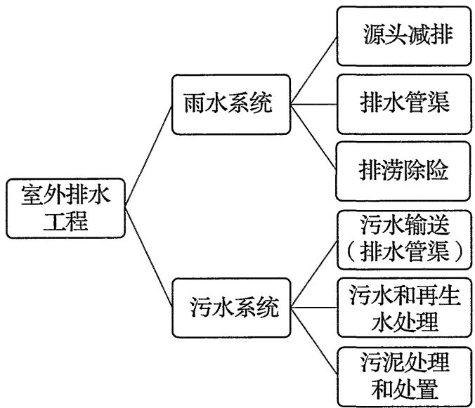
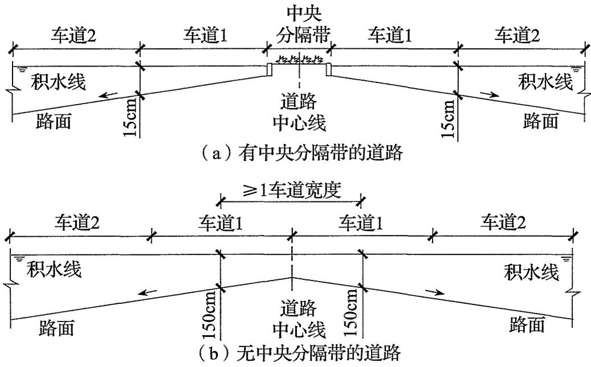
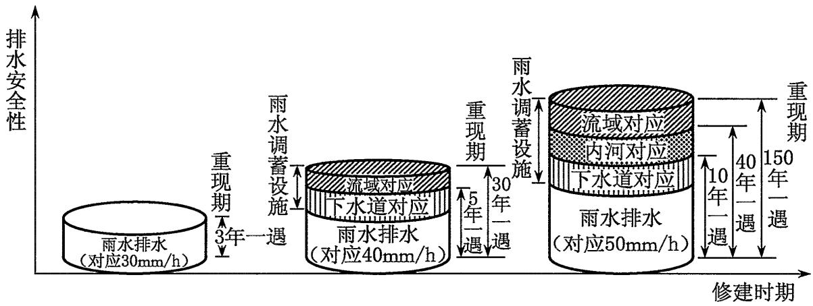
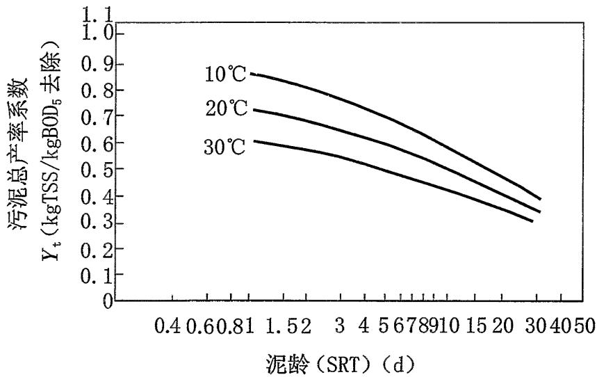
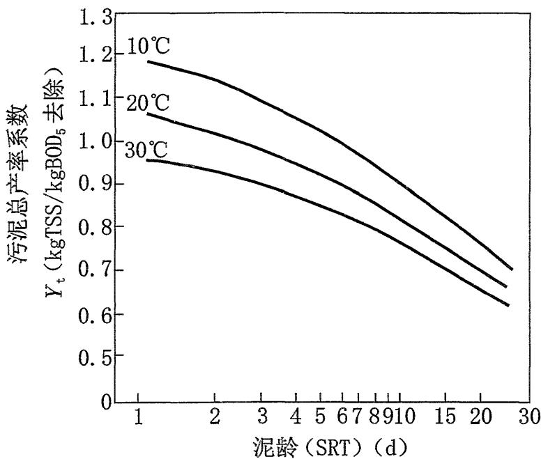
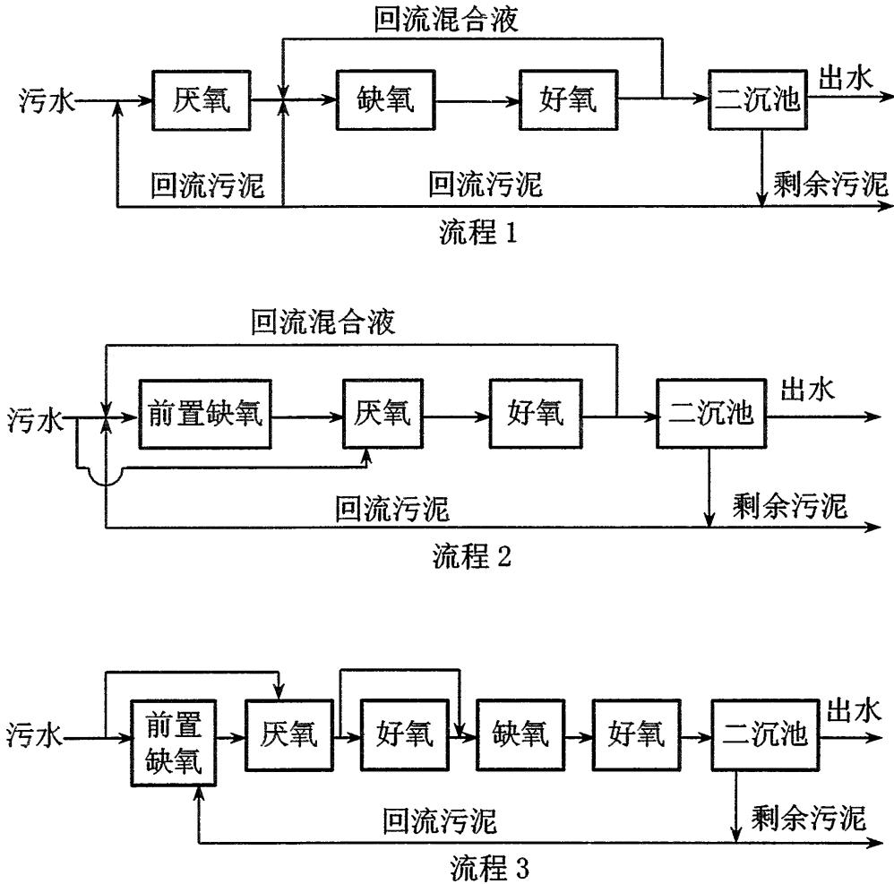
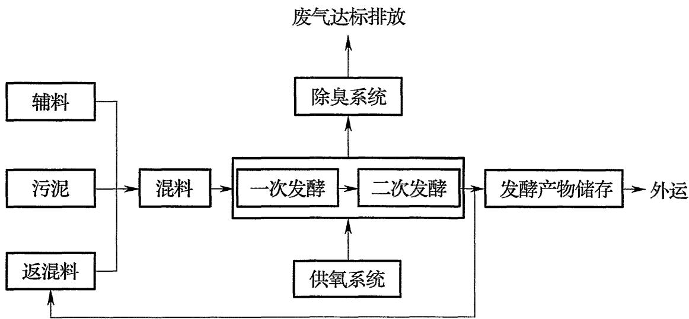
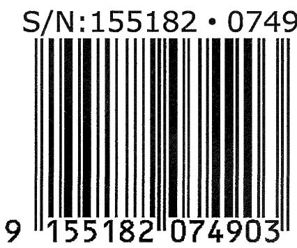

# GB 50014-2021_室外排水设计标准

<!-- 由 MinerU 分片产物合并生成；共 2/2 片；源目录：md文件/GB 50014-2021_室外排水设计标准/ -->

<!-- ===== 分片 p1-200（200页，源：GB 50014-2021_室外排水设计标准（1-200页））===== -->

GB 50014-2021

# 室外排水设计标准

# Standard for design of outdoor wastewater engineering

2021-04-09 发布

2021-10-01 实施

中华人民共和国住房和城乡建设部

国家市场监督管理总局

联合发布

# 中华人民共和国国家标准

# 室外排水设计标准

## Standard for design of outdoor wastewater engineering

## GB 50014-2021

主编部门：上海市住房和城乡建设管理委员会

批准部门：中华人民共和国住房和城乡建设部

施行日期：2 0 2 1 年 1 0 月 1 日

中国计划出版社

2021 北 京

# 中华人民共和国国家标准室外排水设计标准

GB 50014-2021

中国计划出版社出版发行

网址：www.jhpress.com

地址：北京市西城区木樨地北里甲11号国宏大厦C座3层邮政编码：100038电话：（010）63906433（发行部）三河富华印刷包装有限公司印刷

850mm×1168mm 1/32 9 印张 228千字

2021年5月第1版2021年5月第1次印刷

☆

统一书号：155182·0749

定价：101.00元

版权所有侵权必究

侵权举报电话：（010）63906404

如有印装质量问题，请寄本社出版部调换

# 中华人民共和国住房和城乡建设部公告

2021年第58号

# 住房和城乡建设部关于发布国家标准《室外排水设计标准》的公告

现批准《室外排水设计标准》为国家标准，编号为GB 50014-2021，自2021年10月1日起实施。其中，第3.3.3、4.1.6、5.6.1、5.15.3、6.1.12、7.1.11、7.1.13、7.3.8、7.11.3、7.12.4、8.3.15、8.3.16、8.3.18、8.3.20条为强制性条文，必须严格执行。原国家标准《室外排水设计规范》GB50014-2006同时废止。

本标准在住房和城乡建设部门户网站(www.mohurd.gov.cn)公开，并由住房和城乡建设部标准定额研究所组织中国计划出版社有限公司出版发行。

中华人民共和国住房和城乡建设部

2021年4月9日

## 前 言

按照住房和城乡建设部《关于印发〈2017年工程建设标准规范制修订及相关工作计划>的通知》(建标〔2016〕248号)的要求，标准编制组经广泛调查研究，认真总结我国实践经验，参考国外发达国家有关标准，并在广泛征求意见的基础上，修订本标准。

本标准的主要技术内容是：总则，术语，排水工程，设计流量和设计水质，排水管渠和附属构筑物，泵站，污水和再生水处理，污泥处理和处置，检测和控制等。

本标准修订的主要技术内容是：

1.补充和修改了部分术语；

2.新增第3章排水工程，系统规定室外排水工程的组成和相互关系；

3.补充了管道进入综合管廊、绿色雨水调蓄设施、倒虹管基础、高架道路和下穿立交道路排水等内容；

4.补充了下穿立交道路泵站集水池内容；

5.删除了塔式生物滤池和土地处理等工艺，补充了膜生物反应器(MBR)、移动床生物膜反应器(MBBR)和人工湿地等应用广泛且运行可靠的工艺；

6.补充了高含固厌氧消化、好氧发酵、石灰稳定、深度脱水、污泥干化焚烧、除臭等内容；

7.补充和提高了污水处理和污泥处理处置设计标准；

8.新增了信息化、智能化等智慧排水系统的内容。

本标准中以黑体字标志的条文为强制性条文，必须严格执行。

本标准由住房和城乡建设部负责管理和对强制性条文的解释，由上海市政工程设计研究总院(集团)有限公司负责具体技术内容的解释。执行过程中如有意见或建议，请寄送上海市政工程

设计研究总院(集团)有限公司(地址：上海市中山北二路901号；  
邮编：200092）。

本标准主编单位：上海市政工程设计研究总院(集团)有限公司

本标准参编单位：北京市市政工程设计研究总院有限公司中国市政工程东北设计研究总院有限公司中国市政工程华北设计研究总院有限公司中国市政工程西北设计研究院有限公司中国市政工程中南设计研究总院有限公司天津市市政工程设计研究总院中国市政工程西南设计研究总院有限公司

本标准主要起草人员：张 辰 李 艺 陈 嫣 厉彦松李成江 马小蕾 李树苑 王秀朵罗万申 王锡清 胡维杰 李滨赵 明 任玉辉 吕永鹏 谭学军李春鞠 冯 凯 杨 红 张德跃史春海 刘向荣 付忠志 张 欣俞士静 陆继诚 周质炎 杨 雪邹伟国 李伦 朱文美 姚玉健杨雪 李金龙 雷培树

本标准主要审查人员：侯立安张杰 任南琪 徐祖信杭世珺 章林伟 戴晓虎 唐建国席劲瑛 邹惠君 王卫君

## 目 次

1总则…………………………………………………(1)  
2术语…………………………………………………(3）  
3排水工程……………………………………………(8)  
3.1 般规定………………………………………………(8)  
3.2 雨水系统………………………………………………(8)  
3.3 污水系统………………………………………………(9)  
4 设计流量和设计水质……………………………(11)  
4.1 设计流量………………………………………………(11)  
4.2 设计水质………………………………………………(16)  
5 排水管渠和附属构筑物………………………………(18)  
5.1般规定……………………………………………(18)  
5.2 水力计算………………………………………………(19)  
5.3管道……………………………………………………………(23)  
5.4 检查井…………………………………………………(24)  
5.5跌水井……………………………………………(26)  
5.6水封井……………………………………(26)  
5.7雨水口……………………………………………………(26)  
5.8截流设施……………………………………………(27)  
5.9出水口…………………………………………………(28)  
5.10 立体交叉道路排水……………………………………（28)  
5.11 倒虹管…………………………………………………(29)  
5.12 渗透管渠………………………………………………(30)  
5.13渠道……………………………………………(31)  
5.14 雨水调蓄设施…………………………………………(32)  
5.15管道综合………………………………………………(33)  
6泵站…………………………………………………(35)  
6.1般规定………………………………………………(35)  
6.2 设计流量和设计扬程…………………………………（36）  
6.3集水池……………………………………………(37)  
6.4 泵房设计………………………………………………(38)  
6.5出水设施………………………………………………(40)  
7污水和再生水处理………………………………………（42)  
7.1一般规定………… …(42)  
7.2厂址选择和总体布置……………………………………（43)  
7.3格栅………… …………(47)  
7.4 沉砂池…………………(48)  
7.5 沉淀池……………………………………………………(49)  
7.6 活性污泥法……………………………………………(52)  
7.7 回流污泥和剩余污泥……………………………………（64)  
7.8生物膜法………………………………………………(65)  
7.9供氧设施………………………………………………(69)  
7.10 化学除磷……………………………………………(73)  
7.11 深度和再生处理………………………………………(73)  
7.12 自然处理………………………………………………(77)  
7.13消毒……………………………………………………(80)  
8 污泥处理和处置……………………………………(82)  
8.1 般规定………………………………………………(82)  
8.2 污泥浓缩………………………………………………(83)  
8.3 污泥消化………………………………………………(83)  
8.4 污泥好氧发酵……………………………………………(87)  
8.5 污泥机械脱水……………………………………………(90)  
8.6污泥石灰稳定…………………………………(91)  
8.7 污泥干化………………………………………………(92)  
8.8污泥焚烧…………………  
8.9污泥处置和综合利用……………………………………(94)  
8.10污泥输送和贮存………………………………………(95)  
8.11除臭……………………………………………………(96)  
9检测和控制…………………………………………(99)  
9.1般规定………………………………………………(99)  
9.2 检测……………………………(99)  
9.3 自动化…………………………………………………(100)  
9.4 信息化……………………………………………………(100)  
9.5 智能化…………………………………………………(101)  
9.6智慧排水系统………………………  
附录A 年径流总量控制率对应的设计降雨量  
计算方法……… ……………………(103)  
附录B 暴雨强度公式的编制方法…………………………(104)  
附录C 排水管道和其他地下管线(构筑物)  
的最小净距……………………………………(106)  
本标准用词说明………………………………(108)  
引用标准名录………………………………………(109)  
附:条文说明…………

## Contents

1 General provisions………………………(1)   
2 Terms （3）   
3 Wastewater engineering （8）   
3.1 Gerenal requirements …（8)   
3.2 Stormwater system ……… （8）   
3.3 Wastewater system ……… (9）   
4 Design flow and waste loads ……………… (11)   
4.1 Design flow （11)   
4.2 Design waste loads … (16)   
5 Sewer and ancillaries （18)   
5.1 Gerenal requirements （18）   
5.2 Hydraulic design （19)   
5.3 Pipelines （23）   
5.4 Manholes … (24)   
5.5 Drop manholes （26)   
5.6 Water sealed manholes …（26）   
5.7 Stormwater inlets (26)   
5.8 Intercepting facilities … （27）   
5.9 Outfalls … （28）   
5.10 Interchange drainage （28）   
5.11 Inverted siphons （29）   
5.12 Percolation underdrain （30）   
5.13 Channels … （31）   
5. 14 Stormwater detention and retention facilities ………… ( 32 )   
5.15 Relation to other utilities …………………(33)   
6 Pump station ……… …(35)   
6.1 General requirements …(35)   
6.2 Design flow and head ……   
6.3 Wet wells …… ………(37)   
6.4 Pump houses …… ………(38)   
6.5 Discharge facilities …   
7 Wastewater and reclaimed water treatment ………… (42)   
7.1 General requirements ….   
7.2 Site selection and general layout ……… (43)   
7.3 Screenings …   
7.4 Grit removal chambers ……（48）   
7.5 Settling tanks … ………(49)   
7.6 Activated sludge process ……… …………（52）   
7.7 Returned sludge and excess sludge …… ………（64）   
7.8 Attached growth process ………（65）   
7.9 Aeration   
7.10 Chemical phosphrus removal ………………(73)   
7.11 Advanced treatment and wastewater relaimation ………… ( 73 )   
7.12 Constrcted wetlands and stabilization ponds …… ( 77)   
7.13 Disinfection… …………(80)   
8 Sludge treatment and disposal   
8.1 General requirements…   
8.2 Sludge thickening   
8.3 Sludge digestion …… ………（83）   
8.4 Sludge compost …   
8.5 Sludge dewatering ………   
8.6 Lime stablization of sludge …………… (91)   
8.7 Sludge drying …   
8.8 Sludge incineration (94)   
8.9 Sludge disposal and utilization (94)   
8.10 Sludge transportation and storage (95)   
8.11 Odor control (96)   
9 Monitoring and control (99)   
9.1 General requirements (99)   
9.2 Monitoring (99)   
9.3 Automation (100)   
9.4 Informatization (100)   
9.5 Intelectualization (101)   
9.6 Smart drainage system (101)   
Appendix A Conversion between volume capture   
ratio of annual rainfall and design   
rainfall depth … (103)   
Appendix B Statistical methods for obtaining   
design rainfall intensity (104)   
Appendix C Minimus clearance between sewers   
and other utilities (106)   
Explanation of wording in this standard (108)   
List of quoted standards (109)   
Addition:Explanation of provisions (111)

## 1 总 则

1.0.1 为保障城市安全，科学设计室外排水工程，落实海绵城市建设理念，防治城市内涝灾害和水污染，改善和保护环境，促进资源利用，提高人民健康水平，制定本标准。

1.0.2本标准适用于新建、扩建和改建的城镇、工业区和居住区的永久性室外排水工程设计。

1.0.3 排水工程设计应以经批准的城镇总体规划、海绵城市专项规划、城镇排水与污水处理规划和城镇内涝防治专项规划为主要依据，从全局出发，综合考虑规划年限、工程规模、经济效益、社会效益和环境效益，正确处理近期与远期、集中与分散、排放与利用的关系，通过全面论证，做到安全可靠、保护环境、节约土地、经济合理、技术先进且适合当地实际情况。

1.0.4排水工程设计应与水资源、城镇给水、水污染防治、生态环境保护、环境卫生、城市防洪、交通、绿地系统、河湖水系等专项规划和设计相协调。根据城镇规划蓝线和水面率的要求，应充分利用自然蓄水排水设施，并应根据用地性质规定不同地区的高程布置，满足不同地区的排水要求。

1.0.5 排水工程的设计应符合下列规定：

1包括雨水的安全排放、资源利用和污染控制，污水和再生水的处理，污泥的处理和处置；

2 与邻近区域内的雨水系统和污水系统相协调；

3 可适当改造原有排水工程设施，充分发挥其工程效能。

1.0.6 排水工程的设计应在不断总结科研和生产实践经验的基础上，积极采用新技术、新工艺、新材料、新设备。

1.0.7排水工程的设备应实现机械化、自动化，逐步实现智能化。

1.0.8 排水工程的设计除应按本标准执行外，尚应符合国家现行相关标准的规定。

## 2 术 语

## 2.0.1 排水工程 wastewater engineering

收集、输送、处理、再生污水和雨水的工程。

2.0.2 雨水系统 stormwater system

下渗、蓄滞、收集、输送、处理和利用雨水的设施以一定方式组合成的总体，涵盖从雨水径流的产生到末端排放的全过程管理及预警和应急措施等。

## 2.0.3 污水系统 wastewater system

收集、输送、处理、再生和处置城镇污水的设施以一定方式组合成的总体。

## 2.0.4 排水设施 wastewater facilities

排水工程中的管道、构筑物和设备等的统称。

2.0.5 合流制溢流 combined sewer overflow(CSO)

合流制排水系统降雨时，超过截流能力而排入水体的合流污水。

## 2.0.6 径流污染 runoff pollution

通过降雨和地表径流冲刷，将大气和地表中的污染物带入受纳水体，使受纳水体遭受污染的现象，是城市面源污染的主要来源。

2.0.7 年径流总量控制率 volume capture ratio of annualrainfall

通过自然与人工强化的渗透、滞蓄、净化等方式控制城市建设下垫面的降雨径流，得到控制的年均降雨量与年均降雨总量的比值。

## 2.0.8 低影响开发 low impact development(LID)

强调城镇开发应减少对环境的影响，其核心是基于源头控制和降低冲击负荷的理念，构建与自然相适应的排水系统，合理利用空间和采取相应措施削减暴雨径流产生的峰值和总量，延缓峰值流量出现时间，减少城镇面源污染。

## 2.0.9 旱流污水 dry weather flow(DWF)

晴天时的城镇污水，包括综合生活污水量、工业废水量和入渗地下水量。

2.0.10 旱季设计流量 maximum dry weather flowrate晴天时最高日最高时的城镇污水量。

## 2.0.11 雨季设计流量 wet weather flowrate

分流制的雨季设计流量是旱季设计流量和截流雨水量的总和。合流制的雨季设计流量就是截流后的合流污水量。

## 2.0.12 截流雨水量 intercepted stormwater

排水系统中截流的雨水，这部分雨水通过污水管道送至城镇污水处理厂，以控制城镇地表径流污染。

2.0.13 综合生活污水量变化系数 overall peaking factor最高日最高时污水量与平均日平均时污水量的比值。

## 2.0.14 径流量 runoff

降落到地面的雨水超出一定区域内地面渗透、滞蓄能力后多余水量，由地面汇流至管渠到受纳水体的流量的统称。

## 2.0.15 雨水管渠设计重现期 recurrence interval for stormsewer design

用于进行雨水管渠设计的暴雨重现期。

2.0.16 内涝防治设计重现期 recurrence interval for urban flooding design

用于进行城镇内涝防治系统设计的暴雨重现期，使地面、道路等区域的积水深度和退水时间不超过一定的标准。

## 2.0.17 内涝 urban flooding,local flooding

强降雨或连续性降雨超过城镇排水能力，导致城镇地面产生积水灾害的现象。

## 2.0.18 内涝防治系统 urban flooding prevention and control system

用于防止和应对城镇内涝的工程性设施和非工程性措施以一定方式组合成的总体，包括雨水收集、输送、调蓄、行泄、处理、利用的天然和人工设施及管理措施等。

## 2.0.19 渗透管渠 percolation underdrain

用于雨水下渗、转输或临时储存的管渠。

## 2.0.20 格栅除污机 bar screen machine

用机械的方法，将格栅截留的栅渣清捞出的机械。

## 2.0.21 辐流沉淀池 radial flow settling tank

污水沿径向减速流动，使污水中的固体物沉降的水池。

2.0.22 斜管(板)沉淀池inclined tube(plate)settling tank水池中加斜管(板)，使污水中的固体物高效沉降的水池。

## 2.0.23 高效沉淀池 high efficiency settling tank

通过污水与回流污泥混合、絮凝增大悬浮物尺寸或添加砂、磁粉等重介质提高絮凝体密度，以加速沉降的水池。

## 2.0.24 厌氧/缺氧/好氧脱氮除磷工艺 anaerobic/anoxic/ oxic process

污水经过厌氧、缺氧、好氧交替状态处理，提高总氮和总磷去除率的生物处理，也称AAO或A²O工艺。

## 2.0.25 充水比 fill ratio

序批式活性污泥法工艺一个周期中，进入反应池的污水量与反应池有效容积之比。

## 2.0.26 膜生物反应器 membrane bioreactor(MBR)

将生物反应与膜过滤相结合，利用膜作为分离介质替代常规

重力沉淀进行固液分离获得出水的污水处理系统。

## 2.0.27 表面硝化负荷 surface nitrification loading rate

生物反应池单位面积单位时间承担的氨氮千克数。其计量单位通常以 $\mathrm { N H } _ { 3 } { - } \mathrm { N } / ( \mathrm { m } ^ { 2 } \mathrm { ~ \bullet ~ d } )$ 表示。

## 2.0.28 移动床生物膜反应器 moving bed biofilm reactor(MBBR)

依靠在水流和气流作用下处于流化态的载体表面的生物膜对污染物吸附、氧化和分解，使污水得以净化的污水处理构筑物。

## 2.0.29 填充率 filling ratio

生物膜反应器内，填料的体积和填料所在反应区池容的比例。

## 2.0.30 有效比表面积 effective specific surface area

在移动床生物膜反应器内单位体积悬浮载体填料上可供生物膜附着生长，且保证良好传质和保护生物膜不被冲刷的表面积。

## 2.0.31 转盘滤池 disc filter

由水平轴串起若干彼此平行、包裹着滤布、中空的过滤转盘进行污水过滤的装置。

## 2.0.32 表面流人工湿地 free surface flow constructed wet-land

污水以水平流方式从湿地的首段流至末端，且内部不设置填料的人工湿地。

## 2.0.33 水平潜流人工湿地 horizontal subsurface flow con-structed wetland

污水以水平流方式从湿地的首端流至末端，且内部设置填料的人工湿地。

## 2.0.34 垂直潜流人工湿地 vertical subsurface flow constructed wetland

污水以垂直流方式从湿地的顶部流至底部或者从底部流至顶部，且内部设置填料的人工湿地。

## 2.0.35 紫外线有效剂量 effective ultraviolet dose

经生物验定测试得到的照射到生物体上的紫外线量(即紫外线生物验定剂量）。

## 2.0.36 污泥干化 sludge drying

通过渗滤或蒸发等作用，从脱水污泥中去除水分的过程。

## 2.0.37 污泥好氧发酵 sludge compost

在充分供氧的条件下，污泥在好氧微生物的作用下产生较高温度使有机物生物降解及无害化，最终生成性质稳定腐殖化产物的过程。

## 2.0.38 污泥综合利用 sludge integrated application

将处理后的污泥作为有用的原材料在各种用途上加以利用的方法。

## 2.0.39 除臭系统 odor control system

将臭气从源头收集、处理到末端排放的设施，包括臭气源加盖、臭气收集、臭气处理和处理后排放等。

## 3排水工程

## 3.1一般规定

3.1.1 排水工程包括雨水系统和污水系统，应遵循从源头到末端的全过程管理和控制。雨水系统和污水系统应相互配合、有效衔接。

3.1.2 排水体制(分流制或合流制)的选择应根据城镇的总体规划，结合当地的气候特征、地形特点、水文条件、水体状况、原有排水设施、污水处理程度和处理后再生利用等因地制宜地确定，并应符合下列规定：

1 同一城镇的不同地区可采用不同的排水体制。

2 除降雨量少的干旱地区外，新建地区的排水系统应采用分流制。

3分流制排水系统禁止污水接入雨水管网，并应采取截流、调蓄和处理等措施控制径流污染。

4 现有合流制排水系统应通过截流、调蓄和处理等措施，控制溢流污染，还应按城镇排水规划的要求，经方案比较后实施雨污分流改造。

## 3.2雨水系统

3.2.1雨水系统应包括源头减排、排水管渠、排涝除险等工程性措施和应急管理的非工程性措施，并应与防洪设施相衔接。

3.2.2 源头减排设施应有利于雨水就近入渗、调蓄或收集利用，降低雨水径流总量和峰值流量，控制径流污染。

3.2.3 排水管渠设施应确保雨水管渠设计重现期下雨水的转输、

调蓄和排放，并应考虑受纳水体水位的影响。

3.2.4 源头减排设施、排水管渠设施和排涝除险设施应作为整体系统校核，满足内涝防治设计重现期的设计要求。

3.2.5 雨水系统设计应采取工程性和非工程性措施加强城镇应对超过内涝防治设计重现期降雨的韧性，并应采取应急措施避免人员伤亡。灾后应迅速恢复城镇正常秩序。

3.2.6 受有害物质污染场地的雨水径流应单独收集处理，并应达到国家现行相关标准后方可排入排水管渠。

3.2.7 雨水系统设计应采取措施防止洪水对城镇排水工程的影响。

## 3.3污水系统

3.3.1 污水系统应包括收集管网、污水处理、深度和再生处理与污泥处理处置设施。

3.3.2 城镇所有用水过程产生的污水和受污染的雨水径流应纳入污水系统。配套管网应同步建设和同步投运，实现厂网一体化建设和运行。

3.3.3 排入城镇污水管网的污水水质必须符合国家现行标准的规定，不应影响城镇排水管渠和污水厂等的正常运行；不应对养护管理人员造成危害；不应影响处理后出水的再生利用和安全排放；不应影响污泥的处理和处置。

3.3.4工业园区的污、废水应优先考虑单独收集、处理，并应达标后排放。

3.3.5 污水系统设计应有防止外来水进入的措施。

3.3.6 城镇已建有污水收集和集中处理设施时，分流制排水系统不应设置化粪池。

3.3.7 污水处理应根据国家现行相关排放标准、污水水质特征、处理后出水用途等科学确定污水处理程度，合理选择处理工艺。

3.3.8 污水处理中排放的污水、污泥、臭气和噪声应符合国家现行标准的规定。

3.3.9 再生水处理目标应根据国家现行标准和再生水规划确定。

3.3.10 城镇污水厂应同步建设污泥处理处置设施，并应进行减量化、稳定化和无害化处理，在保证安全、环保和经济的前提下，实现污泥的能源和资源利用。

3.3.11 排水工程设计应妥善处理污水与再生水处理及污泥处理过程中产生的固体废弃物，应防止对环境的二次污染。

# 4 设计流量和设计水质

## 4.1设计流量

## I 雨水量

4.1.1 源头减排设施的设计水量应根据年径流总量控制率确定，并应明确相应的设计降雨量，可按本标准附录A的规定进行计算。

4.1.2 当降雨量小于规划确定的年径流总量控制率所对应的降雨量时，源头减排设施应能保证不直接向市政雨水管渠排放未经控制的雨水。

4.1.3 雨水管渠的设计流量应根据雨水管渠设计重现期确定。雨水管渠设计重现期应根据汇水地区性质、城镇类型、地形特点和气候特征等因素，经技术经济比较后按表4.1.3的规定取值，并明确相应的设计降雨强度，且应符合下列规定：

表 4.1.3 雨水管渠设计重现期(年)
<table><tr><td rowspan=2 colspan=1>城镇类型</td><td rowspan=1 colspan=4>城区类型</td></tr><tr><td rowspan=1 colspan=1>中心城区</td><td rowspan=1 colspan=1>非中心城区</td><td rowspan=1 colspan=1>中心城区的重要地区</td><td rowspan=1 colspan=1>中心城区地下通道和下沉式广场等</td></tr><tr><td rowspan=1 colspan=1>超大城市和特大城市</td><td rowspan=1 colspan=1>3~5</td><td rowspan=1 colspan=1>2~3</td><td rowspan=1 colspan=1>5~10</td><td rowspan=1 colspan=1>30~50</td></tr><tr><td rowspan=1 colspan=1>大城市</td><td rowspan=1 colspan=1>2~5</td><td rowspan=1 colspan=1>2~3</td><td rowspan=1 colspan=1>5~10</td><td rowspan=1 colspan=1>20~30</td></tr><tr><td rowspan=1 colspan=1>中等城市和小城市</td><td rowspan=1 colspan=1>2~3</td><td rowspan=1 colspan=1>2~3</td><td rowspan=1 colspan=1>3~5</td><td rowspan=1 colspan=1>10~20</td></tr></table>

注：1 表中所列设计重现期适用于采用年最大值法确定的暴雨强度公式。  
2 雨水管渠按重力流、满管流计算。

3 超大城市指城区常住人口在1000万人以上的城市；特大城市指城区常住人口在500万人以上1000万人以下的城市；大城市指城区常住人口在100万人以上500万人以下的城市；中等城市指城区常住人口在50万人以上100万人以下的城市；小城市指城区常住人口在50万人以下的城市（以上包括本数，以下不包括本数)。

1人口密集、内涝易发且经济条件较好的城镇，应采用规定的设计重现期上限；

2 新建地区应按规定的设计重现期执行，既有地区应结合海绵城市建设、地区改建、道路建设等校核、更新雨水系统，并按规定设计重现期执行；

3 同一雨水系统可采用不同的设计重现期；

4中心城区下穿立交道路的雨水管渠设计重现期应按表4.1.3中“中心城区地下通道和下沉式广场等”的规定执行，非中心城区下穿立交道路的雨水管渠设计重现期不应小于10年，高架道路雨水管渠设计重现期不应小于5年。

4.1.4 排涝除险设施的设计水量应根据内涝防治设计重现期及对应的最大允许退水时间确定。内涝防治设计重现期应根据城镇类型、积水影响程度和内河水位变化等因素，经技术经济比较后按表4.1.4的规定取值，并明确相应的设计降雨量，且应符合下列规定：

1人口密集、内涝易发且经济条件较好的城市，应采用规定的设计重现期上限；

2 目前不具备条件的地区可分期达到标准；

3当地面积水不满足表4.1.4的要求时，应采取渗透、调蓄、设置行泄通道和内河整治等措施；

4 超过内涝设计重现期的暴雨应采取应急措施。

表 4.1.4 内涝防治设计重现期(年)
<table><tr><td rowspan=1 colspan=1>城镇类型</td><td rowspan=1 colspan=1>重现期</td><td rowspan=1 colspan=1>地面积水设计标准</td></tr><tr><td rowspan=1 colspan=1>超大城市</td><td rowspan=1 colspan=1>100</td><td rowspan=4 colspan=1>1 居民住宅和工商业建筑物的底层不进水；2 道路中一条车道的积水深度不超过15cm</td></tr><tr><td rowspan=1 colspan=1>特大城市</td><td rowspan=1 colspan=1>50~100</td></tr><tr><td rowspan=1 colspan=1>大城市</td><td rowspan=1 colspan=1>30~50</td></tr><tr><td rowspan=1 colspan=1>中等城市和小城市</td><td rowspan=1 colspan=1>20~30</td></tr></table>

注：详见表4.1.3的注3。

4.1.5 内涝防治设计重现期下的最大允许退水时间应符合表4.1.5的规定。人口密集、内涝易发、特别重要且经济条件较好的城区，最大允许退水时间应采用规定的下限。交通枢纽的最大允许退水时间应为0.5h。

表4.1.5 内涝防治设计重现期下的最大允许退水时间(h)
<table><tr><td rowspan=1 colspan=1>城区类型</td><td rowspan=1 colspan=1>中心城区</td><td rowspan=1 colspan=1>非中心城区</td><td rowspan=1 colspan=1>中心城区的重要地区</td></tr><tr><td rowspan=1 colspan=1>最大允许退水时间</td><td rowspan=1 colspan=1>1.0~3.0</td><td rowspan=1 colspan=1>1.5~4.0</td><td rowspan=1 colspan=1>0.5~2.0</td></tr></table>

注：本标准规定的最大允许退水时间为雨停后的地面积水的最大允许排干时间。

4.1.6当地区改建时，改建后相同设计重现期的径流量不得超过原径流量。

4.1.7当采用推理公式法时，排水管渠的雨水设计流量应按下式计算。当汇水面积大于 $2 \mathrm { k m } ^ { 2 }$ 时，应考虑区域降雨和地面渗透性能的时空分布不均匀性和管网汇流过程等因素，采用数学模型法确定雨水设计流量。

$$
Q _ { \mathrm { s } } { = } q \Psi F\tag{4.1.7}
$$

式中： $Q _ { s }$ —雨水设计流量 $\left( \mathrm { L } / \mathrm { s } \right)$

q——设计暴雨强度 $\left[ \mathrm { L } / ( \mathrm { h m } ^ { 2 } \cdot \mathrm { s } ) \right]$ i

Ψ——综合径流系数；

F——汇水面积 $\mathrm { ( h m } ^ { 2 } \mathrm { ) }$ o

4.1.8 综合径流系数应严格按规划确定的控制，并应符合下列规定：

1 综合径流系数高于0.7的地区应采用渗透、调蓄等措施。

2 综合径流系数可根据表4.1.8-1规定的径流系数，通过地面种类加权平均计算得到，也可按表4.1.8-2的规定取值，并应核实地面种类的组成和比例。

3 采用推理公式法进行内涝防治设计校核时，宜提高表4.1.8-1中规定的径流系数。当设计重现期为20年～30年时，宜将径流系数提高10%～15%；当设计重现期为30年～50年时，宜将径流系数提高20%～25%；当设计重现期为50年～100年时，宜将径流系数提高30%～50%；当计算的径流系数大于1时，应按1取值。

表 4.1.8-1 径流系数
<table><tr><td rowspan=1 colspan=1>地面种类</td><td rowspan=1 colspan=1>径流系数</td></tr><tr><td rowspan=1 colspan=1>各种屋面、混凝土或沥青路面</td><td rowspan=1 colspan=1>0.85~0.95</td></tr><tr><td rowspan=1 colspan=1>大块石铺砌路面或沥青表面各种的碎石路面</td><td rowspan=1 colspan=1>0.55~0.65</td></tr><tr><td rowspan=1 colspan=1>级配碎石路面</td><td rowspan=1 colspan=1>0.40~0.50</td></tr><tr><td rowspan=1 colspan=1>干砌砖石或碎石路面</td><td rowspan=1 colspan=1>0.35~0.40</td></tr><tr><td rowspan=1 colspan=1>非铺砌土路面</td><td rowspan=1 colspan=1>0.25~0.35</td></tr><tr><td rowspan=1 colspan=1>公园或绿地</td><td rowspan=1 colspan=1>0.10~0.20</td></tr></table>

表 4.1.8-2 综合径流系数
<table><tr><td rowspan=1 colspan=1>区域情况</td><td rowspan=1 colspan=1>综合径流系数</td></tr><tr><td rowspan=1 colspan=1>城镇建筑密集区</td><td rowspan=1 colspan=1>0.60~0.70</td></tr><tr><td rowspan=1 colspan=1>城镇建筑较密集区</td><td rowspan=1 colspan=1>0.45~0.60</td></tr><tr><td rowspan=1 colspan=1>城镇建筑稀疏区</td><td rowspan=1 colspan=1>0.20~0.45</td></tr></table>

4.1.9 设计暴雨强度应按下式计算：

$$
q = \frac { 1 6 7 A _ { 1 } ( 1 + C \mathrm { l g } P ) } { ( t + b ) ^ { n } }\tag{4.1.9}
$$

式中： $q \mathrm { - }$ ——设计暴雨强度 $\left[ \mathrm { L } / ( \mathrm { h m } ^ { 2 } \cdot \mathrm { s } ) \right]$

$P ^ { . }$ 设计重现期(年)；

t——降雨历时(min);

$A _ { 1 } , C , b , n ^ { - }$ 参数，根据统计方法进行计算确定。

具有20年以上自记雨量记录的地区，排水系统设计暴雨强度公式应采用年最大值法，并应按本标准附录B的规定编制。

4.1.10 暴雨强度公式应根据气候变化进行修订。

4.1.11 雨水管渠的降雨历时应按下式计算：

$$
t { = } t _ { 1 } + t _ { 2 }\tag{4.1.11}
$$

式中：t——降雨历时(min)；

$t _ { 1 }$ ——地面集水时间(min)，应根据汇水距离、地形坡度和地

面种类通过计算确定，宜采用5min～15min;

$t _ { 2 }$ —管渠内雨水流行时间(min)。

## Ⅱ污水量

4.1.12 污水系统设计中应确定旱季设计流量和雨季设计流量。

4.1.13 分流制污水系统的旱季设计流量应按下式计算：

$$
Q _ { \mathrm { d r } } { = } K Q _ { \mathrm { d } } { + } K ^ { \prime } Q _ { \mathrm { m } } { + } Q _ { \mathrm { u } }\tag{4.1.13}
$$

式中： $Q _ { \mathrm { d r } }$ ——旱季设计流量(L/s);

$K \cdot$ ——综合生活污水量变化系数；

$Q _ { \mathrm { d } }$ ——设计综合生活污水量(L/s)；

$K ^ { \prime }$ ——工业废水量变化系数；

$Q _ { \mathrm { m } }$ ——设计工业废水量(L/s);

$Q _ { \mathrm { u } }$ 入渗地下水量(L/s)，在地下水位较高地区，应予以考虑。

4.1.14 综合生活污水定额应根据当地采用的用水定额，结合建筑内部给排水设施水平确定，可按当地相关用水定额的90%采用。

4.1.15 综合生活污水量变化系数可根据当地实际综合生活污水量变化资料确定。无测定资料时，新建项目可按表4.1.15的规定取值；改、扩建项目可根据实际条件，经实际流量分析后确定，也可按表4.1.15的规定，分期扩建。

表 4.1.15 综合生活污水量变化系数
<table><tr><td rowspan=1 colspan=1>平均日流量 $\left( \mathbf { L } / \mathbf { s } \right)$ </td><td rowspan=1 colspan=1>5</td><td rowspan=1 colspan=1>15</td><td rowspan=1 colspan=1>40</td><td rowspan=1 colspan=1>70</td><td rowspan=1 colspan=1>100</td><td rowspan=1 colspan=1>200</td><td rowspan=1 colspan=1>500</td><td rowspan=1 colspan=1> ${ \geqslant } 1 0 0 0$ </td></tr><tr><td rowspan=1 colspan=1>变化系数</td><td rowspan=1 colspan=1>2.7</td><td rowspan=1 colspan=1>2.4</td><td rowspan=1 colspan=1>2.1</td><td rowspan=1 colspan=1>2.0</td><td rowspan=1 colspan=1>1.9</td><td rowspan=1 colspan=1>1.8</td><td rowspan=1 colspan=1>1.6</td><td rowspan=1 colspan=1>1.5</td></tr></table>

注：当污水平均日流量为中间数值时，变化系数可用内插法求得。

4.1.16 设计工业废水量应根据工业企业工艺特点确定，工业企业的生活污水量应符合现行国家标准《建筑给水排水设计标准》GB 50015 的有关规定。

4.1.17 工业废水量变化系数应根据工艺特点和工作班次确定。

4.1.18 入渗地下水量应根据地下水位情况和管渠性质经测算后研究确定。

4.1.19 分流制污水系统的雨季设计流量应在旱季设计流量基础上，根据调查资料增加截流雨水量。

4.1.20分流制截流雨水量应根据受纳水体的环境容量、雨水受污染情况、源头减排设施规模和排水区域大小等因素确定。

4.1.21分流制污水管道应按旱季设计流量设计，并在雨季设计流量下校核。

4.1.22 截流井前合流管道的设计流量应按下式计算：

$$
Q { = } Q _ { \mathrm { d } } { + } Q _ { \mathrm { m } } { + } Q _ { \mathrm { s } }\tag{4.1.22}
$$

式中：Q——设计流量(L/s)；

$Q _ { \mathrm { d } }$ ——设计综合生活污水量 $\left( \mathrm { L } / \mathbf { s } \right)$

$Q _ { \mathrm { m } }$ ——设计工业废水量(L/s)；

$Q _ { s }$ ——雨水设计流量(L/s)。

4.1.23 合流污水的截流量应根据受纳水体的环境容量，由溢流污染控制目标确定。截流的合流污水可输送至污水厂或调蓄设施。输送至污水厂时，设计流量应按下式计算：

$$
Q ^ { \prime } { = } ( n _ { 0 } { + } 1 ) \times ( Q _ { \mathrm { d } } { + } Q _ { \mathrm { m } } )\tag{4.1.23}
$$

式中： $\boldsymbol { Q } ^ { \prime }$ ——截流后污水管道的设计流量(L/s)；

$\pmb { n } _ { 0 }$ ——截流倍数。

4.1.24 截流倍数应根据旱流污水的水质、水量、受纳水体的环境容量和排水区域大小等因素经计算确定，宜采用2～5，并宜采取调蓄等措施，提高截流标准，减少合流制溢流污染对河道的影响。同一排水系统中可采用不同截流倍数。

## 4.2设计水质

4.2.1 城镇污水的设计水质应根据调查资料确定，或参照邻近城镇、类似工业区和居住区的水质确定。当无调查资料时，可按下列规定采用：

1 生活污水的五日生化需氧量可按 $4 0 \mathrm { g / ( \mathcal { L } \cdot \mathrm { d } ) \sim } 6 0 \mathrm { g / ( \mathcal { L } \cdot \mathrm { d } ) }$ 计算；

2 生活污水的悬浮固体量可按 $4 0 \mathrm { g / ( \mathcal { L } \cdot \mathrm { d } ) } { \sim } 7 0 \mathrm { g / ( \mathcal { L } \cdot \mathrm { d } ) }$ 计算；

3 生活污水的总氮量可按 $8 \mathrm { g } / ( \Lambda \cdot \mathrm { d } ) { \sim } 1 2 \mathrm { g } / ( \Lambda \cdot \mathrm { d } )$ 计算；

4 生活污水的总磷量可按 $0 . 9 8 / ( \lambda \cdot \mathrm { d } ) { \sim } 2 . 5 \mathrm { g } ( \lambda \cdot \mathrm { d } )$ 计算。

4.2.2 污水厂内生物处理构筑物进水的水温宜为 $1 0 ^ { \circ } \mathrm { C } \sim 3 7 ^ { \circ } \mathrm { C }$ pH值宜为6.5\~9.5，营养组合比(五日生化需氧量：氮：磷)可为$1 0 0 : 5 : 1$ 。有工业废水进入时，应考虑有害物质的影响。

# 5 排水管渠和附属构筑物

## 5.1一般规定

5.1.1 排水管渠系统应根据城镇总体规划和建设情况统一布置，分期建设。排水管渠断面尺寸应按远期规划设计流量设计，按现状水量复核，并考虑城镇远景发展的需要。

5.1.2管渠平面位置和高程应根据地形、土质、地下水位、道路情况、原有的和规划的地下设施、施工条件及养护管理方便等因素综合考虑确定，并应与源头减排设施和排涝除险设施的平面和竖向设计相协调，且应符合下列规定：

1 排水干管应布置在排水区域内地势较低或便于雨污水汇集的地带；

2 排水管宜沿城镇道路敷设，并与道路中心线平行，宜设在快车道以外；

3 截流干管宜沿受纳水体岸边布置；

4 管渠高程设计除应考虑地形坡度外，尚应考虑与其他地下设施的关系及接户管的连接方便。

5.1.3 污水和合流污水收集输送时，不应采用明渠。

5.1.4管渠材质、管渠断面、管道基础、管道接口应根据排水水质、水温、冰冻情况、断面尺寸、管内外所受压力、土质、地下水位、地下水侵蚀性、施工条件和对养护工具的适应性等因素进行选择和设计。

5.1.5输送污水、合流污水的管道应采用耐腐蚀材料，其接口和附属构筑物应采取相应的防腐蚀措施。

5.1.6 排水管渠的断面形状应符合下列规定：

1 排水管渠的断面形状应根据设计流量、埋设深度、工程环境条件，并结合当地施工、制管技术水平和经济条件、养护管理要求综合确定，宜优先选用成品管；

2 大型和特大型管渠的断面应方便维修、养护和管理。

5.1.7 当输送易造成管道内沉析的污水时，管道断面形式应考虑维护检修的方便。

5.1.8 雨水管渠和合流管道除应满足雨水管渠设计重现期标准外，尚应与城镇内涝防治系统中的其他设施相协调，并应满足内涝防治的要求。

5.1.9 合流管道的雨水设计重现期可高于同一情况下的雨水管渠设计重现期。

5.1.10 排水管渠系统的设计应以重力流为主，不设或少设提升泵站。当无法采用重力流或重力流不经济时，可采用压力流。

5.1.11 雨水管渠系统的设计宜结合城镇总体规划，利用水体调蓄雨水，并宜根据控制径流污染、削减径流峰值流量、提高雨水利用程度的需求，设置雨水调蓄和处理设施。

5.1.12污水、合流管道及湿陷土、膨胀土、流沙地区的雨水管道和附属构筑物应保证其严密性，并应进行严密性试验。

5.1.13当排水管渠出水口受水体水位顶托时，应根据地区重要性和积水所造成的后果，设置防潮门、闸门或泵站等设施。

5.1.14 排水管渠系统之间可设置连通管，并应符合下列规定：

1 雨水管渠系统和合流管道系统之间不得设置连通管。

2 雨水管渠系统之间或合流管道系统之间可根据需要设置连通管，在连通管处应设闸槽或闸门。连通管和附近闸门井应考虑维护管理的方便。

3 同一圩区内排入不同受纳水体的自排雨水系统之间，根据受纳水体和管道标高情况，在安全前提下可设置连通管。

5.1.15 有条件地区，污水输送干管之间应设置连通管。

## 5.2水力计算

5.2.1 排水管渠的流量应按下式计算：

$$
Q { = } A v\tag{5.2.1}
$$

式中：Q——设计流量 $\mathrm { ( m ^ { 3 } / s ) }$

A——水流有效断面面积 $( \mathbf { m } ^ { 2 } )$

v流速 $\mathrm { ( m / s ) }$

5.2.2 恒定流条件下排水管渠的流速应按下式计算：

$$
v = { \frac { 1 } { n } } R ^ { { \frac { 2 } { 3 } } } I ^ { \frac { 1 } { 2 } }\tag{5.2.2}
$$

式中：v——流速 $\mathrm { ( m / s ) }$ ;

R——水力半径(m);

I——水力坡降；

n粗糙系数。

5.2.3 排水管渠粗糙系数宜按表5.2.3的规定取值。

表 5.2.3 排水管渠粗糙系数
<table><tr><td rowspan=1 colspan=1>管渠类别</td><td rowspan=1 colspan=1>粗糙系数n</td><td rowspan=1 colspan=1>管渠类别</td><td rowspan=1 colspan=1>粗糙系数n</td></tr><tr><td rowspan=1 colspan=1>混凝土管、钢筋混凝土管、水泥砂浆抹面渠道</td><td rowspan=1 colspan=1>0.013~0.014</td><td rowspan=1 colspan=1>土明渠(包括带草皮)</td><td rowspan=1 colspan=1>0.025~0.030</td></tr><tr><td rowspan=1 colspan=1>水泥砂浆内衬球墨铸铁管</td><td rowspan=1 colspan=1>0.011~0.012</td><td rowspan=1 colspan=1>干砌块石渠道</td><td rowspan=1 colspan=1>0.020~0.025</td></tr><tr><td rowspan=1 colspan=1>石棉水泥管、钢管</td><td rowspan=1 colspan=1>0.012</td><td rowspan=1 colspan=1>浆砌块石渠道</td><td rowspan=1 colspan=1>0.017</td></tr><tr><td rowspan=1 colspan=1>UPVC管、PE管、玻璃钢管</td><td rowspan=1 colspan=1>0.009~0.010</td><td rowspan=1 colspan=1>浆砌砖渠道</td><td rowspan=1 colspan=1>0.015</td></tr></table>

5.2.4 排水管渠的最大设计充满度和超高应符合下列规定：

1 重力流污水管道应按非满流计算，其最大设计充满度应按表5.2.4的规定取值。

表 5.2.4 排水管渠的最大设计充满度
<table><tr><td rowspan=1 colspan=1>管径或渠高(mm)</td><td rowspan=1 colspan=1>最大设计充满度</td></tr><tr><td rowspan=1 colspan=1>200~300</td><td rowspan=1 colspan=1>0.55</td></tr><tr><td rowspan=1 colspan=1>350~450</td><td rowspan=1 colspan=1>0.65</td></tr><tr><td rowspan=1 colspan=1>500~900</td><td rowspan=1 colspan=1>0.70</td></tr><tr><td rowspan=1 colspan=1>≥1000</td><td rowspan=1 colspan=1>0.75</td></tr></table>

注：在计算污水管道充满度时，不包括短时突然增加的污水量，但当管径小于或等于300mm时，应按满流复核。

2 雨水管道和合流管道应按满流计算。

3 明渠超高不得小于0.2m。

5.2.5 排水管道的最大设计流速宜符合下列规定：

1 金属管道宜为 10.0m/s;

2 非金属管道宜为 5.0m/s，经试验验证可适当提高。

5.2.6 雨水明渠的最大设计流速应符合下列规定：

1 当水流深度为0.4m\~1.0m时，宜按表5.2.6的规定取值。

表 5.2.6 雨水明渠的最大设计流速(m/s)
<table><tr><td rowspan=1 colspan=1>明渠类别</td><td rowspan=1 colspan=1>最大设计流速</td></tr><tr><td rowspan=1 colspan=1>粗砂或低塑性粉质黏土</td><td rowspan=1 colspan=1>0.8</td></tr><tr><td rowspan=1 colspan=1>粉质黏土</td><td rowspan=1 colspan=1>1.0</td></tr><tr><td rowspan=1 colspan=1>黏土</td><td rowspan=1 colspan=1>1.2</td></tr><tr><td rowspan=1 colspan=1>草皮护面</td><td rowspan=1 colspan=1>1.6</td></tr><tr><td rowspan=1 colspan=1>干砌块石</td><td rowspan=1 colspan=1>2.0</td></tr><tr><td rowspan=1 colspan=1>浆砌块石或浆砌砖</td><td rowspan=1 colspan=1>3.0</td></tr><tr><td rowspan=1 colspan=1>石灰岩和中砂岩</td><td rowspan=1 colspan=1>4.0</td></tr><tr><td rowspan=1 colspan=1>混凝土</td><td rowspan=1 colspan=1>4.0</td></tr></table>

2 当水流深度小于0.4m时，宜按表5.2.6所列最大设计流速乘以0.85计算；当水流深度大于1.0m且小于2.0m时，宜按表5.2.6所列最大设计流速乘以1.25计算；当水流深度不小于2.0m时，宜按表5.2.6所列最大设计流速乘以1.40计算。

5.2.7 排水管渠的最小设计流速应符合下列规定：

1 污水管道在设计充满度下应为 0.6m/s；

2 雨水管道和合流管道在满流时应为 0.75m/s;

3 明渠应为 0.4m/s;

4 设计流速不满足最小设计流速时，应增设防淤积或清淤措施。

5.2.8 压力输泥管的最小设计流速可按表5.2.8的规定取值。

表 5.2.8 压力输泥管的最小设计流速(m/s)
<table><tr><td rowspan=3 colspan=1>污泥含水率(%)</td><td rowspan=1 colspan=2>最小设计流速</td></tr><tr><td rowspan=1 colspan=2>管径(mm)</td></tr><tr><td rowspan=1 colspan=1>150~250</td><td rowspan=1 colspan=1>300~400</td></tr><tr><td rowspan=1 colspan=1>90</td><td rowspan=1 colspan=1>1.5</td><td rowspan=1 colspan=1>1.6</td></tr><tr><td rowspan=1 colspan=1>91</td><td rowspan=1 colspan=1>1.4</td><td rowspan=1 colspan=1>1.5</td></tr><tr><td rowspan=1 colspan=1>92</td><td rowspan=1 colspan=1>1.3</td><td rowspan=1 colspan=1>1.4</td></tr><tr><td rowspan=1 colspan=1>93</td><td rowspan=1 colspan=1>1.2</td><td rowspan=1 colspan=1>1.3</td></tr><tr><td rowspan=1 colspan=1>94</td><td rowspan=1 colspan=1>1.1</td><td rowspan=1 colspan=1>1.2</td></tr><tr><td rowspan=1 colspan=1>95</td><td rowspan=1 colspan=1>1.0</td><td rowspan=1 colspan=1>1.1</td></tr><tr><td rowspan=1 colspan=1>96</td><td rowspan=1 colspan=1>0.9</td><td rowspan=1 colspan=1>1.0</td></tr><tr><td rowspan=1 colspan=1>97</td><td rowspan=1 colspan=1>0.8</td><td rowspan=1 colspan=1>0.9</td></tr><tr><td rowspan=1 colspan=1>98</td><td rowspan=1 colspan=1>0.7</td><td rowspan=1 colspan=1>0.8</td></tr></table>

5.2.9 排水管道采用压力流时，压力管道的设计流速宜采用$0 . 7 \mathrm { m } / \mathrm { s } { \sim } 2 . 0 \mathrm { m } / \mathrm { s } ,$

5.2.10排水管道的最小管径和相应最小设计坡度，宜按表5.2.10的规定取值。

表 5.2.10 最小管径和相应最小设计坡度
<table><tr><td rowspan=1 colspan=1>管道类别</td><td rowspan=1 colspan=1>最小管径(mm)</td><td rowspan=1 colspan=1>相应最小设计坡度</td></tr><tr><td rowspan=1 colspan=1>污水管、合流管</td><td rowspan=1 colspan=1>300</td><td rowspan=1 colspan=1>0.003</td></tr><tr><td rowspan=1 colspan=1>雨水管</td><td rowspan=1 colspan=1>300</td><td rowspan=1 colspan=1>塑料管0.002,其他管0.003</td></tr><tr><td rowspan=1 colspan=1>雨水口连接管</td><td rowspan=1 colspan=1>200</td><td rowspan=1 colspan=1>0.010</td></tr><tr><td rowspan=1 colspan=1>压力输泥管</td><td rowspan=1 colspan=1>150</td><td rowspan=1 colspan=1>一</td></tr><tr><td rowspan=1 colspan=1>重力输泥管</td><td rowspan=1 colspan=1>200</td><td rowspan=1 colspan=1>0.010</td></tr></table>

5.2.11管道在坡度变陡处，其管径可根据水力计算确定，由大变小，但不得超过2级，且不得小于相应条件下的最小管径。

## 5.3 管 道

5.3.1 不同直径的管道在检查井内的连接应采用管顶平接或水面平接。

5.3.2 管道转弯和交接处，其水流转角不应小于90°。当管径小于或等于300mm且跌水水头大于0.3m时，可不受此限制。

5.3.3 管道地基处理、基础形式和沟槽回填土压实度应根据管道材质、管道接口和地质条件确定，并应符合国家现行标准的规定。

5.3.4 管道接口应根据管道材质和地质条件确定，并应符合现行国家标准《室外给水排水和燃气热力工程抗震设计规范》GB50032的有关规定。当管道穿过粉砂、细砂层并在最高地下水位以下，或在地震设防烈度为7度及以上设防区时，应采用柔性接口。

5.3.5 当矩形钢筋混凝土箱涵敷设在软土地基或不均匀地基上时，宜采用钢带橡胶止水圈结合上下企口式接口形式。

5.3.6 排水管道设计时，应防止在压力流情况下使接户管发生倒灌。

5.3.7 管顶最小覆土深度应根据管材强度、外部荷载、土壤冰冻深度和土壤性质等条件，结合当地埋管经验确定：人行道下宜为0.6m，车行道下宜为0.7m。管顶最大覆土深度超过相应管材承受规定值或最小覆土深度小于规定值时，应采用结构加强管材或采用结构加强措施。

5.3.8 冰冻地区的排水管道宜埋设在冰冻线以下。当该地区或条件相似地区有浅埋经验或采取相应措施时，也可埋设在冰冻线以上，其浅埋数值应根据该地区经验确定，但应保证排水管道安全运行。

5.3.9 道路红线宽度超过40m的城镇干道宜在道路两侧布置排水管道。

5.3.10 污水管道和合流管道应根据需要设置通风设施。

5.3.11 管道的排气、排空装置应符合下列规定：

1重力流管道系统可设排气装置，在倒虹管、长距离直线输送后变化段宜设排气装置；

2 压力管道应考虑水锤的影响，在管道的高点及每隔一定距离处，应设排气装置；

3 排气装置可采用排气井、排气阀等，排气并的建筑应与周边环境相协调；

4 在管道的低点及每隔一定距离处，应设排空装置。

5.3.12 承插式压力管道应根据管径、流速、转弯角度、试压标准和接口摩擦力等因素，通过计算确定是否在垂直或水平方向转弯处设置支墩。

5.3.13 压力管道接入自流管渠时，应设置消能设施。

5.3.14管道的施工方法，应根据管道所处土层性质、埋深、管径、地下水位、附近地下和地上建筑物等因素，经技术经济比较，确定是否采用开槽、顶管或盾构施工等。

## 5.4 检查井

5.4.1 检查井的位置应设在管道交汇处、转弯处、管径或坡度改变处、跌水处及直线管段上每隔一定距离处。

5.4.2 污水管道、雨水管道和合流管道的检查井井盖应有标识。

5.4.3 检查井宜采用成品井，其位置应充分考虑成品管节的长度，避免现场切割。检查井不得使用实心黏土砖砌检查井。砖砌和钢筋混凝土检查井应采用钢筋混凝土底板。

5.4.4 检查井在直线管段的最大间距应根据疏通方法等的具体情况确定，在不影响街坊接户管的前提下，宜按表5.4.4的规定取值。无法实施机械养护的区域，检查井的间距不宜大于40m。

表 5.4.4 检查井在直线段的最大间距
<table><tr><td rowspan=1 colspan=1>管径(mm)</td><td rowspan=1 colspan=1>300~600</td><td rowspan=1 colspan=1>700~1000</td><td rowspan=1 colspan=1>1100~1500</td><td rowspan=1 colspan=1>1600~2000</td></tr><tr><td rowspan=1 colspan=1>最大间距(m)</td><td rowspan=1 colspan=1>75</td><td rowspan=1 colspan=1>100</td><td rowspan=1 colspan=1>150</td><td rowspan=1 colspan=1>200</td></tr></table>

5.4.5 检查井各部尺寸应符合下列规定：

1 井口、井筒和井室的尺寸应便于养护和检修，爬梯和脚窝的尺寸、位置应便于检修和上下安全；

2 检修室高度在管道埋深许可时宜为1.8m，污水检查井由流槽顶起算，雨水(合流)检查井由管底起算。

5.4.6 检查井并底应设流槽。污水检查井流槽顶可与大管管径 的85%处相平，雨水(合流)检查井流槽顶可与大管管径的50%处 相平。流槽顶部宽度宜满足检修要求。

5.4.7在管道转弯处，检查井内流槽中心线的弯曲半径应按转角大小和管径大小确定，但不宜小于大管管径。

5.4.8 位于车行道的检查井应采用具有足够承载力和稳定性良好的井盖与井座。

5.4.9 设置在主干道上检查并的井盖基座和井体应避免不均匀沉降。

5.4.10检查井应采用具有防盗功能的井盖。位于路面上的并盖，宜与路面持平；位于绿化带内井盖，不应低于地面。

5.4.11 检查井应安装防坠落装置。

5.4.12 在污水干管每隔适当距离的检查并内，可根据需要设置闸槽。

5.4.13 接入检查井的支管(接户管或连接管)管径大于 300mm时，支管数不宜超过3条。

5.4.14 检查井和管道接口处应采取防止不均匀沉降的措施。

5.4.15 检查井和塑料管道的连接应符合现行国家标准《室外给水排水和燃气热力工程抗震设计规范》GB50032的有关规定。

5.4.16 在排水管道每隔适当距离的检查井内、泵站前一检查井内

和每一个街坊接户井内，宜设置沉泥槽并考虑沉积淤泥的处理处置。  
沉泥槽深度宜为0.5m\~0.7m。设沉泥槽的检查井内可不做流槽。

5.4.17 在压力管道上应设置压力检查井。

5.4.18 高流速排水管道坡度突然变化的第一座检查井宜采用高流槽排水检查井，并采取增强井筒抗冲击和冲刷能力的措施，井盖宜采用排气井盖。

## 5.5跌水井

5.5.1 管道跌水水头为1.0m\~2.0m时，宜设跌水井；跌水水头大于2.0m时，应设跌水井。管道转弯处不宜设跌水井。

5.5.2 跌水井的进水管管径不大于200mm时，一次跌水水头高度不得大于6m；管径为300mm～600mm时，一次跌水水头高度不宜大于4m，跌水方式可采用竖管或矩形竖槽；管径大于600mm时，其一次跌水水头高度和跌水方式应按水力计算确定。

5.5.3 污水和合流管道上的跌水井，宜设排气通风措施，并应在该跌水井和上下游各一个检查井的井室内部及这三个检查井之间的管道内壁采取防腐蚀措施。

## 5.6 水封井

5.6.1 当工业废水能产生引起爆炸或火灾的气体时，其管道系统中必须设置水封井。水封井位置应设在产生上述废水的排出口处及其干管上适当间隔距离处。

5.6.2 水封深度不应小于0.25m，井上宜设通风设施，井底应设沉泥槽。

5.6.3 水封井及同一管道系统中的其他检查井，均不应设在车行道和行人众多的地段，并应适当远离产生明火的场地。

## 5.7雨水口

5.7.1 雨水口的形式、数量和布置，应按汇水面积所产生的流量、雨水口的泄水能力和道路形式确定。立算式雨水口的宽度和平算式雨水口的开孔长度、开孔方向应根据设计流量、道路纵坡和横坡等参数确定。合流制系统中的雨水口应采取防止臭气外逸的措施。

5.7.2 雨水口和雨水连接管流量应为雨水管渠设计重现期计算流量的1.5倍～3.0倍。

5.7.3 雨水口间距宜为25m～50m。连接管串联雨水口不宜超 过3个。雨水口连接管长度不宜超过25m。

5.7.4 道路横坡坡度不应小于1.5%，平算式雨水口的算面标高应比周围路面标高低3cm～5cm，立算式雨水口进水处路面标高应比周围路面标高低 5cm。

5.7.5当考虑道路排水的径流污染控制时，雨水口应设置在源头减排设施中。其算面标高应根据雨水调蓄设计要求确定，且应高于周围绿地平面标高。

5.7.6 当道路纵坡大于2%时，雨水口的间距可大于50m，其形式、数量和布置应根据具体情况和计算确定。坡段较短时可在最低点处集中收水，其雨水口的数量或面积应适当增加。

5.7.7 雨水口深度不宜大于1m，并根据需要设置沉泥槽。遇特殊情况需要浅埋时，应采取加固措施。有冻胀影响地区的雨水口深度，可根据当地经验确定。

5.7.8 雨水口宜采用成品雨水口。

5.7.9 雨水口宜设置防止垃圾进入雨水管渠的装置。

## 5.8截流设施

5.8.1 合流污水的截流可采用重力截流和水泵截流。

5.8.2 截流设施的位置应根据溢流污染控制要求、污水截流干管位置、合流管道位置、调蓄池布局、溢流管下游水位高程和周围环境等因素确定。

5.8.3 截流井宜采用槽式，也可采用堰式或槽堰结合式。管渠高

程允许时，应选用槽式，当选用堰式或槽堰结合式时，堰高和堰长应进行水力计算。

5.8.4 截流井溢流水位应在设计洪水位或受纳管道设计水位以上，当不能满足要求时，应设置闸门等防倒灌设施，并应保证上游管渠在雨水设计流量下的排水安全。

5.8.5 截流井内宜设流量控制设施。

## 5.9出水口

5.9.1 排水管渠出水口位置、形式和出口流速应根据受纳水体的水质要求、水体流量、水位变化幅度、水流方向、波浪状况、稀释自净能力、地形变迁和气候特征等因素确定。

5.9.2出水口应采取防冲刷、消能、加固等措施，并设置警示标识。

5.9.3 受冻胀影响地区的出水口应考虑采用耐冻胀材料砌筑，出水口的基础应设在冰冻线以下。

## 5.10 立体交叉道路排水

5.10.1 立体交叉道路排水应排除汇水区域的地面径流水和影响道路功能的地下水，其形式应根据当地规划、现场水文地质条件、立交形式等工程特点确定。

5.10.2 立体交叉道路排水系统的设计应符合下列规定：

1 同一立体交叉道路的不同部位可采用不同的重现期；高架道路雨水管渠设计重现期不应小于地面道路雨水管渠设计重现期。

2 地面集水时间应根据道路坡长、坡度和路面粗糙度等计算确定，宜为2min～10min。

3 综合径流系数宜为0.9\~1.0。

4下穿立交道路的地面径流，具备自流条件的，可采用自流排除，不具备自流条件的，应设泵站排除。

5 当采用泵站排除地面径流时，应校核泵站和配电设备的安全高度，采取措施防止变配电设施受淹。

6 立体交叉道路宜采用高水高排、低水低排且互不连通的系统，并应采取措施，封闭汇水范围，避免客水汇入。

7下穿立交道路宜设置横截沟和边沟。横截沟设置应考虑清淤和沉泥。横截沟盖和边沟盖的设置，应保证车辆和行人的安全。

8 宜采取设置调蓄池等综合措施达到规定的设计重现期。

5.10.3下穿立交道路排水应设置独立的排水系统，并防止倒灌。当没有条件设置独立排水系统时，受纳排水系统应能满足地区和立交排水设计流量要求。

5.10.4 高架道路雨水管道宜设置单独的收集管和出水口。

5.10.5 立体交叉道路排水系统宜控制径流污染。

5.10.6 高架道路雨水口的间距宜为20m\~30m。每个雨水口应单独用立管引至地面排水系统。雨水口的入口应设置格网。

5.10.7当下穿立交道路的最低点位于地下水位以下时，应采取排水或控制地下水的措施。

5.10.8下穿立交道路应设置地面积水深度标尺、标识线和提醒标语等警示标识。

5.10.9下穿立交道路宜设置积水自动监测和报警装置。

## 5.11倒虹管

5.11.1通过河道的倒虹管不宜少于两条；通过谷地、旱沟或小河的倒虹管可采用一条。通过障碍物的倒虹管，尚应符合与该障碍物相交的有关规定。

5.11.2 倒虹管的设计应符合下列规定：

1 最小管径宜为 200mm。

2 管内设计流速应大于0.9m/s，并应大于进水管内的流速；当管内设计流速不能满足上述要求时，应增加定期冲洗措施，冲洗

时流速不应小于1.2m/s。

3 倒虹管的管顶距规划河底距离不宜小于1.0m，通过航运河道时，其位置和管顶距规划河底距离应与当地航运管理部门协商确定，并设置标识，遇冲刷河床应考虑防冲措施。

4 倒虹管宜设置事故排出口。

5.11.3 倒虹管采用开槽埋管施工时，应根据管道材质、接口形式和地质条件，对管道基础进行加固或保护。刚性管道宜采用钢筋混凝土基础，柔性管道应采用包封措施。

5.11.4 合流管道设置倒虹管时，应按旱流污水量校核流速。

5.11.5 倒虹管进出水井的检修室净高宜高于2m。进出水井较深时，井内应设置检修台，其宽度应满足检修要求。当倒虹管为复线时，并盖的中心宜设在各条管道的中心线上。

5.11.6 倒虹管进出水井内应设置闸槽或闸门。

5.11.7 倒虹管进水井的前一检查井应设置沉泥槽。

## 5.12渗透管渠

5.12.1 当采用渗透管渠进行雨水转输和临时储存时，应符合下列规定：

1 渗透管渠宜采用穿孔塑料、无砂混凝土等透水材料；

2 渗透管渠开孔率宜为1%～3%，无砂混凝土管的孔隙率应大于20%；

3 渗透管渠应设置预处理设施；

4地面雨水进入渗透管渠处、渗透管渠交汇处、转弯处和直线管段每隔一定距离处应设置渗透检查井；

5 渗透管渠四周应填充砾石或其他多孔材料，砾石层外应包透水土工布，土工布搭接宽度不应小于200mm。

5.12.2 当渗透管渠用于雨水转输时，其敷设坡度应符合本标准中排水管渠的设计要求。渗透检查并的设置应符合本标准第5.4节的有关规定。

## 5.13 渠 道

5.13.1 在地形平坦地区、埋设深度或出水口深度受限制的地区，可采用渠道(明渠或盖板渠)排除雨水。盖板渠宜就地取材，构造宜方便维护，渠壁可与道路侧石联合砌筑。

5.13.2 明渠和盖板渠的底宽不宜小于0.3m。无铺砌的明渠边坡，应根据不同的地质按表5.13.2的规定取值；用砖石或混凝土块铺砌的明渠可采用1：0.75～1：1的边坡。

表 5.13.2 无铺砌的明渠边坡值
<table><tr><td rowspan=1 colspan=1>地质</td><td rowspan=1 colspan=1>边坡值</td></tr><tr><td rowspan=1 colspan=1>粉砂</td><td rowspan=1 colspan=1>1:3~1:3.5</td></tr><tr><td rowspan=1 colspan=1>松散的细砂、中砂和粗砂</td><td rowspan=1 colspan=1>1:2~1:2.5</td></tr><tr><td rowspan=1 colspan=1>密实的细砂、中砂、粗砂或黏质粉土</td><td rowspan=1 colspan=1>1:1.5~1:2</td></tr><tr><td rowspan=1 colspan=1>粉质黏土或黏土砾石或卵石</td><td rowspan=1 colspan=1>1:1.25~1:1.5</td></tr><tr><td rowspan=1 colspan=1>半岩性土</td><td rowspan=1 colspan=1>1:0.5~1:1</td></tr><tr><td rowspan=1 colspan=1>风化岩石</td><td rowspan=1 colspan=1>1:0.25~1:0.5</td></tr><tr><td rowspan=1 colspan=1>岩石</td><td rowspan=1 colspan=1>1:0.1~1:0.25</td></tr></table>

5.13.3 渠道和涵洞连接时，应符合下列规定：

1 渠道接入涵洞时，应考虑断面收缩、流速变化等因素造成明渠水面壅高的影响；

2 涵洞断面应按渠道水面达到设计超高时的泄水量计算；

3 涵洞两端应设置挡土墙，并护坡和护底；

4涵洞宜采用矩形，当为圆管时，管底可适当低于渠底，其降低部分不计入过水断面。

5.13.4 渠道和管道连接处应设置挡土墙等衔接设施。渠道接入管道处应设置格栅。

5.13.5 明渠转弯处，其中心线的弯曲半径不宜小于设计水面宽度的5倍；盖板渠和铺砌明渠的弯曲半径可采用不小于设计水面

宽度的2.5倍。

5.13.6 植草沟的设计参数应符合下列规定：

1 浅沟断面形式宜采用倒抛物线形、三角形或梯形。

2 植草沟的边坡坡度不宜大于1：3。

3 植草沟的纵坡不宜大于4%；当植草沟的纵向坡度大于4%时，沿植草沟的横断面应设置节制堰。

4 植草沟最大流速应小于0.8m/s,粗糙系数宜为0.2\~0.3。

5 植草沟内植被高度宜为100mm～200mm。

## 5.14 雨水调蓄设施

5.14.1雨水调蓄设施可用于径流污染控制、径流峰值削减和雨水回用。

5.14.2雨水调蓄设施的位置应根据调蓄目的、排水体制、管网布置、溢流管下游水位高程和周围环境等综合考虑后确定，有条件的地区应采用数学模型法进行方案优化。

5.14.3 用于合流制排水系统溢流污染控制的雨水调蓄设施的设计应符合下列规定：

1应根据当地降雨特征、受纳水体环境容量、下游污水系统负荷和服务范围内源头减排设施规模等因素，合理确定年均溢流频次或年均溢流污染控制率，计算设计调蓄量，并应采用数学模型法进行复核。

2 应采用封闭结构的调蓄设施。

5.14.4 用于分流制排水系统径流污染控制的雨水调蓄设施的设计应按当地相关规划确定的年径流总量控制率、年径流污染控制率等目标计算调蓄量，并应以源头减排设施为主。

5.14.5 用于削减峰值流量的雨水调蓄设施的设计应符合下列规定：

1应根据设计标准，分析设施上下游的流量过程线，经计算确定调蓄量。

2应优先设置于地上，当地上空间紧张时，可设置在地下；当地上建筑密集且地下浅层空间无利用条件时，可采用深层调蓄设施。

3当作为排涝除险设施时，应优先利用地上绿地、运动场、广场和滨河空间等开放空间设置为多功能调蓄设施，并应优化竖向设计，确保设计条件下径流的排入和降雨停止后的有序排出。

5.14.6 用于雨水利用的雨水调蓄设施的设计应根据降雨特征、用水需求和经济效益等确定有效容积。

5.14.7 敞开式调蓄设施的设计应符合下列规定：

1 调蓄水体近岸2.0m范围内的常水位水深大于0.7m时，应设置防止人员跌落的安全防护设施，并应有警示标识；

2 敞开式雨水调蓄设施的超高应大于0.3m，并应设置溢流设施。

5.14.8 调蓄设施的放空方式应根据调蓄设施的类型和下游排水系统的能力综合确定，可采用渗透排空、重力放空、水泵排空或多种放空方式相结合的方式，并应符合下列规定：

1具有渗透功能的调蓄设施，其排空时间应根据土壤稳定入渗率和当地蒸发条件，经计算确定；采用绿地调蓄的设施，排空时间不应大于绿地中植被的耐淹时间。

2 采用重力放空的调蓄设施，出水管管径应根据放空时间确定，且出水管排水能力不应超过下游管渠排水能力。

5.14.9 封闭结构的雨水调蓄池应设置清洗、排气和除臭等附属设施和检修通道。

5.14.10 雨水调蓄池的清淤冲洗水和用于控制径流污染但不具备净化功能的雨水调蓄设施的出水应接入污水系统；当下游污水系统无接纳容量时，应对下游污水系统进行改造或设置就地处理设施。

## 5.15管道综合

5.15.1 排水管道和其他地下管渠、建筑物、构筑物等相互间的位

置应符合下列规定：

1 敷设和检修管道时，不应互相影响；

2 排水管道损坏时，不应影响附近建筑物、构筑物的基础，不应污染生活饮用水。

5.15.2 排水管道和其他地下管线(构筑物)的水平和垂直的最小净距，应根据其类型、高程、施工先后和管线损坏后果等因素，按当地城市管道综合规划确定，也可按本标准附录C的规定采用。

5.15.3 污水管道、合流管道和生活给水管道相交时，应敷设在生活给水管道的下面或采取防护措施。

5.15.4 再生水管道与生活给水管道、合流管道和污水管道相交时，应敷设在生活给水管道下面，宜敷设在合流管道和污水管道的上面。

5.15.5 排水管道进入综合管廊应根据综合管廊工程规划确定，应因地制宜，充分考虑排水系统规划、道路地势等因素，合理布局，保证排水安全和综合管廊技术经济的合理。

5.15.6 综合管廊内的排水管道应按管线管理单位的要求做标识区分，其设计尚应符合现行国家标准《城市综合管廊工程技术规范》GB 50838中的有关规定。

5.15.7 综合管廊内的排水管道应优先选用内壁粗糙度小的管道，管道之间、管道和检查井之间的连接必须可靠，宜采用整体性连接；采用柔性连接时，应有抗拉脱稳定设施。廊内排水管道应设置避免温度应力对管道稳定性影响的设施。

5.15.8 利用综合管廊结构本体排除雨水时，雨水舱室不应和其他舱室连通。

5.15.9 排水管道和支户线入廊前、出廊后应就近设置检修闸门或闸槽。压力流管道进出管廊时，应在管廊外设置阀门。廊内排水管道检查井(口)设置可结合各地排水管道检修、疏通设施水平，适当增大检查井(口)最小间距。

## 6 泵 站

## 6.1一般规定

6.1.1 泵站布置应在满足城镇总体规划和城镇排水专业规划要求的前提下，合理布局，提高运行效率。

6.1.2 排水泵站可根据水环境和水安全的要求，与径流污染控制、径流峰值削减或雨水利用等调蓄设施合建，并应满足国家现行有关标准的规定。

6.1.3 排水泵站宜按远期规模设计，水泵机组可按近期规模配置。

6.1.4 排水泵站宜为单独的建筑物。

6.1.5 会产生易燃易爆和有毒有害气体的污水泵站应为单独的建筑物，并应配置相应的检测设备、报警设备和防护措施。

6.1.6 排水泵站的建筑物和附属设施宜采取防腐蚀措施。抽送腐蚀性污水的泵站，必须采用耐腐蚀的水泵、管配件和有关设备。

6.1.7 单独设置的泵站与居住房屋和公共建筑物的距离应满足规划、消防和环保部门的要求。泵站的地面建筑物应与周围环境协调，做到适用、经济、美观，泵站内应绿化。

6.1.8 泵站室外地坪标高应满足防洪要求，并应符合规划部门规定；泵房室内地坪应比室外地坪高0.2m\~0.3m；易受洪水淹没地区的泵站和地下式泵站，其入口处地面标高应比设计洪水位高0.5m以上；当不能满足上述要求时，应设置防洪措施。

6.1.9 泵站场地雨水排放应充分体现海绵城市建设理念，利用绿色屋顶、透水铺装、生物滞留设施等进行源头减排，并应结合道路和建筑物布置雨水口和雨水管道，接入附近城镇雨水系统或雨水泵站的格栅前端。地形允许散水排水时，可采用植草沟和道路边

沟排水。

6.1.10 雨水泵站应采用自灌式泵站。污水泵站和合流污水泵站宜采用自灌式泵站。

6.1.11 泵房宜设两个出入口，其中一个应能满足最大设备或部件的进出。

6.1.12 排水泵站供电应按二级负荷设计。特别重要地区的泵站应按一级负荷设计。

6.1.13 位于居民区和重要地段的污水泵站、合流污水泵站和地下式泵站，应设置除臭装置，除臭效果应符合国家现行标准的有关规定。

6.1.14 自然通风条件差的地下式水泵间应设置机械送排风系统。

6.1.15有人值守的泵站内，应设隔声值班室并设有通信设施。  
远离居民点的泵站，应根据需要适当设置工作人员的生活设施。

6.1.16 排水泵站内部和四围道路应满足设备装卸、垃圾清运、操作人员进出方便和消防通道的要求。

6.1.17 规模较小、用地紧张、不允许存在地面建筑的情况下，可采用一体化预制泵站。

## 6.2 设计流量和设计扬程

6.2.1 污水泵站的设计流量应按泵站进水总管的旱季设计流量确定；污水泵站的总装机流量应按泵站进水总管的雨季设计流量确定。

6.2.2 雨水泵站的设计流量应按泵站进水总管的设计流量确定。雨污分流不彻底、短时间难以改建或考虑径流污染控制的地区，雨水泵站中宜设置污水截流设施，输送至污水系统进行处理达标后排放。当立交道路设有盲沟时，其渗流水量应单独计算。

6.2.3 合流污水泵站的设计流量，应按下列公式计算：

1 泵站后设污水截流装置时应按本标准公式(4.1.23)计算。

2 泵站前设污水截流装置时，雨水部分和污水部分应分别按

下列公式计算。

1)雨水部分：

$$
Q _ { \mathrm { p } } { = } Q _ { \mathrm { s } } { - } n _ { \mathrm { 0 } } \left( Q _ { \mathrm { d } } { + } Q _ { \mathrm { m } } \right)\tag{6.2.3-1}
$$

2)污水部分：

$$
Q _ { \mathrm { p } } { = } ( n _ { \mathrm { 0 } } { + } 1 ) ( Q _ { \mathrm { d } } { + } Q _ { \mathrm { m } } )\tag{6.2.3-2}
$$

式中： $Q _ { \mathrm { p } }$ —泵站设计流量 $\mathrm { ( m ^ { 3 } / s ) }$ ；

$Q _ { s }$ —雨水设计流量 $( \mathrm { m } ^ { 3 } / \mathrm { s } )$ ;

$n _ { 0 }$ ——截流倍数；

$Q _ { \mathrm { d } }$ —设计综合生活污水量 $\mathrm { ( m ^ { 3 } / s ) }$ ;

$Q _ { \mathrm { m } }$ ——设计工业废水量 $( \mathrm { m } ^ { 3 } / \mathrm { s } )$ o

6.2.4 污水泵和合流污水泵的设计扬程应根据设计流量时的集水池水位与出水管渠水位差、水泵管路系统的水头损失及安全水头确定。

6.2.5 雨水泵的设计扬程应根据设计流量时的集水池水位与受纳水体平均水位差和水泵管路系统的水头损失确定。

## 6.3集水池

6.3.1 集水池的容积应根据设计流量、水泵能力和水泵工作情况等因素确定，并应符合下列规定：

1 污水泵站集水池的容积不应小于最大一台水泵 5min的出水量，水泵机组为自动控制时，每小时开动水泵不宜超过6次。

2 雨水泵站集水池的容积不应小于最大一台水泵30s的出水量，地道雨水泵站集水池容积不应小于最大一台泵 $6 0 \mathrm { s }$ 的出水量。

3 合流污水泵站集水池的容积不应小于最大一台水泵 30s的出水量。

4 污泥泵房集水池的容积应按一次排入的污泥量和污泥泵抽送能力计算确定。活性污泥泵房集水池的容积，应按排入的回流污泥量、剩余污泥量和污泥泵抽送能力计算确定。

5一体化预制泵站的集水池容积应按最大一台水泵的设计流量和每小时最大启停次数确定。

6.3.2 大型合流污水输送泵站集水池的面积应按管网系统中调压塔原理复核。

6.3.3 流入集水池的污水和雨水均应通过格栅。

6.3.4 雨水泵站和合流污水泵站集水池的设计最高水位宜与进水管管顶相平。当设计进水管道为压力管时，集水池的设计最高水位可高于进水管管顶，但不得使管道上游地面冒水。

6.3.5 污水泵站集水池的设计最高水位应按进水管充满度计算。

6.3.6 集水池的设计最低水位应满足所选水泵吸水水头的要求。  
自灌式泵房尚应满足水泵叶轮浸没深度的要求。

6.3.7 泵房宜采用正向进水，应考虑改善水泵吸水管的水力条件，减少滞流或涡流，规模较大的泵房宜通过数学模型或水力模型试验确定进水布置方式。

6.3.8 泵站集水池前，应设置闸门或闸槽；泵站宜设置事故排出口，污水泵站和合流污水泵站设置事故排出口应报有关部门批准。

6.3.9 雨水进水管沉砂量较多地区宜在雨水泵站集水池前设置沉砂设施和清砂设备。

6.3.10 集水池池底应设置集水坑，坑深宜为 500mm～700mm。

6.3.11 集水池应设置冲洗装置，宜设置清泥设施。

## 6.4泵房设计

## I水泵配置

6.4.1 水泵的选择应根据设计流量和所需扬程等因素确定，并应符合下列规定：

1 水泵台数不应少于2台，且不宜大于8台。当水量变化很大时，可配置不同规格的水泵，但不宜超过两种，也可采用变频调速装置或采用叶片可调式水泵。

2 污水泵房和合流污水泵房应设备用泵，当工作泵台数小于或等于4台时，应设1台备用泵。工作泵台数大于或等于5台时，应设2台备用泵；潜水泵房备用泵为2台时，可现场备用1台，库存备用1台。雨水泵房可不设备用泵。下穿立交道路的雨水泵房可视泵房重要性设置备用泵。

6.4.2 选用的水泵在设计扬程时宜在高效区运行。在最高工作扬程和最低工作扬程的整个工作范围内应能安全稳定运行。2台以上水泵并联运行合用一根出水管时，应根据水泵特性曲线和管路工作特性曲线验算单台水泵工况。

6.4.3 多级串联的污水泵站和合流污水泵站，应考虑级间调整的影响。

6.4.4 水泵吸水管设计流速宜为 0.7m/s\~1.5m/s,出水管流速宜为0.8m/s\~2.5m/s。

6.4.5 非自灌式水泵应设置引水设备，并均宜设置备用。小型水泵可设置底阀或真空引水设备。

## Ⅱ 泵 房

6.4.6 水泵布置宜采用单行排列。

6.4.7 主要机组的布置和通道宽度，应满足机电设备安装、运行和操作的要求，并应符合下列规定：

1 水泵机组基础间的净距不宜小于1.0m。

2 机组突出部分和墙壁的净距不宜小于1.2m。

3 主要通道宽度不宜小于1.5m。

4 配电箱前面通道宽度，低压配电时不宜小于1.5m，高压配电时不宜小于2.0m。当采用在配电箱后面检修时，后面距墙的净距不宜小于1.0m。

5 有电动起重机的泵房内，应有吊运设备的通道。

6.4.8泵房各层层高，应根据水泵机组、电气设备、起吊装置尺寸及安装、运行和检修等因素确定。

6.4.9 泵房起重设备应根据需吊运的最重部件确定。起重量不大于3t时宜选用手动或电动葫芦；起重量大于3t时应选用电动

单梁或双梁起重机。

6.4.10 水泵机组基座应按水泵要求配置，并应高出地坪0.1m以上。

6.4.11 水泵间和电动机间的层高差超过水泵技术性能中规定的轴长时，应设置中间轴承和轴承支架，水泵油箱和填料函处应设置操作平台等设施。操作平台工作宽度不应小于0.6m，并应设置栏杆。平台的设置应满足管理人员通行和不妨碍水泵装拆。

6.4.12 泵房内应有排除积水的设施。

6.4.13 泵房内地面敷设管道时，应根据需要设置跨越设施。若架空敷设时，不得跨越电气设备和阻碍通道，通行处的管底距地面不宜小于2.0m。

6.4.14当泵房为多层时，楼板应设吊物孔，其位置应在起吊设备的工作范围内。吊物孔尺寸应按需起吊最大部件外形尺寸每边放大0.2m以上。

6.4.15 潜水泵上方吊装孔盖板可视环境需要采取密封措施。

6.4.16水泵因冷却、润滑和密封等需要的冷却用水可接自泵站供水系统，其水量、水压、管路等应按设备要求设置。当冷却水量较大时，应考虑循环利用。

## 6.5出水设施

6.5.1 当2台或2台以上水泵合用一根出水管时，每台水泵的出水管上均应设置闸阀，并在闸阀和水泵之间设置止回阀。当污水泵出水管和压力管或压力井相连时，出水管上必须安装止回阀和闸阀等防倒流装置。雨水泵的出水管末端宜设置防倒流装置，其上方宜考虑设置起吊设施。

6.5.2 出水压力井的盖板必须密封，所受压力由计算确定。水泵出水压力井必须设透气筒，筒高和断面应根据计算确定。

6.5.3 敞开式出水井的井口高度，应满足水体最高水位时开泵形成的高水位，或水泵骤停时水位上升的高度。敞开部分应有安全

防护措施。

6.5.4 合流污水泵站和雨水泵站应设置试车水回流管，出水井通向河道一侧应安装出水闸门，防止试车时污水和受污染雨水排入河道。

6.5.5雨水泵站出水口位址选择，应避让桥梁等水中构筑物，出水口和护坡结构不得影响航道，水流不得冲刷河道和影响航运安全，出口流速宜小于0.5m/s，并应取得航运、水利等部门的同意。泵站出水口处应设置警示标识。

## 7 污水和再生水处理

## 7.1一般规定

7.1.1 城镇污水和再生水处理程度、方法应根据国家现行有关排放标准、污染物的来源及性质和处理目标确定。

7.1.2 污水厂的处理效率可按表7.1.2的规定取值。

表7.1.2 污水厂的处理效率
<table><tr><td rowspan=2 colspan=1>处理级别</td><td rowspan=2 colspan=1>处理方法</td><td rowspan=2 colspan=1>主要工艺</td><td rowspan=1 colspan=4>处理效率(%)</td></tr><tr><td rowspan=1 colspan=1>SS</td><td rowspan=1 colspan=1>BOD5</td><td rowspan=1 colspan=1>TN</td><td rowspan=1 colspan=1>TP</td></tr><tr><td rowspan=1 colspan=1>一级</td><td rowspan=1 colspan=1>沉淀法</td><td rowspan=1 colspan=1>沉淀(自然沉淀)</td><td rowspan=1 colspan=1>40~55</td><td rowspan=1 colspan=1>20~30</td><td rowspan=1 colspan=1></td><td rowspan=1 colspan=1>5~10</td></tr><tr><td rowspan=2 colspan=1>二级</td><td rowspan=1 colspan=1>生物膜法</td><td rowspan=1 colspan=1>初次沉淀、生物膜反应、二次沉淀</td><td rowspan=1 colspan=1>60~90</td><td rowspan=1 colspan=1>65~90</td><td rowspan=1 colspan=1>60~85</td><td rowspan=1 colspan=1></td></tr><tr><td rowspan=1 colspan=1>活性污泥法</td><td rowspan=1 colspan=1>初次沉淀、活性污泥反应、二次沉淀</td><td rowspan=1 colspan=1>70~90</td><td rowspan=1 colspan=1>65~95</td><td rowspan=1 colspan=1>60~85</td><td rowspan=1 colspan=1>75~85</td></tr><tr><td rowspan=1 colspan=1>深度处理</td><td rowspan=1 colspan=1>混凝沉淀过滤</td><td rowspan=1 colspan=1></td><td rowspan=1 colspan=1>90~99</td><td rowspan=1 colspan=1>80~96</td><td rowspan=1 colspan=1>65~90</td><td rowspan=1 colspan=1>80~95</td></tr></table>

注：1 SS表示悬浮固体量，BOD5表示五日生化需氧量，TN表示总氮量，TP表示总磷量。  
2 活性污泥法根据水质、工艺流程等情况，可不设置初次沉淀池。

7.1.3 污水厂的规模应按平均日流量确定。

7.1.4 污水厂应通过扩容或增加调蓄设施，保证雨季设计流量下的达标排放。当采用雨水调蓄时，污水厂的雨季设计流量可根据

调蓄规模相应降低。

7.1.5 污水处理构筑物的设计应符合下列规定：

1 旱季设计流量应按分期建设的情况分别计算。

2 当污水为自流进入时，应满足雨季设计流量下运行要求；当污水为提升进入时，应按每期工作水泵的最大组合流量校核管渠配水能力。

3 提升泵站、格栅和沉砂池应按雨季设计流量计算。

4 初次沉淀池应按旱季设计流量设计，雨季设计流量校核，校核的沉淀时间不宜小于30min。

5二级处理构筑物应按旱季设计流量设计，雨季设计流量校核。

6 管渠应按雨季设计流量计算。

7.1.6 水质和(或)水量变化大的污水厂宜设置调节水质和(或)水量的设施。

7.1.7 处理构筑物的个(格)数不应少于2个(格)，并应按并联设计。

7.1.8并联运行的处理构筑物间应设置均匀配水装置，各处理构筑物系统间应设置可切换的连通管渠。

7.1.9 处理构筑物中污水的出入口处应采取整流措施。

7.1.10 污水厂和再生水厂应设置出水消毒设施。

7.1.11污水厂的供电系统应按二级负荷设计。重要的污水厂内的重要部位应按一级负荷设计。

7.1.12 位于寒冷地区的污水和污泥处理构筑物，应有保温防冻措施。

7.1.13厂区的给水管道和再生水管道严禁与处理装置直接连接。

## 7.2 厂址选择和总体布置

7.2.1 污水厂、污泥处理厂位置的选择应符合城镇总体规划和排

水工程专业规划的要求，并应根据下列因素综合确定：

1 便于污水收集和处理再生后回用和安全排放；

2 便于污泥集中处理和处置；

3 在城镇夏季主导风向的下风侧；

4 有良好的工程地质条件；

5少拆迁、少占地，根据环境影响评价要求，有一定的卫生防护距离；

6 有扩建的可能；

7厂区地形不应受洪涝灾害影响，防洪标准不应低于城镇防洪标准，有良好的排水条件；

8 有方便的交通、运输和水电条件；

9 独立设置的污泥处理厂，还应有满足生产需要的燃气、热力、污水处理及其排放系统等设施条件。

7.2.2 污水厂的建设用地应按项目总规模控制；近期和远期用地布置应按规划内容和本期建设规模，统一规划，分期建设；公用设施宜一次建设，并尽量集中预留用地。

7.2.3 污水厂的总体布置应根据厂内各建筑物和构筑物的功能和流程要求，结合厂址地形、气候和地质条件，综合考虑运行成本和施工、维护、管理的便利性等因素，经技术经济比较后确定。

7.2.4 污水和污泥处理构筑物宜根据情况分别集中布置。处理构筑物的间距应紧凑、合理，符合国家现行防火标准的有关规定，并应满足各构筑物的施工、设备安装和埋设各种管道及养护、维修和管理的要求。

7.2.5 生产管理建筑物和生活设施宜集中布置，其位置和朝向应力求合理，并应和处理构筑物保持一定距离。

7.2.6污水厂厂区内各建筑物造型应简洁美观、节省材料、选材适当，并应使建筑物和构筑物群体的美观效果与周围环境协调。

7.2.7厂区布置应尽量节约用地。当污水厂位于用地非常紧张、环境要求高的地区，可采用地下或半地下污水厂的建设方式，但应进行充分的必要性和可行性论证。

7.2.8 地下或半地下污水厂设计应综合考虑规模、用地、环境、投资等各方面因素，确定处理工艺、建筑结构、通风、除臭、交通、消防、供配电及自动控制、照明、给排水、监控等系统的配置。各系统之间应相互协调。

7.2.9 地下或半地下污水厂应充分利用污水厂的上部空间，有效利用土地资源，提高土地利用率。

7.2.10污水厂的工艺流程、竖向设计宜充分利用地形，符合排水通畅、降低能耗、平衡土方的要求。

7.2.11厂区的消防设计和消化池、储气罐、污泥气压缩机房、污泥气发电机房、污泥气燃烧装置、污泥气管道、污泥好氧发酵工程辅料存储区、污泥干化装置、污泥焚烧装置及其他危险品仓库等的设计，应符合国家现行防火标准的有关规定。

7.2.12污水厂内可根据需要，在适当地点设置堆放材料、备件、燃料和废渣等物料及停车的场地。

7.2.13 污水厂应设置通向各构筑物和附属建筑物的必要通道，并应符合下列规定：

1 主要车行道的宽度：单车道宜为4.0m，双车道宜为6.0m\~7.0m;

2 车行道的转弯半径宜为 6.0m～10.0m；

3 人行道的宽度宜为 1.5m\~2.0m；

4 通向高架构筑物的扶梯倾角宜采用30°，不宜大于45°；

5 天桥宽度不宜小于1.0m；

6 车道、通道的布置应符合国家现行防火标准的有关规定，并应符合当地有关部门的规定；

7 地下或半地下污水厂箱体宜设置车行道进出通道，通道坡度不宜大于8%，通道敞开部分宜采用透光材料进行封闭；

8 进入地下污水厂箱体的通道前应设置驼峰，驼峰高度不应小于0.5m，驼峰后在通道的中部和末端均应设置横截沟，并应配套设置雨水泵房。

7.2.14污水厂周围根据现场条件应设置围墙，其高度不宜小于  
2.0m。

7.2.15 污水厂的大门尺寸应能允许运输最大设备或部件的车辆出人，并应另设运输废渣的侧门。

7.2.16污水厂内各种管渠应全面安排，避免相互干扰。处理构筑物间输水、输泥和输气管线的布置应使管渠长度短、损失小、流行通畅、不易堵塞和便于清通。各污水处理构筑物间的管渠连通，在条件适宜时，宜采用明渠。

7.2.17 管道复杂时宜设置管廊，并应符合下列规定：

1管廊内宜敷设仪表电缆、电信电缆、电力电缆、给水管、污水管、污泥管、再生水管、压缩空气管等，并设置色标；

2管廊内应设通风、照明、广播、电话、火警及可燃气体报警系统、独立的排水系统、吊物孔、人行通道出入口和维护需要的设施等，并应符合国家现行防火标准的有关规定。

7.2.18污水厂内应充分体现海绵城市建设理念，利用绿色屋顶、透水铺装、生物滞留设施等进行源头减排，并结合道路和建筑物布置雨水口和雨水管道，地形允许散水排水时，可采用植草沟和道路边沟排水。

7.2.19 污水厂应合理布置处理构筑物的超越管渠。

7.2.20 处理构筑物应设排空设施，排出水应回流处理。

7.2.21污水厂附属建筑物的组成和面积，应根据污水厂的规模、工艺流程、计算机监控系统水平和管理体制等，结合当地实际情况确定，并应符合国家现行标准的有关规定。

7.2.22根据维护管理的需要，宜在厂区适当地点设置配电箱、照明、联络电话、冲洗水栓、浴室、厕所等设施。

7.2.23 处理构筑物应设置栏杆、防滑梯等安全措施，高架处理构筑物还应设置避雷设施。

7.2.24地下或半地下污水厂的综合办公楼、总变电室、中心控制室等运行和管理人员集中的建筑物宜设置于地面上；有爆炸危险或火灾危险性大的设施或处理单元应设置于地面上。

7.2.25 地下或半地下污水厂污水进口应至少设置一道速闭闸门。

7.2.26 地下或半地下污水厂产生臭气的主要构筑物应封闭除臭，箱体内应设置强制通风设施。

7.2.27 地下或半地下污水厂箱体顶部覆土厚度应根据上部种植绿化形式选择确定，并宜为0.5m～2.0m。

7.2.28 地下或半地下污水厂箱体内人员操作层的净空不应小于  
4.0m，并宜选用便于拆卸、重量较轻和便于运输的设备。

## 7.3 格 栅

7.3.1 污水处理系统或水泵前应设置格栅。

7.3.2 格栅栅条间隙宽度应符合下列规定：

1 粗格栅：机械清除时宜为16mm～25mm，人工清除时宜为25mm\~40mm。特殊情况下，最大间隙可为100mm。

2 细格栅：宜为1.5mm\~10mm。

3 超细格栅：不宜大于1mm。

4 水泵前，应根据水泵要求确定。

7.3.3 污水过栅流速宜采用0.6m/s～1.0m/s。除转鼓式格栅除污机外，机械清除格栅的安装角度宜为 $6 0 ^ { \circ } \sim 9 0 ^ { \circ }$ 。人工清除格栅的安装角度宜为30°～60°。

7.3.4 格栅除污机底部前端距井壁尺寸，钢丝绳牵引除污机或移动悬吊葫芦抓斗式除污机应大于1.5m；链动刮板除污机或回转式固液分离机应大于1.0m。

7.3.5 格栅上部必须设置工作平台，其高度应高出格栅前最高设计水位0.5m，工作平台上应有安全和冲洗设施。

7.3.6 格栅工作平台两侧边道宽度宜采用0.7m～1.0m。工作

平台正面过道宽度，采用机械清除时不应小于1.5m，采用人工清除时不应小于1.2m。

7.3.7 粗格栅栅渣宜采用带式输送机输送；细格栅栅渣宜采用螺旋输送机输送，输送过程宜进行密封处理。

7.3.8 格栅间应设置通风设施和硫化氢等有毒有害气体的检测与报警装置。

## 7.4沉砂池

7.4.1 污水厂应设置沉砂池。沉砂池应按去除相对密度2.65、粒径0.2mm以上的砂粒进行设计。

7.4.2 平流沉砂池的设计应符合下列规定：

1 最大流速应为 0.30m/s,最小流速应为 0.15m/s;

2 停留时间不应小于 45s;

3 有效水深不应大于1.5m，每格宽度不宜小于0.6m。

7.4.3 曝气沉砂池的设计应符合下列规定：

1 水平流速不宜大于 0.1m/s;

2 停留时间宜大于 5min；

3 有效水深宜为 2.0m\~3.0m，宽深比宜为1.0\~1.5；

4 曝气量宜为 5.0L/(m·s)～12.0L/(m·s)空气；

5 进水方向应和池中旋流方向一致，出水方向应和进水方向垂直，并宜设置挡板；

6 宜设置除砂和撇油除渣两个功能区，并配套设置除渣和撇油设备。

7.4.4 旋流沉砂池的设计应符合下列规定：

1 停留时间不应小于 30s；

2 表面水力负荷宜为 $1 5 0 \mathrm { m ^ { 3 } / ( m ^ { 2 } \cdot h ) \sim } 2 0 0 \mathrm { m ^ { 3 } / ( m ^ { 2 } \cdot h ) }$

3 有效水深宜为1.0m～2.0m，池径和池深比宜为 2.0～2.5;

4 池中应设立式桨叶分离机。

7.4.5 污水的沉砂量可按 $0 . \mathrm { 0 3 L } / \mathrm { m } ^ { 3 }$ 计算，合流制污水的沉砂量应根据实际情况确定。

7.4.6 砂斗容积不应大于2d的沉砂量；当采用重力排砂时，砂斗斗壁和水平面的倾角不应小于 $5 5 ^ { \circ }$

7.4.7 沉砂池除砂宜采用机械方法，并经砂水分离后储存或外运。当采用人工排砂时，排砂管直径不应小于200mm。排砂管应考虑防堵塞措施。

## 7.5沉淀池

Ⅰ一般规定

7.5.1 沉淀池的设计数据宜按表7.5.1的规定取值。合建式完全混合生物反应池沉淀区的表面水力负荷宜按本标准第7.6.15条的规定取值。

表7.5.1 沉淀池的设计数据
<table><tr><td rowspan=1 colspan=2>沉淀池类型</td><td rowspan=1 colspan=1>沉淀时间(h)</td><td rowspan=1 colspan=1>表面水力负荷 $\mathrm { ~ m } ^ { 3 } /$  $( \mathtt { m } ^ { 2 } \cdot \mathtt { h } ) ]$ </td><td rowspan=1 colspan=1>每人每日污泥量[g/(人·d)]</td><td rowspan=1 colspan=1>污泥含水率(%)</td><td rowspan=1 colspan=1>固体负荷[kg/ $( \mathbf { m } ^ { 2 } \cdot \mathrm { d } ) ]$ </td></tr><tr><td rowspan=1 colspan=2>初次沉淀池</td><td rowspan=1 colspan=1>0.5~2.0</td><td rowspan=1 colspan=1>1.5~4.5</td><td rowspan=1 colspan=1>16~36</td><td rowspan=1 colspan=1>95.0~97.0</td><td rowspan=1 colspan=1></td></tr><tr><td rowspan=2 colspan=1>二次沉淀池</td><td rowspan=1 colspan=1>生物膜法后</td><td rowspan=1 colspan=1>1.5~4.0</td><td rowspan=1 colspan=1>1.0~2.0</td><td rowspan=1 colspan=1>10~26</td><td rowspan=1 colspan=1>96.0~98.0</td><td rowspan=1 colspan=1>≤150</td></tr><tr><td rowspan=1 colspan=1>活性污泥法后</td><td rowspan=1 colspan=1>1.5~4.0</td><td rowspan=1 colspan=1>0.6~1.5</td><td rowspan=1 colspan=1>12~32</td><td rowspan=1 colspan=1>99.2~99.6</td><td rowspan=1 colspan=1>≤150</td></tr></table>

注：当二次沉淀池采用周边进水周边出水辐流沉淀池时，固体负荷不宜超过$2 0 0 \mathrm { k g } / ( \mathrm { m } ^ { 2 } \cdot \mathrm { d } )$

7.5.2 沉淀池的超高不应小于0.3m。

7.5.3 沉淀池的有效水深宜采用2.0m\~4.0m。

7.5.4 当采用污泥斗排泥时，每个污泥斗均应设单独的阀门(或闸门)和排泥管。污泥斗斜壁和水平面的倾角，方斗宜为 $6 0 ^ { \circ }$ ，圆

斗宜为 55°。

7.5.5 初次沉淀池的污泥区容积，除设机械排泥的宜按4h的污泥量计算外，其余宜按不大于2d污泥量计算。活性污泥法处理后的二次沉淀池污泥区容积，宜按不大于2h污泥量计算，并应有连续排泥措施；生物膜法处理后的二次沉淀池污泥区容积，宜按4h污泥量计算。

7.5.6 排泥管的直径不应小于 200mm。

7.5.7 当采用静水压力排泥时，初次沉淀池的静水头不应小于1.5m；二次沉淀池的静水头，生物膜法处理后不应小于1.2m，活性污泥法处理池后不应小于0.9m。

7.5.8 初次沉淀池的出口堰最大负荷不宜大于2.9L/(m·s);二次沉淀池的出水堰最大负荷不宜大于1.7L/(m·s)，当二次沉淀池采用周边进水周边出水辐流沉淀池时，出水堰最大负荷可适当放大。

7.5.9 沉淀池应设置浮渣的撇除、输送和处置设施。

## Ⅱ沉淀池

7.5.10 平流沉淀池的设计应符合下列规定

1 每格长度和宽度之比不宜小于4，长度和有效水深之比不宜小于8，池长不宜大于60m。

2 宜采用机械排泥，排泥机械的行进速度宜为0.3m/min～1.2m/min。

3非机械排泥时，缓冲层高度宜为0.5m；机械排泥时，缓冲层高度应根据刮泥板高度确定，且缓冲层上缘宜高出刮泥板0.3m。

4 池底纵坡不宜小于0.01。

7.5.11 竖流沉淀池的设计应符合下列规定：

1 水池直径(或正方形的一边)和有效水深之比不宜大于3;

2 中心管内流速不宜大于 30mm/s;

3 中心管下口应设有喇叭口和反射板，板底面距泥面不宜小

于0.3m。

7.5.12 辐流沉淀池的设计应符合下列规定：

1 水池直径(或正方形的一边)和有效水深之比宜为6～12，水池直径不宜大于50m。

2 宜采用机械排泥，排泥机械旋转速度宜为 ${ \mathrm { 1 r / h } } { \sim } 3 \mathbf { r } / \mathrm { h }$ ,刮泥板的外缘线速度不宜大于3m/min。当水池直径(或正方形的一边)较小时也可采用多斗排泥。

3 缓冲层高度，非机械排泥时宜为0.5m；机械排泥时，应根据刮泥板高度确定，且缓冲层上缘宜高出刮泥板0.3m。

4 坡向泥斗的底坡不宜小于0.05。

5 周边进水周边出水辐流沉淀池应保证进水渠的均匀配水。

## Ⅲ 斜管(板)沉淀池

7.5.13 当需要挖掘原有沉淀池潜力或建造沉淀池面积受限制时，通过技术经济比较，可采用斜管(板)沉淀池。

7.5.14 升流式异向流斜管(板)沉淀池的表面水力负荷，可按普通沉淀池表面水力负荷的2倍计；但对于斜管(板)二次沉淀池，尚应以固体负荷核算。

7.5.15 升流式异向流斜管(板)沉淀池的设计应符合下列规定：

1 斜管孔径(或斜板净距)宜为 80mm\~100mm;

2 斜管(板)斜长宜为1.0m\~1.2m;

3 斜管(板)水平倾角宜为 60°；

4 斜管(板)区上部水深宜为0.7m\~1.0m;

5 斜管(板)区底部缓冲层高度宜为1.0m。

7.5.16 斜管(板)沉淀池应设置冲洗设施。

## Ⅳ 高效沉淀池

7.5.17 高效沉淀池表面水力负荷宜为 $6 \mathrm { m } ^ { 3 } / ( \mathrm { m } ^ { 2 } \cdot \mathrm { h } ) { \sim } 1 3 \mathrm { m } ^ { 3 } / ( \mathrm { m } ^ { 2 } \cdot \mathrm { h } )$ 混合时间宜为0.5min～2.0min，絮凝时间宜为8min～15min。污泥回流量宜占进水量的3%～6%。

## 7.6 活性污泥法

I一般规定

7.6.1应根据去除碳源污染物、脱氮、除磷、污泥减量、好氧污泥稳定等不同要求和外部环境条件，选择适宜的活性污泥处理工艺。

7.6.2 当采用鼓风曝气时，生物反应池的设备操作平台宜高出设计水面0.5m～1.0m；当采用机械曝气时，生物反应池的设备操作平台宜高出设计水面 $0 . 8 \mathrm { m } { \sim } 1 . 2 \mathrm { m }$ 0

7.6.3 污水中含有大量产生泡沫的表面活性剂时，应有除泡沫措施。

7.6.4 在生物反应池有效水深一半处宜设置放水管。

7.6.5 廊道式生物反应池的池宽和有效水深之比宜采用1：1～2：1。有效水深应结合流程设计、地质条件、供氧设施类型和选用风机压力等因素确定，可采用4.0m～6.0m。当条件许可时，水深尚可加大。

7.6.6生物反应池中的好氧区(池)，采用鼓风曝气器时，处理立方米污水的供气量不宜小于 $3 \mathrm { m } ^ { 3 }$ 。当好氧区采用机械曝气器时，混合全池污水所需功率不宜小于 $2 5 \mathrm { W } / \mathrm { m } ^ { 3 }$ ；氧化沟所需功率不宜小于 $1 5 \mathrm { W } / \mathrm { m } ^ { 3 }$ 。缺氧区(池)、厌氧区(池)应采用机械搅拌，混合功率宜采用 $2 \mathrm { W } / \mathrm { m } ^ { 3 } { \sim } 8 \mathrm { W } / \mathrm { m } ^ { 3 }$ 。机械搅拌器布置的间距、位置，应根据试验资料确定。

7.6.7 生物反应池的设计应充分考虑冬季低水温对去除碳源污染物、脱氮和除磷的影响，必要时可采取降低负荷、增长泥龄、调整厌氧区(池)、缺氧区(池)、好氧区(池)水力停留时间和保温或增温等措施。

7.6.8污水、回流污泥进入生物反应池的厌氧区(池)、缺氧区(池)时，宜采用淹没入流方式。

$$
1 1 1 1 3 3 5 \div 3 5 = 1 1 4 5 7 5 \div 5 = 2
$$

7.6.9 去除碳源污染物的生物反应池的主要设计参数可按表  
7.6.9的规定取值。

表7.6.9 去除碳源污染物的生物反应池的主要设计参数
<table><tr><td rowspan=1 colspan=1>类别</td><td rowspan=1 colspan=1>BOD5污泥负荷 $L _ { \mathrm { S } }$  $\left. \mathrm { k g B O D } _ { 5 } / \right.$  $( \mathrm { k g M L S S \cdot d } ) \ ]$ </td><td rowspan=1 colspan=1>污泥浓度(MLSS)X $( \mathrm { g / L } )$ </td><td rowspan=1 colspan=1>容积负荷 $L _ { \mathrm { { V } } }$  $\left. \mathrm { k g B O D } _ { 5 } / \right.$  $( \mathbf { m } ^ { 3 } \cdot \mathrm { d } ) ]$ </td><td rowspan=1 colspan=1>污泥回流比R(%)</td><td rowspan=1 colspan=1>总处理效率η(%)</td></tr><tr><td rowspan=1 colspan=1>普通曝气</td><td rowspan=1 colspan=1>0.2~0.4</td><td rowspan=1 colspan=1>1.5~2.5</td><td rowspan=1 colspan=1>0.4~0.9</td><td rowspan=1 colspan=1>25~75</td><td rowspan=1 colspan=1>90~95</td></tr><tr><td rowspan=1 colspan=1>阶段曝气</td><td rowspan=1 colspan=1>0.2~0.4</td><td rowspan=1 colspan=1>1.5~3.0</td><td rowspan=1 colspan=1>0.4~1.2</td><td rowspan=1 colspan=1>25~75</td><td rowspan=1 colspan=1>85~95</td></tr><tr><td rowspan=1 colspan=1>吸附再生曝气</td><td rowspan=1 colspan=1>0.2~0.4</td><td rowspan=1 colspan=1>2.5~6.0</td><td rowspan=1 colspan=1>0.9~1.8</td><td rowspan=1 colspan=1>50~100</td><td rowspan=1 colspan=1>80~90</td></tr><tr><td rowspan=1 colspan=1>合建式完全混合曝气</td><td rowspan=1 colspan=1>0.25~0.50</td><td rowspan=1 colspan=1>2.0~4.0</td><td rowspan=1 colspan=1>0.5~1.8</td><td rowspan=1 colspan=1>100~400</td><td rowspan=1 colspan=1>80~90</td></tr></table>

7.6.10当以去除碳源污染物为主时，生物反应池的容积可按下列公式计算：

1 按污泥负荷计算：

$$
V { = } \frac { Q ( S _ { \circ } { - } S _ { \mathrm { e } } ) } { 1 0 0 0 L _ { \mathrm { s } } X }\tag{7.6.10-1}
$$

2 按污泥龄计算：

$$
V { = } \frac { Q Y \theta _ { \mathrm { c } } ( S _ { o } { - } S _ { \mathrm { e } } ) } { 1 0 0 0 X _ { \mathrm { v } } ( 1 { + } K _ { \mathrm { d } } \theta _ { \mathrm { c } } ) }\tag{7.6.10-2}
$$

式中：V——生物反应池的容积 $( \mathrm { m } ^ { 3 } )$

Q—生物反应池的设计流量 $\mathrm { ( m ^ { 3 } / d ) }$

$S _ { \circ }$ —生物反应池进水五日生化需氧量浓度(mg/L)；

$S _ { \mathrm { e } }$ —生物反应池出水五日生化需氧量浓度(mg/L)(当去除率大于90%时可不计入)；

$L _ { s }$ 生物反应池的五日生化需氧量污泥负荷 $ { \Delta [ k g B O D _ { 5 } /  }$ $( \mathrm { k g M L S S \bullet \mathrm { d } ) } ]$ in

X—生物反应池内混合液悬浮固体平均浓度(gMLSS/L)；

Y——污泥产率系数 $( \mathrm { k g } \mathrm { V S S } / \mathrm { k g } \mathrm { B O D } _ { 5 } )$ ，宜根据试验资料确定，无试验资料时，可取0.4～0.8；

$\theta _ { \mathrm { C } }$ ——设计污泥龄(d)，其数值为3\~15；

$X _ { \mathrm { v } }$ 生物反应池内混合液挥发性悬浮固体平均浓度 $( \mathrm { g M \mathrm { - } }$ $\mathrm { L V S S / L ) }$

$K _ { \mathrm { d } }$ 衰减系数 $\mathrm { ( d ^ { - 1 } ) } , 2 0 \mathrm { ^ { \circ } C }$ 的数值为0.040～0.075。

7.6.11 衰减系数 $K _ { \mathrm { d } }$ 值应以当地冬季和夏季的污水温度进行修正，并应按下式计算：

$$
K _ { \mathrm { d } T } { = } K _ { \mathrm { d } 2 0 } \ { \bullet } \ ( \theta _ { T } ) ^ { T - 2 0 }\tag{7.6.11}
$$

式中： $K _ { \mathrm { d } T }$ \_ $T ^ { \circ } C$ 时的衰减系数 $( \mathrm { d } ^ { - 1 } )$

$K _ { \mathrm { d } 2 0 }$ $\mathrm { \cdot 2 0 ^ { \circ } C }$ 时的衰减系数 $( \mathrm { d } ^ { - 1 } )$

$\theta _ { T }$ ——温度系数，采用1.02\~1.06；

T——设计温度 $( ^ { \circ } \mathrm { C } )$

7.6.12 生物反应池的始端可设缺氧或厌氧选择区(池)，水力停留时间宜采用0.5h\~1.0h。

7.6.13 阶段曝气生物反应池宜采取在生物反应池始端1/2\~3/4的总长度内设置多个进水口。

7.6.14 吸附再生生物反应池的吸附区和再生区可在一个反应池内，也可分别由两个反应池组成，并应符合下列规定：

1 吸附区的容积，不应小于生物反应池总容积的 $1 / 4$ ，吸附区的停留时间不应小于0.5h；

2 当吸附区和再生区在一个反应池内时，沿生物反应池长度方向应设置多个进水口；进水口的位置应适应吸附区和再生区不同容积比例的需要；进水口的尺寸应按通过全部流量计算。

7.6.15 完全混合生物反应池可分为合建式和分建式。合建式生物反应池的设计，应符合下列规定：

1 生物反应池宜采用圆形，曝气区的有效容积应包括导流区部分；

2 沉淀区的表面水力负荷宜为 $0 . 5 \mathrm { { m } ^ { 3 } / ( \mathrm { { m } ^ { 2 } \bullet h ) \mathrm { { \sim 1 . } 0 \mathrm { { m } ^ { 3 } / ( \mathrm { { m } ^ { 2 } \bullet h ) } } } } }$

## Ⅲ 厌氧/缺氧/好氧法(AAO 或 $\mathrm { A } ^ { 2 } \mathrm { O }$ 法）

7.6.16 当以脱氮除磷为主时，应采用厌氧/缺氧/好氧法(AAO或 $\mathrm { A } ^ { 2 } \mathrm { O }$ 法)的水处理工艺，并应符合下列规定：

1 脱氮时，污水中的五日生化需氧量和总凯氏氮之比宜大于4;

2 除磷时，污水中的五日生化需氧量和总磷之比宜大于17；

3同时脱氮、除磷时，宜同时满足前两款的要求；

4 好氧区(池)剩余总碱度宜大于70mg/L(以 $\mathrm { C a C O _ { 3 } }$ 计)，当进水碱度不能满足上述要求时，应采取增加碱度的措施。

7.6.17 当仅需脱氮时，宜采用缺氧/好氧法 $\mathrm { ( A _ { N } O }$ 法)，并应符合下列规定：

1 生物反应池中好氧区(池)的容积，采用污泥负荷或污泥龄计算时，可按本标准第7.6.10条所列公式计算，其中反应池中缺氧区(池)的水力停留时间宜为 $2 \mathrm { h } { \sim } 1 0 \mathrm { h }$ 1の

2生物反应池的容积，采用硝化、反硝化动力学计算时，可按下列公式计算：

1)缺氧区(池)容积可按下列公式计算：

$$
V _ { \mathrm { n } } { = } \frac { 0 . 0 0 1 Q ( N _ { \mathrm { k } } { - } N _ { \mathrm { t e } } ) { - } 0 . 1 2 \Delta X _ { \mathrm { v } } } { K _ { \mathrm { d e } } X }\tag{7.6.17-1}
$$

$$
K _ { \mathrm { d e } ( T ) } = K _ { \mathrm { d e } ( 2 0 ) } 1 . 0 8 ^ { ( T - 2 0 ) }\tag{7.6.17-2}
$$

$$
\Delta X _ { \mathrm { v } } { = } Y \frac { Q ( S _ { \mathrm { o } } { - } S _ { \mathrm { e } } ) } { 1 0 0 0 }\tag{7.6.17-3}
$$

式中： $V _ { \mathfrak { n } }$ ——缺氧区(池)容积 $\mathrm { ( m ^ { 3 } ) }$

$Q$ —生物反应池的设计流量 $( \mathbf { m } ^ { 3 } / \mathbf { d } )$

$N _ { \mathbf { k } }$ ——生物反应池进水总凯氏氮浓度(mg/L)；

$N _ { \mathrm { t e } }$ —生物反应池出水总氮浓度 $\mathrm { ( m g / L ) }$

${ \Delta X } _ { \bf y }$ ——排出生物反应池系统的微生物量 $\mathrm { ( k g M L V S S / d ) }$

${ \bar { K } } _ { \mathrm { d e } }$ ——脱氮速率 $\mathrm { \small { [ k g N O _ { 3 } - N / ( k g M L S S \bullet \ d ) ] } }$ ,宜根据试验资料确定；当无试验资料时， $2 0 \mathrm { { ^ \circ C } }$ 的 $K _ { \mathrm { d e } }$

值可采用 $( 0 . 0 3 \sim 0 . 0 6 ) [ \mathrm { k g N O _ { 3 } \mathrm { ~ - ~ } N } /$ $( \mathrm { k g M L S S \bullet \mathrm { d } ) } ]$ ，并按本标准公式(7.6.17-2)进行温度修正；

$K _ { \mathrm { d e } ( T ) } \ 、 K _ { \mathrm { d e } ( 2 0 ) }$ 分别为 $T ^ { \circ } \mathrm { C }$ 和 $2 0 \mathrm { { ^ \circ C } }$ 时的脱氮速率；

X—生物反应池内混合液悬浮固体平均浓度$( \mathrm { g M L S S / L ) }$

T——设计温度 $( ^ { \circ } \mathrm { C } )$

Y——污泥产率系数 $( \mathrm { k g } \mathrm { V S S } / \mathrm { k g } \mathrm { B O D } _ { 5 } )$ ，宜根据试验资料确定。无试验资料时，可取0.3～0.6；

$S _ { \circ }$ ——生物反应池进水五日生化需氧量浓度(mg/L);

$S _ { \mathrm { e } }$ 生物反应池出水五日生化需氧量浓度 $\mathrm { ( m g / L ) }$ 0

2)好氧区(池)容积可按下列公式计算：

$$
V _ { \circ } { = } \frac { Q ( S _ { \circ } { - } S _ { \mathrm { e } } ) \theta _ { \mathrm { c o } } Y _ { \mathrm { t } } } { 1 0 0 0 X }\tag{7.6.17-4}
$$

$$
\theta _ { \mathrm { c o } } = F { \frac { \ 1 \ } { \mu } }\tag{7.6.17-5}
$$

$$
\mu { = } 0 . 4 7 \ \frac { N _ { \mathrm { a } } } { K _ { \mathrm { n } } { + } N _ { \mathrm { a } } } \mathrm { e } ^ { 0 . 0 9 8 ( T { - } 1 5 ) }\tag{7.6.17-6}
$$

式中： $V _ { \circ }$ ——好氧区(池)容积 $( \mathbf { m } ^ { 3 } )$

$Q { \cdot }$ ——生物反应池的设计流量 $\mathrm { ( m } ^ { 3 } / \mathrm { d } )$

$S _ { \circ }$ —生物反应池进水五日生化需氧量浓度 $\mathrm { ( m g / L ) }$

$S _ { \mathrm { e } }$ ——生物反应池出水五日生化需氧量浓度(mg/L)；

$\theta _ { \mathrm { c o } }$ ——好氧区(池)设计污泥龄(d);

$Y _ { \mathrm { { t } } }$ ——污泥总产率系数 $\mathrm { ( k g M L S S / k g B O D _ { 5 } ) }$ ，宜根据试验资料确定；无试验资料时，系统有初次沉淀池时宜取0.3\~0.6,无初次沉淀池时宜取0.8\~1.2；

X—生物反应池内混合液悬浮固体平均浓度 $( \mathrm { g M L S S / L ) }$

$F ^ { . }$ —安全系数，宜为1.5～3.0；

$\mu$ ——硝化细菌比生长速率 $( \mathrm { d } ^ { - 1 } )$ ;

$N _ { \mathfrak { a } }$ ——生物反应池中氨氮浓度 $\mathrm { ( m g / L ) }$ ;

$K _ { \mathfrak { n } }$ ——硝化作用中氮的半速率常数(mg/L)；

T——设计温度 $( ^ { \circ } \mathrm { C } )$

0.47 $\mathrm { \cdot 1 5 \% }$ 时，硝化细菌最大比生长速率 $( \mathrm { d } ^ { - 1 } )$ 。

3)混合液回流量可按下式计算：

$$
Q _ { \mathrm { R } i } { = } \frac { 1 0 0 0 V _ { \mathrm { n } } K _ { \mathrm { d e } } X } { N _ { \mathrm { t } } { - } N _ { \mathrm { k e } } } { - } Q _ { \mathrm { R } }\tag{7.6.17-7}
$$

式中： $Q _ { \mathrm { R } i }$ ——混合液回流量 $( \mathrm { m } ^ { 3 } / \mathrm { d } )$ ，混合液回流比不宜大于400%;

$V _ { \mathfrak { n } }$ —缺氧区(池)容积 $( \mathbf { m } ^ { 3 } )$

$K _ { \mathrm { d e } }$ 脱氮速率 $\mathrm { \small { [ k g N O _ { 3 } - N / ( k g M L S S \cdot d ) ] } }$ ，宜根据试验资料确定；无试验资料时， $2 0 \mathrm { { ^ \circ C } }$ 的 $K _ { \mathrm { d e } }$ 值可采用(0.03～$0 . 0 6 ) [ \mathrm { k g N O _ { 3 } - N / ( k g M L S S \cdot d ) } ]$ ，并按本标准公式(7.6.17-2)进行温度修正；

X—生物反应池内混合液悬浮固体平均浓度 $( \mathrm { g M L S S / L } )$

$N _ { \mathrm { t } }$ ——生物反应池进水总氮浓度 $\mathrm { ( m g / L ) }$ ；

$N _ { \mathrm { k e } }$ ——生物反应池出水总凯氏氮浓度 $\mathrm { ( m g / L ) }$ ;

$Q _ { \mathrm { R } }$ ——回流污泥量 $( \mathrm { m } ^ { 3 } / \mathrm { d } )$ 0

3 缺氧/好氧法 $\mathrm { ( A _ { N } O }$ 法)生物脱氮的主要设计参数，宜根据试验资料确定；当无试验资料时，可采用经验数据或按表7.6.17的规定取值。

表 7.6.17 缺氧/好氧法 $( \mathbf { A _ { N } O }$ 法)生物脱氮的主要设计参数
<table><tr><td rowspan=1 colspan=1>项    目</td><td rowspan=1 colspan=1>单  位</td><td rowspan=1 colspan=1>参数值</td></tr><tr><td rowspan=1 colspan=1>BOD 污泥负荷 $L _ { \mathrm { s } }$ </td><td rowspan=1 colspan=1> $\mathrm { k g B O D _ { 5 } / ( k g M L S S \cdot d ) }$ </td><td rowspan=1 colspan=1>0.05~0.10</td></tr><tr><td rowspan=1 colspan=1>总氮负荷率</td><td rowspan=1 colspan=1> $\mathbf { k g T N } / ( \mathbf { k g M L S S } \cdot \mathrm { d } )$ </td><td rowspan=1 colspan=1> $\leqslant 0 . 0 5$ </td></tr><tr><td rowspan=1 colspan=1>污泥浓度(MLSS)X</td><td rowspan=1 colspan=1> $\up& { } \textrm { \textrm { g } } / \textrm { L }$ </td><td rowspan=1 colspan=1>2.5~4.5</td></tr><tr><td rowspan=1 colspan=1>污泥龄 $\theta _ { \mathrm { C } }$ </td><td rowspan=1 colspan=1>d</td><td rowspan=1 colspan=1>11~23</td></tr><tr><td rowspan=1 colspan=1>污泥产率Y</td><td rowspan=1 colspan=1> $\mathrm { k g } \mathrm { V S S } / \mathrm { k g } \mathrm { B O D } _ { 5 }$ </td><td rowspan=1 colspan=1>0.3~0.6</td></tr></table>

续表7.6.17
<table><tr><td rowspan=1 colspan=2>项     目</td><td rowspan=1 colspan=1>单   位</td><td rowspan=1 colspan=1>参数值</td></tr><tr><td rowspan=1 colspan=2>需氧量 $O _ { 2 }$ </td><td rowspan=1 colspan=1> $\mathrm { k g O _ { 2 } / k g B O D _ { 5 } }$ </td><td rowspan=1 colspan=1>1.1~2.0</td></tr><tr><td rowspan=2 colspan=2>水力停留时间(HRT)</td><td rowspan=2 colspan=1> $\mathbf { h }$ </td><td rowspan=1 colspan=1>9~22</td></tr><tr><td rowspan=1 colspan=1>其中缺氧段2~10</td></tr><tr><td rowspan=1 colspan=2>污泥回流比 R</td><td rowspan=1 colspan=1>%</td><td rowspan=1 colspan=1>50~100</td></tr><tr><td rowspan=1 colspan=2>混合液回流比 $R _ { i }$ </td><td rowspan=1 colspan=1>%</td><td rowspan=1 colspan=1>100~400</td></tr><tr><td rowspan=2 colspan=1>总处理效率 $\eta$ </td><td rowspan=1 colspan=1> $\mathrm { B O D } _ { 5 }$ </td><td rowspan=1 colspan=1>%</td><td rowspan=1 colspan=1>90~95</td></tr><tr><td rowspan=1 colspan=1> $\mathrm { T N }$ </td><td rowspan=1 colspan=1>%</td><td rowspan=1 colspan=1>60~85</td></tr></table>

7.6.18 当仅需除磷时，宜采用厌氧/好氧法 $\mathrm { ( A _ { P } O }$ 法)，并应符合下列规定：

1 生物反应池中好氧区(池)的容积，采用污泥负荷或污泥龄计算时，可按本标准第7.6.10条所列公式计算。

2 生物反应池中厌氧区(池)的容积，可按下式计算：

$$
V _ { \mathtt { P } } = \frac { t _ { \mathtt { P } } Q } { 2 4 }\tag{7.6.18}
$$

式中： $V _ { \texttt { P } }$ ——厌氧区(池)容积 $\mathrm { ( m ^ { 3 } ) }$

$t _ { \mathrm { P } }$ ——厌氧区(池)停留时间(h)，宜为 $1 \sim 2$

Q—生物反应池的设计流量 $\mathrm { ( m ^ { 3 } / d ) }$

3 厌氧/好氧法 $\mathrm { ( A _ { P } O }$ 法)生物除磷的主要设计参数，宜根据试验资料确定；无试验资料时，可采用经验数据或按表7.6.18的规定取值。

表 7.6.18 厌氧/好氧法 $\mathbf { \nabla } ( \mathbf { A } _ { \mathbf { P } } \mathbf { O }$ 法)生物除磷的主要设计参数
<table><tr><td rowspan=1 colspan=1>项     目</td><td rowspan=1 colspan=1>单    位</td><td rowspan=1 colspan=1>参数值</td></tr><tr><td rowspan=1 colspan=1>BOD污泥负荷 $L _ { \mathrm { s } }$ </td><td rowspan=1 colspan=1> $\mathrm { k g B O D _ { 5 } / ( k g M L S S \bullet d ) }$ </td><td rowspan=1 colspan=1> $0 . 4 { \sim } 0 . 7$ </td></tr><tr><td rowspan=1 colspan=1>污泥浓度(MLSS)X</td><td rowspan=1 colspan=1> $\mathbf { g } / \mathrm { L }$ </td><td rowspan=1 colspan=1> $2 . 0 { \sim } 4 . 0$ </td></tr></table>

续表7.6.18
<table><tr><td rowspan=1 colspan=2>项目</td><td rowspan=1 colspan=1>单位</td><td rowspan=1 colspan=1>参数值</td></tr><tr><td rowspan=1 colspan=2>污泥龄 $\theta _ { \mathrm { C } }$ </td><td rowspan=1 colspan=1>d</td><td rowspan=1 colspan=1>3.5~7.0</td></tr><tr><td rowspan=1 colspan=2>污泥产率Y</td><td rowspan=1 colspan=1> $\mathrm { k g } \mathrm { V S S } / \mathrm { k g } \mathrm { B O D } _ { 5 }$ </td><td rowspan=1 colspan=1>0.4~0.8</td></tr><tr><td rowspan=1 colspan=2>污泥含磷率</td><td rowspan=1 colspan=1> $\mathrm { k g T P / k g V S S }$ </td><td rowspan=1 colspan=1>0.03~0.07</td></tr><tr><td rowspan=1 colspan=2>需氧量 $O _ { 2 }$ </td><td rowspan=1 colspan=1> $\mathrm { k g { O _ { 2 } } / k g { B O D _ { 5 } } }$ </td><td rowspan=1 colspan=1>0.7~1.1</td></tr><tr><td rowspan=2 colspan=2>水力停留时间(HRT)</td><td rowspan=2 colspan=1> $^ \mathrm { h }$ </td><td rowspan=1 colspan=1>5~8</td></tr><tr><td rowspan=1 colspan=1>其中厌氧段1～2</td></tr><tr><td rowspan=1 colspan=2>污泥回流比 R</td><td rowspan=1 colspan=1>%</td><td rowspan=1 colspan=1>40~100</td></tr><tr><td rowspan=2 colspan=1>总处理效率 $\eta$ </td><td rowspan=1 colspan=1> $\mathrm { B O D } _ { 5 }$ </td><td rowspan=1 colspan=1>%</td><td rowspan=1 colspan=1>80~90</td></tr><tr><td rowspan=1 colspan=1> $\mathrm { T P }$ </td><td rowspan=1 colspan=1>%</td><td rowspan=1 colspan=1>75~85</td></tr></table>

4 采用生物除磷处理污水时，剩余污泥宜采用机械浓缩。

5生物除磷的剩余污泥，采用厌氧消化处理时，输送厌氧消化污泥或污泥脱水滤液的管道，应有除垢措施。含磷高的液体，宜先回收磷或除磷后再返回污水处理系统。

7.6.19当需要同时脱氮除磷时，宜采用厌氧/缺氧/好氧法(AAO或 $\mathrm { A } ^ { 2 } \mathrm { O }$ 法)，并应符合下列规定：

1 生物反应池的容积，宜按本标准第7.6.10条、第7.6.17条和第7.6.18条的规定计算；

2 厌氧/缺氧/好氧法(AAO 或 $\mathrm { A } ^ { 2 } \mathrm { O }$ 法)生物脱氮除磷的主要设计参数，宜根据试验资料确定；无试验资料时，可采用经验数据或按表7.6.19的规定取值；

表7.6.19 厌氧/缺氧/好氧法(AAO 或 $\mathbf { A } ^ { 2 } \mathbf { O }$ 法)生物脱氮除磷的主要设计参数
<table><tr><td rowspan=1 colspan=1>项目</td><td rowspan=1 colspan=1>单  位</td><td rowspan=1 colspan=1>参数值</td></tr><tr><td rowspan=1 colspan=1>BOD污泥负荷 $L _ { s }$ </td><td rowspan=1 colspan=1> $\mathrm { k g B O D _ { 5 } / ( k g M L S S \bullet d ) }$ </td><td rowspan=1 colspan=1>0.05~0.10</td></tr><tr><td rowspan=1 colspan=1>污泥浓度(MLSS)X</td><td rowspan=1 colspan=1> $\mathbf { g } / \mathrm { L }$ </td><td rowspan=1 colspan=1>2.5~4.5</td></tr><tr><td rowspan=1 colspan=1>污泥龄 $\theta _ { \mathrm { C } }$ </td><td rowspan=1 colspan=1>d</td><td rowspan=1 colspan=1>10~22</td></tr></table>

续表7.6.19
<table><tr><td rowspan=1 colspan=2>项目</td><td rowspan=1 colspan=1>单位</td><td rowspan=1 colspan=1>参数值</td></tr><tr><td rowspan=1 colspan=2>污泥产率Y</td><td rowspan=1 colspan=1> $\mathrm { k g } \mathrm { V S S } / \mathrm { k g } \mathrm { B O D } _ { 5 }$ </td><td rowspan=1 colspan=1>0.3~0.6</td></tr><tr><td rowspan=1 colspan=2>需氧量 $O _ { 2 }$ </td><td rowspan=1 colspan=1> $\mathrm { k g O _ { 2 } / k g B O D _ { 5 } }$ </td><td rowspan=1 colspan=1>1.1~1.8</td></tr><tr><td rowspan=3 colspan=2>水力停留时间(HRT)</td><td rowspan=3 colspan=1>h</td><td rowspan=1 colspan=1>10~23</td></tr><tr><td rowspan=1 colspan=1>其中厌氧段1~2</td></tr><tr><td rowspan=1 colspan=1>缺氧段2~10</td></tr><tr><td rowspan=1 colspan=2>污泥回流比 R</td><td rowspan=1 colspan=1>%</td><td rowspan=1 colspan=1>20~100</td></tr><tr><td rowspan=1 colspan=2>混合液回流比 $R _ { i }$ </td><td rowspan=1 colspan=1>%</td><td rowspan=1 colspan=1>≥200</td></tr><tr><td rowspan=3 colspan=1>总处理效率 $\eta$ </td><td rowspan=1 colspan=1> $\mathrm { B O D } _ { 5 }$ </td><td rowspan=1 colspan=1>%</td><td rowspan=1 colspan=1>85~95</td></tr><tr><td rowspan=1 colspan=1> $\mathrm { T P }$ </td><td rowspan=1 colspan=1>%</td><td rowspan=1 colspan=1>60~85</td></tr><tr><td rowspan=1 colspan=1>TN</td><td rowspan=1 colspan=1>%</td><td rowspan=1 colspan=1>60~85</td></tr></table>

3 根据需要，厌氧/缺氧/好氧法(AAO或 $\mathrm { A } ^ { 2 } \mathrm { O }$ 法)的工艺流程中，可改变进水和回流污泥的布置形式，调整为前置缺氧区(池)或串联增加缺氧区(池)和好氧区(池)等变形工艺。

## Ⅳ氧化沟

7.6.20 氧化沟前可不设初次沉淀池。

7.6.21 氧化沟前可设置厌氧池。

7.6.22氧化沟可按两组或多组系列布置，并设置进水配水井。

7.6.23 氧化沟可与二次沉淀池分建或合建。

7.6.24 延时曝气氧化沟的主要设计参数，宜根据试验资料确定；  
当无试验资料时，可采用经验数据或按表7.6.24的规定取值。

表7.6.24 延时曝气氧化沟的主要设计参数
<table><tr><td rowspan=1 colspan=1>项     目</td><td rowspan=1 colspan=1>单位</td><td rowspan=1 colspan=1>参数值</td></tr><tr><td rowspan=1 colspan=1>污泥浓度(MLSS)X</td><td rowspan=1 colspan=1> $\mathrm { g / L }$ </td><td rowspan=1 colspan=1>2.5~4.5</td></tr><tr><td rowspan=1 colspan=1>污泥负荷 $L _ { s }$ </td><td rowspan=1 colspan=1> $\mathrm { k g B O D _ { 5 } / ( k g M L S S \bullet \ d ) }$ </td><td rowspan=1 colspan=1>0.03~0.08</td></tr><tr><td rowspan=1 colspan=1>污泥龄 $\theta _ { \mathrm { C } }$ </td><td rowspan=1 colspan=1>d</td><td rowspan=1 colspan=1>&gt;15</td></tr></table>

续表7.6.24
<table><tr><td rowspan=1 colspan=2>项    目</td><td rowspan=1 colspan=1>单位</td><td rowspan=1 colspan=1>参数值</td></tr><tr><td rowspan=1 colspan=2>污泥产率Y</td><td rowspan=1 colspan=1> $\mathrm { k g } \mathrm { V S S } / \mathrm { k g } \mathrm { B O D } _ { 5 }$ </td><td rowspan=1 colspan=1>0.3~0.6</td></tr><tr><td rowspan=1 colspan=2>需氧量 $O _ { 2 }$ </td><td rowspan=1 colspan=1> $\mathrm { k g { O _ { 2 } } / k g { B O D _ { 5 } } }$ </td><td rowspan=1 colspan=1>1.5~2.0</td></tr><tr><td rowspan=1 colspan=2>水力停留时间(HRT)</td><td rowspan=1 colspan=1>h</td><td rowspan=1 colspan=1>≥16</td></tr><tr><td rowspan=1 colspan=2>污泥回流比 R</td><td rowspan=1 colspan=1>%</td><td rowspan=1 colspan=1>75~150</td></tr><tr><td rowspan=1 colspan=1>总处理效率 $\eta$ </td><td rowspan=1 colspan=1> $\mathrm { B O D } _ { 5 }$ </td><td rowspan=1 colspan=1>%</td><td rowspan=1 colspan=1>&gt;95</td></tr></table>

7.6.25 当采用氧化沟进行脱氮除磷时，宜符合本标准第7.6.16条～第7.6.19条的有关规定。

7.6.26 氧化沟的进水和回流污泥点宜设在缺氧区首端，出水点宜设在充氧器后的好氧区。当采用转刷、转碟时，氧化沟的设备平台高出设计水面宜为0.5m；当采用竖轴表曝机时，宜为0.6m～0.8m，氧化沟的设备平台宜高出设计水面0.8m～1.2m。

7.6.27 氧化沟有效水深的确定应考虑曝气、混合、推流的设备性能，宜采用3.5m\~4.5m。

7.6.28 根据氧化沟渠宽度，弯道处可设置一道或多道导流墙；导流墙宜高出设计水位0.2m\~0.3m。

7.6.29曝气转刷、转碟宜安装在沟渠直线段的适当位置，曝气转碟也可安装在沟渠的弯道上，竖轴表曝机应安装在沟渠的端部。

7.6.30氧化沟的走道和工作平台，应安全、防溅和便于设备维修。

7.6.31 氧化沟内的平均流速宜大于0.25m/s。

7.6.32 氧化沟系统宜采用自动控制。

V 序批式活性污泥法(SBR)

7.6.33 SBR反应池的数量不宜少于 2个。

7.6.34 SBR反应池容积可按下式计算：

$$
V { = } \frac { 2 4 Q S _ { o } } { 1 0 0 0 X L _ { s } t _ { \mathrm { R } } }\tag{7.6.34}
$$

式中：V———生物反应池容积；

Q—每个周期进水量 $( \mathbf { m } ^ { 3 } )$

$S _ { \circ }$ ——生物反应池进水五日生化需氧量浓度(mg/L)；

X——生物反应池内混合液悬浮固体平均浓度 $( \mathrm { g M L S S / L ) }$

$L _ { s }$ —生物反应池的五日生化需氧量污泥负荷 $ { \Delta [ k g B O D _ { 5 } /  }$ $( \mathrm { k g M L S S \bullet \mathrm { d } ) } ]$

$t _ { \mathbb { R } }$ ——每个周期反应时间(h)。

7.6.35污泥负荷的取值，以脱氮为主要目标时，宜按本标准表7.6.17的规定取值；以除磷为主要目标时，宜按本标准表7.6.18的规定取值；同时脱氮除磷时，宜按本标准表7.6.19的规定取值。

7.6.36 SBR工艺各工序的时间宜按下列公式计算：

1 进水时间可按下式计算：

$$
t _ { \mathrm { F } } = \frac { t } { n }\tag{7.6.36-1}
$$

式中： $t _ { \mathrm { F } }$ ——每池每个周期所需要的进水时间(h)；

t—一个运行周期所需要的时间(h)；

n——每个系列反应池个数。

2 反应时间可按下式计算：

$$
t _ { \mathrm { R } } { = } \frac { 2 4 S _ { o } m } { 1 0 0 0 L _ { s } X }\tag{7.6.36-2}
$$

式中： $S _ { \circ }$ ——生物反应池进水五日生化需氧量浓度(mg/L)；

$_ { m } .$ —充水比，仅需除磷时宜为0.25～0.50，需脱氮时宜为 0.15\~0.30;

$L _ { s }$ —生物反应池的五日生化需氧量污泥负荷 $\left. \bf k g B O D _ { 5 } / \right.$ $( \mathrm { k g M L S S \bullet \mathrm { d } ) } ]$

X——生物反应池内混合液悬浮固体平均浓度 $( \mathrm { g M L S S / L ) }$

3 沉淀时间 $t _ { \textrm { s } }$ 宜为1.0h;

4 排水时间 $t _ { \mathrm { D } }$ 宜为1.0h\~1.5h;

5 一个周期所需时间可按下式计算：

$$
t = t _ { \mathrm { R } } + t _ { \mathrm { s } } + t _ { \mathrm { D } } + t _ { \mathrm { b } }\tag{7.6.36-3}
$$

式中： $\scriptstyle t _ { \mathrm { R } }$ ——每个周期反应时间(h)；

$t _ { \textrm { s } }$ —沉淀时间(h)；

$t _ { \mathrm { D } }$ —排水时间(h)；

$\scriptstyle t _ { \mathrm { b } }$ ——闲置时间(h)。

7.6.37 每天的周期数宜为正整数。

7.6.38 连续进水时，反应池的进水处应设置导流装置。

7.6.39 反应池宜采用矩形池，水深宜为4.0m～6.0m；反应池长度和宽度之比：间隙进水时宜为1：1～2：1，连续进水时宜为$2 . 5 : 1 \sim 4 : 1$

7.6.40反应池应设置固定式事故排水装置，可设在滗水结束时的水位处。

7.6.41反应池应采用有防止浮渣流出设施的滗水器；同时，宜有清除浮渣的装置。

$$
\begin{array} { r l } { \mathbb { M } } & { { } \mathbb { H } \mathbb { \Sigma } \underline { { \ H } } \mathbb { E } \equiv \mathbb { H } \mathbb { M } \mathbb { E } \mathbb { M } \mathbb { \Sigma } \frac { \mathbb { H } \mathbb { H } } { \mathbb { H } \mathbb { H } } ( \mathbb { M } \mathbb { B } \mathbb { R } ) } \end{array}
$$

7.6.42 膜生物反应器工艺的主要设计参数宜根据试验资料确定。  
当无试验资料时，可采用经验数据或按表7.6.42的规定取值。

表7.6.42 膜生物反应器工艺的主要设计参数
<table><tr><td rowspan=1 colspan=1>名称</td><td rowspan=1 colspan=1>单 位</td><td rowspan=1 colspan=1>典型值或范围</td></tr><tr><td rowspan=1 colspan=1>膜池内污泥浓度 $( \mathrm { M L S S ^ { * } } ) X$ </td><td rowspan=1 colspan=1> $\mathrm { g / L }$ </td><td rowspan=1 colspan=1>6~15(中空纤维膜)10~20(平板膜)</td></tr><tr><td rowspan=1 colspan=1>生物反应池的五日生化需氧量污泥负荷 $L _ { \mathrm { s } }$ </td><td rowspan=1 colspan=1> $\mathrm { k g B O D } _ { 5 } /$  $( \mathrm { l a g M L S S \cdot \mathrm { d } ) }$ </td><td rowspan=1 colspan=1>0.03~0.10</td></tr><tr><td rowspan=1 colspan=1>总污泥龄 $\theta _ { \mathrm { C } }$ </td><td rowspan=1 colspan=1> ${ \tt d }$ </td><td rowspan=1 colspan=1>15~30</td></tr><tr><td rowspan=1 colspan=1>缺氧区(池)至厌氧区(池)混合液回流比 $R _ { 1 }$ </td><td rowspan=1 colspan=1>%</td><td rowspan=1 colspan=1>100~200</td></tr></table>

续表7.6.42
<table><tr><td rowspan=1 colspan=1>名称</td><td rowspan=1 colspan=1>单位</td><td rowspan=1 colspan=1>典型值或范围</td></tr><tr><td rowspan=1 colspan=1>好氧区(池)至缺氧区(池)混合液回流比 $R _ { 2 }$ </td><td rowspan=1 colspan=1>%</td><td rowspan=1 colspan=1>300~500</td></tr><tr><td rowspan=1 colspan=1>膜池至好氧区(池)混合液回流比 $R _ { 3 }$ </td><td rowspan=1 colspan=1>%</td><td rowspan=1 colspan=1>400~600</td></tr></table>

注：\*其他反应区(池)的设计MLSS可根据回流比计算得到。

7.6.43 膜生物反应器工程中膜系统运行通量的取值应小于临界通量。临界通量的选取应考虑膜材料类型、膜组件和膜组器型式、污泥混合液性质、水温等因素，可实测或采用经验数据。同时，应根据生物反应池设计流量校核膜的峰值通量和强制通量。

7.6.44浸没式膜生物反应器平均通量的取值范围宜为$1 5 \mathrm { L } / ( \mathrm { m } ^ { 2 } \bullet \mathrm { h } ) \sim 2 5 \mathrm { L } / ( \mathrm { m } ^ { 2 } \bullet \mathrm { h } )$ ，外置式膜生物反应器平均通量的取值范围宜为 $3 0 \mathrm { L } / ( \mathrm { m } ^ { 2 } \bullet \mathrm { h } ) { \sim } 4 5 \mathrm { L } / ( \mathrm { m } ^ { 2 } \bullet \mathrm { h } )$

7.6.45布设膜组器时，应留10%～20%的富余膜组器空位作为备用。

7.6.46 膜生物反应器工艺应设置化学清洗设施。

7.6.47膜离线清洗的废液宜采用中和等措施处理，处理后的废液应返回污水处理构筑物进行处理。

## 7.7 回流污泥和剩余污泥

7.7.1回流污泥设施宜采用离心泵、混流泵、潜水泵、螺旋泵或空气提升器。当生物处理系统中带有厌氧区(池)、缺氧区(池)时，应选用不易复氧的回流污泥设施。

7.7.2 回流污泥设施宜分别按生物处理系统中的最大污泥回流比和最大混合液回流比计算确定。回流污泥设备台数不应少于2台，并应有备用设备，空气提升器可不设备用。回流污泥设备，宜有调节流量的措施。

7.7.3 剩余污泥量可按下列公式计算：

1 按污泥龄计算：

$$
\Delta X { = } \frac { V \cdot X } { \theta _ { \mathrm { c } } }\tag{7.7.3-1}
$$

式中： $\Delta X \cdot$ —剩余污泥量(kgSS/d)；

V——生物反应池的容积 $( \mathrm { m } ^ { 3 } )$

X——生物反应池内混合液悬浮固体平均浓度(gMLSS/L);

$\theta _ { \mathrm { C } }$ ——污泥龄(d)。

2 按污泥产率系数、衰减系数及不可生物降解和惰性悬浮物计算：

$$
\Delta X = Y Q ( S _ { \mathrm { o } } - S _ { \mathrm { e } } ) - K _ { \mathrm { d } } V X _ { \mathrm { v } } + f Q ( S S _ { \mathrm { o } } - S S _ { \mathrm { e } } )\tag{7.7.3-2}
$$

式中： $Y \cdot$ —污泥产率系数 $\left( \mathrm { k g } \mathrm { V S S } / \mathrm { k g } \mathrm { B O D } _ { 5 } \right) , 2 0 ^ { \circ } \mathrm { C }$ 时宜为0.3～ 0.8;

Q——设计平均日污水量 $\mathrm { ( m ^ { 3 } / d ) }$

$S _ { \circ }$ ——生物反应池进水五日生化需氧量 $( \mathrm { k g / m ^ { 3 } } )$

$S _ { \mathrm { e } }$ —生物反应池出水五日生化需氧量 $( \mathrm { k g / m ^ { 3 } } )$ i

$K _ { \mathrm { d } }$ 衰减系数 $( \mathrm { d } ^ { - 1 } )$

$X _ { \mathrm { v } }$ —生物反应池内混合液挥发性悬浮固体平均浓度 $( \mathrm { g M \mathrm { - } }$ LVSS/L);

fSS的污泥转换率，宜根据试验资料确定，无试验资料时可取(0.5\~0.7)(gMLSS/gSS)；

$S S _ { \circ }$ —生物反应池进水悬浮物浓度 $( \mathrm { k g / m ^ { 3 } } )$

$S S _ { \mathrm { e } }$ —生物反应池出水悬浮物浓度 $( \mathrm { { k g / m ^ { 3 } } } )$

## 7.8生物膜法

## I一般规定

7.8.1 生物膜法处理污水可单独应用，也可和其他污水处理工艺组合应用。

7.8.2 污水进行生物膜法处理前，宜进行预处理。当进水水质或水量波动大时，应设置调节池。

7.8.3 生物膜法的处理构筑物应根据当地气温和环境等条件，采取防冻、防臭和灭蝇等措施。

## Ⅱ生物接触氧化池

7.8.4 生物接触氧化池应根据进水水质和处理程度确定采用一段式或二段式。生物接触氧化池平面形状宜为矩形，有效水深宜为3m～6m。生物接触氧化池不宜少于2个，每池可分为两室。

7.8.5 生物接触氧化池中的填料可采用全池布置(底部进水、进气)、两侧布置(中心进气、底部进水)或单侧布置(侧部进气、上部进水），填料应分层安装。

7.8.6生物接触氧化池应采用对微生物无毒害、易挂膜、质轻、高强度、抗老化、比表面积大和空隙率高的填料。

7.8.7 曝气装置应根据生物接触氧化池填料的布置形式布置。采用池底均布曝气方式时，气水比宜为 $6 : 1 \sim 9 : 1$

7.8.8 生物接触氧化池进水应防止短流，出水宜采用堰式出水。

7.8.9 生物接触氧化池底部应设置排泥和放空设施。

7.8.10生物接触氧化池的五日生化需氧量容积负荷，宜根据试验资料确定，无试验资料时，碳氧化宜为 $\mathrm { 2 . 0 k g B O D _ { 5 } / ( m ^ { 3 } \bullet \ d ) \sim }$ 5. $\mathrm { 0 k g B O D _ { 5 } / ( m ^ { 3 } \cdot \mathrm { d } ) }$ ，碳氧化/硝化宜为0. $\mathrm { 2 k g B O D _ { 5 } / ( m ^ { 3 } \cdot \ d ) \sim }$ 2. $\mathrm { 0 k g B O D _ { 5 } / ( m ^ { 3 } \bullet d ) }$ o

## Ⅲ曝气生物滤池

7.8.11 曝气生物滤池的池型可采用上向流或下向流进水方式。

7.8.12 曝气生物滤池前应设沉砂池、初次沉淀池或混凝沉淀池、除油池、超细格栅等预处理设施，也可设水解调节池，进水悬浮固体浓度不宜大于60mg/L。

7.8.13曝气生物滤池根据处理程度不同可分为碳氧化、硝化、后置反硝化或前置反硝化等。碳氧化、硝化和反硝化可在单级曝气

生物滤池内完成，也可在多级曝气生物滤池内完成。

7.8.14 曝气生物滤池的池体高度宜为 $5 \mathrm { m } { \sim } 9 \mathrm { m }$ o

7.8.15 曝气生物滤池宜采用滤头布水布气系统。

7.8.16 曝气生物滤池宜分别设置曝气充氧和反冲洗供气系统。曝气装置可采用单孔膜空气扩散器和穿孔管等曝气器。曝气器可设在承托层或滤料层中。

7.8.17 曝气生物滤池宜选用机械强度和化学稳定性好的卵石作承托层，并按一定级配布置。

7.8.18曝气生物滤池的滤料应具有强度大、不易磨损、孔隙率高、比表面积大、化学物理稳定性好、易挂膜、生物附着性强、比重小、耐冲洗和不易堵塞的性质。

7.8.19 曝气生物滤池宜采用气水联合反冲洗。反冲洗空气强度宜为 $1 0 \mathrm { L } / ( \mathrm { m } ^ { 2 } \bullet \mathrm { \bf ~ s } ) { \sim } 1 5 \mathrm { L } / ( \mathrm { m } ^ { 2 } \bullet \mathrm { \bf ~ s } )$ ，反冲洗水强度不应超过$8 \mathrm { L } / ( \mathrm { m } ^ { 2 } \cdot \mathrm { s } )$ 0

7.8.20曝气生物滤池用于二级处理时，污泥产率系数可为$0 . 3 \mathrm { k g } \mathrm { V S S } / \mathrm { k g } \mathrm { B O D } _ { 5 } \sim 0 . 5 \mathrm { k g } \mathrm { V S S } / \mathrm { k g } \mathrm { B O D } _ { 5 }$

7.8.21 曝气生物滤池设计参数宜根据试验资料确定；当无试验资料时，可采用经验数据或按表7.8.21取值。

表7.8.21 曝气生物滤池设计参数
<table><tr><td rowspan=1 colspan=1>类型</td><td rowspan=1 colspan=1>功能</td><td rowspan=1 colspan=1>参数</td><td rowspan=1 colspan=1>单位</td><td rowspan=1 colspan=1>取值</td></tr><tr><td rowspan=2 colspan=1>碳氧化曝气生物滤池</td><td rowspan=2 colspan=1>降解污水中含碳有机物</td><td rowspan=1 colspan=1>滤池表面水力负荷(滤速)</td><td rowspan=1 colspan=1> $\mathbf { m } ^ { 3 } / [ \mathbf { m } ^ { 2 } \cdot \mathbf { h } ( \mathbf { m } / \mathbf { h } ) ]$ </td><td rowspan=1 colspan=1> $3 . 0 { \sim } 6 . 0$ </td></tr><tr><td rowspan=1 colspan=1> $\mathrm { B O D } _ { 5 }$ 负荷</td><td rowspan=1 colspan=1> $\mathrm { k g B O D } _ { 5 } / ( \mathrm { m } ^ { 3 } \cdot \mathrm { d } )$ </td><td rowspan=1 colspan=1> $2 . 5 { \sim } 6 . 0$ </td></tr><tr><td rowspan=3 colspan=1>碳氧化/硝化曝气生物滤池</td><td rowspan=3 colspan=1>降解污水中含碳有机物并对氨氮进行部分硝化</td><td rowspan=1 colspan=1>滤池表面水力负荷(滤速)</td><td rowspan=1 colspan=1> $\mathbf { m } ^ { 3 } / [ \mathbf { m } ^ { 2 } \cdot \mathbf { h } ( \mathbf { m } / \mathbf { h } ) ]$ </td><td rowspan=1 colspan=1> $2 . 5 { \sim } 4 . 0$ </td></tr><tr><td rowspan=1 colspan=1> $\mathrm { B O D } _ { 5 }$ 负荷</td><td rowspan=1 colspan=1> $\mathrm { k g B O D } _ { 5 } / ( \mathrm { m } ^ { 3 } \cdot \mathrm { d } )$ </td><td rowspan=1 colspan=1> $1 . 2 { \sim } 2 . 0$ </td></tr><tr><td rowspan=1 colspan=1>硝化负荷</td><td rowspan=1 colspan=1> $\bf k g N H _ { 3 } - N / ( m ^ { 3 } \cdot  d )$ </td><td rowspan=1 colspan=1> $0 . 4 { \sim } 0 . 6$ </td></tr></table>

续表7.8.21
<table><tr><td rowspan=1 colspan=1>类型</td><td rowspan=1 colspan=1>功能</td><td rowspan=1 colspan=1>参数</td><td rowspan=1 colspan=1>单位</td><td rowspan=1 colspan=1>取值</td></tr><tr><td rowspan=2 colspan=1>硝化曝气生物滤池</td><td rowspan=2 colspan=1>对污水中氨氮进行硝化</td><td rowspan=1 colspan=1>滤池表面水力负荷(滤速)</td><td rowspan=1 colspan=1> $\mathbf { m } ^ { 3 } / [ \mathbf { m } ^ { 2 } \cdot \mathbf { h } ( \mathbf { m } / \mathrm { h } ) ]$ </td><td rowspan=1 colspan=1>3.0~12.0</td></tr><tr><td rowspan=1 colspan=1>硝化负荷</td><td rowspan=1 colspan=1> $\mathrm { k g N H _ { 3 } - N / ( m ^ { 3 } \cdot \ d ) }$ </td><td rowspan=1 colspan=1>0.6~1.0</td></tr><tr><td rowspan=2 colspan=1>前置反硝化生物滤池</td><td rowspan=2 colspan=1>利用污水中的碳源对硝态氮进行反硝化</td><td rowspan=1 colspan=1>滤池表面水力负荷(滤速)</td><td rowspan=1 colspan=1> $\mathbf { m } ^ { 3 } / [ \mathbf { m } ^ { 2 } \cdot \mathbf { h } ( \mathbf { m } / \mathrm { h } ) ]$ </td><td rowspan=1 colspan=1>8.0~10.0(含回流)</td></tr><tr><td rowspan=1 colspan=1>反硝化负荷</td><td rowspan=1 colspan=1>kgNO3-N/(m³· d)</td><td rowspan=1 colspan=1>0.8~1.2</td></tr><tr><td rowspan=2 colspan=1>后置反硝化生物滤池</td><td rowspan=2 colspan=1>利用外加碳源对硝态氮进行反硝化</td><td rowspan=1 colspan=1>滤池表面水力负荷(滤速)</td><td rowspan=1 colspan=1> $\mathbf { m } ^ { 3 } / [ \mathbf { m } ^ { 2 } \cdot \mathbf { h } ( \mathbf { m } / \mathrm { h } ) ]$ </td><td rowspan=1 colspan=1>8.0~12.0</td></tr><tr><td rowspan=1 colspan=1>反硝化负荷</td><td rowspan=1 colspan=1> $\mathrm { k g N O _ { 3 } - N / ( m ^ { 3 } \cdot \ d ) }$ </td><td rowspan=1 colspan=1>1.5~3.0</td></tr></table>

## Ⅳ生物转盘

7.8.22 生物转盘处理工艺流程宜为初次沉淀池，生物转盘，二次沉淀池。根据污水水量、水质和处理程度等，生物转盘可采用单轴单级式、单轴多级式或多轴多级式布置形式。

7.8.23生物转盘的盘体材料应质轻、强度高、耐腐蚀、抗老化、易挂膜、比表面积大及方便安装、养护和运输。

7.8.24 生物转盘反应槽的设计应符合下列规定：

1 反应槽断面形状应呈半圆形。

2 盘片外缘和槽壁的净距不宜小于150mm；进水端盘片净距宜为25mm～35mm，出水端盘片净距宜为10mm～20mm。

3 盘片在槽内的浸没深度不应小于盘片直径的35%，转轴中心应高出水位150mm以上。

7.8.25 生物转盘转速宜为 $2 . 0 \mathrm { r / m i m } { \sim } 4 . 0 \mathrm { r / m i m }$ ，盘体外缘线速度宜为 $1 5 \mathrm { { m } / \mathrm { { m i n } \mathrm { { \sim } 1 9 \mathrm { { m } / \mathrm { { m i n } } } } } }$ o

7.8.26 生物转盘的转轴强度和挠度必须满足盘体自重和运行过程中附加荷重的要求。

7.8.27 生物转盘的设计负荷宜根据试验资料确定；当无试验资料时，五日生化需氧量表面有机负荷，以盘片面积计，宜为$0 . \ 0 0 5 \mathrm { g B O D _ { 5 } / ( m ^ { 2 } \bullet \ d ) } \mathrm { \sim 0 . 0 2 0 k g B O D _ { 5 } / ( m ^ { 2 } \bullet \ d ) }$ ，首级转盘不宜超过 $0 . 0 3 0 \mathrm { g B O D } _ { 5 } / ( \mathrm { m } ^ { 2 } \cdot \mathrm { d } )$ ；表面水力负荷以盘片面积计，宜为$0 . \ 0 4 \mathrm { { m } ^ { 3 } / ( \mathrm { { m } ^ { 2 } \bullet \mathrm { { d } ) \sim 0 . \ 2 0 \mathrm { { m } ^ { 3 } / ( \mathrm { { m } ^ { 2 } \bullet \mathrm { { d } ) } } } } } }$

## V 移动床生物膜反应器

7.8.28 移动床生物膜反应器应采用悬浮填料的表面负荷进行设计。表面负荷宜根据试验资料确定；当无试验资料时，在 $2 0 \mathrm { { ^ \circ C } }$ 的水温条件下，五日生化需氧量表面有机负荷宜为 $5 \mathrm { g B O D } _ { 5 } / ( \mathrm { m } ^ { 2 } \cdot \mathrm { d } ) \sim$ $1 5 \mathrm { g B O D } _ { 5 } / ( \mathrm { m } ^ { 2 } \ \cdot \ \mathrm { d } )$ ，表面硝化负荷宜为 $0 . 5 \mathrm { g N H _ { 3 } - N / ( m ^ { 2 } \cdot \Delta d ) \sim }$ $\mathrm { 2 . 0 g N H _ { 3 } { - } N / ( m ^ { 2 } \cdot  d ) }$

7.8.29悬浮填料应满足易于流化、微生物附着性好、有效比表面积大、耐腐蚀、抗机械磨损的要求。悬浮填料的填充率不应超过反应池容积的 $2 / 3$

7.8.30 悬浮填料投加区域应设拦截筛网。

7.8.31 移动床生物膜反应器池内水平流速不应大于 $3 5 \mathrm { m / h }$ ,长宽比宜为 $2 : 1 { \sim } 4 : 1$ ；当不满足此条件时，应增设导流隔墙和弧形导流隔墙，强化悬浮填料的循环流动。

## 7.9供氧设施

7.9.1生物反应池中好氧区的供氧应满足污水需氧量、混合和处理效率等要求，宜采用鼓风曝气或表面曝气等方式。

7.9.2 生物反应池中好氧区的污水需氧量，根据去除的五日生化需氧量、氨氮的硝化和除氮等要求，宜按下式计算：

$$
\begin{array} { r l } & { O _ { 2 } { = } 0 . 0 0 1 a Q ( S _ { \circ } { - } S _ { \circ } ) { - } c \Delta X _ { \mathrm { v } } { + } b \bar { \mathrm { L } } 0 . 0 0 1 Q } \\ & { \qquad ( N _ { \mathrm { k } } { - } N _ { \mathrm { k e } } ) { - } 0 . 1 2 \Delta X _ { \mathrm { v } } \bar { \mathrm { J } } { - } 0 . 6 2 b \bar { \mathrm { L } } 0 . 0 0 1 Q } \\ & { \qquad ( N _ { \mathrm { t } } { - } N _ { \mathrm { k e } } { - } N _ { \mathrm { e } } ) { - } 0 . 1 2 \Delta X _ { \mathrm { v } } \bar { \mathrm { J } } } \end{array}\tag{7.9.2}
$$

式中： $O _ { 2 }$ ——污水需氧量 $\left( \mathrm { k g O _ { 2 } } / \mathrm { d } \right)$ ;

a——碳的氧当量，当含碳物质以 $\mathrm { B O D } _ { 5 }$ 计时，应取1.47；

Q—生物反应池的进水流量 $\mathrm { ( m ^ { 3 } / d ) }$

$S _ { \circ }$ —生物反应池进水五日生化需氧量浓度(mg/L)；

$S _ { \mathrm { e } }$ —生物反应池出水五日生化需氧量浓度(mg/L);

c—常数，细菌细胞的氧当量，应取1.42；

${ \mit \Delta } X _ { \mathrm { V } }$ ——排出生物反应池系统的微生物量 $( \log / \mathrm { d } )$

$b ^ { - }$ ——常数，氧化每公斤氨氮所需氧量 $( \mathrm { k g O _ { 2 } / k g N } )$ ，应取4.57;

$N _ { \mathbf { k } }$ —生物反应池进水总凯氏氮浓度(mg/L)；

$N _ { \mathrm { k e } }$ ——生物反应池出水总凯氏氮浓度(mg/L)；

$N _ { \mathrm { t } }$ ——生物反应池进水总氮浓度(mg/L)；

$N _ { \mathrm { o e } }$ —生物反应池出水硝态氮浓度 $\mathrm { ( m g / L ) }$ i

0. $1 2 \Delta X _ { \mathrm { v } }$ —排出生物反应池系统的微生物中含氮量 $( \log / \mathrm { d } )$

7.9.3选用曝气装置和设备时，应根据设备的特性、位于水面下的深度、水温、污水的氧总转移特性、当地的海拔高度和预期生物反应池中溶解氧浓度等因素，将计算的污水需氧量换算为标准状态下清水需氧量。

7.9.4 鼓风曝气时，可将标准状态下污水需氧量，换算为标准状态下的供气量，并应按下式计算：

$$
G _ { \mathrm { s } } = \frac { O _ { \mathrm { s } } } { 0 . 2 8 E _ { \mathrm { A } } }\tag{7.9.4}
$$

式中： $G _ { \mathrm { s } }$ ——标准状态(0. $\mathrm { 1 M P a . 2 0 ^ { \circ } C ) }$ 下供气量 $\mathrm { ( m ^ { 3 } / h ) }$ i

$O _ { \mathrm { s } }$ —标准状态下生物反应池污水需氧量 $\mathrm { ( k g O _ { 2 } / h ) }$

0.28——标准状态下的每立方米空气中含氧量 $( \mathrm { k g O } _ { 2 } / \mathrm { m } ^ { 3 } )$

$E _ { \mathrm { A } }$ 曝气器氧的利用率(%)。

7.9.5 鼓风曝气系统中的曝气器应选用有较高充氧性能、布气均匀、阻力小、不易堵塞、耐腐蚀、操作管理和维修方便的产品，并应明确不同服务面积、不同空气量、不同曝气水深，在标准状态下的充氧

性能及底部流速等技术参数。

7.9.6 曝气器的数量应根据供气量和服务面积计算确定。

7.9.7 廊道式生物反应池中的曝气器，可满池布置或沿池侧布置，或沿池长分段渐减布置。

7.9.8 采用表面曝气器供氧时，宜符合下列规定：

1 叶轮直径和生物反应池(区)直径(或正方形的一边)之比：倒伞或混流型可为1：3\~1：5，泵型可为1：3.5\~1：7；

2 叶轮线速度可为 3.5m/s\~5.0m/s;

3 生物反应池宜有调节叶轮(转刷、转碟)速度或淹没水深的控制设施。

7.9.9 各种类型的机械曝气设备的充氧能力应根据测定资料或相关技术资料采用。

7.9.10选用供氧设施时，应考虑冬季溅水、结冰、风沙等气候因素及噪声、臭气等环境因素。

7.9.11污水厂采用鼓风曝气时，宜设置单独的鼓风机房。鼓风机房可设有值班室、控制室、配电室和工具室，必要时还应设鼓风机冷却系统和隔声的维修场所。

7.9.12 鼓风机的选型应根据使用的风压、单机风量、控制方式、噪声和维修管理等条件确定。选用离心鼓风机时，应详细核算各种工况条件下鼓风机的工作点，不得接近鼓风机的湍振区，并宜设有调节风量的装置。在同一供气系统中，宜选用同一类型的鼓风机。应根据当地海拔高度，最高、最低空气温度，相对湿度对鼓风机的风量、风压及配置的电动机功率进行校核。

7.9.13 采用污泥气燃气发动机作为鼓风机的动力时，可和电动鼓风机共同布置，其间应有隔离措施，并应符合国家现行有关防火防爆标准的规定。

7.9.14 计算鼓风机的工作压力时，应考虑进出风管路系统压力损失和使用时阻力增加等因素。输气管道中空气流速宜采用：干支管为10m/s\~15m/s;竖管、小支管为4m/s\~5m/s。

7.9.15 鼓风机的台数应根据供气量确定；供气量应根据污水量、污染物负荷变化、水温、气温、风压等确定。可采用不同风量的鼓风机，但不应超过两种。工作鼓风机台数，按平均风量供气量配置时，应设置备用鼓风机。工作鼓风机台数小于或等于4台时，应设置1台备用鼓风机；工作鼓风机台数大于或等于5台时，应设置2台备用鼓风机。备用鼓风机应按设计配置的最大机组考虑。

7.9.16 鼓风机应根据产品本身和空气曝气器的要求，设不同的空气除尘设施。鼓风机进风管口的位置应根据环境条件而设，并宜高于地面。大型鼓风机房宜采用风道进风，风道转折点宜设整流板。风道应进行防尘处理。进风塔进口宜设耐腐蚀的百叶窗，并应根据气候条件加设防止雪、雾或水蒸气在过滤器上冻结冰霜的设施。

7.9.17 选择输气管道的管材时，应考虑强度、耐腐蚀性和膨胀系数。当采用钢管时，管道内外应有不同的耐热、耐腐蚀处理，敷设管道时应考虑温度补偿。当管道置于管廊或室内时，在管外应敷设隔热材料或加做隔热层。

7.9.18 鼓风机和输气管道连接处宜设柔性连接管。输气管道的低点应设排除水分(或油分)的放泄口和清扫管道的排出口；必要时可设排入大气的放泄口，并应采取消声措施。

7.9.19 生物反应池的输气干管宜采用环状布置。进入生物反应池的输气立管管顶宜高出水面0.5m。在生物反应池水面上的输气管，宜根据需要布置控制阀，在其最高点宜适当设置真空破坏阀。

7.9.20 鼓风机房内的机组布置和起重设备设置宜符合本标准第  
6.4.7条和第6.4.9条的规定。

7.9.21 大中型鼓风机应设单独基础，机组基础间通道宽度不应小于1.5m。

7.9.22 鼓风机房内外的噪声应分别符合现行国家标准《工业企业噪声控制设计规范》GB/T50087和《工业企业厂界环境噪声排放标准》GB12348的规定。

## 7.10化学除磷

7.10.1 污水经生物除磷工艺处理后，其出水总磷不能达到要求时，应采用化学除磷工艺处理；污泥处理过程中产生的污水含磷较高影响出厂水总磷不能达标时，也应采用化学除磷工艺。

7.10.2 化学除磷药剂可采用生物反应池的前置投加、后置投加或同步投加，也可采用多点投加。在生物滤池中不宜采用同步投加方式除磷。

7.10.3 化学除磷设计中，药剂的种类、剂量和投加点宜根据试验资料确定。

7.10.4化学除磷药剂可采用铝盐、铁盐或其他有效的药剂。后置投加除磷药剂采用铝盐或铁盐作混凝剂时，宜投加离子型聚合电解质作为助凝剂。

7.10.5 采用铝盐或铁盐作混凝剂时，其投加混凝剂和污水中总磷的摩尔比宜为1.5～3.0，当出水中总磷的浓度低于0.5mg/L时，可适当增加摩尔比。

7.10.6 化学除磷时应考虑产生的污泥量。

7.10.7 化学除磷时，接触腐蚀性物质的设备和管道应采取防腐蚀措施。

## 7.11 深度和再生处理

## I一般规定

7.11.1 污水深度和再生处理的工艺应根据水质目标选择，工艺单元的组合形式应进行多方案比较，满足实用、经济、运行稳定的要求。再生水的水质应符合国家现行水质标准的规定。

7.11.2 污水深度处理和再生水处理主要工艺宜采用混凝、沉淀(澄清、气浮）、过滤、消毒，必要时可采用活性炭吸附、膜过滤、臭氧

氧化和自然处理等工艺。

7.11.3 再生水输配到用户的管道严禁和其他管网连接。

## Ⅱ处理工艺

7.11.4 深度和再生水处理工艺的设计参数宜根据试验资料确定，也可参照类似运行经验确定。

7.11.5采用混合、絮凝、沉淀工艺时，投药混合设施中平均速度梯度值(G值)宜为 $3 0 0 { \mathrm { s } } ^ { - 1 }$ ,混合时间宜为 30s～120s。

7.11.6 絮凝、沉淀、澄清、气浮工艺的设计宜符合下列规定：

1 絮凝时间宜为 10min～30min。

2 平流沉淀池的沉淀时间宜为 2.0h\~4.0h,水平流速宜为$4 . \ 0 \mathrm { m m / s } \mathrm { \sim } 1 2 . \ 0 \mathrm { m m / s }$

3 上向流斜管沉淀表面水力负荷宜为 $4 . 0 \mathrm { { m } ^ { 3 } / ( \mathrm { { m } ^ { 2 } \cdot \mathrm { { h } ) \sim } } }$ $7 . 0 \mathrm { m } ^ { 3 } / ( \mathrm { m } ^ { 2 } \cdot \mathrm { h } )$ ，侧向流斜板沉淀池面水力负荷可采用 $5 . 0 \mathrm { m } ^ { 3 } / ( \mathrm { m } ^ { 2 }$ $\mathrm { h } ) { \sim } 9 . 0 \mathrm { m } ^ { 3 } / ( \mathrm { m } ^ { 2 } \cdot \mathrm { h } )$

4 澄清池表面水力负荷宜为 $2 . 5 \mathrm { { m } ^ { 3 } / ( \mathrm { { m } ^ { 2 } \bullet h ) \mathrm { { \sim 3 . 0 } \mathrm { { m } ^ { 3 } / ( \mathrm { { m } ^ { 2 } \bullet h ) } } } } }$

5 溶气气浮池的接触室的上升流速可采用10.0mm/s～20.0mm/s,分离室的向下流速可采用 $1 . 5 \mathrm { m m / s } \sim 2 . 0 \mathrm { m m / s }$ 。溶气水回流比宜为5%～10%。

6 高效浅层气浮池表面水力负荷宜为 $5 . 0 \mathrm { { m } ^ { 3 } / ( \mathrm { { m } ^ { 2 } \cdot \mathrm { { h } ) \sim } } }$ $6 . \ 0 \mathrm { { m } ^ { 3 } / ( \mathrm { { m } ^ { 2 } \cdot \mathrm { { h } } ) } }$ ，溶气水回流比可采用15%～30%。

7.11.7 滤池的设计宜符合下列规定：

1 滤池的进水 SS 宜小于 20mg/L;

2 滤池宜设有冲洗滤池表面污垢和泡沫的冲洗水管；

3 滤池宜采取预加氯等措施。

7.11.8 石英砂滤料滤池、无烟煤和石英砂双层滤料滤池的设计应符合下列规定：

1 采用均匀级配石英砂滤料的V形滤池，滤料厚度宜采用 1200mm\~1500mm，滤速宜为 $5 \mathrm { { m } / \mathrm { { h } \mathrm { { \sim } 8 \mathrm { { m } / h } } } }$ ，应设气水联合反冲洗和 表面扫洗辅助系统，表面扫洗强度宜为 $2 \mathrm { L } / ( \mathrm { m } ^ { 2 } \bullet \mathrm { s } ) { \sim } 3 \mathrm { L } / ( \mathrm { m } ^ { 2 } \bullet \mathrm { s } )$

单独气冲强度宜为 $1 3 \mathrm { L } / ( \mathrm { m } ^ { 2 } \bullet \mathrm {  ~ s ~ } ) \sim \mathrm { 1 7 L } / ( \mathrm { m } ^ { 2 } \bullet \mathrm {  ~ s ~ } )$ ，历时 2min～4min;气水联合冲洗时气冲强度宜为 $1 3 \mathrm { L } / ( \mathrm { m } ^ { 2 } \bullet \mathrm { s } ) { \sim } 1 7 \mathrm { L } / ( \mathrm { m } ^ { 2 } \bullet \mathrm { s } )$ 水冲强度宜为 $3 \mathrm { L } / ( \mathrm { m } ^ { 2 } \bullet \mathrm { s } ) { \sim } 4 \mathrm { L } / ( \mathrm { m } ^ { 2 } \bullet \mathrm { s } )$ ，历时 3min～4min，单独水冲强度宜为 $4 \mathrm { L } / ( \mathrm { m } ^ { 2 } \bullet \mathrm { s } ) { \sim } 8 \mathrm { L } / ( \mathrm { m } ^ { 2 } \bullet \mathrm { s } )$ ，历时 5min～8min。滤池的过滤周期应为12h\~24h。

2 无烟煤和石英砂双层滤料滤池，滤速宜为 $5 \mathrm { { m } / \mathrm { { h } \sim 1 0 \mathrm { { m } / h } } }$ 宜采用先气冲洗后水冲洗方式，气冲强度宜为 $1 5 \mathrm { L } / ( \mathrm { m } ^ { 2 } \cdot \mathrm { s } ) \sim$ $2 0 \mathrm { L } / ( \mathrm { m } ^ { 2 } \cdot \mathrm { s } )$ ,历时1min\~3min;水冲强度宜为 $6 . 5 \mathrm { L } / ( \mathrm { m } ^ { 2 } \cdot \mathrm { s } ) \sim$ $1 0 . 0 \mathrm { L } / ( \mathrm { m } ^ { 2 } \cdot \mathrm { s } )$ ，历时 5min～6min。

3 单层细砂滤料滤池，滤速宜为 $4 \mathrm { { m } / \mathrm { { h } \sim 6 \mathrm { { m } / h } } }$ ，宜采用先气 冲洗后水冲洗方式，气冲强度宜为 $1 5 \mathrm { L } / ( \mathrm { m } ^ { 2 } \bullet \mathrm { s } ) { \sim } 2 0 \mathrm { L } / ( \mathrm { m } ^ { 2 } \bullet \mathrm { s } )$ 历时1min\~3min;水冲强度宜为 $8 \mathrm { L } / ( \mathrm { m } ^ { 2 } \bullet \mathrm { s } ) { \sim } 1 0 \mathrm { L } / ( \mathrm { m } ^ { 2 } \bullet \mathrm { s } )$ ,历 时 5min\~7min。

4 滤池的构造、滤料组成等宜符合现行国家标准《室外给水设计标准》GB50013的有关规定。

7.11.9 转盘滤池的设计宜符合下列规定：

1 滤速宜为 $8 \mathrm { { m } / \mathrm { { h } \mathrm { { \sim } 1 0 \mathrm { { m } / h } } } }$ o

2 当过滤介质采用不锈钢丝网时，反冲洗水压力宜为60m～100m;当过滤介质采用滤布时，反冲洗水压力宜为 $7 \mathrm { m } { \sim } 1 5 \mathrm { m }$ O

3 冲洗前水头损失宜为0.2m～0.4m。

4 滤池前宜设可靠的沉淀措施。

7.11.10当污水厂二级处理出水经混凝、沉淀、过滤后，仍不能达到再生水水质要求时，可采用活性炭吸附处理。

7.11.11 活性炭吸附处理的设计宜符合下列规定：

1采用活性炭吸附工艺时，宜进行静态或动态试验，合理确定活性炭的用量、接触时间、表面水力负荷和再生周期。

2 采用活性炭吸附池的设计参数宜根据试验资料确定；当无试验资料时，宜按下列规定采用：

1)空床接触时间宜为20min～30min。

2)炭层厚度宜为3m\~4m。

3)下向流的空床滤速宜为 $\mathrm { 7 m / h { \sim } 1 2 m / h }$ o

4)炭层最终水头损失宜为0.4m\~1.0m。

5)常温下经常性冲洗时，水冲洗强度宜为 $3 9 . 6 \mathrm { m } ^ { 3 } / ( \mathrm { m } ^ { 2 } \cdot \mathrm { h } ) \sim$ $4 6 . 8 \mathrm { m } ^ { 3 } / ( \mathrm { m } ^ { 2 } \cdot \mathrm { h } )$ ,历时10min\~15min,膨胀率15%～20%，定期大流量冲洗时，水冲洗强度宜为 $5 4 . 0 \mathrm { m } ^ { 3 } / ( \mathrm { m } ^ { 2 } \cdot \mathrm { h } ) \sim$ $6 4 . 8 \mathrm { m } ^ { 3 } / ( \mathrm { m } ^ { 2 } \cdot \mathrm { h } )$ ，历时 8min～12min，膨胀率宜为 25%～35%。活性炭再生周期由处理后出水水质是否超过水质目标值确定，经常性冲洗周期宜为3d～5d。冲洗水可用砂滤水或炭滤水，冲洗水浊度宜小于5NTU。

3 活性炭吸附罐的设计参数宜根据试验资料确定；当无试验资料时，宜按下列规定采用：

1)接触时间宜为 20min～35min;

2)吸附罐的最小高度和直径比可为2：1，罐径为1m～4m，最小炭层厚度宜为3m，可为4.5m～6m；

3)升流式表面水力负荷宜为 $9 . 0 \mathrm { m } ^ { 3 } / \left( \mathrm { m } ^ { 2 } \cdot \mathrm { h } \right) { \sim } 2 4 . 5 \mathrm { m } ^ { 3 } / \left( \mathrm { m } ^ { 2 } \cdot \mathrm { h } \right)$ 降流式表面水力负荷宜为 $7 . 2 \mathrm { { m } ^ { 3 } / ( \mathrm { { m } ^ { 2 } \bullet h ) \mathrm { { \sim 1 1 . 9 \mathrm { { m } ^ { 3 } / ( \mathrm { { m } ^ { 2 } \bullet h ) } } } } } }$

4)操作压力宜每0.3m炭层7kPa。

7.11.12 去除水中色度、嗅味和有毒有害及难降解有机物，可采用臭氧氧化技术，设计参数宜通过试验确定；当无试验资料时，应符合下列规定：

1 臭氧投量宜大于3mg/L，接触时间宜为5min～60min，接触池应加盖密封，并应设呼吸阀和安全阀。

2 臭氧氧化系统中应设臭氧尾气消除装置。

3 所有和臭氧气体或溶解臭氧的水接触的材料应耐臭氧腐蚀。

4 可根据当地情况采用不同氧源的发生器。氧源、臭氧发生装置系统和臭氧接触池的设计应符合现行国家标准《室外给水设计标准》GB 50013 的规定。

5 臭氧氧化工艺中臭氧投加量较大或再生水规模较大时，臭氧尾气的利用应通过技术经济分析确定。

## Ⅲ输配水

7.11.13 再生水管道敷设及其附属设施的设计应符合现行国家标准《室外给水设计标准》GB50013的规定。

7.11.14 再生水输配水管道平面和竖向布置，应按城镇相关专项规划确定，并应符合现行国家标准《城市工程管线综合规划规范》GB 50289 的规定。

7.11.15污水再生处理厂宜靠近污水厂或再生水用户。有条件时再生水处理设施应和污水厂集中建设。

7.11.16 输配水干管应根据再生水用户的用水特点和安全性要求，合理确定其数量，不能断水用户的配水干管不宜少于2条。再生水管道应具有安全和监控水质的措施。

7.11.17 输配水管道材料的选择应根据水压、外部荷载、土壤性质、施工维护和材料供应等条件，经技术经济比较确定。可采用塑料管、承插式预应力钢筋混凝土管和承插式自应力钢筋混凝土管等非金属管道或金属管道。采用金属管道时，应对管道进行防腐处理。

7.11.18管道的埋设深度应根据竖向布置、管材性能、冻土深度、外部荷载、抗浮要求及和其他管道交叉等因素确定。露天管道应有调节伸缩的设施和保证管道整体稳定的措施，严寒和寒冷地区应采取防冻措施。

## 7.12自然处理

## I一般规定

7.12.1 污水量较小的城镇，在环境影响评价和技术经济比较合理时，可采用污水自然处理。

7.12.2 污水的自然处理可包括人工湿地和稳定塘。

7.12.3 污水自然处理必须考虑对周围环境及水体的影响，不得

降低周围环境的质量，应根据地区特点选择适宜的污水自然处理方式。

7.12.4采用自然处理时，应采取防渗措施，严禁污染地下水。

7.12.5 有条件的地区可将自然处理净化城镇污水厂尾水用作河道基流补水。

## Ⅱ人工湿地

7.12.6 采用人工湿地处理污水时，应进行预处理。预处理设施出水 SS 不宜超过 80mg/L。

7.12.7人工湿地面积应按五日生化需氧量表面有机负荷确定，同时应满足表面水力负荷和停留时间的要求。人工湿地的主要设计参数宜根据试验资料确定；当无试验资料时，可采用经验数据或按表7.12.7的规定取值。

表7.12.7 人工湿地的主要设计参数
<table><tr><td rowspan=1 colspan=1>人工湿地类型</td><td rowspan=1 colspan=1>表面有机负荷 $[ \mathbf { g } / ( \mathbf { m } ^ { 2 } \cdot \mathbf { d } ) ]$ </td><td rowspan=1 colspan=1>表面水力负荷 $[ \mathbf { m } ^ { 3 } / ( \mathbf { m } ^ { 2 } \cdot \mathbf { d } ) ]$ </td><td rowspan=1 colspan=1>水力停留时间(d)</td></tr><tr><td rowspan=1 colspan=1>表面流人工湿地</td><td rowspan=1 colspan=1>1.5~5</td><td rowspan=1 colspan=1> $\leqslant 0 . 1$ </td><td rowspan=1 colspan=1>4~8</td></tr><tr><td rowspan=1 colspan=1>水平潜流人工湿地</td><td rowspan=1 colspan=1>4~8</td><td rowspan=1 colspan=1> $\leqslant 0 . 3$ </td><td rowspan=1 colspan=1>1~3</td></tr><tr><td rowspan=1 colspan=1>垂直潜流人工湿地</td><td rowspan=1 colspan=1>5~8</td><td rowspan=1 colspan=1>&lt;0.5</td><td rowspan=1 colspan=1>1~3</td></tr></table>

7.12.8 表面流人工湿地的设计宜符合下列规定：

1 单池长度宜为20m\~50m，单池长宽比宜为 $3 \ \div \ 1 \sim 5 \ : 1$

2 表面流人工湿地的水深宜为 0.3m\~0.6m；

3 表面流人工湿地的底坡宜为0.1%\~0.5%。

7.12.9 潜流人工湿地的设计应符合下列规定：

1 水平潜流人工湿地单元的长宽比宜为 $3 : 1 \sim 4 : 1$ ;垂直潜流人工湿地单元的长宽比宜控制在3：1以下。

2 规则的潜流人工湿地单元的长度宜为 $2 0 \mathrm { m } { \sim } 5 0 \mathrm { m }$ ;不规则潜流人工湿地单元，应考虑均匀布水和集水的问题。

3 潜流人工湿地水深宜为 $0 . 4 \mathrm { m } { \sim } 1 . 6 \mathrm { m }$ 0

4 潜流人工湿地的水力坡度宜为0.5%～1.0%。

7.12.10人工湿地的集配水应均匀，宜采用穿孔管、配(集)水管、配(集)水堰等方式。

7.12.11人工湿地宜选用比表面积大、机械强度高、稳定性好、取材方便的填料。

7.12.12人工湿地应以本土植物为首选，宜选用耐污能力强、根系发达、去污效果好、具有抗冻及抗病虫害能力、有一定经济价值和美化景观效果、容易管理的植物。

7.12.13 人工湿地应在池体底部和侧面进行防渗处理，防渗层的渗透系数不应大于 $1 0 ^ { - 8 } \mathrm { m } / \mathrm { s }$

7.12.14 在寒冷地区，集配水及进出水管的设计应考虑防冻措施。

7.12.15 人工湿地系统应定期清淤排泥。

7.12.16人工湿地应综合考虑污水的悬浮物浓度、有机负荷、投配方式、填料粒径、植物、微生物和运行周期等因素进行防堵塞设计。

## Ⅲ 稳定塘

7.12.17 在有可利用的荒地或闲地等条件下，技术经济比较合理时，可采用稳定塘处理污水。用作二级处理的稳定塘系统，处理规模不宜大于 $5 0 0 0 \mathrm { m } ^ { 3 } / \mathrm { d }$

7.12.18 处理污水时，稳定塘的设计数据应根据试验资料确定；当无试验资料时，根据污水水质、处理程度、当地气候和日照等条件，稳定塘的五日生化需氧量总平均表面有机负荷可采用$\mathrm { 1 . 5 g B O D _ { 5 } / ( m ^ { 2 } \bullet \ d ) { \sim } 1 0 . 0 g B O D _ { 5 } / ( m ^ { 2 } \bullet \ d ) }$ ，总停留时间可采用$2 0 \mathrm { d } \sim 1 2 0 \mathrm { d }$

7.12.19 稳定塘的设计应符合下列规定：

1 稳定塘前宜设格栅；当污水含砂量高时，宜设沉砂池。

2 稳定塘串联的级数不宜少于3级，第一级塘有效深度不宜

小于3m。

3 推流式稳定塘的进水宜采用多点进水。

4 稳定塘污泥的蓄积量宜为40/(人·年)～100L/(人·年)，一级塘应分格并联运行，轮换清除污泥。

7.12.20在多级稳定塘系统的后面可设养鱼塘，进入养鱼塘的水质应符合国家现行有关渔业水质标准的规定。

## 7.13 消 毒

## I一般规定

7.13.1污水厂出水的消毒程度应根据污水性质、排放标准或再生利用要求确定。

7.13.2污水厂出水可采用紫外线、二氧化氯、次氯酸钠和液氯消毒，也可采用上述方法的联合消毒方式。

7.13.3 污水厂消毒后的出水不应影响生态安全。

7.13.4 消毒设施和有关建筑物的设计，应符合现行国家标准《室外给水设计标准》GB 50013 的规定。

## 紫外线

7.13.5 污水厂出水采用紫外线消毒时，宜采用明渠式紫外线消毒系统，清洗方式宜采用在线机械加化学清洗的方式。

7.13.6 紫外线消毒有效剂量宜根据试验资料或类似运行经验，并宜按下列规定确定：

1 二级处理的出水宜为 15mJ/cm²～25mJ/cm²；

2 再生水宜为 24mJ/cm²～30mJ/cm²。

7.13.7 紫外线照射渠的设计，应符合下列规定：

1 照射渠水流均匀，灯管前后的渠长度不宜小于1m。

2 渠道设水位探测和水位控制装置，设计水深应满足全部灯管的淹没要求；当同时应满足最大流量要求时，最上层紫外灯管顶以上水深在灯管有效杀菌范围内。

7.13.8 紫外线消毒模块组应具备不停机维护检修的条件，应能

维持消毒系统的持续运行。

## Ⅲ二氧化氯、次氯酸钠和氯

7.13.9 污水厂出水的加氯量应根据试验资料或类似运行经验确定；当无试验资料时，可采用5mg/L～15mg/L，再生水的加氯量应按卫生学指标和余氯量确定。

7.13.10二氧化氯、次氯酸钠或氯消毒后应进行混合和接触，接触时间不应小于30min。

7.13.11次氯酸钠溶液宜低温、避光储存，储存时间不宜大于  
7d。

## 8 污泥处理和处置

## 8.1一般规定

8.1.1污泥处理工艺应根据污泥性质、处理后的泥质标准、当地经济条件、污泥处置出路、占地面积等因素合理选择，包括浓缩、厌氧消化、好氧消化、好氧发酵、脱水、石灰稳定、干化和焚烧等。

8.1.2污泥的处置方式应根据污泥特性、当地自然环境条件、最终出路等因素综合考虑，包括土地利用、建筑材料利用和填埋等。

8.1.3 污泥处理处置应从工艺全流程角度确定各工艺段的处理工艺。

8.1.4 污水厂污泥产量可按下式计算：

$$
Q _ { \mathrm { s l } } { = } Q _ { \mathrm { p s } } { + } Q _ { \mathrm { e s } } { + } Q _ { \mathrm { c s } }\tag{8.1.4}
$$

式中： $Q _ { \mathrm { s l } }$ ——污泥产生量(kg/d)；

$Q _ { \mathrm { p s } }$ ——初沉污泥量(kg/d);

$Q _ { \mathrm { e s } }$ ——剩余污泥量(kg/d)；

$Q _ { \mathrm { c s } }$ ——化学污泥量(kg/d)。

8.1.5 污泥处理处置设施的规模应以污泥产量为依据，并应综合考虑排水体制、污水处理水量、水质和工艺、季节变化对污泥产量的影响后合理确定。处理截流雨水的污水系统，其污泥处理处置设施的规模应统筹考虑相应的污泥增量，可在旱流污水量对应的污泥量上增加20%。

8.1.6 污泥处理处置设施的设计能力应满足设施检修维护时的污泥处理处置要求，当设施检修时，应仍能全量处理处置产生的污泥。

8.1.7 污泥处理宜根据污水处理除砂和除渣情况设置相应的预处理工艺。

8.1.8 污泥处理构筑物和主要设备的数量不应少于2个。

8.1.9 污泥处理处置过程中产生的臭气应收集后进行处理。

8.1.10 污泥处理处置过程中产生的污泥水应单独处理或返回污水处理构筑物进行处理。

8.1.11 污泥产物资源利用时应符合国家现行有关标准的规定。

8.1.12污泥产生、运输、贮存、处理处置的全过程应符合国家现行有关污染控制标准的规定。

## 8.2污泥浓缩

8.2.1 浓缩剩余污泥时，重力式污泥浓缩池的设计宜符合下列规定：

1 污泥固体负荷宜采用 $3 0 \mathbf { k g } / ( \mathbf { m } ^ { 2 } \bullet \mathbf { d } ) { \sim } 6 0 \mathbf { k g } / ( \mathbf { m } ^ { 2 } \bullet \mathbf { d } )$

2 浓缩时间不宜小于 12h；

3 由生物反应池后二次沉淀池进入污泥浓缩池的污泥含水率为99.2%\~99.6%时，浓缩后污泥含水率可为97.0%\~98.0%；

4 有效水深宜为 4m；

5 采用栅条浓缩机时，其外缘线速度宜为1m/min～2m/min，池底坡向泥斗的坡度不宜小于0.05。

8.2.2 污泥浓缩池宜设置去除浮渣的装置。

8.2.3 当采用生物除磷工艺进行污水处理时，不宜采用重力浓缩。当采用重力浓缩池时，宜对污泥水进行除磷处理。

8.2.4当采用机械浓缩设备进行污泥浓缩时，宜根据试验资料或类似运行经验确定设计参数。

8.2.5 污泥浓缩脱水可采用一体化机械。

8.2.6 间歇式污泥浓缩池应设置可排出深度不同的污泥水的设施。

## 8.3污泥消化

I一般规定

8.3.1应根据污泥性质、环境要求、工程条件和污泥处置方式，选

择经济适用、管理方便的污泥消化工艺。

8.3.2 污泥经消化处理后，其挥发性固体去除率宜大于40%。

## Ⅱ污泥厌氧消化

8.3.3有初次沉淀池系统的污水厂，剩余污泥宜和初沉污泥合并进行厌氧消化处理。当有条件时，污泥可和餐厨垃圾等进行协同处理。

8.3.4污泥厌氧消化工艺，按消化级数可分为单级和多级消化； 按消化温度可分为中温和高温消化；按消化相数可分为单相和两 相消化；按消化固体浓度可分为常规浓度和高含固浓度消化。

8.3.5 单级厌氧消化池(或多级厌氧消化池中的第一级)污泥应加热并搅拌，宜有防止浮渣结壳和排出上清液的措施。采用多级厌氧消化时，各级厌氧消化池的容积比应根据其运行操作方式，通过技术经济比较确定；二级及以上厌氧消化池可不加热、不搅拌，但应有防止浮渣结壳和排出上清液的措施。

8.3.6 厌氧消化池的总有效容积应根据厌氧消化时间或挥发性固体容积负荷计算互相校核，并应按下列公式计算：

$$
V { = } Q _ { \circ } \circ t _ { \mathrm { d } }\tag{8.3.6-1}
$$

$$
V { = } \frac { W _ { \mathrm { s } } } { L _ { \mathrm { v } } }\tag{8.3.6-2}
$$

式中： $\mathrm { . } V \mathrm { \cdot }$ ——消化池总有效容积 $( \mathrm { m } ^ { 3 } )$

$Q _ { \circ }$ ——每日投入消化池的原污泥量 $( \mathrm { m } ^ { 3 } / \mathrm { d } )$

$t _ { \mathrm { d } }$ ——消化时间(d);

$W _ { \mathrm { s } }$ —每日投入消化池的原污泥中挥发性干固体质量$( \mathrm { k g V S S } / \mathrm { d } )$

$L _ { \mathrm { V } }$ ——消化池挥发性固体容积负荷 $\mathrm { \small { [ k g V S S / ( m ^ { 3 } \cdot d ) ] } }$ o

8.3.7 常规浓度中温厌氧消化池的设计应符合下列规定：

1 多级消化池的第一级或单级消化池的消化温度宜为 $3 3 \mathrm { \bar { C } \sim }$ $3 8 \mathrm { { ^ \circ C } }$

2 消化时间宜为 20d\~30d;

3 挥发性固体容积负荷取值：重力浓缩后的污泥宜为 $0 . 6 \mathbf { k g } \mathrm { { V S S } / ( m ^ { 3 } \bullet \ d ) } { \sim } 1 . 5 \mathbf { k g } \mathrm { { V S S } / ( m ^ { 3 } \bullet \ d ) }$ ，机械浓缩后的污泥不 应大于2. $3 \mathbf { k g } \mathbf { V } \mathbf { S } \mathbf { S } / ( \mathbf { m } ^ { 3 } \cdot \mathbf { \sigma } \mathrm { d } )$

8.3.8 高含固浓度厌氧消化池的设计宜符合下列规定：

1 消化池温度宜为 $3 3 ^ { \circ } \mathrm { C } \sim 3 8 ^ { \circ } \mathrm { C }$

2 污泥含水率宜为 90%～92%；

3 消化时间宜为 20d\~30d;

4 挥发性固体容积负荷取值宜为1. $6 \mathbf { k g } \mathbf { V S S } / ( \mathbf { m ^ { 3 } } \cdot \mathbf { \mu { d } } ) \sim$ 3. $5 \mathbf { k g } \mathbf { V S S } / ( \mathbf { m ^ { 3 } } \cdot \mathbf { d } )$ o

8.3.9 以热水解(水热)作为消化预处理时，宜符合下列规定：

1 热水解反应罐反应时间宜为 $2 0 \mathrm { m i n } { \sim } 3 0 \mathrm { m i n }$

2 厌氧消化池温度宜为 $3 7 ^ { \circ } \mathrm { C } \sim 4 2 ^ { \circ } \mathrm { C }$

3 污泥含水率宜为 88%～92%；

4 消化时间宜为 15d\~20d;

5 挥发性固体容积负荷宜为 2. $\mathrm { 8 k g V S S / ( m ^ { 3 } \bullet \ d ) } \mathrm { \sim } \mathrm { 5 . 0 k g V S S / }$ $( \mathbf { m } ^ { 3 } \cdot \mathrm { d } )$

8.3.10 厌氧消化池污泥温度应保持稳定，并宜保持在设计温度±2℃。

8.3.11 污泥厌氧消化池池形可根据工艺条件、投资成本和景观要求等因素进行选择。

8.3.12 厌氧消化池污泥的加热可采用池外热交换，并应符合下列规定：

1 厌氧消化池总耗热量应按全年最冷月平均日气温通过热工计算确定；

2 加热设备应考虑10%～20%的富余能力；

3 厌氧消化池及污泥投配和循环管道应进行保温。

8.3.13 厌氧消化池内壁应采取防腐措施。

8.3.14厌氧消化池的污泥搅拌宜采用池内机械搅拌、污泥气搅拌或池外泵循环搅拌等。每日将全池污泥完全搅拌(循环)的次数

不宜少于3次。间歇搅拌时，每次搅拌的时间不宜大于循环周期的一半。

8.3.15 厌氧消化池和污泥气贮罐应密封，并应能承受污泥气的工作压力，其气密性试验压力不应小于污泥气工作压力的1.5倍。厌氧消化池和污泥气贮罐应采取防止池(罐)内产生超压和负压的措施。

8.3.16 厌氧消化池溢流和表面排渣管出口不得放在室内，且必须设置水封装置。厌氧消化池的出气管上必须设置回火防止器。

8.3.17用于污泥投配、循环、加热、切换控制的设备和阀门设施宜集中布置，室内应设通风设施。厌氧消化系统的电气集中控制室不应和存在污泥气泄漏可能的设施合建。

8.3.18污泥气贮罐、污泥气压缩机房、污泥气阀门控制间、污泥气管道层等可能泄漏污泥气的场所，电机、仪表和照明等电器设备均应符合防爆要求，室内应设置通风设施和污泥气泄漏报警装置。

8.3.19 污泥气贮罐的容积宜根据产气量和用气量计算确定。当无相关资料时，可按6h～10h的平均产气量设计。污泥气贮罐应采取防腐措施。

8.3.20 污泥气贮罐超压时，不得直接向大气排放污泥气，应采用污泥气燃烧器燃烧消耗，燃烧器应采用内燃式。污泥气贮罐的出气管上必须设置回火防止器。

8.3.21污泥气净化应进行除湿、过滤和脱硫等处理。污泥气纯化应进行除湿，去除二氧化碳、氨和氮氧化物等处理。

8.3.22 污泥气应综合利用，可用于锅炉、发电或驱动鼓风机等。

8.3.23 污泥气系统的设计应符合现行国家标准《大中型沼气工程技术规范》GB/T 51063 的规定。

$$
\begin{array} { r l r } { \mathbb { I } } & { { } } & { \mathit { j } \equiv \mathit { j } \mathbb { E } \mathit { j } \mathbb { E } \mathit { j } \mathbb { E } \equiv \mathit { j } \mathbb { E } \mathit { j } \mathbb { E } } \end{array}
$$

8.3.24 好氧消化池的总有效容积可按本标准式(8.3.6-1)或式(8.3.6-2)计算。设计参数宜根据试验资料确定。当无试验资料时，好氧消化时间宜为10d\~20d;重力浓缩后的原污泥，其挥发性固体容积负荷宜为 $0 . 7 \mathrm { k g } \mathrm { V S S } / ( \mathrm { m } ^ { 3 } \bullet \mathrm { d } ) \sim 2 . 8 \mathrm { k g } \mathrm { V S S } / ( \mathrm { m } ^ { 3 } \bullet \mathrm { d } )$ ;

机械浓缩后的高浓度原污泥，其挥发性固体容积负荷不宜大于4.2kgVSS/(m³· d)。

8.3.25 好氧消化池宜根据气候条件采取保温、加热措施或适当延长消化时间。

8.3.26 好氧消化池中溶解氧浓度不应小于 2mg/L。

8.3.27 好氧消化池采用鼓风曝气时，宜采用中气泡空气扩散装置，鼓风曝气应同时满足细胞自身氧化和搅拌混合的需气量，宜根据试验资料或类似运行经验确定。

8.3.28 当好氧消化池采用鼓风曝气时，其有效深度应根据鼓风机的输出风压、管路及曝气器的阻力损失确定，宜为5.0m～6.0m。好氧消化池的超高不宜小于1.0m。

8.3.29间歇运行的好氧消化池应设有排出上清液的装置，连续运行的好氧消化池宜设有排出上清液的装置。

## 8.4 污泥好氧发酵

## I一般规定

8.4.1 采用好氧发酵的污泥应符合下列规定：

1 含水率不宜高于 80%；

2 有机物含量不宜低于 40%；

3 有害物质含量应符合现行国家标准《城镇污水处理厂污泥泥质》GB 24188 的规定。

8.4.2污泥好氧发酵系统应包括混料、发酵、供氧、除臭等设施。

8.4.3污泥好氧发酵工艺可根据物料发酵分段、翻堆方式、供氧方式和反应器类型进行分类，工艺分类和类型宜符合表8.4.3的规定。

表8.4.3 污泥好氧发酵工艺分类和类型
<table><tr><td rowspan=1 colspan=1>分类方式</td><td rowspan=1 colspan=1>工艺类型</td></tr><tr><td rowspan=1 colspan=1>发酵分段</td><td rowspan=1 colspan=1>一次发酵、二次发酵</td></tr><tr><td rowspan=1 colspan=1>翻堆方式</td><td rowspan=1 colspan=1>静态、间歇动态(半动态)、动态</td></tr><tr><td rowspan=1 colspan=1>供氧方式</td><td rowspan=1 colspan=1>自然通风、强制通风</td></tr></table>

8.4.4污泥接收区、混料区、发酵处理区、发酵产物储存区的地面和周边车行道应进行防渗处理。

8.4.5 北方寒冷地区的污泥好氧发酵工程应采取措施保证好氧发酵车间环境温度不低于 $5 \%$ ，并应采取措施防止冷凝水回滴至发酵堆体。

## Ⅱ混料系统

8.4.6污泥、辅料和返混料的配比应根据三者的含水率、有机物含量和碳氮比等经计算确定，冬季可适当提高辅料投加比例。

8.4.7 进入发酵系统的混合物料应符合下列规定：

1 含水率应为55%～65%，有机物含量不应低于40%，碳氮比应为20～30，pH值应为6\~9；

2 混合物料应结构松散、颗粒均匀、无大团块，颗粒直径不应大于2cm。

8.4.8 给料设备应能按比例配备进入混料设备的污泥、辅料和返混料。当采用料斗方式给料时，应采取防止污泥架桥的措施。

8.4.9 混料设备的额定处理能力可按每天8h～16h工作时间计算，设备选择时应根据物料堆积密度进行处理能力校核。

8.4.10 辅料储存量应根据辅料来源并结合实际情况确定，并应满足消防的相关要求。

## Ⅲ发酵系统

8.4.11一次发酵仓的数量和容积应根据进料量和发酵时间确定，堆体高度的确定应综合考虑供氧方式、物料含水率、有机物含量等因素，并宜符合下列规定：

1 当采用自然通风供氧时，堆体高度宜为1.2m～1.5m；

2 当采用机械强制通风供氧时，堆体高度不宜超过2.0m。

8.4.12 一次发酵阶段堆体氧气浓度不应低于 5%(按体积计)，温度达到 $5 5 ^ { \circ } C \sim 6 5 ^ { \circ } C$ 时持续时间应大于3d，总发酵时间不应小

于7d。

8.4.13二次发酵宜采用静态或间歇动态发酵，堆体供氧方式应根据场地条件和经济成本等因素确定。

8.4.14 二次发酵阶段堆体氧气浓度不宜低于3%，堆体温度不宜高于 $4 5 \mathrm { { ‰} }$ ，发酵时间宜为 30d\~50d。

8.4.15 翻堆机选型应根据翻堆物料量、翻堆频次、堆体宽度和堆体高度等因素确定。

8.4.16发酵系统中和物料、水汽直接接触的设备、仪表和金属构件应采取防腐蚀措施。

## Ⅳ供氧系统

8.4.17 污泥好氧发酵的供氧可采用自然通风、强制通风和翻堆等方式。

8.4.18 强制通风的风量和风压宜符合下列规定：

1 风量宜按下式计算：

$$
Q { = } R \cdot V\tag{8.4.18-1}
$$

式中：Q—强制通风量 $( \mathbf { m } ^ { 3 } / \mathbf { m i n } )$

R单位时间内每立方米物料通风量 $\left[ { \mathrm { m } ^ { 3 } } / ( \mathrm { m i n } \cdot \mathrm { m } ^ { 3 } ) \right]$ 宜取0.05\~0.20;

V—污泥好氧发酵容积 $\mathrm { ( m ^ { 3 } ) }$

2 风压宜按下式计算：

$$
P { = } ( P _ { 1 } { + } P _ { 2 } { + } P _ { 3 } ) \ { \bullet } \lambda\tag{8.4.18-2}
$$

式中： $P -$ ——鼓风风压 $\mathrm { ( k P a ) }$

$P _ { 1 }$ ——鼓风机出口阀门压力损失(kPa)；

$P _ { 2 }$ —管道及气室压力损失 $\mathrm { ( k P a ) }$

$P _ { 3 }$ 气流穿透物料层的压力损失(kPa)，取值不宜低于$3 \mathrm { k P a } / \mathrm { m }$ 堆体高度；

λ供氧系统风压余量系数，宜取1.05～1.10。

8.4.19 鼓风机或抽风机和堆体之间的空气通道可采用管道或气室的形式，应尽量减少管道或气室的弯曲、变径和分叉。

## 8.5 污泥机械脱水

## I一般规定

8.5.1 污泥机械脱水的设计应符合下列规定：

1 污泥脱水机械的类型应按污泥的脱水性质和脱水泥饼含水率要求，经技术经济比较后选用。

2 机械脱水间的布置应按本标准第6章的有关规定执行，并应考虑泥饼运输设施和通道。

3 脱水后的污泥应卸入污泥外运设备，或设污泥料仓贮存；当污泥输送至外运设备时，应避免污泥洒落地面，污泥料仓的容量应根据污泥出路和运输条件等确定。

4 污泥机械脱水间应设通风设施，换气次数可为8次/h～12次/h。

8.5.2 污泥在脱水前应加药调理，并应符合下列规定：

1 药剂种类应根据污泥的性质和出路等选用，投加量宜根据试验资料或类似运行经验确定：

2 污泥加药后，应立即混合反应，并进入脱水机。

## 压滤机

8.5.3压滤机宜采用带式压滤机、板框压滤机、厢式压滤机或微孔挤压脱水机，其泥饼产率和泥饼含水率，应根据试验资料或类似运行经验确定。

8.5.4 带式压滤机的设计应符合下列规定：

1 污泥脱水负荷应根据试验资料或类似运行经验确定，并可按表8.5.4的规定取值；

表 8.5.4 污泥脱水负荷
<table><tr><td rowspan=1 colspan=1>污泥类别</td><td rowspan=1 colspan=1>初沉原污泥</td><td rowspan=1 colspan=1>初沉消化污泥</td><td rowspan=1 colspan=1>混合原污泥</td><td rowspan=1 colspan=1>混合消化污泥</td></tr><tr><td rowspan=1 colspan=1>污泥脱水负荷[kg/(m·h)]</td><td rowspan=1 colspan=1>250</td><td rowspan=1 colspan=1>300</td><td rowspan=1 colspan=1>150</td><td rowspan=1 colspan=1>200</td></tr></table>

2 应按带式压滤机的要求配置空气压缩机，并至少应有1台备用；

3 应配置冲洗泵，其压力宜采用0. $4 \mathrm { M P a } \{ 0 . 6 \mathrm { M P a }$ ,其流量可按5.5m³/[m(带宽）·h]～11.0m³/[m(带宽）·h]计算，至少应有1台备用。

8.5.5 板框压滤机和厢式压滤机的设计应符合下列规定：

1 过滤压力不应小于 0.4MPa;

2 过滤周期不应大于 4h;

3 每台压滤机可设1台污泥压入泵；

4 压缩空气量为每立方米滤室不应小于 $2 \mathrm { m } ^ { 3 } / \mathrm { m i n }$ (按标准工况计)。

8.5.6 深度脱水压滤机的设计应符合下列规定：

1 进料压力宜为 $0 . 6 \mathrm { M P a } { \sim } 1 . 6 \mathrm { M P a }$

2 压榨压力宜为 $2 . \ 0 \mathrm { M P a } \sim 3 . \ 0 \mathrm { M P a }$ ，压榨泵至隔膜腔室之间的连接管路配件和控制阀，其承压能力应满足相关安全标准和使用要求；

3压缩空气系统应包括空压机、储气罐、过滤器、干燥器和配套仪表阀门等部件，控制用压缩空气、压榨用压缩空气和工艺用压缩空气三部分不应相互干扰。

## Ⅲ离心机

8.5.7 采用卧螺离心脱水机脱水时，其分离因数宜小于3000g(g为重力加速度)。

8.5.8 离心脱水机前应设污泥切割机，切割后的污泥粒径不宜大于8mm。

8.5.9 离心脱水机房应采取降噪措施，离心脱水机房内外的噪声应符合现行国家标准《工业企业噪声控制设计规范》GB/T50087的规定。

## 8.6 污泥石灰稳定

8.6.1 石灰稳定工艺由脱水污泥给料单元、石灰计量投加单元、

混合反应单元、污泥出料输送单元和气体净化单元等组成。进入石灰稳定系统的污泥含水率宜为60%～80%，且不应含有粒径大于 50mm 的杂质。

8.6.2 石灰稳定工艺的设计应符合下列规定：

1 石灰稳定设施应密闭，配套除尘、除臭设施设备；

2 石灰储料筒仓顶端应设有粉尘收集过滤装置和物位测量装置，且应安装过压保护；

3 石灰混合装置应设在收集泥饼的传送装置末端，并宜采用适用于污泥和石灰混合反应的专用混合器设备；

4 石灰进料装置应位于储料筒仓的锥斗部分，宜采用定容螺旋式进料装置；

5 石灰的投加量应由最终的含固率和石灰稳定控制指标计算确定。

## 8.7污泥干化

8.7.1污泥干化宜采用热干化，在特定的地区，污泥干化可采用干化场。

8.7.2 污泥热干化的设计应符合下列规定：

1 应充分考虑热源和进泥性质波动等因素；

2 应充分利用污泥处理过程中产生的热源；

3 热干化出泥应避开污泥的黏滞区；

4 热干化系统内的氧含量小于3%时，必须采用纯度较高的惰性气体。

8.7.3 污泥热干化设备的选型应根据热干化的实际需要确定。  
污泥热干化可采用直接干化和间接干化，宜采用间接干化。

8.7.4污泥干化设备可采用流化床式、圆盘式、桨叶式和薄层式等，设计年运行时间不宜小于8000h。

8.7.5 流化床式干化的设计应符合下列规定：

1 床内氧含量应小于 5%；

2 加热介质温度宜控制在 $1 8 0 ^ { \circ } \mathrm { C } \sim 2 5 0 ^ { \circ } \mathrm { C }$ ;

3 床内干化气体温度应为 $8 5 ^ { \circ } \mathrm { C } \pm 3 ^ { \circ } \mathrm { C }$ o

8.7.6 圆盘式、桨叶式和薄层式干化的设计应符合下列规定：

1 热交换介质可为导热油或饱和蒸汽；

2 饱和蒸汽的压力应在0.2MPa\~1.3MPa(表压)。

8.7.7 当污泥干化热交换介质为导热油时，导热油的闪点温度必须大于运行温度。

8.7.8 污泥热干化蒸发单位水量所需的热能应小于3300kJ/ ${ \bf k g H } _ { 2 } \mathrm { O }$ o

8.7.9 污泥干化设备应设有安全保护措施。

8.7.10 热干化系统必须设置尾气净化处理设施，并应达标排放。

8.7.11干化装置必须全封闭，污泥干化设备内部和污泥干化车间应保持微负压，干化后污泥应密封贮存。

8.7.12 污泥热干化工艺应和余热利用相结合，可考虑利用垃圾焚烧余热、发电厂余热或其他余热作为污泥干化处理的热源，不宜采用优质一次能源作为主要干化热源。

8.7.13 干化尾气载气冷凝处理后冷凝水中的热量宜进行回收利用。

8.7.14 污泥自然干化场的设计宜符合下列规定：

1污泥固体负荷宜根据污泥性质、年平均气温、降雨量和蒸发量等因素，参照相似地区经验确定。

2 污泥自然干化场划分块数不宜少于3 块；围堤高度宜为0.5m\~1.0m，顶宽宜为0.5m\~0.7m。

3 污泥自然干化场宜设人工排水层。除特殊情况外，人工排水层下应设不透水层，不透水层应坡向排水设施，坡度宜为0.01\~0.02。

4 污泥自然干化场宜设排除上层污泥水的设施。

8.7.15 污泥自然干化场及其附近应设长期监测地下水质量的

设施。

8.7.16 污泥焚烧应和热干化设施同步建设。

## 8.8污泥焚烧

8.8.1 污泥焚烧系统的设计应对污泥进行特性分析。

8.8.2 污泥焚烧宜采用流化床工艺。

8.8.3 污泥焚烧区域空间应满足污泥焚烧产生烟气在 $8 5 0 \mathrm { { ‰} }$ 以上高温区域停留时间不小于2s。

8.8.4 污泥焚烧设施的设计年运行时间不应小于7200h。

8.8.5 污泥焚烧必须设置烟气净化处理设施，且烟气处理后的排放值应符合现行国家标准的规定。烟气净化系统必须设置袋式除尘器。

8.8.6 污泥焚烧的炉渣和除尘设备收集的飞灰应分别收集、贮存和运输。符合要求的炉渣应进行综合利用，飞灰应经鉴别后妥善处置。

8.8.7 采用垃圾焚烧等设施协同焚烧污水厂污泥时，在焚烧前应对污泥进行干化预处理，并应控制掺烧比。

## 8.9 污泥处置和综合利用

8.9.1 污泥的最终处置应考虑综合利用。

8.9.2 污泥的处置和综合利用应因地制宜。污泥的土地利用应严格控制污泥中和土壤中积累的重金属和其他有毒有害物质含量，园林绿化利用和农用污泥应符合国家现行标准的规定，处理不达标的污泥不得进入耕地。

8.9.3用于建材的污泥应根据实际产品要求、工艺情况和污泥掺入量，对污泥中的硫、氯、磷和重金属等的含量设置最高限值。

8.9.4 污泥和生活垃圾混合填埋，污泥应进行稳定化、无害化处理，并应满足垃圾填埋场填理土力学要求。

## 8.10 污泥输送和贮存

8.10.1 污泥输送方式应根据污泥特性选择，应能满足耐用、防尘和防臭气外逸的要求，并应根据输送位置、距离、输送量和输送污泥含水率等合理选择输送设备。

8.10.2 脱水污泥的输送宜采用螺旋输送机、管道输送和皮带输送机三种形式。干化污泥输送宜采用螺旋输送机、刮板输送机、斗式提升机和皮带输送机等形式。

8.10.3 螺旋输送机输送脱水污泥，其倾角宜小于 $3 0 ^ { \circ }$ ，且宜采用无轴螺旋输送机。黏稠度高的脱水污泥宜采用双螺旋输送机。

8.10.4 管道输送脱水污泥，弯头的转弯半径不应小于5倍管径，并应选择适用于输送大颗粒、高黏稠度的污泥输送泵，污泥泵应具有较强的抗腐蚀性和耐磨性。

8.10.5 皮带输送机输送污泥的倾角应小于 20°。

8.10.6干化污泥输送应密闭，干化污泥的输送设施应处于负压状态，防止气体外逸污染环境。干化污泥输送设备应具有耐磨、耐腐蚀、检修方便的特点。

8.10.7污水厂应设置污泥贮存设施，便于污泥处理、外运处置，避免造成环境污染。

8.10.8 污泥料仓的设计应符合下列规定：

1 污泥料仓的容积应根据污泥出路、运输条件和后续处理工艺等因素综合确定；

2 脱水污泥料仓应设有防止污泥架桥装置；

3污泥料仓应具有密闭性、耐腐蚀、防渗漏等性能；

4 应设除臭设施；

5 干化污泥料仓应设有温度检测和一氧化碳气体检测装置，并应设有温度过高和气体浓度过高的应急措施。

## 8.11除 臭

## I一般规定

8.11.1 排水工程设计时，宜采用臭气散发量少的污水、污泥处理工艺和设备，并应通过臭气源隔断、防止腐败和设备清洗等措施，对臭气源头进行控制。

8.11.2 污水厂除臭系统宜由臭气源封闭加罩或加盖、臭气收集、臭气处理和处理后排放等部分组成。

8.11.3 污水除臭系统应进行源强和组分分析，根据臭气发散量、浓度和臭气成分选用合适的处理工艺。周边环境要求高的场合宜采用多种处理工艺组合。

8.11.4 污水除臭系统应根据当地的气温和气候条件采取防冻和保温措施。

8.11.5 臭气风量设计应采取量少、质浓的原则。在满足密闭空间内抽吸气均匀和浓度控制的条件下，应尽量采取小空间密闭、负压抽吸的收集方式。污水、污泥处理构筑物的臭气风量宜根据构筑物的种类、散发臭气的水面面积和臭气空间体积等因素确定；设备臭气风量宜根据设备的种类、封闭程度和封闭空间体积等因素确定；臭气风量应根据监测和试验确定，当无数据和试验资料时，可按下列规定计算：

1 进水泵房集水井或沉砂池臭气风量可按单位水面积臭气风量指标 $1 0 \mathrm { { m } ^ { 3 } / ( \mathrm { { m } ^ { 2 } \cdot \mathrm { { h } ) } } }$ 计算，并可增加1次/h～2次/h的空间换气量；

2 初次沉淀池、浓缩池等构筑物臭气风量可按单位水面积臭气风量指标 $3 \mathrm { m } ^ { 3 } / ( \mathrm { m } ^ { 2 } \cdot \mathrm { h } )$ 计算，并可增加1次/h\~2次/h的空间换气量；

3 曝气处理构筑物臭气风量可按曝气量的110%计算；

4 半封口设备臭气风量可按机盖内换气次数8 次/h或机盖开口处抽气流速为0.6m/s计算，按两种计算结果的较大者取值。

8.11.6 臭气处理装置应靠近臭气风量大的臭气源。当臭气源分散布置时，可采用分区处理。

## Ⅱ臭气源加盖

8.11.7 臭气源加盖时，应符合下列规定：

1 正常运行时，加盖不应影响构筑物内部和相关设备的观察和采光要求；

2 应设检修通道，加盖不应妨碍设备的操作和维护检修；

3 盖和支撑的材质应具有良好的物理性能，耐腐蚀、抗紫外老化，并在不同温度条件下有足够的抗拉、抗剪和抗压强度，承受台风和雪荷载，定期进行检测，且不应有和臭气源直接接触的金属构件；

4 盖上宜设置透明观察窗、观察孔、取样孔和人孔，并应设置防起雾措施，窗和孔应开启方便且密封性良好；

5 禁止踩踏的盖应设置栏杆或醒目的警示标识；

6臭气源加盖设施应和构筑物(设备)匹配，提高密封性，减少臭气逸出。

## Ⅲ臭气收集

8.11.8 收集风管宜采用玻璃钢、UPVC和不锈钢等耐腐蚀材料。风管管径和截面尺寸应根据风量和风速确定，风管内的风速可按表8.11.8的规定确定。

表 8.11.8 风管内的风速(m/s)
<table><tr><td rowspan=1 colspan=1>风管类别</td><td rowspan=1 colspan=1>钢板和非金属风管内</td><td rowspan=1 colspan=1>砖和混凝土风道内</td></tr><tr><td rowspan=1 colspan=1>干管</td><td rowspan=1 colspan=1>6~14</td><td rowspan=1 colspan=1>4~12</td></tr><tr><td rowspan=1 colspan=1>支管</td><td rowspan=1 colspan=1>2~8</td><td rowspan=1 colspan=1>2~6</td></tr></table>

8.11.9 各并联收集风管的阻力宜保持平衡，各吸风口宜设置带开闭指示的阀门。

8.11.10臭气收集通风机的风压计算时，应考虑除臭空间负压、臭气收集风管沿程和局部损失、除臭设备自身阻力、臭气排放管风

压损失，并应预留安全余量。

8.11.11 臭气收集通风机壳体和叶轮材质应选用玻璃钢等耐腐蚀材料。风机宜配备隔声罩，且面板应采用防腐材质，隔声罩内应设散热装置。

## Ⅳ臭气处理

8.11.12 采用洗涤处理时，可符合下列规定：

1 洗涤塔(器)的空塔流速可取 0.6m/s\~1.5m/s;

2 臭气在填料层停留时间可取1s\~3s。

8.11.13 采用生物处理时，宜符合下列规定：

1 填料区停留时间不宜小于15s，寒冷地区宜根据进气温度情况延长空塔停留时间；

2 空塔气速不宜大于 300m/h；

3 单位填料负荷宜根据臭气浓度和去除要求确定，硫化氢负荷不宜高于 $5 \mathbf { g } / ( \mathbf { m } ^ { 3 } \cdot \mathrm { h } )$

8.11.14 采用活性炭处理时，活性炭吸附单元的空塔停留时间应根据臭气浓度、处理要求和吸附容量确定，且宜为 $2 s \mathrm { \sim } 5 \mathrm { \ : s }$

## V臭气排放

8.11.15 臭气排放应进行环境影响评估。当厂区周边存在环境敏感区域时，应进行臭气防护距离计算。

8.11.16 采用高空排放时，应设避雷设施，室外采用金属外壳的排放装置还应有可靠的接地措施。

# 9 检测和控制

## 9.1一般规定

9.1.1排水工程运行应设置检测系统、自动化系统，宜设置信息化系统和智能化系统。城镇或地区排水网络宜建立智慧排水系统。

9.1.2 排水工程设计应根据工程规模、工艺流程、运行管理、安全保障和环保监督要求确定检测和控制的内容。

9.1.3 检测和控制系统应保证排水工程的安全可靠、便于运行和改善劳动条件，提高科学管理和智慧化水平。

9.1.4 检测和控制系统宜兼顾现有、新建和规划的要求。

## 9.2 检 测

9.2.1 污水厂进出水应按国家现行排放标准和环境保护部门的要求设置相关检测仪表。

9.2.2 下列位置应设相关监测仪表和报警装置：

1 排水泵站：硫化氢 $\mathrm { ( H } _ { 2 } \mathrm { S ) }$ 浓度；

2 厌氧消化区域：甲烷 $\mathrm { ( C H _ { 4 } ) }$ 、硫化氢 $\mathrm { ( H } _ { 2 } \mathrm { S ) }$ 浓度；

3 加氯间：氯气 $\left( \operatorname { C l } _ { 2 } \right)$ 浓度；

4 地下式泵房、地下式雨水调蓄池和地下式污水厂箱体：硫化氢 $\mathrm { ( H } _ { 2 } \mathrm { S ) }$ 、甲烷 $\left( \mathrm { C H } _ { 4 } \right)$ 浓度；

5 其他易产生有毒有害气体的密闭房间或空间：硫化氢 $\mathrm { ( H } _ { 2 } \mathrm { S ) }$ 浓度。

9.2.3 排水泵站和污水厂各处理单元应设生产控制和运行管理所需的检测仪表。

9.2.4 排水管网关键节点宜设液位、流速和流量监测装置，并应根据需要增加水质监测装置。

## 9.3自动化

9.3.1 自动化系统应能监视和控制全部工艺流程和设备的运行，并应具有信息收集、处理、控制、管理和安全保护功能。

9.3.2 排水泵站和排水管网宜采用“少人(无人)值守，远程监控”的控制模式，建立自动化系统，设置区域监控中心进行远程的运行监视、控制和管理。

9.3.3污水厂应采用“集中管理、分散控制”的控制模式设立自动化控制系统，应设中央控制室进行集中运行监视、控制和管理。

9.3.4 自动化系统的设计应符合下列规定：

1 系统宜采用信息层、控制层和设备层三层结构形式；

2 设备应设基本、就地和远控三种控制方式；

3 应根据工程具体情况，经技术经济比较后选择网络结构和通信速率；

4 操作系统和开发工具应运行稳定、易于开发，操作界面方便；

5电源应做到安全可靠，留有扩展裕量，采用在线式不间断电源(UPS)作为备用电源，并应采取过电压保护等措施。

9.3.5 排水工程宜设置能耗管理系统。

## 9.4信息化

9.4.1 信息化系统应根据生产管理、运营维护等要求确定，分为信息设施系统和生产管理信息平台。

9.4.2 排水工程应进行信息设施系统建设，并应符合下列规定：

1 应设置固定电话系统和网络布线系统；

2 宜结合智能化需求设置无线网络通信系统；

3 可根据运行管理需求设置无线对讲系统、广播系统；

4 地下式排水工程可设置移动通信室内信号覆盖系统。

9.4.3 排水工程宜设置生产管理信息平台，并应具有移动终端访

问功能。

9.4.4 信息化系统应采取工业控制网络信息安全防护措施。

## 9.5智能化

9.5.1 智能化系统应根据工程规模、运营保护和管理要求等确定。

9.5.2 智能化系统宜分为安全防范系统、智能化应用系统和智能化集成平台。

9.5.3 排水工程应设安全防范系统，并应符合下列规定：

1 应设视频监控系统，包含安防视频监控和生产管理视频监控；

2厂区周界、主要出入口应设入侵报警系统

3 重要区域宜设门禁系统；

4 根据运行管理需要可设电子巡更系统和人员定位系统；

5 地下式排水工程应设火灾报警系统，并应根据消防控制要求设计消防联动控制。

9.5.4 排水工程应设智能化应用系统，并宜符合下列规定：

1 鼓风曝气宜设智能曝气控制系统；

2 加药工艺宜设智能加药控制系统；

3 地下式排水工程宜设智能照明系统；

4 可根据运行管理需求设置智能检测、巡检设备。

9.5.5 排水工程宜设置智能化集成平台，对智能化各组成系统进行集成，并具有信息采集、数据通信、综合分析处理和可视化展现等功能。

## 9.6 智慧排水系统

9.6.1 智慧排水系统应和城镇排水管理机制和管理体系相匹配，并应建成从生产到运行管理和决策的完整系统。

9.6.2 智慧排水系统应能实现整个城镇或区域排水工程大数据

管理、互联网应用、移动终端应用、地理信息查询、决策咨询、设备监控、应急预警和信息发布等功能。

9.6.3 智慧排水系统应设置智慧排水信息中心，建立信息综合管理平台，并应具有对接智慧水务的技术条件，并与其他管理部门信息互通。

9.6.4 智慧排水信息中心应设置显示系统，可展示整个城镇或区域排水系统的总体布局、主要节点的监测数据和设施设备的运行情况。

9.6.5 智慧排水信息中心和下属排水工程之间的数据通信网络应安全可靠。

## 附录A 年径流总量控制率对应的设计降雨量计算方法

A.0.1 年径流总量控制率对应的设计降雨量值应按下列步骤计算：

1 选取至少30年的日降水资料，剔除小于或等于2mm的降雨事件数据和全部降雪数据；

2 将剩余的日降雨量由小到大进行排序；

3 根据下式依次计算日降雨量对应的年径流总量控制率：

$$
P _ { i } { = } \frac { ( X _ { 1 } { + } X _ { 2 } { + } \cdots { + } X _ { i } ) { + } X _ { i } { \times } ( N { - } i ) } { X _ { 1 } { + } X _ { 2 } { + } \cdots { + } X _ { \mathrm { N } } }\tag{A.0.1}
$$

式中： $P _ { i }$ 第i个日降雨量数值对应的年径流总量控制率；

$X _ { 1 } , X _ { 2 } , X _ { i } , X _ { \mathrm { N } }$ ——第1个、第2个、第i个、第N个日降雨量数值；

N—日降雨量序列的累计数。

4 某年径流总量控制率对应的日降雨量即为设计降雨量。

## 附录B 暴雨强度公式的编制方法

## I 年最大值法取样

B.0.1 本方法适用于具有20年以上自记雨量记录的地区，有条件的地区可用30年以上的雨量系列，暴雨样本选样方法可采用年最大值法。若在时段内任一时段超过历史最大值，宜进行复核修正。

B.0.2 计算降雨历时宜采用 5min、10min、15min、20min、30min、45min、60min、90min、120min、150min、180min共11个历时。计算降雨重现期宜按2年、3年、5年、10年、20年、30年、50年、100年统计。

B.0.3 选取的各历时降雨资料，应采用经验频率曲线或理论频率曲线进行趋势性拟合调整，可采用理论频率曲线，包括皮尔逊Ⅲ型分布曲线、耿贝尔分布曲线和指数分布曲线。根据确定的频率曲线，得出重现期、降雨强度和降雨历时三者的关系，即P、i、t关系值。

B.0.4 应根据 P、i、t 关系值求得 $A _ { 1 } \ldots b , C , n$ 各个参数，可采用图解法、解析法、图解与计算结合法等方法进行。为提高暴雨强度公式的精度，可采用高斯一牛顿法。将求得的各个参数按本标准公式(4.1.9)计算暴雨强度。

B.0.5 计算抽样误差和暴雨公式均方差，宜按绝对均方差计算，也可辅以相对均方差计算。计算重现期在2年～20年时，在一般强度的地方，平均绝对方差不宜大于0.05mm/min；在强度较大的地方，平均相对方差不宜大于5%。

$$
\begin{array} { r l } { \mathbb { I } } & { { } \neq \pmb { \mathscr { F } } \hbar \hbar \neq \pmb { \mathscr { F } } \pmb { \mathscr { F } } \pmb { \mathscr { K } } \hbar \neq } \end{array}
$$

B.0.6 本方法适用于具有10年以上自记雨量记录的地区。

B.0.7 计算降雨历时宜采用 5min、10min、15min、20min、30min、45min、60min、90min、120min共9个历时。计算降雨重现期宜按0.25年、0.33年、0.5年、1年、2年、3年、5年、10年统计。资料条件较好时(资料年数 $\geqslant 2 0$ 年、子样点的排列比较规律)，也可统计高于10年的重现期。

B.0.8取样方法宜采用年多个样法，每年每个历时选择6个～8个最大值，然后不论年次，将每个历时子样按大小次序排列，再从中选择资料年数的3倍～4倍的最大值，作为统计的基础资料。

B.0.9选取的各历时降雨资料，可采用频率曲线加以调整。当精度要求不太高时，可采用经验频率曲线；当精度要求较高时，可采用皮尔逊Ⅲ型分布曲线或指数分布曲线等理论频率曲线。根据确定的频率曲线，得出重现期、降雨强度和降雨历时三者的关系，即P、i、t关系值。

B.0.10 根据 P、i、t关系值求得 $b \ 、 n \ 、 A _ { 1 } \ 、 C$ 各个参数，可用解析法、图解与计算结合法或图解法等方法进行。将求得的各参数代入本标准公式(4.1.9)计算暴雨强度。

B.0.11 计算抽样误差和暴雨公式均方差，可按绝对均方差计算，也可辅以相对均方差计算。计算重现期在0.25年～10年时，在一般强度的地方，平均绝对方差不宜大于0.05mm/min；在强度较大的地方，平均相对方差不宜大于5%。

## 附录C 排水管道和其他地下管线(构筑物)的最小净距

表C 排水管道和其他地下管线(构筑物)的最小净距(m)
<table><tr><td rowspan=1 colspan=3>名  称</td><td rowspan=1 colspan=1>水平净距</td><td rowspan=1 colspan=1>垂直凈距</td></tr><tr><td rowspan=2 colspan=2>建筑物</td><td rowspan=1 colspan=1>管道埋深浅于建筑物基础</td><td rowspan=1 colspan=1>2.50</td><td rowspan=1 colspan=1></td></tr><tr><td rowspan=1 colspan=1>管道埋深深于建筑物基础</td><td rowspan=1 colspan=1>3.00</td><td rowspan=1 colspan=1></td></tr><tr><td rowspan=2 colspan=2>给水管</td><td rowspan=1 colspan=1>d≤200mm</td><td rowspan=1 colspan=1>1.00</td><td rowspan=2 colspan=1>0.40</td></tr><tr><td rowspan=1 colspan=1>d&gt;200mm</td><td rowspan=1 colspan=1>1.50</td></tr><tr><td rowspan=1 colspan=3>排水管</td><td rowspan=1 colspan=1>—</td><td rowspan=1 colspan=1>0.15</td></tr><tr><td rowspan=1 colspan=3>再生水管</td><td rowspan=1 colspan=1>0.50</td><td rowspan=1 colspan=1>0.40</td></tr><tr><td rowspan=4 colspan=1>燃气管</td><td rowspan=1 colspan=1>低压</td><td rowspan=1 colspan=1>P≤0.05MPa</td><td rowspan=1 colspan=1>1.00</td><td rowspan=1 colspan=1>0.15</td></tr><tr><td rowspan=1 colspan=1>中压</td><td rowspan=1 colspan=1>0.05MPa&lt;P≤0.4MPa</td><td rowspan=1 colspan=1>1.20</td><td rowspan=1 colspan=1>0.15</td></tr><tr><td rowspan=2 colspan=1>高压</td><td rowspan=1 colspan=1>0.4MPa&lt;P≤0.8MPa</td><td rowspan=1 colspan=1>1.50</td><td rowspan=1 colspan=1>0.15</td></tr><tr><td rowspan=1 colspan=1>0.8MPa&lt;P≤1.6MPa</td><td rowspan=1 colspan=1>2.00</td><td rowspan=1 colspan=1>0.15</td></tr><tr><td rowspan=1 colspan=3>热力管线</td><td rowspan=1 colspan=1>1.50</td><td rowspan=1 colspan=1>0.15</td></tr><tr><td rowspan=1 colspan=3>电力管线</td><td rowspan=1 colspan=1>0.50</td><td rowspan=1 colspan=1>0.50</td></tr><tr><td rowspan=2 colspan=3>电信管线</td><td rowspan=2 colspan=1>1.00</td><td rowspan=1 colspan=1>直埋0.50</td></tr><tr><td rowspan=1 colspan=1>管块0.15</td></tr><tr><td rowspan=1 colspan=3>乔木</td><td rowspan=1 colspan=1>1.50</td><td rowspan=1 colspan=1>一</td></tr><tr><td rowspan=2 colspan=2>地上柱杆</td><td rowspan=1 colspan=1>通信照明及&lt;10kV</td><td rowspan=1 colspan=1>0.50</td><td rowspan=1 colspan=1>一</td></tr><tr><td rowspan=1 colspan=1>高压铁塔基础边</td><td rowspan=1 colspan=1>1.50</td><td rowspan=1 colspan=1></td></tr></table>

## 续表C

<table><tr><td rowspan=1 colspan=1>名称</td><td rowspan=1 colspan=1>水平净距</td><td rowspan=1 colspan=1>垂直净距</td></tr><tr><td rowspan=1 colspan=1>道路侧石边缘</td><td rowspan=1 colspan=1>1.50</td><td rowspan=1 colspan=1>一</td></tr><tr><td rowspan=1 colspan=1>铁路钢轨(或坡脚)</td><td rowspan=1 colspan=1>5.00</td><td rowspan=1 colspan=1>轨底1.20</td></tr><tr><td rowspan=1 colspan=1>电车(轨底)</td><td rowspan=1 colspan=1>2.00</td><td rowspan=1 colspan=1>1.00</td></tr><tr><td rowspan=1 colspan=1>架空管架基础</td><td rowspan=1 colspan=1>2.00</td><td rowspan=1 colspan=1>二</td></tr><tr><td rowspan=1 colspan=1>油管</td><td rowspan=1 colspan=1>1.50</td><td rowspan=1 colspan=1>0.25</td></tr><tr><td rowspan=1 colspan=1>压缩空气管</td><td rowspan=1 colspan=1>1.50</td><td rowspan=1 colspan=1>0.15</td></tr><tr><td rowspan=1 colspan=1>氧气管</td><td rowspan=1 colspan=1>1.50</td><td rowspan=1 colspan=1>0.25</td></tr><tr><td rowspan=1 colspan=1>乙炔管</td><td rowspan=1 colspan=1>1.50</td><td rowspan=1 colspan=1>0.25</td></tr><tr><td rowspan=1 colspan=1>电车电缆</td><td rowspan=1 colspan=1>—</td><td rowspan=1 colspan=1>0.50</td></tr><tr><td rowspan=1 colspan=1>明渠渠底</td><td rowspan=1 colspan=1>一</td><td rowspan=1 colspan=1>0.50</td></tr><tr><td rowspan=1 colspan=1>涵洞基础底</td><td rowspan=1 colspan=1>一</td><td rowspan=1 colspan=1>0.15</td></tr></table>

注：1表中数字除注明者外，水平净距均指外壁净距，垂直净距系指下面管道的外顶和上面管道基础底间的净距。

2 采取充分措施(如结构措施)后，表中数字可减小。

## 本标准用词说明

1为便于在执行本标准条文时区别对待，对要求严格程度不同的用词说明如下：

1)表示很严格，非这样做不可的：

正面词采用“必须”，反面词采用“严禁”；

2)表示严格，在正常情况下均应这样做的：

正面词采用“应”，反面词采用“不应”或“不得”；

3)表示允许稍有选择，在条件许可时首先应这样做的：正面词采用“宜”，反面词采用“不宜”；

4)表示有选择，在一定条件下可以这样做的，采用“可”。

2条文中指明应按其他有关标准执行的写法为：“应符合…的规定”或“应按……执行”。

## 引用标准名录

《室外给水设计标准》GB 50013

《建筑给水排水设计标准》GB50015

《室外给水排水和燃气热力工程抗震设计规范》GB50032

《工业企业噪声控制设计规范》GB/T50087

《城市工程管线综合规划规范》GB50289

《城市综合管廊工程技术规范》GB50838

《大中型沼气工程技术规范》GB/T51063

《工业企业厂界环境噪声排放标准》GB12348

《城镇污水处理厂污泥泥质》GB 24188

# 中华人民共和国国家标准

# 室外排水设计标准

GB 50014-2021

条文说明

## 编制说明

《室外排水设计标准》GB50014-2021，经住房和城乡建设部2021年4月9日以第58号公告批准发布。

本标准是在《室外排水设计规范》GB50014-2006（2016年版)(以下简称原规范)的基础上修订而成，上一版的主编单位是上海市政工程设计研究总院(集团)有限公司，参编单位是北京市市政工程设计研究总院、天津市市政工程设计研究院、中国市政工程中南设计研究总院有限公司、中国市政工程西南设计研究总院有限公司、中国市政工程东北设计研究总院、中国市政工程西北设计研究院有限公司、中国市政工程华北设计总院。

本标准修订过程中，编制组进行了大量的调查研究，针对我国室外排水工程的现状及经验，同时参考了美国丹佛市的《城市暴雨排水标准》(2016年版，第一卷)、美国《污水处理设施》(2014年)、英国标准BS EN 12255《污水处理厂》、欧盟标准 BS EN 752:2008《室外排水和污水系统》和日本《下水道设施设计指南》(2009年版)等国外技术文件及英国南方水务的设计经验等，进一步调整和完善了原有内容，补充了新设备、新工艺和新设计理念的相关内容，并加强了排水工程设计的系统性和各个系统之间的协调性。

为便于广大施工、监理、设计、科研、学校等单位有关人员在使用本标准时能正确理解和执行条文规定，《室外排水设计标准》编制组按章、节、条顺序编制了本标准的条文说明，对条文规定的目的、依据及执行中需注意的有关事项进行了说明，还着重对强制性条文的强制性理由做了解释。但是，本条文说明不具备与标准正文同等的法律效力，仅供使用者作为理解和把握标准规定的参考。

## 目 次

1总则…………………………………………………(119)  
3 排水工程…………………………………………………(123)  
3.1 般规定………………………………………………(123)  
3.2 雨水系统………………………………………………(125)  
3.3 污水系统………………………………………………(127)  
4 设计流量和设计水质 ………………………(130)  
4.1 设计流量…………………………………………………(130)  
4.2 设计水质………………………………………………(146)  
5 排水管渠和附属构筑物…………………………………(148)  
5.1 般规定………………………………………………(148)  
5.2 水力计算………………………………………………(151)  
5.3 管道………………………………………………………(153)  
5.4 检查井…………………………………………………(155)  
5.5 跌水井………………………………………………………(158)  
5.6 水封井………………………………………(158)  
5.7雨水口………………………………………………………(159)  
5.8 截流设施………………………………………………(161)  
5.9出水口…………………………………………………(162)  
5.10 立体交叉道路排水……………………………………(162)  
5.11 倒虹管…………………………………………………(165)  
5.12 渗透管渠………………………………………………(166)  
5.13渠道……………………(167)  
5.14 雨水调蓄设施…………………………………………(167)  
5.15管道综合………………………………………………(169)  
6泵站…………………………………………………(171)  
6.1 般规定………………………………………………(171)  
6.2 设计流量和设计扬程……………………………(174)  
6.3 集水池…………………………………………………(175)  
6.4 泵房设计 ………………………………………………(177)  
6.5 出水设施………………………………………………(179)  
7 污水和再生水处理………………………………………(181)  
7.1 般规定………………………………………………(181)  
7.2 厂址选择和总体布置…………………………………(183)  
7.3 格栅……………………………………………………(187)  
7.4沉砂池…………………………………………………(189)  
7.5 沉淀池…………………………………………………(192)  
7.6 活性污泥法……………………………………………(197)  
7.7 回流污泥和剩余污泥……………………………………(210)  
7.8生物膜法……… …(211)  
7.9 供氧设施……………………………………………(217)  
7.10 化学除磷………………………………………………(220)  
7.11 深度和再生处理……………………………………(222)  
7.12 自然处理………………………………………………(225)  
7.13 消毒……………………………………………………(230)  
8 污泥处理和处置………………………………………(235)  
8.1 般规定………………………………………………(235)  
8.2 污泥浓缩………………………………………………(237)  
8.3 污泥消化………………………………………………(238)  
8.4 污泥好氧发酵…………………………………………(249)  
8.5 污泥机械脱水……………………………………………(251)  
8.6 污泥石灰稳定…………………………………………(256)  
8.7 污泥干化………………………………………………(256)  
8.8 污泥焚烧………………………………………………(258)  
8.9污泥处置和综合利用…………………………………(260)  
8.10污泥输送和贮存………………………………………(260)  
8.11除臭………………………………(261)  
9检测和控制………………………………………………(265)  
9.1 般规定………………………………………………(265)  
9.2检测……………………………(266)  
9.3自动化……………………………………………………………(269)  
9.4信息化……………………………………………(270)  
9.5智能化………………………………………………(270)  
9.6 智慧排水系统………………………(272)  
附录A 年径流总量控制率对应的设计降雨量  
计算方法……… ……(273)

## 1 总 则

1.0.2 本条规定了本标准的适用范围。

关于工业区的排水工程是指工业区内的排水管渠、泵站，工业企业的工业废水应经处理达到纳管标准或排放标准后排放。

关于镇(乡)村和临时性排水工程，由于集镇和村庄排水的条件和要求具有和城镇不同的特点，而临时性排水工程的标准和要求的安全性要比永久性工程低，故不适用本标准。

1.0.3 2015年4月24日第十二届全国人民代表大会常务委员会第十四次会议通过了《中华人民共和国城乡规划法》的修正。根据第三条的规定，本城市、镇规划区内的建设活动都应符合规划要求。根据第十七条的规定，排水、防洪等重大基础设施的规划是城市总体规划的重要内容。近年来，随着极端气候的增加，城市防灾能力的要求日趋严峻。在新版《城镇排水与污水处理条例》(国务院令第641号)第7条规定，“城镇排水主管部门会同有关部门，根据当地经济社会发展水平以及地理、气候特征，编制本行政区域的城镇排水与污水处理规划……易发生内涝的城市、镇，还应当编制城镇内涝防治专项规划，并纳入本行政区域的城镇排水与污水处理规划”。为进一步贯彻落实《中共中央国务院关于进一步加强城市规划建设管理工作的若干意见》(中发〔2016〕6号)、《国务院关于深入推进新型城镇化建设的若干意见》(国发〔2016〕8号)和《国务院办公厅关于推进海绵城市建设的指导意见》(国办发〔2015]75号），住建部于2016年3月发布了《住房城乡建设部关于印发海绵城市专项规划编制暂行规定的通知》(建规〔2016〕50号），以指导各地做好海绵城市专项规划编制工作。根据这些新的政策文件，室外排水工程的建设应依据城镇排水与污水处理规划、内涝防治专项规划和海绵城市专项规划开展。

1.0.4 排水工程中的雨水系统包括源头减排工程、排水管渠工程和排涝除险工程，是保障城镇安全运行和资源利用的重要基础设施。在降雨频繁、河网密集或易受内涝灾害的地区，雨水系统设施尤为重要。雨水系统应和城市防洪、交通、绿地系统、河湖水系等专项规划相协调，并应和城市平面和竖向规划相协调。

河道、湖泊、湿地、沟塘等城市自然蓄排水设施是城市内涝防治的重要载体，在城镇平面规划中有明确的规划蓝线和水面率要求，应满足规划中的相关控制指标，根据城市自然蓄排水设施数量、规划蓝线保护和水面率的控制指标要求，合理确定雨水系统设施的建设方案。雨水系统设计中应考虑对河湖水系等城市现状受纳水体的保护和利用。

雨水系统设施的设计，应充分考虑城市竖向规划中的相关指标要求，根据不同地区的排水优先等级确定雨水系统设施和周边地区的高程差；从竖向规划角度考虑内涝防治要求，根据竖向规划要求确定高程差，而不能仅仅根据单项工程的经济性要求进行设计和建设。

排水工程中的污水系统包括污水收集、输送、处理、再生水处理和污泥处理处置，是水环境、水生态保护的重要基础设施，实现污水再生利用、回收污泥中的能源和资源。污水系统应与水资源、城镇给水、水污染防治、生态环境保护、环境卫生、交通等专项规划相协调。

1.0.5 本条是关于排水工程设计的相关规定。

1 雨水的安全排放、资源利用和污染控制是海绵城市建设中的重要内容和要求。根据国内外经验，污水和污泥可作为资源，应考虑综合利用，但在考虑综合利用和处置污水污泥时，首先应对其卫生安全性、技术可靠性和经济合理性等情况进行全面论证和评价。

2 与邻近区域内的雨水、污水和再生水系统相协调包括：

一个区域的排水工程可能影响邻近区域，特别是影响下游区域的环境质量，故在确定该区域的处理水平和处置方案时，必须在较大区域范围内综合考虑。

根据排水工程专业规划，有几个区域同时或几乎同时建设时，应综合考虑雨水和污水再生利用的需求、设施建设和运行维护的规模效应、施工周期等因素，确定处理和处置设施集中或分散的布置。

3 在扩建和改建排水工程时，原有排水工程设施是否保留应通过调查做出决定。

1.0.6 随着科学技术的发展，新技术还会不断涌现。凡是在国内普遍推广、行之有效和有完整可靠科学数据的新技术，都应积极纳入，标准不应阻碍或抑制新技术的发展，为此，积极鼓励采用经过鉴定、节地节能和经济高效的新技术。

1.0.7由于排水工程操作人员劳动强度较大，同时，有些构筑物，如污水泵站的格栅井、污泥脱水机房和污泥厌氧消化池等会产生硫化氢、污泥气等有毒有害和易燃易爆气体，为保障操作人员身体健康和人身安全，规定排水工程宜采用机械化和自动化设备，对操作繁重、影响安全和危害健康的，应采用机械化和自动化设备。随着科学技术的发展和管理要求的提高，可逐步采用智能化的技术和设备，来代替人工进行操作和管理，实现“少人化、无人化”的目标。

1.0.8 城镇污水厂尾水排放，应根据环境影响评价的结果，执行现行国家标准《城镇污水处理厂污染物排放标准》GB18918的有关规定。

排水管渠和附属设施的连接应执行现行国家标准《室外给水排水和燃气热力工程抗震设计规范》GB50032的有关规定。

为保障操作人员和仪器设备安全，根据现行国家标准《建筑物防雷设计规范》GB50057的有关规定，监控设施等必须采取接地和防雷措施。

建筑物构件的燃烧性能、耐火极限和室内设置的消防设施均应符合现行国家标准《建筑设计防火规范》GB50016的有关规定。

排水工程可能会散发臭气，污染周围环境，设计时应对散发的臭气进行收集和处理，或建设绿化带并设有一定的防护距离，以符合相关国家标准的规定。有组织排放的应进行逐个排放源的监测，按现行国家标准《恶臭污染物排放标准》GB14554的有关规定执行。对无组织排放的可统一进行厂界排放和监测，应按现行国家标准《城镇污水处理厂污染物排放标准》GB18918的有关规定执行。

随着人民生活水平和对城镇居住环境要求的提高，市政排水工程的功能要求也相应增加，如近年来黑臭水体的治理和内涝防治为市政排水工程建设提出新的要求和目标。同时伴随着城市建设理念由灰色向绿色的转变，传统的市政排水工程已经不能满足新的要求，排水工程的范畴也相应扩大。以雨水系统为例，已由原先的排水管渠系统逐渐扩大为包括源头减排、排水管渠、排涝除险的全过程内涝防治系统。

本标准作为室外排水工程设计标准，对整个系统进行总体的要求，雨水综合管理的内容除了应满足本标准的要求外，还应按现行国家标准《城镇内涝防治技术规范》GB51222和《城镇雨水调蓄工程技术规范》GB 51174的有关规定执行。

## 3排水工程

## 3.1一般规定

3.1.1雨水系统实现雨水的收集、输送、径流的下渗、滞留、调蓄、净化、利用和排放，解决排水内涝防治和径流污染控制的问题。从原先单纯依靠排水管渠的快速排水方式，已逐渐发展为涵盖源头减排、排水管渠和排涝除险的全过程雨水综合管理。污水系统由污水收集、处理、再生和污泥处理处置组成，主要解决水质问题。生活污水和受污染的雨水依靠排水管渠、泵站等排水设施，收集输送到污水厂处理后达到标排放。污水处理过程中污染物迁移转化而产生的污泥，也应同时得到妥善的处理和处置，避免污染再次进入环境，并回收污泥中的能源和资源。污水处理后的尾水经过深度处理后，达到相应的回用水质标准要求，成为再生水，通过再生水管网输送至用水点，从而实现水资源的循环利用。排水工程的组成和相互关系如图1所示。合流污水、截流雨水的输送、处理等应和污水系统有效衔接。受纳水体是排水系统的边界条件。雨水系统应以受纳水体的水位和蓄排能力作为内涝防治设计边界；以受纳水体的水质作为控制径流污染的依据。而污水系统应以受纳水体的水环境容量确定污水厂排放要求和处理工艺。

3.1.2 分流制是分别用雨水管渠和污水管道收集、输送雨水和污水的排水方式。合流制是用同一管渠系统收集、输送雨水和污水的排水方式。

1旧城区由于历史原因，一般已采用合流制，故规定同一城镇的不同地区可采用不同的排水体制，但相邻排水系统如采用不同的排水体制，应明确各自的边界，分流制雨水系统的排水管渠不得和合流制排水系统的合流管渠连通。

  
图1 排水工程组成和相互关系

2 分流制可根据当地规划的实施情况和经济情况，分期建设。污水由污水收集系统收集并输送到污水厂处理；雨水由雨水系统收集，就近排入水体，可达到投资低，环境效益高的目的，因此规定除降雨量少的干旱地区外，新建地区应采用分流制。降雨量少一般指年均降雨量200mm以下的地区。我国200mm以下年等降水量线位于内蒙古自治区西部经河西走廊西部以及藏北高原一线，此线是干旱和半干旱地区分界线，也是我国沙漠和非沙漠区的分界线。

3 径流污染控制是水体综合整治的重要一环，在生态文明建设要求下，排水工程的雨水系统不仅要防止内涝灾害，还要控制径流污染。因此，提出分流制雨水管渠应严禁污水混接、错接，并通过截流、调蓄和处理等措施控制径流污染。

4对于现有合流制排水系统，应科学分析现状标准、存在问题、改造难度和改造的经济性，结合城市更新，采取源头减排、截流管网改造、现状管网修复、调蓄、溢流堰(门)改造等措施，提高截流标准，控制溢流污染，并应按城镇排水规划的要求，经方案比较后实施雨污分流改造。当汇水范围内不具备条件建造雨水调蓄池收集受污染径流时，可通过提高截留干管截留倍数的方法，避免溢流污染。

## 3.2雨水系统

3.2.1 雨水系统是一项系统工程，涵盖从雨水径流的产生到末端排放的全过程控制，其中包括产流、汇流、调蓄、利用、排放、预警和应急措施等，而不仅仅指传统的排水管渠设施。本标准规定的雨水系统包括源头减排、排水管渠和排涝除险设施，分别和美国常用的低影响开发（low impact development)、小排水系统（minordrainage system)和大排水系统(major drainage system)基本对应。

源头减排工程在有些国家也称为低影响开发或分散式雨水管理，主要通过绿色屋顶、生物滞留设施、植草沟、调蓄设施和透水铺装等控制降雨期间的水量和水质，既可减轻排水管渠设施的压力，又使雨水资源从源头得到利用。

排水管渠工程主要由排水管道、沟渠、雨水调蓄设施和排水泵站等组成，主要应对短历时强降雨的大概率事件，其设计应考虑公众日常生活的便利，并满足较为频繁降雨事件的排水安全要求。

排涝除险设施主要应对长历时降雨的小概率事件，这一系统包括：

(1)城镇水体：天然或者人工构筑的水体，包括河流、湖泊和池塘等。

(2)调蓄设施：特别是在一些浅层排水管渠设施不能完全排除雨水的地区所设的地下调蓄设施。

(3)行泄通道：包括开敞的洪水通道、规划预留的雨水行泄通道，道路两侧区域和其他排水通道。

应急管理措施主要是以保障人身和财产安全为目标，既可针对设计重现期之内的暴雨，也可针对设计重现期之外的暴雨。

雨水系统的管理目标包括内涝防治和径流污染控制。内涝防治主要是防治城镇范围内的强降雨或连续降雨超过城镇雨水排水管渠设施消纳能力后产生的地面积水，采取措施包括源头减排(减少场地雨水排放）、排水管渠提标、构建排涝除险系统和应急管理措施等。城市防洪措施主要是防止城市以外的洪水进入城市而发生灾害，包括河道的堤防，在所在流域的河流上游修建山谷水库或水库群承担城市的蓄洪任务，在城市附近利用分滞洪区分滞洪水，建立预报警系统等。由此可见，内涝防治和城市防洪的概念和措施是不一样的，洪水是源于城市之外，内涝是源于城市之内。近些年虽然每年都有洪涝灾害，但仅是因为城市内部降雨导致的灾害还是基本可以控制的，受灾严重的事件一般和外洪进城、外河水位过高影响城市排涝有很大关系。

3.2.2 采取雨水渗透、调蓄等措施，可以从源头降低雨水径流产生量，并延缓出流时间，同时可以控制径流污染。

3.2.3 排水管渠设计中应考虑受纳水体水位的最不利情况，以避免下游顶托造成雨水无法正常排除。

3.2.4 排涝除险设施承担着在暴雨期间调蓄雨水径流、为超出源头减排设施和排水管渠设施承载能力的雨水径流提供行泄通道和最终出路等重要任务，是满足城镇内涝防治设计重现期标准的重要保障。排涝除险设施的建设，应充分利用自然蓄排水设施，发挥河道行洪能力和水库、洼地、湖泊、绿地等调蓄雨水的功能，合理确定排水出路。

3.2.5 城镇的韧性表现在，通过规划预控的冗余性、工程防治的多元性、应急管理的适应性，实现城镇在极端降雨条件下的快速退水和安全运行，避免人员伤亡和财产损失，提高城镇应对内涝灾害的能力。

3.2.6加油站、垃圾压缩站、垃圾堆场、工业区内受有害物质污染的露天场地，降雨时地面径流夹带有害物质，若直接排放会对水体造成严重污染。不论受污染场地所处地区采用何种排水体制，该场地内的受污染雨水都应单独收集，并根据污染物类型和污染浓度采取相应的调蓄或就地处理措施，避免受污染的雨水径流排入自然水体。受污染的雨水径流应满足现行国家标准《污水排入城镇下水道水质标准》GB/T31962的有关规定，才能排入市政污水管道。

3.2.7由于全球气候变化，特大暴雨发生频率越来越高，引发洪水灾害频繁，为保障城镇居民生活和工厂企业运行正常，在城镇防洪体系中应采取措施防止洪水对城镇排水工程的影响而造成内涝。措施有设泄洪通道和城镇设圩垸等。

## 3.3污水系统

3.3.1 污水系统是一项系统工程。从只注重污水处理的提标改造，转变为注重污水管网的覆盖率、收集率和完好率，同时注重泥水同治，妥善处理处置污水污泥。

3.3.2 径流污染控制是海绵城市建设的重要内容之一，和黑臭水体整治息息相关。污水系统的规划和建设应和海绵城市建设中径流污染控制的目标和要求接轨，将受污染的雨水径流截流后输送到污水处理厂(以下简称污水厂)处理后排放。此外，只有实现管网和污水厂的一体化，同步建设、同步运行才能确保污染治理达到预期的目标。

3.3.3 本条为强制性条文，必须严格执行。排入城镇排水系统的污水水质，必须符合现行国家标准《污水排入城镇下水道水质标准》GB/T31962等有关标准的规定，做到城镇排水管渠不阻塞，不损坏，不产生易燃、易爆和有毒有害气体，不传播致病菌和病原体，不对操作养护人员造成危害，不妨碍污水和污泥的处理处置。

3.3.4 部分工业废水中含有不可降解或者有毒有害的有机物和重金属，而市政污水厂的工艺流程对这些污染物的去除能力极其有限，在普遍提高市政污水厂处理标准的背景下，工业废水即使达到纳管标准，也会给市政污水厂的正常运行和达标排放带来困难。而且工业废水带入的有毒有害污染物富集在污水污泥中还会限制污泥处理处置的途径，使污泥无法土地利用，不利于污泥的资源化，因此本标准规定，工业园区内的废水应优先考虑单独收集、单

独处理和单独排放。

3.3.5 外来水是指从管渠或检查井缝隙渗漏进管道的地下水、从排口倒灌到污水系统的河水、从雨污混接点进入污水管渠的雨水等，是造成污水厂进水水质低、污水量大且污水处理设施效率低下的主要原因。

3.3.6 在污水处理设施尚未建成时，设置化粪池可减少生活污水对水体的影响。随着我国大部分地区污水设施的逐步建成和完善，再设置化粪池将减低污水厂进水水质，不利于提高污水厂的处理效率。

3.3.10污泥是污水处理过程的产物，富集了污水中的有机物、营养物质和有毒有害物质，因此需重视污泥的处理处置，污泥处理处置设施和污水处理设施应同步建设。

我国幅员辽阔，地区经济条件、环境条件差异很大，因此采用的污泥处理处置技术也存在很大的差异，但是城镇污水污泥处理和处置的基本原则和目的是一致的，即遵循污泥减量化、稳定化、无害化、资源化的原则，达到污泥安全处理处置的目的。

一般情况下，在污水厂内实现污泥的减量化、稳定化、无害化处理，从污泥处理处置全流程角度考虑是较为合理的。

城镇污水污泥的减量化处理包括使污泥的体积减小和污泥的质量减少，前者可采用污泥浓缩、脱水、干化等技术，后者可采用污泥消化、污泥好氧发酵、污泥焚烧等技术。

城镇污水污泥的稳定化处理是指使污泥得到稳定(不易腐败），以利于对污泥做进一步处理处置。实现污泥稳定可采用厌氧消化、好氧消化、好氧发酵、热干化、焚烧等技术。

城镇污水污泥的无害化处理是指减少污泥中的致病菌和寄生虫卵数量、重金属和挥发性有机物含量，达到污泥处置的泥质标准，降低污泥臭味。广义的无害化处理还包括污泥稳定。

污泥处理处置过程应逐步提高污泥的资源化程度，变废为宝，例如，处理过程中C、N、P的提取回收，处置过程中用作营养土、燃料或建材等，做到污泥处理和处置的可持续发展。

3.3.11设计中应考虑膜生物反应器(MBR)组件、滤料、滤芯、填料、活性炭等污水、再生水和污泥处理中更换下来的固体废弃物的处理处置，对其中有用物资尽可能回收利用，对无法再用的部分妥善处理处置，以免对环境造成二次污染。

# 4 设计流量和设计水质

## 4.1设计流量

I 雨水量

4.1.1源头减排设施可用于径流总量控制、降雨初期的污染防治、雨水径流峰值削减和雨水利用，鉴于径流污染控制目标、雨水资源利用目标大多可通过径流总量控制实现，各地源头减排设施的设计一般以年径流总量控制率作为控制目标，并应明确相应的设计降雨量。根据年径流总量控制率所对应的设计降雨量和汇水面积，采用容积法进行计算以确定源头减排设施的规模。

年径流总量控制率对应的设计降雨量值是通过统计学方法获得的。考虑我国不同城市的降雨分布特征不同，各城市的设计降雨量值应单独推求。《海绵城市建设技术指南—低影响开发雨水系统构建(试行)》给出了我国部分城市年径流总量控制率对应的设计降雨量值(依据1983一2012年降雨资料计算)，如表1所示。不在列表中的城市，可根据当地长期降雨规律和近年气候的变化，按附录A进行计算，也可参照与其长期降雨规律相近城市的设计降雨量值。

表1 我国部分城市年径流总量控制率  
对应的设计降雨量值一览表(mm)
<table><tr><td rowspan=2 colspan=1>城市</td><td rowspan=1 colspan=5>不同年径流总量控制率对应的设计降雨量</td></tr><tr><td rowspan=1 colspan=1>60%</td><td rowspan=1 colspan=1>70%</td><td rowspan=1 colspan=1>75%</td><td rowspan=1 colspan=1>80%</td><td rowspan=1 colspan=1>85%</td></tr><tr><td rowspan=1 colspan=1>酒泉</td><td rowspan=1 colspan=1>4.1</td><td rowspan=1 colspan=1>5.4</td><td rowspan=1 colspan=1>6.3</td><td rowspan=1 colspan=1>7.4</td><td rowspan=1 colspan=1>8.9</td></tr><tr><td rowspan=1 colspan=1>拉萨</td><td rowspan=1 colspan=1>6.2</td><td rowspan=1 colspan=1>8.1</td><td rowspan=1 colspan=1>9.2</td><td rowspan=1 colspan=1>10.6</td><td rowspan=1 colspan=1>12.3</td></tr><tr><td rowspan=1 colspan=1>西宁</td><td rowspan=1 colspan=1>6.1</td><td rowspan=1 colspan=1>8.0</td><td rowspan=1 colspan=1>9.2</td><td rowspan=1 colspan=1>10.7</td><td rowspan=1 colspan=1>12.7</td></tr><tr><td rowspan=1 colspan=1>乌鲁木齐</td><td rowspan=1 colspan=1>5.8</td><td rowspan=1 colspan=1>7.8</td><td rowspan=1 colspan=1>9.1</td><td rowspan=1 colspan=1>10.8</td><td rowspan=1 colspan=1>13.0</td></tr></table>

续表1
<table><tr><td rowspan=2 colspan=1>城市</td><td rowspan=1 colspan=5>不同年径流总量控制率对应的设计降雨量</td></tr><tr><td rowspan=1 colspan=1>60%</td><td rowspan=1 colspan=1>70%</td><td rowspan=1 colspan=1>75%</td><td rowspan=1 colspan=1>80%</td><td rowspan=1 colspan=1>85%</td></tr><tr><td rowspan=1 colspan=1>银川</td><td rowspan=1 colspan=1>7.5</td><td rowspan=1 colspan=1>10.3</td><td rowspan=1 colspan=1>12.1</td><td rowspan=1 colspan=1>14.4</td><td rowspan=1 colspan=1>17.7</td></tr><tr><td rowspan=1 colspan=1>呼和浩特</td><td rowspan=1 colspan=1>9.5</td><td rowspan=1 colspan=1>13.0</td><td rowspan=1 colspan=1>15.2</td><td rowspan=1 colspan=1>18.2</td><td rowspan=1 colspan=1>22.0</td></tr><tr><td rowspan=1 colspan=1>哈尔滨</td><td rowspan=1 colspan=1>9.1</td><td rowspan=1 colspan=1>12.7</td><td rowspan=1 colspan=1>15.1</td><td rowspan=1 colspan=1>18.2</td><td rowspan=1 colspan=1>22.2</td></tr><tr><td rowspan=1 colspan=1>太原</td><td rowspan=1 colspan=1>9.7</td><td rowspan=1 colspan=1>13.5</td><td rowspan=1 colspan=1>16.1</td><td rowspan=1 colspan=1>19.4</td><td rowspan=1 colspan=1>23.6</td></tr><tr><td rowspan=1 colspan=1>长春</td><td rowspan=1 colspan=1>10.6</td><td rowspan=1 colspan=1>14.9</td><td rowspan=1 colspan=1>17.8</td><td rowspan=1 colspan=1>21.4</td><td rowspan=1 colspan=1>26.6</td></tr><tr><td rowspan=1 colspan=1>昆明</td><td rowspan=1 colspan=1>11.5</td><td rowspan=1 colspan=1>15.7</td><td rowspan=1 colspan=1>18.5</td><td rowspan=1 colspan=1>22.0</td><td rowspan=1 colspan=1>26.8</td></tr><tr><td rowspan=1 colspan=1>汉中</td><td rowspan=1 colspan=1>11.7</td><td rowspan=1 colspan=1>16.0</td><td rowspan=1 colspan=1>18.8</td><td rowspan=1 colspan=1>22.3</td><td rowspan=1 colspan=1>27.0</td></tr><tr><td rowspan=1 colspan=1>石家庄</td><td rowspan=1 colspan=1>12.3</td><td rowspan=1 colspan=1>17.1</td><td rowspan=1 colspan=1>20.3</td><td rowspan=1 colspan=1>24.1</td><td rowspan=1 colspan=1>28.9</td></tr><tr><td rowspan=1 colspan=1>沈阳</td><td rowspan=1 colspan=1>12.8</td><td rowspan=1 colspan=1>17.5</td><td rowspan=1 colspan=1>20.8</td><td rowspan=1 colspan=1>25.0</td><td rowspan=1 colspan=1>30.3</td></tr><tr><td rowspan=1 colspan=1>杭州</td><td rowspan=1 colspan=1>13.1</td><td rowspan=1 colspan=1>17.8</td><td rowspan=1 colspan=1>21.0</td><td rowspan=1 colspan=1>24.9</td><td rowspan=1 colspan=1>30.3</td></tr><tr><td rowspan=1 colspan=1>合肥</td><td rowspan=1 colspan=1>13.1</td><td rowspan=1 colspan=1>18.0</td><td rowspan=1 colspan=1>21.3</td><td rowspan=1 colspan=1>25.6</td><td rowspan=1 colspan=1>31.3</td></tr><tr><td rowspan=1 colspan=1>长沙</td><td rowspan=1 colspan=1>13.7</td><td rowspan=1 colspan=1>18.5</td><td rowspan=1 colspan=1>21.8</td><td rowspan=1 colspan=1>26.0</td><td rowspan=1 colspan=1>31.6</td></tr><tr><td rowspan=1 colspan=1>重庆</td><td rowspan=1 colspan=1>12.2</td><td rowspan=1 colspan=1>17.4</td><td rowspan=1 colspan=1>20.9</td><td rowspan=1 colspan=1>25.5</td><td rowspan=1 colspan=1>31.9</td></tr><tr><td rowspan=1 colspan=1>贵阳</td><td rowspan=1 colspan=1>13.2</td><td rowspan=1 colspan=1>18.4</td><td rowspan=1 colspan=1>21.9</td><td rowspan=1 colspan=1>26.3</td><td rowspan=1 colspan=1>32.0</td></tr><tr><td rowspan=1 colspan=1>上海</td><td rowspan=1 colspan=1>13.4</td><td rowspan=1 colspan=1>18.7</td><td rowspan=1 colspan=1>22.2</td><td rowspan=1 colspan=1>26.7</td><td rowspan=1 colspan=1>33.0</td></tr><tr><td rowspan=1 colspan=1>北京</td><td rowspan=1 colspan=1>14.0</td><td rowspan=1 colspan=1>19.4</td><td rowspan=1 colspan=1>22.8</td><td rowspan=1 colspan=1>27.3</td><td rowspan=1 colspan=1>33.6</td></tr><tr><td rowspan=1 colspan=1>郑州</td><td rowspan=1 colspan=1>14.0</td><td rowspan=1 colspan=1>19.5</td><td rowspan=1 colspan=1>23.1</td><td rowspan=1 colspan=1>27.8</td><td rowspan=1 colspan=1>34.3</td></tr><tr><td rowspan=1 colspan=1>福州</td><td rowspan=1 colspan=1>14.8</td><td rowspan=1 colspan=1>20.4</td><td rowspan=1 colspan=1>24.1</td><td rowspan=1 colspan=1>28.9</td><td rowspan=1 colspan=1>35.7</td></tr><tr><td rowspan=1 colspan=1>南京</td><td rowspan=1 colspan=1>14.7</td><td rowspan=1 colspan=1>20.5</td><td rowspan=1 colspan=1>24.6</td><td rowspan=1 colspan=1>29.7</td><td rowspan=1 colspan=1>36.6</td></tr><tr><td rowspan=1 colspan=1>宜宾</td><td rowspan=1 colspan=1>12.9</td><td rowspan=1 colspan=1>19.0</td><td rowspan=1 colspan=1>23.4</td><td rowspan=1 colspan=1>29.1</td><td rowspan=1 colspan=1>36.7</td></tr><tr><td rowspan=1 colspan=1>天津</td><td rowspan=1 colspan=1>14.9</td><td rowspan=1 colspan=1>20.9</td><td rowspan=1 colspan=1>25.0</td><td rowspan=1 colspan=1>30.4</td><td rowspan=1 colspan=1>37.8</td></tr><tr><td rowspan=1 colspan=1>南昌</td><td rowspan=1 colspan=1>16.7</td><td rowspan=1 colspan=1>22.8</td><td rowspan=1 colspan=1>26.8</td><td rowspan=1 colspan=1>32.0</td><td rowspan=1 colspan=1>38.9</td></tr><tr><td rowspan=1 colspan=1>南宁</td><td rowspan=1 colspan=1>17.0</td><td rowspan=1 colspan=1>23.5</td><td rowspan=1 colspan=1>27.9</td><td rowspan=1 colspan=1>33.4</td><td rowspan=1 colspan=1>40.4</td></tr><tr><td rowspan=1 colspan=1>济南</td><td rowspan=1 colspan=1>16.7</td><td rowspan=1 colspan=1>23.2</td><td rowspan=1 colspan=1>27.7</td><td rowspan=1 colspan=1>33.5</td><td rowspan=1 colspan=1>41.3</td></tr><tr><td rowspan=1 colspan=1>武汉</td><td rowspan=1 colspan=1>17.6</td><td rowspan=1 colspan=1>24.5</td><td rowspan=1 colspan=1>29.2</td><td rowspan=1 colspan=1>35.2</td><td rowspan=1 colspan=1>43.3</td></tr><tr><td rowspan=1 colspan=1>广州</td><td rowspan=1 colspan=1>18.4</td><td rowspan=1 colspan=1>25.2</td><td rowspan=1 colspan=1>29.7</td><td rowspan=1 colspan=1>35.5</td><td rowspan=1 colspan=1>43.4</td></tr><tr><td rowspan=1 colspan=1>海口</td><td rowspan=1 colspan=1>23.5</td><td rowspan=1 colspan=1>33.1</td><td rowspan=1 colspan=1>40.0</td><td rowspan=1 colspan=1>49.5</td><td rowspan=1 colspan=1>63.4</td></tr></table>

4.1.2年径流总量控制率的“控制”指的是“总量控制”，即包括径流污染物总量和径流体积。对于具有底部出流的生物滞留设施、延时调节塘等，雨水主要通过渗滤、排空时间控制（延时排放以增加污染物停留时间)实现污染物总量控制，雨水并未直接外排，而是经过控制(即污染物经过处理)并达到相关规定的效果后外排，故而也属于总量控制的范畴。

当源头减排设施用于径流总量控制时，宜采用数学模型法对汇水区范围进行建模，并利用实际工程中典型设施或区域实际降雨下的监测数据对数学模型进行率定和验证后，再利用近年(宜为30年，至少10年)连续降雨数据(时间步长宜小于10min，不应大于1h)进行模拟，评估总量控制目标的可达性、优化设施布局等。

4.1.3 雨水管渠是应对短历时强降雨状况下的安全排水设施。各地应根据年最大值法确定的暴雨强度公式计算对应雨水管渠设计重现期下的小时设计降雨强度，以便公众理解。表2是以上海市举例说明。

表2上海市雨水管渠设计重现期对应的设计降雨强度(mm/h)
<table><tr><td rowspan=1 colspan=1>区域位置</td><td rowspan=1 colspan=1>雨水管渠设计重现期</td><td rowspan=1 colspan=1>小时设计降雨强度</td></tr><tr><td rowspan=1 colspan=1>主城区及新城</td><td rowspan=1 colspan=1>5年一遇</td><td rowspan=1 colspan=1>58.1</td></tr><tr><td rowspan=1 colspan=1>其他地区</td><td rowspan=1 colspan=1>3年一遇</td><td rowspan=1 colspan=1>51.3</td></tr><tr><td rowspan=1 colspan=1>地下通道和下沉式广场等</td><td rowspan=1 colspan=1>30年一遇</td><td rowspan=1 colspan=1>82.2</td></tr></table>

雨水管渠的传输能力是根据雨水管渠设计重现期下的设计降雨强度、汇水面积和径流系数，采用强度法理论经推理公式或数学模型法计算流量确定。

表3为我国目前雨水管渠设计重现期与发达国家和地区的对比情况。美国、日本等国家在城镇排水管渠设施上投入较大，城镇雨水管渠设计重现期一般采用5年～10年。日本《下水道设施设计指南》(2009年版，以下简称《日本指南》)中规定，排水系统设计重现期在10年内应提高到10年～15年。所以本标准提出按照地区性质和城镇类型，并结合地形特点和气候特征等因素，经技术经济比较后，适当提高我国雨水管渠的设计重现期，并与发达国家和地区标准基本一致。

表3 发达国家和地区排水管渠设计重现期
<table><tr><td rowspan=1 colspan=1>国家(地区)</td><td rowspan=1 colspan=1>设计暴雨重现期</td></tr><tr><td rowspan=1 colspan=1>美国</td><td rowspan=1 colspan=1>居住区2年～15年，一般取10年；商业和高价值地区10年～100年</td></tr><tr><td rowspan=1 colspan=1>欧盟</td><td rowspan=1 colspan=1>农村地区1年；居民区2年；城市中心/工业区/商业区5年</td></tr><tr><td rowspan=1 colspan=1>英国</td><td rowspan=1 colspan=1>30年</td></tr><tr><td rowspan=1 colspan=1>日本</td><td rowspan=1 colspan=1>3年～10年，10年内应提高至10年～15年</td></tr><tr><td rowspan=1 colspan=1>澳大利亚</td><td rowspan=1 colspan=1>高密度开发的办公、商业和工业区20年～50年；其他地区以及住宅区为10年；较低密度的居民区和开放地区为5年</td></tr><tr><td rowspan=1 colspan=1>新加坡</td><td rowspan=1 colspan=1>一般管渠、次要排水设施、小河道5年；机场、隧道等重要基础设施和地区50年</td></tr><tr><td rowspan=1 colspan=1>本标准</td><td rowspan=1 colspan=1>中心城区2年～5年；非中心城区2年～3年；中心城区的重要地区3年～10年；中心城区的地下通道和下沉式广场等10年～50年</td></tr></table>

注：中国香港高度利用的农业用地的设计暴雨重现期为2年～5年，农村排水，包括开拓地项目的内部排水系统的设计暴雨重现期为10年，城市排水支线系统的设计暴雨重现期为50年。

根据2014年11月20日国务院下发的《国务院关于调整城市规模划分标准的通知》(国发〔2014〕51号)，表4.1.3的城镇类型按城区常住人口划分为“超大城市和特大城市”“大城市”和“中等城市和小城市”。城区类型则分为“中心城区”“非中心城区”“中心城区的重要地区”和“中心城区的地下通道和下沉式广场”。其中，中心城区重要地区主要指行政中心、交通枢纽、学校、医院和商业聚集区等。

根据我国目前城市发展现状，并参照国外相关标准，将“中心城区地下通道和下沉式广场等”单独列出。以德国、美国为例，德国水协DWA推荐的设计标准中规定：地下铁道/地下通道的设计重现期为5年～20年。我国上海市虹桥商务区的规划中，将下沉式广场的设计重现期规定为50年。由于中心城区地下通道和下沉式广场的汇水面积可以控制，且一般不能与城镇内涝防治系统相结合，因此采用的设计重现期应与内涝防治设计重现期相协调。

立体交叉道路的下穿部分往往是所处汇水区域最低洼的部分，雨水径流汇流至此后再无其他出路，只能通过泵站强排至附近河湖等水体或雨水管道中，如果排水不及时，必然会引起严重积水。国外相关标准中均对下穿立交道路排水系统设计重现期有较高要求，美国联邦高速公路管理局规定，高速公路“低洼点”(包括下立交)的设计标准为最低50年一遇。

4.1.4 排涝除险设施的规模，应根据其类型(调蓄或排放)，进行相应的水量或流量计算。根据本标准第3.2.4条的规定，排涝除险设施应和源头减排设施、排水管渠设施作为一个整体系统校核，满足内涝防治设计重现期的设计要求。

内涝防治系统是为应对长历时、长降雨状态下的排水安全。根据内涝防治设计重现期校核地面积水排除能力时，应根据当地历史数据合理确定用于校核的降雨历时及该时段内的降雨量分布情况，采用数学模型计算。计算中降雨历时一般采用3h～24h。发达国家一般根据服务面积，确定最小降雨历时，如美国得克萨斯州交通部颁布的《水力设计手册》(2011年版)规定采用24h。美国丹佛市的《城市暴雨排水标准》(2016年版，第一卷)规定：服务面积小于10平方英里(约 $2 5 . 9 \mathrm { k m } ^ { 2 } .$ )，最小降雨历时为 $\mathrm { 2 h } ; \mathrm { 1 0 }$ 平方英里～20平方英里，最小降雨历时为3h；大于20平方英里(约 $5 1 . 8 \mathrm { k m } ^ { 2 } .$ )，最小降雨历时为6h。美国休斯敦市《雨水设计手册》第九章“雨水设计要求”(2005年版)规定：小于200acre(约 $0 . 8 \mathrm { k m } ^ { 2 } .$ 时，最小降雨历时为3h；大于或等于200acre时，最小降雨历时为6h。如校核结果不符合要求，应调整设计，包括放大管径、增设渗透设施、建设调蓄段或调蓄池等。在设计内涝防治设计重现期下，雨水管渠按压力流计算，即雨水管渠应处于超载状态。各地应根据当地统计资料，确定内涝防治设计重现期和设计降雨历时所对应的设计降雨量，以便公众理解。

表4.1.4“地面积水设计标准”中的道路积水深度是指靠近路拱处的车道上最深积水深度(见图2)。当路面积水深度超过15cm时，车道可能因机动车熄火而完全中断，本规定能保证城镇道路不论宽窄，在内涝防治设计重现期下，至少有一车道能够通行。发达国家和我国部分城市已有类似的规定，如美国丹佛市规定：当降雨强度不超过10年一遇时，非主干道路(collector)中央的积水深度不应超过15cm，主干道路和高速公路的中央不应有积水；当降雨强度为百年一遇时，非主干道路中央的积水深度不应超过30cm，主干道路和高速公路中央不应有积水。上海市关于判定市政道路积水的标准有两个：一是积水深度超过道路立缘石(侧石)，上海市规定立缘石高出路面边缘为10cm～20cm；二是道路中心雨停后积水时间大于1h。此外，上海市规定下穿立交道路在积水20cm时限行，在积水25cm时封闭；公共汽车超过规定的涉水深度（一般电车23cm、超级电容车18cm、并联式车辆30cm、汽车35cm)且积水区域长达100m以上时，车辆暂停行驶。

  
图2 地面积水设计标准示意图

发达国家和地区的城市内涝防治系统包含雨水管渠、道路、河道和调蓄设施等所有雨水径流可能流经的地区。美国和澳大利亚的内涝防治设计重现期为100年或大于100年，英国为30年～100年，中国香港城市主干管为200年，郊区主排水渠为50年。

图3引自《日本指南》中日本横滨市鹤见川地区的“不同设计重现期标准的综合应对措施”。图3反映了该地区从单一的城市排水管渠系统到包含雨水管渠、内河和流域调蓄等综合应对措施在内的内涝防治系统的发展历程。当采用排水管道调蓄时，该地区的设计重现期可达10年一遇，可排除50mm/h的降雨；当采用雨水调蓄设施和利用内河调蓄时，设计重现期可进一步提高到40年一遇；在此基础上再利用流域调蓄时，可应对150年一遇的降雨。

  
图3 不同设计重现期标准的综合应对措施(日本鹤见川地区)

欧盟标准BS EN752：2008《室外排水和污水系统》中关于“设计暴雨重现期(Design Storm Frequency)”和“设计洪水重现期(Design Flooding Frequency)”的规定见表 4 和表 5。在该标准中，“设计暴雨重现期”与我国雨水管渠设计重现期相对应；“设计洪水重现期”与我国的内涝防治设计重现期概念相近。

表 4 欧盟推荐设计暴雨重现期(Design Storm Frequency)
<table><tr><td rowspan=2 colspan=1>地   点</td><td rowspan=1 colspan=2>设计暴雨重现期</td></tr><tr><td rowspan=1 colspan=1>重现期(年)</td><td rowspan=1 colspan=1>超过1年一遇的概率(%)</td></tr><tr><td rowspan=1 colspan=1>地下铁路/地下通道</td><td rowspan=1 colspan=1>10</td><td rowspan=1 colspan=1>10</td></tr><tr><td rowspan=1 colspan=1>城市中心/工业区/商业区</td><td rowspan=1 colspan=1>5</td><td rowspan=1 colspan=1>20</td></tr><tr><td rowspan=1 colspan=1>居民区</td><td rowspan=1 colspan=1>2</td><td rowspan=1 colspan=1>50</td></tr><tr><td rowspan=1 colspan=1>农村地区</td><td rowspan=1 colspan=1>1</td><td rowspan=1 colspan=1>100</td></tr></table>

表 5 欧盟推荐设计洪水重现期(Design Flooding Frequency)
<table><tr><td rowspan=2 colspan=1>地   点</td><td rowspan=1 colspan=2>设计洪水重现期</td></tr><tr><td rowspan=1 colspan=1>重现期(年)</td><td rowspan=1 colspan=1>超过1年一遇的概率(%)</td></tr><tr><td rowspan=1 colspan=1>地下铁路/地下通道</td><td rowspan=1 colspan=1>50</td><td rowspan=1 colspan=1>2</td></tr><tr><td rowspan=1 colspan=1>城市中心/工业区/商业区</td><td rowspan=1 colspan=1>30</td><td rowspan=1 colspan=1>3</td></tr><tr><td rowspan=1 colspan=1>居民区</td><td rowspan=1 colspan=1>20</td><td rowspan=1 colspan=1>5</td></tr><tr><td rowspan=1 colspan=1>农村地区</td><td rowspan=1 colspan=1>10</td><td rowspan=1 colspan=1>10</td></tr></table>

根据我国内涝防治整体现状，各地区应采取渗透、调蓄、设行泄通道和内河整治等措施，积极应对可能出现的超过雨水管渠设计重现期的暴雨，保障城镇安全运行。

4.1.5 在内涝防治设计重现期条件下，城镇排涝能力满足表4.1.4和表4.1.5规定的积水深度和最大允许退水时间时，不应视作内涝；反之，地面积水深度和最大允许积水时间超过规定值时，判为不达标。

各城市应根据地区重要性等因素，加快基础设施的改造，以达到表4.1.5的最大允许退水时间要求。上海市在全国率先规定雨停后的积水时间，并从最初要求的不大于2h调整到不大于1h；浙江省地方标准对积水时间进行了详细的规定，中心城区重要地区不大于0.5h，中心城区不大于1h，非中心城区不大于2h；常州市的实践经验为雨停后2h排除积水；天津市的排除积水实践经验为降雨强度在30mm/h以下道路不积水，降雨强度在40mm/h～50mm/h雨后1h～3h排除积水，降雨强度在60mm/h～70mm/h雨后3h～6h排除积水，降雨强度超过70mm/h排除积水时间更长。安徽省要求降雨强度在35mm/h以下道路不积水，降雨强度在35mm/h～45mm/h雨后2h排除积水，重要路段及交通枢纽不积水，降雨强度在45mm/h～55mm/h雨后6h内排除积水，降雨强度在55mm/h以上不发生人员伤亡及重大财产损失。表4.1.5的最大允许退水时间是在总结以上城市的实践经验后制定的。

4.1.6 本条为强制性条文，必须严格执行。本条规定以径流量作为地区改建控制指标。地区改建应充分体现海绵城市建设理念，除应执行规划控制的综合径流系数指标外，还应执行径流量控制指标。本条规定改建地区应采取措施确保改建后的径流量不超过原有径流量。条文中所指的径流量为设计雨水径流量峰值，设计重现期包括雨水管渠设计重现期和内涝防治设计重现期。改建可采取的综合措施包括建设生物滞留设施、植草沟、绿色屋顶、调蓄池等，人行道、停车场、广场和小区道路等可采用透水铺装，促进雨水下渗，既达到雨水资源综合利用的目的，又不增加径流量。

4.1.7 我国目前采用恒定均匀流推理公式，即用公式(4.1.7)计算雨水设计流量。恒定均匀流推理公式基于以下假设：降雨在整个汇水面积上的分布是均匀的；降雨强度在选定的降雨时段内均匀不变；汇水面积随集流时间增长的速度为常数。因此推理公式适用于较小规模排水系统的计算，当应用于较大规模排水系统的计算时会产生较大误差。随着技术的进步，管渠直径的放大、水泵能力的提高，排水系统汇水流域面积逐步扩大，应该修正推理公式的精确度。发达国家已采用数学模型模拟降雨过程，把排水管渠作为一个系统考虑，并用数学模型对管网进行管理。美国一些城市规定的推理公式适用的汇水面积范围分别为奥斯汀4km²，芝加哥0.8km²，纽约1.6km²，丹佛6.4km²且汇流时间小于10min；欧盟的排水设计规范要求当排水系统面积大于2km²或汇流时间大于15min时，应采用非恒定流模拟进行城市雨水管网水力计算。在总结国内外资料的基础上，本标准提出当汇水面积超过2km²时，雨水设计流量应采用数学模型进行确定。

排水工程设计常用的数学模型一般由降雨模型、产流模型、汇流模型、管网水动力模型等一系列模型组成，涵盖了排水系统的多个环节。数学模型可以考虑同一降雨事件中降雨强度在不同时间和空间的分布情况，因而可以更加准确地反映地表径流的产生过程和径流流量，也便于和后续的管网水动力学模型衔接。

数学模型中用到的设计暴雨资料包括设计暴雨量和设计暴雨过程，即雨型。设计暴雨量可按城市暴雨强度公式计算，设计暴雨过程可按以下三种方法确定：

(1)设计暴雨统计模型。结合编制城市暴雨强度公式的采样过程，收集降雨过程资料和雨峰位置，根据常用重现期部分的降雨资料，采用统计分析方法确定设计降雨过程。

(2)芝加哥降雨模型。根据自记雨量资料统计分析城市暴雨强度公式，同时采集雨峰位置系数，雨峰位置系数取值为降雨雨峰位置除以降雨总历时。

(3)当地政府认可的降雨模型。采用当地水务部门推荐的设计降雨雨型资料，必要时需做适当修正，并摒弃超过24h的长历时降雨。

排水工程设计常用的产、汇流计算方法包括扣损法、径流系数法和单位线法(Unit Hydrograph)等。扣损法是参考径流形成的物理过程，扣除集水区蒸发、植被截留、低洼地面积蓄和土壤下渗等损失之后所形成径流过程的计算方法。降雨强度和下渗在地面径流的产生过程中具有决定性的作用，而低洼地面积蓄量和蒸发量一般较小，因此在城市暴雨计算中常常被忽略。Horton模型或Green-Ampt模型常被用来描述土壤下渗能力随时间变化的过程。当缺乏详细的土壤下渗系数等资料，或模拟城镇建筑较密集的地区时，可以将汇水面积划分成多个片区，采用径流系数法，即式(4.1.7)计算每个片区产生的径流，然后运用数学模型模拟地面漫流和雨水在管道的流动，以每个管段的最大峰值流量作为设计雨水量。单位线法是指单位时段内均匀分布的单位净雨量在流域出口断面形成的地面径流过程线，利用单位线推求汇流过程线的方法。单位线可根据出流断面的实测流量通过倍比、叠加等数学方法生成，也可以通过解析公式如线性水库模型来获得。目前，单位线法在我国排水工程设计中应用较少。

采用数学模型进行排水系统设计时，除应按本标准执行外，还应满足当地的设计标准，应对模型的适用条件和假定参数做详细分析和评估。当建立管道系统的数学模型时，应对系统的平面布置、管径和标高等参数进行核实，并运用实测资料对模型进行校正。

4.1.8 建筑小区的开发，应体现低影响开发的理念，应在建筑小区内进行源头控制，而非依赖市政设施的不断扩建并与之适应。本条规定了应严格执行规划控制的综合径流系数，还提出了综合径流系数高于0.7的地区应采用渗透、调蓄等措施。

可以采用遥感监测、实地勘测等方法核实地面种类的组成和比例。

表4.1.8-1列出按地面种类分列的径流系数，表4.1.8-2列出按区域情况分列的综合径流系数。国内一些地区采用的综合径流系数见表6，《日本指南》推荐的综合径流系数见表7。

表6 国内一些地区采用的综合径流系数
<table><tr><td rowspan=1 colspan=1>城市</td><td rowspan=1 colspan=1>综合径流系数</td><td rowspan=1 colspan=2>城市</td><td rowspan=1 colspan=1>综合径流系数</td></tr><tr><td rowspan=1 colspan=1>北京</td><td rowspan=1 colspan=1>0.5~0.7</td><td rowspan=1 colspan=2>扬州</td><td rowspan=1 colspan=1>0.5~0.8</td></tr><tr><td rowspan=1 colspan=1>上海</td><td rowspan=1 colspan=1>0.5~0.8</td><td rowspan=1 colspan=2>宜昌</td><td rowspan=1 colspan=1>0.65~0.8</td></tr><tr><td rowspan=1 colspan=1>天津</td><td rowspan=1 colspan=1>0.45~0.6</td><td rowspan=1 colspan=2>南宁</td><td rowspan=1 colspan=1>0.5~0.75</td></tr><tr><td rowspan=1 colspan=1>乌兰浩特</td><td rowspan=1 colspan=1>0.5</td><td rowspan=1 colspan=2>柳州</td><td rowspan=1 colspan=1>0.4~0.8</td></tr><tr><td rowspan=1 colspan=1>南京</td><td rowspan=1 colspan=1>0.5~0.7</td><td rowspan=1 colspan=1></td><td rowspan=1 colspan=1>旧城区</td><td rowspan=1 colspan=1>0.7~0.8</td></tr><tr><td rowspan=1 colspan=1>杭州</td><td rowspan=1 colspan=1>0.6~0.8</td><td rowspan=1 colspan=1>深圳</td><td rowspan=1 colspan=1>新城区</td><td rowspan=1 colspan=1>0.6~0.7</td></tr></table>

表7《日本指南》推荐的综合径流系数
<table><tr><td rowspan=1 colspan=1>区域情况</td><td rowspan=1 colspan=1>综合径流系数</td></tr><tr><td rowspan=1 colspan=1>空地非常少的商业区或类似的住宅区</td><td rowspan=1 colspan=1>0.80</td></tr><tr><td rowspan=1 colspan=1>有若干室外作业场等透水地面的工厂或有若干庭院的住宅区</td><td rowspan=1 colspan=1>0.65</td></tr><tr><td rowspan=1 colspan=1>房产公司住宅区之类的中等住宅区或单户住宅多的地区</td><td rowspan=1 colspan=1>0.50</td></tr><tr><td rowspan=1 colspan=1>庭院多的高级住宅区或夹有耕地的郊区</td><td rowspan=1 colspan=1>0.35</td></tr></table>

4.1.9目前我国各地已积累了完整的自记雨量记录资料，可采用数理统计法计算确定暴雨强度公式。本条所列的计算公式为我国目前普遍采用的计算公式。

水文统计学的取样方法有年最大值法和非年最大值法两类，国际上的发展趋势是采用年最大值法。日本在具有20年以上雨量记录的地区采用年最大值法，在不足20年雨量记录的地区采用非年最大值法，年多个样法是非年最大值法中的一种。由于以前国内自记雨量资料不多，因此多采用年多个样法。现在我国许多地区已具有40年以上的自记雨量资料，具备采用年最大值法的条件。所以本条规定具有20年以上自记雨量记录的地区，应采用年最大值法。

4.1.10近年来城市暴雨内涝成为影响城市健康发展，威胁城市安全的突出问题，强降雨是导致城市暴雨内涝的直接原因之一。暴雨强度公式是反映降雨规律，指导城市排水防涝工程设计和相关设施建设的重要基础，其准确与否直接影响城市排水工程的安全性和与经济性。为此，2014年5月，住房和城乡建设部、中国气象局联合发布《关于做好暴雨强度公式修订有关工作的通知》(建城〔201466号），要求各地加快暴雨强度公式的制、修订工作，一般情况下应根据降雨特点及时修订。

4.1.11 本标准之前的版本中降雨历时采用的折减系数m是根据苏联的相关研究成果提出的数据。近年来，我国许多地区发生严重内涝，给人民生活和生产造成了极不利影响。为防止或减少类似事件，有必要提高城镇排水管渠设计标准，而采用降雨历时计算公式中的折减系数降低了设计标准。发达国家一般不采用折减系数。为了有效应对日益频发的城镇暴雨内涝灾害，提高我国城镇排水安全性，取消折减系数m。

根据国内资料，地面集水时间采用的数据大多数不经计算，按经验确定。在地面平坦、地面种类接近、降雨强度相差不大的情况下，地面集水距离是决定集水时间长短的主要因素；地面集水距离的合理范围是50m\~150m，采用的集水时间为5min～15min。国外常用的地面集水时间见表8。

表 8 国外采用的地面集水时间(min)
<table><tr><td rowspan=1 colspan=1>资料来源</td><td rowspan=1 colspan=1>工程情况</td><td rowspan=1 colspan=1>t1</td></tr><tr><td rowspan=5 colspan=1>《日本指南》</td><td rowspan=1 colspan=1>人口密度大的地区</td><td rowspan=1 colspan=1>5</td></tr><tr><td rowspan=1 colspan=1>人口密度小的地区</td><td rowspan=1 colspan=1>10</td></tr><tr><td rowspan=1 colspan=1>平均</td><td rowspan=1 colspan=1>7</td></tr><tr><td rowspan=1 colspan=1>干线</td><td rowspan=1 colspan=1>5</td></tr><tr><td rowspan=1 colspan=1>支线</td><td rowspan=1 colspan=1>7~10</td></tr><tr><td rowspan=3 colspan=1>美国土木工程学会</td><td rowspan=1 colspan=1>全部铺装，排水管道完备的密集地区</td><td rowspan=1 colspan=1>5</td></tr><tr><td rowspan=1 colspan=1>地面坡度较小的发展区</td><td rowspan=1 colspan=1>10~15</td></tr><tr><td rowspan=1 colspan=1>平坦的住宅区</td><td rowspan=1 colspan=1>20~30</td></tr></table>

## Ⅱ 污水量

4.1.12 径流污染控制是海绵城市建设的一个重要指标。因此，污水系统的设计也应将受污染的雨水径流收集、输送至污水厂处理达标后排放，以缓解雨水径流对河道的污染。在英国、美国等国家，无论排水体制采用合流制还是分流制，污水干管和污水厂的设计中都有在处理旱季流量之外，预留部分雨季流量处理的能力，根据当地气候特点、污水系统收集范围、管网质量，雨季设计流量可以是旱季流量的3倍～8倍。

4.1.13 旱季设计流量包括最高日最高时的综合生活污水量和工业废水量。地下水位较高地区，还应考虑入渗地下水量。综合生活污水由居民生活污水和公共建筑污水组成。居民生活污水指居民日常生活中洗涤、冲厕、洗澡等产生的污水。公共建筑污水指娱乐场所、宾馆、浴室、商业网点、学校和办公楼等产生的污水。

4.1.14 按用水定额确定污水定额时，可按用水定额的90%计，建筑内部给排水设施水平不完善的地区可适当降低。

4.1.15 本次标准修订对原规范的综合生活污水量总变化系数进行了调整。编制组研究了上海市80座污水泵站（不含节点泵站、合流污水泵站)2010年至2014年的日运行数据，为了消除雨污混接、泵站预抽空和雨水倒灌等诸多因素的干扰，在分析中剔除了雨天泵站运行数据。对剩余非降雨天运行数据整理和分析后，得到日流量和日变化系数对数值的线性拟合公式：

$$
1 \mathrm { g } K = - 0 . 1 1 5 6 \log Q + 0 . 5 0 5 2\tag{1}
$$

鉴于泵站数据无法统计时变化系数，因此仅以日流量变化系数的拟合公式，与《室外排水设计规范》GB50014-2006和国外发达国家的生活污水量总变化系数做了对比，如表9所示。国外大多按照人口总数确定综合生活污水量总变化系数，并设定最小值。计算时，人口P值按250L/(人·d)的用水当量换算为表9中的流量。美国加州规定K值不低于1.8；美国有10个州和加拿大萨斯喀彻温省采用Harrmon公式，加拿大萨斯喀彻温省规定K值不低于2.5；日本和加拿大安大略省采用Rabbitt公式，且规定K值不低于2.0。

表9 综合生活污水量变化系数比较
<table><tr><td rowspan=1 colspan=1>平均日流量(L/s)</td><td rowspan=1 colspan=1>5</td><td rowspan=1 colspan=1>15</td><td rowspan=1 colspan=1>40</td><td rowspan=1 colspan=1>70</td><td rowspan=1 colspan=1>100</td><td rowspan=1 colspan=1>200</td><td rowspan=1 colspan=1>500</td><td rowspan=1 colspan=1>≥1000</td></tr><tr><td rowspan=1 colspan=1>上海泵站调研拟合得到的日变化系数</td><td rowspan=1 colspan=1>2.7</td><td rowspan=1 colspan=1>2.4</td><td rowspan=1 colspan=1>2.1</td><td rowspan=1 colspan=1>2.0</td><td rowspan=1 colspan=1>1.9</td><td rowspan=1 colspan=1>1.8</td><td rowspan=1 colspan=1>1.6</td><td rowspan=1 colspan=1>1.5</td></tr><tr><td rowspan=1 colspan=1>《室外排水设计规范》GB 50014-2006中表3.1.3总变化系数</td><td rowspan=1 colspan=1>2.3</td><td rowspan=1 colspan=1>2.0</td><td rowspan=1 colspan=1>1.8</td><td rowspan=1 colspan=1>1.7</td><td rowspan=1 colspan=1>1.6</td><td rowspan=1 colspan=1>1.5</td><td rowspan=1 colspan=1>1.4</td><td rowspan=1 colspan=1>1.3</td></tr><tr><td rowspan=1 colspan=1>美国加州采用的计算公式K=5.453/P0.0963</td><td rowspan=1 colspan=1>2.7</td><td rowspan=1 colspan=1>2.4</td><td rowspan=1 colspan=1>2.2</td><td rowspan=1 colspan=1>2.1</td><td rowspan=1 colspan=1>2.0</td><td rowspan=1 colspan=1>1.9</td><td rowspan=1 colspan=1>1.8</td><td rowspan=1 colspan=1>1.8</td></tr><tr><td rowspan=1 colspan=1>Harrmon 公式K=1+14/[4+(P/1000)]0.5</td><td rowspan=1 colspan=1>3.6</td><td rowspan=1 colspan=1>3.2</td><td rowspan=1 colspan=1>2.8</td><td rowspan=1 colspan=1>2.6</td><td rowspan=1 colspan=1>2.4</td><td rowspan=1 colspan=1>2.1</td><td rowspan=1 colspan=1>2.0</td><td rowspan=1 colspan=1>2.0</td></tr><tr><td rowspan=1 colspan=1>Rabbitt 公式K=5/(P/1000)°.2</td><td rowspan=1 colspan=1>4.5</td><td rowspan=1 colspan=1>3.6</td><td rowspan=1 colspan=1>2.9</td><td rowspan=1 colspan=1>2.6</td><td rowspan=1 colspan=1>2.5</td><td rowspan=1 colspan=1>2.1</td><td rowspan=1 colspan=1>2.0</td><td rowspan=1 colspan=1>2.0</td></tr><tr><td rowspan=1 colspan=1>本标准采用值</td><td rowspan=1 colspan=1>2.7</td><td rowspan=1 colspan=1>2.4</td><td rowspan=1 colspan=1>2.1</td><td rowspan=1 colspan=1>2.0</td><td rowspan=1 colspan=1>1.9</td><td rowspan=1 colspan=1>1.8</td><td rowspan=1 colspan=1>1.6</td><td rowspan=1 colspan=1>1.5</td></tr></table>

由表9可见，拟合公式得到的日变化系数比原规范中的生活污水总变化系数提高了约15%；与美国加州采用的K值计算公式得到的结果十分接近。虽然在100L/s以下流量范围中，拟合公式计算值远低于Harrmon 公式与 Rabbitt 公式计算得到的变化系数值，考虑到变化系数对排水管网和污水厂规模以及投资的影响，暂按此数据调整。

改建、扩建项目可根据实际条件，经实际流量分析后确定总变化系数。如果按表4.1.15的规定执行时，也可以结合地区整体改造，分期扩建，逐步提高。

4.1.16 我国是一个水资源短缺的国家，城市缺水问题尤为突出，国家对水资源的开发利用和保护十分重视，有关部门制定了各工业的工业取水定额，排水工程设计时，应与之相协调，可以通过循环用水和处理后回用，降低对新鲜水的消耗量。

4.1.18 因当地土质、地下水位、管道和接口材料以及施工质量、管道运行时间等因素的影响，当地下水位高于排水管渠时，排水系统设计应适当考虑入渗地下水量。根据上海地区排水系统地下水渗入情况调研发现，由于降雨充沛、地势平缓、地下水位高和部分区域的流沙性土壤，刚性接口的混凝土管道很容易因为受力不均匀导致接口开裂、错位漏水。

入渗地下水量宜根据实际测定资料确定，一般按单位管长和管径的入渗地下水量计，也可按平均日综合生活污水和工业废水总量的10%\~15%计，还可按每天每单位服务面积入渗的地下水量计。中国市政工程中南设计研究院和广州市市政园林局测定过管径为 $1 0 0 0 \mathrm { m m } { \sim } 1 3 5 0 \mathrm { m m }$ 的新铺钢筋混凝土管入渗地下水量，结果为地下水位高于管底3.2m，入渗量为 $9 4 \mathrm { { m } ^ { 3 } / ( k m \cdot d ) }$ ;地下水位高于管底4.2m，入渗量为 $1 9 6 \mathrm { { m } ^ { 3 } / ( k m \cdot d ) }$ ；地下水位高于管底6m，入渗量为 $8 0 0 \mathrm { { m } ^ { 3 } / ( k m \cdot d ) }$ ;地下水位高于管底6.9m，入渗量为 $1 8 5 0 \mathrm { m } ^ { 3 } / ( \mathrm { k m } \cdot \mathrm { ~ d } )$ 。上海某泵站冬夏两次测定，冬季为$3 8 0 0 \mathrm { m } ^ { 3 } / ( \mathrm { k m } ^ { 2 } \cdot \mathrm { d } )$ ，夏季为 $6 3 0 0 \mathrm { m } ^ { 3 } / ( \mathrm { k m } ^ { 2 } \cdot \mathrm { d } )$ ；《日本指南》规定采用经验数据，按日最大综合污水量的10%～20%计；英国《污水处理厂》BS EN12255建议按观测现有管道的夜间流量进行估算；德国水协DWA标准规定入渗水量不大于 $0 . 1 5 \mathrm { L } / ( \mathrm { h m } ^ { 2 } \cdot \mathrm { s } )$ ,如大于则应采取措施减少入渗；美国按 $0 . 0 1 \mathrm { m } ^ { 3 } / ( \mathrm { d } \cdot \mathrm { m m } \mathrm { - } \mathrm { k m } ) \sim$ $1 . { 0 } \mathrm { { m } ^ { 3 } / ( \mathrm { { d } \cdot \ m m \mathrm { { m } \cdot \ k m } ) \left( \mathrm { { m m } } \right.}  }$ 为管径，km为管长)计，或按 $0 . 2 \mathrm { m } ^ { 3 } /$ $\mathrm { ( h m ^ { 2 } \bullet ~ d ) } { \sim } 2 8 \mathrm { m ^ { 3 } / ( h m ^ { 2 } \bullet ~ d ) }$ 计。

4.1.19 分流制污水系统的雨季设计流量是在旱季设计流量上增加截流雨水量。鉴于保护水环境的要求，控制径流污染，将一部分雨水径流纳入污水系统，进入污水厂处理，雨季设计流量应根据调查资料确定。

4.1.20 截流雨水量应根据受纳水体的环境容量、雨水受污染情况等因素确定。例如，英国南方水务的暴雨溢流控制量中，分流制截留雨水量按2倍旱流污水量确定。

4.1.21 旱季设计流量和雨季设计流量应参照本标准第4.1节相关条文的规定。污水管道在雨季设计流量下校核时，可采

用满管流。

4.1.22 设计综合生活污水量 $Q _ { \mathrm { d } }$ 和设计工业废水量 $Q _ { \mathrm { m } }$ 均以平均日流量计。

4.1.23 条文中公式(4.1.23)给出的是截流后污水管道的设计流量，当管道下游有其他污水或者截流的合流污水汇入时，汇入点后污水管道的设计流量应叠加汇入的污水流量。此外，设计中应保证截流并输送到污水厂的流量与下游污水厂的雨季设计流量相匹配，避免厂前溢流。截流后输送至调蓄设施的设计流量应根据本标准第5.14节的有关规定确定。

4.1.24 截流倍数的设置直接影响环境效益和经济效益，其取值应综合考虑受纳水体的水质要求、受纳水体的自净能力、城市类型、人口密度、降雨量和污水系统规模等因素。根据国外资料，英国截流倍数为5，德国为4，美国为1.5～5。截流标准和截流倍数的概念不同，截流倍数是针对某段截流管或截流泵站的设计标准，而截流标准指的是排水系统通过截流、调蓄共同作用达到的合流污水截流目标。日本控制合流制溢流污染时，采用的是1mm/h的截流量加上2mm\~4mm的调蓄量；英国南方水务针对合流制排水体制规定，污水厂最大处理流量(Flow to Fill Treatment，FFT)应为旱季生活污水和工业废水流量之和的3倍，再加上最大地下水入渗量，确保整个系统在满足污水量变化的基础上，还能处理25mm以下降雨产生的径流量。此外，污水厂最大处理流量(3倍旱流污水量)和68L/人的厂内调蓄量(或2h峰值流量调蓄)还可以共同实现6.5倍～8倍旱流污水量的暴雨溢流控制量。

## 4.2设计水质

4.2.1一些国家的水质指标比较见表10;2017年春季住建部城建司组织了对全国23个城市生活小区排放总管的出流水质的取样分析，数据分析也见表10。对照其他国家的水质数据，本次修订将所有污染物当量的上下限略做调整。

表 10 一些国家的水质指标比较[g/(人·d)]
<table><tr><td rowspan=1 colspan=1>资料来源</td><td rowspan=1 colspan=1>五日生化需氧量 $\mathrm { B O D } _ { 5 }$ </td><td rowspan=1 colspan=1>悬浮固体量SS</td><td rowspan=1 colspan=1>总氮量TN</td><td rowspan=1 colspan=1>总磷量TP</td></tr><tr><td rowspan=1 colspan=1>日本1</td><td rowspan=1 colspan=1> $5 8 \pm 1 7$ </td><td rowspan=1 colspan=1> $4 5 \pm 1 6$ </td><td rowspan=1 colspan=1>11±3</td><td rowspan=1 colspan=1> $1 . 3 { \pm } 0 . 4 $ </td></tr><tr><td rowspan=1 colspan=1>美国</td><td rowspan=1 colspan=1>50~120</td><td rowspan=1 colspan=1>60~150</td><td rowspan=1 colspan=1>9~22</td><td rowspan=1 colspan=1>2.7~4.5</td></tr><tr><td rowspan=1 colspan=1>德国</td><td rowspan=1 colspan=1>55~68</td><td rowspan=1 colspan=1>82~96</td><td rowspan=1 colspan=1>11~16</td><td rowspan=1 colspan=1>1.2~1.6</td></tr><tr><td rowspan=1 colspan=1>英国南方水务</td><td rowspan=1 colspan=1>60</td><td rowspan=1 colspan=1>80</td><td rowspan=1 colspan=1> $1 1 ^ { 2 }$ </td><td rowspan=1 colspan=1>2.5</td></tr><tr><td rowspan=1 colspan=1>中国2017年实测数据1</td><td rowspan=1 colspan=1>32.78±23.57</td><td rowspan=1 colspan=1> $3 0 . 9 2 \pm 3 0 . 8 3$ </td><td rowspan=1 colspan=1> $1 0 . 3 6 \pm 6 . 1 1$ </td><td rowspan=1 colspan=1> $1 . 3 7 { \pm } 2 . 8 6 $ </td></tr><tr><td rowspan=1 colspan=1>本标准</td><td rowspan=1 colspan=1>40~60</td><td rowspan=1 colspan=1>40~70</td><td rowspan=1 colspan=1>8~12</td><td rowspan=1 colspan=1>0.9~2.5</td></tr></table>

注：1日本和2017年实测数据都是平均值士标准偏差。  
2 英国南方水务采用的不是总氮，而是总凯氏氮。

## 4.2.2 本条根据国内污水厂的运行数据，提出以下规定：

(1)规定进水水温为 $1 0 ^ { \circ } \mathrm { C } \sim 3 7 ^ { \circ } \mathrm { C }$ 。微生物在生物处理过程中最适宜温度为 $2 0 ^ { \circ } C \sim 3 5 ^ { \circ } C$ ，当水温高至 $3 7 \mathrm { { } ^ { \circ } C }$ 或低至 $1 0 \mathrm { { ^ \circ C } }$ 时，还有一定的处理效果，超出此范围时，处理效率显著下降。

(2)规定进水的pH值宜为6.5～9.5。在处理构筑物内污水的最适宜pH值为7\~8，当pH值低于6.5或高于9.5时，微生物的活动能力下降。

(3)规定营养组合比(五日生化需氧量：氮：磷)为100：5：1。一般而言，生活污水中氮、磷能满足生物处理的需要；当城镇污水中某些工业废水占较大比例时，微生物营养可能不足，为保证生物处理的效果，需人工添加至足量。

# 5 排水管渠和附属构筑物

## 5.1一般规定

5.1.1 排水管渠(包括输送污水和雨水的管道、明渠、盖板渠、暗渠)的系统设计，应按城镇总体规划和分期建设情况，全面考虑，统一布置，逐步实施。有条件时，干管应优先实施，避免因建设时序安排不当造成雨污水没有出路。

管渠一般使用年限较长，改建困难，如仅根据当前需要设计，不考虑规划，在发展过程中会造成被动和浪费；但是如按规划一次建成设计，不考虑分期建设，也会不适当地扩大建设规模，增加投资拆迁和其他方面的困难。为减少扩建时废弃管渠的数量，排水管渠的断面尺寸应根据排水规划，并考虑城镇远景发展需要确定；同时应按近期水量复核最小流速，防止流速过小造成淤积。规划期限应与城镇总体规划期限相一致。

本条对排水管渠的设计期限做了重要规定，即需要考虑“远景”水量。

5.1.2区域内排水管渠系统的高程应与源头减排和排涝除险设施的竖向有效衔接，保证源头减排设施发挥雨水蓄滞、净化和多余雨水排除；保证在内涝发生时，排涝除险设施能发挥作用，有序排除涝水。

一般情况下，管渠布置应与其他地下设施综合考虑。排水管渠宜布置在道路人行道、绿化带或慢车道下，尽量避开快车道，如不可避免时，应充分考虑检查井对行车以及管道施工维护等对交通和路面的影响。敷设的管道应是可巡视的，要有巡视养护通道。排水管渠在城镇道路下的埋设位置应符合现行国家标准《城市工程管线综合规划规范》GB 50289的有关规定。

5.1.3从安全、卫生的角度考虑，目前新建的排水系统大多采用管道(包括箱涵)。

5.1.4管渠采用的材料一般有混凝土、钢筋混凝土、球墨铸铁、塑料、钢等。钢筋混凝土管道工艺成熟，质量稳定，管道强度好，但对管道基础要求较高，施工时间较长，管道粗糙系数大。球墨铸铁管适用于排水工程，具有施工便捷、防渗漏等优点。塑料管道具有粗糙系数小、防腐性能好、抗不均匀沉降性能好、实施方便的优点，但刚度要求高，对管材质量控制和施工回填质量的要求较严。金属管材使用时应充分考虑防腐要求。采用顶管施工方式的，可选用F型钢承口钢筋混凝土管、玻璃纤维增强塑料夹砂管、树脂钢筋混凝土管或顶管用球墨铸铁管。管道基础有砂石基础、混凝土基础、土弧基础等。管道接口有柔性接口和刚性接口等，应根据影响因素进行选择。

5.1.5 输送污水的管道、检查井和接口必须采取相应的防腐蚀措施，以保证管道系统的使用寿命。

5.1.6 排水管渠断面形状应综合考虑下列因素后确定：受力稳定性好，断面过水流量大，在不淤流速下不发生沉淀，工程综合造价经济，便于冲洗和清通。

排水工程常用管渠的断面形状有圆形、矩形、梯形和卵形等。

圆形断面有较好的水力性能，结构强度高，使用材料经济，便于预制，因此是最常用的一种断面形式。

矩形断面可以就地浇筑或砌筑，并可按需要调节深度，以增大排水量。排水管道工程中采用箱涵的主要因素有：受当地制管技术、施工环境条件和施工设备等限制，超出其能力的即用现浇箱涵；在地势较为平坦地区，采用矩形断面箱涵敷设，可减少埋深。

梯形断面适用于明渠。

卵形断面适用于流量变化大的场合，合流制排水系统可采用卵形断面。

5.1.7 某些污水易造成管道内沉析，或因结垢、微生物和纤维类黏结而堵塞管道，因而管道形式和附属构筑物的确定，必须考虑维护检修方便，必要时要考虑更换的可能。

5.1.8 排水管渠应在雨水管渠设计重现期条件下按重力流、满管流计算，并在内涝防治设计重现期条件下按压力流进行校核。

5.1.9合流管道的冒溢会污染环境，散发臭味，引起较严重的后果，故合流管道的雨水设计重现期可适当高于同一情况下的雨水管渠设计重现期。

5.1.10 本条提出排水管渠应以重力流为主的要求，当排水管道翻越高地或长距离输水等情况时，可采用压力流。

5.1.11目前城镇的公园湖泊、景观河道等有作为雨水调蓄水体和设施的可能性，雨水管渠的设计，可考虑利用这些条件，以节省工程投资。人工雨水调蓄设施的设置有三种目的，即控制径流污染、防治内涝灾害和提高雨水利用程度。

源头调蓄工程可与源头渗透工程等联合用于削减峰值流量、控制地表径流污染和提高雨水综合利用程度，一般包括小区景观水体、生物滞留设施、湿塘和源头调蓄池等；在排水系统雨水排放口附近设置雨水调蓄池，可将污染物浓度较高的溢流污染或受污染雨水暂时储存在调蓄池中，待降雨结束后，将储存的雨水通过污水管道输送至污水厂，达到控制径流污染、保护水体水质的目的。

随着城镇化的发展，雨水径流量增大，将雨水径流的峰值流量暂时储存在调蓄设施中，待流量下降后，再从调蓄设施中将水排出，以削减峰值流量，降低下游雨水干管的管径，提高区域的排水标准和防涝能力，减少内涝灾害。尤其是在排水系统提标改造中，可以通过在合适的位置设置径流峰值控制的雨水调蓄池，有效减少下游排水管渠的翻排量。

雨水利用工程中，为满足雨水利用的要求而设置调蓄池储存雨水，储存的雨水净化后可综合利用。

5.1.12 根据现行国家标准《给水排水管道工程及验收规范》GB50268的有关规定，压力和无压管道都要在安装完成后进行管道功能性试验，包括水压和严密性试验（闭水、闭气试验）。污水和合流污水检查井应进行严密性试验，防止污水外渗和地下水位高的地区的入渗。

5.1.13 管渠出水口的设计水位应高于或等于排放水体的设计洪水位。当低于排放水体的设计洪水位时，应采取适当工程措施。

5.1.14 本条是关于排水管渠系统之间设置连通管的规定。

1在分流制和合流制排水系统并存的地区，为防止系统之间的雨污混接，规定雨水管道系统与合流管道系统之间不得设置连通管，特别在分流制地区，实施临时排水措施过程中应避免不同系统之间的直接连通。

2 由于各个雨水管道系统或各个合流管道系统的汇水面积、集水时间均不相同，高峰流量同时发生的概率比较低，如在两个雨水管道系统或两个合流管道系统之间适当位置设置连通管，可相互调剂水量，改善地区排水情况。

为了便于控制和防止管道检修时污水或雨水从连通管倒流，可设置闸槽或闸门并应考虑检修和养护的方便。

3 圩区是有堤垸防御外水的低洼平原，主要分布在中国南方沿江滨湖和受潮汐影响的河口三角洲，其特点是地势低平，地面高程一般低于汛期外河水位，自流排水条件差，易涝成灾，而且同一圩区内所有水体控制水位是相同的。排入同一圩区的不同受纳水体的自排雨水系统的连通需要进行安全性复核，若自排系统的受纳水体变化相近且雨水管道服务区域内管道标高也接近，经复核安全可设置连通管。

5.1.15污水输送干管连通能实现污水厂之间互为备用，有利于提高污水厂的效率和运行安全性。

## 5.2水力计算

5.2.2 排水管渠的水力计算根据流态可以分为恒定流和非恒定流两种，本条规定了恒定流条件下的流速计算公式，非恒定流计算条件下的排水管渠流速计算应根据具体数学模型确定。

5.2.3 根据现行行业标准《埋地塑料排水管道工程技术规程》CJJ143-2010的有关规定，塑料管道的粗糙系数n均为0.009～0.011，具体设计时，可根据管道加工方法和管道使用条件等确定，无资料时，按0.011取值。近年来，水泥砂浆内衬球墨铸铁管制造工艺逐渐提升，设计时粗糙系数可按0.011取值。

5.2.5非金属管种类繁多，耐冲刷等性能各异。我国幅员辽阔，各地地形差异较大，山城重庆有些管渠的埋设坡度达到10%以上，甚至达到20%，实践证明，在污水计算流速达到最大设计流速3倍或以上的情况下，部分钢筋混凝土管和硬聚氯乙烯管等非金属管道仍可正常工作。南宁市某排水系统，采用钢筋混凝土管，管径为1800mm，最高流速为7.2m/s，投入运行后无破损，管道和接口无渗水，管内基本无淤泥沉积，使用效果良好。

5.2.7含有金属、矿物固体或重油杂质等的污水管道，其最小设计流速宜适当加大。当起点污水管段中的流速不能满足条文中的规定时，应按本标准表5.2.10的规定的最小设计坡度取值。

5.2.9 压力管道在排水工程泵站输水中较为适用。使用压力管道，可以减少埋深、缩小管径、便于施工。但应综合考虑管材强度，压力管道长度，水流条件等因素，确定经济流速。

随着综合管廊的不断普及，污水压力输送也给污水管入廊创造了良好条件。

5.2.10随着城镇建设发展，街道楼房增多，排水量增大，应适当增大最小管径，并提高最小设计坡度。取消化粪池的地区，有条件的应适当放大管径，提高坡度，加强养护，避免淤积。常用管径的最小设计坡度，可按设计充满度下不淤流速控制，当管道坡度不能满足不淤流速要求时，应有防淤、清淤措施。通常管径的最小设计坡度见表11。

表11 常用管径的最小设计坡度(钢筋混凝土管非满流)
<table><tr><td rowspan=1 colspan=1>管径(mm)</td><td rowspan=1 colspan=1>最小设计坡度</td></tr><tr><td rowspan=1 colspan=1>400</td><td rowspan=1 colspan=1>0.0015</td></tr><tr><td rowspan=1 colspan=1>500</td><td rowspan=1 colspan=1>0.0012</td></tr><tr><td rowspan=1 colspan=1>600</td><td rowspan=1 colspan=1>0.0010</td></tr><tr><td rowspan=1 colspan=1>800</td><td rowspan=1 colspan=1>0.0008</td></tr><tr><td rowspan=1 colspan=1>1000</td><td rowspan=1 colspan=1>0.0006</td></tr><tr><td rowspan=1 colspan=1>1200</td><td rowspan=1 colspan=1>0.0006</td></tr><tr><td rowspan=1 colspan=1>1400</td><td rowspan=1 colspan=1>0.0005</td></tr><tr><td rowspan=1 colspan=1>1500</td><td rowspan=1 colspan=1>0.0005</td></tr></table>

## 5.3 管 道

5.3.1管道在检查井内的连接，采用管顶平接，可便利施工，但可能增加管道埋深；采用管道内按设计水面平接，可减少埋深，但施工不便，易发生误差。设计时应因地制宜选用不同的连接方式。

5.3.3为了防止污水外泄污染环境，同时也为了防止地下水内渗，以及保证污水管道使用年限，管道基础形式、地基处理和沟槽回填土压实度非常重要，相关设计和施工应严格执行国家现行标准《给水排水工程管道结构设计规范》GB50332、《给水排水管道工程施工及验收规范》GB 50268和《建筑地基处理技术规范》JGJ79等的相关规定，也可参考国家标准图集06MS201《市政排水管道工程及附属设施》的做法。

5.3.4 根据现行国家标准《室外给水排水和燃气热力工程抗震设计规范》GB50032的有关规定，排水管道采用承插式管道时，应采用柔性接口避免不均匀沉降或地震造成的接口错位。

5.3.5 钢筋混凝土箱涵一般采用平接口，抗地基不均匀沉降能力较差，在顶部覆土和附加荷载的作用下，易引起箱涵接口上下严重错位和翘曲变形，造成箱涵接口止水带的变形，形成箱涵混凝土和橡胶接口止水带之间的空隙，严重的会使止水带拉裂，最终导致漏水。钢带橡胶止水圈采用复合型止水带，突破了原橡胶止水带的单一材料结构形式，具有较好的抗渗漏性能。箱涵接口采用上下企口抗错位的新结构形式，能限制接口上下错位和翘曲变形。

上海市污水治理二期工程敷设的41km的矩形箱涵，采用钢带橡胶止水圈，经过多年的运行均未发现接口有渗漏现象。

5.3.7一般情况下，宜执行最小覆土深度的规定：人行道下0.6m，车行道下0.7m，同时应考虑街坊排水的接入要求。不能执行上述规定时，应对管道采取加固措施。

在上海市，为了降低管道施工对道路交通的影响，加快管道施工，回填后进行结构层压实时，多采用机械夯实。考虑到道路结构层施工时对管道的影响，管道敷设在道路结构层以下并与结构层保持一定距离，可有效保护管道安全。因此上海市地方标准规定，管顶覆土从道路结构层以下再增加0.5m，即管道外顶面至道路结构层下边缘的距离保持在0.5m，再加上道路结构层至路面的距离(约0.7m)，管道整体覆土深度在1.2m。综合考虑地块接入需要和管道敷设经济因素，一般市政道路下排水管道起点覆土深度在1.2m\~2.5m。

5.3.8一般情况下，排水管道埋设在冰冻线以下，有利于安全运行。当有可靠依据时，也可埋设在冰冻线以上。这样，可节省投资，但增加了运行风险，应综合比较确定。

5.3.9 本标准第 5.7.3 条规定：“雨水口连接管长度不宜超过25m”，为与之协调，本条规定中道路红线宽度超过40m的城镇干道，宜在道路两侧布置排水管道，减少横穿管，降低管道埋深。

5.3.10为防止发生人员中毒、爆炸起火等事故，应排除管道内产生的有毒有害气体，为此，根据管道内产生气体情况、水力条件、周围环境，在下列地点可考虑设通风设施：在管道充满度较高的管段内，设有沉泥槽处，管道转弯处，倒虹管进、出水处，管道高程有突变处。

5.3.11 重力流管道在倒虹管、长距离直线输送后变化段会有气体逸出，为防止产生气阻现象，宜设排气装置。

当压力管道内流速较大或管路很长时应有消除水锤的措施。为使压力管道内空气流通、压力稳定，防止污水中产生的气体逸出后在高点堵塞管道，应设排气装置。

为方便检修，故应在管道低点设排空装置。

5.3.12 对流速较大的压力管道，应保证管道在交叉或转弯处的稳定。由于液体流动方向突变所产生的冲力或离心力，可能造成管道本身在垂直或水平方向发生位移，为避免影响输水，应经过计算确定是否设置支墩及其位置和大小。

## 5.4 检查井

5.4.2 建筑物和小区内均应采用分流制排水系统。为防止接出管道误接，产生雨污混接现象，应在井盖上分别标识“雨”和“污”，合流污水管应标识“污”。

5.4.3为防止渗漏、提高工程质量、加快建设进度，检查井宜采用钢筋混凝土等材质的成品井。成品检查井的布置应尽量避免现场切割成品管道，因为管道切割后接口施工很难保证严密，容易造成地下水渗入。根据《国务院办公厅关于进一步推进墙体材料革新和推广节能建筑的通知》(国发办〔2005〕33号)的要求，为保护耕地资源，到2010年底所有城市禁止使用实心黏土砖。因此本条规定砖砌检查井不得使用实心黏土砖。

5.4.4随着养护技术的发展，管道检测、清淤和修复的服务距离增大，检查井的最大间距也可适当增大。此次修订后，检查井最大间距接近《日本指南》中对检查井最大间距的规定，如表12所示。

表 12 检查井最大间距
<table><tr><td rowspan=1 colspan=1>管径(mm)</td><td rowspan=1 colspan=1>600 以下</td><td rowspan=1 colspan=1>1000 以下</td><td rowspan=1 colspan=1>1500 以下</td><td rowspan=1 colspan=1>1650 以上</td></tr><tr><td rowspan=1 colspan=1>《日本指南》中的最大间距(m)</td><td rowspan=1 colspan=1>75</td><td rowspan=1 colspan=1>100</td><td rowspan=1 colspan=1>150</td><td rowspan=1 colspan=1>200</td></tr></table>

随着城镇范围的扩大，排水设施标准的提高，有些城镇出现口径大于2000mm的排水管渠。此类管渠内的净高度可允许养护工人或机械进入管渠内检查养护。大城市干道上的大直径直线管段，检查并最大间距可按养护机械的要求确定。对于养护车辆难以进入的道路(如采用透水铺装的步行街等)，检查井的最大间距应按照人工养护的要求确定，一般不宜大于40m。

压力管道应根据地形地势标高设置排气阀、排泥阀等阀门井，间距约1km。检查井最大间距大于表5.4.4数据的管段应设置冲洗设施。

5.4.5 在设计检查井时尚应注意以下问题：

据管理单位反映，在我国北方和中部地区冬季检修时，工人操作时多穿棉衣，井口、井筒小于700mm时，出入不便，因此对需要经常检修的井，井口、井筒大于800mm为宜。

以往爬梯发生事故较多，因此爬梯设计应牢固、防腐蚀，便于上下操作。砖砌检查并内不宜设钢筋爬梯；并内检修室高度，是根据工人可直立操作而规定的。

5.4.6 总结各地经验，为创造良好的水流条件，宜在检查井内设置流槽。流槽顶部宽度应便于在井内养护操作，一般为0.15m～0.20m，随管径、井深增加，宽度还需加大。

5.4.7 为创造良好的水力条件，流槽转弯的弯曲半径不宜太小。

5.4.8位于车行道的检查并，必须在任何车辆荷重下，包括在道路碾压机荷重下，确保井盖、井座牢固安全，同时应具有良好的稳定性，防止车速过快造成并盖振动。

5.4.9 主干道上车速较快，出现不均匀沉降时，容易造成车辆颠簸，影响行车安全，可采用井盖基座和井体分离的检查井或者可调节式井盖，加以避免。

5.4.10 井盖应有防盗功能，保证井盖不被盗窃丢失，避免发生伤亡事故。

在道路以外的检查井，尤其在绿化带时，为防止地面径流水从

井盖流入井内，井盖应高出地面，但不能妨碍观瞻。

5.4.11 为避免在检查井盖损坏或缺失时发生行人坠落检查井的事故，本条规定污水、雨水和合流污水检查井应安装防坠落装置。防坠落装置应牢固可靠，具有一定的承重能力 $( \geqslant 1 0 0 \mathbf { k g } )$ ,并具备较大的过水能力，避免暴雨期间雨水从井底涌出时被冲走。

5.4.12根据北京、上海等地经验，在污水干管中，当流量和流速都较大，检修管道需放空时，采用草袋等措施断流，困难较多，为了方便检修，故规定可设置闸槽。

5.4.13 支管是指接户管等小管径管道。检查井接入管径大于300mm以上的支管过多，维护管理工人会操作不便，故规定支管数不宜超过3条。管径小于300mm的支管对维护管理影响不大，在符合结构安全条件下适当将支管集中，有利于减少检查井数量和维护工作量。

5.4.14 在地基松软或不均匀沉降地段，检查井和管渠接口处常发生断裂。处理办法：做好检查井与管渠的地基和基础处理，防止两者产生不均匀沉降；在检查井和管渠接口处，采用柔性连接，消除地基不均匀沉降的影响。

5.4.15 为适应检查并和管道间的不均匀沉降和变形要求而制定本条规定。

5.4.16 设置沉泥槽的目的是便于从检查井中用工具清除管道内的污泥。根据各地情况，在每隔一定距离的检查井和泵站前一检查井宜设置沉泥槽。

为防止地块支管接入带来的泥沙，在每一个街坊接户井内也宜设置沉泥槽。一般情况下，污水检查井不设沉泥槽，有支管接入处、变径处和转折处等雨水检查井内也不设沉泥槽。考虑到过浅的沉泥槽深度不利于机械清捞管道淤泥，因此本条规定沉泥槽的深度宜为 $0 . 5 \mathrm { m } { \sim } 0 . 7 \mathrm { m }$ o

5.4.17 压力流管道上设置的检查井及其井盖必须能承受压力。

5.4.18 检查井内采用高流槽，可使急速下泄的水流在流槽内顺利

通过，避免使用普通低流槽产生的水流溢出而发生冲刷井壁的现象。

管道坡度变化较大处，水流速度发生突变，流速差产生的冲击力会对检查并产生较大的推动力，宜采取增强并筒抗冲击和冲刷能力的措施。

水在流动时会挟带管内气体一起流动，呈气水两相流，气水冲刷和上升气泡的振动反复冲刷管道内壁，使管道内壁易破碎、脱落和积气。在流速突变处，急速的气水两相撞击井壁，气水迅速分离，气体上升冲击井盖，产生较大的上升顶力。某机场排水管道坡度突变处的检查井井盖曾被气体顶起，造成井盖变形和损坏，故井盖宜采用排气井盖。

## 5.5跌水井

5.5.1 据各地调查，支管接入跌水井水头为1.0m左右时，一般不设跌水井。原化工部某设计院一般在跌水水头大于2.0m时才设跌水井，沈阳某设计院亦有类似意见，上海某设计院反映，上海未用过跌水井。据此，本条做了较灵活的规定。

5.5.3 依据北京排水管网运营养护单位多年养护经验，目前已建污水干线在跌水井处的井室和紧邻的上下游管段管道和检查井内壁均腐蚀严重，维修困难，造成运行安全隐患。为保证管网系统安全提出本条规定。管道内壁所采用的防腐措施应能抵抗长期水流冲击，不易剥落。

## 5.6水封井

5.6.1 本条为强制性条文，必须严格执行。水封井是一旦废水中产生的气体发生爆炸或火灾时，防止通过管道蔓延的重要安全装置。国内石油化工厂、油品库和油品转运站等含有易燃易爆的工业废水管渠系统中均设置水封井。

当其他管道必须和输送易燃易爆废水的管道连接时，其连接处也必须设置水封井。

水封井设置的位置可参考现行国家标准《石油化工企业设计防火标准》GB 50160的相关要求。

5.6.2 水封深度与管径、流量和废水含易燃易爆物质的浓度有关，水封深度不应小于0.25m。

水封井设置通风管可将并内有害气体及时排出，其直径不得小于100mm，设置时应注意：

(1)避开锅炉房或其他明火装置。

(2)不得靠近操作台或通风机进口。

(3)通风管有足够的高度，使有害气体在大气中充分扩散。

(4)通风管处设立标识，避免工作人员靠近。

水封井底设置沉泥槽，是为了养护方便，其深度一般采用0.5m\~0.7m。

5.6.3 水封井位置应考虑一旦管道内发生爆炸时造成的影响最小，故不应设在车行道和行人众多的地段。

## 5.7雨水口

5.7.1 雨水口的形式主要有立算式和平算式两种。平算式雨水口水流通畅，但暴雨时易被树枝等杂物堵塞，影响收水能力。立算式雨水口不易堵塞，但有的城镇因逐年维修道路，路面加高，使立算断面减小，影响收水能力。各地可根据具体情况和经验确定适宜的雨水口形式。

雨水口布置应根据地形和汇水面积确定，立算式雨水口的宽度和平算式雨水口的开孔长度应根据设计流量、道路纵坡和横坡等参数确定，避免有的地区不经计算，完全按道路长度均匀布置，雨水口尺寸也按经验选择，造成投资浪费或排水不畅。

合流制系统中的雨水口，为避免出现由污水产生的臭气外逸的现象，应采取设置水封或翻板等措施，防止臭气外逸。

5.7.2 雨水口易被路面垃圾和杂物堵塞，平算雨水口在设计中应考虑50%被堵塞，立算式雨水口应考虑10%被堵塞。在暴雨期间排除道路积水的过程中，雨水管道一般处于承压状态，其所能排除的水量要大于重力流情况下的设计流量，因此本条规定雨水口和雨水连接管流量按照雨水管渠设计重现期所计算流量的1.5倍～3.0倍计，通过提高路面进入地下排水系统的径流量，缓解道路积水。

5.7.3 根据各地设计、管理的经验和建议，确定雨水口间距、连接管横向雨水口串联的个数和雨水口连接管的长度。

为保证路面雨水宣泄通畅，又便于维护，雨水口只宜横向串联，不应横、纵向一起串联。

对于低洼和易积水地段，雨水径流面积大，径流量较多，如有植物落叶，容易造成雨水口的堵塞。为提高收水速度，需根据实际情况适当增加雨水口，或采用带侧边进水的联合式多算雨水口和道路横沟。

5.7.4本条规定有助于雨水口对径流的截流，就近排除道路积水。

5.7.5 在道路两边绿地设置源头减排设施控制径流污染时，应通过道路横坡和绿地的高程衔接，尽量将雨水引入绿地，充分利用绿地的渗蓄和净化功能。同时应在源头减排设施中设置雨水口用于溢流排放。雨水口的算面标高应高于周边绿地，以保证绿地对雨水的渗透和调蓄作用。

5.7.6根据各地经验，对丘陵地区、立交道路引道等，当道路纵坡大于2%时，因纵坡大于横坡，雨水流入雨水口少，故沿途可少设或不设雨水口。坡段较短(一般在300m以内)时，往往在道路低点处集中收水，较为经济合理。

5.7.7 雨水口不宜过深，若埋设较深会给养护带来困难，并增加投资，故规定雨水口深度不宜大于1m。

雨水口深度指雨水口井盖至连接管管底的距离，不包括沉泥槽深度。

在交通繁忙、行人稠密的地区，根据各地养护经验，可设置沉

泥槽。

5.7.8 成品雨水口比现场施工的雨水口在质量控制和施工便利方面更有优势。

5.7.9 路面落叶和其他垃圾往往随雨水流入雨水口，为防止垃圾进入管渠，宜设置网篮等设施。

## 5.8截流设施

5.8.1 重力截流和水泵截流是目前常用的两种截流方式。在我国大部分地区，当合流制排水系统雨水为自排时，采用的截流方式大多为重力截流，即截流井截流的污水通过重力排入截流管和下游污水系统。随着我国水环境治理力度的加大，对截流设施定量控制的要求越来越高，有条件的地区大多采用水泵截流的方式。截流水泵可设置在合流污水泵站集水池里，也可设置在截流井中。

5.8.2 截流设施是指截流井、截流干管、溢流管及防倒灌等附属设施组成的构筑物和设备的总称。截流设施一般设在合流管渠的入河口前，也有的设在城区内，将旧有合流支线截流后接入新建分流制的污水系统。溢流管下游水位包括受纳水体的水位或受纳管渠的水位。

5.8.3国内常用的截流并形式有槽式和堰式。据调查，北京市的槽式和堰式截流井占截流井总数的80.4%。槽堰式截流井兼有槽式和堰式的优点，也可选用。

槽式截流井的截流效果好，不影响合流管渠排水能力。当管渠高程允许时，应选用槽式截流井。

5.8.4 截流井溢流水位，应在接口下游洪水位或受纳管道设计水位以上，以防止下游水倒灌，否则溢流管道上应设置闸门等防倒灌设施。设计中还应考虑防倒灌设施的排水阻力，确保溢流管满足上游雨水设计流量的顺畅排放。

5.8.5 重力截流方式较为经济，但是不宜控制各个截流并的截流量，在雨量较大或下游污水系统负荷不足时，系统下游的截流量往往会超过上游，从而造成上游的混合污水大量排放，且污水系统的进水浓度被大幅降低。可采用浮球控制调流阀控制截流量，从而保障系统每个截流并的截流效能得到发挥，避免大量外来水通过截流井进入污水系统。对截流设施定量控制的要求高的地区可采用水泵截流方式。

## 5.9出水口

5.9.1 雨水排水管渠出水口的设计要求：

(1)对航运、给水等水体原有的各种用途无不良影响。

(2)能使排水迅速和水体混合，不妨碍景观和影响环境。

(3)岸滩稳定，河床变化不大，结构安全，施工方便。

出水口的设计包括位置、形式和出口流速等，是一个比较复杂的问题，情况不同，差异很大，很难做出具体规定。本条仅根据上述要求，提出应综合考虑的各种因素。由于牵涉面比较广，出水口的设计应取得规划、卫生、环保、航运等有关部门同意，如原有水体系鱼类通道，或重要水产资源基地，还应取得相关部门同意。

5.9.2 据北京、上海等地经验，一般仅设翼墙的出口，在较大流量和无断流的河道上，易受水流冲刷，致底部掏空，甚至底板折断损坏，并危及岸坡，为此本条规定应采取防冲刷、加固措施。一般在出水口底部打桩，或加深齿墙。当出水口跌水水头较大时，尚应考虑消能。

5.9.3 在受冻胀影响的地区，凡采用砖砌的出水口，一般3年～5年即损坏。北京市采用浆砌块石，未因冻胀而损坏，故设计时应采取块石等耐冻胀材料砌筑。

据在东北地区的调查，凡基础在冰冻线上的，大多冻胀损坏；在冰冻线下的，普遍完好，如长春市伊通河出水口等。

## 5.10 立体交叉道路排水

5.10.1 立体交叉道路分为高架道路和下穿立交道路两种，其排水主要任务是解决降雨的地面径流和影响道路功能的地下水的排除，一般不考虑降雪的影响。对个别雪量大的地区应进行融雪流量校核。

5.10.2 本条对立体交叉道路排水系统的设计做出规定。

1由于高架道路路面标高高于周边道路、地块标高，在一般情况下，高架道路不会发生严重的积水事故。高架道路排水设计的要点在于削峰，减少高架道路雨水对地面排水系统的冲击，防止高架道路雨水流入地道排水系统。高架道路雨水管渠设计重现期不得小于地面道路雨水管渠设计重现期。

2 因为立体交叉道路坡度大(一般是2%～5%)，坡长较短(100m～300m)，集水时间常常小于5min。鉴于道路设计千差万别，坡度、坡长均各不相同，应通过计算确定集水时间。当道路形状较为规则，边界条件较为明确时，可采用本标准公式(5.2.2)(曼宁公式)计算；当道路形状不规则或边界条件不明确时，可按照坡面汇流参照下式计算：

$$
t _ { 1 } = 1 . 4 4 5 \left( { \frac { n ^ { \prime } L } { \sqrt { i } } } \right) ^ { 0 . 4 6 7 }\tag{2}
$$

3 综合径流系数应按照汇水面积内下垫面的实际情况进行加权平均计算，如果计算结果小于0.9，应按0.9取值。

5下穿立交道路的排水泵站为保证在设计重现期内的降雨期间水泵能正常启动和运转，应对排水泵站和配电设备的安全高度进行计算校核。当不具备将泵站整体地面标高拾高的条件时，应提高配电设备设置的安全高度。

6 合理确定立体交叉道路排水系统的汇水面积，高水高排，低水低排，并采取设置挡墙、驼峰等有效地防止高水进入低水系统的拦截措施，是排除立体交叉道路(尤其是下穿立交道路)积水的关键问题。下穿立交引道驼峰高度不低于0.5m。当高架道路直接和地下道路连接时，宜在接地段设置线型横截沟，同时在道路两翼设置挡墙，控制汇水面积，封闭汇水范围，避免客水汇入。

7下穿立交道路纵坡大，雨水汇水快、水流急。因此，下穿立交道路雨水收集系统宜设置横截沟和边沟来截取水流再通过管渠排入泵站集水池。可以在坡道中部以下或在底部设置多道横截沟，提高雨水收集的效果。在上海市的实践中发现，下穿立交道路底部横截沟内泥沙沉积比较严重，因此横截沟设计应便于沉泥和清理泥沙。成品一体式线性横截沟，不仅施工方便，而且沟盖连体，既防盗又保障行车安全。

8为满足规定的设计重现期要求，应采取调蓄等应对措施。超过设计重现期的暴雨将产生内涝，应采取包括非工程性措施在内的综合应对措施。

5.10.3 因为涉及人身安全，下穿立交排水的设计重现期远远高于附近地面道路的设计重现期，而且下穿立交排水的可靠程度取决于排水系统出水口的畅通无阻，故有条件的地区，下穿立交排水应尽量设置独立系统，出水应就近排入受纳水体。若就近受纳水体排水能力不足时，可选择排入排水能力更强的受纳水体。当不具备直接排入水体的条件时，可将出水管接入地面雨水管网，但受纳排水系统应能同时满足设计条件下地区和立交的排水要求。出水管末端应设置防倒流装置，以免发生水流倒灌。有条件的地区可设置下穿立交道路调蓄设施。通过采取防倒灌和调蓄等综合措施，保障排水通畅，使得下穿立交道路排水满足雨水管渠设计重现期和内涝防治设计重现期的要求。

5.10.4 对于开发密度大的城市，高架道路雨水一般直接接至地面雨水系统，导致高架和立管附近的地面常常发生积水，因此，在有条件的地区宜设置单独的收集管和出水口。

当高架道路出水管接入地面雨水管道时，应充分考虑高架道路排水对地面雨水管道的冲击，复核受纳雨水管道的排水能力及排水安全性。

5.10.5 立体交叉道路路面一般有少量汽车用油，特别是下穿立交道路区域标高较低、空间狭小、纳污容量相对较高。当立体交叉道路的雨水直接排放受纳水体时，可通过调蓄池、就地处理设施和设置在立交桥区与高架道路下灌木绿化带中的下沉式绿地、雨水花园等源头减排设施，降低径流污染，也可对雨水进行收集处理后用于浇灌绿化。

5.10.7据天津、上海等地设计经验，应全面详细调查工程所在地的水文、地质和气候资料，以便确定排出或控制地下水的设施，可以采用盲沟收集排除地下水，或设泵站排除地下水；也可采取U形槽钢筋混凝土结构桥体防水等新型措施控制地下水进入。

5.10.8 为防止行人或机动车进入积水较深的下穿立交道路区域，造成人身伤害和财产损失，应在进入下穿立交道路前较明显的位置设置标尺，表明下穿立交道路的积水深度和标识线，并设置警示标识等。

5.10.9 积水自动监测装置可设置于下穿立交道路路面最低点和泵站集水池内，积水自动监测结果可通过信息控制系统传输至LED智能报警系统或声光报警系统，实现水位变化检测、积水智能报警、信息发布和远程监控指挥，做到提前预警和警示。目前上海在全市的下穿立交道路都安装了积水自动监测和报警装置，出现超过20cm积水且无有效手段降低或抑制水位上升时，采取措施限行；当出现超过25cm积水，水位得不到有效控制时，应采取封闭交通措施，从而有效保证下穿立交运行的安全性。

## 5.11倒虹管

5.11.1倒虹管宜设置两条以上，以便一条发生故障时，另一条可继续使用，平时也能逐条清通。通过谷地、旱沟或小河的倒虹管因维修难度不大，可以采用一条。

倒虹管通过铁路、航运河道和公路等障碍物时，应符合现行国家标准《城市工程管线综合规划规范》GB50289的有关规定。

5.11.2 我国以往设计中倒虹管内流速都大于0.9m/s，并大于进水管内流速，如达不到时，定期冲洗的水流流速不应小于1.2m/s。

《日本指南》规定：倒虹管内的流速，应比进水管渠增加20%～30%，与本标准规定基本一致。

倒虹管在穿过航运河道时，必须和当地航运管理等部门协商，确定河道规划的有关情况，对冲刷河道还应考虑抛石等防冲措施。

为考虑倒虹管道检修时排水，倒虹管进水端宜设置事故排出口。

5.11.3由于倒虹管道相对敷设难度大，一次敷设完成后，应尽量确保管道安全性，减少维修工作量。考虑到基础地质沉降、河道疏浚等因素可能对管道造成的不利影响，本条针对不同材质管道的倒虹管(刚性管道、柔性管道)提出了管道基础或包封措施要求。对于金属材质半柔性的管道，则根据具体土质情况，确定采用钢筋混凝土基础还是钢筋混凝土包封。

5.11.4 鉴于合流制中旱流污水量和设计合流污水量数值差异较大，根据天津、北京等地设计经验，合流管道的倒虹管应按旱流污水量校核流速，当不能达到最小流速0.9m/s时，应采取相应的技术措施。

为保证合流制倒虹管在旱流和合流情况下均能正常运行，设计中合流制倒虹管可设两条，分别使用于旱季旱流和雨季合流两种情况。

5.11.6 设计闸槽或闸门时必须确保在事故发生或维修时能顺利发挥其作用。

5.11.7沉泥槽作用是沉淀泥土、杂物，保证管道内水流通畅。

## 5.12渗透管渠

5.12.1 根据海绵城市建设要求，雨水采取雨水渗透措施可促进雨水下渗综合利用。雨水渗透管渠可设置在绿化带、停车场和人行道下，起到避免地面积水、减少市政排水管渠排水压力和补充地下水的作用。渗透管渠应设置植草沟、沉淀池或沉砂池等预处理设施。

## 5.13 渠 道

5.13.6植草沟的设计参数应考虑当地的地理条件、汇水范围、降雨特点和内涝防治设计标准等因素综合确定，选取植草沟坡度和设计流速时，应避免对植被和土壤形成冲刷。节制堰宜由卵石、碎石或混凝土等构成，以延缓流速。堰顶高度应根据植草沟的设计蓄水量确定。

## 5.14 雨水调蓄设施

5.14.2 根据在排水系统中的位置，调蓄设施可分为源头调蓄、管渠调蓄和排涝除险调蓄设施。源头调蓄设施可与源头渗透设施等联合用于削减峰值流量、控制地表径流污染和提高雨水综合利用程度，一般包括小区景观水体、雨水塘、生物滞留设施和源头调蓄池等；管渠调蓄设施主要用于削减峰值流量和控制径流污染，一般包括调蓄池和隧道调蓄工程等；排涝除险调蓄设施主要用于内涝设计重现期下削减峰值流量，一般包括内河内湖、雨水塘和雨水湿地等绿地空间、下沉式广场以及隧道调蓄工程等。

5.14.3 合流制排水系统年均溢流污染控制率指通过调蓄设施削减或收集处理的溢流污染量和年总溢流污染量的比值。我国不同地区城市降雨特征、源头减排设施建设情况、合流制管网运行情况、受纳水体水环境容量、溢流污染本底情况等差异较大，应经技术经济分析后合理确定合流制溢流污染控制标准。现行国家标准《城镇雨水调蓄工程技术规范》GB51174中推荐的合流制溢流调蓄池调蓄量的计算方法是截流倍数计算法，是一种基于合流制排水系统设计截流倍数的简化计算方法。该方法将当地旱流污水量转化为当量降雨强度，从而使系统截流倍数和降雨强度相对应，溢流量即为大于该降雨强度的降雨量。根据当地降雨特性参数的统计分析，拟合当地截流倍数和截流量占降雨量比例之间的关系。在设计过程中，可用截流倍数计算法估算所需调蓄设施的规模，再

以数学模型法进行复核。

5.14.4 分流制排水系统雨天放江污染来源，主要包括径流污染、管道沉积污染和混接污水等。雨天径流污染主要来源于雨水冲刷下垫面产生的污染，应在系统源头分散控制，能够最大程度发挥设施的效益。调蓄量的计算应按现行国家标准《城镇雨水调蓄工程技术规范》GB 51174中的有关规定。

对于没有条件进行源头减排设施建设的已建城区，可采用模型掌握服务范围内雨水径流的污染规律，因地制宜地在排水系统中途或末端设置径流污染控制调蓄设施。

5.14.5设置调蓄设施，对径流峰值水量进行储存，可提高调蓄设施上游服务范围的排水标准。

排涝除险调蓄的调蓄设施应对的是小概率降雨事件，为缓解城镇化高速发展条件下用地紧张，应优先利用多功能调蓄设施。在平时发挥设施原有的景观、游憩、休闲娱乐功能；在暴雨产生积水时，径流才排入设施，发挥雨水调蓄功能。因此，设计时一定要控制好设施进水口和周边场地的竖向关系，具体要求可参见现行国家标准《城镇雨水调蓄工程技术规范》GB51174的规定。雨水调蓄池容积应通过数学模型，根据流量过程线计算。为简化计算，用于雨水收集储存的调蓄池也可根据当地气候资料，按一定设计重现期降雨量(如24h最大降雨量)计算。合理确定雨水调蓄池容积是一个十分重要且复杂的问题，除了调蓄目的外，还需要根据投资效益等综合考虑。

5.14.8生物滞留设施、下凹式绿地等具有渗透功能的调蓄设施，当土壤稳定入渗率或地下水位等条件不能满足在需要的时间内排空时，可在设施底部设置排水盲管，排入就近的雨水系统。

采用重力放空或水泵排空的调蓄设施，其出口流量和放空时间可根据现行国家标准《城镇雨水调蓄工程技术规范》GB 51174的有关规定计算。

5.14.9 雨水调蓄池使用一定时间后，特别是当调蓄池用于径流污染控制或削减排水管道峰值流量时，易沉淀积泥。因此，雨水调蓄池应设置清洗设施。清洗方式可分为人工清洗和水力清洗，人工清洗危险性大且费力，尽量采用水力清洗，将人工清洗作为辅助手段。对于矩形池，可采用水力冲洗翻斗或水力自清洗装置；对于圆形池，可通过入水口和底部构造设计，形成进水自冲洗，或采用径向水力清洗装置。

对全地下用于径流污染控制的封闭结构的调蓄池而言，为防止有害气体在调蓄池内积聚，应提供有效的通风排气装置。经验表明，4次/h～6次/h的空气交换量可以实现良好的通风排气效果。若需采用除臭设备时，设备选型应考虑调蓄池间歇运行、长时间空置的情况，除臭设备的运行应能和调蓄池工况相匹配。

所有封闭结构的大型地下调蓄池都需要设置维修人员、设备进出的检修孔和检修通道，检修孔应设置在调蓄池最高水位以上。5.14.10降雨停止后，用于控制径流污染调蓄池的出水，一般接入下游污水管道输送至污水厂处理后排放。当下游污水系统在旱季时就已达到满负荷运行或下游污水系统的容量不能满足调蓄池放空速度的要求时，应将调蓄池出水处理后排放。国内外常用的处理装置包括格栅、旋流分离器和混凝沉淀池等，处理排放标准应考虑受纳水体的环境容量后确定。

## 5.15管道综合

5.15.1 当地下管道较多时，不仅应考虑到排水管道不应和其他管道互相影响，而且要考虑维护方便。

5.15.2 排水管道和其他地下管线(构筑物)水平和垂直的最小净距，应由城镇规划部门或管道综合部门根据其管线类型、数量、高程和可敷设管线的地位大小等因素制定管道综合设计确定。本标准附录C的规定是指一般情况下的最小间距，供管道综合规划时参考。

5.15.3 本条为强制性条文，必须严格执行。本条制定的目的是防止污染生活给水管道。当污水管道和合流管道无法敷设在生活给水管道下面时，应在管道相交处做好防护措施，限制泄漏影响，避免污染生活给水。

5.15.4 为避免污染生活给水管道，再生水管道应敷设在生活给水管道的下面。当不能满足时，必须有防止污染生活给水管道的措施。为避免污染再生水管道，再生水管道宜敷设在合流管道和污水管道的上面。

5.15.7 综合管廊内的排水管道可选用钢管、球墨铸铁管、化学材料和复合材料等内壁粗糙度小的管道，以防止管道淤积。

5.15.8因为存在上游冲击、下游倒灌的风险，因此要求雨水舱室不得和其他舱室连通，以防止倒灌其他舱室。

5.15.9 污水管道压力输送时，可与综合管廊充分结合。为保障污水管道和综合管廊的安全运行，污水管道进廊和出廊处都应设置阀门、闸门或闸槽。廊内污水管道检查井可根据实际需要设置，适当增大最小间距。

## 6 泵 站

## 6.1一般规定

6.1.1 泵站作为排水工程的重要组成部分，应满足城市总体规划和排水专业规划的要求，通过优化泵站布局尽可能提高排水系统的运行效率，节约能耗。

6.1.2充分考虑集约节约用地，为满足水环境、水安全需要，控制径流污染、降低内涝风险、利用雨水资源，可根据需要，在泵站中设置调蓄池。

6.1.3 排水泵站应根据排水工程专业规划所确定的远、近期规模设计。考虑到排水泵站多为地下构筑物，土建部分如按近期规模设计，则远期规模扩建较为困难。因此，本条规定泵站主要构筑物的土建部分宜按远期规模一次设计建成，水泵机组可按近期规模配置，根据需要，随时添装机组。

6.1.4 由于排水泵站抽送污水时会产生臭气和噪声，对周围环境造成影响，故宜设计为单独的建筑物。

6.1.5 排水泵站相应的防护措施有：

(1)良好的通风设备；

(2)防火防爆的照明、电机和电气设备；

(3)有毒气体监测和报警设施；

(4)与其他建筑物有一定的防护距离。

6.1.6 排水泵站的特征是潮湿和散发各种气体，极易腐蚀周围物体，因此其建筑物、附属设施、水泵、管配件等都需要采取相应的防腐蚀措施，一般为设备和配件采用耐腐蚀材料或涂防腐涂料，如栏杆和扶梯等采用玻璃钢等耐腐蚀材料。

6.1.7 排水泵站的卫生防护距离涉及周围居民的居住质量，在广

大居民环保意识增强的情况下，显得尤其必要，故做此规定。

泵站地面建筑物的建筑造型应与周围环境协调、和谐、统一。上海、广州、青岛等地的某些泵站，其建筑造型因地制宜深受周围居民喜爱。

6.1.8 本条规定主要为防止泵站淹水。易受洪水淹没地区的泵站和地下式泵站应保证洪水期间水泵能正常运转，一般采取的防洪措施如下：

(1)泵站地面标高填高。这需要大量土方，并可能造成和周围地面高差较大，影响交通运输。

(2)泵房室内地坪标高拾高。可减少填土土方量，但可能造成泵房地坪与泵站地面高差较大，影响日常管理维修工作。

(3)泵站或泵房入口处筑高或设闸槽等。仅在入口处筑高可适当降低泵房的室内地坪标高，但可能影响交通运输和日常管理维修工作。通常采用在入口处设闸槽、在防洪期间加闸板等，作为临时防洪措施。

6.1.10由于雨水泵的特征是流量大、扬程低、吸水能力小，根据多年来的实践经验，应采用自灌式泵站。污水泵站和合流污水泵站宜采用自灌式，若采用非自灌式，保养较困难。

6.1.11 泵房宜设两个出入口，其中一个应能满足最大设备和部件进出，且应与车行道连通，目的是方便设备吊装和运输。

6.1.12 本条为强制性条文，必须严格执行。供电负荷是根据其重要性和中断供电所造成的损失或影响程度来划分的。若突然中断供电，会造成较大经济损失，给城镇生活带来较大影响者应采用二级负荷设计。若突然中断供电，会造成重大经济损失，给城镇生活带来重大影响者应采用一级负荷设计。二级负荷宜由两回路供电，两路互为备用或一路常用一路备用。根据现行国家标准《供配电系统设计规范》GB50052的有关规定，二级负荷的供电系统，对小型负荷或供电确有困难地区，也允许一回路专线供电，但应从严掌握。一级负荷应采用两个电源供电，当一个电源发生故障时，另一个电源不应同时受到损坏。上海合流污水治理一期和二期工程中，大型输水泵站35kV变电站都按一级负荷设计。

6.1.13 污水、合流污水泵站的格栅井和污水敞开部分，有臭气逸出，影响周围环境。对位于居民区和重要地段的泵站，应设置除臭装置。

6.1.14 地下式泵房在水泵间有顶板结构时，其自然通风条件差，应设置机械送排风综合系统排除可能产生的有害气体以及泵房内的余热、余湿，以保障操作人员的生命安全和健康。通风换气次数一般为5次/h～10次/h，通风换气体积以地面为界。当地下式泵房的水泵间为无顶板结构，或为地面层泵房时，则可视通风条件和要求，确定通风方式。送排风口应合理布置，防止气流短路。

自然通风条件较好的地下式水泵间或地面层泵房，宜采用自然通风。当自然通风不能满足要求时，可采用自然进风、机械排风方式进行通风。

自然通风条件一般的地下式泵房或潜水泵房的集水池，可不设通风装置。但在检修时，应设临时送排风设施。通风换气次数不小于5次/h。

6.1.15 隔声值班室是指在泵房内单独隔开一间，供值班人员工作、休息等用，备有通信设施，便于和外界的联络。对远离居民点的泵站，应适当设置管理人员的生活设施，一般可在泵站内设置供居住用的建筑。

6.1.16 泵站内道路布置的规定。潜水泵泵站当采用汽车吊装卸时，道路布置应考虑汽车吊操作方便；消防通道应考虑消防车通行转弯的要求。

6.1.17一体化预制泵站在欧洲有60多年的使用历史，目前一体化预制泵站的应用已遍布全球。一体化预制泵站可采用全地下式安装、设备集成度高、施工周期短等特点，近年来在我国市政给水排水和内涝防治中广泛使用。例如，江西省海绵城市试点城市萍乡市西门内涝1号一体化轴流预制泵站项目设计规模为4.6m³/s，采用两个单筒并联，每个筒的规模都为2.3m³/s。

## 6.2 设计流量和设计扬程

6.2.1 污水泵站的设计还应考虑雨季设计流量下，污水和截流雨水的提升，故提出总装机流量的设计依据。总装机流量指工作和备用水泵合在一起的总流量。

6.2.2目前我国一些地区雨污分流不彻底，短期内又难以完成改建。市政排水管网雨污水管道混接，一方面降低了现有污水系统设施的收集处理率，另一方面又造成了对周围水体环境的污染。雨污混接方式主要有建筑物内部洗涤水接入雨水管、建筑物内污水出户管接入雨水管、化粪池出水管接入雨水管、市政污水管接入雨水管等。以上海市为例，目前存在雨污混接的多个分流制排水系统中，旱流污水往往通过分流制排水系统的雨水泵站排入河道。为减少雨污混接对河道的污染，上海市城镇雨水系统专业规划提出在分流制排水系统的雨水泵站内增设截流设施，旱季将混接的旱流污水全部截流，纳入污水系统处理后排放，远期这些设施可用于分流制排水系统截流雨水。在雨水泵站中设置的截流设施，包括截流泵房和管道，主要是为了对雨水管道中污染较为严重的水(包括通过路面无组织排放进入的道路冲洗水、管道混接水、受污染雨水等)进行截流，接入污水系统进行处理达标排放，从而减少对水体的污染。截流量可根据排水系统实际情况确定，上海市规定，一般不低于系统服务范围内旱流污水量的20%。

6.2.4出水管渠水位以及集水池水位的不同组合，可组成不同的扬程。设计平均流量时，出水管渠水位和集水池设计水位之差加上管路系统水头损失和安全水头为设计扬程；设计最小流量时，出水管渠水位和集水池设计最高水位之差加上管路系统水头损失和安全水头为最低工作扬程；设计最大流量时，出水管渠水位与集水池设计最低水位之差加上管路系统水头损失和安全水头为最高工作扬程。安全水头一般为0.3m～0.5m。

6.2.5 受纳水体水位以及集水池水位的不同组合，可组成不同的扬程。受纳水体水位的常水位或平均潮位和设计流量下集水池设计水位之差加上管路系统的水头损失为设计扬程；受纳水体水位的低水位或平均低潮位和集水池设计最高水位之差加上管路系统的水头损失为最低工作扬程；受纳水体水位的高水位或防汛潮位和集水池设计最低水位之差加上管路系统的水头损失为最高工作扬程。

## 6.3集水池

6.3.1为了泵站正常运行，集水池的贮水部分必须有适当的有效容积。集水池的设计最高水位和设计最低水位之间的容积为有效容积。集水池有效容积的计算范围，除集水池本身外，可以向上游推算到格栅部位。如容积过小，则水泵开停频繁；容积过大，则增加工程造价。根据当前电机启闭次数要求，本次修订降低了对水泵开停的限制，污水泵站应控制单台泵开停次数不宜大于6次/h。对污水中途泵站，其下游泵站集水池容积，应和上游泵站工作相匹配，防止集水池壅水和开空车。雨水泵站和合流污水泵站集水池容积，由于雨水进水管部分可作为贮水容积考虑，仅规定不应小于最大一台水泵30s的出水量。为保证地道泵站安全和正常运行，本标准将集水池容积提高到不应小于最大一台泵60s的出水量。此处地道是指下穿立交道路和人行地道。间隙使用的泵房集水池，应按一次排入的水、泥量和水泵抽送能力计算。

一体化预制泵站的特点就是集成度高，通过配备启停次数高的水泵电机和高水平的自控实现远程控制、水泵自动轮值和水泵故障自动切换以及定期泵站排空等功能，因此可以大大减少集水井容积。一体化预制泵站中水泵的最大启停次数应根据水泵性能确定，并适当考虑余量。目前，国内外一体化预制泵站配备水泵的最大允许启停次数一般为10次～30次。

6.3.2 大型合流污水输送泵站，尤其是多级串联泵站，当水泵突然停运或失负时，系统中的水流由动能转为势能，下游集水池会产生壅水现象，上壅高度和集水池面积有关，应复核水流不壅出地面。

6.3.3 集水池前设置格栅是用来截留大块的悬浮或漂浮的污物，以保护水泵叶轮和管配件，避免堵塞或磨损，保证水泵正常运行。

6.3.4 我国的雨水泵站运行时，部分受压情况较多，其进水水位高于管顶。考虑此因素，设计时最高水位可高于进水管管顶，但应复核控制最高水位不得使管道上游的地面冒水。

地道泵站集水池最高水位应低于地道最低点路面高程以下1m，同时低于所设盲沟管最低点的管内底高程。

6.3.7泵房采用正向进水，是使水流顺畅，流速均匀的主要条件。侧向进水易形成集水池下游端的水泵吸水管处水流不稳，流量不均，对水泵运行不利，故应避免。由于进水条件对泵房运行极为重要，必要时，规模较大的泵房宜通过数学模型或水力模型试验确定进水布置方式。

集水池的布置会直接影响水泵吸水的水流条件。水流条件差，会出现滞流或涡流，不利于水泵运行；会引起汽蚀作用，水泵特性改变，效率下降，出水量减少，电动机超载运行；会造成运行不稳定，产生噪声和振动，增加能耗。

集水池的设计一般应注意下列几点：

(1)水泵吸水管或叶轮应有足够的淹没深度，防止空气吸入，或形成涡流时吸入空气；

(2)泵的吸入喇叭口和池底保持所要求的距离；

(3)水流应均匀顺畅无旋涡地流进泵吸水管，每台水泵的进水水流条件基本相同，水流不要突然扩大或改变方向；

(4)集水池进口流速和水泵吸入口处的流速尽可能缓慢。

6.3.8 为了便于清洗集水池或检修水泵，泵站集水池前应设置闸门或闸槽。泵站前宜设置事故排出口，供泵站检修时使用。为防止水污染和保护环境，本条规定设置事故排出口应报有关部门

批准。

6.3.9 有些地区雨水管道内常有大量砂粒流入，为保护水泵，减少对水泵叶轮的磨损，在雨水进水管砂粒量较多的地区宜在集水池前设置沉砂设施和清砂设备。上海市某泵站设有沉砂池，长期运行良好。上海市另一泵站，由于无沉砂设施，曾发生水泵被淤埋和进水管渠断面减小、流量减少的情况。青岛市的雨水泵站大多设有沉砂设施。

## 6.4泵房设计

## I水泵配置

## 6.4.1 本条是关于水泵选择的规定。

1一座泵房内的水泵，如型号规格相同，则运行管理、维修养护均较方便，工作泵的配置宜为2台～8台。台数少于2台，如遇故障，影响太大；台数大于8台时，则进出水条件可能不良，影响运行管理。当流量变化大时，可配置不同规格的水泵，大小搭配，但不宜超过两种；也可采用变频调速装置或叶片可调式水泵。

2 污水泵房和合流污水泵房的备用泵台数应根据下列情况考虑：

(1)水泵总装机流量：应满足泵站进水总管的雨季设计流量要求。

(2)地区的重要性：不允许间断排水的重要政治、经济、文化等地区和重要的工业企业的泵房，应有较高的水泵备用率。

(3)泵房的特殊性：指泵房在排水系统中的特殊地位。如多级串联排水的泵房，其中一座泵房因故不能工作时，会影响整个排水区域的排水，故应适当提高备用率。

(4)工作泵的型号：当采用橡胶轴承的轴流泵抽送污水时，因橡胶轴承容易磨损，造成检修工作繁重，也需要适当提高水泵备用率。

(5)台数较多的泵房，相应的损坏次数也较多，故备用台数应

有所增加。

(6)水泵制造质量的提高，检修率下降，可减少备用率。

但是备用泵增多，会增加投资和维护工作，综合考虑后做此规定。由于潜水泵调换方便，当备用泵为2台时，可现场备用1台，库存备用1台，以减小土建规模。

雨水泵的年利用小时数很低，故雨水泵一般可不设备用泵，但应在非雨季做好维护保养工作。

下穿立交道路雨水泵站可视泵站重要性设备用泵，但必须保证道路不积水，以免影响交通。

6.4.2 根据对已建泵站的调查，水泵扬程普遍按集水池最低水位和排出水体最高水位之差，再计入水泵管路系统的水头损失确定。由于出水最高水位出现概率甚少，导致水泵大部分工作时段的工况较差。本条规定了选用的水泵宜满足设计扬程时在高效区运行。此外，最高工作扬程和最低工作扬程，应在所选水泵的安全、稳定的运行范围内。由于各类水泵的特性不一，按上列扬程配泵如超出稳定运行范围，则以最高工作扬程时能安全稳定运行为控制工况。

6.4.3 多级串联的污水泵站和合流污水泵站，受多级串联后的工作制度、流量搭配等的影响较大，故应考虑级间调整的影响。

6.4.4 水泵吸水管和出水管流速不宜过大，以减少水头损失和保证水泵正常运行。如水泵的进出口管管径较小，则应配置渐扩管进行过渡，使流速在本标准规定的范围内。

6.4.5当水泵为非自灌式工作时，应设置引水设备。引水设备有真空泵或水射器抽气引水，也可采用密闭水箱注水。当采用真空泵引水时，在真空泵和水泵之间应设置气水分离箱。

## Ⅱ 泵 房

6.4.6 水泵的布置是泵站的关键。水泵宜采用单行排列，这样对运行、维护有利，且进出水方便。

6.4.7 主要机组的间距和通道的宽度应满足安全防护和便于操

作、检修的需要，应保证水泵轴或电动机转子在检修时能够拆卸。

6.4.10 基座尺寸随水泵形式和规格而不同，应按水泵的要求配置。本条规定基座高出地坪0.1m以上是为了在机房少量淹水时，不影响机组正常工作。

6.4.11当泵房较深，选用立式泵时，水泵间地坪和电动机间地坪的高差超过水泵允许的最大轴长值时，一种方法是将电动机间建成半地下式；另一种方法是设置中间轴承和轴承支架以及人工操作平台等辅助设施。从电动机和水泵运转稳定性出发，轴长不宜太长，采用前一种方法较好，但从电动机散热方面考虑，后一种方法较好。本条对后一种方法做出了规定。

6.4.12 水泵间地坪应设集水沟排除地面积水，其地坪宜以1%坡向集水沟，并在集水沟内设抽吸积水的水泵。

6.4.13 泵房内管道敷设在地面上时，为方便操作人员巡回工作，可采用活动踏梯或活络平台作为跨越设施。

当泵房内管道为架空敷设时，为不妨碍电气设备的检修和阻碍通道，规定不得跨越电气设备，通行处的管底距地面不宜小于2.0m。

6.4.16 冷却水是相对洁净的水，应考虑循环利用。

## 6.5出水设施

6.5.1 污水管出水管上应设置止回阀和闸阀。雨水泵出水管末端设置防倒流装置的目的是在水泵突然停运时，防止出水管的水流倒灌，或水泵发生故障时检修方便，我国目前使用的防倒流装置有拍门、堰门、柔性止回阀等。

雨水泵出水管的防倒流装置上方，应按防倒流装置的重量考虑是否设置起吊装置，以方便拆装和维修。其中一种做法是设工字钢，在使用时安装起吊装置，以防锈蚀。

6.5.2 出水压力井的井压，按水泵的流量和扬程计算确定。出水压力井上设透气筒，可释放水锤能量，防止水锤损坏管道和压力

井。透气筒高度和断面根据计算确定，且透气筒不宜设在室内。  
压力井的井座、井盖和螺栓应采用防锈材料，以便于装拆。

6.5.3 敞开式出水井的井口高度应根据河道最高水位加上开泵时的水流壅高，或停泵时壅高水位确定。

6.5.4 合流污水泵站试车时，关闭出水井内通向河道一侧的出水闸门或临时封堵出水井，可使泵出的水通过管道回至集水池。回流管管径宜按最大一台水泵的流量确定。

6.5.5 雨水泵站出水口流量较大，应避让桥梁等水中构筑物，出水口和护坡结构不得影响航行，出水口流速宜控制在0.5m/s以下。出水口的位置、流速控制、消能设施和警示标识等，应事先征求当地航运、水利、港务和市政等有关部门的同意，并按要求设置有关设施。

## 7 污水和再生水处理

## 7.1一般规定

7.1.1 污水的处理目标主要根据排入地表水域环境功能和保护目标确定，再生水的处理目标主要根据再生水用户的要求确定。

7.1.2 本条关于污水厂处理效率的规定取值是根据国内污水厂处理效率的实践数据，并参考国外资料制定的。其中，一级处理的处理效率主要是沉淀池的处理效率，未计入格栅和沉砂池的处理效率；二级处理的处理效率包括一级处理；深度处理的处理效率包括一级和二级处理。调研数据来源于国内包括上海、重庆、青岛、郑州、深圳等地污水厂的实际运行数据。

7.1.4 当采用雨水调蓄时，污水厂的雨季设计流量可低于服务范围内的雨季设计流量，根据调蓄之后的流量确定。

7.1.5 本条是关于污水处理构筑物设计的规定。

1 污水处理构筑物设计应根据污水厂的远期规模和分期建设情况统一安排，按每期污水量设计，并考虑到分期扩建的可能性和灵活性，有利于工程建设在短期内见效。

4 初次沉淀池应按旱季设计流量设计，保证旱季时的沉淀效果。降雨时，容许降低沉淀效果，故用雨季设计流量校核，此时沉淀时间可适当缩短，但不宜小于30min。

5二级处理构筑物按旱季设计流量设计，为保护降雨时河流水质，改善污水厂的出水水质，故用雨季流量校核。当二级处理构筑物用雨季流量校核无法满足出水水质要求时，应调整设计流量，保障出水水质。

7.1.6美国《污水处理设施》规定，在水质、水量变化大的污水厂中，应设置调节设施。有些污水厂昼夜处理流量差别较大或雨季流量较大，使污水厂进水水质、水量变化很大，无法保证生物处理效果，据此制定本条。

7.1.7 根据国内污水厂的设计和运行经验，处理构筑物的个(格)数，不应少于2个(格），便于检修维护；同时按并联设计，可使污水的运行更为可靠、灵活和合理。

7.1.8 并联运行的处理构筑物间的配水是否均匀，直接影响构筑物能否达到设计流量和处理效果，所以设计时应重视配水装置。配水装置一般采用堰或配水井等方式。

构筑物系统之间设可切换的连通管渠，可灵活组合各组运行系列，同时，便于操作人员观察、调节和维护。

7.1.9 处理构筑物中污水的入口和出口处设置整流措施，使整个断面布水均匀，并能保持稳定的池水面，保证处理效率。

7.1.10 2000年5月实施的《城市污水处理及污染防治技术政策》规定：为保证公共卫生安全，防止传染性疾病传播，城镇污水处理应设置消毒设施。此外，现行国家标准《城镇污水处理厂污染物排放标准》GB18918中首次将微生物指标(粪大肠菌群数)列为基本控制指标，故城镇污水有必要进行消毒处理。现行行业标准《再生水水质标准》SL368，对不同用途的再生水均有余氯和卫生学指标的规定，因此再生水必须进行消毒处理。

7.1.11 本条为强制性条文，必须严格执行。考虑到污水厂中断供电可能对该地区的政治、经济、生活和周围环境等造成不良影响，污水厂的供电负荷等级应按二级设计。重要的污水厂是指中断供电对该地区的政治、经济、生活和周围环境等造成重大影响的污水厂。重要部位包括进水泵房、污泥焚烧系统的安全保障设施以及地下或半地下污水厂的安全保障用通风、消防设施等。

7.1.12为了保证寒冷地区的污水厂在冬季能正常运行，有关的处理构筑物、管渠和其他设施应有保温防冻措施。一般有池上加盖、池内加热和建于房屋内等措施，视当地气温和处理构筑物的运

行要求而定。

7.1.13 本条为强制性条文，必须严格执行。解决方案：通过空气间隙和设置中间储存池，然后再和处理装置连接，以防止污染给水系统、再生水系统。

## 7.2 厂址选择和总体布置

7.2.1 污水厂位置的选择应在城镇总体规划和排水工程专业规划的指导下进行，以保证总体的社会效益、环境效益和经济效益。

1污水厂处理后的尾水是宝贵的资源，可以再生回用，因此污水厂的厂址选择要考虑便于出水回用；同时，排放口的安全性和尾水排放的安全性因素也相当重要，因此污水厂的厂址应便于安全排放。

2 根据污泥处理和处置的需要，也应考虑方便集中处理处置。

3 污水厂应选在该城镇对周围居民点的环境质量影响最小的方位，一般位于夏季主导风向的下风侧。

4厂址的良好工程地质条件包括土质、地基承载力和地下水位等，可为工程的设计、施工、管理和节省造价提供有利条件。

5根据我国耕田少、人口多的实际情况，选厂址时应尽量少拆迁、少占农田，使污水厂工程易于开工建设。同时，根据环境影响评价要求，应和附近居民点有一定的卫生防护距离，并予以绿化。

6厂址的区域面积不仅应考虑规划期的需要，尚应考虑满足在不可预见的将来有扩建的可能。

7厂址的防洪和排水问题必须重视，一般不应在淹水区建污水厂，当必须在可能受洪水威胁的地区建厂时，应采取防洪措施。另外，有良好的排水条件，可节省建造费用。本款规定防洪标准不应低于城镇防洪标准。

8 为缩短污水厂建造周期和有利于污水厂的日常管理，应有

方便的交通、运输和水电条件。

9 独立设置的污泥处理厂，若污泥处理工艺需要利用燃气或热力等，则需要考虑污泥处理厂周边是否有相应的设施条件；对于污泥处理设施产生的污泥水和厂内的生活污水，应考虑设置污水处理及其排放系统。

7.2.2 污水厂建设用地必须贯彻合理利用土地和切实保护耕地的基本国策。考虑到城镇污水量的增加趋势较快，污水厂的建造周期较长，污水厂建设用地应按项目总规模确定。同时，应根据现状水量和排水收集系统的建设周期合理确定近期规模。尽可能近期少拆迁、少占农田，做出合理的分期建设、分期征地的安排。本条规定既保证了污水厂在远期扩建的可能性，又利于工程建设在短期内见效。

7.2.3 根据污水厂的处理级别(一级处理或二级处理)、处理工艺（活性污泥法或生物膜法）、污泥处理流程(浓缩、消化、脱水、好氧发酵、干化、焚烧和污泥气利用等）、除臭系统布置和各种构筑物的形状、大小及其组合，结合厂址地形、气候和地质条件等，可有各种总体布置形式，必须综合确定。总体布置恰当，可为今后施工、维护和管理等提供良好条件。

7.2.4污水和污泥处理构筑物各有不同的处理功能和操作、维护、管理要求，分别集中布置有利于管理。合理的布置可保证施工安装、操作运行和管理维护的安全方便，并减少占地面积。

7.2.5 城镇污水包括生活污水和一部分工业废水，往往散发臭味和对人体健康有害的气体。另外，在生物处理构筑物附近的空气中，细菌芽孢数量也较多。因此，处理构筑物附近的空气质量相对较差。生产管理建筑物和生活设施应与处理构筑物保持一定距离，并尽可能集中布置，便于通过绿化隔离或处理构筑物加盖除臭等措施，保证管理人员有良好的工作环境，以免影响正常工作。办公室、化验室和食堂等的位置应处于夏季主导风向的上风侧，东南朝向。

7.2.6 在满足经济实用的前提下，污水厂建设应适当考虑美观。除在厂区进行必要的绿化、美化外，还应根据污水厂内建筑物和构筑物的特点，使各建筑物之间、建筑物和构筑物之间、污水厂和周围环境之间都能达到建筑美学的和谐一致。

7.2.7 地下或半地下污水厂作为污水厂的一种建设方式，主要适用于用地非常紧张、对环境要求高、地上污水厂选址困难的区域，可以提高土地使用效率、提升地面景观和周边土地价值等，但由于其建设成本较高，加上地下或半地下式污水厂本身所存在的消防、通风等问题，在选择时应进行充分的必要性和可行性论证。

7.2.8 地下或半地下污水厂设计需考虑社会效益、环境效益和经济效益的协调统一，并遵循“运行安全、能源节约、环境协调”的设计理念。

7.2.9 地下或半地下污水厂一般位于用地紧张的城市区域，上部空间也根据当地实际情况采取建设开放式的绿地公园、停车场，设置太阳能回收装置等措施，充分利用土地资源。

7.2.11消化池、贮气罐、污泥气燃烧装置、污泥气管道、污泥好氧发酵工程辅料存储区等具有火灾和爆炸危险的场所，应符合现行国家标准《建筑设计防火规范》GB50016、《消防给水及消火栓系统技术规范》GB 50974 和《城镇燃气设计规范》GB 50028 的有关规定。

7.2.12 堆放场地，尤其是堆放废渣(如泥饼和煤渣)的场地，宜设置在较隐蔽处，不宜设在主干道两侧。

7.2.13 通道包括双车道、单车道、人行道、扶梯和人行天桥等。污水厂厂区的通道应根据通向构筑物和建筑物的功能要求，如运输、检查、维护和管理的需要设置。

1 根据厂区消防通道要求，单行道宽度由原标准中规定的3.5m\~4.0m改为4.0m。

4 根据管理部门意见，扶梯不宜太陡，尤其是通行频繁的扶梯，并宜利于搬运重物上下扶梯。

7、8 因为地下或半地下污水厂箱体进出通道的最低点比周围地面低很多，形成盆地，且纵坡很大，雨水迅速向最低点汇集，易造成积水。因此，从安全和节能的角度出发，通道敞开部分采用透光材料进行封闭，通道前设置驼峰，避免地面雨水进入箱体，通道中部和末端设置横截沟和雨水泵房，将进入箱体通道的雨水迅速排出。应将高处可以以重力流排出的雨水和低处需要借助水泵排出的雨水分开，建成高水高排和低水低排系统，高水自流排放，低水水泵排放。

7.2.14 根据污水厂的安全要求，污水厂周围应设置围墙，高度不宜太低，不宜低于2.0m。

7.2.16污水厂内管渠较多，设计时应全面安排，可防止错、漏、碰、缺。管渠尺寸应按可能通过的最高时流量计算确定，并按最低时流量复核，防止发生沉积。明渠的水头损失小，不易堵塞，便于清理，应尽量采用明渠。合理的管渠设计和布置可保障污水厂运行的安全、可靠、稳定，并节省费用。

7.2.17 在管道复杂时宜设置管廊，便于检查维修。

7.2.18 污水厂内建设应体现海绵城市建设理念，注重源头减排，减少地面径流。设计需根据厂区实际情况，结合用地、布局和景观等因素选择合适的工程设施。

7.2.19 污水厂内合理布置超越管渠，可使水流越过某处理构筑物流至其后续构筑物。其合理布置应保证在构筑物维护和紧急修理以及发生其他特殊情况时，对出水水质影响小，并能迅速恢复正常运行。

7.2.20 考虑到处理构筑物的维护检修，应设排空设施。为了保护环境，排空水应回流处理，不应直接排入水体，并应有防止倒灌的措施，确保其他构筑物的安全运行。排空设施有构筑物底部预埋排水管道和临时设泵抽水两种形式。

7.2.21 确定污水厂附属建筑物的组成和面积的影响因素较复杂，如各地的管理体制不一，检修协作条件不同，污水厂的规模和工艺流程不同等，因此，尚难规定统一的标准。目前许多污水厂设有计算机控制系统，减少了工作人员和附属构筑物建筑面积。

7.2.22根据国内污水厂的实践经验，为了有利于维护管理，宜在厂区内适当地点设置一定的辅助设施，包括巡回检查和取样等有关地点所需的照明，维修所需的配电箱，巡回检查或维修时联络用的电话，冲洗用的给水栓、浴室和厕所等。

7.2.23 为了确保操作人员安全，处理构筑物应设置安全防护设施。

7.2.25 速闭闸门设置的目的是防止停电导致污水厂受淹。

7.2.27景观设计是地下或半地下污水厂的亮点，要结合地下箱体顶部的承重能力合理配置景观、灌木和乔木等。种植草坪的覆土厚度宜大于或等于0.5m；种植灌木的覆土厚度宜大于或等于1.0m;种植乔木的覆土厚度宜大于或等于1.5m。

7.2.28 箱体净空高度的要求是为确保人员通行和设备安装检修的空间。考虑到地下箱体内净空有限，宜选用便于拆卸、重量较轻和便于运输的设备。

## 7.3 格 栅

7.3.1在污水中混有纤维、木材、塑料制品和纸张等大小不同的杂物，为了防止水泵和处理构筑物的机械设备和管道被磨损或堵塞，使后续处理流程能顺利进行，应在污水处理系统或水泵前设置格栅。

7.3.2 根据调查，本条规定了粗格栅栅条间隙宽度：机械清除时宜为16mm～25mm，人工清除时宜为25mm\~40mm，特殊情况下最大栅条间隙可采用100mm;细格栅栅条间隙宽度宜为1.5mm\~10mm。

膜处理工艺和曝气生物滤池工艺需要将细小物质安全可靠地分离出去，例如头发和细小纤维物质等，避免引起膜组件或滤池填料堵塞而无法正常工作，因此膜处理工艺和曝气生物滤池工艺前一般需要设置超细格栅作为预处理工艺。根据国内外工程实际应用情况，超细格栅栅条间隙宜小于或等于1mm。

水泵前，格栅除污机栅条间隙宽度应根据水泵进口口径按表13选用。对于阶梯式格栅除污机、回转式固液分离机和转鼓式格栅除污机的栅条间隙或栅孔可按需要确定。

表 13 栅条间隙
<table><tr><td rowspan=1 colspan=1>水泵口径(mm)</td><td rowspan=1 colspan=1>&lt;200</td><td rowspan=1 colspan=1>250~450</td><td rowspan=1 colspan=1>500~900</td><td rowspan=1 colspan=1>1000~3500</td></tr><tr><td rowspan=1 colspan=1>栅条间隙(mm)</td><td rowspan=1 colspan=1>15~20</td><td rowspan=1 colspan=1>30~40</td><td rowspan=1 colspan=1>40~80</td><td rowspan=1 colspan=1>80~100</td></tr></table>

如泵站较深，泵前格栅机械清除或人工清除比较复杂，可在泵前设置仅为保护水泵正常运转的、空隙宽度较大的粗格栅(宽度根据水泵要求，国外资料认为可大到100mm)以减少栅渣量，并在处理构筑物前设置间隙宽度较小的细格栅，保证后续工序的顺利进行。这样既便于维修养护，也不会增加投资。

7.3.3 过栅流速是参照国外资料制定的：欧盟标准 BS EN 12255-3:2000《污水处理厂 第3部分：预处理》规定过栅流速在最大流量下不超过1.2m/s;《日本指南》为0.45m/s;美国《污水处理厂设计手册》(1998年，以下简称美国《污水厂手册》)为0.6m/s～1.2m/s;法国《水处理手册》(1978年)为0.6m/s～1.0m/s。本标准规定过栅流速宜为 $0 . 6 \mathrm { { m } / \mathrm { { s } ^ { \sim } 1 . 0 \mathrm { { m } / \mathrm { { s } } } } }$

格栅倾角是根据国内外采用的数据而制定的，除转鼓式格栅除污机外，其资料见表14。

表 14 格栅倾角
<table><tr><td rowspan=2 colspan=1>资料来源</td><td rowspan=1 colspan=2>格栅倾角</td></tr><tr><td rowspan=1 colspan=1>人工清除</td><td rowspan=1 colspan=1>机械清除</td></tr><tr><td rowspan=1 colspan=1>国内污水厂</td><td rowspan=1 colspan=2> $4 5 ^ { \circ } \sim 7 5 ^ { \circ }$ </td></tr><tr><td rowspan=1 colspan=1>《日本指南》</td><td rowspan=1 colspan=1> $4 5 ^ { \circ } \sim 6 0 ^ { \circ }$ </td><td rowspan=1 colspan=1>70°左右</td></tr><tr><td rowspan=1 colspan=1>美国《污水厂手册》</td><td rowspan=1 colspan=1> $3 0 ^ { \circ } \sim 4 5 ^ { \circ }$ </td><td rowspan=1 colspan=1>40°~90°</td></tr><tr><td rowspan=1 colspan=1>本标准</td><td rowspan=1 colspan=1> $3 0 ^ { \circ } \sim 6 0 ^ { \circ }$ </td><td rowspan=1 colspan=1> $6 0 ^ { \circ } \sim 9 0 ^ { \circ }$ </td></tr></table>

7.3.4 钢丝绳牵引格栅除污机和移动悬吊葫芦抓斗式格栅除污机应考虑耙斗尺寸和安装人员的工作位置，其他类型格栅除污机由于齿耙尺寸较小，其尺寸可适当减小。

7.3.5 本条规定是为便于清除栅渣和养护格栅。

7.3.6 本条是根据国内污水厂养护管理的实践经验而制定的。

7.3.7栅渣通过机械输送、压榨脱水外运的方式，在国内新建的大中污水厂中已得到应用。关于栅渣的输送设备采用：粗格栅渣宜采用带式输送机，细格栅渣宜采用螺旋输送机；对输送距离大于8.0m宜采用带式输送机，对距离较短的宜采用螺旋输送机；而当污水中有较大的杂质时，不管输送距离长短，均宜采用皮带输送机。

由于格栅栅渣的输送过程会散发臭味，因此输送机宜采用密封结构，进出料口处宜进行密封处理，防止臭味逸出，并便于臭气收集和处理。

7.3.8本条为强制性条文，必须严格执行。为改善格栅间的操作条件和确保操作人员安全，应设置通风设施和硫化氢等有毒有害气体的检测与报警装置。

## 7.4沉砂池

7.4.1一般情况下，由于在污水系统中有些井盖密封不严，有些支管连接不合理和部分家庭院落的雨水进入污水管，在污水中会含有相当数量的砂粒等杂质。设置沉砂池可以避免后续处理构筑物和机械设备的磨损，减少管渠和处理构筑物内的沉积，避免重力排泥困难，防止对生物处理系统和污泥处理系统运行的干扰。

7.4.2 本条是根据国内污水厂的试验资料和管理经验，并参照国外有关资料而制定。平流沉砂池的设计应符合下列规定：

1 最大流速应为0.3m/s，最小流速应为0.15m/s。在此流速范围内可避免已沉淀的砂粒再次翻起，也可避免污水中的有机物大量沉淀，能有效地去除相对密度2.65、粒径0.2mm以上的砂粒。

2 根据国内的实际应用情况，同时参考国外有关资料，最高时流量的停留时间不应小于45s。

3 从养护方便考虑，本款规定每格宽度不宜小于0.6m。有效水深在理论上和沉砂效率无关，美国《污水厂手册》规定为0.6m\~1.5m，本款规定不应大于1.5m。

7.4.3 根据国内污水含砂量特别高的特性，参照国际经验和实际运行数据(见表15)，本标准确定曝气沉沙池的停留时间宜大于5min。

由于沉砂池停留时间增加，曝气量采用原标准规定0.1m³/m³～0.2m³/m³计算偏小，因此，根据国内污水厂的运行数据，参照国外有关资料，曝气量按曝气沉砂池池长进行计算。

为避免污水中的油类物质对生物反应系统的影响，保证油类物质的去除效果，宜将除砂和撇油除渣功能区分隔，并配套设置除渣和撇油设备。

表15 曝气沉砂池设计数据
<table><tr><td rowspan=1 colspan=1>资料来源</td><td rowspan=1 colspan=1>水平流速(m/s)</td><td rowspan=1 colspan=1>最高时流量停留时间(min)</td><td rowspan=1 colspan=1>有效水深(m)</td><td rowspan=1 colspan=1>宽深比</td><td rowspan=1 colspan=1>曝气量[L/(m·s)]</td><td rowspan=1 colspan=1>进水方向</td><td rowspan=1 colspan=1>出水方向</td></tr><tr><td rowspan=1 colspan=1>郑州某污水厂</td><td rowspan=1 colspan=1>0.070</td><td rowspan=1 colspan=1>8.0</td><td rowspan=1 colspan=1>3.20</td><td rowspan=1 colspan=1>1.60</td><td rowspan=1 colspan=1>6.9</td><td rowspan=1 colspan=1>与池中旋流方向一致</td><td rowspan=1 colspan=1>与进水方向垂直，淹没式出水口</td></tr><tr><td rowspan=1 colspan=1>青岛某污水厂</td><td rowspan=1 colspan=1>0.075</td><td rowspan=1 colspan=1>6.5</td><td rowspan=1 colspan=1>2.50</td><td rowspan=1 colspan=1>1.20</td><td rowspan=1 colspan=1>5.9</td><td rowspan=1 colspan=1>与池中旋流方向一致</td><td rowspan=1 colspan=1>与进水方向垂直，淹没式出水口</td></tr></table>

续表15
<table><tr><td rowspan=1 colspan=1>资料来源</td><td rowspan=1 colspan=1>水平流速(m/s)</td><td rowspan=1 colspan=1>最高时流量停留时间(min)</td><td rowspan=1 colspan=1>有效水深(m)</td><td rowspan=1 colspan=1>宽深比</td><td rowspan=1 colspan=1>曝气量[L/(m·s)]</td><td rowspan=1 colspan=1>进水方向</td><td rowspan=1 colspan=1>出水方向</td></tr><tr><td rowspan=1 colspan=1>上海某污水厂</td><td rowspan=1 colspan=1>0.087</td><td rowspan=1 colspan=1>5.0</td><td rowspan=1 colspan=1>3.24</td><td rowspan=1 colspan=1>1.23</td><td rowspan=1 colspan=1>8.7</td><td rowspan=1 colspan=1>与池中旋流方向一致</td><td rowspan=1 colspan=1>与进水方向垂直，淹没式出水口</td></tr><tr><td rowspan=1 colspan=1>上海某合流污水厂</td><td rowspan=1 colspan=1>0.100</td><td rowspan=1 colspan=1>4.6</td><td rowspan=1 colspan=1>3.00</td><td rowspan=1 colspan=1>1.37</td><td rowspan=1 colspan=1>8.7</td><td rowspan=1 colspan=1>与池中旋流方向一致</td><td rowspan=1 colspan=1>与进水方向垂直，淹没式出水口</td></tr><tr><td rowspan=1 colspan=1>美国《污水厂手册》</td><td rowspan=1 colspan=1></td><td rowspan=1 colspan=1>3.0~5.0</td><td rowspan=1 colspan=1></td><td rowspan=1 colspan=1></td><td rowspan=1 colspan=1>4.6~12.4</td><td rowspan=1 colspan=1>使污水在空气作用下形成旋流</td><td rowspan=1 colspan=1>应与进水成直角，并考虑在靠近出口处设置挡板</td></tr><tr><td rowspan=1 colspan=1>美国《污水处理设施》(2014年)</td><td rowspan=1 colspan=1></td><td rowspan=1 colspan=1>3.0~5.0</td><td rowspan=1 colspan=1></td><td rowspan=1 colspan=1></td><td rowspan=1 colspan=1>4.7~12.4</td><td rowspan=1 colspan=1></td><td rowspan=1 colspan=1></td></tr><tr><td rowspan=1 colspan=1>《日本指南》</td><td rowspan=1 colspan=1></td><td rowspan=1 colspan=1>1.0~3.0</td><td rowspan=1 colspan=1></td><td rowspan=1 colspan=1></td><td rowspan=1 colspan=1>5.0~14.0</td><td rowspan=1 colspan=1></td><td rowspan=1 colspan=1></td></tr><tr><td rowspan=1 colspan=1>本标准</td><td rowspan=1 colspan=1>0.100</td><td rowspan=1 colspan=1>&gt;5.0</td><td rowspan=1 colspan=1>2.00~3.00</td><td rowspan=1 colspan=1>1.00~1.50</td><td rowspan=1 colspan=1>5.0~12.0</td><td rowspan=1 colspan=1>应与池中旋流方向一致</td><td rowspan=1 colspan=1>应与进水方向垂直，并宜设置挡板</td></tr></table>

7.4.4 本条是根据国内的实践数据，并参照国外资料而制定的。  
7.4.5根据北京、上海、青岛等城市的实践数据，污水的沉砂量分别为： $0 . \mathrm { 0 2 L / m ^ { 3 } , 0 . 0 2 L / m ^ { 3 } , 0 . 1 1 L / m ^ { 3 } }$ ，污水沉砂量的含水率为

60%，密度为 $1 5 0 0 \mathrm { k g / m } ^ { 3 }$ 。参照国外资料，本条规定沉砂量为$0 . 0 3 \mathrm { L } / \mathrm { m } ^ { 3 }$ ，各国沉砂量情况见表16。

表16 各国沉砂量情况
<table><tr><td rowspan=1 colspan=1>资料来源</td><td rowspan=1 colspan=1>单位</td><td rowspan=1 colspan=1>数值</td><td rowspan=1 colspan=1>说明</td></tr><tr><td rowspan=3 colspan=1>《日本指南》</td><td rowspan=3 colspan=1> $\mathrm { L } / \mathrm { m } ^ { 3 }$ (污水)</td><td rowspan=1 colspan=1>0.0005~0.05</td><td rowspan=1 colspan=1>分流制污水</td></tr><tr><td rowspan=1 colspan=1>0.005~0.05</td><td rowspan=1 colspan=1>分流制雨水</td></tr><tr><td rowspan=1 colspan=1>0.001~0.05</td><td rowspan=1 colspan=1>合流制污水</td></tr><tr><td rowspan=2 colspan=1>美国《污水厂手册》</td><td rowspan=1 colspan=1> $\mathrm { L } / \mathrm { m } ^ { 3 }$ (污水)</td><td rowspan=1 colspan=1>0.004~0.037</td><td rowspan=1 colspan=1>分流制</td></tr><tr><td rowspan=1 colspan=1>L/(人·d)</td><td rowspan=1 colspan=1>0.004~0.18</td><td rowspan=1 colspan=1>合流制</td></tr><tr><td rowspan=2 colspan=1>德国水协DWA标准</td><td rowspan=1 colspan=1> $\mathrm { L } / \mathrm { m } ^ { 3 }$ (污水)</td><td rowspan=1 colspan=1>0.02~0.2</td><td rowspan=1 colspan=1>年平均0.06</td></tr><tr><td rowspan=1 colspan=1> $L / ( \lambda \cdot \overleftarrow { \ddag } )$ </td><td rowspan=1 colspan=1>2~5</td><td rowspan=1 colspan=1>一</td></tr><tr><td rowspan=1 colspan=1>本标准</td><td rowspan=1 colspan=1> $\mathbb { L } / \mathrm { m } ^ { 3 } ( \mathring { \sqrt { \Xi } } \pi )$ </td><td rowspan=1 colspan=1>0.03</td><td rowspan=1 colspan=1></td></tr></table>

7.4.6 根据国内沉砂池的运行经验，砂斗容积不应大于2d的沉砂量；当采用重力排砂时，砂斗斗壁和水平面的倾角不应小于55°，国外也有类似规定。

7.4.7国内外的实践经验表明，沉砂池的除砂一般采用砂泵或空气提升泵等机械方法，沉砂经砂水分离后，干砂在储砂池或晒砂场储存或直接装车外运。由于排砂的不连续性，重力或机械排砂方法均会发生排砂管堵塞现象，在设计中应考虑水力冲洗等防堵塞措施。考虑到排砂管易堵，本条规定采用人工排砂时，排砂管直径不应小于200mm。

## 7.5沉淀池

## Ⅰ一般规定

7.5.1为使用方便和易于比较，根据目前国内的实践经验并参照美国、日本等的资料，沉淀池以表面水力负荷为主要设计参数。按表面水力负荷设计沉淀池时，应校核固体负荷、沉淀时间和沉淀池各部分主要尺寸的关系，使之相互协调。表17为国外有关表面水

<!-- ===== 分片 p201-282（82页，源：GB 50014-2021_室外排水设计标准（201-282页））===== -->

力负荷和沉淀时间的取值范围。

表17 国外有关表面水力负荷和沉淀时间取值范围
<table><tr><td rowspan=1 colspan=1>资料来源</td><td rowspan=1 colspan=1>沉淀时间(h)</td><td rowspan=1 colspan=1>表面水力负荷 $[ \mathbf { m } ^ { 3 } / ( \mathbf { m } ^ { 2 } \cdot \mathbf { d } ) ]$ </td><td rowspan=1 colspan=1>说明</td></tr><tr><td rowspan=3 colspan=1>《日本指南》</td><td rowspan=1 colspan=1>1.5</td><td rowspan=1 colspan=1>35~70</td><td rowspan=1 colspan=1>分流制初次沉淀池</td></tr><tr><td rowspan=1 colspan=1>0.5~3.0</td><td rowspan=1 colspan=1>25~50</td><td rowspan=1 colspan=1>合流制初次沉淀池</td></tr><tr><td rowspan=1 colspan=1>4.0~5.0</td><td rowspan=1 colspan=1>20~30</td><td rowspan=1 colspan=1>二次沉淀池</td></tr><tr><td rowspan=3 colspan=1>美国《污水处理设施》(2014年)</td><td rowspan=1 colspan=1></td><td rowspan=1 colspan=1>61~81</td><td rowspan=1 colspan=1>初次沉淀池</td></tr><tr><td rowspan=1 colspan=1></td><td rowspan=1 colspan=1>≤49</td><td rowspan=1 colspan=1>二次沉淀池(生物膜法)</td></tr><tr><td rowspan=1 colspan=1></td><td rowspan=1 colspan=1>33~49</td><td rowspan=1 colspan=1>二次沉淀池(活性污泥法)</td></tr><tr><td rowspan=3 colspan=1>德国水协DWA标准</td><td rowspan=1 colspan=1>0.5~0.8</td><td rowspan=1 colspan=1>2.5~4.0*</td><td rowspan=1 colspan=1>化学沉淀池</td></tr><tr><td rowspan=1 colspan=1>0.5~1.0</td><td rowspan=1 colspan=1>2.5~4.0*</td><td rowspan=1 colspan=1>初次沉淀池</td></tr><tr><td rowspan=1 colspan=1>1.7~2.5</td><td rowspan=1 colspan=1>0.8~1.5*</td><td rowspan=1 colspan=1>二次沉淀池</td></tr><tr><td rowspan=3 colspan=1>本标准</td><td rowspan=1 colspan=1>0.5~2.0</td><td rowspan=1 colspan=1>1.5~4.5*</td><td rowspan=1 colspan=1>初次沉淀池</td></tr><tr><td rowspan=1 colspan=1>1.5~4.0</td><td rowspan=1 colspan=1>1.0~2.0*</td><td rowspan=1 colspan=1>二次沉淀池(生物膜法)</td></tr><tr><td rowspan=1 colspan=1>1.5~4.0</td><td rowspan=1 colspan=1>0.6~1.5*</td><td rowspan=1 colspan=1>二次沉淀池(活性污泥法)</td></tr></table>

注：\*单位为 $\mathrm { m } ^ { 3 } / ( \mathrm { m } ^ { 2 } \cdot \mathrm { h } )$ O

按现行国家标准《城镇污水处理厂污染物排放标准》GB18918的有关规定，对排放的污水应进行脱氮除磷处理，为保证较高的脱氮除磷效果，初次沉淀池的处理效率不宜太高，以维持足够碳氮和碳磷比例。当沉淀池的有效水深为2.0m～4.0m时，初次沉淀池的沉淀时间为0.5h～2.0h，其相应的表面水力负荷为1. $5 \mathrm { m } ^ { 3 } / ( \mathrm { m } ^ { 2 } \bullet \mathrm { h } ) { \sim } 4 . 5 \mathrm { m } ^ { 3 } / ( \mathrm { m } ^ { 2 } \bullet \mathrm { h } )$ ；二次沉淀池活性污泥法的沉淀时间为1.5h\~4.0h，其相应的表面水力负荷为 $0 . 6 \mathrm { { m } ^ { 3 } / ( \mathrm { { m } ^ { 2 } \cdot \mathrm { { h } ) \sim } } }$ 1. $5 \mathrm { { m } ^ { 3 } / ( \mathrm { { m } ^ { 2 } \cdot \mathrm { { h } } ) } }$

对于周边进水周边出水辐流沉淀池，由于其独特的水流特征，表面水力负荷较高，近年来根据国内各污水厂的实际运行资料，一般为1. $1 \mathrm { m ^ { 3 } / ( \mathrm { m ^ { 2 } ~ \bullet ~ h ) } } \mathrm { \sim } 1 . 5 \mathrm { m ^ { 3 } / ( \mathrm { m ^ { 2 } ~ \bullet ~ h ) } }$ ，相应的固体负荷也较高，约为 $1 6 0 \mathbf { k g } / ( \mathbf { m } ^ { 2 } \bullet \mathrm { d } ) \sim 2 0 0 \mathbf { k g } / ( \mathbf { m } ^ { 2 } \bullet \mathrm { d } )$

沉淀池的污泥量是根据每人每日 SS和 $\mathrm { B O D } _ { 5 }$ 数值，按沉淀池沉淀效率经理论推算求得。

污泥含水率，按国内污水厂的实践数据制定。

7.5.2本条是根据国内实践数据，并参照国外规范而制定的。《日本指南》沉淀池的超高宜为50cm；美国《污水处理设施》(2014年)规定沉淀池的超高不应小于0.3m。按国内污水厂实践经验，沉淀池的超高取0.3m～0.5m，本标准采用0.3m，沿海城市当考虑到风大等因素，沉淀池的超高可采用0.5m。

7.5.3 沉淀池的沉淀效率由池的表面积决定，与池深无多大关系，因此宁可采用浅池。但实际上若水池过浅，因水流会引起污泥的扰动，使污泥上浮，温度、风等外界影响也会使沉淀效率降低。若水池过深，会造成投资增加。故有效水深以2.0m\~4.0m为宜。

7.5.4 本条是根据国内实践经验制定的，国外规范也有类似规定。  
每个泥斗分别设阀门(或闸门)和排泥管，目的是便于控制排泥。

7.5.5 本条是根据国内实践数据，并参照国外规范而制定的。污泥区容积包括污泥斗和池底贮泥部分的容积。

7.5.7 本条是根据国内实践数据，并参照国外规范而制定的。

7.5.8本条参照国外资料，规定了出水堰最大负荷，各种类型的沉淀池都宜遵守。

周边进水周边出水辐流沉淀池由于表面水力负荷较高，出水槽一般采用单侧集水的形式，因此出水堰负荷较高。根据目前国内部分污水厂的运行情况，出水堰最大负荷可适当放大。

7.5.9据调查，初次沉淀池和二次沉淀池出流处会有浮渣积聚，为防止浮渣随出水溢出，影响出水水质，应设置撇除、输送和处置设施。

## Ⅱ 沉淀池

7.5.10 本条是关于平流沉淀池设计的规定。

1 本款是对长宽比和长深比的要求。长宽比过小，水流不易均匀平稳，过大会增加池中水平流速，两者都影响沉淀效率。《日本指南》规定长宽比为3～5，英、美等国家的资料建议也为3～5，本款规定长宽比不宜小于4。长深比苏联规范规定为8\~12，本款规定长深比不宜小于8，池长不宜大于60m。

2 本款是对排泥机械行进速度的要求。据国内外资料介绍，链条刮板式的行进速度通常取0.6m/min。

3 本款是对缓冲层高度的要求，参照苏联规范制定。

4 本款是对池底纵坡的要求。设刮泥机时的池底纵坡不宜小于0.01。《日本指南》规定为0.01～0.02。

按表面水力负荷设计平流沉淀池时，可按水平流速进行校核。平流沉淀池的最大水平流速：初次沉淀池为7mm/s，二次沉淀池为5mm/s。

7.5.11 本条是关于竖流沉淀池设计的规定。

1 本款是对径深比的要求。根据竖流沉淀池的流态特征，径深比不宜大于3。

2 中心管内流速不宜过大是为防止影响沉淀区的沉淀作用。

3 中心管下口设喇叭口和反射板，以消除进入沉淀区的水流能量，保证沉淀效果。

7.5.12 本条是关于辐流沉淀池设计的规定。

1 本款是对径深比的要求。根据辐流沉淀池的流态特征，径深比宜为6～12。《日本指南》为6～12，沉淀效果较好，本款采用6～12。为减少风对沉淀效果的影响，池径宜小于50m。

2 本款是对排泥方式和排泥机械的要求。近年来，国内各地区设计的辐流沉淀池，其直径都较大，配有中心传动或周边驱动的桁架式刮泥机，已取得成功经验，故规定宜采用机械排泥。《日本指南》规定排泥机械旋转速度为1r/h～3r/h，刮泥板的外缘线速度不宜大于3m/min。当池子直径较小，且无配套的排泥机械时，可考虑多斗排泥，但管理较麻烦。

5 周边进水周边出水辐流沉淀池进水渠要求沿程配水基本均匀，一般采用变断面法，同时进水渠应保证一定的流速，避免进水中的悬浮物发生沉淀。

$$
\textcircled { 1 } \frac { 2 } { 1 + 1 } \frac { 2 } { 1 + 1 } ( \frac { 1 } { 1 + 1 } ) \times \frac { 2 } { 1 + 1 } \times \frac { 2 } { 1 + 1 }
$$

7.5.13 据调查，国内城镇污水厂有采用斜管(板)沉淀池作为初次沉淀池和二次沉淀池的生产实践经验。在用地紧张，需要挖掘原有沉淀池的潜力，或需要压缩沉淀池面积等条件下，通过技术经济比较，可采用斜管(板)沉淀池。

7.5.14 根据理论计算，升流式异向流斜管(板)沉淀池的表面水力负荷比普通沉淀池大几倍，但国内污水厂多年生产运行实践表明，升流式异向流斜管(板)沉淀池的设计表面水力负荷不宜过大，不然沉淀效果不稳定，宜按普通沉淀池设计表面水力负荷的2倍计。据调查，斜管(板)二次沉淀池的沉淀效果不太稳定，为防止泛泥，本条规定对于斜管(板)二次沉淀池，应以固体负荷核算。

7.5.15 本条是根据国内污水厂斜管(板)沉淀池采用的设计参数和运行情况而做出的相应规定。

1 斜管孔径(或斜板净距)一般为45mm～100mm，通常取80mm，本条规定宜为80mm\~100mm。

4 斜管(板)区上部水深为0.5m～0.7m，本条规定宜为0.7m\~1.0m。

5 底部缓冲层高度为0.5m\~1.2m，本条规定宜为1.0m。

7.5.16根据国内生产实践经验，斜管内和斜板上有积泥现象，为保证斜管(板)沉淀池的正常稳定运行，本条规定斜管(板)沉淀池应设置冲洗设施。

$$
\begin{array} { r l } { \mathbb { N } } & { { } \xrightarrow [ 1 ] { \sum } \xrightarrow [ 1 ] { \sum } \mathbb { \dot { x } } \mathbb { X } \mathbb { Z } \mathbb { Z } \mathbb { X } \mathbb { \stackrel { . } { \pi } } \xrightarrow [ 1 ] { \sum } \mathbb { \dot { x } } \mathbb { H } _ { 1 } } \end{array}
$$

7.5.17 沉淀污泥有一定的凝聚性能，回流污泥颗粒能够增加絮凝体的沉降速度，同时污泥中生物絮体的絮凝吸附作用能够较大程度地提高污染物的去除率，同时可以避免过量投加药剂。污泥循环一般采用污泥泵从泥斗中抽取回流至絮凝池的方式。

根据国内生产实践经验，通过污水和回流污泥混凝、絮凝增大悬浮物尺寸的高效沉淀池，用于深度处理工艺时，表面水力负荷宜为 $6 \mathrm { { m } ^ { 3 } / ( \mathrm { { m } ^ { 2 } \bullet h ) \mathrm { { \sim 1 3 } \mathrm { { m } ^ { 3 } / ( \mathrm { { m } ^ { 2 } \bullet h ) } } } } }$ ；用于一级强化处理工艺时，表面水力负荷可以适当提高。当高效沉淀池添加砂、磁粉等重介质增强絮凝效果时，表面水力负荷也可适当提高。

## 7.6 活性污泥法

## I一般规定

7.6.1外部环境条件一般指操作管理要求，包括水量、水质、占地、供电、地质、水文和设备供应等。

7.6.3 目前常用的消除泡沫的措施有水喷淋和投加消泡剂等方法。

7.6.4 生物反应池投产初期采用间歇曝气培养活性污泥时，静沉后用作排除上清液。

7.6.5 本条适用于推流式运行的廊道式生物反应池。生物反应池的池宽和水深之比宜采用1：1～2：1，曝气装置沿一侧布置时，生物反应池混合液的旋流前进的水力状态较好。有效水深4.0m\~6.0m是根据国内鼓风机的风压能力，并考虑尽量降低生物反应池占地面积而确定的。当条件许可时也可采用较大水深，目前国内一些大型污水厂采用的水深为6.0m，也有一些污水厂采用的水深超过6.0m。

7.6.6 缺氧区(池)、厌氧区(池)的搅拌功率：在《污水处理新工艺与设计计算实例》一书中推荐取 $3 \mathrm { W } / \mathrm { m } ^ { 3 }$ ，美国《污水厂手册》推荐取 $5 \mathrm { W } / \mathrm { m } ^ { 3 } { \sim } 8 \mathrm { W } / \mathrm { m } ^ { 3 }$ ，中国市政工程西南设计研究总院有限公司曾采用过 $2 \mathrm { { W } / \mathrm { { m } ^ { 3 } } }$ ，本标准建议为 $2 \mathrm { W } / \mathrm { m } ^ { 3 } { \sim } 8 \mathrm { W } / \mathrm { m } ^ { 3 }$ 。所需功率均以曝气器配置功率表示。

7.6.7我国的寒冷地区，冬季水温一般在 $6 ^ { \circ } \mathrm { C } \sim 1 0 ^ { \circ } \mathrm { C }$ ，短时间可能为 $4 ^ { \circ } C { \sim } 6 ^ { \circ } C$ 。生物反应池设计时应核算污水处理过程中低气温对污水温度的影响。

7.6.8 污水进入厌氧区(池)、缺氧区(池)时，采用淹没入流方式的目的是避免引起复氧。

## Ⅱ传统活性污泥法

7.6.9有关设计数据是根据我国污水厂回流污泥浓度一般为$4 \mathrm { g } / \mathrm { L } { \sim } 8 \mathrm { g } / \mathrm { L }$ 的情况确定的。如回流污泥浓度不在上述范围时，可适当修正。当处理效率可以降低时、负荷可适当增大。当进水五日生化需氧量低于一般城镇污水时，负荷应适当减小。

生物反应池主要设计参数中，容积负荷 $L _ { \mathrm { V } }$ 、污泥负荷 $\boldsymbol { L } _ { \mathrm { s } }$ 和污泥浓度X相关；同时又必须按生物反应池实际运行规律来确定数据，即不可无依据地将本标准规定的 $L _ { \mathrm { s } }$ 和X取端值相乘确定最大的容积负荷 $L _ { \mathrm { V } }$ o

Q为反应池设计流量，不包括污泥回流量。采用旱季设计流量设计，用雨季设计流量复核。

X为反应池内混合液悬浮固体MLSS的平均浓度，适用于推流式、完全混合式生物反应池。吸附再生反应池的X是根据吸附区的混合液悬浮固体和再生区的混合液悬浮固体，按这两个区的容积进行加权平均得出的理论数据。

7.6.10由于目前很少采用按容积负荷计算生物反应池的容积，因此将按容积负荷计算的公式列人条文说明中以备方案校核、比较时参考使用，以及采用容积负荷指标时计算容积之用。按容积负荷计算生物反应池的容积时，可按下式计算：

$$
V = { \frac { Q S _ { o } } { 1 0 0 0 L _ { \mathrm { v } } } }\tag{3}
$$

式中：V—生物反应池的容积 $( \mathrm { m } ^ { 3 } )$

Q—生物反应池的设计流量 $\mathrm { ( m } ^ { 3 } / \mathrm { d } )$

$S _ { \circ }$ —生物反应池进水五日生化需氧量浓度 $\mathrm { ( m g / L ) }$

$L _ { \mathrm { V } }$ 生物反应池的五日生化需氧量容积负荷 $\left. \mathbf { k g B O D _ { 5 } } / \right.$ $( \mathrm { m } ^ { 3 } \cdot \mathrm { d } ) ]$

根据国内外的工程实际应用情况，当生物反应池仅用于去除碳源污染物时，污泥龄取值一般为3d～6d；当生物反应池兼顾硝化时污泥龄取值宜为3d\~15d。

7.6.11 衰减系数 $K _ { \mathrm { d } }$ 的值和温度有关，本条列出了污水温度修正公式。

7.6.12 选择区(池)的作用是改善污泥性质，防止污泥膨胀。

7.6.13 本条是根据国内外有关阶段曝气法的资料制定。阶段曝气的特点是污水沿池的始端 $1 / 2 { \sim } 3 / 4$ 长度内分数点进入(即进水口分布在两廊道生物反应池的第一条廊道内，三廊道生物反应池的前两条廊道内，四廊道生物反应池的前三条廊道内），尽量使反应池混合液的氧利用率接近均匀，所以容积负荷比普通生物反应池大。

7.6.14根据国内污水厂的运行经验，参照国外有关资料，规定吸附再生生物反应池吸附区和再生区的容积和停留时间。它的特点是回流污泥先在再生区作较长时间的曝气，然后和污水在吸附区充分混合，较短时间接触，但一般不小于0.5h。

7.6.15 本条对合建式生物反应池设计做出规定。

1据资料介绍，一般生物反应池的平均耗氧速率为$3 0 \mathrm { m g / ( L \bullet h ) { \sim } 4 0 \mathrm { m g / ( L \bullet h ) } }$ 。根据对上海某污水厂和湖北某印染厂污水站的生物反应池回流缝处测定实际的溶解氧，表明污泥室的溶解氧浓度不一定能满足生物反应池所需的耗氧速率，为安全考虑，合建式完全混合反应池曝气部分的容积应包括导流区，但不包括污泥室容积。

2 根据国内运行经验，沉淀区的沉淀效果易受曝气区的影响。 为了保证出水水质，沉淀区表面水力负荷宜为 $0 . 5 \mathrm { { m } ^ { 3 } / ( \mathrm { { m } ^ { 2 } \cdot \mathrm { { h } ) \sim } } }$ $1 . 0 \mathrm { { m } ^ { 3 } / ( \mathrm { { m } ^ { 2 } \cdot \mathrm { { h } } ) } }$ 0

Ⅲ 厌氧/缺氧/好氧法(AAO 或 $\mathrm { A } ^ { 2 } \mathrm { O }$ 法）

7.6.16 本条是关于采用厌氧/缺氧/好氧法(AAO 或 $\mathrm { A } ^ { 2 } \mathrm { O }$ 法)的水处理工艺的规定。

1 污水的五日生化需氧量和总凯氏氮之比是影响脱氮效果的重要因素之一。异养性反硝化菌在呼吸时，以有机基质作为电子供体，硝态氮作为电子受体，即反硝化时需消耗有机物。青岛等地污水厂运行实践表明，当污水中五日生化需氧量和总凯氏氮之比大于4时，可达到理想脱氮效果；五日生化需氧量和总凯氏氮之比小于4时，脱氮效果不好。五日生化需氧量和总凯氏氮之比过小时，需外加碳源才能达到理想的脱氮效果。外加碳源可采用甲醇，它被分解后产生二氧化碳和水，不会留下任何难以分解的中间产物。由于城镇污水水量大，外加甲醇的费用较大，有些污水厂将淀粉厂、制糖厂、酿造厂等排出的高浓度有机废水作为外加碳源，取得了良好效果。当五日生化需氧量和总凯氏氮之比为4或略小于4时，可不设初次沉淀池或缩短污水在初次沉淀池中的停留时间，以增大进生物反应池污水中五日生化需氧量和氮的比值。

2 生物除磷由吸磷和放磷两个过程组成，聚磷菌在厌氧放磷时，伴随着溶解性可快速生物降解的有机物在菌体内储存。若放磷时无溶解性可快速生物降解的有机物在菌体内储存，则聚磷菌在进入好氧环境中并不吸磷，此类放磷为无效放磷。生物脱氮和除磷都需要有机碳，在有机碳不足，尤其是溶解性可快速生物降解的有机碳不足时，反硝化菌和聚磷菌争夺碳源，会竞争性地抑制放磷。

污水的五日生化需氧量和总磷之比是影响除磷效果的重要因素之一。若比值过低，聚磷菌在厌氧池放磷时释放的能量不能很好地被用来吸收和储藏溶解性有机物，影响该类细菌在好氧池的吸磷，从而使出水磷浓度升高。广州地区的一些污水厂，在五日生化需氧量和总磷之比大于或等于17时，取得了良好的除磷效果。

3 若五日生化需氧量和总凯氏氮之比小于4，则难以完全脱氮而导致系统中存在一定的硝态氮的残余量，这样即使污水中五日生化需氧量和总磷之比大于17，其生物除磷的效果也将受到影响。

4一般地说，聚磷菌、反硝化菌和硝化细菌生长的最佳pH值在中性或弱碱性范围，当pH值偏离最佳值时，反应速度逐渐下降，碱度起着缓冲作用。污水厂生产实践表明，为使好氧池的pH值维持在中性附近，池中剩余总碱度宜大于70mg/L。每克氨氮氧化成硝态氮需消耗7.14g碱度，大大消耗了混合液的碱度。反硝化时，还原1g硝态氮成氮气，理论上可回收3.57g碱度，此外，去除 $1 \mathrm { g }$ 五日生化需氧量可以产生0.3g碱度。出水剩余总碱度可按下式计算：

$$
A _ { \mathrm { e } } = A _ { \mathrm { r } } - A _ { \mathrm { o } } + 0 . 3 \times ( S _ { \mathrm { o } } - S _ { \mathrm { e } } ) + 3 \times \Delta N _ { \mathrm { d e } } - 7 . 1 4 \times \Delta N _ { \mathrm { 0 } }\tag{4}
$$

式中： $A _ { \mathrm { e } }$ ——出水剩余总碱度 $\mathrm { { ( m g / L } }$ ,以 $\mathrm { C a C O _ { 3 } }$ 计)；

Ar——剩余总碱度(mg/L，以 $\mathrm { C a C O _ { 3 } }$ 计)；

$A _ { \circ }$ ——进水总碱度 $\mathrm { { ( m g / L } }$ ,以 $\mathrm { C a C O _ { 3 } }$ 计);

$S _ { \circ }$ 生物反应池进水五日生化需氧量浓度 $\mathrm { ( m g / L ) }$

$S _ { \mathrm { e } }$ 生物反应池出水五日生化需氧量浓度 $\mathrm { ( m g / L ) }$ i

$\Delta N _ { \mathrm { d e } }$ ——反硝化脱氮量 $\mathrm { ( m g N O _ { 3 } - N / L ) }$ ;

$\Delta N _ { 0 }$ ——硝化氮量 $\mathrm { ( m g N H _ { 3 } - N / L ) }$ in

3——美国环境保护署(EPA)推荐的还原1g硝态氮可回收3g碱度。

当进水碱度较小，硝化消耗碱度后，好氧池剩余碱度小于$7 0 \mathrm { m g / L }$ ，可增加缺氧池容积，以增加回收碱度量。在要求硝化的氨氮量较多时，可布置成多段缺氧/好氧形式。在该形式下，第一个好氧池仅氧化部分氨氮，消耗部分碱度，经第二个缺氧池回收碱度后再进入第二个好氧池消耗部分碱度，这样可减少对进水碱度的需要量。

7.6.17 生物脱氮由硝化和反硝化两个生物化学过程组成。氨氮在好氧池中通过硝化细菌作用被氧化成硝态氮，硝态氮在缺氧池中通过反硝化菌作用被还原成氮气逸出。硝化菌是化能自养菌，需在好氧环境中氧化氨氮获得生长所需能量；反硝化菌是兼性异养菌，它们利用有机物作为电子供体，硝态氮作为电子最终受体，将硝态氮还原成气态氮。由此可见，为了发生反硝化作用，必须具备以下条件：①硝态氮；②有机碳；③基本无溶解氧(溶解氧会消耗

有机物）。为了有硝态氮，处理系统应采用较长泥龄和较低负荷。  
缺氧/好氧法可满足上述要求，适用于脱氮。

1 缺氧/好氧工艺中好氧区(池)的容积计算，可采用本标准第7.6.10条生物去除碳源污染物的计算方法。

2 公式(7.6.17-1)是缺氧池容积的计算方法，式中 0.12 为微生物中氮的分数。反硝化速率 $K _ { \mathrm { d e } }$ 与混合液回流比、进水水质、温度和污泥中反硝化菌的比例等因素有关。混合液回流量大，带入缺氧池的溶解氧多， $K _ { \mathrm { d e } }$ 取低值；进水有机物浓度高且较易生物降解时， $K _ { \mathrm { d e } }$ 取高值。

温度变化可用公式(7.6.17-2)修正，式中1.08为温度修正系数。

由于污水总悬浮固体中的一部分沉积到污泥中，结果产生的污泥将大于由有机物降解产生的污泥，在许多不设初次沉淀池的处理工艺中更甚。因此，在确定污泥总产率系数时，必须考虑污水中总悬浮固体的含量，否则，计算所得的剩余污泥量往往偏小。污泥总产率系数随温度、泥龄和内源衰减系数变化而变化，不是一个常数。对于某种生活污水，有初次沉淀池和无初次沉淀池时，泥龄-污泥总产率曲线分别如图4和图5所示。

  
图4 有初次沉淀池时泥龄-污泥总产率系数曲线

注：有初次沉淀池，TSS(总悬浮物)去除60%，初次沉淀池出流中有30%的惰性物质，污水的 $\mathrm { C O D / B O D _ { 5 } }$ 为 1.5～2.0(COD 是 chemical oxygen demand 的简写)， $\mathrm { T S S / B O D _ { 5 } }$ 为0.8\~1.2。

  
图 5 无初次沉淀池时泥龄-污泥总产率系数曲线  
注：无初次沉淀池， $\mathrm { T S S / B O D } _ { 5 } { = } 1 . 0 , \mathrm { T S S }$ 中惰性固体占50%。

$\mathrm { T S S / B O D _ { 5 } }$ 反映了污水中总悬浮固体和五日生化需氧量之比，比值大，剩余污泥量大，即Y，值大。泥龄 $\theta _ { \mathsf { c } }$ 影响污泥的衰减，泥龄长，污泥衰减多，即 $Y _ { \mathrm { { t } } }$ 值小。温度影响污泥总产率系数，温度高， $\boldsymbol { Y } _ { \mathrm { ~ t ~ } }$ 值小。

公式(7.6.17-4)介绍了好氧区(池)容积的计算公式。公式(7.6.17-6)为计算硝化细菌比生长速率的公式，式中0.47为 $1 5 \mathrm { { ‰} }$ 时硝化细菌最大比生长速率；硝化作用中氮的半速率常数 $K _ { \mathfrak { n } }$ 是硝化细菌比生长速率等于硝化细菌最大比生长速率一半时氮的浓度， $K _ { \mathfrak { n } }$ 的典型值为 $\mathrm { 1 . 0 m g / L ; e ^ { 0 . 0 9 8 ( T - 1 5 ) } }$ 是温度校正项。自养硝化细菌比异养菌的比生长速率小得多，如果没有足够长的泥龄，硝化细菌就会从系统中流失。为了保证硝化发生，泥龄须大于 $1 / \mu$ 在需要硝化的场合，以泥龄作为基本设计参数是十分有利的。公式(7.6.17-6)是从纯种培养试验中得出的硝化细菌比生长速率。为了在环境条件变得不利于硝化细菌生长时，系统中仍有硝化细菌，在公式(7.6.17-5)中引入安全系数F，城镇污水可生化性好， $F$

宜取1.5\~3.0。

公式(7.6.17-7)是混合液回流量的计算公式。如果好氧区(池)硝化作用完全，回流污泥中硝态氮浓度和好氧区(池)相同，回流污泥中硝态氮进缺氧区(池)后全部被反硝化，缺氧区(池)有足够碳源，则系统最大脱氮率是总回流比(混合液回流量加上回流污泥量和进水流量之比)r的函数， $r = ( Q _ { \mathrm { R } i } + Q _ { \mathrm { R } } ) / Q$ ，最大脱氮率=$r / ( 1 + r )$ 。由公式(7.6.17-7)可知，增大总回流比可提高脱氮效果，但是，总回流比为4时，再增加回流比，对脱氮效果的提高不大。总回流比过大，会使系统由推流式趋于完全混合式，导致污泥性状变差；在进水浓度较低时，会使缺氧区(池)氧化还原电位(ORP)升高，导致反硝化速率降低。上海市政工程设计研究总院观察到总回流比从1.5上升到2.5，ORP从一218mV上升到一192mV，反硝化速率从 $\mathrm { 0 . 0 8 k g N O _ { 3 } / ( \ k g V S S \cdot \ d ) }$ 下降到$0 . \mathrm { 0 . 0 3 8 { \bf k g N O _ { 3 } } / ( { \bf k g } V S S \cdot { \bf d } ) }$ 。回流污泥量的确定，除计算外，还应综合考虑提供硝酸盐和反硝化速率等方面的因素。

3在设计中虽然可以从参考文献中获得一些动力学数据，但由于污水的情况千差万别，因此只有试验数据才最符合实际情况，有条件时应通过试验获取数据；若无试验条件时，可通过相似水质、相似工艺的污水厂，获取数据。生物脱氮时，由于硝化细菌世代时间较长，要取得较好脱氮效果，需较长泥龄。以脱氮为主要目标时，泥龄可取11d～23d。相应的五日生化需氧量污泥负荷较低、污泥产率较低、需氧量较大，水力停留时间也较长。表7.6.17所列设计参数为经验数据。

7.6.18 生物除磷必须具备以下条件：①厌氧(无硝态氮)；②有机碳。厌氧/好氧法可满足上述要求，适用于除磷。

1 厌氧/好氧工艺的好氧区(池)的容积计算，根据经验可采用本标准第7.6.10条生物去除碳源污染物的计算方法，并根据经验确定厌氧和好氧各区的容积比。

2 在厌氧区(池)中先发生脱氮反应消耗硝态氮，然后聚磷菌释放磷，释磷过程中释放的能量可用于其吸收和贮藏溶解性有机物。若厌氧区(池)停留时间小于1h，磷释放不完全，会影响磷的去除率，综合考虑除磷效率和经济性，规定厌氧区(池)停留时间宜为1h～2h。在只除磷的厌氧/好氧系统中，由于无硝态氮和聚磷菌争夺有机物，厌氧池停留时间可取下限。

3 活性污泥中聚磷菌在厌氧环境中会释放出磷，在好氧环境中会吸收超过其正常生长所需的磷。通过排放富磷剩余污泥，可比普通活性污泥法从污水中去除更多的磷。由此可见，缩短泥龄，即增加排泥量可提高磷的去除率。以除磷为主要目的时，泥龄可取3.5d\~7.0d。表7.6.18所列设计参数为经验数据。

4 除磷工艺的剩余污泥在污泥浓缩池中浓缩时会因厌氧放出大量磷酸盐，用机械法浓缩污泥可缩短浓缩时间，减少磷酸盐析出量。

5 生物除磷工艺的剩余活性污泥厌氧消化时会产生大量灰白色的磷酸盐沉积物，这种沉积物极易堵塞管道。青岛某污水厂采用厌氧/缺氧/好氧法(AAO或 $\mathrm { A } ^ { 2 } \mathrm { O }$ 法)工艺处理污水，该厂在消化池出泥管、后浓缩池进泥管、后浓缩池上清液管道和污泥脱水后滤液管道中均发现灰白色沉积物，弯管处尤甚，严重影响了正常运行。这种灰白色沉积物质地坚硬，不溶于水；经盐酸浸泡，无法去除。该厂在这些管道的转弯处增加了法兰，还拟对消化池出泥管进行改造，将原有的内置式管道改为外部管道，便于经常冲洗保养。污泥脱水滤液和第二级消化池上清液，磷浓度十分高，如不除磷，直接回到集水池，则磷从水中转移到泥中，再从泥中转移到水中，只是在处理系统中循环，严重影响了磷的去除效率，这类磷酸盐宜采用化学法去除。除化学除磷外，磷回收技术也得到不断应用。

7.6.19 本条是脱氮除磷采用厌氧/缺氧/好氧法（AAO或 $\mathrm { A } ^ { 2 } \mathrm { O }$ 法)的相关规定。

1 生物同时脱氮除磷，要求系统具有厌氧、缺氧和好氧环境，厌氧/缺氧/好氧法可满足这一条件。

脱氮和除磷是相互影响的。脱氮要求较低负荷和较长泥龄，除磷却要求较高负荷和较短泥龄。脱氮要求有较多硝酸盐供反硝化，而硝酸盐不利于除磷。设计生物反应池各区(池)容积时，应根据氮、磷的排放标准等要求，寻找合适的平衡点。

2脱氮和除磷对泥龄、污泥负荷和好氧停留时间的要求是相反的。在需同时脱氮除磷时，综合考虑泥龄的影响后，可取10d\~22d。本标准表7.6.19所列设计参数为经验数据。

3 厌氧/缺氧/好氧法(AAO或 $\mathrm { A } ^ { 2 } \mathrm { O }$ 法)工艺中，当脱氮效果好时，除磷效果较差。反之亦然，不能同时取得较好的效果。针对这些存在的问题，可对工艺流程进行变形改进，调整泥龄、水力停留时间等设计参数，改变进水和回流污泥等布置形式，从而进一步提高脱氮除磷效果。图6为一些变形的工艺流程。

  
图6 一些变形的工艺流程

## Ⅳ氧化沟

7.6.20由于氧化沟多用于长泥龄的工艺，悬浮状有机物可在氧化沟内得到部分稳定，故可不设初次沉淀池。

7.6.21 氧化沟前设置厌氧池可提高系统的除磷功能。

7.6.22在交替式运行的氧化沟中，需设置进水配水井，井内设闸或溢流堰，按设计程序变换进出水水流方向；当有两组及以上平行运行的系列时，也需设置进水配水井，以保证均匀配水。

7.6.23按构造特征和运行方式的不同，氧化沟可分为多种类型，其中有连续运行、与二次沉淀池分建的氧化沟，如Carrousel型多沟串联系统氧化沟、Orbal同心圆或椭圆形氧化沟和DE型交替式氧化沟等；也有集曝气、沉淀于一体的氧化沟，又称合建式氧化沟，如船式一体化氧化沟和T型交替式氧化沟等。

7.6.26 进水和回流污泥从缺氧区首端进入，有利于反硝化脱氮。出水宜在充氧器后的好氧区，是为了防止二次沉淀池中出现厌氧状态。

7.6.27随着曝气设备不断改进，氧化沟的有效水深也在变化。当采用转刷时，不宜大于3.5m；当采用转碟、竖轴表曝机时，不宜大于4.5m。

7.6.31为了保证活性污泥处于悬浮状态，国内外普遍采用沟内平均流速为0.25m/s\~0.35m/s。《日本指南》规定沟内平均流速为0.25m/s，本标准规定宜大于0.25m/s。为改善沟内流速分布，可在曝气设备上、下游设置导流墙。

7.6.32氧化沟自动控制系统可采用时间程序控制，也可采用溶解氧或氧化还原电位(ORP)控制。在特定位置设置溶解氧探头，可根据池中溶解氧浓度控制曝气设备的开关，有利于满足运行要求，且可最大限度地节约动力。

对于交替运行的氧化沟，宜设置溶解氧控制系统，控制曝气转刷的连续、间歇或变速转动，以满足不同阶段的溶解氧浓度要求或根据设定的模式进行运行。

## V 序批式活性污泥法(SBR)

7.6.33 考虑到清洗和检修等情况，SBR反应池的数量不宜少于2个。但水量较小(小于 $5 0 0 \mathrm { m } ^ { 3 } / \mathrm { d } )$ 时，设2个反应池不经济，或当投产初期污水量较小、采用低负荷连续进水方式时，可建1个反应池。

7.6.35 SBR工艺也是活性污泥法的一种，其主要参数和活性污泥法相同，故参照本标准的相关规定取值。另外，除负荷外，充水比和周期数等参数均对脱氮除磷有影响，设计时要综合考虑各种因素。

7.6.36 SBR工艺是按周期运行的，每个周期包括进水、反应(厌氧、缺氧、好氧）、沉淀、排水和闲置五个工序，前四个工序是必需工序。

进水时间指开始向反应池进水至进水完成的一段时间。在此期间可根据具体情况进行曝气(好氧反应）、搅拌(厌氧、缺氧反应）、沉淀、排水或闲置。若一个处理系统有n个反应池，连续地将污水流入各个池内，依次对各池污水进行处理，假设在进水工序不进行沉淀和排水，一个周期的时间为t，则进水时间应为t/n。

非好氧反应时间内，发生反硝化反应和放磷反应。运行时可增减闲置时间调整非好氧反应时间。

公式(7.6.36-2)中充水比的含义是每个周期进水体积和反应池容积之比。充水比的倒数减1，可理解为回流比；充水比小，相当于回流比大。要取得较好的脱氮效果，充水比要小；但充水比过小，反而不利，可参见本标准第7.6.17条的条文说明。

排水目的是排除沉淀后的上清液，直至达到开始向反应池进水时的最低水位。排水可采用滗水器，所用时间由滗水器的能力决定。排水时间可通过增加滗水器台数或加大溢流负荷来缩短。但是，缩短了排水时间将增加后续处理构筑物(如消毒池等)的容积和增大排水管管径。综合两者关系，排水时间宜为1.0h～

1.5h。

闲置不是一个必需的工序，可以省略。在闲置期间，根据处理要求，可以进水、好氧反应、非好氧反应和排除剩余污泥等。闲置时间的长短由进水流量和各工序的时间安排等因素决定。

7.6.37 本条规定是为了便于运行管理。

7.6.38由于污水的进入会搅动活性污泥，此外，若进水发生短流会造成出水水质恶化，因此连续进水时，反应池的进水处应设置导流装置。

7.6.39 矩形反应池可布置紧凑，占地少。水深应根据鼓风机出风压力确定，如果反应池水深过大，排出水的深度相应增大，则固液分离所需时间就长，同时，受滗水器结构限制，滗水不能过多：如果反应池水深过小，由于受活性污泥界面以上最小水深(保护高度)限制，排出比小，不经济。综合以上考虑，本条规定完全混合型反应池水深宜为4.0m～6.0m。连续进水时，如反应池长宽比过大，流速大，会带出污泥，长宽比过小，会因短流而造成出水水质下降，故长宽比宜为2.5：1～4：1。

7.6.40滗水器故障时，可用事故排水装置应急。固定式排水装置结构简单，适合作为事故排水装置。

7.6.41 由于SBR工艺一般不设初次沉淀池，浮渣和污染物会流入反应池。为了不使反应池水面上的浮渣随处理水一起流出，首先应设沉砂池、除渣池(或极细格栅)等预处理设施，其次应采用有挡板的滗水器。反应池宜有撇渣机等浮渣清除装置，否则反应池表面会积累浮渣，影响环境和处理效果。

$$
\begin{array} { r l } { \mathbb { M } } & { { } \mathbb { H } \mathbb { \Sigma } \stackrel { \mu \mu } { \leq } \mathbb { \Sigma } + \mathbb { H } \mathbb { M } \mathbb { E } \mathbb { \Sigma } \frac { \mu \mu } { \mathbb { H } \mathbb { \Sigma } } \mathbb { \Sigma } ( \mathrm { M B R } ) } \end{array}
$$

7.6.43为尽可能地减轻膜污染，膜系统运行通量的取值应小于临界通量。同时，设计过程中应根据生物反应池设计流量校核膜峰值通量和强制通量。为了减轻膜的污染，延长膜使用寿命，峰值通量和强制通量宜按临界通量的80%～90%选取。

7.6.44 根据膜组件的设置位置，膜生物反应器型式包括外置式和浸没式。由于膜生物反应器工艺一般为间歇运行，因此，设计流量按照平均通量来计算。膜系统的实际运行通量，可按下式换算成平均通量：

$$
J _ { \mathrm { { m } } } = { \frac { J _ { \circ } \bullet t _ { \circ } } { t _ { \circ } + t _ { \mathrm { { p } } } } }\tag{5}
$$

式中： $J _ { \mathfrak { m } }$ —平均通量 $\big [ \mathrm { L } / ( \mathrm { m } ^ { 2 } \cdot \mathrm { h } ) \big ]$ i

$J _ { \circ }$ ——运行通量 $\big [ \mathrm { L } / ( \mathrm { m } ^ { 2 } \cdot \mathrm { h } ) \big ]$

$t _ { \sigma }$ —产水泵运行时间(min)；

$t _ { \mathrm { p } }$ ——产水泵暂停时间(min)。

7.6.45 膜生物反应器长期运行时，膜污染会导致膜的实际通量永久性地降低，为满足污水厂处理规模的要求，应预留10%～20%的富余膜组器空位作为备用。

7.6.46 为有效缓解膜污染，膜生物反应器工艺应设置化学清洗设施。膜化学清洗设施一般包括在线化学清洗设施和离线化学清洗设施。膜清洗药剂包括碱洗药剂和酸洗药剂，碱洗药剂包括次氯酸钠、氢氧化钠等；酸洗药剂包括柠檬酸、草酸、盐酸等。碱洗和酸洗管路系统要严格分开，不能混用。

## 7.7 回流污泥和剩余污泥

7.7.1 生物脱氮除磷处理系统中应尽可能减少污泥回流过程中的复氧，使厌氧段和缺氧段的溶解氧值尽可能低，以利于脱氮和除磷。

## 7.7.3 本条对剩余污泥量做出规定。

公式(7.7.3-1)中，剩余污泥量和泥龄成反比关系。

公式(7.7.3-2)中的Y值为污泥产率系数。理论上污泥产率系数是指单位五日生化需氧量降解后产生的微生物量。

由于微生物在内源呼吸时要自我分解一部分，其值随内源衰减系数(泥龄、温度等因素的函数)和泥龄变化而变化，不是一个常数。

污泥产率系数Y，采用活性污泥法去除碳源污染物时为0.4～0.8;采用 $\mathrm { A } _ { \mathrm { N } } \mathrm { O }$ 法时为0.3\~0.6;采用 $\mathrm { A _ { P } O }$ 法时为0.4\~0.8;采用AAO法时为0.3\~0.6，因此，其取值范围为0.3～0.8。“十二五”水专项课题“重点流域城市污水处理厂污泥处理处置技术优化应用研究”(2013ZX07315-003)中对全国106座污水厂的污泥产率系数Y进行了研究和解析，发现采用 $\mathrm { A } _ { 2 } \mathrm { O } / \mathrm { A O }$ 工艺和氧化沟工艺的污水厂污泥合成产率系数经过数据拟合得到的平均值分别为$0 . 7 8 2 \mathrm { k g } \mathrm { V S S } / \mathrm { k g } \mathrm { B O D } _ { 5 }$ 和0. $7 5 5 \mathrm { k g } \mathrm { V S S } / \mathrm { k g } \mathrm { B O D } _ { 5 }$

由于污水中有相当量的惰性悬浮固体，它们性质不变地沉积到污泥中，在许多不设初次沉淀池的处理工艺中其值更甚。计算剩余污泥量必须考虑原水中惰性悬浮固体的含量，否则计算所得的剩余污泥量往往偏小。由于水质差异很大，因此悬浮固体的污泥转换率相差也很大。德国水协DWA标准推荐取0.6。《日本指南》推荐取0.9\~1.0。

悬浮固体的污泥转换率，有条件时可根据试验确定，或参照相似水质污水厂的实测数据；当无试验条件时可取0.5gMLSS/gSS\~0.7gMLSS/gSS(MLSS 是 mixed liquor suspended solids的简写)。

活性污泥中，自养菌所占比例极小，故可忽略不计。出水中的悬浮物没有单独计入。若出水的悬浮物含量过高时，可斟酌计入。

## 7.8生物膜法

## I一般规定

7.8.1 生物膜法在污水二级处理中可以适应高浓度或低浓度污水，可以单独应用，也可以和其他生物处理工艺组合应用，如上海某污水厂采用厌氧生物反应池、生物接触氧化池和生物滤池组合工艺处理污水。

7.8.2国内外资料表明，污水进入生物膜处理构筑物前，进行沉淀等预处理，可以尽量减少进水的悬浮物质，从而防止填料堵塞，保证处理构筑物的正常运行。当进水水质或水量波动大时，应设置调节池，停留时间根据一天中水量或水质波动情况确定。

7.8.3 在冬季较寒冷的地区应采取防冻措施，如将生物转盘设在室内。

$$
\begin{array}{c} \begin{array} { r l } { \mathbb { I } } & { { } \triangleq 4 b y + \frac { 1 } { 2 \pi } A y + \frac { 1 } { 2 \pi } A y \neq 1 } \end{array} 1 \nleqq \mathbb { I } \backslash \{ 2 , 3 \neq \} \mathbb { I } _ { 1 } \backslash \{ 2 \} \backslash \mathbb { I } _ { 1 } \backslash \mathbb { I } _ { 1 }  \end{array}
$$

7.8.4 污水经初次沉淀池处理后可进一段接触氧化池，也可进两段或两段以上串联的接触氧化池，以得到较高质量的处理水。

7.8.5 填料床的填料层高度应结合填料种类、流程布置等因素确定，每层厚度由填料品种确定，一般不宜超过1.5m。

7.8.6目前国内常用的填料有整体型、悬浮型和悬挂型，其技术性能见表18。

表18 常用填料技术性能
<table><tr><td rowspan=2 colspan=1>项    目</td><td rowspan=1 colspan=2>整体型</td><td rowspan=1 colspan=2>悬浮型</td><td rowspan=1 colspan=2>悬挂型</td></tr><tr><td rowspan=1 colspan=1>立体网状</td><td rowspan=1 colspan=1>蜂窝直管</td><td rowspan=1 colspan=1>∮50×50mm柱状</td><td rowspan=1 colspan=1>内置式悬浮填料</td><td rowspan=1 colspan=1>半软性填料</td><td rowspan=1 colspan=1>弹性立体填料</td></tr><tr><td rowspan=1 colspan=1>比表面积(m²/m³)</td><td rowspan=1 colspan=1>50~110</td><td rowspan=1 colspan=1>74~100</td><td rowspan=1 colspan=1>278</td><td rowspan=1 colspan=1>650~700</td><td rowspan=1 colspan=1>80~120</td><td rowspan=1 colspan=1>116~133</td></tr><tr><td rowspan=1 colspan=1>空隙率(%)</td><td rowspan=1 colspan=1>95~99</td><td rowspan=1 colspan=1>99~98</td><td rowspan=1 colspan=1>90~97</td><td rowspan=5 colspan=1>内置纤维束数12束/个，≥40g/个；纤维束重量1.6g/个～2.0g/个</td><td rowspan=1 colspan=1>&gt;96</td><td rowspan=1 colspan=1></td></tr><tr><td rowspan=3 colspan=1>成品重量(kg/m³)</td><td rowspan=3 colspan=1>20</td><td rowspan=3 colspan=1>45~38</td><td rowspan=3 colspan=1>7.6</td><td></td><td></td></tr><tr><td rowspan=1 colspan=1>3.6kg/m~6.7kg/m</td><td rowspan=1 colspan=1>2.7kg/m~4.99kg/m</td></tr><tr><td rowspan=2 colspan=1>4.8g/片～5.2g/片</td><td rowspan=2 colspan=1></td></tr><tr><td rowspan=1 colspan=1>挂膜重量(kg/m³)</td><td rowspan=1 colspan=1>190~316</td><td rowspan=1 colspan=1></td><td rowspan=1 colspan=1></td></tr><tr><td rowspan=1 colspan=1>填充率(%)</td><td rowspan=1 colspan=1>30~40</td><td rowspan=1 colspan=1>50~70</td><td rowspan=1 colspan=1>60~80</td><td rowspan=1 colspan=1>堆积数量1000个/m³;产品直径φ100</td><td rowspan=1 colspan=1>100</td><td rowspan=1 colspan=1>100</td></tr></table>

续表18
<table><tr><td rowspan=2 colspan=2>项    目</td><td rowspan=1 colspan=2>整体型</td><td rowspan=1 colspan=2>悬浮型</td><td rowspan=1 colspan=2>悬挂型</td></tr><tr><td rowspan=1 colspan=1>立体网状</td><td rowspan=1 colspan=1>蜂窝直管</td><td rowspan=1 colspan=1>∮50×50mm柱状</td><td rowspan=1 colspan=1>内置式悬浮填料</td><td rowspan=1 colspan=1>半软性填料</td><td rowspan=1 colspan=1>弹性立体填料</td></tr><tr><td rowspan=2 colspan=1>填料容积负荷[kgCOD/(m³·d)]</td><td rowspan=1 colspan=1>正常负荷</td><td rowspan=1 colspan=1>4.4</td><td rowspan=1 colspan=1>一</td><td rowspan=1 colspan=1>3~4.5</td><td rowspan=1 colspan=1>1.5~2.0</td><td rowspan=1 colspan=1>2~3</td><td rowspan=1 colspan=1>2~2.5</td></tr><tr><td rowspan=1 colspan=1>冲击负荷</td><td rowspan=1 colspan=1>5.7</td><td rowspan=1 colspan=1>一</td><td rowspan=1 colspan=1>4~6</td><td rowspan=1 colspan=1>3</td><td rowspan=1 colspan=1>5</td><td rowspan=1 colspan=1></td></tr><tr><td rowspan=1 colspan=2>安装条件</td><td rowspan=1 colspan=1>整体</td><td rowspan=1 colspan=1>整体</td><td rowspan=1 colspan=1>悬浮</td><td rowspan=1 colspan=1>悬浮</td><td rowspan=1 colspan=1>吊装</td><td rowspan=1 colspan=1>吊装</td></tr><tr><td rowspan=1 colspan=2>支架形式</td><td rowspan=1 colspan=1>平格栅</td><td rowspan=1 colspan=1>平格栅</td><td rowspan=1 colspan=1>绳网</td><td rowspan=1 colspan=1>绳网</td><td rowspan=1 colspan=1>框架或上下固定</td><td rowspan=1 colspan=1>框架或上下固定</td></tr></table>

7.8.7 生物接触氧化池有池底均布曝气方式、侧部进气方式、池上面安装表面曝气器充氧方式(池中心为曝气区)和射流曝气充氧方式等。一般常采用池底均布曝气方式，该方式曝气均匀，氧转移率高，对生物膜搅动充分，生物膜的更新快。常用的曝气器有中微孔曝气软管、穿孔管和微孔曝气等。

7.8.9 生物接触氧化池底部设置排泥和放空设施，以利于排除池底积泥和方便维护。

7.8.10该数据是根据国内经验，参照国外标准制定。生物接触氧化池典型负荷率见表 19，此表摘自欧盟标准 BS EN 1225-7：2002《污水处理厂第7部分：生物膜法》。

表19 生物接触氧化池的典型负荷
<table><tr><td rowspan=2 colspan=1>处理要求</td><td rowspan=2 colspan=1>工艺要求</td><td rowspan=1 colspan=2>容积负荷</td></tr><tr><td rowspan=1 colspan=1> $\mathrm { k g B O D _ { 5 } / ( m ^ { 3 } \cdot \vec { d } ) }$ </td><td rowspan=1 colspan=1> $\mathrm { \ k g N H _ { 3 } - N } / ( \mathrm { m } ^ { 3 } \cdot \mathrm { d } )$ </td></tr><tr><td rowspan=1 colspan=1>碳氧化</td><td rowspan=1 colspan=1>高负荷</td><td rowspan=1 colspan=1>2.0~5.0</td><td rowspan=1 colspan=1>一</td></tr><tr><td rowspan=1 colspan=1>碳氧化/硝化</td><td rowspan=1 colspan=1>高负荷</td><td rowspan=1 colspan=1>0.5~2.0</td><td rowspan=1 colspan=1>0.1~0.4</td></tr><tr><td rowspan=1 colspan=1>深度处理中的硝化</td><td rowspan=1 colspan=1>高负荷</td><td rowspan=1 colspan=1>&lt;20mgBOD/L</td><td rowspan=1 colspan=1>0.2~1.0</td></tr></table>

注：\*指污水厂进水浓度。

## Ⅲ曝气生物滤池

7.8.11曝气生物滤池由池体、布水系统、布气系统、承托层、填料层和反冲洗系统等组成。曝气生物滤池的池型有上向流曝气生物滤池(池底进水，水流和空气同向运行)和下向流曝气生物滤池(滤池上部进水，水流和空气逆向运行)两种。

7.8.12 污水经预处理后使悬浮固体浓度降低，再进入曝气生物滤池，有利于减少反冲洗次数和保证滤池的运行。如进水有机物浓度较高，污水经沉淀后可进入水解调节池进行水质水量的调节，同时也提高了污水的可生化性。

7.8.13 多级曝气生物滤池中，第一级曝气生物滤池以碳氧化为主；第二级曝气生物滤池主要对污水中的氨氮进行硝化；第三级曝气生物滤池主要为反硝化除氮，也可在第二级滤池出水中投加碳源和铁盐或铝盐同时进行反硝化脱氮除磷。

7.8.14曝气生物滤池的池体高度宜为5m～9m，由配水区、承托层、滤料层、清水区的高度和超高等组成。

7.8.15曝气生物滤池的布水布气系统有滤头布水布气系统、栅型承托板布水布气系统和穿孔管布水布气系统。根据调查研究，城镇污水处理宜采用滤头布水布气系统。

7.8.16 曝气生物滤池的布气系统包括曝气充氧系统和进行气水联合反冲洗供气系统。曝气充氧量由计算得出，一般比活性污泥法低30%～40%。

7.8.17 曝气生物滤池承托层采用的材质应具有良好的机械强度和化学稳定性，一般选用卵石作承托层。

7.8.18生物滤池的滤料应选择比表面积大、空隙率高、吸附性强、密度合适、质轻且有足够机械强度的材料。根据资料和工程运行经验，宜选用粒径5mm左右的均质陶粒和塑料球形颗粒，常用滤料的物理特性见表20。

7.8.19 曝气生物滤池反冲洗通过滤板和固定其上的长柄滤头来实现，由单独气冲洗、气水联合反冲洗、单独水洗三个过程组成。

反冲洗周期，根据水质参数和滤料层阻力加以控制，一般以24h为一周期，反冲洗水量为进水水量的8%左右。反冲洗出水平均悬浮固体可达600mg/L。

表 20 常用滤料的物理特性
<table><tr><td rowspan=2 colspan=1>名称</td><td rowspan=1 colspan=8>物理特性</td></tr><tr><td rowspan=1 colspan=1>比表面积(m²/g)</td><td rowspan=1 colspan=1>总孔体积(cm³/g)</td><td rowspan=1 colspan=1>松散容重(g/L)</td><td rowspan=1 colspan=1>磨损率(%)</td><td rowspan=1 colspan=1>堆积密度(g/cm³)</td><td rowspan=1 colspan=1>堆积空隙率(%)</td><td rowspan=1 colspan=1>粒内孔隙率(%)</td><td rowspan=1 colspan=1>粒径(mm)</td></tr><tr><td rowspan=1 colspan=1>黏土陶粒</td><td rowspan=1 colspan=1>4.89</td><td rowspan=1 colspan=1>0.39</td><td rowspan=1 colspan=1>875</td><td rowspan=1 colspan=1>≤3</td><td rowspan=1 colspan=1>0.7~1.0</td><td rowspan=1 colspan=1>&gt;42</td><td rowspan=1 colspan=1>&gt;30</td><td rowspan=1 colspan=1>3~5</td></tr><tr><td rowspan=1 colspan=1>页岩陶粒</td><td rowspan=1 colspan=1>3.99</td><td rowspan=1 colspan=1>0.103</td><td rowspan=1 colspan=1>976</td><td rowspan=1 colspan=1></td><td rowspan=1 colspan=1></td><td rowspan=1 colspan=1></td><td rowspan=1 colspan=1></td><td rowspan=1 colspan=1></td></tr><tr><td rowspan=1 colspan=1>沸石</td><td rowspan=1 colspan=1>0.46</td><td rowspan=1 colspan=1>0.0269</td><td rowspan=1 colspan=1>830</td><td rowspan=1 colspan=1>一</td><td rowspan=1 colspan=1>一</td><td rowspan=1 colspan=1>一</td><td rowspan=1 colspan=1></td><td rowspan=1 colspan=1>一</td></tr><tr><td rowspan=1 colspan=1>膨胀球形黏土</td><td rowspan=1 colspan=1>3.98</td><td rowspan=1 colspan=1></td><td rowspan=1 colspan=1>密度1550(kg/m³)</td><td rowspan=1 colspan=1>1.5</td><td rowspan=1 colspan=1></td><td rowspan=1 colspan=1></td><td rowspan=1 colspan=1></td><td rowspan=1 colspan=1>3.5～6.2</td></tr></table>

$$
\mathbb { N } \quad \ncong \# \mathcal { W } \frac { \# \pm } { \dagger \ast } \quad \frac { \# } { \# }
$$

7.8.22生物转盘可分为单轴单级式、单轴多级式和多轴多级式。  
对单轴转盘，可在槽内设隔板分段；对多轴转盘，可以轴或槽分段。

7.8.23盘体材料应质轻、强度高、比表面积大、易于挂膜、使用寿命长和便于安装养护和运输。盘体适合由高密度聚乙烯、聚氯乙烯或聚酯玻璃钢等制成。

7.8.24 本条是对生物转盘反应槽设计的规定。

1 反应槽的断面形状呈半圆形，和盘体外形基本吻合。

2 盘体外缘和槽壁净距是为了保证盘体外缘的通风。盘片净距取决于盘片直径和生物膜厚度，一般为10mm～35mm，污水浓度高，取上限值，以免生物膜造成堵塞。如采用多级转盘，则前数级的盘片间距为25mm\~35mm，后数级为10mm～20mm。

3为确保处理效率，盘片在槽内的浸没深度不应小于盘片直径的35%。水槽容积和盘片总面积的比值，影响着水在槽中的平均停留时间，一般采用 $5 \mathrm { L } / \mathrm { m } ^ { 2 } { \sim } 9 \mathrm { L } / \mathrm { m } ^ { 2 }$

7.8.25 生物转盘转速宜为 $2 . 0 \mathrm { r / m i n } { \sim } 4 . 0 \mathrm { r / m i n }$ ，转速过高有损于设备的机械强度，同时在盘片上易产生较大的剪切力，易使生物膜过早剥离。一般对于小直径转盘的线速度采用15m/min；中、大直径转盘采用 $1 9 \mathrm { m / m i n }$

7.8.26生物转盘的转轴强度和挠度必须满足盘体自重、生物膜和附着水重量形成的挠度和启动时扭矩的要求。

7.8.27国内生物转盘大都应用于处理工业废水，国外生物转盘用于处理城镇污水已有成熟的经验。生物转盘的五日生化需氧量表面有机负荷宜根据试验资料确定，一般处理城镇污水五日生化需氧量表面有机负荷为 $0 . \ 0 0 5 \mathrm { k g B O D _ { 5 } / ( m ^ { 2 } \bullet \ d ) } { \sim } 0 . \ 0 2 0 \mathrm { k g B O D _ { 5 } / }$ $( \mathbf { m } ^ { 2 } \cdot \mathrm { d } )$ 。国外资料：要求出水 $\mathrm { B O D _ { 5 } } { \leqslant } 6 0 \mathrm { m g / L }$ ，时，表面有机负荷为 $0 . \ 0 2 0 \mathrm { k g } \mathrm { B O D } _ { 5 } / ( \mathrm { m } ^ { 2 } \bullet \mathrm { ~ d } ) \sim 0 . \ 0 4 0 \mathrm { k g } \mathrm { B O D } _ { 5 } / ( \mathrm { m } ^ { 2 } \bullet \mathrm { ~ d } )$ ；要求出水 $\mathrm { B O D } _ { 5 } { \leqslant } 3 0 \mathrm { m g / L }$ 时，表面有机负荷为 $0 . 0 1 0 \mathrm { k g B O D } _ { 5 } / ( \mathrm { m } ^ { 2 } \cdot \mathrm { d } ) \sim$ $0 . 0 2 0 \mathrm { k g B O D } _ { 5 } / ( \mathrm { m } ^ { 2 } \cdot \mathrm { d } )$ 。表面水力负荷一般为 $0 . 0 4 \mathrm { m } ^ { 3 } / ( \mathrm { m } ^ { 2 } \cdot \mathrm { d } ) \sim$ $0 . 2 \mathrm { m } ^ { 3 } / ( \mathrm { m } ^ { 2 } \cdot \mathrm { d } )$ 。生物转盘的典型负荷见表21，此表摘自欧盟标准BS EN1225-7:2002《污水处理厂 第7部分：生物膜法》。

表 21 生物转盘的典型负荷
<table><tr><td rowspan=1 colspan=1>处理要求</td><td rowspan=1 colspan=1>工艺类型</td><td rowspan=1 colspan=1>第一级表面有机负荷 $[ \mathbf { k g } / ( \mathbf { m ^ { 2 } \cdot d } ) ] ^ { * }$ </td><td rowspan=1 colspan=1>平均表面有机负荷 $[ \mathbf { k g } / ( \mathbf { m ^ { 2 } \cdot } \mathbf { d } ) ]$ </td></tr><tr><td rowspan=1 colspan=1>部分处理</td><td rowspan=1 colspan=1>高负荷</td><td rowspan=1 colspan=1> $\leqslant 0 . 0 4$ </td><td rowspan=1 colspan=1> $\leqslant 0 . 0 1$ </td></tr><tr><td rowspan=1 colspan=1>碳氧化</td><td rowspan=1 colspan=1>低负荷</td><td rowspan=1 colspan=1> $\leqslant 0 . 0 3$ </td><td rowspan=1 colspan=1> $\leqslant 0 . 0 0 5$ </td></tr><tr><td rowspan=1 colspan=1>碳氧化/硝化</td><td rowspan=1 colspan=1>低负荷</td><td rowspan=1 colspan=1> $\leqslant 0 . 0 3$ </td><td rowspan=1 colspan=1> $\leqslant 0 . 0 0 2 \cdot$ </td></tr></table>

注：\*指多段串联系统的第一级，该级的负荷率应低于表中的推荐值，以防止膜的过度增长和尽可能减少臭味。

## V 移动床生物膜反应器

7.8.28 悬浮填料生物膜工艺设计时应根据水质、水温和表面负荷等参数，计算出所需悬浮填料的有效填料表面积，再根据不同填料的有效比表面积，转换成该类型填料的体积。

7.8.29悬浮填料密度和水接近时，易于流化。亲水性能好，带正电等性能易于挂膜。此外，填料还应具有良好的化学和物理稳定性，刚性弹性兼备。

纯高密度聚乙烯的悬浮载体填料还应满足现行行业标准《水处理用高密度聚乙烯悬浮载体填料》CJ/T461的有关规定。

悬浮填料的填充率可采用20%～60%，一般要求小于或等于67%。

7.8.30为防止填料随水流外泄，悬浮填料投加区和非投加区之间应设拦截筛网。同时，为避免填料在拦截筛网处的堆积堵塞，保证填料的充分流化和出水区过水断面的畅通，应在末端填料拦截筛网外增加穿孔管曝气的管路布置，避免悬浮填料在拦截筛网处的堆积，有效防止筛网空隙的堵塞，保障出水畅通。

7.8.31 移动床生物膜反应器反应池的工艺设计，宜采用循环流态的构筑物形式，不宜采用完全推流式。

由于移动床生物膜反应器工艺中悬浮填料会随着水流方向流往下游方向，因此宜控制水平流速和长宽比，促进填料的循环流态，保证悬浮填料分布的均匀性，避免填料在出口处堆积。已建工程提标需要改造原有的完全推流式反应池时，应采取措施强化悬浮填料的循环流动。

## 7.9供氧设施

7.9.1 供氧设施的功能应同时满足污水需氧量活性污泥污水的混合及相应的处理效率等要求。

7.9.2 公式(7.9.2)右边第一项为去除含碳污染物的需氧量，第二项为剩余污泥需氧量，第三项为氧化氨氮需氧量，第四项为反硝化脱氮回收的氧量。若处理系统仅为去除碳源污染物则常数b为零，只计第一项和第二项。

总凯氏氮(TKN)包括有机氮和氨氮。有机氮可通过水解脱氨基而生成氨氮，此过程为氨化作用。氨化作用对氮原子而言化合价不变，并无氧化还原反应发生。故采用氧化1kg氨氮需4.57kg氧计算TKN降低所需要的氧量。

1.42为细菌细胞的氧当量，若用 $\mathrm { C } _ { 5 } \mathrm { H } _ { 7 } \mathrm { N O } _ { 2 }$ 表示细菌细胞，则氧化1个 $\mathrm { C } _ { 5 } \mathrm { H } _ { 7 } \mathrm { N O } _ { 2 }$ 分子需5个氧分子，即 $1 6 0 / 1 1 3 = 1 . 4 2 ( \mathrm { k g } \mathrm { O } _ { 2 } /$ kgVSS)(VSS 是 volatile suspended solids 的简写)。

含碳物质氧化的需氧量，也可采用经验数据，参照国内外研究成果和国内污水厂生物反应池污水需氧量数据，综合分析为去除1kg五日生化需氧量 $\mathrm { O } _ { 2 }$ 需0.7kg\~1.2kg。

7.9.3 同一曝气器在不同压力、不同水温和不同水质时性能不同，曝气器的充氧性能数据是指单个曝气器标准状态下之值(即0. $1 \mathrm { M P a } , 2 0 ^ { \circ } \mathrm { C }$ 状态下清水)。生物反应池污水需氧量，不是0. $\mathrm { 1 M P a , 2 0 ^ { \circ } C }$ 状态下清水中的需氧量，为了计算曝气器的数量，必须将污水需氧量换成标准状态下的值。

7.9.8叶轮使用应和池型相匹配，才可获得良好的效果，根据国内外运行经验做了相应的规定：

1叶轮直径和生物反应池直径之比，根据国内运行经验，较小直径的泵型叶轮的影响范围达不到叶轮直径的4倍，故适当调整为1：3.5\~1：7。

2 根据国内实际使用情况，叶轮线速度在 3.5m/s\~5.0m/s范围内，效果较好。小于3.5m/s，提升效果降低，故本条规定为$3 . 5 \mathrm { m } / \mathrm { s } { \sim } 5 . 0 \mathrm { m } / \mathrm { s }$

3 控制叶轮供氧量的措施，根据国内外的运行经验，宜有调节叶轮速度、控制生物反应池出口水位和升降叶轮改变淹没水深等。

7.9.9目前多数曝气叶轮、转刷、转碟和各种射流曝气器均为非标准型产品，该类产品的供氧能力应根据测定资料或相关技术资料采用。

7.9.11目前国内有露天式风机站，根据多年运行经验，考虑鼓风机的噪声影响和操作管理的方便，本条规定污水厂宜设置独立鼓风机房，并设辅助设施。离心式鼓风机应设冷却装置，并应考虑设置的位置。

7.9.12 目前在污水厂中常用的鼓风机有单级高速离心式鼓风机、多级离心式鼓风机、悬浮风机和容积式罗茨鼓风机等。

离心式鼓风机噪声相对较低。调节风量的方法，目前大多采用在进口调节，操作简便。它的特性是压力条件和气体相对密度变化时对送风量和动力影响很大，所以应考虑风压和空气温度的变动带来的影响。离心式鼓风机宜用于水深不变的生物反应池。

悬浮风机具有高效、节能、振动小和低噪声等特点，近年来在国内也有了较多的工程应用。根据轴承悬浮方式的不同，主要包括磁悬浮风机和空气悬浮风机。

罗茨鼓风机的噪声较大。为防止风压异常上升，应设防止超负荷的装置。生物反应池的水深在运行中变化时，采用罗茨鼓风机较为适用。

7.9.15为便于污水厂实际运行管理，可采用不同风量的风机，如水量较小或水质污染物负荷较低时开启小风量风机，节约能耗，但不应超过两种。

工作鼓风机台数，按平均供气量配置时，需加设备用鼓风机。根据污水厂管理部门的经验，一般认为如按最大供气量配置工作鼓风机时，可不设备用机组。

7.9.16 气体中固体微粒含量，罗茨鼓风机不应大于 $\mathrm { 1 0 0 m g / m ^ { 3 } }$ ,离心式鼓风机不应大于 $\mathrm { 1 0 m g / m ^ { 3 } }$ 。微粒最大尺寸不应大于气缸内各相对运动部件的最小工作间隙的1/2。空气曝气器对空气除尘也有要求，钟罩式、平板式微孔曝气器，固体微粒含量应小于 $\mathrm { 1 5 m g / m } ^ { 3 }$ in中大气泡曝气器可采用粗效除尘器。

在进风口设的防止在过滤器上冻结冰霜的措施，一般是加热处理。

7.9.19生物反应池输气干管，环状布置可提高供气的安全性。为防止鼓风机突然停止运转，使池内水回灌进入输气管中，本条规定了应采取的措施。

7.9.21 本条规定是为了发生振动时，不影响鼓风机房的建筑安全。

7.9.22 鼓风机尤其是罗茨鼓风机会产生超标的噪声，应首先从声源上进行控制，选用低噪声的设备，同时采用隔声、消声、吸声和隔振等措施，以符合现行国家标准《工业企业噪声控制设计规范》GB/T 50087和《工业企业厂界环境噪声排放标准》GB12348的有关规定。

## 7.10化学除磷

7.10.1 现行国家标准《城镇污水处理厂污染物排放标准》GB18918规定，自2006年1月1日起建设的污水厂总磷(以P计)的一级A排放标准为0.5mg/L。一般城镇污水经生物除磷后，较难达到上述标准，故应辅以化学除磷，以满足出水水质的要求。由于在厌氧条件下，有大量含磷物质释放到液体中，污泥厌氧处理过程中的上清液、脱水机过滤液和浓缩池上清液等污水，若回流入污水处理系统，将造成污水处理系统中磷的恶性循环，增加污水生物处理除磷难度，因此可在回流入污水处理系统前先进行化学除磷。

7.10.2 前置投加点在污水预处理阶段，形成沉淀物与初沉污泥一起排除。前置投加的优点是除磷的同时还可去除相当数量的有机物，能减少生物处理的有机负荷，但污水处理总污泥产量较多，且对生物反硝化有一定的影响。后置投加点是在生物处理系统之后，形成的沉淀物通过生物反应池后的固液分离装置进行分离，这一方法的出水水质好。目前大多出水执行现行国家标准《城镇污水处理厂污染物排放标准》GB18918一级A标准以上的污水厂采用了后置投加。同步投加点为生物反应池入口上游或生物反应池内，形成的沉淀物与剩余污泥一起排除。此时如采用酸性药剂会使pH值下降，对生物硝化不利。多点投加点是在生物反应池前、生物反应池和固液分离设施等位置投加药剂，其可以降低投药总量，增加运行的灵活性。

7.10.3 由于污水水质和环境条件各异，因而宜根据试验确定最佳药剂种类、剂量和投加点。

7.10.4 铝盐有硫酸铝、铝酸钠和聚合铝等，其中硫酸铝较常用。铁盐有三氯化铁、氯化亚铁、硫酸铁和硫酸亚铁等，其中三氯化铁最常用。

采用铝盐或铁盐除磷时，主要生成难溶性的磷酸铝或磷酸铁，其投加量与污水中总磷量成正比，可用于生物反应池的前置、后置和同步投加。采用亚铁盐需先氧化成铁盐后才能取得最大除磷效果，因此其一般不作为后置投加的混凝剂，在前置投加时，一般投加在曝气沉砂池中，以使亚铁盐迅速氧化成铁盐。加入少量阴离子、阳离子或阴阳离子聚合电解质，如聚丙烯酰胺(PAM)，作为助凝剂，有利于分散的游离金属磷酸盐絮体混凝和沉淀。

如果生物反应池采用的是生物接触氧化池或曝气生物滤池，则不宜采用同步投加方式除磷，以防止填料堵塞。

7.10.5理论上，三价铝和铁离子与等摩尔磷酸反应生成磷酸铝和磷酸铁，但在实际中，化学反应并不是100%有效的， $\mathrm { O H ^ { - } }$ 亦会与金属离子竞争反应，生成相应的氢氧化物，同时由于污水中成分极其复杂，含有大量阴离子，铝、铁离子会与它们反应，从而消耗混凝剂，所以化学药剂在实际应用中需要超量投加，以保证出水总磷标准。德国在化学除磷计算时，提出了投加系数 $\beta$ 的概念， $\boldsymbol { \cdot } \beta$ 是铁盐或铝盐的摩尔浓度与磷的摩尔浓度的比值。投加系数 $\beta$ 是受多种因素影响的，如投加地点、混合条件等。然而，过量投加药剂不仅会使药剂费增加，而且因氢氧化物的大量形成也会使污泥量大大增加，这种污泥体积大、难脱水。在我国，根据经验投加铝盐或铁盐时其摩尔比宜为1.5～3.0。美国《营养物控制设计手册》(2009版)中铝盐与总磷的摩尔比与总磷的去除率相关：当去除率为75%、85%和95%时，摩尔比分别为1.38：1、1.72：1和2.3：1，铁盐与总磷的摩尔比为1：1，但是需要投加额外的10mg/L以形成氢氧化物。当对出水总磷的要求更高时，铝盐或铁盐与总磷的比例为2：1～6：1。出水的总磷浓度越低，摩尔比越高。

前置投加应注意控制投加量，以保证进入生物反应池剩余磷酸盐的含量为1.5mg/L～2.5mg/L，满足后续生物处理对磷的需要。

7.10.6 化学除磷时会产生较多的污泥。采用铝盐或铁盐作混凝剂时，前置投加，污泥量增加40%～75%；后置投加，污泥量增加20%～35%；同步投加，污泥量增加15%～50%。

7.10.7三氯化铁、氯化亚铁、硫酸铁和硫酸亚铁都具有很强的腐蚀性；硫酸铝固体在干燥条件下没有腐蚀性，但硫酸铝液体却有很强的腐蚀性，故做本条规定。

## 7.11 深度和再生处理

## I一般规定

7.11.1深度处理以排放标准为处理目的，再生处理以回用水质要求为目标。污水深度处理和再生处理工艺应根据处理目标选择，可采用其中的一个工艺单元或几种单元的组合。

深度处理工艺应根据排放标准进行选择，保证经济和有效。污水再生利用的目标不同，其水质标准也不同。根据现行国家标准《城市污水再生利用分类》GB/T18919的有关规定，城市污水再生利用类别共分为五类，包括农、林、牧、渔业用水，城镇杂用水，工业用水，环境用水和补充水源水。污水再生利用时，其水质应符合以上标准及其他相关标准的规定。

7.11.2 本条列出常规条件下城镇污水深度处理和再生水处理的主要工艺形式，其中，膜过滤指在一定推动力下，利用膜的选择透过性将液体中的组分进行分离、纯化、浓缩以去除污染物的技术，包括微滤、超滤、纳滤、反渗透和电渗析等不同膜过滤工艺去除污染物分子量大小和对预处理要求不同。

7.11.3 本条为强制性条文，必须严格执行。再生水水质是保证污水回用工程安全运行的重要基础，其水质介于饮用水和城镇污水厂出厂水之间，为避免对饮用水和再生水水质的影响，再生水输配管道不得和其他管道相连接，输送过程中不得降低和影响其他用水的水质，尤其是严禁和城市饮用水管道连接。

## Ⅱ处理工艺

7.11.4 本条规定设计参数宜通过试验资料确定或参照相似地区的实际设计和运行经验确定。

7.11.5 混合是混凝剂被迅速均匀地分布于整个水体的过程。在混合阶段中胶体颗粒间的排斥力被消除或其亲水性被破坏，使颗粒具有相互接触而吸附的性能。根据国外资料，混合时间可采用30s\~120s。

7.11.6 污水处理出水的水质特点和给水处理的原水水质有较大的差异，因此实际的设计参数不完全一致。

如美国南太和湖石灰作混凝剂的絮凝(空气搅拌)时间为5min、沉淀(圆形辐流式)表面水力负荷为 $1 . 6 \mathrm { { m } ^ { 3 } / ( \mathrm { { m } ^ { 2 } \cdot \mathrm { { h } } ) } }$ ，上升流速为0.44mm/s;美国加利福尼亚州橘县给水区深度处理厂的絮凝(机械絮凝)时间为30min；科罗拉多泉污水深度处理厂处理二级处理出水，用于灌溉和工业回用，澄清池上升流速为0.57mm/s\~0.63mm/s;我国现行国家标准《室外给水设计标准》GB 50013规定不同形式的絮凝时间为12min～30min；平流沉淀池水平流速为10mm/s\~25mm/s,沉淀时间为1.5h～3.0h;机械搅拌澄清池液面负荷为 $2 . 9 \mathrm { { m } ^ { 3 } / ( \mathrm { { m } ^ { 2 } \bullet h ) \sim 3 . 6 \mathrm { { m } ^ { 3 } / ( \mathrm { { m } ^ { 2 } \bullet h ) } } } }$ ，脉冲澄清池液面负荷为 $2 . 5 \mathrm { { m } ^ { 3 } / ( \mathrm { { m } ^ { 2 } \bullet h ) \sim 3 . 2 \mathrm { { m } ^ { 3 } / ( \mathrm { { m } ^ { 2 } \bullet h ) } } } }$ 。现行国家标准《污水再生利用工程设计规范》GB 50335规定隔板絮凝池絮凝时间为20min～30min，折板絮凝池、栅条(网格)絮凝池和机械絮凝池絮凝时间为15min～25min，平流沉淀池沉淀时间为2.0h\~4.0h,水平流速为4.0mm/s\~12.0mm/s，上向流斜管沉淀表面水力负荷为 $4 \mathrm { m } ^ { 3 } / ( \mathrm { m } ^ { 2 } \bullet \mathrm { h } ) { \sim } 7 \mathrm { m } ^ { 3 } / ( \mathrm { m } ^ { 2 } \bullet \mathrm { h } )$ ，侧向流斜板沉淀池表面水力负荷可采用 $5 \mathrm { m } ^ { 3 } / ( \mathrm { m } ^ { 2 } \bullet \mathrm { h } ) \sim 9 \mathrm { m } ^ { 3 } / ( \mathrm { m } ^ { 2 } \bullet \mathrm { h } )$ ，机械搅拌澄清池表面水力负荷应为 $2 . 5 \mathrm { { m } ^ { 3 } / ( \mathrm { { m } ^ { 2 } \bullet h ) \mathrm { { \sim 3 . 0 } \mathrm { { m } ^ { 3 } / ( \mathrm { { m } ^ { 2 } \bullet h ) } } } } }$

污水的絮凝时间较天然水絮凝时间短，形成的絮体较轻，不易沉淀，宜根据实际运行经验，提出混凝沉淀设计参数。

7.11.7 本条是对滤池设计的规定。

1 为避免滤池填料堵塞，影响过滤效果，因此滤池的进水SS宜小于20mg/L。

3 根据国内工程实践经验，在适宜的水温、充足的阳光作用下，滤池存在藻类滋生的现象，因此宜采取预加氯等措施加以控制。

7.11.8 用于污水深度处理的滤池和给水处理的池形没有大的差异，因此，在污水深度处理中可以参照给水处理的滤池设计参数进行选用。

滤池的设计参数，主要根据目前国内外的实际运行情况和现行国家标准《污水再生利用工程设计规范》GB50335以及有关资料的内容确定。

7.11.9转盘滤池是一种表面过滤方式，冲洗能耗低，过滤水头小，占地面积小，维护使用简便。

7.11.10因活性炭吸附处理的投资和运行费用相对较高，所以在城镇污水再生利用中应慎重采用。在常规的处理工艺不能满足再生水水质要求或对水质有特殊要求时，为进一步提高水质，可采用活性炭吸附处理工艺。

7.11.11 活性炭吸附池的设计参数原则上应根据原水和再生水水质要求，根据试验资料或结合实际运行资料确定。本条按运行经验提出正常情况下可采用的参数。

7.11.12 臭氧的投加量和接触时间应根据采用臭氧处理的目的确定，根据国内工程实践，当臭氧作为脱色剂或去除嗅味时，臭氧的接触时间一般不小于5min。当需进一步氧化去除难以生物降解的有机物时，常采取加大臭氧投加量和延长接触时间的措施。

## Ⅲ输配水

7.11.13 再生水管道和给水管道的铺设原则上无大的差异，因此，再生水输配管道设计可参照现行国家标准《室外给水设计标准》GB 50013执行。

7.11.14 再生水管线的平面位置和竖向位置一般由城镇总体规划及给排水、道路等专项规划确定，并按现行国家标准《城市工程管线综合规划规范》GB50289的有关规定进行管线综合设计。

7.11.15为减少污水厂出水的输送距离，便于再生处理设施的管理，一般宜和城镇污水厂集中建设；同时，再生处理设施应尽量靠近再生水用户，以节省输配水管道的长度。

7.11.16 再生水输配水管道的数量和布置与用户的用水特点和重要性有密切关系，一般比城镇供水的保证率低，应具体分析实际情况合理确定。

## 7.12自然处理

## I一般规定

7.12.1 污水自然处理主要依靠自然的净化能力，因此必须严格进行环境影响评价，通过技术经济比较确定。污水自然处理对环境的依赖性强，所以从建设规模上考虑，一般仅应用在污水量较小的小城镇。

7.12.2 随着国家对土壤环境污染的重视，土地处理已不再推荐使用。故本次修订删除土地处理的内容。冬季会出现冰冻的地区应谨慎考虑人工湿地处理。

7.12.3 污水自然处理是利用环境的净化能力进行污水处理的方法，因此，当设计不合理时会破坏环境质量，所以建设污水自然处理设施时应充分考虑环境因素，不得降低周围环境的质量。污水自然处理的方式较多，必须结合当地的自然环境条件，进行多方案的比较，在技术经济可行、满足环境评价、满足生态环境和社会环境要求的基础上，选择适宜的污水自然处理方式。

7.12.4本条为强制性条文，必须严格执行。自然处理是利用植物和微生物构建的生态群落降解污染物的一种方式，具有生态价值和景观价值，在污水深度处理和径流污染控制方面具有良好的应用前景。但如果不采取防渗措施(包括自然防渗和人工防渗)，必定会造成污水下渗，影响地下水水质，因此应采取防渗措施避免对地下水产生污染。

7.12.5自然处理的工程投资和运行费用较低。城镇污水厂的尾水一般污染物浓度较低，所以有条件的地区可考虑采用自然处理进一步改善水质，也可以作为河道基流补水前的生态缓冲。

Ⅱ人工湿地

7.12.6 人工湿地作为深度处理工艺的出水水质可优于城镇污水厂一级A标准排放，且景观效果较好。因此特别适合景观用水区域附近的生活污水处理或直接对受污染水体的水进行深度处理，此外，人工湿地可以为这些水体提供清洁的水源补充。

污水中污染物浓度过高不利于人工湿地的处理，尤其悬浮颗粒浓度较高易引发人工湿地堵塞。因此需对人工湿地进水进行预处理，以有效降低进水污染物浓度，一般采用格栅、沉砂池或初次沉淀池，当进水量较大污染物浓度很高或者对人工湿地出水要求较高时，应采用一级强化处理或二级生物处理。

从延长人工湿地使用寿命角度考虑，本条规定了人工湿地的进水 SS 值不宜超过 80mg/L。

7.12.7人工湿地处理污水采用的类型包括表面流湿地、水平潜流湿地、垂直潜流湿地及其组合，一般将处理污水和景观相结合。采用何种方式应进过技术经济分析。因人工湿地处理污水的目标不同，目前国内人工湿地的实际数据差距较大，因此，设计参数宜由试验确定。

人工湿地表面积设计可按有机污染物负荷和水力负荷进行计算，取两者计算结果中的较大值。人工湿地用作二级生物处理时，可取较高的有机物负荷和较低的水力负荷；用作深度处理时，可取较低的有机物负荷和较高的水力负荷。年平均温度较低的地区可适当增加水力停留时间。

7.12.8 在停留时间一定的条件下，人工湿地越长，水流流速越快，污染物的沉降和植物的拦截过滤作用均会受到影响，因此表面流人工湿地的长度不宜过大，宜小于50m。人工湿地长宽比过小时，易形成短流，因此表面流人工湿地的长宽比宜控制在3：1～5：1。

一般认为，表面流人工湿地主体植物多采用大型挺水植物，过大的水深不利于挺水植物的生长。

由于表面流人工湿地沿程水头损失较小，故表面流人工湿地的水力坡度一般较水平潜流人工湿地小，一般建议不大于0.5%，坡度过大会导致额外的工程投资，且末端易壅水；坡度过小时，易造成前端壅水。设计时应根据人工湿地中水生植物的种植密度进行坡度的调整。种植密度较大时应适当加大坡度。

7.12.9 基于减弱水流冲刷、减小短流和壅水的可能性，水平潜流人工湿地同表面流人工湿地一样需要注意选择合适的长度和长宽比，因此单元面积受到一定的限制。

7.12.10人工湿地的集配水系统应该保证集配水的均匀性，这样才能减少短流现象和堵塞现象的发生，从而充分发挥湿地的净化功能。

7.12.11人工湿地填料不仅具有吸附、过滤、沉淀等水处理功能，而且为微生物生长提供载体，因此需要填料具有尽可能大的表面积。填料的总表面积和其粒径呈反比，但如果填料的粒径过小，将会容易造成人工湿地床体的堵塞。人工湿地填料作为床体的支持骨架，应具备一定的机械强度，可有效避免床体压实堵塞。人工湿地填料需具有较好的化学稳定性，应避免缓释有毒有害物质。为降低运输成本，人工湿地填料应尽可能就地取材。

7.12.12 人工湿地选择的植物应该对当地的气候条件、土壤条件和周围的动植物环境有很好的适应能力，否则难以达到理想的处理效果，一般优先选用当地或本地区存在的植物。

湿地系统应根据湿地类型、污水性质选择耐污能力强、去污效果好、具有抗冻抗病虫害能力和容易管理的湿地植物。

建造人工湿地时要考虑一定的经济价值和景观效果。

7.12.13为防止人工湿地渗漏的污水对土壤、地下水等产生污染，应设防渗层并做好防渗措施。

防渗层可采用黏土层、高密度聚乙烯土工膜和其他建筑工程防水材料，并要求其渗透系数不应大于 $1 0 ^ { - 8 } \mathrm { m } / \mathrm { s }$

7.12.15 潜流人工湿地底部应设置清淤装置。

7.12.16人工湿地防堵塞设计对于保证人工湿地的净化效果、提高人工湿地的使用寿命、减少维护管理工作量极为重要。必须控制进水有机物、悬浮物含量，控制合适的滤料级配。另外，通过多个单元的轮灌和加强预曝气，均可以降低堵塞风险。

## Ⅲ稳定塘

7.12.17 在进行污水处理规划设计时，对地理环境合适的城镇，以及中、小城镇和干旱、半干旱地区，可考虑采用荒地、废地、劣质地，以及坑塘、洼地，建设稳定塘污水处理系统。

稳定塘是人工的接近自然的生态系统，它具有管理方便、能耗少等优点，但有占地面积大等缺点。选用稳定塘时，必须考虑当地是否有足够的土地可供利用，并应对工程投资和运行费用进行全面的技术经济比较。国外稳定塘一般用于处理小水量的污水。如日本因稳定塘占地面积大，不推广应用；英国限定稳定塘用于深度处理；美国5000座稳定塘的处理污水总量为 $8 9 8 . 9 \times 1 0 ^ { 4 } \mathrm { { m } ^ { 3 } / d }$ ,平均 $1 7 9 8 \mathrm { m } ^ { 3 } / \mathrm { d }$ ，仅135座大于 $3 7 8 5 \mathrm { m } ^ { 3 }$ /d。我国地少价高，稳定塘占地约为活性污泥法二级处理厂用地面积的13.3倍～66.7倍，因此，稳定塘的处理规模不宜大于 $5 0 0 0 \mathrm { m } ^ { 3 } / \mathrm { d }$ O

7.12.18 冰封期长的地区，其总停留时间应适当延长；曝气塘的有机负荷和停留时间不受本条规定的限制。

温度、光照等气候因素对稳定塘处理效果的影响十分重要，将决定稳定塘的负荷能力、处理效果以及塘内优势细菌、藻类和其他水生生物的种群。

稳定塘的五日生化需氧量总平均表面负荷和冬季平均气温有关，气温高时，五日生化需氧量负荷较高，气温低时，五日生化需氧量负荷较低。为保证出水水质，冬季平均气温在 $0 \mathrm { ‰}$ 以下时，总水力停留时间以不少于塘面封冻期为宜。本条的表面有机负荷和停留时间适用于好氧稳定塘和兼性稳定塘。表22为几种稳定塘的典型设计参数。

表 22 稳定塘典型设计参数
<table><tr><td rowspan=1 colspan=1>塘类型</td><td rowspan=1 colspan=1>表面有机负荷 $\mathrm { \Gamma [ g B O D _ { 5 } / ( m ^ { 2 } \cdot d ) ] }$ </td><td rowspan=1 colspan=1>水力停留时间(d)</td><td rowspan=1 colspan=1>水深(m)</td><td rowspan=1 colspan=1> $\mathrm { B O D } _ { 5 }$ 去除率(%)</td></tr><tr><td rowspan=1 colspan=1>好氧稳定塘</td><td rowspan=1 colspan=1>4~12</td><td rowspan=1 colspan=1>10~40</td><td rowspan=1 colspan=1>1.0~1.5</td><td rowspan=1 colspan=1>80~95</td></tr><tr><td rowspan=1 colspan=1>兼性稳定塘</td><td rowspan=1 colspan=1>1~10</td><td rowspan=1 colspan=1>25~80</td><td rowspan=1 colspan=1>1.5~2.5</td><td rowspan=1 colspan=1>60~85</td></tr><tr><td rowspan=1 colspan=1>厌氧稳定塘</td><td rowspan=1 colspan=1>15~100</td><td rowspan=1 colspan=1>5~30</td><td rowspan=1 colspan=1>2.5~5.0</td><td rowspan=1 colspan=1>20~70</td></tr><tr><td rowspan=1 colspan=1>曝气稳定塘</td><td rowspan=1 colspan=1>3~30</td><td rowspan=1 colspan=1>3~20</td><td rowspan=1 colspan=1>2.5~5.0</td><td rowspan=1 colspan=1>80~95</td></tr><tr><td rowspan=1 colspan=1>深度处理稳定塘</td><td rowspan=1 colspan=1>2~10</td><td rowspan=1 colspan=1>4~12</td><td rowspan=1 colspan=1>0.6~1.0</td><td rowspan=1 colspan=1>30~50</td></tr></table>

## 7.12.19 本条是关于稳定塘设计的规定。

1污水进入稳定塘前，宜进行预处理。预处理一般为物理处理，其目的在于尽量去除水中杂质或不利于后续处理的物质，减少塘中的积泥。

污水流量小于1000m³/d的小型稳定塘前一般可不设沉淀池，否则，增加了塘外处理污泥的困难。处理大水量的稳定塘前，可设沉淀池，防止稳定塘塘底沉积大量污泥，减少塘的容积。

2 有关资料表明：对几个稳定塘进行串联模型试验，单塘处理效率为76.8%，两塘处理效率为80.9%，三塘处理效率为83.4%，四塘处理效率为84.6%，因此，本条规定稳定塘串联的级数一般不少于3级。

第一级塘的底泥增长较快，占全塘系统的30%～50%，塘下部需用于储泥。深塘暴露于空气的面积小，保温效果好。因此，本条规定第一级塘的有效水深不宜小于3m。

3 当只设一个进水口和一个出水口并把进水口和出水口设在长度方向中心线上时，则短流严重，容积利用系数可低至0.36。进水口和出水口离得太近，也会使塘内存在很大死水区。为取得较好的水力条件和运转效果，推流式稳定塘宜采用多个进水口装置，出水口尽可能布置在距进水口远一点的位置上。风能使塘产生环流，为减小这种环流，进出水口轴线布置在与当地主导风向相垂直的方向上，也可以利用导流墙，减小风产生环流的影响。

4 本款是关于稳定塘底泥的规定。

根据资料，各地区的稳定塘的底泥量分别为武汉68L/（人·年)～78L/(人·年)、美国30L/(人·年)～91L/(人·年)、加拿大91L/(人·年)～146L/(人·年)，一般可按100L/(人·年)取值，5年后大约稳定在40L/(人·年)的水平。

第一级塘的底泥增长较快，污泥最多，应考虑排泥或清淤措施。为清除污泥时不影响运行，可分格并联运行。

7.12.20 多级稳定塘处理的最后出水中，一般含有藻类、浮游生物，可作鱼饵，在其后可设养鱼塘，但水质必须符合现行国家标准《渔业水质标准》GB11607的有关规定。

## 7.13 消 毒

## I一般规定

7.13.1目前，国内城镇污水厂出水执行现行国家标准《城镇污水处理厂污染物排放标准》GB18918，其控制指标为粪大肠菌群数，消毒主要考虑灭活致病细菌和病毒。再生水的消毒程度则需根据其用途确定，分别执行现行国家标准《城市污水再生利用城市杂用水水质》GB/T18920、《城市污水再生利用景观环境用水水质》GB/T18921、《城市污水再生利用 地下水回灌水质》GB/T

19972、《城市污水再生利用工业用水水质》GB/T19923、《城市污水再生利用 农田灌溉用水水质》GB20922、《城市污水再生利用 绿地灌溉水质》GB/T25499等，消毒除考虑灭活致病细菌和病毒外，还需考虑持续杀菌的效果、消毒副产物等因素。

7.13.2常用的污水消毒方法包括二氧化氯、次氯酸钠、液氯和紫外线，或上述方法的组合技术。其中二氧化氯、次氯酸钠和液氯是化学消毒方法，维持一定的余氯量时，具有持续消毒作用，但会和水中的有机物反应生成消毒副产物；紫外线消毒是物理消毒方法，可避免或减少消毒副产物产生的二次污染物，但没有持续灭菌作用，消毒效果受水中悬浮物浓度及色度影响较大。因此，应根据工程实际情况选择合适的消毒方式。

次氯酸钠是近年来污水厂使用较多的一种消毒剂，因其系统简单、副作用小、使用方便而受欢迎；尤其是在污水厂提标改造工程中，所耗投资较低，增加的设备设施简单，安全隐患小。

7.13.3 由于污水厂消毒后的出水中含有的残留消毒剂和消毒副产物，排入水体后会对水体的生态产生影响，因此，污水厂消毒方式的选择应充分考虑对排放水体的影响，不应影响水体生态安全。

## Ⅱ 紫外线

7.13.5明渠式紫外线消毒系统包括紫外线消毒模块组、配电中心、系统控制中心、水位探测和水位控制装置等。紫外线消毒模块组的所有灯管相互平行，均匀排列在消毒明渠内。

为确保紫外线消毒效果，保持渠道内紫外线有效剂量，应定期清洗紫外线灯管的石英玻璃套管表面。

7.13.6 污水的有效紫外线剂量应为生物体吸收至足量的紫外线剂量(生物验定剂量或有效剂量)，以往用理论公式计算。由于污水的成分复杂且变化大，实践表明理论值比实际需要值低很多，为此，美国《紫外线消毒手册》(EPA，,2003年)已推荐用独立第三方验证的紫外线生物验定剂量作为紫外线有效剂量。据此，本条做此规定。

《城市给排水紫外线消毒设备》GB/T19837中明确规定用于污水消毒的紫外线有效剂量指标：为保证达到现行国家标准《城镇污水处理厂污染物排放标准》GB18918所要求卫生学指标中的二级标准和一级B标准，SS不超过20mg/L时，紫外线有效剂量不应低于 $\mathrm { 1 5 m J / c m ^ { 2 } }$ ；为保证达到一级 A 标准，SS 不超过 10mg/L时，紫外线有效剂量不应低于 $2 0 \mathrm { m J } / \mathrm { c m } ^ { 2 }$ 。紫外线消毒设备在工程设计和应用之前，应提供有资质的第三方用同类设备在类似水质中所做的检验报告。

经调查国内城镇污水厂的运行经验，一般二级处理出水水质达一级B标准时，紫外线消毒有效剂量按 $1 5 \mathrm { m J / c m ^ { 2 } } { \sim } 1 9 \mathrm { m J / c m ^ { 2 } }$ i出水水质达一级A标准时，紫外线消毒有效剂量按 $2 0 \mathrm { m J / c m } ^ { 2 } \sim$ $2 5 \mathrm { m J } / \mathrm { c m } ^ { 2 }$ 。据此做出二级处理出水的紫外线有效剂量规定。

一些病原体进行不同程度灭活时所需紫外线剂量资料见表23。

表 23 灭活一些病原体的紫外线剂量(mJ/cm²)
<table><tr><td rowspan=2 colspan=1>病原体</td><td rowspan=1 colspan=4>病原体的灭活程度(%)</td></tr><tr><td rowspan=1 colspan=1>90</td><td rowspan=1 colspan=1>99</td><td rowspan=1 colspan=1>99.9</td><td rowspan=1 colspan=1>99.99</td></tr><tr><td rowspan=1 colspan=1>隐孢子虫</td><td rowspan=1 colspan=1></td><td rowspan=1 colspan=1>&lt;10</td><td rowspan=1 colspan=1>&lt;19</td><td rowspan=1 colspan=1></td></tr><tr><td rowspan=1 colspan=1>贾第鞭毛虫</td><td rowspan=1 colspan=1>一</td><td rowspan=1 colspan=1>&lt;5</td><td rowspan=1 colspan=1>一</td><td rowspan=1 colspan=1>一</td></tr><tr><td rowspan=1 colspan=1>霍乱弧菌</td><td rowspan=1 colspan=1>0.8</td><td rowspan=1 colspan=1>1.4</td><td rowspan=1 colspan=1>2.2</td><td rowspan=1 colspan=1>2.9</td></tr><tr><td rowspan=1 colspan=1>痢疾志贺菌</td><td rowspan=1 colspan=1>0.5</td><td rowspan=1 colspan=1>1.2</td><td rowspan=1 colspan=1>2.0</td><td rowspan=1 colspan=1>3.0</td></tr><tr><td rowspan=1 colspan=1>埃希氏菌</td><td rowspan=1 colspan=1>1.5</td><td rowspan=1 colspan=1>2.8</td><td rowspan=1 colspan=1>4.1</td><td rowspan=1 colspan=1>5.6</td></tr><tr><td rowspan=1 colspan=1>伤寒沙门氏菌</td><td rowspan=1 colspan=1>1.8~2.7</td><td rowspan=1 colspan=1>4.1~4.8</td><td rowspan=1 colspan=1>5.5~6.4</td><td rowspan=1 colspan=1>7.1~8.2</td></tr><tr><td rowspan=1 colspan=1>伤寒志贺氏病菌</td><td rowspan=1 colspan=1>3.2</td><td rowspan=1 colspan=1>4.9</td><td rowspan=1 colspan=1>6.5</td><td rowspan=1 colspan=1>8.2</td></tr><tr><td rowspan=1 colspan=1>致肠炎沙门氏菌</td><td rowspan=1 colspan=1>5</td><td rowspan=1 colspan=1>7</td><td rowspan=1 colspan=1>9</td><td rowspan=1 colspan=1>10</td></tr><tr><td rowspan=1 colspan=1>肝炎病毒</td><td rowspan=1 colspan=1>4.1~5.5</td><td rowspan=1 colspan=1>8.2~14</td><td rowspan=1 colspan=1>12~22</td><td rowspan=1 colspan=1>16~30</td></tr><tr><td rowspan=1 colspan=1>脊髓灰质炎病毒</td><td rowspan=1 colspan=1>4~6</td><td rowspan=1 colspan=1>8.7~14</td><td rowspan=1 colspan=1>14~23</td><td rowspan=1 colspan=1>21~30</td></tr><tr><td rowspan=1 colspan=1>柯萨奇病毒 B5 型病毒</td><td rowspan=1 colspan=1>6.9</td><td rowspan=1 colspan=1>14</td><td rowspan=1 colspan=1>22</td><td rowspan=1 colspan=1>30</td></tr><tr><td rowspan=1 colspan=1>轮状病毒 SAⅡ</td><td rowspan=1 colspan=1>7.1~9.1</td><td rowspan=1 colspan=1>15~19</td><td rowspan=1 colspan=1>23~26</td><td rowspan=1 colspan=1>31~36</td></tr></table>

一些城镇污水厂消毒的紫外线剂量见表24。

表24一些城镇污水厂消毒的紫外线有效剂量
<table><tr><td rowspan=1 colspan=1>「名</td><td rowspan=1 colspan=1>拟消毒的水</td><td rowspan=1 colspan=1>紫外线剂量 $\mathrm { ( m J / c m ^ { 2 } ) }$ </td></tr><tr><td rowspan=1 colspan=1>上海市长桥污水厂</td><td rowspan=1 colspan=1> $\mathrm { A s } \mathrm { { O } }$ 二级出水</td><td rowspan=1 colspan=1>21.4</td></tr><tr><td rowspan=1 colspan=1>上海市龙华污水厂</td><td rowspan=1 colspan=1>二级出水</td><td rowspan=1 colspan=1>21.6</td></tr><tr><td rowspan=1 colspan=1>无锡市新城污水厂</td><td rowspan=1 colspan=1>二级出水</td><td rowspan=1 colspan=1>17.6</td></tr><tr><td rowspan=1 colspan=1>深圳市工业区污水厂(一期)</td><td rowspan=1 colspan=1>二级出水</td><td rowspan=1 colspan=1>18.6</td></tr><tr><td rowspan=1 colspan=1>苏州市新区第二污水厂</td><td rowspan=1 colspan=1>二级出水</td><td rowspan=1 colspan=1>17.6</td></tr><tr><td rowspan=1 colspan=1>上海市闵行污水厂</td><td rowspan=1 colspan=1> $\mathrm { A v O }$ 二级出水</td><td rowspan=1 colspan=1>15.0</td></tr></table>

单独采用紫外线消毒时，由于紫外光不能在管网中提供持续的消毒作用，为避免细菌的光复活，应尽量加大紫外线有效剂量。因此，现行国家标准《城市给排水紫外线消毒设备》GB/T19837规定，紫外线消毒作为城市杂用水主要消毒手段时，紫外线有效剂量不应低于 $8 0 \mathrm { m J / c m ^ { 2 } }$ 。否则，难以稳定达到现行国家标准《城市污水再生利用城市杂用水水质》GB/T18920规定的“总大肠菌群≤3个/L”的指标。采用紫外线消毒和含氯消毒剂联用的方法，则可以增强水质安全保障，有效解决紫外线持续消毒能力差的间题。此外，根据污水再生利用的不同分类，按照国内相关水质标准，除地下水回灌水质无余氯要求外，其余(城市杂用水、景观环境用水、工业用水、农田灌溉用水、绿地灌溉)均有余氯量的要求，故再生水采用紫外线消毒时宜和含氯消毒剂联合使用。

7.13.7为控制合理的水流流态，充分发挥照射效果，做出本条规定。

$$
\begin{array} { r l } { \mathbb { I } } & { { } = \Xi  \operatorname { \mathcal { X } }  | \operatorname { \mathcal { Z } }  , \operatorname { \mathcal { X } }  _ { \operatorname { \mathcal { X } } } \overset { \angle } { = } \frac { 1 } { \mathbb { R } } \sum _ { 1 } \operatorname { \mathcal { Z } } | \operatorname { \mathcal { Z } } | \overset { \angle } { = } \frac { 1 } { 2 \mathbb { R } } | \operatorname { \mathcal { X } } \mathbb { I } \equiv } \end{array}
$$

7.13.9 现行国家标准《城镇污水处理厂污染物排放标准》GB18918中规定了粪大肠菌群数排放指标，按此要求的加氯量，应根据试验资料或类似生产运行经验确定。

经调查，国内城镇污水厂的运行经验：一般出水水质达一级B 标准时，加氯量为5mg/L～9mg/L；出水水质达一级A标准时，加 氯量为3mg/L～5mg/L。据此，规定本条，无试验资料时，二级处 理出水的加氯量可采用5mg/L～15mg/L。

再生水除卫生学指标外，还有余氯量的要求，故加氯量按卫生学指标和余氯量确定。

7.13.10 在紊流条件下，二氧化氯或氯能在较短的接触时间内对污水达到最大的杀菌率。但考虑到接触池中水流可能发生死角和短流，因此，为了提高和保证消毒效果，规定二氧化氯或氯消毒的接触时间不应小于30min。

7.13.11 次氯酸钠溶液的稳定性较差，温度和紫外光对次氯酸钠的稳定性影响很大，升高温度或光照(特别是紫外光），次氯酸钠溶液的分解速度将明显加快，所以次氯酸钠溶液要低温、避光储存。储存区域室温不宜超过 $3 0 \mathrm { { ^ \circ C } }$ ，储存时间不宜大于7d。

# 8 污泥处理和处置

## 8.1一般规定

8.1.1目前污泥的处理技术种类繁多，采用何种技术对污泥进行处理应和污泥的最终处置方式相适应，由处置出路决定处理工艺，并经过技术经济比较确定。例如，污泥用作土地利用时，应该进行稳定化和无害化处理，污泥处理工艺的设计应按照现行行业标准《城镇污水处理厂污泥处理 稳定标准》CJ/T510对污泥进行稳定处理；污泥用作建材利用时，应进行脱水处理，并视情况进行干化处理；污泥用作填埋时，应满足现行国家标准《城镇污水处理厂污泥处置 混合填埋用泥质》GB/T23485的规定。

8.1.2 污泥处理处置应从节能减排的角度出发，综合考虑处置效率、能源消耗、碳足迹等因素。工艺选择以减量化处理为基础，以稳定化和无害化处理为核心，以资源化利用为目标，以对环境总体影响最小为宗旨。因此，污泥处理工程建设之前，应对污泥中有机质、营养物、重金属、病原菌、污泥热值、有毒有机物进行分析测试，根据泥质确定经济合理且对环境安全的处置方式，再根据处置方式选定合理的处理工艺。

8.1.3 污泥处理处置应进行工艺全流程分析，选择合理的技术路线和各工艺段的处理工艺，使整个污泥处理处置工艺绿色、低碳、循环、可持续发展。

8.1.5 本条规定了污泥处理处置设施规模确定的原则。污泥产生量会受到多种因素的影响，主要影响污泥产生量的因素有：

(1)不同的排水体制和管网运行维护程度造成污水厂进水水量、水质的差异；

(2)不同的污水处理工艺产泥量差异；

(3)季节交替等因素造成的水温波动从而影响污泥产生量；

(4)雨季时污水污泥增量。

处理截流雨水的污水系统，其污泥处理处置设施的规模应考虑截流雨水的水量、水质，可在旱流污水量对应的污泥量上增加20%。

8.1.6污水处理是全年无休的，所以每天都产生污泥，而不同的污泥处理处置设施有不同的运行和维护保养周期，如一套污泥焚烧系统的设计年运行时间一般为7200h，因此需通过放大设计能力以保证设施检修维护时的污泥处理处置要求。此外，在特殊工况条件下污泥产量会超出原有规模，而设备不可能永远满负荷运行，因此污泥处理处置设施的设计能力还应留有富余，使污水处理产生的污泥得到全量处理处置。

8.1.7污泥中的砂、渣将加速污泥处理设备设施的磨损，加重设施堵塞程度，影响处理设施的运行保障能力，因此宜根据污水处理除砂和除渣情况设置相应的预处理工艺。

8.1.8 考虑到构筑物和设备检修的需要和运行中会出现故障等因素，各种污泥处理构筑物和主要设备均不能只设1个。

8.1.9 臭气收集和处理可按照本标准第8.11节的要求执行。

8.1.10污泥水含有较多污染物，其浓度一般比污水高，若不经处理直接排放，势必污染水体，造成二次污染。因此，污泥处理过程中产生的污泥水均应进行处理，不得直接排放。

污泥水中富含许多可利用物质，如磷资源，可以单独处理回收，也可返回污水处理构筑物进行处理。

污泥水返回污水厂进口，和进水混合后一并处理。若条件允许，也可送入初次沉淀池或生物处理构筑物进行处理。

不在污水厂内的污泥处理设施产生的污泥水，可通过管道输送至污水厂或污泥水处理设施进行处理。

8.1.11污水、污泥有时会含有重金属、致病菌和寄生虫卵等有害物质，为保证污泥利用的安全性，根据不同的用途，污泥泥质应符合国家现行标准《城镇污水处理厂污泥处置园林绿化用泥质》GB/T23486、《城镇污水处理厂污泥处置土地改良用泥质》GB/T24600、《城镇污水处理厂污泥处置林地用泥质》CJ/T362、《城镇污水处理厂污泥处置 农用泥质》CJ/T309等相应标准的要求，以免有害物质迁移、进入食物链和污染地下水。

8.1.12 本条制定的依据是《中华人民共和国水污染防治法》第五十一条，城镇污水集中处理设施的运营单位或者污泥处理处置单位应当安全处理处置污泥，保证处理处置后的污泥符合国家标准，并对污泥的去向等进行记录。

## 8.2污泥浓缩

8.2.1 本条是关于重力式污泥浓缩池设计的规定。

1 根据调查，目前我国污泥浓缩池的固体负荷见表25。

2 根据调查，现有的污泥浓缩池水力停留时间不低于12h。

表25 污泥浓缩池浓缩剩余污泥时的水力停留时间与固体负荷
<table><tr><td rowspan=1 colspan=1>污水厂名称</td><td rowspan=1 colspan=1>水力停留时间(h)</td><td rowspan=1 colspan=1>固体负荷 $[ \mathbf { k g } / ( \mathbf { m ^ { 2 } \cdot \vec { d } } ) ]$ </td></tr><tr><td rowspan=1 colspan=1>苏州新加坡工业园区污水厂</td><td rowspan=1 colspan=1>36.5</td><td rowspan=1 colspan=1>45.3</td></tr><tr><td rowspan=1 colspan=1>常州市城北污水厂</td><td rowspan=1 colspan=1>14~18</td><td rowspan=1 colspan=1>40</td></tr><tr><td rowspan=1 colspan=1>徐州市污水厂</td><td rowspan=1 colspan=1>26.6</td><td rowspan=1 colspan=1>38.9</td></tr><tr><td rowspan=1 colspan=1>唐山南堡开发区污水厂</td><td rowspan=1 colspan=1>12.7</td><td rowspan=1 colspan=1>26.5</td></tr><tr><td rowspan=1 colspan=1>湖州市市北污水厂</td><td rowspan=1 colspan=1>33.9</td><td rowspan=1 colspan=1>33.5</td></tr><tr><td rowspan=1 colspan=1>西宁市污水处理一期工程</td><td rowspan=1 colspan=1>24</td><td rowspan=1 colspan=1>46</td></tr><tr><td rowspan=1 colspan=1>富阳市污水厂</td><td rowspan=1 colspan=1>16~17</td><td rowspan=1 colspan=1>38</td></tr></table>

3 根据一些污泥浓缩池的实践经验，浓缩后污泥的含水率往往达不到97%，故本条规定当浓缩前含水率为99.2%～99.6%时，浓缩后含水率可为97.0%～98.0%。

4 本次修订，浓缩池有效水深采用4m的规定不变。

5 栅条浓缩机的外缘线速度的大小以不影响污泥浓缩为准。

我国目前运行的部分重力浓缩池，其浓缩机外缘线速度一般为1m/min～2m/min。同时，根据有关污水厂的运行经验，池底坡向泥斗的坡度规定为不小于0.05。

8.2.2由于污泥在浓缩池内停留时间较长，有可能会因厌氧分解或反硝化作用而产生气体，污泥附着气体上浮到水面，形成浮渣。如不及时排除浮渣，会产生污泥出流。因此，本条规定宜设去除浮渣的装置。

8.2.3 污水生物除磷工艺是靠聚磷菌在好氧条件下超量吸磷形成富磷污泥，将富磷污泥从系统中排出，达到生物除磷的目的。重力浓缩池因水力停留时间长，污泥在池内会发生厌氧释磷，如果将污泥水直接回流至污水处理系统，将增加污水处理的磷负荷，降低生物除磷的效果。因此，当采用生物除磷工艺进行污水处理时，不宜采用重力浓缩。当采用重力浓缩时，应对污泥水进行处理，回收污泥水中的磷。

8.2.4调查表明，目前一些污水厂采用机械污泥浓缩设备浓缩污泥，如采用带式浓缩机、螺压式浓缩机和转筒式浓缩机等。鉴于污泥浓缩机械设备种类较多，各设备生产厂家提供的技术参数不尽相同，因此宜根据试验资料确定设计参数，无试验资料时，按类似运行经验(污泥性质相似、单台设备处理能力相似)合理选用设计参数。

8.2.5 目前，污泥浓缩脱水一体化机械已经较广泛应用于工程中。

8.2.6 污泥在间歇式污泥浓缩池为静止沉淀，一般情况下污泥水在上层，浓缩污泥在下层。但经较长时间日晒或贮存后，部分污泥可能腐化上浮，形成浮渣，变为中间是污泥水，上、下层是浓缩污泥。此外，污泥贮存深度也有不同。因此，本条规定应设可排出深度不同的污泥水的设施。

## 8.3污泥消化

$$
I - \frac { 4 \pi } { 2 \times 2 } + \frac { 2 } { 2 } \pi \div \frac { 2 } { 2 }
$$

8.3.1 污泥消化的方式有厌氧消化和好氧消化两种。

厌氧消化可以降低污泥中有机质含量，使污泥稳定、易于脱水，产生的污泥气可资源利用，因此污泥厌氧消化对提高污水厂能量自给率、碳减排意义重大，已成为国际上应用较为广泛的污泥减量化、稳定化和资源化方法。

近年来，污泥厌氧消化技术研究和实践均取得了较大进展，高含固浓度厌氧消化、污泥和餐厨垃圾协同厌氧消化、热水解(水热)消化预处理工艺得到了应用，污泥气利用方式也有很大改进，污泥气脱硫、提纯技术得到应用，净化提纯后污泥气压缩罐装或直接并入天然气管网也有较多实践经验。但和发达国家相比，我国污泥厌氧消化的认识仍有待提高，采用污泥庆氧消化工艺的污水厂不到3%，部分已经建成的污泥厌氧消化工程运行不良或处于停运状态，除污泥有机质含量低、含砂量高、碳氮比低等客观原因外，对污泥厌氧消化在回收能源、提高污水厂能量自给率、建设碳汇的污水厂等方面认识不足也是原因之一。

污泥好氧消化系统由于工艺条件(污泥温度)随气温变化波动较大、冬季运行效果较差、能耗高等原因，采用较少，但好氧消化工艺仍具有有机物去除率较高、处理后污泥品质较好等优点。

8.3.2 据有关文献介绍，污泥厌氧消化的挥发性固体分解率最高可达到80%。对于充分搅拌、连续工作、运行良好的厌氧消化池，在有限消化时间(20d\~30d)内，挥发性固体分解率可达到40%～50%。

据调查资料，我国现有的厌氧和好氧消化池设计有机固体分解率在30%～50%，实际运行基本达到40%。现行国家标准《城镇污水处理厂污染物排放标准》GB18918-2002第4.3.1条提出的污泥稳定化控制指标为：“采用厌氧消化时，有机物降解率>40%，采用好氧消化时，有机物降解率>40%。”本标准将有机物降解的指标名称统一为挥发性固体降解率，并按照现行国家标准《城镇污水处理厂污染物排放标准》GB18918的有关规定，将该值确定为40%。

## Ⅱ污泥厌氧消化

8.3.3 厌氧消化反应的理想碳氮比为10～20，我国污水厂初沉污泥的碳氮比为(9.40～10.35)：1，剩余污泥的碳氮比为(4.60～5.04)：1,混合污泥的碳氮比为(6.80～7.50)：1。初沉污泥比较适合厌氧消化，混合污泥次之，故规定剩余污泥宜和初沉污泥合并进行厌氧消化处理。

为改善厌氧发酵基质的碳氮比，提高污泥厌氧消化系统的效率，还可通过将污泥和餐厨垃圾等有机物按照一定比例混合后进行协同厌氧消化。协同厌氧消化的优势主要表现在：提高了系统的碳氮比，有利于厌氧消化系统的高效运行，同时降低了厌氧消化运行成本；餐厨垃圾和污泥协同互补，降低了氨氮和重金属离子等抑制物的浓度，缓冲能力得到提升，提高了厌氧消化系统的运行稳定性。

污泥和餐厨垃圾混合协同厌氧消化在丹麦、瑞典等国家有广泛的应用且效果良好，在我国也有所应用。镇江市餐厨废弃物和生活污泥协同处理一期工程的设计规模为260t/d，包括140t/d含水率为85%的餐厨垃圾和120t/d含水率为80%的污泥。该工程采用高温热水解作为污泥的预处理，再和餐厨垃圾混合进行协同厌氧消化，消化池总容积为 $1 2 8 0 0 \mathrm { m } ^ { 3 }$ ,厌氧消化温度为 $3 8 \mathrm { { ^ \circ C } }$ ，停留时间为25d\~30d，进料含固率为8%，运行产生的污泥气中甲烷含量达到63%左右，产气率平均为0.77m³/kgVS(去除)，有机物降解率平均为51.8%。

8.3.4 原标准中考虑到高温厌氧消化能耗较高，一般情况下不经济，未列入高温消化。相对于中温消化，高温消化固体负荷率更高，挥发性固体降解率更高，消化后污泥具有更好的脱水特性，可产生包含较少病原体的生物固体。上述优点加上目前采用热水解(水热)等厌氧消化预处理技术，使得高温消化的技术经济优势较为明显，可根据具体项目进行技术经济比较确定。

8.3.5 各级厌氧消化池的容积比和其运行控制方式以及后续污泥浓缩设施有关，应通过技术经济比较确定。

对二级和二级以上的消化池，由于可以不搅拌，运行时常有污泥浮渣在表面结壳，影响上清液的排出，所以应采取防止浮渣结壳的措施。

8.3.6参照美国、德国和日本相关设计标准，采用消化时间和挥发性固体容积负荷两个参数确定厌氧消化池的有效容积，提出两个参数互相校核，保证消化池设计合理，运行可靠。

8.3.7中温厌氧消化池是目前我国采用较多的形式。表26是我国和美国厌氧消化系统的主要设计参数对比表。

表26 我国和美国厌氧消化系统的主要设计参数对比
<table><tr><td rowspan=1 colspan=1>参  数</td><td rowspan=1 colspan=1>中    国</td><td rowspan=1 colspan=1>美   国</td></tr><tr><td rowspan=1 colspan=1>SRT(d)</td><td rowspan=1 colspan=1>20~30</td><td rowspan=1 colspan=1>&gt;15</td></tr><tr><td rowspan=1 colspan=1>挥发性固体容积负荷 $\left[ \mathrm { k g } \mathrm { V S S } / ( \mathrm { m } ^ { 3 } \cdot \mathrm { d } ) \right]$ </td><td rowspan=1 colspan=1>重力浓缩后的原污泥：0.6~1.5；机械浓缩后的原污泥：≤2.3</td><td rowspan=1 colspan=1>1.9~2.5</td></tr><tr><td rowspan=1 colspan=1>消化温度(℃)</td><td rowspan=1 colspan=1>中温：33~35</td><td rowspan=1 colspan=1>中温：&gt;35</td></tr></table>

表27是日本厌氧消化系统设计和运行参数统计表。

表27 日本厌氧消化系统设计和运行参数统计表
<table><tr><td rowspan=1 colspan=1>单级/多级</td><td rowspan=1 colspan=1>单级为 35%，多级为65%</td></tr><tr><td rowspan=1 colspan=1>是否加热</td><td rowspan=1 colspan=1>不加热为11%，加热为89%</td></tr><tr><td rowspan=1 colspan=1>搅拌方式</td><td rowspan=1 colspan=1>污泥气搅拌为48%，机械搅拌为27%，水力搅拌为18%，组合搅拌或其他方式为7%</td></tr><tr><td rowspan=1 colspan=1>总设计容量</td><td rowspan=1 colspan=1> $2 7 0 \mathrm { m } ^ { 3 } \sim 4 8 0 0 0 \mathrm { m } ^ { 3 }$ </td></tr><tr><td rowspan=1 colspan=1>消化时间</td><td rowspan=1 colspan=1>原污泥为 34d，浓缩污泥为 44d</td></tr><tr><td rowspan=1 colspan=1>消化温度</td><td rowspan=1 colspan=1>19℃～29℃为14%，30℃～38℃为67%，39℃～49℃为16%,50℃~55℃为3%</td></tr><tr><td rowspan=1 colspan=1>进泥含水率</td><td rowspan=1 colspan=1>范围为94.2%~99.5%，平均值为 96.77%</td></tr><tr><td rowspan=1 colspan=1>进泥有机分</td><td rowspan=1 colspan=1>范围为 51%~95.4%，平均值为 82.78%</td></tr></table>

消化温度是厌氧消化设计和能量平衡的重要工艺参数。国外一些厌氧消化采用 $3 7 \mathrm { { } ^ { \circ } C }$ ，我国近年建设的污泥厌氧消化设施如大连夏家河污泥处理厂、天津津南污泥处理厂也采用 $3 7 \mathrm { { } ^ { \circ } C }$ 。因此，本条规定中温厌氧消化的温度由原来的 $3 3 ^ { \circ } \mathrm { C } \sim 3 5 ^ { \circ } \mathrm { C }$ 调整为$3 3 ^ { \circ } \mathrm { C } \sim 3 8 ^ { \circ } \mathrm { C }$

表28是我国部分厌氧消化池的主要设计参数。

表28 我国部分厌氧消化池的主要设计参数
<table><tr><td rowspan=1 colspan=1>参 数</td><td rowspan=1 colspan=1>青岛麦岛</td><td rowspan=1 colspan=1>上海白龙港</td><td rowspan=1 colspan=1>郑州王新庄</td><td rowspan=1 colspan=1>北京小红门</td></tr><tr><td rowspan=1 colspan=1>处理量(tDS/d)</td><td rowspan=1 colspan=1>48</td><td rowspan=1 colspan=1>204</td><td rowspan=1 colspan=1>66</td><td rowspan=1 colspan=1>132.5</td></tr><tr><td rowspan=1 colspan=1>消化池类型</td><td rowspan=1 colspan=1>圆柱形</td><td rowspan=1 colspan=1>卵形</td><td rowspan=1 colspan=1>圆柱形</td><td rowspan=1 colspan=1>卵形</td></tr><tr><td rowspan=1 colspan=1>单池有效容积 $( \mathbf { m } ^ { 3 } )$ </td><td rowspan=1 colspan=1>12700</td><td rowspan=1 colspan=1>12400</td><td rowspan=1 colspan=1>10000</td><td rowspan=1 colspan=1>12300</td></tr><tr><td rowspan=1 colspan=1>消化池数量(座)</td><td rowspan=1 colspan=1>2</td><td rowspan=1 colspan=1>8</td><td rowspan=1 colspan=1>4</td><td rowspan=1 colspan=1>5</td></tr><tr><td rowspan=1 colspan=1>一级消化 SRT(d)</td><td rowspan=1 colspan=1>20</td><td rowspan=1 colspan=1>24.3</td><td rowspan=1 colspan=1>18</td><td rowspan=1 colspan=1>20</td></tr><tr><td rowspan=1 colspan=1>二级消化 SRT(d)</td><td rowspan=1 colspan=1>-</td><td rowspan=1 colspan=1></td><td rowspan=1 colspan=1>6</td><td rowspan=1 colspan=1></td></tr><tr><td rowspan=1 colspan=1>进泥含固率(%)</td><td rowspan=1 colspan=1>3.8~4</td><td rowspan=1 colspan=1>5</td><td rowspan=1 colspan=1>5</td><td rowspan=1 colspan=1>3.2</td></tr><tr><td rowspan=1 colspan=1>消化温度(℃)</td><td rowspan=1 colspan=1>35</td><td rowspan=1 colspan=1>35</td><td rowspan=1 colspan=1>35</td><td rowspan=1 colspan=1>35</td></tr><tr><td rowspan=1 colspan=1>污泥气日产量(万m³)</td><td rowspan=1 colspan=1>1.44</td><td rowspan=1 colspan=1>4.45</td><td rowspan=1 colspan=1>2</td><td rowspan=1 colspan=1>3</td></tr><tr><td rowspan=1 colspan=1>污泥气产率 $ { ( \mathrm { m } ^ { 3 } / \mathrm { m } ^ { 3 } ) }$ </td><td rowspan=1 colspan=1>0.59</td><td rowspan=1 colspan=1>0.45</td><td rowspan=1 colspan=1>0.5</td><td rowspan=1 colspan=1>0.49</td></tr><tr><td rowspan=1 colspan=1>搅拌强度 $( \mathrm { { W / m ^ { 3 } } } )$ </td><td rowspan=1 colspan=1>0.9</td><td rowspan=1 colspan=1>4.7</td><td rowspan=1 colspan=1></td><td rowspan=1 colspan=1>3</td></tr></table>

8.3.8 相比于传统厌氧消化，高含固浓度厌氧消化的显著特点是进料含固率较高，一般为8%～10%，高含固浓度厌氧消化主要的优势包括所需反应器容积减小、保温能量需求降低等。

我国已相继建成了大连夏家河、郑州马头岗、长沙黑糜峰、湖南长沙、浙江宁海县城北和湖南襄阳等多个高含固污泥厌氧消化处理设施，为我国高含固浓度厌氧消化的应用提供了实践基础。

表29是我国部分高含固厌氧消化池的主要设计参数。

表29 我国部分高含固厌氧消化池的主要设计参数
<table><tr><td rowspan=1 colspan=1>参数</td><td rowspan=1 colspan=1>大连夏家河</td><td rowspan=1 colspan=1>郑州马头岗</td><td rowspan=1 colspan=1>长沙黑糜峰</td></tr><tr><td rowspan=1 colspan=1>处理量(tDS/d)</td><td rowspan=1 colspan=1>120</td><td rowspan=1 colspan=1>160</td><td rowspan=1 colspan=1>100</td></tr><tr><td rowspan=1 colspan=1>浓缩方式</td><td rowspan=1 colspan=1>脱水污泥稀释至含固率10%</td><td rowspan=1 colspan=1>剩余污泥+化学污泥先重力浓缩至98%后与初沉污泥混合共同机械浓缩至90%</td><td rowspan=1 colspan=1>脱水污泥热水解预处理至含固率10%~12%</td></tr><tr><td rowspan=1 colspan=1>单池有效容积(m³)</td><td rowspan=1 colspan=1>2230</td><td rowspan=1 colspan=1>2200</td><td rowspan=1 colspan=1>10000</td></tr><tr><td rowspan=1 colspan=1>消化池数量(座)</td><td rowspan=1 colspan=1>12</td><td rowspan=1 colspan=1>16</td><td rowspan=1 colspan=1>2</td></tr><tr><td rowspan=1 colspan=1>消化 SRT(d)</td><td rowspan=1 colspan=1>22</td><td rowspan=1 colspan=1>22</td><td rowspan=1 colspan=1>20</td></tr><tr><td rowspan=1 colspan=1>进泥含固率(%)</td><td rowspan=1 colspan=1>10</td><td rowspan=1 colspan=1>10</td><td rowspan=1 colspan=1>10</td></tr><tr><td rowspan=1 colspan=1>投配率(%)</td><td rowspan=1 colspan=1>4.5</td><td rowspan=1 colspan=1>4.5</td><td rowspan=1 colspan=1>一</td></tr><tr><td rowspan=1 colspan=1>消化温度(℃)</td><td rowspan=1 colspan=1>35</td><td rowspan=1 colspan=1>35~37</td><td rowspan=1 colspan=1>53~55</td></tr><tr><td rowspan=1 colspan=1>挥发性固体容积负荷 $[ \mathrm { k g } \mathrm { V S S } / ( \mathrm { m } ^ { 3 } \cdot \mathrm { d } ) ]$ </td><td rowspan=1 colspan=1>2.47(VS/TS 按照0.55计算）</td><td rowspan=1 colspan=1>2.47(VS/TS 按照0.55计算）</td><td rowspan=1 colspan=1>2.75</td></tr><tr><td rowspan=1 colspan=1>污泥气日产量(万m³)</td><td rowspan=1 colspan=1>2.76</td><td rowspan=1 colspan=1>3</td><td rowspan=1 colspan=1>2</td></tr><tr><td rowspan=1 colspan=1>容积污泥气产率 $( \mathrm { m } ^ { 3 } / \mathrm { m } ^ { 3 } )$ </td><td rowspan=1 colspan=1>1.03</td><td rowspan=1 colspan=1>0.84</td><td rowspan=1 colspan=1>1.0</td></tr><tr><td rowspan=1 colspan=1>搅拌方式</td><td rowspan=1 colspan=1>机械搅拌</td><td rowspan=1 colspan=1>搅拌器+循环泵</td><td rowspan=1 colspan=1>污泥气</td></tr><tr><td rowspan=1 colspan=1>机械搅拌强度(W/m³)</td><td rowspan=1 colspan=1>19.7</td><td rowspan=1 colspan=1>20+8.4</td><td rowspan=1 colspan=1></td></tr></table>

8.3.9 高温热水解技术通过高温高压和泄压闪蒸过程，能够溶解颗粒污泥，水解胞外聚合物，使细胞破壁，提高污泥流动性和可生化性，从而提高水解反应效果，在加快消化反应进程的同时，提高污泥的降解程度和污泥气产量。

和传统厌氧消化工艺相比，高温热水解厌氧消化技术的优势主要表现为：污泥流动性增强，可提高搅拌效率，减少污泥消化时间，减少消化池容积；提高可溶性COD含量，可提高污泥厌氧消化的有机物降解率，提高污泥气产率；在高温条件下杀死病原菌。

8.3.10 和原规范相比，本条主要做了以下调整：

(1)将原污泥加热调整为温度保持。

(2)明确中温消化池的温度变化幅度为± $2 \%$ ，这也是对污泥温度保持系统能力的要求。

8.3.11污泥厌氧消化池池形应具有工艺条件好、防止沉淀、没有死区、混合良好、易去除浮渣和泡沫等特点。卵形消化池在德国采用较多，我国也有卵形消化池。

8.3.12 随着技术的进步，近年来新设计的污泥厌氧消化池大多采用污泥池外热交换方式加热，蒸汽直接加热污泥的方式已逐渐被淘汰。

1 总耗热量应按最冷月平均日气温计算，包括原污泥加热量、厌氧消化池散热量(包括地上和地下部分）、投配和循环管道散热量等；

2 加热设备应考虑备用或留有富余能力；

3为控制散热，污泥投配和循环管道的所有户内、户外管道均应采取保温措施。

8.3.13 厌氧消化污泥和污泥气对混凝土或钢结构存在较大的腐蚀，池内壁应进行防腐处理。

8.3.14 厌氧消化池的搅拌是厌氧消化系统成败的重要环节，搅拌方式的选择和污泥浓度、黏滞系数、池容和池形等因素有关。如搅拌系统选择不当，会导致污泥沉积、温度不均和消化效率降低等问题。机械搅拌和污泥气搅拌是目前厌氧消化池的主要搅拌方式，池外泵循环搅拌适用于小型厌氧消化池。间歇搅拌时，规定每次搅拌的时间不宜大于循环周期的一半(按每日3次考虑，相当于每次搅拌的时间4h以下），主要是考虑设备配置和操作的合理性。如果规定时间太短，设备投资增加太多；如果规定时间太长，接近循环周期时，间歇搅拌就失去了意义。

8.3.15 本条为强制性条文，必须严格执行。污泥厌氧消化系统在运行时，厌氧消化池和污泥气贮罐是用管道连通的，所以厌氧消化池的工作内压一般和污泥气贮罐的工作压力相同。现行国家标准《给水排水构筑物工程施工及验收规范》GB50141规定，在气密性试验压力为池体工作压力的1.5倍时，24h的气压降不超过试验压力的20%，则应判定气密性试验合格。因此，本标准规定气密性试验压力不应小于污泥气工作压力的1.5倍。

为防止超压或负压造成的破坏，厌氧消化池和污泥气贮罐设计时应采取相应的措施(如设超压或负压检测、报警和释放装置，放空、排泥和排水阀应采用双阀等），规定防止超压或负压的操作程序。

8.3.16 本条为强制性条文，必须严格执行。厌氧消化池溢流或表面排渣管排渣时，均有可能发生污泥气外泄，放在室内(指经常有人活动或值守的房间或设备间内，不包括户外专用于排渣、溢流的井室)可能发生爆炸，危及人身安全。水封的作用是减少污泥气泄漏，并避免空气进入厌氧消化池影响消化条件。

为防止污泥气管道着火而引起厌氧消化池爆炸，规定厌氧消化池的出气管上必须设置回火防止器。

8.3.17为便于管理和减少通风装置的数量，相关设备宜集中布置，室内应设通风设施。

电气设备引发火灾或爆炸的危险性较大，如全部采用防爆型则投资较高，因此规定电气集中控制室不应和存在污泥气泄漏可能的设施合建。

8.3.18本条为强制性条文，必须严格执行。贮存或使用污泥气的贮罐、压缩机房、阀门控制间和管道层等场所，均存在污泥气泄漏的可能，规定这些场所的电机、仪表和照明等电器设备均应符合防爆要求。若处于室内时，应设通风设施和 $\mathrm { C H } _ { 4 } \setminus \mathrm { H } _ { 2 } \mathrm { S }$ 泄漏浓度监测和报警装置。

8.3.19 污泥气贮罐的容积原则上应根据产气量和用气情况经计算确定，实际设计可按6h～10h的平均产气量采用。

污泥气对钢或混凝土结构存在较大的腐蚀，为延长使用年限，贮罐应采取防腐措施。

8.3.20本条为强制性条文，必须严格执行。污泥气中的甲烷是一种温室气体，根据联合国政府间气候变化专门委员会(IPCC)2006年出版的《国家温室气体调查指南》，其温室效应是 $\mathrm { C O } _ { 2 }$ 的 21倍，为防止大气污染和火灾，污泥气不得直接向大气排放。多余的污泥气必须燃烧消耗。由于外燃式燃烧器明火外露，在遇大风时易形成火苗或火星飞落，可能导致火灾，故规定燃烧器应采用内燃式。

为防止用气设备回火或输气管道着火而引起污泥气贮罐爆炸，规定污泥气贮罐的出气管上必须设回火防止器。

8.3.21污泥气净化处理中，除湿和过滤处理指采用过滤器和沉淀物捕集器去除污泥气中的水分和沉淀物。应根据污泥气含硫量和用气设备的要求设置脱硫装置。脱硫装置应设在污泥气进入污泥气柜之前，脱硫作用是降低 $\mathrm { H } _ { 2 } \mathrm { S }$ 含量，减少污泥气对后续管道和设备的腐蚀，延长设备的使用寿命，同时减小污泥气燃烧产生的烟气对大气的污染。

污泥气纯化过程为经过初步除湿、过滤和脱硫后的气体，在特定反应条件下，全部或部分除去二氧化碳、氨、氮氧化物和硅氧烷等多种杂质，可使气体中甲烷含量达到95%以上。

8.3.22 污泥气约含60%的甲烷，其热值一般可达到 $2 1 0 0 0 \mathbf { k J } / \mathbf { m } ^ { 3 } \sim$ $2 5 0 0 0 \mathrm { k J } / \mathrm { m } ^ { 3 }$ ，是一种可利用的生物质能，污泥气可用于污泥气锅炉的燃料、消化池加温、发电和驱动鼓风机等，能节约污水厂的能耗。经过纯化的污泥气，还可以液化罐装或并入城镇燃气管网综合利用。在世界能源紧缺的今天，综合利用污泥气显得越发重要。

## Ⅲ污泥好氧消化

8.3.24 好氧消化池的设计经验相对较缺乏，故规定好氧消化池的总有效容积宜根据试验资料和技术经济比较确定。

据国内外文献资料介绍，污泥好氧消化时间为：剩余污泥10d\~15d,混合污泥15d\~20d(个别资料推荐15d\~25d);污泥好氧消化的挥发性固体容积负荷一般为 $0 . 3 8 \mathrm { k g } \mathrm { V S S } / ( \mathrm { m } ^ { 3 } \cdot \mathrm { d } ) \sim$ $2 . 2 4 \mathrm { k g } \mathrm { V S S } / ( \mathrm { m } ^ { 3 } \cdot \mathrm { d } )$

根据测算，在10d\~20d的消化时间内，当处理重力浓缩后的原污泥(含水率在96%～98%)时，相应的挥发性固体容积负荷为$0 . \mathrm { 7 k g } \mathrm { V S S } / ( \mathrm { m } ^ { 3 } \bullet \mathrm { d } ) { \sim } 2 . 8 \mathrm { k g } \mathrm { V S S } / ( \mathrm { m } ^ { 3 } \bullet \mathrm { d } )$ ；当处理经机械浓缩后的原污泥(含水率在94%～96%)时，相应的挥发性固体容积负荷为 $\mathrm { 1 . 4 k g V S S / ( m ^ { 3 } \bullet \ d ) \sim 4 . 2 k g V S S / ( m ^ { 3 } \bullet \ d ) }$

因此本标准推荐，好氧消化时间宜采用10d\~20d。重力浓缩后的原污泥，其挥发性固体容积负荷宜采用0. $\mathrm { 7 k g V S S / ( m ^ { 3 } \cdot \ d ) \sim }$ $2 . 8 \mathrm { k g } \mathrm { V S S } / ( \mathrm { m } ^ { 3 } \cdot \mathrm { d } )$ ；机械浓缩后的高浓度原污泥，其挥发性固体容积负荷不宜大于4. $2 \mathrm { k g } \mathrm { V S S } / ( \mathrm { m } ^ { 3 } \cdot \mathrm { d } )$ 。以一定的原污泥干固体量(100kg/d)、挥发性干固体比例(70%)为例，不同原污泥含水率和好氧消化时间对应的污泥好氧消化池的挥发性固体容积负荷测算见表30。

表30 污泥好氧消化池挥发性固体容积负荷测算
<table><tr><td rowspan=2 colspan=1>参数名称</td><td rowspan=1 colspan=10>不同运行工况</td></tr><tr><td rowspan=1 colspan=1>一</td><td rowspan=1 colspan=1>二</td><td rowspan=1 colspan=1>三</td><td rowspan=1 colspan=1>四</td><td rowspan=1 colspan=1>五</td><td rowspan=1 colspan=1>六</td><td rowspan=1 colspan=1>七</td><td rowspan=1 colspan=1>八</td><td rowspan=1 colspan=1>九</td><td rowspan=1 colspan=1>十</td></tr><tr><td rowspan=1 colspan=1>原污泥干固体质量(kgSS/d)</td><td rowspan=1 colspan=1>100</td><td rowspan=1 colspan=1>100</td><td rowspan=1 colspan=1>100</td><td rowspan=1 colspan=1>100</td><td rowspan=1 colspan=1>100</td><td rowspan=1 colspan=1>100</td><td rowspan=1 colspan=1>100</td><td rowspan=1 colspan=1>100</td><td rowspan=1 colspan=1>100</td><td rowspan=1 colspan=1>100</td></tr><tr><td rowspan=1 colspan=1>污泥消化时间(d)</td><td rowspan=1 colspan=1>20</td><td rowspan=1 colspan=1>20</td><td rowspan=1 colspan=1>20</td><td rowspan=1 colspan=1>20</td><td rowspan=1 colspan=1>20</td><td rowspan=1 colspan=1>10</td><td rowspan=1 colspan=1>10</td><td rowspan=1 colspan=1>10</td><td rowspan=1 colspan=1>10</td><td rowspan=1 colspan=1>10</td></tr><tr><td rowspan=1 colspan=1>原污泥含水率(%)</td><td rowspan=1 colspan=1>98</td><td rowspan=1 colspan=1>97</td><td rowspan=1 colspan=1>96</td><td rowspan=1 colspan=1>95</td><td rowspan=1 colspan=1>94</td><td rowspan=1 colspan=1>98</td><td rowspan=1 colspan=1>97</td><td rowspan=1 colspan=1>96</td><td rowspan=1 colspan=1>95</td><td rowspan=1 colspan=1>94</td></tr><tr><td rowspan=1 colspan=1>原污泥体积(m³/d)</td><td rowspan=1 colspan=1>5.0</td><td rowspan=1 colspan=1>3.3</td><td rowspan=1 colspan=1>2.5</td><td rowspan=1 colspan=1>2.0</td><td rowspan=1 colspan=1>1.7</td><td rowspan=1 colspan=1>5.0</td><td rowspan=1 colspan=1>3.3</td><td rowspan=1 colspan=1>2.5</td><td rowspan=1 colspan=1>2.0</td><td rowspan=1 colspan=1>1.7</td></tr><tr><td rowspan=1 colspan=1>挥发性干固体比例(%)</td><td rowspan=1 colspan=1>70</td><td rowspan=1 colspan=1>70</td><td rowspan=1 colspan=1>70</td><td rowspan=1 colspan=1>70</td><td rowspan=1 colspan=1>70</td><td rowspan=1 colspan=1>70</td><td rowspan=1 colspan=1>70</td><td rowspan=1 colspan=1>70</td><td rowspan=1 colspan=1>70</td><td rowspan=1 colspan=1>70</td></tr><tr><td rowspan=1 colspan=1>挥发性干固体质量(kgVSS/d)</td><td rowspan=1 colspan=1>70</td><td rowspan=1 colspan=1>70</td><td rowspan=1 colspan=1>70</td><td rowspan=1 colspan=1>70</td><td rowspan=1 colspan=1>70</td><td rowspan=1 colspan=1>70</td><td rowspan=1 colspan=1>70</td><td rowspan=1 colspan=1>70</td><td rowspan=1 colspan=1>70</td><td rowspan=1 colspan=1>70</td></tr><tr><td rowspan=1 colspan=1>消化池总有效容积 $( \mathbf { m } ^ { 3 } )$ </td><td rowspan=1 colspan=1>100</td><td rowspan=1 colspan=1>67</td><td rowspan=1 colspan=1>50</td><td rowspan=1 colspan=1>40</td><td rowspan=1 colspan=1>33</td><td rowspan=1 colspan=1>50</td><td rowspan=1 colspan=1>33</td><td rowspan=1 colspan=1>25</td><td rowspan=1 colspan=1>20</td><td rowspan=1 colspan=1>17</td></tr><tr><td rowspan=1 colspan=1>挥发性固体容积负荷 $\left[ \mathrm { { k g } V S S / ( m ^ { 3 } \cdot \mathrm { { d } ) } } \right]$ </td><td rowspan=1 colspan=1>0.7</td><td rowspan=1 colspan=1>1.05</td><td rowspan=1 colspan=1>1.40</td><td rowspan=1 colspan=1>1.75</td><td rowspan=1 colspan=1>2.10</td><td rowspan=1 colspan=1>1.4</td><td rowspan=1 colspan=1>2.10</td><td rowspan=1 colspan=1>2.80</td><td rowspan=1 colspan=1>3.50</td><td rowspan=1 colspan=1>4.20</td></tr></table>

8.3.25好氧消化过程为放热反应，随着固体容积负荷的提高，池内温度也随之上升，但如果外部气温较低，则会降低反应温度，达不到处理效果，因此宜采取保温、加热措施和适当延长消化时间。

8.3.26 好氧消化池中溶解氧的浓度是一个十分重要的运行控制参数。

溶解氧浓度2mg/L是维持活性污泥中细菌内源呼吸反应的最低需求，也是通常衡量活性污泥处于好氧/缺氧状态的界限参数。好氧消化应保持污泥始终处于好氧状态下，即应保持好氧消化池中溶解氧浓度不小于2mg/L。

8.3.27 好氧消化池采用鼓风曝气时，应同时满足细胞自身氧化需气量和搅拌混合需气量，宜根据试验资料或类似工程经验确定。

根据工程经验和文献记载，一般情况下，剩余污泥的细胞自身氧化需气量为0.015m³(空气)/[m³(池容)·min]～0.02m³(空气)/[m³(池容)·min]，搅拌混合需气量为0.02m³(空气)/[m³(池容）·min]\~0.04m³(空气)/[m³(池容)·min];初沉污泥或混合污泥的细胞自身氧化需气量为0.025m³（空气)/[m³（池容）·min]～0.03m³(空气)/[m(池容)·min],搅拌混合需气量为0.04m³(空气)/[m³(池容)·min]\~0.06m(空气)/[m³(池容)·min]。

可见污泥好氧消化采用鼓风曝气时，搅拌混合需气量大于细胞自身氧化需气量，因此以混合搅拌需气量作为好氧消化池供气量设计控制参数。

微孔曝气器的空气洁净度要求高、易堵塞、气压损失较大、维护管理工作量较大、混合搅拌作用较弱，因此好氧消化池宜采用中气泡空气扩散装置，如穿孔管、中气泡曝气盘等。

8.3.28当采用鼓风曝气时，应根据鼓风机的输出风压、管路和曝气器的阻力损失确定好氧消化池的有效深度，一般鼓风机的出口风压为55kPa\~65kPa,有效深度宜采用5.0m～6.0m。

采用鼓风曝气时，易形成较高的泡沫层，所以好氧消化池的超高不宜小于1.0m。

8.3.29 好氧消化易产生大量气泡和浮渣。间歇运行的好氧消化池一般不设泥水分离装置。在停止曝气期间利用静置沉淀实现泥水分离，因此消化池本身应设有排出上清液的措施，如各种可调或浮动堰式的排水装置。

连续运行的好氧消化池一般其后设有泥水分离装置。正常运行时，消化池本身不具备泥水分离功能，可不使用上清液排出装置。但考虑检修等其他因素，宜设排出上清液的措施，如各种分层放水装置。

## 8.4 污泥好氧发酵

I一般规定

8.4.2污泥好氧发酵系统应包括混料、发酵、供氧和除臭等设施，基本工艺流程如图7所示。

  
图7 污泥好氧发酵工艺流程

8.4.3 污泥好氧发酵工艺主要根据物料发酵分段、翻堆方式和供氧方式进行分类。一次发酵和二次发酵所采用的工艺类型要根据实际的稳定化和无害化要求进行选择。

静态、间歇动态和动态好氧发酵是根据发酵反应器内物料的翻堆方式做出的分类：完全不翻堆为静态，间歇性翻堆为间歇动态，持续性翻堆为动态。

8.4.4 为防止污泥好氧发酵中产生的污泥水对土壤和地下水等产生污染，必须设置防渗层做好防渗措施。

8.4.5当环境温度较低时，不利于污泥好氧发酵堆体升温和高温期的持续，因此应采取措施保证污泥好氧发酵车间环境温度不低于 $5 \%$ ，并应通过设置气体导流系统、冷凝器和冷凝水收集管路等措施，预防和解决冷凝水回滴问题。

## Ⅱ混料系统

8.4.6 污泥好氧发酵可添加辅料和返混料以调节物料的含水率、孔隙率和营养物质比例，污泥、返混料和辅料的质量配比应根据三者的含水率、有机物含量和碳氮比等计算确定，无参数时可按照污泥、辅料、返混料的质量比为100：（10～20）：（50～60）进行配比。冬季宜适当提高辅料投加比例，提高物料的孔隙率，以利于发酵堆体升温。

8.4.9 混料生产线的额定处理能力可按每天8h～16h工作时间计算，便于合理安排工作班次，并保证必要的维护时间，同时可通过延长生产线工作时间提高处理能力。

8.4.10污泥好氧发酵工程通常采用碎秸秆、木屑、锯末、花生壳粉、蘑菇土和园林修剪物等作为辅料，辅料储存量应根据辅料来源并结合实际情况确定，储存量不宜过多，以5d～7d投加量为宜。辅料的存储应充分考虑防火要求，且应配备灭火器等消防器材。

## Ⅲ发酵系统

8.4.13二次发酵是物料的熟化过程，生物降解过程平缓，对环境条件的要求不高，二次发酵工艺和设施可适当简化，以节省处理成本。

8.4.16污泥发酵过程中会产生大量水汽，并且可能会由于局部厌氧而产生 $\mathrm { N H } _ { 3 } \ldots \mathrm { H } _ { 2 } \mathrm { S }$ 等腐蚀性气体，因此和物料、水汽直接接触的设备、仪表和金属构件应采取防腐措施。

## Ⅳ供氧系统

8.4.17 污泥好氧发酵供氧方式有自然通风、强制通风和翻堆等。

自然通风能耗低，操作简单。供氧靠空气由堆体表面向堆体内扩散，但供氧速度慢，供气量小，供气不均匀，易造成堆体内部缺氧或无氧，发生厌氧发酵。另外，堆体内部产生的热量难以达到堆体表面，表层温度较低，无害化程度较低，发酵周期较长，表层易滋生蚊蝇等。需氧量较低时(如二次发酵)可采用。

强制通风风量可准确控制，分为正压送风和负压抽风两种方式。正压送风空气由堆体底部进入，由堆体表面散出，表层升温速度快，无害化程度高，发酵产品腐熟度高，但发酵仓尾气不易收集。负压抽风堆体表层温度低，无害化程度差，表层易滋生蝇类；堆体抽出气体易冷凝成腐蚀性液体，对抽风机侵蚀较严重。

翻堆有利于供氧和物料破碎，但翻堆能耗高。次数过多会增加热量散发，堆体温度达不到无害化要求；次数过少则不能保证完全好氧发酵。一次发酵的翻堆供氧宜和强制供氧联合使用，二次发酵可采用翻堆供氧。

强制通风加翻堆，通风量易控制，有利于供氧、颗粒破碎水分的蒸发和堆体发酵均匀，但投资、运行费用较高，能耗大。

8.4.19减少管道或气室的弯曲、变径和分叉的目的是减少压力 损失。

## 8.5 污泥机械脱水

I一般规定

8.5.1 本条是关于污泥机械脱水设计的规定。

1 污泥脱水机械，国内较成熟的有压滤机和离心脱水机等，应根据污泥的脱水性质和脱水要求，以及当前产品供应情况经技术经济比较后选用。污泥脱水性质的指标有比阻、黏滞度和粒度等。

2 根据脱水间机组和泵房机组的布置相似的特点，脱水间的布置可按本标准第6章泵站的机组的布置、通道宽度、起重设备和机房高度等有关规定执行。除此以外，还应考虑污泥运输的设施和通道。

3国内污水厂一般设有污泥料仓，也有用车立即运走的，由于目前国内污泥的处置途径多样，贮存时间等亦无规律性，故对污泥贮存容量仅做原则规定。

4为改善工作环境，脱水间应有通风设施。每小时换气次数按现行国家标准《民用建筑供暖通风与空气调节设计规范》GB 50736 中的相关规定执行。

8.5.2为了改善污泥的脱水性质，污泥脱水前应加药调理。

1无机混凝剂不宜单独用于脱水机脱水前的污泥调理，原因是形成的絮体细小，压榨脱水时污泥颗粒漏网严重，固体回收率很低。用有机高分子混凝剂(如阳离子聚丙烯酰胺)形成的絮体粗大，适用于污水厂污泥机械脱水。阳离子型聚丙烯酰胺适用于带负电荷、胶体粒径小于0.1μm的污水污泥，其混凝原理一般认为是电荷中和与吸附架桥双重作用的结果。阳离子型聚丙烯酰胺还能和带负电的溶解物进行反应生成不溶性盐。经阳离子型聚丙烯酰胺调理脱水后的污泥水均为无色透明，泥水分离效果良好。

2 污泥加药以后，应立即混合反应，并进入脱水机，以利于污泥的凝聚。

$$
\mathbb { I } \quad \not \equiv \quad \dot { \mathfrak { M } } \stackrel { \cdot \not \in } { \overbrace { \mathfrak { M } } } \quad \quad \dot { \mathfrak { M } } \stackrel { \cdot \not \in } { \overbrace { \mathfrak { L } } } \quad \quad \dot { \mathfrak { L } } \stackrel { } { \overleftrightarrow { \mathfrak { L } } } \quad \quad \dot { \mathfrak { M } }
$$

8.5.3目前，国内用于污水污泥脱水的压滤机有带式压滤机、板框压滤机、厢式压滤机和微孔挤压脱水机。

由于各种污泥的脱水性质不同，泥饼的产率和含水率变化较大，所以应根据试验资料或参照相似污泥的数据确定。

《日本指南》从脱水泥饼的处理和泥饼焚烧经济性考虑，规定泥饼含水率宜为75%；天津某污水厂消化污泥经压滤机脱水后，泥饼含水率为70%～80%，平均为75%；上海某污水厂混合污泥经压滤机脱水后，泥饼含水率为73.4%～75.9%；厦门某污水厂混合污泥经石灰等药剂调理后，通过压滤机脱水，泥饼含水率为55%\~60%。

8.5.4 本条是关于带式压滤机设计的规定。

1 本标准使用污泥脱水负荷，其含义为每米带宽每小时能处理的污泥干重(以kg计)。该负荷因污泥类别、含水率、滤带速度、张力和混凝剂品种、用量不同而异；应根据试验资料或类似运行经验确定，也可按表8.5.4取值。表8.5.4中混合原污泥为初沉污泥和剩余污泥的混合污泥，混合消化污泥为初沉污泥和剩余污泥混合消化后的污泥。

《日本指南》建议对浓缩污泥和消化污泥的污泥脱水负荷采用$9 0 \mathbf { k g } / ( \mathbf { m } \cdot \mathbf { h } ) { \sim } 1 5 0 \mathbf { k g } / ( \mathbf { m } \cdot \mathbf { h } )$ ；杭州某污水厂用2m带宽的压滤机对初沉消化污泥脱水，污泥脱水负荷为 $3 0 0 \mathbf { k g } / ( \textrm { m } \cdot \textrm { h } ) \sim$ $5 0 0 \mathrm { k g / ( m \cdot h ) }$ ；上海某污水厂用1m带宽的压滤机对混合原污泥脱水，污泥脱水负荷为 $1 5 0 \mathrm { k g / ( m \bullet \ h ) \sim 2 2 4 \mathrm { k g / ( m \bullet \ h ) } }$ ;天津某污水厂用3m带宽的压滤机对混合消化污泥脱水，污泥脱水负荷为 $2 0 7 \mathrm { k g / ( m \bullet h ) \sim 2 4 7 \mathrm { k g / ( m \bullet h ) } }$ o

2 压滤机滤布的张紧和调正由压缩空气和其控制系统实现，在空气压力低于某一值时，压滤机将停止工作。应按压滤机的要求配置空气压缩机。为了在检查和故障维修时脱水间能正常运行，至少应有1台备用机。

3 上海某污水厂采用压力为 $0 . 4 \mathrm { M P a } { \sim } 0 . 6 \mathrm { M P a }$ 的冲洗水冲洗带式压滤机滤布，运行结果表明，压力稍高，效果稍好。

天津某污水厂推荐滤布冲洗水压为 $0 . 5 \mathrm { M P a } { \sim } 0 . 6 \mathrm { M P a }$

上海某污水厂用带宽为1m的带式压滤机进行混合污泥脱水，每米带宽每小时需 $7 \mathrm { m } ^ { 3 } \mathrm { \sim } 1 1 \mathrm { m } ^ { 3 }$ 冲洗水。天津某污水厂用带宽3m的带式压滤机对混合消化污泥脱水，每米带宽每小时需$5 . 5 \mathrm { m } ^ { 3 } \mathrm { \sim } 7 . 5 \mathrm { m } ^ { 3 }$ 冲洗水。为降低成本，可用再生水作冲洗水；天津某污水厂用再生水冲洗，取得较好效果。

为了在检查和维修故障时脱水间能正常运行，至少应有1台

备用泵。

8.5.5 本条是关于板框压滤机和厢式压滤机设计的规定。

1过滤压力太小，则污泥在滤室内难以形成泥饼。《日本指南》规定过滤压力为 $4 0 0 \mathbf { k P a } \sim 5 0 0 \mathbf { k P a }$ ，国内板框压滤机和厢式压滤机过滤压力一般不小于400kPa，采用隔膜滤板的厢式压滤机过滤压力通常更高。

2 过滤周期，吉林某厂污水站的厢式压滤机为3h～4.5h；辽阳某厂污水站的厢式压滤机为3.5h；北京某厂污水站的自动板框压滤机为3h～4h。据此，本条规定为过滤周期不应大于4h。

3 污泥压入泵，国内使用离心泵、往复泵和柱塞泵。北京某厂污水站采用柱塞泵，使用效果较好。《日本指南》规定可用无堵塞构造的离心泵、往复泵和柱塞泵。

4我国现有配置的压缩空气量，每立方米滤室一般为1. $4 \mathrm { { m } ^ { 3 } / \mathrm { { m i n } \mathrm { \sim 3 . 0 \mathrm { { m } ^ { 3 } / \mathrm { { m i n } } } } } }$ 。《日本指南》规定每立方米滤室2m³/min(按标准工况计)。

8.5.6 本条是关于深度脱水压滤机设计的规定。

1 污泥通过进料泵进入隔膜压滤机滤室，当滤室内压力达到预设进料压力时，通过变频器调整进料泵转速将压力稳定在预设值。进料泵预设进料压力的大小影响进入滤室的污泥量，当进料压力小于0.6MPa时，污泥在滤室内难以形成泥饼。目前，污泥隔膜压滤常用的进料压力一般为1.0MPa以上。

2 进料完成后，压榨泵启动，向隔膜滤板腔室内通入外部介质(水或者压缩空气)，使隔膜滤板膜片鼓起进而对滤室内的污泥进行压榨。当隔膜滤板腔室内的压力达到预设压榨压力时，通过变频器调整压榨泵转速将压力稳定在预设值，压力的大小影响脱水效率和泥饼的含水率，一般宜为2.0MPa\~3.0MPa。

3 根据功能不同，压缩空气分为下列3种类型：

(1)控制用压缩空气：为相关的仪表和阀门供气；

(2)压榨用压缩空气：为挤压隔膜提供压榨压力；

(3)工艺用压缩空气：通入压滤机的中心管道内，将黏附在滤布上的污泥吹回储泥池。

控制用压缩空气和压榨用压缩空气对空气的粉尘含量和湿度要求较高，应设置过滤器和干燥器；工艺用压缩空气对空气质量的要求相对较低。三种压缩空气应在气压站分开使用，以免工作时相互干扰，导致设备失控。

## Ⅲ离心机

8.5.7目前国内用于污水污泥脱水的离心机多为卧螺离心机。离心脱水是以离心力强化脱水效率，虽然分离因数大，脱水效果好，但并不成比例，达到临界值后分离因数再大，脱水效果也无多大提高，而动力消耗增加，运行费用大幅度提高，机械磨损、噪声也随之增大。而且随着转速的增加，对污泥絮体的剪切力也增大，大的絮体易被剪碎而破坏，影响污泥的回收率。

国内污水厂卧螺离心机进行污泥脱水采用的分离因数如下：

深圳滨河污水厂为2115g，洛阳涧西污水厂为2115g，云南个旧污水厂为 $1 4 5 0 g$ ，武汉汤逊湖污水厂为 $2 9 5 0 g$ ，辽宁葫芦岛污水厂为 $2 9 5 0 g$ ，上海白龙港污水厂(一级强化处理)为 $3 2 0 0 g$ ,香港昂船洲污水厂(一级强化处理)为3200g。

由于随污泥性质、离心机大小的不同，其分离因数的取值也有一定的差别。为此，本条规定污水污泥的卧螺离心机脱水的分离因数宜小于 $3 0 0 0 g$ 。对于初沉和一级强化处理等有机质含量相对较低的污泥，可适当提高其分离因数。

8.5.8 为避免污泥中的长纤维缠绕离心机螺旋和纤维裹挟污泥成较大的球状体后堵塞离心机排泥孔，一般认为当纤维长度小于8mm时已不具备裹挟污泥成为大的球状体的条件。因此，本条规定离心脱水机前应设污泥切割机，切割后的纤维长度不宜大于8mm。

8.5.9 现行国家标准《工业企业噪声控制设计规范》GB/T 50087规定了工业企业室内噪声控制设计限值，现行国家标准《声环境质量标准》GB3096规定了厂界噪声控制限值，故规定离心脱水机房室内、室外噪声应分别符合这两个标准。

## 8.6 污泥石灰稳定

8.6.2 本条是关于石灰稳定工艺设计的规定。

1 污泥石灰稳定设施应密闭，并配套除尘和除臭设备，以防止石灰粉料和污泥臭气散发，影响操作环境，危害操作人员的健康。

4 螺旋式进料装置可有效防止螺旋叶片在旋转过程中被物料卡死，避免螺旋输送机的损坏。

## 8.7污泥干化

8.7.1 根据国内外多年的污泥处理和处置实践，污泥需进一步减量化、无害化，在很多情况下都进行干化处理。

污泥干化采用最多的是热干化，全国已有众多热干化的工程实例。

污泥自然干化可以节约能源，降低运行成本，但要求降雨量少、蒸发量大、可使用的土地多和环境要求相对宽松等特定条件，故受到一定限制。

8.7.2当干化机采用的热源为外供热源时，热源特性可能存在一定程度的波动，污水污泥的量和特性也会发生波动，需要干化设备对这些不稳定因素具有一定的耐受性。

污泥处理工艺流程中会产生许多热源，污泥厌氧消化产生的污泥气经净化后是优质热源，污泥焚烧过程中产生的热也可以通过各种方式回收利用。

8.7.3 热干化设备种类很多，应根据热于化的实际需要和经验确定。污泥间接干化的温度一般低于 $1 2 0 \mathrm { { ^ \circ C } }$ ，污泥中的有机物不易分解，且废气处理量小。目前，国内外污泥热干化主要采用间接干化。常用的污泥间接干化设备有流化床式干化、圆盘式干化、桨叶

式干化和薄层干化等。

8.7.4 在一般情况下，污泥干化设施每年都要进行检(维)修。根据污泥干化设备的具体类型、规模、配套设备种类和质量状况、检(维)修力量等多种因素，污泥干化设施的年检、维修时间长短不一，但一般至少需要2周～5周。

8.7.7 导热油的闪点温度必须高于运行温度才能保证污泥干化过程的安全。

8.7.8 污泥热干化蒸发单位水量所需的热能和下列因素有关：进口处物料温度、进口处加热介质温度、出口处产物温度、出口处加热介质温度和干化生产能力等，干化系统的单位耗热量一般为2600kJ/kg\~3300kJ/kgH2O。

8.7.9 污泥干化设备应设有安全保护措施，如污泥干化系统的气体回路中的氧含量若在高位运行，将会使系统的安全性下降，因此应采取相应的安全保护措施，如设置惰性气体保护等。

8.7.11 本条规定的目的是为了防止污泥干化过程中臭气散发，导致尾气也要经处理达到排放要求。

8.7.12为了尽量减少能源消耗，建设低碳社会，污泥热干化的热量应充分利用城市其他设施的余热，可将污泥干化处理和垃圾焚烧厂、电厂和其他基础设施共同建设在某一区域，达到能源协同的目标。不宜采用优质一次能源作为主要干化热源。

8.7.13 本条根据德国标准 ATV-DVWK-M379E《污水污泥干化》的相关规定制定。为充分利用干化尾气载气冷凝处理后冷凝水中的热量，宜对其进行回收利用。

8.7.14 污泥自然干化场的污泥主要靠渗滤、撇除上层污泥水和蒸发达到干化。

1 渗滤和撇除上层污泥水主要受污泥的含水率和黏滞度等的影响，而蒸发则主要视当地自然气候条件，如平均气温、降雨量和蒸发量等因素而定。由于各地污泥性质和自然条件不同，因此建议固体负荷量宜充分考虑当地污泥性质和自然条件，参照相似地区的经验确定。在北方地区，应考虑结冰期间干化场贮存污泥的能力。

2干化场划分块数不宜少于3块，是考虑进泥、干化和出泥能够轮换进行，从而提高干化场的使用效率。围堤高度是考虑贮泥量和超高的需要，顶宽是考虑人行的需要。

3 对脱水性能好的污泥而言，设置人工排水层有利于污泥水的渗滤，从而加速污泥干化。为了防止污泥水渗入土壤深层和地下水，造成二次污染，故规定在干化场的排水层下应设置不透水层。

4 污泥在干化场干化是一个污泥沉降浓缩、析出污泥水的过程，及时将这部分污泥水排除，有利于提高干化场的效率。

8.7.15 污泥自然干化场可能污染地下水，故规定应设相应的长期环境监测设施。

8.7.16 污泥热干化和焚烧集中布置，可充分利用污泥热值和焚烧热量，更经济节能，并便于管理。

## 8.8污泥焚烧

8.8.1 污泥焚烧工程中，污泥热值和元素成分等污泥特性分析数据是极其重要的设计参数，如果缺少此类数据，会造成实际运行和设计工况产生偏离，甚至导致污泥焚烧设施无法达到设计处理量。

污泥特性分析的内容应包括物化性质分析、工业分析和元素分析。其中，物化性质分析包括含水率、含砂率和黏度等；工业分析包括水、固定碳、灰分、挥发分、高位发热量和低位发热值等；元素分析包括全硫(S)、碳(C)、氢(H)、氧(O)、氮(N)、氯(Cl)和氟(F)等。

8.8.2 国内城镇污水厂污泥的单独焚烧目前基本上采用鼓泡流化床工艺。

8.8.3 本条根据现行国家标准《生活垃圾焚烧污染控制标准》GB18485的有关规定制定。国内外研究结果表明，较为理想的完全燃烧温度为 $8 5 0 ^ { \circ } \mathrm { C } \sim 1 0 0 0 ^ { \circ } \mathrm { C }$ 。若燃烧室烟气温度过高，烟气中颗粒物被软化或融化而黏结在受热面上，不但降低传热效果，而且易形成受热面腐蚀，也会对炉墙产生破坏性影响。若烟气温度过低，挥发分燃烧不彻底，恶臭不能有效分解，烟气中一氧化碳含量可能增加，而且热灼减率也可能达不到规定要求。另外，有机挥发分的完全燃烧还需要足够的时间，因此本条还规定了烟气的滞留时间。

8.8.4 本条根据国内外污泥焚烧线的运行经验制定。因为焚烧装置每年需要进行维护、保养，还需要定期维修。

8.8.5污泥焚烧产生的烟气中含有烟尘、臭气成分、酸性成分和氮氧化物，直接排放会对环境造成严重的污染，必须进行处理达标后排放，烟气净化可采用旋风除尘、静电除尘、袋式除尘、脱硫和脱硝等控制技术。

烟气中的颗粒物控制，常用的净化设备有旋风除尘器、静电除尘器和袋式除尘器等。由于飞灰粒径很小 $( d { < } 1 0 \mu \mathrm { m }$ 的颗粒物含量较高），必须采用高效除尘器才能有效控制颗粒物的排放。袋式除尘器可捕集粒径大于0.1μm的粒子。烟气中汞等重金属的气溶胶等极易吸附在亚微米粒子上，在捕集亚微米粒子的同时，可将重金属气溶胶等一同除去。由于袋式除尘器在净化污泥焚烧烟气方面有其独特的优越性，因此本标准明确规定，污泥焚烧的除尘设备应采用袋式除尘器。

8.8.6相对垃圾焚烧而言，污泥的性质较为单一，从目前国内已运行的污水污泥焚烧工程来看，产生的炉渣和飞灰基本上均不属于危险废物，袋式除尘器产生的飞灰需经鉴别确定。

8.8.7 根据理论研究和运行经验，垃圾焚烧设施协同处置污泥应在保证原焚烧炉焚烧性能和污染物排放控制等原则的要求下进行。由于污泥和垃圾性质存在较大的差异，污泥的掺烧容易对已有焚烧炉的运行造成影响。当垃圾焚烧炉采用炉排焚烧炉时，污泥掺烧比一般控制在5%以下。水泥窑协同处置污泥的设计应满足现行国家标准《水泥窑协同处置污泥工程设计规范》GB50757的规定。

## 8.9 污泥处置和综合利用

8.9.1 污泥的处置一般包括土地利用、建筑材料利用和填埋等。

8.9.2 由于污泥中含有丰富的有机质，可以改良土壤。污泥土地利用维持了有机质的良性循环。

污泥用于园林绿化时，泥质应满足现行国家标准《城镇污水处理厂污泥处置园林绿化用泥质》GB/T23486和有关标准的规定；污泥用于盐碱地、沙化地和废弃矿场等土地改良时，泥质应符合现行国家标准《城镇污水处理厂污泥处置土地改良用泥质》GB/T24600的有关规定；污泥农用时，应符合现行国家标准《农用污泥中污染物控制标准》GB4284等国家和地方现行的有关农用标准的规定。根据《水污染防治行动计划》(国发〔2015〕17号）的要求，本条规定“处理不达标的污泥不得进入耕地”。

8.9.3污泥中的硫、氯、磷和重金属等对建材生产和产物性能有不利的影响，应限定其带入量。

8.9.4 污水污泥进入生活垃圾填埋场混合填埋处置时，应经预处理改善污泥的高含水率、高黏度、易流变、高持水性和低渗透性系数的特性，改性后的泥质应符合现行国家标准《城镇污水处理厂污泥处置混合填埋用泥质》GB/T23485、《生活垃圾卫生填埋处理技术规范》GB 50869的有关规定。

## 8.10 污泥输送和贮存

8.10.3 如果螺旋输送机倾角过大，会导致脱水污泥下滑而影响污泥脱水间的正常工作。如果采用有轴螺旋输送机，由于轴和螺旋叶片之间形成了相对于无轴螺旋输送机而言较为密闭的空间，输送污泥过程中对污泥的挤压和搅动更为剧烈，会使污泥中的表面吸附水、间歇水和毛细结合水外溢，增加污泥的流动性，在污泥的运输过程中容易造成污泥的滴漏，污染沿途环境。双螺旋输送机比较适用于黏性污泥的输送。

8.10.4由于脱水污泥管道输送的局部阻力系数大，为降低污泥输送泵的扬程，避免污泥在管道中发生堵死现象，同时污水厂污泥的管道输送距离较短，而脱水机房场地有限，不利于管道进行大幅度转角布置。

8.10.5 皮带运输机倾角超过20°，泥饼会在皮带上滑动。

8.10.8 本条是关于污泥料仓设计的规定。

4 料仓仓顶应设置臭气抽排口，连接排风管道，并设置除臭设施。

5 大量干化污泥在料仓存储时，一旦发生缓慢燃烧，则会消耗氧气并产生一氧化碳。料仓中可以使用一氧化碳探测器识别和预警风险。燃烧的污泥起初只产生少量的一氧化碳，之后会产生大量一氧化碳，并发生剧烈放热反应。可使用多点温度探头以监测储存的污泥。

## 8.11 除 臭

I一般规定

8.11.1通过工艺改进，采用臭气散发量少的污水、污泥处理工艺和设备，减少臭气产生量是除臭技术中最经济有效的方法。改进方法包括：污水收集应严格执行排放标准和排放程序，对工业废水进行预处理并设调节池等措施减少排入收集系统的恶臭物质；污水管道系统设计应确保管内流速不致引起固体物质沉降和累积；在收集系统和长距离压力管中可投加过氧化氢、纯氧或空气，避免污水处于厌氧状态，污水中的溶解氧浓度宜在0.5mg/L以上。其他措施包括：进行消毒或调节pH值控制厌氧生物生长，投加硝酸钙等化学药剂氧化或沉淀致臭物质。

污水泵站可减少集水井的跌水高度，避免渠道内紊流，采用变 速泵等措施减小集水井体积，设集水井底坡防止沉积，及时清除油

脂类物质等减少臭气产生。

污水厂进水段应及时清除栅渣和沉砂，定期清洗格栅，采用封闭式栅渣粉碎机、封闭式计量设备；采用淹没式出水；格栅除污机、输送机和压榨脱水机的进出料口宜采用密封形式；初次沉淀池减少出水跌水高度，采用完全密闭接口排泥，避免污泥长时间停留；注重选用敞开面积小、臭气散发量小的工艺；曝气池需要加盖时，不宜选择表面曝气系统；降低生物处理的工艺负荷，确保充氧充分和混合均匀；采用扩散空气曝气和水下搅拌器；将出水和排泥口置于水面下可减少臭气释放；低负荷工艺可减少污泥量，从而减少后续污泥处理中的臭气量。

储泥池和重力浓缩池应减少污泥存放时间，防止污泥和上清液排放时发生飞溅，应采用低速搅拌。

机械浓缩和脱水可减少存放时间；防止污泥和上清液排放时的飞溅，可采用密封性能较好的处理设备，对污泥进行密闭转运和处理等。

8.11.2 污水厂的除臭是一项系统工程，涵盖从源头收集到末端排放的全过程控制，其中包括臭气源加盖、臭气收集、臭气处理和处理后排放等部分。

8.11.3 随着对大气环境质量要求和污水设施臭气排放标准的提高，臭气处理的难度和运行成本也不断增加，应根据不同的臭源针对性采取高效的处理工艺和技术，确保达标排放。当污水厂厂界臭气浓度满足排放要求时，非封闭操作区域可采取喷洒植物液等缓解臭气的措施。

8.11.4 寒冷地区的除臭系统包括臭气处理装置和臭气收集管道等，应采取防冻保温措施，保证处理装置特别是生物处理装置能够正常运行。

8.11.5 臭气风量根据收集要求和集气方式确定。抽吸量越大，污水中逸出污染物越多，所以应以加强密闭和负压控制逸出为主。若密闭不严、抽吸口分布不均或负压不够，缝隙风速低于臭气扩散速率或达不到集气盖内部的合理流态，会导致臭气外逸和密闭空间内臭气浓度差异；若集气量太大，会增加投资和运行费用，超出臭气扩散速率过多，可能不满足处理设备的负荷要求，导致处理效率下降。臭气风量应通过试验确定，条件不具备时可参照相似条件下已有工程运行经验确定或按本标准确定。

本标准按照运行经验和《日本指南》制定：

1 进水泵吸水井、沉砂池由于水面交换较为频繁，臭气风量按单位水面积臭气风量指标 $\mathrm { 1 0 m ^ { 3 } / ( m ^ { 2 } \cdot h ) }$ 计算，上部封闭空间参照不进人空间，按增加1次/h～2次/h的空间换气量计算。

2初次沉淀池、厌(缺)氧池、浓缩池、储泥池等构筑物由于水面交换频率相对较低，臭气风量按单位水面积臭气风量指标$3 \mathrm { { m } ^ { 3 } / ( \mathrm { { m } ^ { 2 } \cdot \mathrm { { h } } ) } }$ 计算，上部封闭空间参照不进人空间，按增加1次/h\~2次/h的空间换气量计算。

3曝气池构筑物加盖除臭时，考虑加盖设备的泄漏，可按曝气量的110%计算。

4 脱水机房、污泥堆棚和污泥处理车间等构筑物宜将设备分隔除臭。难以分隔时，人员需要进入的处理构(建)筑物，抽气量宜按换气次数不少于8次/h计算，人员经常进入且要求较高的场合换气次数可按12次/h计算，贮泥料仓等一般人员不进入的空间按2次/h计算。

8.11.6 臭气处理设施应尽量靠近恶臭源，臭气风管应合理布线，降低收集风管总长度。

## Ⅲ臭气收集

8.11.8 为使管道系统经济合理，可确定适当的风速。

8.11.9由于臭气收集管路较长、管配件较多，气体输送时会产生压力损失，对各并联支管应进行阻力平衡计算，必要时可设孔板等设施调节风管风量。为便于风量平衡和操作管理，各吸风口宜设带开闭的指示阀门。

8.11.10 臭气收集通风机的风压可按下列公式计算：

$$
\Delta \phi = \Delta \phi _ { 1 } + h _ { \mathrm { f _ { 1 } } } + h _ { \mathrm { f _ { 2 } } } + h _ { \mathrm { f _ { 3 } } } + \Delta H\tag{6}
$$

$$
\Delta \phi _ { 0 } = ( 1 + K _ { \mathrm { p } } ) \Delta \phi \frac { \rho _ { 0 } } { \rho }\tag{7}
$$

式中： $\Delta \phi ^ { . }$ —系统的总压力损失(Pa)；

$\Delta \phi _ { 1 }$ —除臭空间的负压(Pa)；

$h _ { \mathrm { f _ { 1 } } }$ ——臭气收集风管沿程损失和局部损失 $\mathrm { ( P a ) }$

$h _ { \mathrm { f _ { 2 } } }$ ——臭气处理装置阻力(Pa)，包括使用后增加的阻力；

$h _ { \mathrm { f _ { 3 } } }$ ——臭气排放管风压损失(Pa)；

$\Delta H$ 安全余量(Pa)，宜为 $3 0 0 \mathrm { P a } { \sim } 5 0 0 \mathrm { P a }$ ;

$\Delta \phi _ { 0 }$ —通风机全压(Pa)；

$K _ { \mathfrak { p } }$ -考虑系统压损计算误差等所采用的安全系数，可取0.10\~0.15;

$\rho _ { 0 }$ ——通风机性能表中给出的空气密度 $( \mathrm { k g / m } ^ { 3 } )$

$\rho ^ { - }$ 运行工况下系统总压力损失计算采用的空气密度$( \mathrm { k g } / \mathrm { m } ^ { 3 } )$ o

8.11.11 臭气组分中氨气和硫化氢等都具有腐蚀性，因此通风机壳体和叶轮材质应选用玻璃钢等耐腐蚀材料。

## V臭气排放

8.11.15 臭气排放应进行环境影响评价，可按现行行业标准《环境影响评价技术导则 大气环境》HJ2.2的有关规定执行。

## 9 检测和控制

## 9.1一般规定

9.1.1随着社会进步和科技发展，排水工程不仅仅要满足生产控制，还需要进行管理决策，因此排水工程进行检测和控制设计是十分必要的。

检测仪表是排水工程的“眼睛”、自动化系统是排水工程控制手段，检测仪表和自动化系统是生产控制的基础。

智能化系统是对检测仪表和自动化系统的重要补充，拓展了排水工程观察、控制手段的广度。

信息化系统是对检测仪表和自动化系统的生产信息进行分析，同时纳入了经营管理决策的内容，增加了排水工程生产管理的深度。

智慧水务由智慧排水、智慧供水、智慧海绵、智慧河道等多个板块组成，智慧排水系统是智慧水务的一个子系统。智慧排水系统可以从全局性的角度统筹管理整个城镇或区域排水网络。

9.1.2 排水工程检测和控制内容应根据原水水质、处理工艺、处理后的水质，并结合当地生产运行管理、人员安全保障措施、环保部门对污水厂水与沼气监管的要求和投资情况确定。检测和控制的配置标准可视建设规模、污水处理级别、经济条件等因素合理确定。

9.1.3 检测和控制系统的使用应有利于排水工程技术和生产管理水平的提高；检测和控制设计应以保证出厂水质、节能、经济、实用、保障安全运行和科学管理为原则；检测和控制系统应通过互联网、物联网和无线局域网等信息网络，聚合排水工程各类信息，为政府、企业和公众提供信息化服务；检测和控制系统方案的确定应通过调查研究，经过技术经济比较后确定。

9.1.4 根据工程所包含的内容及要求选择检测和控制系统设计

内容，设计内容要兼顾现有和今后的发展。

## 9.2 检 测

9.2.1污水厂进水应检测流量、温度、pH值、COD和氨氮 $\left( \mathrm { N H } _ { 3 } – \mathrm { N } \right)$ 和其他相关水质参数。

污水厂出水应检测流量、pH值、COD、 $\mathrm { N H } _ { 3 } – \mathrm { N }$ 、TP、TN 和其他相关水质参数。

应根据当地环保部门的要求对污水厂进出水检测仪表配置进行适当调整。

9.2.2 排水泵站内应配置 $\mathrm { H } _ { 2 } \mathrm { S }$ 监测仪，监测可能产生的有害气体，并采取防范措施。在人员进出且 $\mathrm { H } _ { 2 } \mathrm { S }$ 易聚集的密闭场所应设在线式 $\mathrm { H } _ { 2 } \mathrm { S }$ 气体监测仪；泵站的格栅井下部、水泵间底部等易积聚 $\mathrm { H } _ { 2 } \mathrm { S }$ 但安装维护不方便、无人员活动的地方，可采用便携式$\mathrm { H } _ { 2 } \mathrm { S }$ 监测仪监测，也可安装在线式 $\mathrm { H } _ { 2 } \mathrm { S }$ 监测仪和报警装置。

厌氧消化池、厌氧消化池控制室、脱硫塔、沼气柜、沼气锅炉房和沼气发电机房等应设 $\mathrm { C H _ { 4 } }$ 泄漏浓度监测和报警装置，并采取相应防范措施。厌氧消化池控制室应设 $\mathrm { H } _ { 2 } \mathrm { S }$ 泄漏浓度监测和报警装置，并采取相应防范措施。

加氯间应设氯气泄漏浓度监测和报警装置，并采取相应防范措施。

地下式泵房、地下式雨水调蓄池和地下式污水厂预处理段、生物处理段、污泥处理段的箱体内应设 $\mathrm { H } _ { 2 } \mathrm { S } \mathrm { , C H } _ { 4 }$ 监测仪，其出入口应设 $\mathrm { H } _ { 2 } \mathrm { S } , \mathrm { C H } _ { 4 }$ 报警显示装置，并和通风设施联动。

其他易产生有毒有害气体的密闭房间和空间包括：粗细格栅间（房间内）、进水泵房、初沉污泥泵房、污泥处理处置车间(浓缩机房、脱水机房、干化机房)等。

9.2.3 排水泵站：排水泵站应检测集水池或水泵吸水池水位、水量和水泵电机工作相关的参数，并纳入该泵站控制系统。为便于管理，大型雨水泵站和合流污水泵站宜设自记雨量计，设置条件应符合国家相关标准的规定，并纳入该泵站自控系统。

污水厂：污水处理包括一级处理、二级处理、深度处理和再生利用等几种常用污水处理工艺的检测项目，可按表31执行。

表31 常用污水处理工艺检测项目
<table><tr><td rowspan=1 colspan=1>处理级别</td><td rowspan=1 colspan=2>处理方法</td><td rowspan=1 colspan=1>检测项目</td><td rowspan=1 colspan=1>备注</td></tr><tr><td rowspan=1 colspan=1>一级处理</td><td rowspan=1 colspan=2>沉淀法</td><td rowspan=1 colspan=1>粗、细格栅前后水位(差)；初次沉淀池污泥界面或污泥浓度及排泥量</td><td rowspan=1 colspan=1>为改善格栅间的操作条件，一般均采用格栅前后水位差来自动控制格栅的运行</td></tr><tr><td rowspan=4 colspan=1>二级处理</td><td rowspan=4 colspan=1>活性污泥法</td><td rowspan=1 colspan=1>传统活性污泥法</td><td rowspan=1 colspan=1>生物反应池：MLSS、溶解氧（DO)、NH3-N、硝氮 $( \mathrm { N O } _ { 3 } – \mathrm { N } )$ 、供气量、污泥回流量、剩余污泥量；二次沉淀池：泥水界面</td><td rowspan=4 colspan=1>只对各个工艺提出检测内容，而不做具体数量和位置的要求，便于设计的灵活应用</td></tr><tr><td rowspan=1 colspan=1>厌氧/缺氧/好氧法(生物脱氮、除磷）</td><td rowspan=1 colspan=1>生物反应池：MLSS、溶解氧（DO)、NH3-N、NO3-N、供气量、氧化还原电位(ORP)、混合液回流量、污泥回流量、剩余污泥量；二次沉淀池：泥水界面</td></tr><tr><td rowspan=1 colspan=1>氧化沟法</td><td rowspan=1 colspan=1>氧化沟：活性污泥浓度(MLSS)、溶解氧(DO)、氧化还原电位(ORP)、污泥回流量、剩余污泥量；二次沉淀池：泥水界面</td></tr><tr><td rowspan=1 colspan=1>序批式活性污泥法(SBR)</td><td rowspan=1 colspan=1>液位、活性污泥浓度(MLSS)、溶解氧(DO)、氧化还原电位(ORP)、污泥排放量</td></tr></table>

## 续表31

<table><tr><td rowspan=1 colspan=1>处理级别</td><td rowspan=1 colspan=2>处理方法</td><td rowspan=1 colspan=1>检测项目</td><td rowspan=1 colspan=1>备注</td></tr><tr><td rowspan=2 colspan=1>二级处理</td><td rowspan=2 colspan=1>生物膜法</td><td rowspan=1 colspan=1>曝气生物滤池</td><td rowspan=1 colspan=1>单格溶解氧、过滤水头损失</td><td rowspan=1 colspan=1></td></tr><tr><td rowspan=1 colspan=1>生物接触氧化池、生物转盘、生物滤池</td><td rowspan=1 colspan=1>溶解氧(DO)</td><td rowspan=1 colspan=1>只提出了一个常规参数溶解氧的检测，实际工程设计中可根据具体要求配置</td></tr><tr><td rowspan=3 colspan=1>深度处理和再生利用</td><td rowspan=1 colspan=2>高效沉淀池</td><td rowspan=1 colspan=1>泥水界面、污泥回流量、剩余污泥量、污泥浓度</td><td rowspan=3 colspan=1>只提出了典型工艺的检测，实际工程设计中可根据具体要求配置</td></tr><tr><td rowspan=1 colspan=2>滤池</td><td rowspan=1 colspan=1>液位、过滤水头损失、进出水浊度</td></tr><tr><td rowspan=1 colspan=2>再生水泵房</td><td rowspan=1 colspan=1>液位、流量、出水压力、pH值、余氯（视消毒形式)、悬浮固体量(SS)、浊度和其他相关水质参数</td></tr><tr><td rowspan=1 colspan=1>消毒</td><td rowspan=1 colspan=2>紫外线消毒、加氯消毒、臭氧消毒</td><td rowspan=1 colspan=1>液位或流量</td><td rowspan=1 colspan=1>只提出了常规参数，应视所采用的消毒方法确定安全生产运行和控制操作所需要的检测项目</td></tr></table>

污泥处理包括浓缩、消化、好氧发酵、脱水干化和焚烧等，可按表32确定检测项目。

表32 常用污泥处理工艺检测项目
<table><tr><td rowspan=1 colspan=1>污泥处理方法</td><td rowspan=1 colspan=1>检测项目</td></tr><tr><td rowspan=1 colspan=1>重力浓缩池</td><td rowspan=1 colspan=1>进出泥含水率、上清液悬浮固体浓度、上清液总磷，处理量、浓缩池泥位</td></tr><tr><td rowspan=1 colspan=1>机械浓缩</td><td rowspan=1 colspan=1>进出泥含水率、滤液悬浮固体浓度，处理量、药剂消耗量</td></tr><tr><td rowspan=1 colspan=1>脱水</td><td rowspan=1 colspan=1>进出泥含水率、滤液悬浮固体浓度，处理量、药剂消耗量</td></tr><tr><td rowspan=1 colspan=1>热水解</td><td rowspan=1 colspan=1>进出泥含水率、出泥pH值，处理量、蒸汽消耗量</td></tr><tr><td rowspan=1 colspan=1>厌氧消化</td><td rowspan=1 colspan=1>消化池进出泥含水率、有机物含量、总碱度、氨氮，污泥气的压力、流量；污泥处理量、消化池温度、压力、pH值</td></tr><tr><td rowspan=1 colspan=1>好氧发酵</td><td rowspan=1 colspan=1>发酵前后污泥含水率、 $\boldsymbol { \cdot } \boldsymbol { \mathrm { p H } }$ 值，处理量、调理剂添加量、污泥返混量、发酵温度、鼓风气量、氧含量</td></tr><tr><td rowspan=1 colspan=1>热干化</td><td rowspan=1 colspan=1>干化前后含水率，处理量、能源消耗量、氧含量、温度</td></tr><tr><td rowspan=1 colspan=1>焚烧</td><td rowspan=1 colspan=1>进泥含水率、有机物含量、进泥低位热值，处理量、能源消耗量、燃烧温度，排放烟气监测</td></tr></table>

9.2.4 排水管网关键节点指排水泵站、主要污水和雨水排放口、管网中流量可能发生剧烈变化的位置等。水质监测参数一般为pH值、COD，可根据运行需要增加 $\mathrm { N H _ { 3 } - N , T P }$ 、SS等参数。

## 9.3自动化

9.3.1 本条是对自动化系统功能的总体要求。

9.3.2 排水泵站控制模式应根据各地区的经济发展程度、人力成本情况、运行管理要求进行经济技术比较，有条件的地区可按照“无人值守”全自动控制的方式考虑，所有工艺设备均可实现泵站无人自动化控制，达到“远程监控”的目的。在区域监控中心远程监控，实现正常运行时现场少人(无人)值守，管理人员定时巡检。

排水泵站的运行管理应在保证运行安全的条件下实现自动化

控制。为便于生产调度管理，实现遥测、遥讯和遥控等功能。

排水管网关键节点的自动化控制系统宜根据当地经济条件和工程需要建立。

9.3.3 污水厂生产管理和控制的自动化宜为：自动化控制系统应能够监视主要设备的运行工况和工艺参数，提供实时数据传输、图形显示、控制设定调节、趋势显示、超限报警和制作报表等功能，对主要生产过程实现自动控制。

## 9.4信息化

9.4.1 信息设施系统的建设对于提高排水工程管理水平非常关键，是部署生产管理信息平台和最终实现排水工程管理信息化的基础。生产管理信息平台是排水工程的信息化集成平台，将生产监控和运行管理决策有机地结合起来，在企业管理层和现场自动化控制层之间起到承上启下的作用，实现指导生产运行调度、统计报表、设备管理、成本分析、计划管理和企业管理体系等目标，提升厂级生产管理效率和运营信息化管理水平。

9.4.3 建立生产管理信息平台可以实现排水工程运行管理的集中化、数字化、网络化。生产管理信息平台具有移动终端应用系统(App软件)，可设访问权限，授权移动终端进行排水工程地理信息查询、基础信息查询、实时数据监测查询、历史运行信息查询、实时告警信息查询、实时数据巡查查询、在线填报、填报审核、日报统计、日报查询和安全认证等移动办公的功能。

9.4.4近年来，工业领域信息安全事件频发，因此信息化系统应考虑适当的软硬件防护措施。信息系统安全防护要求可参照现行国家标准《信息安全技术网络安全等级保护基本要求》GB/T22239的有关规定执行。

## 9.5智能化

9.5.3 本条是关于排水工程设置安全防范系统的规定。

1 视频监控系统应采用数字式网络技术，视频图像信息应记录并保存30d以上。安防视频监视点应设在厂区周界、大门、主要通道处；生产管理视频监视点应设在主要工艺设施、主要工艺处理厂房、变配电间、控制室和值班间等区域，监视主要工艺、电气控制设施状况。

2 入侵报警系统应采用电子围栏形式，大门采用红外对射形式。

3 门禁系统主要设在封闭式(含地下式)工艺处理厂房、变配电间、控制室、值班室等人员进出门处，保障排水工程运行安全。设备进出门可不设门禁装置。

4 大型污水厂、地下式污水厂和地下式泵站宜设在线式电子巡更系统和人员定位系统。

5 地下式排水工程应设火灾报警系统，有水消防系统时，应设计消防联动控制。

9.5.4 本条是关于排水工程设置智能化应用系统的规定。

1生物曝气池宜采用智能曝气控制系统，根据曝气池的实时运行参数和水质状况在线计算溶解氧的实际需求，按需分配各曝气控制区域的供气量，达到溶解氧控制稳定、生物池各反应段高效稳定运行，同时控制鼓风机运行，实现节能降耗的目的。

2 加药混凝沉淀等工艺处理过程宜采用基于水质和水量监测通过算法策略进行控制的智能化系统，降低药剂消耗。

3 地下式污水厂、地下式泵站宜采用智能化照明系统，平时可维持在设备监控最低照度水平，当人员进入地下厂房进行巡检、维修等，可恢复正常照明，降低照明电耗。

4可根据运行管理需求，在排水工程运用智能化检测、巡检手段，减少人员劳动强度，保障人身安全。地下式污水厂生物反应池、采用加盖形式的地面生物反应池可根据需要采用智能巡检机器人系统，机器人设在生物反应池盖板下方，用于巡视污水厂生物反应池曝气状况，为曝气设备的维护提供依据。

## 9.6 智慧排水系统

9.6.1 城镇或区域排水系统由于排水工程区域分布不同、建设时间不一、管理模式不同和管理人员水平高低不同等情况，导致各排水工程之间存在信息传递脱节、技术资源难以共享和集中管理难度大等问题。因此，城镇或区域排水系统、公司或集团型水务企业需要建设从生产、运行管理到决策的完整的智慧排水系统，进一步提高整体管理水平。智慧排水系统可以通过智慧化管理手段实现对基层生产单位的远程监控、技术指导、生产调度、数据挖掘和信息发布等，使城镇或区域排水系统、公司或集团型水务企业管理由分散转向集中、由粗放转向精细化和智能化，从而提高管理水平、降低运营管理成本、提高核心竞争力。

9.6.3 智慧排水信息中心是城镇或区域排水系统、公司或集团公司级的全局性信息化集成平台，应能对城镇区域内排水管渠、排水泵站、污水厂等排水工程进行生产信息管理、经营管理决策。

智慧排水系统是智慧水务的一个子系统，因此智慧排水系统应能兼容智慧水务信息构架体系，无缝接入智慧水务信息平台，与环保、气象、安全、水利等其他部门信息互通。

9.6.4 随着科学技术的发展，智慧排水系统展示方式可采用BIM(Building Information Modeling)、AR(Augmented Reality)、MR(Mix Reality)等新技术手段。

## 附录A 年径流总量控制率对应的设计降雨量计算方法

A.0.1 年径流总量控制率的气象资料选取要求和计算方法的原理与现行国家标准《海绵城市建设评价标准》GB/T51345中的要求和方法是一致的。在现行国家标准《海绵城市建设评价标准》GB/T51345-2018中，是以图解方式计算年径流总量控制率所对应的设计日降雨量的。

统一书号：155182·0749

定价：101.00元
