# 中华人民共和国国家标准

GB/T 15772—2008

代替 GB/T 15772—1995

# 水土保持综合治理 规划通则

# Comprehensive control of soil and water conservation General rule of planning

2008-11-14 发布

2009-02-01 实施

## 目 次

前言…………………………………………………………………………………………………………  
引言…………………………  
1 范围………………………………………………………………………………………………………1  
2 规范性引用文件1  
3 总则……………………………………………1  
3.1 规划的任务…1  
3.2 规划内容与程序1  
4 水土保持综合调査…………………………2  
4.1 调查目的……………………………2  
4.2 调查前的备…………………………………………………………………………………………2  
4.3 调査内容………………………………………………………………………………………………2  
4.4 调查要求………………………………………………………………………………………………2  
4.5 调查成果………………………………………………………………………………………………3  
5水土保持分……………………………………………………………………………………………3  
5.1 分任务………………………………………………………………………………………………3  
5.2分原则………………………………………………………………………………………………3  
5.3 分区的主要内容………………………………………………………………………………………3  
5.4 分区的方法步骤………………………………………………………………………………………4  
5.5 分区的分级要求………………………………………………………………………………………5  
5.6 分的命名…………5  
5.7 分成果……………5  
6 土地利用评价……5  
6. 1 评价目的 5  
6.2 评价原则………5  
6.3 评价方法与步骤5  
6. 4 评价成果6  
7 水土保持治理措施规划………6  
7.1 综合治理措施的总体布局……………………………………………………………………………6  
7.2 综合治理措施的平面配置6  
7.3 综合治理措施的实施顺序 ……7  
7.4 各项治理措施规划……………………………………………………………………………………7  
8 技术经済指标计算………………………………………………………………………………………8  
8.1 投入指标计算…………………………………………………………8  
8.2 进度指标计算……………………………………………………………………………………………9  
8.3 效益指标计算…………………………………………………………………………………9  
9规划成果整理………………………………………………………………………………………………9  
9.1 规划报告………………………………………………………………………………………………9  
9.2附表……………………………………………………………………………………………………10  
9.3附………………………………………………10  
9.4附件……………………………………………………………………………………………………11  
附录A（资料性附录）水土保持综合调查的内容与方法……………………………………12  
附录B（资料性附录）土地利用评价的方法步骤……………………………………21  
附录C(资料性附录）投入与进度计算要求………………26  
附录D(资料性附录)规划主要附表表格……31  
附录E(资料性附录）水土保持专业图例……41

## 前 言

本标准代替GB/T 15772—1995《水土保持综合治理 规划通则》。

本标准与GB/T15772—1995相比，作如下修改：

a）完善了规划体系，并进一步明确了本标准的适用范围和各级各类规划的隶属关系；

b）原标准3.2.3编制土地利用规划，改为土地利用评价；

c）原标准中小流域规划改为小流域初步设计，并去掉原标准中小流域规划条目；

d） 增加环境影响评价条目；

e）将水土保持区划，改为水土保持分区；

f) 有关工程措施条目参照GB/T16453—2008《水土保持综合治理 技术规范》；

g） 技术经济计算指标参照GB/T15774—2008《水土保持综合治理 效益计算方法》；

h）进一步明确了附录中水土流失调查内容、方法和工作底图比例尺。

本标准的附录A、附录B、附录C、附录D和附录E均为资料性附录。

本标准由水利部提出。

本标准由水利部国际合作与科技司归口。

本标准起草单位：水利部水土保持司、水利部水土保持监测中心、黄河水利委员会上中游管理局、黄河水利委员会农村水利水土保持局、长江水利委员会水土保持局、松辽水利委员会农田水利处、珠江水利委员会农田水利处、海河水利委员会农田水利处、淮河水利委员会农田水利处、北京林业大学水土保持学院。

本标准主要起草人：郭廷辅、刘万铨、周录随、张凤洲、戚赉棣、范起敬、王志凯、郭索彦、鲁胜力、宁堆虎、张长印、赵永军、陈法扬、余新晓、丛佩娟、常丹东、冯伟、李琦。

本标准所代替标准的历次版本发布情况为：

GB/T 15772—1995。

## 引 言

GB/T15772—1995已经实施十余年，对我国的水土保持综合治理规划起到了重要的指导作用。随着我国社会经济的发展和农村产业结构的变化，水土保持工作的内容、性质等方面也发生了深刻的变化。为了适应新形势下的水土保持工作，进一步规范水土保持规划，根据水利部国际合作与科技司、水土保持司的统一安排，对GB/T15772—1995进行了修订。

## 水土保持综合治理 规划通则

## 1 范围

本标准规定了编制水土保持综合治理规划的任务、内容、程序、方法、成果整理等的基本要求。

本标准适用于全国、流域、行政区等所辖不同面积的水土保持规划。专项规划参照执行。

## 2 规范性引用文件

下列文件中的条款通过本标准的引用而成为本标准的条款。凡是注日期的引用文件，其随后所有的修改单(不包括勘误的内容)或修订版均不适用于本标准，然而，鼓励根据本标准达成协议的各方研究是否可使用这些文件的最新版本。凡是不注日期的引用文件，其最新版本适用于本标准。

GB/T 15774—2008 水土保持综合治理 效益计算方法

GB/T 21010 土地利用现状分类

## 3 总则

## 3.1 规划的任务

3.1.1编制规划应贯彻“预防为主，全面规划，综合防治，因地制宜，加强管理，注重效益”的水土保持方针。本规划通则以治理为主。

3.1.2应在综合调查的基础上，根据当地农村经济发展方向，合理调整土地利用结构和农村产业结构，针对水土流失特点，因地制宜地配置各项水土保持措施，提出各项措施的技术要求。

3.1.3应分析各项措施所需劳工、物资和经费，在规划期内(小面积3a～5a，大面积5a～10a)安排好治理进度，预测规划实施后的效益，提出实施规划的保证措施。

3.2 规划内容与程序

3.2.1 综合调查从以下几方面着手：

3.2.1.1调查分析规划范围内的基本情况，主要包括自然条件、自然资源、社会经济情况、水土流失特点等内容。

3.2.1.2 调查总结水土保持工作成就与经验。包括开展水土保持的过程，治理现状(各项治理措施的数量、质量、效益)，水土保持(技术措施经验和组织领导经验)，存在问题和改进意见等。

3.2.2水土保持分区应根据规划范围内不同地区的自然条件、社会经济情况和水土流失特点，划分若干个不同的类型区，并按不同类型区，分别提出不同的土地利用规划和防治措施布局。

3.2.3土地利用评价应根据规划范围内土地利用现状与土地资源评价，考虑人口发展情况与农业生产水平、发展商品经济与提高人民生活的需要，研究评价农村各业(农、林、牧、副、渔)用地和其他用地的数量和位置，作为部署各项水土保持措施的基础。

3.2.4防治措施规划应根据不同土地利用现状和不同的水土流失特点，分别采取不同的防治措施。

3.2.4.1对林地、草地等水土流失轻微但有潜在流失危险(坡度在15°以上)的地方，应采取“预防为主”的保护措施。

3.2.4.2对有轻度以上土壤侵蚀的坡耕地、荒地、沟壑和风沙区，应分别采取相应的治理措施，控制水土流失，并利用水土资源发展农村经济。

3.2.4.3 规划应包括以下内容：

a）提出各个不同类型地区不同的防治措施。

b）在每一类型区内至少有一条典型小流域初步设计或实施效果。

c）典型小流域的条件是：地形、降雨、土壤(地面组成物质）、植被、水土流失、人口密度、土地利用结构和农村产业结构等，在本类型区有代表性，同时水土保持实施效果较好。

d）根据工作需要，还应提出重点治理地区与重点治理项目。

3.2.5 环境影响评价从以下方面着手：

3.2.5.1 现状与影响分析应包括以下主要内容：

a）叙述并分析规划区面源污染、江河水质、生态环境等相关环境因子的现状。

b）分析、预测和评估规划实施后对环境可能造成的影响，预测与评估哪些影响是可接受的，哪些影响是需要预防与改善的。

3.2.5.2 应提出针对环境影响采取的预防或者减轻不良环境影响的对策和措施。

3.2.5.3 应作出规划区环境影响评价的结论。

3.2.6分析技术经济指标应包括投入指标、进度指标和效益指标。三项指标应互相关联，根据投入确定进度，根据进度确定效益。

3.2.7整理规划成果应按上述内容，写出规划报告，同时完成必要的附图和附表。

## 4 水土保持综合调查

## 4.1 调查目的

4.1.1通过综合调查，了解规划范围内的自然条件、自然资源、社会经济情况、水土流失特点和水土保持现状(成就、经验和问题)。

4.1.2综合调查的主要成果，应经过文字、图表的加工整理，纳入水土保持规划报告，作为其中一个重要的组成部分；全面系统地阐明规划的科学依据与工作基础。

4.1.3大面积水土保持规划应通过综合调查进行分区，划分类型区；根据各区的不同特点，分别采取不同的生产发展方向和防治措施布局。

## 4.2 调查前的准备

4.2.1调查前应制定统一的调查提纲和相应的调查表格，紧紧围绕编制水土保持规划的需要，安排调查的项目和内容。

4.2.2调查时间较长、参加单位人员较多时，应根据需要，在调查前举办培训。全体调查人员通过培训，应明确调查的目的、要求、内容和方法。

## 4.3 调查内容

4.3.1自然条件：包括气候、水文、地貌、土壤、植被等，重点是地形、降雨、风、土壤(地面组成物质)、植被等五项因素，以及温度、霜等其他气象因素。

4.3.2自然资源：着重土地资源、水资源、生物资源、光热资源、矿藏资源等。

4.3.3社会经济情况：着重人口、劳力、土地利用、农村各业生产、粮食与经济收入（总量和人均量）、燃料、饲料、肥料情况、群众生活水平、人畜饮水情况等。

4.3.4水土流失情况：着重各类水土流失形态的分布、数量(面积)、程度(侵蚀量)、危害(对当地和对下游)、原因(自然因素与人为因素)等。

4.3.5水土保持现状：着重各项治理措施的数量、质量、效益、开展水土保持的主要过程和经验、教训。

4.3.6水土保持信息库建设：着重信息采集、传输与储存。

4.3.7 各项调查的具体内容和方法参见附录A。

## 4.4 调查要求

4.4.1对规划中需要的内容，应集中主要力量和时间，全面完整收集，不应遗漏；对于与规划无关或关系不大的项目和内容，不应安排。

4.4.2调查中应逐项填写调查表，并勾绘有关草图。调查中收集的各方面的资料，应情况真实，数据可靠。

4.4.3小流域水土保持综合调查，应对流域内的主要分水岭、干沟和主要支沟逐坡、逐沟以及逐乡、逐村地进行详查，按调查项目和内容，取得第一手资料。

4.4.4大中流域(或省、地区、县)水土保持综合调查，应根据有关资料，将调查范围划分为若于不同的类型区，在每一类型区内各选一条有代表性的小流域，按上述要求进行详细调查，并结合各区面上的普查，得出大面积的综合调查成果（大中流域分区原则与方法步骤，将在第5章中规定）。

4.4.5 在大面积水土保持规划综合调查中，应充分运用有关科研和业务部门的专业调查成果或分区成果。对这些部门取得的大范围的地貌、土壤(地面组成物质)、植物、气象、农业、林业、畜牧等成果，应经过分析，吸取其与水土保持规划有关的内容。在综合调查初期，就应索取上述有关成果，或邀请各有关部门人员参加调查，在调查过程中对原有成果应进行验证和补充。

4.4.6当综合调查邀请有关部门(地理、地质、土壤、植物、气象、农业、林业、畜牧等)专业人员参加时，应根据统一的调查提纲进行；如各有关部门对其本专业的调查有某些方面要求较高，某些项目和内容与水土保持规划无关或关系不大，但也确有某些水土保持规划需要的内容时，此时应根据调查提纲，在各有关专业单项调查报告基础上，吸取其与水土保持有关部分，同时补充其不足部分。

## 4.5 调查成果

4.5.1 文字报告，包括综合调查总报告和各专项调查报告。

4.5.2 附表和附图参见附录A。

4.5.3 照片、录像和录音。

## 5 水土保持分区

## 5.1 分区任务

5.1.1 根据区内相似性和区间差异性原则，将规划范围划分为若干个不同的类型区。

5.1.2应以自然条件、自然资源、社会经济情况、水土流失特点等因素为依据，研究不同类型区的生产发展方向和防治措施布局。

## 5.2 分区原则

5.2.1同一类型区内，各地的自然条件、自然资源、社会经济情况、水土流失特点应有明显的相似性；不同类型区之间，其自然条件、自然资源、社会经济情况、水土流失特点应有明显的差异性。其相似性和差异性均应有定量的指标反映。

5.2.2同一类型区内的生产发展方向(或土地利用方向)与防治措施布局应基本一致；不同类型区之间的生产发展方向与防治措施布局应有明显的差异。

5.2.3应以影响水土流失和生产发展的主导因素作为划分不同类型区的主要依据。不同情况下，主导因素应有所侧重。

5.2.3.1在自然条件中，对水土流失和生产发展起主导作用的因素应着重地貌、水文、气象、土壤、植被等。在地貌因素中，应明确划分山区、丘陵与平原(地面坡度组成不同)；在水文、气象因素中，应明确划分多雨区与少雨区；在土壤因素中，应明确划分土类、岩石、沙地；在植被因素中，应明确划分林区、草原与无植被山丘。

5.2.3.2在自然资源中，对水土流失和生产发展起主导作用的因素应着重土地资源、水资源、生物(特别是植物)资源、光热资源和矿藏资源。并应明确划分这五项资源的丰富区与贫乏区。

5.2.3.3在社会经济情况中，对水土流失和生产发展起主导作用的因素，应着重人口密度、人均土地、人均耕地、土地利用现状、农村各业生产和群众生活水平等。

5.2.4在坚持上述分区原则基础上，应适当照顾行政分区的完整性；同时每一类型区应集中连片，不应有“飞地”或“插花地”。

## 5.3 分区的主要内容

5.3.1各个类型区的界限、范围、面积和行政区划。

5.3.2 各类型区的自然条件，着重说明以下因素：

5.3.2.1地貌：宏观上说明各区的山地、丘陵、高原、平原、阶地等不同地貌；微观上说明地面坡度组成、沟壑密度等定量指标。

5.3.2.2水文：说明各区的年均雨量、汛期雨量、降雨的年际分布与季节分布、暴雨情况、干旱缺雨情况等。

5.3.2.3气象：温度、无霜期、风力、霜冻、冰雹等自然灾害。

5.3.2.4 土壤：说明各区的土类、岩石、沙地的分布、农业土壤的主要物理化学性质等。

5.3.2.5植被：说明各区的林地(天然林与人工林)、草地(天然草地与人工草地)分布情况、植被覆盖度、主要树种、草种等。

5.3.3 各类型区的自然资源，着重说明以下因素：

5.3.3.1土地资源：各区的耕地、林地、牧草地、未利用土地等各类土地的总量、人均量、土地质量、生产能力。

5.3.3.2水资源：各区的地面水、地下水、总量、人均量、耕地平均量。

5.3.3.3生物资源：各区能提供用材、果品、药用、编织、淀粉、调料、观赏等用途的植物和有开发价值的动物。

5.3.3.4光热资源：各区的日照数、辐射热量、大于等于10℃积温。

5.3.3.5矿藏资源：各区的煤、铁、铜、铝、石油、天然气等矿藏资源的分布、数量和开采情况。

5.3.4各类型区的社会经济情况，着重说明以下因素：

5.3.4.1各区人口、劳力、人均土地、人均耕地。

5.3.4.2各区土地利用现状、存在问题。

5.3.4.3 各区农村各业生产情况、经验和问题。

5.3.4.4各区群众生活水平、人均粮食、人均收入、人畜饮水和燃料、饲料、肥料供需情况。

5.3.5 各类型区的水土流失特点，应着重说明以下方面：

5.3.5.1各区水土流失主要形式(沟蚀、面蚀、重力侵蚀、风力侵蚀)、侵蚀强度(按侵蚀模数定量指标)、分布情况。

5.3.5.2各区水土流失造成的危害：包括对当地农村生产、群众生活的危害和对下游淤积水库、河道、造成洪涝灾害等危害。

5.3.5.3 各区水土流失成因：包括自然因素和人为因素(不合理的土地利用、开发建设不注意保持水土，造成新的水土流失等）。

5.3.6 各类型区的生产发展方向与防治措施布局，应着重说明以下方面：

5.3.6.1各区的生产发展方向，具体表现为土地利用区划，提出各区农、林、牧、副、渔业用地和其他用地的位置和面积比例。

5.3.6.2各区的防治措施布局：根据各类土地上不同的水土流失形式与强度，有针对性地提出主要防治措施及其配置特点，并简述其依据。

5.4 分区的方法步骤

5.4.1进行水土保持综合调查，应根据调查结果划定各类型区的界限，分别调查各区的自然条件、自然资源、社会经济情况、水土流失特点和水土保持现状等。

5.4.2应将调查中收集的有关专业的分区成果(包括农业、林业、畜牧、水利、自然地理、土壤侵蚀等分区成果)作为水土保持分区的重要依据之一。

5.4.3在上述调查中，除进行各类型区的面上普查外，还应在每一类型区内选一有代表性的典型小流域(面积20 $\mathrm { k m ^ { 2 } } \sim 5 0 \ \mathrm { k m ^ { 2 } } )$ 进行详查，将普查与详查情况点面结合，互相验证。

5.4.4根据上述调查情况，结合区域性经济发展与流域性开发治理，研究提出不同类型区的生产发展方向与防治措施布局。

5.4.5整理分区成果。按5.3规定的内容，编写水土保持分区报告，并附有关图表。分区成果应作为大面积水土保持规划的重要组成部分，也可以独立运用。

## 5.5 分区的分级要求

5.5.1根据规划范围分区可分为：国家级、大流域级(以上两级都跨省)和省级、地区级、县级等五个层次，各级的精度要求不同。省级及以上高层次的分区着重宏观战略，相对粗略些；地区级及以下低层次的分区应能具体指导实施，要求精度较高些。在国家级和省级分区中属同一类型区的，在地区级和县级分区中可能还需再划分为两个以上的类型区。

5.5.2 根据影响因素可分为：一级分区(类型区)、二级分区(亚区)、三级分区(小区)。在省以上大面积分区中，当一级分区不能满足工作需要时，应考虑二、三级分区。

5.5.2.1一级分区应以第一主导因素为依据，二、三级分区以相对次要的其他因素为依据。

5.5.2.2多数情况下以地貌为第一主导因素，一级分区分山地、丘陵、高原、平原等；二、三级分区则以微地貌、地面组成物质、降雨、植被、气候、耕垦指数等相对次要的因素为依据。

5.5.2.3如一级分区为山地，二级分区根据海拔高度不同可分高山、中山、低山；如一级分区为丘陵，二级分区根据地面坡度不同可分缓坡丘陵、陡坡丘陵等。

5.5.3 在同一类型区(一级区)内不同的二、三级区，其生产发展方向与防治措施布局在基本相近的基础上，还应有某些具体差异。

## 5.6 分区的命名

5.6.1分区命名的目的是反映不同类型区的特点和应采取的主要防治措施，在规划与实施中能更好地指导工作。命名的组成有二因素、三因素、四因素三类，不同层次的分区，应分别采用不同的命名。

5.6.2二因素命名，由地理位置和各区地貌和土质特点二因素组成，一般适用于省及省以上高层次的分区。如在全国水土保持工作分区中，有东北黑土区、西北黄土区、南方红壤丘陵区等。

5.6.3三因素命名，在上述二因素基础上，再加侵蚀强度，共三因素组成，一般适用于省以下较低层次的区划。如某省或某地区的水土保持分区中，有北部红壤丘陵严重侵蚀区、南部冲积平原轻度侵蚀区等。

5.6.4四因素命名，在上述三因素基础上，再加防治方案，共四因素组成。一般适用于省级以下较低层次的分区。如：北部红壤丘陵严重侵蚀坡沟兼治区、南部冲积平原轻度侵蚀护岸保滩区等。

## 5.7 分区成果

5.7.1水土保持分区报告：阐明分区依据、各区特点、分区分级和命名。

5.7.2 水土保持分区图：反映各区位置，范围和分区分级。一级分区线比二级分区线粗一倍，二级分区线比三级分区线粗一倍。

## 6 土地利用评价

## 6.1 评价目的

6.1.1通过土地利用评价，对农、林、牧等各业用地和其他用地的数量和位置进行合理安排，在此基础上科学地布署各项治理措施。

6.1.2 通过土地利用评价，对原来土地利用不合理的进行有计划的调整。

## 6.2 评价原则

6.2.1无论是大面积还是小面积的水土保持评价，首先应充分运用当地农业部门或土地管理部门现有的土地利用调查、规划等成果，并按水土保持综合治理的要求，对其不足部分进行补充。

6.2.2 无现成土地利用调查、规划成果的地区，可参见附录B进行全面的土地利用评价。

## 6.3 评价方法与步骤

6.3.1土地利用现状应作为水土保持综合调查中一项重要内容，着重了解农村各业用地的情况和存在问题，分析产生问题的原因，提出解决问题的办法。

6.3.2 在土地资源普查(大面积)或详查(小面积)基础上，可参照附录B中表B.1的10项“评价指标”进行土地资源评价，并将规划区内全部土地分为6个等级，作为确定农村各业用地的依据。

6.3.3研究农村经济与生产发展方向。在当地区域经济发展规划指导下，以市场经济为导向，研究规划区的农村经济与生产发展方向，作为制定土地利用评价的依据。

6.3.4进行各业用地评价。这是土地利用评价的主体，其中重点是确定农、林、牧业用地的数量和位置。对原来土地利用不合理的，应进行有计划的调整。

6.3.5 土地利用评价的具体方法步骤参见附录B。

## 6.4 评价成果

6.4.1土地利用评价报告：应阐明评价的依据和各业用地评价情况，其主要内容作为水土保持规划报告的一部分。

6.4.2 附图：土地利用现状图与土地利用评价图。

6.4.3附表：土地利用结构调整情况表，参见附录B中的表B.2。

## 7 水土保持治理措施规划

## 7.1 综合治理措施的总体布局

总体布局应包括措施平面配置与实施顺序安排两个方面，每个方面又各有小流域规划和大、中流域规划两个层次的不同要求。

## 7.2 综合治理措施的平面配置

## 7.2.1 小流域综合治理的措施配置应遵循的原则

7.2.1.1以整个小流域为规划对象，流域四周分水岭为界，不受行政区划(县、乡、村)的限制，进行全面规划，建成完整的防御体系。

7.2.1.2 根据流域内各类土地的适宜性和发展生产的需要，确定土地利用规划；根据土地利用规划，在不同利用的土地上分别配置相应的治理措施：在宜农的坡耕地配置梯田(梯地)与保土耕作措施，在宜林宜牧的荒地上配置造林种草与育林育草，根据需要在坡耕地和荒地配置各类小型蓄排工程，在各类沟道配置各项治沟措施，做到治坡与治沟、工程与林草紧密配合，协调发展，互相促进。

7.2.1.3治理保护与开发利用相结合。根据各类土地防治水土流失的需要，因害设防地部署各项治理措施：而各类治理措施的产品又应满足群众生产、生活需要，并适应市场经济的要求。通过梯田、坝地等基本农田建设，应解决群众粮食问题；通过造林、种草和育林、育草和营造果园、经济林，应解决群众燃料、饲料、肥料问题，并与当地区域经济发展规划结合，建成商品生产基地，发展市场经济，促进群众脱贫致富奔小康。

7.2.1.4 小流域各项治理措施的平面配置，应逐项到位，落实到措施规划图上(一般应以土地利用规划为基础，有的可与之结合），明确反映各项措施的具体位置和数量，并作出典型设计，便于实施。

7.2.1.5不同类型地区的小流域，其治理措施各有不同，应因地制宜。不能千篇一律，生搬硬套。

## 7.2.2 大中流域综合治理的措施配置应遵循的原则

7.2.2.1 应根据不同类型区确定各区的生产发展方向及水土保持措施总体布局。

7.2.2.2根据规划范围内不同区的水土流失特点和开展工作的需要，确定重点防护区、重点监督区与重点治理区，并应符合下列规定：

a）大面积连片的森林和草原，应列为重点防护区，制定和实施防止破坏林草植被的规划。

b）资源开发和基本建设规模较大，破坏地面造成严重水土流失的，应列为重点监督区，实施监督执法，要求有关单位作好水土保持规划，与主体工程同步实施。

7.2.2.3大中流域的土地利用规划和农村生产方向，应当与所在省和地区的区域经济发展方向一致，并纳入区域经济体系，其治理措施配置应为区域经济的发展服务。

7.2.2.4大中流域规划的实施，应在总体规划基础上，以小流域为单元，分期分批进行。小流域规划中

措施配置的原则，在大中流域实施治理进程中均应遵循。

## 7.3 综合治理措施的实施顺序

## 7.3.1 小流域综合治理措施的实施顺序安排应遵循的原则

7.3.1.1应先治坡面，后治沟底；先治支毛沟，后治干沟；先治上游，后治下游。在某些具体情况下，需要采取相反的作法时，应经过科学论证，确定其技术上可行，经济上合理，方可采用。

7.3.1.2应先治投入少、见效快、收益大的地方。有的措施虽然投入较多、见效较慢，但对小流域的生产和治理有全局性重大影响，经过科学论证也应优先安排。

7.3.1.3 规划中对实施顺序上相互影响的措施，应根据其相互关系妥善安排。对广种薄收农业(粮食)用地偏多、而造林种草土地偏少的地方，应通过修基本农田，提高粮食单产，促进陡坡退耕，造林种草。修建基本农田、退耕陡坡、造林种草三者的实施顺序应紧密配合，逐年交错进行。

## 7.3.2 大中流域综合治理的实施顺序安排应遵循的原则

7.3.2.1应根据各个类型区水土流失特点和开发利用的效益，确定其实施顺序。对水土流失严重，影响当地群众生产生活和淤积下游水库、河道，危害较大的地区，应优先安排实施；对虽然危害不大，但投入少，开发利用效益大的地区，也应优先安排。

7.3.2.2对革命老区、少数民族地区、边远地区和贫困山区(简称老、少、边、贫地区)的实施，应优先安排。

7.3.2.3经过研究确定为重点治理区的，应优先安排。如重点治理区面积较大，还应根据上述原则，选“重点中之重点”优先安排。

7.3.2.4在规划范围内分期分批实施的小流域，同样应根据上述原则，确定第一、二批优先实施顺序；  
但应同时适当考虑大致均匀分布在不同的行政区划，避免过分集中。

## 7.4 各项治理措施规划

## 7.4.1 坡耕地治理措施规划

7.4.1.1梯田(梯地)规划应包括修梯田地段选定、类型确定、道路规划、地块布设、田埂利用等内容。  
陡坡区(15°以上)与缓坡区(5°以下)应有不同要求，因地制宜区别对待。

7.4.1.2 保土耕作规划应包括改变微地形的保土耕作(沟垄种植，抗旱丰产沟等)、增加地面被覆的保土耕作(草田轮作、间作套种等)、提高土壤入渗与抗蚀能力的保土耕作(深耕、深松等)，各地应根据不同条件因地制宜地配置。

## 7.4.2 荒地治理措施规划

7.4.2.1水土保持造林应主要在水土流失的土地上实施，应做到适地适树，既能保持水土，防止侵蚀，改善生态环境，又能解决群众的燃料、饲料、肥料，并增加经济收入。

7.4.2.2 水土保持种草应主要在水土流失的土地上实施，同时结合畜牧业的发展，选种抗逆性强的优良饲草。

7.4.2.3 封禁治理规划应包括封山育林与封坡育草两方面。对原有残存疏林应采取封山育林措施，对需要改良的天然牧场可采取封坡育草措施。

## 7.4.3 沟壑治理措施规划

## 7.4.3.1 应以“坡沟兼治”为规划原则

在搞好集水区水土保持规划基础上，进行从沟头到沟口，从支沟到干沟的全面治理。

## 7.4.3.2 沟头防护工程规划

应根据沟头附近地形和来水情况，因地制宜地布设蓄水型或排水型沟头防护工程，防止水流下沟，制止沟头前进。

## 7.4.3.3 谷坊工程规划

应根据沟底地质和附近的建筑材料情况，因地制宜地布设土谷坊、石谷坊、柳谷坊；合理安排谷坊高度与间距，减缓沟底比降，制止沟底下切。

## 7.4.3.4 淤地坝与小水库(塘坝)工程规划

a）首先应进行坝系规划，在干沟和支沟中全面、合理地安排淤地坝、小水库和治沟骨干工程，并确定各项工程的实施顺序。

b）根据淤地坝、小水库、治沟骨干工程三者的不同要求，正确选定每项工程的坝址，确定工程规模。

## 7.4.3.5 崩岗治理措施规划

崩岗是风化花岗岩地区沟壑发展的一种特殊形式，其治理布局原则与沟壑治理相似。

## 7.4.4 风沙区治理规划

7.4.4.1北部(东北、西北、华北)风沙区治理，应因地制宜地布设沙障、防风固沙林带、农田防护林网、成片造林种草和引水拉沙造田等措施。

7.4.4.2中部(黄河故道为主)风沙治理，应采取密植杨柳堵住风源、淤土压沙、育草固沙等措施，固定沙丘，改造沙地，发展林果商品生产。

7.4.4.3 东南沿海风沙区治理，应营造大型防风固沙林带和选种适应高温树种，有条件的搞围海造田。

## 7.4.5 小型蓄排引水工程规划

## 7.4.5.1 坡面小型蓄排工程

包括截水沟、蓄水池、排水沟三项措施。截、蓄、排应合理配置，暴雨时应保护坡面农田和林草不受冲刷，并可蓄水利用。

## 7.4.5.2“四旁”小型蓄水工程

包括水窖、涝池(蓄水池)、塘坝等，主要布设在村旁、路旁、宅旁、渠旁，拦蓄暴雨径流，供人畜饮用，同时可减轻土壤侵蚀。

## 7.4.5.3 引洪漫地工程

a）有引坡洪、村洪、路洪、沟洪、河洪等五种。其中前三种措施简便易行，暴雨中使用一般措施即可引水入田；后两种应正式规划设计，修建永久性的引洪漫地工程。

b）引沟洪工程包括拦洪坝、引洪渠、排洪渠等，主要漫灌沟口附近小面积川台地。

c）引河洪工程包括引水口、引水渠、输水渠、退水渠、田间工程等，主要漫灌河岸大面积川地。

## 8 技术经济指标计算

## 8.1 投入指标计算

## 8.1.1 单项措施投入指标计算

先求得每项措施三个方面的投入定额，再分别乘上各项措施规划期内新增的数量。以梯田为例，可按式(1)、式(2)和式(3)进行计算：

Nt = ntMt  …………… ………………(1)

Vt = utMt …………… …………………(2)

Jt = jM…………………………………………(3)

式中：

$N _ { \mathrm { t } }$ ——投入劳工总量，单位为工日；

$n _ { \mathrm { t } }$ 一投入劳工定额，单位为工日每公顷(工·日 $/ \mathrm { { h m } ^ { 2 } ) }$ ;

$M _ { \mathfrak { r } }$ 规划期新增措施量，单位为公顷 $\mathrm { ( h m ^ { 2 } ) }$

$V _ { \mathrm { ~ t ~ } }$ 一投入物资总量，单位为吨(t)；

$u _ { \mathrm { t } }$ 一投入物资定额，单位为吨每公顷 $\mathrm { { ( t / h m ^ { 2 } ) } }$ ;

$J _ { \mathrm { ~ t ~ } }$ 一投入经费总量，单位为元；

$j _ { \mathrm { ~ t ~ } }$ ——投入经费定额，单位为元每公顷(元 $/ \mathrm { { h m } ^ { 2 } ) }$ 。

## 8.1.2 综合治理投入指标计算

按上述方法分别算得各项治理措施的投入劳工、物资、经费指标，再将各项措施三方面的指标分别累加，求得综合治理三方面的投入指标。

有关投入计算的具体要求参见附录C。

## 8.2 进度指标计算

8.2.1 规划期内各项措施的开展面积与保存面积可按式(4)计算：

$$
M _ { \mathrm { c } } = K M\tag{……………………………………(4}
$$

式中：

$M _ { \mathrm { c } }$ —某项治理措施的保存面积，单位为公顷 $\mathrm { ( h m ^ { 2 } ) }$

$K \cdot$ ——该项措施的保存率，%；

M——某项治理措施的开展面积，单位为公顷 $\mathrm { ( h m ^ { 2 } ) }$

不同措施在不同地区的保存率不同，应根据各地的自然条件和社会经济情况，通过实际调查分别确定。

## 8.2.2 年均治理进度 $\mathrm { ( k m ^ { 2 } / a ) }$ 可按式(5)计算：

$$
\upsilon =  { \Sigma } { M _ { \mathrm { c } } } / n\tag{………………………………………(5}
$$

式中：

一年均治理进度，单位为平方公里每年 $\mathrm { ( k m ^ { 2 } / a ) }$

∑M。规划实施期内各项治理措施保存面积之和，单位为平方公里 $\mathrm { ( k m ^ { 2 } ) }$

n——规划实施期，单位为年(a)。

8.2.3 累计治理程度可按式(6)计算：

$$
\smash { \phi = ( M _ { \mathrm { b } } + \Sigma M _ { \mathrm { c } } ) / A _ { \mathrm { e } } }\tag{…………………………………(6}
$$

式中：

$\mathcal { P }$ ——累计治理程度；

$M _ { \mathrm { b } }$ 规划期初原有各项治理措施保存面积，单位为平方公里 $\mathrm { ( k m ^ { 2 } ) }$

∑M。——规划期内新增各项治理措施保存面积，单位为平方公里 $\mathrm { ( k m ^ { 2 } ) }$

$A _ { \mathrm { e } }$ —未治理前规划范围内原有水土流失面积，单位为平方公里 $\mathrm { ( k m ^ { 2 } ) }$

本项计算中各类面积的单位都应将 $\mathrm { h m } ^ { 2 }$ 折算为 $\mathrm { k m } ^ { 2 }$ 。有关进度指标的具体要求参见附录C。

## 8.3 效益指标计算

水土保持的效益指标包括基础效益(保水或调水、保土)、经济效益、社会效益、生态效益四方面，在分别算得四方面效益的基础上，算得其综合治理效益。

有关效益指标计算的具体要求见GB/T15774。

## 9 规划成果整理

## 9.1 规划报告

## 9.1.1 基本情况

a）自然条件：地貌、水文、气象、土壤(地面组成物质)、植被。

b）自然资源：土地资源、水资源、生物资源、光热资源、矿藏资源。

c）社会经济：人口、劳力、土地利用、农村各业生产情况、群众生活水平。

d）水土流失：流失形态、程度、分布、危害、成因等。

e）水土保持：发展过程、治理现状、成就、主要经验、存在问题。

## 9.1.2 规划布局

a）指导思想与防治原则：针对规划范围的具体特点和问题，因地制宜地提出不同的指导思想与防治原则。

b）水土保持分区：大面积规划应进行分区阐述基本特点与发展方向。小面积规划中，如规划范围内几部分情况有明显差异的也应进行分区。

c）土地利用评价：提出规划依据，明确农、林、牧、副、渔各业用地和其他用地的数量和位置。

d）治理措施规划：应提出坡耕地、荒地、沟壑、风沙等水土流失地类的防治措施，以及小型蓄排引水工程等辅助措施的具体部署。在大面积规划中，还应分别提出不同类型地区的治理措施组成及其部署的典型小流域规划，作为附件。

## 9.1.3 技术经济指标

a）提出规划期间年均治理进度与规划期末累计治理程度，以及相应的各项治理措施数量，并简述计算依据。

b）提出完成上述治理任务需要投入的劳工、物资和经费，并简述计算依据。

c）提出完成上述治理任务后可能获得的基础效益(保水或调水、保土）、经济效益、社会效益、生态效益。

## 9.1.4 保证实施规划的措施

应根据规划范围内的实际情况和存在问题，提出在组织领导、机构、经费、政策、科学研究、技术培训等方面需要采取的具体措施。所提措施应具有针对性、现实性和可操作性。

## 9.2 附表

9.2.1基本情况表与规划成果表可参见附录D中的14个表格，具体运用可参照附录D中的D.2进行。

## 9.2.2 主要技术经济指标计算过程表

a）根据计算工作需要，各地可采取不同表式，以能全面反映计算过程、说明计算依据为原则，本标准不作统一规定。

b）当技术经济指标计算作为规划的附件时，此项计算过程表应纳入该附件中。

## 9.3 附图

9.3.1 小面积规划附图

a）水土流失现状图；

b） 土地利用与水土保持措施现状图；

c）土地利用与水土保持措施规划图。

图的比例尺为(1：10000)～（1：5000）。

## 9.3.2 大面积规划附图

a）行政区划图；

b）水系分布图；

c) 水土流失类型分区图(或水土保持工作分区图)；

d）重点防护区、重点监督区与重点治理区分布图；

e）重点治理小流域与治理骨干工程分布图。

根据不同的规划面积，附图应分别采取不同的比例尺，见表1。

表1 附图的比例尺
<table><tr><td rowspan=1 colspan=1>规划面积/104km²</td><td rowspan=1 colspan=1>&lt;1</td><td rowspan=1 colspan=1>1~10</td><td rowspan=1 colspan=1>10~20</td><td rowspan=1 colspan=1>20~100</td></tr><tr><td rowspan=1 colspan=1>比例尺</td><td rowspan=1 colspan=1>(1:5×104)～(1:10×104)</td><td rowspan=1 colspan=1>(1:10×104)～(1:100×104)</td><td rowspan=1 colspan=1>(1:100×104)～(1:200×104)</td><td rowspan=1 colspan=1>(1:200×104)～(1:400×104)</td></tr></table>

9.3.3 根据需要和可能，大面积规划中应附不同类型地区的典型小流域土地利用评价与水土保持措施规划图。

9.3.4有条件的还可编制地貌类型图、土壤分布图、植被分布图、降雨分布图、侵蚀模数分布图等附图

供深化研究。

9.3.5 附图的图例

9.3.5.1常规通用图例包括行政区界、村庄、道路、河流等，可按国内一般地图图例绘制。

9.3.5.2水土保持专业图例，如梯田、坝地、引洪漫地、水土保持林、经济林、果园、人工草地等，参见附录E。

## 9.4 附件

9.4.1重点工程的规划设计。对大型淤地坝、治沟骨干工程和小(二)型以上水库等重点工程根据有关技术标准进行专项规划设计，并将其规划设计报告和图纸作为水土保持规划的附件。

9.4.2 大面积规划中不同类型区的典型小流域综合治理规划报告及其有关图表。

9.4.3 大面积规划中重点防护区、重点监督区、重点治理区的专项规划及其有关图表。

9.4.4 投入、进度、效益三项主要技术经济指标(或可行性论证报告)的计算依据与计算过程。

## 附录A

## (资料性附录)水土保持综合调查的内容与方法

## A.1 自然条件调查

着重调查地貌、水文和气象、土壤、植物被覆等与水土流失和水土保持有关的项目和内容。

## A.1.1 地貌调查

## A.1.1.1 宏观地貌调查

a）调查内容：了解山地(高山、中山、低山）、高原、丘陵、平原、阶地、沙漠等地形以及大面积的森林、草原等天然植被，作为大面积水土保持规划中划分类型区的主要依据之一。

b）调查方法：首先从现有资料上了解地貌分区，再在调查范围内选几条主要路线进行普查，对分区的界线和各区的范围进行验证。普查中带海拔仪，对各区主要高程点进行验证。

## A.1.1.2 微观地貌调查

以小流域为单元进行地形测量；或利用现有的地形图进行有关项目的量算，并在上、中、下游各选有代表性的坡面和沟道，逐坡逐沟地进行现场调查，了解以下情况：

A.1.1.2.1 流域面积 $( \mathrm { k m } ^ { 2 } )$ 、流域形状(流域长度和宽度与洪水汇流速度有关)从地形图上量得；海拔高程、最高点与最低点相对高度，一般坡顶与沟底相对高度用海拔仪测得，或从地形图上量得。

## A.1.1.2.2 沟道情况调查，着重以下几点：

a）干沟长度、主要支沟长度。

b)全流域平均(或分上、中、下游)沟壑密度按式(A.1)计算：

D = L/F ………………………………(A.1)

式中：

D——流域平均沟壑密度，单位为公里每平方公里 $( \mathrm { k m } / \mathrm { k m } ^ { 2 } )$

$L ^ { - }$ ——流域沟道总长度，单位为公里(km)；

$F ^ { - }$ 一流域总面积，单位为平方公里 $\mathrm { ( k m ^ { 2 } ) }$

L与 $F$ 数值要求从比例尺 $( 1 : 1 0 \ 0 0 0 ) \sim ( 1 : 5 \ 0 0 0 )$ 的地形图上量得，长度200m以上支沟都应量算。

大面积调查中沟壑密度的计算应以各类型区内典型小流域的计算为准。

c）流域切割裂度，即沟壑面积占流域总面积的比例。

在地形图上先勾出明确的沟间地与沟谷地的分界线，然后量算沟谷地的面积求得。如上、中、下游不一致，则应分别阐明。

d）上、中、下游干沟和有代表性主要支沟的比降需用水平仪或手水准，在沟底从下向上逐段测量，或从地形图上量得，并按式(A.2)计算：

$$
s = \Sigma ( H _ { i + 1 } - H _ { i } ) / \Sigma L\tag{………………………(A. 2}
$$

式中：

s——某干沟沟段或支沟的平均比降，%；

$H _ { i }$ —从下向上第一测点高程，单位为米(m)；

$H _ { i + 1 }$ —从下向上第二测点高程，单位为米(m)；

L——第一、二两个测点间的水平距离，单位为米 $\left( \mathrm { m } \right)$

e）沟底宽度和沟谷坡度。在干沟上、中、下游和重要的、有代表性的支沟，选有代表性的沟段，用皮尺和测坡仪量得。

A.1.1.2.3坡面情况调查，着重调查坡面长度和地面坡度组成。在流域的上、中、下游各选有代表性的完整坡面或山头，从坡顶到坡脚(或从坡顶到沟边、从沟边到沟底)先在地形图上量算，再到现场用手水准、皮尺等工具量算，进行验证，具体如下：

a）坡面长度，应量其水平长度。可在地形图上量算，或用皮尺在现场量得斜坡长度，应根据其坡度用三角关系折算为水平长度。在沟壑面积较大地区，先将从坡顶到沟边的坡面长度和沟边到沟底的坡面长度分别量算，再相加得其总长。

b）地面坡度组成即各级坡度地块面积所占比例。根据各地条件，可采用不同的量法：现场实测、用坡度尺在地形图上量算等。

A.1.1.2.4现场实测中可用地块累加法或代表断面法，地形图上量算主要采用代表断面法，具体如下：

a）地块累加法：在一个完整的坡面上，分别量其每一地块的坡度；以各类坡度地块的数量占地块总数的百分数，算得其坡度组成。

b）代表断面法：在一个坡面上选几个有代表性的断面从坡顶到坡脚(或从坡顶到沟边，从沟边到沟底)结合丈量坡长，从上到下分段量其坡度，每量得一段不同坡度转折处，同时量其坡长与坡度；以各类坡度的长度占坡面总长度的百分数，算得其坡度组成。

c）坡度组成一般分为五级：小于 $5 ^ { \circ } , 5 ^ { \circ } \sim 1 5 ^ { \circ } , 1 5 ^ { \circ } \sim 2 5 ^ { \circ } , 2 5 ^ { \circ } \sim 3 5 ^ { \circ }$ 、大于35°。在平缓坡面较多地区，坡度组成可分为六级：小于 $3 ^ { \circ } , 3 ^ { \circ } \sim 8 ^ { \circ } , 8 ^ { \circ } \sim 1 5 ^ { \circ } , 1 5 ^ { \circ } \sim 2 5 ^ { \circ } , 2 5 ^ { \circ } \sim 3 5 ^ { \circ }$ 、大于35°。在国际交往中，可将上述各级坡度折算为百分数。

d）上述测量和计算应将地面坡度与耕地坡度分别列出。坡耕地中大于 $2 5 ^ { \circ }$ 或根据各地不同条件确定需要退耕的应着重列出，供规划实施中采用。

## A.1.2 水文和气象调查

## A.1.2.1 宏观调查

## A.1.2.1.1 降雨

a）年降雨量。最大年、最小年、多年平均和丰水年、枯水年、平水年各占比例。根据年降雨量等值线，了解其地区分布。

b）年降雨量的季节分布。特别注意农作物播种、出苗与不同生长期的雨量、汛期与非汛期的雨量。

c）暴雨。出现季节、频次、雨量、强度(最大、一般)占年雨量比重。

## A.1.2.1.2 温度

a）年均气温、季节分布，最高、最低气温，大于等于 $1 0 ~ \mathrm { ~ \textdegree C }$ 积温。

b）无霜期，早霜、晚霜起讫时间。

c）根据有关等值线了解其地区分布。

## A.1.2.1.3 蒸发

a）了解水面年蒸发量与陆面年蒸发量，根据有关等值线了解其地区分布。

b) 调查中以年蒸发量(陆面)与年降雨量的比值为干燥度(d)。d值大于2.0的为干旱地区；d值小于1.5的为湿润地区；d值在1.5～2.0之间的为半干旱地区。以此为依据划分调查范围的气候分区。

## A.1.2.1.4 风

a）年平均风速，主导风向，主害风向；

b）风速的季节分布；

c）最大风速、沙尘暴天数。

A.1.2.1.5灾害性气候着重调查霜冻、冰雹、干热风等分布的地区、范围与面积、出现的季节与规律、灾害程度等具体情况。

A.1.2.2微观调查。小面积规划中，在上述各项宏观调查内容基础上，还需补充以下要求：

A.1.2.2.1引用有关气象站、水文站或水土保持站的气象观测资料时，该站与规划小流域应属于同一个类型区，并且观测站位置与规划小流域之间没有高山阻隔等影响。

A.1.2.2.2在山区、丘陵区暴雨分布区域性很强的地方，调查中对小流域上、中、下游的暴雨分布应作补充了解，为坝库的规划、设计收集更准确的暴雨资料。

## A.1.3 土壤(地面组成物质)调查

A.1.3.1宏观调查。作为划分不同类型区的主要依据之一，根据现有地理、土壤等科研部门的研究成果作初步划分，然后到现场调查验证，了解其分布范围、面积和变化情况。主要有以下三方面：

A.1.3.1.1根据山区地面组成物质中土与石占地面积的比例，划分石质山区、土质山区或土石山区。对土层较薄、土地“石化”、“沙化”发展较严重的地方，需了解其土层厚度与每年冲蚀厚度，计算其侵蚀“危险程度”(土层被冲光年代）。划分的标准是：

a）以岩石构成山体、基岩裸露面积大于70%者为石质山区。

b）以各类土质构成山体、岩石裸露面积小于30%者为土质山区。

c）介于二者之间为土石山区，着重了解裸岩面积的变化情况。

A.1.3.1.2根据丘陵或高原地面组成物质中大的土类进行划分，如东北黑土区、西北黄土区、南方红壤区等，着重了解土层厚度的变化情况。

A.1.3.1.3根据地面覆盖明沙的程度，确定沙漠或沙地的范围(如我国西北、华北、东北的风沙区，我国中部黄河故道的沙地和东南沿海的沙滩等）。着重了解沙丘移动情况和规律、沙埋面积、厚度及沙化土地扩大情况。

## A.1.3.2 微观调查

A.1.3.2.1用土钻或其他方法取样，进行土壤理化性质等分析，调查坡沟不同部位的土层厚度、土壤质地、容重、孔隙率，氮、磷、钾、有机质含量，了解其对农、林、牧业的适应性，作为土地资源评价依据之一。

A.1.3.2.2 对于需修梯田的坡耕地，重点调查其土层厚度是否能适应修建水平梯田。对于需造经济林或建果园的荒山荒坡，也应调查其土层厚度，以便规划中采取适应的树种和整地工程。

A.1.3.2.3对需要取土、取石作为修筑坝库建筑材料的地方，对土料场、石料场的情况应作详细调查，了解土料、石料的位置、数量和质量。

## A.1.4 植被调查

A.1.4.1宏观调查。根据自然地理、植物、林业、畜牧等部门的科研成果作初步划分，然后到现场调查验证，着重注意以下问题：

a）调查天然林区与草原的分布范围(水平分布与垂直分布)、面积、主要树种、林分、草类、群落。

b）调查树木与草类的生长情况。包括株高与冠幅，特别是林地的郁闭度和草地的盖度，选有代表性地块，分别取样方进行观测并按式(A.3)计算：

$$
D = f _ { \mathrm { d } } / f _ { \mathrm { e } }\tag{…………………………………(A. 3}
$$

式中：

D——林地的郁闭度(或草地的盖度)；

$f _ { \mathrm { e } }$ ——样方面积，单位为平方米 $\mathrm { ( m ^ { 2 } ) }$

$f _ { \mathrm { d } }$ —样方内树冠(草冠)垂直投影面积，单位为平方米 $\mathrm { ( m ^ { 2 } ) }$

注：样方面积要求乔木林20m×20m，灌木林5 $\hphantom { 0 } , \hphantom { 0 } \times 5 \mathrm { ~ m ~ }$ ,草地2m×2m。

c）在上述工作基础上，按式(A.4)计算类型区的林草的植被覆盖度。

$$
C = f / F\tag{……………………………(A. 4}
$$

式中：

C——林(或草)植被覆盖度，%；

F——类型区总面积，单位为平方公里(km²)；

f——林地(或草地)面积，单位为平方公里(km²)。

注：纳入计算的林地(或草地)面积，其林地的郁闭度或草地的盖度都应大于30%。

d）调查森林和草原的历史演变情况。根据有关专家的历史考证和向当地老人访问，追溯若干年前林草植被分布的范围(水平分布与垂直分布）、面积、生长情况及遭到破坏的年代、情况和原因。

e）通过调查，应对需列为重点防护区或需采取封育措施的林地和草地提出建议，并明确其位置、范围和面积。

## A.1.4.2 微观调查

在小面积规划中，对天然林草和人工林草都应进行现场调查。调查的内容基本上与宏观调查一致，包括林草植被的分布、面积、种类、群落、生长情况和历史演变等。林地的郁闭度、草地的盖度和林草的植被覆盖度的观测方法和计算公式，也与宏观调查一致。

## A.2 自然资源调查

## A.2.1 土地资源调查

## A.2.1.1 调查项目和内容

A.2.1.1.1土地类型调查。一般按土地所在位置及其地貌特征分类。宏观调查中，应按GB/T21010区划一类地、二类地；微观调查，在山地中可分山顶地、山腰地、山脚地，在坡地中可分缓坡(小于5°)、中坡(5°～15°)、陡坡(15°～25°）、急陡坡(大于25°)，在沟地中可分沟坡地、沟台地、沟底地等。

A.2.1.1.2土地利用现状调查。分别调查各类用地分布位置与面积、人均各类土地数量，结合土地资源评价，指出土地利用中存在的问题，特别是由于土地利用不合理，导致水土流失和低产、贫困等方面的问题。

A.2.1.1.3土地资源评价。根据调查范围内各类土地的地貌与地面完整程度、地面坡度、土层厚度、土壤侵蚀、土壤质地、表层土壤有机质含量、石砾含量、盐碱化程度，以及有无灌溉条件等指标，将各类土地分为六个等级，评价其对林、牧各业的适宜性。一般高等级的土地为宜农地，其次为果园和经济林地，再次为牧草地和水土保持林地，参见本标准第6章及附录B。

## A.2.1.2 调查方法

A.2.1.2.1宏观调查。应收集土地管理部门和农、林、牧等部门的普查和分区成果，结合局部现场调查，并在不同类型区内选有代表性的小流域进行具体调查，加以验证。

A.2.1.2.2微观调查。应与当地农民和乡、村于部结合，用土地详查的办法，一坡一沟地进行调查，着重了解土地资源评价和土地利用现状中存在的问题，为水土保持规划中的土地利用规划打好基础。

## A.2.2 水资源调查

A.2.2.1宏观调查。收集水利部门的水利区划成果和水文站的观测资料，结合局部现场调查验证，着重了解以下内容：

A.2.2.1.1年均径流深的地区分布。根据河川径流和地表径流等值线图，按不同年均径流深将规划范围划分为不同的径流带，见表A.1：

表 A.1 年均径流深的地区分布
<table><tr><td rowspan=1 colspan=1>径流带</td><td rowspan=1 colspan=1>丰水带</td><td rowspan=1 colspan=1>多水带</td><td rowspan=1 colspan=1>足水带</td><td rowspan=1 colspan=1>少水带</td><td rowspan=1 colspan=1>缺水带</td><td rowspan=1 colspan=1>干涸带</td></tr><tr><td rowspan=1 colspan=1>径流深/mm</td><td rowspan=1 colspan=1>&gt;800</td><td rowspan=1 colspan=1>600~800</td><td rowspan=1 colspan=1>200~600</td><td rowspan=1 colspan=1>50~200</td><td rowspan=1 colspan=1>10~50</td><td rowspan=1 colspan=1>&lt;10</td></tr></table>

A.2.2.1.2 提出各带分布范围与面积、人均水量(m³/人)和单位面积耕地平均水量 $\mathrm { ( m ^ { 3 } / h m ^ { 2 } ) }$ 。着重调查人畜饮水困难地区的分布范围、面积，涉及的县、乡、村与人口、牲畜数量，困难具体程度和解决的途径。

A.2.2.1.3不同类型地区地表径流的年际分布(最大、最小、一般)与年内季节分布(汛期洪水占年总径流的比重）。

A.2.2.1.4 河川径流含沙量 $( \mathrm { k g / m ^ { 3 } }$ ，最大、最小、一般），河川径流利用现状、存在问题与发展前景。

A.2.2.2微观调查。以小流域为单元，在上、中、下游干沟和主要支沟进行具体调查。调查非汛期的常水流量和汛期中的洪水流量、含沙量，具体如下：

A.2.2.2.1调查常水流量，选有代表性的断面，用活动三角堰量水槽或当水量很小时用水桶、量杯、秒表等进行量算。

A.2.2.2.2 调查洪水流量，选有代表性的断面，请了解历史情况的人指出洪水痕迹进行量算。

A.2.2.2.3对于不同频率的暴雨洪水，结合暴雨调查，查阅当地的水文手册，弄清各次洪水的洪峰流量与洪水总量。

## A.2.3 生物资源调查

## A.2.3.1 调查内容

a）在植物资源中着重调查可供用材、果品、纤维、编织（含工艺品）、药用、油脂、淀粉、染料、调料、山货、观赏等方面开发利用的树种和草类。

b）在动物资源中着重调查易于饲养、繁殖、肉皮毛绒等产品在市场上有竞争能力的畜、禽、鱼、虫和珍奇动物。

## A.2.3.2 调查方法

a）宏观调查，从植物、动物、农业、林业、畜牧、水产、综合经营等部门收集有关资料，结合局部现场调查，进行验证。

b）微观调查，除查阅有关资料外，着重现场调查和向有经验的农民进行访问。

## A.2.4 光热资源调查

A.2.4.1根据气象站、水文站的观测资料，结合农业气象，就光热资源的以下三项主要指标进行调查，作为不同类型区的分区依据之一，具体如下：

a）年均大于等于10℃的积温，℃；

b）年均日照时数，h；

c）年均辐射总量，J/cm²。

A.2.4.2微观调查，内容和方法与大面积规划相同。但引用资料的观测站(场)应与规划小流域属于同一类型区，而且二者之间没有高山阻隔等影响。

## A.2.5 矿藏资源调查

A.2.5.1宏观调查中，应向各地各级计划委员会和地质、矿产部门收集有关资料，结合局部现场调查进行验证。着重了解煤、铁、铝、铜、石油、天然气等各类矿藏分布范围、蕴藏量、开发情况、矿业开发对当地群众生产生活和水土流失、水土保持的影响、发展前景等。

A.2.5.2微观调查中，调查内容与大面积相同。调查方法除查阅有关资料外，应着重对规划范围内各类矿点逐个进行具体调查。对因开矿造成水土流失的，应选有代表性的位置，具体测算其废土、弃石剥离量与年均新增土壤流失量。

## A.3 社会经济调查

## A.3.1 人口劳力调查

A.3.1.1调查内容，大面积规划与小面积规划基本一致，具体要求如下：

A.3.1.1.1人口调查中应着重调查现有人口总量、人口密度、城镇人口、农村人口，农村人口中从事农业(大农业)和非农业生产的人口；各类人口的自然增长率；规划期内可能出现的变化(由于各种原因迁入或迁出)；人口素质、文化水平。

A.3.1.1.2劳力调查中着重现有劳力总数、其中城镇劳力与农村劳力，农村劳力中男、女、全、半劳力，

从事农业(大农业)与非农业生产的劳力；从事农业生产劳力中一年实际用于农业生产的时间(d)，可能用于水土保持的时间(d)，在水土保持中使用半劳动力和辅助劳力的情况。各类劳力的自然增长率，规划期内可能出现的变化。

## A.3.1.2 调查方法

A.3.1.2.1大面积规划，主要从县以上各级民政部门和计划部门收集有关资料，按不同类型区分别进行统计计算。对各类型区劳力使用情况，应选有代表性的小流域进行典型调查。

A.3.1.2.2小面积规划，主要从乡、村行政部门收集有关资料，按规划范围进行统计计算。如小流域内上、中、下游人口密度和劳力分布等情况不一样，应按上、中、下游分别统计。对其中劳力使用情况，需向群众进行访问，结合在某些施工现场进行调查加以验证。

## A.3.2 农村各业生产调查

## A.3.2.1 调查内容

a）大面积规划侧重农村产业结构，根据规划范围内各地农村不同的产业结构，提出不同类型区的生产发展方向。

b）小面积规划侧重根据农村产业结构和各业生产中存在的具体问题，研究在规划中采取相应的对策。

## A.3.2.1.1 农村产业结构

a)了解农、林、牧、副、渔各业在土地利用面积(hm²)、使用劳力数量(工·日)、年均产值(元)和年均收入(元)等各占农村总生产的比重。

b）同时调查近年来拍卖“四荒”地(即未治理小流域，包括荒山、荒沟、荒滩、荒丘)使用权情况及其对农村各业生产与水土保持的影响。

## A.3.2.1.2 农业生产情况

a）着重调查粮食作物与经济作物各占农田面积、种植种类、耕作水平(每公顷投入劳力、肥料）、不同年景(丰年、平年、欠年)的单产和总产。

b）耕地中基本农田(梯田、坝地、小片水地等)所占比重、一般单产、修建进度、主要经验和问题。

A.3.2.1.3林业生产情况。着重调查不同林种(水土保持林、经济林、果园等)各占林地面积、主要树种、经营管理情况、生长情况、成活率与保存率、经济收入情况、主要经验与存在问题。

A.3.2.1.4牧业生产情况。着重调查各类牲畜数量、品种、饲料(饲草)来源、天然牧场与人工草地情况(数量、质量)、载畜量情况(是否超载)、经营管理情况、存栏率与出栏率、经济收入情况、主要经验与存在问题。

A.3.2.1.5副业生产情况。着重调查副业生产门路(种植、养殖、编织、加工、运输、建筑、采掘、第三产业等)占用劳力数量和时间、经营方式与水平、经济收入、主要经验和问题。

A.3.2.1.6渔业生产情况。着重调查养鱼水面的类型(水库、池塘或其他）、面积、经营管理情况、单产和总产、主要经验和问题。

A.3.2.1.7与农村经济发展有关的交通运输、市场贸易、经济信息等情况和问题。

A.3.2.2 调查方法应符合下列规定：

A.3.2.2.1大面积规划中，从农业、林业、畜牧、水利、水产、综合经营、土地管理等部门收集有关资料，并进行局部现场调查加以验证。

A.3.2.2.2小面积规划中，除收集并查阅有关资料外，还应在小流域的上、中、下游，各选有代表性的乡、村、农户和农地、林地、牧地、鱼池和各类副业操作现场进行深入的典型调查或抽样调查。

## A.3.3 农村群众生活调查应符合的规定：

a）调查内容以人均粮食和现金收入为重点，同时还应了解燃料、饲料、肥料和人畜饮水供需情况。

b）除在规划范围内进行一般调查外，还应选择“好、中、差”三种不同经济情况的典型农户进行重点调查。实施规划后还应跟踪调查，了解其变化情况。

## A.3.3.1 人均粮食和收入情况的统计应符合下列规定：

a）根据当地的粮食总产和收入总量按调查时农村总人口平均计算。人均粮食调查不同年景(丰年、平年、欠年)的情况，人均收入应了解收入来源组成。

b）大面积规划中，对不同类型地区应分别统计，小流域规划中，如果上、中、下游收入有较大差异亦应分别统计，并说明其原因。

A.3.3.2 燃料、饲料、肥料缺乏问题的调查应符合以下规定：

a）小面积规划中逐村进行具体调查，大面积规划中对不同类型地区分别选有代表性的小流域进行调查。

b）调查内容包括燃料、饲料、肥料各自缺乏的程度、有此问题的范围、面积、涉及的农户和人口。

A.3.3.3 人畜饮水困难问题的调查应符合下列规定：

a）小面积规划中逐村进行具体调查，大面积规划中对不同类型地区分别选有代表性的小流域进行调查。

b）调查内容包括了解人畜饮水缺乏的程度、范围、面积，涉及的农户、人口和牧畜数量。划分人畜饮水困难的标准是：取水地点距农民住处垂直高差200m以上，水平距离500m以上。

## A.4 水土流失(土壤侵蚀)调查

## A.4.1 水土流失情况调查

A.4.1.1水土流失调查应着重调查不同侵蚀类型及其侵蚀强度的分布面积、位置与相应的侵蚀模数，并据此推算调查区的年均侵蚀总量。

A.4.1.1.1 水力侵蚀调查包括面蚀与沟蚀两项：

a）面蚀调查包括细沟侵蚀和浅沟侵蚀。

b）沟蚀调查包括沟头前进、沟底下切与沟岸扩张三方面。调查中应分别了解其年均侵蚀数量。

A.4.1.1.2重力侵蚀主要在沟壑内，调查应包括崩塌、滑塌、泻溜等主要形态及其与水力侵蚀相伴产生形成的泥石流，调查中应分别了解其崩滑数量、在沟中被冲走数量和影响的土地面积。在有大型滑坡和大量泥石流的地方，应另作专项调查。

A.4.1.1.3 风力侵蚀调查包括风力将原地的土壤(或沙粒)扬起刮走和外地的土壤(或沙粒)吹来埋压土地两方面，调查中了解其土壤(或沙粒)刮走和运来的数量，在风沙区应调查沙丘移丘移动情况。

A.4.1.1.4各类土壤侵蚀形态，分别调查其侵蚀模数，并根据水利部颁发的《土壤侵蚀分级标准》分别划定其侵蚀强度。

## A.4.1.2 调查方法

A.4.1.2.1 大面积规划中应调查以下几个方面：

a）收集有关部门对土壤侵蚀分区的研究成果，进行规划范围的水土流失分区，参照使用其关于水土流失情况的资料。

b）在不同类型区内选有代表性的小流域，进行水土流失情况的具体调查加以验证。

A.4.1.2.2 小面积规划中应调查以下几个方面：

a）结合自然条件中地貌的调查和土地资源中土地类型和土地资源评价等调查，逐坡逐沟地具体调查面蚀、沟蚀、重力侵蚀、风力侵蚀等各种侵蚀类型的分布位置、面积及其侵蚀模数。根据各类侵蚀分布情况绘制土壤侵蚀分布图，用求积仪量算各类侵蚀的面积。

b）侵蚀强度的调查，对某一具体位置可根据地中或地边的树木、墓碑等根部地面多年下降的情况加以量算；或根据地面的坡度、坡长、土质、植被等情况，引用同一类型区水土保持站的观测资料。对各类土地的综合侵蚀强度，可根据沟中坝库拦泥量进行推算。

## A.4.2 水土流失危害的调查

A.4.2.1水土流失危害调查主要包括土壤肥力调查、地面完整情况调查，还应对危害所造成的影响进

行调查。

A.4.2.1.1土壤肥力调查。在水土流失严重的坡耕地和耕种多年的水平梯田田面，分别取土样进行物理、化学性质分析，并将其结果进行对比，了解由于水土流失，使土壤含水量和氮、磷、钾、有机质等含量变低、孔隙率变小、容重增大等情况，同时，相应地调查由于土壤肥力下降增加了干旱威胁，使农作物产量低而不稳等问题。

A.4.2.1.2 地面完整情况调查。对侵蚀活跃的沟头，现场调查其近几十年来的前进速度(m/a)，年均吞蚀土地的面积 $\mathrm { ( h m ^ { 2 } / a ) }$ 。用若干年前的航片、卫片，与近年的航片、卫片对照，调查由于沟壑发展使沟壑密度 $( \mathrm { k m } / \mathrm { k m } ^ { 2 } )$ 和沟壑面积 $\mathrm { ( k m ^ { 2 } ) }$ 增加，相应地使可利用的土地减少。崩岗破坏地面的调查与此要求相同。

A.4.2.1.3危害影响调查。调查由于上述危害造成当地人民生活贫困、社会经济落后，对农业、工业、商业、交通、教育等各业带来的不利影响。

## A.4.2.2 对下游的危害

A.4.2.2.1加剧洪涝灾害。调查几次较大暴雨中，没有进行水土保持的小流域及流域出口处附近平川地遭受洪水危害情况，包括冲毁的房屋、田地，伤亡的人畜，各类损失折合为货币(元）。

A.4.2.2.2泥沙淤塞水库、塘坝、农田。调查在规划范围内被淤水库、塘坝、农田的数量(座、hm²），损失的库容(m³），按建筑物造价将每立方米库容折算为货币(元)；被淤农田(或造成“落河田”)每年损失的粮食产量(kg)折合为货币(元)。

## A.4.2.2.3泥沙淤塞河道、湖泊、港口，具体如下：

a）调查其在若干年前的航运里程的变化，与目前航运里程对比(注意指出可能还有其他因素)；调查影响湖泊容量、面积及其对国民经济的影响；调查影响港口深度，停泊船只数量、吨位等。

b）调查方法主要是向水利、航运等部门收集有关资料，并进行局部现场调查加以验证。

## A.4.3 水土流失成因调查

## A.4.3.1 自然因素调查

A.4.3.1.1大面积规划中，根据不同自然条件划分各个类型区，通过水文站径流泥沙观测资料进行对比分析，了解地形、降雨、土壤、植被等主要自然因素及其不同的组合情况对水土流失的影响。

A.4.3.1.2小面积规划中，结合不同土地类型与不同土地利用情况下不同的土壤侵蚀强度，现场调查地形(坡度、坡长)、土壤(地面组成物质)、植被对水土流失的影响。根据同类型区内水土保持站的观测资料进行验证，并将不同年降雨量和不同暴雨情况下的水土流失量进行对比，了解降雨对水土流失的影响。

## A.4.3.2 人为因素调查

以完整的中、小流域为单元，全面系统地调查流域内近年来(可从1980年开始)由于开矿、修路、陡坡开荒、滥牧、滥伐等人类活动破坏地貌和植被，新增的水土流失量；结合水文观测资料，分析各流域在大量人为活动破坏以前和以后洪水泥沙变化情况，加以验证。调查内容和计算方法见GB/T15774一2008 中附录D。

## A.5 水土保持现状调查

## A.5.1 水土保持发展过程调查

着重了解规划范围内开始开展水土保持的时间(年），其中经历的主要发展阶段，各阶段工作的主要特点，整个过程中实际开展治理的时间（年）。

## A.5.2 水土保持成绩和经验调查

## A.5.2.1 水土保持成绩调查

a）调查各项治理措施的开展面积和保存面积，各类水土保持工程的数量、质量。

b）在小流域调查中还应了解各项措施与工程的布局是否合理，水土保持治沟骨干工程的分布与

作用。

c）大面积调查中应了解重点治理小流域的分布与作用。

d）各项治理措施和小流域综合治理的基础效益(保水、保土）、经济效益、社会效益、生态效益。

## A.5.2.2 水土保持经验调查

A.5.2.2.1水土保持措施经验，着重了解水土保持各项治理措施如何结合开发、利用水土资源建立商品生产基地，为发展农村市场经济、促进群众脱贫致富奔小康服务的具体作法。其中包括各项治理措施的规划、设计、施工、管理、经营等全程配套的技术经验。

A.5.2.2.2 水土保持领导经验。着重了解如何发动群众、组织群众，如何动员各有关部门和全社会参加水土保持，如何用政策调动干部和群众积极性的具体经验。

## A.5.3 水土保持中存在问题的调查

A.5.3.1着重了解工作过程中的失误和教训，包括治理方向、治理措施、经营管理等方面工作中存在的问题。

A.5.3.2同时了解客观上的困难和问题，包括经费困难、物资短缺、人员不足、坝库淤满需要加高、改建等问题。

## A.5.4 今后开展水土保持的意见

根据规划区的客观条件，针对水土保持现状与存在问题，提出开展水土保持的原则意见，供规划工作中参考。

## A.6 调查成果要求

A.6.1 调查报告要求全面系统地反映上述调查成果，文字简明扼要。

A.6.2调查附表要求将调查中主要数据需纳入水土保持综合治理规划，作为规划中各项内容的“现状”。其表式见附录D所列各表格中的“现状”栏。

## A.6.3 调查附图

A.6.3.1 大面积规划调查需提出：

a）土壤侵蚀分区图(或水土保持工作分区图)。

b）重点治理小流域分布图。根据不同面积确定其比例尺，一般为 $( 1 : 5 \times 1 0 ^ { 4 } ) \sim ( 1 : 1 0 \times 1 0 ^ { 4 } )$ 或$( 1 : 5 0 \times 1 0 ^ { 4 } ) \sim ( 1 : 1 0 0 \times 1 0 ^ { 4 } )$ 0

A.6.3.2 小面积规划调查需提出：

a）土壤侵蚀分布图(包括侵蚀类型和侵蚀强度)。

b）土地利用现状图（与水土保持措施现状图结合，包括治沟骨干工程分布位置），比例尺(1:5 000)\~(1:10000)。

# 附录B

# (资料性附录)

# 土地利用评价的方法步骤

## B.1 调查土地利用现状

B.1.1 各类土地的数量和位置应包括：

a）耕地(灌溉水田、望天田、水浇地、旱地、菜地)；

b）园地(果园、桑园、茶园、橡胶园、其他园地)；

c）林地(天然林地与人工林地或有林地、灌木林、疏林地、未成林造林地、迹地、苗圃)；

d) 草地(天然草地、改良草地与人工草地)；

e）居民点及工矿用地(城镇、农村居民点、独立工矿用地、盐田、特殊用地）；

f）交通用地(铁路、公路、农村道路、民用机场、港口、码头)；

g）水域(河流水面、湖泊水面、水库水面、坑塘水面、苇地、滩涂、沟渠、水工建筑物、冰川及永久积雪)；

h）未利用土地(荒草地、盐碱地、沼泽地、沙地、裸土地、裸岩、石砾地、田坎、其他）。

B.1.2现有各类土地利用情况是否合理，指出不合理的具体情况(数量、范围与位置)和问题的关键、根源所在。

B.1.3 各类土地的现有生产力高或低的原因，应包括：

a）农地粮食单位面积产量；

b）经济林与果园的果品单位面积产量；

c）天然草地的单位面积产草量和载畜量。

## B.2 进行土地资源评价

B.2.1在小面积规划中通过土地详查，了解不同地块的完整程度、地面坡度、土层厚度、土壤侵蚀强度、有机质含量、砾石(沙砾)含量、pH值、有无灌溉条件等因素，将土地分为六级。等级高的作为农、林、果、牧用地都适宜；等级低的一般不宜作农地。可依次作为经济林或人工草地和人工林地；最低的等级一般是难利用土地。根据上述原则将土地资源不同的适宜性列表，供规划中选用。表B.1列出土地分级条件，各地可在土地资源评价中参照使用。

表 B.1 土地资源评价等级表
<table><tr><td colspan="1" rowspan="2">评价指标</td><td colspan="6" rowspan="1">评     价      等      级</td></tr><tr><td colspan="1" rowspan="1">一</td><td colspan="1" rowspan="1">二</td><td colspan="1" rowspan="1">三</td><td colspan="1" rowspan="1">四</td><td colspan="1" rowspan="1">五</td><td colspan="1" rowspan="1">六</td></tr><tr><td colspan="1" rowspan="1">地貌</td><td colspan="1" rowspan="1">平整大块</td><td colspan="1" rowspan="1">缓坡大块</td><td colspan="1" rowspan="1">缓坡小块</td><td colspan="1" rowspan="1">陡坡小块</td><td colspan="1" rowspan="1">急坡破碎</td><td colspan="1" rowspan="1">难利用地</td></tr><tr><td colspan="1" rowspan="1">地面坡度</td><td colspan="1" rowspan="1"> $< 3 ^ { \circ }$ </td><td colspan="1" rowspan="1"> $3 ^ { \circ } \sim 5 ^ { \circ }$ </td><td colspan="1" rowspan="1"> $5 ^ { \circ } \sim 1 5 ^ { \circ }$ </td><td colspan="1" rowspan="1"> $1 5 ^ { \circ } \sim 2 5 ^ { \circ }$ </td><td colspan="1" rowspan="1"> $2 5 ^ { \circ } \sim 3 5 ^ { \circ }$ </td><td colspan="1" rowspan="1"> ${ > } 3 5 ^ { \circ }$ </td></tr><tr><td colspan="1" rowspan="1">土壤侵蚀程度</td><td colspan="1" rowspan="1">微度</td><td colspan="1" rowspan="1">微度</td><td colspan="1" rowspan="1">轻度</td><td colspan="1" rowspan="1">中度</td><td colspan="1" rowspan="1">强度</td><td colspan="1" rowspan="1">极强度</td></tr><tr><td colspan="1" rowspan="1">土层厚度/cm</td><td colspan="1" rowspan="1">&gt;200</td><td colspan="1" rowspan="1">150~200</td><td colspan="1" rowspan="1">50~150</td><td colspan="1" rowspan="1">30~50</td><td colspan="1" rowspan="1">15~30</td><td colspan="1" rowspan="1">&lt;15</td></tr><tr><td colspan="1" rowspan="1">土壤质地</td><td colspan="1" rowspan="1">轻壤～中壤</td><td colspan="1" rowspan="1">轻壤～中壤</td><td colspan="1" rowspan="1">轻壤～中壤</td><td colspan="1" rowspan="1">中壤～重壤</td><td colspan="1" rowspan="1">重壤、粗沙</td><td colspan="1" rowspan="1">重粘土、粗沙风化母质</td></tr><tr><td colspan="1" rowspan="1">有机质含量/%</td><td colspan="1" rowspan="1">&gt;1.0</td><td colspan="1" rowspan="1">0.8~1.0</td><td colspan="1" rowspan="1">0.5~0.8</td><td colspan="1" rowspan="1">0.3~0.5</td><td colspan="1" rowspan="1">0.1~0.3</td><td colspan="1" rowspan="1">&lt;0.1</td></tr><tr><td colspan="1" rowspan="1">砾石含量/%</td><td colspan="1" rowspan="1">&lt;2</td><td colspan="1" rowspan="1">2~5</td><td colspan="1" rowspan="1">5~15</td><td colspan="1" rowspan="1">15~30</td><td colspan="1" rowspan="1">30~50</td><td colspan="1" rowspan="1">&gt;50</td></tr><tr><td colspan="1" rowspan="1">pH值</td><td colspan="1" rowspan="1">6.5~7.5</td><td colspan="1" rowspan="1">6.5~7.5</td><td colspan="1" rowspan="1">6.5~7.5</td><td colspan="1" rowspan="1">&gt;7.5,&lt;5.5</td><td colspan="1" rowspan="1">&gt;7.5,&lt;5.5</td><td colspan="1" rowspan="1">7.5,&gt;5.5</td></tr><tr><td colspan="1" rowspan="1">有无灌溉条件</td><td colspan="1" rowspan="1">有</td><td colspan="1" rowspan="1">无</td><td colspan="1" rowspan="1">无</td><td colspan="1" rowspan="1">无</td><td colspan="1" rowspan="1">无</td><td colspan="1" rowspan="1">无</td></tr><tr><td colspan="1" rowspan="1">土地适应性</td><td colspan="1" rowspan="1">宜农</td><td colspan="1" rowspan="1">宜农、果、牧</td><td colspan="1" rowspan="1">宜农、果、牧</td><td colspan="1" rowspan="1">宜农、林、牧</td><td colspan="1" rowspan="1">宜林、牧</td><td colspan="1" rowspan="1">需经改造，然后利用</td></tr></table>

B.2.2大面积规划中应根据不同的自然条件、社会经济情况和水土流失特点，分为若干不同的类型区，每个类型区分别作出不同的土地资源评价。进行评价的依据是：

a）各区内土地资源普查或详查成果；

b）各区内分别选一条有代表性的小流域，按B.2.1所述原则和方法，作出小面积上典型的土地资源评价，与面上普查或详查成果结合，提出各类型区的土地资源评价。

## B.3 研究确定农村经济与生产发展方向

B.3.1 大面积水土保持规划中研究确定不同类型区的农村经济与生产发展方向的依据是：

a）根据各区宏观的自然条件(地貌、林草植被、地面组成物质、年降雨量、年均温度等)和社会经济情况(人口密度、生产基础、交通运输、市场经济)。

b）国家对该地区经济发展的宏观布局和地方政府制定的区域经济发展规划(特别是其中对各类土地利用需求的预测）。

B.3.2 小面积水土保持规划中研究确定农村经济与生产发展方向的依据是：

a）在大面积规划方向指导下，根据当地的自然条件与社会经济情况，因地制宜地具体确定。

b）注意小范围内地形、土质等自然条件和人口密度、生产基础等社会经济可能出现的局部特殊情况，从实际出发，因地制宜地研究其农村经济与生产发展方向。

B.3.3 无论大面积规划或小面积规划，在土地利用中考虑生产发展方向的共同要求是：

a）核心问题都应是确定农、林(含水土保持林、经济林与果园）、牧(含天然牧场与人工草地)三者用地的比例。

b）总的要求以经济效益、社会效益、生态效益的最佳组合为确定用地比例的依据。

c）一般情况下，在人多地少的地区，生产方向和土地利用中应以农为主，农、林、牧并举；在地多人少地区，生产方向和土地利用中可以林、牧为主，农地所占比重相对较小。

## B.4 确定农村各业用地的数量和位置

## B.4.1 基本要求

B.4.1.1在各业用地中应当主要确定用地面积较大而且矛盾较多的农业、林业、牧业三者的用地数量和位置。

B.4.1.2总的步骤是：首先确定农地，其次是果园、经济林、牧草地和一般水土保持林地，再次是副业、渔业用地和其他用地。

B.4.1.3 通过规划，对原有不合理的土地利用进行调整。

B.4.2根据土地资源评价，将一级和二级土地作为农地；如不能满足需要，则考虑三级或四级土地加工改造后作为农地。对农地需要用的数量，按以下步骤进行：

B.4.2.1 研究确定单位面积粮食产量。应考虑在规划实施期内由于基本农田(梯田、坝地、引洪漫地、

小片水地)数量的增加、保土耕作法和其他农业增产技术的采用，到规划期末粮食单产比规划初期能提高的程度。

B.4.2.2研究确定农村人口的增减数量，包括农村人口的自然增长和人口迁入、迁出的数量。农村人口自然增长的数量按式(B.1)计算：

P  = P × (1 + k) ……………………………………(B. 1)

式中：

$P _ { \mathrm { ~ b ~ } }$ ——规划期初的人口总量，单位为人；

$P _ { \mathrm { ~ e ~ } }$ 规划期末的人口总量，单位为人；

$n ^ { - }$ ——规划期年限，单位为年(a)；

k—当地人口自然增长率，%。

对受社会经济影响较大的人口迁入和迁出数量应另作单独计算，将其计算结果从人口自然增长计算数量中增加或减少。

B.4.2.3 研究确定规划期末需粮总量(V)，按式(B.2)计算：

$$
V = \phi _ { \mathrm { e } } u _ { 1 } + u _ { \mathrm { e } } u _ { 2 } + y _ { \mathrm { e } } u _ { 3 }\tag{………………………………(B. 2}
$$

式中：

$V ^ { - }$ ——规划期末需粮总量，单位为千克(kg)；

$\phi _ { \mathrm { e } }$ ——规划期末人口总量，单位为人；

$u _ { \mathrm { e } }$ ——规划期末牲畜总量，单位为头；

$y _ { \mathrm { e } }$ ——规划期末粮田总量，单位为公顷 $\mathrm { ( h m ^ { 2 } ) }$

$u _ { 1 }$ 一每年人均需粮，单位为千克每人 $( \log / \lambda )$

$u _ { 2 }$ ——每年畜均需粮，单位为千克每头(kg/头)；

$u _ { 3 }$ —单位面积种子需粮，单位为千克每公顷 $( \mathrm { { k g / h m ^ { 2 } } ) }$

人均需粮按以丰补欠每人每年400kg计。

B.4.2.4 研究确定规划期末需要的农地面积(F)，按式(B.3)和(B.4)计算：

$$
F = f _ { 1 } + f _ { 2 }\tag{………………………………(B. 3}
$$

$$
f _ { 1 } = Q / q\tag{…………………………………(B. 4}
$$

式中：

$F ^ { . }$ —规划期末需要的农地面积，单位为公顷 $\mathrm { ( h m ^ { 2 } ) }$

$f _ { 1 }$ 需要粮田面积，单位为公顷 $\mathrm { ( h m ^ { 2 } ) }$

$f _ { 2 }$ 需要经济作物地面积，单位为公顷 $\mathrm { ( h m ^ { 2 } ) }$ ;

Q—需要粮食总量，单位为千克(kg)；

q——单位面积粮食产量，单位为千克每公顷 $\mathrm { { k g / h m ^ { 2 } } ) }$

B.4.3水土保持中的林业用地，包括人工营造水土保持林、经济林和果园，以及进行封禁治理的天然林，规划中各有不同的要求。

B.4.3.1水土保持林用地主要布设在水土流失比较严重的陡坡、沟坡或沟底等在土地资源评价中等级较低的土地。在有风蚀和风沙危害地区应有农田防护林网与防风固沙林带。为达到防治水土流失、改善生态环境的目的，同时结合解决群众烧柴问题的需要，水土保持林面积应占较大比重，一般可达30%左右。

B.4.3.2 经济林与果园用地主要布设在土层较厚、背风向阳的荒坡或退耕地。根据发展市场经济、建立商品生 $\vec { j } ^ { \pm }$ 基地、促进群众脱贫致富奔小康的需要，经济林与果园用地面积，有条件的要求规划期末达到人均 $0 . 0 7 \mathrm { h m ^ { 2 } }$ 左右。

B.4.3.3在规划范围内原有大片天然林的地区，应将天然林面积包括在林业用地面积内，并在土地利用结构中加大林业用地占土地总面积的比重；同时提出封禁治理措施。

B.4.4牧业用地应包括人工草地、天然草地和天然牧场，规划中各有不同要求。

B.4.4.1人工种草用地主要布设在土壤比较瘠薄、水土流失比较严重的退耕地或荒坡，在土地资源评价中也属较低等级，但可略高于水土保持林用地。为了满足发展牲畜的需要，人工种草应有足够的面积。特别在天然牧场不能满足发展牲畜需要的地区，更需加大人工种草面积的比重，一般要求每一个羊单位有0.07hm²人工草地。

B.4.4.2 在规划范围内有大片天然草地和天然牧场的地区，应将天然草地和天然牧场面积包括在牧业用地面积内，并在土地利用结构中加大牧业用地比重；同时提出封禁治理与天然牧场改良措施。

B.4.5农村副业包括种植(药材、蔬菜、特种经济作物等)、养殖(鸡、兔、蜂、蚕等)、编织(筐、席、工艺美术品）、加工(果品加工、粮食产品加工）、采集、挖掘、运输和第三产业等，其需用土地有的结合在农、林、牧业用地中安排，有的在其他用地(村庄、房屋、道路)中安排，规划中可不单独安排用地。

B.4.6根据市场经济发展需要，渔业用地有的应结合水土保持措施中的小水库、塘坝和蓄水池，有的利用天然水面，有的专修鱼塘养鱼，规划中应分别明确其面积和位置。

B.4.7其他用地应包括村庄、道路、房屋等。随着市场经济和第三产业的发展，规划实施期内村庄、道路、房屋等用地面积将不断增加。规划中应根据“珍惜每一寸土地”的原则精打细算，合理安排，在满足发展经济需要的同时，尽量节约用地，尽量避免占用高产农地。

## B.4.8 改造土地和保护土地的规划

B.4.8.1规划范围内原有低等级土地不能利用或不能作高等级土地利用的，经过水土保持治理措施加工改造，提高其利用等级，规划中应明确其位置、面积、措施和利用等级变化前后的安排。在进行此项工作时，对其技术上的可能性与经济上的合理性应作出科学论证。

B.4.8.2规划范围内原有坡耕地由于水土流失严重，出现“石化”、“沙砾化”有被迫弃耕危险的，规划中应提出“抢救”措施，要求加快治理，避免土地“石化”、“沙砾化”的产生。

B.4.8.3规划范围内原有土地由于沟头前进、崩岗发展、沙丘移动等，具有破坏土地和埋压土地危险的，规划中应提出防治措施，要求加快治理，防止土地遭受破坏和埋压。

B.4.8.4对因开矿、修路、房屋基建的废土、弃石、矿渣等占用土地，应作土地“复垦”规划，提高土地利用率。

## B.4.9 调整插花地

在小流域规划中有条件的，应尽量保持全流域为完整的行政单元（乡、村），便于管理和实施。如遇流域内的乡、村有少量土地在流域外，而流域外的乡、村有少量土地在流域内的，应根据等价交换、互利互惠原则，通过协商进行调整。在乡、村等小面积规划中，遇有小块插花地和“飞地”的，也应采取同样原则进行调整。

## B.4.10 土地利用结构调整的比较方案

有条件的地方可将各业用地(特别是其中农、林、牧三者的用地)提出两种以上的不同方案，分析其投入、产出(经济效益)、减少土壤侵蚀量(基础效益)等因素，用系统工程的原理、线性规划的方法，明确目标函数与约束条件，建立数学模型，电算求解，选出最优的土地利用结构方案，制定土地利用结构调整情况表(见表B.2)。

## B.5“土地利用结构调整情况表”的使用

## B.5.1 调整情况表中的基本要求(填表说明)

B.5.1.1 表B.2中对角线(斜线)经过的各栏，是各业用地面积不增不减的位置。

表 B.2 土地利用结构调整情况表  
单位为公顷
<table><tr><td rowspan=1 colspan=2>各业用地</td><td rowspan=1 colspan=1>合计</td><td rowspan=1 colspan=1>农地</td><td rowspan=1 colspan=1>水保林地</td><td rowspan=1 colspan=1>经济林地</td><td rowspan=1 colspan=1>果园</td><td rowspan=1 colspan=1>草地</td><td rowspan=1 colspan=1>荒地</td><td rowspan=1 colspan=1>水域</td><td rowspan=1 colspan=1>其他用地</td><td rowspan=1 colspan=1>难利用地</td></tr><tr><td rowspan=1 colspan=2>调整前面积</td><td rowspan=1 colspan=1></td><td rowspan=1 colspan=1>500</td><td rowspan=1 colspan=1></td><td rowspan=1 colspan=1></td><td rowspan=1 colspan=1>10</td><td rowspan=1 colspan=1></td><td rowspan=1 colspan=1></td><td rowspan=1 colspan=1></td><td rowspan=1 colspan=1></td><td rowspan=1 colspan=1>30</td></tr><tr><td rowspan=10 colspan=1>调整中各业增地来源与减地去处</td><td rowspan=1 colspan=1>合计</td><td rowspan=1 colspan=1></td><td rowspan=1 colspan=1></td><td rowspan=1 colspan=1></td><td rowspan=1 colspan=1></td><td rowspan=1 colspan=1></td><td rowspan=1 colspan=1></td><td rowspan=1 colspan=1></td><td rowspan=1 colspan=1></td><td rowspan=1 colspan=1></td><td rowspan=1 colspan=1></td></tr><tr><td rowspan=1 colspan=1>农地</td><td rowspan=1 colspan=1></td><td rowspan=1 colspan=1></td><td rowspan=1 colspan=1></td><td rowspan=1 colspan=1></td><td rowspan=1 colspan=1>+20</td><td rowspan=1 colspan=1></td><td rowspan=1 colspan=1></td><td rowspan=1 colspan=1></td><td rowspan=1 colspan=1></td><td rowspan=1 colspan=1>-10</td></tr><tr><td rowspan=1 colspan=1>水保林地</td><td rowspan=1 colspan=1></td><td rowspan=1 colspan=1></td><td rowspan=1 colspan=1></td><td rowspan=1 colspan=1></td><td rowspan=1 colspan=1></td><td rowspan=1 colspan=1></td><td rowspan=1 colspan=1></td><td rowspan=1 colspan=1></td><td rowspan=1 colspan=1></td><td rowspan=1 colspan=1></td></tr><tr><td rowspan=1 colspan=1>经济林地</td><td rowspan=1 colspan=1></td><td rowspan=1 colspan=1></td><td rowspan=1 colspan=1></td><td rowspan=1 colspan=1></td><td rowspan=1 colspan=1></td><td rowspan=1 colspan=1></td><td rowspan=1 colspan=1></td><td rowspan=1 colspan=1></td><td rowspan=1 colspan=1></td><td rowspan=1 colspan=1></td></tr><tr><td rowspan=1 colspan=1>果园</td><td rowspan=1 colspan=1></td><td rowspan=1 colspan=1>-20</td><td rowspan=1 colspan=1></td><td rowspan=1 colspan=1></td><td rowspan=1 colspan=1></td><td rowspan=1 colspan=1></td><td rowspan=1 colspan=1></td><td rowspan=1 colspan=1></td><td rowspan=1 colspan=1></td><td rowspan=1 colspan=1></td></tr><tr><td rowspan=1 colspan=1>草地</td><td rowspan=1 colspan=1></td><td rowspan=1 colspan=1></td><td rowspan=1 colspan=1></td><td rowspan=1 colspan=1></td><td rowspan=1 colspan=1></td><td rowspan=1 colspan=1></td><td rowspan=1 colspan=1></td><td rowspan=1 colspan=1></td><td rowspan=1 colspan=1></td><td rowspan=1 colspan=1></td></tr><tr><td rowspan=1 colspan=1>荒地</td><td rowspan=1 colspan=1></td><td rowspan=1 colspan=1></td><td rowspan=1 colspan=1></td><td rowspan=1 colspan=1></td><td rowspan=1 colspan=1></td><td rowspan=1 colspan=1></td><td rowspan=1 colspan=1></td><td rowspan=1 colspan=1></td><td rowspan=1 colspan=1></td><td rowspan=1 colspan=1></td></tr><tr><td rowspan=1 colspan=1>水域</td><td rowspan=1 colspan=1></td><td rowspan=1 colspan=1></td><td rowspan=1 colspan=1></td><td rowspan=1 colspan=1></td><td rowspan=1 colspan=1></td><td rowspan=1 colspan=1></td><td rowspan=1 colspan=1></td><td rowspan=1 colspan=1></td><td rowspan=1 colspan=1></td><td rowspan=1 colspan=1></td></tr><tr><td rowspan=1 colspan=1>其他用地</td><td rowspan=1 colspan=1></td><td rowspan=1 colspan=1></td><td rowspan=1 colspan=1></td><td rowspan=1 colspan=1></td><td rowspan=1 colspan=1></td><td rowspan=1 colspan=1></td><td rowspan=1 colspan=1></td><td rowspan=1 colspan=1></td><td rowspan=1 colspan=1></td><td rowspan=1 colspan=1></td></tr><tr><td rowspan=1 colspan=1>难利用地</td><td rowspan=1 colspan=1></td><td rowspan=1 colspan=1>+10</td><td rowspan=1 colspan=1></td><td rowspan=1 colspan=1></td><td rowspan=1 colspan=1></td><td rowspan=1 colspan=1></td><td rowspan=1 colspan=1></td><td rowspan=1 colspan=1></td><td rowspan=1 colspan=1></td><td rowspan=1 colspan=1></td></tr><tr><td rowspan=1 colspan=2>调整中共增加</td><td rowspan=1 colspan=1></td><td rowspan=1 colspan=1>+10</td><td rowspan=1 colspan=1></td><td rowspan=1 colspan=1></td><td rowspan=1 colspan=1>+20</td><td rowspan=1 colspan=1></td><td rowspan=1 colspan=1></td><td rowspan=1 colspan=1></td><td rowspan=1 colspan=1></td><td rowspan=1 colspan=1></td></tr><tr><td rowspan=1 colspan=2>调整中共减少</td><td rowspan=1 colspan=1></td><td rowspan=1 colspan=1>-20</td><td rowspan=1 colspan=1></td><td rowspan=1 colspan=1></td><td rowspan=1 colspan=1></td><td rowspan=1 colspan=1></td><td rowspan=1 colspan=1></td><td rowspan=1 colspan=1></td><td rowspan=1 colspan=1></td><td rowspan=1 colspan=1>-10</td></tr><tr><td rowspan=1 colspan=2>调整后面积</td><td rowspan=1 colspan=1></td><td rowspan=1 colspan=1>490</td><td rowspan=1 colspan=1></td><td rowspan=1 colspan=1></td><td rowspan=1 colspan=1>30</td><td rowspan=1 colspan=1></td><td rowspan=1 colspan=1></td><td rowspan=1 colspan=1></td><td rowspan=1 colspan=1></td><td rowspan=1 colspan=1>20</td></tr><tr><td rowspan=1 colspan=12>注：表中农地、果园和难利用地三栏中的数字是“填表说明”中的例子。</td></tr></table>

B.5.1.2 各业用地在此对角线以上增加(或减少)的面积，应与对角线以下减少(或增加)的面积一致。  
B.5.1.3 各业用地调整前与调整后面积之差，应与调整中增加(或减少)的面积一致。

## B.5.2 调整举例

在表B.2中，以某小流域的农地、果园、难利用地三者为例，说明调整中的增减情况。

a）调整前有农地 $5 0 0 ~ \mathrm { h m ^ { 2 } }$ ,果园 $1 0 \ \mathrm { h m ^ { 2 } }$ ,难利用地 $3 0 \ \mathrm { h m ^ { 2 } } \ : ( $ (见表B.2中第2行)。

b） 调整中，农地减少20hm²作为果园（斜线以下农地减少 $2 0 \ \mathrm { h m ^ { 2 } }$ ，左边对应果园；斜线以上果园增加 $2 0 \ \mathrm { h m ^ { 2 } }$ ，左边对应农地)；同时又改造 $1 0 \ \mathrm { { h m ^ { 2 } } }$ 难利用地作为农地(斜线以下农地增加10 $\mathrm { h m } ^ { 2 }$ ，左边对应难利用地；斜线以上难利用地减少 $1 0 \ \mathrm { h m ^ { 2 } }$ ，左边对应农地）。

c）调整后，农地减少 $1 0 \ \mathrm { h m ^ { 2 } }$ ,为 $4 9 0 ~ \mathrm { h m ^ { 2 } }$ ;果园增加 $2 0 ~ \mathrm { h m ^ { 2 } }$ ,为 $3 0 \ \mathrm { h m ^ { 2 } }$ ;难利用地减少 $1 0 \ \mathrm { h m ^ { 2 } }$ ,为20 $\mathrm { h m } ^ { 2 }$ (见表 $\mathrm { B } , 2 ^ { \circ }$ 调整后面积”项)。

# 附录 C

# (资料性附录)

# 投入与进度计算要求

## C.1 投入与进度计算的原则

## C.1.1 明确纳入计算的项目和内容

## C.1.1.1 纳入投入计算的项目

a）投入的劳工、物资和经费应是直接用于各项措施在治理水土流失阶段、一次性投入、具有基本建设性质的投入，不包括在治理后土地上进行生产和经营的投入。

b）造林、种草根据当地成活率与保存率的客观情况，在规划中应包括适量补栽、补种的投入，以保证完成“保存面积”的规划指标。

c）各类工程措施(梯田、坝地、引洪漫地、坡面小型蓄排工程等)规划中，应在基本建设投入劳工数量基础上，增加5%～10%的维修、管护等投入的劳工。

d）封禁治理的投入，包括从封禁开始到完成验收期间用于管护和补栽、补种等工作的投入。

## C.1.1.2 纳入进度计算的项目

包括治理面积(hm²)和工程数量(座、个、眼、道等)两方面，其具体要求是：

a）按治理面积计算的措施包括：梯田(梯地）、坝地、引洪漫地、小片水地、保土耕作法、造林(乔木、灌木、经济林)、种草、果园、封禁治理(封山育林与封坡育草)。

b）按工程数量计算的措施包括：谷坊、淤地坝、拦沙坝、小水库、塘坝、治沟骨干工程（以上都按座计)、沟头防护(个)、水窖(眼)、涝池(个)以及截水沟(道，m)、排水沟等。

c）保土耕作当年实施当年有效，只计算当年实施面积；第二年不在原地继续实施便自然消失，其治理进度不能累计。

d）封禁治理不能在开始之年就计算治理面积，应在封禁3a～5a后经验收合格，才能计算治理面积。

e）淤地坝在坝库建成时可计算完成坝库座数和“可淤地面积”，在坝地已淤平可以耕种时才计算坝地面积。

f）谷坊、淤地坝、小水库、治沟骨干工程等的集水面积不能计算为治理面积，但应计算为“控制面积”，供研究治理情况参考。

g) 防风固沙林带、农田防护林网等保护的农田面积可单独计算，但不计算为治理面积。

## C.1.2 计算投入的各项定额应切合实际

C.1.2.1制定各项治理措施投入劳工、物资和经费的定额，小面积与大面积有以下不同要求：

a）小面积规划中，应以当时当地各项措施实有的施工定额为依据，用统计分析与成因分析相结合的方法研究确定。

b）大面积规划中如各地定额不同时，应分别采取不同的定额，或加权平均定额。

C.1.2.2同一地区的同一治理措施，由于具体作法不同，应采取不同的投入定额。特别是小面积的实施规划更应注意明确区分，以免在工程预算中造成误差，直接影响实施。

同为水平梯田，陡坡梯田与缓坡梯田应采取不同的投入定额，土坎梯田与石坎梯田应采取不同的投入定额，具体要求如下：

同为造林、乔木与灌木应采取不同的投入定额，有整地工程与无整地工程应采取不同的投入定额。C.1.2.3 每项治理措施投入的经费定额由投入劳工定额折合经费与投入物资定额折合经费二者组合而成。在同一地区的各项措施的施工特性确定之后，每一具体措施投入劳工与投入物资的定额基本上

应是固定的。由劳工、物资折合经费时需注意以下几点：

a）投入劳工与投入物资的单价应随市场情况变化而各个时期不同，投入经费的定额应随市场情况变化而各个时期不同。

b）在物价持续上涨情况下，对规划实施期较长的(3a以上)应考虑物价上涨因素，适当加大投资定额。

C.1.2.4 合理的投入定额应符合以下条件：

a）定额应从水土保持各项措施的施工实践中来，如实反映各项治理措施实施中对劳工、物资和经费的实际需要，不偏大，也不偏小。

b）定额应使实施主持单位与施工承包单位双方都能接受。

## C.1.3 实施进度的计算结果应当积极可靠

C.1.3.1 计算各项治理措施进度的依据是：

a）治理水土流失与发展农村生产的需要，各项投入(劳工、物资、经费)的可能。

b）需要与可能二者兼顾，使治理进度安排既积极，又可靠。

C.1.3.2当投入的劳力、物资、经费不能满足各项治理措施同时开展时，应分类排队，选其中对控制水土流失和发展农村生产作用大的优先安排，特别是其中某项措施完成后能推动其他措施更好开展的，更应优先安排。

C.1.3.3在根据投入劳工计算治理进度中，应充分挖掘劳动潜力，特别是小面积实施规划，更应根据当地实际情况，充分利用半劳力和妇女劳力，以加快治理进度。

C.1.3.4 规划中根据经费投入计算治理进度时，应落实经费来源。包括当地农民群众自筹(一般是投入劳工折合经费）、地方政府投资补助、国家投资补助等，计算中应贯彻“群众自力更生为主、国家投资补助为辅”的原则，在各项治理措施总需经费中，根据各地实际情况，分别确定各类经费来源的不同比例，并落到实处，以保证规划实施。

## C.2 投入定额的确定

C.2.1对结构比较简单、投入定额组成也不复杂的一般措施，可以直接用每项措施为单位，计算其投入定额。

C.2.1.1以土方开挖与填筑为主的措施(梯田、保土耕作、截水沟、排水沟、水窖、蓄水池、蓄水型沟头防护、土谷坊等）：

a）根据每项措施的统计单位(座、眼、个、道、米等)所需土方工程量(m³），计算投入劳工定额，再按劳工单价，计算投入经费定额。

b）适量增加工具(铁锨、镢头、架子车等)补助经费，纳入投入经费定额之中。

C.2.1.2造林、种草、封禁治理等，既需投入劳工(整地、栽植、播种、看管等)，又需投入物质(树苗、种子等)的措施：

a）计算出每公顷投入劳工定额和投入物资定额。

b）再按劳工单价与物资单价计算出每公顷投入劳工折合经费与投入物资折合经费。

c）二者相加，计算每公顷投入经费定额。

C.2.1.3柳谷坊、浆砌石谷坊和塘坝、浆砌石蓄水池、浆砌石排水型沟头防护和石坎梯田(梯地)等，既需投入劳工，又需投入物资(柳桩、铅丝、炸药、水泥、石料等)的措施，以座为单位，按C.2.1.2同样的方法计算。

## C.2.2 重点工程投入定额的确定

C.2.2.1土坝、溢洪道、泄水洞在修建以前，都应进行清基，根据清基工作的难易，分别制定不同的投入劳工定额，具体要求如下：

a）碾压式土坝根据挖土(松土）、装土、运土、铺土、压实等五道工序，分别制定不同的投入劳工

定额。

1）对爆破松土需用炸药，机械碾压需用油料，应分别制定不同的物资定额。

2）对水坠法筑坝中修筑围堰和水力冲填两道交错进行的工序，分别制定投入劳工定额和投入炸药、油料、电力等物资定额。

b）对溢洪道与泄水洞施工中的石方(或混凝土)衬砌工程，根据其开石、备料、运料、水泥沙浆拌合、石方铺砌、勾缝和冲洗沙石、混凝土拌合、浇筑、养护等工序，分别制定其不同的投入劳工定额与投入炸药、钢材、水泥、油料、电力等物资定额。

C.2.2.2上述各项工程的各道工序投入劳工定额与投入物资定额，一般可引用当地小型水利工程的施工定额，并根据当时当地劳力单价和物资单价，分别计算投入劳工定额折合经费与投入物资定额折合经费，二者相加即为每道工序的投入经费定额。

C.2.2.3对土坝、溢洪道、泄水洞的规格尺寸不同、施工工程量不同的每座坝库及其每一分部工程，不要求算得统一的投入定额。

a）小面积规划中应以每道工序的投入定额为基础，具体计算各工序需要投入的劳工、物资和经费。

b）大面积规划中，可在不同类型地区分别选若干有代表性的坝库，进行投入劳力、物资和经费的具体计算，以每一座坝库为单位，求得综合性的投入劳工、物资、经费定额，然后推算同一类型区其他坝库的综合性投入定额。

## C.3 各类投入可能程度的预测

在规划实施期中，应从实际出发，准确地计算预测可能投入的劳工、物资和经费数量，作为影响实施进度的主要制约因素。

## C.3.1 可能投入劳力的预测

## C.3.1.1 劳力增减情况的预测

a）规划实施期内劳力的增长数量，一般按人口自然增长的比例按式(C.1)和式(C.2)进行计算。

$$
L _ { \mathrm { e } } = L _ { \mathrm { b } } ( 1 + k ) ^ { n }\tag{……………………………(C. 1}
$$

$$
L _ { \mathrm { a } } = 1 / 2 ( L _ { \mathrm { b } } + L _ { \mathrm { e } } )\tag{…………………………………………………(C.2}
$$

式中：

$L _ { \mathrm { e } }$ 规划期末的劳力总量，单位为个；

$L _ { \mathrm { b } }$ ——规划期初的劳力总量，单位为个；

$L _ { \mathrm { a } }$ 规划期平均的劳力总量，单位为个；

k——规划期内人口平均增长率，%；

n——规划期年限，单位为年(a)。

b）对在规划期内由于人口迁入或迁出，影响到劳力增加或减少的地方，需根据其增、减情况，在上述计算结果基础上进行增加或减少的计算。

## C.3.1.2 可能投入水土保持劳工的分析

a）可能投入水土保持的劳工的计算为，以平均总劳力为基数，扣除每年农、林、牧、副、渔各业生产和发展市场经济、第三产业等需用劳工，以及农民家庭生活需用劳工。

b）在上述可能投入劳工数量中，进一步分析实际能投入水土保持的劳工数量。主要考虑以下因素的影响：

1）水土保持产品对当地群众的经济实惠和群众对水土保持的积极性；

2)基层(特别是乡、村两级)行政组织对当地群众的号召能力与组织能力；

3）是国家和地方政府对当地水土保持投资补助的“启动”作用。

c）根据上述分析，计算投入水土保持劳力时，在群众积极性高、基层领导能力强、上级有经费支持

等有利情况下，应将半劳力、辅助劳力等都纳入计算。

## C.3.2 可能投入物资的预测

C.3.2.1规划中应按下述原则，计算预测树苗、草籽等可能投入的程度：

a）规划实施期间造林、种草、建果园等需用的树苗、草籽、在规划的林地、草地中明确划定足够数量的苗圃和草籽基地，保证整个实施期间每年造林、种草、建果园所需的全部树苗和草籽，而且其品种符合规划设计要求。

b）本地种苗不足的可从外地少量调入补充，不应主要依靠外地调入树苗和草籽。

C.3.2.2 规划中应按下述情况，计算预测水泥、炸药等类物资投入的可能程度。

a）规划实施期间需用的水泥、钢材、炸药、油料等物质，应尽可能在本地或邻近地区解决，以减少运输费用。

b）当本地和邻近地区不能解决时，考虑从外地和远地解决，但增加了投入难度。

## C.3.3 可能投入经费的预测

C.3.3.1规划实施期间需用的总经费，其来源包括群众自筹、地方政府投资补助、国家投资补助三部分。预测时对三方面经费来源应逐项计算落实，特别是地方政府投资和国家投资两部分，应明确经费渠道、投资项目、数量，做到切实可靠，以保证规划的顺利实施。

C.3.3.2群众自筹经费，包括投入劳工折合投入经费，一般占总需经费70%左右；少数经济条件较好地区，可考虑群众投入部分现金和物资(特别是树苗和草籽，应提倡群众在当地自己培育)。

C.3.3.3地方政府投资和国家投资，一般共占总需经费30%左右。经济条件较好的地区，地方政府投资比例应大些；经济条件较差的地区，地方政府投资比例应小些。

C.3.3.4对接受外援经费开展水土保持的地区，其与外援经费对等的国内匹配资金，一般由地方政府负责，规划中需进行这方面可能投入数量的预测计算。

## C.4 实施进度计算

C.4.1在各类投入基本有保证的经济条件较好的地区或各级重点治理地区与重点治理流域，一般应采用根据生产需要确定实施进度的方法，但应用各类投入的可能数量进行核算。

## C.4.1.1 用可能投入的劳工进行核算

a）要求可能提供的劳工能满足加快治理的需要。

b）在经费来源有保证的条件下，对可能投入水土保持的劳工的计算，除了当地劳工(计算方法见C.3.1)外，还可以考虑从外地雇佣劳工，有的工程项目可以采用机械化施工以代替人力施工。但采用此两种途径时，都应专题论证其可行性。

## C.4.1.2 用可能投入的物资进行核算

a）要求可能提供的物资能满足加快治理的需要。

b）各类物资的使用都应有严格的质量和时间要求。对可能提供的物资，不仅要求数量足够，而且要求质量、规格等都能符合规划设计要求；同时还要求每年不同施工季节，各类相应的需用物资都能及时运到施工现场。

## C.4.1.3 用可能投入的经费进行核算

a）要求可能提供的经费能满足加快治理的需要。

b）每年可能提供的经费，首先应满足购置各类需用物资的需要，以免影响施工；其次要能满足对群众投入劳工的补助，以调动积极性。

c）为了保证各类需用物资供应及时，应要求相应的经费调拨及时。

C.4.1.4上述三方面核算，如有任何一方面不能满足要求，都应在规划中进行调整，降低某些项目的治理进度。

C.4.2在经济条件较差或一般治理地区与流域，国家和地方政府没有专项经费补助的，应采用根据投

入可能确定实施进度的方法，使规划的治理进度切实可行。

## C.4.2.1 用可能投入的劳工计算治理进度

a）在没有专项经费补助情况下，水土保持治理进度的计算，主要应按投入劳工的数量作为控制因素。

b）根据防治水土流失和发展农村经济的需要，将拟开展的水土保持各项治理措施分别轻重缓 急，排列实施顺序，根据实施期内可能投入水土保持的劳工，按排列的顺序，逐项满足。如不能 满足，应将拟开展的某些措施减少实施数量；或者按照实施顺序的轻重缓急，将某些措施暂不 开展。

## C.4.2.2 用可能投入的物资和经费计算实施进度

a）在经费短缺，水泥、钢材、炸药、油料等物资很难解决，且需用此类物资的大型淤地坝、治沟骨干工程可暂不安排。

b）树苗、草籽等物资不需大量经费，应自力更生建设苗圃与草籽基地解决，并按此要求计算造林、种草进度。

## C.4.3 不同方案对比

C.4.3.1在不同方案对比中，应提出不同的投入和进度及其相应的不同效益供决策研究。

C.4.3.2有条件的可以采用系统工程原理、线性规划方法，将规划中的效益、投入等因素分别纳入“目标函数”与“约束条件”作为变量，建立数学模型，用电算求解，进行方案比较选优，使投入与进度的计算成果在定量上更加精确。

## C.5 投入计算

## C.5.1 投入计算与进度计算的关系

在计算进度过程中，需以可能投入的计算成果为确定进度的依据；在进度已确定之后，则需按此进度要求具体计算相应的投入。

C.5.2 在算得规划期总进度与总投入的基础上，还应根据各项治理措施分期(或分年)的实施进度，算出相应的分期(或分年)的各项投入。

C.5.3对工程量较大，需跨年度施工的大型淤地坝或治沟骨干工程，其各年需要投入的劳工、物资、经费不同，应分年单独计算，不宜简单地取年均数，以免由于投入不足影响实施。

# 附录 D

# (资料性附录)

## 规划主要附表表格

## D.1 基本规定

D.1.1本附录所列表格规定了规划成果中主要附表的内容项目及其序列关系，其有关的辅助表和计算过程表，可根据需要自拟，不作统一规定。

D.1.2 在满足本附录所列表格规定内容前提下，根据规划范围内分区(类型区或行政区单元)的多少，表格可横可竖，可分可合。

D.1.3下列各表在规划范围内分区较少时，可合二为一；在规划范围内分区较多时，可一分为二。各表设栏要求如下：

a） 表D.2～表D.7与表D.12～表D.14设“现状”与“规划”两大栏；

b） 表D.8、表D.10和表D.11设“规划期间”与“平均每年”两大栏；

c） 表D.9中设“投工定额”与“投资定额”两大栏。

## D.2 填表说明

D.2.1各表均有规划范围内的“分区”一栏(从上向下的第二栏)，其要反映在规划范围内，无论大面积或小面积，一般都应分区或分片进行。

a）在大面积规划中一般指不同的水土流失类型区（或水土保持工作分区），也有的是按行政区划单元(县，有的甚至是地区或省)；

b）在小流域规划中一般是村(或乡），也有的根据小流域的具体情况，分“上游、中游、下游”。

D.2.2 表D.1中各项内容根据综合调查资料填写。

D.2.3 表D.2以后各表中“现状”栏各项内容，按规划开始前一年(基准年)情况填写，表D.4中现状粮食单产、总产、人均量按规划前三年平均数填写。

D.2.4表D.2中“人口”、“劳力”等项都分“总”和“农村”，大面积规划中“总人口”减去城市人口即为“农村人口”，小流域规划中，“总人口”减去当地(农村)从事非农业的人口即为“农村人口”。

D.2.5 表D.3中“其他用地”包括城镇、村庄、道路等用地，“未利用地”包括沟壑、沙漠等。

D.2.6 表D.4中耕地类型只列了“坡地、梯田、坝地”三项，不同地区可根据当地实有耕地类型增列。

D.2.7 表D.5中“副业”包括以当地初级产品就地加工转化的乡镇企业和离土不离乡的第三产业。

D.2.8表D.6中的“封禁治理”包括封山育林和封坡育草，“保土耕作”包括草田轮作、沟垄种植等。此二项的治理面积统计方法与梯田、造林、种草等不同，需按有关标准规定填写。

D.2.9 表D.7中“m³”单位指各项小型拦蓄工程的容量。

D.2.10表D.8中各项“新增主要治理措施”数量，为表D.6与表D.7中“规划”数量与“现状”数量之差。

表 D.1 自然条件与水土流失
<table><tr><td rowspan=2 colspan=2>项目</td><td rowspan=1 colspan=3>地貌、土质、植被、侵蚀</td><td rowspan=2 colspan=3>项目</td><td rowspan=1 colspan=3>主要水热条件</td></tr><tr><td rowspan=1 colspan=1>区(县、村)</td><td rowspan=1 colspan=1>区(县、村)</td><td rowspan=1 colspan=1>区(县、村)</td><td rowspan=1 colspan=1>区(县、村)</td><td rowspan=1 colspan=1>区(县、村)</td><td rowspan=1 colspan=1>区(县、村)</td></tr><tr><td rowspan=2 colspan=2>地貌特征</td><td rowspan=2 colspan=1></td><td rowspan=2 colspan=1></td><td rowspan=2 colspan=1></td><td rowspan=3 colspan=3>年降雨量/mm</td><td rowspan=1 colspan=1>一般</td><td rowspan=1 colspan=1></td><td rowspan=1 colspan=1></td></tr><tr><td rowspan=1 colspan=1>最大</td><td rowspan=1 colspan=1></td><td rowspan=1 colspan=1></td></tr><tr><td rowspan=4 colspan=2>地面组成物质</td><td rowspan=4 colspan=1></td><td rowspan=4 colspan=1></td><td rowspan=4 colspan=1></td><td rowspan=1 colspan=1>最小</td><td rowspan=1 colspan=1></td><td rowspan=1 colspan=1></td></tr><tr><td rowspan=5 colspan=3>年径流深/mm</td><td rowspan=1 colspan=1>一般</td><td rowspan=1 colspan=1></td><td rowspan=1 colspan=1></td></tr><tr><td rowspan=1 colspan=1>最大</td><td rowspan=1 colspan=1></td><td rowspan=1 colspan=1></td></tr><tr><td rowspan=3 colspan=1>最小</td><td rowspan=3 colspan=1></td><td rowspan=3 colspan=1></td></tr><tr><td rowspan=5 colspan=1>坡度组成/%</td><td rowspan=1 colspan=1>&lt;5°</td><td rowspan=1 colspan=1></td><td rowspan=1 colspan=1></td><td rowspan=1 colspan=1></td></tr><tr><td rowspan=1 colspan=1>5°~15°</td><td rowspan=1 colspan=1></td><td rowspan=1 colspan=1></td><td rowspan=1 colspan=1></td></tr><tr><td rowspan=1 colspan=1>15°~25°</td><td rowspan=1 colspan=1></td><td rowspan=1 colspan=1></td><td rowspan=1 colspan=1></td><td rowspan=3 colspan=3>年均气温/℃</td><td rowspan=1 colspan=1>一般</td><td rowspan=1 colspan=1></td><td rowspan=1 colspan=1></td></tr><tr><td rowspan=1 colspan=1>25°~35°</td><td rowspan=1 colspan=1></td><td rowspan=1 colspan=1></td><td rowspan=1 colspan=1></td><td rowspan=1 colspan=1>最大</td><td rowspan=1 colspan=1></td><td rowspan=1 colspan=1></td></tr><tr><td rowspan=1 colspan=1>&gt;35°</td><td rowspan=1 colspan=1></td><td rowspan=1 colspan=1></td><td rowspan=1 colspan=1></td><td rowspan=1 colspan=1>最小</td><td rowspan=1 colspan=1></td><td rowspan=1 colspan=1></td></tr><tr><td rowspan=1 colspan=2>沟壑密度/(km/km²)</td><td rowspan=1 colspan=1></td><td rowspan=1 colspan=1></td><td rowspan=1 colspan=1></td><td rowspan=1 colspan=3>≥10℃</td><td rowspan=1 colspan=1>一般</td><td rowspan=1 colspan=1></td><td rowspan=1 colspan=1></td></tr><tr><td rowspan=1 colspan=2>林草被覆度/%</td><td rowspan=1 colspan=1></td><td rowspan=1 colspan=1></td><td rowspan=1 colspan=1></td><td rowspan=1 colspan=2></td><td rowspan=2 colspan=1>积温/℃</td><td rowspan=1 colspan=1>最大</td><td rowspan=1 colspan=1></td><td rowspan=1 colspan=1></td></tr><tr><td rowspan=1 colspan=2>侵蚀模数/ $\left[ \mathrm { t } / ( \mathrm { k m } ^ { 2 } \cdot \mathrm { a } ) \right]$ </td><td rowspan=1 colspan=1></td><td rowspan=1 colspan=1></td><td rowspan=1 colspan=1></td><td></td><td></td><td rowspan=1 colspan=1>最小</td><td rowspan=1 colspan=1></td><td rowspan=1 colspan=1></td></tr><tr><td rowspan=3 colspan=2>水土流失特征</td><td rowspan=3 colspan=1></td><td rowspan=3 colspan=1></td><td rowspan=3 colspan=1></td><td rowspan=3 colspan=3>无霜期/d</td><td rowspan=1 colspan=1>一般</td><td rowspan=1 colspan=1></td><td rowspan=1 colspan=1></td></tr><tr><td rowspan=1 colspan=1>最大</td><td rowspan=1 colspan=1></td><td rowspan=1 colspan=1></td></tr><tr><td rowspan=1 colspan=1>最小</td><td rowspan=1 colspan=1></td><td rowspan=1 colspan=1></td></tr><tr><td rowspan=1 colspan=11>注：侵蚀模数与主要水热条件需注明资料年限序列。</td></tr></table>

表D.2 土地、人口、劳力情况
<table><tr><td colspan="2" rowspan="2">项目</td><td colspan="4" rowspan="1">现状(    年）</td><td colspan="4" rowspan="1">规划(   年）</td></tr><tr><td colspan="1" rowspan="1">区(县、村)</td><td colspan="1" rowspan="1">区(县、村)</td><td colspan="1" rowspan="1">区(县、村)</td><td colspan="1" rowspan="1">合计</td><td colspan="1" rowspan="1">区(县、村)</td><td colspan="1" rowspan="1">区(县、村)</td><td colspan="1" rowspan="1">区(县、村)</td><td colspan="1" rowspan="1">合计</td></tr><tr><td colspan="1" rowspan="2">面积/hm²</td><td colspan="1" rowspan="1">总</td><td colspan="1" rowspan="1"></td><td colspan="1" rowspan="1"></td><td colspan="1" rowspan="1"></td><td colspan="1" rowspan="1"></td><td colspan="1" rowspan="1"></td><td colspan="1" rowspan="1"></td><td colspan="1" rowspan="1"></td><td colspan="1" rowspan="1"></td></tr><tr><td colspan="1" rowspan="1">流失</td><td colspan="1" rowspan="1"></td><td colspan="1" rowspan="1"></td><td colspan="1" rowspan="1"></td><td colspan="1" rowspan="1"></td><td colspan="1" rowspan="1"></td><td colspan="1" rowspan="1"></td><td colspan="1" rowspan="1"></td><td colspan="1" rowspan="1"></td></tr><tr><td colspan="1" rowspan="2">户数/户</td><td colspan="1" rowspan="1">总</td><td colspan="1" rowspan="1"></td><td colspan="1" rowspan="1"></td><td colspan="1" rowspan="1"></td><td colspan="1" rowspan="1"></td><td colspan="1" rowspan="1"></td><td colspan="1" rowspan="1"></td><td colspan="1" rowspan="1"></td><td colspan="1" rowspan="1"></td></tr><tr><td colspan="1" rowspan="1">农村</td><td colspan="1" rowspan="1"></td><td colspan="1" rowspan="1"></td><td colspan="1" rowspan="1"></td><td colspan="1" rowspan="1"></td><td colspan="1" rowspan="1"></td><td colspan="1" rowspan="1"></td><td colspan="1" rowspan="1"></td><td colspan="1" rowspan="1"></td></tr><tr><td colspan="1" rowspan="2">人口/人</td><td colspan="1" rowspan="1">总</td><td colspan="1" rowspan="1"></td><td colspan="1" rowspan="1"></td><td colspan="1" rowspan="1"></td><td colspan="1" rowspan="1"></td><td colspan="1" rowspan="1"></td><td colspan="1" rowspan="1"></td><td colspan="1" rowspan="1"></td><td colspan="1" rowspan="1"></td></tr><tr><td colspan="1" rowspan="1">农村</td><td colspan="1" rowspan="1"></td><td colspan="1" rowspan="1"></td><td colspan="1" rowspan="1"></td><td colspan="1" rowspan="1"></td><td colspan="1" rowspan="1"></td><td colspan="1" rowspan="1"></td><td colspan="1" rowspan="1"></td><td colspan="1" rowspan="1"></td></tr><tr><td colspan="1" rowspan="2">劳力/个</td><td colspan="1" rowspan="1">总</td><td colspan="1" rowspan="1"></td><td colspan="1" rowspan="1"></td><td colspan="1" rowspan="1"></td><td colspan="1" rowspan="1"></td><td colspan="1" rowspan="1"></td><td colspan="1" rowspan="1"></td><td colspan="1" rowspan="1"></td><td colspan="1" rowspan="1"></td></tr><tr><td colspan="1" rowspan="1">农村</td><td colspan="1" rowspan="1"></td><td colspan="1" rowspan="1"></td><td colspan="1" rowspan="1"></td><td colspan="1" rowspan="1"></td><td colspan="1" rowspan="1"></td><td colspan="1" rowspan="1"></td><td colspan="1" rowspan="1"></td><td colspan="1" rowspan="1"></td></tr><tr><td colspan="1" rowspan="2">人口密度/(人/km²)</td><td colspan="1" rowspan="1">总</td><td colspan="1" rowspan="1"></td><td colspan="1" rowspan="1"></td><td colspan="1" rowspan="1"></td><td colspan="1" rowspan="1"></td><td colspan="1" rowspan="1"></td><td colspan="1" rowspan="1"></td><td colspan="1" rowspan="1"></td><td colspan="1" rowspan="1"></td></tr><tr><td colspan="1" rowspan="1">农村</td><td colspan="1" rowspan="1"></td><td colspan="1" rowspan="1"></td><td colspan="1" rowspan="1"></td><td colspan="1" rowspan="1"></td><td colspan="1" rowspan="1"></td><td colspan="1" rowspan="1"></td><td colspan="1" rowspan="1"></td><td colspan="1" rowspan="1"></td></tr><tr><td colspan="1" rowspan="2">人均土地/(hm²/人)</td><td colspan="1" rowspan="1">总</td><td colspan="1" rowspan="1"></td><td colspan="1" rowspan="1"></td><td colspan="1" rowspan="1"></td><td colspan="1" rowspan="1"></td><td colspan="1" rowspan="1"></td><td colspan="1" rowspan="1"></td><td colspan="1" rowspan="1"></td><td colspan="1" rowspan="1"></td></tr><tr><td colspan="1" rowspan="1">农村</td><td colspan="1" rowspan="1"></td><td colspan="1" rowspan="1"></td><td colspan="1" rowspan="1"></td><td colspan="1" rowspan="1"></td><td colspan="1" rowspan="1"></td><td colspan="1" rowspan="1"></td><td colspan="1" rowspan="1"></td><td colspan="1" rowspan="1"></td></tr><tr><td colspan="1" rowspan="2">人均耕地/(hm²/人)</td><td colspan="1" rowspan="1">总</td><td colspan="1" rowspan="1"></td><td colspan="1" rowspan="1"></td><td colspan="1" rowspan="1"></td><td colspan="1" rowspan="1"></td><td colspan="1" rowspan="1"></td><td colspan="1" rowspan="1"></td><td colspan="1" rowspan="1"></td><td colspan="1" rowspan="1"></td></tr><tr><td colspan="1" rowspan="1">农村</td><td colspan="1" rowspan="1"></td><td colspan="1" rowspan="1"></td><td colspan="1" rowspan="1"></td><td colspan="1" rowspan="1"></td><td colspan="1" rowspan="1"></td><td colspan="1" rowspan="1"></td><td colspan="1" rowspan="1"></td><td colspan="1" rowspan="1"></td></tr><tr><td colspan="2" rowspan="1">耕地面积/hm²</td><td colspan="1" rowspan="1"></td><td colspan="1" rowspan="1"></td><td colspan="1" rowspan="1"></td><td colspan="1" rowspan="1"></td><td colspan="1" rowspan="1"></td><td colspan="1" rowspan="1"></td><td colspan="1" rowspan="1"></td><td colspan="1" rowspan="1"></td></tr></table>

表 D.3 土地利用情况  
单位为公顷
<table><tr><td rowspan=2 colspan=2>项目</td><td rowspan=1 colspan=4>现状(   年）</td><td rowspan=1 colspan=4>规划(   年）</td></tr><tr><td rowspan=1 colspan=1>区(县、村)</td><td rowspan=1 colspan=1>区(县、村)</td><td rowspan=1 colspan=1>区(县、村)</td><td rowspan=1 colspan=1>合计</td><td rowspan=1 colspan=1>区(县、村)</td><td rowspan=1 colspan=1>区(县、村)</td><td rowspan=1 colspan=1>区(县、村)</td><td rowspan=1 colspan=1>合计</td></tr><tr><td rowspan=3 colspan=1>农地</td><td rowspan=1 colspan=1>粮田</td><td rowspan=1 colspan=1></td><td rowspan=1 colspan=1></td><td rowspan=1 colspan=1></td><td rowspan=1 colspan=1></td><td rowspan=1 colspan=1></td><td rowspan=1 colspan=1></td><td rowspan=1 colspan=1></td><td rowspan=1 colspan=1></td></tr><tr><td rowspan=1 colspan=1>经济作物</td><td rowspan=1 colspan=1></td><td rowspan=1 colspan=1></td><td rowspan=1 colspan=1></td><td rowspan=1 colspan=1></td><td rowspan=1 colspan=1></td><td rowspan=1 colspan=1></td><td rowspan=1 colspan=1></td><td rowspan=1 colspan=1></td></tr><tr><td rowspan=1 colspan=1>小计</td><td rowspan=1 colspan=1></td><td rowspan=1 colspan=1></td><td rowspan=1 colspan=1></td><td rowspan=1 colspan=1></td><td rowspan=1 colspan=1></td><td rowspan=1 colspan=1></td><td rowspan=1 colspan=1></td><td rowspan=1 colspan=1></td></tr><tr><td rowspan=3 colspan=1>林地</td><td rowspan=1 colspan=1>天然</td><td rowspan=1 colspan=1></td><td rowspan=1 colspan=1></td><td rowspan=1 colspan=1></td><td rowspan=1 colspan=1></td><td rowspan=1 colspan=1></td><td rowspan=1 colspan=1></td><td rowspan=1 colspan=1></td><td rowspan=1 colspan=1></td></tr><tr><td rowspan=1 colspan=1>人工</td><td rowspan=1 colspan=1></td><td rowspan=1 colspan=1></td><td rowspan=1 colspan=1></td><td rowspan=1 colspan=1></td><td rowspan=1 colspan=1></td><td rowspan=1 colspan=1></td><td rowspan=1 colspan=1></td><td rowspan=1 colspan=1></td></tr><tr><td rowspan=1 colspan=1>小计</td><td rowspan=1 colspan=1></td><td rowspan=1 colspan=1></td><td rowspan=1 colspan=1></td><td rowspan=1 colspan=1></td><td rowspan=1 colspan=1></td><td rowspan=1 colspan=1></td><td rowspan=1 colspan=1></td><td rowspan=1 colspan=1></td></tr><tr><td rowspan=3 colspan=1>草地</td><td rowspan=1 colspan=1>天然</td><td rowspan=1 colspan=1></td><td rowspan=1 colspan=1></td><td rowspan=1 colspan=1></td><td rowspan=1 colspan=1></td><td rowspan=1 colspan=1></td><td rowspan=1 colspan=1></td><td rowspan=1 colspan=1></td><td rowspan=1 colspan=1></td></tr><tr><td rowspan=1 colspan=1>人工</td><td rowspan=1 colspan=1></td><td rowspan=1 colspan=1></td><td rowspan=1 colspan=1></td><td rowspan=1 colspan=1></td><td rowspan=1 colspan=1></td><td rowspan=1 colspan=1></td><td rowspan=1 colspan=1></td><td rowspan=1 colspan=1></td></tr><tr><td rowspan=1 colspan=1>小计</td><td rowspan=1 colspan=1></td><td rowspan=1 colspan=1></td><td rowspan=1 colspan=1></td><td rowspan=1 colspan=1></td><td rowspan=1 colspan=1></td><td rowspan=1 colspan=1></td><td rowspan=1 colspan=1></td><td rowspan=1 colspan=1></td></tr><tr><td rowspan=1 colspan=2>果园</td><td rowspan=1 colspan=1></td><td rowspan=1 colspan=1></td><td rowspan=1 colspan=1></td><td rowspan=1 colspan=1></td><td rowspan=1 colspan=1></td><td rowspan=1 colspan=1></td><td rowspan=1 colspan=1></td><td rowspan=1 colspan=1></td></tr><tr><td rowspan=1 colspan=2>水域</td><td rowspan=1 colspan=1></td><td rowspan=1 colspan=1></td><td rowspan=1 colspan=1></td><td rowspan=1 colspan=1></td><td rowspan=1 colspan=1></td><td rowspan=1 colspan=1></td><td rowspan=1 colspan=1></td><td rowspan=1 colspan=1></td></tr><tr><td rowspan=1 colspan=2>荒地</td><td rowspan=1 colspan=1></td><td rowspan=1 colspan=1></td><td rowspan=1 colspan=1></td><td rowspan=1 colspan=1></td><td rowspan=1 colspan=1></td><td rowspan=1 colspan=1></td><td rowspan=1 colspan=1></td><td rowspan=1 colspan=1></td></tr><tr><td rowspan=1 colspan=2>其他用地</td><td rowspan=1 colspan=1></td><td rowspan=1 colspan=1></td><td rowspan=1 colspan=1></td><td rowspan=1 colspan=1></td><td rowspan=1 colspan=1></td><td rowspan=1 colspan=1></td><td rowspan=1 colspan=1></td><td rowspan=1 colspan=1></td></tr><tr><td rowspan=1 colspan=2>未利用地</td><td rowspan=1 colspan=1></td><td rowspan=1 colspan=1></td><td rowspan=1 colspan=1></td><td rowspan=1 colspan=1></td><td rowspan=1 colspan=1></td><td rowspan=1 colspan=1></td><td rowspan=1 colspan=1></td><td rowspan=1 colspan=1></td></tr><tr><td rowspan=1 colspan=2>合计</td><td rowspan=1 colspan=1></td><td rowspan=1 colspan=1></td><td rowspan=1 colspan=1></td><td rowspan=1 colspan=1></td><td rowspan=1 colspan=1></td><td rowspan=1 colspan=1></td><td rowspan=1 colspan=1></td><td rowspan=1 colspan=1></td></tr><tr><td rowspan=1 colspan=10>注：本表只作土地利用主要分类控制，对各类用地中还需进一步具体分类的，可另列辅助表。</td></tr></table>

表 D.4 粮食生产情况
<table><tr><td colspan="2" rowspan="2">项目</td><td colspan="4" rowspan="1">现状(   年）</td><td colspan="4" rowspan="1">规划(   年）</td></tr><tr><td colspan="1" rowspan="1">区(县、村)</td><td colspan="1" rowspan="1">区(县、村)</td><td colspan="1" rowspan="1">区(县、村)</td><td colspan="1" rowspan="1">合计</td><td colspan="1" rowspan="1">区(县、村)</td><td colspan="1" rowspan="1">区(县、村)</td><td colspan="1" rowspan="1">区(县、村)</td><td colspan="1" rowspan="1">合计</td></tr><tr><td colspan="1" rowspan="5">粮田面积/hm²</td><td colspan="1" rowspan="1">坡地</td><td colspan="1" rowspan="1"></td><td colspan="1" rowspan="1"></td><td colspan="1" rowspan="1"></td><td colspan="1" rowspan="1"></td><td colspan="1" rowspan="1"></td><td colspan="1" rowspan="1"></td><td colspan="1" rowspan="1"></td><td colspan="1" rowspan="1"></td></tr><tr><td colspan="1" rowspan="1">梯田</td><td colspan="1" rowspan="1"></td><td colspan="1" rowspan="1"></td><td colspan="1" rowspan="1"></td><td colspan="1" rowspan="1"></td><td colspan="1" rowspan="1"></td><td colspan="1" rowspan="1"></td><td colspan="1" rowspan="1"></td><td colspan="1" rowspan="1"></td></tr><tr><td colspan="1" rowspan="1">坝地</td><td colspan="1" rowspan="1"></td><td colspan="1" rowspan="1"></td><td colspan="1" rowspan="1"></td><td colspan="1" rowspan="1"></td><td colspan="1" rowspan="1"></td><td colspan="1" rowspan="1"></td><td colspan="1" rowspan="1"></td><td colspan="1" rowspan="1"></td></tr><tr><td colspan="1" rowspan="1">小片水地</td><td colspan="1" rowspan="1"></td><td colspan="1" rowspan="1"></td><td colspan="1" rowspan="1"></td><td colspan="1" rowspan="1"></td><td colspan="1" rowspan="1"></td><td colspan="1" rowspan="1"></td><td colspan="1" rowspan="1"></td><td colspan="1" rowspan="1"></td></tr><tr><td colspan="1" rowspan="1">合计</td><td colspan="1" rowspan="1"></td><td colspan="1" rowspan="1"></td><td colspan="1" rowspan="1"></td><td colspan="1" rowspan="1"></td><td colspan="1" rowspan="1"></td><td colspan="1" rowspan="1"></td><td colspan="1" rowspan="1"></td><td colspan="1" rowspan="1"></td></tr><tr><td colspan="1" rowspan="5">平均单产/(kg/hm²)</td><td colspan="1" rowspan="1">坡地</td><td colspan="1" rowspan="1"></td><td colspan="1" rowspan="1"></td><td colspan="1" rowspan="1"></td><td colspan="1" rowspan="1"></td><td colspan="1" rowspan="1"></td><td colspan="1" rowspan="1"></td><td colspan="1" rowspan="1"></td><td colspan="1" rowspan="1"></td></tr><tr><td colspan="1" rowspan="1">梯田</td><td colspan="1" rowspan="1"></td><td colspan="1" rowspan="1"></td><td colspan="1" rowspan="1"></td><td colspan="1" rowspan="1"></td><td colspan="1" rowspan="1"></td><td colspan="1" rowspan="1"></td><td colspan="1" rowspan="1"></td><td colspan="1" rowspan="1"></td></tr><tr><td colspan="1" rowspan="1">坝地</td><td colspan="1" rowspan="1"></td><td colspan="1" rowspan="1"></td><td colspan="1" rowspan="1"></td><td colspan="1" rowspan="1"></td><td colspan="1" rowspan="1"></td><td colspan="1" rowspan="1"></td><td colspan="1" rowspan="1"></td><td colspan="1" rowspan="1"></td></tr><tr><td colspan="1" rowspan="1">小片水地</td><td colspan="1" rowspan="1"></td><td colspan="1" rowspan="1"></td><td colspan="1" rowspan="1"></td><td colspan="1" rowspan="1"></td><td colspan="1" rowspan="1"></td><td colspan="1" rowspan="1"></td><td colspan="1" rowspan="1"></td><td colspan="1" rowspan="1"></td></tr><tr><td colspan="1" rowspan="1">合计</td><td colspan="1" rowspan="1"></td><td colspan="1" rowspan="1"></td><td colspan="1" rowspan="1"></td><td colspan="1" rowspan="1"></td><td colspan="1" rowspan="1"></td><td colspan="1" rowspan="1"></td><td colspan="1" rowspan="1"></td><td colspan="1" rowspan="1"></td></tr><tr><td colspan="1" rowspan="5">粮食总产/kg</td><td colspan="1" rowspan="1">坡地</td><td colspan="1" rowspan="1"></td><td colspan="1" rowspan="1"></td><td colspan="1" rowspan="1"></td><td colspan="1" rowspan="1"></td><td colspan="1" rowspan="1"></td><td colspan="1" rowspan="1"></td><td colspan="1" rowspan="1"></td><td colspan="1" rowspan="1"></td></tr><tr><td colspan="1" rowspan="1">梯田</td><td colspan="1" rowspan="1"></td><td colspan="1" rowspan="1"></td><td colspan="1" rowspan="1"></td><td colspan="1" rowspan="1"></td><td colspan="1" rowspan="1"></td><td colspan="1" rowspan="1"></td><td colspan="1" rowspan="1"></td><td colspan="1" rowspan="1"></td></tr><tr><td colspan="1" rowspan="1">坝地</td><td colspan="1" rowspan="1"></td><td colspan="1" rowspan="1"></td><td colspan="1" rowspan="1"></td><td colspan="1" rowspan="1"></td><td colspan="1" rowspan="1"></td><td colspan="1" rowspan="1"></td><td colspan="1" rowspan="1"></td><td colspan="1" rowspan="1"></td></tr><tr><td colspan="1" rowspan="1">小片水地</td><td colspan="1" rowspan="1"></td><td colspan="1" rowspan="1"></td><td colspan="1" rowspan="1"></td><td colspan="1" rowspan="1"></td><td colspan="1" rowspan="1"></td><td colspan="1" rowspan="1"></td><td colspan="1" rowspan="1"></td><td colspan="1" rowspan="1"></td></tr><tr><td colspan="1" rowspan="1">合计</td><td colspan="1" rowspan="1"></td><td colspan="1" rowspan="1"></td><td colspan="1" rowspan="1"></td><td colspan="1" rowspan="1"></td><td colspan="1" rowspan="1"></td><td colspan="1" rowspan="1"></td><td colspan="1" rowspan="1"></td><td colspan="1" rowspan="1"></td></tr><tr><td colspan="2" rowspan="1">人均粮食/(kg/人)</td><td colspan="1" rowspan="1"></td><td colspan="1" rowspan="1"></td><td colspan="1" rowspan="1"></td><td colspan="1" rowspan="1"></td><td colspan="1" rowspan="1"></td><td colspan="1" rowspan="1"></td><td colspan="1" rowspan="1"></td><td colspan="1" rowspan="1"></td></tr><tr><td colspan="10" rowspan="1">注：表中“梯田”包括南方的“梯地”、“梯土”，“小片水地”包括引洪漫地，本表以后各表梯田含义相同。</td></tr></table>

表 D.5 农村产业结构与产值
<table><tr><td rowspan=2 colspan=2>项目</td><td rowspan=1 colspan=4>现状(   年）</td><td rowspan=1 colspan=4>规划(   年）</td></tr><tr><td rowspan=1 colspan=1>区(县、村)</td><td rowspan=1 colspan=1>区(县、村)</td><td rowspan=1 colspan=1>区(县、村)</td><td rowspan=1 colspan=1>合计</td><td rowspan=1 colspan=1>区(县、村)</td><td rowspan=1 colspan=1>区(县、村)</td><td rowspan=1 colspan=1>区(县、村)</td><td rowspan=1 colspan=1>合计</td></tr><tr><td rowspan=6 colspan=1>农村各业年产值/元</td><td rowspan=1 colspan=1>农业</td><td rowspan=1 colspan=1></td><td rowspan=1 colspan=1></td><td rowspan=1 colspan=1></td><td rowspan=1 colspan=1></td><td rowspan=1 colspan=1></td><td rowspan=1 colspan=1></td><td rowspan=1 colspan=1></td><td rowspan=1 colspan=1></td></tr><tr><td rowspan=1 colspan=1>林果业</td><td rowspan=1 colspan=1></td><td rowspan=1 colspan=1></td><td rowspan=1 colspan=1></td><td rowspan=1 colspan=1></td><td rowspan=1 colspan=1></td><td rowspan=1 colspan=1></td><td rowspan=1 colspan=1></td><td rowspan=1 colspan=1></td></tr><tr><td rowspan=1 colspan=1>牧业</td><td rowspan=1 colspan=1></td><td rowspan=1 colspan=1></td><td rowspan=1 colspan=1></td><td rowspan=1 colspan=1></td><td rowspan=1 colspan=1></td><td rowspan=1 colspan=1></td><td rowspan=1 colspan=1></td><td rowspan=1 colspan=1></td></tr><tr><td rowspan=1 colspan=1>副业</td><td rowspan=1 colspan=1></td><td rowspan=1 colspan=1></td><td rowspan=1 colspan=1></td><td rowspan=1 colspan=1></td><td rowspan=1 colspan=1></td><td rowspan=1 colspan=1></td><td rowspan=1 colspan=1></td><td rowspan=1 colspan=1></td></tr><tr><td rowspan=1 colspan=1>渔业</td><td rowspan=1 colspan=1></td><td rowspan=1 colspan=1></td><td rowspan=1 colspan=1></td><td rowspan=1 colspan=1></td><td rowspan=1 colspan=1></td><td rowspan=1 colspan=1></td><td rowspan=1 colspan=1></td><td rowspan=1 colspan=1></td></tr><tr><td rowspan=1 colspan=1>合计</td><td rowspan=1 colspan=1></td><td rowspan=1 colspan=1></td><td rowspan=1 colspan=1></td><td rowspan=1 colspan=1></td><td rowspan=1 colspan=1></td><td rowspan=1 colspan=1></td><td rowspan=1 colspan=1></td><td rowspan=1 colspan=1></td></tr><tr><td rowspan=6 colspan=1>农村各业年产值比例/%</td><td rowspan=1 colspan=1>农业</td><td rowspan=1 colspan=1></td><td rowspan=1 colspan=1></td><td rowspan=1 colspan=1></td><td rowspan=1 colspan=1></td><td rowspan=1 colspan=1></td><td rowspan=1 colspan=1></td><td rowspan=1 colspan=1></td><td rowspan=1 colspan=1></td></tr><tr><td rowspan=1 colspan=1>林果业</td><td rowspan=1 colspan=1></td><td rowspan=1 colspan=1></td><td rowspan=1 colspan=1></td><td rowspan=1 colspan=1></td><td rowspan=1 colspan=1></td><td rowspan=1 colspan=1></td><td rowspan=1 colspan=1></td><td rowspan=1 colspan=1></td></tr><tr><td rowspan=1 colspan=1>牧业</td><td rowspan=1 colspan=1></td><td rowspan=1 colspan=1></td><td rowspan=1 colspan=1></td><td rowspan=1 colspan=1></td><td rowspan=1 colspan=1></td><td rowspan=1 colspan=1></td><td rowspan=1 colspan=1></td><td rowspan=1 colspan=1></td></tr><tr><td rowspan=1 colspan=1>副业</td><td rowspan=1 colspan=1></td><td rowspan=1 colspan=1></td><td rowspan=1 colspan=1></td><td rowspan=1 colspan=1></td><td rowspan=1 colspan=1></td><td rowspan=1 colspan=1></td><td rowspan=1 colspan=1></td><td rowspan=1 colspan=1></td></tr><tr><td rowspan=1 colspan=1>渔业</td><td rowspan=1 colspan=1></td><td rowspan=1 colspan=1></td><td rowspan=1 colspan=1></td><td rowspan=1 colspan=1></td><td rowspan=1 colspan=1></td><td rowspan=1 colspan=1></td><td rowspan=1 colspan=1></td><td rowspan=1 colspan=1></td></tr><tr><td rowspan=1 colspan=1>合计</td><td rowspan=1 colspan=1></td><td rowspan=1 colspan=1></td><td rowspan=1 colspan=1></td><td rowspan=1 colspan=1></td><td rowspan=1 colspan=1></td><td rowspan=1 colspan=1></td><td rowspan=1 colspan=1></td><td rowspan=1 colspan=1></td></tr><tr><td rowspan=2 colspan=1>人均/元</td><td rowspan=1 colspan=1>年产值</td><td rowspan=1 colspan=1></td><td rowspan=1 colspan=1></td><td rowspan=1 colspan=1></td><td rowspan=1 colspan=1></td><td rowspan=1 colspan=1></td><td rowspan=1 colspan=1></td><td rowspan=1 colspan=1></td><td rowspan=1 colspan=1></td></tr><tr><td rowspan=1 colspan=1>年收入</td><td rowspan=1 colspan=1></td><td rowspan=1 colspan=1></td><td rowspan=1 colspan=1></td><td rowspan=1 colspan=1></td><td rowspan=1 colspan=1></td><td rowspan=1 colspan=1></td><td rowspan=1 colspan=1></td><td rowspan=1 colspan=1></td></tr><tr><td rowspan=1 colspan=10>注：人均年产值=农村各业年产值÷农村总人口，人均年收入=(农村各业年产值一生产费用)÷农村总人口。</td></tr></table>

表 D.6 水土保持主要治理措施
<table><tr><td rowspan=2 colspan=2>项目</td><td rowspan=1 colspan=4>现状(   年）</td><td rowspan=1 colspan=4>规划(   年)</td></tr><tr><td rowspan=1 colspan=1>区(县、村)</td><td rowspan=1 colspan=1>区(县、村)</td><td rowspan=1 colspan=1>区(县、村)</td><td rowspan=1 colspan=1>合计</td><td rowspan=1 colspan=1>区(县、村)</td><td rowspan=1 colspan=1>区(县、村)</td><td rowspan=1 colspan=1>区(县、村)</td><td rowspan=1 colspan=1>合计</td></tr><tr><td rowspan=2 colspan=1>面积/km²</td><td rowspan=1 colspan=1>总</td><td rowspan=1 colspan=1></td><td rowspan=1 colspan=1></td><td rowspan=1 colspan=1></td><td rowspan=1 colspan=1></td><td rowspan=1 colspan=1></td><td rowspan=1 colspan=1></td><td rowspan=1 colspan=1></td><td rowspan=1 colspan=1></td></tr><tr><td rowspan=1 colspan=1>流失</td><td rowspan=1 colspan=1></td><td rowspan=1 colspan=1></td><td rowspan=1 colspan=1></td><td rowspan=1 colspan=1></td><td rowspan=1 colspan=1></td><td rowspan=1 colspan=1></td><td rowspan=1 colspan=1></td><td rowspan=1 colspan=1></td></tr><tr><td rowspan=9 colspan=1>水土保持主要治理措施/hm²</td><td rowspan=1 colspan=1>梯田</td><td rowspan=1 colspan=1></td><td rowspan=1 colspan=1></td><td rowspan=1 colspan=1></td><td rowspan=1 colspan=1></td><td rowspan=1 colspan=1></td><td rowspan=1 colspan=1></td><td rowspan=1 colspan=1></td><td rowspan=1 colspan=1></td></tr><tr><td rowspan=1 colspan=1>坝地</td><td rowspan=1 colspan=1></td><td rowspan=1 colspan=1></td><td rowspan=1 colspan=1></td><td rowspan=1 colspan=1></td><td rowspan=1 colspan=1></td><td rowspan=1 colspan=1></td><td rowspan=1 colspan=1></td><td rowspan=1 colspan=1></td></tr><tr><td rowspan=1 colspan=1>小片水地</td><td rowspan=1 colspan=1></td><td rowspan=1 colspan=1></td><td rowspan=1 colspan=1></td><td rowspan=1 colspan=1></td><td rowspan=1 colspan=1></td><td rowspan=1 colspan=1></td><td rowspan=1 colspan=1></td><td rowspan=1 colspan=1></td></tr><tr><td rowspan=1 colspan=1>水保林(乔木)</td><td rowspan=1 colspan=1></td><td rowspan=1 colspan=1></td><td rowspan=1 colspan=1></td><td rowspan=1 colspan=1></td><td rowspan=1 colspan=1></td><td rowspan=1 colspan=1></td><td rowspan=1 colspan=1></td><td rowspan=1 colspan=1></td></tr><tr><td rowspan=1 colspan=1>水保林(灌木)</td><td rowspan=1 colspan=1></td><td rowspan=1 colspan=1></td><td rowspan=1 colspan=1></td><td rowspan=1 colspan=1></td><td rowspan=1 colspan=1></td><td rowspan=1 colspan=1></td><td rowspan=1 colspan=1></td><td rowspan=1 colspan=1></td></tr><tr><td rowspan=1 colspan=1>经济林与果园</td><td rowspan=1 colspan=1></td><td rowspan=1 colspan=1></td><td rowspan=1 colspan=1></td><td rowspan=1 colspan=1></td><td rowspan=1 colspan=1></td><td rowspan=1 colspan=1></td><td rowspan=1 colspan=1></td><td rowspan=1 colspan=1></td></tr><tr><td rowspan=1 colspan=1>种草</td><td rowspan=1 colspan=1></td><td rowspan=1 colspan=1></td><td rowspan=1 colspan=1></td><td rowspan=1 colspan=1></td><td rowspan=1 colspan=1></td><td rowspan=1 colspan=1></td><td rowspan=1 colspan=1></td><td rowspan=1 colspan=1></td></tr><tr><td rowspan=1 colspan=1>封禁治理</td><td rowspan=1 colspan=1></td><td rowspan=1 colspan=1></td><td rowspan=1 colspan=1></td><td rowspan=1 colspan=1></td><td rowspan=1 colspan=1></td><td rowspan=1 colspan=1></td><td rowspan=1 colspan=1></td><td rowspan=1 colspan=1></td></tr><tr><td rowspan=1 colspan=1>保土耕作</td><td rowspan=1 colspan=1></td><td rowspan=1 colspan=1></td><td rowspan=1 colspan=1></td><td rowspan=1 colspan=1></td><td rowspan=1 colspan=1></td><td rowspan=1 colspan=1></td><td rowspan=1 colspan=1></td><td rowspan=1 colspan=1></td></tr><tr><td rowspan=2 colspan=1>合计</td><td rowspan=1 colspan=1>面积/km²</td><td rowspan=1 colspan=1></td><td rowspan=1 colspan=1></td><td rowspan=1 colspan=1></td><td rowspan=1 colspan=1></td><td rowspan=1 colspan=1></td><td rowspan=1 colspan=1></td><td rowspan=1 colspan=1></td><td rowspan=1 colspan=1></td></tr><tr><td rowspan=1 colspan=1>措施/hm²</td><td rowspan=1 colspan=1></td><td rowspan=1 colspan=1></td><td rowspan=1 colspan=1></td><td rowspan=1 colspan=1></td><td rowspan=1 colspan=1></td><td rowspan=1 colspan=1></td><td rowspan=1 colspan=1></td><td rowspan=1 colspan=1></td></tr><tr><td rowspan=2 colspan=1>治理程度/%</td><td rowspan=1 colspan=1>占总面积</td><td rowspan=1 colspan=1></td><td rowspan=1 colspan=1></td><td rowspan=1 colspan=1></td><td rowspan=1 colspan=1></td><td rowspan=1 colspan=1></td><td rowspan=1 colspan=1></td><td rowspan=1 colspan=1></td><td rowspan=1 colspan=1></td></tr><tr><td rowspan=1 colspan=1>占流失面积</td><td rowspan=1 colspan=1></td><td rowspan=1 colspan=1></td><td rowspan=1 colspan=1></td><td rowspan=1 colspan=1></td><td rowspan=1 colspan=1></td><td rowspan=1 colspan=1></td><td rowspan=1 colspan=1></td><td rowspan=1 colspan=1></td></tr></table>

表 D.7 水土保持小型蓄排工程
<table><tr><td rowspan=2 colspan=2>项目</td><td rowspan=1 colspan=4>现状(   年）</td><td rowspan=1 colspan=4>规划(   年）</td></tr><tr><td rowspan=1 colspan=1>区(县、村)</td><td rowspan=1 colspan=1>区(县、村)</td><td rowspan=1 colspan=1>区(县、村)</td><td rowspan=1 colspan=1>合计</td><td rowspan=1 colspan=1>区(县、村)</td><td rowspan=1 colspan=1>区(县、村)</td><td rowspan=1 colspan=1>区(县、村)</td><td rowspan=1 colspan=1>合计</td></tr><tr><td rowspan=2 colspan=1>谷坊</td><td rowspan=1 colspan=1>数量/座</td><td rowspan=1 colspan=1></td><td rowspan=1 colspan=1></td><td rowspan=1 colspan=1></td><td rowspan=1 colspan=1></td><td rowspan=1 colspan=1></td><td rowspan=1 colspan=1></td><td rowspan=1 colspan=1></td><td rowspan=1 colspan=1></td></tr><tr><td rowspan=1 colspan=1>工程量/m³</td><td rowspan=1 colspan=1></td><td rowspan=1 colspan=1></td><td rowspan=1 colspan=1></td><td rowspan=1 colspan=1></td><td rowspan=1 colspan=1></td><td rowspan=1 colspan=1></td><td rowspan=1 colspan=1></td><td rowspan=1 colspan=1></td></tr><tr><td rowspan=2 colspan=1>塘坝</td><td rowspan=1 colspan=1>数量/座</td><td rowspan=1 colspan=1></td><td rowspan=1 colspan=1></td><td rowspan=1 colspan=1></td><td rowspan=1 colspan=1></td><td rowspan=1 colspan=1></td><td rowspan=1 colspan=1></td><td rowspan=1 colspan=1></td><td rowspan=1 colspan=1></td></tr><tr><td rowspan=1 colspan=1>工程量/m³</td><td rowspan=1 colspan=1></td><td rowspan=1 colspan=1></td><td rowspan=1 colspan=1></td><td rowspan=1 colspan=1></td><td rowspan=1 colspan=1></td><td rowspan=1 colspan=1></td><td rowspan=1 colspan=1></td><td rowspan=1 colspan=1></td></tr><tr><td rowspan=2 colspan=1>水窖</td><td rowspan=1 colspan=1>数量/眼</td><td rowspan=1 colspan=1></td><td rowspan=1 colspan=1></td><td rowspan=1 colspan=1></td><td rowspan=1 colspan=1></td><td rowspan=1 colspan=1></td><td rowspan=1 colspan=1></td><td rowspan=1 colspan=1></td><td rowspan=1 colspan=1></td></tr><tr><td rowspan=1 colspan=1>工程量/m³</td><td rowspan=1 colspan=1></td><td rowspan=1 colspan=1></td><td rowspan=1 colspan=1></td><td rowspan=1 colspan=1></td><td rowspan=1 colspan=1></td><td rowspan=1 colspan=1></td><td rowspan=1 colspan=1></td><td rowspan=1 colspan=1></td></tr><tr><td rowspan=2 colspan=1>蓄水池</td><td rowspan=1 colspan=1>数量/个</td><td rowspan=1 colspan=1></td><td rowspan=1 colspan=1></td><td rowspan=1 colspan=1></td><td rowspan=1 colspan=1></td><td rowspan=1 colspan=1></td><td rowspan=1 colspan=1></td><td rowspan=1 colspan=1></td><td rowspan=1 colspan=1></td></tr><tr><td rowspan=1 colspan=1>工程量/m³</td><td rowspan=1 colspan=1></td><td rowspan=1 colspan=1></td><td rowspan=1 colspan=1></td><td rowspan=1 colspan=1></td><td rowspan=1 colspan=1></td><td rowspan=1 colspan=1></td><td rowspan=1 colspan=1></td><td rowspan=1 colspan=1></td></tr><tr><td rowspan=2 colspan=1>沟头防护</td><td rowspan=1 colspan=1>数量/处</td><td rowspan=1 colspan=1></td><td rowspan=1 colspan=1></td><td rowspan=1 colspan=1></td><td rowspan=1 colspan=1></td><td rowspan=1 colspan=1></td><td rowspan=1 colspan=1></td><td rowspan=1 colspan=1></td><td rowspan=1 colspan=1></td></tr><tr><td rowspan=1 colspan=1>工程量/m³</td><td rowspan=1 colspan=1></td><td rowspan=1 colspan=1></td><td rowspan=1 colspan=1></td><td rowspan=1 colspan=1></td><td rowspan=1 colspan=1></td><td rowspan=1 colspan=1></td><td rowspan=1 colspan=1></td><td rowspan=1 colspan=1></td></tr><tr><td rowspan=2 colspan=1>截水沟</td><td rowspan=1 colspan=1>数量/m</td><td rowspan=1 colspan=1></td><td rowspan=1 colspan=1></td><td rowspan=1 colspan=1></td><td rowspan=1 colspan=1></td><td rowspan=1 colspan=1></td><td rowspan=1 colspan=1></td><td rowspan=1 colspan=1></td><td rowspan=1 colspan=1></td></tr><tr><td rowspan=1 colspan=1>工程量/m³</td><td rowspan=1 colspan=1></td><td rowspan=1 colspan=1></td><td rowspan=1 colspan=1></td><td rowspan=1 colspan=1></td><td rowspan=1 colspan=1></td><td rowspan=1 colspan=1></td><td rowspan=1 colspan=1></td><td rowspan=1 colspan=1></td></tr><tr><td rowspan=2 colspan=1>合计</td><td rowspan=1 colspan=1>数量/座(处)</td><td rowspan=1 colspan=1></td><td rowspan=1 colspan=1></td><td rowspan=1 colspan=1></td><td rowspan=1 colspan=1></td><td rowspan=1 colspan=1></td><td rowspan=1 colspan=1></td><td rowspan=1 colspan=1></td><td rowspan=1 colspan=1></td></tr><tr><td rowspan=1 colspan=1>工程量/m³</td><td rowspan=1 colspan=1></td><td rowspan=1 colspan=1></td><td rowspan=1 colspan=1></td><td rowspan=1 colspan=1></td><td rowspan=1 colspan=1></td><td rowspan=1 colspan=1></td><td rowspan=1 colspan=1></td><td rowspan=1 colspan=1></td></tr><tr><td rowspan=1 colspan=10>注：其土石方工程量可另列辅助表。</td></tr></table>

表 D.8 新增治理措施
<table><tr><td rowspan=2 colspan=2>项目</td><td rowspan=1 colspan=4>规划期间</td><td rowspan=1 colspan=4>平均每年</td></tr><tr><td rowspan=1 colspan=1>区(县、村)</td><td rowspan=1 colspan=1>区(县、村)</td><td rowspan=1 colspan=1>区(县、村)</td><td rowspan=1 colspan=1>合计</td><td rowspan=1 colspan=1>区(县、村)</td><td rowspan=1 colspan=1>区(县、村)</td><td rowspan=1 colspan=1>区(县、村)</td><td rowspan=1 colspan=1>合计</td></tr><tr><td rowspan=10 colspan=1>新增主要治理措施/hm²</td><td rowspan=1 colspan=1>梯田</td><td rowspan=1 colspan=1></td><td rowspan=1 colspan=1></td><td rowspan=1 colspan=1></td><td rowspan=1 colspan=1></td><td rowspan=1 colspan=1></td><td rowspan=1 colspan=1></td><td rowspan=1 colspan=1></td><td rowspan=1 colspan=1></td></tr><tr><td rowspan=1 colspan=1>坝地</td><td rowspan=1 colspan=1></td><td rowspan=1 colspan=1></td><td rowspan=1 colspan=1></td><td rowspan=1 colspan=1></td><td rowspan=1 colspan=1></td><td rowspan=1 colspan=1></td><td rowspan=1 colspan=1></td><td rowspan=1 colspan=1></td></tr><tr><td rowspan=1 colspan=1>小片水地</td><td rowspan=1 colspan=1></td><td rowspan=1 colspan=1></td><td rowspan=1 colspan=1></td><td rowspan=1 colspan=1></td><td rowspan=1 colspan=1></td><td rowspan=1 colspan=1></td><td rowspan=1 colspan=1></td><td rowspan=1 colspan=1></td></tr><tr><td rowspan=1 colspan=1>水保林(乔木)</td><td rowspan=1 colspan=1></td><td rowspan=1 colspan=1></td><td rowspan=1 colspan=1></td><td rowspan=1 colspan=1></td><td rowspan=1 colspan=1></td><td rowspan=1 colspan=1></td><td rowspan=1 colspan=1></td><td rowspan=1 colspan=1></td></tr><tr><td rowspan=1 colspan=1>水保林(灌木)</td><td rowspan=1 colspan=1></td><td rowspan=1 colspan=1></td><td rowspan=1 colspan=1></td><td rowspan=1 colspan=1></td><td rowspan=1 colspan=1></td><td rowspan=1 colspan=1></td><td rowspan=1 colspan=1></td><td rowspan=1 colspan=1></td></tr><tr><td rowspan=1 colspan=1>经济林与果园</td><td rowspan=1 colspan=1></td><td rowspan=1 colspan=1></td><td rowspan=1 colspan=1></td><td rowspan=1 colspan=1></td><td rowspan=1 colspan=1></td><td rowspan=1 colspan=1></td><td rowspan=1 colspan=1></td><td rowspan=1 colspan=1></td></tr><tr><td rowspan=1 colspan=1>种草</td><td rowspan=1 colspan=1></td><td rowspan=1 colspan=1></td><td rowspan=1 colspan=1></td><td rowspan=1 colspan=1></td><td rowspan=1 colspan=1></td><td rowspan=1 colspan=1></td><td rowspan=1 colspan=1></td><td rowspan=1 colspan=1></td></tr><tr><td rowspan=1 colspan=1>封禁治理</td><td rowspan=1 colspan=1></td><td rowspan=1 colspan=1></td><td rowspan=1 colspan=1></td><td rowspan=1 colspan=1></td><td rowspan=1 colspan=1></td><td rowspan=1 colspan=1></td><td rowspan=1 colspan=1></td><td rowspan=1 colspan=1></td></tr><tr><td rowspan=1 colspan=1>保土耕作</td><td rowspan=1 colspan=1></td><td rowspan=1 colspan=1></td><td rowspan=1 colspan=1></td><td rowspan=1 colspan=1></td><td rowspan=1 colspan=1></td><td rowspan=1 colspan=1></td><td rowspan=1 colspan=1></td><td rowspan=1 colspan=1></td></tr><tr><td rowspan=1 colspan=1>合计</td><td rowspan=1 colspan=1></td><td rowspan=1 colspan=1></td><td rowspan=1 colspan=1></td><td rowspan=1 colspan=1></td><td rowspan=1 colspan=1></td><td rowspan=1 colspan=1></td><td rowspan=1 colspan=1></td><td rowspan=1 colspan=1></td></tr><tr><td rowspan=7 colspan=1>新增小型拦蓄工程/座</td><td rowspan=1 colspan=1>谷坊</td><td rowspan=1 colspan=1></td><td rowspan=1 colspan=1></td><td rowspan=1 colspan=1></td><td rowspan=1 colspan=1></td><td rowspan=1 colspan=1></td><td rowspan=1 colspan=1></td><td rowspan=1 colspan=1></td><td rowspan=1 colspan=1></td></tr><tr><td rowspan=1 colspan=1>塘坝</td><td rowspan=1 colspan=1></td><td rowspan=1 colspan=1></td><td rowspan=1 colspan=1></td><td rowspan=1 colspan=1></td><td rowspan=1 colspan=1></td><td rowspan=1 colspan=1></td><td rowspan=1 colspan=1></td><td rowspan=1 colspan=1></td></tr><tr><td rowspan=1 colspan=1>水窖</td><td rowspan=1 colspan=1></td><td rowspan=1 colspan=1></td><td rowspan=1 colspan=1></td><td rowspan=1 colspan=1></td><td rowspan=1 colspan=1></td><td rowspan=1 colspan=1></td><td rowspan=1 colspan=1></td><td rowspan=1 colspan=1></td></tr><tr><td rowspan=1 colspan=1>蓄水</td><td rowspan=1 colspan=1></td><td rowspan=1 colspan=1></td><td rowspan=1 colspan=1></td><td rowspan=1 colspan=1></td><td rowspan=1 colspan=1></td><td rowspan=1 colspan=1></td><td rowspan=1 colspan=1></td><td rowspan=1 colspan=1></td></tr><tr><td rowspan=1 colspan=1>沟头防护</td><td rowspan=1 colspan=1></td><td rowspan=1 colspan=1></td><td rowspan=1 colspan=1></td><td rowspan=1 colspan=1></td><td rowspan=1 colspan=1></td><td rowspan=1 colspan=1></td><td rowspan=1 colspan=1></td><td rowspan=1 colspan=1></td></tr><tr><td rowspan=1 colspan=1>截水沟</td><td rowspan=1 colspan=1></td><td rowspan=1 colspan=1></td><td rowspan=1 colspan=1></td><td rowspan=1 colspan=1></td><td rowspan=1 colspan=1></td><td rowspan=1 colspan=1></td><td rowspan=1 colspan=1></td><td rowspan=1 colspan=1></td></tr><tr><td rowspan=1 colspan=1>合计</td><td rowspan=1 colspan=1></td><td rowspan=1 colspan=1></td><td rowspan=1 colspan=1></td><td rowspan=1 colspan=1></td><td rowspan=1 colspan=1></td><td rowspan=1 colspan=1></td><td rowspan=1 colspan=1></td><td rowspan=1 colspan=1></td></tr><tr><td rowspan=1 colspan=10>注：各项措施需用的土石方工程量可另列辅助表。</td></tr></table>

表D.9 投工、投资定额
<table><tr><td colspan="2" rowspan="2">项目</td><td colspan="4" rowspan="1">投工定额/(工·日/hm²或工·日/座)</td><td colspan="4" rowspan="1">投资定额/(元/hm²或元/座)</td></tr><tr><td colspan="1" rowspan="1">区(县、村)</td><td colspan="1" rowspan="1">区(县、村)</td><td colspan="1" rowspan="1">区(县、村)</td><td colspan="1" rowspan="1">合计</td><td colspan="1" rowspan="1">区(县、村)</td><td colspan="1" rowspan="1">区(县、村)</td><td colspan="1" rowspan="1">区(县、村)</td><td colspan="1" rowspan="1">合计</td></tr><tr><td colspan="1" rowspan="9">新增主要治理措施/hm²</td><td colspan="1" rowspan="1">梯田</td><td colspan="1" rowspan="1"></td><td colspan="1" rowspan="1"></td><td colspan="1" rowspan="1"></td><td colspan="1" rowspan="1"></td><td colspan="1" rowspan="1"></td><td colspan="1" rowspan="1"></td><td colspan="1" rowspan="1"></td><td colspan="1" rowspan="1"></td></tr><tr><td colspan="1" rowspan="1">坝地</td><td colspan="1" rowspan="1"></td><td colspan="1" rowspan="1"></td><td colspan="1" rowspan="1"></td><td colspan="1" rowspan="1"></td><td colspan="1" rowspan="1"></td><td colspan="1" rowspan="1"></td><td colspan="1" rowspan="1"></td><td colspan="1" rowspan="1"></td></tr><tr><td colspan="1" rowspan="1">小片水地</td><td colspan="1" rowspan="1"></td><td colspan="1" rowspan="1"></td><td colspan="1" rowspan="1"></td><td colspan="1" rowspan="1"></td><td colspan="1" rowspan="1"></td><td colspan="1" rowspan="1"></td><td colspan="1" rowspan="1"></td><td colspan="1" rowspan="1"></td></tr><tr><td colspan="1" rowspan="1">水保林(乔木)</td><td colspan="1" rowspan="1"></td><td colspan="1" rowspan="1"></td><td colspan="1" rowspan="1"></td><td colspan="1" rowspan="1"></td><td colspan="1" rowspan="1"></td><td colspan="1" rowspan="1"></td><td colspan="1" rowspan="1"></td><td colspan="1" rowspan="1"></td></tr><tr><td colspan="1" rowspan="1">水保林(灌木)</td><td colspan="1" rowspan="1"></td><td colspan="1" rowspan="1"></td><td colspan="1" rowspan="1"></td><td colspan="1" rowspan="1"></td><td colspan="1" rowspan="1"></td><td colspan="1" rowspan="1"></td><td colspan="1" rowspan="1"></td><td colspan="1" rowspan="1"></td></tr><tr><td colspan="1" rowspan="1">经济林与果园</td><td colspan="1" rowspan="1"></td><td colspan="1" rowspan="1"></td><td colspan="1" rowspan="1"></td><td colspan="1" rowspan="1"></td><td colspan="1" rowspan="1"></td><td colspan="1" rowspan="1"></td><td colspan="1" rowspan="1"></td><td colspan="1" rowspan="1"></td></tr><tr><td colspan="1" rowspan="1">种草</td><td colspan="1" rowspan="1"></td><td colspan="1" rowspan="1"></td><td colspan="1" rowspan="1"></td><td colspan="1" rowspan="1"></td><td colspan="1" rowspan="1"></td><td colspan="1" rowspan="1"></td><td colspan="1" rowspan="1"></td><td colspan="1" rowspan="1"></td></tr><tr><td colspan="1" rowspan="1">封禁治理</td><td colspan="1" rowspan="1"></td><td colspan="1" rowspan="1"></td><td colspan="1" rowspan="1"></td><td colspan="1" rowspan="1"></td><td colspan="1" rowspan="1"></td><td colspan="1" rowspan="1"></td><td colspan="1" rowspan="1"></td><td colspan="1" rowspan="1"></td></tr><tr><td colspan="1" rowspan="1">保土耕作</td><td colspan="1" rowspan="1"></td><td colspan="1" rowspan="1"></td><td colspan="1" rowspan="1"></td><td colspan="1" rowspan="1"></td><td colspan="1" rowspan="1"></td><td colspan="1" rowspan="1"></td><td colspan="1" rowspan="1"></td><td colspan="1" rowspan="1"></td></tr><tr><td colspan="1" rowspan="6">新增小型拦蓄工程/座</td><td colspan="1" rowspan="1">谷坊</td><td colspan="1" rowspan="1"></td><td colspan="1" rowspan="1"></td><td colspan="1" rowspan="1"></td><td colspan="1" rowspan="1"></td><td colspan="1" rowspan="1"></td><td colspan="1" rowspan="1"></td><td colspan="1" rowspan="1"></td><td colspan="1" rowspan="1"></td></tr><tr><td colspan="1" rowspan="1">塘坝</td><td colspan="1" rowspan="1"></td><td colspan="1" rowspan="1"></td><td colspan="1" rowspan="1"></td><td colspan="1" rowspan="1"></td><td colspan="1" rowspan="1"></td><td colspan="1" rowspan="1"></td><td colspan="1" rowspan="1"></td><td colspan="1" rowspan="1"></td></tr><tr><td colspan="1" rowspan="1">水窖</td><td colspan="1" rowspan="1"></td><td colspan="1" rowspan="1"></td><td colspan="1" rowspan="1"></td><td colspan="1" rowspan="1"></td><td colspan="1" rowspan="1"></td><td colspan="1" rowspan="1"></td><td colspan="1" rowspan="1"></td><td colspan="1" rowspan="1"></td></tr><tr><td colspan="1" rowspan="1">蓄水</td><td colspan="1" rowspan="1"></td><td colspan="1" rowspan="1"></td><td colspan="1" rowspan="1"></td><td colspan="1" rowspan="1"></td><td colspan="1" rowspan="1"></td><td colspan="1" rowspan="1"></td><td colspan="1" rowspan="1"></td><td colspan="1" rowspan="1"></td></tr><tr><td colspan="1" rowspan="1">沟头防护</td><td colspan="1" rowspan="1"></td><td colspan="1" rowspan="1"></td><td colspan="1" rowspan="1"></td><td colspan="1" rowspan="1"></td><td colspan="1" rowspan="1"></td><td colspan="1" rowspan="1"></td><td colspan="1" rowspan="1"></td><td colspan="1" rowspan="1"></td></tr><tr><td colspan="1" rowspan="1">截水沟</td><td colspan="1" rowspan="1"></td><td colspan="1" rowspan="1"></td><td colspan="1" rowspan="1"></td><td colspan="1" rowspan="1"></td><td colspan="1" rowspan="1"></td><td colspan="1" rowspan="1"></td><td colspan="1" rowspan="1"></td><td colspan="1" rowspan="1"></td></tr></table>

表 D.10 投入劳工计算  
单位为工日
<table><tr><td rowspan=2 colspan=2>项目</td><td rowspan=1 colspan=4>规划期间</td><td rowspan=1 colspan=4>平均每年</td></tr><tr><td rowspan=1 colspan=1>区(县、村)</td><td rowspan=1 colspan=1>区(县、村)</td><td rowspan=1 colspan=1>区(县、村)</td><td rowspan=1 colspan=1>合计</td><td rowspan=1 colspan=1>区(县、村)</td><td rowspan=1 colspan=1>区(县、村)</td><td rowspan=1 colspan=1>区(县、村)</td><td rowspan=1 colspan=1>合计</td></tr><tr><td rowspan=10 colspan=1>新增主要治理措施/hm²</td><td rowspan=1 colspan=1>梯田</td><td rowspan=1 colspan=1></td><td rowspan=1 colspan=1></td><td rowspan=1 colspan=1></td><td rowspan=1 colspan=1></td><td rowspan=1 colspan=1></td><td rowspan=1 colspan=1></td><td rowspan=1 colspan=1></td><td rowspan=1 colspan=1></td></tr><tr><td rowspan=1 colspan=1>坝地</td><td rowspan=1 colspan=1></td><td rowspan=1 colspan=1></td><td rowspan=1 colspan=1></td><td rowspan=1 colspan=1></td><td rowspan=1 colspan=1></td><td rowspan=1 colspan=1></td><td rowspan=1 colspan=1></td><td rowspan=1 colspan=1></td></tr><tr><td rowspan=1 colspan=1>小片水地</td><td rowspan=1 colspan=1></td><td rowspan=1 colspan=1></td><td rowspan=1 colspan=1></td><td rowspan=1 colspan=1></td><td rowspan=1 colspan=1></td><td rowspan=1 colspan=1></td><td rowspan=1 colspan=1></td><td rowspan=1 colspan=1></td></tr><tr><td rowspan=1 colspan=1>水保林(乔木)</td><td rowspan=1 colspan=1></td><td rowspan=1 colspan=1></td><td rowspan=1 colspan=1></td><td rowspan=1 colspan=1></td><td rowspan=1 colspan=1></td><td rowspan=1 colspan=1></td><td rowspan=1 colspan=1></td><td rowspan=1 colspan=1></td></tr><tr><td rowspan=1 colspan=1>水保林(灌木)</td><td rowspan=1 colspan=1></td><td rowspan=1 colspan=1></td><td rowspan=1 colspan=1></td><td rowspan=1 colspan=1></td><td rowspan=1 colspan=1></td><td rowspan=1 colspan=1></td><td rowspan=1 colspan=1></td><td rowspan=1 colspan=1></td></tr><tr><td rowspan=1 colspan=1>经济林与果园</td><td rowspan=1 colspan=1></td><td rowspan=1 colspan=1></td><td rowspan=1 colspan=1></td><td rowspan=1 colspan=1></td><td rowspan=1 colspan=1></td><td rowspan=1 colspan=1></td><td rowspan=1 colspan=1></td><td rowspan=1 colspan=1></td></tr><tr><td rowspan=1 colspan=1>种草</td><td rowspan=1 colspan=1></td><td rowspan=1 colspan=1></td><td rowspan=1 colspan=1></td><td rowspan=1 colspan=1></td><td rowspan=1 colspan=1></td><td rowspan=1 colspan=1></td><td rowspan=1 colspan=1></td><td rowspan=1 colspan=1></td></tr><tr><td rowspan=1 colspan=1>封禁治理</td><td rowspan=1 colspan=1></td><td rowspan=1 colspan=1></td><td rowspan=1 colspan=1></td><td rowspan=1 colspan=1></td><td rowspan=1 colspan=1></td><td rowspan=1 colspan=1></td><td rowspan=1 colspan=1></td><td rowspan=1 colspan=1></td></tr><tr><td rowspan=1 colspan=1>保土耕作</td><td rowspan=1 colspan=1></td><td rowspan=1 colspan=1></td><td rowspan=1 colspan=1></td><td rowspan=1 colspan=1></td><td rowspan=1 colspan=1></td><td rowspan=1 colspan=1></td><td rowspan=1 colspan=1></td><td rowspan=1 colspan=1></td></tr><tr><td rowspan=1 colspan=1>合计</td><td rowspan=1 colspan=1></td><td rowspan=1 colspan=1></td><td rowspan=1 colspan=1></td><td rowspan=1 colspan=1></td><td rowspan=1 colspan=1></td><td rowspan=1 colspan=1></td><td rowspan=1 colspan=1></td><td rowspan=1 colspan=1></td></tr><tr><td rowspan=7 colspan=1>新增小型拦蓄工程/座</td><td rowspan=1 colspan=1>谷坊</td><td rowspan=1 colspan=1></td><td rowspan=1 colspan=1></td><td rowspan=1 colspan=1></td><td rowspan=1 colspan=1></td><td rowspan=1 colspan=1></td><td rowspan=1 colspan=1></td><td rowspan=1 colspan=1></td><td rowspan=1 colspan=1></td></tr><tr><td rowspan=1 colspan=1>塘坝</td><td rowspan=1 colspan=1></td><td rowspan=1 colspan=1></td><td rowspan=1 colspan=1></td><td rowspan=1 colspan=1></td><td rowspan=1 colspan=1></td><td rowspan=1 colspan=1></td><td rowspan=1 colspan=1></td><td rowspan=1 colspan=1></td></tr><tr><td rowspan=1 colspan=1>水窖</td><td rowspan=1 colspan=1></td><td rowspan=1 colspan=1></td><td rowspan=1 colspan=1></td><td rowspan=1 colspan=1></td><td rowspan=1 colspan=1></td><td rowspan=1 colspan=1></td><td rowspan=1 colspan=1></td><td rowspan=1 colspan=1></td></tr><tr><td rowspan=1 colspan=1>蓄水</td><td rowspan=1 colspan=1></td><td rowspan=1 colspan=1></td><td rowspan=1 colspan=1></td><td rowspan=1 colspan=1></td><td rowspan=1 colspan=1></td><td rowspan=1 colspan=1></td><td rowspan=1 colspan=1></td><td rowspan=1 colspan=1></td></tr><tr><td rowspan=1 colspan=1>沟头防护</td><td rowspan=1 colspan=1></td><td rowspan=1 colspan=1></td><td rowspan=1 colspan=1></td><td rowspan=1 colspan=1></td><td rowspan=1 colspan=1></td><td rowspan=1 colspan=1></td><td rowspan=1 colspan=1></td><td rowspan=1 colspan=1></td></tr><tr><td rowspan=1 colspan=1>截水沟</td><td rowspan=1 colspan=1></td><td rowspan=1 colspan=1></td><td rowspan=1 colspan=1></td><td rowspan=1 colspan=1></td><td rowspan=1 colspan=1></td><td rowspan=1 colspan=1></td><td rowspan=1 colspan=1></td><td rowspan=1 colspan=1></td></tr><tr><td rowspan=1 colspan=1>合计</td><td rowspan=1 colspan=1></td><td rowspan=1 colspan=1></td><td rowspan=1 colspan=1></td><td rowspan=1 colspan=1></td><td rowspan=1 colspan=1></td><td rowspan=1 colspan=1></td><td rowspan=1 colspan=1></td><td rowspan=1 colspan=1></td></tr><tr><td rowspan=1 colspan=2>合计</td><td rowspan=1 colspan=1></td><td rowspan=1 colspan=1></td><td rowspan=1 colspan=1></td><td rowspan=1 colspan=1></td><td rowspan=1 colspan=1></td><td rowspan=1 colspan=1></td><td rowspan=1 colspan=1></td><td rowspan=1 colspan=1></td></tr></table>

表 D.11 投入经费计算
<table><tr><td rowspan=2 colspan=2>项目</td><td rowspan=1 colspan=4>规划期间</td><td rowspan=1 colspan=4>平均每年</td></tr><tr><td rowspan=1 colspan=1>区(县、村)</td><td rowspan=1 colspan=1>区(县、村)</td><td rowspan=1 colspan=1>区(县、村)</td><td rowspan=1 colspan=1>合计</td><td rowspan=1 colspan=1>区(县、村)</td><td rowspan=1 colspan=1>区(县、村)</td><td rowspan=1 colspan=1>区(县、村)</td><td rowspan=1 colspan=1>合计</td></tr><tr><td rowspan=10 colspan=1>新增主要治理措施/hm²</td><td rowspan=1 colspan=1>梯田</td><td rowspan=1 colspan=1></td><td rowspan=1 colspan=1></td><td rowspan=1 colspan=1></td><td rowspan=1 colspan=1></td><td rowspan=1 colspan=1></td><td rowspan=1 colspan=1></td><td rowspan=1 colspan=1></td><td rowspan=1 colspan=1></td></tr><tr><td rowspan=1 colspan=1>坝地</td><td rowspan=1 colspan=1></td><td rowspan=1 colspan=1></td><td rowspan=1 colspan=1></td><td rowspan=1 colspan=1></td><td rowspan=1 colspan=1></td><td rowspan=1 colspan=1></td><td rowspan=1 colspan=1></td><td rowspan=1 colspan=1></td></tr><tr><td rowspan=1 colspan=1>小片水地</td><td rowspan=1 colspan=1></td><td rowspan=1 colspan=1></td><td rowspan=1 colspan=1></td><td rowspan=1 colspan=1></td><td rowspan=1 colspan=1></td><td rowspan=1 colspan=1></td><td rowspan=1 colspan=1></td><td rowspan=1 colspan=1></td></tr><tr><td rowspan=1 colspan=1>水保林(乔木)</td><td rowspan=1 colspan=1></td><td rowspan=1 colspan=1></td><td rowspan=1 colspan=1></td><td rowspan=1 colspan=1></td><td rowspan=1 colspan=1></td><td rowspan=1 colspan=1></td><td rowspan=1 colspan=1></td><td rowspan=1 colspan=1></td></tr><tr><td rowspan=1 colspan=1>水保林(灌木)</td><td rowspan=1 colspan=1></td><td rowspan=1 colspan=1></td><td rowspan=1 colspan=1></td><td rowspan=1 colspan=1></td><td rowspan=1 colspan=1></td><td rowspan=1 colspan=1></td><td rowspan=1 colspan=1></td><td rowspan=1 colspan=1></td></tr><tr><td rowspan=1 colspan=1>经济林与果园</td><td rowspan=1 colspan=1></td><td rowspan=1 colspan=1></td><td rowspan=1 colspan=1></td><td rowspan=1 colspan=1></td><td rowspan=1 colspan=1></td><td rowspan=1 colspan=1></td><td rowspan=1 colspan=1></td><td rowspan=1 colspan=1></td></tr><tr><td rowspan=1 colspan=1>种草</td><td rowspan=1 colspan=1></td><td rowspan=1 colspan=1></td><td rowspan=1 colspan=1></td><td rowspan=1 colspan=1></td><td rowspan=1 colspan=1></td><td rowspan=1 colspan=1></td><td rowspan=1 colspan=1></td><td rowspan=1 colspan=1></td></tr><tr><td rowspan=1 colspan=1>封禁治理</td><td rowspan=1 colspan=1></td><td rowspan=1 colspan=1></td><td rowspan=1 colspan=1></td><td rowspan=1 colspan=1></td><td rowspan=1 colspan=1></td><td rowspan=1 colspan=1></td><td rowspan=1 colspan=1></td><td rowspan=1 colspan=1></td></tr><tr><td rowspan=1 colspan=1>保土耕作</td><td rowspan=1 colspan=1></td><td rowspan=1 colspan=1></td><td rowspan=1 colspan=1></td><td rowspan=1 colspan=1></td><td rowspan=1 colspan=1></td><td rowspan=1 colspan=1></td><td rowspan=1 colspan=1></td><td rowspan=1 colspan=1></td></tr><tr><td rowspan=1 colspan=1>合计</td><td rowspan=1 colspan=1></td><td rowspan=1 colspan=1></td><td rowspan=1 colspan=1></td><td rowspan=1 colspan=1></td><td rowspan=1 colspan=1></td><td rowspan=1 colspan=1></td><td rowspan=1 colspan=1></td><td rowspan=1 colspan=1></td></tr><tr><td rowspan=7 colspan=1>新增小型拦蓄工程/座</td><td rowspan=1 colspan=1>谷坊</td><td rowspan=1 colspan=1></td><td rowspan=1 colspan=1></td><td rowspan=1 colspan=1></td><td rowspan=1 colspan=1></td><td rowspan=1 colspan=1></td><td rowspan=1 colspan=1></td><td rowspan=1 colspan=1></td><td rowspan=1 colspan=1></td></tr><tr><td rowspan=1 colspan=1>塘坝</td><td rowspan=1 colspan=1></td><td rowspan=1 colspan=1></td><td rowspan=1 colspan=1></td><td rowspan=1 colspan=1></td><td rowspan=1 colspan=1></td><td rowspan=1 colspan=1></td><td rowspan=1 colspan=1></td><td rowspan=1 colspan=1></td></tr><tr><td rowspan=1 colspan=1>水窖</td><td rowspan=1 colspan=1></td><td rowspan=1 colspan=1></td><td rowspan=1 colspan=1></td><td rowspan=1 colspan=1></td><td rowspan=1 colspan=1></td><td rowspan=1 colspan=1></td><td rowspan=1 colspan=1></td><td rowspan=1 colspan=1></td></tr><tr><td rowspan=1 colspan=1>蓄水</td><td rowspan=1 colspan=1></td><td rowspan=1 colspan=1></td><td rowspan=1 colspan=1></td><td rowspan=1 colspan=1></td><td rowspan=1 colspan=1></td><td rowspan=1 colspan=1></td><td rowspan=1 colspan=1></td><td rowspan=1 colspan=1></td></tr><tr><td rowspan=1 colspan=1>沟头防护</td><td rowspan=1 colspan=1></td><td rowspan=1 colspan=1></td><td rowspan=1 colspan=1></td><td rowspan=1 colspan=1></td><td rowspan=1 colspan=1></td><td rowspan=1 colspan=1></td><td rowspan=1 colspan=1></td><td rowspan=1 colspan=1></td></tr><tr><td rowspan=1 colspan=1>截水沟</td><td rowspan=1 colspan=1></td><td rowspan=1 colspan=1></td><td rowspan=1 colspan=1></td><td rowspan=1 colspan=1></td><td rowspan=1 colspan=1></td><td rowspan=1 colspan=1></td><td rowspan=1 colspan=1></td><td rowspan=1 colspan=1></td></tr><tr><td rowspan=1 colspan=1>合计</td><td rowspan=1 colspan=1></td><td rowspan=1 colspan=1></td><td rowspan=1 colspan=1></td><td rowspan=1 colspan=1></td><td rowspan=1 colspan=1></td><td rowspan=1 colspan=1></td><td rowspan=1 colspan=1></td><td rowspan=1 colspan=1></td></tr><tr><td rowspan=1 colspan=2>合计</td><td rowspan=1 colspan=1></td><td rowspan=1 colspan=1></td><td rowspan=1 colspan=1></td><td rowspan=1 colspan=1></td><td rowspan=1 colspan=1></td><td rowspan=1 colspan=1></td><td rowspan=1 colspan=1></td><td rowspan=1 colspan=1></td></tr></table>

表 D.12 主要水保措施增产能力

<table><tr><td colspan="2" rowspan="2">项目</td><td colspan="4" rowspan="1">现状(   年）</td><td colspan="4" rowspan="1">规划(   年）</td></tr><tr><td colspan="1" rowspan="1">区(县、村)</td><td colspan="1" rowspan="1">区(县、村)</td><td colspan="1" rowspan="1">区(县、村)</td><td colspan="1" rowspan="1">合计</td><td colspan="1" rowspan="1">区(县、村)</td><td colspan="1" rowspan="1">区(县、村)</td><td colspan="1" rowspan="1">区(县、村)</td><td colspan="1" rowspan="1">合计</td></tr><tr><td colspan="1" rowspan="5">措施面积/hm²</td><td colspan="1" rowspan="1">梯田</td><td colspan="1" rowspan="1"></td><td colspan="1" rowspan="1"></td><td colspan="1" rowspan="1"></td><td colspan="1" rowspan="1"></td><td colspan="1" rowspan="1"></td><td colspan="1" rowspan="1"></td><td colspan="1" rowspan="1"></td><td colspan="1" rowspan="1"></td></tr><tr><td colspan="1" rowspan="1">坝地</td><td colspan="1" rowspan="1"></td><td colspan="1" rowspan="1"></td><td colspan="1" rowspan="1"></td><td colspan="1" rowspan="1"></td><td colspan="1" rowspan="1"></td><td colspan="1" rowspan="1"></td><td colspan="1" rowspan="1"></td><td colspan="1" rowspan="1"></td></tr><tr><td colspan="1" rowspan="1">水保林</td><td colspan="1" rowspan="1"></td><td colspan="1" rowspan="1"></td><td colspan="1" rowspan="1"></td><td colspan="1" rowspan="1"></td><td colspan="1" rowspan="1"></td><td colspan="1" rowspan="1"></td><td colspan="1" rowspan="1"></td><td colspan="1" rowspan="1"></td></tr><tr><td colspan="1" rowspan="1">经济林与果园</td><td colspan="1" rowspan="1"></td><td colspan="1" rowspan="1"></td><td colspan="1" rowspan="1"></td><td colspan="1" rowspan="1"></td><td colspan="1" rowspan="1"></td><td colspan="1" rowspan="1"></td><td colspan="1" rowspan="1"></td><td colspan="1" rowspan="1"></td></tr><tr><td colspan="1" rowspan="1">种草</td><td colspan="1" rowspan="1"></td><td colspan="1" rowspan="1"></td><td colspan="1" rowspan="1"></td><td colspan="1" rowspan="1"></td><td colspan="1" rowspan="1"></td><td colspan="1" rowspan="1"></td><td colspan="1" rowspan="1"></td><td colspan="1" rowspan="1"></td></tr><tr><td colspan="1" rowspan="5">增产定额/(kg/hm²)</td><td colspan="1" rowspan="1">梯田粮食</td><td colspan="1" rowspan="1"></td><td colspan="1" rowspan="1"></td><td colspan="1" rowspan="1"></td><td colspan="1" rowspan="1"></td><td colspan="1" rowspan="1"></td><td colspan="1" rowspan="1"></td><td colspan="1" rowspan="1"></td><td colspan="1" rowspan="1"></td></tr><tr><td colspan="1" rowspan="1">坝地粮食</td><td colspan="1" rowspan="1"></td><td colspan="1" rowspan="1"></td><td colspan="1" rowspan="1"></td><td colspan="1" rowspan="1"></td><td colspan="1" rowspan="1"></td><td colspan="1" rowspan="1"></td><td colspan="1" rowspan="1"></td><td colspan="1" rowspan="1"></td></tr><tr><td colspan="1" rowspan="1">水保林枝条</td><td colspan="1" rowspan="1"></td><td colspan="1" rowspan="1"></td><td colspan="1" rowspan="1"></td><td colspan="1" rowspan="1"></td><td colspan="1" rowspan="1"></td><td colspan="1" rowspan="1"></td><td colspan="1" rowspan="1"></td><td colspan="1" rowspan="1"></td></tr><tr><td colspan="1" rowspan="1">果品</td><td colspan="1" rowspan="1"></td><td colspan="1" rowspan="1"></td><td colspan="1" rowspan="1"></td><td colspan="1" rowspan="1"></td><td colspan="1" rowspan="1"></td><td colspan="1" rowspan="1"></td><td colspan="1" rowspan="1"></td><td colspan="1" rowspan="1"></td></tr><tr><td colspan="1" rowspan="1">饲草</td><td colspan="1" rowspan="1"></td><td colspan="1" rowspan="1"></td><td colspan="1" rowspan="1"></td><td colspan="1" rowspan="1"></td><td colspan="1" rowspan="1"></td><td colspan="1" rowspan="1"></td><td colspan="1" rowspan="1"></td><td colspan="1" rowspan="1"></td></tr><tr><td colspan="1" rowspan="5">增产总量/kg</td><td colspan="1" rowspan="1">梯田粮食</td><td colspan="1" rowspan="1"></td><td colspan="1" rowspan="1"></td><td colspan="1" rowspan="1"></td><td colspan="1" rowspan="1"></td><td colspan="1" rowspan="1"></td><td colspan="1" rowspan="1"></td><td colspan="1" rowspan="1"></td><td colspan="1" rowspan="1"></td></tr><tr><td colspan="1" rowspan="1">坝地粮食</td><td colspan="1" rowspan="1"></td><td colspan="1" rowspan="1"></td><td colspan="1" rowspan="1"></td><td colspan="1" rowspan="1"></td><td colspan="1" rowspan="1"></td><td colspan="1" rowspan="1"></td><td colspan="1" rowspan="1"></td><td colspan="1" rowspan="1"></td></tr><tr><td colspan="1" rowspan="1">水保林枝条</td><td colspan="1" rowspan="1"></td><td colspan="1" rowspan="1"></td><td colspan="1" rowspan="1"></td><td colspan="1" rowspan="1"></td><td colspan="1" rowspan="1"></td><td colspan="1" rowspan="1"></td><td colspan="1" rowspan="1"></td><td colspan="1" rowspan="1"></td></tr><tr><td colspan="1" rowspan="1">果品</td><td colspan="1" rowspan="1"></td><td colspan="1" rowspan="1"></td><td colspan="1" rowspan="1"></td><td colspan="1" rowspan="1"></td><td colspan="1" rowspan="1"></td><td colspan="1" rowspan="1"></td><td colspan="1" rowspan="1"></td><td colspan="1" rowspan="1"></td></tr><tr><td colspan="1" rowspan="1">饲草</td><td colspan="1" rowspan="1"></td><td colspan="1" rowspan="1"></td><td colspan="1" rowspan="1"></td><td colspan="1" rowspan="1"></td><td colspan="1" rowspan="1"></td><td colspan="1" rowspan="1"></td><td colspan="1" rowspan="1"></td><td colspan="1" rowspan="1"></td></tr></table>

表 D.13 主要水保措施保水能力
<table><tr><td rowspan=2 colspan=2>项目</td><td rowspan=1 colspan=4>现状(    年)</td><td rowspan=1 colspan=4>规划(   年）</td></tr><tr><td rowspan=1 colspan=1>区(县、村)</td><td rowspan=1 colspan=1>区(县、村)</td><td rowspan=1 colspan=1>区(县、村)</td><td rowspan=1 colspan=1>合计</td><td rowspan=1 colspan=1>区(县、村)</td><td rowspan=1 colspan=1>区(县、村)</td><td rowspan=1 colspan=1>区(县、村)</td><td rowspan=1 colspan=1>合计</td></tr><tr><td rowspan=5 colspan=1>措施面积/hm²</td><td rowspan=1 colspan=1>梯田</td><td rowspan=1 colspan=1></td><td rowspan=1 colspan=1></td><td rowspan=1 colspan=1></td><td rowspan=1 colspan=1></td><td rowspan=1 colspan=1></td><td rowspan=1 colspan=1></td><td rowspan=1 colspan=1></td><td rowspan=1 colspan=1></td></tr><tr><td rowspan=1 colspan=1>坝地</td><td rowspan=1 colspan=1></td><td rowspan=1 colspan=1></td><td rowspan=1 colspan=1></td><td rowspan=1 colspan=1></td><td rowspan=1 colspan=1></td><td rowspan=1 colspan=1></td><td rowspan=1 colspan=1></td><td rowspan=1 colspan=1></td></tr><tr><td rowspan=1 colspan=1>造林</td><td rowspan=1 colspan=1></td><td rowspan=1 colspan=1></td><td rowspan=1 colspan=1></td><td rowspan=1 colspan=1></td><td rowspan=1 colspan=1></td><td rowspan=1 colspan=1></td><td rowspan=1 colspan=1></td><td rowspan=1 colspan=1></td></tr><tr><td rowspan=1 colspan=1>种草</td><td rowspan=1 colspan=1></td><td rowspan=1 colspan=1></td><td rowspan=1 colspan=1></td><td rowspan=1 colspan=1></td><td rowspan=1 colspan=1></td><td rowspan=1 colspan=1></td><td rowspan=1 colspan=1></td><td rowspan=1 colspan=1></td></tr><tr><td rowspan=1 colspan=1>合计</td><td rowspan=1 colspan=1></td><td rowspan=1 colspan=1></td><td rowspan=1 colspan=1></td><td rowspan=1 colspan=1></td><td rowspan=1 colspan=1></td><td rowspan=1 colspan=1></td><td rowspan=1 colspan=1></td><td rowspan=1 colspan=1></td></tr><tr><td rowspan=5 colspan=1>保水定额/(m³/hm²)</td><td rowspan=1 colspan=1>梯田</td><td rowspan=1 colspan=1></td><td rowspan=1 colspan=1></td><td rowspan=1 colspan=1></td><td rowspan=1 colspan=1></td><td rowspan=1 colspan=1></td><td rowspan=1 colspan=1></td><td rowspan=1 colspan=1></td><td rowspan=1 colspan=1></td></tr><tr><td rowspan=1 colspan=1>坝地</td><td rowspan=1 colspan=1></td><td rowspan=1 colspan=1></td><td rowspan=1 colspan=1></td><td rowspan=1 colspan=1></td><td rowspan=1 colspan=1></td><td rowspan=1 colspan=1></td><td rowspan=1 colspan=1></td><td rowspan=1 colspan=1></td></tr><tr><td rowspan=1 colspan=1>造林</td><td rowspan=1 colspan=1></td><td rowspan=1 colspan=1></td><td rowspan=1 colspan=1></td><td rowspan=1 colspan=1></td><td rowspan=1 colspan=1></td><td rowspan=1 colspan=1></td><td rowspan=1 colspan=1></td><td rowspan=1 colspan=1></td></tr><tr><td rowspan=1 colspan=1>种草</td><td rowspan=1 colspan=1></td><td rowspan=1 colspan=1></td><td rowspan=1 colspan=1></td><td rowspan=1 colspan=1></td><td rowspan=1 colspan=1></td><td rowspan=1 colspan=1></td><td rowspan=1 colspan=1></td><td rowspan=1 colspan=1></td></tr><tr><td rowspan=1 colspan=1>加权平均</td><td rowspan=1 colspan=1></td><td rowspan=1 colspan=1></td><td rowspan=1 colspan=1></td><td rowspan=1 colspan=1></td><td rowspan=1 colspan=1></td><td rowspan=1 colspan=1></td><td rowspan=1 colspan=1></td><td rowspan=1 colspan=1></td></tr><tr><td rowspan=5 colspan=1>保水能力/m³</td><td rowspan=1 colspan=1>梯田</td><td rowspan=1 colspan=1></td><td rowspan=1 colspan=1></td><td rowspan=1 colspan=1></td><td rowspan=1 colspan=1></td><td rowspan=1 colspan=1></td><td rowspan=1 colspan=1></td><td rowspan=1 colspan=1></td><td rowspan=1 colspan=1></td></tr><tr><td rowspan=1 colspan=1>坝地</td><td rowspan=1 colspan=1></td><td rowspan=1 colspan=1></td><td rowspan=1 colspan=1></td><td rowspan=1 colspan=1></td><td rowspan=1 colspan=1></td><td rowspan=1 colspan=1></td><td rowspan=1 colspan=1></td><td rowspan=1 colspan=1></td></tr><tr><td rowspan=1 colspan=1>造林</td><td rowspan=1 colspan=1></td><td rowspan=1 colspan=1></td><td rowspan=1 colspan=1></td><td rowspan=1 colspan=1></td><td rowspan=1 colspan=1></td><td rowspan=1 colspan=1></td><td rowspan=1 colspan=1></td><td rowspan=1 colspan=1></td></tr><tr><td rowspan=1 colspan=1>种草</td><td rowspan=1 colspan=1></td><td rowspan=1 colspan=1></td><td rowspan=1 colspan=1></td><td rowspan=1 colspan=1></td><td rowspan=1 colspan=1></td><td rowspan=1 colspan=1></td><td rowspan=1 colspan=1></td><td rowspan=1 colspan=1></td></tr><tr><td rowspan=1 colspan=1>合计</td><td rowspan=1 colspan=1></td><td rowspan=1 colspan=1></td><td rowspan=1 colspan=1></td><td rowspan=1 colspan=1></td><td rowspan=1 colspan=1></td><td rowspan=1 colspan=1></td><td rowspan=1 colspan=1></td><td rowspan=1 colspan=1></td></tr></table>

表 D.14 主要水保措施保土能力
<table><tr><td colspan="2" rowspan="2">项目</td><td colspan="4" rowspan="1">现状(    年）</td><td colspan="4" rowspan="1">规划(   年）</td></tr><tr><td colspan="1" rowspan="1">区(县、村)</td><td colspan="1" rowspan="1">区(县、村)</td><td colspan="1" rowspan="1">区(县、村)</td><td colspan="1" rowspan="1">合计</td><td colspan="1" rowspan="1">区(县、村)</td><td colspan="1" rowspan="1">区(县、村)</td><td colspan="1" rowspan="1">区(县、村)</td><td colspan="1" rowspan="1">合计</td></tr><tr><td colspan="1" rowspan="5">措施面积/hm²</td><td colspan="1" rowspan="1">梯田</td><td colspan="1" rowspan="1"></td><td colspan="1" rowspan="1"></td><td colspan="1" rowspan="1"></td><td colspan="1" rowspan="1"></td><td colspan="1" rowspan="1"></td><td colspan="1" rowspan="1"></td><td colspan="1" rowspan="1"></td><td colspan="1" rowspan="1"></td></tr><tr><td colspan="1" rowspan="1">坝地</td><td colspan="1" rowspan="1"></td><td colspan="1" rowspan="1"></td><td colspan="1" rowspan="1"></td><td colspan="1" rowspan="1"></td><td colspan="1" rowspan="1"></td><td colspan="1" rowspan="1"></td><td colspan="1" rowspan="1"></td><td colspan="1" rowspan="1"></td></tr><tr><td colspan="1" rowspan="1">造林</td><td colspan="1" rowspan="1"></td><td colspan="1" rowspan="1"></td><td colspan="1" rowspan="1"></td><td colspan="1" rowspan="1"></td><td colspan="1" rowspan="1"></td><td colspan="1" rowspan="1"></td><td colspan="1" rowspan="1"></td><td colspan="1" rowspan="1"></td></tr><tr><td colspan="1" rowspan="1">种草</td><td colspan="1" rowspan="1"></td><td colspan="1" rowspan="1"></td><td colspan="1" rowspan="1"></td><td colspan="1" rowspan="1"></td><td colspan="1" rowspan="1"></td><td colspan="1" rowspan="1"></td><td colspan="1" rowspan="1"></td><td colspan="1" rowspan="1"></td></tr><tr><td colspan="1" rowspan="1">合计</td><td colspan="1" rowspan="1"></td><td colspan="1" rowspan="1"></td><td colspan="1" rowspan="1"></td><td colspan="1" rowspan="1"></td><td colspan="1" rowspan="1"></td><td colspan="1" rowspan="1"></td><td colspan="1" rowspan="1"></td><td colspan="1" rowspan="1"></td></tr><tr><td colspan="1" rowspan="5">保土定额/(t/hm²)</td><td colspan="1" rowspan="1">梯田</td><td colspan="1" rowspan="1"></td><td colspan="1" rowspan="1"></td><td colspan="1" rowspan="1"></td><td colspan="1" rowspan="1"></td><td colspan="1" rowspan="1"></td><td colspan="1" rowspan="1"></td><td colspan="1" rowspan="1"></td><td colspan="1" rowspan="1"></td></tr><tr><td colspan="1" rowspan="1">坝地</td><td colspan="1" rowspan="1"></td><td colspan="1" rowspan="1"></td><td colspan="1" rowspan="1"></td><td colspan="1" rowspan="1"></td><td colspan="1" rowspan="1"></td><td colspan="1" rowspan="1"></td><td colspan="1" rowspan="1"></td><td colspan="1" rowspan="1"></td></tr><tr><td colspan="1" rowspan="1">造林</td><td colspan="1" rowspan="1"></td><td colspan="1" rowspan="1"></td><td colspan="1" rowspan="1"></td><td colspan="1" rowspan="1"></td><td colspan="1" rowspan="1"></td><td colspan="1" rowspan="1"></td><td colspan="1" rowspan="1"></td><td colspan="1" rowspan="1"></td></tr><tr><td colspan="1" rowspan="1">种草</td><td colspan="1" rowspan="1"></td><td colspan="1" rowspan="1"></td><td colspan="1" rowspan="1"></td><td colspan="1" rowspan="1"></td><td colspan="1" rowspan="1"></td><td colspan="1" rowspan="1"></td><td colspan="1" rowspan="1"></td><td colspan="1" rowspan="1"></td></tr><tr><td colspan="1" rowspan="1">加权平均</td><td colspan="1" rowspan="1"></td><td colspan="1" rowspan="1"></td><td colspan="1" rowspan="1"></td><td colspan="1" rowspan="1"></td><td colspan="1" rowspan="1"></td><td colspan="1" rowspan="1"></td><td colspan="1" rowspan="1"></td><td colspan="1" rowspan="1"></td></tr><tr><td colspan="1" rowspan="5">保土能力/t</td><td colspan="1" rowspan="1">梯田</td><td colspan="1" rowspan="1"></td><td colspan="1" rowspan="1"></td><td colspan="1" rowspan="1"></td><td colspan="1" rowspan="1"></td><td colspan="1" rowspan="1"></td><td colspan="1" rowspan="1"></td><td colspan="1" rowspan="1"></td><td colspan="1" rowspan="1"></td></tr><tr><td colspan="1" rowspan="1">坝地</td><td colspan="1" rowspan="1"></td><td colspan="1" rowspan="1"></td><td colspan="1" rowspan="1"></td><td colspan="1" rowspan="1"></td><td colspan="1" rowspan="1"></td><td colspan="1" rowspan="1"></td><td colspan="1" rowspan="1"></td><td colspan="1" rowspan="1"></td></tr><tr><td colspan="1" rowspan="1">造林</td><td colspan="1" rowspan="1"></td><td colspan="1" rowspan="1"></td><td colspan="1" rowspan="1"></td><td colspan="1" rowspan="1"></td><td colspan="1" rowspan="1"></td><td colspan="1" rowspan="1"></td><td colspan="1" rowspan="1"></td><td colspan="1" rowspan="1"></td></tr><tr><td colspan="1" rowspan="1">种草</td><td colspan="1" rowspan="1"></td><td colspan="1" rowspan="1"></td><td colspan="1" rowspan="1"></td><td colspan="1" rowspan="1"></td><td colspan="1" rowspan="1"></td><td colspan="1" rowspan="1"></td><td colspan="1" rowspan="1"></td><td colspan="1" rowspan="1"></td></tr><tr><td colspan="1" rowspan="1">合计</td><td colspan="1" rowspan="1"></td><td colspan="1" rowspan="1"></td><td colspan="1" rowspan="1"></td><td colspan="1" rowspan="1"></td><td colspan="1" rowspan="1"></td><td colspan="1" rowspan="1"></td><td colspan="1" rowspan="1"></td><td colspan="1" rowspan="1"></td></tr></table>

附录E

## (资料性附录)

## 水土保持专业图例

  
水平梯田

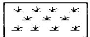  
隔坡梯田  
水土保持人工种草

  
截水沟 排水沟

  
天然草地  
蓄水池 (涝池)  
坡式梯田  
封坡育草

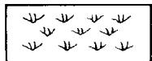

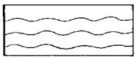  
水窖  
保土耕作  
沟头防护 (天沟)

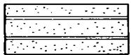  
引洪漫地

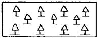  
水土保持乔木林  
谷坊

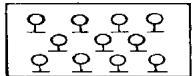  
小片水地  
果园、经济林

  
淤地坝、 拦沙坝

  
水土保持灌木林  
引水口

  
小水库塘坝

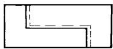  
输水渠

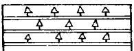  
工程整地造 林

  
治 沟骨干工程

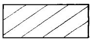  
坡耕地

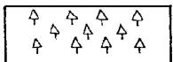  
天然林

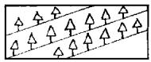  
防风固沙

  
沙化地

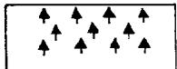  
封山育林

图 E.1 水土保持专业图例  
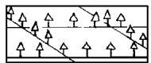

农田防护林 网

  
石化地