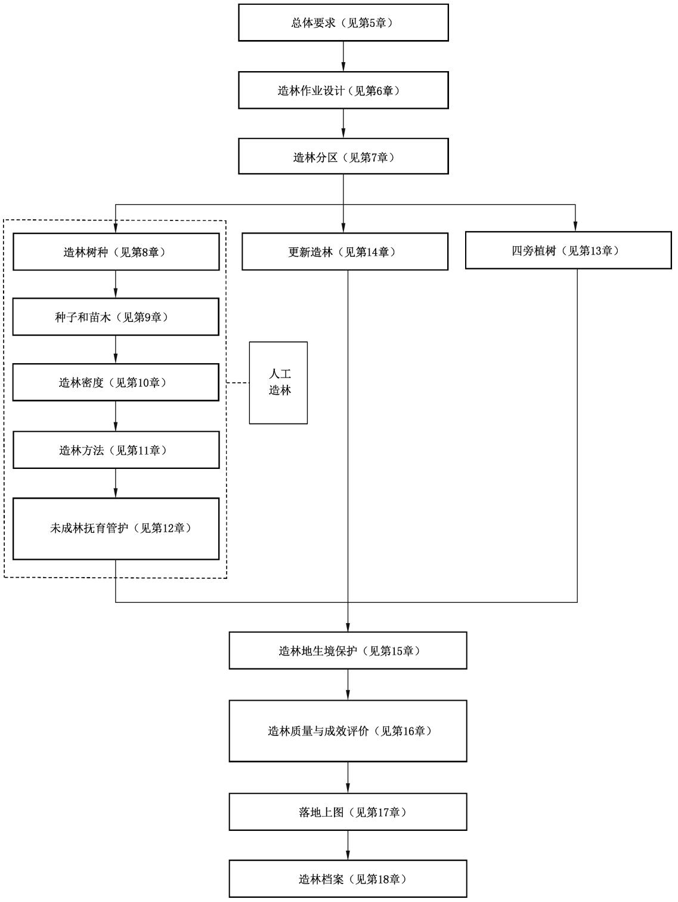

# 中华人民共和国国家标准

GB/T 15776—2023

代替 GB/T 15776—2016

造林技术规程

# Technical regulation for forestation

2023-05-23 发布

2023-05-23 实施

## 目 次

前…………………………………………………………………………………………………………Ⅲ  
1范围…………………………………………………………………………………………………1  
2规范性引用文件…………………………………………………………………………………………1  
3术语和定义………………………………………………………………………………………………1  
4造林程序…………………………………………………………………………………………………4  
5总体要求…………………………………………………………………………………………………5  
6造林作业设计……………………………………………………………………5  
7造林分…………………………………………………………………………………………………5  
8造林树种…………………………………………………………………………………………………5  
9种子和苗木……………………………………7  
10造林密度…………………………………………………………………………………………………9  
11 造林方法………………………………………………………………………………………………10  
12 未成林抚育管护………………………………………………………………………………………16  
13四旁植树………………………………………………………………………………………………18  
14更新造林………………………………………………………………………………………………19  
15造林地生境保护…………………………………………………………………………………………20  
16 造林质量与成效评价………………………………………………………………………22  
17落地上图………………………………………………………………………………………………24  
18造林档案……………………………………………25  
附录A（规范性）造林区域自然条件及范围表…………………………………26  
附录B(规范性）造林区域范围县名单………………………30  
附录C（资料性）主要造林树种适宜造林密度…………………………………………39

## 前 言

本文件按照GB/T1.1—2020《标准化工作导则 第1部分：标准化文件的结构和起草规则》的规定起草。

本文件代替GB/T15776—2016《造林技术规程》。本文件与GB/T15776—2016相比，除结构调整和编辑性改动外，主要技术变化如下：

更改了“造林”“人工造林”“更新造林”“四旁植树”“纯林”“混交林”“造林面积合格率”术语的定义(见3.1、3.1.1、3.1.2、3.1.3、3.3、3.4、3.13,2016年版3.1、3.1.1、3.1.2、3.1.3、3.4、3.5、3.12)，删除了“林冠下造林”“伐前人工更新”的术语和定义（见2016年版3.1.4、3.3），增加了“迹地更新造林”“伐前更新造林”“带状混交”“块状混交”“植生组混交”“造林成活率”的术语和定义（见3.1.2.1、3.1.2.2、3.4.1、3.4.2、3.4.3、3.12);

增加了造林程序(见第4章)；

更改了第5章标题，补充了“坚持节俭造林”和“科学规范实施”(见第5章，2016年版的第4章)；  
更改了造林作业设计（见第6章，2016年版的第5章）；

更改了造林分区(见第7章，2016年版的第6章）；

更改了混交林配置要求[见 8.2.3.2 c)，2016 年版的 7.2.3.2 c)]

——更改了种子和苗木中的一般要求(见9.1，2016年版的8.1)；

更改了造林密度中的立地条件（见10.1.3，2016年版的9.1.3)、密度确定方法（见10.2,2016年版的9.2）、密度确定要求（见10.3,2016年版的9.3）；

-增加了造林整地一般要求[见11.3.1 f)]，删除了土壤蓄水保墒措施[见 2016年版的10.5.2 c)]；  
-增加了施肥与整形(见12.1.5)；

更改了第14章标题（见第14章，2016年版的第13章），删除了有林地补植（见2016年版的13.2、15.2.2.2、15.3.2.2)，增加了迹地更新造林(见14.2、16.2.2.2、16.3.2.2)；

更改了造林地生境保护中的一般要求（见15.1，2016年版的14.1）；

更改了第16章标题（见第16章，2016年版的第15章）、造林质量与成效评价一般要求（见16.1,2016年版的15.1）、人工造林质量评价标准（见16.2.1.2,2016年版的15.2.1.2）、人工造林成效评价标准（见16.3.1.2，2016年版的15.3.1.2），删除了有林地补植年度质量评价（见2016年版的15.2.2.2）、有林地补植成效评价（见2016年版的15.3.2.2)，增加了迹地更新造林质量评价(见16.2.2.2)、更新造林成效评价(见16.3.2.2)；

增加了落地上图(见第17章)；

更改了造林区域范围县名单，将跨造林区域的县级行政单位调整到一个造林区域(见附录B，2016年版的附录B)。

请注意本文件的某些内容可能涉及专利。本文件的发布机构不承担识别专利的责任。

本文件由国家林业和草原局提出。

本文件由全国营造林标准化技术委员会(SAC/TC 385)归口。

本文件起草单位：国家林业和草原局林草调查规划院、青海省林业工程咨询中心、河北省塞罕坝机械林场、西藏自治区林业和草原局、新疆生产建设兵团林业和草原调查规划院、国家林业和草原局中南调查规划院。

本文件主要起草人：张炜、吴秀丽、蒋三乃、刘羿、翁国庆、沈亦辰、杨惠、王红春、刘畅、周洁敏、于贵朋、王鹤智、米玛次仁、李杰军、但新球、下斐、王博宇、马燕娥、邹全程。

本文件及其所代替文件的历次版本发布情况为：

-1995年首次发布为GB/T15776—1995，2006年第一次修订，2016年第二次修订；—本次为第三次修订。

## 造林技术规程

## 1 范围

本文件确立了造林程序，规定了造林作业设计、造林分区、造林树种、种子和苗木、造林密度、造林方法、未成林抚育管护、更新造林、四旁植树、造林地生境保护、造林质量和成效评价、落地上图、造林档案等具体程序的要求，描述了相应的评价方法。

本文件适用于全国范围的人工造林、更新造林以及四旁植树。

## 2 规范性引用文件

下列文件中的内容通过文中的规范性引用而构成本文件必不可少的条款。其中，注日期的引用文件，仅该日期对应的版本适用于本文件；不注日期的引用文件，其最新版本(包括所有的修改单)适用于本文件。

GB 6000 主要造林树种苗木质量分级

GB/T 6001 育苗技术规程

GB 7908 林木种子质量分级

GB/T 14175 林木引种

GB/T 15783 主要造林树种林地化学除草技术规程

GB/T 18337.3 生态公益林建设技术规程

GB/T26424 森林资源规划设计调查技术规程

LY/T 1000 容器育苗技术

LY/T 1880 木本植物种子催芽技术

## 3 术语和定义

下列术语和定义适用于本文件。

3.1

## 造林 forestation

在疏林地、灌木林地、迹地、其他规划用于造林绿化的土地上，营建或恢复森林的过程。

3.1.1

人工造林 afforestation

在疏林地、灌木林地、其他规划用于造林绿化的土地上，通过人工措施营建森林的过程。

3.1.2

## 更新造林 reforestation

在采伐迹地、火烧迹地等迹地上，或在林木采伐前的林下，通过人工措施重新营建或恢复森林的过程。

3.1.2.1

迹地更新造林 reforestation in cutover land or burned area

在采伐迹地、火烧迹地等迹地上通过人工植苗、播种等措施重新营建或恢复森林的过程。

## 3.1.2.2

## 伐前更新造林 reforestation before harvesting

在天然更新等级不良或更新树种不符合培育目的，且郁闭度在0.7(含)以下的近成过熟林林地上，为促进森林更新或改善森林结构、提高林地生产力，在主伐或更新采伐前通过人工植苗、播种等措施营建或恢复森林的过程。

## 3.1.3

## 四旁植树 planting trees around villages, houses, roads and creeks

在村旁、宅旁、路旁和水旁的土地上，栽植连续面积不超过400m²树木的过程。

## 3.2

## 造林方法 forestation method

采用不同种植材料营建、恢复森林的途径。

## 3.2.1

## 播种造林 direct seeding

利用林木种子作为种植材料人工直接播种的方法。

## 3.2.2

## 植苗造林 seedling planting

利用苗木作为种植材料直接栽植的方法。

## 3.2.3

## 分殖造林 vegetative reproduction

利用树木的部分营养器官(如枝、干、根、地下茎等)作为种植材料直接造林的方法。

## 3.2.3.1

## 扦插造林 planting of slip

利用树木的一段树干，或树木、苗木的一段枝条做插穗，直接插植于造林地的方法。

注：包括插干造林和插条造林。

## 3.2.3.2

## 地下茎造林 afforestation by rhizome

利用竹类等的地下茎进行造林的方法。

## 3.3

## 纯林 pure stand

小班中由一个造林树种组成，或虽由两个以上造林树种(包括所有的乔灌木树种)组成，但主要造林树种的株数占全部造林树种总株数80%(不含)以上。

## 3.4

## 混交林 mixed stand

小班中由两个或两个以上造林树种组成，其中单个造林树种的株数占全部造林树种总株数的比例均在80%(含)以下。

## 3.4.1

## 带状混交 mixed by strip

一个树种连续栽植两行以上构成带，两个或两个以上树种构成的带依次配置的混交方式。

## 3.4.2

## 块状混交 mixed by group

一个树种栽植成一小块，与另一树种栽植的一小块依次配置的混交方式。

## 3.4.3

## 植生组混交 mixed by tree clump

在一个小块状地上密集栽植同一个树种，与相距较远密集栽植另一树种的小块状地群状配置的混交方式。

## 3.5

## 造林作业设计 design for afforestation operation

为计划开展造林的地块编制的指导造林施工的技术文件。

## 3.6

## 造林模式 afforestation model

在县级单位或工程项目区域内，分别不同立地类型和培育目标，明确造林树种、种植材料、造林密度、配置方式、整地、栽植和未成林地抚育管护等造林要素的设计。

## 3.7

## 造林密度 planting density

单位面积造林地上的栽植(播种)点(穴)数，或造林设计的株行距。

## 3.8

## 整地 site preparation

造林前清理有碍于苗木生长的地被物或采伐剩余物、火烧剩余物，结合蓄水保墒需要，耕翻土壤和准备栽植穴的作业过程。

## 3.9

## 工程固沙 engineering sand fixation

在流动和半固定沙地上，设置机械沙障和生物沙障固定流沙的工程措施，以及在干旱地区和其他地区为防风固沙、保持水土等采取的其他工程措施。

## 3.10

## 树种配置 arrangement of tree species

营造混交林时各混交树种的比例及混交方式。

## 3.11

## 种植点配置 distribution of planting point

栽植点或播种点在造林地上的间距及其排列方式。

## 3.12

## 造林成活率 survival rate of trees planted

以小班为单元，到达成林年限或有效造林年限前，造林地上成活苗木的株(穴)数与作业设计的种植株(穴)数的百分比。

## 3.13

## 造林面积合格率 qualified rate of planting area

对于某一年度的造林面积，到达成林年限或有效造林年限前，达到造林质量评价合格标准的面积与该年度造林总面积的百分比。

## 3.14

## 造林株数保存率 reserving rate of trees planted

以小班为单元，到成林年限或有效造林年限后，造林地上保存苗木的株(穴)数与作业设计的种植株(穴)数的百分比。

## 3.15

## 造林面积保存率 reserving rate of planting area

对于某一年度的造林面积，到成林年限或有效造林年限后，达到成林验收标准或有效造林标准的面

积与该年度造林总面积的百分比。

## 4 造林程序

造林分为人工造林、更新造林、四旁植树三种方式。造林程序见图1。

  
图 1 造林程序流程图

造林的总体要求包括以下内容。

a）坚持生态优先。造林活动不应对自然生态系统形成不可逆的不利影响，充分利用天然更新，保护造林地上已有的自然植被、珍稀植物、古树名木和野生动植物栖息地。

b）明确造林目标。造林活动应确定主导功能和目标林分。

c）坚持因地制宜、适地适树。依据造林区、造林地的地形、土壤、植被等立地因子，划分立地类型，进行立地质量评价，作为适地适树的基础，提高造林效果。

d）遵循森林植被生长的自然规律。根据造林目标和树种的生物学特性，选择造林方式、造林方法，设计造林模式。干旱地区原则上不成片营造乔木林。

e）营造健康森林。发挥森林的多种功能，促进森林的健康稳定，优先选择乡土树种，实行多树种、乔灌混交造林，根据造林地立地条件和林种选择合理的树种及配置。

f）积极使用良种壮苗。优先使用林木良种及其生产的优质苗木，实现人工林的遗传控制，保证人工林的生产力，提高抗逆性。

g）积极采用先进技术。引进和推广成熟的新技术、新成果、新材料，使用节水造林技术，合理利用水资源。

h）坚持节俭造林。造林苗木规格、整地规格等应与立地条件、造林目标相适应，整地规格应与苗木规格相适应，提高造林投资效率。

i）科学规范实施。科学编制造林绿化相关规划与作业设计，严格按照规划设计开展造林绿化活动。

## 6 造林作业设计

国家投资或以国家投资为主的造林项目，应编制造林作业设计。造林作业设计应以县级单位(国有林经营单位)为主体，按照相关技术要求进行编制。

## 7 造林分区

参照全国气候区划，依据显著影响林木生长发育的积温、降水、干燥度等水热条件，按照主导性、差异性和一致性的原则，将全国划分为东部季风区、西北旱区、青藏高寒区三个气候地理区。其中，东部季风区分为寒温带区、中温带区、暖温带区、亚热带区、热带区五个区域，西北旱区分为半十旱区、十旱区、极干旱区三个区域。各造林区域范围按附录A执行，各造林区域所含县级行政区划名单按附录B执行。

## 8 造林树种

## 8.1 树种选择

## 8.1.1 一般要求

树种选择遵循定向、丰产、优质、稳定、高效等要求。

a）根据水、土、光热条件和树种的生态学特性，选择与造林地立地条件相适应的树种。

b）根据森林主导功能选择适合于经营目标的树种。

c）优先选择乡土珍贵树种和优良品种。

d）慎用外来树种，需要引进外来树种时，应选择经引种试验并符合GB/T14175规定的树种。

e）对容易引起地力衰退的速生树种，种植1轮～2轮后，应更换其他适宜造林树种。

## 8.1.2 选择要点

## 8.1.2.1 防护林

防护林树种选择要点如下。

a）根据防护对象选择适宜树种，应具有生长快、防护性能好、抗逆性强、生长稳定等特性。

b）营造农田(牧)场防护林，及在经济林、苗圃周围的防护林的主要树种应具有树体高大、树冠适宜、深根性等生物学特性；经济林、苗圃周围的防护林树种应具有隔离防护作用且与经济林、苗木的树种无共同病虫害或非中间寄主。

c）风沙地、盐碱地、水湿地区和石漠化地区的树种应具有相应的抗逆性。

d）在旱区应优先选用耐干旱、耐盐碱的灌木树种、亚乔木树种。

e）严重风蚀、水蚀地区，应选择根系发达和固土能力强的树种。

## 8.1.2.2 特种用途林

树种应具备特种用途所要求的特性。

## 8.1.2.3 用材林

应具有主干性强、生长快、产量高、抗病虫害等性状，以及符合用材目的、适应特定工艺要求等经济特性，优先选用乡土珍贵用材树种。

## 8.1.2.4 经济林

应选择经济产品产量高、质量优、市场前景广、抗病虫害能力强、富集土壤重金属能力低的树种或品种。

## 8.1.2.5 能源林

能源林树种选择要点如下：

a）适应性强；

b）木质燃料林树种应具有生长快、生物量高、萌蘖力强、热值高、燃烧性能好等特性；

c）油料林树种应具有结实早、产量高、出油率高等特性。

## 8.1.3 主要造林树种

各造林区不同用途的主要造林树种及适生条件见附录C。

## 8.2 树种配置

## 8.2.1 一般原则

按以下原则确定树种配置：

a）防护林优先营造混交林，严格控制营造纯林；

b）相邻地块采用有互助作用、无相互感染病虫害的不同树种，优化空间配置。

## 8.2.2 纯林

## 8.2.2.1 适用条件

下列情况可营造纯林：

a）培育短周期工业原料林、速生丰产林、经济林的；

b）生物学特性适于单一树种栽培的；

c）以景观营建、科学研究、种质资源保存等为目的需要单一树种栽培的。

## 8.2.2.2 配置要求

纯林配置要求如下：

a） 同一树种或同一造林模式集中连片面积不宜超过100 hm²；

b）同一树种或同一造林模式在同一造林年度集中连片面积不宜超过 $2 0 ~ \mathrm { h m ^ { 2 } }$

c）两片同一树种或品系造林地块间应有其他树种、天然植被或非林地形成缓冲，缓冲区间不宜少于50 m。

## 8.2.3 混交林

## 8.2.3.1 适用条件

下列情况宜营造混交林：

a）以防护为目的；

b）以培育大径材为目的、需要长周期培育的；

c）生物学特性宜混交、伴生的；

d）单一树种栽培易引发病虫害、火灾等灾害的；

e）造林地上有培育前途的天然幼苗、幼树较多的。

## 8.2.3.2 配置要求

混交林配置要求如下。

a）根据树种生物学特性和立地条件，选择适应性、抗逆性和种间相协调的树种混交，宜针叶树种与阔叶树种、落叶树种与常绿树种、喜光树种与耐荫树种、固氮树种与非固氮树种、深根性树种与浅根性树种、乔木树种与灌木树种等混交。

b）根据立地条件、培育目标和种间关系等因素选择适宜混交方式，也可与造林地上已有的幼苗、幼树随机配置形成混交林。

c）采用多树种混交。热带区、亚热带区造林小班，组成树种宜三种以上。

d）推荐的混交方式有带状混交、块状混交以及植生组混交等。带状混交时，最小带宽不宜小于该树种行距的两倍，最大带宽不宜大于该树种成熟林木的平均高度。块状混交时，块的面积应小于小班划分的最小面积。植生组混交时，块的面积应小于小班面积的三分之一，块间距应超过块内林木之间平均距离的两倍。

## 9 种子和苗木

## 9.1 一般要求

应使用具有林木(草)种子生产经营许可证、植物检疫证书、质量检验证书、种子标签、苗木标签的种子、苗木以及其他优良种植材料，并符合以下要求：

a）优先使用种子园、母树林、采穗圃等生产的种子和穗条；

b）优先使用林木良种生产的合格苗；

c）优先使用本地繁育的种子、苗木和其他繁殖材料；

d）积极使用容器苗；

e）经济林优先使用无性系，适宜嫁接的树种优先使用嫁接苗；

f）选择适度规格的苗木，除必须截干栽植的树种外，应使用全冠苗；

g) 400m²以上的成片造林不宜使用大规格苗木，大规格苗木标准各省根据实际情况确定；

h）严禁使用来源不清、未经检验检疫、未经引种试验的种子、苗木和其他繁殖材料。

## 9.2 种子

造林种子符合以下要求：

a）播种造林种子质量应按照GB7908的规定执行；

b）宜使用同一种子区的种子。跨种子区或大跨度调拨种子应先进行种源试验。由北向南调拨种子不宜跨纬度3°，除高海拔地区外，由南向北调拨不宜超过纬度2°；东西向调拨不宜超过经度16°。

## 9.3 苗木

## 9.3.1 裸根苗

裸根苗应达到GB6000规定的Ⅰ、Ⅱ级苗木的标准，GB6000没有规定的树种，可参照相应的标准、造林作业设计中的用苗要求。应优先使用优良种源、良种基地的种子以及优良无性系培育的裸根苗。

## 9.3.2 容器苗

执行LY/T1000的规定。LY/T1000没有规定的树种，可参照相应的标准、造林作业设计中的用苗要求。应优先使用优良种源、良种基地的种子以及优良无性系培育的容器苗。

## 9.4 种条

## 9.4.1 插条

插条符合以下要求：

a）选用管理规范、质量可信的采穗圃、苗圃培育的插条；

b）从优良母树根基萌发的幼化枝条上选取插条；

c）根部容易萌生不定芽的树种，从发育健壮的母树根部挖取采集。

## 9.4.2 插干

可进行插干造林的树种，宜选用1a\~3a生枝干或苗干，长度2m以上。

## 9.4.3 竹蔸和竹鞭

竹蔸为带蔸并截去竹尾的母竹。

竹鞭为竹子的地下茎。

## 9.5 种苗处理

## 9.5.1 种子处理

## 9.5.1.1 种子消毒

在病虫害比较严重的地区造林，特别是针叶树种子，在播种前可利用药剂进行拌种处理，或用药液

进行浸种或闷种；种皮厚的种子和小粒种子可用适度热水浸种。具体按GB/T6001的规定。

## 9.5.1.2 种子催芽

按LY/T 1880的规定。

## 9.5.2 苗木处理

## 9.5.2.1 裸根苗

裸根苗采用以下处理措施：

a）受伤的根系、发育不正常的偏根，可进行适当的修剪，截短过长主根和侧根；

b）可在栽植前将根系蘸上稀稠适当的泥浆；

c）容易失水的苗木，栽植前可用清水或流水浸泡；

d）在病虫害危害严重的地段造林，可采用化学药剂蘸根；

e）栽植后恢复期较长树种的苗木，或不易生根的种植材料，可采用促生根材料处理；

f)可采用药剂或抗蒸腾剂进行喷洒处理；

g）苗木应随起随栽，暂不造林的苗木宜采用假植、冷藏等措施保持根系湿润，假植、冷藏时间不宜过长。

## 9.5.2.2 容器苗

容器苗宜采用可降解的容器。栽植时应对生长出容器外的根系进行修剪，不易降解的容器应进行脱袋处理。出圃前，应浇足水。

## 10 造林密度

## 10.1 确定造林密度因素

## 10.1.1 树种特性

造林密度主要根据树种特性确定：

a）慢生、耐荫、树冠狭窄、根系紧凑、耐干旱瘠薄、耐盐碱的树种可适当密植；

b）速生、喜光、树冠开阔、耗水量大的树种可适当稀植。

## 10.1.2 培育目的

造林密度根据培育目的进行调整：

a）防护林可适当稀植，护路林可以林木完全舒展的最大树冠为间距；

b）培育大径材且不进行间伐的用材林可适当稀植，以培育中小径材为目的的用材林可适当密植；

c）乔木型经济林可适当稀植，灌木和矮化型经济林等可适当密植；

d）木质能源林可适当密植，油料能源林可适当稀植；

e）特种用途林按特殊要求确定。

## 10.1.3 立地条件

造林密度根据立地条件进行适当调整：

a）水资源短缺、承载能力差的干旱半干旱地区，提倡低密度造林，可适当稀植；

b）易生长杂草杂灌的造林地，可适当密植。

## 10.1.4 经营水平

造林密度根据经营水平调整：

a）林区作业道路密度高、交通便利、劳动力资源丰富、经营水平较高的，可适当密植；

b）采伐年龄长与采伐年龄短的树种混交的，可适当密植；

c）未成林郁闭前需进行农林间作的，可适当稀植。

## 10.2 造林密度确定方法

造林密度应以小班为单位，综合考虑水资源承载力、立地条件、树种特性、培育目的、经营水平等因素确定。测算单位面积造林地上的栽植点或播种点(穴)数，同时考虑下列因素：

a）石质山地、岩石裸露的造林地，应按实际情况扣除不能造林的面积后确定造林密度；

b）造林地上已有的苗木、幼树，可视其数量、分布以及混交特点，部分或全部纳入造林密度；

c）西北旱区、青藏高寒区同时使用乔木、灌木树种造林的，乔木、灌木株数统筹纳入造林密度计算。

## 10.3 确定造林密度要求

根据10.1、10.2和16.3.1.2的规定，各造林区域主要造林树种不同培育目的的适宜造林密度见附录C。

a）各地可参考附录C，结合培育目标、苗木规格、经营措施等，科学确定本地区主要造林树种的适宜造林密度。

b）混交造林可参考附录C，结合混交模式提出适宜的混交造林密度。

c） 附录C未列入的树种，可结合实际确定造林密度。

## 11 造林方法

## 11.1 造林适用条件及技术

## 11.1.1 播种造林

## 11.1.1.1 适用条件

适用大粒种子，或者发芽迅速、生长较快、适应性强的中小粒种子，且种子资源丰富的树种，以及土壤湿润疏松、立地条件较好、鸟兽害较轻区域的造林地。

## 11.1.1.2 播种量

播种量根据树种的生物学特性、种子质量、立地条件和造林密度确定。

## 11.1.1.3 造林技术

播种造林主要方法为以下两种。

a）穴播。在植穴中均匀地播入数粒(大粒种子)至数十粒(小粒种子)，然后覆土镇压。覆土厚度应结合树种实际确定，一般宜为种子直径的2倍～3倍，土壤黏重的可适当薄些，沙性土壤可适当厚些。

b）条播。在播种带上播种成单行或双行，连续或间断，播种入土或播后覆土镇压。覆土厚度应结合树种实际确定，一般宜为种子直径的3倍～5倍，土壤黏重的可适当薄些，沙性土壤可适当厚些。

## 11.1.1.4 造林季节

播种造林季节包括雨季和秋季：

a） 雨季适宜小粒种子播种造林；

b）秋季适宜大粒、硬壳、休眠期长、不耐贮藏的种子播种造林。

## 11.1.2 植苗造林

## 11.1.2.1 适用条件

适用于各种立地条件以及可以人工培育苗木的各类树种。

## 11.1.2.2 造林技术

## 11.1.2.2.1 裸根苗栽植

根据林种、树种、苗木规格和立地条件选用适宜的栽植方法。栽植时应保持苗木立直，栽植深度适宜，苗木根系充分伸展，并有利于排水、蓄水保墒。在旱区、盐碱地、水土流失严重的区域，栽植时，可施用保水剂，栽植后可采用薄膜覆盖等保水措施，具体方法如下。

a）穴植法。穴植法可用于栽植各种裸根苗、容器苗和带土球苗木。穴的大小应略大于苗木根系。苗干应扶正，根系应舒展，深浅应适当，填土一半后提苗踩实，再填土踩实，最后覆上虚土。对于胸径3cm以上的带土球苗木，可根据造林实际对树干作支撑处理。

b）缝植法。缝植法宜用于新采伐迹地、沙地栽植松柏类小苗。在已整地的造林地上用锄或锹开缝，放入苗木，深浅适当，不窝根，拔出工具，踏实土壤。

c）沟植法。沟植法主要用于地势平坦、机械或畜力拉犁整地的造林地造林。将苗木按一定的株距摆放在开好的沟里，再扶正、覆土、压实，或在沟中人工再挖坑植苗、扶正、回土。

## 11.1.2.2.2 容器苗栽植

容器苗采用穴植，植穴应略大于容器规格。

## 11.1.2.3 造林季节

植苗造林季节及其适宜性如下。

a）除春季高温、少雨、低湿的川滇等部分地区外，全国其他地区可进行春季造林。

b）雨季、秋季适合于全国各地造林。雨季造林宜选择蒸腾强度较小或萌芽能力强的树种，并掌握好雨情，以下过一二场透雨、出现连续阴天时为宜。在北方地区，落叶阔叶树种造林宜在秋季苗木落叶后至土壤冻结前进行。

c）冬季造林主要适用于气温适宜、土壤不结冻的华南、西南地区。华东、华中地区也可以适度开展冬季造林。

d）容器苗和带土坨苗木，可在土壤结冻期外的各季节造林。

## 11.1.3 分殖造林

## 11.1.3.1 适用条件

应同时满足以下条件：

a）易于获取分殖材料，能够迅速产生大量不定根、地下茎的树种；

b）造林地水分、土壤条件较好；

c）造林季节水分蒸发量小于降水量的造林地。

## 11.1.3.2 造林技术

## 11.1.3.2.1 扦插造林

根据扦插材料的来源，扦插造林分为以下两种。

a）插条造林。扦插宜用直插。对于落叶阔叶树种，在干旱、风沙危害严重的地区造林时，应深埋插穗，使其刚好被土覆盖；在水分条件较好或土壤含盐量较高的造林地造林时，则插穗可露出地面3cm～5cm。对于常绿针叶树种，插植深度可为插穗长度的三分之一至二分之一。

b）插干造林。每穴直插插干一株，插植深度在30cm以上。在干旱、地下水位2m以下地区营造杨柳类树种，可以采用机械钻孔深栽。

## 11.1.3.2.2 地下茎造林

竹类地下茎造林技术如下。

a）移栽母竹。从竹林外缘或竹丛周围挖取1a～2a生、保留有竹鞭的母竹，其中，来鞭30cm～40cm、去鞭40 cm～70 cm。栽植时，母竹根盘表面比种植穴面低5 cm左右，注意使鞭根舒展，分层填土踏实，覆以厚层杂草。

b）移鞭。竹鞭可在造林前一个月挖出，尽量多带宿土，截成约100cm长，平埋在挖好的沟内，覆土约10cm，略高于地面，并踩实。

c）分蔸造林。将挖出的母竹竹竿自地表以上20cm～30cm处截断，栽植竹蔸，利用竹蔸上的芽发育成林。

## 11.1.3.3 造林季节

分殖造林季节及其适宜性如下。

a）插条和插干造林季节与裸根苗造林季节基本一致，随树种和地区不同，可在春季、秋季插植。常绿树种可随采随插，落叶树种可随采随插或采条后经贮藏再插。在水分条件不充足的地区，插条造林在雨水充沛的季节进行。

b）地下茎造林，除寒冷以及酷热天气外，其他季节均可小规模造林。大面积栽植时，单轴型竹类可在生长缓慢的冬季和早春进行，合轴型竹类可在1月～3月进行。

## 11.2 种植点配置

## 11.2.1 种植行的走向

按以下原则确定种植行的走向：

a）在平地造林时，种植行按南北走向；

b）在坡地造林时，种植行按等高线走向；

c）在风害严重地区造林，种植行按与主风向垂直走向。

## 11.2.2 配置方式

## 11.2.2.1 方形配置

方形配置时，种植点位于方形的四个角点，包括长方形配置和正方形配置。长方形配置时，通常行距大于株距，主要适用于公益林营造。正方形配置主要适用于商品林营造。

## 11.2.2.2 三角形配置

三角形配置时，种植点位于三角形的顶点，相邻两行的各株相对位置错开排列成等腰三角形或正三角形。等腰三角形配置主要适用于公益林营造。正三角形配置主要适用于商品林营造。

## 11.2.2.3 群状配置

植株在造林地上多以3株～20株形成相对独立的群丛状分布，群之间距离显著大于群内植株间的距离。此种配置方式主要适宜次生林改造或立地条件较差的造林地营造生态公益林。

## 11.2.2.4 自然配置

自然配置适用条件如下：

a）依据造林地土壤条件配置种植点，主要适用于石质山地、黄土高原丘陵沟壑区；

b）依据林间空地情况配置种植点，主要适用于伐前更新造林、沙地造林。

## 11.2.2.5 带状配置

宜以2行～3行为一带，可乔灌草、灌草结合，主要适用于干旱、半干旱区造林。

## 11.3 整地

## 11.3.1 一般要求

根据立地条件、林种、树种、造林方法等选择整地方式和整地规格，并符合以下要求。

a）保持水土。采用集水、节水、保土、保墒、保肥等整地方式；在流动和半固定沙地上，可采取工程固沙措施。

b）保护已有植被。山地不应采用全面整地、炼山等破坏已有植被和野生动物栖息地的整地方式。利用已有林木、幼苗幼树，创造有利于造林苗木健康生长发育和森林形成的生境。

c）经济实用。采用小规格、低成本的整地方式，减少地表的破土面积。

d）限制全面清林。除杂草杂灌丛生、采伐剩余物堆积、林业有害生物发生严重等，不进行清理无法进行整地造林的造林地外，不应进行林地全面清理。

e）平地和缓坡地可采用机械整地。机械整地时，应注意保护原生植被，特别是国家重点保护野生植物和野生动物栖息地。

## 11.3.2 整地方式

## 11.3.2.1 穴状整地

穴状整地适用于各类林种、树种和立地条件，尤其山地陡坡、水蚀和风蚀严重地带的造林地整地。穴状整地采用圆形或方形坑穴，大小因林种、苗木规格和立地条件而异。

## 11.3.2.2 带状整地

带状整地适用于山地缓坡、丘陵和北方草原地区各林种的造林地整地，但不适用于有风蚀的地区。山地、丘陵带状整地应沿等高线进行，其形式有水平阶、水平槽、反坡梯田等。

## 11.3.2.3 鱼鳞坑整地

鱼鳞坑整地适用于十旱、半十旱地区的坡地以及需要蓄水保土的山地的造林地整地，包括黄土高原地区、石质山地。鱼鳞坑为近似半月形的坑穴，外高内低，长径沿等高线方向展开，短径略小于长径。

## 11.3.2.4 沟状整地

沟状整地适用于干旱、半干旱地区的造林地整地。在种植行中挖栽植沟，在沟内再按一定的株距挖坑栽植，并较长期的保持行沟。

## 11.3.2.5 集水整地

集水整地适用于干旱、半干旱、极干旱地区。在较平坦的造林地开沟，向沟两边翻土，将沟两旁修成边坡，然后在沟内打横埂，两边坡与两横埂之间围成一定面积的双坡面集水区。

## 11.3.3 整地季节

一般地区在造林前一年的秋、冬季，或造林一个月前进行整地。在有冻拔害的地区和土壤质地较好的湿润地区，可以随整地随造林。旱区造林整地，可在雨季前或雨季进行，也可随整地随造林。

## 11.3.4 难利用地立地改良

## 11.3.4.1 盐碱地

## 11.3.4.1.1 物理改良

通过明沟排盐(碱)与洗盐、客土、抬高作业面、开沟筑垄、铺设盐碱隔离层、暗管暗沟排盐(碱)、树穴覆膜等方法，对盐碱地进行改良。

## 11.3.4.1.2 化学改良

通过施用有机肥、风化煤、黄腐酸、沸石、黄铁矿渣、脱硫石膏及土壤盐分拮抗剂、螯合剂等土壤调理剂进行盐碱地改良。

## 11.3.4.1.3 生物改良

通过种植耐盐植物、施用土壤活化微生物菌肥等生物措施进行盐碱地改良。耐盐碱先锋植物有白刺、柽柳、盐穗木、罗布麻、金叶莸、紫穗槐、枸杞等；作物有水稻、棉花等；绿肥植物有田菁、苜蓿、大麦、决明子等。

## 11.3.4.2 石质山地

为改善生态景观而需要绿化的石质山地，可采用就地集土或客土进行立地改良。覆土厚度根据绿化树种的主根系分布状况确定。

## 11.3.4.3 废弃矿山用地

## 11.3.4.3.1 尾矿库

尾矿库造林前应进行造林地整理，主要措施如下。

a）污染治理。对受重金属污染的尾矿库，宜采用隔离、植物修复、微生物降解等措施进行治理。

b）客土。对没有污染的煤矿库和经过治理的尾矿库，采用客土覆盖。客土厚度根据造林树种的主根系分布状况确定。

## 11.3.4.3.2 挖损和塌陷地

挖损和塌陷地造林前应进行造林地整理，主要措施如下。

a）稳定边坡。对于采矿区塌陷地，首先平整底层土壤，再利用固废或砂石分层密实回填，表层覆土，稳定边坡，防止水土流失，确保造林施工安全。

b）客土。对于没有土壤的挖损地和塌陷地，应在造林地表覆盖客土。客土厚度根据造林树种的主根系分布状况确定。

## 11.3.4.4流动、半固定沙地

流动、半固定沙地造林前应根据当地情况，分别采取生物、物理、化学等工程固沙措施。具体按GB/T 18337.3 的规定。

## 11.4 造林辅助措施

## 11.4.1 施肥

## 11.4.1.1 施用原则

肥料施用原则如下：

a）根据培育目标和土壤营养条件，采用营养诊断配方施肥，或采用有关施肥试验结果，进行施肥，做到适时、适度、适量；

b）在水源地、水体周边等生态区位特殊地段，尤其在坡地，需施肥时，施有机肥，避免水体污染。

## 11.4.1.2 基肥

土壤贫瘠的造林地，宜施用基肥改良土壤。基肥宜采用充分腐熟的有机肥。基肥在栽植前结合整地施于穴底。

## 11.4.1.3 追肥

商品林可采用追肥。追肥宜采用复合肥和专用肥。追肥宜在栽植后的林木速生需肥高峰期施用。

## 11.4.2 防护材料使用

防护材料主要包括支撑材料、越冬材料、防牲畜材料、防虫材料、防鼠兔害材料等。支撑材料主要指木(竹)杆等，用于定植后固定苗木、防止风倒，促进苗木生根。越冬材料主要指无纺布、秸秆、草绳、薄膜等，用于包扎苗木，或铺于造林地，起防寒作用。防牲畜材料主要为网围栏，用于牲畜活动频繁处，防止牲畜随意进入造林地，损毁苗木。防虫材料主要指各种袋形、管形材料，套用于苗木基干部，可起到防虫、防兽、防旱等作用。防鼠兔害材料主要为防啃剂，在鼠兔害严重地段，涂于苗木地茎部。

## 11.5 蓄水保墒措施

## 11.5.1 地表防蒸发措施

地表防蒸发主要措施如下。

a）地表覆盖材料有地膜、草纤维膜、秸秆、沥青和土面增温保墒剂，以及石块、瓦片等，以采用当地自然地表覆盖材料为主。

b）地膜。宜选用无色、透明、可降解的地膜，膜的厚度可根据使用方法选择；膜的大小为1m1m或60cm×60cm。为既提高地温又蓄水保墒，宜选用较厚的膜，并将地膜直接铺设在表面；以蓄水保墒为主要目的，宜把地膜铺设在表土层下面，即把地膜铺设好后在上面压上2 cm～3 cm厚的土壤。铺在地下的，可选用较薄的膜。

c）保墒剂。根据种子萌芽温度和播种时的天气确定土面增温保墒剂使用时间。春季播种造林较正常播期可提前几天使用，宜选在晴天上午，可仅用于树木周围也可用于全造林地，有条件时可在喷洒前浇水。使用土面增温保墒剂的区域地表宜平整。

## 11.5.2 土壤蓄水保墒措施

土壤蓄水保墒主要措施如下：

a）可使用能完全降解、无毒无害的抗旱保水剂；

b）旱区造林，可适当大规格深整地，春季造林宜在前一个雨季前整地，秋季造林宜在当年春季或雨季前整地；

c）黄土高原地区造林，可在整地时施绿肥，或厩肥、过磷酸钙、锯末、秸秆、土壤改良剂等的混合物。

## 12 未成林抚育管护

## 12.1 未成林抚育

## 12.1.1 间苗定株与补植

各造林方式的主要间苗定株与补植措施如下。

a）播种造林，在苗木出土后一个生长季或一年，可按作业设计的单位面积保留株数进行间苗，在未成林期末完成定株。对出苗量未达到设计标准的，可根据情况进行补播。

b）植苗造林，造林后一个生长季或一年内，应根据造林地上苗木成活状况及时补植。补植应在造林季节进行，补植苗木不应影响造林地上其他苗木的生长发育。

c）对萌芽能力强的树种，因干旱、冻害、机械损伤，以及病虫兽危害造成生长不良的，可采用平茬措施复壮。

## 12.1.2 浇水

浇水应注意事项及主要措施如下：

a）造林时土壤墒情差的，应浇透定根水；

b）造林后可根据天气、土壤墒情、苗木生长发育状况等进行浇水；

c）采用节水浇灌技术，限制采用漫灌方式；

d）造林作业时可根据造林地面积和分布、所在区域的地形地势、水资源等状况，建设蓄水池、水窖、水渠、水井、提水设施、喷灌、滴灌等水利设施，或配备浇水车、移动喷灌等移动浇水设备。

## 12.1.3 松土

因土壤板结等严重影响苗木生长发育甚至成活时，宜及时松土。松土应在苗木周围50cm范围内进行，并做到里浅外深，不伤害苗木根系。

## 12.1.4 除草

杂灌杂草影响苗木生长发育时，宜进行割灌除草、除蔓，除去苗木周边1m以内的杂灌杂草和藤蔓。采用化学药剂除草的，应按GB/T15783的规定。

## 12.1.5 施肥与整形

对于经济林，可根据苗木生长情况和培育目标，适时施肥和树体整形。

## 12.1.6 以耕代抚

以耕代抚主要适用于实行林农间作的新造林地。造林后至郁闭前，通过间种农作物、中药材或牧草等，促进苗木生长。

## 12.1.7 抚育次数

根据新造幼林地苗木生长发育状况、立地条件、天气状况等确定抚育时间、抚育措施和抚育次数。用材林、经济林抚育次数可根据经营管理强度确定。实行林农间作的造林地，可以结合间作作业进行抚育。有冻拔害地区的造林地，第一年可以除草为主，减少松土次数。

## 12.2 未成林管护

## 12.2.1 综合管护

为防火、防人畜干扰等毁坏新造幼林地，采取以下封山育林等综合管护措施。

a）采用专人、专兼职或集中管护等方式。

b）人畜干扰风险较高的地段宜在新造幼林地周边设置网围栏、篱墙、防护沟等设施。

c）设置明示管护范围、面积、目标、责任人等信息的管护牌等。

d）加强对森林防火通道保护，按照森林防火通道规划、建设要求，维护、建设生物防火林带。及时清理林地内灌草、抚育采伐剩余物等，减少林地可燃物。

e）抚育作业不应在施工现场用火，防止引发火灾。

## 12.2.2 有害生物防控

为确保幼苗正常生长发育，采取以下措施加强未成林的有害生物防控：

a）开展造林地及周边林地有害生物预测预报，可设置病虫害预测预报样地、测报点等进行定期监测；

b）及时隔离、处理病虫危害木，减少病源；一旦发现检疫性病虫害，应及时伐除并销毁受害木；

c）病虫害发生后宜采用物理、生物防治或综合防治方法，避免采用单一的化学防治方法；大规模造林地宜配备诱虫灯、喷雾器、病防车等防治设备。

## 12.2.3 兽害防控

兽害防控可采取以下措施：

a）在苗木基干部涂(刷)白、涂抹泥沙等材料进行防护；

b）在苗木基干部捆扎塑料布、干草把、芦苇等材料，或套置硬质塑料管、金属管等管状物，或设置 金属围网等防护物；

c）对苗木进行预防性处理，如施用防啃剂、驱避剂浸蘸根、茎等。

## 12.2.4 自然灾害防控

自然灾害防控可采取以下措施：

a）因地制宜采用地膜覆盖、栽后树盘盖石板或盖草保墒、喷洒可降解塑料，铺撒地表后形成薄膜层等多种措施，实现保水保墒；

b）在洪涝灾害易发地段可设置排水沟，提高造林地的抗涝能力，防止苗木受淹；

c）在风大、干燥、严寒地区或冻拔害严重地区，冬季采取覆土、盖草(秸秆）、包裹等防风防寒措施；

d）在风沙区采取设置风沙障，或在林缘迎风面挖壕等措施，防止风蚀沙埋造林地，并保护苗木。

## 13 四旁植树

## 13.1 树种选择

四旁植树根据栽植目的、四旁空间状况、当地乡风民俗等选择树种：

a）宜选择具有抗性强、适应性好、寿命长等特性的乡土树种；

b）景观或绿化树种宜选择树型优美、观赏价值高的树种；

c）用材树种宜选择生长快、干形通直、冠幅较大、枝叶繁茂的树种；

d）经济林树种宜选择产量高、质量好、效益高的树种；

e）立地条件优越的地段，优先选用珍贵树种；

f）城乡居民集中居住区周边避免选用易致人体过敏的树种。

## 13.2 树种配置

## 13.2.1 单一型

单一型配置方式有单一乔木树种型、单一灌木树种型；或单一观赏树种型、单一用材树种型、单一经济林树种型等。

## 13.2.2 组合型

即两种或两种以上单一型在同一栽植地段上的配置，如乔木树种和灌木树种组合型、观赏树种和用材树种组合型、观赏树种和经济林树种组合型等。

## 13.2.3 立体型

利用乔木、灌木和草本的生活型差异，形成栽植地上部乔木、下部灌木和地表草本植物的立体配置。

## 13.3 种植点配置

宜见缝插针、自然或不规则配置。同时，种植点之间的距离应充分考虑树木成熟后的树冠舒展空间。

## 13.4 苗木选择

四旁植树宜采用多年生规格适度的苗木。

## 13.5 整地

宜采用大规格的穴状整地方式，穴的规格略大于苗木根系的伸展范围，或带土树兜的规格。土壤条件差的栽植地，可采用客土。

## 13.6 栽植

主要栽植措施如下：

a）栽植方法宜采用穴植；

b）栽植时应使苗木根系充分伸展，苗干垂直于地表；

c）回填土壤时宜先回填表土，再回填心土和底土，分层将土壤压实，栽植的深度以覆土略高于苗木原土痕为宜；

d）栽植后应浇足头水，以后根据苗木缺水情况及时浇水；

e）对于大规格、易风倒的苗木，可采用木竿等材料固定苗木；

f）四旁植树以春季为宜，旱区可在雨季造林。

## 14 更新造林

## 14.1 伐前更新造林

## 14.1.1 适用条件

适用于天然更新等级不良或更新树种不符合培育目的，且郁闭度在0.7(含)以下的近(伐前3a～5a)、成过熟林。天然更新等级划分标准按照GB/T26424的规定执行。

## 14.1.2 造林方式

伐前更新造林宜以植苗造林为主、播种造林为辅。

## 14.1.3 树种选择

除了应按照7.1的规定选择树种外，还应选择幼龄耐庇荫、有价值的树种，能够在林冠下正常生长发育，并与林地上已有的幼苗、幼树共生形成稳定森林生态系统。

## 14.1.4 种子和苗木

种子和苗木符合9.2、9.3、9.4的规定。种子和苗木的处理符合9.5的规定。

## 14.1.5 造林密度与种植点配置

造林密度参照第10章的规定，根据天然更新幼苗幼树数量和分布状况综合确定。单位面积人工栽植的株数和已有的目的树种幼苗幼树的有效株数之和，适宜造林密度参见附录C。

应根据林地上的林木、幼苗和幼树的分布情况进行种植点配置。同时，宜预留集材通道，防止林木采伐对苗木的大面积损害。

## 14.1.6 整地

伐前人工更新造林宜采用穴状整地，穴的深度、宽度应略大于所栽苗木的根系分布范围。在穴状整地前可在穴的周边适当清理。

## 14.1.7 栽植

植苗造林方法采用穴植或缝植。栽植时间按11.1.2.3的规定。

## 14.2 迹地更新造林

## 14.2.1 适用条件

适用于火烧迹地、皆伐作业形成的采伐迹地。

## 14.2.2 林地清理

应将迹地上的采伐剩余物、火烧木清理后运出，或平铺在种植行中间。已感染病虫害的采伐剩余物、火烧木应按照病虫害防治的规定处理。

## 14.2.3 造林技术

造林方式、树种选择、种子和苗木、造林密度、种植点配置、整地、栽植、未成林抚育管护等，参照人工造林，按照第8章～第12章的有关规定执行。

## 15 造林地生境保护

## 15.1 一般要求

为保护自然生境，避免造林活动破坏生境，应符合以下要求。

a）保护优先。尊重自然、保护自然、顺应自然，造林活动避免破坏原有生境。

b）全过程保护。将生境保护的理念和要求贯穿于作业设计、作业施工、后期管护等造林活动全过程各环节。

c）保护与恢复相结合。遵循生态系统内在规律，自然恢复与人工修复相结合，因地制宜采取造林措施。

## 15.2 缓冲带管理

为有效保护自然生境，在造林作业区周边设置缓冲带：

a）在湖沼库周边、河流溪沟两侧、山脊线或临近自然保护区、人文保留地、自然风景区、野生动物栖息地、科研实验地等地带，应留出一定宽度的缓冲带；

b）缓冲带内应以封山育林、自然恢复森林植被为主；

c）缓冲带自然恢复植被困难的，可采取人工造林措施促进恢复，但不宜采用高强度整地。

## 15.3 造林作业保护措施

为减少造林对水土流失的影响，对造林作业活动采取以下保护措施。

a）流动沙地、半固定沙地造林应先设置沙障。

b）整地、除草松土、施肥等应按照第11章的规定执行。陡坡地段应限制清林，减少整地作业面积，并将割除的杂草藤本沿等高线铺垫或在种植穴周围覆盖，避免土壤裸露。

c）山地挖穴时，穴面宜与等高线持平或稍向坡内倾斜，以便更好地蓄水拦土。挖开植穴的表土均要回填。对于换填客土的，被替换的、未填完的土壤应妥善处理。

d）不宜在雨季整地。对于整地后暂不造林的，整地后应采用杂草覆盖挖出的表土。

e）在山地，未成林抚育过程中的松土、扩穴、施肥应在种植穴周边进行。

f）施追肥时，不宜直接施于林木(苗木)根部，也不宜超过树冠投影的外缘。施肥深度应到林木(苗木)根系的密集部位，并覆土压实。

## 15.4 水土保持措施

水土流失严重地区，宜设置截水沟、植物篱、蓄水池、集水坡等水土保护设施。

a）截水沟：在山地的山体坡面沿等高线布设，截水沟间距可根据坡度、土质和暴雨径流情况综合确定。

b）植物篱：在陡急坡岸、水土流失严重地段，沿等高线每隔一定距离密植具有水土保持功能和一定经济价值的灌草带(植物篱笆)。

c）蓄水池：布设在山顶或山体中部低凹处。山顶蓄水池与引水设施终端连接；山体中部蓄水池与一个或多个截水沟终端连接。蓄水池位置应根据地形有利、岩性良好、蓄水容量大、工程量小、施工条件便利等原则确定。蓄水池容量根据地形、坡面径流量、蓄排关系、水浇面积和修建省

工、使用方便等原则确定。

d）集水坡：利用植株行间地建造微型集水坡面，提高集水点接受的实际径流量。植株行下沿等高线用土或石块筑埂拦蓄径流，行间集水坡表面采用不同方法或材料处理以增加集水量。

## 15.5 生物多样性保护措施

## 15.5.1 栖息地保护

造林活动应注意对区域内古树名木及其生境、国家和地方重点保护野生动植物栖息地的保护，注意保留鸟巢、兽洞(穴)周围、野生动物隐蔽地的林木。营造纯林时，应适当保留天然植被作为生态廊道。

## 15.5.2 外来物种控制

优先使用乡土树种。需要引进外来树种的，应先进行引种试验，证明未对当地物种、生态系统造成负面影响时方可使用。

## 15.5.3 珍稀濒危树种保护

严格保护造林地的珍稀濒危树种、古树名木。在林地清理、未成林地抚育作业中，严格保留珍稀树种苗木和林木，为珍稀濒危树种的母树下种提供条件。

## 15.5.4 混交林营造

提倡营造混交林，以针叶林为主的地区，应在条件适宜区域采取块状混交、植生组混交等方式营造一定比例的阔叶林，构建多样化镶嵌景观格局，提高生态系统健康稳定性。

## 15.6 地力维护措施

为保护和维持林地生产力，促进林木生长发育，采取以下地力维护措施：

a）保护林地、林下非干扰性植被和枯落物；

b）用材林造林地应实行轮作，在同一造林地上，同一树种造林不宜连续超过两代；

c）在造林地上，可套种固氮植物，以改良土壤；

d）造林地需要施肥的，应采用营养诊断和配方施肥，提高肥料使用效率；

e）造林地不宜使用除草剂。经济林、速生丰产林等造林确需使用除草剂的，应严格控制用量和使用时间，不宜在下雨前使用，注意混合、交替使用除草剂；重要水源地不应使用除草剂。

## 15.7 环境污染防治措施

为防止环境污染和生态破坏，采取以下措施：

a）在水源地造林，若需要施肥时，应施用有机肥，避免对水源造成污染；

b）为防止肥料流失，应避免大面积的陡坡施肥；

c）加强对缓冲带的保护，应将易造成水源污染的废弃物移出缓冲带；

d）备用的燃料、油料以及其他化学制剂应存放固定场地，作业机械维修场地和排放的无毒废液应远离水体；

e）无毒无害固体废物应集中转移或深埋地下；

f）对有害废弃物应进行无毒化处理，或集中转移至专门的处理区域；

g）机械设备不应溢出燃料、油料。

## 16 造林质量与成效评价

## 16.1 一般要求

造林质量与成效评价符合以下要求：

a）分别对人工造林、更新造林和四旁植树的造林质量与成效进行评价；

b）造林一年或一个完整的生长季后进行造林质量评价，造林3 $\mathrm { a } \sim 5 \mathrm { ~ a ~ }$ 后进行造林成效评价；

c）以小班为评价单元，以行政区划单位或造林工程项目实施单位为造林结果评定单位；

d）依据造林区域的基本情况，分区域确定评价标准；

e）对于因十旱、高原高寒等自然条件限制，或因立地条件、苗木年龄小、低密度造林、灌木树种造林等，树冠未及充分伸展而暂时难以达到乔木林郁闭度或灌木盖度标准的，只要达到造林株数保存率标准的，可视为有造林成效；

f）造林地上已有苗木、幼树纳入造林密度计算的，应参加造林成活率和保存率计算。

## 16.2 造林质量评价

## 16.2.1 人工造林质量评价

16.2.1.1 评价指标

## 16.2.1.1.1 小班评价指标

造林成活率，见式(1)。

$$
P _ { \mathrm { 1 } } = \frac { N _ { \mathrm { 1 } } } { N _ { \mathrm { 0 } } } \times 1 0 0 \%\tag{……………………(1}
$$

式中：

$P _ { 1 }$ 造林成活率；

$N _ { 1 }$ —造林质量评价当年具有成活苗木的种植点穴数；

$N _ { 0 } { } ^ { - }$ —作业设计种植点穴数。

## 16.2.1.1.2 评定单位评价指标

造林面积合格率。

## 16.2.1.2 评价要求

达到以下要求的造林小班，为造林合格小班：

a）按造林作业设计施工；

b）中温带区、暖温带区、亚热带区、热带区，造林成活率在85%(含)以上；

c）寒温带区、干旱区、半干旱区、极干旱区、青藏高寒区等生态环境脆弱地带，造林成活率在70%(含)以上；

d）造林地原生植被、野生动物栖息地等生境未造成不可逆的破坏；

e）未成林造林地(新造幼林地)按规定实施了封育保护措施。

## 16.2.1.3 结果评定

## 16.2.1.3.1 造林合格面积

达到合格要求的造林小班面积之和，为评定单位造林合格面积。

## 16.2.1.3.2 造林需补植面积

造林成活率达不到合格要求规定，但成活率在41%(含)以上的造林小班面积之和，为评定单位造林需补植面积。

## 16.2.1.3.3 造林失败面积

造林成活率低于41%(不含)的造林小班面积之和，为评定单位造林失败面积。

## 16.2.1.3.4 造林面积合格率

评定单位造林合格面积与当年度造林面积的百分比。

## 16.2.2 更新造林质量评价

## 16.2.2.1 伐前更新造林质量评价

伐前更新造林质量评价按照16.2.1的规定执行。

## 16.2.2.2 迹地更新造林质量评价

迹地更新造林质量评价按照16.2.1的规定执行。

## 16.2.3 四旁植树质量评价

## 16.2.3.1 评价指标

四旁植树成活率：成活株数与四旁植树总株数的百分比。

## 16.2.3.2 评价要求

四旁植树成活率达到90%(含)以上。

## 16.2.3.3 结果评定

评定结果按照以下指标确定：

a）合格株数：评定单位年度四旁植树成活率90%以上时，成活株数即为四旁植树合格株数；

b）需补植株数：评定单位年度四旁植树成活率在90%(不含)以下时，将四旁植树总株数与成活株数的差值，作为四旁植树需补植株数。

## 16.3 造林成效评价

## 16.3.1 人工造林成效评价

## 16.3.1.1 评价指标

## 16.3.1.1.1 小班评价指标

(乔木林)郁闭度、(灌木林)盖度或造林株数保存率。

造林株数保存率，见式(2)。

$$
P _ { \mathrm { \mathrm { \ell } ^ { 2 } } } = \frac { N _ { \mathrm { \ell } ^ { 2 } } } { N _ { \mathrm { \ell } \mathrm { \ell } } } \times 1 0 0 \%\tag{…………………………(2}
$$

式中：

$P _ { 2 }$ 造林株数保存率；

$N _ { 2 }$ 造林3 a\~5 a后成活的苗木株(穴)数；

$N _ { \mathrm { \Omega _ { 0 } } } .$ ——作业设计的总株(穴)数。

## 16.3.1.1.2 评定单位评价指标

造林面积保存率。

## 16.3.1.1.3 造林成效评价时间

中温带区、暖温带区、亚热带区、热带区，造林3a后；寒温带区、干旱区、半干旱区、极干旱区、青藏高寒区，造林3a～5 a后。

## 16.3.1.2 评价要求

达到以下条件之一的造林小班，为造林成效合格小班。

a）郁闭度。乔木树种造林小班郁闭度达到0.2(含)以上。

b）盖度。寒温带区、半干旱区、干旱区、极干旱区、青藏高寒区的灌木树种(乔灌混交)造林小班盖度达到40%(含)以上。造林成效评价时间可根据实际延长至5a～7a。

c）造林株数保存率。中温带区、暖温带区、亚热带区、热带区，造林株数保存率在80%(含)以上；寒温带区、半干旱区、于旱区、极于旱区、青藏高寒区等生态环境脆弱地带，造林株数保存率在65%(含)以上；寒温带区、干旱区、半干旱区、极干旱区、青藏高寒区等地区，乔、灌木树种一同纳入造林株数保存率计算。

## 16.3.1.3 结果评定

根据以下指标评定人工造林成效：

a） 评定单位造林保存面积：达到16.3.1.2规定的造林小班面积之和；

b）评定单位造林面积保存率：造林保存面积与当年度造林面积的百分比。

## 16.3.2 更新造林成效评价

## 16.3.2.1 伐前更新造林成效评价

伐前更新造林成效评价按照16.3.1的规定执行。

## 16.3.2.2 迹地更新造林成效评价

迹地更新造林成效评价按照16.3.1的规定执行。

## 16.3.3 四旁植树成效评价

株数保存率：保存株数与当年度植树株数的百分比。

## 17 落地上图

当年完成的造林任务应按照相关技术要求，全面落地上图。

## 18 造林档案

## 18.1 建档要求

获得政府扶持的各类造林，都应分门别类建立造林技术和管理档案。

## 18.2 建档主要内容

造林档案主要内容包括：

a）林业草原等有关部门批复的造林绿化相关规划；

b）经批复的造林项目实施方案、项目可行性研究报告等；

c）造林年度计划、造林作业设计文件、图表；

d）造林种苗相关资料包括林木(草)种子生产经营许可证、植物检疫证书、质量检验证书和标签等]；

e）造林招投标、造林施工合同、监理合同等材料；

f） 造林检查验收材料；

g）造林资金支付凭证等财务资料等。

## 附录A

(规范性)

## 造林区域自然条件及范围表

各造林区域自然条件及范围见表A.1。

## 表A.1 各造林区域自然条件及范围表

<table><tr><td>气候 地理区</td><td>编号</td><td>区域</td><td>自然条件</td><td>范围</td></tr><tr><td>东部 季风区</td><td>I</td><td>寒温 带区</td><td>本区属大兴安岭北部山系，地貌类型以山地丘陵 为主。气候属寒温带季风区，为显著大陆性气候。 属于东西伯利亚植物区系，寒温带明亮针叶林是 本区的主体部分。本区≥10℃的天数&lt;105d， ≥10℃年积温&lt;1600℃，降水量&lt;450mm，极 端低温&lt;-45℃</td><td>本区西北界和东北界为陆地国界线；东 南界依据≥10℃年积温1600℃等值 线；西南界依据400mm降水等值线，≥ 10℃年积温1600℃等值线，并参照寒 温性树种兴安落叶松的分布而定。范 围包括黑龙江省西北部、内蒙古自治区 东北部</td></tr><tr><td>东部 季风区</td><td>Ⅱ</td><td>中温 带区</td><td>本区地貌以山地丘陵和平原为主体，其中山地是 东北中温带针阔叶混交林的主要分布区。本区 的东北平原，又称松辽平原，由松嫩平原、辽河平 原和松辽分水岭地带组成，是我国三大平原之一。 气候属海洋性湿润型温带季风气候区，多年平均 降水量400mm～700mm，本区≥10℃的天数 106d~180d,≥10℃年积温1600℃~3 400℃，极 端低温一45℃～-25℃。植物区系为长白植物 区系分布区的核心部分，地带性植被为温带针叶 落叶阔叶混交林，最主要的特征是由红松为主构 成的针阔叶混交林，区内植被的垂直分布也较 明显</td><td>本区西北界与寒温带区相接；东北界、 东界为陆地国界线；南界走向基本按≥ 10℃年积温3400℃等值线；西部以海 拉尔-齐齐哈尔-大兴安岭东麓一线为界 与半干旱区相接。行政范围涉及黑龙 江省、吉林省中东部、辽宁省、内蒙古自 治区东北部</td></tr><tr><td>东部 季风区</td><td>Ⅲ</td><td>暖温 带区</td><td>本区地处我国第三、第二阶梯，从渤海、黄海之滨 的海平面向西递升到黄土高原。从北到南分布 着辽河、海河、黄河和淮河四大水系。地势是西 高东低，由于地形的影响，温度东高西低、由海洋 季风型气候向大陆季风型气候转变。总的特点 是，春季干旱多风，夏秋炎热多雨，冬季寒冷干 燥。山地、丘陵、盆地、平原并存，大部分地区光 热条件较好，森林景观为冬季落叶的阔叶林。本 区≥10℃的天数181d~225 d，≥10℃年积温 3100℃~4800℃，降水量400mm~1000mm，极 端低温-25℃～—5℃</td><td>本区北界与中温带区和半干旱区相接； 东界以海岸线为界线(含沿海岛屿)；南 界基本按≥10℃年积温4800℃等值 线；西界基本按年降水量400mm等值 线。行政区域涉及辽宁、北京、天津、河 北、山东、山西、陕西、河南、宁夏、甘肃、 江苏、安徽12个省(直辖市)</td></tr></table>

表A.1 各造林区域自然条件及范围表（续）
<table><tr><td>气候 编号 地理区</td><td>区域</td><td>自然条件</td><td>范围</td></tr><tr><td>东部 季风区</td><td>亚热 N 带区</td><td>本区地貌的类型复杂多样，平原、盆地、丘陵、高原 和山地皆有，北部和中部的地貌单元可分为秦岭、 淮阳山地、四川盆地、青藏高原东南部、长江中下 游平原和江南丘陵、东南沿海丘陵；南部的地貌单 元可分为云贵高原、南岭山地和台湾山地、丘陵、 平原及列岛。本区整体上属东亚的亚热带季风气 候，在西部由于青藏高原、云贵高原强烈隆升，打 乱了热量地带性分布规律，气候垂直变化明显，从 低到高、从南到北依次出现高原亚热带、温带、寒 带等气候类型。从整体上讲，东南部气候受海洋 季风影响较大，越往西、北部，气候的大陆性越 强，气温逐渐降低，降水逐渐减少，呈现出从温暖 湿润逐步向寒冷干旱过渡的气候特征。本区春夏 高温、多雨，而冬季降温显著，但稍干燥。区域降 水量比较多，总的规律是由东、南向西、北逐渐减 少。本区东部和中部属于中国湿润、半湿润森林 带，亚热带东部湿润常绿阔叶林区域和亚热带西 部半湿润常绿阔叶林区域。区系组成以中国、日 本植物亚区的中国南部亚热带湿润森林植物区 系为主，西部青藏高原东南部及云贵高原属泛北 极植物区的中国——喜马拉雅森林植物亚区。 本区中东部区域≥10℃的天数&gt;226d，≥10℃ 年积温4800℃～8000℃，降水量1000mm～ 1700mm，极端低温一10℃～10℃，而本区西北部</td><td>本区地处华东、华中、华南、西南以及青 藏高原东南局部地区。西北界以森林 分布线为主要指标与青藏高原相接，北 界沿秦岭山脊向东至伏牛山主脉南 侧，转向东南，沿分水岭至淮河主流，通 过洪泽湖：东界为东南海岸和台湾岛以 及所属的沿海诸岛屿；南界大致是在北 回归线附近，根据8000℃积温线，以南 岭南坡山麓、两广中部和福建东南沿 海、台湾北部为界，与热带区相邻；西南 界为陆地国界线。行政区域上涉及西 藏、青海、甘肃、陕西、河南、安徽、江苏、 上海、四川、重庆、湖北、浙江、贵州、湖 南、江西、福建、云南、广西、广东、香港、 澳门、台湾22个省（自治区、直辖市、特 别行政区）</td></tr><tr><td>东部 V 季风区</td><td>热带区</td><td>位于青藏高原东南部区域，≥10℃的天数&gt;50d， ≥10℃年积温&gt;3000℃，降水量&gt;500mm 本区处在我国地势的第二和第三台阶，西高东 低，明显分为东西两个不同的部分。地貌类型复 杂多样，以山地、丘陵为主，大陆地区有雷州半岛 和平原、台地、盆地、谷地等。属于热带季风气 候，受东南季风和西南季风影响，气候高温多 雨，与典型热带气候相比，具有明显的旱季。在 植物地理分区中基本属于古热带植物区，其植物 区系组成以热带东南亚成分为主体，其次是热带 的其他成分和亚热带成分，温带成分极少，仅见 于热带山地的高海拔处。地带性森林植被为热带 季雨林、雨林。本区≥10℃的天数365d，≥10℃ 年积温&gt;7500℃，降水量&gt;1700mm，极端低温 10℃~18℃</td><td>本区位于我国南方热带地区，北界与亚 热带区相接，东、南、西界均为国界线。 行政范围涉及云南、广西、广东、海南、 台湾5个省(自治区)及南海诸岛</td></tr></table>

表A.1 各造林区域自然条件及范围表（续）
<table><tr><td colspan="1" rowspan="1">气候地理区</td><td colspan="1" rowspan="1">编号</td><td colspan="1" rowspan="1">区域</td><td colspan="1" rowspan="1">自然条件</td><td colspan="1" rowspan="1">范围</td></tr><tr><td colspan="1" rowspan="1">西北旱区</td><td colspan="1" rowspan="1">VI</td><td colspan="1" rowspan="1">半干旱区</td><td colspan="1" rowspan="1">本区地貌呈以高原为主，山地、丘陵、平原和风沙地貌相间分布的复杂格局。本区深居内陆，全境属中温带大陆性气候，干旱少雨且时空分布不均，水资源短缺且地域分异突出，光热资源较丰富且过渡明显，风大风多且灾害严重。地带性植被与地理气候条件一样呈现明显的过渡性，分为森林草原地带和草原地带。植物区系以中亚东部成分和蒙古草原成分为主。本区≥10℃的天数 106 d~180 d，降水量200 mm~500mm，年干燥度1.5~3.5</td><td colspan="1" rowspan="1">本区位于4000m高原面以东，海拉尔-齐齐哈尔-大兴安岭东麓-燕山-太行山-陕北-甘宁南部一线以西，锡林郭勒-呼和浩特-贺兰山-日月山一线以东的地区。新疆北部天山山脉北麓、阿尔泰山脉、准噶尔盆地西部也属半干旱区。行政范围涉及天津、河北、山西、内蒙古、辽宁、吉林、黑龙江、山东、河南、四川、云南、西藏、陕西、甘肃、青海、宁夏、新疆</td></tr><tr><td colspan="1" rowspan="1">西北旱区</td><td colspan="1" rowspan="1">VII</td><td colspan="1" rowspan="1">干旱区</td><td colspan="1" rowspan="1">本区属半荒漠地带，地域辽阔，地貌类型多样，高原、山地、沙漠、戈壁广泛分布，还有大面积发达的农业灌区。乔木林主要分布在山地，荒漠、半荒漠天然灌丛广泛分布。本区域东西、南北跨度大，包括暖温带、中温带、高原温带和高原亚寒带，气候相对复杂。太阳辐射强，昼夜温差大，夏季干热，冬季寒冷，大风日数多、沙尘暴频发。降水稀少、变率大，大部分地区年降水量在100mm～250mm之间，降水主要集中在夏季，天然植被以灌木、草本为主，山地、河流两岸分布有乔木树种。本区≥10℃的天数 106 d～225 d，降水量100mm~250mm，年干燥度3.5～20</td><td colspan="1" rowspan="1">本区位于4 000 m高原面以北的地区，包括新疆的准噶尔盆地、塔里木盆地西北部、巴里坤山以北地区、天山、昆仑山，青藏高原北部，甘肃的河西走廊，宁夏北部以及内蒙古高原中西部</td></tr><tr><td colspan="1" rowspan="1">西北旱区</td><td colspan="1" rowspan="1">IⅧI</td><td colspan="1" rowspan="1">极干旱区</td><td colspan="1" rowspan="1">本区处于欧亚大陆深处，是我国气候最干旱的地区，降水稀少、蒸发量大、日照多、太阳辐射强、昼夜温差大、夏季干热、冬天寒冷、多大风、沙尘暴频发是本地区气候显著特点。本区大部分区域年降水量不足100mm，塔克拉玛干沙漠腹地、哈密、敦煌、柴达木东部等地不足50mm，降水主要集中在夏季。本区域地表水资源匮乏，仅靠盆地周边山地的降水及冰川融水形成的季节性河流滋润着绿洲，山前平原贮藏着较丰富的地下水资源。本区≥10℃的天数106d~225d，降水量&lt;100mm，年干燥度&gt;20</td><td colspan="1" rowspan="1">本区位于4 000 m高原面以北的地区，包括新疆的塔里木盆地东南部、吐哈盆地、昆仑山北麓，甘肃的安西-敦煌盆地，以及内蒙古阿拉善高原的西部</td></tr><tr><td colspan="1" rowspan="1">青藏高寒区</td><td colspan="1" rowspan="1">X</td><td colspan="1" rowspan="1">青藏高寒区</td><td colspan="1" rowspan="1">本区是地球上最强烈的隆起区—青藏高原，有世界上著名的巨大山脉、江河、众多的湖泊和大面积的冰川，发育有高山、高原、盆地等各种地貌类型。属于高原气候，总体特征表现为，空气稀薄，日照充足，太阳辐射强，气温低，日温差大，年变化较小。植物区系属于泛北极植物区中的青藏高原植物亚区，由于环境条件限制了植物区系的发生与发展，通常由东南向西北地势愈高、种类愈少，区系起源愈年轻。本区的植被分布呈现明显的水平地带性规律，由东南向西北依次是：高寒灌丛(4000m~4500m)、高寒草甸(4000m~4500m)、高寒草原(4500 m~5000 m)、高寒荒漠(5000m以上)。本区≥10℃的天数&lt;50 d，降水量&lt;400 mm，海拔&gt;4000m</td><td colspan="1" rowspan="1">本区北界、东界以4000m高原面与第二台阶分开；南界以森林分布带分开；西界为陆地国界线。本区范围涉及青海省、西藏自治区大部分地区，新疆维吾尔自治区、甘肃省和四川省小部分地区</td></tr></table>

## 附录B

(规范性)

造林区域范围县名单

各造林区域范围县名单见表B.1～表B.9。

表 B.1 寒温带区范围县名单
<table><tr><td rowspan=1 colspan=1>省(自治区、直辖市)</td><td rowspan=1 colspan=1>地(市、州)</td><td rowspan=1 colspan=1>县(市、区、旗)</td></tr><tr><td rowspan=1 colspan=1>内蒙古自治区</td><td rowspan=1 colspan=1>呼伦贝尔市</td><td rowspan=1 colspan=1>根河市、牙克石市、额尔古纳市、鄂伦春自治旗</td></tr><tr><td rowspan=1 colspan=1>黑龙江省</td><td rowspan=1 colspan=2>大兴安岭地区</td></tr></table>

表 B.2 中温带区范围县名单
<table><tr><td rowspan=1 colspan=1>省(自治区、直辖市)</td><td rowspan=1 colspan=1>地(市、州)</td><td rowspan=1 colspan=1>县(市、区、旗)</td></tr><tr><td rowspan=2 colspan=1>内蒙古自治区</td><td rowspan=1 colspan=1>呼伦贝尔市</td><td rowspan=1 colspan=1>扎兰屯市、阿荣旗、莫力达瓦达斡尔自治旗</td></tr><tr><td rowspan=1 colspan=1>兴安盟</td><td rowspan=1 colspan=1>阿尔山市</td></tr><tr><td rowspan=4 colspan=1>辽宁省</td><td rowspan=1 colspan=2>铁岭市、本溪市、抚顺市</td></tr><tr><td rowspan=1 colspan=1>沈阳市</td><td rowspan=1 colspan=1>沈河区、和平区、大东区、皇姑区、铁西区、苏家屯区、东陵区、沈北新区、于洪区、新民市、沈抚改革创新示范区</td></tr><tr><td rowspan=1 colspan=1>丹东市</td><td rowspan=1 colspan=1>振兴区、元宝区、振安区、凤城市、宽甸满族自治县</td></tr><tr><td rowspan=1 colspan=1>鞍山市</td><td rowspan=1 colspan=1>岫岩满族自治县</td></tr><tr><td rowspan=3 colspan=1>吉林省</td><td rowspan=1 colspan=2>吉林市、通化市、辽源市、白山市、延边朝鲜族自治州</td></tr><tr><td rowspan=1 colspan=1>四平市</td><td rowspan=1 colspan=1>铁西区、铁东区、梨树县、伊通满族自治县</td></tr><tr><td rowspan=1 colspan=1>长春市</td><td rowspan=1 colspan=1>南关区、朝阳区、宽城区、二道区、绿园区、双阳区、九台区、榆树市、德惠市</td></tr><tr><td rowspan=3 colspan=1>黑龙江省</td><td rowspan=1 colspan=2>黑河市、哈尔滨市、伊春市、鹤岗市、佳木斯市、双鸭山市、七台河市、鸡西市、牡丹江市</td></tr><tr><td rowspan=1 colspan=1>齐齐哈尔市</td><td rowspan=1 colspan=1>碾子山区、讷河市、依安县、克山县、克东县、拜泉县</td></tr><tr><td rowspan=1 colspan=1>绥化市</td><td rowspan=1 colspan=1>北林区、海伦市、望奎县、兰西县、青冈县、庆安县、明水县、绥棱县</td></tr></table>

表 B.3 暖温带区范围县名单
<table><tr><td colspan="1" rowspan="1">省(自治区、直辖市)</td><td colspan="1" rowspan="1">地(市、州)</td><td colspan="1" rowspan="1">县(市、区、旗)</td></tr><tr><td colspan="1" rowspan="1">北京市</td><td colspan="2" rowspan="1">全市</td></tr><tr><td colspan="1" rowspan="1">天津市</td><td colspan="2" rowspan="1">宝坻区、蓟州区</td></tr><tr><td colspan="1" rowspan="3">河北省</td><td colspan="2" rowspan="1">秦皇岛市</td></tr><tr><td colspan="1" rowspan="1">石家庄市</td><td colspan="1" rowspan="1">灵寿县、平山县</td></tr><tr><td colspan="1" rowspan="1">唐山市</td><td colspan="1" rowspan="1">路北区、路南区、古冶区、开平区、丰润区、遵化市、迁安市、滦州市、乐亭县、迁西县、玉田县</td></tr><tr><td colspan="1" rowspan="4">河北省</td><td colspan="1" rowspan="1">廊坊市</td><td colspan="1" rowspan="1">三河市、香河县、大厂回族自治县</td></tr><tr><td colspan="1" rowspan="1">承德市</td><td colspan="1" rowspan="1">双桥区、双滦区、鹰手营子矿区、承德县、兴隆县、滦平县、隆化县、宽城满族自治县</td></tr><tr><td colspan="1" rowspan="1">保定市</td><td colspan="1" rowspan="1">涿州市、涞水县、阜平县、定兴县、唐县、涞源县、易县、顺平县</td></tr><tr><td colspan="1" rowspan="1">邯郸市</td><td colspan="1" rowspan="1">涉县</td></tr><tr><td colspan="1" rowspan="8">山西省</td><td colspan="1" rowspan="1">长治市、晋城市、阳泉市</td><td colspan="1" rowspan="1"></td></tr><tr><td colspan="1" rowspan="1">太原市</td><td colspan="1" rowspan="1">阳曲县、娄烦县</td></tr><tr><td colspan="1" rowspan="1">大同市</td><td colspan="1" rowspan="1">灵丘县、浑源县</td></tr><tr><td colspan="1" rowspan="1">忻州市</td><td colspan="1" rowspan="1">忻府区、定襄县、繁峙县、静乐县、五台县</td></tr><tr><td colspan="1" rowspan="1">晋中市</td><td colspan="1" rowspan="1">左权县、和顺县、昔阳县、榆社县、寿阳县</td></tr><tr><td colspan="1" rowspan="1">吕梁市</td><td colspan="1" rowspan="1">岚县、方山县</td></tr><tr><td colspan="1" rowspan="1">临汾市</td><td colspan="1" rowspan="1">曲沃县、翼城县、古县、安泽县、浮山县、侯马市、霍州市、洪洞县、吉县、大宁县、隰县、永和县</td></tr><tr><td colspan="1" rowspan="1">运城市</td><td colspan="1" rowspan="1">绛县、垣曲县、闻喜县、夏县、平陆县</td></tr><tr><td colspan="1" rowspan="4">辽宁省</td><td colspan="2" rowspan="1">大连市、营口市、辽阳市、盘锦市、锦州市、葫芦岛市</td></tr><tr><td colspan="1" rowspan="1">丹东市</td><td colspan="1" rowspan="1">东港市</td></tr><tr><td colspan="1" rowspan="1">鞍山市</td><td colspan="1" rowspan="1">铁东区、铁西区、立山区、千山区、海城市、台安县</td></tr><tr><td colspan="1" rowspan="1">沈阳市</td><td colspan="1" rowspan="1">辽中县</td></tr><tr><td colspan="1" rowspan="3">江苏省</td><td colspan="2" rowspan="1">连云港市、宿迁市、徐州市</td></tr><tr><td colspan="1" rowspan="1">淮安市</td><td colspan="1" rowspan="1">清江浦区、淮安区、淮阴区、清浦区、涟水县</td></tr><tr><td colspan="1" rowspan="1">盐城市</td><td colspan="1" rowspan="1">响水县、滨海县</td></tr><tr><td colspan="1" rowspan="1">安徽省</td><td colspan="2" rowspan="1">淮北市、宿州市、亳州市、蚌埠市、淮南市、阜阳市</td></tr><tr><td colspan="1" rowspan="6">山东省</td><td colspan="2" rowspan="1">烟台市、威海市、青岛市、日照市、临沂市、淄博市、菏泽市、济宁市、泰安市、枣庄市</td></tr><tr><td colspan="1" rowspan="1">济南市</td><td colspan="1" rowspan="1">市中区、历下区、槐荫区、天桥区、历城区、长清区、章丘区、平阴县、济阳县、莱城区、钢城区</td></tr><tr><td colspan="1" rowspan="1">潍坊市</td><td colspan="1" rowspan="1">坊子区、诸城市、安丘市、高密市、临朐县</td></tr><tr><td colspan="1" rowspan="1">德州市</td><td colspan="1" rowspan="1">齐河县</td></tr><tr><td colspan="1" rowspan="1">滨州市</td><td colspan="1" rowspan="1">邹平市</td></tr><tr><td colspan="1" rowspan="1">聊城市</td><td colspan="1" rowspan="1">东阿县</td></tr><tr><td colspan="1" rowspan="5">河南省</td><td colspan="2" rowspan="1">郑州市、鹤壁市、新乡市、焦作市、周口市、商丘市、许昌市、漯河市、平顶山市、开封市、洛阳市、三门峡市、济源产城融合示范区</td></tr><tr><td colspan="1" rowspan="1">濮阳市</td><td colspan="1" rowspan="1">华龙区、范县、台前县、濮阳县</td></tr><tr><td colspan="1" rowspan="1">安阳市</td><td colspan="1" rowspan="1">殷都区、龙安区、林州市、汤阴县、滑县</td></tr><tr><td colspan="1" rowspan="1">信阳市</td><td colspan="1" rowspan="1">淮滨县、息县</td></tr><tr><td colspan="1" rowspan="1">驻马店市</td><td colspan="1" rowspan="1">驿城区、西平县、上蔡县、平舆县、正阳县、汝南县、遂平县、新蔡县</td></tr><tr><td colspan="1" rowspan="6">陕西省</td><td colspan="2" rowspan="1">西安市</td></tr><tr><td colspan="1" rowspan="1">铜川市</td><td colspan="1" rowspan="1">王益区、印台区、宜君县</td></tr><tr><td colspan="1" rowspan="1">延安市</td><td colspan="1" rowspan="1">宝塔区、延长县、甘泉县、富县、洛川县、宜川县、黄龙县、黄陵县</td></tr><tr><td colspan="1" rowspan="1">咸阳市</td><td colspan="1" rowspan="1">杨陵区、秦都区、渭城区、兴平市、永寿县、彬州市、长武县、旬邑县、淳化县、武功县</td></tr><tr><td colspan="1" rowspan="1">宝鸡市</td><td colspan="1" rowspan="1">金台区、渭滨区、陈仓区、凤翔区、岐山县、扶风县、眉县、陇县、千阳县、麟游县</td></tr><tr><td colspan="1" rowspan="1">渭南市</td><td colspan="1" rowspan="1">临渭区、华阴市、华州区、潼关县</td></tr><tr><td colspan="1" rowspan="5">甘肃省</td><td colspan="2" rowspan="1">平凉市、天水市</td></tr><tr><td colspan="1" rowspan="1">庆阳市</td><td colspan="1" rowspan="1">西峰区、庆城县、合水县、正宁县、宁县</td></tr><tr><td colspan="1" rowspan="1">定西市</td><td colspan="1" rowspan="1">通渭县、漳县、岷县、渭源县、陇西县</td></tr><tr><td colspan="1" rowspan="1">临夏回族自治州</td><td colspan="1" rowspan="1">临夏市、康乐县、广河县、和政县</td></tr><tr><td colspan="1" rowspan="1">甘南藏族自治州</td><td colspan="1" rowspan="1">迭部县</td></tr><tr><td colspan="1" rowspan="1">宁夏回族自治区</td><td colspan="1" rowspan="1">固原市</td><td colspan="1" rowspan="1">隆德县、泾源县</td></tr></table>

表 B.4 亚热带区范围县名单
<table><tr><td colspan="1" rowspan="1">省(自治区、直辖市)</td><td colspan="1" rowspan="1">地(市、州)</td><td colspan="1" rowspan="1">县(市、区、旗)</td></tr><tr><td colspan="1" rowspan="1">上海市</td><td colspan="2" rowspan="1">全市</td></tr><tr><td colspan="1" rowspan="3">江苏省</td><td colspan="2" rowspan="1">南京市、扬州市、泰州市、南通市、镇江市、常州市、无锡市、苏州市</td></tr><tr><td colspan="1" rowspan="1">淮安市</td><td colspan="1" rowspan="1">金湖县、盱眙县、洪泽县</td></tr><tr><td colspan="1" rowspan="1">盐城市</td><td colspan="1" rowspan="1">亭湖区、盐都区、东台市、大丰市、射阳县、阜宁县、建湖县</td></tr><tr><td colspan="1" rowspan="1">浙江省</td><td colspan="2" rowspan="1">全省</td></tr><tr><td colspan="1" rowspan="1">安徽省</td><td colspan="2" rowspan="1">合肥市、滁州市、马鞍山市、铜陵市、安庆市、芜湖市、六安市、黄山市、池州市、宣城市</td></tr><tr><td colspan="1" rowspan="1">福建省</td><td colspan="2" rowspan="1">全省</td></tr><tr><td colspan="1" rowspan="1">江西省</td><td colspan="2" rowspan="1">全省</td></tr><tr><td colspan="1" rowspan="3">河南省</td><td colspan="2" rowspan="1">南阳市</td></tr><tr><td colspan="1" rowspan="1">信阳市</td><td colspan="1" rowspan="1">浉河区、平桥区、潢川县、光山县、固始县、商城县、罗山县、新县</td></tr><tr><td colspan="1" rowspan="1">驻马店市</td><td colspan="1" rowspan="1">泌阳县、确山县</td></tr><tr><td colspan="1" rowspan="1">湖北省</td><td colspan="2" rowspan="1">全省</td></tr><tr><td colspan="1" rowspan="1">湖南省</td><td colspan="2" rowspan="1">全省</td></tr><tr><td colspan="1" rowspan="3">广东省</td><td colspan="2" rowspan="1">广州市、清远市、韶关市、河源市、梅州市、潮州市、汕头市、揭阳市、汕尾市、惠州市、东莞市、深圳市、珠海市、中山市、江门市、佛山市、肇庆市、云浮市</td></tr><tr><td colspan="1" rowspan="1">茂名市</td><td colspan="1" rowspan="1">高州市、信宜市</td></tr><tr><td colspan="1" rowspan="1">阳江市</td><td colspan="1" rowspan="1">阳春市</td></tr><tr><td colspan="1" rowspan="5">广西壮族自治区</td><td colspan="2" rowspan="1">南宁市、桂林市、柳州市、梧州市、贵港市、玉林市、河池市、来宾市、贺州市、百色市</td></tr><tr><td colspan="1" rowspan="1">钦州市</td><td colspan="1" rowspan="1">灵山县、浦北县</td></tr><tr><td colspan="1" rowspan="1">崇左市</td><td colspan="1" rowspan="1">江州区、扶绥县、大新县、天等县、龙州县</td></tr><tr><td colspan="1" rowspan="1">北海市</td><td colspan="1" rowspan="1">合浦县</td></tr><tr><td colspan="1" rowspan="1">防城港市</td><td colspan="1" rowspan="1">防城区、上思县</td></tr><tr><td colspan="1" rowspan="1">重庆市</td><td colspan="2" rowspan="1">全市</td></tr><tr><td colspan="1" rowspan="3">四川省</td><td colspan="2" rowspan="1">成都市、广元市、绵阳市、德阳市、南充市、广安市、遂宁市、内江市、乐山市、自贡市、泸州市、宜宾市、巴中市、达州市、资阳市、眉山市、攀枝花市、雅安市、凉山彝族自治州</td></tr><tr><td colspan="1" rowspan="1">甘孜藏族自治州</td><td colspan="1" rowspan="1">白玉县、德格县、九龙县、雅江县、康定市、丹巴县、泸定县、道孚县、炉霍县、新龙县、稻城县</td></tr><tr><td colspan="1" rowspan="1">阿坝藏族羌族自治州</td><td colspan="1" rowspan="1">马尔康市、金川县、小金县、理县、茂县、汶川县、松潘县、九寨沟县、黑水县</td></tr><tr><td colspan="1" rowspan="1">贵州省</td><td colspan="2" rowspan="1">全省</td></tr><tr><td colspan="1" rowspan="7">云南省</td><td colspan="2" rowspan="1">昆明市、曲靖市、昭通市、玉溪市、丽江市、大理白族自治州、楚雄彝族自治州、怒江傈僳族自治州、德宏傣族景颇族自治州</td></tr><tr><td colspan="1" rowspan="1">红河哈尼族彝族自治州</td><td colspan="1" rowspan="1">开远市、弥勒市、泸西县、屏边苗族自治县、红河县、元阳县、建水县、石屏县、蒙自市、个旧市</td></tr><tr><td colspan="1" rowspan="1">文山壮族苗族自治州</td><td colspan="1" rowspan="1">文山市、砚山县、西畴县、丘北县、广南县、富宁县</td></tr><tr><td colspan="1" rowspan="1">普洱市</td><td colspan="1" rowspan="1">思茅区、宁洱哈尼族彝族自治县、墨江哈尼族自治县、景谷傣族彝族自治县、澜沧拉祜族自治县、西盟佤族自治县、镇沅彝族哈尼族拉祜族自治县、景东彝族自治县</td></tr><tr><td colspan="1" rowspan="1">保山市</td><td colspan="1" rowspan="1">隆阳区、腾冲市、昌宁县、施甸县、龙陵县</td></tr><tr><td colspan="1" rowspan="1">迪庆藏族自治州</td><td colspan="1" rowspan="1">维西傈僳族自治县</td></tr><tr><td colspan="1" rowspan="1">临沧市</td><td colspan="1" rowspan="1">耿马傣族佤族自治县、凤庆县、云县、永德县、临翔区、双江拉祜族佤族布朗族傣族自治县</td></tr><tr><td colspan="1" rowspan="3">西藏自治区</td><td colspan="1" rowspan="1">那曲市</td><td colspan="1" rowspan="1">索县</td></tr><tr><td colspan="1" rowspan="1">昌都市</td><td colspan="1" rowspan="1">卡若区、江达县、贡觉县、类乌齐县、洛隆县、八宿县、察雅县、左贡县、芒康县、边坝县</td></tr><tr><td colspan="1" rowspan="1">林芝市</td><td colspan="1" rowspan="1">巴宜区、工布江达县、波密县、朗县、米林县、察隅县、墨脱县</td></tr><tr><td colspan="1" rowspan="2">陕西省</td><td colspan="2" rowspan="1">汉中市、安康市、商洛市</td></tr><tr><td colspan="1" rowspan="1">宝鸡市</td><td colspan="1" rowspan="1">凤县、太白县</td></tr><tr><td colspan="1" rowspan="2">甘肃省</td><td colspan="2" rowspan="1">陇南市</td></tr><tr><td colspan="1" rowspan="1">甘南藏族自治州</td><td colspan="1" rowspan="1">舟曲县</td></tr><tr><td colspan="1" rowspan="1">台湾省</td><td colspan="2" rowspan="1">基隆市、台中市、新竹市、嘉义市、台北县、澎湖县、花莲县、云林县、南投县、彰化县、台中县、苗栗县、桃园县、宜兰县、新竹县、台北市</td></tr><tr><td colspan="1" rowspan="1">香港特别行政区</td><td colspan="2" rowspan="1">全区</td></tr><tr><td colspan="1" rowspan="1">澳门特别行政区</td><td colspan="2" rowspan="1">全区</td></tr></table>

表 B.5 热带区范围县名单
<table><tr><td rowspan=1 colspan=1>省(自治区、直辖市)</td><td rowspan=1 colspan=1>地(市、州)</td><td rowspan=1 colspan=1>县(市、区、旗)</td></tr><tr><td rowspan=3 colspan=1>广东省</td><td rowspan=1 colspan=2>湛江市</td></tr><tr><td rowspan=1 colspan=1>阳江市</td><td rowspan=1 colspan=1>江城区、阳西县、阳东区</td></tr><tr><td rowspan=1 colspan=1>茂名市</td><td rowspan=1 colspan=1>茂南区、电白区、化州市</td></tr><tr><td rowspan=4 colspan=1>广西壮族自治区</td><td rowspan=1 colspan=1>北海市</td><td rowspan=1 colspan=1>海城区、银海区、铁山港区</td></tr><tr><td rowspan=1 colspan=1>防城港市</td><td rowspan=1 colspan=1>港口区、东兴市</td></tr><tr><td rowspan=1 colspan=1>钦州市</td><td rowspan=1 colspan=1>钦南区、钦北区</td></tr><tr><td rowspan=1 colspan=1>崇左市</td><td rowspan=1 colspan=1>凭祥市、宁明县</td></tr><tr><td rowspan=1 colspan=1>海南省</td><td rowspan=1 colspan=2>全省</td></tr><tr><td rowspan=5 colspan=1>云南省</td><td rowspan=1 colspan=2>西双版纳傣族自治州</td></tr><tr><td rowspan=1 colspan=1>临沧市</td><td rowspan=1 colspan=1>沧源佤族自治县、镇康县</td></tr><tr><td rowspan=1 colspan=1>普洱市</td><td rowspan=1 colspan=1>孟连傣族拉祜族佤族自治县、江城哈尼族彝族自治县</td></tr><tr><td rowspan=1 colspan=1>红河哈尼族彝族自治州</td><td rowspan=1 colspan=1>河口瑶族自治县、绿春县、金平苗族瑶族傣族自治县</td></tr><tr><td rowspan=1 colspan=1>文山壮族苗族自治州</td><td rowspan=1 colspan=1>麻栗坡县、马关县</td></tr><tr><td rowspan=1 colspan=1>台湾省</td><td rowspan=1 colspan=2>屏东县、高雄市、台南市、嘉义县、台南县、高雄县、台东县</td></tr></table>

表 B.6 半干旱区范围县名单
<table><tr><td colspan="1" rowspan="1">省(自治区、直辖市)</td><td colspan="1" rowspan="1">地(市、州)</td><td colspan="1" rowspan="1">县(市、区、旗)</td></tr><tr><td colspan="1" rowspan="1">天津市</td><td colspan="2" rowspan="1">河西区、和平区、河东区、津南区、静海区、南开区、河北区、东丽区、西青区、北辰区、武清区、红桥区、滨海新区、宁河区</td></tr><tr><td colspan="1" rowspan="7">河北省</td><td colspan="2" rowspan="1">沧州市、衡水市、邢台市、张家口市、定州市、辛集市</td></tr><tr><td colspan="1" rowspan="1">石家庄市</td><td colspan="1" rowspan="1">长安区、裕华区、藁城区、晋州市、深泽县、赵县、无极县、桥西区、新华区、井陉矿区、新乐市、鹿泉区、行唐县、正定县、井陉县、高邑县、赞皇县、元氏县、栾城区</td></tr><tr><td colspan="1" rowspan="1">唐山市</td><td colspan="1" rowspan="1">丰南区、曹妃甸区、滦南县</td></tr><tr><td colspan="1" rowspan="1">廊坊市</td><td colspan="1" rowspan="1">霸州市、大城县、文安县、广阳区、安次区、固安县、永清县</td></tr><tr><td colspan="1" rowspan="1">保定市</td><td colspan="1" rowspan="1">莲池区、安国市、清苑区、蠡县、博野县、高阳县、雄县、安新县、竞秀区、高碑店市、容城县、徐水区、满城区、望都县、曲阳县</td></tr><tr><td colspan="1" rowspan="1">邯郸市</td><td colspan="1" rowspan="1">丛台区、邯山区、复兴区、成安县、大名县、肥乡区、永年区、邱县、鸡泽县、广平县、魏县、曲周县、武安市、峰峰矿区、临漳县、馆陶县、磁县</td></tr><tr><td colspan="1" rowspan="1">承德市</td><td colspan="1" rowspan="1">平泉市、丰宁满族自治县、围场满族蒙古族自治县</td></tr><tr><td colspan="1" rowspan="3">山西省</td><td colspan="2" rowspan="1">朔州市</td></tr><tr><td colspan="1" rowspan="1">太原市</td><td colspan="1" rowspan="1">杏花岭区、小店区、迎泽区、尖草坪区、万柏林区、晋源区、清徐县、古交市</td></tr><tr><td colspan="1" rowspan="1">大同市</td><td colspan="1" rowspan="1">平城区、云冈区、新荣区、云州区、阳高县、天镇县、广灵县、左云县</td></tr><tr><td colspan="1" rowspan="5">山西省</td><td colspan="1" rowspan="1">忻州市</td><td colspan="1" rowspan="1">宁武县、神池县、五寨县、岢岚县、河曲县、保德县、偏关县、原平市、代县</td></tr><tr><td colspan="1" rowspan="1">晋中市</td><td colspan="1" rowspan="1">榆次区、太谷区、介休市、祁县、平遥县、灵石县</td></tr><tr><td colspan="1" rowspan="1">临汾市</td><td colspan="1" rowspan="1">汾西县、尧都区、襄汾县、乡宁县、蒲县</td></tr><tr><td colspan="1" rowspan="1">运城市</td><td colspan="1" rowspan="1">盐湖区、永济市、临猗县、万荣县、稷山县、河津市、新绛县、芮城县</td></tr><tr><td colspan="1" rowspan="1">吕梁市</td><td colspan="1" rowspan="1">离石区、孝义市、汾阳市、文水县、柳林县、中阳县、交口县、交城县、兴县、临县、石楼县</td></tr><tr><td colspan="1" rowspan="9">内蒙古自治区</td><td colspan="1" rowspan="1">呼和浩特市</td><td colspan="1" rowspan="1">新城区、回民区、玉泉区、赛罕区、托克托县、和林格尔县、清水河县、武川县、土默特左旗</td></tr><tr><td colspan="1" rowspan="1">包头市</td><td colspan="1" rowspan="1">昆都仑区、东河区、青山区、石拐区、九原区、固阳县、土默特右旗</td></tr><tr><td colspan="1" rowspan="1">赤峰市</td><td colspan="1" rowspan="1">红山区、元宝山区、松山区、林西县、阿鲁科尔沁旗、巴林左旗、巴林右旗、克什克腾旗、翁牛特旗、敖汉旗、宁城县、喀喇沁旗</td></tr><tr><td colspan="1" rowspan="1">通辽市</td><td colspan="1" rowspan="1">科尔沁区、霍林郭勒市、开鲁县、库伦旗、奈曼旗、扎鲁特旗、科尔沁左翼中旗、科尔沁左翼后旗</td></tr><tr><td colspan="1" rowspan="1">鄂尔多斯市</td><td colspan="1" rowspan="1">东胜区、达拉特旗、准格尔旗、乌审旗、伊金霍洛旗、康巴什区</td></tr><tr><td colspan="1" rowspan="1">乌兰察布市</td><td colspan="1" rowspan="1">集宁区、丰镇市、卓资县、化德县、商都县、兴和县、凉城县、察哈尔右翼前旗、察哈尔右翼中旗、察哈尔右翼后旗</td></tr><tr><td colspan="1" rowspan="1">锡林郭勒盟</td><td colspan="1" rowspan="1">锡林浩特市、多伦县、西乌珠穆沁旗、太仆寺旗、正镶白旗、正蓝旗、东乌珠穆沁旗</td></tr><tr><td colspan="1" rowspan="1">兴安盟</td><td colspan="1" rowspan="1">乌兰浩特市、突泉县、科尔沁右翼中旗、科尔沁右翼前旗、扎赉特旗</td></tr><tr><td colspan="1" rowspan="1">呼伦贝尔市</td><td colspan="1" rowspan="1">海拉尔区、满洲里市、新巴尔虎右旗、新巴尔虎左旗、陈巴尔虎旗、鄂温克族自治旗、扎赉诺尔区</td></tr><tr><td colspan="1" rowspan="2">辽宁省</td><td colspan="1" rowspan="1">朝阳市、阜新市</td><td colspan="1" rowspan="1"></td></tr><tr><td colspan="1" rowspan="1">沈阳市</td><td colspan="1" rowspan="1">康平县、法库县</td></tr><tr><td colspan="1" rowspan="3">吉林省</td><td colspan="1" rowspan="1">白城市、松原市</td><td colspan="1" rowspan="1"></td></tr><tr><td colspan="1" rowspan="1">四平市</td><td colspan="1" rowspan="1">双辽市</td></tr><tr><td colspan="1" rowspan="1">长春市</td><td colspan="1" rowspan="1">农安县、公主岭市</td></tr><tr><td colspan="1" rowspan="3">黑龙江省</td><td colspan="2" rowspan="1">大庆市</td></tr><tr><td colspan="1" rowspan="1">齐齐哈尔市</td><td colspan="1" rowspan="1">建华区、龙沙区、铁锋区、昂昂溪区、富拉尔基区、泰来县、梅里斯达斡尔族区、龙江县、甘南县、富裕县</td></tr><tr><td colspan="1" rowspan="1">绥化市</td><td colspan="1" rowspan="1">安达市、肇东市</td></tr><tr><td colspan="1" rowspan="3">山东省</td><td colspan="2" rowspan="1">东营市</td></tr><tr><td colspan="1" rowspan="1">济南市</td><td colspan="1" rowspan="1">商河县</td></tr><tr><td colspan="1" rowspan="1">潍坊市</td><td colspan="1" rowspan="1">潍城区、奎文区、寒亭区、青州市、寿光市、昌邑市、昌乐县</td></tr><tr><td colspan="1" rowspan="3">山东省</td><td colspan="1" rowspan="1">德州市</td><td colspan="1" rowspan="1">德城区、乐陵市、陵城区、宁津县、庆云县、平原县、夏津县、武城县、临邑县、禹城市</td></tr><tr><td colspan="1" rowspan="1">滨州市</td><td colspan="1" rowspan="1">滨城区、沾化区、阳信县、无棣县、惠民县、博兴县</td></tr><tr><td colspan="1" rowspan="1">聊城市</td><td colspan="1" rowspan="1">东昌府区、茌平区、临清市、阳谷县、莘县、冠县、高唐县</td></tr><tr><td colspan="1" rowspan="2">河南省</td><td colspan="1" rowspan="1">濮阳市</td><td colspan="1" rowspan="1">清丰县、南乐县</td></tr><tr><td colspan="1" rowspan="1">安阳市</td><td colspan="1" rowspan="1">北关区、文峰区、安阳县、内黄县</td></tr><tr><td colspan="1" rowspan="1">四川省</td><td colspan="1" rowspan="1">甘孜藏族自治州</td><td colspan="1" rowspan="1">乡城县、得荣县、巴塘县</td></tr><tr><td colspan="1" rowspan="1">云南省</td><td colspan="1" rowspan="1">迪庆藏族自治州</td><td colspan="1" rowspan="1">香格里拉市、德钦县</td></tr><tr><td colspan="1" rowspan="2">西藏自治区</td><td colspan="1" rowspan="1">林芝市</td><td colspan="1" rowspan="1">郎县</td></tr><tr><td colspan="1" rowspan="1">山南市</td><td colspan="1" rowspan="1">加查县</td></tr><tr><td colspan="1" rowspan="5">陕西省</td><td colspan="2" rowspan="1">榆林市</td></tr><tr><td colspan="1" rowspan="1">铜川市</td><td colspan="1" rowspan="1">耀州区</td></tr><tr><td colspan="1" rowspan="1">延安市</td><td colspan="1" rowspan="1">安塞区、子长市、吴起县、延川县、志丹县</td></tr><tr><td colspan="1" rowspan="1">咸阳市</td><td colspan="1" rowspan="1">三原县、泾阳县、乾县、礼泉县</td></tr><tr><td colspan="1" rowspan="1">渭南市</td><td colspan="1" rowspan="1">韩城市、大荔县、合阳县、澄城县、蒲城县、白水县、富平县</td></tr><tr><td colspan="1" rowspan="5">甘肃省</td><td colspan="1" rowspan="1">白银市</td><td colspan="1" rowspan="1">会宁县</td></tr><tr><td colspan="1" rowspan="1">庆阳市</td><td colspan="1" rowspan="1">环县、华池县、镇原县</td></tr><tr><td colspan="1" rowspan="1">定西市</td><td colspan="1" rowspan="1">安定区、临洮县</td></tr><tr><td colspan="1" rowspan="1">兰州市</td><td colspan="1" rowspan="1">城关区、七里河区、西固区、安宁区、红古区、皋兰县、榆中县</td></tr><tr><td colspan="1" rowspan="1">临夏回族自治州</td><td colspan="1" rowspan="1">永靖县、临夏县、东乡族自治县、积石山保安族东乡族撒拉族自治县</td></tr><tr><td colspan="1" rowspan="2">青海省</td><td colspan="1" rowspan="1">西宁市</td><td colspan="1" rowspan="1">城中区、城东区、城西区、城北区、湟中区、湟源县、大通回族土族自治县</td></tr><tr><td colspan="1" rowspan="1">海东市</td><td colspan="1" rowspan="1">乐都区、平安区、民和回族土族自治县、互助土族自治县、化隆回族自治县、循化撒拉族自治县</td></tr><tr><td colspan="1" rowspan="2">宁夏回族自治区</td><td colspan="1" rowspan="1">固原市</td><td colspan="1" rowspan="1">原州区、西吉县、彭阳县</td></tr><tr><td colspan="1" rowspan="1">中卫市</td><td colspan="1" rowspan="1">海原县</td></tr><tr><td colspan="1" rowspan="3">新疆维吾尔自治区</td><td colspan="2" rowspan="1">乌鲁木齐市、伊犁哈萨克自治州</td></tr><tr><td colspan="1" rowspan="1">博尔塔拉蒙古自治州</td><td colspan="1" rowspan="1">温泉县</td></tr><tr><td colspan="1" rowspan="1">塔城地区</td><td colspan="1" rowspan="1">塔城市</td></tr></table>

表 B.7 干旱区范围县名单
<table><tr><td rowspan=1 colspan=1>省(自治区、直辖市)</td><td rowspan=1 colspan=1>地(市、州)</td><td rowspan=1 colspan=1>县(市、区、旗)</td></tr><tr><td rowspan=5 colspan=1>内蒙古自治区</td><td rowspan=1 colspan=2>乌海市、巴彦淖尔市</td></tr><tr><td rowspan=1 colspan=1>包头市</td><td rowspan=1 colspan=1>白云鄂博矿区、达尔罕茂明安联合旗</td></tr><tr><td rowspan=1 colspan=1>鄂尔多斯市</td><td rowspan=1 colspan=1>鄂托克前旗、鄂托克旗、杭锦旗</td></tr><tr><td rowspan=1 colspan=1>乌兰察布市</td><td rowspan=1 colspan=1>四子王旗</td></tr><tr><td rowspan=1 colspan=1>锡林郭勒盟</td><td rowspan=1 colspan=1>二连浩特市、阿巴嘎旗、苏尼特左旗、苏尼特右旗、镶黄旗</td></tr><tr><td rowspan=5 colspan=1>甘肃省</td><td rowspan=1 colspan=2>嘉峪关市、金昌市、张掖市</td></tr><tr><td rowspan=1 colspan=1>兰州市</td><td rowspan=1 colspan=1>永登县</td></tr><tr><td rowspan=1 colspan=1>白银市</td><td rowspan=1 colspan=1>景泰县、白银区、平川区、靖远县</td></tr><tr><td rowspan=1 colspan=1>武威市</td><td rowspan=1 colspan=1>古浪县、凉州区</td></tr><tr><td rowspan=1 colspan=1>酒泉市</td><td rowspan=1 colspan=1>肃州区、玉门市</td></tr><tr><td rowspan=4 colspan=1>宁夏回族自治区</td><td rowspan=1 colspan=1>银川市</td><td rowspan=1 colspan=1>兴庆区、金凤区、西夏区、永宁县、贺兰县、灵武市</td></tr><tr><td rowspan=1 colspan=1>石嘴山市</td><td rowspan=1 colspan=1>大武口区、惠农区、平罗县</td></tr><tr><td rowspan=1 colspan=1>吴忠市</td><td rowspan=1 colspan=1>同心县、利通区、红寺堡区、青铜峡市、盐池县</td></tr><tr><td rowspan=1 colspan=1>中卫市</td><td rowspan=1 colspan=1>沙坡头区、中宁县</td></tr><tr><td rowspan=7 colspan=1>新疆维吾尔自治区</td><td rowspan=1 colspan=2>克拉玛依市、阿克苏地区、克孜勒苏柯尔克孜自治州、昌吉回族自治州、阿勒泰地区</td></tr><tr><td rowspan=1 colspan=1>自治区直辖</td><td rowspan=1 colspan=1>阿拉尔市、铁门关市、图木舒克市、可克达拉市、双河市、五家渠市、胡杨河市、石河子市、北屯市</td></tr><tr><td rowspan=1 colspan=1>喀什地区</td><td rowspan=1 colspan=1>喀什市、疏附县、疏勒县、英吉沙县、泽普县、麦盖提县、岳普湖县、伽师县、巴楚县、叶城县、莎车县</td></tr><tr><td rowspan=1 colspan=1>博尔塔拉蒙古自治州</td><td rowspan=1 colspan=1>博乐市、阿拉山口市、精河县</td></tr><tr><td rowspan=1 colspan=1>哈密市</td><td rowspan=1 colspan=1>巴里坤哈萨克自治县</td></tr><tr><td rowspan=1 colspan=1>塔城地区</td><td rowspan=1 colspan=1>沙湾市、和布克赛尔蒙古自治县、乌苏市、额敏县、托里县、裕民县</td></tr><tr><td rowspan=1 colspan=1>巴音郭楞蒙古自治州</td><td rowspan=1 colspan=1>库尔勒市、轮台县、博湖县、焉耆回族自治县、和静县、和硕县</td></tr></table>

表 B.8 极干旱区范围县名单
<table><tr><td rowspan=1 colspan=1>省(自治区、直辖市)</td><td rowspan=1 colspan=1>地(市、州)</td><td rowspan=1 colspan=1>县(市、区、旗)</td></tr><tr><td rowspan=1 colspan=1>内蒙古自治区</td><td rowspan=1 colspan=2>阿拉善盟</td></tr><tr><td rowspan=2 colspan=1>甘肃省</td><td rowspan=1 colspan=1>酒泉市</td><td rowspan=1 colspan=1>敦煌市、金塔县、瓜州县、肃北蒙古族自治县、阿克塞哈萨克族自治县</td></tr><tr><td rowspan=1 colspan=1>武威市</td><td rowspan=1 colspan=1>民勤县</td></tr><tr><td rowspan=4 colspan=1>新疆维吾尔自治区</td><td rowspan=1 colspan=2>吐鲁番市、和田地区</td></tr><tr><td rowspan=1 colspan=1>自治区直辖</td><td rowspan=1 colspan=1>新星市、昆玉市</td></tr><tr><td rowspan=1 colspan=1>哈密市</td><td rowspan=1 colspan=1>伊州区、伊吾县</td></tr><tr><td rowspan=1 colspan=1>巴音郭楞蒙古自治州</td><td rowspan=1 colspan=1>尉犁县、若羌县、且末县</td></tr></table>

表 B.9 青藏高寒区范围县名单
<table><tr><td rowspan=1 colspan=1>省(自治区、直辖市)</td><td rowspan=1 colspan=1>地(市、州)</td><td rowspan=1 colspan=1>县(市、区、旗)</td></tr><tr><td rowspan=2 colspan=1>四川省</td><td rowspan=1 colspan=1>阿坝藏族羌族自治州</td><td rowspan=1 colspan=1>阿坝县、若尔盖县、红原县、壤塘县</td></tr><tr><td rowspan=1 colspan=1>甘孜藏族自治州</td><td rowspan=1 colspan=1>石渠县、甘孜县、色达县、理塘县</td></tr><tr><td rowspan=4 colspan=1>西藏自治区</td><td rowspan=1 colspan=2>阿里地区、拉萨市、日喀则市</td></tr><tr><td rowspan=1 colspan=1>那曲市</td><td rowspan=1 colspan=1>色尼区、聂荣县、安多县、申扎县、丁青、班戈县、巴青县、尼玛县、双湖县、比如县、嘉黎县</td></tr><tr><td rowspan=1 colspan=1>昌都市</td><td rowspan=1 colspan=1>丁青县</td></tr><tr><td rowspan=1 colspan=1>山南市</td><td rowspan=1 colspan=1>乃东区、扎囊县、贡嘎县、桑日县、琼结县、曲松县、措美县、洛扎县、浪卡子县、隆子县、错那县</td></tr><tr><td rowspan=2 colspan=1>甘肃省</td><td rowspan=1 colspan=1>武威市</td><td rowspan=1 colspan=1>天祝藏族自治县</td></tr><tr><td rowspan=1 colspan=1>甘南藏族自治州</td><td rowspan=1 colspan=1>合作市、玛曲县、碌曲县、夏河县、临潭县、卓尼县</td></tr><tr><td rowspan=1 colspan=1>青海省</td><td rowspan=1 colspan=2>海北藏族自治州、海西蒙古族藏族自治州、海南藏族自治州、黄南藏族自治州、果洛藏族自治州、玉树藏族自治州</td></tr><tr><td rowspan=1 colspan=1>新疆维吾尔自治区</td><td rowspan=1 colspan=1>喀什地区</td><td rowspan=1 colspan=1>塔什库尔干塔吉克自治县</td></tr></table>

## 附录C

(资料性)

## 主要造林树种适宜造林密度

造林区域主要造林树种适宜造林密度表见表C.1～表C.9。

表 C.1 寒温带区主要造林树种适宜造林密度表
<table><tr><td rowspan=1 colspan=1>序号</td><td rowspan=1 colspan=1>树种</td><td rowspan=1 colspan=1>拉丁名</td><td rowspan=1 colspan=1>适宜生境或特性</td><td rowspan=1 colspan=1>主要培育目的</td><td rowspan=1 colspan=1>造林密度/(株/hm²)</td></tr><tr><td rowspan=3 colspan=1>1</td><td rowspan=3 colspan=1>兴安落叶松</td><td rowspan=3 colspan=1>Larix gmelini</td><td rowspan=3 colspan=1>喜光、耐寒，浅根性树种，适应性强，适宜土层深厚、肥润、排水良好的北向缓坡及丘陵地带。主要分布于大兴安岭山地，山坡、山顶、河岸、沼泽地、沟塘等。多为纯林</td><td rowspan=1 colspan=1>速生丰产用材</td><td rowspan=1 colspan=1>1 429~2 500</td></tr><tr><td rowspan=1 colspan=1>林化工业原料</td><td rowspan=1 colspan=1>3 333~4 444</td></tr><tr><td rowspan=1 colspan=1>水源涵养</td><td rowspan=1 colspan=1>1 667~3 333</td></tr><tr><td rowspan=2 colspan=1>2</td><td rowspan=2 colspan=1>樟子松</td><td rowspan=2 colspan=1>Pinus sylvestrisvar. mongolica</td><td rowspan=2 colspan=1>喜光性强、深根性树种，能适应土壤水分较少的山脊及向阳山坡，以及较干旱的砂地及石砾砂土地区，多成纯林或与落叶松混生</td><td rowspan=1 colspan=1>用材</td><td rowspan=1 colspan=1>1 429~2 500</td></tr><tr><td rowspan=1 colspan=1>防风固沙</td><td rowspan=1 colspan=1>1 250~2 222</td></tr><tr><td rowspan=2 colspan=1>3</td><td rowspan=1 colspan=1>鱼鳞云杉</td><td rowspan=1 colspan=1>Picea jezoensis</td><td rowspan=1 colspan=1>稍耐荫，浅根性树种，耐干燥、耐寒，适宜土层深厚、排水良好的山中腹以上森林土壤。</td><td rowspan=1 colspan=1>用材</td><td rowspan=1 colspan=1>1 667~2 778</td></tr><tr><td rowspan=1 colspan=1>红皮云杉</td><td rowspan=1 colspan=1>Picea koraiensis</td><td rowspan=1 colspan=1>主要分布于大兴安岭、小兴安岭及松花江流域中下游。多为混交林</td><td rowspan=1 colspan=1>水源涵养</td><td rowspan=1 colspan=1>1 667~3 333</td></tr><tr><td rowspan=2 colspan=1>4</td><td rowspan=2 colspan=1>臭冷杉</td><td rowspan=2 colspan=1>Abies nephrolepis</td><td rowspan=2 colspan=1>山地中下部、沟谷、溪流两岸等，耐荫，浅根性树种，适应性较强，喜冷湿环境</td><td rowspan=1 colspan=1>用材</td><td rowspan=1 colspan=1>2500~4 444</td></tr><tr><td rowspan=1 colspan=1>水源涵养</td><td rowspan=1 colspan=1>3 333~5 000</td></tr><tr><td rowspan=2 colspan=1>5</td><td rowspan=2 colspan=1>白桦</td><td rowspan=2 colspan=1>Betula platyphylla</td><td rowspan=2 colspan=1>山地、沼泽地等，深根性树种，耐瘠薄，耐寒，对土壤适应性强，喜酸性土。先锋树种、喜光，形成天然林的主要树种之一</td><td rowspan=1 colspan=1>短轮伐期工业原料用材</td><td rowspan=1 colspan=1>2 500~3 300</td></tr><tr><td rowspan=1 colspan=1>水源涵养</td><td rowspan=1 colspan=1>2 000~2 500</td></tr><tr><td rowspan=2 colspan=1>6</td><td rowspan=2 colspan=1>蒙古栎</td><td rowspan=2 colspan=1>Quercus mongolica</td><td rowspan=2 colspan=1>山地、平原等，深根性树种，耐旱、耐瘠薄，不耐水湿，对土壤要求不严。分布海拔200m~2100m的山地，东北地区多分布海拔600m以下、华北则多分布于海拔800m以上，纯林或与桦树等形成混交林</td><td rowspan=1 colspan=1>用材</td><td rowspan=1 colspan=1>2 000~2 500</td></tr><tr><td rowspan=1 colspan=1>水源涵养、水土保持</td><td rowspan=1 colspan=1>2 500~3 333</td></tr><tr><td rowspan=2 colspan=1>7</td><td rowspan=2 colspan=1>甜杨</td><td rowspan=2 colspan=1>Populus suaveolens</td><td rowspan=2 colspan=1>河(溪)流两岸、路边、山脚、湿草甸等，喜光，耐寒，但对土壤的厚度及肥力的要求稍高</td><td rowspan=1 colspan=1>速生丰产用材</td><td rowspan=1 colspan=1>833~2 500</td></tr><tr><td rowspan=1 colspan=1>水源涵养</td><td rowspan=1 colspan=1>1 667~2 500</td></tr><tr><td rowspan=2 colspan=1>8</td><td rowspan=2 colspan=1>朝鲜柳</td><td rowspan=2 colspan=1>Chosenia arbutifolia</td><td rowspan=2 colspan=1>河(溪)流两岸、路边、山脚、湿草甸等，喜光，耐寒，但对土壤的厚度及肥力的要求稍高</td><td rowspan=1 colspan=1>速生丰产用材</td><td rowspan=1 colspan=1>1 429~2 000</td></tr><tr><td rowspan=1 colspan=1>水源涵养</td><td rowspan=1 colspan=1>1 667~2 500</td></tr><tr><td rowspan=2 colspan=1>9</td><td rowspan=2 colspan=1>偃松</td><td rowspan=2 colspan=1>Pinus pumila</td><td rowspan=2 colspan=1>山坡、山顶、河岸等，稍耐荫，耐寒、抗风、耐瘠薄，适应性强</td><td rowspan=1 colspan=1>水源涵养</td><td rowspan=1 colspan=1>1 250~1 667</td></tr><tr><td rowspan=1 colspan=1>水土保持</td><td rowspan=1 colspan=1>1 250~1 667</td></tr><tr><td rowspan=3 colspan=1>10</td><td rowspan=3 colspan=1>西伯利亚红松</td><td rowspan=3 colspan=1>Pinus sibirica</td><td rowspan=3 colspan=1>适应性及耐荫性强，能在干燥砂地和排水不良的沼泽地上生长，但以土层深厚、排水良好的砂壤土或黏壤土生长最好</td><td rowspan=1 colspan=1>用材</td><td rowspan=1 colspan=1>1 429~2 500</td></tr><tr><td rowspan=1 colspan=1>水源涵养、水土保持</td><td rowspan=1 colspan=1>1 667~2 500</td></tr><tr><td rowspan=1 colspan=1>果林</td><td rowspan=1 colspan=1>625~1 250</td></tr></table>

表 C.2 中温带区主要造林树种适宜造林密度表
<table><tr><td colspan="1" rowspan="1">序号</td><td colspan="1" rowspan="1">树种</td><td colspan="1" rowspan="1">拉丁名</td><td colspan="2" rowspan="1">适宜生境或特性</td><td colspan="1" rowspan="1">主要培育目的</td><td colspan="1" rowspan="1">造林密度/(株/hm²)</td></tr><tr><td colspan="1" rowspan="3">1</td><td colspan="1" rowspan="3">红松</td><td colspan="1" rowspan="3">Pinus koraiensis</td><td colspan="2" rowspan="3">喜土层深厚肥沃、排水良好的酸性棕色(暗棕色)森林土，浅根性树种，幼龄具有一定耐荫性。主要分布于黑龙江、吉林、辽宁海拔300m～1800m的山地。珍贵用材树种</td><td colspan="1" rowspan="1">用材</td><td colspan="1" rowspan="1">1 667~2 500</td></tr><tr><td colspan="1" rowspan="1">水源涵养、水土保持</td><td colspan="1" rowspan="1">2000~3 333</td></tr><tr><td colspan="1" rowspan="1">果树</td><td colspan="1" rowspan="1">277~1 250</td></tr><tr><td colspan="1" rowspan="3">2</td><td colspan="1" rowspan="1">日本落叶松</td><td colspan="1" rowspan="1">Larix kaempferi</td><td colspan="2" rowspan="2">耐寒、喜光、耐干旱瘠薄的浅根性树种，喜冷凉的气候，对土壤的适应性较强，有一定的</td><td colspan="1" rowspan="1">速生丰产用材</td><td colspan="1" rowspan="1">2 000~2 778</td></tr><tr><td colspan="1" rowspan="1">长白落叶松</td><td colspan="1" rowspan="1">Larix olgensis</td><td colspan="1" rowspan="1">定的</td><td colspan="1" rowspan="1">林化工业原料</td><td colspan="1" rowspan="1">2 500~3 333</td></tr><tr><td colspan="1" rowspan="1">兴安落叶松</td><td colspan="1" rowspan="1">Larix gmelinii</td><td colspan="2" rowspan="1">耐水湿能力。主要分布于北部暖温带落叶阔叶林区。重要用材树种</td><td colspan="1" rowspan="1">水源涵养、水土保持</td><td colspan="1" rowspan="1">2 222~2 778</td></tr><tr><td colspan="1" rowspan="2">3</td><td colspan="1" rowspan="2">樟子松</td><td colspan="1" rowspan="2">Pinus sylvestrisvar. mongolica</td><td colspan="2" rowspan="2">喜光性强、深根性树种，能适应土壤水分较少的山脊及向阳山坡，以及较干旱的砂地及石砾砂土地区，多成纯林或与落叶松混生</td><td colspan="1" rowspan="1">速生丰产用材</td><td colspan="1" rowspan="1">2000~3 333</td></tr><tr><td colspan="1" rowspan="1">水源涵养</td><td colspan="1" rowspan="1">2 222~3 333</td></tr><tr><td colspan="1" rowspan="3">4</td><td colspan="1" rowspan="1">鱼鳞云杉</td><td colspan="1" rowspan="1">Picea jezoensis</td><td colspan="2" rowspan="1">稍耐荫，浅根性树种，耐干燥、耐寒，适宜土层深厚、排水良好的山中腹以上森林土壤。</td><td colspan="1" rowspan="1">用材</td><td colspan="1" rowspan="1">2 500~3 333</td></tr><tr><td colspan="1" rowspan="2">红皮云杉</td><td colspan="1" rowspan="2">Picea koraiensis</td><td colspan="2" rowspan="2">主要分布于大兴安岭、小兴安岭及松花江流域中下游。多为混交林</td><td colspan="1" rowspan="1">林化工业原料</td><td colspan="1" rowspan="1">2 778~3 333</td></tr><tr><td colspan="1" rowspan="1">水源涵养</td><td colspan="1" rowspan="1">3 333~4 444</td></tr><tr><td colspan="1" rowspan="3">5</td><td colspan="1" rowspan="1">杉松</td><td colspan="1" rowspan="1">Abies holophylla</td><td colspan="2" rowspan="1">山地中下部、沟谷、溪流两岸等，耐荫，浅根</td><td colspan="1" rowspan="1">用材</td><td colspan="1" rowspan="1">2778~5 000</td></tr><tr><td colspan="1" rowspan="2">臭冷杉</td><td colspan="1" rowspan="2">Abies nephrolepis</td><td colspan="2" rowspan="2">性树种，适应性较强，喜冷湿环境</td><td colspan="1" rowspan="1">林化工业原料</td><td colspan="1" rowspan="1">3 333~4 444</td></tr><tr><td colspan="1" rowspan="1">水源涵养</td><td colspan="1" rowspan="1">3333~5000</td></tr><tr><td colspan="1" rowspan="2">6</td><td colspan="1" rowspan="1">油松</td><td colspan="1" rowspan="1">Pinus tabuliformis</td><td colspan="2" rowspan="2">喜光、深根性、耐瘠薄、抗风，土层深厚、排水良好的酸性、中性或钙质黄土。油松是我国特有树种，分布于辽西、华北、西北和西南等省区。赤松主要分布于黑龙江东部、吉林长白山区以及北方沿海地区</td><td colspan="1" rowspan="1">用材</td><td colspan="1" rowspan="1">1 250~1 667</td></tr><tr><td colspan="1" rowspan="1">赤松</td><td colspan="1" rowspan="1">Pinus densiflora</td><td colspan="1" rowspan="1">水源涵养</td><td colspan="1" rowspan="1">1 429~2 000</td></tr><tr><td colspan="1" rowspan="4">7</td><td colspan="1" rowspan="2">硕桦</td><td colspan="1" rowspan="2">Betula costata</td><td colspan="2" rowspan="4">山地、沼泽地等，深根性树种，耐瘠薄，耐寒，对土壤适应性强，喜酸性土。先锋树种、喜光，形成天然林的主要树种之一</td><td colspan="1" rowspan="1">速生丰产用材</td><td colspan="1" rowspan="1">1 667~2 500</td></tr><tr><td colspan="1" rowspan="1">林化工业原料</td><td colspan="1" rowspan="1">2 778~3 333</td></tr><tr><td colspan="1" rowspan="2">白桦</td><td colspan="1" rowspan="2">Betula platyphylla</td><td colspan="1" rowspan="1">水源涵养</td><td colspan="1" rowspan="1">1 667~2 500</td></tr><tr><td colspan="1" rowspan="1">环境保护</td><td colspan="1" rowspan="1">1 250~2 000</td></tr><tr><td colspan="1" rowspan="5">8</td><td colspan="1" rowspan="5">胡桃楸</td><td colspan="1" rowspan="5">Juglansmandshurica</td><td colspan="2" rowspan="5">山地中下部、溪流、沟谷、路旁等，深根性树种，喜光，耐寒，不耐庇荫、干旱和积水，多生长于土质肥厚、湿润、排水良好的沟谷两旁或山坡的阔叶林中。主要分布于布于东北、内蒙古、河北、山西。东北珍贵阔叶用材树种</td><td colspan="1" rowspan="1">用材</td><td colspan="1" rowspan="1">1 111~2 500</td></tr><tr><td colspan="1" rowspan="1">林化工业原料</td><td colspan="1" rowspan="1">2 500~3 300</td></tr><tr><td colspan="1" rowspan="1">水源涵养</td><td colspan="1" rowspan="1">2 000~2 778</td></tr><tr><td colspan="1" rowspan="1">果树</td><td colspan="1" rowspan="1">833~1 250</td></tr><tr><td colspan="1" rowspan="1">环境保护</td><td colspan="1" rowspan="1">1 111~2 000</td></tr><tr><td colspan="1" rowspan="4">9</td><td colspan="1" rowspan="4">水曲柳</td><td colspan="1" rowspan="4">Fraxinusmandshurica</td><td colspan="2" rowspan="4">山地中下部、缓坡及溪谷、河岸平地等，深根性树种，喜冷湿气候及湿润、肥沃土壤，多生长在海拔700 m~2100m的山坡疏林中或河谷平缓山地。主要分布于东北、华北、陕西、甘肃、湖北等省。东北珍贵阔叶用材树种</td><td colspan="1" rowspan="1">用材</td><td colspan="1" rowspan="1">2000~3 333</td></tr><tr><td colspan="1" rowspan="1">林化工业原料</td><td colspan="1" rowspan="1">2 500~3 333</td></tr><tr><td colspan="1" rowspan="1">水源涵养</td><td colspan="1" rowspan="1">2 500~3 333</td></tr><tr><td colspan="1" rowspan="1">环境保护</td><td colspan="1" rowspan="1">1 250~2 500</td></tr><tr><td colspan="1" rowspan="4">10</td><td colspan="1" rowspan="4">黄檗</td><td colspan="1" rowspan="4">Phellodendronamurense</td><td colspan="2" rowspan="4">山地中下部、河谷（溪流）沿岸平缓地带等，深根性树种，喜光，不耐庇荫，喜山下部湿润肥沃、排水良好的缓坡及溪谷、河岸</td><td colspan="1" rowspan="1">用材</td><td colspan="1" rowspan="1">2 500~3 333</td></tr><tr><td colspan="1" rowspan="1">水源涵养</td><td colspan="1" rowspan="1">2 778~3 333</td></tr><tr><td colspan="1" rowspan="1">药用</td><td colspan="1" rowspan="1">2 000~2 500</td></tr><tr><td colspan="1" rowspan="1">环境保护</td><td colspan="1" rowspan="1">1 250~2 500</td></tr><tr><td colspan="1" rowspan="4">11</td><td colspan="1" rowspan="2">蒙古栎</td><td colspan="1" rowspan="2">Quercus mongolica</td><td colspan="2" rowspan="4">山地、平原等，喜光，深根性树种，萌蘖力强，耐寒、耐旱，不耐水湿，对土壤要求不严，酸性、中性或石灰岩的碱性土壤上均能生长，适宜土层深厚、湿润、肥沃、排水良好的向阳山坡</td><td colspan="1" rowspan="1">用材</td><td colspan="1" rowspan="1">1 111~3 333</td></tr><tr><td colspan="1" rowspan="1">林化工业原料</td><td colspan="1" rowspan="1">2 222~3 333</td></tr><tr><td colspan="1" rowspan="2">辽东栎</td><td colspan="1" rowspan="2">Quercuswutaishanica</td><td colspan="1" rowspan="1">排水良好</td><td colspan="1" rowspan="1">水源涵养</td><td colspan="1" rowspan="1">2 500~3 333</td></tr><tr><td colspan="1" rowspan="1">环境保护</td><td colspan="1" rowspan="1">1 429~2 500</td></tr><tr><td colspan="1" rowspan="4">12</td><td colspan="1" rowspan="1">白榆(榆树)</td><td colspan="1" rowspan="1">Ulmus pumila</td><td colspan="2" rowspan="2">山坡、山谷、平原、丘陵及沙地等，喜光，深根</td><td colspan="1" rowspan="1">速生丰产用材</td><td colspan="1" rowspan="1">1 667~3 333</td></tr><tr><td colspan="1" rowspan="1">大果榆</td><td colspan="1" rowspan="1">Ulmus macrocarpa</td><td colspan="1" rowspan="1">林化工业原料</td><td colspan="1" rowspan="1">2 500~3 333</td></tr><tr><td colspan="1" rowspan="1">春榆</td><td colspan="1" rowspan="1">Ulmus davidianavar. japonica</td><td colspan="2" rowspan="2">性树种，耐旱，耐寒，耐瘠薄，适应性很强。分布于东北、内蒙、华北至长江流域</td><td colspan="1" rowspan="1">水源涵养</td><td colspan="1" rowspan="1">2 000~2 778</td></tr><tr><td colspan="1" rowspan="1">裂叶榆</td><td colspan="1" rowspan="1">Ulmus laciniata</td><td colspan="1" rowspan="1">环境保护</td><td colspan="1" rowspan="1">1 111~2 222</td></tr><tr><td colspan="1" rowspan="1">13</td><td colspan="1" rowspan="1">紫椴</td><td colspan="1" rowspan="1">Tilia amurensis</td><td colspan="2" rowspan="1">山地中下部、沟谷等，喜光也稍耐荫，幼苗幼树较耐庇荫，深根性树种，喜土层深厚、湿润、排水良好土壤，主要生长在海拔500m～1200m的混交林中。分布于黑龙江、吉林及辽宁</td><td colspan="1" rowspan="1">用材</td><td colspan="1" rowspan="1">1 667~4 400</td></tr><tr><td colspan="1" rowspan="3">14</td><td colspan="1" rowspan="3">花曲柳</td><td colspan="1" rowspan="3">Fraxinusrhynchophylla</td><td colspan="2" rowspan="3">喜光，能耐侧方庇荫，喜温暖，也耐寒，喜肥沃湿润，也能耐旱、耐瘠薄，也稍能耐水湿，喜钙质壤土或沙壤土，并耐轻盐碱</td><td colspan="1" rowspan="1">用材</td><td colspan="1" rowspan="1">2 000~2 778</td></tr><tr><td colspan="1" rowspan="1">水源涵养</td><td colspan="1" rowspan="1">2 222~2 778</td></tr><tr><td colspan="1" rowspan="1">环境保护</td><td colspan="1" rowspan="1">1 111~2 000</td></tr><tr><td colspan="1" rowspan="6">15</td><td colspan="1" rowspan="3">大白柳</td><td colspan="1" rowspan="3">Salixmaximowiczii</td><td colspan="2" rowspan="6">平原、山谷、沙地、河岸、路旁等，萌蘖力强，抗逆性强，较耐旱，喜水湿</td><td colspan="1" rowspan="1">林化工业原料</td><td colspan="1" rowspan="1">2 000~2 778</td></tr><tr><td colspan="1" rowspan="1">速生丰产用材</td><td colspan="1" rowspan="1">1 250~2 000</td></tr><tr><td colspan="1" rowspan="2">水源涵养</td><td colspan="1" rowspan="2">1 429~2 500</td></tr><tr><td colspan="1" rowspan="3">旱柳</td><td colspan="1" rowspan="3">Salix matsudana</td></tr><tr><td colspan="1" rowspan="1">木质能源</td><td colspan="1" rowspan="1">3 333~4 444</td></tr><tr><td colspan="1" rowspan="1">环境保护</td><td colspan="1" rowspan="1">1 111~2 222</td></tr><tr><td colspan="1" rowspan="5">16</td><td colspan="1" rowspan="1">小叶杨</td><td colspan="1" rowspan="1">Populus simonii</td><td colspan="1" rowspan="5">深根性，喜湿润肥沃土壤，较耐寒，但不适宜夏季高温，耐旱，对土壤要求不严。生长于平地、山地中下部、河漫滩、河谷(溪流)沿岸平缓地带以及平原、沙地、湖区、水旁、路旁。其中，青杨主要分布于辽宁、华北、西北、四川</td><td colspan="1" rowspan="1">短轮伐期工业原料用材</td><td colspan="3" rowspan="1">2000~3 333</td></tr><tr><td colspan="1" rowspan="1">香杨</td><td colspan="1" rowspan="1">Populus koreana</td><td colspan="1" rowspan="1">速生丰产用材</td><td colspan="3" rowspan="1">1 250~2 000</td></tr><tr><td colspan="1" rowspan="3">青杨</td><td colspan="1" rowspan="3">Populus cathayana</td><td colspan="1" rowspan="1">水源涵养</td><td colspan="3" rowspan="1">2 000~2 778</td></tr><tr><td colspan="1" rowspan="1">木质能源</td><td colspan="3" rowspan="1">3 333~5 000</td></tr><tr><td colspan="1" rowspan="1">环境保护</td><td colspan="3" rowspan="1">833~1 667</td></tr><tr><td colspan="1" rowspan="3">17</td><td colspan="1" rowspan="3">北京杨</td><td colspan="1" rowspan="3">Populus × beijin-gensis</td><td colspan="1" rowspan="3">平原、沙地、湖区、滨海、水旁、路旁，深根性树种，喜湿润肥沃的缓坡及溪谷、河岸平地(平原)。北京杨是我国人工培育的特有种</td><td colspan="1" rowspan="1">林化工业原料</td><td colspan="3" rowspan="1">2 000~2 778</td></tr><tr><td colspan="1" rowspan="1">速生丰产用材</td><td colspan="3" rowspan="1">833~1 667</td></tr><tr><td colspan="1" rowspan="1">木质能源</td><td colspan="3" rowspan="1">2 500~3 333</td></tr><tr><td colspan="1" rowspan="3">18</td><td colspan="1" rowspan="1">色木槭</td><td colspan="1" rowspan="1">Acer pictum</td><td colspan="1" rowspan="1">山坡、河(溪)边、平地等，稍耐荫，深根性，喜</td><td colspan="1" rowspan="1">林化工业原料</td><td colspan="3" rowspan="1">1 250~2 000</td></tr><tr><td colspan="1" rowspan="2">元宝槭</td><td colspan="1" rowspan="2">Acer truncatum</td><td colspan="1" rowspan="2">湿润肥沃土壤，在酸性、中性、石炭岩性土壤上均可生长</td><td colspan="1" rowspan="1">水土保持</td><td colspan="3" rowspan="1">2 000~2500</td></tr><tr><td colspan="1" rowspan="1">环境保护</td><td colspan="3" rowspan="1">1 111~1 667</td></tr><tr><td colspan="1" rowspan="2">19</td><td colspan="1" rowspan="2">榛</td><td colspan="1" rowspan="2">Corylusheterophylla</td><td colspan="1" rowspan="2">平原丘陵、山坡、山岗，喜光，浅根性树种，耐寒、耐瘠薄</td><td colspan="1" rowspan="1">果树</td><td colspan="3" rowspan="1">1 111~2 500</td></tr><tr><td colspan="1" rowspan="1">水土保持</td><td colspan="3" rowspan="1">2 500~3 333</td></tr><tr><td colspan="1" rowspan="2">20</td><td colspan="1" rowspan="1">短梗五加(无梗五加)</td><td colspan="1" rowspan="1">Eleutherococcussessiliflorus</td><td colspan="1" rowspan="1">山地、平原、溪旁等，稍耐荫，浅根性树种，喜</td><td colspan="1" rowspan="1">药用</td><td colspan="3" rowspan="1">2 500~3 333</td></tr><tr><td colspan="1" rowspan="1">刺五加</td><td colspan="1" rowspan="1">Eleutherococcussenticosus</td><td colspan="1" rowspan="1">向阳、腐殖质层深厚、微酸性土壤</td><td colspan="1" rowspan="1">水源涵养</td><td colspan="3" rowspan="1">3 333~4 444</td></tr><tr><td colspan="1" rowspan="1">21</td><td colspan="1" rowspan="1">辽东怱木</td><td colspan="1" rowspan="1">Aralia elata</td><td colspan="1" rowspan="1">山地、平原等，浅根性树种，宜选向阳、土壤透水性好的立地条件</td><td colspan="1" rowspan="1">药用</td><td colspan="3" rowspan="1">2 000~3 333</td></tr><tr><td colspan="1" rowspan="3">22</td><td colspan="1" rowspan="1">杞柳</td><td colspan="1" rowspan="1">Salix integra</td><td colspan="1" rowspan="3">抗逆性强，较耐旱，喜水湿，抗风沙，耐严寒和酷热，萌蘖能力强</td><td colspan="1" rowspan="1">水源涵养</td><td colspan="3" rowspan="1">3 333~5 000</td></tr><tr><td colspan="1" rowspan="2">沙柳</td><td colspan="1" rowspan="2">Salix cheilophila</td><td colspan="1" rowspan="1">木质能源</td><td colspan="3" rowspan="2">7 500~10 000</td></tr><tr><td colspan="3" rowspan="1">林副特产品</td></tr><tr><td colspan="1" rowspan="3">23</td><td colspan="1" rowspan="3">柠条锦鸡儿(柠条)</td><td colspan="1" rowspan="3">Caraganakorshinskii</td><td colspan="1" rowspan="3">落叶灌木，主要分布在黄河流域以北的甘肃、宁夏、内蒙古、山西、陕西等干燥地区，西南和西北地区则以青藏高原为中心，少数分布在长江下游及长江以南。耐旱、耐寒、耐高温，适生于海拔900m～1300m的阳坡、半阳坡。抗旱力强，对水分的要求不严格，水分过多反而生长不良，但在种子萌发和苗期需有一定的水分条件。固沙树种</td><td colspan="1" rowspan="1">防风固沙</td><td colspan="3" rowspan="1">2 000~3 333</td></tr><tr><td colspan="1" rowspan="1">木质能源</td><td colspan="3" rowspan="1">5 000~7 692</td></tr><tr><td colspan="1" rowspan="1">林副特产品</td><td colspan="3" rowspan="1">2500~4444</td></tr><tr><td colspan="1" rowspan="2">24</td><td colspan="1" rowspan="2">沙棘</td><td colspan="1" rowspan="2">Hippophaerhamnoides</td><td colspan="1" rowspan="2">胡颓子科、沙棘属落叶灌木。生长于山地、丘陵、沙地，喜光，耐寒、耐酷热、耐风沙及干旱。浅根性树种，但根系发达，须根较多。分蘖和萌生能力强。分布于东北、华北、西北、西南等地</td><td colspan="1" rowspan="1">水土保持</td><td colspan="3" rowspan="1">1 429~1 667</td></tr><tr><td colspan="1" rowspan="1">食用原料</td><td colspan="3" rowspan="1">1 250~1 667</td></tr></table>

表 C.3 暖温带区主要造林树种适宜造林密度表
<table><tr><td colspan="1" rowspan="1">序号</td><td colspan="1" rowspan="1">树种</td><td colspan="1" rowspan="1">拉丁名</td><td colspan="1" rowspan="1">适宜生境或特性</td><td colspan="1" rowspan="1">主要培育目的</td><td colspan="1" rowspan="1">造林密度/(株/hm²)</td></tr><tr><td colspan="1" rowspan="1">1</td><td colspan="1" rowspan="1">银杏</td><td colspan="1" rowspan="1">Ginkgo biloba</td><td colspan="1" rowspan="1">喜光树种，深根性，对气候、土壤的适应性较宽，不耐盐碱土及过湿的土壤。我国特产中生代孑遗稀有树种，野生仅分布浙江天目山海拔500 m～1 000 m 的天然林中</td><td colspan="1" rowspan="1">药用、风景</td><td colspan="1" rowspan="1">500~1 250</td></tr><tr><td colspan="1" rowspan="1">2</td><td colspan="1" rowspan="1">日本落叶松</td><td colspan="1" rowspan="1">Larix kaempferi</td><td colspan="1" rowspan="1">喜光、浅根系，抗风力差。对气候的适应性强，有一定的耐寒性，但在气候凉爽、空气湿度大、降水量多的地方，生长速度快。主要分布在东北地区</td><td colspan="1" rowspan="1">水源涵养</td><td colspan="1" rowspan="1">2 000~2 778</td></tr><tr><td colspan="1" rowspan="1">3</td><td colspan="1" rowspan="1">华山松</td><td colspan="1" rowspan="1">Pinus armandii</td><td colspan="1" rowspan="1">喜光，不耐瘠薄、不耐盐碱。主要分布于山西南部中条山、河南西南部及嵩山、陕西南部秦岭、甘肃南部、四川、湖北西部、贵州中部及西北部、云南及西藏雅鲁藏布江下游</td><td colspan="1" rowspan="1">水源涵养</td><td colspan="1" rowspan="1">1 667~2 500</td></tr><tr><td colspan="1" rowspan="1">4</td><td colspan="1" rowspan="1">油松</td><td colspan="1" rowspan="1">Pinus tabuliformis</td><td colspan="1" rowspan="1">喜光、深根性、耐瘠薄、抗风，土层深厚、排水良好的酸性、中性或钙质黄土。我国特有树种，分布于辽西、华北、西北和西南等省区</td><td colspan="1" rowspan="1">水源涵养</td><td colspan="1" rowspan="1">833~3333</td></tr><tr><td colspan="1" rowspan="1">5</td><td colspan="1" rowspan="1">雪松</td><td colspan="1" rowspan="1">Cedrus deodara</td><td colspan="1" rowspan="1">喜光但稍耐荫，气候温和凉润但有一定耐寒能力。土层深厚、排水良好、酸性土壤。适宜年降水量600mm～1000 mm的暖温带、中亚热带。主要用于绿化</td><td colspan="1" rowspan="1">风景</td><td colspan="1" rowspan="1">500~1 667</td></tr><tr><td colspan="1" rowspan="2">6</td><td colspan="1" rowspan="2">白皮松</td><td colspan="1" rowspan="2">Pinus bungeana</td><td colspan="1" rowspan="2">喜光，耐瘠薄土壤，在气候温凉、土层深厚、肥润的钙质土和黄土上生长良好</td><td colspan="1" rowspan="1">风景</td><td colspan="1" rowspan="1">500~1 429</td></tr><tr><td colspan="1" rowspan="1">用材</td><td colspan="1" rowspan="1">500~2 000</td></tr><tr><td colspan="1" rowspan="2">7</td><td colspan="1" rowspan="2">白扦</td><td colspan="1" rowspan="2">Picea meyeri</td><td colspan="1" rowspan="2">针叶乔木，耐荫，耐寒，不耐水湿和盐碱；慢生，水源涵养及用材树种；喜冷湿气候，适宜生长在海拔1600m以上的阴阳坡、厚度30 cm 以上微酸性土壤</td><td colspan="1" rowspan="1">风景</td><td colspan="1" rowspan="1">833~1 429</td></tr><tr><td colspan="1" rowspan="1">防护</td><td colspan="1" rowspan="1">1 667~2 500</td></tr><tr><td colspan="1" rowspan="1">8</td><td colspan="1" rowspan="1">侧柏</td><td colspan="1" rowspan="1">Platycladusorientalis</td><td colspan="1" rowspan="1">喜光，有一定耐荫能力，耐旱，也耐多湿，较耐寒，抗盐性强，对土壤要求不严格。北至吉林、内蒙古南部，西至陕西、甘肃、四川、云南，南至广东北部、广西北部等均有分布</td><td colspan="1" rowspan="1">水源涵养</td><td colspan="1" rowspan="1">833~4 000</td></tr><tr><td colspan="1" rowspan="1">9</td><td colspan="1" rowspan="1">水杉</td><td colspan="1" rowspan="1">Metasequoiaglyptostroboides</td><td colspan="1" rowspan="1">多生于山谷或山麓附近地势平缓处、水旁、湖区，喜气候温暖湿润，土层深厚、湿润或稍有积水的地方，耐寒性强，耐水湿能力强</td><td colspan="1" rowspan="1">风景、用材</td><td colspan="1" rowspan="1">1 429~2 500</td></tr><tr><td colspan="1" rowspan="2">10</td><td colspan="1" rowspan="2">毛白杨</td><td colspan="1" rowspan="2">Populus tomentosa</td><td colspan="1" rowspan="2">喜光，喜凉爽湿润气候，深根性，耐旱力较强，黏土、壤土、沙壤上或低湿轻度盐碱土均能生长。多生长海拔1500m以下的温和平原地区。黄河流域中、下游为中心分布区</td><td colspan="1" rowspan="1">速生丰产用材</td><td colspan="1" rowspan="1">500~1667</td></tr><tr><td colspan="1" rowspan="1">农田牧场防护</td><td colspan="1" rowspan="1">500~1 429</td></tr><tr><td colspan="1" rowspan="1">11</td><td colspan="1" rowspan="1">加杨</td><td colspan="1" rowspan="1">Populus × cana-densis</td><td colspan="1" rowspan="1">喜光，耐寒，适应性强，对土壤水、肥状况敏感</td><td colspan="1" rowspan="1">短轮伐期工业原料用材</td><td colspan="1" rowspan="1">1 111~2 000</td></tr><tr><td colspan="1" rowspan="1">12</td><td colspan="1" rowspan="1">旱柳</td><td colspan="1" rowspan="1">Salix matsudana</td><td colspan="1" rowspan="1">喜光，耐寒，喜水湿，也耐旱，对土壤要求不严，在干瘠沙地、低湿河滩和弱盐碱均能生长</td><td colspan="1" rowspan="1">用材</td><td colspan="1" rowspan="1">500~2 000</td></tr><tr><td colspan="1" rowspan="1">13</td><td colspan="1" rowspan="1">垂柳</td><td colspan="1" rowspan="1">Salix babylonica</td><td colspan="1" rowspan="1">喜光，较耐寒，特耐水湿，也耐旱</td><td colspan="1" rowspan="1">护岸</td><td colspan="1" rowspan="1">500~1 667</td></tr><tr><td colspan="1" rowspan="2">14</td><td colspan="1" rowspan="2">枫杨</td><td colspan="1" rowspan="2">Pterocaryastenoptera</td><td colspan="1" rowspan="2">喜光，较耐寒，耐湿性强，对土壤要求不严，生长于海拔1500m以下的沿溪涧河滩、阴湿山坡地的林中。主要分布于华北、华中、华东、华南和西南</td><td colspan="1" rowspan="1">用材</td><td colspan="1" rowspan="1">500~1 667</td></tr><tr><td colspan="1" rowspan="1">水土保持</td><td colspan="1" rowspan="1">500~2 500</td></tr><tr><td colspan="1" rowspan="2">15</td><td colspan="1" rowspan="2">胡桃楸</td><td colspan="1" rowspan="2">Juglansmandshurica</td><td colspan="1" rowspan="2">喜光，不耐荫，耐寒性强，喜湿润、深厚、肥沃土壤，不耐旱、不耐瘠薄，多生长于土质肥厚、湿润、排水良好的沟谷两旁或山坡的阔叶林中。主要分布于黑龙江、吉林、辽宁、河北、山西</td><td colspan="1" rowspan="1">用材</td><td colspan="1" rowspan="1">714~2 000</td></tr><tr><td colspan="1" rowspan="1">水土保持</td><td colspan="1" rowspan="1">833~2 500</td></tr><tr><td colspan="1" rowspan="1">16</td><td colspan="1" rowspan="1">核桃(胡桃)</td><td colspan="1" rowspan="1">Juglans regia</td><td colspan="1" rowspan="1">喜光，喜温暖凉爽气候，耐干冷，不耐湿热喜深厚、肥沃、湿润而排水良好的土壤，生长于海拔400m～1800 m的山坡及丘陵地带。主要分布于华北、西北、西南、华中、华南和华东</td><td colspan="1" rowspan="1">食用原料</td><td colspan="1" rowspan="1">286~500</td></tr><tr><td colspan="1" rowspan="1">17</td><td colspan="1" rowspan="1">板栗(栗)</td><td colspan="1" rowspan="1">Castaneamollissima</td><td colspan="1" rowspan="1">喜光，耐寒、耐旱，除青海、宁夏、新疆、海南等少数省区外各地多有分布。我国主要坚果树种</td><td colspan="1" rowspan="1">食用原料</td><td colspan="1" rowspan="1">417~833</td></tr><tr><td colspan="1" rowspan="3">18</td><td colspan="1" rowspan="3">麻栎</td><td colspan="1" rowspan="3">Quercus acutissima</td><td colspan="1" rowspan="3">喜光，喜湿润气候，耐寒，耐旱，对土壤要求不严，但不耐盐碱土。生长于海拔60m～2200m的山地阳坡，成小片纯林或混交林。主要分布于华北地区、南方亚热带地区</td><td colspan="1" rowspan="1">水源涵养</td><td colspan="1" rowspan="1">833~2 500</td></tr><tr><td colspan="1" rowspan="1">用材</td><td colspan="1" rowspan="1">833~2 000</td></tr><tr><td colspan="1" rowspan="1">木质能源</td><td colspan="1" rowspan="1">2 500~6 667</td></tr><tr><td colspan="1" rowspan="2">19</td><td colspan="1" rowspan="2">栓皮栎</td><td colspan="1" rowspan="2">Quercus variabilis</td><td colspan="1" rowspan="2">低山或丘陵，中等肥沃以上土壤，喜光，幼苗能耐荫。深根性，萌芽力强。抗风、抗旱、耐火耐瘠薄。主要分布于华北地区、南方亚热带地区</td><td colspan="1" rowspan="1">用材</td><td colspan="1" rowspan="1">833~2 500</td></tr><tr><td colspan="1" rowspan="1">水土保持</td><td colspan="1" rowspan="1">833~3 333</td></tr><tr><td colspan="1" rowspan="2">20</td><td colspan="1" rowspan="2">白榆(榆树)</td><td colspan="1" rowspan="2">Ulmus pumila</td><td colspan="1" rowspan="2">山坡、山谷、平原、丘陵及沙地等，喜光，深根性树种，耐旱，耐寒，耐瘠薄，适应性很强。分布于东北、内蒙、华北至长江流域</td><td colspan="1" rowspan="1">用材</td><td colspan="1" rowspan="1">833~2 000</td></tr><tr><td colspan="1" rowspan="1">水源涵养</td><td colspan="1" rowspan="1">833~1 667</td></tr><tr><td colspan="1" rowspan="1">21</td><td colspan="1" rowspan="1">桑</td><td colspan="1" rowspan="1">Morus alba</td><td colspan="1" rowspan="1">喜光，喜温暖，适应性强，耐寒，耐旱、耐瘠薄和水湿</td><td colspan="1" rowspan="1">用材</td><td colspan="1" rowspan="1">1 250~2 500</td></tr><tr><td colspan="1" rowspan="2">22</td><td colspan="1" rowspan="2">杜仲</td><td colspan="1" rowspan="2">Eucommiaulmoides</td><td colspan="1" rowspan="2">我国特有树种。喜光，不耐荫，喜温暖湿润气候及肥沃、湿润、深厚而排水良好的土壤，耐寒。多生长于海拔300m～500m的低山、谷地或低坡的疏林里。分布于陕西、甘肃、湖北、四川、云南、贵州、湖南、安徽、陕西江西、广西及浙江等省区</td><td colspan="1" rowspan="1">速生丰产用材</td><td colspan="1" rowspan="1">833~1 667</td></tr><tr><td colspan="1" rowspan="1">药用</td><td colspan="1" rowspan="1">625~1 250</td></tr><tr><td colspan="1" rowspan="1">23</td><td colspan="1" rowspan="1">二球悬铃木</td><td colspan="1" rowspan="1">Platanus acerifolia</td><td colspan="1" rowspan="1">喜光，喜温暖湿润气候，较耐寒，对土壤适宜能力极强，最适于微酸性或中性，深厚、肥沃、湿润、排水良好的土壤</td><td colspan="1" rowspan="1">风景</td><td colspan="1" rowspan="1">500~1 250</td></tr><tr><td colspan="1" rowspan="1">24</td><td colspan="1" rowspan="1">山楂</td><td colspan="1" rowspan="1">Crataeguspinnatifida</td><td colspan="1" rowspan="1">喜光，稍耐荫，耐寒，耐干燥、贫瘠土壤</td><td colspan="1" rowspan="1">果树</td><td colspan="1" rowspan="1">500~833</td></tr><tr><td colspan="1" rowspan="1">25</td><td colspan="1" rowspan="1">杏</td><td colspan="1" rowspan="1">Armeniacavulgaris</td><td colspan="1" rowspan="1">喜光，耐寒，也耐高温，耐旱，对土壤要求不严,不耐涝</td><td colspan="1" rowspan="1">果树</td><td colspan="1" rowspan="1">833~1 250</td></tr><tr><td colspan="1" rowspan="2">26</td><td colspan="1" rowspan="2">皂荚</td><td colspan="1" rowspan="2">Gleditsia sinensis</td><td colspan="1" rowspan="2">喜光稍耐荫，喜温暖湿润气候及深厚肥沃湿润土壤。生长于山坡林中或谷地、路旁，海拔自平地至 2 500 m 山地</td><td colspan="1" rowspan="1">水土保持</td><td colspan="1" rowspan="1">2 000~2 500</td></tr><tr><td colspan="1" rowspan="1">药用</td><td colspan="1" rowspan="1">1 250~2 000</td></tr><tr><td colspan="1" rowspan="2">27</td><td colspan="1" rowspan="2">国槐(槐)</td><td colspan="1" rowspan="2">Styphnolobiumjaponicum</td><td colspan="1" rowspan="2">喜光略耐荫，喜干冷气候，喜深厚排水良好的砂质壤土</td><td colspan="1" rowspan="1">用材</td><td colspan="1" rowspan="1">500~2 000</td></tr><tr><td colspan="1" rowspan="1">水源涵养</td><td colspan="1" rowspan="1">500~2 500</td></tr><tr><td colspan="1" rowspan="2">28</td><td colspan="1" rowspan="2">刺槐</td><td colspan="1" rowspan="2">Robiniapseudoacacia</td><td colspan="1" rowspan="2">喜光，不耐荫，喜较干燥而凉爽气候，耐旱、耐瘠薄土壤，不耐积水</td><td colspan="1" rowspan="1">水土保持、用材</td><td colspan="1" rowspan="1">833~2 000</td></tr><tr><td colspan="1" rowspan="1">木质能源</td><td colspan="1" rowspan="1">833~3 333</td></tr><tr><td colspan="1" rowspan="1">29</td><td colspan="1" rowspan="1">紫穗槐</td><td colspan="1" rowspan="1">Amorpha fruticosa</td><td colspan="1" rowspan="1">落叶灌木，喜干冷气候，耐寒性强，耐旱也耐水湿、耐盐碱</td><td colspan="1" rowspan="1">防风固沙</td><td colspan="1" rowspan="1">3 000~5 000</td></tr><tr><td colspan="1" rowspan="1">30</td><td colspan="1" rowspan="1">花椒</td><td colspan="1" rowspan="1">Zanthoxylumbungeanum</td><td colspan="1" rowspan="1">喜光，喜温暖湿润气候及肥沃湿润而排水良好的土壤</td><td colspan="1" rowspan="1">林副特产品</td><td colspan="1" rowspan="1">833~1 667</td></tr><tr><td colspan="1" rowspan="1">31</td><td colspan="1" rowspan="1">臭椿</td><td colspan="1" rowspan="1">Ailanthusaltissima</td><td colspan="1" rowspan="1">山地、平原，喜光，不耐荫适应性强，除黏土外，各种土壤和中性、酸性及钙质土都能生长，适生于深厚、肥沃、湿润的砂质土壤</td><td colspan="1" rowspan="1">用材</td><td colspan="1" rowspan="1">833~1 667</td></tr><tr><td colspan="1" rowspan="1">32</td><td colspan="1" rowspan="1">香椿</td><td colspan="1" rowspan="1">Toona sinensis</td><td colspan="1" rowspan="1">喜光，不耐荫，适生于深厚、肥沃、湿润砂质土壤，较耐寒，较耐水湿，也能耐轻度盐碱土壤</td><td colspan="1" rowspan="1">用材</td><td colspan="1" rowspan="1">1 667~2 000</td></tr><tr><td colspan="1" rowspan="2">33</td><td colspan="1" rowspan="2">棟树</td><td colspan="1" rowspan="2">Melia azedarach</td><td colspan="1" rowspan="2">喜光，不耐荫，喜温暖湿润气候，耐寒力不强，对土壤要求不严。生长于低海拔旷野、路旁或疏林中。主要分布于黄河以南各省区</td><td colspan="1" rowspan="1">用材</td><td colspan="1" rowspan="1">833~1 667</td></tr><tr><td colspan="1" rowspan="1">木质能源</td><td colspan="1" rowspan="1">2500~3 333</td></tr><tr><td colspan="1" rowspan="2">34</td><td colspan="1" rowspan="2">元宝槭(元宝枫)</td><td colspan="1" rowspan="2">Acer truncatum</td><td colspan="1" rowspan="2">弱喜光，耐半荫，喜温凉气候及肥沃、湿润而排水良好的土壤，有一定耐旱力</td><td colspan="1" rowspan="1">用材</td><td colspan="1" rowspan="1">500~1 667</td></tr><tr><td colspan="1" rowspan="1">风景</td><td colspan="1" rowspan="1">500~833</td></tr><tr><td colspan="1" rowspan="1">35</td><td colspan="1" rowspan="1">八角枫</td><td colspan="1" rowspan="1">Alangiumchinense</td><td colspan="1" rowspan="1">稍耐荫，喜肥沃、湿润土壤，具一定耐寒性，萌芽力强，耐修剪，根系发达，适应性强</td><td colspan="1" rowspan="1">用材、药用</td><td colspan="1" rowspan="1">1 429~2 500</td></tr><tr><td colspan="1" rowspan="1">36</td><td colspan="1" rowspan="1">复叶槭(梣叶槭)</td><td colspan="1" rowspan="1">Acer negundo</td><td colspan="1" rowspan="1">喜光，喜冷凉气候，耐干冷，喜深厚、肥沃、湿润土壤，稍耐水湿。在东北和华北地区生长较好</td><td colspan="1" rowspan="1">风景</td><td colspan="1" rowspan="1">500~833</td></tr><tr><td colspan="1" rowspan="1">37</td><td colspan="1" rowspan="1">白杜</td><td colspan="1" rowspan="1">Euonymusmaackii</td><td colspan="1" rowspan="1">深根性植物，根萌蘖力强，生长较慢。喜光、耐寒、耐旱、稍耐荫，也耐水湿</td><td colspan="1" rowspan="1">用材、林化工业原料</td><td colspan="1" rowspan="1">833~1 667</td></tr><tr><td colspan="1" rowspan="1">38</td><td colspan="1" rowspan="1">七叶树</td><td colspan="1" rowspan="1">Aesculus chinensis</td><td colspan="1" rowspan="1">喜光，稍耐荫，喜温暖气候，也耐寒，喜深厚、肥沃、湿润而排水良好的土壤</td><td colspan="1" rowspan="1">风景</td><td colspan="1" rowspan="1">500~714</td></tr><tr><td colspan="1" rowspan="1">39</td><td colspan="1" rowspan="1">文冠果</td><td colspan="1" rowspan="1">Xanthocerassorbifolium</td><td colspan="1" rowspan="1">喜光，耐寒、耐旱、耐盐碱，抗病虫、适应性强</td><td colspan="1" rowspan="1">食用原料</td><td colspan="1" rowspan="1">833~1 429</td></tr><tr><td colspan="1" rowspan="1">40</td><td colspan="1" rowspan="1">枣</td><td colspan="1" rowspan="1">Ziziphus jujuba</td><td colspan="1" rowspan="1">喜光，对气候、土壤适应性较强，喜干冷气候，耐旱、耐瘠薄</td><td colspan="1" rowspan="1">果树</td><td colspan="1" rowspan="1">833~3 333</td></tr><tr><td colspan="1" rowspan="1">41</td><td colspan="1" rowspan="1">柽柳</td><td colspan="1" rowspan="1">Tamarix chinensis</td><td colspan="1" rowspan="1">喜光，耐寒、耐热、耐烈日暴晒，耐干又耐水湿，抗风又耐盐碱土。分布于辽宁、河北、河南、山东、江苏和安徽(北部)等地</td><td colspan="1" rowspan="1">防风固沙</td><td colspan="1" rowspan="1">3 333~6 667</td></tr><tr><td colspan="1" rowspan="2">42</td><td colspan="1" rowspan="2">毛梾</td><td colspan="1" rowspan="2">Cornus walteri</td><td colspan="1" rowspan="2">喜光，不择土壤，但在深厚肥沃石灰岩地区生长良好。生长于海拔300m～1800 m的林下。分布于辽宁、河北、山西南部以及华东、华中、华南、西南等地</td><td colspan="1" rowspan="1">用材</td><td colspan="1" rowspan="1">1 667~2 500</td></tr><tr><td colspan="1" rowspan="1">食用原料</td><td colspan="1" rowspan="1">500~1 250</td></tr><tr><td colspan="1" rowspan="1">43</td><td colspan="1" rowspan="1">山茱萸</td><td colspan="1" rowspan="1">Cornus officinalis</td><td colspan="1" rowspan="1">喜温暖气候，在自然界多生于山沟、溪旁，喜湿而排水良好处。生长于海拔400m～1 500 m 森林中</td><td colspan="1" rowspan="1">风景、药用</td><td colspan="1" rowspan="1">714~1 429</td></tr><tr><td colspan="1" rowspan="1">44</td><td colspan="1" rowspan="1">柿</td><td colspan="1" rowspan="1">Diospyros kaki</td><td colspan="1" rowspan="1">强喜光，略耐荫，喜温暖湿润气候，也耐旱，不择土壤</td><td colspan="1" rowspan="1">果树</td><td colspan="1" rowspan="1">833~1 111</td></tr><tr><td colspan="1" rowspan="2">45</td><td colspan="1" rowspan="2">花曲柳(大叶白蜡)</td><td colspan="1" rowspan="2">Fraxinus chinensissubsp.rhynchophylla</td><td colspan="1" rowspan="2">喜光，能耐侧方庇荫，喜温暖，也耐寒，喜肥沃湿润，也能耐旱、耐瘠薄，也稍能耐水湿，喜钙质壤土或沙壤土，并耐轻盐碱</td><td colspan="1" rowspan="1">用材、防护</td><td colspan="1" rowspan="1">1 667~2 500</td></tr><tr><td colspan="1" rowspan="1">风景</td><td colspan="1" rowspan="1">625~833</td></tr><tr><td colspan="1" rowspan="2">46</td><td colspan="1" rowspan="2">白蜡树</td><td colspan="1" rowspan="2">Fraxinus chinensis</td><td colspan="1" rowspan="2">喜光，稍耐荫，喜温暖湿润气候，颇耐寒，喜湿耐涝，也耐旱，对土壤要求不严。广泛分布于我国南北各省区</td><td colspan="1" rowspan="1">防风固沙、环境保护</td><td colspan="1" rowspan="1">500~2 222</td></tr><tr><td colspan="1" rowspan="1">用材</td><td colspan="1" rowspan="1">500~2000</td></tr><tr><td colspan="1" rowspan="2">47</td><td colspan="1" rowspan="2">泡桐(泡桐属)</td><td colspan="1" rowspan="2">Paulownia spp.</td><td colspan="1" rowspan="2">喜光，不耐荫，耐寒，耐旱，怕积水喜肥、湿润、疏松土壤，在海拔1200m以下的山地、丘陵、岗地、平原生长良好。大致分布于北纬20°～40°、东经98°～125°之间</td><td colspan="1" rowspan="1">用材</td><td colspan="1" rowspan="1">333~833</td></tr><tr><td colspan="1" rowspan="1">水土保持</td><td colspan="1" rowspan="1">500~833</td></tr><tr><td colspan="1" rowspan="1">48</td><td colspan="1" rowspan="1">楸树</td><td colspan="1" rowspan="1">Catalpa bungei</td><td colspan="1" rowspan="1">喜光，喜温暖湿润气候，不耐寒，不耐旱、不耐水湿，喜深厚、湿润、肥沃、疏松的土壤</td><td colspan="1" rowspan="1">风景</td><td colspan="1" rowspan="1">500~1 667</td></tr><tr><td colspan="1" rowspan="1">49</td><td colspan="1" rowspan="1">灰楸</td><td colspan="1" rowspan="1">Catalpa fargesii</td><td colspan="1" rowspan="1">喜光，稍耐荫，喜肥沃、深厚、湿润土壤。主要分布于陕西、甘肃、河北、山东、河南、湖北、湖南、广东、广西、四川、贵州、云南</td><td colspan="1" rowspan="1">风景</td><td colspan="1" rowspan="1">833~1 667</td></tr><tr><td colspan="1" rowspan="1">50</td><td colspan="1" rowspan="1">忍冬</td><td colspan="1" rowspan="1">Lonicera japonica</td><td colspan="1" rowspan="1">喜光，耐半荫，耐寒，耐旱</td><td colspan="1" rowspan="1">林副特产品</td><td colspan="1" rowspan="1">2 000~2 500</td></tr></table>

表 C.4 亚热带区主要造林树种适宜造林密度表
<table><tr><td colspan="1" rowspan="1">序号</td><td colspan="1" rowspan="1">树种</td><td colspan="1" rowspan="1">拉丁名</td><td colspan="1" rowspan="1">适宜生境或特性</td><td colspan="1" rowspan="1">主要培育目的</td><td colspan="1" rowspan="1">造林密度/(株/hm²)</td></tr><tr><td colspan="1" rowspan="1">1</td><td colspan="1" rowspan="1">冷杉</td><td colspan="1" rowspan="1">Abies fabri</td><td colspan="1" rowspan="1">高山地的阴坡、半阴坡及谷地，以山地棕壤、暗棕壤为主。产于四川大渡河流域、青衣江流域、乌边河流域、金沙江下游、安宁河上游及灌县等地的高山上部。我国特有树种</td><td colspan="1" rowspan="1">水源涵养、林化工业原料</td><td colspan="1" rowspan="1">2 000~2 778</td></tr><tr><td colspan="1" rowspan="1">2</td><td colspan="1" rowspan="1">铁坚油杉</td><td colspan="1" rowspan="1">Keteleeriadavidiana</td><td colspan="1" rowspan="1">中低山，中等肥沃以上、排水良好土壤，喜光</td><td colspan="1" rowspan="1">林化工业原料、风景</td><td colspan="1" rowspan="1">2 000~2 500</td></tr><tr><td colspan="1" rowspan="1">3</td><td colspan="1" rowspan="1">云南油杉</td><td colspan="1" rowspan="1">Keteleeriaevelyniana</td><td colspan="1" rowspan="1">山地，喜光树种，喜温暖湿润气候，耐寒耐旱能力较差。主要分布于云南、贵州西部及西南部、四川西南部安宁河流域至西部大渡河流域海拔700m～2600 m的地带。我国特有树种</td><td colspan="1" rowspan="1">水源涵养、用材</td><td colspan="1" rowspan="1">2 000~2 778</td></tr><tr><td colspan="1" rowspan="2">4</td><td colspan="1" rowspan="2">日本落叶松</td><td colspan="1" rowspan="2">Larix kaempferi</td><td colspan="1" rowspan="2">喜光、浅根系，抗风力差。对气候的适应性强，有一定的耐寒性，但在气候凉爽、空气湿度大、降水量多的地方，生长速度快。主要分布在东北地区</td><td colspan="1" rowspan="1">用材</td><td colspan="1" rowspan="1">1 667~2 500</td></tr><tr><td colspan="1" rowspan="1">林化工业原料</td><td colspan="1" rowspan="1">3 333~4 444</td></tr><tr><td colspan="1" rowspan="2">5</td><td colspan="1" rowspan="2">银杏</td><td colspan="1" rowspan="2">Ginkgo biloba</td><td colspan="1" rowspan="2">喜光树种，深根性，对气候、土壤的适应性较宽，不耐盐碱土及过湿的土壤。我国特产中生代孑遗稀有树种，野生仅分布于浙江天目山海拔500 m~1 000 m的天然林中</td><td colspan="1" rowspan="1">风景、林化工业原料、药用</td><td colspan="1" rowspan="1">625~833</td></tr><tr><td colspan="1" rowspan="1">用材</td><td colspan="1" rowspan="1">667~1 111</td></tr><tr><td colspan="1" rowspan="2">6</td><td colspan="1" rowspan="1">湿地松</td><td colspan="1" rowspan="1">Pinus elliottii</td><td colspan="1" rowspan="2">适生于低山丘陵台地等低海拔地带，耐旱、耐瘠薄</td><td colspan="1" rowspan="2">林化工业原料、用材</td><td colspan="1" rowspan="2">1 111~2 5001 111~1 667</td></tr><tr><td colspan="1" rowspan="1">湿加松</td><td colspan="1" rowspan="1">Pinus elliottii×P.caribaea</td></tr><tr><td colspan="1" rowspan="1">7</td><td colspan="1" rowspan="1">思茅松(卡西亚松)</td><td colspan="1" rowspan="1">Pinus kesiya</td><td colspan="1" rowspan="1">喜光，深根性，喜高温湿润环境，不耐寒冷，不耐干旱瘠薄土壤。适生地区为云南南部南亚热带与热带地区</td><td colspan="1" rowspan="1">用材、林化工业原料</td><td colspan="1" rowspan="1">1 250~2 500</td></tr><tr><td colspan="1" rowspan="1">8</td><td colspan="1" rowspan="1">华南五针松</td><td colspan="1" rowspan="1">Pinuskwangtungensis</td><td colspan="1" rowspan="1">中山肥沃排水良好酸性山地黄壤或山地黄棕壤，喜光。分布于湖南南部、贵州独山、广西、广东北部及海南五指山海拔700m～1600m地带。我国特有树种</td><td colspan="1" rowspan="1">用材</td><td colspan="1" rowspan="1">1 667~2 500</td></tr><tr><td colspan="1" rowspan="1">9</td><td colspan="1" rowspan="1">马尾松</td><td colspan="1" rowspan="1">Pinus massoniana</td><td colspan="1" rowspan="1">山地生长，不耐庇荫，喜光、喜温。根系发达，主根明显，有根菌。对土壤要求不严格。主要分布于长江中下游，南达广东，西至四川中部大相岭东坡，西南至贵州贵阳、毕节及云南富宁</td><td colspan="1" rowspan="1">林化工业原料、用材</td><td colspan="1" rowspan="1">1 667~3 333</td></tr><tr><td colspan="1" rowspan="1">10</td><td colspan="1" rowspan="1">火炬松</td><td colspan="1" rowspan="1">Pinus taeda</td><td colspan="1" rowspan="1">在低山、丘陵、岗地造林，喜光、喜温暖湿润</td><td colspan="1" rowspan="1">林化工业原料、用材</td><td colspan="1" rowspan="1">1 111~2 000</td></tr><tr><td colspan="1" rowspan="1">11</td><td colspan="1" rowspan="1">黄山松(台湾松)</td><td colspan="1" rowspan="1">Pinus taiwanensis</td><td colspan="1" rowspan="1">山地、山坡、石灰岩山顶和松林中，喜光、深根性树种，喜凉润、空中相对湿度较大的高山气候，在土层深厚、排水良好的酸性土及向阳山坡生长良好，耐瘠薄，但生长迟缓</td><td colspan="1" rowspan="1">水土保持、风景</td><td colspan="1" rowspan="1">2 000~2 778</td></tr><tr><td colspan="1" rowspan="1">12</td><td colspan="1" rowspan="1">黑松</td><td colspan="1" rowspan="1">Pinus thunbergii</td><td colspan="1" rowspan="1">山地、丘陵、滨海造林，喜光，耐旱、耐瘠薄，不耐水涝，不耐寒，宜在土层深厚、土质疏松，且含有腐殖质的砂质土壤处生长，耐海雾，抗海风，也可在海滩盐土地方生长</td><td colspan="1" rowspan="1">林化工业原料、用材</td><td colspan="1" rowspan="1">1 250~2 500</td></tr><tr><td colspan="1" rowspan="1">13</td><td colspan="1" rowspan="1">云南松</td><td colspan="1" rowspan="1">Pinus yunnanensis</td><td colspan="1" rowspan="1">喜光、深根性树种，酸性红壤、红黄壤及棕色森林土或微石灰性土壤，耐冬春干旱气候及瘠薄土。多生长于海拔1000m～3200m的地区，常形成大面积纯林。主要分布于云南、西藏东部、四川西部及西南部、贵州西部及西南部和广西西北部</td><td colspan="1" rowspan="1">用材、林化工业原料</td><td colspan="1" rowspan="1">1 667~3 333</td></tr><tr><td colspan="1" rowspan="1">14</td><td colspan="1" rowspan="1">黄杉</td><td colspan="1" rowspan="1">Pseudotsugasinensis</td><td colspan="1" rowspan="1">松科黄杉属，乔木，高达50m，胸径达1m。喜气候温暖、湿润、夏季多雨、冬春较干、黄壤或棕色森林土，生于针阔混交林中</td><td colspan="1" rowspan="1">防护、用材</td><td colspan="1" rowspan="1">1 667~2 500</td></tr><tr><td colspan="1" rowspan="1">15</td><td colspan="1" rowspan="1">金钱松</td><td colspan="1" rowspan="1">Pseudolarixamabilis</td><td colspan="1" rowspan="1">低山或丘岗，肥沃湿润、排水良好酸性至中性土壤，喜光。主要分布于江苏南部、浙江、安徽南部、福建北部、江西、湖南、湖北利川至重庆万州交界地区</td><td colspan="1" rowspan="1">风景、用材</td><td colspan="1" rowspan="1">1 667~3 333</td></tr><tr><td colspan="1" rowspan="2">16</td><td colspan="1" rowspan="2">白扦</td><td colspan="1" rowspan="2">Picea meyeri</td><td colspan="1" rowspan="2">针叶乔木，耐荫，耐寒，不耐水湿和盐碱；慢生，水源涵养及用材树种；喜冷湿气候，适宜生长在海拔1600m以上的阴阳坡、厚度30 cm 以上微酸性土壤</td><td colspan="1" rowspan="1">风景</td><td colspan="1" rowspan="1">833~1667</td></tr><tr><td colspan="1" rowspan="1">防护</td><td colspan="1" rowspan="1">1 667~2 500</td></tr><tr><td colspan="1" rowspan="1">17</td><td colspan="1" rowspan="1">长苞铁杉</td><td colspan="1" rowspan="1">Tsugalongibracteata</td><td colspan="1" rowspan="1">中山阳坡或半阳坡，土层深厚、疏松和排水良好酸性土壤，较喜光。分布于贵州东北部、湖南南部、广西东北部及福建南部山区。我国特有树种</td><td colspan="1" rowspan="1">景观、用材</td><td colspan="1" rowspan="1">2 000~3 333</td></tr><tr><td colspan="1" rowspan="2">18</td><td colspan="1" rowspan="2">柳杉</td><td colspan="1" rowspan="2">Cryptomeriajaponicavar. sinensis</td><td colspan="1" rowspan="2">中低山或丘陵，喜深厚肥沃、排水良好土壤。主要分布于长江流域以南至广东、广西、云南、贵州、四川等地。我国特有树种</td><td colspan="1" rowspan="1">风景、林化工业原料</td><td colspan="1" rowspan="1">1 111~2 222</td></tr><tr><td colspan="1" rowspan="1">用材</td><td colspan="1" rowspan="1">1 250~2 200</td></tr><tr><td colspan="1" rowspan="1">19</td><td colspan="1" rowspan="1">杉木</td><td colspan="1" rowspan="1">Cunninghamialanceolata</td><td colspan="1" rowspan="1">山地生长，较喜光喜温暖湿润，多雾静风的气候环境，不耐冻及湿热，怕风，怕旱。分布于我国亚热带地区</td><td colspan="1" rowspan="1">速生丰产用材</td><td colspan="1" rowspan="1">1 250~3 000</td></tr><tr><td colspan="1" rowspan="1">20</td><td colspan="1" rowspan="1">水松</td><td colspan="1" rowspan="1">Glyptostrobuspensilis</td><td colspan="1" rowspan="1">喜光树种，喜温暖湿润的气侯及水湿的环境，耐水湿不耐低温，对土壤的适应性较强，除盐碱土之外，在其他各种土壤上均能生长</td><td colspan="1" rowspan="1">护岸、风景、用材</td><td colspan="1" rowspan="1">1 667~3 333</td></tr><tr><td colspan="1" rowspan="1">21</td><td colspan="1" rowspan="1">水杉</td><td colspan="1" rowspan="1">Metasequoiaglyptostroboides</td><td colspan="1" rowspan="1">多生于山谷或山麓附近地势平缓处、水旁、湖区，喜气候温暖湿润，土层深厚、湿润或稍有积水的地方，耐寒性强，耐水湿能力强</td><td colspan="1" rowspan="1">风景、用材</td><td colspan="1" rowspan="1">1 250~2 500</td></tr><tr><td colspan="1" rowspan="2">22</td><td colspan="1" rowspan="2">秃杉(台湾杉)</td><td colspan="1" rowspan="2">Taiwaniacryptomerioides</td><td colspan="1" rowspan="2">山地生长，土壤的适应性较广，在酸性、中性、微碱性土壤中均可生长。主要分布于云南西部怒江流域的贡山、福贡、碧江、腾冲、龙陵和澜沧江流域的兰坪、云龙等地</td><td colspan="1" rowspan="1">水源涵养、风景</td><td colspan="1" rowspan="1">1 667~2 500</td></tr><tr><td colspan="1" rowspan="1">用材</td><td colspan="1" rowspan="1">1 111~2 000</td></tr><tr><td colspan="1" rowspan="1">23</td><td colspan="1" rowspan="1">池杉</td><td colspan="1" rowspan="1">Taxodiumascendens</td><td colspan="1" rowspan="1">沼泽地、湖区、水旁，适生于深厚疏松的酸性或微酸性土壤，不耐荫，喜温暖、湿润环境，稍耐寒，苗期在碱性土种植时黄化严重，生长不良，长大后抗碱能力增加，耐涝、耐旱</td><td colspan="1" rowspan="1">风景、护岸、用材</td><td colspan="1" rowspan="1">1 667~2 500</td></tr><tr><td colspan="1" rowspan="1">24</td><td colspan="1" rowspan="1">侧柏</td><td colspan="1" rowspan="1">Platycladusorientalis</td><td colspan="1" rowspan="1">喜生于湿润肥沃排水良好的钙质土壤，耐寒、耐旱、抗盐碱，在平地或悬崖峭壁上都能生长，在干燥、贫脊的山地上生长缓慢</td><td colspan="1" rowspan="1">用材、风景</td><td colspan="1" rowspan="1">2 500~5 000</td></tr><tr><td colspan="1" rowspan="1">25</td><td colspan="1" rowspan="1">滇柏</td><td colspan="1" rowspan="1">Cupressusduclouxiana</td><td colspan="1" rowspan="1">生于干热或干燥山坡，喜气候温和、夏秋多雨、冬春干旱的山区，在深厚、湿润的土壤上生长迅速</td><td colspan="1" rowspan="1">水源涵养、林化工业原料</td><td colspan="1" rowspan="1">2 500~3 333</td></tr><tr><td colspan="1" rowspan="2">26</td><td colspan="1" rowspan="2">柏木</td><td colspan="1" rowspan="2">Cupressus funebris</td><td colspan="1" rowspan="2">钙质岩发育的中性、微酸性中等肥沃以上土壤，喜光。主要分布于长江流域及以南地区、海拔300m~1000m</td><td colspan="1" rowspan="1">林化工业原料</td><td colspan="1" rowspan="1">1 667~2 500</td></tr><tr><td colspan="1" rowspan="1">风景、用材</td><td colspan="1" rowspan="1">2 000~3 333</td></tr><tr><td colspan="1" rowspan="1">27</td><td colspan="1" rowspan="1">藏柏</td><td colspan="1" rowspan="1">Cupressus torulosa</td><td colspan="1" rowspan="1">山地生长，在中性、微酸性和钙质土上均能生长，以在湿润，深厚，富含钙质的土壤上生长最快</td><td colspan="1" rowspan="1">水源涵养、用材</td><td colspan="1" rowspan="1">1250~2 000</td></tr><tr><td colspan="1" rowspan="2">28</td><td colspan="1" rowspan="2">福建柏</td><td colspan="1" rowspan="2">Fokienia hodginsii</td><td colspan="1" rowspan="2">山地，山坡中部以下缓坡及山洼等土层较厚处，浅根性阳性树种，幼年能耐一定的庇荫、能在林冠下更新。主要分布于我国东部、南部、西南部</td><td colspan="1" rowspan="1">林化工业原料</td><td colspan="1" rowspan="1">2 500~3 333</td></tr><tr><td colspan="1" rowspan="1">风景、用材</td><td colspan="1" rowspan="1">1 667~2 500</td></tr><tr><td colspan="1" rowspan="1">29</td><td colspan="1" rowspan="1">三尖杉</td><td colspan="1" rowspan="1">Cephalotaxusfortunei</td><td colspan="1" rowspan="1">中低山或丘陵，肥沃、排水良好酸性壤土，耐荫，属古老孑遗植物，生长于山坡疏林、溪谷湿润而排水良好处。主要分布于浙江、安徽南部、福建、江西、湖南等</td><td colspan="1" rowspan="1">风景、药用</td><td colspan="1" rowspan="1">1 667~2 500</td></tr><tr><td colspan="1" rowspan="2">30</td><td colspan="1" rowspan="2">红豆杉</td><td colspan="1" rowspan="2">Taxuswallichianavar. chinensis</td><td colspan="1" rowspan="2">耐荫树种，中低山中下坡，中等肥沃以上酸性土壤，在排水良好的酸性灰棕壤、黄壤、黄棕壤上良好生长。我国温带、亚热带、热带地区均有分布</td><td colspan="1" rowspan="1">用材</td><td colspan="1" rowspan="1">1 429~2 222</td></tr><tr><td colspan="1" rowspan="1">药用</td><td colspan="1" rowspan="1">1 667~3 333</td></tr><tr><td colspan="1" rowspan="1">31</td><td colspan="1" rowspan="1">南方红豆杉</td><td colspan="1" rowspan="1">Taxuswallichianavar. mairei</td><td colspan="1" rowspan="1">通常生长于山脚腹地、山谷、溪边，耐荫树种，喜温暖湿润的气候。主要分布于长江流域以南地区。我国亚热带至暖温带特有成分之一</td><td colspan="1" rowspan="1">风景、药用</td><td colspan="1" rowspan="1">3 333~5 000</td></tr><tr><td colspan="1" rowspan="2">32</td><td colspan="1" rowspan="2">云南红豆杉</td><td colspan="1" rowspan="2">Taxus yunnanensis</td><td colspan="1" rowspan="2">山地，生境在荫坡、半荫坡的中山、亚高山缓坡、沟谷、溪流两岸。主要分布于云南西北部及西部(镇康、景东)，四川西南部与西藏东南部</td><td colspan="1" rowspan="1">水源涵养、风景</td><td colspan="1" rowspan="1">1 667~2200</td></tr><tr><td colspan="1" rowspan="1">林化工业原料</td><td colspan="1" rowspan="1">3 333~5 000</td></tr><tr><td colspan="1" rowspan="1">33</td><td colspan="1" rowspan="1">香框</td><td colspan="1" rowspan="1">Torreya grandis</td><td colspan="1" rowspan="1">喜温湿润、弱光凉爽的气候环境，朝夕多雾的溪流两旁和直射光较少而散射光较多的山腰谷地，喜微酸性到中性的土壤，耐旱、耐瘠薄，红壤、沙(石、砾)灰土都能适应、还可在裸露的岩石缝中扎根生长</td><td colspan="1" rowspan="1">风景、药用</td><td colspan="1" rowspan="1">556~833</td></tr><tr><td colspan="1" rowspan="1">34</td><td colspan="1" rowspan="1">木麻黄</td><td colspan="1" rowspan="1">Casuarinaequisetifolia</td><td colspan="1" rowspan="1">滨海、在平原水网地区的冲积土，土层深厚，疏松肥沃，耐旱、抗风沙和耐盐碱，喜炎热气候</td><td colspan="1" rowspan="1">防风固沙、护岸</td><td colspan="1" rowspan="1">1 667~2 778</td></tr><tr><td colspan="1" rowspan="1">35</td><td colspan="1" rowspan="1">柳树(垂柳)</td><td colspan="1" rowspan="1">Salix babylonica</td><td colspan="1" rowspan="1">高山、平原、沙丘、水旁等，喜光，喜湿，耐寒，是中生偏湿树种。主要分布于长江流域与黄河流域</td><td colspan="1" rowspan="1">风景</td><td colspan="1" rowspan="1">1 250~2 500</td></tr><tr><td colspan="1" rowspan="1">36</td><td colspan="1" rowspan="1">苏柳</td><td colspan="1" rowspan="1">Salix×jiangsuensis</td><td colspan="1" rowspan="1">江、湖滩地，高地下水位和季节性淹水地</td><td colspan="1" rowspan="1">短轮伐期工业原料用材、护岸</td><td colspan="1" rowspan="1">2 000~3 333</td></tr><tr><td colspan="1" rowspan="2">37</td><td colspan="1" rowspan="2">杨梅</td><td colspan="1" rowspan="2">Myrica rubra</td><td colspan="1" rowspan="2">低山丘陵向陽山坡或山谷中，喜酸性土壤</td><td colspan="1" rowspan="1">防护</td><td colspan="1" rowspan="1">1 667~2 500</td></tr><tr><td colspan="1" rowspan="1">果树</td><td colspan="1" rowspan="1">455~625</td></tr><tr><td colspan="1" rowspan="1">38</td><td colspan="1" rowspan="1">赤皮青冈(赤皮稠)</td><td colspan="1" rowspan="1">Cyclobalanopsisgilva</td><td colspan="1" rowspan="1">中低山山坡山谷或山洼，深厚肥沃酸性土壤</td><td colspan="1" rowspan="1">用材、风景</td><td colspan="1" rowspan="1">1 667~2 500</td></tr><tr><td colspan="1" rowspan="1">39</td><td colspan="1" rowspan="1">核桃(胡桃)</td><td colspan="1" rowspan="1">Juglans regia</td><td colspan="1" rowspan="1">喜光，喜温暖凉爽气候，耐干冷，不耐湿热喜深厚、肥沃、湿润而排水良好的土壤，生长于海拔400 m～1 800 m之山坡及丘陵地带。主要分布于华北、西北、西南、华中、华南和华东</td><td colspan="1" rowspan="1">果树</td><td colspan="1" rowspan="1">167~333</td></tr><tr><td colspan="1" rowspan="1">40</td><td colspan="1" rowspan="1">桤木</td><td colspan="1" rowspan="1">Alnus cremastogyne</td><td colspan="1" rowspan="1">丘陵及平原、山区喜光，喜温暖气候。对土壤适应性强，喜水湿，多生于河滩低湿地</td><td colspan="1" rowspan="1">用材</td><td colspan="1" rowspan="1">1 250~2 500</td></tr><tr><td colspan="1" rowspan="1">41</td><td colspan="1" rowspan="1">西南桦</td><td colspan="1" rowspan="1">Betula alnoides</td><td colspan="1" rowspan="1">山地种植，对土壤适应性也较广，生长地以砖红壤性红壤，山地红壤、红黄壤、黄壤为主</td><td colspan="1" rowspan="1">用材</td><td colspan="1" rowspan="1">1 111~1 667</td></tr><tr><td colspan="1" rowspan="1">42</td><td colspan="1" rowspan="1">光皮桦</td><td colspan="1" rowspan="1">Betula luminifera</td><td colspan="1" rowspan="1">中低山，中等肥沃以上、排水良好土壤，喜光，萌芽力强。主要分布于秦岭、淮河以南地区</td><td colspan="1" rowspan="1">用材</td><td colspan="1" rowspan="1">1 111~2 000</td></tr><tr><td colspan="1" rowspan="1">43</td><td colspan="1" rowspan="1">锥栗</td><td colspan="1" rowspan="1">Castanea henryi</td><td colspan="1" rowspan="1">中低山或丘陵，肥沃、排水良好酸性土壤，喜光。主要分布于秦岭以南、五岭以北地区，但不包括台湾、海南。重要木本粮食植物</td><td colspan="1" rowspan="1">果树</td><td colspan="1" rowspan="1">417~714</td></tr><tr><td colspan="1" rowspan="1">44</td><td colspan="1" rowspan="1">板栗(栗)</td><td colspan="1" rowspan="1">Castaneamollissima</td><td colspan="1" rowspan="1">喜光，耐寒、耐旱，除青海、宁夏、新疆、海南等少数省区外各地多有分布。我国主要坚果树种</td><td colspan="1" rowspan="1">果树</td><td colspan="1" rowspan="1">400~714</td></tr><tr><td colspan="1" rowspan="1">45</td><td colspan="1" rowspan="1">栲树</td><td colspan="1" rowspan="1">Castanopsis spp.</td><td colspan="1" rowspan="1">低山、丘陵或平原，中等肥沃以上微酸性土壤，中性偏阳</td><td colspan="1" rowspan="1">用材、水源涵养</td><td colspan="1" rowspan="1">1 667~2 500</td></tr><tr><td colspan="1" rowspan="1">46</td><td colspan="1" rowspan="1">黧蒴栲</td><td colspan="1" rowspan="1">Castanopsis fissa</td><td colspan="1" rowspan="1">低山或丘陵，中等肥沃以上微酸性土壤，喜光、速生、萌芽性强。主要分布于我国南亚热带、热带地区，天然林先锋树种</td><td colspan="1" rowspan="1">用材</td><td colspan="1" rowspan="1">2 000~2 500</td></tr><tr><td colspan="1" rowspan="1">47</td><td colspan="1" rowspan="1">红锥</td><td colspan="1" rowspan="1">Castanopsis hystrix</td><td colspan="1" rowspan="1">低山或丘陵，喜深厚肥沃、排水良好酸性土壤，幼龄期较耐荫。生长于海拔30m～1 600 m缓坡及山地常绿阔叶林的稍干燥及湿润处。主要分布于福建东南部、湖南西南部、广东(罗浮山以西南)、海南、广西、贵州(红水河南段)及云南南部、西藏东南部(墨脱)</td><td colspan="1" rowspan="1">用材、水土保持、水源涵养</td><td colspan="1" rowspan="1">1 429~2 500</td></tr><tr><td colspan="1" rowspan="1">48</td><td colspan="1" rowspan="1">格氏栲</td><td colspan="1" rowspan="1">Castanopsiskawakamii</td><td colspan="1" rowspan="1">山地，喜温暖湿润气候及深厚肥沃的土壤</td><td colspan="1" rowspan="1">用材、水源涵养</td><td colspan="1" rowspan="1">2 000~2 500</td></tr><tr><td colspan="1" rowspan="1">49</td><td colspan="1" rowspan="1">苦楮栲</td><td colspan="1" rowspan="1">Castanopsissclerophylla</td><td colspan="1" rowspan="1">丘陵或山坡，喜温暖、湿润气候，喜光，也能耐荫，喜深厚、湿润土壤，也耐旱、耐瘠薄</td><td colspan="1" rowspan="1">林化工业原料、水源涵养</td><td colspan="1" rowspan="1">2 500~3 333</td></tr><tr><td colspan="1" rowspan="1">50</td><td colspan="1" rowspan="1">水青冈</td><td colspan="1" rowspan="1">Faguslongipetiolata</td><td colspan="1" rowspan="1">向阳坡地，喜光，喜温暖气候。生长于海拔300m～2400m山地杂木林中，多见于向阳坡地，与常绿或落叶树混生，常为上层树种。分布于秦岭以南、五岭南坡以北地区</td><td colspan="1" rowspan="1">水土保持、用材</td><td colspan="1" rowspan="1">2 000~2 500</td></tr><tr><td colspan="1" rowspan="2">51</td><td colspan="1" rowspan="2">青冈(青冈栎)</td><td colspan="1" rowspan="2">Cyclobalanopsisglauca</td><td colspan="1" rowspan="2">丘陵、山地，喜生于微碱性或中性的石灰岩土壤上，在酸性土壤上也生长良好</td><td colspan="1" rowspan="1">防火、林化工业原料</td><td colspan="1" rowspan="1">2 500~4 444</td></tr><tr><td colspan="1" rowspan="1">风景、用材</td><td colspan="1" rowspan="1">1 429~2 500</td></tr><tr><td colspan="1" rowspan="2">52</td><td colspan="1" rowspan="2">麻栎</td><td colspan="1" rowspan="2">Quercus acutissima</td><td colspan="1" rowspan="2">中低山、丘陵或平原，深根性，中等肥沃以上酸性至微碱性土壤，喜光，耐干旱、瘠薄，亦耐寒、耐旱。主要分布于温带、亚热带</td><td colspan="1" rowspan="1">水土保持、水源涵养、用材</td><td colspan="1" rowspan="1">1 667~2 500</td></tr><tr><td colspan="1" rowspan="1">木质能源</td><td colspan="1" rowspan="1">2 500~5 000</td></tr><tr><td colspan="1" rowspan="2">53</td><td colspan="1" rowspan="2">栓皮栎</td><td colspan="1" rowspan="2">Quercus variabilis</td><td colspan="1" rowspan="2">低山或丘陵，中等肥沃以上土壤，喜光，幼苗能耐荫。深根性，萌芽力强。抗风、抗旱、耐火耐瘠薄。主要分布于华北地区、南方亚热带地区</td><td colspan="1" rowspan="1">水源涵养</td><td colspan="1" rowspan="1">1 667~2 500</td></tr><tr><td colspan="1" rowspan="1">林副特产品、木质能源</td><td colspan="1" rowspan="1">3 333~6667</td></tr><tr><td colspan="1" rowspan="1">54</td><td colspan="1" rowspan="1">榆树(白榆）</td><td colspan="1" rowspan="1">Ulmus pumila</td><td colspan="1" rowspan="1">荒山、砂地及滨海盐碱地的造林或“四旁”绿化树种，生长快，根系发达，适应性强，能耐干冷气候及中度盐碱，但不耐水湿(能耐雨季水涝）</td><td colspan="1" rowspan="1">用材、风景</td><td colspan="1" rowspan="1">1 250~3 333</td></tr><tr><td colspan="1" rowspan="1">55</td><td colspan="1" rowspan="1">榉树</td><td colspan="1" rowspan="1">Zelkova serrata</td><td colspan="1" rowspan="1">中低山或丘岗山谷、山洼，深厚肥沃微酸性至微碱性土壤，喜光</td><td colspan="1" rowspan="1">风景、其他防护、用材</td><td colspan="1" rowspan="1">2 000~2 500</td></tr><tr><td colspan="1" rowspan="1">56</td><td colspan="1" rowspan="1">大叶榉树</td><td colspan="1" rowspan="1">Zelkovaschneideriana</td><td colspan="1" rowspan="1">榆科，榆属乔木，高可达35m。酸性土和钙质土，喜肥喜湿而耐旱。适生于气候温暖、轻盐碱、石灰岩山地、中性土壤和酸性土壤等多种土壤中</td><td colspan="1" rowspan="1">用材</td><td colspan="1" rowspan="1">1 667~2 500</td></tr><tr><td colspan="1" rowspan="1">57</td><td colspan="1" rowspan="1">桑树</td><td colspan="1" rowspan="1">Morus alba</td><td colspan="1" rowspan="1">喜光，幼时稍耐荫，喜温暖湿润气候，耐寒、耐旱，耐水湿能力极强，对土壤的适应性强，耐瘠薄和轻碱性，喜土层深厚、湿润、肥沃土壤</td><td colspan="1" rowspan="1">林副特产品</td><td colspan="1" rowspan="1">5 000~10 000</td></tr><tr><td colspan="1" rowspan="1">58</td><td colspan="1" rowspan="1">八角</td><td colspan="1" rowspan="1">Illicium verum</td><td colspan="1" rowspan="1">中等喜光，喜荫湿气候，适宜土壤疏松肥沃的山坡地</td><td colspan="1" rowspan="1">食用原料</td><td colspan="1" rowspan="1">625~833</td></tr><tr><td colspan="1" rowspan="1">59</td><td colspan="1" rowspan="1">鹅掌楸</td><td colspan="1" rowspan="1">Liriodendronchinensis</td><td colspan="1" rowspan="1">山地，喜光及温和湿润气候，有一定的耐寒性，喜深厚肥沃、适湿而排水良好的酸性或微酸性土壤，在干旱土地上生长不良，忌水涝</td><td colspan="1" rowspan="1">用材、风景、药用</td><td colspan="1" rowspan="1">1 250~2 500</td></tr><tr><td colspan="1" rowspan="1">60</td><td colspan="1" rowspan="1">乐东拟单性木兰</td><td colspan="1" rowspan="1">Parakmerialotungensis</td><td colspan="1" rowspan="1">中低山、丘陵或平原，中等肥沃以上、排水良好土壤，喜光</td><td colspan="1" rowspan="1">风景、用材</td><td colspan="1" rowspan="1">1 429~2 000</td></tr><tr><td colspan="1" rowspan="1">61</td><td colspan="1" rowspan="1">云南拟单性木兰</td><td colspan="1" rowspan="1">Parakmeriayunnanensis</td><td colspan="1" rowspan="1">山地、丘陵缓坡，在土壤潮湿、肥沃、枯枝落叶腐殖质层较厚上生长良好，其幼苗、幼树多生于半荫蔽的东南坡或东北坡的林缘</td><td colspan="1" rowspan="1">种质资源、风景</td><td colspan="1" rowspan="1">1 429~2 000</td></tr><tr><td colspan="1" rowspan="2">62</td><td colspan="1" rowspan="2">玉兰</td><td colspan="1" rowspan="2">Magnoliadenudata</td><td colspan="1" rowspan="2">山地、平原，喜光，较耐寒，但不耐旱，要求肥沃砂质土壤，不耐碱怕水淹</td><td colspan="1" rowspan="1">林化工业原料</td><td colspan="1" rowspan="1">833~1 667</td></tr><tr><td colspan="1" rowspan="1">风景</td><td colspan="1" rowspan="1">625~1 111</td></tr><tr><td colspan="1" rowspan="1">63</td><td colspan="1" rowspan="1">厚朴</td><td colspan="1" rowspan="1">Magnoliaofficinalis</td><td colspan="1" rowspan="1">山地、丘陵，喜凉爽、湿润、多云雾、相对湿度大的气候环境，在土层深厚、肥沃、疏松、腐殖质丰富、排水良好的微酸性或中性土壤上生长较好喜光的中生性树种</td><td colspan="1" rowspan="1">药用</td><td colspan="1" rowspan="1">1 111~2 500</td></tr><tr><td colspan="1" rowspan="2">64</td><td colspan="1" rowspan="2">乳源木莲</td><td colspan="1" rowspan="2">Manglietiayuyuanensis</td><td colspan="1" rowspan="2">沟谷台地，山沟中、下部的山坡，喜温暖湿润气候环境，幼树耐荫。生长于海拔700m～1200m的林中。主要分布于安徽（黄山）、浙江南部、江西、福建、湖南南部、广东北部(乳源)</td><td colspan="1" rowspan="1">林化工业原料</td><td colspan="1" rowspan="1">1 429~2 000</td></tr><tr><td colspan="1" rowspan="1">风景、用材</td><td colspan="1" rowspan="1">2 000~3 333</td></tr><tr><td colspan="1" rowspan="1">65</td><td colspan="1" rowspan="1">木莲</td><td colspan="1" rowspan="1">Manglietiafordiana</td><td colspan="1" rowspan="1">中低山、丘陵或平原，中等肥沃以上、排水良好酸性土壤，喜光</td><td colspan="1" rowspan="1">风景、用材</td><td colspan="1" rowspan="1">1 250~2 000</td></tr><tr><td colspan="1" rowspan="1">66</td><td colspan="1" rowspan="1">红花木莲</td><td colspan="1" rowspan="1">Manglietia insignis</td><td colspan="1" rowspan="1">山地、丘陵缓坡</td><td colspan="1" rowspan="1">种质资源、风景、用材</td><td colspan="1" rowspan="1">1 250~2 000</td></tr><tr><td colspan="1" rowspan="1">67</td><td colspan="1" rowspan="1">醉香含笑(火力楠)</td><td colspan="1" rowspan="1">Michelia macclurei</td><td colspan="1" rowspan="1">喜湿、喜温、喜土层深厚、耐瘠、抗风。生长于水肥条件好的低山、丘陵区中下坡，幼龄耐荫，喜温暖湿润。主要分布于广东东南部(雷州半岛)、北部、中南部，海南、广西北部</td><td colspan="1" rowspan="1">用材、风景</td><td colspan="1" rowspan="1">1 000~2 000</td></tr><tr><td colspan="1" rowspan="1">68</td><td colspan="1" rowspan="1">乐昌含笑</td><td colspan="1" rowspan="1">Michelia chapensis</td><td colspan="1" rowspan="1">低山、丘陵或平原，中等肥沃以上酸性至微碱性土壤，忌湿，喜光</td><td colspan="1" rowspan="1">用材、风景</td><td colspan="1" rowspan="1">2000~3 333</td></tr><tr><td colspan="1" rowspan="1">69</td><td colspan="1" rowspan="1">深山含笑</td><td colspan="1" rowspan="1">Michelia maudiae</td><td colspan="1" rowspan="1">低山、丘陵或平原，喜深厚肥沃、排水良好微酸性土壤，耐荫。主要分布于浙江南部、福建、湖南、广东（北部、中部及南部沿海岛屿)、广西、贵州</td><td colspan="1" rowspan="1">风景、用材</td><td colspan="1" rowspan="1">1 250~2 000</td></tr><tr><td colspan="1" rowspan="1">70</td><td colspan="1" rowspan="1">阔瓣含笑</td><td colspan="1" rowspan="1">Micheliaplatypetala</td><td colspan="1" rowspan="1">中低山或丘陵，中等肥沃以上、排水良好土壤,稍耐荫</td><td colspan="1" rowspan="1">风景</td><td colspan="1" rowspan="1">1 250~2 000</td></tr><tr><td colspan="1" rowspan="1">71</td><td colspan="1" rowspan="1">观光木</td><td colspan="1" rowspan="1">Tsoongiodendronodorum</td><td colspan="1" rowspan="1">生于溪谷、河旁、林缘，喜温暖湿润气候及深厚肥沃的土壤。生长于海拔500 m～1000m常绿阔叶林中。主要分布于云南、广西、广东、福建、江西</td><td colspan="1" rowspan="1">风景、用材</td><td colspan="1" rowspan="1">1 429~2 000</td></tr><tr><td colspan="1" rowspan="1">72</td><td colspan="1" rowspan="1">肉桂</td><td colspan="1" rowspan="1">Cinnamomumcassia</td><td colspan="1" rowspan="1">适宜栽培于南亚热带中低山，中下坡，喜温暖湿润、阳光充足的环境，幼树耐荫，大树喜光</td><td colspan="1" rowspan="1">药用、食用原料</td><td colspan="1" rowspan="1">1 667~2 500</td></tr><tr><td colspan="1" rowspan="1">73</td><td colspan="1" rowspan="1">云南樟</td><td colspan="1" rowspan="1">Cinnamomumglanduliferum</td><td colspan="1" rowspan="1">山地、平原，喜温暖、湿润气候，性喜光，幼树稍耐荫。多生长于海拔1500 m～2500m的山地常绿阔叶林中。主要分布于云南中部至北部、四川南部及西南部、贵州南部、西藏东南部</td><td colspan="1" rowspan="1">林化工业原料、药用</td><td colspan="1" rowspan="1">1 250~2 000</td></tr><tr><td colspan="1" rowspan="3">74</td><td colspan="1" rowspan="3">猴樟</td><td colspan="1" rowspan="3">Cinnamomumbodinieri</td><td colspan="1" rowspan="3">乔木，高达16m，胸径达80cm。分布区位于亚热带季风气候区，土壤要求不高，排水良好即可，适应性广</td><td colspan="1" rowspan="1">水土保持、水源涵养</td><td colspan="1" rowspan="1">1 111~2 500</td></tr><tr><td colspan="1" rowspan="1">风景</td><td colspan="1" rowspan="1">625~1 250</td></tr><tr><td colspan="1" rowspan="1">用材</td><td colspan="1" rowspan="1">1111~2 000</td></tr><tr><td colspan="1" rowspan="1">75</td><td colspan="1" rowspan="1">天竺桂</td><td colspan="1" rowspan="1">Cinnamomumjaponicum</td><td colspan="1" rowspan="1">斜坡山地，幼年期耐荫，喜温暖湿润气候，在排水良好的微酸性土壤上生长最好，中性土壤亦能适应</td><td colspan="1" rowspan="1">药用、食用原料</td><td colspan="1" rowspan="1">1 429~2 000</td></tr><tr><td colspan="1" rowspan="2">76</td><td colspan="1" rowspan="2">沉水樟</td><td colspan="1" rowspan="2">Cinnamomummicranthum</td><td colspan="1" rowspan="2">低山、丘陵或平原，喜深厚肥沃、排水良好微酸性土壤，较喜光。主要分布于分布广西、广东、湖南、江西、福建及台湾</td><td colspan="1" rowspan="1">风景、林化工业原料</td><td colspan="1" rowspan="1">625~1 250</td></tr><tr><td colspan="1" rowspan="1">水土保持、水源涵养、用材</td><td colspan="1" rowspan="1">1 250~2 000</td></tr><tr><td colspan="1" rowspan="1">77</td><td colspan="1" rowspan="1">山鸡椒(山苍树)</td><td colspan="1" rowspan="1">Litsea cubeba</td><td colspan="1" rowspan="1">中低山或丘陵，中等肥沃以上微酸性土壤，喜光，萌芽力强，寿命短</td><td colspan="1" rowspan="1">药用、林化工业原料</td><td colspan="1" rowspan="1">1 667~2 500</td></tr><tr><td colspan="1" rowspan="1">78</td><td colspan="1" rowspan="1">楠木(桢楠)</td><td colspan="1" rowspan="1">Phoebe zhennan</td><td colspan="1" rowspan="1">对立地要求严格，喜土层深厚、腐殖质含量高、土质疏松、湿润，富含有机质的中性土或微酸壤土或沙壤土</td><td colspan="1" rowspan="1">用材</td><td colspan="1" rowspan="1">833~2 000</td></tr><tr><td colspan="1" rowspan="1">79</td><td colspan="1" rowspan="1">润楠</td><td colspan="1" rowspan="1">Machilus nanmu</td><td colspan="1" rowspan="1">较耐隐蔽，成长后喜光，适生于暖热湿润的亚热带气候</td><td colspan="1" rowspan="1">用材</td><td colspan="1" rowspan="1">1 111~2 000</td></tr><tr><td colspan="1" rowspan="1">80</td><td colspan="1" rowspan="1">红润楠</td><td colspan="1" rowspan="1">Machilusthunbergii</td><td colspan="1" rowspan="1">山地、山谷和溪边喜温暖至高温，土壤为壤土或砂质壤土为佳，排水良好</td><td colspan="1" rowspan="1">风景、用材</td><td colspan="1" rowspan="1">1 250~2 000</td></tr><tr><td colspan="1" rowspan="1">81</td><td colspan="1" rowspan="1">闽楠</td><td colspan="1" rowspan="1">Phoebe bournei</td><td colspan="1" rowspan="1">耐荫，山地沟谷，根系深，在土层深厚、排水良好的砂壤土生长良好。主要分布于江西、福建、浙江南部、广东、广西北部及东北部、湖南、湖北、贵州东南及东北部。我国特有树种</td><td colspan="1" rowspan="1">用材</td><td colspan="1" rowspan="1">2 000~3 333</td></tr><tr><td colspan="1" rowspan="1">82</td><td colspan="1" rowspan="1">浙江楠</td><td colspan="1" rowspan="1">Phoebechekiangensis</td><td colspan="1" rowspan="1">丘陵低山沟谷地或山坡林内</td><td colspan="1" rowspan="1">用材、风景</td><td colspan="1" rowspan="1">2 500~3333</td></tr><tr><td colspan="1" rowspan="2">83</td><td colspan="1" rowspan="2">刨花楠</td><td colspan="1" rowspan="2">Machilus pauhoi</td><td colspan="1" rowspan="2">丘陵山地，疏松、湿润、肥沃、排水良好的山脚、山沟边生长更快。生于土壤湿润肥沃的山坡灌丛或山谷疏林中。主要分布于浙江、福建、江西、湖南、广东、广西</td><td colspan="1" rowspan="1">防火、用材</td><td colspan="1" rowspan="1">1 667~2 500</td></tr><tr><td colspan="1" rowspan="1">林化工业原料</td><td colspan="1" rowspan="1">1 250~1 667</td></tr><tr><td colspan="1" rowspan="1">84</td><td colspan="1" rowspan="1">华润楠</td><td colspan="1" rowspan="1">Machilus chinensis</td><td colspan="1" rowspan="1">多生于海拔800m以下的疏林中，较喜光树种，要求中等湿润肥沃土壤，适应强，幼树耐适度荫蔽</td><td colspan="1" rowspan="1">防护</td><td colspan="1" rowspan="1">1 667~2 200</td></tr><tr><td colspan="1" rowspan="1">85</td><td colspan="1" rowspan="1">檫树(檫木)</td><td colspan="1" rowspan="1">Sassafras tzumu</td><td colspan="1" rowspan="1">中低山或丘陵，肥沃、排水良好酸性或微酸性土壤，喜光。深根性，萌芽性强。主要分布于长江以南，东起浙江的西北部，福建闽北地区，南至广东北部，西达四川中部，北至安徽的西北部</td><td colspan="1" rowspan="1">风景、用材</td><td colspan="1" rowspan="1">1 111~1 667</td></tr><tr><td colspan="1" rowspan="2">86</td><td colspan="1" rowspan="2">槲栎</td><td colspan="1" rowspan="2">Quercus aliena</td><td colspan="1" rowspan="2">喜阳，耐荫，深根性；喜土壤深厚肥沃、温凉气候</td><td colspan="1" rowspan="1">风景</td><td colspan="1" rowspan="1">833~1 429</td></tr><tr><td colspan="1" rowspan="1">水土保持、水源涵养</td><td colspan="1" rowspan="1">1 667~2 500</td></tr><tr><td colspan="1" rowspan="3">87</td><td colspan="1" rowspan="3">花榈木</td><td colspan="1" rowspan="3">Ormosiahenryi Prain</td><td colspan="1" rowspan="3">耐荫，喜肥沃深厚、排水良好的壤土或钙质土</td><td colspan="1" rowspan="1">风景</td><td colspan="1" rowspan="1">833~1 667</td></tr><tr><td colspan="1" rowspan="1">水土保持、水源涵养</td><td colspan="1" rowspan="1">1 667~2 500</td></tr><tr><td colspan="1" rowspan="1">用材</td><td colspan="1" rowspan="1">1 429~2 000</td></tr><tr><td colspan="1" rowspan="1">88</td><td colspan="1" rowspan="1">枫香树</td><td colspan="1" rowspan="1">Liquidambarformosana</td><td colspan="1" rowspan="1">喜温暖湿润气候，多生于平地，村落附近，及低山的次生林，喜光，幼树稍耐荫，耐旱、耐瘠薄土壤，不耐水涝</td><td colspan="1" rowspan="1">风景、林化工业原料</td><td colspan="1" rowspan="1">1 111~2 500</td></tr><tr><td colspan="1" rowspan="1">89</td><td colspan="1" rowspan="1">杜仲</td><td colspan="1" rowspan="1">Eucommiaulmoides</td><td colspan="1" rowspan="1">喜光，不耐荫，喜温暖湿润气候及肥沃、湿润、深厚而排水良好的土壤，耐寒。多生长于海拔300m～500m的低山，谷地或低坡的疏林里。分布于陕西、甘肃、河南(淅川)、湖北、四川、云南、贵州、湖南、安徽、陕西江西、广西及浙江等省区，现各地广泛栽种。我国特有树种</td><td colspan="1" rowspan="1">风景、药用</td><td colspan="1" rowspan="1">833~1667</td></tr><tr><td colspan="1" rowspan="1">90</td><td colspan="1" rowspan="1">二球悬铃木</td><td colspan="1" rowspan="1">Platanus acerifolia</td><td colspan="1" rowspan="1">喜光喜湿润温暖气候，较耐寒适生于微酸性或中性、排水良好的土壤</td><td colspan="1" rowspan="1">林化工业原料、风景</td><td colspan="1" rowspan="1">500~833</td></tr><tr><td colspan="1" rowspan="1">91</td><td colspan="1" rowspan="1">台湾相思</td><td colspan="1" rowspan="1">Acacia confusa</td><td colspan="1" rowspan="1">生长速度非常快，适应性强，在各种环境中都能正常生长，喜暖热气候，亦耐低温，喜光，亦耐半荫，耐旱瘠土壤，喜酸性土</td><td colspan="1" rowspan="1">水土保持、风景、防火</td><td colspan="1" rowspan="1">1 667~2 000</td></tr><tr><td colspan="1" rowspan="1">92</td><td colspan="1" rowspan="1">壳菜果(米老排)</td><td colspan="1" rowspan="1">Mytilaria laosensis</td><td colspan="1" rowspan="1">喜光，幼龄耐荫，喜暖热，适生于深厚湿润、排水良好的山腰与山谷荫坡、半荫坡地带，土壤以沙岩、沙页岩、花岗岩等发育成的酸性、微酸性的红壤系列，以赤红壤为主，石灰岩之地不能生长</td><td colspan="1" rowspan="1">用材、水源涵养</td><td colspan="1" rowspan="1">1250~2 000</td></tr><tr><td colspan="1" rowspan="1">93</td><td colspan="1" rowspan="1">黒荆</td><td colspan="1" rowspan="1">Acacia mearnsii</td><td colspan="1" rowspan="1">山地、丘陵缓坡，适应性强，对环境要求不严</td><td colspan="1" rowspan="1">林化工业原料</td><td colspan="1" rowspan="1">1 429~1 667</td></tr><tr><td colspan="1" rowspan="1">94</td><td colspan="1" rowspan="1">南洋楹</td><td colspan="1" rowspan="1">Albizia falcataria</td><td colspan="1" rowspan="1">山地、平原，不耐荫，喜暖热多雨气候及肥沃湿润土壤。原产于巴布亚新几内亚、新几内亚岛等群岛</td><td colspan="1" rowspan="1">速生丰产用材、风景</td><td colspan="1" rowspan="1">833~1 429</td></tr><tr><td colspan="1" rowspan="1">95</td><td colspan="1" rowspan="1">羊蹄甲</td><td colspan="1" rowspan="1">Bauhinia purpurea</td><td colspan="1" rowspan="1">山地、平原，喜阳光和温暖、潮湿环境，不耐寒</td><td colspan="1" rowspan="1">风景</td><td colspan="1" rowspan="1">833~1 429</td></tr><tr><td colspan="1" rowspan="1">96</td><td colspan="1" rowspan="1">木豆</td><td colspan="1" rowspan="1">Cajanus cajan</td><td colspan="1" rowspan="1">山地、丘陵缓坡，耐旱、比较耐瘠薄，对土壤要求不严，各类土壤均可种植，适宜的土壤pH 为5.0~7.5</td><td colspan="1" rowspan="1">水土保持、林副特产品</td><td colspan="1" rowspan="1">5 000~7 692</td></tr><tr><td colspan="1" rowspan="3">97</td><td colspan="1" rowspan="3">红豆树</td><td colspan="1" rowspan="3">Ormosia hosiei</td><td colspan="1" rowspan="3">豆科、红豆属植物。常绿或落叶乔木，高达30m，胸径可达1m。深根性，耐寒，喜深厚肥沃的中性土壤和温暖湿润气候</td><td colspan="1" rowspan="1">水土保持、水源涵养林</td><td colspan="1" rowspan="1">1 667~2 500</td></tr><tr><td colspan="1" rowspan="1">风景</td><td colspan="1" rowspan="1">833~1 667</td></tr><tr><td colspan="1" rowspan="1">用材</td><td colspan="1" rowspan="1">1 429~2 000</td></tr><tr><td colspan="1" rowspan="3">98</td><td colspan="1" rowspan="3">红花天料木(母生)</td><td colspan="1" rowspan="3">Homaliumceylanicum</td><td colspan="1" rowspan="3">大风子科、天料木属乔木，高可达15m。喜光。喜温暖湿润，耐庇荫，喜肥沃、疏松、排水良好的土壤，具抗风能力。我国分布于海南。云南、广西、湖南、江西、福建等省区</td><td colspan="1" rowspan="1">水土保持、水源涵养林、</td><td colspan="1" rowspan="1">1 667~2 500</td></tr><tr><td colspan="1" rowspan="1">用材</td><td colspan="1" rowspan="1">1 250~2 000</td></tr><tr><td colspan="1" rowspan="1">风景、经济</td><td colspan="1" rowspan="1">625~1 250</td></tr><tr><td colspan="1" rowspan="1">99</td><td colspan="1" rowspan="1">黄檀</td><td colspan="1" rowspan="1">Dalbergia hupeana</td><td colspan="1" rowspan="1">平原或丘陵地区，荒山荒地和采伐地的阳坡、半阳坡，喜光，耐旱、耐瘠薄，不择土壤，在深厚湿润排水良好的土壤生长较好，忌盐碱地，深根性，萌芽力强</td><td colspan="1" rowspan="1">水土保持、用材</td><td colspan="1" rowspan="1">1 250~2 000</td></tr><tr><td colspan="1" rowspan="1">100</td><td colspan="1" rowspan="1">青檀</td><td colspan="1" rowspan="1">Pteroceltistatarinowii</td><td colspan="1" rowspan="1">乔木，高达20m，胸径达70cm。喜光，抗干旱、耐盐碱、耐土壤瘠薄，耐旱，耐寒，一35℃无冻梢；不耐水湿；喜钙，喜生于石灰岩山地，也能在花岗岩、砂岩地区生长</td><td colspan="1" rowspan="1">防护</td><td colspan="1" rowspan="1">1 250~2 000</td></tr><tr><td colspan="1" rowspan="1">101</td><td colspan="1" rowspan="1">降香黄檀</td><td colspan="1" rowspan="1">Dalbergiaodorifera</td><td colspan="1" rowspan="1">低山、丘陵中下坡或洼谷地及“四旁”，幼龄期耐荫，喜暖湿气候</td><td colspan="1" rowspan="1">用材</td><td colspan="1" rowspan="1">1 111~1 667</td></tr><tr><td colspan="1" rowspan="1">102</td><td colspan="1" rowspan="1">皂荚</td><td colspan="1" rowspan="1">Gleditsia sinensis</td><td colspan="1" rowspan="1">喜光稍耐荫，喜温暖湿润气候及深厚肥沃湿润土壤。生长于山坡林中或谷地、路旁，海拔自平地至 2 500 m 山地</td><td colspan="1" rowspan="1">林化工业原料、风景</td><td colspan="1" rowspan="1">833~1 429</td></tr><tr><td colspan="1" rowspan="1">103</td><td colspan="1" rowspan="1">刺槐</td><td colspan="1" rowspan="1">Robiniapseudoacacia</td><td colspan="1" rowspan="1">喜光，不耐荫，喜较干燥而凉爽气候，耐旱、耐瘠薄土壤，不耐积水</td><td colspan="1" rowspan="1">林化工业原料、风景</td><td colspan="1" rowspan="1">1 250~2 500</td></tr><tr><td colspan="1" rowspan="1">104</td><td colspan="1" rowspan="1">任豆(翅荚木)</td><td colspan="1" rowspan="1">Zenia insignis</td><td colspan="1" rowspan="1">萌芽力强，根系发达，侧根多，耐旱，适生于石灰岩石山中、下部的坡积土、碎石坡以至石缝中的干旱生境。主要分布于广东、广西、云南</td><td colspan="1" rowspan="1">水土保持、风景、用材</td><td colspan="1" rowspan="1">1 250~3333</td></tr><tr><td colspan="1" rowspan="2">105</td><td colspan="1" rowspan="2">连香树</td><td colspan="1" rowspan="2">Cercidiphyllumjaponicum</td><td colspan="1" rowspan="2">连香树科连香树属。落叶乔木，高达40m，胸径达1m。耐荫性较强，幼树须长在林下弱光处，成年树要求一定的光照条件，抗风，耐湿，生长缓慢</td><td colspan="1" rowspan="1">风景</td><td colspan="1" rowspan="1">833~1 429</td></tr><tr><td colspan="1" rowspan="1">防护</td><td colspan="1" rowspan="1">1 429~2000</td></tr><tr><td colspan="1" rowspan="2">106</td><td colspan="1" rowspan="2">川黄檗(黄柏皮)</td><td colspan="1" rowspan="2">Phellodendronchinense</td><td colspan="1" rowspan="2">低山、丘陵或平原，深厚肥沃微酸性土壤，喜温、喜光</td><td colspan="1" rowspan="1">用材</td><td colspan="1" rowspan="1">1 667~3 333</td></tr><tr><td colspan="1" rowspan="1">药用、林化工业原料</td><td colspan="1" rowspan="1">2 500~5 000</td></tr><tr><td colspan="1" rowspan="1">107</td><td colspan="1" rowspan="1">椿叶花椒</td><td colspan="1" rowspan="1">Zanthoxylumailanthoides</td><td colspan="1" rowspan="1">中低山、丘岗或平原，深厚肥沃酸性至微碱性土壤，喜光，速生</td><td colspan="1" rowspan="1">药用、林化工业原料</td><td colspan="1" rowspan="1">833~1 667</td></tr><tr><td colspan="1" rowspan="1">108</td><td colspan="1" rowspan="1">花椒</td><td colspan="1" rowspan="1">Zanthoxylumbungeanum</td><td colspan="1" rowspan="1">栽种于平原至海拔较高的山地，适宜温暖湿润及土层深厚肥沃壤土、沙壤土，萌蘖性强，耐寒，耐旱，喜阳光</td><td colspan="1" rowspan="1">食用原料</td><td colspan="1" rowspan="1">833~1 667</td></tr><tr><td colspan="1" rowspan="1">109</td><td colspan="1" rowspan="1">臭椿</td><td colspan="1" rowspan="1">Ailanthusaltissima</td><td colspan="1" rowspan="1">山地、平原，喜光，不耐荫适应性强，除黏土外，各种土壤和中性、酸性及钙质土都能生长，适生于深厚、肥沃、湿润的砂质土壤</td><td colspan="1" rowspan="1">风景、林化工业原料</td><td colspan="1" rowspan="1">833~1 250</td></tr><tr><td colspan="1" rowspan="1">110</td><td colspan="1" rowspan="1">印棟</td><td colspan="1" rowspan="1">Azadirachta indica</td><td colspan="1" rowspan="1">山地、丘陵缓坡，喜温耐旱，对土壤要求不严</td><td colspan="1" rowspan="1">林化工业原料</td><td colspan="1" rowspan="1">833~1 429</td></tr><tr><td colspan="1" rowspan="1">111</td><td colspan="1" rowspan="1">苦棟</td><td colspan="1" rowspan="1">Melia azedarach</td><td colspan="1" rowspan="1">山地、平原，喜温暖、湿润气候，喜光、喜肥，较耐寒</td><td colspan="1" rowspan="1">风景、林化工业原料</td><td colspan="1" rowspan="1">833~1667</td></tr><tr><td colspan="1" rowspan="1">112</td><td colspan="1" rowspan="1">川棟(棟)</td><td colspan="1" rowspan="1">Melia toosendan</td><td colspan="1" rowspan="1">生于杂木林和疏林内或平坝、丘陵地带湿润处，喜温暖湿润，喜阳，不耐荫蔽</td><td colspan="1" rowspan="1">林化工业原料、药用</td><td colspan="1" rowspan="1">833~1 250</td></tr><tr><td colspan="1" rowspan="1">113</td><td colspan="1" rowspan="1">麻棟</td><td colspan="1" rowspan="1">Chukrasia tabularis</td><td colspan="1" rowspan="1">阳性树种，喜光，幼树耐荫，抗寒性较强，喜欢花岗岩母质风化的砖红壤性土，对水肥条件要求较高，喜欢生长在土层深厚、肥沃、湿润、疏松的立地</td><td colspan="1" rowspan="1">用材</td><td colspan="1" rowspan="1">1 429~2 000</td></tr><tr><td colspan="1" rowspan="1">114</td><td colspan="1" rowspan="1">红椿</td><td colspan="1" rowspan="1">Toona ciliata</td><td colspan="1" rowspan="1">主要生长于山坡，沟谷林中，河边，村旁等对水肥条件要求较高，在深厚、肥沃、湿润、排水良好的酸性及中性土上生长良好</td><td colspan="1" rowspan="1">风景、用材</td><td colspan="1" rowspan="1">1 111~1 667</td></tr><tr><td colspan="1" rowspan="2">115</td><td colspan="1" rowspan="2">香椿</td><td colspan="1" rowspan="2">Toona sinensis</td><td colspan="1" rowspan="2">喜光，不耐荫，适生于深厚、肥沃、湿润砂质土壤，较耐寒，较耐水湿，也能耐轻度盐碱土壤</td><td colspan="1" rowspan="1">风景、用材</td><td colspan="1" rowspan="1">1 250~2 000</td></tr><tr><td colspan="1" rowspan="1">食用原料</td><td colspan="1" rowspan="1">2 000~5 000</td></tr><tr><td colspan="1" rowspan="1">116</td><td colspan="1" rowspan="1">油桐</td><td colspan="1" rowspan="1">Vernicia fordii</td><td colspan="1" rowspan="1">适生于缓坡及向阳谷地，盆地及河床两岸台地富含腐殖质、土层深厚、排水良好、中性至微酸性沙质壤土最适油桐生长，喜光、喜温暖，忌寒</td><td colspan="1" rowspan="1">林化工业原料</td><td colspan="1" rowspan="1">625~1 250</td></tr><tr><td colspan="1" rowspan="1">117</td><td colspan="1" rowspan="1">木油桐</td><td colspan="1" rowspan="1">Vernicia montana</td><td colspan="1" rowspan="1">丘陵、山地，耐热、不耐寒、耐旱、耐瘠薄</td><td colspan="1" rowspan="1">林化工业原料、风景</td><td colspan="1" rowspan="1">625~1250</td></tr><tr><td colspan="1" rowspan="1">118</td><td colspan="1" rowspan="1">重阳木</td><td colspan="1" rowspan="1">Bischofiapolycarpa</td><td colspan="1" rowspan="1">山区、丘陵，喜光，稍耐荫喜温暖气候，耐寒性较弱对土壤的要求不严，在酸性土和微碱性土中皆可生长，但在湿润、肥沃的土壤中生长最好</td><td colspan="1" rowspan="1">风景</td><td colspan="1" rowspan="1">833~1 667</td></tr><tr><td colspan="1" rowspan="1">119</td><td colspan="1" rowspan="1">麻疯树(麻风树)</td><td colspan="1" rowspan="1">Jatropha curcas</td><td colspan="1" rowspan="1">喜光，根系粗壮发达，具有很强的耐旱、耐瘠薄能力，对土壤条件要求不严，生长迅速，抗病虫害</td><td colspan="1" rowspan="1">水土保持、油料能源</td><td colspan="1" rowspan="1">1 111~1 667</td></tr><tr><td colspan="1" rowspan="1">120</td><td colspan="1" rowspan="1">余甘子</td><td colspan="1" rowspan="1">Phyllanthusemblica</td><td colspan="1" rowspan="1">荒地或山沟向阳处，耐旱耐瘠薄，适应性非常强，喜光喜温</td><td colspan="1" rowspan="1">果树、林化工业原料</td><td colspan="1" rowspan="1">1 667~2 500</td></tr><tr><td colspan="1" rowspan="2">121</td><td colspan="1" rowspan="2">乌柏</td><td colspan="1" rowspan="2">Sapium sebiferum</td><td colspan="1" rowspan="2">对土壤适应性较强，沿河两岸冲积土、平原水稻土，低山丘陵黏质红壤、山地红黄壤都能生长，喜光，不耐荫喜温暖环境，不甚耐寒</td><td colspan="1" rowspan="1">水土保持</td><td colspan="1" rowspan="1">833~1 111</td></tr><tr><td colspan="1" rowspan="1">风景、林化工业原料</td><td colspan="1" rowspan="1">278~625</td></tr><tr><td colspan="1" rowspan="1">122</td><td colspan="1" rowspan="1">马桑</td><td colspan="1" rowspan="1">Coriaria nepaiensis</td><td colspan="1" rowspan="1">低山或丘陵，喜中性偏碱的钙质土，耐旱、耐瘠薄，喜光</td><td colspan="1" rowspan="1">水土保持</td><td colspan="1" rowspan="1">3 333~5000</td></tr><tr><td colspan="1" rowspan="2">123</td><td colspan="1" rowspan="2">南酸枣</td><td colspan="1" rowspan="2">Choerospondiasaxillaris</td><td colspan="1" rowspan="2">低山、丘陵或平原，中等肥沃以上酸性至微碱性土壤，喜光</td><td colspan="1" rowspan="1">风景、果树</td><td colspan="1" rowspan="1">833~1 250</td></tr><tr><td colspan="1" rowspan="1">用材</td><td colspan="1" rowspan="1">1 111~2 500</td></tr><tr><td colspan="1" rowspan="2">124</td><td colspan="1" rowspan="2">黄连木</td><td colspan="1" rowspan="2">Pistacia chinensis</td><td colspan="1" rowspan="2">石灰岩山地生长最好，喜光，幼时稍耐荫，喜温暖，不耐寒，耐旱、耐瘠薄，对土壤要求不严，微酸性、中性和微碱性的沙质、黏质土均能适应</td><td colspan="1" rowspan="1">水土保持、风景</td><td colspan="1" rowspan="1">1 250~2 500</td></tr><tr><td colspan="1" rowspan="1">林化工业原料</td><td colspan="1" rowspan="1">625~1 111</td></tr><tr><td colspan="1" rowspan="1">125</td><td colspan="1" rowspan="1">盐肤木</td><td colspan="1" rowspan="1">Rhus chinensis</td><td colspan="1" rowspan="1">中低山或丘陵，喜深厚肥沃、排水良好土壤</td><td colspan="1" rowspan="1">药用、林化工业原料</td><td colspan="1" rowspan="1">1 111~2 500</td></tr><tr><td colspan="1" rowspan="1">126</td><td colspan="1" rowspan="1">漆树</td><td colspan="1" rowspan="1">Toxicodendronvernicifluum</td><td colspan="1" rowspan="1">中低山或丘陵，喜肥沃、排水良好的微酸性壤土，喜光。主要生长于海拔800m～2 800 m的阳坡林内</td><td colspan="1" rowspan="1">林化工业原料</td><td colspan="1" rowspan="1">833~1 429</td></tr><tr><td colspan="1" rowspan="1">127</td><td colspan="1" rowspan="1">复羽叶栾树</td><td colspan="1" rowspan="1">Koelreuteriabipinnata</td><td colspan="1" rowspan="1">低山、丘岗或平原，中等肥沃以上土壤，抗二氧化硫。多生长于海拔300m～1900m的干旱山地疏林中，在云南高原常见。主要分布于中南及西南部</td><td colspan="1" rowspan="1">风景、防护</td><td colspan="1" rowspan="1">1 250~2 500</td></tr><tr><td colspan="1" rowspan="1">128</td><td colspan="1" rowspan="1">无患子</td><td colspan="1" rowspan="1">Sapindusmukorossi</td><td colspan="1" rowspan="1">喜光，稍耐荫，耐寒能力较强对土壤要求不严，深根性，抗风力强不耐水湿，能耐旱萌芽力弱，不耐修剪</td><td colspan="1" rowspan="1">风景、林化工业原料</td><td colspan="1" rowspan="1">625~833</td></tr><tr><td colspan="1" rowspan="1">129</td><td colspan="1" rowspan="1">杜英</td><td colspan="1" rowspan="1">Elaeocarpusdecipiens</td><td colspan="1" rowspan="1">低山山谷，喜温暖潮湿环境，耐寒性稍差</td><td colspan="1" rowspan="1">水土保持、风景</td><td colspan="1" rowspan="1">1 667~2 500</td></tr><tr><td colspan="1" rowspan="1">130</td><td colspan="1" rowspan="1">山杜英</td><td colspan="1" rowspan="1">Elaeocarpussylvestris</td><td colspan="1" rowspan="1">喜温暖湿润气候，耐寒性不强，如适生干酸性之黄壤和红黄壤山区，若在平原栽植，需排水良好</td><td colspan="1" rowspan="1">水土保持、风景</td><td colspan="1" rowspan="1">1 429~2 500</td></tr><tr><td colspan="1" rowspan="1">131</td><td colspan="1" rowspan="1">坡垒</td><td colspan="1" rowspan="1">Hopeahainanensis</td><td colspan="1" rowspan="1">喜光。喜温暖湿润，耐严寒，对土壤要求不高，可作为贫瘠山地的先锋造林树种</td><td colspan="1" rowspan="1">用材</td><td colspan="1" rowspan="1">1 250~2 000</td></tr><tr><td colspan="1" rowspan="2">132</td><td colspan="1" rowspan="2">柚木</td><td colspan="1" rowspan="2">Tectona grandis</td><td colspan="1" rowspan="2">丘陵、台地、平原及“四旁”，喜光，喜温，根系浅，树冠大，易遭风害</td><td colspan="1" rowspan="1">用材</td><td colspan="1" rowspan="1">1 250~2 000</td></tr><tr><td colspan="1" rowspan="1">风景</td><td colspan="1" rowspan="1">833~1 667</td></tr><tr><td colspan="1" rowspan="2">133</td><td colspan="1" rowspan="2">仿栗</td><td colspan="1" rowspan="2">Sloaneahemsleyana</td><td colspan="1" rowspan="2">中低山、丘陵或平原，中等肥沃以上、排水良好，酸性土壤，喜光</td><td colspan="1" rowspan="1">水土保持、水源涵养</td><td colspan="1" rowspan="1">1 667~2 500</td></tr><tr><td colspan="1" rowspan="1">风景、食用原料</td><td colspan="1" rowspan="1">625~1 250</td></tr><tr><td colspan="1" rowspan="1">134</td><td colspan="1" rowspan="1">椴树</td><td colspan="1" rowspan="1">Tilia tuan</td><td colspan="1" rowspan="1">山谷、山坡均可生长，适生于深厚、肥沃、湿润的土壤</td><td colspan="1" rowspan="1">水土保持、林化工业原料</td><td colspan="1" rowspan="1">1 667~2 500</td></tr><tr><td colspan="1" rowspan="1">135</td><td colspan="1" rowspan="1">油茶</td><td colspan="1" rowspan="1">Camellia oleifera</td><td colspan="1" rowspan="1">高山及丘陵地带，在坡度和缓、侵蚀作用弱的地方栽植，对土壤要求不甚严格，一般适宜土层深厚的酸性土，而不适于石块多和土质坚硬的地方，喜温暖</td><td colspan="1" rowspan="1">食用原料</td><td colspan="1" rowspan="1">833~1 429</td></tr><tr><td colspan="1" rowspan="2">136</td><td colspan="1" rowspan="2">木荷</td><td colspan="1" rowspan="2">Schima superba</td><td colspan="1" rowspan="2">宜选土壤比较深厚的山坡中部以下地带，喜光，幼年稍耐荫</td><td colspan="1" rowspan="1">风景、用材</td><td colspan="1" rowspan="1">1 111~2 500</td></tr><tr><td colspan="1" rowspan="1">防护、防火</td><td colspan="1" rowspan="1">2 000~3 333</td></tr><tr><td colspan="1" rowspan="1">137</td><td colspan="1" rowspan="1">番木瓜</td><td colspan="1" rowspan="1">Carica papaya</td><td colspan="1" rowspan="1">平地、山坡、丘陵缓坡，南亚热带的温暖环境</td><td colspan="1" rowspan="1">果树</td><td colspan="1" rowspan="1">2 000~2 500</td></tr><tr><td colspan="1" rowspan="1">138</td><td colspan="1" rowspan="1">喜树</td><td colspan="1" rowspan="1">Camptothecaacuminata</td><td colspan="1" rowspan="1">在石灰岩风化的钙质土壤和板页岩形成的微酸性山地土壤中生长良好，喜温暖湿润，不耐寒、不耐旱</td><td colspan="1" rowspan="1">水土保持、风景</td><td colspan="1" rowspan="1">1 111~2 500</td></tr><tr><td colspan="1" rowspan="1">139</td><td colspan="1" rowspan="1">珙桐</td><td colspan="1" rowspan="1">Davidiainvolucrata</td><td colspan="1" rowspan="1">生长在山间溪沟两侧，山坡沟谷，喜中性或微酸性腐殖质深厚的土壤，在干燥多风、日光直射之处生长不良，不耐瘠薄、干旱</td><td colspan="1" rowspan="1">种质资源、风景、药用</td><td colspan="1" rowspan="1">1 111~2 000</td></tr><tr><td colspan="1" rowspan="2">140</td><td colspan="1" rowspan="2">蓝果树</td><td colspan="1" rowspan="2">Nyssa sinensis</td><td colspan="1" rowspan="2">低山、丘陵或平原，喜深厚肥沃、排水良好土壤,喜光</td><td colspan="1" rowspan="1">风景</td><td colspan="1" rowspan="1">625~1 250</td></tr><tr><td colspan="1" rowspan="1">风景、林化工业原料、药用</td><td colspan="1" rowspan="1">1 111~2 000</td></tr><tr><td colspan="1" rowspan="1">141</td><td colspan="1" rowspan="1">桉树(类)</td><td colspan="1" rowspan="1">EucEucalyptusspp.</td><td colspan="1" rowspan="1">生于阳光充足的平原、山坡和路旁，在土层深厚、疏松、排水好的地方生长良好</td><td colspan="1" rowspan="1">短轮伐期工业原料</td><td colspan="1" rowspan="1">1 111~2 222</td></tr><tr><td colspan="1" rowspan="1">142</td><td colspan="1" rowspan="1">灯台树</td><td colspan="1" rowspan="1">Cornus controversa</td><td colspan="1" rowspan="1">中低山、丘岗或平原，深厚肥沃酸性至微酸性、湿润及疏松、排水良好的土壤，喜光，耐寒、耐热、半荫</td><td colspan="1" rowspan="1">用材、风景</td><td colspan="1" rowspan="1">1 250~1 667</td></tr><tr><td colspan="1" rowspan="1">143</td><td colspan="1" rowspan="1">光皮树(光皮梾木)</td><td colspan="1" rowspan="1">Cornus wilsoniana</td><td colspan="1" rowspan="1">中低山、丘陵或平原，中等肥沃以上土壤，喜光，对酸碱度适应性强。生长于海拔130m～1130m的森林中。主要分布于陕西、甘肃、浙江、江西、福建、河南、湖北、湖南、广东、广西、四川、贵州</td><td colspan="1" rowspan="1">风景、林化工业原料</td><td colspan="1" rowspan="1">833~1 667</td></tr><tr><td colspan="1" rowspan="1">144</td><td colspan="1" rowspan="1">柿</td><td colspan="1" rowspan="1">Diospyros kaki</td><td colspan="1" rowspan="1">强喜光，略耐荫，喜温暖湿润气候，也耐旱，不择土壤</td><td colspan="1" rowspan="1">果树</td><td colspan="1" rowspan="1">625~1 250</td></tr><tr><td colspan="1" rowspan="1">145</td><td colspan="1" rowspan="1">拟赤杨</td><td colspan="1" rowspan="1">Alniphyllumfortunei</td><td colspan="1" rowspan="1">山谷、山坡中下部、水沟旁。生长于海拔200m～2200m的常绿阔叶林中。主要分布于亚热带地区</td><td colspan="1" rowspan="1">用材</td><td colspan="1" rowspan="1">1 667~2 500</td></tr><tr><td colspan="1" rowspan="1">146</td><td colspan="1" rowspan="1">黄荆</td><td colspan="1" rowspan="1">Vitex negundo</td><td colspan="1" rowspan="1">低山或丘陵，耐旱、耐瘠薄，喜酸性土壤，萌芽力强</td><td colspan="1" rowspan="1">林化工业原料、药用</td><td colspan="1" rowspan="1">1 250~2 500</td></tr><tr><td colspan="1" rowspan="1">147</td><td colspan="1" rowspan="1">南方泡桐</td><td colspan="1" rowspan="1">Paulowniaaustralis</td><td colspan="1" rowspan="1">喜光的速生树种，适宜生长于排水良好、土层深厚、通气性好的沙壤土或砂砾土</td><td colspan="1" rowspan="1">风景、用材</td><td colspan="1" rowspan="1">500~1250</td></tr><tr><td colspan="1" rowspan="1">148</td><td colspan="1" rowspan="1">楸树</td><td colspan="1" rowspan="1">Catalpa bungei</td><td colspan="1" rowspan="1">山地，平原喜光，较耐寒，喜深厚肥沃湿润的土壤，不耐旱、积水，忌地下水位过高，稍耐盐碱</td><td colspan="1" rowspan="1">风景、用材</td><td colspan="1" rowspan="1">625~833</td></tr><tr><td colspan="1" rowspan="1">149</td><td colspan="1" rowspan="1">滇楸</td><td colspan="1" rowspan="1">Catalpa fargesii</td><td colspan="1" rowspan="1">平原、丘陵、山地生长，喜光树种，适宜在土层深厚肥沃，疏松湿润而又排水良好的中性土、微酸性土和钙质土壤上生长</td><td colspan="1" rowspan="1">水源涵养、用材</td><td colspan="1" rowspan="1">1 667~2 500</td></tr><tr><td colspan="1" rowspan="1">150</td><td colspan="1" rowspan="1">麻竹</td><td colspan="1" rowspan="1">Dendrocalamuslatiflorus</td><td colspan="1" rowspan="1">可选择山谷地及山坡下部的缓坡地作竹园，喜土壤疏松、深厚、肥沃、湿润和排水良好</td><td colspan="1" rowspan="1">用材、林副特产品、风景</td><td colspan="1" rowspan="1">400~833</td></tr><tr><td colspan="1" rowspan="1">151</td><td colspan="1" rowspan="1">绿竹</td><td colspan="1" rowspan="1">Bambusa oldhamii</td><td colspan="1" rowspan="1">山谷地及山坡下部的缓坡地</td><td colspan="1" rowspan="1">用材、风景</td><td colspan="1" rowspan="1">455~625</td></tr><tr><td colspan="1" rowspan="1">152</td><td colspan="1" rowspan="1">毛竹</td><td colspan="1" rowspan="1">Phyllostachysedulis</td><td colspan="1" rowspan="1">山地、丘陵，中、厚层肥沃酸性的红壤、黄红壤、黄壤上分布多，生长良好</td><td colspan="1" rowspan="1">用材、林副特产品、风景</td><td colspan="1" rowspan="1">300~525</td></tr><tr><td colspan="1" rowspan="1">153</td><td colspan="1" rowspan="1">刚竹(金竹)</td><td colspan="1" rowspan="1">Phyllostachyssulphurea</td><td colspan="1" rowspan="1">适宜土层较肥厚、湿润而又排水良好的冲积砂质壤土地带。黄河至长江流域及福建均有分布</td><td colspan="1" rowspan="1">用材、风景</td><td colspan="1" rowspan="1">833~1 250</td></tr><tr><td colspan="1" rowspan="1">154</td><td colspan="1" rowspan="1">棕榈</td><td colspan="1" rowspan="1">Trachycarpusfortunei</td><td colspan="1" rowspan="1">喜温暖湿润气候，喜光耐寒，稍耐荫适生于排水良好、湿润肥沃的中性、石灰性或微酸性土壤，耐轻盐碱，也耐一定的干旱与水湿</td><td colspan="1" rowspan="1">风景、林副特产品</td><td colspan="1" rowspan="1">1 667~2 500</td></tr></table>

表 C.5 热带区主要造林树种适宜造林密度表
<table><tr><td colspan="1" rowspan="1">序号</td><td colspan="1" rowspan="1">树种</td><td colspan="1" rowspan="1">拉丁名</td><td colspan="1" rowspan="1">适宜生境或特性</td><td colspan="1" rowspan="1">主要培育目的</td><td colspan="1" rowspan="1">造林密度/(株/hm²)</td></tr><tr><td colspan="1" rowspan="1">1</td><td colspan="1" rowspan="1">思茅松(卡西亚松)</td><td colspan="1" rowspan="1">Pinus kesiya</td><td colspan="1" rowspan="1">喜光，深根性，喜高温湿润环境，不耐寒冷，不耐干旱瘠薄土壤。适生地区为云南南部南亚热带与热带地区</td><td colspan="1" rowspan="1">用材</td><td colspan="1" rowspan="1">1 111~3 333</td></tr><tr><td colspan="1" rowspan="2">2</td><td colspan="1" rowspan="2">马尾松</td><td colspan="1" rowspan="2">Pinus massoniana</td><td colspan="1" rowspan="2">山地生长，不耐庇荫，喜光、喜温。根系发达，主根明显，有根菌。对土壤要求不严格。主要分布于长江中下游，南达广东，西至四川中部大相岭东坡，西南至贵州贵阳、毕节及云南富宁</td><td colspan="1" rowspan="1">短轮伐期工业原料用材</td><td colspan="1" rowspan="1">2500~3300</td></tr><tr><td colspan="1" rowspan="1">速生丰产用材、用材、水土保持</td><td colspan="1" rowspan="1">1 667~2 500</td></tr><tr><td colspan="1" rowspan="1">3</td><td colspan="1" rowspan="1">木麻黄</td><td colspan="1" rowspan="1">Casuarinaequisetifolia</td><td colspan="1" rowspan="1">适低海拔的丘陵、台地及沙地和海滨地区，喜炎热气候，耐旱、耐瘠薄，抗盐渍，也耐潮湿，不耐寒</td><td colspan="1" rowspan="1">护岸、用材</td><td colspan="1" rowspan="1">1 667~2 778</td></tr><tr><td colspan="1" rowspan="1">4</td><td colspan="1" rowspan="1">西南桦</td><td colspan="1" rowspan="1">Betula alnoides</td><td colspan="1" rowspan="1">山地、丘陵中下坡位，喜光、喜肥。生长于海拔700m～2100 m之山坡杂林中。主要分布于云南南部、广东(海南岛尖峰岭)</td><td colspan="1" rowspan="1">用材</td><td colspan="1" rowspan="1">1 111~2 000</td></tr><tr><td colspan="1" rowspan="1">5</td><td colspan="1" rowspan="1">黧蒴栲</td><td colspan="1" rowspan="1">Castanopsis fissa</td><td colspan="1" rowspan="1">喜光，有一定耐荫性、幼时喜庇荫，适应性强，对土壤要求不严，速生，萌芽性强</td><td colspan="1" rowspan="1">用材</td><td colspan="1" rowspan="1">2 000~2 500</td></tr><tr><td colspan="1" rowspan="1">6</td><td colspan="1" rowspan="1">红锥</td><td colspan="1" rowspan="1">Castanopsishystrix</td><td colspan="1" rowspan="1">低山或丘陵，喜深厚肥沃、排水良好酸性土壤，幼龄期较耐荫。生长于海拔30m～1 600 m 缓坡及山地常绿阔叶林的稍干燥及湿润处。主要分布于福建东南部、湖南西南部、广东(罗浮山以西南)、海南、广西、贵州(红水河南段)及云南南部、西藏东南部(墨脫)</td><td colspan="1" rowspan="1">用材</td><td colspan="1" rowspan="1">1 667~2 500</td></tr><tr><td colspan="1" rowspan="1">7</td><td colspan="1" rowspan="1">澳洲坚果</td><td colspan="1" rowspan="1">Macadamiaintegrifolia</td><td colspan="1" rowspan="1">南亚热带以南丘陵、台地及平原地区，喜光，喜温</td><td colspan="1" rowspan="1">果树</td><td colspan="1" rowspan="1">333~455</td></tr><tr><td colspan="1" rowspan="1">8</td><td colspan="1" rowspan="1">火力楠(醉香含笑)</td><td colspan="1" rowspan="1">Michelia macclurei</td><td colspan="1" rowspan="1">喜湿、喜温、喜土层深厚、耐瘠、抗风。生长于水肥条件好的低山、丘陵区中下坡，幼龄耐荫，喜温暖湿润。主要分布于广东东南部(雷州半岛)、北部、中南部，海南、广西北部</td><td colspan="1" rowspan="1">用材</td><td colspan="1" rowspan="1">1 000~2 222</td></tr><tr><td colspan="1" rowspan="1">9</td><td colspan="1" rowspan="1">白花含笑</td><td colspan="1" rowspan="1">Michelia mediocris</td><td colspan="1" rowspan="1">低山、丘陵，城镇及四旁，喜光，喜温暖至高温湿润气候</td><td colspan="1" rowspan="1">风景</td><td colspan="1" rowspan="1">625~1 250</td></tr><tr><td colspan="1" rowspan="1">10</td><td colspan="1" rowspan="1">灰木莲</td><td colspan="1" rowspan="1">Manglietia glauce</td><td colspan="1" rowspan="1">适宜丘陵、台地水肥条件较好的下坡、山洼谷地，稍耐荫，喜温湿，喜水肥</td><td colspan="1" rowspan="1">用材、风景</td><td colspan="1" rowspan="1">1 111~2 500</td></tr><tr><td colspan="1" rowspan="1">11</td><td colspan="1" rowspan="1">合果木</td><td colspan="1" rowspan="1">Paramicheliabaillonii</td><td colspan="1" rowspan="1">山地、丘陵中下坡位，山洼地，喜光，喜温湿，喜肥。生长于海拔700m～1500m处的山地雨林中</td><td colspan="1" rowspan="1">用材</td><td colspan="1" rowspan="1">1 111~2 500</td></tr><tr><td colspan="1" rowspan="1">12</td><td colspan="1" rowspan="1">观光木</td><td colspan="1" rowspan="1">Tsoongiodendronodorum</td><td colspan="1" rowspan="1">生于溪谷、河旁、林缘，喜温暖湿润气候及深厚肥沃的土壤。生长于海拔500m～1000m常绿阔叶林中。主要分布于云南、广西、广东、福建、江西</td><td colspan="1" rowspan="1">用材</td><td colspan="1" rowspan="1">1 429~2 000</td></tr><tr><td colspan="1" rowspan="1">13</td><td colspan="1" rowspan="1">香樟(樟木)</td><td colspan="1" rowspan="1">Cinnamomumcamphora</td><td colspan="1" rowspan="1">低山丘陵区山坡下部、谷地及河岸平地、四旁，幼龄期稍耐荫，不耐寒。主要分布于长江以南</td><td colspan="1" rowspan="1">林化工业原料，用材</td><td colspan="1" rowspan="1">1 429~2 000</td></tr><tr><td colspan="1" rowspan="2">14</td><td colspan="1" rowspan="2">肉桂</td><td colspan="1" rowspan="2">Cinnamomumcassia</td><td colspan="1" rowspan="2">低山、丘陵及平地、四旁等疏松肥沃、排水良好、富含有机质的酸性沙壤，喜光，幼龄耐荫，喜湿喜肥</td><td colspan="1" rowspan="2">食用原料、药用</td><td colspan="1" rowspan="1">1 111~1 667</td></tr><tr><td colspan="1" rowspan="1">1 667~2 500</td></tr><tr><td colspan="1" rowspan="1">15</td><td colspan="1" rowspan="1">壳菜果(米老排)</td><td colspan="1" rowspan="1">Mytilarialaosensis</td><td colspan="1" rowspan="1">喜光，幼龄耐荫，喜暖热，适生于深厚湿润、排水良好的山腰与山谷荫坡、半荫坡地带，土壤以沙岩、沙页岩、花岗岩等发育成的酸性、微酸性的红壤系列，以赤红壤为主，石灰岩之地不能生长</td><td colspan="1" rowspan="1">用材、水源涵养</td><td colspan="1" rowspan="1">1 250~1 667</td></tr><tr><td colspan="1" rowspan="1">16</td><td colspan="1" rowspan="1">相思类</td><td colspan="1" rowspan="1">Acacia spp.</td><td colspan="1" rowspan="1">低海拔丘陵、台地，全坡位，喜温湿，耐瘠薄。分布于台湾、福建、广东、广西、云南</td><td colspan="1" rowspan="1">短轮伐期工业原料用材</td><td colspan="1" rowspan="1">1 111~1 667</td></tr><tr><td colspan="1" rowspan="2">17</td><td colspan="1" rowspan="2">铁刀木</td><td colspan="1" rowspan="2">Cassia siamea</td><td colspan="1" rowspan="2">低山山坡、平原及“四旁”，喜光，喜高温，耐热、耐旱、耐湿、耐瘠薄、耐碱、抗污染、易移植</td><td colspan="1" rowspan="1">能源</td><td colspan="1" rowspan="1">2 000~3 333</td></tr><tr><td colspan="1" rowspan="1">用材、风景</td><td colspan="1" rowspan="1">1 667~2 500</td></tr><tr><td colspan="1" rowspan="1">18</td><td colspan="1" rowspan="1">降香黄檀</td><td colspan="1" rowspan="1">Dalbergiaodorifera</td><td colspan="1" rowspan="1">低山、丘陵中下坡或洼谷地及“四旁”，幼龄期耐荫，喜暖湿气候</td><td colspan="1" rowspan="1">用材</td><td colspan="1" rowspan="1">833~1 111</td></tr><tr><td colspan="1" rowspan="1">19</td><td colspan="1" rowspan="1">格木</td><td colspan="1" rowspan="1">Erythrophleumfordii</td><td colspan="1" rowspan="1">较喜光，幼龄稍耐荫，喜湿润、肥沃的酸性土壤，适宜在低山丘陵土壤湿润、深厚、肥沃的山坡下部、山谷、溪边生长</td><td colspan="1" rowspan="1">用材</td><td colspan="1" rowspan="1">833~1 111</td></tr><tr><td colspan="1" rowspan="1">20</td><td colspan="1" rowspan="1">任豆</td><td colspan="1" rowspan="1">Zenia insignis</td><td colspan="1" rowspan="1">萌芽力强，根系发达，侧根多，耐旱，适生于石灰岩石山中、下部的坡积土、碎石坡以至石缝中的干旱生境。主要分布于广东、广西、云南</td><td colspan="1" rowspan="1">水土保持、用材</td><td colspan="1" rowspan="1">1 111~2 500</td></tr><tr><td colspan="1" rowspan="1">21</td><td colspan="1" rowspan="1">麻棟</td><td colspan="1" rowspan="1">Chukrasiatabularis</td><td colspan="1" rowspan="1">阳性树种，喜光，幼树耐荫，抗寒性较强，喜欢花岗岩母质风化的砖红壤性土，对水肥条件要求较高，喜欢生长在土层深厚、肥沃、湿润、疏松的立地</td><td colspan="1" rowspan="1">用材</td><td colspan="1" rowspan="1">1 111~1 667</td></tr><tr><td colspan="1" rowspan="2">22</td><td colspan="1" rowspan="2">非洲棟</td><td colspan="1" rowspan="2">Khayasenegalensis</td><td colspan="1" rowspan="2">低丘、平原、城镇四旁，喜光，喜温暖至高温湿润气候，抗风较强，不耐旱、不耐寒，抗大气污染</td><td colspan="1" rowspan="1">风景</td><td colspan="1" rowspan="1">500~833</td></tr><tr><td colspan="1" rowspan="1">用材</td><td colspan="1" rowspan="1">833~1 429</td></tr><tr><td colspan="1" rowspan="1">23</td><td colspan="1" rowspan="1">秋枫</td><td colspan="1" rowspan="1">Bischofiajavanica</td><td colspan="1" rowspan="1">低山平原，风景区园林地带、行道，草坪、湖畔、溪边、堤岸，喜光，幼龄稍耐荫，喜温暖而耐寒力较差，对土壤要求不严，能耐水湿，根系发达，抗风力强，在湿润肥沃壤土上生长快速</td><td colspan="1" rowspan="1">风景</td><td colspan="1" rowspan="1">833~1 111</td></tr><tr><td colspan="1" rowspan="2">24</td><td colspan="1" rowspan="2">橡胶</td><td colspan="1" rowspan="2">Hevea brasiliensis</td><td colspan="1" rowspan="2">温暖避风、无霜的热带南亚热带山地、丘陵区，喜光，喜温</td><td colspan="1" rowspan="1">林化工业原料</td><td colspan="1" rowspan="1">500~625</td></tr><tr><td colspan="1" rowspan="1">用材</td><td colspan="1" rowspan="1">1 111~1 667</td></tr><tr><td colspan="1" rowspan="1">25</td><td colspan="1" rowspan="1">扁桃</td><td colspan="1" rowspan="1">Prunus communis</td><td colspan="1" rowspan="1">低山、平原及城镇街道等“四旁”，喜光，喜温湿</td><td colspan="1" rowspan="1">风景</td><td colspan="1" rowspan="1">500~833</td></tr><tr><td colspan="1" rowspan="1">26</td><td colspan="1" rowspan="1">红荷木(西南木荷)</td><td colspan="1" rowspan="1">Schima wallichii</td><td colspan="1" rowspan="1">丘陵山地，阳山坡、谷地，幼龄期稍耐荫</td><td colspan="1" rowspan="1">防火、用材</td><td colspan="1" rowspan="1">1 429~2 500</td></tr><tr><td colspan="1" rowspan="1">27</td><td colspan="1" rowspan="1">铁力木</td><td colspan="1" rowspan="1">Mesua ferrea</td><td colspan="1" rowspan="1">低山、高丘中下坡，幼龄耐荫，喜温暖湿润，热带季雨林特有树种。主要分布于云南南部、西部和西南部、广东(信宜)、广西(藤县,容县)等地</td><td colspan="1" rowspan="1">风景、用材</td><td colspan="1" rowspan="1">1 429~2 000</td></tr><tr><td colspan="1" rowspan="1">28</td><td colspan="1" rowspan="1">红花天料木(母生)</td><td colspan="1" rowspan="1">Homaliumhainanensis</td><td colspan="1" rowspan="1">大风子科、天料木属乔木，高可达15m。喜光，喜温暖湿润，耐庇荫，喜肥沃、疏松、排水良好的土壤，具抗风能力。我国分布于海南。云南、广西、湖南、江西、福建等省区</td><td colspan="1" rowspan="1">用材</td><td colspan="1" rowspan="1">1 111~1 667</td></tr><tr><td colspan="1" rowspan="1">29</td><td colspan="1" rowspan="1">白木香</td><td colspan="1" rowspan="1">Aquilaria sinensis</td><td colspan="1" rowspan="1">适宜低丘陵、台地酸性土壤，喜光，喜温暖湿润气候，耐短期霜冻，耐旱</td><td colspan="1" rowspan="1">药用</td><td colspan="1" rowspan="1">1 667~2 000</td></tr><tr><td colspan="1" rowspan="1">30</td><td colspan="1" rowspan="1">桉树(类)</td><td colspan="1" rowspan="1">EucEucalyptusspp.</td><td colspan="1" rowspan="1">生于阳光充足的平原、山坡和路旁，在土层深厚、疏松、排水好的地方生长良好</td><td colspan="1" rowspan="1">短轮伐期工业原料用材</td><td colspan="1" rowspan="1">1 111~2 222</td></tr><tr><td colspan="1" rowspan="1">31</td><td colspan="1" rowspan="1">海南石梓(苦梓)</td><td colspan="1" rowspan="1">Gmelinahainanensis</td><td colspan="1" rowspan="1">生于海拔250 m～500 m的山坡疏林中。珍贵用材树种。喜光，喜温暖无风气候，适种于土层深厚、肥沃疏松、湿润的沙质壤土。生长较快</td><td colspan="1" rowspan="1">用材</td><td colspan="1" rowspan="1">1 111~1 667</td></tr><tr><td colspan="1" rowspan="1">32</td><td colspan="1" rowspan="1">云南石梓</td><td colspan="1" rowspan="1">Gmelina arborea</td><td colspan="1" rowspan="1">山地、丘陵中下坡位，山洼地，喜光喜温、喜肥沃湿润土壤</td><td colspan="1" rowspan="1">用材</td><td colspan="1" rowspan="1">833~1 667</td></tr><tr><td colspan="1" rowspan="2">33</td><td colspan="1" rowspan="2">柚木</td><td colspan="1" rowspan="2">Tectona grandis</td><td colspan="1" rowspan="2">丘陵、台地、平原及“四旁”，喜光，喜温，根系浅，树冠大，易遭风害</td><td colspan="1" rowspan="1">用材</td><td colspan="1" rowspan="1">1 111~2 500</td></tr><tr><td colspan="1" rowspan="1">风景</td><td colspan="1" rowspan="1">833~1667</td></tr><tr><td colspan="1" rowspan="1">34</td><td colspan="1" rowspan="1">黄杞</td><td colspan="1" rowspan="1">Engelhardiaroxburghiana</td><td colspan="1" rowspan="1">生于中、低海拔以下的疏林中或林缘。喜光，常散生裕的砖红壤或黄红壤性质土的地方。适应性广，生长快</td><td colspan="1" rowspan="1">水土保持</td><td colspan="1" rowspan="1">1 111~1 667</td></tr><tr><td colspan="1" rowspan="1">35</td><td colspan="1" rowspan="1">坡垒</td><td colspan="1" rowspan="1">Hopeahainanensis</td><td colspan="1" rowspan="1">喜光。喜温暖湿润，耐严寒，对土壤要求不高，可作为贫瘠山地的先锋造林树种</td><td colspan="1" rowspan="1">用材</td><td colspan="1" rowspan="1">1 111~1 667</td></tr><tr><td colspan="1" rowspan="1">36</td><td colspan="1" rowspan="1">油楠</td><td colspan="1" rowspan="1">Sindora glabra</td><td colspan="1" rowspan="1">豆科，油楠属乔木，高可达20m。生于中海拔的森林中。喜光，耐干早，喜土壤肥沃、深厚，适种于排水通气良好的砖红壤、赤红壤山地酸性土。珍贵用材树种，又是潜在能源树种</td><td colspan="1" rowspan="1">用材</td><td colspan="1" rowspan="1">1 111~1 667</td></tr><tr><td colspan="1" rowspan="1">37</td><td colspan="1" rowspan="1">华润楠</td><td colspan="1" rowspan="1">Machiluschinensis</td><td colspan="1" rowspan="1">多生于海拔800m以下的疏林中，较喜光树种，要求中等湿润肥沃土壤，适应强，幼树耐适度荫蔽</td><td colspan="1" rowspan="1">防护</td><td colspan="1" rowspan="1">1 111~1 667</td></tr><tr><td colspan="1" rowspan="1">38</td><td colspan="1" rowspan="1">麻竹</td><td colspan="1" rowspan="1">Dendrocalamuslatiflorus</td><td colspan="1" rowspan="1">丘陵山坡及沟谷河岸低洼地，喜光，喜水肥</td><td colspan="1" rowspan="1">短轮伐期工业原料用材、护岸、用材</td><td colspan="1" rowspan="1">625~833</td></tr><tr><td colspan="1" rowspan="2">39</td><td colspan="1" rowspan="2">椰子</td><td colspan="1" rowspan="2">Cocos nucifera</td><td colspan="1" rowspan="2">滨海或四旁排水良好的海淀冲积土和河岸冲积土地带，喜光，在高温、多雨、阳光充足和海风吹拂的条件下生长发育良好</td><td colspan="1" rowspan="1">果树、风景</td><td colspan="1" rowspan="1">119~250</td></tr><tr><td colspan="1" rowspan="1">防风固沙</td><td colspan="1" rowspan="1">200~600</td></tr><tr><td colspan="1" rowspan="2">40</td><td colspan="1" rowspan="1">加勒比松</td><td colspan="1" rowspan="1">Pinus caribaea</td><td colspan="1" rowspan="1">主干通直少节，抗风力强，对立地要求不严，但宜避免通透不良的的黏土地和积水</td><td colspan="1" rowspan="1">用材</td><td colspan="1" rowspan="1">1 111~1 667</td></tr><tr><td colspan="1" rowspan="1">湿加松</td><td colspan="1" rowspan="1">Pinus elliottii×P.caribaea</td><td colspan="1" rowspan="1">适生于低山丘陵台地等低海拔地带，耐旱、耐瘠薄</td><td colspan="1" rowspan="1">用材</td><td colspan="1" rowspan="1">1 111~1 667</td></tr><tr><td colspan="1" rowspan="1">41</td><td colspan="1" rowspan="1">榕树</td><td colspan="1" rowspan="1">Ficus microcarpa</td><td colspan="1" rowspan="1">大乔木，喜阳光充足、温暖湿润气候，不耐寒。对土壤要求不严，在微酸和微碱性土中均能生长，不耐旱，怕烈日暴晒</td><td colspan="1" rowspan="1">风景、防护</td><td colspan="1" rowspan="1">200~600</td></tr><tr><td colspan="1" rowspan="1">42</td><td colspan="1" rowspan="1">槟榔</td><td colspan="1" rowspan="1">Areca catechu</td><td colspan="1" rowspan="1">棕榈科常绿乔木，喜高温高湿，适于平原、背风山谷、山麓处，土壤以土层深厚的红壤、砖红壤和砂壤土为宜</td><td colspan="1" rowspan="1">药用、风景</td><td colspan="1" rowspan="1">1 111~1 667</td></tr><tr><td colspan="1" rowspan="1">43</td><td colspan="1" rowspan="1">波罗蜜</td><td colspan="1" rowspan="1">Artocarpusheterophyllus</td><td colspan="1" rowspan="1">常绿乔木，株高可达20m。果实及种子可食用，木材优良。喜光树种，需土层深厚肥沃的红壤或冲击土</td><td colspan="1" rowspan="1">果树、风景</td><td colspan="1" rowspan="1">400~600</td></tr></table>

表C.6 半干旱区主要造林树种适宜造林密度表
<table><tr><td colspan="1" rowspan="1">序号</td><td colspan="1" rowspan="1">树种</td><td colspan="1" rowspan="1">拉丁名</td><td colspan="1" rowspan="1">适宜生境或特性</td><td colspan="1" rowspan="1">主要培育目的</td><td colspan="3" rowspan="1">造林密度/(株/hm²)</td></tr><tr><td colspan="1" rowspan="1">1</td><td colspan="1" rowspan="1">杜松</td><td colspan="1" rowspan="1">Juniperuscommunis</td><td colspan="1" rowspan="1">山地，喜光、耐瘠薄</td><td colspan="1" rowspan="1">水土保持</td><td colspan="3" rowspan="1">833~1 667</td></tr><tr><td colspan="1" rowspan="1">2</td><td colspan="1" rowspan="1">侧柏</td><td colspan="1" rowspan="1">Platycladusorientalis</td><td colspan="1" rowspan="1">喜光，有一定耐荫能力，耐旱，也耐多湿，较耐寒，抗盐性强，对土壤要求不严格。北至吉林、内蒙古南部，西至陕西、甘肃、四川、云南，南至广东北部、广西北部等均有分布</td><td colspan="1" rowspan="1">水土保持</td><td colspan="3" rowspan="1">1 250~2 500</td></tr><tr><td colspan="1" rowspan="1">3</td><td colspan="1" rowspan="1">圆柏</td><td colspan="1" rowspan="1">Sabina chinensis</td><td colspan="1" rowspan="1">山地、沙地，喜光、耐寒、耐旱、耐瘠薄</td><td colspan="1" rowspan="1">水土保持</td><td colspan="3" rowspan="1">1 250~2 000</td></tr><tr><td colspan="1" rowspan="2">4</td><td colspan="1" rowspan="1">铺地柏</td><td colspan="1" rowspan="1">Juniperusprocumbens</td><td colspan="1" rowspan="2">喜光、耐寒、耐旱、耐瘠薄，不耐涝。生长于沙地、山地。主要分布于新疆天山至阿尔泰山、宁夏贺兰山、内蒙古、青海东北部、甘肃祁连山北坡及古浪、景泰、靖远等地以及陕西北部榆林等地</td><td colspan="1" rowspan="2">防风固沙</td><td colspan="3" rowspan="2">1 111~2 500</td></tr><tr><td colspan="1" rowspan="1">沙地柏(叉子圆柏)</td><td colspan="3" rowspan="1">Juniperus sabina</td></tr><tr><td colspan="1" rowspan="1">5</td><td colspan="1" rowspan="1">银杏</td><td colspan="1" rowspan="1">Ginkgo biloba</td><td colspan="1" rowspan="1">喜光树种，深根性，对气候、土壤的适应性较宽，不耐盐碱土及过湿的土壤。我国特产中生代孑遗稀有树种，野生仅分布浙江天目山海拔500 m~1000 m的天然林中</td><td colspan="1" rowspan="1">风景</td><td colspan="3" rowspan="1">500~1 250</td></tr><tr><td colspan="1" rowspan="2">6</td><td colspan="1" rowspan="2">华北落叶松</td><td colspan="1" rowspan="2">Larixprincipis-ruppre-chtii</td><td colspan="1" rowspan="2">强阳性树种，对土壤适应性强，略耐盐碱，有一定的耐湿、耐旱和耐瘠薄能力。寿命长，根系发达，有一定的萌芽能力，抗风力较强。主要分布于华北地区高山针叶林带中。我国特有树种</td><td colspan="1" rowspan="1">用材</td><td colspan="3" rowspan="1">1 250~2 000</td></tr><tr><td colspan="1" rowspan="1">防护、水源涵养</td><td colspan="3" rowspan="1">1 429~2 000</td></tr><tr><td colspan="1" rowspan="5">7</td><td colspan="1" rowspan="1">云杉</td><td colspan="1" rowspan="1">Picea asperata</td><td colspan="1" rowspan="5">中低山阴坡和半阴坡、丘陵耐荫，稍耐荫，喜冷湿。其中，青海云杉为我国特有树种，主要分布于青海和甘肃交界的祁连山区。青海云杉常在山谷与阴坡组成单纯林</td><td colspan="1" rowspan="5">水土保持、水源涵养、防风固沙</td><td colspan="3" rowspan="5">1 111~2 000</td></tr><tr><td colspan="1" rowspan="1">红皮云杉</td><td colspan="3" rowspan="1">Picea koraiensis</td></tr><tr><td colspan="1" rowspan="1">青海云杉</td><td colspan="3" rowspan="1">Picea crassifolia</td></tr><tr><td colspan="1" rowspan="1">青扦</td><td colspan="3" rowspan="1">Picea wilsonii</td></tr><tr><td colspan="1" rowspan="1">白扦</td><td colspan="3" rowspan="1">Picea meyeri</td></tr><tr><td colspan="1" rowspan="1">8</td><td colspan="1" rowspan="1">高山松</td><td colspan="1" rowspan="1">Pinus densata</td><td colspan="1" rowspan="1">亚高山，喜光。高山松为我国西部高山地区的特有树种，生长于高山针叶林带下半段。主要分布于四川西部、青海南部、西藏东部及云南西北部高山地区</td><td colspan="1" rowspan="1">水土保持</td><td colspan="3" rowspan="1">1 250~2 500</td></tr><tr><td colspan="1" rowspan="1">9</td><td colspan="1" rowspan="1">樟子松</td><td colspan="1" rowspan="1">Pinus sylvestrisvar. mongolica</td><td colspan="1" rowspan="1">喜光性强、深根性树种，能适应土壤水分较少的山脊及向阳山坡，以及较干旱的砂地及石砾砂土地区，多成纯林或与落叶松混生</td><td colspan="1" rowspan="1">防风固沙、用材</td><td colspan="3" rowspan="1">833~2 000</td></tr><tr><td colspan="1" rowspan="1">10</td><td colspan="1" rowspan="1">油松</td><td colspan="1" rowspan="1">Pinustabuliformis</td><td colspan="1" rowspan="1">喜光、深根性、耐瘠薄、抗风，不耐盐碱，土层深厚、排水良好的酸性、中性或钙质黄土。我国特有树种，主要分布于东北、中原、西北和西南等省区</td><td colspan="1" rowspan="1">水土保持</td><td colspan="3" rowspan="1">1 111~2 000</td></tr><tr><td colspan="1" rowspan="1">11</td><td colspan="1" rowspan="1">复叶槭(梣叶槭)</td><td colspan="1" rowspan="1">Acer negundo</td><td colspan="1" rowspan="1">喜光，喜冷凉气候，耐干冷，喜深厚、肥沃、湿润土壤，稍耐水湿。在东北和华北地区生长较好</td><td colspan="1" rowspan="1">防风固沙</td><td colspan="3" rowspan="1">833~1 667</td></tr><tr><td colspan="1" rowspan="1">12</td><td colspan="1" rowspan="1">元宝槭(元宝枫)</td><td colspan="1" rowspan="1">Acer truncatum</td><td colspan="1" rowspan="1">弱喜光，耐半荫，喜温凉气候及肥沃、湿润而排水良好的土壤，有一定耐旱力</td><td colspan="1" rowspan="1">防风固沙</td><td colspan="3" rowspan="1">500~1 667</td></tr><tr><td colspan="1" rowspan="1">13</td><td colspan="1" rowspan="1">白桦</td><td colspan="1" rowspan="1">Betulaplatyphylla</td><td colspan="1" rowspan="1">山地、沼泽地等，深根性树种，耐瘠薄，耐寒，对土壤适应性强，喜酸性土。先锋树种、喜光，形成天然林的主要树种之一</td><td colspan="1" rowspan="1">水土保持</td><td colspan="3" rowspan="1">833~2000</td></tr><tr><td colspan="1" rowspan="1">14</td><td colspan="1" rowspan="1">柿</td><td colspan="1" rowspan="1">Diospyros kaki</td><td colspan="1" rowspan="1">低山丘陵，喜光、耐寒、耐瘠薄、耐旱，不耐盐碱土</td><td colspan="1" rowspan="1">果树</td><td colspan="3" rowspan="1">286~556</td></tr><tr><td colspan="1" rowspan="1">15</td><td colspan="1" rowspan="1">沙棘</td><td colspan="1" rowspan="1">Hippophaerhamnoides</td><td colspan="1" rowspan="1">胡颓子科、沙棘属落叶性灌木。生长于山地、丘陵、沙地，喜光，耐寒、耐酷热、耐风沙及干旱。分布于分布于华北、西北、西南等地</td><td colspan="1" rowspan="1">水土保持、食用原料</td><td colspan="3" rowspan="1">1 111~2 000</td></tr><tr><td colspan="1" rowspan="1">16</td><td colspan="1" rowspan="1">辽东栎</td><td colspan="1" rowspan="1">Quercusliaotungensis</td><td colspan="1" rowspan="1">山地、平原等，深根性树种，耐旱、耐瘠薄，不耐水湿，对土壤要求不严。分布海拔200m~2100m的山地，东北地区多分布海拔600m以下、华北则多分布于海拔800m以上，纯林或与桦树等形成混交林</td><td colspan="1" rowspan="1">水土保持</td><td colspan="3" rowspan="1">1 111~2 000</td></tr><tr><td colspan="1" rowspan="2">17</td><td colspan="1" rowspan="1">栓皮栎</td><td colspan="1" rowspan="1">Quercus variabilis</td><td colspan="1" rowspan="1">喜光树种，幼苗能耐荫。深根性，根系发达，萌芽力强。耐旱、耐瘠薄、抗风、耐火，在酸性、中性及钙质土壤均能生长。广泛分布于南方地区，华北分布于海拔800m以下</td><td colspan="1" rowspan="2">水土保持</td><td colspan="3" rowspan="2">1 111~2 000</td></tr><tr><td colspan="1" rowspan="1">蒙古栎</td><td colspan="1" rowspan="1">Quercusmongolica</td><td colspan="3" rowspan="1">山地、平原等，深根性树种，耐旱、耐瘠薄，不耐水湿，对土壤要求不严。华北则多分布于海拔 800 m 以上</td></tr><tr><td colspan="1" rowspan="1">18</td><td colspan="1" rowspan="1">核桃(胡桃)</td><td colspan="1" rowspan="1">Juglans regia</td><td colspan="1" rowspan="1">喜光，喜温暖凉爽气候，耐干冷，不耐湿热喜深厚、肥沃、湿润而排水良好的土壤，生长于海拔400m～1800m之山坡及丘陵地带。主要分布于华北、西北、西南、华中、华南和华东</td><td colspan="1" rowspan="1">果树</td><td colspan="3" rowspan="1">286~500</td></tr><tr><td colspan="1" rowspan="2">19</td><td colspan="1" rowspan="1">白桑</td><td colspan="1" rowspan="1">Morus alba</td><td colspan="1" rowspan="2">丘陵、平原、沙地，喜光，耐寒、耐旱、耐水湿</td><td colspan="1" rowspan="1">防风固沙</td><td colspan="3" rowspan="1">833~2 000</td></tr><tr><td colspan="1" rowspan="1">蒙桑</td><td colspan="1" rowspan="1">M. mongolica</td><td colspan="1" rowspan="1">食用原料</td><td colspan="3" rowspan="1">625~1 667</td></tr><tr><td colspan="1" rowspan="1">20</td><td colspan="1" rowspan="1">白蜡</td><td colspan="1" rowspan="1">Fraxinus chinensis</td><td colspan="1" rowspan="1">喜光，稍耐荫，喜温暖湿润气候，颇耐寒，喜湿耐涝，也耐旱，对土壤要求不严。广泛分布于我国南北各省区</td><td colspan="1" rowspan="1">用材、防风固沙</td><td colspan="3" rowspan="1">1429~2 000</td></tr><tr><td colspan="1" rowspan="3">21</td><td colspan="1" rowspan="1">白丁香</td><td colspan="1" rowspan="1">Syringa oblata</td><td colspan="1" rowspan="3">山地、丘陵平原，喜光，稍耐荫，耐寒</td><td colspan="1" rowspan="3">风景</td><td colspan="3" rowspan="3">1 250~2 000</td></tr><tr><td colspan="1" rowspan="1">紫丁香</td><td colspan="3" rowspan="1">S. oblata</td></tr><tr><td colspan="1" rowspan="1">暴马丁香</td><td colspan="3" rowspan="1">S. reticulata</td></tr><tr><td colspan="1" rowspan="1">22</td><td colspan="1" rowspan="1">紫穗槐</td><td colspan="1" rowspan="1">Amorpha fruticosa</td><td colspan="1" rowspan="1">落叶灌木，山地、河岸及湖滨，喜光、耐寒、耐旱、耐水淹，固氮植物</td><td colspan="1" rowspan="1">水土保持</td><td colspan="3" rowspan="1">2000~3333</td></tr><tr><td colspan="1" rowspan="2">23</td><td colspan="1" rowspan="1">柠条锦鸡儿(柠条)</td><td colspan="1" rowspan="1">Caraganakorshinskii</td><td colspan="1" rowspan="2">灌木，沙地、高原，耐荫、耐寒、耐旱、耐瘠薄。主要分布于内蒙古、宁夏、甘肃。固沙树种</td><td colspan="1" rowspan="2">水土保持、防风固沙</td><td colspan="3" rowspan="2">2000~3333</td></tr><tr><td colspan="1" rowspan="1">小叶锦鸡儿</td><td colspan="3" rowspan="1">C. microphylla</td></tr><tr><td colspan="1" rowspan="1">24</td><td colspan="1" rowspan="1">胡枝子</td><td colspan="1" rowspan="1">Lespedeza bicolor</td><td colspan="1" rowspan="1">低山丘陵，耐荫、耐寒、耐旱、耐瘠薄</td><td colspan="1" rowspan="1">水土保持</td><td colspan="3" rowspan="1">2 000~3 333</td></tr><tr><td colspan="1" rowspan="2">25</td><td colspan="1" rowspan="2">刺槐</td><td colspan="1" rowspan="2">Robiniapseudoacacia</td><td colspan="1" rowspan="2">喜光，不耐荫，喜较干燥而凉爽气候，耐旱、耐瘠薄土壤，不耐积水</td><td colspan="1" rowspan="1">用材</td><td colspan="3" rowspan="1">1 667~2 500</td></tr><tr><td colspan="1" rowspan="1">水土保持</td><td colspan="3" rowspan="1">2 000~2 778</td></tr><tr><td colspan="1" rowspan="2">26</td><td colspan="1" rowspan="1">花棒</td><td colspan="1" rowspan="1">Hedysarumscoparium</td><td colspan="1" rowspan="2">平原、沙地，喜光，耐寒、耐旱、耐贫瘠、耐酷热，抗风沙、喜沙埋，抗风蚀。主要分布于新疆北部、青海柴达木东部、甘肃河西走廊、内蒙古、宁夏</td><td colspan="1" rowspan="2">防风固沙</td><td colspan="3" rowspan="2">1 111~2 000</td></tr><tr><td colspan="1" rowspan="1">杨柴(踏郎)</td><td colspan="3" rowspan="1">H. mongolicum</td></tr><tr><td colspan="1" rowspan="1">27</td><td colspan="1" rowspan="1">山丁子</td><td colspan="1" rowspan="1">Malus baccata</td><td colspan="2" rowspan="1">丘陵、平原，喜光，耐寒性、耐瘠薄，不耐盐</td><td colspan="1" rowspan="1">果树、水土保持</td><td colspan="1" rowspan="1">1 111~1 667</td></tr><tr><td colspan="1" rowspan="2">28</td><td colspan="1" rowspan="1">杏</td><td colspan="1" rowspan="1">Armeniaca vulgaris</td><td colspan="2" rowspan="2">丘陵、喜光、耐旱、耐寒、不耐水涝</td><td colspan="1" rowspan="2">果树、防风固沙、水土保持</td><td colspan="1" rowspan="2">714~1 667</td></tr><tr><td colspan="1" rowspan="1">山杏</td><td colspan="1" rowspan="1">Armeniaca sibirica</td></tr><tr><td colspan="1" rowspan="1">29</td><td colspan="1" rowspan="1">山樱桃</td><td colspan="1" rowspan="1">Cerasus tomentosa</td><td colspan="2" rowspan="1">低山、沙地，喜光，耐寒，不耐盐碱</td><td colspan="1" rowspan="1">水土保持</td><td colspan="1" rowspan="1">1 111~1 667</td></tr><tr><td colspan="1" rowspan="1">30</td><td colspan="1" rowspan="1">山毛桃(山桃）</td><td colspan="1" rowspan="1">Prunus davidiana</td><td colspan="2" rowspan="1">低山、丘陵、沙地，喜光，耐寒、耐旱、耐瘠薄、耐盐碱，怕涝</td><td colspan="1" rowspan="1">水土保持</td><td colspan="1" rowspan="1">1 111~1 667</td></tr><tr><td colspan="1" rowspan="1">31</td><td colspan="1" rowspan="1">杜梨</td><td colspan="1" rowspan="1">Pyrus betulifolia</td><td colspan="2" rowspan="1">低山、沙地、盐碱地，喜光、耐寒、耐旱、耐涝、耐瘠薄、耐盐碱</td><td colspan="1" rowspan="1">水土保持、果树</td><td colspan="1" rowspan="1">833~1 667</td></tr><tr><td colspan="1" rowspan="2">32</td><td colspan="1" rowspan="1">柄扁桃</td><td colspan="1" rowspan="1">Prunus pedunculata</td><td colspan="2" rowspan="2">丘陵、沙地，喜光、耐旱、耐寒、耐瘠薄</td><td colspan="1" rowspan="2">防风固沙、油料林</td><td colspan="1" rowspan="2">1 111~1 429</td></tr><tr><td colspan="1" rowspan="1">蒙古扁桃</td><td colspan="1" rowspan="1">Amygdalusmongolica</td></tr><tr><td colspan="1" rowspan="1">33</td><td colspan="1" rowspan="1">枣</td><td colspan="1" rowspan="1">Ziziphus jujuba</td><td colspan="2" rowspan="1">平原、沙地，喜光，耐旱、耐瘠薄、耐低湿</td><td colspan="1" rowspan="1">果树</td><td colspan="1" rowspan="1">625~1 250</td></tr><tr><td colspan="1" rowspan="2">34</td><td colspan="1" rowspan="1">玫瑰</td><td colspan="1" rowspan="1">Rosa rugosa</td><td colspan="2" rowspan="2">山地、丘陵，喜光、耐寒、耐旱，不耐涝</td><td colspan="1" rowspan="2">风景</td><td colspan="1" rowspan="2">1 111~1 667</td></tr><tr><td colspan="1" rowspan="1">黄刺梅</td><td colspan="1" rowspan="1">R. xanthina</td></tr><tr><td colspan="1" rowspan="3">35</td><td colspan="1" rowspan="1">珍珠梅</td><td colspan="1" rowspan="1">Sorbaria sorbifolia</td><td colspan="2" rowspan="3">山地、平原，喜光、耐荫、耐寒、耐湿又耐旱</td><td colspan="1" rowspan="3">风景</td><td colspan="1" rowspan="3">1 111~1 667</td></tr><tr><td colspan="1" rowspan="1">榆叶梅</td><td colspan="1" rowspan="1">Amygdalus triloba</td></tr><tr><td colspan="1" rowspan="1">连翘</td><td colspan="1" rowspan="1">Forsythia suspensa</td></tr><tr><td colspan="1" rowspan="8">36</td><td colspan="1" rowspan="1">北京杨</td><td colspan="1" rowspan="1">Populusbeijingensis</td><td colspan="2" rowspan="8">丘陵、平原、沙地，喜光</td><td colspan="1" rowspan="5">短周期工业原料</td><td colspan="1" rowspan="5">1 667~3 333</td></tr><tr><td colspan="1" rowspan="1">毛白杨</td><td colspan="1" rowspan="1">P. tomentosa</td></tr><tr><td colspan="1" rowspan="1">银白杨</td><td colspan="1" rowspan="1">P. alba</td><td colspan="1" rowspan="1"></td></tr><tr><td colspan="1" rowspan="1">小叶杨</td><td colspan="1" rowspan="1">P. simonii</td></tr><tr><td colspan="1" rowspan="2">青杨</td><td colspan="1" rowspan="2">P. cathayana</td></tr><tr><td colspan="1" rowspan="3">农田牧场防护、防风固沙、护岸</td><td colspan="1" rowspan="3">833~2 500</td></tr><tr><td colspan="1" rowspan="1">青海杨</td><td colspan="1" rowspan="1">P. przewalskii</td></tr><tr><td colspan="1" rowspan="1">河北杨</td><td colspan="1" rowspan="1">Populus×hopeiensis</td></tr><tr><td colspan="1" rowspan="3">37</td><td colspan="1" rowspan="1">旱柳</td><td colspan="1" rowspan="1">Salix matsudana</td><td colspan="2" rowspan="3">高原、沙地，喜光，耐旱、耐水湿、耐寒</td><td colspan="1" rowspan="3">护岸、防风固沙</td><td colspan="1" rowspan="3">1 250~2 500</td></tr><tr><td colspan="1" rowspan="1">垂柳</td><td colspan="1" rowspan="1">Salix babylonica</td></tr><tr><td colspan="1" rowspan="1">绦柳</td><td colspan="1" rowspan="1">Salix matsudana′Pendula'</td></tr><tr><td colspan="1" rowspan="3">38</td><td colspan="1" rowspan="1">杞柳</td><td colspan="1" rowspan="1">Salix integra</td><td colspan="2" rowspan="3">抗逆性强，较耐旱，喜水湿，抗风沙，耐严寒和酷热，萌蘖能力强</td><td colspan="1" rowspan="3">防风固沙</td><td colspan="1" rowspan="3">1 111~5 000</td></tr><tr><td colspan="1" rowspan="1">黄柳</td><td colspan="1" rowspan="1">Salix gordeivii</td></tr><tr><td colspan="1" rowspan="1">沙柳</td><td colspan="1" rowspan="1">S. cheilophila</td></tr><tr><td colspan="1" rowspan="2">39</td><td colspan="1" rowspan="2">文冠果</td><td colspan="1" rowspan="2">Xanthocerassorbifolia</td><td colspan="1" rowspan="2">喜光，耐寒、耐旱、耐盐碱，抗病虫、适应性强</td><td colspan="1" rowspan="1">水土保持、防风固沙</td><td colspan="3" rowspan="1">833~1 667</td></tr><tr><td colspan="1" rowspan="1">食用原料</td><td colspan="3" rowspan="1">500~833</td></tr><tr><td colspan="1" rowspan="1">40</td><td colspan="1" rowspan="1">臭椿</td><td colspan="1" rowspan="1">Ailanthusaltissima</td><td colspan="1" rowspan="1">山地、平原，喜光，不耐荫适应性强，除黏土外，各种土壤和中性、酸性及钙质土都能生长，适生于深厚、肥沃、湿润的砂质土壤</td><td colspan="1" rowspan="1">防风固沙、风景</td><td colspan="3" rowspan="1">833~2000</td></tr><tr><td colspan="1" rowspan="1">41</td><td colspan="1" rowspan="1">香椿</td><td colspan="1" rowspan="1">Toona sinensis</td><td colspan="1" rowspan="1">喜光，不耐荫，适生于深厚、肥沃、湿润砂质土壤，较耐寒，较耐水湿，也能耐轻度盐碱土壤</td><td colspan="1" rowspan="1">防风固沙、风景</td><td colspan="3" rowspan="1">833~2 000</td></tr><tr><td colspan="1" rowspan="2">42</td><td colspan="1" rowspan="1">宁夏枸杞</td><td colspan="1" rowspan="1">Lycium barbarum</td><td colspan="1" rowspan="2">沙地、平原，喜光，极耐寒、耐旱、耐盐碱</td><td colspan="1" rowspan="1">果树</td><td colspan="3" rowspan="1">1 667~2 500</td></tr><tr><td colspan="1" rowspan="1">中华枸杞</td><td colspan="1" rowspan="1">L. chinense</td><td colspan="1" rowspan="1">防风固沙</td><td colspan="3" rowspan="1">1 111~1 667</td></tr><tr><td colspan="1" rowspan="2">43</td><td colspan="1" rowspan="1">优若藜</td><td colspan="1" rowspan="1">Ceratocarpus latens</td><td colspan="1" rowspan="2">沙地、平原，耐旱、耐寒、耐瘠薄</td><td colspan="1" rowspan="2">防风固沙</td><td colspan="3" rowspan="2">2 000~5 000</td></tr><tr><td colspan="1" rowspan="1">华北驼绒藜</td><td colspan="3" rowspan="1">C. arborescens</td></tr><tr><td colspan="1" rowspan="2">44</td><td colspan="1" rowspan="1">柽柳</td><td colspan="1" rowspan="1">Tamarix chinensis</td><td colspan="1" rowspan="2">沙漠、滨海，喜光，耐旱、耐水湿、耐盐碱，抗风</td><td colspan="1" rowspan="2">固沙、护岸</td><td colspan="3" rowspan="2">2 000~5 000</td></tr><tr><td colspan="1" rowspan="1">多枝红柳</td><td colspan="3" rowspan="1">T. ramosissima</td></tr><tr><td colspan="1" rowspan="2">45</td><td colspan="1" rowspan="1">白榆</td><td colspan="1" rowspan="1">Ulmus pumila</td><td colspan="1" rowspan="2">山地、沙地、荒漠、水地流失区，喜光</td><td colspan="1" rowspan="2">防风固沙、水土保持</td><td colspan="3" rowspan="2">833~2 222</td></tr><tr><td colspan="1" rowspan="1">黄榆</td><td colspan="3" rowspan="1">Ulmus macrocarpa</td></tr></table>

表 C.7 干旱区主要造林树种适宜造林密度表
<table><tr><td colspan="1" rowspan="1">序号</td><td colspan="1" rowspan="1">树种</td><td colspan="1" rowspan="1">拉丁名</td><td colspan="1" rowspan="1">适宜生境或特性</td><td colspan="1" rowspan="1">主要培育目的</td><td colspan="1" rowspan="1">造林密度/(株/hm²)</td></tr><tr><td colspan="1" rowspan="1">1</td><td colspan="1" rowspan="1">祁连圆柏</td><td colspan="1" rowspan="1">Sabinaprzewalskii</td><td colspan="1" rowspan="1">山地，喜光，耐旱</td><td colspan="1" rowspan="1">水土保持、水源涵养</td><td colspan="1" rowspan="1">1 250~2 222</td></tr><tr><td colspan="1" rowspan="2">2</td><td colspan="1" rowspan="1">铺地柏</td><td colspan="1" rowspan="1">Juniperusprocumbens</td><td colspan="1" rowspan="2">山地、沙地，耐寒、耐旱、耐瘠薄</td><td colspan="1" rowspan="2">防风固沙</td><td colspan="1" rowspan="2">833~1429</td></tr><tr><td colspan="1" rowspan="1">沙地柏(叉子圆柏)</td><td colspan="1" rowspan="1">Juniperus sabina</td></tr><tr><td colspan="1" rowspan="1">3</td><td colspan="1" rowspan="1">华北落叶松</td><td colspan="1" rowspan="1">Larixprincipis-ruppre-chtii</td><td colspan="1" rowspan="1">高原、丘陵山地，喜光、耐寒、耐旱</td><td colspan="1" rowspan="1">水土保持、水源涵养</td><td colspan="1" rowspan="1">1 429~2 000</td></tr><tr><td colspan="1" rowspan="1">4</td><td colspan="1" rowspan="1">冷杉</td><td colspan="1" rowspan="1">Abies fabri</td><td colspan="1" rowspan="1">高山地的阴坡、半阴坡及谷地，以山地棕壤、暗棕壤为主。中国特有树种，产于四川大渡河流域、青衣江流域、乌边河流域、金沙江下游、安宁河上游及灌县等地的高山上部</td><td colspan="1" rowspan="1">水土保持</td><td colspan="1" rowspan="1">1 111~2 000</td></tr><tr><td colspan="1" rowspan="2">5</td><td colspan="1" rowspan="1">云杉</td><td colspan="1" rowspan="1">Picea asperata</td><td colspan="1" rowspan="2">山地、丘陵，耐荫、耐寒</td><td colspan="1" rowspan="2">水源涵养</td><td colspan="1" rowspan="2">1 429~2 778</td></tr><tr><td colspan="1" rowspan="1">青海云杉</td><td colspan="1" rowspan="1">Picea crassifolia</td></tr><tr><td colspan="1" rowspan="1">6</td><td colspan="1" rowspan="1">沙地云杉</td><td colspan="1" rowspan="1">Picea mongolica</td><td colspan="1" rowspan="1">沙地、高原，耐旱、耐瘠薄</td><td colspan="1" rowspan="1">防风固沙</td><td colspan="1" rowspan="1">625~1 429</td></tr><tr><td colspan="1" rowspan="1">7</td><td colspan="1" rowspan="1">樟子松</td><td colspan="1" rowspan="1">Pinus sylvestrisvar. mongolica</td><td colspan="1" rowspan="1">喜光性强、深根性树种，能适应土壤水分较少的山脊及向阳山坡，以及较干旱的砂地及石砾砂土地区，多成纯林或与落叶松混生</td><td colspan="1" rowspan="1">防风固沙</td><td colspan="1" rowspan="1">625~1 429</td></tr><tr><td colspan="1" rowspan="2">8</td><td colspan="1" rowspan="1">油松</td><td colspan="1" rowspan="1">Pinus tabuliformis</td><td colspan="1" rowspan="2">山地、丘陵，喜光，耐贫瘠、抗风</td><td colspan="1" rowspan="2">水土保持、水源涵养</td><td colspan="1" rowspan="2">833~1 667</td></tr><tr><td colspan="1" rowspan="1">侧柏</td><td colspan="1" rowspan="1">Platycladusorientalis</td></tr><tr><td colspan="1" rowspan="1">9</td><td colspan="1" rowspan="1">白桦</td><td colspan="1" rowspan="1">Betulaplatyphylla</td><td colspan="1" rowspan="1">山地、沼泽地等，深根性树种，耐瘠薄，耐寒，对土壤适应性强，喜酸性土。先锋树种、喜光，形成天然林的主要树种之一</td><td colspan="1" rowspan="1">水土保持、水源涵养</td><td colspan="1" rowspan="1">833~1 667</td></tr><tr><td colspan="1" rowspan="2">10</td><td colspan="1" rowspan="1">优若藜</td><td colspan="1" rowspan="1">Ceratocarpus latens</td><td colspan="1" rowspan="2">沙地、平原，耐旱、耐寒、耐瘠薄</td><td colspan="1" rowspan="2">防风固沙</td><td colspan="1" rowspan="2">1 111~2 500</td></tr><tr><td colspan="1" rowspan="1">华北驼绒藜</td><td colspan="1" rowspan="1">C. arborescens</td></tr><tr><td colspan="1" rowspan="1">11</td><td colspan="1" rowspan="1">梭梭</td><td colspan="1" rowspan="1">Haloxylonammodendron</td><td colspan="1" rowspan="1">沙地，耐旱、抗热、耐寒、耐盐碱</td><td colspan="1" rowspan="1">防风固沙</td><td colspan="1" rowspan="1">625~1 111</td></tr><tr><td colspan="1" rowspan="3">12</td><td colspan="1" rowspan="1">麻黄</td><td colspan="1" rowspan="1">Ephedra intermedin</td><td colspan="1" rowspan="3">沙滩地、山前洪积扇，喜光，耐寒、耐旱、瘠薄</td><td colspan="1" rowspan="3">防风固沙</td><td colspan="1" rowspan="3">833~1 429</td></tr><tr><td colspan="1" rowspan="1">桑</td><td colspan="1" rowspan="1">Morus spp.</td></tr><tr><td colspan="1" rowspan="1">四翅滨藜</td><td colspan="1" rowspan="1">Atriplex Canescens</td></tr><tr><td colspan="1" rowspan="1">13</td><td colspan="1" rowspan="1">无花果</td><td colspan="1" rowspan="1">Ficus carica</td><td colspan="1" rowspan="1">沙地，耐瘠薄、耐旱，不耐寒、不耐涝</td><td colspan="1" rowspan="1">果树</td><td colspan="1" rowspan="1">500~1 250</td></tr><tr><td colspan="1" rowspan="1">14</td><td colspan="1" rowspan="1">山杏</td><td colspan="1" rowspan="1">Armeniaca sibirica</td><td colspan="1" rowspan="1">低山丘陵、黄土沟壑，喜光，耐旱、耐寒、耐瘠薄</td><td colspan="1" rowspan="1">防风固沙、水土保持</td><td colspan="1" rowspan="1">625~1 667</td></tr><tr><td colspan="1" rowspan="2">15</td><td colspan="1" rowspan="2">枸杞</td><td colspan="1" rowspan="2">Lycium spp.</td><td colspan="1" rowspan="2">平原、盐碱地，喜光，耐旱、耐寒、耐盐碱</td><td colspan="1" rowspan="1">果树</td><td colspan="1" rowspan="1">833~1 429</td></tr><tr><td colspan="1" rowspan="1">防风固沙</td><td colspan="1" rowspan="1">625~1 250</td></tr><tr><td colspan="1" rowspan="1">16</td><td colspan="1" rowspan="1">紫穗槐</td><td colspan="1" rowspan="1">Amorpha fruticosa</td><td colspan="1" rowspan="1">落叶灌木，喜干冷气候，耐寒性强，耐旱也耐水湿、耐盐碱</td><td colspan="1" rowspan="1">水土保持</td><td colspan="1" rowspan="1">1 665~2 500</td></tr><tr><td colspan="1" rowspan="2">17</td><td colspan="1" rowspan="1">柄扁桃</td><td colspan="1" rowspan="1">Prunus pedunculata</td><td colspan="1" rowspan="2">沙地，喜光，耐旱、耐寒、耐瘠薄</td><td colspan="1" rowspan="2">防风固沙</td><td colspan="1" rowspan="2">625~1 111</td></tr><tr><td colspan="1" rowspan="1">蒙古扁桃</td><td colspan="1" rowspan="1">Amygdalusmongolica</td></tr><tr><td colspan="1" rowspan="2">18</td><td colspan="1" rowspan="1">白丁香</td><td colspan="1" rowspan="1">Syringa oblata</td><td colspan="1" rowspan="2">低山丘陵、黄土沟壑，喜光，耐旱、耐寒、耐瘠薄</td><td colspan="1" rowspan="2">风景</td><td colspan="1" rowspan="2">1 111~1 667</td></tr><tr><td colspan="1" rowspan="1">紫丁香</td><td colspan="1" rowspan="1">S. oblate</td></tr><tr><td colspan="1" rowspan="2">19</td><td colspan="1" rowspan="2">文冠果</td><td colspan="1" rowspan="2">Xanthocerassorbifolia</td><td colspan="1" rowspan="2">喜光，耐寒、耐旱、耐盐碱，抗病虫、适应性强</td><td colspan="1" rowspan="1">水土保持、防风固沙</td><td colspan="1" rowspan="1">625~1 250</td></tr><tr><td colspan="1" rowspan="1">林副特产品、食用原料</td><td colspan="1" rowspan="1">286~500</td></tr><tr><td colspan="1" rowspan="1">20</td><td colspan="1" rowspan="1">沙柳</td><td colspan="1" rowspan="1">Salix cheilophila</td><td colspan="1" rowspan="1">抗逆性强，较耐旱，喜水湿，抗风沙，耐严寒和酷热，萌蘖能力强</td><td colspan="1" rowspan="1">防风固沙</td><td colspan="1" rowspan="1">625~1 429</td></tr><tr><td colspan="1" rowspan="2">21</td><td colspan="1" rowspan="1">花棒</td><td colspan="1" rowspan="1">Hedysarumscoparium</td><td colspan="1" rowspan="2">沙地，喜光，耐寒、耐旱、耐瘠薄、耐酷热，抗风沙、喜沙埋，抗风蚀</td><td colspan="1" rowspan="2">防风固沙</td><td colspan="1" rowspan="2">833~1 429</td></tr><tr><td colspan="1" rowspan="1">杨柴(踏郎)</td><td colspan="1" rowspan="1">H. mongolicum</td></tr><tr><td colspan="1" rowspan="1">22</td><td colspan="1" rowspan="1">沙拐枣</td><td colspan="1" rowspan="1">Calligonum spp.</td><td colspan="1" rowspan="1">沙地、洪积平原，喜光，耐旱、耐寒、耐瘠薄</td><td colspan="1" rowspan="1">防风固沙</td><td colspan="1" rowspan="1">500~625</td></tr><tr><td colspan="1" rowspan="2">23</td><td colspan="1" rowspan="1">白刺</td><td colspan="1" rowspan="1">Nitraria tanguto-rum</td><td colspan="1" rowspan="2">沙地、洪积平原，喜光，耐旱、耐寒、耐瘠薄</td><td colspan="1" rowspan="2">防风固沙</td><td colspan="1" rowspan="2">625~1 250</td></tr><tr><td colspan="1" rowspan="1">霸王</td><td colspan="1" rowspan="1">Zygophyllumxanthoxylum</td></tr><tr><td colspan="1" rowspan="1">24</td><td colspan="1" rowspan="1">柠条锦鸡儿(柠条)</td><td colspan="1" rowspan="1">Caraganakorshinskii</td><td colspan="1" rowspan="1">落叶灌木，主要分布在黄河流域以北的甘肃、宁夏、内蒙古、山西、陕西等干燥地区，西南和西北地区则以青藏高原为中心，少数分布在长江下游及长江以南。耐旱、耐寒、耐高温，适生于海拔900m～1300m的阳坡、半阳坡。抗旱力强，对水分的要求不严格，水分过多反而生长不良，但在种子萌发和苗期需有一定的水分条件。固沙树种</td><td colspan="1" rowspan="1">防风固沙、水土保持</td><td colspan="1" rowspan="1">625~1 250</td></tr><tr><td colspan="1" rowspan="3">25</td><td colspan="1" rowspan="1">沙棘</td><td colspan="1" rowspan="1">Hippophaerhamnoides</td><td colspan="1" rowspan="3">沙地、山地，喜光，耐旱、抗高温、抗风蚀、抗沙埋、抗盐碱</td><td colspan="1" rowspan="3">水土保持、食用原料</td><td colspan="1" rowspan="3">833~1 667</td></tr><tr><td colspan="1" rowspan="1">俄罗斯大果沙棘</td><td colspan="1" rowspan="1">H. rhamnoides</td></tr><tr><td colspan="1" rowspan="1">沙木蓼</td><td colspan="1" rowspan="1">Atraphaxisfrutescens</td></tr><tr><td colspan="1" rowspan="1">26</td><td colspan="1" rowspan="1">蒙古栎</td><td colspan="1" rowspan="1">Quercus mongolica</td><td colspan="1" rowspan="1">山地、平原等，深根性树种，耐旱、耐瘠薄，不耐水湿，对土壤要求不严。分布海拔200m~2100m的山地，东北地区多分布海拔600 m以下、华北则多分布于海拔800m以上，纯林或与桦树等形成混交林</td><td colspan="1" rowspan="1">水土保持</td><td colspan="1" rowspan="1">1 111~1 667</td></tr><tr><td colspan="1" rowspan="2">27</td><td colspan="1" rowspan="1">杏</td><td colspan="1" rowspan="1">Armeniaca vulgaris</td><td colspan="1" rowspan="2">低山、丘陵、沙地，喜光，耐寒、耐瘠薄，不耐盐</td><td colspan="1" rowspan="2">果树</td><td colspan="1" rowspan="2">625~833</td></tr><tr><td colspan="1" rowspan="1">枣树</td><td colspan="1" rowspan="1">Ziziphus jujuba</td></tr><tr><td colspan="1" rowspan="1">28</td><td colspan="1" rowspan="1">核桃(胡桃)</td><td colspan="1" rowspan="1">Juglans regia</td><td colspan="1" rowspan="1">低山、丘陵、沙地，喜光，耐寒、耐瘠薄，不耐盐</td><td colspan="1" rowspan="1">果树</td><td colspan="1" rowspan="1">333~625</td></tr><tr><td colspan="1" rowspan="1">29</td><td colspan="1" rowspan="1">山毛桃(山桃）</td><td colspan="1" rowspan="1">Prunus davidiana</td><td colspan="1" rowspan="1">沙地、山地，喜光，耐寒、耐旱、耐瘠薄</td><td colspan="1" rowspan="1">防风固沙、水土保持</td><td colspan="1" rowspan="1">500~833</td></tr><tr><td colspan="1" rowspan="1">30</td><td colspan="1" rowspan="1">杜梨</td><td colspan="1" rowspan="1">Pyrus betulifolia</td><td colspan="1" rowspan="1">沙地、盐碱地，喜光，耐寒、耐旱、耐瘠薄、耐涝、耐盐碱</td><td colspan="1" rowspan="1">防护、果树</td><td colspan="1" rowspan="1">500~833</td></tr><tr><td colspan="1" rowspan="4">31</td><td colspan="1" rowspan="1">玫瑰</td><td colspan="1" rowspan="1">Rosa rugosa</td><td colspan="1" rowspan="4">公园、风景区，喜光，耐寒、耐旱，不耐涝</td><td colspan="1" rowspan="4">风景、水土保持</td><td colspan="1" rowspan="4">500~833</td></tr><tr><td colspan="1" rowspan="1">黄刺梅</td><td colspan="1" rowspan="1">R. xanthine</td></tr><tr><td colspan="1" rowspan="1">珍珠梅</td><td colspan="1" rowspan="1">Sorbaria sorbifolia</td></tr><tr><td colspan="1" rowspan="1">榆叶梅</td><td colspan="1" rowspan="1">Amygdalus triloba</td></tr><tr><td colspan="1" rowspan="2">32</td><td colspan="1" rowspan="1">新疆杨</td><td colspan="1" rowspan="2">Populus alba</td><td colspan="1" rowspan="2">低山、丘陵、沙地，喜光，耐寒</td><td colspan="1" rowspan="1">用材</td><td colspan="1" rowspan="1">833~2 000</td></tr><tr><td colspan="1" rowspan="1">银白杨</td><td colspan="1" rowspan="1">防风固沙</td><td colspan="1" rowspan="1">500~625</td></tr><tr><td colspan="1" rowspan="7">33</td><td colspan="1" rowspan="1">青杨</td><td colspan="1" rowspan="1">Populus cathayana</td><td colspan="1" rowspan="7">丘陵、沙地，喜光，耐寒、耐干冷</td><td colspan="1" rowspan="7">防风固沙、水土保持、农田牧场防护</td><td colspan="1" rowspan="7">500~833</td></tr><tr><td colspan="1" rowspan="1">青海杨</td><td colspan="1" rowspan="1">P. praewaiskii</td></tr><tr><td colspan="1" rowspan="1">小叶杨</td><td colspan="1" rowspan="1">P. simonii</td></tr><tr><td colspan="1" rowspan="1">北京杨</td><td colspan="1" rowspan="1">P. beijingensis</td></tr><tr><td colspan="1" rowspan="1">欧美杨</td><td colspan="1" rowspan="1">P.×canadensis</td></tr><tr><td colspan="1" rowspan="1">二白杨</td><td colspan="1" rowspan="1">P. gansuensis</td></tr><tr><td colspan="1" rowspan="1">箭杆杨</td><td colspan="1" rowspan="1">P. nigra</td></tr><tr><td colspan="1" rowspan="3">34</td><td colspan="1" rowspan="1">胡杨</td><td colspan="1" rowspan="1">Populus euphratica</td><td colspan="1" rowspan="3">沙地、河岸滩地、盐碱地，喜光、抗热、耐旱、抗盐碱、抗风沙</td><td colspan="1" rowspan="3">防风固沙、护岸</td><td colspan="1" rowspan="3">1 111~2 000</td></tr><tr><td colspan="1" rowspan="1">箭胡毛杨</td><td colspan="1" rowspan="1">P.×Jianhumao</td></tr><tr><td colspan="1" rowspan="1">灰叶胡杨</td><td colspan="1" rowspan="1">P. pruinosa</td></tr><tr><td colspan="1" rowspan="5">35</td><td colspan="1" rowspan="1">柽柳</td><td colspan="1" rowspan="1">Tamarix chinensis</td><td colspan="1" rowspan="5">河滩地，喜光，耐旱、耐高温、盐碱</td><td colspan="1" rowspan="5">防风固沙、护岸</td><td colspan="1" rowspan="5">1 111~2 000</td></tr><tr><td colspan="1" rowspan="1">多枝柽柳</td><td colspan="1" rowspan="1">T. ramosissima</td></tr><tr><td colspan="1" rowspan="1">甘蒙柽柳</td><td colspan="1" rowspan="1">T. x austromon-golica</td></tr><tr><td colspan="1" rowspan="1">长穗柽柳</td><td colspan="1" rowspan="1">T. elongata</td></tr><tr><td colspan="1" rowspan="1">多花柽柳</td><td colspan="1" rowspan="1">T. hohenackeri</td></tr><tr><td colspan="1" rowspan="1">36</td><td colspan="1" rowspan="1">沙枣</td><td colspan="1" rowspan="1">Elaeagnusangustifolia</td><td colspan="1" rowspan="1">沙地，喜光，耐旱、耐水湿、耐寒</td><td colspan="1" rowspan="1">防风固沙</td><td colspan="1" rowspan="1">714~1667</td></tr><tr><td colspan="1" rowspan="4">37</td><td colspan="1" rowspan="1">旱柳</td><td colspan="1" rowspan="1">Salix matsudana</td><td colspan="1" rowspan="4">渠道、河岸，喜光，耐旱、耐水湿、耐寒</td><td colspan="1" rowspan="4">防风固沙、护岸</td><td colspan="1" rowspan="4">625~833</td></tr><tr><td colspan="1" rowspan="1">垂柳</td><td colspan="1" rowspan="1">S. babylonica</td></tr><tr><td colspan="1" rowspan="1">绦柳</td><td colspan="1" rowspan="1">S. matsudana</td></tr><tr><td colspan="1" rowspan="1">白柳</td><td colspan="1" rowspan="1">S. alba</td></tr><tr><td colspan="1" rowspan="4">38</td><td colspan="1" rowspan="1">白榆</td><td colspan="1" rowspan="1">Ulmus pumila</td><td colspan="1" rowspan="4">低山、沙地，耐旱、耐瘠薄</td><td colspan="1" rowspan="4">水土保持、防风固沙</td><td colspan="1" rowspan="4">500~833</td></tr><tr><td colspan="1" rowspan="1">大叶榆</td><td colspan="1" rowspan="1">U. laevis</td></tr><tr><td colspan="1" rowspan="1">白蜡</td><td colspan="1" rowspan="1">Fraxinus chinensis</td></tr><tr><td colspan="1" rowspan="1">小叶白腊</td><td colspan="1" rowspan="1">F. Sogdiana</td></tr><tr><td colspan="1" rowspan="2">39</td><td colspan="1" rowspan="1">刺槐</td><td colspan="1" rowspan="1">Robiniapseudoacacia</td><td colspan="1" rowspan="2">低山、沙地，耐旱、耐瘠薄</td><td colspan="1" rowspan="2">水土保持、防风固沙、风景</td><td colspan="1" rowspan="2">556~1111</td></tr><tr><td colspan="1" rowspan="1">国槐</td><td colspan="1" rowspan="1">Sophora japonica</td></tr></table>

表C.8 极干旱区主要造林树种适宜造林密度表
<table><tr><td colspan="1" rowspan="1">序号</td><td colspan="1" rowspan="1">树种</td><td colspan="1" rowspan="1">拉丁名</td><td colspan="1" rowspan="1">适宜生境或特性</td><td colspan="1" rowspan="1">主要培育目的</td><td colspan="1" rowspan="1">造林密度/(株/hm²)</td></tr><tr><td colspan="1" rowspan="1">1</td><td colspan="1" rowspan="1">侧柏</td><td colspan="1" rowspan="1">Platycladusorientalis</td><td colspan="1" rowspan="1">喜光，有一定耐荫能力，耐旱，也耐多湿，较耐寒，抗盐性强，对土壤要求不严格。北至吉林、内蒙古南部，西至陕西、甘肃、四川、云南，南至广东北部、广西北部等均有分布</td><td colspan="1" rowspan="1">防护、风景</td><td colspan="1" rowspan="1">417~1 111</td></tr><tr><td colspan="1" rowspan="1">2</td><td colspan="1" rowspan="1">圆柏</td><td colspan="1" rowspan="1">Sabina chinensis</td><td colspan="1" rowspan="1">山地、沙地，喜光、耐寒、耐旱、耐瘠薄</td><td colspan="1" rowspan="1">防护、风景</td><td colspan="1" rowspan="1">417~833</td></tr><tr><td colspan="1" rowspan="2">3</td><td colspan="1" rowspan="1">铺地柏</td><td colspan="1" rowspan="1">Juniperusprocumbens</td><td colspan="1" rowspan="2">沙地、山地，喜光、耐寒、耐旱、耐瘠薄</td><td colspan="1" rowspan="2">防风固沙</td><td colspan="1" rowspan="2">500~1 111</td></tr><tr><td colspan="1" rowspan="1">沙地柏(叉子圆柏)</td><td colspan="1" rowspan="1">Juniperus sabina</td></tr><tr><td colspan="1" rowspan="3">4</td><td colspan="1" rowspan="1">云杉</td><td colspan="1" rowspan="1">Picea asperata</td><td colspan="1" rowspan="3">中低山阴坡和半阴坡、丘陵，耐荫、耐旱、耐寒</td><td colspan="1" rowspan="3">防护、风景</td><td colspan="1" rowspan="3">833~1 250</td></tr><tr><td colspan="1" rowspan="1">青海云杉</td><td colspan="1" rowspan="1">Picea crassifolia</td></tr><tr><td colspan="1" rowspan="1">青扦</td><td colspan="1" rowspan="1">Picea wilsonii</td></tr><tr><td colspan="1" rowspan="1">5</td><td colspan="1" rowspan="1">樟子松</td><td colspan="1" rowspan="1">Pinus sylvestrisvar. mongolica</td><td colspan="1" rowspan="1">喜光性强、深根性树种，能适应土壤水分较少的山脊及向阳山坡，以及较干旱的砂地及石砾砂土地区，多成纯林或与落叶松混生</td><td colspan="1" rowspan="1">防护、风景</td><td colspan="1" rowspan="1">286~500</td></tr><tr><td colspan="1" rowspan="1">6</td><td colspan="1" rowspan="1">油松</td><td colspan="1" rowspan="1">Pinus tabuliformis</td><td colspan="1" rowspan="1">喜光、深根性、耐瘠薄、抗风，土层深厚、排水良好的酸性、中性或钙质黄土。油松是我国特有树种，主要分布于东北、中原、西北和西南等省区</td><td colspan="1" rowspan="1">防护、风景</td><td colspan="1" rowspan="1">417~833</td></tr><tr><td colspan="1" rowspan="1">7</td><td colspan="1" rowspan="1">复叶槭(梣叶槭)</td><td colspan="1" rowspan="1">Acer negundo</td><td colspan="1" rowspan="1">喜光，喜冷凉气候，耐干冷，喜深厚、肥沃、湿润土壤，稍耐水湿。在东北和华北地区生长较好</td><td colspan="1" rowspan="1">防护、风景</td><td colspan="1" rowspan="1">285~556</td></tr><tr><td colspan="1" rowspan="1">8</td><td colspan="1" rowspan="1">元宝槭(元宝枫)</td><td colspan="1" rowspan="1">Acer truncatum</td><td colspan="1" rowspan="1">弱喜光，耐半荫，喜温凉气候及肥沃、湿润而排水良好的土壤，有一定耐旱力</td><td colspan="1" rowspan="1">防护、风景</td><td colspan="1" rowspan="1">286~556</td></tr><tr><td colspan="1" rowspan="1">9</td><td colspan="1" rowspan="1">沙棘</td><td colspan="1" rowspan="1">Hippophaerhamnoides</td><td colspan="1" rowspan="1">胡颓子科、沙棘属落叶性灌木。生长于山地、丘陵、沙地，喜光，耐寒、耐酷热、耐风沙及干旱。分布于分布于华北、西北、西南等地</td><td colspan="1" rowspan="1">防护、风景</td><td colspan="1" rowspan="1">333~625</td></tr><tr><td colspan="1" rowspan="1">10</td><td colspan="1" rowspan="1">核桃(胡桃)</td><td colspan="1" rowspan="1">Juglans regia</td><td colspan="1" rowspan="1">喜光，喜温暖凉爽气候，耐干冷，不耐湿热喜深厚、肥沃、湿润而排水良好的土壤，生长于海拔400 m～1800 m之山坡及丘陵地带。主要分布于华北、西北、西南、华中、华南和华东</td><td colspan="1" rowspan="1">果树</td><td colspan="1" rowspan="1">208~556</td></tr><tr><td colspan="1" rowspan="2">11</td><td colspan="1" rowspan="1">白桑</td><td colspan="1" rowspan="1">Morus alba</td><td colspan="1" rowspan="2">丘陵、沙地，喜光，耐寒、耐旱、耐水湿</td><td colspan="1" rowspan="2">食用原料</td><td colspan="1" rowspan="2">417~833</td></tr><tr><td colspan="1" rowspan="1">蒙桑</td><td colspan="1" rowspan="1">Morus mongolica</td></tr><tr><td colspan="1" rowspan="1">12</td><td colspan="1" rowspan="1">白蜡</td><td colspan="1" rowspan="1">Fraxinus chinensis</td><td colspan="1" rowspan="1">低山、丘陵、沙地，喜光</td><td colspan="1" rowspan="1">特种用途、风景</td><td colspan="1" rowspan="1">417~714</td></tr><tr><td colspan="1" rowspan="3">13</td><td colspan="1" rowspan="1">白丁香</td><td colspan="1" rowspan="1">Syringa oblata</td><td colspan="1" rowspan="3">山地、丘陵、沙地，喜阳或中生，稍耐荫，耐寒</td><td colspan="1" rowspan="3">防护、风景</td><td colspan="1" rowspan="3">417~714</td></tr><tr><td colspan="1" rowspan="1">紫丁香</td><td colspan="1" rowspan="1">S. oblata</td></tr><tr><td colspan="1" rowspan="1">暴马丁香</td><td colspan="1" rowspan="1">S. reticulata</td></tr><tr><td colspan="1" rowspan="1">14</td><td colspan="1" rowspan="1">紫穗槐</td><td colspan="1" rowspan="1">Amorpha fruticosa</td><td colspan="1" rowspan="1">落叶灌木，喜干冷气候，耐寒性强，耐旱也耐水湿、耐盐碱</td><td colspan="1" rowspan="1">防风固沙</td><td colspan="1" rowspan="1">1 665~2 500</td></tr><tr><td colspan="1" rowspan="2">15</td><td colspan="1" rowspan="1">柠条锦鸡儿(柠条)</td><td colspan="1" rowspan="1">Caraganakorshinskii</td><td colspan="1" rowspan="2">灌木，沙地、高原，耐荫、耐寒、耐旱、耐瘠薄。主要分布于内蒙古、宁夏、甘肃。固沙树种</td><td colspan="1" rowspan="2">防风固沙</td><td colspan="1" rowspan="2">1 665~2 500</td></tr><tr><td colspan="1" rowspan="1">小叶锦鸡儿</td><td colspan="1" rowspan="1">Caraganamicrophylla</td></tr><tr><td colspan="1" rowspan="1">16</td><td colspan="1" rowspan="1">胡枝子</td><td colspan="1" rowspan="1">Lespedeza bicolor</td><td colspan="1" rowspan="1">低山丘陵，耐荫、耐寒、耐旱、耐瘠薄</td><td colspan="1" rowspan="1">防风固沙</td><td colspan="1" rowspan="1">556~1 111</td></tr><tr><td colspan="1" rowspan="1">17</td><td colspan="1" rowspan="1">刺槐</td><td colspan="1" rowspan="1">Robiniapseudoacacia</td><td colspan="1" rowspan="1">喜光，不耐荫，喜较干燥而凉爽气候，耐旱、耐瘠薄土壤，不耐积水</td><td colspan="1" rowspan="1">水土保持、防风固沙</td><td colspan="1" rowspan="1">417~833</td></tr><tr><td colspan="1" rowspan="2">18</td><td colspan="1" rowspan="1">花棒</td><td colspan="1" rowspan="1">Hedysarumscoparium</td><td colspan="1" rowspan="2">沙地，喜光，耐寒、耐旱、耐瘠薄、耐酷热，抗风沙、喜沙埋，抗风蚀</td><td colspan="1" rowspan="2">防风固沙</td><td colspan="1" rowspan="2">333~714</td></tr><tr><td colspan="1" rowspan="1">杨柴(踏郎)</td><td colspan="1" rowspan="1">H. mongolicum</td></tr><tr><td colspan="1" rowspan="2">19</td><td colspan="1" rowspan="1">杏</td><td colspan="1" rowspan="1">Armeniacavulgaris</td><td colspan="1" rowspan="2">山地、丘陵，喜光、耐旱、耐寒、不耐水涝</td><td colspan="1" rowspan="2">防风固沙、果树</td><td colspan="1" rowspan="2">417~714</td></tr><tr><td colspan="1" rowspan="1">山杏</td><td colspan="1" rowspan="1">Armeniaca sibirica</td></tr><tr><td colspan="1" rowspan="1">20</td><td colspan="1" rowspan="1">山毛桃(山桃）</td><td colspan="1" rowspan="1">Prunus davidiana</td><td colspan="1" rowspan="1">低山丘陵、沙地，喜光，耐寒、耐旱、耐瘠薄、耐盐碱，怕涝</td><td colspan="1" rowspan="1">防风固沙</td><td colspan="1" rowspan="1">417~714</td></tr><tr><td colspan="1" rowspan="1">21</td><td colspan="1" rowspan="1">杜梨</td><td colspan="1" rowspan="1">Pyrus betulifolia</td><td colspan="1" rowspan="1">低山、沙地、盐碱地，喜光，耐寒、耐旱、耐涝，耐瘠薄、耐盐碱。生长于海拔50m～1800m的平原或阳坡。主要分布于辽宁、河北、河南、山东、山西、陕西、甘肃、湖北、江苏、安徽、江西</td><td colspan="1" rowspan="1">防风固沙</td><td colspan="1" rowspan="1">417~714</td></tr><tr><td colspan="1" rowspan="2">22</td><td colspan="1" rowspan="1">柄扁桃</td><td colspan="1" rowspan="1">Prunuspedunculata</td><td colspan="1" rowspan="2">丘陵、沙地，喜光，耐旱、耐寒、耐瘠薄</td><td colspan="1" rowspan="2">防风固沙</td><td colspan="1" rowspan="2">417~714</td></tr><tr><td colspan="1" rowspan="1">蒙古扁桃</td><td colspan="1" rowspan="1">Amygdalusmongolica</td></tr><tr><td colspan="1" rowspan="1">23</td><td colspan="1" rowspan="1">枣</td><td colspan="1" rowspan="1">Ziziphus jujuba</td><td colspan="1" rowspan="1">沙地，喜光，耐旱、耐瘠薄，耐低湿</td><td colspan="1" rowspan="1">果树</td><td colspan="1" rowspan="1">500~833</td></tr><tr><td colspan="1" rowspan="4">24</td><td colspan="1" rowspan="1">玫瑰</td><td colspan="1" rowspan="1">Rosa rugosa</td><td colspan="1" rowspan="4">山地、丘陵，喜光，耐寒、耐旱，不耐涝</td><td colspan="1" rowspan="4">风景</td><td colspan="1" rowspan="4">417~714</td></tr><tr><td colspan="1" rowspan="1">黄刺梅</td><td colspan="1" rowspan="1">R. xanthina</td></tr><tr><td colspan="1" rowspan="1">珍珠梅</td><td colspan="1" rowspan="1">Sorbaria sorbifolia</td></tr><tr><td colspan="1" rowspan="1">榆叶梅</td><td colspan="1" rowspan="1">Amygdalus triloba</td></tr><tr><td colspan="1" rowspan="1">25</td><td colspan="1" rowspan="1">连翘</td><td colspan="1" rowspan="1">Forsythia suspensa</td><td colspan="1" rowspan="1">山地平原，喜光，耐荫、耐寒、耐湿、耐旱</td><td colspan="1" rowspan="1">风景</td><td colspan="1" rowspan="1">417~714</td></tr><tr><td colspan="1" rowspan="1">26</td><td colspan="1" rowspan="1">胡杨</td><td colspan="1" rowspan="1">Populus euphratica</td><td colspan="1" rowspan="1">山地平原，喜光，耐荫、耐寒、耐湿、耐旱</td><td colspan="1" rowspan="1">防风固沙</td><td colspan="1" rowspan="1">417~714</td></tr><tr><td colspan="1" rowspan="3">27</td><td colspan="1" rowspan="1">旱柳</td><td colspan="1" rowspan="1">Salix matsudana</td><td colspan="1" rowspan="3">渠道、河岸、道路，喜光，耐旱、耐水湿、耐寒，抗风。其中，旱柳主要分布于东北、华北平原、西北黄土高原，西至甘肃、青海，南至淮河流域以及浙江、江苏</td><td colspan="1" rowspan="3">防风固沙</td><td colspan="1" rowspan="3">286~556</td></tr><tr><td colspan="1" rowspan="1">垂柳</td><td colspan="1" rowspan="1">S. babylonica</td></tr><tr><td colspan="1" rowspan="1">绦柳</td><td colspan="1" rowspan="1">S. matsudana f.pendula</td></tr><tr><td colspan="1" rowspan="3">28</td><td colspan="1" rowspan="1">杞柳</td><td colspan="1" rowspan="1">Salix integra</td><td colspan="1" rowspan="3">抗逆性强，较耐旱，喜水湿，抗风沙，耐严寒和酷热，萌蘖能力强</td><td colspan="1" rowspan="3">防风固沙</td><td colspan="1" rowspan="3">417~714</td></tr><tr><td colspan="1" rowspan="1">黄柳</td><td colspan="1" rowspan="1">Salix gordeivii</td></tr><tr><td colspan="1" rowspan="1">沙柳</td><td colspan="1" rowspan="1">S. cheilophila</td></tr><tr><td colspan="1" rowspan="1">29</td><td colspan="1" rowspan="1">小穗柳</td><td colspan="1" rowspan="1">S. microstachya</td><td colspan="1" rowspan="1">河滩、沙地平原，喜光，耐瘠薄</td><td colspan="1" rowspan="1">防风固沙</td><td colspan="1" rowspan="1">417~714</td></tr><tr><td colspan="1" rowspan="1">30</td><td colspan="1" rowspan="1">文冠果</td><td colspan="1" rowspan="1">Xanthocerassorbifolia</td><td colspan="1" rowspan="1">喜光，耐寒、耐旱、耐盐碱，抗病虫、适应性强</td><td colspan="1" rowspan="1">防风固沙</td><td colspan="1" rowspan="1">286~556</td></tr><tr><td colspan="1" rowspan="2">31</td><td colspan="1" rowspan="1">宁夏枸杞</td><td colspan="1" rowspan="1">Lycium barbarum</td><td colspan="1" rowspan="2">沙地、平原，喜光，极耐寒、耐旱、耐盐碱</td><td colspan="1" rowspan="2">果树、防风固沙</td><td colspan="1" rowspan="2">417~714</td></tr><tr><td colspan="1" rowspan="1">中华枸杞</td><td colspan="1" rowspan="1">L. chinense</td></tr><tr><td colspan="1" rowspan="2">32</td><td colspan="1" rowspan="1">优若藜</td><td colspan="1" rowspan="1">Ceratocarpus latens</td><td colspan="1" rowspan="2">沙地、平原，耐旱、耐寒、耐瘠薄</td><td colspan="1" rowspan="2">防风固沙</td><td colspan="1" rowspan="2">417~625</td></tr><tr><td colspan="1" rowspan="1">华北驼绒藜</td><td colspan="1" rowspan="1">C. arborescens</td></tr><tr><td colspan="1" rowspan="1">33</td><td colspan="1" rowspan="1">柽柳</td><td colspan="1" rowspan="1">Tamarix chinensis</td><td colspan="1" rowspan="1">沙漠、滨海，喜光，耐旱、耐水湿、耐盐碱，抗风</td><td colspan="1" rowspan="1">防风固沙</td><td colspan="1" rowspan="1">417~625</td></tr><tr><td colspan="1" rowspan="1">34</td><td colspan="1" rowspan="1">多枝红柳</td><td colspan="1" rowspan="1">T. ramosissima</td><td colspan="1" rowspan="1">沙漠、滨海，喜光，耐旱、耐水湿、耐盐碱，抗风</td><td colspan="1" rowspan="1">防风固沙</td><td colspan="1" rowspan="1">417~625</td></tr><tr><td colspan="1" rowspan="2">35</td><td colspan="1" rowspan="1">白榆</td><td colspan="1" rowspan="1">Ulmus pumila</td><td colspan="1" rowspan="2">山坡、山谷、平原、丘陵及沙地等，喜光，深根性树种，耐旱，耐寒，耐瘠薄，适应性很强。分布于东北、内蒙、华北至长江流域</td><td colspan="1" rowspan="2">防风固沙</td><td colspan="1" rowspan="2">417~833</td></tr><tr><td colspan="1" rowspan="1">黄榆</td><td colspan="1" rowspan="1">Ulmus macrocarpa</td></tr><tr><td colspan="1" rowspan="1">36</td><td colspan="1" rowspan="1">沙拐枣</td><td colspan="1" rowspan="1">Calligonum spp.</td><td colspan="1" rowspan="1">沙地、洪积平原，喜光，耐旱、耐寒、耐瘠薄</td><td colspan="1" rowspan="1">防风固沙</td><td colspan="1" rowspan="1">417~714</td></tr><tr><td colspan="1" rowspan="2">37</td><td colspan="1" rowspan="2">梭梭</td><td colspan="1" rowspan="2">Haloxylonammodendron</td><td colspan="1" rowspan="2">沙地，耐旱、抗热、耐寒、耐盐碱</td><td colspan="1" rowspan="1">防风固沙</td><td colspan="1" rowspan="1">417~714</td></tr><tr><td colspan="1" rowspan="1">药用</td><td colspan="1" rowspan="1">1 650~1 950</td></tr></table>

表 C.9 青藏高寒区主要造林树种适宜造林密度表
<table><tr><td colspan="1" rowspan="1">序号</td><td colspan="1" rowspan="1">树种</td><td colspan="1" rowspan="1">拉丁名</td><td colspan="1" rowspan="1">适宜生境或特性</td><td colspan="1" rowspan="1">主要培育目的</td><td colspan="1" rowspan="1">造林密度/(株/hm²)</td></tr><tr><td colspan="1" rowspan="1">1</td><td colspan="1" rowspan="1">樟子松</td><td colspan="1" rowspan="1">Pinus sylvestrisvar. mongolica</td><td colspan="1" rowspan="1">喜光性强、深根性树种，能适应土壤水分较少的山脊及向阳山坡，以及较干旱的砂地及石砾砂土地区，多成纯林或与落叶松混生</td><td colspan="1" rowspan="1">防护</td><td colspan="1" rowspan="1">833~1667</td></tr><tr><td colspan="1" rowspan="1">2</td><td colspan="1" rowspan="1">云杉</td><td colspan="1" rowspan="1">Picea asperata</td><td colspan="1" rowspan="1">中低山阴坡和半阴坡、丘陵，耐荫</td><td colspan="1" rowspan="1">防护、环境保护、风景</td><td colspan="1" rowspan="1">833~1 667</td></tr><tr><td colspan="1" rowspan="1">3</td><td colspan="1" rowspan="1">冷杉</td><td colspan="1" rowspan="1">Abies fabri</td><td colspan="1" rowspan="1">高山地的阴坡、半阴坡及谷地，以山地棕壤、暗棕壤为主。产于四川大渡河流域、青衣江流域、乌边河流域、金沙江下游、安宁河上游及灌县等地的高山上部。我国特有树种</td><td colspan="1" rowspan="1">防护</td><td colspan="1" rowspan="1">1 111~2 500</td></tr><tr><td colspan="1" rowspan="1">4</td><td colspan="1" rowspan="1">侧柏</td><td colspan="1" rowspan="1">Platycladusorientalis</td><td colspan="1" rowspan="1">喜光，有一定耐荫能力，耐旱，也耐多湿，较耐寒，抗盐性强，对土壤要求不严格。北至吉林、内蒙古南部，西至陕西、甘肃、四川、云南，南至广东北部、广西北部等均有分布</td><td colspan="1" rowspan="1">防护</td><td colspan="1" rowspan="1">1 111~2 500</td></tr><tr><td colspan="1" rowspan="1">5</td><td colspan="1" rowspan="1">柏木</td><td colspan="1" rowspan="1">Cupressus fimebris</td><td colspan="1" rowspan="1">钙质岩发育的中性、微酸性中等肥沃以上土壤,喜光</td><td colspan="1" rowspan="1">防护、风景</td><td colspan="1" rowspan="1">833~1429</td></tr><tr><td colspan="1" rowspan="1">6</td><td colspan="1" rowspan="1">圆柏</td><td colspan="1" rowspan="1">Sabina chinensis</td><td colspan="1" rowspan="1">山地、沙地，喜光、耐寒、耐旱、耐瘠薄</td><td colspan="1" rowspan="1">防风固沙、风景</td><td colspan="1" rowspan="1">1 665~2 505</td></tr><tr><td colspan="1" rowspan="1">7</td><td colspan="1" rowspan="1">杨树</td><td colspan="1" rowspan="1">Populus spp.</td><td colspan="1" rowspan="1">喜光，耐寒、耐干冷</td><td colspan="1" rowspan="1">防护</td><td colspan="1" rowspan="1">1 111~1 667</td></tr><tr><td colspan="1" rowspan="1">8</td><td colspan="1" rowspan="1">刺槐</td><td colspan="1" rowspan="1">Robiniapseudoacacia</td><td colspan="1" rowspan="1">喜光，不耐荫，喜较干燥而凉爽气候，耐旱、耐瘠薄土壤，不耐积水。在黄河流域、淮河流域多集中连片栽植</td><td colspan="1" rowspan="1">防风固沙</td><td colspan="1" rowspan="1">1 665~2 505</td></tr><tr><td colspan="1" rowspan="1">9</td><td colspan="1" rowspan="1">班公柳</td><td colspan="1" rowspan="1">Salix bangongensis</td><td colspan="1" rowspan="1">高2m～5m小乔木。产西藏西部，生于海拔4600m的湖边或河滩地、河滩、宽谷河边灌丛、青稞地边、山坡、云杉林中</td><td colspan="1" rowspan="1">防风固沙</td><td colspan="1" rowspan="1">2 222~3 333</td></tr><tr><td colspan="1" rowspan="1">10</td><td colspan="1" rowspan="1">水柏枝</td><td colspan="1" rowspan="1">Myricariabracteata</td><td colspan="1" rowspan="1">高1m～3m灌木。暖热湿润的气候，不耐寒，喜光照，稍耐半阴</td><td colspan="1" rowspan="1">防风固沙</td><td colspan="1" rowspan="1">2 222~3 333</td></tr><tr><td colspan="1" rowspan="1">11</td><td colspan="1" rowspan="1">砂生槐</td><td colspan="1" rowspan="1">Sophoramoorcroftiana(Benth.)</td><td colspan="1" rowspan="1">喜暖、旱中生灌木。在西藏多生于2800m～4400m的山坡灌丛中，河漫滩砂质、石质山坡</td><td colspan="1" rowspan="1">防风固沙</td><td colspan="1" rowspan="1">2 222~3 333</td></tr><tr><td colspan="1" rowspan="1">12</td><td colspan="1" rowspan="1">沙棘</td><td colspan="1" rowspan="1">Hippophaerhamnoides</td><td colspan="1" rowspan="1">流动沙丘、半流动沙丘或石质地、沙质荒漠喜光，耐旱、耐高温、抗风蚀、抗沙埋、耐盐碱</td><td colspan="1" rowspan="1">防风固沙</td><td colspan="1" rowspan="1">833~1 429</td></tr><tr><td colspan="1" rowspan="1">13</td><td colspan="1" rowspan="1">紫穗槐</td><td colspan="1" rowspan="1">Amorpha fruticosa</td><td colspan="1" rowspan="1">落叶灌木，喜干冷气候，耐寒性强，耐旱也耐水湿、耐盐碱</td><td colspan="1" rowspan="1">水土保持、防风固沙</td><td colspan="1" rowspan="1">1 111~2 500</td></tr><tr><td colspan="1" rowspan="1">14</td><td colspan="1" rowspan="1">山皂角</td><td colspan="1" rowspan="1">Gleditsia japonica</td><td colspan="1" rowspan="1">喜光，喜土层深厚，耐旱，耐寒，耐盐碱，适应性强</td><td colspan="1" rowspan="1">风景</td><td colspan="1" rowspan="1">833~2 000</td></tr><tr><td colspan="1" rowspan="1">15</td><td colspan="1" rowspan="1">枸杞</td><td colspan="1" rowspan="1">Lycium spp.</td><td colspan="1" rowspan="1">喜光，耐旱、耐寒、耐瘠薄</td><td colspan="1" rowspan="1">防护</td><td colspan="1" rowspan="1">1 667~2 500</td></tr><tr><td colspan="1" rowspan="1">16</td><td colspan="1" rowspan="1">柽柳</td><td colspan="1" rowspan="1">Tamarix chinensis</td><td colspan="1" rowspan="1">喜光，耐寒、耐热、耐烈日暴晒，耐干又耐水湿，抗风又耐盐碱土。主要分布辽宁、河北、河南、山东、江苏北部、安徽北部等地</td><td colspan="1" rowspan="1">防风固沙</td><td colspan="1" rowspan="1">2000~3 333</td></tr><tr><td colspan="1" rowspan="1">17</td><td colspan="1" rowspan="1">沙柳</td><td colspan="1" rowspan="1">Salix cheilophila</td><td colspan="1" rowspan="1">抗逆性强，较耐旱，喜水湿，抗风沙，耐严寒和酷热，萌蘖能力强</td><td colspan="1" rowspan="1">防风固沙</td><td colspan="1" rowspan="1">1 111~2 500</td></tr><tr><td colspan="1" rowspan="1">18</td><td colspan="1" rowspan="1">柠条锦鸡儿(柠条)</td><td colspan="1" rowspan="1">Caraganakorshinskii</td><td colspan="1" rowspan="1">落叶灌木，主要分布在黄河流域以北的甘肃、宁夏、内蒙古、山西、陕西等干燥地区，西南和西北地区则以青藏高原为中心，少数分布在长江下游及长江以南。耐旱、耐寒、耐高温，适生于阳坡、半阳坡。抗旱力强，对水分的要求不严格，水分过多反而生长不良，但在种子萌发和苗期需有一定的水分条件。固沙树种</td><td colspan="1" rowspan="1">防风固沙</td><td colspan="1" rowspan="1">1 667~2 500</td></tr></table>