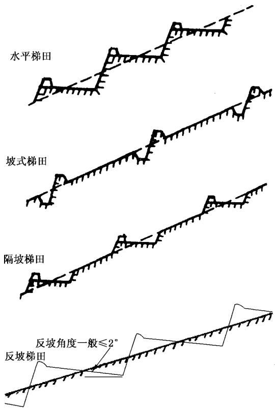
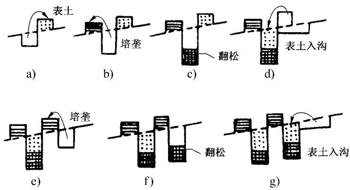
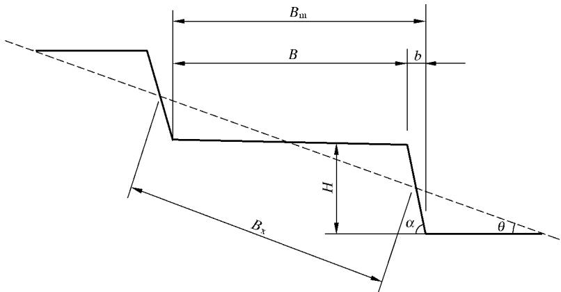
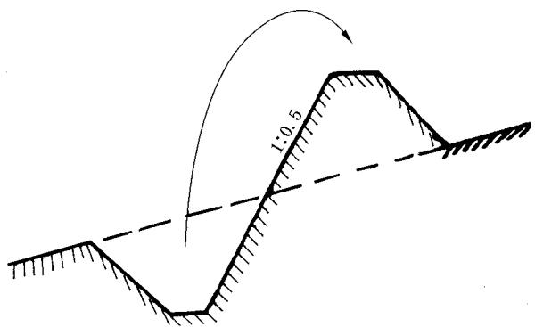
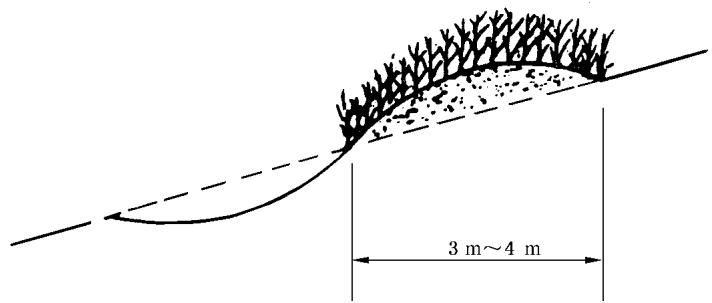
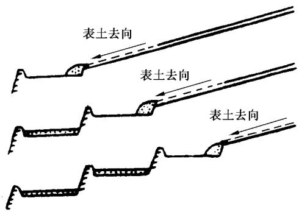
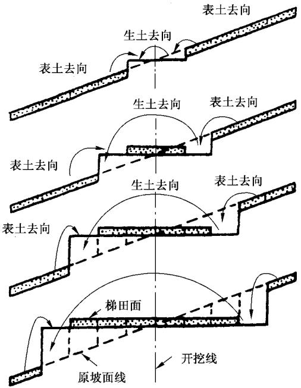
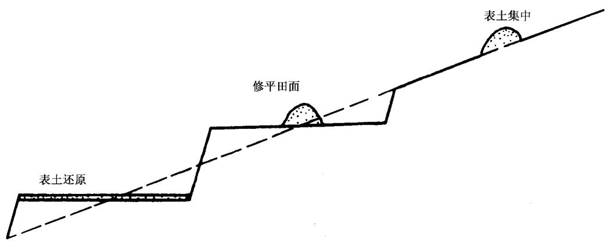
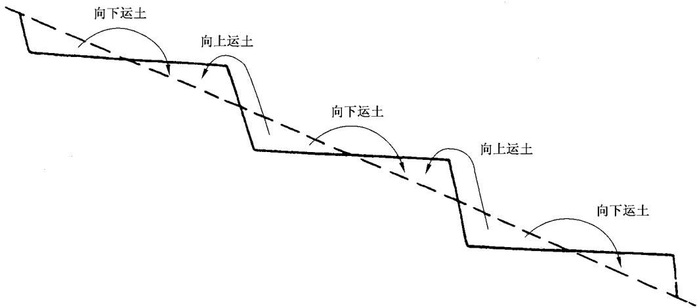
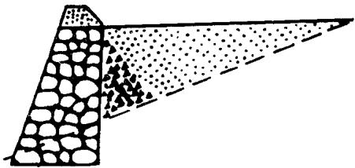

# 中华人民共和国国家标准

GB/T 16453.1—2008

代替 GB/T 16453.1—1996

# 水土保持综合治理 技术规范坡耕地治理技术

# Comprehensive control of soil and water conservation—Technical specification Technique for erosion control of slope land

2008-11-14 发布

2009-02-01 实施

## 前 言

GB/T16453《水土保持综合治理 技术规范》分为六个部分：

GB/T 16453.1—2008 水土保持综合治理 技术规范 坡耕地治理技术；

-GB/T16453.2—2008 水土保持综合治理 技术规范 荒地治理技术；

GB/T16453.3—2008 水土保持综合治理 技术规范 沟壑治理技术；

GB/T 16453.4—2008 水土保持综合治理 技术规范 小型蓄排引水工程；

GB/T 16453.5—2008 水土保持综合治理 技术规范 风沙治理技术；

GB/T 16453.6—2008 水土保持综合治理 技术规范 崩岗治理技术。

本部分代替GB/T16453.1—1996《水土保持综合治理 技术规范 坡耕地治理技术》。

本部分与GB/T16453.1—1996相比，作如下修改：

a）在保土耕作中增加一条秸杆覆盖；

b） 将1996年版的8.4.1改为“条件适合的地方，可一次性修成水平梯田”[见3.2.4中a)]；

c）石坎外坡坡度改为石坎稳定系数。

本部分的附录A为资料性附录。

本部分由水利部提出。

本部分由水利部国际合作与科技司归口。

本部分起草单位：水利部水土保持司、水利部水土保持监测中心、黄河水利委员会黄河上中游管理局、黄河水利委员会农村水利水土保持局、长江水利委员会水土保持局、松辽水利委员会农田水利处、珠江水利委员会农田水利处、海河水利委员会农田水利处、淮河水利委员会农田水利处、北京林业大学水土保持学院。

本部分主要起草人：郭廷辅、刘万铨、廖纯艳、胡玉法、马至尊、鲁胜力、徐传早、佟伟力、宁堆虎、郭索彦、张长印、赵永军、陈法扬、余新晓、丛佩娟、常丹东冯伟。

本部分所代替标准的历次版本发布情况为：

-GB/T 16453.1—1996。

## 引 言

GB/T16453.1一1996已经实施十余年，在水土保持综合治理方面起到了重要的指导作用。随着我国社会经济的发展和农村产业结构的变化，水土保持工作的内容、性质等方面也发生了深刻的变化。为了适应新形势下的水土保持工作，进一步规范水土保持综合治理技术规范，根据水利部国际合作与科技司、水土保持司的统一安排，进行了修订。

# 水土保持综合治理技术规范坡耕地治理技术

## 1 范围

GB/T16453的本部分规定了坡耕地上采取保水保土耕作及修梯田的分类、适用条件和具体方法。  
本部分适用于全国各地水蚀地区和水蚀与风蚀交错地区。

## 2 规范性引用文件

下列文件中的条款通过GB/T16453的本部分的引用而成为本部分的条款。凡是注日期的引用文件，其随后所有的修改单(不包括勘误的内容)或修订版均不适用于本部分，然而，鼓励根据本部分达成协议的各方研究是否可使用这些文件的最新版本。凡是不注日期的引用文件，其最新版本适用于本部分。

GB/T 16453.4—2008 水土保持综合治理 技术规范 小型蓄排引水工程

## 3 基本规定

## 3.1 保水保土耕作

3.1.1保水保土耕作是一种耕作方法，是在坡耕地上结合每年农事耕作，采取各类改变微地形或增加地面植物被覆，或增加土壤入渗，提高土壤抗蚀性能，以保水保土，减轻土壤侵蚀，提高作物产量为目的。可分为以下4类方法：

第一类，改变微地形的保水保土耕作，主要有等高耕作、沟垄种植、掏钵(穴状)种植、抗旱丰产沟、休闲地水平犁沟等。

第二类，增加地面植物被覆的保水保土耕作，主要有草田轮作、间作、套种、带状间作、合理密植、休闲地上种绿肥等。

第三类，增加土壤入渗、提高土壤抗蚀性能的保水保土耕作，主要有深耕、深松、增施有机肥、留茬播种等。

第四类，减少土壤蒸发的保水保土耕作，主要有地膜覆盖、秸秆覆盖等。

3.1.2在实施保水保土耕作之前，应以小流域为单元，进行坡耕地治理的全面规划。根据不同的地形、土质、降雨等条件，分别设置各类梯田，实行保土耕作和建设坡面小型蓄排水工程。对25°以下未修梯田的坡耕地，采用保土耕作。

3.1.3采用保土耕作的同时，在坡耕地内部及其上部外侧，尚需设置坡面小型蓄排工程，防止外水进入。

3.1.4每一保土耕作的具体作法与有关规格尺寸，各有其不同的适应条件，应根据各地不同的地形、土质、降雨和农事耕作情况，因地制宜，合理确定。

3.2 梯田

3.2.1根据地面坡度不同，可分为陡坡区梯田与缓坡区梯田。根据田坎建筑材料不同，可分为土坎梯田、石坎梯田和植物坎梯田等。根据梯田的断面形式不同，可分为水平梯田、坡式梯田、隔坡梯田和反坡梯田等，(见图1）。根据梯田的用途不同，分旱作物梯田、水稻梯田、果园梯田、茶园梯田、橡胶园梯田等。

  
图 1 三类梯田断面示意图

3.2.2以小流域为单元，进行坡耕地治理的全面规划，根据不同条件，分别确定采取梯田、保土耕作法和坡面小型蓄排水工程。对其中确定为梯田区的地段进行有关梯田的具体规划；在此基础上，再进行相应的设计和施工。

3.2.3当梯田区以上坡面为坡耕地或荒地时，应部署坡面小型蓄排工程，防止地表径流进入梯田区。我国南方雨多量大地区，梯田区内也应部署小型蓄排工程，以妥善处理梯田不能容蓄的雨水，保证梯田的安全。坡面小型蓄排工程的技术要求按GB/T16453.4执行。

梯田防御暴雨标准，一般采用10a一遇3h～6h最大降雨，在干旱、半干旱地区，可采用20a一遇3h～6h最大降雨。根据各地降雨特点，分别采用当地最易产生严重水土流失的短历时、高强度暴雨。

## 3.2.4 梯田类型的选用应遵循以下原则：

a）条件适合的地方，可一次性修成水平梯田。

b）在坡耕地土层较薄，或当地劳力较少的地区，可以先修坡式梯田，经逐年向下方翻土耕作，减缓田面坡度，逐步变成水平梯田。

c）在地多人少、劳力缺乏，同时年降雨量较少、耕地坡度在15°～20°的地方，可以采用隔坡梯田。

d）土质丘陵和塬、台地区修土坎梯田；在土石山区或石质山区、取料方便地区修梯田时，就地取材修成石坎梯田。

e）丘陵区或山区的坡耕地(坡度一般为 $1 5 ^ { \circ } \sim 2 5 ^ { \circ } )$ ，按陡坡区梯田进行规划、设计。东北黑土漫岗区、西北黄土高原区的塬面，以及零星分布各地河谷川台地上的缓坡耕地(坡度15以下)，按缓坡梯田进行规划、设计。

## 4 第一类保水保土耕作

## 4.1 等高耕作

4.1.1我国北方于旱少雨地区，耕作方向应基本沿等高线，有利于保水保土。我国南方多雨目土质粘重地区，耕作方向应与等高线呈1%～2%的比降，适应排水，并防止冲刷。在横坡耕作基础上采取的沟垄种植、休闲地水平犁沟等措施，其沟垄方向均可按此原则处理。

4.1.2 将原有顺坡沟垄改为横坡沟垄时，应先经过耕翻，再进行横坡耕作，形成新的横坡沟垄。

4.1.3实施横坡耕作的坡耕地，在坡面从上到下，每隔一定距离，还应沿等高线修筑若干道土埂，种草带、灌木带，或用套二犁作成水平犁沟，截短坡长，减轻水土流失。

4.1.3.1土埂初修高度宜为40cm～50cm，草带宜宽1m左右。每年耕作时，从上向下翻土，使两埂(或两带)间的地面坡度逐渐减缓，同时每年加高土埂10cm～20cm，逐步形成水平梯田。

4.1.3.2土埂或草带的距离，随坡度和降雨不同而异：坡度陡、雨量大的地方，间距可小些；坡度缓、雨量小的地方，间距可大些。一般15°以上陡坡地，埂间距8m～15m，10°以下缓坡地，埂间距20m～30 m。

4.1.4在有风蚀的缓坡地区，改顺坡耕作为横坡耕作时，应使耕作方向与主风向正交，或呈45°。

## 4.2 沟垄种植

4.2.1在坡耕地上应顺等高线(或与等高线呈1%～2%的比降)耕作，形成沟垄相间的地面，容蓄雨水，减轻水土流失。

4.2.2 播种时起垄。应由牲畜带犁完成，并按以下步骤进行：

4.2.2.1在地块下边空一犁宽地面不犁，从第二犁位置开始，顺等高线犁出第一条犁沟，向下翻土，形成第一道垄，垄顶至沟底深约20cm～30cm，将种子、肥料撒在犁沟内。

4.2.2.2在此犁沟上部犁半犁深，虚土覆盖犁沟中的种子、肥料。

4.2.2.3再空一犁宽地面不犁，在其上部顺等高线犁出第二条犁沟，向下翻土，形成第二道垄沟相间。  
此后照上述步骤依次进行。

4.2.2.4 在沟中每隔3m～5m作一小土垱，高10cm左右，相邻两沟间的小土垱呈“品”字形错开。

4.2.3中耕时起垄。主要用于玉米、高粱等高秆中耕作物。由人工操作，按以下步骤进行：

4.2.3.1在坡耕地上顺等高线条状播种，播种时不作沟垄。

4.2.3.2 第一次中耕时(苗高30m～40m），用锄将苗行间的土取起，培在幼苗根部；取土处连续不断形成水平沟，培土处连续不断形成等高垄。

4.2.3.3 取土时在沟中每隔3m～5 m留一高约10 cm的小土垱，相邻两沟间的小土垱呈“品”字形错开。

4.2.4畦状沟垄适于我国南方种红薯等作物，由人工操作，其步骤如下：

4.2.4.1 按照4.2.2的步骤将坡地作成沟垄。

4.2.4.2 每隔5条～6条沟垄留一田间小路，兼作排水道，形成坡面长畦；沿排水道每20m～30m作一横向畦埂，将长畦隔成短畦。

## 4.3 掏钵种植

4.3.1 一钵一苗法应符合下列要求：

4.3.1.1 在坡耕地上沿等高线用锄挖穴(掏钵），以作物株距为穴距(一般30 cm～40 cm)，以作物行距为上下两行穴间行距(一般60 cm～80 cm）。

4.3.1.2 穴的直径一般为 20 cm～25 cm，深 20 cm～25 cm，上下两行穴的位置呈“品”字形错开。

4.3.1.3 挖穴取出的生土在穴下方作成小土埂，再将穴底挖松，从第二穴位置上取10cm表土置于第一穴内，施入底肥，播下种子。

4.3.1.4以后各穴，采用同样方法处理，使每穴内都有表土。

4.3.2 一钵数苗法应符合下列要求：

4.3.2.1 在坡耕地上顺等高线挖穴，穴的直径约50cm，深30cm～40 cm。挖穴取出的生土在穴下方作成小土埂，穴间距离约50 cm。

4.3.2.2 将穴底挖松，深15 cm～20 cm，再将穴上方约 50 cm×50 cm位置上的表土取起 10 cm～  
15cm，均匀铺在穴底，施入底肥，播下种子，根据不同作物情况，每穴可种2株～3株。

4.3.2.3 以作物的行距作为穴的行距，相邻上下两行穴的位置呈“品”字形错开。

## 4.4 抗旱丰产沟

4.4.1 人工操作步骤见图 2：

  
图 2 抗旱丰产沟人工操作步骤

4.4.1.1从坡耕地下边开始，离地边约30 cm，顺等高线方向开挖宽约30 cm的一条沟，深 $2 0 \mathrm { \ c m \sim }$   
25cm，将挖起的表土暂时堆放在沟的上方，见图2中a）。

4.4.1.2 将沟内生土挖出，堆在沟的下方，形成第一条土埂，见图2中b）。

4.4.1.3 将沟底用锹翻松，深20 cm～25 cm，见图2 中 c)。

4.4.1.4 将沟上方暂时堆放的表土推入沟中；同时将沟上方宽约 60 cm、深约 20 cm的原地面上的表土取起，推入沟中，大致将沟填满，(见图2中d）。

4.4.1.5 在60cm宽去掉表土的地面上，将上半部30 cm宽位置挖一条沟，深 $2 0 \ \mathrm { c m } { \sim } 2 5 \ \mathrm { c m }$ ,挖出的生土堆在下半部30cm宽位置上，作成第二条土埂，见图2中e）。

4.4.1.6 将第二条沟底翻松，深20 cm\~25 cm，见图2中f)。

4.4.1.7 将第二条沟底上方约60cm宽的表土取起约20cm深，推入第二条沟中，见图2中g)。

按此继续操作，直到整个坡面都成生土作埂，表土入沟，沟中表土和松土层厚深40cm～50cm，保水保土保肥，有利作物生长。

4.4.2人畜结合，其施工步骤与人工操作基本一致。所不同的是：在取表土、取生土、翻松沟底等步骤，都用牲畜带犁，顺等高线翻松地面土层，再用人工以生土作埂，推表土入沟，以提高工效，节省人力。

## 4.5 休闲地水平犁沟

4.5.1在坡耕地内，从上到下，每隔2m～3m，沿等高线或与等高线保持1%～2%比降，作一道水平犁沟。犁时向下翻土，使犁沟下方形成一道土垄，以拦蓄雨水。

4.5.2在同一位置翻犁两次(套二犁)，加大沟深和垄高，加大沟垄容蓄能力。

4.5.3根据不同坡度和降雨情况，犁沟的间距可加大或缩小。坡度陡、雨量大的地方间距小些；坡度缓、雨量小的地方间距大些。

## 5 第二类保水保土耕作

5.1草田轮作。适用于地多人少的农区或半农牧区。特别是对原来有轮歇、撩荒习惯的地区，应采用草田轮作，代替轮歇撩荒，以保持水土，改良土壤。根据不同条件，分别采用不同的草田轮作方式。

5.1.1短期轮作。主要适用于农区，种2a～3a农作物后，种1a～2a草类。草种以毛苕子、箭舌豌豆等短期绿肥、牧草为主。

5.1.2 长期轮作。主要适用于半农半牧区，种4a～5a农作物后，种5a～6a草类。草种以苜蓿、沙打旺等多年牧草为主。

5.2间作与套种，要求两种(或两种以上)不同作物同时或先后种植在同一地块内，增加对地面的覆盖程度和延长对地面的覆盖时间，减轻水土流失。

5.2.1间作。两种不同作物同时播种。选为间作的两种作物应具备生态群落相互协调、生长环境互补的特点，主要有：高秆作物与低秆作物、深根作物与浅根作物、早熟作物与晚熟作物、密生作物与疏生作物、喜光作物与喜阴作物、禾本科作物与豆科作物等不同作物的合理配置，并等高种植。根据作物的生理特性分别采取以下两种间作方式：

5.2.1.1行间间作。适当加大第一种作物的行距，在每两行作物之间种植第二种作物，两种作物的株距不变。

5.2.1.2株间间作。适当加大第一种作物的株距，在每株作物之间种植第二种作物，两种作物的行距不变。也可进行双行间作。

5.2.2套种。在同一地块内，前季作物生长的后期，在其行间或株间播种或移栽后季作物，两种作物收获时间不同，其作物配置的协调互补与株行距要求与间作相同。根据作物的不同特点，在播种时间上分别采取以下两种作法：

a）在第一种作物第一次或第二次中耕以后，套种第二种作物。

b）在第一种作物收获前，套种第二种作物。

## 5.3 带状间作

5.3.1 作物带状间作

5.3.1.1 间作的作物种类参见 5.2.1。

5.3.1.2 间作条带方向，基本上沿等高线，或与等高线保持1%～2%的比降。

5.3.1.3 条带宽度一般5m～10m，两种作物可取等宽或分别采取不同的宽度，陡坡地条带宽度小些，缓坡地条带宽度大些。

5.3.1.4上述条带上的不同作物，每年或每二至三年互换一次，形成带状间作又兼轮作。

## 5.3.2 草粮带状间作

5.3.2.1 间作的作物和草类可参照5.1.1和5.1.2。

5.3.2.2 条带的方向基本上沿等高线，或与等高线呈1%～2%的比降。

5.3.2.3 条带的宽度一般5m～10m。作物带与草带的宽度，不同情况下分别采取不同的比例：一般情况下可取二者等宽；地多人少、坡度较陡地区，草带宽度可比作物带宽度大些；地少人多、坡度较缓地区，草带宽度可比作物带宽度小些。

5.3.2.4每二至三年或五至六年将草带和作物带互换一次，形成草粮带状间作又兼草粮轮作。但互换后需调整带宽，使草带与作物带保持原来的宽度比例。

## 5.4 休闲地上种绿肥

5.4.1作物未收获前10d\~15d，在作物行间顺等高线地面播种绿肥植物；作物收获后，绿肥植物加快生长，迅速覆盖地面。

5.4.2暴雨季节过后，将绿肥翻压土中，或收割作为牧草。要求整个暴雨季节地面都有草类覆盖。

5.4.3如因故不能在作物收获前套种绿肥，则应在作物收获后尽快播种，并配合做好水平犁沟。

## 5.5 合理密植

适用于原来耕作粗放、作物植株密度偏低的地区。通过选用优良品种、增施肥料、精耕细作、实行集约经营、结合等高耕作、合理调整并增加作物的植株密度，以保水保土保肥，提高作物产量。不同条件下分别采取不同的作法。

5.5.1水肥条件较好的，较大幅度地提高作物的植株密度，可同时缩小株距与行距，或行距不变只缩小株距，株距不变只缩小行距。

5.5.2水肥条件较差的，顺等高线适当加大行距而缩小株距，实行宽带密植，保持地中总的植株适量增加，以有利于保水保土，同时能适应较低的水肥条件。

## 6 第三类保水保土耕作

6.1 深耕深松。耕松的深度，以打破犁底层，提高土壤入渗能力为原则，一般25cm～30cm。

6.2 增施有机肥，要求促进土壤形成团粒结构，提高田间持水能力和土壤抗蚀性能。

6.3留茬播种，主要适用于同一地块中两种作物不能套种的坡耕地或缓坡风蚀地。

## 7 第四类保水保土耕作

7.1地膜覆盖，主要适用于半湿润、半干旱地区，结合早春作物播种。

7.2秸秆覆盖，主要适用于燃料、饲料比较充裕的地方。

## 8 梯田布局

## 8.1 陡坡区梯田的布设

8.1.1选土质较好、坡度(相对)较缓、距村较近、交通较便、位置较低、邻近水源的地方修梯田。有条件的应考虑小型机械耕作和就地蓄水灌溉，并与坡面水系工程相结合。

8.1.2田块布设需顺山坡地形，大弯就势，小弯取直，田块长度尽可能达到 $1 0 0 \ \mathrm { m } { \sim } 2 0 0 \ \mathrm { m } .$ 以便利耕作。

8.1.3梯田区不能全部拦蓄暴雨径流的地方，应布置相应的排、蓄工程；在山丘上部有地表径流进入梯田区处，应布置截水沟等小型蓄排工程，以保证梯田区安全。

8.1.4需有从坡脚到坡顶、从村庄到田间的道路。路面一般宽 $2 \ \mathrm { m } { \sim } 3 \ \mathrm { m }$ ，比降不超过15%。在地面坡度超过15%的地方，道路采用“S”形，盘绕而上，减小路面最大比降。

## 8.2 缓坡区梯田的布设

8.2.1 以道路为骨架划分耕作区，在耕作区内布置宽面(20m～30 m或更宽)、低坎(1m左右)地埂的梯田，田面长200m～400m，便利大型机械耕作和自流灌溉。

8.2.2对少数地形有波状起伏的，耕作区应顺总的地势呈扇形，区内梯田埂线亦随之略有弧度，不要求一律成直线。

8.2.3一般情况下耕作区为矩形或正方形，四面或三面通路，路面宽3m左右，路旁与渠道、农田防护林网结合；耕作区道路两端与村、乡、县公路相连。

## 9 梯田设计

9.1 水平梯田的断面设计

9.1.1 不同坡度下梯田的优化断面

9.1.1.1 田面应有适当的宽度(陡坡区一般5 m～15 m，缓坡区一般 20 m～40 m)。

9.1.1.2田坎坡度适当，既坚实稳固，又不多占耕地。

9.1.2 水平梯田的断面要素

9.1.2.1 水平梯田断面要素见图 3。

θ——原地面坡度，(°)；

α———梯田田坎坡度，(°)；

H——梯田田坎高度，m；

$B _ { \mathrm { x } }$ ———原坡面斜宽，m；

$B _ { \mathrm { m } }$ ——梯田田面毛宽，m；

$B ^ { - }$ ——梯田田面净宽，m；

b———梯田田坎占地宽，m。

图 3 水平梯田断面要素

9.1.2.2 各要素间关系[见式(1)～式(6)]:

$$
\mathbb { H } \mathbb { H } \mathbb { K } \xrightarrow [ ] { \mathbb { H } } \mathbb { H }
$$

$$
H = B _ { \mathrm { x } } \mathrm { s i n } \theta\tag{…………………………(1}
$$

$$
\sqrt { 5 } + \exp - \sqrt { \mathrm { H } } \approxeq \sqrt { \frac { 2 } { \sqrt { \Omega } } }
$$

$$
B _ { \mathrm { x } } = H \mathrm { c o s } \theta\tag{…………………………(2}
$$

$$
\mathbb { H } \mathbb { H } \mathbb { \Pi } _ { \perp } ^ { \mathrm { ~ F ~ f ~ } \ddag \ddag }
$$

$$
b = H \mathrm { c o t } \alpha\tag{………………………(3}
$$

$$
\mathbb { H } \overrightarrow { \mathbb { H } } \\\\\\\\\\\\\\\\\\= \ \overrightarrow { \mathbb { H } }
$$

$$
B _ { \mathrm { m } } = H \mathrm { c o t } \theta\tag{…………………………(4}
$$

$$
\mathbb { H } \mathbb { H } \mathbb { K } \xrightarrow [ ] { \mathbb { H } } \mathbb { H }
$$

$$
H = B _ { \mathrm { m } } \mathrm { c o t } \theta\tag{……………………………(5}
$$

$$
\mathbb { H } \overrightarrow { \mathbb { H } } \backslash \tilde { \mathbb { H } } \xrightarrow { \ast } 
$$

$$
B = B _ { \mathrm { m } } - b = H ( \mathrm { c o t } \theta - \mathrm { c o t } \alpha )\tag{……………………(6}
$$

9.1.2.3 除上述各要素外，田边应有蓄水埂，高0.3m～0.5m，顶宽0.3m～0.5m，内外坡比约1：1。我国南方多雨地区，梯田内侧应有排水沟，其具体尺寸根据各地降雨、土质、地表径流情况而定，所需土方量根据断面尺寸量算，不纳入上述各要素设计。

9.1.3 水平梯田断面主要尺寸

参考数值参见附录A。

## 9.1.4 水平梯田工程量计算

9.1.4.1 单位面积土方量可按式(7)计算：

$$
V = { \frac { 1 } { 2 } } \Bigl ( { \frac { B } { 2 } } \times { \frac { H } { 2 } } \times L \Bigr ) = { \frac { 1 } { 8 } } B H L\tag{……………………(7}
$$

式中：

V——单位面积 $\mathrm { { ( h m ^ { 2 } } }$ 或亩)梯田土方量，单位为立方米 $\mathrm { ( m ^ { 3 } ) }$

L——单位面积 $\mathrm { { ( h m ^ { 2 } } }$ 或亩)梯田长度，单位为米(m)；

H——田坎高度，单位为米(m)；

$B ^ { - }$ ——田面净宽，单位为米(m)。

当梯田面积按 $\mathrm { h m } ^ { 2 }$ 计算时，单位面积土方量按式(8)计算：

$$
V = { \frac { 1 } { 8 } } H \times 1 0 ^ { 4 } = 1 \ 2 5 0 H\tag{…………………………………………(8}
$$

当梯田面积按亩计算时，单位面积土方量按式(9)计算：

$$
V = { \frac { 1 } { 8 } } H \times 6 6 6 . 7 = 8 3 . 3 H\tag{…………………………(9}
$$

9.1.4.2 单位面积土方移运量可按公式(10)计算：

$$
W = V \times \frac { 2 } { 3 } B = \frac { 1 } { 1 2 } B ^ { 2 } H L\tag{…………………………(10}
$$

式中：

W——单位面积 $\mathrm { { ( h m ^ { 2 } } }$ 或亩)土方移运量， $\mathrm { m ^ { 3 } - m }$

土方移运量的单位为 $\mathrm { m ^ { 3 } - m }$ ，是一个复合单位，即需将若干 $\mathrm { m ^ { 3 } }$ 的土方量运若干m的距离。当梯田面积按 $\mathrm { h m } ^ { 2 }$ 计算时，单位面积土方移运量按式(11)计算：

$$
W = \frac { B H } { 1 2 } \times 1 0 ^ { 4 } = 8 3 3 . 3 B H\tag{……………………………(11}
$$

式中：

W——每公顷土方移运量， $\mathrm { m ^ { 3 } - m }$

当梯田面积按亩计算时，单位面积土方移运量按式(12)计算：

$$
W = { \frac { B H } { 1 2 } } \times 6 6 6 . 7 = 5 5 . 6 B H\tag{…………………………(12}
$$

式中：

W——每亩土方移运量， $\mathrm { { m ^ { 3 } } - \mathrm { { m } , } }$

9.2 坡式梯田的断面设计

9.2.1 确定等高沟埂间距

9.2.1.1 每两条沟埂之间的田面斜宽Bx应有足够大。

9.2.1.2地面坡度陡，沟埂间距应小；地面坡度缓，沟埂间距应大。

9.2.1.3 雨量和强度大的地区沟埂间距应小些，雨量和强度小的地区沟埂间距应大些。

9.2.1.4土壤颗粒中含沙粒较多、渗透性较强的，沟埂间距应大些；土质粘重、渗透性较差的，沟埂间距应小些。

9.2.1.5 不同地区根据以上几方面不同条件，经综合分析，确定沟埂间距同时可参考当地水平梯田断面设计的B值，并考虑坡式梯田经过逐年加高土埂，最终变成水平梯田时的断面，应与一次修成水平梯田的断面相近。

## 9.2.2 确定等高沟埂断面尺寸

9.2.2.1沟埂的基本形式应采取埂在上、沟在下，从埂下方开沟取土，在沟上方筑埂，逐年加高土埂，最终变成水平梯田。

9.2.2.2 埂顶宽 30 cm\~40 cm，埂高 $5 0 \ \mathrm { c m } { \sim } 6 0 \ \mathrm { c m }$ ，外坡1：0.5，内坡1：1。

9.2.2.3通过降雨径流泥沙计算，干旱、半干旱地区，土埂上方容量应能拦蓄当地10a～20a一遇的一次降雨中两埂之间坡面所产生的地表径流与泥沙；多雨地区土埂不能全部拦蓄的，应结合坡面小型蓄排工程，妥善处理多余的径流与泥沙（坡面径流泥沙计算，按GB/T16453.4—2008中3.3.1执行。

9.2.2.4当土埂上方由于泥沙淤积导致容量减小时，应及时从下方取土加高土埂，保持初修的尺寸和容量。

## 9.2.3 坡式梯田断面

坡式梯田断面见图4。

  
图 4 坡式梯田断面

## 9.2.4 草带(或灌木带)坡式梯田的断面设计

a）每两带间的斜坡田面宽度按9.2.1的规定确定；

b）草带(或灌木带)的宽度宜为 $3 \ \mathrm { m } { \sim } 4 \ \mathrm { m } ;$

c）在种草带(或灌木带)之前，先修宽浅式软埂(不夯实)，可将草(或灌木)种在埂上(见图5)。

  
图 5 草带(或灌木带)坡式梯田

9.3 隔坡梯田的断面设计

9.3.1 平台宽度按下列情况确定：

9.3.1.1 根据隔坡梯田地面坡度 $( 1 5 ^ { \circ } \sim 2 5 ^ { \circ } )$ ，水平田面宽度宜为5m～10m，坡度缓的可宽些，坡度陡的可窄些。

9.3.1.2平台的宽度应能适应耕作，且能适应斜坡部分的暴雨径流情况，应全部拦蓄斜坡径流，且能有效地提高作物产量。

9.3.2 斜坡宽度按下列情况确定：

9.3.2.1 斜坡宽度(按垂直投影计)以其与水平部分的宽度比例表示。若水平面宽为1，则斜坡部分的宽度比例可为1：1～1：3(或者更大)。一般干旱少雨地区斜坡宽度比例可大些，雨量较多地区斜坡宽度比例可小些。

9.3.2.2根据地面坡度、土质、植被和当地降雨情况（通过小区径流观测），确定斜坡部分在10a一遇一次暴雨中，以每平方米产生的径流和泥沙量，作为确定斜坡宽度的主要依据。

9.3.2.3根据平台部分的宽度、田面土壤的渗透性，考虑暴雨中田面直接受雨后，再能接受斜坡暴雨径流的能力，具体确定斜坡宽度。在设计频率暴雨下，水平田面应能全部拦蓄斜坡的径流，不发生漫溢。

9.3.2.4 应计算斜坡上全年的地表径流，了解其对水平田面提供径流下泄的水量。如水量偏小，则应适当加大斜坡宽度。

## 10 梯田的施工

10.1土坎梯田的施工定线、清基、筑埂、保留表土、修平田面等五道工序

10.1.1 梯田定线

10.1.1.1 根据梯田规划确定为梯田区的坡面，在其正中(距左右两端大致相等)从上到下划一中轴线。

10.1.1.2 根据梯田断面设计的田面斜宽 $\boldsymbol { B } _ { \mathrm { x } }$ ，在中轴线上划出各台梯田的 $\boldsymbol { B } _ { \mathrm { x } }$ 基点。

10.1.1.3从各台梯田的B基点出发，用手水准向左右两端分别测定其等高点；连各等高点成线，即为各台梯田的施工线。

10.1.1.4定线过程中，遇局部地形复杂处，应根据大弯就势，小弯取直原则处理。为保持田面等宽，可适当调整埂线位置。

10.1.2 田坎清基

10.1.2.1 以各台梯田的施工线为中心，上下各划出50 cm～60 cm宽，作为清基线。

10.1.2.2 在清基线范围内清除表土厚约20cm，暂时堆在清基线下方，施工中与整个田面保留表土结合处理。

10.1.2.3将清基线内的地面翻松约10cm，清除石砾等杂物(如有洞穴，及时填塞），整平，夯实。

10.1.3 修筑田坎

10.1.3.1田坎应用生土填筑，土中不应夹有石砾、树根、草皮等杂物。

10.1.3.2 修筑时应分层夯实，每层虚土厚约20 cm，夯实后厚约15 cm。

10.1.3.3 修筑中每道埂坎应全面均匀地同时升高，不应出现各段参差不齐，影响接茬处质量。

10.1.3.4 田坎升高过程中应根据设计的田坎坡度，逐层向内收缩，并将坎面拍光。

10.1.3.5随着田坎升高，坎后的田面也相应升高，将坎后填实，使田面与田坎紧密结合在一起。

10.1.4 保留表土

10.1.4.1 表土逐台下移适用于坡度较陡，田面较窄(10m以下)的梯田。步骤如下(见图6)。

  
图6 表土逐台下移法

10.1.4.1.1 整个坡面梯田逐台从下向上修，先将最下面一台梯田修平，不保留表土。

10.1.4.1.2将第二台拟修梯田田面的表土取起，推到第一台田面上，均匀铺好。

10.1.4.1.3第二台梯田修平后，将第三台拟修梯田田面的表土取起，推到第二台田面上，均匀铺好。

10.1.4.1.4如此逐台进行，直到各台修平。

10.1.4.2 表土逐行置换法适用于坡面坡度较缓，梯田田面较宽(20m～30m)的情况。步骤如下(见图7)。

  
图 7 表土逐行置换法

10.1.4.2.1 先将田面中部约2m宽修平，将其上下两侧各约1m宽表土取来铺上。

10.1.4.2.2 挖上侧1m宽田面，填下侧1m宽田面，将平台扩大为4m宽。

10.1.4.2.3 按前述方法，再向上下两端各展1m宽，将平台扩大为6m。

10.1.4.2.4 如此继续进行下去，直到将整个田面修平。

10.1.4.3 表土中间堆置适用于田面宽10m～15m的情况。步骤如下（见图8）。

  
图 8 表土中间堆置法

10.1.4.3.1将拟修田面的表土全部取起，堆置在田面中心线位置，宽2m左右。

10.1.4.3.2 将中心线上方田面生土取起，填于下方田面。

10.1.4.3.3将堆置在中心线的表土，均匀铺运到整个田面上。

## 10.1.5 修平田面

10.1.5.1将田面分成下挖上填与上挖下填两部分：田坎线以下各1.5m范围，采取下挖上填法，从田坎下方取土，填到田坎上方。其余田面采取上挖下填法，从田面中心线以上取土，填到中心线以下（见图9)。

  
图9 上挖下填与下挖上填

10.1.5.2 田面挖填任务基本完成后，应用手水准检查是否达到水平(或按设计要求的纵向比降)，允许误差为±1%。

## 10.2 石坎梯田的施工

## 10.2.1 修砌石坎

10.2.1.1先应备好石料，大小搭配均匀，堆放田坎线下侧。

10.2.1.2 逐层向上修砌，每层应用比较规整的较大块石（长40 cm～50 cm，宽20 cm～30cm，厚15cm～20cm)砌成田坎外坡，各块之间上下左右都应挤紧，上下两层的中缝要错开呈“品”字形。较长石坎每10m～15m留一沉陷缝。

10.2.1.3 石坎外坡以内各层，应与外坡相同，但所用石料不必强求规整。修砌过程中整个石坎应均匀地逐层升高，压顶的块石应规整，且具有较大尺寸。

10.2.1.4 石坎稳定系数可取1.15～1.20，顶宽 $0 . 4 ~ \mathrm { m } { \sim } 0 . 5 ~ \mathrm { m }$ ，根据不同坎高，计算石坎底宽，相应地

加大清基宽度。

## 10.2.2 坎后填膛与修平田面

10.2.2.1两道工序应结合进行。在下挖上填与上挖下填修平田过程中，将夹在土内的石块、石砾拾起，分层堆放在石坎后，形成一个三角形断面对石坎的支撑(见图10)。

  
图 10 石坎梯田断面示意图

10.2.2.2 堆放石块、石砾的顺序是：从下向上，先堆大块，后堆小块，然后填土进行田面平整。

10.2.2.3 通过坎后填膛，平整后的田面30cm～50cm深以内应无石块、石砾，以利耕作。

## 11 梯田管理

## 11.1 维修养护

11.1.1每年汛后和每次较大暴雨后，应对梯田区检查，发现田坎(田埂)有缺口、穿洞等损毁现象，应及时进行补修。

11.1.2梯田田面平整后，地中原有浅沟处，雨后产生不均匀沉陷，田面出现浅沟集流的，在庄稼收割后，应及时取土填平。

11.1.3坡式梯田的田埂，应随着埂后泥沙淤积情况，每年从田埂下方取土，加高田埂，保持埂后按原设计应有足够的拦蓄容量。

11.1.4隔坡梯田的平台与斜坡交接处，如有泥沙淤积，应及时将泥沙均匀摊在水平田面，保持田面水平。

## 11.2 促进生土熟化

11.2.1梯田修平后，应在挖方部位多施有机肥(单位面积施肥量较一般施肥高一倍左右），同时深耕  
30cm左右(如是畜力翻耕，可采用“套二犁”），促进生土熟化。

11.2.2 新修水平梯田(与隔坡梯田的平台部分)，第一年应选种能适应生土的作物，如豆类和马铃薯等，或种一季绿肥作物与豆科牧草。

## 11.3 田坎利用

11.3.1根据田面宽度、田坎高度与坡度，应分别选种经济价值高、对田面作物生长影响小的树种、草种，发展田坎经济。

11.3.2根据所选树种、草种的植物生理特性，经过试验研究，确定在田坎上种植的方式（株距、位置），以及经营管理要求，力争田坎上植物优质、高产。

11.3.3 田坎利用应与搞好田坎的维修养护、保证田坎安全相结合。

附录A

(资料性附录)

水平梯田断面尺寸参考数值

表 A.1 水平梯田断面尺寸参考数值
<table><tr><td rowspan=1 colspan=1>适应地区</td><td rowspan=1 colspan=1>地面坡度θ/(°)</td><td rowspan=1 colspan=1>田面净宽B/m</td><td rowspan=1 colspan=1>田坎高度H/m</td><td rowspan=1 colspan=1>田坎坡度 $\alpha /$ (°)</td></tr><tr><td rowspan=5 colspan=1>中国北方</td><td rowspan=1 colspan=1>1~5</td><td rowspan=1 colspan=1>30~40</td><td rowspan=1 colspan=1>1.1~2.3</td><td rowspan=1 colspan=1>85~70</td></tr><tr><td rowspan=1 colspan=1>5~10</td><td rowspan=1 colspan=1>20~30</td><td rowspan=1 colspan=1>1.5~4.3</td><td rowspan=1 colspan=1>75~55</td></tr><tr><td rowspan=1 colspan=1>10~15</td><td rowspan=1 colspan=1>15~20</td><td rowspan=1 colspan=1>2.8~4.4</td><td rowspan=1 colspan=1>70~50</td></tr><tr><td rowspan=1 colspan=1>15~20</td><td rowspan=1 colspan=1>10~15</td><td rowspan=1 colspan=1>2.7~4.5</td><td rowspan=1 colspan=1>70~50</td></tr><tr><td rowspan=1 colspan=1>20~25</td><td rowspan=1 colspan=1>8~10</td><td rowspan=1 colspan=1>2.9~4.7</td><td rowspan=1 colspan=1>70~50</td></tr><tr><td rowspan=5 colspan=1>中国南方</td><td rowspan=1 colspan=1>1~5</td><td rowspan=1 colspan=1>10~15</td><td rowspan=1 colspan=1>0.5~1.2</td><td rowspan=1 colspan=1>90~85</td></tr><tr><td rowspan=1 colspan=1>5~10</td><td rowspan=1 colspan=1>8~10</td><td rowspan=1 colspan=1>0.7~1.8</td><td rowspan=1 colspan=1>90~80</td></tr><tr><td rowspan=1 colspan=1>10~15</td><td rowspan=1 colspan=1>7~8</td><td rowspan=1 colspan=1>1.2~2.2</td><td rowspan=1 colspan=1>85~75</td></tr><tr><td rowspan=1 colspan=1>15~20</td><td rowspan=1 colspan=1>6~7</td><td rowspan=1 colspan=1>1.6~2.6</td><td rowspan=1 colspan=1>75~70</td></tr><tr><td rowspan=1 colspan=1>20~25</td><td rowspan=1 colspan=1>5~6</td><td rowspan=1 colspan=1>1.8~2.8</td><td rowspan=1 colspan=1>70~65</td></tr><tr><td rowspan=1 colspan=5>注：本表中的田面宽度与田坎坡度适用于土层较厚地区和土质田坎。至于土层较薄地区其田面宽度应根据土层厚度适当减小；对石质田坎的坡度，将结合石坎梯田的施工另作规定。</td></tr></table>