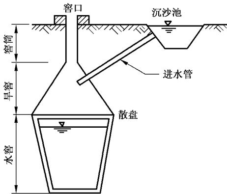
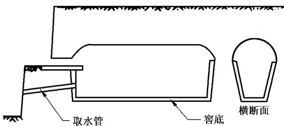
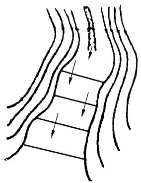
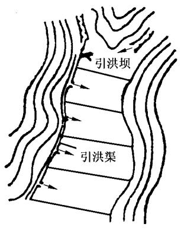
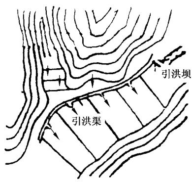

# 中华人民共和国国家标准

GB/T 16453.4—2008

代替 GB/T 16453.4—1996

# 水土保持综合治理技术规范小型蓄排引水工程

# Comprehensive control of soil and water conservation—Technical specification Small engineering of store,drainage and draw water

2008-11-14 发布

2009-02-01 实施

## 前 言

GB/T16453《水土保持综合治理 技术规范》共分为六个部分：

GB/T16453.1—2008 水土保持综合治理 技术规范 坡耕地治理技术；

-GB/T16453.2—2008 水土保持综合治理 技术规范 荒地治理技术；

GB/T16453.3—2008 水土保持综合治理 技术规范 沟壑治理技术；

-GB/T16453.4—2008 水土保持综合治理 技术规范 小型蓄排引水工程；

GB/T 16453.5—2008 水土保持综合治理 技术规范 风沙治理技术；

GB/T16453.6—2008 水土保持综合治理 技术规范 崩岗治理技术。

本部分代替GB/T16453.4—1996《水土保持综合治理 技术规范 小型蓄排引水工程》。

本部分与GB/T16453.4—1996相比，作如下修改：

a）小型蓄排水工程部分，将规划改为设计；

b）将1996年版的5.2.2改为首先处理好基础，并按设计做好防渗；

c）石方衬砌材料改为砖石等材料；

d）蓄水池施工要求改为蓄水池墙体完成后须用水泥沙浆抹面，进行防渗处理；

e）增加一条沉沙池施工。

本部分由水利部提出。

本部分由水利部国际合作与科技司归口。

本部分起草单位：水利部水土保持司、水利部水土保持监测中心、黄河水利委员会黄河上中游管理局、黄河水利委员会农村水利水土保持局、长江水利委员会水土保持局、松辽水利委员会农田水利处、珠江水利委员会农田水利处、海河水利委员会农田水利处、淮河水利委员会农田水利处、北京林业大学水土保持学院。

本部分主要起草人：段巧甫、刘万铨、范起敬、宁堆虎、佟伟力、鲁胜力、郭索彦、张长印、赵永军、陈法扬、余新晓、丛佩娟、常丹东、冯伟、李琦。

本部分所代替标准的历次版本发布情况为：

-GB/T 16453.4—1996。

## 引 言

GB/T16453.4一1996已经实施十余年，在水土保持综合治理方面起到了重要的指导作用。随着我国社会经济的发展和农村产业结构的变化，水土保持工作的内容、性质等方面也发生了深刻的变化。为了适应新形势下的水土保持工作，进一步规范水土保持综合治理技术规范，根据水利部国际合作与科技司、水土保持司的统一安排，进行了修订。

# 水土保持综合治理技术规范小型蓄排引水工程

## 1 范围

1.1GB/T16453的本部分规定了坡面小型蓄排工程、路旁沟底小型蓄引工程和引洪漫地工程的规划、设计、施工和管理的技术要求。

## 1.2 本部分适用范围

1.2.1路旁沟底小型蓄引工程包括水窑(旱井)、涝池以及山丘间泉水利用等路旁、沟底小型蓄引工程等类型，适用于北方干旱、半干旱地区。南方局部有干旱、半干旱现象的地区，也可以参照使用。

1.2.2引洪漫地工程指水土流失地区在暴雨期间引用坡面、道路、沟壑与河流的洪水、淤漫耕地或荒滩的工程，适用于北方干旱、半干旱地区。南方干旱、半干旱的局部地区也可参照使用。

1.2.3 小型蓄排引水工程的建设除应符合本部分的规定外，还应符合国家现行有关标准的规定。

## 2 规范性引用文件

下列文件中的条款通过GB/T16453的本部分的引用而成为本部分的条款。凡是注日期的引用文件，其随后所有的修改单(不包括勘误的内容)或修订版均不适用于本部分，然而，鼓励根据本部分达成协议的各方研究是否可使用这些文件的最新版本。凡是不注日期的引用文件，其最新版本适用于本部分。

GB/T16453.1—2008 水土保持综合治理 技术规范 坡耕地治理技术

GB/T 16453.3 水土保持综合治理 技术规范 沟壑治理技术

GB 50400 建筑与小区雨水利用技术规范

SL 267 雨水集蓄利用技术规范

## 3 坡面小型蓄排工程

## 3.1 基本规定

3.1.1坡面小型蓄排工程包括截水沟、排水沟、沉沙池和蓄水池等类型，适用于南方多雨地区。北方部分雨量较多、坡面径流较大的土石山区和丘陵区，也可参照使用。

3.1.2 坡面小型蓄水工程应与坡耕地治理中的梯田、保水保土耕作等措施、荒地治理中造林育林、种草育草等措施紧密结合，配套实施。

3.1.3在坡耕地治理的规划中，应将坡面小型蓄排工程与梯田、保水保土耕作法等措施统一规划，同步施工，达到出现设计暴雨时能保护梯田区和保土耕作区的安全。同时，小型蓄排工程的暴雨径流和建筑物设计，也应考虑梯田和保水保土耕作减少径流泥沙的作用。

3.1.4在荒地治理的规划中，应将坡面小型蓄排工程与造林育林、种草育草统一规划，同步施工，达到出现设计暴雨能保护林草措施的安全。同时，小型蓄排工程的暴雨径流和建筑物设计，也应考虑造林育林和种草育草减少径流泥沙的作用。

3.1.5 坡面小型蓄排工程应充分考虑蓄水利用。设计时可参考SL 267和GB 50400。

## 3.2 规划

3.2.1在进行坡耕地或荒地治理规划的基础上，坡面小型蓄排工程应进行专项总体布局，合理地布设截水沟、排水沟、沉沙池和蓄水池等四项主要建筑物，构成完整的防御体系。

## 3.2.2 截水沟布设应遵循以下原则：

a）当坡面下部是梯田或林草，上部是坡耕地或荒坡时，应在其交界处布设截水沟。

b）当无措施坡面的坡长太大时，应在此坡面增设几道截水沟。增设截水沟的间距为 $2 0 \textrm { m } { \sim }$ 30m，根据地面坡度、土质和暴雨径流情况，通过设计计算具体确定。

c） 蓄水型截水沟基本上沿等高线布设，排水型截水沟应与等高线取1%～2%的比降。

d） 当截水沟不水平时，应在沟中每5m～10m修一高 $2 0 \ \mathrm { c m } { \sim } 3 0 \ \mathrm { c m }$ 的小土挡，防止冲刷。

e）排水型截水沟的排水一端应与坡面排水沟相接，并在连接处作好防冲措施。

## 3.2.3 排水沟布设应遵循以下原则：

a）排水沟一般布设在坡面截水沟的两端或较低一端，用以排除截水沟不能容纳的地表径流。排水沟的终端应连接蓄水池或天然排水道。

b）排水沟在坡面上的比降，根据其排水去处(蓄水池或天然排水道)的位置而定。当排水出口的位置在坡脚时，排水沟大致与坡面等高线正交布设；当排水去处的位置在坡面时，排水沟可基本沿等高线或与等高线斜交布设。各种布设都应作好防冲措施(铺草皮或石方衬砌）。

c）梯田区两端的排水沟，一般与坡面等高线正交布设，大致与梯田两端的道路同向。一般土质排水沟应分段设置跌水。排水沟纵断面可采取与梯田区大断面一致，以每台田面宽为一水平段，以每台田坎高为一跌水，在跌水处做好防冲措施(铺草皮或石方衬砌)。

## 3.2.4 蓄水池与沉沙池的布设应遵循以下原则：

a）蓄水池一般布设在坡脚或坡面局部低凹处，与排水沟(或排水型截水沟)的终端相连，容蓄坡面排水。

b）蓄水池的分布与容量，应根据坡面径流总量、蓄排关系和修建省工、使用方便等原则，因地制宜具体确定。一个坡面的蓄排工程系统可集中布设一个蓄水池，也可分散布设若干蓄水池。单池容量为 $1 0 0 \ \mathrm { m } ^ { 3 } { \sim } 1 0 \ 0 0 0 \ \mathrm { m } ^ { 3 }$ o

c）蓄水池的位置，应根据地形有利、便于利用、岩性良好(无裂缝暗穴、砂砾层等）、蓄水容量大、工程量小、施工方便等条件具体确定。

d)沉沙池一般布设在蓄水池进水口的上游附近。排水沟(或排水型截水沟)排出的水，先进入沉沙池，泥沙沉淀后，再将清水排入池中。

e）沉沙池的具体位置，应根据当地地形和工程条件确定，可以紧靠蓄水池，也可以与蓄水池保持一定距离。

## 3.3 设计

## 3.3.1 截水沟设计

a） 暴雨径流设计中的防御暴雨标准可取10a一遇24h最大降雨量。坡面径流量与土壤侵蚀量可根据水土保持试验站的小区径流观测资料，或查阅当地水文手册确定。在上述设计频率暴雨下，不同坡度、不同土质、不同植被的坡面，应采取不同的暴雨径流量与土壤侵蚀量。可用一次暴雨的径流模数 $W _ { \mathrm { m } } ( \mathrm { m } ^ { 3 } / \mathrm { h m } ^ { 2 } )$ 和年均土壤侵蚀模数 $M _ { \mathrm { s } } ( \mathrm { t } / \mathrm { h m } ^ { 2 } )$ 表示。

## b）蓄水型截水沟断面设计

1） 每道截水沟的容量V可按式(1)计算：

$$
V = V _ { \mathrm { w } } + V _ { \mathrm { s } }\tag{……………………(1}
$$

式中：

V——截水沟容量，单位为立方米 $\mathrm { ( m ^ { 3 } ) }$

$V _ { \mathrm { ~ w ~ } }$ 一次暴雨径流量，单位为立方米 $\mathrm { ( m ^ { 3 } ) }$

$V _ { \mathrm { s } }$ —1 $\mathrm { a } \sim 3 \mathrm { ~ a ~ }$ 土壤侵蚀量，单位为立方米 $\mathrm { ( m ^ { 3 } ) }$

$V _ { \mathrm { s } }$ 的计算单位，根据各地土壤干密度，由t折算为 $\mathrm { m ^ { 3 } }$ （下同)。

其中， $V _ { \mathrm { ~ w ~ } }$ 和 $V _ { \mathrm { s } }$ 值可按式(2)和式(3)计算：

…………………………(7)

$$
V _ { \mathrm { w } } = M _ { \mathrm { w } } \times F\tag{……………………………(2}
$$

$$
V _ { \mathrm { s } } = 3 M _ { \mathrm { s } } \times F\tag{……………………………(3}
$$

式中：

F——截水沟的集水面积，单位为公顷 $( \mathrm { h m } ^ { 2 } )$

$M _ { \mathrm { w } }$ 一次暴雨径流模数，单位为立方米每公顷 $( \mathrm { m } ^ { 3 } / \mathrm { h m } ^ { 2 } )$

$M _ { \mathrm { s } }$ —1a土壤侵蚀模数，单位为立方米每公顷 $( \mathrm { m } ^ { 3 } / \mathrm { h m } ^ { 2 } )$

2） 根据V值计算截水沟断面面积 $A _ { 1 }$ …

$$
A _ { \mathrm { l } } = V / L\tag{…………………………(4}
$$

式中：

$A _ { 1 }$ 截水沟断面面积，单位为平方米 $\mathrm { ( m ^ { 2 } ) }$

$L ^ { \cdot }$ 截水沟长度，单位为米(m)。

3）截水沟断面要素的确定：

截水沟由半挖半填作成梯形断面，其断面要素、符号和常用数值，如表1所示。

表1 截水沟断面要素、常用数值
<table><tr><td rowspan=1 colspan=1>沟底宽 $B _ { \mathrm { d } } /$ m</td><td rowspan=1 colspan=1>沟深H/m</td><td rowspan=1 colspan=1>内坡比 $m _ { 1 }$ </td><td rowspan=1 colspan=1>外坡比 $m _ { 0 }$ </td></tr><tr><td rowspan=1 colspan=1>0.3~0.5</td><td rowspan=1 colspan=1>0.4~0.6</td><td rowspan=1 colspan=1>1:1</td><td rowspan=1 colspan=1>1:1.5</td></tr></table>

c）排水型截水沟断面设计有两种情况，分别采取不同断面。

多蓄少排型。暴雨产生的坡面径流大部蓄于沟中，只排除不能容蓄的小部。断面尺寸基本上参照蓄水型截水沟，沟底应取1%左右的比降。

少蓄多排型。暴雨产生的坡面径流小部蓄于沟中，大部排入蓄水池。断面尺寸基本上参照排水沟的断面设计(见3.3.2)，同时应取2%左右的比降。

## 3.3.2 排水沟断面设计

a）排水沟断面 $A _ { 2 }$ 。根据设计频率暴雨坡面最大流量，按式(5)计算：

$$
A _ { 2 } = \frac { Q } { C \sqrt { R i } }\tag{…………………………………(5}
$$

式中：

$A _ { 2 }$ 排水沟断面面积，单位为平方米 $\mathrm { ( m ^ { 2 } ) }$

$Q -$ 一设计坡面最大径流量，单位为立方米 $\mathrm { ( m ^ { 3 } ) }$

C——谢才系数；

$R ^ { - }$ ——水力半径，单位为米(m)；

i——排水沟比降。

b） Q值按式(6)计算：

$$
Q = \frac { F } { 6 } ( I _ { \mathrm { r } } - I _ { \mathrm { p } } )\tag{……………………………(6}
$$

式中：

Q—设计最大流量，单位为立方米每秒 $\mathrm { ( m ^ { 3 } / s ) }$

$I _ { \mathrm { r } }$ ——设计频率10min最大降雨强度，单位为毫米每分 $( \mathrm { { m m } / \mathrm { { m i n } } ) }$

$I _ { \mathrm { p } } .$ —相应时段土壤平均入渗强度，单位为毫米每分 $( \mathrm { { m m } / \mathrm { { m i n } } ) }$

$F ^ { - }$ 坡面汇水面积，单位为公顷 $\mathrm { ( h m ^ { 2 } ) }$ 。

c） R值按式(7)计算：

$$
R = A _ { 2 } / x
$$

式中：

$R ^ { . }$ ——水力半径，单位为米(m)；

$A _ { 2 }$ 排水沟断面面积，单位为平方米 $\mathrm { ( m ^ { 2 } ) }$

x——排水沟断面湿周，单位为米(m)。

d) C值按式(8)计算：

$$
C = \frac { 1 } { n } R ^ { 1 / 6 }\tag{…………………………(8}
$$

式中：

n——粗糙系数(土质排水沟取0.025左右)。

e）上述设计中应考虑排水沟的不冲不淤流速，尽量减少沟道冲淤(参见5.3.3中表2和表3）。

## 3.3.3 蓄水池设计

a）蓄水池容量设计

1）蓄水池总容量按式(9)计算：

$$
V = K ( V _ { \mathrm { w } } + V _ { \mathrm { s } } )\tag{…………………………(9}
$$

式中：

$V ^ { - }$ ——蓄水池容量，单位为立方米(m³)；

$V _ { \mathrm { ~ w ~ } }$ 设计频率暴雨径流量，单位为立方米 $\mathrm { ( m ^ { 3 } ) }$

$V _ { \mathrm { s } }$ ——设计清淤年(na)累计泥沙淤积量，单位为立方米 $\mathrm { ( m ^ { 3 } ) }$

K——安全系数(取1.2\~1.3)。

2) $V _ { \mathrm { ~ w ~ } }$ 值与 $V _ { \mathrm { s } }$ 值的计算分两种情况：

蓄水池在坡面小型蓄排工程系统之中，与坡面排水沟终端相连，并以沟中排水为其主要水源时，其 $V _ { \mathrm { ~ w ~ } }$ 值与 $V _ { \mathrm { s } }$ 值根据排水沟的设计排水量和淤积量计算。

蓄水池不在坡面小型蓄排工程系统中，需独立计算暴雨径流量时，采用式(10)、式(11)计算 $V _ { \mathrm { w } } \setminus V _ { \mathrm { s } }$ 值。

$$
V _ { \mathrm { w } } = M _ { \mathrm { w } } F\tag{…………………………………(10}
$$

$$
V _ { \mathrm { s } } = 3 M _ { \mathrm { s } } F\tag{………………………………(11}
$$

式中：

$M _ { \mathrm { w } }$ —设计频率一次暴雨径流模数，单位为立方米每公顷 $\mathrm { ( m ^ { 3 } / h m ^ { 2 } ) }$

$M _ { \mathrm { s } }$ —1a的侵蚀模数，单位为立方米每公顷 $\mathrm { ( m ^ { 3 } / h m ^ { 2 } ) }$

F——蓄水池的集水面积，单位为公顷 $\mathrm { ( h m ^ { 2 } ) }$

b）蓄水池主要建筑物设计

1）池体设计。根据当地地形和总容量V，因地制宜地分别确定池的形状、面积、深度和周边角度。

2）进水口和溢洪口设计。石料衬砌的蓄水池，衬砌中应专设进水口与溢洪口；土质蓄水池的进水口和溢洪口，应进行石料衬砌。一般口宽 $4 0 \ \mathrm { c m } { \sim } 6 0 \ \mathrm { c m }$ ,深30 $\mathrm { c m } { \sim } 4 0 ~ \mathrm { c m }$ ,并用式(12)校核过水断面。

$$
Q = M \ { \sqrt { 2 g } } b h ^ { 3 / 2 }\tag{……………………(12}
$$

式中：

Q—进水(或溢洪)最大流量，单位为立方米每秒 $\mathrm { ( m ^ { 3 } / s ) }$

M——流量系数(采用0.35)；

g 重力加速度 $( 9 , 8 1 , \mathrm { m / s ^ { 2 } } )$

b——堰顶宽(口宽)，单位为米(m)；

h——堰顶水深，单位为米(m)。

3）引水渠设计。当蓄水池进口不是直接与坡面排水渠终端相连时，应布设引水渠，其断面与比降设计，可参照坡面排水沟的要求执行。

## 3.3.4 沉沙池设计

3.3.4.1 池体尺寸设计。沉沙池为矩形，宽1m\~2m，长2m\~4m，深1.5m～2.0m。其宽度应为排水沟宽度的2倍，长度为池体宽度的2倍，并有适当深度。

3.3.4.2沉沙池的进水口和出水口，可参照蓄水池进水口尺寸设计，并应作好石料(或沙浆砌砖或混凝土板)衬砌。

## 3.4 施工

3.4.1 截水沟与排水沟的施工应遵循以下要求：

a）根据设计截水沟与排水沟的布置路线进行施工放样和定线。

b）根据截水沟与排水沟的设计断面尺寸，沿施工线进行挖沟和筑埂。筑埂填方部分应将地面清理耙毛后方可均匀铺土，并进行夯实，沟底或沟埂薄弱环节处应作加固处理。

c）在截水沟和排水沟的出口衔接处，应铺草皮或作石料衬砌防冲。在每道跌水处，应按设计要求进行专项施工。石料衬砌的跌水施工要求参照3.4.2执行。

d）竣工后，应及时检查断面尺寸与沟底比降是否符合规划设计要求。

3.4.2 蓄水池与沉沙地的施工应遵循以下要求：

a）应根据规划的位置和设计的尺寸进行开挖，并及时检查开挖尺寸是否符合设计要求。

b）应首先处理好基础，并按设计做好防渗。

c）边墙用料可选择砖石等材料，随当地取料方便条件而定。石方衬砌要求料石（或较平整块石）厚度不小于30cm，接缝宽度不大于2.5cm，同时应做到砌石顶部要平，每层铺砌要稳，相邻石料要靠得紧，缝间沙浆要灌饱满，上层石块应压住其下一层石块的接缝。砖衬砌要用12墙，压缝砌筑，缝间砂浆饱满。

d）蓄水池体完成后应用水泥砂浆抹面，进行防渗处理。施工中尤应注意边、角、接茬及其他具有漏水隐患部位的处理。

e）沉砂池施工做好石料(或砂浆砌砖或混凝土板)衬砌。

## 3.5 管理

3.5.1每年汛后和每次较大暴雨后，应对坡面小型蓄排工程进行全面检查，如有冲毁现象，应及时进行补修。

3.5.2 根据设计要求和坡面侵蚀量大小，每1a～3a应对各类蓄排工程进行一次清淤，遇到淤积严重的大沙年，应及时清除。

3.5.3 截水沟和排水沟的填方土埂外坡，可种植经济价值较高的浅根性植物护埂。

3.5.4蓄水池四周可种植经济价值较高的树木，减少水面蒸发。但应选好树种和种植位置，防止树根破坏衬砌体和引起池底漏水。

## 4 路旁沟底小型蓄引工程

## 4.1 基本规定

4.1.1路旁、沟底小型蓄引工程的规划布局应纳入小流域综合治理规划，与流域内坡耕地治理、荒地治理、沟壑治理结合进行。

4.1.2在干旱、半干旱的水土流失地区，应将路旁、沟底小型蓄引工程作为解决人畜饮水和抗旱点浇的主要水源，将水窖、涝池、泉水利用三者统一规划，协调实施。

4.1.3 在实施规划中，应以小流域为单元，全面调查流域内的道路网及其汇集地表径流的运行规律。根据水土保持试验站的观测资料，分别确定各类道路的径流模数与土壤侵蚀模数(包括多年平均数值和设计频率下一次暴雨中的数值），作为水窖、涝池规划设计的基础数据。

4.1.4应以小流域为单元，全面调查流域内居民点和山丘间泉水的分布情况(包括坡面泉水与沟中泉水的位置和数量），作为山丘间泉水利用规划、设计的依据。

4.1.5水窖、涝池和山丘间泉水利用三项措施的布局，应在满足人畜饮水、抗旱点浇和其他需要的同时，最大限度地发挥其减轻水土流失的作用。特别是通过涝池蓄水，控制水不下沟，减轻沟蚀，更应作为重点任务。

4.1.6 路旁、沟底各项小型蓄引工程的设计标准为10 a～20 a一遇 3 h～6 h最大降雨。

4.1.7 有关配套工程应符合下列规定：

a）作为汇水水源的道路，路面应修成中间高两侧低的鱼背形，地表径流应由路面两侧排水沟引入涝池或水窑，不得在路面中间汇流。

b）在干旱、半干旱地区，可在房顶、窑顶、场院和汇流路面等地方，铺设混凝土或三合土集流场，加大集雨量。

## 4.2 水窖

## 4.2.1 水窖规划

4.2.1.1水窖位置。一般布设在村旁、路旁以及有足够地表径流来源的地方。窖址应有深厚坚实的土层，距沟头、沟边20m以上，距大树根10m以上。石质山区的水窖，应修在不透水的基岩上。

4.2.1.2 水窖类型与单窑容量的计算应遵循以下规定：

a）来水量不大的路旁，可修井式水窖，单窖容量为 $3 0 ~ \mathrm { m } ^ { 3 } \sim 5 0 ~ \mathrm { m } ^ { 3 }$

b）在路旁有土质坚实的崖坎且要求蓄水量较大的地方，可修窑式水窖，单窖容量 $1 0 0 ~ \mathrm { m ^ { 3 } }$ 以上。

4.2.1.3水窖数量的计算。应根据规划区人口数量，每年人均需水量、总需水量，扣除其他水源(如山丘间泉水利用等)可供水量，取当地有代表性的单窖容量，算出规划区需修水窖数量。

4.2.1.4 在降雨量年际变化很大的地区，适当增加水窖数量。

## 4.2.2 水窖设计

4.2.2.1 井式水窖设计参见图1。

  
图 1 井式水窖断面示意图

a）窖体由窖筒、旱窖和水窖三部分组成，各部尺寸如下：

1）窖筒(上接地面窖口，供取水用）：直径 $\begin{array} { r } { 0 . 6 \ \mathrm { m } { \sim } 0 . 7 \ \mathrm { m } , \dddot { \mathcal { K } } \ 1 . 5 \ \mathrm { m } { \sim } 2 \ \mathrm { m } , } \end{array}$

2)旱窖(不蓄水部分)：上部与窖筒相连，深 $2 \mathrm { ~ m } { \sim } 3 \mathrm { ~ m }$ 。直径向下逐步放大，到散盘处直径3 $\mathrm { m } { \sim } 4 \mathrm { ~ m ~ }$

3) 水窖(蓄水部分):深3 $\mathrm { m } { \sim } 5 \mathrm { ~ m ~ }$ ，从散盘处向下，直径逐步缩小，到底部直径 $2 \ \mathrm { m } { \sim } 3 \ \mathrm { m }$ b）地面建筑物由窖口、沉沙池和进水管三部分组成，各部分尺寸如下：

1）窖口：直径 $0 . 6 ~ \mathrm { m } { \sim } 0 . 7 ~ \mathrm { m }$ ，用砖或石砌成，高出地面 $0 . 3 \ \mathrm { m } { \sim } 0 . 5 \ \mathrm { m } .$

2）沉沙池：位于来水方向路旁，距窖口 $4 \ \mathrm { m } { \sim } 6 \ \mathrm { m }$ 。池体成矩形，长 $2 \ \mathrm { m } { \sim } 3 \ \mathrm { m }$ ,宽 $1 \ \mathrm { m } { \sim } 2 \ \mathrm { m }$ 深1.0m～1.5m。四周坡比1：1。

3） 进水管：圆形，直径0.2m～0.3m，在沉沙池从地表向下深约2/3处，以1：1坡度向下与旱窖相连。

## 4.2.2.2 窑式水窖设计参见图2。

  
图 2 窑式水窖断面示意图

a）窖体由水窑、窑顶和窑门三部分组成，各部分尺寸如下：

1） 水窑(蓄水部分）：深3m～4m，长8m～10m，断面为上宽下窄的梯形，上部宽3m～4m，两侧坡比为8：1。

2）窑顶(不蓄水部分)：长度与水窑一致，半圆拱形断面，直径3m～4m，与水窑上部宽度一致(有的窑式水窖在窑顶中部留圆形取水井筒，直径0.6m～0.7m，深度随崖坎高度而异，从窑顶上通地面取水口）。

3）窑门：下部梯形断面，尺寸与水窑部分一致，由浆砌料石制成，厚0.6m～0.8m，密封不漏水。在离地面约0.5m处埋一水管，外装龙头，可自由放水。上部半圆形断面，尺寸与窑顶部分一致，由木板(或其他材料)作成。木板中部有可以开关的1.0m×1.5m的小门。

b）地面部分由取水口、沉沙池、进水管三部分组成，可参照井式水窑的设计，沉沙池的尺寸应根据来水量适当放大。

## 4.2.3 水窖施工

## 4.2.3.1 窖体开挖

a）井式水窖开挖。从窖口开始，按照各部设计尺寸垂直向下挖，在窖口处吊一中心线，每向下挖深1m，校核一次直径。

b）窑式水窖开挖。从窑门开始，先刷齐窑面，根据设计尺寸挖好标准断面，并逐层向里挖进，挖至设计的长度为止。在窑门顶部吊一中心线，并做一个半圆形标准尺寸木架，每向里挖进1m，校核一次断面尺寸。

c）对需用胶泥防渗的水窖和水窑，在窖体开挖完成后，还应开挖供钉胶泥用的码眼。码眼在窖壁呈“品”字形分布，上下左右眼距各约20cm，口径5cm～8 cm，深10 cm～15 cm，眼深略向下方倾斜。

d）地面部分的沉沙池、取水管、取水井筒都应按设计要求开挖，及时校核断面尺寸。

## 4.2.3.2 窖体防渗措施

a）胶泥捶壁防渗

1） 取胶泥与黄土拌合均匀(沙粒：粉粒：粘粒的体积比为1：2：1），制成长约18cm，直径约 5 cm～8 cm 的胶泥钉和直径约 20 cm、厚 2 cm～5 cm 的胶泥饼。

2）将胶泥钉用力塞入码眼，外留3cm，将胶泥饼用力摔到胶泥钉上，使之连成整体。

3）用木棒连续捶打胶泥饼，使之与窖壁紧密结合，直到窖壁上全部胶泥坚实光滑为止。

4） 窖壁胶泥厚度，从上到下依次为2 cm，3cm，4 cm和5 cm。

## b）水泥抹面防渗

1） 调好水泥沙浆与白灰沙浆。水泥沙浆中水泥：沙子：水的体积比为1.0：2.0：2.5；白灰沙浆中白灰：沙子：水的体积比为1.0：1.5：2.0。

2） 在窖壁上抹一层白灰沙浆“打底”，再用水泥沙浆抹面，抹面厚度不小于2cm～3cm。

3）有条件的地方，可先用铆钉将铅丝网铆固在窖壁上；或先在窖壁上均匀地打入钢钎，再用铅丝连接成网，然后用水泥沙浆抹面；随着水泥的固结，进行抹实，直到牢固光滑为止。

## c）其他防渗措施

1）在石料方便地方，窖底、窖壁可用1：3水泥沙浆砌粗料石，并用1：3水泥沙浆勾缝。

2）窖底、窖壁可用1：1：6水泥、石灰、沙浆砌砖，1：3水泥沙浆抹面。

3）有条件的可采用混凝土或钢筋混凝土防渗。

## 4.2.3.3 地面部分施工

a）窖口处用砖或块石砌台，高出地面30cm～50cm，并设置能上锁的木板盖；有条件的可在窖口设手压式水泵。

b）沉沙池与进水管连接处设置铅丝网拦污栅，防止杂物流入。

c）进水管应伸进窖内，离窖壁管口出水处设铅丝蓬头，防止水流冲坏窖壁。

## 4.2.4 水窖管理

4.2.4.1水窑修成后应及时放入适当水量；正式蓄水取水时，不能将水取尽，防止窖壁窑底干涸裂缝。

4.2.4.2在暴雨中收集地表径流时，应有专人现场看管，窖中水位不能超过设计蓄水位(水窖、水窑部分），防止旱窖与窑顶部蓄水泡塌。

4.2.4.3窖口盖板应经常盖好锁牢，防止杂物掉入或人畜跌进。

## 4.3 涝池

## 4.3.1 涝池规划

4.3.1.1 涝池蓄水总量的计算应符合以下要求：

a）满足牲畜饮用水量。

b）满足居民非饮用水量。

c）减轻道路与沟壑的水土流失。

d）对来水量与需水量进行水量供需平衡分析。

## 4.3.1.2 涝池类型与单池容量

a）一般涝池。一个道路系统，沿途多处分散布设，单池容量 $1 0 0 ~ \mathrm { m } ^ { 3 } \sim 5 0 0 ~ \mathrm { m } ^ { 3 }$ o

b）大型涝池。容蓄城镇、村庄大量来水，单池容量数千到数万立方米。

c）路壕蓄水堰。在路面低于两侧地面，形成深1m～2m的路壕处，应将道路改在一侧地面上，而在路壕中分段修筑小土坝，作成路壕蓄水堰，拦蓄暴雨径流。单堰容量随路壕的宽度、深度和土坝的高度与道路的坡度而定，一般 $5 0 0 \ \mathrm { m ^ { 3 } } \mathrm { \sim } 1 \ 0 0 0 \ \mathrm { m ^ { 3 } }$ o

## 4.3.1.3 涝池位置

a）涝池应选在路旁低于路面、土质较好、暴雨中有足够地表径流流入的地方，距沟头、沟边10m以上。

b）大型涝池池址应着重考虑能修建足够容量的池体和足够的径流来源。

## 4.3.2 涝池设计

4.3.2.1一般涝池，多为土质，深1.0m～1.5m，形状依地形而异。圆形涝池，直径10m～15m，方形、矩形边长10m～20m。四周边坡1：1。

4.3.2.2大型涝池，深2m\~3m，圆形直径20m～30m，方形、矩形边长30m\~50m，特大型的可达70m～100m。土质的周边坡比1：1，料石(或砖、混凝土板)衬砌的周边边坡1：0.3。涝池位置不在路旁的应修改引水渠，将道路径流引入池中。为防止过量洪水入池，在池的进水口前应设置退水设施。

坡1：1。应准确计算每座路壕蓄水堰的集水面积、来水量和蓄水容量，保证路壕中一系列蓄水堰能全部容蓄设计频率下一次暴雨径流。

## 4.3.3 涝池施工

4.3.3.1一般土质涝池，应按设计尺寸开挖，挖出的土料，可在池周作成土埂(留下进水口），增加蓄水容量。池底应用粘土防渗。如发现细小裂缝，应及时灌浆处理。

4.3.3.2 大型涝池需用石料衬砌的，应按照3.4.2的要求进行。

4.3.3.3 路壕蓄水堰的小土坝，应分层夯实，干密度不应低于1.4t/m³。

## 4.3.4 涝池管理

每2a～3a应清淤一次，暴雨期应有专人现场巡视，发现问题，及时处理。

## 4.4 山丘间泉水利用

## 4.4.1 规划

4.4.1.1 在泉水露头附近修建水井或水池蓄水供人畜饮用。

## 4.4.1.2 供浇灌小片水地用

a）利用坡面露头泉水。在泉水露头处修引水渠断面 $0 . 1 ~ \mathrm { m } ^ { 2 } \sim 0 . 2 ~ \mathrm { m } ^ { 2 }$ ，或埋设瓦管、陶管，将泉水引至小片水地，进行小畦浇灌；或修蓄水池，平时蓄，用时灌。

b）利用沟中泉水。需在沟中修3m～5m高的小型砌石滚水坝，抬高水位，在坝的一端或两端修引水渠浇灌岸边小片水地。

c）如在沟中修塘坝或蓄水池存储泉水供浇地或其他使用，则应在紧靠塘坝或蓄水池上游修淤地坝或拦沙坝，减轻泥沙淤积。这些措施应纳入沟壑治理的坝系规划。

## 4.4.2 设计

## 4.4.2.1 小片水地设计

a）小片水地一般应将坡耕地或沟岸缓坡地修成水平梯田，梯田宽度随地面坡度而异，可参照GB/T16453.1—2008中9.1水平梯田断面设计要求执行。

b） 小畦尺寸一般宽1.5m\~2.0 m，长 $5 \ \mathrm { m } { \sim } 1 0 \ \mathrm { m } ( $ 与梯田宽度一致)。最后一级灌水小渠应在梯田内侧(上一台田坎根部)与小畦正交。

## 4.4.2.2 砌石滚水坝设计

a）一般采用重力式滚水坝，坝高2m\~3m，梯形断面顶宽1.0m～1.5m。上游坡1：0.1左右，下游坡1：0.7左右。如地形、地质条件许可，可采用浆砌石拱坝，节省工、料和投资。

b）个别5m以上的砌石坝，有一定库容，应作稳定分析，可参考各地小型水利技术手册中浆砌石坝设计要求设计。

## 4.4.3 施工

4.4.3.1小片水地施工，可参照水平梯田和小型灌溉工程要求施工，做到田面水平，田坎坚固。

4.4.3.2 砌石滚水坝施工可分为两个步骤：

a）清基：按坝底宽度向上下游各延伸1.0m，按坝体两端高度向两岸边坡上延1.0m，清除沟底与岸坡淤泥、乱石等杂物，直到原状土基或基岩。

b）砌石：坝体全用料石逐层向上浆砌而成。料石长0.5m左右，宽、厚各约0.3m，料石尺寸应一致。

## 4.4.4 管理

4.4.4.1人畜饮用水井，应砌井台，修井房，保持清洁，防止暴雨时地表径流进入。

4.4.4.2 暴雨后应对小片水地和滚水坝、引水渠等进行全面检查，如有水毁情况应及时修补。

## 5 引洪漫地工程

## 5.1 基本规定

## 5.1.1 引坡洪漫地

5.1.1.1引坡洪漫地的条件是当坡地的中下部是水平梯田，其上部与中部是荒坡、坡耕地或林草地，暴

雨中大量地表径流形成坡洪，可引入水平梯田进行漫灌。

## 5.1.1.2 措施组成与技术要求

a）梯田区上部的截水沟，可拦截上部坡洪，防止冲坏梯田。

b）与截水沟相连的排水沟，将坡洪从梯田两端逐台下排时，可用锄、锨就近取土，在排水沟中作成临时小土垱，有控制地将坡洪全部或一部分逐台引入梯田漫灌。

5.1.1.3 截水沟与排水沟的规划、设计、施工技术及要求参照3.2与3.3执行。

## 5.1.2 引路洪漫地

5.1.2.1暴雨期间从坡地和农田中排出的大量地表径流，汇集于道路网形成路洪。可引入漫洪道路两旁低于路面的水平梯田或其他平整农田。

## 5.1.2.2 措施组成与技术要求

a）一般不需专修建筑物，只需在暴雨期间用锨、锄等小型农具，就近取土，在路边作临时小土垱将路洪引入地中。

b）对每一处漫地面积与路洪的水量、引用量等，应进行必要的调查、分析和计算。

## 5.1.3 引沟洪漫地

5.1.3.1在沟道的中下游两岸有位置较低的成片沟台地，或在沟口以外附近有成片的川台地或涧滩地，当沟中洪水含沙量较高而且可以控制引用的（一般是集水面积1km²以下），来洪量又较小，可引沟洪漫地。

## 5.1.3.2 工程结构

a）拦洪、引洪工程。在沟中修5m～10m高的拦洪土坝，抬高洪水水位。坝的一端或两端修建排量较大的溢洪道，下接引洪输水渠系，暴雨期间能将沟中洪水大部引入农地漫灌。

b）渠系工程设干渠、支渠两级。引洪干渠上接溢洪道，下设支渠，将洪水引入农地。

c）田间工程。作为漫灌区的沟台地与川台地，均应事先进行平整，将缓坡地修成宽面低坎的水平梯田，田边有蓄水埂，并作好进水口与出水口。

## 5.1.3.3 技术要求

a）沟中拦洪土坝及其溢洪道的规划、设计与施工技术参照GB/T16453.3中淤地坝工程的规定执行。

b）渠系工程的规划、设计和施工技术可参照5.2、5.3和5.4中“引河洪漫地”的要求执行。

## 5.1.4 引河洪漫地

## a）漫地条件

暴雨期间有高含沙量洪水的中小河流，两岸有大片平整农地或荒滩地，位置较低，经工程控制，可引河洪漫灌农地，提高产量，可淤漫荒滩，改造为农田。

b） 工程布局

1）引洪渠首工程。分有坝引洪与无坝引洪两类，根据不同的地形条件，分别采取不同的工程结构。

2）引洪渠系工程。一般由干渠、支渠和斗渠组成，干渠上接渠首，下设若干支渠，支渠下设若干斗渠，由斗渠将河洪引入农田。

3）田间工程。以渠系为骨架，将漫灌区分为若干小区，每一小区再分若干地块。每一地块应作好蓄水埂与进出水口。

## c）技术要求

1）引洪渠首工程、渠系工程、田间工程都可按各地小型水利工程手册进行规划、设计，编制技

术文件和图纸，并严格按文件、图纸要求施工。

2）河洪漫地范围内应进行地形测量，以比例尺(1：1000)～(1：2000)的地形图，作为规划、设计的依据。对渠系比降，在设计、施工中还需另作专项测量，并根据地形和土壤不冲不淤流速确定。

3）本标准4.2、4.3和4.4中的有关规划、设计和施工的规定，主要用于引河洪漫地的技术要求。引沟洪漫地可参照使用。

## 5.2 规划

## 5.2.1 引洪渠首规划

a）在河岸较高、河洪不能自流进入渠首的，可采取有坝引洪。在河中修建浆砌石滚水坝，抬高水位；在坝的一端或两端设引洪闸，将河洪引入渠中。

b）在河岸较低、河洪能自流进入渠首的，可采取无坝引洪。在距河岸3m～5m处设导洪堤，将部分河洪导入引洪闸。

c）引洪渠首应选在河床稳定、河道凹段下游、引水条件好且高于洪漫区的位置。

d）在河中修砌石滚水坝，应选河床较窄、基岩坚实、淤泥与卵石层较浅的位置。在河岸修导洪堤，应选在岸坡坚固的凹岸、河床基岩坚实、淤泥与卵石层较浅的位置。

e）当计划洪漫区面积很大，一处渠首引洪不能满足漫地要求时，应在沿河增建几处引洪渠道，分区引洪。

## 5.2.2 引洪渠系规划

a）渠系由引洪干渠、支渠和斗渠三级组成，应能控制整个洪漫区面积，输水迅速均匀，沿途不冲不淤。

b）干渠走向大致高于洪漫区，比降为0.2%～0.3%，长度为1000m左右。

c）沿干渠每100m～200m设支渠，与干渠正交或成适当夹角，比降0.3%～0.5%，最大不超过1.0%,长 500 m\~1 000 m。

d）沿支渠每50m～100m设斗渠，一般与支渠正交，比降0.5%～1.0%，斗渠直接控制一个洪漫小区，向地块进水口输水漫灌。

e）干渠向支渠分水处设分水闸；支渠向斗渠分水处设斗门，均需设计，或采用定型设计。

## 5.2.3 洪漫区田间工程规划

a）根据洪漫区不同地形和引洪斗渠与地块间不同的相对位置，分别采取以下三种漫灌方式，见图3。

1）串联式。斗渠在洪漫小区地块最高处，控制洪漫面积为狭长地形，地面坡度3°左右，将地面分成若干矩形小块，每块面积 $0 . 1 \ \mathrm { { h m ^ { 2 } } \sim 0 . 2 \ \mathrm { { h m ^ { 2 } } } }$ ，地边围埂，形成高 $0 . \mathrm { ~ 3 ~ m } { \sim } 0 . \mathrm { ~ 5 ~ m }$ 台阶，上一台的出水口即为下一台的进水口，相邻两台进水口应左右错开，最下一台的出水口下连排水渠。

2）并联式。斗渠在洪漫小区地块的较高一侧，控制洪漫面积地面坡度1°左右，将地面建成若干矩形大块，每块面积 $3 \ \mathrm { h m ^ { 2 } } \sim 4 \ \mathrm { h m ^ { 2 } }$ ，每块在斗渠一侧的最高处为进水口，另一侧最低处为出水口，并在洪漫小区地块较低的一侧，与斗渠平行设置排水渠，与各出水口相连。

3）混合式。在地形比较复杂的洪漫区内，有的斗渠控制的小区面积内采取串联式，有的斗渠控制的小区面积内采取并联式，形成混合式，以迅速、均匀地将洪水漫到各地块。

  
a）串联式

  
b）并联式

  
图 3 三种漫灌方式平面示意图  
c）混合式

## b）洪漫区地块要求

1）对各种漫灌形式，原为农地的均应事先将地面大致平整，保留均匀坡度不超过 $1 ^ { \circ }$ ，地块中不应有明显的高凸或深凹的部位。

2）地块四周应有蓄水埂，埂高应能满足一次漫灌的最大水深，并有适量的超高（一般0.3m以上）；如地面有倾斜时，应对较低一侧的蓄水埂进行具体设计。

3）如在荒滩淤漫造田，应结合地面平整，除去地中杂草和大块石砾。

4）矩形地块的长边沿等高线，短边与等高线正交。

## 5.3 设计

## 5.3.1 引洪量 Q值按式(13)计算：

$$
Q = { \frac { 1 0 ^ { 4 } F d } { 3 { \ 6 } 0 0 k t } } = { \frac { 2 . 7 8 F d } { k t } }\tag{……………………………(13}
$$

式中：

Q—引洪量，单位为立方米每秒 $\mathrm { ( m ^ { 3 } / s ) }$

$F ^ { - }$ ——洪漫区面积，单位为公顷 $\mathrm { ( h m ^ { 2 } ) }$

$d ^ { - }$ ——漫灌深度，单位为米(m)；

t——漫灌历时，单位为小时(h)；

k——渠系有效利用系数。

## 5.3.2 引洪渠首建筑物设计

## 5.3.2.1 拦河滚水坝

a）一般高4m～5m，少数高8m～10m，坝体应作稳定分析和应力分析。

b）设计参照各地小型水利工程手册进行。

## 5.3.2.2 导洪堤

a）应与河岸成 $2 { 0 } ^ { \circ } \cdot$ 左右夹角，长10m～20m（从渠首向上游河道延伸到接近主流），高1 $\mathrm { m } { \sim } 2 \mathrm { ~ m ~ }$ 顶宽 $1 \ \mathrm { m } { \sim } 2 \ \mathrm { m }$ ，内外坡比1：1。

b）由浆砌料石作成永久性建筑物，也可用木笼块石、铅丝笼块石、沙袋等作成临时性建筑物。

## 5.3.2.3 引洪闸

a）引洪闸的尺寸，根据引洪水位、流量和引洪干渠断面确定，坝体设计参照各地小型水利工程手册。

b）引洪闸底应高出河床0.5m以上，防止推移质进入洪漫区。

## 5.3.3 引洪渠系设计

5.3.3.1 对高含沙水流，引洪渠长度一般不超过1000m，比降 $0 . 5 \% \sim 1 . 0 \%$ ，有条件的应进行试验确定，并符合下列要求：

……………………………(15)

…………………………………(18)

a） 不同流量的不淤比降见表2。

b） 不同土质渠道，允许最大流速见表3(干密度为1.3 $\mathrm { t / m ^ { 3 } } \mathrm { \sim } 1 . 5 \mathrm { \ t / m ^ { 3 } } )$

c）渠道比降应与渠道断面设计紧密配合，达到不冲不淤。

表 2 不同流量的不淤比降表
<table><tr><td rowspan=1 colspan=1>流量 $/ ( \mathrm { m ^ { 3 } / s } )$ </td><td rowspan=1 colspan=1>0.5</td><td rowspan=1 colspan=1>1.0</td><td rowspan=1 colspan=1>2.0</td><td rowspan=1 colspan=1>3.0</td><td rowspan=1 colspan=1>5.0</td></tr><tr><td rowspan=1 colspan=1>比降/%</td><td rowspan=1 colspan=1>1.0~2.0</td><td rowspan=1 colspan=1>0.7~1.0</td><td rowspan=1 colspan=1>0.5~0.7</td><td rowspan=1 colspan=1>0.4~0.5</td><td rowspan=1 colspan=1>0.3~0.4</td></tr></table>

表 3 不同土质渠道允许最大流速
<table><tr><td rowspan=1 colspan=1>渠道土质</td><td rowspan=1 colspan=1>轻壤土</td><td rowspan=1 colspan=1>中壤土</td><td rowspan=1 colspan=1>重壤土</td><td rowspan=1 colspan=1>粘土</td></tr><tr><td rowspan=1 colspan=1>允许最大流速/ $\mathrm { ( m / s ) }$ </td><td rowspan=1 colspan=1> $0 . 6 \sim 0 . 8$ </td><td rowspan=1 colspan=1>0.65~0.85</td><td rowspan=1 colspan=1>0.75~0.95</td><td rowspan=1 colspan=1>0.80~1.00</td></tr></table>

## 5.3.3.2 渠道断面设计

a）梯形断面可按式(14)进行计算：

$$
A = ( b + p h ) h
$$

………………………(14)

式中：

A——渠道断面面积，单位为平方米 $\mathrm { ( m ^ { 2 } ) }$

b——渠道底宽，单位为米(m)；

h——渠道水深，单位为米(m)；

$\mathcal { P } ^ { - }$ ——渠道边坡系数。

不同土质渠道的渠道边坡系数见表4。

表4 不同土质渠道的渠道边坡系数表
<table><tr><td rowspan=1 colspan=1>土质</td><td rowspan=1 colspan=1>粘土</td><td rowspan=1 colspan=1>重壤土</td><td rowspan=1 colspan=1>中壤土</td><td rowspan=1 colspan=1>轻壤土</td><td rowspan=1 colspan=1>砂壤土</td></tr><tr><td rowspan=1 colspan=1>渠道边坡系数</td><td rowspan=1 colspan=1>1:1</td><td rowspan=1 colspan=1>1:1</td><td rowspan=1 colspan=1>1:1</td><td rowspan=1 colspan=1>1:1.25</td><td rowspan=1 colspan=1>1:1.5</td></tr></table>

b）依据不冲不淤流速，用式(15)、式(16)计算渠道断面：

$$
A = Q / v
$$

$$
V = C { \sqrt { R i } }\tag{………………………(16}
$$

式中：

A——渠道断面面积，单位为平方米 $\mathrm { ( m ^ { 2 } ) }$

Q—引洪流量，单位为立方米每秒 $( \mathrm { m } ^ { 3 } / \mathrm { s } )$

U 引洪流速，单位为米每秒 $\mathrm { ( m / s ) }$

i——渠道比降，%；

R——水力半径，单位为米(m)；

C——谢才系数。

c) 水力半径R按式(17)计算：

$$
R = A / x\tag{……………………………(17}
$$

式中：

x——渠道湿周[按式(18)计算]，单位为米(m)。

$$
x = b + 2 h \ \sqrt { 1 + { p ^ { 2 } } }
$$

式中：

h、b、p各值意义同式(14)。

d) 谢才系数C按式(19)计算：

$$
C = \frac { 1 } { n } R ^ { 1 / 6 }
$$

……………………………(19)

式中：

n——渠道粗糙系数(一般土渠为0.025～0.03)。

e） 为保证行水安全，渠道堤顶应高出渠水位0.3m～0.4m。

5.3.3.3 渠上建筑物设计参照各地小型水利工程手册有关技术规定。

## 5.4 施工

5.4.1建筑物施工包括渠首建筑物(拦洪坝、导洪堤、引洪闸)与渠系建筑物(分水闸、斗门等)。

5.4.2渠道施工包括干渠、支渠和斗渠施工，一般均为土渠，不作衬砌。

## 5.4.3 田间工程施工

a）洪漫缓坡农田，应按缓坡区修梯田的要求进行平整，修成长边大致平等于等高线的矩形田块。进水一端应较出水一端稍高，一般可取0.5%～1.0%的比降。

b） 田边蓄水埂，应高出地面0.3m以上，顶宽0.3m，内外坡比各约1：1。应分层夯实，干容重1.3 $\mathrm { t / m ^ { 3 } } \sim 1 . 4 ~ \mathrm { t / m ^ { 3 } }$ 0

c）当进水口或出水口高差大于0.2m时，都应用块石、卵石等作成简易消能设备，防止冲刷。

## 5.5 管理

## 5.5.1 引洪淤漫技术

a）淤漫时间。根据不同作物生长情况，分别采用不同的淤漫时间。

b）淤漫厚度。不同作物适宜不同厚度。

c)淤漫定额。按式(20)进行计算：

$$
M = \frac { d \times y } { c } \times 1 0 ^ { 7 }\tag{……………………(20}
$$

式中：

M——淤漫定额，单位为立方米每公顷 $( \mathrm { m } ^ { 3 } / \mathrm { h m } ^ { 2 } )$

$d \AA$ ——计划淤漫层厚度，单位为米(m)；

y——淤漫层干容重，单位为吨每立方米 $\mathrm { ( t / m ^ { 3 } ) }$

c——洪水含沙量，单位为千克每立方米 $\mathrm { ( k g / m ^ { 3 } ) }$

## 5.5.2 田间管理

a）淤漫地适于种植早熟作物和高秆作物，以利汛期深漫厚淤。

b）农地淤漫后应及时排除清水，并适时中耕、除草。

c）休闲地淤漫后，应适时耕翻，疏松表土，消灭杂草，耙耱保墒，防止板结和龟裂。

d）盐碱滩地淤漫泥层较薄时，不应立即排走清水，应让积水下渗，通过排渗渠泄走。

## 5.5.3 工程管理

a）每年汛前和汛后，应及时检查引洪渠首和渠系建筑物，发现问题，应及时整修处理。

b）引洪过程中，始终应有专人管理，并按设计要求给各渠系和地块放水，防止引洪淤漫水量过多或不足。

c）全部渠系应是不冲不淤，每次淤漫后如发现有冲淤现象，应及时研究处理。