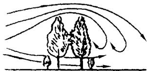
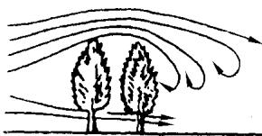
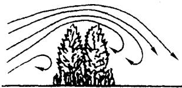
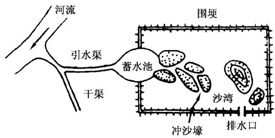
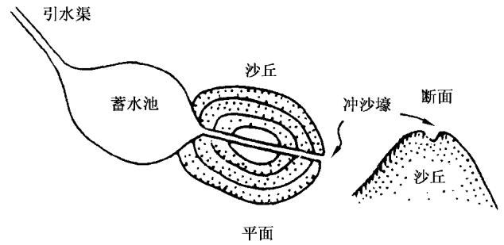
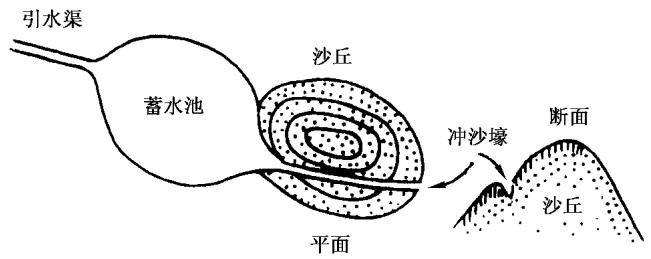
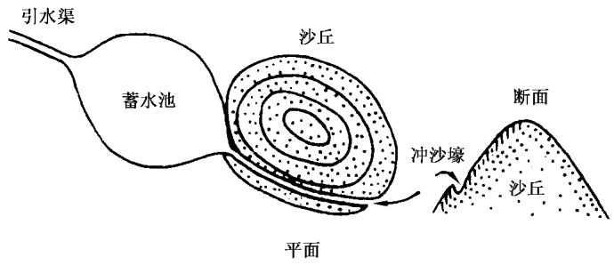
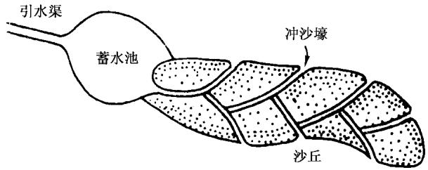
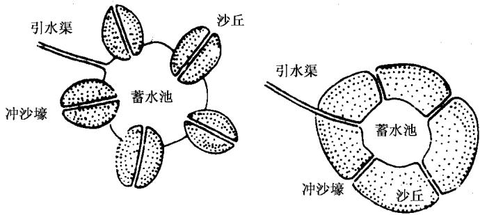
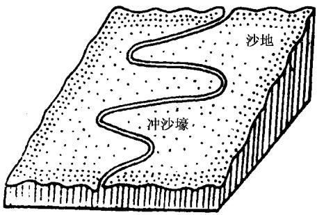

# 中华人民共和国国家标准

GB/T 16453.5—2008

代替 GB/T 16453.5—1996

# 水土保持综合治理 技术规范风沙治理技术

# Comprehensive control of soil and water conservation—Technical specification Technique for erosion control of wind erosion

2008-11-14 发布

2009-02-01 实施

## 前 言

GB/T16453《水土保持综合治理 技术规范》共分为六个部分：

GB/T 16453.1—2008 水土保持综合治理 技术规范 坡耕地治理技术

-GB/T16453.2—2008 水土保持综合治理 技术规范 荒地治理技术

GB/T 16453.3—2008 水土保持综合治理 技术规范 沟壑治理技术

GB/T 16453.4—2008 水土保持综合治理 技术规范 小型蓄排引水工程

GB/T 16453.5—2008 水土保持综合治理 技术规范 风沙治理技术

GB/T 16453.6—2008 水土保持综合治理 技术规范 崩岗治理技术

本部分代替GB/T16453.5—1996《水土保持综合治理 技术规范 风沙治理技术》。

本部分与GB/T16453.5—1996相比，作如下修改：

a）复核了风沙治理部分中的林带宽度等有关数据；

b）将原标准的5.2.1.1删除，改为沿海、沿湖造林应选择耐盐碱、耐水浸树种。

本部分由水利部提出。

本部分由水利部国际合作与科技司归口。

本部分起草单位：水利部水土保持司、水利部水土保持监测中心、黄河水利委员会黄河上中游管理局、黄河水利委员会农村水利水土保持局、长江水利委员会水土保持局、松辽水利委员会农田水利处、珠江水利委员会农田水利处、海河水利委员会农田水利处、淮河水利委员会农田水利处、北京林业大学水土保持学院。

本部分主要起草人：段巧甫、刘万铨、范起敬、宁堆虎、佟伟力、鲁胜力、郭索彦、张长印、赵永军、陈法扬、余新晓、丛佩娟、常丹东、冯伟、李琦。

本部分所代替标准的历次版本发布情况为：

-GB/T 16453.5—1996。

## 引 言

GB/T16453.5一1996已经实施十余年，在水土保持综合治理方面起到了重要的指导作用。随着我国社会经济的发展和农村产业结构的变化，水土保持工作的内容、性质等方面也发生了深刻的变化。为了适应新形势下的水土保持工作，进一步规范水土保持综合治理技术规范，根据水利部国际合作与科技司、水土保持司的统一安排，进行了修订。

# 水土保持综合治理技术规范风沙治理技术

## 1 范围

GB/T16453的本部分规定了风蚀地区风沙治理各项措施的规划、设计、施工、管理等技术要求。

本部分适用于我国风蚀地区。

## 2 规范性引用文件

下列文件中的条款通过GB/T16453的本部分的引用而成为本部分的条款。凡是注日期的引用文件，其随后所有的修改单(不包括勘误的内容)或修订版均不适用于本部分，然而，鼓励根据本部分达成协议的各方研究是否可使用这些文件的最新版本。凡是不注日期的引用文件，其最新版本适用于本部分。

GB 6000 主要造林树种苗木质量分级

GB/T 16453.2 水土保持综合治理 技术规范 荒地治理技术

LY 1000 容器育苗技术

## 3 治理措施

3.1北方沙化地区南沿，应以防风固沙为主，采取保护农田、道路、城镇等的沙障固沙，营造防风固沙林带、固沙草带，引水拉沙造田以及防止风蚀的耕作技术等综合措施。

3.2黄泛区古河道沙地，应先治理风口，堵住风源，采取翻淤压沙、造林固沙等措施，将沙地改造成果园或农田。

3.3沿海风沙危害区，应带、网、片相结合，建设以海岸防风林带为主的综合防护体系。

## 4 沙障固沙

## 4.1 沙障的设置方法与采用的重点地区

4.1.1沙障是用柴草、活性沙生植物的枝茎或其他材料平铺或直立于风蚀沙丘地面，以增加地面糙度，削弱近地层风速，固定地面沙粒，减缓和制止沙丘流动。

4.1.2采取沙障的重点地区，对流动沙丘和半流动沙丘，应首先采用沙障固沙，阻止沙丘流动，再营造防风固沙林带和农田防护林网。

## 4.2 沙障的分类

## 4.2.1 根据沙障的地面分布形状划分

4.2.1.1带状沙障。沙障在地面呈带状分布，带的走向垂直于主风向。

4.2.1.2 方格状(或网状)沙障。沙障在地面呈方格状(或网状)分布，主要用于风向不稳定，除主风向外，还有较强侧向风的地方采用。

## 4.2.2 根据沙障的不同材料划分

4.2.2.1柴草沙障。大部由柴草或作物秸秆作成，是铺设沙障的主要材料。

4.2.2.2粘土沙障。少数地方沙层较浅或沙丘附近有碱滩地，用粘土压沙，堆成土埂，作为沙障。

4.2.2.3 采用卵石或其他材料(如活性沙生植物枝茎)作成沙障。

## 4.2.3 根据铺设沙障的柴草与地面的角度划分

4.2.3.1平铺式沙障。将作沙障的柴草横卧平铺在地面，上压枝条、沙土或用小木桩固定。

4.2.3.2直立式沙障。将作沙障的柴草直立，一部分埋压沙中，一部分露出地面。

## 4.3 沙障的设计和施工

## 4.3.1 平铺式沙障的设计和施工

## 4.3.1.1 带状平铺式

带的走向垂直于主风方向。带宽0.6m～1.0m，带间距4m～5m，将覆盖材料平铺在沙丘上，厚3cm～5cm。覆盖材料有柴草、秸秆、枝条或粘土、卵石等。覆盖物为柴草和枝条时，上面应用枝条横压，用小木桩固定，或在草带中线上铺压湿沙，柴草的梢端应迎风向。

4.3.1.2全面平铺式适用于小而孤立的沙丘和受流沙埋压或威胁的道路两侧与农田、村镇四周。将覆盖物在沙丘上紧密平铺。其余要求与4.3.1.1相同。

## 4.3.2 直立式沙障的设计和施工

## 4.3.2.1 直立式沙障的分类

4.3.2.1.1 高立式沙障，采用秆高质韧的柴草，长0.7m～1.3m，露出地面0.5m～1.0m，埋入地下  
0.2m\~0.3 m，根部培沙高出地面0.1m。

4.3.2.1.2低立式沙障，采用较软的柴草，露出地面0.2m～0.3m，埋入地下0.15m～0.20m。

## 4.3.2.2 直立式沙障的平面配置

4.3.2.2.1在单向起沙为主地区与主风向垂直，呈带状布设。

4.3.2.2.2 在新月形沙丘上设置时，丘顶空出一段，在迎风坡自上而下设置多带弧形沙障(与新月形弧度相适应）。

## 4.3.2.3 直立式沙障的间距

4.3.2.3.1 4°以下的干缓沙地，高立式沙障间距为沙障高度的10倍～15倍，低立式沙障间距为2m～  
4 m。

4.3.2.3.2 沙丘迎风坡面设置的沙障，应使下一列沙障的顶端比上一列沙障的基部高出5 cm～8 cm。

## 4.3.2.3.3 在沙丘坡度较大的地方，沙障间距按式(1)计算：

$$
d = h \mathrm { c o t } \theta\tag{………………………………(1}
$$

式中：

d—沙障间距，单位为米(m)；

h——沙障高度，单位为米(m)；

θ—沙丘坡度，单位为度(°)。

## 4.3.2.4 直立式沙障的施工

4.3.2.4.1 高立式沙障施工。在设计好的沙障条带位置上，人工挖沟深0.2m～0.3m，将柴草均匀直立埋入，扶正踩实，填沙0.1m，柴草露出地面0.5m～1.0m。

4.3.2.4.2低立式沙障施工。将柴草按设计长度切好，顺设计沙障条带线均匀放置线上，草的方向与带线正交。用脚在柴草中部用力踩压，柴草进入沙内0.1m～0.15m，两端翘起，高0.2m～0.3m，用手扶正，基部培沙。

## 4.3.2.5 粘土沙障的设计和施工

粘土沙障是低立式沙障的一种，一般布设在沙丘迎风面自下向上约2/3的位置。用粘碱土堆成土埂，高0.20m\~0.25m，底宽0.6m～0.8m，埂顶呈弧形，土埂间距2m\~4m。

## 5 固沙造林

## 5.1 固沙造林的规划设计

## 5.1.1 林带规划设计

设计内容包括林带走向、宽度、间距、结构、混交类型。

## 5.1.1.1 林带走向

5.1.1.1.1防风阻沙、固沙基干林带，应设在农田林网外围的沙丘前沿地带及流沙边缘与农田绿洲交界处，林带走向应垂直于沙丘流动方向。

5.1.1.1.2 农田防护林网(包括护牧林网)，有主风害地区应采取长方形网格，无主风害地区可采取正方形网格。主林带走向应垂直于主风方向或不大于45°的偏角。副林带和主林带应垂直；如因地形地物限制，主副林带可以有一定偏角。低洼地区可“林随水走”；平坦地区可“林随路走”；风蚀山丘地区，主林带可沿等高线布设，副林带可和上下坡的路边造林、河边沟岸造林互相连接，形成林网。

5.1.1.1.3 沿海岸线防风林带应垂直于主风害方向设置，也可按沙滩沿海岸线的自然分布走向设置。

## 5.1.1.2 林带宽度

5.1.1.2.1 防风阻沙、固沙基干林带，可分别采用单带或双带式；在风沙危害严重地区可采用多带式。带宽一般为50m～100m，大面积流沙入侵前沿地区带宽可为200m\~1000m，绿洲与沙丘接壤地区允许带宽30 m～50m。

5.1.1.2.2 农田防护林网，主带宽应为8m～12m(3行～4行树)，副带宽可为4m～6m(1行～2行树），地少人多地区，可采取主带宽5m～6m，副带宽3m～4m。

5.1.1.2.3 沿海岸线防风林带，应根据海风强劲程度和海滩情况确定，一般宽20m～100m，最大可达  
100 m\~200 m。

## 5.1.1.3 林带间距

5.1.1.3.1 防风阻沙、固沙基干林带，可采用单带、双带或多带式，间距应为50m～100m。

5.1.1.3.2 农田防护林网，林带的间距应按乔木主要树种壮龄时期平均高度的15倍～20倍计算。主林带和副林带交叉处只在一侧留出20m宽便于交通的缺口。林网的网格面积一般15 $\mathrm { h m ^ { 2 } } \sim 2 0 \ \mathrm { h m ^ { 2 } }$ 最大不应超过30 hm²，严重风沙区应控制在15hm²以下。

5.1.1.3.3 沿海岸线防风林带，依沙滩分布的宽度，可设近海前沿一道主干防风林带，或者在第一道近海防风主干林带之后，每隔100m～300m，再设第二、第三道防风林带。

## 5.1.1.4 林带结构(见图 1)

  
a）疏透型结构

  
b）通风型结构

  
c）紧密型结构  
图 1 林带结构示意图

5.1.1.4.1疏透型。林带间距10倍～15倍树高，适用于重度风蚀区农田防护林网、海岸防护林。

5.1.1.4.2 紧密型。林带间距8倍～10倍树高，适用于风口造林和防风阻沙、固沙基干林带，以及铁路、公路干线两侧林带。

5.1.1.4.3 通风型。林带间距15倍～20倍树高，适用于中、轻度风蚀区农田防护林网和沿海岸线防风林带。

## 5.1.1.5 林带混交类型

5.1.1.5.1乔灌混交林带：乔木、灌木树种按比例组成，构成紧密型结构或疏透型结构林带，适于干旱与风害严重的地区。

5.1.1.5.2乔木混交林带：由两层乔木组成，上层为喜光树种，下层为耐荫的伴生树种，也可用两种喜光树种，分别配置于林带两侧，组成通风型结构林带，适于农耕地或沿海沙带。

5.1.1.5.3 灌木混交林带：林带全由灌木组成，用作生物沙障。

5.1.1.5.4综合型混交林带：乔灌混交和喜光、耐荫性、伴生树种混交的综合性林带，适于防风固沙基干林带和风口造林。

## 5.1.2 风口造林设计

设置与主害风向相垂直的带状沙障，其宽度1m～2m，间距20m～30m。在沙障内可营造紧密型乔灌混交林，株距0.5m，行距1.0m，交错排列；株间或行间混交或呈块状混交，乔灌比例1：1，迎风面栽灌木，背面栽乔木。

5.1.3 片状造林设计

5.1.3.1风蚀较轻的沙地或稳定的低沙丘、半流动沙丘，可直接成片造林，全面固沙。

5.1.3.2对流动沙丘，应先设置沙障，减缓风速，固定流沙，然后成片造林。在背风坡丘间低地栽植乔木林带，阻挡流沙前移；在迎风坡脚下种植灌木，拉低沙丘。

5.1.3.3 片状造林的株行距，应根据树种和立地条件确定。植株一般均呈“品”字形排列。

5.2 固沙造林的树种选择

5.2.1 树种选择原则

5.2.1.1应选择适合当地生长的优良树种和乡土树种。

5.2.1.2沿海、沿湖造林应选择耐水浸、盐碱和抗风的树种。

5.2.1.3灌木应选择防风固沙效果好、抗旱性能强、不怕沙埋、枝条繁茂、萌蘖力强，条材(或薪柴)产量高、质量好的树种。

5.2.2 北方风沙区造林主要树种

5.2.2.1乔木：杨树、旱柳、白榆、樟子松等。

5.2.2.2灌木：沙柳、沙米、沙棘、沙蒿、花棒、踏郎、柠条、紫穗槐、沙拐枣、红柳、枸杞等。

5.2.3 黄泛区古河道沙区造林主要树种

5.2.3.1乔木：杨树、旱柳、榆树、臭椿、刺槐、侧柏、泡桐等。

5.2.3.2灌木：紫穗槐、胡枝子、杞柳、荆条等。

5.2.4 东南沿海岸线沙区造林主要树种

5.2.4.1乔木：木麻黄、相思树、水杉、柳杉、火炬、松、侧柏、杨树、苦楝、麻栎、乌木臼等。

5.2.4.2灌木：杞柳、刺犁、白刺、黄槿、夹竹桃等。

5.3 固沙造林施工

5.3.1 造林整地

5.3.1.1 整地时间

5.3.1.1.1营造乔木林，在北方的中度、轻度风蚀区和杂草丛生的草滩地、质地较硬的丘间地和固定沙丘等，应于前一年秋末冬初整地，次年春季造林。流动沙丘和半流动沙丘造林不宜整地，避免造成风蚀。重风蚀区可在春季随整地随造林。南方地区可在造林前整地。

5.3.1.1.2 营造纯灌木林时，可随整地随造林；营造乔灌混交林和乔木林整地时间相同。

5.3.1.2 一般整地方法

5.3.1.2.1 在大片完整和坡度较缓的沙荒地上造林，可用带状整地，带宽1.0m～1.5m，带面耙平后，在其上再挖穴栽树，按设计的株行距呈“品”字形排列。有条件时可采用机械开沟作带。

5.3.1.2.2在地形破碎、坡度较陡的沙荒地上造林，可采用鱼鳞坑整地，坑径1.0m～1.5m，坑深  
0.6m～0.8m，坑距3m～5m，呈“品”字形排列。  
5.3.1.2.3营造灌木林可采用穴状整地，按设计的株行距，定点挖穴，穴径不小于0.6m，坑深0.3m～  
0.6m，视苗木根系而定。

5.3.1.3 特殊的整地方法

5.3.1.3.1 翻淤压沙整地。黄泛区古河道沙地，沙层较浅(0.5m～0.6m)，下为淤土。造林前，可先用人工或机械将下层淤土翻起，压在沙上，厚0.3m～0.4m，然后在淤土上造林。

5.3.1.3.2客土整地。东南沿海岸滩，夏季地温高，应先按株行距挖坑，然后用低温客土种树。

5.3.2 植苗造林

5.3.2.1 选好苗木

5.3.2.1.1 裸根苗应执行GB 6000的规定，容器苗应执行LY1000的规定。

5.3.2.1.2 阔叶树种应选择一至二年生，株高1.5m以上，主根长30cm，地径2.0cm以上，乔木主根系长度25cm～30cm以上，生长健壮的苗木；针叶树种应选择二至三年生容器苗或植生苗，有完整的顶芽。灌木苗应选择一至二年生苗木。

5.3.2.1.3应把好起苗质量关。起苗时应不伤根，不损苗，保持较完整的毛细根；针叶树苗起苗后，做到随起随栽。外地运苗，应做到当日起苗，当日运到造林地，最多不得超过2d。对不能及时栽植的苗木，应打浆并做好假植，并设挡光挡风措施，防止暴晒风干或堆放发热。

5.3.2.2 栽植技术

5.3.2.2.1 阔叶乔木宜在春秋二季挖坑栽植。

5.3.2.2.2 根系不大的灌木苗或针叶乔木苗，一般在春季或雨季采用窄缝栽植。

5.3.2.2.3用容器苗或植生针叶苗造林，应事先整地，待春季墒情好时造林，或在立秋前的雨后栽植。  
干旱、半干旱地区的阔叶乔木苗，可截杆造林。

5.3.2.2.4风口造林，栽植深度应超过当年最大风蚀深度，直达沙地的湿沙层，并在植穴周围培置沙埂，增加地面糙度，减轻风蚀。

5.3.2.2.5营造海岸线防风林时，应采取客土和适时深栽。

5.3.3 插(压)条造林

5.3.3.1 应选择一年生新条、壮条，随剪随插(压），备用枝条应保湿。一般条长0.4m～0.7m，地径粗  
1 cm～2 cm;高杆杆长 2.5 m～4 m，径粗 3 cm\~6 cm。  
5.3.3.2 插条应露出地面3cm～4cm，留有1个～2个芽眼，并防止芽眼倒植；高杆造林应埋入地下  
0.8m～1.2m，地面以上为1.5m～3m；利用卧杆栽植时，覆土厚度宜为10cm。

5.3.4 飞播造林

5.3.4.1播前勘查、规划

5.3.4.1.1应对飞播地区进行勘查、调查，掌握沙丘类型、走向、原有植被种类和覆盖度以及降水季节沙地土壤水分条件等。

5.3.4.1.2应根据飞播造林可能取得的效率，确定具体的飞播范围，进行测量、规划接近于平行主风向的航播带，埋设入航出航的标桩，绘制飞播作业图(比例尺1/10000)和播区位置图（比例尺1/200000）。

5.3.4.2 播幅与航高设计

5.3.4.2.1应根据播区情况，确定单程或复程的航带长度、播种宽度和飞行高度。大粒种子设计播幅宽为50m，航高为50m～70m;沙蒿等小粒种子设计播幅宽度40m，飞行高度50m～60m。

5.3.4.2.2 如播幅较宽，应在上述宽度基础上增加20%～30%的重叠率。

5.3.4.2.3 飞播作业时，侧风风速不应超过5.4m/s，侧风角度不应超过40°(小粒种子不应超过 $2 0 ^ { \circ } )$ 顺、逆风飞播风速：大粒种子，不应超过6m/s～8m/s，小粒种子不应超过6m/s。

5.3.4.3 播前的准备工作

5.3.4.3.1飞播固沙植物的选择。在流沙地区飞播应选择抗风蚀、耐沙埋、生长迅速、自然繁殖力强、具有较高经济价值的植物，如：沙蒿、踏郎、花棒等。每公顷播量：踏郎12kg～18kg，花棒15kg～23 kg,沙蒿 7.5 kg\~15 kg。

5.3.4.3.2 种子大粒化处理：为解决小粒种子和易飘移种子的位移，应在种子外面裹上黄土，制成比种子重2倍～3倍的大粒化种子丸，保证飞播种子分布均匀，提高飞播保苗的面积率。

5.3.4.3.3 种子防害处理。播前应采用对人畜无害的药液浸种，防治鼠、兔、虫三害。

5.3.4.3.4应根据规划设计飞播的范围与幅宽，在地面设置明显的标志。

5.3.4.3.5 播种期宜选在夏秋雨季，并在有效降雨前7 d～15 d作好天气预报。

5.3.4.4飞播后，播区应设专人管护，禁止人畜进入播区放牧，以及割草、挖树根等破坏幼苗和树木的活动。

## 5.4 管护

固沙造林后应加强幼林抚育管理，及时进行幼林补植、除草、中耕管理和幼林管护。各项管理工作应按GB/T16453.2水土保持造林中的有关规定执行。

## 6 固沙种草

## 6.1 固沙种草规划设计

6.1.1 固沙种草方式的选定

6.1.1.1 在风蚀和流沙移动的地方，应种植防风固沙草带。

6.1.1.2在林带与沙障已基本控制风蚀和流沙移动的沙地上，应及时进行大面积人工种草，进一步改造并利用沙地。

6.1.1.3对地广人稀、固沙种草任务较重的地方，可采用飞播种草。

## 6.1.2 防风固沙草带设计

6.1.2.1 草带走向应与主害风向垂直。

6.1.2.2 地面坡度 $6 ^ { \circ } \sim 8 ^ { \circ }$ ，草带宽可采用6m～8m，间距可采用30m～40m，地面坡度 ${ 1 0 } ^ { \circ } \sim 2 0 ^ { \circ }$ ,草带宽可采用8m～12m，间距可采用20m～30m。

## 6.2 固沙种草的施工

6.2.1 整地

6.2.1.1 整地方式：宜采用带状整地，整地位置和带宽与6.1.2设计要求一致。

6.2.1.2 在有中度以上风蚀和流沙移动地方，严禁全面耕翻整地。

6.2.1.3 整地深度应与耕作层深度一致，可为15 cm～20 cm。

6.2.1.4 整地时间宜在春季或秋季，干旱地区可在雨前进行。

## 6.2.2 播种和管理

6.2.2.1人工播种施工和管理技术要求与荒地种草相同，可按GB/T16453.2中水土保持种草的有关规定执行。

6.2.2.2飞播种草的播种和管理技术，可按5.3.4中有关规定执行。

## 7 引水拉沙造地

7.1 工程规划

7.1.1应根据水源的位置、高程与沙区的地形，确定引水拉沙造地的范围。

7.1.2 应根据水源的总水量和日供水量，确定引水拉沙造地的规模与进度。

7.2 工程布局

7.2.1 引水渠

从水源引水至计划进行拉沙造地的沙丘附近。

7.2.2 蓄水池

是临时性蓄水设施，上接引水渠，下接冲沙壕，蓄积水量，长蓄短放。

## 7.2.3 冲沙壕

开挖在计划进行拉沙的沙丘上，开挖位置和形式，因沙丘的形状和冲沙过程而异。

## 7.2.4 围埂

修在计划造地的四周，拦截从沙丘上冲下来的水和沙，将丘间低地淤平。

## 7.2.5 排水口

修在围埂的最低处，用以排除围埂中沉沙淤地后的清水。

引水拉沙工程布局见图2。

  
图 2 引水拉沙工程部署示意图

7.3 工程设计

7.3.1 引水渠

7.3.1.1 比降为0.5%\~1.0%。

7.3.1.2 断面尺寸。由引水量大小确定；梯形断面边坡(1：0.5)～(1：1)，随建筑材料而异。

7.3.2 蓄水池

7.3.2.1 蓄水高程应高于拉沙造地的沙丘高程。

7.3.2.2 可利用沙湾蓄水或人工围埂修成，形状不限。

7.3.3冲沙壕比降应在1%以上，开壕位置和形式有以下几种：

7.3.3.1馒头状小型沙丘，根据蓄水池高程分别采用顶部开壕、腰部开壕和下部开壕基本形式，见图3之a)、b)和c)。

a）顶部开壕  
  
b）腰部开壕

  
c）下部开壕  
图 3 冲沙壕的三种基本形式

7.3.3.2 对其他形状复杂或体积特大的沙丘和沙地，可分别采用左右开壕、四面开壕和迂回开壕等形式，见图4。

  
a）左右开壕

  
b）四面开壕

  
c）迂回开壕  
图4 冲沙壕的三种特殊形式

## 7.3.4 围埂

7.3.4.1 平面形状应为规整的矩形或正方形。

7.3.4.2 初修时高0.5m～0.8m，随地面淤沙升高而加高。

7.3.4.3 梯形断面顶宽0.3m\~0.5m，内外边坡1：1。

7.3.5 排水口

7.3.5.1高程与位置应随着围埂内地面的升高而变动，保持排水口略高于淤泥面且低于围埂。

7.3.5.2应用柴草或砖石作临时性砌护，并安排好排水的去处，防止冲刷。

## 7.4 拉沙施工

7.4.1 拉沙过程中应有高约1.0m的三脚木架，支撑一块1.0m×1.0m的专用木板，由2人～3人掌握，不断移动，迫使水流冲沙，加大冲沙强度。

7.4.2人工用铁铣在冲沙壕一侧，向壕中推沙，加快拉沙造地进度。

## 7.5 造地的后续工程

造成地后，关于田块与道路、渠系、林带的布设以及地面的平整，可参考缓坡区梯田规划要求进行。

## 8 防治风蚀的耕作措施

8.1深松改垄。改平作为垄作，垄向应与主风方向垂直或不小于 $6 0 ^ { \circ }$ 夹角。每隔3a～5a应进行一次深松耕，松耕的深度以划破犁底层为准。

8.2作物间混套种可采用粮豆间作或混套种，粮薯间作或混套种，草田轮作等。间作混套形式及比例、轮作年限，应根据各地情况确定。风多风大季节，地面应有作物覆盖。

8.3地面覆盖措施。在沙地上种植高产粮食作物和经济作物，可采用地膜覆盖。一般农田，在秋冬用秸秆覆盖或留茬覆盖。严禁风暴季节全垦全翻。

## 8.4 农林间作

8.4.1 以农为主的农林间作，适宜土壤肥沃、地下水位2m～3m、风沙危害较轻的农耕地。具体有以下几种情况：

8.4.1.1 农桐间作：泡桐行距为50m～60m，株距5m～6m，砍伐前3a应在行间营造接替林带。

8.4.1.2 农枣间作：枣树单行大株距栽植，行距8 $\mathrm { m } { \sim } 1 0 \mathrm { ~ m ~ }$ ,株距 $4 \ \mathrm { m } { \sim } 6 \ \mathrm { m } ;$ 或带状栽植，每带3行～  
5行。

8.4.1.3 农柿间作：行距20m～25m，株距15 m～20 m。

8.4.1.4 农桑间作：株距1.0m～1.5 m，带状密植，带宽10 m～15m，带距20 m～30m。

8.4.1.5 农条间作：主要树种为白蜡、紫穗槐、簸箕柳等。株距1.5m～2.0m，带状密植。带宽10m～  
20m，带距 $1 5 \ \mathrm { m } { \sim } 3 0 \ \mathrm { m }$ 0

8.4.2 农林并重的农林间作：适宜于风沙危害较重的平沙地。株、行距：泡桐行距20m，株距5m；枣每公顷保持180株～360株。

8.4.3 以林为主的农林间作：适宜在人少地多的沿河高地或丘陵风沙地。林的初植密度：泡桐每公顷  
210株～600株；枣每公顷360株以上；桑行距10m～15m，株距0.5m～1.0m，带状密植。