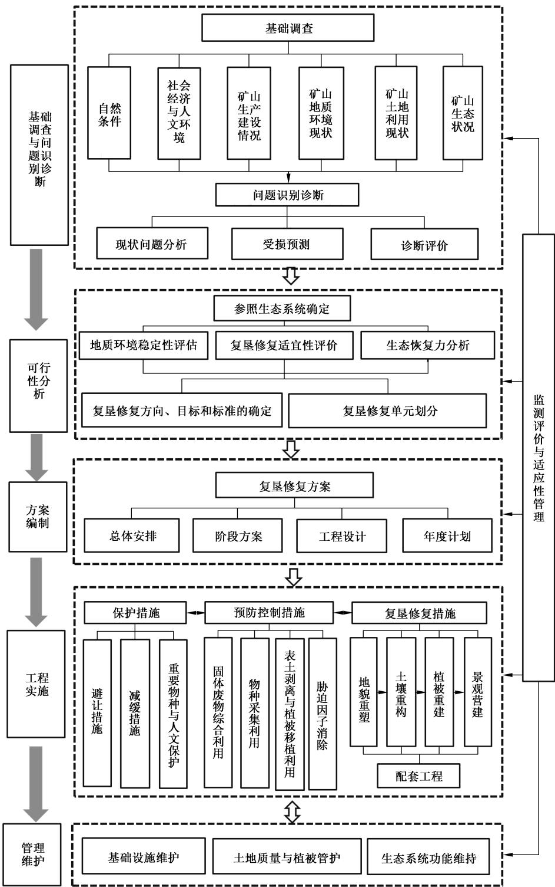

# 中华人民共和国国家标准

GB/T 43934—2024

# 煤矿土地复垦与生态修复技术规范

# Technical specification for land reclamation and ecological restoration of coal mines

2024-04-25 发布

2024-08-01 实施

## 目 次

前言…………………………………………………………………………………………………………Ⅲ  
1 范围………………………………………………………………………………………………………1  
2 规范性引用文件…………………………………………………………………………………………1  
3 术语和定义………………………………………………………………………………………………2  
4 总体要求与基本原则……………………………………………………………………………………4  
4.1 总体要求 ……………………………………………………………………………………………4  
4.2 基本原则…………………………………………………………………………………4  
5 技术路径…………………………………………………………………………………………………5  
6 基础调查与问题识别诊断…………………………………………………………………………6  
6.1 基础调查……………………………………………………………………………………………6  
6.2 问题识别诊断………………………………………………………………………………………7  
7可行性分析………………………………………………………………………………………………8  
7.1 参照生态系统确定………………………………………………………………………………8  
7.2 地质环境稳定性评估 ………………………………………………………………………………8  
7.3 复垦修复适宜性评价………………………………………………………………………………8  
7.4 生态恢复力分析……………………………………………………………………………………8  
7.5 复垦修复方向、目标和标准的确定……………………………………………………………8  
7.6 复垦修复单元划分 …………………………………………………………………………………9  
8 方案编制…………………………………………………………………………………………………9  
8.1 总体安排……………………………………………………………………………………………9  
8.2 阶段方案……………………………………………………………………………………………9  
8.3 工程设计……………………………………………………………………………………………9  
8.4 年度计划……………………………………………………………………………………………9  
9工程实施…………………………………………………………………………………………………9  
9.1 保护措施……………………………………………………………………………………9  
9.2 预防控制措施………………………………………………………………………………………10  
9.3 复星修复措施………………………………………………………………………………………12  
10 管理维护、监测评价与适应性管理……………………………………………………………………14  
10.1 基础设施维护………… ………………………………………………………14  
10.2 土地质量与植被管护 ……………………………………………………………………………14  
10.3 生态系统功能维持 ………………………………………………………………………………14  
10.4 监测评价与适应性管理………………………………………………………………………15  
参考文献……………………………………………………………………………………………………16

## 前 言

本文件按照GB/T1.1—2020《标准化工作导则 第1部分：标准化文件的结构和起草规则》的规定起草。

请注意本文件的某些内容可能涉及专利。本文件的发布机构不承担识别专利的责任。

本文件由中华人民共和国自然资源部提出。

本文件由全国自然资源与国土空间规划标准化技术委员会(SAC/TC93)归口。

本文件起草单位：中国地质大学(北京）、自然资源部国土整治中心、矿冶科技集团有限公司、安徽理工大学、中煤科工集团唐山研究院有限公司、中国农业大学、中国地质环境监测院、中国自然资源经济研究院。

本文件主要起草人：卢丽华、白中科、庞剑波、周伟、罗明、王金满、赵中秋、曹银贵、冯宇、杨婧、鞠正山、李红举、祝怡斌、张世文、黄元仿、王敬、周妍、刘永兵、杜亚敏、李树志、张进德、张德强、周平、余振国、贺振伟、尹建平、杨红云、裴圣良。

# 煤矿土地复垦与生态修复技术规范

## 1 范围

本文件规定了生产煤矿山土地复垦与生态修复的总体要求与基本原则、技术路径、基础调查与问题识别诊断、可行性分析、方案编制、工程实施、管理维护、监测评价与适应性管理。

本文件主要适用于煤炭资源开采过程中的矿山土地复垦与生态修复技术工作。

## 2 规范性引用文件

下列文件中的内容通过文中的规范性引用而构成本文件必不可少的条款。其中，注日期的引用文件，仅该日期对应的版本适用于本文件；不注日期的引用文件，其最新版本(包括所有的修改单)适用于本文件。

GB 3838 地表水环境质量标准

GB 5084 农田灌溉水质标准

GB/T 14848 地下水质量标准

GB15618 土壤环境质量 农用地土壤污染风险管控标准(试行)

GB/T 15776 造林技术规程

GB/T16453(所有部分） 水土保持综合治理技术规范

GB/T 18337.3 生态公益林建设技术规程

GB18599一般工业固体废物贮存、处置场污染控制标准

GB/T 21010 土地利用现状分类

GB/T 26424 森林资源规划设计调查技术规程

GB/T 30600 高标准农田建设 通则

GB/T 33469 耕地质量等级

GB36600 土壤环境质量建设用地土壤污染风险管控标准(试行)

GB/T 38360 裸露坡面植被恢复技术规范

GB/T43935 矿山土地复垦与生态修复监测评价技术规范

GB 50197 煤炭工业露天矿设计规范

GB 50433 生产建设项目水土保持技术标准

GB/T 50434 生产建设项目水土流失防治标准

GB 51018 水土保持工程设计规范

GB 51044 煤矿采空区岩土工程勘察规范

GB 51114 露天煤矿施工组织设计规范

GB51287 煤炭工业露天矿土地复垦工程设计标准

DZ/T0219 滑坡防治工程设计与施工技术规范

DZ/T0223 矿山地质环境保护与恢复治理方案编制规范

DZ/T 0287 矿山地质环境监测技术规程

HJ 25.2 建设用地土壤污染风险管控和修复监测技术导则

HJ/T 166 土壤环境监测技术规范

HJ1167 全国生态状况调查评估技术规范——森林生态系统野外观测

HJ1168 全国生态状况调查评估技术规范—草地生态系统野外观测

HJ1169 全国生态状况调查评估技术规范—湿地生态系统野外观测

HJ1170 全国生态状况调查评估技术规范—荒漠生态系统野外观测

LY/T2356 矿山废弃地植被恢复技术规程

NY/T1121(所有部分） 土壤检测

NY/T 1342 人工草地建设技术规程

SL 190 土壤侵蚀分类分级标准

TD/T 1031.1 土地复垦方案编制规程 第1 部分：通则

TD/T1031.2 土地复垦方案编制规程 第2部分:露天煤矿

TD/T1031.3 土地复垦方案编制规程 第3 部分：井工煤矿

TD/T 1036 土地复垦质量控制标准

TD/T1048 耕作层土壤剥离利用技术规范

TD/T1049 矿山土地复垦基础信息调查规程

TD/T 1055—2019 第三次全国国土调查技术规程

TD/T1068 国土空间生态保护修复工程实施方案编制规程

TD/T1070.1 矿山生态修复技术规范 第1部分:通则

TD/T1070.2 矿山生态修复技术规范 第2部分:煤炭矿山

## 3 术语和定义

下列术语和定义适用于本文件。

## 3.1

## 矿山土地复垦与生态修复 mine land reclamation and ecological restoration

对矿产资源开采造成的地质环境破坏、土地损毁和生态系统破坏(退化)等问题，依靠人工支持引导和自然恢复力，采取预防和修复措施，使矿山地质环境达到安全稳定、损毁土地得到复垦利用、生态系统功能得到恢复或改善的活动。

注：简称“复垦修复”。

## 3.2

## 土地损毁 land destruction

矿山生产建设活动造成土地原有功能部分或完全丧失的过程和状况。

[来源：TD/T 1036—2013,3.5,有修改]

## 3.3

## 塌陷地 subsided land

矿产地下开采引起上覆岩层移动及地表变形，造成土地资源、生态系统受损的区域。

[来源：TD/T1070.2—2022,3.2，有修改]

## 3.4

## 排土场 dumping site

露天采矿剥离物集中堆放的场所。

注：在露天采场以内的称内排土场，在露天采场以外的称外排土场。

[来源：TD/T 1070.2—2022,3.4]

## 3.5

## 露天采场 open-pit field

露天开采形成的采坑、台阶及沟道的总称。

[来源：TD/T 1070.2—2022,3.5]

## 3.6

## 工业场地 mine yard

并口、地面生产系统、辅助生产设施、加工和运输系统、生活服务设施等占用的场地。

[来源：TD/T 1070.2—2022,3.6]

## 3.7

## 地貌重塑 landform reshaping

根据矿山地形地貌破坏方式与损毁程度，结合原有地形地貌特点，在消除地质安全隐患和水土流失隐患基础上，通过有序排弃、回填和土地整形等措施，形成与周边地貌景观相协调的新地貌。

[来源：TD/T 1070.1—2022,3.5，有修改]

## 3.8

## 土壤重构 soil reconstruction

对矿山损毁土地采用工程、物理、化学、生物等措施，重新构造土壤基质，形成适宜植被生长的土壤剖面构型与肥力等条件。

[来源：TD/T 1070.1—2022,3.6，有修改]

## 3.9

## 植被重建 vegetation reconstruction

综合考虑气候、海拔、坡度、坡向、地表物质组成和有效土层厚度等条件，选择先锋、适地植物物种，实施植被配置、栽植及管护，重新构建持续稳定的植物群落。

[来源：TD/T 1070.1—2022,3.7]

## 3.10

## 景观营建 landscape construction

从流域水文地貌尺度，遵循“山水林田湖草沙”一体化保护修复，充分考虑矿区“点一线一面一网”景观破碎与景观整合过程中，土地资源、水资源、生物资源、人居环境等的结构调整和优化配置，营建一个与周边景观相协调的生态系统。

## 3.11

## 自然恢复 natural restoration

对生态系统停止人为干扰，以减轻负荷压力，依靠生态系统的自我调节能力和自组织能力使其向有序的方向自然演替和更新恢复。

[来源：TD/T 1070.1—2022,3.2]

## 3.12

## 辅助再生 assisted restoration

充分利用生态系统的自我恢复能力，辅以人工促进措施，使退化、受损的生态系统逐步恢复并进入良性循环。

[来源：TD/T 1070.1—2022,3.3]

## 3.13

## 生态重建 ecological reconstruction

对因自然灾害或人为破坏导致生态功能受损、生态系统自我恢复能力丧失或发生不可逆变化的矿区，以人工措施为主，通过生物、物理、化学、生态或工程技术方法，围绕修复生境、恢复植被、重组生物多样性等过程，重构生态系统并使生态系统进入良性循环。

[来源：TD/T 1070.1—2022,3.4]

## 3.14

## 适应性管理 adaptive management

基于生态系统的不确定性和对生态系统认识的时限性，通过监测评估过去采取的管理措施和实践措施来获得经验，并根据生态系统变化情况，修正、改进管理措施和实践措施的方法和过程。

[来源：TD/T 1068—2022,3.9]

## 4 总体要求与基本原则

## 4.1 总体要求

应遵循“山水林田湖草沙”一体化保护修复理念，坚持节约优先、保护优先、自然恢复为主的方针，应规范生产煤炭矿山土地复垦与生态修复工作，通过采取减缓保护、预防控制与复垦修复多种措施，推动复垦修复与矿产资源开采统一规划、统筹实施，及时复垦利用损毁土地，恢复并提升矿区生态系统多样性、稳定性、可持续性，协同推进绿色矿山建设，实现人与自然和谐共生。

## 4.2 基本原则

## 4.2.1 保护优先与源头防控

遵循开发中保护、保护中开发理念，优化矿山用地选址选线和生产工艺系统设计，在开采源头上减少和减轻对矿区耕地和永久基本农田、基本草原、重点保护物种、公益林、自然保护地、水源地、文物等敏感目标的影响；采用科学合理的预防控制措施，实时消除地质环境隐患、预防控制环境污染与水土流失，达到安全、稳定和无污染状况；对煤矿生产建设过程中不可避免产生的生态问题，采取工程、生物、化学等综合措施，恢复受损生态系统。

## 4.2.2 统一规划与统筹实施

复垦修复目标、方向、标准、措施等与国土空间规划、矿产资源规划、国土空间生态修复规划、煤炭矿区总体规划、矿产资源开发利用方案等相衔接，实现与土地利用现状、周边景观相协调；复垦修复规划设计与矿山开采设计相统一，复垦修复技术措施、时序安排与开采工艺充分结合，在矿山开采全生命周期实现边开采、边复垦修复；复垦修复与绿色矿山建设同步推进，同步采取减缓保护、预防控制与复垦修复等多种措施，使地质环境及时得到修复治理、损毁土地得到复垦利用、生态系统功能得到恢复或改善，力争达到并取得最好修复效果和最佳的利用状态。

## 4.2.3 人工引导和自然恢复相结合

根据矿山地质环境稳定性、复垦适宜性、生态恢复力，坚持“宜农则农、宜林则林、宜草则草、宜湿则湿、宜建则建”原则，通过工程、生物、化学等人工支持手段，使受损的土地达到可供利用状态，恢复生态系统功能；坚持尊重自然、顺应自然、保护自然，充分发挥自然恢复力的作用，逐步恢复本地生态系统的生物群落组成和结构，使修复生态系统达到自我维持、自我调节，实现良性循环。

## 4.2.4 系统治理与功能提升

综合煤矿地质条件、自然地理、土地利用等要素与复垦修复目标，结合煤矿开采工艺、时序，对损毁生态系统进行整体保护、系统修复、综合治理，使地质环境达到稳定，损毁土地复垦利用，生态系统功能得以恢复或提升；按照生物多样性保护要求进行规划设计与实施，通过地貌重塑、土壤重构、植被重建、景观营建等阶段，将生物多样性保护贯穿于矿区土地复垦与生态修复的全过程，实现生态系统功能提升。

## 4.2.5 公众参与全程监测

在矿山开发利用、复垦修复的全生命周期中，持续保持与利益相关方的联系，为利益相关方提供积极和有实际意义的参与机会，使复垦修复方案的制定、实施、监测评价和适应性管理充分体现利益相关方的意见，并向更广泛的利益相关方通报和更新进展情况，确保整个项目的公平性和包容性。代表性的利益相关方包括矿区受影响的土地使用者、社区、政府、监管机构、企业，以及投资者、行业同行、学术界和媒体等。利益相关方的参与能尊重当地传统、习俗、社会期望和企业愿景，使当地社区、环境以及最终采矿业的利益最大化实现当地社会、环境和采矿业的利益最大化。

## 5 技术路径

针对生产煤矿山的特点，选择科学规范的土地复垦与生态修复技术路径，主要包括基础调查与问题识别诊断、可行性分析、方案编制、工程实施、管理维护、监测评价与适应性管理6个方面，具体技术路径见图1。

  
图1 煤矿土地复垦与生态修复技术路径

## 6 基础调查与问题识别诊断

## 6.1 基础调查

## 6.1.1 基本要求

应在矿山基建和开采前开展基础调查，在规划设计、方案编制、复垦修复、闭矿后管理维护阶段开展持续跟踪调查监测评价。生产矿山应逐步建立完整的矿山基础调查监测数据库，掌握本地自然条件、社会经济，确定开采前生态状况。

## 6.1.2 自然条件

6.1.2.1流域水文地貌调查。根据煤矿所在流域水文、地质与地貌类型特征，确定采煤影响范围、影响程度，调查地表水径流量、地下水埋深、水质特征等参数，按照GB3838、GB/T14848的相关要求执行。可通过查阅相关水文统计资料并结合实地调查获取水文状况参数。

6.1.2.2 矿区土壤状况调查。结合矿区实际情况，确定野外土壤样点选取布设和样品采集方法。调查内容包括土壤类型、土体构型、有效土层厚度、土壤质地、砾石含量、土壤有机质、土壤pH值、电导率、土壤环境质量、土壤侵蚀状况等。土壤理化指标测定，按照NY/T1121(所有部分)的相关要求执行。土壤侵蚀调查监测分类分级标准按照SL190的相关要求执行。土壤环境调查监测方法，按照HJ/T 166、HJ 25.2 的相关要求执行。

6.1.2.3 矿区植被状况调查。通过遥感调查与实地调查相结合的方法进行植被状况调查。植被覆盖度可采用样地实测法，按照GB/T26424的相关要求执行；也可用遥感影像提取归一化植被指数反映植被覆盖状况。郁闭度可采用目测法测得，也可利用分辨率≤3m的遥感影像获取。

6.1.2.4矿区景观状况调查。包括自然生境连通性、生境质量指数、景观破碎度、景观稳定性、景观丰富度等。可依据已有土地利用现状图、矿区遥感影像计算获取。

## 6.1.3 社会经济与人文环境

矿山开采所影响区域的社会经济调查包括矿山范围内乡镇所涉及的村庄和周边所影响的村庄近3年的人口、农业人口、人均耕地、生产状况等；人文环境调查包括地质遗迹、文物古迹、古村落、历史文化保护地、风景名胜区等。

## 6.1.4 矿山生产建设情况

矿山生产建设情况调查包括生产规模与能力、采掘位置、开采方式、排弃堆存状况、生产服务年限或剩余使用年限等情况.按照 TD/T1049、TD/T 1031.1、TD/T 1031.2、TD/T1031.3的相关要求执行。

## 6.1.5 矿山地质环境现状

矿山地质环境现状调查包括地质环境条件调查和地质环境问题调查。地质环境条件调查包括地层岩性、地质构造、水文地质、工程地质、矿山地质和不良地质现象等；地质环境问题调查包括类型、分布、规模、特征等，应重点围绕固废、煤堆周边土壤和地下水进行调查，按照DZ/T0223、DZ/T0287的相关要求执行。

## 6.1.6 矿山土地利用现状

6.1.6.1调查类型。包括土地利用现状与权属调查、未损毁生态(参照系)调查、已损毁生态调查和已复垦修复现状调查。生态损毁特征应针对不同损毁类型选取特定的指标，采用定性与定量相结合的方法进行表征。损毁类型包括在矿山生产建设过程中造成的土地挖损、土地塌陷、土地压占、建设占用等。

6.1.6.2土地利用现状与权属调查。明确矿区土地利用类型、数量和质量，以及土地利用权属状况；应说明因露天或井工开采造成土地损毁和复垦修复后权属变更和调整情况。按照GB/T21010、TD/T1031.1、TD/T1055—2019的相关要求执行。调查耕地与永久基本农田分布情况。

6.1.6.3 未损毁土地调查。应在矿山基建和开采前，完成土地利用现状调查，生产矿山应对周边未受损土地利用现状作为参照系，按照GB/T43935的相关要求执行。

6.1.6.4已损毁土地调查。主要调查损毁土地范围、损毁类型、面积、程度等。露天煤矿土地损毁按照TD/T1031.2的相关要求执行。井工煤矿主要调查土地塌陷、压占、占用范围、面积、程度等，以及地面建筑物（构筑物）变形、地表水、含水层的破坏等，按照TD/T1031.3、DZ/T0223、DZ/T0287、GB/T43935的相关要求执行。

6.1.6.5已复垦修复土地调查。包括复垦修复措施、效果、投资标准等情况，自然恢复的现状主要是植被类型。可划分损毁类型、地类、复垦与修复单元开展调查，按照GB/T43935的相关要求执行。

## 6.1.7 矿山生态状况

6.1.7.1矿山所在地的生态本底调查。包括生态系统状况、生态系统格局、生物多样性等，以及生态保护红线、自然保护地、生物多样性保护优先区等情况，明确矿山所在区域的生态功能定位。

6.1.7.2重点对矿区生物多样性进行调查，包括生态系统群落特征，如物种的多样性、群落结构、优势种、相对丰度、营养结构、丰富度等，以及关键物种及其生境、外来物种入侵情况等，森林、草地、湿地和荒漠生态系统生态状况调查，尤其明确国家及地方重点保护的野生动植物物种、数量、分布及生境等。按照 HJ1167、HJ 1168、HJ 1169、HJ 1170 的相关要求执行。

## 6.2 问题识别诊断

## 6.2.1 现状问题分析

6.2.1.1分析煤矿建设、开采产生的矿山地质环境、土地资源和生态受损与退化问题。

6.2.1.2 矿山地质环境问题主要包括矿山不稳定地质体、地形地貌景观破坏、含水层破坏等。土地资源损毁问题主要是土地挖损、压占、塌陷损毁等问题。生态损毁问题主要包括植被损毁，以及支撑生态服务功能的土壤保持、地表水系、土壤和地下水污染、动植物物种丧失等问题。按照TD/T1031.1、TD/T 1031.2、TD/T 1031.3 和 DZ/T 0223 的相关要求执行。

## 6.2.2 受损预测

对将要开采的矿区范围的地质环境损毁、土地损毁、生态问题等进行预测分析，确定损毁类型、面积和程度，按照 TD/T 1031.1、TD/T 1031.2、TD/T 1031.3 和 DZ/T 0223 的相关要求执行。

## 6.2.3 诊断评价

6.2.3.1根据矿区地貌、土壤受损后调查评价结果，识别矿区土壤退化的原因、类型、过程、阶段和程度，重点识别与原地貌土壤退化的差异。

6.2.3.2 基于现状以及预测，综合诊断评价并确定损毁程度与生态影响等级，综合评价采矿引发的结构缺损、功能失调等退化的程度。露天煤矿应重点关注露天采场挖损和排弃物压占所造成的土地损毁及其产生的生态影响，井工煤矿应重点关注塌陷和煤矸石压占造成的土地损毁以及产生的生态影响。按照 TD/T 1068 的相关要求执行。

6.2.3.3综合评价借助人工支持和引导，对其组成、结构和功能进行超前性的计划、规划、安排和调控的路径，以及实现最终目标过程中匹配相应的技术经济措施的可行性。

## 7 可行性分析

## 7.1 参照生态系统确定

7.1.1从矿山自然地理条件、物种组成、生态系统结构、生态系统功能、生态胁迫、外部交换等方面设定参照生态系统关键属性指标，并阐明参照生态系统关键属性指标的状态。

7.1.2根据设定的参照生态系统关键指标，结合生态系统自然演替规律，同时考虑矿山环境的变化等，采取类比法、推演法等方法，为矿山受损生态系统修复确定适当的生态系统参照系。

7.1.3对于历史监测资料齐全的煤矿区，直接参考受损生态系统历史状态设定参照生态系统。对于历史状况不清的煤矿区，可参照矿山周边未受损的本地原生生态系统，或类似生态系统作为参照生态系统。

## 7.2 地质环境稳定性评估

7.2.1根据已产生的矿山地质环境问题分布、规模、特征以及预测评估结果，分析地质环境损毁程度和危害，进行地质环境稳定性评估。

7.2.2 地质环境稳定性评估，按照 GB 50197、GB 51114、DZ/T 0219的相关要求执行。

## 7.3 复垦修复适宜性评价

7.3.1根据对损毁土地与生态分析和预测结果，划分评价单元。

7.3.2评定各评价单元的复垦修复适宜性等级，明确其限制因素。

7.3.3根据现状调查成果，选取合适的指标，建立复垦修复适宜性评价体系，选择极限条件法等进行复垦修复适宜性评价。

## 7.4 生态恢复力分析

7.4.1综合考虑矿区自然条件、土地资源与生态损毁程度、水土资源状况等因素，开展生态恢复力评价，按照TD/T1068的相关要求执行。

7.4.2根据煤矿生态受损与退化的程度，选择分析自然恢复、辅助再生、生态重建等模式前期人工支持引导后自然恢复的可行性。

7.4.3从技术经济分析评价采用低成本、成熟度高的技术、工艺、设备以及生态型新材料等对提升生态恢复力的作用，进一步分析自然恢复、辅助再生、生态重建等不同人工支持引导模式多样性、稳定性和持续性。

## 7.5复垦修复方向、目标和标准的确定

7.5.1在地质环境稳定性、复垦适宜性和生态恢复力评价的基础上进行复垦修复方向确定。

7.5.2依据国土空间规划和国土空间用途管制，按照因地制宜的原则，在充分尊重土地权益人意愿的前提下，根据原土地利用状况、参考本地原生态系统、土地损毁情况、公众参与意见等，在经济可行、技术合理的条件下，确定拟复垦修复土地的最佳利用方向（应明确至二级地类)和生态修复目标。按照TD/T 1031.1 的相关要求执行。

7.5.3结合不同复垦修复方向的参照生态系统，针对不同复垦修复方向提出不同土地复垦修复单元的复垦修复标准。按照TD/T1036 的相关要求执行。

7.5.4生态本底较好的森林矿区、草原矿区、草甸矿区、黄淮海平原矿区、东北平原矿区等，应恢复或重建与周边景观相协调的生态系统，最大限度地恢复采矿前原生态系统。生态本底较差的黄土丘陵沟壑矿区、喀斯特地貌矿区、荒漠戈壁矿区等，应进行矿区生态系统的结构优化与功能提升。

## 7.6 复垦修复单元划分

7.6.1同一复垦修复单元生态受损与退化的问题、利用方向、采用的技术模式与措施应一致。

7.6.2根据复垦修复适宜性评价结果，合并复垦修复方向和适宜性评价结果相同的单元，划分确定复垦修复单元。按照TD/T1036的相关要求执行。

## 8 方案编制

## 8.1 总体安排

8.1.1根据可行分析结果，综合考虑矿山开发利用方案、矿山环境影响评价报告、矿山水土保持方案，编制煤矿复垦与修复方案，方案应与国土空间规划、矿产资源规划、国土空间生态修复规划、煤炭矿区总体规划环境影响评价和矿山环境影响评价等相衔接。

8.1.2复垦修复方案编制内容主要包括基础调查、问题诊断评价、复垦修复可行性分析、复垦修复措施与工程设计、工作部署、投资估算和保障措施等，将矿产资源开发、生态环境保护与资源利用，统一规划、统筹实施，推动绿色矿山建设。

## 8.2 阶段方案

8.2.1根据矿产资源开采计划编制阶段方案，尤其是生产建设周期长的矿山，应依据复垦修复总体方案，结合矿山开采设计、不同修复单元和场地，根据边开采边修复的要求，制定阶段性工作安排，形成复垦修复阶段方案。当矿山开采规模、开采范围、开采工艺和场址等发生重大变化时，应及时重新编制复垦修复方案。

8.2.2编制内容主要包括矿山基本情况、矿山生态问题诊断评价、复垦修复可行性分析、复垦修复工程、工作部署、投资估算和保障措施等。

## 8.3 工程设计

8.3.1工程实施前，应开展复垦修复工程设计，应有序结合“剥离-采掘-运输-排弃-造地-复垦-管护”各环节，提出各项措施的工程组成、布置要求、结构形式以及材料规格等。

8.3.2工程设计应充分体现“地貌重塑、土壤重构、植被重建”3个关键实施过程，并为后续的“景观营造、生物多样性重组与保护”提供具有可操作性的基础性工程设计方案。

8.3.3 工程设计具体技术要求宜满足第9章规定的复垦修复技术与要求，同时按照GB 51287的相关要求执行。

## 8.4 年度计划

8.4.1上一年度复垦修复情况总结，包括：根据上一年度矿产资源开发利用情况，说明矿山地质环境破坏、土地损毁、生态系统破坏情况，复垦修复主要措施、经费使用及效果等情况；矿山复垦修复监测管护情况、经费使用情况及与原计划的对比，存在的问题与原因分析。

8.4.2本年度复垦修复计划，包括：根据矿产资源开发利用年度计划，针对矿山生态问题确定拟复垦修复范围和目标任务、工程部署、主要措施、经费安排、监测管护等。

## 9 工程实施

## 9.1 保护措施

## 9.1.1 避让措施

9.1.1.1根据煤矿山开发特点、生态环境功能要求和区域环境敏感程度，重点确定煤炭开发过程中特殊

环境及敏感保护目标。

9.1.1.2敏感保护目标包括耕地、永久基本农田、基本草原、公益林、自然保护区、生态保护红线、水源地、文物、铁路、公路、地下水、地表水体及城镇等。

## 9.1.2 减缓措施

9.1.2.1结合资源空间分布特征、生态状况等，优化矿山开采工艺流程，减少或者控制矿山建设、开采扰动量和扰动范围，最大限度减少地质环境问题、土地资源和生态系统受损。

9.1.2.2 科学进行露天煤矿排土场空间优化，实施节地技术，尽快实现内排；内排土场和外排土场应及早对接，提高土地利用效率，实现集约节约用地。

## 9.1.3 重要物种与人文保护

9.1.3.1根据矿区及周边受到地方、国家法律法规或国际法保护的野生生物物种，以及人文特征特殊保护要求，确定需要保护的重要物种、人文景观、文物等保护对象与保护目标。

9.1.3.2 采取围栏、警示牌、避让、加固等措施保护具有重大科学文化价值的地质遗迹和人文景观。

## 9.2 预防控制措施

## 9.2.1 固体废物综合利用

9.2.1.1鼓励对固体废物优先资源化综合利用，并选用合适的固体废物综合利用技术，加大综合利用量，减少对地形地貌的破坏和土地的压占。确实不能利用的可用于回填。

9.2.1.2煤矿开采主要固体废物为煤矸石和煤泥。对选煤厂洗选出的煤泥应分散排弃，煤泥、煤矸石不应排弃在排土场表层。

9.2.1.3固体废物综合利用应加强污染预防控制，按照GB36600的相关要求执行。

9.2.1.4 煤矸石、煤泥作为复垦修复重构土壤时，土壤环境质量按照GB15618的相关要求执行。

## 9.2.2 物种采集利用

9.2.2.1煤矿开采前，应根据生态状况调查结果，结合引种、种源试验，评定具有关键种地位以及优良经济性状或生态效益的种质资源。

9.2.2.2充分收集或采集受损区的种质资源并加以保存，必要时在矿区当地通过营建种质资源收集圃，防治遗传基因的流失，尤其对土源缺乏的草原煤矿区、高寒煤矿区、荒漠煤矿区，按照LY/T2356的相关要求执行。

## 9.2.3 表土剥离与植被移植利用

9.2.3.1应遵循因地制宜和生态保护的原则，珍惜和保护矿山土壤资源和土壤种子库，对地表植被及剩余生物群以及自然恢复的部分植被进行保护利用；具有植被移植价值和条件的矿山，应在采矿前进行乔木、灌木和草本植物移植，以减少工程费用和提高复垦修复效果。

9.2.3.2对于预测损毁区域涉及土壤损毁的，应实施土壤剥离利用，用于具备条件区域的复垦修复。特别是必须实施表土层的剥离利用，尤其是耕地耕作层，或园地、林地、草地腐殖质层的剥离利用。剥离厚度根据原土壤表土层厚度、复垦与修复土地利用方向等确定，包括能够进行剥离的、有利于快速恢复地力和植物生长的表层土壤，必要时包括岩石风化物。对于高海拔高寒矿区的表土剥离与保存，应实施草皮剥离养护再覆盖技术。

9.2.3.3土壤剥离利用宜做到“应剥尽剥、即剥尽用、分层剥离、分层堆放、分层回填”，对剥离、运输、储存、养护和回覆等土壤剥离利用工程作出时间、空间和经济可行的安排。

9.2.3.4 土壤剥离前，应开展土壤调查和评价工作，按照TD/T1048、TD/T1036的相关要求执行。

9.2.3.5应将剥离的表土收集和贮存，表土堆存场应采取拦挡、苫盖、排水等防护措施，防止贮存期间表土流失。堆存期较长时，应在土堆上播种一年生或多年生的草本植物。避免雨季剥离、搬运和堆存表土；堆存场地应防止放牧、机器和车辆进入，防止粉尘、盐碱覆盖，防止径流流入，避免水蚀、风蚀和各种人为损毁。按照 GB/T 50434、GB 51287的相关要求执行。

## 9.2.4 胁迫因子消除

## 9.2.4.1 地质环境破坏预防与控制

地质环境破坏预防与控制应符合下列规定：

a）查明采场和排土场崩塌、滑坡、地面塌陷、地裂缝等地质环境问题，以及断层、岩溶等不良工程地质条件的发育程度；

b）排土场要求整体稳定，稳定系数按照一般工矿、暴雨工矿和地震工矿3种状态设计，控制崩塌、滑坡、非均匀性沉降等地质环境损害发生；

c） 有地质环境损害隐患的排土场的预防控制措施，按照GB50197、GB51114、DZ/T0219的相关要求执行；

d）地下开采煤矿，确定采空区塌陷的控制措施，实施保护性开发措施，减少土地损毁面积，降低土地损毁程度；

e）根据地面保护目标和建设要求，合理确定采空区注浆治理范围及预期控制效果；

f）根据采空区的形成时间、埋深、采厚、采煤方法、顶板或覆岩特性及其力学性质、水文地质及工程地质特征等因素进行注浆设计；采空区注浆材料就地取材，且满足环保要求；地表沉陷减损技术按照GB51044的相关要求执行。

## 9.2.4.2 潜在污染预防与控制

潜在污染预防与控制应符合下列规定：

a）对污染严重的岩土，采取“包埋”“压埋”处理，不排弃在表层，埋深依据污染程度确定，填埋场地采取防渗措施，同时做好周围排水系统工程，防止构筑过程浸入过多水；

b）采煤过程中采取有效措施防治污染物向矿区范围外迁移扩散；对存在土壤和地下水污染情况的进行污染治理，避免因复垦造成二次污染；重金属或其他有毒有害物质含量超标的污染土壤，不用于土地复垦；

c）污染预防控制措施，按照GB18599和煤矿环境影响评价报告的相关要求执行。

## 9.2.4.3 水土流失预防与控制

水土流失预防与控制应符合下列规定：

a）结合矿区实际情况与所在区域水土流失特征，按照煤矿水土保持方案、《生产建设项目水土保持方案管理办法》和 GB 51018、GB 50433、GB/T 50434、GB/T 16453(所有部分)的相关要求执行；

b）土壤侵蚀量按照SL190的相关要求执行。

## 9.2.4.4 煤矸石自燃预防与控制

煤矸石自燃预防与控制应符合下列规定：

a）有煤矸石自燃风险的矿山，采用合理的排弃方式预控煤矸石自燃，科学设计排弃方式、矸石堆放厚度和覆土厚度，做到层层覆盖压实，杜绝空气和水分的进入；

b）矸石排到最终设计标高后，根据土地利用方向选择适宜的土层厚度进行复垦利用。

## 9.3 复垦修复措施

## 9.3.1 地貌重塑

9.3.1.1 露天煤矿生产过程中排土场地貌设计应符合下列规定：

a）依托采矿设计、岩土比例、剥采比等重要指标，对排土场进行科学选址，采用仿自然地貌工艺，有序进行分层剥离、分类排放、分区整形，消除地质灾害，确保重塑地貌达到安全、稳定、无污染的基本条件；

b）外排土场选址需注意流域水文地貌特征，选择靠近露天采场、不进行河流改道并少占基本农田、基本草原和公益林等敏感保护目标的位置；有条件时选在沟谷，填沟造地：

c）内排土场遇到局部基底光滑，且基底倾斜面与排弃面同向时，在排弃前进行爆破处理，增加其粗糙度，必要时在基底设置基柱、临时挡墙及抗滑桩等：

d）排土作业时按规定顺序排弃岩土，排土线整体均匀推进，坡顶线呈直线型或弧形；有专人指挥，非作业人员不能进入排土区域；排土卸载边缘设置安全土挡；

e）排土场形成平台、边坡相间的规则地形，控制风蚀、水蚀造成的次生退化。有条件的矿区，重塑的地形适应现代农业的要求，以便进行机械化操作；

f）排土场排水设施满足场地要求，设计和施工中采用微地形塑造等方式增加水分积蓄控制水土流失；

g）稳定后的排土场平台最终形成2°～3°的反坡，控制平台径流汇集到边坡形成冲沟；

h）初建的排土场排水沟采用柔性结构等措施(如干砌石结构、铁丝石笼等)，以减少非均一沉降造成的变形和汇流集中渗漏冲刷；

i）露天煤矿山集中分布的矿山群，充分结合各露天煤矿开采进度和推进境界，统筹各露天煤矿山采、排空间和时序，制定各露天煤矿山少占地(减少外排)、多回填(减少遗留矿坑)、先进适用的采、排互用优化方案。

9.3.1.2 井工煤矿生产过程中塌陷地地貌重塑应符合下列规定：

a）对于井工煤矿塌陷地原有地形坡度较大的区域，参照不同类型区梯田的田面坡度、田坎稳定性等标准要求进行坡改梯工程；

b）塌陷地整形工程能选择划方平整、挖深垫浅、物料回填等工艺；

c）煤炭开采塌陷较轻或不积水的塌陷地，在进行表土剥离的前提下，进行地表整平工程，消除波浪状下沉、附加坡度、地表裂缝等开采塌陷对土地利用的不利影响，通过削低高程较大的区域、填充低洼区域进行地表平整，建设田块规整、路网及防护林齐全、灌排系统完善的农用地：

d）煤炭开采未稳沉塌陷地积水前，在准确预测其未来采煤塌陷范围和深度的前提下，先进行表土剥离，稳沉后进行塌陷土地的复垦利用：

e）多煤层重复采动矿井开采间隔较长区域，按照复垦修复标准，对今后开采影响区采取相应的工程措施；

f）对高潜水位采煤塌陷地，根据需求、潜水位和塌陷影响程度，科学确定水面和土地的比例以及各类用地的比例，确定合理的标高，构造相应的地貌。

9.3.1.3 土地损毁稳定区复垦修复的地貌重塑，按照 TD/T1070.1、TD/T1070.2的相关要求执行。

## 9.3.2 土壤重构

9.3.2.1 露天煤矿生产过程中排土场土壤重构应符合下列规定：

a）根据原土层和地质层组的性质、功能和作用分析结果，优化确定复垦修复后的土壤剖面构

型，重点确定表土层、心土层的厚度和构型；

b）露天煤矿优化排土工艺，缩短回填表土时间，减少二次倒土；复垦为耕地时，首先使用剥离表土，充分利用前期收集的土源进行复垦：

c）表土覆盖施工时注意土壤压实；治理区表土覆盖前进行清理平整深翻处理，清除地面建筑物、构筑物及其他相关设施，清除硬化地面并挖除地基部分设施；复垦为耕地的，有效土层厚度、土壤容重、砾石含量等指标符合耕地的相关标准；

d）表土稀缺煤矿区复垦修复需注意表土替代物，基质过砂或过黏，采用客土改良；使用机械平整时，采用对地表压力小的机械设备，并在整平完成后对地表进行耕翻，人工加速生土熟化；

e）采取种植绿肥作物、增施有机肥、深耕、合理轮作，以及微生物固碳培肥等技术措施；对复垦土壤进行培肥改良，贫瘠的新造地能施用无机肥来增加土壤养分，促进地上植被覆盖，加速土壤熟化和水肥气热协调；

f）利用矿区含有腐殖酸的风化煤快速改良土壤结构、提高土壤有机质。

9.3.2.2 井工煤矿生产过程中塌陷地土壤重构应符合下列规定：

a）具备表土剥离条件的进行表土剥离；条件许可的高潜水位煤矿山，塌陷前进行表土剥离；

b）根据重构土壤的来源与特征，优化确定复垦修复后的土壤剖面构型，重点确定表土层和心土层的厚度、组成以及土体构型；

c）非积水塌陷地或季节性积水塌陷地，根据地表拉伸变形程度，及时填补地表裂缝；地形起伏较大的丘陵区、山区塌陷地，结合人工修筑梯田或条田进行土壤剖面重构；

d）常年积水的塌陷地，采用“挖深垫浅”法，将塌陷较深区域挖深回填至塌陷较浅区域，建鱼池筑台田，形成“上粮下渔”的台田式格局，挖深区挖出的土方量与垫浅区充填所需的土方量平衡；也能用煤叶石、湖泥、河沙等作为回填物料，通过抬田措施恢复农用地或作为建设用地：回填物料满足相关环境保护标准及要求。

9.3.2.3 复垦修复土壤环境质量，按照GB15618、HJ/T166、GB/T33469的相关要求执行。

9.3.2.4复垦修复区单位面积产量，3年～5年可达到周边同土地利用类型中等产量水平。

9.3.2.5 土地损毁稳定区复垦修复的土壤重构，按照 TD/T1070.1、TD/T1070.2的相关要求执行。

## 9.3.3 植被重建

9.3.3.1 先锋植物与适生植物选择应符合下列要求：

a）根据煤矿成功的土地复垦实践经验，以及植物试验筛选区研究成果，选出先锋植物和适生植物物种；

b）气候条件较差的煤矿区，多选择地带性的超旱性的灌草等乡土植物；气候条件较好的煤矿区，选择体现自然性、层次美的视觉效果以及有效控制地表径流的乔木、灌木和草本物种。

9.3.3.2 植被群落配置模式选择应符合下列要求：

a）植被重建以生物多样性重组和保护为目标，优先使用矿区剥离的草皮和移植的物种；

b）植被配置模式根据不同生物气候带矿区所在的气候条件、坡向、坡度、地表物质组成等，选择乔灌混交、灌草混交、乔草混交、乔灌草混交等不同模式，按照LY/T2356的相关要求执行；

c）选用合适的植被配备模式进行不同立地类型植物的配置、栽植及管护：选择根系发达、固土和固氮效果好、生长快、生命周期长、枝繁叶茂的植物，以控制高陡边坡岩土侵蚀、崩塌、坡面泥流等风险的发生，按照GB/T38360的相关要求执行；

d）乔灌草的配置密度，确定初始密度和定植密度；种植方式结合不同类型生物气候带矿区特点，按照 GB/T 15776、GB/T 18337.3 和 NY/T 1342 的相关要求执行；

e） 复垦为农田生态系统的植被配置模式，按照TD/T1070.1、TD/T1070.2的相关要求执行。

## 9.3.4 景观营建

## 9.3.4.1 景观营建应符合下列要求：

a）从景观尺度进行矿区受损的水系廊道、生物多样性廊道和景观廊道的生态重建，恢复其连通性和功能性，并与本底原生态系统相连通；

b）利用采矿便利条件，重新梳理矿区水系网络，疏通绿脉、水脉，优化矿区景观格局；重建矿区植被群落，完善矿区公共空间系统，保护利用“矿业遗迹”，以及与矿业有关的艺术、知识和精神遗产等，有意识地为被保护对象营造适合的空间和场所，利于矿山文化的保护和科学传播：

c）按照所在地区自然环境条件和复垦土地利用方向，选择剥离、回填、开挖、平整等复垦工程手段，根据挖损、塌陷、压占、占用等实际情况，进行景观规划设计：

d）露采场、排土场、工业场地等重要节点，结合矿业文化进行文化功能重构与提升；

e）采煤沉陷湿地水域构建，根据采煤塌陷积水区分布、水体稳定性及湿地的空间格局和湖泊的生态系统功能要求，科学实施湿地水系连通、营造丰富多彩的湿地生境、提升湿地生态功能；

f）复垦水域水质，按照GB3838的相关要求执行。

9.3.4.2 配套工程建设应符合下列要求：

a）配套工程包括道路工程、灌溉工程、疏排水工程、输配电工程、建筑物工程等；

b）复垦修复为耕地的配套工程，按照GB/T30600、GB5084的相关要求执行；

c）复垦修复为其他用地类型的配套工程，符合当地或相关行业工程建设标准的要求。

## 10管理维护、监测评价与适应性管理

## 10.1 基础设施维护

建立符合生态原理的供水和地面疏排水系统，对道路、灌溉、排水、建设物等设施进行定期维护，发现工程设施运行不正常或损毁，应及时修复或替换。

## 10.2 土地质量与植被管护

应开展下列工作：

a）在复垦修复的全过程中，加强重构土壤、重建植被的管护与健康管理，注意二次受损与退化；

b）植被管护范围包括重建植被区、补植区、农田防护林重建区等；管护时间重点为复垦前期3年～5年，生态脆弱的煤矿区管护能延续至6年～10年；管护内容主要包括病虫害防治与火灾防控以及修枝与间伐；

c）病虫害防治包括常规防治与非常规防治；常规防治重点是日常监测以及植保专业人员的定期监测；非常规防治包括项目所在地区发生大范围或地区性病虫害情况下的监测以及病虫害发生后的治理；

d）复垦修复为林地的，开辟防火路以及构建防火林带，防火措施见有关标准要求。

## 10.3 生态系统功能维持

生态重建的矿区生态系统的结构与功能维持，尤其是关键物种，应符合下列要求：

a）对矿区关键物种和生物多样性进行持续观测，适时评价生态系统功能，对生态系统的生物种群、群落组成和结构进行优化，使复垦修复后的生态系统由形态恢复逐步过渡到功能恢复，使受损矿区生态系统恢复良性循环；

b）降低生态重建的矿区生态系统的水灾、旱灾、虫灾、火灾等风险，维持生态系统的相对稳定性，保障土地资源、水资源、生物资源、景观资源和人居环境的可持续利用。

## 10.4 监测评价与适应性管理

10.4.1 监测评价应符合下列要求：

a）借助全球定位系统(GPS)、遥感(RS)、地理信息系统(GIS)，乃至天地空一体化及生态大数据分析等手段，对煤矿土地复垦与生态修复的多样性、稳定性和持续性进行全程监测，建立具有典型性、代表性的监测点、监测线、监测网；

b）根据煤炭开采生态环境影响范围开展监测，尤其在重要江河水系、水源供给区及周边有基本农田、基本草原的煤矿山等；

c）开展复垦修复效果跟踪监测，统筹“问题导向一目标导向一—效果导向”，尤其在干旱、暴雨等气候灾害胁迫下的复垦修复生态系统的抗逆性；

d） 煤矿复垦修复监测按照GB/T43935 的相关要求执行。

10.4.2 适应性管理应符合下列要求：

a）监测评价与适应性管理贯穿煤矿生产建设以及复垦修复全过程；基于全周期跟踪监测评估结果，对照煤矿复垦修复目标，监测评估减缓保护、预防控制、复垦修复工程措施、技术手段的效果，及时发现减缓保护、预防控制、复垦修复过程中新产生的生态问题及潜在生态风险：

b）评估原受损生态系统是否已遏制退化并朝“正向演替”方向发展；在结果和风险可控的原则下，借鉴已有经验做法，对可能导致偏离复垦修复目标或者对因复垦修复造成新的损毁的生产工艺、预防控制和复垦修复措施和技术、工程部署和时序安排等，由采矿权人组织技术论证后进行相应调整修正。

## 10.4.3 成效评估应符合下列要求：

a）根据不同生物气候带煤矿山开采方式、生态受损程度、参照生态系统和复垦修复目标，进行煤矿区土地复垦与生态修复成效评估，使用的可衡量的监测评估指标，按照GB/T43935的相关规定执行；

b）成效评估包括生态成效评估和社会经济成效评估，重点对重塑的地貌、重构的土壤、重建的植被、重造的景观、重组的生物多样性，与参照生态系统的差距和升值，以及公众参与的满意度等方面进行评估，可参照国际五星级评估法：

c）成效评估包括根据参照生态系统但没有进行适应性管理，导致表现效果不佳无法获得复垦修复收益的结果：根据参照生态系统进行适应性管理达到采矿前的生态状况的复垦修复的结果：根据参照生态系统进行适应性管理超出预期轨迹的复垦修复结果。

## 参考文献

[1]国家发展和改革委员.煤炭矿区总体规划管理暂行规定（国家发展和改革委员会令第14号).2012年6月.

[2]生态环境部.建设项目环境影响评价分类管理名录（2021年版）（生态环境部令第16号）2020年11月.

[3] 自然资源部.矿山地质环境保护规定(2019年修正)(自然资源部令第5号).2019年7月.

[4]自然资源部.国土空间调查、规划、用途管制用地用海分类指南（自然资发〔2023〕234号).2023年11月.

[5]自然资源部办公厅，财政部办公厅，生态环境部办公厅.山水林田湖草生态保护修复工程指南(试行)（自然资办发〔2020〕38号).2020年8月.

「6 水利部.生产建设项目水土保持方案管理办法(水利部令第53号).2023年1月.

[7]自然资源部，农业农村部，国家林业和草原局．自然资源部农业农村部国家林业和草原局关于严格耕地用途管制有关问题的通知（自然资发〔2021〕166号).2021年11月.

[8] Young R E, Gann G D, Walder B, et al. International principles and standards for the ecological restoration and recovery of mine sites. Restoration Ecology, 2022, 30: e13771.