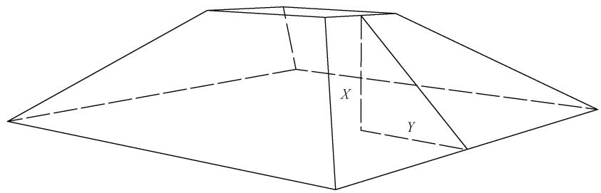

# 中华人民共和国国家标准

GB/T 45107—2024

# 表土剥离及其再利用技术要求

# Technical requirements for topsoil stripping and reusing

2024-12-31 发布

2025-07-01 实施

## 目 次

前言…………………………………………………………………………………………………………Ⅲ  
1范围………………………………………………………………………………………………………1  
2 规范性引用文件………………………………………………………………………………………1  
3 术语和定义…………………………………………………………………………………………1  
4 基本原则……………2  
5 调查和评价………………………………3  
5.1 调查前准备 …………………………………………………………………………………………3  
5.2 表土调查和评价……………………………………………………………………………………3  
5.3 储存区调查和要求…………………………………………………………………………………3  
5.4 再利用区调查和要求………………………………………………………………………………4  
6表土剥离………… …4  
6.1 剥离前准备…………………………………………4  
6.2 施…………………………………………………………………………………………………5  
6.3 剥离率计算…………………………………………………………………………………………5  
7表土运输………………………………………………………………………………………………6  
7.1 运输路线…6  
7.2 运输机械…………………………………………………………………………6  
7.3 运输要求………………………………………………………………………………………6  
8 表土储存……6  
8.1 通用要求……………………………………………………………………………………………6  
8.2 储存…………………………………………………………………………………………………7  
8.3 储存土方量计算 ……………8  
8.4 养护…………………………………………………………………………………………………8  
9 表土再利用……8  
9.1 通用要求……………………………………………………………………………………………8  
9.2 施工…………………………………………………………………………………………………9  
9.3 表土再利用率计算…………………………………………………………………………………10  
附录A（资料性）表土调查………………………………………………………………………………11  
A.1 前期准备…………………………………………………………………………………………11  
A.2 调查方案编制……………………………………………………………………………………11  
A.3 调查实施…………………………………………………………………………………………12  
附录B（规范性）表土质量评价和等级分类………………………………………………………13  
B.1 表土质量评价单项指标………………… …13  
B.2 表土质量等级划分和分类再利用……………………………………………………13  
附录C(规范性）储存区和再利用区要求…………………………16  
C.1 储存………………………………………………………………………………………………16  
C.2 再利用……………………………………………………………………………………………16  
参考文献……………………………………………………………………………………………………17

## 前 言

本文件按照GB/T1.1—2020《标准化工作导则 第1部分：标准化文件的结构和起草规则》的规定起草。

请注意本文件的某些内容可能涉及专利。本文件的发布机构不承担识别专利的责任。

本文件由中华人民共和国农业农村部提出。

本文件由全国土壤质量标准化技术委员会(SAC/TC404)归口。

本文件起草单位：上海辰山植物园、上海建工环境科技有限公司、中国科学院南京土壤研究所、上海市建设用地和土地整理事务中心、吉林农业大学、中国长江三峡集团有限公司、华中农业大学、上海市城市规划设计研究院、上海市浦东新区生态环境局、上海园林(集团)有限公司、江苏省质量和标准化研究院、生态环境部环境规划院。

本文件主要起草人：方海兰、张甘霖、周建强、窦森、刘静、张敬沙、蔡崇法、王磊、李翀、陈祥、商侃侃、夏菁、董芳玢、董滨、胡永红、庞学雷、杨金玲、康永良、彭红玲、叶素芬、赵博文、王先恺、陈琳、张国威、张倩、朱慧玲、朱煜、徐伟、范云、张峰、衣俊。

# 表土剥离及其再利用技术要求

## 1 范围

本文件规定了表土剥离和再利用过程中涉及的表土调查和评价、表土剥离、表土运输、表土储存、表土再利用等技术要求。

本文件适用于建设占用、临时用地、土地整治等工作中涉及的耕地、园地、林地、草地等地块的表土剥离和再利用活动，其他涉及表土剥离和再利用的活动可参照执行。

## 2 规范性引用文件

下列文件中的内容通过文中的规范性引用而构成本文件必不可少的条款。其中，注日期的引用文件，仅该日期对应的版本适用于本文件；不注日期的引用文件，其最新版本(包括所有的修改单)适用于本文件。

GB15618 土壤环境质量 农用地土壤污染风险管控标准(试行)

GB/T 28407—2012 农用地质量分等规程

GB/T 30600 高标准农田建设 通则

GB/T 33469 耕地质量等级

GB/T 36197 土壤质量 土壤采样技术指南

GB36600 土壤环境质量 建设用地土壤污染风险管控标准(试行)

GB 50433—2018 生产建设项目水土保持技术标准

CJJ 82 园林绿化工程施工及验收规范

CJ/T 340 绿化种植土壤

HJ 651 矿山生态环境保护与恢复治理技术规范(试行)

LY/T1225 森林土壤颗粒组成(机械组成)的测定

LY/T1237 森林土壤有机质的测定及碳氮比的计算

LY/T 1239 森林土壤 pH 值的测定

LY/T1251 森林土壤水溶性盐分分析

NY/T 1121.2 土壤检测 第 2 部分：土壤 pH 的测定

NY/T1121.3 土壤检测 第3部分：土壤机械组成的测定

NY/T1121.6 土壤检测 第6部分：土壤有机质的测定

NY/T1121.17 土壤检测 第17部分：土壤氯离子含量的测定

NY/T1121.18 土壤检测 第18部分：土壤硫酸根离子含量的测定

TD/T 1012 土地整治项目规划设计规范

TD/T 1036 土地复垦质量控制标准

## 3 术语和定义

下列术语和定义适用于本文件。

## 3.1

## 表土 topsoil; surface soil

耕地、园地、林地、草地等地块上具有较好肥力、耕性、生产性能和生态功能的表层土壤。

## 表土剥离 topsoil stripping

采用机械或人工方式，对具有再利用价值的表土进行剥离、收集的过程。

## 剥离率 ratio of stripping

剥离区实际剥离土方量与设计可剥离土方量的比值。

## 3.4

## 表土储存 topsoil storing

对已被剥离且暂未被利用的表土，进行临时堆放、储存并采取一定有效措施防止表土流失和质量退化的活动。

## 3.5

## 表土再利用 topsoil reusing

将剥离的表土再用于新垦耕地和劣质耕地改良、建设用地复垦、农用地整理、高标准农田建设、生态修复、绿化造林以及其他国土空间生态保护修复工程等的活动。

## 3.6

## 表土再利用率 rate of topsoil reusing

表土回覆率

表土从剥离到再利用全过程的总效率，即实际利用表土方量与设计利用表土方量的比值。

## 可视杂物 visible sundries

土壤中肉眼可辨识且难降解的各种侵入体。

示例：粒径>3cm的石块、建筑垃圾、金属物体、塑料制品、防腐处理的木材、纺织物、玻璃和陶瓷的锋利碎片等。

## 表土可剥离厚度 thickness of strippable topsoil

根据表土现场调查及现场采集代表性土壤样品的检测结果，确定为具有剥离和再利用价值的土层厚度。

## 3.9

## 土壤障碍因子 soil constraint factor

土体中妨碍植物正常生长发育的性质或形态特征。

## 3.10

## 表土清表 topsoil surface clearing

表土剥离前清除地表可视杂物及影响剥离施工的植株等的过程。

## 4 基本原则

4.1依据各地国土空间规划、国土空间生态修复规划，结合城乡建设、农田建设、生态建设和水土保持要求，开展表土剥离和再利用。

4.2表土剥离和再利用确保与土地整治等其他需要表土资源的项目在空间和时间上紧密衔接，合理安排表土的剥离、运输、储存和再利用，遵循“应剥尽剥、能用尽用、即剥即用、随剥随运、少储少运”的原则。

4.3表土剥离和再利用统筹剥离运输成本与项目实施的综合效益，遵循“就近、方便、经济和效益最大

化”的原则。

## 5 调查和评价

## 5.1 调查前准备

## 5.1.1 资料收集

宜参考附录A中A.1.1收集建设项目及其气候、水文、土壤、地形地貌、各种图件等资料。

## 5.1.2 调查和采样器具

现场调查准备和采样器具见A.1.2。

## 5.1.3 调查方案

当涉及的表土面积小于1hm²时，可不专门编制表土调查方案；当涉及的表土面积大于或等于1hm²时，应编制表土的调查方案。

## 5.2 表土调查和评价

## 5.2.1 调查

剥离区表土的勘察、范围定界和记录见A.3。

## 5.2.2 采样

应按GB/T 28407—2012第8章的要求划分剥离区表土采样单元，并按照 GB/T 36197和相应检测方法进行样品的采集和贮存；若表土层厚度大于50cm，应布置土壤剖面点。

## 5.2.3 检测

检测项目及检测方法应符合下列要求：

a）土壤pH、含盐量、有机质、质地、发芽指数、表土可剥离厚度、砾石含量和地形坡度为必测指标，检测方法按照附录B中表B.1进行；

b） 若前期无土壤污染物调查数据，农用地和建设用地分别按照GB15618和GB36600的要求进行土壤污染管控指标的检测；若存在被污染历史或潜在污染源，进行相应特征污染物指标的检测；

c）若前期土壤污染调查数据未超标且之后无潜在污染风险，可不进行土壤污染管控指标检测；

d）其他指标或潜在土壤障碍因子可作为选检指标。

## 5.2.4 表土质量评价

表土的质量评价和等级分类应符合附录B的规定。

## 5.3 储存区调查和要求

## 5.3.1 调查内容

储存区的范围为土地复垦、整理、开发等区域土地或弃土场，进一步核实储存区地理位置、红线范围，并逐块(宗)调查用地类型、权属、地势、地形坡度、面积、径流、排水、污染源、污染状况、地基承载力、地质灾害和交通运输条件等情况。

## 5.3.2 调查方法

按照GB50433—2018中4.2.5的方法，结合储存区及周边自然环境、水土流失及水土保持现状，利用地形图和现场测量数据，确定合适的储存区位置，形成相应图件。

## 5.3.3 要求

表土储存区应符合附录C中C.1的规定。

## 5.4 再利用区调查和要求

## 5.4.1 调查内容

核查未利用土地、自然灾害损毁土地、废弃工矿用地、中低产田、绿化造林等表土再利用区的地块位置、权属情况、地形地貌、土壤情况、排水和灌溉条件，并与剥离区或储存区的交通运输条件等进行对比。

## 5.4.2 要求

表土再利用区应符合C.2的规定。

## 6 表土剥离

## 6.1 剥离前准备

## 6.1.1 剥离方式

应根据剥离区场地状况和表土厚度确定剥离方式：剥离区地面起伏大、土层小于25cm且不适宜机械作业时，可人工剥离；当剥离区地面平整且表土可剥离厚度大于或等于25cm时，选择对土壤压实少的机械进行剥离。

## 6.1.2 剥离厚度

表土剥离厚度满足以下要求：

a）表土剥离厚度根据表土可剥离厚度、复垦土地利用方向及土方需求量综合确定，控制在10 cm\~30 cm 之间；

b）土层深厚、土壤深耕程度高且质量符合设计要求的，适当增加剥离的厚度，应剥尽剥，剥离厚度可至50cm以上，但需在地下水常水位以上；对于耕地，要耕层（0cm～20cm）、亚耕层(20 cm\~50 cm)分层剥离、堆放；

c）土壤资源紧缺且犁底层或心土层质地为壤质土的，宜增加剥离厚度至犁底层或心土层；

d）黑土地应根据黑土资源保护要求，应剥尽剥，无剥离厚度限制；

e）岩溶地区的耕作层、高寒草原草甸地区或土层较薄的地区，按照实际表土剥离厚度全部剥离；

f）分层剥离时根据剥离设备，确定单次剥离的宽度、轴线及厚度；

g）剥离后直接再利用的表土，单次剥离厚度不大于30cm。

## 6.1.3 剥离时间

表土剥离时间应满足以下要求：

a）表土剥离减少对土壤的侵蚀和结构破坏，避开作物收获或植被繁育时间或季节；

b）剥离过程中发生降水时，停止剥离并采取防护措施；选择连续3d晴朗后的干燥天气后剥离表土，田间持水量在50%～80%或在表土可捏成团、土团落地能自然散碎时进行；及时清除降水

过程中破坏的表土；

c）冰冻地区，在剥离层未冰冻时进行；

d）需保护表土上植物时，避开植物繁育的高峰期，在植物结籽成熟后剥离。

## 6.1.4 收集线路

以最大限度减少对表土碾压破坏为原则，规划的表土收集路线应满足以下要求：

a）根据表土分布的现状，充分利用已建成道路；

b）单个剥离单元内设置唯一的收集路线，在路线上铺设钢板；优先剥离、收集路线上的表土；

c）机械按预设的路线行驶，表土剥离机械按后退式路线行走，避免机械在表土上直接碾压；

d）定期清理铺设的钢板及收集设备带来的铁锈、油污、淤泥等污染物。

## 6.1.5 技术交底

建设单位应组织勘察设计、工程监理和施工单位开展技术人员培训、方案交底及图纸会审工作，明确施工内容和技术指标等方案要求。

## 6.2 施工

## 6.2.1 表土清表

剥离前应清理、移除剥离区中影响施工的地被植物以及石块、建筑垃圾等杂物，收集的表土尽量不含杂物、硬黏土块或直径大于3cm的砾石；不应采用焚烧等破坏表土和环境的方式进行清表。

## 6.2.2 现场剥离技术要求

现场剥离应满足以下要求：

a）剥离区道路尚未通达的地块，结合划分作业区修建临时施工便道，减少交通对表土的破坏；

b）在单个作业区内逐条进行剥离，按照条带状从一个方向逐步向前剥离；

c）单个条带内有多个土层需要剥离时，分区、分层剥离；剥离前后的地面高程相协调：

d）当剥离区域有一定坡度时，剥离条带主轴与坡向一致，保持剥离前后地面高程相协调；

e）剥离设备应减少对土壤的压实，运行于已经剥离表土的地面；运载车辆不应在尚未剥离的区域行驶；

f）剥离后的土壤不能及时转运时，选择排水良好的区域进行临时堆放，并对堆放区域的土体采取覆盖和开挖临时排水沟等保护措施；

$_ \mathrm { g ) }$ 当剥离作业区域较大时，对剥离作业区和未剥离区域进行分区管理，避免剥离设备或作业人员破坏未剥离区域表土。

## 6.3 剥离率计算

表土剥离率应不低于80%。剥离区剥离土方量和剥离率按公式(1)和公式(2)计算。

$$
Q = \sum ( H _ { i } \times S _ { i } )\tag{……………………(1}
$$

式中：

$Q$ 剥离区剥离土方量，单位为立方米 $\mathrm { ( m ^ { 3 } ) }$

$H _ { i }$ —第i个表土剥离单元的剥离厚度，单位为米 $\left( \mathrm { m } \right)$

$S _ { i }$ ——第i个表土剥离单元的剥离面积，单位为平方米 $\mathrm { ( m ^ { 2 } ) }$

$$
N = \frac { Q } { Q _ { \mathrm { p } } } \times 1 0 0 \%\tag{……………………(2}
$$

式中：

N ——剥离率；

Q 剥离区实际剥离土方量，单位为立方米 $\mathrm { ( m ^ { 3 } ) }$

Qp——剥离区应剥离土方量，单位为立方米 $\mathrm { ( m ^ { 3 } ) }$

## 7 表土运输

## 7.1 运输路线

表土运输遵循线路最短、成本最低的原则；优先选用现有道路和便桥，确定适用的运输点和运输线路，应一次性运至目的地。

## 7.2 运输机械

应根据剥离区、储存区和再利用区的地形、运输距离和条件，确定适用的运输机械。选用自卸汽车、铲运机和翻斗车，近距离运输可选装载机；机械工具应干净清洁。不需要储存的表土运距应不超过机械的最佳运距。

## 7.3 运输要求

7.3.1 表土运输过程中应减少对未剥离表土的碾压，必要时覆垫钢板减轻车辆对表土的压实。

7.3.2表土运输途中应采取覆盖保护措施，选用有自动盖板的运输工具，应在指定的运输线路上行驶。

7.3.3表土卸载过程中应减少对表土的碾压，沿同一个方向保持用后退的方式卸土，并配合装载机和推土机推平、堆置。

7.3.4 不应在恶劣天气状况下装卸和运输表土。

7.3.5分类剥离或分类储存的表土，应按不同类型单独装车。

## 8 表土储存

## 8.1 通用要求

8.1.1剥离的表土不能做到“即剥即用”时，应进行剥离表土的储存，储存时间不超过3年。

8.1.2根据表土储存时间长短，储存区分为长期和临时2种，应分别满足下列要求：

a）长期储存区位于平原区的，做好排水设计，位于丘陵区的，做好防洪安全设计，并符合C.1的规定；

b）储存时间低于3个月的，建立临时储存区，选择运输方便、水土流失少、成本低及对周边环境影响小的区域，距离剥离区不超过1km(还应在推土机能适合运输的范围)。

8.1.3 表土储存应满足下列要求：

a）按不同层次、不同质量等级的表土进行分类、分区堆放；

b）可直接用于耕作层的优质表土与其他表土分类堆放；

c）当表土存在障碍因子时，按主要障碍因子分类堆放；

d） 单次堆放高度不大于 50 cm。

8.1.4表土堆放过程应避免机械过度辗压、减少表土破坏；综合现场情况、表土储存量和再利用率，选择合适的储存区类型及必要的土壤保育措施。

8.1.5 堆体之间可不设置分隔设施，确需分隔的，应满足以下要求：

a）表土堆放2年以内，堆体之间、堆体与道路之间采用30cm～50cm装土的草袋或编织袋墙

分隔；

b）堆放时间超过2年或地形坡度较大的，采用干砌石或浆砌墙分隔。

8.1.6 施工机械和设备的机械废油等有害物质应集中收集后妥善处置；不应在表土堆放点附近焚烧油毡、塑料、皮革等产生有毒有害烟尘气体的物质。

8.1.7 表土的堆放应一次性完成，不应在储存区内二次转移。

## 8.2 储存

## 8.2.1 场地建设和要求

8.2.1.1表土堆放前应做好储存区的进出通道、堆放区和排水沟的规划建设。

8.2.1.2应做好拟堆放堆体压力和场地地面承载能力的计算，地面承载力应高于拟堆方堆体压力，必要时应进行场地加固处理。

8.2.1.3储存区应设置排水设施，并采取必要的水土保持措施，地形平缓的储存区排水沟可采用三面夯实土质排水沟，排水沟坡比为1：0.5～1：1.0，坡度较大的储存区的排水沟应硬化处理；储存区内的排水应汇入集水井，经多级沉淀池后排入河道或其他排水设施。

8.2.1.4储存区利用现有路网与外部连接，必要时可修建临时施工便道，不应对周边耕地造成破坏。储存区道路应采用最短线路布置，主要道路、机械停放、维修区域应与表土堆有效隔离。

8.2.1.5 场地交付使用前应清基和平整，并应满足下列要求：

a）清除储存区范围内的树根、石块、建筑垃圾等可视杂物；

b）对堆放区域进行平整：短期堆放应进行地面平整，长期堆放应对储存区地面进行压实，必要时可采用土工布进行分隔。

## 8.2.2 堆放

8.2.2.1 表土堆放应满足下列要求：

a）表土堆放次序由内向外进行，依次向入口处推进；

b）沿等高线位置堆放表土，且相邻堆体之间应设置能满足施工车辆通行要求的隔离带，施工机械不能穿越已堆放的土壤；

c）当土壤手捏可成团、不散开时停止堆放。

8.2.2.2 表土堆体应满足下列要求：

a）储存区内表土堆放紧凑，减少占地面积；

b）储存区的表土堆设置为台体或圆锥体，最大坡度不应超过1：2（竖向：水平），堆体宽度或直径宜小于20m，单个堆体的体积不应大于5 $\mathrm { 0 0 0 ~ m ^ { 3 } }$ ，表土堆高示意图见图1；

c）堆放高度满足堆体稳定性的设计要求，高度不超过4m；土质黏重的，最高不超过5m；堆放1年以上的，为确保堆放过程中表土能保持生物活性和结构稳定，降低堆土高度。

8.2.2.3堆土时，应边堆放边加固堆体边缘，做到堆体坡面平整；在每个工作日施工结束时，应做到堆体表面平整；当遇到降水天气，应中止堆放。

标引序号说明：

X——表土堆放的垂直高度，以米(m)计；

Y——表土堆放边坡到竖向的垂直距离，以米(m)计。

X:Y≤1:2。

## 图 1 堆高示意图

## 8.3 储存土方量计算

储存区储存土方量按公式(3)计算：

$$
Q _ { \mathrm { r } } = \sum ( V _ { i } \times C _ { \mathrm { r } } \ / \ : C _ { \mathrm { p } } )\tag{……………………(3}
$$

式中：

$Q _ { \mathrm { r } }$ —储存区储存土方量，单位为立方米 $\mathrm { ( m ^ { 3 } ) }$

$V _ { i }$ —第i个表土储存土堆体积，单位为立方米 $\mathrm { ( m ^ { 3 } ) }$

$C _ { \mathrm { { r } } }$ 表土储存区土堆土壤容重，单位为兆克每立方米 $\mathrm { ( M g / m ^ { 3 } ) }$

$C _ { \mathrm { { p } } }$ 表土剥离区土壤容重，单位为兆克每立方米 $\mathrm { ( M g / m ^ { 3 } ) }$

## 8.4 养护

8.4.1表土堆放完工后，暂不再利用的，应根据堆放时间采取必要的防护或维护措施，防止土壤损失、污染，必要时可采用挡土墙防护，挡土墙应符合GB50433—2018的相关规定：

a）堆放半年之内的，可采用防尘网、塑料膜、土工布或草栅进行遮盖保护；

b）堆放时间超过1年的，可播撒一年生或多年生浅根草本种子；或采用遮盖物、填土编织袋来挡土；

c）表土堆放完成后，在堆体坡面处开挖截流沟，在堆放场内采取水土保持措施，防止雨水对堆体下方的土壤造成水力侵蚀，水土保持措施符合GB50433—2018的相关规定。

8.4.2表土堆放完成后，应进行明确标识；建立储存区表土信息档案，档案包括土壤类型、来源、主要理化性状、堆放位置、堆放时间、堆高、储存土方量及位置图等内容。

8.4.3表土储存期间，应定期巡视并进行排水、杂草清除等维护；开展必要的表土质量定期监测或管护考核。

## 9 表土再利用

## 9.1 通用要求

9.1.1回覆的表土质量应优于再利用区原有的土壤质量；表土应就地、就近再利用，不同质量等级的表土应分类再利用，并符合B.2的规定。

9.1.2剥离的表土再利用宜综合考虑回覆表土和再利用区原有土壤的理化性质，酸化土壤改良选用$\mathrm { p H }$ 大于7.0的表土，碱性土壤改良选用 $\mathrm { p H }$ 小于6.5的表土；砂质土壤改良选用黏质的表土，黏质土壤

改良选用砂质的表土。土壤pH、有机质、质地、容重、水解性氮、有效磷和速效钾等关键指标符合或经改良修复后符合下列要求：

a）用于高标准农田建设的，符合GB/T30600的有关规定；

b） 用于复垦的，符合TD/T1036的有关规定；

c）用于土地整治的，符合TD/T1012的有关规定；

d）用于绿化造林、植草和植被恢复等生态建设的，污染物符合GB36600关于第一类用地的污染风险筛选值的有关规定，其他指标符合CJ/T340及生态建设的有关规定；

e）用于农业生产的，污染物符合GB15618关于农用地土壤污染风险筛选值的有关规定；用于绿色或有机农产品等其他生产的，符合现行其他相关标准的规定。

9.1.3 表土再利用的回覆厚度宜不小于20cm，并应符合下列要求：

a）用于耕地的，覆土后新土层厚度符合GB/T33469的规定；

b）用于高标准农田建设的，覆土后新土层厚度符合GB/T30600的规定；

c） 用于土地整治项目的，覆土后新土层厚度符合TD/T1012的规定；

d）用于生态修复和绿化造林的，覆土后新土层厚度符合CJJ82的规定；用于矿区生态修改的，符合 HJ 651 的规定；

e）其他用途的，符合相关国家和行业技术标准的有关规定。

9.1.4同一区域内同时存在多个土壤改良目标时，遵循“就近、方便、经济和效益最大化”的原则；应优先利用现有路网，道路未通达的可修临时施工便道。

9.1.5 表土回覆应避开极端天气，必要时可临时开挖排水沟。

9.1.6 表土回覆设计应制定详细的施工方案，包含表土再利用及其辅助设施的工程布局图和工程设计图，标明土壤利用地块(宗)及其辅助设施的位置、规模等，明确工程施工条件、施工方法、施工要求、质量标准等。

## 9.2 施工

## 9.2.1 放线

确定再利用区后，根据施工方案、种植要求和区域设计，划分表土回覆单元，确定每个回覆单元的覆土范围和厚度，并进行放线，标注回覆表土的来源和方量。

## 9.2.2 清障

覆土前应清除再利用区内与覆土无关的可视杂物，保证覆土区域的清洁。

## 9.2.3 平整

应按照再利用区的设计高程，扣除设计覆土厚度，确定覆土前的地面高程，根据该高程进行地面的平整；当再利用区高差较大时，应使用其他土方平整地块后冉回覆表土：如有灌排设施，应在灌排设施修筑完成后再进行地面的平整。

## 9.2.4 回覆

地面平整后进行表土回覆，并符合下列要求：

a）面积较大时，可划分施工单元，按照施工单元有序卸土和覆土；

b）覆土在土壤含水量适宜情况下进行，并避开极端天气，必要时开挖临时排水沟；

c）卸土从施工单元格最远处采取逐步后退方式进行；

d）覆土厚度均匀，必要时，先进行覆土试验，确定控制设计标高，覆土厚度宜高于设计厚度

20%，以确保沉降后的厚度达到设计要求；若仍不能满足设计厚度要求，采用人工方式进行再次覆土；

e）覆土完成后，采用低荷重机械或耙犁进行平整。

## 9.2.5 翻耕或压实

表土回覆后，土壤容重应符合TD/T1036的要求；当土壤过于紧实时，应采用旋耕机或人工进行土地翻耕，保障土壤的疏松度；当土壤过于疏松时，可适当压实。

## 9.2.6 种植

应根据设计及季节，及时种植植物，加快表层土壤结构的形成；同时结合增施有机肥、绿肥轮作、有机覆盖等措施，不断培肥地力，逐步达到设计地力水平。

## 9.3 表土再利用率计算

表土再利用方量按公式(4)计算。

$$
Q _ { \mathrm { m } } = \sum \left[ ( H _ { n } - L _ { n } ) \times S _ { n } \right] \times M\tag{……………………(4}
$$

式中：

$Q _ { \mathrm { m } }$ ——再利用土方量，单位为立方米 $\mathrm { ( m ^ { 3 } ) }$

$H _ { n }$ 第n个再利用区的预计耕作层厚度，单位为米(m)；

$L _ { n }$ ——第n个再利用区的原耕作层厚度，单位为米(m)；

$S _ { n }$ ——第n个再利用区的面积，单位为平方米 $\mathrm { ( m ^ { 2 } ) }$

M—土方冗余系数，受运输、施工、项目规模、土壤质量等因素影响，取值1.05～1.20。

表土再利用率按公式(5)计算，应不低于85%。

$$
Z = { \frac { Q _ { \mathrm { d } } } { Q _ { \mathrm { s } } } }\tag{……………………(5}
$$

式中：

$Z$ 表土再利用率；

Q。——再利用区土壤土方量，单位为立方米 $\mathrm { ( m ^ { 3 } ) }$

$Q _ { \mathrm { d } }$ —再利用区实际回覆土方量，单位为立方米 $\mathrm { ( m ^ { 3 } ) }$

# 附录A

# (资料性)

## 表土调查

## A.1 前期准备

## A.1.1 资料收集

表土剥离和再利用工作涉及自然资源、生态环境、农业、绿化、林业、水利等多个部门，项目实施前，注重做好同各个部门资料的收集，充分利用国土调查、土壤调查、土壤污染状况调查等最新成果，收集包括但不限于下列资料：

a）建设项目资料：包括项目可能涉及的占用表土或表土可再利用的国土空间规划、整治规划、高标准农田建设和绿化造林等建设项目批准文件、设计文件、测绘成果、计划进度等资料：

b）气候：平均温度、积温、降水量和分布、蒸发量、无霜期和灾害气候等；

c）水文：区域及可能影响的周边区域水源类型(地表水、地下水)、水量、水质以及特征；

d）土壤：剥离区、再利用或储存区域的县(市、区)级最新国土调查、耕地质量等级评价和监测、土地质量地球化学调查等最新调查成果，含土地权属、土地类型、耕地等别、土壤类型、土壤分布和土壤质量等；土壤质量包括土壤质地、养分、表土可剥离厚度、盐碱状况、剖面构型、障碍特征、侵蚀状况、污染状况、保水供水情况、砾石含量等：

e）地形地貌：地貌类型、海拔、坡度、坡向、坡形和地形部位等；

f）各种图件资料：包括土地利用现状图、地形图、土壤普查成果图、基本农田保护区规划图、主要污染点位图、农田水利分区图、施工图、交通图等；

g）其他资料：项目调查方案、表土剥离技术工作流程、进度计划、交通运输、储存场地等条件等。

## A.1.2 调查和采样器具

调查和采样器具包括：

a）工具类：铁锹、铁铲、土钻、削土刀、竹片以及适合特殊采样要求的工具，对长距离或大规模采样时需车辆等运输工具；

b）器材类：无人机、全球定位系统、罗盘、照相机、标本盒、卷尺、标尺、环刀、铝盒、样品袋、样品箱以及其他特殊仪器；

c）文具类：样品标签、记录表格、文件夹、铅笔等；

d）安全防护用品：工作服、工作鞋、工作帽、常用药品等。

## A.2 调查方案编制

表土的调查方案包括但不限于：

a）土壤污染类型和程度评判：充分利用已有的各类土壤调查成果，若前期没有进行过土壤污染调查，了解表土的污染类型和程度，对有潜在污染物超标或其他土壤障碍因子的地块，采取加密采样或增加检测项目，在调查方案中提出针对性的改进和预防措施；

b）确定调查方式：采取内业资料收集和外业实地调查相结合的方式，内业资料收集是基础，外业实地调查是对内业资料收集的核实、补充和完善；

c）确定调查内容：根据表土保护目标和前期收集资料增加或者减少表A.1的调查内容；

d）确定采样频率：土壤采样密度控制在每组 $0 . 5 \ \mathrm { h m ^ { 2 } } \sim 2 0 \ \mathrm { h m ^ { 2 } }$ ，不足0.5hm²的按0.5 hm²计，每个表土剥离项目至少采集一个采样点和土壤剖面点，对成土条件不一致或立地条件差别大的

地块，分别采集有代表性土壤剖面；对有潜在污染或土壤障碍的地块，增加采样频次；e）其他：调查方案包含时间、地点、人员、采样密度和调查行走路线等。

## A.3 调查实施

## A.3.1 路线勘查

路线勘察时，选择垂直于主要地貌类型的断面线，用较短的路线了解剥离区的自然景观、土壤类型和土地利用等概况。路线勘查通过不同的地形部位，特别是通视良好的高程点；当调查范围较大或交通和地形条件不佳时，采用航拍形式；丘陵和山区，根据地形条件，分区分组进行；平原区通过某些因素差异进行分组，必要时直线穿插；也可以结合工程项目规划确定最优勘察路线。

## A.3.2 表土范围定界

在路线勘察同时，先从肉眼上判断拟剥离表土的分布范围，然后结合地形图、卫星图片、无人机倾斜摄影建模等技术资料或手段对表土分布范围进行图面或电子定界；也可以结合现场表土分布位置采用地理坐标定位仪进行卫星定位，确定表土分布边界。建筑红线或者开发区边界可以采用地形图和/或地理坐标定位仪进行定界，并标示于地形图或者电子地图中，供后续编制剥离方案与开展剥离工程时使用。

## A.3.3 调查记录

按照表A.1规定的内容记录现场调查情况。

表 A.1 表土现场情况调查表
<table><tr><td rowspan=1 colspan=1>序号</td><td rowspan=1 colspan=2>现场调查项目</td><td rowspan=1 colspan=1>实际情况描述/测定/记录</td></tr><tr><td rowspan=1 colspan=1>1</td><td rowspan=1 colspan=2>土源位置(定位)</td><td rowspan=1 colspan=1>经度：                  纬度：</td></tr><tr><td rowspan=1 colspan=1>2</td><td rowspan=1 colspan=2>地形坡度/坡向</td><td rowspan=1 colspan=1></td></tr><tr><td rowspan=1 colspan=1>3</td><td rowspan=1 colspan=2>土壤侵蚀类型/程度</td><td rowspan=1 colspan=1></td></tr><tr><td rowspan=1 colspan=1>4</td><td rowspan=1 colspan=2>地面平整度</td><td rowspan=1 colspan=1></td></tr><tr><td rowspan=2 colspan=1>5</td><td rowspan=2 colspan=1>土地利用形式</td><td rowspan=1 colspan=1>现状</td><td rowspan=1 colspan=1></td></tr><tr><td rowspan=1 colspan=1>历史</td><td rowspan=1 colspan=1></td></tr><tr><td rowspan=2 colspan=1>6</td><td rowspan=2 colspan=1>地表概况</td><td rowspan=1 colspan=1>植物长势</td><td rowspan=1 colspan=1></td></tr><tr><td rowspan=1 colspan=1>地表水</td><td rowspan=1 colspan=1></td></tr><tr><td rowspan=2 colspan=1>7</td><td rowspan=2 colspan=1>土壤剖面</td><td rowspan=1 colspan=1>表土可剥离厚度/cm</td><td rowspan=1 colspan=1></td></tr><tr><td rowspan=1 colspan=1>土壤剖面深度/cm</td><td rowspan=1 colspan=1></td></tr><tr><td rowspan=1 colspan=1>8</td><td rowspan=1 colspan=2>成土母质</td><td rowspan=1 colspan=1></td></tr><tr><td rowspan=1 colspan=1>9</td><td rowspan=1 colspan=2>地下水埋深/cm</td><td rowspan=1 colspan=1></td></tr><tr><td rowspan=1 colspan=1>10</td><td rowspan=1 colspan=2>可视杂物(量的多少及清除难度)</td><td rowspan=1 colspan=1></td></tr><tr><td rowspan=1 colspan=1>11</td><td rowspan=1 colspan=2>砾石含量(量的多少及清除难度)</td><td rowspan=1 colspan=1></td></tr><tr><td rowspan=2 colspan=1>12</td><td rowspan=2 colspan=1>周边概况</td><td rowspan=1 colspan=1>路况(运输方便与否)</td><td rowspan=1 colspan=1></td></tr><tr><td rowspan=1 colspan=1>潜在污染源及影响程度</td><td rowspan=1 colspan=1></td></tr><tr><td rowspan=1 colspan=1>13</td><td rowspan=1 colspan=2>其他</td><td rowspan=1 colspan=1></td></tr></table>

# 附录B

(规范性)

## 表土质量评价和等级分类

## B.1 表土质量评价单项指标

表土质量评价单项指标分级要求和检测方法可按照表B.1进行。

## B.2 表土质量等级划分和分类再利用

可按照表B.2的规定将表土分为Ⅰ类、Ⅱ类和Ⅲ类3个等级；当与表B.2划分的单项指标等级不同时，表土质量等级以单项指标的最低等级为准：不同质量等级表土分类再利用应符合下列要求：

a）Ⅰ类表土：土层深厚、土壤肥沃、土壤环境良好、易剥离且无土壤障碍因子，应优先对其进行保护和剥离；耕作层Ⅰ类表土剥离后可直接种植植物，应优先用于土地复垦、中低产田改良、被污染耕地治理、新垦耕地和劣质耕地改良以及高标准农田建设；

b）Ⅱ类表土：土壤层次发育和肥力尚可、盐分含量或非严重毒害污染物等指标不达标但易改良修复、有一定的剥离难度且经处理后方可达到剥离条件；土壤资源紧缺地区，如果pH、表土可剥离厚度、地下水位、地形坡度、砾石含量中有3个(含)以下指标达不到剥离条件，且与限值相差20%以内，可组织专家论证，决定是否可进行剥离以及剥离后利用前采取的措施；剥离后应进行土壤改良或修复，且优先用于生态多样性保护、矿山生态环境修复、绿化造林等生态修复工程；

c）Ⅲ类表土：可剥离厚度薄、肥力差、盐分和污染物超标且不易改良修复、剥离难度大，不宜进行剥离和再利用。

1
<table><tr><td rowspan=2 colspan=1>序号</td><td rowspan=2 colspan=3>评价指标</td><td rowspan=1 colspan=4>分级要求</td><td rowspan=1 colspan=2>检测方法</td></tr><tr><td rowspan=1 colspan=1>1级</td><td rowspan=1 colspan=1>2级</td><td rowspan=1 colspan=1>3级</td><td rowspan=1 colspan=1>4级</td><td rowspan=1 colspan=1>耕地、园地</td><td rowspan=1 colspan=1>其他土地利用类型</td></tr><tr><td rowspan=1 colspan=1>1</td><td rowspan=1 colspan=3>pH</td><td rowspan=1 colspan=1>6.5~7.5</td><td rowspan=1 colspan=1>5.5~6.5,7.5~8.0|</td><td rowspan=1 colspan=1>4.5~5.5,8.0~8.5</td><td rowspan=1 colspan=1>&lt;4.5 或≥8.5</td><td rowspan=1 colspan=1>NY/T 1121.2</td><td rowspan=1 colspan=1>LY/T 1239</td></tr><tr><td rowspan=1 colspan=1>2</td><td rowspan=4 colspan=1>含盐量</td><td rowspan=1 colspan=2>EC 值/(mS/cm)</td><td rowspan=1 colspan=1>&lt;1.2</td><td rowspan=1 colspan=1>1.2~1.5</td><td rowspan=1 colspan=1>1.5~1.8</td><td rowspan=1 colspan=1>≥1.8</td><td rowspan=1 colspan=2>LY/T 1251</td></tr><tr><td rowspan=1 colspan=1>3</td><td rowspan=3 colspan=1>易溶盐主要成分/(g/kg)</td><td rowspan=1 colspan=1>Na2CO3</td><td rowspan=1 colspan=1>&lt;0.8</td><td rowspan=1 colspan=1>0.8~1.8</td><td rowspan=1 colspan=1>≥1.8</td><td rowspan=1 colspan=1></td><td rowspan=1 colspan=2>LY/T 1251</td></tr><tr><td rowspan=1 colspan=1>4</td><td rowspan=1 colspan=1>NaCl</td><td rowspan=1 colspan=1>&lt;1.2</td><td rowspan=1 colspan=1>1.2~2.4</td><td rowspan=1 colspan=1>≥2.4</td><td rowspan=1 colspan=1></td><td rowspan=1 colspan=1>NY/T 1121.17</td><td rowspan=1 colspan=1>LY/T 1251</td></tr><tr><td rowspan=1 colspan=1>5</td><td rowspan=1 colspan=1>SO₄2−</td><td rowspan=1 colspan=1>&lt;2</td><td rowspan=1 colspan=1>2~3</td><td rowspan=1 colspan=1>≥3.5</td><td rowspan=1 colspan=1>一</td><td rowspan=1 colspan=1>NY/T 1121.18</td><td rowspan=1 colspan=1>LY/T 1251</td></tr><tr><td rowspan=1 colspan=1>6</td><td rowspan=1 colspan=3>有机质/(g/kg)</td><td rowspan=1 colspan=1>≥30</td><td rowspan=1 colspan=1>30~20</td><td rowspan=1 colspan=1>20~10</td><td rowspan=1 colspan=1>&lt;10</td><td rowspan=1 colspan=1>NY/T 1121.6</td><td rowspan=1 colspan=1>LY/T 1237</td></tr><tr><td rowspan=1 colspan=1>7</td><td rowspan=1 colspan=3>质地a</td><td rowspan=1 colspan=1>壤质土</td><td rowspan=1 colspan=1>黏质土</td><td rowspan=1 colspan=1>砂质土</td><td rowspan=1 colspan=1>砾质土</td><td rowspan=1 colspan=1>NY/T 1121.3</td><td rowspan=1 colspan=1>LY/T 1225</td></tr><tr><td rowspan=1 colspan=1>8</td><td rowspan=1 colspan=3>发芽指数/%</td><td rowspan=1 colspan=1>≥100</td><td rowspan=1 colspan=1>85~100</td><td rowspan=1 colspan=1>70~85</td><td rowspan=1 colspan=1>&lt;70</td><td rowspan=1 colspan=2>CJ/T 340</td></tr><tr><td rowspan=1 colspan=1>9</td><td rowspan=1 colspan=3>表土可剥离厚度/cm</td><td rowspan=1 colspan=1>≥50</td><td rowspan=1 colspan=1>50~25</td><td rowspan=1 colspan=1>25~10</td><td rowspan=1 colspan=1>&lt;10</td><td rowspan=1 colspan=2>米尺测定法</td></tr><tr><td rowspan=1 colspan=1>10</td><td rowspan=1 colspan=3>砾石含量/%</td><td rowspan=1 colspan=1>&lt;2</td><td rowspan=1 colspan=1>2~5</td><td rowspan=1 colspan=1>5~10</td><td rowspan=1 colspan=1>≥10</td><td rowspan=1 colspan=2>筛分-质量法</td></tr><tr><td rowspan=1 colspan=1>11</td><td rowspan=1 colspan=3>地形坡度/(°)</td><td rowspan=1 colspan=1>&lt;2</td><td rowspan=1 colspan=1>2~8</td><td rowspan=1 colspan=1>8~25</td><td rowspan=1 colspan=1>≥25</td><td rowspan=1 colspan=2>罗盘实地量测法</td></tr><tr><td rowspan=1 colspan=10>a壤质土包括黏壤土、粉(砂)质黏壤土、砂质黏壤土、壤土、砂质壤土、粉(砂)壤土；黏质土包括黏土、砂质黏土、粉(砂)质黏土；砂质土包括砂土、壤质砂土、粉(砂)土；砾质土：砾石含量≥10%。</td></tr></table>

表 B.2 表土质量评价和等级分类表
<table><tr><td rowspan=1 colspan=1>序号</td><td rowspan=1 colspan=1>评价因子</td><td rowspan=1 colspan=1>Ⅰ类表土</td><td rowspan=1 colspan=1>Ⅱ类表土</td><td rowspan=1 colspan=1>Ⅲ类表土</td></tr><tr><td rowspan=1 colspan=1>1</td><td rowspan=1 colspan=1>pH</td><td rowspan=1 colspan=1>1级</td><td rowspan=1 colspan=1>2级、3级</td><td rowspan=1 colspan=1>4级</td></tr><tr><td rowspan=1 colspan=1>2</td><td rowspan=1 colspan=1>含盐量</td><td rowspan=1 colspan=1>1级</td><td rowspan=1 colspan=1>2级</td><td rowspan=1 colspan=1>3级</td></tr><tr><td rowspan=1 colspan=1>3</td><td rowspan=1 colspan=1>有机质含量</td><td rowspan=1 colspan=1>1级、2级</td><td rowspan=1 colspan=1>3级</td><td rowspan=1 colspan=1>4级</td></tr><tr><td rowspan=1 colspan=1>4</td><td rowspan=1 colspan=1>质地</td><td rowspan=1 colspan=1>1级</td><td rowspan=1 colspan=1>2级、3级</td><td rowspan=1 colspan=1>4级</td></tr><tr><td rowspan=1 colspan=1>5</td><td rowspan=1 colspan=1>发芽指数</td><td rowspan=1 colspan=1>1级、2级</td><td rowspan=1 colspan=1>3级</td><td rowspan=1 colspan=1>4级</td></tr><tr><td rowspan=1 colspan=1>6</td><td rowspan=1 colspan=1>表土可剥离厚度</td><td rowspan=1 colspan=1>1级、2级</td><td rowspan=1 colspan=1>3级</td><td rowspan=1 colspan=1>4级</td></tr><tr><td rowspan=1 colspan=1>7</td><td rowspan=1 colspan=1>砾石含量</td><td rowspan=1 colspan=1>1级</td><td rowspan=1 colspan=1>2级、3级</td><td rowspan=1 colspan=1>4级</td></tr><tr><td rowspan=1 colspan=1>8</td><td rowspan=1 colspan=1>地形坡度</td><td rowspan=1 colspan=1>1级、2级</td><td rowspan=1 colspan=1>3级</td><td rowspan=1 colspan=1>4级</td></tr><tr><td rowspan=1 colspan=1>9</td><td rowspan=1 colspan=1>可视杂物</td><td rowspan=1 colspan=1>无或易清除</td><td rowspan=1 colspan=1>局部有，但可清除</td><td rowspan=1 colspan=1>较多且难清除</td></tr><tr><td rowspan=1 colspan=1>10</td><td rowspan=1 colspan=1>地下水位</td><td rowspan=1 colspan=1>≥80 cm</td><td rowspan=1 colspan=1>≥50 cm</td><td rowspan=1 colspan=1>&lt;50 cm</td></tr><tr><td rowspan=1 colspan=1>11</td><td rowspan=1 colspan=1>地面平整度</td><td rowspan=1 colspan=1>地块规则平整，无塌陷</td><td rowspan=1 colspan=1>地块较规则平整，有少量塌陷</td><td rowspan=1 colspan=1>地块不规则平整，塌陷明显</td></tr></table>

# 附录 C

# (规范性)

# 储存区和再利用区要求

## C.1 储存区

表土的储存区符合以下要求：

a）应有较便利的交通条件，与表土剥离区或再利用区距离较近，面积可满足土方堆放要求；

b）平原区地势平坦，地形坡度小于2°；丘陵地区地质结构稳定，无河沟干扰；

c）应具备排水、防洪条件，不会产生积水和水土流失或经水保措施处理后可以避免；

d）非土壤污染区、非水源保护区、非地质虫害频发或隐患区，附近无污染源，地表未被污染；

e）满足地表承载力与周边环境的安全要求，不在城镇村庄、主要道路、水源地、重要河流、基本农田等重要区域和其他保护区的范围内，远离构筑物、河道、地下管道和基坑等地下压实敏感区域，确保在安全范围以外；

f）具备运输、装卸等机械设备通行条件；

g）宜修建在相对封闭、独立的区域，并位于地势相对较高的位置。

## C.2 再利用区

表土的再利用区符合以下要求：

a）绿化种植、林业生产、临时用地复垦、土地整治工程和石漠化治理的区域，可直接作为再利用区域；

b）优先选择已经正在实施或者即将实施并具有一定规模的农业或绿化林业种植项目；

c）优先用于复垦无耕作层或耕作层浅薄、贫瘠的耕地质量提升，其中水田耕作层厚度小于15 cm、旱地耕作层厚度小于20 cm、有效土层厚度小于30 cm、土壤有机质含量低于10g/kg；

d）优先用于地形坡度小于8°、排水体系(包含抽排)较全、灌溉系统良好、灌溉保障率基本满足、用地表水或浅层地下水灌溉的区域：

e）农用地土壤环境质量应满足GB15618的规定，绿地、林地土壤环境质量应满足CJ/T340的规定；

f）应为非地质灾害点、洪水冲刷区；

g) 应有基本的交通条件，与土壤剥离区或储存区距离较近；

h）覆土后土壤质量提升明显、综合效益显著。

## 参考文献

[1] GB/T 21010 土地利用现状分类

[2] GB/T 50434—2018 生产建设项目水土流失防治标准

[3] LY/T 2445 绿化用表土保护技术规范

[4] TD/T 1031.1—2011 土地复垦方案编制规程 第1 部分：通则

[5] TD/T 1048 耕作层土壤剥离利用技术规范

[6]金大成，沈烈英，方海兰，等．绿化种植土质量标准创新实践上海国际旅游度假区绿化建设案例[M].北京：中国林业出版社，2013

[7]谭永忠，贾文涛，吴次芳，等．耕作层土壤剥离利用的理论与实践[M].杭州：浙江大学出版社,2016

[8]周健民，沈仁芳，等.土壤学大辞典[M].北京：科学出版社，2013