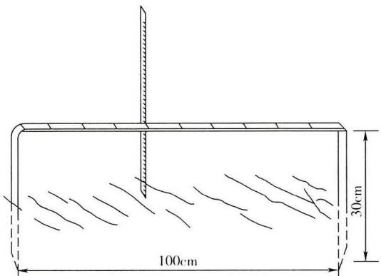

GB/T 51240-2018

# 生产建设项目水土保持监测与评价标准

# Standard for soil and water conservation monitoring and evaluation of production and construction projects

2018-11-01 发布

2019-04-01 实施

中华人民共和国住房和城乡建设部

国家市场监督管理总局

联合发布

# 中华人民共和国国家标准

# 生产建设项目水土保持监测与评价标准

# Standard for soil and water conservation monitoring and evaluation of production and construction projects

GB/T 51240 - 2018

主编部门：中华人民共和国水利部

批准部门：中华人民共和国住房和城乡建设部

施行日期：2 0 1 9 年 4 月 1 日

中国计划出版社

2018北 京

# 中华人民共和国国家标准生产建设项目水土保持监测与评价标准GB/T 51240-2018

☆中国计划出版社出版发行网址：www.jhpress.com

地址：北京市西城区木樨地北里甲11号国宏大厦C座3层邮政编码：100038电话：（010）63906433（发行部）三河富华印刷包装有限公司印刷

850mm×1168mm 1/32 2.25印张53千字

2019年3月第1版2019年3月第1次印刷

☆

统一书号：155182·0447

定价：14.00元

版权所有侵权必究

侵权举报电话：（010）63906404

如有印装质量问题，请寄本社出版部调换

# 中华人民共和国住房和城乡建设部公告

2018年 第257号

# 住房城乡建设部关于发布国家标准《生产建设项目水土保持监测与评价标准》的公告

现批准《生产建设项目水土保持监测与评价标准》为国家标准，编号为GB/T51240—2018，自2019年4月1日起实施。

本标准在住房城乡建设部门户网站(www.mohurd.gov.cn)公开，并由住房城乡建设部标准定额研究所组织中国计划出版社出版发行。

中华人民共和国住房和城乡建设部

2018年11月1日

## 前 言

根据住房城乡建设部《关于印发〈2009年工程建设标准规范制订、修订计划〉的通知》(建标〔2009〕88号)的要求，由水利部水土保持监测中心会同有关单位经广泛调查研究，认真总结实践经验，参考有关国际标准和国外先进标准，并在广泛征求意见的基础上，编制本标准。

本标准共分为10章和14个附录，主要内容包括总则，术语，基本规定，监测范围与时段，监测内容，监测方法与频次，监测点布设，重点对象监测，水土流失防治评价和监测成果及要求等。

本标准由住房城乡建设部负责管理，由水利部负责日常管理，由水利部水土保持监测中心负责具体技术内容的解释。执行本标准过程中如有意见或建议，请寄送水利部水土保持监测中心监测处(地址：北京市西城区南滨河路27号院7号楼贵都国际中心，邮政编码：100055）。

本标准主编单位、参编单位、主要起草人和主要审查人：

主编单位：水利部水土保持监测中心

参编单位：北京交通大学

中国电建集团华东勘测设计研究院有限公司

长江流域水土保持监测中心站

黄河水土保持生态环境监测中心

陕西省水土保持生态环境监测中心

贵州省水土保持监测站

主要起草人:郭索彦 李智广 姜德文 张长印 刘宪春

喻权刚杨光檄 王爱娟赵 辉 赵院

李健 冀文慧 刘世海 曾红娟 赵继东

罗志东 曹文华

主要审查人:焦居仁程萌刘志刚汪露王治国

韩凤翔曹炜刘瑞禄王玉玺张平仓

刘宝元 赵廷宁 许兆义 奚成刚尉全恩

王岁权罗娟高智叶碎高

## 目 次

1 总 则…………………………………………………(1)  
2术语……………………………………………………(2)  
3 基本规定……………………………(3)  
4 监测范围与时段…………………………(4)  
4.1 监测范围及分区……………………………(4)  
4.2监测时段……………(5)  
5 监测内容…………………………………(7)  
6 监测方法与频次……………………………(9)  
6.1 水土流失影响因素监测………(9)  
6.2 水土流失状况监测……………………(10)  
6.3 水土流失危害监测…………………(13)  
6.4 水土保持措施监测………………………………(13)  
7 监测点布设……………………………………………………(15)  
7.1 监测点布局…………………………………(15)  
7.2 植物措施监测点布设………………(16)  
7.3 工程措施监测点布设……………………………(16)  
7.4 土壤流失量监测点布设…………………………………………………(16)  
8 重点対象监测………………………(19)  
8.1 弃土(石、渣)场………………………………………(19)  
8.2 取土(石、料)场…………………………………………(19)  
8.3 大型开挖(填筑)区………………………………………(20)  
8.4 施工道路……………………………………(20)  
8.5 临时堆土(石、渣)场…………………………………(20)  
9 水土流失防治评价…………………………………(22)  
9.1水土流失情况评价………(22)  
9.2水土保持效果评价…………(22)  
10监测成果及要求……(24)  
附录A地表组成物质监测记录表…………………………(25)  
附录B 植被(扰动前)监测记录表…………………………(26）  
附录C 地表扰动情况监测记录表……………………(27)  
附录D 生产建设项目土壤流失量计算方法……………（28）  
附录E 水力侵蚀测钎监测记录表…………………………（30）  
附录F 水力侵蚀侵蚀沟监测记录表…………………（31）  
附录G 水力侵蚀控制站监测记录表………………………（32）  
附表H风力侵蚀测钎监测记录表……………………（33)  
附录J 风力侵蚀集沙仪监测记录表………………(34）  
附录K 风力侵蚀风蚀桥监测记录表………………(35）  
附录L 植物措施监测记录表………………………………（36）  
附录M工程措施监测记录表…………………(37)  
附录N 水土保持措施实施情况统计表…………………（38）  
附录P 生产建设项目水土保持监测季度报告表…………（39）  
本标准用词说明……(40)  
引用标准名录……(41)  
附:条文说明……

## Contents

1 General provisions (1)   
2 Terms … ( 2 )   
3 Basic requirements . (3)   
4 Monitoring scope and period ( 4 )   
4.1 Monitoring scope and subdivision (4)   
4.2 Monitoring period (5 )   
5 Monitoring contents (7 )   
6 Monitoring methods and frequency ( 9 )   
6.1 Monitoring of soil erosion impact factors ( 9 )   
6.2 Soil erosion monitoring (10)   
6.3 Monitoring of soil erosion hazard (13)   
6.4 Monitoring of soil and water conservation measures ……（13）   
7 Layout of monitoring sites … (15)   
7.1 Layout of monitoring sites … (15)   
7.2 Layout of monitoring sites for vegetation measures (16)   
7.3 Layout of monitoring sites for engineering measures ….... ( 16)   
7.4 Layout of monitoring sites for soil erosion …（16）   
8 Monitoring of key objects .. (19)   
8.1 Waste earth (stone, slag) area (19)   
8.2 Borrow earth (stone, material) pit …. (19)   
8.3 Large-scale excavation (filling) area (20)   
8.4 Construction road …… (20)   
8.5 Area for temporary piling earth (stone, slag) (20)   
9 Evaluation of soil erosion prevention (22)   
9.1 Evaluation of soil erosion (22)   
9.2 Assessment of soil and water conservation effects ….. (22)   
10 Monitoring results and requirements (24)   
Appendix A Surface material monitoring table ……… (25)   
Appendix B Vegetation (before disturbance)   
monitoring table (26)   
Appendix C Surface disturbance monitoring table …… (27)   
Appendix D Calculation methods of soil erosion for   
production and construction projects …..… (28)   
Appendix E Water erosion monitoring table for the pin … …… (30)   
Appendix F Water erosion monitoring table for the   
erosion gullies . (31)   
Appendix G Water erosion monitoring table for the   
control stations ……… (32)   
Appendix H Wind erosion monitoring table for the pin   (33)   
Appendix J Wind erosion monitoring table for   
sand sample… (34)   
Appendix K Wind erosion monitoring table for   
wind erosion bridge … (35)   
Appendix L Monitoring table for vegetation   
measures (36)   
Appendix M Monitoring table for engineering   
measures (37)   
Appendix N Statistics table for implementation of   
soil and water conservation measures ……(38)   
Appendix P Seasonal report of soil and water   
conservation monitoring for production   
and construction projects …. (39)   
Explanation of wording in this standard …（40）   
List of quoted standards ... （41）   
Addition: Explanation of provisions (43)

## 1 总 则

1.0.1为规范生产建设项目水土保持监测工作，提高监测成果质量，有效控制生产建设活动引起的水土流失，保护水土资源和生态环境，制定本标准。

1.0.2 本标准适用于生产建设项目建设和生产过程造成的水土流失及其防治效果的监测与评价。

1.0.3 生产建设项目水土保持监测与评价除应符合本标准外，尚应符合国家现行有关标准的规定。

## 2 术 语

## 2.0.1 全坡面径流小区whole slope runoff plot

布设在自坡顶到坡脚的全长坡面、用于观测径流和泥沙的集流区。

## 2.0.2 监测分区 subdivision of monitoring area

根据水土流失类型、成因以及影响水土流失发生的主导因素，结合生产建设项目的工程布局和建设特点，对水土保持监测范围划分为若干相对独立的区域。

## 2.0.3监测点 monitoring site

为定位、定量、动态采集水土流失及其影响因子、治理措施状况等指标而设立的具有确定位置和面积的样点。按监测对象及主要指标，可分为植物措施监测点、工程措施监测点、土壤流失量监测点及监测前述多个对象的综合监测点。

## 2.0.4 监测实施方案implementation schemefor monitoring

在现场查勘和调查的基础上，针对生产建设项目特点，依据相关技术标准和水土保持方案，确定生产建设项目水土保持监测内容、指标、方法、频次、监测点布局及实施安排等的技术文件。

## 3 基本规定

3.0.1开展生产建设项目监测应掌握施工准备期前一年期间水土流失防治责任范围内的水土流失及其防治状况。主要包括下列内容：

1 地形地貌、水文气象、植被、地面组成物质(或土壤)和土地利用等水土流失影响因素；

2 水土流失的类型、分布、面积、强度和危害；

3水土保持措施的类型、分布、面积、完好程度和防治效果。

3.0.2 建设类项目在建设期(含施工准备期)和试运行期应开展监测。建设生产类项目在建设期(含施工准备期)、试运行期和生产运行期均应开展监测。

3.0.3 水土流失重点区域及重点对象应进行重点监测。

3.0.4生产建设项目水土保持监测应设置监测点。监测点的位置应固定，并设立标志，同时应根据监测指标配置相关设施设备。

3.0.5水土流失防治评价应按监测分区、监测时段对水土流失动态变化及其防治效果进行评价。

3.0.6水土流失影响因素监测应结合主体设计、施工、监理等相关数据和资料，有针对性地进行必要的调查、观测和测量。

## 4 监测范围与时段

## 4.1 监测范围及分区

4.1.1 生产建设项目水土保持监测范围应包括水土保持方案确定的水土流失防治责任范围，以及项目建设与生产过程中扰动与危害的其他区域。

4.1.2 生产建设项目水土保持监测分区应以水土保持方案确定的水土流失防治分区为基础，结合项目工程布局进行划分。

4.1.3跨度大、范围广的大型生产建设项目，在划分监测分区时应遵循下列原则：

1一级监测分区应按现行行业标准《土壤侵蚀分类分级标准》SL190划定的全国各级土壤侵蚀类型区的二级类型区执行；

2二级监测分区应在一级监测分区的基础上，结合工程布局进一步划分。

4.1.4 水土保持监测重点区域应为易发生水土流失、潜在流失量较大或发生水土流失后易造成严重影响的区域。不同类型生产建设项目水土保持监测重点区域应按下列规定选取：

1 点型项目的监测重点区域主要应为主体工程施工区、施工生产生活区、大型开挖(填筑)面、取土(石、料)场、弃土(石、渣)场、临时堆土(石、渣)场、施工道路和集中排水区周边；

2 线型项目的监测重点区域主要应为大型开挖(填筑)面、施工道路、取土(石、料)场、弃土(石、渣)场、穿(跨)越工程、土石料临时转运场和集中排水区周边。

4.1.5 各行业生产建设项目水土保持监测重点区域应按下列规定选取：

1 采掘类工程应为露天矿的排土(石、渣)场、地下采矿的弃

土(石、渣)场和地面沉陷区、施工道路和集中排水区周边。

2 铁路、公路工程应为弃土(石、渣)场、取土(石、料)场、大型开挖(填筑)面、土石料临时转运场、集中排水区下游和施工道路。

3 火力发电工程应为弃土(石、渣)场、取土(石、料)场、临时堆土(石、渣)场、施工道路和贮灰场。核电工程应为主体工程施工区、弃土(石、渣)场、施工道路。风电工程应为主体工程施工区、场内外道路。输变电工程应为塔基、施工道路和施工场地。

4 冶炼工程应为弃土(石、渣)场、堆料场、尾矿(渣)场、施工和生产道路。

5 水利水电工程应为弃土(石、渣)场、取土(石、料)场、施工道路、大型开挖(填筑)面、排水泄洪区下游和临时堆土(石、渣)场。

6 管道工程应为弃土(石、渣)场、伴行(临时)道路、穿(跨)越河(沟)道、坡面上的开挖沟道和临时堆土(石、渣)场。

7 城镇建设工程应为地面开挖、弃土(石、渣)场和土石料临时堆放场。

8 农林开发建设工程应为土地整治区、施工道路、集中排水区周边。

9 其他工程应为施工或运行中易造成水土流失的部位和工作面。

## 4.2 监测时段

4.2.1 建设类项目水土保持监测应从施工准备期开始至设计水平年结束。监测时段可分为施工准备期、施工期和试运行期。

4.2.2 建设生产类项目水土保持监测应从施工准备期开始至运行期结束。监测时段可分为建设期和生产运行期两个阶段，其中建设期可分为施工准备期、施工期和试运行期。

4.2.3 不同监测时段监测重点内容的确定应符合下列规定：

1 施工准备期和施工期应重点监测扰动地表面积、土壤流失量和水土保持措施实施情况；

2 试运行期应重点监测植被措施恢复、工程措施运行及其防治效果；

3 建设生产类项目的生产运行期应重点监测水土流失及其危害、水土保持措施运行情况及其防治效果。

## 5监测内容

5.0.1 生产建设项目水土保持监测内容应包括水土流失影响因素、水土流失状况、水土流失危害和水土保持措施等。

5.0.2 水土流失影响因素监测应包括下列内容：

1气象水文、地形地貌、地表组成物质、植被等自然影响因素；

2项目建设对原地表、水土保持设施、植被的占压和损毁情况；

3 项目征占地和水土流失防治责任范围变化情况；

4项目弃土(石、渣)场的占地面积、弃土(石、渣)量及堆放方式；

5 项目取土(石、料)的扰动面积及取料方式。

5.0.3 水土流失状况监测应包括下列内容：

1水土流失的类型、形式、面积、分布及强度；

2 各监测分区及其重点对象的土壤流失量。

5.0.4 水土流失危害监测应包括下列内容：

1 水土流失对主体工程造成危害的方式、数量和程度；

2 水土流失掩埋冲毁农田、道路、居民点等的数量、程度；

3 对高等级公路、铁路、输变电、输油(气)管线等重大工程造成的危害；

4生产建设项目造成的沙化、崩塌、滑坡、泥石流等灾害；

5对水源地、生态保护区、江河湖泊、水库、塘坝、航道的危害，有可能直接进入江河湖泊或产生行洪安全影响的弃土(石、渣)情况。

5.0.5 水土保持措施监测应包括下列内容：

1 植物措施的种类、面积、分布、生长状况、成活率、保存率和林草覆盖率；

2工程措施的类型、数量、分布和完好程度；

3临时措施的类型、数量和分布；

4主体工程和各项水土保持措施的实施进展情况；

5 水土保持措施对主体工程安全建设和运行发挥的作用；

6 水土保持措施对周边生态环境发挥的作用。

## 6 监测方法与频次

## 6.1 水土流失影响因素监测

6.1.1 降雨和风力等气象资料可通过监测范围内或附近条件类似的气象站、水文站收集，或设置相关设施设备观测，统计每月的降水量、平均风速和风向。日降水量超过25mm或1小时降水量超过8mm的降水应统计降水量和历时，风速大于5m/s时应统计风速、风向、出现的次数或频率。

6.1.2 地形地貌状况可采用实地调查和查阅资料等方法获取。  
整个监测期应监测1次。

6.1.3 地表组成物质应采用实地调查的方法获取。施工准备期前和试运行期各监测1次。监测记录表格式应按本标准附录A执行。

6.1.4 植被状况应采用实地调查的方法获取，主要确定植被类型和优势种。应按植被类型选择3个～5个有代表性的样地，测定林地郁闭度和灌草地盖度，取其计算平均值作为植被郁闭度(或盖度）。施工准备期前测定1次。监测记录表格式应按本标准附录B执行。郁闭度可采用样线法和照相法测定。盖度可采用针刺法、网格法和照相法测定。

6.1.5 地表扰动情况应采用实地调查并结合查阅资料的方法进行监测。调查中，可采用实测法、填图法和遥感监测法。实测法宜采用测绳、测尺、全站仪、GPS或其他设备量测；填图法宜应用大比例尺地形图现场勾绘，并应进行室内量算；遥感监测法宜采用高分辨率遥感影像。监测记录表格式应按本标准附录C执行。点型项目每月监测1次。线型项目全线巡查每季度不应少于1次，典型地段监测每月1次。

6.1.6 水土流失防治责任范围应按本标准第6.1.5 条规定的方法和频次进行监测。

6.1.7 弃土弃渣应在查阅资料的基础上，以实地量测为主，监测弃土(石、渣)量及占地面积。弃土弃渣监测应符合下列规定：

1点型项目应以实测为主。正在使用的弃土弃渣场，应每10天监测1次。其他时段应每季度监测不少于1次。弃土（石、渣)占地面积可采用实测法、填图法，有条件的可采用遥感监测。弃土(石、渣)量应根据渣场面积，结合占地地形、堆渣体形状测算。

2 线型项目的大型和重要渣场应按照点型项目的监测方法进行。其他渣场应每季度监测不少于1次。

6.1.8取十（石、料)应在查阅资料的基础上，进行实地调查与量测，监测地表扰动面积。点型项目正在使用的取土(石、料)场应每10天监测1次，其他时段应每月监测1次；线型项目正在使用的大型和重要料场应每10天监测1次，其他料场应每季度监测1次。

## 6.2 水土流失状况监测

6.2.1 水土流失类型及形式应在综合分析相关资料的基础上，实地调查确定。每年不应少于1次。

6.2.2点型项目水土流失面积监测应采用普查法，每季度不应少于1次：线型项目水土流失面积监测宜采用抽样调查法，每李度1次。

6.2.3 土壤侵蚀强度应根据现行行业标准《土壤侵蚀分类分级标准》SL190按照监测分区分别确定，施工准备期前和监测期末各1次，施工期每年不应少于1次。

6.2.4 重点区域和重点对象不同时段的土壤流失量应通过监测占观测获得，在综合分析的基础上，项目建设过程中产生的土壤流失量按本标准附录D方法计算。土壤流失量监测还应符合下列规定：

1 水力侵蚀土壤流失量应根据监测区域的特点、条件和降雨情况，选择不同方法进行观测，统计每月的土壤流失量。具体方法选择应符合下列规定：

1)径流小区法宜采用全坡面径流小区或简易小区，开挖或弃土弃渣形成的、以土质为主的稳定坡面土壤流失量监测可采用该方法。按照设计频次或每次降雨后测量泥沙集蓄设施中的泥沙量，应分别采用式(6.2.4-1)、式(6.2.4-2)计算土壤流失量：

$$
S _ { \mathrm { T } } = \rho _ { \mathrm { s } } S h _ { \mathrm { s } } ( 1 - W _ { \mathrm { w } } ) \times 1 0 ^ { 6 }\tag{6.2.4-1}
$$

$$
S _ { \mathrm { T } } = \rho S h _ { \mathrm { \textrm { w } } } \times 1 0 ^ { 6 }\tag{6.2.4-2}
$$

式中： $S _ { \mathrm { T } }$ ——小区土壤流失量(g)；

$\rho _ { \mathrm { { S } } }$ 泥沙密度 $\mathrm { ( g / c m ^ { 3 } ) }$

$S ^ { - }$ ——泥沙集蓄设施底面面积 $( \mathrm { m } ^ { 2 } )$

$h _ { \mathrm { { S } } }$ ——沉积泥沙的平均厚度(m)；

$W _ { \textrm { w } }$ ——沉积泥沙含水量(%)；

$\rho$ 含沙量 $\mathrm { ( g / c m ^ { 3 } ) }$ ;

$h _ { \mathrm { ~ w ~ } }$ ——泥沙集蓄设施水深(m)。

2)测钎法可适用于开挖、填筑和堆弃形成的、以土质为主的稳定坡面土壤流失量简易监测。按照设计频次观测钉帽距地面的高度变化，土壤流失量可采用式(6.2.4-3)计算，监测记录表格式应按本标准附录E执行：

$$
S _ { \mathrm { T } } = \gamma _ { \mathrm { s } } S L { \cos \theta } \times 1 0 ^ { 3 }\tag{6.2.4-3}
$$

式中： $S _ { \mathrm { T } }$ ——土壤流失量(g)；

$\gamma _ { \mathrm { s } }$ 土壤容重 $\mathrm { ( g / c m ^ { 3 } ) }$

S——观测区坡面面积 $\mathrm { ( m ^ { 2 } ) }$

L——平均土壤流失厚度(mm)；

θ——观测区坡面坡度(°)。

3)侵蚀沟量测法可适用于暂不扰动的土质开挖面、土质或土与粒径较小的石砾混合物堆垫坡面的土壤流失量监

测。按设计频次量测侵蚀沟长，土壤流失量可采用式(6.2.4-4)、式(6.2.4-5)计算，监测记录表格式应按本标准附录F执行：

$$
V _ { \mathrm { r } } = \sum _ { i = 1 } ^ { n } \sum _ { j = 1 } ^ { m } \overline { { b _ { i j } } } \overline { { h _ { i j } } } l _ { i j }\tag{6.2.4-4}
$$

$$
S _ { \mathrm { { T } } } = V _ { \mathrm { { r } } } \gamma _ { \mathrm { { S } } }\tag{6.2.4-5}
$$

式中： $V _ { \mathrm { ~ r ~ } }$ ——侵蚀沟体积 $\mathrm { ( c m ^ { 3 } ) }$

$\overline { { b _ { i j } } }$ ——侵蚀沟的平均宽度(cm);

$\overline { { h _ { i j } } }$ —侵蚀沟的平均深度(cm);

$l _ { i j }$ —侵蚀沟的长度(cm)；

$S _ { \mathrm { T } }$ —土壤流失量(g);

$\gamma _ { \mathrm { s } }$ 土壤容重 $\mathrm { ( g / c m ^ { 3 } ) }$

i——量测断面序号，为 $1 , 2 , \cdots , n$

j—断面内侵蚀沟序号，为 $1 , 2 , \cdots , m$ o

4)集沙池法可适用于径流冲刷物颗粒较大、汇水面积不大、有集中出口汇水区的土壤流失量监测。按照设计频次观测集沙池中的泥沙厚度。宜在集沙池的四个角及中心点分别量测泥沙厚度，并测算泥沙密度。土壤流失量可采用式(6.2.4-6)计算：

$$
S _ { \mathrm { T } } = { \frac { h _ { 1 } + h _ { 2 } + h _ { 3 } + h _ { 4 } + h _ { 5 } } { 5 } } S \rho _ { 5 } { \times } 1 0 ^ { 4 }\tag{6.2.4-6}
$$

式中： $S _ { \mathrm { T } }$ ——汇水区土壤流失量(g)；

$h _ { i }$ 集沙池四角和中心点的泥沙厚度(cm)；

S——集沙池底面面积 $( \mathrm m ^ { 2 } )$

$\rho _ { \mathrm { { S } } }$ 泥沙密度 $\mathrm { ( g / c m ^ { 3 } ) }$

5)控制站法可适用干边界明确、有集中出口的集水区内生产建设活动产生的土壤流失量监测。每次降雨产流时应观测泥沙量、计算土壤流失量。监测记录表格式应按本标准附录G执行。

6)微地形测量法可适用于土质开挖面、土质或土石混合物及粒径较小的石质堆垫坡面的土壤流失量测定。可通过测量获取变化前后的微地形三维数据，对比计算流失量。

2 风力侵蚀强度监测可采用测钎、集沙仪、风蚀桥等设备。监测时，可单独使用这些设备，也可组合使用。应每月统计1次。监测记录表格式应按本标准附录H～附录K执行。

3重力侵蚀监测可采用调查、实测等方法，对崩塌、滑坡、泥石流等土石方量进行量测。

## 6.3 水土流失危害监测

6.3.1水土流失危害的面积可采用实测法、填图法或遥感监测法进行监测。

6.3.2 水土流失危害的其他指标和危害程度可采用实地调查、量测和询问等方法进行监测。

6.3.3 水土流失危害事件发生后1周内应完成监测工作。

## 6.4 水土保持措施监测

6.4.1 植物措施监测应符合下列规定：

1 植物类型及面积应在综合分析相关技术资料的基础上，实地调查确定。应每季度调查1次。

2 成活率、保存率及生长状况宜采用抽样调查的方法确定。应在栽植6个月后调查成活率，且每年调查1次保存率及生长状况。乔木的成活率与保存率应采用样地或样线调查法。灌木的成活率与保存率应采用样地调查法。

3 郁闭度与盖度监测方法按本标准第6.1.4条的规定执行。应每年在植被生长最茂盛的季节监测1次。

4 林草覆盖率应在统计林草地面积的基础上分析计算获得。植物措施监测记录表格式应按本标准附录L执行。

6.4.2 工程措施监测应符合下列规定：

1 措施的数量、分布和运行状况应在查阅工程设计、监理、施工等资料的基础上，结合实地勘测与全面巡查确定。

2 重点区域应每月监测1次，整体状况应每季度1次。

3 对于措施运行状况，可设立监测点进行定期观测。工程措施监测记录表格式应按本标准附录M执行。

6.4.3临时措施可在查阅工程施工、监理等资料的基础上，实地调查，并拍摄照片或录像等影像资料。

6.4.4 措施实施情况可在查阅工程施工、监理等资料的基础上结合调查询问与实地调查确定。应每季度统计1次。措施实施情况统计表格式应按本标准附录N执行。

6.4.5 水土保持措施对主体工程安全建设和运行发挥的作用应以巡查为主。每年汛期前后及大风、暴雨后进行调查。

6.4.6 水土保持措施对周边水土保持生态环境发挥的作用应以巡查为主。每年汛期前后及大风、暴雨后应进行调查。

## 7 监测点布设

## 7.1 监测点布局

## 7.1.1 监测点布局应符合下列规定：

1 监测点的分布应反映项目所在区域的水土流失特征；

2 监测点应与项目构成和工程施工特性相适应；

3监测点应按监测分区，根据监测重点布设，同时兼顾项目所涉及的行政区；

4监测点布设应统筹考虑监测内容，尽量布设综合监测点；

5监测点应相对稳定，满足持续监测要求。

7.1.2 监测点数量应满足水土流失及其防治效果监测与评价的要求，并应符合下列规定：

1 植物措施监测点数量可根据抽样设计确定，每个有植物措施的监测分区和县级行政区应至少布设1个监测点。

2 工程措施监测点数量应综合分析工程特点合理确定，并应符合下列规定：

1)对点型项目，弃土(石、渣)场、取土(石、料)场、大型开挖(填筑)区、贮灰场等重点对象应至少各布设1个工程措施监测点；

2)对线型项目，应选取不低于30%的弃土(石、渣)场、取土(石、料)场、穿(跨)越大中河流两岸、隧道进出口布设工程措施监测点，施工道路应选取不低于30%的工程措施布设监测点。

3土壤流失量监测点数量应按项目类型确定，并应符合下列规定：

1)对点型项目，每个监测分区应至少布设1个监测点；

2)对线型项目，每个监测分区应至少布设1个监测点。当一个监测分区中的项目长度超过100km时，每100km应增加2个监测点。

## 7.2 植物措施监测点布设

7.2.1综合分析植物措施的立地条件、分布与特点，选择有代表性的地块作为监测点，在每个监测点内选择3个不同生长状况的样地进行监测。

7.2.2 植物措施监测样地的规格应根据植被类型按照下列规定确定：

1 乔木林应为 $1 0 \mathrm { m } \times 1 0 \mathrm { m } { \sim } 3 0 \mathrm { m } \times 3 0 \mathrm { m }$ ，依据乔木规格选择合适的样方大小；

2 灌木林应为 $2 \mathrm { m } \times 2 \mathrm { m } { \sim } 5 \mathrm { m } \times 5 \mathrm { m }$

3 草地应为 $1 \mathrm { m } \times 1 \mathrm { m } { \sim } 2 \mathrm { m } \times 2 \mathrm { m }$

4 绿篱、行道树、防护林带等植物措施样地长度不应小于 $2 0 \mathrm { m } .$

## 7.3工程措施监测点布设

7.3.1工程措施监测点应根据工程措施设计的数量、类型和分布情况，结合现场调查进行布设。

7.3.2 应以单位工程或分部工程作为工程措施监测点。单位工程和分部工程的划分应按现行行业标准《水土保持工程质量评定规程》SL336的规定执行。每个重要单位工程都应布设监测点。重要单位工程的界定应按现行国家标准《开发建设项目水土保持设施验收技术规程》GB/T22490的规定执行。

7.3.3 当某种类型的工程措施在多处分布时，应选择2处以上作为监测点。

## 7.4 土壤流失量监测点布设

7.4.1 径流小区设计应符合下列规定：

1 布设径流小区的坡面应具有代表性，且交通方便、观测便利。

2 径流小区的规格可根据具体情况确定。全坡面径流小区长度应为整个坡面长度，宽度不应小于5m。简易小区面积不应小于10m²，形状宜采用矩形。

3 径流小区的组成和平面布设应按现行行业标准《水土保持试验规程》SL419的规定执行。

7.4.2 控制站设计应符合下列规定：

1 控制站的选址与布设应按现行行业标准《水土保持监测技术规程》SL277和《水土保持试验规程》SL419的规定执行。与未扰动原地貌的流失状况对比时，可选择全国水土保持监测网络中邻近的小流域控制站作参照。

2 建设时，应根据沟道基流情况确定监测基准面。水尺应坚固耐用，便于观测和养护；所设最高、最低水尺应确保最高、最低水位的观测；应根据水尺断面测量结果，率定水位流量关系。断面设时，应注意测流槽尾端堆积；结构设计和建筑材料选择应保证测流断面坚固耐用。

7.4.3 测钎法监测点设计应符合下列规定：

1选择有代表性的坡面布设测钎，选址应避免周边来水的影响。

2 应将直径小于0.5cm、长50cm\~100cm类似钉子形状的测钎，根据坡面面积，按网格状等间距设置。测钎间距宜为1m～3m，数量不应少于9根。测钎应铅垂方向打入坡面，编号登记入册。

## 7.4.4 侵蚀沟监测点设计应符合下列规定：

1 侵蚀沟监测点布设在具有代表性、能够保存一定时间的开挖面或填筑面。

2 侵蚀沟监测点长度应为整个坡面长度，宽度不应小于5m。 临测断面宜均匀布设在侵蚀沟的上、中、下部。当侵蚀沟变化较大

时，应加密监测断面。

7.4.5 集沙池设计应符合下列规定：

1 集沙池宜修建在坡面下方、堆渣体坡脚的周边、排水沟出口等部位；

2 集沙池规格应根据控制的集水面积、降水强度、泥沙颗粒和集沙时间确定。

7.4.6 风力侵蚀监测点设计应符合下列规定：

1 应选择具有代表性、无较大干扰的地面作为监测点，一般为长方形或正方形，面积不应小于10m×10m，短边与主风向垂直。与未扰动原地貌的风力侵蚀状况对比时，可选择全国水土保持监测网络中邻近的风力侵蚀观测场作参照。

2风力侵蚀观测场内可布设测钎、集沙仪、风蚀桥等设备中的一种或几种设备，具体应按下列规定执行：

1)测钎布设可按照本标准第7.4.3条的规定执行，也可采用标桩代替测钎。标桩不应少于9根，间距不宜小于2m，标桩长度宜为1.0m\~1.5m，宜埋入地面下0.6m\~0.8m，宜出露地面0.4m\~0.9m。

2)集沙仪不宜少于3组，进沙口应正对主风向。根据监测区风向特征，可选择单路集沙仪或多路集沙仪。

3)风蚀桥宜多排布设，桥身应与主风向垂直，排距宜为10m\~50m。

# 8 重点对象监测

## 8.1 弃土(石、渣)场

8.1.1 弃渣期间，应重点监测扰动面积、弃渣量、土壤流失量以及挡、排水和边坡防护措施等情况。弃渣结束后，应重点监测土地整治、植被恢复或复耕等水土保持措施情况。

8.1.2 大型弃土(石、渣)场弃渣量监测可通过实测或调查获得。实测时，应在弃渣前后进行大比例尺地形图测绘，并应进行比较计算弃渣量。

8.1.3 弃土(石、渣)场水土保持措施监测应以调查为主，掌握措施实施以及弃渣先拦后弃、堆放工艺等情况。

8.1.4土壤流失量监测可采用全坡面径流小区、集沙池、控制站等方法，或利用工程建设的沉沙池、排水沟等设施进行监测。对位于风力侵蚀区的弃渣场，应进行风力侵蚀量监测。土壤流失量监测应按下列规定执行：

1 对未设置拦挡措施的弃渣堆积体，宜布设全坡面径流小区监测泥沙；

2 对已设置拦挡措施的弃渣堆积体，应监测流出拦渣墙(或拦渣坝)的渣量；

3 对设置在沟道的弃土(石、渣)场，可在下游设置控制站或集沙池监测径流泥沙。

$$
8 . 2 \quad 4 x \pm ( \mp , \ast \ast ) \pm 3 \pi
$$

8.2.1取料期间，应重点监测扰动面积、废弃料处置和土壤流失量。取料结束后，应重点监测边坡防护、土地整治、植被恢复或复耕等水土保持措施实施情况。

8.2.2废弃料处置应定期进行现场调查，掌握废弃料的数量、堆放位置和防护措施。

8.2.3土壤流失量监测可采用下列方法：

1 对开挖后形成的边坡，可采用全坡面径流小区和集沙池等方法，或利用工程建设的沉沙池、排水沟等设施进行监测，或量测坡脚的堆积物体积；

2 对取土(石、料)场，可采用集沙池、控制站等方法，或利用工程建设的沉沙池、排水沟等设施进行监测；

3 对位于风力侵蚀区的取土(石、料)场，应进行风力侵蚀量监测。

## 8.3 大型开挖(填筑)区

8.3.1施工过程中，应通过定期现场调查，记录开挖(填筑)面的面积、坡度，并应监测土壤流失量和水土保持措施实施情况。

8.3.2土壤流失量监测可采用全坡面径流小区、集沙池、测钎、侵蚀沟等方法，或利用工程建设的排水沟、沉沙池进行监测。

8.3.3 施工结束后，应重点监测水土保持措施情况。

## 8.4 施工道路

8.4.1施工期间，应通过定期现场调查，掌握扰动地表面积、弃土(石、渣)量、水土流失及其危害、拦挡和排水等水土保持措施的情况。

8.4.2土壤流失量监测可采用侵蚀沟、集沙池、测钎等方法，或利用工程建设的排水沟、沉沙池进行监测。

8.4.3施工结束后，应重点监测扰动区域恢复情况及水土保持措施情况。

## 8.5临时堆土(石、渣)场

8.5.1 临时堆土(石、渣)场应重点监测临时堆土(石、渣)场数量、

而积及采取的临时防护措施。

8.5.2 在堆土过程中，应通过定期调查，结合监理及施工记录，确定堆放位置和面积，并拍摄照片或录像等影像资料，监测水土保持措施的类型、数量及运行情况。

8.5.3 堆土使用完毕后，应调查土料去向以及场地恢复情况。

## 9 水土流失防治评价

## 9.1 水土流失情况评价

9.1.1 水土流失情况评价的主要内容应包括水土流失防治责任范围、地表扰动面积、弃土(石、渣)状况以及水土流失的面积、分布与强度等的变化情况。

9.1.2 应按监测分区、监测时段统计地表扰动面积、弃土(石、渣)量及有效拦挡量，分析动态变化情况。

9.1.3应根据监测点和实地调查获得的土壤流失量，按监测分区、监测时段评价水土流失的面积、分布与强度的变化情况。

9.1.4 在监测与评价过程中，发现水土流失防治责任范围与水土保持方案不一致及弃土(石、渣)场、取土(石、料)场等的位置、规模发生重大变化时，应分析原因并通知建设单位。

## 9.2 水土保持效果评价

9.2.1 水土保持效果评价的主要内容应包括水土保持措施实施情况、防治效果及水土流失防治目标达标情况。

9.2.2应按监测分区、监测时段统计水土保持措施的类型、数量和分布情况，并与水土保持方案确定的措施体系进行对比。发生变化时，应分析原因。

9.2.3 应分别对施工准备期、施工期及试运行期的防治效果进行评价。建设生产类项目还应对生产运行期的防治效果进行评价。防治效果应按照现行国家标准《生产建设项目水土保持技术标准》GB50433的规定，从治理水土流失、林草植被建设、水土保持设施运行状况、保护和改善生态环境等方面进行评价。

9.2.4 对施工期，应按现行国家标准《生产建设项目水土流失防治标准》GB/T50434的规定分析渣土防护率、表土保护率与土壤流失控制比，并与水土保持方案确定的防治目标进行对比，评价达标情况。

9.2.5 对试运行期和生产运行期，应按现行国家标准《生产建设项目水土流失防治标准》GB/T50434的规定分析表土保护率、水上流失治理度、渣土防护率、土壤流失控制比、林草植被恢复率和林草覆盖率，并与水土保持方案确定的防治目标进行对比，分析达标情况。

9.2.6 未达到水土保持方案确定的防治目标时，应分析原因，及时提出改进建议。

9.2.7监测期末，应评价项目建设对周边生态环境的影响。

## 10监测成果及要求

10.0.1监测成果应包括水土保持监测实施方案、监测报告、图件、数据表(册)、影像资料等。

10.0.2在施工准备期之前应进行现场查勘和调查，并应根据相关技术标准和水土保持方案编制《生产建设项目水土保持监测实施方案》。

10.0.3水土保持监测报告应包括季度报告表、专项报告和总结报告。监测期间，应编制《生产建设项目水土保持监测季度报告表》，报告表格式应按本标准附录P执行。发生严重水土流失灾害事件时，应于事件发生后一周内完成专项报告。监测工作完成后，应编制《生产建设项目水土保持监测总结报告》。

10.0.4 对点型项目，图件应包括项目区地理位置图、扰动地表分布图、监测分区与监测点分布图、土壤侵蚀强度图、水土保持措施分布图等。对线型项目，图件应包括项目区地理位置图、监测分区与监测点分布图，以及大型弃土(石、渣)场、大型取土(石、料)场和大型开挖(填筑)区的扰动地表分布图、土壤侵蚀强度图、水土保持措施分布图等。

10.0.5数据表(册)应包括原始记录表和汇总分析表。

10.0.6 影像资料应包括监测过程中拍摄的反映水土流失动态变化及其治理措施实施情况的照片、录像等。

10.0.7 监测成果应采用纸质和电子版形式保存，做好数据备份。

## 附录A 地表组成物质监测记录表

表A 地表组成物质监测记录表
<table><tr><td rowspan=1 colspan=1>项目名称</td><td rowspan=1 colspan=4></td></tr><tr><td rowspan=1 colspan=1>监测分区名称</td><td rowspan=1 colspan=4></td></tr><tr><td rowspan=2 colspan=1>监测地点</td><td rowspan=1 colspan=1>经纬度</td><td rowspan=1 colspan=2> $\mathrm { E } { : }$ </td><td rowspan=1 colspan=1>N:</td></tr><tr><td rowspan=1 colspan=1>小地名</td><td rowspan=1 colspan=3></td></tr><tr><td rowspan=4 colspan=1>地表组成物质</td><td rowspan=1 colspan=1>类型</td><td rowspan=1 colspan=1></td><td rowspan=5 colspan=2>说明(简要)：</td></tr><tr><td rowspan=1 colspan=1>土质(%)</td><td rowspan=1 colspan=1></td></tr><tr><td rowspan=1 colspan=1>石质(%)</td><td rowspan=1 colspan=1></td></tr><tr><td rowspan=1 colspan=1>砂砾质(%)</td><td rowspan=1 colspan=1></td></tr><tr><td rowspan=1 colspan=2>土壤类型</td><td rowspan=1 colspan=1></td></tr><tr><td rowspan=1 colspan=1>填表说明</td><td rowspan=1 colspan=4>1.“小地名”填写省、县、乡镇和自然村名：2.“土质(%)”、“石质(%)”、“砂砾质(%)”填写面积百分比；3.“说明”填写关于地表组成物质的描述性说明，或附近景照片</td></tr><tr><td rowspan=1 colspan=1>填表人</td><td rowspan=1 colspan=2></td><td rowspan=1 colspan=1>审核人</td><td rowspan=1 colspan=1></td></tr></table>

填表时间： 年 月 日

## 附录B 植被(扰动前)监测记录表

表 B 植被(扰动前)监测记录表
<table><tr><td rowspan=1 colspan=2>项目名称</td><td rowspan=1 colspan=4></td></tr><tr><td rowspan=1 colspan=2>监测分区名称</td><td rowspan=1 colspan=4></td></tr><tr><td rowspan=2 colspan=2>监测地点</td><td rowspan=1 colspan=1>经纬度</td><td rowspan=1 colspan=2>E:</td><td rowspan=1 colspan=1>N:</td></tr><tr><td rowspan=1 colspan=1>小地名</td><td rowspan=1 colspan=3></td></tr><tr><td rowspan=1 colspan=2>植被类型</td><td rowspan=1 colspan=4></td></tr><tr><td rowspan=5 colspan=1>乔木层</td><td rowspan=1 colspan=2>优势树种</td><td rowspan=1 colspan=2></td><td rowspan=5 colspan=1>照片</td></tr><tr><td rowspan=1 colspan=2>其他树种</td><td rowspan=1 colspan=2></td></tr><tr><td rowspan=1 colspan=2>平均高度(m)</td><td rowspan=1 colspan=2></td></tr><tr><td rowspan=1 colspan=2>每100m²株数（株）</td><td rowspan=1 colspan=2></td></tr><tr><td rowspan=1 colspan=2>郁闭度</td><td rowspan=1 colspan=2></td></tr><tr><td rowspan=4 colspan=1>灌木层</td><td rowspan=1 colspan=2>优势树种</td><td rowspan=1 colspan=2></td><td rowspan=4 colspan=1></td></tr><tr><td rowspan=1 colspan=2>其他树种</td><td rowspan=1 colspan=2></td></tr><tr><td rowspan=1 colspan=2>平均高度(m)</td><td rowspan=1 colspan=2></td></tr><tr><td rowspan=1 colspan=2>盖度(%）</td><td rowspan=1 colspan=2></td></tr><tr><td rowspan=4 colspan=1>草本</td><td rowspan=1 colspan=2>优势草种</td><td rowspan=1 colspan=2></td><td rowspan=4 colspan=1></td></tr><tr><td rowspan=1 colspan=2>其他草种</td><td rowspan=1 colspan=2></td></tr><tr><td rowspan=1 colspan=2>平均高度(cm)</td><td rowspan=1 colspan=2></td></tr><tr><td rowspan=1 colspan=2>盖度(%)</td><td rowspan=1 colspan=2></td></tr><tr><td rowspan=1 colspan=2>填表说明</td><td rowspan=1 colspan=4>1. 调查时间应为施工准备期前一年内；2.“植被类型”填写乔木林、灌木林、草地、乔灌混交、灌草混交、乔草混交、乔灌草混交的其中之一；3.“照片”应能反映植被的整体状况</td></tr><tr><td rowspan=1 colspan=2>填表人</td><td rowspan=1 colspan=2></td><td rowspan=1 colspan=1>审核人</td><td rowspan=1 colspan=1></td></tr></table>

填表时间： 年月 日

## 附录C 地表扰动情况监测记录表

表C 地表扰动情况监测记录表
<table><tr><td>项目名称</td><td colspan="5"></td></tr><tr><td>监测分区名称</td><td colspan="5"></td></tr><tr><td>扰动特征</td><td>埋压</td><td>开挖面</td><td>施工平台</td><td>建筑物</td><td>……</td></tr><tr><td>扰动面积(hm²)</td><td></td><td></td><td></td><td></td><td></td></tr><tr><td>填表说明</td><td colspan="5">本表中“扰动特征”列出了生产建设项目的主要扰动类型。在 实际的监测工作中，应根据项目的具体情况选择和补充，并保持 扰动类型的前后一致</td></tr><tr><td>填表人</td><td></td><td></td><td>审核人</td><td></td><td></td></tr></table>

填表时间： 年月

# 附录D生产建设项目土壤流失量计算方法

D.0.1 生产建设活动造成的土壤流失量可从三个不同的空间尺度进行分析，这三个尺度分别对应于监测点、监测分区和整个监测范围。

D.0.2 监测点的土壤流失量应通过监测数据计算得到。

D.0.3监测分区的土壤流失量可在分析本监测分区内各监测点空间分布的基础上，通过监测点土壤流失量拟合得到；可采用简单平均数加和法、面积加权加和法，分别按下列规定执行：

1 简单平均数加和法可采用式(D.0.3-1)计算：

$$
S , = \frac { A _ { j } } { n } \sum _ { i = 1 } ^ { n } S ,\tag{D.0.3-1}
$$

式中： $S ,$ —第j个监测分区的土壤流失量(t)；

$A ,$ 第j个监测分区的面积 $\mathrm { ( k m ^ { 2 } ) }$

$n ^ { - }$ —第j个监测分区内监测点数量(个)；

$S _ { \iota }$ 由第i个监测点观测数据计算的单位面积土壤流失量 $( \mathrm { { t } / \mathrm { { k m } ^ { 2 } ) } }$ …

j监测项目划分的监测分区数量(个)， $j = 1 , 2 , 3 , \cdots$ m;

i某监测分区内土壤流失量监测点数量(个)， $i = 1 , 2$ $3 \cdots \cdot \cdots \cdot n .$

2 面积加权加和法公式可采用式(D.0.3-2)计算：

$$
S , = \sum _ { i = 1 } ^ { n } ( A _ { i } S _ { i } )\tag{D.0.3-2}
$$

式中：n第j个监测分区的监测点数量(个)； $n$

$\varLambda _ { \iota }$ 第i个监测点的控制面积 $\mathrm { ( k m ^ { 2 } ) }$ ，监测分区内所有监

测点的控制面积总和为第j个监测分区的面积$\mathrm { ( k m ^ { 2 } ) }$ 。

D.0.4监测范围的土壤流失量可由各监测分区的土壤流失量加和得到，采用式(D.0.4)计算：

$$
S _ { \mathrm { r } } = \sum _ { j = 1 } ^ { m } S ,\tag{D.0.4}
$$

心中： $S _ { \Gamma }$ ——监测范围的总土壤流失量(t)；

$m$ ——监测分区数量(个)。

## 附录E 水力侵蚀测钎监测记录表

表E 水力侵蚀测钎监测记录表
<table><tr><td rowspan=1 colspan=1>项目名称</td><td rowspan=1 colspan=8></td></tr><tr><td rowspan=1 colspan=1>监测分区名称</td><td rowspan=1 colspan=8></td></tr><tr><td rowspan=2 colspan=1>监测地点</td><td rowspan=1 colspan=2>经纬度</td><td rowspan=1 colspan=3> $\mathrm { E } { \mathrm { : } }$ </td><td rowspan=1 colspan=3> $\Nu _ { : }$ </td></tr><tr><td rowspan=1 colspan=2>小地名</td><td rowspan=1 colspan=6></td></tr><tr><td rowspan=1 colspan=1>测钎布设图</td><td rowspan=1 colspan=8></td></tr><tr><td rowspan=1 colspan=1>监测点面积 $\mathrm { ( m ^ { 2 } ) }$ </td><td rowspan=1 colspan=1></td><td rowspan=1 colspan=2>坡度(°)</td><td rowspan=1 colspan=1></td><td rowspan=1 colspan=3>土壤容重 $\mathrm { ( g / c m ^ { 3 } ) }$ </td><td rowspan=1 colspan=1></td></tr><tr><td rowspan=1 colspan=1>观测次数测钎顶帽到地面高度(mm)</td><td rowspan=1 colspan=1>1</td><td rowspan=1 colspan=2>2</td><td rowspan=1 colspan=1>3</td><td rowspan=1 colspan=2>…</td><td rowspan=1 colspan=1>n</td><td rowspan=1 colspan=1>小计</td></tr><tr><td rowspan=1 colspan=1>测钎1</td><td rowspan=1 colspan=1></td><td rowspan=1 colspan=2></td><td rowspan=1 colspan=1></td><td rowspan=1 colspan=2></td><td rowspan=1 colspan=1></td><td rowspan=1 colspan=1>L1:</td></tr><tr><td rowspan=1 colspan=1>测钎2</td><td rowspan=1 colspan=1></td><td rowspan=1 colspan=2></td><td rowspan=1 colspan=1></td><td rowspan=1 colspan=2></td><td rowspan=1 colspan=1></td><td rowspan=1 colspan=1>L2:</td></tr><tr><td rowspan=1 colspan=1>测钎3</td><td rowspan=1 colspan=1></td><td rowspan=1 colspan=2></td><td rowspan=1 colspan=1></td><td rowspan=1 colspan=2></td><td rowspan=1 colspan=1></td><td rowspan=1 colspan=1>L3:</td></tr><tr><td rowspan=1 colspan=1>:</td><td rowspan=1 colspan=1></td><td rowspan=1 colspan=2></td><td rowspan=1 colspan=1></td><td rowspan=1 colspan=2></td><td rowspan=1 colspan=1></td><td rowspan=1 colspan=1>…</td></tr><tr><td rowspan=1 colspan=1>测钎n</td><td rowspan=1 colspan=1></td><td rowspan=1 colspan=2></td><td rowspan=1 colspan=1></td><td rowspan=1 colspan=2></td><td rowspan=1 colspan=1></td><td rowspan=1 colspan=1> $I _ { \boldsymbol { \mathscr { n } } } :$ </td></tr><tr><td rowspan=1 colspan=1>土壤流失量(g)</td><td rowspan=1 colspan=8></td></tr><tr><td rowspan=1 colspan=1>填表说明</td><td rowspan=1 colspan=8>1.本表假设测钎的刻度从顶端“0”开始向下延伸，刻度依次增加；2.“测钎布设图”应简洁地画出测钎的相对位置和地面坡度，可以采用数据说明</td></tr><tr><td rowspan=1 colspan=1>填表人</td><td rowspan=1 colspan=3></td><td rowspan=1 colspan=1>审核人</td><td rowspan=1 colspan=4></td></tr></table>

填表时间：年月 日

## 附录F 水力侵蚀侵蚀沟监测记录表

表F 水力侵蚀侵蚀沟监测记录表
<table><tr><td colspan="2">项目名称</td><td colspan="6"></td></tr><tr><td colspan="2">监测分区名称</td><td colspan="6"></td></tr><tr><td colspan="2" rowspan="2">监测地点</td><td>经纬度</td><td colspan="3">E:</td><td colspan="2">N:</td></tr><tr><td>小地名</td><td colspan="5"></td></tr><tr><td colspan="2">施测断面</td><td>侵蚀沟1</td><td>侵蚀沟2</td><td>侵蚀沟3</td><td colspan="2">…</td><td>侵蚀沟m</td></tr><tr><td rowspan="3">Wi而1</td><td>宽(cm)</td><td></td><td></td><td></td><td colspan="2"></td><td></td></tr><tr><td>深(cm)</td><td></td><td></td><td></td><td colspan="2"></td><td></td></tr><tr><td>长(cm)</td><td></td><td></td><td></td><td colspan="2"></td><td></td></tr><tr><td rowspan="3">0而2</td><td>宽(cm)</td><td></td><td></td><td></td><td colspan="2"></td><td></td></tr><tr><td>深(cm)</td><td></td><td></td><td></td><td colspan="2"></td><td></td></tr><tr><td>长(cm)</td><td></td><td></td><td></td><td colspan="2"></td><td></td></tr><tr><td rowspan="3">0而3</td><td>宽(cm)</td><td></td><td></td><td></td><td colspan="2"></td><td></td></tr><tr><td>深(cm)</td><td></td><td></td><td></td><td colspan="2"></td><td></td></tr><tr><td>长(cm)</td><td></td><td></td><td></td><td colspan="2"></td><td></td></tr><tr><td rowspan="7">= = ± W而n</td><td>宽(cm)</td><td></td><td></td><td></td><td colspan="2"></td><td></td></tr><tr><td>深(cm)</td><td></td><td></td><td></td><td colspan="2"></td><td></td></tr><tr><td>长(cm)</td><td></td><td></td><td></td><td colspan="2"></td><td></td></tr><tr><td>宽(cm)</td><td></td><td></td><td></td><td colspan="2"></td><td></td></tr><tr><td>深(cm)</td><td></td><td></td><td></td><td colspan="2"></td><td></td></tr><tr><td>长(cm)</td><td></td><td></td><td></td><td colspan="2"></td><td></td></tr><tr><td></td><td></td><td></td><td></td><td colspan="2"></td><td></td></tr><tr><td colspan="2">1壤流失量(g)</td><td></td><td></td><td colspan="2"></td><td colspan="2"></td></tr><tr><td colspan="2">1壤容重(g/cm³) 日沟特征说明</td><td colspan="6">土壤流失总量(g)</td></tr><tr><td colspan="2">(附照片) 填表说明</td><td colspan="6">“土壤流失量”是指第i条沟的流失量，“土壤流失总量”是指监</td></tr><tr><td colspan="2"></td><td colspan="6">测区域的总流失量</td></tr><tr><td colspan="2">表人</td><td colspan="2"></td><td colspan="2">审核人</td><td colspan="2"></td></tr></table>

填表时间： 月 日

## 附录G 水力侵蚀控制站监测记录表

表G 水力侵蚀控制站监测记录表
<table><tr><td rowspan=1 colspan=1>项目名称</td><td rowspan=1 colspan=4></td></tr><tr><td rowspan=1 colspan=1>监测分区名称</td><td rowspan=1 colspan=4></td></tr><tr><td rowspan=2 colspan=1>监测地点</td><td rowspan=1 colspan=1>经纬度</td><td rowspan=1 colspan=2>E:</td><td rowspan=1 colspan=1>N:</td></tr><tr><td rowspan=1 colspan=1>小地名</td><td rowspan=1 colspan=3></td></tr><tr><td rowspan=1 colspan=2>流量堰类型</td><td rowspan=1 colspan=3>主要参数</td></tr><tr><td rowspan=1 colspan=2>(    )巴塞尔</td><td rowspan=1 colspan=3></td></tr><tr><td rowspan=1 colspan=2>(    )三角形薄壁堰</td><td rowspan=1 colspan=3></td></tr><tr><td rowspan=1 colspan=2>(    )矩形薄壁堰</td><td rowspan=1 colspan=3></td></tr><tr><td rowspan=1 colspan=2>(    )三角形剖面堰</td><td rowspan=1 colspan=3></td></tr><tr><td rowspan=1 colspan=2>(   )其他</td><td rowspan=1 colspan=3></td></tr><tr><td rowspan=1 colspan=1>径流量 $\left( \mathbf { m } ^ { 3 } \right)$ </td><td rowspan=1 colspan=2></td><td rowspan=1 colspan=1>径流模数 $( \mathrm { m } ^ { 3 } / \mathrm { k m } ^ { 2 } )$ </td><td rowspan=1 colspan=1></td></tr><tr><td rowspan=1 colspan=1>控制面积 $( \mathrm { k m ^ { 2 } } )$ </td><td rowspan=1 colspan=2></td><td rowspan=1 colspan=1>输沙模数 $( \mathrm { { t } / \mathrm { { k m } ^ { 2 } ) } }$ </td><td rowspan=1 colspan=1></td></tr><tr><td rowspan=1 colspan=1>填表说明</td><td rowspan=1 colspan=4>“流量堰类型”可以选择给出的类型(画√)，或者填写实际使用的其他类型及其主要参数</td></tr><tr><td rowspan=1 colspan=1>填表人</td><td rowspan=1 colspan=2></td><td rowspan=1 colspan=1>审核人</td><td rowspan=1 colspan=1></td></tr></table>

填表时间： 月 日

## 附表H 风力侵蚀测钎监测记录表

表H 风力侵蚀测钎监测记录表
<table><tr><td rowspan=12 colspan=2>项目名称临测分区名称监测地点测钎布设图临测点面积 $( \mathrm { m ^ { 2 } } )$ 观测次数测钎项帽到地而高度(mm)测钎n</td><td rowspan=1 colspan=8></td></tr><tr><td rowspan=1 colspan=8></td></tr><tr><td rowspan=1 colspan=2>经纬度</td><td rowspan=1 colspan=3> $\mathrm { E } { \mathrm { : } }$ </td><td rowspan=1 colspan=3> $\Nu _ { : }$ </td></tr><tr><td rowspan=1 colspan=2>小地名</td><td rowspan=1 colspan=6></td></tr><tr><td rowspan=1 colspan=8></td></tr><tr><td rowspan=1 colspan=3></td><td rowspan=1 colspan=3>土壤容重 $( \mathrm { g / c m ^ { 3 } } )$ </td><td rowspan=1 colspan=2></td></tr><tr><td rowspan=1 colspan=1>1</td><td rowspan=1 colspan=2>2</td><td rowspan=1 colspan=1>3</td><td rowspan=1 colspan=2>…</td><td rowspan=1 colspan=1> $n$ </td><td rowspan=1 colspan=1>小计</td></tr><tr><td rowspan=1 colspan=1></td><td rowspan=1 colspan=1></td><td rowspan=1 colspan=2></td><td rowspan=1 colspan=1></td><td rowspan=1 colspan=2></td><td rowspan=1 colspan=1></td><td rowspan=1 colspan=1> $L _ { \cdot 1 } :$ </td></tr><tr><td rowspan=1 colspan=1></td><td rowspan=1 colspan=1></td><td rowspan=1 colspan=2></td><td rowspan=1 colspan=1></td><td rowspan=1 colspan=2></td><td rowspan=1 colspan=1></td><td rowspan=1 colspan=1> $L _ { \mathrm { 2 } } :$ </td></tr><tr><td rowspan=1 colspan=1></td><td rowspan=1 colspan=1></td><td rowspan=1 colspan=2></td><td rowspan=1 colspan=1></td><td rowspan=1 colspan=2></td><td rowspan=1 colspan=1></td><td rowspan=1 colspan=1> ${ { I . } _ { 3 } } :$ </td></tr><tr><td rowspan=1 colspan=1></td><td rowspan=1 colspan=1></td><td rowspan=1 colspan=2></td><td rowspan=1 colspan=1></td><td rowspan=1 colspan=2></td><td rowspan=1 colspan=1></td><td rowspan=1 colspan=1>:</td></tr><tr><td rowspan=1 colspan=1></td><td rowspan=1 colspan=2></td><td rowspan=1 colspan=1></td><td rowspan=1 colspan=2></td><td rowspan=1 colspan=1></td><td rowspan=1 colspan=1> $L _ { n } :$ </td></tr><tr><td rowspan=2 colspan=2>风力侵蚀量(g)填表说明</td><td rowspan=1 colspan=8></td></tr><tr><td rowspan=1 colspan=8>1.本表假设测钎的刻度从顶端“0”开始向下延伸，刻度依次增加；2.“测钎布设图”栏应简洁地画出测钎的相对位置和地面坡度，可以采用数据说明；3.风力侵蚀强度用风力侵蚀厚度表达，计算公式为 $L _ { \mathrm { { E } } } = { \frac { 1 } { n } }$  $( \mid L _ { 1 } \mid + \mid L _ { 2 } \mid + \mid L _ { 3 } \mid + \dots + \mid L _ { n } \mid )$ …4.“风力侵蚀量”是指风力侵蚀强度为 $I _ { \mathcal { E } }$ 时的侵蚀量</td></tr><tr><td rowspan=1 colspan=2>填表人</td><td rowspan=1 colspan=3></td><td rowspan=1 colspan=1>审核人</td><td rowspan=1 colspan=4></td></tr></table>

填表时间： 年 月 日

## 附录J 风力侵蚀集沙仪监测记录表

表J 风力侵蚀集沙仪监测记录表
<table><tr><td rowspan=1 colspan=2>项目名称</td><td rowspan=1 colspan=11></td></tr><tr><td rowspan=1 colspan=2>监测分区名称</td><td rowspan=1 colspan=11></td></tr><tr><td rowspan=2 colspan=2>监测地点</td><td rowspan=1 colspan=2>经纬度</td><td rowspan=1 colspan=5> $\mathrm { E } { \mathrm { : } }$ </td><td rowspan=1 colspan=4>N:</td></tr><tr><td rowspan=1 colspan=2>小地名</td><td rowspan=1 colspan=9></td></tr><tr><td rowspan=1 colspan=2>集沙仪布设图</td><td rowspan=1 colspan=11></td></tr><tr><td rowspan=6 colspan=1>单次起沙风观测数据</td><td rowspan=1 colspan=1>起沙风次数</td><td rowspan=1 colspan=1>观测时长(min)</td><td rowspan=1 colspan=2>观测时段平均风速 $( \mathrm { ~ m ~ } / \mathrm { ~ s ~ } )$ </td><td rowspan=1 colspan=2>收集沙粒重量 $G ( \mathbf { g } )$ </td><td rowspan=1 colspan=1>集沙仪收集高H(cm)</td><td rowspan=1 colspan=3>建设区垂直风向的长度L(m)</td><td rowspan=1 colspan=1>集沙仪收集断面面积 $\mathrm { S } ( \mathrm { c m } ^ { 2 } )$ </td><td rowspan=1 colspan=1>风力侵蚀量G,(kg)</td></tr><tr><td rowspan=1 colspan=1>1</td><td rowspan=1 colspan=1></td><td rowspan=1 colspan=2></td><td rowspan=1 colspan=2></td><td rowspan=1 colspan=1></td><td rowspan=1 colspan=3></td><td rowspan=1 colspan=1></td><td rowspan=1 colspan=1></td></tr><tr><td rowspan=1 colspan=1>2</td><td rowspan=1 colspan=1></td><td rowspan=1 colspan=2></td><td rowspan=1 colspan=2></td><td rowspan=1 colspan=1></td><td rowspan=1 colspan=3></td><td rowspan=1 colspan=1></td><td rowspan=1 colspan=1></td></tr><tr><td rowspan=1 colspan=1>3</td><td rowspan=1 colspan=1></td><td rowspan=1 colspan=2></td><td rowspan=1 colspan=2></td><td rowspan=1 colspan=1></td><td rowspan=1 colspan=3></td><td rowspan=1 colspan=1></td><td rowspan=1 colspan=1></td></tr><tr><td rowspan=1 colspan=1>:</td><td rowspan=1 colspan=1></td><td rowspan=1 colspan=2></td><td rowspan=1 colspan=2></td><td rowspan=1 colspan=1></td><td rowspan=1 colspan=3></td><td rowspan=1 colspan=1></td><td rowspan=1 colspan=1></td></tr><tr><td rowspan=1 colspan=1>n</td><td rowspan=1 colspan=1></td><td rowspan=1 colspan=2></td><td rowspan=1 colspan=2></td><td rowspan=1 colspan=1></td><td rowspan=1 colspan=3></td><td rowspan=1 colspan=1></td><td rowspan=1 colspan=1></td></tr><tr><td rowspan=1 colspan=2>监测期风力侵蚀量 $G _ { \Gamma } ( \log | \mathrm { a } )$ </td><td rowspan=1 colspan=11></td></tr><tr><td rowspan=1 colspan=2>填表说明</td><td rowspan=1 colspan=11>1.“监测期风力侵蚀量”的单位为kg/a，是指在换算为1个年度时间内的土壤流失量(kg)； $2 , \ G _ { t } = 0 , \ 1 G \cdot \frac { H \cdot L } { S } \ , \ G _ { T } = \Sigma G _ { t } \circ \ G _ { t }$ 为第i次起沙风速的风力侵蚀量，i为第i次起沙风速，i=1,2,3，…,n</td></tr><tr><td rowspan=1 colspan=2>填表人</td><td rowspan=1 colspan=4></td><td rowspan=1 colspan=3>审核人</td><td></td><td rowspan=1 colspan=3></td></tr></table>

填表时间： 年 月 日

## 附录K 风力侵蚀风蚀桥监测记录表

表K 风力侵蚀风蚀桥监测记录表
<table><tr><td rowspan=1 colspan=1>项目名称</td><td rowspan=1 colspan=8></td></tr><tr><td rowspan=1 colspan=1>监测分区名称</td><td rowspan=1 colspan=8></td></tr><tr><td rowspan=2 colspan=1>监测地点</td><td rowspan=1 colspan=2>经纬度</td><td rowspan=1 colspan=3> $\mathrm { E } { \mathrm { : } }$ </td><td rowspan=1 colspan=3> $\Nu _ { : }$ </td></tr><tr><td rowspan=1 colspan=2>小地名</td><td rowspan=1 colspan=6></td></tr><tr><td rowspan=1 colspan=1>风蚀桥布设图</td><td rowspan=1 colspan=8></td></tr><tr><td rowspan=1 colspan=1>监测点面积 $\mathrm { ( m ^ { 2 } ) }$ </td><td rowspan=1 colspan=3></td><td rowspan=1 colspan=3>土壤容重 $( \mathrm { g / c m ^ { 3 } } )$ </td><td rowspan=1 colspan=2></td></tr><tr><td rowspan=1 colspan=1>观测次数桥面到地面距离（mm）</td><td rowspan=1 colspan=1>1</td><td rowspan=1 colspan=2>2</td><td rowspan=1 colspan=1>3</td><td rowspan=1 colspan=2>……</td><td rowspan=1 colspan=1> $\boldsymbol { n }$ </td><td rowspan=1 colspan=1>小计</td></tr><tr><td rowspan=1 colspan=1>测点1</td><td rowspan=1 colspan=1></td><td rowspan=1 colspan=2></td><td rowspan=1 colspan=1></td><td rowspan=1 colspan=2></td><td rowspan=1 colspan=1></td><td rowspan=1 colspan=1> $L _ { \mathrm { 1 } } :$ </td></tr><tr><td rowspan=1 colspan=1>测点2</td><td rowspan=1 colspan=1></td><td rowspan=1 colspan=2></td><td rowspan=1 colspan=1></td><td rowspan=1 colspan=2></td><td rowspan=1 colspan=1></td><td rowspan=1 colspan=1> $L _ { \mathrm { 2 } } :$ </td></tr><tr><td rowspan=1 colspan=1>测点3</td><td rowspan=1 colspan=1></td><td rowspan=1 colspan=2></td><td rowspan=1 colspan=1></td><td rowspan=1 colspan=2></td><td rowspan=1 colspan=1></td><td rowspan=1 colspan=1> $L _ { * 3 } :$ </td></tr><tr><td rowspan=1 colspan=1>:</td><td rowspan=1 colspan=1></td><td rowspan=1 colspan=2></td><td rowspan=1 colspan=1></td><td rowspan=1 colspan=2></td><td rowspan=1 colspan=1></td><td rowspan=1 colspan=1>:</td></tr><tr><td rowspan=1 colspan=1>测点n</td><td rowspan=1 colspan=1></td><td rowspan=1 colspan=2></td><td rowspan=1 colspan=1></td><td rowspan=1 colspan=2></td><td rowspan=1 colspan=1></td><td rowspan=1 colspan=1> $l _ { \mathit { n } } :$ </td></tr><tr><td rowspan=1 colspan=1>风力侵蚀量(g)</td><td rowspan=1 colspan=8></td></tr><tr><td rowspan=1 colspan=1>填表说明</td><td rowspan=1 colspan=8>1. 本表L 为桥面至地面的距离；2.“风蚀桥布设图”栏应简洁地画出桥面的相对位置和地面坡度，可以采用数据说明；3.风力侵蚀强度用风力侵蚀厚度表达，计算公式为 $L _ { \mathrm { { E } } } = { \frac { 1 } { n } }$  $( \mid L _ { 1 } \mid + \mid L _ { 2 } \mid + \mid L _ { 3 } \mid + \cdots + \mid L _ { n } \mid )$ ;4.“风力侵蚀量”是指风力侵蚀强度为 $L _ { \mathrm { E } }$ 时的侵蚀量</td></tr><tr><td rowspan=1 colspan=1>填表人</td><td rowspan=1 colspan=3></td><td rowspan=1 colspan=1>审核人</td><td rowspan=1 colspan=4></td></tr></table>

填表时间： 年 月 日

## 附录L 植物措施监测记录表

表L 植物措施监测记录表
<table><tr><td rowspan=1 colspan=2>项目名称</td><td rowspan=1 colspan=6></td></tr><tr><td rowspan=1 colspan=2>监测分区名称</td><td rowspan=1 colspan=6></td></tr><tr><td rowspan=1 colspan=2>工程实施时间</td><td rowspan=1 colspan=3>起：          月  日</td><td rowspan=1 colspan=3>讫：    年月   日</td></tr><tr><td rowspan=6 colspan=1>植物措施状况</td><td rowspan=1 colspan=1>措施片区</td><td rowspan=1 colspan=1>主要植物名称</td><td rowspan=1 colspan=1>成活率/保存率(%)</td><td rowspan=1 colspan=1>面积(hm²)</td><td rowspan=1 colspan=1>郁闭度</td><td rowspan=1 colspan=1>盖度(%)</td><td rowspan=1 colspan=1>生长状况</td></tr><tr><td rowspan=1 colspan=1>一</td><td rowspan=1 colspan=1></td><td rowspan=1 colspan=1></td><td rowspan=1 colspan=1></td><td rowspan=1 colspan=1></td><td rowspan=1 colspan=1></td><td rowspan=1 colspan=1></td></tr><tr><td rowspan=1 colspan=1>2</td><td rowspan=1 colspan=1></td><td rowspan=1 colspan=1></td><td rowspan=1 colspan=1></td><td rowspan=1 colspan=1></td><td rowspan=1 colspan=1></td><td rowspan=1 colspan=1></td></tr><tr><td rowspan=1 colspan=1>3</td><td rowspan=1 colspan=1></td><td rowspan=1 colspan=1></td><td rowspan=1 colspan=1></td><td rowspan=1 colspan=1></td><td rowspan=1 colspan=1></td><td rowspan=1 colspan=1></td></tr><tr><td rowspan=1 colspan=1>:</td><td rowspan=1 colspan=1></td><td rowspan=1 colspan=1></td><td rowspan=1 colspan=1></td><td rowspan=1 colspan=1></td><td rowspan=1 colspan=1></td><td rowspan=1 colspan=1></td></tr><tr><td rowspan=1 colspan=1>1</td><td rowspan=1 colspan=1></td><td rowspan=1 colspan=1></td><td rowspan=1 colspan=1></td><td rowspan=1 colspan=1></td><td rowspan=1 colspan=1></td><td rowspan=1 colspan=1></td></tr><tr><td rowspan=1 colspan=2>林草覆盖率(%)</td><td rowspan=1 colspan=6></td></tr><tr><td rowspan=2 colspan=2>水土流失状况</td><td rowspan=1 colspan=3>是否发生明显水土流失</td><td rowspan=1 colspan=3>□是  □否</td></tr><tr><td rowspan=1 colspan=6>流失强度等级：</td></tr><tr><td rowspan=1 colspan=2>填表说明</td><td rowspan=1 colspan=6>1.在栽植6个月后调查成活率，每年调查1次保存率及生长状况；2.“生长状况”可填写“好”、“一般”或“较差”等；3.“水土流失状况”判断是否发生明显的水土流失；若发生，填写流失强度等级</td></tr><tr><td rowspan=1 colspan=2>填表人</td><td rowspan=1 colspan=2></td><td rowspan=1 colspan=2>审核人</td><td rowspan=1 colspan=2></td></tr></table>

填表时间： 年 月 日

## 附录M 工程措施监测记录表

表 M 工程措施监测记录表
<table><tr><td rowspan=1 colspan=2>项目名称</td><td rowspan=1 colspan=6></td></tr><tr><td rowspan=1 colspan=2>监测分区名称</td><td rowspan=1 colspan=6></td></tr><tr><td rowspan=1 colspan=2>工程实施时间</td><td rowspan=1 colspan=3>起：       年 月   日</td><td rowspan=1 colspan=3>讫：       年  月   日</td></tr><tr><td rowspan=6 colspan=1>工程措施状况</td><td rowspan=1 colspan=1>措施编号</td><td rowspan=1 colspan=1>措施类型</td><td rowspan=1 colspan=2>面积/长度(m²/m)</td><td rowspan=1 colspan=2>工程量(m³)</td><td rowspan=1 colspan=1>备注</td></tr><tr><td rowspan=1 colspan=1>1</td><td rowspan=1 colspan=1></td><td rowspan=1 colspan=2></td><td rowspan=1 colspan=2></td><td rowspan=1 colspan=1></td></tr><tr><td rowspan=1 colspan=1>2</td><td rowspan=1 colspan=1></td><td rowspan=1 colspan=2></td><td rowspan=1 colspan=2></td><td rowspan=1 colspan=1></td></tr><tr><td rowspan=1 colspan=1>3</td><td rowspan=1 colspan=1></td><td rowspan=1 colspan=2></td><td rowspan=1 colspan=2></td><td rowspan=1 colspan=1></td></tr><tr><td rowspan=1 colspan=1>…</td><td rowspan=1 colspan=1></td><td rowspan=1 colspan=2></td><td rowspan=1 colspan=2></td><td rowspan=1 colspan=1></td></tr><tr><td rowspan=1 colspan=1>n</td><td rowspan=1 colspan=1></td><td rowspan=1 colspan=2></td><td rowspan=1 colspan=2></td><td rowspan=1 colspan=1></td></tr><tr><td rowspan=1 colspan=2>运行状况</td><td rowspan=1 colspan=6></td></tr><tr><td rowspan=2 colspan=2>水土流失状况</td><td rowspan=1 colspan=3>是否发生明显水土流失</td><td rowspan=1 colspan=3>□是  □否</td></tr><tr><td rowspan=1 colspan=6>流失强度等级：</td></tr><tr><td rowspan=1 colspan=2>填表说明</td><td rowspan=1 colspan=6>1.“运行状况”可填写“完好”或“损毁”；2.“水土流失状况”判断是否发生明显的水土流失；若发生，填写流失强度等级</td></tr><tr><td rowspan=1 colspan=2>填表人</td><td rowspan=1 colspan=2></td><td rowspan=1 colspan=2>审核人</td><td rowspan=1 colspan=2></td></tr></table>

填表时间： 年 月 日

## 附录N 水土保持措施实施情况统计表

表N 水土保持措施实施情况统计表
<table><tr><td rowspan=1 colspan=1>项目名称</td><td rowspan=1 colspan=6></td></tr><tr><td rowspan=1 colspan=1>施工单位</td><td rowspan=1 colspan=2></td><td rowspan=1 colspan=2>监理单位</td><td rowspan=1 colspan=2></td></tr><tr><td rowspan=1 colspan=1>主体工程进度</td><td rowspan=1 colspan=6>(包括工程建设阶段和工程主要组成部分的完成量)</td></tr><tr><td rowspan=1 colspan=1>监测分区</td><td rowspan=1 colspan=1>措施类型</td><td rowspan=1 colspan=2>设计总量</td><td rowspan=1 colspan=2>当月完成量</td><td rowspan=1 colspan=1>累计完成量</td></tr><tr><td rowspan=3 colspan=1>分区名称</td><td rowspan=1 colspan=1>工程措施(单位)</td><td rowspan=1 colspan=2></td><td rowspan=1 colspan=2></td><td rowspan=1 colspan=1></td></tr><tr><td rowspan=1 colspan=1>植物措施(单位)</td><td rowspan=1 colspan=2></td><td rowspan=1 colspan=2></td><td rowspan=1 colspan=1></td></tr><tr><td rowspan=1 colspan=1>临时措施(单位)</td><td rowspan=1 colspan=2></td><td rowspan=1 colspan=2></td><td rowspan=1 colspan=1></td></tr><tr><td rowspan=3 colspan=1>分区名称</td><td rowspan=1 colspan=1>工程措施(单位)</td><td rowspan=1 colspan=2></td><td rowspan=1 colspan=2></td><td rowspan=1 colspan=1></td></tr><tr><td rowspan=1 colspan=1>植物措施(单位)</td><td rowspan=1 colspan=2></td><td rowspan=1 colspan=2></td><td rowspan=1 colspan=1></td></tr><tr><td rowspan=1 colspan=1>临时措施(单位)</td><td rowspan=1 colspan=2></td><td rowspan=1 colspan=2></td><td rowspan=1 colspan=1></td></tr><tr><td rowspan=3 colspan=1>分区名称</td><td rowspan=1 colspan=1>工程措施(单位)</td><td rowspan=1 colspan=2></td><td rowspan=1 colspan=2></td><td rowspan=1 colspan=1></td></tr><tr><td rowspan=1 colspan=1>植物措施(单位)</td><td rowspan=1 colspan=2></td><td rowspan=1 colspan=2></td><td rowspan=1 colspan=1></td></tr><tr><td rowspan=1 colspan=1>临时措施(单位)</td><td rowspan=1 colspan=2></td><td rowspan=1 colspan=2></td><td rowspan=1 colspan=1></td></tr><tr><td rowspan=1 colspan=1>……</td><td rowspan=1 colspan=1></td><td rowspan=1 colspan=2></td><td rowspan=1 colspan=2></td><td rowspan=1 colspan=1></td></tr><tr><td rowspan=1 colspan=1>填表说明</td><td rowspan=1 colspan=6>“措施类型”单位可根据实际措施类型填写长度、面积、方量等</td></tr><tr><td rowspan=1 colspan=1>填表人</td><td rowspan=1 colspan=2></td><td rowspan=1 colspan=2>审核人</td><td rowspan=1 colspan=2></td></tr></table>

填表时间： 年 月 日

## 附录P 生产建设项目水土保持监测季度报告表

表P 生产建设项目水土保持监测季度报告表  
监测时段： 年 月 日至 年 月 日
<table><tr><td rowspan=1 colspan=2>项目名称</td><td rowspan=1 colspan=4></td></tr><tr><td rowspan=1 colspan=1>建设单位联系人及电话</td><td rowspan=1 colspan=1></td><td rowspan=2 colspan=2>监测项目负责人(签字)：年 月 日</td><td rowspan=2 colspan=2>生产建设单位(盖章)年 月 日</td></tr><tr><td rowspan=1 colspan=1>填表人及电话</td><td rowspan=1 colspan=1></td></tr><tr><td rowspan=1 colspan=2>主体工程进度</td><td rowspan=1 colspan=4>(包括工程建设阶段和工程主要组成部分的完成量）</td></tr><tr><td rowspan=1 colspan=2>指标</td><td rowspan=1 colspan=1>设计总量</td><td rowspan=1 colspan=2>本季度</td><td rowspan=1 colspan=1>累计</td></tr><tr><td rowspan=4 colspan=1>扰动地表面积(hm²)</td><td rowspan=1 colspan=1>合计</td><td rowspan=1 colspan=1></td><td rowspan=1 colspan=2></td><td rowspan=1 colspan=1></td></tr><tr><td rowspan=1 colspan=1>主体工程区</td><td rowspan=1 colspan=1></td><td rowspan=1 colspan=2></td><td rowspan=1 colspan=1></td></tr><tr><td rowspan=1 colspan=1>弃渣场区</td><td rowspan=1 colspan=1></td><td rowspan=1 colspan=2></td><td rowspan=1 colspan=1></td></tr><tr><td rowspan=1 colspan=1>…</td><td rowspan=1 colspan=1></td><td rowspan=1 colspan=2></td><td rowspan=1 colspan=1></td></tr><tr><td rowspan=5 colspan=1>弃土(石、渣)量(万m³)</td><td rowspan=1 colspan=1>合计量/弃渣场总数</td><td rowspan=1 colspan=1></td><td rowspan=1 colspan=2></td><td rowspan=1 colspan=1></td></tr><tr><td rowspan=1 colspan=1>弃渣场1</td><td rowspan=1 colspan=1></td><td rowspan=1 colspan=2></td><td rowspan=1 colspan=1></td></tr><tr><td rowspan=1 colspan=1>弃渣场2</td><td rowspan=1 colspan=1></td><td rowspan=1 colspan=2></td><td rowspan=1 colspan=1></td></tr><tr><td rowspan=1 colspan=1>:</td><td rowspan=1 colspan=1></td><td rowspan=1 colspan=2></td><td rowspan=1 colspan=1></td></tr><tr><td rowspan=1 colspan=1>渣土防护率(%)</td><td rowspan=1 colspan=1></td><td rowspan=1 colspan=2></td><td rowspan=1 colspan=1></td></tr><tr><td rowspan=1 colspan=1>损坏水土保持</td><td rowspan=1 colspan=1>设施数量(hm²/座/处)</td><td rowspan=1 colspan=1></td><td rowspan=1 colspan=2></td><td rowspan=1 colspan=1></td></tr><tr><td rowspan=3 colspan=1>水土保持工程进度</td><td rowspan=1 colspan=1>工程措施(处，万m³)</td><td rowspan=1 colspan=1></td><td rowspan=1 colspan=2></td><td rowspan=1 colspan=1></td></tr><tr><td rowspan=1 colspan=1>植物措施(处，hm²)</td><td rowspan=1 colspan=1></td><td rowspan=1 colspan=2></td><td rowspan=1 colspan=1></td></tr><tr><td rowspan=1 colspan=1>临时措施(处，hm²)</td><td rowspan=1 colspan=1></td><td rowspan=1 colspan=2></td><td rowspan=1 colspan=1></td></tr><tr><td rowspan=4 colspan=1>水土流失影响因子</td><td rowspan=1 colspan=1>降雨量(mm)</td><td rowspan=1 colspan=1></td><td rowspan=1 colspan=2></td><td rowspan=1 colspan=1></td></tr><tr><td rowspan=1 colspan=1>最大24小时降雨(mm)</td><td rowspan=1 colspan=1></td><td rowspan=1 colspan=2></td><td rowspan=1 colspan=1></td></tr><tr><td rowspan=1 colspan=1>最大风速(m/s)</td><td rowspan=1 colspan=1></td><td rowspan=1 colspan=2></td><td rowspan=1 colspan=1></td></tr><tr><td rowspan=1 colspan=1>……</td><td rowspan=1 colspan=1></td><td rowspan=1 colspan=2></td><td rowspan=1 colspan=1></td></tr><tr><td rowspan=1 colspan=2>土壤流失量(kg)</td><td rowspan=1 colspan=1></td><td rowspan=1 colspan=2>(按监测土壤流失量的监测点分别填写)</td><td rowspan=1 colspan=1></td></tr><tr><td rowspan=1 colspan=2>水土流失灾害事件</td><td rowspan=1 colspan=4>(有“水土流失灾害”发生，则填写具体内容；无“水土流失灾害”发生，则填写“无”)</td></tr><tr><td rowspan=1 colspan=2>存在问题与建议</td><td rowspan=1 colspan=4></td></tr></table>

## 本标准用词说明

1 为便于在执行本标准条文时区别对待，对要求严格程度不同的用词说明如下：

1)表示很严格，非这样做不可的：

正面词采用“必须”，反面词采用“严禁”；

2)表示严格，在正常情况下均应这样做的：

正面词采用“应”，反面词采用“不应”或“不得”；

3)表示允许稍有选择，在条件许可时首先应这样做的：正面词采用“宜”，反面词采用“不宜”；

4)表示有选择，在一定条件下可以这样做的，采用“可”。

2 条文中指明应按其他有关标准执行的写法为：“应符合……的规定”或“应按……执行”。

## 引用标准名录

《生产建设项目水土保持技术标准》GB50433

《生产建设项目水土流失防治标准》GB/T50434

《开发建设项目水土保持设施验收技术规程》GB/T22490

《土壤侵蚀分类分级标准》SL190

《水土保持监测技术规程》SL277

《水土保持工程质量评定规程》SL336

《水土保持试验规程》SL419

# 中华人民共和国国家标准

# 生产建设项目水土保持监测与评价标准

GB/T 51240 - 2018

条文说明

## 编制说明

本标准编制过程中，编制组进行了广泛的调查研究，认真总结了各地生产建设项目水土保持监测的实践经验，同时参考了国外先进技术法规、技术标准，许多单位和学者进行了卓有成效的试验和研究，为本标准的制定提供了极有价值的参考资料。

为便于广大设计、监测、科研、学校等单位有关人员在使用本标准时能正确理解和执行条文规定，《生产建设项目水土保持监测与评价标准》编制组按章、节、条顺序编制了本标准的条文说明，对条文规定的目的、依据以及执行中需注意的有关事项进行了说明。但是，本条文说明不具备与标准正文同等的效力，仅供使用者作为理解和把握标准规定的参考。

## 目 次

3 基本规定……………………………………(49)  
4 监测范围与时段…………………………………………(50)  
4.1 监测范围及分区…………………………………(50)  
5监测内容………………………………………………………(51)  
6 监测方法与频次…………………………………(52)  
6.1 水土流失影响因素监测……(52)  
6.2 水土流失状况监测……………………(53)  
6.4 水土保持措施监测………………(53)  
7监测点布设…………………………(54)  
7.4 土壤流失量监测点布设……………(54)  
8 重点对象监测………………………(55)  
8.1 弃土(石、渣)场………………………(55)  
8.3 大型开挖(填筑)区………………………………(55)  
9 水土流失防治评价…………………(56)  
9.2 水土保持效果评价…………………(56)  
10 监测成果及要求……………………………………(57)

## 3 基本规定

3.0.2 建设类项目监测时段中的试运行期是指项目投入试运行至设计水平年结束。

生产建设活动造成的水土流失是伴随着开挖、填筑等扰动在水、风等动力条件下剧烈发生的。只要对原地表进行扰动或发生弃土弃渣行为，就存在发生水土流失的隐患，就存在对项目本身及周边环境产生危害的隐患。因此，本条强调在生产建设项目的整个建设和生产活动中都应开展监测工作。

## 4 监测范围与时段

## 4.1 监测范围及分区

4.1.2 生产建设项目水土保持监测分区需要依据基础数据、资料及图件。监测分区的目的是为了依据各分区之间显著差异性和各分区内部一致性，针对性地开展水土保持监测工作，包括确立监测指标、布设监测点、建设安装监测设施设备、周期性监测和评价水土流失及其防治措施等。

水土保持监测分区，既要体现水土流失特点和工程布局，又要遵循现行行业标准《土壤侵蚀分类分级标准》SL190以及其他有关水土保持工作区划的规定。

## 5监测内容

5.0.3生产建设项目的水土流失类型主要为水力侵蚀、风力侵蚀、重力侵蚀、冻融侵蚀以及混合侵蚀。

## 6 监测方法与频次

## 6.1 水土流失影响因素监测

6.1.3根据地表组成物质中土质、石质、砂砾质的面积比例划分地表组成物质类型。以土质(或石质、砂砾质)为主，比例大于70%的为土质(或石质、砂砾质)；土质、石质、砂砾质三者均不大于70%为土石混合物。在查阅资料的基础上，结合实地调查确定土壤类型。

6.1.4 本条规定了测定林地郁闭度和灌草地盖度的方法。

(1)样线法。在晴天太阳直射的时候，用测绳在所选样点内水平拉过，垂直观测树冠、树枝、树叶在测绳上垂直投影的长度，并用测尺测量、计算总投影长度，除以测绳总长度，即得林地郁闭度。采用此法应在不同方向上选取3条～5条线段求其平均值。每条线段长度一般长为100m。计算公式如下：

$$
R _ { 1 } = l / L\tag{1}
$$

式中： $R _ { 1 }$ ——林地郁闭度；

l——树冠投影长度(cm);

L——测绳长度(cm)。

(2)针刺法。借助钢卷尺和测绳上每隔10cm的标记，用粗约2mm的细针，顺次在样点内上下左右间隔10cm的点上（共100点)，从草本的上方垂直往下插，针与草相接触记为“1”，不接触记为“0”。统计登记为“1”的次数，计算公式如下：

$$
R _ { 2 } = n / N \times 1 0 0\tag{2}
$$

式中： $R _ { 2 }$ ——灌草盖度(%)；

n—记为“1”的次数(次)；

N——插针的总次数(次)。

(3)网格法。利用预先制成的面积为 $1 \mathrm m ^ { 2 }$ 的正方形木架，内用绳线分为100个0.01m²的小方格，将方格木架放置在具有代表性的草地样点内，数出茎叶所占方格数，除以总方格数，即得草地盖度。

(4)照相法。在晴天中午时分，使用相机在一定高度对地面植被进行垂直拍照，将相片导入计算机，用相关软件提取植被信息，统计照片内植被冠层、枝、叶(绿色)占照片覆盖面积的比例，即为样点的植被盖度。

## 6.2 水土流失状况监测

6.2.3 通过调查项目区土地利用、植被覆盖度及坡度等水土流失主要影响因素，根据现行行业标准《土壤侵蚀分类分级标准》SL190确定各监测分区土壤侵蚀强度。

6.2.4生产建设活动对地表的扰动在空间上具有不均匀、不连续和变异大等特性。只有通过观测数据直接计算分析得到的监测点土壤流失量才能够真实地反映监测对象的土壤流失数量特征，而通过拟合得到的各监测分区以及整个监测范围的土壤流失量仅仅是一个估算值。

侵蚀沟量测法：按设计频次，在监测点内顺坡分设量测断面，量测每一断面全部侵蚀沟的深度和宽度，计算断面平均冲刷深度和宽度，量测侵蚀沟长，按式(6.2.4-4)和式(6.2.4-5)计算土壤流失量。

## 6.4 水土保持措施监测

6.4.1第2款，对成活率，在寒冷、干旱地区，达到75%为合格，80%以上为优良；在其他地区，达到85%为合格，90%以上为优良。对保存率，达到80%为合格，90%以上为优良。

6.4.3 临时措施应及时掌握措施的类型、数量和分布等。

## 7 监测点布设

## 7.4 土壤流失量监测点布设

7.4.6第2款，风蚀桥一般采用长100cm、宽2cm、厚2mm\~3mm的金属条为桥身，标注10cm间距的刻度，两端与直径5mm\~8mm、长约50cm金属支架成直角相连(图1)。风蚀桥桥身应尽量细小光滑，保证风沙流以原状掠过桥下；风蚀桥插入地面下10cm\~30cm，地表出露15cm。监测时，沿桥身每隔10cm量测桥身距沙面的垂直距离，通过前后两次数据的差值计算沙面变化状况。

  
图1 风蚀桥示意图

## 8 重点对象监测

## 8.1 弃土(石、渣)场

8.1.2 大型弃土(石、渣)场指弃方量不小于50万 $\mathrm { m } ^ { 3 }$ 的渣场，大比例尺地形图指比例尺为1：500～1：2000的地形图。

## 8.3 大型开挖(填筑)区

大型开挖(填筑)区指面积大于 $2 0 0 0 \mathrm { m } ^ { 2 }$ 或开挖高度超过30m、填筑高度超过20m的开挖(填筑)区。

## 9 水土流失防治评价

## 9.2 水土保持效果评价

9.2.7 评价项目建设对周边生态环境的影响主要包括地表水系、河流泥沙、植被等变化情况。

## 10 监测成果及要求

10.0.2《生产建设项目水土保持监测实施方案》应包括综合说明、项目及项目区概况、监测布局、内容和方法、预期成果和工作组织等，各部分内容应符合下列规定：

(1)项目及项目区概况应说明项目概况、项目区概况、项目水土流失防治布局；

(2)水土保持监测布局应包括监测目标与任务、监测范围及其分区、监测点布局、监测时段和进度安排；

(3)监测内容和方法应包括施工准备期前(是指主体工程施工准备期前一年）、施工准备期、施工期和试运行期的监测内容，监测指标与监测方法，监测点设计；

(4)预期成果应包括水土保持监测季度报告表、水土保持监测总结报告、数据表(册)、附图和附件；

(5)监测工作组织与质量保证体系应包括监测技术人员组成、主要工作制度和监测质量保证体系。

10.0.3《生产建设项目水土保持监测总结报告》应包括综合说明、项目及水土流失防治工作概况、监测布局与监测方法、水土流失动态监测结果与分析、水土流失防治效果评价和结论等内容，各部分内容应符合下列规定：

(1)项目及水土流失防治工作概况应说明项目及项目区概况、项目水土流失防治工作概况。

(2)监测布局与监测方法应包括监测范围及分区、监测点布局、监测时段、监测方法与频次。

(3)水土流失动态监测结果与分析应包括防治责任范围监测结果、弃土(石、渣)监测结果、扰动地表面积监测结果、水土流失防治措施监测结果和土壤流失量分析。防治责任范围监测结果应包括水土保持方案确定的和各时段的水土流失防治责任范围监测结果，弃土(石、渣)监测结果应包括设计弃土(石、渣)情况、弃土(石、渣)场位置及占地面积监测结果和弃土(石、渣)量监测结果，水土流失防治措施监测结果应包括工程措施、植物措施和临时防治措施及各类措施的实施进度，土壤流失量分析应包括各时段土壤流失量分析和重点区域土壤流失量分析。

(4)水土流失防治效果分析评价应包括表土保护率、水土流失治理度、渣土防护率、林草覆盖率、土壤流失控制比、林草植被恢复率等指标的分析评价。

(5)结论部分应包括水土流失动态变化、水土保持措施评价、存在问题及建议，并给出综合结论。

10.0.4 大型取土(石、料)场指取土(石、料)量不小于10万 $\mathrm { m ^ { 3 } }$ 的取土(石、料)场。

S/N:155182·0447

统一书号：155182·0447

定价：14.00元