# 中华人民共和国水利行业标准

SL 73.6—2015

替代 SL 73.6—2001

# 水利水电工程制图标准 水土保持图

# Drawing standard of water resources and hydroelectric engineering for soil and water conservation drawing

2015-10-28 发布

2016-01-28 实施

# 中华人民共和国水利部

# 关于批准发布水利行业标准的公告(水利水电工程制图标准 水土保持图)

2015年第59号

中华人民共和国水利部批准《水利水电工程制图标准 水土保持图》（SL73.6—2015）为水利行业标准，现予以公布。

<table><tr><td rowspan=1 colspan=6></td></tr><tr><td rowspan=1 colspan=1>序号</td><td rowspan=1 colspan=1>标准名称</td><td rowspan=1 colspan=1>标准编号</td><td rowspan=1 colspan=1>替代标准号</td><td rowspan=1 colspan=1>发布日期</td><td rowspan=1 colspan=1>实施日期</td></tr><tr><td rowspan=1 colspan=1>1</td><td rowspan=1 colspan=1>水利水电工程制图标准 水土保持图</td><td rowspan=1 colspan=1>SL 73.6—2015</td><td rowspan=1 colspan=1>SL 73.6—2001</td><td rowspan=1 colspan=1>2015.10.28</td><td rowspan=1 colspan=1>2016.1.28</td></tr></table>

水利部

2015年10月29日

## 前 言

根据水利技术标准制修订计划安排，按照SL1—2014《水利技术标准编写规定》的要求，对SL73.6—2001《水利水电工程制图标准水土保持图》进行修订。

本标准共5章和4个附录，主要技术内容有：

——基本规定；

——图件；

——图例。

本次修订的主要内容有：

——将“术语”单独作为一章，并增加了部分术语解释；

——增加一章“基本规定”，并将原标准中“通用图式”的内容纳入本章；

——将原标准的“图式”修订为一章“图件”；

——将原标准中色标、符号的相关表格列入“附录”；  
——增加了各类水土保持图件的样图。

本标准为全文推荐。

本标准所替代标准的历次版本为：

——SL 73.6—2001。

本标准批准部门：中华人民共和国水利部

本标准主持机构：水利部水土保持司

本标准解释单位：水利部水土保持司

本标准主编单位：水利部水利水电规划设计总院

本标准参编单位：江苏省水利勘测设计研究院有限公司广东省水利电力勘测设计研究院河南省水利勘测设计研究有限公司湖南省水利水电勘测设计研究总院陕西省水土保持勘测规划研究所北京地拓科技发展有限公司浙江省水利水电勘测设计院水利部长江水利委员会水土保持局山西农业大学水利部水土保持监测中心

本标准出版、发行单位：中国水利水电出版社

本标准主要起草人：王治国 陈 杭 孟繁斌 王彤 张立强 杨宪杰 李世锋 谢凯娜

张瑞侠张军政朱宝才王春红贾健胡影任兵芳王春满

李建生 苗红昌张海涛 王晶

本标准审查会议技术负责人：焦居仁贺前进

本标准体例格式审查人：陈立秋

本标准在执行过程中，请各单位注意总结经验，积累资料，随时将有关意见和建议反馈给水利部国际合作与科技司（通信地址：北京市西城区白广路二条2号，邮政编码：100053；电话：010-63204565；电子邮箱：bzh@mwr.gov.cn)，以供今后修订时参考。

## 目 次

1 总则…………………………………………………………………………………………………1  
2 术语…………………………………………2  
3 基本规定…………………………………………………………………………………………3  
4 图件…………………………………………………………………………………………………… 5  
4.1 综合图件……………………………………………………………………………………………… 5  
4.2 工程措施图件………………………………………………………………………………………7  
4.3 植物措施图件………………………………………………………………………………………8  
5 5 图例……………………………………………………………………………………………………… 9  
5.1 般规定…………………………………………………………………………………………………9  
5. 2 通用图例……………………………………………………………………………………………… 9  
5. 3 综合图例…………………………………………………………………………………………12  
5.4 工程措施图例………………………………………………………………………………………25  
5.5 耕作措施图例……………………………………………………………………………32  
5.6植物措施图例……………………………………………………………………………………33  
5.7 封育措施图例…………………………………………………………………………………… 39  
5.8临时措施图例…………………………………………………………………………40  
5.9 监测图例……………………………………………………………………………………………40  
附录A 综合图件色标…………………………………………………………………………………42  
附录 B 植物措施图件色标 …………………………………………………………………47  
附录C 树种图例代码表………………………………………………………………………………………48  
附录D 水土保持图件样图……………………………………………………………………………49  
标准用词说明……… ……………………………………………………………57  
标准历次版本编写者信息…………………………………………………………………………………58  
条文说明……………………………………………………………………………………………………… 59

## 1 总则

1.0.1 为规范水土保持制图工作，保证制图质量，提高制图效率，制定本标准。

1.0.2 本标准适用于水土保持生态建设和生产建设项目水土保持制图。

1.0.3 本标准主要引用下列标准：

GB/T 20257《国家基本比例尺地图图式》

SL73.1—2013《水利水电工程制图标准 基础制图》

SL73.2—2013《水利水电工程制图标准 水工建筑图》

SL73.3—2013《水利水电工程制图标准勘测图》

SL190《土壤侵蚀分类分级标准》

SL449—2009《水土保持工程初步设计报告编制规程》

CJJ67《风景园林图例图示标准》

LY/T 1821《林业地图图式

1.0.4 水土保持制图除应符合本标准的规定外，尚应符合国家现行有关标准的规定。

## 2术语

## 2.0.1 小班 sublot

土地利用调查、水土流失调查、水土保持调查及规划设计时，具有基本相同属性的最小制图单元。

## 2.0.2 色标 colour code

用可通用、延续的颜色来表示对象特征的标准颜色语言。

## 2.0.3 注记 annotation

图件上起说明作用的各种文字和数字。

## 2.0.4 图样 pattern

在图纸上按一定规则、原理绘制的，能表示被绘制对象的位置、大小、构造、功能、原理、流程、工艺要求等的图。

## 3基本规定

3.0.1 图件应准确表达规划设计意图，图面应布置紧凑、协调、清晰，突出主题，主次分明，内容应按照统一规定的图例、注记、色标表示。

3.0.2 图件应在标题栏内注明图名，图例宜布置在右侧，表格、说明、比例尺等附加内容可根据图面的具体情况合理布置。

3.0.3标题栏绘制应符合下列要求：

1 图件中的标题栏应放在图纸的右下角，并应与图框线两边衔接，如图3.0.3-1所示。图中标注尺寸应按 SL 73.1—2013 表3.1.2 的规定执行。

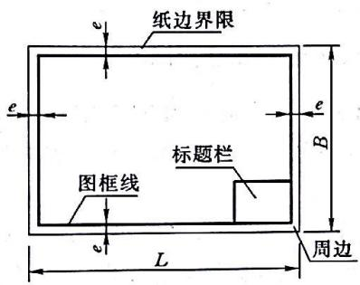  
a)无装订边图纸的图框格式

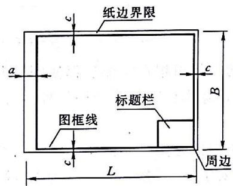  
b)有装订边图纸的图框格式  
图 3.0.3-1 图框和标题栏

2 标题栏外框线应为粗实线，A0图幅、A1图幅线宽1.00mm，A2图幅、A3 图幅线宽0.70mm，A4图幅线宽0.50mm，分格线应为细实线，A0图幅、A1图幅线宽应为0.25mm，A2～A4 图幅线宽应为0.18mm。 22从出

3对于A0图幅、A1 图幅，可按图3.0.3-2绘制；对于A2\~A4图幅，可按图3.0.3-3绘制；涉外水土保持项目规划设计标题栏，可按SL73.1—2013图3.2.3-3 式样绘制。涉外小工休寸少口必\~～ 1 πSI7212013第

4 需要会签的图纸，可设会签栏，会签栏的位置、内容、格式及尺寸应按SL73.1—2013第3.2.1条和第3.2.4条的规定执行。

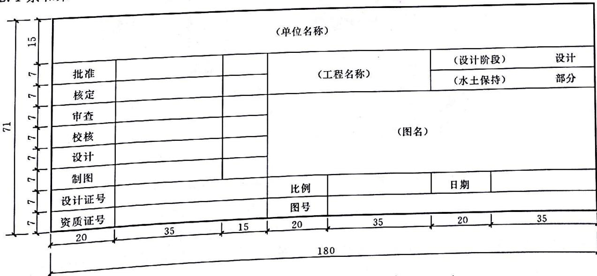  
图 3.0.3-2 标题栏（A0 图幅、A1 图幅）（单位：mm）

<table><tr><td rowspan=1 colspan=6>(单位名称)</td></tr><tr><td rowspan=1 colspan=1>核定</td><td rowspan=1 colspan=2></td><td rowspan=1 colspan=1></td><td rowspan=1 colspan=2>(设计阶段)       设计</td></tr><tr><td rowspan=1 colspan=1>审查</td><td rowspan=1 colspan=2></td><td rowspan=1 colspan=1></td><td rowspan=1 colspan=2>(水土保持)       部分</td></tr><tr><td rowspan=1 colspan=1>校核</td><td rowspan=1 colspan=2></td><td rowspan=1 colspan=1></td><td rowspan=2 colspan=2>(工程名)</td></tr><tr><td rowspan=1 colspan=1>设计</td><td rowspan=1 colspan=2></td><td rowspan=1 colspan=1></td></tr><tr><td rowspan=1 colspan=1>制图</td><td rowspan=1 colspan=2></td><td rowspan=1 colspan=1></td><td rowspan=2 colspan=2>(图名)</td></tr><tr><td rowspan=1 colspan=1>比例</td><td rowspan=1 colspan=2></td><td rowspan=1 colspan=1></td></tr><tr><td rowspan=1 colspan=2>设计证号</td><td rowspan=1 colspan=2></td><td rowspan=1 colspan=1>日期</td><td rowspan=1 colspan=1></td></tr><tr><td rowspan=1 colspan=2>资质证号</td><td rowspan=1 colspan=2></td><td rowspan=1 colspan=1>图号</td><td rowspan=1 colspan=1></td></tr><tr><td rowspan=1 colspan=2>10  10</td><td rowspan=1 colspan=1>10</td><td rowspan=1 colspan=1>10</td><td rowspan=1 colspan=1>15</td><td rowspan=1 colspan=1>35</td></tr><tr><td rowspan=2 colspan=6>90         XXXXNNXWW</td></tr><tr><td rowspan=1 colspan=1></td></tr></table>

图 3.0.3-3 标题栏（A2～A4图幅）（单位：mm）

3.0.4本标准中的图例可根据需要选择使用，但在同一工程或同一套图纸中，采用的同类标识应一致。在实际应用中，除本标准规定的图例外，可按第5章的相关规定派生所需图形和符号，并标注其作用。

3.0.5水土保持工程措施图件的图幅、字体、线条粗细、图纸装订及折叠形式、尺寸标注、剖视图、剖面图等的画法和要求，应按SL73.1一2013的规定执行。其他图件的图框、线条、尺寸标注应按本标准执行，图幅应根据规划设计范围确定，应以可复制和内容完整表达为准。

## 4 图 件

## 4.1 综合图件

4.1.1 综合图件的比例尺应按表4.1.1 的规定选用，不能满足要求时，应按 SL 73.1—2013 的规定执行。

b)  
表4.1.1 综合图件常用比例尺
<table><tr><td rowspan=1 colspan=1>图类</td><td rowspan=1 colspan=1>比例尺</td></tr><tr><td rowspan=1 colspan=1>区域、流域水土保持区划（分区）图，土壤侵蚀类型及强度分布图</td><td rowspan=1 colspan=1>1:2500000,1:1000000,1:500000,1:250000,1:100000,1:50000</td></tr><tr><td rowspan=1 colspan=1>区域、流域水土保持工程总体布置图或综合规划图，水土保持现状图</td><td rowspan=1 colspan=1>1:1000000,1:5000001:250000,1:100000,1:50000</td></tr><tr><td rowspan=1 colspan=1>小流域土壤侵蚀类型及强度分布图、水土流失类型及现状图、土地利用和水土保持措施现状图</td><td rowspan=1 colspan=1>th10500001:25000,1:10000,1:5000</td></tr><tr><td rowspan=1 colspan=1>小流域水土保持工程总体布置图或综合规划图</td><td rowspan=1 colspan=1>1:500001+25000110000,1:5000,1:2000,1:1000</td></tr><tr><td rowspan=1 colspan=1>生产建设项目土壤侵蚀类型及强度分布图、水土保持措施总体布局图</td><td rowspan=1 colspan=1>1：250000,   100000,1:50000,1:10000,1:5000,1:2000,1:1000</td></tr></table>

4.1.2综合图件应绘出各主要地物、建筑物，标注必要的高程及具体内容，当图面比例尺大于1：50000时，应绘制坐标网。还应按照流向标注河流名称，绘制流向、指北针和必要的图例等。河流流向及指北针绘制应符合下列要求：

1 水流方向箭头符号可按图 4.1.2-1 或图 4.1.2-2 所示式样绘制。

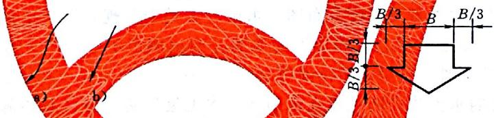  
图4.1.2-1水流方向（简式）

2 指北针可按图4.1.2-3 或图42-4所示式样绘制，其位置宜在图的右上角。

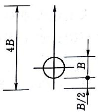  
a)

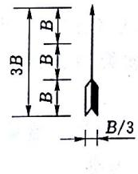  
图4.1.2-3 指北针（简式）

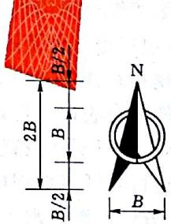  
图 4.1.2-4 指北针

4.1.3 综合图件的图例及图例栏应符合下列要求：

1 应根据本标准规定的图例式样标注图例。

2 在小班图上填写图例时，每个小班宜填1～2个图例；也可填充多个图例符号，应以易读美观为准。

3 标准图例栏格式见表4.1.3。说明栏可根据需要取舍。

<table><tr><td rowspan=1 colspan=3></td></tr><tr><td rowspan=1 colspan=1>图例</td><td rowspan=1 colspan=1>名称</td><td rowspan=1 colspan=1>说明</td></tr><tr><td rowspan=1 colspan=1></td><td rowspan=1 colspan=1></td><td rowspan=1 colspan=1></td></tr></table>

4.1.4 综合图件的注记应符合下列要求：

1 小班注记宜与图例符号相结合，应表示项目区内各小班的土地利用状况及主要属性指标等。

2 现状小班注记应包括小班编号和控制面积，注记格式应为班编号 小班注记应标记于小班范围内，不易标记时，也可只标注小班编号，控制面积及其主要属性指标等具体内容应另以表格表示。

小址编号3 设计小班注记应包括小班编号、控制面积和实施时间，注记格式应为 控制面积一实施时间具体注记要求可参照现状小班注记。

4.1.5 综合图件着色应符合下列要求：

1 土地利用与水土保持措施现状图、水土保持区划（分区）图、水土流失重点预防区和重点治理区划分图、水土流失类型及现状图、土壤侵蚀类型和强度分布图、水土保持总体布置图等图件，属性状况可采用着色表示，并应色泽谐调、清晰。

2 土地利用及水土保持措施现状图、水土流失类型及现状图、土壤侵蚀类型和强度分布图、水土保持工程总体布置图需着色时，应按附录A规定的色标绘制。

4.1.6 综合图件底图应符合下列要求：

1 地理位置图宜根据图件的实际需求，从国家已正式颁布的地图中选取必要的地理要素作为底图。

2区域的水土流失现状图、土地利用现状图、水土保持规划总体布局图、水土保持区划（分区）图、水土流失重点预防区和重点治理区划分图、水土保持监测站网布置图等图件，应以地图为底图，绘制行政界线、政府驻地、必要的居民点、水系及地标等地理要素。区域土壤侵蚀类型及强度分布图可以土壤侵蚀普查成果图件为底图。

3小流域的土壤侵蚀类型及强度分布图、水土流失类型及现状图、土地利用现状图、土地利用规划及水土保持措施总体布置图应以地形图为底图。当比例尺不小于1：5000时，应保留所有等高线；比例尺小于1：5000时，可只保留计曲线。

4 生产建设项目的水土流失防治责任范围图、水土流失防治分区及措施总体布局图、水土保持监测点位布局图等图件，应以相应比例尺的地形图和主体工程总体布置图为基础，根据实际需要简化。土地利用现状图和土壤侵蚀强度分布图可根据建设项目的特点，参照区域或小流域的规定执行。弃渣（土、石）场、料场等综合防治措施布置图应以地形图或实测图为底图。

4.1.7 区域综合图件应包括地理位置图、水土保持区划（分区）图、水土流失重点预防区和重点治理区划分图、水土保持规划总体布局图、区域土壤侵蚀类型及强度分布图、水土保持监测站网（点位）布局（置）图。图件内容表达应符合下列要求： 场

1 地理位置图应标示项目所在位置、主要的省（市、县、流域）的分界线、主要的公路铁路等，应以清晰表达项目与周边行政区域地理位置的相对关系为准。

2 水土保持区划（分区）图、水土流失重点预防区和重点治理区划分图应绘制基本单元界及分区界，并应标注各区名称及代码。

3 水土保持规划总体布局图应绘制水土保持区划或分区界，并应标注重点治理项目的范围、名称及重要的单项工程。

4 区域土壤侵蚀类型及强度分布图应绘制基本单元分界线、类型、强度分级或代码。

5 水土保持监测站网（点位）布局（置）图应分区标出监测站网（点位）位置、名称或代码。

4.1.8 小流域综合图件应包括小流域水土流失现状图、小流域土地利用及水土保持现状图、小流域水土保持措施总体布置图以及典型小流域相关图件。图件内容表达应符合下列要求：

1 小流域水土流失现状图应以小班为单元，反映小流域水土流失类型、强度或程度，并应附注面积统计汇总表。

2 小流域土地利用及水土保持现状图应以小班为单元，反映土地利用类型和水土保持林草、梯田等，淤地坝、塘坝、蓄水池等以图例形式注记，并应附注土地利用现状及水土保持设施现状统计汇总表。

3 小流域水土保持措施总体布置图应以小班为单元，反映所采取的水土保持林草措施、坡改梯措施、封禁治理措施等，淤地坝、塘坝、蓄水池等工程措施应以图例形式注记，并应附注水土保持措施数量统计汇总表。

4 典型小流域土地利用现状图、水土流失现状图、水土保持措施布置图可参照小流域相关图件的规定简化。

4.1.9生产建设项目综合图件应包括项目区地理位置图、地貌与水系图、水土流失防治责任范围图、水土流失防治分区及措施总体布局图、水土保持监测点位布局图、弃渣（土、石）场、料场等综合防治措施布置图。图件内容表达应符合下列要求：

1 项目区地理位置图应按4.1.7条1 款的规定执行。

2 项目区地貌与水系图，应在项目区所属省（市、县）的地貌、水系图上标出项目所在位置，并应用文字注明项目名称，应以清晰表达项目周边重要地貌和水系为准。

3 水土流失防治责任范围图的绘制应根据比例尺确定。比例尺小于1：2000时，应以不同防治区内的典型工程所在位置为代表，示意性标出防治区位置；比例尺不小于1：2000时，应用不同线型或颜色的线条勾画出每个防治区的外部轮廓。图件中应用文字注明各防治区的名称和面积，必要时可用表格形式在图纸说明中加以阐述。

4 对于水土流失防治分区及措施总体布局图，当比例尺小于1：2000时，水土流失防治分区和措施总体布置宜采用数字、文字、图形、颜色等示意说明；当比例尺不小于1：2000时，应以分区或小班为单元反映林草措施、土地整治措施，工程措施应以图例符号注记。图件中可附注水土保持措施数量统计表。

5 水土保持监测点位布局图应标出监测点位置及名称，可附注监测点位的监测内容、方法和频次等。

6弃渣（土、石）场、料场等综合防治措施布置图可用平面、剖面形式表达，并应标出弃渣场范围、边界及周边重要建筑物和居民点，应用实际投影或图例标注各类防护措施。

## 4.2工程措施图件

4.2.1 水土保持工程措施总平面布置图应绘出主要建筑物的中心线和定位线，并应标注各建筑物控制点的坐标，以及标注河流的名称，绘制流向、指北针和必要的图例等，其他要素应按SL73.2—2013的相关规定执行。

4.2.2 水土保持工程措施及监测设施设计图的相关要素以及工程措施立面图、剖面图、细部设计图的绘制应按 SL 73.2—2013 的规定执行。

4.2.3 工程措施图件比例尺可按根据实际情况按表4.2.2 确定。

表4.2.2 水土保持工程措施图常用比例尺
<table><tr><td rowspan=1 colspan=1>图类</td><td rowspan=1 colspan=1>比例尺</td></tr><tr><td rowspan=1 colspan=1>总平面布置图</td><td rowspan=1 colspan=1>1:5000，1:2000,1:1000,1:500,1:200</td></tr><tr><td rowspan=1 colspan=1>主要建筑物布置图</td><td rowspan=1 colspan=1>1:2000,1:1000,1:500,1:200,1:100</td></tr><tr><td rowspan=1 colspan=1>基础开挖图、基础处理图</td><td rowspan=1 colspan=1>1:1000，1:500,1:200,1:100,1:50</td></tr><tr><td rowspan=1 colspan=1>结构图</td><td rowspan=1 colspan=1>1:500,1:200,1:100,1:50</td></tr><tr><td rowspan=1 colspan=1>钢筋图</td><td rowspan=1 colspan=1>1:100，1:50,1:20</td></tr><tr><td rowspan=1 colspan=1>细部构造图</td><td rowspan=1 colspan=1>1:50,1:20,1:10,1:5</td></tr></table>

## 4.3植物措施图件

4.3.1 水土保持植物措施现状图的比例尺和小班注记应按4.1.1 条和4.1.4 条执行。

4.3.2 水土保持植物措施平面设计图应符合下列要求：

1 林种图例应按表5.6.2-1的规定绘制，小班注记树（草）种图例应按表5.6.2-2的规定绘制。

2 小流域水土保持植物措施图中的小班注记，应标明立地类型、树（草）种典型设计号及相应树（草）种符号。项目建议书、可行性研究阶段可采用 控制面积一实施时间 小班编号 注记，初步设计及后续设计应采用小班编号立地类型号典型设计号注记。若项目本身要求进行简化设计，也可采用控制面积一实施年度小班编号一典型设计号控制面积一实施年度

3 水土保持植物措施图件应根据规划设计的需要，按植被类型着色，并应色泽谐调、清晰。植被类型色标绘制应按附录B表B1的规定执行。植被覆盖度的色标是以覆盖度等级来划分的，应按附录B表B-2的规定绘制。规定色标尚不能满足规划设计要求时，可根据附录B表B-1和表B-2的规定调整颜色的色调、饱和度和亮度，但不应改变主色调。

4.3.3 造林种草典型设计图中的树种，草种图例应按表5.6.2-3 绘制

4.3.4 涉及景观、游憩要求的植物措施图件应符合下列要求：

1 比例尺宜根据需要采用1：2000～1：200，特殊情况可采用1100或1：50。

2 图例栏应按4.1.3 条的规定执行

3 着色应参照附录B表B-1执行。不满足规划设计要求时，可根据附录B中表B-1的规定调整颜色色调、饱和度和亮度。

4 植物配置图应按CH 67等园林设计相关规范执行。

4.3.5 高陡边坡绿化措施设计图应符合下列要求：

1 高陡边坡绿化设计图应以边坡防护工程设计图为底图进行绘制， 并应标注必要的控制点高程和坐标；剖面图中应有坡面分级措施布置情况。

2 植物配置图宜按 CJJ67等园林制图的相关标准执行

3 局部详图涉及基质厚度、组成、基质附着物结构等内容时，应予以标明。涉及挂网的，应标明挂件材料、结构及固定型式等。

4.3.6 封育措施设计图应以地形图作为底图进行绘制。设计详图涉及植物措施时，应按4.3.2 条执行；涉及工程措施时，应按工程措施图件绘制相关规定执行。

## 5 图例

## 5.1 一 般规定

5.1.1 图例可分为通用图例、综合图例、工程措施图例、耕作措施图例、植物措施图例、临时措施图例和监测设施图例等。

5.1.2 通用图例除应符合本标准规定外，还应符合 SL 73 和 GB/T 20257 的要求。

5.1.3 植物措施图例应按本标准绘制，确需增加图例时应按LY/T1821的相关规定执行，其中园林式种植工程图例还应按园林制图相关规定执行。

## 5.2 通用图

5.2.1 通用图例应包括地界（境界）、道路及附属设施、地形地貌、水系及附属建筑物等图例。

5.2.2地界（境界）图例中的国界、省（自治区直辖市）界、地区（自治州、盟、地级市）界、县（自治县、旗、县级市、区）界、乡（镇）界等，应按SL73.3—2013中表B.8.6绘制。其余应按表5.2.2的规定绘制。

表 5.2.2 地界（境界）图例

单位：mm

<table><tr><td rowspan=1 colspan=1>名称</td><td rowspan=1 colspan=1>图   例</td><td rowspan=1 colspan=1>说明</td></tr><tr><td rowspan=1 colspan=1>村界</td><td rowspan=1 colspan=1>4.0           1.02.06/2</td><td rowspan=1 colspan=1>本标准b均为图线宽度，b=0.8～0.以下不再说明</td></tr><tr><td rowspan=1 colspan=1>大流域界或水系界</td><td rowspan=1 colspan=1>2.0         6.0</td><td rowspan=1 colspan=1></td></tr><tr><td rowspan=1 colspan=1>小流域界</td><td rowspan=1 colspan=1>4.0             3.0</td><td rowspan=1 colspan=1>小流域界作为外轮廊时，其线可加宽0.6~0.8</td></tr><tr><td rowspan=1 colspan=1>水土流失重点预防区和重点治理区界</td><td rowspan=1 colspan=1></td><td rowspan=1 colspan=1>国家级宽度2b，省级1.5b，县级宽度b，或用颜色加以区别</td></tr><tr><td rowspan=1 colspan=1>厂矿征地或用地界</td><td rowspan=1 colspan=1>5.0              6.06</td><td rowspan=1 colspan=1></td></tr><tr><td rowspan=1 colspan=1>水土流失防治责任区界</td><td rowspan=1 colspan=1>4.0.3.0 1.0-6/2</td><td rowspan=1 colspan=1>指生产建设项目水土流失防治责任范围的边界</td></tr><tr><td rowspan=1 colspan=1>水土流失类型区、水土保持分区界</td><td rowspan=1 colspan=1>6.0 7.0</td><td rowspan=1 colspan=1></td></tr><tr><td rowspan=1 colspan=1>小班或地类界</td><td rowspan=1 colspan=1>b/2~b/3</td><td rowspan=1 colspan=1></td></tr></table>

5.2.3 道路及附属设施图例按表5.2.3的规定绘制。

表 5.2.3 道路及附属设施图例

单位：mm

<table><tr><td colspan="1" rowspan="1">名称</td><td colspan="1" rowspan="1">图例</td><td colspan="1" rowspan="1">说明</td></tr><tr><td colspan="1" rowspan="1">铁路</td><td colspan="1" rowspan="1">8.0二1.0</td><td colspan="1" rowspan="1">不分单线或复线均用此符号表示；若分单线或复线则按GB/T 20257 规定绘制</td></tr><tr><td colspan="1" rowspan="1">规划或建筑中铁路</td><td colspan="1" rowspan="1">［原图缺失］</td><td colspan="1" rowspan="1">不分单线或复线均用此符号表示；若分单线或复线则按GB/T 20257 规定绘制</td></tr><tr><td colspan="1" rowspan="1">铁路附属建筑物（涵洞、隧道、路堑、路堤）</td><td colspan="1" rowspan="1">［原图缺失］［原图缺失］</td><td colspan="1" rowspan="1"></td></tr><tr><td colspan="1" rowspan="1">架空索道</td><td colspan="1" rowspan="1">I I I I I _3.015.0 1</td><td colspan="1" rowspan="1"></td></tr><tr><td colspan="1" rowspan="1">既有公路：2—公路技术等级代码；(G331) 一国道路线编号。既有高速公路</td><td colspan="1" rowspan="1">［原图缺失］</td><td colspan="1" rowspan="1">等级公路（指一级公路至四级公路，代号为1、2、3、4）、等外公路（代号为9）均以此符号表示高速公路代号为0</td></tr><tr><td colspan="1" rowspan="1">规划或建筑中的公路：2一公路技术等级代码规划或建筑中的高速公路</td><td colspan="1" rowspan="1">1.0             9.0［原图缺失］</td><td colspan="1" rowspan="1">等级公路（指一级公路至四级公路，代号为1、2、3、4）、等外公路（代号为9）均以此符号表示高速公路代号为0</td></tr><tr><td colspan="1" rowspan="1">公路附属建筑物涵洞：(a) 依比例尺；(b) 不依比例尺。隧道：(a) 依比例尺；(b) 不依比例尺</td><td colspan="1" rowspan="1">［原图缺失］［原图缺失］［原图缺失］［原图缺失］</td><td colspan="1" rowspan="1">1：500～1：5000的图上应表示下列附属建筑物；&lt;1：5000的图是否表示根据需要确定涵洞是修建在路基下的过水建筑物。等级公路以下的道路上的涵洞一般不表示；隧道是在山中或地下凿通的路段。图上长度大于1mm的用依比例尺符号表示，短于1mm的用不依比例尺符号表示</td></tr><tr><td colspan="1" rowspan="1">路堑路堤</td><td colspan="1" rowspan="1">［原图缺失］［原图缺失］</td><td colspan="1" rowspan="1">路堑是道路低于地面的路段路堤是道路高于地面的路段。路堑路堤比高在2以上，图上长5mm 以上的才表示</td></tr><tr><td colspan="1" rowspan="1">铁路桥</td><td colspan="1" rowspan="1">［原图缺失］</td><td colspan="1" rowspan="1"></td></tr><tr><td colspan="1" rowspan="1">公路桥</td><td colspan="1" rowspan="1">［原图缺失］</td><td colspan="1" rowspan="1">汽车通行的桥</td></tr><tr><td colspan="1" rowspan="1">人行桥、便桥</td><td colspan="1" rowspan="1">［原图缺失］</td><td colspan="1" rowspan="1"></td></tr><tr><td colspan="1" rowspan="1">机耕路</td><td colspan="1" rowspan="1">b/4~6/2</td><td colspan="1" rowspan="1">机耕路指路面经过简易修筑，但没有路基，一般为通行拖拉机、大车等的道路，某些地区也可通行汽车</td></tr><tr><td colspan="1" rowspan="1">乡村路</td><td colspan="1" rowspan="1">14.01        1.10</td><td colspan="1" rowspan="1">乡村路是乡村中不能通行大车、拖拉机的道路，路面不宽，某些地区用石块或石板铺成，是居民点间行人往来的主要道路或单人单骑行走的道路。山地、沙漠、森林等荒辟地区的驮运路也用乡村路符号表示。悬崖绝壁的行人栈道也用相应的乡村路符号或小路符号表示，并加注“栈道”二字</td></tr></table>

5.2.4 地形地貌图例按SL 73.3—2013附录 B.4的规定绘制。  
5.2.5 水系及附属建筑物绘制除应符合表 5.2.5的规定外，还应符合 SL 73.3—2013附录 B.8.4的规定。

表5.2.5 水系及附属建筑图例  
单位：mm
<table><tr><td rowspan=1 colspan=1>名称</td><td rowspan=1 colspan=1>图 例</td><td rowspan=1 colspan=1>说明</td></tr><tr><td rowspan=1 colspan=1>岸滩、心滩（水中滩）（沙滩）</td><td rowspan=1 colspan=1>［原图缺失］</td><td rowspan=1 colspan=1>江河、湖泊水浅时露出水面，水深时淹没在水中的地段</td></tr><tr><td rowspan=1 colspan=1>石滩</td><td rowspan=1 colspan=1>［原图缺失］</td><td rowspan=1 colspan=1>河床中有很多的岩石，顶部露出水面，水流经过时形成的急滩</td></tr><tr><td rowspan=1 colspan=1>石砾滩</td><td rowspan=1 colspan=1>［原图缺失］</td><td rowspan=1 colspan=1>河床中有很多砾石，顶部露出水面的滩地</td></tr><tr><td rowspan=1 colspan=1>滚水坝</td><td rowspan=1 colspan=1>［原图缺失］</td><td rowspan=1 colspan=1>横断河流，水经常从上面溢过的堤坝式建筑物</td></tr></table>

表 5.2.5（续）  
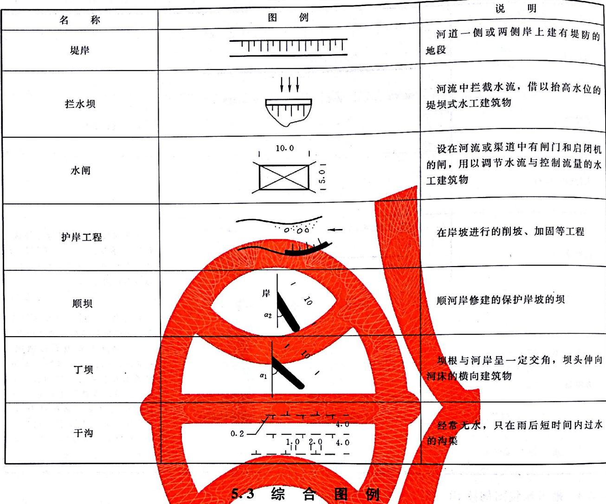

5.3.1 综合图例应包括土地利用类型图例、地面组成物质图例、水土流失类型图例、土壤侵蚀强度与程度图例等。可适用于土地利用与水土保持措施现状图、水土保持区划（分区）图或土壤侵蚀分区图、重点小流域分布图、土壤侵蚀类型和水土流失程度分布图、水土保持工程总体布置图或综合规划图等综合图的图例。植物措施图、工程措施图等单项工程设计图需用时也可选择采用。

5.3.2 土地利用类型应按 SL 449—2009 附录 D 的规定划分。 土地利用类型图例应按照表5.3.2的规定绘制。

表5.3.2土地利用类型图例  
单位：mm
<table><tr><td colspan="1" rowspan="1">名称</td><td colspan="2" rowspan="1">图例</td><td colspan="6" rowspan="1">说明</td></tr><tr><td colspan="1" rowspan="1">耕地</td><td colspan="2" rowspan="1">［原图缺失］</td><td colspan="6" rowspan="1">种植农作物的土地，包括熟地，新开发、复垦、整理地，休闲地（含轮歇地、轮作地）；以种植农作物（含蔬菜）为主，间有零星果树、桑树或其他树木的土地；平均每年能保证收获一季的已垦滩地和海涂。耕地中包括南方宽度小于1.0m，北方宽度小于2.0m固定的沟、渠、路和地坎（埂）；临时种植药材、草皮、花卉、苗木等的耕地，以及其他临时改变用途的耕地</td></tr><tr><td colspan="1" rowspan="1">水田</td><td colspan="2" rowspan="1">［原图缺失］</td><td colspan="6" rowspan="1">用于种植水稻、莲藕等水生农作物的耕地。包括实行水生、旱生农作物轮种的耕地</td></tr><tr><td colspan="1" rowspan="1">水浇地</td><td colspan="2" rowspan="1">［原图缺失］</td><td colspan="6" rowspan="1">有水源保证和灌溉设施，在一般年景能正常灌溉，种植旱生农作物的耕地、包括保浇地、菜地和种植蔬菜等非工厂化的大棚用地</td></tr><tr><td colspan="1" rowspan="1">旱地</td><td colspan="2" rowspan="1">［原图缺失］</td><td colspan="6" rowspan="1">无灌溉设施，主要靠天然降水种植旱生农作物的耕地，包括没有灌溉设施，仅靠引洪淤灌的耕地</td></tr><tr><td colspan="1" rowspan="1">早平地</td><td colspan="2" rowspan="1">［原图缺失］</td><td colspan="6" rowspan="3">分布于北方自然形成的坡度小于5°的平缓耕地。小于1°的适用于东北黑土区</td></tr><tr><td colspan="1" rowspan="1"> $< 1 ^ { \circ }$ </td><td colspan="1" rowspan="1"></td><td colspan="6" rowspan="2">［原图缺失］［原图缺失］A</td></tr><tr><td colspan="1" rowspan="1"> ${ \mathfrak { T } } ^ { \circ } { \sim } { \mathfrak { H } } ^ { \circ }$ </td><td colspan="6" rowspan="1"></td></tr><tr><td colspan="1" rowspan="1">梯田</td><td colspan="1" rowspan="1"></td><td colspan="1" rowspan="1">［原图缺失］一</td><td colspan="6" rowspan="1">在山坡、沟谷坡上沿等高线修筑的台阶式地块、田面平整或坡度较小，有较为整齐的堤埂</td></tr><tr><td colspan="1" rowspan="1">水平梯田</td><td colspan="1" rowspan="1"></td><td colspan="1" rowspan="1">［原图缺失］I</td><td colspan="6" rowspan="1">田面坡度小于1的梯田</td></tr><tr><td colspan="1" rowspan="1">坡式梯田</td><td colspan="1" rowspan="1"></td><td colspan="1" rowspan="1">［原图缺失］MnY</td><td colspan="6" rowspan="1">田面坡度大于等于1的梯田，包括东北漫岗梯地</td></tr><tr><td colspan="1" rowspan="1">坡耕地</td><td colspan="1" rowspan="2"></td><td colspan="1" rowspan="2">［原图缺失］［原图缺失］</td><td colspan="6" rowspan="6">分布在自然坡面上的耕地，水土流失严重。为了进行水土保持规划设计，可分不同的坡度表达。实际应用中可根据情况适当归并</td></tr><tr><td colspan="6" rowspan="1"> $5 ^ { \circ } \sim 8 ^ { \circ }$ </td></tr><tr><td colspan="1" rowspan="1"> $8 ^ { \circ } \sim 1 5 ^ { \circ }$ </td><td colspan="7" rowspan="2">［原图缺失］［原图缺失］</td></tr><tr><td colspan="6" rowspan="1"> $1 5 ^ { \circ } \sim 2 5 ^ { \circ }$ </td></tr><tr><td colspan="1" rowspan="1"> $2 5 ^ { \circ } \sim 3 5 ^ { \circ }$ </td><td colspan="1" rowspan="1"></td><td colspan="6" rowspan="1">［原图缺失］</td></tr><tr><td colspan="1" rowspan="1"> ${ \tt > } 3 5 ^ { \circ }$ </td><td colspan="7" rowspan="1"> $\frac { 4 } { 2 . 0 _ { - } ^ { - } } \frac { 4 } { 4 } \frac { 1 4 } { 2 . 0 }$ </td></tr><tr><td colspan="3" rowspan="1">沟川坝地</td><td colspan="3" rowspan="1">［原图缺失］</td><td colspan="1" rowspan="1"></td></tr><tr><td></td><td colspan="2" rowspan="1">沟川(台)地</td><td colspan="3" rowspan="1">［原图缺失］</td><td colspan="1" rowspan="1">沟川地和沟台地的合称。沟川地是分布在山谷、河沟两岸阶地上，连片地块，面积相对较大、平坦的耕地；沟台地是分布在沟谷、沟道两侧的二、三级阶地上，较平坦或坡度较小，地块不大，连片性差，呈台阶状的耕地，水肥条件次于沟川地</td></tr><tr><td colspan="2" rowspan="9"></td><td colspan="2" rowspan="1">坝滩地</td><td colspan="2" rowspan="1">［原图缺失］</td><td colspan="1" rowspan="1">分布于北方，由淤地坝淤地形成的坝地，包括沟坝地</td></tr><tr><td colspan="2" rowspan="1">坝平地</td><td colspan="3" rowspan="1">［原图缺失］</td><td colspan="1" rowspan="1">分布于南方的山间小盆地、川台地</td></tr><tr><td colspan="2" rowspan="1">撂荒地</td><td colspan="3" rowspan="1">［原图缺失］</td><td colspan="1" rowspan="7"></td></tr><tr><td colspan="2" rowspan="1">园地</td><td></td><td colspan="2" rowspan="1">［原图缺失］</td><td colspan="1" rowspan="1">种植以采集果、叶、根、茎、汁等为主的集约经营的多年生木本和草本作物，覆盖度大于50%或每亩株数大于合理株数70%的土地。包括用于育苗的土地</td></tr><tr><td colspan="2" rowspan="1">果园</td><td></td><td colspan="1" rowspan="1"></td><td colspan="1" rowspan="1">［原图缺失］</td><td colspan="1" rowspan="1">种植果树的园地。其三级地类可根据实际情况按树种细分。如苹果、梨、葡萄等鲜果果品，包括培育苗木的圃地</td></tr><tr><td colspan="2" rowspan="1">茶园</td><td colspan="2" rowspan="1">［原图缺失］</td><td colspan="1" rowspan="1">种植茶树的园地</td></tr><tr><td colspan="2" rowspan="1">其他园地</td><td colspan="2" rowspan="1">［原图缺失］</td><td colspan="1" rowspan="1">种植桑树、橡胶、可可、咖啡、油棕、胡椒、花椒、核桃、杏园、药材等其他多年生作物的园地</td></tr><tr><td colspan="2" rowspan="1">经济林栽培园</td><td colspan="2" rowspan="1">［原图缺失］</td><td colspan="1" rowspan="1">在耕地上种植的并采取集约经营的木本粮油等其他类的栽培园，四级地类可根据实际情况按树种细分</td></tr><tr><td colspan="2" rowspan="1">其他园地</td><td colspan="2" rowspan="1">［原图缺失］</td><td colspan="1" rowspan="1">经济林栽培园以外的园地。四级地类可根据实际情况按树种细分，并加注汉字</td></tr></table>

表 5.3.2（续）
<table><tr><td rowspan=1 colspan=1>名称</td><td rowspan=1 colspan=2>图例</td><td rowspan=1 colspan=1>说明</td></tr><tr><td rowspan=1 colspan=1>林地</td><td rowspan=1 colspan=2>［原图缺失］</td><td rowspan=1 colspan=1>生长乔木、竹类、灌木的土地，及沿海生长红树林的土地。包括迹地，但不包括居民点内部的绿化林木用地、铁路、公路征地范围内的林木，以及河流、沟渠的护路林、护岸林和护渠林</td></tr><tr><td rowspan=1 colspan=1>有林地</td><td rowspan=1 colspan=2>［原图缺失］</td><td rowspan=1 colspan=1>树木郁闭度不小于0.2的天然林和人工林等乔木林地，包括红树林地和竹林地</td></tr><tr><td rowspan=1 colspan=1>用材林</td><td rowspan=1 colspan=1></td><td rowspan=1 colspan=1>［原图缺失］</td><td rowspan=1 colspan=1>以培育和提供木材或竹材为主要目的的森林，以及人工速生丰产用材林</td></tr><tr><td rowspan=1 colspan=1>防护林</td><td rowspan=1 colspan=1></td><td rowspan=1 colspan=1>［原图缺失］</td><td rowspan=1 colspan=1>种植于铁路、公路征地范围内的林木，以及河流、沟渠、农田周边、田埂上的护路林、护岸林和护渠林、护埂林等</td></tr><tr><td rowspan=1 colspan=1>经济林</td><td rowspan=1 colspan=2>［原图缺失］</td><td rowspan=1 colspan=1>种植木本粮油等经济林木的土地（非耕地），如分布在非耕地上的干果林，如杏、核桃、枣、板栗等</td></tr><tr><td rowspan=1 colspan=1>薪炭林</td><td rowspan=1 colspan=2>［原图缺失］</td><td rowspan=1 colspan=1>以生产薪材和木炭原料为主要经营目的的森林、林木或灌丛，如阔叶树薪炭林、灌木薪炭林、马尾松鹿角桩薪炭林等</td></tr><tr><td rowspan=1 colspan=1>特种用途林</td><td rowspan=1 colspan=2>［原图缺失］</td><td rowspan=1 colspan=1>以国防、保护环境和开展科学实验等特殊用途为主要目的的森林，包括母树林、风景林，名胜古迹和革命纪念地的林木，自然保护区的森林</td></tr><tr><td rowspan=1 colspan=1>灌木林地</td><td rowspan=1 colspan=2>［原图缺失］</td><td rowspan=1 colspan=1>灌木覆盖度不小于40%的林地</td></tr><tr><td rowspan=1 colspan=1></td><td rowspan=1 colspan=2>［原图缺失］</td><td rowspan=1 colspan=1>三四级可依据需要按林业有关标准划分</td></tr><tr><td rowspan=1 colspan=1>其他林地</td><td rowspan=1 colspan=2>［原图缺失］</td><td rowspan=1 colspan=1>包括疏林地（指树木郁闭度为0.10～0.19的林地）、未成林地、迹地、苗圃等林地</td></tr><tr><td rowspan=1 colspan=1>疏林地</td><td rowspan=1 colspan=2>［原图缺失］</td><td rowspan=1 colspan=1>树木郁闭度为0.10~0.19的林地</td></tr></table>

表5.3.2（续）
<table><tr><td></td><td></td><td rowspan=2 colspan=3>图例</td><td rowspan=2 colspan=1>说 明</td></tr><tr><td rowspan=1 colspan=2>名称</td></tr><tr><td rowspan=1 colspan=2>未成林造林地</td><td rowspan=1 colspan=3>［原图缺失］</td><td rowspan=1 colspan=1>造林成活率不小于41%，且分布均匀，尚未郁闭，但有望成为林地的新造林地。一般指植苗造林后不满3～5年，播种造林（或飞播造林）后5~7年内的造林地</td></tr><tr><td></td><td rowspan=1 colspan=1>迹地</td><td rowspan=1 colspan=3>［原图缺失］</td><td rowspan=1 colspan=1>森林采伐、火烧后，5年内未更新的土地</td></tr><tr><td></td><td rowspan=1 colspan=1>苗圃</td><td rowspan=1 colspan=3>［原图缺失］</td><td rowspan=1 colspan=1>固定的林木育</td></tr><tr><td rowspan=8 colspan=1></td><td rowspan=1 colspan=1>草地</td><td rowspan=1 colspan=3>［原图缺失］</td><td rowspan=1 colspan=1>生长草本植物为主的土地</td></tr><tr><td rowspan=1 colspan=1>天然牧草地</td><td rowspan=1 colspan=3>［原图缺失］</td><td rowspan=1 colspan=1>以天然草本植物为主，用于放牧或割草的草地</td></tr><tr><td rowspan=1 colspan=1>人工牧草地</td><td rowspan=1 colspan=3>［原图缺失］</td><td rowspan=1 colspan=1>人工种植牧草的草地</td></tr><tr><td rowspan=1 colspan=1>其他草地</td><td></td><td rowspan=1 colspan=2>［原图缺失］</td><td rowspan=1 colspan=1>树木郁闭度小于0.1，表层为土质，生长草本植物为主，不用于畜牧业的草地</td></tr><tr><td rowspan=1 colspan=1>天然草地</td><td></td><td rowspan=1 colspan=1></td><td rowspan=1 colspan=1>［原图缺失］</td><td rowspan=1 colspan=1>覆盖度大于40%的天然生长的、以草本植物为主的，不用于畜牧业的草地</td></tr><tr><td rowspan=1 colspan=1>人工草地</td><td></td><td rowspan=1 colspan=2>［原图缺失］</td><td rowspan=1 colspan=1>覆盖度大于40%的人工种植的、以草本植物为主的，不用于畜牧业的草地</td></tr><tr><td rowspan=1 colspan=1>荒草地</td><td></td><td rowspan=1 colspan=2>［原图缺失］</td><td rowspan=1 colspan=1>覆盖度不大于40%的不用于畜牧业的其他草地</td></tr><tr><td rowspan=1 colspan=1>交通运输用地</td><td></td><td rowspan=1 colspan=2>［原图缺失］</td><td rowspan=1 colspan=1>用于运输通行的地面线路、场站等的土地。包括民用机场、港口、码头、地面运输管道和各种道路用地</td></tr></table>

表 5.3.2（续）
<table><tr><td colspan="1" rowspan="1">名  称</td><td colspan="2" rowspan="1">图 例</td><td colspan="1" rowspan="1">说明</td></tr><tr><td colspan="1" rowspan="1">铁路用地</td><td colspan="2" rowspan="1">［原图缺失］</td><td colspan="1" rowspan="1">用于铁道线路、轻轨、场站的用地。包括设计内的路堤、路堑、道沟、桥梁、林木等用地</td></tr><tr><td colspan="1" rowspan="1">公路用地</td><td colspan="1" rowspan="1"></td><td colspan="1" rowspan="1">［原图缺失］</td><td colspan="1" rowspan="1">用于国道、省道、县道和乡道的用地，包括设计内的路堤、路堑、道沟、桥梁、汽车停靠站、林木及直接为其服务的附属用地</td></tr><tr><td colspan="1" rowspan="1">农村道路</td><td colspan="1" rowspan="1"></td><td colspan="1" rowspan="1">［原图缺失］</td><td colspan="1" rowspan="1">公路用地以外的南方宽度不小于1.0m，北方宽度不小于2.0m的村间、田间道路（含机耕道）</td></tr><tr><td colspan="1" rowspan="1">机场用地</td><td colspan="1" rowspan="1"></td><td colspan="1" rowspan="1">［原图缺失］</td><td colspan="1" rowspan="1">用于民用机场的用地</td></tr><tr><td colspan="1" rowspan="1">港口码头用地</td><td colspan="2" rowspan="1">［原图缺失］</td><td colspan="1" rowspan="1">用于人工修建的客运、货运、捕捞及工作船舶停靠的场所及其附属建筑物的用地，不包括常水位以下部分</td></tr><tr><td colspan="1" rowspan="1">管道运输用地</td><td colspan="1" rowspan="1"></td><td colspan="1" rowspan="1">［原图缺失］</td><td colspan="1" rowspan="1">用于运输煤炭、石油、天然气等管道及其相应附属设施的地上部分用地</td></tr><tr><td colspan="1" rowspan="1">水域及水利设施用地</td><td colspan="1" rowspan="1"></td><td colspan="1" rowspan="1">［原图缺失］</td><td colspan="1" rowspan="1">陆地水域、海涂、沟渠、水工建筑物等用地。不包括滞洪区和已垦滩涂中的耕地、园地、林地、居民点、道路等用地（本类可以根据设计需要适当简化归并）</td></tr><tr><td colspan="1" rowspan="1">河流水面</td><td colspan="2" rowspan="1">［原图缺失］</td><td colspan="1" rowspan="1">天然形成或人工开挖河流常水位岸线之间的水面，不包括被堤坝拦截后形成的水库水面</td></tr><tr><td colspan="1" rowspan="1">湖泊水面</td><td colspan="2" rowspan="1">［原图缺失］</td><td colspan="1" rowspan="1">天然形成的积水区常水位岸线所围成的水面</td></tr><tr><td colspan="1" rowspan="1">水库水面</td><td colspan="2" rowspan="1">［原图缺失］</td><td colspan="1" rowspan="1">人工拦截汇集而成的总库容不小于10万m³的水库正常蓄水位岸线所围成的水面</td></tr><tr><td colspan="1" rowspan="1">坑塘水面</td><td colspan="2" rowspan="1">［原图缺失］</td><td colspan="1" rowspan="1">人工开挖或天然形成的蓄水量小于10万m³的坑塘常水位岸线所围成的水面</td></tr><tr><td colspan="3" rowspan="1"></td><td colspan="1" rowspan="2">说明</td></tr><tr><td colspan="2" rowspan="1">名称</td><td colspan="1" rowspan="1">图例</td></tr><tr><td></td><td></td><td colspan="1" rowspan="3">［原图缺失］</td><td></td></tr><tr><td></td><td></td><td colspan="1" rowspan="2">沿海大潮高潮位与低潮位之间的潮浸地带。包括海岛的沿海滩涂，不包括已利用的滩涂</td></tr><tr><td colspan="2" rowspan="1">沿海滩涂</td></tr><tr><td></td><td colspan="1" rowspan="2">内陆滩涂</td><td colspan="1" rowspan="2">［原图缺失］</td><td></td></tr><tr><td></td><td colspan="1" rowspan="1">河流、湖泊常水位至洪水位间的滩地；时令湖、河洪水位以下的滩地；水库、坑塘的正常蓄水位与洪水位间的滩地。包括海岛的内陆滩地。不包括已利用的滩地</td></tr><tr><td></td><td colspan="1" rowspan="1">沟渠</td><td colspan="1" rowspan="1">［原图缺失］</td><td colspan="1" rowspan="1">人工修建，南方宽度不小于1.0m，北方宽度不小于2.0m用于引、排、灌的渠道。包括渠槽、渠堤、取土坑、防护林</td></tr><tr><td></td><td colspan="1" rowspan="1">水工建筑用地</td><td colspan="1" rowspan="1">［原图缺失］</td><td colspan="1" rowspan="1">人工修建的闸、坝、堤路林、水电厂房、扬水站等常水位岸线以上的建筑物用地</td></tr><tr><td colspan="1" rowspan="4"></td><td colspan="1" rowspan="1">冰川及永久积雪</td><td colspan="1" rowspan="1">［原图缺失］</td><td colspan="1" rowspan="1">表层被冰雪常年覆盖的土地</td></tr><tr><td colspan="1" rowspan="1">城镇村及工矿用地</td><td colspan="1" rowspan="1">［原图缺失］</td><td colspan="1" rowspan="1">城乡居民点、独立居民点以及居民点以外的工矿、国防、名胜古迹等企事业单位用地，包括其内部交通、绿化用地</td></tr><tr><td colspan="1" rowspan="1">城市</td><td colspan="1" rowspan="1">［原图缺失］</td><td colspan="1" rowspan="1">城市居民点，以及与城市连片的和区政府、县级市政府所在地镇级辖区内的商服、住宅、工业、仓储、机关、学校等单位用地</td></tr><tr><td colspan="1" rowspan="1">建制镇</td><td colspan="1" rowspan="1">［原图缺失］</td><td colspan="1" rowspan="1">建制镇居民点，以及辖区内的商服、住宅、工业、仓储、学校等企事业单位用地</td></tr><tr><td colspan="1" rowspan="2"></td><td colspan="1" rowspan="1">村庄</td><td colspan="1" rowspan="1">［原图缺失］</td><td colspan="1" rowspan="1">农村居民点，以及所属的商服、住宅、工矿、工业、仓储、学校等用地</td></tr><tr><td colspan="1" rowspan="1">采矿用地</td><td colspan="1" rowspan="1">［原图缺失］</td><td colspan="1" rowspan="1">采矿、采石、采砂（沙）场，盐田、砖瓦窑等地面生产用地及尾矿堆放地</td></tr><tr><td colspan="1" rowspan="1"></td><td colspan="1" rowspan="1">风景名胜及特殊用地</td><td colspan="1" rowspan="1">［原图缺失］</td><td colspan="1" rowspan="1">城镇村用地以外用于军事设施、涉外、宗教、监教、殡葬等的土地，以及风景名胜（包括名胜古迹、旅游景点、革命遗址等）景点及管理机构的建筑用地</td></tr></table>

表 5.3.2（续）
<table><tr><td rowspan=1 colspan=1>名称</td><td rowspan=1 colspan=1>图例</td><td rowspan=1 colspan=1>说明</td></tr><tr><td rowspan=1 colspan=1>其他土地</td><td rowspan=1 colspan=1>［原图缺失］</td><td rowspan=1 colspan=1>本类可以根据设计需要适当简化归并。田坎、盐碱地、沼泽地、沙地、裸地可归并为未利用地</td></tr><tr><td rowspan=1 colspan=1>设施农用地</td><td rowspan=1 colspan=1>［原图缺失］</td><td rowspan=1 colspan=1>直接用于经营性养殖的畜禽舍、工厂化作物栽培或水产养殖的生产设施用地及其相应的附属用地，农村宅基地以外的晾晒场等农业设施用地</td></tr><tr><td rowspan=1 colspan=1>田坎</td><td rowspan=1 colspan=1>［原图缺失］</td><td rowspan=1 colspan=1>主要指耕地中南方宽度不小于1.0m，北方宽度不小于2.0m的地坎</td></tr><tr><td rowspan=1 colspan=1>盐碱地</td><td rowspan=1 colspan=1> $\begin{array}{c} \boxed  \begin{array} { r l } & { \qquad \end{array} } \end{array} , 1 ^ { \parallel ^ { - } \overbrace { 2 . 0 ( 1 \cdot 5 ) } }$ </td><td rowspan=1 colspan=1>表层盐碱聚集，生长天然耐盐植物的土地</td></tr><tr><td rowspan=1 colspan=1>沼泽地</td><td rowspan=1 colspan=1>［原图缺失］</td><td rowspan=1 colspan=1>经常积水或渍水，一般生长沼生、湿生植物的土地</td></tr><tr><td rowspan=1 colspan=1>沙地</td><td rowspan=1 colspan=1>［原图缺失］</td><td rowspan=1 colspan=1>表层为沙覆盖、基本无植被的土地。不包括滩涂中的沙地</td></tr><tr><td rowspan=1 colspan=1>裸地</td><td rowspan=1 colspan=1>［原图缺失］</td><td rowspan=1 colspan=1>表层为土质，基本无植被覆盖的土地；或表层为岩石、石砾，其覆盖面积不小于70%的土地</td></tr></table>

5.3.3 地面组成物质类型图例应按表5.3.3的规定绘制。

表 5.3.3 地面组成物质类型图例表
<table><tr><td colspan="1" rowspan="1">名称</td><td colspan="2" rowspan="1">图例</td><td colspan="1" rowspan="1">说明</td></tr><tr><td colspan="1" rowspan="1">土状物</td><td colspan="2" rowspan="1">［原图缺失］</td><td colspan="1" rowspan="1"></td></tr><tr><td colspan="1" rowspan="1">沙质</td><td colspan="2" rowspan="1">［原图缺失］</td><td colspan="1" rowspan="1"></td></tr><tr><td colspan="1" rowspan="1">壤质</td><td colspan="2" rowspan="1">［原图缺失］</td><td colspan="1" rowspan="1"></td></tr><tr><td colspan="1" rowspan="1">黏质</td><td colspan="1" rowspan="1">［原图缺失］</td><td colspan="1" rowspan="1"></td><td colspan="1" rowspan="1"></td></tr><tr><td>名称</td><td>图例</td><td></td><td>说明</td></tr><tr><td>结核状</td><td></td><td>［原图缺失］</td><td></td></tr><tr><td>薄层残积物</td><td></td><td></td><td></td></tr><tr><td>沙质</td><td></td><td>［原图缺失］</td><td></td></tr><tr><td>壤质</td><td></td><td>［原图缺失］</td><td></td></tr><tr><td>泥质</td><td></td><td></td><td></td></tr><tr><td>风化碎屑</td><td></td><td></td><td>地面组成物质为页岩、泥岩、花岗岩等 岩石风化成的碎屑物质</td></tr><tr><td>裸岩</td><td></td><td></td><td>地面为裸露基岩，几乎没有土壤，植被</td></tr><tr><td>表土</td><td></td><td></td><td>指地表表层耕植土和腐殖土</td></tr></table>

## 5.3.4 水土流失（土壤侵蚀）类型图例应按表5.3.4的规定绘制

表 5.3.4水土流失（土壤侵蚀）类型图例  
单位：mm  
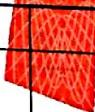

<table><tr><td>名 称</td><td>图例</td><td>单位：mm 说明</td></tr><tr><td>水蚀</td><td>［原图缺失］</td><td></td></tr><tr><td>面蚀（含细沟侵蚀）</td><td>［原图缺失］</td><td></td></tr><tr><td>沟蚀</td><td>［原图缺失］</td><td></td></tr><tr><td>河（或沟）岸侵蚀（冲淘）</td><td>［原图缺失］</td><td></td></tr><tr><td>海岸侵蚀</td><td>［原图缺失］</td><td></td></tr></table>

表 5.3.4（续）
<table><tr><td></td><td rowspan=1 colspan=2>名称</td><td rowspan=1 colspan=2>图例</td><td rowspan=1 colspan=1>说明</td></tr><tr><td></td><td rowspan=1 colspan=2>重力侵蚀</td><td rowspan=1 colspan=2>［原图缺失］</td><td rowspan=1 colspan=1></td></tr><tr><td></td><td rowspan=1 colspan=2>滑坡（含山剥皮）</td><td rowspan=1 colspan=2>［原图缺失］</td><td rowspan=1 colspan=1></td></tr><tr><td></td><td rowspan=1 colspan=2>崩塌（含边坡坍塌和塌落）</td><td rowspan=1 colspan=2>［原图缺失］</td><td rowspan=1 colspan=1></td></tr><tr><td></td><td rowspan=1 colspan=2>泻溜</td><td rowspan=1 colspan=2>［原图缺失］</td><td rowspan=1 colspan=1></td></tr><tr><td></td><td rowspan=1 colspan=2>崩岗</td><td rowspan=1 colspan=2></td><td rowspan=1 colspan=1></td></tr><tr><td></td><td rowspan=1 colspan=2>泥石流</td><td rowspan=1 colspan=2></td><td></td><td rowspan=1 colspan=1></td></tr><tr><td></td><td rowspan=1 colspan=2>冻融侵蚀</td><td rowspan=1 colspan=2></td><td></td><td rowspan=1 colspan=1></td></tr><tr><td rowspan=1 colspan=2>风蚀</td><td rowspan=1 colspan=2></td><td rowspan=1 colspan=2></td></tr><tr><td rowspan=1 colspan=2>风蚀地</td><td rowspan=1 colspan=2></td><td rowspan=1 colspan=2></td></tr><tr><td rowspan=1 colspan=2>沙地</td><td rowspan=1 colspan=2></td><td rowspan=1 colspan=2></td></tr><tr><td rowspan=1 colspan=2>沙丘</td><td rowspan=1 colspan=2></td><td rowspan=1 colspan=2></td></tr><tr><td rowspan=1 colspan=2>固定</td><td rowspan=1 colspan=2>［原图缺失］</td><td rowspan=1 colspan=2></td></tr><tr><td rowspan=1 colspan=2>半固定</td><td rowspan=1 colspan=2></td><td rowspan=1 colspan=2></td></tr><tr><td rowspan=1 colspan=2>流动</td><td rowspan=1 colspan=2>［原图缺失］</td><td rowspan=1 colspan=2></td></tr><tr><td rowspan=1 colspan=2>洞穴侵蚀</td><td rowspan=1 colspan=2>4.0</td><td rowspan=1 colspan=2></td></tr><tr><td rowspan=1 colspan=2>人为侵蚀（水土流失）</td><td rowspan=1 colspan=2>［原图缺失］</td><td rowspan=1 colspan=2></td></tr></table>

5.3.5 水土流失（土壤侵蚀）强度和程度图例应按表 5.3.5 的规定绘制。

表 5.3.5 水土流失（土壤侵蚀）强度和程度图例
<table><tr><td></td><td></td><td rowspan=2 colspan=2>程度图例强度图例</td><td rowspan=2 colspan=1>备注</td></tr><tr><td rowspan=1 colspan=2>名称</td></tr><tr><td rowspan=2 colspan=2>轻度</td><td rowspan=2 colspan=2>T1I</td><td></td></tr><tr><td rowspan=6 colspan=1>按SL 190 中确定的土壤侵蚀强度和程度划分等级</td></tr><tr><td rowspan=2 colspan=2>中度</td><td rowspan=3 colspan=2>T1II</td></tr><tr><td rowspan=2 colspan=1></td></tr><tr><td></td><td rowspan=1 colspan=1>强烈</td></tr><tr><td rowspan=2 colspan=1></td><td rowspan=1 colspan=1>极强烈</td><td rowspan=1 colspan=2>N</td></tr><tr><td rowspan=1 colspan=1>剧烈</td><td rowspan=1 colspan=2>V                            Tv</td></tr></table>

5.3.6 项目区域特用图例应按表5.3.6的规定绘制。

表5.3.6 项目区域特用图例  
单位：mm
<table><tr><td rowspan=1 colspan=1>名称</td><td rowspan=1 colspan=1>图例</td><td rowspan=1 colspan=1>说明</td></tr><tr><td rowspan=1 colspan=1>重点治理流域（片）</td><td rowspan=1 colspan=1>［原图缺失］</td><td rowspan=1 colspan=1>列入国家级或省级水土流失重点防治工程的流域或区域</td></tr><tr><td rowspan=1 colspan=1>重点小流域1. 不依比例尺2. 依比例尺</td><td rowspan=1 colspan=1>［原图缺失］［原图缺失］</td><td rowspan=1 colspan=1>在国家级或省级水土流失重点防治区内，面积小于50km²的实施重点治理的小流域</td></tr><tr><td rowspan=1 colspan=1>示范小流域1. 不依比例尺2. 依比例尺</td><td rowspan=1 colspan=1>［原图缺失］［原图缺失］</td><td rowspan=1 colspan=1>为了探索不同水土流失类型区的水土流失治理模式，选择面积小于50km²的小流域，实施综合防治，创造样板，使之起到示范推广作用</td></tr></table>

表 5.3.6（续）
<table><tr><td></td><td></td><td></td><td></td><td rowspan=1 colspan=4>名称</td></tr><tr><td rowspan=1 colspan=2>试点（示范）县1. 不依比例尺2. 依比例尺</td><td></td><td></td><td rowspan=1 colspan=4>在国家级或省级水土流失重点防治区内，选择典型县作为试点，实施水土保持重点防治，创造经验和样板，以便推广</td></tr><tr><td rowspan=1 colspan=2>试点城市1. 不依比例尺2. 依比例尺</td><td rowspan=1 colspan=2>［原图缺失］［原图缺失］</td><td rowspan=1 colspan=4>为了进行城市水土保持生态建设，选择典型城市作为试点创造经验和样板，以便推广</td></tr><tr><td rowspan=1 colspan=2>国际援助或贷款项目1. 不依比例尺2. 依比例尺</td><td rowspan=1 colspan=2>［原图缺失］［原图缺失］</td><td rowspan=1 colspan=4>国际援助或贷款的水土保持项目，包括联合国援助组织、发达国家援助组织的援助项目和世界银行、亚洲开发银行等组织的贷款项目</td></tr><tr><td rowspan=1 colspan=2>科技示范园</td><td rowspan=1 colspan=2>［原图缺失］</td><td rowspan=1 colspan=4></td></tr><tr><td rowspan=1 colspan=2>生态小流域</td><td rowspan=1 colspan=2>1［原图缺失］</td><td rowspan=1 colspan=4>根据流域建设的主导方向来确定小流域的具体名称</td></tr><tr><td rowspan=1 colspan=2>景观小流域</td><td rowspan=1 colspan=2>［原图缺失］</td><td rowspan=1 colspan=4></td></tr><tr><td rowspan=1 colspan=2>清洁小流域</td><td rowspan=1 colspan=2>［原图缺失］</td><td rowspan=1 colspan=4></td></tr><tr><td rowspan=1 colspan=2>经济小流域</td><td rowspan=1 colspan=2>［原图缺失］</td><td rowspan=1 colspan=4></td></tr><tr><td rowspan=1 colspan=2>安全小流域</td><td rowspan=1 colspan=2>［原图缺失］</td><td rowspan=1 colspan=4></td></tr></table>

5.3.7 生产建设项目水土保持土石渣场图例应按表5.3.7 的规定绘制。

表 5.3.7土石渣场图例
<table><tr><td></td><td rowspan=3 colspan=2>图例</td><td></td></tr><tr><td></td><td rowspan=2 colspan=1>说   明</td></tr><tr><td rowspan=1 colspan=1>名称</td></tr><tr><td rowspan=1 colspan=1>采石场</td><td rowspan=1 colspan=2>［原图缺失］</td><td rowspan=1 colspan=1>露天开采的石料场地。有明显坎坡的绘出坎坡符号，无明显坎坡的绘出范围。根据需要，场地内的地貌可以等高线表示</td></tr><tr><td rowspan=1 colspan=1>取土场</td><td rowspan=1 colspan=2>［原图缺失］</td><td rowspan=1 colspan=1>露天开采的土料场地</td></tr><tr><td rowspan=1 colspan=1>弃渣场（排土场、矸石山）</td><td rowspan=1 colspan=2>［原图缺失］</td><td rowspan=1 colspan=1></td></tr><tr><td rowspan=1 colspan=1>采沙场</td><td rowspan=1 colspan=2></td><td rowspan=1 colspan=1>露天开采的沙料场地</td></tr><tr><td rowspan=1 colspan=1>尾矿库</td><td rowspan=1 colspan=2></td><td rowspan=1 colspan=1></td></tr><tr><td rowspan=1 colspan=1>储灰场</td><td rowspan=1 colspan=2></td><td rowspan=1 colspan=1></td></tr><tr><td rowspan=1 colspan=1>赤泥库</td><td rowspan=1 colspan=2></td><td rowspan=1 colspan=1></td></tr><tr><td rowspan=1 colspan=4>5.3.8水土保持规划设计在特定情况下有加工、储藏、养畜等特殊要求时，应按表5.3.8所列常用图例选用。若不能满足要求时，可参照国家或行业现行有关标准执行。用图例</td></tr><tr><td rowspan=1 colspan=1>名称</td><td></td><td rowspan=1 colspan=1></td><td rowspan=1 colspan=1>说明</td></tr><tr><td rowspan=1 colspan=1>临时房屋</td><td></td><td rowspan=1 colspan=1></td><td rowspan=1 colspan=1></td></tr><tr><td rowspan=1 colspan=1>畜舍或圈</td><td></td><td rowspan=1 colspan=1></td><td rowspan=1 colspan=1></td></tr><tr><td rowspan=1 colspan=1>养畜</td><td></td><td rowspan=1 colspan=1></td><td rowspan=1 colspan=1></td></tr><tr><td rowspan=1 colspan=1>果品储藏窖（室、窑）</td><td></td><td rowspan=1 colspan=1>［原图缺失］</td><td rowspan=1 colspan=1></td></tr><tr><td rowspan=1 colspan=1>林场</td><td></td><td rowspan=1 colspan=1>林</td><td rowspan=1 colspan=1></td></tr><tr><td rowspan=1 colspan=1>牧场</td><td></td><td rowspan=1 colspan=1>牧</td><td rowspan=1 colspan=1></td></tr><tr><td rowspan=1 colspan=1>农场</td><td></td><td rowspan=1 colspan=1>农</td><td rowspan=1 colspan=1></td></tr></table>

表 5.3.8（续）
<table><tr><td rowspan=1 colspan=1>名称</td><td rowspan=1 colspan=1>图例</td><td rowspan=1 colspan=1>说明</td></tr><tr><td rowspan=1 colspan=1>塑料大棚</td><td rowspan=1 colspan=1>D</td><td rowspan=1 colspan=1></td></tr><tr><td rowspan=1 colspan=1>农产品加工厂</td><td rowspan=1 colspan=1>加</td><td rowspan=1 colspan=1></td></tr><tr><td rowspan=1 colspan=1>污水净化湿地</td><td rowspan=1 colspan=1></td><td rowspan=1 colspan=1></td></tr><tr><td rowspan=1 colspan=1>节柴灶</td><td rowspan=1 colspan=1></td><td rowspan=1 colspan=1></td></tr><tr><td rowspan=1 colspan=1>沼气池</td><td rowspan=1 colspan=1></td><td rowspan=1 colspan=1></td></tr><tr><td rowspan=1 colspan=1>垃圾回收站</td><td rowspan=1 colspan=1></td><td rowspan=1 colspan=1></td></tr><tr><td rowspan=1 colspan=1>垃圾桶</td><td rowspan=1 colspan=1></td><td rowspan=1 colspan=1></td></tr><tr><td rowspan=1 colspan=1>厕所改造</td><td rowspan=1 colspan=1></td><td rowspan=1 colspan=1></td></tr><tr><td rowspan=1 colspan=1>小型污水处理厂</td><td rowspan=1 colspan=1></td><td rowspan=1 colspan=1></td></tr><tr><td rowspan=1 colspan=1>生态移民</td><td rowspan=1 colspan=1></td><td rowspan=1 colspan=1></td></tr><tr><td rowspan=1 colspan=1>以电代柴</td><td rowspan=1 colspan=1></td><td rowspan=1 colspan=1></td></tr><tr><td rowspan=1 colspan=1>太阳能</td><td rowspan=1 colspan=1></td><td rowspan=1 colspan=1></td></tr><tr><td rowspan=1 colspan=1>植物过滤带</td><td rowspan=1 colspan=1></td><td rowspan=1 colspan=1></td></tr></table>

5.4工程措施图例

5.4.1 工程措施图例包括工程平面图例、建筑材料图例，可在规划阶段和各设计阶段的总体布置图、水土保持工程设计图等图件中采用。本标准未列的钢筋图例（含焊接接头标注图例）、施工机械图例及金属结构图例等应按 SL 73.2—2013 的规定绘制。

5.4.2 水土保持综合治理工程平面图例应按表5.4.2的规定绘制。

表 5.4.2 水土保持综合治理工程平面图例

单位：mm

<table><tr><td colspan="2" rowspan="1">表5.4.2</td><td colspan="1" rowspan="5">说  明在沟道中修建控制性骨干坝，具有拦洪、调蓄、淤地的综合功能。（a） 适用于比例尺小于 $1 \cdot 1 0 0 0 0 \cdot$ (b) 适用于比例尺不小于 $\mathbf { 1 } \cdot 1 0 0 0 0$ </td></tr><tr><td colspan="1" rowspan="2">名称</td><td></td></tr><tr><td colspan="1" rowspan="1">图例</td></tr><tr><td colspan="1" rowspan="2">治沟骨干工程</td><td></td></tr><tr><td colspan="1" rowspan="1">［原图缺失］［原图缺失］</td></tr><tr><td></td><td colspan="1" rowspan="3">［原图缺失］［原图缺失］</td><td></td></tr><tr><td></td><td colspan="1" rowspan="2">在沟道中修建以淤地（或拦沙）为主要目的横向挡拦建 $1 \sim 3 \mathrm { k m } ^ { 2 }$ ，坝高筑物。中型规模一般为集水面积 $1 5 \sim 2 5 \mathrm { m } ,$ ，淤积面积 $2 \sim 7 \mathrm { h m } ^ { 2 }$  $1 0 \ \mathcal { F } \sim 5 0 \ \mathcal { F } \ \mathbf { m } ^ { 3 }$ 库容（a） 适用于比例尺小于 $1 \cdot 1 0 0 0 0 ,$ (b) 适用于比例尺不小于1：10000</td></tr><tr><td colspan="1" rowspan="1">中型淤地坝（拦沙坝）</td></tr><tr><td colspan="1" rowspan="1">小型淤地坝（拦沙坝）</td><td colspan="1" rowspan="1">［原图缺失］</td><td colspan="1" rowspan="1">在沟道中修建以淤地（或拦沙）为主要目的横向挡拦建筑物。小型规模一般为集水面积小于 $1 \mathrm { k m } ^ { 2 }$ ，坝高 $5 \sim 1 5 \mathrm { m } ,$ 库容 $1 \mathcal { F } \sim 1 0 \mathcal { F } \mathrm { ~ m } ^ { 3 }$ ，淤积面积 $0 . 2 \sim 2 \mathrm { h m } ^ { 2 }$ </td></tr><tr><td colspan="1" rowspan="1">谷坊</td><td colspan="1" rowspan="1">［原图缺失］</td><td colspan="1" rowspan="1">在小溪或支毛沟中修筑的坝高小于5m的沉沙建筑物</td></tr><tr><td colspan="1" rowspan="1">沟头防护工程</td><td colspan="1" rowspan="1">［原图缺失］</td><td colspan="1" rowspan="1">在沟谷源头顶部修建的排水及拦挡工程</td></tr><tr><td colspan="1" rowspan="1">沉沙池（内）</td><td colspan="1" rowspan="1">［原图缺失］</td><td colspan="1" rowspan="1">在蓄排水工程中修建的沉沙建筑物</td></tr><tr><td colspan="1" rowspan="1">引洪漫地</td><td colspan="1" rowspan="1">［原图缺失］</td><td colspan="1" rowspan="1">引洪水淤灌沙地或荒滩地，使之复为农田</td></tr><tr><td colspan="1" rowspan="1">引水拉沙造地</td><td colspan="1" rowspan="1">［原图缺失］</td><td colspan="1" rowspan="1">引河水冲刷沙丘，用沙拉平丘间低地，变为平地</td></tr><tr><td colspan="1" rowspan="1">石坎梯田</td><td colspan="1" rowspan="1">［原图缺失］</td><td colspan="1" rowspan="1">用条石、块石、卵石砌筑田坎的梯田</td></tr><tr><td colspan="1" rowspan="1">土坎梯田</td><td colspan="1" rowspan="1">［原图缺失］</td><td colspan="1" rowspan="1">土坡上直接开挖修筑的梯田</td></tr><tr><td colspan="1" rowspan="1">隔坡梯田</td><td colspan="1" rowspan="1">［原图缺失］</td><td colspan="1" rowspan="1">在同一坡面上，隔一段原坡面修筑一段梯田，呈坡梯相间状</td></tr><tr><td colspan="1" rowspan="1">窄条梯田</td><td colspan="1" rowspan="1"> $2 . 0 = \frac { 1 ^ { 6 . 0 } } { 1 0 } =$ </td><td colspan="1" rowspan="1">北方5m以内，南方2m以内</td></tr><tr><td colspan="1" rowspan="1">名称</td><td colspan="1" rowspan="1">图例</td><td colspan="1" rowspan="1">说明</td></tr><tr><td colspan="1" rowspan="1">树盘</td><td colspan="1" rowspan="1">［原图缺失］</td><td colspan="1" rowspan="1">在林下采取的一种围挡措施，有助于保持土壤水分，改善土壤状况、提高土壤肥力</td></tr><tr><td colspan="1" rowspan="1">小型水库</td><td colspan="1" rowspan="1">［原图缺失］</td><td colspan="1" rowspan="1">在河道上建坝蓄水，库容小于 $1 0 0 0 ~ \mathcal { F } ~ \mathfrak { m } ^ { 3 }$ 的水库</td></tr><tr><td colspan="1" rowspan="1">抽水泵站</td><td colspan="1" rowspan="1">［原图缺失］</td><td colspan="1" rowspan="1">把水从原水面提到一定设计高度的抽水设施</td></tr><tr><td colspan="1" rowspan="1">水窑、水窖（旱井）</td><td colspan="1" rowspan="1">［原图缺失］</td><td colspan="1" rowspan="1">将地面径流通过集流场，引人人工开挖的窑窖式蓄水工程</td></tr><tr><td colspan="1" rowspan="1">陂塘（山塘）、涝池、蓄水池</td><td colspan="1" rowspan="1">［原图缺失］</td><td colspan="1" rowspan="1">拦蓄地表径流的坑塘。南方称陡塘，北方黄土区称涝池</td></tr></table>

5.4.3 生产建设项目水土保持工程图例应按表5.4.3的规定绘制。

表 5.4.3 生产建设项目水土保持工程图例  
单位：mm
<table><tr><td rowspan=1 colspan=2>名称</td><td rowspan=1 colspan=1>图 例</td><td rowspan=1 colspan=1>说明</td></tr><tr><td rowspan=1 colspan=4>边坡防护工程</td></tr><tr><td rowspan=1 colspan=2>挡土墙</td><td rowspan=1 colspan=1>［原图缺失］</td><td rowspan=1 colspan=1>适用于小比例尺平面图，标注长度按实测，被挡土在凸出的一侧。大比例尺平面图例并绘坛工图例</td></tr><tr><td rowspan=1 colspan=2>抗滑桩</td><td rowspan=1 colspan=1>［原图缺失］</td><td rowspan=1 colspan=1>大比例尺平面图按实际外轮廊尺寸绘制，被挡土在凸出一侧；应标注桩的编号</td></tr><tr><td rowspan=1 colspan=2>削坡反压</td><td rowspan=1 colspan=1>［原图缺失］</td><td rowspan=1 colspan=1></td></tr><tr><td rowspan=1 colspan=2>削坡开级</td><td rowspan=1 colspan=1>［原图缺失］</td><td rowspan=1 colspan=1></td></tr><tr><td rowspan=1 colspan=2>植物护坡</td><td rowspan=1 colspan=1>［原图缺失］</td><td rowspan=1 colspan=1></td></tr><tr><td rowspan=1 colspan=2>工程护坡</td><td rowspan=1 colspan=1>［原图缺失］</td><td rowspan=1 colspan=1></td></tr><tr><td rowspan=1 colspan=2>综合护坡</td><td rowspan=1 colspan=1>［原图缺失］</td><td rowspan=1 colspan=1></td></tr><tr><td rowspan=1 colspan=4>泥石流排导工程</td></tr><tr><td rowspan=1 colspan=2>渡槽</td><td rowspan=2 colspan=2>［原图缺失］</td></tr><tr><td rowspan=1 colspan=2></td></tr></table>

## 表 5.4.3（续）

<table><tr><td></td><td></td><td rowspan=3 colspan=1>图例</td><td></td><td></td></tr><tr><td></td><td></td><td rowspan=2 colspan=2>说  明</td></tr><tr><td rowspan=1 colspan=2>名称</td></tr><tr><td></td><td></td><td rowspan=3 colspan=1>［原图缺失］</td><td></td><td></td></tr><tr><td></td><td></td><td rowspan=2 colspan=2>箭头方向表示排导方向</td></tr><tr><td rowspan=1 colspan=2>集流槽</td></tr><tr><td rowspan=2 colspan=2>泥石流拦挡工程</td><td rowspan=2 colspan=1>［原图缺失］</td><td></td><td></td></tr><tr><td rowspan=1 colspan=2></td></tr><tr><td rowspan=2 colspan=2>泥石流停淤场</td><td rowspan=2 colspan=1>［原图缺失］</td><td></td><td></td></tr><tr><td rowspan=1 colspan=2></td></tr><tr><td rowspan=1 colspan=2>防洪排水工程</td><td rowspan=1 colspan=3></td></tr><tr><td rowspan=1 colspan=2>拦洪坝</td><td rowspan=1 colspan=1></td><td rowspan=1 colspan=1>沟道中修建的拦蓄</td><td rowspan=1 colspan=1>洪水的横向挡拦建筑物</td></tr><tr><td rowspan=1 colspan=2>排灌（截）洪渠（沟）</td><td rowspan=1 colspan=1></td><td rowspan=1 colspan=2></td></tr><tr><td rowspan=9 colspan=1></td><td rowspan=1 colspan=1>河堤</td><td rowspan=1 colspan=1></td><td rowspan=1 colspan=2></td></tr><tr><td rowspan=1 colspan=2>明渠（沟）</td><td rowspan=1 colspan=1></td><td rowspan=1 colspan=2>-72</td></tr><tr><td rowspan=1 colspan=2>暗沟</td><td rowspan=1 colspan=1></td><td rowspan=1 colspan=2>V</td></tr><tr><td rowspan=1 colspan=1>竖井</td><td rowspan=1 colspan=1>O</td><td rowspan=1 colspan=2></td></tr><tr><td rowspan=1 colspan=1>涵洞（管）</td><td rowspan=1 colspan=1>［原图缺失］</td><td rowspan=1 colspan=2></td></tr><tr><td rowspan=1 colspan=1>沙障</td><td rowspan=1 colspan=1>［原图缺失］</td><td rowspan=1 colspan=2></td></tr><tr><td rowspan=1 colspan=1>砾石覆盖</td><td rowspan=1 colspan=1>［原图缺失］</td><td rowspan=1 colspan=2></td></tr><tr><td rowspan=1 colspan=4>土地整治</td></tr><tr><td rowspan=1 colspan=1>坑凹回填</td><td rowspan=1 colspan=1>［原图缺失］</td><td rowspan=1 colspan=2>图中数字表示回填深度50cm</td></tr></table>

表 5.4.3（续）
<table><tr><td rowspan=1 colspan=1>名称</td><td rowspan=1 colspan=1>图例</td><td rowspan=1 colspan=1>说明</td></tr><tr><td rowspan=1 colspan=1>渣场改造</td><td rowspan=1 colspan=1>［原图缺失］</td><td rowspan=1 colspan=1></td></tr><tr><td rowspan=1 colspan=1>覆土</td><td rowspan=1 colspan=1>［原图缺失］</td><td rowspan=1 colspan=1></td></tr><tr><td rowspan=1 colspan=1>表土剥离</td><td rowspan=1 colspan=1>［原图缺失］</td><td rowspan=1 colspan=1></td></tr><tr><td rowspan=1 colspan=1>透水砖</td><td rowspan=1 colspan=1>Fd</td><td rowspan=1 colspan=1>具有多孔结构，自然降水能够迅速透过砖体，适时补充地下水资源</td></tr><tr><td rowspan=1 colspan=2>拦渣工程</td><td rowspan=1 colspan=1></td></tr><tr><td rowspan=1 colspan=1>拦渣坝</td><td rowspan=1 colspan=1></td><td rowspan=1 colspan=1></td></tr><tr><td rowspan=1 colspan=1>挡渣墙</td><td rowspan=1 colspan=1></td><td rowspan=1 colspan=1></td></tr><tr><td rowspan=1 colspan=1>拦渣堤</td><td rowspan=1 colspan=1></td><td rowspan=1 colspan=1></td></tr><tr><td rowspan=1 colspan=1>拦渣围堰</td><td rowspan=1 colspan=1></td><td rowspan=1 colspan=1></td></tr></table>

表5.4.4 建筑材料图例
<table><tr><td colspan="1" rowspan="1">名称</td><td colspan="3" rowspan="1">图例</td><td colspan="1" rowspan="1">说明</td></tr><tr><td colspan="1" rowspan="1">天然土</td><td colspan="3" rowspan="1">［原图缺失］</td><td colspan="1" rowspan="1"></td></tr><tr><td colspan="1" rowspan="1">粉土</td><td colspan="3" rowspan="1">［原图缺失］</td><td colspan="1" rowspan="1"></td></tr><tr><td colspan="1" rowspan="1">沙壤土</td><td colspan="3" rowspan="1">［原图缺失］</td><td colspan="1" rowspan="1">在每两个短线间加一个“。”为轻沙壤土；加两个“。”为中沙壤土；加三个“。”为重沙壤土</td></tr><tr><td colspan="1" rowspan="1">壤土</td><td colspan="3" rowspan="1">［原图缺失］</td><td colspan="1" rowspan="1">在两平行短线间加一行粉土符号为重粉质壤土；每间隔两行短线加一行粉土符号为中粉质壤土；每间隔三行短线加一行粉土符号为轻粉质壤土</td></tr><tr><td colspan="1" rowspan="1">黏土</td><td colspan="3" rowspan="1">［原图缺失］</td><td colspan="1" rowspan="1"></td></tr><tr><td colspan="1" rowspan="1">夯实土</td><td colspan="3" rowspan="1">［原图缺失］</td><td colspan="1" rowspan="1"></td></tr><tr><td colspan="1" rowspan="1">回填土</td><td colspan="3" rowspan="1">［原图缺失］</td><td colspan="1" rowspan="1"></td></tr><tr><td colspan="1" rowspan="1">冲填土</td><td colspan="3" rowspan="1">［原图缺失］</td><td colspan="1" rowspan="1"></td></tr><tr><td colspan="1" rowspan="1">回填石渣（炉渣、废弃土石等)</td><td colspan="3" rowspan="1">［原图缺失］</td><td colspan="1" rowspan="1"></td></tr><tr><td colspan="1" rowspan="1">岩石</td><td colspan="1" rowspan="1"></td><td colspan="2" rowspan="1">［原图缺失］</td><td colspan="1" rowspan="1"></td></tr><tr><td colspan="1" rowspan="1">碎石</td><td colspan="1" rowspan="1"></td><td colspan="1" rowspan="1">［原图缺失］</td><td colspan="1" rowspan="1"></td><td colspan="1" rowspan="1"></td></tr><tr><td colspan="1" rowspan="1">卵石</td><td colspan="1" rowspan="1"></td><td colspan="1" rowspan="1">［原图缺失］</td><td colspan="1" rowspan="1"></td><td colspan="1" rowspan="1"></td></tr><tr><td colspan="1" rowspan="1">砂卵石和砂砾石</td><td colspan="1" rowspan="1"></td><td colspan="2" rowspan="1">［原图缺失］</td><td colspan="1" rowspan="1"></td></tr><tr><td colspan="1" rowspan="1">堆石</td><td colspan="1" rowspan="1"></td><td colspan="2" rowspan="1">［原图缺失］</td><td colspan="1" rowspan="1"></td></tr><tr><td colspan="1" rowspan="2">干砌块石</td><td colspan="3" rowspan="2">［原图缺失］</td><td></td></tr><tr><td colspan="1" rowspan="2"></td></tr><tr><td colspan="1" rowspan="2">浆砌块石</td><td colspan="3" rowspan="2">［原图缺失］</td></tr><tr><td colspan="1" rowspan="1"></td></tr><tr><td colspan="1" rowspan="1">干砌料石（条石）</td><td colspan="3" rowspan="1">［原图缺失］</td><td colspan="1" rowspan="1"></td></tr><tr><td colspan="1" rowspan="1">浆砌料石（条石）</td><td colspan="3" rowspan="1">［原图缺失］</td><td colspan="1" rowspan="1"></td></tr></table>

表 5.4.4(续）
<table><tr><td></td><td rowspan=1 colspan=2>名称</td><td rowspan=1 colspan=2>图例</td><td rowspan=1 colspan=1>说明</td></tr><tr><td></td><td rowspan=1 colspan=2>水（或液体）</td><td rowspan=1 colspan=2>［原图缺失］</td><td rowspan=1 colspan=1></td></tr><tr><td></td><td rowspan=1 colspan=2>水泥砂浆</td><td rowspan=1 colspan=2>［原图缺失］</td><td rowspan=1 colspan=1></td></tr><tr><td></td><td rowspan=1 colspan=2>混合砂浆</td><td rowspan=1 colspan=2>［原图缺失］</td><td rowspan=1 colspan=1></td></tr><tr><td></td><td rowspan=1 colspan=2>三合土</td><td rowspan=1 colspan=2>［原图缺失］</td><td rowspan=1 colspan=1></td></tr><tr><td></td><td rowspan=1 colspan=2>混凝土</td><td rowspan=1 colspan=2>［原图缺失］</td><td></td><td rowspan=1 colspan=1></td></tr><tr><td></td><td rowspan=1 colspan=2>钢筋混凝土</td><td rowspan=1 colspan=2>［原图缺失］</td><td rowspan=1 colspan=2></td></tr><tr><td></td><td rowspan=1 colspan=1>防水材料</td><td rowspan=1 colspan=2>［原图缺失］</td><td rowspan=1 colspan=2></td></tr><tr><td rowspan=1 colspan=2>土工织物</td><td rowspan=1 colspan=2>［原图缺失］</td><td rowspan=1 colspan=2></td></tr><tr><td rowspan=1 colspan=2>水泥喷浆</td><td rowspan=1 colspan=2>［原图缺失］</td><td rowspan=1 colspan=2></td></tr><tr><td rowspan=1 colspan=2>加筋喷涂</td><td rowspan=1 colspan=2>［原图缺失］</td><td rowspan=1 colspan=2></td></tr><tr><td rowspan=1 colspan=2>加筋锚固喷涂</td><td rowspan=1 colspan=2>［原图缺失］</td><td rowspan=1 colspan=2></td></tr><tr><td rowspan=1 colspan=2>铅丝石笼（竹筐石笼）</td><td rowspan=1 colspan=2>［原图缺失］</td><td rowspan=1 colspan=2></td></tr><tr><td rowspan=1 colspan=2>砂（土）袋</td><td rowspan=1 colspan=2>［原图缺失］</td><td rowspan=1 colspan=2></td></tr><tr><td rowspan=1 colspan=2>生态袋</td><td rowspan=1 colspan=2>［原图缺失］</td><td rowspan=1 colspan=2></td></tr><tr><td rowspan=1 colspan=2>梢捆</td><td rowspan=1 colspan=2>［原图缺失］</td><td rowspan=1 colspan=2></td></tr><tr><td rowspan=1 colspan=2>沉枕</td><td rowspan=1 colspan=2>［原图缺失］</td><td rowspan=1 colspan=2></td></tr></table>

## 5.5耕作措施图例

5.5.1 耕作措施包括改变微地形、增加地面覆盖、改良土壤等。

5.5.2 耕作措施图例应按表 5.5.1 的规定绘制。

表5.5.1耕作措施图例  
单位：mm
<table><tr><td rowspan=1 colspan=1>名称</td><td rowspan=1 colspan=2>图例</td><td rowspan=1 colspan=1>说 明</td></tr><tr><td rowspan=3 colspan=1>改变微地形</td><td rowspan=3 colspan=1>［原图缺失］</td><td rowspan=1 colspan=1>［原图缺失］</td><td rowspan=1 colspan=1>等高带状耕作</td></tr><tr><td rowspan=1 colspan=1>20.0</td><td rowspan=1 colspan=1>等高沟垄耕作</td></tr><tr><td rowspan=1 colspan=1></td><td rowspan=1 colspan=1>横坡耕作</td></tr><tr><td rowspan=5 colspan=2>增加地面覆盖</td><td rowspan=1 colspan=1></td><td rowspan=1 colspan=1>密植</td></tr><tr><td rowspan=1 colspan=1></td><td rowspan=1 colspan=1>作</td></tr><tr><td rowspan=1 colspan=1></td><td rowspan=1 colspan=1>间作套种</td></tr><tr><td rowspan=1 colspan=1></td><td rowspan=1 colspan=1>深耕</td></tr><tr><td rowspan=1 colspan=1></td><td rowspan=1 colspan=1>免耕少耕</td></tr><tr><td rowspan=3 colspan=1>改良土壤</td><td rowspan=3 colspan=1>［原图缺失］</td><td rowspan=1 colspan=1>［原图缺失］</td><td rowspan=1 colspan=1>抽槽聚肥</td></tr><tr><td rowspan=1 colspan=1>［原图缺失］</td><td rowspan=1 colspan=1>蓄水聚肥</td></tr><tr><td rowspan=1 colspan=1>［原图缺失］</td><td rowspan=1 colspan=1>增施肥料</td></tr></table>

## 5.6植物措施图例

5.6.1 水土保持植物措施图例应包括常规水土保持植物措施图例、园林式种植工程平面图例、高陡边坡图例。

5.6.2 常规水土保持植物措施图例应包括林种图例、树草种图例（分小班注记、典型设计两种列出）、整地图例。各种图例的绘制应符合下列要求：

1 林种图例应按表5.6.2-1的规定绘制。

表 5.6.2 -1 林 种 图 例

单位：mm

<table><tr><td colspan="1" rowspan="1">名称</td><td colspan="1" rowspan="1">图例</td><td colspan="1" rowspan="1">说明</td></tr><tr><td colspan="1" rowspan="1">防护林</td><td colspan="1" rowspan="1">①5.014.01</td><td colspan="1" rowspan="1">有生态防护功能的森林、林木和灌丛</td></tr><tr><td colspan="1" rowspan="1">水土保持林</td><td colspan="1" rowspan="1"></td><td colspan="1" rowspan="1">防治水土流失的森林、林木和灌丛</td></tr><tr><td colspan="1" rowspan="1">梁昴顶、塬面、分水山脊防护林</td><td colspan="1" rowspan="1"></td><td colspan="1" rowspan="1">在黄土丘陵梁峁顶、黄土塬区或残塬区的面及土石山区的分水山脊，具有水土保持能的森林、林木和灌丛</td></tr><tr><td colspan="1" rowspan="1">沟边（塬边、梁昴边）防护林</td><td colspan="1" rowspan="1">1.0-</td><td colspan="1" rowspan="1">防止沟边蚕食的水土保持林，包括黄土区塬边、梁昴边水土保持林</td></tr><tr><td colspan="1" rowspan="1">护坡林</td><td colspan="1" rowspan="1">5.0</td><td colspan="1" rowspan="1">土流失地区斜坡面用以控制水土流失的森   林木和灌丛</td></tr><tr><td colspan="1" rowspan="1">护岸护滩林</td><td colspan="1" rowspan="1"></td><td colspan="1" rowspan="1">河流或沟道岸边防止滩岸冲刷的森林、林木和灌丛</td></tr><tr><td colspan="1" rowspan="1">沟底防冲林</td><td colspan="1" rowspan="1">=1.0</td><td colspan="1" rowspan="1">沟道中防止冲刷的森林、林木和灌丛</td></tr><tr><td colspan="1" rowspan="1">水源涵养林</td><td colspan="1" rowspan="1">［原图缺失］</td><td colspan="1" rowspan="1">在江河、湖泊、牧场防止水土流失和风沙的森林、林木和灌丛</td></tr><tr><td colspan="1" rowspan="1">农田、牧场防护林</td><td colspan="1" rowspan="1">［原图缺失］</td><td colspan="1" rowspan="1">保护农田、牧场，防止水土流失和风沙的森林、林木和灌丛</td></tr><tr><td colspan="1" rowspan="1">梯田地坎防护林</td><td colspan="1" rowspan="1">［原图缺失］</td><td colspan="1" rowspan="1">在梯田地坎上种植的防止地坎崩塌和冲刷的林木或灌丛</td></tr><tr><td colspan="1" rowspan="1">植物地埂（或水流调节林带）</td><td colspan="1" rowspan="1">［原图缺失］</td><td colspan="1" rowspan="1">斜坡面隔一定距离种植的呈带状的，具有拦截泥沙、径流作用的林木、灌木和草本</td></tr><tr><td colspan="1" rowspan="1">名称</td><td colspan="1" rowspan="1">图例</td><td colspan="1" rowspan="2">说明农田上按一定规格设计营造的呈网状的林带</td></tr><tr><td colspan="1" rowspan="1">农田林网</td><td colspan="1" rowspan="1"> $\boxed { 2 . 5 - \frac { \bigoplus 5 . 0 } { 2 . 0 2 . 0 } }$ </td></tr><tr><td colspan="1" rowspan="1">牧场防护林</td><td colspan="1" rowspan="1"> $\sqcap \quad \frac { \bigoplus _ { * < \infty } 5 . 0 } { 1 5 . 0 1 }$ </td><td colspan="1" rowspan="1">保护牧场免受风沙危害、雪害、水土流失的森林、林木和灌丛</td></tr><tr><td colspan="1" rowspan="1">放牧林</td><td colspan="1" rowspan="1"> $\boxed { \begin{array} { c } { \begin{array} { r l } \end{array} } } &  \boxed { \begin{array} { c c } { \boxed { \begin{array} { c c } { \boxed { \begin{array} { c c } { \boxed { \begin{array} { c c } { \boxed { \begin{array} { c c } { \boxed { \begin{array} { c c } } { \boxed { \begin{array} { c c } } { \end{array} } } } } } } } \end{array} } } } } \end{array} } \end{array} \end{array} \end{array} \end{array} \end{array}$ </td><td colspan="1" rowspan="1">专门用于放牧或刈割的森林、林木和灌丛</td></tr><tr><td colspan="1" rowspan="1">防风固沙林</td><td colspan="1" rowspan="1"> $\boxed { - \frac { \varphi _ { 5 0 } } { \frac { \sqrt { 2 } } { 4 \cdot \sqrt { 2 } } } }$ </td><td colspan="1" rowspan="1">防止风沙危害和固定沙丘移动的森林、林木和灌丛</td></tr><tr><td colspan="1" rowspan="1">防风林带</td><td colspan="1" rowspan="1"> $\boxed { - \frac { 9 5 . 0 } { 1 4 . 0 1 } }$ </td><td colspan="1" rowspan="1">防止寒潮、台风、干热风等危害的呈带状的森林、林木和灌丛</td></tr><tr><td colspan="1" rowspan="1">防风片林</td><td colspan="1" rowspan="1">［原图缺失］</td><td colspan="1" rowspan="1">防止寒潮、台风、干热风等危害的呈片状的森林、林木和灌丛</td></tr><tr><td colspan="1" rowspan="1">固沙林</td><td colspan="1" rowspan="1">［原图缺失］</td><td colspan="1" rowspan="1">固定沙丘移动的森林、林木和灌丛</td></tr><tr><td colspan="1" rowspan="1">护路林、护渠林</td><td colspan="1" rowspan="1"> $\boxed { \begin{array} { c } { \begin{array} { c } { \frac { \varphi } { \varphi } _ { 5 . 0 } } \\ { \mathtt { m a x } \mathtt { a } _ { 1 . 0 } } \end{array} } } \end{array}$ </td><td colspan="1" rowspan="1">种植在道路或渠道两侧的呈带状的林木和灌丛</td></tr><tr><td colspan="1" rowspan="1">用材林</td><td colspan="1" rowspan="1">［原图缺失］</td><td colspan="1" rowspan="1">主要用于生产木材的森林或林木，包括竹林</td></tr><tr><td colspan="1" rowspan="1">薪炭林</td><td colspan="1" rowspan="1">［原图缺失］</td><td colspan="1" rowspan="1">以生产燃料为目的的森林、林木和灌丛</td></tr><tr><td colspan="1" rowspan="1">经济林</td><td colspan="1" rowspan="1">［原图缺失］</td><td colspan="1" rowspan="1">以生产干果、油料、调料、工业原料、药材等为主要目的的林木</td></tr><tr><td colspan="1" rowspan="1">果树林</td><td colspan="1" rowspan="1"> $\boxed { \begin{array} { c } { \begin{array} { r l } \end{array} } } & { \boxed { \begin{array} { r l } \end{array} } } \\ { \begin{array} { r l } \end{array} } & { \begin{array} { r l } \end{array} } \end{array}$ </td><td colspan="1" rowspan="1">以生产鲜果为主要目的的林木</td></tr></table>

2 小班注记树草种图例应按表5.6.2-2绘制，并按附录C的规定在右下脚加注该树草种脚注符号。

表5.6.2-2 小班注记树草种图例

单位：mm

<table><tr><td rowspan=1 colspan=1>名称</td><td rowspan=1 colspan=1>小班注记图例</td><td rowspan=1 colspan=1>说明</td></tr><tr><td rowspan=1 colspan=1>针叶树种</td><td rowspan=1 colspan=1>［原图缺失］</td><td rowspan=1 colspan=1></td></tr><tr><td rowspan=1 colspan=1>硬阔叶树种</td><td rowspan=1 colspan=1>［原图缺失］</td><td rowspan=1 colspan=1></td></tr><tr><td rowspan=1 colspan=1>软阔叶树种</td><td rowspan=1 colspan=1>［原图缺失］</td><td rowspan=1 colspan=1></td></tr><tr><td rowspan=1 colspan=1>灌木树种</td><td rowspan=1 colspan=1>［原图缺失］</td><td rowspan=1 colspan=1></td></tr><tr><td rowspan=1 colspan=1>竹类</td><td rowspan=1 colspan=1>［原图缺失］</td><td rowspan=1 colspan=1></td></tr><tr><td rowspan=1 colspan=1>果树</td><td rowspan=1 colspan=1>［原图缺失］</td><td rowspan=1 colspan=1></td></tr><tr><td rowspan=1 colspan=1>木本粮油树种</td><td rowspan=1 colspan=1>［原图缺失］</td><td rowspan=1 colspan=1></td></tr><tr><td rowspan=1 colspan=1>特用经济树种</td><td rowspan=1 colspan=1>［原图缺失］</td><td rowspan=1 colspan=1></td></tr><tr><td rowspan=1 colspan=1>禾本科草</td><td rowspan=1 colspan=1>7 7r 2.0</td><td rowspan=1 colspan=1></td></tr><tr><td rowspan=1 colspan=1>豆科草</td><td rowspan=1 colspan=1>2   2.0</td><td rowspan=1 colspan=1></td></tr><tr><td rowspan=1 colspan=1>其他科草</td><td rowspan=1 colspan=1>Y     γ2.0</td><td rowspan=1 colspan=1></td></tr></table>

3 （草）种种植典型设计图中的平面设计图例应按表5.6.2 -3绘制，并应按附录C规定将填注符号填入图形的中心，但均不应加注脚注符号；剖面设计则应采用表5.6. 2 -3 的树或草种剖面设计图例。

表 5.6.2-3 树（草）种种植典型设计树（草）种图例
<table><tr><td></td><td></td><td></td><td></td><td></td><td></td><td></td><td rowspan=3 colspan=3>平面设计图例</td><td></td></tr><tr><td></td><td></td><td></td><td></td><td></td><td></td><td></td><td rowspan=1 colspan=1>说 明</td></tr><tr><td></td><td rowspan=1 colspan=1>名称</td><td rowspan=1 colspan=5>剖面设计图例</td><td></td></tr><tr><td></td><td></td><td rowspan=2 colspan=5>［原图缺失］</td><td rowspan=2 colspan=3></td><td rowspan=2 colspan=1></td></tr><tr><td></td><td rowspan=1 colspan=1>针叶树种</td></tr><tr><td></td><td rowspan=1 colspan=1>阔叶树种</td><td rowspan=1 colspan=5></td><td rowspan=1 colspan=3></td><td rowspan=1 colspan=1></td></tr><tr><td></td><td rowspan=1 colspan=1>灌木树种</td><td rowspan=1 colspan=5>［原图缺失］</td><td rowspan=1 colspan=3>o.</td><td rowspan=1 colspan=1></td></tr><tr><td></td><td rowspan=1 colspan=1>果树、经济林</td><td rowspan=1 colspan=5></td><td rowspan=1 colspan=3>VANO</td><td rowspan=1 colspan=1></td></tr><tr><td></td><td rowspan=1 colspan=1>竹类</td><td rowspan=1 colspan=5></td><td rowspan=1 colspan=3></td><td rowspan=1 colspan=1></td></tr><tr><td></td><td rowspan=1 colspan=1>草</td><td rowspan=1 colspan=5></td><td rowspan=1 colspan=3></td><td rowspan=1 colspan=1></td></tr><tr><td></td><td rowspan=1 colspan=10>4 整地图例应按表5.6.2-4的规定绘制。表 5.6.2-4 整地图                                      单位：mm</td></tr><tr><td></td><td rowspan=1 colspan=2>名称</td><td rowspan=1 colspan=6>图   例</td><td rowspan=1 colspan=2>说明</td></tr><tr><td></td><td rowspan=1 colspan=2>全面整地</td><td rowspan=1 colspan=6>15.0</td><td rowspan=1 colspan=2>村造林种草地段进行全面整地</td></tr><tr><td rowspan=1 colspan=11>局部整地</td></tr><tr><td rowspan=2 colspan=3>鱼鳞坑</td><td rowspan=2 colspan=6></td><td></td><td></td></tr><tr><td rowspan=2 colspan=2>在地形较陡和破碎的坡面上沿等高线修筑的呈字形排列的半月形坑穴</td></tr><tr><td rowspan=2 colspan=3>大坑（果树坑）</td><td rowspan=2 colspan=6>［原图缺失］</td></tr><tr><td rowspan=2 colspan=2>栽植果树或大苗时一般采用大坑，常采用长宽</td></tr><tr><td rowspan=2 colspan=3>小坑</td><td rowspan=2 colspan=6>［原图缺失］</td></tr><tr><td rowspan=3 colspan=2>普通造林时采用的小穴</td></tr><tr><td rowspan=3 colspan=3>水平阶</td><td></td><td></td><td></td><td></td><td></td><td></td></tr><tr><td rowspan=2 colspan=6>［原图缺失］</td></tr><tr><td rowspan=3 colspan=2>沿等高线将坡面修筑成阶状台面。台面一般稍向内倾斜</td></tr><tr><td rowspan=1 colspan=3>竹节式水平阶</td><td rowspan=1 colspan=6>［原图缺失］</td></tr><tr><td rowspan=3 colspan=3>水平沟（撩壕、山边沟）</td><td rowspan=2 colspan=6>［原图缺失］</td></tr><tr><td rowspan=3 colspan=2>沿等高线开挖成沟，挖方堆到外侧筑埂每隔一道原坡面修筑一条水平阶或水平沟</td></tr><tr><td></td><td rowspan=1 colspan=1></td><td></td><td></td><td></td><td></td></tr><tr><td rowspan=1 colspan=3>隔坡整地</td><td rowspan=1 colspan=5>［原图缺失］</td><td rowspan=1 colspan=1></td><td rowspan=1 colspan=1></td></tr></table>

5.6.3 园林式种植工程大比例尺平面设计图例应按表5.6.3的规定绘制。若不能满足要求，应按园林设计有关规定确定。

表 5.6.3 园林式种植平面设计图例
<table><tr><td rowspan=1 colspan=1>名称</td><td></td><td rowspan=1 colspan=3></td><td rowspan=1 colspan=1>图例</td></tr><tr><td rowspan=1 colspan=1>落叶阔叶乔木</td><td></td><td></td><td rowspan=1 colspan=1>［原图缺失］［原图缺失］</td><td rowspan=1 colspan=1></td></tr><tr><td rowspan=1 colspan=1>常绿阔叶乔木</td><td></td><td rowspan=1 colspan=3></td></tr><tr><td rowspan=1 colspan=1>落叶针叶乔木</td><td></td><td rowspan=1 colspan=3></td></tr><tr><td rowspan=1 colspan=1>常绿针叶乔木</td><td rowspan=1 colspan=1>［原图缺失］</td><td rowspan=1 colspan=3></td></tr><tr><td rowspan=1 colspan=1>落叶灌木</td><td rowspan=1 colspan=1>［原图缺失］</td><td rowspan=1 colspan=3></td></tr><tr><td rowspan=1 colspan=1>常绿灌木</td><td rowspan=1 colspan=1>［原图缺失］</td><td rowspan=1 colspan=3></td></tr><tr><td rowspan=1 colspan=1>阔叶乔木疏林</td><td rowspan=1 colspan=1>［原图缺失］</td><td rowspan=1 colspan=3></td></tr><tr><td rowspan=1 colspan=1>针叶乔木疏林</td><td rowspan=1 colspan=1>［原图缺失］</td><td rowspan=1 colspan=3></td></tr><tr><td rowspan=1 colspan=1>阔叶乔木密林</td><td rowspan=1 colspan=1>［原图缺失］</td><td rowspan=1 colspan=3></td></tr><tr><td rowspan=1 colspan=1>针叶乔木密林</td><td rowspan=1 colspan=1>［原图缺失］</td><td rowspan=1 colspan=3></td></tr><tr><td rowspan=1 colspan=1>落叶灌木疏林</td><td rowspan=1 colspan=1>［原图缺失］</td><td rowspan=1 colspan=3></td></tr><tr><td rowspan=1 colspan=1>落叶花灌木疏林</td><td rowspan=1 colspan=1>［原图缺失］</td><td rowspan=1 colspan=3></td></tr><tr><td rowspan=1 colspan=1>常绿灌木密林</td><td rowspan=1 colspan=1>［原图缺失］</td><td rowspan=1 colspan=3></td></tr><tr><td rowspan=1 colspan=1>常绿花灌木密林</td><td rowspan=1 colspan=1>［原图缺失］</td><td rowspan=1 colspan=3></td></tr><tr><td rowspan=1 colspan=1>自然绿篱</td><td rowspan=1 colspan=1>［原图缺失］</td><td rowspan=1 colspan=3></td></tr></table>

表 5.6.3（续）

<table><tr><td rowspan=2 colspan=2>表5.6.3</td><td></td></tr><tr><td rowspan=1 colspan=1>说  明</td></tr><tr><td rowspan=1 colspan=1>名称</td><td rowspan=1 colspan=1>图 例</td><td></td></tr><tr><td></td><td rowspan=3 colspan=1>［原图缺失］</td><td></td></tr><tr><td></td><td rowspan=2 colspan=1></td></tr><tr><td rowspan=1 colspan=1>整形绿篱</td></tr><tr><td></td><td rowspan=3 colspan=1>Nrm</td><td></td></tr><tr><td></td><td rowspan=2 colspan=1></td></tr><tr><td rowspan=1 colspan=1>镶边植物</td></tr><tr><td></td><td rowspan=3 colspan=1>［原图缺失］</td><td></td></tr><tr><td></td><td rowspan=2 colspan=1></td></tr><tr><td rowspan=1 colspan=1>一、二年生草本花卉</td></tr><tr><td rowspan=2 colspan=1>多年生及宿根草本花卉</td><td rowspan=2 colspan=1>［原图缺失］</td><td></td></tr><tr><td rowspan=1 colspan=1></td></tr><tr><td rowspan=2 colspan=1>一般草皮（坪）</td><td rowspan=2 colspan=1>［原图缺失］</td><td></td></tr><tr><td rowspan=1 colspan=1></td></tr><tr><td rowspan=2 colspan=1>缀花草皮坪</td><td rowspan=2 colspan=1>［原图缺失］</td><td></td></tr><tr><td rowspan=1 colspan=1></td></tr><tr><td rowspan=1 colspan=1>整形树木</td><td rowspan=1 colspan=1>［原图缺失］</td><td rowspan=1 colspan=1></td></tr><tr><td rowspan=1 colspan=1>竹丛</td><td rowspan=1 colspan=1>［原图缺失］</td><td rowspan=1 colspan=1></td></tr><tr><td rowspan=1 colspan=1>棕榈植物</td><td rowspan=1 colspan=1>［原图缺失］</td><td rowspan=1 colspan=1></td></tr><tr><td rowspan=1 colspan=1>仙人掌植物</td><td rowspan=1 colspan=1>［原图缺失］</td><td rowspan=1 colspan=1></td></tr><tr><td rowspan=1 colspan=1>藤本植物</td><td rowspan=1 colspan=1>［原图缺失］</td><td rowspan=1 colspan=1></td></tr><tr><td rowspan=1 colspan=1>水生植物</td><td rowspan=1 colspan=1>［原图缺失］</td><td rowspan=1 colspan=1></td></tr><tr><td rowspan=1 colspan=1>花境</td><td rowspan=1 colspan=1>［原图缺失］</td><td rowspan=1 colspan=1></td></tr><tr><td rowspan=1 colspan=1>花坛</td><td rowspan=1 colspan=1>［原图缺失］</td><td rowspan=1 colspan=1></td></tr><tr><td rowspan=1 colspan=1>花架</td><td rowspan=1 colspan=1>［原图缺失］</td><td rowspan=1 colspan=1></td></tr><tr><td rowspan=1 colspan=1>花带</td><td rowspan=1 colspan=1>［原图缺失］</td><td rowspan=1 colspan=1></td></tr></table>

5.6.4 高陡边坡绿化注记图例应按表5.6.4的规定绘制。

表 5.6.4 高陡边坡绿化注记图例
<table><tr><td rowspan=1 colspan=1>名称</td><td rowspan=1 colspan=1>图例</td><td rowspan=1 colspan=1>说明</td></tr><tr><td rowspan=1 colspan=1>喷混植生</td><td rowspan=1 colspan=1>［原图缺失］</td><td rowspan=1 colspan=1></td></tr><tr><td rowspan=1 colspan=1>客土植生</td><td rowspan=1 colspan=1>［原图缺失］</td><td rowspan=1 colspan=1></td></tr><tr><td rowspan=1 colspan=1>植生带（植生毯）</td><td rowspan=1 colspan=1>［原图缺失］</td><td rowspan=1 colspan=1></td></tr></table>

## 5.7封育措施图例

5.7.1封育措施包括封山育林育草、草场改良、草库仑、围网、标志牌等。

5.7.2 封育措施图例应按表5.7.2的规定绘制。

表5.7.2封育措施图例  
单位：mm
<table><tr><td rowspan=1 colspan=1>名称</td><td rowspan=1 colspan=1>图例</td><td rowspan=1 colspan=1>说明</td></tr><tr><td rowspan=1 colspan=1>封山育林育草</td><td rowspan=1 colspan=1>［原图缺失］</td><td rowspan=1 colspan=1></td></tr><tr><td rowspan=1 colspan=1>封山育林</td><td rowspan=1 colspan=1>［原图缺失］</td><td rowspan=1 colspan=1></td></tr><tr><td rowspan=1 colspan=1>疏林补植</td><td rowspan=1 colspan=1>［原图缺失］</td><td rowspan=1 colspan=1></td></tr><tr><td rowspan=1 colspan=1>封山育草</td><td rowspan=1 colspan=1>［原图缺失］</td><td rowspan=1 colspan=1></td></tr><tr><td rowspan=1 colspan=1>草场改良</td><td rowspan=1 colspan=1>［原图缺失］</td><td rowspan=1 colspan=1></td></tr><tr><td rowspan=1 colspan=1>草库仑</td><td rowspan=1 colspan=1>［原图缺失］</td><td rowspan=1 colspan=1>为防草场退化、恢复草场生产力而将草原以不同的围篱方式逐块地围起来，加以保护</td></tr><tr><td rowspan=1 colspan=1>围网</td><td rowspan=1 colspan=1>［原图缺失］</td><td rowspan=1 colspan=1></td></tr><tr><td rowspan=1 colspan=1>标志牌</td><td rowspan=1 colspan=1>［原图缺失］</td><td rowspan=1 colspan=1></td></tr></table>

## 5.8临时措施图例

5.8.1 临时措施图例主要指常用临时拦挡措施图例。

5.8.2 临时措施注记图例应按表5.8.2的规定绘制。

表5.8.2临时措施注记图例
<table><tr><td rowspan=1 colspan=1>名称</td><td rowspan=1 colspan=1>图例</td><td rowspan=1 colspan=1>说明</td></tr><tr><td rowspan=1 colspan=1>填土草袋</td><td rowspan=1 colspan=1>QQQ</td><td rowspan=1 colspan=1></td></tr><tr><td rowspan=1 colspan=1>土埂</td><td rowspan=1 colspan=1>E  K  IE</td><td rowspan=1 colspan=1></td></tr><tr><td rowspan=1 colspan=1>钢围栏</td><td rowspan=1 colspan=1>O</td><td rowspan=1 colspan=1></td></tr><tr><td rowspan=1 colspan=1>竹栅围栏</td><td rowspan=1 colspan=1></td><td rowspan=1 colspan=1></td></tr><tr><td rowspan=1 colspan=1>防风罩</td><td rowspan=1 colspan=1>F F  F  F</td><td rowspan=1 colspan=1></td></tr><tr><td rowspan=1 colspan=1>砾石压盖</td><td rowspan=1 colspan=1>盘逸</td><td rowspan=1 colspan=1></td></tr><tr><td rowspan=1 colspan=1>临时覆盖</td><td rowspan=1 colspan=1>1</td><td rowspan=1 colspan=1>可采用防尘网、防雨布、塑料布、苫布、草帘、砾石、进行临时覆盖。覆盖材料可用文字区别</td></tr></table>

5.8.3 涉及工程措施、植物措施时，图例应按5.4节、5.6节的规定绘制。5.9 监测图例

5.9.1 监测图例应按表5.9.1的规定绘制。

表 5.9.1 监测图例  
单位：mm
<table><tr><td>名称</td><td>图 例</td><td>说明</td></tr><tr><td>水蚀综合监测场</td><td>3.0 5.0 ［原图缺失］ 一 6.0</td><td>对土壤侵蚀有关因子监测的站（点）</td></tr><tr><td>小区监测站（点）</td><td>一 6.0 2.0 6.0</td><td>在坡面上设置径流观测场采用小区监测产流产 沙的监测站（点）</td></tr></table>

表 5.9.1 （续）
<table><tr><td rowspan=1 colspan=1>名称</td><td rowspan=1 colspan=3></td></tr><tr><td rowspan=1 colspan=1>断面观测站（点）</td><td></td><td rowspan=1 colspan=1>一6.0［原图缺失］    2.06.0一</td><td rowspan=1 colspan=1>在河流或沟道选定固定断面实测水位、流量、泥沙含量的站（点）</td></tr><tr><td rowspan=1 colspan=1>简易水蚀观测场</td><td></td><td rowspan=1 colspan=1>6.0［原图缺失］     2.06.0一</td><td rowspan=1 colspan=1></td></tr><tr><td rowspan=1 colspan=1>风蚀综合观测场</td><td></td><td rowspan=1 colspan=1>［原图缺失］</td><td rowspan=1 colspan=1></td></tr><tr><td rowspan=1 colspan=1>气象观测点</td><td></td><td rowspan=1 colspan=1>［原图缺失］</td><td rowspan=1 colspan=1></td></tr></table>

5.9.2 具体监测站（点）设计图的绘制应按本标准工程措施、植物措施的有关规定执行。

## 附录A综合图件色标

表A-1 土地利用类型及水土保持措施色标表
<table><tr><td rowspan=1 colspan=1>序号</td><td rowspan=1 colspan=1>名称</td><td rowspan=1 colspan=2>色标</td><td rowspan=1 colspan=1>RGB</td><td rowspan=1 colspan=1>备注</td></tr><tr><td rowspan=1 colspan=1>1</td><td rowspan=1 colspan=1>水系，泉</td><td rowspan=1 colspan=2>蓝色</td><td rowspan=1 colspan=1>R60 G220 B255</td><td rowspan=1 colspan=1></td></tr><tr><td rowspan=1 colspan=1>2</td><td rowspan=1 colspan=1>新修骨干坝、淤地坝或小型蓄水工程</td><td rowspan=1 colspan=2>蓝色（波纹图案）</td><td rowspan=1 colspan=1>R60 G220 B255</td><td rowspan=1 colspan=1>水土保持措施，着色于水面上</td></tr><tr><td rowspan=1 colspan=1>3</td><td rowspan=1 colspan=1>农田</td><td rowspan=1 colspan=2>黄色</td><td rowspan=1 colspan=1>R255 G255 B0</td><td rowspan=1 colspan=1></td></tr><tr><td rowspan=1 colspan=1>4</td><td rowspan=1 colspan=1>新修梯田、引洪漫地或治滩造地</td><td rowspan=1 colspan=2>黄色（黑点图案）</td><td rowspan=1 colspan=1>R255 G255 B0</td><td rowspan=1 colspan=1>水土保持措施</td></tr><tr><td rowspan=1 colspan=1>5</td><td rowspan=1 colspan=1>林地</td><td rowspan=1 colspan=2>绿色</td><td rowspan=1 colspan=1>R0 G150 B0</td><td rowspan=1 colspan=1></td></tr><tr><td rowspan=1 colspan=1>6</td><td rowspan=1 colspan=1>新增林地</td><td rowspan=1 colspan=2>绿色（白点图案)</td><td rowspan=1 colspan=1>R0 G150 B0</td><td rowspan=1 colspan=1>水土保持措施</td></tr><tr><td rowspan=1 colspan=1>7</td><td rowspan=1 colspan=1>草地</td><td rowspan=1 colspan=2>草绿色</td><td rowspan=1 colspan=1>R150 G215 B15</td><td rowspan=1 colspan=1></td></tr><tr><td rowspan=1 colspan=1>8</td><td rowspan=1 colspan=1>新增草地</td><td rowspan=1 colspan=2>草绿色（黑杂点图案）</td><td rowspan=1 colspan=1>R150 G215 B15</td><td rowspan=1 colspan=1>水土保持措施</td></tr><tr><td rowspan=1 colspan=1>9</td><td rowspan=1 colspan=1>果园和经济林地</td><td rowspan=1 colspan=1>酸橙色</td><td rowspan=1 colspan=1></td><td rowspan=1 colspan=1>R190 G245 B115</td><td rowspan=1 colspan=1></td></tr><tr><td rowspan=1 colspan=1>10</td><td rowspan=1 colspan=1>新增果园和经济林地</td><td rowspan=1 colspan=1>酸橙色（绿竖线图案）</td><td rowspan=1 colspan=1></td><td rowspan=1 colspan=1>R190 G245 B115</td><td rowspan=1 colspan=1>水土保持措施</td></tr><tr><td rowspan=1 colspan=1>11</td><td rowspan=1 colspan=1>荒草地</td><td rowspan=1 colspan=1>灰色</td><td rowspan=1 colspan=1></td><td rowspan=1 colspan=1>R192 G192 B192</td><td rowspan=1 colspan=1></td></tr><tr><td rowspan=1 colspan=1>12</td><td rowspan=1 colspan=1>其他未利用地</td><td rowspan=1 colspan=2>浅褐色</td><td rowspan=1 colspan=1>R150 G100 B50</td><td rowspan=1 colspan=1></td></tr><tr><td rowspan=1 colspan=1>13</td><td rowspan=1 colspan=1>市、镇及农村居民点</td><td rowspan=1 colspan=2>紫棕色</td><td rowspan=1 colspan=1>R125 G30 B130</td><td rowspan=1 colspan=1></td></tr><tr><td rowspan=1 colspan=1>14</td><td rowspan=1 colspan=1>初治面积</td><td rowspan=1 colspan=2>黑色图案</td><td rowspan=1 colspan=1>R192 G192 B192</td><td rowspan=1 colspan=1>大区域小比例尺图，水土保持措施不分类</td></tr><tr><td rowspan=1 colspan=1>15</td><td rowspan=1 colspan=1>未治面积</td><td rowspan=1 colspan=2>红色</td><td rowspan=1 colspan=1>R204 G0 B0</td><td rowspan=1 colspan=1>大区域小比例尺图，水土保持措施不分类</td></tr></table>

表A-2 水土保持土地利用现状色标表
<table><tr><td rowspan=1 colspan=1>一级类</td><td rowspan=1 colspan=1>二级类</td><td rowspan=1 colspan=1>三级类</td><td rowspan=1 colspan=1>四级类</td><td rowspan=1 colspan=2>色标</td><td rowspan=1 colspan=1>RGB</td></tr><tr><td rowspan=6 colspan=1>耕地</td><td rowspan=1 colspan=1></td><td rowspan=1 colspan=1></td><td rowspan=1 colspan=1></td><td rowspan=1 colspan=2></td><td rowspan=1 colspan=1>R255 G250 B0</td></tr><tr><td rowspan=1 colspan=1>水田</td><td rowspan=1 colspan=1></td><td rowspan=1 colspan=1></td><td rowspan=1 colspan=2></td><td rowspan=1 colspan=1>R255 G255 B100</td></tr><tr><td rowspan=1 colspan=1>水浇地</td><td rowspan=1 colspan=1></td><td rowspan=1 colspan=1></td><td rowspan=1 colspan=2>WA</td><td rowspan=1 colspan=1>R255 G255 B150</td></tr><tr><td rowspan=3 colspan=1>旱地</td><td rowspan=1 colspan=1></td><td rowspan=1 colspan=1></td><td rowspan=1 colspan=2></td><td rowspan=1 colspan=1>R255 G255 B200</td></tr><tr><td rowspan=1 colspan=1>早平地</td><td rowspan=1 colspan=1></td><td rowspan=1 colspan=1></td><td rowspan=1 colspan=1></td><td rowspan=1 colspan=1>R250 G240 B190</td></tr><tr><td rowspan=1 colspan=1></td><td rowspan=1 colspan=1>&lt;1°</td><td rowspan=1 colspan=2></td><td rowspan=1 colspan=1>R250 G240 B190</td></tr></table>

表A-2（续）
<table><tr><td rowspan=16 colspan=3>二级类耕地            旱地</td><td rowspan=1 colspan=1>一级类</td><td rowspan=1 colspan=1>三级类</td><td rowspan=1 colspan=2>四级类</td><td rowspan=1 colspan=1>色标</td></tr><tr><td rowspan=1 colspan=1></td><td rowspan=1 colspan=1>1°~5°</td><td rowspan=1 colspan=2></td><td rowspan=1 colspan=1>R250 G240 B190</td></tr><tr><td rowspan=1 colspan=1>梯田</td><td rowspan=1 colspan=1></td><td rowspan=1 colspan=2></td><td rowspan=1 colspan=1>R255 G240 B110</td></tr><tr><td rowspan=1 colspan=1></td><td rowspan=1 colspan=1>水平梯田</td><td rowspan=1 colspan=2></td><td rowspan=1 colspan=1>R255 G240 B110</td></tr><tr><td rowspan=1 colspan=1></td><td rowspan=1 colspan=1>坡式梯田</td><td rowspan=1 colspan=2></td><td rowspan=1 colspan=1>R255 G240 B110</td></tr><tr><td rowspan=1 colspan=1>坡耕地</td><td rowspan=1 colspan=1></td><td rowspan=1 colspan=2></td><td rowspan=1 colspan=1>R240 G230 B100</td></tr><tr><td rowspan=1 colspan=1></td><td rowspan=1 colspan=1>5°~8°</td><td rowspan=1 colspan=2></td><td rowspan=1 colspan=1>R240 G230 B100</td></tr><tr><td rowspan=1 colspan=1></td><td rowspan=1 colspan=1>8°~15°</td><td rowspan=1 colspan=2></td><td rowspan=1 colspan=1>R240 G230 B100</td></tr><tr><td rowspan=1 colspan=1></td><td rowspan=1 colspan=1>15°~25°</td><td rowspan=1 colspan=2></td><td rowspan=1 colspan=1>R240 G230 B100</td></tr><tr><td rowspan=1 colspan=1></td><td rowspan=1 colspan=1>25°~35°</td><td rowspan=1 colspan=2></td><td rowspan=1 colspan=1>R240 G230 B100</td></tr><tr><td rowspan=1 colspan=1></td><td rowspan=1 colspan=1>&gt;35°</td><td rowspan=1 colspan=2></td><td rowspan=1 colspan=1>R240 G230 B100</td></tr><tr><td rowspan=1 colspan=1>沟川坝地</td><td rowspan=1 colspan=1></td><td rowspan=1 colspan=2></td><td rowspan=1 colspan=1>R255 G220 B80</td></tr><tr><td rowspan=1 colspan=1></td><td rowspan=1 colspan=1>沟川（台）地</td><td rowspan=1 colspan=2></td><td rowspan=1 colspan=1>R255 G220 B80</td></tr><tr><td rowspan=1 colspan=1></td><td rowspan=1 colspan=1>坝滩地</td><td rowspan=1 colspan=1></td><td rowspan=1 colspan=1></td><td rowspan=1 colspan=1>R255 G220 B80</td></tr><tr><td rowspan=1 colspan=1></td><td rowspan=1 colspan=1>坝平地</td><td rowspan=1 colspan=1>L</td><td rowspan=1 colspan=1></td><td rowspan=1 colspan=1>R255 G220 B80</td></tr><tr><td rowspan=1 colspan=1>撂荒地</td><td rowspan=1 colspan=1></td><td rowspan=1 colspan=1></td><td rowspan=1 colspan=1></td><td rowspan=1 colspan=1>R255 G245 B215</td></tr><tr><td rowspan=2 colspan=2></td><td rowspan=1 colspan=1></td><td rowspan=1 colspan=1></td><td rowspan=1 colspan=1></td><td rowspan=1 colspan=1></td><td rowspan=1 colspan=1></td><td rowspan=1 colspan=1>R255 G155 B0</td></tr><tr><td rowspan=1 colspan=1>果园</td><td rowspan=1 colspan=1></td><td rowspan=1 colspan=1></td><td rowspan=1 colspan=1></td><td rowspan=1 colspan=1></td><td rowspan=1 colspan=1>R245 G210 B40</td></tr><tr><td rowspan=4 colspan=2>园地</td><td rowspan=1 colspan=1>茶园</td><td rowspan=1 colspan=1></td><td rowspan=1 colspan=1></td><td rowspan=1 colspan=1></td><td rowspan=1 colspan=1></td><td rowspan=1 colspan=1>R255 G200 B80</td></tr><tr><td rowspan=3 colspan=1>其他园地</td><td rowspan=1 colspan=1></td><td rowspan=1 colspan=1></td><td rowspan=1 colspan=1></td><td rowspan=1 colspan=1></td><td rowspan=1 colspan=1>R250 G185 B20</td></tr><tr><td rowspan=1 colspan=1>经济林栽培园</td><td rowspan=1 colspan=1></td><td rowspan=1 colspan=1></td><td rowspan=1 colspan=1></td><td rowspan=1 colspan=1>R230 G155 B5</td></tr><tr><td rowspan=1 colspan=1>其他园地</td><td rowspan=1 colspan=1></td><td rowspan=1 colspan=1></td><td rowspan=1 colspan=1></td><td rowspan=1 colspan=1>R255 G160 B45</td></tr><tr><td rowspan=6 colspan=2>林地</td><td rowspan=1 colspan=1></td><td rowspan=1 colspan=1></td><td rowspan=1 colspan=1></td><td rowspan=1 colspan=2></td><td rowspan=1 colspan=1>R40 G195 B10</td></tr><tr><td rowspan=5 colspan=1>有林地</td><td rowspan=1 colspan=1></td><td rowspan=1 colspan=1></td><td rowspan=1 colspan=2></td><td rowspan=1 colspan=1></td></tr><tr><td rowspan=1 colspan=1>用材林</td><td rowspan=1 colspan=1></td><td rowspan=1 colspan=2></td><td rowspan=1 colspan=1></td></tr><tr><td rowspan=1 colspan=1>防护林</td><td rowspan=1 colspan=1></td><td rowspan=1 colspan=2></td><td rowspan=1 colspan=1></td></tr><tr><td rowspan=1 colspan=1>经济林</td><td rowspan=1 colspan=1></td><td rowspan=1 colspan=2></td><td rowspan=2 colspan=1></td></tr><tr><td rowspan=1 colspan=1>薪炭林</td><td rowspan=1 colspan=1></td><td rowspan=1 colspan=2></td><td rowspan=1 colspan=1>R80 G150 B90</td></tr></table>

表A-2（续）

<table><tr><td colspan="6" rowspan="2">表A-2(续）</td><td colspan="2" rowspan="1"></td><td colspan="1" rowspan="2">RGB</td></tr><tr><td colspan="1" rowspan="3">四级类</td><td colspan="2" rowspan="3">色标</td></tr><tr><td></td><td></td><td colspan="2" rowspan="3">二级类</td><td colspan="1" rowspan="3">三级类</td><td></td></tr><tr><td colspan="2" rowspan="2">一级类</td><td colspan="2" rowspan="3"></td><td></td></tr><tr><td></td><td colspan="1" rowspan="2">R40 G100 B40</td></tr><tr><td colspan="2" rowspan="7"></td><td colspan="2" rowspan="3">有林地</td><td colspan="1" rowspan="3">特种用途林</td><td colspan="1" rowspan="3"></td></tr><tr><td colspan="1" rowspan="3"></td><td colspan="2" rowspan="3"></td><td></td></tr><tr><td colspan="1" rowspan="2">R85 G180 B100</td></tr><tr><td colspan="2" rowspan="4">灌木林地</td><td colspan="1" rowspan="2"></td></tr><tr><td colspan="1" rowspan="2"></td><td colspan="1" rowspan="2">「</td><td colspan="1" rowspan="2"></td><td colspan="1" rowspan="2">R85 G180 B80</td></tr><tr><td colspan="1" rowspan="1">……</td></tr><tr><td></td><td colspan="1" rowspan="2"></td><td colspan="1" rowspan="2"></td><td colspan="1" rowspan="2"></td><td colspan="1" rowspan="2">R120 G200 B120</td></tr><tr><td colspan="2" rowspan="10">林地</td><td colspan="2" rowspan="10">其他林地</td><td colspan="1" rowspan="3"></td></tr><tr><td colspan="1" rowspan="3"></td><td colspan="2" rowspan="3"></td><td></td></tr><tr><td colspan="1" rowspan="2">R130 G200 B130</td></tr><tr><td colspan="1" rowspan="1">疏林地</td></tr><tr><td></td><td colspan="1" rowspan="2"></td><td colspan="1" rowspan="2">L</td><td colspan="1" rowspan="2"></td><td colspan="1" rowspan="2">R160 G210 B170</td></tr><tr><td colspan="1" rowspan="1">未成林造林地</td></tr><tr><td></td><td colspan="1" rowspan="2"></td><td colspan="1" rowspan="2"></td><td colspan="1" rowspan="2"></td><td colspan="1" rowspan="2">R135 G165 B135</td></tr><tr><td colspan="1" rowspan="1">迹地</td></tr><tr><td></td><td colspan="1" rowspan="2"></td><td colspan="2" rowspan="2"></td><td colspan="1" rowspan="2">R90 G200 B90</td></tr><tr><td colspan="1" rowspan="1">苗圃</td></tr><tr><td></td><td></td><td></td><td></td><td colspan="1" rowspan="2"></td><td colspan="1" rowspan="2"></td><td colspan="2" rowspan="2"></td><td colspan="1" rowspan="2">R140 G190 B30</td></tr><tr><td colspan="2" rowspan="1"></td><td colspan="2" rowspan="1"></td></tr><tr><td></td><td></td><td></td><td></td><td colspan="1" rowspan="2"></td><td colspan="1" rowspan="2"></td><td colspan="1" rowspan="2"></td><td colspan="1" rowspan="2"></td><td colspan="1" rowspan="2">R170 G190 B30</td></tr><tr><td></td><td colspan="2" rowspan="1"></td><td colspan="2" rowspan="1">天然牧草地</td></tr><tr><td></td><td></td><td></td><td></td><td colspan="1" rowspan="2"></td><td colspan="1" rowspan="2"></td><td colspan="2" rowspan="2"></td><td colspan="1" rowspan="2">R150 G210 B50</td></tr><tr><td colspan="1" rowspan="18"></td><td colspan="2" rowspan="1"></td><td colspan="1" rowspan="1">人工牧草地</td></tr><tr><td></td><td></td><td colspan="1" rowspan="2"></td><td colspan="1" rowspan="2"></td><td colspan="1" rowspan="2"></td><td colspan="1" rowspan="2"></td><td colspan="1" rowspan="2"></td><td colspan="1" rowspan="2">R200 G220 B100</td></tr><tr><td colspan="2" rowspan="1">草地</td></tr><tr><td colspan="2" rowspan="3"></td><td colspan="1" rowspan="2">其他草地</td><td colspan="1" rowspan="1">天然草地</td><td colspan="1" rowspan="1"></td><td colspan="2" rowspan="1"></td><td colspan="1" rowspan="1">R155 G240 B90</td></tr><tr><td colspan="1" rowspan="1">人工草地</td><td colspan="1" rowspan="1"></td><td colspan="1" rowspan="1"></td><td colspan="1" rowspan="1"></td><td colspan="1" rowspan="1">R120 G235 B45</td></tr><tr><td colspan="1" rowspan="1"></td><td colspan="1" rowspan="1">荒草地</td><td colspan="1" rowspan="1"></td><td colspan="2" rowspan="1"></td><td colspan="1" rowspan="1">R150 G165 B5</td></tr><tr><td colspan="2" rowspan="7">交通运输用地</td><td colspan="1" rowspan="1"></td><td colspan="1" rowspan="1"></td><td colspan="1" rowspan="1"></td><td colspan="2" rowspan="1"></td><td colspan="1" rowspan="1">R175 G100 B80</td></tr><tr><td colspan="1" rowspan="1">铁路用地</td><td colspan="1" rowspan="1"></td><td colspan="1" rowspan="1"></td><td colspan="1" rowspan="1"></td><td colspan="1" rowspan="1"></td><td colspan="1" rowspan="1">R178 G170 B176</td></tr><tr><td colspan="1" rowspan="1">公路用地</td><td colspan="1" rowspan="1"></td><td colspan="1" rowspan="1"></td><td colspan="2" rowspan="1"></td><td colspan="1" rowspan="1">R175 G85 B80</td></tr><tr><td colspan="1" rowspan="1">农村道路</td><td colspan="1" rowspan="1"></td><td colspan="1" rowspan="1"></td><td colspan="1" rowspan="1"></td><td colspan="1" rowspan="1"></td><td colspan="1" rowspan="1">R175 G85 B80</td></tr><tr><td colspan="1" rowspan="1">机场用地</td><td colspan="1" rowspan="1"></td><td colspan="1" rowspan="1"></td><td colspan="1" rowspan="1"></td><td colspan="1" rowspan="1"></td><td colspan="1" rowspan="1">R235 G130 B130</td></tr><tr><td colspan="1" rowspan="1">港口码头用地</td><td colspan="1" rowspan="1"></td><td colspan="1" rowspan="1"></td><td colspan="1" rowspan="1"></td><td colspan="1" rowspan="1"></td><td colspan="1" rowspan="1">R235 G130 B130</td></tr><tr><td colspan="1" rowspan="1">管道运输用地</td><td colspan="1" rowspan="1"></td><td colspan="1" rowspan="1"></td><td colspan="1" rowspan="1">L</td><td colspan="1" rowspan="1"></td><td colspan="1" rowspan="1">R235 G130 B130</td></tr><tr><td colspan="2" rowspan="5">水域及水利设施用地</td><td colspan="1" rowspan="1"></td><td colspan="1" rowspan="1"></td><td colspan="1" rowspan="1"></td><td colspan="1" rowspan="1"></td><td colspan="1" rowspan="1"></td><td colspan="1" rowspan="1">R85 G230 B230</td></tr><tr><td colspan="1" rowspan="1">河流水面</td><td colspan="1" rowspan="1"></td><td colspan="1" rowspan="1"></td><td colspan="1" rowspan="1">L</td><td colspan="1" rowspan="1"></td><td colspan="1" rowspan="1">R150 G240 B255</td></tr><tr><td colspan="1" rowspan="1">湖泊水面</td><td colspan="1" rowspan="1"></td><td colspan="1" rowspan="1"></td><td colspan="1" rowspan="1"></td><td colspan="1" rowspan="1"></td><td colspan="1" rowspan="1">R150 G240 B255</td></tr><tr><td colspan="1" rowspan="1">水库水面</td><td colspan="1" rowspan="1"></td><td colspan="1" rowspan="1"></td><td colspan="1" rowspan="1">L</td><td colspan="1" rowspan="1"></td><td colspan="1" rowspan="1">R150 G240 B255</td></tr><tr><td colspan="1" rowspan="1">坑塘水面</td><td colspan="1" rowspan="1"></td><td colspan="1" rowspan="1"></td><td colspan="1" rowspan="1"></td><td colspan="1" rowspan="1"></td><td colspan="1" rowspan="1">R160 G205 B240</td></tr><tr><td colspan="1" rowspan="2">一级类</td><td colspan="1" rowspan="2">二级类</td><td colspan="8" rowspan="2">表A-2(续)</td></tr><tr><td colspan="1" rowspan="3">三级类</td><td colspan="3" rowspan="3">四级类</td></tr><tr><td colspan="1" rowspan="10">水域及水利设施用地</td><td></td><td></td><td colspan="3"></td></tr><tr><td></td><td colspan="1" rowspan="3">色标</td><td colspan="3"></td></tr><tr><td colspan="1" rowspan="3">沿海滩涂</td><td></td><td></td><td colspan="5"></td></tr><tr><td></td><td></td><td colspan="5" rowspan="1">RGB</td></tr><tr><td colspan="1" rowspan="1"></td><td colspan="1" rowspan="1"></td><td colspan="1" rowspan="1"></td><td colspan="5" rowspan="1">R215 G255 B255</td></tr><tr><td colspan="1" rowspan="1">内陆滩涂</td><td colspan="1" rowspan="1"></td><td colspan="1" rowspan="1"></td><td colspan="1" rowspan="1"></td><td colspan="5" rowspan="1">R215 G255 B255</td></tr><tr><td colspan="1" rowspan="1">沟渠</td><td colspan="1" rowspan="1"></td><td colspan="1" rowspan="1"></td><td colspan="1" rowspan="3"></td><td colspan="5" rowspan="1">R160 G205 B240</td></tr><tr><td colspan="1" rowspan="2">水工建筑用地</td><td colspan="1" rowspan="2"></td><td colspan="1" rowspan="2"></td><td colspan="5"></td></tr><tr><td colspan="5" rowspan="1">R230 G130 B100</td></tr><tr><td colspan="1" rowspan="1">冰川及永久积雪</td><td colspan="1" rowspan="1"></td><td colspan="1" rowspan="1"></td><td colspan="1" rowspan="1"></td><td colspan="5" rowspan="1">R135 G205 B240</td></tr><tr><td colspan="1" rowspan="6">城镇村及工矿用地</td><td colspan="1" rowspan="1"></td><td colspan="1" rowspan="1"></td><td colspan="1" rowspan="1"></td><td colspan="1" rowspan="2"></td><td colspan="5" rowspan="1">R230 G140 B155</td></tr><tr><td colspan="1" rowspan="1">城市</td><td colspan="1" rowspan="1"></td><td colspan="1" rowspan="1"></td><td colspan="5" rowspan="1">R220 G100 B120</td></tr><tr><td colspan="1" rowspan="1">建制镇</td><td colspan="1" rowspan="1"></td><td colspan="1" rowspan="1"></td><td colspan="1" rowspan="1"></td><td colspan="5" rowspan="1">R220 G100 B120</td></tr><tr><td colspan="1" rowspan="1">村庄</td><td colspan="1" rowspan="1"></td><td colspan="1" rowspan="1"></td><td colspan="1" rowspan="1"></td><td colspan="5" rowspan="1">R230 G140 B160</td></tr><tr><td colspan="1" rowspan="1">采矿用地</td><td colspan="1" rowspan="1"></td><td colspan="1" rowspan="1"></td><td colspan="1" rowspan="1"></td><td colspan="5" rowspan="1">R230 G130 B120</td></tr><tr><td colspan="1" rowspan="1">风景名胜及特殊用地</td><td colspan="1" rowspan="1"></td><td colspan="1" rowspan="1"></td><td colspan="1" rowspan="1"></td><td colspan="5" rowspan="1">R230 G130 B120</td></tr><tr><td colspan="1" rowspan="7">其他土地</td><td colspan="1" rowspan="1"></td><td colspan="1" rowspan="1"></td><td colspan="1" rowspan="1"></td><td colspan="1" rowspan="1"></td><td colspan="5" rowspan="1">R225 G200 B225</td></tr><tr><td colspan="1" rowspan="1">设施农用地</td><td colspan="1" rowspan="1"></td><td colspan="1" rowspan="1"></td><td colspan="1" rowspan="1"></td><td colspan="5" rowspan="1">R220 G180 B130</td></tr><tr><td colspan="1" rowspan="1">田坎</td><td colspan="1" rowspan="1"></td><td colspan="1" rowspan="1"></td><td colspan="1" rowspan="1"></td><td colspan="5" rowspan="1"></td></tr><tr><td colspan="1" rowspan="1">盐碱地</td><td colspan="1" rowspan="1"></td><td colspan="1" rowspan="1"></td><td colspan="1" rowspan="1"></td><td colspan="5" rowspan="1"></td></tr><tr><td colspan="1" rowspan="1">沼泽地</td><td colspan="1" rowspan="1"></td><td colspan="1" rowspan="1"></td><td colspan="1" rowspan="1"></td><td colspan="5" rowspan="1"></td></tr><tr><td colspan="1" rowspan="1">沙地</td><td colspan="1" rowspan="1"></td><td colspan="1" rowspan="1"></td><td colspan="1" rowspan="1"></td><td colspan="5" rowspan="1"></td></tr><tr><td colspan="1" rowspan="1">裸地</td><td colspan="1" rowspan="1"></td><td colspan="1" rowspan="1"></td><td colspan="1" rowspan="1"></td><td colspan="5" rowspan="1"></td></tr></table>

表A-3 土壤侵蚀类型色标表
<table><tr><td rowspan=1 colspan=1>土壤侵蚀类型</td><td rowspan=1 colspan=1>色标</td><td rowspan=1 colspan=1>RGB</td></tr><tr><td rowspan=1 colspan=1>水力侵蚀</td><td rowspan=1 colspan=1>棕色</td><td rowspan=1 colspan=1>R240, G125,B80</td></tr><tr><td rowspan=1 colspan=1>风力侵蚀</td><td rowspan=1 colspan=1>黄色</td><td rowspan=1 colspan=1>R220, G185,B120</td></tr><tr><td rowspan=1 colspan=1>冻融侵蚀</td><td rowspan=1 colspan=1>紫色</td><td rowspan=1 colspan=1>R170, G140, B175</td></tr><tr><td rowspan=1 colspan=1>重力侵蚀</td><td rowspan=1 colspan=1>深灰色</td><td rowspan=1 colspan=1>R135,G135,B135</td></tr><tr><td rowspan=1 colspan=1>泥石流</td><td rowspan=1 colspan=1>深蓝色</td><td rowspan=1 colspan=1>R0, G80, B165</td></tr><tr><td rowspan=1 colspan=1>人为侵蚀</td><td rowspan=1 colspan=2>红色</td></tr></table>

表 A-4 土壤侵蚀强度色标表
<table><tr><td rowspan="2">侵蚀类型</td><td colspan="6">侵蚀强度</td></tr><tr><td>微度</td><td>轻度</td><td>中度</td><td>强烈</td><td>极强烈</td><td>剧烈</td></tr><tr><td rowspan="3">水力侵蚀</td><td></td><td></td><td></td><td></td><td></td><td></td></tr><tr><td>R230, G240, B210</td><td>R250, G205,</td><td>R240, G160,</td><td>R240, G125,</td><td>R220, G90, B15</td><td>R195, G80,</td></tr><tr><td></td><td>B175</td><td>B120</td><td>B80</td><td></td><td>B30</td></tr><tr><td rowspan="3">风力侵蚀</td><td>R230, G240,</td><td></td><td></td><td></td><td></td><td></td></tr><tr><td>B210</td><td>R250, G250, B200</td><td>R240, G225, B170</td><td>R220,G185, B120</td><td>R205,G155, B35</td><td>R205, G145, B65</td></tr><tr><td></td><td></td><td></td><td></td><td></td><td></td></tr><tr><td>冻融侵蚀</td><td>R230, G240, B210</td><td>R235,G220, B235</td><td>R200, G190, B220</td><td>R170, G140, B175</td><td>R115,G100, B170</td><td>R60, G80, B135</td></tr></table>

附录B植物措施图件色标  
表B-1植被类型色标表
<table><tr><td rowspan=1 colspan=1>序号</td><td rowspan=1 colspan=1>名称</td><td rowspan=1 colspan=1>色标</td><td rowspan=1 colspan=1>RGB</td></tr><tr><td rowspan=1 colspan=1>1</td><td rowspan=1 colspan=1>乔木</td><td rowspan=1 colspan=1></td><td rowspan=1 colspan=1>R80 G225 B10</td></tr><tr><td rowspan=1 colspan=1>2</td><td rowspan=1 colspan=1>针叶树</td><td rowspan=1 colspan=1></td><td rowspan=1 colspan=1>R55 G235 B115</td></tr><tr><td rowspan=1 colspan=1>3</td><td rowspan=1 colspan=1>软阔叶树</td><td rowspan=1 colspan=1></td><td rowspan=1 colspan=1>R5 G160 B140</td></tr><tr><td rowspan=1 colspan=1>4</td><td rowspan=1 colspan=1>硬阔叶树</td><td rowspan=1 colspan=1></td><td rowspan=1 colspan=1>R120 G145 B60</td></tr><tr><td rowspan=1 colspan=1>5</td><td rowspan=1 colspan=1>灌木林</td><td rowspan=1 colspan=1></td><td rowspan=1 colspan=1>R170 G255 B40</td></tr><tr><td rowspan=1 colspan=1>6</td><td rowspan=1 colspan=1>草地</td><td rowspan=1 colspan=1></td><td rowspan=1 colspan=1>R145 G210 B80</td></tr><tr><td rowspan=1 colspan=1>7</td><td rowspan=1 colspan=1>果树</td><td rowspan=1 colspan=1></td><td rowspan=1 colspan=1>R195 G195 B0</td></tr><tr><td rowspan=1 colspan=1>8</td><td rowspan=1 colspan=1>经济林树种(木本粮油树种)</td><td rowspan=1 colspan=1></td><td rowspan=1 colspan=1>R115 G180 B30</td></tr><tr><td rowspan=1 colspan=1>9</td><td rowspan=1 colspan=1>特用经济林</td><td rowspan=1 colspan=1></td><td rowspan=1 colspan=1>R115 G180 B90</td></tr></table>

表B-2 植被覆盖度色标表
<table><tr><td rowspan=1 colspan=1>覆盖度</td><td></td><td rowspan=1 colspan=4></td><td rowspan=1 colspan=1>土壤侵蚀分类分级标准中的非耕地林草盖度</td></tr><tr><td rowspan=1 colspan=1>&lt;0.20</td><td></td><td rowspan=1 colspan=3></td><td rowspan=1 colspan=1>R250 G255 B160</td></tr><tr><td rowspan=1 colspan=1>0.20~0.30</td><td></td><td rowspan=1 colspan=3></td><td rowspan=1 colspan=1>R255 G230 B180</td></tr><tr><td rowspan=1 colspan=1>0.31~0.40</td><td rowspan=1 colspan=1>0.30~0.45</td><td rowspan=1 colspan=3></td><td rowspan=1 colspan=1>R200 G220 B125</td></tr><tr><td rowspan=1 colspan=1>0.41~0.60</td><td rowspan=1 colspan=1>0.45~0.60</td><td rowspan=1 colspan=3></td><td rowspan=1 colspan=1>R125 G245 B0</td></tr><tr><td rowspan=1 colspan=1>0.61~0.80</td><td rowspan=1 colspan=1>0.60~0.75</td><td rowspan=1 colspan=3></td><td rowspan=1 colspan=1>R5 G160 B140</td></tr><tr><td rowspan=1 colspan=1>&gt;0.80</td><td rowspan=1 colspan=1>≥0.75</td><td rowspan=1 colspan=3></td><td rowspan=1 colspan=1>R20 G190 B70</td></tr></table>

## 附录C树种图例代码表

表C树种图例代码表
<table><tr><td rowspan=1 colspan=1>名称</td><td rowspan=1 colspan=1>符号</td><td rowspan=1 colspan=1>名称</td><td rowspan=1 colspan=1>符号</td><td rowspan=1 colspan=1>名称</td><td rowspan=1 colspan=1>符号</td><td rowspan=1 colspan=2>名称</td><td rowspan=1 colspan=1>符号</td><td rowspan=5 colspan=1></td></tr><tr><td rowspan=1 colspan=1></td><td rowspan=1 colspan=1>针叶树种</td><td rowspan=1 colspan=1></td><td rowspan=1 colspan=1></td><td rowspan=1 colspan=1>沙枣</td><td rowspan=1 colspan=1>SA</td><td rowspan=1 colspan=2>枣</td><td rowspan=1 colspan=1>Z</td></tr><tr><td rowspan=1 colspan=1>白皮松</td><td rowspan=1 colspan=1>B</td><td rowspan=1 colspan=1>马尾松</td><td rowspan=1 colspan=1>M</td><td rowspan=1 colspan=1>石榴</td><td rowspan=1 colspan=1>SL</td><td rowspan=1 colspan=2>榛子</td><td rowspan=1 colspan=1>ZZ</td></tr><tr><td rowspan=1 colspan=1>柏属（其他）</td><td rowspan=1 colspan=1>BS</td><td rowspan=1 colspan=1>水杉</td><td rowspan=1 colspan=1>S</td><td rowspan=1 colspan=1>山楂</td><td rowspan=1 colspan=1>SZ</td><td rowspan=1 colspan=2></td><td rowspan=1 colspan=1></td></tr><tr><td rowspan=1 colspan=1>侧柏</td><td rowspan=1 colspan=1>C</td><td rowspan=1 colspan=1>湿地松</td><td rowspan=1 colspan=1>SD</td><td rowspan=1 colspan=1>特</td><td rowspan=1 colspan=1>特用经济林树种</td><td rowspan=1 colspan=2></td><td rowspan=1 colspan=1></td></tr><tr><td rowspan=1 colspan=1>池衫</td><td rowspan=1 colspan=1>CS</td><td rowspan=1 colspan=1>思茅松</td><td rowspan=1 colspan=1>SM</td><td rowspan=1 colspan=1>白蜡</td><td rowspan=1 colspan=1>B</td><td rowspan=1 colspan=2>桑</td><td rowspan=1 colspan=1>S</td><td rowspan=2 colspan=1></td></tr><tr><td rowspan=1 colspan=1>杜松</td><td rowspan=1 colspan=1>D</td><td rowspan=1 colspan=1>雪松</td><td rowspan=1 colspan=1>x</td><td rowspan=1 colspan=1>茶</td><td rowspan=1 colspan=1>C</td><td rowspan=1 colspan=2>山茱萸</td><td rowspan=1 colspan=1>SZ</td></tr><tr><td rowspan=1 colspan=1>红松</td><td rowspan=1 colspan=1>H</td><td rowspan=1 colspan=1>油松</td><td rowspan=1 colspan=1>Y</td><td rowspan=1 colspan=1>杜仲</td><td rowspan=1 colspan=1>D</td><td rowspan=1 colspan=2>橡胶</td><td rowspan=1 colspan=1>x</td><td rowspan=1 colspan=1></td></tr><tr><td rowspan=1 colspan=1>华山松</td><td rowspan=1 colspan=1>HS</td><td rowspan=1 colspan=1>圆柏</td><td rowspan=1 colspan=1>YB</td><td rowspan=1 colspan=1>枸杞</td><td rowspan=1 colspan=1>G</td><td rowspan=1 colspan=2>香椿</td><td rowspan=1 colspan=1>xC</td><td rowspan=1 colspan=1></td></tr><tr><td rowspan=1 colspan=1>落叶松</td><td rowspan=1 colspan=1>L</td><td rowspan=1 colspan=1>云杉</td><td rowspan=1 colspan=1>YS</td><td rowspan=1 colspan=1>黑荆树</td><td rowspan=1 colspan=1>H</td><td rowspan=1 colspan=2>油茶</td><td rowspan=1 colspan=1>Y</td><td rowspan=11 colspan=1></td></tr><tr><td rowspan=1 colspan=1>冷杉</td><td rowspan=1 colspan=1>LE</td><td rowspan=1 colspan=1>云南松</td><td rowspan=1 colspan=1>YN</td><td rowspan=1 colspan=1>玫瑰</td><td rowspan=1 colspan=1>M</td><td rowspan=1 colspan=2>银杏</td><td rowspan=1 colspan=1>YX</td></tr><tr><td rowspan=1 colspan=1>罗汉松</td><td rowspan=1 colspan=1>LH</td><td rowspan=1 colspan=1>樟子松</td><td rowspan=1 colspan=1>Z</td><td rowspan=1 colspan=1>蒲葵</td><td rowspan=1 colspan=1>P</td><td rowspan=1 colspan=2>棕榈</td><td rowspan=1 colspan=1>Z</td></tr><tr><td rowspan=1 colspan=1>柳杉</td><td rowspan=1 colspan=1>LS</td><td rowspan=1 colspan=1>紫杉</td><td rowspan=1 colspan=1>ZS</td><td rowspan=1 colspan=1>漆树</td><td rowspan=1 colspan=1>Q</td><td rowspan=1 colspan=2></td><td rowspan=1 colspan=1></td></tr><tr><td rowspan=1 colspan=1>落羽杉</td><td rowspan=1 colspan=1>LY</td><td rowspan=1 colspan=1></td><td rowspan=1 colspan=1></td><td rowspan=1 colspan=1></td><td rowspan=1 colspan=1>竹类树种</td><td rowspan=1 colspan=2></td><td rowspan=1 colspan=1></td></tr><tr><td rowspan=1 colspan=1></td><td rowspan=1 colspan=1>软阔叶树种</td><td rowspan=1 colspan=1></td><td rowspan=1 colspan=1></td><td rowspan=1 colspan=1>大径竹</td><td rowspan=1 colspan=1>D</td><td rowspan=1 colspan=2>小径竹</td><td rowspan=1 colspan=1>x</td></tr><tr><td rowspan=1 colspan=1>桉</td><td rowspan=1 colspan=1>A</td><td rowspan=1 colspan=1>琪桐</td><td rowspan=1 colspan=1>G</td><td rowspan=1 colspan=1>灌木（</td><td rowspan=1 colspan=1>或小乔木）树</td><td rowspan=1 colspan=2>种</td><td rowspan=1 colspan=1></td></tr><tr><td rowspan=1 colspan=1>白桦</td><td rowspan=1 colspan=1>B</td><td rowspan=1 colspan=1>木麻黄</td><td rowspan=1 colspan=1>M</td><td rowspan=1 colspan=1>柽柳</td><td rowspan=1 colspan=1>C</td><td rowspan=1 colspan=2>杞柳</td><td rowspan=1 colspan=1>Q</td></tr><tr><td rowspan=1 colspan=1>刺槐</td><td rowspan=1 colspan=1>C</td><td rowspan=1 colspan=1>泡桐</td><td rowspan=1 colspan=1>P</td><td rowspan=1 colspan=1>花棒</td><td rowspan=1 colspan=1>H</td><td rowspan=1 colspan=2>沙棘</td><td rowspan=1 colspan=1>S</td></tr><tr><td rowspan=1 colspan=1>臭椿</td><td rowspan=1 colspan=1>CC</td><td rowspan=1 colspan=1>桤木</td><td rowspan=1 colspan=1>Q</td><td rowspan=1 colspan=1>火炬树</td><td rowspan=1 colspan=1>HJ</td><td rowspan=1 colspan=2>沙柳</td><td rowspan=1 colspan=1>SL</td></tr><tr><td rowspan=1 colspan=1>椴类</td><td rowspan=1 colspan=1>D</td><td rowspan=1 colspan=1>杨</td><td rowspan=1 colspan=1>Y</td><td rowspan=1 colspan=1>黄柳</td><td rowspan=1 colspan=1>HL</td><td rowspan=1 colspan=2>踏郎</td><td rowspan=1 colspan=1>T</td></tr><tr><td rowspan=1 colspan=1>枫树</td><td rowspan=1 colspan=1>F</td><td rowspan=1 colspan=1></td><td rowspan=1 colspan=1></td><td rowspan=1 colspan=1>胡枝子</td><td rowspan=1 colspan=1>HZ</td><td rowspan=1 colspan=2>桃金娘</td><td rowspan=1 colspan=1>TJ</td><td></td></tr><tr><td rowspan=1 colspan=1></td><td rowspan=1 colspan=1>硬阔叶树种</td><td rowspan=1 colspan=1></td><td rowspan=1 colspan=1></td><td rowspan=1 colspan=1>马桑</td><td rowspan=1 colspan=1>M</td><td></td><td rowspan=1 colspan=1>紫穗槐</td><td rowspan=1 colspan=1>Z</td><td></td></tr><tr><td rowspan=1 colspan=1>檫</td><td rowspan=1 colspan=1>C</td><td rowspan=1 colspan=1>楠</td><td rowspan=1 colspan=1>N</td><td rowspan=1 colspan=1>柠条</td><td rowspan=1 colspan=1>N</td><td></td><td rowspan=1 colspan=1></td><td rowspan=1 colspan=1></td><td></td></tr><tr><td rowspan=1 colspan=1>复叶槭</td><td rowspan=1 colspan=1>F</td><td rowspan=1 colspan=1>水曲柳</td><td rowspan=1 colspan=1>S</td><td rowspan=1 colspan=1>女贞</td><td rowspan=1 colspan=1>NZ</td><td></td><td rowspan=1 colspan=1></td><td rowspan=1 colspan=1></td><td></td></tr><tr><td rowspan=1 colspan=1>黄菠萝</td><td rowspan=1 colspan=1>H</td><td rowspan=1 colspan=1>铁力木</td><td rowspan=1 colspan=1>T</td><td rowspan=1 colspan=1></td><td rowspan=1 colspan=1>禾本科</td><td></td><td rowspan=1 colspan=1></td><td rowspan=1 colspan=1></td><td></td></tr><tr><td rowspan=1 colspan=1>黄连木</td><td rowspan=1 colspan=1>HL</td><td rowspan=1 colspan=1>相思</td><td rowspan=1 colspan=1>x</td><td rowspan=1 colspan=1>扁穗冰草</td><td rowspan=1 colspan=1>B</td><td></td><td rowspan=1 colspan=1>糖蜜草</td><td rowspan=1 colspan=1>T</td><td></td></tr><tr><td rowspan=1 colspan=1>榉</td><td rowspan=1 colspan=1>J</td><td rowspan=1 colspan=1>悬铃木</td><td rowspan=1 colspan=1>XL</td><td rowspan=1 colspan=1>地毯草</td><td rowspan=1 colspan=1>D</td><td></td><td rowspan=1 colspan=1>苏丹草</td><td rowspan=1 colspan=1>S</td><td></td></tr><tr><td rowspan=1 colspan=1>栲</td><td rowspan=1 colspan=1>K</td><td rowspan=1 colspan=1>榆</td><td rowspan=1 colspan=1>Y</td><td rowspan=1 colspan=1>狗牙根</td><td rowspan=1 colspan=1>G</td><td></td><td rowspan=1 colspan=1>羊草</td><td rowspan=1 colspan=1>Y</td><td></td></tr><tr><td rowspan=1 colspan=1>栎类</td><td rowspan=1 colspan=1>L</td><td rowspan=1 colspan=1>樟</td><td rowspan=1 colspan=1>Z</td><td rowspan=1 colspan=1>黑麦草</td><td rowspan=1 colspan=1>H</td><td></td><td rowspan=1 colspan=1>羊茅</td><td rowspan=1 colspan=1>YM</td><td></td></tr><tr><td rowspan=1 colspan=1></td><td rowspan=1 colspan=1>果树</td><td rowspan=1 colspan=1></td><td rowspan=1 colspan=1></td><td rowspan=1 colspan=1>结缕草</td><td rowspan=1 colspan=1>J</td><td></td><td rowspan=1 colspan=1>无芒雀麦</td><td rowspan=1 colspan=1>W</td><td></td></tr><tr><td rowspan=1 colspan=1>柑橘</td><td rowspan=1 colspan=1>J</td><td rowspan=1 colspan=1>苹果</td><td rowspan=1 colspan=1>P</td><td rowspan=1 colspan=1>剪股颖</td><td rowspan=1 colspan=1>JG</td><td></td><td rowspan=1 colspan=1>苇状羊茅</td><td rowspan=1 colspan=1>WZ</td><td></td></tr><tr><td rowspan=1 colspan=1>梨</td><td rowspan=1 colspan=1>L</td><td rowspan=1 colspan=1>葡萄</td><td rowspan=1 colspan=1>PT</td><td rowspan=1 colspan=1>老麦芒</td><td rowspan=1 colspan=1>L</td><td></td><td rowspan=1 colspan=1>早熟禾</td><td rowspan=1 colspan=1>Z</td><td></td></tr><tr><td rowspan=1 colspan=1>龙眼</td><td rowspan=1 colspan=1>LY</td><td rowspan=1 colspan=1>桃</td><td rowspan=1 colspan=1>T</td><td rowspan=1 colspan=1>芦苇</td><td rowspan=1 colspan=1>LU</td><td></td><td rowspan=1 colspan=1></td><td rowspan=1 colspan=1></td><td></td></tr><tr><td rowspan=1 colspan=1>荔枝</td><td rowspan=1 colspan=1>LZ</td><td rowspan=1 colspan=1>香蕉</td><td rowspan=1 colspan=1>x</td><td rowspan=1 colspan=1>狼尾草</td><td rowspan=1 colspan=1>LW</td><td></td><td rowspan=1 colspan=1></td><td rowspan=1 colspan=1></td><td></td></tr><tr><td rowspan=1 colspan=1>芒果</td><td rowspan=1 colspan=1>M</td><td rowspan=1 colspan=1>椰子</td><td rowspan=1 colspan=1>Y</td><td rowspan=1 colspan=1></td><td rowspan=1 colspan=1>豆科</td><td></td><td rowspan=1 colspan=1></td><td></td><td></td></tr><tr><td rowspan=3 colspan=1></td><td></td><td></td><td></td><td></td><td></td><td></td><td></td><td></td><td></td></tr><tr><td></td><td></td><td></td><td></td><td></td><td></td><td></td><td rowspan=2 colspan=1></td><td></td></tr><tr><td rowspan=1 colspan=1>木本粮油</td><td rowspan=1 colspan=1></td><td rowspan=1 colspan=1></td><td rowspan=1 colspan=1>百（白）脉根</td><td rowspan=1 colspan=1>B</td><td></td><td rowspan=1 colspan=1>山野豌豆</td><td></td></tr><tr><td rowspan=3 colspan=1>板栗</td><td></td><td></td><td></td><td></td><td></td><td></td><td></td><td></td><td></td></tr><tr><td></td><td></td><td></td><td></td><td></td><td></td><td></td><td rowspan=2 colspan=1>SH</td><td></td></tr><tr><td rowspan=1 colspan=1>B</td><td rowspan=1 colspan=1>文冠果</td><td rowspan=1 colspan=1>W</td><td rowspan=1 colspan=1>草木樨</td><td rowspan=1 colspan=1>C</td><td></td><td></td><td></td></tr><tr><td rowspan=3 colspan=1>核桃</td><td></td><td></td><td></td><td></td><td></td><td></td><td></td><td></td><td></td></tr><tr><td></td><td></td><td></td><td></td><td></td><td></td><td rowspan=1 colspan=1>三叶草</td><td rowspan=1 colspan=1>SY</td><td></td></tr><tr><td rowspan=1 colspan=1>H</td><td rowspan=1 colspan=1>乌柏</td><td rowspan=1 colspan=1>WJ</td><td rowspan=1 colspan=1>葛藤</td><td rowspan=1 colspan=1>G</td><td></td><td></td><td></td><td></td></tr><tr><td rowspan=3 colspan=1>花椒</td><td></td><td></td><td></td><td></td><td></td><td></td><td></td><td></td><td></td></tr><tr><td></td><td></td><td></td><td></td><td></td><td></td><td rowspan=1 colspan=1>小冠花</td><td rowspan=1 colspan=1>X</td><td></td></tr><tr><td rowspan=1 colspan=1>HJ</td><td rowspan=1 colspan=1>杏</td><td rowspan=1 colspan=1>X</td><td rowspan=1 colspan=1>红豆草</td><td rowspan=1 colspan=1>H</td><td></td><td></td><td></td><td></td></tr><tr><td rowspan=3 colspan=1>李</td><td></td><td></td><td></td><td></td><td></td><td></td><td></td><td></td><td></td></tr><tr><td></td><td></td><td></td><td></td><td></td><td></td><td rowspan=2 colspan=1>紫花苜蓿</td><td rowspan=2 colspan=1>Z</td><td></td></tr><tr><td rowspan=1 colspan=1>L</td><td rowspan=1 colspan=1>油桐</td><td rowspan=1 colspan=1>Y</td><td rowspan=1 colspan=1>铺地木兰</td><td></td><td></td><td></td></tr><tr><td rowspan=3 colspan=1>柿子</td><td></td><td></td><td></td><td></td><td></td><td></td><td></td><td></td><td></td></tr><tr><td></td><td></td><td></td><td></td><td rowspan=1 colspan=1>P</td><td></td><td rowspan=1 colspan=1>紫云英</td><td rowspan=1 colspan=1>ZY</td><td></td></tr><tr><td rowspan=1 colspan=1>S</td><td rowspan=1 colspan=1>油橄榄</td><td rowspan=1 colspan=1>YG</td><td rowspan=1 colspan=1>沙打旺</td><td rowspan=1 colspan=1>S</td><td></td><td></td><td></td><td></td></tr><tr><td rowspan=2 colspan=10>个字母表达。但同一类树种不得与表C中字母重复。</td></tr><tr><td rowspan=1 colspan=1></td><td rowspan=1 colspan=1></td></tr></table>

图
<table><tr><td colspan="4">图例</td></tr><tr><td>省级行政中心</td><td>省界</td><td></td><td>三级区划界</td></tr><tr><td>重点水土流失治理项目一</td><td></td><td>区县界</td><td>治理区副合</td></tr><tr><td>重点水土流失治理项目二</td><td>[ 一级区划界</td><td></td><td>预防区融合</td></tr><tr><td>业重点水土流失治理项目三</td><td>[…] 二级区划界</td><td></td><td>区域边界</td></tr></table>

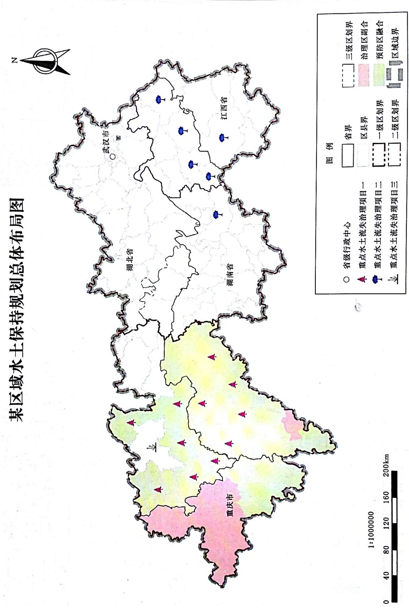

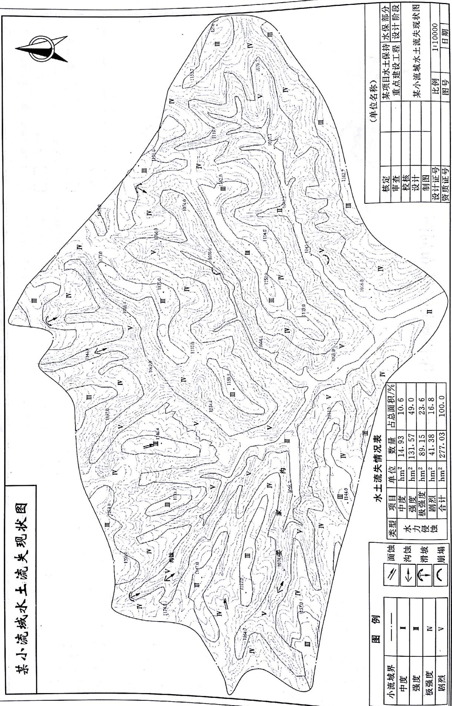  
-

<table><tr><td rowspan=1 colspan=6>地类及水土保持措施统计表</td></tr><tr><td rowspan=1 colspan=1>措施名称</td><td rowspan=1 colspan=1>单位</td><td rowspan=1 colspan=1>数量</td><td rowspan=1 colspan=1>措施名称</td><td rowspan=1 colspan=1>单位</td><td rowspan=1 colspan=1>数量</td></tr><tr><td rowspan=1 colspan=1>梯田</td><td rowspan=1 colspan=1>hm²</td><td rowspan=1 colspan=1>34.25</td><td rowspan=1 colspan=1>灌木林地</td><td rowspan=1 colspan=1>hm2</td><td rowspan=1 colspan=1>26.15</td></tr><tr><td rowspan=1 colspan=1>坝地</td><td rowspan=1 colspan=1>hm²</td><td rowspan=1 colspan=1>10.69</td><td rowspan=1 colspan=1>人工草地</td><td rowspan=1 colspan=1>hm2</td><td rowspan=1 colspan=1>34.25</td></tr><tr><td rowspan=1 colspan=1>坡耕地</td><td rowspan=1 colspan=1>hm²</td><td rowspan=1 colspan=1>16.80</td><td rowspan=1 colspan=1>荒草地</td><td rowspan=1 colspan=1>hm2</td><td rowspan=1 colspan=1>113.40</td></tr><tr><td rowspan=1 colspan=1>乔木林地</td><td rowspan=1 colspan=1>hm²</td><td rowspan=1 colspan=1>0.92</td><td rowspan=1 colspan=1>居民及交通用地</td><td rowspan=1 colspan=1>hm²</td><td rowspan=1 colspan=1>17.93</td></tr><tr><td rowspan=1 colspan=1>经济林地</td><td rowspan=1 colspan=1>hm²</td><td rowspan=1 colspan=1>25.69</td><td rowspan=1 colspan=1>难利用地</td><td rowspan=1 colspan=1>hm²</td><td rowspan=1 colspan=1>7.44</td></tr></table>

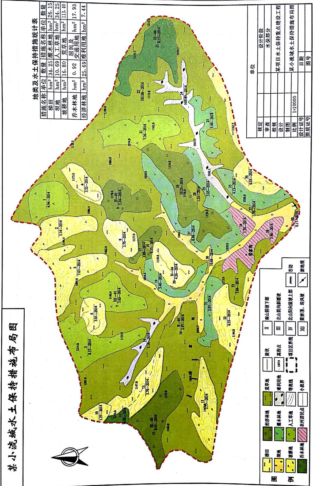  
局 εD3

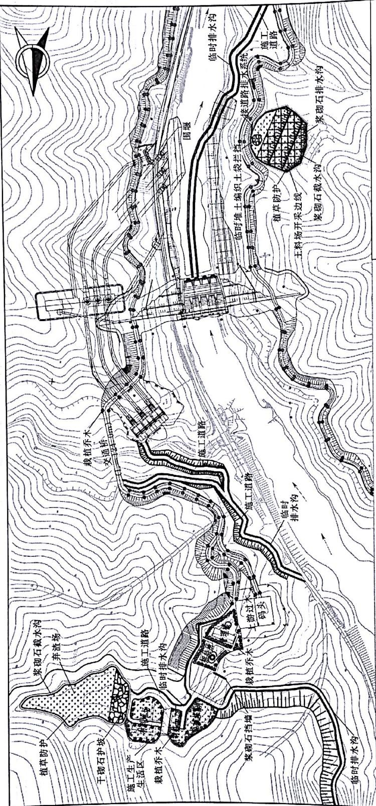

<table><tr><td rowspan=2 colspan=16>水土流失防治分区及措施总体布局表                             图例</td><td rowspan=1 colspan=5>(单位名称)</td></tr><tr><td rowspan=1 colspan=1></td><td rowspan=1 colspan=1>核定</td><td rowspan=1 colspan=2></td><td rowspan=1 colspan=1></td><td rowspan=1 colspan=1>(设计阶段)       设计</td></tr><tr><td rowspan=1 colspan=1>防治分区</td><td rowspan=1 colspan=1>泰第类型</td><td rowspan=1 colspan=1>防治措施</td><td rowspan=1 colspan=2>防治分区</td><td rowspan=1 colspan=1>措施类型</td><td rowspan=1 colspan=1>防治清施</td><td></td><td rowspan=1 colspan=2>挡土墙</td><td rowspan=1 colspan=1>2</td><td rowspan=1 colspan=1>栽植乔木</td><td rowspan=1 colspan=2>#</td><td rowspan=1 colspan=2></td><td rowspan=1 colspan=1></td><td rowspan=1 colspan=1>审查</td><td rowspan=1 colspan=2></td><td rowspan=1 colspan=1></td><td rowspan=1 colspan=1>(水土保持)       部分</td></tr><tr><td rowspan=3 colspan=1>库坝区</td><td rowspan=1 colspan=1>工程绣施</td><td rowspan=1 colspan=1>坝坡排水系统、场地平整</td><td rowspan=2 colspan=2>土料场</td><td rowspan=2 colspan=1>工程抵施</td><td rowspan=2 colspan=1>浆砌石藏排水沟、方格护坡、场地平整</td><td></td><td rowspan=1 colspan=2>浆砌石截水沟</td><td rowspan=1 colspan=1></td><td rowspan=1 colspan=1>临时排水沟</td><td rowspan=1 colspan=2></td><td rowspan=1 colspan=2></td><td></td><td></td><td></td><td></td><td></td></tr><tr><td rowspan=1 colspan=1>植衡挤施</td><td rowspan=1 colspan=1>坝外坡植草防护、上坝方道路裁植乔木</td><td rowspan=1 colspan=1></td><td></td><td rowspan=1 colspan=2>植草防护</td><td rowspan=1 colspan=1></td><td rowspan=1 colspan=1>干砌石护坡</td><td rowspan=1 colspan=2>RB4D</td><td rowspan=1 colspan=2></td><td rowspan=1 colspan=1>校核</td><td rowspan=1 colspan=2></td><td rowspan=1 colspan=1></td><td rowspan=9 colspan=1></td></tr><tr><td rowspan=1 colspan=1>临时措施</td><td rowspan=1 colspan=1>编织土袋栏挡、临时排水沟</td><td rowspan=1 colspan=1></td><td></td><td rowspan=1 colspan=1>植物括施</td><td rowspan=1 colspan=1>铺草皮、植草防护</td><td></td><td rowspan=1 colspan=2>方格护坡</td><td rowspan=1 colspan=1></td><td></td><td></td><td></td><td></td><td></td><td></td><td></td><td></td><td></td></tr><tr><td></td><td></td><td></td><td></td><td></td><td></td><td rowspan=7 colspan=1>编织土袋拦挡</td><td></td><td></td><td></td><td></td><td></td><td></td><td></td><td></td><td></td><td></td><td></td><td></td><td></td></tr><tr><td></td><td></td><td></td><td></td><td></td><td></td><td></td><td></td><td></td><td></td><td rowspan=5 colspan=1>编织土袋拦挡</td><td></td><td></td><td></td><td></td><td></td><td></td><td></td><td></td></tr><tr><td></td><td></td><td></td><td></td><td></td><td rowspan=5 colspan=1>临时纸施</td><td></td><td></td><td></td><td></td><td></td><td></td><td></td><td></td><td></td><td></td><td></td><td></td></tr><tr><td></td><td></td><td></td><td></td><td></td><td></td><td></td><td></td><td></td><td rowspan=3 colspan=2>8</td><td rowspan=3 colspan=2></td><td></td><td></td><td></td><td></td></tr><tr><td></td><td></td><td></td><td rowspan=3 colspan=2></td><td></td><td></td><td></td><td></td><td></td><td></td><td></td><td></td></tr><tr><td></td><td></td><td></td><td></td><td></td><td></td><td></td><td rowspan=1 colspan=1>设计</td><td rowspan=1 colspan=2></td><td rowspan=1 colspan=1></td></tr><tr><td rowspan=3 colspan=1>施工道路区</td><td rowspan=1 colspan=1>工程纸施</td><td rowspan=1 colspan=1>场地平整</td><td></td><td></td><td></td><td></td><td></td><td></td><td></td><td></td><td></td><td></td><td></td><td></td><td></td></tr><tr><td rowspan=2 colspan=1>临时措施</td><td rowspan=2 colspan=1>临时排水沟、沉沙池</td><td rowspan=3 colspan=2></td><td rowspan=2 colspan=1></td><td rowspan=3 colspan=1>工程插施</td><td rowspan=3 colspan=1>浆砌石挡墙、紫砌石戴水沟、干砌石护坡</td><td></td><td></td><td></td><td></td><td></td><td></td><td></td><td></td><td></td><td></td><td></td><td></td><td></td><td></td></tr><tr><td rowspan=3 colspan=9>说明：1. 本图高程采用珠江基面高程系，等高线间距5m。2. 本项目水土流失分区划分为库坝区、施工道路区、</td><td rowspan=1 colspan=1>制图</td><td rowspan=1 colspan=2></td><td rowspan=1 colspan=1></td><td rowspan=2 colspan=1>某水利枢纽水土保持措施总体布置图</td></tr><tr><td rowspan=5 colspan=1>施工生产生活区</td><td rowspan=1 colspan=1>工程措施</td><td rowspan=1 colspan=1>场地平签</td><td rowspan=1 colspan=3>路区</td><td rowspan=1 colspan=1>比例</td><td rowspan=1 colspan=2></td><td rowspan=1 colspan=1></td></tr><tr><td rowspan=1 colspan=1>植物括施</td><td rowspan=1 colspan=1>栽植乔木、植被恢复</td><td rowspan=1 colspan=1></td><td rowspan=1 colspan=1></td><td rowspan=1 colspan=1>植物饹施</td><td rowspan=1 colspan=1>植草防护</td><td rowspan=1 colspan=2>2.</td><td></td><td></td><td></td><td></td><td></td></tr><tr><td rowspan=3 colspan=1>临时清施</td><td rowspan=3 colspan=1>临时排水沟、沉沙池</td><td rowspan=3 colspan=2></td><td rowspan=3 colspan=1>临时措施</td><td rowspan=3 colspan=1>临时排水沟、编织土袋拦挡</td><td rowspan=3 colspan=7>施工生产生活区、土料场、弃渣场5个分区。</td><td></td><td></td><td></td><td></td><td></td><td></td><td></td></tr><tr><td rowspan=2 colspan=3></td><td rowspan=2 colspan=2></td><td></td><td></td><td></td><td></td><td></td></tr><tr><td rowspan=1 colspan=2>设计证号</td><td rowspan=1 colspan=2></td><td rowspan=1 colspan=1></td></tr><tr><td rowspan=1 colspan=16>3. 本图比例尺为1:5000。</td><td rowspan=1 colspan=2>资质证号</td><td rowspan=1 colspan=2></td><td rowspan=1 colspan=1>图号</td></tr></table>

热图

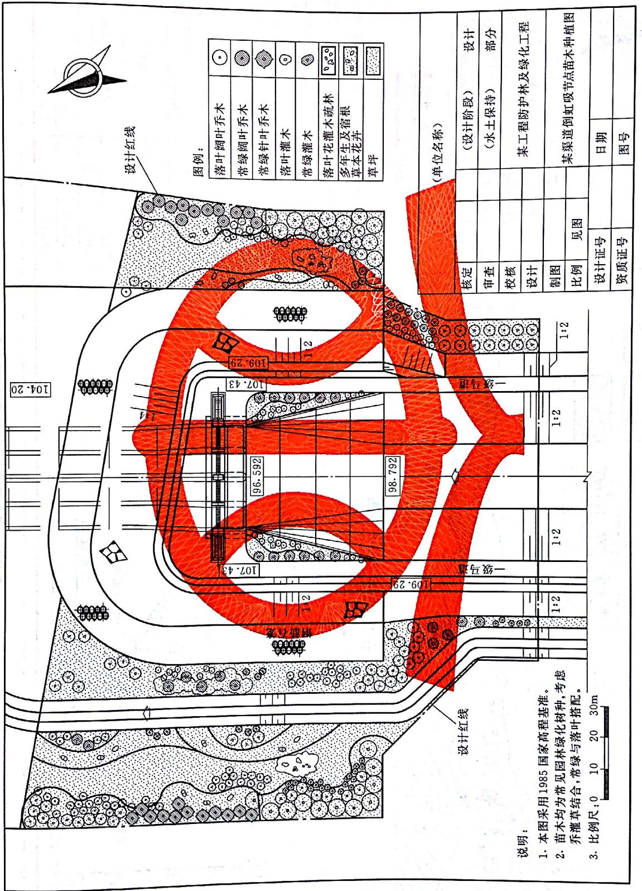

<table><tr><td>图例 复耕 覆土 ××村 灌木 弃土(清) 种草 排水沟 挡土墙 10300 8000 2300 130 弃土顶 边坡种植紫穗愧、 125 面复耕又138.0 狗牙根草防护 ×× 浆砌石坡 138.9顶面复耕 脚排水沟 0000 紫砌右 0080 ·乌道宽3m 顶面复 覆土厚400 挡透墙 牙根 038.0 A 2 134.01 弃土(渣)M7.5浆砌石 地面 8 130 浆砌石排水沟 B—B 剖面图 比例尺0 2 4 6m 某弃渣场水土保持措施总图布置图</td></tr></table>

图量置图

<table><tr><td></td><td></td><td></td><td></td><td></td><td></td><td></td><td></td><td></td><td rowspan=1 colspan=1>林种</td><td rowspan=1 colspan=2>树(草)种</td><td rowspan=1 colspan=1>株距</td><td rowspan=1 colspan=2>行距单</td><td rowspan=1 colspan=5>位面积定植点数量</td><td rowspan=1 colspan=2>苗龄及等级</td><td rowspan=1 colspan=2>种植方法</td><td rowspan=1 colspan=1>需苗量</td></tr><tr><td></td><td></td><td></td><td></td><td></td><td></td><td></td><td></td><td></td><td rowspan=1 colspan=1></td><td rowspan=1 colspan=2></td><td rowspan=1 colspan=1></td><td rowspan=1 colspan=2></td><td rowspan=1 colspan=5></td><td rowspan=1 colspan=2></td><td rowspan=1 colspan=2></td><td rowspan=1 colspan=1></td></tr><tr><td></td><td></td><td></td><td></td><td></td><td></td><td></td><td></td><td></td><td></td><td></td><td rowspan=1 colspan=1>项目</td><td rowspan=1 colspan=4>时间</td><td rowspan=1 colspan=3>方式</td><td rowspan=1 colspan=4>规格与要求</td><td></td><td></td></tr><tr><td></td><td></td><td></td><td></td><td></td><td></td><td></td><td></td><td></td><td></td><td></td><td rowspan=1 colspan=1>整地</td><td rowspan=1 colspan=4></td><td rowspan=1 colspan=3>水平阶</td><td rowspan=1 colspan=4></td><td></td><td></td></tr><tr><td></td><td></td><td></td><td></td><td></td><td></td><td></td><td></td><td></td><td></td><td></td><td rowspan=1 colspan=1>种植</td><td rowspan=1 colspan=4></td><td rowspan=1 colspan=3></td><td rowspan=1 colspan=4></td><td></td><td></td></tr><tr><td></td><td></td><td></td><td></td><td></td><td></td><td></td><td></td><td></td><td></td><td></td><td rowspan=1 colspan=1>抚育</td><td rowspan=1 colspan=4></td><td rowspan=1 colspan=3></td><td rowspan=1 colspan=4></td><td></td><td></td></tr><tr><td rowspan=5 colspan=1>究</td><td rowspan=5 colspan=1>日OOOOC</td><td rowspan=5 colspan=1></td><td rowspan=5 colspan=1>OOSOO日</td><td rowspan=5 colspan=1></td><td rowspan=5 colspan=1>+OOOO8</td><td rowspan=5 colspan=1></td><td rowspan=5 colspan=1></td><td></td><td></td><td></td><td></td><td></td><td></td><td></td><td></td><td></td><td></td><td></td><td></td><td></td><td></td><td></td><td></td><td></td></tr><tr><td></td><td></td><td></td><td></td><td></td><td></td><td rowspan=1 colspan=11>(单位名称)</td></tr><tr><td></td><td></td><td></td><td></td><td></td><td></td><td rowspan=1 colspan=2>核定</td><td rowspan=1 colspan=2></td><td rowspan=1 colspan=2></td><td rowspan=1 colspan=5>(设计阶段)        设计</td></tr><tr><td></td><td></td><td></td><td></td><td></td><td></td><td rowspan=1 colspan=2>审查</td><td rowspan=1 colspan=2></td><td rowspan=1 colspan=2></td><td rowspan=1 colspan=5>(水土保持)       部分</td></tr><tr><td></td><td></td><td></td><td></td><td></td><td></td><td rowspan=1 colspan=2>校核</td><td rowspan=1 colspan=2></td><td rowspan=1 colspan=2></td><td rowspan=2 colspan=5>(工程名)</td></tr><tr><td></td><td></td><td></td><td></td><td></td><td></td><td></td><td></td><td></td><td></td><td></td><td></td><td></td><td></td><td rowspan=1 colspan=2>设计</td><td rowspan=1 colspan=2></td><td rowspan=1 colspan=2></td></tr><tr><td></td><td></td><td></td><td></td><td></td><td></td><td></td><td></td><td></td><td></td><td></td><td></td><td></td><td></td><td rowspan=1 colspan=2>制图</td><td rowspan=1 colspan=2></td><td rowspan=1 colspan=2></td><td rowspan=2 colspan=5>造林种草典型设计图</td></tr><tr><td></td><td></td><td></td><td></td><td></td><td></td><td></td><td></td><td></td><td></td><td></td><td></td><td></td><td></td><td rowspan=1 colspan=2>比例</td><td rowspan=1 colspan=2></td><td rowspan=1 colspan=2></td></tr><tr><td></td><td></td><td></td><td></td><td></td><td></td><td></td><td></td><td></td><td></td><td></td><td></td><td></td><td></td><td rowspan=1 colspan=3>设计证号</td><td rowspan=1 colspan=3></td><td rowspan=1 colspan=1>日期</td><td rowspan=1 colspan=4></td></tr><tr><td></td><td></td><td></td><td></td><td></td><td></td><td></td><td></td><td></td><td></td><td></td><td></td><td></td><td></td><td rowspan=1 colspan=3>资质证号</td><td rowspan=1 colspan=3></td><td rowspan=1 colspan=1>图号</td><td rowspan=1 colspan=4>附图×</td></tr></table>

<table><tr><td colspan="7">某水利水电勘测设计院</td></tr><tr><td>批准</td><td></td><td></td><td rowspan="2" colspan="2">某梯级水电站工程</td><td>施工图</td><td>设计</td></tr><tr><td>核定</td><td></td><td></td><td>水土保持</td><td>部分</td></tr><tr><td>审查</td><td></td><td></td><td rowspan="4" colspan="3">一级电站厂区及进厂公路边坡植 物措施布置图</td></tr><tr><td>校核</td><td></td><td></td></tr><tr><td>设计</td><td></td><td></td></tr><tr><td>制图</td><td></td><td></td></tr><tr><td>设计证场</td><td colspan="2"></td><td>比例</td><td></td><td>日期</td></tr><tr><td>资质证号</td><td colspan="2"></td><td>图号</td><td colspan="2"></td></tr></table>

换热护热8-A图  
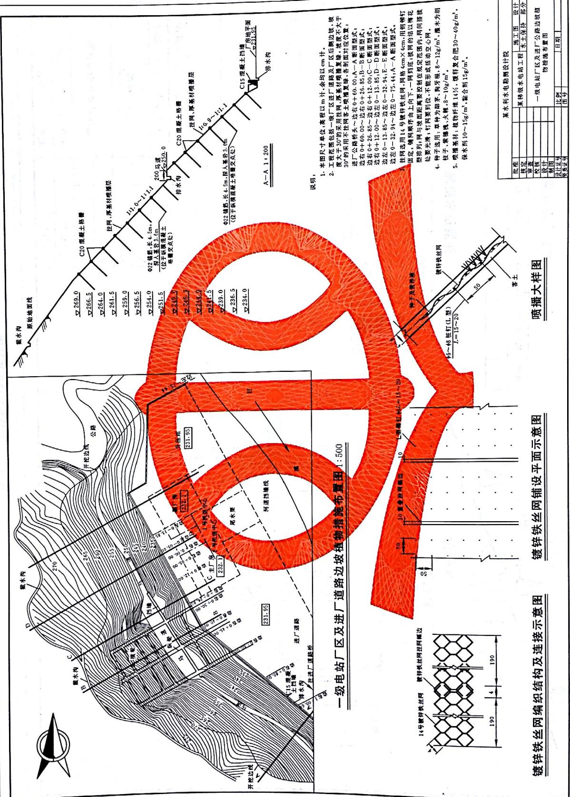

## 标准用词说明

<table><tr><td rowspan=1 colspan=2></td></tr><tr><td rowspan=1 colspan=1>必须</td><td rowspan=2 colspan=1>很严格，非这样做不可</td></tr><tr><td rowspan=1 colspan=1>严禁</td></tr><tr><td rowspan=1 colspan=1>应</td><td rowspan=2 colspan=1>严格，在正常情况下均应这样做</td></tr><tr><td rowspan=1 colspan=1>不应、不得</td></tr><tr><td rowspan=1 colspan=1>宜</td><td rowspan=2 colspan=1>允许稍有选择，在条件许可时首先这样做</td></tr><tr><td rowspan=1 colspan=1>不宜</td></tr><tr><td rowspan=1 colspan=1>可</td><td rowspan=1 colspan=1>有选择，在一定条件下可以这样做</td></tr></table>

# 标准历次版本编写者信息

SL 73.6—2001

本标准主编单位：水利部水土保持司

本标准参编单位：山西农业大学水土保持规划设计研究所

水利部水土保持监测中心

长江水利委员会水土保持局

陕西省水土保持局

本标准主要起草人：焦居仁 蔡建勤 姜德文 王治国

宋惠玲 王禹生 张大全 段喜明

王春红牛志明

# 中华人民共和国水利行业标准

# 水利水电工程制图标准水土保持图

SL 73. 6—2015

条文说明

## 目 次

4.1 综合图件…………  
4.2工程措施图件……………… …………………64  
4.3 植物措施图件……………………  
5.1 一般规定  
5.2 通用图例  
5.3 综合图例  
5.6 植物措施图例…………  
5.9监测图例…………  
附录 A 综合图件色标 ………………………67  
附录C 树种图例代码表

## 1总则

1.0.1 本条阐述了本标准修订的目的和意义。2001年颁布实施的SL73.6—2001《水利水电工程制图标准 水土保持图》历经十余年的实践应用，随着国民经济的发展和水土保持工作要求的提高，已1.0.2 本条明确了本标准的适用范围。水土保持生态建设是指为保护与改善生态而进行的水土流失防治活动，主要指区域或流域的水土流失综合治理、淤地坝建设、坡改梯、封育治理、崩岗治理等。生产建设项目是指直接用于物质生产或直接为物质生产服务的建设项目，主要包括以下四类：①工业建设，包括工业国防和能源建设；②农业建设，包括农、林、牧、渔、水利建设；③基础设施建设，包括交通、邮电、通信建设，地质普查、勘探建设，建筑业建设等：④商业建设，包括商业、饮食、营销、仓储、综合技术服务事业的建设。

## 2 术语

2.0.1 水土保持图中经常涉及小班，特别是规划图和平面图的绘制，与小班有着密切的关系。小班，起源于林学，引申到水土保持制图中，将土地利用类型、水土流失类型、水土流失强度、水土保持措施、立地类型、设计条件等相同的地块划分为一个小班。

2.0.2 随着水土保持工程要求的提高及计算机辅助制图技术的发展，水土保持制图中对色标的规定需进一步规范，本次修订术语中补充了色标的定义。

2.0.3水土保持图中除常用的图例、符号外，常需辅以各种文字或数字进行补充说明，本次修订术语中补充了注记的定义。

## 3基本规定

本章节为本次标准修订后新增内容，列出了水土保持制图共性的要求，并将原标准“3.2通用图式”和“3.3综合图式”中的部分内容放到本节。取消了原标准中关于“立式使用的A4图幅应为底部通栏”的表述。将原标准“图式”中3.2通用图式的部分内容放到本节。

3.0.2 综合图件的上方习惯加注较大字号的图名，可置于图框之外，不作严格规定，但根据水土保持综合图绘制的惯例，文字要求规范、清晰，做到美观、大方。

3.0.3 标题栏均位于图纸的右下角，图框格式分成不留装订边和留有装订边两种，与SL 73.1一  
2013《水利水电工程制图标准 基础制图》保持一致，图3.0.3-1中尺寸a、c、e、B、L取值按SL  
73.1—2013中表3.1.2执行，基本图幅及图框尺寸见表1。

表1 基本幅面及图框尺寸

单位：mm

<table><tr><td rowspan=1 colspan=1>幅面代号</td><td rowspan=1 colspan=1>A0</td><td rowspan=1 colspan=1>A1</td><td rowspan=1 colspan=1>A2</td><td rowspan=1 colspan=1>A3</td><td rowspan=1 colspan=1>A4</td></tr><tr><td rowspan=1 colspan=1>BXL</td><td rowspan=1 colspan=1>841×1189</td><td rowspan=1 colspan=1>594×841</td><td rowspan=1 colspan=1>420×594</td><td rowspan=1 colspan=1>297×420</td><td rowspan=1 colspan=1>210×297</td></tr><tr><td rowspan=1 colspan=1>e</td><td rowspan=1 colspan=2>20</td><td rowspan=1 colspan=3>10</td></tr><tr><td rowspan=1 colspan=1>C</td><td rowspan=1 colspan=3>10</td><td rowspan=1 colspan=2>5</td></tr><tr><td rowspan=1 colspan=1>a</td><td rowspan=1 colspan=5>25</td></tr></table>

标题栏根据SL73.1一2013中的标题栏进行了修改，“专业大类”部分改为“水土保持”部分，A0图幅和A1图幅标题栏增加了“资质证号”栏，A2～A4图幅标题栏增加了“资质证号”栏和“日期”栏，并将“图号”栏下移一行，各图幅标题栏长度与SL73.1—2013一致，高度增加7mm。涉外工程图未做调整，以SL73.1—2013为准，不列入本标准。 2

因各使用单位的习惯不同，标题栏中的批准、核定、审查等用语，各单位可根据自身的规定做相应改变。标题栏中的“制图”栏，在采用计算机制图时，需按本标准规定的要求输入图面基本信息。当为手工制图时，则改为“描图”的签署栏。

标题栏中“水土保持”部分，可根据项目类型不同作相应改变，生产建设项目为“水土保持”部分，水土保持生态建设项目可为“小流域治理”部分、“淤地坝”部分、“工程措施”部分、“林草措施”部分、“封育治理措施”部分等。

3.0.5 水土保持工程措施图幅及图幅加长、微缩复制等，按照 SL 73.1—2013 中“3.1 图纸幅面”执行，水土保持其他图件图幅，考虑到实际中治理范围不规则等因素，相关单位可根据具体情况采用图幅大小。

## 4 图件

## 4.1 综合图件

4.1.1 综合图件包括水土保持区划（分区）图或土壤侵蚀分区图、重点小流域分布图、水土流失类型及现状图、水土保持现状图、土地利用和水土保持措施现状图、土壤侵蚀类型和水土流失强度分布图、水土保持工程总体布置图或综合规划图水土保持区划（分区）图、水土流失重点预防区和重点治理区划分图、地理位置及规划范围图、典型小流域土地利用现状图、水土保持措施总体布置图、项目区地貌与水系图、水土流失防治责任范围图、水土保持监测点位布局（置）图]等综合性图。

综合图件的比例尺根据水土保持有关规范确定，其中1：2000比例尺的总体布置图主要是在生产建设项目水土保持方案中采用，规划设计面积较小时也可采用

4.1.2 坐标网精度的取舍可根据实际需要确定。较小比例尺的图件， 仅在图件为非正北方向时才绘出指北针。

4.1.3 在小班上填注图例时，应根据小班面积大小，确定填注图例的多少，一般填1～2个。1个时，图例符号在左；2个时则一个在左，一个在右；多个时均匀布置，以美观为原则。小班注记一般是与图例填注一起进行的，应做到合理布置。注记格式是在总结水土保持、林业、土地等行业注记的基础上确定的。

2 控制面积是指图斑测算平差后的面积。

4.1.5 水土保持综合图件习惯上经常着色，日的是为了更加醒目地反映规划设计的内容。由于现在计算机制图已经很普遍，故色标是根据计算机上的调色板制定的，具体应用时色调、饱和度、亮度可做适当的调整，但要求主色调不变，以美观、醒目，能很好地反映规划设计的内容为原则。

4.1.6 地理要素是地图的地理内容，包括表示地球表面自然形态所包含的要素，如地貌、水系、

植被和土壤等自然地理要素与人类在生产活动中改造自然界所形成的要素，如居民地、道路网、通信设备、工农业设施、经济文化和行政标志等社会经济要素。水土保持制图时，底图可根据实际需要对上述地理要素进行取舍。必要时，也可结合卫星影像进行作图。

5“分区标出监测站网（点位位置名称或代码”中的“分区”，在生产建设项目中指“防治区”，而在区域、流域规划中，“分区”指“区划”或“水土流失重点预防区和重点治理区”。4.1.9

6 弃渣（土、石）场、料场等综合防治措施布置图中反映周边重要建筑物和居民点，其“周边”具体范围的界定和弃渣场安全距离有关。

## 4.2工程措施图件

4.2.1 本条规定了水土保持工程措施总平面布置图的原则性要求，是参照 SL 73.1—2013 确定的。

4.2.3 本条规定是根据水土保持工程规划设计图的常用比例选择确定的。

## 4.3植物措施图件

4.3.1 水土保持植物措施的规划设计一般是在底图上进行的，因此，图件要求与综合图件基本保持一致。

4.3.4 在参照园林有关规范的基础上，对涉及景观、游憩要求的植物措施图件做了一般性规定，除本规定外，其他详细内容与要求应按园林设计有关标准执行。

## 5 图例

## 5.1 一 般规定

5.1.1 本条将图例分为通用图例、综合图例、工程措施图例、耕作措施图例、植物措施图例、临时措施图例、监测设施图例6类，主要是为了满足不同设计阶段对图例的要求及便于查找。

5.1.2 为了既与SL 73—2013 衔接，而又减少搭接，对能够适用于水土保持图要求的图例，一般不再列入本标准。

5.1.3 水土保持植物措施设计中涉及很多方面，如树种、草种、混交方式及多种整地方式，本标准很难全面覆盖，有些图例本标准未收录的，如实际需要，除符合本标准的规定外，还应遵循林业图式和园林有关标准。

## 5.2通用图例

5.2.2 本条所列图例是根据水土保持图要求增列的。其中，水土流失重点预防区和重点治理区界、大流域界或水系界、水土流失类型区或水土保持分区界则一般适用于比例尺不大于1：50000的图件；村界、厂矿征地或用地界、水土流失防治责任区界则一般适用于比例尺为1：10000～1：1000的图件。SL73—2013中适用于水上保持的图例，本标准未列入。

5.2.3 道路及附属设施图例主要适用于比例尺为1：10000\~1：1000的水土保持措施总体布置图或规划图，是根据GB/T20257《国家基本比例尺地图图式》，结合水土保持的要求制定的，图例中有少量与SL73—2013搭接，但也有一定的区别。

5.2.5 本条列入的是水土保持图中常用的水系及附属建筑物图例。为了保证其有一定的系统性，引用了SL73—2013中的部分图例，如水闸、丁坝等。主要应用于比例尺为1：1000～1：10000的总体规划或布置图。

5.3综合图例

5.3.1 综合图例是水土保持规划设计使用频率最高的图例，均系增列图例。

5.3.2 土地利用类型图例是水土保持图的最基本图例，主要应用于小班填充注记，与 SL 73—2013不同。按小班进行土地利用现状调查、规划设计时均应按本规定绘制。具体制图时应根据设计的内容和精度要求，选择确定地类划分粗细，并选取相应的图例。

5.3.3\~5.3.5 本图例仅应用于水土流失调查图、水土流失类型分布图和土壤侵蚀强度或程度分布图的绘制，不应在工程地质调查中使用，工程地质调查应按SL 73.32013执行。

5.3.6 本条所列图例主要适用于不大于1：50000的大区域小比例尺的水土保持图件。

5.3.7 本条所列图例适用于不同设计阶段的生产建设项目水土保持图件。

5.3.8 考虑到水土保持综合治理和生态环境建设工程的规划设计，经常与农业、林业、牧业、农产品加工业交叉，故制定本图例。本条不能满足应用要求时，可遵循国家或行业的有关规范和标准。

## 5.4工程措施图例

5.4.2 主要话用于比例尺为1：10000～1：1000的水土保持措施平面布置图。

5.4.3 生产建设项目水土保持工程涉及行业很多，各行业对同一工程的图例表述略有不同，为了保证水+保持方案设计的标准化，部分图例引自SL73—2013。

材料，保证其完整性，部分引用了SL73—2013中的图例。此外，土工织物、水泥喷浆等新技术在水

土保持上得到了广泛应用，也列入其中。

## 5.5耕作措施图例

5.5.2 水土保持耕作措施在规划设计图中较少反映，但作为一项重要的水土保持措施，本条仍分3个大类及11个小类措施的符号。

## 5.6植物措施图例

5.6.2 常规水土保持植物措施图例目前生产应用较多，但比较混乱，本条对此做了较为详细的规定。

1 林种除引用GB/T16453.1～6《水土保持综合治理 技术规范》规定的林种外，为了适应国家生态环境建设的需要，根据有关资料和生产实践的应用情况，进行了细化，并创制图例。使用时应根据规划设计要求的内容和精度选择。林种图例适用于大区域小比例尺的规划设计，一般相当于县级以上的区域，比例尺不大于1：50000。

3 树（草）种种植典型设计的树（草）种剖面图例一般比较大，且图样上均注明树种名称。因此，只列出树（草）种的分类剖面图例，同一类树种采用一种图例，图例亦不规定大小，可根据图幅大小与图样布置，以美观合理为原则。典型设计平面图采用表5.6.2-3中的平面图例。

4 本款适用于水土保持植物措施施工设计的平面布置图，整地方式主要列入在生产中已成熟的方式，近年来出现的一些新的整地方式，如“径流整地”“双坡整地”等尚未在生产中广泛应用，故未列人。

在施工图中，整地方式与树种可联合使用。如树种为油松，其整地方式为水平沟，可表示为。

5.6.3 园林式种植工程平面设计图例主要应用于1：500～1：20的大比例尺平面设计图。

## 5.9 监测图例

5.9.1 本条所列图例主要适用于水土流失监测站网布置图及其他相关图。

## 附录A综合图件色标

表A-2“水土保持土地利用现状色标表”中规定了各级土地利用类型色标的RGB值。在制图时，色标应与本标准中表5.3.2土地利用类型相应图例结合使用。

## 附录C树种图例代码表

本标准5.6节中涉及的树草种图例的脚注或填注符号应按本附录表C执行，表中未涉及树种的符号应先选用树种名称首字的汉语拼音的第1个字母；如有重复再加注树种名称中第2个汉字拼音的第1个字母；如果仍有重复，采用树种名称首字的前两个字母表达。同一类树种不得与表C中字母重复。如杜松属于针叶树类先选用D，无重复，即采用。又如黄山松，选用H，与红松重复，再选用HS，与华山松重复，故选用HU。

# 水利水电技术标准咨询服务中心简介中国水利水电出版社标准化出版分社

中国水利水电出版社，一个创新、进取、严谨、团结的文化团队，一家把握时代脉搏、紧跟科技步伐、关注社会热点、不断满足读者需求的出版机构。作为水利部直属的中央部委专业科技出版社，成立于1956年，1993年荣膺首批“全国优秀出版社”的光荣称号。经过多年努力，现已发展成为一家以水利电力专业为基础、兼顾其他学科和门类，以纸质书刊为主、兼顾电子音像和网络出版的综合性出版单位，迄今已经出版近三万种、数亿余册（套、盘）各类出版物。

水利水电技术标准咨询服务中心（中国水利水电出版社标准化出版分社）是水利部指定的行业标准出版、发行单位，主要负责水利水电技术标准及相关出版物的出版、宣贯、推广工作，同时还负责水利水电类科技专著、工具书、文集及相关职业培训教材编辑出版工作。

感谢读者多年来对水利水电技术标准咨询服务中心的关注和垂爱，中心全体人员真诚欢迎广大水利水电科技工作者对标准、水利水电图书出版及推广工作多提意见和建议，我们将秉承“服务水电，传播科技，弘扬文化”的宗旨，为您提供全方位的图书出版咨询服务，进一步做好标准和水利水电图书出版、发行及推广工作。

主任：王德鸿010—68545951 电子邮件：wdh@waterpub.com.cn

副主任：陈昊010—68545981 电子邮件：hero@waterpub.com.cn

主任助理：王启010—68545982 电子邮件：wqi@waterpub.com.cn

责任编辑：王丹阳 010—68545974 电子邮件：wdy@waterpub.com.cn

章思洁 010—68545995 电子邮件：zsj@waterpub.com.cn

覃薇 010—68545889 电子邮件：qwei@waterpub.com.cn

刘媛媛010—68545948 电子邮件：lyuan@waterpub.com.cn

传 真：010—68317913