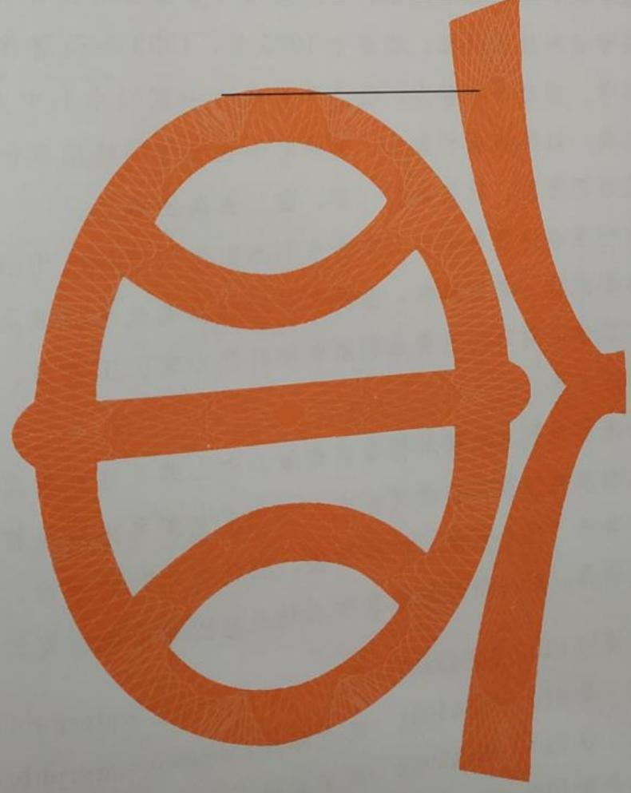

# 中华人民共和国水利行业标准

SL 773—2018

# 生产建设项目土壤流失量测算导则

# Guidelines for measurement and estimation of soil erosion in production and construction projects

2018-10-23 发布

2019-01-23 实施

# 中华人民共和国水利部

# 关于批准发布《生产建设项目土壤流失量测算导则》等3项水利行业标准的公告

2018年第9号

中华人民共和国水利部批准《生产建设项目土壤流失量测算导则》（SL773—2018）等3项为水利行业标准，现予以公布。

<table><tr><td rowspan=1 colspan=1>序号</td><td rowspan=1 colspan=1>标准名称</td><td rowspan=1 colspan=1>标准编号</td><td rowspan=1 colspan=1>替代标准号</td><td rowspan=1 colspan=1>发布日期</td><td rowspan=1 colspan=1>实施日期</td></tr><tr><td rowspan=1 colspan=1>1</td><td rowspan=1 colspan=1>生产建设项目土壤流失量测算导则</td><td rowspan=1 colspan=1>SL 773—2018</td><td rowspan=1 colspan=1></td><td rowspan=1 colspan=1>2018.10.23</td><td rowspan=1 colspan=1>2019.1.23</td></tr><tr><td rowspan=1 colspan=1>2</td><td rowspan=1 colspan=1>水利水电工程启闭机设计规范</td><td rowspan=1 colspan=1>SL 41—2018</td><td rowspan=1 colspan=1>SL 41—2011SL 491—2010SL 507—2010SL 508—2010</td><td rowspan=1 colspan=1>2018.10.23</td><td rowspan=1 colspan=1>2019.1.23</td></tr><tr><td rowspan=1 colspan=1>3</td><td rowspan=1 colspan=1>小水电电网技术管理规程</td><td rowspan=1 colspan=1>SL 528—2018</td><td rowspan=1 colspan=1>SL 526—2011SL 527—2011SL 528—2011</td><td rowspan=1 colspan=1>2018.10.23</td><td rowspan=1 colspan=1>2019.1.23</td></tr></table>

水利部

2018年10月23日

## 目次

前言……………………V  
范围1  
2 规范性引用文件…………………………………………………………………1  
3 术语和定义、符号…………………………………………………………………1  
3.1 术语和定义………………… 1  
3.2 符号……………… …3  
4 生产建设项目土壤流失类型划分………………………………………………………………………3  
5 生产建设项目土壤流失量测算流程…………………………………………………………………4  
5.1 划分扰动单元 4  
5.2 确定典型扰动单元 ……………………………………………4  
5.3 现场查勘………………………………………………………4  
5.4 划分计算单元 …………………… 5  
5.5 土壤流失量计算 ………………………………………………………………6  
6 水力作用下一般扰动地表土壤流失量测算…………………………………………………………6  
6.1 一般规定…………… 6  
6.2 植被破坏型一般扰动地表土壤流失量测算………………………………………………………………6  
6.3 地表翻扰型一般扰动地表土壤流失量测算 ……………………………………………………………11  
7 水力作用下工程开挖面土壤流失量测算……………………………………………………………11  
7.1 一般规定 ………………………………………11  
7.2 上方无来水工程开挖面土壤流失量测算 ………………………………………………………………12  
7.3 上方有来水工程开挖面土壤流失量测算………………………………………………………………12  
8 水力作用下工程堆积体土壤流失量测算………………………………………………………………13  
8. 1 般规定13  
8.2 上方无来水工程堆积体土壤流失量测算 ………………………………………………………………13  
8.3 上方有来水工程堆积体土壤流失量测算 ………………………………………………………………14  
风力作用下生产建设项目土壤流失量测算……………………………………………………………15  
9.1 般规定…………15  
9.2 风力作用下一般扰动地表土壤流失量测算……………………………………………………………15  
9.3 风力作用下工程堆积体土壤流失量测算 ……………………………………………………………18  
10 生产建设项目土壤流失量测算应用规定……………………………………………………………19  
10.1 在建生产建设项目土壤流失量测算规定………………………………………………………………19  
10.2 生产建设项目土壤流失量预测规定……………………………………………………………………20  
10.3 生产建设项目新增土壤流失量估算规定………………………………………………………………20  
附录A（资料性附录） 符号………………………………………………21  
附录B（资料性附录） 土质现场分类鉴别特征和土质各粒级含量………………………………24  
附录C（资料性附录） 全国各县级行政单元多年平均逐月和年降雨侵蚀力因子  
及土壤可蚀性因子参考值 …25  
附录D（资料性附录） 全国各县级行政单元多年平均逐月和年单位面积风蚀率……………93  
SL 773—2018  
表1 生产建设项目土壤流失类型划分…………………………………………………………………3  
表2 土壤结构等级取值表……………………………………………8  
表4 不同覆盖度草地、灌木林地植被覆盖因子参考值…………………………………………………9  
表 5 不同郁闭度和林下植被覆盖度乔木林地植被覆盖因子参考值……………………………………9  
表6 工程措施因子参考值………………………………………………………………………………10  
整地及种植方式因子T,参考值…………………………………………………………………10  
表7  
表8 轮作制度因子T2参考值……………………………………………………………………………10  
表9 上方无来水工程堆积体土石质因子系数取值表…………………………………………………14  
表10 上方无来水工程堆积体坡度因子系数取值表………………………………………………………14  
表11 上方无来水工程堆积体坡长因子系数取值表……………………………………………………14  
表12 上方有来水工程堆积体土石质因子系数取值表…………………………………………………15  
表13 上方有来水工程堆积体坡度因子系数取值表………………………………………………………15  
表14 上方有来水工程堆积体坡长因子系数取值表……………………………………………………15  
表15 风力作用下典型下垫面z。取值表 …………………………………………………………………16  
表16 风力作用下不同土壤类型风蚀可蚀性因子取值表………………………………………………18  
表17 风力作用下工程堆积体堆放方式因子取值表……………………………………………………18  
………………………………………………………………………………………21  
表A.1 符号………  
表B.1 土质现场分类鉴別特征表 ………………………………………………………………………24  
表B.2 土质各粒级含量对照表 …………………………………………………………………………24  
表C.1 全国各县级行政单元多年平均逐月和年降雨侵蚀力因子及土壤可蚀性因子参考值………25  
表 D.1 全国各县级行政单元多年平均逐月和年单位面积风蚀率……………………………………93

## 前言

根据水利技术标准制修订计划安排，按照GB/T1.1—2009《标准化工作导则 第1部分：标准的结构和编写》的有关规定，编制本标准。

本标准共包括10章和4个附录，主要包括以下技术内容：

——生产建设项目土壤流失类型划分；

——生产建设项目土壤流失量测算流程；

——水力作用下一般扰动地表、工程开挖面、工程堆积体等土壤流失量测算；

-风力作用下一般扰动地表、工程堆积体等土壤流失量测算；

——生产建设项目土壤流失量测算应用规定。

本标准为全文推荐。

本标准批准部门：中华人民共和国水利部

本标准主持机构：水利部水土保持司

本标准解释单位：水利部水土保持司

本标准起草单位：中国水利水电科学研究院

本标准参编单位：西北农林科技大学

长江水利委员会长江科学院

中国科学院寒区旱区环境与工程研究所

本标准出版、发行单位：中国水利水电出版社

本标准主要起草人：宁堆虎谢永生 屈建军张平仓秦伟王文龙程冬兵柳本立

刘孝盈 杜鹏飞 郭乾坤 骆 汉 俎瑞平 张瑞强 马洪超 王一峰

屈丽琴单志杰 王健宋文龙

本标准审查会议技术负责人：李 锐

本标准体例格式审查人：徐海峰

本标准在执行过程中，请各单位注意总结经验，积累资料，随时将有关意见和建议反馈给水利部国际合作与科技司（通信地址：北京市西城区白广路二条2号；邮政编码：100053；电话：010-63204533；电子邮箱：bzh@mwr.gov.cn)，以供今后修订时参考。

# 生产建设项目土壤流失量测算导则

## 1 范围

本标准规定了生产建设项目土壤流失类型划分、土壤流失量测算流程和应用规定，水力作用下生产建设项目的一般扰动地表、工程开挖面、工程堆积体等土壤流失量测算，风力作用下生产建设项目的一般扰动地表、工程堆积体等土壤流失量测算。

本标准适用于水力和风力作用下生产建设项目土壤流失量的事前预测、事中监测和事后计算。

## 2 规范性引用文件

下列文件对于本标准的应用是必不可少的。凡是注日期的引用文件，仅注日期的版本适用于本标准。凡是不注日期的引用文件，其最新版本（包括所有的修改单）适用于本标准。

## SL 419 水土保持试验规程

## 3 术语和定义、符号

## 3.1 术语和定义

下列术语和定义适用于本标准。

## 3.1.1

## 扰动地表 disturbed land surface

因生产建设活动挖填、占压、翻扰以及其他扰动方式破坏了原有植被、改变了原有地形或表层物质物理性状的土地。

## 3.1.2

## 扰动单元 disturbed unit

生产建设活动扰动形成的扰动方式相同、扰动强度相仿、土壤类型和质地相近、气象条件相似，以及空间上连续的扰动地表。

## 3.1.3

## 典型扰动单元 typical disturbed unit

以一定数量和抽样比例确定的，能够反映生产建设扰动情况，需要量测和调查其几何尺寸、地表覆盖、土壤类型和质地以及气象等参数，用于测算生产建设项目土壤流失量的扰动单元。

## 3.1.4

## 计算单元 calculation unit

按照扰动方式、坡度、坡长、地表覆盖、土壤类型和质地、气象条件等参数相对一致的原则，对各个典型扰动单元进行划分，能够直接应用生产建设项目土壤流失类型三级分类对应的土壤流失量测算公式计算流失量的基本单元。

## 3.1.5

## —般扰动地表 generally disturbed land surface

生产建设项目施工期和运行期，由挖损、占压等建设活动形成的林草植被减少、表层土壤物理性状改变，仍维持原有整体地形的扰动地表。

## 3.1.6

## 工程开挖面 bare slope due to excavation of project

生产建设项目施工期和运行期，因开挖造成的由土壤、成土母质或岩石构成的裸露坡面。

## 3.1.7

工程堆积体 congeries of project生产建设项目施工期和运行期产生的土、石、渣或其他固体物质组成的堆积体。

3.1.8 工程开挖面标准下垫面 standard underlying erosion surface for bare slope due to excavation of project of project 度50°田干对比观测土壤流失的

在工程开挖面的坡面上设置的宽为1m，水平坡长为5m，坡度为50°，用于对比观测土壤流失的全土质裸露下垫面。

## 3.1.9

## 工程堆积体标准下垫面 standard underlying erosion surface for congeries of project 工程堆积体标准下型面

在工程堆积体的坡面上设置的宽为1m，水平坡长为5m，坡度为25°，用于对比观测土壤流失的全土质裸露下垫面。

## 3.1.10

工程开挖面土质因子 soil and rock factor for bare slope due to exeavation of project

反映工程开挖面下垫面质地和土体密度对外营力剥蚀和搬动影响程度的指标。

## 3.1.11

工程堆积体土石质因子 soil and rock factor in congeries of project

反映工程堆积体物质被外营力剥蚀和搬运敏感程度的指标。

## 3.1.12

风蚀可蚀性因子wind erodibility factor

不同性质土壤对风蚀敏感程度的归一化指标。

## 3.1.13

## 坡长因子slope length factor

降雨、土壤、坡度、土地利用和水土保持措施等其他条件一致的情况下，一般扰动地表某一坡长坡面的土壤流失量与标准小区的土壤流失量之比；或降雨（径流）、土壤（石）、坡度等除坡长以外的其他条件一致的情况下，工程开挖面、工程堆积体某一坡长坡面的土壤流失量与标准下垫面的土壤流失量之比。

## 3.1.14

## 坡度因子 slope gradient factor

降雨、土壤、坡长、土地利用和水土保持措施等其他条件一致的情况下，一般扰动地表某一坡度坡面的土壤流失量与标准小区的土壤流失量之比；或降雨（径流）、土壤（石）、坡长等除坡度以外的其他条件一致的情况下，工程开挖面、工程堆积体某一坡度坡面的土壤流失量与标准下垫面的土壤流失量之比。

## 3.1.15

## 植被覆盖因子 vegetation cover factor

降雨、土壤、坡度、坡长等其他条件一致的情况下，有一定植被覆盖坡面上的土壤流失量与标准小区的土壤流失量之比。

## 3.1.16

## 工程措施因子 engineering measure factor

降雨、土壤、坡度、坡长等其他条件一致的情况下，有水土保持工程措施坡面上的土壤流失量与标准小区的土壤流失量之比。

## 3.1.17

## 耕作措施因子 tillage measure factor

降雨、土壤、坡度、坡长等其他条件一致的情况下，有水土保持耕作措施坡面上的土壤流失量与标准小区的土壤流失量之比。

## 3.1.18

径流冲蚀力因子 runoff scouring force factor

表征上方来水对坡面冲刷能力的指标。

## 3.1.19

起动风速 threshold wind speed

风力逐渐增加使地表颗粒物脱离静止状态开始运动时的临界风速。

## 3.1.20

粗糙干扰因子 roughness effecting factor

表征植被、砾石等地表覆盖对土壤风蚀削弱作用的指标。

## 3.2 符号

本标准中的符号见附录A。

## 4 生产建设项目土壤流失类型划分

4.1 生产建设项目土壤流失类型宜按表1划分。其中，一级分类依据侵蚀外营力划分，二级分类依据下垫面工程扰动形态划分，三级分类依据扰动程度、上方有无来水等因素划分。

表1 生产建设项目土壤流失类型划分
<table><tr><td rowspan=1 colspan=1>一级分类</td><td rowspan=1 colspan=1>二级分类</td><td rowspan=1 colspan=1>三级分类</td><td rowspan=1 colspan=1>说明</td></tr><tr><td rowspan=6 colspan=1>水力作用下的土壤流失</td><td rowspan=2 colspan=1>一般扰动地表</td><td rowspan=1 colspan=1>植被破坏型一般扰动地表</td><td rowspan=1 colspan=1>人为活动导致原有林草植被遭受破坏，地表植被覆盖减少或裸露，未扰动地表土壤，维持原有整体地形的扰动地表</td></tr><tr><td rowspan=1 colspan=1>地表翻扰型一般扰动地表</td><td rowspan=1 colspan=1>人为活动导致地表土壤翻动，原有植被覆盖明显减少或裸露，维持原有整体地形的扰动地表</td></tr><tr><td rowspan=2 colspan=1>工程开挖面</td><td rowspan=1 colspan=1>上方无来水工程开挖面</td><td rowspan=1 colspan=1>工程开挖面上缘已达到或越过分水岭，或在工程开挖面顶部有截排水沟等坡面径流拦截措施，不受上方来水冲刷侵蚀的开挖面</td></tr><tr><td rowspan=1 colspan=1>上方有来水工程开挖面</td><td rowspan=1 colspan=1>工程开挖面上缘未达到分水岭，且在工程开挖面顶部无截排水沟等坡面径流拦截措施，受上方来水冲刷侵蚀的开挖面</td></tr><tr><td rowspan=2 colspan=1>工程堆积体</td><td rowspan=1 colspan=1>上方无来水工程堆积体</td><td rowspan=1 colspan=1>在平地或坡面堆积，不受上方来水冲刷侵蚀的堆积体</td></tr><tr><td rowspan=1 colspan=1>上方有来水工程堆积体</td><td rowspan=1 colspan=1>在坡沟堆积或在平地堆积但顶部有较大平台，受降水和堆积体顶部以上来水共同侵蚀的堆积体</td></tr><tr><td rowspan=2 colspan=1>风力作用下的土壤流失</td><td rowspan=1 colspan=1>一般扰动地表</td><td rowspan=1 colspan=1></td><td rowspan=1 colspan=1></td></tr><tr><td rowspan=1 colspan=1>工程堆积体</td><td rowspan=1 colspan=1></td><td rowspan=1 colspan=1></td></tr></table>

4.2 水力作用下生产建设项目土壤流失可按一般扰动地表、工程开挖面、工程堆积体3种下垫面类型计算。未经夯实的工程回填面，可参照地表翻扰型一般扰动地表计算土壤流失量；未采取水土流失防治措施的碾压地表、填压面（填筑面），可参照工程开挖面计算土壤流失量。

4.3 风力作用下生产建设项目土壤流失可按一般扰动地表、工程堆积体2种下垫面类型计算。碾压地表的风蚀量可参考一般扰动地表进行计算。

## 5 生产建设项目土壤流失量测算流程

## 5.1 划分扰动单元

5.1.1 收集生产建设项目主体工程建设内容、建设规模、建设期、项目区地形、气象、植被等基础资料。 资料。 扰动强度相

5.1.2 根据5.1.1 收集的资料，确定生产建设项目扰动地表的范围。按扰动方式相同、扰动强度相仿、土壤类型和质地相近、气象条件相似、空间上相连续的原则，将生产建设项目的扰动地表划分为扰动单元。划分要求如下：

a）空间不连续的区域划分为不同的扰动单元。 a）全间不连续的区域划分为不间时仇动平元。

b）按年降雨量>800mm、800mm≥年降雨量>400mm、400mm≥年降雨量>200mm、年降雨量≤200mm的区间将不同年降雨量的区域划分为不同的扰动单元。

c）砂土、壤土、黏土等不同土壤质地划分为不同的扰动单元。

d）水力作用和风力作用等不同主导外营力作用的扰动地表划分为不同的扰动单元。

e)同一外营力作用下，一般扰动地表、工程开挖面、工程堆积体等不同类型划分为不同的扰动单元。

f）工程不同防治分区划分为不同的扰动单元。

5.1.3 将5.1.2划分的扰动单元划分为不同规模的扰动单元。具体划分要求如下：

a）一般扰动按扰动面积>10hm²、10hm²≥扰动面积>1hm²、扰动面积≤1hm²划分为大、中、小三个规模。

b)工程开挖面按挖方量>10万m3、10万m3≥挖方量>1万m³、挖方量≤1万 $\mathbf { m } ^ { 3 }$ 划分为大、中、小三个规模

c)工程堆积体按填方量>10万m³、10万m3≥填方量>1万m³、填方量≤1万 $\mathbf { m } ^ { 3 }$ 划分为大、中、小三个规模。

5.1.4 按5.1.2的分类和5.1.8的规模划分，逐一分类统计生产建设项目的扰动单元。

## 5.2 确定典型扰动单元

5.2.1 生产建设项目扰动单元数量小于等于20个时，全部扰动单元均应确定为典型扰动单元。

5.2.2 生产建设项目扰动单元数量大于20个时，宜以抽样方式确定典型扰动单元。抽样时：

a）按5.1.3划分的不同类型下的大、中、小规模分别抽样，抽样数量应不少于同一类型下同等规模扰动单元数量的10%。

b）涉及的各种类型和规模的扰动单元应至少选取1个。

c）抽样总数应不少于20个。

## 5.3 现场查勘

5.3.1 对确定的每个典型扰动单元应进行现场测量、取样和调查，包括以下内容：

a）长度、宽度、坡度。

b）植被类型、郁闭度、覆盖度，水土保持措施状况，砾石盖度。

c）物质组成和性状。

d）典型扰动单元上方汇水面积。

e）典型扰动单元所在区域的气象资料。

5.3.2 典型扰动单元几何尺寸可用下列工具测量：

a）长度、宽度采用皮尺、测距仪等。

b）坡度采用罗盘、坡度测定仪等。

5.3.3 植被郁闭度和覆盖度、砾石盖度可采用照相法或目估法等方法确定。

5.3.4 有实验条件时，可现场测定，或取样后带回实验室测定土体密度、机械组成、有机质、含水量、砾石重量百分数等所需的物质组成及性状；无实验条件时，应在现场通过手测法，按附录B表B.1和表B.2确定土壤质地和机械组成。

5.3.5典型扰动单元上方有汇水面时，依据汇水面积的大小，可采用皮尺、测距仪、GPS等工具量测，或通过遥感影像、地形图等资料计算。

5.3.6 气象参数宜通过下列优先顺序获取：

a）典型扰动单元附近安装的雨量计和风速仪等气象设备的监测数据。

b）距典型扰动单元最近的气象站数据。

c）典型扰动单元所在县域气象数据。

5.3.7 测量典型扰动单元的几何尺寸、植被郁闭度和覆盖度、砾石盖度等参数的时段应与发生土壤流失的时段相一致。

5.3.8 现场查勘典型扰动单元的长度、宽度、坡度，植被类型、郁闭度、覆盖度，水土保持措施状况，砾石盖度，物质组成和性状等相关参数的精度，应满足5.4.1对划分计算单元并确定各计算单元相关参数的要求，同时应满足10.1.3对计算单元土壤取样的要求。

## 5.4 划分计算单元

5.4.1 根据现场查勘和实验测定的相关数据，按照扰动方式、坡度、坡长、地表覆盖、土壤类型和质地、气象条件等参数相对一致的原则，在适当比例尺的图件上，将每个典型扰动单元进一步划分为生产建设项目土壤流失类型三级分类对应的计算单元。划分要求如下：

a）扰动方式、气象条件按5.1.2分类，规模按5.1.3划分，不同类型和规模的典型扰动单元应划分为不同的计算单元。现场调查和实验测定结果与原分类不一致的，应按现场调查和实验测定结果进行调整。

b）土壤类型和质地应按表B.1进行划分，不同质地的典型扰动单元划分为不同的计算单元。

c）实地坡度相差小于等于5°的典型扰动单元应划分为同一计算单元，相差大于5°的划分为不同的计算单元。

d）实地坡长、宽度相差小于等于5m的典型扰动单元划分为同一计算单元，相差大于5m的划分为不同的计算单元。

e）地表植被覆盖度或砾石盖度相差小于等于10%的典型扰动单元划分为同一计算单元，相差大于10%的划分为不同的计算单元。

f）水土保持措施相同的典型扰动单元划分为同一计算单元，水土保持措施不同的划分为不同的计算单元。

g）有阻风设施且类型一致的典型扰动单元划分为同一计算单元，无阻风设施或类型不一致的划分为不同的计算单元。

h）上方有来水冲刷的典型扰动单元和无来水冲刷的典型扰动单元划分为不同的计算单元。

i）不同县域内或不同气象站控制范围内的典型扰动单元划分为不同的计算单元。

5.4.2 按5.4.1划分计算单元后，如现场查勘阶段对各个计算单元的长度、宽度、坡度，土壤类型、质地、含水量、有机质含量、砾石含量，植被类型、郁闭度、覆盖度，砾石盖度，水土保持措施等相关参数有漏测的，应进行现场补测。其中计算单元地表土壤性质参数的取样方法应满足10.1.3的要求。

5.4.3统计各计算单元要素信息，包括：长度、宽度、坡度、面积，土壤类型、质地、含水量、有机质含量、砾石含量，植被类型、郁闭度、覆盖度，砾石盖度，水土保持措施，上方汇水面积，降

水、风速、风向等。

## 5.5 土壤流失量计算

5.5.1 根据各计算单元所属的扰动类型，按表1的类型划分选择相应的计算公式。应根据实际需要，优先选用过程资料详细的计算公式。

按日、月、年、多年平均等时间尺度，5.5.2 综合考虑各计算单元所属的扰动类型及实际计算需求，确定各计算单元土壤流失量计算时段。 5.5.2 综合考虑各计算单元所 生的+壤流失量应分别

5.5.3 计算各计算单元土壤流失量。同一计算单元水力侵蚀和风力侵蚀产生的土壤流失量应分别计算。 计算。 和即为该曲

5.5.4 统计各典型扰动单元的土壤流失量。典型扰动单元中各计算单元的土壤流失量之和即为该典型扰动单元的土壤流失量。

5.5.5 生产建设项目总土壤流失量按如下方式计算：

a）扰动单元数量小于等于20个的项目，各典型扰动单元土壤流失量之和即为项目总土壤流失量。

b）扰动单元数量大于20个的项目，先计算同一类型下同等规模的典型扰动单元土壤流失量平均值，然后将各类型和规模的扰动单元数量与相应的典型扰动单元土壤流失量平均值相乘，各乘积之和即为项目的总土壤流失量。

## 6 水力作用下一般扰动地表土壤流失量测算

## 6.1 一般规定

6.1.1 划分一般扰动地表土壤流失量计算单元应符合下列要求：

a）同一计算单元扰动前地形地貌和土地利用情况基本一致。

b）同一计算单元的扰动方式相同。

c）同一计算单元扰动后植被覆盖、土壤物理性状等相近。

d）计算单元的划分应反映施工进度的变化。当同一扰动下垫面地形条件、土地利用、植被覆盖等条件发生较大变化时，应视为多个计算单元，分别计算相应测算期的土壤流失量。

6.1.2 每个一般扰动地表计算单元的测算期可根据实际需要确定。根据所能获得的降雨资料，可按日、月、年、多年平均等时间尺度计算土壤流失量，最长为该计算单元被人为扰动形成一般扰动地表至完成水土保持措施布设所经历的时间。

6.1.3 每个一般扰动地表计算单元对应的土壤流失量测算方法所涉及的参数，应通过现场观测或取样测试等方式获取；确无条件现场观测或取样测试时，可参考本标准给出的经验值，结合现场实际情况确定。

## 6.2 植被破坏型一般扰动地表土壤流失量测算

6.2.1 植被破坏型一般扰动地表计算单元土壤流失量按公式（1）计算：

$$
M _ { y z } = R K L , S , B E T A\tag{………(1}
$$

式中：

$M _ { y z }$ ——植被破坏型一般扰动地表计算单元土壤流失量，t;

$R$ ——降雨侵蚀力因子， $\mathrm { M J } \cdot \mathrm { m m } / ( \mathrm { h m } ^ { 2 } \cdot \mathrm { h } )$

$K$ ——土壤可蚀性因子， $\mathrm { : \bullet \ h m ^ { 2 } \bullet h / ( h m ^ { 2 } \bullet M J \bullet m m ) }$

$L _ { s }$ ——坡长因子，无量纲；

$S _ { y }$ ——坡度因子，无量纲；

$B$ ——植被覆盖因子，无量纲；

$E$ ——工程措施因子，无量纲；

(8)

……………………………………(6)

T ——耕作措施因子，无量纲；

A——计算单元的水平投影面积， $\mathrm { h m } ^ { 2 }$ 0

6.2.2 降雨侵蚀力因子按照所获取的降雨资料分别采用以下不同算式：

a）可获得逐日降雨资料时，降雨侵蚀力因子R取值R,，按公式（2）、公式（3）和公式（4）计算逐日降雨侵蚀力因子。获得逐日降雨侵蚀力因子后，根据实际需要，可累加逐日降雨侵蚀力因子值得到多日、月、多月和年等不同时间尺度测算期的降雨侵蚀力因子。

$$
R _ { r } = \alpha ( p _ { r } ) ^ { \beta }\tag{2}
$$

$$
\alpha = 2 1 . 5 8 6 \beta ^ { 7 . 1 8 2 }\tag{3}
$$

$$
\beta = 0 . 8 3 6 + 1 7 . 1 4 4 { p _ { \mathrm { d 1 2 } } } ^ { - 1 } + 2 4 . 4 5 5 { p _ { \mathrm { v 1 2 } } } ^ { - 1 }\tag{…………………………(4}
$$

式中：

$R _ { r }$ 第r日的降雨侵蚀力因子， $\mathrm { M J } \cdot \mathrm { m m } / ( \mathrm { h m } ^ { 2 } \cdot \mathrm { h } )$

$P _ { r }$ 第r日的日降雨量，mm，需单日降雨量≥12mm，否则按0计；

$\alpha \cdot \beta$ ——计算降雨侵蚀因子统计系数，无量纲；

$\phi _ { \mathrm { d } 1 2 }$ ——日降雨量≥12mm的日均雨量，mm；

$P _ { y 1 2 }$ ——日降雨量 $\geqslant 1 2 \mathrm { m m }$ 的年均雨量，mm。

b）可获得月降雨资料时，降雨侵蚀力因子R取值R，按公式（5）计算逐月降雨侵蚀力因子。 $R _ { m }$ 获得逐月降雨侵蚀力因子后，根据实际需要，可累加逐月降雨侵蚀力因子值得到多月和年等不同时间尺度测算期的降雨侵蚀力因子。

$$
R _ { m } = 0 . 1 8 3 { p _ { m } } ^ { 1 . 9 9 6 }
$$

式中：

$R _ { m }$ ——第m月的降雨侵蚀力因子， $\mathrm { M J } \cdot \mathrm { m m } / ( \mathrm { h m } ^ { 2 } \cdot \mathrm { h } )$

$\phi _ { m }$ ——第m月的降雨量，mm。

c）可获得年降雨资料时，降雨侵蚀力因子R取值R，按公式（6）计算年降雨侵蚀力因子。获 $R _ { r }$ 得逐年降雨侵蚀力因子后，根据实际需要，可累加逐年降雨侵蚀力因子值得到多年降雨侵蚀力因子。

$$
R _ { n } = 0 . 0 5 3 p _ { n } ^ { 1 . 6 5 5 }
$$

式中：

$R _ { \mathfrak { n } }$ ——年降雨侵蚀力因子， $\mathrm { M J } \cdot \mathrm { m m } / ( \mathrm { h } \mathrm { m } ^ { 2 } \cdot \mathrm { h } )$

$\phi _ { \parallel }$ ——年降雨量，mm。

d）可获得多年平均降雨资料时，降雨侵蚀力因子R取值Rd，按公式（7）计算多年平均降雨侵 $R _ { \mathrm { ~ d ~ } }$ 蚀力因子。

$$
R _ { \mathrm { d } } = 0 . 0 6 7 \ p _ { \mathrm { d } } ^ { 1 . 6 2 7 }\tag{…………………………(7}
$$

式中：

$R _ { \mathrm { d } }$ 多年平均降雨侵蚀力因子， $\mathrm { M J } \cdot \mathrm { m m } / ( \mathrm { h } \mathrm { m } ^ { 2 } \cdot \mathrm { h } )$

$\phi _ { d }$ ——多年平均降雨量，mm。

e）无降雨资料时，宜优先采用项目所在地邻近气象站的降雨资料计算降雨侵蚀力因子。确无条件获取资料的，按附录C选用计算单元所在县级行政区的降雨侵蚀力因子。

6.2.3 土壤可蚀性因子宜根据项目区周边标准小区实际观测资料计算。方法如下：

a）采用标准小区实测资料计算土壤可蚀性因子时，应确保计算单元土壤类型与标准小区土壤类型相同，且实测资料序列不少于3年。土壤可蚀性因子按公式（8）计算：

$$
K = M _ { \mathrm { p } } / R _ { \mathrm { p } }
$$

式中：

$M _ { p }$ ——标准小区实测时段土壤流失量， $\mathrm { { t } / \mathrm { { h m } ^ { 2 } } }$

$\mathbf { \Sigma } _ { \mathrm { M J } } \cdot \mathbf { \Sigma } _ { \mathrm { m m } } / ( \mathbf { \Sigma } \mathrm { h } \mathbf { m } ^ { 2 } \cdot \mathbf { h } )$ ，参照公式（2）、公式$R _ { \mathfrak { p } }$ 标准小区相应实测时段的降雨侵蚀力因子，主法确宁土壤可蚀性

（3）和公式（4）计算。b）若无标准小区观测资料，按照能否取样测试土壤粒径组成分别采用以下方法确定土壤可蚀性因子：

1）能够取样测试土壤粒径组成时，土壤可蚀性囚丁按 K=[2.1×10−(n1n₂+nn3)14(12-OM)+3.25(g1-2)+2.5(g2-3)]/759 …(9)

$n _ { 1 }$ 粒径在0.002\~0.1mm的土壤颗粒含量百分比，%；

$n _ { 2 }$ 粒径在0.002\~0.05mm的土壤粉砂含量百分比，%；

$n _ { 3 }$ ——粒径在0.05\~2mm的土壤颗粒含量百分比，%；

OM——土壤有机质含量，%；

$g _ { 1 }$ ——土壤结构等级，无量纲，可根据土壤团粒结构参考表2取值；

$g _ { 2 }$ ——土壤渗透性等级，无量纲，可根据土壤粒径组成参考表3取值。

表2土壤结构等级取值表
<table><tr><td rowspan=1 colspan=4></td></tr><tr><td rowspan=2 colspan=3>土     结</td><td></td></tr><tr><td rowspan=1 colspan=1>土壤结构等级</td></tr><tr><td rowspan=4 colspan=1>团粒结构</td><td rowspan=1 colspan=2>1mm特细团粒</td><td rowspan=1 colspan=1>1</td></tr><tr><td rowspan=1 colspan=2>1~2mm细团粒</td><td rowspan=1 colspan=1>2</td></tr><tr><td rowspan=1 colspan=2>2~10mm中粗团粒</td><td rowspan=1 colspan=1>3</td></tr><tr><td rowspan=1 colspan=1></td><td rowspan=1 colspan=1>&gt;10mm片状、块状和大块状</td><td rowspan=1 colspan=1>4</td></tr></table>

表3土壤渗透性等级取值表
<table><tr><td rowspan=1 colspan=1>土质类型</td><td rowspan=1 colspan=1>砂粒  05~2mm)/</td><td rowspan=1 colspan=1>粉粒（0.002~0.05mm)/%</td><td rowspan=1 colspan=3>黏粒(&lt;0.002mm1%</td><td rowspan=1 colspan=1>土壤渗透性等级</td></tr><tr><td rowspan=1 colspan=1>砂土</td><td rowspan=1 colspan=1>85~100</td><td rowspan=1 colspan=1>0~15</td><td rowspan=1 colspan=3>0   0</td><td rowspan=1 colspan=1>1</td></tr><tr><td rowspan=1 colspan=1>壤砂土</td><td rowspan=1 colspan=1>90</td><td rowspan=1 colspan=1>025</td><td rowspan=1 colspan=3>-15</td><td rowspan=1 colspan=1>2</td></tr><tr><td rowspan=1 colspan=1>粉砂土</td><td rowspan=1 colspan=1>0 20</td><td rowspan=1 colspan=1>80~100</td><td rowspan=1 colspan=3>~15</td><td rowspan=1 colspan=1>2</td></tr><tr><td rowspan=1 colspan=1>砂壤土</td><td rowspan=1 colspan=1>4585</td><td rowspan=1 colspan=1>0~50</td><td rowspan=1 colspan=2></td><td rowspan=1 colspan=1>~20</td><td rowspan=1 colspan=1>2</td></tr><tr><td rowspan=1 colspan=1>壤土</td><td rowspan=1 colspan=1>25~5</td><td rowspan=1 colspan=1>30~50</td><td rowspan=1 colspan=2></td><td rowspan=1 colspan=1>10~25</td><td rowspan=1 colspan=1>3</td></tr><tr><td rowspan=1 colspan=1>粉壤土</td><td rowspan=1 colspan=1>0~50</td><td rowspan=1 colspan=1>50~85</td><td rowspan=1 colspan=1></td><td rowspan=1 colspan=2>0~25</td><td rowspan=1 colspan=1>3</td></tr><tr><td rowspan=1 colspan=1>砂黏壤土</td><td rowspan=1 colspan=1>45~80</td><td rowspan=1 colspan=1>0~30</td><td rowspan=1 colspan=1></td><td rowspan=1 colspan=2>20~35</td><td rowspan=1 colspan=1>4</td></tr><tr><td rowspan=1 colspan=1>黏壤土</td><td rowspan=1 colspan=1>20~45</td><td rowspan=1 colspan=1>15~50</td><td rowspan=1 colspan=1></td><td rowspan=1 colspan=2>25~40</td><td rowspan=1 colspan=1>4</td></tr><tr><td rowspan=1 colspan=1>粉砂黏壤土</td><td rowspan=1 colspan=1>0~20</td><td rowspan=1 colspan=1>40~75</td><td rowspan=1 colspan=1></td><td rowspan=1 colspan=2>25~40</td><td rowspan=1 colspan=1>5</td></tr><tr><td rowspan=1 colspan=1>砂黏土</td><td rowspan=1 colspan=1>45~65</td><td rowspan=1 colspan=1>0~20</td><td rowspan=1 colspan=1></td><td rowspan=1 colspan=2>35~50</td><td rowspan=1 colspan=1>5</td></tr><tr><td rowspan=1 colspan=1>粉砂黏土</td><td rowspan=1 colspan=1>0~20</td><td rowspan=1 colspan=1>40~60</td><td rowspan=1 colspan=3>40~60</td><td rowspan=1 colspan=1>6</td></tr><tr><td rowspan=1 colspan=1>黏土</td><td rowspan=1 colspan=1>0~45</td><td rowspan=1 colspan=1>0~40</td><td rowspan=1 colspan=3>40~100</td><td rowspan=1 colspan=1>6</td></tr></table>

2）无法测量土壤粒径组成时，可参考附录C选用土壤可蚀性因子值。

6.2.4坡长因子按公式（10）和公式（11）计算：

$$
L _ { y } = ( \lambda / 2 0 ) ^ { m }
$$

式中：

$$
\lambda = \lambda _ { x } \cos \theta
$$

λ——计算单元水平投影坡长度，m，对一般扰动地表，水平投影坡长≤100m时按实际值计算，水平投影坡长>100m按100m计算；

计算单元坡度，(°)，取值范围为 $0 ^ { \circ } \sim 9 0 ^ { \circ }$ （注意：如使用Office、WPS等软件计算时，需将角度转化为弧度)；

m——坡长指数，其中θ≤1°时，m取0.2； $1 ^ { \circ } < \theta \leq 3 ^ { \circ }$ 时，m取0.3； $3 ^ { \circ } < \theta \leq 5 ^ { \circ }$ 时，m取0.4；θ>5°时，m取0.5；

λx——计算单元斜坡长度，m。

6.2.5坡度因子按公式（12）计算。坡度 $\theta \leq 3 5 ^ { \circ }$ 时按实际值计算，超过 $3 5 ^ { \circ }$ 时按35°计算。坡度为 $0 ^ { \circ }$ 时，S,取0。

$$
S _ { \mathrm { y } } = - 1 . 5 + 1 7 / [ 1 + \mathrm { e } ^ { ( 2 , 3 - 6 . 1 \mathrm { s i n } \partial ) } ]
$$

e——自然对数的底，可取2.72。

## 6.2.6 植被覆盖因子可按如下方式取值：

a）一般扰动地表计算单元为草地或灌木林地时，采用照相法或目估法实地测量植被覆盖度，参考表4直接确定或运用线性插值方法确定植被覆盖因子值。灌草混合植被以灌木林地对待。

b）一般扰动地表计算单元为乔木林地时，采用照相法或目估法实地测量郁闭度和植被覆盖度，参考表5直接确定或运用线性插值方法确定植被覆盖因子值。乔灌草混合植被，以乔木林地对待。以乔木质量测量郁闭度，以灌草质量测量植被覆盖度。

c)一般扰动地表计算单元为农地时，植被覆盖因子值取1。

表4不同覆盖度草地、灌木林地植被覆盖因子参考值
<table><tr><td rowspan=1 colspan=8></td><td rowspan=1 colspan=1></td><td rowspan=1 colspan=1></td><td rowspan=1 colspan=1></td><td rowspan=1 colspan=1></td></tr><tr><td rowspan=1 colspan=1>覆盖度/%</td><td rowspan=1 colspan=1>0</td><td rowspan=1 colspan=1>5</td><td rowspan=1 colspan=1>10</td><td rowspan=1 colspan=1>15</td><td rowspan=1 colspan=1>20</td><td rowspan=1 colspan=1>25</td><td rowspan=1 colspan=1>30</td><td rowspan=1 colspan=1>35</td><td rowspan=1 colspan=1>40</td><td rowspan=1 colspan=1>45</td><td rowspan=1 colspan=1>50</td></tr><tr><td rowspan=1 colspan=1>草地植被覆盖因子</td><td rowspan=1 colspan=1>0.516</td><td rowspan=1 colspan=1>0.418</td><td rowspan=1 colspan=1>0.345</td><td rowspan=1 colspan=1>0.267</td><td rowspan=1 colspan=1>0.242</td><td rowspan=1 colspan=1>0.200</td><td rowspan=1 colspan=1>0.170</td><td rowspan=1 colspan=1>0.140</td><td rowspan=1 colspan=1>0.110</td><td rowspan=1 colspan=1>0.100</td><td rowspan=1 colspan=1>0.073</td></tr><tr><td rowspan=1 colspan=1>灌木林地植被覆盖因子</td><td rowspan=1 colspan=1>.0.614</td><td rowspan=1 colspan=1>0.410</td><td rowspan=1 colspan=1>0.310</td><td rowspan=1 colspan=1>0.250</td><td rowspan=1 colspan=1>0.200</td><td rowspan=1 colspan=1>0.180</td><td rowspan=1 colspan=1>0.150</td><td rowspan=1 colspan=1>0.130</td><td rowspan=1 colspan=1>0.105</td><td rowspan=1 colspan=1>0.095</td><td rowspan=1 colspan=1>0.065</td></tr><tr><td rowspan=1 colspan=1>覆盖度/%</td><td rowspan=1 colspan=1>55</td><td rowspan=1 colspan=1>60</td><td rowspan=1 colspan=1>65</td><td rowspan=1 colspan=1>70</td><td rowspan=1 colspan=1>75</td><td rowspan=1 colspan=1>80</td><td rowspan=1 colspan=1>85</td><td rowspan=1 colspan=1>90</td><td rowspan=1 colspan=1>95</td><td rowspan=1 colspan=1>100</td><td rowspan=1 colspan=1></td></tr><tr><td rowspan=1 colspan=1>草地植被覆盖因子</td><td rowspan=1 colspan=1>0.058</td><td rowspan=1 colspan=1>0.042</td><td rowspan=1 colspan=1>0.035</td><td rowspan=1 colspan=1>0.028</td><td rowspan=1 colspan=1>0.020</td><td rowspan=1 colspan=1>0.013</td><td rowspan=1 colspan=1>0.010</td><td rowspan=1 colspan=1>0.006</td><td rowspan=1 colspan=1>0.003</td><td rowspan=1 colspan=1>0.003</td><td rowspan=1 colspan=1></td></tr><tr><td rowspan=1 colspan=1>灌木林地植被覆盖因子</td><td rowspan=1 colspan=1>0.053</td><td rowspan=1 colspan=1>0.040</td><td rowspan=1 colspan=1>0.033</td><td rowspan=1 colspan=1>0.027</td><td rowspan=1 colspan=1>0.020</td><td rowspan=1 colspan=1>0.013</td><td rowspan=1 colspan=1>0.010</td><td rowspan=1 colspan=1>0.006</td><td rowspan=1 colspan=1>0.003</td><td rowspan=1 colspan=1>0.003</td><td rowspan=1 colspan=1></td></tr><tr><td rowspan=1 colspan=1></td><td rowspan=1 colspan=1></td><td rowspan=1 colspan=1></td><td rowspan=1 colspan=1></td><td rowspan=1 colspan=8></td></tr></table>

表5不同郁闭度和林下植被覆盖度乔木林地植被覆盖因子参考值
<table><tr><td></td><td></td><td rowspan=3 colspan=22>郁闭度/%</td><td></td><td></td><td></td><td></td><td></td><td></td><td></td><td></td><td></td></tr><tr><td></td><td></td><td rowspan=2 colspan=9></td></tr><tr><td rowspan=1 colspan=2>植被</td></tr><tr><td></td><td></td><td></td><td></td><td></td><td></td><td></td><td></td><td></td><td></td><td></td><td></td><td></td><td></td><td rowspan=2 colspan=1>30</td><td rowspan=2 colspan=1>35</td><td rowspan=2 colspan=1>40</td><td rowspan=2 colspan=2>45</td><td rowspan=2 colspan=2>50</td><td rowspan=2 colspan=1>55</td><td rowspan=2 colspan=2>60</td><td rowspan=2 colspan=2>65</td><td rowspan=2 colspan=1>70</td><td rowspan=2 colspan=1>75</td><td rowspan=2 colspan=1>80</td><td rowspan=2 colspan=1>85</td><td rowspan=2 colspan=1>90</td><td rowspan=2 colspan=1>95</td><td rowspan=2 colspan=1>100</td></tr><tr><td rowspan=2 colspan=2>覆盖度1%</td><td rowspan=2 colspan=2>0</td><td rowspan=2 colspan=2>5</td><td rowspan=2 colspan=2>10</td><td rowspan=2 colspan=2>15</td><td rowspan=2 colspan=2>20</td><td rowspan=2 colspan=2>25</td></tr><tr><td></td><td></td><td></td><td></td><td></td><td rowspan=2 colspan=2>.3900</td><td rowspan=2 colspan=1>.3840</td><td rowspan=2 colspan=2>.378</td><td rowspan=2 colspan=2>0.372</td><td rowspan=2 colspan=1>0.366</td><td rowspan=2 colspan=1>0.360</td><td rowspan=2 colspan=1>0.354</td><td rowspan=2 colspan=1>0.348</td><td rowspan=2 colspan=1>0.342</td><td rowspan=2 colspan=1>0.336</td><td rowspan=2 colspan=1>0.330</td></tr><tr><td rowspan=2 colspan=2>0</td><td rowspan=2 colspan=2>0.450</td><td rowspan=2 colspan=2>0.444</td><td rowspan=2 colspan=2>0.438</td><td rowspan=2 colspan=2>0.432</td><td rowspan=2 colspan=2>4260</td><td rowspan=2 colspan=2>.4200</td><td rowspan=2 colspan=1>.414</td><td rowspan=2 colspan=1>0.408</td><td rowspan=2 colspan=1>0.402</td><td rowspan=2 colspan=2>0.3960</td></tr><tr><td rowspan=2 colspan=2>0.33</td><td rowspan=2 colspan=1>0.332</td><td rowspan=2 colspan=2>0.32</td><td rowspan=2 colspan=2>0.322</td><td rowspan=2 colspan=1>0.317</td><td rowspan=2 colspan=1>0.312</td><td rowspan=2 colspan=1>0.307</td><td rowspan=2 colspan=1>0.302</td><td rowspan=2 colspan=1>0.297</td><td rowspan=2 colspan=1>0.292</td><td rowspan=2 colspan=1>0.287</td></tr><tr><td rowspan=2 colspan=2>5</td><td rowspan=2 colspan=2>0.388</td><td rowspan=2 colspan=2>0.382</td><td rowspan=2 colspan=2>0.377</td><td rowspan=2 colspan=2>0.372</td><td rowspan=2 colspan=2>0.367</td><td rowspan=2 colspan=2>0.362</td><td rowspan=2 colspan=1>.357</td><td rowspan=2 colspan=1>0.352</td><td rowspan=2 colspan=1>0.347</td><td rowspan=2 colspan=2>0.342</td></tr><tr><td rowspan=2 colspan=2>2850</td><td rowspan=2 colspan=1>.280</td><td rowspan=2 colspan=2>0.2760</td><td rowspan=2 colspan=2>.27</td><td rowspan=2 colspan=1>0.268</td><td rowspan=2 colspan=1>0.264</td><td rowspan=2 colspan=1>0.260</td><td rowspan=2 colspan=1>0.256</td><td rowspan=2 colspan=1>0.252</td><td rowspan=2 colspan=1>0.248</td><td rowspan=2 colspan=1>0.244</td></tr><tr><td rowspan=2 colspan=2>10</td><td rowspan=2 colspan=2>0.325</td><td rowspan=2 colspan=2>0.321</td><td rowspan=2 colspan=2>0.317</td><td rowspan=2 colspan=2>0.313</td><td rowspan=2 colspan=2>0.309</td><td rowspan=2 colspan=2>0.305</td><td rowspan=2 colspan=1>2010</td><td rowspan=2 colspan=1>.297</td><td rowspan=2 colspan=1>0.293</td><td rowspan=2 colspan=2>0.289</td></tr><tr><td rowspan=2 colspan=2>235</td><td rowspan=2 colspan=2>0.232</td><td rowspan=2 colspan=1>0.229</td><td rowspan=2 colspan=2>0226</td><td rowspan=2 colspan=2>0.22</td><td rowspan=2 colspan=1>0.219</td><td rowspan=2 colspan=1>0.216</td><td rowspan=2 colspan=1>0.213</td><td rowspan=2 colspan=1>0.210</td><td rowspan=2 colspan=1>0.207</td><td rowspan=2 colspan=1>0.204</td><td rowspan=2 colspan=1>0.201</td></tr><tr><td rowspan=2 colspan=2>15</td><td rowspan=2 colspan=2>0.263</td><td rowspan=2 colspan=2>0.259</td><td rowspan=2 colspan=2>0.256</td><td rowspan=2 colspan=2>0.253</td><td rowspan=2 colspan=2>0.250</td><td rowspan=2 colspan=2>0.2</td><td rowspan=2 colspan=1></td><td rowspan=2 colspan=1>0.241</td><td rowspan=2 colspan=1>0.238</td></tr><tr><td></td><td></td><td rowspan=2 colspan=2>0.1790</td><td rowspan=2 colspan=1>.177</td><td rowspan=2 colspan=2>175</td><td rowspan=2 colspan=2>0. 73</td><td rowspan=2 colspan=1>0.171</td><td rowspan=2 colspan=1>0.169</td><td rowspan=2 colspan=1>0.166</td><td rowspan=2 colspan=1>0.164</td><td rowspan=2 colspan=1>0.162</td><td rowspan=2 colspan=1>0.160</td><td rowspan=2 colspan=1>0.158</td></tr><tr><td rowspan=2 colspan=2>20</td><td rowspan=2 colspan=2>0.200</td><td rowspan=2 colspan=2>0.198</td><td rowspan=2 colspan=2>0.196</td><td rowspan=2 colspan=2>0.194</td><td rowspan=2 colspan=2>0.192</td><td rowspan=2 colspan=2>0.190</td><td rowspan=2 colspan=1>0.187</td><td rowspan=2 colspan=1>0.185</td><td rowspan=2 colspan=1>0.183</td><td rowspan=2 colspan=2>0.1811</td></tr><tr><td rowspan=2 colspan=2>0.160</td><td rowspan=2 colspan=2>0.1580</td><td rowspan=2 colspan=1>.156</td><td rowspan=2 colspan=2>154</td><td rowspan=2 colspan=2>0.152</td><td rowspan=2 colspan=1>0.151</td><td rowspan=2 colspan=1>0.149</td><td rowspan=2 colspan=1>0.147</td><td rowspan=2 colspan=1>0.145</td><td rowspan=2 colspan=1>0.143</td><td rowspan=2 colspan=1>0.142</td><td rowspan=2 colspan=1>0.140</td></tr><tr><td rowspan=2 colspan=2>25</td><td rowspan=2 colspan=2>0.176</td><td rowspan=2 colspan=2>0.174</td><td rowspan=2 colspan=2>0.172</td><td rowspan=2 colspan=2>0.171</td><td rowspan=2 colspan=2>0.169</td><td rowspan=2 colspan=2>0.167</td><td rowspan=2 colspan=1>0.165</td><td rowspan=2 colspan=1>0.163</td><td rowspan=2 colspan=1>0.162</td></tr><tr><td></td><td></td><td rowspan=2 colspan=2>0.137</td><td rowspan=2 colspan=1>0.135</td><td rowspan=2 colspan=2>0.134</td><td rowspan=2 colspan=2>0.32</td><td rowspan=2 colspan=1>0.131</td><td rowspan=2 colspan=1>0.129</td><td rowspan=2 colspan=1>0.128</td><td rowspan=2 colspan=1>0.126</td><td rowspan=2 colspan=1>0.125</td><td rowspan=2 colspan=1>0.123</td><td rowspan=2 colspan=1>0.122</td></tr><tr><td rowspan=2 colspan=2>30</td><td rowspan=2 colspan=2>0.152</td><td rowspan=2 colspan=2>0.150</td><td rowspan=2 colspan=2>0.149</td><td rowspan=2 colspan=2>0.147</td><td rowspan=2 colspan=2>0.146</td><td rowspan=2 colspan=2>0.144</td><td rowspan=2 colspan=1>0.143</td><td rowspan=2 colspan=1>0.141</td><td rowspan=2 colspan=1>0.140</td><td rowspan=2 colspan=2>0.138</td></tr><tr><td rowspan=2 colspan=2>0.116</td><td rowspan=2 colspan=1>0.114</td><td rowspan=2 colspan=2>0.113</td><td rowspan=2 colspan=2>0. 12</td><td rowspan=2 colspan=1>0.111</td><td rowspan=2 colspan=1>0.109</td><td rowspan=2 colspan=1>0.108</td><td rowspan=2 colspan=1>0.107</td><td rowspan=2 colspan=1>0.106</td><td rowspan=2 colspan=1>0.104</td><td rowspan=2 colspan=1>0.103</td></tr><tr><td></td><td rowspan=2 colspan=2>35</td><td rowspan=2 colspan=2>0.128</td><td rowspan=2 colspan=2>0.127</td><td rowspan=2 colspan=2>0.126</td><td rowspan=2 colspan=2>0.124</td><td rowspan=2 colspan=2>0.123</td><td></td><td rowspan=2 colspan=1>0.122</td><td rowspan=2 colspan=1>0.121</td><td rowspan=2 colspan=1>0.119</td><td rowspan=2 colspan=1>0.118</td><td rowspan=2 colspan=2>0.117</td></tr><tr><td></td><td></td><td rowspan=2 colspan=2>0.095</td><td rowspan=2 colspan=1>0.094</td><td rowspan=2 colspan=2>0.093</td><td rowspan=2 colspan=2>0.092</td><td rowspan=2 colspan=1>0.091</td><td rowspan=2 colspan=1>0.090</td><td rowspan=2 colspan=1>0.089</td><td rowspan=2 colspan=1>0.088</td><td rowspan=2 colspan=1>0.087</td><td rowspan=2 colspan=1>0.086</td><td rowspan=2 colspan=1>0.085</td></tr><tr><td></td><td rowspan=2 colspan=2>40</td><td rowspan=2 colspan=2>0.104</td><td rowspan=2 colspan=2>0.103</td><td rowspan=2 colspan=2>0.102</td><td rowspan=2 colspan=2>0.101</td><td rowspan=2 colspan=2>0.100</td><td></td><td rowspan=2 colspan=1>0.099</td><td rowspan=2 colspan=1>0.098</td><td rowspan=2 colspan=1>0.097</td><td rowspan=2 colspan=1>0.096</td><td rowspan=2 colspan=2>0.095</td></tr><tr><td></td><td></td><td rowspan=2 colspan=2>0.081</td><td rowspan=2 colspan=1>0.080</td><td rowspan=2 colspan=2>0.079</td><td rowspan=2 colspan=2>0.079</td><td rowspan=2 colspan=1>0.078</td><td rowspan=2 colspan=1>0.077</td><td rowspan=2 colspan=1>0.076</td><td rowspan=2 colspan=1>0.076</td><td rowspan=2 colspan=1>0.075</td><td rowspan=2 colspan=1>0.074</td><td rowspan=2 colspan=1>0.073</td></tr><tr><td></td><td rowspan=2 colspan=2>45</td><td rowspan=2 colspan=2>0.089</td><td rowspan=2 colspan=2>0.088</td><td rowspan=2 colspan=2>0.087</td><td rowspan=2 colspan=2>0.086</td><td rowspan=2 colspan=2>0.085</td><td rowspan=2 colspan=1>0.085</td><td rowspan=2 colspan=1>0.084</td><td rowspan=2 colspan=1>0.083</td><td rowspan=2 colspan=1>0.082</td><td></td><td rowspan=2 colspan=2>0.082</td></tr><tr><td></td><td></td><td rowspan=3 colspan=1>0.067</td><td rowspan=3 colspan=1>0.067</td><td></td><td rowspan=3 colspan=2>0.066</td><td rowspan=3 colspan=1>0.066</td><td rowspan=3 colspan=1>0.065</td><td rowspan=3 colspan=1>0.064</td><td rowspan=3 colspan=1>0.064</td><td rowspan=3 colspan=1>0.063</td><td rowspan=3 colspan=1>0.063</td><td rowspan=3 colspan=1>0.0620</td><td rowspan=3 colspan=1>.062</td></tr><tr><td></td><td rowspan=3 colspan=2>50</td><td rowspan=3 colspan=2>0.073</td><td rowspan=3 colspan=2>0.072</td><td rowspan=3 colspan=2>0.072</td><td rowspan=3 colspan=2>0.071</td><td rowspan=3 colspan=2>0.071</td><td rowspan=3 colspan=1>0.070</td><td rowspan=3 colspan=1>0.070</td><td rowspan=3 colspan=1>0.069</td><td rowspan=3 colspan=1>0.068</td><td></td><td rowspan=3 colspan=2>0.068</td><td></td></tr><tr><td rowspan=23 colspan=1></td><td></td><td></td></tr><tr><td></td><td rowspan=3 colspan=1>0.054</td><td rowspan=3 colspan=1>0.053</td><td></td><td rowspan=3 colspan=2>0.053</td><td rowspan=3 colspan=1>0.052</td><td rowspan=3 colspan=1>0.052</td><td rowspan=3 colspan=1>0.052</td><td rowspan=3 colspan=1>0.051</td><td rowspan=3 colspan=1>0.051</td><td rowspan=3 colspan=1>0.051</td><td rowspan=3 colspan=1>0.050</td><td rowspan=3 colspan=1>0.050</td></tr><tr><td></td><td></td><td rowspan=3 colspan=2>0.058</td><td rowspan=3 colspan=2>0.057</td><td rowspan=3 colspan=2>0.057</td><td rowspan=3 colspan=2>0.056</td><td rowspan=3 colspan=2>0.056</td><td rowspan=3 colspan=1>0.056</td><td rowspan=3 colspan=1>0.055</td><td rowspan=3 colspan=1>0.055</td><td rowspan=3 colspan=1>0.054</td><td></td><td rowspan=3 colspan=2>0.054</td><td></td></tr><tr><td rowspan=2 colspan=2>55</td><td></td><td></td></tr><tr><td></td><td rowspan=2 colspan=1>0.040</td><td rowspan=2 colspan=1>0.040</td><td></td><td rowspan=2 colspan=2>0.040</td><td rowspan=2 colspan=1>0.039</td><td rowspan=2 colspan=1>0.039</td><td rowspan=2 colspan=1>0.039</td><td rowspan=2 colspan=1>0.039</td><td rowspan=2 colspan=1>0.039</td><td rowspan=2 colspan=1>0.038</td><td rowspan=2 colspan=1>0.0380</td><td rowspan=2 colspan=1>.038</td></tr><tr><td rowspan=2 colspan=2>60</td><td rowspan=2 colspan=2>0.042</td><td rowspan=2 colspan=2>0.042</td><td rowspan=2 colspan=2>0.042</td><td rowspan=2 colspan=2>0.041</td><td rowspan=2 colspan=2>0.041</td><td rowspan=2 colspan=1>0.041</td><td rowspan=2 colspan=1>0.041</td><td rowspan=2 colspan=1>0.041</td><td rowspan=2 colspan=1>0.040</td><td></td><td rowspan=2 colspan=2>0.040</td><td></td></tr><tr><td></td><td rowspan=2 colspan=1>0.033</td><td rowspan=2 colspan=1>0.033</td><td></td><td rowspan=2 colspan=2>0.033</td><td rowspan=2 colspan=1>0.033</td><td rowspan=2 colspan=1>0.033</td><td rowspan=2 colspan=1>0.032</td><td rowspan=2 colspan=1>0.032</td><td rowspan=2 colspan=1>0.032</td><td rowspan=2 colspan=1>0.032</td><td rowspan=2 colspan=1>0.032</td><td rowspan=2 colspan=1>0.032</td></tr><tr><td rowspan=2 colspan=2>65</td><td rowspan=2 colspan=2>0.035</td><td rowspan=2 colspan=2>0.035</td><td rowspan=2 colspan=2>0.034</td><td rowspan=2 colspan=2>0.034</td><td rowspan=2 colspan=2>0.034</td><td rowspan=2 colspan=1>0.034</td><td rowspan=2 colspan=1>0.034</td><td rowspan=2 colspan=1>0.034</td><td rowspan=2 colspan=1>0.033</td><td></td><td rowspan=2 colspan=2>0.033</td><td></td></tr><tr><td></td><td rowspan=2 colspan=1>0.026</td><td rowspan=2 colspan=1>0.026</td><td></td><td rowspan=2 colspan=2>0.026</td><td rowspan=2 colspan=1>0.026</td><td rowspan=2 colspan=1>0.026</td><td rowspan=2 colspan=1>0.026</td><td rowspan=2 colspan=1>0.026</td><td rowspan=2 colspan=1>0.025</td><td rowspan=2 colspan=1>0.025</td><td rowspan=2 colspan=1>0.025</td><td rowspan=2 colspan=1>0.025</td></tr><tr><td rowspan=2 colspan=2>70</td><td rowspan=2 colspan=2>0.028</td><td rowspan=2 colspan=2>0.027</td><td rowspan=2 colspan=2>0.027</td><td rowspan=2 colspan=2>0.027</td><td rowspan=2 colspan=2>0.027</td><td rowspan=2 colspan=1>0.027</td><td rowspan=2 colspan=1>0.027</td><td rowspan=2 colspan=1>0.027</td><td rowspan=2 colspan=1>0.027</td><td></td><td rowspan=2 colspan=2>0.026</td><td></td></tr><tr><td></td><td rowspan=2 colspan=1>0.019</td><td rowspan=2 colspan=1>0.019</td><td></td><td rowspan=2 colspan=2>0.019</td><td rowspan=2 colspan=1>0.019</td><td rowspan=2 colspan=1>0.019</td><td rowspan=2 colspan=1>0.019</td><td rowspan=2 colspan=1>0.019</td><td rowspan=2 colspan=1>0.019</td><td rowspan=2 colspan=1>0.019</td><td rowspan=2 colspan=1>0.019</td><td rowspan=2 colspan=1>0.019</td></tr><tr><td rowspan=2 colspan=2>75</td><td rowspan=2 colspan=2>0.020</td><td rowspan=2 colspan=2>0.020</td><td rowspan=2 colspan=2>0.020</td><td rowspan=2 colspan=2>0.020</td><td rowspan=2 colspan=2>0.020</td><td rowspan=2 colspan=1>0.020</td><td rowspan=2 colspan=1>0.020</td><td rowspan=2 colspan=1>0.020</td><td rowspan=2 colspan=1>0.020</td><td></td><td rowspan=2 colspan=2>0.020</td><td></td></tr><tr><td></td><td rowspan=2 colspan=1>0.013</td><td rowspan=2 colspan=1>0.013</td><td></td><td rowspan=2 colspan=2>0.013</td><td rowspan=2 colspan=1>0.012</td><td rowspan=2 colspan=1>0.012</td><td rowspan=2 colspan=1>0.012</td><td rowspan=2 colspan=1>0.012</td><td rowspan=2 colspan=1>0.012</td><td rowspan=2 colspan=1>0.012</td><td rowspan=2 colspan=1>0.012</td><td rowspan=2 colspan=1>0.012</td></tr><tr><td rowspan=2 colspan=2>80</td><td rowspan=2 colspan=2>0.013</td><td rowspan=2 colspan=2>0.013</td><td rowspan=2 colspan=2>0.013</td><td rowspan=2 colspan=2>0.013</td><td rowspan=2 colspan=2>0.013</td><td rowspan=2 colspan=1>0.013</td><td rowspan=2 colspan=1>0.013</td><td rowspan=2 colspan=1>0.013</td><td rowspan=2 colspan=1>0.013</td><td></td><td rowspan=2 colspan=2>0.013</td><td></td></tr><tr><td></td><td rowspan=2 colspan=1>0.009</td><td rowspan=2 colspan=1>0.009</td><td></td><td rowspan=2 colspan=2>0.009</td><td rowspan=2 colspan=1>0.009</td><td rowspan=2 colspan=1>0.009</td><td rowspan=2 colspan=1>0.009</td><td rowspan=2 colspan=1>0.009</td><td rowspan=2 colspan=1>0.009</td><td rowspan=2 colspan=1>0.009</td><td rowspan=2 colspan=1>0.009</td><td rowspan=2 colspan=1>0.009</td></tr><tr><td rowspan=2 colspan=2>85</td><td rowspan=2 colspan=2>0.010</td><td rowspan=2 colspan=2>0.010</td><td rowspan=2 colspan=2>0.010</td><td rowspan=2 colspan=2>0.010</td><td rowspan=2 colspan=2>0.010</td><td rowspan=2 colspan=1>0.010</td><td rowspan=2 colspan=1>0.010</td><td rowspan=2 colspan=1>0.009</td><td rowspan=2 colspan=1>0.009</td><td></td><td rowspan=2 colspan=2>0.009</td><td></td></tr><tr><td></td><td rowspan=2 colspan=1>0.006</td><td rowspan=2 colspan=1>0.006</td><td></td><td rowspan=2 colspan=2>0.006</td><td rowspan=2 colspan=1>0.006</td><td rowspan=2 colspan=1>0.006</td><td rowspan=2 colspan=1>0.006</td><td rowspan=2 colspan=1>0.006</td><td rowspan=2 colspan=1>0.006</td><td rowspan=2 colspan=1>0.006</td><td rowspan=2 colspan=1>0.006</td><td rowspan=2 colspan=1>0.006</td></tr><tr><td rowspan=2 colspan=2>90</td><td rowspan=2 colspan=2>0.006</td><td rowspan=2 colspan=2>0.006</td><td rowspan=2 colspan=2>0.006</td><td rowspan=2 colspan=2>0.006</td><td rowspan=2 colspan=2>0.006</td><td rowspan=2 colspan=1>0.006</td><td rowspan=2 colspan=1>0.006</td><td rowspan=2 colspan=1>0.006</td><td rowspan=2 colspan=1>0.006</td><td></td><td rowspan=2 colspan=2>0.006</td><td></td></tr><tr><td></td><td rowspan=3 colspan=1>0.003</td><td rowspan=3 colspan=1>0.003</td><td></td><td rowspan=3 colspan=2>0.003</td><td rowspan=3 colspan=1>0.003</td><td rowspan=3 colspan=1>0.003</td><td rowspan=3 colspan=1>0.003</td><td rowspan=3 colspan=1>0.003</td><td rowspan=3 colspan=1>0.003</td><td rowspan=3 colspan=1>0.003</td><td rowspan=3 colspan=1>0.003</td><td rowspan=3 colspan=1>0.003</td></tr><tr><td></td><td></td><td rowspan=3 colspan=2>0.003</td><td rowspan=3 colspan=2>0.003</td><td rowspan=3 colspan=2>0.003</td><td rowspan=3 colspan=2>0.003</td><td rowspan=3 colspan=2>0.003</td><td rowspan=3 colspan=1>0.003</td><td rowspan=3 colspan=1>0.003</td><td rowspan=3 colspan=1>0.003</td><td rowspan=3 colspan=1>0.003</td><td></td><td rowspan=3 colspan=2>0.003</td><td></td></tr><tr><td rowspan=2 colspan=2>95</td><td></td><td></td></tr><tr><td></td><td rowspan=2 colspan=2>0.003</td><td rowspan=2 colspan=1>0.003</td><td rowspan=2 colspan=1>0.003</td><td></td><td rowspan=2 colspan=2>0.003</td><td rowspan=2 colspan=1>0.003</td><td rowspan=2 colspan=1>0.003</td><td rowspan=2 colspan=1>0.003</td><td rowspan=2 colspan=1>0.003</td><td rowspan=2 colspan=1>0.003</td><td rowspan=2 colspan=1>0.003</td><td rowspan=2 colspan=1>0.0030</td><td rowspan=2 colspan=1>.003</td></tr><tr><td rowspan=1 colspan=2>100</td><td rowspan=1 colspan=2>0.003</td><td rowspan=1 colspan=2>0.003</td><td rowspan=1 colspan=2>0.003</td><td rowspan=1 colspan=2>0.003</td><td rowspan=1 colspan=2>0.003</td><td rowspan=1 colspan=1>0.003</td><td rowspan=1 colspan=1>0.003</td><td rowspan=1 colspan=1>0.003</td><td rowspan=1 colspan=1>0.003</td><td></td><td></td></tr><tr><td></td><td></td><td></td><td></td><td></td><td></td><td></td><td></td><td></td><td></td><td></td><td></td><td></td><td></td><td></td><td></td><td></td><td></td><td rowspan=1 colspan=2>_</td><td rowspan=1 colspan=1>_</td><td rowspan=1 colspan=1>_</td><td></td><td rowspan=1 colspan=2></td><td rowspan=1 colspan=8></td></tr></table>

SL 773—2018  
6.2.7 计算某一测算期一般扰动地表土壤流失量时，应计算扰动前土壤流失量，作为计算一般扰动土地新增土壤流失量的背景值。如原地表有水土保持工程措施，则计算扰动前土壤流失量时，应考虑工程措施因子值。常见水土保持工程措施类型的工程措施因子可参考表6取值。没有水土保持工程措施时，工程措施因子值应取1。工程指施因丁  
6.2.8 计算某一测算期一般扰动地表土壤流失量时，如原地表为农地，则计算扰动前土壤流失量时，  
应考虑耕作措施因子值。我国常见水土保持耕作措施，耕作措施因子可参考表7和表8取值。耕作措  
施因子值按公式（13）计算。一般扰动地表原地表为非农地时，耕作措施因子值取1。(13)

<table><tr><td>水土保持工程措施</td><td>水平梯田</td><td>坡式梯田</td><td>隔坡梯田</td><td>波浪式梯田</td><td>表6 工程措施因子参考值 水平阶</td><td>水平沟</td><td>鱼鳞坑</td><td>大型果树穴</td></tr><tr><td>工程措施因子</td><td>0.100</td><td>0.414</td><td>0.347</td><td>0.414</td><td>0.151</td><td>0.335</td><td>0.249</td><td>0.160</td></tr></table>

$$
T = T _ { 1 } T _ { 2 }
$$

式中：

$T _ { 1 }$ ——整地及种植方式因子，无量纲；

$T _ { 2 }$ ——轮作制度因子，无量纲。

表7 整地及种植方式因子 $T _ { 1 }$ 参考值
<table><tr><td rowspan=1 colspan=1>水土保持耕作措施</td><td rowspan=1 colspan=1>等高耕作</td><td rowspan=1 colspan=1>等高沟垄种植</td><td rowspan=1 colspan=1>垄作区田</td><td rowspan=1 colspan=1>掏钵种植</td><td rowspan=1 colspan=1>抗旱丰产沟</td><td rowspan=1 colspan=1>中耕培垄</td><td rowspan=1 colspan=1>留茬少耕</td><td rowspan=1 colspan=1>免耕</td></tr><tr><td rowspan=1 colspan=1>整地及种植方式因子</td><td rowspan=1 colspan=1>0.431</td><td rowspan=1 colspan=1>0.425</td><td rowspan=1 colspan=1>0.152</td><td rowspan=1 colspan=1>0.499</td><td rowspan=1 colspan=1>0.213</td><td rowspan=1 colspan=1>0.499</td><td rowspan=1 colspan=1>0.212</td><td rowspan=1 colspan=1>0.136</td></tr></table>

表8 轮作制度因子 $T _ { 2 }$ 参考值
<table><tr><td rowspan=1 colspan=2>耕作区</td><td rowspan=1 colspan=1>轮作制度因子</td><td rowspan=1 colspan=2>耕作区</td><td rowspan=1 colspan=1>轮作制度因子</td></tr><tr><td rowspan=5 colspan=1>一熟耕作区</td><td rowspan=1 colspan=1>青藏高原区</td><td rowspan=1 colspan=1> $0 . 2 7$ </td><td rowspan=3 colspan=1>二熟耕作区</td><td rowspan=1 colspan=1>西南中高原山地区</td><td rowspan=1 colspan=1>0.42</td></tr><tr><td rowspan=1 colspan=1>北部中高原区</td><td rowspan=1 colspan=1>0.49</td><td rowspan=1 colspan=1>江淮平原区</td><td rowspan=1 colspan=1>0.38</td></tr><tr><td rowspan=1 colspan=1>北部低高原区</td><td rowspan=1 colspan=1>0.42</td><td rowspan=1 colspan=1>四川盆地区</td><td rowspan=1 colspan=1>0.42</td></tr><tr><td rowspan=1 colspan=1>东北平原区</td><td rowspan=1 colspan=1>0.33</td><td rowspan=3 colspan=1>三熟耕作区</td><td rowspan=1 colspan=1>东南丘陵山地区</td><td rowspan=1 colspan=1>0.36</td></tr><tr><td rowspan=1 colspan=1>西北干旱区</td><td rowspan=1 colspan=1>0.28</td><td rowspan=1 colspan=1>华南丘陵区</td><td rowspan=1 colspan=1>0.46</td></tr><tr><td rowspan=1 colspan=1>二熟耕作区</td><td rowspan=1 colspan=1>黄淮海平原区</td><td rowspan=1 colspan=1>0.40</td><td rowspan=1 colspan=1>长江中下游平原丘陵区</td><td rowspan=1 colspan=1>0.33</td></tr></table>

## 6.2.9 计算单元的水平投影面积按公式（14）计算：

$$
A = 1 0 ^ { - 1 } w \lambda \operatorname { c o s } \theta\tag{14}
$$

式中：

w——计算单元宽度，m。

6.2.10 植被破坏型一般扰动地表计算单元新增土壤流失量按照不同的植被类型分别采用以下算式：a）原有植被为乔木林地、灌木林地或草地时，植被破坏型一般扰动地表计算单元新增土壤流失量按公式（15）和公式（16）计算：

$$
\Delta M _ { y z } = R K L , S , \Delta B E A\tag{15}
$$

$$
\Delta B = B - B _ { 0 }\tag{16}
$$

式中：

$\Delta M _ { y z }$ —植被破坏型一般扰动地表计算单元新增土壤流失量，t；

$\Delta B$ ——一般扰动地表计算单元扰动前后植被覆盖因子变化量，无量纲；

$B _ { \circ }$ ——般扰动地表计算单元扰动前的植被覆盖因子，无量纲。

原有植被为农作物时，植被破坏型一般扰动地表计算单元新增土壤流失量按公式（17）和公式(18)计算。其中R取值为一般扰动地表计算单元植被破坏后的计算时段内的降雨侵蚀力因子。

$$
\Delta M _ { y z } = R K L , S , E \Delta T A\tag{17}
$$

$$
\Delta T = T - T _ { 0 }\tag{18}
$$

式中：

一般扰动地表计算单元扰动前后耕作措施因子变化量，无量纲；$\Delta T$

$T _ { \circ }$ 一般扰动地表计算单元扰动前的耕作措施因子，无量纲。

## 6.3 地表翻扰型一般扰动地表土壤流失量测算

6.3.1 地表翻扰型一般扰动地表计算单元土壤流失量按公式（19）和公式（20）计算：

$$
M _ { \mathrm { y d } } = R K _ { \mathrm { y d } } L _ { \mathrm { y } } S _ { \mathrm { y } } B E T A\tag{……………………………………(19}
$$

$$
K _ { \mathrm { s d } } = N K\tag{………………………………………(20}
$$

式中：

$M _ { \mathrm { y d } }$ ——地表翻扰型一般扰动地表计算单元土壤流失量，t;

$K _ { y d }$ ——地表翻扰后土壤可蚀性因子， $\mathrm {  ~ t ~ } \cdot \mathrm { h m } ^ { 2 } \cdot \mathrm { h } / ( \mathrm { h m } ^ { 2 } \cdot \mathrm { M J } \cdot \mathrm { m m } )$

$N$ —地表翻扰后土壤可蚀性因子增大系数，无量纲。

6.3.2 地表翻扰后土壤可蚀性因子增大系数宜通过分别布设与扰动前和扰动后下垫面状况、坡长、坡度等均相同的径流小区，实测扰动前和扰动后径流小区的土壤流失量，并进行对比，扰动后径流小区与扰动前径流小区土壤流失量的比值即为地表翻扰后土壤可蚀性因子增大系数。小区实测资料序列应不少于2年。无条件实测时可取值2.13。

6.3.3 地表翻扰型一般扰动地表计算单元新增土壤流失量按照不同的植被类型分别采用以下算式： 地表翻抗型a）原有植被为乔木林地、灌木林地或草地时，地表翻扰型一般扰动地表计算单元新增土壤流失量按公式（21）计算：

$$
\Delta M _ { \mathrm { y d } } = ( N B E - B _ { \mathrm { 0 } } E _ { \mathrm { 0 } } ) R K L , S _ { \mathrm { y } } A\tag{………………………………(21}
$$

式中：

$\Delta M _ { \mathrm { y d } }$ —地表翻扰型一般扰动地表计算单元新增土壤流失量，t；

$E _ { \circ }$ 一般扰动地表计算单元扰动前的工程措施因子，无量纲。

b）原有植被为农作物时，地表翻扰型一般扰动地表计算单元新增土壤流失量按公式（22）计算：

$$
\Delta M _ { \mathrm { y d } } = ( N E T - E _ { \circ } T _ { \circ } ) R K L , S _ { \mathrm { y } } A\tag{………………………………(22}
$$

## 7 水力作用下工程开挖面土壤流失量测算

## 7.1 一般规定

7.1.1 在划定计算单元时，应实地查看工程开挖面上方有无汇水面及截排水沟等拦截坡面径流措施，确定工程开挖面类型及相应的土壤流失量测算方法。

7.1.2上方有来水工程开挖面，上方来水为坡面汇流的，来水总量宜通过汇水面积、径流系数及降水量乘积计算而得，汇水面积可采用皮尺、测距仪、GPS等工具量测，或通过遥感影像、地形图等资料计算；有实验条件时，可现场测试入渗系数，再计算径流系数，无实验条件时，可通过查找当地水文资料获取径流系数；降水量可通过现场实测或查找所在县域气象资料获取；次来水总量以次降雨或日降雨量计算；有隧道排水等外来水体冲刷工程开挖面的，其水量应通过实地调查取得。

7.1.3 工程开挖面土质类型应按SL 419测定，无条件时，可采用手测法，按附录B表B.1和表B.2确定粉粒含量（SIL）、黏粒含量（CLA）等参数。非均质工程开挖面土质因子宜采用多点取样、加权平均的方法按均质面计算。

7.1.4 土石混合的工程开挖面，当土石界面平行相间分布时，坡长计算时，仅统计土质部分的坡面。为土质因子的修正系数。的开控 的开挖

当土石无序分布时，按土质面积占 $\leqslant 1 5 \mathrm { m }$ ，坡度 $\leq 7 0 ^ { \circ }$   
7.1.5 本章规定的上方无来水工程开挖面土壤流失量测算方法适用于坡长$\leqslant 1 5 \mathrm { m }$ ，坡度 $\leq 7 0 ^ { \circ }$ 上方单宽次来水总  
面；上方有来水工程开挖面土壤流失量测算方法适用于坡长  
量 ${ \le } 3 \mathrm { m } ^ { 3 } / \mathrm { m }$ 的工程开挖面。

## 7.2 上方无来水工程开挖面土壤流失量测算

7.2.1上方无来水工程开挖面土壤流失量按公式（23）计算：

$$
M _ { \mathrm { k w } } = R G _ { \mathrm { k w } } L _ { \mathrm { k w } } S _ { \mathrm { k w } } A
$$

式中：

$M _ { \mathrm { k w } }$ —上方无来水工程开挖面计算单元土壤流失量，t;

$G _ { \mathrm { k w } }$ ——上方无来水工程开挖面土质因子， $\mathrm {  ~ t ~ } \bullet \mathrm {  ~ h m ~ } ^ { 2 } \bullet \mathrm {  ~ h ~ } / ( \mathrm { h m } ^ { 2 } \bullet \mathrm {  ~ M J } \bullet \mathrm {  ~ m m } )$

$L _ { \mathrm { k w } }$ ——上方无来水工程开挖面坡长因子，无量纲；

$S _ { \mathrm { k w } }$ ——上方无来水工程开挖面坡度因子，无量纲。

7.2.2 上方无来水工程开挖面土质因子按公式（24）计算：

$$
G _ { \mathrm { k w } } = 0 . 0 0 4 \mathrm { e }\tag{24}
$$

式中：

$\rho$ ——土体密度， $\mathrm { g } / \mathrm { c m } ^ { 3 } / .$

$S I L$ 粉粒（0 $. 0 0 2 \mathrm { ~ - } 0 . 1 0 5 \mathrm { m m } )$ 含量，取小数；

CLA——黏粒 $( < 0 . 0 0 2 \mathrm { m m } )$ 含量，取小数。

7.2.3 上方无来水工程开挖面坡长因子按公式（25）计算：

(25)

7.2.4 上方无来水工程开挖面坡度因子按公式（26）计算：

$$
= 0 . 8 0 5 \dot { 1 } \dot { 1 } 0 \dot { - } 0 . 3 8\tag{26}
$$

## 7.3 上方有来水工程开挖面土壤流失量测算

7.3.1 上方有来水工程开挖面土壤流失量按公式（27）计算，如无降雨发生， $M _ { \mathrm { k w } }$ 取 $0 :$

$$
M _ { \mathrm { k y } } = E _ { \mathrm { k y } } G _ { \mathrm { k y } } l _ { \mathrm { k y } } S _ { \mathrm { k y } } A\tag{27}
$$

式中：

$M _ { \mathrm { k y } }$ 上方有来水工程开挖面计算单元土壤流失量，t；

$F _ { \mathrm { k y } }$ —上方有来水工程开挖面径流冲蚀力因子， $\mathrm { M J / h m } ^ { 2 }$

$G _ { \mathrm { k y } }$ ——上方有来水工程开挖面土质因子， $\mathrm { : \cdot \ h m ^ { 2 } / ( h m ^ { 2 } \cdot M J ) }$

$L _ { k y }$ —上方有来水工程开挖面坡长因子，无量纲；

$S _ { k y }$ ——上方有来水工程开挖面坡度因子，无量纲。

7.3.2 上方有来水工程开挖面径流冲蚀力因子按公式（28）计算：

$$
F _ { \mathrm { k y } } = 1 0 0 0 0 W ^ { 0 . 9 5 }\tag{……………………………………(28}
$$

式中：

W——上方单宽次来水总量， $\mathrm { m } ^ { 3 } / \mathrm { m }$

7.3.3 上方有来水工程开挖面土质因子按公式（29）计算：

$$
G _ { \mathrm { k y } } = 0 . 0 0 4 \mathrm { e } ^ { \frac { 1 . 8 6 S I L ( 1 - C L A ) } { \rho } }\tag{……………………………(29}
$$

7.3.4 上方有来水工程开挖面坡长因子按公式（30）计算：

$$
L _ { \mathrm { k y } } = ( \lambda / 5 ) ^ { - 0 . 7 3 }\tag{30}
$$

7.3.5 上方有来水工程开挖面坡度因子按公式（31）计算：

$$
S _ { \mathrm { k } y } = 1 . 1 8 \sin \theta + 0 . 1 0\tag{……………………………(31}
$$

## 8 水力作用下工程堆积体土壤流失量测算

## 8.1 一般规定

8.1.1 测算工程堆积体土壤流失量，应先进行必要的实地查看和量测，确定工程堆积体上方是否有来水，选用相应的土壤流失量测算方法。

8.1.2 工程堆积体土壤流失量计算单元的划分应符合下列要求：

a）堆积方式、堆积形态相似。

b）堆积体侵蚀外营力相同。

c）降水及土壤质地条件基本一致。

d）砾石含量基本一致。

8.1.3 每个工程堆积体计算单元的测算期可根据实际需要确定。根据所能获得的降雨资料，可按日、月、年、多年平均等时间尺度计算流失量，最长为该计算单元人为活动形成工程堆积体至完成水土保持措施布设所经历的时间

8.1.4 工程堆积体计算单元土壤流失量测算方法所涉及的参数，应通过现场观测或取样等方式获取，确无条件现场实测可参考本标准给出的参考值，结合现场实际情况确定。

8.1.5 工程堆积体土质类型应按SL419测定。无条件时，可采用手测法，按附录B表B.1和表B.2确定土质类型。非均质工程堆积体土石质因子宜采用多点取样、加权平均的方法按均质面计算。

8.1.6 本章规定的上方无来水堆积体土壤流失量测算方法适用于坡长≤15m，坡度 ${ \leqslant } 4 0 ^ { \circ }$ ，砾石重量百分数<50%的堆积体；上方有来水堆积体土壤流失量测算公式适用于上方单宽次来水总量 $\leqslant$ 1.5m³/m，坡长≤15m，坡度 ${ \leqslant } 4 0 ^ { \circ }$ ，砾石重量百分数<50%的堆积体。

8.1.7 上方有来水情形及来水量计算参照7.1.2。

## 8.2 上方无来水工程堆积体土壤流失量测算

8.2.1 上方无来水工程堆积体土壤流失量按公式（32）计算：

$$
\mathbf { \boldsymbol { M } } _ { \mathrm { d w } } = \mathbf { \boldsymbol { X } } \mathbf { \boldsymbol { R } } \mathbf { \boldsymbol { G } } _ { \mathrm { d w } } \mathbf { \boldsymbol { I } } _ { \mathrm { d w } } \mathbf { \boldsymbol { S } } _ { \mathrm { d w } } \mathbf { \boldsymbol { A } } _ { \mathrm { I } }\tag{……………………………………(32}
$$

式中：

$M _ { \mathrm { d w } }$ —上方无来水工程堆积体计算单元土壤流失量，t

$X$ ——工程堆积体形态因子，无量纲；

$R$ ——降雨侵蚀力因子， $\mathrm { M J } \cdot \mathrm { m m } / ( \mathrm { h } \mathrm { m } ^ { 2 } \cdot \mathrm { h } )$ .

$G _ { \mathrm { d w } }$ ——上方无来水工程堆积体土石质因子， $\mathrm { : \bullet h m ^ { 2 } \bullet h / ( h m ^ { 2 } \bullet M J \bullet m m ) }$

$L _ { \mathrm { d w } }$ ——上方无来水工程堆积体坡长因子，无量纲；

Sdw $\boldsymbol { S } _ { \mathrm { d w } }$ —上方无来水工程堆积体坡度因子，无量纲。

8.2.2 上方无来水工程堆积体参数按以下方法确定：

a）锥形堆积体形态因子取0.92，侵蚀面为倾斜平面的堆积体形态因子取1。

b）降雨侵蚀力因子R为工程堆积体形成后计算时段内的降雨侵蚀力，可参照一般扰动地表降雨侵蚀力计算公式计算。

c）工程堆积体土石质因子 $G _ { \mathrm { d w } }$ 按公式（33）计算：

$$
G _ { \mathrm { d w } } = a _ { 1 } \mathrm { e } ^ { b _ { 1 } \delta }\tag{33}
$$

式中： $\cdots )$ \*计算单元侵蚀面土体砾石含量，重量百分数，取小数（如0.1、0.2、$\delta$

—上方无来水工程堆积体土石质因子系数，按表9的规定取值。$a _ { 1 }$ $b _ { 1 }$

表9上方无来水工程堆积体土石质因子系数取值表
<table><tr><td rowspan=1 colspan=3></td></tr><tr><td rowspan=1 colspan=1>土质类型</td><td rowspan=1 colspan=1> $a _ { 1 }$ </td><td rowspan=1 colspan=1> $b _ { 1 }$ </td></tr><tr><td rowspan=1 colspan=1>砂壤土</td><td rowspan=1 colspan=1>0.075</td><td rowspan=1 colspan=1>-3.570</td></tr><tr><td rowspan=1 colspan=1>壤土</td><td rowspan=1 colspan=1>0.046</td><td rowspan=1 colspan=1>-3.379</td></tr><tr><td rowspan=1 colspan=1>黏土</td><td rowspan=1 colspan=1>0.023</td><td rowspan=1 colspan=1>-2.297</td></tr><tr><td rowspan=1 colspan=3>注：黏壤土参照壤土取值，砂土、粉土参照砂壤土取值。</td></tr></table>

d）坡度因子按公式（34）计算：

$$
S _ { \mathrm { d w } } = ( \theta / 2 5 ) ^ { d _ { 1 } }\tag{34}
$$

式中：

$d _ { 1 }$ ——上方无来水工程堆积体坡度因子系数，按表10的规定取值。

$\mathrm { e ) }$ 坡长因子按公式（35）计算：

$$
L _ { \mathrm { d w } } = ( \lambda / 5 ) ^ { f _ { 1 } }\tag{35}
$$

式中：

$f _ { 1 }$ 上方无来水工程堆积体坡长因子系数，按表11的规定取值。

表10 上方无来水工程堆积体坡度因子系数取值表
<table><tr><td rowspan=1 colspan=1>土质类型</td><td rowspan=1 colspan=1> $d _ { 1 }$ </td></tr><tr><td rowspan=1 colspan=1>砂壤土</td><td rowspan=1 colspan=1>1.212</td></tr><tr><td rowspan=1 colspan=1>壤土</td><td rowspan=1 colspan=1>1.245</td></tr><tr><td rowspan=1 colspan=1>黏土</td><td rowspan=1 colspan=1>1.259</td></tr><tr><td rowspan=1 colspan=2>注：黏壤土参照壤土取值，砂土、粉土参照砂壤土取值。</td></tr></table>

表11 上方无来水工程堆积体坡长因子系数取值表
<table><tr><td rowspan=1 colspan=1>土质类型</td><td rowspan=1 colspan=1> $f _ { 1 }$ </td></tr><tr><td rowspan=1 colspan=1>砂壤土</td><td rowspan=1 colspan=1>0.751</td></tr><tr><td rowspan=1 colspan=1>壤土</td><td rowspan=1 colspan=1>0.632</td></tr><tr><td rowspan=1 colspan=1>黏土</td><td rowspan=1 colspan=1>0.596</td></tr><tr><td rowspan=1 colspan=2>注：黏壤土参照壤土取值，砂土、粉土参照砂壤土取值。</td></tr></table>

## 8.3 上方有来水工程堆积体土壤流失量测算

8.3.1 上方有来水工程堆积体土壤流失量按公式（36）计算，如无降雨发生， $M _ { \mathrm { d w } }$ 取 $0$

$$
M _ { \mathrm { d y } } = F _ { \mathrm { d y } } G _ { \mathrm { d y } } L _ { \mathrm { d y } } S _ { \mathrm { d y } } A + M _ { \mathrm { d w } }\tag{…………………………………………(36}
$$

式中：

$M _ { \ d y }$ ——上方有来水工程堆积体计算单元土壤流失量，t；

$F _ { d y }$ ——上方有来水工程堆积体径流冲蚀力因子， $\mathrm { { M J / h m ^ { 2 } } }$

$G _ { \phi y }$ ——上方有来水工程堆积体土石质因子， $\mathrm { : \cdot \ h m ^ { 2 } / ( h m ^ { 2 } \cdot M J ) }$

$L _ { \phi y }$ —上方有来水工程堆积体坡长因子，无量纲；

$S _ { d y }$ —上方有来水工程堆积体坡度因子，无量纲。

8.3.2 上方有来水工程堆积体参数按以下方法确定：

a）径流冲蚀力因子按公式（37）计算：

$$
F _ { d y } = 1 0 0 0 0 W ^ { 0 . 9 5 }\tag{………………………………(37}
$$

式中：

W——上方单宽次来水总量， $\mathbf { m } ^ { 3 } / \mathbf { m }$

b）工程堆积体土石质因子按公式（38）计算：

$$
G _ { \phi w } = a _ { 2 } \mathrm { e } ^ { \psi _ { 2 } \delta }\tag{38}
$$

式中：

$a _ { 2 }$ $b _ { 2 }$ ——上方有来水工程堆积体土石质因子系数，按表12的规定取值。

表12 上方有来水工程堆积体土石质因子系数取值表
<table><tr><td></td><td rowspan=2 colspan=1> $a _ { 2 }$ </td><td rowspan=2 colspan=1> $b _ { 2 }$ </td></tr><tr><td rowspan=1 colspan=1>土质类型</td></tr><tr><td></td><td rowspan=2 colspan=1>0.064</td><td rowspan=2 colspan=1>-1.71</td></tr><tr><td rowspan=1 colspan=1>砂壤土</td></tr><tr><td></td><td rowspan=2 colspan=1>0.053</td><td rowspan=2 colspan=1>-1.95</td></tr><tr><td rowspan=1 colspan=1>壤土</td></tr><tr><td></td><td rowspan=2 colspan=1>0.029</td><td rowspan=2 colspan=1>-1.95</td></tr><tr><td rowspan=1 colspan=1>黏土</td></tr><tr><td rowspan=1 colspan=3>注：黏壤土参照壤土取值，砂土、粉土参照砂壤土取值。</td></tr></table>

c）坡度因子按公式（39）计算：

$$
S _ { \mathrm { d y } } = ( \theta / 2 5 ) ^ { d _ { 2 } }\tag{39}
$$

式中：

$d _ { 2 }$ —上方有来水工程堆积体坡度因子系数，按表13的规定取值。

d）坡长因子按公式（40）计算：

$$
L _ { \mathrm { d y } } = ( \lambda / 5 ) ^ { f _ { 2 } }\tag{40}
$$

式中：

f2——上方有来水工程堆积体坡长因子系数，按表14的规定取值。

表13 上方有来水工程堆积体坡度因子系数取值表
<table><tr><td rowspan=1 colspan=1>土质类型</td><td rowspan=1 colspan=1> $d _ { 2 }$ </td></tr><tr><td rowspan=1 colspan=1>砂壤土</td><td rowspan=1 colspan=1>1.501</td></tr><tr><td rowspan=1 colspan=1>壤土</td><td rowspan=1 colspan=1>1.787</td></tr><tr><td rowspan=1 colspan=1>黏土</td><td rowspan=1 colspan=1>3.208</td></tr><tr><td rowspan=1 colspan=2>注：黏壤土参照壤土取值，砂土、粉土参照砂壤土取值。</td></tr></table>

表14 上方有来水工程堆积体坡长因子系数取值表
<table><tr><td rowspan=1 colspan=1>土质类型</td><td rowspan=1 colspan=1> $f _ { 2 }$ </td></tr><tr><td rowspan=1 colspan=1>砂壤土</td><td rowspan=1 colspan=1>-0.902</td></tr><tr><td rowspan=1 colspan=1>壤土</td><td rowspan=1 colspan=1>-0.869</td></tr><tr><td rowspan=1 colspan=1>黏土</td><td rowspan=1 colspan=1>-0.472</td></tr><tr><td rowspan=1 colspan=2>注：黏壤土参照壤土取值，砂土、粉土参照砂壤土取值。</td></tr></table>

## 9 风力作用下生产建设项目土壤流失量测算

## 9.1 一般规定

9.1.1 通过实地查看确定风力作用下生产建设项目土壤流失类型，选用相应的土壤流失量测算方法。建设项日+壤流牛量计算单元的划分，应符合以下要求：

a）气象条件无显著差异。

b）土质相近，地表覆盖相似。

c）扰动面走向一致，扰动方式相似，扰动时间相近。

9.1.3 风力作用下生产建设项目土壤流失量测算参数，有条件实地观测气象数据时，应根据风速数据精度和相关监测频次要求获得风力数据，通过现场量测和取样等方式获取其他数据；无条件实地观测时，可参考附录D中给出的各地各月多年平均风蚀率经验值，结合计算单元现场实际情况确定。

## 9.2 风力作用下一般扰动地表土壤流失量测算

9.2.1可获得测算时段内次风观测资料时，一般扰动地表计算单元风蚀量按公式（41）～公式（44）计算： (41)

$$
\begin{array} { r } { M _ { \Omega } = I J \sum ( q _ { i } t _ { i } D _ { i } ) } \end{array}\tag{}
$$

$$
I = { \mathrm { e } } ^ { - 0 . 0 4 5 * }\tag{42}
$$

$$
J = \frac { \rho _ { \circ } } { \rho _ { t y } }\tag{43}
$$

$$
D _ { i } = w \mid \cos ( \varphi - \omega ) \mid + l \mid \sin ( \psi - \omega ) \mid\tag{44}
$$

式中：

$M _ { \parallel }$ ——次风观测资料一般扰动地表计算单元的风蚀量，t；

I—粗糙干扰因子，无量纲；

地表物质紧实程度系数，无量纲，无测试数据时，取松方系数1.33；

$q _ { i }$ 测算时段内第i次风力作用下的单宽风蚀量， $\mathrm { t } / ( \mathrm { m } \cdot \mathrm { a } )$

$t _ { i }$ ——第i次观测的风力作用历时，a；

$D _ { i }$ ——第i次观测时计算单元迎风面最大宽度，m；

$\boldsymbol { v }$ 地表植被覆盖度和砾石盖度，%，当植被覆盖度和砾石盖度之和大于60%时，风蚀量取0；

$\rho _ { \circ }$ ——原始地表土体密度， $\mathrm { g / c m } ^ { 3 } ;$

$\rho _ { \mathrm { f y } }$ ——扰动地表土体密度， $\mathrm { 8 / c m ^ { 3 } }$

$\psi$ 计算单元方位角， $0 ^ { \circ } \sim 1 8 0 ^ { \circ }$ ，以/朝向正北为 $0 ^ { \circ }$ 记；

$\omega$ ——风向角度， ${ 0 ^ { \circ } } \sim 3 6 0 ^ { \circ } :$

l——计算单元长度，m。

单宽风蚀量按有无栅栏、挡墙等阻风设施，分别采用不同的公式计算：

a）无阻风设施时， $q _ { i }$ 按公式（45）和公式（46）计算：

(45)

u=0.66.90d+0.034ln(z)[(d+0.42)1ne+2.27d+1.62] (46)

式中：

u——第i次观测风力作用的风速， $\mathrm { m } / \mathrm { s } ;$

$u _ { \tau }$ 第i次观测时的起动风速，m/s，无法获取地表松散物质或土壤团聚体平均粒径时， $u _ { \iota }$ 可取4.4m/s（2m观测高度）或5.5m/s（10m观测高度）

$d$ ——地表松散物质或土壤团聚体平均粒径，mm；

$_ z$ ——风速资料的观测高度，m；

$z _ { 0 }$ 地表粗糙度，m，取值根据下垫面类型参考表15确定；

E 地表物质含水量，质量百分数，%，取值范围为0.1\~4.0，小于0.1时取0.1，大于4.0时风蚀量取0，无观测资料时ε取0.2。

表15 风力作用下典型下垫面 $\scriptstyle z _ { 0 }$ 取值表
<table><tr><td rowspan=1 colspan=1>下垫面类型</td><td rowspan=1 colspan=1>粗糙度/m</td><td rowspan=1 colspan=1>下垫面类型</td><td rowspan=1 colspan=1>粗糙度/m</td></tr><tr><td rowspan=1 colspan=1>流沙</td><td rowspan=1 colspan=1> $0 . 0 0 0 5 \sim 0 . 0 0 1 5$ </td><td rowspan=1 colspan=1>草地</td><td rowspan=1 colspan=1> $0 . 0 2 { \sim } 0 . 0 6$ </td></tr><tr><td rowspan=1 colspan=1>新翻土地、回填土</td><td rowspan=1 colspan=1> $0 . 0 0 1 { \sim } 0 . 0 0 4$ </td><td rowspan=1 colspan=1>农田</td><td rowspan=1 colspan=1> $0 . 0 4 \sim 0 . 0 9$ </td></tr><tr><td rowspan=1 colspan=1>戈壁</td><td rowspan=1 colspan=1> $0 . 0 0 8 { \sim } 0 . 0 3$ </td><td rowspan=1 colspan=1></td><td rowspan=1 colspan=1></td></tr></table>

b）有阻风设施时， $q _ { i }$ 分别按公式（47）～公式（49）计算： $l _ { 1 } / f \le 2 0$ 时， $q _ { i } = q _ { i \epsilon } ; l _ { i } / f > 2 0$ 时，$q _ { i } = q _ { i { \partial } }$

$$
q _ { i \mathrm { c } } = 0 . 8 9 5 ( u C - u _ { 1 } ) ^ { 1 . 9 } \rho\tag{47}
$$

$$
q _ { \mathrm { i d } } = \frac { q _ { \mathrm { i c } } 2 0 f + 0 . 8 9 5 ( u - u _ { \mathrm { t } } ) ^ { 1 . 9 } \rho ( l _ { \mathrm { f } } - 2 0 f ) } { l _ { \mathrm { f } } }\tag{…………………………(48}
$$

$$
l _ { 1 } = w \mid \sin ( \psi - \omega ) \mid + l \mid \cos ( \psi - \omega ) \mid\tag{……………………………(49}
$$

式中：

$q _ { \mathrm { i e } }$ — 阻风设施防护范围内的单宽风蚀量， $\mathrm { 1 / ( \mathrm { m } \cdot \mathrm { a } ) }$

$q _ { \mathrm { i d } }$ ——有阻风设施的加权平均单宽风蚀量， $\mathrm { t } / ( \mathrm { m } \cdot \mathrm { a } )$

$l _ { 1 }$ ——计算单元顺风向最大长度，m；

$f$ ——阻风设施高度，m；

C——阻风设施对风力的削弱因子，无量纲。

对于栅栏形式的高孔隙度阻风设施， $C = C _ { \mathrm { { b } } } , \ C _ { \mathrm { { b } } }$ 按公式（50）计算：

$$
C _ { \mathrm { h } } = 1 . 3 0 \times 1 0 ^ { - 3 } ( l _ { \mathrm { f } } / f ) ^ { 2 } - 2 . 4 9 \times 1 0 ^ { - 2 } ( l _ { \mathrm { f } } / f ) + 0 . 6 7\tag{50}
$$

式中：

$C _ { b }$ ——高孔隙度阻风设施对风力的削弱因子，无量纲。

对于挡板、挡墙等低孔隙度阻风设施， $C = C _ { 1 } , C _ { 1 }$ 按公式（51）计算：

$$
C _ { 1 } = - 2 , 0 0 \times 1 0 ^ { - 4 } ( l _ { t } / f ) ^ { 3 } + 7 . 0 0 \times 1 0 ^ { - 3 } ( l _ { t } / f ) ^ { 2 } - 6 . 2 5 \times 1 0 ^ { - 2 } ( l _ { t } / f ) + 0 . 4 4\tag{51}
$$

式中：

$C _ { 1 }$ —低孔隙度阻风设施对风力的削弱因子，无量纲。

9.2.2 可获得测算时段内逐小时风力观测资料时，一般扰动地表计算单元风蚀量按公式（52）计算。无阻风设施时，q按公式（45）计算；有阻风设施时，q按公式（47）或公式（48）计算。与风力 $q _ { i }$ 相关的参数，取逐小时风力观测资料值。

$$
M _ { t 2 } = 1 . 1 4 \times 1 0 ^ { - 4 } I J \sum ( q , D )\tag{52}
$$

式中：

$M _ { i 2 }$ ——逐小时风力观测资料测算一般扰动地表计算单元风蚀量，t。

9.2.3 可获得测算时段内逐日4次风力观测资料时，一般扰动地表计算单元风蚀量按公式（53）计算。无阻风设施时，q按公式（45）计算；有阻风设施时，q.按公式（47）或公式（48）计算。与 $q _ { i }$ $q _ { i }$ 风力相关的参数，取逐日4次风力观测资料值。

$$
M _ { 1 0 } = 6 . 8 4 \times 1 0 ^ { - 1 } I J \approx ( q , D )\tag{53}
$$

式中：

$M _ { ☉ }$ —逐日4次风力观测资料测算一般扰动地表计算单元风蚀量，t。

9.2.4 无风速观测资料，可使用所在县域气象站累年值月值气象资料，一般扰动地表计算单元月风蚀量应按公式（54）～公式（56）计算：

$$
M _ { { \mathfrak { s o } } } = Q I J A G _ { \mathfrak { s } }\tag{54}
$$

$$
Q = \left( { \frac { u _ { \mathrm { m } } } { 1 . ~ 3 } } \right) ^ { 3 } \left( { \frac { E T P - p } { E T P } } \right) x\tag{55}
$$

$$
E T P = 0 . 1 9 ( 2 0 + t e m ) ^ { 2 } ( 1 - r _ { \mathrm { { m } } } )\tag{……………………(56}
$$

式中：

$M _ { ☉ }$ ——县域气象站累年值月值气象资料测算一般扰动地表计算单元风蚀量，t；

$\boldsymbol { Q }$ 计算当月单位面积风蚀率， $\mathrm { { t } } / \mathrm { { k m } } ^ { 2 }$ ，无气象资料时，可参考附录D获取由气象台站数据插值获得的全国各县级行政区域多年平均逐月和年Q值；

$G _ { i }$ ——风蚀可蚀性因子，无量纲，可参考表16取值；

$\boldsymbol { u } _ { \mathrm { m } }$ ——计算当月平均风速，m/s;

$E T P$ ——计算当月潜在蒸散发，mm；

$\phi$ ——计算当月降水量，mm；

$x$ ——计算当月天数，d;

$t e m$ ——计算当月平均气温，℃；

$r _ { \mathrm { m } }$ ——计算当月平均空气相对湿度，取小数。

公式（55）中，若 $E T P < p$ ，即蒸发量小于降水量时， $M _ { 1 4 } = 0$ 。

表16 风力作用下不同土壤类型风蚀可蚀性因子取值表
<table><tr><td rowspan=1 colspan=1>土壤类型</td><td rowspan=1 colspan=1> $G _ { \ell }$ </td></tr><tr><td rowspan=1 colspan=1>纯砂地</td><td rowspan=1 colspan=1>1.00</td></tr><tr><td rowspan=1 colspan=1>壤质砂土、细砂壤土</td><td rowspan=1 colspan=1>0.61</td></tr><tr><td rowspan=1 colspan=1>砂壤土</td><td rowspan=1 colspan=1>0.39</td></tr><tr><td rowspan=1 colspan=1>黏土、粉砂黏土，非石灰质黏壤土、黏土含量&gt;35%的粉砂黏壤土</td><td rowspan=1 colspan=1>0.39</td></tr><tr><td rowspan=1 colspan=1>石灰质的壤土、砂壤土、黏壤土和砂质黏壤土</td><td rowspan=1 colspan=1>0.39</td></tr><tr><td rowspan=1 colspan=1>砂黏土、砂质黏壤土，黏土含量&lt;20%的石灰质壤土和粉砂壤土</td><td rowspan=1 colspan=1>0.25</td></tr><tr><td rowspan=1 colspan=1>黏土含量&gt;20%的非石灰质壤土和粉砂壤土，以及&lt;35%的黏壤土</td><td rowspan=1 colspan=1>0.22</td></tr><tr><td rowspan=1 colspan=1>粉土、黏土含量&lt;35%的非石灰质粉砂黏壤土</td><td rowspan=1 colspan=1>0.17</td></tr></table>

9.2.5 风力作用下一般扰动地表计算单元新增土壤流失量计算：使用相同的风力资料，生产建设项目扰动前后的土质因子、地表物质含水量、粗糙干扰因子、阻风设施影响及地表紧实程度、地表湿度等参数，分别计算原有地表和扰动后风力作用下计算单元土壤流失量 $M _ { \mathrm { f s o } }$ 及 $M _ { \mathfrak { s } }$ ，二者之差即为计算单元新增土壤流失量，即公式（57）：

$$
\Delta M _ { i _ { y } } = M _ { i _ { y } } - M _ { i _ { y } , 0 }\tag{………………………………………………………(57}
$$

式中：

$\Delta M _ { i y }$ ——风力作用下计算单元新增土壤流失量，t；

$M _ { t y }$ ——风力作用下扰动后地表计算单元土壤流失量，t；

$M _ { i s 0 }$ ——风力作用下原地表计算单元土壤流失量，t。

## 9.3 风力作用下工程堆积体土壤流失量测算

9.3.1 可获得测算时段内次风观测资料时，风力作用下工程堆积体计算单元风蚀量按公式（58）和公式（59）计算。其中，无阻风设施时，q按公式（45）计算；有阻风设施时，q按公式（47）或 $q _ { i }$ $q _ { i }$ 公式（48）计算。

$$
M _ { \mathrm { f d l } } = I H P \sum ( q , t , D _ { i } )\tag{……………………………………(58}
$$

H=0.381nh+2.75…………………………………(59)

式中：

$M _ { \mathrm { f d l } }$ ——次风观测资料工程堆积体计算单元风蚀量，t；

$H$ ——风力作用下工程堆积体高度因子，无量纲；

$P$ ——风力作用下工程堆积体堆放方式因子，无量纲，按表17选取；

$h$ ——堆积体高度，m。

表17 风力作用下工程堆积体堆放方式因子取值表
<table><tr><td rowspan=1 colspan=1>工程堆积体形态</td><td rowspan=1 colspan=1>工程堆积体堆放方式因子</td></tr><tr><td rowspan=1 colspan=1>单一工程堆积体</td><td rowspan=1 colspan=1>1</td></tr><tr><td rowspan=1 colspan=1>沿路基、道路等线型分布的工程堆积体</td><td rowspan=1 colspan=1>0.57</td></tr><tr><td rowspan=1 colspan=1>弃土场、料场等成片分布的工程堆积体</td><td rowspan=1 colspan=1>0.49</td></tr></table>

……………………(60)

9.3.2 可获得测算时段内逐小时风力观测资料时，风力作用下工程堆积体计算单元风蚀量按公式（60）计算：

$$
M _ { \mathrm { t d } 2 } = 1 . 1 4 \times 1 0 ^ { - 4 } I H P \sum ( q , D _ { i } )
$$

式中：

$M _ { i d 2 }$ ——逐小时风力观测资料测算工程堆积体计算单元风蚀量，t。

9.3.3 可获得测算时段内逐日4次风力观测资料时，风力作用下工程堆积体计算单元风蚀量按公式计算

（61）计算：

$$
M _ { t d 3 } = 6 . 8 4 \times 1 0 ^ { - 4 } I H P \Sigma ( q , D . )\tag{61}
$$

式中：

$M _ { \mathrm { f d } 3 }$ ——逐日4次风力观测资料测算工程堆积体计算单元风蚀量，t。

9.3.4 无风速观测资料，风力作用下工程堆积体计算单元月风蚀量按公式（62）计算：

$$
M _ { \mathrm { f d } 4 } = Q I H P A G _ { 1 }\tag{62}
$$

式中：

$M _ { \mathrm { f d } 4 }$ 县域气象站累年值月值气象资料工程堆积体计算单元风蚀量，t，无气象资料时，可参考附录D获取全国各县级行政区域多年平均逐月和年Q值。

## 10 生产建设项目土壤流失量测算应用规定

## 10.1 在建生产建设项目土壤流失量测算规定

10.1.1 测算已发生的生产建设项目土壤流失量应同时符合以下条件：

a）生产建设项目中的扰动单元没有采取水土流失防治措施，或采取的水土流失防治措施未达到水土保持防治要求。

b）以现场实测或所在县域气象资料为依据，经历过次（日）降雨量大于12mm，应测算水力侵蚀量；经历过日最大风速大于8m/s，应测算风力侵蚀量。

10.1.2 水力侵蚀与风力侵蚀同时存在的计算单元，应分别计算水力侵蚀量和风力侵蚀量，两者之和视为该扰动单元的土壤流失量。

10.1.3 计算单元土壤取样方式如下：

a）土石混合的计算单元，从计算单元距离坡顶（或主风向的上边界）1/4、1/2和3/4处分别沿水平方向均匀取3个表层0～10cm以内相同重量（不少于500g）的混合样，混合后以分筛和称重方法获得砾石重量百分数。粒径在2\~100mm的为砾石。粒径大于100mm不作为样品取入。

b）有实验测试条件时，从计算单元距离坡顶（或主风向的上边界）1/4、1/2和3/4处分别沿水平方向均匀取3个表层0\~10cm以内相同重量的土样及环刀样，用以测定机械组成、团粒结构、有机质、密度和含水量等地表土壤性质参数。

10.1.4 特殊情形下的土壤流失量测算方法如下：

a）工程堆积体有上方来水冲刷的，应分别计算降雨侵蚀、风力侵蚀和上方来水侵蚀量；工程开挖面有上方来水冲刷的，应分别计算降雨侵蚀和上方来水侵蚀量。

b）直接向江河湖库水体倾倒渣土无法清理的，其倾倒量即为流失量。量测倾倒施工的挖方总量，乘以松方系数1.33，再量测出自该挖方的其他现存土方量，两者之差即为流失量。

c）倾倒于河道或沟道的工程堆积体，底部有流水冲蚀的，应调查工程堆积体的堆积量和现存量，二者之差即为流失量。

d）工程开挖面、工程堆积体或道路有集中水流形成侵蚀沟的，可通过直接量测侵蚀沟的方式获得流失量。侵蚀沟长度小于等于5m的，在距坡顶和坡脚各1/4处，垂直于坡向各量测一个侵蚀沟断面，取2个断面的均值。侵蚀沟长度大于等于5m的，每隔3m选择一个断面，取各积即为流失量。

断面的均值。断面均值e）生产建设项目扰动区域内，相对平坦的施工场地、堆积平台、开挖平台等区域出现侵蚀沟道的，可通过直接量测侵蚀沟的方式获得土壤流失量，无明显侵蚀沟的，可不计算土壤流失量。的，可通过且按里测 上述数据可获取时：应优

10.1.5 土壤流失量测算的相关参数宜选用经现场查勘和实验测定的数据。上述数据可获取时，应优先选用内容详细的数据；上述数据无法获取时，可参考附录B、附录C、附录D获取相关参数的参考值。

## 10.2 生产建设项目土壤流失量预测规定

10.2.1 预测按照各类扰动单元未布设水土保持措施条件时可能发生的土壤流失量测算。

10.2.2 预测土壤流失量所需的相关参数按以下方式确定：

a）土壤相关参数取项目区同类土壤调查或历史资料。

b）一般扰动地表、工程开挖面、工程堆积体的规模、形态及几何尺寸等参数按主体工程设计选取。

c）气象资料按项目区或所在县域历史观测资料确定。

d）植被郁闭度和覆盖度、砾石盖度等参数可通过调查获取，调查时段应与土壤流失的测算时段相一致。

## 10.3 生产建设项目新增土壤流失量估算规定

10.3.1生产建设项目新增土壤流失量的估算，应分别计算扰动前后同一扰动区域、同一时期、相同外营力条件下的土壤水蚀量和风蚀量，扰动后的土壤流失量与扰动前的土壤流失量之差即为新增土壤流失量。

10.3.2 扰动前计算单元水力作用下的土壤流失量参照公式（1）计算，风力作用下的土壤流失量以可获得的风力观测资料，分别选用公式（41）、公式（52）、公式（53）或公式（54）计算。

10.3.3 实地调查时已被扰动的典型扰动单元，扰动前的坡度、坡长、土壤、植被等相关参数可通过调查未扰动的相邻区域的相似扰动地表获取，或通过收集扰动前的地形图、施工图、遥感影像、土地利用等资料获取。降雨、风力等气象参数取值应与扰动后的计算参数保持一致。

## 附录A

## (资料性附录)

## 符号

表 A. 1 符号

<table><tr><td rowspan=1 colspan=1>符号</td><td rowspan=1 colspan=2>单位</td><td rowspan=1 colspan=1>含义</td><td rowspan=16 colspan=2></td></tr><tr><td rowspan=1 colspan=1>A</td><td rowspan=1 colspan=2>hm²</td><td rowspan=1 colspan=1>计算单元的水平投影面积</td></tr><tr><td rowspan=1 colspan=1>a1、b1</td><td rowspan=1 colspan=2>无量纲</td><td rowspan=1 colspan=1>上方无来水工程堆积体土石质因子系数</td></tr><tr><td rowspan=1 colspan=1>a2、b2</td><td rowspan=1 colspan=2>无量纲</td><td rowspan=1 colspan=1>上方有来水工程堆积体土石质因子系数</td></tr><tr><td rowspan=1 colspan=1>B</td><td rowspan=1 colspan=2>无量纲</td><td rowspan=1 colspan=1>植被覆盖因子</td></tr><tr><td rowspan=1 colspan=1> $B _ { 0 }$ </td><td rowspan=1 colspan=2>无量纲</td><td rowspan=1 colspan=1>一般扰动地表计算单元扰动前的植被覆盖因子</td></tr><tr><td rowspan=1 colspan=1>△B</td><td rowspan=1 colspan=2>无量纲</td><td rowspan=1 colspan=1>一般扰动地表计算单元扰动前后植被覆盖因子变化量</td></tr><tr><td rowspan=1 colspan=1>C</td><td rowspan=1 colspan=2>无量纲</td><td rowspan=1 colspan=1>阻风设施对风力的削弱因子</td></tr><tr><td rowspan=1 colspan=1> $C _ { b }$ </td><td rowspan=1 colspan=2>无量纲</td><td rowspan=1 colspan=1>高孔隙阻风设施对风力的削弱因子</td></tr><tr><td rowspan=1 colspan=1> $C _ { 1 }$ </td><td rowspan=1 colspan=2>无量纲</td><td rowspan=1 colspan=2>低孔隙度阻风设施对风力的削弱因子</td></tr><tr><td rowspan=1 colspan=1>CLA</td><td rowspan=1 colspan=2>无量纲</td><td rowspan=1 colspan=2>黏粒  &lt;0.002mm）含量，取小数</td></tr><tr><td rowspan=1 colspan=1> $D _ { i }$ </td><td rowspan=1 colspan=2></td><td rowspan=1 colspan=2>第 次观测时计算单元迎风面最大宽度</td></tr><tr><td rowspan=1 colspan=1>d</td><td rowspan=1 colspan=2>mn</td><td rowspan=1 colspan=2>表松散物质或土壤团聚体平均粒径</td></tr><tr><td rowspan=1 colspan=1> $d _ { 1 }$ </td><td rowspan=1 colspan=2>无量纲</td><td rowspan=1 colspan=2>无来水工程堆积体坡度因子系数</td></tr><tr><td rowspan=1 colspan=1> $d _ { 2 }$ </td><td rowspan=1 colspan=2>无量纲</td><td rowspan=1 colspan=2>方有来水工程堆积体坡度因子系数</td></tr><tr><td rowspan=1 colspan=1>E</td><td rowspan=1 colspan=1></td><td rowspan=1 colspan=1>无量纲</td><td rowspan=1 colspan=2>程措施因子</td></tr><tr><td rowspan=1 colspan=1> $E _ { 0 }$ </td><td rowspan=1 colspan=1></td><td rowspan=1 colspan=1>无量纲</td><td rowspan=1 colspan=2>般扰动地表计算单元扰动前的工程措施因子</td><td rowspan=1 colspan=1></td></tr><tr><td rowspan=1 colspan=1> $E T P$ </td><td rowspan=1 colspan=2>mm</td><td rowspan=1 colspan=2>计算当月潜在蒸散发</td><td rowspan=1 colspan=1></td></tr><tr><td rowspan=1 colspan=1></td><td rowspan=1 colspan=2>无量纲</td><td rowspan=1 colspan=2>自然对数的底，可取2.72</td><td rowspan=1 colspan=1>I</td></tr><tr><td rowspan=1 colspan=1> $F _ { \mathrm { d y } }$ </td><td rowspan=1 colspan=1></td><td rowspan=1 colspan=1>MJ/hm²</td><td rowspan=1 colspan=2>上方有来水工程堆积体径流冲蚀力因子</td><td></td></tr><tr><td rowspan=1 colspan=1> $F _ { \mathrm { k y } }$ </td><td rowspan=1 colspan=1></td><td rowspan=1 colspan=1>MJ/hm²</td><td rowspan=1 colspan=2>上方有来水工程开挖面径流冲蚀力因子</td><td></td></tr><tr><td rowspan=1 colspan=1></td><td rowspan=1 colspan=2>m</td><td rowspan=1 colspan=2>阻风设施高度</td><td></td></tr><tr><td rowspan=1 colspan=1> $\tilde { f } _ { 1 }$ </td><td rowspan=1 colspan=2>无量纲</td><td rowspan=1 colspan=2>无来水工程堆积体坡长因子系数</td><td></td></tr><tr><td rowspan=1 colspan=1> $f _ { 2 }$ </td><td rowspan=1 colspan=2>无量纲</td><td rowspan=1 colspan=2>有来水工程堆积体坡长因子系数</td><td></td></tr><tr><td rowspan=1 colspan=1> $G _ { \mathrm { d w } }$ </td><td rowspan=1 colspan=2>t· hm²h/(hm·MJ·mm)</td><td rowspan=1 colspan=2>方无来水工程堆积体土石质因子</td><td></td></tr><tr><td rowspan=1 colspan=1> $G _ { \mathrm { d } y }$ </td><td rowspan=1 colspan=2>t·hm/Chm  MJ</td><td rowspan=1 colspan=2>上方有来水工程堆积体土石质因子</td><td></td></tr><tr><td rowspan=1 colspan=1> $G _ { \ell }$ </td><td rowspan=1 colspan=2>无量纲</td><td rowspan=1 colspan=2>风蚀可蚀性因子</td><td></td></tr><tr><td rowspan=1 colspan=1> $G _ { \mathrm { k w } }$ </td><td rowspan=1 colspan=2>t·hm²·h/(hm²·MJ·mm)</td><td rowspan=1 colspan=2>上方无来水工程开挖面土质因子</td><td></td></tr><tr><td rowspan=1 colspan=1> $G _ { { \bf k } y }$ </td><td rowspan=1 colspan=2> $\mathrm { : \cdot \ h m ^ { 2 } / ( h m ^ { 2 } \cdot \ M J ) }$ </td><td rowspan=1 colspan=2>上方有来水工程开挖面土质因子</td><td></td></tr><tr><td rowspan=1 colspan=1> $g _ { 1 }$ </td><td rowspan=1 colspan=2>无量纲</td><td rowspan=1 colspan=2>土壤结构等级</td><td></td></tr><tr><td rowspan=1 colspan=1> $g _ { 2 }$ </td><td rowspan=1 colspan=2>无量纲</td><td rowspan=1 colspan=2>土壤渗透性等级</td><td></td></tr><tr><td rowspan=1 colspan=1>H</td><td rowspan=1 colspan=2>无量纲</td><td rowspan=1 colspan=2>风力作用下工程堆积体高度因子</td><td></td></tr><tr><td rowspan=1 colspan=1>h</td><td rowspan=1 colspan=2>m</td><td rowspan=1 colspan=2>堆积体高度</td><td></td></tr><tr><td rowspan=1 colspan=1>I</td><td rowspan=1 colspan=2>无量纲</td><td rowspan=1 colspan=2>粗糙干扰因子</td><td></td></tr><tr><td rowspan=1 colspan=1>J</td><td rowspan=1 colspan=2>无量纲</td><td rowspan=1 colspan=3>地表物质紧实程度系数</td></tr><tr><td rowspan=1 colspan=1>K</td><td rowspan=1 colspan=2> $\mathrm { : \cdot \ h m ^ { 2 } \cdot h / ( h m ^ { 2 } \cdot M J \cdot m m ) }$ </td><td rowspan=1 colspan=3>土壤可蚀性因子</td></tr><tr><td rowspan=1 colspan=1> $K _ { y d }$ </td><td rowspan=1 colspan=2> $\cdot \cdot \mathrm { h m } ^ { 2 } \cdot \mathrm { h } / ( \mathrm { h m } ^ { 2 } \cdot \mathrm { M J } \cdot \mathrm { m m } )$ </td><td rowspan=1 colspan=3>地表翻扰后土壤可蚀性因子</td></tr><tr><td rowspan=1 colspan=1> $L _ { \mathrm { d w } }$ </td><td rowspan=1 colspan=2>无量纲</td><td rowspan=1 colspan=3>上方无来水工程堆积体坡长因子</td></tr><tr><td rowspan=1 colspan=1> $L _ { \mathrm { d y } }$ </td><td rowspan=1 colspan=2>无量纲</td><td rowspan=1 colspan=3>上方有来水工程堆积体坡长因子</td></tr><tr><td rowspan=1 colspan=1> $L _ { \mathrm { k w } }$ </td><td rowspan=1 colspan=2>无量纲</td><td rowspan=1 colspan=2>上方无来水工程开挖面坡长因子</td><td></td></tr><tr><td rowspan=1 colspan=1> $L _ { \mathrm { k y } }$ </td><td rowspan=1 colspan=2>无量纲</td><td rowspan=1 colspan=2>上方有来水工程开挖面坡长因子</td><td></td></tr><tr><td rowspan=1 colspan=1> $L _ { y }$ </td><td rowspan=1 colspan=2>无量纲</td><td rowspan=1 colspan=2>坡长因子</td><td></td></tr></table>

表 A.1 符号（续）
<table><tr><td></td><td rowspan=2 colspan=1>单  位</td><td rowspan=2 colspan=1>含义</td></tr><tr><td rowspan=1 colspan=1>符号</td></tr><tr><td></td><td rowspan=2 colspan=1> $\mathbf { m }$ </td><td rowspan=2 colspan=1>计算单元长度</td></tr><tr><td rowspan=1 colspan=1> $l$ </td></tr><tr><td rowspan=1 colspan=1> $l _ { 1 }$ </td><td rowspan=1 colspan=1> $\mathbf { m }$ </td><td rowspan=1 colspan=1>计算单元顺风向最大长度</td></tr><tr><td rowspan=1 colspan=1> $M _ { \mathrm { d w } }$ </td><td rowspan=1 colspan=1> $\boldsymbol { \mathfrak { r } }$ </td><td rowspan=1 colspan=1>上方无来水工程堆积体计算单元土壤流失量</td></tr><tr><td rowspan=1 colspan=1> $M _ { \mathrm { d y } }$ </td><td rowspan=1 colspan=1> $\boldsymbol { \mathfrak { t } }$ </td><td rowspan=1 colspan=1>上方有来水工程堆积体计算单元土壤流失量</td></tr><tr><td rowspan=1 colspan=1> $M _ { ☉ }$ </td><td rowspan=1 colspan=1> $t$ </td><td rowspan=1 colspan=1>次风观测资料一般扰动地表计算单元的风蚀量</td></tr><tr><td rowspan=1 colspan=1> $M _ { \Omega }$ </td><td rowspan=1 colspan=1> $\boldsymbol { \mathfrak { t } }$ </td><td rowspan=1 colspan=1>逐小时风力观测资料一般扰动地表计算单元风蚀量</td></tr><tr><td rowspan=1 colspan=1> $M _ { \perp }$ </td><td rowspan=1 colspan=1> $\mathrm { _ t }$ </td><td rowspan=1 colspan=1>逐日4次风力观测资料一般扰动地表计算单元风蚀量</td></tr><tr><td rowspan=1 colspan=1> $M _ { 1 6 }$ </td><td rowspan=1 colspan=1> $t$ </td><td rowspan=1 colspan=1>县域气象站累年值月值气象资料一般扰动地表计算单元风蚀量</td></tr><tr><td rowspan=1 colspan=1> $M _ { \mathrm { f o r } }$ </td><td rowspan=1 colspan=1> $\boldsymbol { \mathfrak { t } }$ </td><td rowspan=1 colspan=1>次风观测资料工程堆积体计算单元风蚀量</td></tr><tr><td rowspan=1 colspan=1> $M _ { t o 2 }$ </td><td rowspan=1 colspan=1> $\boldsymbol { \tau }$ </td><td rowspan=1 colspan=1>逐小时风力观测资料工程堆积体计算单元风蚀量</td></tr><tr><td rowspan=1 colspan=1> $M _ { \mathrm { f d } 3 }$ </td><td rowspan=1 colspan=1> $\boldsymbol { \mathfrak { t } }$ </td><td rowspan=1 colspan=1>逐日4次风力观测资料工程堆积体计算单元风蚀量</td></tr><tr><td rowspan=1 colspan=1> $M _ { \ell \ d \ell }$ </td><td rowspan=1 colspan=1> $\boldsymbol { \mathfrak { r } }$ </td><td rowspan=1 colspan=1>县域气象站累年值月值气象资料工程堆积体计算单元风蚀量</td></tr><tr><td rowspan=1 colspan=1> $M _ { \ H _ { \left( y \right. } }$ </td><td rowspan=1 colspan=1> $\mathrm { _ { t } }$ </td><td rowspan=1 colspan=1>风力作用下扰动后地表计算单元土壤流失量</td></tr><tr><td rowspan=1 colspan=1> $M _ { \mathrm { f s o } }$ </td><td rowspan=1 colspan=1> $\boldsymbol { \mathfrak { r } }$ </td><td rowspan=1 colspan=1>风力作用下原地表计算单元土壤流失量</td></tr><tr><td rowspan=1 colspan=1> $M _ { \mathrm { k w } }$ </td><td rowspan=1 colspan=1> $t$ </td><td rowspan=1 colspan=1>上方无来水工程开挖面计算单元土壤流失量</td></tr><tr><td rowspan=1 colspan=1> $M _ { \mathrm { k y } }$ </td><td rowspan=1 colspan=1> $t$ </td><td rowspan=1 colspan=1>上方有来水工程开挖面计算单元土壤流失量</td></tr><tr><td rowspan=1 colspan=1> $M _ { p }$ </td><td rowspan=1 colspan=1> $\scriptstyle { \mathrm { t / h m } ^ { 2 } }$ </td><td rowspan=1 colspan=1>标准小区实测时段土壤流失量</td></tr><tr><td rowspan=1 colspan=1> $M _ { y \mathrm { d } }$ </td><td rowspan=1 colspan=1> $t$ </td><td rowspan=1 colspan=1>地表翻扰型一般扰动地表计算单元土壤流失量</td></tr><tr><td rowspan=1 colspan=1> $M _ { y \varepsilon }$ </td><td rowspan=1 colspan=1></td><td rowspan=1 colspan=1>植被破坏型一般扰动地表计算单元土壤流失量</td></tr><tr><td rowspan=1 colspan=1> $\Delta M _ { \mathrm { f y } }$ </td><td rowspan=1 colspan=1> $t$ </td><td rowspan=1 colspan=1>风力作用下计算单元新增土壤流失量</td></tr><tr><td rowspan=1 colspan=1> $\Delta M _ { y d }$ </td><td rowspan=1 colspan=1></td><td rowspan=1 colspan=1>地表翻扰型一般扰动地表计算单元新增土壤流失量</td></tr><tr><td rowspan=1 colspan=1> $\Delta M _ { s }$ </td><td rowspan=1 colspan=1></td><td rowspan=1 colspan=1>植被破坏型一般扰动地表计算单元新增土壤流失量</td></tr><tr><td rowspan=1 colspan=1>m</td><td rowspan=1 colspan=1>无量纲</td><td rowspan=1 colspan=1>坡长指数</td></tr><tr><td rowspan=1 colspan=1>N</td><td rowspan=1 colspan=1>无量纲</td><td rowspan=1 colspan=1>地表翻扰后土壤可蚀性因子增大系数</td></tr><tr><td rowspan=1 colspan=1>n1</td><td rowspan=1 colspan=1>%</td><td rowspan=1 colspan=1>粒径在0.002～0.1mm的土壤颗粒含量百分比</td></tr><tr><td rowspan=1 colspan=1>n2</td><td rowspan=1 colspan=1>%</td><td rowspan=1 colspan=1>粒径在0.002~0.05mm的土壤粉砂含量百分比</td></tr><tr><td rowspan=1 colspan=1>n3</td><td rowspan=1 colspan=1>%</td><td rowspan=1 colspan=1>粒径在0.05～2mm的土壤颗粒含量百分比</td></tr><tr><td rowspan=1 colspan=1>OM</td><td rowspan=1 colspan=1>%</td><td rowspan=1 colspan=1>土壤有机质含量</td></tr><tr><td rowspan=1 colspan=1>P</td><td rowspan=1 colspan=1>无量纲</td><td rowspan=1 colspan=1>风力作用下工程堆积体堆放方式因子</td></tr><tr><td rowspan=1 colspan=1>p</td><td rowspan=1 colspan=1>mm</td><td rowspan=1 colspan=1>计算当月降水量</td></tr><tr><td rowspan=1 colspan=1> $\rho _ { d }$ </td><td rowspan=1 colspan=1>mm</td><td rowspan=1 colspan=1>多年平均降雨量</td></tr><tr><td rowspan=1 colspan=1> $P _ { \mathrm { d } 1 2 }$ </td><td rowspan=1 colspan=1>mm</td><td rowspan=1 colspan=1>日降雨量≥12mm的日均雨量</td></tr><tr><td rowspan=1 colspan=1> $\phi _ { m }$ </td><td rowspan=1 colspan=1>mm</td><td rowspan=1 colspan=1>第m月的降雨量</td></tr><tr><td rowspan=1 colspan=1> $p _ { n }$ </td><td rowspan=1 colspan=1>mm</td><td rowspan=1 colspan=1>年降雨量</td></tr><tr><td rowspan=1 colspan=1> $\scriptstyle { p _ { r } }$ </td><td rowspan=1 colspan=1>mm</td><td rowspan=1 colspan=1>第r日的降雨量，需单日降雨量≥12mm，否则按0计</td></tr><tr><td rowspan=1 colspan=1> $P _ { y 1 2 }$ </td><td rowspan=1 colspan=1>mm</td><td rowspan=1 colspan=1>日降雨量≥12mm的年均雨量</td></tr><tr><td rowspan=1 colspan=1>Q</td><td rowspan=1 colspan=1>t/km²</td><td rowspan=1 colspan=1>计算当月单位面积风蚀率</td></tr><tr><td rowspan=1 colspan=1>R</td><td rowspan=1 colspan=1> $\mathrm { M J \cdot \ m m / ( \ h m ^ { 2 } \cdot \ h ) }$ </td><td rowspan=1 colspan=1>降雨侵蚀力因子</td></tr><tr><td rowspan=1 colspan=1> $R _ { \mathrm { d } }$ </td><td rowspan=1 colspan=1> $\mathrm { M J \cdot \ m m / ( \hbar m ^ { 2 } \cdot \cdot h ) }$ </td><td rowspan=1 colspan=1>多年平均降雨侵蚀力因子</td></tr><tr><td rowspan=1 colspan=1> $R _ { m }$ </td><td rowspan=1 colspan=1> $\mathrm { M J \cdot \ m m / ( \ h m ^ { 2 } \cdot \ h ) }$ </td><td rowspan=1 colspan=1>第m月的降雨侵蚀力因子</td></tr><tr><td rowspan=1 colspan=1> $R _ { n }$ </td><td rowspan=1 colspan=1> $\mathrm { M J } \cdot \mathrm { m m } / ( \mathrm { h } \mathrm { m } ^ { 2 } \cdot \mathrm { h } )$ </td><td rowspan=1 colspan=1>年降雨侵蚀力因子</td></tr><tr><td rowspan=1 colspan=1> $R _ { \nu }$ </td><td rowspan=1 colspan=1> $\mathbf { M J } \cdot \mathbf { m m } / ( \mathbf { h } \mathbf { m } ^ { 2 } \cdot \mathbf { h } )$ </td><td rowspan=1 colspan=1>标准小区相应实测时段的降雨侵蚀力因子</td></tr><tr><td rowspan=1 colspan=1> $R _ { r }$ </td><td rowspan=1 colspan=1>MJ·mm/(hm²·h)</td><td rowspan=1 colspan=1>第r日的降雨侵蚀力因子</td></tr><tr><td rowspan=1 colspan=1> $S _ { \mathrm { d w } }$ </td><td rowspan=1 colspan=1>无量纲</td><td rowspan=1 colspan=1>上方无来水工程堆积体坡度因子</td></tr></table>

表 A.1 符号（续）
<table><tr><td rowspan=2 colspan=1>符号</td><td rowspan=2 colspan=1>单位</td><td rowspan=2 colspan=2>含义</td><td></td></tr><tr><td rowspan=32 colspan=1></td></tr><tr><td rowspan=1 colspan=1> $S _ { \mathrm { d } y }$ </td><td rowspan=1 colspan=1>无量纲</td><td rowspan=1 colspan=2>上方有来水工程堆积体坡度因子</td></tr><tr><td rowspan=1 colspan=1> $S _ { k w }$ </td><td rowspan=1 colspan=1>无量纲</td><td rowspan=1 colspan=2>上方无来水工程开挖面坡度因子</td></tr><tr><td rowspan=1 colspan=1> $S _ { \mathrm { k y } }$ </td><td rowspan=1 colspan=1>无量纲</td><td rowspan=1 colspan=2>上方有来水工程开挖面坡度因子</td></tr><tr><td rowspan=1 colspan=1> $S _ { y }$ </td><td rowspan=1 colspan=1>无量纲</td><td rowspan=1 colspan=2>坡度因子</td></tr><tr><td rowspan=1 colspan=1>SIL</td><td rowspan=1 colspan=1>无量纲</td><td rowspan=1 colspan=2>粉粒（0.002~0.05mm）含量，取小数</td></tr><tr><td rowspan=1 colspan=1> $T$ </td><td rowspan=1 colspan=1>无量纲</td><td rowspan=1 colspan=2>耕作措施因子</td></tr><tr><td rowspan=1 colspan=1> $T _ { 0 }$ </td><td rowspan=1 colspan=1>无量纲</td><td rowspan=1 colspan=2>一般扰动地表计算单元扰动前的耕作措施因子</td></tr><tr><td rowspan=1 colspan=1> $T _ { 1 }$ </td><td rowspan=1 colspan=1>无量纲</td><td rowspan=1 colspan=2>整地及种植方式因子</td></tr><tr><td rowspan=1 colspan=1> $T _ { 2 }$ </td><td rowspan=1 colspan=1>无量纲</td><td rowspan=1 colspan=2>轮作制度因子</td></tr><tr><td rowspan=1 colspan=1> $\Delta T$ </td><td rowspan=1 colspan=1>无量纲</td><td rowspan=1 colspan=2>一般扰动地表计算单元扰动前后耕作措施因子变化量</td></tr><tr><td rowspan=1 colspan=1>tem</td><td rowspan=1 colspan=1>℃</td><td rowspan=1 colspan=2>计算当月平均气温</td></tr><tr><td rowspan=1 colspan=1>u</td><td rowspan=1 colspan=1> $\mathrm { ~ m ~ } / \mathrm { ~ s ~ }$ </td><td rowspan=1 colspan=2>第i次观测风力作用的风速</td></tr><tr><td rowspan=1 colspan=1>v</td><td rowspan=1 colspan=1>%</td><td></td><td rowspan=1 colspan=1>地表植被覆盖度和砾石盖度</td></tr><tr><td rowspan=1 colspan=1>W</td><td rowspan=1 colspan=1> $\mathrm { m } ^ { 3 } / \mathrm { m }$ </td><td></td><td rowspan=1 colspan=1>上方单宽次来水总量</td></tr><tr><td rowspan=1 colspan=1>w</td><td rowspan=1 colspan=1>m</td><td></td><td rowspan=1 colspan=1>计算单元宽度</td></tr><tr><td rowspan=1 colspan=1>X</td><td rowspan=1 colspan=1>无量纲</td><td></td><td rowspan=1 colspan=2>工程堆积体形态因子</td></tr><tr><td rowspan=1 colspan=1>x</td><td rowspan=1 colspan=1>d</td><td></td><td rowspan=1 colspan=2>计算当月天数</td></tr><tr><td rowspan=1 colspan=1>z</td><td rowspan=1 colspan=1>m</td><td></td><td rowspan=1 colspan=2>风速资料的观测高度</td></tr><tr><td rowspan=1 colspan=1>qi</td><td rowspan=1 colspan=1>t/(m·a)</td><td></td><td rowspan=1 colspan=2>测算时段内第i次风力作用下的单宽风蚀量</td></tr><tr><td rowspan=1 colspan=1> $q _ { i \in \mathcal { I } }$ </td><td rowspan=1 colspan=1>t/(m·a)</td><td></td><td rowspan=1 colspan=2>阻风设施防护范围内的单宽风蚀量</td></tr><tr><td></td><td rowspan=2 colspan=1>t/(m·a)</td><td></td><td rowspan=2 colspan=2>有阻风设施的加权平均单宽风蚀量</td></tr><tr><td rowspan=1 colspan=1> $q _ { i \mathrm { d } }$ </td><td></td></tr><tr><td></td><td rowspan=2 colspan=1>无量纲</td><td></td><td rowspan=2 colspan=2>计算当月平均空气相对湿度，取小数</td></tr><tr><td rowspan=1 colspan=1> $r _ { m }$ </td><td></td></tr><tr><td></td><td rowspan=2 colspan=1>a</td><td></td><td rowspan=2 colspan=2>第i次观测的风力作用历时</td></tr><tr><td rowspan=1 colspan=1> $t _ { i }$ </td><td></td></tr><tr><td></td><td rowspan=2 colspan=1>m/s</td><td></td><td rowspan=2 colspan=2>计算当月平均风速</td></tr><tr><td rowspan=1 colspan=1> $\mu _ { m }$ </td><td></td></tr><tr><td></td><td rowspan=2 colspan=1> $\scriptstyle { \mathrm { ~ m ~ } } \neq { \mathrm { ~ s ~ } }$ </td><td></td><td rowspan=2 colspan=2>第i次观测时的起动风速</td></tr><tr><td rowspan=1 colspan=1> $u _ { 1 }$ </td><td></td></tr><tr><td></td><td rowspan=2 colspan=1>m</td><td></td><td rowspan=2 colspan=2>地表粗糙度</td></tr><tr><td rowspan=1 colspan=1> $z _ { 0 }$ </td><td></td></tr><tr><td></td><td rowspan=2 colspan=1>无量纲</td><td></td><td rowspan=2 colspan=2>计算降雨侵蚀力因子统计系数</td></tr><tr><td rowspan=2 colspan=1> $\alpha \cdot \beta$ </td><td></td></tr><tr><td></td><td></td><td rowspan=2 colspan=2>计算单元侵蚀面土体砾石含量，重量百分数，取小数</td></tr><tr><td rowspan=2 colspan=1>δ</td><td rowspan=2 colspan=2>无量纲</td></tr><tr><td rowspan=2 colspan=2>地表物质含水量，质量百分数</td></tr><tr><td rowspan=2 colspan=1>3</td><td rowspan=2 colspan=2>%</td></tr><tr><td rowspan=2 colspan=2>计算单元坡度</td></tr><tr><td rowspan=2 colspan=1>θ</td><td rowspan=2 colspan=2>(°)</td></tr><tr><td rowspan=2 colspan=2>计算单元水平投影长度</td></tr><tr><td rowspan=2 colspan=1> $\lambda$ </td><td rowspan=2 colspan=2>m</td></tr><tr><td rowspan=2 colspan=2>计算单元斜坡长度</td></tr><tr><td rowspan=2 colspan=1> $\lambda _ { x }$ </td><td rowspan=2 colspan=2>m</td></tr><tr><td rowspan=2 colspan=2>工程开挖面土体密度</td></tr><tr><td rowspan=2 colspan=1>Q</td><td rowspan=2 colspan=2> $\mathrm { 8 / c m } ^ { 3 }$ </td></tr><tr><td rowspan=2 colspan=2>原始地表土体密度</td></tr><tr><td rowspan=2 colspan=1> $\rho _ { 0 }$ </td><td rowspan=2 colspan=2> $\mu / \mathrm { c m } ^ { 3 }$ </td></tr><tr><td rowspan=2 colspan=2>扰动地表土体密度</td></tr><tr><td rowspan=2 colspan=1> $\rho _ { 5 y }$ </td><td rowspan=2 colspan=2> $\mathbf { g } / \mathrm { c m } ^ { 3 }$ </td></tr><tr><td rowspan=2 colspan=2>计算单元方位角，0°～180°，以/朝向正北为0°记</td></tr><tr><td rowspan=2 colspan=1> $\psi$ </td><td rowspan=2 colspan=2>(°)</td></tr><tr><td rowspan=3 colspan=2>风向角度， $0 ^ { \circ } \sim 3 6 0 ^ { \circ }$ </td></tr><tr><td rowspan=2 colspan=1>ω</td><td rowspan=2 colspan=2>(°)</td></tr><tr><td rowspan=1 colspan=2></td></tr></table>

附录B

(资料性附录)

土质现场分类鉴别特征和土质各粒级含量

表 B.1 土质现场分类鉴别特征表
<table><tr><td></td><td></td><td></td><td rowspan=2 colspan=1>用放大镜及肉眼观察搓碎的土</td><td rowspan=2 colspan=1>干时土的状态</td><td rowspan=2 colspan=1>潮湿时土的状态</td><td rowspan=2 colspan=1>潮湿时将土搓捻的情况</td><td rowspan=2 colspan=1>潮湿时用小刀切削的情况</td><td rowspan=2 colspan=1>其他特征</td></tr><tr><td rowspan=1 colspan=1>土类</td><td rowspan=1 colspan=1>工程堆积体土质类型</td><td rowspan=1 colspan=1>用手搓捻时的感觉</td></tr><tr><td></td><td></td><td></td><td rowspan=2 colspan=1>均质细粉末，看不见砂粒</td><td rowspan=2 colspan=1>坚硬，用锤能打碎，碎块不会散落</td><td rowspan=2 colspan=1>黏塑的，滑腻的，粘连的</td><td rowspan=2 colspan=1>很容易搓成细于0.5mm的长条，易滚成小土球</td><td rowspan=2 colspan=1>光滑表面，土面上看不见砂粒</td><td rowspan=2 colspan=1>干时有光泽，有细狭条纹</td></tr><tr><td rowspan=1 colspan=1>黏土</td><td rowspan=1 colspan=1>黏土</td><td rowspan=1 colspan=1>极细的均质土块，很难用手搓碎</td></tr><tr><td rowspan=1 colspan=1>壤土</td><td rowspan=3 colspan=1>壤土</td><td rowspan=1 colspan=1>没有均质感觉，感到有些砂粒，土容易压碎</td><td rowspan=1 colspan=1>从它的细粉末可以清楚看到砂粒</td><td rowspan=1 colspan=1>用锤击和手压，土块容易破碎开</td><td rowspan=1 colspan=1>塑性的弱黏结性的</td><td rowspan=1 colspan=1>能搓成比黏土较粗的短土条，能滚成小土球</td><td rowspan=1 colspan=1>可以感觉到有砂粒存在</td><td rowspan=1 colspan=1>干时光泽暗沉，条纹较黏土粗而宽</td></tr><tr><td rowspan=1 colspan=1>黏壤土</td><td rowspan=1 colspan=1>砂粒的感觉少，土块易压碎</td><td rowspan=1 colspan=1>砂粒很少，可以看见很多细粉粒</td><td rowspan=1 colspan=1>用锤击和手压，土块容易被碎开</td><td rowspan=1 colspan=1>塑性的，弱黏结性的</td><td rowspan=1 colspan=1>不能搓成很长的土条，而搓成的土条破裂</td><td rowspan=1 colspan=1>土面粗糙</td><td rowspan=1 colspan=1>干时光泽暗沉，条纹较黏土粗而宽</td></tr><tr><td rowspan=1 colspan=1>粉土</td><td rowspan=1 colspan=1>有干面似的感觉</td><td rowspan=1 colspan=1>砂粒少，粉粒多</td><td rowspan=1 colspan=1>土块极易散落</td><td rowspan=1 colspan=1>呈流体状</td><td rowspan=1 colspan=1>不能搓成土条和土球</td><td rowspan=1 colspan=1></td><td rowspan=1 colspan=1></td></tr><tr><td rowspan=1 colspan=1>砂壤土</td><td rowspan=1 colspan=1>砂壤土</td><td rowspan=1 colspan=1>土质不均匀，能清楚感到砂粒，稍一用力，土块即被压碎</td><td rowspan=1 colspan=1>砂粒多于黏粒</td><td rowspan=1 colspan=1>土块很容易散开，用手压或用铲子铲起丢掷，土块散落成土屑</td><td rowspan=1 colspan=1>无塑性</td><td rowspan=1 colspan=1>几乎不能搓成土条，滚成的土球容易开裂和散落</td><td rowspan=1 colspan=1></td><td rowspan=1 colspan=1></td></tr><tr><td rowspan=1 colspan=1>砂土</td><td rowspan=1 colspan=1></td><td rowspan=1 colspan=1>只有砂粒的感觉，没有黏粒的感觉</td><td rowspan=1 colspan=1>只能看见砂粒</td><td rowspan=1 colspan=1>松散的，缺芝胶结</td><td rowspan=1 colspan=1>无塑呈流体状</td><td rowspan=1 colspan=1>不能搓成土条和土球</td><td rowspan=1 colspan=1></td><td rowspan=1 colspan=1></td></tr></table>

表 B.2 土质各粒级含量对照表
<table><tr><td rowspan=1 colspan=1>土质类型</td><td rowspan=1 colspan=1>砂粒(0.05~2mm)</td><td rowspan=1 colspan=1>粉粒(0.002~0.05mm)</td><td rowspan=1 colspan=1></td><td rowspan=1 colspan=1>黏粒(&lt;0.002mm)</td></tr><tr><td rowspan=1 colspan=1>黏土</td><td rowspan=1 colspan=1>0.10</td><td rowspan=1 colspan=2>0.20</td><td rowspan=1 colspan=1>0.70</td></tr><tr><td rowspan=1 colspan=1>壤土</td><td rowspan=1 colspan=1>0.40</td><td rowspan=1 colspan=2>0.</td><td rowspan=1 colspan=1>0.20</td></tr><tr><td rowspan=1 colspan=1>黏壤土</td><td rowspan=1 colspan=1>0.30</td><td rowspan=1 colspan=2>0.35</td><td rowspan=1 colspan=1>0.35</td></tr><tr><td rowspan=1 colspan=1>砂壤土</td><td rowspan=1 colspan=1>0.65</td><td rowspan=1 colspan=2>0.25</td><td rowspan=1 colspan=1>0.10</td></tr><tr><td rowspan=1 colspan=1>砂土</td><td rowspan=1 colspan=1>0.85</td><td rowspan=1 colspan=2>0.10</td><td rowspan=1 colspan=1>0.05</td></tr><tr><td rowspan=1 colspan=1>粉土</td><td rowspan=1 colspan=1>0.10</td><td rowspan=1 colspan=2>0.80</td><td rowspan=1 colspan=1>0.10</td></tr></table>

## 附录C

(资料性附录)

全国各县级行政单元多年平均逐月和年降雨侵蚀力因子及土壤可蚀性因子参考值

表C.1 全国各县级行政单元多年平均逐月和年降雨侵蚀力因子及土壤可蚀性因子参考值
<table><tr><td></td><td></td><td rowspan=3 colspan=4></td><td rowspan=3 colspan=23>R</td><td></td><td></td></tr><tr><td></td><td></td><td rowspan=3 colspan=2>K</td><td rowspan=3 colspan=1></td></tr><tr><td rowspan=1 colspan=2>行政区划</td></tr><tr><td rowspan=1 colspan=2></td><td rowspan=1 colspan=2>1月</td><td rowspan=1 colspan=2>2月</td><td rowspan=1 colspan=2>3月</td><td rowspan=1 colspan=2>4月</td><td rowspan=1 colspan=2>5月</td><td rowspan=1 colspan=2>6月</td><td rowspan=1 colspan=2>7月</td><td rowspan=1 colspan=2>8月</td><td rowspan=1 colspan=2>9月</td><td rowspan=1 colspan=2>10月</td><td rowspan=1 colspan=2>11月</td><td rowspan=1 colspan=2>12月</td><td rowspan=1 colspan=3>全年</td></tr><tr><td></td><td></td><td></td><td></td><td rowspan=4 colspan=2>1.0</td><td rowspan=4 colspan=2>3.9</td><td rowspan=4 colspan=2>23.0</td><td rowspan=4 colspan=2>87.4</td><td rowspan=4 colspan=2>294.0</td><td rowspan=4 colspan=2>828.0</td><td rowspan=4 colspan=2>1040.9</td><td rowspan=4 colspan=2>207.9</td><td rowspan=4 colspan=2>45.4</td><td rowspan=4 colspan=2>5.9</td><td rowspan=4 colspan=2>0.2</td><td rowspan=4 colspan=3>2537.8</td><td rowspan=4 colspan=2>0.0129</td></tr><tr><td></td><td></td><td rowspan=3 colspan=2>0.2</td></tr><tr><td></td><td></td><td rowspan=3 colspan=1></td></tr><tr><td rowspan=1 colspan=2>北京</td></tr><tr><td></td><td></td><td></td><td></td><td rowspan=2 colspan=2>0.9</td><td rowspan=2 colspan=2>3.5</td><td rowspan=2 colspan=2>21.4</td><td rowspan=2 colspan=2>70.4</td><td rowspan=2 colspan=2>233.8</td><td rowspan=2 colspan=2>718.8</td><td rowspan=2 colspan=2>889.3</td><td rowspan=2 colspan=2>183.2</td><td rowspan=2 colspan=2>37.9</td><td rowspan=2 colspan=2>5.2</td><td rowspan=2 colspan=2>0.0</td><td rowspan=2 colspan=3>2164.5</td><td rowspan=2 colspan=2>0.0182</td></tr><tr><td rowspan=1 colspan=2>门头沟区</td><td rowspan=1 colspan=2>0.1</td></tr><tr><td></td><td></td><td></td><td></td><td></td><td></td><td rowspan=2 colspan=2>4.2</td><td rowspan=2 colspan=2>23.4</td><td rowspan=2 colspan=2>68.3</td><td rowspan=2 colspan=2>247.6</td><td rowspan=2 colspan=2>800.8</td><td rowspan=2 colspan=2>959.5</td><td rowspan=2 colspan=2>188.2</td><td rowspan=2 colspan=2>42.5</td><td rowspan=2 colspan=2>6.3</td><td rowspan=2 colspan=2>0.1</td><td rowspan=2 colspan=3>2342.2</td><td rowspan=2 colspan=2>0.0171</td><td rowspan=2 colspan=1></td></tr><tr><td rowspan=1 colspan=2>房山区</td><td rowspan=1 colspan=2>0.1</td><td rowspan=1 colspan=2>1.2</td></tr><tr><td></td><td></td><td></td><td></td><td></td><td></td><td rowspan=2 colspan=2>4.3</td><td rowspan=2 colspan=2>24.2</td><td rowspan=2 colspan=2>95.5</td><td rowspan=2 colspan=2>327.7</td><td rowspan=2 colspan=2>932.3</td><td rowspan=2 colspan=2>1154.9</td><td rowspan=2 colspan=2>223.1</td><td rowspan=2 colspan=2>51.6</td><td rowspan=2 colspan=2>6.7</td><td rowspan=2 colspan=2>0.6</td><td rowspan=2 colspan=3>2822.3</td><td rowspan=2 colspan=2>0.0122</td><td rowspan=2 colspan=1></td></tr><tr><td rowspan=1 colspan=2>通州区</td><td rowspan=1 colspan=2>0.2</td><td rowspan=1 colspan=2>1.2</td></tr><tr><td></td><td></td><td></td><td></td><td></td><td></td><td rowspan=2 colspan=2>4.2</td><td rowspan=2 colspan=2>22.8</td><td rowspan=2 colspan=2>114.4</td><td rowspan=2 colspan=2>345.9</td><td rowspan=2 colspan=2>863.9</td><td rowspan=2 colspan=2>1087.0</td><td rowspan=2 colspan=2>220.</td><td rowspan=2 colspan=2>48.7</td><td rowspan=2 colspan=2>5.4</td><td rowspan=2 colspan=2>0.3</td><td rowspan=2 colspan=3>2714.6</td><td rowspan=2 colspan=2>0.0130</td><td rowspan=2 colspan=1></td></tr><tr><td rowspan=1 colspan=2>顺义区</td><td rowspan=1 colspan=2>0.1</td><td rowspan=1 colspan=2>1.0</td></tr><tr><td></td><td></td><td></td><td></td><td></td><td></td><td rowspan=2 colspan=2>3.7</td><td rowspan=2 colspan=2>21.2</td><td rowspan=2 colspan=2>89.3</td><td rowspan=2 colspan=2>274.5</td><td rowspan=2 colspan=2>752.4</td><td rowspan=2 colspan=2>9360</td><td rowspan=2 colspan=2>196.</td><td rowspan=2 colspan=2>40.2</td><td rowspan=2 colspan=2>4.8</td><td rowspan=2 colspan=2>0.0</td><td rowspan=2 colspan=3>2319.8</td><td rowspan=2 colspan=2>0.0175</td><td rowspan=2 colspan=1></td></tr><tr><td rowspan=1 colspan=2>昌平区</td><td rowspan=1 colspan=2>0.1</td><td rowspan=1 colspan=2>0.8</td></tr><tr><td></td><td></td><td></td><td></td><td></td><td></td><td rowspan=2 colspan=2>4.5</td><td rowspan=2 colspan=2>24.8</td><td rowspan=2 colspan=2>78.4</td><td rowspan=2 colspan=2>295.3</td><td rowspan=2 colspan=2>927.8</td><td rowspan=2 colspan=2>1130</td><td rowspan=2 colspan=2>214.</td><td rowspan=2 colspan=2>49.1</td><td rowspan=2 colspan=2>7.2</td><td rowspan=2 colspan=2>0.4</td><td rowspan=2 colspan=3>2734.0</td><td rowspan=2 colspan=2>0.0117</td><td rowspan=2 colspan=1></td></tr><tr><td rowspan=1 colspan=2>大兴区</td><td rowspan=1 colspan=2>0.2</td><td rowspan=1 colspan=2>1.3</td></tr><tr><td></td><td></td><td></td><td></td><td></td><td></td><td rowspan=2 colspan=2>3.4</td><td rowspan=2 colspan=2>19.1</td><td rowspan=2 colspan=2>104.3</td><td rowspan=2 colspan=2>288.0</td><td rowspan=2 colspan=2>739.</td><td rowspan=2 colspan=2>910.</td><td rowspan=2 colspan=2>198.</td><td rowspan=2 colspan=2>38.4</td><td rowspan=2 colspan=2>3.7</td><td rowspan=2 colspan=2>0.0</td><td rowspan=2 colspan=3>2305.9</td><td rowspan=2 colspan=2>0.0175</td><td rowspan=2 colspan=1>I</td></tr><tr><td rowspan=1 colspan=2>怀柔区</td><td rowspan=1 colspan=2>0.1</td><td rowspan=1 colspan=2>0.6</td></tr><tr><td></td><td></td><td></td><td></td><td></td><td></td><td></td><td></td><td rowspan=2 colspan=2>24.6</td><td rowspan=2 colspan=2>123.1</td><td rowspan=2 colspan=2>396.2</td><td rowspan=2 colspan=2>947.1</td><td rowspan=2 colspan=2>1162.8</td><td rowspan=2 colspan=2>236.0</td><td rowspan=2 colspan=2>52.7</td><td rowspan=2 colspan=2>5.4</td><td rowspan=2 colspan=2>0.9</td><td rowspan=2 colspan=3>2954.7</td><td rowspan=2 colspan=2>0.0173</td><td rowspan=2 colspan=1></td></tr><tr><td rowspan=1 colspan=2>平谷区</td><td rowspan=1 colspan=2>0.2</td><td rowspan=1 colspan=2>1.0</td><td rowspan=1 colspan=2>4.7</td></tr><tr><td></td><td></td><td></td><td></td><td></td><td></td><td rowspan=2 colspan=2>4.0</td><td rowspan=2 colspan=2>21.6</td><td rowspan=2 colspan=2>126.8</td><td rowspan=2 colspan=2>358.1</td><td rowspan=2 colspan=2>853.8</td><td rowspan=2 colspan=2>1056.3</td><td rowspan=2 colspan=2>220.7</td><td rowspan=2 colspan=2>46.2</td><td rowspan=2 colspan=2>4.4</td><td rowspan=2 colspan=2>0.3</td><td rowspan=2 colspan=3>2693.1</td><td rowspan=2 colspan=2>0.0175</td><td rowspan=2 colspan=1></td></tr><tr><td rowspan=1 colspan=2>密云区</td><td rowspan=1 colspan=2>0.1</td><td rowspan=1 colspan=2>0.8</td></tr><tr><td></td><td></td><td></td><td></td><td></td><td></td><td rowspan=2 colspan=2>3.4</td><td rowspan=2 colspan=2>19.2</td><td rowspan=2 colspan=2>85.8</td><td rowspan=2 colspan=2>247.4</td><td rowspan=2 colspan=2>686.9</td><td rowspan=2 colspan=2>846.3</td><td rowspan=2 colspan=2>186.2</td><td rowspan=2 colspan=2>34.2</td><td rowspan=2 colspan=2>3.7</td><td rowspan=2 colspan=2>0.0</td><td rowspan=2 colspan=3>2113.9</td><td rowspan=2 colspan=2>0.0179</td><td rowspan=2 colspan=1></td></tr><tr><td rowspan=1 colspan=2>延庆区</td><td rowspan=1 colspan=2>0.1</td><td rowspan=1 colspan=2>0.7</td></tr><tr><td></td><td></td><td></td><td></td><td></td><td></td><td rowspan=2 colspan=2>5.6</td><td rowspan=2 colspan=2>28.7</td><td rowspan=2 colspan=2>95.8</td><td rowspan=2 colspan=2>291.6</td><td rowspan=2 colspan=2>1103.2</td><td rowspan=2 colspan=2>1210.6</td><td rowspan=2 colspan=2>18.4</td><td rowspan=2 colspan=2>66.3</td><td rowspan=2 colspan=2>8.2</td><td rowspan=2 colspan=2>1.1</td><td rowspan=2 colspan=3>3032.1</td><td rowspan=2 colspan=2>0.0025</td><td rowspan=2 colspan=1></td></tr><tr><td rowspan=1 colspan=2>天津</td><td rowspan=1 colspan=2>0.5</td><td rowspan=1 colspan=2>2.</td></tr><tr><td></td><td></td><td></td><td></td><td></td><td></td><td rowspan=2 colspan=2>5.6</td><td rowspan=2 colspan=2>28.7</td><td></td><td rowspan=2 colspan=2>92.7</td><td rowspan=2 colspan=2>302.9</td><td rowspan=2 colspan=2>1110.01</td><td rowspan=2 colspan=2>2117.1</td><td rowspan=2 colspan=2>5</td><td rowspan=2 colspan=2>673</td><td rowspan=2 colspan=2>7.9</td><td rowspan=2 colspan=2>1.4</td><td rowspan=2 colspan=3>3057.7</td><td rowspan=2 colspan=2>0.0180</td><td rowspan=2 colspan=1></td></tr><tr><td rowspan=1 colspan=2>东丽区</td><td></td><td rowspan=1 colspan=2>0.5</td><td rowspan=1 colspan=2>2</td><td></td></tr><tr><td></td><td></td><td></td><td></td><td></td><td></td><td></td><td rowspan=2 colspan=2>5.7</td><td rowspan=2 colspan=2>28.4</td><td rowspan=2 colspan=2>94.7</td><td></td><td rowspan=2 colspan=2>290.01</td><td rowspan=2 colspan=2>105.81</td><td rowspan=2 colspan=2>182</td><td rowspan=2 colspan=2>212.9</td><td rowspan=2 colspan=2>67.9</td><td rowspan=2 colspan=2>8.5</td><td></td><td rowspan=2 colspan=2>1.0</td><td rowspan=2 colspan=3>3001.8</td><td rowspan=2 colspan=2>0.0196</td><td rowspan=2 colspan=1></td></tr><tr><td rowspan=1 colspan=2>西青区</td><td></td><td rowspan=1 colspan=2>0.5</td><td rowspan=1 colspan=2>,2</td><td></td><td></td><td></td></tr><tr><td></td><td></td><td></td><td></td><td></td><td rowspan=2 colspan=2>2.2</td><td rowspan=2 colspan=2>5.7</td><td rowspan=2 colspan=2>29.2</td><td rowspan=2 colspan=2>92.1</td><td rowspan=2 colspan=2>301.6</td><td rowspan=2 colspan=2>1115.7</td><td rowspan=2 colspan=2>1179.5</td><td></td><td rowspan=2 colspan=2>213.</td><td rowspan=2 colspan=2>4</td><td rowspan=2 colspan=2>3</td><td rowspan=2 colspan=2>1.3</td><td rowspan=2 colspan=3>3021.0</td><td rowspan=2 colspan=1></td></tr><tr><td rowspan=1 colspan=2>津南区</td><td></td><td rowspan=1 colspan=2>0.5</td><td></td></tr><tr><td></td><td></td><td></td><td rowspan=2 colspan=2>0.5</td><td rowspan=2 colspan=2>2.1</td><td rowspan=2 colspan=2>5.6</td><td rowspan=2 colspan=2>28.5</td><td rowspan=2 colspan=2>93.7</td><td rowspan=2 colspan=2>297.9</td><td rowspan=2 colspan=2>1101.9</td><td rowspan=2 colspan=2>122 6</td><td rowspan=2 colspan=2>2223.1</td><td rowspan=2 colspan=2>62.8</td><td rowspan=2 colspan=2>8.1</td><td rowspan=2 colspan=2>1.1</td><td rowspan=2 colspan=3>3049.9</td><td rowspan=2 colspan=1></td></tr><tr><td rowspan=1 colspan=2>北辰区</td><td></td></tr><tr><td></td><td></td><td></td><td rowspan=2 colspan=2>0.4</td><td rowspan=2 colspan=2>9</td><td rowspan=2 colspan=2>5.3</td><td rowspan=2 colspan=2>27.7</td><td rowspan=2 colspan=2>91.6</td><td rowspan=2 colspan=2>311.7</td><td rowspan=2 colspan=2>1068.3</td><td rowspan=2 colspan=2>122 4</td><td rowspan=2 colspan=2>226.</td><td rowspan=2 colspan=2>58.1</td><td rowspan=2 colspan=2>7.8</td><td rowspan=2 colspan=2>0.9</td><td rowspan=2 colspan=3>3026.4</td><td rowspan=2 colspan=1></td></tr><tr><td></td><td rowspan=1 colspan=2>武清区</td></tr><tr><td></td><td></td><td></td><td rowspan=2 colspan=2>0.3</td><td rowspan=2 colspan=2>1.</td><td rowspan=2 colspan=2>.3</td><td rowspan=2 colspan=2>27.</td><td rowspan=2 colspan=2>98.9</td><td rowspan=2 colspan=2>342.4</td><td rowspan=2 colspan=2>1076.1</td><td rowspan=2 colspan=2>12264.0</td><td rowspan=2 colspan=2>240.2</td><td rowspan=2 colspan=2>59.9</td><td rowspan=2 colspan=2>7.1</td><td rowspan=2 colspan=2>1.5</td><td rowspan=2 colspan=3>3124.3</td><td rowspan=2 colspan=1>0.0183</td></tr><tr><td></td><td rowspan=1 colspan=2>宝坻区</td></tr><tr><td></td><td rowspan=1 colspan=2>滨海新区</td><td rowspan=1 colspan=2>0.5</td><td rowspan=1 colspan=2>2.2</td><td rowspan=1 colspan=2>5.9</td><td rowspan=1 colspan=2>29.8</td><td rowspan=1 colspan=2>91.6</td><td rowspan=1 colspan=2>309.8</td><td rowspan=1 colspan=2>1116.9</td><td rowspan=1 colspan=2>1176.0</td><td rowspan=1 colspan=2>16.1</td><td rowspan=1 colspan=2>73.7</td><td rowspan=1 colspan=2>8.4</td><td rowspan=1 colspan=2>1.6</td><td rowspan=1 colspan=3>3032.0</td><td rowspan=1 colspan=1>0.0124</td></tr><tr><td></td><td rowspan=1 colspan=2>宁河区</td><td rowspan=1 colspan=2>0.4</td><td rowspan=1 colspan=2>1.7</td><td rowspan=1 colspan=2>5.4</td><td rowspan=1 colspan=2>28.5</td><td rowspan=1 colspan=2>97.8</td><td rowspan=1 colspan=2>319.4</td><td rowspan=1 colspan=2>1125.01</td><td rowspan=1 colspan=2>280.6</td><td rowspan=1 colspan=2>243.4</td><td rowspan=1 colspan=2>64.3</td><td rowspan=1 colspan=2>7.4</td><td rowspan=1 colspan=2>1.7</td><td rowspan=1 colspan=3>3175.6</td><td rowspan=1 colspan=1>0.0187</td></tr><tr><td></td><td rowspan=1 colspan=2>静海区</td><td rowspan=1 colspan=2>0.5</td><td rowspan=1 colspan=2>2.3</td><td rowspan=1 colspan=2>5.7</td><td rowspan=1 colspan=2>29.6</td><td rowspan=1 colspan=2>89.4</td><td rowspan=1 colspan=2>299.8</td><td rowspan=1 colspan=2>1094.0</td><td rowspan=1 colspan=2>1149.9</td><td rowspan=1 colspan=2>202.0</td><td rowspan=1 colspan=2>72.3</td><td rowspan=1 colspan=2>9.1</td><td rowspan=1 colspan=2>0.9</td><td rowspan=1 colspan=3>2955.5</td><td rowspan=1 colspan=1>0.0194</td></tr><tr><td></td><td rowspan=1 colspan=2>蓟州区</td><td rowspan=1 colspan=2>0.2</td><td rowspan=1 colspan=2>1.0</td><td rowspan=1 colspan=2>4.8</td><td rowspan=1 colspan=2>25.4</td><td rowspan=1 colspan=2>109.8</td><td rowspan=1 colspan=2>408.2</td><td rowspan=1 colspan=2>1000.</td><td rowspan=1 colspan=2>1208.</td><td rowspan=1 colspan=2>244.9</td><td rowspan=1 colspan=2>56.7</td><td rowspan=1 colspan=2>5.9</td><td rowspan=1 colspan=2>1.7</td><td rowspan=1 colspan=3>3067.3</td><td rowspan=1 colspan=1>0.0165</td></tr><tr><td></td><td rowspan=1 colspan=2>石家庄</td><td rowspan=1 colspan=2>0.6</td><td rowspan=1 colspan=2>2.1</td><td rowspan=1 colspan=2>8.5</td><td rowspan=1 colspan=2>29.6</td><td rowspan=1 colspan=2>108.2</td><td rowspan=1 colspan=2>206.0</td><td rowspan=1 colspan=2>829.5</td><td rowspan=1 colspan=2>951.</td><td rowspan=1 colspan=2>205.</td><td rowspan=1 colspan=2>66.8</td><td rowspan=1 colspan=2>12.3</td><td rowspan=1 colspan=2>0.9</td><td rowspan=1 colspan=3>2421.4</td><td rowspan=1 colspan=1>0.0148</td></tr><tr><td></td><td rowspan=1 colspan=2>井陉矿区</td><td rowspan=1 colspan=2>0.4</td><td rowspan=1 colspan=2>1.1</td><td rowspan=1 colspan=2>7.0</td><td rowspan=1 colspan=2>28.0</td><td rowspan=1 colspan=2>110.5</td><td rowspan=1 colspan=2>217.1</td><td rowspan=1 colspan=2>724.0</td><td rowspan=1 colspan=2>8960</td><td rowspan=1 colspan=2>213.</td><td rowspan=1 colspan=2>58.2</td><td rowspan=1 colspan=2>12.0</td><td rowspan=1 colspan=2>0.9</td><td rowspan=1 colspan=3>2268.9</td><td rowspan=1 colspan=1>0.0169</td></tr><tr><td></td><td rowspan=1 colspan=2>井陉县</td><td rowspan=1 colspan=2>0.5</td><td rowspan=1 colspan=2>1.3</td><td rowspan=1 colspan=2>7.6</td><td rowspan=1 colspan=2>28.9</td><td rowspan=1 colspan=2>110.8</td><td rowspan=1 colspan=2>211.8</td><td rowspan=1 colspan=2>755.9</td><td rowspan=1 colspan=2>911.</td><td rowspan=1 colspan=2>216.</td><td rowspan=1 colspan=2>60.2</td><td rowspan=1 colspan=2>12.2</td><td rowspan=1 colspan=2>0.8</td><td rowspan=1 colspan=3>2318.6</td><td rowspan=1 colspan=1>0.0154</td></tr><tr><td></td><td rowspan=1 colspan=2>正定县</td><td rowspan=1 colspan=2>0.6</td><td rowspan=1 colspan=2>1.7</td><td rowspan=1 colspan=2>7.6</td><td rowspan=1 colspan=2>28.1</td><td rowspan=1 colspan=2>104.1</td><td rowspan=1 colspan=2>215.8</td><td rowspan=1 colspan=2>819.6</td><td rowspan=1 colspan=2>946.0</td><td rowspan=1 colspan=2>202.2</td><td rowspan=1 colspan=2>62.6</td><td rowspan=1 colspan=2>12.0</td><td rowspan=1 colspan=2>0.9</td><td rowspan=1 colspan=3>2401.2</td><td rowspan=1 colspan=1>0.0179</td></tr><tr><td></td><td rowspan=1 colspan=2>栾城县</td><td rowspan=1 colspan=2>0.6</td><td rowspan=1 colspan=2>2.4</td><td rowspan=1 colspan=2>8.9</td><td rowspan=1 colspan=2>30.3</td><td rowspan=1 colspan=2>107.4</td><td rowspan=1 colspan=2>202.0</td><td rowspan=1 colspan=2>857.1</td><td rowspan=1 colspan=2>966.0</td><td rowspan=1 colspan=2>206.4</td><td rowspan=1 colspan=2>71.8</td><td rowspan=1 colspan=2>12.1</td><td rowspan=1 colspan=2>0.8</td><td rowspan=1 colspan=3>2465.8</td><td rowspan=1 colspan=1>0.0164</td></tr><tr><td></td><td rowspan=1 colspan=2>行唐县</td><td rowspan=1 colspan=2>0.6</td><td rowspan=1 colspan=2>1.7</td><td rowspan=1 colspan=2>7.3</td><td rowspan=1 colspan=2>26.8</td><td rowspan=1 colspan=2>96.2</td><td rowspan=1 colspan=2>236.1</td><td rowspan=1 colspan=2>770.9</td><td rowspan=1 colspan=2>884.9</td><td rowspan=1 colspan=2>192.9</td><td rowspan=1 colspan=2>53.9</td><td rowspan=1 colspan=2>10.9</td><td rowspan=1 colspan=2>1.1</td><td rowspan=1 colspan=3>2283.3</td><td rowspan=1 colspan=1>0.0159</td></tr><tr><td></td><td rowspan=1 colspan=2>灵寿县</td><td rowspan=1 colspan=2>0.4</td><td rowspan=1 colspan=2>1.2</td><td rowspan=1 colspan=2>6.9</td><td rowspan=1 colspan=2>26.3</td><td rowspan=1 colspan=2>98.6</td><td rowspan=1 colspan=2>241.6</td><td rowspan=1 colspan=2>701.6</td><td rowspan=1 colspan=2>850.9</td><td rowspan=1 colspan=2>199.1</td><td rowspan=1 colspan=2>51.5</td><td rowspan=1 colspan=2>10.8</td><td rowspan=1 colspan=2>1.3</td><td rowspan=1 colspan=3>2190.2</td><td rowspan=1 colspan=1>0.0141</td></tr><tr><td></td><td rowspan=1 colspan=2>高邑县</td><td rowspan=1 colspan=2>0.6</td><td rowspan=1 colspan=2>2.5</td><td rowspan=1 colspan=2>10.5</td><td rowspan=1 colspan=2>33.5</td><td rowspan=1 colspan=2>106.9</td><td rowspan=1 colspan=2>191.5</td><td rowspan=1 colspan=2>903.0</td><td rowspan=1 colspan=2>991.8</td><td rowspan=1 colspan=2>213.0</td><td rowspan=1 colspan=2>75.2</td><td rowspan=1 colspan=2>12.5</td><td rowspan=1 colspan=2>0.6</td><td rowspan=1 colspan=3>2541.6</td><td rowspan=1 colspan=1>0.0163</td></tr><tr><td rowspan=6 colspan=1></td><td rowspan=1 colspan=2>深泽县</td><td rowspan=1 colspan=2>0.6</td><td rowspan=1 colspan=2>2.7</td><td rowspan=1 colspan=2>8.7</td><td rowspan=1 colspan=2>30.0</td><td rowspan=1 colspan=2>92.8</td><td rowspan=1 colspan=2>222.6</td><td rowspan=1 colspan=2>966.5</td><td rowspan=1 colspan=2>1041.4</td><td rowspan=1 colspan=2>192.7</td><td rowspan=1 colspan=2>72.5</td><td rowspan=1 colspan=2>11.5</td><td rowspan=1 colspan=2>0.5</td><td rowspan=1 colspan=3>2642.5</td><td rowspan=1 colspan=1>0.0168</td></tr><tr><td rowspan=1 colspan=2>赞皇县</td><td rowspan=1 colspan=2>0.5</td><td rowspan=1 colspan=2>1.4</td><td rowspan=1 colspan=2>8.8</td><td rowspan=1 colspan=2>30.9</td><td rowspan=1 colspan=2>108.5</td><td rowspan=1 colspan=2>190.4</td><td rowspan=1 colspan=2>830.6</td><td rowspan=1 colspan=2>975.2</td><td rowspan=1 colspan=2>222.6</td><td rowspan=1 colspan=2>68.7</td><td rowspan=1 colspan=2>12.8</td><td rowspan=1 colspan=2>0.6</td><td rowspan=1 colspan=3>2451.0</td><td rowspan=1 colspan=1>0.0146</td></tr><tr><td rowspan=1 colspan=2>无极县</td><td rowspan=1 colspan=2>0.5</td><td rowspan=1 colspan=2>2.5</td><td rowspan=1 colspan=2>8.6</td><td rowspan=1 colspan=2>29.4</td><td rowspan=1 colspan=2>97.6</td><td rowspan=1 colspan=2>216.0</td><td rowspan=1 colspan=2>902.1</td><td rowspan=1 colspan=2>1002.2</td><td rowspan=1 colspan=2>194.2</td><td rowspan=1 colspan=2>68.9</td><td rowspan=1 colspan=2>11.7</td><td rowspan=1 colspan=2>0.7</td><td rowspan=1 colspan=3>2534.4</td><td rowspan=1 colspan=1>0.0163</td></tr><tr><td rowspan=1 colspan=2>平山县</td><td rowspan=1 colspan=2>0.4</td><td rowspan=1 colspan=2>1.0</td><td rowspan=1 colspan=2>6.5</td><td rowspan=1 colspan=2>26.4</td><td rowspan=1 colspan=2>102.2</td><td rowspan=1 colspan=2>241.3</td><td rowspan=1 colspan=2>655.9</td><td rowspan=1 colspan=2>818.9</td><td rowspan=1 colspan=2>203.8</td><td rowspan=1 colspan=2>49.2</td><td rowspan=1 colspan=2>10.7</td><td rowspan=1 colspan=2>1.2</td><td rowspan=1 colspan=3>2117.5</td><td rowspan=1 colspan=1>0.0135</td></tr><tr><td rowspan=1 colspan=2>元氏县</td><td rowspan=1 colspan=2>0.6</td><td rowspan=1 colspan=2>2.2</td><td rowspan=1 colspan=2>9.0</td><td rowspan=1 colspan=2>30.5</td><td rowspan=1 colspan=2>109.7</td><td rowspan=1 colspan=2>197.8</td><td rowspan=1 colspan=2>846.9</td><td rowspan=1 colspan=2>961.3</td><td rowspan=1 colspan=2>211.8</td><td rowspan=1 colspan=2>69.4</td><td rowspan=1 colspan=2>12.4</td><td rowspan=1 colspan=2>0.7</td><td rowspan=1 colspan=3>2452.3</td><td rowspan=1 colspan=1>0.0159</td></tr><tr><td rowspan=1 colspan=2>赵县</td><td rowspan=1 colspan=2>0.6</td><td rowspan=1 colspan=2>2.6</td><td rowspan=1 colspan=2>9.9</td><td rowspan=1 colspan=2>33.4</td><td rowspan=1 colspan=2>104.5</td><td rowspan=1 colspan=2>200.2</td><td rowspan=1 colspan=2>916.5</td><td rowspan=1 colspan=2>1005.8</td><td rowspan=1 colspan=2>209.7</td><td rowspan=1 colspan=2>77.0</td><td rowspan=1 colspan=2>12.4</td><td rowspan=1 colspan=2>0.6</td><td rowspan=1 colspan=3>2573.2</td><td rowspan=1 colspan=1>0.0164</td></tr></table>

表C.1 全国各县级行政单元多年平均逐月和年降雨侵蚀力因子及土壤可蚀性因子参考值（续）
<table><tr><td rowspan=3 colspan=14>表C.1全国各县级行R</td><td rowspan=3 colspan=1>K</td><td rowspan=3 colspan=1></td></tr><tr><td rowspan=6 colspan=1>行政区划</td></tr><tr><td rowspan=3 colspan=1>9月</td><td rowspan=3 colspan=1></td><td rowspan=3 colspan=1></td><td rowspan=3 colspan=1></td><td rowspan=3 colspan=1></td></tr><tr><td></td><td></td><td rowspan=3 colspan=1>3月</td><td rowspan=3 colspan=1>4月</td><td rowspan=3 colspan=1>5月</td><td rowspan=3 colspan=1>6月</td><td rowspan=3 colspan=1>7月</td><td rowspan=3 colspan=1>8月</td><td></td><td></td></tr><tr><td rowspan=2 colspan=1>1月</td><td rowspan=2 colspan=1>2月</td><td></td><td></td></tr><tr><td></td><td rowspan=3 colspan=1>82.0</td><td rowspan=3 colspan=1>11.6</td><td rowspan=3 colspan=1>0.5</td><td rowspan=3 colspan=1>2673.1</td><td rowspan=3 colspan=1>0.0202</td><td rowspan=3 colspan=1></td></tr><tr><td></td><td></td><td></td><td rowspan=3 colspan=1>32.0</td><td rowspan=3 colspan=1>95.4</td><td rowspan=3 colspan=1>218.2</td><td rowspan=3 colspan=1>980.0</td><td rowspan=3 colspan=1>1044.</td><td rowspan=3 colspan=1>9196.2</td></tr><tr><td rowspan=2 colspan=1>辛集市</td><td rowspan=2 colspan=1>0.5</td><td rowspan=2 colspan=1>2.7</td><td rowspan=2 colspan=1>9.1</td></tr><tr><td rowspan=3 colspan=1>203.5</td><td rowspan=3 colspan=1>70.7</td><td rowspan=3 colspan=1>12.1</td><td rowspan=3 colspan=1>0.7</td><td rowspan=3 colspan=1>2551.4</td><td rowspan=3 colspan=1>0.0163</td><td rowspan=3 colspan=1></td></tr><tr><td></td><td></td><td></td><td rowspan=3 colspan=1>8.6</td><td rowspan=3 colspan=1>30.0</td><td rowspan=3 colspan=1>102.4</td><td rowspan=3 colspan=1>209.2</td><td rowspan=3 colspan=1>898.2</td><td rowspan=3 colspan=1>1013.1</td></tr><tr><td rowspan=2 colspan=1>藁城市</td><td rowspan=2 colspan=1>0.5</td><td rowspan=2 colspan=1>2.4</td></tr><tr><td rowspan=3 colspan=1>198.1</td><td rowspan=3 colspan=1>76.3</td><td rowspan=3 colspan=1>11.9</td><td rowspan=3 colspan=1>0.6</td><td rowspan=3 colspan=1>2634.6</td><td rowspan=3 colspan=1>0.0163</td><td rowspan=3 colspan=1></td></tr><tr><td></td><td></td><td rowspan=3 colspan=1>2.7</td><td rowspan=3 colspan=1>9.1</td><td rowspan=3 colspan=1>31.2</td><td rowspan=3 colspan=1>98.1</td><td rowspan=3 colspan=1>213.2</td><td rowspan=3 colspan=1>952.8</td><td rowspan=3 colspan=1>1040.0</td></tr><tr><td rowspan=2 colspan=1>晋州市</td><td rowspan=2 colspan=1>0.6</td></tr><tr><td rowspan=3 colspan=1>973.9</td><td rowspan=3 colspan=1>196.6</td><td rowspan=3 colspan=1>61.4</td><td rowspan=3 colspan=1>11.6</td><td rowspan=3 colspan=1>0.8</td><td rowspan=3 colspan=1>2456.8</td><td rowspan=3 colspan=1>0.0163</td><td rowspan=3 colspan=1></td></tr><tr><td></td><td rowspan=3 colspan=1>0.6</td><td rowspan=3 colspan=1>1.9</td><td rowspan=3 colspan=1>7.6</td><td rowspan=3 colspan=1>28.2</td><td rowspan=3 colspan=1>96.8</td><td rowspan=3 colspan=1>221.7</td><td rowspan=3 colspan=1>855.7</td></tr><tr><td rowspan=2 colspan=1>新乐市</td></tr><tr><td rowspan=2 colspan=1>799.5</td><td rowspan=2 colspan=1>928.1</td><td rowspan=2 colspan=1>208.3</td><td rowspan=2 colspan=1>63.2</td><td rowspan=2 colspan=1>12.2</td><td rowspan=2 colspan=1>0.9</td><td rowspan=2 colspan=1>2369.3</td><td rowspan=2 colspan=1>0.0154</td><td rowspan=2 colspan=1></td></tr><tr><td rowspan=4 colspan=1>鹿泉市</td><td rowspan=4 colspan=1>0.6</td><td rowspan=4 colspan=1>1.9</td><td rowspan=4 colspan=1>8.1</td><td rowspan=4 colspan=1>28.9</td><td rowspan=4 colspan=1>109.2</td><td rowspan=4 colspan=1>208.4</td></tr><tr><td rowspan=4 colspan=1>1127.7</td><td rowspan=4 colspan=1>1291.2</td><td rowspan=4 colspan=1>255.4</td><td rowspan=4 colspan=1>66.9</td><td rowspan=4 colspan=1>7.2</td><td rowspan=4 colspan=1>2.4</td><td rowspan=4 colspan=1>3213.1</td><td rowspan=4 colspan=1>0.0155</td><td></td></tr><tr><td rowspan=3 colspan=1>314.6</td><td></td></tr><tr><td rowspan=3 colspan=1></td></tr><tr><td rowspan=2 colspan=1>唐山</td><td rowspan=2 colspan=1>0.3</td><td rowspan=2 colspan=1>1.4</td><td rowspan=2 colspan=1>5.2</td><td rowspan=2 colspan=1>28.2</td><td rowspan=2 colspan=1>112.6</td></tr><tr><td rowspan=2 colspan=1>336.4</td><td rowspan=2 colspan=1>1120.9</td><td rowspan=2 colspan=1>1295.0</td><td rowspan=2 colspan=1>270.9</td><td rowspan=2 colspan=1>67.9</td><td rowspan=2 colspan=1>6.7</td><td rowspan=2 colspan=1>2.8</td><td rowspan=2 colspan=1>3257.8</td><td rowspan=2 colspan=1>0.0173</td></tr><tr><td rowspan=2 colspan=1>古冶区</td><td rowspan=2 colspan=1>0.3</td><td rowspan=2 colspan=1>1.2</td><td rowspan=2 colspan=1>5.4</td><td rowspan=2 colspan=1>29.2</td><td rowspan=2 colspan=1>121.1</td><td></td></tr><tr><td rowspan=2 colspan=1>369.4</td><td rowspan=2 colspan=1>1101.6</td><td rowspan=2 colspan=1>1287.9</td><td rowspan=2 colspan=1>263.0</td><td rowspan=2 colspan=1>63.5</td><td rowspan=2 colspan=1>6.5</td><td rowspan=2 colspan=1>2.6</td><td rowspan=2 colspan=1>3237.4</td><td rowspan=2 colspan=1>0.0149</td><td rowspan=2 colspan=1></td></tr><tr><td rowspan=2 colspan=1>丰润区</td><td rowspan=2 colspan=1>0.3</td><td rowspan=2 colspan=1>1.2</td><td rowspan=2 colspan=1>5.2</td><td rowspan=2 colspan=1>27.8</td><td rowspan=2 colspan=1>108.4</td></tr><tr><td rowspan=2 colspan=1>347.5</td><td rowspan=2 colspan=1>1111.1</td><td rowspan=2 colspan=1>1288.8</td><td rowspan=2 colspan=1>280.9</td><td rowspan=2 colspan=1>70.8</td><td rowspan=2 colspan=1>6.6</td><td rowspan=2 colspan=1>3.0</td><td rowspan=2 colspan=1>3269.5</td><td rowspan=2 colspan=1>0.0194</td><td rowspan=2 colspan=1></td></tr><tr><td rowspan=1 colspan=1>滦县</td><td rowspan=1 colspan=1>0.3</td><td rowspan=1 colspan=1>1.1</td><td rowspan=1 colspan=1>5.5</td><td rowspan=1 colspan=1>30.1</td><td rowspan=1 colspan=1>123.8</td></tr><tr><td></td><td></td><td></td><td></td><td rowspan=2 colspan=1>29.7</td><td rowspan=2 colspan=1>129.8</td><td rowspan=2 colspan=1>306.2</td><td rowspan=2 colspan=1>1130.</td><td rowspan=2 colspan=1>1272.23</td><td rowspan=2 colspan=1>264.1</td><td rowspan=2 colspan=1>71.1</td><td rowspan=2 colspan=1>7.4</td><td rowspan=2 colspan=1>2.8</td><td rowspan=2 colspan=1>3221.0</td><td rowspan=2 colspan=1>0.0175</td><td rowspan=2 colspan=1></td></tr><tr><td rowspan=1 colspan=1>滦南县</td><td rowspan=1 colspan=1>0.3</td><td rowspan=1 colspan=1>1.4</td><td rowspan=1 colspan=1>5.7</td></tr><tr><td></td><td></td><td></td><td></td><td rowspan=2 colspan=1>32.8</td><td rowspan=2 colspan=1>143.4</td><td rowspan=2 colspan=1>308.2</td><td rowspan=2 colspan=1>1111.</td><td rowspan=2 colspan=1>01242.5</td><td rowspan=2 colspan=1>279.8</td><td rowspan=2 colspan=1>74.6</td><td rowspan=2 colspan=1>8.2</td><td rowspan=2 colspan=1>3.2</td><td rowspan=2 colspan=1>3212.0</td><td rowspan=2 colspan=1>0.0173</td><td rowspan=2 colspan=1></td></tr><tr><td rowspan=1 colspan=1>乐亭县</td><td rowspan=1 colspan=1>0.5</td><td rowspan=1 colspan=1>1.5</td><td rowspan=1 colspan=1>6.3</td></tr><tr><td></td><td></td><td></td><td></td><td rowspan=2 colspan=1>28.0</td><td rowspan=2 colspan=1>108.9</td><td rowspan=2 colspan=1>409.4</td><td rowspan=2 colspan=1>1057.8</td><td rowspan=2 colspan=1>1238.6</td><td rowspan=2 colspan=1>271.1</td><td rowspan=2 colspan=1>65.4</td><td rowspan=2 colspan=1>5.5</td><td rowspan=2 colspan=1>2.8</td><td rowspan=2 colspan=1>3193.9</td><td rowspan=2 colspan=1>0.0138</td><td rowspan=2 colspan=1></td></tr><tr><td rowspan=1 colspan=1>迁西县</td><td rowspan=1 colspan=1>0.3</td><td rowspan=1 colspan=1>0.8</td><td rowspan=1 colspan=1>5.3</td></tr><tr><td></td><td></td><td></td><td rowspan=2 colspan=1>5.1</td><td rowspan=2 colspan=1>27.2</td><td rowspan=2 colspan=1>104.3</td><td rowspan=2 colspan=1>384.2</td><td rowspan=2 colspan=1>1079.8</td><td rowspan=2 colspan=1>1277.0</td><td rowspan=2 colspan=1>256.9</td><td rowspan=2 colspan=1>60.4</td><td rowspan=2 colspan=1>6.5</td><td rowspan=2 colspan=1>2.2</td><td rowspan=2 colspan=1>3205.1</td><td rowspan=2 colspan=1>0.0151</td><td rowspan=2 colspan=1></td></tr><tr><td rowspan=1 colspan=1>玉田县</td><td rowspan=1 colspan=1>0.3</td><td rowspan=1 colspan=1>1.2</td></tr><tr><td></td><td></td><td rowspan=2 colspan=1>1.4</td><td rowspan=2 colspan=1>5.5</td><td rowspan=2 colspan=1>29.1</td><td rowspan=2 colspan=1>122.7</td><td rowspan=2 colspan=1>301.7</td><td rowspan=2 colspan=1>1144.</td><td rowspan=2 colspan=1>31288.7</td><td rowspan=2 colspan=1>257.3</td><td rowspan=2 colspan=1>70.3</td><td rowspan=2 colspan=1>7.6</td><td rowspan=2 colspan=1>2.6</td><td rowspan=2 colspan=1>3231.5</td><td rowspan=2 colspan=1>0.0158</td><td rowspan=2 colspan=1></td></tr><tr><td rowspan=1 colspan=1>曹妃甸区</td><td rowspan=1 colspan=1>0.3</td></tr><tr><td></td><td rowspan=2 colspan=1>0.2</td><td rowspan=2 colspan=1>1.0</td><td rowspan=2 colspan=1>4.9</td><td rowspan=2 colspan=1>26.7</td><td rowspan=2 colspan=1>103.3</td><td rowspan=2 colspan=1>457.5</td><td rowspan=2 colspan=1>1052.0</td><td rowspan=2 colspan=1>1247.9</td><td rowspan=2 colspan=1>265.3</td><td rowspan=2 colspan=1>60.6</td><td rowspan=2 colspan=1>5.7</td><td rowspan=2 colspan=1>2.8</td><td rowspan=2 colspan=1>3227.9</td><td rowspan=2 colspan=1>0.0146</td><td rowspan=2 colspan=1></td></tr><tr><td rowspan=1 colspan=1>遵化市</td></tr><tr><td></td><td rowspan=2 colspan=1>0.3</td><td rowspan=2 colspan=1>0.8</td><td rowspan=2 colspan=1>5.5</td><td rowspan=2 colspan=1>30.4</td><td rowspan=2 colspan=1>117.4</td><td rowspan=2 colspan=1>368.4</td><td rowspan=2 colspan=1>1078.2</td><td rowspan=2 colspan=1>1247.6</td><td rowspan=2 colspan=1>285.0</td><td rowspan=2 colspan=1>73.1</td><td rowspan=2 colspan=1>6.1</td><td rowspan=2 colspan=1>3.1</td><td rowspan=2 colspan=1>3215.9</td><td rowspan=2 colspan=1>0.0161</td><td rowspan=2 colspan=1></td></tr><tr><td rowspan=1 colspan=1>迁安市</td></tr><tr><td rowspan=1 colspan=1>秦皇岛</td><td rowspan=1 colspan=1>0.3</td><td rowspan=1 colspan=1>0.3</td><td rowspan=1 colspan=1>5.6</td><td rowspan=1 colspan=1>33.3</td><td rowspan=1 colspan=1>134.0</td><td rowspan=1 colspan=1>428.0</td><td rowspan=1 colspan=1>1054.</td><td rowspan=1 colspan=1>51163.9</td><td rowspan=1 colspan=1>311.0</td><td rowspan=1 colspan=1>95.4</td><td rowspan=1 colspan=1>7.2</td><td rowspan=1 colspan=1>4.7</td><td rowspan=1 colspan=1>3238.2</td><td rowspan=1 colspan=1>0.0151</td><td rowspan=1 colspan=1></td></tr><tr><td rowspan=1 colspan=1>青龙满族自治县</td><td rowspan=1 colspan=1>0.3</td><td rowspan=1 colspan=1>0.4</td><td rowspan=1 colspan=1>5.4</td><td rowspan=1 colspan=1>31.3</td><td rowspan=1 colspan=1>113.8</td><td rowspan=1 colspan=1>360.2</td><td rowspan=1 colspan=1>1040.3</td><td rowspan=1 colspan=1>1160.4</td><td rowspan=1 colspan=1>289.1</td><td rowspan=1 colspan=1>79.2</td><td rowspan=1 colspan=1>5.8</td><td rowspan=1 colspan=1>3.0</td><td rowspan=1 colspan=1>3089.2</td><td rowspan=1 colspan=1>0.0127</td><td rowspan=1 colspan=1></td></tr><tr><td rowspan=1 colspan=1>昌黎县</td><td rowspan=1 colspan=1>0.4</td><td rowspan=1 colspan=1>1.0</td><td rowspan=1 colspan=1>5.6</td><td rowspan=1 colspan=1>31.6</td><td rowspan=1 colspan=1>141.2</td><td rowspan=1 colspan=1>353.0</td><td rowspan=1 colspan=1>1098.</td><td rowspan=1 colspan=1>21238.8</td><td rowspan=1 colspan=1>295.7</td><td rowspan=1 colspan=1>81.2</td><td rowspan=1 colspan=1>7.1</td><td rowspan=1 colspan=1>3.7</td><td rowspan=1 colspan=1>3257.5</td><td rowspan=1 colspan=1>0.015</td><td rowspan=1 colspan=1>4</td></tr><tr><td rowspan=1 colspan=1>抚宁区</td><td rowspan=1 colspan=1>0.3</td><td rowspan=1 colspan=1>0.5</td><td rowspan=1 colspan=1>5.5</td><td rowspan=1 colspan=1>32.3</td><td rowspan=1 colspan=1>130.1</td><td rowspan=1 colspan=1>400.7</td><td rowspan=1 colspan=1>1060.</td><td rowspan=1 colspan=1>61179.9</td><td rowspan=1 colspan=1>303.0</td><td rowspan=1 colspan=1>89.3</td><td rowspan=1 colspan=1>6.7</td><td rowspan=1 colspan=1>4.2</td><td rowspan=1 colspan=1>3213.1</td><td rowspan=1 colspan=1>0.013</td><td rowspan=1 colspan=1>5</td></tr><tr><td rowspan=1 colspan=1>卢龙县</td><td rowspan=1 colspan=1>0.3</td><td rowspan=1 colspan=1>0.8</td><td rowspan=1 colspan=1>5.5</td><td rowspan=1 colspan=1>31.1</td><td rowspan=1 colspan=1>128.1</td><td rowspan=1 colspan=1>365.3</td><td rowspan=1 colspan=1>1078.0</td><td rowspan=1 colspan=1>1233.</td><td rowspan=1 colspan=1>4295.4</td><td rowspan=1 colspan=1>79.9</td><td rowspan=1 colspan=1>6.5</td><td rowspan=1 colspan=1>3.5</td><td rowspan=1 colspan=1>3227.8</td><td rowspan=1 colspan=1>0.015</td><td rowspan=1 colspan=1>3</td></tr><tr><td rowspan=1 colspan=1>邯郸</td><td rowspan=1 colspan=1>0.8</td><td rowspan=1 colspan=1>1.7</td><td rowspan=1 colspan=1>18.0</td><td rowspan=1 colspan=1>43.9</td><td rowspan=1 colspan=1>112.8</td><td rowspan=1 colspan=1>208.1</td><td rowspan=1 colspan=1>959.7</td><td rowspan=1 colspan=1>988.3</td><td rowspan=1 colspan=1>259.6</td><td rowspan=1 colspan=1>80.2</td><td rowspan=1 colspan=1>16.3</td><td rowspan=1 colspan=1>1.2</td><td rowspan=1 colspan=1>2690.6</td><td rowspan=1 colspan=1>0.015</td><td rowspan=1 colspan=1>0</td></tr><tr><td rowspan=1 colspan=1>峰峰矿区</td><td rowspan=1 colspan=1>1.0</td><td rowspan=1 colspan=1>2.0</td><td rowspan=1 colspan=1>19.2</td><td rowspan=1 colspan=1>48.5</td><td rowspan=1 colspan=1>109.5</td><td rowspan=1 colspan=1>225.9</td><td rowspan=1 colspan=1>944.8</td><td rowspan=1 colspan=1>957.8</td><td rowspan=1 colspan=1>261.4</td><td rowspan=1 colspan=1>77.6</td><td rowspan=1 colspan=1>16.4</td><td rowspan=1 colspan=1>1.0</td><td rowspan=1 colspan=1>2665.1</td><td rowspan=1 colspan=1>0.018</td><td rowspan=1 colspan=1>6</td></tr><tr><td rowspan=1 colspan=1>邯山区</td><td rowspan=1 colspan=1>0.7</td><td rowspan=1 colspan=1>1.8</td><td rowspan=1 colspan=1>16.2</td><td rowspan=1 colspan=1>43.1</td><td rowspan=1 colspan=1>112.7</td><td rowspan=1 colspan=1>203.3</td><td rowspan=1 colspan=1>952.8</td><td rowspan=1 colspan=1>978.1</td><td rowspan=1 colspan=1>251.7</td><td rowspan=1 colspan=1>81.4</td><td rowspan=1 colspan=1>15.9</td><td rowspan=1 colspan=1>1.2</td><td rowspan=1 colspan=1>2658.9</td><td rowspan=1 colspan=1>0.018</td><td rowspan=1 colspan=1>4</td></tr><tr><td rowspan=1 colspan=1>临漳县</td><td rowspan=1 colspan=1>1.2</td><td rowspan=1 colspan=1>2.2</td><td rowspan=1 colspan=1>21.2</td><td rowspan=1 colspan=1>53.0</td><td rowspan=1 colspan=1>125.9</td><td rowspan=1 colspan=1>241.5</td><td rowspan=1 colspan=1>1022.5</td><td rowspan=1 colspan=1>970.8</td><td rowspan=1 colspan=1>274.9</td><td rowspan=1 colspan=1>81.5</td><td rowspan=1 colspan=1>18.1</td><td rowspan=1 colspan=1>1.7</td><td rowspan=1 colspan=1>2814.5</td><td rowspan=1 colspan=1>0.019</td><td rowspan=1 colspan=1>2</td></tr><tr><td rowspan=1 colspan=1>成安县</td><td rowspan=1 colspan=1>0.9</td><td rowspan=1 colspan=1>2.1</td><td rowspan=1 colspan=1>19.1</td><td rowspan=1 colspan=1>46.5</td><td rowspan=1 colspan=1>123.2</td><td rowspan=1 colspan=1>221.3</td><td rowspan=1 colspan=1>1005.1</td><td rowspan=1 colspan=1>998.5</td><td rowspan=1 colspan=1>265.0</td><td rowspan=1 colspan=1>83.9</td><td rowspan=1 colspan=1>17.2</td><td rowspan=1 colspan=1>1.6</td><td rowspan=1 colspan=1>2784.4</td><td rowspan=1 colspan=1>0.018</td><td rowspan=1 colspan=1>2</td></tr><tr><td rowspan=1 colspan=1>大名县</td><td rowspan=1 colspan=1>1.6</td><td rowspan=1 colspan=1>4.2</td><td rowspan=1 colspan=1>21.4</td><td rowspan=1 colspan=1>60.1</td><td rowspan=1 colspan=1>136.5</td><td rowspan=1 colspan=1>211.5</td><td rowspan=1 colspan=1>1288.</td><td rowspan=1 colspan=1>21090.9</td><td rowspan=1 colspan=1>317.9</td><td rowspan=1 colspan=1>96.0</td><td rowspan=1 colspan=1>20.3</td><td rowspan=1 colspan=1>2.1</td><td rowspan=1 colspan=1>3250.7</td><td rowspan=1 colspan=1>0.020</td><td rowspan=1 colspan=1>4</td></tr><tr><td rowspan=1 colspan=1>涉县</td><td rowspan=1 colspan=1>0.5</td><td rowspan=1 colspan=1>1.4</td><td rowspan=1 colspan=1>13.4</td><td rowspan=1 colspan=1>42.5</td><td rowspan=1 colspan=1>95.3</td><td rowspan=1 colspan=1>230.4</td><td rowspan=1 colspan=1>808.8</td><td rowspan=1 colspan=1>850.6</td><td rowspan=1 colspan=1>242.4</td><td rowspan=1 colspan=1>72.4</td><td rowspan=1 colspan=1>14.5</td><td rowspan=1 colspan=1>0.5</td><td rowspan=1 colspan=1>2372.7</td><td rowspan=1 colspan=1>0.014</td><td rowspan=1 colspan=1>8</td></tr><tr><td rowspan=1 colspan=1>磁县</td><td rowspan=1 colspan=1>1.1</td><td rowspan=1 colspan=1>2.1</td><td rowspan=1 colspan=1>19.8</td><td rowspan=1 colspan=1>50.6</td><td rowspan=1 colspan=1>112.6</td><td rowspan=1 colspan=1>232.1</td><td rowspan=1 colspan=1>960.7</td><td rowspan=1 colspan=1>950.8</td><td rowspan=1 colspan=1>264.5</td><td rowspan=1 colspan=1>78.1</td><td rowspan=1 colspan=1>16.9</td><td rowspan=1 colspan=1>1.2</td><td rowspan=1 colspan=1>2690.5</td><td rowspan=1 colspan=1>0.016</td><td rowspan=1 colspan=1>9</td></tr><tr><td rowspan=1 colspan=1>肥乡县</td><td rowspan=1 colspan=1>0.7</td><td rowspan=1 colspan=1>2.2</td><td rowspan=1 colspan=1>17.5</td><td rowspan=1 colspan=1>43.8</td><td rowspan=1 colspan=1>120.9</td><td rowspan=1 colspan=1>205.9</td><td rowspan=1 colspan=1>992.8</td><td rowspan=1 colspan=1>994.5</td><td rowspan=1 colspan=1>252.8</td><td rowspan=1 colspan=1>87.6</td><td rowspan=1 colspan=1>16.2</td><td rowspan=1 colspan=1>1.5</td><td rowspan=1 colspan=1>2736.4</td><td rowspan=1 colspan=1>0.021</td><td rowspan=1 colspan=1>0</td></tr><tr><td rowspan=1 colspan=1>永年县</td><td rowspan=1 colspan=1>0.5</td><td rowspan=1 colspan=1>2.1</td><td rowspan=1 colspan=1>14.0</td><td rowspan=1 colspan=1>41.8</td><td rowspan=1 colspan=1>111.7</td><td rowspan=1 colspan=1>188.9</td><td rowspan=1 colspan=1>934.2</td><td rowspan=1 colspan=1>970.2</td><td rowspan=1 colspan=1>235.8</td><td rowspan=1 colspan=1>84.8</td><td rowspan=1 colspan=1>14.8</td><td rowspan=1 colspan=1>1.1</td><td rowspan=1 colspan=1>2599.9</td><td rowspan=1 colspan=1>0.017</td><td rowspan=1 colspan=1>7</td></tr><tr><td rowspan=1 colspan=1>邱县</td><td rowspan=1 colspan=1>1.2</td><td rowspan=1 colspan=1>3.8</td><td rowspan=1 colspan=1>16.1</td><td rowspan=1 colspan=1>51.1</td><td rowspan=1 colspan=1>121.9</td><td rowspan=1 colspan=1>193.2</td><td rowspan=1 colspan=1>1204.</td><td rowspan=1 colspan=1>41100.</td><td rowspan=1 colspan=1>3278.3</td><td rowspan=1 colspan=1>95.2</td><td rowspan=1 colspan=1>16.8</td><td rowspan=1 colspan=1>1.3</td><td rowspan=1 colspan=1>3083.6</td><td rowspan=1 colspan=1>0.0211</td><td rowspan=1 colspan=1></td></tr><tr><td rowspan=1 colspan=1>鸡泽县</td><td rowspan=1 colspan=1>0.5</td><td rowspan=1 colspan=1>2.2</td><td rowspan=1 colspan=1>13.1</td><td rowspan=1 colspan=1>39.4</td><td rowspan=1 colspan=1>112.7</td><td rowspan=1 colspan=1>184.7</td><td rowspan=1 colspan=1>957.7</td><td rowspan=1 colspan=1>969.1</td><td rowspan=1 colspan=1>230.9</td><td rowspan=1 colspan=1>87.7</td><td rowspan=1 colspan=1>14.1</td><td rowspan=1 colspan=1>1.1</td><td rowspan=1 colspan=1>2613.2</td><td rowspan=1 colspan=1>0.021</td><td rowspan=1 colspan=1>2</td></tr><tr><td rowspan=1 colspan=1>广平县</td><td rowspan=1 colspan=1>1.0</td><td rowspan=1 colspan=1>2.9</td><td rowspan=1 colspan=1>19.0</td><td rowspan=1 colspan=1>49.1</td><td rowspan=1 colspan=1>124.9</td><td rowspan=1 colspan=1>205.6</td><td rowspan=1 colspan=1>1099.</td><td rowspan=1 colspan=1>01050.</td><td rowspan=1 colspan=1>5270.9</td><td rowspan=1 colspan=1>92.0</td><td rowspan=1 colspan=1>17.6</td><td rowspan=1 colspan=1>1.7</td><td rowspan=1 colspan=1>2934.2</td><td rowspan=1 colspan=1>0.021</td><td rowspan=1 colspan=1>1</td></tr><tr><td rowspan=1 colspan=1>馆陶县</td><td rowspan=1 colspan=1>1.5</td><td rowspan=1 colspan=1>4.1</td><td rowspan=1 colspan=1>19.8</td><td rowspan=1 colspan=1>56.8</td><td rowspan=1 colspan=1>130.2</td><td rowspan=1 colspan=1>201.2</td><td rowspan=1 colspan=1>1259.</td><td rowspan=1 colspan=1>51126.</td><td rowspan=1 colspan=1>8302.9</td><td rowspan=1 colspan=1>98.3</td><td rowspan=1 colspan=1>18.5</td><td rowspan=1 colspan=1>1.7</td><td rowspan=1 colspan=1>3221.3</td><td rowspan=1 colspan=1>0.021</td><td rowspan=1 colspan=1>8</td></tr><tr><td rowspan=1 colspan=1>魏县</td><td rowspan=1 colspan=1>1.3</td><td rowspan=1 colspan=1>3.1</td><td rowspan=1 colspan=1>21.5</td><td rowspan=1 colspan=1>55.5</td><td rowspan=1 colspan=1>132.5</td><td rowspan=1 colspan=1>229.9</td><td rowspan=1 colspan=1>1136.0</td><td rowspan=1 colspan=1>1005.</td><td rowspan=1 colspan=1>1288.5</td><td rowspan=1 colspan=1>88.3</td><td rowspan=1 colspan=1>19.3</td><td rowspan=1 colspan=1>1.9</td><td rowspan=1 colspan=1>2982.9</td><td rowspan=1 colspan=1>0.020</td><td rowspan=1 colspan=1>8</td></tr><tr><td rowspan=1 colspan=1>曲周县</td><td rowspan=1 colspan=1>0.8</td><td rowspan=1 colspan=1>2.6</td><td rowspan=1 colspan=1>14.7</td><td rowspan=1 colspan=1>44.4</td><td rowspan=1 colspan=1>118.6</td><td rowspan=1 colspan=1>191.3</td><td rowspan=1 colspan=1>1063.</td><td rowspan=1 colspan=1>41032.</td><td rowspan=1 colspan=1>7255.0</td><td rowspan=1 colspan=1>91.5</td><td rowspan=1 colspan=1>15.6</td><td rowspan=1 colspan=1>1.4</td><td rowspan=1 colspan=1>2832.0</td><td rowspan=1 colspan=1>0.021</td><td rowspan=1 colspan=1>5</td></tr><tr><td rowspan=1 colspan=1>武安市</td><td rowspan=1 colspan=1>0.6</td><td rowspan=1 colspan=1>1.4</td><td rowspan=1 colspan=1>13.3</td><td rowspan=1 colspan=1>41.3</td><td rowspan=1 colspan=1>101.1</td><td rowspan=1 colspan=1>207.8</td><td rowspan=1 colspan=1>855.3</td><td rowspan=1 colspan=1>905.3</td><td rowspan=1 colspan=1>243.9</td><td rowspan=1 colspan=1>75.5</td><td rowspan=1 colspan=1>14.6</td><td rowspan=1 colspan=1>0.7</td><td rowspan=1 colspan=1>2460.8</td><td rowspan=1 colspan=1>0.016</td><td rowspan=1 colspan=1>9</td></tr><tr><td rowspan=1 colspan=1>邢台</td><td rowspan=1 colspan=1>0.3</td><td rowspan=1 colspan=1>1.9</td><td rowspan=1 colspan=1>11.5</td><td rowspan=1 colspan=1>36.1</td><td rowspan=1 colspan=1>102.7</td><td rowspan=1 colspan=1>162.5</td><td rowspan=1 colspan=1>851.1</td><td rowspan=1 colspan=1>935.2</td><td rowspan=1 colspan=1>222.8</td><td rowspan=1 colspan=1>81.2</td><td rowspan=1 colspan=1>13.2</td><td rowspan=1 colspan=1>0.6</td><td rowspan=1 colspan=1>2419.</td><td rowspan=1 colspan=1>10.015</td><td rowspan=1 colspan=1>4</td></tr></table>

表C.1 全国各县级行政单元多年平均逐月和年降雨侵蚀力因子及土壤可蚀性因子参考值（续）
<table><tr><td rowspan=1 colspan=39></td><td rowspan=3 colspan=3>K</td><td rowspan=33 colspan=2></td></tr><tr><td rowspan=4 colspan=2>行政区划</td><td rowspan=1 colspan=37></td></tr><tr><td></td><td></td><td></td><td></td><td></td><td></td><td></td><td></td><td></td><td></td><td rowspan=2 colspan=3>5月</td><td rowspan=2 colspan=3>6月</td><td rowspan=2 colspan=3>7月</td><td rowspan=2 colspan=3>8月</td><td rowspan=2 colspan=3>9月</td><td rowspan=2 colspan=3>10月</td><td rowspan=2 colspan=3>11月</td><td rowspan=2 colspan=3>12月</td><td rowspan=2 colspan=3>全年</td></tr><tr><td rowspan=1 colspan=2>1月</td><td rowspan=1 colspan=2>2月</td><td rowspan=1 colspan=3>3月</td><td rowspan=1 colspan=3>4月</td><td></td><td></td><td></td></tr><tr><td></td><td></td><td></td><td></td><td></td><td></td><td></td><td></td><td></td><td></td><td></td><td></td><td></td><td rowspan=2 colspan=3>181.1</td><td rowspan=2 colspan=3>816.7</td><td rowspan=2 colspan=3>910.1</td><td rowspan=2 colspan=3>229.6</td><td rowspan=2 colspan=3>74.7</td><td rowspan=2 colspan=3>13.2</td><td rowspan=2 colspan=3>0.5</td><td rowspan=2 colspan=3>2376.2</td><td rowspan=2 colspan=3>0.0156</td></tr><tr><td rowspan=2 colspan=2>邢台县</td><td rowspan=2 colspan=2>0.4</td><td rowspan=2 colspan=2>1.5</td><td rowspan=2 colspan=3>11.2</td><td rowspan=2 colspan=3>36.4</td><td rowspan=2 colspan=3>100.8</td></tr><tr><td></td><td></td><td></td><td rowspan=2 colspan=3>849.6</td><td rowspan=2 colspan=3>971.3</td><td rowspan=2 colspan=3>224.6</td><td rowspan=2 colspan=3>73.1</td><td rowspan=2 colspan=3>13.1</td><td rowspan=2 colspan=3>0.6</td><td rowspan=2 colspan=3>2467.7</td><td rowspan=2 colspan=3>0.0160</td></tr><tr><td rowspan=2 colspan=2>临城县</td><td rowspan=2 colspan=2>0.5</td><td rowspan=2 colspan=2>1.7</td><td rowspan=2 colspan=3>10.2</td><td rowspan=2 colspan=3>34.3</td><td rowspan=2 colspan=3>105.6</td><td rowspan=2 colspan=3>183.1</td></tr><tr><td rowspan=2 colspan=3>831.7</td><td rowspan=2 colspan=3>934.0</td><td rowspan=2 colspan=3>224.3</td><td rowspan=2 colspan=3>75.4</td><td rowspan=2 colspan=3>13.0</td><td rowspan=2 colspan=3>0.5</td><td rowspan=2 colspan=3>2408.0</td><td rowspan=2 colspan=3>0.0153</td></tr><tr><td rowspan=2 colspan=2>内丘县</td><td rowspan=2 colspan=2>0.4</td><td rowspan=2 colspan=2>1.7</td><td rowspan=2 colspan=3>11.0</td><td rowspan=2 colspan=3>35.1</td><td rowspan=2 colspan=3>103.5</td><td rowspan=2 colspan=3>177.4</td></tr><tr><td rowspan=2 colspan=3>918.2</td><td rowspan=2 colspan=3>986.7</td><td rowspan=2 colspan=3>214.6</td><td rowspan=2 colspan=3>78.6</td><td rowspan=2 colspan=3>12.6</td><td rowspan=2 colspan=3>0.7</td><td rowspan=2 colspan=3>2558.0</td><td rowspan=2 colspan=3>0.0164</td></tr><tr><td rowspan=2 colspan=2>柏乡县</td><td rowspan=2 colspan=2>0.6</td><td rowspan=2 colspan=2>2.5</td><td rowspan=2 colspan=3>10.9</td><td rowspan=2 colspan=3>35.5</td><td rowspan=2 colspan=3>106.1</td><td rowspan=2 colspan=3>191.0</td></tr><tr><td rowspan=2 colspan=3>184.9</td><td rowspan=2 colspan=3>935.8</td><td rowspan=2 colspan=3>995.1</td><td rowspan=2 colspan=3>217.1</td><td rowspan=2 colspan=3>82.6</td><td rowspan=2 colspan=3>12.6</td><td rowspan=2 colspan=3>0.7</td><td rowspan=2 colspan=3>2583.8</td><td rowspan=2 colspan=3>0.0189</td></tr><tr><td rowspan=2 colspan=2>隆尧县</td><td rowspan=2 colspan=2>0.5</td><td rowspan=2 colspan=2>2.4</td><td rowspan=2 colspan=3>10.7</td><td rowspan=2 colspan=3>35.5</td><td rowspan=2 colspan=3>105.9</td></tr><tr><td rowspan=2 colspan=3>177.1</td><td rowspan=2 colspan=3>924.2</td><td rowspan=2 colspan=3>963.9</td><td rowspan=2 colspan=3>217.3</td><td rowspan=2 colspan=3>84.5</td><td rowspan=2 colspan=3>12.9</td><td rowspan=2 colspan=3>0.8</td><td rowspan=2 colspan=3>2538.0</td><td rowspan=2 colspan=3>0.0207</td></tr><tr><td rowspan=2 colspan=2>任县</td><td rowspan=2 colspan=2>0.5</td><td rowspan=2 colspan=2>2.4</td><td rowspan=2 colspan=3>11.4</td><td rowspan=2 colspan=3>36.1</td><td rowspan=2 colspan=3>106.9</td></tr><tr><td rowspan=2 colspan=3>176.3</td><td rowspan=2 colspan=3>915.2</td><td rowspan=2 colspan=3>953.6</td><td rowspan=2 colspan=3>218.7</td><td rowspan=2 colspan=3>85.6</td><td rowspan=2 colspan=3>13.3</td><td rowspan=2 colspan=3>0.9</td><td rowspan=2 colspan=3>2524.2</td><td rowspan=2 colspan=3>0.0210</td></tr><tr><td rowspan=2 colspan=2>南和县</td><td rowspan=2 colspan=2>0.5</td><td rowspan=2 colspan=2>2.3</td><td rowspan=2 colspan=3>12.1</td><td></td><td rowspan=2 colspan=3>37.2</td><td rowspan=2 colspan=3>108.5</td></tr><tr><td></td><td></td><td></td><td></td><td rowspan=2 colspan=3>963.2</td><td rowspan=2 colspan=3>1026.8</td><td rowspan=2 colspan=3>210.7</td><td rowspan=2 colspan=3>83.3</td><td rowspan=2 colspan=3>12.4</td><td rowspan=2 colspan=3>0.6</td><td rowspan=2 colspan=3>2648.4</td><td rowspan=2 colspan=3>0.0199</td></tr><tr><td rowspan=2 colspan=2>宁晋县</td><td rowspan=2 colspan=2>0.6</td><td rowspan=2 colspan=2>2.5</td><td></td><td rowspan=2 colspan=3>10.5</td><td rowspan=2 colspan=3>35.3</td><td rowspan=2 colspan=3>102.7</td><td rowspan=2 colspan=3>199.8</td></tr><tr><td></td><td rowspan=2 colspan=3>193.1</td><td rowspan=2 colspan=3>995.0</td><td rowspan=2 colspan=3>1027.2</td><td rowspan=2 colspan=3>217.2</td><td rowspan=2 colspan=3>88.4</td><td rowspan=2 colspan=3>12.9</td><td rowspan=2 colspan=3>0.8</td><td rowspan=2 colspan=3>2693.3</td><td></td><td rowspan=2 colspan=3>0.0215</td></tr><tr><td rowspan=2 colspan=2>巨鹿县</td><td rowspan=2 colspan=2>0.6</td><td rowspan=2 colspan=2>2.6</td><td></td><td rowspan=2 colspan=3>11.0</td><td rowspan=2 colspan=3>37.5</td><td rowspan=2 colspan=3>107.0</td><td></td></tr><tr><td></td><td></td><td rowspan=2 colspan=3>204.5</td><td rowspan=2 colspan=3>1030.3</td><td rowspan=2 colspan=3>1057.3</td><td rowspan=2 colspan=3>209.9</td><td></td><td rowspan=2 colspan=3>89.7</td><td rowspan=2 colspan=3>12.7</td><td rowspan=2 colspan=3>0.6</td><td rowspan=2 colspan=3>2758.0</td><td></td><td rowspan=2 colspan=3>0.0216</td></tr><tr><td rowspan=2 colspan=2>新河县</td><td></td><td rowspan=2 colspan=2>0.6</td><td rowspan=2 colspan=2>2.6</td><td rowspan=2 colspan=3>11.1</td><td rowspan=2 colspan=3>38.2</td><td rowspan=2 colspan=3>100.5</td><td></td><td></td><td></td></tr><tr><td></td><td></td><td rowspan=2 colspan=3>191.8</td><td rowspan=2 colspan=3>1096.0</td><td rowspan=2 colspan=3>1059.8</td><td rowspan=2 colspan=3>246.9</td><td rowspan=2 colspan=3>93.3</td><td rowspan=2 colspan=3>14.7</td><td rowspan=2 colspan=3>0.9</td><td rowspan=2 colspan=3>2876.0</td><td rowspan=2 colspan=3>0.0204</td></tr><tr><td rowspan=2 colspan=2>广宗县</td><td></td><td rowspan=2 colspan=2>0.9</td><td rowspan=2 colspan=2>3.4</td><td rowspan=2 colspan=3>12.5</td><td rowspan=2 colspan=3>44.4</td><td rowspan=2 colspan=3>111.4</td></tr><tr><td></td><td rowspan=2 colspan=3>187.7</td><td rowspan=2 colspan=3>1001.0</td><td rowspan=2 colspan=3>996.5</td><td rowspan=2 colspan=3>226.5</td><td rowspan=2 colspan=3>89.0</td><td rowspan=2 colspan=3>13.4</td><td rowspan=2 colspan=3>1.0</td><td rowspan=2 colspan=3>2679.4</td><td rowspan=2 colspan=3>0.0218</td></tr><tr><td rowspan=2 colspan=2>平乡县</td><td></td><td rowspan=2 colspan=2>0.6</td><td rowspan=2 colspan=2>2.7</td><td rowspan=2 colspan=3>11.2</td><td rowspan=2 colspan=3>38.3</td><td rowspan=2 colspan=3>111.5</td></tr><tr><td></td><td rowspan=2 colspan=3>203.4</td><td rowspan=2 colspan=3>1162.3</td><td rowspan=2 colspan=3>1091.6</td><td rowspan=2 colspan=3>255.0</td><td rowspan=2 colspan=3>98.4</td><td rowspan=2 colspan=3>15.1</td><td rowspan=2 colspan=3>0.9</td><td rowspan=2 colspan=3>3009.7</td><td rowspan=2 colspan=3>0.0216</td></tr><tr><td rowspan=2 colspan=2>威县</td><td></td><td rowspan=2 colspan=2>1.1</td><td rowspan=2 colspan=2>3.8</td><td rowspan=2 colspan=3>13.2</td><td rowspan=2 colspan=3>47.6</td><td rowspan=2 colspan=3>117.3</td></tr><tr><td></td><td rowspan=2 colspan=3>224.9</td><td rowspan=2 colspan=3>1219.6</td><td rowspan=2 colspan=3>1108.6</td><td rowspan=2 colspan=3>264.2</td><td rowspan=2 colspan=3>107.6</td><td rowspan=2 colspan=3>15.8</td><td rowspan=2 colspan=3>1.0</td><td rowspan=2 colspan=3>3141.5</td><td rowspan=2 colspan=3>0.0209</td></tr><tr><td rowspan=2 colspan=2>清河县</td><td></td><td rowspan=2 colspan=2>1.2</td><td rowspan=2 colspan=2>4.3</td><td rowspan=2 colspan=3>13.2</td><td rowspan=2 colspan=3>50.4</td><td rowspan=2 colspan=3>130.7</td></tr><tr><td></td><td></td><td></td><td></td><td rowspan=2 colspan=3>1258.9</td><td rowspan=2 colspan=3>1110.8</td><td rowspan=2 colspan=3>278.1</td><td rowspan=2 colspan=3>103.4</td><td rowspan=2 colspan=3>16.7</td><td rowspan=2 colspan=3>1.4</td><td rowspan=2 colspan=3>3187.0</td><td rowspan=2 colspan=3>0.0220</td><td rowspan=2 colspan=1></td></tr><tr><td rowspan=2 colspan=2>临西县</td><td></td><td rowspan=2 colspan=2>1.4</td><td rowspan=2 colspan=2>4.3</td><td rowspan=2 colspan=3>15.0</td><td rowspan=2 colspan=3>52.2</td><td rowspan=2 colspan=3>133.3</td><td rowspan=2 colspan=3>211.5</td></tr><tr><td></td><td rowspan=2 colspan=3>1114.8</td><td rowspan=2 colspan=3>1087.0</td><td rowspan=2 colspan=3>228.1</td><td rowspan=2 colspan=3>98.9</td><td rowspan=2 colspan=3>13.9</td><td rowspan=2 colspan=3>0.7</td><td rowspan=2 colspan=3>2919.7</td><td rowspan=2 colspan=3>0.0212</td><td rowspan=2 colspan=1></td></tr><tr><td rowspan=2 colspan=2>南宫市</td><td></td><td rowspan=2 colspan=2>0.8</td><td rowspan=2 colspan=2>3.3</td><td rowspan=2 colspan=3>11.7</td><td rowspan=2 colspan=3>42.8</td><td rowspan=2 colspan=3>108.2</td><td rowspan=2 colspan=3>209.5</td></tr><tr><td></td><td rowspan=2 colspan=3>854.2</td><td rowspan=2 colspan=3>940.3</td><td rowspan=2 colspan=3>232.4</td><td rowspan=2 colspan=3>78.0</td><td rowspan=2 colspan=3>14.0</td><td rowspan=2 colspan=3>0.7</td><td rowspan=2 colspan=3>2458.2</td><td rowspan=2 colspan=3>0.0158</td><td rowspan=2 colspan=1></td></tr><tr><td></td><td rowspan=2 colspan=2>沙河市</td><td rowspan=2 colspan=2>0.4</td><td rowspan=2 colspan=2>1.5</td><td rowspan=2 colspan=3>12.0</td><td rowspan=2 colspan=3>38.9</td><td rowspan=2 colspan=3>102.6</td><td rowspan=2 colspan=3>183.2</td></tr><tr><td></td><td rowspan=2 colspan=3>236.4</td><td rowspan=2 colspan=3>922.5</td><td rowspan=2 colspan=3>1021.0</td><td rowspan=2 colspan=3>181.0</td><td rowspan=2 colspan=3>59.6</td><td rowspan=2 colspan=3>10.0</td><td rowspan=2 colspan=3>0.1</td><td rowspan=2 colspan=3>2542.5</td><td rowspan=2 colspan=3>0.0151</td><td rowspan=2 colspan=1></td></tr><tr><td></td><td rowspan=2 colspan=2>保定</td><td rowspan=2 colspan=2>0.6</td><td rowspan=2 colspan=2>2.3</td><td rowspan=2 colspan=3>6.1</td><td rowspan=2 colspan=3>26.5</td><td rowspan=2 colspan=3>76.4</td></tr><tr><td></td><td rowspan=2 colspan=3>229.6</td><td rowspan=2 colspan=3>873.5</td><td rowspan=2 colspan=3>979.2</td><td rowspan=2 colspan=3>179.9</td><td rowspan=2 colspan=3>54.0</td><td rowspan=2 colspan=3>9.6</td><td rowspan=2 colspan=3>0.2</td><td rowspan=2 colspan=3>2437.2</td><td rowspan=2 colspan=3>0.0156</td><td rowspan=2 colspan=1></td></tr><tr><td></td><td rowspan=2 colspan=2>满城区</td><td rowspan=2 colspan=2>0.6</td><td rowspan=2 colspan=2>2.2</td><td rowspan=2 colspan=3>6.2</td><td rowspan=2 colspan=3>26.2</td><td rowspan=2 colspan=3>76.0</td></tr><tr><td></td><td rowspan=2 colspan=3>236.3</td><td rowspan=2 colspan=3>954.0</td><td rowspan=2 colspan=3>1048.6</td><td rowspan=2 colspan=3>185.3</td><td rowspan=2 colspan=3>63.1</td><td rowspan=2 colspan=3>10.4</td><td rowspan=2 colspan=3>0.2</td><td rowspan=2 colspan=3>2614.0</td><td rowspan=2 colspan=3>0.0197</td><td rowspan=2 colspan=1></td></tr><tr><td></td><td rowspan=1 colspan=2>清苑区</td><td rowspan=1 colspan=2>0.5</td><td rowspan=1 colspan=2>2.3</td><td rowspan=1 colspan=3>6.4</td><td rowspan=1 colspan=3>28.1</td><td rowspan=1 colspan=3>78.8</td></tr><tr><td></td><td></td><td></td><td></td><td></td><td></td><td></td><td></td><td></td><td></td><td></td><td></td><td></td><td rowspan=2 colspan=3>63.3</td><td rowspan=2 colspan=3>218.0</td><td rowspan=2 colspan=3>754.3</td><td rowspan=2 colspan=3>875.2</td><td rowspan=2 colspan=3>172.9</td><td rowspan=2 colspan=3>40.8</td><td rowspan=2 colspan=3>6.5</td><td rowspan=2 colspan=3>0.1</td><td rowspan=2 colspan=3>2160.3</td><td rowspan=2 colspan=3>0.0145</td><td rowspan=2 colspan=1>I</td></tr><tr><td></td><td rowspan=1 colspan=2>涞水县</td><td rowspan=1 colspan=2>0.3</td><td rowspan=1 colspan=2>1.5</td><td rowspan=2 colspan=3>4.3</td><td rowspan=2 colspan=3>23.1</td></tr><tr><td></td><td></td><td></td><td></td><td></td><td></td><td></td><td></td><td></td><td></td><td rowspan=2 colspan=3>250.7</td><td rowspan=2 colspan=3>638.1</td><td rowspan=2 colspan=3>783.6</td><td rowspan=2 colspan=3>182.2</td><td rowspan=2 colspan=3>43.7</td><td rowspan=2 colspan=3>9.4</td><td rowspan=2 colspan=3>1.5</td><td rowspan=2 colspan=3>2026.5</td><td rowspan=2 colspan=3>0.0129</td><td rowspan=2 colspan=1></td></tr><tr><td></td><td rowspan=1 colspan=2>阜平县</td><td rowspan=1 colspan=2>0.4</td><td rowspan=1 colspan=2>1.0</td><td rowspan=1 colspan=3>5.6</td><td rowspan=1 colspan=3>24.4</td><td rowspan=1 colspan=3>85.9</td></tr><tr><td></td><td></td><td></td><td></td><td></td><td></td><td></td><td></td><td></td><td></td><td></td><td></td><td></td><td rowspan=2 colspan=3>71.2</td><td rowspan=2 colspan=3>242.3</td><td rowspan=2 colspan=3>900.7</td><td rowspan=2 colspan=3>1004.1</td><td rowspan=2 colspan=3>179.1</td><td rowspan=2 colspan=3>55.3</td><td rowspan=2 colspan=3>9.3</td><td rowspan=2 colspan=3>0.0</td><td rowspan=2 colspan=3>2496.6</td><td rowspan=2 colspan=3>0.0174</td><td rowspan=2 colspan=1></td></tr><tr><td></td><td rowspan=1 colspan=2>徐水区</td><td rowspan=1 colspan=2>0.5</td><td rowspan=2 colspan=2>2.2</td><td rowspan=2 colspan=3>6.0</td><td rowspan=2 colspan=3>25.9</td></tr><tr><td></td><td></td><td></td><td></td><td></td><td></td><td></td><td></td><td rowspan=2 colspan=3>249.8</td><td rowspan=2 colspan=3>917.6</td><td rowspan=2 colspan=3>1019.5</td><td rowspan=2 colspan=3>184.5</td><td rowspan=2 colspan=3>51.5</td><td rowspan=2 colspan=3>8.3</td><td rowspan=2 colspan=3>0.1</td><td rowspan=2 colspan=3>2530.5</td><td rowspan=2 colspan=3>0.0182</td><td rowspan=2 colspan=1></td></tr><tr><td></td><td rowspan=1 colspan=2>定兴县</td><td rowspan=1 colspan=2>0.4</td><td rowspan=1 colspan=2>2.1</td><td rowspan=1 colspan=3>5.5</td><td rowspan=1 colspan=3>25.7</td><td rowspan=1 colspan=3>65.5</td></tr><tr><td></td><td></td><td></td><td></td><td></td><td></td><td></td><td></td><td></td><td></td><td></td><td></td><td></td><td rowspan=2 colspan=3>82.2</td><td rowspan=2 colspan=3>228.8</td><td rowspan=2 colspan=3>781.0</td><td rowspan=2 colspan=3>900.1</td><td rowspan=2 colspan=3>183.7</td><td rowspan=2 colspan=3>50.4</td><td rowspan=2 colspan=3>9.6</td><td rowspan=2 colspan=3>0.7</td><td rowspan=2 colspan=3>2269.7</td><td rowspan=2 colspan=3>0.0145</td><td rowspan=2 colspan=1></td></tr><tr><td></td><td rowspan=1 colspan=2>唐县</td><td rowspan=1 colspan=2>0.5</td><td rowspan=1 colspan=2>1.6</td><td rowspan=1 colspan=3>6.1</td><td rowspan=1 colspan=3>25.0</td></tr><tr><td></td><td></td><td></td><td></td><td></td><td></td><td></td><td></td><td></td><td></td><td></td><td></td><td></td><td rowspan=2 colspan=3>74.0</td><td rowspan=2 colspan=3>248.8</td><td rowspan=2 colspan=3>1008.2</td><td rowspan=2 colspan=3>1090.8</td><td rowspan=2 colspan=3>186.3</td><td rowspan=2 colspan=3>69.9</td><td rowspan=2 colspan=3>10.1</td><td rowspan=2 colspan=3>0.2</td><td rowspan=2 colspan=3>2727.7</td><td rowspan=2 colspan=3>0.0219</td><td></td></tr><tr><td></td><td rowspan=1 colspan=2>高阳县</td><td rowspan=1 colspan=2>0.4</td><td rowspan=1 colspan=2>2.7</td><td rowspan=1 colspan=3>6.9</td><td></td><td rowspan=1 colspan=2>29.4</td><td></td></tr><tr><td></td><td></td><td></td><td></td><td></td><td></td><td></td><td></td><td></td><td></td><td></td><td></td><td></td><td rowspan=2 colspan=3>66.2</td><td rowspan=2 colspan=3>262.1</td><td rowspan=2 colspan=3>935.6</td><td rowspan=2 colspan=3>1022.4</td><td rowspan=2 colspan=3>183.2</td><td rowspan=2 colspan=3>56.4</td><td rowspan=2 colspan=3>8.7</td><td rowspan=2 colspan=3>0.1</td><td rowspan=2 colspan=3>2568.6</td><td rowspan=2 colspan=3>0.0209</td><td></td></tr><tr><td></td><td rowspan=1 colspan=2>容城县</td><td rowspan=1 colspan=2>0.4</td><td rowspan=1 colspan=2>2.2</td><td></td><td rowspan=1 colspan=3>5.5</td><td rowspan=1 colspan=2>25.8</td><td></td></tr><tr><td></td><td></td><td></td><td></td><td></td><td></td><td></td><td></td><td></td><td></td><td></td><td></td><td></td><td rowspan=2 colspan=3>70.3</td><td rowspan=2 colspan=3>205.4</td><td rowspan=2 colspan=3>657.6</td><td rowspan=2 colspan=3>809.8</td><td rowspan=2 colspan=3>170.5</td><td></td><td rowspan=2 colspan=3>40.9</td><td rowspan=2 colspan=3>7.6</td><td rowspan=2 colspan=3>0.5</td><td></td><td rowspan=2 colspan=3>1991.0</td><td rowspan=2 colspan=3>0.0146</td></tr><tr><td></td><td rowspan=1 colspan=2>涞源县</td><td rowspan=1 colspan=2>0.3</td><td rowspan=1 colspan=2>1.0</td><td></td><td rowspan=1 colspan=3>4.7</td><td rowspan=1 colspan=2>22.4</td><td></td><td></td></tr><tr><td></td><td></td><td></td><td></td><td></td><td></td><td></td><td></td><td></td><td></td><td></td><td></td><td></td><td rowspan=2 colspan=3>83.1</td><td rowspan=2 colspan=3>227.3</td><td rowspan=2 colspan=3>905.4</td><td></td><td rowspan=2 colspan=3>1015.8</td><td rowspan=2 colspan=3>191.4</td><td rowspan=2 colspan=3>59.9</td><td rowspan=2 colspan=3>10.7</td><td rowspan=2 colspan=3>0.4</td><td rowspan=2 colspan=3>2532.0</td><td rowspan=2 colspan=3>0.0182</td></tr><tr><td></td><td rowspan=1 colspan=2>望都县</td><td rowspan=1 colspan=2>0.6</td><td rowspan=1 colspan=2>2.1</td><td></td><td rowspan=1 colspan=3>6.8</td><td rowspan=1 colspan=2>28.5</td><td></td></tr><tr><td></td><td></td><td></td><td></td><td></td><td></td><td></td><td></td><td></td><td></td><td></td><td></td><td></td><td rowspan=2 colspan=3>70.0</td><td></td><td rowspan=2 colspan=3>257.7</td><td rowspan=2 colspan=3>962.6</td><td rowspan=2 colspan=3>1062.8</td><td rowspan=2 colspan=3>186.4</td><td rowspan=2 colspan=3>62.9</td><td rowspan=2 colspan=3>9.6</td><td rowspan=2 colspan=3>0.1</td><td rowspan=2 colspan=3>2648.1</td><td rowspan=2 colspan=3>0.0175</td></tr><tr><td></td><td rowspan=1 colspan=2>安新县</td><td rowspan=1 colspan=2>0.4</td><td rowspan=1 colspan=2>2.2</td><td></td><td rowspan=1 colspan=3>6.0</td><td rowspan=1 colspan=2>27.4</td><td></td></tr><tr><td></td><td></td><td></td><td></td><td></td><td></td><td></td><td></td><td></td><td></td><td></td><td></td><td></td><td></td><td rowspan=2 colspan=3>68.1</td><td rowspan=2 colspan=3>221.3</td><td rowspan=2 colspan=3>794.3</td><td rowspan=2 colspan=3>929.3</td><td rowspan=2 colspan=3>176.1</td><td rowspan=2 colspan=3>45.3</td><td rowspan=2 colspan=3>8.2</td><td rowspan=2 colspan=3>0.2</td><td rowspan=2 colspan=3>2275.0</td><td rowspan=2 colspan=3>0.0153</td></tr><tr><td rowspan=18 colspan=1></td><td rowspan=1 colspan=2>易县</td><td rowspan=1 colspan=2>0.4</td><td rowspan=1 colspan=2>1.7</td><td></td><td rowspan=1 colspan=3>5.4</td><td rowspan=1 colspan=2>24.7</td><td></td></tr><tr><td></td><td></td><td></td><td></td><td></td><td></td><td></td><td></td><td></td><td></td><td rowspan=2 colspan=2>26.2</td><td></td><td rowspan=2 colspan=3>89.2</td><td rowspan=2 colspan=3>233.4</td><td rowspan=2 colspan=3>796.0</td><td rowspan=2 colspan=3>907.7</td><td rowspan=2 colspan=3>189.0</td><td rowspan=2 colspan=3>52.9</td><td rowspan=2 colspan=3>10.4</td><td rowspan=2 colspan=3>0.9</td><td rowspan=2 colspan=3>2314.8</td><td rowspan=2 colspan=3>0.0148</td></tr><tr><td rowspan=1 colspan=2>曲阳县</td><td rowspan=1 colspan=2>0.5</td><td rowspan=1 colspan=2>1.7</td><td></td><td rowspan=1 colspan=3>6.9</td><td></td></tr><tr><td></td><td></td><td></td><td></td><td></td><td></td><td></td><td></td><td></td><td></td><td></td><td></td><td></td><td rowspan=2 colspan=3>79.3</td><td rowspan=2 colspan=3>239.3</td><td rowspan=2 colspan=3>995.8</td><td rowspan=2 colspan=3>1063.3</td><td rowspan=2 colspan=3>182.9</td><td rowspan=2 colspan=3>70.8</td><td rowspan=2 colspan=3>10.1</td><td rowspan=2 colspan=3>0.3</td><td rowspan=2 colspan=3>2681.6</td><td rowspan=2 colspan=3>0.0213</td></tr><tr><td rowspan=1 colspan=2>蠡县</td><td rowspan=1 colspan=2>0.4</td><td rowspan=1 colspan=2>2.8</td><td></td><td rowspan=1 colspan=3>7.1</td><td rowspan=1 colspan=2>29.5</td><td></td></tr><tr><td></td><td></td><td></td><td></td><td></td><td></td><td></td><td></td><td></td><td></td><td></td><td></td><td></td><td rowspan=2 colspan=3>78.7</td><td rowspan=2 colspan=3>226.6</td><td rowspan=2 colspan=3>840.6</td><td rowspan=2 colspan=3>951.5</td><td rowspan=2 colspan=3>183.1</td><td rowspan=2 colspan=3>53.0</td><td rowspan=2 colspan=3>9.8</td><td rowspan=2 colspan=3>0.4</td><td rowspan=2 colspan=3>2379.0</td><td rowspan=2 colspan=3>0.0168</td></tr><tr><td rowspan=1 colspan=2>顺平县</td><td rowspan=1 colspan=2>0.6</td><td rowspan=1 colspan=2>2.0</td><td></td><td rowspan=1 colspan=3>6.4</td><td rowspan=1 colspan=2>26.3</td><td></td></tr><tr><td></td><td></td><td></td><td></td><td></td><td></td><td></td><td></td><td></td><td></td><td></td><td></td><td></td><td rowspan=2 colspan=3>83.8</td><td rowspan=2 colspan=3>233.0</td><td rowspan=2 colspan=3>987.3</td><td rowspan=2 colspan=3>1059.2</td><td rowspan=2 colspan=3>184.6</td><td rowspan=2 colspan=3>69.4</td><td rowspan=2 colspan=3>10.6</td><td rowspan=2 colspan=3>0.3</td><td rowspan=2 colspan=3>2668.7</td><td rowspan=2 colspan=3>0.0175</td></tr><tr><td rowspan=1 colspan=2>博野县</td><td rowspan=1 colspan=2>0.5</td><td rowspan=1 colspan=2>2.8</td><td></td><td rowspan=1 colspan=3>7.4</td><td rowspan=1 colspan=2>29.8</td><td></td></tr><tr><td></td><td></td><td></td><td></td><td></td><td></td><td></td><td></td><td></td><td></td><td></td><td></td><td></td><td rowspan=2 colspan=3>62.4</td><td rowspan=2 colspan=3>278.9</td><td rowspan=2 colspan=3>968.3</td><td rowspan=2 colspan=3>1041.1</td><td rowspan=2 colspan=3>188.2</td><td rowspan=2 colspan=3>57.5</td><td rowspan=2 colspan=3>8.6</td><td rowspan=2 colspan=3>0.2</td><td rowspan=2 colspan=3>2638.9</td><td rowspan=2 colspan=3>0.0219</td></tr><tr><td rowspan=1 colspan=2>雄县</td><td rowspan=1 colspan=2>0.4</td><td rowspan=1 colspan=2>2.2</td><td></td><td rowspan=1 colspan=3>5.3</td><td rowspan=1 colspan=2>25.8</td><td></td></tr><tr><td></td><td></td><td></td><td></td><td></td><td></td><td></td><td></td><td></td><td></td><td></td><td></td><td></td><td rowspan=2 colspan=3>65.9</td><td rowspan=2 colspan=3>264.3</td><td rowspan=2 colspan=3>898.8</td><td rowspan=2 colspan=3>1016.7</td><td rowspan=2 colspan=3>189.5</td><td rowspan=2 colspan=3>46.8</td><td rowspan=2 colspan=3>7.3</td><td rowspan=2 colspan=3>0.2</td><td rowspan=2 colspan=3>2522.4</td><td rowspan=2 colspan=3>0.0177</td></tr><tr><td rowspan=1 colspan=2>涿州市</td><td rowspan=1 colspan=2>0.4</td><td rowspan=1 colspan=2>2.0</td><td></td><td rowspan=1 colspan=3>5.1</td><td rowspan=1 colspan=2>25.4</td><td></td></tr><tr><td></td><td></td><td></td><td></td><td></td><td></td><td></td><td></td><td></td><td></td><td></td><td></td><td></td><td rowspan=2 colspan=3>89.9</td><td rowspan=2 colspan=3>225.0</td><td rowspan=2 colspan=3>899.2</td><td rowspan=2 colspan=3>995.9</td><td rowspan=2 colspan=3>191.8</td><td rowspan=2 colspan=3>63.0</td><td rowspan=2 colspan=3>11.2</td><td rowspan=2 colspan=3>0.6</td><td rowspan=2 colspan=3>2516.4</td><td rowspan=2 colspan=3>0.0173</td></tr><tr><td rowspan=1 colspan=2>定州市</td><td rowspan=1 colspan=2>0.6</td><td rowspan=1 colspan=2>2.2</td><td></td><td rowspan=1 colspan=3>8.0</td><td rowspan=1 colspan=2>29.0</td><td></td></tr><tr><td></td><td></td><td></td><td></td><td></td><td></td><td></td><td></td><td></td><td></td><td rowspan=2 colspan=2>30.7</td><td></td><td rowspan=2 colspan=3>87.5</td><td rowspan=2 colspan=3>229.3</td><td rowspan=3 colspan=3>956.2</td><td rowspan=3 colspan=3>1028.3</td><td rowspan=3 colspan=3>189.4</td><td rowspan=3 colspan=3>68.4</td><td rowspan=3 colspan=3>11.1</td><td rowspan=3 colspan=3>0.4</td><td rowspan=3 colspan=3>2612.9</td><td rowspan=3 colspan=3>0.0162</td></tr><tr><td rowspan=2 colspan=2>安国市</td><td rowspan=2 colspan=2>0.5</td><td rowspan=2 colspan=2>2.7</td><td></td><td rowspan=2 colspan=3>8.4</td><td></td></tr><tr><td></td><td></td><td></td><td></td><td></td><td></td><td></td><td></td><td></td><td></td><td rowspan=1 colspan=3></td><td rowspan=1 colspan=3></td><td rowspan=1 colspan=3></td><td rowspan=1 colspan=3></td></tr></table>

表C.1 全国各县级行政单元多年平均逐月和年降雨侵蚀力因子及土壤可蚀性因子参考值（续）
<table><tr><td rowspan=1 colspan=1></td><td rowspan=2 colspan=13>R</td><td rowspan=3 colspan=1>K</td></tr><tr><td rowspan=3 colspan=1>行政区划</td></tr><tr><td></td><td></td><td></td><td rowspan=2 colspan=1>4月</td><td rowspan=2 colspan=1>5月</td><td rowspan=2 colspan=1>6月</td><td rowspan=2 colspan=1>7月</td><td rowspan=2 colspan=1>8月</td><td rowspan=2 colspan=1>9月</td><td rowspan=2 colspan=1>10月</td><td rowspan=2 colspan=1>11月</td><td rowspan=2 colspan=1>12月</td><td rowspan=2 colspan=1>全年</td></tr><tr><td rowspan=1 colspan=1>1月</td><td rowspan=1 colspan=1>2月</td><td rowspan=1 colspan=1>3月</td><td></td></tr><tr><td></td><td></td><td></td><td rowspan=2 colspan=1>5.3</td><td rowspan=2 colspan=1>25.6</td><td rowspan=2 colspan=1>62.8</td><td rowspan=2 colspan=1>269.4</td><td rowspan=2 colspan=1>937.1</td><td rowspan=2 colspan=1>1031.1</td><td rowspan=2 colspan=1>188.3</td><td rowspan=2 colspan=1>50.9</td><td rowspan=2 colspan=1>8.0</td><td rowspan=2 colspan=1>0.2</td><td rowspan=2 colspan=1>2581.3</td><td rowspan=2 colspan=1>0.0197</td></tr><tr><td rowspan=1 colspan=1>高碑店市</td><td rowspan=1 colspan=1>0.4</td><td rowspan=1 colspan=1>2.2</td></tr><tr><td></td><td rowspan=2 colspan=1>0.0</td><td rowspan=2 colspan=1>0.3</td><td rowspan=2 colspan=1>1.8</td><td rowspan=2 colspan=1>15.1</td><td rowspan=2 colspan=1>60.8</td><td rowspan=2 colspan=1>156.9</td><td rowspan=2 colspan=1>441.5</td><td rowspan=2 colspan=1>548.2</td><td rowspan=2 colspan=1>128.9</td><td rowspan=2 colspan=1>19.2</td><td rowspan=2 colspan=1>1.8</td><td rowspan=2 colspan=1>0.0</td><td rowspan=2 colspan=1>1374.5</td><td rowspan=2 colspan=1>0.0139</td></tr><tr><td rowspan=1 colspan=1>张家口</td></tr><tr><td></td><td rowspan=2 colspan=1>0.0</td><td rowspan=2 colspan=1>0.4</td><td rowspan=2 colspan=1>2.3</td><td rowspan=2 colspan=1>16.4</td><td rowspan=2 colspan=1>60.2</td><td rowspan=2 colspan=1>169.0</td><td rowspan=2 colspan=1>508.9</td><td rowspan=2 colspan=1>630.5</td><td rowspan=2 colspan=1>141.9</td><td rowspan=2 colspan=1>23.0</td><td rowspan=2 colspan=1>2.7</td><td rowspan=2 colspan=1>0.0</td><td rowspan=2 colspan=1>1555.3</td><td rowspan=2 colspan=1>0.0144</td></tr><tr><td rowspan=1 colspan=1>宣化区</td></tr><tr><td rowspan=1 colspan=1>下花园区</td><td rowspan=1 colspan=1>0.0</td><td rowspan=1 colspan=1>0.4</td><td rowspan=1 colspan=1>2.4</td><td rowspan=1 colspan=1>17.1</td><td rowspan=1 colspan=1>58.5</td><td rowspan=1 colspan=1>171.7</td><td rowspan=1 colspan=1>529.9</td><td rowspan=1 colspan=1>659.9</td><td rowspan=1 colspan=1>145.9</td><td rowspan=1 colspan=1>24.4</td><td rowspan=1 colspan=1>3.0</td><td rowspan=1 colspan=1>0.0</td><td rowspan=1 colspan=1>1613.2</td><td rowspan=1 colspan=1>0.0177</td></tr><tr><td rowspan=1 colspan=1>宣化县</td><td rowspan=1 colspan=1>0.0</td><td rowspan=1 colspan=1>0.5</td><td rowspan=1 colspan=1>2.4</td><td rowspan=1 colspan=1>16.6</td><td rowspan=1 colspan=1>59.2</td><td rowspan=1 colspan=1>159.5</td><td rowspan=1 colspan=1>502.7</td><td rowspan=1 colspan=1>617.2</td><td rowspan=1 colspan=1>139.6</td><td rowspan=1 colspan=1>23.2</td><td rowspan=1 colspan=1>2.7</td><td rowspan=1 colspan=1>0.0</td><td rowspan=1 colspan=1>1523.6</td><td rowspan=1 colspan=1>0.0157</td></tr><tr><td rowspan=1 colspan=1>张北县</td><td rowspan=1 colspan=1>0.0</td><td rowspan=1 colspan=1>0.2</td><td rowspan=1 colspan=1>1.5</td><td rowspan=1 colspan=1>13.0</td><td rowspan=1 colspan=1>46.4</td><td rowspan=1 colspan=1>160.2</td><td rowspan=1 colspan=1>385.6</td><td rowspan=1 colspan=1>464.1</td><td rowspan=1 colspan=1>112.2</td><td rowspan=1 colspan=1>13.4</td><td rowspan=1 colspan=1>1.1</td><td rowspan=1 colspan=1>0.0</td><td rowspan=1 colspan=1>1197.7</td><td rowspan=1 colspan=1>0.0172</td></tr><tr><td rowspan=1 colspan=1>康保县</td><td rowspan=1 colspan=1>0.0</td><td rowspan=1 colspan=1>0.1</td><td rowspan=1 colspan=1>1.2</td><td rowspan=1 colspan=1>10.8</td><td rowspan=1 colspan=1>36.8</td><td rowspan=1 colspan=1>127.3</td><td rowspan=1 colspan=1>323.8</td><td rowspan=1 colspan=1>370.9</td><td rowspan=1 colspan=1>92.1</td><td rowspan=1 colspan=1>10.3</td><td rowspan=1 colspan=1>0.8</td><td rowspan=1 colspan=1>0.0</td><td rowspan=1 colspan=1>974.1</td><td rowspan=1 colspan=1>0.0174</td></tr><tr><td rowspan=1 colspan=1>沽源县</td><td rowspan=1 colspan=1>0.0</td><td rowspan=1 colspan=1>0.2</td><td rowspan=1 colspan=1>2.2</td><td rowspan=1 colspan=1>13.8</td><td rowspan=1 colspan=1>45.3</td><td rowspan=1 colspan=1>148.8</td><td rowspan=1 colspan=1>467.6</td><td rowspan=1 colspan=1>554.5</td><td rowspan=1 colspan=1>127.9</td><td rowspan=1 colspan=1>15.2</td><td rowspan=1 colspan=1>1.2</td><td rowspan=1 colspan=1>0.0</td><td rowspan=1 colspan=1>1376.7</td><td rowspan=1 colspan=1>0.0162</td></tr><tr><td rowspan=1 colspan=1>尚义县</td><td rowspan=1 colspan=1>0.0</td><td rowspan=1 colspan=1>0.1</td><td rowspan=1 colspan=1>1.5</td><td rowspan=1 colspan=1>12.4</td><td rowspan=1 colspan=1>44.2</td><td rowspan=1 colspan=1>137.1</td><td rowspan=1 colspan=1>325.3</td><td rowspan=1 colspan=1>373.6</td><td rowspan=1 colspan=1>100.0</td><td rowspan=1 colspan=1>14.1</td><td rowspan=1 colspan=1>1.1</td><td rowspan=1 colspan=1>0.0</td><td rowspan=1 colspan=1>1009.4</td><td rowspan=1 colspan=1>0.0153</td></tr><tr><td rowspan=1 colspan=1>蔚县</td><td rowspan=1 colspan=1>0.2</td><td rowspan=1 colspan=1>0.8</td><td rowspan=1 colspan=1>3.4</td><td rowspan=1 colspan=1>19.7</td><td rowspan=1 colspan=1>59.8</td><td rowspan=1 colspan=1>158.1</td><td rowspan=1 colspan=1>571.6</td><td rowspan=1 colspan=1>700.2</td><td rowspan=1 colspan=1>153.1</td><td rowspan=1 colspan=1>31.7</td><td rowspan=1 colspan=1>5.0</td><td rowspan=1 colspan=1>0.1</td><td rowspan=1 colspan=1>1703.7</td><td rowspan=1 colspan=1>0.0153</td></tr><tr><td rowspan=1 colspan=1>阳原县</td><td rowspan=1 colspan=1>0.2</td><td rowspan=1 colspan=1>0.7</td><td rowspan=1 colspan=1>2.7</td><td rowspan=1 colspan=1>18.</td><td rowspan=1 colspan=1>55.4</td><td rowspan=1 colspan=1>132.8</td><td rowspan=1 colspan=1>492.5</td><td rowspan=1 colspan=1>600.2</td><td rowspan=1 colspan=1>138.6</td><td rowspan=1 colspan=1>26.7</td><td rowspan=1 colspan=1>3.7</td><td rowspan=1 colspan=1>0.0</td><td rowspan=1 colspan=1>1471.5</td><td rowspan=1 colspan=1>0.0164</td></tr><tr><td rowspan=1 colspan=1>怀安县</td><td rowspan=1 colspan=1>0.1</td><td rowspan=1 colspan=1>0.5</td><td rowspan=1 colspan=1>2.4</td><td rowspan=1 colspan=1>16.4</td><td rowspan=1 colspan=1>54.3</td><td rowspan=1 colspan=1>136.6</td><td rowspan=1 colspan=1>4552</td><td rowspan=1 colspan=1>554.</td><td rowspan=1 colspan=1>10.3</td><td rowspan=1 colspan=1>1</td><td rowspan=1 colspan=1>2.3</td><td rowspan=1 colspan=1>0.0</td><td rowspan=1 colspan=1>1373.6</td><td rowspan=1 colspan=1>0.0146</td></tr><tr><td rowspan=1 colspan=1>万全区</td><td rowspan=1 colspan=1>0.0</td><td rowspan=1 colspan=1>0.3</td><td rowspan=1 colspan=1>1.</td><td rowspan=1 colspan=1>14.9</td><td rowspan=1 colspan=1>54.8</td><td rowspan=1 colspan=1>152.5</td><td rowspan=1 colspan=1>420.1</td><td rowspan=1 colspan=1>515.6</td><td rowspan=1 colspan=1>123</td><td rowspan=1 colspan=1>5</td><td rowspan=1 colspan=1>1.6</td><td rowspan=1 colspan=1>0.0</td><td rowspan=1 colspan=1>1302.6</td><td rowspan=1 colspan=1>0.0163</td></tr><tr><td rowspan=1 colspan=1>怀来县</td><td rowspan=1 colspan=1>0.1</td><td rowspan=1 colspan=1>0.7</td><td rowspan=1 colspan=1>.2</td><td rowspan=1 colspan=1>20.1</td><td rowspan=1 colspan=1>63.3</td><td rowspan=1 colspan=1>199.9</td><td rowspan=1 colspan=1>643.4</td><td rowspan=1 colspan=1>789.6</td><td rowspan=1 colspan=1>170.0</td><td rowspan=1 colspan=1>30.0</td><td rowspan=1 colspan=1>4.0</td><td rowspan=1 colspan=1>0.0</td><td rowspan=1 colspan=1>1924.3</td><td rowspan=1 colspan=1>0.0160</td></tr><tr><td rowspan=1 colspan=1>涿鹿县</td><td rowspan=1 colspan=1>0.2</td><td rowspan=1 colspan=1>1.0</td><td rowspan=1 colspan=1>3.2</td><td rowspan=1 colspan=1>20.</td><td rowspan=1 colspan=1>59.3</td><td rowspan=1 colspan=1>179.7</td><td rowspan=1 colspan=1>609.0</td><td rowspan=1 colspan=1>744.</td><td rowspan=1 colspan=1>168.</td><td rowspan=1 colspan=1>30.</td><td rowspan=1 colspan=1>4.5</td><td rowspan=1 colspan=1>0.0</td><td rowspan=1 colspan=1>1810.8</td><td rowspan=1 colspan=1>0.0164</td></tr><tr><td rowspan=1 colspan=1>赤城县</td><td rowspan=1 colspan=1>0.0</td><td rowspan=1 colspan=1>0.3</td><td rowspan=1 colspan=1>2.7</td><td rowspan=1 colspan=1>15.4</td><td rowspan=1 colspan=1>65.7</td><td rowspan=1 colspan=1>191.9</td><td rowspan=1 colspan=1>567.3</td><td rowspan=1 colspan=1>687.3</td><td rowspan=1 colspan=1>158.</td><td rowspan=1 colspan=1>24.3</td><td rowspan=1 colspan=1>2.3</td><td rowspan=1 colspan=1>0.0</td><td rowspan=1 colspan=1>1715.8</td><td rowspan=1 colspan=1>0.0164</td></tr><tr><td rowspan=1 colspan=1>崇礼区</td><td rowspan=1 colspan=1>0.0</td><td rowspan=1 colspan=1>0.3</td><td rowspan=1 colspan=1>2.</td><td rowspan=1 colspan=1>14.3</td><td rowspan=1 colspan=1>56.0</td><td rowspan=1 colspan=1>169.5</td><td rowspan=1 colspan=1>453.1</td><td rowspan=1 colspan=1>558.3</td><td rowspan=1 colspan=1>131.1</td><td rowspan=1 colspan=1>182</td><td rowspan=1 colspan=1>.7</td><td rowspan=1 colspan=1>0.0</td><td rowspan=1 colspan=1>1404.5</td><td rowspan=1 colspan=1>0.0139</td></tr><tr><td rowspan=1 colspan=1>承德</td><td rowspan=1 colspan=1>0.1</td><td rowspan=1 colspan=1>0.</td><td rowspan=1 colspan=1>4.1</td><td rowspan=1 colspan=1>21.1</td><td rowspan=1 colspan=1>132.4</td><td rowspan=1 colspan=1>335.6</td><td rowspan=1 colspan=1>849.8</td><td rowspan=1 colspan=1>972.6</td><td rowspan=1 colspan=1>214.5</td><td rowspan=1 colspan=1>12.7</td><td rowspan=1 colspan=1>2.9</td><td rowspan=1 colspan=1>0.7</td><td rowspan=1 colspan=1>2576.8</td><td rowspan=1 colspan=1>0.0137</td></tr><tr><td rowspan=1 colspan=1>双滦区</td><td rowspan=1 colspan=1>0.1</td><td rowspan=1 colspan=1>0.3</td><td rowspan=1 colspan=1>4.</td><td rowspan=1 colspan=1>20.4</td><td rowspan=1 colspan=1>128.2</td><td rowspan=1 colspan=1>331.4</td><td rowspan=1 colspan=1>837.0</td><td rowspan=1 colspan=1>969.</td><td rowspan=1 colspan=1>213.6</td><td rowspan=1 colspan=1>41</td><td rowspan=1 colspan=1>59</td><td rowspan=1 colspan=1>0.6</td><td rowspan=1 colspan=1>2549.4</td><td rowspan=1 colspan=1>0.0151</td></tr><tr><td rowspan=1 colspan=1>鹰手营子矿区</td><td rowspan=1 colspan=1>0.2</td><td rowspan=1 colspan=1>0.8</td><td rowspan=1 colspan=1>4.6</td><td rowspan=1 colspan=1>25.3</td><td rowspan=1 colspan=1>120.1</td><td rowspan=1 colspan=1>416.4</td><td rowspan=1 colspan=1>976.7</td><td rowspan=1 colspan=1>1155.3</td><td rowspan=1 colspan=1>246.7</td><td rowspan=1 colspan=1>52.0</td><td rowspan=1 colspan=1>4.3</td><td rowspan=1 colspan=1>1.6</td><td rowspan=1 colspan=1>3004.0</td><td rowspan=1 colspan=1>0.0139</td></tr><tr><td rowspan=1 colspan=1>承德县</td><td rowspan=1 colspan=1>0.2</td><td rowspan=1 colspan=1>0.3</td><td rowspan=1 colspan=1>4.3</td><td rowspan=1 colspan=1>22.4</td><td rowspan=1 colspan=1>120.3</td><td rowspan=1 colspan=1>336.9</td><td rowspan=1 colspan=1>865.8</td><td rowspan=1 colspan=1>969.3</td><td rowspan=1 colspan=1>217.</td><td rowspan=1 colspan=1>45.2</td><td rowspan=1 colspan=1>3.1</td><td rowspan=1 colspan=1>1.0</td><td rowspan=1 colspan=1>2585.9</td><td rowspan=1 colspan=1>0.0142</td></tr><tr><td rowspan=1 colspan=1>兴隆县</td><td rowspan=1 colspan=1>0.2</td><td rowspan=1 colspan=1>0.8</td><td rowspan=1 colspan=1>4.6</td><td rowspan=1 colspan=1>24.8</td><td rowspan=1 colspan=1>117.</td><td rowspan=1 colspan=1>425.8</td><td rowspan=1 colspan=1>975.4</td><td rowspan=1 colspan=1>1159.5</td><td rowspan=1 colspan=1>245.</td><td rowspan=1 colspan=1>53.</td><td rowspan=1 colspan=1>4.6</td><td rowspan=1 colspan=1>1.8</td><td rowspan=1 colspan=1>3014.4</td><td rowspan=1 colspan=1>0.0146</td></tr><tr><td rowspan=1 colspan=1>平泉县</td><td rowspan=1 colspan=1>0.2</td><td rowspan=1 colspan=1>0.2</td><td rowspan=1 colspan=1>6</td><td rowspan=1 colspan=1>25.9</td><td rowspan=1 colspan=1>108.2</td><td rowspan=1 colspan=1>319.0</td><td rowspan=1 colspan=1>873.7</td><td rowspan=1 colspan=1>936.7</td><td rowspan=1 colspan=1>2279</td><td rowspan=1 colspan=1>48.8</td><td rowspan=1 colspan=1>3.3</td><td rowspan=1 colspan=1>1.1</td><td rowspan=1 colspan=1>2549.6</td><td rowspan=1 colspan=1>0.0144</td></tr><tr><td rowspan=1 colspan=1>滦平县</td><td rowspan=1 colspan=1>0.1</td><td rowspan=1 colspan=1>0.4</td><td rowspan=1 colspan=1>3.6</td><td rowspan=1 colspan=1>18.</td><td rowspan=1 colspan=1>116.1</td><td rowspan=1 colspan=1>315.9</td><td rowspan=1 colspan=1>784.6</td><td rowspan=1 colspan=1>938.0</td><td rowspan=1 colspan=1>20 1</td><td rowspan=1 colspan=1>394</td><td rowspan=1 colspan=1>3.0</td><td rowspan=1 colspan=1>0.4</td><td rowspan=1 colspan=1>2422.5</td><td rowspan=1 colspan=1>0.0150</td></tr><tr><td rowspan=1 colspan=1>隆化县</td><td rowspan=1 colspan=1>0.0</td><td rowspan=1 colspan=1>0.2</td><td rowspan=1 colspan=1>3.5</td><td rowspan=1 colspan=1>6.9</td><td rowspan=1 colspan=1>84.</td><td rowspan=1 colspan=1>221</td><td rowspan=1 colspan=1>684.8</td><td rowspan=1 colspan=1>76</td><td rowspan=1 colspan=1>170.9</td><td rowspan=1 colspan=1>28.0</td><td rowspan=1 colspan=1>1.7</td><td rowspan=1 colspan=1>0.2</td><td rowspan=1 colspan=1>1975.6</td><td rowspan=1 colspan=1>0.0160</td></tr><tr><td rowspan=1 colspan=1>丰宁满族自治县</td><td rowspan=1 colspan=1>0.0</td><td rowspan=1 colspan=1>0.2</td><td rowspan=1 colspan=1>2.9</td><td rowspan=1 colspan=1>15.8</td><td rowspan=1 colspan=1>65.2</td><td rowspan=1 colspan=1>186.9</td><td rowspan=1 colspan=1>606.</td><td rowspan=1 colspan=1>716.2</td><td rowspan=1 colspan=1>62.4</td><td rowspan=1 colspan=1>23.3</td><td rowspan=1 colspan=1>1.7</td><td rowspan=1 colspan=1>0.0</td><td rowspan=1 colspan=1>1781.5</td><td rowspan=1 colspan=1>0.0150</td></tr><tr><td rowspan=1 colspan=1>宽城满族自治县</td><td rowspan=1 colspan=1>0.2</td><td rowspan=1 colspan=1>0.3</td><td rowspan=1 colspan=1>5.0</td><td rowspan=1 colspan=1>27.9</td><td rowspan=1 colspan=1>110.8</td><td rowspan=1 colspan=1>364.4</td><td rowspan=1 colspan=1>994.5</td><td rowspan=1 colspan=1>1119.2</td><td rowspan=1 colspan=1>265.2</td><td rowspan=1 colspan=1>63.9</td><td rowspan=1 colspan=1>4.7</td><td rowspan=1 colspan=1>2.1</td><td rowspan=1 colspan=1>2958.2</td><td rowspan=1 colspan=1>0.0147</td></tr><tr><td rowspan=1 colspan=1>围场满族蒙古族自治县</td><td rowspan=1 colspan=1>0.0</td><td rowspan=1 colspan=1>0.1</td><td rowspan=1 colspan=1>2.8</td><td rowspan=1 colspan=1>13.7</td><td rowspan=1 colspan=1>54.4</td><td rowspan=1 colspan=1>150.1</td><td rowspan=1 colspan=1>570.0</td><td rowspan=1 colspan=1>592.9</td><td rowspan=1 colspan=1>139.7</td><td rowspan=1 colspan=1>18.5</td><td rowspan=1 colspan=1>1.0</td><td rowspan=1 colspan=1>0.0</td><td rowspan=1 colspan=1>1543.2</td><td rowspan=1 colspan=1>0.0123</td></tr><tr><td rowspan=1 colspan=1>沧州</td><td rowspan=1 colspan=1>0.5</td><td rowspan=1 colspan=1>3.1</td><td rowspan=1 colspan=1>9.0</td><td rowspan=1 colspan=1>30.7</td><td rowspan=1 colspan=1>98.2</td><td rowspan=1 colspan=1>324.1</td><td rowspan=1 colspan=1>1081.8</td><td rowspan=1 colspan=1>1015.7</td><td rowspan=1 colspan=1>177.8</td><td rowspan=1 colspan=1>100.5</td><td rowspan=1 colspan=1>9.3</td><td rowspan=1 colspan=1>0.9</td><td rowspan=1 colspan=1>2851.6</td><td rowspan=1 colspan=1>0.0207</td></tr><tr><td rowspan=1 colspan=1>沧县</td><td rowspan=1 colspan=1>0.5</td><td rowspan=1 colspan=1>3.1</td><td rowspan=1 colspan=1>8.4</td><td rowspan=1 colspan=1>30.8</td><td rowspan=1 colspan=1>88.2</td><td rowspan=1 colspan=1>292.5</td><td rowspan=1 colspan=1>1082.9</td><td rowspan=1 colspan=1>1021.8</td><td rowspan=1 colspan=1>178.0</td><td rowspan=1 colspan=1>103.7</td><td rowspan=1 colspan=1>9.2</td><td rowspan=1 colspan=1>0.8</td><td rowspan=1 colspan=1>2819.9</td><td rowspan=1 colspan=1>0.0220</td></tr><tr><td rowspan=1 colspan=1>青县</td><td rowspan=1 colspan=1>0.5</td><td rowspan=1 colspan=1>3.1</td><td rowspan=1 colspan=1>6.5</td><td rowspan=1 colspan=1>31.2</td><td rowspan=1 colspan=1>91.5</td><td rowspan=1 colspan=1>317.0</td><td rowspan=1 colspan=1>1080.6</td><td rowspan=1 colspan=1>1082.1</td><td rowspan=1 colspan=1>188.5</td><td rowspan=1 colspan=1>85.8</td><td rowspan=1 colspan=1>9.5</td><td rowspan=1 colspan=1>1.0</td><td rowspan=1 colspan=1>2897.3</td><td rowspan=1 colspan=1>0.0215</td></tr><tr><td rowspan=1 colspan=1>东光县</td><td rowspan=1 colspan=1>0.5</td><td rowspan=1 colspan=1>3.3</td><td rowspan=1 colspan=1>9.7</td><td rowspan=1 colspan=1>33.8</td><td rowspan=1 colspan=1>72.7</td><td rowspan=1 colspan=1>191.4</td><td rowspan=1 colspan=1>1122.3</td><td rowspan=1 colspan=1>978.4</td><td rowspan=1 colspan=1>175.0</td><td rowspan=1 colspan=1>132.6</td><td rowspan=1 colspan=1>9.6</td><td rowspan=1 colspan=1>0.1</td><td rowspan=1 colspan=1>2729.4</td><td rowspan=1 colspan=1>0.0216</td></tr><tr><td rowspan=1 colspan=1>海兴县</td><td rowspan=1 colspan=1>0.6</td><td rowspan=1 colspan=1>3.6</td><td rowspan=1 colspan=1>11.2</td><td rowspan=1 colspan=1>34.6</td><td rowspan=1 colspan=1>103.1</td><td rowspan=1 colspan=1>272.3</td><td rowspan=1 colspan=1>1041.4</td><td rowspan=1 colspan=1>969.6</td><td rowspan=1 colspan=1>185.5</td><td rowspan=1 colspan=1>93.3</td><td rowspan=1 colspan=1>11.1</td><td rowspan=1 colspan=1>1.8</td><td rowspan=1 colspan=1>2728.1</td><td rowspan=1 colspan=1>0.0209</td></tr><tr><td rowspan=1 colspan=1>盐山县</td><td rowspan=1 colspan=1>0.6</td><td rowspan=1 colspan=1>3.6</td><td rowspan=1 colspan=1>11.4</td><td rowspan=1 colspan=1>35.3</td><td rowspan=1 colspan=1>99.2</td><td rowspan=1 colspan=1>245.8</td><td rowspan=1 colspan=1>1064.7</td><td rowspan=1 colspan=1>958.3</td><td rowspan=1 colspan=1>182.3</td><td rowspan=1 colspan=1>109.8</td><td rowspan=1 colspan=1>10.9</td><td rowspan=1 colspan=1>1.0</td><td rowspan=1 colspan=1>2722.9</td><td rowspan=1 colspan=1>0.0220</td></tr><tr><td rowspan=1 colspan=1>肃宁县</td><td rowspan=1 colspan=1>0.5</td><td rowspan=1 colspan=1>2.9</td><td rowspan=1 colspan=1>7.2</td><td rowspan=1 colspan=1>30.4</td><td rowspan=1 colspan=1>76.5</td><td rowspan=1 colspan=1>239.5</td><td rowspan=1 colspan=1>1046.1</td><td rowspan=1 colspan=1>1102.5</td><td rowspan=1 colspan=1>185.4</td><td rowspan=1 colspan=1>80.1</td><td rowspan=1 colspan=1>10.1</td><td rowspan=1 colspan=1>0.3</td><td rowspan=1 colspan=1>2781.5</td><td rowspan=1 colspan=1>0.0221</td></tr><tr><td rowspan=1 colspan=1>南皮县</td><td rowspan=1 colspan=1>0.5</td><td rowspan=1 colspan=1>3.2</td><td rowspan=1 colspan=1>10.2</td><td rowspan=1 colspan=1>31.5</td><td rowspan=1 colspan=1>78.7</td><td rowspan=1 colspan=1>223.7</td><td rowspan=1 colspan=1>1092.9</td><td rowspan=1 colspan=1>970.8</td><td rowspan=1 colspan=1>171.1</td><td rowspan=1 colspan=1>124.5</td><td rowspan=1 colspan=1>9.1</td><td rowspan=1 colspan=1>0.4</td><td rowspan=1 colspan=1>2716.6</td><td rowspan=1 colspan=1>0.0218</td></tr><tr><td rowspan=1 colspan=1>吴桥县</td><td rowspan=1 colspan=1>0.8</td><td rowspan=1 colspan=1>3.7</td><td rowspan=1 colspan=1>11.3</td><td rowspan=1 colspan=1>41.1</td><td rowspan=1 colspan=1>89.1</td><td rowspan=1 colspan=1>209.4</td><td rowspan=1 colspan=1>1161.0</td><td rowspan=1 colspan=1>985.9</td><td rowspan=1 colspan=1>200.0</td><td rowspan=1 colspan=1>129.9</td><td rowspan=1 colspan=1>11.7</td><td rowspan=1 colspan=1>0.0</td><td rowspan=1 colspan=1>2843.9</td><td rowspan=1 colspan=1>0.0217</td></tr><tr><td rowspan=1 colspan=1>献县</td><td rowspan=1 colspan=1>0.5</td><td rowspan=1 colspan=1>3.1</td><td rowspan=1 colspan=1>7.3</td><td rowspan=1 colspan=1>31.9</td><td rowspan=1 colspan=1>69.9</td><td rowspan=1 colspan=1>224.9</td><td rowspan=1 colspan=1>1064.9</td><td rowspan=1 colspan=1>1059.5</td><td rowspan=1 colspan=1>180.8</td><td rowspan=1 colspan=1>102.1</td><td rowspan=1 colspan=1>9.8</td><td rowspan=1 colspan=1>0.2</td><td rowspan=1 colspan=1>2754.9</td><td></td></tr><tr><td rowspan=2 colspan=1></td><td></td><td></td><td></td><td></td><td></td><td></td><td></td><td></td><td></td><td></td><td></td><td></td><td></td><td></td></tr><tr><td></td><td></td><td></td><td></td><td></td><td></td><td></td><td></td><td></td><td></td><td></td><td></td><td></td><td rowspan=1 colspan=1>0.0216</td></tr></table>

表C.1 全国各县级行政单元多年平均逐月和年降雨侵蚀力因子及土壤可蚀性因子参考值（续）
<table><tr><td rowspan=2 colspan=2>行政区划</td><td rowspan=1 colspan=34>R</td><td rowspan=2 colspan=1>K</td></tr><tr><td rowspan=1 colspan=2>1月</td><td rowspan=1 colspan=2>2月</td><td rowspan=1 colspan=2>3月</td><td rowspan=1 colspan=2>4月</td><td rowspan=1 colspan=2>5月</td><td rowspan=1 colspan=3>6月</td><td rowspan=1 colspan=3>7月</td><td rowspan=1 colspan=3>8月</td><td rowspan=1 colspan=3>9月</td><td rowspan=1 colspan=3>10月</td><td rowspan=1 colspan=3>11月</td><td rowspan=1 colspan=3>12月</td><td rowspan=1 colspan=3>全年</td></tr><tr><td rowspan=1 colspan=2>孟村回族自治县</td><td rowspan=1 colspan=2>0.6</td><td rowspan=1 colspan=2>3.5</td><td rowspan=1 colspan=2>10.7</td><td rowspan=1 colspan=2>32.3</td><td rowspan=1 colspan=2>92.6</td><td rowspan=1 colspan=3>266.5</td><td rowspan=1 colspan=3>1071.1</td><td rowspan=1 colspan=3>969.0</td><td rowspan=1 colspan=3>177.1</td><td rowspan=1 colspan=3>108.5</td><td rowspan=1 colspan=3>9.8</td><td rowspan=1 colspan=3>0.9</td><td rowspan=1 colspan=3>2742.6</td><td rowspan=1 colspan=1>0.0223</td></tr><tr><td rowspan=1 colspan=2>泊头市</td><td rowspan=1 colspan=2>0.5</td><td rowspan=1 colspan=2>3.2</td><td rowspan=1 colspan=2>7.9</td><td rowspan=1 colspan=2>32.3</td><td rowspan=1 colspan=2>61.7</td><td rowspan=1 colspan=3>196.8</td><td rowspan=1 colspan=3>1086.3</td><td rowspan=1 colspan=3>1030.1</td><td rowspan=1 colspan=3>177.7</td><td rowspan=1 colspan=3>123.2</td><td rowspan=1 colspan=3>9.4</td><td rowspan=1 colspan=3>0.1</td><td rowspan=1 colspan=3>2729.2</td><td rowspan=1 colspan=1>0.0219</td></tr><tr><td rowspan=1 colspan=2>任丘市</td><td rowspan=1 colspan=2>0.4</td><td rowspan=1 colspan=2>2.9</td><td rowspan=1 colspan=2>6.9</td><td rowspan=1 colspan=2>29.9</td><td rowspan=1 colspan=2>70.3</td><td rowspan=1 colspan=3>268.0</td><td rowspan=1 colspan=3>1034.7</td><td rowspan=1 colspan=3>1105.2</td><td rowspan=1 colspan=3>188.9</td><td rowspan=1 colspan=3>71.5</td><td rowspan=1 colspan=3>9.7</td><td rowspan=1 colspan=3>0.3</td><td rowspan=1 colspan=3>2788.7</td><td rowspan=1 colspan=1>0.0215</td></tr><tr><td rowspan=1 colspan=2>黄骅市</td><td rowspan=1 colspan=2>0.6</td><td rowspan=1 colspan=2>3.3</td><td rowspan=1 colspan=2>9.9</td><td rowspan=1 colspan=2>31.7</td><td rowspan=1 colspan=2>92.7</td><td rowspan=1 colspan=3>303.4</td><td rowspan=1 colspan=3>1071.5</td><td rowspan=1 colspan=3>1014.0</td><td rowspan=1 colspan=3>183.4</td><td rowspan=1 colspan=3>86.5</td><td rowspan=1 colspan=3>9.7</td><td rowspan=1 colspan=3>1.7</td><td rowspan=1 colspan=3>2808.4</td><td rowspan=1 colspan=1>0.0203</td></tr><tr><td rowspan=1 colspan=2>河间市</td><td rowspan=1 colspan=2>0.5</td><td rowspan=1 colspan=2>3.1</td><td rowspan=1 colspan=2>6.8</td><td rowspan=1 colspan=2>30.9</td><td rowspan=1 colspan=2>73.8</td><td rowspan=1 colspan=3>257.9</td><td rowspan=1 colspan=3>1069.0</td><td rowspan=1 colspan=3>1075.4</td><td rowspan=1 colspan=3>184.1</td><td rowspan=1 colspan=3>88.7</td><td rowspan=1 colspan=3>9.4</td><td rowspan=1 colspan=3>0.4</td><td rowspan=1 colspan=3>2800.0</td><td rowspan=1 colspan=1>0.0221</td></tr><tr><td rowspan=1 colspan=2>廊坊</td><td rowspan=1 colspan=2>0.4</td><td rowspan=1 colspan=2>2.0</td><td rowspan=1 colspan=2>5.3</td><td rowspan=1 colspan=2>26.6</td><td rowspan=1 colspan=2>82.0</td><td rowspan=1 colspan=3>300.5</td><td rowspan=1 colspan=3>1046.2</td><td rowspan=1 colspan=3>1198.4</td><td rowspan=1 colspan=3>219.1</td><td rowspan=1 colspan=3>54.9</td><td rowspan=1 colspan=3>8.0</td><td rowspan=1 colspan=3>0.6</td><td rowspan=1 colspan=3>2944.0</td><td rowspan=1 colspan=1>0.0205</td></tr><tr><td rowspan=1 colspan=2>固安县</td><td rowspan=1 colspan=2>0.4</td><td rowspan=1 colspan=2>2.2</td><td rowspan=1 colspan=2>5.3</td><td rowspan=1 colspan=2>25.9</td><td rowspan=1 colspan=2>64.9</td><td rowspan=1 colspan=3>285.0</td><td rowspan=1 colspan=3>957.5</td><td rowspan=1 colspan=3>1073.8</td><td rowspan=1 colspan=3>194.7</td><td rowspan=1 colspan=3>50.5</td><td rowspan=1 colspan=3>8.0</td><td rowspan=1 colspan=3>0.3</td><td rowspan=1 colspan=3>2668.5</td><td rowspan=1 colspan=1>0.0215</td></tr><tr><td rowspan=1 colspan=2>永清县</td><td rowspan=1 colspan=2>0.4</td><td rowspan=1 colspan=2>2.1</td><td rowspan=1 colspan=2>5.4</td><td rowspan=1 colspan=2>26.9</td><td rowspan=1 colspan=2>71.4</td><td rowspan=1 colspan=3>294.3</td><td rowspan=1 colspan=3>1037.1</td><td rowspan=1 colspan=3>1163</td><td rowspan=1 colspan=3>207.8</td><td rowspan=1 colspan=3>54.2</td><td rowspan=1 colspan=3>8.4</td><td rowspan=1 colspan=3>0.5</td><td></td><td rowspan=1 colspan=2>2871.7</td><td rowspan=1 colspan=1>0.0213</td></tr><tr><td rowspan=1 colspan=2>香河县</td><td rowspan=1 colspan=2>0.2</td><td rowspan=1 colspan=2>1.4</td><td rowspan=1 colspan=2>4.7</td><td rowspan=1 colspan=2>25.6</td><td rowspan=1 colspan=2>99.2</td><td rowspan=1 colspan=3>344.1</td><td rowspan=1 colspan=3>991.0</td><td rowspan=1 colspan=3>1191 6</td><td rowspan=1 colspan=3>228.</td><td></td><td rowspan=1 colspan=3>55.5</td><td rowspan=1 colspan=3>6.9</td><td rowspan=1 colspan=3>1.0</td><td></td><td rowspan=1 colspan=2>2950.0</td><td rowspan=1 colspan=1>0.0207</td></tr><tr><td rowspan=1 colspan=2>大城县</td><td rowspan=1 colspan=2>0.5</td><td rowspan=1 colspan=2>3.1</td><td rowspan=1 colspan=2>6.5</td><td rowspan=1 colspan=2>31.1</td><td rowspan=1 colspan=2>80.5</td><td></td><td rowspan=1 colspan=3>7</td><td rowspan=1 colspan=3>1073.7</td><td rowspan=1 colspan=3>1083</td><td></td><td rowspan=1 colspan=3>188.</td><td rowspan=1 colspan=3>80.2</td><td rowspan=1 colspan=3>9.3</td><td rowspan=1 colspan=3>0.7</td><td rowspan=1 colspan=2>2851.0</td><td rowspan=1 colspan=1>0.0215</td></tr><tr><td rowspan=1 colspan=2>文安县</td><td rowspan=1 colspan=2>0.4</td><td rowspan=1 colspan=2>2.5</td><td rowspan=1 colspan=2>5.9</td><td rowspan=1 colspan=2>29.0</td><td></td><td rowspan=1 colspan=2>71.0</td><td rowspan=1 colspan=3>288.1</td><td rowspan=1 colspan=3>1070.2</td><td rowspan=1 colspan=3>1137.</td><td></td><td rowspan=1 colspan=3>197.</td><td rowspan=1 colspan=3>66.1</td><td rowspan=1 colspan=3>9.2</td><td rowspan=1 colspan=3>0.5</td><td rowspan=1 colspan=2>2878.5</td><td rowspan=1 colspan=1>0.0186</td></tr><tr><td rowspan=1 colspan=2>大厂回族自治县</td><td rowspan=1 colspan=2>0.2</td><td rowspan=1 colspan=2>1.1</td><td rowspan=1 colspan=2>4.5</td><td rowspan=1 colspan=2>24</td><td></td><td rowspan=1 colspan=2>104.9</td><td rowspan=1 colspan=3>355.3</td><td rowspan=1 colspan=3>932.</td><td rowspan=1 colspan=3>1150.2</td><td rowspan=1 colspan=3>226.2</td><td rowspan=1 colspan=3>53.1</td><td rowspan=1 colspan=3>6.3</td><td rowspan=1 colspan=3>0.8</td><td rowspan=1 colspan=2>2859.9</td><td rowspan=1 colspan=1>0.0179</td></tr><tr><td></td><td></td><td rowspan=2 colspan=2>0.4</td><td></td><td rowspan=2 colspan=2>2.2</td><td rowspan=2 colspan=2>5.5</td><td rowspan=2 colspan=2>27.1</td><td rowspan=2 colspan=2>69.7</td><td rowspan=2 colspan=3>291.3</td><td rowspan=2 colspan=3>105 61</td><td rowspan=2 colspan=3>1518</td><td rowspan=2 colspan=3>204.5</td><td rowspan=2 colspan=3>58.4</td><td rowspan=2 colspan=3>8.7</td><td rowspan=2 colspan=3>0.5</td><td rowspan=2 colspan=2>2875.7</td><td rowspan=2 colspan=1>0.0202</td></tr><tr><td rowspan=1 colspan=2>霸州市</td><td></td></tr><tr><td></td><td></td><td rowspan=2 colspan=2>0.2</td><td></td><td rowspan=2 colspan=2>1.0</td><td rowspan=2 colspan=2>4.6</td><td rowspan=2 colspan=2>244</td><td rowspan=2 colspan=2>110.0</td><td rowspan=2 colspan=3>368.0</td><td rowspan=2 colspan=3>943.0</td><td rowspan=2 colspan=3>1163.6</td><td rowspan=2 colspan=3>230.8</td><td rowspan=2 colspan=3>53.3</td><td rowspan=2 colspan=3>6.0</td><td rowspan=2 colspan=3>0.9</td><td rowspan=2 colspan=2>2905.8</td><td rowspan=2 colspan=1>0.0173</td></tr><tr><td rowspan=1 colspan=2>三河市</td><td></td></tr><tr><td></td><td></td><td rowspan=2 colspan=2>0.6</td><td></td><td rowspan=2 colspan=2>3.</td><td rowspan=2 colspan=2>3</td><td rowspan=2 colspan=2>35.7</td><td rowspan=2 colspan=2>92.5</td><td rowspan=2 colspan=3>229.5</td><td rowspan=2 colspan=3>1050.5</td><td rowspan=2 colspan=3>1063.8</td><td rowspan=2 colspan=3>94.6</td><td rowspan=2 colspan=3>97.3</td><td rowspan=2 colspan=3>11.7</td><td rowspan=2 colspan=3>0.3</td><td rowspan=2 colspan=2>2788.8</td><td rowspan=2 colspan=1>0.0217</td></tr><tr><td rowspan=1 colspan=2>衡水</td><td></td></tr><tr><td></td><td></td><td></td><td></td><td></td><td></td><td></td><td rowspan=2 colspan=2>10.2</td><td rowspan=2 colspan=2>40.9</td><td rowspan=2 colspan=2>10</td><td rowspan=2 colspan=3>233.7</td><td rowspan=2 colspan=3>1111.8</td><td rowspan=2 colspan=3>1086.5</td><td rowspan=2 colspan=3>236</td><td rowspan=2 colspan=3>100</td><td rowspan=2 colspan=3>13.1</td><td rowspan=2 colspan=3>0.4</td><td rowspan=2 colspan=2>2919.9</td><td rowspan=2 colspan=1>0.0221</td></tr><tr><td rowspan=1 colspan=2>枣强县</td><td></td><td rowspan=1 colspan=2>0.8</td><td rowspan=1 colspan=2>3</td></tr><tr><td></td><td></td><td></td><td></td><td></td><td></td><td></td><td rowspan=2 colspan=2>8.5</td><td rowspan=2 colspan=2>34.0</td><td rowspan=2 colspan=2>83.3</td><td rowspan=2 colspan=3>228.2</td><td rowspan=2 colspan=3>1075.9</td><td rowspan=2 colspan=3>107</td><td rowspan=2 colspan=3>187.2</td><td rowspan=2 colspan=3>105.</td><td rowspan=2 colspan=3>10.8</td><td rowspan=2 colspan=3>0.2</td><td rowspan=2 colspan=2>2807.9</td><td rowspan=2 colspan=1></td></tr><tr><td rowspan=1 colspan=2>武邑县</td><td></td><td rowspan=1 colspan=2>0.5</td><td rowspan=1 colspan=2>3.1</td></tr><tr><td></td><td></td><td></td><td></td><td></td><td></td><td></td><td rowspan=2 colspan=2>8.0</td><td rowspan=2 colspan=2>32.5</td><td rowspan=2 colspan=2>78.4</td><td rowspan=2 colspan=3>223.8</td><td rowspan=2 colspan=3>1053.1</td><td rowspan=2 colspan=3>1067.5</td><td rowspan=2 colspan=3>182.</td><td rowspan=2 colspan=3>97.7</td><td rowspan=2 colspan=3>0.3</td><td rowspan=2 colspan=3>0.2</td><td rowspan=2 colspan=2>2757.6</td><td rowspan=2 colspan=1></td></tr><tr><td rowspan=1 colspan=2>武强县</td><td></td><td rowspan=1 colspan=2>0.5</td><td rowspan=1 colspan=2>3.1</td></tr><tr><td></td><td></td><td></td><td></td><td></td><td></td><td></td><td rowspan=2 colspan=2>8.0</td><td rowspan=2 colspan=2>32.2</td><td rowspan=2 colspan=2>83.0</td><td rowspan=2 colspan=3>232.7</td><td rowspan=2 colspan=3>1040.8</td><td rowspan=2 colspan=3>108 0</td><td rowspan=2 colspan=3>185.1</td><td rowspan=2 colspan=3>81.0</td><td rowspan=2 colspan=3>10.5</td><td rowspan=2 colspan=3>0.4</td><td rowspan=2 colspan=2>2758.2</td><td rowspan=2 colspan=1></td></tr><tr><td></td><td rowspan=1 colspan=2>饶阳县</td><td rowspan=1 colspan=2>0.5</td><td rowspan=1 colspan=2>0</td></tr><tr><td></td><td></td><td></td><td></td><td></td><td></td><td></td><td></td><td></td><td rowspan=2 colspan=2>31.3</td><td rowspan=2 colspan=2>87.7</td><td rowspan=2 colspan=3>229.5</td><td rowspan=2 colspan=3>997.9</td><td rowspan=2 colspan=3>1061.6</td><td rowspan=2 colspan=3>190.</td><td rowspan=2 colspan=3>749</td><td rowspan=2 colspan=3>11.0</td><td rowspan=2 colspan=3>0.4</td><td rowspan=2 colspan=2>2696.4</td><td rowspan=2 colspan=1></td></tr><tr><td></td><td rowspan=1 colspan=2>安平县</td><td rowspan=1 colspan=2>0.5</td><td rowspan=1 colspan=2>8</td><td rowspan=1 colspan=2>8.4</td></tr><tr><td></td><td></td><td></td><td></td><td></td><td></td><td></td><td></td><td></td><td rowspan=2 colspan=2>46.1</td><td rowspan=2 colspan=2>110.3</td><td rowspan=2 colspan=3>246.8</td><td rowspan=2 colspan=3>1186.2</td><td rowspan=2 colspan=3>1089.9</td><td rowspan=2 colspan=3>232</td><td rowspan=2 colspan=3>11.8</td><td rowspan=2 colspan=3>14.0</td><td rowspan=2 colspan=3>0.4</td><td rowspan=2 colspan=2>3061.0</td><td rowspan=2 colspan=1></td></tr><tr><td></td><td rowspan=1 colspan=2>故城县</td><td rowspan=1 colspan=2>1.0</td><td rowspan=1 colspan=2>4.</td><td rowspan=1 colspan=2>1.3</td></tr><tr><td></td><td></td><td></td><td></td><td></td><td></td><td></td><td></td><td></td><td></td><td></td><td rowspan=2 colspan=2>86.8</td><td rowspan=2 colspan=3>2</td><td rowspan=2 colspan=3>1117.</td><td rowspan=2 colspan=3>1052.1</td><td rowspan=2 colspan=3>93.4</td><td rowspan=2 colspan=3>117.1</td><td rowspan=2 colspan=3>11.4</td><td rowspan=2 colspan=3>0.0</td><td></td><td rowspan=2 colspan=1>2864.0</td><td rowspan=2 colspan=1></td></tr><tr><td></td><td rowspan=1 colspan=2>景县</td><td rowspan=1 colspan=2>0.6</td><td rowspan=1 colspan=2>3.</td><td rowspan=1 colspan=2>9.1</td><td rowspan=1 colspan=2>37.3</td><td></td></tr><tr><td></td><td></td><td></td><td></td><td></td><td></td><td></td><td></td><td></td><td></td><td></td><td rowspan=2 colspan=2>67.8</td><td rowspan=2 colspan=3>197.2</td><td rowspan=2 colspan=3>1 5.8</td><td rowspan=2 colspan=3>1037.</td><td rowspan=2 colspan=3>182.4</td><td></td><td rowspan=2 colspan=3>124.9</td><td rowspan=2 colspan=3>10.2</td><td rowspan=2 colspan=3>0.0</td><td></td><td rowspan=2 colspan=1>2782.2</td><td rowspan=2 colspan=1>0.0219</td></tr><tr><td></td><td rowspan=1 colspan=2>阜城县</td><td rowspan=1 colspan=2>0.6</td><td rowspan=1 colspan=2>3.3</td><td rowspan=1 colspan=2>7.7</td><td rowspan=1 colspan=2>.6</td><td></td><td></td></tr><tr><td></td><td></td><td></td><td></td><td></td><td></td><td></td><td></td><td></td><td></td><td></td><td rowspan=2 colspan=2>99.1</td><td rowspan=2 colspan=3>219.2</td><td rowspan=2 colspan=3>10  7</td><td rowspan=2 colspan=3>1054.5</td><td rowspan=2 colspan=3>205.2</td><td></td><td rowspan=2 colspan=3>94.3</td><td rowspan=2 colspan=3>12.5</td><td rowspan=2 colspan=3>0.5</td><td rowspan=2 colspan=1>2772.8</td><td rowspan=2 colspan=1>0.0221</td></tr><tr><td></td><td rowspan=1 colspan=2>冀州区</td><td rowspan=1 colspan=2>0.6</td><td rowspan=1 colspan=2>2.9</td><td rowspan=1 colspan=2>10.2</td><td rowspan=1 colspan=2>38.1</td><td></td></tr><tr><td></td><td></td><td></td><td></td><td></td><td></td><td></td><td></td><td></td><td rowspan=2 colspan=2>32.4</td><td rowspan=2 colspan=2>89.2</td><td rowspan=2 colspan=3>225.8</td><td rowspan=2 colspan=3>1015.</td><td rowspan=2 colspan=3>1058.</td><td rowspan=2 colspan=3>189.7</td><td></td><td rowspan=2 colspan=3>88.0</td><td rowspan=2 colspan=3>11.0</td><td rowspan=2 colspan=3>0.4</td><td rowspan=2 colspan=1>2722.1</td><td rowspan=2 colspan=1>0.0223</td></tr><tr><td></td><td rowspan=1 colspan=2>深州市</td><td rowspan=1 colspan=2>0.5</td><td rowspan=1 colspan=2>2.9</td><td rowspan=1 colspan=2>8.5</td><td></td></tr><tr><td></td><td></td><td></td><td></td><td></td><td></td><td></td><td></td><td></td><td></td><td></td><td rowspan=2 colspan=2>90.9</td><td rowspan=2 colspan=3>149.7</td><td rowspan=2 colspan=3>549.0</td><td rowspan=2 colspan=3>645.</td><td rowspan=2 colspan=3>231.</td><td></td><td rowspan=2 colspan=3>45.6</td><td rowspan=2 colspan=3>9.1</td><td rowspan=2 colspan=3>0.0</td><td rowspan=2 colspan=1>1758.3</td><td rowspan=2 colspan=1>0.0178</td></tr><tr><td></td><td rowspan=2 colspan=2>太原</td><td rowspan=2 colspan=2>0.4</td><td rowspan=2 colspan=2>0.7</td><td rowspan=2 colspan=2>6.6</td><td rowspan=2 colspan=2>28.8</td><td></td></tr><tr><td></td><td></td><td></td><td rowspan=2 colspan=3>152.0</td><td rowspan=2 colspan=3>535.1</td><td rowspan=2 colspan=3>579.</td><td rowspan=2 colspan=3>236.</td><td></td><td rowspan=2 colspan=3>49.8</td><td rowspan=2 colspan=3>9.1</td><td rowspan=2 colspan=3>0.1</td><td rowspan=2 colspan=1>1688.1</td><td rowspan=2 colspan=1>0.0183</td></tr><tr><td></td><td rowspan=2 colspan=2>清徐县</td><td rowspan=2 colspan=2>0.3</td><td rowspan=2 colspan=2>0.6</td><td rowspan=2 colspan=2>6.8</td><td rowspan=2 colspan=2>29.9</td><td rowspan=2 colspan=2>88.9</td><td></td></tr><tr><td></td><td rowspan=2 colspan=3>168.9</td><td rowspan=2 colspan=3>538.4</td><td rowspan=2 colspan=3>6653</td><td></td><td rowspan=2 colspan=3>221.</td><td rowspan=2 colspan=3>41.7</td><td rowspan=2 colspan=3>9.1</td><td rowspan=2 colspan=3>0.1</td><td rowspan=2 colspan=1>1772.0</td><td rowspan=2 colspan=1>0.0174</td></tr><tr><td></td><td rowspan=2 colspan=2>阳曲县</td><td rowspan=2 colspan=2>0.4</td><td rowspan=2 colspan=2>0.7</td><td rowspan=2 colspan=2>6.5</td><td rowspan=2 colspan=2>28.2</td><td rowspan=2 colspan=2>91.7</td><td></td></tr><tr><td></td><td rowspan=2 colspan=3>151.9</td><td rowspan=2 colspan=3>482.3</td><td></td><td rowspan=2 colspan=3>529.4</td><td rowspan=2 colspan=3>222.4</td><td rowspan=2 colspan=3>45.9</td><td rowspan=2 colspan=3>7.6</td><td rowspan=2 colspan=3>0.1</td><td rowspan=2 colspan=1>1553.4</td><td rowspan=2 colspan=1>0.0181</td></tr><tr><td></td><td rowspan=2 colspan=2>娄烦县</td><td rowspan=2 colspan=2>0.2</td><td rowspan=2 colspan=2>0.4</td><td rowspan=2 colspan=2>5.8</td><td rowspan=2 colspan=2>27.9</td><td rowspan=2 colspan=2>79.5</td><td></td></tr><tr><td></td><td></td><td rowspan=2 colspan=3>147.8</td><td rowspan=2 colspan=3>509.0</td><td rowspan=2 colspan=3>557.2</td><td rowspan=2 colspan=3>228.9</td><td rowspan=2 colspan=3>45.8</td><td rowspan=2 colspan=3>8.2</td><td rowspan=2 colspan=3>0.1</td><td rowspan=2 colspan=1>1617.2</td><td rowspan=2 colspan=1>0.0177</td></tr><tr><td></td><td rowspan=2 colspan=2>古交市</td><td rowspan=2 colspan=2>0.3</td><td rowspan=2 colspan=2>0.6</td><td rowspan=2 colspan=2>6.1</td><td rowspan=2 colspan=2>28.1</td><td rowspan=2 colspan=2>85.1</td><td></td></tr><tr><td></td><td></td><td rowspan=2 colspan=3>173.9</td><td rowspan=2 colspan=3>662.9</td><td rowspan=2 colspan=3>621.5</td><td rowspan=2 colspan=3>197.8</td><td rowspan=2 colspan=3>48.0</td><td rowspan=2 colspan=3>12.4</td><td rowspan=2 colspan=3>1.1</td><td rowspan=2 colspan=1>1861.1</td><td rowspan=2 colspan=1>0.0158</td></tr><tr><td></td><td rowspan=2 colspan=2>大同</td><td rowspan=2 colspan=2>1.5</td><td rowspan=2 colspan=2>1.9</td><td rowspan=2 colspan=2>14.2</td><td rowspan=2 colspan=2>37.3</td><td rowspan=2 colspan=2>88.6</td><td></td></tr><tr><td></td><td></td><td></td><td></td><td></td><td rowspan=2 colspan=3>360.8</td><td rowspan=2 colspan=3>437.8</td><td rowspan=2 colspan=3>123.1</td><td rowspan=2 colspan=3>24.0</td><td rowspan=2 colspan=3>2.6</td><td rowspan=2 colspan=3>0.0</td><td rowspan=2 colspan=1>1110.2</td><td rowspan=2 colspan=1>0.0166</td></tr><tr><td></td><td rowspan=2 colspan=2>新荣区</td><td rowspan=2 colspan=2>0.2</td><td rowspan=2 colspan=2>0.5</td><td rowspan=2 colspan=2>2.4</td><td rowspan=2 colspan=2>16.0</td><td rowspan=2 colspan=2>51.4</td><td></td><td rowspan=2 colspan=3>91.4</td></tr><tr><td></td><td></td><td rowspan=2 colspan=3>399.4</td><td rowspan=2 colspan=3>472.8</td><td rowspan=2 colspan=3>124.8</td><td rowspan=2 colspan=3>24.6</td><td rowspan=2 colspan=3>3.1</td><td rowspan=2 colspan=3>0.1</td><td rowspan=2 colspan=1>1205.8</td><td rowspan=2 colspan=1>0.0170</td></tr><tr><td></td><td rowspan=2 colspan=2>阳高县</td><td rowspan=2 colspan=2>0.2</td><td rowspan=2 colspan=2>0.5</td><td rowspan=2 colspan=2>2.5</td><td rowspan=2 colspan=2>16.3</td><td rowspan=2 colspan=2>51.0</td><td></td><td rowspan=2 colspan=3>110.5</td></tr><tr><td></td><td></td><td rowspan=2 colspan=3>437.8</td><td rowspan=2 colspan=3>525.7</td><td rowspan=2 colspan=3>125.3</td><td rowspan=2 colspan=3>22.6</td><td rowspan=2 colspan=3>2.8</td><td rowspan=2 colspan=3>0.0</td><td rowspan=2 colspan=1>1306.8</td><td rowspan=2 colspan=1>0.0166</td></tr><tr><td></td><td rowspan=2 colspan=2>天镇县</td><td rowspan=2 colspan=2>0.2</td><td rowspan=2 colspan=2>0.6</td><td rowspan=2 colspan=2>2.6</td><td rowspan=2 colspan=2>16.6</td><td rowspan=2 colspan=2>51.6</td><td></td><td rowspan=2 colspan=3>121.0</td></tr><tr><td></td><td></td><td rowspan=2 colspan=3>495.0</td><td rowspan=2 colspan=3>634.9</td><td rowspan=2 colspan=3>147.3</td><td rowspan=2 colspan=3>31.0</td><td rowspan=2 colspan=3>5.1</td><td rowspan=2 colspan=3>0.4</td><td rowspan=2 colspan=1>1550.2</td><td rowspan=2 colspan=1>0.0156</td></tr><tr><td></td><td rowspan=2 colspan=2>广灵县</td><td rowspan=2 colspan=2>0.2</td><td rowspan=2 colspan=2>0.6</td><td rowspan=2 colspan=2>3.2</td><td rowspan=2 colspan=2>19.3</td><td rowspan=2 colspan=2>60.4</td><td></td><td rowspan=2 colspan=3>152.8</td></tr><tr><td></td><td></td><td rowspan=3 colspan=3>567.2</td><td rowspan=3 colspan=3>706.6</td><td rowspan=3 colspan=3>163.4</td><td rowspan=3 colspan=3>36.9</td><td rowspan=3 colspan=3>7.2</td><td rowspan=3 colspan=3>1.0</td><td rowspan=3 colspan=1>1785.0</td><td rowspan=3 colspan=1>0.0148</td></tr><tr><td></td><td rowspan=3 colspan=2>灵丘县</td><td rowspan=3 colspan=2>0.3</td><td rowspan=3 colspan=2>0.8</td><td rowspan=3 colspan=2>4.4</td><td rowspan=3 colspan=2>21.9</td><td rowspan=3 colspan=2>70.6</td><td></td><td rowspan=3 colspan=3>204.7</td></tr><tr><td rowspan=2 colspan=1></td><td></td></tr><tr><td></td><td rowspan=3 colspan=3>458.2</td><td rowspan=3 colspan=3>590.6</td><td rowspan=3 colspan=3>148.5</td><td rowspan=3 colspan=3>30.5</td><td rowspan=3 colspan=3>5.4</td><td rowspan=3 colspan=3>0.8</td><td rowspan=3 colspan=1>1488.9</td><td rowspan=3 colspan=1>0.0151</td></tr><tr><td></td><td rowspan=3 colspan=2>浑源县</td><td rowspan=3 colspan=2>0.2</td><td rowspan=3 colspan=2>0.5</td><td rowspan=3 colspan=2>3.4</td><td rowspan=3 colspan=2>20.3</td><td rowspan=3 colspan=2>64.0</td><td></td><td rowspan=3 colspan=3>166.5</td></tr><tr><td rowspan=2 colspan=1></td><td></td></tr><tr><td></td><td></td><td></td><td></td><td rowspan=3 colspan=3>461.4</td><td rowspan=3 colspan=3>131.3</td><td rowspan=3 colspan=3>25.0</td><td rowspan=3 colspan=3>2.9</td><td rowspan=3 colspan=3>0.1</td><td rowspan=3 colspan=1>1196.1</td><td rowspan=3 colspan=1>0.0154</td></tr><tr><td></td><td></td><td></td><td rowspan=3 colspan=2>0.2</td><td rowspan=3 colspan=2>0.5</td><td rowspan=3 colspan=2>2.5</td><td rowspan=3 colspan=2>17.4</td><td rowspan=3 colspan=2>66.6</td><td></td><td rowspan=3 colspan=3>118.2</td><td rowspan=3 colspan=3>370.0</td></tr><tr><td rowspan=2 colspan=1></td><td rowspan=2 colspan=2>左云县</td><td></td></tr><tr><td></td><td rowspan=3 colspan=3>480.2</td><td rowspan=3 colspan=3>132.0</td><td rowspan=3 colspan=3>26.6</td><td rowspan=3 colspan=3>3.5</td><td rowspan=3 colspan=3>0.2</td><td rowspan=3 colspan=1>1226.5</td><td rowspan=3 colspan=1>0.0162</td></tr><tr><td></td><td rowspan=3 colspan=2>大同县</td><td rowspan=3 colspan=2>0.2</td><td rowspan=3 colspan=2>0.5</td><td rowspan=3 colspan=2>2.6</td><td rowspan=3 colspan=2>17.7</td><td rowspan=3 colspan=2>53.4</td><td></td><td rowspan=3 colspan=3>109.1</td><td rowspan=3 colspan=3>400.5</td></tr><tr><td rowspan=2 colspan=1></td><td></td></tr><tr><td></td><td></td><td></td><td></td><td rowspan=1 colspan=3></td><td rowspan=1 colspan=3></td><td rowspan=1 colspan=8></td></tr></table>

表C.1 全国各县级行政单元多年平均逐月和年降雨侵蚀力因子及土壤可蚀性因子参考值（续）
<table><tr><td rowspan=4 colspan=2>行政区划</td><td></td><td></td><td></td><td></td><td></td><td></td><td></td><td></td><td></td><td></td><td></td><td></td><td></td><td></td><td></td><td></td><td></td><td></td><td></td><td></td><td></td><td></td><td></td><td></td></tr><tr><td rowspan=1 colspan=22>R</td><td rowspan=2 colspan=1>K</td><td rowspan=2 colspan=1></td></tr><tr><td></td><td></td><td></td><td></td><td rowspan=2 colspan=2>3月</td><td rowspan=2 colspan=2>4月</td><td rowspan=2 colspan=1>5月</td><td rowspan=2 colspan=1>6月</td><td rowspan=2 colspan=2>7月</td><td rowspan=2 colspan=1>8月</td><td rowspan=2 colspan=2>9月</td><td rowspan=2 colspan=1>10月</td><td rowspan=2 colspan=2>11月</td><td rowspan=2 colspan=2>12月</td><td rowspan=2 colspan=2>全年</td></tr><tr><td rowspan=1 colspan=2>1月</td><td rowspan=1 colspan=2>2月</td><td></td><td></td></tr><tr><td></td><td></td><td></td><td></td><td rowspan=2 colspan=2>0.9</td><td rowspan=2 colspan=2>6.7</td><td rowspan=2 colspan=2>28.7</td><td rowspan=2 colspan=1>114.5</td><td rowspan=2 colspan=1>222.2</td><td rowspan=2 colspan=2>678.6</td><td rowspan=2 colspan=1>829.3</td><td rowspan=2 colspan=2>224.7</td><td rowspan=2 colspan=1>54.9</td><td rowspan=2 colspan=2>11.2</td><td rowspan=2 colspan=2>0.3</td><td rowspan=2 colspan=2>2172.4</td><td rowspan=2 colspan=1>0.015</td><td rowspan=2 colspan=1>2</td></tr><tr><td rowspan=1 colspan=2>阳泉</td><td rowspan=1 colspan=2>0.4</td></tr><tr><td></td><td></td><td rowspan=2 colspan=2>0.3</td><td rowspan=2 colspan=2>0.9</td><td rowspan=2 colspan=2>6.9</td><td rowspan=2 colspan=2>28.9</td><td rowspan=2 colspan=1>112.0</td><td rowspan=2 colspan=1>219.2</td><td rowspan=2 colspan=2>663.9</td><td rowspan=2 colspan=1>815.1</td><td rowspan=2 colspan=2>224.3</td><td rowspan=2 colspan=1>53.4</td><td rowspan=2 colspan=2>11.2</td><td rowspan=2 colspan=2>0.4</td><td rowspan=2 colspan=2>2136.5</td><td rowspan=2 colspan=1>0.018</td><td rowspan=2 colspan=1>0</td></tr><tr><td rowspan=1 colspan=2>郊区</td></tr><tr><td rowspan=1 colspan=2>平定县</td><td rowspan=1 colspan=2>0.4</td><td rowspan=1 colspan=2>1.0</td><td rowspan=1 colspan=2>7.7</td><td rowspan=1 colspan=2>29.5</td><td rowspan=1 colspan=1>112.1</td><td rowspan=1 colspan=1>215.1</td><td rowspan=1 colspan=2>708.8</td><td rowspan=1 colspan=1>859.9</td><td rowspan=1 colspan=2>223.5</td><td rowspan=1 colspan=1>58.2</td><td rowspan=1 colspan=2>11.7</td><td rowspan=1 colspan=2>0.5</td><td rowspan=1 colspan=2>2228.4</td><td rowspan=1 colspan=1>0.017</td><td rowspan=1 colspan=1>3</td></tr><tr><td rowspan=1 colspan=2>孟县</td><td rowspan=1 colspan=2>0.4</td><td rowspan=1 colspan=2>0.8</td><td rowspan=1 colspan=2>6.6</td><td rowspan=1 colspan=2>28.5</td><td rowspan=1 colspan=1>102.9</td><td rowspan=1 colspan=1>217.2</td><td rowspan=1 colspan=2>608.3</td><td rowspan=1 colspan=1>768.7</td><td rowspan=1 colspan=2>216.5</td><td rowspan=1 colspan=1>45.7</td><td rowspan=1 colspan=2>10.3</td><td rowspan=1 colspan=2>0.7</td><td rowspan=1 colspan=2>2006.6</td><td rowspan=1 colspan=1>0.017</td><td rowspan=1 colspan=1>3</td></tr><tr><td rowspan=1 colspan=2>长治</td><td rowspan=1 colspan=2>0.9</td><td rowspan=1 colspan=2>2.2</td><td rowspan=1 colspan=2>17.7</td><td rowspan=1 colspan=2>53.0</td><td rowspan=1 colspan=1>89.3</td><td rowspan=1 colspan=1>258.8</td><td rowspan=1 colspan=2>790.7</td><td rowspan=1 colspan=1>707.5</td><td rowspan=1 colspan=2>255.6</td><td rowspan=1 colspan=1>70.6</td><td rowspan=1 colspan=2>16.6</td><td rowspan=1 colspan=2>0.0</td><td rowspan=1 colspan=2>2262.9</td><td rowspan=1 colspan=1>0.0181</td><td rowspan=1 colspan=1></td></tr><tr><td rowspan=1 colspan=2>郊区</td><td rowspan=1 colspan=2>0.7</td><td rowspan=1 colspan=2>2.0</td><td rowspan=1 colspan=2>15.8</td><td rowspan=1 colspan=2>49.0</td><td rowspan=1 colspan=1>84.8</td><td rowspan=1 colspan=1>255.1</td><td rowspan=1 colspan=2>768.4</td><td rowspan=1 colspan=1>693.0</td><td rowspan=1 colspan=2>251.6</td><td rowspan=1 colspan=1>69.8</td><td rowspan=1 colspan=2>15.5</td><td rowspan=1 colspan=2>0.0</td><td rowspan=1 colspan=2>2205.7</td><td rowspan=1 colspan=1>0.0199</td><td rowspan=1 colspan=1></td></tr><tr><td rowspan=1 colspan=2>长治县</td><td rowspan=1 colspan=2>1.0</td><td rowspan=1 colspan=2>2.4</td><td rowspan=1 colspan=2>18.8</td><td rowspan=1 colspan=2>56.0</td><td rowspan=1 colspan=1>117.2</td><td rowspan=1 colspan=1>239.1</td><td rowspan=1 colspan=2>803.8</td><td rowspan=1 colspan=1>695.7</td><td rowspan=1 colspan=2>261.0</td><td rowspan=1 colspan=1>72.1</td><td rowspan=1 colspan=2>18.4</td><td rowspan=1 colspan=2>0.1</td><td rowspan=1 colspan=2>2285.6</td><td rowspan=1 colspan=1>0.0201</td><td rowspan=1 colspan=1></td></tr><tr><td rowspan=1 colspan=2>襄垣县</td><td rowspan=1 colspan=2>0.4</td><td rowspan=1 colspan=2>1.4</td><td rowspan=1 colspan=2>12.2</td><td rowspan=1 colspan=2>40.6</td><td rowspan=1 colspan=1>83.5</td><td rowspan=1 colspan=1>230.2</td><td rowspan=1 colspan=2>730.7</td><td rowspan=1 colspan=1>692.6</td><td rowspan=1 colspan=2>241.6</td><td rowspan=1 colspan=1>66.9</td><td rowspan=1 colspan=2>13.0</td><td rowspan=1 colspan=2>0.1</td><td rowspan=1 colspan=2>2113.2</td><td rowspan=1 colspan=1>0.0200</td><td rowspan=1 colspan=1></td></tr><tr><td rowspan=1 colspan=2>屯留县</td><td rowspan=1 colspan=2>0.5</td><td rowspan=1 colspan=2>1.8</td><td rowspan=1 colspan=2>14.1</td><td rowspan=1 colspan=2>44.8</td><td rowspan=1 colspan=1>93.0</td><td rowspan=1 colspan=1>231.1</td><td rowspan=1 colspan=2>730.4</td><td rowspan=1 colspan=1>643.6</td><td rowspan=1 colspan=2>251.6</td><td rowspan=1 colspan=1>69.0</td><td rowspan=1 colspan=2>14.6</td><td rowspan=1 colspan=2>0.1</td><td rowspan=1 colspan=2>2094.6</td><td rowspan=1 colspan=1>0.0188</td><td rowspan=1 colspan=1>I</td></tr><tr><td rowspan=1 colspan=2>平顺县</td><td rowspan=1 colspan=2>0.9</td><td rowspan=1 colspan=2>2.0</td><td rowspan=1 colspan=2>17.3</td><td rowspan=1 colspan=2>53.1</td><td rowspan=1 colspan=1>99.5</td><td rowspan=1 colspan=1>253.9</td><td rowspan=1 colspan=2>841.5</td><td rowspan=1 colspan=1>798.4</td><td rowspan=1 colspan=2>254.4</td><td rowspan=1 colspan=1>72.1</td><td rowspan=1 colspan=2>16.7</td><td rowspan=1 colspan=2>0.4</td><td rowspan=1 colspan=2>2410.2</td><td rowspan=1 colspan=1>0.0151</td><td rowspan=1 colspan=1>I</td></tr><tr><td rowspan=1 colspan=2>黎城县</td><td rowspan=1 colspan=2>0.4</td><td rowspan=1 colspan=2>1.3</td><td rowspan=1 colspan=2>12.5</td><td rowspan=1 colspan=2>40.4</td><td rowspan=1 colspan=1>86.4</td><td rowspan=1 colspan=1>234.6</td><td rowspan=1 colspan=2>758.5</td><td rowspan=1 colspan=1>789.6</td><td rowspan=1 colspan=2>240.0</td><td rowspan=1 colspan=1>68.9</td><td rowspan=1 colspan=2>13.7</td><td rowspan=1 colspan=2>0.2</td><td rowspan=1 colspan=2>2246.5</td><td rowspan=1 colspan=1>0.0152</td><td rowspan=1 colspan=1></td></tr><tr><td rowspan=1 colspan=2>壶关县</td><td rowspan=1 colspan=2>1.1</td><td rowspan=1 colspan=2>2.4</td><td rowspan=1 colspan=2>19.6</td><td rowspan=1 colspan=2>56.9</td><td rowspan=1 colspan=1>113.8</td><td rowspan=1 colspan=1>252.4</td><td rowspan=1 colspan=2>856.4</td><td rowspan=1 colspan=1>775.2</td><td rowspan=1 colspan=2>264.2</td><td rowspan=1 colspan=1>72.9</td><td rowspan=1 colspan=2>18.9</td><td rowspan=1 colspan=2>0.4</td><td rowspan=1 colspan=2>2434.2</td><td rowspan=1 colspan=1>0.017</td><td rowspan=3 colspan=1>332</td></tr><tr><td rowspan=1 colspan=2>长子县</td><td rowspan=1 colspan=2>0.8</td><td rowspan=1 colspan=2>2.2</td><td rowspan=1 colspan=2>17.4</td><td rowspan=1 colspan=2>52.3</td><td rowspan=1 colspan=1>109.2</td><td rowspan=1 colspan=1>231.1</td><td rowspan=1 colspan=2>763.1</td><td rowspan=1 colspan=1>649.6</td><td rowspan=1 colspan=2>261.6</td><td rowspan=1 colspan=1>72.0</td><td rowspan=1 colspan=2>17.3</td><td rowspan=1 colspan=2>0.1</td><td rowspan=1 colspan=2>2176.7</td><td rowspan=1 colspan=1>0.018</td></tr><tr><td rowspan=1 colspan=2>武乡县</td><td rowspan=1 colspan=2>0.3</td><td rowspan=1 colspan=2>1.1</td><td rowspan=1 colspan=2>11.2</td><td rowspan=1 colspan=2>35.8</td><td rowspan=1 colspan=1>82.9</td><td rowspan=1 colspan=1>209.1</td><td rowspan=1 colspan=2>680.3</td><td rowspan=1 colspan=1>714.7</td><td rowspan=1 colspan=2>243.3</td><td rowspan=1 colspan=1>63.8</td><td rowspan=1 colspan=2>11.8</td><td rowspan=1 colspan=2>0.1</td><td rowspan=1 colspan=2>2054.4</td><td rowspan=1 colspan=1>0.018</td></tr><tr><td rowspan=1 colspan=2>沁县</td><td rowspan=1 colspan=2>0.3</td><td rowspan=1 colspan=2>1.4</td><td rowspan=1 colspan=2>11.5</td><td rowspan=1 colspan=2>38.1</td><td rowspan=1 colspan=1>86.2</td><td rowspan=1 colspan=1>208.8</td><td rowspan=1 colspan=2>673.0</td><td rowspan=1 colspan=1>623.4</td><td rowspan=1 colspan=2>245.3</td><td rowspan=1 colspan=1>64.4</td><td rowspan=1 colspan=2>11.9</td><td rowspan=1 colspan=2>0.2</td><td rowspan=1 colspan=2>1964.5</td><td rowspan=1 colspan=1>0.018</td><td rowspan=1 colspan=1>6</td></tr><tr><td rowspan=1 colspan=2>沁源县</td><td rowspan=1 colspan=2>0.3</td><td rowspan=1 colspan=2>1.4</td><td rowspan=1 colspan=2>11.4</td><td rowspan=1 colspan=2>39.2</td><td rowspan=1 colspan=1>92.1</td><td rowspan=1 colspan=1>193.4</td><td rowspan=1 colspan=2>628.5</td><td rowspan=1 colspan=1>556.3</td><td rowspan=1 colspan=2>251.2</td><td rowspan=1 colspan=1>63.7</td><td rowspan=1 colspan=2>12.0</td><td rowspan=1 colspan=2>0.3</td><td rowspan=1 colspan=2>1849.8</td><td rowspan=1 colspan=1>0.0125</td><td rowspan=1 colspan=1></td></tr><tr><td rowspan=1 colspan=2>潞城市</td><td rowspan=1 colspan=2>0.6</td><td rowspan=1 colspan=2>1.7</td><td rowspan=1 colspan=2>14.6</td><td rowspan=1 colspan=2>46.2</td><td rowspan=1 colspan=1>84.4</td><td rowspan=1 colspan=1>251.9</td><td rowspan=1 colspan=2>765.1</td><td rowspan=1 colspan=1>716.2</td><td rowspan=1 colspan=2>247.8</td><td rowspan=1 colspan=1>69.4</td><td rowspan=1 colspan=2>14.9</td><td rowspan=1 colspan=2>0.1</td><td rowspan=1 colspan=2>2212.9</td><td rowspan=1 colspan=1>0.0195</td><td rowspan=1 colspan=1></td></tr><tr><td rowspan=1 colspan=1>晋城</td><td></td><td rowspan=1 colspan=2>1.2</td><td rowspan=1 colspan=2>2.8</td><td rowspan=1 colspan=2>22.1</td><td rowspan=1 colspan=2>65.8</td><td rowspan=1 colspan=1>145.8</td><td rowspan=1 colspan=1>229.6</td><td rowspan=1 colspan=2>826.1</td><td rowspan=1 colspan=1>667.6</td><td rowspan=1 colspan=2>289.8</td><td rowspan=1 colspan=1>83.3</td><td rowspan=1 colspan=2>24.2</td><td rowspan=1 colspan=2>1.5</td><td rowspan=1 colspan=2>2359.8</td><td rowspan=1 colspan=1>0.0185</td><td rowspan=2 colspan=1></td></tr><tr><td rowspan=1 colspan=2>沁水县</td><td rowspan=1 colspan=2>0.8</td><td rowspan=1 colspan=2>2.2</td><td rowspan=1 colspan=2>18.6</td><td rowspan=1 colspan=2>57.4</td><td rowspan=1 colspan=1>128.5</td><td rowspan=1 colspan=1>214.1</td><td rowspan=1 colspan=2>715.4</td><td rowspan=1 colspan=1>566.5</td><td rowspan=1 colspan=2>285.6</td><td rowspan=1 colspan=1>82.6</td><td rowspan=1 colspan=2>20.9</td><td rowspan=1 colspan=2>1.1</td><td rowspan=1 colspan=2>2093.7</td><td rowspan=1 colspan=1>0.0150</td></tr><tr><td rowspan=1 colspan=2>阳城县</td><td rowspan=1 colspan=2>1.2</td><td rowspan=1 colspan=2>2.7</td><td rowspan=1 colspan=2>22.1</td><td rowspan=1 colspan=2>65.7</td><td rowspan=1 colspan=1>143.7</td><td rowspan=1 colspan=1>217.2</td><td rowspan=1 colspan=2>759.8</td><td rowspan=1 colspan=1>580.1</td><td rowspan=1 colspan=2>302.4</td><td rowspan=1 colspan=1>90.2</td><td rowspan=1 colspan=2>24.9</td><td rowspan=1 colspan=2>1.9</td><td rowspan=1 colspan=2>2211.9</td><td rowspan=1 colspan=1>0.0170</td><td rowspan=1 colspan=1></td></tr><tr><td rowspan=1 colspan=1>陵川县</td><td></td><td rowspan=1 colspan=2>1.3</td><td rowspan=1 colspan=2>2.8</td><td rowspan=1 colspan=2>21.8</td><td rowspan=1 colspan=2>60.7</td><td rowspan=1 colspan=1>133.2</td><td rowspan=1 colspan=1>248.1</td><td rowspan=1 colspan=2>894.3</td><td rowspan=1 colspan=1>765.8</td><td rowspan=1 colspan=2>276.7</td><td rowspan=1 colspan=1>76.9</td><td rowspan=1 colspan=2>22.4</td><td rowspan=1 colspan=2>0.9</td><td rowspan=1 colspan=2>2504.9</td><td rowspan=1 colspan=2>0.0155</td><td rowspan=1 colspan=1></td></tr><tr><td rowspan=1 colspan=2>泽州县</td><td rowspan=1 colspan=2>1.4</td><td rowspan=1 colspan=2>2.9</td><td rowspan=1 colspan=2>23.2</td><td rowspan=1 colspan=2>65.9</td><td rowspan=1 colspan=1>146.7</td><td rowspan=1 colspan=1>230.1</td><td rowspan=1 colspan=2>846.5</td><td rowspan=1 colspan=1>677.7</td><td rowspan=1 colspan=2>292.4</td><td rowspan=1 colspan=1>84.3</td><td rowspan=1 colspan=2>25.0</td><td rowspan=1 colspan=2>1.6</td><td rowspan=1 colspan=2>2397.7</td><td rowspan=1 colspan=1>0.0177</td><td rowspan=1 colspan=1></td></tr><tr><td rowspan=1 colspan=2>高平市</td><td rowspan=1 colspan=2>1.1</td><td rowspan=1 colspan=2>2.5</td><td rowspan=1 colspan=2>19.6</td><td rowspan=1 colspan=2>59.1</td><td rowspan=1 colspan=1>131.2</td><td rowspan=1 colspan=1>232.0</td><td rowspan=1 colspan=2>810.6</td><td rowspan=1 colspan=1>668.9</td><td rowspan=1 colspan=2>273.5</td><td rowspan=1 colspan=1>76.6</td><td rowspan=1 colspan=2>20.8</td><td rowspan=1 colspan=2>0.6</td><td rowspan=1 colspan=2>2296.5</td><td rowspan=1 colspan=1>0.0188</td><td rowspan=1 colspan=1>I</td></tr><tr><td rowspan=1 colspan=2>朔州</td><td rowspan=1 colspan=2>0.3</td><td rowspan=1 colspan=2>0.5</td><td rowspan=1 colspan=2>4.1</td><td rowspan=1 colspan=2>22.2</td><td rowspan=1 colspan=1>70.0</td><td rowspan=1 colspan=1>165.8</td><td rowspan=1 colspan=2>428.7</td><td rowspan=1 colspan=1>529.7</td><td rowspan=1 colspan=2>162.7</td><td rowspan=1 colspan=1>27.4</td><td rowspan=1 colspan=2>5.1</td><td rowspan=1 colspan=2>0.3</td><td rowspan=1 colspan=2>1416.8</td><td rowspan=1 colspan=1>0.0167</td><td rowspan=1 colspan=1></td></tr><tr><td rowspan=1 colspan=2>平鲁区</td><td rowspan=1 colspan=2>0.3</td><td rowspan=1 colspan=2>0.5</td><td rowspan=1 colspan=2>3.3</td><td rowspan=1 colspan=2>20.3</td><td rowspan=1 colspan=1>68.5</td><td rowspan=1 colspan=1>147.0</td><td rowspan=1 colspan=2>396.3</td><td rowspan=1 colspan=1>498.0</td><td rowspan=1 colspan=2>144.5</td><td rowspan=1 colspan=1>26.4</td><td rowspan=1 colspan=2>3.7</td><td rowspan=1 colspan=2>0.1</td><td rowspan=1 colspan=2>1308.9</td><td rowspan=1 colspan=1>0.0141</td><td rowspan=1 colspan=1></td></tr><tr><td rowspan=1 colspan=2>山阴县</td><td rowspan=1 colspan=2>0.3</td><td rowspan=1 colspan=2>0.5</td><td rowspan=1 colspan=2>3.9</td><td rowspan=1 colspan=2>21.7</td><td rowspan=1 colspan=1>71.5</td><td rowspan=1 colspan=1>162.0</td><td rowspan=1 colspan=2>418.9</td><td rowspan=1 colspan=1>511.8</td><td rowspan=1 colspan=2>154.9</td><td rowspan=1 colspan=1>26.7</td><td rowspan=1 colspan=2>4.7</td><td rowspan=1 colspan=2>0.5</td><td rowspan=1 colspan=1>1377.4</td><td rowspan=1 colspan=2>0.0164</td><td rowspan=1 colspan=1></td></tr><tr><td rowspan=1 colspan=2>应县</td><td rowspan=1 colspan=2>0.3</td><td rowspan=1 colspan=2>0.5</td><td rowspan=1 colspan=2>4.1</td><td rowspan=1 colspan=2>21.3</td><td rowspan=1 colspan=1>69.1</td><td rowspan=1 colspan=1>178.0</td><td rowspan=1 colspan=2>444.5</td><td rowspan=1 colspan=1>575.8</td><td rowspan=1 colspan=2>155.6</td><td rowspan=1 colspan=1>28.7</td><td rowspan=1 colspan=2>5.5</td><td rowspan=1 colspan=2>0.9</td><td rowspan=1 colspan=2>1484.3</td><td rowspan=1 colspan=1>0.0166</td><td rowspan=1 colspan=1></td></tr><tr><td rowspan=1 colspan=2>右玉县</td><td rowspan=1 colspan=2>0.2</td><td rowspan=1 colspan=2>0.5</td><td rowspan=1 colspan=2>2.8</td><td rowspan=1 colspan=2>18.4</td><td rowspan=1 colspan=1>71.8</td><td rowspan=1 colspan=1>128.6</td><td rowspan=1 colspan=2>373.7</td><td rowspan=1 colspan=1>469.8</td><td rowspan=1 colspan=2>130.8</td><td rowspan=1 colspan=1>24.8</td><td rowspan=1 colspan=2>2.8</td><td rowspan=1 colspan=2>0.0</td><td rowspan=1 colspan=2>1224.2</td><td rowspan=1 colspan=1>0.0147</td><td rowspan=1 colspan=1></td></tr><tr><td rowspan=1 colspan=1>怀仁县</td><td rowspan=1 colspan=2>0.2</td><td rowspan=1 colspan=2>0.5</td><td rowspan=1 colspan=2>2.8</td><td rowspan=1 colspan=2>18.4</td><td rowspan=1 colspan=2>63.6</td><td rowspan=1 colspan=1>129.5</td><td rowspan=1 colspan=2>393.1</td><td rowspan=1 colspan=1>479.7</td><td rowspan=1 colspan=2>138.8</td><td rowspan=1 colspan=1>26.5</td><td rowspan=1 colspan=2>3.7</td><td rowspan=1 colspan=2>0.4</td><td rowspan=1 colspan=2>1257.2</td><td rowspan=1 colspan=1>0.0169</td><td rowspan=1 colspan=1></td></tr><tr><td rowspan=1 colspan=2>晋中</td><td rowspan=1 colspan=2>0.3</td><td rowspan=1 colspan=2>0.8</td><td rowspan=1 colspan=2>7.4</td><td rowspan=1 colspan=2>29.5</td><td rowspan=1 colspan=1>94.4</td><td rowspan=1 colspan=1>171.3</td><td rowspan=1 colspan=2>585.2</td><td rowspan=1 colspan=1>696.5</td><td rowspan=1 colspan=2>233.9</td><td rowspan=1 colspan=1>50.8</td><td rowspan=1 colspan=2>10.0</td><td rowspan=1 colspan=2>0.1</td><td rowspan=1 colspan=2>1880.2</td><td rowspan=1 colspan=1>0.0200</td><td rowspan=2 colspan=1></td></tr><tr><td rowspan=1 colspan=2>榆社县</td><td rowspan=1 colspan=2>0.2</td><td rowspan=1 colspan=2>0.9</td><td rowspan=1 colspan=2>10.1</td><td rowspan=1 colspan=2>32.6</td><td rowspan=1 colspan=1>83.6</td><td rowspan=1 colspan=1>197.6</td><td rowspan=1 colspan=2>637.6</td><td rowspan=1 colspan=1>714.2</td><td rowspan=1 colspan=2>242.5</td><td rowspan=1 colspan=1>60.6</td><td rowspan=1 colspan=2>11.1</td><td rowspan=1 colspan=2>0.1</td><td rowspan=1 colspan=2>1991.1</td><td rowspan=1 colspan=2>0.0186</td></tr><tr><td rowspan=1 colspan=1>左权县</td><td rowspan=1 colspan=2>0.4</td><td rowspan=1 colspan=2>1.1</td><td rowspan=1 colspan=2>11.2</td><td rowspan=1 colspan=2>36.3</td><td rowspan=1 colspan=2>89.4</td><td rowspan=1 colspan=1>209.0</td><td rowspan=1 colspan=2>716.3</td><td rowspan=1 colspan=1>803.2</td><td rowspan=1 colspan=2>239.2</td><td rowspan=1 colspan=1>66.8</td><td rowspan=1 colspan=2>12.6</td><td rowspan=1 colspan=2>0.2</td><td rowspan=1 colspan=1>2185.7</td><td rowspan=1 colspan=2>0.0170</td><td rowspan=1 colspan=1></td></tr><tr><td rowspan=1 colspan=2>和顺县</td><td rowspan=1 colspan=2>0.4</td><td rowspan=1 colspan=2>1.2</td><td rowspan=1 colspan=2>9.8</td><td rowspan=1 colspan=2>31.7</td><td rowspan=1 colspan=1>96.6</td><td rowspan=1 colspan=1>198.3</td><td rowspan=1 colspan=2>690.7</td><td rowspan=1 colspan=1>802.3</td><td rowspan=1 colspan=2>233.3</td><td rowspan=1 colspan=1>62.8</td><td rowspan=1 colspan=2>11.8</td><td rowspan=1 colspan=2>0.2</td><td rowspan=1 colspan=1>2139.1</td><td rowspan=1 colspan=2>0.0168</td><td rowspan=1 colspan=1></td></tr><tr><td rowspan=1 colspan=2>昔阳县</td><td rowspan=1 colspan=2>0.4</td><td rowspan=1 colspan=2>1.2</td><td rowspan=1 colspan=2>9.4</td><td rowspan=1 colspan=2>30.9</td><td rowspan=1 colspan=1>106.3</td><td rowspan=1 colspan=1>201.0</td><td rowspan=1 colspan=2>726.6</td><td rowspan=1 colspan=1>852.6</td><td rowspan=1 colspan=2>227.6</td><td rowspan=1 colspan=1>62.7</td><td rowspan=1 colspan=2>12.0</td><td rowspan=1 colspan=2>0.3</td><td rowspan=1 colspan=1>2231.0</td><td rowspan=1 colspan=2>0.0165</td><td rowspan=1 colspan=1></td></tr><tr><td rowspan=1 colspan=1>寿阳县</td><td rowspan=1 colspan=2>0.4</td><td rowspan=1 colspan=2>0.8</td><td rowspan=1 colspan=2>7.3</td><td rowspan=1 colspan=2>29.4</td><td rowspan=1 colspan=2>102.1</td><td rowspan=1 colspan=1>192.3</td><td rowspan=1 colspan=1>593.5</td><td rowspan=1 colspan=2>733.6</td><td rowspan=1 colspan=2>231.1</td><td rowspan=1 colspan=1>50.5</td><td rowspan=1 colspan=2>10.6</td><td rowspan=1 colspan=2>0.2</td><td rowspan=1 colspan=2>1951.8</td><td></td><td></td></tr><tr><td rowspan=3 colspan=2>太谷县</td><td></td><td></td><td></td><td></td><td></td><td></td><td></td><td></td><td></td><td></td><td></td><td></td><td></td><td></td><td></td><td></td><td></td><td></td><td></td><td></td><td></td><td></td><td></td><td></td></tr><tr><td></td><td></td><td></td><td></td><td></td><td></td><td></td><td></td><td></td><td></td><td></td><td></td><td></td><td></td><td></td><td></td><td></td><td></td><td></td><td></td><td></td><td rowspan=2 colspan=2>0.0202</td><td rowspan=2 colspan=1></td></tr><tr><td rowspan=1 colspan=2>0.2</td><td rowspan=1 colspan=2>0.8</td><td rowspan=1 colspan=2>8.8</td><td rowspan=1 colspan=2>31.0</td><td rowspan=1 colspan=2>88.8</td><td rowspan=1 colspan=1>174.9</td><td rowspan=1 colspan=1>586.3</td><td rowspan=1 colspan=2>671.8</td><td rowspan=1 colspan=2>238.5</td><td rowspan=1 colspan=2>54.7</td><td rowspan=1 colspan=2>10.3</td><td rowspan=1 colspan=2>0.1</td><td></td></tr><tr><td rowspan=5 colspan=1>祁县</td><td></td><td></td><td></td><td></td><td></td><td></td><td></td><td></td><td></td><td></td><td></td><td></td><td></td><td></td><td></td><td></td><td></td><td></td><td></td><td></td><td></td><td></td><td></td><td></td><td></td></tr><tr><td></td><td></td><td></td><td></td><td></td><td></td><td></td><td></td><td></td><td></td><td></td><td></td><td></td><td></td><td></td><td></td><td></td><td></td><td></td><td></td><td rowspan=4 colspan=2>1866.2</td><td rowspan=4 colspan=2>0.0196</td><td></td></tr><tr><td rowspan=3 colspan=2>0.2</td><td></td><td></td><td></td><td></td><td></td><td></td><td></td><td></td><td></td><td></td><td></td><td></td><td></td><td></td><td></td><td></td><td></td><td></td><td></td></tr><tr><td></td><td></td><td></td><td></td><td></td><td></td><td></td><td></td><td></td><td></td><td></td><td></td><td></td><td></td><td></td><td></td><td></td><td></td><td rowspan=2 colspan=1></td></tr><tr><td rowspan=1 colspan=2>0.7</td><td rowspan=1 colspan=2>8.5</td><td rowspan=1 colspan=2>32.0</td><td rowspan=1 colspan=2>86.8</td><td rowspan=1 colspan=1>168.8</td><td rowspan=1 colspan=2>561.4</td><td rowspan=1 colspan=2>585.8</td><td rowspan=1 colspan=2>240.5</td><td rowspan=1 colspan=2>55.3</td><td></td><td></td><td></td></tr><tr><td rowspan=9 colspan=1>平遥县</td><td></td><td></td><td></td><td></td><td></td><td></td><td></td><td></td><td></td><td></td><td></td><td></td><td></td><td></td><td></td><td></td><td></td><td></td><td></td><td></td><td></td><td></td><td></td><td></td><td></td></tr><tr><td></td><td></td><td></td><td></td><td></td><td></td><td></td><td></td><td></td><td></td><td></td><td></td><td></td><td></td><td></td><td></td><td></td><td rowspan=7 colspan=2>9.9</td><td rowspan=7 colspan=2>0.3</td><td></td><td></td><td></td><td></td><td></td></tr><tr><td rowspan=7 colspan=2>0.2</td><td></td><td></td><td></td><td></td><td></td><td></td><td></td><td></td><td></td><td></td><td></td><td></td><td></td><td></td><td></td><td></td><td></td><td></td><td></td><td></td></tr><tr><td></td><td></td><td></td><td></td><td></td><td></td><td></td><td></td><td></td><td></td><td></td><td></td><td></td><td></td><td></td><td rowspan=6 colspan=2>1750.2</td><td></td><td></td><td></td></tr><tr><td rowspan=5 colspan=2>0.9</td><td></td><td></td><td></td><td></td><td></td><td></td><td></td><td></td><td></td><td></td><td></td><td></td><td></td><td></td><td></td><td></td></tr><tr><td></td><td></td><td></td><td></td><td></td><td></td><td></td><td></td><td></td><td></td><td></td><td></td><td></td><td rowspan=4 colspan=2>0.0182</td><td></td></tr><tr><td rowspan=3 colspan=2>9.1</td><td rowspan=3 colspan=2>34.1</td><td></td><td></td><td></td><td></td><td></td><td></td><td></td><td></td><td></td><td></td></tr><tr><td></td><td></td><td></td><td></td><td></td><td></td><td></td><td></td><td></td><td rowspan=15 colspan=1></td></tr><tr><td rowspan=3 colspan=2>87.7</td><td rowspan=3 colspan=1>168.0</td><td rowspan=3 colspan=2>567.5</td><td rowspan=3 colspan=2>540.4</td><td rowspan=3 colspan=2>244.8</td><td></td><td></td><td></td><td></td></tr><tr><td rowspan=9 colspan=1>灵石县</td><td></td><td></td><td></td><td></td><td></td><td></td><td></td><td></td><td></td><td></td><td></td><td></td><td></td><td></td><td></td><td></td></tr><tr><td></td><td></td><td></td><td></td><td></td><td></td><td></td><td></td><td rowspan=7 colspan=2>57.2</td><td rowspan=7 colspan=2>10.0</td><td></td><td></td><td></td><td></td><td></td></tr><tr><td rowspan=7 colspan=2>0.2</td><td></td><td></td><td></td><td></td><td></td><td></td><td></td><td></td><td></td><td></td><td></td><td></td><td></td><td></td><td></td><td></td><td></td><td></td></tr><tr><td></td><td></td><td></td><td></td><td></td><td></td><td></td><td></td><td></td><td></td><td></td><td></td><td></td><td rowspan=6 colspan=2>0.4</td><td></td><td></td><td></td><td></td></tr><tr><td rowspan=5 colspan=2>1.1</td><td></td><td></td><td></td><td></td><td></td><td></td><td></td><td></td><td></td><td></td><td></td><td></td><td></td><td></td><td></td></tr><tr><td></td><td></td><td></td><td></td><td></td><td></td><td></td><td></td><td></td><td></td><td></td><td rowspan=4 colspan=2>1720.3</td><td></td><td></td></tr><tr><td rowspan=3 colspan=2>9.9</td><td></td><td></td><td></td><td></td><td></td><td></td><td></td><td></td><td></td><td></td><td></td></tr><tr><td></td><td></td><td></td><td></td><td></td><td></td><td></td><td></td><td></td><td rowspan=2 colspan=2>0.0188</td></tr><tr><td rowspan=3 colspan=2>37.3</td><td rowspan=3 colspan=2>94.3</td><td rowspan=3 colspan=1>177.5</td><td rowspan=3 colspan=2>572.5</td><td rowspan=3 colspan=2>493.8</td><td></td><td></td><td></td><td></td></tr><tr><td rowspan=4 colspan=8></td><td></td><td></td><td></td><td></td><td></td><td></td><td></td><td></td><td></td><td></td></tr><tr><td rowspan=3 colspan=2>251.8</td><td rowspan=3 colspan=2>60.3</td><td rowspan=1 colspan=2>10.7</td><td rowspan=1 colspan=2>0.6</td><td rowspan=1 colspan=2>1710.0</td><td></td><td></td></tr><tr><td rowspan=2 colspan=2></td><td></td><td></td><td></td><td></td><td></td><td></td><td></td><td></td><td></td><td></td><td></td><td></td><td></td></tr><tr><td></td><td></td><td></td><td></td><td></td><td></td><td></td><td></td><td></td><td></td><td></td><td rowspan=1 colspan=2>0.0193</td></tr></table>

表C.1 全国各县级行政单元多年平均逐月和年降雨侵蚀力因子及土壤可蚀性因子参考值（续）
<table><tr><td rowspan=2 colspan=2>行政区划</td><td rowspan=1 colspan=25>R</td><td rowspan=2 colspan=2>K</td><td rowspan=2 colspan=1></td></tr><tr><td rowspan=1 colspan=2>1月</td><td rowspan=1 colspan=2>2月</td><td rowspan=1 colspan=2>3月</td><td rowspan=1 colspan=2>4月</td><td rowspan=1 colspan=2>5月</td><td rowspan=1 colspan=2>6月</td><td rowspan=1 colspan=2>7月</td><td rowspan=1 colspan=2>8月</td><td rowspan=1 colspan=2>9月</td><td rowspan=1 colspan=2>10月</td><td rowspan=1 colspan=2>11月</td><td rowspan=1 colspan=1>12月</td><td rowspan=1 colspan=2>全年</td></tr><tr><td rowspan=1 colspan=2>介休市</td><td rowspan=1 colspan=2>0.3</td><td rowspan=1 colspan=2>1.1</td><td rowspan=1 colspan=2>9.5</td><td rowspan=1 colspan=2>36.6</td><td rowspan=1 colspan=2>90.9</td><td rowspan=1 colspan=2>163.0</td><td rowspan=1 colspan=2>570.4</td><td rowspan=1 colspan=2>503.6</td><td rowspan=1 colspan=2>248.8</td><td rowspan=1 colspan=2>58.6</td><td rowspan=1 colspan=2>10.2</td><td rowspan=1 colspan=1>0.7</td><td rowspan=1 colspan=2>1693.7</td><td rowspan=1 colspan=2>0.0193</td><td rowspan=1 colspan=1></td></tr><tr><td rowspan=1 colspan=2>运城</td><td rowspan=1 colspan=2>0.9</td><td rowspan=1 colspan=2>3.5</td><td rowspan=1 colspan=2>22.2</td><td rowspan=1 colspan=2>76.3</td><td rowspan=1 colspan=2>178.2</td><td rowspan=1 colspan=2>249.7</td><td rowspan=1 colspan=2>680.8</td><td rowspan=1 colspan=2>471.6</td><td rowspan=1 colspan=2>347.7</td><td rowspan=1 colspan=2>123.1</td><td rowspan=1 colspan=2>22.0</td><td rowspan=1 colspan=1>0.7</td><td rowspan=1 colspan=2>2176.7</td><td rowspan=1 colspan=2>0.0185</td><td rowspan=1 colspan=1></td></tr><tr><td rowspan=1 colspan=2>临猗县</td><td rowspan=1 colspan=2>0.7</td><td rowspan=1 colspan=2>3.5</td><td rowspan=1 colspan=2>20.7</td><td rowspan=1 colspan=2>68.6</td><td rowspan=1 colspan=2>184.5</td><td rowspan=1 colspan=2>251.4</td><td rowspan=1 colspan=2>632.4</td><td rowspan=1 colspan=2>461.4</td><td rowspan=1 colspan=2>327.7</td><td rowspan=1 colspan=2>122.5</td><td rowspan=1 colspan=2>19.3</td><td rowspan=1 colspan=1>0.8</td><td rowspan=1 colspan=2>2093.5</td><td rowspan=1 colspan=2>0.0202</td><td rowspan=1 colspan=1></td></tr><tr><td rowspan=1 colspan=2>万荣县</td><td rowspan=1 colspan=2>0.6</td><td rowspan=1 colspan=2>3.0</td><td rowspan=1 colspan=2>19.0</td><td rowspan=1 colspan=2>61.3</td><td rowspan=1 colspan=2>158.2</td><td rowspan=1 colspan=2>222.6</td><td rowspan=1 colspan=2>621.5</td><td rowspan=1 colspan=2>469.2</td><td rowspan=1 colspan=2>316.9</td><td rowspan=1 colspan=2>110.9</td><td rowspan=1 colspan=2>18.3</td><td rowspan=1 colspan=1>1.1</td><td rowspan=1 colspan=2>2002.6</td><td rowspan=1 colspan=2>0.0189</td><td rowspan=1 colspan=1></td></tr><tr><td rowspan=1 colspan=2>闻喜县</td><td rowspan=1 colspan=2>0.8</td><td rowspan=1 colspan=2>3.2</td><td rowspan=1 colspan=2>20.5</td><td rowspan=1 colspan=2>67.8</td><td rowspan=1 colspan=2>139.1</td><td rowspan=1 colspan=2>198.4</td><td rowspan=1 colspan=2>676.5</td><td rowspan=1 colspan=2>474.2</td><td rowspan=1 colspan=2>322.6</td><td rowspan=1 colspan=2>106.9</td><td rowspan=1 colspan=2>21.6</td><td rowspan=1 colspan=1>1.7</td><td rowspan=1 colspan=2>2033.3</td><td rowspan=1 colspan=2>0.0191</td><td rowspan=1 colspan=1>I</td></tr><tr><td rowspan=1 colspan=2>稷山县</td><td rowspan=1 colspan=2>0.7</td><td rowspan=1 colspan=2>2.6</td><td rowspan=1 colspan=2>18.9</td><td rowspan=1 colspan=2>61.5</td><td rowspan=1 colspan=2>131.7</td><td rowspan=1 colspan=2>196.6</td><td rowspan=1 colspan=2>641.5</td><td rowspan=1 colspan=2>465.4</td><td rowspan=1 colspan=2>320.2</td><td rowspan=1 colspan=2>101.6</td><td rowspan=1 colspan=2>18.8</td><td rowspan=1 colspan=1>1.4</td><td rowspan=1 colspan=2>1960.9</td><td rowspan=1 colspan=2>0.0204</td><td rowspan=1 colspan=1></td></tr><tr><td rowspan=1 colspan=2>新绛县</td><td rowspan=1 colspan=2>0.7</td><td rowspan=1 colspan=2>2.7</td><td rowspan=1 colspan=2>19.1</td><td rowspan=1 colspan=2>60.2</td><td rowspan=1 colspan=2>121.7</td><td rowspan=1 colspan=2>178.5</td><td rowspan=1 colspan=2>650.4</td><td rowspan=1 colspan=2>459.2</td><td rowspan=1 colspan=2>309.0</td><td rowspan=1 colspan=2>100.2</td><td rowspan=1 colspan=2>19.3</td><td rowspan=1 colspan=1>1.8</td><td rowspan=1 colspan=2>1922.8</td><td rowspan=1 colspan=2>0.0208</td><td rowspan=1 colspan=1></td></tr><tr><td rowspan=1 colspan=2>绛县</td><td rowspan=1 colspan=2>0.7</td><td rowspan=1 colspan=2>2.7</td><td rowspan=1 colspan=2>18.7</td><td rowspan=1 colspan=2>60.6</td><td rowspan=1 colspan=2>128.0</td><td rowspan=1 colspan=2>186.9</td><td rowspan=1 colspan=2>668.9</td><td rowspan=1 colspan=2>477.0</td><td rowspan=1 colspan=2>306.4</td><td rowspan=1 colspan=2>98.2</td><td rowspan=1 colspan=2>21.3</td><td rowspan=1 colspan=1>2.0</td><td rowspan=1 colspan=2>1971.4</td><td rowspan=1 colspan=2>0.0181</td><td rowspan=1 colspan=1></td></tr><tr><td rowspan=1 colspan=2>垣曲县</td><td rowspan=1 colspan=2>1.1</td><td rowspan=1 colspan=2>3.2</td><td rowspan=1 colspan=2>21.9</td><td rowspan=1 colspan=2>72.2</td><td rowspan=1 colspan=2>147.4</td><td rowspan=1 colspan=2>217.9</td><td rowspan=1 colspan=2>719.0</td><td rowspan=1 colspan=2>515.1</td><td rowspan=1 colspan=2>323.4</td><td rowspan=1 colspan=2>103.6</td><td rowspan=1 colspan=2>24.8</td><td rowspan=1 colspan=1>2.0</td><td rowspan=1 colspan=2>2151.6</td><td rowspan=1 colspan=2>0.0182</td><td rowspan=1 colspan=1></td></tr><tr><td rowspan=1 colspan=2>夏县</td><td rowspan=1 colspan=2>1.0</td><td rowspan=1 colspan=2>3.5</td><td rowspan=1 colspan=2>22.4</td><td rowspan=1 colspan=2>74.1</td><td rowspan=1 colspan=2>158.5</td><td rowspan=1 colspan=2>230.8</td><td rowspan=1 colspan=2>696.1</td><td rowspan=1 colspan=2>482.1</td><td rowspan=1 colspan=2>337.1</td><td rowspan=1 colspan=2>114.5</td><td rowspan=1 colspan=2>23.5</td><td rowspan=1 colspan=1>1.3</td><td rowspan=1 colspan=2>2144.9</td><td rowspan=1 colspan=2>0.0162</td><td rowspan=1 colspan=1></td></tr><tr><td rowspan=1 colspan=2>平陆县</td><td rowspan=1 colspan=2>1.5</td><td rowspan=1 colspan=2>4.0</td><td rowspan=1 colspan=2>25.7</td><td rowspan=1 colspan=2>82.5</td><td rowspan=1 colspan=2>176.1</td><td rowspan=1 colspan=2>262.2</td><td rowspan=1 colspan=2>727.3</td><td rowspan=1 colspan=2>497.3</td><td rowspan=1 colspan=2>356.3</td><td rowspan=1 colspan=2>124.9</td><td rowspan=1 colspan=2>24.5</td><td rowspan=1 colspan=1>0.7</td><td rowspan=1 colspan=2>2283.0</td><td rowspan=1 colspan=2>0.0195</td><td rowspan=1 colspan=1></td></tr><tr><td rowspan=1 colspan=2>芮城县</td><td rowspan=1 colspan=2>0.9</td><td rowspan=1 colspan=2>3.8</td><td rowspan=1 colspan=2>23.1</td><td rowspan=1 colspan=2>78.4</td><td rowspan=1 colspan=2>223.3</td><td rowspan=1 colspan=2>287.6</td><td rowspan=1 colspan=2>659.2</td><td rowspan=1 colspan=2>493.3</td><td rowspan=1 colspan=2>346.5</td><td rowspan=1 colspan=2>146.0</td><td rowspan=1 colspan=2>20.8</td><td rowspan=1 colspan=1>0.8</td><td rowspan=1 colspan=2>2283.7</td><td rowspan=1 colspan=2>0.0184</td><td rowspan=1 colspan=1></td></tr><tr><td rowspan=1 colspan=2>永济市</td><td rowspan=1 colspan=2>0.7</td><td rowspan=1 colspan=2>3.7</td><td rowspan=1 colspan=2>21.6</td><td rowspan=1 colspan=2>75.4</td><td rowspan=1 colspan=2>214.0</td><td rowspan=1 colspan=2>276.8</td><td rowspan=1 colspan=2>640.7</td><td rowspan=1 colspan=2>479.7</td><td rowspan=1 colspan=2>335.3</td><td rowspan=1 colspan=2>136.8</td><td rowspan=1 colspan=2>19.2</td><td rowspan=1 colspan=1>0.8</td><td rowspan=1 colspan=2>2204.7</td><td rowspan=1 colspan=2>0.016</td><td rowspan=1 colspan=1>4</td></tr><tr><td rowspan=1 colspan=2>河津市</td><td rowspan=1 colspan=2>0.5</td><td rowspan=1 colspan=2>2.8</td><td rowspan=1 colspan=2>18.1</td><td rowspan=1 colspan=2>59.3</td><td rowspan=1 colspan=2>137.0</td><td rowspan=1 colspan=2>206.5</td><td rowspan=1 colspan=2>611.6</td><td rowspan=1 colspan=2>469.3</td><td rowspan=1 colspan=2>310.3</td><td rowspan=1 colspan=2>100.3</td><td rowspan=1 colspan=2>16.9</td><td rowspan=1 colspan=1>1.1</td><td rowspan=1 colspan=2>1933.7</td><td rowspan=1 colspan=2>0.017</td><td rowspan=1 colspan=1>3</td></tr><tr><td rowspan=1 colspan=2>忻州</td><td rowspan=1 colspan=2>0.4</td><td rowspan=1 colspan=2>0.6</td><td rowspan=1 colspan=2>5.7</td><td rowspan=1 colspan=2>27.1</td><td rowspan=1 colspan=2>86.2</td><td rowspan=1 colspan=2>169.0</td><td rowspan=1 colspan=2>499.1</td><td rowspan=1 colspan=2>628.2</td><td rowspan=1 colspan=2>208.6</td><td rowspan=1 colspan=2>36.3</td><td rowspan=1 colspan=2>8.2</td><td rowspan=1 colspan=1>0.1</td><td></td><td rowspan=1 colspan=2>1669.5</td><td rowspan=1 colspan=2>0.017</td><td rowspan=1 colspan=1>6</td></tr><tr><td rowspan=1 colspan=2>定襄县</td><td rowspan=1 colspan=2>0.4</td><td rowspan=1 colspan=2>0.6</td><td rowspan=1 colspan=2>5.2</td><td rowspan=1 colspan=2>25.9</td><td rowspan=1 colspan=2>92.6</td><td rowspan=1 colspan=2>203.9</td><td rowspan=1 colspan=2>505.3</td><td></td><td rowspan=1 colspan=2>652.7</td><td rowspan=1 colspan=2>202.3</td><td rowspan=1 colspan=2>36.5</td><td rowspan=1 colspan=2>8.8</td><td rowspan=1 colspan=1>0.6</td><td></td><td rowspan=1 colspan=2>1734.8</td><td rowspan=1 colspan=2>0.017</td><td rowspan=1 colspan=1>8</td></tr><tr><td rowspan=1 colspan=2>五台县</td><td rowspan=1 colspan=2>0.4</td><td></td><td rowspan=1 colspan=2>0.7</td><td rowspan=1 colspan=2>5.1</td><td rowspan=1 colspan=2>24.9</td><td rowspan=1 colspan=2>89.1</td><td rowspan=1 colspan=2>257.9</td><td rowspan=1 colspan=2>545.6</td><td></td><td rowspan=1 colspan=2>698.3</td><td rowspan=1 colspan=2>189.5</td><td></td><td rowspan=1 colspan=2>36.7</td><td rowspan=1 colspan=2>8.8</td><td rowspan=1 colspan=1>1.7</td><td></td><td rowspan=1 colspan=2>1858.7</td><td rowspan=1 colspan=2>0.013</td><td rowspan=1 colspan=1>4</td></tr><tr><td></td><td rowspan=1 colspan=2>代县</td><td rowspan=1 colspan=2>0.4</td><td rowspan=1 colspan=2>0.5</td><td rowspan=1 colspan=2>4.7</td><td rowspan=1 colspan=2>23.9</td><td rowspan=1 colspan=2>78.8</td><td rowspan=1 colspan=2>214.8</td><td rowspan=1 colspan=2>478.6</td><td></td><td rowspan=1 colspan=2>621.4</td><td rowspan=1 colspan=2>175.7</td><td rowspan=1 colspan=2>29.7</td><td rowspan=1 colspan=2>7.0</td><td rowspan=1 colspan=1>1.1</td><td></td><td rowspan=1 colspan=2>1636.6</td><td rowspan=1 colspan=2>0.012</td><td rowspan=1 colspan=1>9</td></tr><tr><td></td><td rowspan=1 colspan=2>繁峙县</td><td rowspan=1 colspan=2>0.4</td><td rowspan=1 colspan=2>0.6</td><td rowspan=1 colspan=2>4.7</td><td rowspan=1 colspan=2>23.4</td><td rowspan=1 colspan=2>76.6</td><td></td><td rowspan=1 colspan=2>240.6</td><td rowspan=1 colspan=2>519.0</td><td rowspan=1 colspan=2>665.3</td><td rowspan=1 colspan=2>170.2</td><td rowspan=1 colspan=2>33.6</td><td rowspan=1 colspan=1>7.4</td><td rowspan=1 colspan=1>1.7</td><td></td><td rowspan=1 colspan=2>1743.5</td><td rowspan=1 colspan=1>0.015</td><td rowspan=1 colspan=1>1</td></tr><tr><td></td><td rowspan=1 colspan=2>宁武县</td><td rowspan=1 colspan=2>0.3</td><td rowspan=1 colspan=2>0.5</td><td rowspan=1 colspan=2>5.0</td><td rowspan=1 colspan=2>25.6</td><td rowspan=1 colspan=2>70.1</td><td rowspan=1 colspan=2>163.9</td><td rowspan=1 colspan=2>450.4</td><td rowspan=1 colspan=2>543.3</td><td rowspan=1 colspan=2>187.7</td><td rowspan=1 colspan=2>31.8</td><td rowspan=1 colspan=1>6.2</td><td rowspan=1 colspan=1>0.0</td><td></td><td rowspan=1 colspan=2>1484.8</td><td rowspan=1 colspan=1>0.013</td><td rowspan=1 colspan=1>2</td></tr><tr><td></td><td rowspan=1 colspan=2>静乐县</td><td rowspan=1 colspan=2>0.3</td><td rowspan=1 colspan=2>0.6</td><td rowspan=1 colspan=2>5.6</td><td rowspan=1 colspan=2>27.3</td><td rowspan=1 colspan=2>76.5</td><td rowspan=1 colspan=2>156.2</td><td rowspan=1 colspan=2>481.4</td><td rowspan=1 colspan=2>554.1</td><td rowspan=1 colspan=2>209.0</td><td rowspan=1 colspan=2>39.3</td><td rowspan=1 colspan=1>7.3</td><td rowspan=1 colspan=1>0.0</td><td></td><td rowspan=1 colspan=2>1557.6</td><td rowspan=1 colspan=1>0.017</td><td rowspan=1 colspan=1>1</td></tr><tr><td></td><td rowspan=1 colspan=2>神池县</td><td rowspan=1 colspan=2>0.3</td><td rowspan=1 colspan=2>0.5</td><td rowspan=1 colspan=2>4.3</td><td rowspan=1 colspan=2>22.6</td><td rowspan=1 colspan=2>62.1</td><td rowspan=1 colspan=2>159.3</td><td rowspan=1 colspan=2>419.3</td><td rowspan=1 colspan=2>524.3</td><td rowspan=1 colspan=2>165.2</td><td rowspan=1 colspan=2>28.9</td><td rowspan=1 colspan=1>4.8</td><td rowspan=1 colspan=1>0.0</td><td></td><td rowspan=1 colspan=2>1391.6</td><td rowspan=1 colspan=1>0.014</td><td rowspan=1 colspan=1>2</td></tr><tr><td></td><td rowspan=1 colspan=2>五寨县</td><td rowspan=1 colspan=2>0.3</td><td rowspan=1 colspan=2>0.5</td><td rowspan=1 colspan=2>4.3</td><td rowspan=1 colspan=2>23.4</td><td rowspan=1 colspan=2>57.5</td><td rowspan=1 colspan=2>159.3</td><td rowspan=1 colspan=2>413.1</td><td rowspan=1 colspan=2>518.0</td><td rowspan=1 colspan=2>168.9</td><td rowspan=1 colspan=2>31.5</td><td rowspan=1 colspan=1>4.9</td><td rowspan=1 colspan=1>0.0</td><td></td><td rowspan=1 colspan=2>1381.7</td><td rowspan=1 colspan=1>0.015</td><td rowspan=1 colspan=1>2</td></tr><tr><td></td><td></td><td></td><td rowspan=2 colspan=2>0.3</td><td rowspan=2 colspan=2>0.5</td><td rowspan=2 colspan=2>4.9</td><td rowspan=2 colspan=2>24.8</td><td rowspan=2 colspan=2>60.9</td><td rowspan=2 colspan=2>156.8</td><td rowspan=2 colspan=2>430.9</td><td rowspan=2 colspan=2>520.3</td><td rowspan=2 colspan=2>183.2</td><td rowspan=2 colspan=2>38.1</td><td rowspan=2 colspan=1>5.6</td><td rowspan=2 colspan=1>0.1</td><td></td><td rowspan=2 colspan=2>1426.4</td><td rowspan=2 colspan=1>0.012</td><td rowspan=2 colspan=1>8</td></tr><tr><td></td><td rowspan=1 colspan=2>岢岚县</td><td></td></tr><tr><td></td><td></td><td></td><td rowspan=2 colspan=2>0.3</td><td rowspan=2 colspan=2>0.5</td><td rowspan=2 colspan=2>4.1</td><td rowspan=2 colspan=2>22.4</td><td rowspan=2 colspan=2>51.8</td><td rowspan=2 colspan=2>143.8</td><td rowspan=2 colspan=2>404.0</td><td rowspan=2 colspan=2>523.6</td><td rowspan=2 colspan=2>155.7</td><td rowspan=2 colspan=2>31.5</td><td rowspan=2 colspan=1>4.1</td><td rowspan=2 colspan=1>0.0</td><td></td><td rowspan=2 colspan=2>1341.8</td><td rowspan=2 colspan=1>0.014</td><td rowspan=2 colspan=1>4</td></tr><tr><td></td><td rowspan=1 colspan=2>河曲县</td><td></td></tr><tr><td></td><td></td><td></td><td rowspan=2 colspan=2>0.2</td><td rowspan=2 colspan=2>0.2</td><td rowspan=2 colspan=2>4.6</td><td rowspan=2 colspan=2>24.0</td><td rowspan=2 colspan=2>56.3</td><td rowspan=2 colspan=2>143.6</td><td rowspan=2 colspan=2>396.3</td><td rowspan=2 colspan=2>498.9</td><td rowspan=2 colspan=2>171.7</td><td rowspan=2 colspan=2>37.6</td><td rowspan=2 colspan=1>4.7</td><td rowspan=2 colspan=1>0.1</td><td></td><td rowspan=2 colspan=2>1338.2</td><td rowspan=2 colspan=1>0.014</td><td rowspan=2 colspan=1>9</td></tr><tr><td></td><td rowspan=1 colspan=2>保德县</td><td></td></tr><tr><td></td><td></td><td></td><td rowspan=2 colspan=2>0.2</td><td rowspan=2 colspan=2>0.4</td><td rowspan=2 colspan=2>3.5</td><td rowspan=2 colspan=2>20.9</td><td rowspan=2 colspan=2>56.8</td><td rowspan=2 colspan=2>144.8</td><td rowspan=2 colspan=2>393.7</td><td rowspan=2 colspan=2>514.3</td><td rowspan=2 colspan=2>145.7</td><td rowspan=2 colspan=2>28.3</td><td rowspan=2 colspan=1>3.6</td><td rowspan=2 colspan=1>0.0</td><td></td><td rowspan=2 colspan=2>1312.2</td><td rowspan=2 colspan=1>0.011</td><td rowspan=2 colspan=1>9</td></tr><tr><td></td><td rowspan=1 colspan=2>偏关县</td><td></td></tr><tr><td></td><td></td><td></td><td></td><td></td><td></td><td></td><td rowspan=2 colspan=2>5.1</td><td rowspan=2 colspan=2>24.7</td><td rowspan=2 colspan=2>80.5</td><td rowspan=2 colspan=2>179.0</td><td rowspan=2 colspan=2>469.1</td><td rowspan=2 colspan=2>601.3</td><td rowspan=2 colspan=2>189.2</td><td rowspan=2 colspan=2>29.9</td><td rowspan=2 colspan=1>7.1</td><td rowspan=2 colspan=1>0.3</td><td></td><td rowspan=2 colspan=2>1587.2</td><td rowspan=2 colspan=1>0.017</td><td rowspan=2 colspan=1>4</td></tr><tr><td></td><td rowspan=1 colspan=2>原平市</td><td rowspan=1 colspan=2>0.4</td><td rowspan=1 colspan=2>0.6</td><td></td></tr><tr><td></td><td></td><td></td><td></td><td></td><td></td><td></td><td rowspan=2 colspan=2>14.9</td><td rowspan=2 colspan=2>49.2</td><td rowspan=2 colspan=2>111.3</td><td rowspan=2 colspan=2>199.0</td><td rowspan=2 colspan=2>607.2</td><td rowspan=2 colspan=2>470.8</td><td rowspan=2 colspan=2>280.4</td><td rowspan=2 colspan=2>76.2</td><td rowspan=2 colspan=1>15.6</td><td rowspan=2 colspan=1>0.3</td><td></td><td rowspan=2 colspan=2>1827.0</td><td rowspan=2 colspan=1>0.018</td><td rowspan=2 colspan=1>7</td></tr><tr><td></td><td rowspan=1 colspan=2>临汾</td><td rowspan=1 colspan=2>0.3</td><td rowspan=1 colspan=2>1.8</td><td></td></tr><tr><td></td><td></td><td></td><td></td><td></td><td></td><td></td><td rowspan=2 colspan=2>18.0</td><td rowspan=2 colspan=2>57.1</td><td rowspan=2 colspan=2>114.7</td><td rowspan=2 colspan=2>170.7</td><td rowspan=2 colspan=2>657.8</td><td rowspan=2 colspan=2>469.1</td><td rowspan=2 colspan=2>301.0</td><td rowspan=2 colspan=2>93.4</td><td rowspan=2 colspan=1>19.5</td><td rowspan=2 colspan=1>1.9</td><td></td><td rowspan=2 colspan=2>1906.3</td><td rowspan=2 colspan=1>0.020</td><td rowspan=2 colspan=1>0</td></tr><tr><td></td><td rowspan=1 colspan=2>曲沃县</td><td rowspan=1 colspan=2>0.6</td><td rowspan=1 colspan=2>2.5</td><td></td></tr><tr><td></td><td></td><td></td><td></td><td></td><td></td><td></td><td rowspan=2 colspan=2>17.7</td><td rowspan=2 colspan=2>55.7</td><td rowspan=2 colspan=2>124.6</td><td rowspan=2 colspan=2>191.9</td><td rowspan=2 colspan=2>669.5</td><td rowspan=2 colspan=2>502.9</td><td rowspan=2 colspan=2>293.1</td><td rowspan=2 colspan=2>89.2</td><td rowspan=2 colspan=1>20.4</td><td rowspan=2 colspan=1>1.5</td><td></td><td rowspan=2 colspan=2>1969.2</td><td rowspan=2 colspan=1>0.019</td><td rowspan=2 colspan=1>3</td></tr><tr><td></td><td rowspan=1 colspan=2>翼城县</td><td rowspan=1 colspan=2>0.6</td><td rowspan=1 colspan=2>2.1</td><td></td></tr><tr><td></td><td></td><td></td><td></td><td></td><td></td><td></td><td></td><td></td><td rowspan=2 colspan=2>53.9</td><td rowspan=2 colspan=2>112.4</td><td rowspan=2 colspan=2>180.7</td><td rowspan=2 colspan=2>633.8</td><td rowspan=2 colspan=2>465.4</td><td rowspan=2 colspan=2>292.0</td><td rowspan=2 colspan=2>87.2</td><td rowspan=2 colspan=1>17.9</td><td rowspan=2 colspan=1>1.2</td><td></td><td rowspan=2 colspan=2>1864.5</td><td rowspan=2 colspan=1>0.021</td><td rowspan=2 colspan=1>0</td></tr><tr><td></td><td rowspan=1 colspan=2>襄汾县</td><td rowspan=1 colspan=2>0.5</td><td rowspan=1 colspan=2>2.2</td><td rowspan=1 colspan=2>17.3</td><td></td></tr><tr><td></td><td></td><td></td><td></td><td></td><td></td><td></td><td></td><td></td><td rowspan=2 colspan=2>46.2</td><td rowspan=2 colspan=2>106.0</td><td rowspan=2 colspan=2>199.3</td><td rowspan=2 colspan=2>595.2</td><td rowspan=2 colspan=2>475.6</td><td rowspan=2 colspan=2>271.9</td><td rowspan=2 colspan=2>70.4</td><td rowspan=2 colspan=1>14.3</td><td rowspan=2 colspan=1>0.2</td><td></td><td rowspan=2 colspan=2>1794.6</td><td rowspan=2 colspan=1>0.018</td><td rowspan=2 colspan=1>9</td></tr><tr><td></td><td rowspan=1 colspan=2>洪洞县</td><td rowspan=1 colspan=2>0.3</td><td rowspan=1 colspan=2>1.6</td><td rowspan=1 colspan=2>13.6</td><td></td></tr><tr><td></td><td></td><td></td><td></td><td></td><td></td><td></td><td rowspan=2 colspan=1>14.9</td><td></td><td rowspan=2 colspan=2>48.6</td><td rowspan=2 colspan=2>105.4</td><td rowspan=2 colspan=2>200.5</td><td rowspan=2 colspan=2>608.0</td><td rowspan=2 colspan=2>486.8</td><td rowspan=2 colspan=2>273.6</td><td rowspan=2 colspan=2>71.2</td><td rowspan=2 colspan=1>15.0</td><td rowspan=2 colspan=1>0.4</td><td></td><td rowspan=2 colspan=2>1826.6</td><td rowspan=2 colspan=1>0.018</td><td rowspan=2 colspan=1>7</td></tr><tr><td rowspan=1 colspan=1></td><td rowspan=1 colspan=2>古县</td><td rowspan=1 colspan=2>0.4</td><td rowspan=1 colspan=2>1.8</td><td></td><td></td></tr><tr><td></td><td></td><td></td><td></td><td></td><td></td><td></td><td></td><td></td><td rowspan=2 colspan=2>51.3</td><td rowspan=2 colspan=2>109.2</td><td rowspan=2 colspan=2>209.4</td><td rowspan=2 colspan=2>674.2</td><td rowspan=2 colspan=2>547.0</td><td rowspan=2 colspan=2>271.8</td><td rowspan=2 colspan=2>73.4</td><td rowspan=2 colspan=1>16.5</td><td rowspan=2 colspan=1>0.4</td><td></td><td rowspan=2 colspan=2>1972.0</td><td rowspan=2 colspan=1>0.018</td><td rowspan=2 colspan=1>9</td></tr><tr><td rowspan=1 colspan=1></td><td rowspan=1 colspan=2>安泽县</td><td rowspan=1 colspan=2>0.6</td><td rowspan=1 colspan=2>2.0</td><td rowspan=1 colspan=2>16.2</td><td></td></tr><tr><td></td><td></td><td></td><td></td><td></td><td></td><td></td><td></td><td></td><td rowspan=2 colspan=2>52.7</td><td rowspan=2 colspan=2>117.0</td><td rowspan=2 colspan=2>198.2</td><td rowspan=2 colspan=2>647.6</td><td rowspan=2 colspan=2>499.9</td><td rowspan=2 colspan=2>285.9</td><td rowspan=2 colspan=2>80.6</td><td rowspan=2 colspan=1>18.2</td><td rowspan=2 colspan=1>0.8</td><td></td><td rowspan=2 colspan=2>1920.2</td><td rowspan=2 colspan=1>0.020</td><td rowspan=2 colspan=1>2</td></tr><tr><td rowspan=8 colspan=1></td><td rowspan=1 colspan=2>浮山县</td><td rowspan=1 colspan=2>0.5</td><td rowspan=1 colspan=2>2.0</td><td rowspan=1 colspan=1>16.8</td><td></td><td></td></tr><tr><td></td><td></td><td></td><td></td><td></td><td></td><td></td><td></td><td></td><td></td><td rowspan=2 colspan=2>108.7</td><td rowspan=2 colspan=2>204.7</td><td rowspan=2 colspan=2>586.2</td><td rowspan=2 colspan=2>466.2</td><td rowspan=2 colspan=2>289.5</td><td rowspan=2 colspan=2>77.7</td><td rowspan=2 colspan=1>13.7</td><td rowspan=2 colspan=1>0.7</td><td></td><td rowspan=2 colspan=2>1813.7</td><td rowspan=2 colspan=1>0.015</td><td rowspan=2 colspan=1>6</td></tr><tr><td rowspan=1 colspan=2>吉县</td><td rowspan=1 colspan=2>0.3</td><td rowspan=1 colspan=2>1.7</td><td rowspan=1 colspan=2>14.0</td><td rowspan=1 colspan=2>50.3</td><td></td></tr><tr><td></td><td></td><td></td><td></td><td></td><td></td><td></td><td></td><td></td><td></td><td rowspan=2 colspan=2>115.6</td><td rowspan=2 colspan=2>195.6</td><td rowspan=2 colspan=2>607.8</td><td rowspan=2 colspan=2>462.4</td><td rowspan=2 colspan=2>297.6</td><td rowspan=2 colspan=2>87.0</td><td rowspan=2 colspan=1>15.9</td><td rowspan=2 colspan=1>1.0</td><td></td><td rowspan=2 colspan=2>1854.8</td><td rowspan=2 colspan=1>0.015</td><td rowspan=2 colspan=1>1</td></tr><tr><td rowspan=1 colspan=2>乡宁县</td><td rowspan=1 colspan=2>0.4</td><td rowspan=1 colspan=2>2.1</td><td rowspan=1 colspan=1>15.9</td><td></td><td rowspan=1 colspan=2>53.5</td><td></td></tr><tr><td></td><td></td><td></td><td></td><td></td><td></td><td></td><td></td><td rowspan=2 colspan=2>47.0</td><td rowspan=2 colspan=2>99.4</td><td rowspan=2 colspan=2>201.6</td><td rowspan=2 colspan=2>558.9</td><td rowspan=2 colspan=2>466.0</td><td rowspan=2 colspan=2>274.7</td><td rowspan=2 colspan=2>67.6</td><td rowspan=2 colspan=1>12.2</td><td rowspan=2 colspan=1>0.5</td><td></td><td rowspan=2 colspan=2>1742.7</td><td rowspan=2 colspan=1>0.015</td><td rowspan=2 colspan=1>6</td></tr><tr><td rowspan=2 colspan=2>大宁县</td><td rowspan=2 colspan=2>0.2</td><td rowspan=2 colspan=2>1.4</td><td rowspan=2 colspan=1>13.2</td><td></td><td></td></tr><tr><td></td><td></td><td></td><td></td><td></td><td></td><td></td><td></td><td></td><td></td><td></td><td></td><td></td><td rowspan=1 colspan=2></td><td rowspan=1 colspan=1></td><td rowspan=1 colspan=1></td><td></td><td rowspan=1 colspan=3></td><td rowspan=1 colspan=1></td></tr></table>

表C.1 全国各县级行政单元多年平均逐月和年降雨侵蚀力因子及土壤可蚀性因子参考值（续）
<table><tr><td rowspan=3 colspan=14>表C.1全国各县级行政军R</td><td rowspan=3 colspan=1>K</td><td rowspan=6 colspan=1></td></tr><tr><td rowspan=6 colspan=1>行政区划</td></tr><tr><td rowspan=3 colspan=1>9月</td><td rowspan=3 colspan=1></td><td rowspan=3 colspan=1></td><td rowspan=3 colspan=1></td><td rowspan=3 colspan=1></td></tr><tr><td></td><td></td><td></td><td rowspan=3 colspan=1>4月</td><td rowspan=3 colspan=1>5月</td><td rowspan=3 colspan=1>6月</td><td rowspan=3 colspan=1>7月</td><td rowspan=3 colspan=1>8月</td><td></td></tr><tr><td rowspan=2 colspan=1>1月</td><td rowspan=2 colspan=1>2月</td><td rowspan=2 colspan=1>3月</td><td></td></tr><tr><td></td><td rowspan=2 colspan=1>59.9</td><td rowspan=2 colspan=1>10.8</td><td rowspan=2 colspan=1>0.4</td><td rowspan=2 colspan=1>1727.7</td><td rowspan=2 colspan=1>0.0154</td></tr><tr><td></td><td></td><td></td><td rowspan=3 colspan=1>40.2</td><td rowspan=3 colspan=1>93.8</td><td rowspan=3 colspan=1>196.2</td><td rowspan=3 colspan=1>565.9</td><td rowspan=3 colspan=1>484.6</td><td rowspan=3 colspan=1>263.7</td><td></td></tr><tr><td rowspan=3 colspan=1>隰县</td><td rowspan=3 colspan=1>0.2</td><td rowspan=3 colspan=1>1.2</td><td rowspan=3 colspan=1>10.8</td><td></td><td></td><td></td><td></td><td></td><td></td></tr><tr><td rowspan=3 colspan=1>58.8</td><td rowspan=3 colspan=1>10.3</td><td rowspan=3 colspan=1>0.3</td><td rowspan=3 colspan=1>1661.7</td><td rowspan=3 colspan=1>0.0170</td><td rowspan=3 colspan=1></td></tr><tr><td rowspan=3 colspan=1>40.7</td><td rowspan=3 colspan=1>90.5</td><td rowspan=3 colspan=1>191.8</td><td rowspan=3 colspan=1>532.3</td><td rowspan=3 colspan=1>468.5</td><td rowspan=3 colspan=1>256.6</td></tr><tr><td rowspan=2 colspan=1>永和县</td><td rowspan=2 colspan=1>0.2</td><td rowspan=2 colspan=1>1.1</td><td rowspan=2 colspan=1>10.6</td></tr><tr><td rowspan=3 colspan=1>268.2</td><td rowspan=3 colspan=1>67.8</td><td rowspan=3 colspan=1>12.7</td><td rowspan=3 colspan=1>0.4</td><td rowspan=3 colspan=1>1770.5</td><td rowspan=3 colspan=1>0.0154</td><td rowspan=3 colspan=1></td></tr><tr><td></td><td></td><td rowspan=3 colspan=1>1.4</td><td rowspan=3 colspan=1>12.7</td><td rowspan=3 colspan=1>44.1</td><td rowspan=3 colspan=1>102.0</td><td rowspan=3 colspan=1>199.3</td><td rowspan=3 colspan=1>584.3</td><td rowspan=3 colspan=1>477.4</td></tr><tr><td rowspan=2 colspan=1>蒲县</td><td rowspan=2 colspan=1>0.2</td></tr><tr><td rowspan=3 colspan=1>482.5</td><td rowspan=3 colspan=1>259.5</td><td rowspan=3 colspan=1>62.7</td><td rowspan=3 colspan=1>11.7</td><td rowspan=3 colspan=1>0.4</td><td rowspan=3 colspan=1>1731.9</td><td rowspan=3 colspan=1>0.0201</td><td rowspan=5 colspan=1></td></tr><tr><td></td><td rowspan=3 colspan=1>0.2</td><td rowspan=3 colspan=1>1.2</td><td rowspan=3 colspan=1>11.3</td><td rowspan=3 colspan=1>40.2</td><td rowspan=3 colspan=1>97.7</td><td rowspan=3 colspan=1>191.0</td><td rowspan=3 colspan=1>573.5</td></tr><tr><td rowspan=2 colspan=1>汾西县</td></tr><tr><td rowspan=2 colspan=1>663.8</td><td rowspan=2 colspan=1>465.9</td><td rowspan=2 colspan=1>308.2</td><td rowspan=2 colspan=1>99.2</td><td rowspan=2 colspan=1>19.9</td><td rowspan=2 colspan=1>2.3</td><td rowspan=2 colspan=1>1916.2</td><td rowspan=2 colspan=1>0.0215</td></tr><tr><td rowspan=2 colspan=1>侯马市</td><td rowspan=2 colspan=1>0.7</td><td rowspan=2 colspan=1>2.7</td><td rowspan=2 colspan=1>18.4</td><td rowspan=2 colspan=1>58.3</td><td rowspan=2 colspan=1>114.5</td><td rowspan=2 colspan=1>162.3</td></tr><tr><td rowspan=2 colspan=1>581.9</td><td rowspan=2 colspan=1>485.5</td><td rowspan=2 colspan=1>259.5</td><td rowspan=2 colspan=1>64.6</td><td rowspan=2 colspan=1>12.3</td><td rowspan=2 colspan=1>0.4</td><td rowspan=2 colspan=1>1747.2</td><td rowspan=2 colspan=1>0.0180</td><td rowspan=2 colspan=1></td></tr><tr><td rowspan=2 colspan=1>霍州市</td><td rowspan=2 colspan=1>0.2</td><td rowspan=2 colspan=1>1.3</td><td rowspan=2 colspan=1>11.9</td><td rowspan=2 colspan=1>41.5</td><td rowspan=2 colspan=1>97.9</td><td rowspan=2 colspan=1>190.2</td></tr><tr><td rowspan=2 colspan=1>161.2</td><td rowspan=2 colspan=1>481.8</td><td rowspan=2 colspan=1>498.3</td><td rowspan=2 colspan=1>237.9</td><td rowspan=2 colspan=1>50.3</td><td rowspan=2 colspan=1>8.2</td><td rowspan=2 colspan=1>0.1</td><td rowspan=2 colspan=1>1557.3</td><td rowspan=2 colspan=1>0.0170</td><td rowspan=2 colspan=1></td></tr><tr><td rowspan=2 colspan=1>吕梁</td><td rowspan=2 colspan=1>0.1</td><td rowspan=2 colspan=1>0.3</td><td rowspan=2 colspan=1>6.6</td><td rowspan=2 colspan=1>30.6</td><td rowspan=2 colspan=1>81.9</td></tr><tr><td rowspan=2 colspan=1>154.9</td><td rowspan=2 colspan=1>520.4</td><td rowspan=2 colspan=1>521.8</td><td rowspan=2 colspan=1>242.2</td><td rowspan=2 colspan=1>52.2</td><td rowspan=2 colspan=1>8.8</td><td rowspan=2 colspan=1>0.3</td><td rowspan=2 colspan=1>1625.2</td><td rowspan=2 colspan=1>0.0163</td><td rowspan=2 colspan=1></td></tr><tr><td rowspan=2 colspan=1>文水县</td><td rowspan=2 colspan=1>0.2</td><td rowspan=2 colspan=1>0.4</td><td rowspan=2 colspan=1>6.8</td><td rowspan=2 colspan=1>30.7</td><td rowspan=2 colspan=1>86.5</td></tr><tr><td rowspan=2 colspan=1>152.9</td><td rowspan=2 colspan=1>497.0</td><td rowspan=2 colspan=1>518.5</td><td rowspan=2 colspan=1>235.6</td><td rowspan=2 colspan=1>49.5</td><td rowspan=2 colspan=1>8.2</td><td rowspan=2 colspan=1>0.2</td><td rowspan=2 colspan=1>1582.0</td><td rowspan=2 colspan=1>0.0140</td><td rowspan=2 colspan=1></td></tr><tr><td rowspan=2 colspan=1>交城县</td><td rowspan=2 colspan=1>0.2</td><td rowspan=2 colspan=1>0.3</td><td rowspan=2 colspan=1>6.3</td><td rowspan=2 colspan=1>29.7</td><td rowspan=2 colspan=1>83.6</td></tr><tr><td rowspan=2 colspan=1>147.5</td><td rowspan=2 colspan=1>417.9</td><td rowspan=2 colspan=1>491.5</td><td rowspan=2 colspan=1>195.2</td><td rowspan=2 colspan=1>45.7</td><td rowspan=2 colspan=1>6.0</td><td rowspan=2 colspan=1>0.2</td><td rowspan=2 colspan=1>1402.5</td><td rowspan=2 colspan=1>0.0150</td><td rowspan=2 colspan=1></td></tr><tr><td rowspan=1 colspan=1>兴县</td><td rowspan=1 colspan=1>0.1</td><td rowspan=1 colspan=1>0.2</td><td rowspan=1 colspan=1>5.0</td><td rowspan=1 colspan=1>26.1</td><td rowspan=1 colspan=1>67.1</td></tr><tr><td></td><td></td><td></td><td></td><td></td><td rowspan=2 colspan=1>73.3</td><td rowspan=2 colspan=1>144.2</td><td rowspan=2 colspan=1>440.0</td><td rowspan=2 colspan=1>494.0</td><td rowspan=2 colspan=1>213.8</td><td rowspan=2 colspan=1>6.0</td><td rowspan=2 colspan=1>6.8</td><td rowspan=2 colspan=1>0.1</td><td rowspan=2 colspan=1>1451.8</td><td rowspan=2 colspan=1>0.0162</td><td rowspan=2 colspan=1></td></tr><tr><td rowspan=1 colspan=1>临县</td><td rowspan=1 colspan=1>0.1</td><td rowspan=1 colspan=1>0.2</td><td rowspan=1 colspan=1>5.6</td><td rowspan=1 colspan=1>27.7</td></tr><tr><td></td><td></td><td></td><td></td><td rowspan=2 colspan=1>32.6</td><td rowspan=2 colspan=1>80.2</td><td rowspan=2 colspan=1>159.5</td><td rowspan=2 colspan=1>486.</td><td rowspan=2 colspan=1>487.</td><td rowspan=2 colspan=1>23.8</td><td rowspan=2 colspan=1>49.3</td><td rowspan=2 colspan=1>8.2</td><td rowspan=2 colspan=1>0.1</td><td rowspan=2 colspan=1>1550.9</td><td rowspan=2 colspan=1>0.0165</td><td rowspan=2 colspan=1></td></tr><tr><td rowspan=1 colspan=1>柳林县</td><td rowspan=1 colspan=1>0.1</td><td rowspan=1 colspan=1>0.5</td><td rowspan=1 colspan=1>7.4</td></tr><tr><td></td><td></td><td rowspan=4 colspan=1>1.0</td><td rowspan=4 colspan=1>9.</td><td rowspan=4 colspan=1>371</td><td rowspan=4 colspan=1>85.1</td><td rowspan=4 colspan=1>175.2</td><td rowspan=4 colspan=1>522.7</td><td rowspan=4 colspan=1>473.2</td><td rowspan=4 colspan=1>8</td><td rowspan=4 colspan=1>532</td><td rowspan=4 colspan=1>9.2</td><td rowspan=4 colspan=1>0.2</td><td rowspan=4 colspan=1>1614.1</td><td rowspan=4 colspan=1>0.0165</td><td></td></tr><tr><td></td><td rowspan=3 colspan=1>0.2</td><td></td></tr><tr><td></td><td rowspan=3 colspan=1></td></tr><tr><td rowspan=1 colspan=1>石楼县</td></tr><tr><td></td><td></td><td rowspan=2 colspan=1>0.5</td><td rowspan=2 colspan=1>5.6</td><td rowspan=2 colspan=1>27.5</td><td rowspan=2 colspan=1>2</td><td rowspan=2 colspan=1>155.0</td><td rowspan=2 colspan=1>467.0</td><td rowspan=2 colspan=1>526</td><td rowspan=2 colspan=1>20</td><td rowspan=2 colspan=1>44.</td><td rowspan=2 colspan=1>6.9</td><td rowspan=2 colspan=1>0.1</td><td rowspan=2 colspan=1>1513.0</td><td rowspan=2 colspan=1>0.0167</td></tr><tr><td rowspan=1 colspan=1>岚县</td><td rowspan=1 colspan=1>0.3</td><td></td></tr><tr><td></td><td rowspan=2 colspan=1>0.1</td><td rowspan=2 colspan=1>0.2</td><td rowspan=2 colspan=1>5..6</td><td rowspan=2 colspan=1>28.2</td><td rowspan=2 colspan=1>77.6</td><td rowspan=2 colspan=1>155.0</td><td rowspan=2 colspan=1>460.</td><td rowspan=2 colspan=1>503.</td><td rowspan=2 colspan=1>223.</td><td rowspan=2 colspan=1>48.3</td><td rowspan=2 colspan=1>7.4</td><td rowspan=2 colspan=1>0.1</td><td rowspan=2 colspan=1>1510.7</td><td rowspan=2 colspan=1>0.0166</td><td rowspan=2 colspan=1></td></tr><tr><td rowspan=1 colspan=1>方山县</td></tr><tr><td rowspan=1 colspan=1>中阳县</td><td rowspan=1 colspan=1>0.2</td><td rowspan=1 colspan=1>0.7</td><td rowspan=1 colspan=1>7.9</td><td rowspan=1 colspan=1>34.2</td><td rowspan=1 colspan=1>85.3</td><td rowspan=1 colspan=1>169.8</td><td rowspan=1 colspan=1>510.0</td><td rowspan=1 colspan=1>484.2</td><td rowspan=1 colspan=1>246.</td><td rowspan=1 colspan=1>52.5</td><td rowspan=1 colspan=1>8.9</td><td rowspan=1 colspan=1>0.2</td><td rowspan=1 colspan=1>1600.4</td><td rowspan=1 colspan=1>0.0179</td><td rowspan=1 colspan=1></td></tr><tr><td rowspan=1 colspan=1>交口县</td><td rowspan=1 colspan=1>0.2</td><td rowspan=1 colspan=1>1.0</td><td rowspan=1 colspan=1>9</td><td rowspan=1 colspan=1>36.5</td><td rowspan=1 colspan=1>91.3</td><td rowspan=1 colspan=1>180.0</td><td rowspan=1 colspan=1>558.9</td><td rowspan=1 colspan=1>490.7</td><td rowspan=1 colspan=1>253.4</td><td rowspan=1 colspan=1>56.8</td><td rowspan=1 colspan=1>10.0</td><td rowspan=1 colspan=1>0.4</td><td rowspan=1 colspan=1>1688.5</td><td rowspan=1 colspan=1>0.0187</td><td rowspan=1 colspan=1></td></tr><tr><td rowspan=1 colspan=1>孝义市</td><td rowspan=1 colspan=1>0.2</td><td rowspan=1 colspan=1>1.</td><td rowspan=1 colspan=1>9.3</td><td rowspan=1 colspan=1>36.5</td><td rowspan=1 colspan=1>89.9</td><td rowspan=1 colspan=1>164.8</td><td rowspan=1 colspan=1>559.8</td><td rowspan=1 colspan=1>495.7</td><td rowspan=1 colspan=1>250.7</td><td rowspan=1 colspan=1>56.3</td><td rowspan=1 colspan=1>9.8</td><td rowspan=1 colspan=1>0.5</td><td rowspan=1 colspan=1>1674.5</td><td rowspan=1 colspan=1>0.0200</td><td rowspan=1 colspan=1></td></tr><tr><td rowspan=1 colspan=1>汾阳市</td><td rowspan=1 colspan=1>0.2</td><td rowspan=1 colspan=1>0.6</td><td rowspan=1 colspan=1>7.</td><td rowspan=1 colspan=1>32.7</td><td rowspan=1 colspan=1>87.4</td><td rowspan=1 colspan=1>158.2</td><td rowspan=1 colspan=1>534.9</td><td rowspan=1 colspan=1>511.3</td><td rowspan=1 colspan=1>246.5</td><td rowspan=1 colspan=1>540</td><td rowspan=1 colspan=1>9.1</td><td rowspan=1 colspan=1>0.4</td><td rowspan=1 colspan=1>1643.0</td><td rowspan=1 colspan=1>0.0177</td><td rowspan=1 colspan=1></td></tr><tr><td rowspan=1 colspan=1>呼和浩特</td><td rowspan=1 colspan=1>0.0</td><td rowspan=1 colspan=1>0.1</td><td rowspan=1 colspan=1>1.8</td><td rowspan=1 colspan=1>12.2</td><td rowspan=1 colspan=1>53.8</td><td rowspan=1 colspan=1>124.8</td><td rowspan=1 colspan=1>285.4</td><td rowspan=1 colspan=1>385.7</td><td rowspan=1 colspan=1>95.2</td><td rowspan=1 colspan=1>23.8</td><td rowspan=1 colspan=1>1.4</td><td rowspan=1 colspan=1>0.0</td><td rowspan=1 colspan=1>984.2</td><td rowspan=1 colspan=1>0.0200</td><td rowspan=1 colspan=1></td></tr><tr><td rowspan=1 colspan=1>土默特左旗</td><td rowspan=1 colspan=1>0.0</td><td rowspan=1 colspan=1>0.1</td><td rowspan=1 colspan=1>2.</td><td rowspan=1 colspan=1>13.6</td><td rowspan=1 colspan=1>53.0</td><td rowspan=1 colspan=1>117.9</td><td rowspan=1 colspan=1>288.</td><td rowspan=1 colspan=1>406.0</td><td rowspan=1 colspan=1>99.</td><td rowspan=1 colspan=1>24.2</td><td rowspan=1 colspan=1>1.4</td><td rowspan=1 colspan=1>0.0</td><td rowspan=1 colspan=1>1006.6</td><td rowspan=1 colspan=1>0.0186</td><td rowspan=1 colspan=1></td></tr><tr><td rowspan=1 colspan=1>托克托县</td><td rowspan=1 colspan=1>0.1</td><td rowspan=1 colspan=1>0.1</td><td rowspan=1 colspan=1>3</td><td rowspan=1 colspan=1>16.2</td><td rowspan=1 colspan=1>5</td><td rowspan=1 colspan=1>127.0</td><td rowspan=1 colspan=1>312.3</td><td rowspan=1 colspan=1>4356</td><td rowspan=1 colspan=1>112</td><td rowspan=1 colspan=1>25.</td><td rowspan=1 colspan=1>1.8</td><td rowspan=1 colspan=1>0.0</td><td rowspan=1 colspan=1>1088.7</td><td rowspan=1 colspan=1>0.0183</td><td rowspan=1 colspan=1></td></tr><tr><td rowspan=1 colspan=1>和林格尔县</td><td rowspan=1 colspan=1>0.1</td><td rowspan=1 colspan=1>0.2</td><td rowspan=1 colspan=1>2</td><td rowspan=1 colspan=1>16.0</td><td rowspan=1 colspan=1>62.4</td><td rowspan=1 colspan=1>129.7</td><td rowspan=1 colspan=1>329.2</td><td rowspan=1 colspan=1>447.7</td><td rowspan=1 colspan=1>158</td><td rowspan=1 colspan=1>25.2</td><td rowspan=1 colspan=1>2.0</td><td rowspan=1 colspan=1>0.0</td><td rowspan=1 colspan=1>1130.7</td><td rowspan=1 colspan=1>0.0209</td><td rowspan=1 colspan=1></td></tr><tr><td rowspan=1 colspan=1>清水河县</td><td rowspan=1 colspan=1>0.2</td><td rowspan=1 colspan=1>0.3</td><td rowspan=1 colspan=1>2.7</td><td rowspan=1 colspan=1>18.</td><td rowspan=1 colspan=1>61.0</td><td rowspan=1 colspan=1>135.6</td><td rowspan=1 colspan=1>358.</td><td rowspan=1 colspan=1>480.0</td><td rowspan=1 colspan=1>13 3</td><td rowspan=1 colspan=1>26  4</td><td rowspan=1 colspan=1>2.7</td><td rowspan=1 colspan=1>0.0</td><td rowspan=1 colspan=1>1217.2</td><td rowspan=1 colspan=1>0.021</td><td rowspan=1 colspan=1>0</td></tr><tr><td rowspan=1 colspan=1>武川县</td><td rowspan=1 colspan=1>0.0</td><td rowspan=1 colspan=1>0.1</td><td rowspan=1 colspan=1>1.9</td><td rowspan=1 colspan=1>6</td><td rowspan=1 colspan=1>44.5</td><td rowspan=1 colspan=1>96.1</td><td rowspan=1 colspan=1>261.9</td><td rowspan=1 colspan=1>4</td><td rowspan=1 colspan=1>85.0</td><td rowspan=1 colspan=1>9.9</td><td rowspan=1 colspan=1>1.1</td><td rowspan=1 colspan=1>0.0</td><td rowspan=1 colspan=1>879.5</td><td rowspan=1 colspan=1>0.0170</td><td rowspan=1 colspan=1></td></tr><tr><td rowspan=1 colspan=1>包头</td><td rowspan=1 colspan=1>0.0</td><td rowspan=1 colspan=1>0.1</td><td rowspan=1 colspan=1>2.2</td><td rowspan=1 colspan=1>9.6</td><td rowspan=1 colspan=1>16.5</td><td rowspan=1 colspan=1>70.0</td><td rowspan=1 colspan=1>4</td><td rowspan=1 colspan=1>368.7</td><td rowspan=1 colspan=1>83.9</td><td rowspan=1 colspan=1>20.4</td><td rowspan=1 colspan=1>1.1</td><td rowspan=1 colspan=1>0.0</td><td rowspan=1 colspan=1>843.9</td><td rowspan=1 colspan=1>0.017</td><td rowspan=1 colspan=1>6</td></tr><tr><td rowspan=1 colspan=1>石拐区</td><td rowspan=1 colspan=1>0.0</td><td rowspan=1 colspan=1>0.1</td><td rowspan=1 colspan=1>2.1</td><td rowspan=1 colspan=1>11.3</td><td rowspan=1 colspan=1>46.7</td><td rowspan=1 colspan=1>81.6</td><td rowspan=1 colspan=1>259.0</td><td rowspan=1 colspan=1>377.9</td><td rowspan=1 colspan=1>87.8</td><td rowspan=1 colspan=1>20.9</td><td rowspan=1 colspan=1>1.2</td><td rowspan=1 colspan=1>0.0</td><td rowspan=1 colspan=1>888.6</td><td rowspan=1 colspan=1>0.0172</td><td rowspan=1 colspan=1></td></tr><tr><td rowspan=1 colspan=1>白云鄂博矿区</td><td rowspan=1 colspan=1>0.0</td><td rowspan=1 colspan=1>0.1</td><td rowspan=1 colspan=1>1.7</td><td rowspan=1 colspan=1>7.3</td><td rowspan=1 colspan=1>28.0</td><td rowspan=1 colspan=1>46.7</td><td rowspan=1 colspan=1>190.2</td><td rowspan=1 colspan=1>266.2</td><td rowspan=1 colspan=1>61.6</td><td rowspan=1 colspan=1>9.4</td><td rowspan=1 colspan=1>0.6</td><td rowspan=1 colspan=1>0.0</td><td rowspan=1 colspan=1>611.8</td><td rowspan=1 colspan=1>0.015</td><td rowspan=1 colspan=1>6</td></tr><tr><td rowspan=1 colspan=1>土默特右旗</td><td rowspan=1 colspan=1>0.0</td><td rowspan=1 colspan=1>0.1</td><td rowspan=1 colspan=1>2.2</td><td rowspan=1 colspan=1>14.1</td><td rowspan=1 colspan=1>49.9</td><td rowspan=1 colspan=1>104.0</td><td rowspan=1 colspan=1>289.1</td><td rowspan=1 colspan=1>413.8</td><td rowspan=1 colspan=1>100.8</td><td rowspan=1 colspan=1>23.3</td><td rowspan=1 colspan=1>1.4</td><td rowspan=1 colspan=1>0.0</td><td rowspan=1 colspan=1>998.7</td><td rowspan=1 colspan=1>0.0174</td><td rowspan=1 colspan=1></td></tr><tr><td rowspan=1 colspan=1>固阳县</td><td rowspan=1 colspan=1>0.0</td><td rowspan=1 colspan=1>0.1</td><td rowspan=1 colspan=1>2.0</td><td rowspan=1 colspan=1>10.0</td><td rowspan=1 colspan=1>39.9</td><td rowspan=1 colspan=1>66.8</td><td rowspan=1 colspan=1>235.4</td><td rowspan=1 colspan=1>340.8</td><td rowspan=1 colspan=1>78.6</td><td rowspan=1 colspan=1>16.7</td><td rowspan=1 colspan=1>1.0</td><td rowspan=1 colspan=1>0.0</td><td rowspan=1 colspan=1>791.3</td><td rowspan=1 colspan=1>0.0175</td><td rowspan=1 colspan=1></td></tr><tr><td rowspan=1 colspan=1>达尔罕茂明安联合旗</td><td rowspan=1 colspan=1>0.0</td><td rowspan=1 colspan=1>0.1</td><td rowspan=1 colspan=1>1.6</td><td rowspan=1 colspan=1>7.8</td><td rowspan=1 colspan=1>27.2</td><td rowspan=1 colspan=1>46.7</td><td rowspan=1 colspan=1>198.9</td><td rowspan=1 colspan=1>265.8</td><td rowspan=1 colspan=1>61.2</td><td rowspan=1 colspan=1>9.0</td><td rowspan=1 colspan=1>0.6</td><td rowspan=1 colspan=1>0.0</td><td rowspan=1 colspan=1>618.9</td><td rowspan=1 colspan=1>0.0155</td><td rowspan=1 colspan=1></td></tr><tr><td rowspan=1 colspan=1>乌海</td><td rowspan=1 colspan=1>0.0</td><td rowspan=1 colspan=1>0.0</td><td rowspan=1 colspan=1>1.9</td><td rowspan=1 colspan=1>5.6</td><td rowspan=1 colspan=1>25.9</td><td rowspan=1 colspan=1>34.1</td><td rowspan=1 colspan=1>118.3</td><td rowspan=1 colspan=1>197.3</td><td rowspan=1 colspan=1>46.3</td><td rowspan=1 colspan=1>7.6</td><td rowspan=1 colspan=1>0.6</td><td rowspan=1 colspan=1>0.0</td><td rowspan=1 colspan=1>437.6</td><td rowspan=1 colspan=1>0.0139</td><td rowspan=1 colspan=1></td></tr><tr><td rowspan=1 colspan=1>海南区</td><td rowspan=1 colspan=1>0.0</td><td rowspan=1 colspan=1>0.0</td><td rowspan=1 colspan=1>2.3</td><td rowspan=1 colspan=1>6.4</td><td rowspan=1 colspan=1>30.9</td><td rowspan=1 colspan=1>40.0</td><td rowspan=1 colspan=1>130.2</td><td rowspan=1 colspan=1>213.4</td><td rowspan=1 colspan=1>53.6</td><td rowspan=1 colspan=1>8.3</td><td rowspan=1 colspan=1>0.7</td><td rowspan=1 colspan=1>0.0</td><td rowspan=1 colspan=1>485.8</td><td rowspan=1 colspan=1>0.0151</td><td rowspan=1 colspan=1></td></tr><tr><td rowspan=1 colspan=1>乌达区</td><td rowspan=1 colspan=1>0.0</td><td rowspan=1 colspan=1>0.0</td><td rowspan=1 colspan=1>2.3</td><td rowspan=1 colspan=1>5.9</td><td rowspan=1 colspan=1>26.4</td><td rowspan=1 colspan=1>34.0</td><td rowspan=1 colspan=1>122.2</td><td rowspan=1 colspan=1>193.4</td><td rowspan=1 colspan=1>47.2</td><td rowspan=1 colspan=1>7.3</td><td rowspan=1 colspan=1>0.6</td><td rowspan=1 colspan=1>0.0</td><td rowspan=1 colspan=1>439.3</td><td rowspan=1 colspan=1>0.0149</td><td rowspan=1 colspan=1></td></tr><tr><td rowspan=1 colspan=1>赤峰</td><td rowspan=1 colspan=1>0.0</td><td rowspan=1 colspan=1>0.1</td><td rowspan=1 colspan=1>2.7</td><td rowspan=1 colspan=1>14.6</td><td rowspan=1 colspan=1>70.4</td><td rowspan=1 colspan=1>137.0</td><td rowspan=1 colspan=1>564.7</td><td rowspan=1 colspan=1>512.0</td><td rowspan=1 colspan=1>126.0</td><td rowspan=1 colspan=1>20.0</td><td rowspan=1 colspan=1>0.9</td><td rowspan=1 colspan=1>0.0</td><td rowspan=1 colspan=1>1448.4</td><td rowspan=1 colspan=1>0.0182</td><td rowspan=1 colspan=1></td></tr><tr><td rowspan=1 colspan=1>元宝山区</td><td rowspan=1 colspan=1>0.0</td><td rowspan=1 colspan=1>0.1</td><td rowspan=1 colspan=1>3.5</td><td rowspan=1 colspan=1>20.8</td><td rowspan=1 colspan=1>82.7</td><td rowspan=1 colspan=1>166.1</td><td rowspan=1 colspan=1>628.8</td><td rowspan=1 colspan=1>585.6</td><td rowspan=1 colspan=1>146.9</td><td rowspan=1 colspan=1>25.5</td><td rowspan=1 colspan=1>1.4</td><td rowspan=1 colspan=1>0.2</td><td rowspan=1 colspan=1>1661.6</td><td rowspan=1 colspan=1>0.0187</td><td rowspan=1 colspan=1></td></tr><tr><td rowspan=1 colspan=1>阿鲁科尔沁旗</td><td rowspan=1 colspan=1>0.0</td><td rowspan=1 colspan=1>0.1</td><td rowspan=1 colspan=1>1.5</td><td rowspan=1 colspan=1>10.2</td><td rowspan=1 colspan=1>43.2</td><td rowspan=1 colspan=1>194.9</td><td rowspan=1 colspan=1>526.8</td><td rowspan=1 colspan=1>397.6</td><td rowspan=1 colspan=1>93.1</td><td rowspan=1 colspan=1>14.5</td><td rowspan=1 colspan=1>1.1</td><td rowspan=1 colspan=1>0.0</td><td rowspan=1 colspan=1>1283.0</td><td rowspan=1 colspan=1>0.012</td><td rowspan=1 colspan=1>9</td></tr><tr><td rowspan=1 colspan=1>巴林左旗</td><td rowspan=1 colspan=1>0.0</td><td rowspan=1 colspan=1>0.0</td><td rowspan=1 colspan=1>1.1</td><td rowspan=1 colspan=1>8.4</td><td rowspan=1 colspan=1>36.1</td><td rowspan=1 colspan=1>205.4</td><td rowspan=1 colspan=1>469.6</td><td rowspan=1 colspan=1>359.8</td><td rowspan=1 colspan=1>84.2</td><td rowspan=1 colspan=1>10.9</td><td rowspan=1 colspan=1>0.9</td><td rowspan=1 colspan=1>0.0</td><td rowspan=1 colspan=1>1176.4</td><td rowspan=1 colspan=1>0.012</td><td rowspan=1 colspan=1>7</td></tr></table>

表C.1 全国各县级行政单元多年平均逐月和年降雨侵蚀力因子及土壤可蚀性因子参考值（续）
<table><tr><td colspan="3" rowspan="2">行政区划</td><td colspan="32" rowspan="1">R</td><td colspan="2" rowspan="2">K</td><td colspan="1" rowspan="3"></td></tr><tr><td colspan="3" rowspan="1">1月</td><td colspan="3" rowspan="1">2月</td><td colspan="3" rowspan="1">3月</td><td colspan="3" rowspan="1">4月</td><td colspan="3" rowspan="1">5月</td><td colspan="3" rowspan="1">6月</td><td colspan="2" rowspan="1">7月</td><td colspan="2" rowspan="1">8月</td><td colspan="2" rowspan="1">9月</td><td colspan="2" rowspan="1">10月</td><td colspan="2" rowspan="1">11月</td><td colspan="2" rowspan="1">12月</td><td colspan="2" rowspan="1">全年</td></tr><tr><td colspan="3" rowspan="1">巴林右旗</td><td colspan="3" rowspan="1">0.0</td><td colspan="3" rowspan="1">0.0</td><td colspan="3" rowspan="1">1.3</td><td colspan="3" rowspan="1">9.2</td><td colspan="3" rowspan="1">42.1</td><td colspan="3" rowspan="1">183.9</td><td colspan="2" rowspan="1">463.6</td><td colspan="2" rowspan="1">371.2</td><td colspan="2" rowspan="1">89.1</td><td colspan="2" rowspan="1">11.7</td><td colspan="2" rowspan="1">0.9</td><td colspan="2" rowspan="1">0.0</td><td colspan="2" rowspan="1">1173.0</td><td colspan="2" rowspan="1">0.0125</td></tr><tr><td colspan="3" rowspan="1">林西县</td><td colspan="3" rowspan="1">0.0</td><td colspan="3" rowspan="1">0.0</td><td colspan="3" rowspan="1">0.8</td><td colspan="3" rowspan="1">7.1</td><td colspan="3" rowspan="1">38.0</td><td colspan="3" rowspan="1">164.5</td><td colspan="2" rowspan="1">408.5</td><td colspan="2" rowspan="1">335.7</td><td colspan="2" rowspan="1">81.8</td><td colspan="2" rowspan="1">9.6</td><td colspan="2" rowspan="1">0.7</td><td colspan="2" rowspan="1">0.0</td><td colspan="2" rowspan="1">1046.7</td><td colspan="2" rowspan="1">0.0114</td><td colspan="1" rowspan="1"></td></tr><tr><td colspan="3" rowspan="1">克什克腾旗</td><td colspan="3" rowspan="1">0.0</td><td colspan="3" rowspan="1">0.0</td><td colspan="3" rowspan="1">1.2</td><td colspan="3" rowspan="1">7.5</td><td colspan="3" rowspan="1">40.3</td><td colspan="3" rowspan="1">126.6</td><td colspan="2" rowspan="1">398.4</td><td colspan="2" rowspan="1">360.6</td><td colspan="2" rowspan="1">88.5</td><td colspan="2" rowspan="1">10.4</td><td colspan="2" rowspan="1">0.6</td><td colspan="2" rowspan="1">0.0</td><td colspan="2" rowspan="1">1034.1</td><td colspan="2" rowspan="1">0.0108</td><td colspan="1" rowspan="1"></td></tr><tr><td colspan="3" rowspan="1">翁牛特旗</td><td colspan="3" rowspan="1">0.0</td><td colspan="3" rowspan="1">0.0</td><td colspan="3" rowspan="1">2.1</td><td colspan="3" rowspan="1">12.9</td><td colspan="3" rowspan="1">58.6</td><td colspan="3" rowspan="1">156.1</td><td colspan="2" rowspan="1">518.7</td><td colspan="2" rowspan="1">432.7</td><td colspan="2" rowspan="1">108.5</td><td colspan="2" rowspan="1">17.2</td><td colspan="2" rowspan="1">1.1</td><td colspan="2" rowspan="1">0.0</td><td colspan="2" rowspan="1">1307.9</td><td colspan="2" rowspan="1">0.0127</td><td colspan="1" rowspan="1"></td></tr><tr><td colspan="3" rowspan="1">喀喇沁旗</td><td colspan="3" rowspan="1">0.0</td><td colspan="3" rowspan="1">0.1</td><td colspan="3" rowspan="1">3.4</td><td colspan="3" rowspan="1">18.0</td><td colspan="3" rowspan="1">84.6</td><td colspan="3" rowspan="1">187.7</td><td colspan="2" rowspan="1">652.4</td><td colspan="2" rowspan="1">646.5</td><td colspan="2" rowspan="1">155.4</td><td colspan="2" rowspan="1">26.6</td><td colspan="2" rowspan="1">1.3</td><td colspan="2" rowspan="1">0.2</td><td colspan="2" rowspan="1">1776.2</td><td colspan="2" rowspan="1">0.0162</td><td colspan="1" rowspan="1"></td></tr><tr><td colspan="3" rowspan="1">宁城县</td><td colspan="3" rowspan="1">0.1</td><td colspan="3" rowspan="1">0.1</td><td colspan="3" rowspan="1">4.2</td><td colspan="3" rowspan="1">24.0</td><td colspan="3" rowspan="1">93.9</td><td colspan="3" rowspan="1">254.6</td><td colspan="2" rowspan="1">746.6</td><td colspan="2" rowspan="1">756.5</td><td colspan="2" rowspan="1">192.9</td><td colspan="2" rowspan="1">34.6</td><td colspan="2" rowspan="1">2.2</td><td colspan="2" rowspan="1">0.5</td><td colspan="2" rowspan="1">2110.2</td><td colspan="2" rowspan="1">0.0158</td><td></td></tr><tr><td colspan="3" rowspan="1">敖汉旗</td><td colspan="3" rowspan="1">0.1</td><td colspan="3" rowspan="1">0.1</td><td colspan="3" rowspan="1">3.8</td><td colspan="3" rowspan="1">22.2</td><td colspan="3" rowspan="1">73.8</td><td colspan="3" rowspan="1">203.4</td><td colspan="2" rowspan="1">628.3</td><td colspan="2" rowspan="1">563.4</td><td colspan="2" rowspan="1">153.5</td><td colspan="2" rowspan="1">30.2</td><td colspan="2" rowspan="1">2.4</td><td colspan="2" rowspan="1">0.2</td><td colspan="2" rowspan="1">1681.4</td><td colspan="2" rowspan="1">0.0152</td><td colspan="1" rowspan="1"></td></tr><tr><td colspan="3" rowspan="1">通辽</td><td colspan="3" rowspan="1">0.2</td><td colspan="3" rowspan="1">0.4</td><td colspan="3" rowspan="1">4.8</td><td colspan="3" rowspan="1">18.6</td><td colspan="3" rowspan="1">51.2</td><td colspan="3" rowspan="1">227.8</td><td colspan="2" rowspan="1">690.2</td><td colspan="2" rowspan="1">601</td><td colspan="2" rowspan="1">134.3</td><td colspan="2" rowspan="1">33.1</td><td colspan="2" rowspan="1">3.1</td><td colspan="2" rowspan="1">0.8</td><td colspan="2" rowspan="1">1766.4</td><td colspan="2" rowspan="1">0.0144</td><td colspan="1" rowspan="3"></td></tr><tr><td colspan="3" rowspan="1">科尔沁左翼中旗</td><td colspan="3" rowspan="1">0.1</td><td colspan="3" rowspan="1">0.2</td><td colspan="3" rowspan="1">3.0</td><td colspan="3" rowspan="1">13.9</td><td colspan="3" rowspan="1">48.9</td><td colspan="3" rowspan="1">207.2</td><td colspan="2" rowspan="1">665.2</td><td colspan="2" rowspan="1">5378</td><td colspan="2" rowspan="1">115.</td><td colspan="2" rowspan="1">27.4</td><td colspan="2" rowspan="1">2.2</td><td colspan="2" rowspan="1">0.4</td><td colspan="2" rowspan="1">1622.2</td><td colspan="2" rowspan="1">0.0145</td></tr><tr><td colspan="3" rowspan="1">科尔沁左翼后旗</td><td></td><td colspan="3" rowspan="1">0.4</td><td colspan="3" rowspan="1">0.7</td><td colspan="3" rowspan="1">6.9</td><td colspan="3" rowspan="1">24.4</td><td colspan="3" rowspan="1">70.2</td><td colspan="3" rowspan="1">241.7</td><td colspan="2" rowspan="1">755.7</td><td colspan="2" rowspan="1">738.8</td><td colspan="2" rowspan="1">175.</td><td colspan="2" rowspan="1">41.4</td><td colspan="2" rowspan="1">4.9</td><td colspan="2" rowspan="1">0.4</td><td colspan="2" rowspan="1">2061.2</td><td colspan="2" rowspan="1">0.0085</td></tr><tr><td></td><td></td><td></td><td></td><td colspan="3" rowspan="2">0.0</td><td colspan="3" rowspan="2">0.2</td><td colspan="3" rowspan="2">3.3</td><td></td><td colspan="3" rowspan="2">14.6</td><td colspan="3" rowspan="2">52.8</td><td></td><td colspan="3" rowspan="2">186.9</td><td colspan="2" rowspan="2">622.</td><td colspan="2" rowspan="2">498.</td><td colspan="2" rowspan="2">115.</td><td colspan="2" rowspan="2">24.3</td><td colspan="2" rowspan="2">2.2</td><td colspan="2" rowspan="2">0.2</td><td colspan="2" rowspan="2">1521.3</td><td colspan="2" rowspan="2">0.0153</td><td colspan="1" rowspan="2"></td></tr><tr><td colspan="3" rowspan="1">开鲁县</td><td></td><td></td><td></td></tr><tr><td></td><td></td><td></td><td></td><td colspan="3" rowspan="2">0.3</td><td colspan="3" rowspan="2">0.5</td><td colspan="3" rowspan="2">6.0</td><td colspan="3" rowspan="2">.4</td><td colspan="3" rowspan="2">74.0</td><td colspan="3" rowspan="2">233.0</td><td colspan="2" rowspan="2">713.8</td><td colspan="2" rowspan="2">667.6</td><td colspan="2" rowspan="2">174.2</td><td></td><td colspan="2" rowspan="2">39.7</td><td colspan="2" rowspan="2">4.4</td><td colspan="2" rowspan="2">0.0</td><td colspan="2" rowspan="2">1938.9</td><td colspan="2" rowspan="2">0.0122</td><td colspan="1" rowspan="2"></td></tr><tr><td colspan="3" rowspan="1">库伦旗</td><td></td><td></td></tr><tr><td></td><td></td><td></td><td></td><td colspan="3" rowspan="2">0.0</td><td colspan="3" rowspan="2">0.3</td><td colspan="3" rowspan="2">4.</td><td colspan="3" rowspan="2">19.7</td><td colspan="3" rowspan="2">65.7</td><td colspan="3" rowspan="2">205.9</td><td colspan="2" rowspan="2">635.1</td><td colspan="2" rowspan="2">547.7</td><td colspan="2" rowspan="2">141.9</td><td></td><td colspan="2" rowspan="2">31.4</td><td colspan="2" rowspan="2">3.0</td><td colspan="2" rowspan="2">0.0</td><td colspan="2" rowspan="2">1654.8</td><td colspan="2" rowspan="2">0.0121</td><td colspan="1" rowspan="2"></td></tr><tr><td colspan="3" rowspan="1">奈曼旗</td><td></td><td></td></tr><tr><td></td><td></td><td></td><td></td><td></td><td></td><td></td><td colspan="3" rowspan="2">0.1</td><td colspan="3" rowspan="2"></td><td colspan="3" rowspan="2">9.</td><td colspan="3" rowspan="2">43.5</td><td colspan="3" rowspan="2">193.</td><td colspan="2" rowspan="2">560.9</td><td colspan="2" rowspan="2">396.4</td><td colspan="2" rowspan="2">90.8</td><td colspan="2" rowspan="2">14.6</td><td colspan="2" rowspan="2">0.9</td><td colspan="2" rowspan="2">0.0</td><td colspan="2" rowspan="2">1310.7</td><td colspan="2" rowspan="2">0.0144</td><td colspan="1" rowspan="2"></td></tr><tr><td></td><td colspan="3" rowspan="1">扎鲁特旗</td><td colspan="3" rowspan="1">0.0</td></tr><tr><td></td><td></td><td></td><td></td><td colspan="3" rowspan="2">0.0</td><td colspan="3" rowspan="2">0.</td><td colspan="3" rowspan="2">8</td><td colspan="3" rowspan="2">7.9</td><td colspan="3" rowspan="2">36.7</td><td colspan="3" rowspan="2">181.1</td><td colspan="2" rowspan="2">193.1</td><td colspan="2" rowspan="2">33.4</td><td colspan="2" rowspan="2">8 2</td><td colspan="2" rowspan="2">1.2</td><td colspan="2" rowspan="2">0.5</td><td colspan="2" rowspan="2">0.0</td><td colspan="2" rowspan="2">1148.0</td><td colspan="2" rowspan="2">0.0161</td></tr><tr><td></td><td colspan="3" rowspan="1">霍林郭勒市</td></tr><tr><td></td><td></td><td></td><td></td><td colspan="3" rowspan="2">0.1</td><td colspan="3" rowspan="2">0</td><td colspan="3" rowspan="2">3.1</td><td colspan="3" rowspan="2">17.1</td><td colspan="3" rowspan="2">48.5</td><td colspan="3" rowspan="2">87.2</td><td colspan="2" rowspan="2">299.3</td><td colspan="2" rowspan="2">454.9</td><td colspan="2" rowspan="2">0</td><td colspan="2" rowspan="2">229</td><td colspan="2" rowspan="2">1.6</td><td colspan="2" rowspan="2">0.0</td><td colspan="2" rowspan="2">1045.2</td><td colspan="2" rowspan="2">0.0108</td></tr><tr><td></td><td colspan="3" rowspan="1">鄂尔多斯</td></tr><tr><td></td><td></td><td></td><td></td><td></td><td></td><td></td><td colspan="3" rowspan="2">0.1</td><td colspan="3" rowspan="2">2.6</td><td colspan="3" rowspan="2">13.5</td><td colspan="3" rowspan="2">46.4</td><td colspan="3" rowspan="2">87.3</td><td colspan="2" rowspan="2">274.6</td><td colspan="2" rowspan="2">418 5</td><td colspan="2" rowspan="2">7</td><td colspan="2" rowspan="2">21.9</td><td colspan="2" rowspan="2">1.4</td><td colspan="2" rowspan="2">0.0</td><td colspan="2" rowspan="2">964.0</td><td colspan="2" rowspan="2">0.0095</td></tr><tr><td></td><td colspan="3" rowspan="1">达拉特旗</td><td colspan="3" rowspan="1">0.0</td></tr><tr><td></td><td></td><td></td><td></td><td></td><td></td><td></td><td></td><td></td><td></td><td colspan="3" rowspan="2">2.9</td><td colspan="3" rowspan="2">18.9</td><td colspan="3" rowspan="2">50.3</td><td colspan="3" rowspan="2">124.2</td><td colspan="2" rowspan="2">340.8</td><td colspan="2" rowspan="2">476.6</td><td colspan="2" rowspan="2">126.</td><td colspan="2" rowspan="2">27.1</td><td colspan="2" rowspan="2">.4</td><td colspan="2" rowspan="2">0.0</td><td colspan="2" rowspan="2">1170.1</td><td colspan="2" rowspan="2">0.0124</td></tr><tr><td></td><td colspan="3" rowspan="1">准格尔旗</td><td colspan="3" rowspan="1">0.1</td><td colspan="3" rowspan="1">0.1</td></tr><tr><td></td><td></td><td></td><td></td><td></td><td></td><td></td><td colspan="3" rowspan="2">0.1</td><td colspan="3" rowspan="2">3.8</td><td colspan="3" rowspan="2">13.9</td><td colspan="3" rowspan="2">46.2</td><td colspan="3" rowspan="2">73.1</td><td colspan="2" rowspan="2">226.6</td><td colspan="2" rowspan="2">327</td><td colspan="2" rowspan="2">104.7</td><td colspan="2" rowspan="2">13.8</td><td colspan="2" rowspan="2">2.0</td><td colspan="2" rowspan="2">0.0</td><td colspan="2" rowspan="2">811.4</td><td colspan="2" rowspan="2">0.0095</td></tr><tr><td></td><td colspan="3" rowspan="1">鄂托克前旗</td><td colspan="3" rowspan="1">0.0</td></tr><tr><td></td><td></td><td></td><td></td><td></td><td></td><td></td><td></td><td></td><td></td><td colspan="3" rowspan="2">3.0</td><td colspan="3" rowspan="2">10.1</td><td colspan="3" rowspan="2">38.5</td><td colspan="3" rowspan="2">51.9</td><td colspan="2" rowspan="2">185.5</td><td colspan="2" rowspan="2">30 5</td><td colspan="2" rowspan="2">5.</td><td colspan="2" rowspan="2">123</td><td colspan="2" rowspan="2">1.0</td><td colspan="2" rowspan="2">0.0</td><td colspan="2" rowspan="2">681.6</td><td colspan="2" rowspan="2">0.0102</td></tr><tr><td></td><td colspan="3" rowspan="1">鄂托克旗</td><td colspan="3" rowspan="1">0.0</td><td colspan="3" rowspan="1">0</td></tr><tr><td></td><td></td><td></td><td></td><td></td><td></td><td></td><td colspan="3" rowspan="2">0.</td><td colspan="3" rowspan="2">.0</td><td colspan="3" rowspan="2">8</td><td colspan="3" rowspan="2">34.6</td><td colspan="3" rowspan="2">46.5</td><td colspan="2" rowspan="2">175.8</td><td colspan="2" rowspan="2">2 92.9</td><td colspan="2" rowspan="2">.2</td><td colspan="2" rowspan="2">13.7</td><td colspan="2" rowspan="2">0.8</td><td colspan="2" rowspan="2">0.0</td><td colspan="2" rowspan="2">639.6</td><td colspan="2" rowspan="2">0.0085</td></tr><tr><td></td><td colspan="3" rowspan="1">杭锦旗</td><td colspan="3" rowspan="1">0.0</td></tr><tr><td></td><td></td><td></td><td></td><td></td><td></td><td></td><td colspan="3" rowspan="2">0.0</td><td colspan="3" rowspan="2">7</td><td colspan="3" rowspan="2">18.0</td><td colspan="3" rowspan="2">56.0</td><td colspan="3" rowspan="2">93.</td><td colspan="2" rowspan="2">303.8</td><td colspan="2" rowspan="2">425.2</td><td colspan="2" rowspan="2">131.4</td><td colspan="2" rowspan="2">20.1</td><td colspan="2" rowspan="2">2.6</td><td colspan="2" rowspan="2">0.0</td><td colspan="2" rowspan="2">1055.6</td><td colspan="2" rowspan="2">0.0087</td></tr><tr><td></td><td colspan="3" rowspan="1">乌审旗</td><td colspan="3" rowspan="1">0.0</td></tr><tr><td></td><td></td><td></td><td></td><td></td><td></td><td></td><td></td><td></td><td></td><td colspan="3" rowspan="2">3.6</td><td colspan="3" rowspan="2">.2</td><td colspan="3" rowspan="2">54.1</td><td colspan="3" rowspan="2">73.9</td><td colspan="2" rowspan="2">31  5</td><td colspan="2" rowspan="2">464</td><td colspan="2" rowspan="2">123.9</td><td colspan="2" rowspan="2">23.7</td><td colspan="2" rowspan="2">2.1</td><td colspan="2" rowspan="2">0.0</td><td colspan="2" rowspan="2">1082.1</td><td colspan="2" rowspan="2">0.0088</td></tr><tr><td></td><td colspan="3" rowspan="1">伊金霍洛旗</td><td colspan="3" rowspan="1">0.1</td><td colspan="3" rowspan="1">0.1</td></tr><tr><td></td><td></td><td></td><td></td><td></td><td></td><td></td><td></td><td></td><td></td><td colspan="3" rowspan="2">6</td><td colspan="3" rowspan="2">8.5</td><td colspan="3" rowspan="2">23.8</td><td colspan="3" rowspan="2">124.0</td><td colspan="2" rowspan="2">2</td><td colspan="2" rowspan="2">306.6</td><td colspan="2" rowspan="2">92.4</td><td colspan="2" rowspan="2">8.2</td><td colspan="1" rowspan="2">0.1</td><td></td><td colspan="2" rowspan="2">0.0</td><td colspan="2" rowspan="2">948.4</td><td colspan="2" rowspan="2">0.0169</td></tr><tr><td colspan="1" rowspan="1"></td><td colspan="3" rowspan="1">呼伦贝尔</td><td colspan="3" rowspan="1">0.0</td><td colspan="3" rowspan="1">0.0</td><td></td></tr><tr><td></td><td></td><td></td><td></td><td></td><td></td><td></td><td></td><td></td><td></td><td colspan="3" rowspan="2">0.6</td><td colspan="3" rowspan="2">14.2</td><td colspan="3" rowspan="2">50.7</td><td colspan="3" rowspan="2">195.1</td><td colspan="2" rowspan="2">548.</td><td colspan="2" rowspan="2">421.9</td><td colspan="2" rowspan="2">141.7</td><td colspan="2" rowspan="2">17.7</td><td colspan="2" rowspan="2">0.3</td><td colspan="2" rowspan="2">0.0</td><td colspan="2" rowspan="2">1390.4</td><td colspan="2" rowspan="2">0.0316</td></tr><tr><td colspan="1" rowspan="1"></td><td colspan="3" rowspan="1">阿荣旗</td><td colspan="3" rowspan="1">0.0</td><td colspan="3" rowspan="1">0.0</td></tr><tr><td></td><td></td><td></td><td></td><td></td><td></td><td></td><td colspan="3" rowspan="2">0.0</td><td colspan="3" rowspan="2">0.7</td><td colspan="3" rowspan="2">15.6</td><td colspan="3" rowspan="2">48.5</td><td colspan="3" rowspan="2">183.4</td><td colspan="2" rowspan="2">555.0</td><td colspan="2" rowspan="2">442.2</td><td colspan="2" rowspan="2">157.</td><td colspan="2" rowspan="2">18.5</td><td colspan="2" rowspan="2">0.4</td><td colspan="2" rowspan="2">0.0</td><td colspan="2" rowspan="2">1421.6</td><td colspan="2" rowspan="2">0.0311</td></tr><tr><td colspan="1" rowspan="1"></td><td colspan="3" rowspan="2">莫力达瓦达斡尔族自治旗</td><td colspan="3" rowspan="2">0.0</td></tr><tr><td></td><td></td><td></td><td></td><td></td><td></td><td></td><td></td><td></td><td></td><td colspan="3" rowspan="2">46.2</td><td colspan="3" rowspan="2">200.6</td><td colspan="2" rowspan="2">458.2</td><td colspan="2" rowspan="2">390.9</td><td colspan="2" rowspan="2">129.</td><td colspan="2" rowspan="2">17.1</td><td colspan="2" rowspan="2">0.5</td><td colspan="2" rowspan="2">0.0</td><td colspan="2" rowspan="2">1257.6</td><td colspan="2" rowspan="2">0.0302</td></tr><tr><td colspan="1" rowspan="2"></td><td colspan="3" rowspan="2">鄂伦春自治旗</td><td></td><td colspan="3" rowspan="2">0.0</td><td colspan="3" rowspan="2">0.0</td><td colspan="3" rowspan="2">0.9</td><td colspan="3" rowspan="2">13.7</td></tr><tr><td></td><td></td><td></td><td></td><td colspan="3" rowspan="2">139.2</td><td colspan="2" rowspan="2">414.0</td><td colspan="2" rowspan="2">316.0</td><td colspan="2" rowspan="2">96.7</td><td colspan="2" rowspan="2">8.7</td><td colspan="2" rowspan="2">0.1</td><td colspan="2" rowspan="2">0.0</td><td colspan="2" rowspan="2">1014.5</td><td colspan="2" rowspan="2">0.0138</td></tr><tr><td colspan="1" rowspan="1"></td><td colspan="3" rowspan="2">鄂温克族自治旗</td><td></td><td colspan="3" rowspan="2">0.0</td><td colspan="3" rowspan="2">0.0</td><td colspan="3" rowspan="2">0.6</td><td colspan="3" rowspan="2">8.5</td><td colspan="3" rowspan="2">30.7</td></tr><tr><td></td><td></td><td colspan="3" rowspan="2">22.3</td><td colspan="3" rowspan="2">116.6</td><td colspan="2" rowspan="2">368.7</td><td colspan="2" rowspan="2">294.0</td><td colspan="2" rowspan="2">87.1</td><td colspan="2" rowspan="2">7.1</td><td colspan="1" rowspan="2">0.0</td><td></td><td colspan="2" rowspan="2">0.0</td><td colspan="2" rowspan="2">905.0</td><td colspan="2" rowspan="2">0.0155</td></tr><tr><td colspan="1" rowspan="1"></td><td colspan="3" rowspan="2">陈巴尔虎旗</td><td></td><td colspan="3" rowspan="2">0.0</td><td colspan="3" rowspan="2">0.0</td><td colspan="3" rowspan="2">0.7</td><td colspan="3" rowspan="2">8.5</td><td></td></tr><tr><td></td><td></td><td colspan="3" rowspan="2">25.5</td><td colspan="2" rowspan="2">100.6</td><td colspan="2" rowspan="2">362.5</td><td colspan="2" rowspan="2">271.4</td><td colspan="2" rowspan="2">80.4</td><td colspan="2" rowspan="2">5.6</td><td colspan="2" rowspan="2">0.0</td><td colspan="2" rowspan="2">0.0</td><td colspan="2" rowspan="2">853.3</td><td colspan="2" rowspan="2">0.0146</td></tr><tr><td colspan="2" rowspan="18"></td><td colspan="3" rowspan="2">新巴尔虎左旗</td><td colspan="3" rowspan="2">0.0</td><td colspan="3" rowspan="2">0.0</td><td colspan="3" rowspan="2">0.6</td><td colspan="3" rowspan="2">6.7</td></tr><tr><td></td><td></td><td></td><td colspan="2" rowspan="2">72.0</td><td colspan="2" rowspan="2">312.9</td><td colspan="2" rowspan="2">239.5</td><td colspan="2" rowspan="2">66.6</td><td colspan="2" rowspan="2">3.9</td><td colspan="2" rowspan="2">0.0</td><td colspan="2" rowspan="2">0.0</td><td colspan="2" rowspan="2">722.3</td><td colspan="2" rowspan="2">0.0153</td></tr><tr><td colspan="3" rowspan="2">新巴尔虎右旗</td><td colspan="3" rowspan="2">0.0</td><td colspan="3" rowspan="2">0.0</td><td colspan="3" rowspan="2">0.6</td><td colspan="3" rowspan="2">5.4</td><td colspan="3" rowspan="2">21.4</td></tr><tr><td colspan="2" rowspan="2">98.5</td><td colspan="2" rowspan="2">328.4</td><td colspan="2" rowspan="2">251.5</td><td colspan="2" rowspan="2">73.4</td><td colspan="2" rowspan="2">4.0</td><td colspan="2" rowspan="2">0.0</td><td colspan="2" rowspan="2">0.0</td><td colspan="2" rowspan="2">790.7</td><td colspan="2" rowspan="2">0.0158</td></tr><tr><td colspan="3" rowspan="2">满洲里市</td><td colspan="3" rowspan="2">0.0</td><td colspan="3" rowspan="2">0.0</td><td colspan="3" rowspan="2">0.6</td><td colspan="3" rowspan="2">7.2</td><td colspan="3" rowspan="2">27.1</td></tr><tr><td colspan="2" rowspan="2">170.8</td><td colspan="2" rowspan="2">441.4</td><td colspan="2" rowspan="2">352.8</td><td colspan="2" rowspan="2">112.2</td><td colspan="2" rowspan="2">11.6</td><td colspan="2" rowspan="2">0.2</td><td colspan="2" rowspan="2">0.0</td><td colspan="2" rowspan="2">1131.8</td><td colspan="2" rowspan="2">0.0255</td></tr><tr><td colspan="3" rowspan="2">牙克石市</td><td colspan="3" rowspan="2">0.0</td><td colspan="3" rowspan="2">0.0</td><td colspan="3" rowspan="2">0.7</td><td colspan="3" rowspan="2">11.0</td><td colspan="3" rowspan="2">31.1</td></tr><tr><td colspan="2" rowspan="2">212.3</td><td colspan="2" rowspan="2">533.7</td><td colspan="2" rowspan="2">392.1</td><td colspan="2" rowspan="2">124.5</td><td colspan="2" rowspan="2">15.5</td><td colspan="2" rowspan="2">0.3</td><td colspan="2" rowspan="2">0.0</td><td colspan="2" rowspan="2">1345.8</td><td colspan="2" rowspan="2">0.0285</td></tr><tr><td colspan="3" rowspan="2">扎兰屯市</td><td colspan="3" rowspan="2">0.0</td><td colspan="3" rowspan="2">0.1</td><td colspan="3" rowspan="2">0.6</td><td colspan="3" rowspan="2">12.9</td><td colspan="3" rowspan="2">53.8</td></tr><tr><td colspan="2" rowspan="2">128.9</td><td colspan="2" rowspan="2">343.8</td><td colspan="2" rowspan="2">310.6</td><td colspan="2" rowspan="2">91.4</td><td colspan="2" rowspan="2">9.9</td><td colspan="2" rowspan="2">0.2</td><td colspan="2" rowspan="2">0.0</td><td colspan="2" rowspan="2">924.2</td><td colspan="2" rowspan="2">0.0261</td></tr><tr><td colspan="3" rowspan="2">额尔古纳市</td><td colspan="3" rowspan="2">0.0</td><td colspan="3" rowspan="2">0.0</td><td colspan="3" rowspan="2">0.9</td><td colspan="3" rowspan="2">9.7</td><td colspan="3" rowspan="2">28.8</td></tr><tr><td colspan="2" rowspan="2">156.2</td><td colspan="2" rowspan="2">368.0</td><td colspan="2" rowspan="2">334.0</td><td colspan="2" rowspan="2">100.4</td><td colspan="2" rowspan="2">12.1</td><td colspan="2" rowspan="2">0.3</td><td colspan="2" rowspan="2">0.0</td><td colspan="2" rowspan="2">1014.5</td><td colspan="2" rowspan="2">0.0286</td></tr><tr><td colspan="3" rowspan="2">根河市</td><td colspan="3" rowspan="2">0.0</td><td colspan="3" rowspan="2">0.0</td><td colspan="3" rowspan="2">0.9</td><td colspan="3" rowspan="2">11.1</td><td colspan="3" rowspan="2">31.5</td></tr><tr><td></td><td></td><td colspan="2" rowspan="2">128.5</td><td colspan="2" rowspan="2">212.5</td><td colspan="2" rowspan="2">44.7</td><td colspan="2" rowspan="2">9.1</td><td colspan="2" rowspan="2">0.7</td><td colspan="2" rowspan="2">0.0</td><td colspan="2" rowspan="2">451.0</td><td colspan="2" rowspan="2">0.0199</td></tr><tr><td colspan="3" rowspan="2">巴彦淖尔</td><td colspan="3" rowspan="2">0.0</td><td colspan="3" rowspan="2">0.0</td><td colspan="3" rowspan="2">1.5</td><td colspan="3" rowspan="2">6.1</td><td colspan="3" rowspan="2">16.6</td><td colspan="2" rowspan="2">31.3</td></tr><tr><td colspan="2" rowspan="2">42.0</td><td colspan="2" rowspan="2">147.7</td><td colspan="2" rowspan="2">235.9</td><td colspan="2" rowspan="2">51.4</td><td colspan="2" rowspan="2">10.8</td><td colspan="2" rowspan="2">0.7</td><td colspan="2" rowspan="2">0.0</td><td colspan="2" rowspan="2">519.4</td><td colspan="2" rowspan="2">0.0199</td></tr><tr><td colspan="3" rowspan="2">五原县</td><td colspan="3" rowspan="2">0.0</td><td colspan="3" rowspan="2">0.0</td><td colspan="3" rowspan="2">1.7</td><td colspan="3" rowspan="2">6.2</td><td colspan="3" rowspan="2">23.0</td></tr><tr><td></td><td></td><td></td><td></td><td></td><td></td><td colspan="2" rowspan="1"></td><td colspan="2" rowspan="1"></td><td colspan="1" rowspan="1"></td><td></td><td colspan="2" rowspan="1"></td><td colspan="3" rowspan="1"></td><td></td></tr><tr><td colspan="1" rowspan="1"></td><td colspan="14" rowspan="2">R</td><td colspan="2" rowspan="3">K</td><td colspan="25"></td></tr><tr><td colspan="1" rowspan="3">行政区划</td><td colspan="25"></td></tr><tr><td></td><td></td><td></td><td></td><td colspan="1" rowspan="2">5月</td><td colspan="1" rowspan="2">6月</td><td colspan="1" rowspan="2">7月</td><td colspan="1" rowspan="2">8月</td><td colspan="1" rowspan="2">9月</td><td colspan="1" rowspan="2">10月</td><td colspan="1" rowspan="2">11月</td><td colspan="1" rowspan="2">12月</td><td colspan="2" rowspan="2">全年</td><td colspan="25"></td></tr><tr><td colspan="1" rowspan="1">1月</td><td colspan="1" rowspan="1">2月</td><td colspan="1" rowspan="1">3月</td><td colspan="1" rowspan="1">4月</td><td></td><td></td><td colspan="25"></td></tr><tr><td></td><td></td><td></td><td></td><td></td><td colspan="1" rowspan="2">14.0</td><td colspan="1" rowspan="2">26.6</td><td colspan="1" rowspan="2">104.1</td><td colspan="1" rowspan="2">172.6</td><td colspan="1" rowspan="2">37.2</td><td colspan="1" rowspan="2">6.4</td><td colspan="1" rowspan="2">0.6</td><td colspan="1" rowspan="2">0.0</td><td colspan="2" rowspan="2">367.7</td><td colspan="2" rowspan="2">0.0146</td><td colspan="25"></td></tr><tr><td colspan="1" rowspan="1">磴口县</td><td colspan="1" rowspan="1">0.0</td><td colspan="1" rowspan="1">0.0</td><td colspan="1" rowspan="1">1.2</td><td colspan="1" rowspan="1">5.0</td><td colspan="25"></td></tr><tr><td></td><td></td><td></td><td colspan="1" rowspan="2">2.0</td><td colspan="1" rowspan="2">7.8</td><td colspan="1" rowspan="2">35.5</td><td colspan="1" rowspan="2">52.8</td><td colspan="1" rowspan="2">200.4</td><td colspan="1" rowspan="2">312.0</td><td colspan="1" rowspan="2">68.8</td><td colspan="1" rowspan="2">15.1</td><td colspan="1" rowspan="2">0.9</td><td colspan="1" rowspan="2">0.0</td><td colspan="2" rowspan="2">695.4</td><td colspan="2" rowspan="2">0.0164</td><td colspan="25"></td></tr><tr><td colspan="1" rowspan="1">乌拉特前旗</td><td colspan="1" rowspan="1">0.0</td><td colspan="1" rowspan="1">0.1</td><td colspan="25"></td></tr><tr><td></td><td colspan="1" rowspan="2">0.0</td><td colspan="1" rowspan="2">0.1</td><td colspan="1" rowspan="2">1.7</td><td colspan="1" rowspan="2">6.6</td><td colspan="1" rowspan="2">18.9</td><td colspan="1" rowspan="2">41.0</td><td colspan="1" rowspan="2">155.7</td><td colspan="1" rowspan="2">226.2</td><td colspan="1" rowspan="2">49.7</td><td colspan="1" rowspan="2">7.7</td><td colspan="1" rowspan="2">0.6</td><td colspan="1" rowspan="2">0.0</td><td colspan="2" rowspan="2">508.2</td><td colspan="2" rowspan="2">0.0160</td><td colspan="25"></td></tr><tr><td colspan="1" rowspan="1">乌拉特中旗</td><td colspan="25"></td></tr><tr><td colspan="1" rowspan="1">乌拉特后旗</td><td colspan="1" rowspan="1">0.0</td><td colspan="1" rowspan="1">0.0</td><td colspan="1" rowspan="1">1.1</td><td colspan="1" rowspan="1">4.3</td><td colspan="1" rowspan="1">9.5</td><td colspan="1" rowspan="1">33.6</td><td colspan="1" rowspan="1">97.1</td><td colspan="1" rowspan="1">147.3</td><td colspan="1" rowspan="1">30.4</td><td colspan="1" rowspan="1">4.0</td><td colspan="1" rowspan="1">0.6</td><td colspan="1" rowspan="1">0.0</td><td colspan="2" rowspan="1">327.9</td><td colspan="2" rowspan="1">0.0161</td><td colspan="25"></td></tr><tr><td colspan="1" rowspan="1">杭锦后旗</td><td colspan="1" rowspan="1">0.0</td><td colspan="1" rowspan="1">0.0</td><td colspan="1" rowspan="1">1.3</td><td colspan="1" rowspan="1">5.4</td><td colspan="1" rowspan="1">10.8</td><td colspan="1" rowspan="1">25.2</td><td colspan="1" rowspan="1">112.1</td><td colspan="1" rowspan="1">187.4</td><td colspan="1" rowspan="1">39.5</td><td colspan="1" rowspan="1">7.8</td><td colspan="1" rowspan="1">0.7</td><td colspan="1" rowspan="1">0.0</td><td colspan="2" rowspan="1">390.2</td><td colspan="2" rowspan="1">0.0197</td><td colspan="25"></td></tr><tr><td colspan="1" rowspan="1">乌兰察布</td><td colspan="1" rowspan="1">0.0</td><td colspan="1" rowspan="1">0.2</td><td colspan="1" rowspan="1">1.6</td><td colspan="1" rowspan="1">11.5</td><td colspan="1" rowspan="1">39.0</td><td colspan="1" rowspan="1">111.6</td><td colspan="1" rowspan="1">293.8</td><td colspan="1" rowspan="1">350.1</td><td colspan="1" rowspan="1">90.9</td><td colspan="1" rowspan="1">14.1</td><td colspan="1" rowspan="1">1.1</td><td colspan="1" rowspan="1">0.0</td><td colspan="2" rowspan="1">913.9</td><td colspan="2" rowspan="1">0.0148</td><td colspan="25"></td></tr><tr><td colspan="1" rowspan="1">卓资县</td><td colspan="1" rowspan="1">0.0</td><td colspan="1" rowspan="1">0.1</td><td colspan="1" rowspan="1">1.6</td><td colspan="1" rowspan="1">11.2</td><td colspan="1" rowspan="1">47.0</td><td colspan="1" rowspan="1">112.4</td><td colspan="1" rowspan="1">284.0</td><td colspan="1" rowspan="1">361.9</td><td colspan="1" rowspan="1">92.6</td><td colspan="1" rowspan="1">19.2</td><td colspan="1" rowspan="1">1.2</td><td colspan="1" rowspan="1">0.0</td><td colspan="2" rowspan="1">931.2</td><td colspan="2" rowspan="1">0.0169</td><td colspan="25"></td></tr><tr><td colspan="1" rowspan="1">化德县</td><td colspan="1" rowspan="1">0.0</td><td colspan="1" rowspan="1">0.0</td><td colspan="1" rowspan="1">1.0</td><td colspan="1" rowspan="1">9.3</td><td colspan="1" rowspan="1">31.9</td><td colspan="1" rowspan="1">101.6</td><td colspan="1" rowspan="1">279.0</td><td colspan="1" rowspan="1">314.8</td><td colspan="1" rowspan="1">77.0</td><td colspan="1" rowspan="1">9.1</td><td colspan="1" rowspan="1">0.6</td><td colspan="1" rowspan="1">0.0</td><td colspan="2" rowspan="1">824.3</td><td colspan="2" rowspan="1">0.0150</td><td colspan="25"></td></tr><tr><td colspan="1" rowspan="1">商都县</td><td colspan="1" rowspan="1">0.0</td><td colspan="1" rowspan="1">0.1</td><td colspan="1" rowspan="1">1.3</td><td colspan="1" rowspan="1">10.6</td><td colspan="1" rowspan="1">32.1</td><td colspan="1" rowspan="1">99.1</td><td colspan="1" rowspan="1">272.7</td><td colspan="1" rowspan="1">317.5</td><td colspan="1" rowspan="1">79.0</td><td colspan="1" rowspan="1">10.0</td><td colspan="1" rowspan="1">0.7</td><td colspan="1" rowspan="1">0.0</td><td colspan="2" rowspan="1">823.1</td><td colspan="2" rowspan="1">0.0161</td><td colspan="25"></td></tr><tr><td colspan="1" rowspan="1">兴和县</td><td colspan="1" rowspan="1">0.1</td><td colspan="1" rowspan="1">0.3</td><td colspan="1" rowspan="1">1.8</td><td colspan="1" rowspan="1">12.6</td><td colspan="1" rowspan="1">43.5</td><td colspan="1" rowspan="1">118.5</td><td colspan="1" rowspan="1">325.8</td><td colspan="1" rowspan="1">375.5</td><td colspan="1" rowspan="1">99.6</td><td colspan="1" rowspan="1">16.0</td><td colspan="1" rowspan="1">1.5</td><td colspan="1" rowspan="1">0.0</td><td colspan="2" rowspan="1">995.2</td><td colspan="2" rowspan="1">0.0169</td><td colspan="25"></td></tr><tr><td colspan="1" rowspan="1">凉城县</td><td colspan="1" rowspan="1">0.1</td><td colspan="1" rowspan="1">0.4</td><td colspan="1" rowspan="1">2.2</td><td colspan="1" rowspan="1">15.0</td><td colspan="1" rowspan="1">57.4</td><td colspan="1" rowspan="1">113.3</td><td colspan="1" rowspan="1">335.9</td><td colspan="1" rowspan="1">426.1</td><td colspan="1" rowspan="1">113.0</td><td colspan="1" rowspan="1">22.8</td><td colspan="1" rowspan="1">1.9</td><td colspan="1" rowspan="1">0.0</td><td colspan="2" rowspan="1">1088.1</td><td colspan="2" rowspan="1">0.0181</td><td colspan="25" rowspan="1"></td></tr><tr><td colspan="1" rowspan="1">察哈尔右翼前旗</td><td colspan="1" rowspan="1">0.1</td><td colspan="1" rowspan="1">0.4</td><td colspan="1" rowspan="1">2.0</td><td colspan="1" rowspan="1">12.5</td><td colspan="1" rowspan="1">41.7</td><td colspan="1" rowspan="1">110.8</td><td colspan="1" rowspan="1">318.8</td><td colspan="1" rowspan="1">374.7</td><td colspan="1" rowspan="1">96.6</td><td colspan="1" rowspan="1">15.7</td><td colspan="1" rowspan="1">1.4</td><td colspan="1" rowspan="1">0.0</td><td colspan="2" rowspan="1">974.7</td><td colspan="2" rowspan="1">0.0156</td><td colspan="25" rowspan="1"></td></tr><tr><td colspan="1" rowspan="1">察哈尔右翼中旗</td><td colspan="1" rowspan="1">0.0</td><td colspan="1" rowspan="1">0.1</td><td colspan="1" rowspan="1">1.3</td><td colspan="1" rowspan="1">10.0</td><td colspan="1" rowspan="1">35.9</td><td colspan="1" rowspan="1">94.1</td><td colspan="1" rowspan="1">256.3</td><td colspan="1" rowspan="1">318.9</td><td colspan="1" rowspan="1">80.5</td><td colspan="1" rowspan="1">14.5</td><td colspan="1" rowspan="1">0.8</td><td colspan="1" rowspan="1">0.0</td><td colspan="2" rowspan="1">812.4</td><td colspan="2" rowspan="1">0.0169</td><td colspan="25" rowspan="1"></td></tr><tr><td colspan="1" rowspan="1">察哈尔右翼后旗</td><td colspan="1" rowspan="1">0.0</td><td colspan="1" rowspan="1">0.1</td><td colspan="1" rowspan="1">1.4</td><td colspan="1" rowspan="1">10.5</td><td colspan="1" rowspan="1">33.0</td><td colspan="1" rowspan="1">95.7</td><td colspan="1" rowspan="1">264.7</td><td colspan="1" rowspan="1">315.9</td><td colspan="1" rowspan="1">80.3</td><td colspan="1" rowspan="1">11.7</td><td colspan="1" rowspan="1">0.8</td><td colspan="1" rowspan="1">0.0</td><td colspan="2" rowspan="1">814.1</td><td colspan="2" rowspan="1">0.0154</td><td colspan="25" rowspan="1"></td></tr><tr><td colspan="1" rowspan="1">四子王旗</td><td colspan="1" rowspan="1">0.0</td><td colspan="1" rowspan="1">0.1</td><td colspan="1" rowspan="1">1.2</td><td colspan="1" rowspan="1">7.2</td><td colspan="1" rowspan="1">23.0</td><td colspan="1" rowspan="1">48.9</td><td colspan="1" rowspan="1">202.2</td><td colspan="1" rowspan="1">248.9</td><td colspan="1" rowspan="1">57.9</td><td colspan="1" rowspan="1">8.4</td><td colspan="1" rowspan="1">0.4</td><td colspan="1" rowspan="1">0.0</td><td colspan="2" rowspan="1">598.2</td><td colspan="2" rowspan="1">0.0159</td><td colspan="25" rowspan="1"></td></tr><tr><td colspan="1" rowspan="1">丰镇市</td><td colspan="1" rowspan="1">0.2</td><td colspan="1" rowspan="1">0.5</td><td colspan="1" rowspan="1">2.2</td><td colspan="1" rowspan="1">13.7</td><td colspan="1" rowspan="1">47.5</td><td colspan="1" rowspan="1">100.9</td><td colspan="1" rowspan="1">346.2</td><td colspan="1" rowspan="1">409.9</td><td colspan="1" rowspan="1">110.3</td><td colspan="1" rowspan="1">20.7</td><td colspan="1" rowspan="1">2.1</td><td colspan="1" rowspan="1">0.0</td><td colspan="2" rowspan="1">1054.2</td><td colspan="2" rowspan="1">0.0168</td><td colspan="25" rowspan="1"></td></tr><tr><td colspan="1" rowspan="1">兴安盟乌兰浩特市</td><td colspan="1" rowspan="1">0.0</td><td colspan="1" rowspan="1">0.1</td><td colspan="1" rowspan="1">0.8</td><td colspan="1" rowspan="1">11.8</td><td colspan="1" rowspan="1">39.5</td><td colspan="1" rowspan="1">256.9</td><td colspan="1" rowspan="1">613.5</td><td colspan="1" rowspan="1">418.5</td><td colspan="1" rowspan="1">102.2</td><td colspan="1" rowspan="1">15.7</td><td colspan="1" rowspan="1">0.5</td><td colspan="1" rowspan="1">0.0</td><td colspan="2" rowspan="1">1459.5</td><td colspan="2" rowspan="1">0.0276</td><td colspan="25" rowspan="1"></td></tr><tr><td colspan="1" rowspan="1">阿尔山市</td><td colspan="1" rowspan="1">0.0</td><td colspan="1" rowspan="1">0.0</td><td colspan="1" rowspan="1">0.6</td><td colspan="1" rowspan="1">10.3</td><td colspan="1" rowspan="1">44.0</td><td colspan="1" rowspan="1">192.3</td><td colspan="1" rowspan="1">477.6</td><td colspan="1" rowspan="1">340.7</td><td colspan="1" rowspan="1">98.8</td><td colspan="1" rowspan="1">11.6</td><td colspan="1" rowspan="1">0.2</td><td colspan="1" rowspan="1">0.0</td><td colspan="2" rowspan="1">1176.1</td><td colspan="2" rowspan="1">0.0201</td><td colspan="25" rowspan="1">I</td></tr><tr><td colspan="1" rowspan="1">科尔沁右翼前旗</td><td colspan="1" rowspan="1">0.0</td><td colspan="1" rowspan="1">0.0</td><td colspan="1" rowspan="1">0.7</td><td colspan="1" rowspan="1">11.0</td><td colspan="1" rowspan="1">44.0</td><td colspan="1" rowspan="1">237.6</td><td colspan="1" rowspan="1">560.2</td><td colspan="1" rowspan="1">377.5</td><td colspan="1" rowspan="1">101.9</td><td colspan="1" rowspan="1">14.4</td><td colspan="1" rowspan="1">0.4</td><td colspan="1" rowspan="1">0.0</td><td colspan="2" rowspan="1">1347.7</td><td colspan="2" rowspan="1">0.0265</td><td colspan="25" rowspan="1">I</td></tr><tr><td colspan="1" rowspan="1">科尔沁右翼中旗</td><td colspan="1" rowspan="1">0.0</td><td colspan="1" rowspan="1">0.1</td><td colspan="1" rowspan="1">1.1</td><td colspan="1" rowspan="1">10.0</td><td colspan="1" rowspan="1">44.3</td><td colspan="1" rowspan="1">211.6</td><td colspan="1" rowspan="1">579.0</td><td colspan="1" rowspan="1">400.2</td><td colspan="1" rowspan="1">91.2</td><td colspan="1" rowspan="1">16.0</td><td colspan="1" rowspan="1">0.8</td><td colspan="1" rowspan="1">0.0</td><td colspan="2" rowspan="1">1354.3</td><td colspan="2" rowspan="1">0.0299</td><td colspan="25" rowspan="1"></td></tr><tr><td colspan="1" rowspan="1">扎费特旗</td><td colspan="1" rowspan="1">0.0</td><td colspan="1" rowspan="1">0.1</td><td colspan="1" rowspan="1">0.8</td><td colspan="1" rowspan="1">12.3</td><td colspan="1" rowspan="1">44.1</td><td colspan="1" rowspan="1">241.1</td><td colspan="1" rowspan="1">585.3</td><td colspan="1" rowspan="1">411.6</td><td colspan="1" rowspan="1">117.4</td><td colspan="1" rowspan="1">15.5</td><td colspan="1" rowspan="1">0.4</td><td colspan="1" rowspan="1">0.0</td><td colspan="2" rowspan="1">1428.6</td><td colspan="2" rowspan="1">0.0290</td><td colspan="25" rowspan="1"></td></tr><tr><td colspan="1" rowspan="1">突泉县</td><td colspan="1" rowspan="1">0.0</td><td colspan="1" rowspan="1">0.1</td><td colspan="1" rowspan="1">1.0</td><td colspan="1" rowspan="1">10.6</td><td colspan="1" rowspan="1">43.7</td><td colspan="1" rowspan="1">238.8</td><td colspan="1" rowspan="1">596.5</td><td colspan="1" rowspan="1">406.0</td><td colspan="1" rowspan="1">95.4</td><td colspan="1" rowspan="1">15.9</td><td colspan="1" rowspan="1">0.7</td><td colspan="1" rowspan="1">0.0</td><td colspan="2" rowspan="1">1408.7</td><td colspan="2" rowspan="1">0.0285</td><td colspan="25" rowspan="1"></td></tr><tr><td colspan="1" rowspan="1">锡林郭勒盟锡林浩特市</td><td colspan="1" rowspan="1">0.0</td><td colspan="1" rowspan="1">0.0</td><td colspan="1" rowspan="1">0.5</td><td colspan="1" rowspan="1">4.5</td><td colspan="1" rowspan="1">36.6</td><td colspan="1" rowspan="1">82.5</td><td colspan="1" rowspan="1">294.2</td><td colspan="1" rowspan="1">263.6</td><td colspan="1" rowspan="1">55.2</td><td colspan="1" rowspan="1">6.4</td><td colspan="1" rowspan="1">0.5</td><td colspan="1" rowspan="1">0.0</td><td colspan="2" rowspan="1">744.0</td><td colspan="2" rowspan="1">0.0160</td><td colspan="25" rowspan="1"></td></tr><tr><td colspan="1" rowspan="1">二连浩特市</td><td colspan="1" rowspan="1">0.0</td><td colspan="1" rowspan="1">0.1</td><td colspan="1" rowspan="1">0.9</td><td colspan="1" rowspan="1">4.6</td><td colspan="1" rowspan="1">12.2</td><td colspan="1" rowspan="1">25.3</td><td colspan="1" rowspan="1">173.8</td><td colspan="1" rowspan="1">192.4</td><td colspan="1" rowspan="1">38.0</td><td colspan="1" rowspan="1">4.7</td><td colspan="1" rowspan="1">0.1</td><td colspan="1" rowspan="1">0.0</td><td colspan="2" rowspan="1">452.1</td><td colspan="2" rowspan="1">0.0150</td><td colspan="25" rowspan="1"></td></tr><tr><td colspan="1" rowspan="1">阿巴嘎旗</td><td colspan="1" rowspan="1">0.0</td><td colspan="1" rowspan="1">0.0</td><td colspan="1" rowspan="1">0.2</td><td colspan="1" rowspan="1">3.5</td><td colspan="1" rowspan="1">25.9</td><td colspan="1" rowspan="1">66.6</td><td colspan="1" rowspan="1">236.0</td><td colspan="1" rowspan="1">223.8</td><td colspan="1" rowspan="1">42.5</td><td colspan="1" rowspan="1">5.9</td><td colspan="1" rowspan="1">0.3</td><td colspan="1" rowspan="1">0.0</td><td colspan="2" rowspan="1">604.7</td><td colspan="2" rowspan="1">0.0156</td><td colspan="25" rowspan="1"></td></tr><tr><td colspan="1" rowspan="1">苏尼特左旗</td><td colspan="1" rowspan="1">0.0</td><td colspan="1" rowspan="1">0.0</td><td colspan="1" rowspan="1">0.4</td><td colspan="1" rowspan="1">3.8</td><td colspan="1" rowspan="1">16.8</td><td colspan="1" rowspan="1">44.1</td><td colspan="1" rowspan="1">185.9</td><td colspan="1" rowspan="1">192.8</td><td colspan="1" rowspan="1">36.1</td><td colspan="1" rowspan="1">4.9</td><td colspan="1" rowspan="1">0.2</td><td colspan="1" rowspan="1">0.0</td><td colspan="2" rowspan="1">485.0</td><td colspan="2" rowspan="1">0.0134</td><td colspan="25" rowspan="1"></td></tr><tr><td colspan="1" rowspan="1">苏尼特右旗</td><td colspan="1" rowspan="1">0.0</td><td colspan="1" rowspan="1">0.1</td><td colspan="1" rowspan="1">0.7</td><td colspan="1" rowspan="1">5.3</td><td colspan="1" rowspan="1">18.4</td><td colspan="1" rowspan="1">49.2</td><td colspan="1" rowspan="1">195.5</td><td colspan="1" rowspan="1">218.9</td><td colspan="1" rowspan="1">46.3</td><td colspan="1" rowspan="1">6.0</td><td colspan="1" rowspan="1">0.2</td><td colspan="1" rowspan="1">0.0</td><td colspan="2" rowspan="1">540.6</td><td colspan="2" rowspan="1">0.0143</td><td colspan="25" rowspan="1"></td></tr><tr><td colspan="1" rowspan="1">东乌珠穆沁旗</td><td colspan="1" rowspan="1">0.0</td><td colspan="1" rowspan="1">0.0</td><td colspan="1" rowspan="1">0.5</td><td colspan="1" rowspan="1">5.5</td><td colspan="1" rowspan="1">27.2</td><td colspan="1" rowspan="1">108.3</td><td colspan="1" rowspan="1">368.1</td><td colspan="1" rowspan="1">268.7</td><td colspan="1" rowspan="1">64.6</td><td colspan="1" rowspan="1">7.8</td><td colspan="1" rowspan="1">0.3</td><td colspan="1" rowspan="1">0.0</td><td colspan="2" rowspan="1">851.0</td><td colspan="2" rowspan="1">0.0162</td><td colspan="25" rowspan="1"></td></tr><tr><td colspan="1" rowspan="1">西乌珠穆沁旗</td><td colspan="1" rowspan="1">0.0</td><td colspan="1" rowspan="1">0.0</td><td colspan="1" rowspan="1">0.7</td><td colspan="1" rowspan="1">6.1</td><td colspan="1" rowspan="1">31.1</td><td colspan="1" rowspan="1">129.0</td><td colspan="1" rowspan="1">375.2</td><td colspan="1" rowspan="1">291.1</td><td colspan="1" rowspan="1">66.4</td><td colspan="1" rowspan="1">8.0</td><td colspan="1" rowspan="1">0.6</td><td colspan="1" rowspan="1">0.0</td><td colspan="2" rowspan="1">908.2</td><td colspan="2" rowspan="1">0.0153</td><td colspan="25" rowspan="1"></td></tr><tr><td colspan="1" rowspan="1">太仆寺旗</td><td colspan="1" rowspan="1">0.0</td><td colspan="1" rowspan="1">0.1</td><td colspan="1" rowspan="1">1.4</td><td colspan="1" rowspan="1">11.1</td><td colspan="1" rowspan="1">36.9</td><td colspan="1" rowspan="1">128.2</td><td colspan="1" rowspan="1">377.8</td><td colspan="1" rowspan="1">436.8</td><td colspan="1" rowspan="1">102.2</td><td colspan="1" rowspan="1">11.6</td><td colspan="1" rowspan="1">0.9</td><td colspan="1" rowspan="1">0.0</td><td colspan="2" rowspan="1">1107.0</td><td colspan="2" rowspan="1">0.0166</td><td colspan="25" rowspan="1"></td></tr><tr><td colspan="1" rowspan="1">镶黄旗</td><td colspan="1" rowspan="1">0.0</td><td colspan="1" rowspan="1">0.0</td><td colspan="1" rowspan="1">0.6</td><td colspan="1" rowspan="1">7.1</td><td colspan="1" rowspan="1">27.6</td><td colspan="1" rowspan="1">85.9</td><td colspan="1" rowspan="1">245.2</td><td colspan="1" rowspan="1">276.9</td><td colspan="1" rowspan="1">63.3</td><td colspan="1" rowspan="1">7.9</td><td colspan="1" rowspan="1">0.5</td><td colspan="1" rowspan="1">0.0</td><td colspan="2" rowspan="1">715.0</td><td colspan="2" rowspan="1">0.0165</td><td colspan="25" rowspan="1"></td></tr><tr><td colspan="1" rowspan="1">正镶白旗</td><td colspan="1" rowspan="1">0.0</td><td colspan="1" rowspan="1">0.0</td><td colspan="1" rowspan="1">0.6</td><td colspan="1" rowspan="1">7.5</td><td colspan="1" rowspan="1">31.2</td><td colspan="1" rowspan="1">99.3</td><td colspan="1" rowspan="1">285.2</td><td colspan="1" rowspan="1">308.9</td><td colspan="1" rowspan="1">71.0</td><td colspan="1" rowspan="1">9.0</td><td colspan="1" rowspan="1">0.5</td><td colspan="1" rowspan="1">0.0</td><td colspan="2" rowspan="1">813.2</td><td></td><td></td><td colspan="25"></td></tr><tr><td colspan="1" rowspan="3">正蓝旗</td><td></td><td></td><td></td><td></td><td></td><td></td><td></td><td></td><td></td><td></td><td></td><td></td><td></td><td></td><td></td><td></td><td colspan="25"></td></tr><tr><td></td><td></td><td></td><td></td><td></td><td></td><td></td><td></td><td></td><td></td><td></td><td></td><td></td><td colspan="2" rowspan="2">0.0149</td><td colspan="1" rowspan="1"></td><td colspan="25"></td></tr><tr><td colspan="1" rowspan="1">0.0</td><td colspan="1" rowspan="1">0.0</td><td colspan="1" rowspan="1">0.9</td><td colspan="1" rowspan="1">7.8</td><td colspan="1" rowspan="1">33.2</td><td colspan="1" rowspan="1">104.5</td><td colspan="1" rowspan="1">340.2</td><td colspan="1" rowspan="1">357.8</td><td colspan="1" rowspan="1">85.3</td><td colspan="1" rowspan="1">9.9</td><td colspan="1" rowspan="1">0.6</td><td colspan="1" rowspan="1">0.0</td><td colspan="2" rowspan="1">940.2</td><td></td><td colspan="25"></td></tr><tr><td colspan="1" rowspan="3">多伦县</td><td></td><td></td><td></td><td></td><td></td><td></td><td></td><td></td><td></td><td></td><td></td><td></td><td></td><td></td><td></td><td></td><td colspan="25"></td></tr><tr><td></td><td></td><td></td><td></td><td></td><td></td><td></td><td></td><td></td><td></td><td></td><td></td><td></td><td colspan="2" rowspan="2">0.0133</td><td colspan="26" rowspan="2"></td></tr><tr><td colspan="1" rowspan="1">0.0</td><td colspan="1" rowspan="1">0.1</td><td colspan="1" rowspan="1">1.8</td><td colspan="1" rowspan="1">11.4</td><td colspan="1" rowspan="1">36.3</td><td colspan="1" rowspan="1">123.3</td><td colspan="1" rowspan="1">432.9</td><td colspan="1" rowspan="1">482.5</td><td colspan="1" rowspan="1">115.0</td><td colspan="1" rowspan="1">13.1</td><td colspan="1" rowspan="1">0.8</td><td colspan="1" rowspan="1">0.0</td><td colspan="25"></td></tr><tr><td colspan="1" rowspan="5">阿拉善左旗</td><td></td><td></td><td></td><td></td><td></td><td></td><td></td><td></td><td></td><td></td><td></td><td></td><td></td><td></td><td></td><td></td><td colspan="25"></td></tr><tr><td></td><td></td><td></td><td></td><td></td><td></td><td></td><td></td><td></td><td></td><td></td><td></td><td colspan="2" rowspan="4">1217.2</td><td colspan="2" rowspan="4">0.0149</td><td></td><td colspan="24"></td></tr><tr><td colspan="1" rowspan="3">0.0</td><td></td><td></td><td></td><td></td><td></td><td></td><td></td><td></td><td></td><td></td><td></td><td></td><td colspan="24"></td></tr><tr><td></td><td></td><td></td><td></td><td></td><td></td><td></td><td></td><td></td><td></td><td></td><td colspan="25" rowspan="2"></td></tr><tr><td colspan="1" rowspan="1">0.0</td><td colspan="1" rowspan="1">1.0</td><td colspan="1" rowspan="1">4.8</td><td colspan="1" rowspan="1">14.5</td><td colspan="1" rowspan="1">27.5</td><td colspan="1" rowspan="1">83.1</td><td colspan="1" rowspan="1">138.3</td><td colspan="1" rowspan="1">35.9</td><td colspan="1" rowspan="1">4.5</td><td colspan="1" rowspan="1">0.4</td><td colspan="24"></td></tr><tr><td colspan="1" rowspan="7">阿拉善右旗</td><td></td><td></td><td></td><td></td><td></td><td></td><td></td><td></td><td></td><td></td><td></td><td></td><td></td><td></td><td></td><td></td><td colspan="25"></td></tr><tr><td></td><td></td><td></td><td></td><td></td><td></td><td></td><td></td><td></td><td></td><td></td><td colspan="1" rowspan="6">0.0</td><td colspan="2" rowspan="6">310.0</td><td></td><td></td><td colspan="25"></td></tr><tr><td colspan="1" rowspan="5">0.0</td><td></td><td></td><td></td><td></td><td></td><td></td><td></td><td></td><td></td><td></td><td></td><td></td><td colspan="25"></td></tr><tr><td></td><td></td><td></td><td></td><td></td><td></td><td></td><td></td><td></td><td></td><td colspan="2" rowspan="4">0.0140</td><td></td><td colspan="24"></td></tr><tr><td colspan="1" rowspan="3">0.0</td><td></td><td></td><td></td><td></td><td></td><td></td><td></td><td></td><td></td><td></td><td colspan="24"></td></tr><tr><td></td><td></td><td></td><td></td><td></td><td></td><td></td><td></td><td></td><td colspan="25" rowspan="2"></td></tr><tr><td colspan="1" rowspan="1">0.3</td><td colspan="1" rowspan="1">1.9</td><td colspan="1" rowspan="1">5.8</td><td colspan="1" rowspan="1">16.1</td><td colspan="1" rowspan="1">47.6</td><td colspan="1" rowspan="1">59.4</td><td colspan="1" rowspan="1">19.2</td><td colspan="1" rowspan="1">2.4</td><td colspan="24"></td></tr><tr><td colspan="1" rowspan="9">额济纳旗</td><td></td><td></td><td></td><td></td><td></td><td></td><td></td><td></td><td></td><td></td><td></td><td></td><td></td><td></td><td></td><td></td><td colspan="25"></td></tr><tr><td></td><td></td><td></td><td></td><td></td><td></td><td></td><td></td><td></td><td></td><td colspan="1" rowspan="7">0.2</td><td></td><td></td><td></td><td></td><td></td><td colspan="25"></td></tr><tr><td colspan="1" rowspan="7">0.0</td><td></td><td></td><td></td><td></td><td></td><td></td><td></td><td></td><td></td><td></td><td></td><td></td><td></td><td></td><td colspan="25"></td></tr><tr><td></td><td></td><td></td><td></td><td></td><td></td><td></td><td></td><td></td><td colspan="1" rowspan="6">0.0</td><td></td><td></td><td></td><td></td><td colspan="25"></td></tr><tr><td colspan="1" rowspan="5">0.0</td><td></td><td></td><td></td><td></td><td></td><td></td><td></td><td></td><td></td><td></td><td></td><td></td><td colspan="25"></td></tr><tr><td></td><td></td><td></td><td></td><td></td><td></td><td></td><td></td><td colspan="2" rowspan="4">152.9</td><td></td><td></td><td colspan="25"></td></tr><tr><td colspan="1" rowspan="3">0.3</td><td></td><td></td><td></td><td></td><td></td><td></td><td></td><td></td><td></td><td colspan="25"></td></tr><tr><td></td><td></td><td></td><td></td><td></td><td></td><td></td><td colspan="2" rowspan="2">0.0133</td><td colspan="25" rowspan="2"></td></tr><tr><td colspan="1" rowspan="3">1.2</td><td colspan="1" rowspan="3">4.6</td><td colspan="1" rowspan="3">6.3</td><td colspan="1" rowspan="3">21.2</td><td colspan="1" rowspan="3">19.5</td><td></td><td></td><td colspan="24"></td></tr><tr><td colspan="4" rowspan="4"></td><td></td><td></td><td></td><td></td><td></td><td></td><td></td><td></td><td colspan="25"></td></tr><tr><td colspan="1" rowspan="3">5.9</td><td colspan="1" rowspan="3">3.4</td><td colspan="1" rowspan="3">0.2</td><td colspan="1" rowspan="1">0.0</td><td colspan="2" rowspan="1">62.6</td><td colspan="2" rowspan="1">0.0147</td><td></td><td colspan="24"></td></tr><tr><td colspan="1" rowspan="2"></td><td></td><td></td><td></td><td></td><td></td><td></td><td></td><td></td><td></td><td colspan="25"></td></tr><tr><td></td><td></td><td></td><td></td><td></td><td></td><td></td><td></td><td colspan="26" rowspan="1"></td></tr></table>

表C.1 全国各县级行政单元多年平均逐月和年降雨侵蚀力因子及土壤可蚀性因子参考值（续）
<table><tr><td colspan="1" rowspan="3">行政区划</td><td></td><td></td><td></td><td></td><td></td><td></td><td></td><td></td><td></td><td></td><td></td><td></td><td></td><td colspan="15"></td></tr><tr><td colspan="13" rowspan="1">R</td><td colspan="15" rowspan="1"></td></tr><tr><td colspan="1" rowspan="1">1月</td><td colspan="1" rowspan="1">2月</td><td colspan="1" rowspan="1">3月</td><td colspan="1" rowspan="1">4月</td><td colspan="1" rowspan="1">5月</td><td colspan="1" rowspan="1">6月</td><td colspan="1" rowspan="1">7月</td><td colspan="1" rowspan="1">8月</td><td colspan="1" rowspan="1">9月</td><td colspan="1" rowspan="1">10月</td><td colspan="1" rowspan="1">11月</td><td colspan="1" rowspan="1">12月</td><td colspan="16" rowspan="1">全年</td></tr><tr><td colspan="1" rowspan="1">沈阳</td><td colspan="1" rowspan="1">1.2</td><td colspan="1" rowspan="1">1.7</td><td colspan="1" rowspan="1">13.0</td><td colspan="1" rowspan="1">42.7</td><td colspan="1" rowspan="1">145.0</td><td colspan="1" rowspan="1">327.8</td><td colspan="1" rowspan="1">997.6</td><td colspan="1" rowspan="1">1325.2</td><td colspan="1" rowspan="1">323.4</td><td colspan="1" rowspan="1">92.8</td><td colspan="1" rowspan="1">15.3</td><td colspan="1" rowspan="1">3.3</td><td colspan="1" rowspan="1">3289.0</td><td colspan="15" rowspan="1">0.0145</td></tr><tr><td colspan="1" rowspan="1">苏家屯区</td><td colspan="1" rowspan="1">1.2</td><td colspan="1" rowspan="1">1.8</td><td colspan="1" rowspan="1">13.0</td><td colspan="1" rowspan="1">43.3</td><td colspan="1" rowspan="1">156.5</td><td colspan="1" rowspan="1">305.9</td><td colspan="1" rowspan="1">1011.5</td><td colspan="1" rowspan="1">1326.9</td><td colspan="1" rowspan="1">336.1</td><td colspan="1" rowspan="1">100.0</td><td colspan="1" rowspan="1">16.3</td><td colspan="1" rowspan="1">3.2</td><td colspan="1" rowspan="1">3315.7</td><td colspan="15" rowspan="1">0.0160</td></tr><tr><td colspan="1" rowspan="1">沈北新区</td><td colspan="1" rowspan="1">1.1</td><td colspan="1" rowspan="1">1.5</td><td colspan="1" rowspan="1">12.3</td><td colspan="1" rowspan="1">39.5</td><td colspan="1" rowspan="1">128.6</td><td colspan="1" rowspan="1">326.7</td><td colspan="1" rowspan="1">949.2</td><td colspan="1" rowspan="1">1185.2</td><td colspan="1" rowspan="1">295.4</td><td colspan="1" rowspan="1">78.8</td><td colspan="1" rowspan="1">12.8</td><td colspan="1" rowspan="1">2.4</td><td colspan="1" rowspan="1">3033.5</td><td colspan="15" rowspan="1">0.0177</td></tr><tr><td colspan="1" rowspan="1">于洪区</td><td colspan="1" rowspan="1">1.1</td><td colspan="1" rowspan="1">1.5</td><td colspan="1" rowspan="1">12.2</td><td colspan="1" rowspan="1">40.4</td><td colspan="1" rowspan="1">139.3</td><td colspan="1" rowspan="1">290.9</td><td colspan="1" rowspan="1">963.3</td><td colspan="1" rowspan="1">1182.5</td><td colspan="1" rowspan="1">309.8</td><td colspan="1" rowspan="1">82.9</td><td colspan="1" rowspan="1">14.0</td><td colspan="1" rowspan="1">2.4</td><td colspan="1" rowspan="1">3040.3</td><td colspan="15" rowspan="1">0.0159</td></tr><tr><td colspan="1" rowspan="1">辽中区</td><td colspan="1" rowspan="1">1.1</td><td colspan="1" rowspan="1">1.6</td><td colspan="1" rowspan="1">11.9</td><td colspan="1" rowspan="1">42.3</td><td colspan="1" rowspan="1">143.1</td><td colspan="1" rowspan="1">269.8</td><td colspan="1" rowspan="1">979.3</td><td colspan="1" rowspan="1">1175.6</td><td colspan="1" rowspan="1">329.2</td><td colspan="1" rowspan="1">88.9</td><td colspan="1" rowspan="1">14.8</td><td colspan="1" rowspan="1">1.9</td><td colspan="1" rowspan="1">3059.5</td><td colspan="15" rowspan="1">0.0174</td></tr><tr><td colspan="1" rowspan="1">康平县</td><td colspan="1" rowspan="1">0.7</td><td colspan="1" rowspan="1">1.0</td><td colspan="1" rowspan="1">9.2</td><td colspan="1" rowspan="1">31.6</td><td colspan="1" rowspan="1">94.5</td><td colspan="1" rowspan="1">283.5</td><td colspan="1" rowspan="1">839.8</td><td colspan="1" rowspan="1">930.9</td><td colspan="1" rowspan="1">221.2</td><td colspan="1" rowspan="1">53.3</td><td colspan="1" rowspan="1">7.6</td><td colspan="1" rowspan="1">0.6</td><td colspan="1" rowspan="1">2473.9</td><td colspan="15" rowspan="1">0.0169</td></tr><tr><td colspan="1" rowspan="1">法库县</td><td colspan="1" rowspan="1">0.9</td><td colspan="1" rowspan="1">1.1</td><td colspan="1" rowspan="1">10.4</td><td colspan="1" rowspan="1">34.7</td><td colspan="1" rowspan="1">110.6</td><td colspan="1" rowspan="1">287.3</td><td colspan="1" rowspan="1">885.0</td><td colspan="1" rowspan="1">1003.1</td><td colspan="1" rowspan="1">255.4</td><td colspan="1" rowspan="1">60.9</td><td colspan="1" rowspan="1">9.7</td><td colspan="1" rowspan="1">0.9</td><td colspan="1" rowspan="1">2660.0</td><td colspan="15" rowspan="1">0.0184</td></tr><tr><td colspan="1" rowspan="1">新民市</td><td colspan="1" rowspan="1">1.0</td><td colspan="1" rowspan="1">1.4</td><td colspan="1" rowspan="1">11.5</td><td colspan="1" rowspan="1">39.2</td><td colspan="1" rowspan="1">127.2</td><td colspan="1" rowspan="1">258.0</td><td colspan="1" rowspan="1">937.4</td><td colspan="1" rowspan="1">1086.0</td><td colspan="1" rowspan="1">294.5</td><td colspan="1" rowspan="1">67.5</td><td colspan="1" rowspan="1">12.3</td><td colspan="1" rowspan="1">1.0</td><td colspan="1" rowspan="1">2837.0</td><td colspan="15" rowspan="1">0.0183</td></tr><tr><td colspan="1" rowspan="1">大连</td><td colspan="1" rowspan="1">3.1</td><td colspan="1" rowspan="1">5.6</td><td colspan="1" rowspan="1">26.6</td><td colspan="1" rowspan="1">64.8</td><td colspan="1" rowspan="1">138.8</td><td colspan="1" rowspan="1">315.7</td><td colspan="1" rowspan="1">943.3</td><td colspan="1" rowspan="1">1281.0</td><td colspan="1" rowspan="1">409.1</td><td colspan="1" rowspan="1">85.5</td><td colspan="1" rowspan="1">25.1</td><td colspan="1" rowspan="1">6.5</td><td colspan="1" rowspan="1">3305.1</td><td colspan="15" rowspan="1">0.0107</td></tr><tr><td colspan="1" rowspan="1">甘井子区</td><td colspan="1" rowspan="1">2.6</td><td colspan="1" rowspan="1">4.9</td><td colspan="1" rowspan="1">24.6</td><td colspan="1" rowspan="1">60.3</td><td colspan="1" rowspan="1">137.0</td><td colspan="1" rowspan="1">312.1</td><td colspan="1" rowspan="1">950.0</td><td colspan="1" rowspan="1">1280.6</td><td colspan="1" rowspan="1">399.5</td><td colspan="1" rowspan="1">85.8</td><td colspan="1" rowspan="1">23.3</td><td colspan="1" rowspan="1">6.1</td><td colspan="1" rowspan="1">3286.8</td><td colspan="15" rowspan="1">0.0168</td></tr><tr><td colspan="1" rowspan="1">旅顺口区</td><td colspan="1" rowspan="1">2.6</td><td colspan="1" rowspan="1">4.9</td><td colspan="1" rowspan="1">24.7</td><td colspan="1" rowspan="1">59.8</td><td colspan="1" rowspan="1">138.1</td><td colspan="1" rowspan="1">303.7</td><td colspan="1" rowspan="1">954.3</td><td colspan="1" rowspan="1">1279.3</td><td colspan="1" rowspan="1">394.5</td><td colspan="1" rowspan="1">85.8</td><td colspan="1" rowspan="1">23.3</td><td colspan="1" rowspan="1">6.2</td><td colspan="1" rowspan="1">3277.2</td><td colspan="15" rowspan="1">0.0165</td></tr><tr><td colspan="1" rowspan="1">金州区</td><td colspan="1" rowspan="1">2.3</td><td colspan="1" rowspan="1">4.1</td><td colspan="1" rowspan="1">22.1</td><td colspan="1" rowspan="1">59.0</td><td colspan="1" rowspan="1">137.4</td><td colspan="1" rowspan="1">333.9</td><td colspan="1" rowspan="1">998.5</td><td colspan="1" rowspan="1">1364.4</td><td colspan="1" rowspan="1">416.4</td><td colspan="1" rowspan="1">87.0</td><td colspan="1" rowspan="1">23.0</td><td colspan="1" rowspan="1">5.5</td><td colspan="1" rowspan="1">3453.6</td><td colspan="15" rowspan="1">0.0177</td></tr><tr><td colspan="1" rowspan="1">长海县</td><td colspan="1" rowspan="1">3.0</td><td colspan="1" rowspan="1">4.9</td><td colspan="1" rowspan="1">24.5</td><td colspan="1" rowspan="1">65.5</td><td colspan="1" rowspan="1">157.5</td><td colspan="1" rowspan="1">416.1</td><td colspan="1" rowspan="1">1099.0</td><td colspan="1" rowspan="1">1550.2</td><td colspan="1" rowspan="1">470.0</td><td colspan="1" rowspan="1">93.2</td><td colspan="1" rowspan="1">28.5</td><td colspan="1" rowspan="1">5.8</td><td colspan="1" rowspan="1">3918.2</td><td colspan="15" rowspan="1">0.0165</td></tr><tr><td colspan="1" rowspan="1">瓦房店市</td><td colspan="1" rowspan="1">1.6</td><td colspan="1" rowspan="1">2.7</td><td colspan="1" rowspan="1">18.2</td><td colspan="1" rowspan="1">53.6</td><td colspan="1" rowspan="1">134.9</td><td colspan="1" rowspan="1">268.2</td><td colspan="1" rowspan="1">1039.1</td><td colspan="1" rowspan="1">1337.3</td><td colspan="1" rowspan="1">396.8</td><td colspan="1" rowspan="1">91.9</td><td colspan="1" rowspan="1">18.6</td><td colspan="1" rowspan="1">3.0</td><td colspan="1" rowspan="1">3365.9</td><td colspan="15" rowspan="1">0.0175</td></tr><tr><td colspan="1" rowspan="1">普兰店市</td><td colspan="1" rowspan="1">1.9</td><td colspan="1" rowspan="1">3.3</td><td colspan="1" rowspan="1">20.3</td><td colspan="1" rowspan="1">58.0</td><td colspan="1" rowspan="1">149.9</td><td colspan="1" rowspan="1">347.7</td><td colspan="1" rowspan="1">1098.6</td><td colspan="1" rowspan="1">1462.3</td><td colspan="1" rowspan="1">423.6</td><td colspan="1" rowspan="1">94.9</td><td colspan="1" rowspan="1">21.9</td><td colspan="1" rowspan="1">4.5</td><td colspan="1" rowspan="1">3686.9</td><td colspan="15" rowspan="1">0.0177</td></tr><tr><td colspan="1" rowspan="1">庄河市</td><td colspan="1" rowspan="1">2.1</td><td colspan="1" rowspan="1">3.7</td><td colspan="1" rowspan="1">22.2</td><td colspan="1" rowspan="1">59.3</td><td colspan="1" rowspan="1">196.1</td><td colspan="1" rowspan="1">448.9</td><td colspan="1" rowspan="1">1183.3</td><td colspan="1" rowspan="1">1674.1</td><td colspan="1" rowspan="1">451.4</td><td colspan="1" rowspan="1">114.0</td><td colspan="1" rowspan="1">25.8</td><td colspan="1" rowspan="1">5.4</td><td colspan="1" rowspan="1">4186.3</td><td colspan="15" rowspan="1">0.0171</td></tr><tr><td colspan="1" rowspan="1">鞍山</td><td colspan="1" rowspan="1">1.3</td><td colspan="1" rowspan="1">1.9</td><td colspan="1" rowspan="1">12.8</td><td colspan="1" rowspan="1">45.0</td><td colspan="1" rowspan="1">170.7</td><td colspan="1" rowspan="1">297.6</td><td colspan="1" rowspan="1">1038.4</td><td colspan="1" rowspan="1">1357.1</td><td colspan="1" rowspan="1">372.9</td><td colspan="1" rowspan="1">117.8</td><td colspan="1" rowspan="1">18.5</td><td colspan="1" rowspan="1">3.0</td><td colspan="1" rowspan="1">3437.0</td><td colspan="15" rowspan="1">0.0078</td></tr><tr><td colspan="1" rowspan="1">立山区</td><td colspan="1" rowspan="1">1.2</td><td colspan="1" rowspan="1">1.9</td><td colspan="1" rowspan="1">12.3</td><td colspan="1" rowspan="1">43.5</td><td colspan="1" rowspan="1">170.1</td><td colspan="1" rowspan="1">297.3</td><td colspan="1" rowspan="1">1024.1</td><td colspan="1" rowspan="1">1323.0</td><td colspan="1" rowspan="1">365.3</td><td colspan="1" rowspan="1">116.1</td><td colspan="1" rowspan="1">18.0</td><td colspan="1" rowspan="1">2.9</td><td colspan="1" rowspan="1">3375.7</td><td colspan="15" rowspan="1">0.0145</td></tr><tr><td colspan="1" rowspan="1">千山区</td><td colspan="1" rowspan="1">1.6</td><td colspan="1" rowspan="1">2.3</td><td colspan="1" rowspan="1">14.2</td><td colspan="1" rowspan="1">49.3</td><td colspan="1" rowspan="1">171.0</td><td colspan="1" rowspan="1">302.1</td><td colspan="1" rowspan="1">1084.5</td><td colspan="1" rowspan="1">1444.0</td><td colspan="1" rowspan="1">389.7</td><td colspan="1" rowspan="1">119.1</td><td colspan="1" rowspan="1">19.6</td><td colspan="1" rowspan="1">3.1</td><td colspan="1" rowspan="1">3600.5</td><td colspan="15" rowspan="1">0.0151</td></tr><tr><td colspan="1" rowspan="1">台安县</td><td colspan="1" rowspan="1">1.0</td><td colspan="1" rowspan="1">1.6</td><td colspan="1" rowspan="1">11.3</td><td colspan="1" rowspan="1">42.7</td><td colspan="1" rowspan="1">138.5</td><td colspan="1" rowspan="1">269.8</td><td colspan="1" rowspan="1">971.6</td><td colspan="1" rowspan="1">1153.5</td><td colspan="1" rowspan="1">332.0</td><td colspan="1" rowspan="1">92.6</td><td colspan="1" rowspan="1">14.9</td><td colspan="1" rowspan="1">1.8</td><td colspan="1" rowspan="1">3031.3</td><td colspan="15" rowspan="1">0.0182</td></tr><tr><td colspan="1" rowspan="1">岫岩满族自治县</td><td colspan="1" rowspan="1">2.2</td><td colspan="1" rowspan="1">3.6</td><td colspan="1" rowspan="1">20.9</td><td colspan="1" rowspan="1">59.4</td><td colspan="1" rowspan="1">183.4</td><td colspan="1" rowspan="1">409.5</td><td colspan="1" rowspan="1">1222.9</td><td colspan="1" rowspan="1">1788.0</td><td colspan="1" rowspan="1">462.7</td><td colspan="1" rowspan="1">130.1</td><td colspan="1" rowspan="1">26.5</td><td colspan="1" rowspan="1">5.9</td><td colspan="1" rowspan="1">4315.1</td><td colspan="15" rowspan="1">0.0138</td></tr><tr><td colspan="1" rowspan="1">海城市</td><td colspan="1" rowspan="1">1.7</td><td colspan="1" rowspan="1">2.4</td><td colspan="1" rowspan="1">14.9</td><td colspan="1" rowspan="1">51.6</td><td colspan="1" rowspan="1">158.6</td><td colspan="1" rowspan="1">289.4</td><td colspan="1" rowspan="1">1089.6</td><td colspan="1" rowspan="1">1395.4</td><td colspan="1" rowspan="1">397.5</td><td colspan="1" rowspan="1">116.9</td><td colspan="1" rowspan="1">20.0</td><td colspan="1" rowspan="1">3.4</td><td colspan="1" rowspan="1">3541.4</td><td colspan="15" rowspan="1">0.0163</td></tr><tr><td colspan="1" rowspan="1">抚顺</td><td colspan="1" rowspan="1">1.2</td><td colspan="1" rowspan="1">1.7</td><td colspan="1" rowspan="1">13.2</td><td colspan="1" rowspan="1">42.0</td><td colspan="1" rowspan="1">132.0</td><td colspan="1" rowspan="1">381.8</td><td colspan="1" rowspan="1">984.1</td><td colspan="1" rowspan="1">1318.7</td><td colspan="1" rowspan="1">309.6</td><td colspan="1" rowspan="1">87.6</td><td colspan="1" rowspan="1">14.1</td><td colspan="1" rowspan="1">3.3</td><td colspan="1" rowspan="1">3289.3</td><td colspan="15" rowspan="1">0.0160</td></tr><tr><td colspan="1" rowspan="1">东洲区</td><td colspan="1" rowspan="1">1.3</td><td colspan="1" rowspan="1">1.9</td><td colspan="1" rowspan="1">13.8</td><td colspan="1" rowspan="1">44.7</td><td colspan="1" rowspan="1">138.2</td><td colspan="1" rowspan="1">391.0</td><td colspan="1" rowspan="1">1020.1</td><td colspan="1" rowspan="1">1447.3</td><td colspan="1" rowspan="1">325.1</td><td colspan="1" rowspan="1">92.9</td><td colspan="1" rowspan="1">15.7</td><td colspan="1" rowspan="1">3.6</td><td colspan="1" rowspan="1">3495.6</td><td colspan="15" rowspan="1">0.0160</td></tr><tr><td colspan="1" rowspan="1">望花区</td><td colspan="1" rowspan="1">1.2</td><td colspan="1" rowspan="1">1.8</td><td colspan="1" rowspan="1">13.5</td><td colspan="1" rowspan="1">44.3</td><td colspan="1" rowspan="1">139.3</td><td colspan="1" rowspan="1">362.7</td><td colspan="1" rowspan="1">1013.2</td><td colspan="1" rowspan="1">1402.2</td><td colspan="1" rowspan="1">325.3</td><td colspan="1" rowspan="1">91.5</td><td colspan="1" rowspan="1">15.3</td><td colspan="1" rowspan="1">3.4</td><td colspan="1" rowspan="1">3413.7</td><td colspan="15" rowspan="1">0.0141</td></tr><tr><td colspan="1" rowspan="1">抚顺县</td><td colspan="1" rowspan="1">1.3</td><td colspan="1" rowspan="1">2.0</td><td colspan="1" rowspan="1">14.1</td><td colspan="1" rowspan="1">45.7</td><td colspan="1" rowspan="1">145.2</td><td colspan="1" rowspan="1">379.5</td><td colspan="1" rowspan="1">1018.2</td><td colspan="1" rowspan="1">1475.3</td><td colspan="1" rowspan="1">328.3</td><td colspan="1" rowspan="1">96.0</td><td colspan="1" rowspan="1">16.6</td><td colspan="1" rowspan="1">3.4</td><td colspan="1" rowspan="1">3525.6</td><td colspan="15" rowspan="1">0.0172</td></tr><tr><td colspan="1" rowspan="1">新宾满族自治县</td><td colspan="1" rowspan="1">1.5</td><td colspan="1" rowspan="1">2.1</td><td colspan="1" rowspan="1">14.7</td><td colspan="1" rowspan="1">49.0</td><td colspan="1" rowspan="1">151.9</td><td colspan="1" rowspan="1">359.3</td><td colspan="1" rowspan="1">1023.7</td><td colspan="1" rowspan="1">1607.3</td><td colspan="1" rowspan="1">335.8</td><td colspan="1" rowspan="1">91.7</td><td colspan="1" rowspan="1">18.8</td><td colspan="1" rowspan="1">2.8</td><td colspan="1" rowspan="1">3658.6</td><td colspan="15" rowspan="1">0.0156</td></tr><tr><td colspan="1" rowspan="1">清原满族自治县</td><td colspan="1" rowspan="1">1.5</td><td colspan="1" rowspan="1">1.6</td><td colspan="1" rowspan="1">13.2</td><td colspan="1" rowspan="1">43.1</td><td colspan="1" rowspan="1">137.1</td><td colspan="1" rowspan="1">333.6</td><td colspan="1" rowspan="1">935.1</td><td colspan="1" rowspan="1">1329.9</td><td colspan="1" rowspan="1">271.5</td><td colspan="1" rowspan="1">76.5</td><td colspan="1" rowspan="1">13.1</td><td colspan="1" rowspan="1">1.5</td><td colspan="1" rowspan="1">3157.7</td><td colspan="15" rowspan="1">0.0164</td></tr><tr><td colspan="1" rowspan="1">本溪</td><td colspan="1" rowspan="1">1.6</td><td colspan="1" rowspan="1">2.4</td><td colspan="1" rowspan="1">15.2</td><td colspan="1" rowspan="1">51.3</td><td colspan="1" rowspan="1">178.1</td><td colspan="1" rowspan="1">326.6</td><td colspan="1" rowspan="1">1106.8</td><td colspan="1" rowspan="1">1636.1</td><td colspan="1" rowspan="1">379.5</td><td colspan="1" rowspan="1">116.8</td><td colspan="1" rowspan="1">20.2</td><td colspan="1" rowspan="1">3.6</td><td colspan="1" rowspan="1">3838.2</td><td colspan="15" rowspan="1">0.0178</td></tr><tr><td colspan="1" rowspan="1">南芬区</td><td colspan="1" rowspan="1">1.8</td><td colspan="1" rowspan="1">2.8</td><td colspan="1" rowspan="1">16.1</td><td colspan="1" rowspan="1">55.1</td><td colspan="1" rowspan="1">186.0</td><td colspan="1" rowspan="1">365.9</td><td colspan="1" rowspan="1">1171.4</td><td colspan="1" rowspan="1">1752.7</td><td colspan="1" rowspan="1">415.1</td><td colspan="1" rowspan="1">126.2</td><td colspan="1" rowspan="1">23.5</td><td colspan="1" rowspan="1">3.4</td><td colspan="1" rowspan="1">4120.0</td><td colspan="15" rowspan="1">0.0173</td></tr><tr><td colspan="1" rowspan="1">本溪满族自治县</td><td colspan="1" rowspan="1">1.8</td><td colspan="1" rowspan="1">2.7</td><td colspan="1" rowspan="1">16.3</td><td colspan="1" rowspan="1">54.7</td><td colspan="1" rowspan="1">176.1</td><td colspan="1" rowspan="1">384.3</td><td colspan="1" rowspan="1">1151.9</td><td colspan="1" rowspan="1">1784.8</td><td colspan="1" rowspan="1">403.5</td><td colspan="1" rowspan="1">118.5</td><td colspan="1" rowspan="1">23.3</td><td colspan="1" rowspan="1">3.7</td><td colspan="1" rowspan="1">4121.6</td><td colspan="15" rowspan="1">0.0174</td></tr><tr><td colspan="1" rowspan="1">桓仁满族自治县</td><td colspan="1" rowspan="1">1.6</td><td colspan="1" rowspan="1">2.4</td><td colspan="1" rowspan="1">15.4</td><td colspan="1" rowspan="1">52.6</td><td colspan="1" rowspan="1">157.2</td><td colspan="1" rowspan="1">361.8</td><td colspan="1" rowspan="1">1080.8</td><td colspan="1" rowspan="1">1754.6</td><td colspan="1" rowspan="1">375.7</td><td colspan="1" rowspan="1">91.9</td><td colspan="1" rowspan="1">23.6</td><td colspan="1" rowspan="1">3.2</td><td colspan="1" rowspan="1">3920.8</td><td colspan="15" rowspan="1">0.0154</td></tr><tr><td colspan="1" rowspan="1">丹东</td><td colspan="1" rowspan="1">2.2</td><td colspan="1" rowspan="1">3.6</td><td colspan="1" rowspan="1">20.8</td><td colspan="1" rowspan="1">59.0</td><td colspan="1" rowspan="1">200.2</td><td colspan="1" rowspan="1">520.5</td><td colspan="1" rowspan="1">1272.8</td><td colspan="1" rowspan="1">2025.2</td><td colspan="1" rowspan="1">501.4</td><td colspan="1" rowspan="1">134.6</td><td colspan="1" rowspan="1">34.4</td><td colspan="1" rowspan="1">8.8</td><td colspan="1" rowspan="1">4783.5</td><td colspan="15" rowspan="1">0.0152</td></tr><tr><td colspan="1" rowspan="1">宽甸满族自治县</td><td colspan="1" rowspan="1">1.9</td><td colspan="1" rowspan="1">2.9</td><td colspan="1" rowspan="1">16.9</td><td colspan="1" rowspan="1">57.6</td><td colspan="1" rowspan="1">179.6</td><td colspan="1" rowspan="1">456.9</td><td colspan="1" rowspan="1">1202.3</td><td colspan="1" rowspan="1">2001.2</td><td colspan="1" rowspan="1">449.9</td><td colspan="1" rowspan="1">117.3</td><td colspan="1" rowspan="1">30.2</td><td colspan="1" rowspan="1">6.3</td><td colspan="1" rowspan="1">4523.0</td><td colspan="15" rowspan="1">0.0167</td></tr><tr><td colspan="1" rowspan="1">东港市</td><td colspan="1" rowspan="1">2.2</td><td colspan="1" rowspan="1">3.8</td><td colspan="1" rowspan="1">22.7</td><td colspan="1" rowspan="1">59.9</td><td colspan="1" rowspan="1">203.1</td><td colspan="1" rowspan="1">512.6</td><td colspan="1" rowspan="1">1261.7</td><td colspan="1" rowspan="1">1930.8</td><td colspan="1" rowspan="1">493.4</td><td colspan="1" rowspan="1">130.6</td><td colspan="1" rowspan="1">32.3</td><td colspan="1" rowspan="1">8.2</td><td colspan="1" rowspan="1">4661.3</td><td colspan="15" rowspan="1">0.0166</td></tr><tr><td colspan="1" rowspan="1">凤城市</td><td colspan="1" rowspan="1">2.1</td><td colspan="1" rowspan="1">3.2</td><td colspan="1" rowspan="1">18.3</td><td colspan="1" rowspan="1">58.4</td><td colspan="1" rowspan="1">191.3</td><td colspan="1" rowspan="1">462.8</td><td colspan="1" rowspan="1">1238.9</td><td colspan="1" rowspan="1">1934.8</td><td colspan="1" rowspan="1">468.8</td><td colspan="1" rowspan="1">132.9</td><td colspan="1" rowspan="1">29.4</td><td colspan="1" rowspan="1">6.1</td><td colspan="1" rowspan="1">4547.0</td><td colspan="15" rowspan="1">0.0154</td></tr><tr><td colspan="1" rowspan="1">锦州</td><td colspan="1" rowspan="1">0.6</td><td colspan="1" rowspan="1">0.7</td><td colspan="1" rowspan="1">8.2</td><td colspan="1" rowspan="1">40.2</td><td colspan="1" rowspan="1">142.2</td><td colspan="1" rowspan="1">305.4</td><td colspan="1" rowspan="1">880.6</td><td colspan="1" rowspan="1">943.7</td><td colspan="1" rowspan="1">300.3</td><td colspan="1" rowspan="1">77.8</td><td colspan="1" rowspan="1">9.3</td><td colspan="1" rowspan="1">1.8</td><td colspan="1" rowspan="1">2710.8</td><td colspan="15" rowspan="1">0.0079</td></tr><tr><td colspan="1" rowspan="1">太和区</td><td colspan="1" rowspan="1">0.6</td><td colspan="1" rowspan="1">0.7</td><td colspan="1" rowspan="1">8.0</td><td colspan="1" rowspan="1">39.5</td><td colspan="1" rowspan="1">138.5</td><td colspan="1" rowspan="1">304.3</td><td colspan="1" rowspan="1">882.2</td><td colspan="1" rowspan="1">943.0</td><td colspan="1" rowspan="1">299.6</td><td colspan="1" rowspan="1">77.4</td><td colspan="1" rowspan="1">9.1</td><td colspan="1" rowspan="1">1.9</td><td colspan="1" rowspan="1">2704.8</td><td colspan="15" rowspan="1">0.0180</td></tr><tr><td colspan="1" rowspan="1">黑山县</td><td colspan="1" rowspan="1">0.9</td><td colspan="1" rowspan="1">1.2</td><td colspan="1" rowspan="1">10.5</td><td colspan="1" rowspan="1">40.0</td><td colspan="1" rowspan="1">118.3</td><td colspan="1" rowspan="1">273.3</td><td colspan="1" rowspan="1">920.8</td><td colspan="1" rowspan="1">1006.6</td><td colspan="1" rowspan="1">291.0</td><td colspan="1" rowspan="1">70.0</td><td colspan="1" rowspan="1">11.4</td><td colspan="1" rowspan="1">0.7</td><td colspan="1" rowspan="1">2744.7</td><td colspan="15" rowspan="1">0.0177</td></tr><tr><td colspan="14" rowspan="4">R</td><td colspan="1" rowspan="1">K</td></tr><tr><td colspan="1" rowspan="3"></td><td></td></tr><tr><td colspan="1" rowspan="2"></td><td colspan="1" rowspan="2"></td><td colspan="1" rowspan="2"></td><td colspan="1" rowspan="2"></td><td colspan="1" rowspan="2"></td><td colspan="1" rowspan="2"></td><td colspan="1" rowspan="2"></td><td colspan="1" rowspan="2"></td><td colspan="1" rowspan="2"></td></tr><tr><td colspan="1" rowspan="1"></td><td colspan="1" rowspan="1"></td><td colspan="1" rowspan="1"></td><td colspan="1" rowspan="1"></td><td colspan="1" rowspan="1"></td></tr><tr><td></td><td></td><td></td><td></td><td colspan="1" rowspan="2">37.7</td><td colspan="1" rowspan="2">115.9</td><td colspan="1" rowspan="2">287.2</td><td colspan="1" rowspan="2">864.9</td><td colspan="1" rowspan="2">888.8</td><td colspan="1" rowspan="2">279.6</td><td colspan="1" rowspan="2">66.2</td><td colspan="1" rowspan="2">8.3</td><td colspan="1" rowspan="2">0.9</td><td colspan="1" rowspan="2">2558.8</td><td colspan="1" rowspan="2">0.0180</td></tr><tr><td colspan="1" rowspan="1"></td><td colspan="2" rowspan="1">义县</td><td colspan="1" rowspan="1">0.6</td><td colspan="1" rowspan="1">0.7</td><td colspan="1" rowspan="1">8.0</td></tr><tr><td></td><td></td><td></td><td colspan="1" rowspan="2">8.0</td><td colspan="1" rowspan="2">39.6</td><td colspan="1" rowspan="2">132.8</td><td colspan="1" rowspan="2">291.1</td><td colspan="1" rowspan="2">888.1</td><td colspan="1" rowspan="2">958.7</td><td colspan="1" rowspan="2">304.7</td><td colspan="1" rowspan="2">79.6</td><td colspan="1" rowspan="2">10.0</td><td colspan="1" rowspan="2">1.8</td><td colspan="1" rowspan="2">2715.7</td><td colspan="1" rowspan="2">0.0181</td></tr><tr><td colspan="1" rowspan="1">凌海市</td><td colspan="1" rowspan="1">0.6</td><td colspan="1" rowspan="1">0.7</td></tr><tr><td></td><td colspan="1" rowspan="2">0.8</td><td colspan="1" rowspan="2">0.9</td><td colspan="1" rowspan="2">9.1</td><td colspan="1" rowspan="2">39.5</td><td colspan="1" rowspan="2">119.9</td><td colspan="1" rowspan="2">286.7</td><td colspan="1" rowspan="2">896.7</td><td colspan="1" rowspan="2">947.2</td><td colspan="1" rowspan="2">297.6</td><td colspan="1" rowspan="2">74.6</td><td colspan="1" rowspan="2">10.8</td><td colspan="1" rowspan="2">1.0</td><td colspan="1" rowspan="2">2684.8</td><td colspan="1" rowspan="2">0.0177</td></tr><tr><td colspan="1" rowspan="1">北镇市</td></tr><tr><td colspan="1" rowspan="2">营口</td><td colspan="1" rowspan="2">1.7</td><td colspan="1" rowspan="2">2.2</td><td colspan="1" rowspan="2">14.9</td><td colspan="1" rowspan="2">52.8</td><td colspan="1" rowspan="2">130.2</td><td colspan="1" rowspan="2">211.6</td><td colspan="1" rowspan="2">1054.7</td><td colspan="1" rowspan="2">1292.3</td><td colspan="1" rowspan="2">395.3</td><td colspan="1" rowspan="2">107.3</td><td colspan="1" rowspan="2">18.2</td><td colspan="1" rowspan="2">2.5</td><td colspan="1" rowspan="2">3283.7</td><td colspan="1" rowspan="2">0.0120</td></tr><tr><td colspan="1" rowspan="1"></td></tr><tr><td colspan="1" rowspan="1">鲅鱼圈区</td><td colspan="1" rowspan="1">1.6</td><td colspan="1" rowspan="1">2.6</td><td colspan="1" rowspan="1">18.5</td><td colspan="1" rowspan="1">52.9</td><td colspan="1" rowspan="1">140.8</td><td colspan="1" rowspan="1">206.9</td><td colspan="1" rowspan="1">1034.2</td><td colspan="1" rowspan="1">1331.8</td><td colspan="1" rowspan="1">397.2</td><td colspan="1" rowspan="1">100.8</td><td colspan="1" rowspan="1">18.9</td><td colspan="1" rowspan="1">1.5</td><td colspan="1" rowspan="1">3307.7</td><td colspan="1" rowspan="1">0.0186</td></tr><tr><td colspan="1" rowspan="1">老边区</td><td colspan="1" rowspan="1">1.7</td><td colspan="1" rowspan="1">2.4</td><td colspan="1" rowspan="1">16.2</td><td colspan="1" rowspan="1">52.7</td><td colspan="1" rowspan="1">135.4</td><td colspan="1" rowspan="1">219.4</td><td colspan="1" rowspan="1">1048.6</td><td colspan="1" rowspan="1">1316.4</td><td colspan="1" rowspan="1">396.9</td><td colspan="1" rowspan="1">108.9</td><td colspan="1" rowspan="1">18.7</td><td colspan="1" rowspan="1">2.6</td><td colspan="1" rowspan="1">3319.9</td><td colspan="1" rowspan="1">0.0179</td></tr><tr><td colspan="1" rowspan="1">盖州市</td><td colspan="1" rowspan="1">1.8</td><td colspan="1" rowspan="1">3.2</td><td colspan="1" rowspan="1">20.2</td><td colspan="1" rowspan="1">55.7</td><td colspan="1" rowspan="1">155.5</td><td colspan="1" rowspan="1">272.6</td><td colspan="1" rowspan="1">1091.2</td><td colspan="1" rowspan="1">1445.7</td><td colspan="1" rowspan="1">413.3</td><td colspan="1" rowspan="1">108.0</td><td colspan="1" rowspan="1">21.1</td><td colspan="1" rowspan="1">2.9</td><td colspan="1" rowspan="1">3591.2</td><td colspan="1" rowspan="1">0.0165</td></tr><tr><td colspan="1" rowspan="1">大石桥市</td><td colspan="1" rowspan="1">1.7</td><td colspan="1" rowspan="1">2.6</td><td colspan="1" rowspan="1">17.1</td><td colspan="1" rowspan="1">52.9</td><td colspan="1" rowspan="1">148.8</td><td colspan="1" rowspan="1">267.3</td><td colspan="1" rowspan="1">1078.2</td><td colspan="1" rowspan="1">1381.7</td><td colspan="1" rowspan="1">397.7</td><td colspan="1" rowspan="1">13.6</td><td colspan="1" rowspan="1">20.1</td><td colspan="1" rowspan="1">3.3</td><td colspan="1" rowspan="1">3485.0</td><td colspan="1" rowspan="1">0.0162</td></tr><tr><td colspan="1" rowspan="1">阜新</td><td colspan="1" rowspan="1">0.6</td><td colspan="1" rowspan="1">0.8</td><td colspan="1" rowspan="1">8.2</td><td colspan="1" rowspan="1">34.7</td><td colspan="1" rowspan="1">94.9</td><td colspan="1" rowspan="1">294.5</td><td colspan="1" rowspan="1">821.6</td><td colspan="1" rowspan="1">824.5</td><td colspan="1" rowspan="1">250.1</td><td colspan="1" rowspan="1">58.1</td><td colspan="1" rowspan="1">7.6</td><td colspan="1" rowspan="1">0.1</td><td colspan="1" rowspan="1">2395.7</td><td colspan="1" rowspan="1">0.0161</td></tr><tr><td colspan="1" rowspan="1">新邱区</td><td colspan="1" rowspan="1">0.7</td><td colspan="1" rowspan="1">0.9</td><td colspan="1" rowspan="1">8.7</td><td colspan="1" rowspan="1">34.4</td><td colspan="1" rowspan="1">95.8</td><td colspan="1" rowspan="1">292.2</td><td colspan="1" rowspan="1">822.9</td><td colspan="1" rowspan="1">838.3</td><td colspan="1" rowspan="1">242.2</td><td colspan="1" rowspan="1">58.4</td><td colspan="1" rowspan="1">8.0</td><td colspan="1" rowspan="1">0.1</td><td colspan="1" rowspan="1">2402.6</td><td colspan="1" rowspan="1">0.0153</td></tr><tr><td colspan="1" rowspan="1">清河门区</td><td colspan="1" rowspan="1">0.7</td><td colspan="1" rowspan="1">0.8</td><td colspan="1" rowspan="1">8.5</td><td colspan="1" rowspan="1">379</td><td colspan="1" rowspan="1">105.1</td><td colspan="1" rowspan="1">287.2</td><td colspan="1" rowspan="1">864.5</td><td colspan="1" rowspan="1">883.7</td><td colspan="1" rowspan="1">276.1</td><td colspan="1" rowspan="1">61.9</td><td colspan="1" rowspan="1">8.0</td><td colspan="1" rowspan="1">0.5</td><td colspan="1" rowspan="1">2534.9</td><td colspan="1" rowspan="1">0.0176</td></tr><tr><td colspan="1" rowspan="1">阜新蒙古族自治县</td><td colspan="1" rowspan="1">0.6</td><td colspan="1" rowspan="1">0.8</td><td colspan="1" rowspan="1">8.2</td><td colspan="1" rowspan="1">33.5</td><td colspan="1" rowspan="1">93.3</td><td colspan="1" rowspan="1">273.2</td><td colspan="1" rowspan="1">805.7</td><td colspan="1" rowspan="1">815.</td><td colspan="1" rowspan="1">2334.8</td><td colspan="1" rowspan="1">53.2</td><td colspan="1" rowspan="1">7.0</td><td colspan="1" rowspan="1">0.0</td><td colspan="1" rowspan="1">2325.7</td><td colspan="1" rowspan="1">0.0175</td></tr><tr><td colspan="1" rowspan="1">彰武县</td><td colspan="1" rowspan="1">0.7</td><td colspan="1" rowspan="1">1.0</td><td colspan="1" rowspan="1">9.</td><td colspan="1" rowspan="1">316</td><td colspan="1" rowspan="1">100.2</td><td colspan="1" rowspan="1">243.9</td><td colspan="1" rowspan="1">821.0</td><td colspan="1" rowspan="1">867.7</td><td colspan="1" rowspan="1">23  6</td><td colspan="1" rowspan="1">500</td><td colspan="1" rowspan="1">7.6</td><td colspan="1" rowspan="1">0.1</td><td colspan="1" rowspan="1">2364.6</td><td colspan="1" rowspan="1">0.0172</td></tr><tr><td colspan="1" rowspan="1">辽阳</td><td colspan="1" rowspan="1">1.3</td><td colspan="1" rowspan="1">2.0</td><td colspan="1" rowspan="1">0</td><td colspan="1" rowspan="1">45.2</td><td colspan="1" rowspan="1">169.4</td><td colspan="1" rowspan="1">299.0</td><td colspan="1" rowspan="1">1051.6</td><td colspan="1" rowspan="1">14119</td><td colspan="1" rowspan="1">368</td><td colspan="1" rowspan="1">113.1</td><td colspan="1" rowspan="1">18.5</td><td colspan="1" rowspan="1">3.0</td><td colspan="1" rowspan="1">3496.7</td><td colspan="1" rowspan="1">0.0180</td></tr><tr><td colspan="1" rowspan="1">宏伟区</td><td colspan="1" rowspan="1">1.4</td><td colspan="1" rowspan="1">2.1</td><td colspan="1" rowspan="1">13.3</td><td colspan="1" rowspan="1">46.5</td><td colspan="1" rowspan="1">173.1</td><td colspan="1" rowspan="1">305.9</td><td colspan="1" rowspan="1">1072</td><td colspan="1" rowspan="1">1470.</td><td colspan="1" rowspan="1">378.e</td><td colspan="1" rowspan="1">116.</td><td colspan="1" rowspan="1">19.3</td><td colspan="1" rowspan="1">3.1</td><td colspan="1" rowspan="1">3602.8</td><td colspan="1" rowspan="1">0.0187</td></tr><tr><td colspan="1" rowspan="1">弓长岭区</td><td colspan="1" rowspan="1">1.7</td><td colspan="1" rowspan="1">2.7</td><td colspan="1" rowspan="1">15.</td><td colspan="1" rowspan="1">53.8</td><td colspan="1" rowspan="1">179.7</td><td colspan="1" rowspan="1">324.3</td><td colspan="1" rowspan="1">1153.3</td><td colspan="1" rowspan="1">1634.8</td><td colspan="1" rowspan="1">409.3</td><td colspan="1" rowspan="1">122.1</td><td colspan="1" rowspan="1">21.9</td><td colspan="1" rowspan="1">3.3</td><td colspan="1" rowspan="1">3922.3</td><td colspan="1" rowspan="1">0.0170</td></tr><tr><td colspan="1" rowspan="1">辽阳县</td><td colspan="1" rowspan="1">1.6</td><td colspan="1" rowspan="1">2.4</td><td colspan="1" rowspan="1">14.</td><td colspan="1" rowspan="1">50.8</td><td colspan="1" rowspan="1">172.9</td><td colspan="1" rowspan="1">321.1</td><td colspan="1" rowspan="1">1115.1</td><td colspan="1" rowspan="1">1527.3</td><td colspan="1" rowspan="1">398.9</td><td colspan="1" rowspan="1">1196</td><td colspan="1" rowspan="1">20.9</td><td colspan="1" rowspan="1">3.2</td><td colspan="1" rowspan="1">3748.4</td><td colspan="1" rowspan="1">0.0166</td></tr><tr><td colspan="1" rowspan="1">灯塔市</td><td colspan="1" rowspan="1">1.3</td><td colspan="1" rowspan="1">1.</td><td colspan="1" rowspan="1">13.2</td><td colspan="1" rowspan="1">44.9</td><td colspan="1" rowspan="1">165.4</td><td colspan="1" rowspan="1">298.0</td><td colspan="1" rowspan="1">1041.9</td><td colspan="1" rowspan="1">1393.8</td><td colspan="1" rowspan="1">356.7</td><td colspan="1" rowspan="1">107.6</td><td colspan="1" rowspan="1">17.7</td><td colspan="1" rowspan="1">3.1</td><td colspan="1" rowspan="1">3445.5</td><td colspan="1" rowspan="1">0.0170</td></tr><tr><td colspan="1" rowspan="1">盘锦</td><td colspan="1" rowspan="1">1.0</td><td colspan="1" rowspan="1">1.2</td><td colspan="1" rowspan="1">9.</td><td colspan="1" rowspan="1">43.2</td><td colspan="1" rowspan="1">133.4</td><td colspan="1" rowspan="1">264.7</td><td colspan="1" rowspan="1">940.7</td><td colspan="1" rowspan="1">1072.2</td><td colspan="1" rowspan="1">333.3</td><td colspan="1" rowspan="1">90.0</td><td colspan="1" rowspan="1">13.4</td><td colspan="1" rowspan="1">1.7</td><td colspan="1" rowspan="1">2904.5</td><td colspan="1" rowspan="1">0.0165</td></tr><tr><td colspan="1" rowspan="1">双台子区</td><td colspan="1" rowspan="1">0.9</td><td colspan="1" rowspan="1">1.0</td><td colspan="1" rowspan="1">9.5</td><td colspan="1" rowspan="1">41.2</td><td colspan="1" rowspan="1">133.5</td><td colspan="1" rowspan="1">270.3</td><td colspan="1" rowspan="1">926.7</td><td colspan="1" rowspan="1">1019.3</td><td colspan="1" rowspan="1">323.</td><td colspan="1" rowspan="1">89.7</td><td colspan="1" rowspan="1">13.3</td><td colspan="1" rowspan="1">1.8</td><td colspan="1" rowspan="1">2830.3</td><td colspan="1" rowspan="1">0.0177</td></tr><tr><td colspan="1" rowspan="1">大洼区</td><td colspan="1" rowspan="1">1.2</td><td colspan="1" rowspan="1">1.5</td><td colspan="1" rowspan="1">11.1</td><td colspan="1" rowspan="1">47.0</td><td colspan="1" rowspan="1">133.3</td><td colspan="1" rowspan="1">240.7</td><td colspan="1" rowspan="1">979.</td><td colspan="1" rowspan="1">1173.</td><td colspan="1" rowspan="1">360.</td><td colspan="1" rowspan="1">98.8</td><td colspan="1" rowspan="1">15.5</td><td colspan="1" rowspan="1">2.1</td><td colspan="1" rowspan="1">3064.8</td><td colspan="1" rowspan="1">0.0172</td></tr><tr><td colspan="1" rowspan="1">盘山县</td><td colspan="1" rowspan="1">0.9</td><td colspan="1" rowspan="1">1.1</td><td colspan="1" rowspan="1">9.5</td><td colspan="1" rowspan="1">42.4</td><td colspan="1" rowspan="1">133.</td><td colspan="1" rowspan="1">269.6</td><td colspan="1" rowspan="1">932.8</td><td colspan="1" rowspan="1">105</td><td colspan="1" rowspan="1">329</td><td colspan="1" rowspan="1">89.</td><td colspan="1" rowspan="1">13.2</td><td colspan="1" rowspan="1">1.8</td><td colspan="1" rowspan="1">2878.1</td><td colspan="1" rowspan="1">0.0166</td></tr><tr><td colspan="1" rowspan="1">铁岭</td><td colspan="1" rowspan="1">1.1</td><td colspan="1" rowspan="1">1.5</td><td colspan="1" rowspan="1">12</td><td colspan="1" rowspan="1">37.5</td><td colspan="1" rowspan="1">115.7</td><td colspan="1" rowspan="1">362.5</td><td colspan="1" rowspan="1">935.1</td><td colspan="1" rowspan="1">1137.8</td><td colspan="1" rowspan="1">2784</td><td colspan="1" rowspan="1">74.6</td><td colspan="1" rowspan="1">11.4</td><td colspan="1" rowspan="1">2.1</td><td colspan="1" rowspan="1">2969.7</td><td colspan="1" rowspan="1">0.0172</td></tr><tr><td colspan="1" rowspan="1">清河区</td><td colspan="1" rowspan="1">1.3</td><td colspan="1" rowspan="1">1.3</td><td colspan="1" rowspan="1">11.8</td><td colspan="1" rowspan="1">36.3</td><td colspan="1" rowspan="1">110.5</td><td colspan="1" rowspan="1">368.7</td><td colspan="1" rowspan="1">904.</td><td colspan="1" rowspan="1">1081.8</td><td colspan="1" rowspan="1">23 9</td><td colspan="1" rowspan="1">685</td><td colspan="1" rowspan="1">9.6</td><td colspan="1" rowspan="1">1.2</td><td colspan="1" rowspan="1">2835.6</td><td colspan="1" rowspan="1">0.0159</td></tr><tr><td colspan="1" rowspan="1">铁岭县</td><td colspan="1" rowspan="1">1.1</td><td colspan="1" rowspan="1">1.5</td><td colspan="1" rowspan="1">12.2</td><td colspan="1" rowspan="1">.8</td><td colspan="1" rowspan="1">118.6</td><td colspan="1" rowspan="1">363.1</td><td colspan="1" rowspan="1">936.8</td><td colspan="1" rowspan="1">77.4</td><td colspan="1" rowspan="1">280.2</td><td colspan="1" rowspan="1">75.9</td><td colspan="1" rowspan="1">11.8</td><td colspan="1" rowspan="1">2.1</td><td colspan="1" rowspan="1">3019.5</td><td colspan="1" rowspan="1">0.0175</td></tr><tr><td colspan="1" rowspan="1">西丰县</td><td colspan="1" rowspan="1">1.2</td><td colspan="1" rowspan="1">1.2</td><td colspan="1" rowspan="1">10.4</td><td colspan="1" rowspan="1">34.3</td><td colspan="1" rowspan="1">116.3</td><td colspan="1" rowspan="1">356.7</td><td colspan="1" rowspan="1">870.5</td><td colspan="1" rowspan="1">1056.4</td><td colspan="1" rowspan="1">225.4</td><td colspan="1" rowspan="1">61.0</td><td colspan="1" rowspan="1">8.2</td><td colspan="1" rowspan="1">0.8</td><td colspan="1" rowspan="1">2742.4</td><td colspan="1" rowspan="1">0.0176</td></tr><tr><td colspan="1" rowspan="1">昌图县</td><td colspan="1" rowspan="1">0.8</td><td colspan="1" rowspan="1">1.0</td><td colspan="1" rowspan="1">8.9</td><td colspan="1" rowspan="1">29.3</td><td colspan="1" rowspan="1">95.0</td><td colspan="1" rowspan="1">344.3</td><td colspan="1" rowspan="1">841.3</td><td colspan="1" rowspan="1">915.1</td><td colspan="1" rowspan="1">209.2</td><td colspan="1" rowspan="1">52.3</td><td colspan="1" rowspan="1">6.6</td><td colspan="1" rowspan="1">0.8</td><td colspan="1" rowspan="1">2504.6</td><td colspan="1" rowspan="1">0.0176</td></tr><tr><td colspan="1" rowspan="1">调兵山市</td><td colspan="1" rowspan="1">0.9</td><td colspan="1" rowspan="1">1.1</td><td colspan="1" rowspan="1">10.9</td><td colspan="1" rowspan="1">36.2</td><td colspan="1" rowspan="1">108.6</td><td colspan="1" rowspan="1">325.0</td><td colspan="1" rowspan="1">901.1</td><td colspan="1" rowspan="1">1048.1</td><td colspan="1" rowspan="1">259.9</td><td colspan="1" rowspan="1">65.3</td><td colspan="1" rowspan="1">10.0</td><td colspan="1" rowspan="1">1.3</td><td colspan="1" rowspan="1">2768.4</td><td colspan="1" rowspan="1">0.0175</td></tr><tr><td colspan="1" rowspan="1">开原市</td><td colspan="1" rowspan="1">1.2</td><td colspan="1" rowspan="1">1.3</td><td colspan="1" rowspan="1">11.6</td><td colspan="1" rowspan="1">37.0</td><td colspan="1" rowspan="1">113.7</td><td colspan="1" rowspan="1">364.7</td><td colspan="1" rowspan="1">905.8</td><td colspan="1" rowspan="1">1115.7</td><td colspan="1" rowspan="1">248.6</td><td colspan="1" rowspan="1">69.5</td><td colspan="1" rowspan="1">10.1</td><td colspan="1" rowspan="1">1.3</td><td colspan="1" rowspan="1">2880.5</td><td colspan="1" rowspan="1">0.0175</td></tr><tr><td colspan="1" rowspan="1">朝阳</td><td colspan="1" rowspan="1">0.3</td><td colspan="1" rowspan="1">0.4</td><td colspan="1" rowspan="1">6.0</td><td colspan="1" rowspan="1">32.4</td><td colspan="1" rowspan="1">92.6</td><td colspan="1" rowspan="1">259.1</td><td colspan="1" rowspan="1">802.3</td><td colspan="1" rowspan="1">799.1</td><td colspan="1" rowspan="1">230.1</td><td colspan="1" rowspan="1">48.6</td><td colspan="1" rowspan="1">4.8</td><td colspan="1" rowspan="1">0.6</td><td colspan="1" rowspan="1">2276.3</td><td colspan="1" rowspan="1">0.0170</td></tr><tr><td colspan="1" rowspan="1">龙城区</td><td colspan="1" rowspan="1">0.3</td><td colspan="1" rowspan="1">0.2</td><td colspan="1" rowspan="1">5.2</td><td colspan="1" rowspan="1">31.0</td><td colspan="1" rowspan="1">87.9</td><td colspan="1" rowspan="1">269.6</td><td colspan="1" rowspan="1">782.4</td><td colspan="1" rowspan="1">793.2</td><td colspan="1" rowspan="1">221.4</td><td colspan="1" rowspan="1">44.7</td><td colspan="1" rowspan="1">4.0</td><td colspan="1" rowspan="1">0.6</td><td colspan="1" rowspan="1">2240.5</td><td colspan="1" rowspan="1">0.0175</td></tr><tr><td colspan="1" rowspan="1">朝阳县</td><td colspan="1" rowspan="1">0.3</td><td colspan="1" rowspan="1">0.2</td><td colspan="1" rowspan="1">5.5</td><td colspan="1" rowspan="1">32.8</td><td colspan="1" rowspan="1">97.6</td><td colspan="1" rowspan="1">300.5</td><td colspan="1" rowspan="1">822.5</td><td colspan="1" rowspan="1">859.7</td><td colspan="1" rowspan="1">242.3</td><td colspan="1" rowspan="1">54.3</td><td colspan="1" rowspan="1">4.9</td><td colspan="1" rowspan="1">1.3</td><td colspan="1" rowspan="1">2421.9</td><td colspan="1" rowspan="1">0.0172</td></tr><tr><td colspan="1" rowspan="1">建平县</td><td colspan="1" rowspan="1">0.1</td><td colspan="1" rowspan="1">0.1</td><td colspan="1" rowspan="1">4.4</td><td colspan="1" rowspan="1">26.5</td><td colspan="1" rowspan="1">83.8</td><td colspan="1" rowspan="1">245.2</td><td colspan="1" rowspan="1">703.3</td><td colspan="1" rowspan="1">692.9</td><td colspan="1" rowspan="1">183.8</td><td colspan="1" rowspan="1">33.0</td><td colspan="1" rowspan="1">2.4</td><td colspan="1" rowspan="1">0.5</td><td colspan="1" rowspan="1">1976.0</td><td colspan="1" rowspan="1">0.0173</td></tr><tr><td colspan="1" rowspan="1">喀喇沁左翼蒙古族自治县</td><td colspan="1" rowspan="1">0.2</td><td colspan="1" rowspan="1">0.1</td><td colspan="1" rowspan="1">5.0</td><td colspan="1" rowspan="1">30.0</td><td colspan="1" rowspan="1">96.6</td><td colspan="1" rowspan="1">343.3</td><td colspan="1" rowspan="1">854.8</td><td colspan="1" rowspan="1">888.1</td><td colspan="1" rowspan="1">243.8</td><td colspan="1" rowspan="1">55.2</td><td colspan="1" rowspan="1">4.1</td><td colspan="1" rowspan="1">1.6</td><td colspan="1" rowspan="1">2522.8</td><td colspan="1" rowspan="1">0.0170</td></tr><tr><td colspan="1" rowspan="1">北票市</td><td colspan="1" rowspan="1">0.3</td><td colspan="1" rowspan="1">0.5</td><td colspan="1" rowspan="1">6.3</td><td colspan="1" rowspan="1">32.1</td><td colspan="1" rowspan="1">91.5</td><td colspan="1" rowspan="1">257.5</td><td colspan="1" rowspan="1">763.9</td><td colspan="1" rowspan="1">741.1</td><td colspan="1" rowspan="1">224.5</td><td colspan="1" rowspan="1">47.8</td><td colspan="1" rowspan="1">5.1</td><td colspan="1" rowspan="1">0.3</td><td colspan="1" rowspan="1">2170.9</td><td colspan="1" rowspan="1">0.0166</td></tr><tr><td colspan="1" rowspan="1">凌源市</td><td colspan="1" rowspan="1">0.2</td><td colspan="1" rowspan="1">0.1</td><td colspan="1" rowspan="1">4.9</td><td colspan="1" rowspan="1">29.5</td><td colspan="1" rowspan="1">102.2</td><td colspan="1" rowspan="1">338.4</td><td colspan="1" rowspan="1">903.4</td><td colspan="1" rowspan="1">944.4</td><td colspan="1" rowspan="1">246.6</td><td colspan="1" rowspan="1">57.8</td><td colspan="1" rowspan="1">4.0</td><td colspan="1" rowspan="1">1.6</td><td colspan="1" rowspan="1">2633.1</td><td colspan="1" rowspan="1">0.0164</td></tr><tr><td colspan="1" rowspan="1">葫芦岛</td><td colspan="1" rowspan="1">0.5</td><td colspan="1" rowspan="1">0.4</td><td colspan="1" rowspan="1">6.5</td><td colspan="1" rowspan="1">38.6</td><td colspan="1" rowspan="1">120.6</td><td colspan="1" rowspan="1">324.2</td><td colspan="1" rowspan="1">917.3</td><td colspan="1" rowspan="1">1021.3</td><td colspan="1" rowspan="1">305.3</td><td colspan="1" rowspan="1">81.5</td><td colspan="1" rowspan="1">8.4</td><td colspan="1" rowspan="1">2.9</td><td colspan="1" rowspan="1">2827.5</td><td></td></tr><tr><td colspan="1" rowspan="3">南票区</td><td></td><td></td><td></td><td></td><td></td><td></td><td></td><td></td><td></td><td></td><td></td><td></td><td></td><td></td></tr><tr><td></td><td></td><td></td><td></td><td></td><td></td><td></td><td></td><td></td><td></td><td></td><td></td><td></td><td colspan="1" rowspan="1">0.0173</td></tr><tr><td colspan="1" rowspan="1">0.6</td><td colspan="1" rowspan="1">0.4</td><td colspan="1" rowspan="1">6.4</td><td colspan="1" rowspan="1">37.1</td><td colspan="1" rowspan="1">118.4</td><td colspan="1" rowspan="1">314.2</td><td colspan="1" rowspan="1">899.8</td><td colspan="1" rowspan="1">978.8</td><td colspan="1" rowspan="1">288.8</td><td colspan="1" rowspan="1">72.5</td><td colspan="1" rowspan="1">7.3</td><td colspan="1" rowspan="1">2.2</td><td colspan="1" rowspan="1">2726.5</td><td></td></tr><tr><td colspan="1" rowspan="3"></td><td></td><td></td><td></td><td></td><td></td><td></td><td></td><td></td><td></td><td></td><td></td><td></td><td></td><td></td></tr><tr><td></td><td></td><td></td><td></td><td></td><td></td><td></td><td></td><td></td><td></td><td></td><td></td><td></td><td colspan="1" rowspan="2">0.0186</td></tr><tr><td colspan="1" rowspan="1"></td><td colspan="1" rowspan="1"></td><td></td><td></td><td></td><td></td><td></td><td></td><td></td><td></td><td></td><td></td><td></td></tr></table>

表C.1 全国各县级行政单元多年平均逐月和年降雨侵蚀力因子及土壤可蚀性因子参考值（续）
<table><tr><td rowspan=2 colspan=2>行政区划</td><td rowspan=1 colspan=29>R</td><td rowspan=2 colspan=2>K</td><td rowspan=2 colspan=1></td></tr><tr><td rowspan=1 colspan=2>1月</td><td rowspan=1 colspan=2>2月</td><td rowspan=1 colspan=2>3月</td><td rowspan=1 colspan=2>4月</td><td rowspan=1 colspan=2>5月</td><td rowspan=1 colspan=2>6月</td><td rowspan=1 colspan=2>7月</td><td rowspan=1 colspan=3>8月</td><td rowspan=1 colspan=3>9月</td><td rowspan=1 colspan=3>10月</td><td rowspan=1 colspan=2>11月</td><td rowspan=1 colspan=2>12月</td><td rowspan=1 colspan=2>全年</td></tr><tr><td rowspan=1 colspan=2>绥中县</td><td rowspan=1 colspan=2>0.4</td><td rowspan=1 colspan=2>0.4</td><td rowspan=1 colspan=2>6.1</td><td rowspan=1 colspan=2>36.8</td><td rowspan=1 colspan=2>125.1</td><td rowspan=1 colspan=2>418.6</td><td rowspan=1 colspan=2>1028.6</td><td rowspan=1 colspan=3>1134.2</td><td rowspan=1 colspan=3>317.0</td><td rowspan=1 colspan=3>94.7</td><td rowspan=1 colspan=2>8.1</td><td rowspan=1 colspan=2>4.2</td><td rowspan=1 colspan=2>3174.2</td><td rowspan=1 colspan=2>0.0165</td><td rowspan=3 colspan=1></td></tr><tr><td rowspan=1 colspan=2>建昌县</td><td rowspan=1 colspan=2>0.3</td><td rowspan=1 colspan=2>0.2</td><td rowspan=1 colspan=2>5.4</td><td rowspan=1 colspan=2>32.9</td><td rowspan=1 colspan=2>109.7</td><td rowspan=1 colspan=2>371.2</td><td rowspan=1 colspan=2>957.3</td><td rowspan=1 colspan=3>1021.8</td><td rowspan=1 colspan=3>283.4</td><td rowspan=1 colspan=3>77.2</td><td rowspan=1 colspan=2>5.9</td><td rowspan=1 colspan=2>2.9</td><td rowspan=1 colspan=2>2868.2</td><td rowspan=1 colspan=2>0.0167</td></tr><tr><td rowspan=1 colspan=2>兴城市</td><td rowspan=1 colspan=2>0.6</td><td rowspan=1 colspan=2>0.5</td><td rowspan=1 colspan=2>6.9</td><td rowspan=1 colspan=2>39.8</td><td rowspan=1 colspan=2>117.3</td><td rowspan=1 colspan=2>371.9</td><td rowspan=1 colspan=2>970.4</td><td rowspan=1 colspan=3>1081.1</td><td rowspan=1 colspan=3>322.3</td><td rowspan=1 colspan=3>92.2</td><td rowspan=1 colspan=2>8.8</td><td rowspan=1 colspan=2>3.9</td><td rowspan=1 colspan=2>3015.7</td><td rowspan=1 colspan=2>0.0168</td></tr><tr><td rowspan=1 colspan=2>长春</td><td rowspan=1 colspan=2>0.8</td><td rowspan=1 colspan=2>0.5</td><td rowspan=1 colspan=2>5.9</td><td rowspan=1 colspan=2>21.6</td><td rowspan=1 colspan=2>88.3</td><td rowspan=1 colspan=2>290.3</td><td rowspan=1 colspan=2>774.3</td><td rowspan=1 colspan=3>734.6</td><td rowspan=1 colspan=3>173.3</td><td rowspan=1 colspan=3>33.2</td><td rowspan=1 colspan=2>3.6</td><td rowspan=1 colspan=2>0.1</td><td rowspan=1 colspan=2>2126.5</td><td rowspan=1 colspan=2>0.0350</td><td rowspan=1 colspan=1></td></tr><tr><td rowspan=1 colspan=2>双阳区</td><td rowspan=1 colspan=2>0.9</td><td rowspan=1 colspan=2>0.6</td><td rowspan=1 colspan=2>7.0</td><td rowspan=1 colspan=2>25.7</td><td rowspan=1 colspan=2>102.4</td><td rowspan=1 colspan=2>320.3</td><td rowspan=1 colspan=2>788.3</td><td rowspan=1 colspan=3>810.4</td><td rowspan=1 colspan=3>188.7</td><td rowspan=1 colspan=3>41.0</td><td rowspan=1 colspan=2>4.6</td><td rowspan=1 colspan=2>0.1</td><td rowspan=1 colspan=2>2290.0</td><td rowspan=1 colspan=2>0.0375</td><td rowspan=1 colspan=1></td></tr><tr><td rowspan=1 colspan=2>农安县</td><td rowspan=1 colspan=2>0.4</td><td rowspan=1 colspan=2>0.2</td><td rowspan=1 colspan=2>3.5</td><td rowspan=1 colspan=2>14.9</td><td rowspan=1 colspan=2>67.3</td><td rowspan=1 colspan=2>244.1</td><td rowspan=1 colspan=2>724.1</td><td rowspan=1 colspan=3>633.7</td><td rowspan=1 colspan=3>144.5</td><td rowspan=1 colspan=3>23.7</td><td rowspan=1 colspan=2>2.5</td><td rowspan=1 colspan=2>0.0</td><td rowspan=1 colspan=2>1858.9</td><td rowspan=1 colspan=2>0.0319</td><td rowspan=1 colspan=1></td></tr><tr><td rowspan=1 colspan=2>九台区</td><td rowspan=1 colspan=2>0.7</td><td rowspan=1 colspan=2>0.4</td><td rowspan=1 colspan=2>5.3</td><td rowspan=1 colspan=2>20.7</td><td rowspan=1 colspan=2>85.8</td><td rowspan=1 colspan=2>279.1</td><td rowspan=1 colspan=2>741.5</td><td rowspan=1 colspan=3>714.0</td><td rowspan=1 colspan=3>169.2</td><td rowspan=1 colspan=3>30.6</td><td rowspan=1 colspan=2>3.5</td><td rowspan=1 colspan=2>0.2</td><td rowspan=1 colspan=2>2051.0</td><td rowspan=1 colspan=2>0.0380</td><td rowspan=1 colspan=1></td></tr><tr><td rowspan=1 colspan=2>榆树市</td><td rowspan=1 colspan=2>0.2</td><td rowspan=1 colspan=2>0.2</td><td rowspan=1 colspan=2>3.1</td><td rowspan=1 colspan=2>16.7</td><td rowspan=1 colspan=2>74.2</td><td rowspan=1 colspan=2>270.8</td><td rowspan=1 colspan=2>680.3</td><td rowspan=1 colspan=3>660</td><td rowspan=1 colspan=3>168.</td><td rowspan=1 colspan=3>27.1</td><td rowspan=1 colspan=2>2.9</td><td rowspan=1 colspan=2>0.3</td><td rowspan=1 colspan=2>1904.3</td><td rowspan=1 colspan=2>0.0383</td><td rowspan=1 colspan=1></td></tr><tr><td rowspan=1 colspan=2>德惠市</td><td rowspan=1 colspan=2>0.4</td><td rowspan=1 colspan=2>0.2</td><td rowspan=1 colspan=2>3.9</td><td rowspan=1 colspan=2>17.1</td><td rowspan=1 colspan=2>75.1</td><td rowspan=1 colspan=2>272.6</td><td rowspan=1 colspan=2>716.5</td><td rowspan=1 colspan=3>6705</td><td rowspan=1 colspan=3>154.8</td><td rowspan=1 colspan=3>25.2</td><td rowspan=1 colspan=2>2.8</td><td rowspan=1 colspan=2>0.1</td><td rowspan=1 colspan=2>1939.2</td><td rowspan=1 colspan=2>0.0368</td><td rowspan=1 colspan=1></td></tr><tr><td rowspan=1 colspan=2>吉林</td><td rowspan=1 colspan=2>0.8</td><td></td><td rowspan=1 colspan=2>0.5</td><td rowspan=1 colspan=2>6.2</td><td rowspan=1 colspan=2>23.7</td><td></td><td rowspan=1 colspan=2>119.2</td><td rowspan=1 colspan=2>294.8</td><td rowspan=1 colspan=2>736.2</td><td rowspan=1 colspan=3>749.3</td><td rowspan=1 colspan=3>191.</td><td rowspan=1 colspan=3>38.7</td><td rowspan=1 colspan=2>4.5</td><td rowspan=1 colspan=2>0.4</td><td rowspan=1 colspan=2>2165.4</td><td rowspan=1 colspan=2>0.0339</td><td rowspan=1 colspan=1></td></tr><tr><td rowspan=1 colspan=2>永吉县</td><td></td><td rowspan=1 colspan=2>0.9</td><td rowspan=1 colspan=2>0.6</td><td rowspan=1 colspan=2>6.7</td><td rowspan=1 colspan=2>25.0</td><td></td><td rowspan=1 colspan=2>132.5</td><td rowspan=1 colspan=2>322.3</td><td rowspan=1 colspan=2>760.2</td><td></td><td rowspan=1 colspan=3>780.</td><td rowspan=1 colspan=3>193.</td><td rowspan=1 colspan=3>43.3</td><td rowspan=1 colspan=2>4.8</td><td rowspan=1 colspan=2>0.1</td><td rowspan=1 colspan=2>2270.1</td><td rowspan=1 colspan=2>0.0343</td><td rowspan=1 colspan=1></td></tr><tr><td rowspan=1 colspan=2>蛟河市</td><td></td><td rowspan=1 colspan=2>1.1</td><td rowspan=1 colspan=2>0.7</td><td rowspan=1 colspan=2>6.4</td><td rowspan=1 colspan=2>.2</td><td rowspan=1 colspan=2>124.9</td><td rowspan=1 colspan=2>279.1</td><td rowspan=1 colspan=2>701.1</td><td rowspan=1 colspan=3>754.6</td><td rowspan=1 colspan=3>204.7</td><td rowspan=1 colspan=3>35.6</td><td rowspan=1 colspan=2>5.0</td><td rowspan=1 colspan=2>0.4</td><td rowspan=1 colspan=2>2138.8</td><td rowspan=1 colspan=1>0.0326</td><td rowspan=1 colspan=1></td></tr><tr><td rowspan=1 colspan=2>桦甸市</td><td></td><td rowspan=1 colspan=2>1.0</td><td rowspan=1 colspan=2>0.8</td><td rowspan=1 colspan=2>7.7</td><td rowspan=1 colspan=2>28.8</td><td rowspan=1 colspan=2>143.4</td><td rowspan=1 colspan=2>330.6</td><td rowspan=1 colspan=2>76 0</td><td rowspan=1 colspan=3>822.2</td><td rowspan=1 colspan=3>222.7</td><td rowspan=1 colspan=3>39.5</td><td rowspan=1 colspan=2>6.6</td><td rowspan=1 colspan=2>0.8</td><td rowspan=1 colspan=2>2365.1</td><td rowspan=1 colspan=1>0.038</td><td rowspan=1 colspan=1>6</td></tr><tr><td></td><td></td><td></td><td rowspan=2 colspan=2>0.7</td><td rowspan=2 colspan=2>0.4</td><td rowspan=2 colspan=2>5.</td><td rowspan=2 colspan=2>21.</td><td rowspan=2 colspan=2>95.7</td><td rowspan=2 colspan=2>265.</td><td rowspan=2 colspan=2>691.9</td><td rowspan=2 colspan=3>712.7</td><td rowspan=2 colspan=3>188.6</td><td rowspan=2 colspan=3>32.9</td><td rowspan=2 colspan=2>3.9</td><td rowspan=2 colspan=2>0.5</td><td rowspan=2 colspan=2>2019.7</td><td rowspan=2 colspan=1>0.032</td><td rowspan=2 colspan=1>0</td></tr><tr><td rowspan=1 colspan=2>舒兰市</td><td></td></tr><tr><td></td><td></td><td></td><td rowspan=2 colspan=2>1.1</td><td rowspan=2 colspan=2>0.</td><td rowspan=2 colspan=2>4</td><td rowspan=2 colspan=2>30.2</td><td rowspan=2 colspan=2>116.7</td><td rowspan=2 colspan=2>362.7</td><td rowspan=2 colspan=2>788.8</td><td rowspan=2 colspan=3>74.0</td><td rowspan=2 colspan=3>203</td><td rowspan=2 colspan=3>19.4</td><td rowspan=2 colspan=2>6.3</td><td rowspan=2 colspan=2>1.1</td><td rowspan=2 colspan=2>2442.6</td><td rowspan=2 colspan=1>0.0337</td><td rowspan=2 colspan=1></td></tr><tr><td rowspan=1 colspan=2>磐石市</td><td></td></tr><tr><td></td><td></td><td></td><td rowspan=2 colspan=2>1.1</td><td rowspan=2 colspan=2>09</td><td rowspan=2 colspan=2>8.8</td><td rowspan=2 colspan=2>29.0</td><td rowspan=2 colspan=2>107.6</td><td rowspan=2 colspan=2>391.4</td><td rowspan=2 colspan=2>838.0</td><td rowspan=2 colspan=3>924.8</td><td rowspan=2 colspan=3>0</td><td rowspan=2 colspan=3>510</td><td rowspan=2 colspan=2>5.9</td><td rowspan=2 colspan=2>0.9</td><td rowspan=2 colspan=2>2560.4</td><td rowspan=2 colspan=1>0.0335</td><td rowspan=2 colspan=1></td></tr><tr><td rowspan=1 colspan=2>四平</td><td></td></tr><tr><td></td><td></td><td></td><td></td><td></td><td rowspan=2 colspan=2>6</td><td rowspan=2 colspan=2>7.1</td><td rowspan=2 colspan=2>24.4</td><td rowspan=2 colspan=2>88.7</td><td rowspan=2 colspan=2>326.5</td><td rowspan=2 colspan=2>797.0</td><td rowspan=2 colspan=3>818</td><td rowspan=2 colspan=3>1776.0</td><td rowspan=2 colspan=3>41.2</td><td rowspan=2 colspan=2>4.5</td><td rowspan=2 colspan=2>0.5</td><td rowspan=2 colspan=2>2285.5</td><td rowspan=2 colspan=1>0.0310</td><td rowspan=2 colspan=1></td></tr><tr><td></td><td rowspan=1 colspan=2>梨树县</td><td rowspan=1 colspan=2>0.9</td></tr><tr><td></td><td></td><td></td><td></td><td></td><td rowspan=2 colspan=2>0.7</td><td rowspan=2 colspan=2>7.8</td><td rowspan=2 colspan=2>27.3</td><td rowspan=2 colspan=2>99.1</td><td rowspan=2 colspan=2>338.8</td><td rowspan=2 colspan=2>813.8</td><td rowspan=2 colspan=3>861.4</td><td rowspan=2 colspan=3>193.</td><td rowspan=2 colspan=3>1</td><td rowspan=2 colspan=2>.0</td><td rowspan=2 colspan=2>0.4</td><td rowspan=2 colspan=2>2393.0</td><td rowspan=2 colspan=1>0.036</td><td rowspan=2 colspan=1>4</td></tr><tr><td></td><td rowspan=1 colspan=2>伊通满族自治县</td><td rowspan=1 colspan=2>1.0</td></tr><tr><td></td><td></td><td></td><td></td><td></td><td rowspan=2 colspan=2>0.4</td><td rowspan=2 colspan=2>5.7</td><td rowspan=2 colspan=2>20.0</td><td rowspan=2 colspan=2>79.4</td><td rowspan=2 colspan=2>280.5</td><td rowspan=2 colspan=2>779.3</td><td rowspan=2 colspan=3>727 6</td><td rowspan=2 colspan=3>162.3</td><td rowspan=2 colspan=3>33.5</td><td rowspan=2 colspan=2>3.5</td><td rowspan=2 colspan=2>0.2</td><td rowspan=2 colspan=2>2093.1</td><td rowspan=2 colspan=1>0.0354</td><td rowspan=2 colspan=1></td></tr><tr><td></td><td rowspan=1 colspan=2>公主岭市</td><td rowspan=1 colspan=2>0.7</td></tr><tr><td></td><td></td><td></td><td></td><td></td><td rowspan=2 colspan=2>04</td><td rowspan=2 colspan=2>4.7</td><td rowspan=2 colspan=2>17.5</td><td rowspan=2 colspan=2>60.8</td><td rowspan=2 colspan=2>223.1</td><td rowspan=2 colspan=2>739.6</td><td rowspan=2 colspan=3>66  6</td><td rowspan=2 colspan=3>17 5</td><td rowspan=2 colspan=3>34面</td><td rowspan=2 colspan=2>3.3</td><td rowspan=2 colspan=2>0.1</td><td rowspan=2 colspan=2>1895.0</td><td rowspan=2 colspan=1>0.0271</td><td></td></tr><tr><td></td><td rowspan=1 colspan=2>双辽市</td><td rowspan=1 colspan=2>0.3</td><td></td></tr><tr><td></td><td></td><td></td><td rowspan=2 colspan=2>1.2</td><td rowspan=2 colspan=2>0.9</td><td rowspan=2 colspan=2>0</td><td rowspan=2 colspan=2>30.9</td><td rowspan=2 colspan=2>110.7</td><td rowspan=2 colspan=2>344.0</td><td rowspan=2 colspan=2>835.0</td><td rowspan=2 colspan=3>966.9</td><td rowspan=2 colspan=3>08.8</td><td rowspan=2 colspan=3>53.2</td><td rowspan=2 colspan=2>6.6</td><td rowspan=2 colspan=2>0.6</td><td rowspan=2 colspan=2>2567.8</td><td rowspan=2 colspan=1>0.0371</td><td></td></tr><tr><td></td><td rowspan=1 colspan=2>辽源</td><td></td></tr><tr><td></td><td></td><td></td><td></td><td></td><td rowspan=2 colspan=2>1.0</td><td rowspan=2 colspan=2>10.</td><td rowspan=2 colspan=2>34.7</td><td rowspan=2 colspan=2>122.7</td><td rowspan=2 colspan=2>312.</td><td rowspan=2 colspan=2>841.7</td><td rowspan=2 colspan=3>1043.9</td><td rowspan=2 colspan=3>222.3</td><td rowspan=2 colspan=3>57.1</td><td rowspan=2 colspan=2>8.2</td><td rowspan=2 colspan=2>0.5</td><td rowspan=2 colspan=2>2656.2</td><td rowspan=2 colspan=2>0.0378</td></tr><tr><td></td><td rowspan=1 colspan=2>东丰县</td><td rowspan=1 colspan=2>1.3</td></tr><tr><td></td><td></td><td></td><td></td><td></td><td rowspan=2 colspan=2>0.9</td><td rowspan=2 colspan=2>9.0</td><td rowspan=2 colspan=2>0.8</td><td rowspan=2 colspan=2>110.9</td><td rowspan=2 colspan=2>342.7</td><td rowspan=2 colspan=2>8329</td><td rowspan=2 colspan=3>965.</td><td rowspan=2 colspan=3>207.9</td><td rowspan=2 colspan=3>53.1</td><td rowspan=2 colspan=2>6.7</td><td rowspan=2 colspan=2>0.6</td><td rowspan=2 colspan=2>2561.9</td><td rowspan=2 colspan=2>0.0351</td></tr><tr><td></td><td rowspan=1 colspan=2>东辽县</td><td rowspan=1 colspan=2>1.2</td></tr><tr><td></td><td></td><td></td><td></td><td></td><td></td><td></td><td rowspan=2 colspan=2>2</td><td rowspan=2 colspan=2>46.1</td><td rowspan=2 colspan=2>166.5</td><td rowspan=2 colspan=2>366.2</td><td rowspan=2 colspan=2>36.</td><td rowspan=2 colspan=3>435.</td><td rowspan=2 colspan=3>302.0</td><td rowspan=2 colspan=3>64.8</td><td rowspan=2 colspan=2>18.0</td><td rowspan=2 colspan=2>2.5</td><td rowspan=2 colspan=2>3354.1</td><td rowspan=2 colspan=2>0.0334</td></tr><tr><td></td><td rowspan=1 colspan=2>通化</td><td rowspan=1 colspan=2>1.5</td><td rowspan=1 colspan=2>1.7</td></tr><tr><td></td><td></td><td></td><td></td><td></td><td></td><td></td><td></td><td></td><td rowspan=2 colspan=2>44.4</td><td rowspan=2 colspan=2>165-2</td><td rowspan=2 colspan=2>350.1</td><td rowspan=2 colspan=2>952.</td><td rowspan=2 colspan=3>1391.</td><td rowspan=2 colspan=3>305.</td><td rowspan=2 colspan=3>59.4</td><td rowspan=2 colspan=2>16.8</td><td rowspan=2 colspan=2>2.1</td><td rowspan=2 colspan=2>3303.0</td><td rowspan=2 colspan=2>0.0285</td></tr><tr><td></td><td rowspan=1 colspan=2>二道江区</td><td rowspan=1 colspan=2>1.4</td><td rowspan=1 colspan=2>1.6</td><td rowspan=1 colspan=2>12.4</td></tr><tr><td></td><td></td><td></td><td></td><td></td><td></td><td></td><td></td><td></td><td rowspan=2 colspan=2>45.1</td><td rowspan=2 colspan=2>160.0</td><td rowspan=2 colspan=2>347.</td><td rowspan=2 colspan=2>954.1</td><td rowspan=2 colspan=3>1427.6</td><td rowspan=2 colspan=3>303.</td><td rowspan=2 colspan=3>66.8</td><td rowspan=2 colspan=2>17.3</td><td rowspan=2 colspan=2>2.2</td><td rowspan=2 colspan=2>3340.1</td><td rowspan=2 colspan=2>0.0352</td></tr><tr><td></td><td rowspan=1 colspan=2>通化县</td><td rowspan=1 colspan=2>1.5</td><td rowspan=1 colspan=2>1.6</td><td rowspan=1 colspan=2>13.0</td></tr><tr><td></td><td></td><td></td><td></td><td></td><td></td><td></td><td></td><td></td><td></td><td></td><td rowspan=2 colspan=2>134.6</td><td rowspan=2 colspan=2>321.9</td><td rowspan=2 colspan=2>825.2</td><td rowspan=2 colspan=3>9938</td><td rowspan=2 colspan=3>232.8</td><td rowspan=2 colspan=3>49.5</td><td rowspan=2 colspan=2>9.2</td><td rowspan=2 colspan=2>1.2</td><td rowspan=2 colspan=2>2616.0</td><td rowspan=2 colspan=2>0.0326</td></tr><tr><td></td><td rowspan=1 colspan=2>辉南县</td><td rowspan=1 colspan=2>1.2</td><td rowspan=1 colspan=2>1.0</td><td rowspan=1 colspan=2>10.0</td><td rowspan=1 colspan=2>35.6</td></tr><tr><td></td><td></td><td></td><td></td><td></td><td></td><td></td><td></td><td></td><td></td><td></td><td rowspan=2 colspan=2>148.0</td><td rowspan=2 colspan=2>310.8</td><td rowspan=2 colspan=2>880.2</td><td rowspan=2 colspan=3>1179</td><td rowspan=2 colspan=3>261.</td><td></td><td rowspan=2 colspan=2>58.3</td><td rowspan=2 colspan=2>12.3</td><td rowspan=2 colspan=2>1.2</td><td rowspan=2 colspan=2>2907.1</td><td rowspan=2 colspan=2>0.0311</td></tr><tr><td rowspan=2 colspan=1></td><td rowspan=2 colspan=2>柳河县</td><td rowspan=2 colspan=2>1.3</td><td rowspan=2 colspan=2>1.3</td><td rowspan=2 colspan=2>11.8</td><td rowspan=2 colspan=2>41.2</td><td></td></tr><tr><td></td><td></td><td rowspan=2 colspan=2>309.0</td><td rowspan=2 colspan=2>835.2</td><td rowspan=2 colspan=3>1051.9</td><td rowspan=2 colspan=3>228.2</td><td></td><td rowspan=2 colspan=2>57.1</td><td rowspan=2 colspan=2>9.1</td><td rowspan=2 colspan=2>0.7</td><td rowspan=2 colspan=2>2670.7</td><td rowspan=2 colspan=2>0.0352</td></tr><tr><td rowspan=2 colspan=1></td><td rowspan=2 colspan=2>梅河口市</td><td rowspan=2 colspan=2>1.3</td><td rowspan=2 colspan=2>1.1</td><td rowspan=2 colspan=2>10.5</td><td rowspan=2 colspan=2>36.2</td><td rowspan=2 colspan=2>130.4</td><td></td></tr><tr><td rowspan=2 colspan=2>372.4</td><td rowspan=2 colspan=2>1024.2</td><td rowspan=2 colspan=3>1616.3</td><td rowspan=2 colspan=3>354.5</td><td></td><td rowspan=2 colspan=2>72.7</td><td rowspan=2 colspan=2>22.3</td><td rowspan=2 colspan=2>3.2</td><td rowspan=2 colspan=2>3693.9</td><td rowspan=2 colspan=2>0.0315</td></tr><tr><td rowspan=2 colspan=1></td><td rowspan=2 colspan=2>集安市</td><td rowspan=2 colspan=2>1.4</td><td rowspan=2 colspan=2>1.9</td><td rowspan=2 colspan=2>13.8</td><td rowspan=2 colspan=2>48.3</td><td rowspan=2 colspan=2>162.9</td><td></td></tr><tr><td rowspan=2 colspan=2>335.3</td><td rowspan=2 colspan=2>930.3</td><td></td><td rowspan=2 colspan=3>1259.3</td><td rowspan=2 colspan=3>299.3</td><td rowspan=2 colspan=2>53.4</td><td rowspan=2 colspan=2>15.3</td><td rowspan=2 colspan=2>1.8</td><td rowspan=2 colspan=2>3113.7</td><td rowspan=2 colspan=2>0.0268</td></tr><tr><td rowspan=2 colspan=1></td><td rowspan=2 colspan=2>白山</td><td rowspan=2 colspan=2>1.3</td><td rowspan=2 colspan=2>1.3</td><td rowspan=2 colspan=2>11.4</td><td rowspan=2 colspan=2>41.0</td><td rowspan=2 colspan=2>164.0</td><td></td></tr><tr><td rowspan=2 colspan=2>302.7</td><td rowspan=2 colspan=2>897.4</td><td></td><td rowspan=2 colspan=3>1134.7</td><td rowspan=2 colspan=3>284.7</td><td rowspan=2 colspan=2>44.9</td><td rowspan=2 colspan=2>12.9</td><td rowspan=2 colspan=2>1.2</td><td rowspan=2 colspan=2>2889.8</td><td rowspan=2 colspan=2>0.0286</td></tr><tr><td rowspan=2 colspan=1></td><td rowspan=2 colspan=2>江源区</td><td rowspan=2 colspan=2>1.2</td><td rowspan=2 colspan=2>1.3</td><td rowspan=2 colspan=2>10.8</td><td rowspan=2 colspan=2>39.0</td><td rowspan=2 colspan=2>159.0</td><td></td></tr><tr><td rowspan=2 colspan=2>341.3</td><td rowspan=2 colspan=2>821.6</td><td></td><td rowspan=2 colspan=3>970.0</td><td rowspan=2 colspan=3>279.4</td><td rowspan=2 colspan=2>34.0</td><td rowspan=2 colspan=2>10.4</td><td rowspan=2 colspan=2>1.3</td><td rowspan=2 colspan=2>2644.0</td><td rowspan=2 colspan=2>0.0209</td></tr><tr><td rowspan=12 colspan=1></td><td rowspan=2 colspan=2>抚松县</td><td rowspan=2 colspan=2>1.3</td><td rowspan=2 colspan=2>1.1</td><td rowspan=2 colspan=2>8.9</td><td rowspan=2 colspan=2>32.8</td><td rowspan=2 colspan=2>141.9</td><td></td></tr><tr><td rowspan=2 colspan=2>295.3</td><td rowspan=2 colspan=2>841.4</td><td></td><td rowspan=2 colspan=3>980.2</td><td rowspan=2 colspan=3>255.6</td><td rowspan=2 colspan=2>40.6</td><td rowspan=2 colspan=2>9.7</td><td rowspan=2 colspan=2>1.1</td><td rowspan=2 colspan=2>2615.5</td><td rowspan=2 colspan=2>0.0305</td></tr><tr><td rowspan=2 colspan=2>靖宇县</td><td rowspan=2 colspan=2>1.1</td><td rowspan=2 colspan=2>1.0</td><td rowspan=2 colspan=2>9.3</td><td rowspan=2 colspan=2>34.0</td><td rowspan=2 colspan=2>146.2</td><td></td></tr><tr><td rowspan=2 colspan=2>460.7</td><td rowspan=2 colspan=2>872.8</td><td></td><td rowspan=2 colspan=3>1116.0</td><td rowspan=2 colspan=3>321.4</td><td rowspan=2 colspan=2>39.3</td><td rowspan=2 colspan=2>14.0</td><td rowspan=2 colspan=2>2.5</td><td rowspan=2 colspan=2>3003.9</td><td rowspan=2 colspan=2>0.0297</td></tr><tr><td rowspan=2 colspan=2>长白朝鲜族自治县</td><td rowspan=2 colspan=2>1.3</td><td rowspan=2 colspan=2>1.3</td><td rowspan=2 colspan=2>9.7</td><td rowspan=2 colspan=2>36.2</td><td rowspan=2 colspan=2>128.7</td><td></td></tr><tr><td rowspan=2 colspan=2>351.7</td><td rowspan=2 colspan=2>901.2</td><td></td><td rowspan=2 colspan=3>1149.4</td><td rowspan=2 colspan=3>304.3</td><td rowspan=2 colspan=2>42.1</td><td rowspan=2 colspan=2>14.0</td><td rowspan=2 colspan=2>1.5</td><td rowspan=2 colspan=2>2975.7</td><td rowspan=2 colspan=2>0.0243</td></tr><tr><td rowspan=2 colspan=2>临江市</td><td rowspan=2 colspan=2>1.2</td><td rowspan=2 colspan=2>1.3</td><td rowspan=2 colspan=2>10.8</td><td rowspan=2 colspan=2>38.7</td><td rowspan=2 colspan=2>159.5</td><td></td></tr><tr><td></td><td></td><td rowspan=2 colspan=2>644.2</td><td></td><td rowspan=2 colspan=3>526.2</td><td rowspan=2 colspan=3>118.3</td><td rowspan=2 colspan=2>16.4</td><td rowspan=2 colspan=2>1.4</td><td rowspan=2 colspan=2>0.0</td><td rowspan=2 colspan=2>1589.6</td><td rowspan=2 colspan=2>0.0302</td></tr><tr><td rowspan=2 colspan=2>松原</td><td rowspan=2 colspan=2>0.0</td><td rowspan=2 colspan=2>0.1</td><td rowspan=2 colspan=2>1.5</td><td rowspan=2 colspan=2>11.9</td><td rowspan=2 colspan=2>49.1</td><td rowspan=2 colspan=2>220.5</td><td></td></tr><tr><td rowspan=2 colspan=2>208.1</td><td rowspan=2 colspan=2>672.3</td><td></td><td rowspan=2 colspan=3>547.9</td><td rowspan=2 colspan=3>119.9</td><td rowspan=2 colspan=2>19.3</td><td rowspan=2 colspan=2>1.7</td><td rowspan=2 colspan=2>0.0</td><td rowspan=2 colspan=2>1636.7</td><td rowspan=2 colspan=2>0.0259</td></tr><tr><td rowspan=2 colspan=2>前郭尔罗斯蒙古族自治县</td><td rowspan=2 colspan=2>0.1</td><td rowspan=2 colspan=2>0.1</td><td rowspan=2 colspan=2>2.0</td><td rowspan=2 colspan=2>12.3</td><td rowspan=2 colspan=2>53.0</td><td></td></tr><tr><td></td><td></td><td></td><td></td><td></td><td rowspan=1 colspan=3></td><td rowspan=1 colspan=3></td><td rowspan=1 colspan=10></td></tr></table>

表C.1 全国各县级行政单元多年平均逐月和年降雨侵蚀力因子及土壤可蚀性因子参考值（续）
<table><tr><td rowspan=15 colspan=22>R</td><td rowspan=3 colspan=1>K</td><td rowspan=3 colspan=1></td></tr><tr><td rowspan=4 colspan=2></td></tr><tr><td rowspan=2 colspan=1></td><td rowspan=2 colspan=2></td><td rowspan=2 colspan=1></td><td rowspan=2 colspan=1></td><td rowspan=2 colspan=1></td><td rowspan=2 colspan=2></td><td rowspan=2 colspan=2></td></tr><tr><td rowspan=2 colspan=2></td><td rowspan=2 colspan=2></td><td rowspan=2 colspan=1></td><td rowspan=2 colspan=1></td><td rowspan=2 colspan=2></td><td rowspan=2 colspan=1></td><td></td><td></td></tr><tr><td rowspan=3 colspan=2></td><td rowspan=3 colspan=1></td><td rowspan=3 colspan=1></td><td rowspan=3 colspan=1></td><td rowspan=3 colspan=2></td><td rowspan=3 colspan=2></td><td rowspan=3 colspan=1>0.025</td><td rowspan=3 colspan=1>5</td></tr><tr><td rowspan=3 colspan=2></td><td rowspan=3 colspan=2></td><td rowspan=3 colspan=1></td><td rowspan=3 colspan=1></td><td rowspan=3 colspan=2></td><td rowspan=3 colspan=1></td><td rowspan=3 colspan=1></td></tr><tr><td rowspan=2 colspan=2></td></tr><tr><td rowspan=2 colspan=1></td><td rowspan=2 colspan=2></td><td rowspan=2 colspan=1></td><td rowspan=2 colspan=1></td><td rowspan=2 colspan=1></td><td rowspan=2 colspan=2></td><td rowspan=2 colspan=2></td><td rowspan=2 colspan=1>0.025</td><td rowspan=2 colspan=1>3</td></tr><tr><td rowspan=2 colspan=2></td><td rowspan=2 colspan=2></td><td rowspan=2 colspan=2></td><td rowspan=2 colspan=1></td><td rowspan=2 colspan=1></td><td rowspan=2 colspan=2></td><td rowspan=2 colspan=1></td></tr><tr><td rowspan=2 colspan=1></td><td rowspan=2 colspan=1></td><td rowspan=2 colspan=2></td><td rowspan=2 colspan=1></td><td rowspan=2 colspan=1></td><td rowspan=2 colspan=1></td><td rowspan=2 colspan=2></td><td rowspan=2 colspan=2></td><td rowspan=2 colspan=1>0.029</td><td rowspan=2 colspan=1>8</td></tr><tr><td rowspan=1 colspan=2></td><td rowspan=1 colspan=2></td><td rowspan=1 colspan=2></td><td rowspan=1 colspan=1></td><td rowspan=1 colspan=1></td><td rowspan=1 colspan=2></td></tr><tr><td rowspan=2 colspan=1></td><td rowspan=2 colspan=2></td><td rowspan=2 colspan=1></td><td rowspan=2 colspan=1></td><td rowspan=2 colspan=2></td><td rowspan=2 colspan=1></td><td rowspan=2 colspan=1></td><td rowspan=2 colspan=1></td><td rowspan=2 colspan=2></td><td rowspan=2 colspan=2></td><td rowspan=2 colspan=1>0.029</td><td rowspan=6 colspan=1>3</td></tr><tr><td rowspan=1 colspan=2></td><td rowspan=1 colspan=2></td><td rowspan=1 colspan=2></td><td rowspan=1 colspan=1></td></tr><tr><td rowspan=2 colspan=2></td><td rowspan=2 colspan=2></td><td rowspan=2 colspan=1></td><td rowspan=2 colspan=1></td><td rowspan=2 colspan=2></td><td rowspan=2 colspan=1></td><td rowspan=2 colspan=1></td><td rowspan=2 colspan=2></td><td rowspan=2 colspan=1></td><td rowspan=2 colspan=1></td><td rowspan=2 colspan=1></td><td rowspan=2 colspan=2></td><td rowspan=2 colspan=2></td><td rowspan=2 colspan=1>0.0292</td></tr><tr><td rowspan=1 colspan=2></td></tr><tr><td rowspan=2 colspan=1></td><td rowspan=1 colspan=2>通榆县</td><td rowspan=1 colspan=2>0.0</td><td rowspan=1 colspan=2>0.1</td><td rowspan=1 colspan=1>1.6</td><td rowspan=1 colspan=1>11.6</td><td rowspan=1 colspan=2>46.5</td><td rowspan=1 colspan=1>212.5</td><td rowspan=1 colspan=1>636.2</td><td rowspan=1 colspan=2>467.3</td><td rowspan=1 colspan=1>97.6</td><td rowspan=1 colspan=1>20.6</td><td rowspan=1 colspan=1>1.4</td><td rowspan=1 colspan=2>0.1</td><td rowspan=1 colspan=2>1495.5</td><td rowspan=1 colspan=1>0.0248</td></tr><tr><td rowspan=1 colspan=2>洮南市</td><td rowspan=1 colspan=2>0.0</td><td rowspan=1 colspan=2>0.1</td><td rowspan=1 colspan=1>1.1</td><td rowspan=1 colspan=1>11.1</td><td rowspan=1 colspan=2>40.8</td><td rowspan=1 colspan=1>236.6</td><td rowspan=1 colspan=1>617.2</td><td rowspan=1 colspan=2>431.7</td><td rowspan=1 colspan=1>96.6</td><td rowspan=1 colspan=1>17.2</td><td rowspan=1 colspan=1>0.8</td><td rowspan=1 colspan=2>0.0</td><td rowspan=1 colspan=2>1453.2</td><td rowspan=1 colspan=1>0.0293</td></tr><tr><td rowspan=1 colspan=1></td><td rowspan=1 colspan=2>大安市</td><td rowspan=1 colspan=2>0.0</td><td rowspan=1 colspan=2>0.1</td><td rowspan=1 colspan=1>1.3</td><td rowspan=1 colspan=1>11.6</td><td rowspan=1 colspan=2>38.4</td><td rowspan=1 colspan=1>217.0</td><td rowspan=1 colspan=1>633.9</td><td rowspan=1 colspan=2>478.2</td><td rowspan=1 colspan=1>103.6</td><td rowspan=1 colspan=1>15.9</td><td rowspan=1 colspan=1>1.0</td><td rowspan=1 colspan=2>0.0</td><td rowspan=1 colspan=2>1501.0</td><td rowspan=1 colspan=1>0.0259</td><td rowspan=1 colspan=1>I</td></tr><tr><td rowspan=1 colspan=1></td><td rowspan=1 colspan=2>延边朝鲜族自治州延吉市</td><td rowspan=1 colspan=2>1.8</td><td rowspan=1 colspan=2>0.9</td><td rowspan=1 colspan=1>5.7</td><td rowspan=1 colspan=1>24.6</td><td rowspan=1 colspan=2>97.4</td><td rowspan=1 colspan=1>202.3</td><td rowspan=1 colspan=1>552.6</td><td rowspan=1 colspan=2>694.9</td><td rowspan=1 colspan=1>241.8</td><td rowspan=1 colspan=1>23.6</td><td rowspan=1 colspan=1>6.6</td><td rowspan=1 colspan=2>2.8</td><td rowspan=1 colspan=2>1855.0</td><td rowspan=1 colspan=1>0.0316</td><td rowspan=1 colspan=1></td></tr><tr><td rowspan=1 colspan=1></td><td rowspan=1 colspan=2>图们市</td><td rowspan=1 colspan=2>1.8</td><td rowspan=1 colspan=2>1.0</td><td rowspan=1 colspan=1>5.5</td><td rowspan=1 colspan=1>24.5</td><td rowspan=1 colspan=2>90.7</td><td rowspan=1 colspan=1>193.9</td><td rowspan=1 colspan=1>531.1</td><td rowspan=1 colspan=2>676.8</td><td rowspan=1 colspan=1>241.8</td><td rowspan=1 colspan=1>24.3</td><td rowspan=1 colspan=1>6.8</td><td rowspan=1 colspan=2>3.6</td><td rowspan=1 colspan=2>1801.8</td><td rowspan=1 colspan=1>0.0358</td><td rowspan=1 colspan=1></td></tr><tr><td></td><td rowspan=1 colspan=2>敦化市</td><td rowspan=1 colspan=2>1.7</td><td rowspan=1 colspan=2>0.9</td><td rowspan=1 colspan=1>5.5</td><td rowspan=1 colspan=1>23.6</td><td rowspan=1 colspan=2>105.3</td><td rowspan=1 colspan=1>251.5</td><td rowspan=1 colspan=1>611.9</td><td rowspan=1 colspan=2>715.2</td><td rowspan=1 colspan=1>225.3</td><td rowspan=1 colspan=1>27.7</td><td rowspan=1 colspan=1>5.7</td><td rowspan=1 colspan=2>0.8</td><td rowspan=1 colspan=2>1975.1</td><td rowspan=1 colspan=1>0.0302</td><td rowspan=2 colspan=1></td></tr><tr><td rowspan=1 colspan=1></td><td rowspan=1 colspan=2>珲春市</td><td rowspan=1 colspan=2>1.7</td><td rowspan=1 colspan=2>0.9</td><td rowspan=1 colspan=1>5.0</td><td rowspan=1 colspan=1>23.2</td><td rowspan=1 colspan=2>73.7</td><td rowspan=1 colspan=1>192.8</td><td rowspan=1 colspan=1>506.5</td><td rowspan=1 colspan=2>660.6</td><td rowspan=1 colspan=1>238.8</td><td rowspan=1 colspan=1>27.0</td><td rowspan=1 colspan=1>6.9</td><td rowspan=1 colspan=2>3.7</td><td rowspan=1 colspan=2>1740.8</td><td rowspan=1 colspan=1>0.0341</td></tr><tr><td></td><td rowspan=1 colspan=2>龙井市</td><td rowspan=1 colspan=2>1.8</td><td rowspan=1 colspan=2>1.0</td><td rowspan=1 colspan=1>6.0</td><td rowspan=1 colspan=1>26.2</td><td rowspan=1 colspan=2>97.0</td><td rowspan=1 colspan=1>238.2</td><td rowspan=1 colspan=1>585.0</td><td rowspan=1 colspan=2>732.5</td><td rowspan=1 colspan=1>255.1</td><td rowspan=1 colspan=1>24.2</td><td rowspan=1 colspan=1>7.3</td><td rowspan=1 colspan=2>3.0</td><td rowspan=1 colspan=2>1977.3</td><td rowspan=1 colspan=1>0.0311</td><td rowspan=1 colspan=1></td></tr><tr><td></td><td rowspan=1 colspan=2>和龙市</td><td rowspan=1 colspan=2>1.9</td><td rowspan=1 colspan=2>1.0</td><td rowspan=1 colspan=1>6.7</td><td rowspan=1 colspan=1>27.2</td><td rowspan=1 colspan=2>102.1</td><td rowspan=1 colspan=1>318.2</td><td rowspan=1 colspan=1>656.6</td><td rowspan=1 colspan=2>801.4</td><td rowspan=1 colspan=1>269.8</td><td rowspan=1 colspan=1>25.5</td><td rowspan=1 colspan=1>8.3</td><td rowspan=1 colspan=2>2.2</td><td rowspan=1 colspan=2>2220.9</td><td rowspan=1 colspan=1>0.0323</td><td rowspan=1 colspan=1></td></tr><tr><td></td><td rowspan=1 colspan=2>汪清县</td><td rowspan=1 colspan=2>1.7</td><td rowspan=1 colspan=2>0.9</td><td rowspan=1 colspan=1>4.7</td><td rowspan=1 colspan=1>22.4</td><td rowspan=1 colspan=2>76.7</td><td rowspan=1 colspan=1>168.7</td><td rowspan=1 colspan=1>502.0</td><td rowspan=1 colspan=2>650.4</td><td rowspan=1 colspan=1>226.5</td><td rowspan=1 colspan=1>25.3</td><td rowspan=1 colspan=1>6.1</td><td rowspan=1 colspan=2>3.1</td><td rowspan=1 colspan=2>1688.5</td><td rowspan=1 colspan=1>0.0334</td><td rowspan=1 colspan=1></td></tr><tr><td></td><td rowspan=1 colspan=2>安图县</td><td rowspan=1 colspan=2>2.0</td><td rowspan=1 colspan=2>1.0</td><td rowspan=1 colspan=1>7.1</td><td rowspan=1 colspan=1>27.5</td><td rowspan=1 colspan=2>111.3</td><td rowspan=1 colspan=1>305.4</td><td rowspan=1 colspan=1>680.2</td><td rowspan=1 colspan=2>811.6</td><td rowspan=1 colspan=1>263.2</td><td rowspan=1 colspan=1>26.0</td><td rowspan=1 colspan=1>8.1</td><td rowspan=1 colspan=2>1.3</td><td rowspan=1 colspan=2>2244.7</td><td rowspan=1 colspan=1>0.0304</td><td rowspan=3 colspan=1></td></tr><tr><td></td><td rowspan=1 colspan=2>哈尔滨</td><td rowspan=1 colspan=2>0.0</td><td rowspan=1 colspan=2>0.1</td><td rowspan=1 colspan=1>1.5</td><td rowspan=1 colspan=1>12.6</td><td rowspan=1 colspan=2>53.0</td><td rowspan=1 colspan=1>206.8</td><td rowspan=1 colspan=1>628.3</td><td rowspan=1 colspan=2>579.7</td><td rowspan=1 colspan=1>157.0</td><td rowspan=1 colspan=1>21.0</td><td rowspan=1 colspan=1>1.9</td><td rowspan=1 colspan=2>0.2</td><td rowspan=1 colspan=2>1662.1</td><td rowspan=1 colspan=1>0.0344</td></tr><tr><td></td><td rowspan=1 colspan=2>平房区</td><td rowspan=1 colspan=2>0.0</td><td rowspan=1 colspan=2>0.1</td><td rowspan=1 colspan=1>1.6</td><td rowspan=1 colspan=1>12.9</td><td rowspan=1 colspan=2>55.1</td><td rowspan=1 colspan=1>216.0</td><td rowspan=1 colspan=1>639.1</td><td rowspan=1 colspan=2>593.1</td><td rowspan=1 colspan=1>161.7</td><td rowspan=1 colspan=1>22.5</td><td rowspan=1 colspan=1>2.1</td><td rowspan=1 colspan=2>0.3</td><td rowspan=1 colspan=2>1704.5</td><td rowspan=1 colspan=1>0.0390</td></tr><tr><td></td><td rowspan=1 colspan=2>呼兰区</td><td rowspan=1 colspan=2>0.0</td><td rowspan=1 colspan=2>0.1</td><td rowspan=1 colspan=1>1.5</td><td rowspan=1 colspan=1>12.7</td><td rowspan=1 colspan=2>58.3</td><td rowspan=1 colspan=1>200.3</td><td rowspan=1 colspan=1>617.4</td><td rowspan=1 colspan=2>575.5</td><td rowspan=1 colspan=1>158.3</td><td rowspan=1 colspan=1>21.1</td><td rowspan=1 colspan=1>1.7</td><td rowspan=1 colspan=2>0.2</td><td rowspan=1 colspan=2>1647.1</td><td rowspan=1 colspan=1>0.0376</td><td rowspan=1 colspan=1></td></tr><tr><td></td><td rowspan=1 colspan=2>阿城区</td><td rowspan=1 colspan=2>0.1</td><td rowspan=1 colspan=2>0.1</td><td rowspan=1 colspan=1>2.1</td><td rowspan=1 colspan=1>14.2</td><td rowspan=1 colspan=2>65.5</td><td rowspan=1 colspan=1>227.1</td><td rowspan=1 colspan=1>639.1</td><td rowspan=1 colspan=2>616.6</td><td rowspan=1 colspan=1>166.6</td><td rowspan=1 colspan=1>27.8</td><td rowspan=1 colspan=1>2.5</td><td rowspan=1 colspan=2>0.4</td><td rowspan=1 colspan=2>1762.1</td><td rowspan=1 colspan=1>0.0343</td><td rowspan=1 colspan=1></td></tr><tr><td></td><td rowspan=1 colspan=2>依兰县</td><td rowspan=1 colspan=2>0.4</td><td rowspan=1 colspan=2>0.3</td><td rowspan=1 colspan=1>2.7</td><td rowspan=1 colspan=1>14.8</td><td rowspan=1 colspan=2>81.6</td><td rowspan=1 colspan=1>208.5</td><td rowspan=1 colspan=1>505.2</td><td rowspan=1 colspan=2>586.2</td><td rowspan=1 colspan=1>176.0</td><td rowspan=1 colspan=1>45.2</td><td rowspan=1 colspan=1>2.7</td><td rowspan=1 colspan=2>0.4</td><td rowspan=1 colspan=2>1624.0</td><td rowspan=1 colspan=1>0.0375</td><td rowspan=1 colspan=1></td></tr><tr><td></td><td rowspan=1 colspan=2>方正县</td><td rowspan=1 colspan=2>0.3</td><td></td><td rowspan=1 colspan=2>0.3</td><td rowspan=1 colspan=1>2.3</td><td rowspan=1 colspan=1>13.9</td><td rowspan=1 colspan=2>90.5</td><td rowspan=1 colspan=1>209.8</td><td rowspan=1 colspan=1>546.6</td><td rowspan=1 colspan=2>600.0</td><td rowspan=1 colspan=1>172.7</td><td rowspan=1 colspan=1>37.7</td><td rowspan=1 colspan=1>2.7</td><td rowspan=1 colspan=2>0.2</td><td rowspan=1 colspan=2>1677.0</td><td rowspan=1 colspan=2>0.0332</td><td rowspan=1 colspan=1></td></tr><tr><td></td><td rowspan=1 colspan=2>宾县</td><td rowspan=1 colspan=2>0.1</td><td></td><td rowspan=1 colspan=2>0.2</td><td rowspan=1 colspan=1>1.7</td><td rowspan=1 colspan=1>13.4</td><td rowspan=1 colspan=2>73.7</td><td rowspan=1 colspan=1>217.9</td><td rowspan=1 colspan=1>602.1</td><td rowspan=1 colspan=2>602.1</td><td rowspan=1 colspan=1>166.0</td><td rowspan=1 colspan=1>29.9</td><td rowspan=1 colspan=1>2.3</td><td rowspan=1 colspan=2>0.3</td><td rowspan=1 colspan=2>1709.7</td><td rowspan=1 colspan=2>0.0371</td><td rowspan=1 colspan=1>I</td></tr><tr><td></td><td rowspan=1 colspan=2>巴彦县</td><td rowspan=1 colspan=2>0.0</td><td></td><td rowspan=1 colspan=2>0.1</td><td rowspan=1 colspan=1>1.5</td><td rowspan=1 colspan=1>12.9</td><td rowspan=1 colspan=2>69.6</td><td rowspan=1 colspan=1>208.8</td><td rowspan=1 colspan=1>611.4</td><td rowspan=1 colspan=2>595.8</td><td rowspan=1 colspan=1>165.1</td><td rowspan=1 colspan=1>24.2</td><td rowspan=1 colspan=1>1.8</td><td rowspan=1 colspan=2>0.1</td><td rowspan=1 colspan=2>1691.3</td><td rowspan=1 colspan=2>0.0387</td><td rowspan=1 colspan=1></td></tr><tr><td></td><td rowspan=1 colspan=2>木兰县</td><td rowspan=1 colspan=2>0.1</td><td></td><td rowspan=1 colspan=2>0.2</td><td rowspan=1 colspan=2>1.8</td><td rowspan=1 colspan=1>13.0</td><td rowspan=1 colspan=2>78.4</td><td rowspan=1 colspan=1>217.6</td><td rowspan=1 colspan=1>595.3</td><td rowspan=1 colspan=2>602.5</td><td rowspan=1 colspan=1>171.7</td><td rowspan=1 colspan=1>30.0</td><td rowspan=1 colspan=1>2.0</td><td rowspan=1 colspan=2>0.2</td><td rowspan=1 colspan=2>1712.8</td><td rowspan=1 colspan=1>0.0341</td><td></td></tr><tr><td></td><td rowspan=3 colspan=2>通河县</td><td></td><td></td><td></td><td></td><td></td><td></td><td></td><td></td><td></td><td></td><td></td><td></td><td></td><td></td><td></td><td></td><td></td><td></td><td></td><td></td><td></td></tr><tr><td></td><td></td><td></td><td></td><td></td><td></td><td></td><td></td><td></td><td></td><td></td><td></td><td></td><td></td><td></td><td></td><td></td><td></td><td></td><td></td><td></td><td rowspan=2 colspan=1></td></tr><tr><td></td><td rowspan=1 colspan=2>0.2</td><td rowspan=1 colspan=2>0.3</td><td rowspan=1 colspan=2>2.2</td><td rowspan=1 colspan=1>13.7</td><td rowspan=1 colspan=2>87.1</td><td rowspan=1 colspan=2>217.4</td><td rowspan=1 colspan=1>557.0</td><td rowspan=1 colspan=2>602.6</td><td rowspan=1 colspan=1>174.6</td><td rowspan=1 colspan=1>37.1</td><td rowspan=1 colspan=1>2.3</td><td rowspan=1 colspan=2>0.1</td><td rowspan=1 colspan=2>1694.6</td><td rowspan=1 colspan=2>0.0360</td></tr><tr><td></td><td rowspan=3 colspan=2>延寿县</td><td></td><td></td><td></td><td></td><td></td><td></td><td></td><td></td><td></td><td></td><td></td><td></td><td></td><td></td><td></td><td></td><td></td><td></td><td></td><td></td><td></td></tr><tr><td></td><td></td><td></td><td></td><td></td><td></td><td></td><td></td><td></td><td></td><td></td><td></td><td></td><td></td><td></td><td></td><td></td><td></td><td></td><td></td><td></td><td rowspan=2 colspan=1></td></tr><tr><td></td><td rowspan=1 colspan=2>0.2</td><td rowspan=1 colspan=2>0.3</td><td rowspan=1 colspan=2>2.4</td><td rowspan=1 colspan=1>15.0</td><td rowspan=1 colspan=2>86.8</td><td rowspan=1 colspan=2>225.8</td><td rowspan=1 colspan=1>579.3</td><td rowspan=1 colspan=2>619.4</td><td rowspan=1 colspan=2>173.4</td><td rowspan=1 colspan=1>36.1</td><td rowspan=1 colspan=1>2.9</td><td rowspan=1 colspan=2>0.4</td><td rowspan=1 colspan=2>1742.0</td><td></td></tr><tr><td rowspan=3 colspan=2>双城区</td><td></td><td></td><td></td><td></td><td></td><td></td><td></td><td></td><td></td><td></td><td></td><td></td><td></td><td></td><td></td><td></td><td></td><td></td><td></td><td></td><td></td><td></td></tr><tr><td></td><td></td><td></td><td></td><td></td><td></td><td></td><td></td><td></td><td></td><td></td><td></td><td></td><td></td><td></td><td></td><td></td><td></td><td></td><td rowspan=2 colspan=2>0.0351</td><td rowspan=2 colspan=1></td></tr><tr><td rowspan=1 colspan=2>0.1</td><td rowspan=1 colspan=2>0.1</td><td rowspan=1 colspan=2>2.1</td><td rowspan=1 colspan=1>13.4</td><td rowspan=1 colspan=2>55.9</td><td rowspan=1 colspan=2>246.6</td><td rowspan=1 colspan=1>662.2</td><td rowspan=1 colspan=2>599.6</td><td rowspan=1 colspan=2>149.9</td><td rowspan=1 colspan=1>20.5</td><td rowspan=1 colspan=1>2.1</td><td rowspan=1 colspan=2>0.1</td><td rowspan=1 colspan=2>1752.6</td></tr><tr><td rowspan=3 colspan=2>尚志市</td><td></td><td></td><td></td><td></td><td></td><td></td><td></td><td></td><td></td><td></td><td></td><td></td><td></td><td></td><td></td><td></td><td></td><td></td><td></td><td></td><td></td><td></td></tr><tr><td></td><td></td><td></td><td></td><td></td><td></td><td></td><td></td><td></td><td></td><td></td><td></td><td></td><td></td><td></td><td></td><td></td><td></td><td></td><td rowspan=2 colspan=2>0.0376</td><td rowspan=2 colspan=1></td></tr><tr><td rowspan=1 colspan=2>0.7</td><td rowspan=1 colspan=2>0.3</td><td rowspan=1 colspan=2>3.0</td><td rowspan=1 colspan=1>16.4</td><td rowspan=1 colspan=2>85.2</td><td rowspan=1 colspan=2>235.1</td><td rowspan=1 colspan=1>577.8</td><td rowspan=1 colspan=2>632.9</td><td rowspan=1 colspan=2>178.7</td><td rowspan=1 colspan=1>35.1</td><td rowspan=1 colspan=1>3.4</td><td rowspan=1 colspan=2>0.6</td><td></td></tr><tr><td rowspan=3 colspan=2>五常市</td><td></td><td></td><td></td><td></td><td></td><td></td><td></td><td></td><td></td><td></td><td></td><td></td><td></td><td></td><td></td><td></td><td></td><td></td><td></td><td></td><td></td><td></td></tr><tr><td></td><td></td><td></td><td></td><td></td><td></td><td></td><td></td><td></td><td></td><td></td><td></td><td></td><td></td><td></td><td></td><td></td><td rowspan=2 colspan=2>1769.2</td><td rowspan=2 colspan=2>0.0352</td><td rowspan=2 colspan=1></td></tr><tr><td rowspan=1 colspan=2>0.6</td><td rowspan=1 colspan=2>0.3</td><td rowspan=1 colspan=2>3.5</td><td rowspan=1 colspan=1>18.1</td><td rowspan=1 colspan=2>83.1</td><td rowspan=1 colspan=2>251.6</td><td rowspan=1 colspan=1>636.5</td><td rowspan=1 colspan=2>660.3</td><td rowspan=1 colspan=2>183.5</td><td rowspan=1 colspan=1>31.8</td><td rowspan=1 colspan=1>3.5</td><td rowspan=1 colspan=2>0.5</td></tr><tr><td rowspan=5 colspan=2>齐齐哈尔</td><td></td><td></td><td></td><td></td><td></td><td></td><td></td><td></td><td></td><td></td><td></td><td></td><td></td><td></td><td></td><td></td><td></td><td></td><td></td><td></td><td></td><td></td></tr><tr><td></td><td></td><td></td><td></td><td></td><td></td><td></td><td></td><td></td><td></td><td></td><td></td><td></td><td></td><td></td><td></td><td></td><td rowspan=4 colspan=2>1873.3</td><td rowspan=4 colspan=2>0.0332</td><td></td></tr><tr><td rowspan=3 colspan=2>0.0</td><td></td><td></td><td></td><td></td><td></td><td></td><td></td><td></td><td></td><td></td><td></td><td></td><td></td><td></td><td></td><td></td></tr><tr><td></td><td></td><td></td><td></td><td></td><td></td><td></td><td></td><td></td><td></td><td></td><td></td><td></td><td></td><td></td><td rowspan=2 colspan=1></td></tr><tr><td rowspan=1 colspan=2>0.1</td><td rowspan=1 colspan=2>0.7</td><td rowspan=1 colspan=1>14.9</td><td rowspan=1 colspan=2>47.8</td><td rowspan=1 colspan=2>183.2</td><td rowspan=1 colspan=1>589.3</td><td rowspan=1 colspan=2>462.0</td><td rowspan=1 colspan=2>137.5</td><td rowspan=1 colspan=1>18.2</td><td rowspan=1 colspan=1>0.4</td><td rowspan=1 colspan=2>0.0</td></tr><tr><td rowspan=7 colspan=2>昂昂溪区</td><td></td><td></td><td></td><td></td><td></td><td></td><td></td><td></td><td></td><td></td><td></td><td></td><td></td><td></td><td></td><td></td><td></td><td></td><td></td><td></td><td></td><td></td></tr><tr><td></td><td></td><td></td><td></td><td></td><td></td><td></td><td></td><td></td><td></td><td></td><td></td><td></td><td></td><td></td><td></td><td></td><td rowspan=5 colspan=2>1454.1</td><td></td><td></td><td></td></tr><tr><td rowspan=5 colspan=2>0.0</td><td></td><td></td><td></td><td></td><td></td><td></td><td></td><td></td><td></td><td></td><td></td><td></td><td></td><td></td><td></td><td></td><td></td><td></td></tr><tr><td></td><td></td><td></td><td></td><td></td><td></td><td></td><td></td><td></td><td></td><td></td><td></td><td></td><td></td><td></td><td rowspan=4 colspan=2>0.0336</td><td></td></tr><tr><td rowspan=3 colspan=2>0.1</td><td rowspan=3 colspan=2>0.6</td><td></td><td></td><td></td><td></td><td></td><td></td><td></td><td></td><td></td><td></td><td></td><td></td></tr><tr><td></td><td></td><td></td><td></td><td></td><td></td><td></td><td></td><td></td><td></td><td></td><td rowspan=14 colspan=1></td></tr><tr><td rowspan=1 colspan=1>14.2</td><td rowspan=1 colspan=2>44.9</td><td rowspan=1 colspan=2>191.8</td><td rowspan=1 colspan=1>600.7</td><td rowspan=1 colspan=2>454.8</td><td rowspan=3 colspan=2>131.7</td><td rowspan=3 colspan=1>17.5</td><td rowspan=3 colspan=1>0.4</td><td></td><td></td><td></td></tr><tr><td rowspan=5 colspan=2>富拉尔基区</td><td></td><td></td><td></td><td></td><td></td><td></td><td></td><td></td><td></td><td></td><td></td><td></td><td></td><td></td><td></td><td></td><td></td></tr><tr><td></td><td></td><td></td><td></td><td></td><td></td><td></td><td></td><td></td><td></td><td></td><td></td><td rowspan=4 colspan=2>0.0</td><td rowspan=4 colspan=2>1456.7</td><td></td><td></td></tr><tr><td rowspan=3 colspan=2>0.0</td><td></td><td></td><td></td><td></td><td></td><td></td><td></td><td></td><td></td><td></td><td></td><td></td><td></td><td></td><td></td><td></td></tr><tr><td></td><td></td><td></td><td></td><td></td><td></td><td></td><td></td><td></td><td></td><td></td><td></td><td></td><td></td><td rowspan=2 colspan=2>0.0363</td></tr><tr><td rowspan=1 colspan=2>0.1</td><td rowspan=1 colspan=2>0.6</td><td rowspan=1 colspan=1>13.5</td><td rowspan=1 colspan=2>47.7</td><td rowspan=1 colspan=2>196.6</td><td rowspan=1 colspan=1>599.3</td><td rowspan=1 colspan=2>442.9</td><td rowspan=1 colspan=2>132.2</td><td rowspan=1 colspan=1>18.0</td><td></td></tr><tr><td rowspan=7 colspan=2>碾子山区</td><td></td><td></td><td></td><td></td><td></td><td></td><td></td><td></td><td></td><td></td><td></td><td></td><td></td><td></td><td></td><td></td><td></td><td></td><td></td><td></td><td></td></tr><tr><td></td><td></td><td></td><td></td><td></td><td></td><td></td><td></td><td></td><td></td><td></td><td></td><td></td><td></td><td></td><td rowspan=5 colspan=1>0.4</td><td rowspan=5 colspan=2>0.0</td><td></td><td></td><td></td></tr><tr><td rowspan=5 colspan=2>0.0</td><td></td><td></td><td></td><td></td><td></td><td></td><td></td><td></td><td></td><td></td><td></td><td></td><td></td><td></td><td></td><td></td></tr><tr><td></td><td></td><td></td><td></td><td></td><td></td><td></td><td></td><td></td><td></td><td></td><td></td><td></td><td rowspan=4 colspan=2>1451.3</td><td></td><td></td></tr><tr><td rowspan=3 colspan=2>0.1</td><td></td><td></td><td></td><td></td><td></td><td></td><td></td><td></td><td></td><td></td><td></td><td></td><td></td></tr><tr><td></td><td></td><td></td><td></td><td></td><td></td><td></td><td></td><td></td><td></td><td></td><td rowspan=2 colspan=2>0.0385</td></tr><tr><td rowspan=1 colspan=2>0.7</td><td rowspan=1 colspan=1>13.9</td><td rowspan=1 colspan=2>58.8</td><td rowspan=1 colspan=2>211.4</td><td rowspan=1 colspan=1>592.5</td><td rowspan=1 colspan=2>430.5</td><td rowspan=1 colspan=2>135.5</td><td></td><td></td><td></td></tr><tr><td rowspan=7 colspan=2>梅里斯达斡尔族区</td><td></td><td></td><td></td><td></td><td></td><td></td><td></td><td></td><td></td><td></td><td></td><td></td><td></td><td></td><td></td><td></td><td></td><td></td><td></td><td></td><td></td><td></td></tr><tr><td></td><td></td><td></td><td></td><td></td><td></td><td></td><td></td><td></td><td></td><td></td><td></td><td></td><td></td><td rowspan=5 colspan=1>18.3</td><td rowspan=5 colspan=1>0.3</td><td rowspan=5 colspan=2>0.0</td><td></td><td></td><td></td><td></td></tr><tr><td rowspan=5 colspan=2>0.0</td><td rowspan=5 colspan=2>0.1</td><td></td><td></td><td></td><td></td><td></td><td></td><td></td><td></td><td></td><td></td><td></td><td></td><td></td><td></td></tr><tr><td></td><td></td><td></td><td></td><td></td><td></td><td></td><td></td><td></td><td></td><td rowspan=4 colspan=2>1462.0</td><td></td><td></td><td></td></tr><tr><td rowspan=3 colspan=2>0.7</td><td></td><td></td><td></td><td></td><td></td><td></td><td></td><td></td><td></td><td></td><td></td></tr><tr><td></td><td></td><td></td><td></td><td></td><td></td><td></td><td></td><td rowspan=2 colspan=2>0.0377</td><td rowspan=2 colspan=1></td></tr><tr><td rowspan=3 colspan=1>14.6</td><td rowspan=3 colspan=2>52.9</td><td rowspan=3 colspan=2>181.9</td><td rowspan=3 colspan=1>589.8</td><td rowspan=3 colspan=2>443.5</td><td rowspan=3 colspan=2>142.0</td><td></td><td></td><td></td></tr><tr><td rowspan=11 colspan=2>龙江县</td><td></td><td></td><td></td><td></td><td></td><td></td><td></td><td></td><td></td><td></td><td></td><td></td><td></td><td></td></tr><tr><td></td><td></td><td></td><td></td><td></td><td></td><td rowspan=9 colspan=1>19.1</td><td rowspan=9 colspan=1>0.4</td><td></td><td></td><td></td><td></td><td></td><td></td></tr><tr><td rowspan=9 colspan=2>0.0</td><td></td><td></td><td></td><td></td><td></td><td></td><td></td><td></td><td></td><td></td><td></td><td></td><td></td><td></td><td></td><td></td><td></td><td></td></tr><tr><td></td><td></td><td></td><td></td><td></td><td></td><td></td><td></td><td></td><td></td><td></td><td></td><td rowspan=8 colspan=2>0.0</td><td></td><td></td><td></td><td></td></tr><tr><td rowspan=7 colspan=2>0.1</td><td></td><td></td><td></td><td></td><td></td><td></td><td></td><td></td><td></td><td></td><td></td><td></td><td></td><td></td></tr><tr><td></td><td></td><td></td><td></td><td></td><td></td><td></td><td></td><td></td><td></td><td rowspan=6 colspan=2>1445.0</td><td></td><td></td><td></td></tr><tr><td rowspan=7 colspan=2>0.6</td><td></td><td></td><td></td><td></td><td></td><td></td><td></td><td></td><td></td><td></td><td></td></tr><tr><td></td><td></td><td></td><td></td><td></td><td></td><td></td><td></td><td rowspan=4 colspan=2>0.0364</td><td></td></tr><tr><td rowspan=5 colspan=1>13.4</td><td></td><td></td><td></td><td></td><td></td><td></td><td></td><td></td></tr><tr><td></td><td></td><td></td><td></td><td></td><td></td><td></td><td rowspan=2 colspan=1></td></tr><tr><td rowspan=3 colspan=2>50.4</td><td rowspan=5 colspan=2>212.9</td><td rowspan=5 colspan=1>591.7</td><td rowspan=5 colspan=2>432.2</td><td></td><td></td><td></td></tr><tr><td rowspan=13 colspan=2>依安县</td><td></td><td></td><td></td><td></td><td></td><td></td><td></td><td></td><td></td><td></td><td></td><td></td><td></td></tr><tr><td></td><td></td><td></td><td></td><td rowspan=9 colspan=2>130.1</td><td rowspan=11 colspan=1>17.3</td><td></td><td></td><td></td><td></td><td></td><td></td><td></td></tr><tr><td rowspan=11 colspan=2>0.0</td><td></td><td></td><td></td><td></td><td></td><td></td><td></td><td></td><td></td><td></td><td></td><td></td><td></td></tr><tr><td></td><td></td><td></td><td></td><td></td><td></td><td rowspan=10 colspan=1>0.4</td><td></td><td></td><td></td><td></td><td></td><td></td></tr><tr><td rowspan=9 colspan=2>0.1</td><td></td><td></td><td></td><td></td><td></td><td></td><td></td><td></td><td></td><td></td><td></td><td></td><td></td><td></td></tr><tr><td></td><td></td><td></td><td></td><td></td><td></td><td></td><td></td><td rowspan=8 colspan=2>0.0</td><td></td><td></td><td></td><td></td></tr><tr><td rowspan=9 colspan=2>0.8</td><td></td><td></td><td></td><td></td><td></td><td></td><td></td><td></td><td></td><td></td></tr><tr><td></td><td></td><td></td><td></td><td></td><td></td><td rowspan=6 colspan=2>1449.1</td><td></td><td></td><td></td></tr><tr><td rowspan=7 colspan=1>15.0</td><td></td><td></td><td></td><td></td><td></td><td></td><td></td><td></td></tr><tr><td></td><td></td><td></td><td></td><td></td><td rowspan=4 colspan=2>0.0348</td><td></td></tr><tr><td rowspan=7 colspan=2>58.1</td><td></td><td></td><td></td><td></td><td></td><td></td></tr><tr><td></td><td></td><td></td><td></td><td></td><td rowspan=2 colspan=1></td></tr><tr><td rowspan=7 colspan=2>198.5</td><td rowspan=7 colspan=1>590.4</td><td></td><td></td><td></td><td></td></tr><tr><td rowspan=14 colspan=2>泰来县</td><td></td><td></td><td></td><td></td><td></td><td></td><td></td><td></td><td></td><td></td><td></td><td></td><td></td><td></td><td></td></tr><tr><td></td><td></td><td></td><td></td><td rowspan=9 colspan=2>477.7</td><td rowspan=9 colspan=2>156.8</td><td></td><td></td><td></td><td></td><td></td><td></td><td></td><td></td></tr><tr><td rowspan=12 colspan=2>0.0</td><td></td><td></td><td></td><td></td><td></td><td></td><td></td><td></td><td></td><td></td><td></td><td></td><td></td></tr><tr><td></td><td></td><td></td><td></td><td></td><td rowspan=11 colspan=1>15.8</td><td></td><td></td><td></td><td></td><td></td><td></td><td></td></tr><tr><td rowspan=10 colspan=2>0.1</td><td></td><td></td><td></td><td></td><td></td><td></td><td></td><td></td><td></td><td></td><td></td></tr><tr><td></td><td></td><td></td><td></td><td rowspan=9 colspan=1>0.5</td><td></td><td></td><td></td><td></td><td></td><td></td></tr><tr><td rowspan=10 colspan=2>0.7</td><td></td><td></td><td></td><td></td><td></td><td></td><td></td><td></td><td></td><td></td><td></td></tr><tr><td></td><td></td><td></td><td></td><td></td><td rowspan=7 colspan=2>0.0</td><td></td><td></td><td></td><td></td></tr><tr><td rowspan=8 colspan=1>12.7</td><td></td><td></td><td></td><td></td><td></td><td></td><td></td><td></td></tr><tr><td></td><td></td><td></td><td></td><td rowspan=5 colspan=2>1513.7</td><td></td><td></td><td></td></tr><tr><td rowspan=6 colspan=2>35.4</td><td></td><td></td><td></td><td></td><td></td><td></td><td></td><td></td></tr><tr><td></td><td></td><td></td><td></td><td></td><td rowspan=3 colspan=2>0.0365</td><td></td></tr><tr><td rowspan=4 colspan=2>223.0</td><td></td><td></td><td></td><td></td><td></td></tr><tr><td></td><td></td><td></td><td></td><td rowspan=1 colspan=1></td></tr><tr><td rowspan=2 colspan=10></td><td></td><td></td><td></td><td></td><td></td><td></td><td></td><td></td><td></td><td></td><td></td><td></td></tr><tr><td rowspan=1 colspan=1>601.8</td><td rowspan=1 colspan=2>439.2</td><td rowspan=1 colspan=2>117.6</td><td rowspan=1 colspan=1>14.2</td><td rowspan=1 colspan=1>0.5</td><td rowspan=1 colspan=2>0.0</td><td rowspan=1 colspan=2>1445.2</td><td rowspan=1 colspan=2>0.0261</td><td rowspan=1 colspan=1></td></tr></table>

表C.1 全国各县级行政单元多年平均逐月和年降雨侵蚀力因子及土壤可蚀性因子参考值（续）
<table><tr><td rowspan=2 colspan=3>行政区划</td><td rowspan=1 colspan=22>R</td><td rowspan=2 colspan=1>K</td></tr><tr><td rowspan=1 colspan=3>1月</td><td rowspan=1 colspan=3>2月</td><td rowspan=1 colspan=3>3月</td><td rowspan=1 colspan=3>4月</td><td rowspan=1 colspan=2>5月</td><td rowspan=1 colspan=1>6月</td><td rowspan=1 colspan=1>7月</td><td rowspan=1 colspan=1>8月</td><td rowspan=1 colspan=1>9月</td><td rowspan=1 colspan=1>10月</td><td rowspan=1 colspan=1>11月</td><td rowspan=1 colspan=1>12月</td><td rowspan=1 colspan=1>全年</td></tr><tr><td rowspan=1 colspan=3>甘南县</td><td rowspan=1 colspan=3>0.0</td><td rowspan=1 colspan=3>0.0</td><td rowspan=1 colspan=3>0.7</td><td rowspan=1 colspan=3>14.9</td><td rowspan=1 colspan=2>57.3</td><td rowspan=1 colspan=1>185.3</td><td rowspan=1 colspan=1>584.1</td><td rowspan=1 colspan=1>447.7</td><td rowspan=1 colspan=1>149.7</td><td rowspan=1 colspan=1>18.9</td><td rowspan=1 colspan=1>0.4</td><td rowspan=1 colspan=1>0.0</td><td rowspan=1 colspan=1>1459.0</td><td rowspan=1 colspan=1>0.0354</td></tr><tr><td rowspan=1 colspan=3>富裕县</td><td rowspan=1 colspan=3>0.0</td><td rowspan=1 colspan=3>0.1</td><td rowspan=1 colspan=3>0.8</td><td rowspan=1 colspan=3>15.3</td><td rowspan=1 colspan=2>54.1</td><td rowspan=1 colspan=1>178.3</td><td rowspan=1 colspan=1>583.1</td><td rowspan=1 colspan=1>463.4</td><td rowspan=1 colspan=1>151.6</td><td rowspan=1 colspan=1>17.8</td><td rowspan=1 colspan=1>0.4</td><td rowspan=1 colspan=1>0.0</td><td rowspan=1 colspan=1>1464.9</td><td rowspan=1 colspan=1>0.0364</td></tr><tr><td rowspan=1 colspan=3>克山县</td><td rowspan=1 colspan=3>0.0</td><td rowspan=1 colspan=3>0.1</td><td rowspan=1 colspan=3>0.8</td><td rowspan=1 colspan=3>15.1</td><td rowspan=1 colspan=2>62.3</td><td rowspan=1 colspan=1>204.4</td><td rowspan=1 colspan=1>584.6</td><td rowspan=1 colspan=1>479.4</td><td rowspan=1 colspan=1>170.8</td><td rowspan=1 colspan=1>15.2</td><td rowspan=1 colspan=1>0.5</td><td rowspan=1 colspan=1>0.0</td><td rowspan=1 colspan=1>1533.2</td><td rowspan=1 colspan=1>0.0385</td></tr><tr><td rowspan=1 colspan=3>克东县</td><td rowspan=1 colspan=3>0.0</td><td rowspan=1 colspan=3>0.1</td><td rowspan=1 colspan=3>0.9</td><td rowspan=1 colspan=3>13.8</td><td rowspan=1 colspan=2>68.9</td><td rowspan=1 colspan=1>221.9</td><td rowspan=1 colspan=1>575.4</td><td rowspan=1 colspan=1>506.4</td><td rowspan=1 colspan=1>178.1</td><td rowspan=1 colspan=1>16.0</td><td rowspan=1 colspan=1>0.7</td><td rowspan=1 colspan=1>0.0</td><td rowspan=1 colspan=1>1582.2</td><td rowspan=1 colspan=1>0.0369</td></tr><tr><td rowspan=1 colspan=3>拜泉县</td><td rowspan=1 colspan=3>0.0</td><td rowspan=1 colspan=3>0.1</td><td rowspan=1 colspan=3>1.0</td><td rowspan=1 colspan=3>13.6</td><td rowspan=1 colspan=2>67.0</td><td rowspan=1 colspan=1>228.3</td><td rowspan=1 colspan=1>586.1</td><td rowspan=1 colspan=1>504.1</td><td rowspan=1 colspan=1>166.0</td><td rowspan=1 colspan=1>15.6</td><td rowspan=1 colspan=1>0.7</td><td rowspan=1 colspan=1>0.0</td><td rowspan=1 colspan=1>1582.5</td><td rowspan=1 colspan=1>0.0385</td></tr><tr><td rowspan=1 colspan=3>讷河市</td><td rowspan=1 colspan=3>0.0</td><td rowspan=1 colspan=3>0.0</td><td rowspan=1 colspan=3>0.7</td><td rowspan=1 colspan=3>15.7</td><td rowspan=1 colspan=2>54.1</td><td rowspan=1 colspan=1>181.3</td><td rowspan=1 colspan=1>574.5</td><td rowspan=1 colspan=1>463.9</td><td rowspan=1 colspan=1>165.9</td><td rowspan=1 colspan=1>17.0</td><td rowspan=1 colspan=1>0.4</td><td rowspan=1 colspan=1>0.0</td><td rowspan=1 colspan=1>1473.5</td><td rowspan=1 colspan=1>0.0371</td></tr><tr><td rowspan=1 colspan=3>鸡西</td><td rowspan=1 colspan=3>1.6</td><td rowspan=1 colspan=3>0.5</td><td rowspan=1 colspan=3>3.9</td><td rowspan=1 colspan=3>17.2</td><td rowspan=1 colspan=2>74.4</td><td rowspan=1 colspan=1>176.0</td><td rowspan=1 colspan=1>408.1</td><td rowspan=1 colspan=1>545.0</td><td rowspan=1 colspan=1>192.9</td><td rowspan=1 colspan=1>41.2</td><td rowspan=1 colspan=1>5.0</td><td rowspan=1 colspan=1>2.0</td><td rowspan=1 colspan=1>1467.8</td><td rowspan=1 colspan=1>0.0361</td></tr><tr><td rowspan=1 colspan=3>梨树区</td><td rowspan=1 colspan=3>1.6</td><td rowspan=1 colspan=3>0.5</td><td rowspan=1 colspan=3>3.9</td><td rowspan=1 colspan=3>17.3</td><td></td><td rowspan=1 colspan=1>74.5</td><td rowspan=1 colspan=1>172.3</td><td rowspan=1 colspan=1>407.3</td><td rowspan=1 colspan=1>547.9</td><td rowspan=1 colspan=1>192.8</td><td rowspan=1 colspan=1>38.9</td><td rowspan=1 colspan=1>5.1</td><td rowspan=1 colspan=1>1.9</td><td rowspan=1 colspan=1>1464.0</td><td rowspan=1 colspan=1>0.0377</td></tr><tr><td rowspan=1 colspan=3>麻山区</td><td></td><td rowspan=1 colspan=3>1.6</td><td rowspan=1 colspan=3>0.5</td><td rowspan=1 colspan=3>3.9</td><td rowspan=1 colspan=3>17.2</td><td rowspan=1 colspan=1>75.8</td><td rowspan=1 colspan=1>174.1</td><td rowspan=1 colspan=1>414.6</td><td rowspan=1 colspan=1>550.9</td><td rowspan=1 colspan=1>190.5</td><td rowspan=1 colspan=1>39.1</td><td rowspan=1 colspan=1>4.8</td><td rowspan=1 colspan=1>1.6</td><td rowspan=1 colspan=1>1474.6</td><td rowspan=1 colspan=1>0.0379</td></tr><tr><td rowspan=1 colspan=3>鸡东县</td><td></td><td rowspan=1 colspan=3>1.5</td><td rowspan=1 colspan=3>0.5</td><td rowspan=1 colspan=3>3.9</td><td rowspan=1 colspan=3>17.2</td><td rowspan=1 colspan=1>74.7</td><td rowspan=1 colspan=1>178.5</td><td rowspan=1 colspan=1>400.9</td><td rowspan=1 colspan=1>541.3</td><td rowspan=1 colspan=1>197.1</td><td rowspan=1 colspan=1>43.1</td><td rowspan=1 colspan=1>5.5</td><td rowspan=1 colspan=1>2.1</td><td rowspan=1 colspan=1>1466.3</td><td rowspan=1 colspan=1>0.0336</td></tr><tr><td rowspan=1 colspan=3>虎林市</td><td></td><td rowspan=1 colspan=3>1.1</td><td rowspan=1 colspan=3>0.4</td><td rowspan=1 colspan=3>3.5</td><td rowspan=1 colspan=3>15.9</td><td rowspan=1 colspan=1>86.6</td><td rowspan=1 colspan=1>219.0</td><td rowspan=1 colspan=1>387.0</td><td rowspan=1 colspan=1>537.3</td><td rowspan=1 colspan=1>214.9</td><td rowspan=1 colspan=1>57.3</td><td rowspan=1 colspan=1>7.3</td><td rowspan=1 colspan=1>2.1</td><td rowspan=1 colspan=1>1532.4</td><td rowspan=1 colspan=1>0.0298</td></tr><tr><td rowspan=1 colspan=3>密山市</td><td></td><td rowspan=1 colspan=3>1.4</td><td rowspan=1 colspan=3>0.5</td><td rowspan=1 colspan=3>3.9</td><td rowspan=1 colspan=3>17.1</td><td rowspan=1 colspan=1>80.4</td><td rowspan=1 colspan=1>196.9</td><td rowspan=1 colspan=1>391.7</td><td rowspan=1 colspan=1>536.5</td><td rowspan=1 colspan=1>207.0</td><td rowspan=1 colspan=1>50.1</td><td rowspan=1 colspan=1>6.5</td><td rowspan=1 colspan=1>2.2</td><td rowspan=1 colspan=1>1494.2</td><td rowspan=1 colspan=1>0.0269</td></tr><tr><td></td><td rowspan=1 colspan=3>鹤岗</td><td rowspan=1 colspan=3>0.4</td><td rowspan=1 colspan=3>0.3</td><td rowspan=1 colspan=3>3.0</td><td rowspan=1 colspan=3>15.1</td><td rowspan=1 colspan=1>103.6</td><td rowspan=1 colspan=1>325.3</td><td rowspan=1 colspan=1>474.0</td><td rowspan=1 colspan=1>583.3</td><td rowspan=1 colspan=1>196.8</td><td rowspan=1 colspan=1>57.0</td><td rowspan=1 colspan=1>2.6</td><td rowspan=1 colspan=1>0.2</td><td rowspan=1 colspan=1>1761.6</td><td rowspan=1 colspan=1>0.0384</td></tr><tr><td></td><td rowspan=1 colspan=3>东山区</td><td rowspan=1 colspan=3>0.4</td><td rowspan=1 colspan=3>0.3</td><td rowspan=1 colspan=3>2.5</td><td rowspan=1 colspan=3>14.4</td><td rowspan=1 colspan=1>95.7</td><td rowspan=1 colspan=1>303.2</td><td rowspan=1 colspan=1>478.0</td><td rowspan=1 colspan=1>577.0</td><td rowspan=1 colspan=1>198.0</td><td rowspan=1 colspan=1>52.0</td><td rowspan=1 colspan=1>2.3</td><td rowspan=1 colspan=1>0.3</td><td rowspan=1 colspan=1>1724.1</td><td rowspan=1 colspan=1>0.0372</td></tr><tr><td></td><td rowspan=1 colspan=3>萝北县</td><td rowspan=1 colspan=3>0.4</td><td rowspan=1 colspan=3>0.3</td><td rowspan=1 colspan=3>2.7</td><td rowspan=1 colspan=3>14.9</td><td rowspan=1 colspan=1>91.1</td><td rowspan=1 colspan=1>287.5</td><td rowspan=1 colspan=1>458.3</td><td rowspan=1 colspan=1>569.8</td><td rowspan=1 colspan=1>203.9</td><td rowspan=1 colspan=1>54.3</td><td rowspan=1 colspan=1>2.8</td><td rowspan=1 colspan=1>0.6</td><td rowspan=1 colspan=1>1686.6</td><td rowspan=1 colspan=1>0.0345</td></tr><tr><td></td><td rowspan=1 colspan=3>绥滨县</td><td rowspan=1 colspan=3>0.5</td><td rowspan=1 colspan=3>0.3</td><td rowspan=1 colspan=3>3.0</td><td rowspan=1 colspan=3>15.5</td><td rowspan=1 colspan=1>77.8</td><td rowspan=1 colspan=1>236.1</td><td rowspan=1 colspan=1>424.2</td><td rowspan=1 colspan=1>557.2</td><td rowspan=1 colspan=1>209.6</td><td rowspan=1 colspan=1>57.8</td><td rowspan=1 colspan=1>4.0</td><td rowspan=1 colspan=1>1.4</td><td rowspan=1 colspan=1>1587.4</td><td rowspan=1 colspan=1>0.0334</td></tr><tr><td></td><td rowspan=1 colspan=3>双鸭山</td><td rowspan=1 colspan=3>0.5</td><td rowspan=1 colspan=3>0.3</td><td rowspan=1 colspan=3>3.3</td><td rowspan=1 colspan=3>16.4</td><td rowspan=1 colspan=1>75.4</td><td rowspan=1 colspan=1>198.8</td><td rowspan=1 colspan=1>440.0</td><td rowspan=1 colspan=1>562.9</td><td rowspan=1 colspan=1>198.5</td><td rowspan=1 colspan=1>53.9</td><td rowspan=1 colspan=1>4.0</td><td rowspan=1 colspan=1>1.3</td><td rowspan=1 colspan=1>1555.3</td><td rowspan=1 colspan=1>0.0413</td></tr><tr><td></td><td rowspan=1 colspan=3>岭东区</td><td rowspan=1 colspan=3>0.5</td><td rowspan=1 colspan=3>0.3</td><td rowspan=1 colspan=3>3.3</td><td rowspan=1 colspan=3>16.4</td><td rowspan=1 colspan=1>75.0</td><td rowspan=1 colspan=1>190.8</td><td rowspan=1 colspan=1>439.2</td><td rowspan=1 colspan=1>561.4</td><td rowspan=1 colspan=1>197.8</td><td rowspan=1 colspan=1>52.8</td><td rowspan=1 colspan=1>4.2</td><td rowspan=1 colspan=1>1.3</td><td rowspan=1 colspan=1>1543.0</td><td rowspan=1 colspan=1>0.0394</td></tr><tr><td rowspan=1 colspan=1></td><td rowspan=1 colspan=3>四方台区</td><td rowspan=1 colspan=3>0.5</td><td rowspan=1 colspan=3>0.3</td><td rowspan=1 colspan=3>3.3</td><td rowspan=1 colspan=3>16.4</td><td rowspan=1 colspan=1>75.6</td><td rowspan=1 colspan=1>198.8</td><td rowspan=1 colspan=1>436.7</td><td rowspan=1 colspan=1>560.8</td><td rowspan=1 colspan=1>200.0</td><td rowspan=1 colspan=1>54.2</td><td rowspan=1 colspan=1>4.1</td><td rowspan=1 colspan=1>1.3</td><td rowspan=1 colspan=1>1552.0</td><td rowspan=1 colspan=1>0.0393</td></tr><tr><td></td><td></td><td></td><td></td><td rowspan=2 colspan=3>0.5</td><td rowspan=2 colspan=3>0.3</td><td rowspan=2 colspan=3>3.3</td><td rowspan=2 colspan=3>16.4</td><td rowspan=2 colspan=1>75.5</td><td rowspan=2 colspan=1>189.0</td><td rowspan=2 colspan=1>430.7</td><td rowspan=2 colspan=1>555.8</td><td rowspan=2 colspan=1>201.8</td><td rowspan=2 colspan=1>53.5</td><td rowspan=2 colspan=1>4.6</td><td rowspan=2 colspan=1>1.2</td><td rowspan=2 colspan=1>1532.6</td><td rowspan=2 colspan=1>0.0386</td></tr><tr><td rowspan=1 colspan=1></td><td rowspan=1 colspan=3>宝山区</td></tr><tr><td></td><td></td><td></td><td></td><td></td><td></td><td></td><td rowspan=2 colspan=3>0.3</td><td rowspan=2 colspan=3>3.3</td><td rowspan=2 colspan=3>16.4</td><td rowspan=2 colspan=1>76.6</td><td rowspan=2 colspan=1>210.5</td><td rowspan=2 colspan=1>441.2</td><td rowspan=2 colspan=1>565.1</td><td rowspan=2 colspan=1>199.3</td><td rowspan=2 colspan=1>55.0</td><td rowspan=2 colspan=1>3.8</td><td rowspan=2 colspan=1>1.3</td><td rowspan=2 colspan=1>1573.3</td><td rowspan=2 colspan=1>0.0378</td></tr><tr><td rowspan=1 colspan=1></td><td rowspan=1 colspan=3>集贤县</td><td rowspan=1 colspan=3>0.5</td></tr><tr><td></td><td></td><td></td><td></td><td></td><td></td><td></td><td rowspan=2 colspan=3>0.3</td><td rowspan=2 colspan=3>3.3</td><td rowspan=2 colspan=3>16.4</td><td rowspan=2 colspan=1>75.0</td><td rowspan=2 colspan=1>196.6</td><td rowspan=2 colspan=1>423.6</td><td rowspan=2 colspan=1>552.2</td><td rowspan=2 colspan=1>206.5</td><td rowspan=2 colspan=1>55.5</td><td rowspan=2 colspan=1>4.7</td><td rowspan=2 colspan=1>1.3</td><td rowspan=2 colspan=1>1535.9</td><td rowspan=2 colspan=1>0.0348</td></tr><tr><td rowspan=3 colspan=1></td><td rowspan=1 colspan=3>友谊县</td><td rowspan=1 colspan=3>0.5</td></tr><tr><td></td><td></td><td></td><td></td><td></td><td></td><td></td><td></td><td></td><td rowspan=2 colspan=3>3.2</td><td rowspan=2 colspan=3>15.5</td><td rowspan=2 colspan=1>79.7</td><td rowspan=2 colspan=1>194.9</td><td rowspan=2 colspan=1>401.5</td><td rowspan=2 colspan=1>546.3</td><td rowspan=2 colspan=1>209.3</td><td rowspan=2 colspan=1>55.4</td><td rowspan=2 colspan=1>6.0</td><td rowspan=2 colspan=1>1.4</td><td rowspan=2 colspan=1>1514.0</td><td rowspan=2 colspan=1>0.0348</td></tr><tr><td rowspan=1 colspan=3>宝清县</td><td rowspan=1 colspan=3>0.5</td><td rowspan=1 colspan=3>0.3</td></tr><tr><td></td><td></td><td></td><td></td><td></td><td></td><td></td><td></td><td></td><td></td><td></td><td></td><td></td><td rowspan=2 colspan=3>15.2</td><td rowspan=2 colspan=1>79.7</td><td rowspan=2 colspan=1>222.9</td><td rowspan=2 colspan=1>398.4</td><td rowspan=2 colspan=1>547.0</td><td rowspan=2 colspan=1>215.9</td><td rowspan=2 colspan=1>59.7</td><td rowspan=2 colspan=1>5.9</td><td rowspan=2 colspan=1>1.9</td><td rowspan=2 colspan=1>1550.6</td><td rowspan=2 colspan=1>0.0339</td></tr><tr><td rowspan=1 colspan=1></td><td rowspan=2 colspan=3>饶河县</td><td rowspan=1 colspan=3>0.5</td><td rowspan=1 colspan=3>0.3</td><td rowspan=1 colspan=3>3.2</td></tr><tr><td></td><td></td><td></td><td></td><td></td><td></td><td></td><td></td><td></td><td></td><td></td><td></td><td></td><td rowspan=2 colspan=1>41.4</td><td rowspan=2 colspan=1>211.3</td><td rowspan=2 colspan=1>586.2</td><td rowspan=2 colspan=1>478.9</td><td rowspan=2 colspan=1>131.6</td><td rowspan=2 colspan=1>14.5</td><td rowspan=2 colspan=1>0.7</td><td rowspan=2 colspan=1>0.0</td><td rowspan=2 colspan=1>1478.8</td><td rowspan=2 colspan=1>0.0318</td></tr><tr><td rowspan=35 colspan=2></td><td rowspan=1 colspan=3>大庆</td><td rowspan=2 colspan=3>0.0</td><td rowspan=2 colspan=3>0.1</td><td rowspan=2 colspan=3>1.0</td><td rowspan=2 colspan=2>13.1</td></tr><tr><td></td><td></td><td></td><td rowspan=2 colspan=1>38.1</td><td rowspan=2 colspan=1>220.3</td><td rowspan=2 colspan=1>590.1</td><td rowspan=2 colspan=1>482.8</td><td rowspan=2 colspan=1>123.0</td><td rowspan=2 colspan=1>14.1</td><td rowspan=2 colspan=1>0.8</td><td rowspan=2 colspan=1>0.0</td><td rowspan=2 colspan=1>1482.8</td><td rowspan=2 colspan=1>0.0346</td></tr><tr><td rowspan=2 colspan=3>红岗区</td><td rowspan=2 colspan=3>0.0</td><td rowspan=2 colspan=3>0.1</td><td rowspan=2 colspan=3>1.0</td><td rowspan=2 colspan=3>12.5</td></tr><tr><td></td><td rowspan=2 colspan=1>226.1</td><td rowspan=2 colspan=1>593.3</td><td rowspan=2 colspan=1>483.1</td><td rowspan=2 colspan=1>115.0</td><td rowspan=2 colspan=1>14.3</td><td rowspan=2 colspan=1>0.9</td><td rowspan=2 colspan=1>0.0</td><td rowspan=2 colspan=1>1482.3</td><td rowspan=2 colspan=1>0.0345</td></tr><tr><td rowspan=2 colspan=3>大同区</td><td rowspan=2 colspan=3>0.0</td><td rowspan=2 colspan=3>0.1</td><td rowspan=2 colspan=3>1.0</td><td rowspan=2 colspan=3>11.9</td><td rowspan=2 colspan=1>36.6</td></tr><tr><td rowspan=2 colspan=1>236.4</td><td rowspan=2 colspan=1>609.1</td><td rowspan=2 colspan=1>518.8</td><td rowspan=2 colspan=1>121.8</td><td rowspan=2 colspan=1>15.5</td><td rowspan=2 colspan=1>1.2</td><td rowspan=2 colspan=1>0.0</td><td rowspan=2 colspan=1>1556.2</td><td rowspan=2 colspan=1>0.0396</td></tr><tr><td rowspan=2 colspan=3>肇州县</td><td></td><td rowspan=2 colspan=3>0.0</td><td rowspan=2 colspan=3>0.1</td><td rowspan=2 colspan=3>1.3</td><td rowspan=2 colspan=3>12.0</td><td rowspan=2 colspan=1>40.0</td></tr><tr><td></td><td rowspan=2 colspan=1>230.4</td><td rowspan=2 colspan=1>620.7</td><td rowspan=2 colspan=1>506.4</td><td rowspan=2 colspan=1>113.6</td><td rowspan=2 colspan=1>15.3</td><td rowspan=2 colspan=1>1.1</td><td rowspan=2 colspan=1>0.0</td><td rowspan=2 colspan=1>1541.1</td><td rowspan=2 colspan=1>0.0309</td></tr><tr><td rowspan=2 colspan=3>肇源县</td><td rowspan=2 colspan=3>0.0</td><td rowspan=2 colspan=3>0.1</td><td rowspan=2 colspan=3>1.3</td><td rowspan=2 colspan=3>11.6</td><td rowspan=2 colspan=1>40.6</td></tr><tr><td></td><td rowspan=2 colspan=1>586.0</td><td rowspan=2 colspan=1>482.5</td><td rowspan=2 colspan=1>143.6</td><td rowspan=2 colspan=1>15.7</td><td rowspan=2 colspan=1>0.6</td><td rowspan=2 colspan=1>0.0</td><td rowspan=2 colspan=1>1488.4</td><td rowspan=2 colspan=1>0.0388</td></tr><tr><td rowspan=2 colspan=3>林甸县</td><td rowspan=2 colspan=3>0.0</td><td rowspan=2 colspan=3>0.1</td><td rowspan=2 colspan=3>0.9</td><td rowspan=2 colspan=2>14.2</td><td rowspan=2 colspan=1>47.9</td><td rowspan=2 colspan=1>196.9</td></tr><tr><td rowspan=2 colspan=1>213.2</td><td rowspan=2 colspan=1>597.0</td><td rowspan=2 colspan=1>460.6</td><td rowspan=2 colspan=1>119.2</td><td rowspan=2 colspan=1>14.6</td><td rowspan=2 colspan=1>0.6</td><td rowspan=2 colspan=1>0.0</td><td rowspan=2 colspan=1>1456.3</td><td rowspan=2 colspan=1>0.0245</td></tr><tr><td rowspan=2 colspan=3>杜尔伯特蒙古族自治县</td><td rowspan=2 colspan=3>0.0</td><td rowspan=2 colspan=3>0.1</td><td rowspan=2 colspan=3>0.8</td><td rowspan=2 colspan=2>12.8</td><td rowspan=2 colspan=1>37.4</td></tr><tr><td></td><td></td><td rowspan=3 colspan=1>592.2</td><td rowspan=3 colspan=1>190.6</td><td rowspan=3 colspan=1>36.5</td><td rowspan=3 colspan=1>1.5</td><td rowspan=3 colspan=1>0.6</td><td rowspan=3 colspan=1>1701.8</td><td rowspan=3 colspan=1>0.0358</td></tr><tr><td></td><td></td><td></td><td rowspan=3 colspan=3>0.1</td><td rowspan=3 colspan=3>0.2</td><td rowspan=3 colspan=3>1.7</td><td rowspan=3 colspan=2>13.3</td><td rowspan=3 colspan=1>75.8</td><td rowspan=3 colspan=1>242.0</td><td rowspan=3 colspan=1>547.3</td></tr><tr><td rowspan=2 colspan=3>伊春</td></tr><tr><td rowspan=3 colspan=1>594.5</td><td rowspan=3 colspan=1>187.3</td><td rowspan=3 colspan=1>45.0</td><td rowspan=3 colspan=1>2.1</td><td rowspan=3 colspan=1>0.4</td><td rowspan=3 colspan=1>1700.3</td><td rowspan=3 colspan=1>0.0380</td></tr><tr><td></td><td></td><td></td><td rowspan=3 colspan=3>0.3</td><td rowspan=3 colspan=3>0.3</td><td rowspan=3 colspan=3>2.4</td><td rowspan=3 colspan=2>14.2</td><td rowspan=3 colspan=1>84.1</td><td rowspan=3 colspan=1>254.1</td><td rowspan=3 colspan=1>515.6</td></tr><tr><td rowspan=2 colspan=3>南岔区</td></tr><tr><td rowspan=3 colspan=1>578.2</td><td rowspan=3 colspan=1>191.8</td><td rowspan=3 colspan=1>32.4</td><td rowspan=3 colspan=1>1.3</td><td rowspan=3 colspan=1>0.4</td><td rowspan=3 colspan=1>1688.9</td><td rowspan=3 colspan=1>0.0355</td></tr><tr><td></td><td></td><td></td><td rowspan=3 colspan=3>0.1</td><td rowspan=3 colspan=3>0.2</td><td rowspan=3 colspan=3>1.6</td><td rowspan=3 colspan=2>13.4</td><td rowspan=3 colspan=1>77.1</td><td rowspan=3 colspan=1>246.2</td><td rowspan=3 colspan=1>546.2</td></tr><tr><td rowspan=2 colspan=3>友好区</td></tr><tr><td rowspan=3 colspan=1>584.5</td><td rowspan=3 colspan=1>190.8</td><td rowspan=3 colspan=1>42.4</td><td rowspan=3 colspan=1>1.8</td><td rowspan=3 colspan=1>0.4</td><td rowspan=3 colspan=1>1697.4</td><td rowspan=3 colspan=1>0.0370</td></tr><tr><td></td><td></td><td></td><td rowspan=3 colspan=3>0.2</td><td rowspan=3 colspan=3>0.2</td><td rowspan=3 colspan=3>2.0</td><td rowspan=3 colspan=2>13.5</td><td rowspan=3 colspan=1>83.3</td><td rowspan=3 colspan=1>264.1</td><td rowspan=3 colspan=1>514.2</td></tr><tr><td rowspan=2 colspan=3>西林区</td></tr><tr><td rowspan=3 colspan=1>585.6</td><td rowspan=3 colspan=1>188.5</td><td rowspan=3 colspan=1>32.5</td><td rowspan=3 colspan=1>1.4</td><td rowspan=3 colspan=1>0.5</td><td rowspan=3 colspan=1>1704.3</td><td rowspan=3 colspan=1>0.0382</td></tr><tr><td></td><td></td><td></td><td rowspan=3 colspan=3>0.1</td><td rowspan=3 colspan=3>0.2</td><td rowspan=3 colspan=3>1.7</td><td rowspan=3 colspan=2>13.2</td><td rowspan=3 colspan=1>76.5</td><td rowspan=3 colspan=1>247.1</td><td rowspan=3 colspan=1>557.0</td></tr><tr><td rowspan=2 colspan=3>翠峦区</td></tr><tr><td></td><td rowspan=3 colspan=1>199.7</td><td rowspan=3 colspan=1>42.2</td><td rowspan=3 colspan=1>1.7</td><td rowspan=3 colspan=1>0.4</td><td rowspan=3 colspan=1>1677.5</td><td rowspan=3 colspan=1>0.0360</td></tr><tr><td></td><td></td><td></td><td></td><td></td><td></td><td rowspan=3 colspan=3>0.2</td><td rowspan=3 colspan=3>1.9</td><td rowspan=3 colspan=2>14.2</td><td rowspan=3 colspan=1>84.5</td><td rowspan=3 colspan=1>271.5</td><td rowspan=3 colspan=1>493.5</td><td rowspan=3 colspan=1>567.5</td></tr><tr><td rowspan=2 colspan=3>新青区</td><td rowspan=2 colspan=3>0.2</td></tr><tr><td rowspan=2 colspan=1>515.3</td><td rowspan=2 colspan=1>581.7</td><td rowspan=2 colspan=1>195.0</td><td rowspan=2 colspan=1>41.8</td><td rowspan=2 colspan=1>1.8</td><td rowspan=2 colspan=1>0.4</td><td rowspan=2 colspan=1>1700.8</td><td rowspan=2 colspan=1>0.0366</td></tr><tr><td rowspan=3 colspan=3>美溪区</td><td rowspan=3 colspan=3>0.2</td><td rowspan=3 colspan=3>0.2</td><td rowspan=3 colspan=3>2.0</td><td rowspan=3 colspan=2>13.7</td><td rowspan=3 colspan=1>83.2</td><td rowspan=3 colspan=1>265.5</td></tr><tr><td rowspan=2 colspan=1></td><td rowspan=2 colspan=1></td><td></td><td></td><td></td><td></td><td></td><td></td></tr><tr><td rowspan=1 colspan=6></td></tr></table>

表C.1 全国各县级行政单元多年平均逐月和年降雨侵蚀力因子及土壤可蚀性因子参考值（续）
<table><tr><td rowspan=3 colspan=14>表C.1全国各县级行政单元多R</td><td rowspan=1 colspan=1>K</td></tr><tr><td rowspan=5 colspan=1>行政区划</td><td rowspan=2 colspan=1></td><td rowspan=2 colspan=1></td><td rowspan=2 colspan=1></td><td rowspan=3 colspan=1></td><td rowspan=3 colspan=1></td></tr><tr><td rowspan=3 colspan=1>5月</td><td rowspan=3 colspan=1>6月</td><td rowspan=3 colspan=1>7月</td><td rowspan=3 colspan=1></td><td rowspan=3 colspan=1></td></tr><tr><td rowspan=3 colspan=1>1月</td><td rowspan=3 colspan=1>2月</td><td rowspan=3 colspan=1>3月</td><td rowspan=3 colspan=1>4月</td><td></td><td></td><td></td></tr><tr><td rowspan=2 colspan=1>47.5</td><td rowspan=2 colspan=1>2.0</td><td rowspan=2 colspan=1>0.3</td><td rowspan=2 colspan=1>1709.8</td><td rowspan=2 colspan=1>0.0371</td></tr><tr><td rowspan=3 colspan=1>90.5</td><td rowspan=3 colspan=1>286.5</td><td rowspan=3 colspan=1>492.8</td><td rowspan=3 colspan=1>580.2</td><td rowspan=3 colspan=1>193.3</td></tr><tr><td rowspan=3 colspan=1>金山屯区</td><td rowspan=3 colspan=1>0.3</td><td rowspan=3 colspan=1>0.3</td><td rowspan=3 colspan=1>2.2</td><td rowspan=3 colspan=1>13.9</td><td></td><td></td><td></td><td></td><td></td></tr><tr><td rowspan=2 colspan=1>37.5</td><td rowspan=2 colspan=1>1.5</td><td rowspan=2 colspan=1>0.4</td><td rowspan=2 colspan=1>1681.6</td><td rowspan=2 colspan=1>0.0364</td></tr><tr><td rowspan=3 colspan=1>13.9</td><td rowspan=3 colspan=1>79.9</td><td rowspan=3 colspan=1>255.7</td><td rowspan=3 colspan=1>520.2</td><td rowspan=3 colspan=1>572.5</td><td rowspan=3 colspan=1>197.9</td></tr><tr><td rowspan=3 colspan=1>五营区</td><td rowspan=3 colspan=1>0.1</td><td rowspan=3 colspan=1>0.2</td><td rowspan=3 colspan=1>1.8</td><td></td><td></td><td></td><td></td><td></td></tr><tr><td rowspan=3 colspan=1>189.5</td><td rowspan=3 colspan=1>36.8</td><td rowspan=3 colspan=1>1.6</td><td rowspan=3 colspan=1>0.5</td><td rowspan=3 colspan=1>1704.6</td><td rowspan=3 colspan=1>0.0352</td></tr><tr><td rowspan=3 colspan=1>1.8</td><td rowspan=3 colspan=1>13.3</td><td rowspan=3 colspan=1>77.4</td><td rowspan=3 colspan=1>247.9</td><td rowspan=3 colspan=1>546.4</td><td rowspan=3 colspan=1>589.1</td></tr><tr><td rowspan=2 colspan=1>乌马河区</td><td rowspan=2 colspan=1>0.1</td><td rowspan=2 colspan=1>0.2</td></tr><tr><td rowspan=3 colspan=1>560.2</td><td rowspan=3 colspan=1>198.9</td><td rowspan=3 colspan=1>38.6</td><td rowspan=3 colspan=1>1.5</td><td rowspan=3 colspan=1>0.4</td><td rowspan=3 colspan=1>1662.5</td><td rowspan=3 colspan=1>0.0363</td></tr><tr><td></td><td rowspan=3 colspan=1>0.1</td><td rowspan=3 colspan=1>0.2</td><td rowspan=3 colspan=1>1.8</td><td rowspan=3 colspan=1>14.2</td><td rowspan=3 colspan=1>81.7</td><td rowspan=3 colspan=1>261.0</td><td rowspan=3 colspan=1>503.9</td></tr><tr><td rowspan=2 colspan=1>汤旺河区</td></tr><tr><td rowspan=2 colspan=1>547.6</td><td rowspan=2 colspan=1>599.5</td><td rowspan=2 colspan=1>183.6</td><td rowspan=2 colspan=1>39.3</td><td rowspan=2 colspan=1>1.8</td><td rowspan=2 colspan=1>0.4</td><td rowspan=2 colspan=1>1715.9</td><td rowspan=2 colspan=1>0.0375</td></tr><tr><td rowspan=2 colspan=1>带岭区</td><td rowspan=2 colspan=1>0.1</td><td rowspan=2 colspan=1>0.2</td><td rowspan=2 colspan=1>2.1</td><td rowspan=2 colspan=1>13.4</td><td rowspan=2 colspan=1>80.4</td><td rowspan=2 colspan=1>247.5</td></tr><tr><td rowspan=2 colspan=1>258.0</td><td rowspan=2 colspan=1>503.6</td><td rowspan=2 colspan=1>554.8</td><td rowspan=2 colspan=1>199.5</td><td rowspan=2 colspan=1>37.4</td><td rowspan=2 colspan=1>1.5</td><td rowspan=2 colspan=1>0.4</td><td rowspan=2 colspan=1>1652.5</td><td rowspan=2 colspan=1>0.0366</td></tr><tr><td rowspan=1 colspan=1>乌伊岭区</td><td rowspan=1 colspan=1>0.1</td><td rowspan=1 colspan=1>0.2</td><td rowspan=1 colspan=1>1.8</td><td rowspan=1 colspan=1>14.2</td><td rowspan=1 colspan=1>81.0</td></tr><tr><td></td><td></td><td></td><td></td><td rowspan=2 colspan=1>13.9</td><td rowspan=2 colspan=1>81.8</td><td rowspan=2 colspan=1>261.7</td><td rowspan=2 colspan=1>511.7</td><td rowspan=2 colspan=1>569.1</td><td rowspan=2 colspan=1>198.5</td><td rowspan=2 colspan=1>39.1</td><td rowspan=2 colspan=1>1.6</td><td rowspan=2 colspan=1>0.4</td><td rowspan=2 colspan=1>1679.9</td><td rowspan=2 colspan=1>0.0353</td></tr><tr><td rowspan=1 colspan=1>红星区</td><td rowspan=1 colspan=1>0.1</td><td rowspan=1 colspan=1>0.2</td><td rowspan=1 colspan=1>1.8</td></tr><tr><td></td><td></td><td></td><td></td><td rowspan=2 colspan=1>13.6</td><td rowspan=2 colspan=1>78.3</td><td rowspan=2 colspan=1>250.8</td><td rowspan=2 colspan=1>532.4</td><td rowspan=2 colspan=1>581.0</td><td rowspan=2 colspan=1>195.9</td><td rowspan=2 colspan=1>36.6</td><td rowspan=2 colspan=1>1.5</td><td rowspan=2 colspan=1>0.5</td><td rowspan=2 colspan=1>1692.7</td><td rowspan=2 colspan=1>0.0366</td></tr><tr><td rowspan=1 colspan=1>上甘岭区</td><td rowspan=1 colspan=1>0.1</td><td rowspan=1 colspan=1>0.2</td><td rowspan=1 colspan=1>1.8</td></tr><tr><td></td><td></td><td></td><td rowspan=2 colspan=1>1.9</td><td rowspan=2 colspan=1>14.7</td><td rowspan=2 colspan=1>83.0</td><td rowspan=2 colspan=1>265.6</td><td rowspan=2 colspan=1>477.1</td><td rowspan=2 colspan=1>550.1</td><td rowspan=2 colspan=1>201.3</td><td rowspan=2 colspan=1>41.1</td><td rowspan=2 colspan=1>1.8</td><td rowspan=2 colspan=1>0.5</td><td rowspan=2 colspan=1>1637.5</td><td rowspan=2 colspan=1>0.0362</td></tr><tr><td rowspan=1 colspan=1>嘉荫县</td><td rowspan=1 colspan=1>0.2</td><td rowspan=1 colspan=1>0.2</td></tr><tr><td></td><td rowspan=2 colspan=1>0.1</td><td rowspan=2 colspan=1>0.2</td><td rowspan=2 colspan=1>2.1</td><td rowspan=2 colspan=1>13.4</td><td rowspan=2 colspan=1>78.9</td><td rowspan=2 colspan=1>240.1</td><td rowspan=2 colspan=1>565.1</td><td rowspan=2 colspan=1>598.7</td><td rowspan=2 colspan=1>180.1</td><td rowspan=2 colspan=1>35.1</td><td rowspan=2 colspan=1>1.9</td><td rowspan=2 colspan=1>0.3</td><td rowspan=2 colspan=1>1716.0</td><td rowspan=2 colspan=1>0.0375</td></tr><tr><td rowspan=1 colspan=1>铁力市</td></tr><tr><td></td><td rowspan=2 colspan=1>0.5</td><td rowspan=2 colspan=1>0.3</td><td rowspan=2 colspan=1>3.1</td><td rowspan=2 colspan=1>15</td><td rowspan=2 colspan=1>75.7</td><td rowspan=2 colspan=1>212.2</td><td rowspan=2 colspan=1>474.0</td><td rowspan=2 colspan=1>579.0</td><td rowspan=2 colspan=1>189.0</td><td rowspan=2 colspan=1>52.6</td><td rowspan=2 colspan=1>2.7</td><td rowspan=2 colspan=1>1.3</td><td rowspan=2 colspan=1>1606.1</td><td rowspan=2 colspan=1>0.0356</td></tr><tr><td rowspan=1 colspan=1>佳木斯</td></tr><tr><td rowspan=1 colspan=1>桦南县</td><td rowspan=1 colspan=1>0.5</td><td rowspan=1 colspan=1>0.3</td><td rowspan=1 colspan=1>3.3</td><td rowspan=1 colspan=1>16.</td><td rowspan=1 colspan=1>74.9</td><td rowspan=1 colspan=1>189.4</td><td rowspan=1 colspan=1>456.5</td><td rowspan=1 colspan=1>571.3</td><td rowspan=1 colspan=1>1  7</td><td rowspan=1 colspan=1>499.8</td><td rowspan=1 colspan=1>3.7</td><td rowspan=1 colspan=1>1.2</td><td rowspan=1 colspan=1>1557.0</td><td rowspan=1 colspan=1>0.0368</td></tr><tr><td rowspan=1 colspan=1>桦川县</td><td rowspan=1 colspan=1>0.5</td><td rowspan=1 colspan=1>0.3</td><td rowspan=1 colspan=1>3.</td><td rowspan=1 colspan=1>15.</td><td rowspan=1 colspan=1>79.8</td><td rowspan=1 colspan=1>229.9</td><td rowspan=1 colspan=1>444.9</td><td rowspan=1 colspan=1>568.7</td><td rowspan=1 colspan=1>198</td><td rowspan=1 colspan=1>55.8</td><td rowspan=1 colspan=1>3.4</td><td rowspan=1 colspan=1>1.2</td><td rowspan=1 colspan=1>1602.2</td><td rowspan=1 colspan=1>0.0357</td></tr><tr><td rowspan=1 colspan=1>汤原县</td><td rowspan=1 colspan=1>0.4</td><td rowspan=1 colspan=1>0.3</td><td rowspan=1 colspan=1>2.6</td><td rowspan=1 colspan=1>14.7</td><td rowspan=1 colspan=1>85.3</td><td rowspan=1 colspan=1>252.2</td><td rowspan=1 colspan=1>488.</td><td rowspan=1 colspan=1>584.3</td><td rowspan=1 colspan=1>189</td><td rowspan=1 colspan=1>52.</td><td rowspan=1 colspan=1>2.5</td><td rowspan=1 colspan=1>0.7</td><td rowspan=1 colspan=1>1672.9</td><td rowspan=1 colspan=1>0.0350</td></tr><tr><td rowspan=1 colspan=1>抚远县</td><td rowspan=1 colspan=1>0.5</td><td rowspan=1 colspan=1>0.3</td><td rowspan=1 colspan=1>3.0</td><td rowspan=1 colspan=1>15.6</td><td rowspan=1 colspan=1>79.7</td><td rowspan=1 colspan=1>234.2</td><td rowspan=1 colspan=1>410.2</td><td rowspan=1 colspan=1>539.</td><td rowspan=1 colspan=1>220.</td><td rowspan=1 colspan=1>57.8</td><td rowspan=1 colspan=1>5.3</td><td rowspan=1 colspan=1>1.9</td><td rowspan=1 colspan=1>1567.9</td><td rowspan=1 colspan=1>0.0287</td></tr><tr><td rowspan=1 colspan=1>同江市</td><td rowspan=1 colspan=1>0.5</td><td rowspan=1 colspan=1>0.3</td><td rowspan=1 colspan=1>3.0</td><td rowspan=1 colspan=1>15.5</td><td rowspan=1 colspan=1>78.6</td><td rowspan=1 colspan=1>233.6</td><td rowspan=1 colspan=1>413.3</td><td rowspan=1 colspan=1>545.0</td><td rowspan=1 colspan=1>217.8</td><td rowspan=1 colspan=1>58.0</td><td rowspan=1 colspan=1>5.0</td><td rowspan=1 colspan=1>1.8</td><td rowspan=1 colspan=1>1572.4</td><td rowspan=1 colspan=1>0.0305</td></tr><tr><td rowspan=1 colspan=1>富锦市</td><td rowspan=1 colspan=1>0.5</td><td rowspan=1 colspan=1>0.3</td><td rowspan=1 colspan=1>3.</td><td rowspan=1 colspan=1>15.9</td><td rowspan=1 colspan=1>75.9</td><td rowspan=1 colspan=1>214.3</td><td rowspan=1 colspan=1>413.0</td><td rowspan=1 colspan=1>549.2</td><td rowspan=1 colspan=1>212.2</td><td rowspan=1 colspan=1>58</td><td rowspan=1 colspan=1>5.0</td><td rowspan=1 colspan=1>1.6</td><td rowspan=1 colspan=1>1549.2</td><td rowspan=1 colspan=1>0.0324</td></tr><tr><td rowspan=1 colspan=1>七台河</td><td rowspan=1 colspan=1>0.5</td><td rowspan=1 colspan=1>0.3</td><td rowspan=1 colspan=1>3.4</td><td rowspan=1 colspan=1>16.5</td><td rowspan=1 colspan=1>75.8</td><td rowspan=1 colspan=1>180.3</td><td rowspan=1 colspan=1>425.2</td><td rowspan=1 colspan=1>561.8</td><td rowspan=1 colspan=1>190.7</td><td rowspan=1 colspan=1>16.3</td><td rowspan=1 colspan=1>4.6</td><td rowspan=1 colspan=1>1.6</td><td rowspan=1 colspan=1>1507.0</td><td rowspan=1 colspan=1>0.0364</td></tr><tr><td rowspan=1 colspan=1>新兴区</td><td rowspan=1 colspan=1>0.5</td><td rowspan=1 colspan=1>0.3</td><td rowspan=1 colspan=1>3.</td><td rowspan=1 colspan=1>16.5</td><td rowspan=1 colspan=1>75.9</td><td rowspan=1 colspan=1>180.6</td><td rowspan=1 colspan=1>429.0</td><td rowspan=1 colspan=1>563.5</td><td rowspan=1 colspan=1>189.5</td><td rowspan=1 colspan=1>463</td><td rowspan=1 colspan=1>4.5</td><td rowspan=1 colspan=1>1.5</td><td rowspan=1 colspan=1>1511.5</td><td rowspan=1 colspan=1>0.0341</td></tr><tr><td rowspan=1 colspan=1>茄子河区</td><td rowspan=1 colspan=1>0.6</td><td rowspan=1 colspan=1>0.3</td><td rowspan=1 colspan=1>3.4</td><td rowspan=1 colspan=1>16.2</td><td rowspan=1 colspan=1>77.0</td><td rowspan=1 colspan=1>182.5</td><td rowspan=1 colspan=1>412.8</td><td rowspan=1 colspan=1>556.2</td><td rowspan=1 colspan=1>196.9</td><td rowspan=1 colspan=1>49.3</td><td rowspan=1 colspan=1>5.2</td><td rowspan=1 colspan=1>1.5</td><td rowspan=1 colspan=1>1501.9</td><td rowspan=1 colspan=1>0.0360</td></tr><tr><td rowspan=1 colspan=1>勃利县</td><td rowspan=1 colspan=1>0.5</td><td rowspan=1 colspan=1>0.3</td><td rowspan=1 colspan=1>3.3</td><td rowspan=1 colspan=1>16.4</td><td rowspan=1 colspan=1>6.6</td><td rowspan=1 colspan=1>183.2</td><td rowspan=1 colspan=1>440.6</td><td rowspan=1 colspan=1>566.6</td><td rowspan=1 colspan=1>189.</td><td rowspan=1 colspan=1>47.1</td><td rowspan=1 colspan=1>4.3</td><td rowspan=1 colspan=1>1.3</td><td rowspan=1 colspan=1>1530.1</td><td rowspan=1 colspan=1>0.0381</td></tr><tr><td rowspan=1 colspan=1>牡丹江</td><td rowspan=1 colspan=1>1.7</td><td rowspan=1 colspan=1>0.7</td><td rowspan=1 colspan=1>3.5</td><td rowspan=1 colspan=1>17.5</td><td rowspan=1 colspan=1>82.2</td><td rowspan=1 colspan=1>169.</td><td rowspan=1 colspan=1>445.1</td><td rowspan=1 colspan=1>578.</td><td rowspan=1 colspan=1>185.</td><td rowspan=1 colspan=1>30.</td><td rowspan=1 colspan=1>4.3</td><td rowspan=1 colspan=1>1.0</td><td rowspan=1 colspan=1>1521.1</td><td rowspan=1 colspan=1>0.0371</td></tr><tr><td rowspan=1 colspan=1>东宁市</td><td rowspan=1 colspan=1>1.8</td><td rowspan=1 colspan=1>0.7</td><td rowspan=1 colspan=1>4.1</td><td rowspan=1 colspan=1>19.4</td><td rowspan=1 colspan=1>65.0</td><td rowspan=1 colspan=1>153.8</td><td rowspan=1 colspan=1>417.7</td><td rowspan=1 colspan=1>575.6</td><td rowspan=1 colspan=1>209.5</td><td rowspan=1 colspan=1>31.</td><td rowspan=1 colspan=1>6.1</td><td rowspan=1 colspan=1>2.8</td><td rowspan=1 colspan=1>1488.2</td><td rowspan=1 colspan=1>0.0350</td></tr><tr><td rowspan=1 colspan=1>林口县</td><td rowspan=1 colspan=1>1.1</td><td rowspan=1 colspan=1>0.4</td><td rowspan=1 colspan=1>3.4</td><td rowspan=1 colspan=1>16.</td><td rowspan=1 colspan=1>81.1</td><td rowspan=1 colspan=1>184.2</td><td rowspan=1 colspan=1>453.8</td><td rowspan=1 colspan=1>572.1</td><td rowspan=1 colspan=1>1829</td><td rowspan=1 colspan=1>39.5</td><td rowspan=1 colspan=1>3.9</td><td rowspan=1 colspan=1>1.0</td><td rowspan=1 colspan=1>1539.8</td><td rowspan=1 colspan=1>0.0370</td></tr><tr><td rowspan=1 colspan=1>绥芬河市</td><td rowspan=1 colspan=1>1.9</td><td rowspan=1 colspan=1>0.6</td><td rowspan=1 colspan=1>3.8</td><td rowspan=1 colspan=1>17.7</td><td rowspan=1 colspan=1>69.1</td><td rowspan=1 colspan=1>159.9</td><td rowspan=1 colspan=1>389.6</td><td rowspan=1 colspan=1>542.2</td><td rowspan=1 colspan=1>202.5</td><td rowspan=1 colspan=1>355.8</td><td rowspan=1 colspan=1>5.9</td><td rowspan=1 colspan=1>2.6</td><td rowspan=1 colspan=1>1431.6</td><td rowspan=1 colspan=1>0.0387</td></tr><tr><td rowspan=1 colspan=1>海林市</td><td rowspan=1 colspan=1>1.5</td><td rowspan=1 colspan=1>0.5</td><td rowspan=1 colspan=1>3.4</td><td rowspan=1 colspan=1>16.5</td><td rowspan=1 colspan=1>87.6</td><td rowspan=1 colspan=1>200.6</td><td rowspan=1 colspan=1>490.2</td><td rowspan=1 colspan=1>593.3</td><td rowspan=1 colspan=1>184.3</td><td rowspan=1 colspan=1>34.0</td><td rowspan=1 colspan=1>3.9</td><td rowspan=1 colspan=1>0.7</td><td rowspan=1 colspan=1>1616.5</td><td rowspan=1 colspan=1>0.0364</td></tr><tr><td rowspan=1 colspan=1>宁安市</td><td rowspan=1 colspan=1>1.7</td><td rowspan=1 colspan=1>0.7</td><td rowspan=1 colspan=1>4.1</td><td rowspan=1 colspan=1>19.5</td><td rowspan=1 colspan=1>85.1</td><td rowspan=1 colspan=1>191.9</td><td rowspan=1 colspan=1>492.1</td><td rowspan=1 colspan=1>622.9</td><td rowspan=1 colspan=1>204.3</td><td rowspan=1 colspan=1>27.7</td><td rowspan=1 colspan=1>5.0</td><td rowspan=1 colspan=1>1.4</td><td rowspan=1 colspan=1>1656.4</td><td rowspan=1 colspan=1>0.0327</td></tr><tr><td rowspan=1 colspan=1>穆棱市</td><td rowspan=1 colspan=1>1.8</td><td rowspan=1 colspan=1>0.6</td><td rowspan=1 colspan=1>3.9</td><td rowspan=1 colspan=1>18.2</td><td rowspan=1 colspan=1>72.7</td><td rowspan=1 colspan=1>160.5</td><td rowspan=1 colspan=1>418.4</td><td rowspan=1 colspan=1>563.9</td><td rowspan=1 colspan=1>195.6</td><td rowspan=1 colspan=1>33.2</td><td rowspan=1 colspan=1>5.1</td><td rowspan=1 colspan=1>1.9</td><td rowspan=1 colspan=1>1475.8</td><td rowspan=1 colspan=1>0.0358</td></tr><tr><td rowspan=3 colspan=1>黑河</td><td></td><td></td><td></td><td></td><td></td><td></td><td></td><td></td><td></td><td></td><td></td><td></td><td></td><td></td></tr><tr><td></td><td></td><td></td><td></td><td></td><td></td><td></td><td></td><td></td><td></td><td></td><td></td><td></td><td></td></tr><tr><td rowspan=1 colspan=1>0.0</td><td rowspan=1 colspan=1>0.0</td><td rowspan=1 colspan=1>1.0</td><td rowspan=1 colspan=1>16.4</td><td rowspan=1 colspan=1>65.7</td><td rowspan=1 colspan=1>214.9</td><td rowspan=1 colspan=1>483.5</td><td rowspan=1 colspan=1>454.5</td><td rowspan=1 colspan=1>165.0</td><td rowspan=1 colspan=1>19.0</td><td rowspan=1 colspan=1>0.8</td><td rowspan=1 colspan=1>0.0</td><td rowspan=1 colspan=1>1420.8</td><td></td></tr><tr><td rowspan=3 colspan=1>嫩江县</td><td></td><td></td><td></td><td></td><td></td><td></td><td></td><td></td><td></td><td></td><td></td><td></td><td></td><td></td></tr><tr><td></td><td></td><td></td><td></td><td></td><td></td><td></td><td></td><td></td><td></td><td></td><td></td><td></td><td rowspan=2 colspan=1>0.0366</td></tr><tr><td rowspan=1 colspan=1>0.0</td><td rowspan=1 colspan=1>0.0</td><td rowspan=1 colspan=1>0.8</td><td rowspan=1 colspan=1>16.5</td><td rowspan=1 colspan=1>54.9</td><td rowspan=1 colspan=1>191.1</td><td rowspan=1 colspan=1>522.4</td><td rowspan=1 colspan=1>450.4</td><td rowspan=1 colspan=1>164.9</td><td rowspan=1 colspan=1>17.9</td><td rowspan=1 colspan=1>0.6</td><td rowspan=1 colspan=1>0.0</td><td></td></tr><tr><td rowspan=5 colspan=1>逊克县</td><td></td><td></td><td></td><td></td><td></td><td></td><td></td><td></td><td></td><td></td><td></td><td></td><td></td><td></td></tr><tr><td></td><td></td><td></td><td></td><td></td><td></td><td></td><td></td><td></td><td></td><td></td><td></td><td rowspan=4 colspan=1>1419.5</td><td rowspan=4 colspan=1>0.0364</td></tr><tr><td rowspan=3 colspan=1>0.1</td><td></td><td></td><td></td><td></td><td></td><td></td><td></td><td></td><td></td><td></td><td></td></tr><tr><td></td><td></td><td></td><td></td><td></td><td></td><td></td><td></td><td></td><td></td><td></td></tr><tr><td rowspan=1 colspan=1>0.2</td><td rowspan=1 colspan=1>1.4</td><td rowspan=1 colspan=1>14.3</td><td rowspan=1 colspan=1>76.9</td><td rowspan=1 colspan=1>240.5</td><td rowspan=1 colspan=1>524.0</td><td rowspan=1 colspan=1>542.7</td><td rowspan=1 colspan=1>194.9</td><td rowspan=1 colspan=1>27.9</td><td rowspan=1 colspan=1>1.1</td><td></td></tr><tr><td rowspan=7 colspan=1>孙吴县</td><td></td><td></td><td></td><td></td><td></td><td></td><td></td><td></td><td></td><td></td><td></td><td></td><td></td><td></td></tr><tr><td></td><td></td><td></td><td></td><td></td><td></td><td></td><td></td><td></td><td></td><td></td><td rowspan=5 colspan=1>0.2</td><td rowspan=5 colspan=1>1624.2</td><td></td></tr><tr><td rowspan=5 colspan=1>0.0</td><td></td><td></td><td></td><td></td><td></td><td></td><td></td><td></td><td></td><td></td><td></td></tr><tr><td></td><td></td><td></td><td></td><td></td><td></td><td></td><td></td><td></td><td></td><td rowspan=4 colspan=1>0.0360</td></tr><tr><td rowspan=3 colspan=1>0.1</td><td></td><td></td><td></td><td></td><td></td><td></td><td></td><td></td><td></td></tr><tr><td></td><td></td><td></td><td></td><td></td><td></td><td></td><td></td><td></td></tr><tr><td rowspan=1 colspan=1>0.8</td><td rowspan=1 colspan=1>15.8</td><td rowspan=1 colspan=1>68.5</td><td rowspan=1 colspan=1>214.5</td><td rowspan=1 colspan=1>522.3</td><td rowspan=1 colspan=1>500.8</td><td rowspan=1 colspan=1>186.3</td><td rowspan=1 colspan=1>19.3</td><td rowspan=1 colspan=1>0.8</td><td></td><td></td></tr><tr><td rowspan=7 colspan=1>北安市</td><td></td><td></td><td></td><td></td><td></td><td></td><td></td><td></td><td></td><td></td><td></td><td></td><td></td><td></td></tr><tr><td></td><td></td><td></td><td></td><td></td><td></td><td></td><td></td><td></td><td></td><td></td><td rowspan=6 colspan=1>0.0</td><td rowspan=6 colspan=1>1529.2</td><td></td></tr><tr><td rowspan=5 colspan=1>0.0</td><td></td><td></td><td></td><td></td><td></td><td></td><td></td><td></td><td></td><td></td><td></td></tr><tr><td></td><td></td><td></td><td></td><td></td><td></td><td></td><td></td><td></td><td></td><td rowspan=4 colspan=1>0.0369</td></tr><tr><td rowspan=3 colspan=1>0.1</td><td></td><td></td><td></td><td></td><td></td><td></td><td></td><td></td><td></td></tr><tr><td></td><td></td><td></td><td></td><td></td><td></td><td></td><td></td><td></td></tr><tr><td rowspan=1 colspan=1>1.1</td><td rowspan=1 colspan=1>14.1</td><td rowspan=1 colspan=1>73.5</td><td rowspan=1 colspan=1>231.5</td><td rowspan=1 colspan=1>564.8</td><td rowspan=1 colspan=1>530.9</td><td rowspan=1 colspan=1>187.6</td><td rowspan=1 colspan=1>20.2</td><td></td></tr><tr><td rowspan=9 colspan=1>五大连池市</td><td></td><td></td><td></td><td></td><td></td><td></td><td></td><td></td><td></td><td></td><td></td><td></td><td></td><td></td></tr><tr><td></td><td></td><td></td><td></td><td></td><td></td><td></td><td></td><td></td><td></td><td rowspan=7 colspan=1>0.9</td><td rowspan=7 colspan=1>0.1</td><td></td><td></td></tr><tr><td rowspan=7 colspan=1>0.0</td><td></td><td></td><td></td><td></td><td></td><td></td><td></td><td></td><td></td><td></td><td></td></tr><tr><td></td><td></td><td></td><td></td><td></td><td></td><td></td><td></td><td></td><td rowspan=6 colspan=1>1624.8</td><td></td></tr><tr><td rowspan=5 colspan=1>0.1</td><td></td><td></td><td></td><td></td><td></td><td></td><td></td><td></td><td></td></tr><tr><td></td><td></td><td></td><td></td><td></td><td></td><td></td><td></td><td rowspan=4 colspan=1>0.0353</td></tr><tr><td rowspan=3 colspan=1>0.8</td><td></td><td></td><td></td><td></td><td></td><td></td><td></td></tr><tr><td></td><td></td><td></td><td></td><td></td><td></td><td></td></tr><tr><td rowspan=3 colspan=1>15.5</td><td rowspan=3 colspan=1>62.6</td><td rowspan=3 colspan=1>199.8</td><td rowspan=3 colspan=1>558.5</td><td rowspan=3 colspan=1>500.4</td><td rowspan=3 colspan=1>184.8</td><td></td><td></td><td></td></tr><tr><td rowspan=7 colspan=1>绥化</td><td></td><td></td><td></td><td></td><td></td><td></td><td></td><td></td></tr><tr><td></td><td></td><td></td><td rowspan=5 colspan=1>17.7</td><td rowspan=5 colspan=1>0.7</td><td rowspan=5 colspan=1>0.0</td><td></td><td></td></tr><tr><td rowspan=5 colspan=1>0.0</td><td></td><td></td><td></td><td></td><td></td><td></td><td></td><td></td><td></td><td></td></tr><tr><td></td><td></td><td></td><td></td><td></td><td></td><td></td><td></td><td rowspan=4 colspan=1>1540.9</td><td></td></tr><tr><td rowspan=3 colspan=1>0.2</td><td rowspan=3 colspan=1>1.4</td><td></td><td></td><td></td><td></td><td></td><td></td><td></td></tr><tr><td></td><td></td><td></td><td></td><td></td><td></td><td rowspan=2 colspan=1>0.0357</td></tr><tr><td rowspan=3 colspan=1>13.2</td><td rowspan=3 colspan=1>70.6</td><td rowspan=3 colspan=1>223.1</td><td rowspan=3 colspan=1>609.7</td><td rowspan=3 colspan=1>570.5</td><td rowspan=3 colspan=1>167.5</td><td></td><td></td><td></td></tr><tr><td rowspan=9 colspan=1>望奎县</td><td></td><td></td><td></td><td></td><td></td><td></td><td></td><td></td></tr><tr><td></td><td></td><td></td><td rowspan=7 colspan=1>20.1</td><td rowspan=7 colspan=1>1.4</td><td></td><td></td><td></td></tr><tr><td rowspan=7 colspan=1>0.0</td><td></td><td></td><td></td><td></td><td></td><td></td><td></td><td></td><td></td><td></td><td></td></tr><tr><td></td><td></td><td></td><td></td><td></td><td></td><td></td><td></td><td rowspan=6 colspan=1>0.0</td><td></td><td></td></tr><tr><td rowspan=5 colspan=1>0.2</td><td></td><td></td><td></td><td></td><td></td><td></td><td></td><td></td><td></td></tr><tr><td></td><td></td><td></td><td></td><td></td><td></td><td></td><td rowspan=4 colspan=1>1677.7</td><td></td></tr><tr><td rowspan=5 colspan=1>1.2</td><td rowspan=5 colspan=1>12.9</td><td></td><td></td><td></td><td></td><td></td><td></td></tr><tr><td></td><td></td><td></td><td></td><td></td><td rowspan=2 colspan=1>0.0386</td></tr><tr><td rowspan=3 colspan=1>67.6</td><td rowspan=5 colspan=1>227.3</td><td rowspan=5 colspan=1>600.9</td><td rowspan=5 colspan=1>546.1</td><td></td><td></td><td></td></tr><tr><td rowspan=13 colspan=1>兰西县</td><td></td><td></td><td></td><td></td><td></td><td></td><td></td><td></td></tr><tr><td></td><td></td><td rowspan=11 colspan=1>163.7</td><td rowspan=11 colspan=1>17.8</td><td></td><td></td><td></td><td></td></tr><tr><td rowspan=11 colspan=1>0.0</td><td></td><td></td><td></td><td></td><td></td><td></td><td></td><td></td></tr><tr><td></td><td></td><td></td><td></td><td rowspan=10 colspan=1>1.1</td><td></td><td></td><td></td></tr><tr><td rowspan=9 colspan=1>0.2</td><td></td><td></td><td></td><td></td><td></td><td></td><td></td><td></td><td></td></tr><tr><td></td><td></td><td></td><td></td><td></td><td></td><td rowspan=8 colspan=1>0.0</td><td></td><td></td></tr><tr><td rowspan=9 colspan=1>1.3</td><td></td><td></td><td></td><td></td><td></td><td></td><td></td></tr><tr><td></td><td></td><td></td><td></td><td></td><td rowspan=6 colspan=1>1638.8</td><td></td></tr><tr><td rowspan=7 colspan=1>12.7</td><td></td><td></td><td></td><td></td><td></td></tr><tr><td></td><td></td><td></td><td></td><td rowspan=4 colspan=1>0.0381</td></tr><tr><td rowspan=7 colspan=1>51.9</td><td></td><td></td><td></td></tr><tr><td></td><td></td><td></td></tr><tr><td rowspan=7 colspan=1>208.9</td><td rowspan=7 colspan=1>613.5</td><td></td><td></td><td></td></tr><tr><td rowspan=14 colspan=1>青冈县</td><td></td><td></td><td></td><td></td><td></td><td></td><td></td><td></td><td></td></tr><tr><td></td><td></td><td rowspan=9 colspan=1>550.6</td><td rowspan=9 colspan=1>152.4</td><td></td><td></td><td></td><td></td><td></td></tr><tr><td rowspan=12 colspan=1>0.0</td><td></td><td></td><td></td><td></td><td></td><td></td><td></td><td></td></tr><tr><td></td><td></td><td></td><td rowspan=11 colspan=1>17.1</td><td></td><td></td><td></td><td></td></tr><tr><td rowspan=10 colspan=1>0.2</td><td></td><td></td><td></td><td></td><td></td><td></td><td></td></tr><tr><td></td><td></td><td></td><td rowspan=9 colspan=1>1.3</td><td></td><td></td><td></td></tr><tr><td rowspan=10 colspan=1>1.1</td><td></td><td></td><td></td><td></td><td></td><td></td><td></td></tr><tr><td></td><td></td><td></td><td></td><td rowspan=7 colspan=1>0.1</td><td></td><td></td></tr><tr><td rowspan=8 colspan=1>13.3</td><td></td><td></td><td></td><td></td><td></td></tr><tr><td></td><td></td><td></td><td rowspan=5 colspan=1>1610.0</td><td></td></tr><tr><td rowspan=8 colspan=1>54.7</td><td></td><td></td><td></td><td></td><td></td></tr><tr><td></td><td></td><td></td><td></td><td rowspan=3 colspan=1>0.0362</td></tr><tr><td rowspan=8 colspan=1>214.4</td><td></td><td></td><td></td></tr><tr><td></td><td></td><td></td></tr><tr><td rowspan=16 colspan=1>庆安县</td><td></td><td></td><td></td><td></td><td></td><td></td><td></td><td></td><td></td><td></td></tr><tr><td></td><td></td><td rowspan=7 colspan=1>589.2</td><td rowspan=7 colspan=1>515.3</td><td></td><td></td><td></td><td></td><td></td><td></td></tr><tr><td rowspan=14 colspan=1>0.1</td><td></td><td></td><td></td><td></td><td></td><td></td><td></td><td></td><td></td></tr><tr><td></td><td></td><td></td><td rowspan=9 colspan=1>152.0</td><td></td><td></td><td></td><td></td><td></td></tr><tr><td rowspan=12 colspan=1>0.2</td><td></td><td></td><td></td><td></td><td></td><td></td><td></td><td></td></tr><tr><td></td><td></td><td></td><td rowspan=9 colspan=1>15.5</td><td></td><td></td><td></td><td></td></tr><tr><td rowspan=12 colspan=1>1.8</td><td></td><td></td><td></td><td></td><td></td><td></td><td></td></tr><tr><td></td><td></td><td></td><td rowspan=9 colspan=1>0.9</td><td></td><td></td><td></td></tr><tr><td rowspan=10 colspan=1>13.0</td><td></td><td></td><td></td><td></td><td></td><td></td><td></td></tr><tr><td></td><td></td><td></td><td></td><td rowspan=7 colspan=1>0.0</td><td></td><td></td></tr><tr><td rowspan=8 colspan=1>77.3</td><td></td><td></td><td></td><td></td><td></td></tr><tr><td></td><td></td><td></td><td rowspan=5 colspan=1>1556.6</td><td></td></tr><tr><td rowspan=6 colspan=1>248.0</td><td></td><td></td><td></td><td></td></tr><tr><td></td><td></td><td></td><td rowspan=3 colspan=1>0.0389</td></tr><tr><td rowspan=4 colspan=1>587.1</td><td></td><td></td><td></td></tr><tr><td></td><td></td><td></td></tr><tr><td rowspan=4 colspan=5></td><td></td><td></td><td></td><td></td><td></td><td></td><td></td></tr><tr><td rowspan=1 colspan=1>583.0</td><td rowspan=1 colspan=1>178.0</td><td rowspan=1 colspan=1>27.4</td><td rowspan=1 colspan=1>1.6</td><td rowspan=1 colspan=1>0.2</td><td></td><td></td></tr><tr><td rowspan=2 colspan=1></td><td></td><td></td><td></td><td></td><td></td><td></td><td></td><td></td><td></td></tr><tr><td></td><td></td><td></td><td></td><td></td><td></td><td></td><td rowspan=1 colspan=1>1717.7</td><td rowspan=1 colspan=1>0.0380</td></tr></table>

表C.1 全国各县级行政单元多年平均逐月和年降雨侵蚀力因子及土壤可蚀性因子参考值（续）
<table><tr><td rowspan=2 colspan=1>行政区划</td><td rowspan=1 colspan=19>R</td><td rowspan=1 colspan=2>K</td><td rowspan=7 colspan=1></td></tr><tr><td rowspan=1 colspan=1>1月</td><td rowspan=1 colspan=1>2月</td><td rowspan=1 colspan=1>3月</td><td rowspan=1 colspan=1>4月</td><td rowspan=1 colspan=1>5月</td><td rowspan=1 colspan=1>6月</td><td rowspan=1 colspan=1>7月</td><td rowspan=1 colspan=2>8月</td><td rowspan=1 colspan=2>9月</td><td rowspan=1 colspan=2>10月</td><td rowspan=1 colspan=2>11月</td><td rowspan=1 colspan=2>12月</td><td rowspan=1 colspan=2>全年</td><td rowspan=1 colspan=2></td></tr><tr><td rowspan=1 colspan=1>明水县</td><td rowspan=1 colspan=1>0.0</td><td rowspan=1 colspan=1>0.2</td><td rowspan=1 colspan=1>1.0</td><td rowspan=1 colspan=1>13.4</td><td rowspan=1 colspan=1>57.8</td><td rowspan=1 colspan=1>218.3</td><td rowspan=1 colspan=1>584.7</td><td rowspan=1 colspan=2>506.4</td><td rowspan=1 colspan=2>154.1</td><td rowspan=1 colspan=2>15.2</td><td rowspan=1 colspan=2>0.7</td><td rowspan=1 colspan=2>0.0</td><td rowspan=1 colspan=2>1551.8</td><td rowspan=1 colspan=2>0.0367</td></tr><tr><td rowspan=1 colspan=1>绥棱县</td><td rowspan=1 colspan=1>0.1</td><td rowspan=1 colspan=1>0.2</td><td rowspan=1 colspan=1>1.6</td><td rowspan=1 colspan=1>13.1</td><td rowspan=1 colspan=1>81.0</td><td rowspan=1 colspan=1>260.2</td><td rowspan=1 colspan=1>574.1</td><td rowspan=1 colspan=2>571.1</td><td rowspan=1 colspan=2>183.8</td><td rowspan=1 colspan=2>25.7</td><td rowspan=1 colspan=2>1.3</td><td rowspan=1 colspan=2>0.2</td><td rowspan=1 colspan=2>1712.4</td><td rowspan=1 colspan=2>0.0383</td></tr><tr><td rowspan=1 colspan=1>安达市</td><td rowspan=1 colspan=1>0.0</td><td rowspan=1 colspan=1>0.1</td><td rowspan=1 colspan=1>1.0</td><td rowspan=1 colspan=1>13.0</td><td rowspan=1 colspan=1>43.4</td><td rowspan=1 colspan=1>215.2</td><td rowspan=1 colspan=1>586.2</td><td rowspan=1 colspan=2>496.5</td><td rowspan=1 colspan=2>136.0</td><td rowspan=1 colspan=2>14.5</td><td rowspan=1 colspan=2>0.8</td><td rowspan=1 colspan=2>0.0</td><td rowspan=1 colspan=2>1506.7</td><td rowspan=1 colspan=2>0.0382</td></tr><tr><td rowspan=1 colspan=1>肇东市</td><td rowspan=1 colspan=1>0.0</td><td rowspan=1 colspan=1>0.1</td><td rowspan=1 colspan=1>1.3</td><td rowspan=1 colspan=1>12.5</td><td rowspan=1 colspan=1>45.6</td><td rowspan=1 colspan=1>221.9</td><td rowspan=1 colspan=1>604.7</td><td rowspan=1 colspan=2>541.2</td><td rowspan=1 colspan=2>139.7</td><td rowspan=1 colspan=2>16.5</td><td rowspan=1 colspan=2>1.3</td><td rowspan=1 colspan=2>0.1</td><td rowspan=1 colspan=2>1584.9</td><td rowspan=1 colspan=2>0.0391</td></tr><tr><td rowspan=1 colspan=1>海伦市</td><td rowspan=1 colspan=1>0.0</td><td rowspan=1 colspan=1>0.2</td><td rowspan=1 colspan=1>1.2</td><td rowspan=1 colspan=1>13.0</td><td rowspan=1 colspan=1>81.9</td><td rowspan=1 colspan=1>263.8</td><td rowspan=1 colspan=1>585.1</td><td rowspan=1 colspan=2>542.7</td><td rowspan=1 colspan=2>177.4</td><td rowspan=1 colspan=2>19.5</td><td rowspan=1 colspan=2>1.0</td><td rowspan=1 colspan=2>0.0</td><td rowspan=1 colspan=2>1685.8</td><td rowspan=1 colspan=2>0.0379</td></tr><tr><td rowspan=1 colspan=1>大兴安岭地区</td><td rowspan=1 colspan=1>0.0</td><td rowspan=1 colspan=1>0.0</td><td rowspan=1 colspan=1>0.9</td><td rowspan=1 colspan=1>13.4</td><td rowspan=1 colspan=1>50.6</td><td rowspan=1 colspan=1>226.1</td><td rowspan=1 colspan=1>392.2</td><td rowspan=1 colspan=2>373.9</td><td rowspan=1 colspan=2>120.0</td><td rowspan=1 colspan=2>17.0</td><td rowspan=1 colspan=2>0.8</td><td rowspan=1 colspan=2>0.0</td><td rowspan=1 colspan=2>1194.9</td><td rowspan=1 colspan=2>0.0309</td><td rowspan=1 colspan=1></td></tr><tr><td rowspan=1 colspan=1>呼中区</td><td rowspan=1 colspan=1>0.0</td><td rowspan=1 colspan=1>0.0</td><td rowspan=1 colspan=1>0.9</td><td rowspan=1 colspan=1>12.7</td><td rowspan=1 colspan=1>44.9</td><td rowspan=1 colspan=1>198.1</td><td rowspan=1 colspan=1>376.3</td><td rowspan=1 colspan=2>356.9</td><td rowspan=1 colspan=2>110.3</td><td rowspan=1 colspan=2>15.3</td><td rowspan=1 colspan=2>0.6</td><td rowspan=1 colspan=2>0.0</td><td rowspan=1 colspan=2>1116.0</td><td rowspan=1 colspan=2>0.0278</td><td rowspan=1 colspan=1></td></tr><tr><td rowspan=1 colspan=1>呼玛县</td><td rowspan=1 colspan=1>0.0</td><td rowspan=1 colspan=1>0.0</td><td rowspan=1 colspan=1>1.0</td><td rowspan=1 colspan=1>15.0</td><td rowspan=1 colspan=1>57.8</td><td rowspan=1 colspan=1>191.2</td><td rowspan=1 colspan=1>409.3</td><td rowspan=1 colspan=2>400.3</td><td rowspan=1 colspan=2>131.7</td><td rowspan=1 colspan=2>17.8</td><td rowspan=1 colspan=2>1.1</td><td rowspan=1 colspan=2>0.0</td><td rowspan=1 colspan=2>1225.2</td><td rowspan=1 colspan=2>0.0359</td><td rowspan=1 colspan=1></td></tr><tr><td rowspan=1 colspan=1>塔河县</td><td rowspan=1 colspan=1>0.0</td><td rowspan=1 colspan=1>0.0</td><td rowspan=1 colspan=1>0.9</td><td rowspan=1 colspan=1>13.4</td><td rowspan=1 colspan=1>52.4</td><td rowspan=1 colspan=1>176.0</td><td rowspan=1 colspan=1>370.4</td><td rowspan=1 colspan=2>3636</td><td rowspan=1 colspan=2>115.</td><td rowspan=1 colspan=2>15.6</td><td rowspan=1 colspan=2>0.9</td><td rowspan=1 colspan=2>0.0</td><td rowspan=1 colspan=2>1108.9</td><td rowspan=1 colspan=2>0.0321</td><td rowspan=1 colspan=1></td></tr><tr><td rowspan=1 colspan=1>漠河县</td><td rowspan=1 colspan=1>0.0</td><td rowspan=1 colspan=1>0.0</td><td rowspan=1 colspan=1>0.9</td><td rowspan=1 colspan=1>11.8</td><td rowspan=1 colspan=1>44.9</td><td rowspan=1 colspan=1>139.3</td><td rowspan=1 colspan=1>342.9</td><td rowspan=1 colspan=2>339.</td><td rowspan=1 colspan=2>101.</td><td rowspan=1 colspan=2>13.4</td><td rowspan=1 colspan=2>0.5</td><td rowspan=1 colspan=2>0.0</td><td rowspan=1 colspan=2>994.4</td><td rowspan=1 colspan=2>0.0293</td><td rowspan=1 colspan=1></td></tr><tr><td rowspan=1 colspan=1>上海</td><td rowspan=1 colspan=1>98.7</td><td rowspan=1 colspan=1>92.8</td><td rowspan=1 colspan=1>167.5</td><td rowspan=1 colspan=1>263.8</td><td rowspan=1 colspan=1>285.2</td><td rowspan=1 colspan=1>926.4</td><td rowspan=1 colspan=1>925.5</td><td rowspan=1 colspan=2>840.</td><td rowspan=1 colspan=2>873.</td><td rowspan=1 colspan=2>234.2</td><td rowspan=1 colspan=2>143.4</td><td rowspan=1 colspan=2>67.4</td><td rowspan=1 colspan=2>4918.4</td><td rowspan=1 colspan=2>0.0012</td><td rowspan=1 colspan=1></td></tr><tr><td rowspan=1 colspan=1>闵行区</td><td rowspan=1 colspan=1>99.0</td><td rowspan=1 colspan=1>94.5</td><td rowspan=1 colspan=1>169.9</td><td rowspan=1 colspan=1>266.4</td><td rowspan=1 colspan=1>348.4</td><td rowspan=1 colspan=1>889.1</td><td rowspan=1 colspan=1>897.0</td><td rowspan=1 colspan=2>826.9</td><td rowspan=1 colspan=2>908.6</td><td rowspan=1 colspan=2>240.5</td><td rowspan=1 colspan=2>146.5</td><td rowspan=1 colspan=2>72.5</td><td rowspan=1 colspan=2>4959.3</td><td rowspan=1 colspan=2>0.0050</td><td rowspan=1 colspan=1></td></tr><tr><td rowspan=1 colspan=1>宝山区</td><td rowspan=1 colspan=1>98.1</td><td rowspan=1 colspan=1>91.9</td><td rowspan=1 colspan=1>166.4</td><td rowspan=1 colspan=1>262.4</td><td rowspan=1 colspan=1>250.3</td><td rowspan=1 colspan=1>952.2</td><td rowspan=1 colspan=1>9549</td><td rowspan=1 colspan=2>860.2</td><td rowspan=1 colspan=2>837.4</td><td rowspan=1 colspan=2>226.1</td><td rowspan=1 colspan=2>139.8</td><td rowspan=1 colspan=2>61.7</td><td rowspan=1 colspan=2>4901.4</td><td rowspan=1 colspan=2>0.0046</td><td rowspan=1 colspan=1></td></tr><tr><td rowspan=1 colspan=1>嘉定区</td><td rowspan=1 colspan=1>98.1</td><td rowspan=1 colspan=1>91.9</td><td rowspan=1 colspan=1>166.4</td><td rowspan=1 colspan=1>262.5</td><td rowspan=1 colspan=1>300.7</td><td rowspan=1 colspan=1>937.3</td><td rowspan=1 colspan=1>962.6</td><td rowspan=1 colspan=2>844.5</td><td rowspan=1 colspan=2>846.4</td><td rowspan=1 colspan=2>224.5</td><td rowspan=1 colspan=2>139.0</td><td rowspan=1 colspan=2>61.2</td><td rowspan=1 colspan=2>4935.1</td><td rowspan=1 colspan=2>0.0051</td><td rowspan=1 colspan=1></td></tr><tr><td rowspan=1 colspan=1>浦东新区</td><td rowspan=1 colspan=1>99.6</td><td rowspan=1 colspan=1>95.9</td><td rowspan=1 colspan=1>172.7</td><td rowspan=1 colspan=1>268.5</td><td rowspan=1 colspan=1>319.6</td><td rowspan=1 colspan=1>844.0.</td><td rowspan=1 colspan=1>864.7</td><td rowspan=1 colspan=2>828.4</td><td rowspan=1 colspan=2>910.2</td><td rowspan=1 colspan=2>251.2</td><td rowspan=1 colspan=2>152.8</td><td rowspan=1 colspan=2>78.3</td><td rowspan=1 colspan=2>4885.9</td><td rowspan=1 colspan=2>0.0050</td><td rowspan=1 colspan=1></td></tr><tr><td rowspan=1 colspan=1>金山区</td><td rowspan=1 colspan=1>99.4</td><td rowspan=1 colspan=1>954</td><td rowspan=1 colspan=1>71.3</td><td rowspan=1 colspan=1>267.1</td><td rowspan=1 colspan=1>481.</td><td rowspan=1 colspan=1>856.6</td><td rowspan=1 colspan=1>879.4</td><td rowspan=1 colspan=2>794.5</td><td rowspan=1 colspan=2>1</td><td rowspan=1 colspan=2>242.1</td><td rowspan=1 colspan=2>148.5</td><td rowspan=1 colspan=2>74.8</td><td rowspan=1 colspan=2>5081.5</td><td rowspan=1 colspan=2>0.0045</td><td rowspan=1 colspan=1></td></tr><tr><td rowspan=1 colspan=1>松江区</td><td rowspan=1 colspan=1>99.1</td><td rowspan=1 colspan=1>94.4</td><td rowspan=1 colspan=1>169.6</td><td rowspan=1 colspan=1>265.5</td><td rowspan=1 colspan=1>414.8</td><td rowspan=1 colspan=1>893.4</td><td rowspan=1 colspan=1>910.0</td><td rowspan=1 colspan=2>813 5</td><td rowspan=1 colspan=2>925.3</td><td rowspan=1 colspan=2>235.</td><td rowspan=1 colspan=2>144.4</td><td rowspan=1 colspan=2>69.5</td><td rowspan=1 colspan=2>5035.4</td><td rowspan=1 colspan=2>0.0043</td><td rowspan=1 colspan=1></td></tr><tr><td rowspan=1 colspan=1>青浦区</td><td rowspan=1 colspan=1>99.0</td><td rowspan=1 colspan=1>93.6</td><td rowspan=1 colspan=1>168.2</td><td rowspan=1 colspan=1>263.3</td><td rowspan=1 colspan=1>405.7</td><td rowspan=1 colspan=1>915.7</td><td rowspan=1 colspan=1>956.7</td><td rowspan=1 colspan=2>823.3</td><td rowspan=1 colspan=2>899.</td><td></td><td rowspan=1 colspan=2>229.9</td><td rowspan=1 colspan=2>39.7</td><td></td><td rowspan=1 colspan=2>63.7</td><td rowspan=1 colspan=2>5058.6</td><td></td><td rowspan=1 colspan=2>0.0040</td><td rowspan=1 colspan=1></td></tr><tr><td rowspan=1 colspan=1>奉贤区</td><td rowspan=1 colspan=1>99.7</td><td rowspan=1 colspan=1>6.3</td><td rowspan=1 colspan=1>173.4</td><td rowspan=1 colspan=1>269.2</td><td rowspan=1 colspan=1>392.8</td><td rowspan=1 colspan=1>825.3</td><td rowspan=1 colspan=1>851.8</td><td rowspan=1 colspan=2>807 4</td><td rowspan=1 colspan=2>956.2</td><td></td><td rowspan=1 colspan=2>254.1</td><td rowspan=1 colspan=2>153.5</td><td rowspan=1 colspan=2>82.5</td><td rowspan=1 colspan=2>4962.2</td><td></td><td rowspan=1 colspan=2>0.0055</td><td rowspan=1 colspan=1></td></tr><tr><td rowspan=1 colspan=1>崇明区</td><td rowspan=1 colspan=1>94.8</td><td rowspan=1 colspan=1>84</td><td rowspan=1 colspan=1>161.6</td><td rowspan=1 colspan=1>253.4</td><td rowspan=1 colspan=1>307.0</td><td rowspan=1 colspan=1>886.1</td><td rowspan=1 colspan=1>1007.2</td><td rowspan=1 colspan=2>887.4</td><td rowspan=1 colspan=2>829.</td><td></td><td rowspan=1 colspan=2>220.9</td><td rowspan=1 colspan=2>143.9</td><td rowspan=1 colspan=2>58.8</td><td rowspan=1 colspan=2>4937.7</td><td rowspan=1 colspan=2>0.0055</td><td rowspan=1 colspan=1></td></tr><tr><td rowspan=1 colspan=1>南京</td><td rowspan=1 colspan=1>59.2</td><td rowspan=1 colspan=1>613</td><td rowspan=1 colspan=1>63.4</td><td rowspan=1 colspan=1>244.7</td><td rowspan=1 colspan=1>436.5</td><td rowspan=1 colspan=1>878.6</td><td rowspan=1 colspan=1>1673.5</td><td rowspan=1 colspan=2>8669.6</td><td rowspan=1 colspan=2>18 1</td><td></td><td rowspan=1 colspan=2>78.6</td><td rowspan=1 colspan=2>122.0</td><td rowspan=1 colspan=2>31.0</td><td rowspan=1 colspan=2>5205.5</td><td rowspan=1 colspan=2>0.0028</td></tr><tr><td rowspan=1 colspan=1>建邺区</td><td rowspan=1 colspan=1>59.1</td><td rowspan=1 colspan=1>62.</td><td rowspan=1 colspan=1>165.3</td><td rowspan=1 colspan=1>247.1</td><td rowspan=1 colspan=1>447.3</td><td rowspan=1 colspan=1>.2</td><td rowspan=1 colspan=1>1663.</td><td rowspan=1 colspan=2>855.5</td><td rowspan=1 colspan=2>169.9</td><td></td><td rowspan=1 colspan=2>177.5</td><td rowspan=1 colspan=2>121.1</td><td rowspan=1 colspan=2>31.4</td><td rowspan=1 colspan=2>5180.8</td><td rowspan=1 colspan=2>0.0033</td></tr><tr><td rowspan=1 colspan=1>浦口区</td><td rowspan=1 colspan=1>57.0</td><td rowspan=1 colspan=1>59.7</td><td rowspan=1 colspan=1>160.6</td><td rowspan=1 colspan=1>237.9</td><td rowspan=1 colspan=1>438.6</td><td rowspan=1 colspan=1>842.1</td><td rowspan=1 colspan=1>1670.6</td><td rowspan=1 colspan=2>869.</td><td></td><td rowspan=1 colspan=2>469.9</td><td rowspan=1 colspan=2>172.8</td><td rowspan=1 colspan=2>119.1</td><td rowspan=1 colspan=2>32.7</td><td rowspan=1 colspan=2>5130.7</td><td rowspan=1 colspan=2>0.0038</td></tr><tr><td rowspan=1 colspan=1>栖霞区</td><td rowspan=1 colspan=1>56.6</td><td rowspan=1 colspan=1>56.7</td><td rowspan=1 colspan=1>153.2</td><td rowspan=1 colspan=1>225.0</td><td rowspan=1 colspan=1>418.6</td><td rowspan=1 colspan=1>851.4</td><td rowspan=1 colspan=1>16.</td><td rowspan=1 colspan=2>9112.3</td><td></td><td rowspan=1 colspan=2>509.8</td><td rowspan=1 colspan=2>179.4</td><td rowspan=1 colspan=2>119.7</td><td rowspan=1 colspan=2>32.8</td><td rowspan=1 colspan=2>5232.0</td><td rowspan=1 colspan=2>0.0037</td></tr><tr><td rowspan=1 colspan=1>雨花台区</td><td rowspan=1 colspan=1>59.1</td><td rowspan=1 colspan=1>62.0</td><td rowspan=1 colspan=1>165.3</td><td rowspan=1 colspan=1>247.1</td><td rowspan=1 colspan=1>466.2</td><td rowspan=1 colspan=1>895.5</td><td rowspan=1 colspan=1>1653.</td><td></td><td rowspan=1 colspan=2>851.</td><td rowspan=1 colspan=2>466.4</td><td rowspan=1 colspan=2>179.8</td><td rowspan=1 colspan=2>122.4</td><td rowspan=1 colspan=2>32.5</td><td rowspan=1 colspan=2>5201.0</td><td rowspan=1 colspan=2>0.0038</td></tr><tr><td rowspan=1 colspan=1>江宁区</td><td rowspan=1 colspan=1>60.3</td><td rowspan=1 colspan=1>63.6</td><td rowspan=1 colspan=1>166.8</td><td rowspan=1 colspan=1>254.9</td><td rowspan=1 colspan=1>485.7</td><td rowspan=1 colspan=1>901.4</td><td rowspan=1 colspan=1>1635.5</td><td></td><td rowspan=1 colspan=2>860.</td><td rowspan=1 colspan=2>490.2</td><td rowspan=1 colspan=2>186.8</td><td rowspan=1 colspan=2>125.9</td><td rowspan=1 colspan=2>35.3</td><td rowspan=1 colspan=2>5266.7</td><td rowspan=1 colspan=2>0.0036</td></tr><tr><td rowspan=1 colspan=1>六合区</td><td rowspan=1 colspan=1>53.8</td><td rowspan=1 colspan=1>53.5</td><td rowspan=1 colspan=1>145.0</td><td rowspan=1 colspan=1>211.6</td><td rowspan=1 colspan=1>373.2</td><td rowspan=1 colspan=1>800.3</td><td rowspan=1 colspan=1>1829.0</td><td></td><td rowspan=1 colspan=2>9589</td><td rowspan=1 colspan=2>506.</td><td rowspan=1 colspan=2>170.1</td><td rowspan=1 colspan=2>111.2</td><td rowspan=1 colspan=2>32.1</td><td rowspan=1 colspan=2>5245.0</td><td rowspan=1 colspan=2>0.0039</td></tr><tr><td rowspan=1 colspan=1>溧水区</td><td rowspan=1 colspan=1>62.4</td><td rowspan=1 colspan=1>68.5</td><td rowspan=1 colspan=1>173.3</td><td rowspan=1 colspan=1>275.4</td><td rowspan=1 colspan=1>533.6</td><td rowspan=1 colspan=1>894.0</td><td rowspan=1 colspan=1>1596.9</td><td></td><td rowspan=1 colspan=2>859.9</td><td rowspan=1 colspan=2>522.</td><td rowspan=1 colspan=2>203.1</td><td rowspan=1 colspan=2>131.2</td><td rowspan=1 colspan=2>41.4</td><td rowspan=1 colspan=2>5362.2</td><td rowspan=1 colspan=2>0.0035</td></tr><tr><td rowspan=1 colspan=1>高淳区</td><td rowspan=1 colspan=1>69.9</td><td rowspan=1 colspan=1>82.4</td><td rowspan=1 colspan=1>195.2</td><td rowspan=1 colspan=1>332.4</td><td rowspan=1 colspan=1>575.6</td><td rowspan=1 colspan=1>918.4</td><td rowspan=1 colspan=1>1639.5</td><td></td><td rowspan=1 colspan=2>903.0</td><td rowspan=1 colspan=2>568.0</td><td rowspan=1 colspan=2>210.8</td><td rowspan=1 colspan=2>142.3</td><td rowspan=1 colspan=2>44.3</td><td rowspan=1 colspan=2>5681.8</td><td rowspan=1 colspan=2>0.0036</td></tr><tr><td rowspan=1 colspan=1>无锡</td><td rowspan=1 colspan=1>84.3</td><td rowspan=1 colspan=1>75.4</td><td rowspan=1 colspan=1>155.9</td><td rowspan=1 colspan=1>249.3</td><td rowspan=1 colspan=1>451.5</td><td rowspan=1 colspan=1>836.5</td><td rowspan=1 colspan=1>1311.6</td><td></td><td rowspan=1 colspan=2>899.4</td><td rowspan=1 colspan=2>751.8</td><td rowspan=1 colspan=2>217.3</td><td rowspan=1 colspan=2>130.2</td><td rowspan=1 colspan=2>51.4</td><td rowspan=1 colspan=2>5214.6</td><td rowspan=1 colspan=2>0.0039</td></tr><tr><td rowspan=1 colspan=1>惠山区</td><td rowspan=1 colspan=1>85.3</td><td rowspan=1 colspan=1>74.0</td><td rowspan=1 colspan=1>160.9</td><td rowspan=1 colspan=1>248.1</td><td rowspan=1 colspan=1>476.1</td><td rowspan=1 colspan=1>803.6</td><td rowspan=1 colspan=1>1352.5</td><td></td><td rowspan=1 colspan=2>880.3</td><td rowspan=1 colspan=2>683.7</td><td rowspan=1 colspan=2>218.0</td><td rowspan=1 colspan=2>130.4</td><td rowspan=1 colspan=2>50.3</td><td rowspan=1 colspan=2>5163.2</td><td rowspan=1 colspan=2>0.0040</td></tr><tr><td rowspan=1 colspan=1>滨湖区</td><td rowspan=1 colspan=1>86.6</td><td rowspan=1 colspan=1>78.1</td><td rowspan=1 colspan=1>166.3</td><td rowspan=1 colspan=1>263.9</td><td rowspan=1 colspan=1>498.3</td><td rowspan=1 colspan=1>847.4</td><td rowspan=1 colspan=1>1276.0</td><td></td><td rowspan=1 colspan=2>880.0</td><td rowspan=1 colspan=2>720.5</td><td rowspan=1 colspan=2>225.0</td><td rowspan=1 colspan=2>132.6</td><td rowspan=1 colspan=2>52.2</td><td rowspan=1 colspan=2>5226.9</td><td rowspan=1 colspan=2>0.0021</td></tr><tr><td rowspan=1 colspan=1>江阴市</td><td rowspan=1 colspan=1>83.7</td><td rowspan=1 colspan=1>71.5</td><td rowspan=1 colspan=1>157.4</td><td rowspan=1 colspan=1>240.9</td><td rowspan=1 colspan=1>448.4</td><td rowspan=1 colspan=1>790.0</td><td rowspan=1 colspan=1>1388.7</td><td></td><td rowspan=1 colspan=2>904.4</td><td rowspan=1 colspan=2>672.1</td><td rowspan=1 colspan=2>209.8</td><td rowspan=1 colspan=2>128.7</td><td rowspan=1 colspan=2>48.3</td><td rowspan=1 colspan=2>5143.9</td><td rowspan=1 colspan=2>0.0040</td></tr><tr><td rowspan=1 colspan=1>宜兴市</td><td rowspan=1 colspan=1>80.3</td><td rowspan=1 colspan=1>79.2</td><td rowspan=1 colspan=1>175.2</td><td rowspan=1 colspan=1>279.6</td><td rowspan=1 colspan=1>566.5</td><td rowspan=1 colspan=1>860.0</td><td rowspan=1 colspan=1>1362.1</td><td></td><td rowspan=1 colspan=2>826.4</td><td rowspan=1 colspan=2>658.7</td><td rowspan=1 colspan=2>230.9</td><td rowspan=1 colspan=2>133.5</td><td rowspan=1 colspan=2>49.1</td><td rowspan=1 colspan=2>5301.5</td><td rowspan=1 colspan=2>0.0031</td></tr><tr><td rowspan=1 colspan=1>徐州</td><td rowspan=1 colspan=1>19.2</td><td rowspan=1 colspan=1>18.2</td><td rowspan=1 colspan=1>65.0</td><td rowspan=1 colspan=1>114.1</td><td rowspan=1 colspan=1>277.5</td><td rowspan=1 colspan=1>517.0</td><td rowspan=1 colspan=1>1793.3</td><td></td><td rowspan=1 colspan=2>1104.4</td><td rowspan=1 colspan=2>481.5</td><td rowspan=1 colspan=2>115.8</td><td rowspan=1 colspan=2>43.3</td><td rowspan=1 colspan=2>10.5</td><td rowspan=1 colspan=2>4559.8</td><td rowspan=1 colspan=2>0.0053</td></tr><tr><td rowspan=1 colspan=1>贾汪区</td><td rowspan=1 colspan=1>20.3</td><td rowspan=1 colspan=1>18.8</td><td rowspan=1 colspan=1>63.6</td><td rowspan=1 colspan=1>115.8</td><td rowspan=1 colspan=1>279.3</td><td rowspan=1 colspan=1>529.4</td><td rowspan=1 colspan=1>1833.7</td><td></td><td rowspan=1 colspan=2>1160.3</td><td rowspan=1 colspan=2>486.1</td><td rowspan=1 colspan=2>114.0</td><td rowspan=1 colspan=2>42.9</td><td rowspan=1 colspan=2>11.2</td><td rowspan=1 colspan=2>4675.4</td><td rowspan=1 colspan=2>0.0046</td></tr><tr><td rowspan=1 colspan=1>丰县</td><td rowspan=1 colspan=1>11.3</td><td rowspan=1 colspan=1>12.4</td><td rowspan=1 colspan=1>46.2</td><td rowspan=1 colspan=1>99.4</td><td rowspan=1 colspan=1>234.1</td><td rowspan=1 colspan=1>430.9</td><td rowspan=1 colspan=1>1649.5</td><td></td><td rowspan=1 colspan=2>1065.1</td><td rowspan=1 colspan=2>471.6</td><td rowspan=1 colspan=2>105.8</td><td rowspan=1 colspan=2>36.1</td><td rowspan=1 colspan=2>7.4</td><td rowspan=1 colspan=2>4169.8</td><td rowspan=1 colspan=2>0.0063</td></tr><tr><td rowspan=1 colspan=1>沛县</td><td rowspan=1 colspan=1>11.3</td><td rowspan=1 colspan=1>12.5</td><td rowspan=1 colspan=1>46.0</td><td rowspan=1 colspan=1>99.7</td><td rowspan=1 colspan=1>245.8</td><td rowspan=1 colspan=1>461.4</td><td rowspan=1 colspan=1>1668.7</td><td></td><td rowspan=1 colspan=2>1085.4</td><td rowspan=1 colspan=2>479.4</td><td rowspan=1 colspan=2>105.8</td><td rowspan=1 colspan=2>37.0</td><td rowspan=1 colspan=2>7.8</td><td rowspan=1 colspan=2>4260.8</td><td rowspan=1 colspan=2>0.0060</td></tr><tr><td rowspan=1 colspan=1>睢宁县</td><td rowspan=1 colspan=1>26.8</td><td rowspan=1 colspan=1>25.2</td><td rowspan=1 colspan=1>84.1</td><td rowspan=1 colspan=1>133.1</td><td rowspan=1 colspan=1>290.2</td><td rowspan=1 colspan=1>547.1</td><td rowspan=1 colspan=1>1936.8</td><td></td><td rowspan=1 colspan=2>1170.2</td><td rowspan=1 colspan=2>506.6</td><td rowspan=1 colspan=2>125.0</td><td rowspan=1 colspan=2>54.1</td><td rowspan=1 colspan=2>17.7</td><td rowspan=1 colspan=2>4916.9</td><td rowspan=1 colspan=2>0.0057</td></tr></table>

表C.1 全国各县级行政单元多年平均逐月和年降雨侵蚀力因子及土壤可蚀性因子参考值（续）
<table><tr><td colspan="23" rowspan="5">R</td><td colspan="2" rowspan="1">K</td></tr><tr><td colspan="1" rowspan="4"></td><td></td><td></td></tr><tr><td colspan="2" rowspan="2"></td><td colspan="2" rowspan="2"></td><td colspan="2" rowspan="2"></td><td colspan="2" rowspan="2"></td><td colspan="2" rowspan="2"></td><td colspan="2" rowspan="2"></td><td colspan="2" rowspan="2"></td><td colspan="2" rowspan="2"></td></tr><tr><td colspan="1" rowspan="1"></td><td colspan="1" rowspan="1"></td><td colspan="2" rowspan="2"></td><td colspan="1" rowspan="2"></td><td colspan="1" rowspan="2"></td><td colspan="2" rowspan="2"></td></tr><tr><td colspan="2" rowspan="2">541.4</td><td colspan="2" rowspan="2">1923.9</td><td colspan="2" rowspan="2">1284.2</td><td colspan="2" rowspan="2">545.3</td><td colspan="2" rowspan="2">125.0</td><td colspan="2" rowspan="2"></td><td colspan="2" rowspan="2"></td><td colspan="2" rowspan="2"></td><td colspan="2" rowspan="2">0.0037</td></tr><tr><td colspan="1" rowspan="1">新沂市</td><td colspan="1" rowspan="1">24.6</td><td colspan="1" rowspan="1">22.5</td><td colspan="2" rowspan="1">74.7</td><td colspan="1" rowspan="2">122.5</td><td colspan="1" rowspan="2">294.0</td></tr><tr><td></td><td></td><td></td><td></td><td></td><td colspan="1" rowspan="2">116.6</td><td colspan="1" rowspan="2">290.7</td><td colspan="2" rowspan="2">543.4</td><td colspan="2" rowspan="2">1877.0</td><td colspan="2" rowspan="2">1223.7</td><td colspan="2" rowspan="2">504.3</td><td colspan="2" rowspan="2">117.6</td><td colspan="2" rowspan="2">46.5</td><td colspan="2" rowspan="2">14.6</td><td colspan="2" rowspan="2">4843.1</td><td colspan="2" rowspan="2">0.0049</td></tr><tr><td colspan="1" rowspan="1">邳州市</td><td colspan="1" rowspan="1">21.8</td><td colspan="1" rowspan="1">19.9</td><td colspan="2" rowspan="1">67.0</td></tr><tr><td></td><td></td><td colspan="1" rowspan="2">68.8</td><td colspan="2" rowspan="2">159.9</td><td colspan="1" rowspan="2">246.2</td><td colspan="1" rowspan="2">489.0</td><td colspan="2" rowspan="2">784.9</td><td colspan="2" rowspan="2">1475.9</td><td colspan="2" rowspan="2">902.8</td><td colspan="2" rowspan="2">603.0</td><td colspan="2" rowspan="2">216.5</td><td colspan="2" rowspan="2">129.7</td><td colspan="2" rowspan="2">46.8</td><td colspan="2" rowspan="2">5201.7</td><td colspan="2" rowspan="2">0.0038</td></tr><tr><td colspan="1" rowspan="1">常州</td><td colspan="1" rowspan="1">78.2</td></tr><tr><td></td><td colspan="1" rowspan="2">68.6</td><td colspan="1" rowspan="2">74.0</td><td colspan="2" rowspan="2">176.1</td><td colspan="1" rowspan="2">282.0</td><td colspan="1" rowspan="2">560.4</td><td colspan="2" rowspan="2">861.0</td><td colspan="2" rowspan="2">1494.2</td><td colspan="2" rowspan="2">822.9</td><td colspan="2" rowspan="2">585.9</td><td colspan="2" rowspan="2">222.4</td><td colspan="2" rowspan="2">134.7</td><td colspan="2" rowspan="2">45.4</td><td colspan="2" rowspan="2">5327.6</td><td colspan="2" rowspan="2">0.0040</td></tr><tr><td colspan="1" rowspan="1">溧阳市</td></tr><tr><td colspan="1" rowspan="1">金坛市</td><td colspan="1" rowspan="1">64.1</td><td colspan="1" rowspan="1">65.6</td><td colspan="2" rowspan="1">164.5</td><td colspan="1" rowspan="1">257.0</td><td colspan="1" rowspan="1">495.5</td><td colspan="2" rowspan="1">806.9</td><td colspan="2" rowspan="1">1581.5</td><td colspan="2" rowspan="1">860.4</td><td colspan="2" rowspan="1">559.3</td><td colspan="2" rowspan="1">211.9</td><td colspan="2" rowspan="1">130.4</td><td colspan="2" rowspan="1">43.2</td><td colspan="2" rowspan="1">5240.3</td><td colspan="2" rowspan="1">0.0038</td></tr><tr><td colspan="1" rowspan="1">苏州</td><td colspan="1" rowspan="1">92.2</td><td colspan="1" rowspan="1">85.5</td><td colspan="2" rowspan="1">172.9</td><td colspan="1" rowspan="1">273.7</td><td colspan="1" rowspan="1">525.9</td><td colspan="2" rowspan="1">915.6</td><td colspan="2" rowspan="1">1163.1</td><td colspan="2" rowspan="1">852.1</td><td colspan="2" rowspan="1">787.5</td><td colspan="2" rowspan="1">231.7</td><td colspan="2" rowspan="1">135.2</td><td colspan="2" rowspan="1">54.6</td><td colspan="2" rowspan="1">5290.0</td><td colspan="2" rowspan="1">0.0018</td></tr><tr><td colspan="1" rowspan="1">常熟市</td><td colspan="1" rowspan="1">87.6</td><td colspan="1" rowspan="1">77.9</td><td colspan="2" rowspan="1">153.2</td><td colspan="1" rowspan="1">240.9</td><td colspan="1" rowspan="1">392.4</td><td colspan="2" rowspan="1">865.2</td><td colspan="2" rowspan="1">1226.0</td><td colspan="2" rowspan="1">895.5</td><td colspan="2" rowspan="1">769.5</td><td colspan="2" rowspan="1">210.3</td><td colspan="2" rowspan="1">129.8</td><td colspan="2" rowspan="1">51.5</td><td colspan="2" rowspan="1">5099.8</td><td colspan="2" rowspan="1">0.0040</td></tr><tr><td colspan="1" rowspan="1">张家港市</td><td colspan="1" rowspan="1">85.6</td><td colspan="1" rowspan="1">74.1</td><td colspan="2" rowspan="1">152.6</td><td colspan="1" rowspan="1">234.9</td><td colspan="1" rowspan="1">411.6</td><td colspan="2" rowspan="1">816.0</td><td colspan="2" rowspan="1">1330.7</td><td colspan="2" rowspan="1">915.5</td><td colspan="2" rowspan="1">727.8</td><td colspan="2" rowspan="1">202.2</td><td colspan="2" rowspan="1">128.2</td><td colspan="2" rowspan="1">47.9</td><td colspan="2" rowspan="1">5127.1</td><td colspan="2" rowspan="1">0.0039</td></tr><tr><td colspan="1" rowspan="1">昆山市</td><td colspan="1" rowspan="1">95.9</td><td colspan="1" rowspan="1">90.1</td><td colspan="2" rowspan="1">165.9</td><td colspan="1" rowspan="1">260.4</td><td colspan="1" rowspan="1">390.1</td><td colspan="2" rowspan="1">914.8</td><td colspan="2" rowspan="1">1039.4</td><td colspan="2" rowspan="1">867.9</td><td colspan="2" rowspan="1">866.3</td><td colspan="2" rowspan="1">222.9</td><td colspan="2" rowspan="1">135.5</td><td colspan="2" rowspan="1">57.9</td><td colspan="2" rowspan="1">5107.1</td><td colspan="2" rowspan="1">0.0036</td></tr><tr><td colspan="1" rowspan="1">吴江区</td><td colspan="1" rowspan="1">96.0</td><td colspan="1" rowspan="1">90.9</td><td colspan="2" rowspan="1">173.7</td><td colspan="1" rowspan="1">276.4</td><td colspan="1" rowspan="1">539.7</td><td colspan="2" rowspan="1">936.3</td><td colspan="2" rowspan="1">1054.7</td><td colspan="2" rowspan="1">832.8</td><td colspan="2" rowspan="1">877.3</td><td colspan="2" rowspan="1">234.6</td><td colspan="2" rowspan="1">138.9</td><td colspan="2" rowspan="1">59.9</td><td colspan="2" rowspan="1">5311.2</td><td colspan="2" rowspan="1">0.0038</td></tr><tr><td colspan="1" rowspan="1">太仓市</td><td colspan="1" rowspan="1">93.0</td><td colspan="1" rowspan="1">84.3</td><td colspan="2" rowspan="1">159.3</td><td colspan="1" rowspan="1">252.3</td><td colspan="1" rowspan="1">326.7</td><td colspan="2" rowspan="1">907.9</td><td colspan="2" rowspan="1">1065.4</td><td colspan="2" rowspan="1">878.5</td><td colspan="2" rowspan="1">804.0</td><td colspan="2" rowspan="1">213.9</td><td colspan="2" rowspan="1">136.6</td><td colspan="2" rowspan="1">55.6</td><td colspan="2" rowspan="1">4977.5</td><td colspan="2" rowspan="1">0.0049</td></tr><tr><td colspan="1" rowspan="1">南通</td><td colspan="1" rowspan="1">84.0</td><td colspan="1" rowspan="1">73.2</td><td colspan="2" rowspan="1">143.8</td><td colspan="1" rowspan="1">222.1</td><td colspan="1" rowspan="1">394.6</td><td colspan="2" rowspan="1">818.6</td><td colspan="2" rowspan="1">1315.6</td><td colspan="2" rowspan="1">932.2</td><td colspan="2" rowspan="1">742.5</td><td colspan="2" rowspan="1">193.7</td><td colspan="2" rowspan="1">127.7</td><td colspan="2" rowspan="1">46.5</td><td colspan="2" rowspan="1">5094.5</td><td colspan="2" rowspan="1">0.0037</td></tr><tr><td colspan="1" rowspan="1">通州区</td><td colspan="1" rowspan="1">83.3</td><td colspan="1" rowspan="1">72.5</td><td colspan="2" rowspan="1">142.5</td><td colspan="1" rowspan="1">221.7</td><td colspan="1" rowspan="1">405.3</td><td colspan="2" rowspan="1">809.3</td><td colspan="2" rowspan="1">1281.3</td><td colspan="2" rowspan="1">943.8</td><td colspan="2" rowspan="1">752.1</td><td colspan="2" rowspan="1">191.7</td><td colspan="2" rowspan="1">131.0</td><td colspan="2" rowspan="1">46.1</td><td colspan="2" rowspan="1">5080.6</td><td colspan="2" rowspan="1">0.0049</td></tr><tr><td colspan="1" rowspan="1">海安县</td><td colspan="1" rowspan="1">66.4</td><td colspan="1" rowspan="1">51.1</td><td colspan="2" rowspan="1">122.2</td><td colspan="1" rowspan="1">175.0</td><td colspan="1" rowspan="1">415.4</td><td colspan="2" rowspan="1">773.6</td><td colspan="2" rowspan="1">1662.9</td><td colspan="2" rowspan="1">1067.4</td><td colspan="2" rowspan="1">657.1</td><td colspan="2" rowspan="1">176.8</td><td colspan="2" rowspan="1">122.7</td><td colspan="2" rowspan="1">42.2</td><td colspan="2" rowspan="1">5332.8</td><td colspan="2" rowspan="1">0.0051</td></tr><tr><td colspan="1" rowspan="1">如东县</td><td colspan="1" rowspan="1">75.6</td><td colspan="1" rowspan="1">63.7</td><td colspan="2" rowspan="1">131.4</td><td colspan="1" rowspan="1">203.8</td><td colspan="1" rowspan="1">420.4</td><td colspan="2" rowspan="1">771.6</td><td colspan="2" rowspan="1">1392.7</td><td colspan="2" rowspan="1">1002.1</td><td colspan="2" rowspan="1">737.9</td><td colspan="2" rowspan="1">182.1</td><td colspan="2" rowspan="1">130.7</td><td colspan="2" rowspan="1">43.4</td><td colspan="2" rowspan="1">5155.4</td><td colspan="2" rowspan="1">0.0047</td></tr><tr><td colspan="1" rowspan="1">启东市</td><td colspan="1" rowspan="1">91.7</td><td colspan="1" rowspan="1">82.7</td><td colspan="2" rowspan="1">154.2</td><td colspan="1" rowspan="1">242.7</td><td colspan="1" rowspan="1">389.6</td><td colspan="2" rowspan="1">827.8</td><td colspan="2" rowspan="1">1068.4</td><td colspan="2" rowspan="1">907.0</td><td colspan="2" rowspan="1">804.3</td><td colspan="2" rowspan="1">205.6</td><td colspan="2" rowspan="1">144.9</td><td colspan="2" rowspan="1">51.1</td><td colspan="2" rowspan="1">4970.0</td><td colspan="2" rowspan="1">0.0049</td></tr><tr><td colspan="1" rowspan="1">如皋市</td><td colspan="1" rowspan="1">71.0</td><td colspan="1" rowspan="1">57.7</td><td colspan="2" rowspan="1">130.1</td><td colspan="1" rowspan="1">192.2</td><td colspan="1" rowspan="1">416.7</td><td colspan="2" rowspan="1">787.3</td><td colspan="2" rowspan="1">1523.9</td><td colspan="2" rowspan="1">1011.2</td><td colspan="2" rowspan="1">692.6</td><td colspan="2" rowspan="1">188.0</td><td colspan="2" rowspan="1">125.1</td><td colspan="2" rowspan="1">44.4</td><td colspan="2" rowspan="1">5240.2</td><td colspan="2" rowspan="1">0.0057</td></tr><tr><td colspan="1" rowspan="1">海门市</td><td colspan="1" rowspan="1">87.0</td><td colspan="1" rowspan="1">76.3</td><td colspan="2" rowspan="1">148.7</td><td colspan="1" rowspan="1">235.6</td><td colspan="1" rowspan="1">396.0</td><td colspan="2" rowspan="1">825.9</td><td colspan="2" rowspan="1">1173.7</td><td colspan="2" rowspan="1">915.3</td><td colspan="2" rowspan="1">764.1</td><td colspan="2" rowspan="1">196.3</td><td colspan="2" rowspan="1">136.9</td><td colspan="2" rowspan="1">48.6</td><td colspan="2" rowspan="1">5004.4</td><td colspan="2" rowspan="1">0.0052</td></tr><tr><td colspan="1" rowspan="1">连云港</td><td colspan="1" rowspan="1">24.2</td><td colspan="1" rowspan="1">22.0</td><td colspan="2" rowspan="1">66.8</td><td colspan="1" rowspan="1">114.8</td><td colspan="1" rowspan="1">326.0</td><td colspan="2" rowspan="1">546.6</td><td colspan="2" rowspan="1">1834.4</td><td colspan="2" rowspan="1">1376.0</td><td colspan="2" rowspan="1">619.5</td><td colspan="2" rowspan="1">139.0</td><td colspan="2" rowspan="1">63.9</td><td colspan="2" rowspan="1">17.8</td><td colspan="2" rowspan="1">5151.0</td><td colspan="2" rowspan="1">0.0037</td></tr><tr><td colspan="1" rowspan="1">连云区</td><td colspan="1" rowspan="1">24.0</td><td colspan="1" rowspan="1">22.0</td><td colspan="2" rowspan="1">67.2</td><td colspan="1" rowspan="1">114.0</td><td colspan="1" rowspan="1">326.5</td><td colspan="2" rowspan="1">543.8</td><td colspan="2" rowspan="1">1802.4</td><td colspan="2" rowspan="1">1390.4</td><td colspan="2" rowspan="1">638.4</td><td colspan="2" rowspan="1">143.3</td><td colspan="2" rowspan="1">68.4</td><td colspan="2" rowspan="1">17.5</td><td colspan="2" rowspan="1">5157.9</td><td colspan="2" rowspan="1">0.0034</td></tr><tr><td colspan="1" rowspan="1">赣榆区</td><td colspan="1" rowspan="1">19.4</td><td colspan="1" rowspan="1">18.3</td><td colspan="2" rowspan="1">52.9</td><td colspan="1" rowspan="1">103.2</td><td colspan="1" rowspan="1">324.6</td><td colspan="2" rowspan="1">549.0</td><td colspan="2" rowspan="1">1741.7</td><td colspan="2" rowspan="1">1382.7</td><td colspan="2" rowspan="1">604.3</td><td colspan="2" rowspan="1">135.9</td><td colspan="2" rowspan="1">58.2</td><td colspan="2" rowspan="1">12.3</td><td colspan="2" rowspan="1">5002.5</td><td colspan="2" rowspan="1">0.0037</td></tr><tr><td colspan="1" rowspan="1">东海县</td><td colspan="1" rowspan="1">23.7</td><td colspan="1" rowspan="1">21.6</td><td colspan="2" rowspan="1">67.8</td><td colspan="1" rowspan="1">117.6</td><td colspan="1" rowspan="1">308.0</td><td colspan="2" rowspan="1">543.9</td><td colspan="2" rowspan="1">1897.5</td><td colspan="2" rowspan="1">1347.3</td><td colspan="2" rowspan="1">586.2</td><td colspan="2" rowspan="1">130.6</td><td colspan="2" rowspan="1">56.0</td><td colspan="2" rowspan="1">17.0</td><td colspan="2" rowspan="1">5117.2</td><td colspan="2" rowspan="1">0.0036</td></tr><tr><td colspan="1" rowspan="1">灌云县</td><td colspan="1" rowspan="1">28.4</td><td colspan="1" rowspan="1">25.1</td><td colspan="2" rowspan="1">77.6</td><td colspan="1" rowspan="1">124.6</td><td colspan="1" rowspan="1">309.9</td><td colspan="2" rowspan="1">545.8</td><td colspan="2" rowspan="1">1890.9</td><td colspan="2" rowspan="1">1372.1</td><td colspan="2" rowspan="1">642.9</td><td colspan="2" rowspan="1">141.7</td><td colspan="2" rowspan="1">71.6</td><td colspan="2" rowspan="1">21.8</td><td colspan="2" rowspan="1">5252.4</td><td colspan="2" rowspan="1">0.0042</td></tr><tr><td colspan="1" rowspan="1">灌南县</td><td colspan="1" rowspan="1">28.9</td><td colspan="1" rowspan="1">25.3</td><td colspan="2" rowspan="1">78.7</td><td colspan="1" rowspan="1">126.5</td><td colspan="1" rowspan="1">298.3</td><td colspan="2" rowspan="1">557.8</td><td colspan="2" rowspan="1">1932.5</td><td colspan="2" rowspan="1">1350.8</td><td colspan="2" rowspan="1">644.8</td><td colspan="2" rowspan="1">141.6</td><td colspan="2" rowspan="1">74.5</td><td colspan="2" rowspan="1">25.4</td><td colspan="2" rowspan="1">5285.1</td><td colspan="2" rowspan="1">0.0054</td></tr><tr><td colspan="1" rowspan="1">淮安</td><td colspan="1" rowspan="1">35.0</td><td colspan="1" rowspan="1">32.1</td><td colspan="2" rowspan="1">105.2</td><td colspan="1" rowspan="1">151.7</td><td colspan="1" rowspan="1">275.3</td><td colspan="2" rowspan="1">609.0</td><td colspan="2" rowspan="1">2079.2</td><td colspan="2" rowspan="1">1258.8</td><td colspan="2" rowspan="1">593.9</td><td colspan="2" rowspan="1">136.3</td><td colspan="2" rowspan="1">73.0</td><td colspan="2" rowspan="1">27.8</td><td colspan="2" rowspan="1">5377.3</td><td colspan="2" rowspan="1">0.0054</td></tr><tr><td colspan="1" rowspan="1">淮安区</td><td colspan="1" rowspan="1">39.8</td><td colspan="1" rowspan="1">37.4</td><td colspan="2" rowspan="1">111.4</td><td colspan="1" rowspan="1">161.6</td><td colspan="1" rowspan="1">282.8</td><td colspan="2" rowspan="1">684.6</td><td colspan="2" rowspan="1">2031.8</td><td colspan="2" rowspan="1">1249.0</td><td colspan="2" rowspan="1">612.2</td><td colspan="2" rowspan="1">143.5</td><td colspan="2" rowspan="1">84.5</td><td colspan="2" rowspan="1">25.1</td><td colspan="2" rowspan="1">5463.7</td><td></td><td></td></tr><tr><td colspan="1" rowspan="3">涟水县</td><td></td><td></td><td></td><td></td><td></td><td></td><td></td><td></td><td></td><td></td><td></td><td></td><td></td><td></td><td></td><td></td><td></td><td></td><td></td><td></td><td></td><td></td><td></td><td></td></tr><tr><td></td><td></td><td></td><td></td><td></td><td></td><td></td><td></td><td></td><td></td><td></td><td></td><td></td><td></td><td></td><td></td><td></td><td></td><td></td><td></td><td></td><td colspan="2" rowspan="2">0.0039</td><td colspan="1" rowspan="2"></td></tr><tr><td colspan="1" rowspan="1">31.4</td><td colspan="1" rowspan="1">28.1</td><td colspan="2" rowspan="1">88.7</td><td colspan="1" rowspan="1">136.1</td><td colspan="1" rowspan="1">286.4</td><td colspan="2" rowspan="1">580.4</td><td colspan="2" rowspan="1">1988.4</td><td colspan="2" rowspan="1">1325.6</td><td colspan="2" rowspan="1">633.3</td><td colspan="2" rowspan="1">139.6</td><td colspan="2" rowspan="1">75.8</td><td colspan="2" rowspan="1">28.6</td><td></td><td></td></tr><tr><td colspan="1" rowspan="3">洪泽区</td><td></td><td></td><td></td><td></td><td></td><td></td><td></td><td></td><td></td><td></td><td></td><td></td><td></td><td></td><td></td><td></td><td></td><td></td><td></td><td></td><td></td><td></td><td></td><td></td></tr><tr><td></td><td></td><td></td><td></td><td></td><td></td><td></td><td></td><td></td><td></td><td></td><td></td><td></td><td></td><td></td><td></td><td></td><td></td><td></td><td colspan="2" rowspan="2">5342.4</td><td colspan="2" rowspan="2">0.0059</td><td colspan="1" rowspan="2"></td></tr><tr><td colspan="1" rowspan="1">40.2</td><td colspan="1" rowspan="1">38.4</td><td colspan="2" rowspan="1">116.2</td><td colspan="2" rowspan="1">165.5</td><td colspan="1" rowspan="1">280.6</td><td colspan="2" rowspan="1">698.3</td><td colspan="2" rowspan="1">2053.4</td><td colspan="2" rowspan="1">1143.0</td><td colspan="2" rowspan="1">575.9</td><td colspan="2" rowspan="1">146.3</td><td colspan="2" rowspan="1">84.6</td><td colspan="2" rowspan="1">25.0</td></tr><tr><td colspan="1" rowspan="5">盱眙县</td><td></td><td></td><td></td><td></td><td></td><td></td><td></td><td></td><td></td><td></td><td></td><td></td><td></td><td></td><td></td><td></td><td></td><td></td><td></td><td></td><td></td><td></td><td></td><td></td></tr><tr><td></td><td></td><td></td><td></td><td></td><td></td><td></td><td></td><td></td><td></td><td></td><td></td><td></td><td></td><td></td><td></td><td></td><td></td><td></td><td colspan="2" rowspan="4">5367.4</td><td colspan="2" rowspan="4">0.0017</td><td></td></tr><tr><td colspan="1" rowspan="3">42.0</td><td></td><td></td><td></td><td></td><td></td><td></td><td></td><td></td><td></td><td></td><td></td><td></td><td></td><td></td><td></td><td></td><td></td><td></td><td></td></tr><tr><td></td><td></td><td></td><td></td><td></td><td></td><td></td><td></td><td></td><td></td><td></td><td></td><td></td><td></td><td></td><td></td><td></td><td></td><td colspan="1" rowspan="2"></td></tr><tr><td colspan="1" rowspan="1">43.2</td><td colspan="2" rowspan="1">129.3</td><td colspan="2" rowspan="1">182.1</td><td colspan="1" rowspan="1">292.3</td><td colspan="2" rowspan="1">696.2</td><td colspan="2" rowspan="1">1985.9</td><td colspan="2" rowspan="1">1033.0</td><td colspan="2" rowspan="1">519.8</td><td colspan="2" rowspan="1">150.6</td><td colspan="2" rowspan="1">90.5</td><td colspan="2" rowspan="1">26.7</td></tr><tr><td colspan="1" rowspan="5">金湖县</td><td></td><td></td><td></td><td></td><td></td><td></td><td></td><td></td><td></td><td></td><td></td><td></td><td></td><td></td><td></td><td></td><td></td><td></td><td></td><td></td><td></td><td></td><td></td><td></td></tr><tr><td></td><td></td><td></td><td></td><td></td><td></td><td></td><td></td><td></td><td></td><td></td><td></td><td></td><td></td><td></td><td></td><td></td><td></td><td></td><td colspan="2" rowspan="4">5191.6</td><td></td><td></td><td></td></tr><tr><td colspan="1" rowspan="3">48.3</td><td></td><td></td><td></td><td></td><td></td><td></td><td></td><td></td><td></td><td></td><td></td><td></td><td></td><td></td><td></td><td></td><td></td><td></td><td></td><td></td><td></td></tr><tr><td></td><td></td><td></td><td></td><td></td><td></td><td></td><td></td><td></td><td></td><td></td><td></td><td></td><td></td><td></td><td></td><td></td><td></td><td colspan="2" rowspan="2">0.0032</td><td colspan="1" rowspan="2"></td></tr><tr><td colspan="1" rowspan="1">45.6</td><td colspan="2" rowspan="1">126.1</td><td colspan="2" rowspan="1">180.4</td><td colspan="1" rowspan="1">306.3</td><td colspan="2" rowspan="1">767.8</td><td colspan="2" rowspan="1">1954.5</td><td colspan="2" rowspan="1">1083.5</td><td colspan="2" rowspan="1">583.9</td><td colspan="2" rowspan="1">157.4</td><td colspan="2" rowspan="1">97.2</td><td></td><td></td></tr><tr><td colspan="1" rowspan="7">盐城</td><td></td><td></td><td></td><td></td><td></td><td></td><td></td><td></td><td></td><td></td><td></td><td></td><td></td><td></td><td></td><td></td><td></td><td></td><td></td><td></td><td></td><td></td><td></td><td></td></tr><tr><td></td><td></td><td></td><td></td><td></td><td></td><td></td><td></td><td></td><td></td><td></td><td></td><td></td><td></td><td></td><td></td><td></td><td colspan="2" rowspan="6">29.4</td><td colspan="2" rowspan="6">5380.4</td><td></td><td></td><td></td></tr><tr><td colspan="1" rowspan="5">50.2</td><td></td><td></td><td></td><td></td><td></td><td></td><td></td><td></td><td></td><td></td><td></td><td></td><td></td><td></td><td></td><td></td><td></td><td></td><td></td></tr><tr><td></td><td></td><td></td><td></td><td></td><td></td><td></td><td></td><td></td><td></td><td></td><td></td><td></td><td></td><td></td><td></td><td colspan="2" rowspan="4">0.0024</td><td></td></tr><tr><td colspan="1" rowspan="3">44.0</td><td></td><td></td><td></td><td></td><td></td><td></td><td></td><td></td><td></td><td></td><td></td><td></td><td></td><td></td><td></td><td></td></tr><tr><td></td><td></td><td></td><td></td><td></td><td></td><td></td><td></td><td></td><td></td><td></td><td></td><td></td><td></td><td></td><td colspan="1" rowspan="2"></td></tr><tr><td colspan="2" rowspan="1">115.7</td><td colspan="2" rowspan="1">172.4</td><td colspan="1" rowspan="1">325.1</td><td colspan="2" rowspan="1">707.8</td><td colspan="2" rowspan="1">1891.5</td><td colspan="2" rowspan="1">1178.6</td><td colspan="2" rowspan="1">685.5</td><td colspan="2" rowspan="1">154.7</td><td colspan="2" rowspan="1">108.1</td></tr><tr><td colspan="1" rowspan="7">响水县</td><td></td><td></td><td></td><td></td><td></td><td></td><td></td><td></td><td></td><td></td><td></td><td></td><td></td><td></td><td></td><td></td><td></td><td></td><td></td><td></td><td></td><td></td><td></td><td></td></tr><tr><td></td><td></td><td></td><td></td><td></td><td></td><td></td><td></td><td></td><td></td><td></td><td></td><td></td><td></td><td></td><td></td><td></td><td colspan="2" rowspan="6">33.2</td><td></td><td></td><td></td><td></td><td></td></tr><tr><td colspan="1" rowspan="5">28.3</td><td></td><td></td><td></td><td></td><td></td><td></td><td></td><td></td><td></td><td></td><td></td><td></td><td></td><td></td><td></td><td></td><td></td><td></td><td></td><td></td><td></td></tr><tr><td></td><td></td><td></td><td></td><td></td><td></td><td></td><td></td><td></td><td></td><td></td><td></td><td></td><td></td><td></td><td></td><td colspan="2" rowspan="4">5466.8</td><td></td><td></td><td></td></tr><tr><td colspan="1" rowspan="3">25.2</td><td></td><td></td><td></td><td></td><td></td><td></td><td></td><td></td><td></td><td></td><td></td><td></td><td></td><td></td><td></td><td></td><td></td><td></td></tr><tr><td></td><td></td><td></td><td></td><td></td><td></td><td></td><td></td><td></td><td></td><td></td><td></td><td></td><td></td><td></td><td colspan="2" rowspan="2">0.0043</td><td colspan="1" rowspan="2"></td></tr><tr><td colspan="2" rowspan="1">78.1</td><td colspan="2" rowspan="1">123.6</td><td colspan="1" rowspan="1">296.2</td><td colspan="2" rowspan="1">559.5</td><td colspan="2" rowspan="1">1873.9</td><td colspan="2" rowspan="1">1362.1</td><td colspan="2" rowspan="1">672.5</td><td colspan="2" rowspan="1">146.2</td><td></td><td></td></tr><tr><td colspan="1" rowspan="9">滨海县</td><td></td><td></td><td></td><td></td><td></td><td></td><td></td><td></td><td></td><td></td><td></td><td></td><td></td><td></td><td></td><td></td><td></td><td></td><td></td><td></td><td></td><td></td><td></td><td></td></tr><tr><td></td><td></td><td></td><td></td><td></td><td></td><td></td><td></td><td></td><td></td><td></td><td></td><td></td><td></td><td></td><td colspan="2" rowspan="7">82.8</td><td colspan="2" rowspan="7">24.5</td><td></td><td></td><td></td><td></td><td></td></tr><tr><td colspan="1" rowspan="7">29.9</td><td></td><td></td><td></td><td></td><td></td><td></td><td></td><td></td><td></td><td></td><td></td><td></td><td></td><td></td><td></td><td></td><td></td><td></td><td></td></tr><tr><td></td><td></td><td></td><td></td><td></td><td></td><td></td><td></td><td></td><td></td><td></td><td></td><td></td><td></td><td colspan="2" rowspan="6">5272.9</td><td></td><td></td><td></td></tr><tr><td colspan="1" rowspan="5">26.7</td><td></td><td></td><td></td><td></td><td></td><td></td><td></td><td></td><td></td><td></td><td></td><td></td><td></td><td></td><td></td><td></td></tr><tr><td></td><td></td><td></td><td></td><td></td><td></td><td></td><td></td><td></td><td></td><td></td><td></td><td></td><td colspan="2" rowspan="4">0.0052</td><td></td></tr><tr><td colspan="2" rowspan="3">81.0</td><td></td><td></td><td></td><td></td><td></td><td></td><td></td><td></td><td></td><td></td><td></td><td></td></tr><tr><td></td><td></td><td></td><td></td><td></td><td></td><td></td><td></td><td></td><td></td><td></td><td colspan="1" rowspan="2"></td></tr><tr><td colspan="2" rowspan="3">127.4</td><td colspan="1" rowspan="3">289.1</td><td colspan="2" rowspan="3">577.1</td><td colspan="2" rowspan="3">1878.1</td><td colspan="2" rowspan="3">1346.1</td><td colspan="2" rowspan="3">689.3</td><td colspan="2" rowspan="3">148.2</td><td></td><td></td><td></td><td></td></tr><tr><td colspan="1" rowspan="9">阜宁县</td><td></td><td></td><td></td><td></td><td></td><td></td><td></td><td></td><td></td><td></td><td></td><td></td></tr><tr><td></td><td></td><td></td><td colspan="2" rowspan="7">90.1</td><td colspan="2" rowspan="7">26.4</td><td></td><td></td><td></td><td></td><td></td></tr><tr><td colspan="1" rowspan="7">38.3</td><td></td><td></td><td></td><td></td><td></td><td></td><td></td><td></td><td></td><td></td><td></td><td></td><td></td><td></td><td></td><td></td><td></td><td></td><td></td></tr><tr><td></td><td></td><td></td><td></td><td></td><td></td><td></td><td></td><td></td><td></td><td></td><td></td><td></td><td></td><td colspan="2" rowspan="6">5309.4</td><td></td><td></td><td></td></tr><tr><td colspan="1" rowspan="5">35.3</td><td></td><td></td><td></td><td></td><td></td><td></td><td></td><td></td><td></td><td></td><td></td><td></td><td></td><td></td><td></td><td></td></tr><tr><td></td><td></td><td></td><td></td><td></td><td></td><td></td><td></td><td></td><td></td><td></td><td></td><td></td><td colspan="2" rowspan="4">0.0049</td><td></td></tr><tr><td colspan="2" rowspan="3">101.3</td><td colspan="2" rowspan="3">154.3</td><td colspan="1" rowspan="3">288.7</td><td></td><td></td><td></td><td></td><td></td><td></td><td></td><td></td><td></td><td></td></tr><tr><td></td><td></td><td></td><td></td><td></td><td></td><td></td><td></td><td></td><td colspan="1" rowspan="62"></td></tr><tr><td colspan="2" rowspan="5">638.6</td><td colspan="2" rowspan="5">1970.7</td><td colspan="2" rowspan="5">1301.6</td><td colspan="2" rowspan="5">663.6</td><td></td><td></td><td></td><td></td><td></td><td></td></tr><tr><td colspan="1" rowspan="9">射阳县</td><td></td><td></td><td></td><td></td><td></td><td></td><td></td><td></td><td></td><td></td><td></td><td></td><td></td><td></td><td></td><td></td></tr><tr><td></td><td></td><td></td><td></td><td></td><td></td><td colspan="2" rowspan="7">146.4</td><td colspan="2" rowspan="7">89.8</td><td></td><td></td><td></td><td></td><td></td><td></td></tr><tr><td colspan="1" rowspan="7">42.3</td><td></td><td></td><td></td><td></td><td></td><td></td><td></td><td></td><td></td><td></td><td></td></tr><tr><td></td><td></td><td></td><td></td><td></td><td colspan="2" rowspan="6">28.1</td><td></td><td></td><td></td><td></td></tr><tr><td colspan="1" rowspan="5">36.3</td><td></td><td></td><td></td><td></td><td></td><td></td><td></td><td></td><td></td><td></td><td></td><td></td><td></td><td></td><td></td></tr><tr><td></td><td></td><td></td><td></td><td></td><td></td><td></td><td></td><td></td><td></td><td></td><td colspan="2" rowspan="4">5456.7</td><td></td><td></td></tr><tr><td colspan="2" rowspan="3">98.2</td><td></td><td></td><td></td><td></td><td></td><td></td><td></td><td></td><td></td><td></td><td></td></tr><tr><td></td><td></td><td></td><td></td><td></td><td></td><td></td><td></td><td></td><td colspan="2" rowspan="2">0.0042</td></tr><tr><td colspan="2" rowspan="3">150.8</td><td colspan="1" rowspan="3">295.0</td><td colspan="2" rowspan="3">626.4</td><td colspan="2" rowspan="3">1843.2</td><td colspan="2" rowspan="3">1272.6</td><td></td><td></td><td></td><td></td><td></td><td></td></tr><tr><td colspan="1" rowspan="11">建湖县</td><td></td><td></td><td></td><td></td><td></td><td></td><td></td><td></td><td></td><td></td><td></td><td></td><td></td><td></td><td></td></tr><tr><td></td><td></td><td></td><td colspan="2" rowspan="9">720.5</td><td colspan="2" rowspan="9">151.9</td><td></td><td></td><td></td><td></td><td></td><td></td><td></td><td></td></tr><tr><td colspan="1" rowspan="9">45.8</td><td></td><td></td><td></td><td></td><td></td><td></td><td></td><td></td><td></td><td></td><td></td><td></td><td></td><td></td><td></td><td></td><td></td><td></td></tr><tr><td></td><td></td><td></td><td></td><td></td><td></td><td></td><td></td><td></td><td></td><td colspan="2" rowspan="8">102.1</td><td></td><td></td><td></td><td></td><td></td><td></td></tr><tr><td colspan="1" rowspan="7">41.6</td><td></td><td></td><td></td><td></td><td></td><td></td><td></td><td></td><td></td><td></td><td></td><td></td><td></td><td></td><td></td></tr><tr><td></td><td></td><td></td><td></td><td></td><td></td><td></td><td></td><td></td><td colspan="2" rowspan="6">30.2</td><td></td><td></td><td></td><td></td></tr><tr><td colspan="2" rowspan="7">112.4</td><td></td><td></td><td></td><td></td><td></td><td></td><td></td><td></td><td></td><td></td><td></td></tr><tr><td></td><td></td><td></td><td></td><td></td><td></td><td></td><td colspan="2" rowspan="4">5369.5</td><td></td><td></td></tr><tr><td colspan="2" rowspan="5">167.5</td><td></td><td></td><td></td><td></td><td></td><td></td><td></td><td></td></tr><tr><td></td><td></td><td></td><td></td><td></td><td></td><td colspan="2" rowspan="2">0.0056</td></tr><tr><td colspan="1" rowspan="5">300.8</td><td colspan="2" rowspan="5">682.9</td><td colspan="2" rowspan="5">1943.6</td><td colspan="2" rowspan="5">1220.9</td><td></td><td></td><td></td><td></td></tr><tr><td colspan="1" rowspan="11">东台市</td><td></td><td></td><td></td><td></td><td></td><td></td><td></td><td></td><td></td><td></td><td></td><td></td><td></td><td></td></tr><tr><td></td><td></td><td colspan="2" rowspan="9">668.5</td><td colspan="2" rowspan="9">150.5</td><td></td><td></td><td></td><td></td><td></td><td></td><td></td><td></td></tr><tr><td colspan="1" rowspan="9">65.3</td><td></td><td></td><td></td><td></td><td></td><td></td><td></td><td></td><td></td><td></td><td></td><td></td></tr><tr><td></td><td></td><td></td><td></td><td colspan="2" rowspan="8">98.3</td><td></td><td></td><td></td><td></td><td></td><td></td></tr><tr><td colspan="1" rowspan="7">50.9</td><td></td><td></td><td></td><td></td><td></td><td></td><td></td><td></td><td></td><td></td><td></td><td></td><td></td><td></td><td></td></tr><tr><td></td><td></td><td></td><td></td><td></td><td></td><td></td><td></td><td></td><td colspan="2" rowspan="6">30.0</td><td></td><td></td><td></td><td></td></tr><tr><td colspan="2" rowspan="7">122.4</td><td></td><td></td><td></td><td></td><td></td><td></td><td></td><td></td><td></td><td></td><td></td></tr><tr><td></td><td></td><td></td><td></td><td></td><td></td><td></td><td colspan="2" rowspan="4">5462.8</td><td></td><td></td></tr><tr><td colspan="2" rowspan="5">176.0</td><td></td><td></td><td></td><td></td><td></td><td></td><td></td><td></td></tr><tr><td></td><td></td><td></td><td></td><td></td><td></td><td colspan="2" rowspan="2">0.0039</td></tr><tr><td colspan="1" rowspan="5">403.5</td><td colspan="2" rowspan="5">751.5</td><td colspan="2" rowspan="5">1682.6</td><td></td><td></td><td></td><td></td><td></td><td></td></tr><tr><td colspan="1" rowspan="13">大丰区</td><td></td><td></td><td></td><td></td><td></td><td></td><td></td><td></td><td></td><td></td><td></td><td></td><td></td><td></td><td></td><td></td></tr><tr><td></td><td></td><td colspan="2" rowspan="9">1092.2</td><td colspan="2" rowspan="9">679.2</td><td></td><td></td><td></td><td></td><td></td><td></td><td></td><td></td><td></td><td></td></tr><tr><td colspan="1" rowspan="11">60.3</td><td></td><td></td><td></td><td></td><td></td><td></td><td></td><td></td><td></td><td></td><td></td><td></td><td></td><td></td></tr><tr><td></td><td></td><td></td><td></td><td colspan="2" rowspan="9">167.9</td><td></td><td></td><td></td><td></td><td></td><td></td><td></td><td></td></tr><tr><td colspan="1" rowspan="9">47.9</td><td></td><td></td><td></td><td></td><td></td><td></td><td></td><td></td><td></td><td></td><td></td><td></td><td></td><td></td><td></td></tr><tr><td></td><td></td><td></td><td></td><td></td><td></td><td></td><td colspan="2" rowspan="8">122.5</td><td></td><td></td><td></td><td></td><td></td><td></td></tr><tr><td colspan="2" rowspan="9">118.1</td><td></td><td></td><td></td><td></td><td></td><td></td><td></td><td></td><td></td><td></td><td></td></tr><tr><td></td><td></td><td></td><td></td><td></td><td colspan="2" rowspan="6">40.7</td><td></td><td></td><td></td><td></td></tr><tr><td colspan="2" rowspan="7">171.7</td><td></td><td></td><td></td><td></td><td></td><td></td><td></td><td></td></tr><tr><td></td><td></td><td></td><td></td><td colspan="2" rowspan="4">5354.7</td><td></td><td></td></tr><tr><td colspan="1" rowspan="7">361.9</td><td></td><td></td><td></td><td></td><td></td><td></td><td></td><td></td><td></td></tr><tr><td></td><td></td><td></td><td></td><td></td><td></td><td></td><td colspan="2" rowspan="2">0.0048</td></tr><tr><td colspan="2" rowspan="7">709.0</td><td></td><td></td><td></td><td></td><td></td><td></td><td></td></tr><tr><td colspan="1" rowspan="12">扬州</td><td></td><td></td><td></td><td></td><td></td><td></td><td></td><td></td><td></td><td></td><td></td><td></td><td></td><td></td><td></td><td></td><td></td></tr><tr><td></td><td></td><td colspan="2" rowspan="7">1767.0</td><td colspan="2" rowspan="7">1152.7</td><td></td><td></td><td></td><td></td><td></td><td></td><td></td><td></td><td></td><td></td><td></td><td></td></tr><tr><td colspan="1" rowspan="10">55.2</td><td></td><td></td><td></td><td></td><td></td><td></td><td></td><td></td><td></td><td></td><td></td><td></td><td></td><td></td><td></td><td></td></tr><tr><td></td><td></td><td></td><td></td><td colspan="2" rowspan="9">698.4</td><td colspan="2" rowspan="9">158.4</td><td></td><td></td><td></td><td></td><td></td><td></td><td></td><td></td></tr><tr><td colspan="1" rowspan="8">51.8</td><td></td><td></td><td></td><td></td><td></td><td></td><td></td><td></td><td></td><td></td><td></td><td></td></tr><tr><td></td><td></td><td></td><td></td><td colspan="2" rowspan="7">116.9</td><td></td><td></td><td></td><td></td><td></td><td></td></tr><tr><td colspan="2" rowspan="8">137.8</td><td></td><td></td><td></td><td></td><td></td><td></td><td></td><td></td><td></td></tr><tr><td></td><td></td><td></td><td colspan="2" rowspan="5">36.7</td><td></td><td></td><td></td><td></td></tr><tr><td colspan="2" rowspan="6">203.0</td><td></td><td></td><td></td><td></td><td></td><td></td><td></td><td></td><td></td><td></td></tr><tr><td></td><td></td><td></td><td></td><td></td><td></td><td colspan="2" rowspan="3">5399.0</td><td></td><td></td></tr><tr><td colspan="1" rowspan="4">392.2</td><td></td><td></td><td></td><td></td><td></td><td></td><td></td></tr><tr><td></td><td></td><td></td><td></td><td></td><td colspan="2" rowspan="1">0.0056</td></tr><tr><td colspan="7" rowspan="4"></td><td></td><td></td><td></td><td></td><td></td><td></td><td></td><td></td><td></td><td></td><td></td><td></td><td></td><td></td><td></td><td></td><td></td></tr><tr><td colspan="2" rowspan="1">821.5</td><td colspan="2" rowspan="1">1831.3</td><td colspan="2" rowspan="1">964.5</td><td colspan="2" rowspan="1">561.7</td><td colspan="2" rowspan="1">182.3</td><td colspan="2" rowspan="1">115.2</td><td colspan="2" rowspan="1">37.3</td><td colspan="2" rowspan="1">5353.8</td><td></td><td></td></tr><tr><td colspan="2" rowspan="2"></td><td></td><td></td><td></td><td></td><td></td><td></td><td></td><td></td><td></td><td></td><td></td><td></td><td></td><td></td><td></td></tr><tr><td></td><td></td><td></td><td></td><td></td><td></td><td></td><td></td><td></td><td></td><td></td><td></td><td></td><td colspan="2" rowspan="1">0.0042</td></tr><tr><td colspan="2" rowspan="2">行政区划</td><td colspan="21" rowspan="1">R</td><td colspan="1" rowspan="2">K</td><td colspan="24" rowspan="2"></td></tr><tr><td colspan="2" rowspan="1">1月</td><td colspan="2" rowspan="1">2月</td><td colspan="1" rowspan="1">3月</td><td colspan="2" rowspan="1">4月</td><td colspan="2" rowspan="1">5月</td><td colspan="1" rowspan="1">6月</td><td colspan="1" rowspan="1">7月</td><td colspan="1" rowspan="1">8月</td><td colspan="2" rowspan="1">9月</td><td colspan="2" rowspan="1">10月</td><td colspan="2" rowspan="1">11月</td><td colspan="2" rowspan="1">12月</td><td colspan="24" rowspan="1">全年</td></tr><tr><td colspan="2" rowspan="1">宝应县</td><td colspan="2" rowspan="1">47.2</td><td colspan="2" rowspan="1">43.5</td><td colspan="1" rowspan="1">119.8</td><td colspan="2" rowspan="1">173.6</td><td colspan="2" rowspan="1">304.3</td><td colspan="1" rowspan="1">746.3</td><td colspan="1" rowspan="1">1971.9</td><td colspan="1" rowspan="1">1149.6</td><td colspan="2" rowspan="1">619.1</td><td colspan="2" rowspan="1">153.5</td><td colspan="2" rowspan="1">96.1</td><td colspan="2" rowspan="1">29.0</td><td colspan="1" rowspan="1">5453.9</td><td colspan="1" rowspan="1">0.0032</td><td colspan="24" rowspan="1"></td></tr><tr><td colspan="2" rowspan="1">仪征市</td><td colspan="2" rowspan="1">56.1</td><td colspan="2" rowspan="1">54.0</td><td colspan="1" rowspan="1">145.1</td><td colspan="2" rowspan="1">211.5</td><td colspan="2" rowspan="1">386.5</td><td colspan="1" rowspan="1">827.6</td><td colspan="1" rowspan="1">1831.6</td><td colspan="1" rowspan="1">965.5</td><td colspan="2" rowspan="1">530.5</td><td colspan="2" rowspan="1">178.6</td><td colspan="2" rowspan="1">114.4</td><td colspan="2" rowspan="1">34.8</td><td colspan="1" rowspan="1">5336.2</td><td colspan="1" rowspan="1">0.0044</td><td colspan="24" rowspan="1"></td></tr><tr><td colspan="2" rowspan="1">高邮市</td><td colspan="2" rowspan="1">51.5</td><td colspan="2" rowspan="1">47.6</td><td colspan="1" rowspan="1">126.6</td><td colspan="2" rowspan="1">184.9</td><td colspan="2" rowspan="1">343.4</td><td colspan="1" rowspan="1">813.9</td><td colspan="1" rowspan="1">1892.4</td><td colspan="1" rowspan="1">1037.3</td><td colspan="2" rowspan="1">607.8</td><td colspan="2" rowspan="1">168.2</td><td colspan="2" rowspan="1">107.8</td><td colspan="2" rowspan="1">35.4</td><td colspan="1" rowspan="1">5416.8</td><td colspan="1" rowspan="1">0.0028</td><td colspan="24" rowspan="1"></td></tr><tr><td colspan="2" rowspan="1">江都区</td><td colspan="2" rowspan="1">52.8</td><td colspan="2" rowspan="1">48.7</td><td colspan="1" rowspan="1">126.8</td><td colspan="2" rowspan="1">189.0</td><td colspan="2" rowspan="1">389.6</td><td colspan="1" rowspan="1">816.5</td><td colspan="1" rowspan="1">1828.8</td><td colspan="1" rowspan="1">997.4</td><td colspan="2" rowspan="1">609.5</td><td colspan="2" rowspan="1">180.0</td><td colspan="2" rowspan="1">116.4</td><td colspan="2" rowspan="1">39.1</td><td colspan="1" rowspan="1">5394.6</td><td colspan="1" rowspan="1">0.0044</td><td colspan="24" rowspan="1"></td></tr><tr><td colspan="2" rowspan="1">镇江</td><td colspan="2" rowspan="1">59.9</td><td colspan="2" rowspan="1">57.7</td><td colspan="1" rowspan="1">151.1</td><td colspan="2" rowspan="1">222.3</td><td colspan="2" rowspan="1">436.8</td><td colspan="1" rowspan="1">816.0</td><td colspan="1" rowspan="1">1681.9</td><td colspan="1" rowspan="1">903.2</td><td colspan="2" rowspan="1">548.5</td><td colspan="2" rowspan="1">193.3</td><td colspan="2" rowspan="1">122.8</td><td colspan="2" rowspan="1">39.5</td><td colspan="1" rowspan="1">5233.0</td><td colspan="1" rowspan="1">0.0038</td><td colspan="24" rowspan="1"></td></tr><tr><td colspan="2" rowspan="1">丹阳市</td><td colspan="2" rowspan="1">66.3</td><td colspan="2" rowspan="1">62.9</td><td colspan="1" rowspan="1">159.9</td><td colspan="2" rowspan="1">239.8</td><td colspan="2" rowspan="1">462.6</td><td colspan="1" rowspan="1">793.0</td><td colspan="1" rowspan="1">1618.2</td><td colspan="1" rowspan="1">884.0</td><td colspan="2" rowspan="1">549.1</td><td colspan="2" rowspan="1">203.9</td><td colspan="2" rowspan="1">127.6</td><td colspan="2" rowspan="1">42.1</td><td colspan="1" rowspan="1">5209.4</td><td colspan="1" rowspan="1">0.0045</td><td colspan="24" rowspan="1"></td></tr><tr><td colspan="2" rowspan="1">扬中市</td><td colspan="2" rowspan="1">66.3</td><td colspan="2" rowspan="1">56.8</td><td colspan="1" rowspan="1">144.6</td><td colspan="2" rowspan="1">211.5</td><td colspan="2" rowspan="1">437.2</td><td colspan="1" rowspan="1">786.7</td><td colspan="1" rowspan="1">1644.3</td><td colspan="1" rowspan="1">943.5</td><td colspan="2" rowspan="1">579.1</td><td colspan="2" rowspan="1">195.9</td><td colspan="2" rowspan="1">124.1</td><td colspan="2" rowspan="1">42.3</td><td colspan="1" rowspan="1">5232.3</td><td colspan="1" rowspan="1">0.0038</td><td colspan="24" rowspan="1"></td></tr><tr><td colspan="2" rowspan="1">句容市</td><td colspan="2" rowspan="1">62.2</td><td colspan="2" rowspan="1">62.6</td><td colspan="1" rowspan="1">161.6</td><td colspan="2" rowspan="1">243.5</td><td colspan="2" rowspan="1">465.0</td><td colspan="1" rowspan="1">851.3</td><td colspan="1" rowspan="1">1644.2</td><td colspan="1" rowspan="1">872.0</td><td colspan="2" rowspan="1">523.8</td><td colspan="2" rowspan="1">194.7</td><td colspan="2" rowspan="1">126.2</td><td colspan="2" rowspan="1">37.6</td><td colspan="1" rowspan="1">5244.7</td><td colspan="1" rowspan="1">0.0039</td><td colspan="24" rowspan="1"></td></tr><tr><td colspan="2" rowspan="1">泰州</td><td colspan="2" rowspan="1">54.9</td><td colspan="2" rowspan="1">47.7</td><td colspan="1" rowspan="1">123.6</td><td colspan="2" rowspan="1">181.7</td><td colspan="2" rowspan="1">404.6</td><td colspan="1" rowspan="1">805.5</td><td colspan="1" rowspan="1">1773.1</td><td colspan="1" rowspan="1">1000.9</td><td colspan="2" rowspan="1">632.1</td><td colspan="2" rowspan="1">181.6</td><td colspan="2" rowspan="1">119.9</td><td colspan="2" rowspan="1">41.1</td><td colspan="1" rowspan="1">5366.7</td><td colspan="1" rowspan="1">0.0046</td><td colspan="24" rowspan="1"></td></tr><tr><td colspan="2" rowspan="1">高港区</td><td colspan="2" rowspan="1">59.4</td><td colspan="2" rowspan="1">50.2</td><td colspan="1" rowspan="1">127.2</td><td colspan="2" rowspan="1">185.5</td><td colspan="2" rowspan="1">424.4</td><td colspan="1" rowspan="1">797.2</td><td colspan="1" rowspan="1">1702.4</td><td colspan="1" rowspan="1">988.0</td><td colspan="2" rowspan="1">622.8</td><td colspan="2" rowspan="1">189.4</td><td colspan="2" rowspan="1">122.3</td><td colspan="2" rowspan="1">42.3</td><td colspan="1" rowspan="1">5311.1</td><td colspan="1" rowspan="1">0.0057</td><td colspan="24" rowspan="1"></td></tr><tr><td colspan="2" rowspan="1">兴化市</td><td colspan="2" rowspan="1">54.5</td><td colspan="2" rowspan="1">47.6</td><td colspan="1" rowspan="1">123.3</td><td colspan="2" rowspan="1">181.5</td><td colspan="2" rowspan="1">363.0</td><td colspan="1" rowspan="1">770.0</td><td colspan="1" rowspan="1">1832.7</td><td colspan="1" rowspan="1">1065.8</td><td colspan="2" rowspan="1">658.5</td><td colspan="2" rowspan="1">163.3</td><td colspan="2" rowspan="1">114.5</td><td colspan="2" rowspan="1">36.8</td><td colspan="1" rowspan="1">5411.5</td><td colspan="1" rowspan="1">0.0032</td><td colspan="24" rowspan="1">I</td></tr><tr><td colspan="2" rowspan="1">靖江市</td><td colspan="2" rowspan="1">77.7</td><td colspan="2" rowspan="1">64.0</td><td colspan="1" rowspan="1">146.5</td><td colspan="2" rowspan="1">218.5</td><td colspan="2" rowspan="1">438.9</td><td colspan="1" rowspan="1">778.1</td><td colspan="1" rowspan="1">1481.7</td><td colspan="1" rowspan="1">947.4</td><td colspan="2" rowspan="1">651.6</td><td colspan="2" rowspan="1">201.2</td><td colspan="2" rowspan="1">126.8</td><td colspan="2" rowspan="1">45.8</td><td colspan="1" rowspan="1">5178.2</td><td colspan="1" rowspan="1">0.0045</td><td colspan="24" rowspan="1"></td></tr><tr><td colspan="2" rowspan="1">泰兴市</td><td colspan="2" rowspan="1">70.4</td><td colspan="2" rowspan="1">56.6</td><td colspan="1" rowspan="1">137.0</td><td colspan="2" rowspan="1">197.4</td><td colspan="2" rowspan="1">437.3</td><td colspan="1" rowspan="1">780.1</td><td colspan="1" rowspan="1">1575.1</td><td colspan="1" rowspan="1">997.6</td><td colspan="2" rowspan="1">625.6</td><td colspan="2" rowspan="1">195.1</td><td colspan="2" rowspan="1">125.3</td><td colspan="2" rowspan="1">43.9</td><td colspan="1" rowspan="1">5241.4</td><td colspan="1" rowspan="1">0.0057</td><td colspan="24" rowspan="1"></td></tr><tr><td colspan="2" rowspan="1">姜堰区</td><td colspan="2" rowspan="1">59.1</td><td colspan="2" rowspan="1">49.2</td><td colspan="1" rowspan="1">123.9</td><td colspan="2" rowspan="1">180.3</td><td colspan="2" rowspan="1">408.3</td><td colspan="1" rowspan="1">792.9</td><td colspan="1" rowspan="1">1728.8</td><td colspan="1" rowspan="1">1023.5</td><td colspan="2" rowspan="1">643.4</td><td colspan="2" rowspan="1">179.9</td><td colspan="2" rowspan="1">121.2</td><td colspan="2" rowspan="1">41.6</td><td colspan="1" rowspan="1">5352.1</td><td colspan="1" rowspan="1">0.0046</td><td colspan="24"></td></tr><tr><td colspan="2" rowspan="1">宿迁</td><td colspan="2" rowspan="1">30.0</td><td colspan="2" rowspan="1">27.5</td><td colspan="1" rowspan="1">89.6</td><td colspan="2" rowspan="1">136.5</td><td colspan="2" rowspan="1">283.0</td><td colspan="1" rowspan="1">551.2</td><td colspan="1" rowspan="1">2008.0</td><td colspan="1" rowspan="1">1230.3</td><td colspan="2" rowspan="1">542.6</td><td colspan="2" rowspan="1">128.7</td><td colspan="2" rowspan="1">59.6</td><td colspan="2" rowspan="1">22.5</td><td colspan="1" rowspan="1">5109.5</td><td colspan="1" rowspan="1">0.0048</td><td colspan="24"></td></tr><tr><td colspan="2" rowspan="1">沭阳县</td><td colspan="2" rowspan="1">27.8</td><td colspan="2" rowspan="1">24.8</td><td colspan="1" rowspan="1">78.5</td><td colspan="2" rowspan="1">127.1</td><td colspan="2" rowspan="1">294.1</td><td colspan="1" rowspan="1">535.6</td><td colspan="1" rowspan="1">1978.3</td><td colspan="1" rowspan="1">1314.0</td><td colspan="2" rowspan="1">592.2</td><td colspan="2" rowspan="1">132.6</td><td colspan="2" rowspan="1">62.0</td><td colspan="2" rowspan="1">24.7</td><td colspan="1" rowspan="1">5191.7</td><td colspan="1" rowspan="1">0.0049</td><td colspan="24"></td></tr><tr><td colspan="2" rowspan="1">泗阳县</td><td colspan="2" rowspan="1">33.4</td><td colspan="2" rowspan="1">30.6</td><td colspan="1" rowspan="1">100.1</td><td colspan="2" rowspan="1">146.6</td><td colspan="2" rowspan="1">276.8</td><td colspan="1" rowspan="1">576.5</td><td colspan="1" rowspan="1">2060.3</td><td colspan="1" rowspan="1">1243.3</td><td colspan="2" rowspan="1">577.4</td><td colspan="2" rowspan="1">134.1</td><td colspan="2" rowspan="1">68.2</td><td colspan="2" rowspan="1">27.2</td><td colspan="1" rowspan="1">5274.5</td><td colspan="1" rowspan="1">0.0049</td><td colspan="24"></td></tr><tr><td colspan="2" rowspan="1">泗洪县</td><td colspan="2" rowspan="1">35.4</td><td colspan="2" rowspan="1">34.5</td><td colspan="1" rowspan="1">110.4</td><td colspan="2" rowspan="1">159.9</td><td colspan="2" rowspan="1">282.3</td><td colspan="1" rowspan="1">616.6</td><td colspan="1" rowspan="1">2043.5</td><td colspan="1" rowspan="1">1122.5</td><td colspan="2" rowspan="1">536.9</td><td colspan="2" rowspan="1">137.9</td><td colspan="2" rowspan="1">73.1</td><td colspan="2" rowspan="1">23.5</td><td colspan="1" rowspan="1">5176.5</td><td colspan="1" rowspan="1">0.0030</td><td colspan="24"></td></tr><tr><td></td><td colspan="2" rowspan="1">杭州</td><td colspan="2" rowspan="1">104.2</td><td></td><td colspan="1" rowspan="1">107.4</td><td colspan="1" rowspan="1">216.8</td><td colspan="2" rowspan="1">356.3</td><td></td><td colspan="1" rowspan="1">769.8</td><td colspan="1" rowspan="1">1120.4</td><td colspan="1" rowspan="1">936.4</td><td colspan="1" rowspan="1">796.2</td><td colspan="2" rowspan="1">963.3</td><td colspan="2" rowspan="1">260.2</td><td></td><td colspan="2" rowspan="1">157.0</td><td colspan="1" rowspan="1">70.6</td><td colspan="1" rowspan="1">5858.6</td><td colspan="1" rowspan="1">0.0030</td><td colspan="23"></td></tr><tr><td></td><td colspan="2" rowspan="1">萧山区</td><td colspan="2" rowspan="1">105.1</td><td colspan="1" rowspan="1">108.4</td><td colspan="1" rowspan="1">216.1</td><td colspan="2" rowspan="1">353.1</td><td></td><td colspan="1" rowspan="1">720.5</td><td colspan="1" rowspan="1">1047.3</td><td colspan="1" rowspan="1">912.7</td><td colspan="1" rowspan="1">898.5</td><td colspan="2" rowspan="1">1089.4</td><td colspan="2" rowspan="1">256.4</td><td></td><td colspan="2" rowspan="1">161.1</td><td colspan="1" rowspan="1">75.7</td><td colspan="1" rowspan="1">5944.3</td><td colspan="1" rowspan="1">0.0034</td><td colspan="24"></td></tr><tr><td></td><td colspan="2" rowspan="1">余杭区</td><td colspan="2" rowspan="1">101.7</td><td colspan="1" rowspan="1">107.0</td><td colspan="1" rowspan="1">220.8</td><td></td><td colspan="2" rowspan="1">366.5</td><td colspan="1" rowspan="1">799.9</td><td colspan="1" rowspan="1">1195.4</td><td colspan="1" rowspan="1">1056.1</td><td colspan="1" rowspan="1">750.6</td><td colspan="2" rowspan="1">843.9</td><td colspan="2" rowspan="1">260.4</td><td></td><td colspan="2" rowspan="1">154.1</td><td colspan="2" rowspan="1">59.6</td><td colspan="1" rowspan="1">5916.0</td><td colspan="1" rowspan="1">0.0034</td><td colspan="23"></td></tr><tr><td></td><td colspan="2" rowspan="1">桐庐县</td><td colspan="2" rowspan="1">105.2</td><td colspan="1" rowspan="1">123.2</td><td colspan="1" rowspan="1">260.2</td><td></td><td colspan="2" rowspan="1">467.0</td><td colspan="1" rowspan="1">1037.7</td><td colspan="1" rowspan="1">1355.5</td><td colspan="1" rowspan="1">1098.5</td><td colspan="1" rowspan="1">860.8</td><td></td><td colspan="2" rowspan="1">844.6</td><td colspan="2" rowspan="1">228.1</td><td colspan="2" rowspan="1">173.0</td><td colspan="1" rowspan="1">69.4</td><td colspan="1" rowspan="1">6623.2</td><td colspan="1" rowspan="1">0.0031</td><td colspan="24"></td></tr><tr><td></td><td colspan="2" rowspan="1">淳安县</td><td colspan="2" rowspan="1">113.9</td><td colspan="1" rowspan="1">149.0</td><td colspan="1" rowspan="1">316.4</td><td></td><td colspan="2" rowspan="1">602.2</td><td colspan="1" rowspan="1">1438.1</td><td colspan="1" rowspan="1">1613.8</td><td colspan="1" rowspan="1">1218.1</td><td colspan="1" rowspan="1">778.0</td><td></td><td colspan="2" rowspan="1">618.6</td><td colspan="2" rowspan="1">203.7</td><td colspan="2" rowspan="1">188.4</td><td colspan="1" rowspan="1">90.8</td><td colspan="1" rowspan="1">7331.0</td><td colspan="1" rowspan="1">0.0027</td><td colspan="24"></td></tr><tr><td></td><td colspan="2" rowspan="1">建德市</td><td colspan="2" rowspan="1">110.0</td><td colspan="1" rowspan="1">141.6</td><td colspan="1" rowspan="1">296.4</td><td></td><td colspan="2" rowspan="1">557.0</td><td colspan="1" rowspan="1">1164.9</td><td colspan="1" rowspan="1">1319.2</td><td colspan="1" rowspan="1">1093.9</td><td colspan="1" rowspan="1">871.5</td><td></td><td colspan="2" rowspan="1">812.6</td><td colspan="2" rowspan="1">197.2</td><td colspan="2" rowspan="1">182.8</td><td colspan="1" rowspan="1">86.6</td><td colspan="1" rowspan="1">6833.7</td><td colspan="1" rowspan="1">0.0032</td><td colspan="24"></td></tr><tr><td></td><td colspan="2" rowspan="1">富阳区</td><td colspan="2" rowspan="1">104.9</td><td colspan="1" rowspan="1">117.7</td><td colspan="1" rowspan="1">243.9</td><td></td><td colspan="2" rowspan="1">422.8</td><td colspan="1" rowspan="1">905.2</td><td colspan="1" rowspan="1">1286.3</td><td colspan="1" rowspan="1">1021.4</td><td colspan="1" rowspan="1">825.6</td><td></td><td colspan="2" rowspan="1">932.0</td><td colspan="2" rowspan="1">247.4</td><td colspan="2" rowspan="1">166.6</td><td colspan="1" rowspan="1">65.3</td><td colspan="1" rowspan="1">6339.1</td><td colspan="1" rowspan="1">0.0032</td><td colspan="24"></td></tr><tr><td></td><td colspan="2" rowspan="1">临安市</td><td colspan="2" rowspan="1">100.8</td><td colspan="1" rowspan="1">117.0</td><td colspan="1" rowspan="1">256.2</td><td></td><td colspan="2" rowspan="1">450.6</td><td colspan="1" rowspan="1">1074.4</td><td colspan="1" rowspan="1">1517.6</td><td colspan="1" rowspan="1">1246.8</td><td colspan="1" rowspan="1">806.8</td><td></td><td colspan="2" rowspan="1">724.5</td><td colspan="2" rowspan="1">253.9</td><td colspan="2" rowspan="1">168.5</td><td colspan="1" rowspan="1">52.5</td><td colspan="1" rowspan="1">6769.6</td><td colspan="1" rowspan="1">0.0030</td><td colspan="24"></td></tr><tr><td></td><td colspan="2" rowspan="1">宁波</td><td colspan="2" rowspan="1">103.1</td><td colspan="1" rowspan="1">110.2</td><td colspan="1" rowspan="1">206.9</td><td></td><td colspan="2" rowspan="1">317.4</td><td colspan="1" rowspan="1">500.9</td><td colspan="1" rowspan="1">788.6</td><td colspan="1" rowspan="1">727.2</td><td colspan="1" rowspan="1">1018.2</td><td></td><td colspan="2" rowspan="1">1453.8</td><td colspan="2" rowspan="1">359.3</td><td colspan="2" rowspan="1">199.5</td><td colspan="1" rowspan="1">105.1</td><td colspan="1" rowspan="1">5890.2</td><td colspan="1" rowspan="1">0.0031</td><td colspan="24"></td></tr><tr><td></td><td colspan="2" rowspan="1">北仑区</td><td colspan="2" rowspan="1">101.4</td><td colspan="1" rowspan="1">108.0</td><td colspan="1" rowspan="1">203.8</td><td></td><td colspan="2" rowspan="1">316.2</td><td colspan="1" rowspan="1">520.9</td><td colspan="1" rowspan="1">719.2</td><td colspan="1" rowspan="1">690.5</td><td colspan="1" rowspan="1">971.5</td><td></td><td colspan="2" rowspan="1">1413.6</td><td colspan="2" rowspan="1">391.1</td><td colspan="2" rowspan="1">207.6</td><td colspan="1" rowspan="1">115.4</td><td colspan="1" rowspan="1">5759.2</td><td colspan="1" rowspan="1">0.0032</td><td colspan="24"></td></tr><tr><td></td><td colspan="2" rowspan="1">镇海区</td><td colspan="2" rowspan="1">102.5</td><td colspan="1" rowspan="1">107.4</td><td colspan="1" rowspan="1">201.7</td><td></td><td colspan="2" rowspan="1">310.9</td><td colspan="1" rowspan="1">494.1</td><td colspan="1" rowspan="1">720.1</td><td colspan="1" rowspan="1">741.2</td><td colspan="1" rowspan="1">985.6</td><td></td><td colspan="2" rowspan="1">1379.6</td><td colspan="2" rowspan="1">341.3</td><td colspan="2" rowspan="1">192.3</td><td colspan="1" rowspan="1">109.3</td><td colspan="1" rowspan="1">5686.0</td><td colspan="1" rowspan="1">0.0033</td><td colspan="24"></td></tr><tr><td></td><td colspan="2" rowspan="1">象山县</td><td colspan="2" rowspan="1">102.8</td><td colspan="1" rowspan="1">111.9</td><td colspan="1" rowspan="1">209.8</td><td></td><td colspan="2" rowspan="1">324.0</td><td colspan="1" rowspan="1">550.6</td><td colspan="1" rowspan="1">933.4</td><td colspan="1" rowspan="1">685.5</td><td colspan="1" rowspan="1">1122.9</td><td></td><td colspan="2" rowspan="1">1544.4</td><td colspan="2" rowspan="1">463.0</td><td colspan="2" rowspan="1">225.7</td><td colspan="1" rowspan="1">110.1</td><td colspan="1" rowspan="1">6384.1</td><td colspan="1" rowspan="1">0.0031</td><td colspan="24"></td></tr><tr><td></td><td colspan="2" rowspan="1">宁海县</td><td colspan="2" rowspan="1">103.8</td><td colspan="1" rowspan="1">113.9</td><td colspan="1" rowspan="1">216.7</td><td></td><td colspan="2" rowspan="1">334.1</td><td colspan="1" rowspan="1">529.7</td><td colspan="1" rowspan="1">984.9</td><td colspan="1" rowspan="1">718.3</td><td colspan="1" rowspan="1">1218.2</td><td></td><td colspan="2" rowspan="1">1625.8</td><td colspan="2" rowspan="1">460.0</td><td colspan="2" rowspan="1">221.6</td><td colspan="1" rowspan="1">96.1</td><td colspan="1" rowspan="1">6623.1</td><td colspan="1" rowspan="1">0.0032</td><td colspan="24"></td></tr><tr><td></td><td colspan="2" rowspan="1">余姚市</td><td colspan="2" rowspan="1">106.8</td><td colspan="1" rowspan="1">109.6</td><td colspan="1" rowspan="1">204.4</td><td></td><td colspan="2" rowspan="1">310.2</td><td colspan="1" rowspan="1">548.5</td><td colspan="1" rowspan="1">837.4</td><td colspan="1" rowspan="1">800.2</td><td colspan="1" rowspan="1">1058.2</td><td></td><td colspan="2" rowspan="1">1371.9</td><td colspan="2" rowspan="1">293.3</td><td colspan="2" rowspan="1">177.6</td><td colspan="1" rowspan="1">95.8</td><td colspan="1" rowspan="1">5913.9</td><td colspan="1" rowspan="1">0.0031</td><td colspan="24"></td></tr><tr><td></td><td colspan="2" rowspan="1">慈溪市</td><td colspan="2" rowspan="1">106.8</td><td colspan="1" rowspan="1">106.3</td><td colspan="1" rowspan="1">197.4</td><td></td><td colspan="2" rowspan="1">299.3</td><td colspan="1" rowspan="1">533.4</td><td colspan="1" rowspan="1">770.6</td><td colspan="1" rowspan="1">781.9</td><td colspan="1" rowspan="1">987.1</td><td></td><td colspan="2" rowspan="1">1277.2</td><td colspan="2" rowspan="1">286.6</td><td colspan="2" rowspan="1">173.5</td><td colspan="1" rowspan="1">101.6</td><td colspan="1" rowspan="1">5621.7</td><td colspan="1" rowspan="1">0.0040</td><td colspan="24"></td></tr><tr><td></td><td colspan="2" rowspan="1">奉化区</td><td colspan="2" rowspan="1">105.4</td><td colspan="1" rowspan="1">112.8</td><td colspan="1" rowspan="1">213.0</td><td></td><td colspan="2" rowspan="1">325.7</td><td colspan="1" rowspan="1">513.7</td><td colspan="1" rowspan="1">884.3</td><td colspan="1" rowspan="1">737.4</td><td colspan="1" rowspan="1">1079.2</td><td></td><td colspan="2" rowspan="1">1513.8</td><td colspan="2" rowspan="1">378.4</td><td colspan="2" rowspan="1">204.8</td><td colspan="1" rowspan="1">97.9</td><td colspan="1" rowspan="1">6166.4</td><td colspan="1" rowspan="1">0.0035</td><td colspan="24"></td></tr><tr><td></td><td colspan="2" rowspan="1">温州</td><td colspan="2" rowspan="1">101.6</td><td colspan="1" rowspan="1">113.1</td><td colspan="1" rowspan="1">244.4</td><td></td><td colspan="2" rowspan="1">435.4</td><td colspan="1" rowspan="1">790.6</td><td colspan="1" rowspan="1">1544.3</td><td colspan="1" rowspan="1">677.5</td><td colspan="1" rowspan="1">1534.0</td><td></td><td colspan="2" rowspan="1">1604.9</td><td colspan="2" rowspan="1">472.4</td><td colspan="2" rowspan="1">182.6</td><td colspan="1" rowspan="1">95.4</td><td colspan="1" rowspan="1">7796.2</td><td colspan="1" rowspan="1">0.0029</td><td colspan="24"></td></tr><tr><td></td><td colspan="2" rowspan="1">龙湾区</td><td colspan="2" rowspan="1">102.3</td><td colspan="1" rowspan="1">112.8</td><td colspan="1" rowspan="1">242.1</td><td></td><td colspan="2" rowspan="1">427.0</td><td colspan="1" rowspan="1">732.3</td><td colspan="1" rowspan="1">1611.6</td><td colspan="1" rowspan="1">661.6</td><td colspan="1" rowspan="1">1550.9</td><td></td><td colspan="2" rowspan="1">1616.0</td><td colspan="2" rowspan="1">474.0</td><td colspan="2" rowspan="1">187.0</td><td colspan="1" rowspan="1">131.8</td><td colspan="1" rowspan="1">7849.4</td><td colspan="1" rowspan="1">0.0033</td><td colspan="24"></td></tr><tr><td></td><td colspan="2" rowspan="1">洞头区</td><td colspan="2" rowspan="1">100.5</td><td colspan="1" rowspan="1">108.3</td><td colspan="1" rowspan="1">231.8</td><td></td><td colspan="2" rowspan="1">389.5</td><td colspan="1" rowspan="1">633.4</td><td colspan="1" rowspan="1">1432.1</td><td colspan="1" rowspan="1">642.2</td><td colspan="1" rowspan="1">1542.0</td><td></td><td colspan="2" rowspan="1">1620.6</td><td colspan="2" rowspan="1">419.0</td><td colspan="2" rowspan="1">194.7</td><td colspan="1" rowspan="1">132.0</td><td colspan="1" rowspan="1">7446.1</td><td colspan="1" rowspan="1">0.0028</td><td colspan="24"></td></tr><tr><td colspan="1" rowspan="2"></td><td colspan="2" rowspan="1">永嘉县</td><td colspan="2" rowspan="1">99.9</td><td colspan="1" rowspan="1">108.3</td><td colspan="1" rowspan="1">235.2</td><td></td><td colspan="2" rowspan="1">408.2</td><td colspan="1" rowspan="1">777.0</td><td colspan="1" rowspan="1">1344.0</td><td colspan="1" rowspan="1">699.7</td><td colspan="1" rowspan="1">1570.1</td><td></td><td colspan="2" rowspan="1">1666.4</td><td colspan="2" rowspan="1">470.3</td><td colspan="2" rowspan="1">198.1</td><td colspan="1" rowspan="1">63.9</td><td colspan="1" rowspan="1">7641.1</td><td colspan="1" rowspan="1">0.0028</td><td colspan="24"></td></tr><tr><td colspan="2" rowspan="1">平阳县</td><td colspan="2" rowspan="1">104.3</td><td colspan="1" rowspan="1">117.2</td><td colspan="1" rowspan="1">254.7</td><td></td><td colspan="2" rowspan="1">456.9</td><td colspan="1" rowspan="1">830.5</td><td colspan="1" rowspan="1">1620.8</td><td colspan="1" rowspan="1">711.9</td><td colspan="1" rowspan="1">1543.1</td><td></td><td colspan="2" rowspan="1">1566.3</td><td colspan="2" rowspan="1">439.6</td><td colspan="2" rowspan="1">167.3</td><td colspan="1" rowspan="1">121.4</td><td colspan="1" rowspan="1">7934.0</td><td colspan="1" rowspan="1">0.0031</td><td colspan="24"></td></tr></table>

表C.1 全国各县级行政单元多年平均逐月和年降雨侵蚀力因子及土壤可蚀性因子参考值（续）
<table><tr><td rowspan=2 colspan=14>表C. 1全国各县级行政单R</td><td rowspan=2 colspan=1>K</td><td></td></tr><tr><td rowspan=5 colspan=1>行政区划</td><td rowspan=2 colspan=1>9月</td><td rowspan=2 colspan=1></td><td rowspan=3 colspan=1></td><td rowspan=3 colspan=1></td><td rowspan=3 colspan=1></td><td></td></tr><tr><td></td><td></td><td rowspan=3 colspan=1>3月</td><td rowspan=3 colspan=1>4月</td><td rowspan=3 colspan=1>5月</td><td rowspan=3 colspan=1>6月</td><td rowspan=3 colspan=1>7月</td><td rowspan=3 colspan=1>8月</td><td></td><td></td></tr><tr><td rowspan=2 colspan=1>1月</td><td rowspan=2 colspan=1>2月</td><td></td><td></td><td></td><td></td></tr><tr><td rowspan=3 colspan=1>1523.7</td><td rowspan=3 colspan=1>405.3</td><td rowspan=3 colspan=1>159.9</td><td rowspan=3 colspan=1>99.5</td><td rowspan=3 colspan=1>7505.2</td><td rowspan=3 colspan=1>0.0031</td><td></td></tr><tr><td></td><td></td><td rowspan=3 colspan=1>262.8</td><td rowspan=3 colspan=1>474.3</td><td rowspan=3 colspan=1>750.3</td><td rowspan=3 colspan=1>1409.0</td><td rowspan=3 colspan=1>701.8</td><td rowspan=3 colspan=1>1495.6</td><td></td></tr><tr><td rowspan=2 colspan=1>苍南县</td><td rowspan=2 colspan=1>103.3</td><td rowspan=2 colspan=1>119.7</td><td></td></tr><tr><td rowspan=3 colspan=1>1390.0</td><td rowspan=3 colspan=1>369.4</td><td rowspan=3 colspan=1>161.1</td><td rowspan=3 colspan=1>89.0</td><td rowspan=3 colspan=1>7645.0</td><td rowspan=3 colspan=1>0.0027</td><td></td></tr><tr><td></td><td></td><td rowspan=3 colspan=1>127.3</td><td rowspan=3 colspan=1>279.3</td><td rowspan=3 colspan=1>504.1</td><td rowspan=3 colspan=1>929.7</td><td rowspan=3 colspan=1>1598.6</td><td rowspan=3 colspan=1>717.8</td><td rowspan=3 colspan=1>1374.0</td><td></td></tr><tr><td rowspan=2 colspan=1>文成县</td><td rowspan=2 colspan=1>104.7</td><td></td></tr><tr><td rowspan=3 colspan=1>1261.3</td><td rowspan=3 colspan=1>1257.6</td><td rowspan=3 colspan=1>352.8</td><td rowspan=3 colspan=1>150.7</td><td rowspan=3 colspan=1>90.2</td><td rowspan=3 colspan=1>7499.6</td><td rowspan=3 colspan=1>0.0027</td><td></td></tr><tr><td></td><td rowspan=3 colspan=1>107.3</td><td rowspan=3 colspan=1>137.2</td><td rowspan=3 colspan=1>307.7</td><td rowspan=3 colspan=1>544.8</td><td rowspan=3 colspan=1>966.2</td><td rowspan=3 colspan=1>1620.6</td><td rowspan=3 colspan=1>703.2</td><td></td></tr><tr><td rowspan=2 colspan=1>泰顺县</td><td></td></tr><tr><td rowspan=2 colspan=1>689.3</td><td rowspan=2 colspan=1>1540.1</td><td rowspan=2 colspan=1>1581.8</td><td rowspan=2 colspan=1>464.1</td><td rowspan=2 colspan=1>173.9</td><td rowspan=2 colspan=1>129.7</td><td rowspan=2 colspan=1>8014.2</td><td rowspan=2 colspan=1>0.0031</td><td></td></tr><tr><td rowspan=2 colspan=1>瑞安市</td><td rowspan=2 colspan=1>103.0</td><td rowspan=2 colspan=1>113.2</td><td rowspan=2 colspan=1>244.1</td><td rowspan=2 colspan=1>435.4</td><td rowspan=2 colspan=1>838.9</td><td rowspan=2 colspan=1>1700.7</td><td></td></tr><tr><td rowspan=2 colspan=1>1331.7</td><td rowspan=2 colspan=1>672.0</td><td rowspan=2 colspan=1>1595.1</td><td rowspan=2 colspan=1>1726.5</td><td rowspan=2 colspan=1>491.8</td><td rowspan=2 colspan=1>210.0</td><td rowspan=2 colspan=1>78.3</td><td rowspan=2 colspan=1>7626.3</td><td rowspan=2 colspan=1>0.0030</td><td></td></tr><tr><td rowspan=2 colspan=1>乐清市</td><td rowspan=2 colspan=1>100.1</td><td rowspan=2 colspan=1>108.2</td><td rowspan=2 colspan=1>231.0</td><td rowspan=2 colspan=1>388.6</td><td rowspan=2 colspan=1>693.0</td><td></td></tr><tr><td rowspan=2 colspan=1>597.7</td><td rowspan=2 colspan=1>924.1</td><td rowspan=2 colspan=1>990.3</td><td rowspan=2 colspan=1>810.0</td><td rowspan=2 colspan=1>966.8</td><td rowspan=2 colspan=1>238.7</td><td rowspan=2 colspan=1>143.2</td><td rowspan=2 colspan=1>65.9</td><td rowspan=2 colspan=1>5391.8</td><td rowspan=2 colspan=1>0.0032</td><td></td></tr><tr><td rowspan=1 colspan=1>嘉兴</td><td rowspan=1 colspan=1>97.4</td><td rowspan=1 colspan=1>96.7</td><td rowspan=2 colspan=1>178.8</td><td rowspan=2 colspan=1>282.2</td><td></td></tr><tr><td></td><td></td><td></td><td rowspan=2 colspan=1>527.3</td><td rowspan=2 colspan=1>907.7</td><td rowspan=2 colspan=1>968.0</td><td rowspan=2 colspan=1>816.6</td><td rowspan=2 colspan=1>939.8</td><td rowspan=2 colspan=1>233.0</td><td rowspan=2 colspan=1>139.8</td><td rowspan=2 colspan=1>64.5</td><td rowspan=2 colspan=1>5227.8</td><td rowspan=2 colspan=1>0.0031</td><td></td></tr><tr><td rowspan=1 colspan=1>嘉善县</td><td rowspan=1 colspan=1>98.2</td><td rowspan=1 colspan=1>94.4</td><td rowspan=1 colspan=1>171.0</td><td rowspan=1 colspan=1>267.5</td><td></td></tr><tr><td></td><td></td><td></td><td></td><td></td><td rowspan=2 colspan=1>620.7</td><td rowspan=2 colspan=1>892.7</td><td rowspan=2 colspan=1>910.5</td><td rowspan=2 colspan=1>831.7</td><td rowspan=2 colspan=1>1063.3</td><td rowspan=2 colspan=1>244.2</td><td rowspan=2 colspan=1>149.8</td><td rowspan=2 colspan=1>75.1</td><td rowspan=2 colspan=1>5458.9</td><td rowspan=2 colspan=1>0.0033</td><td></td></tr><tr><td rowspan=1 colspan=1>海盐县</td><td rowspan=1 colspan=1>99.4</td><td rowspan=1 colspan=1>100.6</td><td rowspan=1 colspan=1>184.6</td><td rowspan=1 colspan=1>286.3</td><td></td></tr><tr><td></td><td></td><td></td><td></td><td rowspan=2 colspan=1>310.1</td><td rowspan=2 colspan=1>656.8</td><td rowspan=2 colspan=1>961.6</td><td rowspan=2 colspan=1>936.6</td><td rowspan=2 colspan=1>818.2</td><td rowspan=2 colspan=1>1012.9</td><td rowspan=2 colspan=1>250.8</td><td rowspan=2 colspan=1>152.0</td><td rowspan=2 colspan=1>73.7</td><td rowspan=2 colspan=1>5574.6</td><td rowspan=2 colspan=1>0.0037</td><td></td></tr><tr><td rowspan=1 colspan=1>海宁市</td><td rowspan=1 colspan=1>102.3</td><td rowspan=1 colspan=1>103.3</td><td rowspan=1 colspan=1>196.3</td><td></td></tr><tr><td></td><td></td><td></td><td rowspan=2 colspan=1>175.0</td><td rowspan=2 colspan=1>274.7</td><td rowspan=2 colspan=1>560</td><td rowspan=2 colspan=1>864.</td><td rowspan=2 colspan=1>888.2</td><td rowspan=2 colspan=1>812.5</td><td rowspan=2 colspan=1>1018.2</td><td rowspan=2 colspan=1>238.3</td><td rowspan=2 colspan=1>147.3</td><td rowspan=2 colspan=1>71.7</td><td rowspan=2 colspan=1>5244.1</td><td rowspan=2 colspan=1>0.0036</td><td></td></tr><tr><td rowspan=1 colspan=1>平湖市</td><td rowspan=1 colspan=1>97.8</td><td rowspan=1 colspan=1>95.8</td><td></td></tr><tr><td></td><td rowspan=2 colspan=1>99.4</td><td rowspan=2 colspan=1>98.2</td><td rowspan=2 colspan=1>186.2</td><td rowspan=2 colspan=1>296.</td><td rowspan=2 colspan=1>660.5</td><td rowspan=2 colspan=1>989.8</td><td rowspan=2 colspan=1>1019.5</td><td rowspan=2 colspan=1>792.0</td><td rowspan=2 colspan=1>34.7</td><td rowspan=2 colspan=1>48.5</td><td rowspan=2 colspan=1>147.3</td><td rowspan=2 colspan=1>66.2</td><td rowspan=2 colspan=1>5538.3</td><td rowspan=2 colspan=1>0.0036</td><td></td></tr><tr><td rowspan=1 colspan=1>桐乡市</td><td></td></tr><tr><td></td><td rowspan=2 colspan=1>98.5</td><td rowspan=2 colspan=1>93.6</td><td rowspan=2 colspan=1>191.0</td><td rowspan=2 colspan=1>300.7</td><td rowspan=2 colspan=1>691.6</td><td rowspan=2 colspan=1>1055.6</td><td rowspan=2 colspan=1>1098.2</td><td rowspan=2 colspan=1>808.1</td><td rowspan=2 colspan=1>785.3</td><td rowspan=2 colspan=1>251.6</td><td rowspan=2 colspan=1>142.2</td><td rowspan=2 colspan=1>55.1</td><td rowspan=2 colspan=1>5571.5</td><td rowspan=2 colspan=1>0.0033</td><td></td></tr><tr><td rowspan=1 colspan=1>湖州</td><td></td></tr><tr><td rowspan=1 colspan=1>南浔区</td><td rowspan=1 colspan=1>99.1</td><td rowspan=1 colspan=1>94.3</td><td rowspan=1 colspan=1>188</td><td rowspan=1 colspan=1>2920</td><td rowspan=1 colspan=1>669.3</td><td rowspan=1 colspan=1>1014.6</td><td rowspan=1 colspan=1>1065.2</td><td rowspan=1 colspan=1>806.9</td><td rowspan=1 colspan=1>8569</td><td rowspan=1 colspan=1>248.3.9</td><td rowspan=1 colspan=1>143.3</td><td rowspan=1 colspan=1>60.5</td><td rowspan=1 colspan=1>5539.4</td><td rowspan=1 colspan=1>0.0035</td><td></td></tr><tr><td rowspan=1 colspan=1>德清县</td><td rowspan=1 colspan=1>101.3</td><td rowspan=1 colspan=1>100.8</td><td rowspan=1 colspan=1>25.</td><td rowspan=1 colspan=1>330.3</td><td rowspan=1 colspan=1>752.4</td><td rowspan=1 colspan=1>1140.4</td><td rowspan=1 colspan=1>1033.7</td><td rowspan=1 colspan=1>756.8</td><td rowspan=1 colspan=1>816.</td><td rowspan=1 colspan=1>2594</td><td rowspan=1 colspan=1>148.6</td><td rowspan=1 colspan=1>57.1</td><td rowspan=1 colspan=1>5702.7</td><td rowspan=1 colspan=1>0.0033</td><td></td></tr><tr><td rowspan=1 colspan=1>长兴县</td><td rowspan=1 colspan=1>90.2</td><td rowspan=1 colspan=1>88.9</td><td rowspan=1 colspan=1>186.7</td><td rowspan=1 colspan=1>302.4</td><td rowspan=1 colspan=1>671.3</td><td rowspan=1 colspan=1>1017.4</td><td rowspan=1 colspan=1>1237.</td><td rowspan=1 colspan=1>807.</td><td rowspan=1 colspan=1>725.</td><td rowspan=1 colspan=1>246.</td><td rowspan=1 colspan=1>140.6</td><td rowspan=1 colspan=1>50.0</td><td rowspan=1 colspan=1>5564.4</td><td rowspan=1 colspan=1>0.0035</td><td></td></tr><tr><td rowspan=1 colspan=1>安吉县</td><td rowspan=1 colspan=1>92.5</td><td rowspan=1 colspan=1>103.0</td><td rowspan=1 colspan=1>219.</td><td rowspan=1 colspan=1>378.7</td><td rowspan=1 colspan=1>819.2</td><td rowspan=1 colspan=1>1256.1</td><td rowspan=1 colspan=1>1293.8</td><td rowspan=1 colspan=1>816.9</td><td rowspan=1 colspan=1>754.6</td><td rowspan=1 colspan=1>261.6</td><td rowspan=1 colspan=1>154.3</td><td rowspan=1 colspan=1>44.0</td><td rowspan=1 colspan=1>6193.7</td><td rowspan=1 colspan=1>0.0032</td><td></td></tr><tr><td rowspan=1 colspan=1>绍兴</td><td rowspan=1 colspan=1>105.7</td><td rowspan=1 colspan=1>112.1</td><td rowspan=1 colspan=1>219.</td><td rowspan=1 colspan=1>349.7</td><td rowspan=1 colspan=1>652.5</td><td rowspan=1 colspan=1>978.1</td><td rowspan=1 colspan=1>836.3</td><td rowspan=1 colspan=1>971.8</td><td rowspan=1 colspan=1>1254.6</td><td rowspan=1 colspan=1>260.3</td><td rowspan=1 colspan=1>69.9</td><td rowspan=1 colspan=1>81.2</td><td rowspan=1 colspan=1>5991.5</td><td rowspan=1 colspan=1>0.0029</td><td></td></tr><tr><td rowspan=1 colspan=1>绍兴县</td><td rowspan=1 colspan=1>103.9</td><td rowspan=1 colspan=1>1100</td><td rowspan=1 colspan=1>217.0</td><td rowspan=1 colspan=1>346.5</td><td rowspan=1 colspan=1>666.2</td><td rowspan=1 colspan=1>998.0</td><td rowspan=1 colspan=1>858.8</td><td rowspan=1 colspan=1>1007.3</td><td rowspan=1 colspan=1>1266.3</td><td rowspan=1 colspan=1>262.9</td><td rowspan=1 colspan=1>170.7</td><td rowspan=1 colspan=1>80.2</td><td rowspan=1 colspan=1>6087.8</td><td rowspan=1 colspan=1>0.0032</td><td></td></tr><tr><td rowspan=1 colspan=1>新昌县</td><td rowspan=1 colspan=1>104.7</td><td rowspan=1 colspan=1>113.0</td><td rowspan=1 colspan=1>219.</td><td rowspan=1 colspan=1>344.9</td><td rowspan=1 colspan=1>589.9</td><td rowspan=1 colspan=1>1024.0</td><td rowspan=1 colspan=1>753.4</td><td rowspan=1 colspan=1>1143.</td><td rowspan=1 colspan=1>1509.4</td><td rowspan=1 colspan=1>368.8</td><td rowspan=1 colspan=1>201.2</td><td rowspan=1 colspan=1>81.9</td><td rowspan=1 colspan=1>6456.4</td><td rowspan=1 colspan=1>0.0031</td><td></td></tr><tr><td rowspan=1 colspan=1>诸暨市</td><td rowspan=1 colspan=1>105.7</td><td rowspan=1 colspan=1>112.3</td><td rowspan=1 colspan=1>227.2</td><td rowspan=1 colspan=1>383.2</td><td rowspan=1 colspan=1>776.2</td><td rowspan=1 colspan=1>1115.6</td><td rowspan=1 colspan=1>848.7</td><td rowspan=1 colspan=1>1011.8</td><td rowspan=1 colspan=1>1183.8</td><td rowspan=1 colspan=1>260.3</td><td rowspan=1 colspan=1>172.1</td><td rowspan=1 colspan=1>76.7</td><td rowspan=1 colspan=1>6273.6</td><td rowspan=1 colspan=1>0.0033</td><td></td></tr><tr><td rowspan=1 colspan=1>上虞市</td><td rowspan=1 colspan=1>103.1</td><td rowspan=1 colspan=1>109.1</td><td rowspan=1 colspan=1>211.</td><td rowspan=1 colspan=1>330.3</td><td rowspan=1 colspan=1>590.3</td><td rowspan=1 colspan=1>903.9</td><td rowspan=1 colspan=1>835.6</td><td rowspan=1 colspan=1>1047.</td><td rowspan=1 colspan=1>1351.</td><td rowspan=1 colspan=1>274.3</td><td rowspan=1 colspan=1>174.0</td><td rowspan=1 colspan=1>87.4</td><td rowspan=1 colspan=1>6018.4</td><td rowspan=1 colspan=1>0.0032</td><td></td></tr><tr><td rowspan=1 colspan=1>嵊州市</td><td rowspan=1 colspan=1>101.9</td><td rowspan=1 colspan=1>110.9</td><td rowspan=1 colspan=1>17.7</td><td rowspan=1 colspan=1>347.4</td><td rowspan=1 colspan=1>623.3</td><td rowspan=1 colspan=1>1003.1</td><td rowspan=1 colspan=1>794.9</td><td rowspan=1 colspan=1>10</td><td rowspan=1 colspan=1>1412</td><td rowspan=1 colspan=1>298.</td><td rowspan=1 colspan=1>185.6</td><td rowspan=1 colspan=1>80.8</td><td rowspan=1 colspan=1>6271.5</td><td rowspan=1 colspan=1>0.0033</td><td></td></tr><tr><td rowspan=1 colspan=1>金华</td><td rowspan=1 colspan=1>112.1</td><td rowspan=1 colspan=1>138.9</td><td rowspan=1 colspan=1>29</td><td rowspan=1 colspan=1>531.8</td><td rowspan=1 colspan=1>1061.9</td><td rowspan=1 colspan=1>1271.0</td><td rowspan=1 colspan=1>827.1</td><td rowspan=1 colspan=1>953.4</td><td rowspan=1 colspan=1>9556.8</td><td rowspan=1 colspan=1>198.9</td><td rowspan=1 colspan=1>178.9</td><td rowspan=1 colspan=1>86.5</td><td rowspan=1 colspan=1>6609.0</td><td rowspan=1 colspan=1>0.0033</td><td></td></tr><tr><td rowspan=1 colspan=1>武义县</td><td rowspan=1 colspan=1>118.0</td><td rowspan=1 colspan=1>139.5</td><td rowspan=1 colspan=1>294.</td><td rowspan=1 colspan=1>536.</td><td rowspan=1 colspan=1>1003.7</td><td rowspan=1 colspan=1>1283.2</td><td rowspan=1 colspan=1>775.0</td><td rowspan=1 colspan=1>1094.0</td><td rowspan=1 colspan=1>106.2</td><td rowspan=1 colspan=1>22.7</td><td rowspan=1 colspan=1>178.9</td><td rowspan=1 colspan=1>76.2</td><td rowspan=1 colspan=1>6783.7</td><td rowspan=1 colspan=1>0.0029</td><td></td></tr><tr><td rowspan=1 colspan=1>浦江县</td><td rowspan=1 colspan=1>106.7</td><td rowspan=1 colspan=1>116.3</td><td rowspan=1 colspan=1>242.0</td><td rowspan=1 colspan=1>420.9</td><td rowspan=1 colspan=1>921.</td><td rowspan=1 colspan=1>1215.6</td><td rowspan=1 colspan=1>890.9</td><td rowspan=1 colspan=1>984.1</td><td rowspan=1 colspan=1>1088.3</td><td rowspan=1 colspan=1>234.8</td><td rowspan=1 colspan=1>173.5</td><td rowspan=1 colspan=1>77.2</td><td rowspan=1 colspan=1>6421.7</td><td rowspan=1 colspan=1>0.0031</td><td rowspan=1 colspan=1>I</td></tr><tr><td rowspan=1 colspan=1>磐安县</td><td rowspan=1 colspan=1>99.9</td><td rowspan=1 colspan=1>111.6</td><td rowspan=1 colspan=1>229.4</td><td rowspan=1 colspan=1>384.4</td><td rowspan=1 colspan=1>804.5</td><td rowspan=1 colspan=1>1195.2</td><td rowspan=1 colspan=1>740.</td><td rowspan=1 colspan=1>1349.9</td><td rowspan=1 colspan=1>532.5</td><td rowspan=1 colspan=1>389.6</td><td rowspan=1 colspan=1>198.8</td><td rowspan=1 colspan=1>65.3</td><td rowspan=1 colspan=1>7101.6</td><td rowspan=1 colspan=1>0.0024</td><td rowspan=1 colspan=1></td></tr><tr><td rowspan=1 colspan=1>兰溪市</td><td rowspan=1 colspan=1>110.6</td><td rowspan=1 colspan=1>138.1</td><td rowspan=1 colspan=1>289.7</td><td rowspan=1 colspan=1>539.2</td><td rowspan=1 colspan=1>1095.4</td><td rowspan=1 colspan=1>1261.1</td><td rowspan=1 colspan=1>969.4</td><td rowspan=1 colspan=1>903.1</td><td rowspan=1 colspan=1>875.9</td><td rowspan=1 colspan=1>94.6</td><td rowspan=1 colspan=1>179.7</td><td rowspan=1 colspan=1>88.4</td><td rowspan=1 colspan=1>6645.2</td><td rowspan=1 colspan=1>0.0037</td><td rowspan=1 colspan=1></td></tr><tr><td rowspan=1 colspan=1>义乌市</td><td rowspan=1 colspan=1>106.5</td><td rowspan=1 colspan=1>118.5</td><td rowspan=1 colspan=1>247.3</td><td rowspan=1 colspan=1>431.6</td><td rowspan=1 colspan=1>862.4</td><td rowspan=1 colspan=1>1160.8</td><td rowspan=1 colspan=1>811.3</td><td rowspan=1 colspan=1>1079.0</td><td rowspan=1 colspan=1>1167.5</td><td rowspan=1 colspan=1>256.9</td><td rowspan=1 colspan=1>179.6</td><td rowspan=1 colspan=1>77.8</td><td rowspan=1 colspan=1>6499.2</td><td rowspan=1 colspan=1>0.0034</td><td rowspan=1 colspan=1></td></tr><tr><td rowspan=1 colspan=1>东阳市</td><td rowspan=1 colspan=1>105.5</td><td rowspan=1 colspan=1>115.7</td><td rowspan=1 colspan=1>236.6</td><td rowspan=1 colspan=1>397.8</td><td rowspan=1 colspan=1>794.1</td><td rowspan=1 colspan=1>1151.8</td><td rowspan=1 colspan=1>770.7</td><td rowspan=1 colspan=1>1168.4</td><td rowspan=1 colspan=1>1343.7</td><td rowspan=1 colspan=1>314.6</td><td rowspan=1 colspan=1>188.7</td><td rowspan=1 colspan=1>72.7</td><td rowspan=1 colspan=1>6660.3</td><td rowspan=1 colspan=1>0.0031</td><td rowspan=1 colspan=1></td></tr><tr><td rowspan=1 colspan=1>永康市</td><td rowspan=1 colspan=1>110.4</td><td rowspan=1 colspan=1>122.2</td><td rowspan=1 colspan=1>256.1</td><td rowspan=1 colspan=1>462.4</td><td rowspan=1 colspan=1>868.2</td><td rowspan=1 colspan=1>1165.2</td><td rowspan=1 colspan=1>740.5</td><td rowspan=1 colspan=1>1228.0</td><td rowspan=1 colspan=1>1253.0</td><td rowspan=1 colspan=1>290.9</td><td rowspan=1 colspan=1>184.7</td><td rowspan=1 colspan=1>70.4</td><td rowspan=1 colspan=1>6752.0</td><td rowspan=1 colspan=1>0.0033</td><td rowspan=1 colspan=1></td></tr><tr><td rowspan=1 colspan=1>衢州</td><td rowspan=1 colspan=1>129.1</td><td rowspan=1 colspan=1>178.5</td><td rowspan=1 colspan=1>380.2</td><td rowspan=1 colspan=1>731.9</td><td rowspan=1 colspan=1>1546.4</td><td rowspan=1 colspan=1>1650.8</td><td rowspan=1 colspan=1>1085.2</td><td rowspan=1 colspan=1>725.3</td><td rowspan=1 colspan=1>609.0</td><td rowspan=1 colspan=1>175.5</td><td rowspan=1 colspan=1>190.4</td><td rowspan=1 colspan=1>106.3</td><td rowspan=1 colspan=1>7508.6</td><td rowspan=1 colspan=1>0.0032</td><td rowspan=1 colspan=1></td></tr><tr><td rowspan=1 colspan=1>常山县</td><td rowspan=1 colspan=1>137.5</td><td rowspan=1 colspan=1>191.8</td><td rowspan=1 colspan=1>402.1</td><td rowspan=1 colspan=1>784.9</td><td rowspan=1 colspan=1>1718.1</td><td rowspan=1 colspan=1>1931.9</td><td rowspan=1 colspan=1>1182.3</td><td rowspan=1 colspan=1>748.9</td><td rowspan=1 colspan=1>580.4</td><td rowspan=1 colspan=1>185.8</td><td rowspan=1 colspan=1>203.9</td><td rowspan=1 colspan=1>119.1</td><td rowspan=1 colspan=1>8186.7</td><td rowspan=1 colspan=1>0.0033</td><td></td></tr><tr><td rowspan=1 colspan=1>开化县</td><td rowspan=1 colspan=1>134.6</td><td rowspan=1 colspan=1>194.4</td><td rowspan=1 colspan=1>403.6</td><td rowspan=1 colspan=1>795.8</td><td rowspan=1 colspan=1>1790.0</td><td rowspan=1 colspan=1>2036.4</td><td rowspan=1 colspan=1>1266.0</td><td rowspan=1 colspan=1>795.7</td><td rowspan=1 colspan=1>581.2</td><td rowspan=1 colspan=1>202.6</td><td rowspan=1 colspan=1>206.5</td><td rowspan=1 colspan=1>115.4</td><td rowspan=1 colspan=1>8522.2</td><td rowspan=1 colspan=1>0.0029</td><td></td></tr><tr><td rowspan=1 colspan=1>龙游县</td><td rowspan=1 colspan=1>116.5</td><td rowspan=1 colspan=1>157.4</td><td rowspan=1 colspan=1>333.4</td><td rowspan=1 colspan=1>621.9</td><td rowspan=1 colspan=1>1345.7</td><td rowspan=1 colspan=1>1447.0</td><td rowspan=1 colspan=1>987.1</td><td rowspan=1 colspan=1>809.7</td><td rowspan=1 colspan=1>774.1</td><td rowspan=1 colspan=1>175.1</td><td rowspan=1 colspan=1>185.4</td><td rowspan=1 colspan=1>97.6</td><td rowspan=1 colspan=1>7050.9</td><td rowspan=1 colspan=1>0.0034</td><td></td></tr><tr><td rowspan=1 colspan=1>江山市</td><td rowspan=1 colspan=1>138.6</td><td rowspan=1 colspan=1>194.6</td><td rowspan=1 colspan=1>415.5</td><td rowspan=1 colspan=1>792.1</td><td rowspan=1 colspan=1>1648.9</td><td rowspan=1 colspan=1>2090.2</td><td rowspan=1 colspan=1>942.4</td><td rowspan=1 colspan=1>637.5</td><td rowspan=1 colspan=1>550.4</td><td rowspan=1 colspan=1>169.9</td><td rowspan=1 colspan=1>190.4</td><td rowspan=1 colspan=1>107.7</td><td rowspan=1 colspan=1>7878.2</td><td rowspan=1 colspan=1>0.0031</td><td></td></tr><tr><td rowspan=1 colspan=1>舟山</td><td rowspan=1 colspan=1>108.7</td><td rowspan=1 colspan=1>106.4</td><td rowspan=1 colspan=1>197.8</td><td rowspan=1 colspan=1>295.1</td><td rowspan=1 colspan=1>536.1</td><td rowspan=1 colspan=1>649.9</td><td rowspan=1 colspan=1>706.4</td><td rowspan=1 colspan=1>948.0</td><td rowspan=1 colspan=1>1270.7</td><td rowspan=1 colspan=1>386.7</td><td rowspan=1 colspan=1>198.7</td><td rowspan=1 colspan=1>119.4</td><td></td><td></td><td></td></tr><tr><td rowspan=5 colspan=1>普陀区</td><td></td><td></td><td></td><td></td><td></td><td></td><td></td><td></td><td></td><td></td><td></td><td></td><td></td><td></td><td></td></tr><tr><td></td><td></td><td></td><td></td><td></td><td></td><td></td><td></td><td></td><td></td><td></td><td></td><td rowspan=4 colspan=1>5523.9</td><td rowspan=4 colspan=1>0.0031</td><td></td></tr><tr><td rowspan=3 colspan=1>105.5</td><td></td><td></td><td></td><td></td><td></td><td></td><td></td><td></td><td></td><td></td><td></td><td></td></tr><tr><td></td><td></td><td></td><td></td><td></td><td></td><td></td><td></td><td></td><td></td><td></td><td rowspan=2 colspan=1></td></tr><tr><td rowspan=1 colspan=1>107.5</td><td rowspan=1 colspan=1>201.8</td><td rowspan=1 colspan=1>306.5</td><td rowspan=1 colspan=1>553.9</td><td rowspan=1 colspan=1>720.1</td><td rowspan=1 colspan=1>666.7</td><td rowspan=1 colspan=1>933.9</td><td rowspan=1 colspan=1>1328.6</td><td rowspan=1 colspan=1>414.2</td><td rowspan=1 colspan=1>215.3</td><td></td></tr><tr><td rowspan=7 colspan=1>岱山县</td><td></td><td></td><td></td><td></td><td></td><td></td><td></td><td></td><td></td><td></td><td></td><td></td><td></td><td></td><td></td></tr><tr><td></td><td></td><td></td><td></td><td></td><td></td><td></td><td></td><td></td><td></td><td></td><td rowspan=6 colspan=1>114.1</td><td></td><td></td><td></td></tr><tr><td rowspan=5 colspan=1>108.8</td><td></td><td></td><td></td><td></td><td></td><td></td><td></td><td></td><td></td><td></td><td></td><td></td><td></td></tr><tr><td></td><td></td><td></td><td></td><td></td><td></td><td></td><td></td><td></td><td></td><td rowspan=4 colspan=1>5668.1</td><td></td><td></td></tr><tr><td rowspan=3 colspan=1>104.9</td><td></td><td></td><td></td><td></td><td></td><td></td><td></td><td></td><td></td><td></td><td></td></tr><tr><td></td><td></td><td></td><td></td><td></td><td></td><td></td><td></td><td></td><td rowspan=2 colspan=1>0.0033</td><td rowspan=2 colspan=1></td></tr><tr><td rowspan=1 colspan=1>195.5</td><td rowspan=1 colspan=1>287.4</td><td rowspan=1 colspan=1>489.0</td><td rowspan=1 colspan=1>651.4</td><td rowspan=1 colspan=1>712.8</td><td rowspan=3 colspan=1>880.2</td><td rowspan=3 colspan=1>1141.2</td><td rowspan=3 colspan=1>354.7</td><td></td></tr><tr><td rowspan=9 colspan=1>嵊泗县</td><td></td><td></td><td></td><td></td><td></td><td></td><td></td><td></td><td></td><td></td><td></td><td></td></tr><tr><td></td><td></td><td></td><td></td><td></td><td></td><td></td><td rowspan=7 colspan=1>191.8</td><td rowspan=7 colspan=1>110.7</td><td></td><td></td><td></td></tr><tr><td rowspan=7 colspan=1>101.9</td><td></td><td></td><td></td><td></td><td></td><td></td><td></td><td></td><td></td><td></td><td></td><td></td></tr><tr><td></td><td></td><td></td><td></td><td></td><td></td><td></td><td></td><td></td><td rowspan=6 colspan=1>5228.4</td><td></td><td></td></tr><tr><td rowspan=5 colspan=1>100.6</td><td></td><td></td><td></td><td></td><td></td><td></td><td></td><td></td><td></td><td></td></tr><tr><td></td><td></td><td></td><td></td><td></td><td></td><td></td><td></td><td rowspan=4 colspan=1>0.0031</td><td></td></tr><tr><td rowspan=5 colspan=1>182.4</td><td rowspan=5 colspan=1>275.9</td><td></td><td></td><td></td><td></td><td></td><td></td><td></td></tr><tr><td></td><td></td><td></td><td></td><td></td><td></td><td rowspan=8 colspan=1></td></tr><tr><td rowspan=3 colspan=1>421.8</td><td rowspan=3 colspan=1>694.2</td><td rowspan=5 colspan=1>742.4</td><td rowspan=5 colspan=1>763.1</td><td></td><td></td><td></td><td></td></tr><tr><td rowspan=6 colspan=1></td><td></td><td></td><td></td><td></td><td></td><td></td><td></td><td></td></tr><tr><td></td><td></td><td rowspan=5 colspan=1>987.4</td><td rowspan=5 colspan=1>306.2</td><td rowspan=5 colspan=1>183.8</td><td></td><td></td><td></td></tr><tr><td rowspan=4 colspan=1></td><td></td><td></td><td></td><td></td><td></td><td></td><td></td><td></td></tr><tr><td></td><td></td><td></td><td></td><td></td><td rowspan=3 colspan=1>90.6</td><td></td><td></td></tr><tr><td rowspan=2 colspan=1></td><td></td><td></td><td></td><td></td><td></td><td></td><td></td><td></td></tr><tr><td></td><td></td><td></td><td></td><td></td><td></td><td rowspan=1 colspan=1>4850.3</td><td rowspan=1 colspan=1>0.0032</td></tr></table>

表C.1 全国各县级行政单元多年平均逐月和年降雨侵蚀力因子及土壤可蚀性因子参考值（续）
<table><tr><td rowspan=2 colspan=1>行政区划</td><td rowspan=1 colspan=19>R</td><td rowspan=1 colspan=3></td><td rowspan=2 colspan=3>K</td></tr><tr><td rowspan=1 colspan=1>1月</td><td rowspan=1 colspan=1>2月</td><td rowspan=1 colspan=1>3月</td><td rowspan=1 colspan=1>4月</td><td rowspan=1 colspan=1>5月</td><td rowspan=1 colspan=1>6月</td><td rowspan=1 colspan=1>7月</td><td rowspan=1 colspan=2>8月</td><td rowspan=1 colspan=2>9月</td><td rowspan=1 colspan=2>10月</td><td rowspan=1 colspan=2>11月</td><td rowspan=1 colspan=2>12月</td><td rowspan=1 colspan=3>全年</td><td></td><td></td></tr><tr><td rowspan=1 colspan=1>台州</td><td rowspan=1 colspan=1>101.9</td><td rowspan=1 colspan=1>108.9</td><td rowspan=1 colspan=1>224.6</td><td rowspan=1 colspan=1>372.7</td><td rowspan=1 colspan=1>659.4</td><td rowspan=1 colspan=1>1169.5</td><td rowspan=1 colspan=1>698.3</td><td rowspan=1 colspan=2>1536.9</td><td rowspan=1 colspan=2>1712.3</td><td rowspan=1 colspan=2>554.6</td><td rowspan=1 colspan=2>230.0</td><td rowspan=1 colspan=2>68.2</td><td rowspan=1 colspan=3>7437.3</td><td rowspan=1 colspan=4>0.0030</td><td></td></tr><tr><td rowspan=1 colspan=1>玉环县</td><td rowspan=1 colspan=1>100.4</td><td rowspan=1 colspan=1>108.3</td><td rowspan=1 colspan=1>231.7</td><td rowspan=1 colspan=1>389.3</td><td rowspan=1 colspan=1>647.2</td><td rowspan=1 colspan=1>1238.1</td><td rowspan=1 colspan=1>645.3</td><td rowspan=1 colspan=2>1548.2</td><td rowspan=1 colspan=2>1685.1</td><td rowspan=1 colspan=2>451.8</td><td rowspan=1 colspan=2>214.9</td><td rowspan=1 colspan=2>83.0</td><td rowspan=1 colspan=3>7343.3</td><td rowspan=1 colspan=4>0.0031</td><td></td></tr><tr><td rowspan=1 colspan=1>三门县</td><td rowspan=1 colspan=1>103.4</td><td rowspan=1 colspan=1>113.4</td><td rowspan=1 colspan=1>222.8</td><td rowspan=1 colspan=1>343.2</td><td rowspan=1 colspan=1>534.1</td><td rowspan=1 colspan=1>1042.2</td><td rowspan=1 colspan=1>713.8</td><td rowspan=1 colspan=2>1365.6</td><td rowspan=1 colspan=2>1690.5</td><td rowspan=1 colspan=2>523.5</td><td rowspan=1 colspan=2>233.4</td><td rowspan=1 colspan=2>90.6</td><td rowspan=1 colspan=3>6976.5</td><td rowspan=1 colspan=4>0.0033</td><td></td></tr><tr><td rowspan=1 colspan=1>天台县</td><td rowspan=1 colspan=1>101.0</td><td rowspan=1 colspan=1>113.1</td><td rowspan=1 colspan=1>224.0</td><td rowspan=1 colspan=1>359.5</td><td rowspan=1 colspan=1>639.5</td><td rowspan=1 colspan=1>1125.9</td><td rowspan=1 colspan=1>721.2</td><td rowspan=1 colspan=2>1294.8</td><td rowspan=1 colspan=2>1612.3</td><td rowspan=1 colspan=2>448.7</td><td rowspan=1 colspan=2>213.3</td><td rowspan=1 colspan=2>75.5</td><td rowspan=1 colspan=3>6928.8</td><td rowspan=1 colspan=4>0.0034</td><td></td></tr><tr><td rowspan=1 colspan=1>仙居县</td><td rowspan=1 colspan=1>101.3</td><td rowspan=1 colspan=1>109.8</td><td rowspan=1 colspan=1>232.1</td><td rowspan=1 colspan=1>398.0</td><td rowspan=1 colspan=1>845.0</td><td rowspan=1 colspan=1>1274.7</td><td rowspan=1 colspan=1>717.3</td><td rowspan=1 colspan=2>1511.4</td><td rowspan=1 colspan=2>1617.0</td><td rowspan=1 colspan=2>457.6</td><td rowspan=1 colspan=2>205.9</td><td rowspan=1 colspan=2>57.1</td><td rowspan=1 colspan=3>7527.2</td><td rowspan=1 colspan=4>0.0030</td><td></td></tr><tr><td rowspan=1 colspan=1>温岭市</td><td rowspan=1 colspan=1>101.2</td><td rowspan=1 colspan=1>108.4</td><td rowspan=1 colspan=1>225.2</td><td rowspan=1 colspan=1>373.9</td><td rowspan=1 colspan=1>648.2</td><td rowspan=1 colspan=1>1124.6</td><td rowspan=1 colspan=1>675.7</td><td rowspan=1 colspan=2>1523.1</td><td rowspan=1 colspan=2>1687.3</td><td rowspan=1 colspan=2>518.8</td><td rowspan=1 colspan=2>231.1</td><td rowspan=1 colspan=2>79.1</td><td rowspan=1 colspan=3>7296.6</td><td rowspan=1 colspan=4>0.0031</td><td></td></tr><tr><td rowspan=1 colspan=1>临海市</td><td rowspan=1 colspan=1>102.2</td><td rowspan=1 colspan=1>110.0</td><td rowspan=1 colspan=1>223.8</td><td rowspan=1 colspan=1>363.8</td><td rowspan=1 colspan=1>590.9</td><td rowspan=1 colspan=1>1140.1</td><td rowspan=1 colspan=1>718.0</td><td rowspan=1 colspan=2>1507.6</td><td rowspan=1 colspan=2>1728.3</td><td rowspan=1 colspan=2>545.8</td><td rowspan=1 colspan=2>229.8</td><td rowspan=1 colspan=2>76.5</td><td rowspan=1 colspan=3>7336.8</td><td rowspan=1 colspan=4>0.0032</td><td></td></tr><tr><td rowspan=1 colspan=1>丽水</td><td rowspan=1 colspan=1>110.0</td><td rowspan=1 colspan=1>131.8</td><td rowspan=1 colspan=1>284.7</td><td rowspan=1 colspan=1>516.9</td><td rowspan=1 colspan=1>924.8</td><td rowspan=1 colspan=1>1312.1</td><td rowspan=1 colspan=1>753.5</td><td rowspan=1 colspan=2>1255.</td><td rowspan=1 colspan=2>1252.3</td><td rowspan=1 colspan=2>264.2</td><td rowspan=1 colspan=2>174.0</td><td rowspan=1 colspan=2>68.2</td><td rowspan=1 colspan=3>7048.1</td><td rowspan=1 colspan=4>0.0030</td><td></td></tr><tr><td rowspan=1 colspan=1>青田县</td><td rowspan=1 colspan=1>102.4</td><td rowspan=1 colspan=1>118.2</td><td rowspan=1 colspan=1>258.0</td><td rowspan=1 colspan=1>465.5</td><td rowspan=1 colspan=1>863.3</td><td rowspan=1 colspan=1>1397.2</td><td rowspan=1 colspan=1>717.2</td><td rowspan=1 colspan=2>14158</td><td rowspan=1 colspan=2>1448.</td><td rowspan=1 colspan=2>359.7</td><td rowspan=1 colspan=2>174.1</td><td rowspan=1 colspan=2>72.8</td><td rowspan=1 colspan=3>7392.7</td><td rowspan=1 colspan=4>0.0028</td><td></td></tr><tr><td rowspan=1 colspan=1>缙云县</td><td rowspan=1 colspan=1>104.8</td><td rowspan=1 colspan=1>118.8</td><td rowspan=1 colspan=1>253.5</td><td rowspan=1 colspan=1>459.7</td><td rowspan=1 colspan=1>850.2</td><td rowspan=1 colspan=1>199.6</td><td rowspan=1 colspan=1>740.1</td><td rowspan=1 colspan=2>135881</td><td rowspan=1 colspan=2>362.6</td><td rowspan=1 colspan=2>331.9</td><td rowspan=1 colspan=2>185.7</td><td rowspan=1 colspan=2>64.3</td><td rowspan=1 colspan=3>7030.0</td><td rowspan=1 colspan=4>0.0030</td><td></td></tr><tr><td rowspan=1 colspan=1>遂昌县</td><td rowspan=1 colspan=1>129.3</td><td rowspan=1 colspan=1>173.0</td><td rowspan=1 colspan=1>382.4</td><td rowspan=1 colspan=1>700.0</td><td rowspan=1 colspan=1>1397.3</td><td rowspan=1 colspan=1>1828.6</td><td rowspan=1 colspan=1>802.6</td><td rowspan=1 colspan=2>768.</td><td rowspan=1 colspan=2>747.</td><td rowspan=1 colspan=2>169.5</td><td rowspan=1 colspan=2>178.2</td><td rowspan=1 colspan=2>85.0</td><td rowspan=1 colspan=3>7361.0</td><td rowspan=1 colspan=4>0.0025</td><td></td></tr><tr><td rowspan=1 colspan=1>松阳县</td><td rowspan=1 colspan=1>125.0</td><td rowspan=1 colspan=1>154.5</td><td rowspan=1 colspan=1>339</td><td rowspan=1 colspan=1>61</td><td rowspan=1 colspan=1>1176.9</td><td rowspan=1 colspan=1>1644.5</td><td rowspan=1 colspan=1>789.</td><td rowspan=1 colspan=2>1003.</td><td rowspan=1 colspan=2>1006.</td><td rowspan=1 colspan=2>201.9</td><td rowspan=1 colspan=2>174.8</td><td rowspan=1 colspan=2>72.1</td><td rowspan=1 colspan=3>7306.1</td><td rowspan=1 colspan=4>0.0028</td><td></td></tr><tr><td rowspan=1 colspan=1>云和县</td><td rowspan=1 colspan=1>120.5</td><td rowspan=1 colspan=1>154.0</td><td rowspan=1 colspan=1>349.0</td><td rowspan=1 colspan=1>629.6</td><td rowspan=1 colspan=1>1112.2</td><td rowspan=1 colspan=1>1725.7</td><td rowspan=1 colspan=1>795 9</td><td rowspan=1 colspan=2>10758</td><td rowspan=1 colspan=2>1075.4</td><td rowspan=1 colspan=2>234.9</td><td rowspan=1 colspan=2>168.9</td><td rowspan=1 colspan=2>64.9</td><td rowspan=1 colspan=3>7506.8</td><td rowspan=1 colspan=4>0.0028</td><td rowspan=1 colspan=1></td></tr><tr><td rowspan=1 colspan=1>庆元县</td><td rowspan=1 colspan=1>122.9</td><td rowspan=1 colspan=1>166.</td><td rowspan=1 colspan=1>396.5</td><td rowspan=1 colspan=1>700.5</td><td rowspan=1 colspan=1>1310.3</td><td rowspan=1 colspan=1>2029.</td><td rowspan=1 colspan=1>804.4</td><td rowspan=1 colspan=2>1002.</td><td rowspan=1 colspan=2>946.4</td><td rowspan=1 colspan=2>230.9</td><td rowspan=1 colspan=2>152.3</td><td rowspan=1 colspan=2>71.6</td><td rowspan=1 colspan=3>7934.8</td><td rowspan=1 colspan=4>0.0026</td><td rowspan=1 colspan=1></td></tr><tr><td rowspan=1 colspan=1>景宁畲族自治县</td><td rowspan=1 colspan=1>115.8</td><td rowspan=1 colspan=1>1450</td><td rowspan=1 colspan=1>3</td><td rowspan=1 colspan=1>589.2</td><td rowspan=1 colspan=1>1094.8</td><td rowspan=1 colspan=1>1763.3</td><td rowspan=1 colspan=1>14.9</td><td rowspan=1 colspan=2>17.1</td><td rowspan=1 colspan=2>4</td><td rowspan=1 colspan=2>276.6</td><td rowspan=1 colspan=2>158.4</td><td rowspan=1 colspan=2>70.9</td><td rowspan=1 colspan=3>7508.7</td><td rowspan=1 colspan=4>0.0024</td><td rowspan=1 colspan=1></td></tr><tr><td rowspan=1 colspan=1>龙泉市</td><td rowspan=1 colspan=1>124.7</td><td rowspan=1 colspan=1>179</td><td rowspan=1 colspan=1>109.0</td><td rowspan=1 colspan=1>733.7</td><td rowspan=1 colspan=1>1368.</td><td rowspan=1 colspan=1>2121.8</td><td rowspan=1 colspan=1>806.8</td><td rowspan=1 colspan=2>78 4</td><td rowspan=1 colspan=2>8</td><td rowspan=1 colspan=2>173.9</td><td rowspan=1 colspan=2>161.6</td><td rowspan=1 colspan=2>64.6</td><td rowspan=1 colspan=3>7704.1</td><td rowspan=1 colspan=4>0.0026</td><td rowspan=1 colspan=1></td></tr><tr><td rowspan=1 colspan=1>合肥</td><td rowspan=1 colspan=1>57.1</td><td rowspan=1 colspan=1>6 0</td><td rowspan=1 colspan=1>177.9</td><td rowspan=1 colspan=1>296.6</td><td rowspan=1 colspan=1>432.6</td><td rowspan=1 colspan=1>816.9</td><td rowspan=1 colspan=1>1587.5</td><td rowspan=1 colspan=2>9378</td><td rowspan=1 colspan=2>4449.2</td><td rowspan=1 colspan=2>186.0</td><td rowspan=1 colspan=2>118.2</td><td rowspan=1 colspan=2>29.6</td><td rowspan=1 colspan=3>5153.4</td><td rowspan=1 colspan=4>0.0037</td><td rowspan=1 colspan=1></td></tr><tr><td rowspan=1 colspan=1>长丰县</td><td rowspan=1 colspan=1>48.6</td><td rowspan=1 colspan=1>54.4</td><td rowspan=1 colspan=1>161.4</td><td rowspan=1 colspan=1>249.7</td><td rowspan=1 colspan=1>368.3</td><td rowspan=1 colspan=1>814.7</td><td rowspan=1 colspan=1>1691.0</td><td rowspan=1 colspan=2>946.3</td><td rowspan=1 colspan=2>466.</td><td rowspan=1 colspan=2>74.8</td><td rowspan=1 colspan=2>6.2</td><td rowspan=1 colspan=2>23.3</td><td rowspan=1 colspan=3>5105.4</td><td rowspan=1 colspan=4>0.0047</td><td rowspan=1 colspan=1></td></tr><tr><td></td><td rowspan=2 colspan=1>55.4</td><td rowspan=2 colspan=1>60.1</td><td rowspan=2 colspan=1>173.4</td><td rowspan=2 colspan=1>269.6</td><td rowspan=2 colspan=1>404.8</td><td rowspan=2 colspan=1>788.9</td><td rowspan=2 colspan=1>1623.5</td><td rowspan=2 colspan=2>948</td><td rowspan=2 colspan=2>45.1</td><td rowspan=2 colspan=2>173.0</td><td rowspan=2 colspan=2>114.6</td><td rowspan=2 colspan=2>28.7</td><td rowspan=2 colspan=3>5092.6</td><td rowspan=2 colspan=4>0.0043</td><td rowspan=2 colspan=1></td></tr><tr><td rowspan=1 colspan=1>肥东县</td></tr><tr><td rowspan=1 colspan=1>肥西县</td><td rowspan=1 colspan=1>54.6</td><td rowspan=1 colspan=1>64 9</td><td rowspan=1 colspan=1>78.2</td><td rowspan=1 colspan=1>303.2</td><td rowspan=1 colspan=1>505.1</td><td rowspan=1 colspan=1>841.3</td><td rowspan=1 colspan=1>1616.1</td><td rowspan=1 colspan=2>953</td><td rowspan=1 colspan=2>46 1.</td><td rowspan=1 colspan=2>1973</td><td rowspan=1 colspan=2>119.3</td><td rowspan=1 colspan=2>28.6</td><td rowspan=1 colspan=3>5324.8</td><td rowspan=1 colspan=4>0.0045</td><td rowspan=1 colspan=1></td></tr><tr><td rowspan=1 colspan=1>庐江县</td><td rowspan=1 colspan=1>64.8</td><td rowspan=1 colspan=1>788</td><td rowspan=1 colspan=1>201.7</td><td rowspan=1 colspan=1>359.6</td><td rowspan=1 colspan=1>719.8</td><td rowspan=1 colspan=1>1135.0</td><td rowspan=1 colspan=1>1708.6</td><td rowspan=1 colspan=2>1024.0</td><td rowspan=1 colspan=2>9.3</td><td rowspan=1 colspan=2>197.8</td><td rowspan=1 colspan=2>133.8</td><td rowspan=1 colspan=2>31.5</td><td rowspan=1 colspan=3>6154.7</td><td rowspan=1 colspan=4>0.0042</td><td rowspan=1 colspan=1></td></tr><tr><td rowspan=1 colspan=1>巢湖市</td><td rowspan=1 colspan=1>58.8</td><td rowspan=1 colspan=1>66.</td><td rowspan=1 colspan=1>181</td><td rowspan=1 colspan=1>301.1</td><td rowspan=1 colspan=1>519.6</td><td rowspan=1 colspan=1>2</td><td rowspan=1 colspan=1>1610.</td><td rowspan=1 colspan=2>940.0</td><td rowspan=1 colspan=2>48.1</td><td rowspan=1 colspan=2>177.1</td><td rowspan=1 colspan=2>122.8</td><td rowspan=1 colspan=2>31.3</td><td rowspan=1 colspan=3>5331.2</td><td></td><td rowspan=1 colspan=4>0.0033</td><td rowspan=1 colspan=1></td></tr><tr><td></td><td rowspan=2 colspan=1>69.0</td><td rowspan=2 colspan=1>82.2</td><td rowspan=2 colspan=1>201.7</td><td rowspan=2 colspan=1>36  1</td><td rowspan=2 colspan=1>665.1</td><td rowspan=2 colspan=1>1069.4</td><td rowspan=2 colspan=1>16  9</td><td rowspan=2 colspan=2>941.</td><td rowspan=2 colspan=2>514.2</td><td></td><td rowspan=2 colspan=2>202.8</td><td rowspan=2 colspan=2>139.8</td><td rowspan=2 colspan=2>47.9</td><td rowspan=2 colspan=3>5966.1</td><td></td><td rowspan=2 colspan=4>0.0034</td><td rowspan=2 colspan=1></td></tr><tr><td rowspan=1 colspan=1>芜湖</td><td></td><td></td></tr><tr><td rowspan=1 colspan=1>三山区</td><td rowspan=1 colspan=1>68.9</td><td rowspan=1 colspan=1>83.2</td><td rowspan=1 colspan=1>206.1</td><td rowspan=1 colspan=1>374.8</td><td rowspan=1 colspan=1>749.7</td><td rowspan=1 colspan=1>1156.0</td><td rowspan=1 colspan=1>16</td><td rowspan=1 colspan=2>5.9</td><td></td><td rowspan=1 colspan=2>521.4</td><td rowspan=1 colspan=2>206.7</td><td rowspan=1 colspan=2>143.5</td><td rowspan=1 colspan=2>48.4</td><td rowspan=1 colspan=3>6203.5</td><td></td><td rowspan=1 colspan=4>0.0034</td></tr><tr><td></td><td rowspan=2 colspan=1>69.1</td><td rowspan=2 colspan=1>81.9</td><td rowspan=2 colspan=1>200.</td><td rowspan=2 colspan=1>357.9</td><td rowspan=2 colspan=1>683.7</td><td rowspan=2 colspan=1>1067.0</td><td rowspan=2 colspan=1>1671.</td><td rowspan=2 colspan=2>953.9</td><td></td><td rowspan=2 colspan=2>537.6</td><td rowspan=2 colspan=2>204.0</td><td rowspan=2 colspan=2>145.2</td><td rowspan=2 colspan=2>47.0</td><td rowspan=2 colspan=3>6019.9</td><td></td><td rowspan=2 colspan=4>0.0038</td></tr><tr><td rowspan=1 colspan=1>芜湖县</td><td></td><td></td></tr><tr><td></td><td rowspan=2 colspan=1>68.9</td><td rowspan=2 colspan=1>83.1</td><td rowspan=2 colspan=1>206.0</td><td rowspan=2 colspan=1>374.</td><td rowspan=2 colspan=1>840.9</td><td rowspan=2 colspan=1>1254.2</td><td rowspan=2 colspan=1>1705.6</td><td></td><td rowspan=2 colspan=2>971.</td><td rowspan=2 colspan=2>531.6</td><td rowspan=2 colspan=2>212.3</td><td rowspan=2 colspan=2>146.9</td><td rowspan=2 colspan=2>48.7</td><td rowspan=2 colspan=3>6444.1</td><td></td><td rowspan=2 colspan=4>0.0036</td></tr><tr><td rowspan=1 colspan=1>繁昌县</td><td></td><td></td></tr><tr><td></td><td rowspan=2 colspan=1>74.1</td><td rowspan=2 colspan=1>87.3</td><td rowspan=2 colspan=1>210.9</td><td rowspan=2 colspan=1>384.7</td><td rowspan=2 colspan=1>981.4</td><td rowspan=2 colspan=1>1409.0</td><td rowspan=2 colspan=1>1656.9</td><td></td><td rowspan=2 colspan=2>961</td><td rowspan=2 colspan=2>544.</td><td rowspan=2 colspan=2>226.0</td><td rowspan=2 colspan=2>154.6</td><td rowspan=2 colspan=2>53.3</td><td rowspan=2 colspan=3>6744.0</td><td rowspan=2 colspan=4>0.0042</td></tr><tr><td rowspan=1 colspan=1>南陵县</td><td></td></tr><tr><td></td><td rowspan=2 colspan=1>69.1</td><td rowspan=2 colspan=1>81.8</td><td rowspan=2 colspan=1>205.7</td><td rowspan=2 colspan=1>368.4</td><td rowspan=2 colspan=1>745.4</td><td rowspan=2 colspan=1>1160.6</td><td rowspan=2 colspan=1>1703.2</td><td></td><td rowspan=2 colspan=2>992.8</td><td rowspan=2 colspan=2>495.</td><td rowspan=2 colspan=2>199.6</td><td rowspan=2 colspan=2>141.0</td><td rowspan=2 colspan=2>39.9</td><td rowspan=2 colspan=3>6203.3</td><td rowspan=2 colspan=4>0.0040</td></tr><tr><td rowspan=1 colspan=1>无为县</td><td></td></tr><tr><td></td><td></td><td rowspan=2 colspan=1>40.5</td><td rowspan=2 colspan=1>129.3</td><td rowspan=2 colspan=1>185.1</td><td rowspan=2 colspan=1>334.0</td><td rowspan=2 colspan=1>757.5</td><td rowspan=2 colspan=1>1843.3</td><td></td><td rowspan=2 colspan=2>942.6</td><td rowspan=2 colspan=2>469.2</td><td rowspan=2 colspan=2>145.6</td><td rowspan=2 colspan=2>80.8</td><td rowspan=2 colspan=2>17.0</td><td rowspan=2 colspan=3>4982.1</td><td rowspan=2 colspan=4>0.0038</td></tr><tr><td rowspan=1 colspan=1>蚌埠</td><td rowspan=1 colspan=1>37.2</td><td></td></tr><tr><td></td><td></td><td></td><td rowspan=2 colspan=1>121.6</td><td rowspan=2 colspan=1>181.1</td><td rowspan=2 colspan=1>328.9</td><td rowspan=2 colspan=1>764.9</td><td rowspan=2 colspan=1>1796.3</td><td></td><td rowspan=2 colspan=2>923.8</td><td rowspan=2 colspan=2>464.9</td><td rowspan=2 colspan=2>145.3</td><td rowspan=2 colspan=2>75.8</td><td rowspan=2 colspan=2>13.8</td><td rowspan=2 colspan=3>4887.4</td><td rowspan=2 colspan=4>0.0042</td></tr><tr><td rowspan=1 colspan=1>怀远县</td><td rowspan=1 colspan=1>33.8</td><td rowspan=1 colspan=1>37.2</td><td></td></tr><tr><td></td><td></td><td rowspan=2 colspan=1>39.6</td><td rowspan=2 colspan=1>123.7</td><td rowspan=2 colspan=1>175.6</td><td rowspan=2 colspan=1>312.2</td><td rowspan=2 colspan=1>669.5</td><td rowspan=2 colspan=1>1952.0</td><td></td><td rowspan=2 colspan=2>968.9</td><td rowspan=2 colspan=2>481.5</td><td rowspan=2 colspan=2>140.4</td><td rowspan=2 colspan=2>76.7</td><td rowspan=2 colspan=2>20.1</td><td rowspan=2 colspan=3>4998.4</td><td rowspan=2 colspan=4>0.0039</td></tr><tr><td rowspan=1 colspan=1>五河县</td><td rowspan=1 colspan=1>38.2</td><td></td></tr><tr><td></td><td></td><td></td><td rowspan=2 colspan=1>109.0</td><td rowspan=2 colspan=1>156.3</td><td rowspan=2 colspan=1>323.6</td><td rowspan=2 colspan=1>644.2</td><td rowspan=2 colspan=1>1921.0</td><td></td><td rowspan=2 colspan=2>957.5</td><td rowspan=2 colspan=2>474.4</td><td rowspan=2 colspan=2>135.3</td><td rowspan=2 colspan=2>66.2</td><td rowspan=2 colspan=2>15.6</td><td rowspan=2 colspan=3>4865.2</td><td rowspan=2 colspan=4>0.0039</td></tr><tr><td rowspan=1 colspan=1>固镇县</td><td rowspan=1 colspan=1>30.4</td><td rowspan=1 colspan=1>31.7</td><td></td></tr><tr><td></td><td></td><td></td><td rowspan=2 colspan=1>151.3</td><td rowspan=2 colspan=1>227.0</td><td rowspan=2 colspan=1>332.3</td><td rowspan=2 colspan=1>848.9</td><td rowspan=2 colspan=1>1766.0</td><td></td><td rowspan=2 colspan=2>936.0</td><td rowspan=2 colspan=2>473.8</td><td rowspan=2 colspan=2>160.5</td><td rowspan=2 colspan=2>93.0</td><td rowspan=2 colspan=2>16.6</td><td rowspan=2 colspan=3>5099.3</td><td rowspan=2 colspan=4>0.0037</td></tr><tr><td rowspan=1 colspan=1>淮南</td><td rowspan=1 colspan=1>44.8</td><td rowspan=1 colspan=1>49.1</td><td></td></tr><tr><td></td><td></td><td></td><td></td><td rowspan=2 colspan=1>231.3</td><td rowspan=2 colspan=1>334.0</td><td rowspan=2 colspan=1>879.9</td><td rowspan=2 colspan=1>1754.6</td><td></td><td rowspan=2 colspan=2>940.5</td><td rowspan=2 colspan=2>471.4</td><td rowspan=2 colspan=2>165.4</td><td rowspan=2 colspan=2>93.7</td><td rowspan=2 colspan=2>15.9</td><td rowspan=2 colspan=3>5133.9</td><td rowspan=2 colspan=4>0.0038</td></tr><tr><td rowspan=1 colspan=1>田家庵区</td><td rowspan=1 colspan=1>45.2</td><td rowspan=1 colspan=1>49.3</td><td rowspan=1 colspan=1>152.7</td><td></td></tr><tr><td></td><td></td><td></td><td></td><td rowspan=2 colspan=1>231.0</td><td rowspan=2 colspan=1>336.0</td><td rowspan=2 colspan=1>902.5</td><td rowspan=2 colspan=1>1747.8</td><td></td><td rowspan=2 colspan=2>940.0</td><td rowspan=2 colspan=2>471.1</td><td rowspan=2 colspan=2>168.7</td><td rowspan=2 colspan=2>94.5</td><td rowspan=2 colspan=2>15.3</td><td rowspan=2 colspan=3>5153.3</td><td rowspan=2 colspan=4>0.0035</td></tr><tr><td rowspan=1 colspan=1>谢家集区</td><td rowspan=1 colspan=1>45.0</td><td rowspan=1 colspan=1>49.1</td><td rowspan=1 colspan=1>152.3</td><td></td></tr><tr><td></td><td></td><td></td><td></td><td rowspan=2 colspan=1>223.5</td><td rowspan=2 colspan=1>327.5</td><td rowspan=2 colspan=1>919.2</td><td rowspan=2 colspan=1>1759.3</td><td></td><td rowspan=2 colspan=2>937.4</td><td rowspan=2 colspan=2>472.5</td><td rowspan=2 colspan=2>164.3</td><td rowspan=2 colspan=2>89.2</td><td rowspan=2 colspan=2>13.0</td><td rowspan=2 colspan=3>5142.1</td><td rowspan=2 colspan=4>0.0030</td></tr><tr><td rowspan=1 colspan=1>八公山区</td><td rowspan=1 colspan=1>42.7</td><td rowspan=1 colspan=1>46.7</td><td rowspan=1 colspan=1>146.8</td><td></td></tr><tr><td></td><td></td><td></td><td></td><td rowspan=2 colspan=1>200.9</td><td rowspan=2 colspan=1>327.5</td><td rowspan=2 colspan=1>878.9</td><td rowspan=2 colspan=1>1769.1</td><td></td><td rowspan=2 colspan=2>927.9</td><td rowspan=2 colspan=2>480.7</td><td rowspan=2 colspan=2>157.7</td><td rowspan=2 colspan=2>85.8</td><td rowspan=2 colspan=2>13.1</td><td rowspan=2 colspan=3>5057.0</td><td rowspan=2 colspan=4>0.0042</td></tr><tr><td rowspan=1 colspan=1>潘集区</td><td rowspan=1 colspan=1>38.4</td><td rowspan=1 colspan=1>42.5</td><td rowspan=1 colspan=1>134.5</td><td></td></tr><tr><td></td><td></td><td></td><td></td><td rowspan=2 colspan=1>201.4</td><td rowspan=2 colspan=1>336.7</td><td rowspan=2 colspan=1>926.3</td><td rowspan=2 colspan=1>1749.7</td><td></td><td rowspan=2 colspan=2>926.6</td><td rowspan=2 colspan=2>479.2</td><td rowspan=2 colspan=2>161.2</td><td rowspan=2 colspan=2>83.7</td><td rowspan=2 colspan=2>12.3</td><td rowspan=2 colspan=3>5088.4</td><td rowspan=2 colspan=4>0.0041</td></tr><tr><td rowspan=1 colspan=1>凤台县</td><td rowspan=1 colspan=1>37.6</td><td rowspan=1 colspan=1>41.6</td><td rowspan=1 colspan=1>132.1</td><td></td></tr><tr><td></td><td></td><td></td><td rowspan=2 colspan=1>158.9</td><td rowspan=2 colspan=1>254.2</td><td rowspan=2 colspan=1>388.7</td><td rowspan=3 colspan=1>876.0</td><td rowspan=3 colspan=1>1723.1</td><td></td><td rowspan=3 colspan=2>944.4</td><td rowspan=3 colspan=2>472.8</td><td rowspan=3 colspan=2>184.2</td><td rowspan=3 colspan=2>102.7</td><td rowspan=3 colspan=2>19.4</td><td rowspan=3 colspan=3>5223.9</td><td rowspan=3 colspan=4>0.0045</td></tr><tr><td rowspan=2 colspan=1>寿县</td><td rowspan=2 colspan=1>46.1</td><td rowspan=2 colspan=1>53.4</td><td></td></tr><tr><td></td><td></td><td></td><td></td><td rowspan=1 colspan=2></td><td rowspan=1 colspan=2></td><td rowspan=1 colspan=3></td><td rowspan=1 colspan=4></td></tr></table>

表C.1 全国各县级行政单元多年平均逐月和年降雨侵蚀力因子及土壤可蚀性因子参考值（续）
<table><tr><td rowspan=3 colspan=16>表C.1全国各县级行政单元多R</td><td rowspan=3 colspan=2>K</td></tr><tr><td rowspan=6 colspan=1>行政区划</td></tr><tr><td rowspan=3 colspan=1>8月</td><td rowspan=3 colspan=1>9月</td><td rowspan=3 colspan=1></td><td rowspan=3 colspan=1></td><td rowspan=3 colspan=2></td><td rowspan=3 colspan=2></td></tr><tr><td></td><td rowspan=3 colspan=1>2月</td><td rowspan=3 colspan=1>3月</td><td rowspan=3 colspan=1>4月</td><td rowspan=3 colspan=1>5月</td><td rowspan=3 colspan=1>6月</td><td rowspan=3 colspan=1>7月</td><td></td><td></td></tr><tr><td rowspan=2 colspan=1>1月</td><td></td><td></td></tr><tr><td></td><td rowspan=3 colspan=1>465.0</td><td rowspan=3 colspan=1>187.1</td><td rowspan=3 colspan=1>125.8</td><td rowspan=3 colspan=2>39.0</td><td rowspan=3 colspan=2>5333.2</td><td rowspan=3 colspan=2>0.0035</td></tr><tr><td></td><td></td><td rowspan=3 colspan=1>171.5</td><td rowspan=3 colspan=1>269.9</td><td rowspan=3 colspan=1>540.8</td><td rowspan=3 colspan=1>938.3</td><td rowspan=3 colspan=1>1608.3</td><td rowspan=3 colspan=1>859.1</td></tr><tr><td rowspan=2 colspan=1>马鞍山</td><td rowspan=2 colspan=1>62.7</td><td rowspan=2 colspan=1>65.7</td></tr><tr><td rowspan=3 colspan=1>902.1</td><td rowspan=3 colspan=1>508.6</td><td rowspan=3 colspan=1>196.7</td><td rowspan=3 colspan=1>134.7</td><td rowspan=3 colspan=2>42.9</td><td rowspan=3 colspan=2>5602.7</td><td rowspan=3 colspan=2>0.0039</td></tr><tr><td></td><td rowspan=3 colspan=1>65.9</td><td rowspan=3 colspan=1>75.2</td><td rowspan=3 colspan=1>186.0</td><td rowspan=3 colspan=1>312.9</td><td rowspan=3 colspan=1>574.3</td><td rowspan=3 colspan=1>961.4</td><td rowspan=3 colspan=1>1642.0</td></tr><tr><td rowspan=2 colspan=1>当涂县</td></tr><tr><td rowspan=2 colspan=1>1610.0</td><td rowspan=2 colspan=1>902.3</td><td rowspan=2 colspan=1>437.7</td><td rowspan=2 colspan=1>177.4</td><td rowspan=2 colspan=1>124.2</td><td rowspan=2 colspan=2>34.9</td><td rowspan=2 colspan=2>5319.3</td><td rowspan=2 colspan=2>0.0041</td></tr><tr><td rowspan=2 colspan=1>含山县</td><td rowspan=2 colspan=1>61.7</td><td rowspan=2 colspan=1>67.6</td><td rowspan=2 colspan=1>182.2</td><td rowspan=2 colspan=1>300.3</td><td rowspan=2 colspan=1>534.0</td><td rowspan=2 colspan=1>887.0</td></tr><tr><td rowspan=2 colspan=1>909.8</td><td rowspan=2 colspan=1>1645.0</td><td rowspan=2 colspan=1>890.4</td><td rowspan=2 colspan=1>456.7</td><td rowspan=2 colspan=1>181.1</td><td rowspan=2 colspan=1>125.2</td><td rowspan=2 colspan=2>37.6</td><td rowspan=2 colspan=2>5378.3</td><td rowspan=2 colspan=2>0.0041</td></tr><tr><td rowspan=1 colspan=1>和县</td><td rowspan=1 colspan=1>62.7</td><td rowspan=1 colspan=1>68.0</td><td rowspan=1 colspan=1>179.3</td><td rowspan=1 colspan=1>290.5</td><td rowspan=1 colspan=1>532.0</td></tr><tr><td></td><td></td><td></td><td rowspan=2 colspan=1>71.4</td><td rowspan=2 colspan=1>117.1</td><td rowspan=2 colspan=1>287.8</td><td rowspan=2 colspan=1>480.3</td><td rowspan=2 colspan=1>1696.8</td><td rowspan=2 colspan=1>934.8</td><td rowspan=2 colspan=1>457.3</td><td rowspan=2 colspan=1>120.3</td><td rowspan=2 colspan=1>44.8</td><td rowspan=2 colspan=2>9.9</td><td rowspan=2 colspan=2>4255.2</td><td rowspan=2 colspan=2>0.0033</td></tr><tr><td rowspan=1 colspan=1>淮北</td><td rowspan=1 colspan=1>16.3</td><td rowspan=1 colspan=1>18.4</td></tr><tr><td></td><td rowspan=2 colspan=1>16.3</td><td rowspan=2 colspan=1>18.2</td><td rowspan=2 colspan=1>70.7</td><td rowspan=2 colspan=1>117.6</td><td rowspan=2 colspan=1>286.0</td><td rowspan=2 colspan=1>487.4</td><td rowspan=2 colspan=1>1694.8</td><td rowspan=2 colspan=1>979.3</td><td rowspan=2 colspan=1>465.4</td><td rowspan=2 colspan=1>119.1</td><td rowspan=2 colspan=1>45.0</td><td rowspan=2 colspan=2>9.8</td><td rowspan=2 colspan=2>4309.6</td><td rowspan=2 colspan=2>0.0039</td></tr><tr><td rowspan=1 colspan=1>杜集区</td></tr><tr><td rowspan=1 colspan=1>烈山区</td><td rowspan=1 colspan=1>20.7</td><td rowspan=1 colspan=1>21.9</td><td rowspan=1 colspan=1>83.7</td><td rowspan=1 colspan=1>126.5</td><td rowspan=1 colspan=1>303.4</td><td rowspan=1 colspan=1>487.9</td><td rowspan=1 colspan=1>1759.2</td><td rowspan=1 colspan=1>963.9</td><td rowspan=1 colspan=1>467.9</td><td rowspan=1 colspan=1>122.2</td><td rowspan=1 colspan=1>48.9</td><td rowspan=1 colspan=2>10.5</td><td rowspan=1 colspan=2>4416.7</td><td rowspan=1 colspan=2>0.0037</td></tr><tr><td rowspan=1 colspan=1>濉溪县</td><td rowspan=1 colspan=1>22.1</td><td rowspan=1 colspan=1>23.9</td><td rowspan=1 colspan=1>91.1</td><td rowspan=1 colspan=1>136.8</td><td rowspan=1 colspan=1>312.5</td><td rowspan=1 colspan=1>548.6</td><td rowspan=1 colspan=1>1765.6</td><td rowspan=1 colspan=1>919.8</td><td rowspan=1 colspan=1>463.5</td><td rowspan=1 colspan=1>127.7</td><td rowspan=1 colspan=1>52.8</td><td rowspan=1 colspan=2>10.8</td><td rowspan=1 colspan=2>4475.2</td><td rowspan=1 colspan=2>0.0038</td></tr><tr><td rowspan=1 colspan=1>铜陵</td><td rowspan=1 colspan=1>69.1</td><td rowspan=1 colspan=1>82.5</td><td rowspan=1 colspan=1>207.9</td><td rowspan=1 colspan=1>372.5</td><td rowspan=1 colspan=1>1013.8</td><td rowspan=1 colspan=1>1494.5</td><td rowspan=1 colspan=1>1753.6</td><td rowspan=1 colspan=1>1044.0</td><td rowspan=1 colspan=1>536.5</td><td rowspan=1 colspan=1>223.2</td><td rowspan=1 colspan=1>154.5</td><td rowspan=1 colspan=2>46.8</td><td rowspan=1 colspan=2>6998.9</td><td rowspan=1 colspan=2>0.0019</td></tr><tr><td rowspan=1 colspan=1>铜官山区</td><td rowspan=1 colspan=1>69.0</td><td rowspan=1 colspan=1>83.1</td><td rowspan=1 colspan=1>208.4</td><td rowspan=1 colspan=1>375.6</td><td rowspan=1 colspan=1>995.5</td><td rowspan=1 colspan=1>1459.9</td><td rowspan=1 colspan=1>1736.3</td><td rowspan=1 colspan=1>1032.8</td><td rowspan=1 colspan=1>545.9</td><td rowspan=1 colspan=1>222.5</td><td rowspan=1 colspan=1>153.7</td><td rowspan=1 colspan=2>48.2</td><td rowspan=1 colspan=2>6930.9</td><td rowspan=1 colspan=2>0.0034</td></tr><tr><td rowspan=1 colspan=1>郊区</td><td rowspan=1 colspan=1>69.1</td><td rowspan=1 colspan=1>84.0</td><td rowspan=1 colspan=1>210.1</td><td rowspan=1 colspan=1>381.1</td><td rowspan=1 colspan=1>1065.6</td><td rowspan=1 colspan=1>1550.4</td><td rowspan=1 colspan=1>1718.8</td><td rowspan=1 colspan=1>1052.5</td><td rowspan=1 colspan=1>563.5</td><td rowspan=1 colspan=1>227.6</td><td rowspan=1 colspan=1>155.7</td><td rowspan=1 colspan=2>49.0</td><td rowspan=1 colspan=2>7127.4</td><td rowspan=1 colspan=2>0.0030</td></tr><tr><td rowspan=1 colspan=1>义安区</td><td rowspan=1 colspan=1>69.2</td><td rowspan=1 colspan=1>83.1</td><td rowspan=1 colspan=1>207.3</td><td rowspan=1 colspan=1>374.8</td><td rowspan=1 colspan=1>975.1</td><td rowspan=1 colspan=1>1428.0</td><td rowspan=1 colspan=1>1729.5</td><td rowspan=1 colspan=1>1014.2</td><td rowspan=1 colspan=1>542.8</td><td rowspan=1 colspan=1>220.8</td><td rowspan=1 colspan=1>151.9</td><td rowspan=1 colspan=2>48.2</td><td rowspan=1 colspan=2>6844.9</td><td rowspan=1 colspan=2>0.0032</td></tr><tr><td rowspan=1 colspan=1>枞阳县</td><td rowspan=1 colspan=1>73.8</td><td rowspan=1 colspan=1>94.4</td><td rowspan=1 colspan=1>228.0</td><td rowspan=1 colspan=1>427.2</td><td rowspan=1 colspan=1>1028.7</td><td rowspan=1 colspan=1>1539.6</td><td rowspan=1 colspan=1>1724.3</td><td rowspan=1 colspan=1>1043.1</td><td rowspan=1 colspan=1>517.8</td><td rowspan=1 colspan=1>221.2</td><td rowspan=1 colspan=1>150.6</td><td rowspan=1 colspan=2>40.4</td><td rowspan=1 colspan=2>7089.1</td><td rowspan=1 colspan=2>0.0037</td></tr><tr><td rowspan=1 colspan=1>安庆</td><td rowspan=1 colspan=1>77.9</td><td rowspan=1 colspan=1>110.4</td><td rowspan=1 colspan=1>251.1</td><td rowspan=1 colspan=1>505.3</td><td rowspan=1 colspan=1>1225.7</td><td rowspan=1 colspan=1>1774.6</td><td rowspan=1 colspan=1>1749.6</td><td rowspan=1 colspan=1>1143.2</td><td rowspan=1 colspan=1>584.0</td><td rowspan=1 colspan=1>244.3</td><td rowspan=1 colspan=1>168.1</td><td rowspan=1 colspan=2>48.1</td><td rowspan=1 colspan=2>7882.3</td><td rowspan=1 colspan=2>0.0029</td></tr><tr><td rowspan=1 colspan=1>宜秀区</td><td rowspan=1 colspan=1>77.1</td><td rowspan=1 colspan=1>107.0</td><td rowspan=1 colspan=1>247.0</td><td rowspan=1 colspan=1>489.4</td><td rowspan=1 colspan=1>1139.8</td><td rowspan=1 colspan=1>1687.0</td><td rowspan=1 colspan=1>1729.7</td><td rowspan=1 colspan=1>1103.3</td><td rowspan=1 colspan=1>550.9</td><td rowspan=1 colspan=1>235.2</td><td rowspan=1 colspan=1>160.4</td><td rowspan=1 colspan=2>43.4</td><td rowspan=1 colspan=2>7570.2</td><td rowspan=1 colspan=2>0.0035</td></tr><tr><td rowspan=1 colspan=1>怀宁县</td><td rowspan=1 colspan=1>79.1</td><td rowspan=1 colspan=1>115.3</td><td rowspan=1 colspan=1>257.6</td><td rowspan=1 colspan=1>529.9</td><td rowspan=1 colspan=1>1118.3</td><td rowspan=1 colspan=1>1615.8</td><td rowspan=1 colspan=1>1747.5</td><td rowspan=1 colspan=1>1197.2</td><td rowspan=1 colspan=1>625.7</td><td rowspan=1 colspan=1>246.4</td><td rowspan=1 colspan=1>165.9</td><td rowspan=1 colspan=2>43.0</td><td rowspan=1 colspan=2>7741.7</td><td rowspan=1 colspan=2>0.0037</td></tr><tr><td rowspan=1 colspan=1>潜山县</td><td rowspan=1 colspan=1>74.2</td><td rowspan=1 colspan=1>107.0</td><td rowspan=1 colspan=1>244.1</td><td rowspan=1 colspan=1>495.4</td><td rowspan=1 colspan=1>993.8</td><td rowspan=1 colspan=1>1449.2</td><td rowspan=1 colspan=1>1788.1</td><td rowspan=1 colspan=1>1173.1</td><td rowspan=1 colspan=1>624.4</td><td rowspan=1 colspan=1>249.6</td><td rowspan=1 colspan=1>157.0</td><td rowspan=1 colspan=2>38.4</td><td rowspan=1 colspan=2>7394.3</td><td rowspan=1 colspan=2>0.0043</td></tr><tr><td rowspan=1 colspan=1>太湖县</td><td rowspan=1 colspan=1>81.2</td><td rowspan=1 colspan=1>119.3</td><td rowspan=1 colspan=1>265.4</td><td rowspan=1 colspan=1>557.9</td><td rowspan=1 colspan=1>1058.9</td><td rowspan=1 colspan=1>1537.4</td><td rowspan=1 colspan=1>1716.5</td><td rowspan=1 colspan=1>1158.4</td><td rowspan=1 colspan=1>620.7</td><td rowspan=1 colspan=1>274.8</td><td rowspan=1 colspan=1>165.6</td><td rowspan=1 colspan=2>43.2</td><td rowspan=1 colspan=2>7599.3</td><td rowspan=1 colspan=2>0.0040</td></tr><tr><td rowspan=1 colspan=1>宿松县</td><td rowspan=1 colspan=1>90.7</td><td rowspan=1 colspan=1>136.0</td><td rowspan=1 colspan=1>294.9</td><td rowspan=1 colspan=1>631.7</td><td rowspan=1 colspan=1>1205.5</td><td rowspan=1 colspan=1>1568.2</td><td rowspan=1 colspan=1>1701.9</td><td rowspan=1 colspan=1>1191.0</td><td rowspan=1 colspan=1>662.3</td><td rowspan=1 colspan=1>266.8</td><td rowspan=1 colspan=1>186.5</td><td rowspan=1 colspan=2>50.4</td><td rowspan=1 colspan=2>7985.9</td><td rowspan=1 colspan=2>0.0030</td></tr><tr><td rowspan=1 colspan=1>望江县</td><td rowspan=1 colspan=1>85.2</td><td rowspan=1 colspan=1>126.8</td><td rowspan=1 colspan=1>277.7</td><td rowspan=1 colspan=1>583.8</td><td rowspan=1 colspan=1>1285.4</td><td rowspan=1 colspan=1>1727.9</td><td rowspan=1 colspan=1>1736.6</td><td rowspan=1 colspan=1>1219.4</td><td rowspan=1 colspan=1>647.3</td><td rowspan=1 colspan=1>257.6</td><td rowspan=1 colspan=1>180.8</td><td rowspan=1 colspan=2>52.8</td><td rowspan=1 colspan=2>8181.3</td><td rowspan=1 colspan=2>0.0033</td></tr><tr><td rowspan=1 colspan=1>岳西县</td><td rowspan=1 colspan=1>68.1</td><td rowspan=1 colspan=1>96.0</td><td rowspan=1 colspan=1>225.5</td><td rowspan=1 colspan=1>447.8</td><td rowspan=1 colspan=1>937.5</td><td rowspan=1 colspan=1>1348.0</td><td rowspan=1 colspan=1>1708.7</td><td rowspan=1 colspan=1>1114.1</td><td rowspan=1 colspan=1>597.4</td><td rowspan=1 colspan=1>268.6</td><td rowspan=1 colspan=1>149.2</td><td rowspan=1 colspan=2>38.7</td><td rowspan=1 colspan=2>6999.6</td><td rowspan=1 colspan=2>0.0037</td></tr><tr><td rowspan=1 colspan=1>桐城市</td><td rowspan=1 colspan=1>69.3</td><td rowspan=1 colspan=1>92.6</td><td rowspan=1 colspan=1>224.9</td><td rowspan=1 colspan=1>420.3</td><td rowspan=1 colspan=1>883.2</td><td rowspan=1 colspan=1>1345.0</td><td rowspan=1 colspan=1>1716.8</td><td rowspan=1 colspan=1>1099.5</td><td rowspan=1 colspan=1>550.0</td><td rowspan=1 colspan=1>214.0</td><td rowspan=1 colspan=1>142.4</td><td rowspan=1 colspan=2>30.3</td><td rowspan=1 colspan=2>6788.3</td><td rowspan=1 colspan=2>0.0040</td></tr><tr><td rowspan=1 colspan=1>黄山</td><td rowspan=1 colspan=1>110.5</td><td rowspan=1 colspan=1>146.4</td><td rowspan=1 colspan=1>317.2</td><td rowspan=1 colspan=1>625.1</td><td rowspan=1 colspan=1>1835.7</td><td rowspan=1 colspan=1>2207.6</td><td rowspan=1 colspan=1>1446.5</td><td rowspan=1 colspan=1>858.2</td><td rowspan=1 colspan=1>557.4</td><td rowspan=1 colspan=1>241.4</td><td rowspan=1 colspan=1>201.4</td><td rowspan=1 colspan=2>92.0</td><td rowspan=1 colspan=2>8639.4</td><td rowspan=1 colspan=2>0.0041</td></tr><tr><td rowspan=1 colspan=1>黄山区</td><td rowspan=1 colspan=1>99.0</td><td rowspan=1 colspan=1>123.7</td><td rowspan=1 colspan=1>277.3</td><td rowspan=1 colspan=1>538.1</td><td rowspan=1 colspan=1>1765.4</td><td rowspan=1 colspan=1>2334.8</td><td rowspan=1 colspan=1>1622.2</td><td rowspan=1 colspan=1>960.3</td><td rowspan=1 colspan=1>570.0</td><td rowspan=1 colspan=1>271.4</td><td rowspan=1 colspan=1>188.1</td><td rowspan=1 colspan=2>72.9</td><td rowspan=1 colspan=2>8823.2</td><td rowspan=1 colspan=2>0.0032</td></tr><tr><td rowspan=1 colspan=1>徽州区</td><td rowspan=1 colspan=1>107.6</td><td rowspan=1 colspan=1>137.7</td><td rowspan=1 colspan=1>304.4</td><td rowspan=1 colspan=1>594.4</td><td rowspan=1 colspan=1>1879.1</td><td rowspan=1 colspan=1>2353.2</td><td rowspan=1 colspan=1>1519.7</td><td rowspan=1 colspan=1>895.7</td><td rowspan=1 colspan=1>579.2</td><td rowspan=1 colspan=1>261.3</td><td rowspan=1 colspan=1>199.3</td><td rowspan=1 colspan=2>85.1</td><td rowspan=1 colspan=2>8916.7</td><td rowspan=1 colspan=2>0.0034</td></tr><tr><td rowspan=3 colspan=1>歙县</td><td></td><td></td><td></td><td></td><td></td><td></td><td></td><td></td><td></td><td></td><td></td><td></td><td></td><td></td><td></td><td></td><td></td></tr><tr><td></td><td></td><td></td><td></td><td></td><td></td><td></td><td></td><td></td><td></td><td></td><td></td><td></td><td></td><td></td><td></td><td rowspan=2 colspan=1></td></tr><tr><td rowspan=1 colspan=1>108.9</td><td rowspan=1 colspan=1>138.6</td><td rowspan=1 colspan=1>303.4</td><td rowspan=1 colspan=1>582.3</td><td rowspan=1 colspan=1>1645.9</td><td rowspan=1 colspan=1>2002.5</td><td rowspan=1 colspan=1>1420.8</td><td rowspan=1 colspan=1>838.3</td><td rowspan=1 colspan=1>599.1</td><td rowspan=1 colspan=1>240.5</td><td rowspan=1 colspan=1>195.5</td><td rowspan=1 colspan=2>83.7</td><td rowspan=1 colspan=2>8159.5</td><td></td></tr><tr><td rowspan=3 colspan=1>休宁县</td><td></td><td></td><td></td><td></td><td></td><td></td><td></td><td></td><td></td><td></td><td></td><td></td><td></td><td></td><td></td><td></td><td></td></tr><tr><td></td><td></td><td></td><td></td><td></td><td></td><td></td><td></td><td></td><td></td><td></td><td></td><td></td><td></td><td></td><td rowspan=2 colspan=2>0.0034</td><td rowspan=2 colspan=1></td></tr><tr><td rowspan=1 colspan=1>117.4</td><td rowspan=1 colspan=1>162.7</td><td rowspan=1 colspan=1>341.2</td><td rowspan=1 colspan=1>687.9</td><td rowspan=1 colspan=1>1892.5</td><td rowspan=1 colspan=1>2278.1</td><td rowspan=1 colspan=1>1460.1</td><td rowspan=1 colspan=1>891.8</td><td rowspan=1 colspan=1>563.8</td><td rowspan=1 colspan=1>241.7</td><td rowspan=1 colspan=1>204.7</td><td rowspan=1 colspan=2>94.0</td><td></td><td></td></tr><tr><td rowspan=5 colspan=1>黟县</td><td></td><td></td><td></td><td></td><td></td><td></td><td></td><td></td><td></td><td></td><td></td><td></td><td></td><td></td><td></td><td></td><td></td></tr><tr><td></td><td></td><td></td><td></td><td></td><td></td><td></td><td></td><td></td><td></td><td></td><td></td><td></td><td rowspan=4 colspan=2>8935.9</td><td></td><td></td></tr><tr><td rowspan=3 colspan=1>107.3</td><td></td><td></td><td></td><td></td><td></td><td></td><td></td><td></td><td></td><td></td><td></td><td></td><td></td><td></td></tr><tr><td></td><td></td><td></td><td></td><td></td><td></td><td></td><td></td><td></td><td></td><td></td><td></td><td rowspan=2 colspan=2>0.0033</td><td rowspan=2 colspan=1></td></tr><tr><td rowspan=1 colspan=1>140.8</td><td rowspan=1 colspan=1>308.4</td><td rowspan=1 colspan=1>612.9</td><td rowspan=1 colspan=1>1897.9</td><td rowspan=1 colspan=1>2427.2</td><td rowspan=1 colspan=1>1584.4</td><td rowspan=1 colspan=1>953.3</td><td rowspan=1 colspan=1>554.0</td><td rowspan=1 colspan=1>264.4</td><td rowspan=1 colspan=1>193.7</td><td></td><td></td></tr><tr><td rowspan=7 colspan=1>祁门县</td><td></td><td></td><td></td><td></td><td></td><td></td><td></td><td></td><td></td><td></td><td></td><td></td><td></td><td></td><td></td><td></td><td></td></tr><tr><td></td><td></td><td></td><td></td><td></td><td></td><td></td><td></td><td></td><td></td><td></td><td rowspan=6 colspan=2>80.4</td><td rowspan=6 colspan=2>9124.7</td><td></td><td></td></tr><tr><td rowspan=5 colspan=1>115.0</td><td></td><td></td><td></td><td></td><td></td><td></td><td></td><td></td><td></td><td></td><td></td><td></td></tr><tr><td></td><td></td><td></td><td></td><td></td><td></td><td></td><td></td><td></td><td></td><td rowspan=4 colspan=2>0.0030</td></tr><tr><td rowspan=3 colspan=1>158.6</td><td></td><td></td><td></td><td></td><td></td><td></td><td></td><td></td><td></td></tr><tr><td></td><td></td><td></td><td></td><td></td><td></td><td></td><td></td><td></td><td rowspan=2 colspan=1></td></tr><tr><td rowspan=1 colspan=1>334.8</td><td rowspan=1 colspan=1>679.8</td><td rowspan=1 colspan=1>1843.1</td><td rowspan=1 colspan=1>2297.9</td><td rowspan=1 colspan=1>1566.5</td><td rowspan=1 colspan=1>1030.1</td><td rowspan=1 colspan=1>581.5</td><td rowspan=1 colspan=1>253.1</td><td rowspan=1 colspan=1>199.3</td></tr><tr><td rowspan=7 colspan=1>滁州</td><td></td><td></td><td></td><td></td><td></td><td></td><td></td><td></td><td></td><td></td><td></td><td></td><td></td><td></td><td></td><td></td><td></td></tr><tr><td></td><td></td><td></td><td></td><td></td><td></td><td></td><td></td><td></td><td></td><td></td><td rowspan=6 colspan=2>80.1</td><td></td><td></td><td></td><td></td></tr><tr><td rowspan=5 colspan=1>51.2</td><td></td><td></td><td></td><td></td><td></td><td></td><td></td><td></td><td></td><td></td><td></td><td></td><td></td><td></td></tr><tr><td></td><td></td><td></td><td></td><td></td><td></td><td></td><td></td><td></td><td></td><td rowspan=4 colspan=2>9139.8</td><td></td><td></td></tr><tr><td rowspan=3 colspan=1>54.0</td><td></td><td></td><td></td><td></td><td></td><td></td><td></td><td></td><td></td><td></td><td></td></tr><tr><td></td><td></td><td></td><td></td><td></td><td></td><td></td><td></td><td></td><td rowspan=2 colspan=1>0.0027</td><td rowspan=2 colspan=1></td></tr><tr><td rowspan=1 colspan=1>156.0</td><td rowspan=1 colspan=1>224.4</td><td rowspan=1 colspan=1>373.6</td><td rowspan=1 colspan=1>728.5</td><td rowspan=1 colspan=1>1742.1</td><td rowspan=1 colspan=1>915.7</td><td rowspan=1 colspan=1>465.0</td><td rowspan=1 colspan=1>159.8</td><td></td></tr><tr><td rowspan=9 colspan=1>来安县</td><td></td><td></td><td></td><td></td><td></td><td></td><td></td><td></td><td></td><td></td><td></td><td></td><td></td><td></td><td></td><td></td><td></td></tr><tr><td></td><td></td><td></td><td></td><td></td><td></td><td></td><td></td><td></td><td></td><td rowspan=7 colspan=1>110.7</td><td rowspan=7 colspan=2>31.7</td><td></td><td></td><td></td><td></td></tr><tr><td rowspan=7 colspan=1>50.5</td><td></td><td></td><td></td><td></td><td></td><td></td><td></td><td></td><td></td><td></td><td></td><td></td><td></td></tr><tr><td></td><td></td><td></td><td></td><td></td><td></td><td></td><td></td><td></td><td rowspan=6 colspan=2>5012.7</td><td></td><td></td></tr><tr><td rowspan=5 colspan=1>52.5</td><td></td><td></td><td></td><td></td><td></td><td></td><td></td><td></td><td></td><td></td></tr><tr><td></td><td></td><td></td><td></td><td></td><td></td><td></td><td></td><td rowspan=4 colspan=2>0.0043</td><td></td></tr><tr><td rowspan=3 colspan=1>146.4</td><td></td><td></td><td></td><td></td><td></td><td></td><td></td><td></td></tr><tr><td></td><td></td><td></td><td></td><td></td><td></td><td></td><td rowspan=2 colspan=1></td></tr><tr><td rowspan=1 colspan=1>212.2</td><td rowspan=1 colspan=1>353.9</td><td rowspan=1 colspan=1>742.6</td><td rowspan=1 colspan=1>1815.8</td><td rowspan=1 colspan=1>948.3</td><td rowspan=1 colspan=1>485.1</td><td rowspan=1 colspan=1>160.9</td><td></td><td></td><td></td></tr><tr><td rowspan=7 colspan=1>全椒县</td><td></td><td></td><td></td><td></td><td></td><td></td><td></td><td></td><td></td><td></td><td></td><td></td><td></td><td></td><td></td><td></td><td></td></tr><tr><td></td><td></td><td></td><td></td><td></td><td></td><td></td><td></td><td></td><td></td><td rowspan=5 colspan=1>106.8</td><td rowspan=5 colspan=2>31.3</td><td></td><td></td><td></td><td></td></tr><tr><td rowspan=5 colspan=1>54.4</td><td></td><td></td><td></td><td></td><td></td><td></td><td></td><td></td><td></td><td></td><td></td><td></td><td></td></tr><tr><td></td><td></td><td></td><td></td><td></td><td></td><td></td><td></td><td></td><td rowspan=4 colspan=2>5106.3</td><td></td><td></td><td></td></tr><tr><td rowspan=3 colspan=1>57.1</td><td rowspan=3 colspan=1>164.1</td><td></td><td></td><td></td><td></td><td></td><td></td><td></td><td></td><td></td><td></td></tr><tr><td></td><td></td><td></td><td></td><td></td><td></td><td></td><td rowspan=2 colspan=2>0.0045</td><td rowspan=2 colspan=1></td></tr><tr><td rowspan=3 colspan=1>245.0</td><td rowspan=3 colspan=1>421.2</td><td rowspan=3 colspan=1>777.5</td><td rowspan=3 colspan=1>1668.5</td><td rowspan=3 colspan=1>899.4</td><td rowspan=3 colspan=1>448.1</td><td></td><td></td><td></td></tr><tr><td rowspan=11 colspan=1>定远县</td><td></td><td></td><td></td><td></td><td></td><td></td><td></td><td></td><td></td><td></td><td></td></tr><tr><td></td><td></td><td></td><td rowspan=9 colspan=1>165.9</td><td rowspan=9 colspan=1>115.0</td><td></td><td></td><td></td><td></td><td></td><td></td></tr><tr><td rowspan=9 colspan=1>45.8</td><td></td><td></td><td></td><td></td><td></td><td></td><td></td><td></td><td></td><td></td><td></td><td></td><td></td><td></td></tr><tr><td></td><td></td><td></td><td></td><td></td><td></td><td></td><td></td><td rowspan=7 colspan=2>32.2</td><td></td><td></td><td></td><td></td></tr><tr><td rowspan=7 colspan=1>51.2</td><td></td><td></td><td></td><td></td><td></td><td></td><td></td><td></td><td></td><td></td><td></td></tr><tr><td></td><td></td><td></td><td></td><td></td><td></td><td></td><td rowspan=6 colspan=2>5048.4</td><td></td><td></td><td></td></tr><tr><td rowspan=5 colspan=1>152.9</td><td></td><td></td><td></td><td></td><td></td><td></td><td></td><td></td><td></td></tr><tr><td></td><td></td><td></td><td></td><td></td><td></td><td rowspan=4 colspan=2>0.0045</td><td></td></tr><tr><td rowspan=5 colspan=1>228.3</td><td rowspan=5 colspan=1>347.3</td><td></td><td></td><td></td><td></td><td></td></tr><tr><td></td><td></td><td></td><td></td><td rowspan=79 colspan=1></td></tr><tr><td rowspan=5 colspan=1>767.2</td><td rowspan=5 colspan=1>1772.9</td><td rowspan=5 colspan=1>942.3</td><td rowspan=5 colspan=1>466.2</td><td></td><td></td><td></td></tr><tr><td rowspan=9 colspan=1>凤阳县</td><td></td><td></td><td></td><td></td><td></td><td></td><td></td><td></td><td></td><td></td></tr><tr><td></td><td></td><td></td><td rowspan=7 colspan=1>159.2</td><td rowspan=7 colspan=1>102.1</td><td></td><td></td><td></td><td></td><td></td></tr><tr><td rowspan=7 colspan=1>40.5</td><td></td><td></td><td></td><td></td><td></td><td></td><td></td><td></td><td></td></tr><tr><td></td><td></td><td></td><td></td><td rowspan=6 colspan=2>24.6</td><td></td><td></td><td></td></tr><tr><td rowspan=5 colspan=1>43.7</td><td rowspan=5 colspan=1>134.7</td><td></td><td></td><td></td><td></td><td></td><td></td><td></td><td></td><td></td></tr><tr><td></td><td></td><td></td><td></td><td></td><td></td><td rowspan=4 colspan=2>5060.0</td><td></td><td></td></tr><tr><td rowspan=5 colspan=1>193.2</td><td></td><td></td><td></td><td></td><td></td><td></td><td></td></tr><tr><td></td><td></td><td></td><td></td><td></td><td rowspan=2 colspan=2>0.0043</td></tr><tr><td rowspan=3 colspan=1>331.4</td><td rowspan=3 colspan=1>754.4</td><td rowspan=3 colspan=1>1872.7</td><td rowspan=3 colspan=1>958.7</td><td></td><td></td><td></td></tr><tr><td rowspan=11 colspan=1>天长市</td><td></td><td></td><td></td><td></td><td></td><td></td><td></td><td></td><td></td><td></td><td></td></tr><tr><td></td><td></td><td></td><td rowspan=9 colspan=1>468.1</td><td rowspan=9 colspan=1>149.9</td><td></td><td></td><td></td><td></td><td></td><td></td></tr><tr><td rowspan=9 colspan=1>49.6</td><td></td><td></td><td></td><td></td><td></td><td></td><td></td><td></td><td></td><td></td><td></td><td></td><td></td></tr><tr><td></td><td></td><td></td><td></td><td></td><td></td><td></td><td rowspan=8 colspan=1>88.7</td><td></td><td></td><td></td><td></td><td></td></tr><tr><td rowspan=7 colspan=1>49.2</td><td></td><td></td><td></td><td></td><td></td><td></td><td></td><td></td><td></td><td></td><td></td></tr><tr><td></td><td></td><td></td><td></td><td></td><td></td><td rowspan=6 colspan=2>20.9</td><td></td><td></td><td></td></tr><tr><td rowspan=7 colspan=1>134.2</td><td></td><td></td><td></td><td></td><td></td><td></td><td></td><td></td></tr><tr><td></td><td></td><td></td><td></td><td></td><td rowspan=4 colspan=2>5056.9</td><td></td><td></td></tr><tr><td rowspan=5 colspan=1>195.2</td><td></td><td></td><td></td><td></td><td></td><td></td></tr><tr><td></td><td></td><td></td><td></td><td rowspan=2 colspan=2>0.0041</td></tr><tr><td rowspan=3 colspan=1>330.1</td><td rowspan=5 colspan=1>778.6</td><td rowspan=5 colspan=1>1914.9</td><td></td><td></td><td></td></tr><tr><td rowspan=13 colspan=1>明光市</td><td></td><td></td><td></td><td></td><td></td><td></td><td></td><td></td><td></td><td></td><td></td></tr><tr><td></td><td></td><td rowspan=7 colspan=1>1019.0</td><td rowspan=9 colspan=1>545.4</td><td></td><td></td><td></td><td></td><td></td><td></td><td></td></tr><tr><td rowspan=11 colspan=1>40.5</td><td></td><td></td><td></td><td></td><td></td><td></td><td></td><td></td><td></td><td></td><td></td></tr><tr><td></td><td></td><td></td><td></td><td rowspan=9 colspan=1>164.1</td><td></td><td></td><td></td><td></td><td></td><td></td></tr><tr><td rowspan=9 colspan=1>43.8</td><td></td><td></td><td></td><td></td><td></td><td></td><td></td><td></td><td></td><td></td><td></td></tr><tr><td></td><td></td><td></td><td></td><td></td><td rowspan=8 colspan=1>103.9</td><td></td><td></td><td></td><td></td><td></td></tr><tr><td rowspan=9 colspan=1>132.6</td><td></td><td></td><td></td><td></td><td></td><td></td><td></td><td></td><td></td></tr><tr><td></td><td></td><td></td><td></td><td rowspan=6 colspan=2>31.4</td><td></td><td></td><td></td></tr><tr><td rowspan=7 colspan=1>189.6</td><td></td><td></td><td></td><td></td><td></td><td></td><td></td></tr><tr><td></td><td></td><td></td><td></td><td rowspan=4 colspan=2>5315.6</td><td></td><td></td></tr><tr><td rowspan=7 colspan=1>316.9</td><td></td><td></td><td></td><td></td><td></td><td></td></tr><tr><td></td><td></td><td></td><td></td><td rowspan=2 colspan=2>0.0046</td></tr><tr><td rowspan=7 colspan=1>695.5</td><td rowspan=7 colspan=1>1948.2</td><td></td><td></td><td></td></tr><tr><td rowspan=13 colspan=1>阜阳</td><td></td><td></td><td></td><td></td><td></td><td></td><td></td><td></td><td></td><td></td><td></td></tr><tr><td></td><td></td><td rowspan=9 colspan=1>975.1</td><td></td><td></td><td></td><td></td><td></td><td></td><td></td><td></td></tr><tr><td rowspan=11 colspan=1>26.5</td><td></td><td></td><td></td><td></td><td></td><td></td><td></td><td></td><td></td><td></td><td></td></tr><tr><td></td><td></td><td></td><td rowspan=9 colspan=1>478.3</td><td rowspan=9 colspan=1>149.5</td><td></td><td></td><td></td><td></td><td></td><td></td></tr><tr><td rowspan=9 colspan=1>30.4</td><td></td><td></td><td></td><td></td><td></td><td></td><td></td><td></td><td></td></tr><tr><td></td><td></td><td></td><td rowspan=8 colspan=1>90.9</td><td></td><td></td><td></td><td></td><td></td></tr><tr><td rowspan=9 colspan=1>105.8</td><td></td><td></td><td></td><td></td><td></td><td></td><td></td><td></td><td></td></tr><tr><td></td><td></td><td></td><td></td><td rowspan=6 colspan=2>26.1</td><td></td><td></td><td></td></tr><tr><td rowspan=7 colspan=1>173.3</td><td></td><td></td><td></td><td></td><td></td><td></td></tr><tr><td></td><td></td><td></td><td rowspan=4 colspan=2>5087.0</td><td></td><td></td></tr><tr><td rowspan=7 colspan=1>363.2</td><td></td><td></td><td></td><td></td><td></td></tr><tr><td></td><td></td><td></td><td rowspan=2 colspan=2>0.0040</td></tr><tr><td rowspan=7 colspan=1>1056.5</td><td></td><td></td><td></td><td></td></tr><tr><td rowspan=14 colspan=1>临泉县</td><td></td><td></td><td></td><td></td><td></td><td></td><td></td><td></td><td></td><td></td><td></td><td></td></tr><tr><td></td><td></td><td rowspan=7 colspan=1>1727.4</td><td rowspan=7 colspan=1>981.8</td><td></td><td></td><td></td><td></td><td></td><td></td><td></td><td></td></tr><tr><td rowspan=12 colspan=1>24.0</td><td></td><td></td><td></td><td></td><td></td><td></td><td></td><td></td><td></td><td></td><td></td></tr><tr><td></td><td></td><td></td><td rowspan=9 colspan=1>476.8</td><td></td><td></td><td></td><td></td><td></td><td></td><td></td></tr><tr><td rowspan=12 colspan=1>29.1</td><td></td><td></td><td></td><td></td><td></td><td></td><td></td><td></td><td></td><td></td></tr><tr><td></td><td></td><td></td><td rowspan=9 colspan=1>161.3</td><td></td><td></td><td></td><td></td><td></td><td></td></tr><tr><td rowspan=10 colspan=1>106.1</td><td></td><td></td><td></td><td></td><td></td><td></td><td></td><td></td><td></td></tr><tr><td></td><td></td><td></td><td rowspan=7 colspan=1>72.4</td><td></td><td></td><td></td><td></td><td></td></tr><tr><td rowspan=8 colspan=1>178.7</td><td></td><td></td><td></td><td></td><td></td><td></td><td></td><td></td><td></td></tr><tr><td></td><td></td><td></td><td></td><td rowspan=5 colspan=2>12.8</td><td></td><td></td><td></td></tr><tr><td rowspan=8 colspan=1>396.8</td><td></td><td></td><td></td><td></td><td></td><td></td></tr><tr><td></td><td></td><td></td><td rowspan=3 colspan=2>5188.2</td><td></td><td></td></tr><tr><td rowspan=8 colspan=1>962.5</td><td></td><td></td><td></td><td></td><td></td></tr><tr><td></td><td></td><td></td><td rowspan=3 colspan=2>0.0037</td></tr><tr><td rowspan=16 colspan=1>太和县</td><td></td><td></td><td></td><td></td><td></td><td></td><td></td><td></td><td></td></tr><tr><td></td><td rowspan=7 colspan=1>1810.2</td><td></td><td></td><td></td><td></td><td></td><td></td><td></td></tr><tr><td rowspan=14 colspan=1>18.6</td><td></td><td></td><td></td><td></td><td></td><td></td><td></td><td></td><td></td><td></td><td></td><td></td></tr><tr><td></td><td></td><td></td><td rowspan=7 colspan=1>1011.9</td><td></td><td></td><td></td><td></td><td></td><td></td><td></td><td></td></tr><tr><td rowspan=12 colspan=1>21.2</td><td></td><td></td><td></td><td></td><td></td><td></td><td></td><td></td><td></td><td></td><td></td></tr><tr><td></td><td></td><td></td><td rowspan=7 colspan=1>464.1</td><td></td><td></td><td></td><td></td><td></td><td></td><td></td></tr><tr><td rowspan=10 colspan=1>84.8</td><td></td><td></td><td></td><td></td><td></td><td></td><td></td><td></td><td></td><td></td></tr><tr><td></td><td></td><td></td><td rowspan=7 colspan=1>174.3</td><td></td><td></td><td></td><td></td><td></td><td></td></tr><tr><td rowspan=9 colspan=1>140.1</td><td></td><td></td><td></td><td></td><td></td><td></td><td></td><td></td><td></td></tr><tr><td></td><td></td><td></td><td rowspan=7 colspan=1>72.4</td><td></td><td></td><td></td><td></td><td></td></tr><tr><td rowspan=7 colspan=1>328.5</td><td></td><td></td><td></td><td></td><td></td><td></td><td></td><td></td></tr><tr><td></td><td></td><td></td><td rowspan=5 colspan=2>14.1</td><td></td><td></td><td></td></tr><tr><td rowspan=5 colspan=1>792.2</td><td></td><td></td><td></td><td></td><td></td><td></td></tr><tr><td></td><td></td><td></td><td rowspan=3 colspan=2>5244.2</td><td></td><td></td></tr><tr><td rowspan=3 colspan=1>1716.4</td><td></td><td></td><td></td><td></td><td></td></tr><tr><td></td><td></td><td></td><td rowspan=1 colspan=2>0.0041</td></tr><tr><td rowspan=3 colspan=6></td><td rowspan=3 colspan=1>973.8</td><td rowspan=3 colspan=1>447.8</td><td rowspan=3 colspan=1>149.1</td><td rowspan=3 colspan=1>56.4</td><td rowspan=1 colspan=2>11.6</td><td></td><td></td><td></td></tr><tr><td rowspan=2 colspan=1></td><td></td><td></td><td></td><td></td><td></td><td></td><td></td></tr><tr><td></td><td></td><td rowspan=1 colspan=2>4740.5</td><td rowspan=1 colspan=2>0.0036</td><td rowspan=1 colspan=1></td></tr></table>

表C.1 全国各县级行政单元多年平均逐月和年降雨侵蚀力因子及土壤可蚀性因子参考值（续）
<table><tr><td></td><td rowspan=3 colspan=2>行政区划</td><td rowspan=1 colspan=26></td><td rowspan=2 colspan=3>R</td></tr><tr><td></td><td></td><td></td><td></td><td></td><td></td><td></td><td></td><td></td><td></td><td></td><td></td><td></td><td></td><td></td><td></td><td></td><td></td><td></td><td></td><td></td><td></td><td></td><td></td><td></td><td></td><td rowspan=2 colspan=1>K</td><td rowspan=2 colspan=1></td></tr><tr><td></td><td rowspan=1 colspan=2>1月</td><td rowspan=1 colspan=2>2月</td><td rowspan=1 colspan=2>3月</td><td rowspan=1 colspan=2>4月</td><td rowspan=1 colspan=2>5月</td><td rowspan=1 colspan=2>6月</td><td rowspan=1 colspan=2>7月</td><td rowspan=1 colspan=2>8月</td><td rowspan=1 colspan=2>9月</td><td rowspan=1 colspan=2>10月</td><td rowspan=1 colspan=2>11月</td><td rowspan=1 colspan=2>12月</td><td rowspan=1 colspan=2>全年</td></tr><tr><td rowspan=2 colspan=1></td><td rowspan=1 colspan=2>阜南县</td><td rowspan=1 colspan=2>31.6</td><td rowspan=1 colspan=2>37.8</td><td rowspan=1 colspan=2>126.2</td><td rowspan=1 colspan=2>209.6</td><td rowspan=1 colspan=2>434.0</td><td rowspan=1 colspan=2>1102.3</td><td rowspan=1 colspan=2>1846.1</td><td rowspan=1 colspan=2>986.8</td><td rowspan=1 colspan=2>493.2</td><td rowspan=1 colspan=2>183.7</td><td rowspan=1 colspan=2>84.1</td><td rowspan=1 colspan=2>15.3</td><td rowspan=1 colspan=2>5550.7</td><td rowspan=1 colspan=1>0.004</td><td rowspan=1 colspan=1>4</td></tr><tr><td rowspan=1 colspan=2>颖上县</td><td rowspan=1 colspan=2>37.9</td><td rowspan=1 colspan=2>42.8</td><td rowspan=1 colspan=2>134.2</td><td rowspan=1 colspan=2>215.8</td><td rowspan=1 colspan=2>375.5</td><td rowspan=1 colspan=2>1011.1</td><td rowspan=1 colspan=2>1754.9</td><td rowspan=1 colspan=2>929.4</td><td rowspan=1 colspan=2>476.4</td><td rowspan=1 colspan=2>173.3</td><td rowspan=1 colspan=2>85.5</td><td rowspan=1 colspan=2>14.2</td><td rowspan=1 colspan=2>5251.0</td><td rowspan=1 colspan=1>0.004</td><td rowspan=1 colspan=1>2</td></tr><tr><td></td><td rowspan=1 colspan=2>界首市</td><td rowspan=1 colspan=2>19.0</td><td rowspan=1 colspan=2>22.7</td><td rowspan=1 colspan=2>89.6</td><td rowspan=1 colspan=2>149.3</td><td rowspan=1 colspan=2>344.4</td><td rowspan=1 colspan=2>838.0</td><td rowspan=1 colspan=2>1737.7</td><td rowspan=1 colspan=2>1002.0</td><td rowspan=1 colspan=2>445.9</td><td rowspan=1 colspan=2>156.7</td><td rowspan=1 colspan=2>60.8</td><td rowspan=1 colspan=2>12.1</td><td rowspan=1 colspan=2>4878.2</td><td rowspan=1 colspan=1>0.003</td><td rowspan=1 colspan=1>2</td></tr><tr><td></td><td rowspan=1 colspan=2>宿州</td><td rowspan=1 colspan=2>25.4</td><td rowspan=1 colspan=2>25.6</td><td rowspan=1 colspan=2>92.0</td><td rowspan=1 colspan=2>137.1</td><td rowspan=1 colspan=2>310.9</td><td rowspan=1 colspan=2>523.5</td><td rowspan=1 colspan=2>1882.1</td><td rowspan=1 colspan=2>994.0</td><td rowspan=1 colspan=2>472.7</td><td rowspan=1 colspan=2>124.6</td><td rowspan=1 colspan=2>52.9</td><td rowspan=1 colspan=2>12.4</td><td rowspan=1 colspan=2>4653.2</td><td rowspan=1 colspan=1>0.003</td><td rowspan=1 colspan=1>7</td></tr><tr><td></td><td rowspan=1 colspan=2>砀山县</td><td rowspan=1 colspan=2>13.3</td><td rowspan=1 colspan=2>14.1</td><td rowspan=1 colspan=2>57.3</td><td rowspan=1 colspan=2>104.7</td><td rowspan=1 colspan=2>240.0</td><td rowspan=1 colspan=2>438.1</td><td rowspan=1 colspan=2>1618.0</td><td rowspan=1 colspan=2>987.3</td><td rowspan=1 colspan=2>446.0</td><td rowspan=1 colspan=2>111.1</td><td rowspan=1 colspan=2>36.9</td><td rowspan=1 colspan=2>7.8</td><td rowspan=1 colspan=2>4074.6</td><td rowspan=1 colspan=1>0.003</td><td rowspan=1 colspan=1>0</td></tr><tr><td></td><td rowspan=1 colspan=2>萧县</td><td rowspan=1 colspan=2>15.6</td><td rowspan=1 colspan=2>16.9</td><td rowspan=1 colspan=2>66.8</td><td rowspan=1 colspan=2>112.4</td><td rowspan=1 colspan=2>270.6</td><td rowspan=1 colspan=2>478.4</td><td rowspan=1 colspan=2>1683.0</td><td rowspan=1 colspan=2>987.2</td><td rowspan=1 colspan=2>462.6</td><td rowspan=1 colspan=2>116.3</td><td rowspan=1 colspan=2>42.1</td><td rowspan=1 colspan=2>9.1</td><td rowspan=1 colspan=2>4261.0</td><td rowspan=1 colspan=1>0.004</td><td rowspan=1 colspan=1>2</td></tr><tr><td></td><td rowspan=1 colspan=2>灵璧县</td><td rowspan=1 colspan=2>26.8</td><td rowspan=1 colspan=2>26.7</td><td rowspan=1 colspan=2>92.6</td><td rowspan=1 colspan=2>139.5</td><td rowspan=1 colspan=2>304.5</td><td rowspan=1 colspan=2>556.9</td><td rowspan=1 colspan=2>1920.5</td><td rowspan=1 colspan=2>1050.7</td><td rowspan=1 colspan=2>485.7</td><td rowspan=1 colspan=2>127.1</td><td rowspan=1 colspan=2>57.0</td><td rowspan=1 colspan=2>15.8</td><td rowspan=1 colspan=2>4803.8</td><td rowspan=1 colspan=1>0.003</td><td rowspan=1 colspan=1>6</td></tr><tr><td></td><td rowspan=1 colspan=2>泗县</td><td rowspan=1 colspan=2>31.3</td><td rowspan=1 colspan=2>30.5</td><td rowspan=1 colspan=2>101.5</td><td rowspan=1 colspan=2>150.2</td><td rowspan=1 colspan=2>296.7</td><td rowspan=1 colspan=2>587.3</td><td rowspan=1 colspan=2>1982.1</td><td rowspan=1 colspan=2>1093.4</td><td rowspan=1 colspan=2>507.4</td><td rowspan=1 colspan=2>132.5</td><td rowspan=1 colspan=2>65.0</td><td rowspan=1 colspan=2>19.5</td><td rowspan=1 colspan=2>4997.4</td><td rowspan=1 colspan=1>0.003</td><td rowspan=1 colspan=1>6</td></tr><tr><td></td><td rowspan=1 colspan=2>六安</td><td rowspan=1 colspan=2>51.9</td><td rowspan=1 colspan=2>66.4</td><td rowspan=1 colspan=2>179.3</td><td rowspan=1 colspan=2>317.0</td><td rowspan=1 colspan=2>602.6</td><td rowspan=1 colspan=2>840.7</td><td rowspan=1 colspan=2>1699.5</td><td rowspan=1 colspan=2>952.2</td><td rowspan=1 colspan=2>480.3</td><td rowspan=1 colspan=2>219.9</td><td rowspan=1 colspan=2>121.3</td><td rowspan=1 colspan=2>30.2</td><td rowspan=1 colspan=2>5561.3</td><td rowspan=1 colspan=1>0.004</td><td rowspan=1 colspan=1>9</td></tr><tr><td></td><td rowspan=1 colspan=2>裕安区</td><td rowspan=1 colspan=2>51.4</td><td rowspan=1 colspan=2>65.3</td><td rowspan=1 colspan=2>178.2</td><td rowspan=1 colspan=2>313.6</td><td rowspan=1 colspan=2>620.1</td><td rowspan=1 colspan=2>824.3</td><td rowspan=1 colspan=2>1737.1</td><td rowspan=1 colspan=2>950.4</td><td rowspan=1 colspan=2>487.5</td><td rowspan=1 colspan=2>232.6</td><td rowspan=1 colspan=2>120.1</td><td rowspan=1 colspan=2>30.3</td><td rowspan=1 colspan=2>5610.9</td><td rowspan=1 colspan=1>0.004</td><td rowspan=1 colspan=1>8</td></tr><tr><td></td><td rowspan=1 colspan=2>叶集区</td><td rowspan=1 colspan=2>46.0</td><td rowspan=1 colspan=2>56.3</td><td rowspan=1 colspan=2>162.2</td><td rowspan=1 colspan=2>275.3</td><td rowspan=1 colspan=2>492.2</td><td rowspan=1 colspan=2>931.8</td><td rowspan=1 colspan=2>1800.7</td><td rowspan=1 colspan=2>939.0</td><td rowspan=1 colspan=2>481.4</td><td rowspan=1 colspan=2>207.7</td><td rowspan=1 colspan=2>103.4</td><td rowspan=1 colspan=2>21.2</td><td rowspan=1 colspan=2>5517.2</td><td rowspan=1 colspan=1>0.004</td><td rowspan=1 colspan=1>6</td></tr><tr><td></td><td rowspan=1 colspan=2>霍邱县</td><td rowspan=1 colspan=2>46.0</td><td rowspan=1 colspan=2>56.3</td><td rowspan=1 colspan=2>162.2</td><td rowspan=1 colspan=2>275.3</td><td rowspan=1 colspan=2>492.2</td><td rowspan=1 colspan=2>931.8</td><td></td><td rowspan=1 colspan=2>1800.7</td><td rowspan=1 colspan=2>939.0</td><td></td><td rowspan=1 colspan=2>481.4</td><td rowspan=1 colspan=2>207.7</td><td rowspan=1 colspan=2>103.4</td><td rowspan=1 colspan=2>21.2</td><td rowspan=1 colspan=2>5517.2</td><td rowspan=1 colspan=1>0.004</td><td rowspan=1 colspan=1>6</td></tr><tr><td></td><td rowspan=1 colspan=2>舒城县</td><td rowspan=1 colspan=2>61.3</td><td rowspan=1 colspan=2>77.4</td><td rowspan=1 colspan=2>199.3</td><td rowspan=1 colspan=2>357.7</td><td rowspan=1 colspan=2>731.2</td><td rowspan=1 colspan=2>1058.5</td><td rowspan=1 colspan=2>1669.1</td><td rowspan=1 colspan=2>994.5</td><td rowspan=1 colspan=2>492.7</td><td></td><td rowspan=1 colspan=2>214.5</td><td rowspan=1 colspan=2>128.6</td><td></td><td rowspan=1 colspan=2>30.6</td><td rowspan=1 colspan=2>6015.4</td><td rowspan=1 colspan=1>0.004</td><td rowspan=1 colspan=1>1</td></tr><tr><td></td><td rowspan=1 colspan=2>金寨县</td><td rowspan=1 colspan=2>52.2</td><td rowspan=1 colspan=2>69.0</td><td rowspan=1 colspan=2>185.0</td><td rowspan=1 colspan=2>343.1</td><td rowspan=1 colspan=2>803.2</td><td rowspan=1 colspan=2>977.4</td><td rowspan=1 colspan=2>1785.7</td><td rowspan=1 colspan=2>956.7</td><td rowspan=1 colspan=2>497.5</td><td rowspan=1 colspan=2>266.0</td><td rowspan=1 colspan=2>124.1</td><td rowspan=1 colspan=2>32.6</td><td></td><td rowspan=1 colspan=2>6092.5</td><td rowspan=1 colspan=1>0.003</td><td rowspan=1 colspan=1>4</td></tr><tr><td></td><td rowspan=1 colspan=2>霍山县</td><td rowspan=1 colspan=2>58.1</td><td rowspan=1 colspan=2>79.8</td><td rowspan=1 colspan=2>200.7</td><td rowspan=1 colspan=2>374.4</td><td rowspan=1 colspan=2>852.0</td><td rowspan=1 colspan=2>1038.7</td><td rowspan=1 colspan=2>1685.3</td><td rowspan=1 colspan=2>1023.6</td><td rowspan=1 colspan=2>548.2</td><td rowspan=1 colspan=2>259.9</td><td rowspan=1 colspan=2>135.5</td><td rowspan=1 colspan=2>38.9</td><td rowspan=1 colspan=2>6295.1</td><td rowspan=1 colspan=2>0.003</td><td rowspan=1 colspan=1>6</td></tr><tr><td></td><td rowspan=1 colspan=2>亳州</td><td rowspan=1 colspan=2>14.2</td><td rowspan=1 colspan=2>16.4</td><td rowspan=1 colspan=2>71.2</td><td rowspan=1 colspan=2>118.5</td><td rowspan=1 colspan=2>287.6</td><td rowspan=1 colspan=2>510.7</td><td rowspan=1 colspan=2>1665.2</td><td rowspan=1 colspan=2>932.5</td><td rowspan=1 colspan=2>439.1</td><td rowspan=1 colspan=2>132.9</td><td rowspan=1 colspan=2>44.5</td><td rowspan=1 colspan=2>10.0</td><td rowspan=1 colspan=2>4242.8</td><td rowspan=1 colspan=2>0.003</td><td rowspan=1 colspan=1>6</td></tr><tr><td></td><td rowspan=1 colspan=2>涡阳县</td><td rowspan=1 colspan=2>19.1</td><td rowspan=1 colspan=2>21.2</td><td rowspan=1 colspan=2>84.8</td><td rowspan=1 colspan=2>133.1</td><td rowspan=1 colspan=2>311.3</td><td rowspan=1 colspan=2>637.4</td><td rowspan=1 colspan=2>1710.6</td><td rowspan=1 colspan=2>927.4</td><td rowspan=1 colspan=2>454.1</td><td rowspan=1 colspan=2>135.6</td><td rowspan=1 colspan=2>52.4</td><td rowspan=1 colspan=2>10.8</td><td rowspan=1 colspan=2>4497.8</td><td rowspan=1 colspan=2>0.003</td><td rowspan=1 colspan=1>7</td></tr><tr><td></td><td rowspan=1 colspan=2>蒙城县</td><td rowspan=1 colspan=2>29.0</td><td rowspan=1 colspan=2>31.9</td><td rowspan=1 colspan=2>109.9</td><td rowspan=1 colspan=2>168.0</td><td rowspan=1 colspan=2>327.8</td><td rowspan=1 colspan=2>758.0</td><td rowspan=1 colspan=2>1745.1</td><td rowspan=1 colspan=2>906.7</td><td rowspan=1 colspan=2>457.6</td><td rowspan=1 colspan=2>142.2</td><td rowspan=1 colspan=2>66.5</td><td rowspan=1 colspan=2>11.5</td><td rowspan=1 colspan=2>4754.2</td><td rowspan=1 colspan=2>0.004</td><td rowspan=1 colspan=1>1</td></tr><tr><td></td><td rowspan=1 colspan=2>利辛县</td><td rowspan=1 colspan=2>25.8</td><td rowspan=1 colspan=2>28.9</td><td rowspan=1 colspan=2>100.4</td><td rowspan=1 colspan=2>163.4</td><td rowspan=1 colspan=2>335.0</td><td rowspan=1 colspan=2>879.2</td><td rowspan=1 colspan=2>1699.4</td><td rowspan=1 colspan=2>924.0</td><td rowspan=1 colspan=2>456.7</td><td rowspan=1 colspan=2>149.2</td><td rowspan=1 colspan=2>65.5</td><td rowspan=1 colspan=2>11.7</td><td rowspan=1 colspan=2>4839.2</td><td rowspan=1 colspan=2>0.004</td><td rowspan=1 colspan=1>1</td></tr><tr><td rowspan=1 colspan=2>池州</td><td rowspan=1 colspan=2>82.3</td><td rowspan=1 colspan=2>107.0</td><td rowspan=1 colspan=2>248.4</td><td rowspan=1 colspan=2>482.7</td><td rowspan=1 colspan=2>1364.2</td><td rowspan=1 colspan=2>1919.5</td><td rowspan=1 colspan=2>1701.0</td><td rowspan=1 colspan=2>1061.3</td><td rowspan=1 colspan=2>557.2</td><td rowspan=1 colspan=2>245.8</td><td rowspan=1 colspan=2>169.7</td><td rowspan=1 colspan=2>55.3</td><td rowspan=1 colspan=2>7994.4</td><td rowspan=1 colspan=2>0.003</td><td rowspan=1 colspan=1>4</td></tr><tr><td rowspan=1 colspan=2>东至县</td><td rowspan=1 colspan=2>97.4</td><td rowspan=1 colspan=2>146.5</td><td rowspan=1 colspan=2>309.4</td><td rowspan=1 colspan=2>648.7</td><td rowspan=1 colspan=2>1523.0</td><td rowspan=1 colspan=2>1951.5</td><td rowspan=1 colspan=2>1691.3</td><td rowspan=1 colspan=2>1181.1</td><td rowspan=1 colspan=2>635.9</td><td rowspan=1 colspan=2>252.7</td><td rowspan=1 colspan=2>191.0</td><td rowspan=1 colspan=2>63.6</td><td rowspan=1 colspan=2>8692.1</td><td rowspan=1 colspan=2>0.003</td><td rowspan=1 colspan=1>1</td></tr><tr><td rowspan=1 colspan=2>石台县</td><td rowspan=1 colspan=2>95.9</td><td rowspan=1 colspan=2>129.1</td><td rowspan=1 colspan=2>284.1</td><td rowspan=1 colspan=2>568.4</td><td rowspan=1 colspan=2>1655.9</td><td rowspan=1 colspan=2>2186.4</td><td rowspan=1 colspan=2>1655.2</td><td rowspan=1 colspan=2>1092.8</td><td rowspan=1 colspan=2>583.4</td><td rowspan=1 colspan=2>257.3</td><td rowspan=1 colspan=2>184.2</td><td rowspan=1 colspan=2>67.7</td><td rowspan=1 colspan=2>8760.4</td><td rowspan=1 colspan=2>0.003</td><td rowspan=1 colspan=1>3</td></tr><tr><td rowspan=1 colspan=2>青阳县</td><td rowspan=1 colspan=2>84.0</td><td rowspan=1 colspan=2>101.3</td><td rowspan=1 colspan=2>235.0</td><td rowspan=1 colspan=2>446.8</td><td rowspan=1 colspan=2>1356.8</td><td rowspan=1 colspan=2>1890.</td><td rowspan=1 colspan=2>21644.3</td><td rowspan=1 colspan=2>992.5</td><td rowspan=1 colspan=2>554.1</td><td rowspan=1 colspan=2>246.0</td><td rowspan=1 colspan=2>166.3</td><td rowspan=1 colspan=2>58.5</td><td rowspan=1 colspan=2>7775.8</td><td rowspan=1 colspan=2>0.004</td><td rowspan=1 colspan=1>1</td></tr><tr><td rowspan=1 colspan=2>宣城</td><td rowspan=1 colspan=2>78.8</td><td rowspan=1 colspan=2>90.9</td><td rowspan=1 colspan=2>209.3</td><td rowspan=1 colspan=2>366.8</td><td rowspan=1 colspan=2>779.1</td><td rowspan=1 colspan=2>1131.</td><td rowspan=1 colspan=2>31573.2</td><td rowspan=1 colspan=2>912.9</td><td rowspan=1 colspan=2>579.0</td><td rowspan=1 colspan=2>228.6</td><td rowspan=1 colspan=2>154.5</td><td rowspan=1 colspan=2>51.0</td><td rowspan=1 colspan=2>6155.4</td><td rowspan=1 colspan=2>0.003</td><td rowspan=1 colspan=1>4</td></tr><tr><td rowspan=1 colspan=2>郎溪县</td><td rowspan=1 colspan=2>79.5</td><td rowspan=1 colspan=2>90.5</td><td rowspan=1 colspan=2>205.6</td><td rowspan=1 colspan=2>349.8</td><td rowspan=1 colspan=2>645.2</td><td rowspan=1 colspan=2>971.7</td><td rowspan=1 colspan=2>1543.7</td><td rowspan=1 colspan=2>883.8</td><td rowspan=1 colspan=2>597.8</td><td rowspan=1 colspan=2>232.3</td><td rowspan=1 colspan=2>148.3</td><td rowspan=1 colspan=2>47.0</td><td rowspan=1 colspan=2>5795.2</td><td rowspan=1 colspan=2>0.0039</td><td rowspan=1 colspan=1></td></tr><tr><td rowspan=1 colspan=2>广德县</td><td rowspan=1 colspan=2>84.5</td><td rowspan=1 colspan=2>95.6</td><td rowspan=1 colspan=2>208.3</td><td rowspan=1 colspan=2>358.9</td><td rowspan=1 colspan=2>716.3</td><td rowspan=1 colspan=2>1066.7</td><td rowspan=1 colspan=2>1433.0</td><td rowspan=1 colspan=2>849.7</td><td rowspan=1 colspan=2>674.9</td><td rowspan=1 colspan=2>248.7</td><td rowspan=1 colspan=2>150.8</td><td rowspan=1 colspan=2>47.5</td><td rowspan=1 colspan=2>5934.9</td><td rowspan=1 colspan=2>0.0035</td><td rowspan=1 colspan=1></td></tr><tr><td rowspan=1 colspan=2>泾县</td><td rowspan=1 colspan=2>84.1</td><td rowspan=1 colspan=2>98.2</td><td rowspan=1 colspan=2>227.5</td><td rowspan=1 colspan=2>421.6</td><td rowspan=1 colspan=2>1258.8</td><td rowspan=1 colspan=2>1716.9</td><td rowspan=1 colspan=2>1598.8</td><td rowspan=1 colspan=2>952.1</td><td rowspan=1 colspan=2>574.1</td><td rowspan=1 colspan=2>249.8</td><td rowspan=1 colspan=2>167.4</td><td rowspan=1 colspan=2>61.4</td><td rowspan=1 colspan=2>7410.7</td><td rowspan=1 colspan=2>0.0039</td><td rowspan=1 colspan=1></td></tr><tr><td rowspan=1 colspan=2>绩溪县</td><td rowspan=1 colspan=2>102.5</td><td rowspan=1 colspan=2>126.5</td><td rowspan=1 colspan=2>280.8</td><td rowspan=1 colspan=2>527.5</td><td rowspan=1 colspan=2>1487.5</td><td rowspan=1 colspan=2>1910.0</td><td rowspan=1 colspan=2>1447.2</td><td rowspan=1 colspan=2>860.9</td><td rowspan=1 colspan=2>623.1</td><td rowspan=1 colspan=2>257.5</td><td rowspan=1 colspan=2>187.7</td><td rowspan=1 colspan=2>71.1</td><td rowspan=1 colspan=2>7882.3</td><td rowspan=1 colspan=2>0.0032</td><td rowspan=1 colspan=1></td></tr><tr><td rowspan=1 colspan=2>旌德县</td><td rowspan=1 colspan=2>96.0</td><td rowspan=1 colspan=2>115.5</td><td rowspan=1 colspan=2>260.1</td><td rowspan=1 colspan=2>489.4</td><td rowspan=1 colspan=2>1506.9</td><td rowspan=1 colspan=2>1986.5</td><td rowspan=1 colspan=2>1537.0</td><td rowspan=1 colspan=2>921.4</td><td rowspan=1 colspan=2>605.3</td><td rowspan=1 colspan=2>264.9</td><td rowspan=1 colspan=2>183.0</td><td rowspan=1 colspan=2>69.2</td><td rowspan=1 colspan=2>8035.2</td><td rowspan=1 colspan=2>0.0034</td><td rowspan=1 colspan=1></td></tr><tr><td rowspan=1 colspan=2>宁国市</td><td rowspan=1 colspan=2>90.7</td><td rowspan=1 colspan=2>105.4</td><td rowspan=1 colspan=2>236.7</td><td rowspan=1 colspan=2>419.3</td><td rowspan=1 colspan=2>1020.9</td><td rowspan=1 colspan=2>1406.3</td><td rowspan=1 colspan=2>1422.0</td><td rowspan=1 colspan=2>860.0</td><td rowspan=1 colspan=2>641.7</td><td rowspan=1 colspan=2>260.4</td><td rowspan=1 colspan=2>167.5</td><td rowspan=1 colspan=2>54.8</td><td rowspan=1 colspan=2>6685.7</td><td rowspan=1 colspan=2>0.0033</td><td rowspan=1 colspan=1></td></tr><tr><td rowspan=1 colspan=2>福州</td><td rowspan=1 colspan=2>99.9</td><td rowspan=1 colspan=2>144.7</td><td rowspan=1 colspan=2>338.3</td><td rowspan=1 colspan=2>575.0</td><td rowspan=1 colspan=2>868.9</td><td rowspan=1 colspan=2>1338.3</td><td rowspan=1 colspan=2>652.4</td><td rowspan=1 colspan=2>1042.7</td><td rowspan=1 colspan=2>1084.</td><td rowspan=1 colspan=2>6246.2</td><td rowspan=1 colspan=2>105.0</td><td rowspan=1 colspan=2>94.7</td><td rowspan=1 colspan=2>6590.7</td><td rowspan=1 colspan=2>0.0030</td><td rowspan=1 colspan=1></td></tr><tr><td rowspan=1 colspan=2>马尾区</td><td rowspan=1 colspan=2>100.2</td><td rowspan=1 colspan=2>141.2</td><td rowspan=1 colspan=2>330.2</td><td rowspan=1 colspan=2>564.7</td><td rowspan=1 colspan=2>814.3</td><td rowspan=1 colspan=2>1365.2</td><td rowspan=1 colspan=2>653.7</td><td rowspan=1 colspan=2>1079.1</td><td rowspan=1 colspan=2>1129.9</td><td rowspan=1 colspan=2>238.0</td><td rowspan=1 colspan=2>103.8</td><td rowspan=1 colspan=2>92.8</td><td rowspan=1 colspan=2>6613.1</td><td rowspan=1 colspan=2>0.0028</td><td rowspan=1 colspan=1></td></tr><tr><td rowspan=1 colspan=2>闽侯县</td><td rowspan=1 colspan=2>100.5</td><td rowspan=1 colspan=2>146.8</td><td rowspan=1 colspan=2>342.3</td><td rowspan=1 colspan=2>582.6</td><td rowspan=1 colspan=2>963.6</td><td rowspan=1 colspan=2>1425.9</td><td rowspan=1 colspan=2>663.5</td><td rowspan=1 colspan=2>1059.</td><td rowspan=1 colspan=2>81049.9</td><td rowspan=1 colspan=2>243.0</td><td rowspan=1 colspan=2>103.6</td><td rowspan=1 colspan=2>86.9</td><td rowspan=1 colspan=2>6768.4</td><td rowspan=1 colspan=2>0.0029</td><td rowspan=1 colspan=1></td></tr><tr><td rowspan=1 colspan=2>连江县</td><td rowspan=1 colspan=2>101.6</td><td rowspan=1 colspan=2>140.9</td><td rowspan=1 colspan=2>323.8</td><td rowspan=1 colspan=2>561.8</td><td rowspan=1 colspan=2>838.7</td><td rowspan=1 colspan=2>1530.5</td><td rowspan=1 colspan=2>671.0</td><td rowspan=1 colspan=2>1127.</td><td rowspan=1 colspan=2>91159.</td><td rowspan=1 colspan=2>7278.9</td><td rowspan=1 colspan=2>114.5</td><td rowspan=1 colspan=2>140.3</td><td rowspan=1 colspan=2>6989.6</td><td rowspan=1 colspan=2>0.0033</td><td rowspan=1 colspan=1></td></tr><tr><td rowspan=1 colspan=2>罗源县</td><td rowspan=1 colspan=2>105.2</td><td rowspan=1 colspan=2>149.3</td><td rowspan=1 colspan=2>343.8</td><td rowspan=1 colspan=2>596.3</td><td rowspan=1 colspan=2>923.4</td><td rowspan=1 colspan=2>1743.8</td><td rowspan=1 colspan=2>687.0</td><td rowspan=1 colspan=2>1104.</td><td rowspan=1 colspan=2>41126.</td><td rowspan=1 colspan=2>8312.3</td><td rowspan=1 colspan=2>123.5</td><td rowspan=1 colspan=2>181.7</td><td rowspan=1 colspan=2>7397.5</td><td rowspan=1 colspan=2>0.0032</td><td rowspan=1 colspan=1></td></tr><tr><td rowspan=1 colspan=2>闽清县</td><td rowspan=1 colspan=2>105.5</td><td rowspan=1 colspan=2>156.6</td><td rowspan=1 colspan=2>366.1</td><td rowspan=1 colspan=2>620.0</td><td rowspan=1 colspan=2>1088.1</td><td rowspan=1 colspan=2>1499.9</td><td rowspan=1 colspan=2>665.5</td><td rowspan=1 colspan=2>1049.3</td><td rowspan=1 colspan=2>919.7</td><td rowspan=1 colspan=2>238.9</td><td rowspan=1 colspan=2>100.9</td><td rowspan=1 colspan=2>76.6</td><td rowspan=1 colspan=2>6887.1</td><td rowspan=1 colspan=2>0.0028</td><td rowspan=1 colspan=1></td></tr><tr><td rowspan=1 colspan=2>永泰县</td><td rowspan=1 colspan=2>97.8</td><td rowspan=1 colspan=2>149.1</td><td rowspan=1 colspan=2>332.4</td><td rowspan=1 colspan=2>579.7</td><td rowspan=1 colspan=2>956.6</td><td rowspan=1 colspan=2>1386.6</td><td rowspan=1 colspan=2>673.3</td><td rowspan=1 colspan=2>1116.</td><td rowspan=1 colspan=2>5932.8</td><td rowspan=1 colspan=2>223.0</td><td rowspan=1 colspan=2>88.8</td><td rowspan=1 colspan=2>62.2</td><td rowspan=1 colspan=2>6598.8</td><td rowspan=1 colspan=2>0.0031</td><td rowspan=1 colspan=1></td></tr><tr><td rowspan=1 colspan=2>平潭县</td><td rowspan=1 colspan=2>94.4</td><td rowspan=1 colspan=2>138.3</td><td rowspan=1 colspan=2>303.4</td><td rowspan=1 colspan=2>529.4</td><td rowspan=1 colspan=2>877.1</td><td rowspan=1 colspan=2>1735.1</td><td rowspan=1 colspan=2>674.4</td><td rowspan=1 colspan=2>1111.</td><td rowspan=1 colspan=2>31096.</td><td rowspan=1 colspan=2>2178.9</td><td rowspan=1 colspan=2>87.1</td><td rowspan=1 colspan=2>55.6</td><td rowspan=1 colspan=2>6881.2</td><td rowspan=1 colspan=2>0.0036</td><td rowspan=2 colspan=1></td></tr><tr><td rowspan=1 colspan=2>福清市</td><td rowspan=1 colspan=2>95.4</td><td rowspan=1 colspan=2>141.7</td><td rowspan=1 colspan=2>310.2</td><td rowspan=1 colspan=2>541.0</td><td rowspan=1 colspan=2>859.7</td><td rowspan=1 colspan=2>1532.</td><td rowspan=1 colspan=2>6681.3</td><td rowspan=1 colspan=2>1124.5</td><td rowspan=1 colspan=2>1039.</td><td rowspan=1 colspan=2>6199.5</td><td rowspan=1 colspan=2>87.6</td><td rowspan=1 colspan=2>55.0</td><td rowspan=1 colspan=2>6668.1</td><td rowspan=1 colspan=2>0.0033</td></tr></table>

表C.1 全国各县级行政单元多年平均逐月和年降雨侵蚀力因子及土壤可蚀性因子参考值（续）
<table><tr><td rowspan=3 colspan=15>表C.1 全国各县级行政R</td><td rowspan=2 colspan=2>K</td></tr><tr><td rowspan=5 colspan=1>行政区划</td><td rowspan=3 colspan=1></td><td rowspan=3 colspan=1></td><td rowspan=3 colspan=1></td><td rowspan=3 colspan=2></td></tr><tr><td rowspan=3 colspan=1>6月</td><td rowspan=3 colspan=1>7月</td><td rowspan=3 colspan=1></td><td rowspan=3 colspan=1></td><td></td><td></td></tr><tr><td></td><td rowspan=3 colspan=1>2月</td><td rowspan=3 colspan=1>3月</td><td rowspan=3 colspan=1>4月</td><td rowspan=3 colspan=1>5月</td><td></td><td></td></tr><tr><td rowspan=2 colspan=1>1月</td><td rowspan=2 colspan=1>218.9</td><td rowspan=2 colspan=1>98.1</td><td rowspan=2 colspan=1>77.9</td><td rowspan=2 colspan=2>6633.5</td><td rowspan=2 colspan=2>0.0033</td></tr><tr><td rowspan=3 colspan=1>823.6</td><td rowspan=3 colspan=1>1434.8</td><td rowspan=3 colspan=1>664.1</td><td rowspan=3 colspan=1>1082.0</td><td rowspan=3 colspan=1>1115.5</td></tr><tr><td></td><td rowspan=3 colspan=1>98.2</td><td rowspan=3 colspan=1>141.1</td><td rowspan=3 colspan=1>322.7</td><td rowspan=3 colspan=1>556.6</td><td></td><td></td><td></td><td></td><td></td><td></td><td></td></tr><tr><td rowspan=2 colspan=1>长乐市</td><td rowspan=2 colspan=1>211.1</td><td rowspan=2 colspan=1>75.5</td><td rowspan=2 colspan=1>67.6</td><td rowspan=2 colspan=2>6604.9</td><td rowspan=2 colspan=2>0.0035</td></tr><tr><td rowspan=3 colspan=1>752.4</td><td rowspan=3 colspan=1>1435.3</td><td rowspan=3 colspan=1>758.1</td><td rowspan=3 colspan=1>1298.9</td><td rowspan=3 colspan=1>910.7</td></tr><tr><td rowspan=3 colspan=1>厦门</td><td rowspan=3 colspan=1>84.1</td><td rowspan=3 colspan=1>150.1</td><td rowspan=3 colspan=1>284.6</td><td rowspan=3 colspan=1>576.5</td><td></td><td></td><td></td><td></td><td></td><td></td><td></td></tr><tr><td rowspan=3 colspan=1>973.6</td><td rowspan=3 colspan=1>211.5</td><td rowspan=3 colspan=1>82.2</td><td rowspan=3 colspan=1>51.5</td><td rowspan=3 colspan=2>6673.8</td><td rowspan=3 colspan=2>0.0035</td></tr><tr><td rowspan=3 colspan=1>314.7</td><td rowspan=3 colspan=1>555.1</td><td rowspan=3 colspan=1>854.6</td><td rowspan=3 colspan=1>1517.0</td><td rowspan=3 colspan=1>707.2</td><td rowspan=3 colspan=1>1162.8</td></tr><tr><td rowspan=2 colspan=1>莆田</td><td rowspan=2 colspan=1>96.5</td><td rowspan=2 colspan=1>147.1</td></tr><tr><td rowspan=3 colspan=1>983.8</td><td rowspan=3 colspan=1>211.6</td><td rowspan=3 colspan=1>86.5</td><td rowspan=3 colspan=1>52.2</td><td rowspan=3 colspan=2>6622.5</td><td rowspan=3 colspan=2>0.0032</td></tr><tr><td></td><td></td><td rowspan=3 colspan=1>146.5</td><td rowspan=3 colspan=1>316.2</td><td rowspan=3 colspan=1>554.0</td><td rowspan=3 colspan=1>868.3</td><td rowspan=3 colspan=1>1446.1</td><td rowspan=3 colspan=1>705.0</td><td rowspan=3 colspan=1>1156.1</td></tr><tr><td rowspan=2 colspan=1>涵江区</td><td rowspan=2 colspan=1>96.2</td></tr><tr><td rowspan=3 colspan=1>1158.3</td><td rowspan=3 colspan=1>991.1</td><td rowspan=3 colspan=1>206.1</td><td rowspan=3 colspan=1>80.8</td><td rowspan=3 colspan=1>48.0</td><td rowspan=3 colspan=2>6765.4</td><td rowspan=3 colspan=2>0.0040</td></tr><tr><td></td><td rowspan=3 colspan=1>96.7</td><td rowspan=3 colspan=1>147.1</td><td rowspan=3 colspan=1>311.6</td><td rowspan=3 colspan=1>553.7</td><td rowspan=3 colspan=1>832.8</td><td rowspan=3 colspan=1>1628.0</td><td rowspan=3 colspan=1>711.2</td></tr><tr><td rowspan=2 colspan=1>秀屿区</td></tr><tr><td rowspan=2 colspan=1>700.8</td><td rowspan=2 colspan=1>1173.0</td><td rowspan=2 colspan=1>941.3</td><td rowspan=2 colspan=1>217.3</td><td rowspan=2 colspan=1>81.1</td><td rowspan=2 colspan=1>59.9</td><td rowspan=2 colspan=2>6635.2</td><td rowspan=2 colspan=2>0.0030</td></tr><tr><td rowspan=2 colspan=1>仙游县</td><td rowspan=2 colspan=1>96.8</td><td rowspan=2 colspan=1>147.9</td><td rowspan=2 colspan=1>313.1</td><td rowspan=2 colspan=1>556.6</td><td rowspan=2 colspan=1>888.5</td><td rowspan=2 colspan=1>1458.9</td></tr><tr><td rowspan=2 colspan=1>1352.5</td><td rowspan=2 colspan=1>1667.8</td><td rowspan=2 colspan=1>594.1</td><td rowspan=2 colspan=1>918.3</td><td rowspan=2 colspan=1>583.0</td><td rowspan=2 colspan=1>186.2</td><td rowspan=2 colspan=1>95.9</td><td rowspan=2 colspan=1>73.3</td><td rowspan=2 colspan=2>7000.9</td><td rowspan=2 colspan=2>0.0028</td></tr><tr><td rowspan=1 colspan=1>三明</td><td rowspan=1 colspan=1>111.6</td><td rowspan=1 colspan=1>183.4</td><td rowspan=1 colspan=1>448.2</td><td rowspan=1 colspan=1>786.6</td></tr><tr><td></td><td></td><td></td><td></td><td rowspan=2 colspan=1>796.0</td><td rowspan=2 colspan=1>1495.3</td><td rowspan=2 colspan=1>1769.0</td><td rowspan=2 colspan=1>614.9</td><td rowspan=2 colspan=1>866.5</td><td rowspan=2 colspan=1>536.8</td><td rowspan=2 colspan=1>80.8</td><td rowspan=2 colspan=1>105.4</td><td rowspan=2 colspan=1>80.7</td><td rowspan=2 colspan=2>7196.9</td><td rowspan=2 colspan=2>0.0027</td></tr><tr><td rowspan=1 colspan=1>明溪县</td><td rowspan=1 colspan=1>114.7</td><td rowspan=1 colspan=1>186.8</td><td rowspan=1 colspan=1>450.0</td></tr><tr><td></td><td></td><td></td><td></td><td rowspan=2 colspan=1>779.2</td><td rowspan=2 colspan=1>1412.3</td><td rowspan=2 colspan=1>1809.8</td><td rowspan=2 colspan=1>609.0</td><td rowspan=2 colspan=1>951.1</td><td rowspan=2 colspan=1>577.3</td><td rowspan=2 colspan=1>63.4</td><td rowspan=2 colspan=1>101.0</td><td rowspan=2 colspan=1>86.6</td><td rowspan=2 colspan=2>7223.7</td><td rowspan=2 colspan=2>0.0028</td></tr><tr><td rowspan=1 colspan=1>清流县</td><td rowspan=1 colspan=1>112.7</td><td rowspan=1 colspan=1>185.1</td><td rowspan=1 colspan=1>436.2</td></tr><tr><td></td><td></td><td></td><td rowspan=2 colspan=1>438.8</td><td rowspan=2 colspan=1>787.8</td><td rowspan=2 colspan=1>1530.5</td><td rowspan=2 colspan=1>1866.</td><td rowspan=2 colspan=1>620.2</td><td rowspan=2 colspan=1>902.5</td><td rowspan=2 colspan=1>538.8</td><td rowspan=2 colspan=1>72.6</td><td rowspan=2 colspan=1>110.9</td><td rowspan=2 colspan=1>91.0</td><td rowspan=2 colspan=2>7360.1</td><td rowspan=2 colspan=2>0.0028</td></tr><tr><td rowspan=1 colspan=1>宁化县</td><td rowspan=1 colspan=1>114.5</td><td rowspan=1 colspan=1>186.4</td></tr><tr><td></td><td rowspan=2 colspan=1>99.0</td><td rowspan=2 colspan=1>165.7</td><td rowspan=2 colspan=1>377.4</td><td rowspan=2 colspan=1>665.7</td><td rowspan=2 colspan=1>1127.2</td><td rowspan=2 colspan=1>1494</td><td rowspan=2 colspan=1>602.1</td><td rowspan=2 colspan=1>1058.4</td><td rowspan=2 colspan=1>718.0</td><td rowspan=2 colspan=1>197.9</td><td rowspan=2 colspan=1>80.4</td><td rowspan=2 colspan=1>84.0</td><td rowspan=2 colspan=2>6670.5</td><td rowspan=2 colspan=2>0.0023</td></tr><tr><td rowspan=1 colspan=1>大田县</td></tr><tr><td rowspan=1 colspan=1>尤溪县</td><td rowspan=1 colspan=1>108.6</td><td rowspan=1 colspan=1>164.3</td><td rowspan=1 colspan=1>393.0</td><td rowspan=1 colspan=1>667.</td><td rowspan=1 colspan=1>1204.0</td><td rowspan=1 colspan=1>1560.0</td><td rowspan=1 colspan=1>631.</td><td rowspan=1 colspan=1>1020.</td><td rowspan=1 colspan=1>770.9</td><td rowspan=1 colspan=1>221.3</td><td rowspan=1 colspan=1>93.5</td><td rowspan=1 colspan=1>70.5</td><td rowspan=1 colspan=2>6905.1</td><td rowspan=1 colspan=2>0.0026</td></tr><tr><td rowspan=1 colspan=1>沙县</td><td rowspan=1 colspan=1>118.3</td><td rowspan=1 colspan=1>176.2</td><td rowspan=1 colspan=1>441</td><td rowspan=1 colspan=1>0</td><td rowspan=1 colspan=1>1411.0</td><td rowspan=1 colspan=1>1709.2</td><td rowspan=1 colspan=1>648.6</td><td rowspan=1 colspan=1>926.2</td><td rowspan=1 colspan=1>605 3</td><td rowspan=1 colspan=1>199.7</td><td rowspan=1 colspan=1>103.1</td><td rowspan=1 colspan=1>71.9</td><td rowspan=1 colspan=2>7160.6</td><td rowspan=1 colspan=2>0.0029</td></tr><tr><td rowspan=1 colspan=1>将乐县</td><td rowspan=1 colspan=1>124.4</td><td rowspan=1 colspan=1>188.6</td><td rowspan=1 colspan=1>66.6</td><td rowspan=1 colspan=1>814.4</td><td rowspan=1 colspan=1>1553.1</td><td rowspan=1 colspan=1>1816.0</td><td rowspan=1 colspan=1>696.2</td><td rowspan=1 colspan=1>8197</td><td rowspan=1 colspan=1>535</td><td rowspan=1 colspan=1>186.</td><td rowspan=1 colspan=1>118.4</td><td rowspan=1 colspan=1>83.8</td><td rowspan=1 colspan=2>7403.2</td><td rowspan=1 colspan=2>0.0028</td></tr><tr><td rowspan=1 colspan=1>泰宁县</td><td rowspan=1 colspan=1>127.8</td><td rowspan=1 colspan=1>195.9</td><td rowspan=1 colspan=1>478.1</td><td rowspan=1 colspan=1>846.0</td><td rowspan=1 colspan=1>1622.0</td><td rowspan=1 colspan=1>1857.8</td><td rowspan=1 colspan=1>725.</td><td rowspan=1 colspan=1>789.</td><td rowspan=1 colspan=1>513.</td><td rowspan=1 colspan=1>184.</td><td rowspan=1 colspan=1>127.4</td><td rowspan=1 colspan=1>90.9</td><td rowspan=1 colspan=2>7558.7</td><td rowspan=1 colspan=2>0.0027</td></tr><tr><td rowspan=1 colspan=1>建宁县</td><td rowspan=1 colspan=1>126.3</td><td rowspan=1 colspan=1>196.9</td><td rowspan=1 colspan=1>475.</td><td rowspan=1 colspan=1>849.1</td><td rowspan=1 colspan=1>1666.0</td><td rowspan=1 colspan=1>1879.5</td><td rowspan=1 colspan=1>711.7</td><td rowspan=1 colspan=1>791.7</td><td rowspan=1 colspan=1>496.</td><td rowspan=1 colspan=1>189.6</td><td rowspan=1 colspan=1>129.5</td><td rowspan=1 colspan=1>86.7</td><td rowspan=1 colspan=2>7598.3</td><td rowspan=1 colspan=2>0.0025</td></tr><tr><td rowspan=1 colspan=1>永安市</td><td rowspan=1 colspan=1>108.7</td><td rowspan=1 colspan=1>179.8</td><td rowspan=1 colspan=1>421.5</td><td rowspan=1 colspan=1>753.0</td><td rowspan=1 colspan=1>1268.2</td><td rowspan=1 colspan=1>1654.0</td><td rowspan=1 colspan=1>605.3</td><td rowspan=1 colspan=1>1009.5</td><td rowspan=1 colspan=1>627.6</td><td rowspan=1 colspan=1>168</td><td rowspan=1 colspan=1>900</td><td rowspan=1 colspan=1>78.6</td><td rowspan=1 colspan=2>6964.3</td><td rowspan=1 colspan=2>0.0024</td></tr><tr><td rowspan=1 colspan=1>泉州</td><td rowspan=1 colspan=1>96.4</td><td rowspan=1 colspan=1>1496</td><td rowspan=1 colspan=1>306.0</td><td rowspan=1 colspan=1>559.8</td><td rowspan=1 colspan=1>784.8</td><td rowspan=1 colspan=1>1552.2</td><td rowspan=1 colspan=1>705.1</td><td rowspan=1 colspan=1>1193.</td><td rowspan=1 colspan=1>934.9</td><td rowspan=1 colspan=1>14.6</td><td rowspan=1 colspan=1>73.6</td><td rowspan=1 colspan=1>58.1</td><td rowspan=1 colspan=2>6628.2</td><td rowspan=1 colspan=2>0.0035</td></tr><tr><td rowspan=1 colspan=1>洛江区</td><td rowspan=1 colspan=1>97.1</td><td rowspan=1 colspan=1>148.7</td><td rowspan=1 colspan=1>311.5</td><td rowspan=1 colspan=1>558.2</td><td rowspan=1 colspan=1>827.1</td><td rowspan=1 colspan=1>1522.4</td><td rowspan=1 colspan=1>706.2</td><td rowspan=1 colspan=1>1181.5</td><td rowspan=1 colspan=1>930.6</td><td rowspan=1 colspan=1>7</td><td rowspan=1 colspan=1>5.9</td><td rowspan=1 colspan=1>60.1</td><td rowspan=1 colspan=2>6635.0</td><td rowspan=1 colspan=2>0.0032</td></tr><tr><td rowspan=1 colspan=1>泉港区</td><td rowspan=1 colspan=1>97.1</td><td rowspan=1 colspan=1>148.7</td><td rowspan=1 colspan=1>311.</td><td rowspan=1 colspan=1>558.2</td><td rowspan=1 colspan=1>825.8</td><td rowspan=1 colspan=1>1583.8</td><td rowspan=1 colspan=1>709.2</td><td rowspan=1 colspan=1>1171.5</td><td rowspan=1 colspan=1>958.0</td><td rowspan=1 colspan=1>215.2</td><td rowspan=1 colspan=1>77.5</td><td rowspan=1 colspan=1>52.9</td><td rowspan=1 colspan=2>6709.4</td><td rowspan=1 colspan=2>0.0036</td></tr><tr><td rowspan=1 colspan=1>惠安县</td><td rowspan=1 colspan=1>97.1</td><td rowspan=1 colspan=1>148.6</td><td rowspan=1 colspan=1>311.8</td><td rowspan=1 colspan=1>558.1</td><td rowspan=1 colspan=1>800.4</td><td rowspan=1 colspan=1>1627.2</td><td rowspan=1 colspan=1>711.</td><td rowspan=1 colspan=1>1173.</td><td rowspan=1 colspan=1>945.</td><td rowspan=1 colspan=1>217.</td><td rowspan=1 colspan=1>75.0</td><td rowspan=1 colspan=1>52.9</td><td rowspan=1 colspan=2>6718.2</td><td rowspan=1 colspan=2>0.0038</td></tr><tr><td rowspan=1 colspan=1>安溪县</td><td rowspan=1 colspan=1>91.6</td><td rowspan=1 colspan=1>155.7</td><td rowspan=1 colspan=1>327.8</td><td rowspan=1 colspan=1>5</td><td rowspan=1 colspan=1>909.0</td><td rowspan=1 colspan=1>1454.4</td><td rowspan=1 colspan=1>654.2</td><td rowspan=1 colspan=1>118</td><td rowspan=1 colspan=1>821</td><td rowspan=1 colspan=1>198.</td><td rowspan=1 colspan=1>72.4</td><td rowspan=1 colspan=1>89.8</td><td rowspan=1 colspan=2>6574.9</td><td rowspan=1 colspan=2>0.0029</td></tr><tr><td rowspan=1 colspan=1>永春县</td><td rowspan=1 colspan=1>93.9</td><td rowspan=1 colspan=1>155.2</td><td rowspan=1 colspan=1>330</td><td rowspan=1 colspan=1>598.0</td><td rowspan=1 colspan=1>935.2</td><td rowspan=1 colspan=1>1426.3</td><td rowspan=1 colspan=1>646.5</td><td rowspan=1 colspan=1>1143.</td><td rowspan=1 colspan=1>8396</td><td rowspan=1 colspan=1>2089</td><td rowspan=1 colspan=1>73.7</td><td rowspan=1 colspan=1>83.7</td><td rowspan=1 colspan=2>6534.6</td><td rowspan=1 colspan=2>0.0030</td></tr><tr><td rowspan=1 colspan=1>德化县</td><td rowspan=1 colspan=1>94.6</td><td rowspan=1 colspan=1>155.3</td><td rowspan=1 colspan=1>338.</td><td rowspan=1 colspan=1>594.</td><td rowspan=1 colspan=1>1007.1</td><td rowspan=1 colspan=1>1440.7</td><td rowspan=1 colspan=1>644.</td><td rowspan=1 colspan=1>1097.</td><td rowspan=1 colspan=1>82 2</td><td rowspan=1 colspan=1>219.3</td><td rowspan=1 colspan=1>78.3</td><td rowspan=1 colspan=1>77.2</td><td rowspan=1 colspan=2>6575.8</td><td rowspan=1 colspan=2>0.0027</td></tr><tr><td rowspan=1 colspan=1>金门县</td><td rowspan=1 colspan=1>82.3</td><td rowspan=1 colspan=1>149.0</td><td rowspan=1 colspan=1>276.6</td><td rowspan=1 colspan=1>567.4</td><td rowspan=1 colspan=1>714.</td><td rowspan=1 colspan=1>1479.1</td><td rowspan=1 colspan=1>787.9</td><td rowspan=1 colspan=1>13325.3</td><td rowspan=1 colspan=1>948.4</td><td rowspan=1 colspan=1>28.3</td><td rowspan=1 colspan=1>77.1</td><td rowspan=1 colspan=1>57.6</td><td rowspan=1 colspan=2>6683.8</td><td></td><td></td></tr><tr><td rowspan=3 colspan=1>石狮市</td><td></td><td></td><td></td><td></td><td></td><td></td><td></td><td></td><td></td><td></td><td></td><td></td><td></td><td></td><td></td><td></td></tr><tr><td></td><td></td><td></td><td></td><td></td><td></td><td></td><td></td><td></td><td></td><td></td><td></td><td></td><td></td><td rowspan=2 colspan=2>0.0033</td></tr><tr><td rowspan=1 colspan=1>88.9</td><td rowspan=1 colspan=1>146.6</td><td rowspan=1 colspan=1>291.0</td><td rowspan=1 colspan=1>555.4</td><td rowspan=1 colspan=1>0</td><td rowspan=1 colspan=1>1593.7</td><td rowspan=1 colspan=1>731.7</td><td rowspan=1 colspan=1>1223.0</td><td rowspan=1 colspan=1>956.3</td><td rowspan=1 colspan=1>219.8</td><td rowspan=1 colspan=1>75.6</td><td rowspan=1 colspan=1>54.6</td><td rowspan=1 colspan=2>6694.6</td></tr><tr><td rowspan=3 colspan=1>晋江市</td><td></td><td></td><td></td><td></td><td></td><td></td><td></td><td></td><td></td><td></td><td></td><td></td><td></td><td></td><td></td><td></td></tr><tr><td></td><td></td><td></td><td></td><td></td><td></td><td></td><td></td><td></td><td></td><td></td><td></td><td></td><td></td><td rowspan=2 colspan=2>0.0039</td><td rowspan=2 colspan=1></td></tr><tr><td rowspan=1 colspan=1>86.0</td><td rowspan=1 colspan=1>149.3</td><td rowspan=1 colspan=1>296.4</td><td rowspan=1 colspan=1>571.3</td><td rowspan=1 colspan=1>748.8</td><td rowspan=1 colspan=1>1535.2</td><td rowspan=1 colspan=1>713.4</td><td rowspan=1 colspan=1>1208.8</td><td rowspan=1 colspan=1>928.2</td><td rowspan=1 colspan=1>18.3</td><td rowspan=1 colspan=1>73.6</td><td></td><td></td><td></td></tr><tr><td rowspan=5 colspan=1>南安市</td><td></td><td></td><td></td><td></td><td></td><td></td><td></td><td></td><td></td><td></td><td></td><td></td><td></td><td></td><td></td><td></td></tr><tr><td></td><td></td><td></td><td></td><td></td><td></td><td></td><td></td><td></td><td></td><td></td><td rowspan=4 colspan=1>58.3</td><td rowspan=4 colspan=2>6587.6</td><td></td><td></td></tr><tr><td rowspan=3 colspan=1>91.5</td><td></td><td></td><td></td><td></td><td></td><td></td><td></td><td></td><td></td><td></td><td></td><td></td></tr><tr><td></td><td></td><td></td><td></td><td></td><td></td><td></td><td></td><td></td><td></td><td rowspan=2 colspan=2>0.0039</td><td rowspan=2 colspan=1></td></tr><tr><td rowspan=1 colspan=1>150.3</td><td rowspan=1 colspan=1>305.9</td><td rowspan=1 colspan=1>570.5</td><td rowspan=1 colspan=1>810.5</td><td rowspan=1 colspan=1>1469.3</td><td rowspan=1 colspan=1>695.2</td><td rowspan=1 colspan=1>1196.0</td><td rowspan=1 colspan=1>906.5</td><td rowspan=1 colspan=1>213.0</td><td></td></tr><tr><td rowspan=9 colspan=1>漳州</td><td></td><td></td><td></td><td></td><td></td><td></td><td></td><td></td><td></td><td></td><td></td><td></td><td></td><td></td><td></td><td></td></tr><tr><td></td><td></td><td></td><td></td><td></td><td></td><td></td><td></td><td></td><td></td><td rowspan=7 colspan=1>73.6</td><td rowspan=7 colspan=1>67.9</td><td></td><td></td><td></td><td></td></tr><tr><td rowspan=7 colspan=1>85.6</td><td></td><td></td><td></td><td></td><td></td><td></td><td></td><td></td><td></td><td></td><td></td><td></td><td></td></tr><tr><td></td><td></td><td></td><td></td><td></td><td></td><td></td><td></td><td></td><td rowspan=6 colspan=2>6550.2</td><td></td><td></td></tr><tr><td rowspan=5 colspan=1>154.0</td><td></td><td></td><td></td><td></td><td></td><td></td><td></td><td></td><td></td><td></td></tr><tr><td></td><td></td><td></td><td></td><td></td><td></td><td></td><td></td><td rowspan=4 colspan=2>0.0034</td></tr><tr><td rowspan=3 colspan=1>299.0</td><td></td><td></td><td></td><td></td><td></td><td></td><td></td></tr><tr><td></td><td></td><td></td><td></td><td></td><td></td><td></td><td rowspan=2 colspan=1></td></tr><tr><td rowspan=3 colspan=1>625.2</td><td rowspan=3 colspan=1>991.2</td><td rowspan=3 colspan=1>1768.1</td><td rowspan=3 colspan=1>788.6</td><td rowspan=3 colspan=1>1371.2</td><td rowspan=3 colspan=1>870.9</td><td rowspan=3 colspan=1>218.0</td><td></td><td></td></tr><tr><td rowspan=9 colspan=1>云霄县</td><td></td><td></td><td></td><td></td><td></td><td></td><td></td><td></td><td></td></tr><tr><td></td><td></td><td></td><td rowspan=7 colspan=1>82.8</td><td></td><td></td><td></td><td></td><td></td></tr><tr><td rowspan=7 colspan=1>80.1</td><td></td><td></td><td></td><td></td><td></td><td></td><td></td><td></td><td></td><td></td><td></td><td></td><td></td><td></td></tr><tr><td></td><td></td><td></td><td></td><td></td><td></td><td></td><td></td><td></td><td rowspan=6 colspan=1>64.2</td><td></td><td></td><td></td><td></td></tr><tr><td rowspan=5 colspan=1>149.4</td><td></td><td></td><td></td><td></td><td></td><td></td><td></td><td></td><td></td><td></td><td></td><td></td></tr><tr><td></td><td></td><td></td><td></td><td></td><td></td><td></td><td></td><td rowspan=4 colspan=2>7318.8</td><td></td><td></td></tr><tr><td rowspan=3 colspan=1>258.5</td><td></td><td></td><td></td><td></td><td></td><td></td><td></td><td></td><td></td></tr><tr><td></td><td></td><td></td><td></td><td></td><td></td><td></td><td rowspan=2 colspan=2>0.0034</td><td rowspan=2 colspan=1></td></tr><tr><td rowspan=3 colspan=1>612.3</td><td rowspan=3 colspan=1>1100.2</td><td rowspan=3 colspan=1>1965.3</td><td rowspan=3 colspan=1>1009.1</td><td rowspan=3 colspan=1>1541.0</td><td rowspan=3 colspan=1>1018.1</td><td></td><td></td></tr><tr><td rowspan=9 colspan=1>漳浦县</td><td></td><td></td><td></td><td></td><td></td><td></td><td></td><td></td><td></td><td></td></tr><tr><td></td><td></td><td></td><td rowspan=7 colspan=1>249.6</td><td rowspan=7 colspan=1>93.9</td><td></td><td></td><td></td><td></td><td></td></tr><tr><td rowspan=7 colspan=1>80.3</td><td></td><td></td><td></td><td></td><td></td><td></td><td></td><td></td><td></td><td></td><td></td><td></td><td></td></tr><tr><td></td><td></td><td></td><td></td><td></td><td></td><td></td><td></td><td rowspan=6 colspan=1>51.0</td><td></td><td></td><td></td><td></td></tr><tr><td rowspan=5 colspan=1>149.1</td><td></td><td></td><td></td><td></td><td></td><td></td><td></td><td></td><td></td><td></td><td></td></tr><tr><td></td><td></td><td></td><td></td><td></td><td></td><td></td><td rowspan=4 colspan=2>8128.5</td><td></td><td></td></tr><tr><td rowspan=5 colspan=1>264.0</td><td rowspan=3 colspan=1>610.5</td><td></td><td></td><td></td><td></td><td></td><td></td><td></td></tr><tr><td></td><td></td><td></td><td></td><td></td><td rowspan=2 colspan=2>0.0029</td><td rowspan=2 colspan=1></td></tr><tr><td rowspan=3 colspan=1>985.9</td><td rowspan=3 colspan=1>1822.3</td><td rowspan=3 colspan=1>963.9</td><td rowspan=3 colspan=1>1501.8</td><td rowspan=3 colspan=1>981.5</td><td></td><td></td></tr><tr><td rowspan=11 colspan=1>诏安县</td><td></td><td></td><td></td><td></td><td></td><td></td><td></td><td></td><td></td><td></td></tr><tr><td></td><td></td><td></td><td rowspan=9 colspan=1>243.0</td><td rowspan=9 colspan=1>88.2</td><td></td><td></td><td></td><td></td><td></td></tr><tr><td rowspan=9 colspan=1>78.2</td><td rowspan=9 colspan=1>148.6</td><td></td><td></td><td></td><td></td><td></td><td></td><td></td><td></td><td></td><td></td><td></td><td></td></tr><tr><td></td><td></td><td></td><td></td><td></td><td></td><td></td><td rowspan=8 colspan=1>52.3</td><td></td><td></td><td></td><td></td></tr><tr><td rowspan=7 colspan=1>259.5</td><td></td><td></td><td></td><td></td><td></td><td></td><td></td><td></td><td></td><td></td></tr><tr><td></td><td></td><td></td><td></td><td></td><td></td><td rowspan=6 colspan=2>7742.8</td><td></td><td></td></tr><tr><td rowspan=7 colspan=1>639.1</td><td></td><td></td><td></td><td></td><td></td><td></td><td></td></tr><tr><td></td><td></td><td></td><td></td><td></td><td rowspan=4 colspan=2>0.0032</td><td></td></tr><tr><td rowspan=5 colspan=1>1142.8</td><td></td><td></td><td></td><td></td><td></td></tr><tr><td></td><td></td><td></td><td></td><td rowspan=2 colspan=1></td></tr><tr><td rowspan=5 colspan=1>2022.2</td><td rowspan=5 colspan=1>1103.4</td><td rowspan=5 colspan=1>1621.3</td><td></td><td></td><td></td></tr><tr><td rowspan=13 colspan=1></td><td rowspan=13 colspan=2>长泰县</td><td></td><td></td><td></td><td></td><td></td><td></td><td></td><td></td><td></td></tr><tr><td></td><td rowspan=9 colspan=1>1061.1</td><td rowspan=9 colspan=1>255.2</td><td></td><td></td><td></td><td></td><td></td><td></td></tr><tr><td rowspan=11 colspan=1>85.8</td><td></td><td></td><td></td><td></td><td></td><td></td><td></td><td></td><td></td></tr><tr><td></td><td></td><td></td><td rowspan=9 colspan=1>99.9</td><td></td><td></td><td></td><td></td><td></td></tr><tr><td rowspan=9 colspan=1>153.8</td><td></td><td></td><td></td><td></td><td></td><td></td><td></td><td></td><td></td><td></td><td></td></tr><tr><td></td><td></td><td></td><td></td><td></td><td></td><td rowspan=8 colspan=1>52.1</td><td></td><td></td><td></td><td></td></tr><tr><td rowspan=7 colspan=1>299.6</td><td></td><td></td><td></td><td></td><td></td><td></td><td></td><td></td><td></td></tr><tr><td></td><td></td><td></td><td></td><td></td><td rowspan=6 colspan=2>8483.4</td><td></td><td></td></tr><tr><td rowspan=7 colspan=1>623.2</td><td></td><td></td><td></td><td></td><td></td><td></td></tr><tr><td></td><td></td><td></td><td></td><td rowspan=4 colspan=2>0.0031</td><td></td></tr><tr><td rowspan=5 colspan=1>896.1</td><td></td><td></td><td></td><td></td><td></td><td></td></tr><tr><td></td><td></td><td></td><td></td><td></td><td rowspan=2 colspan=1></td></tr><tr><td rowspan=5 colspan=1>1584.1</td><td rowspan=5 colspan=1>762.0</td><td></td><td></td><td></td><td></td></tr><tr><td rowspan=13 colspan=1></td><td rowspan=13 colspan=2>东山县</td><td></td><td></td><td></td><td></td><td></td><td></td><td></td><td></td><td></td><td></td></tr><tr><td></td><td rowspan=7 colspan=1>1341.2</td><td rowspan=7 colspan=1>856.6</td><td></td><td></td><td></td><td></td><td></td><td></td><td></td></tr><tr><td rowspan=11 colspan=1>78.0</td><td></td><td></td><td></td><td></td><td></td><td></td><td></td><td></td><td></td><td></td></tr><tr><td></td><td></td><td></td><td rowspan=9 colspan=1>209.2</td><td></td><td></td><td></td><td></td><td></td><td></td></tr><tr><td rowspan=9 colspan=1>147.9</td><td></td><td></td><td></td><td></td><td></td><td></td><td></td><td></td><td></td><td></td><td></td></tr><tr><td></td><td></td><td></td><td></td><td></td><td rowspan=8 colspan=1>77.9</td><td></td><td></td><td></td><td></td><td></td></tr><tr><td rowspan=11 colspan=1>254.6</td><td></td><td></td><td></td><td></td><td></td><td></td><td></td><td></td><td></td></tr><tr><td></td><td></td><td></td><td></td><td rowspan=6 colspan=1>73.5</td><td></td><td></td><td></td><td></td></tr><tr><td rowspan=9 colspan=1>626.4</td><td></td><td></td><td></td><td></td><td></td><td></td><td></td><td></td><td></td></tr><tr><td></td><td></td><td></td><td></td><td></td><td rowspan=4 colspan=2>6963.0</td><td></td><td></td></tr><tr><td rowspan=9 colspan=1>1154.3</td><td></td><td></td><td></td><td></td><td></td><td></td></tr><tr><td></td><td></td><td></td><td></td><td rowspan=2 colspan=2>0.0030</td><td rowspan=2 colspan=1></td></tr><tr><td rowspan=9 colspan=1>2074.8</td><td></td><td></td><td></td><td></td></tr><tr><td rowspan=16 colspan=1></td><td></td><td></td><td></td><td></td><td></td><td></td><td></td><td></td><td></td><td></td><td></td><td></td></tr><tr><td></td><td></td><td rowspan=9 colspan=1>1107.0</td><td></td><td></td><td></td><td></td><td></td><td></td><td></td><td></td><td></td></tr><tr><td rowspan=14 colspan=1>南靖县</td><td></td><td></td><td></td><td></td><td></td><td></td><td></td><td></td><td></td><td></td><td></td></tr><tr><td></td><td></td><td rowspan=9 colspan=1>1628.6</td><td rowspan=9 colspan=1>1074.2</td><td></td><td></td><td></td><td></td><td></td><td></td><td></td></tr><tr><td rowspan=12 colspan=1>86.2</td><td></td><td></td><td></td><td></td><td></td><td></td><td></td><td></td><td></td><td></td></tr><tr><td></td><td></td><td></td><td rowspan=11 colspan=1>276.3</td><td></td><td></td><td></td><td></td><td></td><td></td></tr><tr><td rowspan=10 colspan=1>155.0</td><td></td><td></td><td></td><td></td><td></td><td></td><td></td><td></td><td></td></tr><tr><td></td><td></td><td></td><td rowspan=9 colspan=1>100.3</td><td></td><td></td><td></td><td></td><td></td></tr><tr><td rowspan=10 colspan=1>298.4</td><td></td><td></td><td></td><td></td><td></td><td></td><td></td><td></td></tr><tr><td></td><td></td><td></td><td rowspan=7 colspan=1>44.8</td><td></td><td></td><td></td><td></td></tr><tr><td rowspan=8 colspan=1>633.9</td><td></td><td></td><td></td><td></td><td></td><td></td><td></td></tr><tr><td></td><td></td><td></td><td rowspan=5 colspan=2>8567.2</td><td></td><td></td></tr><tr><td rowspan=8 colspan=1>1082.7</td><td></td><td></td><td></td><td></td><td></td><td></td></tr><tr><td></td><td></td><td></td><td></td><td rowspan=3 colspan=2>0.0032</td><td></td></tr><tr><td rowspan=8 colspan=1>1928.3</td><td></td><td></td><td></td><td></td></tr><tr><td></td><td></td><td></td><td rowspan=1 colspan=1></td></tr><tr><td rowspan=16 colspan=1></td><td rowspan=16 colspan=2>平和县</td><td></td><td></td><td></td><td></td><td></td><td></td><td></td><td></td><td></td><td></td></tr><tr><td rowspan=7 colspan=1>778.5</td><td rowspan=7 colspan=1>1358.0</td><td></td><td></td><td></td><td></td><td></td><td></td><td></td><td></td></tr><tr><td rowspan=14 colspan=1>83.1</td><td></td><td></td><td></td><td></td><td></td><td></td><td></td><td></td><td></td><td></td></tr><tr><td></td><td></td><td rowspan=9 colspan=1>858.3</td><td></td><td></td><td></td><td></td><td></td><td></td><td></td></tr><tr><td rowspan=12 colspan=1>152.8</td><td></td><td></td><td></td><td></td><td></td><td></td><td></td><td></td><td></td><td></td></tr><tr><td></td><td></td><td></td><td rowspan=9 colspan=1>197.9</td><td></td><td></td><td></td><td></td><td></td><td></td></tr><tr><td rowspan=12 colspan=1>279.0</td><td></td><td></td><td></td><td></td><td></td><td></td><td></td><td></td><td></td></tr><tr><td></td><td></td><td></td><td rowspan=9 colspan=1>84.5</td><td></td><td></td><td></td><td></td><td></td></tr><tr><td rowspan=10 colspan=1>634.6</td><td></td><td></td><td></td><td></td><td></td><td></td><td></td><td></td><td></td></tr><tr><td></td><td></td><td></td><td></td><td rowspan=7 colspan=1>64.3</td><td></td><td></td><td></td><td></td></tr><tr><td rowspan=8 colspan=1>1087.5</td><td></td><td></td><td></td><td></td><td></td><td></td><td></td></tr><tr><td></td><td></td><td></td><td rowspan=5 colspan=2>7526.0</td><td></td><td></td></tr><tr><td rowspan=8 colspan=1>1946.6</td><td></td><td></td><td></td><td></td><td></td></tr><tr><td></td><td></td><td></td><td rowspan=3 colspan=2>0.0028</td><td></td></tr><tr><td rowspan=8 colspan=1>917.4</td><td></td><td></td><td></td><td></td></tr><tr><td></td><td></td><td></td><td rowspan=3 colspan=1></td></tr><tr><td rowspan=10 colspan=1></td><td rowspan=12 colspan=2>华安县</td><td rowspan=12 colspan=1>87.0</td><td></td><td></td><td></td><td></td><td></td><td></td><td></td><td></td></tr><tr><td rowspan=7 colspan=1>1458.9</td><td></td><td></td><td></td><td></td><td></td><td></td><td></td></tr><tr><td rowspan=12 colspan=1>154.5</td><td></td><td></td><td></td><td></td><td></td><td></td><td></td><td></td><td></td><td></td></tr><tr><td></td><td></td><td rowspan=5 colspan=1>945.2</td><td></td><td></td><td></td><td></td><td></td><td></td><td></td></tr><tr><td rowspan=10 colspan=1>307.2</td><td></td><td></td><td></td><td></td><td></td><td></td><td></td><td></td><td></td><td></td></tr><tr><td></td><td></td><td></td><td rowspan=5 colspan=1>220.2</td><td rowspan=5 colspan=1>89.6</td><td></td><td></td><td></td><td></td><td></td></tr><tr><td rowspan=8 colspan=1>627.8</td><td rowspan=8 colspan=1>994.3</td><td></td><td></td><td></td><td></td><td></td><td></td><td></td></tr><tr><td></td><td></td><td rowspan=5 colspan=1>57.3</td><td></td><td></td><td></td><td></td></tr><tr><td rowspan=8 colspan=1>1664.2</td><td></td><td></td><td></td><td></td><td></td><td></td><td></td></tr><tr><td></td><td></td><td></td><td rowspan=3 colspan=2>7872.2</td><td></td><td></td></tr><tr><td></td><td rowspan=10 colspan=1>727.3</td><td></td><td></td><td></td><td></td><td></td><td></td></tr><tr><td></td><td></td><td></td><td></td><td></td><td rowspan=3 colspan=2>0.0029</td><td rowspan=3 colspan=1></td></tr><tr><td rowspan=12 colspan=1></td><td rowspan=12 colspan=2>龙海市</td><td rowspan=12 colspan=1>84.3</td><td></td><td></td><td></td><td></td><td></td><td></td></tr><tr><td rowspan=9 colspan=1>1299.6</td><td></td><td></td><td></td><td></td><td></td></tr><tr><td rowspan=16 colspan=1>152.2</td><td></td><td></td><td></td><td></td><td></td><td></td><td></td><td></td><td></td><td></td></tr><tr><td></td><td></td><td rowspan=9 colspan=1>820.3</td><td></td><td></td><td></td><td></td><td></td><td></td><td></td></tr><tr><td rowspan=14 colspan=1>283.2</td><td></td><td></td><td></td><td></td><td></td><td></td><td></td><td></td><td></td><td></td></tr><tr><td></td><td></td><td></td><td rowspan=9 colspan=1>191.3</td><td></td><td></td><td></td><td></td><td></td><td></td></tr><tr><td rowspan=12 colspan=1>609.5</td><td></td><td></td><td></td><td></td><td></td><td></td><td></td><td></td></tr><tr><td></td><td></td><td rowspan=9 colspan=1>77.9</td><td></td><td></td><td></td><td></td><td></td></tr><tr><td rowspan=10 colspan=1>901.8</td><td></td><td></td><td></td><td></td><td></td><td></td><td></td></tr><tr><td></td><td></td><td rowspan=7 colspan=1>84.8</td><td></td><td></td><td></td><td></td></tr><tr><td rowspan=10 colspan=1>1680.0</td><td></td><td></td><td></td><td></td><td></td><td></td></tr><tr><td></td><td></td><td rowspan=7 colspan=2>7036.2</td><td></td><td></td></tr><tr><td></td><td></td><td rowspan=10 colspan=1>832.5</td><td></td><td></td><td></td><td></td></tr><tr><td></td><td></td><td></td><td></td><td rowspan=5 colspan=2>0.0027</td><td></td></tr><tr><td></td><td></td><td rowspan=10 colspan=1>1388.1</td><td></td><td></td><td></td></tr><tr><td></td><td></td><td></td><td></td><td rowspan=3 colspan=1></td></tr><tr><td rowspan=8 colspan=1></td><td rowspan=10 colspan=2>南平</td><td rowspan=10 colspan=1>122.9</td><td rowspan=10 colspan=1>175.2</td><td></td><td></td><td></td><td></td></tr><tr><td rowspan=9 colspan=1>906.7</td><td></td><td></td><td></td></tr><tr><td rowspan=12 colspan=1>433.7</td><td></td><td></td><td></td><td></td><td></td><td></td><td></td><td></td></tr><tr><td></td><td rowspan=9 colspan=1>224.8</td><td></td><td></td><td></td><td></td><td></td><td></td></tr><tr><td rowspan=11 colspan=1>721.1</td><td></td><td></td><td></td><td></td><td></td><td></td><td></td><td></td></tr><tr><td></td><td></td><td rowspan=9 colspan=1>83.0</td><td></td><td></td><td></td><td></td><td></td></tr><tr><td rowspan=9 colspan=1>1398.5</td><td></td><td></td><td></td><td></td><td></td><td></td><td></td></tr><tr><td></td><td></td><td rowspan=7 colspan=1>59.0</td><td></td><td></td><td></td><td></td></tr><tr><td></td><td rowspan=7 colspan=1>1739.6</td><td></td><td></td><td></td><td></td><td></td><td></td></tr><tr><td></td><td></td><td></td><td rowspan=5 colspan=2>7205.1</td><td></td><td></td></tr><tr><td></td><td></td><td></td><td rowspan=5 colspan=1>699.9</td><td></td><td></td><td></td><td></td></tr><tr><td></td><td></td><td></td><td></td><td></td><td rowspan=4 colspan=2>0.0034</td><td></td></tr><tr><td></td><td></td><td></td><td rowspan=3 colspan=1>942.7</td><td></td><td></td><td></td></tr><tr><td></td><td></td><td></td><td></td><td></td><td rowspan=2 colspan=1></td></tr><tr><td rowspan=3 colspan=7>48</td><td rowspan=1 colspan=1>705.4</td><td rowspan=1 colspan=1>221.2</td><td rowspan=1 colspan=1>112.9</td><td rowspan=1 colspan=1>72.1</td><td></td></tr><tr><td rowspan=2 colspan=1></td><td></td><td></td><td></td><td></td><td></td><td></td><td></td><td></td><td></td></tr><tr><td></td><td></td><td></td><td></td><td></td><td rowspan=1 colspan=1>7345.2</td><td rowspan=1 colspan=2>0.0029</td><td rowspan=1 colspan=1></td></tr></table>

表C.1 全国各县级行政单元多年平均逐月和年降雨侵蚀力因子及土壤可蚀性因子参考值（续）
<table><tr><td rowspan=4 colspan=3>行政区划</td><td rowspan=3 colspan=2></td><td rowspan=3 colspan=22>R</td><td></td><td></td><td></td><td></td><td></td></tr><tr><td rowspan=2 colspan=4></td><td rowspan=3 colspan=2>K</td><td></td></tr><tr><td rowspan=8 colspan=1></td></tr><tr><td rowspan=1 colspan=2>1月</td><td rowspan=1 colspan=2>2月</td><td rowspan=1 colspan=2>3月</td><td rowspan=1 colspan=2>4月</td><td rowspan=1 colspan=2>5月</td><td rowspan=1 colspan=2>6月</td><td rowspan=1 colspan=2>7月</td><td rowspan=1 colspan=2>8月</td><td rowspan=1 colspan=2>9月</td><td rowspan=1 colspan=2>10月</td><td rowspan=1 colspan=2>11月</td><td rowspan=1 colspan=2>12月</td><td rowspan=1 colspan=2>全年</td></tr><tr><td rowspan=1 colspan=3>顺昌县</td><td rowspan=1 colspan=2>124.8</td><td rowspan=1 colspan=2>190.0</td><td rowspan=1 colspan=2>469.7</td><td rowspan=1 colspan=2>804.9</td><td rowspan=1 colspan=2>1504.7</td><td rowspan=1 colspan=2>1828.4</td><td rowspan=1 colspan=2>734.6</td><td rowspan=1 colspan=2>811.3</td><td rowspan=1 colspan=2>585.4</td><td rowspan=1 colspan=2>195.0</td><td rowspan=1 colspan=2>123.0</td><td rowspan=1 colspan=2>77.7</td><td rowspan=1 colspan=2>7449.5</td><td rowspan=1 colspan=2>0.0030</td></tr><tr><td rowspan=1 colspan=3>浦城县</td><td rowspan=1 colspan=2>133.2</td><td rowspan=1 colspan=2>203.1</td><td rowspan=1 colspan=2>462.3</td><td rowspan=1 colspan=2>841.2</td><td rowspan=1 colspan=2>1484.8</td><td rowspan=1 colspan=2>2274.8</td><td rowspan=1 colspan=2>866.0</td><td rowspan=1 colspan=2>695.5</td><td rowspan=1 colspan=2>582.7</td><td rowspan=1 colspan=2>168.6</td><td rowspan=1 colspan=2>169.6</td><td rowspan=1 colspan=2>77.6</td><td rowspan=1 colspan=2>7959.4</td><td rowspan=1 colspan=2>0.0029</td></tr><tr><td rowspan=1 colspan=3>光泽县</td><td rowspan=1 colspan=2>137.6</td><td rowspan=1 colspan=2>215.7</td><td rowspan=1 colspan=2>493.9</td><td rowspan=1 colspan=2>890.2</td><td rowspan=1 colspan=2>1552.3</td><td rowspan=1 colspan=2>2136.6</td><td rowspan=1 colspan=2>874.6</td><td rowspan=1 colspan=2>723.2</td><td rowspan=1 colspan=2>535.5</td><td rowspan=1 colspan=2>188.7</td><td rowspan=1 colspan=2>166.2</td><td rowspan=1 colspan=2>87.0</td><td rowspan=1 colspan=2>8001.5</td><td rowspan=1 colspan=2>0.0030</td></tr><tr><td rowspan=1 colspan=3>松溪县</td><td rowspan=1 colspan=2>127.8</td><td rowspan=1 colspan=2>186.1</td><td rowspan=1 colspan=2>441.7</td><td rowspan=1 colspan=2>785.0</td><td rowspan=1 colspan=2>1423.0</td><td rowspan=1 colspan=2>2141.3</td><td rowspan=1 colspan=2>843.3</td><td rowspan=1 colspan=2>857.8</td><td rowspan=1 colspan=2>747.8</td><td rowspan=1 colspan=2>190.8</td><td rowspan=1 colspan=2>154.0</td><td rowspan=1 colspan=2>69.4</td><td rowspan=1 colspan=2>7968.0</td><td rowspan=1 colspan=2>0.0032</td></tr><tr><td rowspan=1 colspan=3>政和县</td><td rowspan=1 colspan=2>121.0</td><td rowspan=1 colspan=2>172.9</td><td rowspan=1 colspan=2>417.4</td><td rowspan=1 colspan=2>730.1</td><td rowspan=1 colspan=2>1379.4</td><td rowspan=1 colspan=2>2050.0</td><td rowspan=1 colspan=2>792.2</td><td rowspan=1 colspan=2>971.5</td><td rowspan=1 colspan=2>901.1</td><td rowspan=1 colspan=2>235.6</td><td rowspan=1 colspan=2>141.8</td><td rowspan=1 colspan=2>86.0</td><td rowspan=1 colspan=2>7999.0</td><td rowspan=1 colspan=2>0.0025</td></tr><tr><td rowspan=1 colspan=3>邵武市</td><td rowspan=1 colspan=2>133.2</td><td rowspan=1 colspan=2>207.7</td><td rowspan=1 colspan=2>491.8</td><td rowspan=1 colspan=2>869.8</td><td rowspan=1 colspan=2>1517.8</td><td rowspan=1 colspan=2>2024.7</td><td rowspan=1 colspan=2>794.1</td><td rowspan=1 colspan=2>727.1</td><td rowspan=1 colspan=2>519.8</td><td rowspan=1 colspan=2>181.4</td><td rowspan=1 colspan=2>142.1</td><td rowspan=1 colspan=2>82.5</td><td rowspan=1 colspan=2>7692.0</td><td rowspan=1 colspan=2>0.0027</td></tr><tr><td rowspan=1 colspan=3>武夷山市</td><td rowspan=1 colspan=2>135.7</td><td rowspan=1 colspan=2>212.5</td><td rowspan=1 colspan=2>486.9</td><td rowspan=1 colspan=2>873.4</td><td rowspan=1 colspan=2>1303.8</td><td rowspan=1 colspan=2>2365.5</td><td rowspan=1 colspan=2>880.1</td><td rowspan=1 colspan=2>721.6</td><td rowspan=1 colspan=2>571.9</td><td rowspan=1 colspan=2>193.9</td><td rowspan=1 colspan=2>170.3</td><td rowspan=1 colspan=2>94.5</td><td rowspan=1 colspan=2>8010.1</td><td rowspan=1 colspan=2>0.0028</td><td rowspan=2 colspan=1></td></tr><tr><td rowspan=1 colspan=3>建瓯市</td><td rowspan=1 colspan=2>125.9</td><td rowspan=1 colspan=2>183.1</td><td rowspan=1 colspan=2>443.9</td><td rowspan=1 colspan=2>762.4</td><td rowspan=1 colspan=2>1474.0</td><td rowspan=1 colspan=2>1886.0</td><td rowspan=1 colspan=2>768.2</td><td rowspan=1 colspan=2>909.</td><td rowspan=1 colspan=2>731.8</td><td rowspan=1 colspan=2>214.3</td><td rowspan=1 colspan=2>131.4</td><td rowspan=1 colspan=2>79.7</td><td rowspan=1 colspan=2>7709.8</td><td rowspan=1 colspan=2>0.0031</td></tr><tr><td rowspan=1 colspan=3>建阳区</td><td rowspan=1 colspan=2>134.0</td><td rowspan=1 colspan=2>206.8</td><td rowspan=1 colspan=2>483.4</td><td rowspan=1 colspan=2>856.4</td><td rowspan=1 colspan=2>1419.0</td><td rowspan=1 colspan=2>2038.3</td><td rowspan=1 colspan=2>832.8</td><td rowspan=1 colspan=2>7548</td><td rowspan=1 colspan=2>571.</td><td rowspan=1 colspan=2>186.6</td><td rowspan=1 colspan=2>148.8</td><td rowspan=1 colspan=2>77.3</td><td rowspan=1 colspan=2>7709.8</td><td rowspan=1 colspan=2>0.0030</td><td rowspan=1 colspan=1></td></tr><tr><td rowspan=1 colspan=3>龙岩</td><td rowspan=1 colspan=2>96.6</td><td rowspan=1 colspan=2>162.9</td><td rowspan=1 colspan=2>340.7</td><td rowspan=1 colspan=2>666.1</td><td rowspan=1 colspan=2>1148.7</td><td rowspan=1 colspan=2>1910.0</td><td rowspan=1 colspan=2>667.4</td><td rowspan=1 colspan=2>1197 5</td><td rowspan=1 colspan=2>749.</td><td rowspan=1 colspan=2>156.6</td><td rowspan=1 colspan=2>80.9</td><td rowspan=1 colspan=2>79.9</td><td rowspan=1 colspan=2>7257.0</td><td rowspan=1 colspan=2>0.0023</td><td rowspan=1 colspan=1></td></tr><tr><td rowspan=1 colspan=3>长汀县</td><td rowspan=1 colspan=2>110.0</td><td rowspan=1 colspan=2>175.0</td><td rowspan=1 colspan=2>393.2</td><td rowspan=1 colspan=2>724.7</td><td rowspan=1 colspan=2>1298</td><td rowspan=1 colspan=2>1945.6</td><td rowspan=1 colspan=2>613.2</td><td rowspan=1 colspan=2>1004.</td><td rowspan=1 colspan=2>628.</td><td rowspan=1 colspan=2>149.0</td><td rowspan=1 colspan=2>103.1</td><td rowspan=1 colspan=2>103.1</td><td rowspan=1 colspan=2>7247.6</td><td rowspan=1 colspan=2>0.0027</td><td rowspan=1 colspan=1></td></tr><tr><td rowspan=1 colspan=3>永定县</td><td rowspan=1 colspan=2>86.9</td><td rowspan=1 colspan=2>156.9</td><td rowspan=1 colspan=2>301.2</td><td rowspan=1 colspan=2>655.5</td><td rowspan=1 colspan=2>1122.9</td><td rowspan=1 colspan=2>2054.1</td><td rowspan=1 colspan=2>787.7</td><td rowspan=1 colspan=2>1341.</td><td rowspan=1 colspan=2>850.</td><td rowspan=1 colspan=2>173.6</td><td rowspan=1 colspan=2>86.3</td><td rowspan=1 colspan=2>63.6</td><td rowspan=1 colspan=2>7680.0</td><td rowspan=1 colspan=2>0.0028</td><td rowspan=1 colspan=1></td></tr><tr><td rowspan=1 colspan=3>上杭县</td><td rowspan=1 colspan=2>97.5</td><td rowspan=1 colspan=2>164.2</td><td rowspan=1 colspan=2>334.2</td><td rowspan=1 colspan=2>674.4</td><td rowspan=1 colspan=2>1158.3</td><td rowspan=1 colspan=2>2080.5</td><td rowspan=1 colspan=2>69</td><td rowspan=1 colspan=2>11808</td><td rowspan=1 colspan=2>755.1</td><td rowspan=1 colspan=2>148.1</td><td rowspan=1 colspan=2>88.2</td><td rowspan=1 colspan=2>81.7</td><td rowspan=1 colspan=2>7453.7</td><td rowspan=1 colspan=2>0.0028</td><td rowspan=1 colspan=1></td></tr><tr><td rowspan=1 colspan=3>武平县</td><td rowspan=1 colspan=2>101.9</td><td rowspan=1 colspan=2>168.</td><td rowspan=1 colspan=2>355.5</td><td rowspan=1 colspan=2>721</td><td rowspan=1 colspan=2>1139.5</td><td rowspan=1 colspan=2>1935.</td><td rowspan=1 colspan=2>686.1</td><td rowspan=1 colspan=2>1072.</td><td rowspan=1 colspan=2>713.5</td><td rowspan=1 colspan=2>149.0</td><td rowspan=1 colspan=2>96.5</td><td rowspan=1 colspan=2>90.0</td><td rowspan=1 colspan=2>7229.2</td><td rowspan=1 colspan=2>0.0028</td><td rowspan=1 colspan=1></td></tr><tr><td rowspan=1 colspan=3>连城县</td><td rowspan=1 colspan=2>107.1</td><td rowspan=1 colspan=2>1719</td><td rowspan=1 colspan=2>384.6</td><td rowspan=1 colspan=2>704.4</td><td rowspan=1 colspan=2>1249.4</td><td rowspan=1 colspan=2>1907.2</td><td rowspan=1 colspan=2>621.3</td><td rowspan=1 colspan=2>1076.0</td><td rowspan=1 colspan=2>6.8</td><td rowspan=1 colspan=2>48.3</td><td rowspan=1 colspan=2>91.0</td><td rowspan=1 colspan=2>91.8</td><td rowspan=1 colspan=2>7209.8</td><td rowspan=1 colspan=2>0.0025</td><td rowspan=1 colspan=1></td></tr><tr><td rowspan=1 colspan=3>漳平市</td><td rowspan=1 colspan=2>96.9</td><td rowspan=1 colspan=2>16</td><td rowspan=1 colspan=2>351.4</td><td rowspan=1 colspan=2>654.0</td><td rowspan=1 colspan=2>1052.1</td><td rowspan=1 colspan=2>1531.1</td><td rowspan=1 colspan=2>638.8</td><td rowspan=1 colspan=2>1156.8</td><td rowspan=1 colspan=2>32.</td><td rowspan=1 colspan=2>170.3</td><td rowspan=1 colspan=2>76.5</td><td rowspan=1 colspan=2>103.1</td><td rowspan=1 colspan=2>6725.5</td><td rowspan=1 colspan=2>0.0024</td><td></td></tr><tr><td></td><td></td><td></td><td rowspan=2 colspan=2>110.8</td><td rowspan=2 colspan=2>4.0</td><td rowspan=2 colspan=2>356.5</td><td rowspan=2 colspan=2>617.6</td><td rowspan=2 colspan=2>1016.2</td><td rowspan=2 colspan=2>1934.8</td><td rowspan=2 colspan=2>703.8</td><td rowspan=2 colspan=2>109 2</td><td rowspan=2 colspan=2>1112.1</td><td rowspan=2 colspan=2>335.</td><td rowspan=2 colspan=2>133.2</td><td rowspan=2 colspan=2>198.7</td><td rowspan=2 colspan=2>7770.0</td><td></td><td rowspan=2 colspan=2>0.0033</td></tr><tr><td rowspan=1 colspan=3>宁德</td><td></td></tr><tr><td></td><td></td><td></td><td rowspan=2 colspan=2>105.1</td><td rowspan=2 colspan=2>133.4</td><td rowspan=2 colspan=2>303.6</td><td></td><td rowspan=2 colspan=2>529.7</td><td rowspan=2 colspan=2>792.4</td><td rowspan=2 colspan=2>1526.5</td><td></td><td rowspan=2 colspan=2>692.7</td><td rowspan=2 colspan=2>1260.9</td><td rowspan=2 colspan=2>1278.K</td><td rowspan=2 colspan=2>338.0</td><td rowspan=2 colspan=2>187.1</td><td rowspan=2 colspan=2>140.9</td><td rowspan=2 colspan=2>7238.6</td><td></td><td rowspan=2 colspan=2>0.0032</td></tr><tr><td rowspan=1 colspan=3>霞浦县</td><td></td><td></td><td></td></tr><tr><td></td><td></td><td></td><td rowspan=2 colspan=2>118.7</td><td></td><td rowspan=2 colspan=2>167.9</td><td rowspan=2 colspan=2>400.0</td><td></td><td rowspan=2 colspan=2>674.4</td><td rowspan=2 colspan=2>1255.9</td><td rowspan=2 colspan=2>1780.3</td><td rowspan=2 colspan=2>730.3</td><td></td><td rowspan=2 colspan=2>102 2</td><td rowspan=2 colspan=2>9009.2</td><td rowspan=2 colspan=2>261.2</td><td rowspan=2 colspan=2>121.4</td><td rowspan=2 colspan=2>101.9</td><td rowspan=2 colspan=2>7541.4</td><td rowspan=2 colspan=2>0.0027</td></tr><tr><td rowspan=1 colspan=3>古田县</td><td></td><td></td><td></td></tr><tr><td></td><td></td><td></td><td rowspan=2 colspan=2>120.5</td><td></td><td rowspan=2 colspan=2>170</td><td rowspan=2 colspan=2>408.2</td><td rowspan=2 colspan=2>703.5</td><td rowspan=2 colspan=2>1379.2</td><td rowspan=2 colspan=2>1983.6</td><td rowspan=2 colspan=2>765.9</td><td rowspan=2 colspan=2>1019.5</td><td rowspan=2 colspan=2>933</td><td rowspan=2 colspan=2>260 7</td><td rowspan=2 colspan=2>132.7</td><td rowspan=2 colspan=2>93.6</td><td rowspan=2 colspan=2>7970.4</td><td rowspan=2 colspan=2>0.0023</td></tr><tr><td rowspan=1 colspan=3>屏南县</td><td></td></tr><tr><td></td><td></td><td></td><td></td><td></td><td></td><td rowspan=2 colspan=2>149 4</td><td rowspan=2 colspan=2>3550.7</td><td rowspan=2 colspan=2>613.1</td><td rowspan=2 colspan=2>1156.4</td><td rowspan=2 colspan=2>1852.3</td><td rowspan=2 colspan=2>713.9</td><td rowspan=2 colspan=2>1 09.5</td><td rowspan=2 colspan=2>89.9</td><td rowspan=2 colspan=2>302.4</td><td rowspan=2 colspan=2>145.6</td><td rowspan=2 colspan=2>98.4</td><td rowspan=2 colspan=2>7696.8</td><td rowspan=2 colspan=2>0.0026</td></tr><tr><td></td><td rowspan=1 colspan=3>寿宁县</td><td rowspan=1 colspan=2>115.2</td></tr><tr><td></td><td></td><td></td><td></td><td></td><td></td><td></td><td></td><td rowspan=2 colspan=2>377</td><td rowspan=2 colspan=2>645.7</td><td rowspan=2 colspan=2>1229.4</td><td rowspan=2 colspan=2>1974.</td><td rowspan=2 colspan=2>727.5</td><td rowspan=2 colspan=2>1071.7</td><td rowspan=2 colspan=2>015.1</td><td rowspan=2 colspan=2>300.8</td><td rowspan=2 colspan=2>138.8</td><td rowspan=2 colspan=2>127.2</td><td rowspan=2 colspan=2>7885.4</td><td rowspan=2 colspan=2>0.0023</td></tr><tr><td></td><td rowspan=1 colspan=3>周宁县</td><td rowspan=1 colspan=2>120.7</td><td rowspan=1 colspan=2>156.</td></tr><tr><td></td><td></td><td></td><td></td><td></td><td></td><td></td><td></td><td></td><td></td><td rowspan=2 colspan=2>551.3</td><td rowspan=2 colspan=2>913.4</td><td rowspan=2 colspan=2>1591.5</td><td rowspan=2 colspan=2>6933</td><td rowspan=2 colspan=2>1254.6</td><td rowspan=2 colspan=2>1253.5</td><td rowspan=2 colspan=2>356.6</td><td rowspan=2 colspan=2>143.9</td><td rowspan=2 colspan=2>114.5</td><td rowspan=2 colspan=2>7434.3</td><td rowspan=2 colspan=2>0.0024</td></tr><tr><td></td><td rowspan=1 colspan=3>柘荣县</td><td rowspan=1 colspan=2>107.8</td><td rowspan=1 colspan=2>138.5</td><td rowspan=1 colspan=2>315.4</td></tr><tr><td></td><td></td><td></td><td></td><td></td><td></td><td></td><td></td><td></td><td></td><td rowspan=2 colspan=2>597.1</td><td rowspan=2 colspan=2>996.1</td><td rowspan=2 colspan=2>1807.1</td><td rowspan=2 colspan=2>689.3</td><td rowspan=2 colspan=2>71.</td><td rowspan=2 colspan=2>1192.</td><td rowspan=2 colspan=2>342.2</td><td rowspan=2 colspan=2>140.3</td><td rowspan=2 colspan=2>153.3</td><td rowspan=2 colspan=2>7688.0</td><td rowspan=2 colspan=2>0.0031</td></tr><tr><td></td><td rowspan=2 colspan=3>福安市</td><td rowspan=2 colspan=2>108.5</td><td rowspan=2 colspan=2>147.2</td><td rowspan=1 colspan=2>342.5</td></tr><tr><td></td><td></td><td></td><td></td><td></td><td rowspan=2 colspan=2>791.7</td><td rowspan=2 colspan=2>1330.2</td><td rowspan=2 colspan=2>678.</td><td rowspan=2 colspan=2>1333.</td><td rowspan=2 colspan=2>1371.</td><td rowspan=2 colspan=2>368.5</td><td rowspan=2 colspan=2>145.0</td><td rowspan=2 colspan=2>87.6</td><td rowspan=2 colspan=2>7114.6</td><td rowspan=2 colspan=2>0.0030</td></tr><tr><td></td><td rowspan=2 colspan=3>福鼎市</td><td rowspan=2 colspan=2>103.8</td><td rowspan=2 colspan=2>129.2</td><td rowspan=2 colspan=2>285.</td><td rowspan=2 colspan=2>509.4</td></tr><tr><td></td><td></td><td></td><td rowspan=2 colspan=2>2068</td><td rowspan=2 colspan=2>1152.7</td><td rowspan=2 colspan=2>956.</td><td rowspan=2 colspan=2>588.</td><td rowspan=2 colspan=2>173.8</td><td rowspan=2 colspan=2>216.0</td><td rowspan=2 colspan=2>75.2</td><td rowspan=2 colspan=2>8582.9</td><td rowspan=2 colspan=2>0.0034</td></tr><tr><td></td><td rowspan=2 colspan=3>南昌</td><td rowspan=2 colspan=2>123.7</td><td rowspan=2 colspan=2>204.6</td><td rowspan=2 colspan=2>402.2</td><td rowspan=2 colspan=2>870.7</td><td rowspan=2 colspan=2>1751.2</td></tr><tr><td></td><td rowspan=2 colspan=2>2030.0</td><td rowspan=2 colspan=2>1180.5</td><td rowspan=2 colspan=2>9377</td><td rowspan=2 colspan=2>552.</td><td rowspan=2 colspan=2>184.1</td><td rowspan=2 colspan=2>221.5</td><td rowspan=2 colspan=2>73.7</td><td rowspan=2 colspan=2>8446.9</td><td rowspan=2 colspan=2>0.0029</td></tr><tr><td></td><td rowspan=2 colspan=3>湾里区</td><td rowspan=2 colspan=2>123.2</td><td rowspan=2 colspan=2>197.8</td><td rowspan=2 colspan=2>383.4</td><td rowspan=2 colspan=2>840.6</td><td rowspan=2 colspan=2>1722.1</td></tr><tr><td></td><td></td><td></td><td rowspan=2 colspan=2>1154.0</td><td rowspan=2 colspan=2>9380</td><td rowspan=2 colspan=2>568.</td><td rowspan=2 colspan=2>170.2</td><td rowspan=2 colspan=2>212.4</td><td rowspan=2 colspan=2>78.4</td><td rowspan=2 colspan=2>8569.3</td><td rowspan=2 colspan=2>0.0039</td></tr><tr><td></td><td rowspan=2 colspan=3>南昌县</td><td rowspan=2 colspan=2>125.7</td><td rowspan=2 colspan=2>206.7</td><td rowspan=2 colspan=2>408.7</td><td rowspan=2 colspan=2>877.4</td><td rowspan=2 colspan=2>1746.6</td><td rowspan=2 colspan=2>2082.4</td></tr><tr><td></td><td rowspan=2 colspan=2>1210.4</td><td rowspan=2 colspan=2>953.5</td><td rowspan=2 colspan=2>570.0</td><td rowspan=2 colspan=2>184.4</td><td rowspan=2 colspan=2>215.3</td><td rowspan=2 colspan=2>76.0</td><td rowspan=2 colspan=2>8531.6</td><td rowspan=2 colspan=2>0.0035</td></tr><tr><td rowspan=2 colspan=1></td><td rowspan=2 colspan=3>新建区</td><td rowspan=2 colspan=2>121.8</td><td rowspan=2 colspan=2>198.1</td><td rowspan=2 colspan=2>388.2</td><td rowspan=2 colspan=2>843.2</td><td rowspan=2 colspan=2>1729.8</td><td rowspan=2 colspan=2>2040.9</td></tr><tr><td rowspan=2 colspan=2>1191.1</td><td rowspan=2 colspan=2>933.8</td><td rowspan=2 colspan=2>550.1</td><td rowspan=2 colspan=2>190.3</td><td rowspan=2 colspan=2>223.9</td><td rowspan=2 colspan=2>72.5</td><td rowspan=2 colspan=2>8389.5</td><td rowspan=2 colspan=2>0.0038</td></tr><tr><td rowspan=2 colspan=1></td><td rowspan=2 colspan=3>安义县</td><td rowspan=2 colspan=2>122.3</td><td rowspan=2 colspan=2>196.0</td><td rowspan=2 colspan=2>379.8</td><td rowspan=2 colspan=2>833.7</td><td rowspan=2 colspan=2>1690.9</td><td rowspan=2 colspan=2>2005.1</td></tr><tr><td rowspan=2 colspan=2>2142.7</td><td rowspan=2 colspan=2>1132.4</td><td rowspan=2 colspan=2>947.5</td><td rowspan=2 colspan=2>575.1</td><td rowspan=2 colspan=2>164.0</td><td rowspan=2 colspan=2>204.4</td><td rowspan=2 colspan=2>87.3</td><td rowspan=2 colspan=2>8666.9</td><td rowspan=2 colspan=2>0.0032</td></tr><tr><td rowspan=2 colspan=1></td><td rowspan=2 colspan=3>进贤县</td><td rowspan=2 colspan=2>130.3</td><td rowspan=2 colspan=2>210.8</td><td rowspan=2 colspan=2>429.5</td><td rowspan=2 colspan=2>896.9</td><td rowspan=2 colspan=2>1746.0</td></tr><tr><td></td><td></td><td rowspan=3 colspan=2>1461.0</td><td rowspan=3 colspan=2>1048.2</td><td rowspan=3 colspan=2>638.2</td><td rowspan=3 colspan=2>222.1</td><td rowspan=3 colspan=2>211.8</td><td rowspan=3 colspan=2>91.9</td><td rowspan=3 colspan=2>9364.2</td><td rowspan=3 colspan=2>0.0045</td></tr><tr><td></td><td rowspan=3 colspan=3>景德镇</td><td rowspan=3 colspan=2>124.9</td><td rowspan=3 colspan=2>192.8</td><td rowspan=3 colspan=2>396.5</td><td rowspan=3 colspan=2>832.0</td><td rowspan=3 colspan=2>1924.9</td><td rowspan=3 colspan=2>2219.9</td></tr><tr><td rowspan=2 colspan=1></td></tr><tr><td rowspan=3 colspan=2>1512.1</td><td rowspan=3 colspan=2>1050.5</td><td rowspan=3 colspan=2>611.5</td><td rowspan=3 colspan=2>238.9</td><td rowspan=3 colspan=2>207.2</td><td rowspan=3 colspan=2>86.0</td><td rowspan=3 colspan=2>9222.0</td><td rowspan=3 colspan=2>0.0040</td></tr><tr><td></td><td rowspan=3 colspan=3>浮梁县</td><td rowspan=3 colspan=2>122.5</td><td rowspan=3 colspan=2>182.8</td><td rowspan=3 colspan=2>370.9</td><td rowspan=3 colspan=2>781.2</td><td rowspan=3 colspan=2>1863.4</td><td rowspan=3 colspan=2>2195.0</td></tr><tr><td rowspan=4 colspan=1></td></tr><tr><td rowspan=2 colspan=2>1388.7</td><td rowspan=2 colspan=2>1013.1</td><td rowspan=2 colspan=2>630.9</td><td rowspan=2 colspan=2>204.5</td><td rowspan=2 colspan=2>215.0</td><td rowspan=2 colspan=2>103.2</td><td rowspan=2 colspan=2>9414.4</td><td rowspan=2 colspan=2>0.0042</td></tr><tr><td rowspan=2 colspan=3>乐平市</td><td rowspan=2 colspan=2>134.0</td><td rowspan=2 colspan=2>203.3</td><td rowspan=2 colspan=2>424.5</td><td rowspan=2 colspan=2>861.2</td><td rowspan=2 colspan=2>1921.4</td><td rowspan=2 colspan=2>2314.6</td></tr><tr><td></td><td></td><td rowspan=3 colspan=2>857.5</td><td rowspan=3 colspan=2>552.9</td><td rowspan=3 colspan=2>229.0</td><td rowspan=3 colspan=2>223.9</td><td rowspan=3 colspan=2>75.2</td><td rowspan=3 colspan=2>6768.4</td><td rowspan=3 colspan=2>0.0041</td></tr><tr><td></td><td></td><td></td><td></td><td rowspan=3 colspan=2>104.8</td><td rowspan=3 colspan=2>168.7</td><td rowspan=3 colspan=2>316.1</td><td rowspan=3 colspan=2>697.6</td><td rowspan=3 colspan=2>1283.7</td><td rowspan=3 colspan=2>1353.9</td><td rowspan=3 colspan=2>905.1</td></tr><tr><td rowspan=14 colspan=1></td><td rowspan=2 colspan=3>萍乡</td></tr><tr><td rowspan=3 colspan=2>871.8</td><td rowspan=3 colspan=2>565.6</td><td rowspan=3 colspan=2>245.6</td><td rowspan=3 colspan=2>224.4</td><td rowspan=3 colspan=2>75.4</td><td rowspan=3 colspan=2>6816.5</td><td rowspan=3 colspan=2>0.0040</td></tr><tr><td></td><td></td><td></td><td rowspan=3 colspan=2>101.5</td><td rowspan=3 colspan=2>164.8</td><td rowspan=3 colspan=2>309.8</td><td rowspan=3 colspan=2>687.1</td><td rowspan=3 colspan=2>1276.5</td><td rowspan=3 colspan=2>1401.5</td><td rowspan=3 colspan=2>892.5</td></tr><tr><td rowspan=2 colspan=3>湘东区</td></tr><tr><td rowspan=3 colspan=2>908.7</td><td rowspan=3 colspan=2>585.6</td><td rowspan=3 colspan=2>232.8</td><td rowspan=3 colspan=2>208.0</td><td rowspan=3 colspan=2>75.0</td><td rowspan=3 colspan=2>6705.3</td><td rowspan=3 colspan=2>0.0038</td></tr><tr><td></td><td></td><td></td><td rowspan=3 colspan=2>108.3</td><td rowspan=3 colspan=2>171.4</td><td rowspan=3 colspan=2>316.4</td><td rowspan=3 colspan=2>686.3</td><td rowspan=3 colspan=2>1228.3</td><td rowspan=3 colspan=2>1309.5</td><td rowspan=3 colspan=2>875.0</td></tr><tr><td rowspan=2 colspan=3>莲花县</td></tr><tr><td></td><td></td><td rowspan=3 colspan=2>530.9</td><td rowspan=3 colspan=2>223.3</td><td rowspan=3 colspan=2>228.5</td><td rowspan=3 colspan=2>71.8</td><td rowspan=3 colspan=2>6749.0</td><td rowspan=3 colspan=2>0.0038</td></tr><tr><td></td><td></td><td></td><td></td><td></td><td rowspan=3 colspan=2>169.7</td><td rowspan=3 colspan=2>322.5</td><td rowspan=3 colspan=2>715.2</td><td rowspan=3 colspan=2>1280.0</td><td rowspan=3 colspan=2>1328.4</td><td rowspan=3 colspan=2>947.4</td><td rowspan=3 colspan=2>822.3</td></tr><tr><td rowspan=2 colspan=3>上栗县</td><td rowspan=2 colspan=2>109.0</td></tr><tr><td rowspan=3 colspan=2>920.8</td><td rowspan=3 colspan=2>861.4</td><td rowspan=3 colspan=2>561.7</td><td rowspan=3 colspan=2>218.9</td><td rowspan=3 colspan=2>219.8</td><td rowspan=3 colspan=2>77.4</td><td rowspan=3 colspan=2>6799.5</td><td rowspan=3 colspan=2>0.0034</td></tr><tr><td rowspan=3 colspan=3>芦溪县</td><td rowspan=3 colspan=2>108.5</td><td rowspan=3 colspan=2>172.8</td><td rowspan=3 colspan=2>323.5</td><td rowspan=3 colspan=2>713.3</td><td rowspan=3 colspan=2>1295.2</td><td rowspan=3 colspan=2>1326.2</td></tr><tr><td rowspan=2 colspan=20></td></tr><tr><td rowspan=1 colspan=2></td></tr></table>

表C.1 全国各县级行政单元多年平均逐月和年降雨侵蚀力因子及土壤可蚀性因子参考值（续）R
<table><tr><td rowspan=6 colspan=17>表C.1 全国各县级行政单元多年平R</td><td rowspan=2 colspan=1>K</td><td rowspan=2 colspan=1></td></tr><tr><td rowspan=4 colspan=2></td><td rowspan=4 colspan=1></td><td rowspan=4 colspan=1></td></tr><tr><td rowspan=4 colspan=2></td><td rowspan=4 colspan=2></td><td rowspan=4 colspan=2></td><td></td><td></td></tr><tr><td rowspan=7 colspan=2>行政区划</td><td></td><td></td></tr><tr><td rowspan=4 colspan=1>5月</td><td rowspan=4 colspan=1></td><td rowspan=4 colspan=1></td><td></td><td></td></tr><tr><td rowspan=3 colspan=1>4月</td><td rowspan=3 colspan=1>70.1</td><td rowspan=3 colspan=1></td><td rowspan=3 colspan=1>0.0034</td><td rowspan=3 colspan=1></td></tr><tr><td rowspan=3 colspan=1>1月</td><td rowspan=3 colspan=1>2月</td><td rowspan=3 colspan=1>3月</td><td></td><td></td><td></td><td></td><td></td><td></td></tr><tr><td></td><td rowspan=3 colspan=2>672.2</td><td rowspan=3 colspan=2>265.9</td><td rowspan=3 colspan=2>210.0</td></tr><tr><td></td><td rowspan=2 colspan=1>1515.01</td><td rowspan=5 colspan=1>697.4</td><td rowspan=5 colspan=1>1474.9</td><td rowspan=5 colspan=2>1128.9</td><td></td><td></td><td></td><td></td></tr><tr><td></td><td></td><td rowspan=4 colspan=1>331.6</td><td rowspan=4 colspan=1>726.2</td><td rowspan=4 colspan=1>68.0</td><td rowspan=4 colspan=1>8249.9</td><td rowspan=4 colspan=1>0.0036</td><td rowspan=4 colspan=1></td></tr><tr><td rowspan=5 colspan=2>九江</td><td></td><td></td><td></td><td></td><td></td><td></td><td></td></tr><tr><td rowspan=3 colspan=1>106.6</td><td rowspan=3 colspan=1>164.7</td><td></td><td></td><td></td><td></td><td></td></tr><tr><td></td><td rowspan=3 colspan=2>1091.0</td><td rowspan=3 colspan=2>643.2</td><td rowspan=3 colspan=2>264.2</td><td rowspan=3 colspan=2>209.8</td></tr><tr><td></td><td rowspan=5 colspan=1>705.2</td><td rowspan=5 colspan=1>1485.81</td><td rowspan=5 colspan=1>710.2</td><td rowspan=5 colspan=1>1494.9</td><td></td><td></td><td></td><td></td></tr><tr><td></td><td rowspan=4 colspan=1>156.5</td><td rowspan=4 colspan=1>319.7</td><td rowspan=5 colspan=1>63.1</td><td rowspan=5 colspan=1>8024.6</td><td rowspan=5 colspan=1>0.0034</td><td rowspan=5 colspan=1></td></tr><tr><td rowspan=4 colspan=2>九江县</td><td></td><td></td><td></td><td></td><td></td><td></td><td></td></tr><tr><td rowspan=3 colspan=1>101.4</td><td></td><td></td><td></td><td></td><td></td><td></td></tr><tr><td rowspan=3 colspan=2>950.8</td><td rowspan=3 colspan=2>538.2</td><td rowspan=3 colspan=2>224.5</td><td rowspan=3 colspan=2>220.4</td></tr><tr><td></td><td></td><td rowspan=3 colspan=1>707.9</td><td rowspan=3 colspan=1>1497.5</td><td rowspan=3 colspan=1>1959.4</td><td rowspan=3 colspan=1>1277.5</td></tr><tr><td></td><td></td><td rowspan=2 colspan=1>101.9</td><td rowspan=2 colspan=1>159.9</td><td rowspan=2 colspan=1>323.5</td><td rowspan=2 colspan=2>230.2</td><td rowspan=2 colspan=1>58.6</td><td rowspan=2 colspan=1>7576.7</td><td rowspan=2 colspan=1>0.0037</td><td rowspan=2 colspan=1></td></tr><tr><td rowspan=2 colspan=2>武宁县</td><td rowspan=2 colspan=1>1117.4</td><td rowspan=2 colspan=2>832.1</td><td rowspan=2 colspan=2>484.4</td><td rowspan=3 colspan=2>206.2</td></tr><tr><td></td><td></td><td rowspan=3 colspan=1>316.9</td><td rowspan=3 colspan=1>701.2</td><td rowspan=3 colspan=1>1446.4</td><td rowspan=3 colspan=1>1920.9</td><td></td><td></td><td></td><td></td><td></td></tr><tr><td></td><td></td><td rowspan=2 colspan=1>103.6</td><td rowspan=2 colspan=1>158.8</td><td></td><td></td><td></td><td></td><td rowspan=2 colspan=2>219.2</td><td rowspan=2 colspan=1>74.5</td><td rowspan=2 colspan=1>8552.7</td><td rowspan=2 colspan=1>0.0035</td><td rowspan=2 colspan=1></td></tr><tr><td rowspan=2 colspan=2>修水县</td><td rowspan=2 colspan=1>1306.5</td><td rowspan=2 colspan=2>997.7</td><td rowspan=2 colspan=2>582.3</td><td rowspan=2 colspan=2>219.4</td></tr><tr><td></td><td></td><td rowspan=3 colspan=1>364.4</td><td rowspan=3 colspan=1>798.2</td><td rowspan=3 colspan=1>1681.3</td><td rowspan=4 colspan=1>2004.7</td><td></td><td></td><td></td><td></td><td></td></tr><tr><td></td><td></td><td rowspan=3 colspan=1>116.3</td><td rowspan=3 colspan=1>188.2</td><td></td><td></td><td></td><td></td><td></td><td rowspan=3 colspan=2>215.7</td><td rowspan=3 colspan=1>72.5</td><td rowspan=3 colspan=1>8401.0</td><td rowspan=3 colspan=1>0.0038</td><td rowspan=3 colspan=1></td></tr><tr><td rowspan=2 colspan=2>永修县</td><td></td><td></td><td></td><td></td><td></td></tr><tr><td></td><td></td><td></td><td rowspan=3 colspan=1>1885.7</td><td rowspan=3 colspan=1>1404.9</td><td rowspan=3 colspan=2>1037.6</td><td rowspan=3 colspan=2>606.6</td><td rowspan=3 colspan=2>246.3</td></tr><tr><td></td><td></td><td rowspan=3 colspan=1>106.0</td><td rowspan=3 colspan=1>166.6</td><td rowspan=3 colspan=1>331.5</td><td rowspan=3 colspan=1>735.3</td><td rowspan=3 colspan=1>1592.3</td><td></td><td></td><td></td><td></td><td></td></tr><tr><td rowspan=2 colspan=2>德安县</td><td rowspan=2 colspan=2>246.8</td><td rowspan=2 colspan=2>216.2</td><td rowspan=2 colspan=1>81.1</td><td rowspan=2 colspan=1>8734.7</td><td rowspan=2 colspan=1>0.0030</td><td rowspan=2 colspan=1></td></tr><tr><td rowspan=3 colspan=1>1721.2</td><td rowspan=3 colspan=1>1971.8</td><td rowspan=3 colspan=1>1379.5</td><td rowspan=3 colspan=2>1071.1</td><td rowspan=3 colspan=2>629.0</td></tr><tr><td rowspan=3 colspan=2>庐山市</td><td rowspan=3 colspan=1>113.1</td><td rowspan=3 colspan=1>178.9</td><td rowspan=3 colspan=1>351.7</td><td rowspan=3 colspan=1>774.3</td><td></td><td></td><td></td><td></td><td></td><td></td><td></td></tr><tr><td></td><td rowspan=2 colspan=2>212.5</td><td rowspan=2 colspan=1>76.8</td><td rowspan=2 colspan=1>8847.1</td><td rowspan=2 colspan=1>0.0028</td><td rowspan=2 colspan=1></td></tr><tr><td></td><td rowspan=3 colspan=1>2005.2</td><td rowspan=3 colspan=1>1449.5</td><td rowspan=3 colspan=2>1081.2</td><td rowspan=3 colspan=2>628.3</td><td rowspan=3 colspan=2>230.9</td></tr><tr><td></td><td></td><td rowspan=2 colspan=1>116.8</td><td rowspan=2 colspan=1>186.4</td><td rowspan=2 colspan=1>367.7</td><td rowspan=2 colspan=1>800.8</td><td rowspan=2 colspan=1>1691.0</td><td></td><td></td><td></td><td></td><td></td></tr><tr><td rowspan=2 colspan=2>都昌县</td><td rowspan=2 colspan=2>257.0</td><td rowspan=2 colspan=2>208.8</td><td rowspan=2 colspan=1>67.2</td><td rowspan=2 colspan=1>8579.7</td><td rowspan=2 colspan=1>0.0031</td><td rowspan=2 colspan=1></td></tr><tr><td></td><td></td><td></td><td rowspan=3 colspan=1>750.5</td><td rowspan=3 colspan=1>1502.5</td><td rowspan=3 colspan=1>1735.8</td><td rowspan=3 colspan=1>1579.8</td><td rowspan=3 colspan=2>1177.9</td><td rowspan=3 colspan=2>677.9</td></tr><tr><td rowspan=3 colspan=2>湖口县</td><td rowspan=3 colspan=1>109.2</td><td rowspan=3 colspan=1>169.9</td><td rowspan=3 colspan=1>343.2</td><td></td><td></td><td></td><td></td><td></td><td></td><td></td></tr><tr><td rowspan=2 colspan=2>254.1</td><td rowspan=2 colspan=1>200.3</td><td rowspan=2 colspan=1>63.1</td><td rowspan=2 colspan=1>8638.6</td><td rowspan=2 colspan=1>0.0038</td><td rowspan=2 colspan=1></td></tr><tr><td rowspan=3 colspan=1>722.2</td><td rowspan=3 colspan=1>1482.0</td><td rowspan=3 colspan=1>1810.2</td><td rowspan=3 colspan=1>1646.1</td><td rowspan=3 colspan=2>1190.4</td><td rowspan=3 colspan=2>664.6</td></tr><tr><td></td><td rowspan=3 colspan=1>彭泽县</td><td rowspan=3 colspan=1>105.4</td><td rowspan=3 colspan=1>163.8</td><td rowspan=3 colspan=1>336.4</td><td></td><td></td><td></td><td></td><td></td><td></td><td></td></tr><tr><td></td><td rowspan=2 colspan=2>257.1</td><td rowspan=2 colspan=1>207.9</td><td rowspan=2 colspan=1>62.4</td><td rowspan=2 colspan=1>8055.5</td><td rowspan=2 colspan=1>0.0032</td><td rowspan=2 colspan=1>I</td></tr><tr><td></td><td rowspan=3 colspan=1>693.6</td><td rowspan=3 colspan=1>1417.2</td><td rowspan=3 colspan=1>1744.9</td><td rowspan=3 colspan=1>1483.8</td><td rowspan=3 colspan=2>1023.7</td><td rowspan=3 colspan=1>598.8</td></tr><tr><td></td><td rowspan=2 colspan=1>瑞昌市</td><td rowspan=2 colspan=1>99.0</td><td rowspan=3 colspan=1>153.1</td><td rowspan=3 colspan=1>314.0</td><td></td><td></td><td></td><td></td><td></td><td></td><td></td></tr><tr><td></td><td rowspan=3 colspan=1>601.8</td><td rowspan=3 colspan=2>231.3</td><td rowspan=3 colspan=1>217.5</td><td rowspan=3 colspan=1>77.5</td><td rowspan=3 colspan=1>8624.4</td><td rowspan=3 colspan=1>0.0037</td><td rowspan=3 colspan=1></td></tr><tr><td></td><td></td><td></td><td rowspan=3 colspan=1>358.9</td><td rowspan=3 colspan=1>788.6</td><td rowspan=3 colspan=1>1701.6</td><td rowspan=3 colspan=1>1988.4</td><td rowspan=3 colspan=1>1336.8</td><td rowspan=3 colspan=2>1023.8</td></tr><tr><td></td><td rowspan=2 colspan=1>共青城市</td><td rowspan=2 colspan=1>114.6</td><td rowspan=2 colspan=1>183.6</td></tr><tr><td></td><td rowspan=3 colspan=1>464.8</td><td rowspan=3 colspan=2>166.2</td><td rowspan=3 colspan=1>205.1</td><td rowspan=3 colspan=1>81.0</td><td rowspan=3 colspan=1>7108.6</td><td rowspan=3 colspan=1>0.0038</td><td rowspan=3 colspan=1></td></tr><tr><td></td><td></td><td></td><td rowspan=3 colspan=1>184.6</td><td rowspan=3 colspan=1>352.8</td><td rowspan=3 colspan=1>770.7</td><td rowspan=3 colspan=1>1538.2</td><td rowspan=3 colspan=1>1548.8</td><td rowspan=3 colspan=1>910.1</td><td rowspan=3 colspan=2>769.6</td></tr><tr><td></td><td rowspan=2 colspan=1>新余</td><td rowspan=2 colspan=1>116.7</td></tr><tr><td></td><td rowspan=3 colspan=1>476.3</td><td rowspan=3 colspan=2>178.6</td><td rowspan=3 colspan=1>212.8</td><td rowspan=3 colspan=1>81.3</td><td rowspan=3 colspan=1>6914.4</td><td rowspan=3 colspan=1>0.0034</td><td rowspan=3 colspan=1></td></tr><tr><td></td><td></td><td rowspan=3 colspan=1>111.2</td><td rowspan=3 colspan=1>175.8</td><td rowspan=3 colspan=1>328.8</td><td rowspan=3 colspan=1>731.6</td><td rowspan=3 colspan=1>1460.6</td><td rowspan=3 colspan=1>1456.9</td><td rowspan=3 colspan=1>924.7</td><td rowspan=3 colspan=2>775.8</td></tr><tr><td></td><td rowspan=2 colspan=1>分宜县</td></tr><tr><td></td><td rowspan=3 colspan=2>770.3</td><td rowspan=3 colspan=1>497.4</td><td rowspan=3 colspan=2>170.1</td><td rowspan=3 colspan=1>196.4</td><td rowspan=3 colspan=1>120.8</td><td rowspan=3 colspan=1>8886.3</td><td rowspan=3 colspan=1>0.0040</td><td rowspan=3 colspan=1></td></tr><tr><td></td><td></td><td rowspan=3 colspan=1>144.1</td><td rowspan=3 colspan=1>224.3</td><td rowspan=3 colspan=1>470.7</td><td rowspan=3 colspan=1>928.8</td><td rowspan=3 colspan=1>1870.3</td><td rowspan=3 colspan=1>2439.9</td><td rowspan=3 colspan=1>1053.2</td></tr><tr><td></td><td rowspan=2 colspan=1>鹰潭</td></tr><tr><td></td><td rowspan=2 colspan=1>1093.4</td><td rowspan=2 colspan=2>843.7</td><td rowspan=2 colspan=1>526.2</td><td rowspan=2 colspan=2>169.1</td><td rowspan=2 colspan=1>199.4</td><td rowspan=2 colspan=1>111.6</td><td rowspan=2 colspan=1>8890.2</td><td rowspan=2 colspan=1>0.0043</td><td rowspan=2 colspan=1></td></tr><tr><td></td><td rowspan=2 colspan=1>余江县</td><td rowspan=2 colspan=1>144.0</td><td rowspan=2 colspan=1>223.2</td><td rowspan=2 colspan=1>463.3</td><td rowspan=2 colspan=1>924.8</td><td rowspan=2 colspan=1>1826.5</td><td rowspan=2 colspan=1>2365.0</td></tr><tr><td></td><td rowspan=2 colspan=1>2380.1</td><td rowspan=2 colspan=1>1035.8</td><td rowspan=2 colspan=2>770.4</td><td rowspan=2 colspan=1>516.9</td><td rowspan=2 colspan=2>178.9</td><td rowspan=2 colspan=1>191.5</td><td rowspan=2 colspan=1>114.4</td><td rowspan=2 colspan=1>8778.9</td><td rowspan=2 colspan=1>0.0037</td><td rowspan=2 colspan=1></td></tr><tr><td></td><td rowspan=1 colspan=1>贵溪市</td><td rowspan=1 colspan=1>142.6</td><td rowspan=1 colspan=1>222.7</td><td rowspan=1 colspan=1>476.9</td><td rowspan=1 colspan=1>922.0</td><td rowspan=1 colspan=1>1826.7</td></tr><tr><td></td><td></td><td></td><td></td><td></td><td></td><td rowspan=2 colspan=1>1094.2</td><td rowspan=2 colspan=1>1143.7</td><td rowspan=2 colspan=1>717.7</td><td rowspan=2 colspan=2>908.6</td><td rowspan=2 colspan=1>591.9</td><td rowspan=2 colspan=2>190.2</td><td rowspan=2 colspan=1>138.0</td><td rowspan=2 colspan=1>91.8</td><td rowspan=2 colspan=1>6289.1</td><td rowspan=2 colspan=1>0.0036</td><td rowspan=2 colspan=1></td></tr><tr><td></td><td rowspan=1 colspan=1>赣州</td><td rowspan=1 colspan=1>107.4</td><td rowspan=1 colspan=1>168.6</td><td rowspan=1 colspan=1>369.3</td><td rowspan=1 colspan=1>767.7</td></tr><tr><td></td><td></td><td></td><td></td><td rowspan=2 colspan=1>371.2</td><td rowspan=2 colspan=1>768.6</td><td rowspan=2 colspan=1>1128.5</td><td rowspan=2 colspan=1>1237.5</td><td rowspan=2 colspan=1>717.0</td><td rowspan=2 colspan=2>912.6</td><td rowspan=2 colspan=1>593.3</td><td rowspan=2 colspan=2>189.5</td><td rowspan=2 colspan=1>137.6</td><td rowspan=2 colspan=1>90.9</td><td rowspan=2 colspan=1>6426.1</td><td rowspan=2 colspan=1>0.0033</td><td rowspan=2 colspan=1></td></tr><tr><td></td><td rowspan=1 colspan=1>赣县区</td><td rowspan=1 colspan=1>107.7</td><td rowspan=1 colspan=1>171.7</td></tr><tr><td></td><td></td><td rowspan=2 colspan=1>107.5</td><td rowspan=2 colspan=1>166.8</td><td rowspan=2 colspan=1>346.4</td><td rowspan=2 colspan=1>766.7</td><td rowspan=2 colspan=1>1150.9</td><td rowspan=2 colspan=1>1465.0</td><td rowspan=2 colspan=1>761.9</td><td rowspan=2 colspan=2>972.9</td><td rowspan=2 colspan=1>673.7</td><td rowspan=2 colspan=2>166.3</td><td rowspan=2 colspan=1>123.2</td><td rowspan=2 colspan=1>80.8</td><td rowspan=2 colspan=1>6782.1</td><td rowspan=2 colspan=1>0.0036</td><td rowspan=2 colspan=1></td></tr><tr><td></td><td rowspan=1 colspan=1>信丰县</td></tr><tr><td></td><td rowspan=1 colspan=1>大余县</td><td rowspan=1 colspan=1>114.8</td><td rowspan=1 colspan=1>169.3</td><td rowspan=1 colspan=1>350.3</td><td rowspan=1 colspan=1>796.8</td><td rowspan=1 colspan=1>1033.2</td><td rowspan=1 colspan=1>1373.5</td><td rowspan=1 colspan=1>820.5</td><td rowspan=1 colspan=2>951.5</td><td rowspan=1 colspan=1>621.6</td><td rowspan=1 colspan=2>177.1</td><td rowspan=1 colspan=1>139.2</td><td rowspan=1 colspan=1>67.3</td><td rowspan=1 colspan=1>6615.1</td><td rowspan=1 colspan=1>0.0036</td><td rowspan=1 colspan=1></td></tr><tr><td></td><td rowspan=1 colspan=1>上犹县</td><td rowspan=1 colspan=1>111.4</td><td rowspan=1 colspan=1>171.3</td><td rowspan=1 colspan=1>356.7</td><td rowspan=1 colspan=1>740.2</td><td rowspan=1 colspan=1>912.3</td><td rowspan=1 colspan=1>1271.1</td><td rowspan=1 colspan=1>755.0</td><td rowspan=1 colspan=2>896.1</td><td rowspan=1 colspan=1>579.3</td><td rowspan=1 colspan=2>208.6</td><td rowspan=1 colspan=1>152.0</td><td rowspan=1 colspan=1>65.8</td><td rowspan=1 colspan=1>6219.8</td><td rowspan=1 colspan=1>0.0033</td><td rowspan=1 colspan=1></td></tr><tr><td></td><td rowspan=1 colspan=1>崇义县</td><td rowspan=1 colspan=1>115.2</td><td rowspan=1 colspan=1>169.2</td><td rowspan=1 colspan=1>344.8</td><td rowspan=1 colspan=1>758.1</td><td rowspan=1 colspan=1>951.9</td><td rowspan=1 colspan=1>1328.8</td><td rowspan=1 colspan=1>792.9</td><td rowspan=1 colspan=2>909.9</td><td rowspan=1 colspan=1>582.5</td><td rowspan=1 colspan=2>194.5</td><td rowspan=1 colspan=1>149.0</td><td rowspan=1 colspan=1>64.0</td><td rowspan=1 colspan=1>6360.8</td><td rowspan=1 colspan=1>0.0031</td><td rowspan=1 colspan=1></td></tr><tr><td></td><td rowspan=1 colspan=1>安远县</td><td rowspan=1 colspan=1>107.4</td><td rowspan=1 colspan=1>171.1</td><td rowspan=1 colspan=1>359.1</td><td rowspan=1 colspan=1>772.4</td><td rowspan=1 colspan=1>1179.1</td><td rowspan=1 colspan=1>1582.9</td><td rowspan=1 colspan=1>721.5</td><td rowspan=1 colspan=2>973.3</td><td rowspan=1 colspan=1>683.9</td><td rowspan=1 colspan=2>163.5</td><td rowspan=1 colspan=1>114.0</td><td rowspan=1 colspan=1>89.2</td><td rowspan=1 colspan=1>6917.4</td><td rowspan=1 colspan=1>0.0035</td><td rowspan=1 colspan=1></td></tr><tr><td></td><td rowspan=1 colspan=1>龙南县</td><td rowspan=1 colspan=1>111.1</td><td rowspan=1 colspan=1>162,5</td><td rowspan=1 colspan=1>328.1</td><td rowspan=1 colspan=1>823.5</td><td rowspan=1 colspan=1>1301.2</td><td rowspan=1 colspan=1>1769.6</td><td rowspan=1 colspan=1>927.1</td><td rowspan=1 colspan=2>1023.0</td><td rowspan=1 colspan=1>737.2</td><td rowspan=1 colspan=2>158.1</td><td rowspan=1 colspan=1>116.9</td><td rowspan=1 colspan=1>71.1</td><td rowspan=1 colspan=1>7529.4</td><td rowspan=1 colspan=1>0.0034</td><td rowspan=1 colspan=1></td></tr><tr><td></td><td rowspan=1 colspan=1>定南县</td><td rowspan=1 colspan=1>111.5</td><td rowspan=1 colspan=1>168.2</td><td rowspan=1 colspan=1>352.0</td><td rowspan=1 colspan=1>818.1</td><td rowspan=1 colspan=1>1193.3</td><td rowspan=1 colspan=1>1717.4</td><td rowspan=1 colspan=1>831.0</td><td rowspan=1 colspan=2>1001.0</td><td rowspan=1 colspan=1>723.3</td><td rowspan=1 colspan=2>159.9</td><td rowspan=1 colspan=1>112.3</td><td rowspan=1 colspan=1>77.4</td><td rowspan=1 colspan=1>7265.4</td><td rowspan=1 colspan=1>0.0031</td><td></td></tr><tr><td></td><td rowspan=1 colspan=1>全南县</td><td rowspan=1 colspan=1>110.8</td><td rowspan=1 colspan=1>162.1</td><td rowspan=1 colspan=1>321.5</td><td rowspan=1 colspan=1>818.5</td><td rowspan=1 colspan=1>1299.0</td><td rowspan=1 colspan=1>1717.4</td><td rowspan=1 colspan=1>938.0</td><td rowspan=1 colspan=2>1014.9</td><td rowspan=1 colspan=1>725.6</td><td rowspan=1 colspan=2>158.6</td><td rowspan=1 colspan=1>123.0</td><td rowspan=1 colspan=1>68.5</td><td rowspan=1 colspan=1>7457.9</td><td rowspan=1 colspan=1>0.0031</td><td></td></tr><tr><td></td><td rowspan=1 colspan=1>宁都县</td><td rowspan=1 colspan=1>119.5</td><td rowspan=1 colspan=1>193.1</td><td rowspan=1 colspan=1>419.9</td><td rowspan=1 colspan=1>799.8</td><td rowspan=1 colspan=1>1585.9</td><td rowspan=1 colspan=1>1762.3</td><td rowspan=1 colspan=1>688.3</td><td rowspan=1 colspan=2>852.1</td><td rowspan=1 colspan=1>514.3</td><td rowspan=1 colspan=2>189.2</td><td rowspan=1 colspan=1>139.2</td><td rowspan=1 colspan=1>88.1</td><td rowspan=1 colspan=1>7351.7</td><td rowspan=1 colspan=1>0.0032</td><td></td></tr><tr><td></td><td rowspan=1 colspan=1>于都县</td><td rowspan=1 colspan=1>109.0</td><td rowspan=1 colspan=1>176.4</td><td rowspan=1 colspan=1>386.4</td><td rowspan=1 colspan=1>759.8</td><td rowspan=1 colspan=1>1262.7</td><td rowspan=1 colspan=1>1462.5</td><td rowspan=1 colspan=1>661.5</td><td rowspan=1 colspan=2>918.9</td><td rowspan=1 colspan=1>598.4</td><td rowspan=1 colspan=2>178.7</td><td rowspan=1 colspan=1>129.0</td><td rowspan=1 colspan=1>99.2</td><td rowspan=1 colspan=1>6742.5</td><td rowspan=1 colspan=1>0.0037</td><td></td></tr><tr><td></td><td rowspan=1 colspan=1>兴国县</td><td rowspan=1 colspan=1>116.5</td><td rowspan=1 colspan=1>187.1</td><td rowspan=1 colspan=1>395.5</td><td rowspan=1 colspan=1>777.1</td><td rowspan=1 colspan=1>1342.1</td><td rowspan=1 colspan=1>1473.4</td><td rowspan=1 colspan=1>710.9</td><td rowspan=1 colspan=2>880.7</td><td rowspan=1 colspan=1>547.5</td><td rowspan=1 colspan=2>192.8</td><td rowspan=1 colspan=1>146.0</td><td rowspan=1 colspan=1>88.6</td><td rowspan=1 colspan=1>6858.2</td><td rowspan=1 colspan=1>0.0033</td><td></td></tr><tr><td rowspan=1 colspan=1></td><td rowspan=1 colspan=1>会昌县</td><td rowspan=1 colspan=1>105.6</td><td rowspan=1 colspan=1>171.6</td><td rowspan=1 colspan=1>379.0</td><td rowspan=1 colspan=1>752.2</td><td rowspan=1 colspan=1>1222.3</td><td rowspan=1 colspan=1>1708.7</td><td rowspan=1 colspan=1>636.0</td><td rowspan=1 colspan=2>946.3</td><td rowspan=1 colspan=1>637.5</td><td rowspan=1 colspan=2>161.6</td><td rowspan=1 colspan=1>111.8</td><td rowspan=1 colspan=1>98.3</td><td rowspan=1 colspan=1>6930.9</td><td rowspan=1 colspan=1>0.0034</td><td></td></tr><tr><td rowspan=1 colspan=1></td><td rowspan=1 colspan=1>寻乌县</td><td rowspan=1 colspan=1>104.3</td><td rowspan=1 colspan=1>169.1</td><td rowspan=1 colspan=1>348.2</td><td rowspan=1 colspan=1>759.3</td><td rowspan=1 colspan=1>1116.9</td><td rowspan=1 colspan=1>1725.3</td><td rowspan=1 colspan=1>769.2</td><td rowspan=1 colspan=2>1079.0</td><td rowspan=1 colspan=1>738.6</td><td rowspan=1 colspan=2>159.3</td><td rowspan=1 colspan=1>101.0</td><td rowspan=1 colspan=1>82.1</td><td rowspan=1 colspan=1>7152.3</td><td rowspan=1 colspan=1>0.0031</td><td></td></tr><tr><td rowspan=1 colspan=1></td><td rowspan=1 colspan=1>石城县</td><td rowspan=1 colspan=1>116.4</td><td rowspan=1 colspan=1>188.0</td><td rowspan=1 colspan=1>432.3</td><td rowspan=1 colspan=1>792.6</td><td rowspan=1 colspan=1>1542.6</td><td rowspan=1 colspan=1>1868.7</td><td rowspan=1 colspan=1>630.8</td><td rowspan=1 colspan=2>886.9</td><td rowspan=1 colspan=1>521.8</td><td rowspan=1 colspan=2>175.2</td><td rowspan=1 colspan=1>120.0</td><td rowspan=1 colspan=1>94.2</td><td rowspan=1 colspan=1>7369.5</td><td rowspan=1 colspan=1>0.0035</td><td></td></tr><tr><td rowspan=1 colspan=1></td><td rowspan=1 colspan=1>瑞金市</td><td rowspan=1 colspan=1>111.4</td><td rowspan=1 colspan=1>178.3</td><td rowspan=1 colspan=1>404.8</td><td rowspan=1 colspan=1>756.3</td><td rowspan=1 colspan=1>1348.1</td><td rowspan=1 colspan=1>1764.3</td><td rowspan=1 colspan=1>611.2</td><td rowspan=1 colspan=2>927.7</td><td rowspan=1 colspan=1>580.0</td><td rowspan=1 colspan=2>166.1</td><td rowspan=1 colspan=1>118.5</td><td rowspan=1 colspan=1>103.0</td><td rowspan=1 colspan=1>7069.7</td><td rowspan=1 colspan=1>0.0035</td><td></td></tr><tr><td rowspan=1 colspan=1></td><td rowspan=1 colspan=1>南康区</td><td rowspan=1 colspan=1>108.1</td><td rowspan=1 colspan=1>169.4</td><td rowspan=1 colspan=1>366.7</td><td rowspan=1 colspan=1>769.5</td><td rowspan=1 colspan=1>1011.9</td><td rowspan=1 colspan=1>1216.5</td><td rowspan=1 colspan=1>738.1</td><td rowspan=1 colspan=2>913.7</td><td rowspan=1 colspan=1>600.5</td><td rowspan=1 colspan=2>196.6</td><td rowspan=1 colspan=1>141.5</td><td rowspan=1 colspan=1>77.9</td><td rowspan=1 colspan=1>6310.4</td><td rowspan=1 colspan=1>0.0038</td><td></td></tr><tr><td rowspan=1 colspan=1></td><td rowspan=1 colspan=1>吉安</td><td rowspan=1 colspan=1>119.6</td><td rowspan=1 colspan=1>192.8</td><td rowspan=1 colspan=1>385.0</td><td rowspan=1 colspan=1>782.9</td><td rowspan=1 colspan=1>1409.5</td><td rowspan=1 colspan=1>1455.1</td><td rowspan=1 colspan=1>787.6</td><td rowspan=1 colspan=2>851.4</td><td rowspan=1 colspan=1>509.2</td><td rowspan=1 colspan=2>181.9</td><td rowspan=1 colspan=1>170.3</td><td rowspan=1 colspan=1>83.3</td><td rowspan=1 colspan=1>6928.6</td><td rowspan=1 colspan=1>0.0038</td><td></td></tr><tr><td rowspan=9 colspan=1></td><td rowspan=1 colspan=1>吉安县</td><td rowspan=1 colspan=1>116.0</td><td rowspan=1 colspan=1>186.9</td><td rowspan=1 colspan=1>358.4</td><td rowspan=1 colspan=1>754.9</td><td rowspan=1 colspan=1>1310.3</td><td rowspan=1 colspan=1>1409.6</td><td rowspan=1 colspan=1>833.6</td><td rowspan=1 colspan=2>853.0</td><td rowspan=1 colspan=1>531.2</td><td rowspan=1 colspan=2>186.6</td><td rowspan=1 colspan=1>184.5</td><td rowspan=1 colspan=1>79.1</td><td rowspan=1 colspan=1>6804.1</td><td rowspan=1 colspan=1>0.0037</td><td></td></tr><tr><td rowspan=1 colspan=1>吉水县</td><td rowspan=1 colspan=1>120.7</td><td rowspan=1 colspan=1>192.4</td><td rowspan=1 colspan=1>383.2</td><td rowspan=1 colspan=1>781.8</td><td rowspan=1 colspan=1>1492.4</td><td rowspan=1 colspan=1>1518.2</td><td rowspan=1 colspan=1>810.5</td><td rowspan=1 colspan=2>824.5</td><td rowspan=1 colspan=1>493.7</td><td rowspan=1 colspan=2>176.7</td><td rowspan=1 colspan=1>176.5</td><td rowspan=1 colspan=1>83.0</td><td></td><td></td><td></td></tr><tr><td rowspan=3 colspan=1>峡江县</td><td></td><td></td><td></td><td></td><td></td><td></td><td></td><td></td><td></td><td></td><td></td><td></td><td></td><td></td><td></td><td></td><td></td></tr><tr><td></td><td></td><td></td><td></td><td></td><td></td><td></td><td></td><td></td><td></td><td></td><td></td><td></td><td></td><td rowspan=2 colspan=1>7053.6</td><td rowspan=2 colspan=1>0.0039</td><td></td></tr><tr><td rowspan=1 colspan=1>120.3</td><td rowspan=1 colspan=1>189.4</td><td rowspan=1 colspan=1>368.1</td><td rowspan=1 colspan=1>776.0</td><td rowspan=1 colspan=1>1545.7</td><td rowspan=1 colspan=1>1549.7</td><td rowspan=1 colspan=1>872.1</td><td rowspan=1 colspan=2>776.2</td><td rowspan=1 colspan=1>475.6</td><td rowspan=1 colspan=2>166.8</td><td rowspan=1 colspan=1>192.2</td><td></td><td></td></tr><tr><td rowspan=4 colspan=1></td><td></td><td></td><td></td><td></td><td></td><td></td><td></td><td></td><td></td><td></td><td></td><td></td><td></td><td></td><td></td><td></td><td></td></tr><tr><td></td><td></td><td></td><td></td><td></td><td></td><td></td><td></td><td></td><td></td><td></td><td></td><td></td><td rowspan=3 colspan=1>82.4</td><td></td><td></td><td></td></tr><tr><td rowspan=2 colspan=1></td><td></td><td></td><td></td><td></td><td></td><td></td><td></td><td></td><td></td><td></td><td></td><td></td><td></td><td></td><td></td></tr><tr><td></td><td></td><td></td><td></td><td></td><td></td><td></td><td></td><td></td><td></td><td></td><td></td><td rowspan=1 colspan=1>7114.5</td><td rowspan=1 colspan=1>0.0038</td><td></td></tr></table>

表C.1 全国各县级行政单元多年平均逐月和年降雨侵蚀力因子及土壤可蚀性因子参考值（续）
<table><tr><td rowspan=4 colspan=2>行政区划</td><td rowspan=3 colspan=24>R</td><td></td><td></td><td></td><td></td><td></td></tr><tr><td rowspan=2 colspan=2></td><td rowspan=2 colspan=2></td><td rowspan=3 colspan=2>K</td><td></td></tr><tr><td rowspan=7 colspan=1></td></tr><tr><td rowspan=1 colspan=2>1月</td><td rowspan=1 colspan=2>2月</td><td rowspan=1 colspan=2>3月</td><td rowspan=1 colspan=2>4月</td><td rowspan=1 colspan=2>5月</td><td rowspan=1 colspan=2>6月</td><td rowspan=1 colspan=2>7月</td><td rowspan=1 colspan=2>8月</td><td rowspan=1 colspan=2>9月</td><td rowspan=1 colspan=2>10月</td><td rowspan=1 colspan=2>11月</td><td rowspan=1 colspan=2>12月</td><td rowspan=1 colspan=2>全年</td></tr><tr><td rowspan=1 colspan=2>新干县</td><td rowspan=1 colspan=2>126.9</td><td rowspan=1 colspan=2>204.4</td><td rowspan=1 colspan=2>396.9</td><td rowspan=1 colspan=2>835.7</td><td rowspan=1 colspan=2>1612.6</td><td rowspan=1 colspan=2>1655.9</td><td rowspan=1 colspan=2>920.0</td><td rowspan=1 colspan=2>787.3</td><td rowspan=1 colspan=2>468.0</td><td rowspan=1 colspan=2>157.3</td><td rowspan=1 colspan=2>194.8</td><td rowspan=1 colspan=2>80.7</td><td rowspan=1 colspan=2>7440.5</td><td rowspan=1 colspan=2>0.0038</td></tr><tr><td rowspan=1 colspan=2>永丰县</td><td rowspan=1 colspan=2>121.8</td><td rowspan=1 colspan=2>196.5</td><td rowspan=1 colspan=2>399.5</td><td rowspan=1 colspan=2>797.7</td><td rowspan=1 colspan=2>1557.0</td><td rowspan=1 colspan=2>1635.0</td><td rowspan=1 colspan=2>782.1</td><td rowspan=1 colspan=2>831.0</td><td rowspan=1 colspan=2>486.4</td><td rowspan=1 colspan=2>181.1</td><td rowspan=1 colspan=2>167.3</td><td rowspan=1 colspan=2>82.4</td><td rowspan=1 colspan=2>7237.8</td><td rowspan=1 colspan=2>0.0038</td></tr><tr><td rowspan=1 colspan=2>泰和县</td><td rowspan=1 colspan=2>117.3</td><td rowspan=1 colspan=2>189.4</td><td rowspan=1 colspan=2>381.6</td><td rowspan=1 colspan=2>775.3</td><td rowspan=1 colspan=2>1201.7</td><td rowspan=1 colspan=2>1410.4</td><td rowspan=1 colspan=2>773.8</td><td rowspan=1 colspan=2>871.3</td><td rowspan=1 colspan=2>546.9</td><td rowspan=1 colspan=2>198.0</td><td rowspan=1 colspan=2>166.6</td><td rowspan=1 colspan=2>76.4</td><td rowspan=1 colspan=2>6708.7</td><td rowspan=1 colspan=2>0.0039</td></tr><tr><td rowspan=1 colspan=2>遂川县</td><td rowspan=1 colspan=2>114.3</td><td rowspan=1 colspan=2>175.6</td><td rowspan=1 colspan=2>353.0</td><td rowspan=1 colspan=2>726.4</td><td rowspan=1 colspan=2>837.1</td><td rowspan=1 colspan=2>1398.6</td><td rowspan=1 colspan=2>780.0</td><td rowspan=1 colspan=2>909.4</td><td rowspan=1 colspan=2>597.1</td><td rowspan=1 colspan=2>225.3</td><td rowspan=1 colspan=2>166.0</td><td rowspan=1 colspan=2>56.8</td><td rowspan=1 colspan=2>6339.6</td><td rowspan=1 colspan=2>0.0034</td></tr><tr><td rowspan=1 colspan=2>万安县</td><td rowspan=1 colspan=2>113.8</td><td rowspan=1 colspan=2>184.8</td><td rowspan=1 colspan=2>374.0</td><td rowspan=1 colspan=2>771.2</td><td rowspan=1 colspan=2>1039.5</td><td rowspan=1 colspan=2>1299.9</td><td rowspan=1 colspan=2>748.9</td><td rowspan=1 colspan=2>892.1</td><td rowspan=1 colspan=2>565.8</td><td rowspan=1 colspan=2>212.4</td><td rowspan=1 colspan=2>157.5</td><td rowspan=1 colspan=2>73.2</td><td rowspan=1 colspan=2>6433.1</td><td rowspan=1 colspan=2>0.0037</td></tr><tr><td rowspan=1 colspan=2>安福县</td><td rowspan=1 colspan=2>110.7</td><td rowspan=1 colspan=2>177.3</td><td rowspan=1 colspan=2>334.8</td><td rowspan=1 colspan=2>724.3</td><td rowspan=1 colspan=2>1312.2</td><td rowspan=1 colspan=2>1363.3</td><td rowspan=1 colspan=2>883.8</td><td rowspan=1 colspan=2>862.7</td><td rowspan=1 colspan=2>547.0</td><td rowspan=1 colspan=2>197.1</td><td rowspan=1 colspan=2>202.7</td><td rowspan=1 colspan=2>79.3</td><td rowspan=1 colspan=2>6795.2</td><td rowspan=1 colspan=2>0.0035</td><td rowspan=2 colspan=1></td></tr><tr><td rowspan=1 colspan=2>永新县</td><td rowspan=1 colspan=2>112.4</td><td rowspan=1 colspan=2>177.8</td><td rowspan=1 colspan=2>330.3</td><td rowspan=1 colspan=2>692.9</td><td rowspan=1 colspan=2>1118.8</td><td rowspan=1 colspan=2>1347.4</td><td rowspan=1 colspan=2>840.3</td><td rowspan=1 colspan=2>920.4</td><td rowspan=1 colspan=2>589.9</td><td rowspan=1 colspan=2>217.7</td><td rowspan=1 colspan=2>190.9</td><td rowspan=1 colspan=2>69.2</td><td rowspan=1 colspan=2>6608.0</td><td rowspan=1 colspan=2>0.0038</td></tr><tr><td rowspan=1 colspan=2>井冈山市</td><td rowspan=1 colspan=2>113.3</td><td rowspan=1 colspan=2>175.6</td><td rowspan=1 colspan=2>334.4</td><td rowspan=1 colspan=2>688.2</td><td rowspan=1 colspan=2>896.8</td><td rowspan=1 colspan=2>1493.1</td><td rowspan=1 colspan=2>806.7</td><td rowspan=1 colspan=2>939.3</td><td rowspan=1 colspan=2>610.4</td><td rowspan=1 colspan=2>220.8</td><td rowspan=1 colspan=2>177.3</td><td rowspan=1 colspan=2>57.1</td><td rowspan=1 colspan=2>6513.0</td><td rowspan=1 colspan=2>0.0031</td><td rowspan=1 colspan=1></td></tr><tr><td rowspan=1 colspan=2>宜春</td><td rowspan=1 colspan=2>110.8</td><td rowspan=1 colspan=2>173.9</td><td rowspan=1 colspan=2>328.0</td><td rowspan=1 colspan=2>729.6</td><td rowspan=1 colspan=2>1367.9</td><td rowspan=1 colspan=2>1359.0</td><td rowspan=1 colspan=2>953.7</td><td rowspan=1 colspan=2>809.1</td><td rowspan=1 colspan=2>519.6</td><td rowspan=1 colspan=2>198.9</td><td rowspan=1 colspan=2>221.8</td><td rowspan=1 colspan=2>78.4</td><td rowspan=1 colspan=2>6850.7</td><td rowspan=1 colspan=2>0.0034</td><td rowspan=1 colspan=1></td></tr><tr><td rowspan=1 colspan=2>奉新县</td><td rowspan=1 colspan=2>115.7</td><td rowspan=1 colspan=2>184.4</td><td rowspan=1 colspan=2>363.0</td><td rowspan=1 colspan=2>794.4</td><td rowspan=1 colspan=2>1616.5</td><td rowspan=1 colspan=2>1953.4</td><td rowspan=1 colspan=2>1121.0</td><td rowspan=1 colspan=2>897.6</td><td rowspan=1 colspan=2>522.3</td><td rowspan=1 colspan=2>186.0</td><td rowspan=1 colspan=2>226.4</td><td rowspan=1 colspan=2>69.6</td><td rowspan=1 colspan=2>8050.3</td><td rowspan=1 colspan=2>0.0031</td><td rowspan=1 colspan=1></td></tr><tr><td rowspan=1 colspan=2>万载县</td><td rowspan=1 colspan=2>111.8</td><td rowspan=1 colspan=2>172.4</td><td rowspan=1 colspan=2>328.8</td><td rowspan=1 colspan=2>735.2</td><td rowspan=1 colspan=2>1425.9</td><td rowspan=1 colspan=2>1507.0</td><td rowspan=1 colspan=2>974.1</td><td rowspan=1 colspan=2>761.1</td><td rowspan=1 colspan=2>461.5</td><td rowspan=1 colspan=2>190.9</td><td rowspan=1 colspan=2>226.5</td><td rowspan=1 colspan=2>71.0</td><td rowspan=1 colspan=2>6966.2</td><td rowspan=1 colspan=2>0.0036</td><td rowspan=1 colspan=1></td></tr><tr><td rowspan=1 colspan=2>上高县</td><td rowspan=1 colspan=2>114.1</td><td rowspan=1 colspan=2>180.8</td><td rowspan=1 colspan=2>344.5</td><td rowspan=1 colspan=2>759.7</td><td rowspan=1 colspan=2>1540.1</td><td rowspan=1 colspan=2>1643.8</td><td rowspan=1 colspan=2>997.1</td><td rowspan=1 colspan=2>819.4</td><td rowspan=1 colspan=2>491.5</td><td rowspan=1 colspan=2>173.0</td><td rowspan=1 colspan=2>220.2</td><td rowspan=1 colspan=2>75.4</td><td rowspan=1 colspan=2>7359.6</td><td rowspan=1 colspan=2>0.0034</td><td rowspan=1 colspan=1></td></tr><tr><td rowspan=1 colspan=2>宜丰县</td><td rowspan=1 colspan=2>111.2</td><td rowspan=1 colspan=2>174.1</td><td rowspan=1 colspan=2>338.0</td><td rowspan=1 colspan=2>746.1</td><td rowspan=1 colspan=2>1532.5</td><td rowspan=1 colspan=2>1771.1</td><td rowspan=1 colspan=2>1061.6</td><td rowspan=1 colspan=2>859.1</td><td rowspan=1 colspan=2>513.3</td><td rowspan=1 colspan=2>183.5</td><td rowspan=1 colspan=2>228.7</td><td rowspan=1 colspan=2>69.9</td><td rowspan=1 colspan=2>7589.1</td><td rowspan=1 colspan=2>0.0036</td><td rowspan=1 colspan=1></td></tr><tr><td rowspan=1 colspan=2>靖安县</td><td rowspan=1 colspan=2>113.1</td><td rowspan=1 colspan=2>179.9</td><td rowspan=1 colspan=2>354.4</td><td rowspan=1 colspan=2>780.3</td><td rowspan=1 colspan=2>1601.9</td><td rowspan=1 colspan=2>1993.5</td><td rowspan=1 colspan=2>1207.3</td><td rowspan=1 colspan=2>930.1</td><td rowspan=1 colspan=2>535.0</td><td rowspan=1 colspan=2>201.8</td><td rowspan=1 colspan=2>226.4</td><td rowspan=1 colspan=2>68.4</td><td rowspan=1 colspan=2>8192.1</td><td rowspan=1 colspan=2>0.0033</td><td rowspan=1 colspan=1></td></tr><tr><td rowspan=1 colspan=2>铜鼓县</td><td rowspan=1 colspan=2>108.6</td><td rowspan=1 colspan=2>164.8</td><td rowspan=1 colspan=2>321.6</td><td rowspan=1 colspan=2>721.5</td><td rowspan=1 colspan=2>1457.3</td><td rowspan=1 colspan=2>1748.3</td><td></td><td rowspan=1 colspan=2>1040.0</td><td rowspan=1 colspan=2>772.7</td><td rowspan=1 colspan=2>453.4</td><td rowspan=1 colspan=2>195.0</td><td rowspan=1 colspan=2>231.7</td><td rowspan=1 colspan=2>62.4</td><td rowspan=1 colspan=2>7277.3</td><td rowspan=1 colspan=2>0.0033</td><td></td></tr><tr><td rowspan=1 colspan=2>丰城市</td><td rowspan=1 colspan=2>130.3</td><td rowspan=1 colspan=2>209.8</td><td></td><td rowspan=1 colspan=2>417.2</td><td rowspan=1 colspan=2>879.6</td><td rowspan=1 colspan=2>1681.9</td><td rowspan=1 colspan=2>1866.5</td><td rowspan=1 colspan=2>1041.8</td><td rowspan=1 colspan=2>860.3</td><td rowspan=1 colspan=2>500.6</td><td rowspan=1 colspan=2>151.1</td><td rowspan=1 colspan=2>205.0</td><td rowspan=1 colspan=2>80.0</td><td></td><td rowspan=1 colspan=2>8024.1</td><td rowspan=1 colspan=2>0.0040</td></tr><tr><td></td><td></td><td></td><td rowspan=2 colspan=2>125.4</td><td rowspan=2 colspan=2>199.6</td><td rowspan=2 colspan=2>392.9</td><td rowspan=2 colspan=2>840.5</td><td rowspan=2 colspan=2>1634.4</td><td rowspan=2 colspan=2>1691.0</td><td rowspan=2 colspan=2>1006.7</td><td rowspan=2 colspan=2>848.2</td><td rowspan=2 colspan=2>494.0</td><td rowspan=2 colspan=2>149.7</td><td rowspan=2 colspan=2>208.3</td><td rowspan=2 colspan=2>78.5</td><td rowspan=2 colspan=2>7669.2</td><td rowspan=2 colspan=2>0.0040</td></tr><tr><td rowspan=1 colspan=2>樟树市</td><td></td></tr><tr><td></td><td></td><td></td><td rowspan=2 colspan=2>122.2</td><td rowspan=2 colspan=2>194.5</td><td rowspan=2 colspan=2>383.1</td><td rowspan=2 colspan=2>827.1</td><td rowspan=2 colspan=2>1638.0</td><td rowspan=2 colspan=2>1818.3</td><td rowspan=2 colspan=2>1073.5</td><td rowspan=2 colspan=2>862.9</td><td rowspan=2 colspan=2>506.4</td><td rowspan=2 colspan=2>164.0</td><td rowspan=2 colspan=2>220.3</td><td rowspan=2 colspan=2>74.1</td><td rowspan=2 colspan=2>7884.4</td><td rowspan=2 colspan=2>0.0038</td></tr><tr><td></td><td rowspan=1 colspan=2>高安市</td></tr><tr><td></td><td></td><td></td><td rowspan=2 colspan=2>140.4</td><td rowspan=2 colspan=2>218.6</td><td rowspan=2 colspan=2>459.2</td><td rowspan=2 colspan=2>919.8</td><td rowspan=2 colspan=2>1627.3</td><td rowspan=2 colspan=2>2005.7</td><td rowspan=2 colspan=2>983.1</td><td rowspan=2 colspan=2>830.1</td><td rowspan=2 colspan=2>503.6</td><td rowspan=2 colspan=2>162.5</td><td rowspan=2 colspan=2>185.4</td><td rowspan=2 colspan=2>89.9</td><td rowspan=2 colspan=2>8125.6</td><td rowspan=2 colspan=2>0.0038</td></tr><tr><td></td><td rowspan=1 colspan=2>抚州</td></tr><tr><td></td><td></td><td></td><td></td><td></td><td rowspan=2 colspan=2>216.0</td><td rowspan=2 colspan=2>473.7</td><td rowspan=2 colspan=2>904.8</td><td rowspan=2 colspan=2>1528.1</td><td rowspan=2 colspan=2>1962.9</td><td rowspan=2 colspan=2>874.1</td><td rowspan=2 colspan=2>753.6</td><td rowspan=2 colspan=2>486.5</td><td rowspan=2 colspan=2>178.6</td><td rowspan=2 colspan=2>166.2</td><td rowspan=2 colspan=2>89.5</td><td rowspan=2 colspan=2>7773.9</td><td rowspan=2 colspan=2>0.0032</td></tr><tr><td></td><td rowspan=1 colspan=2>南城县</td><td rowspan=1 colspan=2>139.9</td></tr><tr><td></td><td></td><td></td><td></td><td></td><td rowspan=2 colspan=2>208.4</td><td rowspan=2 colspan=2>487.0</td><td rowspan=2 colspan=2>878.7</td><td rowspan=2 colspan=2>1584.1</td><td rowspan=2 colspan=2>1964.5</td><td rowspan=2 colspan=2>799.9</td><td rowspan=2 colspan=2>741.0</td><td rowspan=2 colspan=2>501.7</td><td rowspan=2 colspan=2>184.9</td><td rowspan=2 colspan=2>148.4</td><td rowspan=2 colspan=2>88.4</td><td rowspan=2 colspan=2>7721.1</td><td rowspan=2 colspan=2>0.0029</td></tr><tr><td></td><td rowspan=1 colspan=2>黎川县</td><td rowspan=1 colspan=2>134.1</td></tr><tr><td></td><td></td><td></td><td></td><td></td><td></td><td></td><td></td><td></td><td rowspan=2 colspan=2>892.2</td><td rowspan=2 colspan=2>1671.1</td><td rowspan=2 colspan=2>1908.0</td><td rowspan=2 colspan=2>785.7</td><td rowspan=2 colspan=2>773.2</td><td rowspan=2 colspan=2>487.6</td><td rowspan=2 colspan=2>189.5</td><td rowspan=2 colspan=2>151.4</td><td rowspan=2 colspan=2>82.4</td><td rowspan=2 colspan=2>7755.0</td><td rowspan=2 colspan=2>0.0032</td></tr><tr><td rowspan=1 colspan=1></td><td rowspan=1 colspan=2>南丰县</td><td rowspan=1 colspan=2>133.4</td><td rowspan=1 colspan=2>210.6</td><td rowspan=1 colspan=2>469.9</td></tr><tr><td></td><td></td><td></td><td></td><td></td><td></td><td></td><td></td><td></td><td rowspan=2 colspan=2>908.9</td><td rowspan=2 colspan=2>1623.4</td><td rowspan=2 colspan=2>1856.9</td><td rowspan=2 colspan=2>921.7</td><td rowspan=2 colspan=2>777.7</td><td rowspan=2 colspan=2>464.1</td><td rowspan=2 colspan=2>161.6</td><td rowspan=2 colspan=2>185.3</td><td rowspan=2 colspan=2>84.3</td><td rowspan=2 colspan=2>7792.3</td><td rowspan=2 colspan=2>0.0039</td></tr><tr><td rowspan=1 colspan=1></td><td rowspan=1 colspan=2>崇仁县</td><td rowspan=1 colspan=2>137.0</td><td rowspan=1 colspan=2>218.7</td><td rowspan=1 colspan=2>452.7</td></tr><tr><td></td><td></td><td></td><td></td><td></td><td></td><td></td><td></td><td></td><td></td><td></td><td rowspan=2 colspan=2>1622.7</td><td rowspan=2 colspan=2>1737.3</td><td rowspan=2 colspan=2>834.3</td><td rowspan=2 colspan=2>785.6</td><td rowspan=2 colspan=2>458.1</td><td rowspan=2 colspan=2>174.9</td><td rowspan=2 colspan=2>175.4</td><td rowspan=2 colspan=2>81.3</td><td rowspan=2 colspan=2>7489.2</td><td rowspan=2 colspan=2>0.0034</td></tr><tr><td rowspan=2 colspan=1></td><td rowspan=2 colspan=2>乐安县</td><td rowspan=2 colspan=2>127.9</td><td rowspan=2 colspan=2>209.6</td><td rowspan=2 colspan=2>425.5</td><td rowspan=2 colspan=2>856.6</td></tr><tr><td></td><td></td><td rowspan=2 colspan=2>1867.6</td><td rowspan=2 colspan=2>854.1</td><td rowspan=2 colspan=2>777.3</td><td rowspan=2 colspan=2>472.2</td><td rowspan=2 colspan=2>177.8</td><td rowspan=2 colspan=2>168.7</td><td rowspan=2 colspan=2>83.2</td><td rowspan=2 colspan=2>7726.8</td><td rowspan=2 colspan=2>0.0032</td></tr><tr><td rowspan=2 colspan=1>I</td><td rowspan=2 colspan=2>宜黄县</td><td rowspan=2 colspan=2>136.5</td><td rowspan=2 colspan=2>215.4</td><td rowspan=2 colspan=2>459.9</td><td rowspan=2 colspan=2>901.8</td><td rowspan=2 colspan=2>1612.3</td></tr><tr><td rowspan=2 colspan=2>2146.3</td><td rowspan=2 colspan=2>975.9</td><td rowspan=2 colspan=2>773.7</td><td rowspan=2 colspan=2>487.3</td><td rowspan=2 colspan=2>170.1</td><td rowspan=2 colspan=2>181.5</td><td rowspan=2 colspan=2>99.9</td><td rowspan=2 colspan=2>8248.3</td><td rowspan=2 colspan=2>0.0033</td></tr><tr><td rowspan=2 colspan=1></td><td rowspan=2 colspan=2>金溪县</td><td rowspan=2 colspan=2>143.9</td><td rowspan=2 colspan=2>220.8</td><td rowspan=2 colspan=2>472.5</td><td rowspan=2 colspan=2>929.7</td><td rowspan=2 colspan=2>1646.7</td></tr><tr><td rowspan=2 colspan=2>2133.4</td><td rowspan=2 colspan=2>904.1</td><td rowspan=2 colspan=2>750.1</td><td rowspan=2 colspan=2>511.1</td><td rowspan=2 colspan=2>180.0</td><td rowspan=2 colspan=2>171.6</td><td rowspan=2 colspan=2>96.0</td><td rowspan=2 colspan=2>8092.4</td><td rowspan=2 colspan=2>0.0029</td></tr><tr><td rowspan=2 colspan=1></td><td rowspan=2 colspan=2>资溪县</td><td rowspan=2 colspan=2>140.6</td><td rowspan=2 colspan=2>219.5</td><td rowspan=2 colspan=2>483.8</td><td rowspan=2 colspan=2>907.6</td><td rowspan=2 colspan=2>1594.6</td></tr><tr><td></td><td></td><td rowspan=2 colspan=2>1089.1</td><td rowspan=2 colspan=2>900.6</td><td rowspan=2 colspan=2>546.0</td><td rowspan=2 colspan=2>164.7</td><td rowspan=2 colspan=2>196.4</td><td rowspan=2 colspan=2>99.0</td><td rowspan=2 colspan=2>8684.9</td><td rowspan=2 colspan=2>0.0037</td></tr><tr><td rowspan=2 colspan=1></td><td rowspan=2 colspan=2>东乡县</td><td rowspan=2 colspan=2>143.1</td><td rowspan=2 colspan=2>219.8</td><td rowspan=2 colspan=2>459.7</td><td rowspan=2 colspan=2>921.9</td><td rowspan=2 colspan=2>1735.8</td><td rowspan=2 colspan=2>2208.8</td></tr><tr><td rowspan=3 colspan=2>694.6</td><td rowspan=3 colspan=2>783.3</td><td rowspan=3 colspan=2>469.4</td><td rowspan=3 colspan=2>196.7</td><td rowspan=3 colspan=2>138.3</td><td rowspan=3 colspan=2>80.7</td><td rowspan=3 colspan=2>7597.5</td><td rowspan=3 colspan=2>0.0034</td></tr><tr><td></td><td rowspan=3 colspan=2>广昌县</td><td rowspan=3 colspan=2>124.0</td><td rowspan=3 colspan=2>199.6</td><td rowspan=3 colspan=2>447.7</td><td rowspan=3 colspan=2>837.6</td><td rowspan=3 colspan=2>1727.9</td><td rowspan=3 colspan=2>1897.7</td></tr><tr><td rowspan=2 colspan=1></td></tr><tr><td></td><td></td><td rowspan=3 colspan=2>692.0</td><td rowspan=3 colspan=2>522.8</td><td rowspan=3 colspan=2>188.0</td><td rowspan=3 colspan=2>198.1</td><td rowspan=3 colspan=2>116.6</td><td rowspan=3 colspan=2>8514.5</td><td rowspan=3 colspan=2>0.0043</td></tr><tr><td></td><td></td><td></td><td rowspan=3 colspan=2>144.3</td><td rowspan=3 colspan=2>216.0</td><td rowspan=3 colspan=2>459.5</td><td rowspan=3 colspan=2>890.2</td><td rowspan=3 colspan=2>1780.5</td><td rowspan=3 colspan=2>2298.6</td><td rowspan=3 colspan=2>1007.9</td></tr><tr><td rowspan=29 colspan=1></td><td rowspan=2 colspan=2>上饶</td></tr><tr><td rowspan=3 colspan=2>708.6</td><td rowspan=3 colspan=2>543.7</td><td rowspan=3 colspan=2>194.8</td><td rowspan=3 colspan=2>195.6</td><td rowspan=3 colspan=2>106.6</td><td rowspan=3 colspan=2>8520.0</td><td rowspan=3 colspan=2>0.0035</td></tr><tr><td></td><td></td><td rowspan=3 colspan=2>142.7</td><td rowspan=3 colspan=2>217.1</td><td rowspan=3 colspan=2>465.9</td><td rowspan=3 colspan=2>896.3</td><td rowspan=3 colspan=2>1741.8</td><td rowspan=3 colspan=2>2281.1</td><td rowspan=3 colspan=2>1025.8</td></tr><tr><td rowspan=2 colspan=2>上饶县</td></tr><tr><td rowspan=3 colspan=2>665.2</td><td rowspan=3 colspan=2>550.2</td><td rowspan=3 colspan=2>181.1</td><td rowspan=3 colspan=2>191.8</td><td rowspan=3 colspan=2>105.2</td><td rowspan=3 colspan=2>8251.4</td><td rowspan=3 colspan=2>0.0037</td></tr><tr><td></td><td></td><td rowspan=3 colspan=2>139.8</td><td rowspan=3 colspan=2>208.0</td><td rowspan=3 colspan=2>451.7</td><td rowspan=3 colspan=2>856.2</td><td rowspan=3 colspan=2>1672.8</td><td rowspan=3 colspan=2>2279.0</td><td rowspan=3 colspan=2>950.4</td></tr><tr><td rowspan=2 colspan=2>广丰区</td></tr><tr><td rowspan=3 colspan=2>724.5</td><td rowspan=3 colspan=2>542.1</td><td rowspan=3 colspan=2>186.6</td><td rowspan=3 colspan=2>205.6</td><td rowspan=3 colspan=2>127.4</td><td rowspan=3 colspan=2>8603.1</td><td rowspan=3 colspan=2>0.0037</td></tr><tr><td></td><td></td><td rowspan=3 colspan=2>143.1</td><td rowspan=3 colspan=2>203.4</td><td rowspan=3 colspan=2>427.4</td><td rowspan=3 colspan=2>833.0</td><td rowspan=3 colspan=2>1823.1</td><td rowspan=3 colspan=2>2260.2</td><td rowspan=3 colspan=2>1126.7</td></tr><tr><td rowspan=2 colspan=2>玉山县</td></tr><tr><td rowspan=3 colspan=2>729.5</td><td rowspan=3 colspan=2>566.4</td><td rowspan=3 colspan=2>206.2</td><td rowspan=3 colspan=2>186.5</td><td rowspan=3 colspan=2>87.9</td><td rowspan=3 colspan=2>8355.2</td><td rowspan=3 colspan=2>0.0034</td></tr><tr><td></td><td></td><td rowspan=3 colspan=2>140.5</td><td rowspan=3 colspan=2>219.7</td><td rowspan=3 colspan=2>480.6</td><td rowspan=3 colspan=2>903.41</td><td rowspan=3 colspan=2>694.2</td><td rowspan=3 colspan=2>2159.4</td><td rowspan=3 colspan=2>980.9</td></tr><tr><td rowspan=2 colspan=2>铅山县</td></tr><tr><td></td><td></td><td rowspan=3 colspan=2>522.2</td><td rowspan=3 colspan=2>192.3</td><td rowspan=3 colspan=2>198.8</td><td rowspan=3 colspan=2>116.1</td><td rowspan=3 colspan=2>8785.4</td><td rowspan=3 colspan=2>0.0039</td></tr><tr><td></td><td></td><td></td><td></td><td rowspan=3 colspan=2>220.0</td><td rowspan=3 colspan=2>467.3</td><td rowspan=3 colspan=2>915.0</td><td rowspan=3 colspan=2>1879.6</td><td rowspan=3 colspan=2>2349.5</td><td rowspan=3 colspan=2>1059.3</td><td rowspan=3 colspan=2>722.3</td></tr><tr><td rowspan=2 colspan=2>横峰县</td><td rowspan=2 colspan=2>143.0</td></tr><tr><td rowspan=3 colspan=2>527.7</td><td rowspan=3 colspan=2>186.7</td><td rowspan=3 colspan=2>199.7</td><td rowspan=3 colspan=2>117.8</td><td rowspan=3 colspan=2>8930.2</td><td rowspan=3 colspan=2>0.0039</td></tr><tr><td></td><td></td><td></td><td></td><td rowspan=3 colspan=2>220.2</td><td rowspan=3 colspan=2>470.3</td><td rowspan=3 colspan=2>917.6</td><td rowspan=3 colspan=2>1898.2</td><td rowspan=3 colspan=2>2407.0</td><td rowspan=3 colspan=2>1074.9</td><td rowspan=3 colspan=2>767.8</td></tr><tr><td rowspan=2 colspan=2>弋阳县</td><td rowspan=2 colspan=2>142.3</td></tr><tr><td rowspan=3 colspan=2>588.5</td><td rowspan=3 colspan=2>175.4</td><td rowspan=3 colspan=2>208.5</td><td rowspan=3 colspan=2>90.5</td><td rowspan=3 colspan=2>8940.0</td><td rowspan=3 colspan=1>0.0034</td><td></td></tr><tr><td></td><td></td><td></td><td></td><td></td><td></td><td rowspan=3 colspan=2>430.4</td><td rowspan=3 colspan=2>888.6</td><td rowspan=3 colspan=2>1775.4</td><td rowspan=3 colspan=2>2266.5</td><td rowspan=3 colspan=2>1193.7</td><td rowspan=3 colspan=2>976.3</td><td></td></tr><tr><td rowspan=3 colspan=2>余干县</td><td rowspan=3 colspan=2>134.3</td><td rowspan=2 colspan=2>211.9</td><td></td></tr><tr><td rowspan=3 colspan=2>635.1</td><td rowspan=3 colspan=2>214.5</td><td rowspan=3 colspan=2>208.8</td><td rowspan=3 colspan=2>79.6</td><td rowspan=3 colspan=2>9109.4</td><td rowspan=3 colspan=1>0.0038</td><td></td></tr><tr><td></td><td></td><td rowspan=3 colspan=2>389.6</td><td rowspan=3 colspan=2>833.8</td><td rowspan=3 colspan=2>1747.4</td><td rowspan=3 colspan=2>2143.2</td><td rowspan=3 colspan=2>1460.5</td><td rowspan=3 colspan=2>1081.7</td><td></td></tr><tr><td rowspan=2 colspan=2>鄱阳县</td><td rowspan=2 colspan=2>120.5</td><td rowspan=2 colspan=2>194.7</td><td></td></tr><tr><td rowspan=3 colspan=2>964.3</td><td rowspan=3 colspan=2>585.5</td><td rowspan=3 colspan=2>181.2</td><td rowspan=3 colspan=2>208.3</td><td rowspan=3 colspan=2>104.5</td><td rowspan=3 colspan=2>9169.8</td><td rowspan=3 colspan=1>0.0042</td><td></td></tr><tr><td></td><td></td><td></td><td></td><td rowspan=2 colspan=2>214.9</td><td rowspan=2 colspan=2>440.4</td><td rowspan=2 colspan=2>894.4</td><td rowspan=2 colspan=2>1866.52</td><td rowspan=2 colspan=2>375.7</td><td rowspan=2 colspan=2>1197.0</td><td></td></tr><tr><td rowspan=2 colspan=2>万年县</td><td rowspan=2 colspan=2>137.1</td><td rowspan=2 colspan=21></td><td></td></tr><tr><td></td><td></td><td rowspan=1 colspan=2></td><td></td></tr></table>

表C.1 全国各县级行政单元多年平均逐月和年降雨侵蚀力因子及土壤可蚀性因子参考值（续）
<table><tr><td rowspan=1 colspan=1></td><td rowspan=3 colspan=12>R</td><td rowspan=1 colspan=1></td><td rowspan=3 colspan=2>K</td></tr><tr><td rowspan=5 colspan=1>行政区划</td><td></td></tr><tr><td rowspan=3 colspan=1>8月</td><td rowspan=3 colspan=1>9月</td><td rowspan=3 colspan=1></td><td rowspan=3 colspan=1></td><td rowspan=3 colspan=1></td><td rowspan=3 colspan=1>全年</td></tr><tr><td></td><td rowspan=3 colspan=1>2月</td><td rowspan=3 colspan=1>3月</td><td rowspan=3 colspan=1>4月</td><td rowspan=3 colspan=1>5月</td><td rowspan=3 colspan=1>6月</td><td rowspan=3 colspan=1>7月</td><td></td><td></td></tr><tr><td rowspan=2 colspan=1>1月</td><td></td><td></td></tr><tr><td></td><td rowspan=3 colspan=1>610.7</td><td rowspan=3 colspan=1>224.3</td><td rowspan=3 colspan=1>211.6</td><td rowspan=3 colspan=1>104.4</td><td rowspan=3 colspan=1>9217.4</td><td rowspan=3 colspan=2>0.0038</td></tr><tr><td></td><td></td><td rowspan=3 colspan=1>189.1</td><td rowspan=3 colspan=1>391.1</td><td rowspan=3 colspan=1>796.9</td><td rowspan=3 colspan=1>1928.4</td><td rowspan=3 colspan=1>2261.9</td><td rowspan=3 colspan=1>1427.8</td><td rowspan=3 colspan=1>942.9</td></tr><tr><td rowspan=2 colspan=1>婺源县</td><td rowspan=2 colspan=1>128.3</td></tr><tr><td rowspan=3 colspan=1>846.9</td><td rowspan=3 colspan=1>564.7</td><td rowspan=3 colspan=1>202.9</td><td rowspan=3 colspan=1>211.2</td><td rowspan=3 colspan=1>116.8</td><td rowspan=3 colspan=1>9065.8</td><td rowspan=3 colspan=2>0.0039</td></tr><tr><td></td><td rowspan=3 colspan=1>143.5</td><td rowspan=3 colspan=1>209.1</td><td rowspan=3 colspan=1>435.9</td><td rowspan=3 colspan=1>859.8</td><td rowspan=3 colspan=1>1906.9</td><td rowspan=3 colspan=1>2278.8</td><td rowspan=3 colspan=1>1289.3</td></tr><tr><td rowspan=2 colspan=1>德兴市</td></tr><tr><td rowspan=2 colspan=1>1252.2</td><td rowspan=2 colspan=1>1107.1</td><td rowspan=2 colspan=1>356.1</td><td rowspan=2 colspan=1>133.3</td><td rowspan=2 colspan=1>25.4</td><td rowspan=2 colspan=1>2.9</td><td rowspan=2 colspan=1>3534.9</td><td rowspan=2 colspan=2>0.0150</td></tr><tr><td rowspan=2 colspan=1>济南</td><td rowspan=2 colspan=1>1.5</td><td rowspan=2 colspan=1>5.3</td><td rowspan=2 colspan=1>17.7</td><td rowspan=2 colspan=1>59.2</td><td rowspan=2 colspan=1>249.0</td><td rowspan=2 colspan=1>325.2</td></tr><tr><td rowspan=2 colspan=1>256.6</td><td rowspan=2 colspan=1>415.4</td><td rowspan=2 colspan=1>1309.1</td><td rowspan=2 colspan=1>1126.4</td><td rowspan=2 colspan=1>380.0</td><td rowspan=2 colspan=1>138.4</td><td rowspan=2 colspan=1>26.8</td><td rowspan=2 colspan=1>4.0</td><td rowspan=2 colspan=1>3745.5</td><td rowspan=2 colspan=2>0.0142</td></tr><tr><td rowspan=1 colspan=1>长清区</td><td rowspan=1 colspan=1>2.3</td><td rowspan=1 colspan=1>6.1</td><td rowspan=1 colspan=1>17.3</td><td rowspan=1 colspan=1>63.1</td></tr><tr><td></td><td></td><td></td><td rowspan=2 colspan=1>20.6</td><td rowspan=2 colspan=1>63.6</td><td rowspan=2 colspan=1>208.3</td><td rowspan=2 colspan=1>346.7</td><td rowspan=2 colspan=1>1348.8</td><td rowspan=2 colspan=1>1120.3</td><td rowspan=2 colspan=1>396.5</td><td rowspan=2 colspan=1>123.8</td><td rowspan=2 colspan=1>26.8</td><td rowspan=2 colspan=1>3.8</td><td rowspan=2 colspan=1>3666.3</td><td rowspan=2 colspan=2>0.0146</td></tr><tr><td rowspan=1 colspan=1>平阴县</td><td rowspan=1 colspan=1>1.7</td><td rowspan=1 colspan=1>5.4</td></tr><tr><td></td><td rowspan=2 colspan=1>1.3</td><td rowspan=2 colspan=1>5.5</td><td rowspan=2 colspan=1>16.2</td><td rowspan=2 colspan=1>54.3</td><td rowspan=2 colspan=1>186.3</td><td rowspan=2 colspan=1>213.7</td><td rowspan=2 colspan=1>1200.8</td><td rowspan=2 colspan=1>1044.9</td><td rowspan=2 colspan=1>294.7</td><td rowspan=2 colspan=1>131.0</td><td rowspan=2 colspan=1>19.9</td><td rowspan=2 colspan=1>1.4</td><td rowspan=2 colspan=1>3170.0</td><td rowspan=2 colspan=2>0.0193</td></tr><tr><td rowspan=1 colspan=1>济阳县</td></tr><tr><td rowspan=1 colspan=1>商河县</td><td rowspan=1 colspan=1>1.1</td><td rowspan=1 colspan=1>5.2</td><td rowspan=1 colspan=1>14.7</td><td rowspan=1 colspan=1>48.9</td><td rowspan=1 colspan=1>141.9</td><td rowspan=1 colspan=1>189.9</td><td rowspan=1 colspan=1>1168.7</td><td rowspan=1 colspan=1>1046.7</td><td rowspan=1 colspan=1>255.6</td><td rowspan=1 colspan=1>126.4</td><td rowspan=1 colspan=1>17.4</td><td rowspan=1 colspan=1>0.6</td><td rowspan=1 colspan=1>3017.1</td><td rowspan=1 colspan=2>0.0204</td></tr><tr><td rowspan=1 colspan=1>章丘区</td><td rowspan=1 colspan=1>1.5</td><td rowspan=1 colspan=1>5.7</td><td rowspan=1 colspan=1>17.2</td><td rowspan=1 colspan=1>57.4</td><td rowspan=1 colspan=1>243.3</td><td rowspan=1 colspan=1>264.3</td><td rowspan=1 colspan=1>1194.3</td><td rowspan=1 colspan=1>1097.2</td><td rowspan=1 colspan=1>342.2</td><td rowspan=1 colspan=1>124.0</td><td rowspan=1 colspan=1>25.0</td><td rowspan=1 colspan=1>2.8</td><td rowspan=1 colspan=1>3374.9</td><td rowspan=1 colspan=2>0.0151</td></tr><tr><td rowspan=1 colspan=1>青岛</td><td rowspan=1 colspan=1>7.6</td><td rowspan=1 colspan=1>9.7</td><td rowspan=1 colspan=1>30.3</td><td rowspan=1 colspan=1>86.9</td><td rowspan=1 colspan=1>194.7</td><td rowspan=1 colspan=1>303.3</td><td rowspan=1 colspan=1>1073.8</td><td rowspan=1 colspan=1>1280.1</td><td rowspan=1 colspan=1>582.8</td><td rowspan=1 colspan=1>23.8</td><td rowspan=1 colspan=1>58.9</td><td rowspan=1 colspan=1>9.0</td><td rowspan=1 colspan=1>3760.9</td><td rowspan=1 colspan=2>0.0099</td></tr><tr><td rowspan=1 colspan=1>黄岛区</td><td rowspan=1 colspan=1>7.8</td><td rowspan=1 colspan=1>9.7</td><td rowspan=1 colspan=1>30.1</td><td rowspan=1 colspan=1>85.2</td><td rowspan=1 colspan=1>209:2</td><td rowspan=1 colspan=1>342.4</td><td rowspan=1 colspan=1>1176.0</td><td rowspan=1 colspan=1>1291.4</td><td rowspan=1 colspan=1>569.8</td><td rowspan=1 colspan=1>127.3</td><td rowspan=1 colspan=1>59.6</td><td rowspan=1 colspan=1>9.3</td><td rowspan=1 colspan=1>3917.8</td><td rowspan=1 colspan=2>0.0131</td></tr><tr><td rowspan=1 colspan=1>城阳区</td><td rowspan=1 colspan=1>6.8</td><td rowspan=1 colspan=1>9.2</td><td rowspan=1 colspan=1>28.5</td><td rowspan=1 colspan=1>82.0</td><td rowspan=1 colspan=1>195.4</td><td rowspan=1 colspan=1>318.</td><td rowspan=1 colspan=1>1052.8</td><td rowspan=1 colspan=1>1234.9</td><td rowspan=1 colspan=1>556.9</td><td rowspan=1 colspan=1>117.9</td><td rowspan=1 colspan=1>56.4</td><td rowspan=1 colspan=1>8.5</td><td rowspan=1 colspan=1>3667.7</td><td rowspan=1 colspan=2>0.0144</td></tr><tr><td rowspan=1 colspan=1>胶州市</td><td rowspan=1 colspan=1>6.6</td><td rowspan=1 colspan=1>9.3</td><td rowspan=1 colspan=1>26.6</td><td rowspan=1 colspan=1>79.8</td><td rowspan=1 colspan=1>193.6</td><td rowspan=1 colspan=1>357.4</td><td rowspan=1 colspan=1>1096.8</td><td rowspan=1 colspan=1>1254.4</td><td rowspan=1 colspan=1>5444.0</td><td rowspan=1 colspan=1>16.0</td><td rowspan=1 colspan=1>53.9</td><td rowspan=1 colspan=1>8.0</td><td rowspan=1 colspan=1>3746.4</td><td rowspan=1 colspan=2>0.0139</td></tr><tr><td rowspan=1 colspan=1>即墨市</td><td rowspan=1 colspan=1>6.5</td><td rowspan=1 colspan=1>9.1</td><td rowspan=1 colspan=1>28</td><td rowspan=1 colspan=1>810</td><td rowspan=1 colspan=1>195.1</td><td rowspan=1 colspan=1>313.7</td><td rowspan=1 colspan=1>954.0</td><td rowspan=1 colspan=1>1237.2</td><td rowspan=1 colspan=1>554 6</td><td rowspan=1 colspan=1>110.9</td><td rowspan=1 colspan=1>52.5</td><td rowspan=1 colspan=1>8.0</td><td rowspan=1 colspan=1>3551.1</td><td rowspan=1 colspan=2>0.0134</td></tr><tr><td rowspan=1 colspan=1>平度市</td><td rowspan=1 colspan=1>4.8</td><td rowspan=1 colspan=1>8.1</td><td rowspan=1 colspan=1>6.</td><td rowspan=1 colspan=1>70.4</td><td rowspan=1 colspan=1>167.2</td><td rowspan=1 colspan=1>344.5</td><td rowspan=1 colspan=1>919.2</td><td rowspan=1 colspan=1>1115.3</td><td rowspan=1 colspan=1>458</td><td rowspan=1 colspan=1>95.2</td><td rowspan=1 colspan=1>42.8</td><td rowspan=1 colspan=1>6.2</td><td rowspan=1 colspan=1>3259.3</td><td rowspan=1 colspan=2>0.0127</td></tr><tr><td rowspan=1 colspan=1>莱西市</td><td rowspan=1 colspan=1>5.6</td><td rowspan=1 colspan=1>8.6</td><td rowspan=1 colspan=1>27.1</td><td rowspan=1 colspan=1>77.5</td><td rowspan=1 colspan=1>185.4</td><td rowspan=1 colspan=1>331.9</td><td rowspan=1 colspan=1>882.</td><td rowspan=1 colspan=1>1199.</td><td rowspan=1 colspan=1>510.</td><td rowspan=1 colspan=1>94.7</td><td rowspan=1 colspan=1>45.1</td><td rowspan=1 colspan=1>6.1</td><td rowspan=1 colspan=1>3374.8</td><td rowspan=1 colspan=2>0.0122</td></tr><tr><td rowspan=1 colspan=1>淄博</td><td rowspan=1 colspan=1>2.3</td><td rowspan=1 colspan=1>6.5</td><td rowspan=1 colspan=1>18.7</td><td rowspan=1 colspan=1>61.1</td><td rowspan=1 colspan=1>232.9</td><td rowspan=1 colspan=1>242.0</td><td rowspan=1 colspan=1>1145.7</td><td rowspan=1 colspan=1>1091.0</td><td rowspan=1 colspan=1>338.6</td><td rowspan=1 colspan=1>102.9</td><td rowspan=1 colspan=1>26.2</td><td rowspan=1 colspan=1>4.3</td><td rowspan=1 colspan=1>3272.2</td><td rowspan=1 colspan=2>0.0145</td></tr><tr><td rowspan=1 colspan=1>博山区</td><td rowspan=1 colspan=1>3.4</td><td rowspan=1 colspan=1>7.0</td><td rowspan=1 colspan=1>20.</td><td rowspan=1 colspan=1>65.1</td><td rowspan=1 colspan=1>264.9</td><td rowspan=1 colspan=1>312.9</td><td rowspan=1 colspan=1>1238.8</td><td rowspan=1 colspan=1>1139.4</td><td rowspan=1 colspan=1>378.6</td><td rowspan=1 colspan=1>1091</td><td rowspan=1 colspan=1>28.5</td><td rowspan=1 colspan=1>3.8</td><td rowspan=1 colspan=1>3571.8</td><td rowspan=1 colspan=2>0.0133</td></tr><tr><td rowspan=1 colspan=1>桓台县</td><td rowspan=1 colspan=1>1.3</td><td rowspan=1 colspan=1>5.</td><td rowspan=1 colspan=1>16.8</td><td rowspan=1 colspan=1>57.0</td><td rowspan=1 colspan=1>153.9</td><td rowspan=1 colspan=1>194.1</td><td rowspan=1 colspan=1>1073.8</td><td rowspan=1 colspan=1>1044.0</td><td rowspan=1 colspan=1>302.9</td><td rowspan=1 colspan=1>97.5</td><td rowspan=1 colspan=1>23.0</td><td rowspan=1 colspan=1>4.8</td><td rowspan=1 colspan=1>2974.8</td><td rowspan=1 colspan=2>0.0140</td></tr><tr><td rowspan=1 colspan=1>高青县</td><td rowspan=1 colspan=1>1.2</td><td rowspan=1 colspan=1>5.7</td><td rowspan=1 colspan=1>16.</td><td rowspan=1 colspan=1>55.5</td><td rowspan=1 colspan=1>161.0</td><td rowspan=1 colspan=1>182.5</td><td rowspan=1 colspan=1>1087.2</td><td rowspan=1 colspan=1>1036.1</td><td rowspan=1 colspan=1>284.6</td><td rowspan=1 colspan=1>101.5</td><td rowspan=1 colspan=1>20.6</td><td rowspan=1 colspan=1>3.7</td><td rowspan=1 colspan=1>2955.9</td><td rowspan=1 colspan=2>0.0180</td></tr><tr><td rowspan=1 colspan=1>沂源县</td><td rowspan=1 colspan=1>5.4</td><td rowspan=1 colspan=1>8.1</td><td rowspan=1 colspan=1>24.</td><td rowspan=1 colspan=1>74.3</td><td rowspan=1 colspan=1>186.8</td><td rowspan=1 colspan=1>410.7</td><td rowspan=1 colspan=1>1342.7</td><td rowspan=1 colspan=1>1218.8</td><td rowspan=1 colspan=1>429.7</td><td rowspan=1 colspan=1>100.0</td><td rowspan=1 colspan=1>31.8</td><td rowspan=1 colspan=1>4.5</td><td rowspan=1 colspan=1>3837.3</td><td rowspan=1 colspan=2>0.0129</td></tr><tr><td rowspan=1 colspan=1>枣庄</td><td rowspan=1 colspan=1>12.0</td><td rowspan=1 colspan=1>12.7</td><td rowspan=1 colspan=1>43.1</td><td rowspan=1 colspan=1>101.8</td><td rowspan=1 colspan=1>269.4</td><td rowspan=1 colspan=1>512.5</td><td rowspan=1 colspan=1>1709.</td><td rowspan=1 colspan=1>21189.</td><td rowspan=1 colspan=1>500.5</td><td rowspan=1 colspan=1>104.</td><td rowspan=1 colspan=1>38.6</td><td rowspan=1 colspan=1>8.8</td><td rowspan=1 colspan=1>4502.6</td><td rowspan=1 colspan=2>0.0142</td></tr><tr><td rowspan=1 colspan=1>市中区</td><td rowspan=1 colspan=1>12.2</td><td rowspan=1 colspan=1>13.0</td><td rowspan=1 colspan=1>39.8</td><td rowspan=1 colspan=1>103.6</td><td rowspan=1 colspan=1>283.</td><td rowspan=1 colspan=1>541.1</td><td rowspan=1 colspan=1>1732.9</td><td rowspan=1 colspan=1>1231</td><td rowspan=1 colspan=1>514.</td><td rowspan=1 colspan=1>103.3</td><td rowspan=1 colspan=1>39.2</td><td rowspan=1 colspan=1>9.3</td><td rowspan=1 colspan=1>4623.8</td><td rowspan=1 colspan=2>0.0151</td></tr><tr><td rowspan=1 colspan=1>峄城区</td><td rowspan=1 colspan=1>14.8</td><td rowspan=1 colspan=1>14.2</td><td rowspan=1 colspan=1>452</td><td rowspan=1 colspan=1>103.8</td><td rowspan=1 colspan=1>283.7</td><td rowspan=1 colspan=1>539.0</td><td rowspan=1 colspan=1>1788.0</td><td rowspan=1 colspan=1>1210.0</td><td rowspan=1 colspan=1>192 A</td><td rowspan=1 colspan=1>106.7</td><td rowspan=1 colspan=1>39.1</td><td rowspan=1 colspan=1>10.2</td><td rowspan=1 colspan=1>4647.1</td><td rowspan=1 colspan=2>0.0142</td></tr><tr><td rowspan=1 colspan=1>台儿庄区</td><td rowspan=1 colspan=1>18.3</td><td rowspan=1 colspan=1>16.8</td><td rowspan=1 colspan=1>54.4</td><td rowspan=1 colspan=1>108.</td><td rowspan=1 colspan=1>284.8</td><td rowspan=1 colspan=1>538.3</td><td rowspan=1 colspan=1>1827</td><td rowspan=1 colspan=1>1197.</td><td rowspan=1 colspan=1>485.0</td><td rowspan=1 colspan=1>11</td><td rowspan=1 colspan=1>40.9</td><td rowspan=1 colspan=1>11.5</td><td rowspan=1 colspan=1>4693.5</td><td rowspan=1 colspan=2>0.0135</td></tr><tr><td rowspan=1 colspan=1>山亭区</td><td rowspan=1 colspan=1>10.8</td><td rowspan=1 colspan=1>11.9</td><td rowspan=1 colspan=1>36.6</td><td rowspan=1 colspan=1>7</td><td rowspan=1 colspan=1>271.</td><td rowspan=1 colspan=1>520.4</td><td rowspan=1 colspan=1>1671.0</td><td rowspan=1 colspan=1>1237.1</td><td rowspan=1 colspan=1>503.9</td><td rowspan=1 colspan=1>98.9</td><td rowspan=1 colspan=1>37.5</td><td rowspan=1 colspan=1>8.6</td><td rowspan=1 colspan=1>4504.8</td><td rowspan=1 colspan=2>0.0139</td></tr><tr><td rowspan=1 colspan=1>滕州市</td><td rowspan=1 colspan=1>9.6</td><td rowspan=1 colspan=1>10.8</td><td rowspan=1 colspan=1>38.4</td><td rowspan=1 colspan=1>92.4</td><td rowspan=1 colspan=1>246.6</td><td rowspan=1 colspan=1>463.8</td><td rowspan=1 colspan=1>1632.1</td><td rowspan=1 colspan=1>1144.0</td><td rowspan=1 colspan=1>480.5</td><td rowspan=1 colspan=1>99.6</td><td rowspan=1 colspan=1>35.7</td><td rowspan=1 colspan=1>7.7</td><td rowspan=1 colspan=1>4261.2</td><td rowspan=1 colspan=2>0.0138</td></tr><tr><td rowspan=1 colspan=1>东营</td><td rowspan=1 colspan=1>1.2</td><td rowspan=1 colspan=1>5.6</td><td rowspan=1 colspan=1>16.0</td><td rowspan=1 colspan=1>51.7</td><td rowspan=1 colspan=1>175.0</td><td rowspan=1 colspan=1>219.5</td><td rowspan=1 colspan=1>949.4</td><td rowspan=1 colspan=1>985.7</td><td rowspan=1 colspan=1>269.9</td><td rowspan=1 colspan=1>76.3</td><td rowspan=1 colspan=1>20.5</td><td rowspan=1 colspan=1>6.3</td><td rowspan=1 colspan=1>2777.1</td><td rowspan=1 colspan=2>0.0188</td></tr><tr><td rowspan=3 colspan=1>河口区</td><td></td><td></td><td></td><td></td><td></td><td></td><td></td><td></td><td></td><td></td><td></td><td></td><td></td><td></td><td></td></tr><tr><td></td><td></td><td></td><td></td><td></td><td></td><td></td><td></td><td></td><td></td><td></td><td></td><td></td><td></td><td></td></tr><tr><td rowspan=1 colspan=1>0.8</td><td rowspan=1 colspan=1>4.5</td><td rowspan=1 colspan=1>13.6</td><td rowspan=1 colspan=1>41.6</td><td rowspan=1 colspan=1>142.9</td><td rowspan=1 colspan=1>256.2</td><td rowspan=1 colspan=1>935.7</td><td rowspan=1 colspan=1>1006.9</td><td rowspan=1 colspan=1>228.4</td><td rowspan=1 colspan=1>73.9</td><td rowspan=1 colspan=1>16.0</td><td rowspan=1 colspan=1>4.6</td><td rowspan=1 colspan=1>2725.1</td><td></td><td></td></tr><tr><td rowspan=3 colspan=1>垦利区</td><td></td><td></td><td></td><td></td><td></td><td></td><td></td><td></td><td></td><td></td><td></td><td></td><td></td><td></td><td></td></tr><tr><td></td><td></td><td></td><td></td><td></td><td></td><td></td><td></td><td></td><td></td><td></td><td></td><td></td><td rowspan=2 colspan=2>0.0174</td></tr><tr><td rowspan=1 colspan=1>1.2</td><td rowspan=1 colspan=1>5.3</td><td rowspan=1 colspan=1>16.3</td><td rowspan=1 colspan=1>48.7</td><td rowspan=1 colspan=1>158.8</td><td rowspan=1 colspan=1>252.6</td><td rowspan=1 colspan=1>891.4</td><td rowspan=1 colspan=1>1000.1</td><td rowspan=1 colspan=1>269.2</td><td rowspan=1 colspan=1>74.8</td><td rowspan=1 colspan=1>20.1</td><td rowspan=1 colspan=1>5.7</td><td></td></tr><tr><td rowspan=3 colspan=1>利津县</td><td></td><td></td><td></td><td></td><td></td><td></td><td></td><td></td><td></td><td></td><td></td><td></td><td></td><td></td><td></td></tr><tr><td></td><td></td><td></td><td></td><td></td><td></td><td></td><td></td><td></td><td></td><td></td><td></td><td rowspan=2 colspan=1>2744.2</td><td rowspan=2 colspan=2>0.0171</td></tr><tr><td rowspan=1 colspan=1>0.8</td><td rowspan=1 colspan=1>4.9</td><td rowspan=1 colspan=1>14.2</td><td rowspan=1 colspan=1>43.2</td><td rowspan=1 colspan=1>159.2</td><td rowspan=1 colspan=1>216.9</td><td rowspan=1 colspan=1>953.5</td><td rowspan=1 colspan=1>976.5</td><td rowspan=1 colspan=1>230.0</td><td rowspan=1 colspan=1>77.4</td><td rowspan=1 colspan=1>16.9</td><td rowspan=1 colspan=1>5.3</td></tr><tr><td rowspan=5 colspan=1>广饶县</td><td></td><td></td><td></td><td></td><td></td><td></td><td></td><td></td><td></td><td></td><td></td><td></td><td></td><td></td><td></td></tr><tr><td></td><td></td><td></td><td></td><td></td><td></td><td></td><td></td><td></td><td></td><td></td><td></td><td rowspan=4 colspan=1>2698.8</td><td></td><td></td></tr><tr><td rowspan=3 colspan=1>1.6</td><td></td><td></td><td></td><td></td><td></td><td></td><td></td><td></td><td></td><td></td><td></td><td></td><td></td></tr><tr><td></td><td></td><td></td><td></td><td></td><td></td><td></td><td></td><td></td><td></td><td></td><td rowspan=2 colspan=2>0.0185</td></tr><tr><td rowspan=1 colspan=1>6.0</td><td rowspan=1 colspan=1>17.2</td><td rowspan=1 colspan=1>57.5</td><td rowspan=1 colspan=1>172.3</td><td rowspan=1 colspan=1>215.7</td><td rowspan=1 colspan=1>1032.9</td><td rowspan=1 colspan=1>1016.4</td><td rowspan=1 colspan=1>293.7</td><td rowspan=1 colspan=1>81.2</td><td rowspan=1 colspan=1>22.2</td><td></td></tr><tr><td rowspan=7 colspan=1>烟台</td><td></td><td></td><td></td><td></td><td></td><td></td><td></td><td></td><td></td><td></td><td></td><td></td><td></td><td></td><td></td></tr><tr><td></td><td></td><td></td><td></td><td></td><td></td><td></td><td></td><td></td><td></td><td></td><td rowspan=5 colspan=1>6.3</td><td rowspan=5 colspan=1>2923.0</td><td></td><td></td></tr><tr><td rowspan=5 colspan=1>6.0</td><td></td><td></td><td></td><td></td><td></td><td></td><td></td><td></td><td></td><td></td><td></td><td></td></tr><tr><td></td><td></td><td></td><td></td><td></td><td></td><td></td><td></td><td></td><td></td><td rowspan=4 colspan=2>0.0171</td></tr><tr><td rowspan=3 colspan=1>8.7</td><td></td><td></td><td></td><td></td><td></td><td></td><td></td><td></td><td></td></tr><tr><td></td><td></td><td></td><td></td><td></td><td></td><td></td><td></td><td></td><td rowspan=2 colspan=1></td></tr><tr><td rowspan=1 colspan=1>28.4</td><td rowspan=1 colspan=1>82.6</td><td rowspan=1 colspan=1>207.3</td><td rowspan=1 colspan=1>303.5</td><td rowspan=1 colspan=1>868.7</td><td rowspan=1 colspan=1>1264.7</td><td rowspan=1 colspan=1>524.8</td><td rowspan=1 colspan=1>89.1</td><td rowspan=1 colspan=1>39.1</td><td></td><td></td></tr><tr><td rowspan=7 colspan=1>长岛县</td><td></td><td></td><td></td><td></td><td></td><td></td><td></td><td></td><td></td><td></td><td></td><td></td><td></td><td></td><td></td></tr><tr><td></td><td></td><td></td><td></td><td></td><td></td><td></td><td></td><td></td><td></td><td></td><td rowspan=6 colspan=1>12.7</td><td></td><td></td><td></td></tr><tr><td rowspan=5 colspan=1>4.7</td><td></td><td></td><td></td><td></td><td></td><td></td><td></td><td></td><td></td><td></td><td></td><td></td><td></td></tr><tr><td></td><td></td><td></td><td></td><td></td><td></td><td></td><td></td><td></td><td></td><td rowspan=4 colspan=1>3435.6</td><td></td><td></td></tr><tr><td rowspan=3 colspan=1>7.7</td><td></td><td></td><td></td><td></td><td></td><td></td><td></td><td></td><td></td><td></td><td></td></tr><tr><td></td><td></td><td></td><td></td><td></td><td></td><td></td><td></td><td></td><td rowspan=2 colspan=2>0.0118</td><td rowspan=2 colspan=1></td></tr><tr><td rowspan=1 colspan=1>27.2</td><td rowspan=1 colspan=1>78.4</td><td rowspan=1 colspan=1>151.8</td><td rowspan=1 colspan=1>242.4</td><td rowspan=1 colspan=1>860.0</td><td rowspan=1 colspan=1>1201.0</td><td rowspan=1 colspan=1>426.8</td><td rowspan=1 colspan=1>74.4</td><td></td></tr><tr><td rowspan=9 colspan=1>龙口市</td><td></td><td></td><td></td><td></td><td></td><td></td><td></td><td></td><td></td><td></td><td></td><td></td><td></td><td></td><td></td></tr><tr><td></td><td></td><td></td><td></td><td></td><td></td><td></td><td></td><td></td><td></td><td rowspan=7 colspan=1>29.2</td><td rowspan=7 colspan=1>7.5</td><td></td><td></td><td></td></tr><tr><td rowspan=7 colspan=1>5.1</td><td></td><td></td><td></td><td></td><td></td><td></td><td></td><td></td><td></td><td></td><td></td><td></td></tr><tr><td></td><td></td><td></td><td></td><td></td><td></td><td></td><td></td><td></td><td rowspan=6 colspan=1>3111.1</td><td></td><td></td></tr><tr><td rowspan=5 colspan=1>8.1</td><td></td><td></td><td></td><td></td><td></td><td></td><td></td><td></td><td></td><td></td></tr><tr><td></td><td></td><td></td><td></td><td></td><td></td><td></td><td></td><td rowspan=4 colspan=2>0.0125</td></tr><tr><td rowspan=3 colspan=1>26.7</td><td></td><td></td><td></td><td></td><td></td><td></td><td></td></tr><tr><td></td><td></td><td></td><td></td><td></td><td></td><td></td><td rowspan=2 colspan=1></td></tr><tr><td rowspan=3 colspan=1>75.4</td><td rowspan=3 colspan=1>170.9</td><td rowspan=3 colspan=1>288.0</td><td rowspan=3 colspan=1>836.8</td><td rowspan=3 colspan=1>1147.2</td><td rowspan=3 colspan=1>430.4</td><td></td><td></td><td></td></tr><tr><td rowspan=9 colspan=1>莱阳市</td><td></td><td></td><td></td><td></td><td></td><td></td><td></td><td></td><td></td></tr><tr><td></td><td></td><td></td><td rowspan=7 colspan=1>77.9</td><td rowspan=7 colspan=1>33.2</td><td></td><td></td><td></td><td></td></tr><tr><td rowspan=7 colspan=1>6.1</td><td></td><td></td><td></td><td></td><td></td><td></td><td></td><td></td><td></td><td></td><td></td><td></td></tr><tr><td></td><td></td><td></td><td></td><td></td><td></td><td></td><td></td><td rowspan=6 colspan=1>7.5</td><td></td><td></td><td></td></tr><tr><td rowspan=5 colspan=1>8.8</td><td></td><td></td><td></td><td></td><td></td><td></td><td></td><td></td><td></td><td></td></tr><tr><td></td><td></td><td></td><td></td><td></td><td></td><td></td><td rowspan=4 colspan=1>3107.2</td><td></td><td></td></tr><tr><td rowspan=3 colspan=1>28.0</td><td></td><td></td><td></td><td></td><td></td><td></td><td></td><td></td></tr><tr><td></td><td></td><td></td><td></td><td></td><td></td><td rowspan=2 colspan=2>0.0127</td><td rowspan=2 colspan=1></td></tr><tr><td rowspan=3 colspan=1>82.2</td><td rowspan=3 colspan=1>203.6</td><td rowspan=3 colspan=1>328.3</td><td rowspan=3 colspan=1>878.3</td><td rowspan=3 colspan=1>1235.7</td><td></td><td></td><td></td></tr><tr><td rowspan=11 colspan=1>莱州市</td><td></td><td></td><td></td><td></td><td></td><td></td><td></td><td></td><td></td><td></td></tr><tr><td></td><td></td><td></td><td rowspan=9 colspan=1>535.7</td><td rowspan=9 colspan=1>93.7</td><td></td><td></td><td></td><td></td><td></td></tr><tr><td rowspan=9 colspan=1>3.9</td><td></td><td></td><td></td><td></td><td></td><td></td><td></td><td></td><td></td><td></td><td></td><td></td></tr><tr><td></td><td></td><td></td><td></td><td></td><td></td><td></td><td rowspan=8 colspan=1>45.2</td><td></td><td></td><td></td><td></td></tr><tr><td rowspan=7 colspan=1>7.4</td><td></td><td></td><td></td><td></td><td></td><td></td><td></td><td></td><td></td><td></td></tr><tr><td></td><td></td><td></td><td></td><td></td><td></td><td rowspan=6 colspan=1>6.9</td><td></td><td></td><td></td></tr><tr><td rowspan=7 colspan=1>25.9</td><td></td><td></td><td></td><td></td><td></td><td></td><td></td><td></td></tr><tr><td></td><td></td><td></td><td></td><td></td><td rowspan=4 colspan=1>3452.5</td><td></td><td></td></tr><tr><td rowspan=5 colspan=1>67.4</td><td></td><td></td><td></td><td></td><td></td><td></td></tr><tr><td></td><td></td><td></td><td></td><td rowspan=2 colspan=2>0.0124</td><td rowspan=2 colspan=1></td></tr><tr><td rowspan=3 colspan=1>163.7</td><td rowspan=3 colspan=1>332.8</td><td rowspan=3 colspan=1>831.5</td><td></td><td></td><td></td></tr><tr><td rowspan=15 colspan=1>蓬莱市</td><td></td><td></td><td></td><td></td><td></td><td></td><td></td><td></td><td></td><td></td></tr><tr><td></td><td></td><td rowspan=7 colspan=1>1064.7</td><td rowspan=7 colspan=1>404.8</td><td></td><td></td><td></td><td></td><td></td><td></td></tr><tr><td rowspan=13 colspan=1>5.8</td><td></td><td></td><td></td><td></td><td></td><td></td><td></td><td></td><td></td><td></td><td></td><td></td></tr><tr><td></td><td></td><td></td><td></td><td></td><td></td><td rowspan=9 colspan=1>84.0</td><td></td><td></td><td></td><td></td><td></td></tr><tr><td rowspan=11 colspan=1>8.4</td><td></td><td></td><td></td><td></td><td></td><td></td><td></td><td></td><td></td><td></td></tr><tr><td></td><td></td><td></td><td></td><td></td><td rowspan=10 colspan=1>35.9</td><td></td><td></td><td></td><td></td></tr><tr><td rowspan=11 colspan=1>27.3</td><td></td><td></td><td></td><td></td><td></td><td></td><td></td><td></td></tr><tr><td></td><td></td><td></td><td></td><td rowspan=8 colspan=1>6.0</td><td></td><td></td><td></td></tr><tr><td rowspan=9 colspan=1>82.5</td><td></td><td></td><td></td><td></td><td></td><td></td><td></td><td></td></tr><tr><td></td><td></td><td></td><td></td><td></td><td rowspan=6 colspan=1>3028.0</td><td></td><td></td></tr><tr><td rowspan=9 colspan=1>176.2</td><td></td><td></td><td></td><td></td><td></td><td></td></tr><tr><td></td><td></td><td></td><td></td><td rowspan=4 colspan=2>0.0135</td></tr><tr><td rowspan=9 colspan=1>261.6</td><td></td><td></td><td></td><td></td></tr><tr><td></td><td></td><td></td><td></td><td rowspan=14 colspan=1></td></tr><tr><td rowspan=9 colspan=1>844.8</td><td></td><td></td><td></td></tr><tr><td rowspan=12 colspan=1>招远市</td><td></td><td></td><td></td><td></td><td></td><td></td><td></td><td></td><td></td></tr><tr><td></td><td></td><td rowspan=9 colspan=1>1193.1</td><td rowspan=9 colspan=1>462.3</td><td></td><td></td><td></td><td></td><td></td></tr><tr><td rowspan=10 colspan=1>4.9</td><td></td><td></td><td></td><td></td><td></td><td></td><td></td><td></td></tr><tr><td></td><td></td><td></td><td rowspan=9 colspan=1>76.8</td><td></td><td></td><td></td><td></td></tr><tr><td rowspan=8 colspan=1>7.9</td><td></td><td></td><td></td><td></td><td></td><td></td><td></td></tr><tr><td></td><td></td><td></td><td rowspan=7 colspan=1>33.6</td><td></td><td></td><td></td></tr><tr><td rowspan=8 colspan=1>26.6</td><td></td><td></td><td></td><td></td><td></td><td></td></tr><tr><td></td><td></td><td></td><td rowspan=5 colspan=1>8.9</td><td></td><td></td></tr><tr><td rowspan=6 colspan=1>72.6</td><td rowspan=6 colspan=1>174.9</td><td></td><td></td><td></td><td></td></tr><tr><td></td><td></td><td rowspan=3 colspan=1>3181.3</td><td></td></tr><tr><td rowspan=8 colspan=1>317.3</td><td></td><td></td><td></td><td></td></tr><tr><td></td><td></td><td></td><td rowspan=1 colspan=2>0.0119</td></tr><tr><td rowspan=16 colspan=1>栖霞市</td><td></td><td></td><td></td><td></td><td></td><td></td><td></td><td></td><td></td><td></td><td></td></tr><tr><td></td><td></td><td rowspan=7 colspan=1>843.3</td><td rowspan=7 colspan=1>1136.6</td><td></td><td></td><td></td><td></td><td></td><td></td><td></td></tr><tr><td rowspan=14 colspan=1>6.0</td><td></td><td></td><td></td><td></td><td></td><td></td><td></td><td></td><td></td><td></td><td></td></tr><tr><td></td><td></td><td></td><td></td><td rowspan=9 colspan=1>439.9</td><td></td><td></td><td></td><td></td><td></td><td></td></tr><tr><td rowspan=12 colspan=1>8.6</td><td></td><td></td><td></td><td></td><td></td><td></td><td></td><td></td><td></td></tr><tr><td></td><td></td><td></td><td rowspan=9 colspan=1>82.1</td><td></td><td></td><td></td><td></td><td></td></tr><tr><td rowspan=12 colspan=1>27.7</td><td></td><td></td><td></td><td></td><td></td><td></td><td></td><td></td></tr><tr><td></td><td></td><td></td><td rowspan=9 colspan=1>36.0</td><td></td><td></td><td></td><td></td></tr><tr><td rowspan=10 colspan=1>82.3</td><td></td><td></td><td></td><td></td><td></td><td></td><td></td><td></td></tr><tr><td></td><td></td><td></td><td></td><td rowspan=7 colspan=1>6.5</td><td></td><td></td><td></td></tr><tr><td rowspan=8 colspan=1>199.9</td><td></td><td></td><td></td><td></td><td></td><td></td></tr><tr><td></td><td></td><td></td><td rowspan=5 colspan=1>3148.6</td><td></td><td></td></tr><tr><td rowspan=6 colspan=1>298.5</td><td></td><td></td><td></td><td></td><td></td></tr><tr><td></td><td></td><td></td><td rowspan=3 colspan=2>0.0115</td></tr><tr><td rowspan=4 colspan=1>859.3</td><td></td><td></td><td></td></tr><tr><td></td><td></td><td></td><td rowspan=3 colspan=1></td></tr><tr><td rowspan=4 colspan=6></td><td></td><td></td><td></td><td></td><td></td><td></td><td></td></tr><tr><td rowspan=1 colspan=1>1218.8</td><td rowspan=1 colspan=1>498.9</td><td rowspan=1 colspan=1>83.2</td><td rowspan=1 colspan=1>38.5</td><td rowspan=1 colspan=1>9.0</td><td></td><td></td></tr><tr><td rowspan=2 colspan=1></td><td></td><td></td><td></td><td></td><td></td><td></td><td></td><td></td><td></td></tr><tr><td></td><td></td><td></td><td></td><td></td><td></td><td rowspan=1 colspan=1>3330.7</td><td rowspan=1 colspan=1>0.0114</td><td rowspan=1 colspan=1></td></tr></table>

表C.1 全国各县级行政单元多年平均逐月和年降雨侵蚀力因子及土壤可蚀性因子参考值（续）
<table><tr><td rowspan=4 colspan=2>行政区划</td><td rowspan=3 colspan=34>R</td><td></td></tr><tr><td rowspan=3 colspan=1>K</td></tr><tr><td rowspan=18 colspan=1></td></tr><tr><td rowspan=1 colspan=2>1月</td><td rowspan=1 colspan=2>2月</td><td rowspan=1 colspan=2>3月</td><td rowspan=1 colspan=2>4月</td><td rowspan=1 colspan=2>5月</td><td rowspan=1 colspan=3>6月</td><td rowspan=1 colspan=3>7月</td><td rowspan=1 colspan=3>8月</td><td rowspan=1 colspan=3>9月</td><td rowspan=1 colspan=3>10月</td><td rowspan=1 colspan=3>11月</td><td rowspan=1 colspan=3>12月</td><td rowspan=1 colspan=3>全年</td></tr><tr><td rowspan=1 colspan=2>海阳市</td><td rowspan=1 colspan=2>6.1</td><td rowspan=1 colspan=2>8.7</td><td rowspan=1 colspan=2>27.9</td><td rowspan=1 colspan=2>82.8</td><td rowspan=1 colspan=2>247.6</td><td rowspan=1 colspan=3>315.4</td><td rowspan=1 colspan=3>876.9</td><td rowspan=1 colspan=3>1260.</td><td rowspan=1 colspan=3>9549.6</td><td rowspan=1 colspan=3>97.6</td><td rowspan=1 colspan=3>45.8</td><td rowspan=1 colspan=3>10.5</td><td rowspan=1 colspan=3>3529.8</td><td rowspan=2 colspan=1>0.01210.0138</td></tr><tr><td rowspan=1 colspan=2>潍坊</td><td rowspan=1 colspan=2>3.7</td><td rowspan=1 colspan=2>7.5</td><td rowspan=1 colspan=2>22.9</td><td rowspan=1 colspan=2>63.6</td><td rowspan=1 colspan=2>147.3</td><td rowspan=1 colspan=3>342.7</td><td rowspan=1 colspan=3>969.9</td><td rowspan=1 colspan=3>1097.</td><td rowspan=1 colspan=3>3409.8</td><td rowspan=1 colspan=3>90.7</td><td rowspan=1 colspan=3>36.3</td><td rowspan=1 colspan=3>5.9</td><td rowspan=1 colspan=3>3197.6</td></tr><tr><td rowspan=1 colspan=2>临朐县</td><td rowspan=1 colspan=2>4.8</td><td rowspan=1 colspan=2>8.0</td><td rowspan=1 colspan=2>23.3</td><td rowspan=1 colspan=2>69.3</td><td rowspan=1 colspan=2>184.8</td><td rowspan=1 colspan=3>367.6</td><td rowspan=1 colspan=3>1222.</td><td rowspan=1 colspan=3>41155.</td><td rowspan=1 colspan=3>3406.7</td><td rowspan=1 colspan=3>97.2</td><td rowspan=1 colspan=3>31.2</td><td rowspan=1 colspan=3>4.6</td><td rowspan=1 colspan=3>3575.2</td><td rowspan=1 colspan=1>0.0128</td></tr><tr><td rowspan=1 colspan=2>昌乐县</td><td rowspan=1 colspan=2>4.6</td><td rowspan=1 colspan=2>7.9</td><td rowspan=1 colspan=2>23.7</td><td rowspan=1 colspan=2>65.0</td><td rowspan=1 colspan=2>162.7</td><td rowspan=1 colspan=3>358.1</td><td rowspan=1 colspan=3>1089.</td><td rowspan=1 colspan=3>31116.</td><td rowspan=1 colspan=3>0415.8</td><td rowspan=1 colspan=3>95.4</td><td rowspan=1 colspan=3>36.9</td><td rowspan=1 colspan=3>5.3</td><td rowspan=1 colspan=3>3380.7</td><td rowspan=1 colspan=1>0.0126</td></tr><tr><td rowspan=1 colspan=2>青州市</td><td rowspan=1 colspan=2>3.3</td><td rowspan=1 colspan=2>7.0</td><td rowspan=1 colspan=2>20.0</td><td rowspan=1 colspan=2>64.4</td><td rowspan=1 colspan=2>194.0</td><td rowspan=1 colspan=3>284.2</td><td rowspan=1 colspan=3>1152.</td><td rowspan=1 colspan=3>91099.</td><td rowspan=1 colspan=3>4352.4</td><td rowspan=1 colspan=3>93.4</td><td rowspan=1 colspan=3>27.4</td><td rowspan=1 colspan=3>5.0</td><td rowspan=1 colspan=3>3303.4</td><td rowspan=1 colspan=1>0.0153</td></tr><tr><td rowspan=1 colspan=2>诸城市</td><td rowspan=1 colspan=2>8.1</td><td rowspan=1 colspan=2>10.1</td><td rowspan=1 colspan=2>28.2</td><td rowspan=1 colspan=2>80.2</td><td rowspan=1 colspan=2>201.0</td><td rowspan=1 colspan=3>429.4</td><td rowspan=1 colspan=3>1218.1</td><td rowspan=1 colspan=3>1294.6</td><td rowspan=1 colspan=3>535.5</td><td rowspan=1 colspan=3>117.9</td><td rowspan=1 colspan=3>50.7</td><td rowspan=1 colspan=3>7.1</td><td rowspan=1 colspan=3>3980.9</td><td rowspan=1 colspan=1>0.0128</td></tr><tr><td rowspan=1 colspan=2>寿光市</td><td rowspan=1 colspan=2>2.4</td><td rowspan=1 colspan=2>6.3</td><td rowspan=1 colspan=2>19.1</td><td rowspan=1 colspan=2>59.8</td><td rowspan=1 colspan=2>158.4</td><td rowspan=1 colspan=3>279.5</td><td rowspan=1 colspan=3>1009.4</td><td rowspan=1 colspan=3>1043.</td><td rowspan=1 colspan=3>8336.6</td><td rowspan=1 colspan=3>83.1</td><td rowspan=1 colspan=3>27.9</td><td rowspan=1 colspan=3>5.9</td><td rowspan=1 colspan=3>3032.2</td><td rowspan=1 colspan=1>0.0168</td></tr><tr><td rowspan=1 colspan=2>安丘市</td><td rowspan=1 colspan=2>6.2</td><td rowspan=1 colspan=2>8.9</td><td rowspan=1 colspan=2>27.4</td><td rowspan=1 colspan=2>70.7</td><td rowspan=1 colspan=2>170.1</td><td rowspan=1 colspan=3>402.7</td><td rowspan=1 colspan=3>1126.</td><td rowspan=1 colspan=3>01184</td><td rowspan=1 colspan=3>458.7</td><td rowspan=1 colspan=3>102.6</td><td rowspan=1 colspan=3>42.4</td><td rowspan=1 colspan=3>5.5</td><td rowspan=1 colspan=3>3605.5</td><td rowspan=1 colspan=1>0.0126</td></tr><tr><td rowspan=1 colspan=2>高密市</td><td rowspan=1 colspan=2>5.2</td><td rowspan=1 colspan=2>8.5</td><td rowspan=1 colspan=2>24.5</td><td rowspan=1 colspan=2>73.2</td><td rowspan=1 colspan=2>177.2</td><td rowspan=1 colspan=3>371.1</td><td rowspan=1 colspan=3>1034.5</td><td rowspan=1 colspan=3>1198 1</td><td rowspan=1 colspan=3>506.9</td><td></td><td rowspan=1 colspan=3>107.5</td><td rowspan=1 colspan=3>48.6</td><td></td><td rowspan=1 colspan=3>7.0</td><td rowspan=1 colspan=2>3562.9</td><td rowspan=1 colspan=1>0.0143</td></tr><tr><td rowspan=1 colspan=2>昌邑市</td><td rowspan=1 colspan=2>3.5</td><td rowspan=1 colspan=2>7.7</td><td rowspan=1 colspan=2>23.8</td><td rowspan=1 colspan=2>65.6</td><td rowspan=1 colspan=2>144.4</td><td></td><td rowspan=1 colspan=3>340.8</td><td rowspan=1 colspan=3>921.6</td><td rowspan=1 colspan=3>1108</td><td rowspan=1 colspan=3>409.9</td><td rowspan=1 colspan=3>88.2</td><td rowspan=1 colspan=3>36.8</td><td rowspan=1 colspan=3>5.8</td><td rowspan=1 colspan=2>3156.5</td><td rowspan=1 colspan=1>0.0159</td></tr><tr><td rowspan=1 colspan=2>济宁</td><td rowspan=1 colspan=2>8.0</td><td rowspan=1 colspan=2>9.6</td><td rowspan=1 colspan=2>33.7</td><td rowspan=1 colspan=2>86.1</td><td></td><td rowspan=1 colspan=2>199.2</td><td rowspan=1 colspan=3>355.4</td><td rowspan=1 colspan=3>1532.9</td><td rowspan=1 colspan=3>1098.</td><td rowspan=1 colspan=3>450.</td><td rowspan=1 colspan=3>99.0</td><td rowspan=1 colspan=3>32.6</td><td rowspan=1 colspan=3>5.5</td><td rowspan=1 colspan=2>3911.4</td><td rowspan=1 colspan=1>0.0150</td></tr><tr><td rowspan=1 colspan=2>微山县</td><td rowspan=1 colspan=2>10.9</td><td rowspan=1 colspan=2>11.9</td><td></td><td rowspan=1 colspan=2>43.3</td><td rowspan=1 colspan=2>97.5</td><td></td><td rowspan=1 colspan=2>242.5</td><td rowspan=1 colspan=3>453.8</td><td rowspan=1 colspan=3>1648.2</td><td rowspan=1 colspan=3>1119.</td><td rowspan=1 colspan=3>479.8</td><td rowspan=1 colspan=3>103.4</td><td rowspan=1 colspan=3>36.7</td><td rowspan=1 colspan=3>7.6</td><td rowspan=1 colspan=2>4255.0</td><td rowspan=1 colspan=1>0.0061</td></tr><tr><td rowspan=1 colspan=2>鱼台县</td><td rowspan=1 colspan=2>10.1</td><td rowspan=1 colspan=2>11.5</td><td></td><td rowspan=1 colspan=2>41.3</td><td rowspan=1 colspan=2>96.0</td><td></td><td rowspan=1 colspan=2>215.9</td><td rowspan=1 colspan=3>387.5</td><td rowspan=1 colspan=3>1608.9</td><td rowspan=1 colspan=3>10748</td><td rowspan=1 colspan=3>468.1</td><td rowspan=1 colspan=3>100.1</td><td rowspan=1 colspan=3>34.5</td><td rowspan=1 colspan=3>6.4</td><td rowspan=1 colspan=2>4055.1</td><td rowspan=1 colspan=1>0.0178</td></tr><tr><td rowspan=1 colspan=2>金乡县</td><td rowspan=1 colspan=2>9.5</td><td rowspan=1 colspan=2>11.3</td><td></td><td rowspan=1 colspan=2>39.7</td><td rowspan=1 colspan=2>94.0</td><td rowspan=1 colspan=2>206.4</td><td rowspan=1 colspan=3>354.</td><td rowspan=1 colspan=3>1563.6</td><td rowspan=1 colspan=3>1033.1</td><td rowspan=1 colspan=3>450.9</td><td rowspan=1 colspan=3>98.7</td><td rowspan=1 colspan=3>32.9</td><td rowspan=1 colspan=3>6.0</td><td rowspan=1 colspan=2>3900.4</td><td rowspan=1 colspan=1>0.0203</td></tr><tr><td rowspan=1 colspan=2>嘉祥县</td><td></td><td rowspan=1 colspan=2>7.9</td><td rowspan=1 colspan=2>9.</td><td rowspan=1 colspan=2>.5</td><td rowspan=1 colspan=2>85.3</td><td rowspan=1 colspan=2>190.0</td><td rowspan=1 colspan=3>330.3</td><td rowspan=1 colspan=3>1515.</td><td rowspan=1 colspan=3>21068.</td><td rowspan=1 colspan=3>4  36.4</td><td rowspan=1 colspan=3>99.1</td><td rowspan=1 colspan=3>31.1</td><td rowspan=1 colspan=3>4.9</td><td rowspan=1 colspan=2>3811.8</td><td rowspan=1 colspan=1>0.0183</td></tr><tr><td rowspan=1 colspan=2>汶上县</td><td></td><td rowspan=1 colspan=2>6.2</td><td rowspan=1 colspan=2>8 9</td><td rowspan=1 colspan=2>29.6</td><td rowspan=1 colspan=2>78.8</td><td rowspan=1 colspan=2>186.5</td><td rowspan=1 colspan=3>336.6</td><td rowspan=1 colspan=3>1455.4</td><td rowspan=1 colspan=3>11006.9</td><td rowspan=1 colspan=3>437.</td><td rowspan=1 colspan=3>106.1</td><td rowspan=1 colspan=3>30.5</td><td rowspan=1 colspan=3>4.5</td><td rowspan=1 colspan=2>3787.4</td><td rowspan=1 colspan=1>0.0145</td></tr><tr><td></td><td></td><td></td><td></td><td></td><td></td><td></td><td rowspan=2 colspan=2>26.4</td><td rowspan=2 colspan=2>83.3</td><td rowspan=2 colspan=2>209.1</td><td rowspan=2 colspan=3>423.5</td><td rowspan=2 colspan=3>1505.4</td><td rowspan=2 colspan=3>12230</td><td rowspan=2 colspan=3>462.4</td><td rowspan=2 colspan=3>103.5</td><td rowspan=2 colspan=3>34.0</td><td rowspan=2 colspan=3>6.2</td><td rowspan=2 colspan=2>4093.</td><td rowspan=2 colspan=1></td></tr><tr><td rowspan=1 colspan=2>泗水县</td><td></td><td rowspan=1 colspan=2>7.2</td><td rowspan=1 colspan=2>9.3</td></tr><tr><td></td><td></td><td></td><td></td><td></td><td></td><td></td><td></td><td></td><td rowspan=2 colspan=2>74.8</td><td rowspan=2 colspan=2>179.7</td><td rowspan=2 colspan=3>300.3</td><td rowspan=2 colspan=3>1444.6</td><td rowspan=2 colspan=3>1077.5</td><td rowspan=2 colspan=3>400.</td><td rowspan=2 colspan=3>05.0</td><td rowspan=2 colspan=3>27.6</td><td rowspan=2 colspan=3>3.9</td><td rowspan=2 colspan=2>3655.8</td><td rowspan=2 colspan=1></td></tr><tr><td rowspan=1 colspan=2>梁山县</td><td></td><td rowspan=1 colspan=2>5.1</td><td rowspan=1 colspan=2>7.8</td><td rowspan=1 colspan=2>29.2</td></tr><tr><td></td><td></td><td></td><td></td><td></td><td></td><td></td><td rowspan=2 colspan=2>29.0</td><td rowspan=2 colspan=2>79.5</td><td rowspan=2 colspan=2>193.7</td><td rowspan=2 colspan=3>377.6</td><td rowspan=2 colspan=3>1488.</td><td rowspan=2 colspan=3>1195 9</td><td rowspan=2 colspan=3>459.2</td><td rowspan=2 colspan=3>102.</td><td rowspan=2 colspan=3>32.9</td><td rowspan=2 colspan=3>5.4</td><td rowspan=2 colspan=2>3975.1</td><td rowspan=2 colspan=1></td></tr><tr><td rowspan=1 colspan=2>曲阜市</td><td></td><td rowspan=1 colspan=2>6.3</td><td rowspan=1 colspan=2>8.7</td></tr><tr><td></td><td></td><td></td><td></td><td></td><td></td><td></td><td></td><td></td><td rowspan=2 colspan=2>82.1</td><td rowspan=2 colspan=2>190.6</td><td rowspan=2 colspan=3>349.3</td><td rowspan=2 colspan=3>1510.9</td><td rowspan=2 colspan=3>11228.6</td><td rowspan=2 colspan=3>4554</td><td rowspan=2 colspan=3>100.6</td><td rowspan=2 colspan=3>32.1</td><td rowspan=2 colspan=3>5.0</td><td rowspan=2 colspan=2>3900.6</td><td rowspan=2 colspan=1></td></tr><tr><td></td><td rowspan=1 colspan=2>兖州区</td><td rowspan=1 colspan=2>7.1</td><td rowspan=1 colspan=2>9.1</td><td rowspan=1 colspan=2>30.9</td></tr><tr><td></td><td></td><td></td><td></td><td></td><td></td><td></td><td></td><td></td><td></td><td></td><td rowspan=2 colspan=2>223.3</td><td rowspan=2 colspan=3>423.7</td><td rowspan=2 colspan=3>1563.2</td><td rowspan=2 colspan=3>172.5</td><td rowspan=2 colspan=3>9</td><td rowspan=2 colspan=3>98.3</td><td rowspan=2 colspan=3>34.3</td><td rowspan=2 colspan=3>6.7</td><td rowspan=2 colspan=2>4126.2</td><td rowspan=2 colspan=1></td></tr><tr><td></td><td rowspan=2 colspan=2>邹城市</td><td rowspan=2 colspan=2>8.1</td><td rowspan=2 colspan=2>9.</td><td rowspan=2 colspan=2>32.1</td><td rowspan=2 colspan=2>85.4</td></tr><tr><td></td><td></td><td></td><td rowspan=2 colspan=3>419.4</td><td rowspan=2 colspan=3>1374.2</td><td rowspan=2 colspan=3>1173.</td><td rowspan=2 colspan=3>8 19.3</td><td rowspan=2 colspan=3>131.7</td><td rowspan=2 colspan=3>30.1</td><td rowspan=2 colspan=3>4.7</td><td rowspan=2 colspan=2>3866.4</td><td rowspan=2 colspan=1></td></tr><tr><td></td><td rowspan=2 colspan=2>泰安</td><td rowspan=2 colspan=2>3.9</td><td rowspan=2 colspan=2>7.</td><td rowspan=2 colspan=2>19.7</td><td rowspan=2 colspan=2>69.4</td><td rowspan=2 colspan=2>212.8</td></tr><tr><td></td><td rowspan=2 colspan=3>364.1</td><td rowspan=2 colspan=3>143  1</td><td rowspan=2 colspan=3>11893</td><td rowspan=2 colspan=3>446.9</td><td rowspan=2 colspan=3>111.9</td><td rowspan=2 colspan=3>31.6</td><td rowspan=2 colspan=3>4.7</td><td></td><td rowspan=2 colspan=1>3877.5</td><td rowspan=2 colspan=1></td></tr><tr><td></td><td rowspan=2 colspan=2>宁阳县</td><td rowspan=2 colspan=2>4.8</td><td rowspan=2 colspan=2>7.6</td><td rowspan=2 colspan=2>25.9</td><td rowspan=2 colspan=2>4.4</td><td rowspan=2 colspan=2>182.2</td><td></td></tr><tr><td></td><td></td><td></td><td></td><td rowspan=2 colspan=3>5</td><td rowspan=2 colspan=3>14.9</td><td rowspan=2 colspan=3>402.4</td><td rowspan=2 colspan=3>114.3</td><td rowspan=2 colspan=3>27.4</td><td rowspan=2 colspan=3>4.0</td><td></td><td rowspan=2 colspan=1>3663.</td><td rowspan=2 colspan=1></td></tr><tr><td></td><td rowspan=2 colspan=2>东平县</td><td rowspan=2 colspan=2>3.4</td><td rowspan=2 colspan=2>6.9</td><td rowspan=2 colspan=2>24.2</td><td rowspan=2 colspan=2>4</td><td rowspan=2 colspan=2>188.1</td><td rowspan=2 colspan=3>325.0</td><td></td></tr><tr><td></td><td rowspan=2 colspan=3>415.5</td><td rowspan=2 colspan=3>1452.</td><td rowspan=2 colspan=3>1250.</td><td rowspan=2 colspan=3>454.</td><td></td><td rowspan=2 colspan=3>108.0</td><td rowspan=2 colspan=3>33.1</td><td></td><td rowspan=2 colspan=3>5.3</td><td rowspan=2 colspan=1>4034.0</td><td rowspan=2 colspan=1>0.0124</td></tr><tr><td></td><td rowspan=2 colspan=2>新泰市</td><td rowspan=2 colspan=2>5.9</td><td rowspan=2 colspan=2>8.4</td><td rowspan=2 colspan=2>24.2</td><td rowspan=2 colspan=2>78.5</td><td rowspan=2 colspan=2>198.2</td><td></td><td></td></tr><tr><td></td><td></td><td></td><td></td><td rowspan=2 colspan=3>1367.3</td><td></td><td rowspan=2 colspan=3>1128.</td><td rowspan=2 colspan=3>412.</td><td rowspan=2 colspan=3>128.3</td><td rowspan=2 colspan=3>28.6</td><td rowspan=2 colspan=3>4.5</td><td rowspan=2 colspan=1>3783.7</td><td rowspan=2 colspan=1>0.0136</td></tr><tr><td></td><td rowspan=2 colspan=2>肥城市</td><td rowspan=2 colspan=2>3.2</td><td rowspan=2 colspan=2>6.8</td><td rowspan=2 colspan=2>21.2</td><td rowspan=2 colspan=2>67.2</td><td rowspan=2 colspan=2>215.5</td><td rowspan=2 colspan=3>400.9</td><td></td></tr><tr><td></td><td rowspan=2 colspan=3>874.8</td><td></td><td rowspan=2 colspan=3>1345 8</td><td rowspan=2 colspan=3>557.</td><td rowspan=2 colspan=3>99.2</td><td rowspan=2 colspan=3>41.9</td><td rowspan=2 colspan=3>19.3</td><td rowspan=2 colspan=1>3641.7</td><td rowspan=2 colspan=1>0.0113</td></tr><tr><td></td><td rowspan=2 colspan=2>威海</td><td rowspan=2 colspan=2>5.8</td><td rowspan=2 colspan=2>8.5</td><td rowspan=2 colspan=2>31.7</td><td rowspan=2 colspan=2>81.3</td><td rowspan=2 colspan=2>198.1</td><td rowspan=2 colspan=3>378.0</td><td></td></tr><tr><td></td><td></td><td></td><td></td><td></td><td rowspan=3 colspan=3>1326</td><td rowspan=3 colspan=3>573.</td><td rowspan=3 colspan=3>106.1</td><td rowspan=3 colspan=3>44.0</td><td rowspan=3 colspan=3>17.1</td><td rowspan=3 colspan=1>3676.1</td><td rowspan=3 colspan=1>0.0124</td></tr><tr><td></td><td></td><td></td><td rowspan=3 colspan=2>6.0</td><td rowspan=3 colspan=2>8.7</td><td rowspan=3 colspan=2>30.0</td><td rowspan=3 colspan=2>82.0</td><td rowspan=3 colspan=2>227.5</td><td rowspan=3 colspan=3>376.4</td><td rowspan=3 colspan=3>878.4</td><td></td></tr><tr><td></td><td rowspan=2 colspan=2>文登区</td><td></td></tr><tr><td></td><td></td><td rowspan=3 colspan=3>1352.0</td><td rowspan=3 colspan=3>586.3</td><td rowspan=3 colspan=3>113.5</td><td rowspan=3 colspan=3>44.9</td><td rowspan=3 colspan=3>16.1</td><td rowspan=3 colspan=1>3759.5</td><td rowspan=3 colspan=1>0.0123</td></tr><tr><td></td><td></td><td></td><td rowspan=3 colspan=2>5.9</td><td rowspan=3 colspan=2>8.6</td><td rowspan=3 colspan=2>31.4</td><td rowspan=3 colspan=2>81.4</td><td rowspan=3 colspan=2>233.3</td><td rowspan=3 colspan=3>404.4</td><td></td><td rowspan=3 colspan=3>881.7</td></tr><tr><td></td><td rowspan=2 colspan=2>荣成市</td><td></td></tr><tr><td></td><td></td><td rowspan=3 colspan=3>1283.9</td><td rowspan=3 colspan=3>561.8</td><td rowspan=3 colspan=3>101.7</td><td rowspan=3 colspan=3>44.4</td><td rowspan=3 colspan=3>13.5</td><td rowspan=3 colspan=1>3587.5</td><td rowspan=3 colspan=1>0.0122</td></tr><tr><td></td><td></td><td></td><td rowspan=3 colspan=2>6.1</td><td rowspan=3 colspan=2>8.7</td><td rowspan=3 colspan=2>27.9</td><td rowspan=3 colspan=2>82.8</td><td rowspan=3 colspan=2>244.3</td><td></td><td rowspan=3 colspan=3>330.9</td><td rowspan=3 colspan=3>881.5</td></tr><tr><td></td><td rowspan=2 colspan=2>乳山市</td><td></td></tr><tr><td></td><td></td><td rowspan=3 colspan=3>1367.7</td><td rowspan=3 colspan=3>583.5</td><td rowspan=3 colspan=3>139.5</td><td rowspan=3 colspan=3>55.8</td><td rowspan=3 colspan=3>9.8</td><td rowspan=3 colspan=1>4480.1</td><td rowspan=3 colspan=1>0.0125</td></tr><tr><td></td><td></td><td></td><td rowspan=3 colspan=2>10.8</td><td rowspan=3 colspan=2>12.1</td><td rowspan=3 colspan=2>32.8</td><td rowspan=3 colspan=2>85.6</td><td rowspan=3 colspan=2>269.8</td><td></td><td rowspan=3 colspan=3>508.3</td><td rowspan=3 colspan=3>1404.4</td></tr><tr><td></td><td rowspan=2 colspan=2>日照</td><td></td></tr><tr><td></td><td></td><td rowspan=3 colspan=3>1398.2</td><td rowspan=3 colspan=3>581.2</td><td rowspan=3 colspan=3>137.0</td><td rowspan=3 colspan=3>56.7</td><td rowspan=3 colspan=3>9.8</td><td rowspan=3 colspan=1>4722.8</td><td rowspan=3 colspan=1>0.0126</td></tr><tr><td></td><td></td><td></td><td rowspan=3 colspan=2>14.9</td><td rowspan=3 colspan=2>15.4</td><td rowspan=3 colspan=2>42.5</td><td rowspan=3 colspan=2>90.6</td><td rowspan=3 colspan=2>286.6</td><td></td><td rowspan=3 colspan=3>531.7</td><td rowspan=3 colspan=3>1558.2</td></tr><tr><td></td><td rowspan=2 colspan=2>岚山区</td><td></td></tr><tr><td></td><td></td><td rowspan=3 colspan=3>1329.0</td><td rowspan=3 colspan=3>551.1</td><td rowspan=3 colspan=3>122.9</td><td rowspan=3 colspan=3>51.0</td><td rowspan=3 colspan=3>7.1</td><td rowspan=3 colspan=1>4227.1</td><td rowspan=3 colspan=1>0.0114</td></tr><tr><td></td><td></td><td></td><td rowspan=3 colspan=2>8.3</td><td rowspan=3 colspan=2>10.4</td><td rowspan=3 colspan=2>27.8</td><td rowspan=3 colspan=2>81.7</td><td rowspan=3 colspan=2>229.0</td><td></td><td rowspan=3 colspan=3>487.2</td><td rowspan=3 colspan=3>1321.6</td></tr><tr><td></td><td rowspan=3 colspan=2>五莲县</td><td></td></tr><tr><td></td><td></td><td></td><td></td><td></td><td rowspan=3 colspan=3>537.5</td><td rowspan=3 colspan=3>110.2</td><td rowspan=3 colspan=3>47.0</td><td rowspan=3 colspan=3>5.0</td><td rowspan=3 colspan=1>4358.0</td><td rowspan=3 colspan=1>0.0127</td></tr><tr><td></td><td></td><td></td><td></td><td></td><td rowspan=3 colspan=2>28.0</td><td rowspan=3 colspan=2>83.8</td><td rowspan=3 colspan=2>225.3</td><td></td><td rowspan=3 colspan=3>527.3</td><td rowspan=3 colspan=3>1417.5</td><td rowspan=3 colspan=3>1357.6</td></tr><tr><td></td><td rowspan=3 colspan=2>莒县</td><td rowspan=3 colspan=2>8.2</td><td rowspan=3 colspan=2>10.6</td><td></td></tr><tr><td></td><td></td><td rowspan=3 colspan=3>397.7</td><td rowspan=3 colspan=3>120.5</td><td rowspan=3 colspan=3>29.3</td><td rowspan=3 colspan=3>4.1</td><td rowspan=3 colspan=1>3736.6</td><td rowspan=3 colspan=1>0.0127</td></tr><tr><td></td><td rowspan=3 colspan=2>21.5</td><td rowspan=3 colspan=2>66.5</td><td rowspan=3 colspan=2>245.4</td><td></td><td rowspan=3 colspan=3>360.4</td><td rowspan=3 colspan=3>1323.2</td><td rowspan=3 colspan=3>1156.7</td></tr><tr><td></td><td rowspan=3 colspan=2>莱芜</td><td rowspan=3 colspan=2>4.0</td><td rowspan=3 colspan=2>7.3</td><td></td></tr><tr><td></td><td></td><td rowspan=3 colspan=3>419.6</td><td rowspan=3 colspan=3>108.2</td><td rowspan=3 colspan=3>31.0</td><td rowspan=3 colspan=3>4.6</td><td rowspan=3 colspan=1>3837.8</td><td rowspan=3 colspan=1>0.0129</td></tr><tr><td></td><td rowspan=3 colspan=2>24.3</td><td rowspan=3 colspan=2>71.7</td><td rowspan=3 colspan=2>208.8</td><td></td><td rowspan=3 colspan=3>389.0</td><td rowspan=3 colspan=3>1366.5</td><td rowspan=3 colspan=3>1201.7</td></tr><tr><td></td><td rowspan=3 colspan=2>钢城区</td><td rowspan=3 colspan=2>4.8</td><td rowspan=3 colspan=2>7.6</td><td></td></tr><tr><td></td><td></td><td rowspan=3 colspan=3>534.1</td><td rowspan=3 colspan=3>112.6</td><td rowspan=3 colspan=3>42.9</td><td rowspan=3 colspan=3>8.4</td><td rowspan=3 colspan=1>4796.4</td><td rowspan=8 colspan=1>0.01300.01330.0131</td></tr><tr><td></td><td rowspan=3 colspan=2>37.5</td><td rowspan=3 colspan=2>96.2</td><td rowspan=3 colspan=2>267.3</td><td></td><td rowspan=3 colspan=3>557.9</td><td rowspan=3 colspan=3>1739.4</td><td rowspan=3 colspan=3>1373.3</td></tr><tr><td></td><td rowspan=3 colspan=2>临沂</td><td rowspan=3 colspan=2>13.6</td><td rowspan=3 colspan=2>13.2</td><td></td></tr><tr><td></td><td></td><td rowspan=3 colspan=3>517.9</td><td rowspan=3 colspan=3>101.9</td><td rowspan=3 colspan=3>40.0</td><td rowspan=2 colspan=3>5.8</td><td rowspan=2 colspan=1>4462.5</td></tr><tr><td></td><td rowspan=3 colspan=2>27.8</td><td rowspan=3 colspan=2>86.7</td><td rowspan=3 colspan=2>240.8</td><td></td><td rowspan=3 colspan=3>550.0</td><td rowspan=3 colspan=3>1512.9</td><td rowspan=3 colspan=3>1360.5</td></tr><tr><td></td><td rowspan=2 colspan=2>沂南县</td><td rowspan=2 colspan=2>8.0</td><td rowspan=2 colspan=2>10.2</td><td></td><td></td><td></td><td></td><td></td></tr><tr><td></td><td></td><td rowspan=2 colspan=3>1301.6</td><td rowspan=2 colspan=3>530.1</td><td rowspan=2 colspan=3>120.2</td><td rowspan=2 colspan=3>46.1</td><td rowspan=3 colspan=3>13.8</td><td rowspan=3 colspan=1>4904.2</td></tr><tr><td></td><td></td><td></td><td></td><td></td><td rowspan=2 colspan=2>17.4</td><td rowspan=2 colspan=2>55.6</td><td rowspan=2 colspan=2>108.9</td><td rowspan=2 colspan=2>289.9</td><td></td><td rowspan=2 colspan=3>548.6</td><td rowspan=2 colspan=3>1852.7</td></tr><tr><td rowspan=2 colspan=1></td><td rowspan=2 colspan=2>郯城县</td><td rowspan=2 colspan=2>19.3</td><td rowspan=2 colspan=28></td></tr><tr><td></td><td></td><td rowspan=1 colspan=2></td></tr></table>

表C.1 全国各县级行政单元多年平均逐月和年降雨侵蚀力因子及土壤可蚀性因子参考值（续）
<table><tr><td colspan="2"></td><td colspan="9">全国各县级行政</td><td rowspan="2"></td><td rowspan="2">全年</td><td rowspan="2">K 0.0123</td></tr><tr><td>行政区划</td><td></td><td>1月</td><td>2月 3月</td><td>4月</td><td>5月</td><td>6月</td><td></td><td>R 7月</td><td>8月</td><td>9月</td><td>11月 10月</td><td>12月</td></tr><tr><td>沂水县</td><td>7.6</td><td></td><td>10.0 27.3</td><td>82.6</td><td>197.7</td><td>479.3</td><td>1387.1</td><td></td><td>1308.0</td><td>496.2</td><td>101.3</td><td>39.8</td><td>4.5 10.8</td><td>4141.4 4761.4</td></tr><tr><td>苍山县</td><td></td><td>15.5</td><td>14.7 44.5</td><td>103.2</td><td>291.0</td><td>564.3</td><td>1772.4</td><td>1278.9</td><td></td><td>107.7 517.3</td><td></td><td>41.1</td><td></td><td>0.0135</td></tr><tr><td>费县</td><td>10.1</td><td></td><td>11.6 31.5</td><td>93.2</td><td>296.3</td><td>590.2</td><td>1600.5</td><td>1333.2</td><td>520.6</td><td>96.6</td><td>39.1</td><td>9.1</td><td>4632.0</td><td>0.0128</td></tr><tr><td>平邑县</td><td>9.0</td><td></td><td>10.7 28.8</td><td>89.7</td><td>260.6</td><td>524.2</td><td>1587.9</td><td>1304.0</td><td>491.6</td><td>96.3</td><td>36.3</td><td>8.0</td><td>4447.1</td><td>0.0119</td></tr><tr><td>莒南县</td><td>13.8</td><td>14.0</td><td>39.4</td><td>90.7</td><td>278.8</td><td>552.4</td><td>1603.9</td><td>1383.5</td><td>555.8</td><td>124.3</td><td>50.2</td><td>8.2</td><td>4715.0</td><td>0.0121</td></tr><tr><td>蒙阴县</td><td>7.1</td><td>9.4</td><td>26.1</td><td>83.9</td><td>222.5</td><td>495.5</td><td>1494.1</td><td>1326.6</td><td>489.3</td><td>98.9</td><td>35.9</td><td>6.0</td><td>4295.3</td><td>0.0119</td></tr><tr><td>临沭县</td><td>18.0</td><td>16.7</td><td>49.7</td><td>102.5</td><td>291.5</td><td>548.3</td><td>1799.5</td><td>1361.6</td><td>565.6</td><td>125.3</td><td>49.9</td><td>11.1</td><td>4939.7</td><td>0.0138</td></tr><tr><td>德州</td><td>1.1</td><td>4.6</td><td>11.9</td><td>50.4</td><td>109.5</td><td>240.1</td><td>1239.2</td><td>1023.6</td><td>240.0</td><td>126.0</td><td>13.6</td><td>0.0</td><td>3060.0</td><td>0.0206</td></tr><tr><td>陵城区</td><td>1.0</td><td>4.9</td><td>13.0</td><td>48.2</td><td>123.4</td><td>168.2</td><td>1209.5</td><td>1041.6</td><td>244.1</td><td>140.8</td><td>14.6</td><td>0.0</td><td>3009.3</td><td>0.0207</td></tr><tr><td>宁津县</td><td>0.7</td><td>4.2</td><td>12.8</td><td>41.0</td><td>95.1</td><td>191.0</td><td>1126.5</td><td>986.9</td><td>199.8</td><td>131.5</td><td>12.1</td><td>0.0</td><td>2801.6</td><td>0.0209</td></tr><tr><td>庆云县</td><td>0.6</td><td>4.3</td><td>12.8</td><td>38.9</td><td>110.2</td><td>228.1</td><td>1039.1</td><td>1004.4</td><td>198.4</td><td>106.0</td><td>13.1</td><td>1.1</td><td>2757.0</td><td>0.0186</td></tr><tr><td>临邑县</td><td>1.1</td><td>5.0</td><td>14.9</td><td>49.4</td><td>150.5</td><td>184.6</td><td>1200.5</td><td>1048.1</td><td>263.5</td><td>138.3</td><td>16.8</td><td>0.5</td><td>3073.2</td><td>0.0205</td></tr><tr><td>齐河县</td><td>1.5</td><td>5.6</td><td>16.0</td><td>59.7</td><td>208.8</td><td>280.3</td><td>1273.5</td><td>1079.3</td><td>333.2</td><td>134.9</td><td>22.5</td><td>2.2</td><td>3417.5</td><td>0.0194</td></tr><tr><td>平原县</td><td>1.2</td><td>5.0</td><td>12.6</td><td>53.4</td><td>146.6</td><td>210.4</td><td>1224.3</td><td>1055.4</td><td>271.5</td><td>134.5</td><td>16.4</td><td>0.6</td><td>3131.9</td><td>0.0208</td></tr><tr><td>夏津县</td><td>1.2</td><td>4.6</td><td>13.1</td><td>52.1</td><td>143.9</td><td>235.0</td><td>1243.3</td><td>1076.8</td><td>275.1</td><td>119.6</td><td>16.4</td><td>1.0</td><td>3182.1</td><td>0.0206</td></tr><tr><td>武城县</td><td>1.2</td><td>4.4</td><td>12.0</td><td>49.5</td><td>124.3</td><td>244.2</td><td>1237.3</td><td>1077.5</td><td>257.5</td><td>118.1</td><td>14.7</td><td>0.5</td><td>3141.2</td><td>0.0210</td></tr><tr><td>乐陵市</td><td>0.7</td><td>4.3</td><td>13.1</td><td>40.9</td><td>107.5</td><td>203.9</td><td>1090.6</td><td>983.4</td><td>199.3</td><td>121.7</td><td>13.2</td><td>0.4</td><td>2779.0</td><td>0.0205</td></tr><tr><td>禹城市</td><td>1.4</td><td>5.5</td><td>15.0</td><td>57.1</td><td>180.2</td><td>236.0</td><td>1247.0</td><td>1062.0</td><td>302.7</td><td>137.0</td><td>19.7</td><td>1.4</td><td>3265.0</td><td>0.0204</td></tr><tr><td>聊城</td><td>1.6</td><td>4.9</td><td>20.9</td><td>58.9</td><td>159.7</td><td>237.6</td><td>1308.0</td><td>1127.1</td><td>338.9</td><td>113.1</td><td>21.6</td><td>2.6</td><td>3394.9</td><td>0.0201</td></tr><tr><td>阳谷县</td><td>1.9</td><td>4.9</td><td>22.4</td><td>61.0</td><td>164.4</td><td>247.7</td><td>1339.2</td><td>1119.7</td><td>358.4</td><td>107.4</td><td>23.6</td><td>3.1</td><td>3453.7</td><td>0.0207</td></tr><tr><td>莘县 在平县</td><td>2.0</td><td>4.5</td><td>23.1</td><td>63.9</td><td>149.8</td><td>223.2</td><td>1344.2</td><td>1103.7</td><td>345.6</td><td>100.1</td><td>22.6</td><td>2.7</td><td>3385.4</td><td>0.0206</td></tr><tr><td>东阿县</td><td>1.5</td><td>5.3</td><td>17.1</td><td>59.7</td><td>178.7</td><td>269.5</td><td>1291.9</td><td>1114.8</td><td>332.9</td><td>123.1</td><td>21.9</td><td>2.5</td><td>3418.9</td><td>0.0200</td></tr><tr><td>冠县</td><td>1.6 1.7</td><td>5.3</td><td>19.9</td><td>62.1</td><td>195.2</td><td>309.8</td><td>1329.3</td><td>1125.3</td><td>372.6</td><td>122.5</td><td>25.0</td><td>3.3</td><td>3571.9</td><td>0.0183</td></tr><tr><td>高唐县</td><td>1.4</td><td>4.4</td><td>21.1</td><td>59.0</td><td>141.1</td><td>205.9</td><td>1310.2</td><td>1098.8</td><td>316.8</td><td>104.1</td><td>19.5</td><td>2.0</td><td>3284.6</td><td>0.0209</td></tr><tr><td>临清市</td><td>1.5</td><td>5.5 4.7</td><td>14.7</td><td>56.8</td><td>167.8</td><td>251.2</td><td>1243.4</td><td>1088.8</td><td>302.0</td><td>127.3</td><td>19.4</td><td>1.6</td><td>3279.9</td><td>0.0208</td></tr><tr><td>滨州</td><td>0.9</td><td>5.1</td><td>15.9 14.8</td><td>55.5</td><td>147.2</td><td>223.3</td><td>1312.1</td><td>1077.5</td><td>290.6</td><td>110.9</td><td>17.7</td><td>1.6</td><td>3258.5</td><td>0.0208</td></tr><tr><td>惠民县</td><td>1.1</td><td>5.3</td><td>14.7</td><td>46.8 49.1</td><td>159.0 141.5</td><td>172.4 198.4 1122.5</td><td>1014.1</td><td>985.1 1030.9</td><td>233.7</td><td>91.2</td><td>17.4</td><td>4.4</td><td>2744.9</td><td>0.0201</td></tr><tr><td>阳信县</td><td>0.9</td><td>4.9</td></table>

表C.1 全国各县级行政单元多年平均逐月和年降雨侵蚀力因子及土壤可蚀性因子参考值（续）
<table><tr><td rowspan=2 colspan=1>行政区划</td><td rowspan=1 colspan=2></td><td rowspan=1 colspan=7>R</td><td rowspan=1 colspan=1></td><td rowspan=1 colspan=2></td><td rowspan=1 colspan=2></td><td rowspan=2 colspan=2>K</td><td rowspan=3 colspan=1></td></tr><tr><td rowspan=1 colspan=1>1月</td><td rowspan=1 colspan=1>2月</td><td rowspan=1 colspan=1>3月</td><td rowspan=1 colspan=1>4月</td><td rowspan=1 colspan=1>5月</td><td rowspan=1 colspan=1>6月</td><td rowspan=1 colspan=1>7月</td><td rowspan=1 colspan=1>8月</td><td rowspan=1 colspan=1>9月</td><td rowspan=1 colspan=1>10月</td><td rowspan=1 colspan=1>11月</td><td rowspan=1 colspan=1>12月</td><td rowspan=1 colspan=2>全年</td></tr><tr><td rowspan=1 colspan=1>鄄城县</td><td rowspan=1 colspan=1>4.0</td><td rowspan=1 colspan=1>6.4</td><td rowspan=1 colspan=1>30.5</td><td rowspan=1 colspan=1>79.1</td><td rowspan=1 colspan=1>165.8</td><td rowspan=1 colspan=1>305.8</td><td rowspan=1 colspan=1>1423.6</td><td rowspan=1 colspan=1>1081.0</td><td rowspan=1 colspan=1>394.6</td><td rowspan=1 colspan=1>92.9</td><td rowspan=1 colspan=1>27.8</td><td rowspan=1 colspan=1>2.9</td><td rowspan=1 colspan=2>3614.4</td><td rowspan=1 colspan=2>0.0187</td></tr><tr><td rowspan=1 colspan=1>定陶区</td><td rowspan=1 colspan=1>6.4</td><td rowspan=1 colspan=1>7.7</td><td rowspan=1 colspan=1>36.4</td><td rowspan=1 colspan=1>84.3</td><td rowspan=1 colspan=1>195.8</td><td rowspan=1 colspan=1>290.8</td><td rowspan=1 colspan=1>1402.3</td><td rowspan=1 colspan=1>1000.1</td><td rowspan=1 colspan=1>393.2</td><td rowspan=1 colspan=1>91.0</td><td rowspan=1 colspan=1>30.0</td><td rowspan=1 colspan=1>5.3</td><td rowspan=1 colspan=2>3543.3</td><td rowspan=1 colspan=2>0.0205</td><td rowspan=1 colspan=1></td></tr><tr><td rowspan=1 colspan=1>东明县</td><td rowspan=1 colspan=1>5.2</td><td rowspan=1 colspan=1>6.7</td><td rowspan=1 colspan=1>37.3</td><td rowspan=1 colspan=1>83.5</td><td rowspan=1 colspan=1>164.5</td><td rowspan=1 colspan=1>324.7</td><td rowspan=1 colspan=1>1332.3</td><td rowspan=1 colspan=1>998.0</td><td rowspan=1 colspan=1>356.0</td><td rowspan=1 colspan=1>89.0</td><td rowspan=1 colspan=1>28.9</td><td rowspan=1 colspan=1>3.0</td><td rowspan=1 colspan=2>3429.1</td><td rowspan=1 colspan=2>0.0170</td><td rowspan=1 colspan=1></td></tr><tr><td rowspan=1 colspan=1>郑州</td><td rowspan=1 colspan=1>2.9</td><td rowspan=1 colspan=1>3.9</td><td rowspan=1 colspan=1>33.1</td><td rowspan=1 colspan=1>73.1</td><td rowspan=1 colspan=1>209.6</td><td rowspan=1 colspan=1>258.9</td><td rowspan=1 colspan=1>1133.9</td><td rowspan=1 colspan=1>881.4</td><td rowspan=1 colspan=1>320.2</td><td rowspan=1 colspan=1>100.6</td><td rowspan=1 colspan=1>33.8</td><td rowspan=1 colspan=1>3.3</td><td rowspan=1 colspan=2>3054.7</td><td rowspan=1 colspan=2>0.0148</td><td rowspan=1 colspan=1></td></tr><tr><td rowspan=1 colspan=1>上街区</td><td rowspan=1 colspan=1>2.7</td><td rowspan=1 colspan=1>3.7</td><td rowspan=1 colspan=1>30.5</td><td rowspan=1 colspan=1>73.6</td><td rowspan=1 colspan=1>207.3</td><td rowspan=1 colspan=1>259.6</td><td rowspan=1 colspan=1>1031.9</td><td rowspan=1 colspan=1>823.4</td><td rowspan=1 colspan=1>317.2</td><td rowspan=1 colspan=1>102.6</td><td rowspan=1 colspan=1>33.4</td><td rowspan=1 colspan=1>3.4</td><td rowspan=1 colspan=2>2889.3</td><td rowspan=1 colspan=2>0.0169</td><td rowspan=1 colspan=1></td></tr><tr><td rowspan=1 colspan=1>中牟县</td><td rowspan=1 colspan=1>3.9</td><td rowspan=1 colspan=1>4.8</td><td rowspan=1 colspan=1>38.6</td><td rowspan=1 colspan=1>79.4</td><td rowspan=1 colspan=1>190.8</td><td rowspan=1 colspan=1>314.9</td><td rowspan=1 colspan=1>1223.0</td><td rowspan=1 colspan=1>941.1</td><td rowspan=1 colspan=1>341.9</td><td rowspan=1 colspan=1>101.4</td><td rowspan=1 colspan=1>34.3</td><td rowspan=1 colspan=1>3.4</td><td rowspan=1 colspan=2>3277.5</td><td rowspan=1 colspan=2>0.0141</td><td rowspan=1 colspan=1></td></tr><tr><td rowspan=1 colspan=1>巩义市</td><td rowspan=1 colspan=1>2.6</td><td rowspan=1 colspan=1>4.0</td><td rowspan=1 colspan=1>31.1</td><td rowspan=1 colspan=1>82.4</td><td rowspan=1 colspan=1>206.0</td><td rowspan=1 colspan=1>275.3</td><td rowspan=1 colspan=1>989.8</td><td rowspan=1 colspan=1>771.6</td><td rowspan=1 colspan=1>333.7</td><td rowspan=1 colspan=1>108.8</td><td rowspan=1 colspan=1>34.3</td><td rowspan=1 colspan=1>3.9</td><td rowspan=1 colspan=2>2843.5</td><td rowspan=1 colspan=2>0.0145</td><td rowspan=1 colspan=1></td></tr><tr><td rowspan=1 colspan=1>荥阳市</td><td rowspan=1 colspan=1>2.8</td><td rowspan=1 colspan=1>3.8</td><td rowspan=1 colspan=1>31.2</td><td rowspan=1 colspan=1>74.2</td><td rowspan=1 colspan=1>206.5</td><td rowspan=1 colspan=1>258.2</td><td rowspan=1 colspan=1>1069.2</td><td rowspan=1 colspan=1>840.9</td><td rowspan=1 colspan=1>318.2</td><td rowspan=1 colspan=1>101.7</td><td rowspan=1 colspan=1>33.5</td><td rowspan=1 colspan=1>3.3</td><td rowspan=1 colspan=2>2943.5</td><td rowspan=1 colspan=2>0.0151</td><td rowspan=1 colspan=1></td></tr><tr><td rowspan=1 colspan=1>新密市</td><td rowspan=1 colspan=1>4.2</td><td rowspan=1 colspan=1>5.7</td><td rowspan=1 colspan=1>38.2</td><td rowspan=1 colspan=1>92.9</td><td rowspan=1 colspan=1>240.0</td><td rowspan=1 colspan=1>303.4</td><td rowspan=1 colspan=1>1152.2</td><td rowspan=1 colspan=1>902.4</td><td rowspan=1 colspan=1>348.7</td><td rowspan=1 colspan=1>116.0</td><td rowspan=1 colspan=1>37.8</td><td rowspan=1 colspan=1>3.9</td><td rowspan=1 colspan=2>3245.4</td><td rowspan=1 colspan=2>0.0150</td><td rowspan=1 colspan=1></td></tr><tr><td rowspan=1 colspan=1>新郑市</td><td rowspan=1 colspan=1>4.9</td><td rowspan=1 colspan=1>5.9</td><td rowspan=1 colspan=1>42.2</td><td rowspan=1 colspan=1>90.2</td><td rowspan=1 colspan=1>234.9</td><td rowspan=1 colspan=1>330.1</td><td rowspan=1 colspan=1>1247.1</td><td rowspan=1 colspan=1>957.2</td><td rowspan=1 colspan=1>361.7</td><td rowspan=1 colspan=1>115.9</td><td rowspan=1 colspan=1>38.5</td><td rowspan=1 colspan=1>3.8</td><td rowspan=1 colspan=2>3432.4</td><td rowspan=1 colspan=2>0.0163</td><td rowspan=1 colspan=1></td></tr><tr><td rowspan=1 colspan=1>登封市</td><td rowspan=1 colspan=1>3.8</td><td rowspan=1 colspan=1>5.3</td><td rowspan=1 colspan=1>36.5</td><td rowspan=1 colspan=1>96.1</td><td rowspan=1 colspan=1>249.2</td><td rowspan=1 colspan=1>323.5</td><td rowspan=1 colspan=1>1100.2</td><td rowspan=1 colspan=1>845.9</td><td rowspan=1 colspan=1>360.8</td><td rowspan=1 colspan=1>125.0</td><td rowspan=1 colspan=1>37.7</td><td rowspan=1 colspan=1>4.4</td><td rowspan=1 colspan=2>3188.4</td><td rowspan=1 colspan=2>0.0153</td><td rowspan=1 colspan=1></td></tr><tr><td rowspan=1 colspan=1>开封</td><td rowspan=1 colspan=1>4.8</td><td rowspan=1 colspan=1>5.7</td><td rowspan=1 colspan=1>39.6</td><td rowspan=1 colspan=1>82.4</td><td rowspan=1 colspan=1>163.5</td><td rowspan=1 colspan=1>349.4</td><td rowspan=1 colspan=1>1318.1</td><td rowspan=1 colspan=1>981.3</td><td rowspan=1 colspan=1>344.8</td><td rowspan=1 colspan=1>97.8</td><td rowspan=1 colspan=1>32.7</td><td rowspan=1 colspan=1>3.6</td><td rowspan=1 colspan=2>3423.7</td><td rowspan=1 colspan=2>0.0165</td><td rowspan=1 colspan=1></td></tr><tr><td rowspan=1 colspan=1>杞县</td><td rowspan=1 colspan=1>6.2</td><td rowspan=1 colspan=1>7.4</td><td rowspan=1 colspan=1>43.3</td><td rowspan=1 colspan=1>90.8</td><td rowspan=1 colspan=1>192.9</td><td rowspan=1 colspan=1>349.3</td><td rowspan=1 colspan=1>1386.4</td><td rowspan=1 colspan=1>1011.9</td><td rowspan=1 colspan=1>370.8</td><td rowspan=1 colspan=1>107.6</td><td rowspan=1 colspan=1>34.8</td><td rowspan=1 colspan=1>5.4</td><td rowspan=1 colspan=2>3606.8</td><td rowspan=1 colspan=2>0.0195</td><td rowspan=1 colspan=1></td></tr><tr><td rowspan=1 colspan=1>通许县</td><td rowspan=1 colspan=1>6.5</td><td rowspan=1 colspan=1>7.7</td><td rowspan=1 colspan=1>45.1</td><td rowspan=1 colspan=1>94.1</td><td rowspan=1 colspan=1>194.7</td><td rowspan=1 colspan=1>361.2</td><td rowspan=1 colspan=1>1387.2</td><td rowspan=1 colspan=1>1024.1</td><td rowspan=1 colspan=1>373.1</td><td rowspan=1 colspan=1>111.3</td><td rowspan=1 colspan=1>36.5</td><td rowspan=1 colspan=1>5.1</td><td rowspan=1 colspan=2>3646.6</td><td rowspan=1 colspan=2>0.0190</td><td rowspan=1 colspan=1></td></tr><tr><td rowspan=1 colspan=1>尉氏县</td><td rowspan=1 colspan=1>5.6</td><td rowspan=1 colspan=1>6.5</td><td rowspan=1 colspan=1>43.9</td><td rowspan=1 colspan=1>90.8</td><td rowspan=1 colspan=1>211.6</td><td rowspan=1 colspan=1>370.6</td><td rowspan=1 colspan=1>1319.9</td><td rowspan=1 colspan=1>988.2</td><td rowspan=1 colspan=1>369.7</td><td rowspan=1 colspan=1>115.8</td><td rowspan=1 colspan=1>38.1</td><td rowspan=1 colspan=1>4.4</td><td rowspan=1 colspan=2>3565.1</td><td rowspan=1 colspan=2>0.0182</td><td rowspan=1 colspan=1></td></tr><tr><td rowspan=1 colspan=1>祥符区</td><td rowspan=1 colspan=1>5.2</td><td rowspan=1 colspan=1>6.3</td><td rowspan=1 colspan=1>40.2</td><td rowspan=1 colspan=1>84.2</td><td rowspan=1 colspan=1>171.9</td><td rowspan=1 colspan=1>346.4</td><td rowspan=1 colspan=1>1330.8</td><td rowspan=1 colspan=1>988.4</td><td rowspan=1 colspan=1>348.2</td><td rowspan=1 colspan=1>99.5</td><td rowspan=1 colspan=1>32.9</td><td rowspan=1 colspan=1>3.9</td><td rowspan=1 colspan=2>3457.9</td><td></td><td rowspan=1 colspan=1>0.0185</td><td rowspan=1 colspan=1></td></tr><tr><td rowspan=1 colspan=1>兰考县</td><td rowspan=1 colspan=1>5.2</td><td rowspan=1 colspan=1>6.6</td><td rowspan=1 colspan=1>38.3</td><td rowspan=1 colspan=1>84.0</td><td rowspan=1 colspan=1>177.1</td><td rowspan=1 colspan=1>325.5</td><td rowspan=1 colspan=1>1331.5</td><td rowspan=1 colspan=1>991.9</td><td rowspan=1 colspan=1>354.5</td><td rowspan=1 colspan=1>94.8</td><td rowspan=1 colspan=1>30.8</td><td rowspan=1 colspan=1>4.2</td><td rowspan=1 colspan=2>3444.4</td><td></td><td rowspan=1 colspan=2>0.0191</td><td rowspan=1 colspan=1></td></tr><tr><td rowspan=1 colspan=1>洛阳</td><td rowspan=1 colspan=1>2.1</td><td rowspan=1 colspan=1>3.9</td><td rowspan=1 colspan=1>30.1</td><td rowspan=1 colspan=1>85.9</td><td rowspan=1 colspan=1>170.7</td><td rowspan=1 colspan=1>287.1</td><td rowspan=1 colspan=1>891.0</td><td rowspan=1 colspan=1>659.2</td><td rowspan=1 colspan=1>348.3</td><td rowspan=1 colspan=1>113.9</td><td rowspan=1 colspan=1>33.7</td><td rowspan=1 colspan=1>4.4</td><td rowspan=1 colspan=2>2630.3</td><td></td><td rowspan=1 colspan=1>0.0174</td><td rowspan=1 colspan=1></td></tr><tr><td rowspan=1 colspan=1>吉利区</td><td rowspan=1 colspan=1>1.9</td><td rowspan=1 colspan=1>3.6</td><td rowspan=1 colspan=1>28.5</td><td rowspan=1 colspan=1>79.1</td><td rowspan=1 colspan=1>171.6</td><td rowspan=1 colspan=1>244.3</td><td rowspan=1 colspan=1>879.3</td><td rowspan=1 colspan=1>661.2</td><td rowspan=1 colspan=1>333.1</td><td rowspan=1 colspan=1>102.1</td><td rowspan=1 colspan=1>32.1</td><td rowspan=1 colspan=1>3.5</td><td></td><td rowspan=1 colspan=2>2540.3</td><td rowspan=1 colspan=2>0.0136</td><td rowspan=1 colspan=1></td></tr><tr><td rowspan=1 colspan=1>孟津县</td><td rowspan=1 colspan=1>1.8</td><td rowspan=1 colspan=1>3.7</td><td rowspan=1 colspan=1>28.5</td><td rowspan=1 colspan=1>81.9</td><td rowspan=1 colspan=1>173.0</td><td rowspan=1 colspan=1>253.4</td><td rowspan=1 colspan=1>856.8</td><td rowspan=1 colspan=1>634.9</td><td rowspan=1 colspan=1>337.4</td><td rowspan=1 colspan=1>106.1</td><td rowspan=1 colspan=1>32.3</td><td rowspan=1 colspan=1>3.7</td><td></td><td rowspan=1 colspan=2>2513.5</td><td rowspan=1 colspan=2>0.0150</td><td rowspan=1 colspan=1></td></tr><tr><td rowspan=1 colspan=1>新安县</td><td rowspan=1 colspan=1>1.8</td><td rowspan=1 colspan=1>3.6</td><td rowspan=1 colspan=1>26.9</td><td rowspan=1 colspan=1>80.4</td><td rowspan=1 colspan=1>171.8</td><td rowspan=1 colspan=1>258.5</td><td rowspan=1 colspan=1>803.5</td><td rowspan=1 colspan=1>579.9</td><td rowspan=1 colspan=1>340.9</td><td rowspan=1 colspan=1>112.3</td><td rowspan=1 colspan=1>30.2</td><td rowspan=1 colspan=1>3.1</td><td></td><td rowspan=1 colspan=2>2412.9</td><td rowspan=1 colspan=2>0.0165</td></tr><tr><td rowspan=1 colspan=1>栾川县</td><td rowspan=1 colspan=1>3.0</td><td rowspan=1 colspan=1>5.5</td><td rowspan=1 colspan=1>35.1</td><td rowspan=1 colspan=1>102.1</td><td rowspan=1 colspan=1>317.3</td><td rowspan=1 colspan=1>371.4</td><td rowspan=1 colspan=1>879.2</td><td rowspan=1 colspan=1>660.2</td><td rowspan=1 colspan=1>403.0</td><td rowspan=1 colspan=1>183.6</td><td rowspan=1 colspan=1>34.8</td><td rowspan=1 colspan=1>2.7</td><td></td><td rowspan=1 colspan=2>2997.9</td><td rowspan=1 colspan=2>0.0158</td></tr><tr><td rowspan=1 colspan=1>嵩县</td><td rowspan=1 colspan=1>3.1</td><td rowspan=1 colspan=1>5.1</td><td rowspan=1 colspan=1>35.4</td><td rowspan=1 colspan=1>100.8</td><td rowspan=1 colspan=1>303.7</td><td rowspan=1 colspan=1>385.0</td><td rowspan=1 colspan=1>944.9</td><td rowspan=1 colspan=1>710.4</td><td rowspan=1 colspan=1>392.9</td><td rowspan=1 colspan=1>166.3</td><td rowspan=1 colspan=1>36.6</td><td rowspan=1 colspan=1>3.9</td><td></td><td rowspan=1 colspan=2>3088.1</td><td rowspan=1 colspan=2>0.0144</td></tr><tr><td rowspan=1 colspan=1>汝阳县</td><td rowspan=1 colspan=1>3.4</td><td rowspan=1 colspan=1>5.0</td><td rowspan=1 colspan=1>36.1</td><td rowspan=1 colspan=1>99.4</td><td rowspan=1 colspan=1>297.4</td><td rowspan=1 colspan=1>385.7</td><td rowspan=1 colspan=1>1014.7</td><td rowspan=1 colspan=1>782.4</td><td rowspan=1 colspan=1>386.4</td><td rowspan=1 colspan=1>154.8</td><td rowspan=1 colspan=1>38.1</td><td rowspan=1 colspan=1>4.7</td><td></td><td rowspan=1 colspan=2>3208.1</td><td rowspan=1 colspan=2>0.0134</td></tr><tr><td rowspan=1 colspan=1>宜阳县</td><td rowspan=1 colspan=1>2.6</td><td rowspan=1 colspan=1>4.4</td><td rowspan=1 colspan=1>31.2</td><td rowspan=1 colspan=1>91.9</td><td rowspan=1 colspan=1>210.7</td><td rowspan=1 colspan=1>309.1</td><td rowspan=1 colspan=1>889.3</td><td rowspan=1 colspan=1>638.3</td><td rowspan=1 colspan=1>373.0</td><td rowspan=1 colspan=1>134.7</td><td rowspan=1 colspan=1>32.6</td><td rowspan=1 colspan=1>3.2</td><td></td><td rowspan=1 colspan=2>2721.0</td><td rowspan=1 colspan=2>0.0164</td></tr><tr><td rowspan=1 colspan=1>洛宁县</td><td rowspan=1 colspan=1>2.4</td><td rowspan=1 colspan=1>4.8</td><td rowspan=1 colspan=1>30.7</td><td rowspan=1 colspan=1>92.3</td><td rowspan=1 colspan=1>218.2</td><td rowspan=1 colspan=1>301.1</td><td rowspan=1 colspan=1>825.7</td><td rowspan=1 colspan=1>581.9</td><td rowspan=1 colspan=1>380.2</td><td rowspan=1 colspan=1>153.8</td><td rowspan=1 colspan=1>29.5</td><td rowspan=1 colspan=1>1.6</td><td></td><td rowspan=1 colspan=2>2622.2</td><td rowspan=1 colspan=2>0.0163</td></tr><tr><td rowspan=1 colspan=1>伊川县</td><td rowspan=1 colspan=1>2.7</td><td rowspan=1 colspan=1>4.4</td><td rowspan=1 colspan=1>32.8</td><td rowspan=1 colspan=1>93.2</td><td rowspan=1 colspan=1>224.6</td><td rowspan=1 colspan=1>328.4</td><td rowspan=1 colspan=1>964.6</td><td rowspan=1 colspan=1>725.1</td><td rowspan=1 colspan=1>366.3</td><td rowspan=1 colspan=1>130.8</td><td rowspan=1 colspan=1>35.7</td><td rowspan=1 colspan=1>4.5</td><td></td><td rowspan=1 colspan=2>2913.1</td><td rowspan=1 colspan=2>0.0169</td></tr><tr><td rowspan=1 colspan=1>偃师市</td><td rowspan=1 colspan=1>2.2</td><td rowspan=1 colspan=1>4.0</td><td rowspan=1 colspan=1>30.6</td><td rowspan=1 colspan=1>86.6</td><td rowspan=1 colspan=1>193.3</td><td rowspan=1 colspan=1>289.7</td><td rowspan=1 colspan=1>941.5</td><td rowspan=1 colspan=1>719.4</td><td rowspan=1 colspan=1>344.8</td><td rowspan=1 colspan=1>113.5</td><td rowspan=1 colspan=1>34.6</td><td rowspan=1 colspan=1>4.5</td><td></td><td rowspan=1 colspan=2>2764.7</td><td rowspan=1 colspan=2>0.0163</td></tr><tr><td rowspan=1 colspan=1>平顶山</td><td rowspan=1 colspan=1>5.2</td><td rowspan=1 colspan=1>6.6</td><td rowspan=1 colspan=1>43.1</td><td rowspan=1 colspan=1>108.0</td><td rowspan=1 colspan=1>350.0</td><td rowspan=1 colspan=1>463.6</td><td rowspan=1 colspan=1>1275.5</td><td rowspan=1 colspan=1>990.1</td><td rowspan=1 colspan=1>405.1</td><td rowspan=1 colspan=1>160.3</td><td rowspan=1 colspan=1>44.7</td><td rowspan=1 colspan=1>6.0</td><td></td><td rowspan=1 colspan=2>3858.2</td><td rowspan=1 colspan=2>0.0153</td></tr><tr><td rowspan=1 colspan=1>石龙区</td><td rowspan=1 colspan=1>5.1</td><td rowspan=1 colspan=1>6.6</td><td rowspan=1 colspan=1>42.2</td><td rowspan=1 colspan=1>106.9</td><td rowspan=1 colspan=1>350.6</td><td rowspan=1 colspan=1>420.3</td><td rowspan=1 colspan=1>1198.7</td><td rowspan=1 colspan=1>917.8</td><td rowspan=1 colspan=1>399.9</td><td rowspan=1 colspan=1>161.2</td><td rowspan=1 colspan=1>42.1</td><td rowspan=1 colspan=1>5.4</td><td></td><td rowspan=1 colspan=2>3656.8</td><td rowspan=1 colspan=2>0.0163</td></tr><tr><td rowspan=1 colspan=1>湛河区</td><td rowspan=1 colspan=1>5.7</td><td rowspan=1 colspan=1>7.5</td><td rowspan=1 colspan=1>46.6</td><td rowspan=1 colspan=1>116.3</td><td rowspan=1 colspan=1>353.8</td><td rowspan=1 colspan=1>473.5</td><td rowspan=1 colspan=1>1296.0</td><td rowspan=1 colspan=1>971.9</td><td rowspan=1 colspan=1>404.9</td><td rowspan=1 colspan=1>161.6</td><td rowspan=1 colspan=1>46.1</td><td rowspan=1 colspan=1>6.3</td><td></td><td rowspan=1 colspan=2>3890.2</td><td rowspan=1 colspan=2>0.0116</td></tr><tr><td rowspan=1 colspan=1>宝丰县</td><td rowspan=1 colspan=1>5.1</td><td rowspan=1 colspan=1>6.5</td><td rowspan=1 colspan=1>42.4</td><td rowspan=1 colspan=1>106.6</td><td rowspan=1 colspan=1>349.5</td><td rowspan=1 colspan=1>420.2</td><td rowspan=1 colspan=1>1226.6</td><td rowspan=1 colspan=1>947.5</td><td rowspan=1 colspan=1>400.2</td><td rowspan=1 colspan=1>158.8</td><td rowspan=1 colspan=1>42.7</td><td rowspan=1 colspan=1>5.4</td><td></td><td rowspan=1 colspan=2>3711.5</td><td rowspan=1 colspan=2>0.0165</td></tr><tr><td rowspan=1 colspan=1>叶县</td><td rowspan=1 colspan=1>7.0</td><td rowspan=1 colspan=1>9.6</td><td rowspan=1 colspan=1>52.2</td><td rowspan=1 colspan=1>124.7</td><td rowspan=1 colspan=1>346.9</td><td rowspan=1 colspan=1>513.7</td><td rowspan=1 colspan=1>1371.1</td><td rowspan=1 colspan=1>1004.0</td><td rowspan=1 colspan=1>415.9</td><td rowspan=1 colspan=1>164.0</td><td rowspan=1 colspan=1>50.5</td><td rowspan=1 colspan=1>7.1</td><td></td><td rowspan=1 colspan=2>4066.7</td><td rowspan=1 colspan=2>0.0166</td></tr><tr><td rowspan=1 colspan=1>鲁山县</td><td rowspan=1 colspan=1>5.2</td><td rowspan=1 colspan=1>6.9</td><td rowspan=1 colspan=1>43.6</td><td rowspan=1 colspan=1>110.8</td><td rowspan=1 colspan=1>343.6</td><td rowspan=1 colspan=1>449.3</td><td rowspan=1 colspan=1>1179.3</td><td rowspan=1 colspan=1>902.7</td><td rowspan=1 colspan=1>405.9</td><td rowspan=1 colspan=1>165.9</td><td rowspan=1 colspan=1>43.4</td><td rowspan=1 colspan=1>5.7</td><td></td><td rowspan=1 colspan=2>3662.3</td><td rowspan=1 colspan=2>0.0140</td></tr><tr><td rowspan=1 colspan=1>郏县</td><td rowspan=1 colspan=1>5.2</td><td rowspan=1 colspan=1>6.5</td><td rowspan=1 colspan=1>42.5</td><td rowspan=1 colspan=1>106.6</td><td rowspan=1 colspan=1>325.7</td><td rowspan=1 colspan=1>412.8</td><td rowspan=1 colspan=1>1243.2</td><td rowspan=1 colspan=1>968.1</td><td rowspan=1 colspan=1>394.7</td><td rowspan=1 colspan=1>150.1</td><td rowspan=1 colspan=1>42.6</td><td rowspan=1 colspan=1>5.1</td><td></td><td rowspan=1 colspan=2>3703.1</td><td rowspan=1 colspan=2>0.0172</td></tr><tr><td rowspan=1 colspan=1>舞钢市</td><td rowspan=1 colspan=1>8.5</td><td rowspan=1 colspan=1>11.6</td><td rowspan=1 colspan=1>59.3</td><td rowspan=1 colspan=1>135.6</td><td rowspan=1 colspan=1>360.6</td><td rowspan=1 colspan=1>575.9</td><td rowspan=1 colspan=1>1476.9</td><td rowspan=1 colspan=1>1053.3</td><td rowspan=1 colspan=1>428.2</td><td rowspan=1 colspan=1>171.3</td><td rowspan=1 colspan=1>56.9</td><td rowspan=1 colspan=1>9.0</td><td></td><td rowspan=1 colspan=2>4347.1</td><td rowspan=1 colspan=2>0.0158</td></tr><tr><td rowspan=1 colspan=1>汝州市</td><td rowspan=1 colspan=1>4.1</td><td rowspan=1 colspan=1>5.5</td><td rowspan=1 colspan=1>38.1</td><td rowspan=1 colspan=1>100.5</td><td rowspan=1 colspan=1>294.3</td><td rowspan=1 colspan=1>370.3</td><td rowspan=1 colspan=1>1116.6</td><td rowspan=1 colspan=1>857.3</td><td rowspan=1 colspan=1>381.0</td><td rowspan=1 colspan=1>144.5</td><td rowspan=1 colspan=1>39.1</td><td rowspan=1 colspan=1>4.9</td><td></td><td rowspan=1 colspan=2>3356.2</td><td rowspan=1 colspan=2>0.0145</td></tr><tr><td rowspan=1 colspan=1>安阳</td><td rowspan=1 colspan=1>1.5</td><td rowspan=1 colspan=1>2.6</td><td rowspan=1 colspan=1>23.3</td><td rowspan=1 colspan=1>57.0</td><td rowspan=1 colspan=1>126.7</td><td rowspan=1 colspan=1>267.2</td><td rowspan=1 colspan=1>1024.7</td><td rowspan=1 colspan=1>936.6</td><td rowspan=1 colspan=1>278.4</td><td rowspan=1 colspan=1>78.6</td><td rowspan=1 colspan=1>18.9</td><td rowspan=1 colspan=1>1.7</td><td></td><td rowspan=1 colspan=2>2817.2</td><td rowspan=1 colspan=2>0.0175</td></tr><tr><td rowspan=1 colspan=1>安阳县</td><td rowspan=1 colspan=1>1.4</td><td rowspan=1 colspan=1>2.5</td><td rowspan=1 colspan=1>22.7</td><td rowspan=1 colspan=1>56.3</td><td rowspan=1 colspan=1>122.2</td><td rowspan=1 colspan=1>257.5</td><td rowspan=1 colspan=1>1013.3</td><td rowspan=1 colspan=1>930.9</td><td rowspan=1 colspan=1>277.0</td><td rowspan=1 colspan=1>78.6</td><td rowspan=1 colspan=1>18.6</td><td rowspan=1 colspan=1>1.5</td><td></td><td rowspan=1 colspan=2>2782.5</td><td rowspan=1 colspan=2>0.0163</td></tr></table>

表C.1 全国各县级行政单元多年平均逐月和年降雨侵蚀力因子及土壤可蚀性因子参考值（续）
<table><tr><td rowspan=4 colspan=17>表C.1全国各县级行政单元R</td><td rowspan=1 colspan=2></td><td rowspan=3 colspan=1>K</td></tr><tr><td rowspan=3 colspan=2></td><td rowspan=3 colspan=2></td><td rowspan=4 colspan=2></td><td rowspan=4 colspan=2>全年</td></tr><tr><td rowspan=5 colspan=1>行政区划</td></tr><tr><td rowspan=3 colspan=1>6月</td><td rowspan=3 colspan=1>7月</td><td rowspan=3 colspan=1></td><td rowspan=3 colspan=2></td><td></td></tr><tr><td></td><td rowspan=3 colspan=1>2月</td><td rowspan=3 colspan=1>3月</td><td rowspan=3 colspan=1>4月</td><td rowspan=3 colspan=1>5月</td><td></td><td></td><td></td><td></td><td></td></tr><tr><td rowspan=2 colspan=1>1月</td><td></td><td></td><td rowspan=2 colspan=2>20.4</td><td rowspan=2 colspan=2>1.8</td><td rowspan=2 colspan=2>2914.0</td><td rowspan=2 colspan=1>0.0182</td></tr><tr><td rowspan=3 colspan=1>279.1</td><td rowspan=3 colspan=1>1070.0</td><td rowspan=3 colspan=1>952.6</td><td rowspan=3 colspan=2>287.2</td><td rowspan=3 colspan=2>80.2</td></tr><tr><td></td><td rowspan=3 colspan=1>2.0</td><td rowspan=3 colspan=1>3.1</td><td rowspan=3 colspan=1>25.1</td><td rowspan=3 colspan=1>60.1</td><td rowspan=3 colspan=1>132.4</td><td></td><td></td><td></td><td></td><td></td><td></td><td></td></tr><tr><td rowspan=2 colspan=1>汤阴县</td><td rowspan=2 colspan=2>83.8</td><td rowspan=2 colspan=2>25.2</td><td rowspan=2 colspan=2>2.1</td><td rowspan=2 colspan=2>3121.3</td><td rowspan=2 colspan=1>0.0191</td></tr><tr><td rowspan=3 colspan=1>143.3</td><td rowspan=3 colspan=1>308.4</td><td rowspan=3 colspan=1>1173.8</td><td rowspan=3 colspan=1>970.6</td><td rowspan=3 colspan=2>309.9</td></tr><tr><td rowspan=3 colspan=1>滑县</td><td rowspan=3 colspan=1>2.7</td><td rowspan=3 colspan=1>3.9</td><td rowspan=3 colspan=1>29.9</td><td rowspan=3 colspan=1>67.7</td><td></td><td></td><td></td><td></td><td></td><td></td><td></td><td></td><td></td></tr><tr><td rowspan=2 colspan=2>84.2</td><td rowspan=2 colspan=2>21.9</td><td rowspan=3 colspan=2>2.0</td><td rowspan=3 colspan=2>3055.1</td><td rowspan=3 colspan=1>0.0182</td></tr><tr><td rowspan=2 colspan=1>63.7</td><td rowspan=3 colspan=1>138.9</td><td rowspan=3 colspan=1>273.3</td><td rowspan=3 colspan=1>1150.0</td><td rowspan=3 colspan=1>986.6</td><td rowspan=3 colspan=2>302.3</td></tr><tr><td rowspan=2 colspan=1>内黄县</td><td rowspan=2 colspan=1>2.2</td><td rowspan=2 colspan=1>3.4</td><td rowspan=2 colspan=1>26.6</td><td></td><td></td><td></td><td></td></tr><tr><td></td><td rowspan=3 colspan=1>881.9</td><td rowspan=3 colspan=2>275.0</td><td rowspan=3 colspan=2>75.4</td><td rowspan=3 colspan=2>19.3</td><td rowspan=3 colspan=2>0.9</td><td rowspan=3 colspan=2>2682.8</td><td rowspan=3 colspan=1>0.0143</td></tr><tr><td></td><td rowspan=3 colspan=1>1.3</td><td rowspan=3 colspan=1>2.5</td><td rowspan=3 colspan=1>22.2</td><td rowspan=3 colspan=1>57.8</td><td rowspan=3 colspan=1>115.2</td><td rowspan=3 colspan=1>262.1</td><td rowspan=3 colspan=1>969.2</td></tr><tr><td rowspan=2 colspan=1>林州市</td></tr><tr><td rowspan=3 colspan=1>926.1</td><td rowspan=3 colspan=2>288.4</td><td rowspan=3 colspan=2>78.2</td><td rowspan=3 colspan=2>21.0</td><td rowspan=3 colspan=2>1.5</td><td rowspan=3 colspan=2>2848.1</td><td rowspan=3 colspan=1>0.0147</td></tr><tr><td></td><td rowspan=3 colspan=1>1.6</td><td rowspan=3 colspan=1>2.8</td><td rowspan=3 colspan=1>24.4</td><td rowspan=3 colspan=1>59.4</td><td rowspan=3 colspan=1>127.8</td><td rowspan=3 colspan=1>281.2</td><td rowspan=3 colspan=1>1035.7</td></tr><tr><td rowspan=2 colspan=1>鹤壁</td></tr><tr><td rowspan=2 colspan=1>1008.4</td><td rowspan=2 colspan=1>913.1</td><td rowspan=2 colspan=2>283.7</td><td rowspan=2 colspan=2>77.1</td><td rowspan=2 colspan=2>19.7</td><td rowspan=2 colspan=2>1.4</td><td rowspan=2 colspan=2>2784.5</td><td rowspan=2 colspan=1>0.0124</td></tr><tr><td rowspan=2 colspan=1>鹤山区</td><td rowspan=2 colspan=1>1.4</td><td rowspan=2 colspan=1>2.7</td><td rowspan=2 colspan=1>24.0</td><td rowspan=2 colspan=1>59.0</td><td rowspan=2 colspan=1>123.2</td><td rowspan=2 colspan=1>270.8</td></tr><tr><td rowspan=2 colspan=1>276.2</td><td rowspan=2 colspan=1>1021.5</td><td rowspan=2 colspan=1>921.6</td><td rowspan=2 colspan=2>286.7</td><td rowspan=2 colspan=2>78.0</td><td rowspan=2 colspan=2>20.2</td><td rowspan=2 colspan=2>1.6</td><td rowspan=2 colspan=2>2819.9</td><td rowspan=2 colspan=1>0.0154</td></tr><tr><td rowspan=2 colspan=1>山城区</td><td rowspan=2 colspan=1>1.4</td><td rowspan=2 colspan=1>2.7</td><td rowspan=2 colspan=1>24.0</td><td rowspan=2 colspan=1>59.0</td><td rowspan=2 colspan=1>127.0</td></tr><tr><td rowspan=2 colspan=1>135.0</td><td rowspan=2 colspan=1>292.5</td><td rowspan=2 colspan=1>1124.0</td><td rowspan=2 colspan=1>973.1</td><td rowspan=2 colspan=2>293.0</td><td rowspan=2 colspan=2>81.0</td><td rowspan=2 colspan=2>22.9</td><td rowspan=2 colspan=2>1.8</td><td rowspan=2 colspan=2>3020.6</td><td rowspan=2 colspan=1>0.0182</td></tr><tr><td rowspan=1 colspan=1>浚县</td><td rowspan=1 colspan=1>2.2</td><td rowspan=1 colspan=1>3.4</td><td rowspan=1 colspan=1>27.8</td><td rowspan=1 colspan=1>63.9</td></tr><tr><td></td><td></td><td></td><td rowspan=2 colspan=1>26.2</td><td rowspan=2 colspan=1>61.9</td><td rowspan=2 colspan=1>129.1</td><td rowspan=2 colspan=1>286.2</td><td rowspan=2 colspan=1>1059.5</td><td rowspan=2 colspan=1>933.9</td><td rowspan=2 colspan=2>291.1</td><td rowspan=2 colspan=2>78.5</td><td rowspan=2 colspan=2>22.8</td><td rowspan=2 colspan=2>1.5</td><td rowspan=2 colspan=2>2895.3</td><td rowspan=2 colspan=1>0.0155</td></tr><tr><td rowspan=1 colspan=1>淇县</td><td rowspan=1 colspan=1>1.6</td><td rowspan=1 colspan=1>3.0</td></tr><tr><td></td><td rowspan=2 colspan=1>2.4</td><td rowspan=2 colspan=1>3.5</td><td rowspan=2 colspan=1>31.7</td><td rowspan=2 colspan=1>68.2</td><td rowspan=2 colspan=1>137.</td><td rowspan=2 colspan=1>288.5</td><td rowspan=2 colspan=1>1102.9</td><td rowspan=2 colspan=1>901.5</td><td rowspan=2 colspan=2>308.4</td><td rowspan=2 colspan=2>80.7</td><td rowspan=2 colspan=2>27.6</td><td rowspan=2 colspan=2>1.5</td><td rowspan=2 colspan=2>2954.0</td><td rowspan=2 colspan=1>0.0191</td></tr><tr><td rowspan=1 colspan=1>新乡</td></tr><tr><td></td><td rowspan=2 colspan=1>2.2</td><td rowspan=2 colspan=1>3.3</td><td rowspan=2 colspan=1>31.6</td><td rowspan=2 colspan=1>676</td><td rowspan=2 colspan=1>138.5</td><td rowspan=2 colspan=1>279.6</td><td rowspan=2 colspan=1>1091.1</td><td rowspan=2 colspan=1>896.1</td><td rowspan=2 colspan=2>306.9</td><td rowspan=2 colspan=2>80.6</td><td rowspan=2 colspan=2>27.8</td><td rowspan=2 colspan=2>1.5</td><td rowspan=2 colspan=2>2926.8</td><td rowspan=2 colspan=1>0.0197</td></tr><tr><td rowspan=1 colspan=1>卫滨区</td></tr><tr><td rowspan=1 colspan=1>凤泉区</td><td rowspan=1 colspan=1>2.0</td><td rowspan=1 colspan=1>3.2</td><td rowspan=1 colspan=1>30.3</td><td rowspan=1 colspan=1>66.8</td><td rowspan=1 colspan=1>132.5</td><td rowspan=1 colspan=1>279.3</td><td rowspan=1 colspan=1>1072.0</td><td rowspan=1 colspan=1>889.</td><td rowspan=1 colspan=2>30</td><td rowspan=1 colspan=2>7</td><td rowspan=1 colspan=2>26.5</td><td rowspan=1 colspan=2>1.3</td><td rowspan=1 colspan=2>2883.1</td><td rowspan=1 colspan=1>0.0160</td></tr><tr><td rowspan=1 colspan=1>牧野区</td><td rowspan=1 colspan=1>2.1</td><td rowspan=1 colspan=1>3.3</td><td rowspan=1 colspan=1>30.</td><td rowspan=1 colspan=1>67.3</td><td rowspan=1 colspan=1>133.1</td><td rowspan=1 colspan=1>283.9</td><td rowspan=1 colspan=1>1086.3</td><td rowspan=1 colspan=1>896.6</td><td rowspan=1 colspan=2>304  2</td><td rowspan=1 colspan=2>79 1</td><td rowspan=1 colspan=2>27.0</td><td rowspan=1 colspan=2>1.3</td><td rowspan=1 colspan=2>2915.1</td><td rowspan=1 colspan=1>0.0196</td></tr><tr><td rowspan=1 colspan=1>新乡县</td><td rowspan=1 colspan=1>2.2</td><td rowspan=1 colspan=1>3.3</td><td rowspan=1 colspan=1>31.6</td><td rowspan=1 colspan=1>67.8</td><td rowspan=1 colspan=1>147.1</td><td rowspan=1 colspan=1>277.7</td><td rowspan=1 colspan=1>1094.6</td><td rowspan=1 colspan=1>894.7</td><td rowspan=1 colspan=2>309</td><td rowspan=1 colspan=2>83.3</td><td rowspan=1 colspan=2>28.6</td><td rowspan=1 colspan=2>1.8</td><td rowspan=1 colspan=2>2942.4</td><td rowspan=1 colspan=1>0.0185</td></tr><tr><td rowspan=1 colspan=1>获嘉县</td><td rowspan=1 colspan=1>2.3</td><td rowspan=1 colspan=1>3.4</td><td rowspan=1 colspan=1>31.6</td><td rowspan=1 colspan=1>68.6</td><td rowspan=1 colspan=1>154.8</td><td rowspan=1 colspan=1>262.4</td><td rowspan=1 colspan=1>1081.</td><td rowspan=1 colspan=1>877.</td><td rowspan=1 colspan=2>307.</td><td rowspan=1 colspan=2>84.9</td><td rowspan=1 colspan=2>29.0</td><td rowspan=1 colspan=2>1.9</td><td rowspan=1 colspan=2>2904.9</td><td rowspan=1 colspan=1>0.0197</td></tr><tr><td rowspan=1 colspan=1>原阳县</td><td rowspan=1 colspan=1>2.8</td><td rowspan=1 colspan=1>3.9</td><td rowspan=1 colspan=1>33.5</td><td rowspan=1 colspan=1>72.1</td><td rowspan=1 colspan=1>163.3</td><td rowspan=1 colspan=1>287.3</td><td rowspan=1 colspan=1>1141.6</td><td rowspan=1 colspan=1>904.2</td><td rowspan=1 colspan=2>317.6</td><td rowspan=1 colspan=2>89.4</td><td rowspan=1 colspan=2>30.6</td><td rowspan=1 colspan=2>2.4</td><td rowspan=1 colspan=2>3048.7</td><td rowspan=1 colspan=1>0.0164</td></tr><tr><td rowspan=1 colspan=1>延津县</td><td rowspan=1 colspan=1>2.8</td><td rowspan=1 colspan=1>3.9</td><td rowspan=1 colspan=1>31.</td><td rowspan=1 colspan=1>70.0</td><td rowspan=1 colspan=1>140.2</td><td rowspan=1 colspan=1>303.3</td><td rowspan=1 colspan=1>1148.0</td><td rowspan=1 colspan=1>930.1</td><td rowspan=1 colspan=2>308.8</td><td rowspan=1 colspan=2>829</td><td rowspan=1 colspan=2>27.2</td><td rowspan=1 colspan=2>1.9</td><td rowspan=1 colspan=2>3051.0</td><td rowspan=1 colspan=1>0.0167</td></tr><tr><td rowspan=1 colspan=1>封丘县</td><td rowspan=1 colspan=1>4.1</td><td rowspan=1 colspan=1>5.</td><td rowspan=1 colspan=1>36.0</td><td rowspan=1 colspan=1>77.7</td><td rowspan=1 colspan=1>151.8</td><td rowspan=1 colspan=1>325.9</td><td rowspan=1 colspan=1>1249.8</td><td rowspan=1 colspan=1>968.3</td><td rowspan=1 colspan=2>327.8</td><td rowspan=1 colspan=2>89.3</td><td rowspan=1 colspan=2>29.6</td><td rowspan=1 colspan=2>2.8</td><td rowspan=1 colspan=2>3268.3</td><td rowspan=1 colspan=1>0.0175</td></tr><tr><td rowspan=1 colspan=1>长垣县</td><td rowspan=1 colspan=1>4.4</td><td rowspan=1 colspan=1>5.7</td><td rowspan=1 colspan=1>36.</td><td rowspan=1 colspan=1>79.1</td><td rowspan=1 colspan=1>152.1</td><td rowspan=1 colspan=1>321.</td><td rowspan=1 colspan=1>1266.5</td><td rowspan=1 colspan=1>982.8</td><td rowspan=1 colspan=2>332.2</td><td rowspan=1 colspan=2>873</td><td rowspan=1 colspan=2>28.</td><td rowspan=1 colspan=2>2.6</td><td rowspan=1 colspan=2>3298.1</td><td rowspan=1 colspan=1>0.0189</td></tr><tr><td rowspan=1 colspan=1>卫辉市</td><td rowspan=1 colspan=1>1.8</td><td rowspan=1 colspan=1>3.2</td><td rowspan=1 colspan=1>28.</td><td rowspan=1 colspan=1>65.4</td><td rowspan=1 colspan=1>130.8</td><td rowspan=1 colspan=1>287.9</td><td rowspan=1 colspan=1>1068.4</td><td rowspan=1 colspan=1>905.1</td><td rowspan=1 colspan=2>297.7</td><td rowspan=1 colspan=2>79.0</td><td rowspan=1 colspan=2>24.9</td><td rowspan=1 colspan=2>1.4</td><td rowspan=1 colspan=2>2894.1</td><td rowspan=1 colspan=1>0.0153</td></tr><tr><td rowspan=1 colspan=1>辉县市</td><td rowspan=1 colspan=1>1.8</td><td rowspan=1 colspan=1>3.0</td><td rowspan=1 colspan=1>28.1</td><td rowspan=1 colspan=1>63.7</td><td rowspan=1 colspan=1>132.6</td><td rowspan=1 colspan=1>265.2</td><td rowspan=1 colspan=1>1023.a</td><td rowspan=1 colspan=1>867.4</td><td rowspan=1 colspan=2>294.</td><td rowspan=1 colspan=2>78.0</td><td rowspan=1 colspan=2>24.8</td><td rowspan=1 colspan=2>1.2</td><td rowspan=1 colspan=2>2783.2</td><td rowspan=1 colspan=1>0.0139</td></tr><tr><td rowspan=1 colspan=1>焦作</td><td rowspan=1 colspan=1>1.9</td><td rowspan=1 colspan=1>3.4</td><td rowspan=1 colspan=1>27.3</td><td rowspan=1 colspan=1>68.9</td><td rowspan=1 colspan=1>157.3</td><td rowspan=1 colspan=1>242.6</td><td rowspan=1 colspan=1>977.4</td><td rowspan=1 colspan=1>776.7</td><td rowspan=1 colspan=2>293</td><td rowspan=1 colspan=2>86.</td><td rowspan=1 colspan=2>28.1</td><td rowspan=1 colspan=2>1.9</td><td rowspan=1 colspan=2>2665.5</td><td rowspan=1 colspan=1>0.0150</td></tr><tr><td rowspan=1 colspan=1>修武县</td><td rowspan=1 colspan=1>2.1</td><td rowspan=1 colspan=1>3.5</td><td rowspan=1 colspan=1>286</td><td rowspan=1 colspan=1>69.5</td><td rowspan=1 colspan=1>152.2</td><td rowspan=1 colspan=1>246.7</td><td rowspan=1 colspan=1>1009.</td><td rowspan=1 colspan=1>803.1</td><td rowspan=1 colspan=2>2994.2</td><td rowspan=1 colspan=2>84.</td><td rowspan=1 colspan=2>27.6</td><td rowspan=1 colspan=2>1.7</td><td></td><td></td><td></td></tr><tr><td rowspan=3 colspan=1>博爱县</td><td></td><td></td><td></td><td></td><td></td><td></td><td></td><td></td><td></td><td></td><td></td><td></td><td></td><td></td><td></td><td></td><td></td><td></td><td></td></tr><tr><td></td><td></td><td></td><td></td><td></td><td></td><td></td><td></td><td></td><td></td><td></td><td></td><td></td><td></td><td></td><td></td><td rowspan=2 colspan=2>2722.4</td><td rowspan=2 colspan=1>0.0149</td></tr><tr><td rowspan=1 colspan=1>1.9</td><td rowspan=1 colspan=1>3.3</td><td rowspan=1 colspan=1>27.2</td><td rowspan=1 colspan=1>69.</td><td rowspan=1 colspan=1>164.1</td><td rowspan=1 colspan=1>237.7</td><td rowspan=1 colspan=1>952.0</td><td rowspan=1 colspan=1>753.4</td><td rowspan=1 colspan=2>2995</td><td rowspan=1 colspan=2>901</td><td rowspan=1 colspan=2>29.0</td><td></td><td></td></tr><tr><td rowspan=5 colspan=1>武陟县</td><td></td><td></td><td></td><td></td><td></td><td></td><td></td><td></td><td></td><td></td><td></td><td></td><td></td><td></td><td></td><td></td><td></td><td></td><td></td></tr><tr><td></td><td></td><td></td><td></td><td></td><td></td><td></td><td></td><td></td><td></td><td></td><td></td><td></td><td></td><td rowspan=4 colspan=2>2.4</td><td rowspan=4 colspan=2>2630.2</td><td></td></tr><tr><td rowspan=3 colspan=1>2.6</td><td></td><td></td><td></td><td></td><td></td><td></td><td></td><td></td><td></td><td></td><td></td><td></td><td></td><td></td></tr><tr><td></td><td></td><td></td><td></td><td></td><td></td><td></td><td></td><td></td><td></td><td></td><td></td><td></td><td rowspan=2 colspan=1>0.0158</td></tr><tr><td rowspan=1 colspan=1>3.8</td><td rowspan=1 colspan=1>30.6</td><td rowspan=1 colspan=1>72</td><td rowspan=1 colspan=1>175.</td><td rowspan=1 colspan=1>249.0</td><td rowspan=1 colspan=1>1057.7</td><td rowspan=1 colspan=1>8360.7</td><td rowspan=1 colspan=2>306.7</td><td rowspan=1 colspan=2>9.6</td><td></td><td></td></tr><tr><td rowspan=7 colspan=1>温县</td><td></td><td></td><td></td><td></td><td></td><td></td><td></td><td></td><td></td><td></td><td></td><td></td><td></td><td></td><td></td><td></td><td></td><td></td><td></td></tr><tr><td></td><td></td><td></td><td></td><td></td><td></td><td></td><td></td><td></td><td></td><td></td><td></td><td rowspan=5 colspan=2>30.8</td><td rowspan=5 colspan=2>2.5</td><td></td><td></td><td></td></tr><tr><td rowspan=5 colspan=1>2.0</td><td></td><td></td><td></td><td></td><td></td><td></td><td></td><td></td><td></td><td></td><td></td><td></td><td></td><td></td></tr><tr><td></td><td></td><td></td><td></td><td></td><td></td><td></td><td></td><td></td><td></td><td></td><td rowspan=4 colspan=2>2854.2</td><td></td></tr><tr><td rowspan=3 colspan=1>3.4</td><td rowspan=3 colspan=1>27.9</td><td></td><td></td><td></td><td></td><td></td><td></td><td></td><td></td><td></td><td></td></tr><tr><td></td><td></td><td></td><td></td><td></td><td></td><td></td><td></td><td></td><td rowspan=2 colspan=2>0.0180</td></tr><tr><td rowspan=3 colspan=1>72.4</td><td rowspan=3 colspan=1>183.6</td><td rowspan=3 colspan=1>247.9</td><td rowspan=3 colspan=1>949.</td><td rowspan=3 colspan=1>749.2</td><td rowspan=3 colspan=2>313.1</td><td></td><td></td><td></td><td></td><td></td><td></td></tr><tr><td rowspan=9 colspan=1>沁阳市</td><td></td><td></td><td></td><td></td><td></td><td></td><td></td><td></td><td></td><td></td><td></td><td></td></tr><tr><td></td><td></td><td></td><td rowspan=7 colspan=2>97.7</td><td rowspan=7 colspan=2>31.7</td><td></td><td></td><td></td><td></td><td></td></tr><tr><td rowspan=7 colspan=1>1.8</td><td></td><td></td><td></td><td></td><td></td><td></td><td></td><td></td><td></td><td></td><td></td><td></td><td></td><td></td></tr><tr><td></td><td></td><td></td><td></td><td></td><td></td><td></td><td></td><td></td><td rowspan=6 colspan=2>3.2</td><td></td><td></td><td></td></tr><tr><td rowspan=5 colspan=1>3.3</td><td></td><td></td><td></td><td></td><td></td><td></td><td></td><td></td><td></td><td></td><td></td></tr><tr><td></td><td></td><td></td><td></td><td></td><td></td><td></td><td></td><td rowspan=4 colspan=2>2681.2</td><td></td></tr><tr><td rowspan=5 colspan=1>27.1</td><td rowspan=5 colspan=1>71.6</td><td></td><td></td><td></td><td></td><td></td><td></td><td></td></tr><tr><td></td><td></td><td></td><td></td><td></td><td></td><td rowspan=2 colspan=2>0.0182</td></tr><tr><td rowspan=3 colspan=1>165.9</td><td rowspan=3 colspan=1>234.8</td><td rowspan=3 colspan=1>899.2</td><td rowspan=5 colspan=1>699.4</td><td></td><td></td><td></td><td></td><td></td><td></td></tr><tr><td rowspan=11 colspan=1>孟州市</td><td></td><td></td><td></td><td></td><td></td><td></td><td></td><td></td><td></td><td></td><td></td><td></td><td></td></tr><tr><td></td><td></td><td rowspan=9 colspan=2>309.2</td><td rowspan=9 colspan=2>92.8</td><td></td><td></td><td></td><td></td><td></td><td></td><td></td></tr><tr><td rowspan=9 colspan=1>1.9</td><td></td><td></td><td></td><td></td><td></td><td></td><td></td><td></td><td></td><td></td><td></td><td></td><td></td></tr><tr><td></td><td></td><td></td><td></td><td></td><td></td><td rowspan=8 colspan=2>29.6</td><td></td><td></td><td></td><td></td><td></td></tr><tr><td rowspan=7 colspan=1>3.4</td><td></td><td></td><td></td><td></td><td></td><td></td><td></td><td></td><td></td><td></td><td></td></tr><tr><td></td><td></td><td></td><td></td><td></td><td></td><td rowspan=6 colspan=2>2.7</td><td></td><td></td><td></td></tr><tr><td rowspan=7 colspan=1>28.1</td><td></td><td></td><td></td><td></td><td></td><td></td><td></td><td></td></tr><tr><td></td><td></td><td></td><td></td><td></td><td rowspan=4 colspan=2>2537.4</td><td></td></tr><tr><td rowspan=5 colspan=1>74.5</td><td></td><td></td><td></td><td></td><td></td></tr><tr><td></td><td></td><td></td><td></td><td rowspan=2 colspan=2>0.0159</td></tr><tr><td rowspan=5 colspan=1>176.8</td><td rowspan=5 colspan=1>246.5</td><td rowspan=5 colspan=1>896.9</td><td></td><td></td><td></td><td></td><td></td></tr><tr><td rowspan=14 colspan=1>濮阳</td><td></td><td></td><td></td><td></td><td></td><td></td><td></td><td></td><td></td><td></td><td></td><td></td><td></td><td></td></tr><tr><td></td><td></td><td rowspan=9 colspan=1>689.2</td><td rowspan=9 colspan=2>322.1</td><td></td><td></td><td></td><td></td><td></td><td></td><td></td><td></td><td></td></tr><tr><td rowspan=12 colspan=1>2.5</td><td></td><td></td><td></td><td></td><td></td><td></td><td></td><td></td><td></td><td></td><td></td><td></td></tr><tr><td></td><td></td><td></td><td rowspan=11 colspan=2>99.8</td><td></td><td></td><td></td><td></td><td></td><td></td><td></td></tr><tr><td rowspan=10 colspan=1>3.8</td><td></td><td></td><td></td><td></td><td></td><td></td><td></td><td></td><td></td><td></td><td></td><td></td></tr><tr><td></td><td></td><td></td><td></td><td></td><td rowspan=9 colspan=2>31.9</td><td></td><td></td><td></td><td></td><td></td></tr><tr><td rowspan=10 colspan=1>27.4</td><td></td><td></td><td></td><td></td><td></td><td></td><td></td><td></td><td></td></tr><tr><td></td><td></td><td></td><td></td><td rowspan=7 colspan=2>3.4</td><td></td><td></td><td></td></tr><tr><td rowspan=8 colspan=1>66.3</td><td></td><td></td><td></td><td></td><td></td><td></td></tr><tr><td></td><td></td><td></td><td rowspan=5 colspan=2>2574.5</td><td></td></tr><tr><td rowspan=8 colspan=1>145.4</td><td></td><td></td><td></td><td></td><td></td><td></td></tr><tr><td></td><td></td><td></td><td></td><td></td><td rowspan=3 colspan=2>0.0169</td></tr><tr><td rowspan=8 colspan=1>283.1</td><td></td><td></td><td></td><td></td></tr><tr><td></td><td></td><td></td><td></td><td rowspan=1 colspan=1></td></tr><tr><td rowspan=16 colspan=1>清丰县</td><td></td><td></td><td></td><td></td><td></td><td></td><td></td><td></td><td></td><td></td><td></td><td></td><td></td><td></td><td></td></tr><tr><td></td><td></td><td rowspan=7 colspan=1>1208.2</td><td rowspan=7 colspan=1>1010.0</td><td></td><td></td><td></td><td></td><td></td><td></td><td></td><td></td><td></td><td></td><td></td></tr><tr><td rowspan=14 colspan=1>2.6</td><td></td><td></td><td></td><td></td><td></td><td></td><td></td><td></td><td></td><td></td><td></td><td></td><td></td><td></td></tr><tr><td></td><td></td><td></td><td rowspan=9 colspan=2>323.8</td><td></td><td></td><td></td><td></td><td></td><td></td><td></td><td></td><td></td></tr><tr><td rowspan=12 colspan=1>4.5</td><td></td><td></td><td></td><td></td><td></td><td></td><td></td><td></td><td></td><td></td><td></td><td></td></tr><tr><td></td><td></td><td></td><td rowspan=9 colspan=2>86.7</td><td></td><td></td><td></td><td></td><td></td><td></td><td></td><td></td></tr><tr><td rowspan=12 colspan=1>26.6</td><td></td><td></td><td></td><td></td><td></td><td></td><td></td><td></td><td></td><td></td><td></td></tr><tr><td></td><td></td><td></td><td></td><td rowspan=9 colspan=2>23.7</td><td></td><td></td><td></td><td></td><td></td></tr><tr><td rowspan=10 colspan=1>69.1</td><td></td><td></td><td></td><td></td><td></td><td></td><td></td><td></td><td></td><td></td></tr><tr><td></td><td></td><td></td><td></td><td></td><td rowspan=7 colspan=2>2.2</td><td></td><td></td><td></td><td></td></tr><tr><td rowspan=10 colspan=1>144.7</td><td></td><td></td><td></td><td></td><td></td><td></td><td></td><td></td></tr><tr><td></td><td></td><td></td><td></td><td></td><td rowspan=5 colspan=2>3183.1</td><td></td></tr><tr><td rowspan=10 colspan=1>258.2</td><td></td><td></td><td></td><td></td><td></td><td></td></tr><tr><td></td><td></td><td></td><td></td><td></td><td rowspan=3 colspan=2>0.0169</td></tr><tr><td rowspan=10 colspan=1>1308.1</td><td></td><td></td><td></td><td></td><td></td><td></td></tr><tr><td></td><td></td><td></td><td></td><td></td><td></td><td rowspan=3 colspan=1></td></tr><tr><td rowspan=16 colspan=1>南乐县</td><td></td><td></td><td></td><td></td><td></td><td></td><td></td><td></td><td></td><td></td><td></td><td></td><td></td></tr><tr><td></td><td></td><td rowspan=9 colspan=1>1076.6</td><td></td><td></td><td></td><td></td><td></td><td></td><td></td><td></td><td></td><td></td></tr><tr><td rowspan=14 colspan=1>1.9</td><td></td><td></td><td></td><td></td><td></td><td></td><td></td><td></td><td></td><td></td><td></td><td></td><td></td><td></td></tr><tr><td></td><td></td><td></td><td rowspan=9 colspan=2>348.1</td><td></td><td></td><td></td><td></td><td></td><td></td><td></td><td></td><td></td></tr><tr><td rowspan=14 colspan=1>4.1</td><td></td><td></td><td></td><td></td><td></td><td></td><td></td><td></td><td></td><td></td><td></td><td></td></tr><tr><td></td><td></td><td></td><td rowspan=9 colspan=2>91.0</td><td></td><td></td><td></td><td></td><td></td><td></td><td></td><td></td></tr><tr><td rowspan=12 colspan=1>23.2</td><td></td><td></td><td></td><td></td><td></td><td></td><td></td><td></td><td></td><td></td><td></td></tr><tr><td></td><td></td><td></td><td rowspan=9 colspan=2>23.7</td><td></td><td></td><td></td><td></td><td></td><td></td></tr><tr><td rowspan=10 colspan=1>65.6</td><td></td><td></td><td></td><td></td><td></td><td></td><td></td><td></td><td></td></tr><tr><td></td><td></td><td></td><td rowspan=7 colspan=2>2.3</td><td></td><td></td><td></td><td></td></tr><tr><td rowspan=8 colspan=1>142.8</td><td></td><td></td><td></td><td></td><td></td><td></td><td></td></tr><tr><td></td><td></td><td></td><td rowspan=5 colspan=2>3355.5</td><td></td><td></td></tr><tr><td rowspan=10 colspan=1>232.7</td><td></td><td></td><td></td><td></td><td></td></tr><tr><td></td><td></td><td></td><td rowspan=5 colspan=2>0.0161</td></tr><tr><td rowspan=10 colspan=1>1325.5</td><td></td><td></td><td></td><td></td></tr><tr><td></td><td></td><td></td><td></td><td rowspan=3 colspan=1></td></tr><tr><td rowspan=14 colspan=1>范县</td><td rowspan=14 colspan=1>3.3</td><td></td><td></td><td></td><td></td><td></td><td></td><td></td><td></td><td></td><td></td></tr><tr><td rowspan=9 colspan=1>1108.8</td><td></td><td></td><td></td><td></td><td></td><td></td><td></td><td></td><td></td></tr><tr><td rowspan=16 colspan=1>5.6</td><td></td><td></td><td></td><td></td><td></td><td></td><td></td><td></td><td></td><td></td><td></td><td></td><td></td><td></td></tr><tr><td></td><td></td><td></td><td rowspan=9 colspan=2>342.4</td><td></td><td></td><td></td><td></td><td></td><td></td><td></td><td></td><td></td></tr><tr><td rowspan=14 colspan=1>28.4</td><td></td><td></td><td></td><td></td><td></td><td></td><td></td><td></td><td></td><td></td><td></td></tr><tr><td></td><td></td><td rowspan=9 colspan=2>93.0</td><td></td><td></td><td></td><td></td><td></td><td></td><td></td><td></td></tr><tr><td rowspan=12 colspan=1>74.6</td><td></td><td></td><td></td><td></td><td></td><td></td><td></td><td></td><td></td><td></td></tr><tr><td></td><td></td><td rowspan=9 colspan=2>22.5</td><td></td><td></td><td></td><td></td><td></td><td></td></tr><tr><td rowspan=10 colspan=1>158.6</td><td></td><td></td><td></td><td></td><td></td><td></td><td></td><td></td></tr><tr><td></td><td></td><td rowspan=7 colspan=2>2.3</td><td></td><td></td><td></td><td></td></tr><tr><td rowspan=10 colspan=1>274.3</td><td></td><td></td><td></td><td></td><td></td><td></td></tr><tr><td></td><td></td><td rowspan=7 colspan=2>3364.8</td><td></td><td></td></tr><tr><td rowspan=10 colspan=1>1403.0</td><td></td><td></td><td></td><td></td></tr><tr><td></td><td></td><td rowspan=5 colspan=2>0.0180</td></tr><tr><td></td><td></td><td rowspan=10 colspan=1>1105.8</td><td></td><td></td><td></td></tr><tr><td></td><td></td><td></td><td></td><td></td><td rowspan=3 colspan=1></td></tr><tr><td rowspan=10 colspan=1>台前县</td><td rowspan=10 colspan=1>2.7</td><td rowspan=12 colspan=1>5.6</td><td></td><td></td><td></td><td></td><td></td><td></td><td></td></tr><tr><td rowspan=9 colspan=2>381.3</td><td></td><td></td><td></td><td></td><td></td></tr><tr><td rowspan=14 colspan=1>25.4</td><td></td><td></td><td></td><td></td><td></td><td></td><td></td><td></td><td></td><td></td><td></td></tr><tr><td></td><td></td><td rowspan=9 colspan=2>95.4</td><td></td><td></td><td></td><td></td><td></td><td></td><td></td><td></td></tr><tr><td rowspan=12 colspan=1>66.0</td><td></td><td></td><td></td><td></td><td></td><td></td><td></td><td></td><td></td><td></td></tr><tr><td></td><td></td><td rowspan=9 colspan=2>26.1</td><td></td><td></td><td></td><td></td><td></td><td></td></tr><tr><td rowspan=10 colspan=1>170.2</td><td></td><td></td><td></td><td></td><td></td><td></td><td></td><td></td></tr><tr><td></td><td></td><td rowspan=7 colspan=2>2.8</td><td></td><td></td><td></td><td></td></tr><tr><td rowspan=10 colspan=1>271.6</td><td></td><td></td><td></td><td></td><td></td><td></td></tr><tr><td></td><td></td><td rowspan=7 colspan=2>3559.2</td><td></td><td></td></tr><tr><td></td><td></td><td rowspan=10 colspan=1>1383.5</td><td></td><td></td><td></td><td></td></tr><tr><td></td><td></td><td></td><td></td><td rowspan=5 colspan=2>0.0182</td></tr><tr><td></td><td></td><td></td><td rowspan=10 colspan=1>1098.1</td><td></td><td></td><td></td></tr><tr><td></td><td></td><td></td><td></td><td></td><td></td><td rowspan=3 colspan=1></td></tr><tr><td rowspan=10 colspan=1>濮阳县</td><td rowspan=10 colspan=1>3.6</td><td rowspan=10 colspan=1>5.5</td><td></td><td></td><td></td><td></td><td></td><td></td><td></td></tr><tr><td rowspan=9 colspan=2>373.3</td><td></td><td></td><td></td><td></td><td></td></tr><tr><td rowspan=12 colspan=1>30.7</td><td></td><td></td><td></td><td></td><td></td><td></td><td></td><td></td><td></td><td></td><td></td></tr><tr><td></td><td></td><td rowspan=9 colspan=2>104.3</td><td></td><td></td><td></td><td></td><td></td><td></td><td></td><td></td></tr><tr><td rowspan=12 colspan=1>74.7</td><td></td><td></td><td></td><td></td><td></td><td></td><td></td><td></td><td></td><td></td></tr><tr><td></td><td></td><td rowspan=7 colspan=2>25.1</td><td></td><td></td><td></td><td></td><td></td><td></td></tr><tr><td rowspan=10 colspan=1>151.6</td><td></td><td></td><td></td><td></td><td></td><td></td><td></td><td></td></tr><tr><td></td><td></td><td rowspan=7 colspan=2>3.3</td><td></td><td></td><td></td><td></td></tr><tr><td rowspan=8 colspan=1>301.4</td><td></td><td></td><td></td><td></td><td></td><td></td></tr><tr><td></td><td></td><td rowspan=5 colspan=2>3529.1</td><td></td><td></td></tr><tr><td></td><td></td><td></td><td rowspan=6 colspan=1>1293.4</td><td rowspan=6 colspan=1>1041.4</td><td></td><td></td><td></td></tr><tr><td></td><td></td><td></td><td></td><td rowspan=5 colspan=2>0.0168</td></tr><tr><td rowspan=6 colspan=1>许昌</td><td></td><td></td><td rowspan=8 colspan=2>354.3</td><td></td><td></td><td></td></tr><tr><td></td><td></td><td></td><td></td><td></td><td rowspan=3 colspan=1></td></tr><tr><td rowspan=8 colspan=1>6.3</td><td rowspan=8 colspan=1>7.7</td><td rowspan=8 colspan=1>44.1</td><td rowspan=10 colspan=1>102.0</td><td></td><td></td><td></td><td></td><td></td><td></td><td></td></tr><tr><td rowspan=7 colspan=2>88.3</td><td></td><td></td><td></td><td></td><td></td><td></td></tr><tr><td rowspan=12 colspan=1>261.9</td><td></td><td></td><td></td><td></td><td></td><td></td><td></td><td></td><td></td><td></td><td></td></tr><tr><td></td><td></td><td></td><td rowspan=7 colspan=2>26.2</td><td></td><td></td><td></td><td></td><td></td><td></td></tr><tr><td></td><td rowspan=10 colspan=1>455.8</td><td></td><td></td><td></td><td></td><td></td><td></td><td></td><td></td></tr><tr><td></td><td></td><td></td><td rowspan=7 colspan=2>2.2</td><td></td><td></td><td></td><td></td></tr><tr><td></td><td rowspan=8 colspan=1>1335.1</td><td></td><td></td><td></td><td></td><td></td><td></td></tr><tr><td></td><td></td><td></td><td rowspan=5 colspan=2>3373.3</td><td></td><td></td></tr><tr><td rowspan=8 colspan=1>许昌县</td><td></td><td></td><td></td><td rowspan=10 colspan=1>997.5</td><td></td><td></td><td></td><td></td><td></td></tr><tr><td></td><td></td><td></td><td></td><td></td><td></td><td rowspan=5 colspan=2>0.0202</td></tr><tr><td></td><td></td><td></td><td></td><td rowspan=8 colspan=2>378.7</td><td></td><td></td><td></td></tr><tr><td></td><td></td><td></td><td></td><td></td><td></td><td></td><td rowspan=3 colspan=1></td></tr><tr><td rowspan=8 colspan=1>6.2</td><td rowspan=8 colspan=1>7.5</td><td rowspan=8 colspan=1>44.0</td><td rowspan=8 colspan=1>101.9</td><td></td><td></td><td></td><td></td><td></td><td></td><td></td></tr><tr><td rowspan=7 colspan=2>136.0</td><td></td><td></td><td></td><td></td><td></td><td></td></tr><tr><td rowspan=12 colspan=1>263.3</td><td></td><td></td><td></td><td></td><td></td><td></td><td></td><td></td><td></td><td></td></tr><tr><td></td><td></td><td rowspan=7 colspan=2>42.5</td><td></td><td></td><td></td><td></td><td></td><td></td></tr><tr><td></td><td rowspan=10 colspan=1>445.1</td><td></td><td></td><td></td><td></td><td></td><td></td><td></td></tr><tr><td></td><td></td><td rowspan=7 colspan=2>4.1</td><td></td><td></td><td></td><td></td></tr><tr><td></td><td rowspan=8 colspan=1>1327.7</td><td></td><td></td><td></td><td></td><td></td><td></td></tr><tr><td></td><td></td><td></td><td rowspan=7 colspan=2>3771.7</td><td></td><td></td></tr><tr><td rowspan=8 colspan=1>鄢陵县</td><td></td><td></td><td></td><td></td><td rowspan=8 colspan=1>996.3</td><td></td><td></td><td></td><td></td><td></td></tr><tr><td></td><td></td><td></td><td></td><td></td><td></td><td></td><td rowspan=5 colspan=2>0.0191</td></tr><tr><td></td><td></td><td></td><td></td><td rowspan=8 colspan=2>380.1</td><td></td><td></td><td></td></tr><tr><td></td><td></td><td></td><td></td><td></td><td></td><td></td><td rowspan=3 colspan=1></td></tr><tr><td rowspan=6 colspan=1>6.6</td><td rowspan=6 colspan=1>7.7</td><td rowspan=6 colspan=1>47.2</td><td rowspan=6 colspan=1>98.1</td><td></td><td></td><td></td><td></td><td></td></tr><tr><td rowspan=7 colspan=2>136.0</td><td></td><td></td><td></td><td></td></tr><tr><td rowspan=11 colspan=1>244.2</td><td></td><td></td><td></td><td></td><td></td><td></td><td></td><td></td><td></td><td></td></tr><tr><td></td><td></td><td rowspan=7 colspan=2>42.4</td><td></td><td></td><td></td><td></td><td></td><td></td></tr><tr><td></td><td rowspan=10 colspan=1>427.1</td><td></td><td></td><td></td><td></td><td></td><td></td><td></td><td></td></tr><tr><td></td><td></td><td></td><td rowspan=5 colspan=2>4.5</td><td></td><td></td><td></td><td></td></tr><tr><td rowspan=8 colspan=1>襄城县</td><td></td><td></td><td></td><td></td><td rowspan=8 colspan=1>1394.0</td><td></td><td></td><td></td><td></td><td></td><td></td></tr><tr><td></td><td></td><td></td><td></td><td></td><td></td><td rowspan=6 colspan=2>3755.0</td><td></td><td></td></tr><tr><td></td><td></td><td></td><td></td><td rowspan=6 colspan=1>1021.9</td><td rowspan=6 colspan=2>386.0</td><td></td><td></td><td></td></tr><tr><td></td><td></td><td></td><td></td><td></td><td rowspan=5 colspan=2>0.0183</td></tr><tr><td rowspan=6 colspan=1>5.8</td><td></td><td></td><td></td><td rowspan=8 colspan=2>135.1</td><td></td><td></td><td></td><td></td></tr><tr><td></td><td></td><td></td><td></td><td></td><td></td><td></td><td rowspan=3 colspan=1></td></tr><tr><td rowspan=6 colspan=1>7.5</td><td rowspan=6 colspan=1>44.7</td><td rowspan=6 colspan=1>109.2</td><td rowspan=6 colspan=1>313.4</td><td rowspan=6 colspan=1>464.8</td><td></td><td></td><td></td><td></td></tr><tr><td rowspan=5 colspan=2>42.0</td><td></td><td></td><td></td><td></td></tr><tr><td></td><td rowspan=10 colspan=1>1313.2</td><td></td><td></td><td></td><td></td><td></td><td></td><td></td><td></td></tr><tr><td></td><td></td><td></td><td rowspan=7 colspan=2>6.2</td><td></td><td></td><td></td><td></td></tr><tr><td rowspan=8 colspan=1>禹州市</td><td></td><td rowspan=8 colspan=1>1004.1</td><td></td><td></td><td></td><td></td><td></td></tr><tr><td></td><td></td><td rowspan=6 colspan=2>3816.1</td><td></td><td></td></tr><tr><td></td><td></td><td></td><td></td><td></td><td></td><td rowspan=6 colspan=2>397.2</td><td></td><td></td><td></td><td></td><td></td></tr><tr><td></td><td></td><td></td><td></td><td></td><td></td><td></td><td></td><td></td><td rowspan=5 colspan=2>0.0181</td></tr><tr><td rowspan=4 colspan=1>5.1</td><td></td><td></td><td></td><td></td><td></td><td rowspan=6 colspan=2>150.8</td><td></td><td></td></tr><tr><td></td><td></td><td></td><td></td><td></td><td></td><td></td><td rowspan=12 colspan=1></td></tr><tr><td rowspan=6 colspan=1>6.6</td><td rowspan=6 colspan=1>42.1</td><td rowspan=6 colspan=1>105.0</td><td rowspan=6 colspan=1>281.8</td><td rowspan=6 colspan=1>380.2</td><td></td><td></td><td></td><td></td></tr><tr><td rowspan=5 colspan=2>45.1</td><td></td><td></td><td></td><td></td></tr><tr><td rowspan=9 colspan=8>56</td><td rowspan=7 colspan=1></td><td></td><td></td><td></td><td></td><td></td><td></td></tr><tr><td></td><td rowspan=5 colspan=2>5.6</td><td></td><td></td><td></td></tr><tr><td rowspan=5 colspan=1>956.0</td><td></td><td></td><td></td><td></td><td></td><td></td></tr><tr><td></td><td></td><td></td><td rowspan=3 colspan=2>3861.4</td><td></td></tr><tr><td rowspan=3 colspan=2>380.4</td><td></td><td></td><td></td><td></td></tr><tr><td></td><td></td><td></td><td rowspan=2 colspan=2>0.0180</td></tr><tr><td rowspan=1 colspan=2>135.1</td><td rowspan=1 colspan=2>41.1</td><td rowspan=1 colspan=2>4.4</td><td></td><td></td></tr><tr><td rowspan=2 colspan=1></td><td></td><td></td><td></td><td></td><td></td><td></td><td></td><td></td><td></td><td></td></tr><tr><td></td><td></td><td></td><td></td><td></td><td></td><td></td><td rowspan=1 colspan=2>3567.8</td><td rowspan=1 colspan=2>0016</td></tr></table>

表C.1 全国各县级行政单元多年平均逐月和年降雨侵蚀力因子及土壤可蚀性因子参考值（续）
<table><tr><td colspan="1" rowspan="2">行政区划</td><td colspan="21" rowspan="1">R</td><td colspan="2" rowspan="2">K</td><td colspan="1" rowspan="13"></td></tr><tr><td colspan="1" rowspan="1">1月</td><td colspan="1" rowspan="1">2月</td><td colspan="1" rowspan="1">3月</td><td colspan="1" rowspan="1">4月</td><td colspan="1" rowspan="1">5月</td><td colspan="2" rowspan="1">6月</td><td colspan="2" rowspan="1">7月</td><td colspan="2" rowspan="1">8月</td><td colspan="2" rowspan="1">9月</td><td colspan="2" rowspan="1">10月</td><td colspan="2" rowspan="1">11月</td><td colspan="2" rowspan="1">12月</td><td colspan="2" rowspan="1">全年</td></tr><tr><td colspan="1" rowspan="1">长葛市</td><td colspan="1" rowspan="1">5.9</td><td colspan="1" rowspan="1">7.1</td><td colspan="1" rowspan="1">44.3</td><td colspan="1" rowspan="1">97.8</td><td colspan="1" rowspan="1">243.8</td><td colspan="2" rowspan="1">397.3</td><td colspan="2" rowspan="1">1293.1</td><td colspan="2" rowspan="1">983.2</td><td colspan="2" rowspan="1">374.2</td><td colspan="2" rowspan="1">126.2</td><td colspan="2" rowspan="1">40.6</td><td colspan="2" rowspan="1">4.1</td><td colspan="2" rowspan="1">3617.6</td><td colspan="2" rowspan="2">0.01930.0171</td></tr><tr><td colspan="1" rowspan="1">漯河</td><td colspan="1" rowspan="1">10.2</td><td colspan="1" rowspan="1">13.0</td><td colspan="1" rowspan="1">63.4</td><td colspan="1" rowspan="1">127.1</td><td colspan="1" rowspan="1">328.5</td><td colspan="2" rowspan="1">521.7</td><td colspan="2" rowspan="1">1536.2</td><td colspan="2" rowspan="1">1041.0</td><td colspan="2" rowspan="1">418.3</td><td colspan="2" rowspan="1">162.6</td><td colspan="2" rowspan="1">53.1</td><td colspan="2" rowspan="1">8.5</td><td colspan="2" rowspan="1">4283.6</td></tr><tr><td colspan="1" rowspan="1">郾城区</td><td colspan="1" rowspan="1">9.1</td><td colspan="1" rowspan="1">11.6</td><td colspan="1" rowspan="1">57.0</td><td colspan="1" rowspan="1">119.7</td><td colspan="1" rowspan="1">306.8</td><td colspan="2" rowspan="1">496.5</td><td colspan="2" rowspan="1">1483.4</td><td colspan="2" rowspan="1">1042.8</td><td colspan="2" rowspan="1">410.9</td><td colspan="2" rowspan="1">156.0</td><td colspan="2" rowspan="1">50.3</td><td colspan="2" rowspan="1">7.6</td><td colspan="2" rowspan="1">4151.7</td><td colspan="2" rowspan="2">0.01750.0165</td></tr><tr><td colspan="1" rowspan="1">召陵区</td><td colspan="1" rowspan="1">10.4</td><td colspan="1" rowspan="1">13.0</td><td colspan="1" rowspan="1">63.0</td><td colspan="1" rowspan="1">125.8</td><td colspan="1" rowspan="1">308.2</td><td colspan="2" rowspan="1">509.2</td><td colspan="2" rowspan="1">1559.1</td><td colspan="2" rowspan="1">1050.9</td><td colspan="2" rowspan="1">418.5</td><td colspan="2" rowspan="1">159.2</td><td colspan="2" rowspan="1">51.9</td><td colspan="2" rowspan="1">9.3</td><td colspan="2" rowspan="1">4278.5</td></tr><tr><td colspan="1" rowspan="1">舞阳县</td><td colspan="1" rowspan="1">7.9</td><td colspan="1" rowspan="1">10.9</td><td colspan="1" rowspan="1">55.1</td><td colspan="1" rowspan="1">126.3</td><td colspan="1" rowspan="1">336.5</td><td colspan="2" rowspan="1">522.3</td><td colspan="2" rowspan="1">1440.6</td><td colspan="2" rowspan="1">1029.3</td><td colspan="2" rowspan="1">415.7</td><td colspan="2" rowspan="1">162.7</td><td colspan="2" rowspan="1">52.7</td><td colspan="2" rowspan="1">7.8</td><td colspan="2" rowspan="1">4167.8</td><td colspan="2" rowspan="1">0.0176</td></tr><tr><td colspan="1" rowspan="1">临颖县</td><td colspan="1" rowspan="1">6.7</td><td colspan="1" rowspan="1">8.2</td><td colspan="1" rowspan="1">46.0</td><td colspan="1" rowspan="1">104.3</td><td colspan="1" rowspan="1">281.6</td><td colspan="2" rowspan="1">473.9</td><td colspan="2" rowspan="1">1384.5</td><td colspan="2" rowspan="1">1021.2</td><td colspan="2" rowspan="1">392.5</td><td colspan="2" rowspan="1">146.0</td><td colspan="2" rowspan="1">44.6</td><td colspan="2" rowspan="1">6.3</td><td colspan="2" rowspan="1">3915.8</td><td colspan="2" rowspan="1">0.0174</td></tr><tr><td colspan="1" rowspan="1">三门峡</td><td colspan="1" rowspan="1">1.9</td><td colspan="1" rowspan="1">4.2</td><td colspan="1" rowspan="1">27.6</td><td colspan="1" rowspan="1">85.2</td><td colspan="1" rowspan="1">178.8</td><td colspan="2" rowspan="1">273.8</td><td colspan="2" rowspan="1">759.2</td><td colspan="2" rowspan="1">517.4</td><td colspan="2" rowspan="1">361.4</td><td colspan="2" rowspan="1">129.0</td><td colspan="2" rowspan="1">25.4</td><td colspan="2" rowspan="1">0.5</td><td colspan="2" rowspan="1">2364.4</td><td colspan="2" rowspan="1">0.0121</td></tr><tr><td colspan="1" rowspan="1">渑池县</td><td colspan="1" rowspan="1">2.0</td><td colspan="1" rowspan="1">3.9</td><td colspan="1" rowspan="1">27.4</td><td colspan="1" rowspan="1">83.4</td><td colspan="1" rowspan="1">170.1</td><td colspan="2" rowspan="1">258.1</td><td colspan="2" rowspan="1">786.9</td><td colspan="2" rowspan="1">549.6</td><td colspan="2" rowspan="1">355.</td><td colspan="2" rowspan="1">118.9</td><td colspan="2" rowspan="1">28.3</td><td colspan="2" rowspan="1">2.1</td><td colspan="2" rowspan="1">2386.1</td><td colspan="2" rowspan="1">0.0170</td></tr><tr><td colspan="1" rowspan="1">陕州区</td><td colspan="1" rowspan="1">1.9</td><td colspan="1" rowspan="1">4.2</td><td colspan="1" rowspan="1">27.9</td><td colspan="1" rowspan="1">85.7</td><td colspan="1" rowspan="1">187.0</td><td colspan="2" rowspan="1">278.4</td><td colspan="2" rowspan="1">774.0</td><td colspan="2" rowspan="1">5333</td><td colspan="2" rowspan="1">365.</td><td colspan="2" rowspan="1">135.9</td><td colspan="2" rowspan="1">26.6</td><td colspan="2" rowspan="1">1.0</td><td colspan="2" rowspan="1">2421.8</td><td colspan="2" rowspan="1">0.0138</td></tr><tr><td colspan="1" rowspan="1">卢氏县</td><td colspan="1" rowspan="1">2.5</td><td colspan="1" rowspan="1">5.4</td><td colspan="1" rowspan="1">32.6</td><td colspan="1" rowspan="1">99.9</td><td colspan="1" rowspan="1">215.8</td><td colspan="2" rowspan="1">289.6</td><td colspan="2" rowspan="1">786.1</td><td colspan="2" rowspan="1">588.4</td><td colspan="2" rowspan="1">393.</td><td colspan="2" rowspan="1">175.8</td><td colspan="2" rowspan="1">30.7</td><td colspan="2" rowspan="1">2.0</td><td colspan="2" rowspan="1">2622.5</td><td colspan="2" rowspan="1">0.0140</td></tr><tr><td colspan="1" rowspan="1">义马市</td><td colspan="1" rowspan="1">2.2</td><td colspan="1" rowspan="1">4.0</td><td colspan="1" rowspan="1">28.5</td><td colspan="1" rowspan="1">86.7</td><td colspan="1" rowspan="1">176.5</td><td colspan="2" rowspan="1">268.6</td><td colspan="2" rowspan="1">813</td><td colspan="2" rowspan="1">573.</td><td colspan="2" rowspan="1">367.</td><td colspan="2" rowspan="1">121.3</td><td colspan="2" rowspan="1">29.9</td><td colspan="2" rowspan="1">2.5</td><td colspan="2" rowspan="1">2474.5</td><td colspan="2" rowspan="1">0.0158</td></tr><tr><td colspan="1" rowspan="1">灵宝市</td><td colspan="1" rowspan="1">1.7</td><td colspan="1" rowspan="1">4.6</td><td colspan="1" rowspan="1">28.0</td><td colspan="1" rowspan="1">88.8</td><td colspan="1" rowspan="1">210.7</td><td colspan="2" rowspan="1">283.2</td><td colspan="2" rowspan="1">717.0</td><td colspan="2" rowspan="1">520.7</td><td colspan="2" rowspan="1">369.3</td><td colspan="2" rowspan="1">157.5</td><td colspan="2" rowspan="1">24.6</td><td colspan="2" rowspan="1">0.8</td><td colspan="2" rowspan="1">2406.9</td><td colspan="2" rowspan="1">0.0143</td><td colspan="1" rowspan="1"></td></tr><tr><td colspan="1" rowspan="1">南阳</td><td colspan="1" rowspan="1">8.7</td><td colspan="1" rowspan="1">12.3</td><td colspan="1" rowspan="1">61.4</td><td colspan="1" rowspan="1">149.7</td><td colspan="1" rowspan="1">310.1</td><td colspan="2" rowspan="1">561.6</td><td colspan="2" rowspan="1">131</td><td colspan="2" rowspan="1">9694</td><td colspan="2" rowspan="1">438.5</td><td colspan="2" rowspan="1">162.5</td><td colspan="2" rowspan="1">56.5</td><td colspan="2" rowspan="1">7.6</td><td colspan="2" rowspan="1">4057.9</td><td colspan="2" rowspan="1">0.0046</td><td colspan="1" rowspan="1"></td></tr><tr><td colspan="1" rowspan="1">南召县</td><td colspan="1" rowspan="1">5.2</td><td colspan="1" rowspan="1">7.7</td><td colspan="1" rowspan="1">46.4</td><td colspan="1" rowspan="1">121.</td><td colspan="1" rowspan="1">332.0</td><td colspan="2" rowspan="1">480.0</td><td colspan="2" rowspan="1">1126.0</td><td colspan="2" rowspan="1">868.6</td><td colspan="2" rowspan="1">417.2</td><td colspan="2" rowspan="1">173.4</td><td colspan="2" rowspan="1">46.2</td><td colspan="2" rowspan="1">6.2</td><td colspan="2" rowspan="1">3630.0</td><td colspan="2" rowspan="1">0.0032</td><td colspan="1" rowspan="1"></td></tr><tr><td colspan="1" rowspan="1">方城县</td><td colspan="1" rowspan="1">7.9</td><td colspan="1" rowspan="1">10.6</td><td colspan="1" rowspan="1">.0</td><td colspan="1" rowspan="1">134.1</td><td colspan="1" rowspan="1">339.3</td><td colspan="2" rowspan="1">555.0</td><td colspan="2" rowspan="1">1353.2</td><td colspan="2" rowspan="1">001.0</td><td colspan="2" rowspan="1">5</td><td colspan="2" rowspan="1">167.1</td><td colspan="2" rowspan="1">53.6</td><td colspan="2" rowspan="1">7.5</td><td colspan="2" rowspan="1">4115.8</td><td colspan="2" rowspan="1">0.0039</td><td colspan="1" rowspan="1"></td></tr><tr><td></td><td colspan="1" rowspan="2">3.8</td><td colspan="1" rowspan="2">65</td><td colspan="1" rowspan="2">39.1</td><td colspan="1" rowspan="2">112.1</td><td colspan="1" rowspan="2">323.8</td><td colspan="2" rowspan="2">382.4</td><td colspan="2" rowspan="2">907.3</td><td colspan="2" rowspan="2">71</td><td colspan="2" rowspan="2">4 2 0</td><td colspan="2" rowspan="2">1944.4</td><td colspan="2" rowspan="2">40.0</td><td colspan="2" rowspan="2">5.6</td><td colspan="2" rowspan="2">3139.1</td><td colspan="2" rowspan="2">0.0031</td><td colspan="1" rowspan="2"></td></tr><tr><td colspan="1" rowspan="1">西峡县</td></tr><tr><td></td><td colspan="1" rowspan="2">6.2</td><td colspan="1" rowspan="2">0</td><td colspan="1" rowspan="2">50.6</td><td colspan="1" rowspan="2">131.6</td><td colspan="1" rowspan="2">321.6</td><td colspan="2" rowspan="2">491.2</td><td colspan="2" rowspan="2">1146.2</td><td colspan="2" rowspan="2">894 4</td><td colspan="2" rowspan="2">432.5</td><td colspan="2" rowspan="2">171.</td><td colspan="2" rowspan="2">50.7</td><td colspan="2" rowspan="2">7.6</td><td colspan="2" rowspan="2">3713.5</td><td colspan="2" rowspan="2">0.0042</td><td colspan="1" rowspan="2"></td></tr><tr><td colspan="1" rowspan="1">镇平县</td></tr><tr><td></td><td colspan="1" rowspan="2">4.6</td><td colspan="1" rowspan="2">7.4</td><td colspan="1" rowspan="2">44.2</td><td colspan="1" rowspan="2">120.9</td><td colspan="1" rowspan="2">336.6</td><td colspan="2" rowspan="2">430.9</td><td colspan="2" rowspan="2">1008.4</td><td colspan="2" rowspan="2">776.5</td><td colspan="2" rowspan="2">415.</td><td colspan="2" rowspan="2">184.8</td><td colspan="2" rowspan="2">46.1</td><td colspan="2" rowspan="2">7.4</td><td colspan="2" rowspan="2">3383.0</td><td colspan="2" rowspan="2">0.0036</td><td colspan="1" rowspan="2"></td></tr><tr><td colspan="1" rowspan="1">内乡县</td></tr><tr><td></td><td colspan="1" rowspan="2">4.9</td><td colspan="1" rowspan="2">.9</td><td colspan="1" rowspan="2">44.4</td><td colspan="1" rowspan="2">127.9</td><td colspan="1" rowspan="2">326.5</td><td colspan="2" rowspan="2">380.2</td><td colspan="2" rowspan="2">975.8</td><td colspan="2" rowspan="2">8</td><td colspan="2" rowspan="2">413.7</td><td colspan="2" rowspan="2">181.9</td><td colspan="2" rowspan="2">47.7</td><td colspan="2" rowspan="2">8.5</td><td colspan="2" rowspan="2">3275.2</td><td colspan="2" rowspan="2">0.0029</td><td colspan="1" rowspan="2"></td></tr><tr><td colspan="1" rowspan="1">淅川县</td></tr><tr><td colspan="1" rowspan="1">社旗县</td><td colspan="1" rowspan="1">10.2</td><td colspan="1" rowspan="1">11.0</td><td colspan="1" rowspan="1">68.1</td><td colspan="1" rowspan="1">152.7</td><td colspan="1" rowspan="1">340.2</td><td colspan="2" rowspan="1">610.9</td><td colspan="2" rowspan="1">1463.2</td><td colspan="2" rowspan="1">102.3</td><td colspan="2" rowspan="1">436.</td><td colspan="2" rowspan="1">1655</td><td colspan="2" rowspan="1">59.5</td><td colspan="2" rowspan="1">8.5</td><td colspan="2" rowspan="1">4349.8</td><td></td><td colspan="2" rowspan="1">0.0047</td><td colspan="1" rowspan="1"></td></tr><tr><td colspan="1" rowspan="1">唐河县</td><td colspan="1" rowspan="1">11.4</td><td colspan="1" rowspan="1">152</td><td colspan="1" rowspan="1">71.3</td><td colspan="1" rowspan="1">170.5</td><td colspan="1" rowspan="1">372.2</td><td colspan="2" rowspan="1">632.7</td><td colspan="2" rowspan="1">1462.3</td><td colspan="2" rowspan="1">1005.0</td><td colspan="2" rowspan="1">3 3</td><td colspan="2" rowspan="1">61.5</td><td colspan="2" rowspan="1">65.7</td><td colspan="2" rowspan="1">8.4</td><td colspan="2" rowspan="1">4414.5</td><td></td><td colspan="2" rowspan="1">0.0045</td></tr><tr><td colspan="1" rowspan="1">新野县</td><td colspan="1" rowspan="1">11.0</td><td colspan="1" rowspan="1">14.</td><td colspan="1" rowspan="1">69.6</td><td colspan="1" rowspan="1">172.6</td><td colspan="1" rowspan="1">356</td><td colspan="2" rowspan="1">548.6</td><td colspan="2" rowspan="1">1352.</td><td></td><td colspan="2" rowspan="1">956.8</td><td colspan="2" rowspan="1">39.5</td><td colspan="2" rowspan="1">158.7</td><td colspan="2" rowspan="1">63.0</td><td></td><td colspan="2" rowspan="1">8.0</td><td colspan="2" rowspan="1">4151.5</td><td colspan="2" rowspan="1">0.0049</td></tr><tr><td colspan="1" rowspan="1">桐柏县</td><td colspan="1" rowspan="1">15.7</td><td colspan="1" rowspan="1">20.4</td><td colspan="1" rowspan="1">84.4</td><td colspan="1" rowspan="1">186.0</td><td colspan="1" rowspan="1">470.2</td><td colspan="2" rowspan="1">742.5</td><td></td><td colspan="2" rowspan="1">30.</td><td colspan="2" rowspan="1">1030.</td><td colspan="2" rowspan="1">436.9</td><td colspan="2" rowspan="1">175.8</td><td></td><td colspan="2" rowspan="1">73.7</td><td colspan="2" rowspan="1">11.1</td><td colspan="2" rowspan="1">4876.9</td><td colspan="2" rowspan="1">0.0036</td></tr><tr><td></td><td colspan="1" rowspan="2">8.3</td><td colspan="1" rowspan="2">11.3</td><td colspan="1" rowspan="2">57.1</td><td colspan="1" rowspan="2">152.5</td><td colspan="1" rowspan="2">350.8</td><td colspan="2" rowspan="2">464.0</td><td></td><td colspan="2" rowspan="2">7</td><td colspan="2" rowspan="2">893.4</td><td colspan="2" rowspan="2">431.8</td><td colspan="2" rowspan="2">165.3</td><td></td><td colspan="2" rowspan="2">57.3</td><td colspan="2" rowspan="2">8.5</td><td colspan="2" rowspan="2">3781.0</td><td colspan="2" rowspan="2">0.0048</td></tr><tr><td colspan="1" rowspan="1">邓州市</td><td></td><td></td></tr><tr><td></td><td colspan="1" rowspan="2">10.2</td><td colspan="1" rowspan="2">11.3</td><td colspan="1" rowspan="2">54.2</td><td colspan="1" rowspan="2">102.4</td><td colspan="1" rowspan="2">229.6</td><td></td><td colspan="2" rowspan="2">334.9</td><td colspan="2" rowspan="2">1550.</td><td colspan="2" rowspan="2">954.</td><td colspan="2" rowspan="2">415.3</td><td colspan="2" rowspan="2">111.5</td><td colspan="2" rowspan="2">36.0</td><td colspan="2" rowspan="2">6.9</td><td colspan="2" rowspan="2">3816.4</td><td colspan="2" rowspan="2">0.0207</td></tr><tr><td colspan="1" rowspan="1">商丘</td><td></td></tr><tr><td></td><td colspan="1" rowspan="2">5.9</td><td colspan="1" rowspan="2">7.2</td><td colspan="1" rowspan="2">39.6</td><td colspan="1" rowspan="2">86.5</td><td colspan="1" rowspan="2">196.7</td><td></td><td colspan="2" rowspan="2">319.1</td><td colspan="2" rowspan="2">1377.8</td><td colspan="2" rowspan="2">989.</td><td colspan="2" rowspan="2">373.</td><td colspan="2" rowspan="2">100.0</td><td colspan="2" rowspan="2">32.5</td><td colspan="2" rowspan="2">5.3</td><td colspan="2" rowspan="2">3532.7</td><td colspan="2" rowspan="2">0.0191</td></tr><tr><td colspan="1" rowspan="1">民权县</td><td></td></tr><tr><td></td><td></td><td colspan="1" rowspan="2">9.0</td><td colspan="1" rowspan="2">48.6</td><td colspan="1" rowspan="2">96.9</td><td colspan="1" rowspan="2">209.2</td><td></td><td colspan="2" rowspan="2">337.8</td><td colspan="2" rowspan="2">1433.3</td><td colspan="2" rowspan="2">1003</td><td colspan="2" rowspan="2">388.</td><td colspan="2" rowspan="2">111.2</td><td colspan="2" rowspan="2">36.0</td><td colspan="2" rowspan="2">6.3</td><td colspan="2" rowspan="2">3687.5</td><td colspan="2" rowspan="2">0.0196</td></tr><tr><td colspan="1" rowspan="1">睢县</td><td colspan="1" rowspan="1">7.7</td><td></td></tr><tr><td></td><td></td><td></td><td colspan="1" rowspan="2">46.9</td><td colspan="1" rowspan="2">96.2</td><td colspan="1" rowspan="2">215.2</td><td></td><td colspan="2" rowspan="2">324.9</td><td colspan="2" rowspan="2">1459.4</td><td colspan="2" rowspan="2">968.4</td><td colspan="2" rowspan="2">395.</td><td colspan="2" rowspan="2">108.0</td><td colspan="2" rowspan="2">34.8</td><td colspan="2" rowspan="2">6.3</td><td colspan="2" rowspan="2">3673.1</td><td colspan="2" rowspan="2">0.0208</td></tr><tr><td colspan="1" rowspan="1">宁陵县</td><td colspan="1" rowspan="1">8.5</td><td colspan="1" rowspan="1">9.4</td><td></td></tr><tr><td></td><td></td><td></td><td></td><td colspan="1" rowspan="2">106.9</td><td colspan="1" rowspan="2">240.7</td><td></td><td colspan="2" rowspan="2">379.8</td><td colspan="2" rowspan="2">1558.9</td><td colspan="2" rowspan="2">975.1</td><td colspan="2" rowspan="2">415.2</td><td colspan="2" rowspan="2">122.4</td><td colspan="2" rowspan="2">38.6</td><td colspan="2" rowspan="2">8.0</td><td colspan="2" rowspan="2">3926.1</td><td colspan="2" rowspan="2">0.0195</td></tr><tr><td colspan="1" rowspan="1">柘城县</td><td colspan="1" rowspan="1">10.4</td><td colspan="1" rowspan="1">11.8</td><td colspan="1" rowspan="1">58.3</td><td></td></tr><tr><td></td><td></td><td></td><td></td><td colspan="1" rowspan="2">103.5</td><td colspan="1" rowspan="2">236.1</td><td></td><td colspan="2" rowspan="2">366.4</td><td colspan="2" rowspan="2">1592.0</td><td colspan="2" rowspan="2">951.2</td><td colspan="2" rowspan="2">427.9</td><td colspan="2" rowspan="2">112.0</td><td colspan="2" rowspan="2">36.2</td><td colspan="2" rowspan="2">7.3</td><td colspan="2" rowspan="2">3912.8</td><td colspan="2" rowspan="2">0.0200</td></tr><tr><td colspan="1" rowspan="1">虞城县</td><td colspan="1" rowspan="1">11.2</td><td colspan="1" rowspan="1">12.5</td><td colspan="1" rowspan="1">56.5</td><td></td></tr><tr><td></td><td></td><td></td><td></td><td></td><td colspan="1" rowspan="2">252.5</td><td></td><td colspan="2" rowspan="2">421.9</td><td colspan="2" rowspan="2">1634.8</td><td colspan="2" rowspan="2">939.8</td><td colspan="2" rowspan="2">441.7</td><td colspan="2" rowspan="2">117.3</td><td colspan="2" rowspan="2">38.5</td><td colspan="2" rowspan="2">8.2</td><td colspan="2" rowspan="2">4056.1</td><td colspan="2" rowspan="2">0.0202</td></tr><tr><td colspan="1" rowspan="1">夏邑县</td><td colspan="1" rowspan="1">13.4</td><td colspan="1" rowspan="1">14.8</td><td colspan="1" rowspan="1">64.0</td><td colspan="1" rowspan="1">109.2</td><td></td></tr><tr><td></td><td></td><td></td><td></td><td></td><td colspan="1" rowspan="2">280.5</td><td></td><td colspan="2" rowspan="2">480.7</td><td colspan="2" rowspan="2">1685.7</td><td colspan="2" rowspan="2">910.5</td><td colspan="2" rowspan="2">449.3</td><td colspan="2" rowspan="2">123.8</td><td colspan="2" rowspan="2">43.5</td><td colspan="2" rowspan="2">9.5</td><td colspan="2" rowspan="2">4204.0</td><td colspan="2" rowspan="2">0.0190</td></tr><tr><td colspan="1" rowspan="1">永城市</td><td colspan="1" rowspan="1">14.9</td><td colspan="1" rowspan="1">17.1</td><td colspan="1" rowspan="1">72.0</td><td colspan="1" rowspan="1">116.5</td><td></td></tr><tr><td></td><td></td><td></td><td></td><td colspan="1" rowspan="2">258.7</td><td colspan="1" rowspan="2">686.0</td><td></td><td colspan="2" rowspan="2">909.5</td><td colspan="2" rowspan="2">1817.9</td><td colspan="2" rowspan="2">989.0</td><td colspan="2" rowspan="2">447.6</td><td colspan="2" rowspan="2">201.2</td><td colspan="2" rowspan="2">90.5</td><td colspan="2" rowspan="2">15.2</td><td colspan="2" rowspan="2">5604.8</td><td colspan="2" rowspan="2">0.0039</td></tr><tr><td colspan="1" rowspan="1">信阳</td><td colspan="1" rowspan="1">28.7</td><td colspan="1" rowspan="1">39.1</td><td colspan="1" rowspan="1">121.4</td><td></td></tr><tr><td></td><td></td><td></td><td></td><td colspan="1" rowspan="2">215.9</td><td colspan="1" rowspan="2">560.5</td><td></td><td colspan="2" rowspan="2">870.0</td><td colspan="2" rowspan="2">1814.3</td><td colspan="2" rowspan="2">1010.3</td><td colspan="2" rowspan="2">449.5</td><td colspan="2" rowspan="2">198.7</td><td colspan="2" rowspan="2">83.3</td><td colspan="2" rowspan="2">16.5</td><td colspan="2" rowspan="2">5376.5</td><td colspan="2" rowspan="2">0.0041</td></tr><tr><td colspan="1" rowspan="1">平桥区</td><td colspan="1" rowspan="1">22.4</td><td colspan="1" rowspan="1">29.8</td><td colspan="1" rowspan="1">105.3</td><td></td></tr><tr><td></td><td></td><td></td><td></td><td></td><td colspan="1" rowspan="2">706.2</td><td></td><td colspan="2" rowspan="2">942.7</td><td colspan="2" rowspan="2">1852.8</td><td colspan="2" rowspan="2">1022.7</td><td colspan="2" rowspan="2">478.5</td><td colspan="2" rowspan="2">218.7</td><td colspan="2" rowspan="2">98.1</td><td colspan="2" rowspan="2">17.7</td><td colspan="2" rowspan="2">5843.4</td><td colspan="2" rowspan="2">0.0044</td></tr><tr><td colspan="1" rowspan="1">罗山县</td><td colspan="1" rowspan="1">36.1</td><td colspan="1" rowspan="1">48.6</td><td colspan="1" rowspan="1">141.9</td><td colspan="1" rowspan="1">279.4</td><td></td></tr><tr><td></td><td></td><td></td><td></td><td></td><td colspan="1" rowspan="2">727.3</td><td></td><td colspan="2" rowspan="2">939.2</td><td colspan="2" rowspan="2">1867.4</td><td colspan="2" rowspan="2">1006.7</td><td colspan="2" rowspan="2">484.8</td><td colspan="2" rowspan="2">233.5</td><td colspan="2" rowspan="2">103.8</td><td colspan="2" rowspan="2">20.1</td><td colspan="2" rowspan="2">5908.6</td><td colspan="2" rowspan="2">0.0041</td></tr><tr><td colspan="1" rowspan="2">光山县</td><td colspan="1" rowspan="2">39.1</td><td colspan="1" rowspan="2">52.3</td><td colspan="1" rowspan="2">152.1</td><td colspan="1" rowspan="2">282.3</td><td></td></tr><tr><td></td><td></td><td colspan="2" rowspan="2">940.7</td><td colspan="2" rowspan="2">1851.0</td><td colspan="2" rowspan="2">1002.7</td><td colspan="2" rowspan="2">484.1</td><td colspan="2" rowspan="2">253.4</td><td colspan="2" rowspan="2">111.4</td><td colspan="2" rowspan="2">20.9</td><td colspan="2" rowspan="2">6081.8</td><td colspan="2" rowspan="2">0.0039</td></tr><tr><td colspan="1" rowspan="2">新县</td><td colspan="1" rowspan="2">44.6</td><td colspan="1" rowspan="2">58.7</td><td colspan="1" rowspan="2">163.0</td><td colspan="1" rowspan="2">315.2</td><td colspan="1" rowspan="2">836.1</td><td></td></tr><tr><td></td><td colspan="2" rowspan="2">926.4</td><td colspan="2" rowspan="2">1850.0</td><td colspan="2" rowspan="2">986.7</td><td colspan="2" rowspan="2">492.1</td><td colspan="2" rowspan="2">251.1</td><td colspan="2" rowspan="2">111.7</td><td colspan="2" rowspan="2">25.0</td><td colspan="2" rowspan="2">5964.8</td><td colspan="2" rowspan="2">0.0038</td></tr><tr><td colspan="1" rowspan="2">商城县</td><td colspan="1" rowspan="2">46.2</td><td colspan="1" rowspan="2">59.4</td><td colspan="1" rowspan="2">168.8</td><td colspan="1" rowspan="2">306.0</td><td colspan="1" rowspan="2">741.4</td><td></td></tr><tr><td colspan="1" rowspan="2">575.9</td><td></td><td colspan="2" rowspan="2">969.9</td><td colspan="2" rowspan="2">1834.0</td><td colspan="2" rowspan="2">988.8</td><td colspan="2" rowspan="2">493.8</td><td colspan="2" rowspan="2">220.9</td><td colspan="2" rowspan="2">103.4</td><td colspan="2" rowspan="2">22.3</td><td colspan="2" rowspan="3">5737.0</td><td colspan="2" rowspan="3">0.0040</td></tr><tr><td colspan="1" rowspan="2">固始县</td><td colspan="1" rowspan="2">42.3</td><td colspan="1" rowspan="2">53.4</td><td colspan="1" rowspan="2">158.0</td><td colspan="1" rowspan="2">274.3</td><td></td></tr><tr><td></td><td></td><td></td><td></td><td></td><td></td><td></td><td></td><td></td><td></td><td colspan="2" rowspan="1"></td><td colspan="2" rowspan="1"></td><td colspan="2" rowspan="1"></td><td colspan="2" rowspan="1"></td><td colspan="2" rowspan="1"></td></tr><tr><td colspan="16" rowspan="3">表C.1  全国各县级R</td><td colspan="1" rowspan="3">K</td><td colspan="1" rowspan="10">671</td></tr><tr><td colspan="1" rowspan="4">行政区划</td></tr><tr><td colspan="1" rowspan="2">7月</td><td colspan="1" rowspan="2">8月</td><td colspan="1" rowspan="2">9月</td><td colspan="1" rowspan="2">10月</td><td colspan="1" rowspan="2">11月</td><td colspan="2" rowspan="2"></td><td colspan="2" rowspan="2">全年</td></tr><tr><td colspan="1" rowspan="2">1月</td><td colspan="1" rowspan="2">2月</td><td colspan="1" rowspan="2">3月</td><td colspan="1" rowspan="2">4月</td><td colspan="1" rowspan="2">5月</td><td colspan="1" rowspan="2">6月</td><td></td></tr><tr><td></td><td colspan="1" rowspan="3">1005.3</td><td colspan="1" rowspan="3">490.7</td><td colspan="1" rowspan="3">224.1</td><td colspan="1" rowspan="3">100.6</td><td colspan="2" rowspan="3">20.3</td><td colspan="2" rowspan="3">5797.6</td><td colspan="1" rowspan="3">0.004</td></tr><tr><td></td><td colspan="1" rowspan="3">39.3</td><td colspan="1" rowspan="3">51.8</td><td colspan="1" rowspan="3">151.6</td><td colspan="1" rowspan="3">271.0</td><td colspan="1" rowspan="3">625.8</td><td colspan="1" rowspan="3">954.6</td><td colspan="1" rowspan="3">1862.5</td></tr><tr><td colspan="1" rowspan="2">潢川县</td></tr><tr><td colspan="1" rowspan="2">1855.6</td><td colspan="1" rowspan="2">996.6</td><td colspan="1" rowspan="2">487.6</td><td colspan="1" rowspan="2">201.7</td><td colspan="1" rowspan="2">90.5</td><td colspan="2" rowspan="2">17.8</td><td colspan="2" rowspan="2">5623.7</td><td colspan="1" rowspan="2">0.004</td></tr><tr><td colspan="1" rowspan="2">淮滨县</td><td colspan="1" rowspan="2">32.8</td><td colspan="1" rowspan="2">42.7</td><td colspan="1" rowspan="2">134.2</td><td colspan="1" rowspan="2">230.5</td><td colspan="1" rowspan="2">510.7</td><td colspan="1" rowspan="2">1023.0</td></tr><tr><td colspan="1" rowspan="2">952.9</td><td colspan="1" rowspan="2">1851.3</td><td colspan="1" rowspan="2">1017.2</td><td colspan="1" rowspan="2">480.6</td><td colspan="1" rowspan="2">206.1</td><td colspan="1" rowspan="2">89.4</td><td colspan="2" rowspan="2">17.9</td><td colspan="2" rowspan="2">5600.4</td><td colspan="1" rowspan="2">0.005</td></tr><tr><td colspan="1" rowspan="2">息县</td><td colspan="1" rowspan="2">30.7</td><td colspan="1" rowspan="2">40.6</td><td colspan="1" rowspan="2">128.7</td><td colspan="1" rowspan="2">230.3</td><td colspan="1" rowspan="2">554.7</td><td></td></tr><tr><td colspan="1" rowspan="2">499.1</td><td colspan="1" rowspan="2">1561.1</td><td colspan="1" rowspan="2">1038.7</td><td colspan="1" rowspan="2">424.4</td><td colspan="1" rowspan="2">150.5</td><td colspan="1" rowspan="2">49.9</td><td colspan="2" rowspan="2">10.5</td><td colspan="2" rowspan="2">4224.2</td><td colspan="1" rowspan="2">0.018</td><td colspan="1" rowspan="2">6</td></tr><tr><td colspan="1" rowspan="1">周口</td><td colspan="1" rowspan="1">10.9</td><td colspan="1" rowspan="1">13.6</td><td colspan="1" rowspan="1">65.2</td><td colspan="1" rowspan="1">119.7</td><td colspan="1" rowspan="1">280.6</td></tr><tr><td></td><td></td><td></td><td></td><td colspan="1" rowspan="2">97.5</td><td colspan="1" rowspan="2">225.7</td><td colspan="1" rowspan="2">393.6</td><td colspan="1" rowspan="2">1433.9</td><td colspan="1" rowspan="2">1035.9</td><td colspan="1" rowspan="2">387.9</td><td colspan="1" rowspan="2">128.9</td><td colspan="1" rowspan="2">40.4</td><td colspan="2" rowspan="2">6.8</td><td colspan="2" rowspan="2">3814.3</td><td colspan="1" rowspan="2">0.018</td><td colspan="1" rowspan="2">7</td></tr><tr><td colspan="1" rowspan="1">扶沟县</td><td colspan="1" rowspan="1">7.0</td><td colspan="1" rowspan="1">8.2</td><td colspan="1" rowspan="1">48.5</td></tr><tr><td></td><td></td><td colspan="1" rowspan="2">11.1</td><td colspan="1" rowspan="2">58.2</td><td colspan="1" rowspan="2">110.7</td><td colspan="1" rowspan="2">258.0</td><td colspan="1" rowspan="2">432.0</td><td colspan="1" rowspan="2">1513.5</td><td colspan="1" rowspan="2">1034.4</td><td colspan="1" rowspan="2">406.4</td><td colspan="1" rowspan="2">144.4</td><td colspan="1" rowspan="2">45.5</td><td colspan="2" rowspan="2">9.1</td><td colspan="2" rowspan="2">4032.5</td><td colspan="1" rowspan="2">0.018</td><td colspan="1" rowspan="2">3</td></tr><tr><td colspan="1" rowspan="1">西华县</td><td colspan="1" rowspan="1">9.2</td></tr><tr><td></td><td></td><td colspan="1" rowspan="2">13.8</td><td colspan="1" rowspan="2">64.1</td><td colspan="1" rowspan="2">125.8</td><td colspan="1" rowspan="2">305.2</td><td colspan="1" rowspan="2">540.5</td><td colspan="1" rowspan="2">1586.9</td><td colspan="1" rowspan="2">1053.1</td><td colspan="1" rowspan="2">426.5</td><td colspan="1" rowspan="2">157.4</td><td colspan="1" rowspan="2">52.1</td><td colspan="2" rowspan="2">10.6</td><td colspan="2" rowspan="2">4347.0</td><td colspan="1" rowspan="2">0.0181</td><td colspan="1" rowspan="2"></td></tr><tr><td colspan="1" rowspan="1">商水县</td><td colspan="1" rowspan="1">11.0</td></tr><tr><td></td><td></td><td colspan="1" rowspan="2">19.4</td><td colspan="1" rowspan="2">80.8</td><td colspan="1" rowspan="2">140.2</td><td colspan="1" rowspan="2">337.8</td><td colspan="1" rowspan="2">749.3</td><td colspan="1" rowspan="2">1717.8</td><td colspan="1" rowspan="2">1009.8</td><td colspan="1" rowspan="2">442.8</td><td colspan="1" rowspan="2">157.4</td><td colspan="1" rowspan="2">58.0</td><td colspan="2" rowspan="2">12.0</td><td colspan="2" rowspan="2">4740.7</td><td colspan="1" rowspan="2">0.017</td><td colspan="1" rowspan="2">3</td></tr><tr><td colspan="1" rowspan="1">沈丘县</td><td colspan="1" rowspan="1">15.4</td></tr><tr><td colspan="1" rowspan="1">郸城县</td><td colspan="1" rowspan="1">12.1</td><td colspan="1" rowspan="1">14.3</td><td colspan="1" rowspan="1">65.9</td><td colspan="1" rowspan="1">117.1</td><td colspan="1" rowspan="1">291.7</td><td colspan="1" rowspan="1">563.7</td><td colspan="1" rowspan="1">1636.3</td><td colspan="1" rowspan="1">995.6</td><td colspan="1" rowspan="1">436.4</td><td colspan="1" rowspan="1">142.2</td><td colspan="1" rowspan="1">46.3</td><td colspan="2" rowspan="1">10.5</td><td colspan="2" rowspan="1">4332.1</td><td colspan="1" rowspan="1">0.016</td><td colspan="1" rowspan="1">3</td></tr><tr><td colspan="1" rowspan="1">淮阳县</td><td colspan="1" rowspan="1">9.8</td><td colspan="1" rowspan="1">11.8</td><td colspan="1" rowspan="1">59.9</td><td colspan="1" rowspan="1">110.4</td><td colspan="1" rowspan="1">271.9</td><td colspan="1" rowspan="1">493.5</td><td colspan="1" rowspan="1">1550.2</td><td colspan="1" rowspan="1">1018.6</td><td colspan="1" rowspan="1">420.3</td><td colspan="1" rowspan="1">143.3</td><td colspan="1" rowspan="1">45.6</td><td colspan="2" rowspan="1">10.1</td><td colspan="2" rowspan="1">4145.4</td><td colspan="1" rowspan="1">0.019</td><td colspan="1" rowspan="1">2</td></tr><tr><td colspan="1" rowspan="1">太康县</td><td colspan="1" rowspan="1">8.0</td><td colspan="1" rowspan="1">9.6</td><td colspan="1" rowspan="1">52.0</td><td colspan="1" rowspan="1">101.0</td><td colspan="1" rowspan="1">228.2</td><td colspan="1" rowspan="1">380.7</td><td colspan="1" rowspan="1">1467.9</td><td colspan="1" rowspan="1">1022.7</td><td colspan="1" rowspan="1">399.6</td><td colspan="1" rowspan="1">126.0</td><td colspan="1" rowspan="1">39.8</td><td colspan="2" rowspan="1">7.7</td><td colspan="2" rowspan="1">3843.2</td><td colspan="1" rowspan="1">0.019</td><td colspan="1" rowspan="1">3</td></tr><tr><td colspan="1" rowspan="1">鹿邑县</td><td colspan="1" rowspan="1">11.3</td><td colspan="1" rowspan="1">12.7</td><td colspan="1" rowspan="1">61.0</td><td colspan="1" rowspan="1">110.9</td><td colspan="1" rowspan="1">264.7</td><td colspan="1" rowspan="1">447.0</td><td colspan="1" rowspan="1">1619.7</td><td colspan="1" rowspan="1">999.4</td><td colspan="1" rowspan="1">434.3</td><td colspan="1" rowspan="1">131.7</td><td colspan="1" rowspan="1">41.2</td><td colspan="2" rowspan="1">9.2</td><td colspan="2" rowspan="1">4143.1</td><td colspan="1" rowspan="1">0.018</td><td colspan="1" rowspan="1">9</td></tr><tr><td colspan="1" rowspan="1">项城市</td><td colspan="1" rowspan="1">13.3</td><td colspan="1" rowspan="1">17.0</td><td colspan="1" rowspan="1">73.9</td><td colspan="1" rowspan="1">135.2</td><td colspan="1" rowspan="1">342.3</td><td colspan="1" rowspan="1">703.6</td><td colspan="1" rowspan="1">1684.8</td><td colspan="1" rowspan="1">1022.7</td><td colspan="1" rowspan="1">439.1</td><td colspan="1" rowspan="1">162.8</td><td colspan="1" rowspan="1">57.8</td><td colspan="2" rowspan="1">12.2</td><td colspan="2" rowspan="1">4664.7</td><td colspan="1" rowspan="1">0.018</td><td colspan="1" rowspan="1">3</td></tr><tr><td colspan="1" rowspan="1">驻马店</td><td colspan="1" rowspan="1">12.3</td><td colspan="1" rowspan="1">16.6</td><td colspan="1" rowspan="1">75.0</td><td colspan="1" rowspan="1">148.2</td><td colspan="1" rowspan="1">422.2</td><td colspan="1" rowspan="1">675.7</td><td colspan="1" rowspan="1">1694.0</td><td colspan="1" rowspan="1">1075.0</td><td colspan="1" rowspan="1">447.1</td><td colspan="1" rowspan="1">187.0</td><td colspan="1" rowspan="1">65.2</td><td colspan="2" rowspan="1">12.7</td><td colspan="2" rowspan="1">4831.0</td><td colspan="1" rowspan="1">0.0047</td><td colspan="1" rowspan="1"></td></tr><tr><td colspan="1" rowspan="1">西平县</td><td colspan="1" rowspan="1">10.6</td><td colspan="1" rowspan="1">14.0</td><td colspan="1" rowspan="1">66.9</td><td colspan="1" rowspan="1">135.7</td><td colspan="1" rowspan="1">350.8</td><td colspan="1" rowspan="1">559.5</td><td colspan="1" rowspan="1">1583.3</td><td colspan="1" rowspan="1">1055.5</td><td colspan="1" rowspan="1">424.6</td><td colspan="1" rowspan="1">169.7</td><td colspan="1" rowspan="1">56.3</td><td colspan="2" rowspan="1">9.8</td><td colspan="2" rowspan="1">4436.7</td><td colspan="1" rowspan="1">0.0047</td><td colspan="1" rowspan="1"></td></tr><tr><td colspan="1" rowspan="1">上蔡县</td><td colspan="1" rowspan="1">11.4</td><td colspan="1" rowspan="1">14.8</td><td colspan="1" rowspan="1">68.7</td><td colspan="1" rowspan="1">135.8</td><td colspan="1" rowspan="1">349.2</td><td colspan="1" rowspan="1">615.1</td><td colspan="1" rowspan="1">1639.8</td><td colspan="1" rowspan="1">1059.2</td><td colspan="1" rowspan="1">433.5</td><td colspan="1" rowspan="1">169.6</td><td colspan="1" rowspan="1">57.0</td><td colspan="2" rowspan="1">11.6</td><td colspan="2" rowspan="1">4565.7</td><td colspan="1" rowspan="1">0.0049</td><td colspan="1" rowspan="1"></td></tr><tr><td colspan="1" rowspan="1">平舆县</td><td colspan="1" rowspan="1">14.6</td><td colspan="1" rowspan="1">19.7</td><td colspan="1" rowspan="1">82.8</td><td colspan="1" rowspan="1">155.7</td><td colspan="1" rowspan="1">405.0</td><td colspan="1" rowspan="1">778.7</td><td colspan="1" rowspan="1">1760.9</td><td colspan="1" rowspan="1">1022.9</td><td colspan="1" rowspan="1">443.5</td><td colspan="1" rowspan="1">179.3</td><td colspan="1" rowspan="1">64.9</td><td colspan="2" rowspan="1">13.8</td><td colspan="2" rowspan="1">4941.8</td><td colspan="1" rowspan="1">0.0050</td><td colspan="1" rowspan="1"></td></tr><tr><td colspan="1" rowspan="1">正阳县</td><td colspan="1" rowspan="1">22.2</td><td colspan="1" rowspan="1">28.9</td><td colspan="1" rowspan="1">103.9</td><td colspan="1" rowspan="1">194.6</td><td colspan="1" rowspan="1">517.8</td><td colspan="1" rowspan="1">884.3</td><td colspan="1" rowspan="1">1835.1</td><td colspan="1" rowspan="1">1024.5</td><td colspan="1" rowspan="1">458.7</td><td colspan="1" rowspan="1">198.9</td><td colspan="1" rowspan="1">80.3</td><td colspan="2" rowspan="1">16.7</td><td colspan="2" rowspan="1">5365.9</td><td colspan="1" rowspan="1">0.0051</td><td colspan="1" rowspan="1"></td></tr><tr><td colspan="1" rowspan="1">确山县</td><td colspan="1" rowspan="1">16.2</td><td colspan="1" rowspan="1">21.6</td><td colspan="1" rowspan="1">88.6</td><td colspan="1" rowspan="1">176.8</td><td colspan="1" rowspan="1">466.3</td><td colspan="1" rowspan="1">756.4</td><td colspan="1" rowspan="1">1751.6</td><td colspan="1" rowspan="1">1040.0</td><td colspan="1" rowspan="1">451.8</td><td colspan="1" rowspan="1">189.8</td><td colspan="1" rowspan="1">72.3</td><td colspan="2" rowspan="1">14.0</td><td colspan="2" rowspan="1">5045.4</td><td colspan="1" rowspan="1">0.0043</td><td colspan="1" rowspan="1"></td></tr><tr><td colspan="1" rowspan="1">泌阳县</td><td colspan="1" rowspan="1">11.2</td><td colspan="1" rowspan="1">14.9</td><td colspan="1" rowspan="1">72.2</td><td colspan="1" rowspan="1">157.0</td><td colspan="1" rowspan="1">398.8</td><td colspan="1" rowspan="1">661.3</td><td colspan="1" rowspan="1">1550.5</td><td colspan="1" rowspan="1">1054.0</td><td colspan="1" rowspan="1">440.6</td><td colspan="1" rowspan="1">174.9</td><td colspan="1" rowspan="1">64.7</td><td colspan="2" rowspan="1">10.5</td><td colspan="2" rowspan="1">4610.6</td><td colspan="1" rowspan="1">0.0040</td><td colspan="1" rowspan="1"></td></tr><tr><td colspan="1" rowspan="1">汝南县</td><td colspan="1" rowspan="1">14.3</td><td colspan="1" rowspan="1">19.4</td><td colspan="1" rowspan="1">81.7</td><td colspan="1" rowspan="1">158.8</td><td colspan="1" rowspan="1">429.5</td><td colspan="1" rowspan="1">740.2</td><td colspan="1" rowspan="1">1756.9</td><td colspan="1" rowspan="1">1046.0</td><td colspan="1" rowspan="1">448.2</td><td colspan="1" rowspan="1">186.9</td><td colspan="1" rowspan="1">66.9</td><td colspan="2" rowspan="1">13.9</td><td colspan="2" rowspan="1">4962.7</td><td colspan="1" rowspan="1">0.0047</td><td colspan="1" rowspan="1"></td></tr><tr><td colspan="1" rowspan="1">遂平县</td><td colspan="1" rowspan="1">11.5</td><td colspan="1" rowspan="1">15.5</td><td colspan="1" rowspan="1">72.5</td><td colspan="1" rowspan="1">143.5</td><td colspan="1" rowspan="1">383.4</td><td colspan="1" rowspan="1">610.0</td><td colspan="1" rowspan="1">1645.1</td><td colspan="1" rowspan="1">1070.4</td><td colspan="1" rowspan="1">434.6</td><td colspan="1" rowspan="1">178.8</td><td colspan="1" rowspan="1">60.7</td><td colspan="2" rowspan="1">11.1</td><td colspan="2" rowspan="1">4637.1</td><td colspan="1" rowspan="1">0.0046</td><td colspan="1" rowspan="1"></td></tr><tr><td colspan="1" rowspan="1">新蔡县</td><td colspan="1" rowspan="1">24.4</td><td colspan="1" rowspan="1">30.9</td><td colspan="1" rowspan="1">109.9</td><td colspan="1" rowspan="1">192.8</td><td colspan="1" rowspan="1">439.1</td><td colspan="1" rowspan="1">918.8</td><td colspan="1" rowspan="1">1829.3</td><td colspan="1" rowspan="1">1007.3</td><td colspan="1" rowspan="1">460.9</td><td colspan="1" rowspan="1">186.8</td><td colspan="1" rowspan="1">76.5</td><td colspan="2" rowspan="1">15.4</td><td colspan="2" rowspan="1">5292.1</td><td colspan="1" rowspan="1">0.0050</td><td colspan="1" rowspan="1"></td></tr><tr><td colspan="1" rowspan="1">济源市</td><td colspan="1" rowspan="1">1.5</td><td colspan="1" rowspan="1">3.1</td><td colspan="1" rowspan="1">24.7</td><td colspan="1" rowspan="1">73.2</td><td colspan="1" rowspan="1">159.2</td><td colspan="1" rowspan="1">229.8</td><td colspan="1" rowspan="1">805.9</td><td colspan="1" rowspan="1">602.9</td><td colspan="1" rowspan="1">323.7</td><td colspan="1" rowspan="1">98.1</td><td colspan="1" rowspan="1">28.6</td><td colspan="2" rowspan="1">2.7</td><td colspan="2" rowspan="1">2353.4</td><td colspan="1" rowspan="1">0.0142</td><td colspan="1" rowspan="1"></td></tr><tr><td colspan="1" rowspan="1">武汉</td><td colspan="1" rowspan="1">59.6</td><td colspan="1" rowspan="1">85.1</td><td colspan="1" rowspan="1">208.4</td><td colspan="1" rowspan="1">450.1</td><td colspan="1" rowspan="1">1085.9</td><td colspan="1" rowspan="1">1433.6</td><td colspan="1" rowspan="1">1637.0</td><td colspan="1" rowspan="1">911.2</td><td colspan="1" rowspan="1">452.0</td><td colspan="1" rowspan="1">265.8</td><td colspan="1" rowspan="1">150.2</td><td colspan="2" rowspan="1">30.6</td><td colspan="2" rowspan="1">6769.5</td><td colspan="1" rowspan="1">0.0046</td><td colspan="1" rowspan="1"></td></tr><tr><td colspan="1" rowspan="1">汉南区</td><td colspan="1" rowspan="1">61.9</td><td colspan="1" rowspan="1">83.7</td><td colspan="1" rowspan="1">208.8</td><td colspan="1" rowspan="1">473.3</td><td colspan="1" rowspan="1">1134.7</td><td colspan="1" rowspan="1">1466.4</td><td colspan="1" rowspan="1">1468.7</td><td colspan="1" rowspan="1">781.2</td><td colspan="1" rowspan="1">377.9</td><td colspan="1" rowspan="1">253.9</td><td colspan="1" rowspan="1">163.3</td><td colspan="2" rowspan="1">41.5</td><td colspan="2" rowspan="1">6515.3</td><td colspan="1" rowspan="1">0.0050</td><td colspan="1" rowspan="1"></td></tr><tr><td colspan="1" rowspan="1">蔡甸区</td><td colspan="1" rowspan="1">58.4</td><td colspan="1" rowspan="1">80.1</td><td colspan="1" rowspan="1">201.6</td><td colspan="1" rowspan="1">449.1</td><td colspan="1" rowspan="1">1102.7</td><td colspan="1" rowspan="1">1428.8</td><td colspan="1" rowspan="1">1530.1</td><td colspan="1" rowspan="1">810.6</td><td colspan="1" rowspan="1">385.3</td><td colspan="1" rowspan="1">255.2</td><td colspan="1" rowspan="1">153.2</td><td colspan="2" rowspan="1">34.9</td><td colspan="2" rowspan="1">6490.0</td><td colspan="1" rowspan="1">0.0046</td><td colspan="1" rowspan="1"></td></tr><tr><td colspan="1" rowspan="1">江夏区</td><td colspan="1" rowspan="1">68.3</td><td colspan="1" rowspan="1">98.2</td><td colspan="1" rowspan="1">232.2</td><td colspan="1" rowspan="1">505.4</td><td colspan="1" rowspan="1">1164.3</td><td colspan="1" rowspan="1">1558.2</td><td colspan="1" rowspan="1">1549.2</td><td colspan="1" rowspan="1">930.6</td><td colspan="1" rowspan="1">486.4</td><td colspan="1" rowspan="1">264.3</td><td colspan="1" rowspan="1">174.0</td><td colspan="2" rowspan="1">43.0</td><td colspan="2" rowspan="1">7074.1</td><td colspan="1" rowspan="1">0.0038</td><td colspan="1" rowspan="1"></td></tr><tr><td colspan="1" rowspan="1">黄陂区</td><td colspan="1" rowspan="1">52.0</td><td colspan="1" rowspan="1">72.7</td><td colspan="1" rowspan="1">184.0</td><td colspan="1" rowspan="1">389.3</td><td colspan="1" rowspan="1">1034.7</td><td colspan="1" rowspan="1">1219.9</td><td colspan="1" rowspan="1">1711.2</td><td colspan="1" rowspan="1">937.2</td><td colspan="1" rowspan="1">454.0</td><td colspan="1" rowspan="1">262.8</td><td colspan="1" rowspan="1">132.3</td><td colspan="2" rowspan="1">22.8</td><td colspan="2" rowspan="1">6472.9</td><td></td><td></td></tr><tr><td colspan="1" rowspan="3">新洲区</td><td></td><td></td><td></td><td></td><td></td><td></td><td></td><td></td><td></td><td></td><td></td><td></td><td></td><td></td><td></td><td></td><td></td></tr><tr><td></td><td></td><td></td><td></td><td></td><td></td><td></td><td></td><td></td><td></td><td></td><td></td><td></td><td></td><td colspan="2" rowspan="2">0.0049</td><td colspan="1" rowspan="2"></td></tr><tr><td colspan="1" rowspan="1">63.0</td><td colspan="1" rowspan="1">89.0</td><td colspan="1" rowspan="1">214.2</td><td colspan="1" rowspan="1">441.2</td><td colspan="1" rowspan="1">1045.4</td><td colspan="1" rowspan="1">1294.2</td><td colspan="1" rowspan="1">1732.9</td><td colspan="1" rowspan="1">1036.6</td><td colspan="1" rowspan="1">539.0</td><td colspan="1" rowspan="1">285.6</td><td colspan="1" rowspan="1">147.2</td><td colspan="2" rowspan="1">29.6</td><td></td></tr><tr><td colspan="1" rowspan="5">黄石</td><td></td><td></td><td></td><td></td><td></td><td></td><td></td><td></td><td></td><td></td><td></td><td></td><td></td><td></td><td></td><td></td><td></td></tr><tr><td></td><td></td><td></td><td></td><td></td><td></td><td></td><td></td><td></td><td></td><td></td><td></td><td colspan="2" rowspan="4">6917.9</td><td></td><td></td><td></td></tr><tr><td colspan="1" rowspan="3">80.6</td><td></td><td></td><td></td><td></td><td></td><td></td><td></td><td></td><td></td><td></td><td></td><td></td><td></td><td></td></tr><tr><td></td><td></td><td></td><td></td><td></td><td></td><td></td><td></td><td></td><td></td><td></td><td colspan="2" rowspan="2">0.0045</td><td colspan="1" rowspan="2"></td></tr><tr><td colspan="1" rowspan="1">116.7</td><td colspan="1" rowspan="1">263.0</td><td colspan="1" rowspan="1">561.3</td><td colspan="1" rowspan="1">1155.5</td><td colspan="1" rowspan="1">1573.2</td><td colspan="1" rowspan="1">1586.0</td><td colspan="1" rowspan="1">1025.2</td><td colspan="1" rowspan="1">584.1</td><td colspan="1" rowspan="1">281.5</td><td colspan="1" rowspan="1">180.5</td><td></td></tr><tr><td colspan="1" rowspan="5">下陆区</td><td></td><td></td><td></td><td></td><td></td><td></td><td></td><td></td><td></td><td></td><td></td><td></td><td></td><td></td><td></td><td></td><td></td></tr><tr><td></td><td></td><td></td><td></td><td></td><td></td><td></td><td></td><td></td><td></td><td></td><td colspan="2" rowspan="3">45.7</td><td colspan="2" rowspan="3">7453.3</td><td></td><td></td><td></td></tr><tr><td colspan="1" rowspan="3">74.3</td><td colspan="1" rowspan="3">108.1</td><td></td><td></td><td></td><td></td><td></td><td></td><td></td><td></td><td></td><td></td><td></td><td></td></tr><tr><td></td><td></td><td></td><td></td><td></td><td></td><td></td><td></td><td></td><td colspan="2" rowspan="2">0.0038</td><td colspan="1" rowspan="2"></td></tr><tr><td colspan="1" rowspan="1">247.4</td><td colspan="1" rowspan="1">527.3</td><td colspan="1" rowspan="1">1163.6</td><td colspan="1" rowspan="1">1596.1</td><td colspan="1" rowspan="1">1585.2</td><td colspan="1" rowspan="1">1009.3</td><td colspan="1" rowspan="1">573.2</td><td colspan="1" rowspan="1">279.1</td><td></td><td></td><td></td><td></td></tr><tr><td colspan="1" rowspan="9">铁山区</td><td></td><td></td><td></td><td></td><td></td><td></td><td></td><td></td><td></td><td></td><td></td><td></td><td></td><td></td><td></td><td></td><td></td></tr><tr><td></td><td></td><td></td><td></td><td></td><td></td><td></td><td></td><td></td><td></td><td colspan="1" rowspan="7">179.3</td><td colspan="2" rowspan="7">45.3</td><td></td><td></td><td></td><td></td></tr><tr><td colspan="1" rowspan="7">74.5</td><td></td><td></td><td></td><td></td><td></td><td></td><td></td><td></td><td></td><td></td><td></td><td></td><td></td></tr><tr><td></td><td></td><td></td><td></td><td></td><td></td><td></td><td></td><td></td><td colspan="2" rowspan="6">7388.2</td><td></td><td></td><td></td></tr><tr><td colspan="1" rowspan="5">108.4</td><td></td><td></td><td></td><td></td><td></td><td></td><td></td><td></td><td></td><td></td><td></td></tr><tr><td></td><td></td><td></td><td></td><td></td><td></td><td></td><td></td><td colspan="2" rowspan="4">0.0045</td><td></td></tr><tr><td colspan="1" rowspan="3">248.5</td><td></td><td></td><td></td><td></td><td></td><td></td><td></td><td></td></tr><tr><td></td><td></td><td></td><td></td><td></td><td></td><td></td><td colspan="1" rowspan="2"></td></tr><tr><td colspan="1" rowspan="1">526.3</td><td colspan="1" rowspan="1">1171.0</td><td colspan="1" rowspan="1">1604.9</td><td colspan="1" rowspan="1">1552.8</td><td colspan="1" rowspan="1">1008.1</td><td colspan="1" rowspan="1">565.8</td><td colspan="1" rowspan="1">277.4</td><td></td><td></td></tr><tr><td colspan="1" rowspan="9">阳新县</td><td></td><td></td><td></td><td></td><td></td><td></td><td></td><td></td><td></td><td></td><td></td><td></td><td></td><td></td><td></td><td></td><td></td></tr><tr><td></td><td></td><td></td><td></td><td></td><td></td><td></td><td></td><td></td><td></td><td colspan="1" rowspan="7">179.5</td><td colspan="2" rowspan="7">44.5</td><td></td><td></td><td></td><td></td></tr><tr><td colspan="1" rowspan="7">91.3</td><td></td><td></td><td></td><td></td><td></td><td></td><td></td><td></td><td></td><td></td><td></td><td></td><td></td></tr><tr><td></td><td></td><td></td><td></td><td></td><td></td><td></td><td></td><td></td><td colspan="2" rowspan="6">7361.7</td><td></td><td></td><td></td></tr><tr><td colspan="1" rowspan="5">138.5</td><td></td><td></td><td></td><td></td><td></td><td></td><td></td><td></td><td></td><td></td><td></td></tr><tr><td></td><td></td><td></td><td></td><td></td><td></td><td></td><td></td><td colspan="2" rowspan="4">0.0037</td><td></td></tr><tr><td colspan="1" rowspan="3">295.4</td><td></td><td></td><td></td><td></td><td></td><td></td><td></td><td></td></tr><tr><td></td><td></td><td></td><td></td><td></td><td></td><td></td><td colspan="1" rowspan="2"></td></tr><tr><td colspan="1" rowspan="3">644.0</td><td colspan="1" rowspan="3">1299.3</td><td colspan="1" rowspan="3">1695.2</td><td colspan="1" rowspan="3">1483.0</td><td colspan="1" rowspan="3">999.3</td><td colspan="1" rowspan="3">571.7</td><td></td><td></td><td></td></tr><tr><td colspan="1" rowspan="9"></td><td colspan="2" rowspan="9">大冶市</td><td></td><td></td><td></td><td></td><td></td><td></td><td></td><td></td><td></td></tr><tr><td></td><td colspan="1" rowspan="7">262.9</td><td colspan="1" rowspan="7">199.4</td><td></td><td></td><td></td><td></td><td></td><td></td></tr><tr><td colspan="1" rowspan="7">78.2</td><td></td><td></td><td></td><td></td><td></td><td></td><td></td><td></td><td></td><td></td><td></td><td></td><td></td></tr><tr><td></td><td></td><td></td><td></td><td></td><td></td><td></td><td colspan="2" rowspan="6">54.4</td><td></td><td></td><td></td><td></td></tr><tr><td colspan="1" rowspan="5">114.5</td><td></td><td></td><td></td><td></td><td></td><td></td><td></td><td></td><td></td><td></td><td></td></tr><tr><td></td><td></td><td></td><td></td><td></td><td></td><td></td><td colspan="2" rowspan="4">7734.4</td><td></td><td></td><td></td></tr><tr><td colspan="1" rowspan="3">259.9</td><td></td><td></td><td></td><td></td><td></td><td></td><td></td><td></td><td></td></tr><tr><td></td><td></td><td></td><td></td><td></td><td></td><td colspan="2" rowspan="2">0.0041</td><td colspan="1" rowspan="2"></td></tr><tr><td colspan="1" rowspan="3">561.0</td><td colspan="1" rowspan="3">1212.6</td><td colspan="1" rowspan="3">1645.4</td><td colspan="1" rowspan="3">1519.1</td><td colspan="1" rowspan="3">982.6</td><td></td><td></td><td></td></tr><tr><td colspan="1" rowspan="26"></td><td colspan="2" rowspan="13">十堰</td><td></td><td></td><td></td><td></td><td></td><td></td><td></td><td></td><td></td><td></td></tr><tr><td></td><td colspan="1" rowspan="9">549.1</td><td colspan="1" rowspan="9">270.1</td><td></td><td></td><td></td><td></td><td></td><td></td><td></td></tr><tr><td colspan="1" rowspan="11">4.5</td><td></td><td></td><td></td><td></td><td></td><td></td><td></td><td></td><td></td><td></td><td></td><td></td><td></td></tr><tr><td></td><td></td><td></td><td></td><td></td><td></td><td colspan="1" rowspan="10">187.3</td><td></td><td></td><td></td><td></td><td></td><td></td></tr><tr><td colspan="1" rowspan="9">11.0</td><td></td><td></td><td></td><td></td><td></td><td></td><td></td><td></td><td></td><td></td><td></td><td></td></tr><tr><td></td><td></td><td></td><td></td><td></td><td></td><td colspan="2" rowspan="8">48.2</td><td></td><td></td><td></td><td></td></tr><tr><td colspan="1" rowspan="9">45.3</td><td></td><td></td><td></td><td></td><td></td><td></td><td></td><td></td><td></td></tr><tr><td></td><td></td><td></td><td></td><td></td><td colspan="2" rowspan="6">7428.0</td><td></td><td></td><td></td></tr><tr><td colspan="1" rowspan="7">138.8</td><td></td><td></td><td></td><td></td><td></td><td></td><td></td></tr><tr><td></td><td></td><td></td><td></td><td colspan="2" rowspan="4">0.0042</td><td></td></tr><tr><td colspan="1" rowspan="5">329.1</td><td></td><td></td><td></td><td></td><td></td><td></td></tr><tr><td></td><td></td><td></td><td></td><td></td><td colspan="1" rowspan="2"></td></tr><tr><td colspan="1" rowspan="5">396.0</td><td colspan="1" rowspan="5">936.3</td><td></td><td></td><td></td></tr><tr><td colspan="1" rowspan="13">勋阳区</td><td></td><td></td><td></td><td></td><td></td><td></td><td></td><td></td><td></td><td></td><td></td><td></td></tr><tr><td></td><td></td><td colspan="1" rowspan="7">743.5</td><td colspan="1" rowspan="9">443.8</td><td></td><td></td><td></td><td></td><td></td><td></td><td></td><td></td></tr><tr><td colspan="1" rowspan="11">4.0</td><td></td><td></td><td></td><td></td><td></td><td></td><td></td><td></td><td></td><td></td><td></td><td></td></tr><tr><td></td><td></td><td></td><td></td><td colspan="1" rowspan="9">178.2</td><td></td><td></td><td></td><td></td><td></td><td></td><td></td></tr><tr><td colspan="1" rowspan="9">8.7</td><td></td><td></td><td></td><td></td><td></td><td></td><td></td><td></td><td></td><td></td><td></td><td></td></tr><tr><td></td><td></td><td></td><td></td><td></td><td colspan="1" rowspan="8">48.7</td><td></td><td></td><td></td><td></td><td></td><td></td></tr><tr><td colspan="1" rowspan="9">41.7</td><td></td><td></td><td></td><td></td><td></td><td></td><td></td><td></td><td></td><td></td></tr><tr><td></td><td></td><td></td><td></td><td colspan="2" rowspan="6">6.3</td><td></td><td></td><td></td><td></td></tr><tr><td colspan="1" rowspan="7">128.6</td><td></td><td></td><td></td><td></td><td></td><td></td><td></td><td></td></tr><tr><td></td><td></td><td></td><td></td><td colspan="2" rowspan="4">3281.5</td><td></td><td></td><td></td></tr><tr><td colspan="1" rowspan="7">312.8</td><td></td><td></td><td></td><td></td><td></td><td></td><td></td></tr><tr><td></td><td></td><td></td><td></td><td colspan="2" rowspan="2">0.0051</td><td colspan="1" rowspan="2"></td></tr><tr><td colspan="1" rowspan="7">388.0</td><td colspan="1" rowspan="7">900.5</td><td></td><td></td><td></td></tr><tr><td colspan="1" rowspan="28"></td><td colspan="2" rowspan="14">郧西县</td><td></td><td></td><td></td><td></td><td></td><td></td><td></td><td></td><td></td><td></td></tr><tr><td colspan="1" rowspan="9">705.5</td><td colspan="1" rowspan="9">445.1</td><td></td><td></td><td></td><td></td><td></td><td></td><td></td><td></td></tr><tr><td colspan="1" rowspan="12">2.8</td><td></td><td></td><td></td><td></td><td></td><td></td><td></td><td></td><td></td><td></td></tr><tr><td></td><td></td><td colspan="1" rowspan="11">181.8</td><td></td><td></td><td></td><td></td><td></td><td></td><td></td></tr><tr><td colspan="1" rowspan="10">6.8</td><td></td><td></td><td></td><td></td><td></td><td></td><td></td><td></td><td></td><td></td></tr><tr><td></td><td></td><td></td><td colspan="1" rowspan="9">45.7</td><td></td><td></td><td></td><td></td><td></td><td></td></tr><tr><td colspan="1" rowspan="10">35.9</td><td></td><td></td><td></td><td></td><td></td><td></td><td></td><td></td><td></td><td></td></tr><tr><td></td><td></td><td></td><td></td><td colspan="2" rowspan="7">7.3</td><td></td><td></td><td></td><td></td></tr><tr><td colspan="1" rowspan="8">112.9</td><td></td><td></td><td></td><td></td><td></td><td></td><td></td></tr><tr><td></td><td></td><td></td><td colspan="2" rowspan="5">3169.7</td><td></td><td></td><td></td></tr><tr><td colspan="1" rowspan="8">293.7</td><td></td><td></td><td></td><td></td><td></td><td></td><td></td></tr><tr><td></td><td></td><td></td><td></td><td colspan="2" rowspan="3">0.0039</td><td></td></tr><tr><td colspan="1" rowspan="8">416.0</td><td></td><td></td><td></td><td></td></tr><tr><td></td><td></td><td></td><td colspan="1" rowspan="1"></td></tr><tr><td colspan="1" rowspan="14">竹山县</td><td></td><td></td><td></td><td></td><td></td><td></td><td></td><td></td><td></td><td></td><td></td><td></td><td></td></tr><tr><td></td><td></td><td colspan="1" rowspan="7">817.4</td><td colspan="1" rowspan="7">644.8</td><td colspan="1" rowspan="7">443.4</td><td></td><td></td><td></td><td></td><td></td><td></td><td></td><td></td></tr><tr><td colspan="1" rowspan="12">6.9</td><td></td><td></td><td></td><td></td><td></td><td></td><td></td><td></td><td></td><td></td><td></td></tr><tr><td></td><td></td><td></td><td colspan="1" rowspan="9">188.8</td><td></td><td></td><td></td><td></td><td></td><td></td><td></td></tr><tr><td colspan="1" rowspan="10">16.6</td><td></td><td></td><td></td><td></td><td></td><td></td><td></td><td></td><td></td><td></td></tr><tr><td></td><td></td><td></td><td colspan="1" rowspan="9">38.1</td><td></td><td></td><td></td><td></td><td></td><td></td></tr><tr><td colspan="1" rowspan="10">56.9</td><td></td><td></td><td></td><td></td><td></td><td></td><td></td><td></td><td></td></tr><tr><td></td><td></td><td></td><td colspan="2" rowspan="7">4.7</td><td></td><td></td><td></td><td></td></tr><tr><td colspan="1" rowspan="8">176.4</td><td colspan="1" rowspan="8">402.0</td><td></td><td></td><td></td><td></td><td></td><td></td><td></td><td></td></tr><tr><td></td><td></td><td></td><td></td><td colspan="2" rowspan="5">3005.3</td><td></td><td></td><td></td></tr><tr><td colspan="1" rowspan="6">497.7</td><td></td><td></td><td></td><td></td><td></td><td></td></tr><tr><td></td><td></td><td></td><td colspan="2" rowspan="3">0.0039</td><td></td></tr><tr><td colspan="1" rowspan="4">1150.9</td><td colspan="1" rowspan="4">793.2</td><td></td><td></td><td></td></tr><tr><td></td><td></td><td colspan="1" rowspan="5"></td></tr><tr><td colspan="6" rowspan="4"></td><td></td><td></td><td></td><td></td><td></td><td></td><td></td><td></td></tr><tr><td colspan="1" rowspan="1">626.0</td><td colspan="1" rowspan="1">237.6</td><td colspan="1" rowspan="1">59.4</td><td colspan="2" rowspan="1">5.2</td><td colspan="2" rowspan="1">4028.8</td><td></td><td></td></tr><tr><td colspan="1" rowspan="2"></td><td></td><td></td><td></td><td></td><td></td><td></td><td></td><td></td><td></td><td></td></tr><tr><td></td><td></td><td></td><td></td><td></td><td></td><td></td><td></td><td colspan="2" rowspan="1">0.0047</td></tr></table>

表 C.1 全国各县级行政单元多年平均逐月和年降雨侵蚀力因子及土壤可蚀性因子参考值（续）
<table><tr><td rowspan=4 colspan=3>行政区划</td><td rowspan=3 colspan=44>R</td><td></td></tr><tr><td rowspan=3 colspan=1>K</td></tr><tr><td rowspan=13 colspan=1></td></tr><tr><td rowspan=1 colspan=4></td><td rowspan=1 colspan=3></td><td rowspan=1 colspan=4>3月</td><td rowspan=1 colspan=3>4月</td><td rowspan=1 colspan=3>5月</td><td rowspan=1 colspan=4>6月</td><td rowspan=1 colspan=3>7月</td><td rowspan=1 colspan=4>8月</td><td rowspan=1 colspan=4>9月</td><td rowspan=1 colspan=3>10月</td><td rowspan=1 colspan=3>11月</td><td rowspan=1 colspan=3>12月</td><td rowspan=1 colspan=3>全年</td></tr><tr><td rowspan=1 colspan=3>竹溪县</td><td rowspan=1 colspan=4>7.0</td><td rowspan=1 colspan=3>18.9</td><td rowspan=1 colspan=4>58.5</td><td rowspan=1 colspan=3>189.4</td><td rowspan=1 colspan=3>456.9</td><td rowspan=1 colspan=4>567.5</td><td rowspan=1 colspan=3>1288.7</td><td rowspan=1 colspan=4>833.2</td><td rowspan=1 colspan=4>713.2</td><td rowspan=1 colspan=3>279.0</td><td rowspan=1 colspan=3>64.1</td><td rowspan=1 colspan=3>6.3</td><td rowspan=1 colspan=3>4482.7</td><td rowspan=1 colspan=1>0.0041</td></tr><tr><td rowspan=1 colspan=3>房县</td><td rowspan=1 colspan=4>9.0</td><td rowspan=1 colspan=3>19.2</td><td rowspan=1 colspan=4>64.9</td><td rowspan=1 colspan=3>193.4</td><td rowspan=1 colspan=3>399.2</td><td rowspan=1 colspan=4>454.4</td><td rowspan=1 colspan=3>1168.4</td><td rowspan=1 colspan=4>845.2</td><td rowspan=1 colspan=4>572.6</td><td rowspan=1 colspan=3>205.4</td><td rowspan=1 colspan=3>65.0</td><td rowspan=1 colspan=3>4.1</td><td rowspan=1 colspan=3>4000.8</td><td rowspan=1 colspan=1>0.0046</td></tr><tr><td rowspan=1 colspan=3>丹江口市</td><td rowspan=1 colspan=4>5.8</td><td rowspan=1 colspan=3>12.5</td><td rowspan=1 colspan=4>50.2</td><td rowspan=1 colspan=3>150.2</td><td rowspan=1 colspan=3>345.3</td><td rowspan=1 colspan=4>368.5</td><td rowspan=1 colspan=3>1022.1</td><td rowspan=1 colspan=4>795.1</td><td rowspan=1 colspan=4>437.6</td><td rowspan=1 colspan=3>173.2</td><td rowspan=1 colspan=3>53.7</td><td rowspan=1 colspan=3>7.7</td><td rowspan=1 colspan=3>3421.9</td><td rowspan=1 colspan=1>0.0038</td></tr><tr><td rowspan=1 colspan=3>宜昌</td><td rowspan=1 colspan=4>18.9</td><td rowspan=1 colspan=3>32.8</td><td rowspan=1 colspan=4>96.5</td><td rowspan=1 colspan=3>278.1</td><td rowspan=1 colspan=3>596.9</td><td rowspan=1 colspan=4>625.4</td><td rowspan=1 colspan=3>1439.3</td><td rowspan=1 colspan=4>1010.6</td><td rowspan=1 colspan=4>597.5</td><td rowspan=1 colspan=3>239.6</td><td rowspan=1 colspan=3>100.4</td><td rowspan=1 colspan=3>9.6</td><td rowspan=1 colspan=3>5045.6</td><td rowspan=1 colspan=1>0.0041</td></tr><tr><td rowspan=1 colspan=3>猇亭区</td><td rowspan=1 colspan=4>29.8</td><td rowspan=1 colspan=3>43.8</td><td rowspan=1 colspan=4>123.2</td><td rowspan=1 colspan=3>345.3</td><td rowspan=1 colspan=3>634.8</td><td rowspan=1 colspan=4>804.5</td><td rowspan=1 colspan=3>1456.9</td><td rowspan=1 colspan=4>1035.5</td><td rowspan=1 colspan=4>562.7</td><td rowspan=1 colspan=3>241.1</td><td rowspan=1 colspan=3>117.0</td><td rowspan=1 colspan=3>11.4</td><td rowspan=1 colspan=3>5406.0</td><td rowspan=1 colspan=1>0.0042</td></tr><tr><td rowspan=1 colspan=3>远安县</td><td rowspan=1 colspan=4>18.5</td><td rowspan=1 colspan=3>29.6</td><td rowspan=1 colspan=4>93.5</td><td rowspan=1 colspan=3>265.5</td><td rowspan=1 colspan=3>535.9</td><td rowspan=1 colspan=4>571.4</td><td rowspan=1 colspan=3>1388.2</td><td rowspan=1 colspan=4>986.1</td><td rowspan=1 colspan=4>533.2</td><td rowspan=1 colspan=3>209.5</td><td rowspan=1 colspan=3>93.3</td><td rowspan=1 colspan=3>8.7</td><td rowspan=1 colspan=3>4733.4</td><td rowspan=1 colspan=1>0.0040</td></tr><tr><td rowspan=1 colspan=3>兴山县</td><td></td><td rowspan=1 colspan=4>14.1</td><td rowspan=1 colspan=3>27.4</td><td></td><td rowspan=1 colspan=4>83.3</td><td rowspan=1 colspan=3>247.6</td><td rowspan=1 colspan=3>537.4</td><td rowspan=1 colspan=4>561.6</td><td rowspan=1 colspan=3>1372.6</td><td rowspan=1 colspan=4>940.9</td><td rowspan=1 colspan=4>645.7</td><td rowspan=1 colspan=3>254.3</td><td rowspan=1 colspan=3>89.0</td><td rowspan=1 colspan=3>7.8</td><td rowspan=1 colspan=3>4781.7</td><td rowspan=1 colspan=1>0.0032</td></tr><tr><td></td><td rowspan=1 colspan=3>秭归县</td><td rowspan=1 colspan=4>18.1</td><td rowspan=1 colspan=3>35.1</td><td rowspan=1 colspan=4>96.1</td><td rowspan=1 colspan=3>285.1</td><td rowspan=1 colspan=3>748.5</td><td></td><td rowspan=1 colspan=4>813.4</td><td rowspan=1 colspan=3>1530.9</td><td></td><td rowspan=1 colspan=4>1005.9</td><td rowspan=1 colspan=4>703.5</td><td rowspan=1 colspan=3>312.5</td><td rowspan=1 colspan=3>104.7</td><td rowspan=1 colspan=3>11.0</td><td rowspan=1 colspan=2>5664.8</td><td rowspan=1 colspan=1>0.0034</td></tr><tr><td></td><td rowspan=1 colspan=3>长阳土家族自治县</td><td rowspan=1 colspan=4>21.5</td><td rowspan=1 colspan=3>39.7</td><td rowspan=1 colspan=4>105.4</td><td rowspan=1 colspan=3>312.0</td><td rowspan=1 colspan=3>872.3</td><td rowspan=1 colspan=4>917.9</td><td rowspan=1 colspan=3>1585.1</td><td rowspan=1 colspan=4>1038.5</td><td rowspan=1 colspan=4>678.0</td><td rowspan=1 colspan=3>305.4</td><td rowspan=1 colspan=3>117.5</td><td rowspan=1 colspan=3>12.5</td><td rowspan=1 colspan=2>6005.8</td><td rowspan=1 colspan=1>0.0033</td></tr><tr><td></td><td rowspan=1 colspan=3>五峰土家族自治县</td><td rowspan=1 colspan=4>24.7</td><td rowspan=1 colspan=3>44.0</td><td rowspan=1 colspan=4>114.6</td><td rowspan=1 colspan=3>336.8</td><td rowspan=1 colspan=3>983.8</td><td rowspan=1 colspan=4>992.6</td><td rowspan=1 colspan=3>1611.3</td><td rowspan=1 colspan=4>1044.8</td><td rowspan=1 colspan=4>676.5</td><td rowspan=1 colspan=3>312.1</td><td rowspan=1 colspan=3>126.8</td><td rowspan=1 colspan=3>15.0</td><td rowspan=1 colspan=2>6283.0</td><td rowspan=1 colspan=1>0.0033</td></tr><tr><td></td><td rowspan=1 colspan=3>宜都市</td><td rowspan=1 colspan=4>30.2</td><td rowspan=1 colspan=3>46.0</td><td rowspan=1 colspan=4>125.5</td><td rowspan=1 colspan=3>354.6</td><td rowspan=1 colspan=3>788.7</td><td rowspan=1 colspan=4>891.0</td><td rowspan=1 colspan=3>1501.2</td><td rowspan=1 colspan=4>1041.2</td><td rowspan=1 colspan=4>575.4</td><td rowspan=1 colspan=3>253.2</td><td rowspan=1 colspan=3>127.0</td><td rowspan=1 colspan=3>14.8</td><td rowspan=1 colspan=2>5748.8</td><td rowspan=1 colspan=1>0.0036</td></tr><tr><td></td><td></td><td></td><td></td><td rowspan=2 colspan=4>24.1</td><td rowspan=2 colspan=3>36.7</td><td rowspan=2 colspan=4>108.6</td><td rowspan=2 colspan=3>301.5</td><td rowspan=2 colspan=3>618.8</td><td rowspan=2 colspan=4>708.1</td><td rowspan=2 colspan=3>1399.7</td><td rowspan=2 colspan=4>999.2</td><td rowspan=2 colspan=4>512.3</td><td rowspan=2 colspan=3>215.9</td><td rowspan=2 colspan=3>107.4</td><td rowspan=2 colspan=3>11.4</td><td rowspan=2 colspan=2>5043.7</td><td rowspan=2 colspan=1></td></tr><tr><td></td><td rowspan=1 colspan=3>当阳市</td></tr><tr><td></td><td></td><td></td><td></td><td></td><td></td><td></td><td></td><td rowspan=2 colspan=3>48.0</td><td rowspan=2 colspan=4>132.3</td><td rowspan=2 colspan=3>362.4</td><td rowspan=2 colspan=3>714.3</td><td rowspan=2 colspan=4>829.7</td><td rowspan=2 colspan=3>1419.3</td><td rowspan=2 colspan=4>1020.0</td><td rowspan=2 colspan=4>527.2</td><td rowspan=2 colspan=3>234.4</td><td rowspan=2 colspan=3>125.1</td><td rowspan=2 colspan=3>14.4</td><td rowspan=2 colspan=2>5460.1</td><td rowspan=2 colspan=1></td></tr><tr><td rowspan=1 colspan=1></td><td rowspan=1 colspan=3>枝江市</td><td rowspan=1 colspan=4>33.0</td></tr><tr><td></td><td></td><td></td><td></td><td></td><td></td><td></td><td></td><td></td><td></td><td></td><td></td><td></td><td></td><td></td><td rowspan=2 colspan=3>195.5</td><td rowspan=2 colspan=3>444.9</td><td rowspan=2 colspan=4>505.0</td><td rowspan=2 colspan=3>1278.1</td><td rowspan=2 colspan=4>921.8</td><td rowspan=2 colspan=4>427.6</td><td rowspan=2 colspan=3>163.7</td><td rowspan=2 colspan=3>70.3</td><td rowspan=2 colspan=3>8.2</td><td rowspan=2 colspan=2>4120.8</td><td rowspan=2 colspan=1></td></tr><tr><td rowspan=1 colspan=1></td><td rowspan=1 colspan=3>襄樊</td><td rowspan=1 colspan=4>12.3</td><td rowspan=1 colspan=3>20.4</td><td rowspan=1 colspan=4>73.0</td></tr><tr><td></td><td></td><td></td><td></td><td></td><td></td><td></td><td></td><td></td><td></td><td></td><td></td><td></td><td></td><td></td><td></td><td></td><td></td><td rowspan=2 colspan=3>422.5</td><td rowspan=2 colspan=4>532.7</td><td rowspan=2 colspan=3>1333.8</td><td rowspan=2 colspan=4>932.2</td><td rowspan=2 colspan=4>425.5</td><td rowspan=2 colspan=3>159.2</td><td rowspan=2 colspan=3>69.3</td><td rowspan=2 colspan=3>7.9</td><td rowspan=2 colspan=2>4180.1</td><td rowspan=2 colspan=1></td></tr><tr><td rowspan=2 colspan=1></td><td rowspan=2 colspan=3>襄阳区</td><td rowspan=2 colspan=4>12.6</td><td rowspan=2 colspan=3>19.7</td><td rowspan=2 colspan=4>74.1</td><td rowspan=2 colspan=3>190.6</td></tr><tr><td></td><td></td><td></td><td rowspan=2 colspan=4>513.2</td><td rowspan=2 colspan=3>1289.6</td><td rowspan=2 colspan=4>934.8</td><td rowspan=2 colspan=4>481.9</td><td rowspan=2 colspan=3>181.9</td><td rowspan=2 colspan=3>79.8</td><td rowspan=2 colspan=3>7.8</td><td rowspan=2 colspan=2>4322.1</td><td rowspan=2 colspan=1></td></tr><tr><td rowspan=2 colspan=1></td><td rowspan=2 colspan=3>南漳县</td><td rowspan=2 colspan=4>14.8</td><td rowspan=2 colspan=3>23.9</td><td rowspan=2 colspan=4>80.1</td><td rowspan=2 colspan=3>228.0</td><td rowspan=2 colspan=3>486.3</td></tr><tr><td rowspan=2 colspan=4>400.1</td><td rowspan=2 colspan=3>1168.0</td><td rowspan=2 colspan=4>891.8</td><td rowspan=2 colspan=4>469.0</td><td rowspan=2 colspan=3>170.1</td><td rowspan=2 colspan=3>64.2</td><td rowspan=2 colspan=3>7.6</td><td rowspan=2 colspan=2>3848.4</td><td rowspan=2 colspan=1></td></tr><tr><td rowspan=2 colspan=1></td><td rowspan=2 colspan=3>谷城县</td><td rowspan=2 colspan=4>8.8</td><td rowspan=2 colspan=3>16.7</td><td rowspan=2 colspan=4>61.4</td><td rowspan=2 colspan=3>181.0</td><td rowspan=2 colspan=3>409.7</td></tr><tr><td></td><td></td><td></td><td></td><td rowspan=2 colspan=3>1261.9</td><td rowspan=2 colspan=4>904.6</td><td rowspan=2 colspan=4>549.0</td><td rowspan=2 colspan=3>197.8</td><td rowspan=2 colspan=3>76.0</td><td rowspan=2 colspan=3>5.8</td><td rowspan=2 colspan=2>4233.3</td><td rowspan=2 colspan=1></td></tr><tr><td rowspan=2 colspan=1></td><td rowspan=2 colspan=3>保康县</td><td rowspan=2 colspan=4>11.8</td><td rowspan=2 colspan=3>21.0</td><td rowspan=2 colspan=4>73.9</td><td rowspan=2 colspan=3>214.8</td><td rowspan=2 colspan=3>453.0</td><td rowspan=2 colspan=4>463.7</td></tr><tr><td></td><td></td><td></td><td rowspan=3 colspan=4>860.8</td><td rowspan=3 colspan=4>425.3</td><td rowspan=3 colspan=3>163.9</td><td rowspan=3 colspan=3>60.4</td><td rowspan=3 colspan=3>9.3</td><td rowspan=3 colspan=2>3668.7</td><td rowspan=3 colspan=1></td></tr><tr><td></td><td></td><td></td><td></td><td rowspan=3 colspan=4>7.6</td><td rowspan=3 colspan=3>14.2</td><td rowspan=3 colspan=4>55.4</td><td rowspan=3 colspan=3>161.2</td><td rowspan=3 colspan=3>386.2</td><td rowspan=3 colspan=4>396.1</td><td rowspan=3 colspan=3>1128.3</td></tr><tr><td rowspan=67 colspan=2></td><td rowspan=2 colspan=4>老河口市</td></tr><tr><td rowspan=3 colspan=4>983.9</td><td rowspan=3 colspan=4>424.7</td><td rowspan=3 colspan=3>160.2</td><td rowspan=3 colspan=3>76.0</td><td rowspan=3 colspan=3>7.4</td><td rowspan=3 colspan=2>4586.7</td><td rowspan=3 colspan=1></td></tr><tr><td></td><td></td><td></td><td rowspan=3 colspan=4>17.5</td><td rowspan=3 colspan=3>23.6</td><td rowspan=3 colspan=4>87.2</td><td rowspan=3 colspan=3>213.6</td><td rowspan=3 colspan=3>473.0</td><td rowspan=3 colspan=4>664.9</td><td rowspan=3 colspan=3>1454.7</td></tr><tr><td rowspan=2 colspan=3>枣阳市</td><td></td></tr><tr><td></td><td></td><td rowspan=3 colspan=4>954.0</td><td rowspan=3 colspan=4>417.1</td><td rowspan=3 colspan=3>171.1</td><td rowspan=3 colspan=3>82.5</td><td rowspan=3 colspan=3>8.2</td><td></td><td rowspan=3 colspan=1>4569.5</td><td rowspan=3 colspan=1>0.0043</td></tr><tr><td></td><td></td><td></td><td rowspan=3 colspan=4>18.6</td><td rowspan=3 colspan=3>28.5</td><td rowspan=3 colspan=4>91.8</td><td rowspan=3 colspan=3>235.0</td><td rowspan=3 colspan=3>538.4</td><td></td><td rowspan=3 colspan=4>621.3</td><td rowspan=3 colspan=3>1403.0</td><td></td></tr><tr><td rowspan=2 colspan=3>宜城市</td><td></td><td></td><td></td></tr><tr><td></td><td></td><td rowspan=3 colspan=4>964.6</td><td rowspan=3 colspan=4>527.4</td><td rowspan=3 colspan=3>269.2</td><td rowspan=3 colspan=3>181.3</td><td></td><td rowspan=3 colspan=3>45.3</td><td rowspan=3 colspan=1>7286.4</td><td rowspan=3 colspan=1>0.0038</td></tr><tr><td></td><td></td><td></td><td rowspan=3 colspan=4>74.2</td><td rowspan=3 colspan=3>107.0</td><td rowspan=3 colspan=4>248.3</td><td rowspan=3 colspan=3>532.7</td><td></td><td rowspan=3 colspan=3>1184.0</td><td rowspan=3 colspan=4>1611.4</td><td rowspan=3 colspan=3>1541.0</td><td></td></tr><tr><td rowspan=2 colspan=3>鄂州</td><td></td><td></td><td></td></tr><tr><td></td><td></td><td></td><td></td><td></td><td></td><td rowspan=3 colspan=4>550.2</td><td rowspan=3 colspan=3>280.6</td><td rowspan=3 colspan=3>164.9</td><td rowspan=3 colspan=3>36.6</td><td rowspan=3 colspan=1>7171.3</td><td rowspan=3 colspan=1>0.0042</td></tr><tr><td></td><td></td><td></td><td></td><td></td><td></td><td></td><td rowspan=3 colspan=3>95.7</td><td rowspan=3 colspan=4>227.5</td><td rowspan=3 colspan=3>474.0</td><td rowspan=3 colspan=3>1111.4</td><td rowspan=3 colspan=4>1488.5</td><td rowspan=3 colspan=3>1655.01</td><td rowspan=3 colspan=4>020.4</td></tr><tr><td rowspan=2 colspan=3>华容区</td><td></td><td rowspan=2 colspan=4>66.5</td></tr><tr><td></td><td rowspan=3 colspan=4>564.8</td><td rowspan=3 colspan=3>282.2</td><td rowspan=3 colspan=3>172.2</td><td rowspan=3 colspan=3>41.7</td><td rowspan=3 colspan=1>7285.0</td><td rowspan=3 colspan=1>0.0043</td></tr><tr><td></td><td></td><td></td><td></td><td></td><td></td><td></td><td></td><td></td><td></td><td rowspan=3 colspan=4>233.9</td><td rowspan=3 colspan=3>496.4</td><td rowspan=3 colspan=3>1131.91</td><td rowspan=3 colspan=4>546.7</td><td rowspan=3 colspan=3>1628.51</td><td rowspan=3 colspan=4>017.1</td></tr><tr><td rowspan=3 colspan=3>鄂城区</td><td></td><td rowspan=3 colspan=4>70.0</td><td rowspan=3 colspan=3>99.6</td></tr><tr><td></td><td rowspan=3 colspan=4>464.3</td><td rowspan=3 colspan=3>196.8</td><td rowspan=3 colspan=3>96.9</td><td rowspan=3 colspan=3>11.2</td><td rowspan=3 colspan=1>4840.6</td><td rowspan=3 colspan=1>0.0042</td></tr><tr><td></td><td rowspan=3 colspan=4>101.1</td><td rowspan=3 colspan=3>272.0</td><td rowspan=3 colspan=3>603.5</td><td rowspan=3 colspan=4>668.6</td><td rowspan=3 colspan=3>1414.7</td><td rowspan=3 colspan=4>958.5</td></tr><tr><td rowspan=3 colspan=3>荆门</td><td></td><td rowspan=3 colspan=4>20.7</td><td rowspan=3 colspan=3>32.3</td></tr><tr><td></td><td rowspan=3 colspan=4>397.0</td><td rowspan=3 colspan=3>206.7</td><td rowspan=3 colspan=3>113.0</td><td rowspan=3 colspan=3>15.4</td><td rowspan=3 colspan=1>5504.9</td><td rowspan=3 colspan=1>0.0045</td></tr><tr><td></td><td rowspan=3 colspan=4>143.8</td><td rowspan=3 colspan=3>337.6</td><td rowspan=3 colspan=3>858.7</td><td rowspan=3 colspan=4>883.1</td><td rowspan=3 colspan=3>1545.0</td><td rowspan=3 colspan=4>913.7</td></tr><tr><td rowspan=3 colspan=4>京山县</td><td rowspan=3 colspan=4>37.8</td><td rowspan=3 colspan=3>53.1</td></tr><tr><td></td><td></td><td></td><td></td><td rowspan=2 colspan=3>217.3</td><td rowspan=2 colspan=3>124.0</td><td rowspan=2 colspan=3>17.1</td><td rowspan=2 colspan=1>5314.2</td><td rowspan=2 colspan=1>0.0055</td></tr><tr><td></td><td></td><td></td><td></td><td></td><td></td><td></td><td rowspan=3 colspan=3>770.7</td><td rowspan=3 colspan=4>815.3</td><td rowspan=3 colspan=3>1387.4</td><td rowspan=3 colspan=4>956.2</td><td rowspan=3 colspan=4>411.3</td></tr><tr><td rowspan=3 colspan=4>沙洋县</td><td rowspan=3 colspan=4>39.5</td><td rowspan=3 colspan=3>57.0</td><td rowspan=3 colspan=4>148.2</td><td rowspan=3 colspan=3>370.2</td><td></td><td></td><td></td><td></td><td></td><td></td><td></td><td></td><td></td><td></td><td></td></tr><tr><td rowspan=2 colspan=3>188.7</td><td rowspan=2 colspan=3>98.7</td><td rowspan=2 colspan=3>11.3</td><td rowspan=2 colspan=1>4953.1</td><td rowspan=2 colspan=1>0.0042</td></tr><tr><td rowspan=3 colspan=3>669.6</td><td rowspan=3 colspan=4>723.1</td><td rowspan=3 colspan=3>1438.2</td><td rowspan=3 colspan=4>946.2</td><td rowspan=3 colspan=4>405.2</td></tr><tr><td rowspan=3 colspan=4>钟祥市</td><td rowspan=3 colspan=4>28.0</td><td rowspan=3 colspan=3>41.2</td><td rowspan=3 colspan=4>116.7</td><td rowspan=3 colspan=3>286.2</td><td></td><td></td><td></td><td></td><td></td><td></td><td></td><td></td><td></td><td></td><td></td></tr><tr><td rowspan=2 colspan=3>247.5</td><td rowspan=2 colspan=3>128.4</td><td rowspan=2 colspan=3>21.2</td><td rowspan=2 colspan=1>6262.7</td><td rowspan=2 colspan=1>0.0051</td></tr><tr><td rowspan=3 colspan=3>038.5</td><td rowspan=3 colspan=4>1209.31</td><td rowspan=3 colspan=3>662.7</td><td rowspan=3 colspan=4>872.2</td><td rowspan=3 colspan=4>403.3</td></tr><tr><td rowspan=3 colspan=4>孝感</td><td rowspan=3 colspan=4>48.7</td><td rowspan=3 colspan=3>67.5</td><td rowspan=3 colspan=4>175.3</td><td rowspan=3 colspan=3>388.11</td><td></td><td></td><td></td><td></td><td></td><td></td><td></td><td></td><td></td><td></td><td></td></tr><tr><td rowspan=3 colspan=3>234.7</td><td rowspan=3 colspan=3>116.5</td><td rowspan=3 colspan=3>15.7</td><td rowspan=3 colspan=1>6173.3</td><td rowspan=3 colspan=1>0.0052</td></tr><tr><td rowspan=3 colspan=3>010.41</td><td rowspan=3 colspan=4>068.71</td><td rowspan=3 colspan=3>731.4</td><td rowspan=3 colspan=4>953.7</td><td rowspan=3 colspan=4>435.6</td></tr><tr><td></td><td></td><td></td><td rowspan=3 colspan=4>42.9</td><td rowspan=3 colspan=3>59.4</td><td rowspan=3 colspan=4>158.3</td><td rowspan=3 colspan=3>346.01</td></tr><tr><td rowspan=2 colspan=4>孝昌县</td><td rowspan=2 colspan=3>233.1</td><td rowspan=2 colspan=3>109.0</td><td rowspan=2 colspan=3>15.5</td><td rowspan=2 colspan=1>6096.4</td><td rowspan=2 colspan=1>0.0049</td></tr><tr><td rowspan=3 colspan=3>914.4</td><td rowspan=3 colspan=4>981.3</td><td rowspan=3 colspan=3>1820.9</td><td rowspan=3 colspan=4>981.3</td><td rowspan=3 colspan=4>464.8</td></tr><tr><td></td><td></td><td></td><td rowspan=3 colspan=4>41.7</td><td rowspan=3 colspan=3>57.0</td><td rowspan=3 colspan=4>155.2</td><td rowspan=3 colspan=3>322.2</td><td></td><td></td><td></td><td></td><td></td><td></td><td></td><td></td><td></td><td></td><td></td></tr><tr><td rowspan=2 colspan=4>大悟县</td><td></td><td></td><td></td><td rowspan=2 colspan=3>123.4</td><td rowspan=2 colspan=3>19.0</td><td rowspan=2 colspan=1>6098.5</td><td rowspan=2 colspan=1>0.0050</td></tr><tr><td></td><td></td><td></td><td rowspan=3 colspan=4>121.21</td><td rowspan=3 colspan=3>647.5</td><td rowspan=3 colspan=4>888.4</td><td rowspan=3 colspan=4>394.7</td><td rowspan=3 colspan=3>233.6</td></tr><tr><td></td><td></td><td></td><td rowspan=3 colspan=4>45.3</td><td rowspan=3 colspan=3>63.8</td><td rowspan=3 colspan=4>167.1</td><td rowspan=3 colspan=3>375.11</td><td rowspan=3 colspan=3>019.41</td><td></td><td></td><td></td><td></td><td></td><td></td><td></td><td></td></tr><tr><td rowspan=3 colspan=4>云梦县</td><td rowspan=2 colspan=3>124.9</td><td rowspan=2 colspan=3>20.3</td><td rowspan=2 colspan=1>5951.6</td><td rowspan=2 colspan=1>0.0054</td></tr><tr><td rowspan=3 colspan=4>1073.5</td><td rowspan=3 colspan=3>1594.1</td><td rowspan=3 colspan=4>867.6</td><td rowspan=3 colspan=4>388.1</td><td rowspan=3 colspan=3>228.6</td></tr><tr><td></td><td></td><td></td><td rowspan=3 colspan=3>63.4</td><td rowspan=3 colspan=4>166.7</td><td rowspan=3 colspan=3>379.6</td><td rowspan=3 colspan=3>999.5</td><td></td><td></td><td></td><td></td><td></td><td></td><td></td><td></td></tr><tr><td rowspan=3 colspan=4>应城市</td><td rowspan=3 colspan=3>45.3</td><td rowspan=3 colspan=3>109.2</td><td rowspan=3 colspan=3>12.5</td><td rowspan=3 colspan=1>5869.8</td><td rowspan=3 colspan=1>0.0049</td></tr><tr><td></td><td rowspan=4 colspan=3>972.31</td><td rowspan=4 colspan=3>686.6</td><td></td><td rowspan=4 colspan=4>938.7</td><td rowspan=4 colspan=3>409.1</td><td rowspan=4 colspan=3>211.6</td></tr><tr><td rowspan=4 colspan=3>54.1</td><td></td><td rowspan=4 colspan=3>147.5</td><td rowspan=4 colspan=3>332.2</td><td rowspan=4 colspan=3>957.3</td><td></td><td></td></tr><tr><td></td><td></td><td></td><td></td><td rowspan=3 colspan=3>38.7</td><td></td><td></td><td></td><td rowspan=3 colspan=3>141.0</td><td rowspan=3 colspan=3>28.9</td><td rowspan=3 colspan=1>6186.0</td><td rowspan=3 colspan=1>0.0047</td></tr><tr><td rowspan=3 colspan=4>安陆市</td><td></td><td></td><td></td></tr><tr><td></td><td></td><td></td><td></td><td></td><td rowspan=3 colspan=3>542.6</td><td></td><td rowspan=3 colspan=4>832.6</td><td rowspan=3 colspan=3>382.4</td><td rowspan=3 colspan=3>243.8</td></tr><tr><td></td><td></td><td></td><td></td><td></td><td></td><td></td><td rowspan=4 colspan=3>182.0</td><td rowspan=4 colspan=3>410.91</td><td rowspan=4 colspan=3>057.31</td><td></td><td rowspan=4 colspan=3>242.81</td><td></td><td></td><td></td><td></td><td></td><td></td><td></td><td></td><td></td></tr><tr><td></td><td></td><td></td><td></td><td rowspan=3 colspan=3>51.3</td><td rowspan=3 colspan=3>70.4</td><td></td><td></td><td></td><td rowspan=3 colspan=3>135.0</td><td rowspan=3 colspan=3>19.2</td><td rowspan=3 colspan=1>5447.2</td><td rowspan=3 colspan=1>0.0051</td></tr><tr><td rowspan=3 colspan=4>汉川市</td><td></td><td></td><td></td><td></td><td></td><td></td><td></td><td></td><td></td><td></td><td></td><td></td><td></td><td></td><td></td><td></td></tr><tr><td></td><td></td><td rowspan=3 colspan=3>318.6</td><td></td><td rowspan=3 colspan=4>981.5</td><td rowspan=3 colspan=3>432.3</td><td rowspan=3 colspan=3>227.9</td></tr><tr><td></td><td></td><td></td><td></td><td></td><td></td><td></td><td rowspan=4 colspan=3>154.7</td><td rowspan=4 colspan=3>403.1</td><td rowspan=4 colspan=3>801.1</td><td></td><td rowspan=4 colspan=3>870.41</td><td></td><td></td><td></td><td></td><td></td><td></td><td></td><td></td><td></td></tr><tr><td></td><td></td><td></td><td></td><td rowspan=3 colspan=3>42.8</td><td rowspan=3 colspan=3>60.6</td><td></td><td></td><td></td><td rowspan=3 colspan=3>152.2</td><td rowspan=3 colspan=3>26.8</td><td rowspan=3 colspan=1>5690.2</td><td rowspan=3 colspan=1>0.0048</td></tr><tr><td rowspan=3 colspan=4>荆州</td><td></td><td></td><td></td><td></td><td></td><td></td><td></td><td></td><td></td><td></td><td></td><td></td><td></td><td></td><td></td><td></td></tr><tr><td></td><td></td><td rowspan=3 colspan=3>1275.2</td><td></td><td rowspan=3 colspan=4>981.3</td><td rowspan=3 colspan=3>414.4</td><td rowspan=3 colspan=3>232.6</td></tr><tr><td></td><td></td><td></td><td></td><td></td><td></td><td></td><td rowspan=3 colspan=3>161.4</td><td rowspan=3 colspan=3>419.2</td><td rowspan=3 colspan=3>871.51</td><td></td><td rowspan=3 colspan=3>045.7</td><td></td><td></td><td></td><td></td><td></td><td></td><td></td><td></td><td></td></tr><tr><td></td><td></td><td></td><td></td><td rowspan=2 colspan=3>45.8</td><td rowspan=2 colspan=3>64.1</td><td></td><td></td><td></td><td rowspan=2 colspan=3>178.9</td><td rowspan=2 colspan=3>42.5</td><td rowspan=2 colspan=1>5956.3</td><td rowspan=2 colspan=1>0.0043</td></tr><tr><td rowspan=2 colspan=4>公安县</td><td></td><td></td><td rowspan=2 colspan=3>176.1</td><td></td><td rowspan=2 colspan=4>849.1</td><td rowspan=2 colspan=3>373.2</td><td rowspan=2 colspan=3>229.9</td></tr><tr><td></td><td></td><td></td><td></td><td></td><td></td><td></td><td rowspan=3 colspan=3>210.4</td><td rowspan=3 colspan=3>509.8</td><td rowspan=3 colspan=3>976.1</td><td></td><td rowspan=3 colspan=3>1257.81</td><td></td><td></td><td></td><td></td><td></td><td></td><td></td><td></td><td></td></tr><tr><td></td><td></td><td></td><td></td><td rowspan=2 colspan=3>65.7</td><td rowspan=2 colspan=3>86.8</td><td></td><td></td><td></td><td></td><td></td><td></td><td></td><td></td><td></td><td></td><td></td><td></td><td></td><td></td><td></td><td></td><td rowspan=2 colspan=3>152.3</td><td rowspan=2 colspan=3>28.3</td><td rowspan=2 colspan=1>5644.8</td><td rowspan=2 colspan=1>0.0035</td></tr><tr><td rowspan=2 colspan=4>监利县</td><td></td><td></td><td rowspan=2 colspan=3>252.39</td><td></td><td rowspan=2 colspan=4>54.7</td><td rowspan=2 colspan=3>392.8</td><td rowspan=2 colspan=3>229.9</td></tr><tr><td></td><td></td><td></td><td></td><td></td><td></td><td></td><td rowspan=3 colspan=3>168.8</td><td rowspan=4 colspan=32>59</td><td rowspan=3 colspan=3></td><td rowspan=3 colspan=3>1</td></tr><tr><td rowspan=3 colspan=4>江陵县</td><td></td><td></td><td></td><td></td><td></td><td></td><td></td></tr><tr><td rowspan=2 colspan=3>49.5</td><td rowspan=2 colspan=3>68.6</td><td></td></tr><tr><td></td><td rowspan=1 colspan=3></td></tr></table>

表C.1 全国各县级行政单元多年平均逐月和年降雨侵蚀力因子及土壤可蚀性因子参考值（续）
<table><tr><td rowspan=3 colspan=14>表C.1全国各县级行政单元R</td><td rowspan=1 colspan=1>K</td></tr><tr><td rowspan=5 colspan=1>行政区划</td><td rowspan=2 colspan=1></td><td rowspan=2 colspan=1></td><td rowspan=2 colspan=1></td><td rowspan=2 colspan=1></td><td rowspan=2 colspan=1></td></tr><tr><td rowspan=3 colspan=1>5月</td><td rowspan=3 colspan=1>6月</td><td rowspan=3 colspan=1>7月</td><td rowspan=3 colspan=1>8月</td><td rowspan=3 colspan=1></td></tr><tr><td rowspan=2 colspan=1>1月</td><td rowspan=2 colspan=1>2月</td><td rowspan=2 colspan=1>3月</td><td rowspan=2 colspan=1>4月</td><td></td><td></td><td></td><td></td><td></td></tr><tr><td rowspan=2 colspan=1>229.4</td><td rowspan=2 colspan=1>173.7</td><td rowspan=2 colspan=1>36.1</td><td rowspan=2 colspan=1>5800.6</td><td rowspan=2 colspan=1>0.0045</td></tr><tr><td></td><td></td><td></td><td rowspan=3 colspan=1>484.9</td><td rowspan=3 colspan=1>892.4</td><td rowspan=3 colspan=1>1164.1</td><td rowspan=3 colspan=1>1181.0</td><td rowspan=3 colspan=1>909.2</td><td rowspan=3 colspan=1>394.6</td></tr><tr><td rowspan=2 colspan=1>石首市</td><td rowspan=3 colspan=1>60.0</td><td rowspan=3 colspan=1>79.9</td><td rowspan=3 colspan=1>195.3</td><td></td><td></td><td></td><td></td><td></td></tr><tr><td rowspan=3 colspan=1>366.2</td><td rowspan=3 colspan=1>239.2</td><td rowspan=3 colspan=1>177.6</td><td rowspan=3 colspan=1>47.0</td><td rowspan=3 colspan=1>6261.1</td><td rowspan=3 colspan=1>0.0031</td></tr><tr><td></td><td rowspan=3 colspan=1>213.1</td><td rowspan=3 colspan=1>498.6</td><td rowspan=3 colspan=1>1102.3</td><td rowspan=3 colspan=1>1395.3</td><td rowspan=3 colspan=1>1286.4</td><td rowspan=3 colspan=1>783.2</td></tr><tr><td rowspan=2 colspan=1>洪湖市</td><td rowspan=3 colspan=1>65.6</td><td rowspan=2 colspan=1>86.6</td></tr><tr><td rowspan=3 colspan=1>507.6</td><td rowspan=3 colspan=1>240.7</td><td rowspan=3 colspan=1>139.2</td><td rowspan=3 colspan=1>19.9</td><td rowspan=3 colspan=1>5761.1</td><td rowspan=3 colspan=1>0.0043</td></tr><tr><td></td><td></td><td rowspan=3 colspan=1>143.3</td><td rowspan=3 colspan=1>386.3</td><td rowspan=3 colspan=1>852.0</td><td rowspan=3 colspan=1>967.4</td><td rowspan=3 colspan=1>1389.0</td><td rowspan=3 colspan=1>1023.8</td></tr><tr><td rowspan=2 colspan=1>松滋市</td><td rowspan=2 colspan=1>37.8</td><td rowspan=2 colspan=1>54.1</td></tr><tr><td rowspan=3 colspan=1>1027.5</td><td rowspan=3 colspan=1>560.6</td><td rowspan=3 colspan=1>287.9</td><td rowspan=3 colspan=1>161.3</td><td rowspan=3 colspan=1>37.7</td><td rowspan=3 colspan=1>7179.0</td><td rowspan=3 colspan=1>0.0043</td></tr><tr><td></td><td rowspan=3 colspan=1>68.8</td><td rowspan=3 colspan=1>96.2</td><td rowspan=3 colspan=1>228.7</td><td rowspan=3 colspan=1>478.2</td><td rowspan=3 colspan=1>1082.4</td><td rowspan=3 colspan=1>1467.6</td><td rowspan=3 colspan=1>1682.1</td></tr><tr><td rowspan=2 colspan=1>黄冈</td></tr><tr><td rowspan=3 colspan=1>1070.9</td><td rowspan=3 colspan=1>560.4</td><td rowspan=3 colspan=1>294.3</td><td rowspan=3 colspan=1>151.8</td><td rowspan=3 colspan=1>33.8</td><td rowspan=3 colspan=1>7053.5</td><td rowspan=3 colspan=1>0.0045</td></tr><tr><td></td><td rowspan=3 colspan=1>64.7</td><td rowspan=3 colspan=1>90.3</td><td rowspan=3 colspan=1>217.2</td><td rowspan=3 colspan=1>442.9</td><td rowspan=3 colspan=1>1039.1</td><td rowspan=3 colspan=1>1356.7</td><td rowspan=3 colspan=1>1731.4</td></tr><tr><td rowspan=2 colspan=1>团风县</td></tr><tr><td rowspan=2 colspan=1>1790.8</td><td rowspan=2 colspan=1>985.4</td><td rowspan=2 colspan=1>471.1</td><td rowspan=2 colspan=1>266.3</td><td rowspan=2 colspan=1>122.8</td><td rowspan=2 colspan=1>20.8</td><td rowspan=2 colspan=1>6290.9</td><td rowspan=2 colspan=1>0.0046</td></tr><tr><td rowspan=2 colspan=1>红安县</td><td rowspan=2 colspan=1>47.9</td><td rowspan=2 colspan=1>65.3</td><td rowspan=2 colspan=1>170.3</td><td rowspan=2 colspan=1>349.2</td><td rowspan=2 colspan=1>967.1</td><td rowspan=2 colspan=1>1033.9</td></tr><tr><td rowspan=2 colspan=1>1766.9</td><td rowspan=2 colspan=1>1087.9</td><td rowspan=2 colspan=1>569.4</td><td rowspan=2 colspan=1>298.2</td><td rowspan=2 colspan=1>145.3</td><td rowspan=2 colspan=1>34.9</td><td rowspan=2 colspan=1>6947.8</td><td rowspan=2 colspan=1>0.0045</td></tr><tr><td rowspan=2 colspan=1>罗田县</td><td rowspan=2 colspan=1>64.0</td><td rowspan=2 colspan=1>89.3</td><td rowspan=2 colspan=1>216.9</td><td rowspan=2 colspan=1>434.7</td><td rowspan=2 colspan=1>940.6</td><td rowspan=2 colspan=1>1299.7</td></tr><tr><td rowspan=2 colspan=1>1705.9</td><td rowspan=2 colspan=1>1085.7</td><td rowspan=2 colspan=1>579.5</td><td rowspan=2 colspan=1>294.6</td><td rowspan=2 colspan=1>148.7</td><td rowspan=2 colspan=1>38.3</td><td rowspan=2 colspan=1>6991.5</td><td rowspan=2 colspan=1>0.0044</td></tr><tr><td rowspan=2 colspan=1>英山县</td><td rowspan=2 colspan=1>65.3</td><td rowspan=2 colspan=1>90.9</td><td rowspan=2 colspan=1>218.4</td><td rowspan=2 colspan=1>434.6</td><td rowspan=2 colspan=1>929.5</td><td rowspan=2 colspan=1>1400.1</td></tr><tr><td rowspan=2 colspan=1>1491.0</td><td rowspan=2 colspan=1>1683.0</td><td rowspan=2 colspan=1>1058.7</td><td rowspan=2 colspan=1>579.6</td><td rowspan=2 colspan=1>294.1</td><td rowspan=2 colspan=1>163.9</td><td rowspan=2 colspan=1>39.9</td><td rowspan=2 colspan=1>7254.9</td><td rowspan=2 colspan=1>0.0045</td></tr><tr><td rowspan=1 colspan=1>浠水县</td><td rowspan=1 colspan=1>71.9</td><td rowspan=1 colspan=1>99.5</td><td rowspan=1 colspan=1>235.6</td><td rowspan=1 colspan=1>487.9</td><td rowspan=1 colspan=1>1049.8</td></tr><tr><td></td><td></td><td></td><td></td><td></td><td rowspan=2 colspan=1>1080.</td><td rowspan=2 colspan=1>535</td><td rowspan=2 colspan=1>1614.4</td><td rowspan=2 colspan=1>1087.6</td><td rowspan=2 colspan=1>599.5</td><td rowspan=2 colspan=1>287.2</td><td rowspan=2 colspan=1>174.3</td><td rowspan=2 colspan=1>43.8</td><td rowspan=2 colspan=1>7462.5</td><td rowspan=2 colspan=1>0.0044</td></tr><tr><td rowspan=1 colspan=1>蕲春县</td><td rowspan=1 colspan=1>83.2</td><td rowspan=1 colspan=1>120.0</td><td rowspan=1 colspan=1>268.5</td><td rowspan=1 colspan=1>567.7</td></tr><tr><td></td><td></td><td></td><td></td><td rowspan=2 colspan=1>633.1</td><td rowspan=2 colspan=1>1178.6</td><td rowspan=2 colspan=1>1481.5</td><td rowspan=2 colspan=1>1576.1</td><td rowspan=2 colspan=1>1112.5</td><td rowspan=2 colspan=1>644.2</td><td rowspan=2 colspan=1>269.9</td><td rowspan=2 colspan=1>189.9</td><td rowspan=2 colspan=1>48.5</td><td rowspan=2 colspan=1>7652.7</td><td rowspan=2 colspan=1>0.0042</td></tr><tr><td rowspan=1 colspan=1>黄梅县</td><td rowspan=1 colspan=1>90.9</td><td rowspan=1 colspan=1>134.2</td><td rowspan=1 colspan=1>293.3</td></tr><tr><td></td><td></td><td></td><td rowspan=2 colspan=1>199.4</td><td rowspan=2 colspan=1>393.2</td><td rowspan=2 colspan=1>940.8</td><td rowspan=2 colspan=1>1028.7</td><td rowspan=2 colspan=1>1808.</td><td rowspan=2 colspan=1>1009.5</td><td rowspan=2 colspan=1>507.1</td><td rowspan=2 colspan=1>286.9</td><td rowspan=2 colspan=1>129.2</td><td rowspan=2 colspan=1>26.3</td><td rowspan=2 colspan=1>6466.4</td><td rowspan=2 colspan=1>0.0046</td></tr><tr><td rowspan=1 colspan=1>麻城市</td><td rowspan=1 colspan=1>58.0</td><td rowspan=1 colspan=1>78.9</td></tr><tr><td></td><td rowspan=2 colspan=1>89.5</td><td rowspan=2 colspan=1>132.8</td><td rowspan=2 colspan=1>2902</td><td rowspan=2 colspan=1>626.6</td><td rowspan=2 colspan=1>1192.6</td><td rowspan=2 colspan=1>1541.2</td><td rowspan=2 colspan=1>1565.0</td><td rowspan=2 colspan=1>1074.1</td><td rowspan=2 colspan=1>6240</td><td rowspan=2 colspan=1>275.5</td><td rowspan=2 colspan=1>191.1</td><td rowspan=2 colspan=1>49.5</td><td rowspan=2 colspan=1>7652.1</td><td rowspan=2 colspan=1>0.0042</td></tr><tr><td rowspan=1 colspan=1>武穴市</td></tr><tr><td rowspan=1 colspan=1>咸宁</td><td rowspan=1 colspan=1>76.4</td><td rowspan=1 colspan=1>110.8</td><td rowspan=1 colspan=1>234.6</td><td rowspan=1 colspan=1>558.2</td><td rowspan=1 colspan=1>1260.3</td><td rowspan=1 colspan=1>1686.6</td><td rowspan=1 colspan=1>137.8</td><td rowspan=1 colspan=1>920.5</td><td rowspan=1 colspan=1>50</td><td rowspan=1 colspan=1>2513</td><td rowspan=1 colspan=1>196.9</td><td rowspan=1 colspan=1>53.0</td><td rowspan=1 colspan=1>7306.5</td><td rowspan=1 colspan=1>0.0042</td></tr><tr><td rowspan=1 colspan=1>嘉鱼县</td><td rowspan=1 colspan=1>65.3</td><td rowspan=1 colspan=1>89.1</td><td rowspan=1 colspan=1>218.0</td><td rowspan=1 colspan=1>493.5</td><td rowspan=1 colspan=1>1191.2</td><td rowspan=1 colspan=1>1536.9</td><td rowspan=1 colspan=1>1401.</td><td rowspan=1 colspan=1>791.</td><td rowspan=1 colspan=1>389.3</td><td rowspan=1 colspan=1>248.</td><td rowspan=1 colspan=1>181.1</td><td rowspan=1 colspan=1>50.7</td><td rowspan=1 colspan=1>6656.0</td><td rowspan=1 colspan=1>0.0039</td></tr><tr><td rowspan=1 colspan=1>通城县</td><td rowspan=1 colspan=1>89.9</td><td rowspan=1 colspan=1>129.5</td><td rowspan=1 colspan=1>269.</td><td rowspan=1 colspan=1>619.2</td><td rowspan=1 colspan=1>1313.1</td><td rowspan=1 colspan=1>1682.6</td><td rowspan=1 colspan=1>1098.1</td><td rowspan=1 colspan=1>709.7</td><td rowspan=1 colspan=1>378.3</td><td rowspan=1 colspan=1>216.6</td><td rowspan=1 colspan=1>216.9</td><td rowspan=1 colspan=1>54.8</td><td rowspan=1 colspan=1>6778.3</td><td rowspan=1 colspan=1>0.0045</td></tr><tr><td rowspan=1 colspan=1>崇阳县</td><td rowspan=1 colspan=1>85.6</td><td rowspan=1 colspan=1>123.4</td><td rowspan=1 colspan=1>268.</td><td rowspan=1 colspan=1>608.5</td><td rowspan=1 colspan=1>1307.9</td><td rowspan=1 colspan=1>1732.7</td><td rowspan=1 colspan=1>1186.7</td><td rowspan=1 colspan=1>849.2</td><td rowspan=1 colspan=1>467.5</td><td rowspan=1 colspan=1>228.5</td><td rowspan=1 colspan=1>214.8</td><td rowspan=1 colspan=1>55.5</td><td rowspan=1 colspan=1>7129.1</td><td rowspan=1 colspan=1>0.0040</td></tr><tr><td rowspan=1 colspan=1>通山县</td><td rowspan=1 colspan=1>90.7</td><td rowspan=1 colspan=1>1374</td><td rowspan=1 colspan=1>290.1</td><td rowspan=1 colspan=1>637.0</td><td rowspan=1 colspan=1>1356.7</td><td rowspan=1 colspan=1>1841.2</td><td rowspan=1 colspan=1>1337.8</td><td rowspan=1 colspan=1>922.7</td><td rowspan=1 colspan=1>513.4</td><td rowspan=1 colspan=1>238.0</td><td rowspan=1 colspan=1>210.9</td><td rowspan=1 colspan=1>56.3</td><td rowspan=1 colspan=1>7632.2</td><td rowspan=1 colspan=1>0.0040</td></tr><tr><td rowspan=1 colspan=1>赤壁市</td><td rowspan=1 colspan=1>75.8</td><td rowspan=1 colspan=1>104.8</td><td rowspan=1 colspan=1>242.</td><td rowspan=1 colspan=1>553.1</td><td rowspan=1 colspan=1>1220.5</td><td rowspan=1 colspan=1>1588.9</td><td rowspan=1 colspan=1>1250.</td><td rowspan=1 colspan=1>816.5</td><td rowspan=1 colspan=1>419.5</td><td rowspan=1 colspan=1>2376</td><td rowspan=1 colspan=1>198.2</td><td rowspan=1 colspan=1>54.3</td><td rowspan=1 colspan=1>6761.8</td><td rowspan=1 colspan=1>0.0043</td></tr><tr><td rowspan=1 colspan=1>随州</td><td rowspan=1 colspan=1>33.4</td><td rowspan=1 colspan=1>44.7</td><td rowspan=1 colspan=1>130.</td><td rowspan=1 colspan=1>300.0</td><td rowspan=1 colspan=1>808.9</td><td rowspan=1 colspan=1>864.2</td><td rowspan=1 colspan=1>1650.6</td><td rowspan=1 colspan=1>961.9</td><td rowspan=1 colspan=1>420.8</td><td rowspan=1 colspan=1>189.2</td><td rowspan=1 colspan=1>97.2</td><td rowspan=1 colspan=1>8.9</td><td rowspan=1 colspan=1>5510.0</td><td rowspan=1 colspan=1>0.0050</td></tr><tr><td rowspan=1 colspan=1>随县</td><td rowspan=1 colspan=1>25.8</td><td rowspan=1 colspan=1>34.3</td><td rowspan=1 colspan=1>110.3</td><td rowspan=1 colspan=1>254.0</td><td rowspan=1 colspan=1>620.1</td><td rowspan=1 colspan=1>784.1</td><td rowspan=1 colspan=1>1634.3</td><td rowspan=1 colspan=1>992.7</td><td rowspan=1 colspan=1>430.</td><td rowspan=1 colspan=1>177.3</td><td rowspan=1 colspan=1>86.6</td><td rowspan=1 colspan=1>9.5</td><td rowspan=1 colspan=1>5159.4</td><td rowspan=1 colspan=1>0.0050</td></tr><tr><td rowspan=1 colspan=1>广水市</td><td rowspan=1 colspan=1>35.3</td><td rowspan=1 colspan=1>49.0</td><td rowspan=1 colspan=1>137.6</td><td rowspan=1 colspan=1>305.9</td><td rowspan=1 colspan=1>890.9</td><td rowspan=1 colspan=1>921.3</td><td rowspan=1 colspan=1>1757.8</td><td rowspan=1 colspan=1>969</td><td rowspan=1 colspan=1>431</td><td rowspan=1 colspan=1>201.</td><td rowspan=1 colspan=1>99.1</td><td rowspan=1 colspan=1>9.8</td><td rowspan=1 colspan=1>5809.2</td><td rowspan=1 colspan=1>0.0049</td></tr><tr><td rowspan=1 colspan=1>恩施土家族苗族自治州恩施市</td><td rowspan=1 colspan=1>14.3</td><td rowspan=1 colspan=1>32.3</td><td rowspan=1 colspan=1>86.1</td><td rowspan=1 colspan=1>287.</td><td rowspan=1 colspan=1>916.9</td><td rowspan=1 colspan=1>1153.4</td><td rowspan=1 colspan=1>1607.2</td><td rowspan=1 colspan=1>75.1</td><td rowspan=1 colspan=1>8523</td><td rowspan=1 colspan=1>3617</td><td rowspan=1 colspan=1>115.7</td><td rowspan=1 colspan=1>20.6</td><td rowspan=1 colspan=1>6423.8</td><td rowspan=1 colspan=1>0.0036</td></tr><tr><td rowspan=1 colspan=1>利川市</td><td rowspan=1 colspan=1>12.4</td><td rowspan=1 colspan=1>27.1</td><td rowspan=1 colspan=1>79.1</td><td rowspan=1 colspan=1>282.5</td><td rowspan=1 colspan=1>847.6</td><td rowspan=1 colspan=1>1031.</td><td rowspan=1 colspan=1>91487.8</td><td rowspan=1 colspan=1>925</td><td rowspan=1 colspan=1>865.9</td><td rowspan=1 colspan=1>325.0</td><td rowspan=1 colspan=1>107.7</td><td rowspan=1 colspan=1>18.3</td><td rowspan=1 colspan=1>6010.3</td><td rowspan=1 colspan=1>0.0034</td></tr><tr><td rowspan=1 colspan=1>建始县</td><td rowspan=1 colspan=1>15.6</td><td rowspan=1 colspan=1>34.4</td><td rowspan=1 colspan=1>89.1</td><td rowspan=1 colspan=1>284.3</td><td rowspan=1 colspan=1>1010.2</td><td rowspan=1 colspan=1>1224.7</td><td rowspan=1 colspan=1>1613.</td><td rowspan=1 colspan=1>987.8</td><td rowspan=1 colspan=1>19.4</td><td rowspan=1 colspan=1>385.5</td><td rowspan=1 colspan=1>114.8</td><td rowspan=1 colspan=1>17.9</td><td rowspan=1 colspan=1>6597.0</td><td rowspan=1 colspan=1>0.0032</td></tr><tr><td rowspan=1 colspan=1>巴东县</td><td rowspan=1 colspan=1>16.0</td><td rowspan=1 colspan=1>34.0</td><td rowspan=1 colspan=1>90.6</td><td rowspan=1 colspan=1>278.8</td><td rowspan=1 colspan=1>879.1</td><td rowspan=1 colspan=1>1066.5</td><td rowspan=1 colspan=1>1550.2</td><td rowspan=1 colspan=1>986.9</td><td rowspan=1 colspan=1>769.3</td><td rowspan=1 colspan=1>59.5</td><td rowspan=1 colspan=1>108.5</td><td rowspan=1 colspan=1>13.2</td><td rowspan=1 colspan=1>6152.6</td><td rowspan=1 colspan=1>0.0031</td></tr><tr><td rowspan=1 colspan=1>宣恩县</td><td rowspan=1 colspan=1>18.1</td><td rowspan=1 colspan=1>35.6</td><td rowspan=1 colspan=1>94.6</td><td rowspan=1 colspan=1>315.6</td><td rowspan=1 colspan=1>939.1</td><td rowspan=1 colspan=1>1117.3</td><td rowspan=1 colspan=1>1578.4</td><td rowspan=1 colspan=1>958.3</td><td rowspan=1 colspan=1>778.0</td><td rowspan=1 colspan=1>46.7</td><td rowspan=1 colspan=1>122.8</td><td rowspan=1 colspan=1>19.4</td><td rowspan=1 colspan=1>6323.9</td><td rowspan=1 colspan=1>0.0034</td></tr><tr><td rowspan=1 colspan=1>咸丰县</td><td rowspan=1 colspan=1>15.8</td><td rowspan=1 colspan=1>30.7</td><td rowspan=1 colspan=1>85.1</td><td rowspan=1 colspan=1>303.7</td><td rowspan=1 colspan=1>887.6</td><td rowspan=1 colspan=1>995.9</td><td rowspan=1 colspan=1>1481.5</td><td rowspan=1 colspan=1>917.4</td><td rowspan=1 colspan=1>779.9</td><td rowspan=1 colspan=1>324.5</td><td rowspan=1 colspan=1>117.3</td><td rowspan=1 colspan=1>17.8</td><td rowspan=1 colspan=1>5957.2</td><td rowspan=1 colspan=1>0.0035</td></tr><tr><td rowspan=1 colspan=1>来凤县</td><td rowspan=1 colspan=1>20.6</td><td rowspan=1 colspan=1>35.9</td><td rowspan=1 colspan=1>95.2</td><td rowspan=1 colspan=1>338.7</td><td rowspan=1 colspan=1>938.4</td><td rowspan=1 colspan=1>1019.8</td><td rowspan=1 colspan=1>1466.4</td><td rowspan=1 colspan=1>897.7</td><td rowspan=1 colspan=1>674.1</td><td rowspan=1 colspan=1>327.3</td><td rowspan=1 colspan=1>126.2</td><td rowspan=1 colspan=1>18.3</td><td rowspan=1 colspan=1>5958.6</td><td rowspan=1 colspan=1>0.0043</td></tr><tr><td rowspan=1 colspan=1>鹤峰县</td><td rowspan=1 colspan=1>22.9</td><td rowspan=1 colspan=1>42.7</td><td rowspan=1 colspan=1>108.5</td><td rowspan=1 colspan=1>336.1</td><td rowspan=1 colspan=1>1012.2</td><td rowspan=1 colspan=1>1167.0</td><td rowspan=1 colspan=1>1639.5</td><td rowspan=1 colspan=1>1010.6</td><td rowspan=1 colspan=1>705.9</td><td rowspan=1 colspan=1>338.3</td><td rowspan=1 colspan=1>130.1</td><td rowspan=1 colspan=1>18.9</td><td rowspan=1 colspan=1>6532.7</td><td rowspan=1 colspan=1>0.0032</td></tr><tr><td rowspan=1 colspan=1>仙桃市</td><td rowspan=1 colspan=1>59.3</td><td rowspan=1 colspan=1>78.5</td><td rowspan=1 colspan=1>196.8</td><td rowspan=1 colspan=1>461.4</td><td rowspan=1 colspan=1>1045.0</td><td rowspan=1 colspan=1>1239.8</td><td rowspan=1 colspan=1>1360.7</td><td rowspan=1 colspan=1>819.8</td><td rowspan=1 colspan=1>373.3</td><td rowspan=1 colspan=1>238.6</td><td rowspan=1 colspan=1>157.6</td><td rowspan=1 colspan=1>37.3</td><td rowspan=1 colspan=1>6068.1</td><td rowspan=1 colspan=1>0.0049</td></tr><tr><td rowspan=1 colspan=1>潜江市</td><td rowspan=1 colspan=1>48.6</td><td rowspan=1 colspan=1>67.6</td><td rowspan=1 colspan=1>167.0</td><td rowspan=1 colspan=1>413.6</td><td rowspan=1 colspan=1>908.7</td><td rowspan=1 colspan=1>1011.1</td><td rowspan=1 colspan=1>1300.5</td><td rowspan=1 colspan=1>931.3</td><td rowspan=1 colspan=1>383.4</td><td rowspan=1 colspan=1>228.6</td><td rowspan=1 colspan=1>144.3</td><td rowspan=1 colspan=1>27.8</td><td rowspan=1 colspan=1>5632.5</td><td rowspan=1 colspan=1>0.0045</td></tr><tr><td rowspan=1 colspan=1>天门市</td><td rowspan=1 colspan=1>42.7</td><td rowspan=1 colspan=1>59.2</td><td rowspan=1 colspan=1>156.8</td><td rowspan=1 colspan=1>371.2</td><td rowspan=1 colspan=1>960.3</td><td rowspan=1 colspan=1>1001.4</td><td rowspan=1 colspan=1>1457.5</td><td rowspan=1 colspan=1>885.9</td><td rowspan=1 colspan=1>385.0</td><td rowspan=1 colspan=1>227.9</td><td rowspan=1 colspan=1>131.8</td><td rowspan=1 colspan=1>25.0</td><td rowspan=1 colspan=1>5704.7</td><td rowspan=1 colspan=1>0.0052</td></tr><tr><td rowspan=1 colspan=1>神农架林区</td><td rowspan=1 colspan=1>10.9</td><td rowspan=1 colspan=1>24.4</td><td rowspan=1 colspan=1>74.5</td><td rowspan=1 colspan=1>226.0</td><td rowspan=1 colspan=1>492.8</td><td rowspan=1 colspan=1>555.2</td><td rowspan=1 colspan=1>1315.1</td><td rowspan=1 colspan=1>888.2</td><td rowspan=1 colspan=1>659.5</td><td rowspan=1 colspan=1>251.4</td><td rowspan=1 colspan=1>80.3</td><td rowspan=1 colspan=1>6.7</td><td rowspan=1 colspan=1>4585.0</td><td rowspan=1 colspan=1>0.0028</td></tr><tr><td rowspan=1 colspan=1>长沙</td><td rowspan=1 colspan=1>92.8</td><td rowspan=1 colspan=1>141.8</td><td rowspan=1 colspan=1>287.1</td><td rowspan=1 colspan=1>656.6</td><td rowspan=1 colspan=1>1070.4</td><td rowspan=1 colspan=1>1534.7</td><td rowspan=1 colspan=1>941.6</td><td rowspan=1 colspan=1>784.8</td><td rowspan=1 colspan=1>469.0</td><td rowspan=1 colspan=1>227.0</td><td rowspan=1 colspan=1>239.3</td><td rowspan=1 colspan=1>54.4</td><td rowspan=1 colspan=1>6499.5</td><td rowspan=1 colspan=1>0.0036</td></tr><tr><td rowspan=1 colspan=1>长沙县</td><td rowspan=1 colspan=1>95.2</td><td rowspan=1 colspan=1>143.5</td><td rowspan=1 colspan=1>293.6</td><td rowspan=1 colspan=1>669.1</td><td rowspan=1 colspan=1>1135.8</td><td rowspan=1 colspan=1>1276.1</td><td rowspan=1 colspan=1>966.7</td><td rowspan=1 colspan=1>761.6</td><td rowspan=1 colspan=1>465.6</td><td rowspan=1 colspan=1>220.6</td><td rowspan=1 colspan=1>239.5</td><td rowspan=1 colspan=1>50.9</td><td rowspan=1 colspan=1>6318.2</td><td></td></tr><tr><td rowspan=3 colspan=1></td><td></td><td></td><td></td><td></td><td></td><td></td><td></td><td></td><td></td><td></td><td></td><td></td><td></td><td></td></tr><tr><td></td><td></td><td></td><td></td><td></td><td></td><td></td><td></td><td></td><td></td><td></td><td></td><td></td><td rowspan=2 colspan=1>0.0036</td></tr><tr><td rowspan=1 colspan=1>望城区</td><td rowspan=1 colspan=1>91.2</td><td rowspan=1 colspan=1>136.3</td><td rowspan=1 colspan=1>283.5</td><td rowspan=1 colspan=1>658.2</td><td rowspan=1 colspan=1>1109.4</td><td rowspan=1 colspan=1>1664.8</td><td rowspan=1 colspan=1>965.8</td><td rowspan=1 colspan=1>809.3</td><td rowspan=1 colspan=1>474.1</td><td rowspan=1 colspan=1>234.1</td><td rowspan=1 colspan=1>236.8</td><td rowspan=1 colspan=1>56.2</td><td rowspan=1 colspan=1>6719.7</td></tr><tr><td rowspan=3 colspan=1></td><td rowspan=3 colspan=2>宁乡县</td><td></td><td></td><td></td><td></td><td></td><td></td><td></td><td></td><td></td><td></td><td></td><td></td></tr><tr><td></td><td></td><td></td><td></td><td></td><td></td><td></td><td></td><td></td><td></td><td></td><td rowspan=2 colspan=1>0.0036</td></tr><tr><td rowspan=1 colspan=1>89.3</td><td rowspan=1 colspan=1>133.1</td><td rowspan=1 colspan=1>277.4</td><td rowspan=1 colspan=1>645.5</td><td rowspan=1 colspan=1>1208.6</td><td rowspan=1 colspan=1>1592.3</td><td rowspan=1 colspan=1>945.5</td><td rowspan=1 colspan=1>827.7</td><td rowspan=1 colspan=1>475.2</td><td rowspan=1 colspan=1>267.4</td><td rowspan=1 colspan=1>233.4</td><td rowspan=1 colspan=1>56.1</td><td rowspan=1 colspan=1>6751.5</td><td rowspan=1 colspan=1>0.0035</td></tr></table>

表C.1 全国各县级行政单元多年平均逐月和年降雨侵蚀力因子及土壤可蚀性因子参考值（续）
<table><tr><td rowspan=3 colspan=3></td><td rowspan=4 colspan=6>行政区划</td><td rowspan=3 colspan=26>R</td></tr><tr><td rowspan=3 colspan=2>K</td></tr><tr><td rowspan=6 colspan=1></td></tr><tr><td></td><td></td><td></td><td rowspan=1 colspan=3></td><td rowspan=1 colspan=3></td><td rowspan=1 colspan=3>3月</td><td rowspan=1 colspan=2>4月</td><td rowspan=1 colspan=2>5月</td><td rowspan=1 colspan=2>6月</td><td rowspan=1 colspan=2>7月</td><td rowspan=1 colspan=2>8月</td><td rowspan=1 colspan=2>9月</td><td rowspan=1 colspan=2>10月</td><td rowspan=1 colspan=2>11月</td><td rowspan=1 colspan=2>12月</td><td rowspan=1 colspan=2>全年</td></tr><tr><td rowspan=1 colspan=3>浏阳市</td><td rowspan=1 colspan=3>103.4</td><td rowspan=1 colspan=3>156.9</td><td rowspan=1 colspan=3>311.5</td><td rowspan=1 colspan=2>697.8</td><td rowspan=1 colspan=2>1279.1</td><td rowspan=1 colspan=2>1381.5</td><td rowspan=1 colspan=2>972.4</td><td rowspan=1 colspan=2>759.4</td><td rowspan=1 colspan=2>468.7</td><td rowspan=1 colspan=2>214.1</td><td rowspan=1 colspan=2>236.7</td><td rowspan=1 colspan=2>60.0</td><td rowspan=1 colspan=2>6641.5</td><td rowspan=1 colspan=2>0.0033</td></tr><tr><td rowspan=1 colspan=3>株洲</td><td rowspan=1 colspan=3>101.8</td><td rowspan=1 colspan=3>157.4</td><td rowspan=1 colspan=3>298.1</td><td rowspan=1 colspan=2>664.3</td><td rowspan=1 colspan=2>1150.7</td><td rowspan=1 colspan=2>1546.0</td><td rowspan=1 colspan=2>912.2</td><td rowspan=1 colspan=2>827.7</td><td rowspan=1 colspan=2>509.4</td><td rowspan=1 colspan=2>258.1</td><td rowspan=1 colspan=2>238.9</td><td rowspan=1 colspan=2>64.5</td><td rowspan=1 colspan=2>6729.1</td><td rowspan=1 colspan=2>0.0035</td></tr><tr><td rowspan=1 colspan=3>株洲县</td><td rowspan=1 colspan=3>107.6</td><td rowspan=1 colspan=3>165.4</td><td rowspan=1 colspan=3>299.1</td><td rowspan=1 colspan=2>662.4</td><td rowspan=1 colspan=2>1343.2</td><td rowspan=1 colspan=2>1647.8</td><td rowspan=1 colspan=2>901.6</td><td rowspan=1 colspan=2>883.6</td><td rowspan=1 colspan=2>558.7</td><td rowspan=1 colspan=2>295.1</td><td rowspan=1 colspan=2>240.1</td><td rowspan=1 colspan=2>76.0</td><td rowspan=1 colspan=2>7180.6</td><td rowspan=1 colspan=2>0.0036</td></tr><tr><td rowspan=1 colspan=3>攸县</td><td rowspan=1 colspan=3>108.6</td><td rowspan=1 colspan=3>170.8</td><td rowspan=1 colspan=3>307.1</td><td rowspan=1 colspan=2>669.9</td><td rowspan=1 colspan=2>1281.9</td><td rowspan=1 colspan=2>1408.3</td><td rowspan=1 colspan=2>866.0</td><td rowspan=1 colspan=2>918.0</td><td rowspan=1 colspan=2>588.9</td><td rowspan=1 colspan=2>272.9</td><td rowspan=1 colspan=2>220.8</td><td rowspan=1 colspan=2>76.6</td><td rowspan=1 colspan=2>6889.8</td><td rowspan=1 colspan=2>0.0036</td></tr><tr><td rowspan=1 colspan=3>茶陵县</td><td rowspan=1 colspan=3>109.8</td><td rowspan=1 colspan=3>172.9</td><td rowspan=1 colspan=3>313.1</td><td rowspan=1 colspan=2>668.0</td><td rowspan=1 colspan=2>1121.1</td><td rowspan=1 colspan=2>1245.1</td><td rowspan=1 colspan=2>831.5</td><td rowspan=1 colspan=2>944.5</td><td rowspan=1 colspan=2>595.5</td><td rowspan=1 colspan=2>252.1</td><td rowspan=1 colspan=2>200.4</td><td rowspan=1 colspan=2>70.0</td><td rowspan=1 colspan=2>6524.0</td><td rowspan=1 colspan=2>0.0034</td><td rowspan=1 colspan=1></td></tr><tr><td rowspan=1 colspan=3>炎陵县</td><td rowspan=1 colspan=3>114.0</td><td rowspan=1 colspan=3>173.8</td><td rowspan=1 colspan=3>334.9</td><td rowspan=1 colspan=2>693.1</td><td rowspan=1 colspan=2>905.1</td><td rowspan=1 colspan=2>1387.1</td><td rowspan=1 colspan=2>802.1</td><td rowspan=1 colspan=2>925.0</td><td rowspan=1 colspan=2>604.5</td><td rowspan=1 colspan=2>227.9</td><td rowspan=1 colspan=2>179.4</td><td rowspan=1 colspan=2>57.2</td><td rowspan=1 colspan=2>6404.1</td><td rowspan=1 colspan=2>0.0026</td><td rowspan=1 colspan=1></td></tr><tr><td rowspan=1 colspan=3>醴陵市</td><td rowspan=1 colspan=3>106.2</td><td rowspan=1 colspan=3>165.7</td><td rowspan=1 colspan=3>306.9</td><td rowspan=1 colspan=2>685.5</td><td rowspan=1 colspan=2>1262.7</td><td rowspan=1 colspan=2>1472.7</td><td rowspan=1 colspan=2>914.5</td><td rowspan=1 colspan=2>867.1</td><td rowspan=1 colspan=2>546.1</td><td rowspan=1 colspan=2>258.1</td><td rowspan=1 colspan=2>232.5</td><td rowspan=1 colspan=2>72.3</td><td rowspan=1 colspan=2>6890.3</td><td rowspan=1 colspan=2>0.0035</td><td rowspan=1 colspan=1></td></tr><tr><td rowspan=1 colspan=3>湘潭</td><td rowspan=1 colspan=3>101.5</td><td rowspan=1 colspan=3>156.5</td><td rowspan=1 colspan=3>299.3</td><td rowspan=1 colspan=2>659.2</td><td rowspan=1 colspan=2>1174.0</td><td rowspan=1 colspan=2>1639.8</td><td rowspan=1 colspan=2>897.8</td><td rowspan=1 colspan=2>801.9</td><td rowspan=1 colspan=2>496.</td><td rowspan=1 colspan=2>265.4</td><td rowspan=1 colspan=2>242.1</td><td rowspan=1 colspan=2>64.4</td><td rowspan=1 colspan=2>6798.6</td><td rowspan=1 colspan=2>0.0035</td><td rowspan=1 colspan=1></td></tr><tr><td rowspan=1 colspan=3>湘潭县</td><td rowspan=1 colspan=3>104.5</td><td rowspan=1 colspan=3>157.8</td><td rowspan=1 colspan=3>297.5</td><td rowspan=1 colspan=2>655.4</td><td rowspan=1 colspan=2>1369.7</td><td rowspan=1 colspan=2>1752.7</td><td rowspan=1 colspan=2>894.0</td><td rowspan=1 colspan=2>8339</td><td rowspan=1 colspan=2>521.</td><td rowspan=1 colspan=2>307.9</td><td rowspan=1 colspan=2>248.7</td><td rowspan=1 colspan=2>72.0</td><td rowspan=1 colspan=2>7215.3</td><td rowspan=1 colspan=2>0.0036</td><td rowspan=1 colspan=1></td></tr><tr><td rowspan=1 colspan=3>湘乡市</td><td rowspan=1 colspan=3>99.8</td><td rowspan=1 colspan=3>145.3</td><td rowspan=1 colspan=3>284.5</td><td rowspan=1 colspan=2>645.3</td><td rowspan=1 colspan=2>1285.4</td><td rowspan=1 colspan=2>3</td><td rowspan=1 colspan=2>915.7</td><td rowspan=1 colspan=2>847.0</td><td rowspan=1 colspan=2>490.</td><td rowspan=1 colspan=2>294.9</td><td rowspan=1 colspan=2>242.0</td><td rowspan=1 colspan=2>60.1</td><td rowspan=1 colspan=2>6840.9</td><td rowspan=1 colspan=2>0.0031</td><td rowspan=2 colspan=1></td></tr><tr><td rowspan=1 colspan=3>韶山市</td><td rowspan=1 colspan=3>92.5</td><td rowspan=1 colspan=3>136.9</td><td rowspan=1 colspan=3>280.3</td><td rowspan=1 colspan=2>645.9</td><td rowspan=1 colspan=2>1241.7</td><td rowspan=1 colspan=2>1674.5</td><td rowspan=1 colspan=2>9297</td><td rowspan=1 colspan=2>826.</td><td rowspan=1 colspan=2>494.</td><td rowspan=1 colspan=2>280.4</td><td rowspan=1 colspan=2>242.3</td><td rowspan=1 colspan=2>61.6</td><td rowspan=1 colspan=2>6907.3</td><td rowspan=1 colspan=2>0.0035</td></tr><tr><td rowspan=1 colspan=3>衡阳</td><td rowspan=1 colspan=3>109.0</td><td rowspan=1 colspan=3>167.2</td><td rowspan=1 colspan=3>29</td><td rowspan=1 colspan=2>660.4</td><td rowspan=1 colspan=2>1194.8</td><td rowspan=1 colspan=2>1154.5</td><td rowspan=1 colspan=2>825.0</td><td rowspan=1 colspan=2>908.4</td><td rowspan=1 colspan=2>525.</td><td rowspan=1 colspan=2>292.3</td><td rowspan=1 colspan=2>233.5</td><td rowspan=1 colspan=2>71.1</td><td rowspan=1 colspan=2>6437.0</td><td rowspan=1 colspan=2>0.0038</td><td rowspan=1 colspan=1></td></tr><tr><td rowspan=1 colspan=3>蒸湘区</td><td rowspan=1 colspan=3>109.2</td><td></td><td rowspan=1 colspan=3>166.6</td><td rowspan=1 colspan=3>295.1</td><td rowspan=1 colspan=2>661.3</td><td rowspan=1 colspan=2>1156.6</td><td rowspan=1 colspan=2>1077.8</td><td rowspan=1 colspan=2>82</td><td rowspan=1 colspan=2>900</td><td rowspan=1 colspan=2>512.7</td><td rowspan=1 colspan=2>286.1</td><td rowspan=1 colspan=2>233.1</td><td rowspan=1 colspan=2>68.5</td><td rowspan=1 colspan=2>6287.7</td><td rowspan=1 colspan=2>0.0044</td><td rowspan=1 colspan=1></td></tr><tr><td></td><td></td><td></td><td></td><td rowspan=2 colspan=3>107.7</td><td rowspan=2 colspan=3>169.</td><td rowspan=2 colspan=3>296.7</td><td rowspan=2 colspan=2>650.5</td><td rowspan=2 colspan=2>1654.1</td><td></td><td rowspan=2 colspan=2>1854.</td><td rowspan=2 colspan=2>852.8</td><td rowspan=2 colspan=2>912.</td><td rowspan=2 colspan=2>577.8</td><td rowspan=2 colspan=2>365.7</td><td rowspan=2 colspan=2>255.5</td><td rowspan=2 colspan=2>86.3</td><td rowspan=2 colspan=2>7783.9</td><td rowspan=2 colspan=2>0.0029</td><td rowspan=2 colspan=1></td></tr><tr><td></td><td rowspan=1 colspan=3>南岳区</td><td></td></tr><tr><td></td><td></td><td></td><td></td><td></td><td></td><td></td><td rowspan=2 colspan=3>1603</td><td rowspan=2 colspan=3>20.9</td><td rowspan=2 colspan=2>647.8</td><td rowspan=2 colspan=2>1285.6</td><td rowspan=2 colspan=2>1227.7</td><td rowspan=2 colspan=2>4</td><td rowspan=2 colspan=2>863.9</td><td rowspan=2 colspan=2>500.1</td><td rowspan=2 colspan=2>304.9</td><td></td><td rowspan=2 colspan=2>243.6</td><td rowspan=2 colspan=2>66.2</td><td rowspan=2 colspan=2>6522.4</td><td></td><td rowspan=2 colspan=2>0.0035</td><td rowspan=2 colspan=1></td></tr><tr><td></td><td rowspan=1 colspan=3>衡阳县</td><td rowspan=1 colspan=3>105.0</td><td></td><td></td></tr><tr><td></td><td></td><td></td><td></td><td></td><td></td><td></td><td></td><td></td><td></td><td rowspan=2 colspan=3>293.1</td><td rowspan=2 colspan=2>646.5</td><td rowspan=2 colspan=2>1117.3</td><td rowspan=2 colspan=2>1159.4</td><td rowspan=2 colspan=2>805.9</td><td rowspan=2 colspan=2>900.6</td><td rowspan=2 colspan=2>516.</td><td rowspan=2 colspan=2>277</td><td rowspan=2 colspan=2>225.4</td><td rowspan=2 colspan=2>66.0</td><td rowspan=2 colspan=2>6280.1</td><td rowspan=2 colspan=2>0.0040</td><td rowspan=2 colspan=1></td></tr><tr><td></td><td rowspan=1 colspan=3>衡南县</td><td rowspan=1 colspan=3>107.2</td><td rowspan=1 colspan=3>161.6</td></tr><tr><td></td><td></td><td></td><td></td><td></td><td></td><td></td><td></td><td></td><td></td><td rowspan=2 colspan=3>296.6</td><td rowspan=2 colspan=2>649.9</td><td rowspan=2 colspan=2>1569.91</td><td rowspan=2 colspan=2>756.8</td><td rowspan=2 colspan=2>856.1</td><td rowspan=2 colspan=2>902 5</td><td rowspan=2 colspan=2>5663.5</td><td rowspan=2 colspan=2>350.</td><td rowspan=2 colspan=2>252.0</td><td rowspan=2 colspan=2>82.5</td><td rowspan=2 colspan=2>7554.4</td><td rowspan=2 colspan=2>0.0034</td><td rowspan=2 colspan=1></td></tr><tr><td></td><td rowspan=1 colspan=3>衡山县</td><td rowspan=1 colspan=3>107.3</td><td rowspan=1 colspan=3>16</td></tr><tr><td></td><td></td><td></td><td></td><td></td><td></td><td></td><td></td><td></td><td></td><td rowspan=2 colspan=3>298.8</td><td rowspan=2 colspan=2>651.3</td><td rowspan=2 colspan=2>1376.3</td><td rowspan=2 colspan=2>1518.3</td><td rowspan=2 colspan=2>850.7</td><td rowspan=2 colspan=2>918.3</td><td rowspan=2 colspan=2>577.</td><td rowspan=2 colspan=2>.2</td><td rowspan=2 colspan=2>235.4</td><td rowspan=2 colspan=2>79.2</td><td rowspan=2 colspan=2>7095.8</td><td rowspan=2 colspan=2>0.0036</td></tr><tr><td></td><td rowspan=1 colspan=3>衡东县</td><td rowspan=1 colspan=3>107.1</td><td rowspan=1 colspan=3>169.3</td></tr><tr><td></td><td></td><td></td><td></td><td></td><td></td><td></td><td></td><td></td><td></td><td></td><td></td><td></td><td rowspan=2 colspan=2>666.3</td><td rowspan=2 colspan=2>1075.0</td><td rowspan=2 colspan=2>944.7</td><td rowspan=2 colspan=2>819.4</td><td rowspan=2 colspan=2>837</td><td rowspan=2 colspan=2>445.8</td><td rowspan=2 colspan=2>257.</td><td rowspan=2 colspan=2>227.0</td><td rowspan=2 colspan=2>55.2</td><td rowspan=2 colspan=2>5874.0</td><td rowspan=2 colspan=2>0.0037</td></tr><tr><td></td><td rowspan=1 colspan=3>祁东县</td><td rowspan=1 colspan=3>105.6</td><td rowspan=1 colspan=3>158.6</td><td rowspan=1 colspan=3>281.9</td></tr><tr><td></td><td></td><td></td><td></td><td></td><td></td><td></td><td></td><td></td><td></td><td></td><td></td><td></td><td></td><td></td><td rowspan=2 colspan=2>1054.81</td><td rowspan=2 colspan=2>238.9</td><td rowspan=2 colspan=2>792.3</td><td rowspan=2 colspan=2>92 0</td><td rowspan=2 colspan=2>53.</td><td rowspan=2 colspan=2>258.8</td><td rowspan=2 colspan=2>205.7</td><td rowspan=2 colspan=2>63.9</td><td rowspan=2 colspan=2>6307.6</td><td rowspan=2 colspan=2>0.0033</td></tr><tr><td rowspan=2 colspan=1></td><td rowspan=2 colspan=3>耒阳市</td><td rowspan=2 colspan=3>106.9</td><td rowspan=2 colspan=3>166</td><td rowspan=2 colspan=3>298.5</td><td rowspan=2 colspan=2>663.8</td></tr><tr><td></td><td></td><td rowspan=2 colspan=2>1177.6</td><td rowspan=2 colspan=2>787.3</td><td rowspan=2 colspan=2>894.0</td><td rowspan=2 colspan=2>6 9</td><td rowspan=2 colspan=2>2445.5</td><td rowspan=2 colspan=2>208.2</td><td rowspan=2 colspan=2>57.1</td><td rowspan=2 colspan=2>6067.5</td><td rowspan=2 colspan=2>0.0034</td></tr><tr><td rowspan=2 colspan=1></td><td rowspan=2 colspan=3>常宁市</td><td rowspan=2 colspan=3>107.9</td><td rowspan=2 colspan=3>1643</td><td rowspan=2 colspan=3>291.7</td><td rowspan=2 colspan=2>663</td><td rowspan=2 colspan=2>1000.7</td></tr><tr><td rowspan=2 colspan=2>854.1</td><td rowspan=2 colspan=2>869.9</td><td rowspan=2 colspan=2>824.3</td><td rowspan=2 colspan=2>36.8</td><td rowspan=2 colspan=2>259.7</td><td rowspan=2 colspan=2>222.5</td><td rowspan=2 colspan=2>48.7</td><td rowspan=2 colspan=2>5758.3</td><td rowspan=2 colspan=2>0.0025</td></tr><tr><td rowspan=2 colspan=1></td><td rowspan=2 colspan=3>邵阳</td><td rowspan=2 colspan=3>95.3</td><td rowspan=2 colspan=3>143.</td><td rowspan=2 colspan=3>262</td><td rowspan=2 colspan=2>642.1</td><td rowspan=2 colspan=2>1099.4</td></tr><tr><td></td><td></td><td rowspan=2 colspan=2>840.7</td><td rowspan=2 colspan=2>836.</td><td rowspan=2 colspan=2>459.4</td><td rowspan=2 colspan=2>271.7</td><td rowspan=2 colspan=2>234.2</td><td rowspan=2 colspan=2>52.2</td><td rowspan=2 colspan=2>5962.8</td><td rowspan=2 colspan=2>0.0028</td></tr><tr><td rowspan=2 colspan=1></td><td rowspan=2 colspan=3>邵东县</td><td rowspan=2 colspan=3>101.3</td><td rowspan=2 colspan=3>155.5</td><td rowspan=2 colspan=3>280.0</td><td rowspan=2 colspan=2>657.3</td><td rowspan=2 colspan=2>1135.3</td><td rowspan=2 colspan=2>939.0</td></tr><tr><td rowspan=2 colspan=2>89</td><td rowspan=2 colspan=2>8330.7</td><td rowspan=2 colspan=2>447.1</td><td rowspan=2 colspan=2>271.7</td><td rowspan=2 colspan=2>223.5</td><td rowspan=2 colspan=2>46.8</td><td rowspan=2 colspan=2>6077.1</td><td rowspan=2 colspan=2>0.0026</td></tr><tr><td rowspan=2 colspan=1></td><td rowspan=2 colspan=3>新邵县</td><td rowspan=2 colspan=3>93.5</td><td rowspan=2 colspan=3>142.1</td><td rowspan=2 colspan=3>259.6</td><td rowspan=2 colspan=2>632.9</td><td rowspan=2 colspan=2>1186.5</td><td rowspan=2 colspan=2>1045.2</td></tr><tr><td rowspan=3 colspan=2>870.</td><td rowspan=3 colspan=2>820.</td><td rowspan=3 colspan=2>407.8</td><td rowspan=3 colspan=2>251.5</td><td rowspan=3 colspan=2>219.3</td><td rowspan=3 colspan=2>49.2</td><td rowspan=3 colspan=2>5706.9</td><td rowspan=3 colspan=2>0.0023</td></tr><tr><td></td><td rowspan=3 colspan=3>邵阳县</td><td rowspan=3 colspan=3>93.2</td><td rowspan=3 colspan=3>140.2</td><td rowspan=3 colspan=3>257.</td><td rowspan=3 colspan=2>641.1</td><td rowspan=3 colspan=2>077</td><td rowspan=3 colspan=2>878.6</td></tr><tr><td rowspan=2 colspan=1></td></tr><tr><td></td><td></td><td rowspan=3 colspan=2>818.</td><td rowspan=3 colspan=2>396.</td><td rowspan=3 colspan=2>268.7</td><td rowspan=3 colspan=2>209.8</td><td rowspan=3 colspan=2>40.8</td><td rowspan=3 colspan=2>6149.1</td><td rowspan=3 colspan=2>0.0024</td></tr><tr><td></td><td></td><td></td><td></td><td rowspan=3 colspan=3>76.1</td><td rowspan=3 colspan=3>119.6</td><td rowspan=3 colspan=3>225.4</td><td rowspan=3 colspan=2>596.0</td><td rowspan=3 colspan=2>1257.5</td><td rowspan=3 colspan=2>1183.9</td><td rowspan=3 colspan=2>955.8</td></tr><tr><td rowspan=41 colspan=2></td><td rowspan=2 colspan=3>隆回县</td></tr><tr><td rowspan=3 colspan=2>771</td><td rowspan=3 colspan=2>340.</td><td rowspan=3 colspan=2>264.4</td><td rowspan=3 colspan=2>200.5</td><td rowspan=3 colspan=2>37.7</td><td rowspan=3 colspan=2>5943.5</td><td rowspan=3 colspan=2>0.0026</td></tr><tr><td></td><td></td><td rowspan=3 colspan=3>66.3</td><td rowspan=3 colspan=3>105.8</td><td rowspan=3 colspan=3>197.1</td><td rowspan=3 colspan=2>560.8</td><td rowspan=3 colspan=2>1234.41</td><td rowspan=3 colspan=2>198.8</td><td rowspan=3 colspan=2>965.4</td></tr><tr><td rowspan=2 colspan=3>洞口县</td></tr><tr><td rowspan=3 colspan=2>7696</td><td rowspan=3 colspan=2>325.</td><td rowspan=3 colspan=2>272.2</td><td rowspan=3 colspan=2>203.9</td><td rowspan=3 colspan=2>40.5</td><td rowspan=3 colspan=2>6032.4</td><td rowspan=3 colspan=2>0.0030</td></tr><tr><td></td><td></td><td rowspan=3 colspan=3>63.7</td><td rowspan=3 colspan=3>105.9</td><td rowspan=3 colspan=3>195.3</td><td rowspan=3 colspan=2>571.8</td><td rowspan=3 colspan=2>1149.8</td><td rowspan=3 colspan=2>1251.3</td><td rowspan=3 colspan=2>1083.4</td></tr><tr><td rowspan=2 colspan=3>绥宁县</td></tr><tr><td rowspan=3 colspan=2>796.2</td><td rowspan=3 colspan=2>357.4</td><td rowspan=3 colspan=2>252.9</td><td rowspan=3 colspan=2>218.9</td><td rowspan=3 colspan=2>53.0</td><td rowspan=3 colspan=2>5915.8</td><td rowspan=3 colspan=2>0.0027</td></tr><tr><td></td><td></td><td></td><td rowspan=3 colspan=3>91.5</td><td rowspan=3 colspan=3>142.9</td><td rowspan=3 colspan=3>249.9</td><td rowspan=3 colspan=2>638.0</td><td rowspan=3 colspan=2>1105.0</td><td rowspan=3 colspan=2>1053.2</td><td rowspan=3 colspan=2>956.9</td></tr><tr><td rowspan=2 colspan=3>新宁县</td><td></td></tr><tr><td></td><td rowspan=3 colspan=2>788.7</td><td rowspan=3 colspan=2>323.0</td><td rowspan=3 colspan=2>273.9</td><td rowspan=3 colspan=2>213.7</td><td rowspan=3 colspan=2>48.4</td><td rowspan=3 colspan=2>6437.4</td><td rowspan=3 colspan=2>0.0026</td></tr><tr><td></td><td></td><td></td><td rowspan=3 colspan=3>76.3</td><td rowspan=3 colspan=3>120.1</td><td rowspan=3 colspan=3>212.6</td><td rowspan=3 colspan=2>596.1</td><td rowspan=3 colspan=2>1274.6</td><td rowspan=3 colspan=2>1416.7</td><td rowspan=3 colspan=2>1093.3</td></tr><tr><td rowspan=2 colspan=3>城步苗族自治县</td></tr><tr><td></td><td></td><td rowspan=3 colspan=2>338.1</td><td rowspan=3 colspan=2>262.7</td><td rowspan=3 colspan=2>210.7</td><td rowspan=3 colspan=2>48.4</td><td rowspan=3 colspan=2>5666.6</td><td rowspan=3 colspan=2>0.0026</td></tr><tr><td></td><td></td><td></td><td></td><td></td><td></td><td rowspan=3 colspan=3>131.4</td><td rowspan=3 colspan=2>232.6</td><td rowspan=3 colspan=2>613.8</td><td rowspan=3 colspan=2>1000.9</td><td rowspan=3 colspan=2>1046.1</td><td rowspan=3 colspan=2>926.2</td><td rowspan=3 colspan=2>771.1</td></tr><tr><td rowspan=2 colspan=3>武冈市</td><td rowspan=2 colspan=3>84.6</td></tr><tr><td rowspan=3 colspan=2>369.8</td><td rowspan=3 colspan=2>219.7</td><td rowspan=3 colspan=2>208.8</td><td rowspan=3 colspan=2>53.8</td><td rowspan=3 colspan=2>6209.9</td><td rowspan=3 colspan=2>0.0036</td></tr><tr><td></td><td></td><td></td><td></td><td></td><td></td><td></td><td></td><td></td><td rowspan=3 colspan=2>248.3</td><td rowspan=3 colspan=2>583.8</td><td rowspan=3 colspan=2>1073.5</td><td rowspan=3 colspan=2>1449.6</td><td rowspan=3 colspan=2>1052.8</td><td rowspan=3 colspan=2>758.2</td></tr><tr><td rowspan=2 colspan=3>岳阳</td><td rowspan=2 colspan=3>81.0</td><td rowspan=2 colspan=3>110.6</td></tr><tr><td rowspan=3 colspan=2>369.7</td><td rowspan=3 colspan=2>224.4</td><td rowspan=3 colspan=2>202.4</td><td rowspan=3 colspan=2>52.9</td><td rowspan=3 colspan=2>6239.4</td><td rowspan=3 colspan=2>0.0034</td></tr><tr><td></td><td></td><td></td><td></td><td></td><td></td><td></td><td></td><td></td><td rowspan=3 colspan=2>244.0</td><td rowspan=3 colspan=2>571.5</td><td rowspan=3 colspan=2>1075.9</td><td rowspan=3 colspan=2>1450.0</td><td rowspan=3 colspan=2>1099.7</td><td rowspan=3 colspan=2>766.3</td></tr><tr><td rowspan=3 colspan=3>云溪区</td><td rowspan=2 colspan=3>78.0</td><td rowspan=2 colspan=3>104.6</td></tr><tr><td rowspan=3 colspan=2>375.5</td><td rowspan=3 colspan=2>224.8</td><td rowspan=3 colspan=2>196.9</td><td rowspan=3 colspan=2>47.0</td><td rowspan=3 colspan=2>5984.5</td><td rowspan=3 colspan=2>0.0041</td></tr><tr><td></td><td></td><td></td><td></td><td></td><td></td><td rowspan=3 colspan=2>235.2</td><td rowspan=3 colspan=2>557.4</td><td rowspan=3 colspan=2>949.2</td><td rowspan=3 colspan=2>1309.5</td><td rowspan=3 colspan=2>1086.0</td><td rowspan=3 colspan=2>826.7</td></tr><tr><td rowspan=2 colspan=3>君山区</td><td rowspan=2 colspan=3>74.2</td><td rowspan=2 colspan=3>102.1</td></tr><tr><td rowspan=3 colspan=2>377.2</td><td rowspan=3 colspan=2>216.8</td><td rowspan=3 colspan=2>214.0</td><td rowspan=3 colspan=2>51.7</td><td rowspan=3 colspan=2>6290.1</td><td rowspan=3 colspan=2>0.0028</td></tr><tr><td></td><td></td><td></td><td></td><td></td><td></td><td></td><td></td><td></td><td rowspan=3 colspan=2>256.4</td><td rowspan=3 colspan=2>599.3</td><td rowspan=3 colspan=2>1131.9</td><td rowspan=3 colspan=2>1435.5</td><td rowspan=3 colspan=2>1048.0</td><td rowspan=3 colspan=2>757.3</td></tr><tr><td rowspan=2 colspan=3>岳阳县</td><td rowspan=2 colspan=3>84.0</td><td rowspan=2 colspan=3>118.0</td></tr><tr><td rowspan=3 colspan=2>383.9</td><td rowspan=3 colspan=2>226.9</td><td rowspan=3 colspan=2>190.6</td><td rowspan=3 colspan=2>41.8</td><td rowspan=3 colspan=2>5886.2</td><td rowspan=3 colspan=2>0.0038</td></tr><tr><td></td><td></td><td></td><td></td><td></td><td></td><td></td><td></td><td></td><td rowspan=3 colspan=2>228.1</td><td rowspan=3 colspan=2>547.6</td><td rowspan=3 colspan=2>910.2</td><td rowspan=3 colspan=2>1228.7</td><td rowspan=3 colspan=2>1099.4</td><td rowspan=3 colspan=2>859.4</td></tr><tr><td rowspan=2 colspan=3>华容县</td><td rowspan=2 colspan=3>71.4</td><td rowspan=2 colspan=3>98.2</td></tr><tr><td rowspan=3 colspan=2>446.0</td><td rowspan=3 colspan=2>222.8</td><td rowspan=3 colspan=2>225.0</td><td rowspan=3 colspan=2>49.1</td><td rowspan=3 colspan=2>6323.7</td><td rowspan=3 colspan=2>0.0034</td></tr><tr><td></td><td></td><td></td><td></td><td></td><td></td><td></td><td></td><td></td><td rowspan=3 colspan=2>273.1</td><td rowspan=3 colspan=2>644.2</td><td rowspan=3 colspan=2>1098.2</td><td rowspan=3 colspan=2>1304.4</td><td rowspan=3 colspan=2>1017.4</td><td rowspan=3 colspan=2>828.6</td></tr><tr><td rowspan=3 colspan=3>湘阴县</td><td rowspan=3 colspan=3>87.2</td><td rowspan=2 colspan=3>127.7</td></tr><tr><td rowspan=3 colspan=2>419.7</td><td rowspan=3 colspan=2>203.9</td><td rowspan=3 colspan=2>234.1</td><td rowspan=3 colspan=2>53.2</td><td rowspan=3 colspan=2>6793.1</td><td rowspan=3 colspan=2>0.0034</td></tr><tr><td></td><td></td><td></td><td rowspan=3 colspan=2>296.9</td><td rowspan=3 colspan=2>675.5</td><td rowspan=3 colspan=2>1357.4</td><td rowspan=3 colspan=2>1549.3</td><td rowspan=3 colspan=2>1031.3</td><td rowspan=3 colspan=2>727.7</td></tr><tr><td rowspan=3 colspan=3>平江县</td><td rowspan=3 colspan=3>98.7</td><td rowspan=3 colspan=3>145.4</td></tr><tr><td rowspan=2 colspan=2>426.4</td><td rowspan=2 colspan=2>212.7</td><td rowspan=2 colspan=2>227.6</td><td rowspan=2 colspan=2>49.4</td><td rowspan=2 colspan=2>6378.5</td><td rowspan=2 colspan=2>0.0036</td></tr><tr><td rowspan=2 colspan=2>282.0</td><td rowspan=2 colspan=2>649.8</td><td rowspan=2 colspan=2>1155.5</td><td rowspan=2 colspan=2>1361.2</td><td rowspan=2 colspan=2>1019.1</td><td rowspan=2 colspan=2>770.4</td></tr><tr><td rowspan=2 colspan=3>汨罗市</td><td rowspan=2 colspan=3>91.5</td><td rowspan=2 colspan=3>132.9</td><td rowspan=2 colspan=21></td><td></td></tr><tr><td rowspan=1 colspan=2></td><td></td></tr></table>

表C.1 全国各县级行政单元多年平均逐月和年降雨侵蚀力因子及土壤可蚀性因子参考值（续）
<table><tr><td rowspan=1 colspan=2></td><td rowspan=2 colspan=15>R</td><td rowspan=8 colspan=3>K0.00350.0040</td></tr><tr><td rowspan=3 colspan=2>行政区划</td></tr><tr><td></td><td></td><td></td><td></td><td rowspan=2 colspan=1>5月</td><td rowspan=2 colspan=1>6月</td><td rowspan=2 colspan=1>7月</td><td rowspan=2 colspan=1>8月</td><td rowspan=2 colspan=1>9月</td><td rowspan=2 colspan=1>10月</td><td rowspan=2 colspan=1>11月</td><td rowspan=2 colspan=1>12月</td><td></td><td rowspan=2 colspan=2>全年</td></tr><tr><td rowspan=1 colspan=1>1月</td><td rowspan=1 colspan=1>2月</td><td rowspan=1 colspan=1>3月</td><td rowspan=1 colspan=1>4月</td><td></td></tr><tr><td></td><td></td><td rowspan=2 colspan=1>80.2</td><td rowspan=2 colspan=1>109.2</td><td rowspan=2 colspan=1>246.4</td><td rowspan=2 colspan=1>574.1</td><td rowspan=2 colspan=1>1161.3</td><td rowspan=2 colspan=1>1514.4</td><td rowspan=2 colspan=1>1104.5</td><td rowspan=2 colspan=1>747.6</td><td rowspan=2 colspan=1>372.3</td><td rowspan=2 colspan=1>224.5</td><td rowspan=2 colspan=1>204.5</td><td rowspan=2 colspan=1>53.8</td><td></td><td rowspan=2 colspan=2>6392.8</td></tr><tr><td rowspan=1 colspan=2>临湘市</td><td></td></tr><tr><td></td><td></td><td rowspan=2 colspan=1>65.0</td><td rowspan=2 colspan=1>92.0</td><td rowspan=2 colspan=1>217.9</td><td rowspan=2 colspan=1>545.3</td><td rowspan=2 colspan=1>1120.8</td><td rowspan=2 colspan=1>1239.0</td><td rowspan=2 colspan=1>1169.2</td><td rowspan=2 colspan=1>903.5</td><td rowspan=2 colspan=1>420.7</td><td rowspan=2 colspan=1>265.8</td><td rowspan=2 colspan=1>185.4</td><td rowspan=2 colspan=1>43.8</td><td></td><td rowspan=2 colspan=2>6268.4</td></tr><tr><td rowspan=1 colspan=2>常德</td><td></td></tr><tr><td></td><td></td><td rowspan=2 colspan=1>63.7</td><td rowspan=2 colspan=1>86.5</td><td rowspan=2 colspan=1>212.7</td><td rowspan=2 colspan=1>522.6</td><td rowspan=2 colspan=1>912.2</td><td rowspan=2 colspan=1>1120.9</td><td rowspan=2 colspan=1>1178.3</td><td rowspan=2 colspan=1>933.5</td><td rowspan=2 colspan=1>423.6</td><td rowspan=2 colspan=1>236.1</td><td rowspan=2 colspan=1>179.5</td><td rowspan=2 colspan=1>36.0</td><td></td><td rowspan=2 colspan=2>5905.6</td><td rowspan=2 colspan=3>0.0039</td></tr><tr><td rowspan=1 colspan=2>安乡县</td><td></td></tr><tr><td rowspan=1 colspan=2>汉寿县</td><td rowspan=1 colspan=1>77.8</td><td rowspan=1 colspan=1>113.4</td><td rowspan=1 colspan=1>246.6</td><td rowspan=1 colspan=1>600.2</td><td rowspan=1 colspan=1>1115.4</td><td rowspan=1 colspan=1>1147.4</td><td rowspan=1 colspan=1>1052.3</td><td rowspan=1 colspan=1>870.3</td><td rowspan=1 colspan=1>401.7</td><td rowspan=1 colspan=1>255.8</td><td rowspan=1 colspan=1>199.3</td><td rowspan=1 colspan=1>45.6</td><td></td><td rowspan=1 colspan=2>6125.8</td><td rowspan=1 colspan=3>0.0036</td></tr><tr><td rowspan=1 colspan=2>澧县</td><td rowspan=1 colspan=1>45.6</td><td rowspan=1 colspan=1>64.1</td><td rowspan=1 colspan=1>164.9</td><td rowspan=1 colspan=1>435.4</td><td rowspan=1 colspan=1>946.6</td><td rowspan=1 colspan=1>1093.7</td><td rowspan=1 colspan=1>1335.4</td><td rowspan=1 colspan=1>1020.4</td><td rowspan=1 colspan=1>469.4</td><td rowspan=1 colspan=1>244.2</td><td rowspan=1 colspan=1>155.4</td><td rowspan=1 colspan=1>26.8</td><td></td><td rowspan=1 colspan=2>6001.9</td><td rowspan=1 colspan=3>0.0040</td></tr><tr><td rowspan=1 colspan=2>临澧县</td><td rowspan=1 colspan=1>49.1</td><td rowspan=1 colspan=1>68.4</td><td rowspan=1 colspan=1>174.9</td><td rowspan=1 colspan=1>461.8</td><td rowspan=1 colspan=1>1033.5</td><td rowspan=1 colspan=1>1170.1</td><td rowspan=1 colspan=1>1307.8</td><td rowspan=1 colspan=1>1002.8</td><td rowspan=1 colspan=1>450.4</td><td rowspan=1 colspan=1>252.0</td><td rowspan=1 colspan=1>164.1</td><td rowspan=1 colspan=1>32.1</td><td></td><td rowspan=1 colspan=2>6167.0</td><td rowspan=1 colspan=3>0.0040</td></tr><tr><td rowspan=1 colspan=2>桃源县</td><td rowspan=1 colspan=1>56.8</td><td rowspan=1 colspan=1>81.5</td><td rowspan=1 colspan=1>189.0</td><td rowspan=1 colspan=1>517.4</td><td rowspan=1 colspan=1>1253.3</td><td rowspan=1 colspan=1>1546.0</td><td rowspan=1 colspan=1>1271.6</td><td rowspan=1 colspan=1>934.9</td><td rowspan=1 colspan=1>437.7</td><td rowspan=1 colspan=1>292.4</td><td rowspan=1 colspan=1>177.8</td><td rowspan=1 colspan=1>43.5</td><td></td><td rowspan=1 colspan=2>6801.9</td><td rowspan=1 colspan=3>0.0037</td></tr><tr><td rowspan=1 colspan=2>石门县</td><td rowspan=1 colspan=1>34.1</td><td rowspan=1 colspan=1>53.1</td><td rowspan=1 colspan=1>137.9</td><td rowspan=1 colspan=1>387.5</td><td rowspan=1 colspan=1>1024.2</td><td rowspan=1 colspan=1>1108.7</td><td rowspan=1 colspan=1>1505.6</td><td rowspan=1 colspan=1>1042.8</td><td rowspan=1 colspan=1>576.8</td><td rowspan=1 colspan=1>279.2</td><td rowspan=1 colspan=1>142.6</td><td rowspan=1 colspan=1>21.8</td><td></td><td rowspan=1 colspan=2>6314.3</td><td rowspan=1 colspan=3>0.0031</td></tr><tr><td rowspan=1 colspan=2>津市市</td><td rowspan=1 colspan=1>55.0</td><td rowspan=1 colspan=1>75.7</td><td rowspan=1 colspan=1>189.5</td><td rowspan=1 colspan=1>482.6</td><td rowspan=1 colspan=1>970.7</td><td rowspan=1 colspan=1>1122.6</td><td rowspan=1 colspan=1>1255.0</td><td rowspan=1 colspan=1>974.8</td><td rowspan=1 colspan=1>439.8</td><td rowspan=1 colspan=1>244.2</td><td rowspan=1 colspan=1>170.9</td><td rowspan=1 colspan=1>34.3</td><td></td><td rowspan=1 colspan=2>6015.1</td><td rowspan=1 colspan=3>0.0037</td></tr><tr><td rowspan=1 colspan=2>张家界</td><td rowspan=1 colspan=1>40.3</td><td rowspan=1 colspan=1>59.8</td><td rowspan=1 colspan=1>147.6</td><td rowspan=1 colspan=1>450.0</td><td rowspan=1 colspan=1>1101.9</td><td rowspan=1 colspan=1>1524.5</td><td rowspan=1 colspan=1>1503.8</td><td rowspan=1 colspan=1>971.3</td><td rowspan=1 colspan=1>550.1</td><td rowspan=1 colspan=1>316.1</td><td rowspan=1 colspan=1>157.7</td><td rowspan=1 colspan=1>31.2</td><td></td><td rowspan=1 colspan=2>6854.3</td><td rowspan=1 colspan=3>0.0031</td></tr><tr><td rowspan=1 colspan=2>武陵源区</td><td rowspan=1 colspan=1>36.3</td><td rowspan=1 colspan=1>54.1</td><td rowspan=1 colspan=1>139.5</td><td rowspan=1 colspan=1>421.0</td><td rowspan=1 colspan=1>1065.3</td><td rowspan=1 colspan=1>1396.7</td><td rowspan=1 colspan=1>1599.1</td><td rowspan=1 colspan=1>1009.1</td><td rowspan=1 colspan=1>598.3</td><td rowspan=1 colspan=1>312.1</td><td rowspan=1 colspan=1>152.3</td><td rowspan=1 colspan=1>27.2</td><td></td><td rowspan=1 colspan=2>6811.0</td><td rowspan=1 colspan=3>0.0027</td></tr><tr><td rowspan=1 colspan=2>慈利县</td><td rowspan=1 colspan=1>41.8</td><td rowspan=1 colspan=1>60.1</td><td rowspan=1 colspan=1>154.7</td><td rowspan=1 colspan=1>437.7</td><td rowspan=1 colspan=1>1107.9</td><td rowspan=1 colspan=1>1348.8</td><td rowspan=1 colspan=1>1459.2</td><td rowspan=1 colspan=1>1013.0</td><td rowspan=1 colspan=1>513.8</td><td rowspan=1 colspan=1>288.5</td><td rowspan=1 colspan=1>154.9</td><td rowspan=1 colspan=1>29.5</td><td></td><td rowspan=1 colspan=2>6609.9</td><td rowspan=1 colspan=3>0.0030</td></tr><tr><td rowspan=1 colspan=2>桑植县</td><td rowspan=1 colspan=1>30.3</td><td rowspan=1 colspan=1>48.8</td><td rowspan=1 colspan=1>124.9</td><td rowspan=1 colspan=1>386.6</td><td rowspan=1 colspan=1>1005.7</td><td rowspan=1 colspan=1>1258.6</td><td rowspan=1 colspan=1>1615.5</td><td rowspan=1 colspan=1>996.8</td><td rowspan=1 colspan=1>652.0</td><td rowspan=1 colspan=1>325.8</td><td rowspan=1 colspan=1>141.0</td><td rowspan=1 colspan=1>22.1</td><td></td><td rowspan=1 colspan=2>6608.1</td><td rowspan=1 colspan=3>0.0030</td></tr><tr><td rowspan=1 colspan=2>益阳</td><td rowspan=1 colspan=1>85.3</td><td rowspan=1 colspan=1>126.0</td><td rowspan=1 colspan=1>270.1</td><td rowspan=1 colspan=1>639.2</td><td rowspan=1 colspan=1>1127.6</td><td rowspan=1 colspan=1>1321.7</td><td rowspan=1 colspan=1>1020.6</td><td rowspan=1 colspan=1>871.6</td><td rowspan=1 colspan=1>468.3</td><td rowspan=1 colspan=1>246.8</td><td rowspan=1 colspan=1>223.4</td><td rowspan=1 colspan=1>50.2</td><td rowspan=1 colspan=2>6450.8</td><td rowspan=1 colspan=3>0.0038</td><td></td></tr><tr><td></td><td rowspan=1 colspan=1>南县</td><td rowspan=1 colspan=1>77.1</td><td rowspan=1 colspan=1>107.7</td><td rowspan=1 colspan=1>243.4</td><td rowspan=1 colspan=1>581.1</td><td rowspan=1 colspan=1>934.0</td><td rowspan=1 colspan=1>1147.9</td><td rowspan=1 colspan=1>1067.9</td><td rowspan=1 colspan=1>863.0</td><td rowspan=1 colspan=1>389.5</td><td rowspan=1 colspan=1>230.1</td><td rowspan=1 colspan=1>197.2</td><td rowspan=1 colspan=1>41.5</td><td rowspan=1 colspan=2>5880.4</td><td rowspan=1 colspan=3>0.0038</td><td></td></tr><tr><td></td><td rowspan=1 colspan=1>桃江县</td><td rowspan=1 colspan=1>81.7</td><td rowspan=1 colspan=1>122.4</td><td rowspan=1 colspan=1>258.8</td><td rowspan=1 colspan=1>621.4</td><td rowspan=1 colspan=1>1233.4</td><td rowspan=1 colspan=1>1420.6</td><td rowspan=1 colspan=1>1021.9</td><td rowspan=1 colspan=1>870.5</td><td rowspan=1 colspan=1>447.8</td><td rowspan=1 colspan=1>270.9</td><td rowspan=1 colspan=1>214.1</td><td rowspan=1 colspan=1>51.0</td><td rowspan=1 colspan=2>6614.5</td><td rowspan=1 colspan=3>0.0032</td><td></td></tr><tr><td></td><td rowspan=1 colspan=1>安化县</td><td rowspan=1 colspan=1>69.3</td><td rowspan=1 colspan=1>108.0</td><td rowspan=1 colspan=1>221.2</td><td rowspan=1 colspan=1>594.0</td><td rowspan=1 colspan=1>1409.0</td><td rowspan=1 colspan=1>1739.8</td><td rowspan=1 colspan=1>1091.9</td><td rowspan=1 colspan=1>879.9</td><td rowspan=1 colspan=1>434.7</td><td rowspan=1 colspan=1>299.7</td><td rowspan=1 colspan=1>202.9</td><td rowspan=1 colspan=1>51.5</td><td rowspan=1 colspan=2>7101.9</td><td rowspan=1 colspan=3>0.0028</td><td></td></tr><tr><td></td><td rowspan=1 colspan=1>沅江市</td><td rowspan=1 colspan=1>80.0</td><td rowspan=1 colspan=1>114.8</td><td rowspan=1 colspan=1>251.1</td><td rowspan=1 colspan=1>597.8</td><td rowspan=1 colspan=1>1041.0</td><td rowspan=1 colspan=1>1108.8</td><td rowspan=1 colspan=1>1033.5</td><td rowspan=1 colspan=1>846.1</td><td rowspan=1 colspan=1>397.9</td><td rowspan=1 colspan=1>230.1</td><td rowspan=1 colspan=1>206.9</td><td rowspan=1 colspan=1>45.5</td><td rowspan=1 colspan=2>5953.5</td><td rowspan=1 colspan=3>0.0031</td><td rowspan=1 colspan=1></td></tr><tr><td></td><td rowspan=1 colspan=1>郴州</td><td rowspan=1 colspan=1>113.5</td><td rowspan=1 colspan=1>167.2</td><td rowspan=1 colspan=1>330.7</td><td rowspan=1 colspan=1>717.5</td><td rowspan=1 colspan=1>1150.6</td><td rowspan=1 colspan=1>1343.8</td><td rowspan=1 colspan=1>792.6</td><td rowspan=1 colspan=1>875.2</td><td rowspan=1 colspan=1>515.2</td><td rowspan=1 colspan=1>215.0</td><td rowspan=1 colspan=1>181.2</td><td rowspan=1 colspan=1>64.4</td><td rowspan=1 colspan=2>6466.9</td><td rowspan=1 colspan=3>0.0031</td><td rowspan=1 colspan=1></td></tr><tr><td></td><td rowspan=1 colspan=1>桂阳县</td><td rowspan=1 colspan=1>110.6</td><td rowspan=1 colspan=1>164.7</td><td rowspan=1 colspan=1>313.9</td><td rowspan=1 colspan=1>700.4</td><td rowspan=1 colspan=1>1167.1</td><td rowspan=1 colspan=1>1285.9</td><td rowspan=1 colspan=1>796.5</td><td rowspan=1 colspan=1>878.9</td><td rowspan=1 colspan=1>476.6</td><td rowspan=1 colspan=1>223.4</td><td rowspan=1 colspan=1>192.0</td><td rowspan=1 colspan=1>64.3</td><td rowspan=1 colspan=2>6374.3</td><td rowspan=1 colspan=3>0.0031</td><td rowspan=1 colspan=1></td></tr><tr><td></td><td rowspan=1 colspan=1>宜章县</td><td rowspan=1 colspan=1>120.3</td><td rowspan=1 colspan=1>168.7</td><td rowspan=1 colspan=1>325.3</td><td rowspan=1 colspan=1>780.4</td><td rowspan=1 colspan=1>1337.5</td><td rowspan=1 colspan=1>1410.1</td><td rowspan=1 colspan=1>848.6</td><td rowspan=1 colspan=1>887.6</td><td rowspan=1 colspan=1>489.3</td><td rowspan=1 colspan=1>207.8</td><td rowspan=1 colspan=1>162.1</td><td rowspan=1 colspan=1>72.3</td><td rowspan=1 colspan=2>6810.0</td><td rowspan=1 colspan=3>0.0027</td><td rowspan=3 colspan=1></td></tr><tr><td></td><td rowspan=1 colspan=1>永兴县</td><td rowspan=1 colspan=1>110.7</td><td rowspan=1 colspan=1>167.9</td><td rowspan=1 colspan=1>323.9</td><td rowspan=1 colspan=1>695.4</td><td rowspan=1 colspan=1>1032.8</td><td rowspan=1 colspan=1>1302.2</td><td rowspan=1 colspan=1>783.5</td><td rowspan=1 colspan=1>913.4</td><td rowspan=1 colspan=1>555.0</td><td rowspan=1 colspan=1>235.9</td><td rowspan=1 colspan=1>192.7</td><td rowspan=1 colspan=1>62.2</td><td rowspan=1 colspan=2>6375.6</td><td rowspan=1 colspan=3>0.0035</td></tr><tr><td></td><td rowspan=1 colspan=1>嘉禾县</td><td rowspan=1 colspan=1>113.3</td><td rowspan=1 colspan=1>166.6</td><td rowspan=1 colspan=1>318.9</td><td rowspan=1 colspan=1>712.5</td><td rowspan=1 colspan=1>1322.9</td><td rowspan=1 colspan=1>1301.2</td><td rowspan=1 colspan=1>817.8</td><td rowspan=1 colspan=1>844.9</td><td rowspan=1 colspan=1>435.5</td><td rowspan=1 colspan=1>218.1</td><td rowspan=1 colspan=1>188.0</td><td rowspan=1 colspan=1>69.9</td><td rowspan=1 colspan=2>6509.6</td><td rowspan=1 colspan=3>0.0027</td></tr><tr><td></td><td rowspan=1 colspan=1>临武县</td><td rowspan=1 colspan=1>123.3</td><td rowspan=1 colspan=1>170.0</td><td rowspan=1 colspan=1>327.1</td><td rowspan=1 colspan=1>780.8</td><td rowspan=1 colspan=1>1366.4</td><td rowspan=1 colspan=1>1321.0</td><td rowspan=1 colspan=1>854.6</td><td rowspan=1 colspan=1>889.7</td><td rowspan=1 colspan=1>459.2</td><td rowspan=1 colspan=1>215.0</td><td rowspan=1 colspan=1>170.4</td><td rowspan=1 colspan=1>72.5</td><td rowspan=1 colspan=2>6750.0</td><td rowspan=1 colspan=3>0.0029</td><td rowspan=1 colspan=1></td></tr><tr><td></td><td rowspan=1 colspan=1>汝城县</td><td rowspan=1 colspan=1>115.7</td><td rowspan=1 colspan=1>167.5</td><td rowspan=1 colspan=1>337.5</td><td rowspan=1 colspan=1>752.7</td><td rowspan=1 colspan=1>1018.3</td><td rowspan=1 colspan=1>1356.3</td><td rowspan=1 colspan=1>807.0</td><td rowspan=1 colspan=1>885.1</td><td rowspan=1 colspan=1>547.0</td><td rowspan=1 colspan=1>197.4</td><td rowspan=1 colspan=1>156.3</td><td rowspan=1 colspan=1>63.7</td><td rowspan=1 colspan=2>6404.5</td><td rowspan=1 colspan=3>0.0027</td><td rowspan=1 colspan=1></td></tr><tr><td rowspan=1 colspan=1></td><td rowspan=1 colspan=1>桂东县</td><td rowspan=1 colspan=1>112.5</td><td rowspan=1 colspan=1>167.9</td><td rowspan=1 colspan=1>341.4</td><td rowspan=1 colspan=1>718.7</td><td rowspan=1 colspan=1>895.1</td><td rowspan=1 colspan=1>1358.2</td><td rowspan=1 colspan=1>798.3</td><td rowspan=1 colspan=1>914.2</td><td rowspan=1 colspan=1>607.2</td><td rowspan=1 colspan=1>215.2</td><td rowspan=1 colspan=1>167.2</td><td rowspan=1 colspan=1>57.8</td><td rowspan=1 colspan=2>6353.7</td><td rowspan=1 colspan=3>0.0023</td><td rowspan=1 colspan=1></td></tr><tr><td rowspan=1 colspan=1></td><td rowspan=1 colspan=1>安仁县</td><td rowspan=1 colspan=1>110.1</td><td rowspan=1 colspan=1>174.2</td><td rowspan=1 colspan=1>314.8</td><td rowspan=1 colspan=1>671.1</td><td rowspan=1 colspan=1>1057.5</td><td rowspan=1 colspan=1>1274.1</td><td rowspan=1 colspan=1>810.6</td><td rowspan=1 colspan=1>942.8</td><td rowspan=1 colspan=1>580.0</td><td rowspan=1 colspan=1>259.2</td><td rowspan=1 colspan=1>203.2</td><td rowspan=1 colspan=1>65.9</td><td rowspan=1 colspan=2>6463.5</td><td rowspan=1 colspan=3>0.0035</td><td rowspan=1 colspan=1></td></tr><tr><td rowspan=1 colspan=1></td><td rowspan=1 colspan=1>资兴市</td><td rowspan=1 colspan=1>113.6</td><td rowspan=1 colspan=1>167.8</td><td rowspan=1 colspan=1>338.3</td><td rowspan=1 colspan=1>714.3</td><td rowspan=1 colspan=1>1013.5</td><td rowspan=1 colspan=1>1347.6</td><td rowspan=1 colspan=1>787.0</td><td rowspan=1 colspan=1>895.0</td><td rowspan=1 colspan=1>565.5</td><td rowspan=1 colspan=1>217.5</td><td rowspan=1 colspan=1>177.0</td><td rowspan=1 colspan=1>60.0</td><td rowspan=1 colspan=2>6397.1</td><td rowspan=1 colspan=3>0.0025</td><td rowspan=1 colspan=1></td></tr><tr><td rowspan=1 colspan=1></td><td rowspan=1 colspan=1>永州</td><td rowspan=1 colspan=1>99.0</td><td rowspan=1 colspan=1>152.5</td><td rowspan=1 colspan=1>272.8</td><td rowspan=1 colspan=1>669.3</td><td rowspan=1 colspan=1>1131.2</td><td rowspan=1 colspan=1>876.3</td><td rowspan=1 colspan=1>878.8</td><td rowspan=1 colspan=1>830.9</td><td rowspan=1 colspan=1>404.9</td><td rowspan=1 colspan=1>231.5</td><td rowspan=1 colspan=1>223.0</td><td rowspan=1 colspan=1>56.3</td><td rowspan=1 colspan=2>5826.5</td><td rowspan=1 colspan=3>0.0029</td><td rowspan=11 colspan=1></td></tr><tr><td rowspan=1 colspan=1></td><td rowspan=1 colspan=1>零陵区</td><td rowspan=1 colspan=1>100.5</td><td rowspan=1 colspan=1>156.5</td><td rowspan=1 colspan=1>274.1</td><td rowspan=1 colspan=1>673.6</td><td rowspan=1 colspan=1>1314.9</td><td rowspan=1 colspan=1>1035.5</td><td rowspan=1 colspan=1>880.2</td><td rowspan=1 colspan=1>809.7</td><td rowspan=1 colspan=1>368.5</td><td rowspan=1 colspan=1>222.7</td><td rowspan=1 colspan=1>214.9</td><td rowspan=1 colspan=1>62.9</td><td rowspan=1 colspan=2>6114.0</td><td rowspan=1 colspan=3>0.0031</td></tr><tr><td rowspan=1 colspan=1></td><td rowspan=1 colspan=1>祁阳县</td><td rowspan=1 colspan=1>104.8</td><td rowspan=1 colspan=1>160.9</td><td rowspan=1 colspan=1>284.8</td><td rowspan=1 colspan=1>676.8</td><td rowspan=1 colspan=1>1096.4</td><td rowspan=1 colspan=1>991.0</td><td rowspan=1 colspan=1>820.3</td><td rowspan=1 colspan=1>843.3</td><td rowspan=1 colspan=1>423.1</td><td rowspan=1 colspan=1>237.5</td><td rowspan=1 colspan=1>218.0</td><td rowspan=1 colspan=1>57.2</td><td rowspan=1 colspan=2>5914.1</td><td rowspan=1 colspan=3>0.0031</td></tr><tr><td rowspan=1 colspan=1></td><td rowspan=1 colspan=1>东安县</td><td rowspan=1 colspan=1>94.7</td><td rowspan=1 colspan=1>146.8</td><td rowspan=1 colspan=1>262.3</td><td rowspan=1 colspan=1>651.0</td><td rowspan=1 colspan=1>1160.6</td><td rowspan=1 colspan=1>941.9</td><td rowspan=1 colspan=1>899.6</td><td rowspan=1 colspan=1>814.7</td><td rowspan=1 colspan=1>386.6</td><td rowspan=1 colspan=1>234.6</td><td rowspan=1 colspan=1>221.3</td><td rowspan=1 colspan=1>56.3</td><td rowspan=1 colspan=2>5870.4</td><td rowspan=2 colspan=3>0.00250.0027</td></tr><tr><td rowspan=7 colspan=1></td><td rowspan=1 colspan=1>双牌县</td><td rowspan=1 colspan=1>104.6</td><td rowspan=1 colspan=1>159.1</td><td rowspan=1 colspan=1>282.4</td><td rowspan=1 colspan=1>667.6</td><td rowspan=1 colspan=1>1380.1</td><td rowspan=1 colspan=1>1127.6</td><td rowspan=1 colspan=1>878.4</td><td rowspan=1 colspan=1>812.8</td><td rowspan=1 colspan=1>365.6</td><td rowspan=1 colspan=1>222.1</td><td rowspan=1 colspan=1>208.9</td><td rowspan=1 colspan=1>68.3</td><td rowspan=1 colspan=2>6277.5</td></tr><tr><td rowspan=1 colspan=1>道县</td><td rowspan=1 colspan=1>110.0</td><td rowspan=1 colspan=1>156.7</td><td rowspan=1 colspan=1>276.2</td><td rowspan=1 colspan=1>670.8</td><td rowspan=1 colspan=1>1593.0</td><td rowspan=1 colspan=1>1353.7</td><td rowspan=1 colspan=1>945.4</td><td rowspan=1 colspan=1>813.1</td><td rowspan=1 colspan=1>342.4</td><td rowspan=1 colspan=1>230.0</td><td rowspan=1 colspan=1>193.4</td><td rowspan=1 colspan=1>75.1</td><td rowspan=1 colspan=2>6759.8</td><td rowspan=2 colspan=3>0.00220.0026</td></tr><tr><td rowspan=1 colspan=1>江永县</td><td rowspan=1 colspan=1>109.1</td><td rowspan=1 colspan=1>151.5</td><td rowspan=1 colspan=1>258.7</td><td rowspan=1 colspan=1>692.1</td><td rowspan=1 colspan=1>1823.3</td><td rowspan=1 colspan=1>1652.2</td><td rowspan=1 colspan=1>1091.2</td><td rowspan=1 colspan=1>871.9</td><td rowspan=1 colspan=1>361.4</td><td rowspan=1 colspan=1>250.4</td><td rowspan=1 colspan=1>190.2</td><td rowspan=1 colspan=1>70.0</td><td rowspan=1 colspan=2>7522.0</td></tr><tr><td rowspan=1 colspan=1>宁远县</td><td rowspan=1 colspan=1>110.9</td><td rowspan=1 colspan=1>160.9</td><td rowspan=1 colspan=1>297.8</td><td rowspan=1 colspan=1>693.1</td><td rowspan=1 colspan=1>1411.2</td><td rowspan=1 colspan=1>1229.1</td><td rowspan=1 colspan=1>872.5</td><td rowspan=1 colspan=1>820.4</td><td rowspan=1 colspan=1>386.3</td><td rowspan=1 colspan=1>223.3</td><td rowspan=1 colspan=1>198.0</td><td rowspan=1 colspan=1>71.9</td><td rowspan=1 colspan=2>6475.4</td><td rowspan=1 colspan=3>0.0025</td></tr><tr><td rowspan=1 colspan=1>蓝山县</td><td rowspan=1 colspan=1>121.7</td><td rowspan=1 colspan=1>166.2</td><td rowspan=1 colspan=1>311.7</td><td rowspan=1 colspan=1>765.6</td><td rowspan=1 colspan=1>1455.2</td><td rowspan=1 colspan=1>1286.5</td><td rowspan=1 colspan=1>921.9</td><td rowspan=1 colspan=1>865.9</td><td rowspan=1 colspan=1>422.1</td><td rowspan=1 colspan=1>223.7</td><td rowspan=1 colspan=1>180.6</td><td rowspan=1 colspan=1>73.6</td><td rowspan=1 colspan=2>6794.7</td><td rowspan=1 colspan=3>0.0027</td></tr><tr><td rowspan=1 colspan=1>新田县</td><td rowspan=1 colspan=1>109.3</td><td rowspan=1 colspan=1>162.0</td><td rowspan=1 colspan=1>302.9</td><td rowspan=1 colspan=1>682.4</td><td rowspan=1 colspan=1>1252.0</td><td rowspan=1 colspan=1>1206.4</td><td rowspan=1 colspan=1>811.4</td><td rowspan=1 colspan=1>833.4</td><td rowspan=1 colspan=1>408.6</td><td rowspan=1 colspan=1>224.2</td><td rowspan=1 colspan=1>200.7</td><td rowspan=1 colspan=1>66.3</td><td rowspan=1 colspan=2>6259.6</td><td rowspan=1 colspan=3>0.0027</td></tr><tr><td rowspan=1 colspan=1>江华瑶族自治县</td><td rowspan=1 colspan=1>119.7</td><td rowspan=1 colspan=1>160.0</td><td rowspan=1 colspan=1>282.3</td><td rowspan=1 colspan=1>755.8</td><td rowspan=1 colspan=1>1639.9</td><td rowspan=1 colspan=1>1420.2</td><td rowspan=1 colspan=1>988.7</td><td rowspan=1 colspan=1>903.5</td><td rowspan=1 colspan=1>422.6</td><td rowspan=1 colspan=1>238.6</td><td rowspan=1 colspan=1>172.0</td><td rowspan=1 colspan=1>70.6</td><td rowspan=1 colspan=2>7173.9</td><td rowspan=1 colspan=2>0.0024</td><td></td></tr></table>

表C.1 全国各县级行政单元多年平均逐月和年降雨侵蚀力因子及土壤可蚀性因子参考值（续）
<table><tr><td rowspan=2 colspan=2>行政区划</td><td rowspan=1 colspan=20>R</td><td rowspan=1 colspan=4></td><td rowspan=2 colspan=2>K</td><td rowspan=6 colspan=1></td></tr><tr><td rowspan=1 colspan=2>1月</td><td rowspan=1 colspan=2>2月</td><td rowspan=1 colspan=2>3月</td><td rowspan=1 colspan=2>4月</td><td rowspan=1 colspan=2>5月</td><td rowspan=1 colspan=2>6月</td><td rowspan=1 colspan=2>7月</td><td rowspan=1 colspan=2>8月</td><td rowspan=1 colspan=1>9月</td><td rowspan=1 colspan=1>10月</td><td rowspan=1 colspan=2>11月</td><td rowspan=1 colspan=2>12月</td><td rowspan=1 colspan=2>全年</td></tr><tr><td rowspan=1 colspan=2>怀化</td><td rowspan=1 colspan=2>46.0</td><td rowspan=1 colspan=2>70.8</td><td rowspan=1 colspan=2>149.4</td><td rowspan=1 colspan=2>483.4</td><td rowspan=1 colspan=2>1308.</td><td rowspan=1 colspan=2>01319.0</td><td rowspan=1 colspan=2>1070.</td><td rowspan=1 colspan=2>3763.5</td><td rowspan=1 colspan=1>367.0</td><td rowspan=1 colspan=1>288.5</td><td rowspan=1 colspan=2>176.7</td><td rowspan=1 colspan=2>30.2</td><td rowspan=1 colspan=2>6072.8</td><td rowspan=1 colspan=2>0.0032</td></tr><tr><td rowspan=1 colspan=2>中方县</td><td rowspan=1 colspan=2>51.1</td><td rowspan=1 colspan=2>81.8</td><td rowspan=1 colspan=2>164.5</td><td rowspan=1 colspan=2>509.5</td><td rowspan=1 colspan=2>1385.7</td><td rowspan=1 colspan=2>1368.6</td><td rowspan=1 colspan=2>1041.9</td><td rowspan=1 colspan=2>766.8</td><td rowspan=1 colspan=1>356.2</td><td rowspan=1 colspan=1>281.3</td><td rowspan=1 colspan=2>184.2</td><td rowspan=1 colspan=2>30.0</td><td rowspan=1 colspan=2>6221.6</td><td rowspan=1 colspan=2>0.0025</td></tr><tr><td rowspan=1 colspan=2>沅陵县</td><td rowspan=1 colspan=2>47.5</td><td rowspan=1 colspan=2>74.1</td><td rowspan=1 colspan=2>162.2</td><td rowspan=1 colspan=2>509.3</td><td rowspan=1 colspan=2>1254.</td><td rowspan=1 colspan=2>81827.4</td><td rowspan=1 colspan=2>1288.9</td><td rowspan=1 colspan=2>911.3</td><td rowspan=1 colspan=1>438.6</td><td rowspan=1 colspan=1>318.8</td><td rowspan=1 colspan=2>172.7</td><td rowspan=1 colspan=2>41.0</td><td rowspan=1 colspan=2>7046.6</td><td rowspan=1 colspan=2>0.0033</td></tr><tr><td rowspan=1 colspan=2>辰溪县</td><td rowspan=1 colspan=2>48.4</td><td rowspan=1 colspan=2>76.8</td><td rowspan=1 colspan=2>160.2</td><td rowspan=1 colspan=2>506.4</td><td rowspan=1 colspan=2>1345.7</td><td rowspan=1 colspan=2>1560.5</td><td rowspan=1 colspan=2>1122.7</td><td rowspan=1 colspan=2>808.1</td><td rowspan=1 colspan=1>393.4</td><td rowspan=1 colspan=1>300.4</td><td rowspan=1 colspan=2>180.9</td><td rowspan=1 colspan=2>34.2</td><td rowspan=1 colspan=2>6537.7</td><td rowspan=1 colspan=2>0.0030</td></tr><tr><td rowspan=1 colspan=2>溆浦县</td><td rowspan=1 colspan=2>56.8</td><td rowspan=1 colspan=2>92.0</td><td rowspan=1 colspan=2>183.3</td><td rowspan=1 colspan=2>550.2</td><td rowspan=1 colspan=2>1413.2</td><td rowspan=1 colspan=2>1618.0</td><td rowspan=1 colspan=2>1080.5</td><td rowspan=1 colspan=2>825.1</td><td rowspan=1 colspan=1>377.9</td><td rowspan=1 colspan=1>293.7</td><td rowspan=1 colspan=2>191.6</td><td rowspan=1 colspan=2>38.3</td><td rowspan=1 colspan=2>6720.6</td><td rowspan=1 colspan=2>0.0028</td><td rowspan=1 colspan=1></td></tr><tr><td rowspan=1 colspan=2>会同县</td><td rowspan=1 colspan=2>52.8</td><td rowspan=1 colspan=2>88.5</td><td rowspan=1 colspan=2>167.1</td><td rowspan=1 colspan=2>517.9</td><td rowspan=1 colspan=2>1161.5</td><td rowspan=1 colspan=2>1213.1</td><td rowspan=1 colspan=2>1130.4</td><td rowspan=1 colspan=2>748.4</td><td rowspan=1 colspan=1>323.9</td><td rowspan=1 colspan=1>273.2</td><td rowspan=1 colspan=2>188.8</td><td rowspan=1 colspan=2>33.5</td><td rowspan=1 colspan=2>5899.1</td><td rowspan=1 colspan=2>0.0024</td><td rowspan=1 colspan=1></td></tr><tr><td rowspan=1 colspan=2>麻阳苗族自治县</td><td rowspan=1 colspan=2>43.2</td><td rowspan=1 colspan=2>66.6</td><td rowspan=1 colspan=2>143.2</td><td rowspan=1 colspan=2>474.8</td><td rowspan=1 colspan=2>1187.7</td><td rowspan=1 colspan=2>1300.9</td><td rowspan=1 colspan=2>1119.5</td><td rowspan=1 colspan=2>774.4</td><td rowspan=1 colspan=1>378.8</td><td rowspan=1 colspan=1>296.8</td><td rowspan=1 colspan=2>169.0</td><td rowspan=1 colspan=2>29.3</td><td rowspan=1 colspan=2>5984.</td><td rowspan=1 colspan=2>20.0037</td><td rowspan=1 colspan=1></td></tr><tr><td rowspan=1 colspan=2>新晃侗族自治县</td><td rowspan=1 colspan=2>34.4</td><td rowspan=1 colspan=2>54.1</td><td rowspan=1 colspan=2>113.7</td><td rowspan=1 colspan=2>411.0</td><td rowspan=1 colspan=2>978.2</td><td rowspan=1 colspan=2>1040.7</td><td rowspan=1 colspan=2>1093.9</td><td rowspan=1 colspan=2>705.6</td><td rowspan=1 colspan=1>339.2</td><td rowspan=1 colspan=1>267.7</td><td rowspan=1 colspan=2>158.4</td><td rowspan=1 colspan=2>25.7</td><td rowspan=1 colspan=2>5222.</td><td rowspan=1 colspan=2>60.0028</td><td rowspan=1 colspan=1></td></tr><tr><td rowspan=1 colspan=2>芷江侗族自治县</td><td rowspan=1 colspan=2>41.5</td><td rowspan=1 colspan=2>65.1</td><td rowspan=1 colspan=2>136.0</td><td rowspan=1 colspan=2>455.3</td><td rowspan=1 colspan=2>1179.9</td><td rowspan=1 colspan=2>1170.3</td><td rowspan=1 colspan=2>1075.7</td><td rowspan=1 colspan=2>730.4</td><td rowspan=1 colspan=1>345.0</td><td rowspan=1 colspan=1>281.0</td><td rowspan=1 colspan=2>169.1</td><td rowspan=1 colspan=2>29.6</td><td rowspan=1 colspan=2>5678.9</td><td rowspan=1 colspan=2>0.0032</td><td rowspan=1 colspan=1></td></tr><tr><td rowspan=2 colspan=2>靖州苗族侗族自治县</td><td rowspan=2 colspan=2>53.1</td><td rowspan=2 colspan=2>90.5</td><td rowspan=2 colspan=2>166.2</td><td rowspan=2 colspan=2>516.0</td><td rowspan=2 colspan=2>1150.8</td><td rowspan=1 colspan=2>1376.7</td><td rowspan=1 colspan=2>1214.7</td><td rowspan=1 colspan=2>764.6</td><td rowspan=2 colspan=1>321.2</td><td rowspan=2 colspan=1>275.8</td><td rowspan=2 colspan=2>194.1</td><td rowspan=2 colspan=2>35.2</td><td rowspan=2 colspan=2>6158.</td><td rowspan=2 colspan=2>90.0030</td><td rowspan=2 colspan=1></td></tr><tr><td rowspan=1 colspan=2></td><td rowspan=1 colspan=2></td><td rowspan=1 colspan=2></td></tr><tr><td rowspan=1 colspan=2>通道侗族自治县</td><td rowspan=1 colspan=2>63.0</td><td rowspan=1 colspan=2>103.7</td><td rowspan=1 colspan=2>191.1</td><td rowspan=1 colspan=2>564.6</td><td rowspan=1 colspan=2>1317.1</td><td rowspan=1 colspan=2>1674.</td><td rowspan=1 colspan=2>21204.9</td><td rowspan=1 colspan=2>784.2</td><td rowspan=1 colspan=1>316.4</td><td rowspan=1 colspan=1>282.3</td><td rowspan=1 colspan=2>204.5</td><td rowspan=1 colspan=2>40.7</td><td rowspan=1 colspan=2>6746.7</td><td rowspan=1 colspan=2>0.0029</td><td rowspan=1 colspan=1></td></tr><tr><td rowspan=1 colspan=2>洪江市</td><td rowspan=1 colspan=2>53.8</td><td rowspan=1 colspan=2>87.2</td><td rowspan=1 colspan=2>171.8</td><td rowspan=1 colspan=2>520.0</td><td rowspan=1 colspan=2>1333.9</td><td rowspan=1 colspan=2>1287.</td><td rowspan=1 colspan=2>01025.1</td><td rowspan=1 colspan=2>752.3</td><td rowspan=1 colspan=1>334.8</td><td rowspan=1 colspan=1>272.2</td><td rowspan=1 colspan=2>185.7</td><td rowspan=1 colspan=2>30.3</td><td rowspan=1 colspan=2>6054.</td><td rowspan=1 colspan=2>10.0023</td><td rowspan=1 colspan=1></td></tr><tr><td rowspan=1 colspan=2>娄底</td><td rowspan=1 colspan=2>95.9</td><td rowspan=1 colspan=2>145.5</td><td rowspan=1 colspan=2>270.9</td><td rowspan=1 colspan=2>652.2</td><td rowspan=1 colspan=2>1246.7</td><td rowspan=1 colspan=2>1336.8</td><td rowspan=1 colspan=2>925.1</td><td rowspan=1 colspan=2>871.5</td><td rowspan=1 colspan=1>481.8</td><td rowspan=1 colspan=1>285.0</td><td rowspan=1 colspan=2>231.8</td><td rowspan=1 colspan=2>52.6</td><td rowspan=1 colspan=2>6595.</td><td rowspan=1 colspan=2>80.0024</td><td rowspan=1 colspan=1></td></tr><tr><td rowspan=1 colspan=2>双峰县</td><td rowspan=1 colspan=2>102.3</td><td rowspan=1 colspan=2>154.4</td><td rowspan=1 colspan=2>285.7</td><td rowspan=1 colspan=2>646.9</td><td rowspan=1 colspan=2>1254.1</td><td rowspan=1 colspan=2>1218.5</td><td rowspan=1 colspan=2>861.5</td><td rowspan=1 colspan=2>852.2</td><td rowspan=1 colspan=1>482.8</td><td rowspan=1 colspan=1>297.5</td><td rowspan=1 colspan=2>244.0</td><td rowspan=1 colspan=2>55.7</td><td rowspan=1 colspan=2>6455.</td><td rowspan=1 colspan=2>60.0028</td><td rowspan=1 colspan=1></td></tr><tr><td rowspan=1 colspan=2>新化县</td><td rowspan=1 colspan=2>72.8</td><td rowspan=1 colspan=2>114.1</td><td rowspan=1 colspan=2>229.5</td><td rowspan=1 colspan=2>615.2</td><td rowspan=1 colspan=2>1374.7</td><td rowspan=1 colspan=2>1524.5</td><td rowspan=1 colspan=2>1022.5</td><td rowspan=1 colspan=2>869.1</td><td rowspan=1 colspan=1>448.6</td><td rowspan=1 colspan=1>292.4</td><td rowspan=1 colspan=2>212.4</td><td rowspan=1 colspan=2>46.4</td><td rowspan=1 colspan=2>6822.</td><td rowspan=1 colspan=2>20.0027</td><td rowspan=1 colspan=1></td></tr><tr><td rowspan=1 colspan=2>冷水江市</td><td rowspan=1 colspan=2>85.0</td><td rowspan=1 colspan=2>130.3</td><td rowspan=1 colspan=2>255.8</td><td rowspan=1 colspan=2>640.2</td><td rowspan=1 colspan=2>1276.7</td><td rowspan=1 colspan=2>1276.1</td><td rowspan=1 colspan=2>931.2</td><td rowspan=1 colspan=2>854.5</td><td rowspan=1 colspan=1>459.6</td><td rowspan=1 colspan=1>282.2</td><td rowspan=1 colspan=2>222.5</td><td rowspan=1 colspan=2>47.3</td><td rowspan=1 colspan=2>6461.</td><td rowspan=1 colspan=2>40.002</td><td rowspan=1 colspan=1>1</td></tr><tr><td rowspan=1 colspan=2>涟源市</td><td rowspan=1 colspan=2>91.4</td><td rowspan=1 colspan=2>142.1</td><td></td><td rowspan=1 colspan=2>268.1</td><td rowspan=1 colspan=2>653.5</td><td rowspan=1 colspan=2>1252.2</td><td></td><td rowspan=1 colspan=2>1298.8</td><td rowspan=1 colspan=2>925.6</td><td rowspan=1 colspan=2>855.2</td><td rowspan=1 colspan=1>473.0</td><td rowspan=1 colspan=1>283.2</td><td rowspan=1 colspan=2>228.3</td><td rowspan=1 colspan=2>50.4</td><td rowspan=1 colspan=2>6521.</td><td></td><td rowspan=1 colspan=1>80.002</td><td rowspan=1 colspan=1>6</td></tr><tr><td rowspan=1 colspan=2>湘西土家族苗族自治州吉首市</td><td rowspan=1 colspan=2>36.4</td><td rowspan=1 colspan=2>56.8</td><td></td><td rowspan=1 colspan=2>128.5</td><td rowspan=1 colspan=2>455.4</td><td rowspan=1 colspan=2>1117.5</td><td></td><td rowspan=1 colspan=2>1394.8</td><td rowspan=1 colspan=2>1249.3</td><td rowspan=1 colspan=2>845.3</td><td rowspan=1 colspan=1>439.7</td><td rowspan=1 colspan=1>322.0</td><td rowspan=1 colspan=2>160.9</td><td rowspan=1 colspan=2>31.9</td><td></td><td rowspan=1 colspan=2>6238.</td><td rowspan=1 colspan=2>50.003</td><td rowspan=1 colspan=1>4</td></tr><tr><td rowspan=1 colspan=2>泸溪县</td><td></td><td rowspan=1 colspan=2>42.3</td><td rowspan=1 colspan=2>65.9</td><td rowspan=1 colspan=2>143.0</td><td rowspan=1 colspan=2>478.8</td><td rowspan=1 colspan=2>1206.6</td><td></td><td rowspan=1 colspan=2>1525.9</td><td rowspan=1 colspan=2>1204.1</td><td rowspan=1 colspan=2>828.0</td><td rowspan=1 colspan=1>420.8</td><td rowspan=1 colspan=1>315.7</td><td></td><td rowspan=1 colspan=2>169.6</td><td rowspan=1 colspan=2>33.8</td><td></td><td rowspan=1 colspan=2>6434.5</td><td rowspan=1 colspan=1>0.003</td><td rowspan=1 colspan=1>7</td></tr><tr><td rowspan=1 colspan=2>凤凰县</td><td></td><td rowspan=1 colspan=2>36.8</td><td rowspan=1 colspan=2>57.4</td><td rowspan=1 colspan=2>127.8</td><td rowspan=1 colspan=2>450.4</td><td rowspan=1 colspan=2>1082.3</td><td rowspan=1 colspan=2>1276.0</td><td rowspan=1 colspan=2>1184.</td><td rowspan=1 colspan=1>6807.0</td><td rowspan=1 colspan=1>410.4</td><td rowspan=1 colspan=1>305.2</td><td></td><td rowspan=1 colspan=2>159.6</td><td rowspan=1 colspan=2>27.6</td><td rowspan=1 colspan=2>5925.</td><td rowspan=1 colspan=1>10.003</td><td rowspan=1 colspan=1>0</td></tr><tr><td></td><td></td><td></td><td rowspan=2 colspan=2>33.2</td><td rowspan=2 colspan=2>53.5</td><td rowspan=2 colspan=2>121.7</td><td rowspan=2 colspan=2>442.0</td><td rowspan=2 colspan=2>1033.1</td><td rowspan=2 colspan=2>1272.8</td><td rowspan=2 colspan=2>1249.7</td><td rowspan=2 colspan=1>848.3</td><td rowspan=2 colspan=1>467.8</td><td rowspan=2 colspan=1>321.3</td><td></td><td rowspan=2 colspan=2>151.0</td><td rowspan=2 colspan=2>27.6</td><td rowspan=2 colspan=2>6022.</td><td rowspan=2 colspan=1>00.003</td><td rowspan=2 colspan=1>0</td></tr><tr><td></td><td rowspan=1 colspan=2>花垣县</td><td></td></tr><tr><td></td><td></td><td></td><td rowspan=2 colspan=2>33.2</td><td rowspan=2 colspan=2>55.2</td><td rowspan=2 colspan=2>122.1</td><td rowspan=2 colspan=2>445.2</td><td rowspan=2 colspan=2>1035.0</td><td rowspan=2 colspan=2>1313.0</td><td rowspan=2 colspan=2>1342.6</td><td rowspan=2 colspan=1>874.0</td><td rowspan=2 colspan=1>514.0</td><td rowspan=2 colspan=1>328.1</td><td></td><td rowspan=2 colspan=2>149.8</td><td rowspan=2 colspan=2>27.7</td><td rowspan=2 colspan=2>6239.</td><td rowspan=2 colspan=1>90.002</td><td rowspan=2 colspan=1>9</td></tr><tr><td></td><td rowspan=1 colspan=2>保靖县</td><td></td></tr><tr><td></td><td></td><td></td><td></td><td></td><td rowspan=2 colspan=2>61.1</td><td rowspan=2 colspan=2>138.9</td><td rowspan=2 colspan=2>476.3</td><td rowspan=2 colspan=2>1111.8</td><td rowspan=2 colspan=2>1571.5</td><td rowspan=2 colspan=2>1341.4</td><td rowspan=2 colspan=1>903.2</td><td rowspan=2 colspan=1>464.1</td><td rowspan=2 colspan=1>327.5</td><td></td><td rowspan=2 colspan=2>160.5</td><td rowspan=2 colspan=2>33.4</td><td rowspan=2 colspan=2>6629.</td><td rowspan=2 colspan=1>00.002</td><td rowspan=2 colspan=1>9</td></tr><tr><td></td><td rowspan=1 colspan=2>古丈县</td><td rowspan=1 colspan=2>39.3</td><td></td></tr><tr><td></td><td></td><td></td><td></td><td></td><td rowspan=2 colspan=2>54.4</td><td rowspan=2 colspan=2>136.2</td><td rowspan=2 colspan=2>436.1</td><td rowspan=2 colspan=2>1049.2</td><td rowspan=2 colspan=2>1433.0</td><td rowspan=2 colspan=2>1470.</td><td rowspan=2 colspan=1>8939.1</td><td rowspan=2 colspan=1>543.1</td><td rowspan=2 colspan=1>327.2</td><td></td><td rowspan=2 colspan=2>150.7</td><td rowspan=2 colspan=2>27.9</td><td rowspan=2 colspan=2>6603.</td><td rowspan=2 colspan=1>20.002</td><td rowspan=2 colspan=1>8</td></tr><tr><td></td><td rowspan=1 colspan=2>永顺县</td><td rowspan=1 colspan=2>35.5</td><td></td></tr><tr><td></td><td></td><td></td><td></td><td></td><td></td><td></td><td rowspan=2 colspan=2>114.6</td><td rowspan=2 colspan=2>384.3</td><td rowspan=2 colspan=2>978.4</td><td rowspan=2 colspan=2>1157.8</td><td rowspan=2 colspan=2>1490.4</td><td rowspan=2 colspan=1>922.1</td><td rowspan=2 colspan=1>624.5</td><td rowspan=2 colspan=1>330.6</td><td></td><td rowspan=2 colspan=2>136.4</td><td rowspan=2 colspan=2>21.4</td><td rowspan=2 colspan=2>6232.</td><td rowspan=2 colspan=1>30.002</td><td rowspan=2 colspan=1>8</td></tr><tr><td></td><td rowspan=1 colspan=2>龙山县</td><td rowspan=1 colspan=2>27.6</td><td rowspan=1 colspan=2>44.2</td><td></td></tr><tr><td></td><td></td><td></td><td></td><td></td><td></td><td></td><td></td><td></td><td rowspan=2 colspan=2>893.4</td><td rowspan=2 colspan=2>1936.5</td><td rowspan=2 colspan=2>2217.4</td><td rowspan=2 colspan=2>1465.1</td><td rowspan=2 colspan=1>1675.</td><td rowspan=2 colspan=1>91262.</td><td rowspan=2 colspan=1>0305.0</td><td></td><td rowspan=2 colspan=2>127.0</td><td rowspan=2 colspan=2>54.3</td><td rowspan=2 colspan=2>10411.</td><td rowspan=2 colspan=1>20.002</td><td rowspan=2 colspan=1>9</td></tr><tr><td></td><td rowspan=1 colspan=2>广州</td><td rowspan=1 colspan=2>100.1</td><td rowspan=1 colspan=2>138.3</td><td rowspan=1 colspan=2>236.2</td><td></td></tr><tr><td></td><td></td><td></td><td></td><td></td><td></td><td></td><td rowspan=2 colspan=2>236.7</td><td rowspan=2 colspan=2>899.2</td><td rowspan=2 colspan=2>1850.</td><td rowspan=2 colspan=2>2377.00</td><td rowspan=2 colspan=2>1523.</td><td rowspan=2 colspan=1>91747.0</td><td rowspan=2 colspan=1>1332.</td><td rowspan=2 colspan=1>8334.9</td><td></td><td rowspan=2 colspan=2>125.4</td><td rowspan=2 colspan=2>56.3</td><td rowspan=2 colspan=2>10720.</td><td rowspan=2 colspan=1>70.002</td><td rowspan=2 colspan=1>6</td></tr><tr><td></td><td rowspan=1 colspan=2>黄埔区</td><td rowspan=1 colspan=2>99.6</td><td rowspan=1 colspan=2>137.9</td><td></td></tr><tr><td></td><td></td><td></td><td></td><td></td><td></td><td></td><td rowspan=2 colspan=2>219.1</td><td rowspan=2 colspan=2>901.6</td><td rowspan=2 colspan=2>1809.</td><td rowspan=2 colspan=2>2388.98</td><td rowspan=2 colspan=2>1609.0</td><td rowspan=2 colspan=1>1869.</td><td rowspan=2 colspan=1>61420.</td><td rowspan=2 colspan=1>7367.5</td><td></td><td rowspan=2 colspan=2>131.8</td><td rowspan=2 colspan=2>55.3</td><td rowspan=2 colspan=2>11006.</td><td rowspan=2 colspan=1>70.002</td><td rowspan=2 colspan=1>7</td></tr><tr><td></td><td rowspan=1 colspan=2>番禺区</td><td rowspan=1 colspan=2>96.9</td><td rowspan=1 colspan=2>136.5</td><td></td></tr><tr><td></td><td></td><td></td><td></td><td></td><td></td><td></td><td></td><td></td><td rowspan=2 colspan=2>899.9</td><td rowspan=2 colspan=2>2167.</td><td rowspan=2 colspan=2>2394.68</td><td rowspan=2 colspan=2>1336.7</td><td rowspan=2 colspan=1>1507.</td><td rowspan=2 colspan=1>01116.</td><td rowspan=2 colspan=1>4269.9</td><td></td><td rowspan=2 colspan=2>127.3</td><td rowspan=2 colspan=2>60.3</td><td rowspan=2 colspan=2>10376.</td><td rowspan=2 colspan=1>80.003</td><td rowspan=2 colspan=1>4</td></tr><tr><td></td><td rowspan=1 colspan=2>花都区</td><td rowspan=1 colspan=2>103.5</td><td rowspan=1 colspan=2>143.3</td><td rowspan=1 colspan=2>250.1</td><td></td></tr><tr><td></td><td></td><td></td><td></td><td></td><td></td><td></td><td rowspan=2 colspan=2>212.5</td><td rowspan=2 colspan=2>921.6</td><td rowspan=2 colspan=2>1791.3</td><td rowspan=2 colspan=2>2788.3</td><td rowspan=2 colspan=2>1789.5</td><td rowspan=2 colspan=1>2074.</td><td rowspan=2 colspan=1>41562.</td><td rowspan=2 colspan=1>2430.2</td><td></td><td rowspan=2 colspan=2>139.3</td><td rowspan=2 colspan=2>61.9</td><td rowspan=2 colspan=2>11997.</td><td rowspan=2 colspan=1>60.002</td><td rowspan=2 colspan=1>0</td></tr><tr><td></td><td rowspan=1 colspan=2>南沙区</td><td rowspan=1 colspan=2>92.5</td><td rowspan=1 colspan=2>133.9</td><td></td></tr><tr><td></td><td></td><td></td><td></td><td></td><td rowspan=2 colspan=2>138.8</td><td rowspan=2 colspan=2>243.1</td><td rowspan=2 colspan=2>898.6</td><td rowspan=2 colspan=2>2084.4</td><td rowspan=2 colspan=2>3028.3</td><td rowspan=2 colspan=2>1489.7</td><td rowspan=2 colspan=1>1667.</td><td rowspan=2 colspan=1>51231.</td><td rowspan=2 colspan=1>3289.6</td><td></td><td rowspan=2 colspan=2>120.4</td><td rowspan=2 colspan=2>73.5</td><td rowspan=2 colspan=2>11364.</td><td rowspan=2 colspan=1>40.003</td><td rowspan=2 colspan=1>3</td></tr><tr><td></td><td rowspan=1 colspan=2>增城区</td><td rowspan=1 colspan=2>99.2</td><td></td></tr><tr><td></td><td></td><td></td><td></td><td></td><td></td><td></td><td rowspan=2 colspan=2>265.6</td><td rowspan=2 colspan=2>900.5</td><td rowspan=2 colspan=2>2573.2</td><td rowspan=2 colspan=2>3194.3</td><td rowspan=2 colspan=2>1319.</td><td rowspan=2 colspan=1>81440.9</td><td rowspan=2 colspan=1>1044.</td><td rowspan=2 colspan=1>4247.9</td><td></td><td rowspan=2 colspan=2>121.3</td><td rowspan=2 colspan=2>77.0</td><td rowspan=2 colspan=2>11435.</td><td rowspan=2 colspan=1>20.003</td><td rowspan=2 colspan=1>3</td></tr><tr><td></td><td rowspan=1 colspan=2>从化区</td><td rowspan=1 colspan=2>105.0</td><td rowspan=1 colspan=2>145.3</td><td></td></tr><tr><td></td><td></td><td></td><td></td><td></td><td></td><td></td><td rowspan=2 colspan=2>310.8</td><td rowspan=2 colspan=2>851.9</td><td rowspan=2 colspan=2>1471.0</td><td rowspan=2 colspan=2>1673.1</td><td rowspan=2 colspan=2>1006.</td><td rowspan=2 colspan=1>31001.</td><td rowspan=2 colspan=1>6658.1</td><td rowspan=2 colspan=1>184.6</td><td></td><td rowspan=2 colspan=2>141.9</td><td rowspan=2 colspan=2>78.3</td><td rowspan=2 colspan=2>7654.6</td><td rowspan=2 colspan=1>0.003</td><td rowspan=2 colspan=1>0</td></tr><tr><td></td><td rowspan=1 colspan=2>韶关</td><td rowspan=1 colspan=2>116.8</td><td rowspan=1 colspan=2>160.2</td><td></td></tr><tr><td></td><td></td><td></td><td></td><td></td><td></td><td></td><td></td><td></td><td rowspan=2 colspan=2>861.0</td><td rowspan=2 colspan=2>1596.7</td><td rowspan=2 colspan=2>1863.2</td><td rowspan=2 colspan=2>1048.5</td><td rowspan=2 colspan=1>1030.1</td><td rowspan=2 colspan=1>700.7</td><td rowspan=2 colspan=1>180.7</td><td></td><td rowspan=2 colspan=2>137.2</td><td rowspan=2 colspan=2>79.5</td><td rowspan=2 colspan=2>8071.2</td><td rowspan=2 colspan=1>0.003</td><td rowspan=2 colspan=1>2</td></tr><tr><td rowspan=1 colspan=1></td><td rowspan=1 colspan=2>曲江区</td><td rowspan=1 colspan=2>114.0</td><td rowspan=1 colspan=2>156.9</td><td rowspan=1 colspan=2>302.7</td><td></td></tr><tr><td></td><td></td><td></td><td></td><td></td><td></td><td></td><td></td><td></td><td></td><td></td><td rowspan=2 colspan=2>1346.2</td><td rowspan=2 colspan=2>1735.0</td><td rowspan=2 colspan=2>992.3</td><td rowspan=2 colspan=1>995.2</td><td rowspan=2 colspan=1>696.5</td><td rowspan=2 colspan=1>164.6</td><td></td><td rowspan=2 colspan=2>132,4</td><td rowspan=2 colspan=2>68.8</td><td rowspan=2 colspan=2>7552.8</td><td rowspan=2 colspan=1>0.003</td><td rowspan=2 colspan=1>1</td></tr><tr><td></td><td rowspan=1 colspan=2>始兴县</td><td rowspan=1 colspan=2>111.4</td><td rowspan=1 colspan=2>161.1</td><td rowspan=1 colspan=2>314.5</td><td rowspan=1 colspan=2>834.8</td><td></td></tr><tr><td></td><td></td><td></td><td></td><td></td><td></td><td></td><td rowspan=2 colspan=2>327.1</td><td rowspan=2 colspan=2>804.1</td><td rowspan=2 colspan=2>1178.3</td><td rowspan=2 colspan=2>1477.1</td><td rowspan=2 colspan=2>927.9</td><td rowspan=2 colspan=1>965.5</td><td rowspan=2 colspan=1>619.2</td><td rowspan=2 colspan=1>179.0</td><td></td><td rowspan=2 colspan=2>144.0</td><td rowspan=2 colspan=2>68.8</td><td rowspan=2 colspan=2>6976.0</td><td rowspan=2 colspan=1>0.003</td><td rowspan=4 colspan=1>32</td></tr><tr><td rowspan=1 colspan=1></td><td rowspan=1 colspan=2>仁化县</td><td rowspan=1 colspan=2>118.4</td><td rowspan=1 colspan=2>166.6</td><td></td></tr><tr><td></td><td></td><td></td><td rowspan=2 colspan=2>113.2</td><td rowspan=2 colspan=2>157.2</td><td rowspan=2 colspan=2>300.9</td><td rowspan=2 colspan=2>874.8</td><td rowspan=2 colspan=2>1842.1</td><td rowspan=2 colspan=1>2305.8</td><td></td><td rowspan=2 colspan=2>1098.</td><td rowspan=2 colspan=1>51089.</td><td rowspan=2 colspan=1>2780.2</td><td rowspan=2 colspan=1>175.9</td><td></td><td rowspan=2 colspan=2>124.4</td><td rowspan=2 colspan=2>76.2</td><td rowspan=2 colspan=2>8938.4</td><td rowspan=2 colspan=1>0.003</td></tr><tr><td rowspan=1 colspan=1></td><td rowspan=1 colspan=2>翁源县</td><td></td><td></td></tr></table>

表C.1 全国各县级行政单元多年平均逐月和年降雨侵蚀力因子及土壤可蚀性因子参考值（续）
<table><tr><td rowspan=3 colspan=14>表 C.1 全国各县级行政单元多年平均逐R</td><td rowspan=3 colspan=1>K</td></tr><tr><td rowspan=6 colspan=1>行政区划</td></tr><tr><td rowspan=3 colspan=1>8月</td><td rowspan=3 colspan=1>9月</td><td rowspan=3 colspan=1></td><td rowspan=3 colspan=1></td><td rowspan=3 colspan=1></td><td rowspan=3 colspan=1></td></tr><tr><td></td><td></td><td rowspan=3 colspan=1>3月</td><td rowspan=3 colspan=1>4月</td><td rowspan=3 colspan=1>5月</td><td rowspan=3 colspan=1>6月</td><td rowspan=3 colspan=1>7月</td><td></td></tr><tr><td rowspan=2 colspan=1>1月</td><td rowspan=2 colspan=1>2月</td><td></td></tr><tr><td></td><td></td><td rowspan=3 colspan=1>197.7</td><td rowspan=3 colspan=1>146.9</td><td rowspan=3 colspan=1>77.9</td><td rowspan=3 colspan=1>7691.4</td><td rowspan=2 colspan=1></td></tr><tr><td></td><td></td><td></td><td rowspan=3 colspan=1>853.6</td><td rowspan=3 colspan=1>1578.9</td><td rowspan=3 colspan=1>1663.5</td><td rowspan=3 colspan=1>1001.4</td><td rowspan=3 colspan=1>975.2</td><td rowspan=3 colspan=1>602.7</td></tr><tr><td rowspan=2 colspan=1>乳源瑶族自治县</td><td rowspan=2 colspan=1>122.1</td><td rowspan=2 colspan=1>162.8</td><td rowspan=2 colspan=1>308.7</td></tr><tr><td rowspan=3 colspan=1>947.0</td><td rowspan=3 colspan=1>196.4</td><td rowspan=3 colspan=1>117.0</td><td rowspan=3 colspan=1>80.8</td><td rowspan=3 colspan=1>10460.9</td><td rowspan=3 colspan=1></td></tr><tr><td></td><td></td><td rowspan=3 colspan=1>148.3</td><td rowspan=3 colspan=1>278.9</td><td rowspan=3 colspan=1>887.6</td><td rowspan=3 colspan=1>2186.7</td><td rowspan=3 colspan=1>2951.6</td><td rowspan=3 colspan=1>1246.6</td><td rowspan=3 colspan=1>1314.2</td></tr><tr><td rowspan=2 colspan=1>新丰县</td><td rowspan=2 colspan=1>105.8</td></tr><tr><td rowspan=3 colspan=1>529.4</td><td rowspan=3 colspan=1>198.7</td><td rowspan=3 colspan=1>156.4</td><td rowspan=3 colspan=1>71.4</td><td rowspan=3 colspan=1>6756.0</td><td rowspan=3 colspan=1></td></tr><tr><td></td><td></td><td rowspan=3 colspan=1>167.0</td><td rowspan=3 colspan=1>329.3</td><td rowspan=3 colspan=1>777.4</td><td rowspan=3 colspan=1>1241.7</td><td rowspan=3 colspan=1>1421.7</td><td rowspan=3 colspan=1>848.8</td><td rowspan=3 colspan=1>896.2</td></tr><tr><td rowspan=2 colspan=1>乐昌市</td><td rowspan=2 colspan=1>118.0</td></tr><tr><td rowspan=3 colspan=1>968.4</td><td rowspan=3 colspan=1>662.0</td><td rowspan=3 colspan=1>164.3</td><td rowspan=3 colspan=1>133.2</td><td rowspan=3 colspan=1>65.5</td><td rowspan=3 colspan=1>6898.5</td><td rowspan=3 colspan=1></td></tr><tr><td></td><td rowspan=3 colspan=1>112.6</td><td rowspan=3 colspan=1>166.3</td><td rowspan=3 colspan=1>332.9</td><td rowspan=3 colspan=1>799.1</td><td rowspan=3 colspan=1>1116.5</td><td rowspan=3 colspan=1>1508.7</td><td rowspan=3 colspan=1>869.0</td></tr><tr><td rowspan=2 colspan=1>南雄市</td></tr><tr><td rowspan=3 colspan=1>2046.3</td><td rowspan=3 colspan=1>1581.1</td><td rowspan=3 colspan=1>495.0</td><td rowspan=3 colspan=1>129.4</td><td rowspan=3 colspan=1>68.0</td><td rowspan=3 colspan=1>12548.9</td><td rowspan=3 colspan=1></td></tr><tr><td></td><td rowspan=3 colspan=1>91.8</td><td rowspan=3 colspan=1>135.9</td><td rowspan=3 colspan=1>219.3</td><td rowspan=3 colspan=1>886.7</td><td rowspan=3 colspan=1>1732.2</td><td rowspan=3 colspan=1>3444.3</td><td rowspan=3 colspan=1>1718.9</td></tr><tr><td rowspan=2 colspan=1>深圳</td></tr><tr><td rowspan=2 colspan=1>2230.4</td><td rowspan=2 colspan=1>1707.8</td><td rowspan=2 colspan=1>542.9</td><td rowspan=2 colspan=1>155.7</td><td rowspan=2 colspan=1>70.7</td><td rowspan=2 colspan=1>13586.2</td><td rowspan=2 colspan=1></td></tr><tr><td rowspan=2 colspan=1>珠海</td><td rowspan=2 colspan=1>90.5</td><td rowspan=2 colspan=1>132.5</td><td rowspan=2 colspan=1>208.6</td><td rowspan=2 colspan=1>920.1</td><td rowspan=2 colspan=1>2075.3</td><td rowspan=2 colspan=1>3555.7</td><td rowspan=2 colspan=1>1896.0</td></tr><tr><td rowspan=2 colspan=1>1789.4</td><td rowspan=2 colspan=1>2129.8</td><td rowspan=2 colspan=1>1654.5</td><td rowspan=2 colspan=1>506.8</td><td rowspan=2 colspan=1>158.0</td><td rowspan=2 colspan=1>69.5</td><td rowspan=2 colspan=1>13277.0</td><td rowspan=2 colspan=1></td></tr><tr><td rowspan=2 colspan=1>斗门区</td><td rowspan=2 colspan=1>94.1</td><td rowspan=2 colspan=1>135.1</td><td rowspan=2 colspan=1>206.3</td><td rowspan=2 colspan=1>909.2</td><td rowspan=2 colspan=1>2246.3</td><td rowspan=2 colspan=1>3378.0</td></tr><tr><td rowspan=2 colspan=1>1859.3</td><td rowspan=2 colspan=1>2234.9</td><td rowspan=2 colspan=1>30.6</td><td rowspan=2 colspan=1>562.5</td><td rowspan=2 colspan=1>165.6</td><td rowspan=2 colspan=1>76.3</td><td rowspan=2 colspan=1>14211.2</td><td rowspan=2 colspan=1></td></tr><tr><td rowspan=2 colspan=1>金湾区</td><td rowspan=2 colspan=1>85.9</td><td rowspan=2 colspan=1>128.5</td><td rowspan=2 colspan=1>197.5</td><td rowspan=2 colspan=1>889.2</td><td rowspan=2 colspan=1>2413.7</td><td rowspan=2 colspan=1>3867.2</td></tr><tr><td rowspan=2 colspan=1>2732.3</td><td rowspan=2 colspan=1>1308.1</td><td rowspan=2 colspan=1>1807.4</td><td rowspan=2 colspan=1>1189.7</td><td rowspan=2 colspan=1>290.9</td><td rowspan=2 colspan=1>112.1</td><td rowspan=2 colspan=1>83.7</td><td rowspan=2 colspan=1>10134.9</td><td rowspan=2 colspan=1>0.0026</td></tr><tr><td rowspan=1 colspan=1>汕头</td><td rowspan=2 colspan=1>84.6</td><td rowspan=2 colspan=1>152.0</td><td rowspan=1 colspan=1>260.1</td><td rowspan=2 colspan=1>684.2</td><td rowspan=2 colspan=1>1429.8</td></tr><tr><td></td><td></td><td rowspan=2 colspan=1>1520</td><td rowspan=2 colspan=1>2971.3</td><td rowspan=2 colspan=1>1340.4</td><td rowspan=2 colspan=1>1826.1</td><td rowspan=2 colspan=1>216.4</td><td rowspan=2 colspan=1>11.8</td><td rowspan=2 colspan=1>113.3</td><td rowspan=2 colspan=1>79.0</td><td rowspan=2 colspan=1>10569.1</td><td rowspan=2 colspan=1>0.0024</td></tr><tr><td rowspan=1 colspan=1>濠江区</td><td rowspan=1 colspan=1>84.6</td><td rowspan=1 colspan=1>151.6</td><td rowspan=1 colspan=1>257.2</td><td rowspan=1 colspan=1>689.7</td></tr><tr><td></td><td></td><td></td><td></td><td rowspan=2 colspan=1>700.7</td><td rowspan=2 colspan=1>1567.6</td><td rowspan=2 colspan=1>3137.2</td><td rowspan=2 colspan=1>1367.8</td><td rowspan=2 colspan=1>1805.6</td><td rowspan=2 colspan=1>36.2</td><td rowspan=2 colspan=1>15.9</td><td rowspan=2 colspan=1>111.1</td><td rowspan=2 colspan=1>81.6</td><td rowspan=2 colspan=1>10810.4</td><td rowspan=2 colspan=1>0.0030</td></tr><tr><td rowspan=1 colspan=1>潮阳区</td><td rowspan=1 colspan=1>84.5</td><td rowspan=1 colspan=1>150.9</td><td rowspan=1 colspan=1>251.3</td></tr><tr><td></td><td></td><td></td><td></td><td rowspan=2 colspan=1>706.</td><td rowspan=2 colspan=1>1797.8</td><td rowspan=2 colspan=1>3722.6</td><td rowspan=2 colspan=1>1414</td><td rowspan=2 colspan=1>1843.</td><td rowspan=2 colspan=1>12</td><td rowspan=2 colspan=1>3556.9</td><td rowspan=2 colspan=1>112.8</td><td rowspan=2 colspan=1>75.1</td><td rowspan=2 colspan=1>11798.5</td><td rowspan=2 colspan=1>0.0034</td></tr><tr><td rowspan=1 colspan=1>潮南区</td><td rowspan=1 colspan=1>84.8</td><td rowspan=1 colspan=1>151.2</td><td rowspan=1 colspan=1>252.9</td></tr><tr><td></td><td></td><td></td><td rowspan=2 colspan=1>261</td><td rowspan=2 colspan=1>681.7</td><td rowspan=2 colspan=1>1305.4</td><td rowspan=2 colspan=1>2389.7</td><td rowspan=2 colspan=1>1258.</td><td rowspan=2 colspan=1>771.5</td><td rowspan=2 colspan=1>15</td><td rowspan=2 colspan=1>2810</td><td rowspan=2 colspan=1>109.9</td><td rowspan=2 colspan=1>69.2</td><td rowspan=2 colspan=1>9517.6</td><td rowspan=2 colspan=1>0.0032</td></tr><tr><td rowspan=1 colspan=1>澄海区</td><td rowspan=1 colspan=1>84.6</td><td rowspan=1 colspan=1>152.2</td></tr><tr><td></td><td rowspan=2 colspan=1>81.0</td><td rowspan=2 colspan=1>149.8</td><td rowspan=2 colspan=1>57.</td><td rowspan=2 colspan=1>661.4</td><td rowspan=2 colspan=1>1300.6</td><td rowspan=2 colspan=1>2301.4</td><td rowspan=2 colspan=1>240.3</td><td rowspan=2 colspan=1>1764.4</td><td rowspan=2 colspan=1>11 5.</td><td rowspan=2 colspan=1>306.3</td><td rowspan=2 colspan=1>111.5</td><td rowspan=2 colspan=1>44.4</td><td rowspan=2 colspan=1>9373.7</td><td rowspan=2 colspan=1>0.0034</td></tr><tr><td rowspan=1 colspan=1>南澳县</td></tr><tr><td></td><td rowspan=2 colspan=1>93.4</td><td rowspan=2 colspan=1>132.2</td><td rowspan=2 colspan=1>206.0</td><td rowspan=2 colspan=1>887.7</td><td rowspan=2 colspan=1>1783.1</td><td rowspan=2 colspan=1>1980.2</td><td rowspan=2 colspan=1>1544.</td><td rowspan=2 colspan=1>1801.</td><td rowspan=2 colspan=1>1335.6</td><td rowspan=2 colspan=1>315.</td><td rowspan=2 colspan=1>136.2</td><td rowspan=2 colspan=1>50.4</td><td rowspan=2 colspan=1>10265.9</td><td rowspan=2 colspan=1>0.0033</td></tr><tr><td rowspan=1 colspan=1>佛山</td></tr><tr><td rowspan=1 colspan=1>顺德区</td><td rowspan=1 colspan=1>95.4</td><td rowspan=1 colspan=1>135.9</td><td rowspan=1 colspan=1>207.</td><td rowspan=1 colspan=1>908.9</td><td rowspan=1 colspan=1>1811.5</td><td rowspan=1 colspan=1>2237.9</td><td rowspan=1 colspan=1>1659.4</td><td rowspan=1 colspan=1>1933.8</td><td rowspan=1 colspan=1>1455.</td><td rowspan=1 colspan=1>367.0</td><td rowspan=1 colspan=1>140.8</td><td rowspan=1 colspan=1>52.9</td><td rowspan=1 colspan=1>11006.2</td><td rowspan=1 colspan=1>0.0037</td></tr><tr><td rowspan=1 colspan=1>三水区</td><td rowspan=1 colspan=1>94.3</td><td rowspan=1 colspan=1>132.4</td><td rowspan=1 colspan=1>215.2</td><td rowspan=1 colspan=1>869.7</td><td rowspan=1 colspan=1>1821.7</td><td rowspan=1 colspan=1>1935.4</td><td rowspan=1 colspan=1>1371.6</td><td rowspan=1 colspan=1>1598.9</td><td rowspan=1 colspan=1>1167.</td><td rowspan=1 colspan=1>27 9</td><td rowspan=1 colspan=1>132.1</td><td rowspan=1 colspan=1>53.1</td><td rowspan=1 colspan=1>9664.0</td><td rowspan=1 colspan=1>0.0031</td></tr><tr><td rowspan=1 colspan=1>高明区</td><td rowspan=1 colspan=1>89.1</td><td rowspan=1 colspan=1>129.8</td><td rowspan=1 colspan=1>195.9</td><td rowspan=1 colspan=1>901.1</td><td rowspan=1 colspan=1>1769.9</td><td rowspan=1 colspan=1>1985.3</td><td rowspan=1 colspan=1>1589.5</td><td rowspan=1 colspan=1>1889.5</td><td rowspan=1 colspan=1>1371.0</td><td rowspan=1 colspan=1>325.4</td><td rowspan=1 colspan=1>149.0</td><td rowspan=1 colspan=1>49.8</td><td rowspan=1 colspan=1>10445.3</td><td rowspan=1 colspan=1>0.0034</td></tr><tr><td rowspan=1 colspan=1>江门</td><td rowspan=1 colspan=1>92.6</td><td rowspan=1 colspan=1>132.7</td><td rowspan=1 colspan=1>2012</td><td rowspan=1 colspan=1>900.8</td><td rowspan=1 colspan=1>1942.9</td><td rowspan=1 colspan=1>2440.8</td><td rowspan=1 colspan=1>1688.3</td><td rowspan=1 colspan=1>1987.6</td><td rowspan=1 colspan=1>1515.4</td><td rowspan=1 colspan=1>398 3</td><td rowspan=1 colspan=1>49.8</td><td rowspan=1 colspan=1>55.7</td><td rowspan=1 colspan=1>11506.1</td><td rowspan=1 colspan=1>0.0033</td></tr><tr><td rowspan=1 colspan=1>新会区</td><td rowspan=1 colspan=1>90.2</td><td rowspan=1 colspan=1>131.5</td><td rowspan=1 colspan=1>199.</td><td rowspan=1 colspan=1>903.5</td><td rowspan=1 colspan=1>2190.5</td><td rowspan=1 colspan=1>2864.</td><td rowspan=1 colspan=1>1741.77</td><td rowspan=1 colspan=1>2073.8</td><td rowspan=1 colspan=1>1591.</td><td rowspan=1 colspan=1>446.8</td><td rowspan=1 colspan=1>158.2</td><td rowspan=1 colspan=1>61.8</td><td rowspan=1 colspan=1>12453.1</td><td rowspan=1 colspan=1>0.0029</td></tr><tr><td rowspan=1 colspan=1>台山市</td><td rowspan=1 colspan=1>81.8</td><td rowspan=1 colspan=1>124.3</td><td rowspan=1 colspan=1>181.7</td><td rowspan=1 colspan=1>867.3</td><td rowspan=1 colspan=1>3048.8</td><td rowspan=1 colspan=1>4126.0</td><td rowspan=1 colspan=1>1788.2</td><td rowspan=1 colspan=1>2224.</td><td rowspan=1 colspan=1>1688.</td><td rowspan=1 colspan=1>527.</td><td rowspan=1 colspan=1>176.3</td><td rowspan=1 colspan=1>77.3</td><td rowspan=1 colspan=1>14912.9</td><td rowspan=1 colspan=1>0.0031</td></tr><tr><td rowspan=1 colspan=1>开平市</td><td rowspan=1 colspan=1>84.3</td><td rowspan=1 colspan=1>125.7</td><td rowspan=1 colspan=1>185.3</td><td rowspan=1 colspan=1>879.6</td><td rowspan=1 colspan=1>2599.0</td><td rowspan=1 colspan=1>3049.</td><td rowspan=1 colspan=1>1682.9</td><td rowspan=1 colspan=1>207  G</td><td rowspan=1 colspan=1>1528</td><td rowspan=1 colspan=1>410.</td><td rowspan=1 colspan=1>167.4</td><td rowspan=1 colspan=1>61.3</td><td rowspan=1 colspan=1>12852.1</td><td rowspan=1 colspan=1>0.0033</td></tr><tr><td rowspan=1 colspan=1>鹤山市</td><td rowspan=1 colspan=1>89.4</td><td rowspan=1 colspan=1>129.7</td><td rowspan=1 colspan=1>1956</td><td rowspan=1 colspan=1>897.8</td><td rowspan=1 colspan=1>1947.5</td><td rowspan=1 colspan=1>2247.2</td><td rowspan=1 colspan=1>1642.8</td><td rowspan=1 colspan=1>1948.5</td><td rowspan=1 colspan=1>5</td><td rowspan=1 colspan=1>3634</td><td rowspan=1 colspan=1>153.1</td><td rowspan=1 colspan=1>52.7</td><td rowspan=1 colspan=1>11119.9</td><td rowspan=1 colspan=1>0.0034</td></tr><tr><td rowspan=1 colspan=1>恩平市</td><td rowspan=1 colspan=1>80.9</td><td rowspan=1 colspan=1>122.3</td><td rowspan=1 colspan=1>174.6</td><td rowspan=1 colspan=1>847.</td><td rowspan=1 colspan=1>3304.8</td><td rowspan=1 colspan=1>3847.3</td><td rowspan=1 colspan=1>1675.</td><td rowspan=1 colspan=1>2123.</td><td rowspan=1 colspan=1>154  2</td><td rowspan=1 colspan=1>424</td><td rowspan=1 colspan=1>176.3</td><td rowspan=1 colspan=1>67.3</td><td rowspan=1 colspan=1>14392.2</td><td rowspan=1 colspan=1>0.0032</td></tr><tr><td rowspan=1 colspan=1>湛江</td><td rowspan=1 colspan=1>69.1</td><td rowspan=1 colspan=1>89.8</td><td rowspan=1 colspan=1>149.0</td><td rowspan=1 colspan=1>605.6</td><td rowspan=1 colspan=1>1338.</td><td rowspan=1 colspan=1>2509.5</td><td rowspan=1 colspan=1>1850.9</td><td rowspan=1 colspan=1>77.3</td><td rowspan=1 colspan=1>18 43.  4</td><td rowspan=1 colspan=1>74.7</td><td rowspan=1 colspan=1>286.0</td><td rowspan=1 colspan=1>46.0</td><td rowspan=1 colspan=1>11969.5</td><td rowspan=1 colspan=1>0.0028</td></tr><tr><td rowspan=1 colspan=1>遂溪县</td><td rowspan=1 colspan=1>71.1</td><td rowspan=1 colspan=1>84.5</td><td rowspan=1 colspan=1>143.7</td><td rowspan=1 colspan=1>590.3</td><td rowspan=1 colspan=1>1147.3</td><td rowspan=1 colspan=1>2375.5</td><td rowspan=1 colspan=1>2304.0</td><td rowspan=1 colspan=1>2860.6</td><td rowspan=1 colspan=1>817.2</td><td rowspan=1 colspan=1>6003.7</td><td rowspan=1 colspan=1>258.5</td><td rowspan=1 colspan=1>38.0</td><td rowspan=1 colspan=1>12294.4</td><td rowspan=1 colspan=1>0.0033</td></tr><tr><td rowspan=1 colspan=1>徐闻县</td><td rowspan=1 colspan=1>49.4</td><td rowspan=1 colspan=1>71.1</td><td rowspan=1 colspan=1>133.2</td><td rowspan=1 colspan=1>501.9</td><td rowspan=1 colspan=1>1099.2</td><td rowspan=1 colspan=1>2036.6</td><td rowspan=1 colspan=1>1697.2</td><td rowspan=1 colspan=1>2259.4</td><td rowspan=1 colspan=1>2028.7</td><td rowspan=1 colspan=1>827.0</td><td rowspan=1 colspan=1>438.5</td><td rowspan=1 colspan=1>65.7</td><td rowspan=1 colspan=1>11707.9</td><td rowspan=1 colspan=1>0.0030</td></tr><tr><td rowspan=1 colspan=1>廉江市</td><td rowspan=1 colspan=1>80.5</td><td rowspan=1 colspan=1>96.5</td><td rowspan=1 colspan=1>155.9</td><td rowspan=1 colspan=1>639.4</td><td rowspan=1 colspan=1>1284.0</td><td rowspan=1 colspan=1>2236.7</td><td rowspan=1 colspan=1>2222.9</td><td rowspan=1 colspan=1>2732.7</td><td rowspan=1 colspan=1>1578.4</td><td rowspan=1 colspan=1>468.7</td><td rowspan=1 colspan=1>214.0</td><td rowspan=1 colspan=1>35.6</td><td rowspan=1 colspan=1>11745.3</td><td rowspan=1 colspan=1>0.0032</td></tr><tr><td rowspan=1 colspan=1>雷州市</td><td rowspan=1 colspan=1>63.4</td><td rowspan=1 colspan=1>76.8</td><td rowspan=1 colspan=1>140.1</td><td rowspan=1 colspan=1>525.2</td><td rowspan=1 colspan=1>1074.7</td><td rowspan=1 colspan=1>2276.9</td><td rowspan=1 colspan=1>2029.1</td><td rowspan=1 colspan=1>2627.6</td><td rowspan=1 colspan=1>1955.6</td><td rowspan=1 colspan=1>958.5</td><td rowspan=1 colspan=1>371.6</td><td rowspan=1 colspan=1>44.9</td><td rowspan=1 colspan=1>12144.4</td><td rowspan=1 colspan=1>0.0032</td></tr><tr><td rowspan=1 colspan=1>吴川市</td><td rowspan=1 colspan=1>75.9</td><td rowspan=1 colspan=1>101.8</td><td rowspan=1 colspan=1>156.0</td><td rowspan=1 colspan=1>676.9</td><td rowspan=1 colspan=1>1547.6</td><td rowspan=1 colspan=1>2342.8</td><td rowspan=1 colspan=1>1742.9</td><td rowspan=1 colspan=1>2365.3</td><td rowspan=1 colspan=1>1700.7</td><td rowspan=1 colspan=1>581.7</td><td rowspan=1 colspan=1>230.7</td><td rowspan=1 colspan=1>40.6</td><td rowspan=1 colspan=1>11562.9</td><td rowspan=1 colspan=1>0.0030</td></tr><tr><td rowspan=1 colspan=1>茂名</td><td rowspan=1 colspan=1>76.5</td><td rowspan=1 colspan=1>105.7</td><td rowspan=1 colspan=1>156.0</td><td rowspan=1 colspan=1>703.6</td><td rowspan=1 colspan=1>1784.0</td><td rowspan=1 colspan=1>2386.1</td><td rowspan=1 colspan=1>1637.5</td><td rowspan=1 colspan=1>2250.8</td><td rowspan=1 colspan=1>1591.6</td><td rowspan=1 colspan=1>505.1</td><td rowspan=1 colspan=1>205.8</td><td rowspan=1 colspan=1>37.9</td><td rowspan=1 colspan=1>11440.6</td><td rowspan=1 colspan=1>0.0034</td></tr><tr><td rowspan=1 colspan=1>茂港区</td><td rowspan=1 colspan=1>72.7</td><td rowspan=1 colspan=1>104.2</td><td rowspan=1 colspan=1>152.1</td><td rowspan=1 colspan=1>717.2</td><td rowspan=1 colspan=1>1842.8</td><td rowspan=1 colspan=1>2376.9</td><td rowspan=1 colspan=1>1670.9</td><td rowspan=1 colspan=1>2294.6</td><td rowspan=1 colspan=1>1659.7</td><td rowspan=1 colspan=1>551.8</td><td rowspan=1 colspan=1>214.5</td><td rowspan=1 colspan=1>40.6</td><td rowspan=1 colspan=1>11698.0</td><td rowspan=1 colspan=1>0.0032</td></tr><tr><td rowspan=1 colspan=1>电白县</td><td rowspan=1 colspan=1>74.2</td><td rowspan=1 colspan=1>110.2</td><td rowspan=1 colspan=1>158.0</td><td rowspan=1 colspan=1>741.4</td><td rowspan=1 colspan=1>2596.3</td><td rowspan=1 colspan=1>3134.8</td><td rowspan=1 colspan=1>1595.0</td><td rowspan=1 colspan=1>2185.6</td><td rowspan=1 colspan=1>1627.6</td><td rowspan=1 colspan=1>525.9</td><td rowspan=1 colspan=1>208.5</td><td rowspan=1 colspan=1>48.9</td><td rowspan=1 colspan=1>13006.4</td><td rowspan=1 colspan=1>0.0031</td></tr><tr><td rowspan=1 colspan=1>高州市</td><td rowspan=1 colspan=1>82.6</td><td rowspan=1 colspan=1>116.3</td><td rowspan=1 colspan=1>165.2</td><td rowspan=1 colspan=1>753.8</td><td rowspan=1 colspan=1>2131.3</td><td rowspan=1 colspan=1>2718.6</td><td rowspan=1 colspan=1>1525.6</td><td rowspan=1 colspan=1>2110.4</td><td rowspan=1 colspan=1>1408.9</td><td rowspan=1 colspan=1>395.4</td><td rowspan=1 colspan=1>165.0</td><td rowspan=1 colspan=1>38.5</td><td rowspan=1 colspan=1>11611.6</td><td rowspan=1 colspan=1>0.0033</td></tr><tr><td rowspan=1 colspan=1>化州市</td><td rowspan=1 colspan=1>83.5</td><td rowspan=1 colspan=1>105.4</td><td rowspan=1 colspan=1>162.2</td><td rowspan=1 colspan=1>683.1</td><td rowspan=1 colspan=1>1567.5</td><td rowspan=1 colspan=1>2317.2</td><td rowspan=1 colspan=1>1725.5</td><td rowspan=1 colspan=1>2297.4</td><td rowspan=1 colspan=1>1453.4</td><td rowspan=1 colspan=1>434.9</td><td rowspan=1 colspan=1>193.4</td><td rowspan=1 colspan=1>36.2</td><td rowspan=1 colspan=1>11059.7</td><td rowspan=1 colspan=1>0.0034</td></tr><tr><td rowspan=1 colspan=1>信宜市</td><td rowspan=1 colspan=1>86.1</td><td rowspan=1 colspan=1>121.7</td><td rowspan=1 colspan=1>173.2</td><td rowspan=1 colspan=1>778.9</td><td rowspan=1 colspan=1>1993.9</td><td rowspan=1 colspan=1>2533.6</td><td rowspan=1 colspan=1>1394.2</td><td rowspan=1 colspan=1>1900.5</td><td rowspan=1 colspan=1>1245.4</td><td rowspan=1 colspan=1>325.1</td><td rowspan=1 colspan=1>149.3</td><td rowspan=1 colspan=1>38.7</td><td rowspan=1 colspan=1>10740.6</td><td rowspan=1 colspan=1>0.0033</td></tr><tr><td rowspan=1 colspan=1>肇庆</td><td rowspan=1 colspan=1>93.7</td><td rowspan=1 colspan=1>136.6</td><td rowspan=1 colspan=1>204.8</td><td rowspan=1 colspan=1>885.9</td><td rowspan=1 colspan=1>1408.0</td><td rowspan=1 colspan=1>1563.0</td><td rowspan=1 colspan=1>1459.4</td><td rowspan=1 colspan=1>1712.1</td><td rowspan=1 colspan=1>1166.8</td><td rowspan=1 colspan=1>263.5</td><td rowspan=1 colspan=1>142.9</td><td rowspan=1 colspan=1>47.0</td><td rowspan=1 colspan=1>9083.7</td><td rowspan=1 colspan=1>0.0030</td></tr><tr><td rowspan=1 colspan=1>鼎湖区</td><td rowspan=1 colspan=1>94.0</td><td rowspan=1 colspan=1>135.9</td><td rowspan=1 colspan=1>208.0</td><td rowspan=1 colspan=1>880.9</td><td rowspan=1 colspan=1>1533.4</td><td rowspan=1 colspan=1>1651.7</td><td rowspan=1 colspan=1>1453.7</td><td rowspan=1 colspan=1>1681.6</td><td rowspan=1 colspan=1>1174.2</td><td rowspan=1 colspan=1>262.1</td><td rowspan=1 colspan=1>139.6</td><td rowspan=1 colspan=1>49.4</td><td rowspan=1 colspan=1>9264.5</td><td rowspan=1 colspan=1>0.0031</td></tr><tr><td rowspan=1 colspan=1>广宁县</td><td rowspan=1 colspan=1>104.3</td><td rowspan=1 colspan=1>144.8</td><td rowspan=1 colspan=1>240.8</td><td rowspan=1 colspan=1>847.7</td><td rowspan=1 colspan=1>1651.1</td><td rowspan=1 colspan=1>1695.6</td><td rowspan=1 colspan=1>1165.9</td><td rowspan=1 colspan=1>1291.3</td><td rowspan=1 colspan=1>855.7</td><td rowspan=1 colspan=1>224.2</td><td rowspan=1 colspan=1>132.1</td><td rowspan=1 colspan=1>58.3</td><td rowspan=1 colspan=1>8411.8</td><td rowspan=1 colspan=1>0.0033</td></tr></table>

表 C.1 全国各县级行政单元多年平均逐月和年降雨侵蚀力因子及土壤可蚀性因子参考值（续）
<table><tr><td rowspan=4 colspan=1>行政区划</td><td rowspan=4 colspan=15>R</td></tr><tr><td rowspan=3 colspan=1></td><td rowspan=3 colspan=1></td><td rowspan=3 colspan=1>3月</td></tr><tr><td rowspan=2 colspan=1></td><td rowspan=9 colspan=1>K</td><td rowspan=9 colspan=1></td></tr><tr><td rowspan=3 colspan=1>4月</td><td rowspan=3 colspan=1>5月</td><td rowspan=3 colspan=1>6月</td><td rowspan=3 colspan=1>7月</td><td rowspan=1 colspan=1>8月</td><td rowspan=1 colspan=1>9月</td></tr><tr><td rowspan=7 colspan=1>怀集县</td><td></td><td></td><td></td><td></td><td></td><td></td><td></td><td></td><td></td></tr><tr><td></td><td></td><td></td><td></td><td></td><td rowspan=5 colspan=1>10月</td><td rowspan=5 colspan=1>11月</td><td></td><td></td></tr><tr><td rowspan=5 colspan=1>109.3</td><td></td><td></td><td></td><td></td><td></td><td></td><td></td><td></td><td></td><td></td></tr><tr><td></td><td></td><td></td><td></td><td></td><td></td><td></td><td></td><td rowspan=4 colspan=1>12月</td><td></td></tr><tr><td rowspan=3 colspan=1>147.2</td><td></td><td></td><td></td><td></td><td></td><td></td><td></td><td></td></tr><tr><td></td><td></td><td></td><td></td><td></td><td></td><td></td><td rowspan=2 colspan=1>全年</td></tr><tr><td rowspan=1 colspan=1>248.5</td><td rowspan=1 colspan=1>819.6</td><td rowspan=1 colspan=1>1608.4</td><td rowspan=1 colspan=1>1583.7</td><td rowspan=1 colspan=1>1079.0</td><td rowspan=1 colspan=1>1148.9</td><td rowspan=1 colspan=1>696.0</td><td rowspan=1 colspan=1>227.0</td><td></td></tr><tr><td rowspan=7 colspan=1>封开县</td><td></td><td></td><td></td><td></td><td></td><td></td><td></td><td></td><td></td><td></td><td></td><td></td><td></td><td></td><td></td></tr><tr><td></td><td></td><td></td><td></td><td></td><td></td><td></td><td></td><td></td><td></td><td rowspan=5 colspan=1>134.0</td><td rowspan=5 colspan=1>60.2</td><td rowspan=5 colspan=1>7861.8</td><td></td><td></td></tr><tr><td rowspan=5 colspan=1>102.6</td><td rowspan=5 colspan=1>145.5</td><td></td><td></td><td></td><td></td><td></td><td></td><td></td><td></td><td></td><td></td></tr><tr><td></td><td></td><td></td><td></td><td></td><td></td><td></td><td></td><td rowspan=4 colspan=1>0.0032</td><td></td></tr><tr><td rowspan=3 colspan=1>218.4</td><td></td><td></td><td></td><td></td><td></td><td></td><td></td><td></td></tr><tr><td></td><td></td><td></td><td></td><td></td><td></td><td></td><td rowspan=2 colspan=1></td></tr><tr><td rowspan=1 colspan=1>815.5</td><td rowspan=1 colspan=1>1353.1</td><td rowspan=1 colspan=1>1527.3</td><td rowspan=1 colspan=1>1129.5</td><td rowspan=1 colspan=1>1316.0</td><td rowspan=1 colspan=1>792.8</td><td rowspan=1 colspan=1>236.6</td><td rowspan=1 colspan=1>130.1</td><td></td><td></td></tr><tr><td rowspan=7 colspan=1>德庆县</td><td></td><td></td><td></td><td></td><td></td><td></td><td></td><td></td><td></td><td></td><td></td><td></td><td></td><td></td><td></td></tr><tr><td></td><td></td><td></td><td></td><td></td><td></td><td></td><td></td><td></td><td></td><td></td><td rowspan=5 colspan=1>52.3</td><td rowspan=5 colspan=1>7819.7</td><td></td><td></td></tr><tr><td rowspan=5 colspan=1>98.1</td><td></td><td></td><td></td><td></td><td></td><td></td><td></td><td></td><td></td><td></td><td></td><td></td></tr><tr><td></td><td></td><td></td><td></td><td></td><td></td><td></td><td></td><td></td><td></td><td rowspan=4 colspan=1>0.0033</td><td></td></tr><tr><td rowspan=3 colspan=1>143.4</td><td></td><td></td><td></td><td></td><td></td><td></td><td></td><td></td><td></td><td></td></tr><tr><td></td><td></td><td></td><td></td><td></td><td></td><td></td><td></td><td></td><td rowspan=2 colspan=1></td></tr><tr><td rowspan=1 colspan=1>215.4</td><td rowspan=1 colspan=1>864.2</td><td rowspan=1 colspan=1>1264.4</td><td rowspan=1 colspan=1>1450.8</td><td rowspan=1 colspan=1>1284.7</td><td rowspan=1 colspan=1>1505.1</td><td rowspan=1 colspan=1>956.5</td><td rowspan=1 colspan=1>245.0</td><td rowspan=1 colspan=1>136.3</td><td rowspan=1 colspan=1>48.8</td><td rowspan=1 colspan=1>8212.7</td></tr><tr><td rowspan=3 colspan=1>高要区</td><td></td><td></td><td></td><td></td><td></td><td></td><td></td><td></td><td></td><td></td><td></td><td></td><td></td><td></td><td></td></tr><tr><td></td><td></td><td></td><td></td><td></td><td></td><td></td><td></td><td></td><td></td><td></td><td></td><td></td><td rowspan=2 colspan=1>0.0032</td><td rowspan=2 colspan=1></td></tr><tr><td rowspan=1 colspan=1>92.9</td><td rowspan=1 colspan=1>135.6</td><td rowspan=1 colspan=1>205.7</td><td rowspan=1 colspan=1>895.0</td><td rowspan=1 colspan=1>1491.3</td><td rowspan=1 colspan=1>1651.2</td><td rowspan=1 colspan=1>1462.8</td><td rowspan=1 colspan=1>1719.8</td><td rowspan=1 colspan=1>1180.2</td><td rowspan=1 colspan=1>272.2</td><td rowspan=1 colspan=1>142.5</td><td rowspan=1 colspan=1>48.3</td><td rowspan=1 colspan=1>9297.5</td><td rowspan=1 colspan=1>0.0033</td></tr><tr><td rowspan=3 colspan=1>四会市</td><td></td><td></td><td></td><td></td><td></td><td></td><td></td><td></td><td></td><td></td><td></td><td></td><td></td><td></td><td></td></tr><tr><td></td><td></td><td></td><td></td><td></td><td></td><td></td><td></td><td></td><td></td><td></td><td></td><td></td><td></td><td rowspan=2 colspan=1></td></tr><tr><td rowspan=1 colspan=1>99.6</td><td rowspan=1 colspan=1>139.8</td><td rowspan=1 colspan=1>231.1</td><td rowspan=1 colspan=1>858.2</td><td rowspan=1 colspan=1>1716.4</td><td rowspan=1 colspan=1>1800.0</td><td rowspan=1 colspan=1>1247.1</td><td rowspan=1 colspan=1>1446.5</td><td rowspan=1 colspan=1>1015.6</td><td rowspan=1 colspan=1>244.2</td><td rowspan=1 colspan=1>132.9</td><td rowspan=1 colspan=1>54.5</td><td rowspan=1 colspan=1>8985.9</td><td rowspan=1 colspan=1>0.0033</td><td rowspan=1 colspan=1></td></tr><tr><td rowspan=1 colspan=1>惠州</td><td rowspan=1 colspan=1>95.5</td><td rowspan=1 colspan=1>142.2</td><td rowspan=1 colspan=1>247.5</td><td rowspan=1 colspan=1>873.4</td><td rowspan=1 colspan=1>1528.8</td><td rowspan=1 colspan=1>3244.6</td><td rowspan=1 colspan=1>1563.3</td><td rowspan=1 colspan=1>1765.2</td><td rowspan=1 colspan=1>1349.4</td><td rowspan=1 colspan=1>352.9</td><td rowspan=1 colspan=1>112.9</td><td rowspan=1 colspan=1>67.8</td><td rowspan=1 colspan=1>11343.5</td><td rowspan=1 colspan=1>0.0032</td><td rowspan=1 colspan=1></td></tr><tr><td rowspan=1 colspan=1>惠阳区</td><td rowspan=1 colspan=1>90.2</td><td rowspan=1 colspan=1>139.8</td><td rowspan=1 colspan=1>226.8</td><td rowspan=1 colspan=1>874.9</td><td rowspan=1 colspan=1>1557.0</td><td rowspan=1 colspan=1>3401.8</td><td rowspan=1 colspan=1>1672.9</td><td rowspan=1 colspan=1>1934.8</td><td rowspan=1 colspan=1>1491.6</td><td rowspan=1 colspan=1>435.1</td><td rowspan=1 colspan=1>119.2</td><td rowspan=1 colspan=1>63.8</td><td rowspan=1 colspan=1>12007.9</td><td rowspan=1 colspan=1>0.0033</td><td rowspan=1 colspan=1></td></tr><tr><td rowspan=1 colspan=1>博罗县</td><td rowspan=1 colspan=1>99.5</td><td rowspan=1 colspan=1>142.8</td><td rowspan=1 colspan=1>255.4</td><td rowspan=1 colspan=1>881.6</td><td rowspan=1 colspan=1>1767.7</td><td rowspan=1 colspan=1>3282.6</td><td rowspan=1 colspan=1>1473.9</td><td rowspan=1 colspan=1>1652</td><td rowspan=1 colspan=1>1243.8</td><td rowspan=1 colspan=1>300.9</td><td rowspan=1 colspan=1>113.5</td><td rowspan=1 colspan=1>76.0</td><td rowspan=1 colspan=1>11289.8</td><td rowspan=1 colspan=1>0.0032</td><td></td></tr><tr><td rowspan=1 colspan=1>惠东县</td><td rowspan=1 colspan=1>91.0</td><td rowspan=1 colspan=1>144.3</td><td rowspan=1 colspan=1>236.1</td><td rowspan=1 colspan=1>843.3</td><td rowspan=1 colspan=1>1763.6</td><td rowspan=1 colspan=1>3793.4</td><td rowspan=1 colspan=1>1612.9</td><td rowspan=1 colspan=1>188 2</td><td rowspan=1 colspan=1>1391.</td><td rowspan=1 colspan=1>433.9</td><td rowspan=1 colspan=1>117.9</td><td rowspan=1 colspan=1>66.9</td><td rowspan=1 colspan=1>12379.6</td><td rowspan=1 colspan=1>0.0033</td><td></td></tr><tr><td rowspan=1 colspan=1>龙门县</td><td rowspan=1 colspan=1>103.3</td><td rowspan=1 colspan=1>144.1</td><td rowspan=1 colspan=1>268.6</td><td rowspan=1 colspan=1>887.2</td><td rowspan=1 colspan=1>2157.5</td><td rowspan=1 colspan=1>3328.</td><td rowspan=1 colspan=1>1381.4</td><td rowspan=1 colspan=1>1506</td><td rowspan=1 colspan=1>1103.</td><td rowspan=1 colspan=1>244.7</td><td rowspan=1 colspan=1>115.1</td><td rowspan=1 colspan=1>82.2</td><td rowspan=1 colspan=1>11317.</td><td rowspan=1 colspan=1>60.0033</td><td></td></tr><tr><td rowspan=1 colspan=1>梅州</td><td rowspan=1 colspan=1>89.7</td><td rowspan=1 colspan=1>158.2</td><td rowspan=1 colspan=1>284.8</td><td rowspan=1 colspan=1>720.7</td><td rowspan=1 colspan=1>947.8</td><td rowspan=1 colspan=1>1645.0</td><td rowspan=1 colspan=1>1033.2</td><td rowspan=1 colspan=1>1446.</td><td rowspan=1 colspan=1>963.</td><td rowspan=1 colspan=1>191.9</td><td rowspan=1 colspan=1>91.6</td><td rowspan=1 colspan=1>66.3</td><td rowspan=1 colspan=1>7638.9</td><td rowspan=1 colspan=1>0.0032</td><td></td></tr><tr><td rowspan=1 colspan=1>梅县区</td><td rowspan=1 colspan=1>88.2</td><td rowspan=1 colspan=1>157.6</td><td rowspan=1 colspan=1>287.5</td><td rowspan=1 colspan=1>7</td><td rowspan=1 colspan=1>977.6</td><td rowspan=1 colspan=1>1739.9</td><td rowspan=1 colspan=1>1007.9</td><td rowspan=1 colspan=1>1435.</td><td rowspan=1 colspan=1>952.</td><td rowspan=1 colspan=1>189.7</td><td rowspan=1 colspan=1>92.1</td><td rowspan=1 colspan=1>68.7</td><td rowspan=1 colspan=1>7708.2</td><td rowspan=1 colspan=1>0.0032</td><td></td></tr><tr><td rowspan=1 colspan=1>大埔县</td><td rowspan=1 colspan=1>84.0</td><td rowspan=1 colspan=1>155.5</td><td rowspan=1 colspan=1>290.3</td><td rowspan=1 colspan=1>674.3</td><td rowspan=1 colspan=1>1060.9</td><td rowspan=1 colspan=1>1907.3</td><td rowspan=1 colspan=1>966.0</td><td rowspan=1 colspan=1>1474.5</td><td rowspan=1 colspan=1>947.9</td><td rowspan=1 colspan=1>201.8</td><td rowspan=1 colspan=1>91.8</td><td rowspan=1 colspan=1>62.7</td><td rowspan=1 colspan=1>7917.0</td><td rowspan=1 colspan=1>0.0032</td><td></td></tr><tr><td rowspan=1 colspan=1>丰顺县</td><td rowspan=1 colspan=1>85.5</td><td rowspan=1 colspan=1>152.</td><td rowspan=1 colspan=1>263.2</td><td rowspan=1 colspan=1>703.</td><td rowspan=1 colspan=1>1079.3</td><td rowspan=1 colspan=1>2040.</td><td rowspan=1 colspan=1>1197.</td><td rowspan=1 colspan=1>1621.6</td><td rowspan=1 colspan=1>096.1</td><td rowspan=1 colspan=1>241.8</td><td rowspan=1 colspan=1>100.2</td><td rowspan=1 colspan=1>72.1</td><td rowspan=1 colspan=1>8654.6</td><td rowspan=1 colspan=1>0.0033</td><td></td></tr><tr><td rowspan=1 colspan=1>五华县</td><td rowspan=1 colspan=1>85.7</td><td rowspan=1 colspan=1>1477</td><td rowspan=1 colspan=1>256.0</td><td rowspan=1 colspan=1>771.2</td><td rowspan=1 colspan=1>1158.6</td><td rowspan=1 colspan=1>2338.0</td><td rowspan=1 colspan=1>1320.0</td><td rowspan=1 colspan=1>08.5</td><td rowspan=1 colspan=1>46.9</td><td rowspan=1 colspan=1>264.4</td><td rowspan=1 colspan=1>102.6</td><td rowspan=1 colspan=1>80.7</td><td rowspan=1 colspan=1>9280.3</td><td rowspan=1 colspan=1>0.0033</td><td></td></tr><tr><td rowspan=1 colspan=1>平远县</td><td rowspan=1 colspan=1>99.4</td><td rowspan=1 colspan=1>16 .2</td><td rowspan=1 colspan=1>324.2</td><td rowspan=1 colspan=1>741.4</td><td rowspan=1 colspan=1>1035.5</td><td rowspan=1 colspan=1>1743.8</td><td rowspan=1 colspan=1>839.9</td><td rowspan=1 colspan=1>124.6</td><td rowspan=1 colspan=1>806.2</td><td rowspan=1 colspan=1>163.6</td><td rowspan=1 colspan=1>94.7</td><td rowspan=1 colspan=1>76.0</td><td rowspan=1 colspan=1>7306.5</td><td rowspan=1 colspan=1>0.0031</td><td></td></tr><tr><td rowspan=1 colspan=1>蕉岭县</td><td rowspan=1 colspan=1>91.4</td><td rowspan=1 colspan=1>161.5</td><td rowspan=1 colspan=1>306.6</td><td rowspan=1 colspan=1>702.6</td><td rowspan=1 colspan=1>1036.0</td><td rowspan=1 colspan=1>1835.9</td><td rowspan=1 colspan=1>849.5</td><td rowspan=1 colspan=1>129 5</td><td rowspan=1 colspan=1>8410.0</td><td rowspan=1 colspan=1>166.</td><td rowspan=1 colspan=1>91.1</td><td rowspan=1 colspan=1>74.1</td><td rowspan=1 colspan=1>7446.3</td><td rowspan=1 colspan=1>0.0032</td><td></td></tr><tr><td rowspan=1 colspan=1>兴宁市</td><td rowspan=1 colspan=1>90.2</td><td rowspan=1 colspan=1>157.9</td><td rowspan=1 colspan=1>293.0</td><td rowspan=1 colspan=1>760.1</td><td rowspan=1 colspan=1>952.2</td><td rowspan=1 colspan=1>1681.2</td><td rowspan=1 colspan=1>1094.2</td><td rowspan=1 colspan=1>1392.9</td><td rowspan=1 colspan=1>981.</td><td rowspan=1 colspan=1>93.2</td><td rowspan=1 colspan=1>98.4</td><td rowspan=1 colspan=1>76.5</td><td rowspan=1 colspan=1>7771.4</td><td rowspan=1 colspan=1>0.0031</td><td></td></tr><tr><td rowspan=1 colspan=1>汕尾</td><td rowspan=1 colspan=1>81.8</td><td rowspan=1 colspan=1>138.6</td><td rowspan=1 colspan=1>217.9</td><td rowspan=1 colspan=1>786.3</td><td rowspan=1 colspan=1>2237.8</td><td rowspan=1 colspan=1>4620.0</td><td rowspan=1 colspan=1>1643.5</td><td rowspan=1 colspan=1>200.3</td><td rowspan=1 colspan=1>141.8</td><td rowspan=1 colspan=1>557.</td><td rowspan=1 colspan=1>131.3</td><td rowspan=1 colspan=1>58.6</td><td rowspan=1 colspan=1>13949.</td><td rowspan=1 colspan=1>40.0030</td><td></td></tr><tr><td rowspan=1 colspan=1>海丰县</td><td rowspan=1 colspan=1>86.3</td><td rowspan=1 colspan=1>14 6</td><td rowspan=1 colspan=1>228.8</td><td rowspan=1 colspan=1>815.1</td><td rowspan=1 colspan=1>2011.8</td><td rowspan=1 colspan=1>4221.3</td><td rowspan=1 colspan=1>1620.1</td><td rowspan=1 colspan=1>194  3</td><td rowspan=1 colspan=1>14   3</td><td rowspan=1 colspan=1>494.0</td><td rowspan=1 colspan=1>124.6</td><td rowspan=1 colspan=1>63.8</td><td rowspan=1 colspan=1>13167.0</td><td rowspan=1 colspan=1>0.0032</td><td></td></tr><tr><td rowspan=1 colspan=1>陆河县</td><td rowspan=1 colspan=1>83.5</td><td rowspan=1 colspan=1>1408</td><td rowspan=1 colspan=1>235.2</td><td rowspan=1 colspan=1>795.8</td><td rowspan=1 colspan=1>1749.4</td><td rowspan=1 colspan=1>3667.3</td><td rowspan=1 colspan=1>1521.7</td><td rowspan=1 colspan=1>1867.3</td><td rowspan=1 colspan=1>28.6</td><td rowspan=1 colspan=1>397.9</td><td rowspan=1 colspan=1>115.5</td><td rowspan=1 colspan=1>72.8</td><td rowspan=1 colspan=1>11975.8</td><td rowspan=1 colspan=1>0.0033</td><td></td></tr><tr><td rowspan=1 colspan=1>陆丰市</td><td rowspan=1 colspan=1>83.0</td><td rowspan=1 colspan=1>140.</td><td rowspan=1 colspan=1>232.</td><td rowspan=1 colspan=1>791.0</td><td rowspan=1 colspan=1>2060.4</td><td rowspan=1 colspan=1>4321.</td><td rowspan=1 colspan=1>1582.8</td><td rowspan=1 colspan=1>1963.0</td><td rowspan=1 colspan=1>404.9</td><td rowspan=1 colspan=1>471.6</td><td rowspan=1 colspan=1>122.7</td><td rowspan=1 colspan=1>65.4</td><td rowspan=1 colspan=1>13238.7</td><td rowspan=1 colspan=1>0.0031</td><td></td></tr><tr><td rowspan=1 colspan=1>河源</td><td rowspan=1 colspan=1>101.9</td><td rowspan=1 colspan=1>147.7</td><td rowspan=1 colspan=1>276.6</td><td rowspan=1 colspan=1>871.4</td><td rowspan=1 colspan=1>1902.5</td><td rowspan=1 colspan=1>3651.4</td><td rowspan=1 colspan=1>13418</td><td rowspan=1 colspan=1>1484.</td><td rowspan=1 colspan=1>1109.8</td><td rowspan=1 colspan=1>243.7</td><td rowspan=1 colspan=1>108.6</td><td rowspan=1 colspan=1>90.1</td><td rowspan=1 colspan=1>11329.9</td><td rowspan=1 colspan=1>0.0033</td><td></td></tr><tr><td rowspan=1 colspan=1>紫金县</td><td rowspan=1 colspan=1>91.8</td><td rowspan=1 colspan=1>144.0</td><td rowspan=1 colspan=1>245.3</td><td rowspan=1 colspan=1>840.7</td><td rowspan=1 colspan=1>1659.7</td><td rowspan=1 colspan=1>3425.3</td><td rowspan=1 colspan=1>1497.1</td><td rowspan=1 colspan=1>1718.</td><td rowspan=1 colspan=1>1236.9</td><td rowspan=1 colspan=1>311.9</td><td rowspan=1 colspan=1>108.7</td><td rowspan=1 colspan=1>80.7</td><td rowspan=1 colspan=1>11360.</td><td rowspan=1 colspan=1>20.0034</td><td></td></tr><tr><td rowspan=1 colspan=1>龙川县</td><td rowspan=1 colspan=1>97.8</td><td rowspan=1 colspan=1>157.7</td><td rowspan=1 colspan=1>304.</td><td rowspan=1 colspan=1>796.5</td><td rowspan=1 colspan=1>1171.6</td><td rowspan=1 colspan=1>1994.</td><td rowspan=1 colspan=1>1102.</td><td rowspan=1 colspan=1>1303.</td><td rowspan=1 colspan=1>927.</td><td rowspan=1 colspan=1>187.9</td><td rowspan=1 colspan=1>102.1</td><td rowspan=1 colspan=1>78.9</td><td rowspan=1 colspan=1>8224.7</td><td rowspan=1 colspan=1>0.0031</td><td></td></tr><tr><td></td><td rowspan=2 colspan=1>108.1</td><td rowspan=2 colspan=1>155.6</td><td rowspan=2 colspan=1>298.6</td><td rowspan=2 colspan=1>849.5</td><td rowspan=2 colspan=1>1635.1</td><td rowspan=2 colspan=1>2287.9</td><td rowspan=2 colspan=1>1138.3</td><td rowspan=2 colspan=1>11806</td><td rowspan=2 colspan=1>853.</td><td rowspan=2 colspan=1>168.1</td><td rowspan=2 colspan=1>113.1</td><td rowspan=2 colspan=1>73.4</td><td rowspan=2 colspan=1>8862.2</td><td rowspan=2 colspan=1>0.0032</td><td></td></tr><tr><td rowspan=1 colspan=1>连平县</td><td></td></tr><tr><td></td><td rowspan=2 colspan=1>109.4</td><td rowspan=2 colspan=1>158.9</td><td rowspan=2 colspan=1>318.9</td><td rowspan=2 colspan=1>844.5</td><td rowspan=2 colspan=1>1316.5</td><td rowspan=2 colspan=1>2037.1</td><td rowspan=2 colspan=1>1056.3</td><td rowspan=2 colspan=1>1164 5</td><td rowspan=2 colspan=1>839.</td><td rowspan=2 colspan=1>169.6</td><td rowspan=2 colspan=1>107.4</td><td rowspan=2 colspan=1>75.8</td><td rowspan=2 colspan=1>8197.9</td><td rowspan=2 colspan=1>0.0031</td><td></td></tr><tr><td rowspan=1 colspan=1>和平县</td><td></td></tr><tr><td></td><td></td><td rowspan=2 colspan=1>148.3</td><td rowspan=2 colspan=1>278.4</td><td rowspan=2 colspan=1>860.8</td><td rowspan=2 colspan=1>1688.2</td><td rowspan=2 colspan=1>3006.6</td><td rowspan=2 colspan=1>1313.6</td><td rowspan=2 colspan=1>1438 7</td><td rowspan=2 colspan=1>1045,2</td><td rowspan=2 colspan=1>217.4</td><td rowspan=2 colspan=1>107.4</td><td rowspan=2 colspan=1>84.6</td><td rowspan=2 colspan=1>10289.4</td><td rowspan=2 colspan=1>0.0030</td><td></td></tr><tr><td rowspan=1 colspan=1>东源县</td><td rowspan=1 colspan=1>100.2</td><td></td></tr><tr><td></td><td></td><td></td><td rowspan=2 colspan=1>172.6</td><td rowspan=2 colspan=1>802.2</td><td rowspan=2 colspan=1>4892.0</td><td rowspan=2 colspan=1>5574.4</td><td rowspan=2 colspan=1>1642.9</td><td rowspan=2 colspan=1>2175.1</td><td rowspan=2 colspan=1>1657.9</td><td rowspan=2 colspan=1>477.9</td><td rowspan=2 colspan=1>196.5</td><td rowspan=2 colspan=1>79.5</td><td rowspan=2 colspan=1>17873.9</td><td rowspan=2 colspan=1>0.0029</td><td></td></tr><tr><td rowspan=1 colspan=1>阳江</td><td rowspan=1 colspan=1>81.3</td><td rowspan=1 colspan=1>121.6</td><td></td></tr><tr><td></td><td></td><td></td><td rowspan=2 colspan=1>168.0</td><td rowspan=2 colspan=1>777.6</td><td rowspan=2 colspan=1>3866.2</td><td rowspan=2 colspan=1>4482.4</td><td rowspan=2 colspan=1>1589.1</td><td rowspan=2 colspan=1>2135.7</td><td rowspan=2 colspan=1>1655.4</td><td rowspan=2 colspan=1>515.6</td><td rowspan=2 colspan=1>211.1</td><td rowspan=2 colspan=1>65.8</td><td rowspan=2 colspan=1>15659.9</td><td rowspan=2 colspan=1>0.0031</td><td></td></tr><tr><td rowspan=1 colspan=1>阳西县</td><td rowspan=1 colspan=1>77.6</td><td rowspan=1 colspan=1>115.4</td><td></td></tr><tr><td></td><td></td><td></td><td></td><td rowspan=2 colspan=1>814.6</td><td rowspan=2 colspan=1>4406.6</td><td rowspan=2 colspan=1>5128.0</td><td rowspan=2 colspan=1>1655.6</td><td rowspan=2 colspan=1>2173.8</td><td rowspan=2 colspan=1>1643.3</td><td rowspan=2 colspan=1>465.2</td><td rowspan=2 colspan=1>189.5</td><td rowspan=2 colspan=1>78.1</td><td rowspan=2 colspan=1>16927.5</td><td rowspan=2 colspan=1>0.0033</td><td></td></tr><tr><td rowspan=1 colspan=1>阳东区</td><td rowspan=1 colspan=1>79.7</td><td rowspan=1 colspan=1>119.8</td><td rowspan=1 colspan=1>173.3</td><td></td></tr><tr><td></td><td></td><td></td><td></td><td rowspan=2 colspan=1>806.3</td><td rowspan=2 colspan=1>3012.4</td><td rowspan=2 colspan=1>3480.6</td><td rowspan=2 colspan=1>1509.3</td><td rowspan=2 colspan=1>2005.2</td><td rowspan=2 colspan=1>1443.7</td><td rowspan=2 colspan=1>385.6</td><td rowspan=2 colspan=1>170.0</td><td rowspan=2 colspan=1>55.1</td><td rowspan=2 colspan=1>13250.2</td><td rowspan=2 colspan=1>0.0033</td><td></td></tr><tr><td rowspan=1 colspan=1>阳春市</td><td rowspan=1 colspan=1>83.9</td><td rowspan=1 colspan=1>123.5</td><td rowspan=1 colspan=1>174.6</td><td></td></tr><tr><td></td><td></td><td></td><td></td><td rowspan=2 colspan=1>899.1</td><td rowspan=2 colspan=1>2370.2</td><td rowspan=2 colspan=1>2541.0</td><td rowspan=2 colspan=1>1289.7</td><td rowspan=2 colspan=1>1426.5</td><td rowspan=2 colspan=1>1021.3</td><td rowspan=2 colspan=1>246.3</td><td rowspan=2 colspan=1>128.9</td><td rowspan=2 colspan=1>66.3</td><td rowspan=2 colspan=1>10490.9</td><td rowspan=2 colspan=1>0.0033</td><td></td></tr><tr><td rowspan=1 colspan=1>清远</td><td rowspan=1 colspan=1>103.9</td><td rowspan=1 colspan=1>144.1</td><td rowspan=1 colspan=1>253.6</td><td></td></tr><tr><td></td><td></td><td></td><td></td><td></td><td rowspan=2 colspan=1>2926.0</td><td rowspan=2 colspan=1>3325.5</td><td rowspan=2 colspan=1>1235.0</td><td rowspan=2 colspan=1>1330.3</td><td rowspan=2 colspan=1>937.5</td><td rowspan=2 colspan=1>233.3</td><td rowspan=2 colspan=1>125.2</td><td rowspan=2 colspan=1>79.8</td><td rowspan=2 colspan=1>11622.0</td><td rowspan=2 colspan=1>0.0034</td><td></td></tr><tr><td rowspan=1 colspan=1>佛冈县</td><td rowspan=1 colspan=1>107.4</td><td rowspan=1 colspan=1>147.6</td><td rowspan=1 colspan=1>278.3</td><td rowspan=1 colspan=1>896.1</td><td></td></tr><tr><td></td><td></td><td></td><td></td><td></td><td rowspan=2 colspan=1>1777.2</td><td rowspan=2 colspan=1>1706.3</td><td rowspan=2 colspan=1>1007.3</td><td rowspan=2 colspan=1>1008.4</td><td rowspan=2 colspan=1>612.1</td><td rowspan=2 colspan=1>218.4</td><td rowspan=2 colspan=1>143.1</td><td rowspan=2 colspan=1>73.8</td><td rowspan=2 colspan=1>7948.4</td><td rowspan=2 colspan=1>0.0030</td><td></td></tr><tr><td rowspan=1 colspan=1>阳山县</td><td rowspan=1 colspan=1>114.1</td><td rowspan=1 colspan=1>154.4</td><td rowspan=1 colspan=1>286.8</td><td rowspan=1 colspan=1>846.5</td><td></td></tr><tr><td></td><td></td><td></td><td rowspan=2 colspan=1>273.4</td><td rowspan=2 colspan=1>799.7</td><td rowspan=2 colspan=1>1632.7</td><td rowspan=2 colspan=1>1452.8</td><td rowspan=2 colspan=1>1012.6</td><td rowspan=2 colspan=1>997.2</td><td rowspan=2 colspan=1>532.7</td><td rowspan=2 colspan=1>232.9</td><td rowspan=2 colspan=1>150.5</td><td rowspan=2 colspan=1>67.2</td><td rowspan=2 colspan=1>7424.3</td><td rowspan=2 colspan=1>0.0032</td><td></td></tr><tr><td rowspan=2 colspan=1>连山壮族瑶族自治县</td><td rowspan=2 colspan=1>116.3</td><td rowspan=2 colspan=1>156.3</td><td></td></tr><tr><td></td><td></td><td></td><td rowspan=2 colspan=1>1489.1</td><td rowspan=2 colspan=1>1000.4</td><td rowspan=2 colspan=1>1002.5</td><td rowspan=2 colspan=1>548.1</td><td rowspan=2 colspan=1>229.7</td><td rowspan=2 colspan=1>148.8</td><td rowspan=2 colspan=1>70.3</td><td rowspan=2 colspan=1>7502.8</td><td rowspan=2 colspan=1>0.0032</td><td></td></tr><tr><td rowspan=1 colspan=1>连南瑶族自治县</td><td rowspan=1 colspan=1>116.4</td><td rowspan=1 colspan=1>155.1</td><td rowspan=1 colspan=1>269.8</td><td rowspan=1 colspan=1>800.3</td><td rowspan=1 colspan=1>1672.3</td><td></td></tr><tr><td></td><td></td><td></td><td></td><td rowspan=2 colspan=1>850.8</td><td rowspan=2 colspan=1>2078.2</td><td rowspan=2 colspan=1>2129.5</td><td rowspan=2 colspan=1>1128.2</td><td rowspan=2 colspan=1>1208.5</td><td rowspan=2 colspan=1>809.7</td><td rowspan=2 colspan=1>229.0</td><td rowspan=2 colspan=1>131.5</td><td rowspan=3 colspan=1>67.3</td><td rowspan=3 colspan=1>9146.1</td><td rowspan=3 colspan=1>0.0033</td><td></td></tr><tr><td rowspan=2 colspan=1>清新区</td><td rowspan=2 colspan=1>107.6</td><td rowspan=1 colspan=1>148.2</td><td rowspan=1 colspan=1>257.6</td><td></td></tr><tr><td></td><td></td><td></td><td></td><td></td><td></td><td></td><td rowspan=1 colspan=1></td><td rowspan=1 colspan=1></td><td rowspan=1 colspan=1></td><td rowspan=1 colspan=1></td><td rowspan=1 colspan=1></td><td rowspan=1 colspan=1></td><td></td></tr></table>

R 11月 12月 全年
<table><tr><td rowspan=7 colspan=18>R                           11月 12月9月 10月132.3 78.6211.2779.7</td><td rowspan=1 colspan=1></td><td rowspan=2 colspan=1>K</td></tr><tr><td rowspan=2 colspan=2></td><td rowspan=2 colspan=2></td><td rowspan=3 colspan=1>全年</td></tr><tr><td rowspan=3 colspan=2></td><td rowspan=3 colspan=2></td><td></td></tr><tr><td rowspan=8 colspan=1>行政区划</td><td rowspan=4 colspan=2></td><td rowspan=4 colspan=2></td><td></td></tr><tr><td rowspan=3 colspan=1></td><td rowspan=3 colspan=2></td><td rowspan=3 colspan=1>9705.2</td><td rowspan=3 colspan=1>0.0032</td></tr><tr><td rowspan=3 colspan=1>4月</td><td rowspan=4 colspan=1></td></tr><tr><td rowspan=3 colspan=1>3月</td><td rowspan=3 colspan=2></td><td rowspan=3 colspan=2></td><td rowspan=3 colspan=2></td></tr><tr><td rowspan=3 colspan=1>1月</td><td rowspan=3 colspan=1>2月</td><td rowspan=4 colspan=1>2490.8</td><td rowspan=4 colspan=2>1126.2</td><td rowspan=4 colspan=2>1159.9</td><td></td><td></td><td></td><td></td></tr><tr><td></td><td rowspan=3 colspan=2>75.4</td><td rowspan=3 colspan=1>7138.1</td><td rowspan=3 colspan=1>0.0030</td></tr><tr><td rowspan=6 colspan=1>286.9</td><td rowspan=6 colspan=1>878.0</td><td rowspan=6 colspan=1>2296.3</td><td></td><td></td><td></td><td></td><td></td><td></td></tr><tr><td></td><td rowspan=5 colspan=1>153.3</td><td rowspan=5 colspan=2>478.4</td><td rowspan=5 colspan=2>222.6</td><td rowspan=5 colspan=2>158.7</td></tr><tr><td rowspan=6 colspan=1>英德市</td><td></td><td></td><td></td><td></td><td></td><td></td><td></td><td></td><td></td></tr><tr><td rowspan=3 colspan=1>112.0</td><td></td><td></td><td></td><td></td><td></td><td></td><td></td><td></td></tr><tr><td rowspan=4 colspan=1>416.1</td><td rowspan=4 colspan=2>906.8</td><td rowspan=4 colspan=2>902.0</td><td></td><td></td><td></td><td></td></tr><tr><td rowspan=3 colspan=1>1583.81</td><td rowspan=3 colspan=2>66.0</td><td rowspan=3 colspan=1>11625.1</td><td rowspan=3 colspan=1>0.0031</td></tr><tr><td></td><td rowspan=6 colspan=1>164.2</td><td rowspan=6 colspan=1>305.2</td><td rowspan=6 colspan=1>802.4</td><td></td><td></td><td></td><td></td><td></td><td></td></tr><tr><td></td><td rowspan=5 colspan=2>1448.7</td><td rowspan=5 colspan=2>394.0</td><td rowspan=5 colspan=2>124.4</td></tr><tr><td rowspan=5 colspan=1>连州市</td><td></td><td></td><td></td><td></td><td></td><td></td><td></td><td></td><td></td><td></td></tr><tr><td rowspan=3 colspan=1>122.5</td><td></td><td></td><td></td><td></td><td></td><td></td><td></td><td></td><td></td></tr><tr><td></td><td rowspan=3 colspan=1>975.3</td><td rowspan=3 colspan=2>1633.7</td><td rowspan=3 colspan=2>1908.7</td><td></td><td></td><td></td><td></td></tr><tr><td rowspan=2 colspan=1>891.7</td><td rowspan=2 colspan=1>1727.52</td><td rowspan=3 colspan=2>62.7</td><td rowspan=3 colspan=1>12297.1</td><td rowspan=3 colspan=1>0.0031</td></tr><tr><td rowspan=2 colspan=1>94.8</td><td rowspan=2 colspan=1>135.9</td><td rowspan=3 colspan=1>224.4</td><td rowspan=3 colspan=2>1585.9</td><td rowspan=3 colspan=2>455.3</td><td rowspan=3 colspan=2>146.9</td></tr><tr><td rowspan=3 colspan=1>东莞</td><td></td><td></td><td rowspan=3 colspan=1>2916.3</td><td rowspan=3 colspan=2>1758.2</td><td rowspan=3 colspan=2>2066.7</td></tr><tr><td></td><td></td><td rowspan=3 colspan=1>208.5</td><td rowspan=3 colspan=1>913.6</td><td rowspan=3 colspan=1>1952.7</td><td rowspan=3 colspan=2>71.9</td><td rowspan=3 colspan=1>9180.7</td><td rowspan=3 colspan=1>0.0034</td></tr><tr><td rowspan=2 colspan=1>94.8</td><td rowspan=2 colspan=1>135.5</td><td rowspan=2 colspan=2>1125.6</td><td rowspan=2 colspan=2>261.5</td><td rowspan=3 colspan=2>105.7</td></tr><tr><td rowspan=3 colspan=1>中山</td><td rowspan=3 colspan=1>2259.8</td><td rowspan=3 colspan=2>1227.2</td><td rowspan=3 colspan=2>1724.0</td></tr><tr><td></td><td></td><td rowspan=5 colspan=1>261.4</td><td rowspan=5 colspan=1>681.7</td><td rowspan=5 colspan=1>1225.1</td><td></td><td></td><td></td><td></td><td></td><td></td><td></td><td></td></tr><tr><td></td><td></td><td></td><td></td><td></td><td></td><td rowspan=4 colspan=2>105.1</td><td rowspan=4 colspan=2>72.8</td><td rowspan=4 colspan=1>9175.4</td><td rowspan=4 colspan=1>0.0033</td></tr><tr><td rowspan=5 colspan=1>潮州</td><td></td><td></td><td></td><td></td><td></td><td></td><td></td><td></td><td></td><td></td></tr><tr><td rowspan=2 colspan=1>84.6</td><td rowspan=2 colspan=1>152.2</td><td></td><td></td><td></td><td></td><td></td><td></td><td></td><td></td></tr><tr><td></td><td rowspan=3 colspan=2>1224.9</td><td rowspan=3 colspan=2>1717.8</td><td rowspan=3 colspan=2>1123.5</td><td rowspan=3 colspan=2>259.7</td></tr><tr><td></td><td></td><td rowspan=5 colspan=1>261.5</td><td rowspan=5 colspan=1>681.7</td><td rowspan=5 colspan=1>1222.9</td><td rowspan=5 colspan=1>2268.7</td><td></td><td></td><td></td><td></td><td></td><td></td></tr><tr><td></td><td rowspan=4 colspan=1>152.2</td><td rowspan=4 colspan=2>102.4</td><td rowspan=4 colspan=2>58.4</td><td rowspan=4 colspan=1>8703.9</td><td rowspan=4 colspan=1>0.0031</td></tr><tr><td rowspan=4 colspan=1>潮安区</td><td></td><td></td><td></td><td></td><td></td><td></td><td></td><td></td></tr><tr><td rowspan=2 colspan=1>84.6</td><td></td><td></td><td></td><td></td><td></td><td></td><td></td></tr><tr><td rowspan=3 colspan=2>1150.6</td><td rowspan=3 colspan=2>1669.5</td><td rowspan=3 colspan=2>1076.3</td><td rowspan=3 colspan=2>251.6</td></tr><tr><td></td><td></td><td rowspan=3 colspan=1>267.6</td><td rowspan=3 colspan=1>671.8</td><td rowspan=3 colspan=1>1157.7</td><td rowspan=3 colspan=1>2065.2</td><td></td><td></td><td></td><td></td><td></td><td></td></tr><tr><td></td><td rowspan=2 colspan=1>81.5</td><td rowspan=2 colspan=1>151.3</td><td rowspan=2 colspan=2>108.2</td><td rowspan=2 colspan=2>81.2</td><td rowspan=2 colspan=1>10145.7</td><td rowspan=2 colspan=1>0.0031</td></tr><tr><td rowspan=2 colspan=1>饶平县</td><td rowspan=3 colspan=2>1330.3</td><td rowspan=3 colspan=2>1747.8</td><td rowspan=3 colspan=2>1205.0</td><td rowspan=3 colspan=2>294.2</td></tr><tr><td></td><td></td><td rowspan=4 colspan=1>252.8</td><td rowspan=4 colspan=1>706.1</td><td rowspan=4 colspan=1>1403.42</td><td rowspan=4 colspan=1>780.7</td><td></td><td></td><td></td><td></td><td></td><td></td></tr><tr><td></td><td rowspan=3 colspan=1>84.8</td><td rowspan=3 colspan=1>151.2</td><td rowspan=3 colspan=2>107.4</td><td rowspan=3 colspan=2>80.1</td><td rowspan=3 colspan=1>9745.9</td><td rowspan=3 colspan=1>0.0033</td></tr><tr><td rowspan=3 colspan=1>揭阳</td><td></td><td></td><td></td><td></td><td></td><td></td><td></td></tr><tr><td rowspan=4 colspan=2>1292.9</td><td rowspan=4 colspan=2>1715.1</td><td rowspan=4 colspan=2>1172.7</td><td rowspan=4 colspan=2>281.7</td></tr><tr><td></td><td></td><td rowspan=3 colspan=1>260.0</td><td rowspan=3 colspan=1>708.4</td><td rowspan=3 colspan=1>1311.1</td><td rowspan=3 colspan=1>2578.6</td><td></td><td></td><td></td><td></td><td></td><td></td></tr><tr><td rowspan=3 colspan=1>揭东区</td><td rowspan=3 colspan=1>85.4</td><td rowspan=3 colspan=1>152.5</td><td></td><td></td><td></td><td></td><td></td><td></td></tr><tr><td rowspan=2 colspan=2>326.6</td><td rowspan=2 colspan=2>108.9</td><td rowspan=3 colspan=1>78.1</td><td rowspan=3 colspan=1>10600.7</td><td rowspan=3 colspan=1>0.0033</td></tr><tr><td></td><td></td><td rowspan=3 colspan=1>1451.7</td><td rowspan=3 colspan=1>3011.6</td><td rowspan=3 colspan=2>1394.5</td><td rowspan=3 colspan=2>1751.0</td><td rowspan=3 colspan=2>1241.3</td></tr><tr><td></td><td rowspan=3 colspan=1>84.7</td><td rowspan=3 colspan=1>147.3</td><td rowspan=3 colspan=1>249.2</td><td rowspan=3 colspan=1>755.8</td><td></td><td></td><td></td><td></td></tr><tr><td rowspan=2 colspan=1>揭西县</td><td rowspan=2 colspan=2>409.6</td><td rowspan=2 colspan=2>116.6</td><td rowspan=2 colspan=1>68.6</td><td rowspan=2 colspan=1>12783.4</td><td rowspan=2 colspan=1>0.0031</td></tr><tr><td rowspan=3 colspan=1>1986.3</td><td rowspan=3 colspan=1>4190.8</td><td rowspan=3 colspan=2>1501.0</td><td rowspan=3 colspan=2>1939.6</td><td rowspan=3 colspan=2>1367.3</td></tr><tr><td rowspan=3 colspan=1>惠来县</td><td rowspan=3 colspan=1>81.9</td><td rowspan=3 colspan=1>143.1</td><td rowspan=3 colspan=1>238.5</td><td rowspan=3 colspan=1>740.1</td><td></td><td></td><td></td><td></td><td></td><td></td><td></td></tr><tr><td rowspan=2 colspan=2>366.8</td><td rowspan=2 colspan=2>113.5</td><td rowspan=2 colspan=1>75.2</td><td rowspan=2 colspan=1>11670.0</td><td rowspan=2 colspan=1>0.0034</td></tr><tr><td rowspan=3 colspan=1>751.6</td><td rowspan=3 colspan=1>1717.1</td><td rowspan=3 colspan=1>3583.0</td><td rowspan=3 colspan=2>1445.3</td><td rowspan=3 colspan=2>1840.2</td><td rowspan=3 colspan=2>1301.3</td></tr><tr><td rowspan=3 colspan=1>普宁市</td><td rowspan=3 colspan=1>83.8</td><td rowspan=3 colspan=1>146.0</td><td rowspan=3 colspan=1>246.2</td><td></td><td></td><td></td><td></td><td></td><td></td><td></td></tr><tr><td rowspan=3 colspan=2>1136.0</td><td rowspan=3 colspan=2>275.8</td><td rowspan=3 colspan=2>145.1</td><td rowspan=3 colspan=1>47.0</td><td rowspan=3 colspan=1>9132.1</td><td rowspan=3 colspan=1>0.0033</td></tr><tr><td rowspan=3 colspan=1>205.3</td><td rowspan=3 colspan=1>882.0</td><td rowspan=3 colspan=1>1420.7</td><td rowspan=3 colspan=1>1633.01</td><td rowspan=3 colspan=2>441.61</td><td rowspan=3 colspan=2>713.2</td></tr><tr><td rowspan=2 colspan=1>云浮</td><td rowspan=2 colspan=1>94.2</td><td rowspan=2 colspan=1>138.2</td></tr><tr><td rowspan=3 colspan=2>1922.7</td><td rowspan=3 colspan=2>1346.5</td><td rowspan=3 colspan=2>335.0</td><td rowspan=3 colspan=2>158.0</td><td rowspan=3 colspan=1>52.3</td><td rowspan=3 colspan=1>11181.4</td><td rowspan=3 colspan=1>0.0034</td></tr><tr><td></td><td rowspan=3 colspan=1>86.7</td><td rowspan=3 colspan=1>128.3</td><td rowspan=3 colspan=1>186.4</td><td rowspan=3 colspan=1>867.2</td><td rowspan=3 colspan=1>2121.4</td><td rowspan=3 colspan=1>2421.3</td><td rowspan=3 colspan=2>1555.6</td></tr><tr><td rowspan=2 colspan=1>新兴县</td></tr><tr><td rowspan=2 colspan=2>1279.7</td><td rowspan=2 colspan=2>1589.3</td><td rowspan=2 colspan=2>1003.5</td><td rowspan=2 colspan=2>264.0</td><td rowspan=2 colspan=2>139.1</td><td rowspan=2 colspan=1>44.8</td><td rowspan=2 colspan=1>8134.8</td><td rowspan=2 colspan=1>0.0032</td></tr><tr><td rowspan=1 colspan=1>郁南县</td><td rowspan=1 colspan=1>94.9</td><td rowspan=2 colspan=1>137.9</td><td rowspan=2 colspan=1>189.2</td><td rowspan=2 colspan=1>805.4</td><td rowspan=2 colspan=1>1135.6</td><td rowspan=2 colspan=1>1451.4</td></tr><tr><td></td><td></td><td rowspan=2 colspan=1>1514.0</td><td rowspan=2 colspan=1>1798.8</td><td rowspan=2 colspan=2>1392.1</td><td rowspan=2 colspan=2>1759.7</td><td rowspan=2 colspan=2>1174.7</td><td rowspan=2 colspan=2>290.8</td><td rowspan=2 colspan=2>147.9</td><td rowspan=2 colspan=1>46.9</td><td rowspan=2 colspan=1>9357.9</td><td rowspan=2 colspan=1>0.0032</td></tr><tr><td rowspan=1 colspan=1>云安县</td><td rowspan=1 colspan=1>89.5</td><td rowspan=1 colspan=1>134.3</td><td rowspan=1 colspan=1>186.6</td><td rowspan=1 colspan=1>822.6</td></tr><tr><td></td><td></td><td></td><td rowspan=2 colspan=1>180.3</td><td rowspan=2 colspan=1>803.6</td><td rowspan=2 colspan=1>1440.2</td><td rowspan=2 colspan=1>1850.1</td><td rowspan=2 colspan=2>1363.1</td><td rowspan=2 colspan=2>1766.9</td><td rowspan=2 colspan=2>1159.9</td><td rowspan=2 colspan=2>301.1</td><td rowspan=2 colspan=2>147.6</td><td rowspan=2 colspan=1>41.8</td><td rowspan=2 colspan=1>9274.9</td><td rowspan=2 colspan=1>0.0031</td></tr><tr><td rowspan=1 colspan=1>罗定市</td><td rowspan=1 colspan=1>89.8</td><td rowspan=1 colspan=1>130.5</td></tr><tr><td></td><td rowspan=2 colspan=1>69.9</td><td rowspan=2 colspan=1>63.1</td><td rowspan=2 colspan=1>122.0</td><td rowspan=2 colspan=1>404.6</td><td rowspan=2 colspan=1>1041.1</td><td rowspan=2 colspan=1>1806.6</td><td rowspan=2 colspan=2>2696.6</td><td rowspan=2 colspan=2>2679.0</td><td rowspan=2 colspan=2>1093.8</td><td rowspan=2 colspan=2>292.4</td><td rowspan=2 colspan=2>179.8</td><td rowspan=2 colspan=1>42.9</td><td rowspan=2 colspan=1>10491.8</td><td rowspan=2 colspan=1>0.0027</td></tr><tr><td rowspan=1 colspan=1>南宁</td></tr><tr><td rowspan=1 colspan=1>青秀区</td><td rowspan=1 colspan=1>80.7</td><td rowspan=1 colspan=1>76.7</td><td rowspan=1 colspan=1>136.9</td><td rowspan=1 colspan=1>469.3</td><td rowspan=1 colspan=1>1095.8</td><td rowspan=1 colspan=1>1614.4</td><td rowspan=1 colspan=2>2640.9</td><td rowspan=1 colspan=2>2610.9</td><td rowspan=1 colspan=2>1050.6</td><td rowspan=1 colspan=2>275.2</td><td rowspan=1 colspan=2>179.8</td><td rowspan=1 colspan=1>43.3</td><td rowspan=1 colspan=1>10274.5</td><td rowspan=1 colspan=1>0.0027</td></tr><tr><td rowspan=1 colspan=1>邕宁区</td><td rowspan=1 colspan=1>78.5</td><td rowspan=1 colspan=1>74.6</td><td rowspan=1 colspan=1>132.8</td><td rowspan=1 colspan=1>455.2</td><td rowspan=1 colspan=1>1095.4</td><td rowspan=1 colspan=1>1843.2</td><td rowspan=1 colspan=2>2738.2</td><td rowspan=1 colspan=2>2773.9</td><td rowspan=1 colspan=2>1122.4</td><td rowspan=1 colspan=2>301.7</td><td rowspan=1 colspan=2>184.5</td><td rowspan=1 colspan=1>43.3</td><td rowspan=1 colspan=1>10843.7</td><td rowspan=1 colspan=1>0.0030</td></tr><tr><td rowspan=1 colspan=1>武鸣区</td><td rowspan=1 colspan=1>65.4</td><td rowspan=1 colspan=1>60.7</td><td rowspan=1 colspan=1>122.9</td><td rowspan=1 colspan=1>386.0</td><td rowspan=1 colspan=1>1148.3</td><td rowspan=1 colspan=1>1704.2</td><td rowspan=1 colspan=2>2225.3</td><td rowspan=1 colspan=2>2043.4</td><td rowspan=1 colspan=2>806.6</td><td rowspan=1 colspan=2>243.7</td><td rowspan=1 colspan=2>165.4</td><td rowspan=1 colspan=1>51.1</td><td rowspan=1 colspan=1>9023.0</td><td rowspan=1 colspan=1>0.0026</td></tr><tr><td rowspan=1 colspan=1>隆安县</td><td rowspan=1 colspan=1>54.7</td><td rowspan=1 colspan=1>47.9</td><td rowspan=1 colspan=1>106.1</td><td rowspan=1 colspan=1>328.5</td><td rowspan=1 colspan=1>1070.0</td><td rowspan=1 colspan=1>1506.7</td><td rowspan=1 colspan=2>2350.1</td><td rowspan=1 colspan=2>2178.9</td><td rowspan=1 colspan=2>896.5</td><td rowspan=1 colspan=2>253.6</td><td rowspan=1 colspan=2>161.3</td><td rowspan=1 colspan=1>50.9</td><td rowspan=1 colspan=1>9005.2</td><td rowspan=1 colspan=1>0.0024</td></tr><tr><td rowspan=1 colspan=1>马山县</td><td rowspan=1 colspan=1>58.0</td><td rowspan=1 colspan=1>57.6</td><td rowspan=1 colspan=1>118.0</td><td rowspan=1 colspan=1>354.1</td><td rowspan=1 colspan=1>1326.9</td><td rowspan=1 colspan=1>2246.8</td><td rowspan=1 colspan=2>1734.8</td><td rowspan=1 colspan=2>1509.7</td><td rowspan=1 colspan=2>643.8</td><td rowspan=1 colspan=2>244.6</td><td rowspan=1 colspan=2>160.7</td><td rowspan=1 colspan=1>57.2</td><td rowspan=1 colspan=1>8512.2</td><td rowspan=1 colspan=1>0.0027</td></tr><tr><td rowspan=1 colspan=1>上林县</td><td rowspan=1 colspan=1>74.6</td><td rowspan=1 colspan=1>75.9</td><td rowspan=1 colspan=1>138.2</td><td rowspan=1 colspan=1>444.6</td><td rowspan=1 colspan=1>1208.9</td><td rowspan=1 colspan=1>1908.3</td><td rowspan=1 colspan=2>1974.1</td><td rowspan=1 colspan=2>1767.8</td><td rowspan=1 colspan=2>707.6</td><td rowspan=1 colspan=2>249.3</td><td rowspan=1 colspan=2>164.4</td><td rowspan=1 colspan=1>52.0</td><td rowspan=1 colspan=1>8765.7</td><td rowspan=1 colspan=1>0.0027</td></tr><tr><td rowspan=1 colspan=1>宾阳县</td><td rowspan=1 colspan=1>81.3</td><td rowspan=1 colspan=1>80.8</td><td rowspan=1 colspan=1>142.8</td><td rowspan=1 colspan=1>472.8</td><td rowspan=1 colspan=1>1196.8</td><td rowspan=1 colspan=1>1601.7</td><td rowspan=1 colspan=2>2255.2</td><td rowspan=1 colspan=2>2141.7</td><td rowspan=1 colspan=2>822.5</td><td rowspan=1 colspan=2>265.6</td><td rowspan=1 colspan=2>166.2</td><td rowspan=1 colspan=1>48.2</td><td rowspan=1 colspan=1>9275.6</td><td rowspan=1 colspan=1>0.0026</td></tr><tr><td rowspan=1 colspan=1>横县</td><td rowspan=1 colspan=1>84.2</td><td rowspan=1 colspan=1>84.7</td><td rowspan=1 colspan=1>147.7</td><td rowspan=1 colspan=1>517.6</td><td rowspan=1 colspan=1>1285.7</td><td rowspan=1 colspan=1>1665.6</td><td rowspan=1 colspan=2>2466.1</td><td rowspan=1 colspan=2>2517.4</td><td rowspan=1 colspan=2>990.5</td><td rowspan=1 colspan=2>292.8</td><td rowspan=1 colspan=2>174.1</td><td rowspan=1 colspan=1>47.2</td><td rowspan=1 colspan=1>10273.6</td><td rowspan=1 colspan=1>0.0027</td></tr><tr><td rowspan=1 colspan=1>柳州</td><td rowspan=1 colspan=1>88.3</td><td rowspan=1 colspan=1>114.8</td><td rowspan=1 colspan=1>187.3</td><td rowspan=1 colspan=1>577.6</td><td rowspan=1 colspan=1>1381.2</td><td rowspan=1 colspan=1>2132.3</td><td rowspan=1 colspan=2>1602.7</td><td rowspan=1 colspan=2>1227.5</td><td rowspan=1 colspan=2>470.2</td><td rowspan=1 colspan=2>263.3</td><td rowspan=1 colspan=2>177.4</td><td rowspan=1 colspan=1>75.3</td><td rowspan=1 colspan=1>8297.9</td><td rowspan=1 colspan=1>0.0024</td></tr><tr><td rowspan=1 colspan=1>柳江区</td><td rowspan=1 colspan=1>84.4</td><td rowspan=1 colspan=1>105.2</td><td rowspan=1 colspan=1>174.9</td><td rowspan=1 colspan=1>540.4</td><td rowspan=1 colspan=1>1296.6</td><td rowspan=1 colspan=1>2049.3</td><td rowspan=1 colspan=2>1647.0</td><td rowspan=1 colspan=2>1293.6</td><td rowspan=1 colspan=2>513.5</td><td rowspan=1 colspan=2>260.0</td><td rowspan=1 colspan=2>172.5</td><td rowspan=1 colspan=1>67.5</td><td rowspan=1 colspan=1>8204.9</td><td></td></tr><tr><td rowspan=3 colspan=1>柳城县</td><td></td><td></td><td></td><td></td><td></td><td></td><td></td><td></td><td></td><td></td><td></td><td></td><td></td><td></td><td></td><td></td><td></td><td></td><td></td></tr><tr><td></td><td></td><td></td><td></td><td></td><td></td><td></td><td></td><td></td><td></td><td></td><td></td><td></td><td></td><td></td><td></td><td></td><td></td><td rowspan=2 colspan=1>0.0039</td></tr><tr><td rowspan=1 colspan=1>76.3</td><td rowspan=1 colspan=1>100.3</td><td rowspan=1 colspan=1>179.0</td><td rowspan=1 colspan=1>522.0</td><td rowspan=1 colspan=1>1536.0</td><td rowspan=1 colspan=1>2587.9</td><td rowspan=1 colspan=2>1653.6</td><td rowspan=1 colspan=2>1158.6</td><td rowspan=1 colspan=2>448.1</td><td rowspan=1 colspan=2>266.5</td><td rowspan=1 colspan=2>183.7</td><td></td><td></td></tr><tr><td rowspan=5 colspan=1>鹿寨县</td><td></td><td></td><td></td><td></td><td></td><td></td><td></td><td></td><td></td><td></td><td></td><td></td><td></td><td></td><td></td><td></td><td></td><td></td><td></td></tr><tr><td></td><td></td><td></td><td></td><td></td><td></td><td></td><td></td><td></td><td></td><td></td><td></td><td></td><td></td><td></td><td></td><td rowspan=4 colspan=1>68.4</td><td rowspan=4 colspan=1>8780.4</td><td></td></tr><tr><td rowspan=3 colspan=1>91.6</td><td></td><td></td><td></td><td></td><td></td><td></td><td></td><td></td><td></td><td></td><td></td><td></td><td></td><td></td><td></td><td></td></tr><tr><td></td><td></td><td></td><td></td><td></td><td></td><td></td><td></td><td></td><td></td><td></td><td></td><td></td><td></td><td></td><td rowspan=2 colspan=1>0.0028</td></tr><tr><td rowspan=1 colspan=1>122.3</td><td rowspan=1 colspan=1>203.6</td><td rowspan=1 colspan=1>617.0</td><td rowspan=1 colspan=1>1761.1</td><td rowspan=1 colspan=1>2449.7</td><td rowspan=1 colspan=2>1513.2</td><td rowspan=1 colspan=2>1122.4</td><td rowspan=1 colspan=2>441.5</td><td rowspan=1 colspan=2>273.3</td><td></td><td></td></tr><tr><td rowspan=7 colspan=1>融安县</td><td></td><td></td><td></td><td></td><td></td><td></td><td></td><td></td><td></td><td></td><td></td><td></td><td></td><td></td><td></td><td></td><td></td><td></td><td></td></tr><tr><td></td><td></td><td></td><td></td><td></td><td></td><td></td><td></td><td></td><td></td><td></td><td></td><td></td><td></td><td rowspan=6 colspan=2>183.1</td><td rowspan=6 colspan=1>72.3</td><td></td><td></td></tr><tr><td rowspan=5 colspan=1>76.7</td><td></td><td></td><td></td><td></td><td></td><td></td><td></td><td></td><td></td><td></td><td></td><td></td><td></td><td></td><td></td></tr><tr><td></td><td></td><td></td><td></td><td></td><td></td><td></td><td></td><td></td><td></td><td></td><td></td><td></td><td rowspan=4 colspan=1>8851.1</td><td></td></tr><tr><td rowspan=3 colspan=1>104.8</td><td></td><td></td><td></td><td></td><td></td><td></td><td></td><td></td><td></td><td></td><td></td><td></td><td></td></tr><tr><td></td><td></td><td></td><td></td><td></td><td></td><td></td><td></td><td></td><td></td><td></td><td></td><td rowspan=2 colspan=1>0.0027</td></tr><tr><td rowspan=1 colspan=1>193.7</td><td rowspan=1 colspan=1>541.9</td><td rowspan=1 colspan=1>1953.6</td><td rowspan=1 colspan=1>3323.9</td><td rowspan=1 colspan=2>1522.5</td><td rowspan=3 colspan=2>1028.6</td><td rowspan=3 colspan=2>389.9</td><td></td><td></td></tr><tr><td rowspan=9 colspan=1>融水苗族自治县</td><td></td><td></td><td></td><td></td><td></td><td></td><td></td><td></td><td></td><td></td><td></td><td></td><td></td><td></td><td></td></tr><tr><td></td><td></td><td></td><td></td><td></td><td></td><td></td><td></td><td rowspan=7 colspan=2>277.7</td><td rowspan=7 colspan=2>205.9</td><td></td><td></td><td></td></tr><tr><td rowspan=7 colspan=1>58.8</td><td></td><td></td><td></td><td></td><td></td><td></td><td></td><td></td><td></td><td></td><td></td><td></td><td></td><td></td></tr><tr><td></td><td></td><td></td><td></td><td></td><td></td><td></td><td></td><td></td><td></td><td></td><td rowspan=6 colspan=1>63.1</td><td></td><td></td></tr><tr><td rowspan=5 colspan=1>81.8</td><td></td><td></td><td></td><td></td><td></td><td></td><td></td><td></td><td></td><td></td><td></td><td></td></tr><tr><td></td><td></td><td></td><td></td><td></td><td></td><td></td><td></td><td></td><td></td><td rowspan=4 colspan=1>9682.3</td><td></td></tr><tr><td rowspan=5 colspan=1>161.1</td><td></td><td></td><td></td><td></td><td></td><td></td><td></td><td></td><td></td><td></td></tr><tr><td></td><td></td><td></td><td></td><td></td><td></td><td></td><td></td><td></td><td rowspan=2 colspan=1>0.0026</td></tr><tr><td rowspan=3 colspan=1>456.6</td><td rowspan=3 colspan=1>1684.3</td><td rowspan=3 colspan=1>3005.4</td><td rowspan=3 colspan=2>1563.6</td><td rowspan=3 colspan=2>1009.4</td><td></td><td></td><td></td><td></td><td></td><td></td></tr><tr><td rowspan=11 colspan=1>三江侗族自治县</td><td></td><td></td><td></td><td></td><td></td><td></td><td></td><td></td><td></td><td></td><td></td></tr><tr><td></td><td></td><td rowspan=9 colspan=2>377.1</td><td rowspan=9 colspan=2>277.1</td><td></td><td></td><td></td><td></td><td></td></tr><tr><td rowspan=9 colspan=1>61.3</td><td></td><td></td><td></td><td></td><td></td><td></td><td></td><td></td><td></td><td></td><td></td><td></td><td></td><td></td></tr><tr><td></td><td></td><td></td><td></td><td></td><td></td><td></td><td></td><td></td><td rowspan=8 colspan=2>192.3</td><td></td><td></td><td></td></tr><tr><td rowspan=7 colspan=1>94.1</td><td></td><td></td><td></td><td></td><td></td><td></td><td></td><td></td><td></td><td></td><td></td></tr><tr><td></td><td></td><td></td><td></td><td></td><td></td><td></td><td></td><td rowspan=6 colspan=1>52.5</td><td></td><td></td></tr><tr><td rowspan=7 colspan=1>176.3</td><td></td><td></td><td></td><td></td><td></td><td></td><td></td><td></td><td></td></tr><tr><td></td><td></td><td></td><td></td><td></td><td></td><td></td><td rowspan=4 colspan=1>8920.0</td><td></td></tr><tr><td rowspan=5 colspan=1>527.7</td><td></td><td></td><td></td><td></td><td></td><td></td><td></td></tr><tr><td></td><td></td><td></td><td></td><td></td><td></td><td rowspan=2 colspan=1>0.0026</td></tr><tr><td rowspan=5 colspan=1>1688.5</td><td rowspan=5 colspan=1>2602.1</td><td rowspan=5 colspan=2>1354.6</td><td></td><td></td><td></td><td></td><td></td><td></td></tr><tr><td rowspan=13 colspan=1>桂林</td><td></td><td></td><td></td><td></td><td></td><td></td><td></td><td></td><td></td><td></td><td></td><td></td><td></td></tr><tr><td></td><td></td><td rowspan=9 colspan=2>886.4</td><td rowspan=9 colspan=2>342.1</td><td></td><td></td><td></td><td></td><td></td><td></td><td></td></tr><tr><td rowspan=11 colspan=1>99.6</td><td></td><td></td><td></td><td></td><td></td><td></td><td></td><td></td><td></td><td></td></tr><tr><td></td><td></td><td></td><td rowspan=10 colspan=2>283.6</td><td></td><td></td><td></td><td></td><td></td></tr><tr><td rowspan=11 colspan=1>139.8</td><td></td><td></td><td></td><td></td><td></td><td></td><td></td><td></td><td></td><td></td><td></td></tr><tr><td></td><td></td><td></td><td></td><td></td><td></td><td rowspan=8 colspan=2>204.2</td><td></td><td></td><td></td></tr><tr><td rowspan=9 colspan=1>246.7</td><td></td><td></td><td></td><td></td><td></td><td></td><td></td><td></td></tr><tr><td></td><td></td><td></td><td></td><td></td><td rowspan=6 colspan=1>48.5</td><td></td><td></td></tr><tr><td rowspan=7 colspan=1>668.2</td><td></td><td></td><td></td><td></td><td></td><td></td></tr><tr><td></td><td></td><td></td><td></td><td rowspan=4 colspan=1>8269.4</td><td></td></tr><tr><td rowspan=7 colspan=1>2400.3</td><td></td><td></td><td></td><td></td><td></td><td></td><td></td><td></td></tr><tr><td></td><td></td><td></td><td></td><td></td><td></td><td></td><td rowspan=2 colspan=1>0.0028</td></tr><tr><td rowspan=7 colspan=1>2637.2</td><td></td><td></td><td></td><td></td><td></td><td></td></tr><tr><td rowspan=14 colspan=1>雁山区</td><td></td><td></td><td></td><td></td><td></td><td></td><td></td><td></td><td></td><td></td><td></td><td></td><td></td><td></td></tr><tr><td></td><td rowspan=7 colspan=2>1304.7</td><td rowspan=7 colspan=2>919.0</td><td></td><td></td><td></td><td></td><td></td><td></td><td></td><td></td><td></td></tr><tr><td rowspan=12 colspan=1>99.3</td><td></td><td></td><td></td><td></td><td></td><td></td><td></td><td></td><td></td><td></td><td></td><td></td></tr><tr><td></td><td></td><td></td><td rowspan=9 colspan=2>371.8</td><td></td><td></td><td></td><td></td><td></td><td></td><td></td></tr><tr><td rowspan=12 colspan=1>137.1</td><td></td><td></td><td></td><td></td><td></td><td></td><td></td><td></td><td></td><td></td></tr><tr><td></td><td></td><td></td><td rowspan=9 colspan=2>291.5</td><td></td><td></td><td></td><td></td><td></td></tr><tr><td rowspan=10 colspan=1>236.8</td><td></td><td></td><td></td><td></td><td></td><td></td><td></td><td></td></tr><tr><td></td><td></td><td></td><td rowspan=7 colspan=2>219.4</td><td></td><td></td><td></td></tr><tr><td rowspan=8 colspan=1>662.6</td><td></td><td></td><td></td><td></td><td></td><td></td><td></td><td></td><td></td></tr><tr><td></td><td></td><td></td><td></td><td></td><td></td><td rowspan=5 colspan=1>61.9</td><td></td><td></td></tr><tr><td rowspan=8 colspan=1>2312.6</td><td></td><td></td><td></td><td></td><td></td><td></td><td></td></tr><tr><td></td><td></td><td></td><td></td><td></td><td rowspan=3 colspan=1>9360.1</td><td></td></tr><tr><td rowspan=8 colspan=1>2576.5</td><td></td><td></td><td></td><td></td><td></td><td></td><td></td></tr><tr><td></td><td></td><td></td><td></td><td></td><td></td><td rowspan=3 colspan=1>0.0023</td></tr><tr><td rowspan=16 colspan=1>阳朔县</td><td></td><td></td><td></td><td></td><td></td><td></td><td></td><td></td><td></td><td></td><td></td><td></td><td></td></tr><tr><td></td><td rowspan=7 colspan=2>1295.9</td><td></td><td></td><td></td><td></td><td></td><td></td><td></td><td></td><td></td><td></td></tr><tr><td rowspan=14 colspan=1>101.9</td><td></td><td></td><td></td><td></td><td></td><td></td><td></td><td></td><td></td><td></td><td></td><td></td><td></td><td></td></tr><tr><td></td><td></td><td></td><td rowspan=7 colspan=2>933.9</td><td></td><td></td><td></td><td></td><td></td><td></td><td></td><td></td><td></td></tr><tr><td rowspan=14 colspan=1>142.1</td><td></td><td></td><td></td><td></td><td></td><td></td><td></td><td></td><td></td><td></td><td></td><td></td></tr><tr><td></td><td></td><td></td><td rowspan=9 colspan=2>380.0</td><td></td><td></td><td></td><td></td><td></td><td></td><td></td></tr><tr><td rowspan=12 colspan=1>244.8</td><td></td><td></td><td></td><td></td><td></td><td></td><td></td><td></td><td></td><td></td></tr><tr><td></td><td></td><td></td><td rowspan=9 colspan=2>286.4</td><td></td><td></td><td></td><td></td><td></td></tr><tr><td rowspan=10 colspan=1>691.4</td><td></td><td></td><td></td><td></td><td></td><td></td><td></td><td></td><td></td></tr><tr><td></td><td></td><td></td><td></td><td rowspan=7 colspan=2>210.7</td><td></td><td></td><td></td></tr><tr><td rowspan=10 colspan=1>2142.6</td><td></td><td></td><td></td><td></td><td></td><td></td><td></td><td></td></tr><tr><td></td><td></td><td></td><td></td><td></td><td rowspan=5 colspan=1>63.6</td><td></td><td></td></tr><tr><td rowspan=10 colspan=1>2390.6</td><td></td><td></td><td></td><td></td><td></td><td></td></tr><tr><td></td><td></td><td></td><td></td><td rowspan=3 colspan=1>9195.4</td><td></td></tr><tr><td rowspan=10 colspan=2>1296.7</td><td></td><td></td><td></td><td></td><td></td></tr><tr><td></td><td></td><td></td><td></td><td rowspan=3 colspan=1>0.0021</td></tr><tr><td rowspan=12 colspan=1>临桂区</td><td rowspan=12 colspan=1>91.6</td><td></td><td></td><td></td><td></td><td></td><td></td><td></td><td></td><td></td><td></td></tr><tr><td rowspan=9 colspan=2>946.6</td><td></td><td></td><td></td><td></td><td></td><td></td><td></td><td></td></tr><tr><td rowspan=14 colspan=1></td><td></td><td></td><td></td><td></td><td></td><td></td><td></td><td></td><td></td><td></td><td></td></tr><tr><td></td><td></td><td rowspan=9 colspan=2>392.8</td><td></td><td></td><td></td><td></td><td></td><td></td><td></td></tr><tr><td rowspan=12 colspan=1></td><td></td><td></td><td></td><td></td><td></td><td></td><td></td><td></td><td></td></tr><tr><td></td><td></td><td rowspan=9 colspan=2>278.5</td><td></td><td></td><td></td><td></td><td></td></tr><tr><td rowspan=10 colspan=1>630.6</td><td></td><td></td><td></td><td></td><td></td><td></td><td></td></tr><tr><td></td><td></td><td rowspan=7 colspan=2>194.4</td><td></td><td></td><td></td></tr><tr><td rowspan=10 colspan=1>2206.2</td><td></td><td></td><td></td><td></td><td></td><td></td></tr><tr><td></td><td></td><td></td><td rowspan=5 colspan=1>64.7</td><td></td><td></td></tr><tr><td rowspan=10 colspan=1>2781.7</td><td></td><td></td><td></td><td></td><td></td><td></td></tr><tr><td></td><td></td><td></td><td></td><td rowspan=5 colspan=1>8887.1</td><td></td></tr><tr><td></td><td></td><td rowspan=10 colspan=2>1328.7</td><td></td><td></td><td></td><td></td><td></td></tr><tr><td></td><td></td><td></td><td></td><td></td><td></td><td rowspan=3 colspan=1>0.0027</td></tr><tr><td rowspan=12 colspan=1>灵川县</td><td rowspan=12 colspan=1>95.3</td><td></td><td></td><td></td><td></td><td></td><td></td><td></td><td></td><td></td></tr><tr><td rowspan=9 colspan=2>942.2</td><td></td><td></td><td></td><td></td><td></td><td></td><td></td></tr><tr><td rowspan=13 colspan=1>139.5</td><td></td><td></td><td></td><td></td><td></td><td></td><td></td><td></td><td></td><td></td><td></td></tr><tr><td></td><td></td><td rowspan=9 colspan=2>363.2</td><td></td><td></td><td></td><td></td><td></td><td></td><td></td></tr><tr><td rowspan=11 colspan=1></td><td></td><td></td><td></td><td></td><td></td><td></td><td></td><td></td><td></td></tr><tr><td></td><td></td><td rowspan=9 colspan=2>287.7</td><td></td><td></td><td></td><td></td><td></td></tr><tr><td rowspan=11 colspan=1></td><td></td><td></td><td></td><td></td><td></td><td></td><td></td></tr><tr><td></td><td></td><td rowspan=7 colspan=2>215.6</td><td></td><td></td><td></td></tr><tr><td rowspan=9 colspan=1>2205.9</td><td></td><td></td><td></td><td></td><td></td><td></td></tr><tr><td></td><td></td><td></td><td rowspan=6 colspan=1>60.6</td><td></td><td></td></tr><tr><td rowspan=9 colspan=1>2388.3</td><td></td><td></td><td></td><td></td><td></td><td></td></tr><tr><td></td><td></td><td></td><td></td><td rowspan=4 colspan=1>9266.8</td><td></td></tr><tr><td></td><td></td><td rowspan=9 colspan=2>1252.8</td><td></td><td></td><td></td><td></td><td></td></tr><tr><td></td><td></td><td></td><td></td><td></td><td></td><td rowspan=4 colspan=1>0.0027</td></tr><tr><td rowspan=5 colspan=1></td><td rowspan=5 colspan=2>全州县</td><td></td><td></td><td></td><td></td><td></td><td></td><td></td><td></td></tr><tr><td rowspan=10 colspan=1>100.3</td><td rowspan=10 colspan=1>153.1</td><td></td><td></td><td></td><td></td><td></td><td></td><td></td><td></td><td></td><td></td><td></td></tr><tr><td></td><td rowspan=7 colspan=2>899.9</td><td></td><td></td><td></td><td></td><td></td><td></td><td></td><td></td></tr><tr><td rowspan=12 colspan=1>258.9</td><td></td><td></td><td></td><td></td><td></td><td></td><td></td><td></td><td></td><td></td><td></td></tr><tr><td></td><td></td><td rowspan=7 colspan=2>360.1</td><td></td><td></td><td></td><td></td><td></td><td></td><td></td></tr><tr><td></td><td rowspan=10 colspan=1>665.1</td><td></td><td></td><td></td><td></td><td></td><td></td><td></td><td></td><td></td></tr><tr><td></td><td></td><td></td><td rowspan=7 colspan=2>284.6</td><td></td><td></td><td></td><td></td><td></td></tr><tr><td></td><td rowspan=8 colspan=1>1534.1</td><td></td><td></td><td></td><td></td><td></td><td></td><td></td><td></td></tr><tr><td></td><td></td><td></td><td></td><td rowspan=7 colspan=2>215.9</td><td></td><td></td><td></td></tr><tr><td rowspan=9 colspan=11>66</td><td rowspan=7 colspan=2>1383.9</td><td></td><td></td><td></td></tr><tr><td rowspan=5 colspan=1>60.8</td><td></td><td></td></tr><tr><td rowspan=5 colspan=2>1025.8</td><td></td><td></td></tr><tr><td rowspan=3 colspan=1>8817.7</td><td></td></tr><tr><td rowspan=3 colspan=2></td><td></td><td></td><td></td></tr><tr><td></td><td></td><td rowspan=2 colspan=1>0.0028</td></tr><tr><td rowspan=1 colspan=2>338.6</td><td rowspan=3 colspan=2>248.0</td><td rowspan=1 colspan=2>213.8</td><td rowspan=1 colspan=1>63.1</td><td rowspan=1 colspan=1>6802.5</td></tr><tr><td rowspan=2 colspan=2></td><td></td><td></td><td></td><td></td><td></td></tr><tr><td></td><td></td><td></td><td></td><td rowspan=1 colspan=1>0.0025</td></tr></table>

表C.1 全国各县级行政单元多年平均逐月和年降雨侵蚀力因子及土壤可蚀性因子参考值（续）
<table><tr><td rowspan=2 colspan=3>行政区划</td><td rowspan=1 colspan=34>R</td><td rowspan=2 colspan=2>K</td><td rowspan=9 colspan=1></td></tr><tr><td rowspan=1 colspan=3>1月</td><td rowspan=1 colspan=3>2月</td><td rowspan=1 colspan=3>3月</td><td rowspan=1 colspan=2>4月</td><td rowspan=1 colspan=3>5月</td><td rowspan=1 colspan=3>6月</td><td rowspan=1 colspan=2>7月</td><td rowspan=1 colspan=3>8月</td><td rowspan=1 colspan=3>9月</td><td rowspan=1 colspan=3>10月</td><td rowspan=1 colspan=2>11月</td><td rowspan=1 colspan=2>12月</td><td rowspan=1 colspan=2>全年</td></tr><tr><td rowspan=1 colspan=3>兴安县</td><td rowspan=1 colspan=3>98.4</td><td rowspan=1 colspan=3>146.3</td><td rowspan=1 colspan=3>247.9</td><td rowspan=1 colspan=2>667.7</td><td rowspan=1 colspan=3>1963.0</td><td rowspan=1 colspan=3>2005.2</td><td rowspan=1 colspan=2>1185.4</td><td rowspan=1 colspan=3>875.4</td><td rowspan=1 colspan=3>345.1</td><td rowspan=1 colspan=3>274.3</td><td rowspan=1 colspan=2>215.5</td><td rowspan=1 colspan=2>60.9</td><td rowspan=1 colspan=2>8085.1</td><td rowspan=1 colspan=2>0.0027</td></tr><tr><td rowspan=1 colspan=3>永福县</td><td rowspan=1 colspan=3>92.0</td><td rowspan=1 colspan=3>124.9</td><td rowspan=1 colspan=3>220.6</td><td rowspan=1 colspan=2>619.8</td><td rowspan=1 colspan=3>2108.5</td><td rowspan=1 colspan=3>2947.6</td><td rowspan=1 colspan=2>1442.1</td><td rowspan=1 colspan=3>1023.3</td><td rowspan=1 colspan=3>395.7</td><td rowspan=1 colspan=3>282.0</td><td rowspan=1 colspan=2>205.7</td><td rowspan=1 colspan=2>65.5</td><td rowspan=1 colspan=2>9527.7</td><td rowspan=1 colspan=2>0.0027</td></tr><tr><td rowspan=1 colspan=3>灌阳县</td><td rowspan=1 colspan=3>106.6</td><td rowspan=1 colspan=3>152.7</td><td rowspan=1 colspan=3>262.9</td><td rowspan=1 colspan=2>670.7</td><td rowspan=1 colspan=3>1843.0</td><td rowspan=1 colspan=3>1688.6</td><td rowspan=1 colspan=2>1097.6</td><td rowspan=1 colspan=3>850.5</td><td rowspan=1 colspan=3>338.0</td><td rowspan=1 colspan=3>253.2</td><td rowspan=1 colspan=2>203,4</td><td rowspan=1 colspan=2>68.3</td><td rowspan=1 colspan=2>7535.5</td><td rowspan=1 colspan=2>0.0025</td></tr><tr><td rowspan=1 colspan=3>龙胜各族自治县</td><td rowspan=1 colspan=3>75.2</td><td rowspan=1 colspan=3>117.8</td><td rowspan=1 colspan=3>211.2</td><td rowspan=1 colspan=2>611.4</td><td rowspan=1 colspan=3>1704.3</td><td rowspan=1 colspan=3>2145.9</td><td rowspan=1 colspan=2>1233.5</td><td rowspan=1 colspan=3>846.1</td><td rowspan=1 colspan=3>327.9</td><td rowspan=1 colspan=3>283.5</td><td rowspan=1 colspan=2>214.8</td><td rowspan=1 colspan=2>50.4</td><td rowspan=1 colspan=2>7822.0</td><td rowspan=1 colspan=2>0.0027</td></tr><tr><td rowspan=1 colspan=3>资源县</td><td rowspan=1 colspan=3>91.5</td><td rowspan=1 colspan=3>140.8</td><td rowspan=1 colspan=3>237.1</td><td rowspan=1 colspan=2>636.2</td><td rowspan=1 colspan=3>1494.1</td><td rowspan=1 colspan=3>1525.0</td><td rowspan=1 colspan=2>1108.1</td><td rowspan=1 colspan=3>818.2</td><td rowspan=1 colspan=3>331.2</td><td rowspan=1 colspan=3>267.2</td><td rowspan=1 colspan=2>218.3</td><td rowspan=1 colspan=2>55.9</td><td rowspan=1 colspan=2>6923.6</td><td rowspan=1 colspan=2>0.0024</td></tr><tr><td rowspan=1 colspan=3>平乐县</td><td rowspan=1 colspan=3>104.9</td><td rowspan=1 colspan=3>142.2</td><td rowspan=1 colspan=3>243.1</td><td rowspan=1 colspan=2>710.2</td><td rowspan=1 colspan=3>1930.5</td><td rowspan=1 colspan=3>2045.5</td><td rowspan=1 colspan=2>1254.1</td><td rowspan=1 colspan=3>984.5</td><td rowspan=1 colspan=3>440.4</td><td rowspan=1 colspan=3>269.0</td><td rowspan=1 colspan=2>173.6</td><td rowspan=1 colspan=2>62.4</td><td rowspan=1 colspan=2>8360.4</td><td rowspan=1 colspan=2>0.0029</td></tr><tr><td rowspan=1 colspan=3>荔蒲县</td><td rowspan=1 colspan=3>101.6</td><td rowspan=1 colspan=3>139.1</td><td rowspan=1 colspan=3>230.2</td><td rowspan=1 colspan=2>687.9</td><td rowspan=1 colspan=3>1992.1</td><td rowspan=1 colspan=3>2333.4</td><td rowspan=1 colspan=2>1327.7</td><td rowspan=1 colspan=3>1011.6</td><td rowspan=1 colspan=3>434.7</td><td rowspan=1 colspan=3>276.0</td><td rowspan=1 colspan=2>178.0</td><td rowspan=1 colspan=2>66.3</td><td rowspan=1 colspan=2>8778.6</td><td rowspan=1 colspan=2>0.0028</td></tr><tr><td rowspan=1 colspan=3>恭城瑶族自治县</td><td rowspan=1 colspan=3>104.8</td><td rowspan=1 colspan=3>146.0</td><td rowspan=1 colspan=3>251.4</td><td rowspan=1 colspan=2>713.8</td><td rowspan=1 colspan=3>1988.1</td><td rowspan=1 colspan=3>1988.4</td><td rowspan=1 colspan=2>1191.7</td><td rowspan=1 colspan=3>923.2</td><td rowspan=1 colspan=3>395.2</td><td rowspan=1 colspan=3>266.6</td><td rowspan=1 colspan=2>189.3</td><td rowspan=1 colspan=2>64.2</td><td rowspan=1 colspan=2>8222.7</td><td rowspan=1 colspan=2>0.0026</td><td rowspan=1 colspan=1></td></tr><tr><td rowspan=1 colspan=3>梧州</td><td rowspan=1 colspan=3>101.3</td><td rowspan=1 colspan=3>141.1</td><td rowspan=1 colspan=3>210.3</td><td rowspan=1 colspan=2>768.7</td><td rowspan=1 colspan=3>1461.9</td><td rowspan=1 colspan=3>1723.3</td><td rowspan=1 colspan=2>1111.5</td><td rowspan=1 colspan=3>1270.4</td><td rowspan=1 colspan=3>699.2</td><td rowspan=1 colspan=3>241.0</td><td rowspan=1 colspan=2>128.5</td><td rowspan=1 colspan=2>55.2</td><td rowspan=1 colspan=2>7912.4</td><td rowspan=1 colspan=2>0.0025</td><td rowspan=1 colspan=1></td></tr><tr><td></td><td></td><td></td><td rowspan=2 colspan=3>102.3</td><td rowspan=2 colspan=3>142.6</td><td rowspan=2 colspan=3>213.2</td><td rowspan=2 colspan=2>764.7</td><td rowspan=2 colspan=3>1469.7</td><td rowspan=2 colspan=3>1685.1</td><td rowspan=2 colspan=2>1098.9</td><td rowspan=2 colspan=3>1260.5</td><td rowspan=2 colspan=3>696.9</td><td rowspan=2 colspan=3>247.4</td><td rowspan=2 colspan=2>133.4</td><td rowspan=2 colspan=2>55.1</td><td rowspan=2 colspan=2>7869.8</td><td rowspan=2 colspan=2>0.0027</td><td rowspan=2 colspan=1></td></tr><tr><td rowspan=1 colspan=3>苍梧县</td></tr><tr><td></td><td></td><td></td><td></td><td></td><td></td><td rowspan=2 colspan=3>132.0</td><td rowspan=2 colspan=3>193.5</td><td rowspan=2 colspan=2>693.4</td><td rowspan=2 colspan=3>1673.3</td><td rowspan=2 colspan=3>1926.5</td><td rowspan=2 colspan=2>1187.4</td><td rowspan=2 colspan=3>1314.8</td><td rowspan=2 colspan=3>668.0</td><td rowspan=2 colspan=3>263.4</td><td rowspan=2 colspan=2>137.0</td><td rowspan=2 colspan=2>64.2</td><td rowspan=2 colspan=2>8353.4</td><td rowspan=2 colspan=2>0.0027</td><td rowspan=2 colspan=1></td></tr><tr><td rowspan=1 colspan=3>藤县</td><td rowspan=1 colspan=3>99.9</td></tr><tr><td></td><td></td><td></td><td></td><td></td><td></td><td rowspan=2 colspan=3>140.9</td><td rowspan=2 colspan=3>220.6</td><td rowspan=2 colspan=2>704.2</td><td rowspan=2 colspan=3>1880.6</td><td rowspan=2 colspan=3>2118.6</td><td rowspan=2 colspan=2>1268.7</td><td rowspan=2 colspan=3>1103.3</td><td rowspan=2 colspan=3>510.9</td><td rowspan=2 colspan=3>270.8</td><td rowspan=2 colspan=2>158.6</td><td rowspan=2 colspan=2>65.3</td><td rowspan=2 colspan=2>8544.8</td><td rowspan=2 colspan=2>0.0028</td><td rowspan=2 colspan=1></td></tr><tr><td rowspan=1 colspan=3>蒙山县</td><td rowspan=1 colspan=3>102.3</td></tr><tr><td></td><td></td><td></td><td></td><td></td><td></td><td rowspan=2 colspan=3>133.9</td><td rowspan=2 colspan=3>186.3</td><td rowspan=2 colspan=2>759.7</td><td rowspan=2 colspan=3>1453.1</td><td rowspan=2 colspan=3>1871.4</td><td rowspan=2 colspan=2>1261.0</td><td rowspan=2 colspan=3>1615.2</td><td rowspan=2 colspan=3>942.3</td><td rowspan=2 colspan=3>275.7</td><td rowspan=2 colspan=2>139.5</td><td rowspan=2 colspan=2>47.3</td><td rowspan=2 colspan=2>8783.2</td><td rowspan=2 colspan=2>0.0028</td><td rowspan=2 colspan=1>I</td></tr><tr><td rowspan=1 colspan=3>岑溪市</td><td rowspan=1 colspan=3>97.8</td></tr><tr><td></td><td></td><td></td><td></td><td></td><td></td><td></td><td></td><td></td><td rowspan=2 colspan=3>136.9</td><td rowspan=2 colspan=2>544.6</td><td rowspan=2 colspan=3>889.1</td><td rowspan=2 colspan=3>2371.6</td><td rowspan=2 colspan=2>2785.6</td><td rowspan=2 colspan=3>3302.2</td><td rowspan=2 colspan=3>1711.3</td><td rowspan=2 colspan=3>467.4</td><td rowspan=2 colspan=2>240.4</td><td rowspan=2 colspan=2>29.0</td><td rowspan=2 colspan=2>12631.2</td><td rowspan=2 colspan=2>0.0029</td><td rowspan=2 colspan=1></td></tr><tr><td rowspan=1 colspan=3>北海</td><td rowspan=1 colspan=3>73.6</td><td rowspan=1 colspan=3>79.5</td></tr><tr><td></td><td></td><td></td><td></td><td></td><td></td><td></td><td></td><td></td><td rowspan=2 colspan=3>141.2</td><td rowspan=2 colspan=2>561.3</td><td rowspan=2 colspan=3>986.7</td><td rowspan=2 colspan=3>2274.7</td><td rowspan=2 colspan=2>2635.0</td><td rowspan=2 colspan=3>3151.0</td><td rowspan=2 colspan=3>1666.0</td><td rowspan=2 colspan=3>462.4</td><td rowspan=2 colspan=2>232.7</td><td rowspan=2 colspan=2>31.5</td><td rowspan=2 colspan=2>12302.1</td><td rowspan=2 colspan=2>0.0032</td><td rowspan=2 colspan=1></td></tr><tr><td></td><td rowspan=1 colspan=3>铁山港区</td><td rowspan=1 colspan=3>76.6</td><td rowspan=1 colspan=3>83.0</td></tr><tr><td></td><td></td><td></td><td></td><td></td><td></td><td></td><td></td><td></td><td></td><td></td><td></td><td></td><td rowspan=2 colspan=2>573.8</td><td rowspan=2 colspan=3>1055.0</td><td rowspan=2 colspan=3>2400.4</td><td rowspan=2 colspan=2>2732.5</td><td rowspan=2 colspan=3>3211.4</td><td rowspan=2 colspan=3>1572.5</td><td></td><td rowspan=2 colspan=3>416.2</td><td rowspan=2 colspan=2>214.6</td><td rowspan=2 colspan=2>35.1</td><td></td><td rowspan=2 colspan=2>12526.7</td><td rowspan=2 colspan=2>0.0029</td><td rowspan=2 colspan=1></td></tr><tr><td></td><td rowspan=1 colspan=3>合浦县</td><td rowspan=1 colspan=3>81.2</td><td rowspan=1 colspan=3>87.2</td><td rowspan=1 colspan=3>146.8</td><td></td><td></td></tr><tr><td></td><td></td><td></td><td></td><td></td><td></td><td></td><td></td><td></td><td></td><td></td><td></td><td></td><td rowspan=2 colspan=2>423.1</td><td rowspan=2 colspan=3>1547.9</td><td rowspan=2 colspan=3>4764.9</td><td rowspan=2 colspan=2>3250.4</td><td rowspan=2 colspan=3>3533.7</td><td rowspan=2 colspan=3>1553.0</td><td rowspan=2 colspan=3>585.6</td><td rowspan=2 colspan=2>223.9</td><td rowspan=2 colspan=2>53.5</td><td rowspan=2 colspan=2>16190.8</td><td rowspan=2 colspan=2>0.0029</td><td rowspan=2 colspan=1></td></tr><tr><td></td><td rowspan=1 colspan=3>防城港</td><td rowspan=1 colspan=3>69.6</td><td rowspan=1 colspan=3>63.9</td><td rowspan=1 colspan=3>121.3</td></tr><tr><td></td><td></td><td></td><td></td><td></td><td></td><td></td><td></td><td></td><td></td><td></td><td></td><td></td><td rowspan=2 colspan=2>377.5</td><td rowspan=2 colspan=3>1434.8</td><td rowspan=2 colspan=3>3403.7</td><td rowspan=2 colspan=2>3113.4</td><td rowspan=2 colspan=3>3264.7</td><td rowspan=2 colspan=3>1383.2</td><td rowspan=2 colspan=3>502.4</td><td rowspan=2 colspan=2>207.4</td><td rowspan=2 colspan=2>48.9</td><td rowspan=2 colspan=2>13971.6</td><td rowspan=2 colspan=2>0.0026</td><td rowspan=2 colspan=1></td></tr><tr><td rowspan=1 colspan=1></td><td rowspan=1 colspan=3>上思县</td><td rowspan=1 colspan=3>64.8</td><td rowspan=1 colspan=3>56.0</td><td rowspan=1 colspan=3>114.8</td></tr><tr><td></td><td></td><td></td><td></td><td></td><td></td><td></td><td></td><td></td><td></td><td></td><td></td><td></td><td rowspan=2 colspan=2>428.1</td><td rowspan=2 colspan=3>1867.0</td><td rowspan=2 colspan=3>4495.3</td><td rowspan=2 colspan=2>3253.3</td><td rowspan=2 colspan=3>3620.1</td><td rowspan=2 colspan=3>1667.8</td><td rowspan=2 colspan=3>687.4</td><td rowspan=2 colspan=2>234.4</td><td rowspan=2 colspan=2>56.8</td><td rowspan=2 colspan=2>16559.8</td><td rowspan=2 colspan=2>0.0031</td></tr><tr><td rowspan=1 colspan=1></td><td rowspan=1 colspan=3>东兴市</td><td rowspan=1 colspan=3>68.1</td><td rowspan=1 colspan=3>62.4</td><td rowspan=1 colspan=3>119.1</td></tr><tr><td></td><td></td><td></td><td></td><td></td><td></td><td></td><td></td><td></td><td></td><td></td><td></td><td></td><td></td><td></td><td rowspan=2 colspan=3>1198.4</td><td rowspan=2 colspan=3>3220.3</td><td rowspan=2 colspan=2>3015.7</td><td rowspan=2 colspan=3>3268.4</td><td rowspan=2 colspan=3>1402.7</td><td rowspan=2 colspan=3>414.6</td><td rowspan=2 colspan=2>207.1</td><td rowspan=2 colspan=2>50.3</td><td rowspan=2 colspan=2>13552.1</td><td rowspan=2 colspan=2>0.0029</td></tr><tr><td rowspan=1 colspan=1></td><td rowspan=1 colspan=3>钦州</td><td rowspan=1 colspan=3>79.1</td><td rowspan=1 colspan=3>76.2</td><td rowspan=1 colspan=3>137.2</td><td rowspan=1 colspan=2>482.1</td></tr><tr><td></td><td></td><td></td><td></td><td></td><td></td><td></td><td></td><td></td><td></td><td></td><td></td><td></td><td></td><td></td><td rowspan=2 colspan=3>1254.5</td><td rowspan=2 colspan=3>1973.0</td><td rowspan=2 colspan=2>2662.8</td><td rowspan=2 colspan=3>2937.1</td><td rowspan=2 colspan=3>1279.1</td><td rowspan=2 colspan=3>337.4</td><td rowspan=2 colspan=2>187.2</td><td rowspan=2 colspan=2>43.8</td><td rowspan=2 colspan=2>11539.6</td><td rowspan=2 colspan=2>0.0027</td></tr><tr><td rowspan=1 colspan=1></td><td rowspan=1 colspan=3>灵山县</td><td rowspan=1 colspan=3>83.5</td><td rowspan=1 colspan=3>85.2</td><td rowspan=1 colspan=3>148.3</td><td rowspan=1 colspan=2>547.7</td></tr><tr><td></td><td></td><td></td><td></td><td></td><td></td><td></td><td></td><td></td><td></td><td></td><td></td><td></td><td></td><td></td><td rowspan=2 colspan=3>1321.6</td><td rowspan=2 colspan=3>1917.0</td><td rowspan=2 colspan=2>2397.0</td><td rowspan=2 colspan=3>2783.3</td><td rowspan=2 colspan=3>1278.3</td><td rowspan=2 colspan=3>333.2</td><td rowspan=2 colspan=2>175.3</td><td rowspan=2 colspan=2>43.2</td><td rowspan=2 colspan=2>11150.8</td><td rowspan=2 colspan=2>0.0028</td></tr><tr><td rowspan=1 colspan=1></td><td rowspan=1 colspan=3>浦北县</td><td rowspan=1 colspan=3>84.2</td><td rowspan=1 colspan=3>90.9</td><td rowspan=1 colspan=3>151.7</td><td rowspan=1 colspan=2>575.1</td></tr><tr><td></td><td></td><td></td><td></td><td></td><td></td><td></td><td></td><td></td><td></td><td></td><td></td><td></td><td></td><td></td><td rowspan=2 colspan=3>1503.7</td><td rowspan=2 colspan=3>1766.5</td><td rowspan=2 colspan=2>1772.1</td><td rowspan=2 colspan=3>1884.9</td><td rowspan=2 colspan=3>792.0</td><td rowspan=2 colspan=3>284.6</td><td rowspan=2 colspan=2>154.8</td><td rowspan=2 colspan=2>63.2</td><td rowspan=2 colspan=2>9163.3</td><td rowspan=2 colspan=2>0.0027</td></tr><tr><td rowspan=1 colspan=1></td><td rowspan=1 colspan=3>贵港</td><td rowspan=1 colspan=3>90.7</td><td rowspan=1 colspan=3>102.0</td><td rowspan=1 colspan=3>160.8</td><td rowspan=1 colspan=2>588.0</td></tr><tr><td></td><td></td><td></td><td></td><td></td><td></td><td></td><td></td><td></td><td></td><td></td><td></td><td></td><td></td><td></td><td rowspan=2 colspan=3>1343.2</td><td rowspan=2 colspan=3>1645.6</td><td rowspan=2 colspan=2>2055.2</td><td rowspan=2 colspan=3>2025.2</td><td rowspan=2 colspan=3>785.5</td><td rowspan=2 colspan=3>279.8</td><td rowspan=2 colspan=2>159.8</td><td rowspan=2 colspan=2>56.2</td><td rowspan=2 colspan=2>9232.7</td><td rowspan=2 colspan=2>0.0023</td></tr><tr><td rowspan=32 colspan=2></td><td rowspan=1 colspan=3>覃塘区</td><td rowspan=1 colspan=3>87.2</td><td rowspan=1 colspan=3>93.8</td><td rowspan=1 colspan=2>155.8</td><td rowspan=1 colspan=2>545.4</td></tr><tr><td></td><td></td><td></td><td></td><td></td><td></td><td></td><td></td><td></td><td></td><td></td><td></td><td></td><td rowspan=2 colspan=3>1801.0</td><td rowspan=2 colspan=3>1999.4</td><td rowspan=2 colspan=2>1259.3</td><td rowspan=2 colspan=3>1336.1</td><td rowspan=2 colspan=3>643.5</td><td rowspan=2 colspan=3>274.9</td><td rowspan=2 colspan=2>146.2</td><td rowspan=2 colspan=2>74.8</td><td rowspan=2 colspan=2>8627.6</td><td rowspan=2 colspan=2>0.0026</td></tr><tr><td rowspan=2 colspan=3>平南县</td><td rowspan=2 colspan=3>99.4</td><td rowspan=2 colspan=3>131.2</td><td rowspan=2 colspan=3>191.0</td><td rowspan=2 colspan=2>670.8</td></tr><tr><td></td><td></td><td></td><td rowspan=2 colspan=3>1929.8</td><td rowspan=2 colspan=2>1385.1</td><td rowspan=2 colspan=3>1482.4</td><td rowspan=2 colspan=3>701.0</td><td rowspan=2 colspan=3>282.8</td><td rowspan=2 colspan=2>149.8</td><td rowspan=2 colspan=2>79.2</td><td rowspan=2 colspan=2>8802.7</td><td rowspan=2 colspan=2>0.0028</td></tr><tr><td rowspan=1 colspan=3>桂平市</td><td rowspan=1 colspan=3>95.4</td><td rowspan=1 colspan=3>120.6</td><td rowspan=1 colspan=3>178.4</td><td rowspan=1 colspan=2>632.7</td><td rowspan=1 colspan=3>1765.5</td></tr><tr><td></td><td></td><td></td><td></td><td></td><td></td><td></td><td></td><td></td><td></td><td></td><td></td><td></td><td rowspan=2 colspan=3>1524.4</td><td rowspan=2 colspan=3>1984.4</td><td rowspan=2 colspan=2>1645.2</td><td rowspan=2 colspan=3>2083.3</td><td rowspan=2 colspan=3>1059.6</td><td rowspan=2 colspan=3>300.3</td><td rowspan=2 colspan=2>151.4</td><td rowspan=2 colspan=2>51.3</td><td rowspan=2 colspan=2>9761.1</td><td rowspan=2 colspan=2>0.0028</td></tr><tr><td rowspan=2 colspan=3>玉林</td><td rowspan=2 colspan=3>88.3</td><td rowspan=2 colspan=3>103.5</td><td rowspan=2 colspan=3>160.9</td><td rowspan=2 colspan=2>608.5</td></tr><tr><td></td><td></td><td></td><td rowspan=2 colspan=3>2072.3</td><td rowspan=2 colspan=2>1306.9</td><td rowspan=2 colspan=3>1660.2</td><td rowspan=2 colspan=3>945.9</td><td rowspan=2 colspan=3>285.0</td><td rowspan=2 colspan=2>141.3</td><td rowspan=2 colspan=2>53.8</td><td rowspan=2 colspan=2>9210.5</td><td rowspan=2 colspan=2>0.0028</td></tr><tr><td rowspan=2 colspan=3>容县</td><td rowspan=2 colspan=3>91.4</td><td rowspan=2 colspan=3>121.5</td><td rowspan=2 colspan=3>175.1</td><td rowspan=2 colspan=2>691.5</td><td rowspan=2 colspan=3>1665.6</td></tr><tr><td rowspan=2 colspan=3>2090.0</td><td rowspan=2 colspan=2>1805.0</td><td rowspan=2 colspan=3>2294.1</td><td rowspan=2 colspan=3>1228.3</td><td rowspan=2 colspan=3>337.5</td><td rowspan=2 colspan=2>159.2</td><td rowspan=2 colspan=2>42.1</td><td rowspan=2 colspan=2>10495.8</td><td rowspan=2 colspan=2>0.0027</td></tr><tr><td rowspan=2 colspan=3>陆川县</td><td rowspan=2 colspan=3>87.9</td><td rowspan=2 colspan=3>107.1</td><td rowspan=2 colspan=3>165.5</td><td rowspan=2 colspan=2>674.9</td><td rowspan=2 colspan=3>1504.2</td></tr><tr><td rowspan=2 colspan=3>2056.1</td><td rowspan=2 colspan=2>2219.0</td><td rowspan=2 colspan=3>2681.0</td><td rowspan=2 colspan=3>1337.2</td><td rowspan=2 colspan=3>359.7</td><td rowspan=2 colspan=2>173.8</td><td rowspan=2 colspan=2>40.2</td><td rowspan=2 colspan=2>11151.8</td><td rowspan=2 colspan=2>0.0027</td></tr><tr><td rowspan=2 colspan=3>博白县</td><td rowspan=2 colspan=3>84.0</td><td rowspan=2 colspan=3>94.2</td><td rowspan=2 colspan=3>153.2</td><td rowspan=2 colspan=2>592.6</td><td rowspan=2 colspan=3>1360.8</td></tr><tr><td></td><td rowspan=2 colspan=2>1875.6</td><td rowspan=2 colspan=2>1642.8</td><td rowspan=2 colspan=3>1958.6</td><td rowspan=2 colspan=3>915.9</td><td rowspan=2 colspan=3>288.4</td><td rowspan=2 colspan=2>151.9</td><td rowspan=2 colspan=2>59.4</td><td rowspan=2 colspan=2>9398.9</td><td rowspan=2 colspan=2>0.0031</td></tr><tr><td rowspan=1 colspan=3>兴业县</td><td rowspan=1 colspan=3>90.3</td><td rowspan=1 colspan=3>104.5</td><td rowspan=1 colspan=2>161.0</td><td rowspan=1 colspan=2>602.3</td><td></td><td rowspan=1 colspan=3>1548.2</td></tr><tr><td></td><td></td><td></td><td></td><td></td><td></td><td></td><td></td><td></td><td></td><td></td><td></td><td></td><td></td><td rowspan=2 colspan=3>1654.7</td><td rowspan=2 colspan=2>2170.4</td><td rowspan=2 colspan=2>1500.0</td><td rowspan=2 colspan=3>1950.4</td><td rowspan=2 colspan=3>1094.1</td><td rowspan=2 colspan=3>306.9</td><td rowspan=2 colspan=2>147.8</td><td rowspan=2 colspan=2>46.8</td><td rowspan=2 colspan=2>9918.6</td><td rowspan=2 colspan=2>0.0028</td></tr><tr><td rowspan=1 colspan=3>北流市</td><td rowspan=1 colspan=3>88.2</td><td rowspan=1 colspan=3>112.4</td><td rowspan=1 colspan=2>168.7</td><td rowspan=1 colspan=2>678.2</td><td></td></tr><tr><td></td><td></td><td></td><td></td><td></td><td></td><td></td><td></td><td></td><td></td><td></td><td></td><td></td><td></td><td rowspan=2 colspan=3>778.6</td><td rowspan=2 colspan=2>1292.1</td><td rowspan=2 colspan=2>1464.3</td><td></td><td rowspan=2 colspan=3>1320.0</td><td rowspan=2 colspan=3>640.3</td><td rowspan=2 colspan=2>322.8</td><td rowspan=2 colspan=2>120.4</td><td rowspan=2 colspan=2>24.2</td><td rowspan=2 colspan=2>6333.7</td><td rowspan=2 colspan=2>0.0027</td></tr><tr><td rowspan=1 colspan=3>百色</td><td rowspan=1 colspan=3>30.0</td><td rowspan=1 colspan=3>31.3</td><td rowspan=1 colspan=2>78.3</td><td rowspan=1 colspan=2>231.4</td><td></td><td></td></tr><tr><td></td><td></td><td></td><td></td><td></td><td></td><td></td><td></td><td></td><td></td><td></td><td></td><td></td><td></td><td rowspan=2 colspan=3>906.2</td><td rowspan=2 colspan=2>1350.7</td><td rowspan=2 colspan=2>1488.0</td><td></td><td rowspan=2 colspan=3>1364.9</td><td rowspan=2 colspan=3>668.1</td><td rowspan=2 colspan=2>310.2</td><td rowspan=2 colspan=2>128.4</td><td rowspan=2 colspan=2>24.9</td><td rowspan=2 colspan=2>6635.6</td><td rowspan=2 colspan=2>0.0024</td></tr><tr><td rowspan=1 colspan=3>田阳县</td><td rowspan=1 colspan=3>32.6</td><td rowspan=1 colspan=3>34.2</td><td rowspan=1 colspan=2>82.5</td><td rowspan=1 colspan=2>244.9</td><td></td><td></td></tr><tr><td></td><td></td><td></td><td></td><td></td><td></td><td></td><td></td><td></td><td></td><td></td><td></td><td></td><td></td><td rowspan=2 colspan=3>1031.4</td><td rowspan=2 colspan=2>1447.2</td><td rowspan=2 colspan=2>1630.0</td><td></td><td rowspan=2 colspan=3>1462.9</td><td rowspan=2 colspan=3>693.0</td><td rowspan=2 colspan=2>283.6</td><td rowspan=2 colspan=2>139.8</td><td rowspan=2 colspan=2>28.3</td><td rowspan=2 colspan=2>7134.7</td><td rowspan=2 colspan=2>0.0027</td></tr><tr><td rowspan=1 colspan=3>田东县</td><td rowspan=1 colspan=3>36.7</td><td rowspan=1 colspan=3>37.1</td><td rowspan=1 colspan=2>88.1</td><td rowspan=1 colspan=2>256.6</td><td></td><td></td></tr><tr><td></td><td></td><td></td><td></td><td></td><td></td><td></td><td></td><td></td><td></td><td></td><td rowspan=2 colspan=2>282.1</td><td></td><td rowspan=2 colspan=3>1146.2</td><td rowspan=2 colspan=2>1687.0</td><td rowspan=2 colspan=2>1742.0</td><td></td><td rowspan=2 colspan=3>1540.4</td><td rowspan=2 colspan=3>688.4</td><td rowspan=2 colspan=2>253.6</td><td rowspan=2 colspan=2>150.2</td><td rowspan=2 colspan=2>48.3</td><td rowspan=2 colspan=2>7725.3</td><td rowspan=2 colspan=1>0.0024</td><td></td></tr><tr><td rowspan=1 colspan=3>平果县</td><td rowspan=1 colspan=3>44.2</td><td rowspan=1 colspan=3>42.9</td><td rowspan=1 colspan=2>100.0</td><td></td><td></td><td></td></tr><tr><td></td><td></td><td></td><td></td><td></td><td></td><td></td><td></td><td></td><td></td><td></td><td></td><td></td><td></td><td rowspan=2 colspan=3>948.8</td><td rowspan=2 colspan=2>1481.3</td><td rowspan=2 colspan=2>1581.0</td><td></td><td rowspan=2 colspan=3>1517.8</td><td rowspan=2 colspan=3>741.0</td><td rowspan=2 colspan=2>312.7</td><td rowspan=2 colspan=2>129.0</td><td rowspan=2 colspan=2>34.8</td><td rowspan=2 colspan=2>7149.7</td><td rowspan=2 colspan=1>0.0026</td><td></td></tr><tr><td rowspan=2 colspan=3>德保县</td><td rowspan=2 colspan=3>35.3</td><td rowspan=2 colspan=3>34.7</td><td rowspan=2 colspan=2>83.3</td><td rowspan=2 colspan=2>250.0</td><td></td><td></td><td></td></tr><tr><td></td><td></td><td></td><td></td><td rowspan=2 colspan=2>1649.1</td><td rowspan=2 colspan=2>1536.7</td><td></td><td rowspan=2 colspan=3>1524.6</td><td rowspan=2 colspan=3>753.8</td><td rowspan=2 colspan=2>317.4</td><td rowspan=2 colspan=2>127.2</td><td rowspan=2 colspan=2>41.6</td><td rowspan=2 colspan=2>7294.3</td><td rowspan=2 colspan=1>0.0026</td><td></td></tr><tr><td rowspan=1 colspan=3>靖西市</td><td rowspan=1 colspan=3>36.3</td><td rowspan=1 colspan=3>33.5</td><td rowspan=1 colspan=2>79.7</td><td rowspan=1 colspan=2>237.2</td><td></td><td rowspan=1 colspan=3>957.2</td><td></td><td></td></tr><tr><td></td><td></td><td></td><td></td><td></td><td></td><td></td><td></td><td></td><td></td><td></td><td rowspan=2 colspan=2>205.0</td><td></td><td rowspan=2 colspan=3>645.9</td><td rowspan=2 colspan=2>1415.3</td><td rowspan=2 colspan=2>1317.1</td><td></td><td rowspan=2 colspan=3>1319.9</td><td rowspan=2 colspan=3>677.9</td><td rowspan=2 colspan=2>308.0</td><td rowspan=2 colspan=2>123.8</td><td rowspan=2 colspan=2>33.6</td><td rowspan=2 colspan=2>6173.0</td><td rowspan=2 colspan=1>0.0028</td><td></td></tr><tr><td rowspan=2 colspan=3>那坡县</td><td rowspan=1 colspan=3>29.0</td><td rowspan=1 colspan=3>28.0</td><td rowspan=1 colspan=2>69.5</td><td></td><td></td><td></td></tr><tr><td></td><td></td><td></td><td></td><td></td><td></td><td></td><td></td><td></td><td></td><td></td><td></td><td></td><td></td><td></td><td></td><td rowspan=1 colspan=2></td><td></td><td rowspan=1 colspan=3></td><td rowspan=1 colspan=3></td><td rowspan=1 colspan=10></td></tr></table>

表C.1 全国各县级行政单元多年平均逐月和年降雨侵蚀力因子及土壤可蚀性因子参考值（续）
<table><tr><td rowspan=4 colspan=12>表C.1 全国各县级行政单元多R</td><td rowspan=1 colspan=1></td><td rowspan=1 colspan=1></td><td rowspan=3 colspan=1>K</td></tr><tr><td rowspan=3 colspan=1></td><td rowspan=3 colspan=1></td><td rowspan=3 colspan=1>12月</td><td rowspan=3 colspan=1>全年</td></tr><tr><td rowspan=7 colspan=1>行政区划</td></tr><tr><td rowspan=4 colspan=1>6月</td><td rowspan=4 colspan=1>7月</td><td rowspan=4 colspan=1></td><td rowspan=4 colspan=1></td><td></td></tr><tr><td></td><td rowspan=4 colspan=1>2月</td><td rowspan=4 colspan=1>3月</td><td rowspan=4 colspan=1>4月</td><td rowspan=4 colspan=1>5月</td><td></td><td></td><td></td><td></td><td></td></tr><tr><td></td><td></td><td rowspan=3 colspan=1>119.4</td><td rowspan=3 colspan=1>23.0</td><td rowspan=3 colspan=1>6661.0</td><td rowspan=4 colspan=1>0.0027</td></tr><tr><td rowspan=2 colspan=1>1月</td><td></td></tr><tr><td></td><td rowspan=3 colspan=1>1516.3</td><td rowspan=3 colspan=1>1274.0</td><td rowspan=3 colspan=1>609.3</td><td rowspan=3 colspan=1>323.0</td></tr><tr><td></td><td></td><td rowspan=3 colspan=1>76.8</td><td rowspan=3 colspan=1>223.7</td><td rowspan=3 colspan=1>861.1</td><td rowspan=3 colspan=1>1577.1</td><td></td><td></td><td></td></tr><tr><td></td><td rowspan=2 colspan=1>27.2</td><td rowspan=2 colspan=1>30.1</td><td rowspan=2 colspan=1>107.7</td><td rowspan=2 colspan=1>19.5</td><td rowspan=2 colspan=1>6649.5</td><td rowspan=2 colspan=1>0.0027</td></tr><tr><td rowspan=2 colspan=1>凌云县</td><td rowspan=2 colspan=1>1474.9</td><td rowspan=2 colspan=1>1165.9</td><td rowspan=2 colspan=1>559.3</td><td rowspan=2 colspan=1>307.8</td></tr><tr><td></td><td rowspan=3 colspan=1>26.8</td><td rowspan=3 colspan=1>67.7</td><td rowspan=3 colspan=1>211.7</td><td rowspan=3 colspan=1>939.8</td><td rowspan=3 colspan=1>1746.1</td><td></td><td></td><td></td><td></td></tr><tr><td rowspan=2 colspan=1>乐业县</td><td rowspan=2 colspan=1>22.3</td><td></td><td></td><td></td><td></td><td rowspan=3 colspan=1>107.5</td><td rowspan=3 colspan=1>21.5</td><td rowspan=3 colspan=1>6102.7</td><td rowspan=3 colspan=1>0.0029</td></tr><tr><td rowspan=3 colspan=1>1476.3</td><td rowspan=3 colspan=1>1374.5</td><td rowspan=3 colspan=1>1178.7</td><td rowspan=3 colspan=1>595.8</td><td rowspan=3 colspan=1>320.2</td></tr><tr><td></td><td rowspan=3 colspan=1>23.7</td><td rowspan=3 colspan=1>23.6</td><td rowspan=3 colspan=1>61.0</td><td rowspan=3 colspan=1>184.3</td><td rowspan=3 colspan=1>735.6</td></tr><tr><td rowspan=2 colspan=1>田林县</td><td rowspan=2 colspan=1>291.9</td><td rowspan=2 colspan=1>101.4</td><td rowspan=2 colspan=1>22.9</td><td rowspan=2 colspan=1>5122.6</td><td rowspan=2 colspan=1>0.0029</td></tr><tr><td rowspan=3 colspan=1>485.6</td><td rowspan=3 colspan=1>1236.0</td><td rowspan=3 colspan=1>1167.7</td><td rowspan=3 colspan=1>1035.7</td><td rowspan=3 colspan=1>563.4</td></tr><tr><td></td><td rowspan=2 colspan=1>19.7</td><td rowspan=2 colspan=1>18.9</td><td rowspan=2 colspan=1>45.1</td><td rowspan=2 colspan=1>134.3</td><td></td><td></td><td></td><td></td><td></td></tr><tr><td rowspan=2 colspan=1>西林县</td><td rowspan=2 colspan=1>305.1</td><td rowspan=2 colspan=1>94.9</td><td rowspan=2 colspan=1>20.9</td><td rowspan=2 colspan=1>5446.9</td><td rowspan=2 colspan=1>0.0026</td></tr><tr><td></td><td></td><td></td><td rowspan=3 colspan=1>136.5</td><td rowspan=3 colspan=1>613.0</td><td rowspan=3 colspan=1>1414.2</td><td rowspan=3 colspan=1>1230.7</td><td rowspan=3 colspan=1>1009.3</td><td rowspan=3 colspan=1>542.9</td></tr><tr><td rowspan=3 colspan=1>隆林各族自治县</td><td rowspan=3 colspan=1>18.4</td><td rowspan=3 colspan=1>17.7</td><td rowspan=3 colspan=1>43.3</td><td></td><td></td><td></td><td></td><td></td></tr><tr><td rowspan=3 colspan=1>542.0</td><td rowspan=3 colspan=1>243.4</td><td rowspan=3 colspan=1>149.8</td><td rowspan=3 colspan=1>59.4</td><td rowspan=3 colspan=1>7410.9</td><td rowspan=3 colspan=1>0.0027</td></tr><tr><td rowspan=3 colspan=1>258.7</td><td rowspan=3 colspan=1>782.9</td><td rowspan=3 colspan=1>1573.7</td><td rowspan=3 colspan=1>1479.9</td><td rowspan=3 colspan=1>1026.8</td><td rowspan=3 colspan=1>1030.2</td></tr><tr><td rowspan=2 colspan=1>贺州</td><td rowspan=2 colspan=1>111.6</td><td rowspan=2 colspan=1>152.5</td></tr><tr><td rowspan=3 colspan=1>537.5</td><td rowspan=3 colspan=1>260.4</td><td rowspan=3 colspan=1>149.6</td><td rowspan=3 colspan=1>60.5</td><td rowspan=3 colspan=1>8030.4</td><td rowspan=3 colspan=1>0.0028</td></tr><tr><td></td><td></td><td rowspan=3 colspan=1>141.8</td><td rowspan=3 colspan=1>225.8</td><td rowspan=3 colspan=1>717.3</td><td rowspan=3 colspan=1>1739.8</td><td rowspan=3 colspan=1>1872.8</td><td rowspan=3 colspan=1>1137.6</td><td rowspan=3 colspan=1>1082.4</td></tr><tr><td rowspan=2 colspan=1>昭平县</td><td rowspan=2 colspan=1>104.9</td></tr><tr><td rowspan=3 colspan=1>1001.0</td><td rowspan=3 colspan=1>477.0</td><td rowspan=3 colspan=1>258.5</td><td rowspan=3 colspan=1>164.1</td><td rowspan=3 colspan=1>59.7</td><td rowspan=3 colspan=1>7760.7</td><td rowspan=3 colspan=1>0.0027</td></tr><tr><td></td><td rowspan=3 colspan=1>107.5</td><td rowspan=3 colspan=1>147.7</td><td rowspan=3 colspan=1>246.7</td><td rowspan=3 colspan=1>736.7</td><td rowspan=3 colspan=1>1735.8</td><td rowspan=3 colspan=1>1696.5</td><td rowspan=3 colspan=1>1129.5</td></tr><tr><td rowspan=2 colspan=1>钟山县</td></tr><tr><td rowspan=2 colspan=1>1121.1</td><td rowspan=2 colspan=1>934.1</td><td rowspan=2 colspan=1>412.6</td><td rowspan=2 colspan=1>252.9</td><td rowspan=2 colspan=1>176.9</td><td rowspan=2 colspan=1>65.8</td><td rowspan=2 colspan=1>7621.8</td><td rowspan=2 colspan=1>0.0022</td></tr><tr><td rowspan=2 colspan=1>富川瑶族自治县</td><td rowspan=2 colspan=1>112.6</td><td rowspan=2 colspan=1>152.8</td><td rowspan=2 colspan=1>257.6</td><td rowspan=2 colspan=1>727.3</td><td rowspan=2 colspan=1>1778.1</td><td rowspan=2 colspan=1>1630.0</td></tr><tr><td rowspan=2 colspan=1>2080.7</td><td rowspan=2 colspan=1>1636.3</td><td rowspan=2 colspan=1>1203.1</td><td rowspan=2 colspan=1>490.4</td><td rowspan=2 colspan=1>278.0</td><td rowspan=2 colspan=1>148.5</td><td rowspan=2 colspan=1>38.1</td><td rowspan=2 colspan=1>7635.7</td><td rowspan=2 colspan=1>0.0026</td></tr><tr><td rowspan=2 colspan=1>河池</td><td rowspan=2 colspan=1>41.4</td><td rowspan=2 colspan=1>49.7</td><td rowspan=2 colspan=1>112.5</td><td rowspan=2 colspan=1>328.4</td><td rowspan=2 colspan=1>1228.6</td></tr><tr><td rowspan=2 colspan=1>1096.9</td><td rowspan=2 colspan=1>1802.0</td><td rowspan=2 colspan=1>1555.5</td><td rowspan=2 colspan=1>1088.3</td><td rowspan=2 colspan=1>476.4</td><td rowspan=2 colspan=1>290.7</td><td rowspan=2 colspan=1>130.1</td><td rowspan=2 colspan=1>26.5</td><td rowspan=2 colspan=1>6902.0</td><td rowspan=2 colspan=1>0.0028</td></tr><tr><td rowspan=1 colspan=1>南丹县</td><td rowspan=1 colspan=1>29.2</td><td rowspan=1 colspan=1>37.5</td><td rowspan=1 colspan=1>88.3</td><td rowspan=1 colspan=1>280.6</td></tr><tr><td></td><td></td><td></td><td rowspan=2 colspan=1>70.0</td><td rowspan=2 colspan=1>223.4</td><td rowspan=2 colspan=1>1000.1</td><td rowspan=2 colspan=1>1774.4</td><td rowspan=2 colspan=1>1509.6</td><td rowspan=2 colspan=1>1098.</td><td rowspan=2 colspan=1>510.3</td><td rowspan=2 colspan=1>297.1</td><td rowspan=2 colspan=1>115.0</td><td rowspan=2 colspan=1>21.7</td><td rowspan=2 colspan=1>6669.5</td><td rowspan=2 colspan=1>0.0029</td></tr><tr><td rowspan=1 colspan=1>天峨县</td><td rowspan=1 colspan=1>22.6</td><td rowspan=1 colspan=1>27.3</td></tr><tr><td></td><td rowspan=2 colspan=1>27.2</td><td rowspan=2 colspan=1>30.2</td><td rowspan=2 colspan=1>769</td><td rowspan=2 colspan=1>225.1</td><td rowspan=2 colspan=1>972.4</td><td rowspan=2 colspan=1>1879.5</td><td rowspan=2 colspan=1>1550.</td><td rowspan=2 colspan=1>1261.6</td><td rowspan=2 colspan=1>579 1</td><td rowspan=2 colspan=1>320..2</td><td rowspan=2 colspan=1>125.7</td><td rowspan=2 colspan=1>27.5</td><td rowspan=2 colspan=1>7075.5</td><td rowspan=2 colspan=1>0.0026</td></tr><tr><td rowspan=1 colspan=1>凤山县</td></tr><tr><td rowspan=1 colspan=1>东兰县</td><td rowspan=1 colspan=1>33.6</td><td rowspan=1 colspan=1>37.3</td><td rowspan=1 colspan=1>5</td><td rowspan=1 colspan=1>263.5</td><td rowspan=1 colspan=1>1107.1</td><td rowspan=1 colspan=1>2007.1</td><td rowspan=1 colspan=1>1574.6</td><td rowspan=1 colspan=1>1262.7</td><td rowspan=1 colspan=1>545 6</td><td rowspan=1 colspan=1>300.1</td><td rowspan=1 colspan=1>134.9</td><td rowspan=1 colspan=1>33.0</td><td rowspan=1 colspan=1>7390.2</td><td rowspan=1 colspan=1>0.0027</td></tr><tr><td rowspan=1 colspan=1>罗城仫佬族自治县</td><td rowspan=1 colspan=1>62.9</td><td rowspan=1 colspan=1>83.9</td><td rowspan=1 colspan=1>161.0</td><td rowspan=1 colspan=1>462.7</td><td rowspan=1 colspan=1>1532.6</td><td rowspan=1 colspan=1>2738.3</td><td rowspan=1 colspan=1>1688.</td><td rowspan=1 colspan=1>1124.</td><td rowspan=1 colspan=1>426.6</td><td rowspan=1 colspan=1>270.</td><td rowspan=1 colspan=1>180.5</td><td rowspan=1 colspan=1>55.8</td><td rowspan=1 colspan=1>8787.7</td><td rowspan=1 colspan=1>0.0026</td></tr><tr><td rowspan=1 colspan=1>环江毛南族自治县</td><td rowspan=1 colspan=1>45.5</td><td rowspan=1 colspan=1>60.3</td><td rowspan=1 colspan=1>129.</td><td rowspan=1 colspan=1>376.5</td><td rowspan=1 colspan=1>1347.3</td><td rowspan=1 colspan=1>2249.0</td><td rowspan=1 colspan=1>1617.6</td><td rowspan=1 colspan=1>1087.8</td><td rowspan=1 colspan=1>423.</td><td rowspan=1 colspan=1>277.1</td><td rowspan=1 colspan=1>160.8</td><td rowspan=1 colspan=1>40.7</td><td rowspan=1 colspan=1>7815.0</td><td rowspan=1 colspan=1>0.0025</td></tr><tr><td rowspan=1 colspan=1>巴马瑶族自治县</td><td rowspan=1 colspan=1>31.7</td><td rowspan=1 colspan=1>34.2</td><td rowspan=1 colspan=1>82.</td><td rowspan=1 colspan=1>242.1</td><td rowspan=1 colspan=1>1036.0</td><td rowspan=1 colspan=1>1780.</td><td rowspan=1 colspan=1>41545.8</td><td rowspan=1 colspan=1>1319.0</td><td rowspan=1 colspan=1>611.9</td><td rowspan=1 colspan=1>304 0</td><td rowspan=1 colspan=1>135.1</td><td rowspan=1 colspan=1>30.5</td><td rowspan=1 colspan=1>7153.6</td><td rowspan=1 colspan=1>0.0026</td></tr><tr><td rowspan=1 colspan=1>都安瑶族自治县</td><td rowspan=1 colspan=1>50.0</td><td rowspan=1 colspan=1>559</td><td rowspan=1 colspan=1>118.7</td><td rowspan=1 colspan=1>346.3</td><td rowspan=1 colspan=1>1405.9</td><td rowspan=1 colspan=1>2486.5</td><td rowspan=1 colspan=1>1670.3</td><td rowspan=1 colspan=1>1293.9</td><td rowspan=1 colspan=1>546.3</td><td rowspan=1 colspan=1>260.7</td><td rowspan=1 colspan=1>158.8</td><td rowspan=1 colspan=1>53.6</td><td rowspan=1 colspan=1>8446.9</td><td rowspan=1 colspan=1>0.0024</td></tr><tr><td rowspan=1 colspan=1>大化瑶族自治县</td><td rowspan=1 colspan=1>42.0</td><td rowspan=1 colspan=1>43.0</td><td rowspan=1 colspan=1>98.</td><td rowspan=1 colspan=1>282.0</td><td rowspan=1 colspan=1>1278.1</td><td rowspan=1 colspan=1>2177.</td><td rowspan=1 colspan=1>81604.2</td><td rowspan=1 colspan=1>1348.2</td><td rowspan=1 colspan=1>595.9</td><td rowspan=1 colspan=1>268.5</td><td rowspan=1 colspan=1>147.7</td><td rowspan=1 colspan=1>46.5</td><td rowspan=1 colspan=1>7932.6</td><td rowspan=1 colspan=1>0.0023</td></tr><tr><td rowspan=1 colspan=1>宜州市</td><td rowspan=1 colspan=1>58.2</td><td rowspan=1 colspan=1>71.7</td><td rowspan=1 colspan=1>142.</td><td rowspan=1 colspan=1>410.3</td><td rowspan=1 colspan=1>1374.8</td><td rowspan=1 colspan=1>2395.8</td><td rowspan=1 colspan=1>1687.3</td><td rowspan=1 colspan=1>1229.8</td><td rowspan=1 colspan=1>500.1</td><td rowspan=1 colspan=1>261.4</td><td rowspan=1 colspan=1>168.0</td><td rowspan=1 colspan=1>54.6</td><td rowspan=1 colspan=1>8354.1</td><td rowspan=1 colspan=1>0.0027</td></tr><tr><td rowspan=1 colspan=1>来宾</td><td rowspan=1 colspan=1>84.7</td><td rowspan=1 colspan=1>96.6</td><td rowspan=1 colspan=1>160.9</td><td rowspan=1 colspan=1>516.0</td><td rowspan=1 colspan=1>1173.5</td><td rowspan=1 colspan=1>1800.8</td><td rowspan=1 colspan=1>1713.0</td><td rowspan=1 colspan=1>1493.</td><td rowspan=1 colspan=1>615.</td><td rowspan=1 colspan=1>258.</td><td rowspan=1 colspan=1>161.5</td><td rowspan=1 colspan=1>53.6</td><td rowspan=1 colspan=1>8128.5</td><td rowspan=1 colspan=1>0.0038</td></tr><tr><td rowspan=1 colspan=1>忻城县</td><td rowspan=1 colspan=1>72.0</td><td rowspan=1 colspan=1>82.3</td><td rowspan=1 colspan=1>149.8</td><td rowspan=1 colspan=1>454.4</td><td rowspan=1 colspan=1>1273.9</td><td rowspan=1 colspan=1>2226.7</td><td rowspan=1 colspan=1>1709.1</td><td rowspan=1 colspan=1>135 3</td><td rowspan=1 colspan=1>565</td><td rowspan=1 colspan=1>251.3</td><td rowspan=1 colspan=1>166.9</td><td rowspan=1 colspan=1>57.8</td><td rowspan=1 colspan=1>8365.0</td><td rowspan=1 colspan=1>0.0030</td></tr><tr><td rowspan=1 colspan=1>象州县</td><td rowspan=1 colspan=1>94.0</td><td rowspan=1 colspan=1>121.9</td><td rowspan=1 colspan=1>189</td><td rowspan=1 colspan=1>610.9</td><td rowspan=1 colspan=1>1526.1</td><td rowspan=1 colspan=1>1968.2</td><td rowspan=1 colspan=1>1528.8</td><td rowspan=1 colspan=1>1289.1</td><td rowspan=1 colspan=1>526.8</td><td rowspan=1 colspan=1>270.6</td><td rowspan=1 colspan=1>166.6</td><td rowspan=1 colspan=1>72.0</td><td rowspan=1 colspan=1>8364.7</td><td rowspan=1 colspan=1>0.0028</td></tr><tr><td rowspan=1 colspan=1>武宣县</td><td rowspan=1 colspan=1>91.9</td><td rowspan=1 colspan=1>114.6</td><td rowspan=1 colspan=1>177.9</td><td rowspan=1 colspan=1>615.</td><td rowspan=1 colspan=1>1484.7</td><td rowspan=1 colspan=1>1818.1</td><td rowspan=1 colspan=1>1550</td><td rowspan=1 colspan=1>1419.5</td><td rowspan=1 colspan=1>61  6</td><td rowspan=1 colspan=1>27</td><td rowspan=1 colspan=1>158.3</td><td rowspan=1 colspan=1>70.2</td><td rowspan=1 colspan=1>8391.2</td><td rowspan=1 colspan=1>0.0030</td></tr><tr><td rowspan=1 colspan=1>金秀瑶族自治县</td><td rowspan=1 colspan=1>98.2</td><td rowspan=1 colspan=1>132.7</td><td rowspan=1 colspan=1>203.6</td><td rowspan=1 colspan=1>667.1</td><td rowspan=1 colspan=1>1785.</td><td rowspan=1 colspan=1>2108.</td><td rowspan=1 colspan=1>1412.4</td><td rowspan=1 colspan=1>1208.2</td><td rowspan=1 colspan=1>518.8</td><td rowspan=1 colspan=1>2774.7</td><td rowspan=1 colspan=1>166.0</td><td rowspan=1 colspan=1>72.4</td><td rowspan=1 colspan=1>8648.1</td><td rowspan=1 colspan=1>0.0028</td></tr><tr><td rowspan=1 colspan=1>合山市</td><td rowspan=1 colspan=1>78.9</td><td rowspan=1 colspan=1>91.0</td><td rowspan=1 colspan=1>151.3</td><td rowspan=1 colspan=1>483.2</td><td rowspan=1 colspan=1>1151.6</td><td rowspan=1 colspan=1>1976.</td><td rowspan=1 colspan=1>3</td><td rowspan=1 colspan=1>1369.9</td><td rowspan=1 colspan=1>585.7</td><td rowspan=1 colspan=1>250.5</td><td rowspan=1 colspan=1>160.8</td><td rowspan=1 colspan=1>53.2</td><td rowspan=1 colspan=1>7969.6</td><td rowspan=1 colspan=1>0.0045</td></tr><tr><td rowspan=1 colspan=1>崇左</td><td rowspan=1 colspan=1>59.0</td><td rowspan=1 colspan=1>50.1</td><td rowspan=1 colspan=1>104.7</td><td rowspan=1 colspan=1>347.8</td><td rowspan=1 colspan=1>1143.4</td><td rowspan=1 colspan=1>1878.9</td><td rowspan=1 colspan=1>2623.9</td><td rowspan=1 colspan=1>2653.4</td><td rowspan=1 colspan=1>1144.</td><td rowspan=1 colspan=1>5 354.3</td><td rowspan=1 colspan=1>174.5</td><td rowspan=1 colspan=1>41.6</td><td rowspan=1 colspan=1>10576.1</td><td rowspan=1 colspan=1>0.0026</td></tr><tr><td rowspan=1 colspan=1>扶绥县</td><td rowspan=1 colspan=1>63.6</td><td rowspan=1 colspan=1>54.5</td><td rowspan=1 colspan=1>112.8</td><td rowspan=1 colspan=1>369.4</td><td rowspan=1 colspan=1>1122.9</td><td rowspan=1 colspan=1>2086.</td><td rowspan=1 colspan=1>2762.73</td><td rowspan=1 colspan=1>2793.4</td><td rowspan=1 colspan=1>1170.9</td><td rowspan=1 colspan=1>349.8</td><td rowspan=1 colspan=1>182.0</td><td rowspan=1 colspan=1>43.2</td><td rowspan=1 colspan=1>11111.</td><td rowspan=1 colspan=1>50.0027</td></tr><tr><td rowspan=1 colspan=1>宁明县</td><td rowspan=1 colspan=1>58.5</td><td rowspan=1 colspan=1>49.4</td><td rowspan=1 colspan=1>104.5</td><td rowspan=1 colspan=1>350.0</td><td rowspan=1 colspan=1>1432.9</td><td rowspan=1 colspan=1>2444.6</td><td rowspan=1 colspan=1>2848.2</td><td rowspan=1 colspan=1>3010.6</td><td rowspan=1 colspan=1>1321.7</td><td rowspan=1 colspan=1>488.6</td><td rowspan=1 colspan=1>190.7</td><td rowspan=1 colspan=1>42.8</td><td rowspan=1 colspan=1>12342.5</td><td rowspan=1 colspan=1>0.0027</td></tr><tr><td rowspan=1 colspan=1>龙州县</td><td rowspan=1 colspan=1>51.8</td><td rowspan=1 colspan=1>44.0</td><td rowspan=1 colspan=1>100.3</td><td rowspan=1 colspan=1>324.3</td><td rowspan=1 colspan=1>1098.7</td><td rowspan=1 colspan=1>1599.4</td><td rowspan=1 colspan=1>2507.5</td><td rowspan=1 colspan=1>2505.1</td><td rowspan=1 colspan=1>1109.7</td><td rowspan=1 colspan=1>350.2</td><td rowspan=1 colspan=1>158.5</td><td rowspan=1 colspan=1>35.1</td><td rowspan=1 colspan=1>9884.6</td><td></td></tr><tr><td rowspan=3 colspan=1>大新县</td><td></td><td></td><td></td><td></td><td></td><td></td><td></td><td></td><td></td><td></td><td></td><td></td><td></td><td></td></tr><tr><td></td><td></td><td></td><td></td><td></td><td></td><td></td><td></td><td></td><td></td><td></td><td></td><td></td><td rowspan=2 colspan=1>0.0024</td></tr><tr><td rowspan=1 colspan=1>50.8</td><td rowspan=1 colspan=1>43.2</td><td rowspan=1 colspan=1>99.6</td><td rowspan=1 colspan=1>320.8</td><td rowspan=1 colspan=1>1073.2</td><td rowspan=1 colspan=1>1538.8</td><td rowspan=1 colspan=1>2445.8</td><td rowspan=1 colspan=1>2363.6</td><td rowspan=1 colspan=1>1032.5</td><td rowspan=1 colspan=1>308.7</td><td rowspan=1 colspan=1>157.9</td><td rowspan=1 colspan=1>40.6</td><td rowspan=1 colspan=1>9475.5</td></tr><tr><td rowspan=3 colspan=1>天等县</td><td></td><td></td><td></td><td></td><td></td><td></td><td></td><td></td><td></td><td></td><td></td><td></td><td></td><td></td></tr><tr><td></td><td></td><td></td><td></td><td></td><td></td><td></td><td></td><td></td><td></td><td></td><td></td><td></td><td rowspan=2 colspan=1>0.0025</td></tr><tr><td rowspan=1 colspan=1>47.3</td><td rowspan=1 colspan=1>42.0</td><td rowspan=1 colspan=1>97.4</td><td rowspan=1 colspan=1>308.1</td><td rowspan=1 colspan=1>1051.6</td><td rowspan=1 colspan=1>1446.2</td><td rowspan=1 colspan=1>2242.3</td><td rowspan=1 colspan=1>2114.9</td><td rowspan=1 colspan=1>923.6</td><td rowspan=1 colspan=1>290.1</td><td rowspan=1 colspan=1>149.2</td><td rowspan=1 colspan=1>39.3</td><td></td></tr><tr><td rowspan=3 colspan=1>凭祥市</td><td></td><td></td><td></td><td></td><td></td><td></td><td></td><td></td><td></td><td></td><td></td><td></td><td></td><td></td></tr><tr><td></td><td></td><td></td><td></td><td></td><td></td><td></td><td></td><td></td><td></td><td></td><td></td><td rowspan=2 colspan=1>8752.0</td><td rowspan=2 colspan=1>0.0030</td></tr><tr><td rowspan=1 colspan=1>52.9</td><td rowspan=1 colspan=1>45.2</td><td rowspan=1 colspan=1>103.7</td><td rowspan=1 colspan=1>333.6</td><td rowspan=1 colspan=1>1229.1</td><td rowspan=1 colspan=1>1845.4</td><td rowspan=1 colspan=1>2647.2</td><td rowspan=1 colspan=1>2742.9</td><td rowspan=1 colspan=1>1214.5</td><td rowspan=1 colspan=1>418.2</td><td rowspan=1 colspan=1>169.5</td><td rowspan=1 colspan=1>35.8</td></tr><tr><td rowspan=3 colspan=1>海口</td><td></td><td></td><td></td><td></td><td></td><td></td><td></td><td></td><td></td><td></td><td></td><td></td><td></td><td></td></tr><tr><td></td><td></td><td></td><td></td><td></td><td></td><td></td><td></td><td></td><td></td><td></td><td></td><td rowspan=2 colspan=1>10838.0</td><td rowspan=2 colspan=1>0.0027</td></tr><tr><td rowspan=1 colspan=1>39.2</td><td rowspan=1 colspan=1>65.8</td><td rowspan=1 colspan=1>130.2</td><td rowspan=1 colspan=1>494.5</td><td rowspan=1 colspan=1>1096.4</td><td rowspan=1 colspan=1>1727.6</td><td rowspan=1 colspan=1>1575.9</td><td rowspan=1 colspan=1>2043.8</td><td rowspan=1 colspan=1>2117.8</td><td rowspan=1 colspan=1>2039.0</td><td rowspan=1 colspan=1>558.4</td><td rowspan=1 colspan=1>143.6</td></tr><tr><td rowspan=5 colspan=1>三亚</td><td></td><td></td><td></td><td></td><td></td><td></td><td></td><td></td><td></td><td></td><td></td><td></td><td></td><td></td></tr><tr><td></td><td></td><td></td><td></td><td></td><td></td><td></td><td></td><td></td><td></td><td></td><td></td><td rowspan=4 colspan=1>12032.2</td><td></td></tr><tr><td rowspan=3 colspan=1>38.0</td><td></td><td></td><td></td><td></td><td></td><td></td><td></td><td></td><td></td><td></td><td></td><td></td></tr><tr><td></td><td></td><td></td><td></td><td></td><td></td><td></td><td></td><td></td><td></td><td></td><td rowspan=2 colspan=1>0.0030</td></tr><tr><td rowspan=1 colspan=1>49.5</td><td rowspan=1 colspan=1>111.6</td><td rowspan=1 colspan=1>373.8</td><td rowspan=1 colspan=1>712.7</td><td rowspan=1 colspan=1>1192.9</td><td rowspan=1 colspan=1>1877.8</td><td rowspan=1 colspan=1>2056.3</td><td rowspan=1 colspan=1>2064.1</td><td rowspan=1 colspan=1>1874.9</td><td rowspan=1 colspan=1>467.4</td><td></td></tr><tr><td rowspan=5 colspan=1>三沙</td><td></td><td></td><td></td><td></td><td></td><td></td><td></td><td></td><td></td><td></td><td></td><td></td><td></td><td></td></tr><tr><td></td><td></td><td></td><td></td><td></td><td></td><td></td><td></td><td></td><td></td><td></td><td rowspan=4 colspan=1>42.0</td><td rowspan=4 colspan=1>10861.0</td><td></td></tr><tr><td rowspan=3 colspan=1>33.4</td><td></td><td></td><td></td><td></td><td></td><td></td><td></td><td></td><td></td><td></td><td></td></tr><tr><td></td><td></td><td></td><td></td><td></td><td></td><td></td><td></td><td></td><td></td><td rowspan=2 colspan=1>0.0030</td></tr><tr><td rowspan=1 colspan=1>14.4</td><td rowspan=1 colspan=1>47.0</td><td rowspan=1 colspan=1>173.7</td><td rowspan=1 colspan=1>405.6</td><td rowspan=1 colspan=1>1905.3</td><td rowspan=1 colspan=1>2645.2</td><td rowspan=1 colspan=1>2317.5</td><td rowspan=1 colspan=1>2500.7</td><td rowspan=1 colspan=1>1890.2</td><td></td></tr><tr><td rowspan=5 colspan=1>儋州</td><td></td><td></td><td></td><td></td><td></td><td></td><td></td><td></td><td></td><td></td><td></td><td></td><td></td><td></td></tr><tr><td></td><td></td><td></td><td></td><td></td><td></td><td></td><td></td><td></td><td></td><td rowspan=3 colspan=1>730.0</td><td rowspan=3 colspan=1>219.3</td><td rowspan=4 colspan=1>12882.3</td><td></td></tr><tr><td rowspan=3 colspan=1>42.4</td><td rowspan=3 colspan=1>52.0</td><td></td><td></td><td></td><td></td><td></td><td></td><td></td><td></td><td></td></tr><tr><td></td><td></td><td></td><td></td><td></td><td></td><td></td><td></td><td rowspan=2 colspan=1>0.0030</td></tr><tr><td rowspan=1 colspan=1>119.0</td><td rowspan=1 colspan=1>398.3</td><td rowspan=1 colspan=1>899.3</td><td rowspan=1 colspan=1>1372.4</td><td rowspan=3 colspan=1>2183.5</td><td rowspan=3 colspan=1>2482.4</td><td rowspan=3 colspan=1>2156.4</td><td></td><td></td><td></td></tr><tr><td rowspan=9 colspan=1>五指山市</td><td></td><td></td><td></td><td></td><td></td><td></td><td></td><td></td><td></td><td></td><td></td></tr><tr><td></td><td></td><td></td><td></td><td></td><td></td><td rowspan=7 colspan=1>1674.3</td><td rowspan=7 colspan=1>471.9</td><td></td><td></td><td></td></tr><tr><td rowspan=7 colspan=1>40.4</td><td></td><td></td><td></td><td></td><td></td><td></td><td></td><td></td><td></td><td></td><td></td></tr><tr><td></td><td></td><td></td><td></td><td></td><td></td><td></td><td></td><td rowspan=6 colspan=1>54.3</td><td></td><td></td></tr><tr><td rowspan=5 colspan=1>52.8</td><td></td><td></td><td></td><td></td><td></td><td></td><td></td><td></td><td></td></tr><tr><td></td><td></td><td></td><td></td><td></td><td></td><td></td><td rowspan=4 colspan=1>11906.2</td><td></td></tr><tr><td rowspan=5 colspan=1>116.7</td><td></td><td></td><td></td><td></td><td></td><td></td><td></td></tr><tr><td></td><td></td><td></td><td></td><td></td><td></td><td rowspan=2 colspan=1>0.0028</td></tr><tr><td rowspan=3 colspan=1>394.6</td><td rowspan=3 colspan=1>830.8</td><td rowspan=3 colspan=1>1301.2</td><td rowspan=3 colspan=1>1918.3</td><td rowspan=3 colspan=1>2151.6</td><td></td><td></td><td></td></tr><tr><td rowspan=11 colspan=1>琼海市</td><td></td><td></td><td></td><td></td><td></td><td></td><td></td><td></td></tr><tr><td></td><td></td><td rowspan=9 colspan=1>2091.1</td><td rowspan=9 colspan=1>2227.5</td><td></td><td></td><td></td><td></td></tr><tr><td rowspan=9 colspan=1>37.0</td><td></td><td></td><td></td><td></td><td></td><td></td><td></td><td></td><td></td><td></td><td></td></tr><tr><td></td><td></td><td></td><td></td><td></td><td></td><td></td><td rowspan=8 colspan=1>514.3</td><td></td><td></td><td></td></tr><tr><td rowspan=7 colspan=1>58.1</td><td></td><td></td><td></td><td></td><td></td><td></td><td></td><td></td><td></td></tr><tr><td></td><td></td><td></td><td></td><td></td><td></td><td rowspan=6 colspan=1>74.7</td><td></td><td></td></tr><tr><td rowspan=5 colspan=1>120.4</td><td></td><td></td><td></td><td></td><td></td><td></td><td></td></tr><tr><td></td><td></td><td></td><td></td><td></td><td rowspan=4 colspan=1>11714.0</td><td></td></tr><tr><td rowspan=5 colspan=1>438.5</td><td></td><td></td><td></td><td></td><td></td></tr><tr><td></td><td></td><td></td><td></td><td rowspan=2 colspan=1>0.0029</td></tr><tr><td rowspan=3 colspan=1>1115.1</td><td rowspan=3 colspan=1>1632.7</td><td rowspan=3 colspan=1>1622.6</td><td rowspan=3 colspan=1>1981.0</td><td></td><td></td></tr><tr><td rowspan=2 colspan=5></td><td></td><td></td><td></td><td></td><td></td><td></td></tr><tr><td rowspan=1 colspan=1>2180.3</td><td rowspan=1 colspan=1>2710.9</td><td rowspan=1 colspan=1>642.5</td><td rowspan=1 colspan=1>256.8</td><td rowspan=1 colspan=1>12795.</td><td rowspan=1 colspan=1>90.0031</td></tr></table>

表C.1 全国各县级行政单元多年平均逐月和年降雨侵蚀力因子及土壤可蚀性因子参考值（续）
<table><tr><td rowspan=2 colspan=1>行政区划</td><td rowspan=1 colspan=22>R</td><td rowspan=2 colspan=3>K</td><td rowspan=14 colspan=2></td></tr><tr><td rowspan=1 colspan=1>1月</td><td rowspan=1 colspan=1>2月</td><td rowspan=1 colspan=1>3月</td><td rowspan=1 colspan=1>4月</td><td rowspan=1 colspan=2>5月</td><td rowspan=1 colspan=2>6月</td><td rowspan=1 colspan=2>7月</td><td rowspan=1 colspan=2>8月</td><td rowspan=1 colspan=2>9月</td><td rowspan=1 colspan=2>10月</td><td rowspan=1 colspan=2>11月</td><td rowspan=1 colspan=2>12月</td><td rowspan=1 colspan=3>全年</td></tr><tr><td rowspan=1 colspan=1>文昌市</td><td rowspan=1 colspan=1>39.0</td><td rowspan=1 colspan=1>66.4</td><td rowspan=1 colspan=1>130.6</td><td rowspan=1 colspan=1>499.9</td><td rowspan=1 colspan=2>1398.5</td><td rowspan=1 colspan=2>2008.1</td><td rowspan=1 colspan=2>1574.9</td><td rowspan=1 colspan=2>2037.5</td><td rowspan=1 colspan=2>2113.7</td><td rowspan=1 colspan=2>2145.6</td><td rowspan=1 colspan=2>566.6</td><td rowspan=1 colspan=2>189.8</td><td rowspan=1 colspan=3>12770.6</td><td rowspan=2 colspan=3>0.00270.0030</td></tr><tr><td rowspan=1 colspan=1>万宁市</td><td rowspan=1 colspan=1>36.4</td><td rowspan=1 colspan=1>54.1</td><td rowspan=1 colspan=1>115.6</td><td rowspan=1 colspan=1>407.3</td><td rowspan=1 colspan=2>1063.5</td><td rowspan=1 colspan=2>1649.9</td><td rowspan=1 colspan=2>1678.0</td><td rowspan=1 colspan=2>1960.2</td><td rowspan=1 colspan=2>2162.4</td><td rowspan=1 colspan=2>2702.8</td><td rowspan=1 colspan=2>619.8</td><td rowspan=1 colspan=2>204.1</td><td rowspan=1 colspan=3>12654.1</td></tr><tr><td rowspan=1 colspan=1>东方市</td><td rowspan=1 colspan=1>44.4</td><td rowspan=1 colspan=1>51.1</td><td rowspan=1 colspan=1>121.2</td><td rowspan=1 colspan=1>401.4</td><td rowspan=1 colspan=2>537.3</td><td rowspan=1 colspan=2>1133.0</td><td rowspan=1 colspan=2>2246.4</td><td rowspan=1 colspan=2>2424.5</td><td rowspan=1 colspan=2>2020.9</td><td rowspan=1 colspan=2>1408.0</td><td rowspan=1 colspan=2>376.3</td><td rowspan=1 colspan=2>22.5</td><td rowspan=1 colspan=3>10787.0</td><td rowspan=2 colspan=3>0.003120.0028</td></tr><tr><td rowspan=1 colspan=1>定安县</td><td rowspan=1 colspan=1>40.2</td><td rowspan=1 colspan=1>63.6</td><td rowspan=1 colspan=1>129.0</td><td rowspan=1 colspan=1>478.8</td><td rowspan=1 colspan=2>1069.9</td><td rowspan=1 colspan=2>1589.8</td><td rowspan=1 colspan=2>1591.4</td><td rowspan=1 colspan=2>2009.8</td><td rowspan=1 colspan=2>2146.1</td><td rowspan=1 colspan=2>2458.3</td><td rowspan=1 colspan=2>607.6</td><td rowspan=1 colspan=2>205.7</td><td rowspan=1 colspan=3>12390.</td></tr><tr><td rowspan=1 colspan=1>屯昌县</td><td rowspan=1 colspan=1>41.9</td><td rowspan=1 colspan=1>53.7</td><td rowspan=1 colspan=1>120.6</td><td rowspan=1 colspan=1>397.2</td><td rowspan=1 colspan=2>1051.3</td><td rowspan=1 colspan=2>1504.6</td><td rowspan=1 colspan=2>1788.4</td><td rowspan=1 colspan=2>2130.8</td><td rowspan=1 colspan=2>2153.8</td><td rowspan=1 colspan=2>2547.2</td><td rowspan=1 colspan=2>605.2</td><td rowspan=1 colspan=2>173.3</td><td rowspan=1 colspan=3>12568.</td><td rowspan=1 colspan=3>00.0025</td></tr><tr><td rowspan=1 colspan=1>澄迈县</td><td rowspan=1 colspan=1>42.1</td><td rowspan=1 colspan=1>53.7</td><td rowspan=1 colspan=1>120.8</td><td rowspan=1 colspan=1>395.6</td><td rowspan=1 colspan=2>1001.0</td><td rowspan=1 colspan=2>1532.8</td><td rowspan=1 colspan=2>1883.3</td><td rowspan=1 colspan=2>2256.1</td><td rowspan=1 colspan=2>2143.8</td><td rowspan=1 colspan=2>2046.4</td><td rowspan=1 colspan=2>549.4</td><td rowspan=1 colspan=2>116.0</td><td rowspan=1 colspan=3>12141.0</td><td rowspan=1 colspan=3>0.0028</td></tr><tr><td rowspan=1 colspan=1>临高县</td><td rowspan=1 colspan=1>41.9</td><td rowspan=1 colspan=1>53.3</td><td rowspan=1 colspan=1>120.0</td><td rowspan=1 colspan=1>393.2</td><td rowspan=1 colspan=2>955.2</td><td rowspan=1 colspan=2>1536.7</td><td rowspan=1 colspan=2>2025.3</td><td rowspan=1 colspan=2>2390.9</td><td rowspan=1 colspan=2>2127.3</td><td rowspan=1 colspan=2>1709.0</td><td rowspan=1 colspan=2>494.6</td><td rowspan=1 colspan=2>72.9</td><td rowspan=1 colspan=3>11920.</td><td rowspan=1 colspan=3>30.0029</td></tr><tr><td rowspan=1 colspan=1>白沙黎族自治县</td><td rowspan=1 colspan=1>42.0</td><td rowspan=1 colspan=1>52.2</td><td rowspan=1 colspan=1>118.6</td><td rowspan=1 colspan=1>397.8</td><td rowspan=1 colspan=2>822.2</td><td rowspan=1 colspan=2>1272.0</td><td rowspan=1 colspan=2>2079.6</td><td rowspan=1 colspan=2>2334</td><td rowspan=1 colspan=2>2118.9</td><td rowspan=1 colspan=2>1919.2</td><td rowspan=1 colspan=2>484.6</td><td rowspan=1 colspan=2>60.3</td><td rowspan=1 colspan=3>11701.</td><td rowspan=1 colspan=3>60.0029</td></tr><tr><td rowspan=1 colspan=1>昌江黎族自治县</td><td rowspan=1 colspan=1>44.4</td><td rowspan=1 colspan=1>51.1</td><td rowspan=1 colspan=1>121.1</td><td rowspan=1 colspan=1>401.3</td><td rowspan=1 colspan=2>661.2</td><td rowspan=1 colspan=2>1231.8</td><td rowspan=1 colspan=2>2254.8</td><td rowspan=1 colspan=2>2465</td><td rowspan=1 colspan=2>2062.0</td><td rowspan=1 colspan=2>1510.1</td><td rowspan=1 colspan=2>407.1</td><td rowspan=1 colspan=2>32.1</td><td rowspan=1 colspan=3>11242.</td><td rowspan=1 colspan=3>40.0031</td></tr><tr><td rowspan=1 colspan=1>乐东黎族自治县</td><td rowspan=1 colspan=1>43.5</td><td rowspan=1 colspan=1>51.5</td><td rowspan=1 colspan=1>120.1</td><td rowspan=1 colspan=1>400.0</td><td rowspan=1 colspan=2>618.6</td><td rowspan=1 colspan=2>1132</td><td rowspan=1 colspan=2>2083.6</td><td rowspan=1 colspan=2>22556</td><td rowspan=1 colspan=2>2025.</td><td rowspan=1 colspan=2>1674.7</td><td rowspan=1 colspan=2>419.5</td><td rowspan=1 colspan=2>30.8</td><td rowspan=1 colspan=3>10856.</td><td rowspan=1 colspan=3>00.0030</td></tr><tr><td rowspan=1 colspan=1>陵水黎族自治县</td><td rowspan=1 colspan=1>36.9</td><td rowspan=1 colspan=1>49.7</td><td rowspan=1 colspan=1>110.1</td><td rowspan=1 colspan=1>369.2</td><td rowspan=1 colspan=2>957.1</td><td rowspan=1 colspan=2>1563.61</td><td rowspan=1 colspan=2>739.5</td><td rowspan=1 colspan=2>1976.H</td><td rowspan=1 colspan=2>2124.</td><td rowspan=1 colspan=2>2429.7</td><td rowspan=1 colspan=2>553.0</td><td rowspan=1 colspan=2>112.4</td><td rowspan=1 colspan=3>12022.</td><td rowspan=1 colspan=3>50.0030</td></tr><tr><td rowspan=1 colspan=1>保亭黎族苗族自治县</td><td rowspan=1 colspan=1>37.3</td><td rowspan=1 colspan=1>50.0</td><td rowspan=1 colspan=1>110.7</td><td rowspan=1 colspan=1>371.6</td><td rowspan=1 colspan=2>849.0</td><td rowspan=1 colspan=2>1348.0</td><td rowspan=1 colspan=2>178 22</td><td rowspan=1 colspan=2>012.8</td><td rowspan=1 colspan=2>2104.5</td><td rowspan=1 colspan=2>2230.7</td><td rowspan=1 colspan=2>520.8</td><td rowspan=1 colspan=2>75.9</td><td rowspan=1 colspan=3>11493.</td><td rowspan=1 colspan=3>50.0030</td></tr><tr><td rowspan=1 colspan=1>琼中黎族苗族自治县</td><td rowspan=1 colspan=1>39.3</td><td rowspan=1 colspan=1>51.</td><td rowspan=1 colspan=1>114.</td><td rowspan=1 colspan=1>385.91</td><td rowspan=1 colspan=2>011.31</td><td rowspan=1 colspan=2>470.2</td><td rowspan=1 colspan=2>1830.0</td><td rowspan=1 colspan=2>2115.5</td><td rowspan=1 colspan=2>2155.9</td><td rowspan=1 colspan=2>2663.1</td><td rowspan=1 colspan=2>596.3</td><td rowspan=1 colspan=2>137.1</td><td rowspan=1 colspan=3>12571.</td><td rowspan=1 colspan=3>00.0027</td><td rowspan=1 colspan=1></td></tr><tr><td rowspan=1 colspan=1>重庆</td><td rowspan=1 colspan=1>2.9</td><td rowspan=1 colspan=1>6.4</td><td rowspan=1 colspan=1>34.8</td><td rowspan=1 colspan=1>166.2</td><td rowspan=1 colspan=2>595.7</td><td rowspan=1 colspan=2>863.1</td><td rowspan=1 colspan=2>1224.5</td><td rowspan=1 colspan=2>813.4</td><td rowspan=1 colspan=2>636.3</td><td rowspan=1 colspan=2>191</td><td rowspan=1 colspan=2>68.6</td><td rowspan=1 colspan=2>13.4</td><td rowspan=1 colspan=3>4616.4</td><td rowspan=1 colspan=3>0.0060</td><td rowspan=1 colspan=1></td></tr><tr><td rowspan=1 colspan=1>万州区</td><td rowspan=1 colspan=1>8.4</td><td rowspan=1 colspan=1>22.2</td><td rowspan=1 colspan=1>67.6</td><td rowspan=1 colspan=1>254.5</td><td rowspan=1 colspan=2>814.5</td><td rowspan=1 colspan=2>1041.7</td><td rowspan=1 colspan=2>1569.0</td><td rowspan=1 colspan=2>9524</td><td rowspan=1 colspan=2>961.3</td><td rowspan=1 colspan=2>321.2</td><td rowspan=1 colspan=2>93.0</td><td rowspan=1 colspan=2>16.1</td><td rowspan=1 colspan=3>6121.9</td><td rowspan=1 colspan=3>0.0066</td><td rowspan=1 colspan=1></td></tr><tr><td></td><td rowspan=2 colspan=1>5.7</td><td rowspan=2 colspan=1>11.4</td><td rowspan=2 colspan=1>48.5</td><td rowspan=2 colspan=1>214.8</td><td rowspan=2 colspan=2>710.1</td><td rowspan=2 colspan=2>863.1</td><td rowspan=2 colspan=2>1157.8</td><td rowspan=2 colspan=2>832.5</td><td rowspan=2 colspan=2>678.</td><td rowspan=2 colspan=2>247.8</td><td rowspan=2 colspan=2>87.9</td><td rowspan=2 colspan=2>13.4</td><td rowspan=2 colspan=3>4871.0</td><td rowspan=2 colspan=3>0.0064</td><td rowspan=2 colspan=1>I</td></tr><tr><td rowspan=1 colspan=1>涪陵区</td></tr><tr><td></td><td rowspan=2 colspan=1>3.0</td><td rowspan=2 colspan=1>3</td><td rowspan=2 colspan=1>36.6</td><td rowspan=2 colspan=1>173.4</td><td rowspan=2 colspan=2>596.4</td><td rowspan=2 colspan=2>974.2</td><td rowspan=2 colspan=2>1271.8</td><td rowspan=2 colspan=2>865</td><td rowspan=2 colspan=2>7118.7</td><td rowspan=2 colspan=2>206.C</td><td rowspan=2 colspan=2>69.2</td><td rowspan=2 colspan=2>11.1</td><td rowspan=2 colspan=3>4933.7</td><td rowspan=2 colspan=3>0.0064</td><td rowspan=2 colspan=1></td></tr><tr><td rowspan=1 colspan=1>北碚区</td></tr><tr><td></td><td rowspan=2 colspan=1>3.2</td><td rowspan=2 colspan=1>8</td><td rowspan=2 colspan=1>39.4</td><td rowspan=2 colspan=1>180.6</td><td rowspan=2 colspan=2>629.9</td><td rowspan=2 colspan=2>932.8</td><td rowspan=2 colspan=2>1214.9</td><td rowspan=2 colspan=2>87.8</td><td rowspan=2 colspan=2>72</td><td rowspan=2 colspan=2>220.6</td><td rowspan=2 colspan=2>73.5</td><td rowspan=2 colspan=2>12.4</td><td rowspan=2 colspan=3>4900.0</td><td rowspan=2 colspan=3>0.0067</td><td rowspan=2 colspan=1></td></tr><tr><td rowspan=1 colspan=1>渝北区</td></tr><tr><td></td><td rowspan=2 colspan=1>3.3</td><td rowspan=2 colspan=1>7.</td><td rowspan=2 colspan=1>39.0</td><td rowspan=2 colspan=1>173.8</td><td rowspan=2 colspan=2>626.0</td><td rowspan=2 colspan=2>789.7</td><td rowspan=2 colspan=2>1157.5</td><td rowspan=2 colspan=2>802.1</td><td rowspan=2 colspan=2>2</td><td rowspan=2 colspan=2>207.7</td><td rowspan=2 colspan=2>74.0</td><td rowspan=2 colspan=2>14.3</td><td rowspan=2 colspan=3>4507.8</td><td></td><td rowspan=2 colspan=3>0.0065</td><td rowspan=2 colspan=1></td></tr><tr><td rowspan=1 colspan=1>巴南区</td><td></td></tr><tr><td></td><td rowspan=2 colspan=1>16.2</td><td rowspan=2 colspan=1>29.</td><td rowspan=2 colspan=1>78.8</td><td rowspan=2 colspan=1>307.5</td><td rowspan=2 colspan=2>883.7</td><td rowspan=2 colspan=2>954.</td><td rowspan=2 colspan=2>1338.</td><td rowspan=2 colspan=2>887.5</td><td rowspan=2 colspan=2>687.0</td><td rowspan=2 colspan=2>312.6</td><td></td><td rowspan=2 colspan=2>116.0</td><td rowspan=2 colspan=2>17.7</td><td rowspan=2 colspan=3>5629.1</td><td></td><td rowspan=2 colspan=3>0.0044</td></tr><tr><td rowspan=1 colspan=1>黔江区</td><td></td><td></td></tr><tr><td></td><td></td><td rowspan=2 colspan=1>9.7</td><td rowspan=2 colspan=1>44.9</td><td rowspan=2 colspan=1>04.1</td><td rowspan=2 colspan=2>674.7</td><td rowspan=2 colspan=2>916.6</td><td rowspan=2 colspan=2>120</td><td rowspan=2 colspan=2>871.</td><td rowspan=2 colspan=2>740.5</td><td rowspan=2 colspan=2>248.4</td><td></td><td rowspan=2 colspan=2>81.3</td><td rowspan=2 colspan=2>13.3</td><td rowspan=2 colspan=3>5013.7</td><td></td><td rowspan=2 colspan=3>0.0059</td></tr><tr><td rowspan=1 colspan=1>长寿区</td><td rowspan=1 colspan=1>4.3</td><td></td><td></td></tr><tr><td></td><td></td><td></td><td rowspan=2 colspan=1>34.4</td><td rowspan=2 colspan=1>61.2</td><td rowspan=2 colspan=2>547.9</td><td rowspan=2 colspan=2>809.1</td><td rowspan=2 colspan=2>1</td><td rowspan=2 colspan=2>811.4</td><td rowspan=2 colspan=2>594.8</td><td rowspan=2 colspan=2>164.4</td><td></td><td rowspan=2 colspan=2>66.0</td><td rowspan=2 colspan=2>10.7</td><td rowspan=2 colspan=3>4424.7</td><td rowspan=2 colspan=3>0.0063</td></tr><tr><td rowspan=1 colspan=1>江津区</td><td rowspan=1 colspan=1>3.1</td><td rowspan=1 colspan=1>6.6</td><td></td></tr><tr><td></td><td></td><td></td><td rowspan=2 colspan=1>32.9</td><td rowspan=2 colspan=1>166.5</td><td rowspan=2 colspan=2>551.4</td><td rowspan=2 colspan=2>968.0</td><td></td><td rowspan=2 colspan=2>1348.</td><td rowspan=2 colspan=2>917.</td><td rowspan=2 colspan=2>765.0</td><td rowspan=2 colspan=2>204.6</td><td rowspan=2 colspan=2>62.5</td><td rowspan=2 colspan=2>9.9</td><td rowspan=2 colspan=3>5036.3</td><td rowspan=2 colspan=3>0.0067</td></tr><tr><td rowspan=1 colspan=1>合川区</td><td rowspan=1 colspan=1>2.9</td><td rowspan=1 colspan=1>6.8</td><td></td></tr><tr><td></td><td></td><td></td><td rowspan=2 colspan=1>30.0</td><td rowspan=2 colspan=1>149.7</td><td rowspan=2 colspan=2>511.2</td><td rowspan=2 colspan=2>903.4</td><td></td><td rowspan=2 colspan=2>1347.0</td><td rowspan=2 colspan=2>907.</td><td rowspan=2 colspan=2>670.</td><td rowspan=2 colspan=2>135.3</td><td rowspan=2 colspan=2>56.7</td><td rowspan=2 colspan=2>9.2</td><td rowspan=2 colspan=3>4728.4</td><td rowspan=2 colspan=3>0.0064</td></tr><tr><td rowspan=1 colspan=1>永川区</td><td rowspan=1 colspan=1>2.5</td><td rowspan=1 colspan=1>5.7</td><td></td></tr><tr><td></td><td></td><td></td><td></td><td rowspan=2 colspan=1>200.9</td><td></td><td rowspan=2 colspan=2>674.6</td><td rowspan=2 colspan=2>789.3</td><td rowspan=2 colspan=2>1069.9</td><td rowspan=2 colspan=2>7730</td><td rowspan=2 colspan=2>564.</td><td rowspan=2 colspan=2>237.8</td><td rowspan=2 colspan=2>86.3</td><td rowspan=2 colspan=2>13.0</td><td rowspan=2 colspan=3>4468.6</td><td rowspan=2 colspan=3>0.0053</td></tr><tr><td rowspan=1 colspan=1>南川区</td><td rowspan=1 colspan=1>6.0</td><td rowspan=1 colspan=1>9.4</td><td rowspan=1 colspan=1>44.1</td><td></td></tr><tr><td></td><td></td><td></td><td></td><td></td><td></td><td rowspan=2 colspan=2>573.0</td><td rowspan=2 colspan=2>761.6</td><td rowspan=2 colspan=2>1120.8</td><td rowspan=2 colspan=2>748.0</td><td rowspan=2 colspan=2>539.</td><td rowspan=2 colspan=2>199.0</td><td rowspan=2 colspan=2>74.2</td><td rowspan=2 colspan=2>10.8</td><td rowspan=2 colspan=3>4259.2</td><td rowspan=2 colspan=3>0.0064</td></tr><tr><td rowspan=2 colspan=1>綦江区</td><td rowspan=2 colspan=1>4.2</td><td rowspan=2 colspan=1>7.8</td><td rowspan=2 colspan=1>40.3</td><td rowspan=2 colspan=1>180.3</td><td></td></tr><tr><td></td><td></td><td></td><td rowspan=2 colspan=2>947.0</td><td rowspan=2 colspan=2>1436.5</td><td rowspan=2 colspan=2>970.3</td><td rowspan=2 colspan=2>762.0</td><td rowspan=2 colspan=2>162.1</td><td rowspan=2 colspan=2>48.5</td><td rowspan=2 colspan=2>6.9</td><td rowspan=2 colspan=3>4985.3</td><td rowspan=2 colspan=3>0.0069</td></tr><tr><td rowspan=1 colspan=1>潼南县</td><td rowspan=1 colspan=1>2.3</td><td rowspan=1 colspan=1>5.6</td><td rowspan=1 colspan=1>27.5</td><td rowspan=1 colspan=1>148.0</td><td></td><td rowspan=1 colspan=2>468.6</td></tr><tr><td></td><td></td><td></td><td></td><td></td><td></td><td rowspan=2 colspan=2>521.1</td><td rowspan=2 colspan=2>976.2</td><td rowspan=2 colspan=2>1341.3</td><td rowspan=2 colspan=2>888.9</td><td rowspan=2 colspan=2>699.3</td><td rowspan=2 colspan=2>165.6</td><td rowspan=2 colspan=2>56.9</td><td rowspan=2 colspan=2>8.6</td><td rowspan=2 colspan=3>4853.8</td><td rowspan=2 colspan=3>0.0068</td></tr><tr><td rowspan=2 colspan=1>铜梁区</td><td rowspan=2 colspan=1>2.6</td><td rowspan=2 colspan=1>6.0</td><td rowspan=2 colspan=1>30.9</td><td rowspan=2 colspan=1>156.4</td><td></td></tr><tr><td></td><td rowspan=2 colspan=2>485.3</td><td rowspan=2 colspan=2>989.6</td><td rowspan=2 colspan=2>1391.5</td><td rowspan=2 colspan=2>948.4</td><td rowspan=2 colspan=2>723.1</td><td rowspan=2 colspan=2>134.9</td><td rowspan=2 colspan=2>50.4</td><td rowspan=2 colspan=2>6.7</td><td rowspan=2 colspan=3>4916.5</td><td rowspan=2 colspan=3>0.0068</td></tr><tr><td rowspan=2 colspan=1>大足区</td><td rowspan=2 colspan=1>2.4</td><td rowspan=2 colspan=1>5.6</td><td rowspan=2 colspan=1>29.4</td><td rowspan=2 colspan=1>149.2</td><td></td></tr><tr><td></td><td></td><td></td><td rowspan=2 colspan=2>985.1</td><td rowspan=2 colspan=2>1454.3</td><td rowspan=2 colspan=2>1035.4</td><td rowspan=2 colspan=2>755.5</td><td rowspan=2 colspan=2>110.0</td><td rowspan=2 colspan=2>46.3</td><td rowspan=2 colspan=2>5.3</td><td rowspan=2 colspan=3>5028.9</td><td rowspan=2 colspan=3>0.0065</td></tr><tr><td rowspan=2 colspan=1>荣昌县</td><td rowspan=2 colspan=1>2.1</td><td rowspan=2 colspan=1>5.3</td><td rowspan=2 colspan=1>28.2</td><td rowspan=2 colspan=1>144.3</td><td></td><td rowspan=2 colspan=2>457.1</td></tr><tr><td></td><td rowspan=2 colspan=2>924.3</td><td rowspan=2 colspan=2>1288.3</td><td rowspan=2 colspan=2>847.1</td><td rowspan=2 colspan=2>658.8</td><td rowspan=2 colspan=2>169.4</td><td rowspan=2 colspan=2>62.2</td><td rowspan=2 colspan=2>10.9</td><td rowspan=2 colspan=3>4711.6</td><td rowspan=2 colspan=3>0.0063</td></tr><tr><td rowspan=2 colspan=1>璧山区</td><td rowspan=2 colspan=1>2.7</td><td rowspan=2 colspan=1>6.0</td><td rowspan=2 colspan=1>31.7</td><td rowspan=2 colspan=1>157.9</td><td></td><td rowspan=2 colspan=2>552.3</td></tr><tr><td></td><td rowspan=2 colspan=2>1001.5</td><td rowspan=2 colspan=2>1488.5</td><td rowspan=2 colspan=2>918.9</td><td rowspan=2 colspan=2>941.1</td><td rowspan=2 colspan=2>309.1</td><td rowspan=2 colspan=2>84.2</td><td rowspan=2 colspan=2>16.7</td><td rowspan=2 colspan=3>5762.5</td><td rowspan=2 colspan=3>0.0070</td></tr><tr><td rowspan=2 colspan=1>梁平县</td><td rowspan=2 colspan=1>4.5</td><td rowspan=2 colspan=1>15.0</td><td rowspan=2 colspan=1>50.5</td><td rowspan=2 colspan=1>221.0</td><td></td><td rowspan=2 colspan=2>711.5</td></tr><tr><td></td><td rowspan=2 colspan=2>796.4</td><td rowspan=2 colspan=2>1489.3</td><td rowspan=2 colspan=2>885.8</td><td rowspan=2 colspan=2>909.7</td><td rowspan=2 colspan=2>356.8</td><td rowspan=2 colspan=2>63.2</td><td rowspan=2 colspan=2>6.6</td><td rowspan=2 colspan=3>5357.9</td><td rowspan=2 colspan=3>0.0037</td></tr><tr><td rowspan=2 colspan=1>城口县</td><td rowspan=2 colspan=1>4.8</td><td rowspan=2 colspan=1>17.0</td><td rowspan=2 colspan=1>52.3</td><td rowspan=2 colspan=1>197.7</td><td></td><td rowspan=2 colspan=2>578.3</td></tr><tr><td></td><td rowspan=2 colspan=2>907.4</td><td rowspan=2 colspan=2>1255.8</td><td rowspan=2 colspan=2>875.2</td><td rowspan=2 colspan=2>752.8</td><td rowspan=2 colspan=2>277.1</td><td rowspan=2 colspan=2>95.6</td><td rowspan=2 colspan=2>14.7</td><td rowspan=2 colspan=3>5269.3</td><td rowspan=2 colspan=3>0.0058</td></tr><tr><td rowspan=2 colspan=1>丰都县</td><td rowspan=2 colspan=1>7.7</td><td rowspan=2 colspan=1>18.4</td><td rowspan=2 colspan=1>58.1</td><td rowspan=2 colspan=1>245.4</td><td></td><td rowspan=2 colspan=2>761.1</td></tr><tr><td></td><td rowspan=2 colspan=2>695.7</td><td rowspan=2 colspan=2>952.7</td><td rowspan=2 colspan=2>1328.1</td><td rowspan=2 colspan=2>891.7</td><td rowspan=2 colspan=2>824.0</td><td rowspan=2 colspan=2>275.5</td><td rowspan=2 colspan=2>85.6</td><td rowspan=2 colspan=2>14.7</td><td rowspan=2 colspan=3>5353.9</td><td rowspan=2 colspan=3>0.0068</td></tr><tr><td rowspan=2 colspan=1>垫江县</td><td rowspan=2 colspan=1>4.8</td><td rowspan=2 colspan=1>13.0</td><td rowspan=2 colspan=1>47.7</td><td rowspan=2 colspan=1>220.4</td><td></td></tr><tr><td></td><td></td><td></td><td></td><td></td><td rowspan=2 colspan=2>1118.8</td><td rowspan=2 colspan=2>820.6</td><td rowspan=2 colspan=2>645.6</td><td rowspan=2 colspan=2>263.6</td><td rowspan=2 colspan=2>94.6</td><td rowspan=2 colspan=2>14.1</td><td rowspan=2 colspan=3>4833.8</td><td rowspan=2 colspan=3>0.0045</td></tr><tr><td rowspan=2 colspan=1>武隆县</td><td rowspan=2 colspan=1>7.6</td><td rowspan=2 colspan=1>13.8</td><td rowspan=2 colspan=1>52.0</td><td rowspan=2 colspan=1>230.7</td><td></td><td rowspan=2 colspan=2>756.9</td><td rowspan=2 colspan=2>815.5</td></tr><tr><td></td><td rowspan=2 colspan=2>1003.0</td><td rowspan=2 colspan=2>1343.6</td><td rowspan=2 colspan=2>886.5</td><td rowspan=2 colspan=2>836.2</td><td rowspan=2 colspan=2>294.5</td><td rowspan=2 colspan=2>91.6</td><td rowspan=2 colspan=2>16.2</td><td rowspan=2 colspan=3>5546.8</td><td rowspan=2 colspan=2>0.0067</td><td></td></tr><tr><td rowspan=1 colspan=1>忠县</td><td rowspan=1 colspan=1>6.8</td><td rowspan=1 colspan=1>18.5</td><td rowspan=3 colspan=1>57.4</td><td rowspan=3 colspan=1>239.9</td><td></td><td rowspan=3 colspan=2>752.6</td><td></td></tr><tr><td></td><td></td><td></td><td rowspan=2 colspan=1></td><td></td><td></td><td></td><td></td><td></td><td></td><td></td><td></td><td></td><td></td><td></td><td></td><td></td><td></td><td></td><td></td><td></td><td></td><td></td><td></td><td></td></tr><tr><td></td><td></td><td></td><td></td><td rowspan=1 colspan=22></td></tr></table>

12月 全年
<table><tr><td rowspan=6 colspan=29>R                         11月 12月10月9月81.4 12.3354.41014.7</td><td rowspan=1 colspan=4></td><td rowspan=2 colspan=4>K</td><td rowspan=47 colspan=3>9</td></tr><tr><td rowspan=3 colspan=3></td><td rowspan=3 colspan=3></td><td rowspan=3 colspan=4>全年</td></tr><tr><td rowspan=2 colspan=2></td><td rowspan=3 colspan=2></td><td rowspan=3 colspan=3></td><td></td><td></td><td></td><td></td></tr><tr><td rowspan=7 colspan=2></td><td rowspan=2 colspan=2></td><td rowspan=2 colspan=2></td><td rowspan=3 colspan=3></td><td rowspan=3 colspan=4>6022.5</td><td rowspan=3 colspan=4>0.0061</td></tr><tr><td rowspan=3 colspan=2></td><td rowspan=3 colspan=2></td></tr><tr><td rowspan=3 colspan=2>3月</td><td rowspan=3 colspan=2></td><td rowspan=3 colspan=3></td><td rowspan=3 colspan=3></td></tr><tr><td rowspan=3 colspan=2>1月</td><td rowspan=3 colspan=2>2月</td><td rowspan=4 colspan=2>941.9</td><td rowspan=4 colspan=2>1622.6</td><td rowspan=4 colspan=2>944.9</td><td></td><td></td><td></td><td></td><td></td><td></td><td></td><td></td><td></td><td></td><td></td></tr><tr><td></td><td></td><td></td><td></td><td rowspan=3 colspan=3>15.4</td><td rowspan=3 colspan=4>6063.3</td><td rowspan=3 colspan=4>0.0064</td></tr><tr><td rowspan=6 colspan=2>59.8</td><td rowspan=6 colspan=2>233.9</td><td rowspan=6 colspan=2>729.7</td><td></td><td></td><td></td><td></td><td></td><td></td><td></td><td></td></tr><tr><td></td><td></td><td rowspan=5 colspan=2>20.2</td><td rowspan=5 colspan=2>959.2</td><td rowspan=5 colspan=3>348.5</td><td rowspan=5 colspan=3>90.8</td></tr><tr><td rowspan=6 colspan=2>开州区</td><td></td><td></td><td></td><td></td><td></td><td></td><td></td><td></td><td></td><td></td><td></td><td></td><td></td><td></td><td></td><td></td><td></td><td></td><td></td></tr><tr><td rowspan=3 colspan=2>6.7</td><td></td><td></td><td></td><td></td><td></td><td></td><td></td><td></td><td></td><td></td><td></td><td></td><td></td><td></td><td></td><td></td><td></td></tr><tr><td rowspan=4 colspan=2>927.5</td><td rowspan=4 colspan=2>1627.0</td><td rowspan=4 colspan=2>959.6</td><td></td><td></td><td></td><td></td><td></td><td></td><td></td><td></td><td></td><td></td><td></td></tr><tr><td rowspan=3 colspan=2>776.6</td><td rowspan=3 colspan=3>17.7</td><td rowspan=3 colspan=4>6009.9</td><td rowspan=3 colspan=4>0.0059</td></tr><tr><td></td><td></td><td rowspan=6 colspan=2>24.1</td><td rowspan=6 colspan=2>70.4</td><td rowspan=6 colspan=2>255.2</td><td></td><td></td><td></td><td></td><td></td><td></td><td></td><td></td></tr><tr><td></td><td></td><td rowspan=5 colspan=2>901.1</td><td rowspan=5 colspan=3>354.0</td><td rowspan=5 colspan=3>97.4</td></tr><tr><td rowspan=6 colspan=2>云阳县</td><td></td><td></td><td></td><td></td><td></td><td></td><td></td><td></td><td></td><td></td><td></td><td></td><td></td><td></td><td></td><td></td><td></td><td></td><td></td><td></td><td></td></tr><tr><td rowspan=3 colspan=2>9.0</td><td></td><td></td><td></td><td></td><td></td><td></td><td></td><td></td><td></td><td></td><td></td><td></td><td></td><td></td><td></td><td></td><td></td><td></td><td></td></tr><tr><td></td><td></td><td rowspan=4 colspan=2>876.0</td><td rowspan=4 colspan=2>1625.6</td><td rowspan=4 colspan=2>966.0</td><td></td><td></td><td></td><td></td><td></td><td></td><td></td><td></td><td></td><td></td><td></td></tr><tr><td rowspan=3 colspan=2>793.6</td><td rowspan=3 colspan=3>14.4</td><td rowspan=3 colspan=4>5766.3</td><td rowspan=3 colspan=4>0.0054</td></tr><tr><td></td><td></td><td rowspan=5 colspan=2>28.4</td><td rowspan=5 colspan=2>76.3</td><td rowspan=6 colspan=2>262.6</td><td></td><td></td><td></td><td></td><td></td><td></td><td></td><td></td></tr><tr><td></td><td></td><td rowspan=5 colspan=2>820.5</td><td rowspan=5 colspan=3>347.7</td><td rowspan=5 colspan=3>96.9</td></tr><tr><td rowspan=5 colspan=2>奉节县</td><td></td><td></td><td></td><td></td><td></td><td></td><td></td><td></td><td></td><td></td><td></td><td></td><td></td><td></td><td></td><td></td><td></td><td></td><td></td><td></td><td></td></tr><tr><td rowspan=3 colspan=2>11.2</td><td></td><td></td><td></td><td></td><td></td><td></td><td></td><td></td><td></td><td></td><td></td><td></td><td></td><td></td><td></td><td></td><td></td><td></td><td></td></tr><tr><td></td><td></td><td rowspan=3 colspan=2>868.2</td><td rowspan=3 colspan=2>1534.0</td><td rowspan=3 colspan=2>948.8</td><td></td><td></td><td></td><td></td><td></td><td></td><td></td><td></td><td></td><td></td><td></td></tr><tr><td></td><td></td><td></td><td></td><td rowspan=3 colspan=2>258.2</td><td rowspan=3 colspan=2>756.9</td><td rowspan=3 colspan=3>11.2</td><td rowspan=3 colspan=4>5451.1</td><td rowspan=3 colspan=4>0.0041</td></tr><tr><td rowspan=3 colspan=2>12.3</td><td rowspan=3 colspan=2>29.4</td><td rowspan=3 colspan=2>79.0</td><td rowspan=3 colspan=2>871.7</td><td rowspan=3 colspan=3>334.9</td><td rowspan=3 colspan=3>79.4</td></tr><tr><td rowspan=3 colspan=2>巫山县</td><td rowspan=4 colspan=2>729.5</td><td rowspan=4 colspan=2>1540.9</td><td rowspan=4 colspan=2>923.7</td></tr><tr><td rowspan=4 colspan=2>227.7</td><td rowspan=4 colspan=2>634.4</td><td rowspan=7 colspan=3>16.3</td><td></td><td rowspan=7 colspan=4>5624.3</td><td rowspan=7 colspan=4>0.0052</td></tr><tr><td rowspan=4 colspan=2>8.0</td><td rowspan=4 colspan=2>23.7</td><td rowspan=4 colspan=2>66.0</td><td></td><td></td><td></td><td></td><td></td><td></td><td></td><td></td><td></td></tr><tr><td></td><td></td><td rowspan=6 colspan=2>898.9</td><td rowspan=6 colspan=2>819.5</td><td rowspan=6 colspan=3>299.5</td><td rowspan=6 colspan=3>100.2</td><td></td></tr><tr><td rowspan=3 colspan=2>巫溪县</td><td></td><td></td><td></td><td></td><td></td></tr><tr><td rowspan=4 colspan=2>259.2</td><td rowspan=4 colspan=2>809.9</td><td rowspan=4 colspan=2>981.9</td><td rowspan=4 colspan=2>1341.9</td><td></td></tr><tr><td rowspan=4 colspan=2>9.3</td><td rowspan=4 colspan=2>21.8</td><td rowspan=4 colspan=2>65.9</td><td></td></tr><tr><td rowspan=4 colspan=2>石柱土家族自治县</td><td></td></tr><tr><td rowspan=4 colspan=3>137.9</td><td rowspan=4 colspan=3>24.1</td><td></td><td rowspan=4 colspan=4>5690.6</td><td rowspan=4 colspan=4>0.0055</td></tr><tr><td></td><td></td><td></td><td></td><td rowspan=4 colspan=2>1178.0</td><td rowspan=4 colspan=2>1219.0</td><td rowspan=4 colspan=2>821.5</td><td rowspan=4 colspan=2>484.8</td><td rowspan=4 colspan=3>316.5</td><td></td></tr><tr><td rowspan=4 colspan=2>24.7</td><td rowspan=4 colspan=2>40.0</td><td rowspan=4 colspan=2>97.3</td><td rowspan=4 colspan=2>371.7</td><td rowspan=4 colspan=2>975.1</td><td></td></tr><tr><td rowspan=4 colspan=2>秀山土家族苗族自治县</td><td></td></tr><tr><td rowspan=4 colspan=3>318.8</td><td rowspan=4 colspan=3>127.0</td><td rowspan=4 colspan=3>21.2</td><td></td><td rowspan=4 colspan=4>5604.1</td><td rowspan=4 colspan=4>0.004</td></tr><tr><td rowspan=4 colspan=2>930.3</td><td rowspan=4 colspan=2>1076.1</td><td rowspan=4 colspan=2>1261.2</td><td rowspan=4 colspan=2>843.2</td><td rowspan=4 colspan=2>552.7</td><td></td></tr><tr><td rowspan=4 colspan=2>20.4</td><td rowspan=4 colspan=2>32.8</td><td rowspan=4 colspan=2>86.2</td><td rowspan=4 colspan=2>334.2</td><td></td></tr><tr><td rowspan=3 colspan=2>酉阳土家族苗族自治县</td><td></td></tr><tr><td rowspan=3 colspan=3>291.5</td><td></td><td rowspan=3 colspan=3>105.7</td><td rowspan=3 colspan=3>16.1</td><td></td><td rowspan=3 colspan=4>5236.7</td><td rowspan=3 colspan=4>0.0049</td></tr><tr><td rowspan=3 colspan=2>268.3</td><td rowspan=3 colspan=2>830.8</td><td></td><td rowspan=3 colspan=2>855.5</td><td rowspan=3 colspan=2>1236.3</td><td rowspan=3 colspan=2>862.8</td><td rowspan=3 colspan=2>672.1</td><td></td><td></td></tr><tr><td rowspan=3 colspan=2>彭水苗族土家族自治县</td><td rowspan=3 colspan=2>11.6</td><td></td><td rowspan=3 colspan=2>22.0</td><td rowspan=3 colspan=2>64.0</td><td></td><td></td><td></td></tr><tr><td></td><td></td><td></td><td rowspan=2 colspan=3>74.0</td><td rowspan=2 colspan=3>20.4</td><td rowspan=2 colspan=4>1.0</td><td rowspan=2 colspan=4>4978.2</td><td rowspan=2 colspan=4>0.0053</td></tr><tr><td></td><td></td><td rowspan=3 colspan=2>273.7</td><td></td><td rowspan=3 colspan=2>352.1</td><td rowspan=3 colspan=2>1558.8</td><td rowspan=3 colspan=2>1729.6</td><td rowspan=3 colspan=2>831.0</td><td></td><td></td></tr><tr><td></td><td rowspan=3 colspan=2>成都</td><td rowspan=3 colspan=2>0.9</td><td></td><td rowspan=3 colspan=2>3.1</td><td rowspan=3 colspan=2>17.5</td><td rowspan=3 colspan=2>116.1</td><td></td><td></td><td></td><td></td><td></td><td></td><td></td><td></td><td></td><td></td><td></td><td></td><td></td><td></td><td></td><td></td><td></td><td></td><td></td><td></td></tr><tr><td></td><td></td><td></td><td rowspan=2 colspan=3>75.4</td><td rowspan=2 colspan=3>20.2</td><td rowspan=2 colspan=4>0.6</td><td rowspan=2 colspan=4>5041.7</td><td rowspan=2 colspan=4>0.0068</td><td rowspan=6 colspan=2></td></tr><tr><td></td><td></td><td rowspan=3 colspan=2>116.0</td><td rowspan=3 colspan=2>308.9</td><td rowspan=3 colspan=2>419.6</td><td rowspan=3 colspan=2>1542.9</td><td rowspan=3 colspan=2>1726.2</td><td rowspan=3 colspan=2>810.4</td></tr><tr><td></td><td rowspan=3 colspan=2>青羊区</td><td rowspan=3 colspan=2>0.9</td><td rowspan=3 colspan=2>3.1</td><td rowspan=3 colspan=2>17.5</td><td></td><td></td><td></td><td></td><td></td><td></td><td></td><td></td><td></td><td></td><td></td><td></td><td></td><td></td><td></td><td></td><td></td></tr><tr><td></td><td rowspan=3 colspan=2>811.5</td><td rowspan=3 colspan=3>73.4</td><td rowspan=3 colspan=3>19.7</td><td rowspan=3 colspan=4>0.8</td><td rowspan=3 colspan=4>4928.9</td><td rowspan=3 colspan=4>0.0068</td></tr><tr><td></td><td rowspan=3 colspan=2>17.5</td><td rowspan=3 colspan=2>116.1</td><td rowspan=3 colspan=2>277.8</td><td rowspan=3 colspan=2>364.2</td><td rowspan=3 colspan=2>1539.9</td><td rowspan=3 colspan=2>1704.0</td></tr><tr><td></td><td rowspan=2 colspan=2>金牛区</td><td rowspan=2 colspan=2>0.9</td><td rowspan=2 colspan=2>3.1</td></tr><tr><td></td><td rowspan=3 colspan=2>824.4</td><td rowspan=3 colspan=3>75.3</td><td rowspan=3 colspan=3>20.7</td><td rowspan=3 colspan=4>0.8</td><td rowspan=3 colspan=4>5035.0</td><td rowspan=3 colspan=4>0.0074</td><td rowspan=3 colspan=1></td><td></td></tr><tr><td></td><td></td><td></td><td></td><td></td><td rowspan=3 colspan=2>3.1</td><td rowspan=3 colspan=2>17.5</td><td rowspan=3 colspan=2>116.1</td><td rowspan=3 colspan=2>294.2</td><td rowspan=3 colspan=2>384.5</td><td rowspan=3 colspan=2>1555.3</td><td rowspan=3 colspan=2>1742.2</td><td></td></tr><tr><td></td><td rowspan=2 colspan=2>武侯区</td><td rowspan=2 colspan=2>0.9</td><td></td></tr><tr><td></td><td rowspan=3 colspan=2>1706.5</td><td rowspan=3 colspan=2>824.2</td><td rowspan=3 colspan=3>72.8</td><td rowspan=3 colspan=3>19.9</td><td rowspan=3 colspan=4>1.0</td><td rowspan=3 colspan=4>4914.6</td><td rowspan=3 colspan=4>0.0049</td><td rowspan=3 colspan=1></td></tr><tr><td></td><td></td><td></td><td rowspan=3 colspan=2>0.9</td><td rowspan=3 colspan=2>3.1</td><td rowspan=3 colspan=2>17.6</td><td rowspan=3 colspan=2>116.6</td><td rowspan=3 colspan=2>262.2</td><td rowspan=3 colspan=2>336.4</td><td rowspan=3 colspan=2>1553.4</td></tr><tr><td></td><td rowspan=2 colspan=2>成华区</td></tr><tr><td></td><td rowspan=2 colspan=2>1645.6</td><td rowspan=2 colspan=2>1769.9</td><td rowspan=2 colspan=2>874.6</td><td rowspan=2 colspan=3>77.5</td><td rowspan=2 colspan=3>23.2</td><td rowspan=2 colspan=4>1.2</td><td rowspan=2 colspan=4>5197.2</td><td rowspan=2 colspan=4>0.0070</td><td rowspan=2 colspan=1></td></tr><tr><td></td><td rowspan=2 colspan=2>龙泉驿区</td><td rowspan=2 colspan=2>1.1</td><td rowspan=2 colspan=2>3.3</td><td rowspan=2 colspan=2>19.1</td><td rowspan=2 colspan=2>125.0</td><td rowspan=2 colspan=2>271.9</td><td rowspan=2 colspan=2>384.8</td></tr><tr><td></td><td rowspan=2 colspan=2>382.1</td><td rowspan=2 colspan=2>1619.6</td><td rowspan=2 colspan=2>1690.0</td><td rowspan=2 colspan=2>860.1</td><td rowspan=2 colspan=3>79.2</td><td rowspan=2 colspan=3>23.1</td><td rowspan=2 colspan=4>1.1</td><td rowspan=2 colspan=4>5068.7</td><td rowspan=2 colspan=4>0.0069</td><td rowspan=2 colspan=1></td></tr><tr><td></td><td rowspan=1 colspan=2>青白江区</td><td rowspan=1 colspan=2>1.2</td><td rowspan=1 colspan=2>3.3</td><td rowspan=1 colspan=2>19.0</td><td rowspan=1 colspan=2>123.2</td><td rowspan=1 colspan=2>266.8</td></tr><tr><td></td><td></td><td></td><td></td><td></td><td></td><td></td><td></td><td></td><td></td><td></td><td rowspan=2 colspan=2>281.5</td><td rowspan=2 colspan=2>392.9</td><td rowspan=2 colspan=2>1546.1</td><td rowspan=2 colspan=2>1683.5</td><td rowspan=2 colspan=2>814.9</td><td rowspan=2 colspan=3>74.8</td><td rowspan=2 colspan=3>19.9</td><td rowspan=2 colspan=4>0.9</td><td rowspan=2 colspan=4>4952.6</td><td rowspan=2 colspan=4>0.0083</td><td rowspan=2 colspan=1></td></tr><tr><td></td><td rowspan=1 colspan=2>新都区</td><td rowspan=1 colspan=2>0.9</td><td rowspan=1 colspan=2>3.0</td><td rowspan=1 colspan=2>17.2</td><td rowspan=1 colspan=2>117.0</td></tr><tr><td></td><td></td><td></td><td></td><td></td><td></td><td></td><td></td><td></td><td rowspan=2 colspan=2>115.4</td><td rowspan=2 colspan=2>424.4</td><td rowspan=2 colspan=2>677.1</td><td rowspan=2 colspan=2>1523.1</td><td rowspan=2 colspan=2>1728.0</td><td rowspan=2 colspan=2>799.2</td><td rowspan=2 colspan=3>84.8</td><td rowspan=2 colspan=3>21.0</td><td rowspan=2 colspan=4>0.3</td><td rowspan=2 colspan=4>5394.4</td><td rowspan=2 colspan=4>0.0085</td><td rowspan=2 colspan=1></td></tr><tr><td></td><td rowspan=1 colspan=2>温江区</td><td rowspan=1 colspan=2>0.9</td><td rowspan=1 colspan=2>3.0</td><td rowspan=1 colspan=2>17.2</td></tr><tr><td></td><td></td><td></td><td rowspan=2 colspan=2>1.2</td><td rowspan=2 colspan=2>3.3</td><td rowspan=2 colspan=2>18.9</td><td rowspan=2 colspan=2>121.1</td><td rowspan=2 colspan=2>285.9</td><td rowspan=2 colspan=2>458.7</td><td rowspan=2 colspan=2>1601.6</td><td rowspan=2 colspan=2>1539.3</td><td rowspan=2 colspan=2>864.5</td><td rowspan=2 colspan=3>87.4</td><td rowspan=2 colspan=3>24.1</td><td rowspan=2 colspan=4>1.7</td><td rowspan=2 colspan=4>5007.7</td><td rowspan=2 colspan=4>0.0070</td><td rowspan=2 colspan=1></td></tr><tr><td></td><td rowspan=1 colspan=2>金堂县</td></tr><tr><td></td><td rowspan=1 colspan=2>双流区</td><td rowspan=1 colspan=2>0.9</td><td rowspan=1 colspan=2>3.1</td><td rowspan=1 colspan=2>17.7</td><td rowspan=1 colspan=2>117.2</td><td rowspan=1 colspan=2>350.8</td><td rowspan=1 colspan=2>500.6</td><td rowspan=1 colspan=2>1599.8</td><td rowspan=1 colspan=2>1809.6</td><td rowspan=1 colspan=2>861.8</td><td rowspan=1 colspan=3>82.0</td><td rowspan=1 colspan=3>22.8</td><td rowspan=1 colspan=4>0.9</td><td rowspan=1 colspan=4>5367.2</td><td rowspan=1 colspan=4>0.0073</td><td rowspan=1 colspan=1></td></tr><tr><td></td><td rowspan=1 colspan=2>郫县</td><td rowspan=1 colspan=2>0.9</td><td rowspan=1 colspan=2>2.8</td><td rowspan=1 colspan=2>16.2</td><td rowspan=1 colspan=2>114.1</td><td rowspan=1 colspan=2>344.9</td><td rowspan=1 colspan=2>527.1</td><td rowspan=1 colspan=2>1504.5</td><td rowspan=1 colspan=2>1683.5</td><td rowspan=1 colspan=2>788.8</td><td rowspan=1 colspan=3>80.1</td><td rowspan=1 colspan=3>19.9</td><td rowspan=1 colspan=4>0.6</td><td rowspan=1 colspan=4>5083.4</td><td rowspan=1 colspan=4>0.0083</td><td rowspan=1 colspan=1></td></tr><tr><td></td><td rowspan=1 colspan=2>大邑县</td><td rowspan=1 colspan=2>0.7</td><td rowspan=1 colspan=2>2.7</td><td rowspan=1 colspan=2>13.4</td><td rowspan=1 colspan=2>96.6</td><td rowspan=1 colspan=2>411.4</td><td rowspan=1 colspan=2>615.8</td><td rowspan=1 colspan=2>1349.3</td><td rowspan=1 colspan=2>1607.6</td><td rowspan=1 colspan=2>735.3</td><td rowspan=1 colspan=3>96.5</td><td rowspan=1 colspan=3>22.4</td><td rowspan=1 colspan=4>0.8</td><td rowspan=1 colspan=4>4952.5</td><td rowspan=1 colspan=4>0.0064</td><td rowspan=1 colspan=1></td></tr><tr><td></td><td rowspan=1 colspan=2>蒲江县</td><td rowspan=1 colspan=2>0.7</td><td rowspan=1 colspan=2>3.2</td><td rowspan=1 colspan=2>16.1</td><td rowspan=1 colspan=2>99.9</td><td rowspan=1 colspan=2>509.8</td><td rowspan=1 colspan=2>681.4</td><td rowspan=1 colspan=2>1438.2</td><td rowspan=1 colspan=2>1786.3</td><td rowspan=1 colspan=2>821.0</td><td rowspan=1 colspan=3>107.3</td><td rowspan=1 colspan=3>27.5</td><td rowspan=1 colspan=4>1.3</td><td rowspan=1 colspan=4>5492.7</td><td rowspan=1 colspan=4>0.0069</td><td rowspan=1 colspan=1></td></tr><tr><td></td><td rowspan=1 colspan=2>新津县</td><td rowspan=1 colspan=2>0.8</td><td rowspan=1 colspan=2>3.0</td><td rowspan=1 colspan=2>16.9</td><td rowspan=1 colspan=2>110.9</td><td rowspan=1 colspan=2>419.8</td><td rowspan=1 colspan=2>604.7</td><td rowspan=1 colspan=2>1549.5</td><td rowspan=1 colspan=2>1811.9</td><td rowspan=1 colspan=2>848.6</td><td rowspan=1 colspan=3>89.5</td><td rowspan=1 colspan=3>23.7</td><td rowspan=1 colspan=4>0.8</td><td rowspan=1 colspan=4>5480.1</td><td rowspan=1 colspan=4>0.0080</td><td rowspan=1 colspan=1></td></tr><tr><td></td><td rowspan=1 colspan=2>都江堰市</td><td rowspan=1 colspan=2>0.7</td><td rowspan=1 colspan=2>2.2</td><td rowspan=1 colspan=2>12.9</td><td rowspan=1 colspan=2>98.9</td><td rowspan=1 colspan=2>291.0</td><td rowspan=1 colspan=2>453.2</td><td rowspan=1 colspan=2>1312.5</td><td rowspan=1 colspan=2>1508.7</td><td rowspan=1 colspan=2>717.0</td><td rowspan=1 colspan=3>83.1</td><td rowspan=1 colspan=3>18.1</td><td rowspan=1 colspan=4>1.0</td><td rowspan=1 colspan=4>4499.3</td><td rowspan=1 colspan=4>0.0065</td><td></td></tr><tr><td></td><td rowspan=1 colspan=2>彭州市</td><td rowspan=1 colspan=2>0.8</td><td rowspan=1 colspan=2>2.1</td><td rowspan=1 colspan=2>12.8</td><td rowspan=1 colspan=2>98.7</td><td rowspan=1 colspan=2>266.1</td><td rowspan=1 colspan=2>395.3</td><td rowspan=1 colspan=2>1308.9</td><td rowspan=1 colspan=2>1422.2</td><td rowspan=1 colspan=2>707.7</td><td rowspan=1 colspan=3>75.9</td><td rowspan=1 colspan=3>17.0</td><td rowspan=1 colspan=4>0.8</td><td rowspan=1 colspan=4>4308.3</td><td rowspan=1 colspan=4>0.0071</td><td></td></tr><tr><td rowspan=1 colspan=1></td><td rowspan=1 colspan=2>邛崃市</td><td rowspan=1 colspan=2>0.7</td><td rowspan=1 colspan=2>2.8</td><td rowspan=1 colspan=2>13.9</td><td rowspan=1 colspan=2>97.9</td><td rowspan=1 colspan=2>470.5</td><td rowspan=1 colspan=2>660.8</td><td rowspan=1 colspan=2>1417.5</td><td rowspan=1 colspan=2>1720.4</td><td rowspan=1 colspan=2>784.8</td><td></td><td rowspan=1 colspan=3>104.6</td><td rowspan=1 colspan=3>26.0</td><td rowspan=1 colspan=4>1.1</td><td rowspan=1 colspan=4>5301.0</td><td rowspan=1 colspan=4>0.0072</td></tr><tr><td rowspan=1 colspan=1></td><td rowspan=1 colspan=2>崇州市</td><td rowspan=1 colspan=2>0.7</td><td rowspan=1 colspan=2>2.6</td><td rowspan=1 colspan=2>13.8</td><td rowspan=1 colspan=2>101.2</td><td rowspan=1 colspan=2>400.2</td><td rowspan=1 colspan=2>621.8</td><td rowspan=1 colspan=2>1384.6</td><td rowspan=1 colspan=2>1616.2</td><td rowspan=1 colspan=2>745.6</td><td></td><td rowspan=1 colspan=3>91.3</td><td rowspan=1 colspan=3>21.1</td><td rowspan=1 colspan=4>0.7</td><td rowspan=1 colspan=4>4999.8</td><td rowspan=1 colspan=4>0.0068</td></tr><tr><td rowspan=1 colspan=1></td><td rowspan=1 colspan=2>简阳市</td><td rowspan=1 colspan=2>1.1</td><td rowspan=1 colspan=2>3.3</td><td rowspan=1 colspan=2>19.1</td><td rowspan=1 colspan=2>124.9</td><td rowspan=1 colspan=2>300.0</td><td rowspan=1 colspan=2>506.2</td><td rowspan=1 colspan=2>1662.4</td><td rowspan=1 colspan=2>1731.4</td><td rowspan=1 colspan=2>899.9</td><td></td><td rowspan=1 colspan=3>82.4</td><td rowspan=1 colspan=3>23.9</td><td rowspan=1 colspan=4>1.7</td><td rowspan=1 colspan=4>5356.3</td><td rowspan=1 colspan=4>0.0071</td></tr><tr><td rowspan=1 colspan=1></td><td rowspan=1 colspan=2>自贡</td><td rowspan=1 colspan=2>1.3</td><td rowspan=1 colspan=2>4.8</td><td rowspan=1 colspan=2>24.0</td><td rowspan=1 colspan=2>133.0</td><td rowspan=1 colspan=2>393.7</td><td rowspan=1 colspan=2>766.5</td><td rowspan=1 colspan=2>1656.7</td><td rowspan=1 colspan=2>1502.5</td><td rowspan=1 colspan=2>854.6</td><td></td><td rowspan=1 colspan=3>86.2</td><td rowspan=1 colspan=3>36.7</td><td rowspan=1 colspan=4>2.6</td><td rowspan=1 colspan=4>5462.6</td><td rowspan=1 colspan=4>0.0071</td></tr><tr><td rowspan=1 colspan=1></td><td rowspan=1 colspan=2>自流井区</td><td rowspan=1 colspan=2>1.2</td><td rowspan=1 colspan=2>4.8</td><td rowspan=1 colspan=2>23.9</td><td rowspan=1 colspan=2>131.0</td><td rowspan=1 colspan=2>398.5</td><td rowspan=1 colspan=2>759.4</td><td rowspan=1 colspan=2>1643.9</td><td rowspan=1 colspan=2>1482.7</td><td rowspan=1 colspan=2>840.6</td><td></td><td rowspan=1 colspan=3>85.6</td><td rowspan=1 colspan=3>36.9</td><td rowspan=1 colspan=4>2.6</td><td rowspan=1 colspan=4>5411.1</td><td rowspan=1 colspan=4>0.0071</td></tr><tr><td rowspan=12 colspan=1></td><td rowspan=1 colspan=2>沿滩区</td><td rowspan=1 colspan=2>1.6</td><td rowspan=1 colspan=2>5.2</td><td rowspan=1 colspan=2>25.9</td><td rowspan=1 colspan=2>142.2</td><td rowspan=1 colspan=2>400.3</td><td rowspan=1 colspan=2>785.9</td><td rowspan=1 colspan=2>1613.2</td><td rowspan=1 colspan=2>1394.2</td><td rowspan=1 colspan=2>836.9</td><td></td><td rowspan=1 colspan=3>86.4</td><td rowspan=1 colspan=3>39.6</td><td rowspan=1 colspan=4>2.9</td><td rowspan=1 colspan=4>5334.3</td><td rowspan=1 colspan=4>0.0071</td></tr><tr><td rowspan=1 colspan=2>荣县</td><td rowspan=1 colspan=2>0.9</td><td rowspan=1 colspan=2>4.4</td><td rowspan=1 colspan=2>21.9</td><td rowspan=1 colspan=2>120.7</td><td rowspan=1 colspan=2>423.5</td><td rowspan=1 colspan=2>699.1</td><td rowspan=1 colspan=2>1706.1</td><td rowspan=1 colspan=2>1762.3</td><td rowspan=1 colspan=2>886.4</td><td></td><td rowspan=1 colspan=3>92.2</td><td rowspan=1 colspan=3>34.6</td><td rowspan=1 colspan=4>2.0</td><td></td><td></td><td></td><td></td><td></td><td></td><td></td><td></td></tr><tr><td rowspan=3 colspan=2>富顺县</td><td></td><td></td><td></td><td></td><td></td><td></td><td></td><td></td><td></td><td></td><td></td><td></td><td></td><td></td><td></td><td></td><td></td><td></td><td></td><td></td><td></td><td></td><td></td><td></td><td></td><td></td><td></td><td></td><td></td><td></td><td></td><td></td><td></td><td></td><td></td><td></td><td></td></tr><tr><td></td><td></td><td></td><td></td><td></td><td></td><td></td><td></td><td></td><td></td><td></td><td></td><td></td><td></td><td></td><td></td><td></td><td></td><td></td><td></td><td></td><td></td><td></td><td></td><td></td><td></td><td></td><td></td><td></td><td rowspan=2 colspan=4>5754.1</td><td rowspan=2 colspan=4>0.0071</td></tr><tr><td rowspan=1 colspan=2>1.6</td><td rowspan=1 colspan=2>5.2</td><td rowspan=1 colspan=2>26.6</td><td rowspan=1 colspan=2>140.5</td><td rowspan=1 colspan=2>432.0</td><td rowspan=1 colspan=2>823.3</td><td rowspan=1 colspan=2>1553.7</td><td rowspan=1 colspan=2>1262.5</td><td rowspan=1 colspan=2>784.3</td><td></td><td></td><td></td><td></td><td></td><td></td><td></td><td></td><td></td><td></td><td></td></tr><tr><td rowspan=7 colspan=2>攀枝花</td><td></td><td></td><td></td><td></td><td></td><td></td><td></td><td></td><td></td><td></td><td></td><td></td><td></td><td></td><td></td><td></td><td></td><td></td><td></td><td></td><td></td><td></td><td></td><td></td><td></td><td></td><td></td><td></td><td></td><td></td><td></td><td></td><td></td><td></td><td></td><td></td><td></td></tr><tr><td></td><td></td><td></td><td></td><td></td><td></td><td></td><td></td><td></td><td></td><td></td><td></td><td></td><td></td><td></td><td></td><td></td><td></td><td></td><td rowspan=6 colspan=3>88.6</td><td rowspan=6 colspan=3>43.9</td><td rowspan=6 colspan=4>4.1</td><td></td><td></td><td></td><td></td><td></td><td></td><td></td><td></td></tr><tr><td rowspan=5 colspan=2>6.4</td><td></td><td></td><td></td><td></td><td></td><td></td><td></td><td></td><td></td><td></td><td></td><td></td><td></td><td></td><td></td><td></td><td></td><td></td><td></td><td></td><td></td><td></td><td></td><td></td><td></td></tr><tr><td></td><td></td><td></td><td></td><td></td><td></td><td></td><td></td><td></td><td></td><td></td><td></td><td></td><td></td><td></td><td></td><td></td><td rowspan=4 colspan=4>5166.3</td><td></td><td></td><td></td><td></td></tr><tr><td rowspan=3 colspan=2>6.3</td><td></td><td></td><td></td><td></td><td></td><td></td><td></td><td></td><td></td><td></td><td></td><td></td><td></td><td></td><td></td><td></td><td></td><td></td><td></td></tr><tr><td></td><td></td><td></td><td></td><td></td><td></td><td></td><td></td><td></td><td></td><td></td><td></td><td></td><td></td><td></td><td rowspan=2 colspan=4>0.0071</td></tr><tr><td rowspan=1 colspan=2>10.3</td><td rowspan=1 colspan=2>19.8</td><td rowspan=3 colspan=2>126.5</td><td rowspan=3 colspan=2>518.0</td><td></td><td></td><td></td><td></td><td></td><td></td><td></td></tr><tr><td rowspan=2 colspan=15></td><td></td><td></td><td></td><td></td><td></td><td></td><td></td><td></td><td></td><td></td><td></td><td></td><td></td><td></td><td></td><td></td><td></td><td></td><td></td><td></td><td></td><td></td><td></td><td></td><td></td></tr><tr><td rowspan=1 colspan=2>1020.9</td><td rowspan=1 colspan=2>871.8</td><td rowspan=1 colspan=2>616.9</td><td></td><td rowspan=1 colspan=3>168.5</td><td rowspan=1 colspan=3>32.4</td><td rowspan=1 colspan=4>4.3</td><td rowspan=1 colspan=4>3402.1</td><td rowspan=1 colspan=4>0.0061</td></tr></table>

表C.1 全国各县级行政单元多年平均逐月和年降雨侵蚀力因子及土壤可蚀性因子参考值（续）
<table><tr><td rowspan=1 colspan=1></td><td rowspan=4 colspan=2>行政区划</td><td rowspan=38 colspan=24>(续)1月  2月                                  R3.1  2.3                                                                             全年4.3                                                                                    3476.64.82.3  5.2 28.14736.50.00612.6  5.2 28.24523.30.00722.3  5.44845.60.00623.1  6.1 31.9                                                                            0.00663.4  4.9 25.1                                                                    4087.00.00614.4 5.9 28.8                                                                    4073.50.00551.1  2.4                                                                             4365.80.00791.1  3.0                                                                             4724.40.00690.9                                                                                     4158.10.00711.1  2.9                                                                             4689.20.00790.9                                                                                     4091.50.00610.8  1.7                                                                             3813.64315.2</td></tr><tr><td></td><td rowspan=3 colspan=1></td><td rowspan=3 colspan=1></td><td rowspan=3 colspan=1></td><td rowspan=3 colspan=1></td></tr><tr><td></td><td rowspan=19 colspan=3></td></tr><tr><td></td><td rowspan=3 colspan=1></td><td rowspan=3 colspan=1></td><td rowspan=3 colspan=1></td><td rowspan=3 colspan=1></td></tr><tr><td rowspan=9 colspan=1>米易县</td><td></td><td></td></tr><tr><td></td><td></td><td rowspan=7 colspan=2></td><td rowspan=7 colspan=3></td></tr><tr><td rowspan=7 colspan=1></td><td></td></tr><tr><td></td><td rowspan=5 colspan=3></td></tr><tr><td rowspan=5 colspan=1></td></tr><tr><td rowspan=4 colspan=3></td></tr><tr><td rowspan=3 colspan=1></td></tr><tr><td rowspan=2 colspan=3></td></tr><tr><td rowspan=1 colspan=1></td><td rowspan=1 colspan=1></td><td rowspan=1 colspan=1></td><td rowspan=1 colspan=1></td><td rowspan=1 colspan=1></td><td rowspan=1 colspan=2></td><td rowspan=1 colspan=3></td></tr><tr><td rowspan=5 colspan=1>盐边县</td><td></td><td></td></tr><tr><td></td><td></td><td rowspan=3 colspan=3></td><td rowspan=3 colspan=3></td></tr><tr><td rowspan=3 colspan=1></td><td></td></tr><tr><td></td><td rowspan=2 colspan=3></td></tr><tr><td rowspan=1 colspan=1></td><td rowspan=1 colspan=1></td><td rowspan=1 colspan=1></td><td rowspan=1 colspan=1></td><td rowspan=1 colspan=1></td><td rowspan=1 colspan=1></td><td rowspan=1 colspan=1></td><td rowspan=1 colspan=2></td><td rowspan=1 colspan=3></td></tr><tr><td rowspan=3 colspan=1>泸州</td><td></td><td></td></tr><tr><td></td><td></td><td rowspan=2 colspan=3></td><td rowspan=2 colspan=3></td><td rowspan=1 colspan=3></td></tr><tr><td rowspan=1 colspan=1></td><td rowspan=1 colspan=1></td><td rowspan=1 colspan=1></td><td rowspan=1 colspan=1></td><td rowspan=1 colspan=1></td><td rowspan=1 colspan=1></td><td rowspan=1 colspan=1></td><td rowspan=1 colspan=1></td><td rowspan=1 colspan=2></td><td rowspan=1 colspan=3></td><td rowspan=1 colspan=3></td><td rowspan=1 colspan=3></td></tr><tr><td rowspan=3 colspan=1>纳溪区</td><td></td><td></td></tr><tr><td></td><td></td><td rowspan=2 colspan=3></td><td rowspan=2 colspan=3></td></tr><tr><td rowspan=1 colspan=1></td><td rowspan=1 colspan=1></td><td rowspan=1 colspan=1></td><td rowspan=1 colspan=1></td><td rowspan=1 colspan=1></td><td rowspan=1 colspan=1></td><td rowspan=1 colspan=1></td><td rowspan=1 colspan=1></td><td rowspan=1 colspan=2></td><td rowspan=1 colspan=3></td><td rowspan=1 colspan=3></td><td rowspan=1 colspan=3></td><td rowspan=1 colspan=3></td></tr><tr><td rowspan=3 colspan=1>泸县</td><td></td><td></td></tr><tr><td></td><td></td><td rowspan=1 colspan=3></td></tr><tr><td rowspan=1 colspan=1></td><td rowspan=1 colspan=1></td><td rowspan=1 colspan=1></td><td rowspan=1 colspan=1></td><td rowspan=1 colspan=1></td><td rowspan=1 colspan=1></td><td rowspan=1 colspan=1></td><td rowspan=1 colspan=1></td><td rowspan=1 colspan=2></td><td rowspan=1 colspan=3></td><td rowspan=1 colspan=3></td><td rowspan=1 colspan=3></td><td rowspan=1 colspan=3></td><td rowspan=1 colspan=3></td></tr><tr><td rowspan=1 colspan=1>合江县</td><td rowspan=1 colspan=1></td><td rowspan=1 colspan=1></td><td rowspan=1 colspan=1></td><td rowspan=1 colspan=1></td><td rowspan=1 colspan=1></td><td rowspan=1 colspan=1></td><td rowspan=1 colspan=1></td><td rowspan=1 colspan=1></td><td rowspan=1 colspan=2></td><td rowspan=1 colspan=3></td><td rowspan=1 colspan=3></td><td rowspan=1 colspan=3></td><td rowspan=1 colspan=3></td><td rowspan=1 colspan=3></td></tr><tr><td rowspan=1 colspan=1>叙永县</td><td rowspan=1 colspan=1></td><td rowspan=1 colspan=1></td><td rowspan=1 colspan=1></td><td rowspan=1 colspan=1></td><td rowspan=1 colspan=1></td><td rowspan=1 colspan=1></td><td rowspan=1 colspan=1></td><td rowspan=1 colspan=1></td><td rowspan=1 colspan=2></td><td rowspan=1 colspan=3></td><td rowspan=1 colspan=3></td><td rowspan=1 colspan=3></td><td rowspan=1 colspan=3></td><td rowspan=1 colspan=3></td></tr><tr><td rowspan=1 colspan=1>古蔺县</td><td rowspan=1 colspan=1></td><td rowspan=1 colspan=1></td><td rowspan=1 colspan=1></td><td rowspan=1 colspan=1></td><td rowspan=1 colspan=1></td><td rowspan=1 colspan=1></td><td rowspan=1 colspan=1></td><td rowspan=1 colspan=1></td><td rowspan=1 colspan=2></td><td rowspan=1 colspan=3></td><td rowspan=1 colspan=3></td><td rowspan=1 colspan=3></td><td rowspan=1 colspan=3></td><td rowspan=1 colspan=3></td></tr><tr><td rowspan=1 colspan=1>德阳</td><td rowspan=1 colspan=1></td><td rowspan=1 colspan=1></td><td rowspan=1 colspan=1></td><td rowspan=1 colspan=1></td><td rowspan=1 colspan=1></td><td rowspan=1 colspan=1></td><td rowspan=1 colspan=1></td><td rowspan=1 colspan=1></td><td rowspan=1 colspan=2></td><td rowspan=1 colspan=3></td><td rowspan=1 colspan=3></td><td rowspan=1 colspan=3></td><td rowspan=1 colspan=3></td><td rowspan=1 colspan=3></td></tr><tr><td rowspan=1 colspan=1>中江县</td><td rowspan=1 colspan=1></td><td rowspan=1 colspan=1></td><td rowspan=1 colspan=1></td><td rowspan=1 colspan=1></td><td rowspan=1 colspan=1></td><td rowspan=1 colspan=1></td><td rowspan=1 colspan=1></td><td rowspan=1 colspan=1></td><td rowspan=1 colspan=2></td><td rowspan=1 colspan=3></td><td rowspan=1 colspan=3></td><td rowspan=1 colspan=3></td><td rowspan=1 colspan=3></td><td rowspan=1 colspan=3></td></tr><tr><td rowspan=1 colspan=1>罗江县</td><td rowspan=1 colspan=1></td><td rowspan=1 colspan=1></td><td rowspan=1 colspan=1></td><td rowspan=1 colspan=1></td><td rowspan=1 colspan=1></td><td rowspan=1 colspan=1></td><td rowspan=1 colspan=1></td><td rowspan=1 colspan=1></td><td rowspan=1 colspan=2></td><td rowspan=1 colspan=3></td><td rowspan=1 colspan=3></td><td rowspan=1 colspan=3></td><td rowspan=1 colspan=3></td><td rowspan=1 colspan=3></td></tr><tr><td rowspan=1 colspan=1>广汉市</td><td rowspan=1 colspan=1></td><td rowspan=1 colspan=1></td><td rowspan=1 colspan=1></td><td rowspan=1 colspan=1></td><td rowspan=1 colspan=1></td><td rowspan=1 colspan=1></td><td rowspan=1 colspan=1></td><td rowspan=1 colspan=1></td><td rowspan=1 colspan=2></td><td rowspan=1 colspan=3></td><td rowspan=1 colspan=3></td><td rowspan=1 colspan=3></td><td rowspan=1 colspan=3></td><td rowspan=1 colspan=3></td></tr><tr><td rowspan=1 colspan=1>什邡市</td><td rowspan=1 colspan=1></td><td rowspan=1 colspan=1></td><td rowspan=1 colspan=1></td><td rowspan=1 colspan=1></td><td rowspan=1 colspan=1></td><td rowspan=1 colspan=1></td><td rowspan=1 colspan=1></td><td rowspan=1 colspan=1></td><td rowspan=1 colspan=2></td><td rowspan=1 colspan=3></td><td rowspan=1 colspan=3></td><td rowspan=1 colspan=3></td><td rowspan=1 colspan=3></td><td rowspan=1 colspan=3></td></tr><tr><td rowspan=1 colspan=1>绵竹市</td><td rowspan=1 colspan=1></td><td rowspan=1 colspan=1></td><td rowspan=1 colspan=1></td><td rowspan=1 colspan=1></td><td rowspan=1 colspan=1></td><td rowspan=1 colspan=1></td><td rowspan=1 colspan=1></td><td rowspan=1 colspan=1></td><td rowspan=1 colspan=2></td><td rowspan=1 colspan=3></td><td rowspan=1 colspan=3></td><td rowspan=1 colspan=3></td><td rowspan=1 colspan=3></td><td rowspan=1 colspan=3></td></tr><tr><td rowspan=1 colspan=1>绵阳</td><td rowspan=1 colspan=1></td><td rowspan=1 colspan=1></td><td rowspan=1 colspan=1></td><td rowspan=1 colspan=1></td><td rowspan=1 colspan=1></td><td rowspan=1 colspan=1></td><td rowspan=1 colspan=1></td><td rowspan=1 colspan=1></td><td rowspan=1 colspan=2></td><td rowspan=1 colspan=3></td><td rowspan=1 colspan=3></td><td rowspan=1 colspan=3></td><td rowspan=1 colspan=3></td><td rowspan=1 colspan=3></td></tr><tr><td rowspan=1 colspan=1>游仙区</td><td rowspan=1 colspan=1></td><td rowspan=1 colspan=1></td><td rowspan=1 colspan=1></td><td rowspan=1 colspan=1></td><td rowspan=1 colspan=1></td><td rowspan=1 colspan=1></td><td rowspan=1 colspan=1></td><td rowspan=1 colspan=1></td><td rowspan=1 colspan=2></td><td rowspan=1 colspan=3></td><td rowspan=1 colspan=3></td><td rowspan=1 colspan=3></td><td rowspan=1 colspan=3></td><td rowspan=1 colspan=3></td></tr><tr><td rowspan=1 colspan=1>三台县</td><td rowspan=1 colspan=1>1.0</td><td rowspan=1 colspan=1>2.8</td><td rowspan=1 colspan=1>17.8</td><td rowspan=1 colspan=1>111.8</td><td rowspan=1 colspan=1>357.4</td><td rowspan=1 colspan=1>545.2</td><td rowspan=1 colspan=1>1508.6</td><td rowspan=1 colspan=1>1187.5</td><td rowspan=1 colspan=2>840.4</td><td rowspan=1 colspan=3>110.3</td><td rowspan=1 colspan=3>25.6</td><td rowspan=1 colspan=3>2.2</td><td rowspan=1 colspan=3>4710.</td><td rowspan=1 colspan=3>60.0071</td><td rowspan=1 colspan=1></td></tr><tr><td rowspan=1 colspan=1>盐亭县</td><td rowspan=1 colspan=1>1.1</td><td rowspan=1 colspan=1>3.2</td><td rowspan=1 colspan=1>19.8</td><td rowspan=1 colspan=1>121.7</td><td rowspan=1 colspan=1>419.9</td><td rowspan=1 colspan=1>632.1</td><td rowspan=1 colspan=1>1574.9</td><td rowspan=1 colspan=1>1136.0</td><td rowspan=1 colspan=2>899.6</td><td rowspan=1 colspan=3>149.0</td><td rowspan=1 colspan=3>33.5</td><td rowspan=1 colspan=3>3.3</td><td rowspan=1 colspan=3>4994.1</td><td rowspan=1 colspan=3>0.0071</td><td rowspan=1 colspan=1></td></tr><tr><td></td><td rowspan=2 colspan=1>0.8</td><td rowspan=2 colspan=1>1.7</td><td rowspan=2 colspan=1>12.9</td><td rowspan=2 colspan=1>95.5</td><td rowspan=2 colspan=1>268.1</td><td rowspan=2 colspan=1>374.3</td><td rowspan=2 colspan=1>1261.2</td><td rowspan=2 colspan=1>1034.5</td><td rowspan=2 colspan=2>691.4</td><td rowspan=2 colspan=3>72.5</td><td rowspan=2 colspan=3>15.9</td><td rowspan=2 colspan=3>0.3</td><td rowspan=2 colspan=3>3829.1</td><td rowspan=2 colspan=3>0.0066</td><td rowspan=2 colspan=1></td></tr><tr><td rowspan=1 colspan=1>安州区</td></tr><tr><td rowspan=1 colspan=1>梓潼县</td><td rowspan=1 colspan=1>1.0</td><td rowspan=1 colspan=1>2.4</td><td rowspan=1 colspan=1>16.2</td><td rowspan=1 colspan=1>112.6</td><td rowspan=1 colspan=1>358.5</td><td rowspan=1 colspan=1>524.7</td><td rowspan=1 colspan=1>1461.</td><td rowspan=1 colspan=1>41064.7</td><td rowspan=1 colspan=2>836.4</td><td rowspan=1 colspan=3>110.5</td><td rowspan=1 colspan=3>26.5</td><td rowspan=1 colspan=3>0.9</td><td rowspan=1 colspan=3>4515.</td><td rowspan=1 colspan=3>80.0070</td><td rowspan=1 colspan=1></td></tr><tr><td></td><td rowspan=2 colspan=1>0.6</td><td rowspan=2 colspan=1>1.4</td><td rowspan=2 colspan=1>11.3</td><td rowspan=2 colspan=1>82.5</td><td rowspan=2 colspan=1>228.9</td><td rowspan=2 colspan=1>329.6</td><td rowspan=2 colspan=1>1075.9</td><td rowspan=2 colspan=1>896.5</td><td rowspan=2 colspan=2>613.1</td><td rowspan=2 colspan=3>68.0</td><td rowspan=2 colspan=3>12.6</td><td rowspan=2 colspan=3>0.2</td><td rowspan=2 colspan=3>3320.6</td><td rowspan=2 colspan=3>0.0053</td><td rowspan=2 colspan=1></td></tr><tr><td rowspan=1 colspan=1>北川羌族自治县</td></tr><tr><td></td><td rowspan=2 colspan=1>0.4</td><td rowspan=2 colspan=1>1.3</td><td rowspan=2 colspan=1>10.7</td><td rowspan=2 colspan=1>73.4</td><td rowspan=2 colspan=1>182.7</td><td rowspan=2 colspan=1>270.6</td><td rowspan=2 colspan=1>956.5</td><td rowspan=2 colspan=1>761.6</td><td rowspan=2 colspan=2>577.2</td><td rowspan=2 colspan=3>60.2</td><td rowspan=2 colspan=3>10.2</td><td rowspan=2 colspan=3>0.0</td><td rowspan=2 colspan=3>2904.8</td><td rowspan=2 colspan=3>0.0047</td><td rowspan=2 colspan=1></td></tr><tr><td rowspan=1 colspan=1>平武县</td></tr><tr><td></td><td></td><td></td><td rowspan=2 colspan=1>15.7</td><td rowspan=2 colspan=1>108.1</td><td rowspan=2 colspan=1>284.7</td><td rowspan=2 colspan=1>437.0</td><td rowspan=2 colspan=1>1313.4</td><td rowspan=2 colspan=1>980.9</td><td rowspan=2 colspan=2>759.0</td><td rowspan=2 colspan=3>83.7</td><td rowspan=2 colspan=3>20.3</td><td rowspan=2 colspan=3>0.1</td><td rowspan=2 colspan=3>4006.1</td><td rowspan=2 colspan=3>0.0063</td><td></td></tr><tr><td rowspan=1 colspan=1>江油市</td><td rowspan=1 colspan=1>0.9</td><td rowspan=1 colspan=1>2.3</td><td></td></tr><tr><td></td><td></td><td></td><td></td><td></td><td rowspan=2 colspan=1>305.5</td><td rowspan=2 colspan=1>575.0</td><td rowspan=2 colspan=1>1365.0</td><td rowspan=2 colspan=1>836.4</td><td rowspan=2 colspan=2>822.5</td><td rowspan=2 colspan=3>124.5</td><td rowspan=2 colspan=3>28.4</td><td rowspan=2 colspan=3>0.4</td><td rowspan=2 colspan=3>4206.0</td><td rowspan=2 colspan=3>0.0060</td><td></td></tr><tr><td rowspan=2 colspan=1>广元</td><td rowspan=2 colspan=1>1.0</td><td rowspan=2 colspan=1>3.8</td><td rowspan=2 colspan=1>21.8</td><td rowspan=2 colspan=1>121.7</td><td></td></tr><tr><td></td><td rowspan=2 colspan=1>632.7</td><td rowspan=2 colspan=1>1484.</td><td rowspan=2 colspan=1>8877.3</td><td rowspan=2 colspan=2>894.8</td><td rowspan=2 colspan=3>189.6</td><td rowspan=2 colspan=3>37.1</td><td rowspan=2 colspan=3>1.9</td><td rowspan=2 colspan=3>4649.6</td><td></td><td rowspan=2 colspan=3>0.0053</td></tr><tr><td rowspan=2 colspan=1>旺苍县</td><td rowspan=2 colspan=1>1.0</td><td rowspan=2 colspan=1>5.0</td><td rowspan=2 colspan=1>25.3</td><td rowspan=2 colspan=1>132.4</td><td rowspan=2 colspan=1>367.7</td><td></td></tr><tr><td rowspan=2 colspan=1>407.3</td><td rowspan=2 colspan=1>1146.</td><td rowspan=2 colspan=1>9780.9</td><td rowspan=2 colspan=2>712.5</td><td rowspan=2 colspan=3>78.3</td><td rowspan=2 colspan=3>18.4</td><td></td><td rowspan=2 colspan=3>0.0</td><td rowspan=2 colspan=3>3489.4</td><td rowspan=2 colspan=3>0.0044</td></tr><tr><td rowspan=2 colspan=1>青川县</td><td rowspan=2 colspan=1>0.6</td><td rowspan=2 colspan=1>2.5</td><td rowspan=2 colspan=1>16.0</td><td rowspan=2 colspan=1>97.7</td><td rowspan=2 colspan=1>228.3</td><td></td></tr><tr><td></td><td rowspan=2 colspan=1>1412.8</td><td rowspan=2 colspan=1>958.3</td><td rowspan=2 colspan=2>842.5</td><td></td><td rowspan=2 colspan=3>123.5</td><td rowspan=2 colspan=3>29.1</td><td rowspan=2 colspan=3>0.7</td><td rowspan=2 colspan=3>4443.7</td><td rowspan=2 colspan=3>0.0070</td></tr><tr><td rowspan=2 colspan=1>剑阁县</td><td rowspan=2 colspan=1>1.1</td><td rowspan=2 colspan=1>3.1</td><td rowspan=2 colspan=1>19.2</td><td rowspan=2 colspan=1>119.3</td><td rowspan=2 colspan=1>365.3</td><td rowspan=2 colspan=1>568.8</td><td></td></tr><tr><td rowspan=2 colspan=1>1565.5</td><td rowspan=2 colspan=1>949.1</td><td rowspan=2 colspan=2>938.6</td><td></td><td rowspan=2 colspan=3>188.6</td><td rowspan=2 colspan=3>39.9</td><td rowspan=2 colspan=3>2.4</td><td rowspan=2 colspan=3>4974.</td><td rowspan=2 colspan=3>20.0071</td></tr><tr><td rowspan=2 colspan=1>苍溪县</td><td rowspan=2 colspan=1>1.3</td><td rowspan=2 colspan=1>4.6</td><td rowspan=2 colspan=1>25.7</td><td rowspan=2 colspan=1>141.4</td><td rowspan=2 colspan=1>444.1</td><td rowspan=2 colspan=1>673.0</td><td></td></tr><tr><td></td><td rowspan=3 colspan=1>1080.4</td><td rowspan=3 colspan=2>6801.2</td><td></td><td rowspan=3 colspan=3>157.9</td><td rowspan=3 colspan=3>38.5</td><td rowspan=3 colspan=3>5.6</td><td rowspan=3 colspan=3>4940.1</td><td rowspan=3 colspan=3>0.0069</td></tr><tr><td></td><td rowspan=3 colspan=1>1.8</td><td rowspan=3 colspan=1>3.9</td><td rowspan=3 colspan=1>20.6</td><td rowspan=3 colspan=1>128.8</td><td rowspan=3 colspan=1>416.8</td><td rowspan=3 colspan=1>820.0</td><td rowspan=3 colspan=1>1464.</td><td></td></tr><tr><td rowspan=2 colspan=1>遂宁</td><td></td></tr><tr><td rowspan=3 colspan=1>11102.9</td><td rowspan=3 colspan=2>788.5</td><td></td><td rowspan=3 colspan=3>135.0</td><td rowspan=3 colspan=3>35.2</td><td rowspan=3 colspan=3>4.4</td><td rowspan=3 colspan=3>4891.2</td><td rowspan=3 colspan=3>0.0068</td></tr><tr><td></td><td rowspan=3 colspan=1>1.8</td><td rowspan=3 colspan=1>3.9</td><td rowspan=3 colspan=1>20.7</td><td rowspan=3 colspan=1>127.4</td><td rowspan=3 colspan=1>396.1</td><td rowspan=3 colspan=1>815.2</td><td rowspan=3 colspan=1>1460.</td><td></td></tr><tr><td rowspan=2 colspan=1>安居区</td><td></td></tr><tr><td></td><td rowspan=3 colspan=2>848.2</td><td></td><td rowspan=3 colspan=3>176.3</td><td rowspan=3 colspan=3>42.2</td><td rowspan=3 colspan=3>6.4</td><td rowspan=3 colspan=3>5061.4</td><td rowspan=3 colspan=3>0.0070</td></tr><tr><td></td><td></td><td rowspan=3 colspan=1>4.4</td><td rowspan=3 colspan=1>23.4</td><td rowspan=3 colspan=1>139.4</td><td rowspan=3 colspan=1>435.1</td><td rowspan=3 colspan=1>813.0</td><td rowspan=3 colspan=1>1503.9</td><td rowspan=3 colspan=1>1067.2</td><td></td></tr><tr><td rowspan=2 colspan=1>蓬溪县</td><td rowspan=2 colspan=1>1.9</td><td></td></tr><tr><td rowspan=3 colspan=2>872.8</td><td></td><td rowspan=3 colspan=3>144.5</td><td rowspan=3 colspan=3>32.9</td><td rowspan=3 colspan=3>4.1</td><td rowspan=3 colspan=3>4973.9</td><td rowspan=3 colspan=3>0.0072</td></tr><tr><td></td><td></td><td rowspan=3 colspan=1>3.4</td><td rowspan=3 colspan=1>19.7</td><td rowspan=3 colspan=1>121.4</td><td rowspan=3 colspan=1>396.5</td><td rowspan=3 colspan=1>668.8</td><td rowspan=3 colspan=1>1551.</td><td rowspan=3 colspan=1>21157.3</td><td></td></tr><tr><td rowspan=3 colspan=1>射洪县</td><td rowspan=2 colspan=1>1.3</td><td></td></tr><tr><td rowspan=3 colspan=2>805.9</td><td></td><td rowspan=3 colspan=3>127.0</td><td rowspan=3 colspan=3>31.2</td><td rowspan=3 colspan=3>3.7</td><td rowspan=3 colspan=3>4830.0</td><td rowspan=3 colspan=3>0.0070</td></tr><tr><td></td><td></td><td rowspan=3 colspan=1>19.7</td><td rowspan=3 colspan=1>125.0</td><td rowspan=3 colspan=1>366.2</td><td rowspan=3 colspan=1>705.5</td><td rowspan=3 colspan=1>1466.</td><td rowspan=3 colspan=1>31174.3</td><td></td></tr><tr><td rowspan=3 colspan=1>大英县</td><td rowspan=3 colspan=1>1.7</td><td rowspan=3 colspan=1>3.5</td><td></td></tr><tr><td rowspan=3 colspan=2>831.6</td><td></td><td rowspan=3 colspan=3>89.2</td><td rowspan=3 colspan=3>36.3</td><td rowspan=3 colspan=3>1.8</td><td rowspan=3 colspan=3>5297.8</td><td rowspan=3 colspan=3>0.0069</td></tr><tr><td rowspan=3 colspan=1>25.2</td><td rowspan=3 colspan=1>136.7</td><td rowspan=3 colspan=1>397.6</td><td rowspan=3 colspan=1>957.7</td><td rowspan=3 colspan=1>1557.9</td><td rowspan=3 colspan=1>1257.0</td><td></td></tr><tr><td rowspan=3 colspan=1>内江</td><td rowspan=3 colspan=1>1.7</td><td rowspan=3 colspan=1>5.1</td><td></td></tr><tr><td></td><td></td><td></td><td rowspan=2 colspan=3>85.8</td><td rowspan=2 colspan=3>33.0</td><td rowspan=2 colspan=3>1.8</td><td rowspan=2 colspan=3>5643.2</td><td rowspan=2 colspan=3>0.0070</td></tr><tr><td></td><td rowspan=3 colspan=1>129.3</td><td rowspan=3 colspan=1>376.8</td><td rowspan=3 colspan=1>699.3</td><td rowspan=3 colspan=1>1725.</td><td rowspan=3 colspan=1>21675.2</td><td rowspan=3 colspan=2>888.3</td><td></td></tr><tr><td rowspan=3 colspan=1>威远县</td><td rowspan=3 colspan=1>1.1</td><td rowspan=3 colspan=1>4.5</td><td rowspan=3 colspan=1>22.9</td><td></td><td></td><td></td><td></td><td></td><td></td><td></td><td></td><td></td><td></td><td></td><td></td><td></td><td></td><td></td><td></td></tr><tr><td></td><td rowspan=2 colspan=3>82.3</td><td rowspan=2 colspan=3>29.7</td><td rowspan=2 colspan=3>1.5</td><td rowspan=2 colspan=3>5325.7</td><td rowspan=2 colspan=3>0.0070</td></tr><tr><td rowspan=3 colspan=1>128.4</td><td rowspan=3 colspan=1>354.8</td><td rowspan=3 colspan=1>756.0</td><td rowspan=3 colspan=1>1627.7</td><td rowspan=3 colspan=1>1471.7</td><td rowspan=3 colspan=2>844.6</td><td></td></tr><tr><td rowspan=3 colspan=1>资中县</td><td rowspan=3 colspan=1>1.2</td><td rowspan=3 colspan=1>4.6</td><td rowspan=3 colspan=1>23.2</td><td></td><td></td><td></td><td></td><td></td><td></td><td></td><td></td><td></td><td></td><td></td><td></td><td></td><td></td><td></td><td></td></tr><tr><td></td><td rowspan=2 colspan=3>93.3</td><td rowspan=2 colspan=3>42.8</td><td rowspan=2 colspan=3>4.0</td><td rowspan=2 colspan=3>5190.2</td><td rowspan=2 colspan=3>0.0070</td></tr><tr><td></td><td rowspan=3 colspan=1>423.0</td><td rowspan=3 colspan=1>917.8</td><td rowspan=3 colspan=1>1536.</td><td rowspan=3 colspan=1>01190.8</td><td rowspan=3 colspan=2>803.1</td><td></td></tr><tr><td rowspan=3 colspan=1>隆昌县</td><td rowspan=3 colspan=1>1.9</td><td rowspan=3 colspan=1>5.3</td><td rowspan=3 colspan=1>27.6</td><td rowspan=3 colspan=1>144.6</td><td></td><td></td><td></td><td></td><td></td><td></td><td></td><td></td><td></td><td></td><td></td><td></td><td></td><td></td><td></td><td></td></tr><tr><td></td><td rowspan=3 colspan=3>108.8</td><td rowspan=3 colspan=3>31.2</td><td rowspan=3 colspan=3>1.4</td><td rowspan=3 colspan=3>5996.6</td><td rowspan=3 colspan=3>0.0074</td></tr><tr><td rowspan=3 colspan=1>529.7</td><td rowspan=3 colspan=1>682.5</td><td rowspan=3 colspan=1>1618.</td><td rowspan=3 colspan=1>51979.2</td><td rowspan=3 colspan=2>917.0</td><td></td></tr><tr><td></td><td rowspan=3 colspan=1>0.7</td><td rowspan=3 colspan=1>3.4</td><td rowspan=3 colspan=1>17.5</td><td rowspan=3 colspan=1>106.7</td><td></td></tr><tr><td rowspan=2 colspan=1>乐山</td><td></td><td rowspan=2 colspan=3>111.6</td><td rowspan=2 colspan=3>31.6</td><td rowspan=2 colspan=3>1.1</td><td rowspan=2 colspan=3>5834.3</td><td rowspan=2 colspan=3>0.0068</td></tr><tr><td rowspan=4 colspan=1>521.9</td><td rowspan=4 colspan=1>673.6</td><td rowspan=4 colspan=1>1573.</td><td rowspan=4 colspan=1>71908.</td><td rowspan=4 colspan=2>0887.0</td><td></td></tr><tr><td></td><td rowspan=3 colspan=1>0.8</td><td rowspan=3 colspan=1>3.5</td><td rowspan=3 colspan=1>17.5</td><td rowspan=3 colspan=1>104.0</td><td></td><td></td><td></td><td></td><td></td><td></td><td></td><td></td><td></td><td></td><td></td><td></td><td></td><td></td><td></td><td></td></tr><tr><td rowspan=3 colspan=1>沙湾区</td><td></td><td></td><td></td><td></td><td></td><td></td><td></td><td></td><td></td><td></td><td></td><td></td><td></td><td></td><td></td><td></td></tr><tr><td rowspan=2 colspan=22></td><td></td></tr><tr><td></td><td rowspan=1 colspan=1></td><td rowspan=1 colspan=1></td><td></td></tr></table>

<table><tr><td rowspan=7 colspan=15>表C.1 全国各县级行政单元多年平均逐月和R                  10月</td><td rowspan=3 colspan=2></td><td rowspan=1 colspan=2></td><td rowspan=1 colspan=2></td><td></td><td></td></tr><tr><td></td><td></td><td rowspan=4 colspan=2>全年</td><td></td><td></td></tr><tr><td></td><td></td><td rowspan=3 colspan=2>K</td><td rowspan=35 colspan=1></td></tr><tr><td rowspan=4 colspan=2></td><td rowspan=4 colspan=2>11月</td><td rowspan=4 colspan=2>12月</td></tr><tr><td rowspan=7 colspan=1></td></tr><tr><td rowspan=2 colspan=2></td><td rowspan=3 colspan=2></td><td rowspan=3 colspan=2></td><td></td><td></td><td></td></tr><tr><td rowspan=3 colspan=1>5月</td><td rowspan=3 colspan=2></td><td rowspan=3 colspan=2>1.4</td><td rowspan=3 colspan=2>5829.7</td><td rowspan=3 colspan=2>0.0078</td><td rowspan=3 colspan=1></td></tr><tr><td></td><td rowspan=3 colspan=1>2月</td><td rowspan=3 colspan=1>3月</td><td rowspan=3 colspan=1>4月</td><td></td><td></td><td></td><td></td><td></td></tr><tr><td rowspan=2 colspan=1>1月</td><td></td><td></td><td></td><td rowspan=3 colspan=2>892.5</td><td rowspan=3 colspan=2></td><td rowspan=3 colspan=2>30.9</td></tr><tr><td rowspan=2 colspan=1>508.9</td><td rowspan=2 colspan=2>678.9</td><td rowspan=5 colspan=2>1583.9</td><td rowspan=5 colspan=2>1899.8</td><td></td><td></td><td></td><td></td><td></td></tr><tr><td></td><td></td><td rowspan=4 colspan=1>17.6</td><td rowspan=4 colspan=1>104.6</td><td rowspan=4 colspan=2>0.6</td><td rowspan=4 colspan=2>4893.3</td><td rowspan=4 colspan=2>0.0044</td><td rowspan=4 colspan=1></td></tr><tr><td rowspan=5 colspan=1>五通桥区</td><td></td><td></td><td></td><td></td><td></td><td></td><td></td><td></td><td></td><td></td></tr><tr><td rowspan=3 colspan=1>0.8</td><td rowspan=3 colspan=1>3.5</td><td></td><td></td><td></td><td></td><td></td><td></td><td></td><td></td></tr><tr><td></td><td></td><td rowspan=3 colspan=2>1641.9</td><td rowspan=3 colspan=2>754.7</td><td rowspan=3 colspan=2>106.7</td><td rowspan=3 colspan=2>29.3</td></tr><tr><td></td><td rowspan=5 colspan=1>94.5</td><td rowspan=5 colspan=1>388.6</td><td rowspan=5 colspan=2>495.7</td><td rowspan=5 colspan=2>1362.2</td><td></td><td></td><td></td><td></td><td></td></tr><tr><td></td><td rowspan=4 colspan=1>3.3</td><td rowspan=4 colspan=1>14.8</td><td rowspan=4 colspan=2>34.7</td><td rowspan=4 colspan=2>1.6</td><td rowspan=4 colspan=2>5708.3</td><td rowspan=4 colspan=2>0.0071</td></tr><tr><td rowspan=4 colspan=1>金口河区</td><td></td><td></td><td></td><td></td><td></td><td></td><td></td></tr><tr><td rowspan=2 colspan=1>1.0</td><td></td><td></td><td></td><td></td><td></td><td></td></tr><tr><td rowspan=3 colspan=2>1639.9</td><td rowspan=3 colspan=2>1779.0</td><td rowspan=3 colspan=2>880.9</td><td rowspan=3 colspan=2>98.7</td></tr><tr><td></td><td></td><td rowspan=3 colspan=1>21.6</td><td rowspan=3 colspan=1>115.6</td><td rowspan=3 colspan=1>448.6</td><td rowspan=3 colspan=2>682.3</td><td></td><td></td><td></td><td></td><td></td><td></td><td></td></tr><tr><td></td><td rowspan=2 colspan=1>0.9</td><td rowspan=2 colspan=1>4.5</td><td rowspan=2 colspan=2>31.5</td><td rowspan=2 colspan=2>1.5</td><td rowspan=2 colspan=2>5877.4</td><td rowspan=2 colspan=2>0.0071</td></tr><tr><td rowspan=2 colspan=1>犍为县</td><td rowspan=2 colspan=2>1653.6</td><td rowspan=2 colspan=2>1906.7</td><td rowspan=3 colspan=2>908.5</td><td rowspan=3 colspan=2>99.3</td></tr><tr><td></td><td></td><td rowspan=3 colspan=1>19.0</td><td rowspan=3 colspan=1>112.5</td><td rowspan=3 colspan=1>470.2</td><td rowspan=3 colspan=2>669.9</td><td></td><td></td><td></td><td></td><td></td><td></td><td></td></tr><tr><td></td><td rowspan=2 colspan=1>0.8</td><td rowspan=2 colspan=1>3.9</td><td></td><td></td><td></td><td rowspan=2 colspan=2>32.6</td><td rowspan=2 colspan=2>1.2</td><td rowspan=3 colspan=2>6050.9</td><td rowspan=3 colspan=2>0.0067</td></tr><tr><td rowspan=2 colspan=1>井研县</td><td rowspan=3 colspan=2>1595.8</td><td rowspan=3 colspan=2>1992.9</td><td rowspan=3 colspan=2>914.8</td><td rowspan=3 colspan=2>117.4</td></tr><tr><td></td><td></td><td rowspan=3 colspan=1>16.9</td><td rowspan=3 colspan=1>104.8</td><td rowspan=3 colspan=1>569.1</td><td rowspan=3 colspan=2>701.0</td><td></td><td></td><td></td><td></td></tr><tr><td></td><td rowspan=2 colspan=1>0.8</td><td rowspan=2 colspan=1>3.6</td><td rowspan=2 colspan=2>33.5</td><td rowspan=2 colspan=2>1.4</td><td rowspan=2 colspan=2>5396.8</td><td rowspan=2 colspan=2>0.0069</td></tr><tr><td rowspan=2 colspan=1>夹江县</td><td rowspan=2 colspan=2>1574.2</td><td rowspan=2 colspan=2>1652.6</td><td rowspan=2 colspan=2>838.1</td><td rowspan=2 colspan=2>97.4</td></tr><tr><td></td><td></td><td rowspan=3 colspan=1>21.7</td><td rowspan=3 colspan=1>114.4</td><td rowspan=3 colspan=1>405.6</td><td rowspan=3 colspan=2>652.5</td><td></td><td></td><td></td><td></td><td></td><td></td><td></td></tr><tr><td rowspan=3 colspan=1>沐川县</td><td rowspan=3 colspan=1>1.0</td><td rowspan=3 colspan=1>4.4</td><td></td><td></td><td></td><td></td><td></td><td></td><td></td><td></td><td></td><td></td><td></td><td></td><td></td><td></td></tr><tr><td></td><td></td><td></td><td></td><td></td><td rowspan=2 colspan=2>104.7</td><td rowspan=2 colspan=2>28.8</td><td rowspan=3 colspan=2>1.0</td><td rowspan=3 colspan=2>4916.6</td><td rowspan=3 colspan=2>0.0057</td></tr><tr><td></td><td></td><td rowspan=3 colspan=1>374.2</td><td rowspan=3 colspan=2>544.2</td><td rowspan=3 colspan=2>1383.3</td><td rowspan=3 colspan=2>1595.1</td><td rowspan=3 colspan=2>772.2</td></tr><tr><td></td><td rowspan=3 colspan=1>1.1</td><td rowspan=3 colspan=1>3.5</td><td rowspan=3 colspan=1>15.3</td><td rowspan=3 colspan=1>93.2</td><td></td><td></td><td></td><td></td></tr><tr><td rowspan=2 colspan=1>峨边彝族自治县</td><td rowspan=2 colspan=2>96.4</td><td rowspan=2 colspan=2>29.3</td><td rowspan=2 colspan=2>1.1</td><td rowspan=2 colspan=2>4883.3</td><td rowspan=2 colspan=2>0.0065</td></tr><tr><td rowspan=3 colspan=1>331.2</td><td rowspan=3 colspan=2>577.7</td><td rowspan=3 colspan=2>1438.5</td><td rowspan=3 colspan=2>1527.3</td><td rowspan=3 colspan=2>76910</td></tr><tr><td rowspan=3 colspan=1>马边彝族自治县</td><td rowspan=3 colspan=1>1.2</td><td rowspan=3 colspan=1>3.7</td><td rowspan=3 colspan=1>17.5</td><td rowspan=3 colspan=1>100.4</td><td></td><td></td><td></td><td></td><td></td><td></td><td></td><td></td><td></td></tr><tr><td rowspan=2 colspan=2>19.7</td><td rowspan=2 colspan=2>32.3</td><td rowspan=2 colspan=2>0.9</td><td rowspan=2 colspan=2>5844.4</td><td rowspan=2 colspan=2>0.0058</td></tr><tr><td rowspan=3 colspan=1>572.3</td><td rowspan=3 colspan=2>688.8</td><td rowspan=3 colspan=2>1541.8</td><td rowspan=3 colspan=2>1908.8</td><td rowspan=3 colspan=2>859.9</td></tr><tr><td rowspan=3 colspan=1>峨眉山市</td><td rowspan=3 colspan=1>0.9</td><td rowspan=3 colspan=1>3.4</td><td rowspan=3 colspan=1>15.1</td><td rowspan=3 colspan=1>100.5</td><td></td><td></td><td></td><td></td><td></td><td></td><td></td><td></td><td></td><td></td></tr><tr><td></td><td rowspan=2 colspan=2>223.9</td><td rowspan=2 colspan=2>52.9</td><td rowspan=2 colspan=2>8.9</td><td rowspan=2 colspan=2>5276.9</td><td rowspan=17 colspan=1></td></tr><tr><td rowspan=3 colspan=1>161.4</td><td rowspan=3 colspan=1>489.7</td><td rowspan=3 colspan=2>856.6</td><td rowspan=3 colspan=2>1525.0</td><td rowspan=3 colspan=2>1009.3</td><td rowspan=3 colspan=2>11.4</td><td></td></tr><tr><td rowspan=3 colspan=1>南充</td><td rowspan=3 colspan=1>2.4</td><td rowspan=3 colspan=1>5.8</td><td rowspan=3 colspan=1>29.6</td><td></td><td></td><td></td><td></td><td></td><td></td><td></td><td></td><td></td></tr><tr><td rowspan=3 colspan=2>941.6</td><td></td><td rowspan=3 colspan=2>92.9</td><td rowspan=3 colspan=2>43.5</td><td rowspan=3 colspan=2>4.4</td><td rowspan=3 colspan=2>5238.2</td><td rowspan=3 colspan=1>0.0070</td></tr><tr><td rowspan=3 colspan=1>24.6</td><td rowspan=3 colspan=1>143.6</td><td rowspan=3 colspan=1>487.3</td><td rowspan=3 colspan=2>706.8</td><td rowspan=3 colspan=2>1618.9</td><td rowspan=3 colspan=2>1068.5</td><td></td></tr><tr><td rowspan=2 colspan=1>南部县</td><td rowspan=2 colspan=1>1.7</td><td rowspan=2 colspan=1>4.4</td><td></td></tr><tr><td rowspan=3 colspan=2>961.6</td><td rowspan=3 colspan=2>9772.8</td><td rowspan=3 colspan=2>282.1</td><td rowspan=3 colspan=2>63.6</td><td rowspan=3 colspan=2>10.4</td><td rowspan=3 colspan=2>5563.5</td><td rowspan=3 colspan=1>0.0071</td></tr><tr><td></td><td rowspan=3 colspan=1>2.7</td><td rowspan=3 colspan=1>8.0</td><td rowspan=3 colspan=1>36.3</td><td rowspan=3 colspan=1>186.9</td><td rowspan=3 colspan=1>590.9</td><td rowspan=3 colspan=2>839.4</td><td rowspan=3 colspan=2>1608.8</td></tr><tr><td rowspan=2 colspan=1>营山县</td></tr><tr><td rowspan=2 colspan=2>1553.4</td><td rowspan=2 colspan=2>962.9</td><td rowspan=2 colspan=2>9373</td><td rowspan=2 colspan=2>254.8</td><td rowspan=2 colspan=2>60.4</td><td rowspan=2 colspan=2>9.7</td><td rowspan=2 colspan=2>5399.9</td><td rowspan=2 colspan=1>0.0070</td></tr><tr><td rowspan=2 colspan=1>蓬安县</td><td rowspan=2 colspan=1>2.7</td><td rowspan=2 colspan=1>7.1</td><td rowspan=2 colspan=1>33.</td><td rowspan=2 colspan=1>180.2</td><td rowspan=2 colspan=1>550.1</td><td rowspan=2 colspan=2>848.1</td></tr><tr><td rowspan=2 colspan=2>1648.9</td><td rowspan=2 colspan=2>991.2</td><td rowspan=2 colspan=2>1005.</td><td rowspan=2 colspan=2>261.6</td><td rowspan=2 colspan=2>55.5</td><td rowspan=2 colspan=2>7.4</td><td rowspan=2 colspan=2>5523.2</td><td rowspan=2 colspan=1>0.0072</td></tr><tr><td rowspan=2 colspan=1>仪陇县</td><td rowspan=2 colspan=1>2.1</td><td rowspan=2 colspan=1>7.0</td><td rowspan=2 colspan=1>33.2</td><td rowspan=2 colspan=1>171.1</td><td rowspan=2 colspan=1>552.5</td><td rowspan=2 colspan=2>787.3</td></tr><tr><td rowspan=2 colspan=2>754.7</td><td rowspan=2 colspan=2>1593.</td><td rowspan=2 colspan=2>1063.</td><td rowspan=2 colspan=2>935.88</td><td rowspan=2 colspan=2>196.</td><td rowspan=2 colspan=2>44.4</td><td rowspan=2 colspan=2>6.1</td><td rowspan=2 colspan=2>5242,0</td><td rowspan=2 colspan=1>0.0072</td></tr><tr><td rowspan=2 colspan=1>西充县</td><td rowspan=2 colspan=1>1.8</td><td rowspan=2 colspan=1>4.8</td><td rowspan=2 colspan=1>26.7</td><td rowspan=2 colspan=1>144.8</td><td rowspan=2 colspan=1>468.5</td></tr><tr><td rowspan=2 colspan=1>503.4</td><td rowspan=2 colspan=2>696.9</td><td rowspan=2 colspan=2>1623.9</td><td rowspan=2 colspan=2>1006.6</td><td rowspan=2 colspan=2>967.8</td><td rowspan=2 colspan=2>201.2</td><td rowspan=2 colspan=2>43.7</td><td rowspan=2 colspan=2>3.5</td><td rowspan=2 colspan=2>5227.3</td><td rowspan=2 colspan=1>0.0071</td></tr><tr><td rowspan=1 colspan=1>阆中市</td><td rowspan=1 colspan=1>1.5</td><td rowspan=1 colspan=1>4.9</td><td rowspan=1 colspan=1>26.8</td><td rowspan=1 colspan=1>147.1</td></tr><tr><td></td><td></td><td></td><td rowspan=2 colspan=1>17.</td><td rowspan=2 colspan=1>106.9</td><td rowspan=2 colspan=1>499.7</td><td rowspan=2 colspan=2>662.1</td><td rowspan=2 colspan=2>1560.3</td><td rowspan=2 colspan=2>1901.1</td><td rowspan=2 colspan=2>882.0</td><td rowspan=2 colspan=2>10</td><td rowspan=2 colspan=2>28.6</td><td rowspan=2 colspan=2>1.3</td><td rowspan=2 colspan=2>5767.6</td><td rowspan=2 colspan=1>0.0065</td></tr><tr><td rowspan=1 colspan=1>眉山</td><td rowspan=1 colspan=1>0.7</td><td rowspan=1 colspan=1>3.4</td></tr><tr><td></td><td rowspan=2 colspan=1>1.0</td><td rowspan=2 colspan=1>3.</td><td rowspan=2 colspan=1>19.1</td><td rowspan=2 colspan=1>119.7</td><td rowspan=2 colspan=1>391.1</td><td rowspan=2 colspan=2>601.6</td><td rowspan=2 colspan=2>1687.7</td><td rowspan=2 colspan=2>1898.7</td><td rowspan=2 colspan=2>919.8</td><td rowspan=2 colspan=2>88.5</td><td rowspan=2 colspan=2>27.6</td><td rowspan=2 colspan=2>1.4</td><td rowspan=2 colspan=2>5759.9</td><td rowspan=2 colspan=1>0.0068</td></tr><tr><td rowspan=1 colspan=1>仁寿县</td></tr><tr><td></td><td rowspan=2 colspan=1>0.8</td><td rowspan=2 colspan=1>3.0</td><td rowspan=2 colspan=1>17.</td><td rowspan=2 colspan=1>112.3</td><td rowspan=2 colspan=1>439.6</td><td rowspan=2 colspan=2>613.4</td><td rowspan=2 colspan=2>1599.4</td><td rowspan=2 colspan=2>1884.4</td><td rowspan=2 colspan=2>887.6</td><td rowspan=2 colspan=2>939</td><td rowspan=2 colspan=2>25</td><td rowspan=2 colspan=2>1.1</td><td rowspan=2 colspan=2>5678.3</td><td rowspan=2 colspan=1>0.0071</td></tr><tr><td rowspan=1 colspan=1>彭山区</td></tr><tr><td rowspan=1 colspan=1>洪雅县</td><td rowspan=1 colspan=1>0.8</td><td rowspan=1 colspan=1>3.1</td><td rowspan=1 colspan=1>14.3</td><td rowspan=1 colspan=1>96.7</td><td rowspan=1 colspan=1>526.6</td><td rowspan=1 colspan=2>635.3</td><td rowspan=1 colspan=2>1442.5</td><td rowspan=1 colspan=2>1840.2</td><td rowspan=1 colspan=2>826.3</td><td rowspan=1 colspan=2>19.1</td><td rowspan=1 colspan=2>32.0</td><td rowspan=1 colspan=2>1.0</td><td rowspan=1 colspan=2>5537.9</td><td rowspan=1 colspan=1>0.0059</td></tr><tr><td rowspan=1 colspan=1>丹棱县</td><td rowspan=1 colspan=1>0.7</td><td rowspan=1 colspan=1>3.2</td><td rowspan=1 colspan=1>15.9</td><td rowspan=1 colspan=1>99.8</td><td rowspan=1 colspan=1>556.1</td><td rowspan=1 colspan=2>702.2</td><td rowspan=1 colspan=2>1477.</td><td rowspan=1 colspan=2>1870.</td><td rowspan=1 colspan=2>862.</td><td rowspan=1 colspan=2>116.5</td><td rowspan=1 colspan=2>30.9</td><td rowspan=1 colspan=2>1.4</td><td rowspan=1 colspan=2>5737.8</td><td rowspan=1 colspan=1>0.0070</td></tr><tr><td rowspan=1 colspan=1>青神县</td><td rowspan=1 colspan=1>0.7</td><td rowspan=1 colspan=1>3.5</td><td rowspan=1 colspan=1>17.8</td><td rowspan=1 colspan=1>10.0</td><td rowspan=1 colspan=1>512.3</td><td rowspan=1 colspan=2>671.6</td><td rowspan=1 colspan=2>1634.2</td><td rowspan=1 colspan=2>19872</td><td rowspan=1 colspan=2>920</td><td rowspan=1 colspan=2>105.</td><td rowspan=1 colspan=2>30.4</td><td rowspan=1 colspan=2>1.4</td><td rowspan=1 colspan=2>5995.5</td><td rowspan=1 colspan=1>0.0068</td></tr><tr><td rowspan=1 colspan=1>宜宾</td><td rowspan=1 colspan=1>1.3</td><td rowspan=1 colspan=1>4.5</td><td rowspan=1 colspan=1>236</td><td rowspan=1 colspan=1>124.3</td><td rowspan=1 colspan=1>419.3</td><td rowspan=1 colspan=2>788.6</td><td rowspan=1 colspan=2>1531.</td><td rowspan=1 colspan=2>1315.7</td><td rowspan=1 colspan=2>735</td><td rowspan=1 colspan=2>87.</td><td rowspan=1 colspan=2>40.2</td><td rowspan=1 colspan=2>3.0</td><td rowspan=1 colspan=2>5082.8</td><td rowspan=1 colspan=1>0.0071</td></tr><tr><td rowspan=1 colspan=1>宜宾县</td><td rowspan=1 colspan=1>1.1</td><td rowspan=1 colspan=1>4.5</td><td rowspan=1 colspan=1>22.3</td><td rowspan=1 colspan=1>117.</td><td rowspan=1 colspan=1>394.8</td><td rowspan=1 colspan=2>728.3</td><td rowspan=1 colspan=2>1571.</td><td rowspan=1 colspan=2>1471.9</td><td rowspan=1 colspan=2>787</td><td rowspan=1 colspan=2>889</td><td rowspan=1 colspan=2>36.7</td><td rowspan=1 colspan=2>2.3</td><td rowspan=1 colspan=2>5226.8</td><td rowspan=1 colspan=1>0.0071</td></tr><tr><td rowspan=1 colspan=1>南溪区</td><td rowspan=1 colspan=1>1.6</td><td rowspan=1 colspan=1>5.1</td><td rowspan=1 colspan=1>25.9</td><td rowspan=1 colspan=1>135.5</td><td rowspan=1 colspan=1>451.2</td><td rowspan=1 colspan=2>812.1</td><td rowspan=1 colspan=2>1525.7</td><td rowspan=1 colspan=2>1249.0</td><td rowspan=1 colspan=2>746.7</td><td rowspan=1 colspan=2>86.5.6</td><td rowspan=1 colspan=2>44.7</td><td rowspan=1 colspan=2>3.6</td><td rowspan=1 colspan=2>5087.7</td><td rowspan=1 colspan=1>0.0067</td></tr><tr><td rowspan=1 colspan=1>江安县</td><td rowspan=1 colspan=1>1.9</td><td rowspan=1 colspan=1>4.9</td><td rowspan=1 colspan=1>25.4</td><td rowspan=1 colspan=1>127.8</td><td rowspan=1 colspan=1>494.2</td><td rowspan=1 colspan=2>811.2</td><td rowspan=1 colspan=2>1394.1</td><td rowspan=1 colspan=2>1020.6</td><td rowspan=1 colspan=2>656.2</td><td rowspan=1 colspan=2>87.6</td><td rowspan=1 colspan=2>47.8</td><td rowspan=1 colspan=2>3.3</td><td rowspan=1 colspan=2>4675.0</td><td rowspan=1 colspan=1>0.0069</td></tr><tr><td rowspan=1 colspan=1>长宁县</td><td rowspan=1 colspan=1>1.7</td><td rowspan=1 colspan=1>4.4</td><td rowspan=1 colspan=1>22.8</td><td rowspan=1 colspan=1>115.0</td><td rowspan=1 colspan=1>447.8</td><td rowspan=1 colspan=2>772.5</td><td rowspan=1 colspan=2>1390.3</td><td rowspan=1 colspan=2>1056.3</td><td rowspan=1 colspan=2>646.4</td><td rowspan=1 colspan=2>86.4</td><td rowspan=1 colspan=2>42.9</td><td rowspan=1 colspan=2>2.9</td><td rowspan=1 colspan=2>4589.4</td><td rowspan=1 colspan=1>0,0066</td></tr><tr><td rowspan=1 colspan=1>高县</td><td rowspan=1 colspan=1>1.5</td><td rowspan=1 colspan=1>4.2</td><td rowspan=1 colspan=1>22.0</td><td rowspan=1 colspan=1>111.1</td><td rowspan=1 colspan=1>378.1</td><td rowspan=1 colspan=2>717.8</td><td rowspan=1 colspan=2>1406.4</td><td rowspan=1 colspan=2>1144.7</td><td rowspan=1 colspan=2>662.1</td><td rowspan=1 colspan=2>85.6</td><td rowspan=1 colspan=2>37.6</td><td rowspan=1 colspan=2>2.4</td><td rowspan=1 colspan=2>4573.5</td><td rowspan=1 colspan=1>0.0067</td></tr><tr><td rowspan=1 colspan=1>琪县</td><td rowspan=1 colspan=1>2.0</td><td rowspan=1 colspan=1>4.0</td><td rowspan=1 colspan=1>21.3</td><td rowspan=1 colspan=1>103.3</td><td rowspan=1 colspan=1>387.6</td><td rowspan=1 colspan=2>695.3</td><td rowspan=1 colspan=2>1264.4</td><td rowspan=1 colspan=2>918.1</td><td rowspan=1 colspan=2>580.9</td><td rowspan=1 colspan=2>87.3</td><td rowspan=1 colspan=2>39.0</td><td rowspan=1 colspan=2>2.4</td><td rowspan=1 colspan=2>4105.6</td><td rowspan=1 colspan=1>0.0058</td></tr><tr><td rowspan=1 colspan=1>筠连县</td><td rowspan=1 colspan=1>2.1</td><td rowspan=1 colspan=1>3.9</td><td rowspan=1 colspan=1>20.2</td><td rowspan=1 colspan=1>98.4</td><td rowspan=1 colspan=1>327.3</td><td rowspan=1 colspan=2>630.8</td><td rowspan=1 colspan=2>1208.3</td><td rowspan=1 colspan=2>836.4</td><td rowspan=1 colspan=2>547.6</td><td rowspan=1 colspan=2>85.5</td><td rowspan=1 colspan=2>35.1</td><td rowspan=1 colspan=2>1.7</td><td rowspan=1 colspan=2>3797.3</td><td rowspan=1 colspan=1>0.0053</td></tr><tr><td rowspan=1 colspan=1>兴文县</td><td rowspan=1 colspan=1>2.5</td><td rowspan=1 colspan=1>4.2</td><td rowspan=1 colspan=1>23.0</td><td rowspan=1 colspan=1>110.0</td><td rowspan=1 colspan=1>460.4</td><td rowspan=1 colspan=2>753.9</td><td rowspan=1 colspan=2>1226.5</td><td rowspan=1 colspan=2>819.6</td><td rowspan=1 colspan=2>549.1</td><td rowspan=1 colspan=2>93.3</td><td rowspan=1 colspan=2>45.2</td><td rowspan=1 colspan=2>2.9</td><td rowspan=1 colspan=2>4090.6</td><td rowspan=1 colspan=1>0.0059</td></tr><tr><td rowspan=1 colspan=1>屏山县</td><td rowspan=1 colspan=1>1.1</td><td rowspan=1 colspan=1>4.4</td><td rowspan=1 colspan=1>20.7</td><td rowspan=1 colspan=1>107.8</td><td rowspan=1 colspan=1>348.5</td><td rowspan=1 colspan=2>664.2</td><td rowspan=1 colspan=2>1450.3</td><td rowspan=1 colspan=2>1325.6</td><td rowspan=1 colspan=2>722.5</td><td rowspan=1 colspan=2>89.1</td><td rowspan=1 colspan=2>33.1</td><td rowspan=1 colspan=2>1.6</td><td rowspan=1 colspan=2>4768.9</td><td rowspan=1 colspan=1>0,0066</td></tr><tr><td rowspan=1 colspan=1>广安</td><td rowspan=1 colspan=1>3.2</td><td rowspan=1 colspan=1>8.5</td><td rowspan=1 colspan=1>39.0</td><td rowspan=1 colspan=1>194.8</td><td rowspan=1 colspan=1>597.4</td><td rowspan=1 colspan=2>915.9</td><td rowspan=1 colspan=2>1407.1</td><td rowspan=1 colspan=2>912.1</td><td rowspan=1 colspan=2>878.9</td><td rowspan=1 colspan=2>263.1</td><td rowspan=1 colspan=2>70.4</td><td rowspan=1 colspan=2>12.5</td><td rowspan=1 colspan=2>5302.9</td><td rowspan=1 colspan=1>0.0070</td></tr><tr><td rowspan=1 colspan=1>岳池县</td><td rowspan=1 colspan=1>2.7</td><td rowspan=1 colspan=1>7.0</td><td rowspan=1 colspan=1>33.7</td><td rowspan=1 colspan=1>174.0</td><td rowspan=1 colspan=1>549.4</td><td rowspan=1 colspan=2>921.5</td><td rowspan=1 colspan=2>1439.4</td><td rowspan=1 colspan=2>943.9</td><td rowspan=1 colspan=2>878.1</td><td rowspan=1 colspan=2>240.7</td><td rowspan=1 colspan=2>62.8</td><td rowspan=1 colspan=2>10.9</td><td rowspan=1 colspan=2>5264.1</td><td rowspan=1 colspan=1>0,0070</td></tr><tr><td rowspan=1 colspan=1>武胜县</td><td rowspan=1 colspan=1>2.7</td><td rowspan=1 colspan=1>6.5</td><td rowspan=1 colspan=1>31.9</td><td rowspan=1 colspan=1>166.8</td><td rowspan=1 colspan=1>525.8</td><td rowspan=1 colspan=2>939.8</td><td rowspan=1 colspan=2>1417.1</td><td rowspan=1 colspan=2>960.5</td><td rowspan=1 colspan=2>835.0</td><td rowspan=1 colspan=2>215.2</td><td rowspan=1 colspan=2>58.3</td><td rowspan=1 colspan=2>9.7</td><td rowspan=1 colspan=2>5169.3</td><td></td></tr><tr><td rowspan=3 colspan=1>邻水县</td><td></td><td></td><td></td><td></td><td></td><td></td><td></td><td></td><td></td><td></td><td></td><td></td><td></td><td></td><td></td><td></td><td></td><td></td><td></td><td></td><td></td><td></td></tr><tr><td></td><td></td><td></td><td></td><td></td><td></td><td></td><td></td><td></td><td></td><td></td><td></td><td></td><td></td><td></td><td></td><td></td><td></td><td></td><td></td><td></td><td rowspan=2 colspan=1>0.0070</td></tr><tr><td rowspan=1 colspan=1>3.6</td><td rowspan=1 colspan=1>8.9</td><td rowspan=1 colspan=1>42.2</td><td rowspan=1 colspan=1>202.2</td><td rowspan=1 colspan=1>640.6</td><td rowspan=1 colspan=2>944.7</td><td rowspan=1 colspan=2>1298.5</td><td rowspan=1 colspan=2>890.8</td><td rowspan=1 colspan=2>805.3</td><td rowspan=1 colspan=2>256.8</td><td rowspan=1 colspan=2>76.7</td><td rowspan=1 colspan=2>13.3</td><td></td><td></td></tr><tr><td rowspan=19 colspan=1></td><td rowspan=3 colspan=2>华鉴市</td><td></td><td></td><td></td><td></td><td></td><td></td><td></td><td></td><td></td><td></td><td></td><td></td><td></td><td></td><td></td><td></td><td></td><td></td><td></td><td></td></tr><tr><td></td><td></td><td></td><td></td><td></td><td></td><td></td><td></td><td></td><td></td><td></td><td></td><td></td><td></td><td></td><td></td><td></td><td rowspan=2 colspan=2>5183.6</td><td rowspan=2 colspan=1>0.0066</td></tr><tr><td rowspan=1 colspan=1>3.4</td><td rowspan=1 colspan=1>8.5</td><td rowspan=1 colspan=1>40.5</td><td rowspan=1 colspan=1>196.4</td><td rowspan=1 colspan=1>605.0</td><td rowspan=1 colspan=2>940.5</td><td rowspan=1 colspan=2>1314.7</td><td rowspan=1 colspan=2>893.9</td><td rowspan=1 colspan=2>812.7</td><td rowspan=1 colspan=2>247.6</td><td></td><td></td><td></td><td></td></tr><tr><td rowspan=7 colspan=1>达州</td><td></td><td></td><td></td><td></td><td></td><td></td><td></td><td></td><td></td><td></td><td></td><td></td><td></td><td></td><td></td><td></td><td></td><td></td><td></td><td></td><td></td><td></td></tr><tr><td></td><td></td><td></td><td></td><td></td><td></td><td></td><td></td><td></td><td></td><td></td><td></td><td></td><td></td><td></td><td rowspan=5 colspan=2>72.0</td><td rowspan=5 colspan=2>12.4</td><td></td><td></td><td></td></tr><tr><td rowspan=5 colspan=1>3.0</td><td></td><td></td><td></td><td></td><td></td><td></td><td></td><td></td><td></td><td></td><td></td><td></td><td></td><td></td><td></td><td></td><td></td></tr><tr><td></td><td></td><td></td><td></td><td></td><td></td><td></td><td></td><td></td><td></td><td></td><td></td><td></td><td></td><td rowspan=4 colspan=2>5147.6</td><td></td></tr><tr><td rowspan=3 colspan=1>11.1</td><td></td><td></td><td></td><td></td><td></td><td></td><td></td><td></td><td></td><td></td><td></td><td></td><td></td><td></td></tr><tr><td></td><td></td><td></td><td></td><td></td><td></td><td></td><td></td><td></td><td></td><td></td><td></td><td></td><td rowspan=2 colspan=1>0.0059</td></tr><tr><td rowspan=1 colspan=1>41.8</td><td rowspan=1 colspan=1>192.2</td><td rowspan=1 colspan=1>719.6</td><td rowspan=1 colspan=2>881.3</td><td rowspan=1 colspan=2>1603.4</td><td rowspan=1 colspan=2>941.0</td><td rowspan=1 colspan=2>999.5</td><td></td><td></td><td></td><td></td><td></td><td></td></tr><tr><td rowspan=9 colspan=1>达川区</td><td></td><td></td><td></td><td></td><td></td><td></td><td></td><td></td><td></td><td></td><td></td><td></td><td></td><td></td><td></td><td></td><td></td><td></td><td></td><td></td><td></td><td></td></tr><tr><td></td><td></td><td></td><td></td><td></td><td></td><td></td><td></td><td></td><td></td><td></td><td></td><td></td><td rowspan=7 colspan=2>348.7</td><td rowspan=7 colspan=2>72.6</td><td></td><td></td><td></td><td></td><td></td></tr><tr><td rowspan=7 colspan=1>3.2</td><td></td><td></td><td></td><td></td><td></td><td></td><td></td><td></td><td></td><td></td><td></td><td></td><td></td><td></td><td></td><td></td><td></td></tr><tr><td></td><td></td><td></td><td></td><td></td><td></td><td></td><td></td><td></td><td></td><td></td><td></td><td rowspan=6 colspan=2>13.0</td><td></td><td></td><td></td></tr><tr><td rowspan=5 colspan=1>10.8</td><td></td><td></td><td></td><td></td><td></td><td></td><td></td><td></td><td></td><td></td><td></td><td></td><td></td><td></td></tr><tr><td></td><td></td><td></td><td></td><td></td><td></td><td></td><td></td><td></td><td></td><td></td><td rowspan=4 colspan=2>5827.2</td><td></td></tr><tr><td rowspan=3 colspan=1>41.8</td><td></td><td></td><td></td><td></td><td></td><td></td><td></td><td></td><td></td><td></td><td></td></tr><tr><td></td><td></td><td></td><td></td><td></td><td></td><td></td><td></td><td></td><td></td><td rowspan=2 colspan=1>0.0071</td></tr><tr><td rowspan=1 colspan=1>197.8</td><td rowspan=1 colspan=1>698.8</td><td rowspan=1 colspan=2>894.9</td><td rowspan=1 colspan=2>1582.5</td><td rowspan=1 colspan=2>944.4</td><td></td><td></td><td></td><td></td><td></td><td></td></tr><tr><td rowspan=3 colspan=6></td><td></td><td></td><td></td><td></td><td></td><td></td><td></td><td></td><td></td><td></td><td></td><td></td><td></td><td></td><td></td><td></td><td></td></tr><tr><td></td><td></td><td></td><td></td><td></td><td></td><td rowspan=1 colspan=2>987.7</td><td rowspan=2 colspan=2>332.4</td><td rowspan=1 colspan=2>73.4</td><td rowspan=1 colspan=2>13.5</td><td rowspan=1 colspan=2>5781.2</td><td rowspan=1 colspan=1>0.0068</td></tr><tr><td rowspan=1 colspan=2></td><td></td><td></td><td></td><td></td><td></td><td></td><td></td><td></td><td></td><td></td><td></td><td></td><td></td></tr></table>

表C.1 全国各县级行政单元多年平均逐月和年降雨侵蚀力因子及土壤可蚀性因子参考值（续）
<table><tr><td rowspan=1 colspan=2></td><td rowspan=2 colspan=4>行政区划</td><td rowspan=1 colspan=24>R</td><td rowspan=1 colspan=1></td></tr><tr><td></td><td></td><td rowspan=1 colspan=2></td><td rowspan=1 colspan=2></td><td rowspan=1 colspan=2>3月</td><td rowspan=1 colspan=2>4月</td><td rowspan=1 colspan=2>5月</td><td rowspan=1 colspan=2>6月</td><td rowspan=1 colspan=2>7月</td><td rowspan=1 colspan=2>8月</td><td rowspan=1 colspan=2>9月</td><td rowspan=1 colspan=2>10月</td><td rowspan=1 colspan=2>11月</td><td rowspan=1 colspan=2>12月</td><td rowspan=1 colspan=2>全年</td><td></td><td></td><td></td></tr><tr><td rowspan=1 colspan=2>宣汉县</td><td rowspan=1 colspan=2>3.7</td><td rowspan=1 colspan=2>14.8</td><td rowspan=1 colspan=2>46.2</td><td rowspan=1 colspan=2>199.1</td><td rowspan=1 colspan=2>687.0</td><td rowspan=1 colspan=2>930.6</td><td rowspan=1 colspan=2>1614.5</td><td rowspan=1 colspan=2>925.8</td><td rowspan=1 colspan=2>1006.7</td><td rowspan=1 colspan=2>370.1</td><td rowspan=1 colspan=2>70.6</td><td rowspan=1 colspan=2>9.9</td><td rowspan=1 colspan=2>5879.0</td><td rowspan=1 colspan=2>0.0065</td><td rowspan=1 colspan=1></td></tr><tr><td rowspan=1 colspan=2>开江县</td><td rowspan=1 colspan=2>4.6</td><td rowspan=1 colspan=2>16.5</td><td rowspan=1 colspan=2>52.7</td><td rowspan=1 colspan=2>221.7</td><td rowspan=1 colspan=2>742.6</td><td rowspan=1 colspan=2>973.1</td><td rowspan=1 colspan=2>1593.6</td><td rowspan=1 colspan=2>942.1</td><td rowspan=1 colspan=2>1000.9</td><td rowspan=1 colspan=2>341.5</td><td rowspan=1 colspan=2>81.1</td><td rowspan=1 colspan=2>14.8</td><td rowspan=1 colspan=2>5985.2</td><td rowspan=1 colspan=2>0.0070</td><td rowspan=1 colspan=1></td></tr><tr><td rowspan=1 colspan=2>大竹县</td><td rowspan=1 colspan=2>3.3</td><td rowspan=1 colspan=2>9.0</td><td rowspan=1 colspan=2>41.9</td><td rowspan=1 colspan=2>203.8</td><td rowspan=1 colspan=2>671.4</td><td rowspan=1 colspan=2>940.2</td><td rowspan=1 colspan=2>1457.0</td><td rowspan=1 colspan=2>930.1</td><td rowspan=1 colspan=2>912.2</td><td rowspan=1 colspan=2>294.5</td><td rowspan=1 colspan=2>77.0</td><td rowspan=1 colspan=2>14.8</td><td rowspan=1 colspan=2>5555.2</td><td rowspan=1 colspan=2>0.0066</td><td rowspan=1 colspan=1></td></tr><tr><td rowspan=1 colspan=2>渠县</td><td rowspan=1 colspan=2>2.9</td><td rowspan=1 colspan=2>8.5</td><td rowspan=1 colspan=2>38.1</td><td rowspan=1 colspan=2>194.0</td><td rowspan=1 colspan=2>638.1</td><td rowspan=1 colspan=2>885.0</td><td rowspan=1 colspan=2>1555.6</td><td rowspan=1 colspan=2>938.5</td><td rowspan=1 colspan=2>944.9</td><td rowspan=1 colspan=2>295.1</td><td rowspan=1 colspan=2>70.3</td><td rowspan=1 colspan=2>12.8</td><td rowspan=1 colspan=2>5583.8</td><td rowspan=1 colspan=2>0.0070</td><td rowspan=1 colspan=1></td></tr><tr><td rowspan=1 colspan=2>万源市</td><td rowspan=1 colspan=2>2.2</td><td rowspan=1 colspan=2>11.0</td><td rowspan=1 colspan=2>39.5</td><td rowspan=1 colspan=2>170.9</td><td rowspan=1 colspan=2>578.5</td><td rowspan=1 colspan=2>914.7</td><td rowspan=1 colspan=2>1570.7</td><td rowspan=1 colspan=2>911.8</td><td rowspan=1 colspan=2>971.0</td><td rowspan=1 colspan=2>385.0</td><td rowspan=1 colspan=2>56.4</td><td rowspan=1 colspan=2>4.4</td><td rowspan=1 colspan=2>5616.1</td><td rowspan=1 colspan=2>0.0059</td><td rowspan=1 colspan=1></td></tr><tr><td rowspan=1 colspan=2>雅安</td><td rowspan=1 colspan=2>0.8</td><td rowspan=1 colspan=2>3.0</td><td rowspan=1 colspan=2>14.1</td><td rowspan=1 colspan=2>92.6</td><td rowspan=1 colspan=2>531.6</td><td rowspan=1 colspan=2>660.1</td><td rowspan=1 colspan=2>1378.9</td><td rowspan=1 colspan=2>1787.1</td><td rowspan=1 colspan=2>809.8</td><td rowspan=1 colspan=2>123.5</td><td rowspan=1 colspan=2>32.9</td><td rowspan=1 colspan=2>1.6</td><td rowspan=1 colspan=2>5436.0</td><td rowspan=1 colspan=2>0.0063</td><td rowspan=1 colspan=1></td></tr><tr><td rowspan=1 colspan=2>名山区</td><td rowspan=1 colspan=2>0.7</td><td rowspan=1 colspan=2>3.0</td><td rowspan=1 colspan=2>14.2</td><td rowspan=1 colspan=2>93.6</td><td rowspan=1 colspan=2>538.9</td><td rowspan=1 colspan=2>694.5</td><td rowspan=1 colspan=2>1404.1</td><td rowspan=1 colspan=2>1782.0</td><td rowspan=1 colspan=2>806.7</td><td rowspan=1 colspan=2>118.5</td><td rowspan=1 colspan=2>31.0</td><td rowspan=1 colspan=2>1.5</td><td rowspan=1 colspan=2>5488.7</td><td rowspan=1 colspan=2>0.0068</td><td rowspan=1 colspan=1></td></tr><tr><td rowspan=1 colspan=2>荥经县</td><td rowspan=1 colspan=2>0.7</td><td rowspan=1 colspan=2>2.9</td><td rowspan=1 colspan=2>14.3</td><td rowspan=1 colspan=2>89.5</td><td rowspan=1 colspan=2>342.3</td><td rowspan=1 colspan=2>466.6</td><td rowspan=1 colspan=2>1214.8</td><td rowspan=1 colspan=2>1549</td><td rowspan=1 colspan=2>715.</td><td rowspan=1 colspan=2>108.2</td><td rowspan=1 colspan=2>27.5</td><td rowspan=1 colspan=2>0.7</td><td rowspan=1 colspan=2>4532.1</td><td rowspan=1 colspan=2>0.0064</td><td rowspan=1 colspan=1></td></tr><tr><td rowspan=1 colspan=2>汉源县</td><td rowspan=1 colspan=2>0.9</td><td rowspan=1 colspan=2>3.1</td><td rowspan=1 colspan=2>14.5</td><td rowspan=1 colspan=2>87.0</td><td rowspan=1 colspan=2>217.5</td><td rowspan=1 colspan=2>321.5</td><td rowspan=1 colspan=2>1183.5</td><td rowspan=1 colspan=2>1407</td><td rowspan=1 colspan=2>678.</td><td rowspan=1 colspan=2>95.3</td><td rowspan=1 colspan=2>24.8</td><td rowspan=1 colspan=2>0.3</td><td rowspan=1 colspan=2>4033.9</td><td rowspan=1 colspan=2>0.0053</td><td rowspan=1 colspan=1></td></tr><tr><td rowspan=1 colspan=2>石棉县</td><td rowspan=1 colspan=2>1.0</td><td rowspan=1 colspan=2>3.1</td><td rowspan=1 colspan=2>14.0</td><td rowspan=1 colspan=2>80.5</td><td rowspan=1 colspan=2>167.0</td><td rowspan=1 colspan=2>5</td><td rowspan=1 colspan=2>1112.2</td><td rowspan=1 colspan=2>12402</td><td rowspan=1 colspan=2>633.</td><td rowspan=1 colspan=2>95.1</td><td rowspan=1 colspan=2>20.9</td><td rowspan=1 colspan=2>0.5</td><td rowspan=1 colspan=2>3721.9</td><td rowspan=1 colspan=2>0.0051</td><td rowspan=1 colspan=1></td></tr><tr><td rowspan=1 colspan=2>天全县</td><td></td><td rowspan=1 colspan=2>0.7</td><td rowspan=1 colspan=2>2.8</td><td rowspan=1 colspan=2>13.9</td><td rowspan=1 colspan=2>88.4</td><td rowspan=1 colspan=2>343.5</td><td rowspan=1 colspan=2>513.1</td><td rowspan=1 colspan=2>1156.5</td><td rowspan=1 colspan=2>1459.</td><td rowspan=1 colspan=2>675.</td><td rowspan=1 colspan=2>108.7</td><td rowspan=1 colspan=2>25.4</td><td rowspan=1 colspan=2>0.9</td><td rowspan=1 colspan=2>4389.5</td><td rowspan=1 colspan=2>0.0060</td><td rowspan=1 colspan=1>I</td></tr><tr><td rowspan=1 colspan=2>芦山县</td><td></td><td rowspan=1 colspan=2>0.6</td><td rowspan=1 colspan=2>2.7</td><td rowspan=1 colspan=2>13.5</td><td rowspan=1 colspan=2>90.4</td><td rowspan=1 colspan=2>423.4</td><td></td><td rowspan=1 colspan=2>593.4</td><td rowspan=1 colspan=2>1269.3</td><td rowspan=1 colspan=2>1579.9</td><td rowspan=1 colspan=2>714.6</td><td rowspan=1 colspan=2>107.8</td><td rowspan=1 colspan=2>25.7</td><td rowspan=1 colspan=2>1.1</td><td rowspan=1 colspan=2>4822.7</td><td rowspan=1 colspan=2>0.0056</td><td rowspan=1 colspan=1>I</td></tr><tr><td rowspan=1 colspan=2>宝兴县</td><td></td><td rowspan=1 colspan=2>0.6</td><td rowspan=1 colspan=2>2.6</td><td rowspan=1 colspan=2>13.0</td><td></td><td rowspan=1 colspan=2>86.5</td><td rowspan=1 colspan=2>310.6</td><td></td><td rowspan=1 colspan=2>477.6</td><td rowspan=1 colspan=2>1096.8</td><td></td><td rowspan=1 colspan=2>13692</td><td rowspan=1 colspan=2>624.7</td><td rowspan=1 colspan=2>98.0</td><td rowspan=1 colspan=2>20.9</td><td rowspan=1 colspan=2>0.8</td><td rowspan=1 colspan=2>4101.3</td><td rowspan=1 colspan=2>0.0048</td><td rowspan=1 colspan=1></td></tr><tr><td></td><td rowspan=1 colspan=2>巴中</td><td rowspan=1 colspan=2>1.7</td><td rowspan=1 colspan=2>6.8</td><td rowspan=1 colspan=2>32.0</td><td rowspan=1 colspan=2>162.5</td><td rowspan=1 colspan=2>517.1</td><td></td><td rowspan=1 colspan=2>776.3</td><td rowspan=1 colspan=2>1649.7</td><td rowspan=1 colspan=2>965.8</td><td rowspan=1 colspan=2>030.7</td><td rowspan=1 colspan=2>278.9</td><td rowspan=1 colspan=2>53.2</td><td rowspan=1 colspan=2>6.3</td><td rowspan=1 colspan=2>5481.0</td><td></td><td rowspan=1 colspan=2>0.0071</td><td rowspan=1 colspan=1></td></tr><tr><td></td><td rowspan=1 colspan=2>通江县</td><td rowspan=1 colspan=2>1.5</td><td rowspan=1 colspan=2>7.</td><td rowspan=1 colspan=2>33.8</td><td rowspan=1 colspan=2>158.3</td><td rowspan=1 colspan=2>497.0</td><td rowspan=1 colspan=2>776.3</td><td rowspan=1 colspan=2>1585.7</td><td rowspan=1 colspan=2>913.4</td><td rowspan=1 colspan=2>982.7</td><td rowspan=1 colspan=2>321.4</td><td rowspan=1 colspan=2>51.4</td><td rowspan=1 colspan=2>4.4</td><td></td><td rowspan=1 colspan=2>5333.7</td><td rowspan=1 colspan=2>0.0061</td><td rowspan=1 colspan=1></td></tr><tr><td></td><td></td><td></td><td rowspan=2 colspan=2>1.3</td><td rowspan=2 colspan=2>61</td><td rowspan=2 colspan=2>29.1</td><td rowspan=2 colspan=2>142.0</td><td rowspan=2 colspan=2>409.2</td><td rowspan=2 colspan=2>655.4</td><td rowspan=2 colspan=2>1534.2</td><td rowspan=2 colspan=2>889.5</td><td rowspan=2 colspan=2>937.</td><td rowspan=2 colspan=2>245</td><td rowspan=2 colspan=2>43.8</td><td rowspan=2 colspan=2>3.2</td><td></td><td rowspan=2 colspan=2>4896.3</td><td rowspan=2 colspan=2>0.0056</td><td rowspan=2 colspan=1></td></tr><tr><td></td><td rowspan=1 colspan=2>南江县</td><td></td></tr><tr><td></td><td></td><td></td><td rowspan=2 colspan=2>2.0</td><td rowspan=2 colspan=2>8.4</td><td rowspan=2 colspan=2>36.0</td><td rowspan=2 colspan=2>174.5</td><td rowspan=2 colspan=2>604.0</td><td rowspan=2 colspan=2>845.0</td><td rowspan=2 colspan=2>1624.1</td><td rowspan=2 colspan=2>9496</td><td rowspan=2 colspan=2>10115.3</td><td rowspan=2 colspan=2>327.</td><td rowspan=2 colspan=2>61.7</td><td rowspan=2 colspan=2>8.8</td><td rowspan=2 colspan=2>5656.6</td><td rowspan=2 colspan=2>0.0071</td></tr><tr><td></td><td rowspan=1 colspan=2>平昌县</td></tr><tr><td></td><td></td><td></td><td rowspan=2 colspan=2>1.1</td><td rowspan=2 colspan=2>3.8</td><td rowspan=2 colspan=2>20.2</td><td rowspan=2 colspan=2>121.0</td><td rowspan=2 colspan=2>323.1</td><td rowspan=2 colspan=2>653.2</td><td rowspan=2 colspan=2>1620.9</td><td rowspan=2 colspan=2>1534.9</td><td rowspan=2 colspan=2>860.</td><td rowspan=2 colspan=2>2.2</td><td rowspan=2 colspan=2>25.5</td><td rowspan=2 colspan=2>1.8</td><td rowspan=2 colspan=2>5248.5</td><td rowspan=2 colspan=2>0.0070</td></tr><tr><td></td><td rowspan=1 colspan=2>资阳</td></tr><tr><td></td><td rowspan=1 colspan=2>安岳县</td><td rowspan=1 colspan=2>1.8</td><td rowspan=1 colspan=2>C</td><td rowspan=1 colspan=2>24.6</td><td rowspan=1 colspan=2>133.7</td><td rowspan=1 colspan=2>414.8</td><td rowspan=1 colspan=2>936.5</td><td rowspan=1 colspan=2>1492.0</td><td rowspan=1 colspan=2>0</td><td rowspan=1 colspan=2>7880.6</td><td rowspan=1 colspan=2>118.6</td><td rowspan=1 colspan=2>38.6</td><td rowspan=1 colspan=2>3.6</td><td rowspan=1 colspan=2>5070.6</td><td rowspan=1 colspan=2>0.0070</td></tr><tr><td></td><td rowspan=1 colspan=2>乐至县</td><td rowspan=1 colspan=2>1.5</td><td rowspan=1 colspan=2>9</td><td rowspan=1 colspan=2>20.5</td><td rowspan=1 colspan=2>123.1</td><td rowspan=1 colspan=2>337.1</td><td rowspan=1 colspan=2>700.2</td><td rowspan=1 colspan=2>1505.9</td><td rowspan=1 colspan=2>130</td><td rowspan=1 colspan=2>82</td><td rowspan=1 colspan=2>10.3</td><td rowspan=1 colspan=2>28.5</td><td rowspan=1 colspan=2>2.5</td><td rowspan=1 colspan=2>4949.2</td><td rowspan=1 colspan=2>0.0071</td></tr><tr><td></td><td rowspan=1 colspan=2>阿坝藏族羌族自治州马尔康市</td><td rowspan=1 colspan=2>0.1</td><td rowspan=1 colspan=2>0.</td><td rowspan=1 colspan=2>8</td><td rowspan=1 colspan=2>30.9</td><td rowspan=1 colspan=2>150.8</td><td rowspan=1 colspan=2>259.8</td><td rowspan=1 colspan=2>4038</td><td rowspan=1 colspan=2>328.6</td><td rowspan=1 colspan=2>5.3</td><td rowspan=1 colspan=2>66.1</td><td rowspan=1 colspan=2>3.0</td><td rowspan=1 colspan=2>0.1</td><td rowspan=1 colspan=2>1555.0</td><td rowspan=1 colspan=2>0.0049</td></tr><tr><td></td><td></td><td></td><td></td><td></td><td rowspan=2 colspan=2>2.1</td><td rowspan=2 colspan=2>11.9</td><td rowspan=2 colspan=2>81.6</td><td rowspan=2 colspan=2>249.0</td><td rowspan=2 colspan=2>390.8</td><td rowspan=2 colspan=2>19.3</td><td rowspan=2 colspan=2>1271.</td><td rowspan=2 colspan=2>632.6</td><td rowspan=2 colspan=2>83.3</td><td rowspan=2 colspan=2>16.1</td><td rowspan=2 colspan=2>0.7</td><td rowspan=2 colspan=2>3862.8</td><td rowspan=2 colspan=2>0.0044</td></tr><tr><td></td><td rowspan=1 colspan=2>汶川县</td><td rowspan=1 colspan=2>0.6</td></tr><tr><td></td><td></td><td></td><td></td><td></td><td></td><td></td><td rowspan=2 colspan=2>9.1</td><td rowspan=2 colspan=2>63.0</td><td rowspan=2 colspan=2>174.4</td><td rowspan=2 colspan=2>301.2</td><td rowspan=2 colspan=2>819.5</td><td rowspan=2 colspan=2>871.9</td><td rowspan=2 colspan=2>493.1</td><td rowspan=2 colspan=2>77.1</td><td rowspan=2 colspan=2>10.2</td><td rowspan=2 colspan=2>0.4</td><td rowspan=2 colspan=2>2821.7</td><td rowspan=2 colspan=2>0.0054</td></tr><tr><td></td><td rowspan=1 colspan=2>理县</td><td rowspan=1 colspan=2>0.4</td><td rowspan=1 colspan=2>1.4</td></tr><tr><td></td><td></td><td></td><td></td><td></td><td></td><td></td><td rowspan=2 colspan=2>8.6</td><td rowspan=2 colspan=2>65.9</td><td rowspan=2 colspan=2>2</td><td rowspan=2 colspan=2>294.9</td><td rowspan=2 colspan=2>894.3</td><td rowspan=2 colspan=2>865.</td><td rowspan=2 colspan=2>529.</td><td rowspan=2 colspan=2>71.3</td><td rowspan=2 colspan=2>9.7</td><td rowspan=2 colspan=2>0.4</td><td rowspan=2 colspan=2>2936.2</td><td rowspan=2 colspan=2>0.0048</td></tr><tr><td rowspan=1 colspan=1></td><td rowspan=1 colspan=2>茂县</td><td rowspan=1 colspan=2>0.4</td><td rowspan=1 colspan=2>1.0</td></tr><tr><td></td><td></td><td></td><td></td><td></td><td></td><td></td><td rowspan=2 colspan=2>6.2</td><td rowspan=2 colspan=2>45.7</td><td rowspan=2 colspan=2>152.6</td><td rowspan=2 colspan=2>201.1</td><td rowspan=2 colspan=2>610.7</td><td rowspan=2 colspan=2>533,</td><td rowspan=2 colspan=2>411.</td><td rowspan=2 colspan=2>65.9</td><td rowspan=2 colspan=2>4.7</td><td rowspan=2 colspan=2>0.0</td><td rowspan=2 colspan=2>2032.8</td><td rowspan=2 colspan=2>0.0051</td></tr><tr><td rowspan=1 colspan=1></td><td rowspan=1 colspan=2>松潘县</td><td rowspan=1 colspan=2>0.2</td><td rowspan=1 colspan=2>0.6</td></tr><tr><td></td><td></td><td></td><td></td><td></td><td></td><td></td><td></td><td></td><td></td><td></td><td rowspan=2 colspan=2>118.5</td><td rowspan=2 colspan=2>154.8</td><td rowspan=2 colspan=2>522.4</td><td rowspan=2 colspan=2>4082</td><td rowspan=2 colspan=2>349.</td><td rowspan=2 colspan=2>47.7</td><td rowspan=2 colspan=2>3.1</td><td rowspan=2 colspan=2>0.0</td><td rowspan=2 colspan=2>1649.1</td><td rowspan=2 colspan=2>0.0040</td></tr><tr><td rowspan=2 colspan=1></td><td rowspan=2 colspan=2>九寨沟县</td><td rowspan=2 colspan=2>0.1</td><td rowspan=2 colspan=2>0.4</td><td rowspan=2 colspan=2>5.9</td><td rowspan=1 colspan=2>38.7</td></tr><tr><td></td><td></td><td></td><td></td><td rowspan=2 colspan=2>244.8</td><td rowspan=2 colspan=2>465.0</td><td rowspan=2 colspan=2>4309</td><td rowspan=2 colspan=2>334.2</td><td rowspan=2 colspan=2>63.3</td><td rowspan=2 colspan=2>4.8</td><td rowspan=2 colspan=2>0.2</td><td rowspan=2 colspan=2>1702.4</td><td rowspan=2 colspan=2>0.0049</td></tr><tr><td rowspan=21 colspan=1></td><td rowspan=2 colspan=2>金川县</td><td rowspan=2 colspan=2>0.3</td><td rowspan=2 colspan=2>1.3</td><td rowspan=2 colspan=2>7.0</td><td rowspan=2 colspan=2>37.1</td><td rowspan=2 colspan=2>113.5</td></tr><tr><td rowspan=2 colspan=2>292.3</td><td rowspan=2 colspan=2>810.0</td><td rowspan=2 colspan=2>924.2</td><td rowspan=2 colspan=2>472.4</td><td rowspan=2 colspan=2>78.9</td><td rowspan=2 colspan=2>11.7</td><td rowspan=2 colspan=2>0.2</td><td rowspan=2 colspan=2>2829.7</td><td rowspan=2 colspan=2>0.0057</td></tr><tr><td rowspan=2 colspan=2>小金县</td><td rowspan=2 colspan=2>0.5</td><td rowspan=2 colspan=2>2.0</td><td rowspan=2 colspan=2>10.6</td><td rowspan=2 colspan=2>68.6</td><td rowspan=2 colspan=2>158.3</td></tr><tr><td rowspan=2 colspan=2>255.0</td><td rowspan=2 colspan=2>632.5</td><td rowspan=2 colspan=2>591.0</td><td rowspan=2 colspan=2>403.3</td><td rowspan=2 colspan=2>74.2</td><td rowspan=2 colspan=2>5.3</td><td rowspan=2 colspan=2>0.2</td><td rowspan=2 colspan=2>2173.6</td><td rowspan=2 colspan=2>0.0052</td></tr><tr><td rowspan=2 colspan=2>黑水县</td><td rowspan=2 colspan=2>0.2</td><td rowspan=2 colspan=2>0.6</td><td rowspan=2 colspan=2>6.2</td><td rowspan=2 colspan=2>50.1</td><td rowspan=2 colspan=2>155.0</td></tr><tr><td rowspan=2 colspan=2>221.9</td><td rowspan=2 colspan=2>315.0</td><td rowspan=2 colspan=2>211.8</td><td rowspan=2 colspan=2>243.9</td><td rowspan=2 colspan=2>43.4</td><td rowspan=2 colspan=2>1.1</td><td rowspan=2 colspan=2>0.3</td><td rowspan=2 colspan=2>1189.0</td><td rowspan=2 colspan=2>0.0053</td></tr><tr><td rowspan=2 colspan=2>壤塘县</td><td rowspan=2 colspan=2>0.1</td><td rowspan=2 colspan=2>0.6</td><td rowspan=2 colspan=2>4.1</td><td rowspan=2 colspan=2>19.4</td><td rowspan=2 colspan=2>127.4</td></tr><tr><td rowspan=2 colspan=2>204.9</td><td rowspan=2 colspan=2>313.7</td><td rowspan=2 colspan=2>234.4</td><td rowspan=2 colspan=2>249.6</td><td rowspan=2 colspan=2>50.6</td><td rowspan=2 colspan=2>1.1</td><td rowspan=2 colspan=2>0.0</td><td rowspan=2 colspan=2>1284.3</td><td rowspan=2 colspan=2>0.0055</td></tr><tr><td rowspan=2 colspan=2>阿坝县</td><td rowspan=2 colspan=2>0.1</td><td rowspan=2 colspan=2>0.3</td><td rowspan=2 colspan=2>3.3</td><td rowspan=2 colspan=2>18.7</td><td rowspan=2 colspan=2>207.6</td></tr><tr><td rowspan=2 colspan=2>158.3</td><td rowspan=2 colspan=2>339.1</td><td rowspan=2 colspan=2>287.2</td><td rowspan=2 colspan=2>250.1</td><td rowspan=2 colspan=2>46.6</td><td rowspan=2 colspan=2>1.1</td><td rowspan=2 colspan=2>0.0</td><td rowspan=2 colspan=2>1208.4</td><td rowspan=2 colspan=2>0.0047</td></tr><tr><td rowspan=2 colspan=2>若尔盖县</td><td rowspan=2 colspan=2>0.1</td><td rowspan=2 colspan=2>0.1</td><td rowspan=2 colspan=2>3.2</td><td rowspan=2 colspan=2>20.8</td><td rowspan=2 colspan=2>101.8</td></tr><tr><td rowspan=2 colspan=2>220.4</td><td rowspan=2 colspan=2>401.0</td><td rowspan=2 colspan=2>341.8</td><td rowspan=2 colspan=2>305.3</td><td rowspan=2 colspan=2>67.3</td><td rowspan=2 colspan=2>2.3</td><td rowspan=2 colspan=2>0.0</td><td rowspan=2 colspan=2>1513.2</td><td rowspan=2 colspan=2>0.0049</td></tr><tr><td rowspan=1 colspan=2>红原县</td><td rowspan=1 colspan=2>0.1</td><td rowspan=1 colspan=2>0.3</td><td rowspan=1 colspan=2>4.4</td><td rowspan=1 colspan=2>29.3</td><td rowspan=1 colspan=2>141.0</td></tr><tr><td></td><td></td><td></td><td></td><td></td><td></td><td></td><td></td><td rowspan=2 colspan=2>63.0</td><td rowspan=2 colspan=2>157.9</td><td rowspan=2 colspan=2>395.8</td><td rowspan=2 colspan=2>820.8</td><td rowspan=2 colspan=2>907.3</td><td rowspan=2 colspan=2>477.0</td><td rowspan=2 colspan=2>84.4</td><td rowspan=2 colspan=2>12.9</td><td rowspan=2 colspan=2>0.3</td><td rowspan=2 colspan=2>2932.8</td><td rowspan=2 colspan=2>0.0055</td></tr><tr><td rowspan=2 colspan=2>甘孜藏族自治州康定市</td><td rowspan=2 colspan=2>0.6</td><td rowspan=2 colspan=2>2.3</td><td rowspan=2 colspan=2>10.5</td></tr><tr><td></td><td></td><td></td><td></td><td rowspan=2 colspan=2>392.7</td><td rowspan=2 colspan=2>980.4</td><td rowspan=2 colspan=2>1159.6</td><td rowspan=2 colspan=2>578.3</td><td rowspan=2 colspan=2>94.0</td><td rowspan=2 colspan=2>18.6</td><td rowspan=2 colspan=2>0.2</td><td rowspan=2 colspan=2>3494.5</td><td rowspan=2 colspan=2>0.0049</td></tr><tr><td rowspan=2 colspan=2>泸定县</td><td rowspan=2 colspan=2>0.7</td><td rowspan=2 colspan=2>2.8</td><td rowspan=2 colspan=2>12.8</td><td rowspan=2 colspan=2>76.5</td><td rowspan=2 colspan=2>177.9</td></tr><tr><td></td><td></td><td rowspan=2 colspan=2>625.7</td><td rowspan=2 colspan=2>670.2</td><td rowspan=2 colspan=2>396.3</td><td rowspan=2 colspan=2>71.2</td><td rowspan=2 colspan=2>8.4</td><td rowspan=2 colspan=2>0.5</td><td rowspan=2 colspan=2>2240.3</td><td rowspan=2 colspan=2>0.0058</td></tr><tr><td rowspan=2 colspan=2>丹巴县</td><td rowspan=2 colspan=2>0.4</td><td rowspan=2 colspan=2>1.9</td><td rowspan=2 colspan=2>8.7</td><td rowspan=2 colspan=2>50.6</td><td rowspan=2 colspan=2>123.9</td><td rowspan=2 colspan=2>282.5</td></tr><tr><td rowspan=2 colspan=2>146.7</td><td rowspan=2 colspan=2>443.9</td><td rowspan=2 colspan=2>879.2</td><td rowspan=2 colspan=2>816.6</td><td rowspan=2 colspan=2>474.0</td><td rowspan=2 colspan=2>88.8</td><td rowspan=2 colspan=1>13.2</td><td></td><td rowspan=2 colspan=2>0.5</td><td rowspan=2 colspan=2>2931.6</td><td rowspan=2 colspan=2>0.0057</td></tr><tr><td rowspan=1 colspan=2>九龙县</td><td rowspan=1 colspan=2>0.9</td><td rowspan=1 colspan=2>2.4</td><td rowspan=1 colspan=2>10.3</td><td rowspan=1 colspan=2>55.1</td><td></td></tr></table>

表C.1 全国各县级行政单元多年平均逐月和年降雨侵蚀力因子及土壤可蚀性因子参考值（续）
<table><tr><td rowspan=4 colspan=36>表C.1 全国各县级行政单元多年平均逐月和R</td><td rowspan=3 colspan=2>K</td></tr><tr><td rowspan=3 colspan=3></td><td rowspan=3 colspan=3></td><td rowspan=3 colspan=3></td><td rowspan=3 colspan=3></td></tr><tr><td rowspan=6 colspan=3>行政区划</td></tr><tr><td rowspan=3 colspan=2>6月</td><td rowspan=3 colspan=2></td><td rowspan=3 colspan=2></td><td rowspan=3 colspan=3></td><td></td><td></td></tr><tr><td></td><td></td><td></td><td rowspan=3 colspan=3>2月</td><td rowspan=3 colspan=2>3月</td><td rowspan=3 colspan=2>4月</td><td rowspan=3 colspan=2>5月</td><td></td><td></td><td></td><td></td><td></td><td></td><td></td><td></td><td></td><td></td><td></td><td></td><td></td><td></td></tr><tr><td rowspan=2 colspan=3>1月</td><td></td><td></td><td></td><td rowspan=3 colspan=3>5.6</td><td rowspan=3 colspan=3>0.7</td><td rowspan=3 colspan=3>1869.3</td><td rowspan=3 colspan=2>0.0059</td></tr><tr><td></td><td></td><td rowspan=3 colspan=2>527.7</td><td rowspan=3 colspan=2>468.9</td><td rowspan=3 colspan=3>316.9</td><td rowspan=3 colspan=3>58.4</td></tr><tr><td></td><td></td><td></td><td></td><td></td><td></td><td rowspan=3 colspan=2>6.6</td><td rowspan=3 colspan=2>33.3</td><td rowspan=3 colspan=2>106.4</td><td rowspan=3 colspan=2>342.9</td></tr><tr><td></td><td></td><td></td><td rowspan=2 colspan=3>0.3</td><td rowspan=2 colspan=3>1.6</td><td rowspan=2 colspan=3>4.5</td><td rowspan=2 colspan=3>0.8</td><td rowspan=2 colspan=3>1700.8</td><td rowspan=2 colspan=2>0.0058</td></tr><tr><td rowspan=2 colspan=3>雅江县</td><td rowspan=2 colspan=2>472.1</td><td rowspan=3 colspan=2>432.2</td><td rowspan=3 colspan=3>315.5</td><td rowspan=3 colspan=3>57.5</td></tr><tr><td></td><td></td><td></td><td></td><td></td><td></td><td rowspan=4 colspan=2>6.8</td><td rowspan=4 colspan=2>34.4</td><td rowspan=4 colspan=2>99.6</td><td rowspan=4 colspan=2>275.6</td><td></td><td></td><td></td><td></td><td></td><td></td><td></td><td></td><td></td><td></td><td></td></tr><tr><td></td><td></td><td></td><td rowspan=3 colspan=3>0.3</td><td rowspan=3 colspan=3>1.5</td><td></td><td></td><td rowspan=3 colspan=3>1.2</td><td rowspan=3 colspan=3>0.4</td><td rowspan=3 colspan=3>1158.8</td><td rowspan=3 colspan=2>0.0053</td></tr><tr><td rowspan=3 colspan=3>道孚县</td><td></td><td></td><td></td><td></td><td></td><td></td><td></td><td></td><td></td><td></td></tr><tr><td rowspan=4 colspan=2>327.2</td><td rowspan=4 colspan=2>219.1</td><td rowspan=4 colspan=3>243.5</td><td rowspan=4 colspan=3>41.2</td></tr><tr><td></td><td></td><td></td><td></td><td></td><td></td><td rowspan=4 colspan=2>4.4</td><td rowspan=4 colspan=2>20.5</td><td rowspan=4 colspan=2>73.4</td><td rowspan=4 colspan=2>226.9</td><td></td><td></td><td></td><td></td><td></td><td></td><td></td><td></td><td></td><td></td><td></td></tr><tr><td></td><td></td><td></td><td rowspan=3 colspan=3>0.1</td><td rowspan=3 colspan=3>0.9</td><td rowspan=3 colspan=3>0.6</td><td rowspan=3 colspan=3>0.2</td><td rowspan=3 colspan=3>1001.2</td><td rowspan=3 colspan=2>0.0057</td></tr><tr><td rowspan=3 colspan=3>炉霍县</td></tr><tr><td rowspan=3 colspan=2>290.4</td><td rowspan=3 colspan=2>203.0</td><td rowspan=3 colspan=3>197.5</td><td rowspan=3 colspan=3>30.0</td></tr><tr><td></td><td></td><td></td><td></td><td></td><td></td><td rowspan=3 colspan=2>2.6</td><td rowspan=3 colspan=2>12.3</td><td rowspan=3 colspan=2>56.3</td><td rowspan=3 colspan=2>207.7</td><td></td><td></td><td></td><td></td><td></td><td></td><td></td><td></td><td></td><td></td><td></td></tr><tr><td rowspan=2 colspan=3>甘孜县</td><td rowspan=2 colspan=3>0.0</td><td rowspan=2 colspan=3>0.6</td><td rowspan=3 colspan=3>1.1</td><td rowspan=3 colspan=3>0.4</td><td rowspan=3 colspan=3>1161.9</td><td rowspan=3 colspan=2>0.0060</td></tr><tr><td rowspan=3 colspan=2>227.9</td><td rowspan=3 colspan=2>344.8</td><td rowspan=3 colspan=2>235.0</td><td rowspan=3 colspan=3>233.9</td><td rowspan=3 colspan=3>34.9</td></tr><tr><td></td><td></td><td></td><td rowspan=3 colspan=3>0.1</td><td rowspan=3 colspan=3>0.9</td><td rowspan=3 colspan=2>4.1</td><td rowspan=3 colspan=2>18.3</td><td rowspan=3 colspan=2>60.5</td></tr><tr><td rowspan=2 colspan=3>新龙县</td><td rowspan=2 colspan=3>24.7</td><td rowspan=2 colspan=3>0.5</td><td rowspan=2 colspan=3>0.1</td><td rowspan=2 colspan=3>880.3</td><td rowspan=2 colspan=2>0.0059</td></tr><tr><td rowspan=3 colspan=2>43.1</td><td rowspan=3 colspan=2>189.3</td><td rowspan=3 colspan=2>255.4</td><td rowspan=3 colspan=2>194.6</td><td rowspan=3 colspan=3>162.5</td></tr><tr><td></td><td></td><td></td><td rowspan=3 colspan=3>0.0</td><td rowspan=3 colspan=3>0.4</td><td rowspan=3 colspan=2>1.8</td><td rowspan=3 colspan=2>7.9</td><td></td><td></td><td></td><td></td><td></td><td></td><td></td><td></td><td></td><td></td><td></td><td></td><td></td><td></td></tr><tr><td rowspan=2 colspan=3>德格县</td><td rowspan=2 colspan=3>25.8</td><td rowspan=2 colspan=3>0.6</td><td rowspan=2 colspan=3>0.2</td><td rowspan=2 colspan=3>1031.7</td><td rowspan=2 colspan=2>0.0060</td></tr><tr><td rowspan=3 colspan=2>50.1</td><td rowspan=3 colspan=2>190.1</td><td rowspan=3 colspan=2>318.1</td><td rowspan=3 colspan=2>235.8</td><td rowspan=3 colspan=3>197.2</td></tr><tr><td rowspan=3 colspan=3>白玉县</td><td rowspan=3 colspan=3>0.0</td><td rowspan=3 colspan=3>0.5</td><td rowspan=3 colspan=2>2.5</td><td rowspan=3 colspan=2>10.8</td><td></td><td></td><td></td><td></td><td></td><td></td><td></td><td></td><td></td><td></td><td></td><td></td><td></td><td></td></tr><tr><td rowspan=2 colspan=3>14.6</td><td rowspan=2 colspan=3>0.3</td><td rowspan=2 colspan=3>0.1</td><td rowspan=2 colspan=3>624.5</td><td rowspan=2 colspan=2>0.0062</td></tr><tr><td rowspan=3 colspan=2>22.9</td><td rowspan=3 colspan=2>117.2</td><td rowspan=3 colspan=2>199.5</td><td rowspan=3 colspan=2>158.3</td><td rowspan=3 colspan=3>105.9</td></tr><tr><td rowspan=3 colspan=3>石渠县</td><td rowspan=3 colspan=3>0.1</td><td rowspan=3 colspan=3>0.3</td><td rowspan=3 colspan=2>1.2</td><td rowspan=3 colspan=2>4.1</td><td></td><td></td><td></td><td></td><td></td><td></td><td></td><td></td><td></td><td></td><td></td><td></td><td></td><td></td></tr><tr><td rowspan=2 colspan=3>29.4</td><td rowspan=2 colspan=3>0.6</td><td rowspan=2 colspan=3>0.3</td><td rowspan=2 colspan=3>1008.6</td><td rowspan=2 colspan=2>0.0058</td></tr><tr><td rowspan=3 colspan=2>60.1</td><td rowspan=3 colspan=2>201.1</td><td rowspan=3 colspan=2>291.7</td><td rowspan=3 colspan=2>201.3</td><td rowspan=3 colspan=3>207.2</td></tr><tr><td rowspan=3 colspan=3>色达县</td><td rowspan=3 colspan=3>0.0</td><td rowspan=3 colspan=3>0.5</td><td rowspan=3 colspan=2>2.9</td><td rowspan=3 colspan=2>13.5</td><td></td><td></td><td></td><td></td><td></td><td></td><td></td><td></td><td></td><td></td><td></td><td></td><td></td><td></td></tr><tr><td rowspan=2 colspan=3>33.8</td><td rowspan=2 colspan=3>2.9</td><td rowspan=2 colspan=3>0.5</td><td rowspan=2 colspan=3>1308.5</td><td rowspan=2 colspan=2>0.0063</td></tr><tr><td rowspan=3 colspan=2>19.7</td><td rowspan=3 colspan=2>60.7</td><td rowspan=3 colspan=2>252.8</td><td rowspan=3 colspan=2>402.4</td><td rowspan=3 colspan=2>292.0</td><td rowspan=3 colspan=3>236.9</td></tr><tr><td rowspan=3 colspan=3>理塘县</td><td rowspan=3 colspan=3>0.2</td><td rowspan=3 colspan=3>1.3</td><td rowspan=3 colspan=2>5.3</td><td></td><td></td><td></td><td></td><td></td><td></td><td></td><td></td><td></td><td></td><td></td><td></td><td></td><td></td></tr><tr><td rowspan=3 colspan=3>197.8</td><td rowspan=3 colspan=3>20.2</td><td rowspan=3 colspan=3>3.6</td><td rowspan=3 colspan=3>0.0</td><td rowspan=3 colspan=3>1112.1</td><td></td><td rowspan=3 colspan=1>0.0058</td></tr><tr><td rowspan=3 colspan=2>19.2</td><td rowspan=3 colspan=2>37.6</td><td rowspan=3 colspan=2>37.1</td><td rowspan=3 colspan=2>152.1</td><td rowspan=3 colspan=2>355.8</td><td rowspan=3 colspan=2>277.9</td><td></td></tr><tr><td rowspan=3 colspan=3>巴塘县</td><td rowspan=3 colspan=3>3.5</td><td rowspan=3 colspan=3>7.3</td><td></td></tr><tr><td></td><td></td><td></td><td></td><td rowspan=3 colspan=3>28.9</td><td rowspan=3 colspan=3>8.1</td><td rowspan=3 colspan=3>0.0</td><td rowspan=3 colspan=3>1327.8</td><td></td><td rowspan=3 colspan=1></td></tr><tr><td></td><td></td><td rowspan=3 colspan=2>83.6</td><td rowspan=3 colspan=2>24.0</td><td></td><td rowspan=3 colspan=2>130.5</td><td rowspan=3 colspan=2>418.7</td><td rowspan=3 colspan=2>334.9</td><td rowspan=3 colspan=3>216.2</td><td></td><td></td></tr><tr><td></td><td rowspan=2 colspan=3>乡城县</td><td rowspan=2 colspan=3>10.1</td><td></td><td rowspan=2 colspan=3>21.3</td><td rowspan=2 colspan=2>51.5</td><td></td><td></td><td></td></tr><tr><td></td><td></td><td></td><td rowspan=3 colspan=3>252.6</td><td rowspan=3 colspan=3>43.3</td><td rowspan=3 colspan=3>8.5</td><td rowspan=3 colspan=3>0.0</td><td rowspan=3 colspan=3>1544.1</td><td rowspan=3 colspan=1></td></tr><tr><td></td><td></td><td></td><td></td><td></td><td></td><td></td><td rowspan=3 colspan=3>16.4</td><td rowspan=3 colspan=2>40.3</td><td></td><td rowspan=3 colspan=2>66.0</td><td rowspan=3 colspan=2>40.4</td><td rowspan=3 colspan=2>197.5</td><td rowspan=3 colspan=2>489.1</td><td rowspan=3 colspan=2>382.8</td><td></td></tr><tr><td></td><td rowspan=2 colspan=3>稻城县</td><td rowspan=2 colspan=3>7.2</td><td></td><td></td><td></td></tr><tr><td></td><td></td><td></td><td></td><td rowspan=3 colspan=3>208.2</td><td rowspan=3 colspan=3>53.5</td><td rowspan=3 colspan=3>14.3</td><td rowspan=3 colspan=3>0.5</td><td rowspan=3 colspan=3>1367.0</td><td rowspan=3 colspan=1></td></tr><tr><td></td><td></td><td></td><td></td><td></td><td></td><td></td><td rowspan=3 colspan=3>28.6</td><td rowspan=3 colspan=2>67.5</td><td rowspan=3 colspan=2>99.1</td><td rowspan=3 colspan=2>35.8</td><td rowspan=3 colspan=2>80.6</td><td rowspan=3 colspan=2>412.0</td><td rowspan=3 colspan=2>354.6</td></tr><tr><td></td><td rowspan=2 colspan=3>得荣县</td><td rowspan=2 colspan=3>12.3</td></tr><tr><td></td><td rowspan=3 colspan=2>742.1</td><td rowspan=3 colspan=3>547.6</td><td rowspan=3 colspan=3>137.3</td><td rowspan=3 colspan=3>18.6</td><td rowspan=3 colspan=3>3.2</td><td rowspan=3 colspan=3>3241.5</td><td rowspan=3 colspan=1></td></tr><tr><td></td><td></td><td></td><td></td><td rowspan=3 colspan=3>2.0</td><td rowspan=3 colspan=3>2.0</td><td rowspan=3 colspan=2>7.2</td><td rowspan=3 colspan=2>34.0</td><td rowspan=3 colspan=2>166.6</td><td rowspan=3 colspan=2>584.2</td><td rowspan=3 colspan=2>996.7</td></tr><tr><td rowspan=2 colspan=1></td><td rowspan=2 colspan=3>凉山彝族自治州西昌市</td></tr><tr><td rowspan=2 colspan=2>698.6</td><td rowspan=2 colspan=2>544.4</td><td rowspan=2 colspan=3>368.7</td><td rowspan=2 colspan=3>74.0</td><td rowspan=2 colspan=3>10.7</td><td rowspan=2 colspan=3>0.5</td><td rowspan=2 colspan=3>2175.7</td><td rowspan=2 colspan=1></td></tr><tr><td rowspan=2 colspan=1></td><td rowspan=2 colspan=3>木里藏族自治县</td><td rowspan=2 colspan=3>3.0</td><td rowspan=2 colspan=3>7.0</td><td rowspan=2 colspan=2>18.8</td><td rowspan=2 colspan=2>39.5</td><td rowspan=2 colspan=2>83.7</td><td rowspan=2 colspan=2>326.8</td></tr><tr><td rowspan=2 colspan=2>431.4</td><td rowspan=2 colspan=2>958.5</td><td rowspan=2 colspan=2>736.4</td><td rowspan=2 colspan=3>530.6</td><td rowspan=2 colspan=3>113.0</td><td rowspan=2 colspan=3>16.4</td><td rowspan=2 colspan=3>1.9</td><td rowspan=2 colspan=3>2956.2</td><td rowspan=2 colspan=1></td></tr><tr><td rowspan=1 colspan=1></td><td rowspan=1 colspan=3>盐源县</td><td rowspan=1 colspan=3>2.6</td><td rowspan=1 colspan=3>4.2</td><td rowspan=1 colspan=2>11.4</td><td rowspan=1 colspan=2>30.1</td><td rowspan=1 colspan=2>119.7</td></tr><tr><td></td><td></td><td></td><td></td><td></td><td></td><td></td><td></td><td></td><td></td><td></td><td></td><td rowspan=2 colspan=2>30.7</td><td rowspan=2 colspan=2>167.2</td><td rowspan=2 colspan=2>619.6</td><td rowspan=2 colspan=2>1040.4</td><td rowspan=2 colspan=2>782.4</td><td rowspan=2 colspan=3>576.7</td><td rowspan=2 colspan=3>150.8</td><td rowspan=2 colspan=3>22.6</td><td rowspan=2 colspan=3>3.2</td><td rowspan=2 colspan=3>3406.4</td><td rowspan=2 colspan=1></td></tr><tr><td rowspan=1 colspan=1></td><td rowspan=1 colspan=3>德昌县</td><td rowspan=1 colspan=3>2.9</td><td rowspan=1 colspan=3>2.3</td><td rowspan=1 colspan=2>7.6</td></tr><tr><td></td><td></td><td></td><td></td><td></td><td></td><td></td><td></td><td></td><td></td><td rowspan=2 colspan=2>8.1</td><td rowspan=2 colspan=2>24.7</td><td rowspan=2 colspan=2>167.5</td><td rowspan=2 colspan=2>701.3</td><td rowspan=2 colspan=2>1029.6</td><td rowspan=2 colspan=2>802.4</td><td rowspan=2 colspan=3>587.4</td><td rowspan=2 colspan=3>179.0</td><td rowspan=2 colspan=3>33.6</td><td rowspan=2 colspan=3>5.5</td><td rowspan=2 colspan=3>3548.2</td><td rowspan=2 colspan=1></td></tr><tr><td rowspan=1 colspan=1></td><td rowspan=1 colspan=3>会理县</td><td rowspan=1 colspan=3>5.2</td><td rowspan=1 colspan=3>3.9</td></tr><tr><td></td><td></td><td></td><td></td><td></td><td></td><td></td><td rowspan=2 colspan=3>4.0</td><td rowspan=2 colspan=2>8.0</td><td rowspan=2 colspan=2>26.8</td><td rowspan=2 colspan=2>178.8</td><td rowspan=2 colspan=2>669.6</td><td rowspan=2 colspan=2>1015.7</td><td rowspan=2 colspan=2>759.2</td><td rowspan=2 colspan=3>556.2</td><td rowspan=2 colspan=3>165.2</td><td rowspan=2 colspan=3>35.8</td><td rowspan=2 colspan=3>4.2</td><td rowspan=2 colspan=3>3429.0</td><td rowspan=2 colspan=1></td></tr><tr><td rowspan=1 colspan=1></td><td rowspan=1 colspan=3>会东县</td><td rowspan=1 colspan=3>5.5</td></tr><tr><td></td><td></td><td></td><td></td><td rowspan=2 colspan=3>3.1</td><td rowspan=2 colspan=3>2.2</td><td rowspan=2 colspan=2>7.2</td><td rowspan=2 colspan=2>30.8</td><td rowspan=2 colspan=2>178.4</td><td rowspan=2 colspan=2>649.0</td><td rowspan=2 colspan=2>1031.5</td><td rowspan=2 colspan=2>754.2</td><td rowspan=2 colspan=3>556.3</td><td rowspan=2 colspan=3>150.5</td><td rowspan=2 colspan=3>25.6</td><td rowspan=2 colspan=3>3.3</td><td rowspan=2 colspan=3>3392.1</td><td rowspan=2 colspan=1>0.0063</td></tr><tr><td rowspan=1 colspan=1></td><td rowspan=1 colspan=3>宁南县</td></tr><tr><td rowspan=22 colspan=2></td><td rowspan=1 colspan=3>普格县</td><td rowspan=1 colspan=3>2.8</td><td rowspan=1 colspan=2>2.2</td><td rowspan=1 colspan=2>7.7</td><td rowspan=1 colspan=2>33.1</td><td rowspan=1 colspan=2>184.1</td><td rowspan=1 colspan=2>622.3</td><td rowspan=1 colspan=2>1019.3</td><td rowspan=1 colspan=2>758.8</td><td rowspan=1 colspan=3>545.9</td><td rowspan=1 colspan=3>143.6</td><td rowspan=1 colspan=3>22.5</td><td rowspan=1 colspan=3>3.3</td><td rowspan=1 colspan=3>3345.6</td><td rowspan=1 colspan=1>0.0064</td></tr><tr><td rowspan=1 colspan=3>布拖县</td><td rowspan=1 colspan=3>2.8</td><td rowspan=1 colspan=3>2.1</td><td rowspan=1 colspan=2>7.6</td><td rowspan=1 colspan=2>34.7</td><td rowspan=1 colspan=2>189.3</td><td rowspan=1 colspan=2>581.9</td><td rowspan=1 colspan=2>979.1</td><td rowspan=1 colspan=2>710.8</td><td rowspan=1 colspan=3>510.6</td><td rowspan=1 colspan=3>130.6</td><td rowspan=1 colspan=3>22.4</td><td rowspan=1 colspan=3>2.8</td><td rowspan=1 colspan=3>3174.7</td><td rowspan=1 colspan=1>0.0045</td></tr><tr><td rowspan=1 colspan=3>金阳县</td><td rowspan=1 colspan=3>2.8</td><td rowspan=1 colspan=3>2.2</td><td rowspan=1 colspan=2>9.0</td><td rowspan=1 colspan=2>45.5</td><td rowspan=1 colspan=2>179.4</td><td rowspan=1 colspan=2>523.0</td><td rowspan=1 colspan=2>1025.7</td><td rowspan=1 colspan=2>781.2</td><td rowspan=1 colspan=3>512.6</td><td rowspan=1 colspan=3>112.6</td><td rowspan=1 colspan=3>23.1</td><td rowspan=1 colspan=3>1.8</td><td rowspan=1 colspan=3>3218.9</td><td rowspan=1 colspan=1>0.0046</td></tr><tr><td rowspan=1 colspan=3>昭觉县</td><td rowspan=1 colspan=3>2.0</td><td rowspan=1 colspan=3>2.1</td><td rowspan=1 colspan=2>9.8</td><td rowspan=1 colspan=2>53.7</td><td rowspan=1 colspan=2>215.6</td><td rowspan=1 colspan=2>573.5</td><td rowspan=1 colspan=2>1056.0</td><td rowspan=1 colspan=2>870.8</td><td rowspan=1 colspan=3>547.8</td><td rowspan=1 colspan=3>123.4</td><td rowspan=1 colspan=3>21.3</td><td rowspan=1 colspan=3>2.8</td><td rowspan=1 colspan=3>3478.8</td><td rowspan=1 colspan=1>0.0055</td></tr><tr><td rowspan=1 colspan=3>喜德县</td><td rowspan=1 colspan=3>1.6</td><td rowspan=1 colspan=3>2.2</td><td rowspan=1 colspan=2>9.9</td><td rowspan=1 colspan=2>57.4</td><td rowspan=1 colspan=2>214.4</td><td rowspan=1 colspan=2>593.6</td><td rowspan=1 colspan=2>1065.4</td><td rowspan=1 colspan=2>919.8</td><td rowspan=1 colspan=3>566.1</td><td rowspan=1 colspan=3>128.3</td><td rowspan=1 colspan=3>19.8</td><td rowspan=1 colspan=3>3.1</td><td rowspan=1 colspan=3>3581.6</td><td rowspan=1 colspan=1>0.0062</td></tr><tr><td rowspan=1 colspan=3>冕宁县</td><td rowspan=1 colspan=3>1.3</td><td rowspan=1 colspan=3>2.4</td><td rowspan=1 colspan=2>10.6</td><td rowspan=1 colspan=2>61.4</td><td rowspan=1 colspan=2>186.6</td><td rowspan=1 colspan=2>510.4</td><td rowspan=1 colspan=2>1017.7</td><td rowspan=1 colspan=2>948.9</td><td rowspan=1 colspan=3>546.7</td><td rowspan=1 colspan=3>109.8</td><td rowspan=1 colspan=3>17.6</td><td rowspan=1 colspan=3>2.0</td><td rowspan=1 colspan=3>3415.4</td><td rowspan=1 colspan=1>0.0045</td></tr><tr><td rowspan=1 colspan=3>越西县</td><td rowspan=1 colspan=3>1.1</td><td rowspan=1 colspan=3>2.8</td><td rowspan=1 colspan=2>13.2</td><td rowspan=1 colspan=2>80.1</td><td rowspan=1 colspan=2>251.3</td><td rowspan=1 colspan=2>540.4</td><td rowspan=1 colspan=2>1165.4</td><td rowspan=1 colspan=2>1228.4</td><td rowspan=1 colspan=3>632.8</td><td rowspan=1 colspan=3>111.3</td><td rowspan=1 colspan=3>22.4</td><td rowspan=1 colspan=3>2.3</td><td rowspan=1 colspan=3>4051.5</td><td rowspan=1 colspan=1>0.0056</td></tr><tr><td rowspan=1 colspan=3>甘洛县</td><td rowspan=1 colspan=3>1.1</td><td rowspan=1 colspan=3>3.3</td><td rowspan=1 colspan=2>14.5</td><td rowspan=1 colspan=2>86.7</td><td rowspan=1 colspan=2>246.4</td><td rowspan=1 colspan=2>423.8</td><td rowspan=1 colspan=2>1235.4</td><td rowspan=1 colspan=2>1401.2</td><td rowspan=1 colspan=3>688.8</td><td rowspan=1 colspan=3>100.3</td><td rowspan=1 colspan=3>25.1</td><td></td><td rowspan=1 colspan=3>1.1</td><td rowspan=1 colspan=2>4227.7</td><td rowspan=1 colspan=1>0.0049</td></tr><tr><td rowspan=1 colspan=3>美姑县</td><td rowspan=1 colspan=3>1.2</td><td rowspan=1 colspan=3>2.9</td><td rowspan=1 colspan=2>13.5</td><td rowspan=1 colspan=2>82.0</td><td rowspan=1 colspan=2>254.1</td><td rowspan=1 colspan=2>544.5</td><td rowspan=1 colspan=2>1216.1</td><td rowspan=1 colspan=2>1244.9</td><td></td><td rowspan=1 colspan=3>633.5</td><td rowspan=1 colspan=3>103.2</td><td rowspan=1 colspan=3>24.0</td><td rowspan=1 colspan=3>1.8</td><td rowspan=1 colspan=2>4121.7</td><td rowspan=1 colspan=1>0.0050</td></tr><tr><td rowspan=1 colspan=3>雷波县</td><td rowspan=1 colspan=3>1.7</td><td rowspan=1 colspan=2>3.4</td><td rowspan=1 colspan=2>15.7</td><td rowspan=1 colspan=2>90.3</td><td rowspan=1 colspan=2>222.0</td><td rowspan=1 colspan=2>542.7</td><td rowspan=1 colspan=2>1287.6</td><td rowspan=1 colspan=2>1188.7</td><td></td><td rowspan=1 colspan=3>623.8</td><td rowspan=1 colspan=3>89.2</td><td rowspan=1 colspan=3>26.8</td><td rowspan=1 colspan=3>1.0</td><td rowspan=1 colspan=2>4092.9</td><td rowspan=1 colspan=1>0.0060</td></tr><tr><td rowspan=1 colspan=3>贵阳</td><td rowspan=1 colspan=3>9.2</td><td rowspan=1 colspan=2>13.5</td><td rowspan=1 colspan=2>41.8</td><td rowspan=1 colspan=2>181.2</td><td rowspan=1 colspan=2>781.9</td><td rowspan=1 colspan=2>951.7</td><td rowspan=1 colspan=2>1130.3</td><td rowspan=1 colspan=2>700.5</td><td></td><td rowspan=1 colspan=3>381.2</td><td rowspan=1 colspan=3>253.7</td><td rowspan=1 colspan=3>82.6</td><td rowspan=1 colspan=3>15.3</td><td rowspan=1 colspan=2>4542.9</td><td rowspan=1 colspan=1>0.0048</td></tr><tr><td rowspan=1 colspan=3>花溪区</td><td rowspan=1 colspan=3>9.9</td><td rowspan=1 colspan=2>14.1</td><td rowspan=1 colspan=2>41.4</td><td rowspan=1 colspan=2>176.5</td><td rowspan=1 colspan=2>874.7</td><td rowspan=1 colspan=2>1101.7</td><td rowspan=1 colspan=2>1209.7</td><td rowspan=1 colspan=2>749.1</td><td></td><td rowspan=1 colspan=3>408.8</td><td rowspan=1 colspan=3>260.6</td><td rowspan=1 colspan=3>83.1</td><td rowspan=1 colspan=3>15.9</td><td rowspan=1 colspan=2>4945.5</td><td rowspan=1 colspan=1>0.0051</td></tr><tr><td rowspan=1 colspan=3>开阳县</td><td rowspan=1 colspan=3>9.4</td><td rowspan=1 colspan=2>13.3</td><td rowspan=1 colspan=2>42.8</td><td rowspan=1 colspan=2>189.9</td><td rowspan=1 colspan=2>683.7</td><td rowspan=1 colspan=2>996.3</td><td rowspan=1 colspan=2>1090.7</td><td rowspan=1 colspan=2>667.7</td><td></td><td rowspan=1 colspan=3>374.1</td><td rowspan=1 colspan=3>257.5</td><td rowspan=1 colspan=3>87.2</td><td rowspan=1 colspan=3>13.5</td><td rowspan=1 colspan=2>4426.1</td><td rowspan=1 colspan=1>0.0044</td></tr><tr><td rowspan=1 colspan=3>息烽县</td><td rowspan=1 colspan=3>8.9</td><td rowspan=1 colspan=2>12.0</td><td rowspan=1 colspan=2>39.2</td><td rowspan=1 colspan=2>184.0</td><td rowspan=1 colspan=2>602.0</td><td rowspan=1 colspan=2>894.0</td><td rowspan=1 colspan=2>1101.9</td><td rowspan=1 colspan=2>676.1</td><td></td><td rowspan=1 colspan=3>386.4</td><td rowspan=1 colspan=3>234.7</td><td rowspan=1 colspan=3>75.8</td><td rowspan=1 colspan=3>11.1</td><td rowspan=1 colspan=2>4226.1</td><td rowspan=1 colspan=1>0.0049</td></tr><tr><td rowspan=1 colspan=3>修文县</td><td rowspan=1 colspan=3>8.7</td><td rowspan=1 colspan=2>12.2</td><td rowspan=1 colspan=2>39.1</td><td rowspan=1 colspan=2>180.0</td><td rowspan=1 colspan=2>664.2</td><td rowspan=1 colspan=2>898.1</td><td rowspan=1 colspan=2>1124.0</td><td rowspan=1 colspan=2>692.2</td><td></td><td rowspan=1 colspan=3>387.6</td><td rowspan=1 colspan=3>232.7</td><td rowspan=1 colspan=3>75.0</td><td rowspan=1 colspan=3>12.1</td><td rowspan=1 colspan=2>4325.9</td><td rowspan=1 colspan=1>0.0049</td></tr><tr><td rowspan=1 colspan=3>清镇市</td><td rowspan=1 colspan=3>8.8</td><td rowspan=1 colspan=2>12.9</td><td rowspan=1 colspan=2>39.4</td><td rowspan=1 colspan=2>173.7</td><td rowspan=1 colspan=2>729.9</td><td rowspan=1 colspan=2>1002.6</td><td rowspan=1 colspan=2>1159.3</td><td rowspan=1 colspan=2>725.7</td><td></td><td rowspan=1 colspan=3>404.6</td><td rowspan=1 colspan=3>230.2</td><td rowspan=1 colspan=3>72.6</td><td rowspan=1 colspan=3>12.4</td><td rowspan=1 colspan=2>4572.1</td><td rowspan=1 colspan=1>0.0048</td></tr><tr><td rowspan=1 colspan=3>六盘水</td><td rowspan=1 colspan=3>7.8</td><td rowspan=1 colspan=2>8.2</td><td rowspan=1 colspan=2>20.2</td><td rowspan=1 colspan=2>97.6</td><td rowspan=1 colspan=2>393.5</td><td rowspan=1 colspan=2>899.4</td><td rowspan=1 colspan=2>1072.9</td><td rowspan=1 colspan=2>736.9</td><td></td><td rowspan=1 colspan=3>452.6</td><td rowspan=1 colspan=3>168.3</td><td rowspan=1 colspan=3>46.5</td><td></td><td></td><td></td><td></td><td></td><td></td></tr><tr><td rowspan=5 colspan=3></td><td></td><td></td><td></td><td></td><td></td><td></td><td></td><td></td><td></td><td></td><td></td><td></td><td></td><td></td><td></td><td></td><td></td><td></td><td></td><td></td><td></td><td></td><td></td><td></td><td></td><td></td><td></td><td></td><td></td><td></td><td></td><td></td><td></td></tr><tr><td></td><td></td><td></td><td></td><td></td><td></td><td></td><td></td><td></td><td></td><td></td><td></td><td></td><td></td><td></td><td></td><td></td><td></td><td></td><td></td><td></td><td></td><td></td><td></td><td></td><td></td><td></td><td rowspan=4 colspan=3>4.7</td><td rowspan=4 colspan=2>3908.6</td><td></td></tr><tr><td rowspan=3 colspan=3></td><td></td><td></td><td></td><td></td><td></td><td></td><td></td><td></td><td></td><td></td><td></td><td></td><td></td><td></td><td></td><td></td><td></td><td></td><td></td><td></td><td></td><td></td><td></td><td></td><td></td></tr><tr><td></td><td></td><td></td><td></td><td></td><td></td><td></td><td></td><td></td><td></td><td></td><td></td><td></td><td></td><td></td><td></td><td></td><td></td><td></td><td></td><td></td><td></td><td></td><td></td><td rowspan=2 colspan=1>0.0041</td></tr><tr><td rowspan=1 colspan=2></td><td rowspan=1 colspan=2></td><td></td><td></td><td></td><td></td><td></td><td></td><td></td><td></td><td></td><td></td><td></td><td></td><td></td><td></td><td></td><td></td><td></td><td></td><td></td><td></td></tr></table>

表C.1 全国各县级行政单元多年平均逐月和年降雨侵蚀力因子及土壤可蚀性因子参考值（续）
<table><tr><td rowspan=2 colspan=3>行政区划</td><td rowspan=1 colspan=1></td><td rowspan=1 colspan=42>R</td><td rowspan=1 colspan=1></td></tr><tr><td rowspan=1 colspan=2>1月</td><td rowspan=1 colspan=3>2月</td><td rowspan=1 colspan=3>3月</td><td rowspan=1 colspan=3>4月</td><td rowspan=1 colspan=3>5月</td><td rowspan=1 colspan=3>6月</td><td rowspan=1 colspan=3>7月</td><td rowspan=1 colspan=3>8月</td><td rowspan=1 colspan=4>9月</td><td rowspan=1 colspan=4>10月</td><td rowspan=1 colspan=4>11月</td><td rowspan=1 colspan=4>12月</td><td rowspan=1 colspan=4>全年</td><td></td></tr><tr><td rowspan=1 colspan=3>六枝特区</td><td rowspan=1 colspan=2>9.0</td><td rowspan=1 colspan=3>10.1</td><td rowspan=1 colspan=3>25.3</td><td rowspan=1 colspan=3>115.5</td><td rowspan=1 colspan=3>682.3</td><td rowspan=1 colspan=3>1346.1</td><td rowspan=1 colspan=3>1148.9</td><td rowspan=1 colspan=3>776.4</td><td rowspan=1 colspan=4>467.9</td><td rowspan=1 colspan=4>242.3</td><td rowspan=1 colspan=4>60.4</td><td rowspan=1 colspan=4>11.1</td><td rowspan=1 colspan=4>4895.3</td><td rowspan=1 colspan=1>0.0042</td></tr><tr><td rowspan=1 colspan=3>水城县</td><td rowspan=1 colspan=2>8.4</td><td rowspan=1 colspan=3>8.9</td><td rowspan=1 colspan=3>22.0</td><td rowspan=1 colspan=3>102.6</td><td rowspan=1 colspan=3>479.0</td><td rowspan=1 colspan=3>1103.5</td><td rowspan=1 colspan=3>1094.8</td><td rowspan=1 colspan=3>749.5</td><td rowspan=1 colspan=4>464.4</td><td rowspan=1 colspan=4>202.4</td><td rowspan=1 colspan=4>52.3</td><td rowspan=1 colspan=4>7.1</td><td rowspan=1 colspan=4>4294.9</td><td rowspan=1 colspan=1>0.0040</td></tr><tr><td rowspan=1 colspan=3>盘县</td><td rowspan=1 colspan=2>10.2</td><td rowspan=1 colspan=3>10.4</td><td rowspan=1 colspan=3>21.9</td><td rowspan=1 colspan=3>84.2</td><td rowspan=1 colspan=3>524.4</td><td rowspan=1 colspan=3>1459.8</td><td rowspan=1 colspan=3>1092.1</td><td rowspan=1 colspan=3>807.7</td><td rowspan=1 colspan=4>509.4</td><td rowspan=1 colspan=4>267.3</td><td rowspan=1 colspan=4>65.3</td><td rowspan=1 colspan=4>11.4</td><td rowspan=1 colspan=4>4864.1</td><td rowspan=1 colspan=1>0.0039</td></tr><tr><td rowspan=1 colspan=3>遵义</td><td rowspan=1 colspan=2>7.0</td><td rowspan=1 colspan=3>8.8</td><td rowspan=1 colspan=3>37.4</td><td rowspan=1 colspan=3>183.8</td><td rowspan=1 colspan=3>494.3</td><td rowspan=1 colspan=3>904.5</td><td rowspan=1 colspan=3>1094.5</td><td rowspan=1 colspan=3>664.8</td><td rowspan=1 colspan=4>403.5</td><td rowspan=1 colspan=4>249.1</td><td rowspan=1 colspan=4>78.3</td><td rowspan=1 colspan=4>9.4</td><td rowspan=1 colspan=4>4135.4</td><td rowspan=1 colspan=1>0.0049</td></tr><tr><td rowspan=1 colspan=3>播州区</td><td rowspan=1 colspan=2>7.6</td><td rowspan=1 colspan=3>9.8</td><td rowspan=1 colspan=3>38.5</td><td rowspan=1 colspan=3>187.5</td><td rowspan=1 colspan=3>522.0</td><td rowspan=1 colspan=3>932.5</td><td rowspan=1 colspan=3>1091.6</td><td rowspan=1 colspan=3>674.5</td><td rowspan=1 colspan=4>401.2</td><td rowspan=1 colspan=4>239.9</td><td rowspan=1 colspan=4>78.4</td><td rowspan=1 colspan=4>9.6</td><td rowspan=1 colspan=4>4193.1</td><td rowspan=1 colspan=1>0.0053</td></tr><tr><td rowspan=1 colspan=3>桐梓县</td><td rowspan=1 colspan=2>5.5</td><td rowspan=1 colspan=3>7.8</td><td rowspan=1 colspan=3>38.3</td><td rowspan=1 colspan=3>187.5</td><td rowspan=1 colspan=3>527.1</td><td rowspan=1 colspan=3>757.7</td><td rowspan=1 colspan=3>1097.6</td><td rowspan=1 colspan=3>709.2</td><td rowspan=1 colspan=4>475.4</td><td rowspan=1 colspan=4>220.8</td><td rowspan=1 colspan=4>77.2</td><td></td><td rowspan=1 colspan=4>8.1</td><td rowspan=1 colspan=4>4112.2</td><td rowspan=1 colspan=1>0.0050</td></tr><tr><td rowspan=1 colspan=3>绥阳县</td><td rowspan=1 colspan=2>7.4</td><td rowspan=1 colspan=3>10.0</td><td rowspan=1 colspan=3>44.5</td><td rowspan=1 colspan=3>205.4</td><td rowspan=1 colspan=3>550.7</td><td rowspan=1 colspan=3>906.8</td><td rowspan=1 colspan=3>1036.4</td><td rowspan=1 colspan=3>711.9</td><td rowspan=1 colspan=4>456.7</td><td rowspan=1 colspan=4>247.8</td><td rowspan=1 colspan=4>84.5</td><td></td><td rowspan=1 colspan=4>9.5</td><td rowspan=1 colspan=3>4271.6</td><td rowspan=1 colspan=1>0.0046</td></tr><tr><td rowspan=1 colspan=3>正安县</td><td rowspan=1 colspan=2>7.7</td><td rowspan=1 colspan=3>10.8</td><td rowspan=1 colspan=3>46.8</td><td rowspan=1 colspan=3>215.8</td><td rowspan=1 colspan=3>656.1</td><td></td><td rowspan=1 colspan=3>873.2</td><td rowspan=1 colspan=3>1019.1</td><td rowspan=1 colspan=3>753.0</td><td></td><td rowspan=1 colspan=4>495.1</td><td rowspan=1 colspan=4>253.5</td><td rowspan=1 colspan=4>90.6</td><td rowspan=1 colspan=4>12.1</td><td rowspan=1 colspan=3>4433.8</td><td rowspan=1 colspan=1>0.0046</td></tr><tr><td rowspan=1 colspan=3>道真仡佬族苗族自治县</td><td rowspan=1 colspan=2>7.7</td><td rowspan=1 colspan=3>11.1</td><td rowspan=1 colspan=3>48.0</td><td rowspan=1 colspan=3>218.6</td><td rowspan=1 colspan=3>733.7</td><td></td><td rowspan=1 colspan=3>832.5</td><td rowspan=1 colspan=3>1040.1</td><td rowspan=1 colspan=3>778.3</td><td rowspan=1 colspan=4>545.2</td><td rowspan=1 colspan=4>261.7</td><td rowspan=1 colspan=4>93.6</td><td rowspan=1 colspan=4>14.1</td><td rowspan=1 colspan=3>4584.6</td><td rowspan=1 colspan=1>0.0046</td></tr><tr><td rowspan=1 colspan=3>务川仡佬族苗族自治县</td><td></td><td rowspan=1 colspan=2>10.5</td><td rowspan=1 colspan=3>14.7</td><td></td><td rowspan=1 colspan=3>54.1</td><td rowspan=1 colspan=3>241.3</td><td rowspan=1 colspan=3>785.2</td><td rowspan=1 colspan=3>930.5</td><td rowspan=1 colspan=3>1050.2</td><td rowspan=1 colspan=3>779.0</td><td rowspan=1 colspan=4>508.6</td><td rowspan=1 colspan=4>276.6</td><td rowspan=1 colspan=4>102.7</td><td rowspan=1 colspan=4>16.0</td><td rowspan=1 colspan=3>4769.4</td><td rowspan=1 colspan=1>0.0046</td></tr><tr><td></td><td></td><td></td><td></td><td rowspan=2 colspan=2>10.9</td><td rowspan=2 colspan=3>15.4</td><td rowspan=2 colspan=3>57.2</td><td rowspan=2 colspan=3>240.8</td><td rowspan=2 colspan=3>720.4</td><td rowspan=2 colspan=3>1122.3</td><td rowspan=2 colspan=3>1034.0</td><td rowspan=2 colspan=3>714.0</td><td rowspan=2 colspan=4>422.4</td><td rowspan=2 colspan=4>266.1</td><td rowspan=2 colspan=4>104.1</td><td rowspan=2 colspan=4>14.8</td><td rowspan=2 colspan=3>4722.4</td><td rowspan=2 colspan=1>0.0050</td></tr><tr><td rowspan=1 colspan=3>凤冈县</td><td></td></tr><tr><td></td><td></td><td></td><td></td><td></td><td></td><td rowspan=2 colspan=3>14.5</td><td rowspan=2 colspan=3>52.8</td><td rowspan=2 colspan=3>229.0</td><td rowspan=2 colspan=3>626.7</td><td rowspan=2 colspan=3>1162.0</td><td rowspan=2 colspan=3>1029.7</td><td rowspan=2 colspan=3>691.5</td><td rowspan=2 colspan=4>403.6</td><td rowspan=2 colspan=4>261.7</td><td rowspan=2 colspan=4>96.6</td><td rowspan=2 colspan=4>12.1</td><td rowspan=2 colspan=3>4591.0</td><td rowspan=2 colspan=1>0.0047</td></tr><tr><td rowspan=1 colspan=3>湄潭县</td><td></td><td rowspan=1 colspan=2>10.8</td></tr><tr><td></td><td></td><td></td><td></td><td></td><td></td><td></td><td></td><td></td><td rowspan=2 colspan=3>53.5</td><td rowspan=2 colspan=3>229.4</td><td rowspan=2 colspan=3>715.5</td><td rowspan=2 colspan=3>1156.5</td><td rowspan=2 colspan=3>1040.9</td><td rowspan=2 colspan=3>667.3</td><td rowspan=2 colspan=4>369.6</td><td rowspan=2 colspan=4>264.2</td><td rowspan=2 colspan=4>105.7</td><td rowspan=2 colspan=4>14.9</td><td rowspan=2 colspan=3>4645.8</td><td rowspan=2 colspan=1>0.0049</td></tr><tr><td rowspan=1 colspan=3>余庆县</td><td></td><td rowspan=1 colspan=2>11.8</td><td rowspan=1 colspan=3>16.5</td></tr><tr><td></td><td></td><td></td><td></td><td></td><td></td><td></td><td></td><td></td><td></td><td></td><td></td><td rowspan=2 colspan=3>164.0</td><td rowspan=2 colspan=3>501.0</td><td rowspan=2 colspan=3>814.7</td><td rowspan=2 colspan=3>1142.9</td><td rowspan=2 colspan=3>720.6</td><td rowspan=2 colspan=4>482.6</td><td rowspan=2 colspan=4>168.7</td><td rowspan=2 colspan=4>66.5</td><td rowspan=2 colspan=4>5.5</td><td rowspan=2 colspan=3>4109.5</td><td rowspan=2 colspan=1>0.0049</td></tr><tr><td></td><td rowspan=1 colspan=3>习水县</td><td rowspan=1 colspan=2>4.5</td><td rowspan=1 colspan=3>6.3</td><td rowspan=1 colspan=3>32.2</td></tr><tr><td></td><td></td><td></td><td></td><td></td><td></td><td></td><td></td><td></td><td></td><td></td><td></td><td></td><td></td><td></td><td rowspan=4 colspan=3>521.7</td><td rowspan=4 colspan=3>845.3</td><td rowspan=4 colspan=3>1235.4</td><td rowspan=4 colspan=3>808.8</td><td rowspan=4 colspan=4>555.5</td><td rowspan=4 colspan=4>131.5</td><td rowspan=4 colspan=4>59.4</td><td rowspan=4 colspan=4>5.2</td><td></td><td rowspan=4 colspan=2>4349.9</td><td rowspan=4 colspan=1>0.0051</td></tr><tr><td></td><td></td><td></td><td></td><td></td><td></td><td></td><td></td><td></td><td></td><td></td><td></td><td rowspan=3 colspan=3>147.7</td><td></td></tr><tr><td></td><td></td><td></td><td></td><td></td><td></td><td></td><td></td><td></td><td></td><td></td><td></td><td></td><td rowspan=5 colspan=1></td></tr><tr><td></td><td rowspan=1 colspan=3>赤水市</td><td rowspan=1 colspan=2>3.3</td><td rowspan=1 colspan=3>5.7</td><td rowspan=1 colspan=3>30.4</td><td></td></tr><tr><td></td><td></td><td></td><td></td><td></td><td></td><td></td><td></td><td></td><td></td><td></td><td></td><td></td><td></td><td></td><td rowspan=2 colspan=3>455.4</td><td rowspan=2 colspan=3>786.5</td><td rowspan=2 colspan=3>1150.3</td><td rowspan=2 colspan=3>694.4</td><td rowspan=2 colspan=4>439.7</td><td rowspan=2 colspan=4>185.9</td><td rowspan=2 colspan=4>65.5</td><td></td><td rowspan=2 colspan=4>5.5</td><td rowspan=2 colspan=2>3991.4</td><td rowspan=2 colspan=1>0.0049</td></tr><tr><td></td><td rowspan=2 colspan=3>仁怀市</td><td rowspan=2 colspan=2>5.4</td><td rowspan=2 colspan=3>6.6</td><td rowspan=2 colspan=3>30.8</td><td rowspan=2 colspan=3>165.4</td><td></td></tr><tr><td></td><td></td><td></td><td></td><td rowspan=2 colspan=3>1438.8</td><td rowspan=2 colspan=3>1251.3</td><td rowspan=2 colspan=3>805.8</td><td rowspan=2 colspan=4>453.8</td><td></td><td rowspan=2 colspan=4>258.9</td><td rowspan=2 colspan=4>72.0</td><td></td><td rowspan=2 colspan=4>14.3</td><td rowspan=2 colspan=2>5421.5</td><td rowspan=2 colspan=1>0.0049</td></tr><tr><td></td><td rowspan=2 colspan=3>安顺</td><td rowspan=2 colspan=2>10.5</td><td rowspan=2 colspan=3>14.2</td><td rowspan=2 colspan=3>37.1</td><td rowspan=2 colspan=3>157.7</td><td rowspan=2 colspan=3>907.1</td><td></td><td></td></tr><tr><td></td><td></td><td></td><td></td><td rowspan=2 colspan=3>1207.0</td><td rowspan=2 colspan=3>759.8</td><td></td><td rowspan=2 colspan=4>427.2</td><td rowspan=2 colspan=4>247.9</td><td rowspan=2 colspan=4>74.4</td><td rowspan=2 colspan=4>14.0</td><td rowspan=2 colspan=2>5017.0</td><td rowspan=2 colspan=1></td></tr><tr><td></td><td rowspan=2 colspan=3>平坝区</td><td rowspan=2 colspan=2>9.7</td><td rowspan=2 colspan=3>13.8</td><td rowspan=2 colspan=3>38.5</td><td rowspan=2 colspan=3>166.5</td><td rowspan=2 colspan=3>847.1</td><td rowspan=2 colspan=3>1211.1</td><td></td></tr><tr><td></td><td rowspan=2 colspan=3>1180.2</td><td rowspan=2 colspan=3>785.1</td><td></td><td rowspan=2 colspan=4>460.0</td><td rowspan=2 colspan=4>240.5</td><td rowspan=2 colspan=4>64.2</td><td rowspan=2 colspan=4>12.2</td><td rowspan=2 colspan=2>5092.9</td><td rowspan=2 colspan=1></td></tr><tr><td></td><td rowspan=2 colspan=3>普定县</td><td rowspan=2 colspan=2>9.8</td><td rowspan=2 colspan=3>12.8</td><td rowspan=2 colspan=3>31.9</td><td rowspan=2 colspan=3>139.4</td><td rowspan=2 colspan=3>794.3</td><td rowspan=2 colspan=3>1362.5</td><td></td></tr><tr><td></td><td rowspan=2 colspan=3>1586.7</td><td rowspan=2 colspan=3>1277.4</td><td rowspan=2 colspan=3>863.9</td><td rowspan=2 colspan=4>485.3</td><td rowspan=2 colspan=4>279.6</td><td rowspan=2 colspan=4>74.5</td><td rowspan=2 colspan=4>14.2</td><td rowspan=2 colspan=2>5682.2</td><td rowspan=2 colspan=1></td></tr><tr><td></td><td rowspan=2 colspan=3>镇宁布依族苗族自治县</td><td rowspan=2 colspan=2>11.9</td><td rowspan=2 colspan=3>14.7</td><td rowspan=2 colspan=3>35.4</td><td rowspan=2 colspan=3>144.6</td><td rowspan=2 colspan=3>894.0</td><td></td></tr><tr><td></td><td></td><td></td><td></td><td></td><td rowspan=2 colspan=3>1258.</td><td rowspan=2 colspan=3>852.54</td><td rowspan=2 colspan=4>497.3</td><td rowspan=2 colspan=4>281.7</td><td rowspan=2 colspan=4>71.1</td><td rowspan=2 colspan=4>13.8</td><td rowspan=2 colspan=2>5504.4</td><td rowspan=2 colspan=1></td></tr><tr><td></td><td rowspan=2 colspan=3>关岭布依族苗族自治县</td><td rowspan=2 colspan=2>11.5</td><td rowspan=2 colspan=3>14.0</td><td rowspan=2 colspan=3>33.4</td><td rowspan=2 colspan=3>138.1</td><td></td><td rowspan=2 colspan=3>797.4</td><td rowspan=2 colspan=3>1535.2</td></tr><tr><td></td><td></td><td rowspan=2 colspan=3>343.0</td><td rowspan=2 colspan=3>897.2</td><td rowspan=2 colspan=4>474.5</td><td rowspan=2 colspan=4>278.8</td><td rowspan=2 colspan=4>83.2</td><td rowspan=2 colspan=4>14.1</td><td></td><td rowspan=2 colspan=1>5911.8</td><td rowspan=2 colspan=1></td></tr><tr><td></td><td rowspan=2 colspan=3>紫云苗族布依族自治县</td><td rowspan=2 colspan=2>13.6</td><td rowspan=2 colspan=3>17.7</td><td rowspan=2 colspan=3>45.2</td><td></td><td rowspan=2 colspan=3>173.4</td><td rowspan=2 colspan=3>963.4</td><td rowspan=2 colspan=3>1607.71</td><td></td></tr><tr><td></td><td></td><td></td><td></td><td></td><td></td><td></td><td></td><td rowspan=3 colspan=4>365.9</td><td rowspan=3 colspan=4>283.3</td><td rowspan=3 colspan=4>153.7</td><td rowspan=3 colspan=4>22.6</td><td></td><td rowspan=3 colspan=1>5392.5</td><td rowspan=3 colspan=1>0.0047</td></tr><tr><td></td><td></td><td></td><td></td><td></td><td></td><td rowspan=3 colspan=3>53.5</td><td></td><td rowspan=3 colspan=3>113.4</td><td rowspan=3 colspan=3>412.6</td><td rowspan=3 colspan=3>959.8</td><td rowspan=3 colspan=3>1149.3</td><td rowspan=3 colspan=3>1116.6</td><td rowspan=3 colspan=3>727.9</td><td></td></tr><tr><td rowspan=2 colspan=1></td><td rowspan=3 colspan=3>铜仁</td><td rowspan=3 colspan=2>33.9</td><td></td><td></td></tr><tr><td></td><td rowspan=3 colspan=4>387.2</td><td rowspan=3 colspan=4>278.3</td><td rowspan=3 colspan=4>139.0</td><td></td><td rowspan=3 colspan=4>21.2</td><td rowspan=3 colspan=1>5191.2</td><td rowspan=3 colspan=1>0.0046</td></tr><tr><td></td><td></td><td></td><td></td><td></td><td rowspan=3 colspan=3>91.7</td><td rowspan=3 colspan=3>365.4</td><td rowspan=3 colspan=3>897.3</td><td rowspan=3 colspan=3>1088.4</td><td rowspan=3 colspan=3>1119.6</td><td rowspan=3 colspan=3>737.6</td><td></td></tr><tr><td rowspan=3 colspan=1></td><td rowspan=3 colspan=3>江口县</td><td rowspan=3 colspan=2>24.5</td><td rowspan=3 colspan=3>41.0</td><td></td><td></td></tr><tr><td></td><td rowspan=3 colspan=4>344.5</td><td rowspan=3 colspan=4>266.6</td><td rowspan=3 colspan=4>153.0</td><td></td><td rowspan=3 colspan=4>23.2</td><td rowspan=3 colspan=1>5118.6</td><td rowspan=3 colspan=1>0.0046</td></tr><tr><td></td><td rowspan=3 colspan=3>113.0</td><td rowspan=3 colspan=3>409.2</td><td rowspan=3 colspan=3>906.2</td><td rowspan=3 colspan=3>1013.8</td><td rowspan=3 colspan=3>1096.6</td><td rowspan=3 colspan=3>704.6</td><td></td></tr><tr><td rowspan=3 colspan=1></td><td rowspan=3 colspan=3>玉屏侗族自治县</td><td rowspan=3 colspan=2>34.2</td><td rowspan=3 colspan=3>53.7</td><td></td><td></td></tr><tr><td></td><td rowspan=3 colspan=4>366.7</td><td></td><td rowspan=3 colspan=4>265.3</td><td rowspan=3 colspan=4>121.6</td><td rowspan=3 colspan=4>18.2</td><td rowspan=3 colspan=1>4820.0</td><td rowspan=3 colspan=1>0.0048</td></tr><tr><td></td><td rowspan=3 colspan=3>68.8</td><td rowspan=3 colspan=3>282.3</td><td rowspan=3 colspan=3>796.9</td><td rowspan=3 colspan=3>1088.6</td><td rowspan=3 colspan=3>1079.8</td><td rowspan=3 colspan=3>690.1</td><td></td></tr><tr><td rowspan=3 colspan=1></td><td rowspan=3 colspan=3>石阡县</td><td rowspan=3 colspan=2>16.6</td><td rowspan=3 colspan=3>25.1</td><td></td><td></td></tr><tr><td></td><td rowspan=3 colspan=4>401.0</td><td></td><td rowspan=3 colspan=4>271.3</td><td rowspan=3 colspan=4>117.9</td><td rowspan=3 colspan=4>18.8</td><td rowspan=3 colspan=1>4936.3</td><td rowspan=3 colspan=1>0.0046</td></tr><tr><td></td><td rowspan=3 colspan=3>70.1</td><td rowspan=3 colspan=3>281.0</td><td rowspan=3 colspan=3>845.0</td><td rowspan=3 colspan=3>1096.4</td><td rowspan=3 colspan=3>1074.4</td><td rowspan=3 colspan=3>721.9</td><td></td></tr><tr><td rowspan=2 colspan=1></td><td rowspan=2 colspan=3>思南县</td><td rowspan=2 colspan=2>15.5</td><td></td><td rowspan=2 colspan=3>23.0</td><td></td></tr><tr><td></td><td rowspan=3 colspan=3>748.8</td><td></td><td rowspan=3 colspan=4>413.7</td><td rowspan=3 colspan=4>283.6</td><td rowspan=3 colspan=4>127.5</td><td rowspan=3 colspan=4>21.2</td><td rowspan=3 colspan=1>5118.7</td><td rowspan=3 colspan=1>0.0046</td></tr><tr><td></td><td></td><td></td><td></td><td rowspan=3 colspan=2>17.2</td><td></td><td rowspan=3 colspan=3>26.1</td><td rowspan=3 colspan=3>75.0</td><td rowspan=3 colspan=3>297.7</td><td rowspan=3 colspan=3>914.8</td><td rowspan=3 colspan=3>1096.8</td><td rowspan=3 colspan=3>1096.3</td><td></td></tr><tr><td rowspan=15 colspan=1></td><td rowspan=3 colspan=3>印江土家族苗族自治县</td><td></td><td></td></tr><tr><td></td><td></td><td></td><td></td><td></td><td></td><td></td><td></td><td></td><td rowspan=2 colspan=4>279.3</td><td rowspan=2 colspan=4>112.8</td><td rowspan=2 colspan=4>18.0</td><td rowspan=2 colspan=1>4940.4</td><td rowspan=2 colspan=1>0.0046</td></tr><tr><td></td><td></td><td></td><td></td><td></td><td></td><td></td><td></td><td></td><td rowspan=3 colspan=3>269.9</td><td rowspan=3 colspan=3>835.3</td><td rowspan=3 colspan=3>1050.4</td><td rowspan=3 colspan=3>1064.7</td><td rowspan=3 colspan=3>759.6</td><td></td><td rowspan=3 colspan=4>448.8</td></tr><tr><td rowspan=3 colspan=3>德江县</td><td rowspan=3 colspan=2>14.4</td><td></td><td rowspan=3 colspan=3>20.8</td><td rowspan=3 colspan=3>66.4</td><td></td><td></td><td></td><td></td><td></td><td></td><td></td><td></td><td></td><td></td><td></td><td></td><td></td><td></td><td></td></tr><tr><td></td><td></td><td rowspan=3 colspan=4>496.6</td><td rowspan=3 colspan=4>294.8</td><td rowspan=3 colspan=4>116.7</td><td rowspan=3 colspan=4>19.5</td><td rowspan=3 colspan=1>5126.0</td><td rowspan=3 colspan=1>0.0048</td></tr><tr><td></td><td rowspan=3 colspan=3>22.4</td><td rowspan=3 colspan=3>68.1</td><td rowspan=3 colspan=3>281.1</td><td rowspan=3 colspan=3>877.6</td><td rowspan=3 colspan=3>1022.31</td><td rowspan=3 colspan=3>108.8</td><td rowspan=3 colspan=3>802.8</td><td></td></tr><tr><td rowspan=3 colspan=3>沿河土家族自治县</td><td rowspan=3 colspan=2>15.3</td><td></td><td></td></tr><tr><td></td><td></td><td></td><td></td><td></td><td></td><td rowspan=3 colspan=4>301.2</td><td rowspan=3 colspan=4>142.1</td><td rowspan=3 colspan=4>23.7</td><td rowspan=3 colspan=1>5566.1</td><td rowspan=3 colspan=1>0.0047</td></tr><tr><td></td><td></td><td></td><td></td><td></td><td></td><td></td><td></td><td></td><td></td><td rowspan=3 colspan=3>970.3</td><td rowspan=3 colspan=3>1178.9</td><td rowspan=3 colspan=3>1171.0</td><td rowspan=3 colspan=3>794.8</td><td></td><td rowspan=3 colspan=4>436.6</td></tr><tr><td></td><td></td><td></td><td rowspan=3 colspan=2>25.4</td><td></td><td rowspan=3 colspan=3>42.4</td><td rowspan=3 colspan=3>97.8</td><td rowspan=3 colspan=3>381.9</td><td></td></tr><tr><td rowspan=2 colspan=3>松桃苗族自治县</td><td></td><td></td><td rowspan=2 colspan=4>279.5</td><td rowspan=2 colspan=4>157.8</td><td rowspan=2 colspan=4>24.4</td><td rowspan=2 colspan=1>5392.0</td><td rowspan=2 colspan=1>0.0047</td></tr><tr><td></td><td rowspan=3 colspan=3>1003.3</td><td rowspan=3 colspan=3>1129.7</td><td rowspan=3 colspan=3>1106.8</td><td rowspan=3 colspan=3>719.8</td><td></td><td rowspan=3 colspan=4>352.7</td></tr><tr><td></td><td></td><td></td><td rowspan=2 colspan=2>34.7</td><td></td><td rowspan=2 colspan=3>54.3</td><td rowspan=3 colspan=37>75</td><td rowspan=2 colspan=1>414.4</td></tr><tr><td rowspan=2 colspan=3>万山区</td><td></td></tr><tr><td></td><td></td><td></td><td rowspan=1 colspan=3></td></tr></table>

表C.1 全国各县级行政单元多年平均逐月和年降雨侵蚀力因子及土壤可蚀性因子参考值（续）
<table><tr><td rowspan=3 colspan=22>表C.1全国各县级行政单元多年平均逐月和年降雨R                                              全年</td><td rowspan=3 colspan=3>K</td><td rowspan=42 colspan=2></td></tr><tr><td rowspan=6 colspan=1>行政区划</td></tr><tr><td rowspan=3 colspan=2>9月</td><td rowspan=3 colspan=2></td><td rowspan=3 colspan=3></td><td rowspan=3 colspan=3></td><td rowspan=3 colspan=3></td></tr><tr><td></td><td></td><td></td><td rowspan=3 colspan=1>4月</td><td rowspan=3 colspan=1>5月</td><td rowspan=3 colspan=1>6月</td><td rowspan=3 colspan=1>7月</td><td rowspan=3 colspan=2>8月</td><td></td><td></td><td></td></tr><tr><td rowspan=2 colspan=1>1月</td><td rowspan=2 colspan=1>2月</td><td rowspan=2 colspan=1>3月</td><td></td><td></td><td></td></tr><tr><td rowspan=4 colspan=2>524.6</td><td rowspan=4 colspan=2>296.0</td><td rowspan=4 colspan=3>86.5</td><td rowspan=4 colspan=3>19.0</td><td rowspan=4 colspan=3>4988.2</td><td rowspan=4 colspan=3>0.0048</td></tr><tr><td></td><td></td><td rowspan=4 colspan=1>33.9</td><td rowspan=4 colspan=1>106.7</td><td rowspan=4 colspan=1>518.6</td><td rowspan=4 colspan=1>1357.21</td><td rowspan=4 colspan=1>115.7</td><td rowspan=4 colspan=2>899.7</td></tr><tr><td rowspan=4 colspan=1>黔西南布依族苗族自治州兴义市</td><td></td><td></td></tr><tr><td rowspan=2 colspan=1>15.6</td><td rowspan=2 colspan=1>14.7</td></tr><tr><td></td><td rowspan=2 colspan=2>312.4</td><td rowspan=2 colspan=3>75.4</td><td rowspan=2 colspan=3>16.1</td><td rowspan=2 colspan=3>5397.4</td><td rowspan=2 colspan=3>0.0047</td></tr><tr><td></td><td></td><td></td><td rowspan=3 colspan=1>122.5</td><td rowspan=3 colspan=1>684.4</td><td rowspan=3 colspan=1>1523.0</td><td rowspan=3 colspan=1>1229.9</td><td rowspan=3 colspan=2>859.3</td><td rowspan=3 colspan=2>520.0</td></tr><tr><td rowspan=3 colspan=1>兴仁县</td><td rowspan=3 colspan=1>12.0</td><td rowspan=3 colspan=1>12.6</td><td rowspan=3 colspan=1>29.8</td><td></td><td></td><td></td><td></td><td></td><td></td><td></td><td></td><td></td><td></td><td></td><td></td><td></td><td></td></tr><tr><td rowspan=2 colspan=2>287.2</td><td rowspan=2 colspan=3>67.6</td><td rowspan=2 colspan=3>13.5</td><td rowspan=2 colspan=3>5045.3</td><td rowspan=2 colspan=3>0.0043</td></tr><tr><td rowspan=3 colspan=1>103.4</td><td rowspan=3 colspan=1>600.8</td><td rowspan=3 colspan=1>1477.1</td><td rowspan=3 colspan=1>1135.2</td><td rowspan=3 colspan=2>809.1</td><td rowspan=3 colspan=2>506.3</td></tr><tr><td rowspan=3 colspan=1>普安县</td><td rowspan=3 colspan=1>10.1</td><td rowspan=3 colspan=1>10.5</td><td rowspan=3 colspan=1>24.5</td><td></td><td></td><td></td><td></td><td></td><td></td><td></td><td></td><td></td><td></td><td></td><td></td><td></td><td></td></tr><tr><td rowspan=2 colspan=2>283.4</td><td rowspan=2 colspan=3>66.2</td><td rowspan=3 colspan=3>13.4</td><td rowspan=3 colspan=3>5132.7</td><td rowspan=3 colspan=3>0.0049</td></tr><tr><td rowspan=3 colspan=1>111.2</td><td rowspan=3 colspan=1>663.8</td><td rowspan=3 colspan=1>1482.5</td><td rowspan=3 colspan=1>1164.8</td><td rowspan=3 colspan=2>806.0</td><td rowspan=3 colspan=2>496.3</td></tr><tr><td rowspan=3 colspan=1>晴隆县</td><td rowspan=3 colspan=1>9.8</td><td rowspan=3 colspan=1>10.4</td><td rowspan=3 colspan=1>24.9</td><td></td><td></td><td></td><td></td><td></td></tr><tr><td rowspan=3 colspan=2>517.1</td><td rowspan=3 colspan=2>306.0</td><td rowspan=3 colspan=3>81.1</td><td rowspan=3 colspan=3>15.5</td><td rowspan=3 colspan=3>5898.3</td><td rowspan=3 colspan=3>0.0048</td></tr><tr><td rowspan=3 colspan=1>38.8</td><td rowspan=3 colspan=1>148.7</td><td rowspan=3 colspan=1>863.1</td><td rowspan=3 colspan=1>1665.9</td><td rowspan=3 colspan=1>1306.2</td><td rowspan=3 colspan=2>926.4</td></tr><tr><td rowspan=2 colspan=1>贞丰县</td><td rowspan=2 colspan=1>13.4</td><td rowspan=2 colspan=1>16.1</td></tr><tr><td rowspan=3 colspan=2>523.</td><td rowspan=3 colspan=2>294.8</td><td rowspan=3 colspan=3>91.7</td><td rowspan=3 colspan=3>15.1</td><td rowspan=3 colspan=3>6363.0</td><td rowspan=3 colspan=3>0.0049</td></tr><tr><td></td><td></td><td rowspan=3 colspan=1>20.6</td><td rowspan=3 colspan=1>52.1</td><td rowspan=3 colspan=1>181.2</td><td rowspan=3 colspan=1>997.9</td><td rowspan=3 colspan=1>1783.0</td><td rowspan=3 colspan=1>1371.3</td><td rowspan=3 colspan=2>1015.3</td></tr><tr><td rowspan=2 colspan=1>望漠县</td><td rowspan=2 colspan=1>16.4</td></tr><tr><td rowspan=3 colspan=2>1069.9</td><td rowspan=3 colspan=2>563.7</td><td rowspan=3 colspan=2>11.6</td><td rowspan=3 colspan=3>93.9</td><td rowspan=3 colspan=3>17.8</td><td rowspan=3 colspan=3>6195.6</td><td rowspan=3 colspan=3>0.0051</td></tr><tr><td></td><td rowspan=3 colspan=1>18.2</td><td rowspan=3 colspan=1>20.3</td><td rowspan=3 colspan=1>49.6</td><td rowspan=3 colspan=1>164.6</td><td rowspan=3 colspan=1>855.4</td><td rowspan=3 colspan=1>1676.5</td><td rowspan=3 colspan=1>1354.1</td></tr><tr><td rowspan=2 colspan=1>册亨县</td></tr><tr><td rowspan=3 colspan=2>952.7</td><td rowspan=3 colspan=2>531.5</td><td rowspan=3 colspan=2>15.6</td><td rowspan=3 colspan=3>85.9</td><td rowspan=3 colspan=3>17.7</td><td rowspan=3 colspan=3>5636.2</td><td rowspan=3 colspan=3>0.0049</td></tr><tr><td></td><td rowspan=3 colspan=1>16.6</td><td rowspan=3 colspan=1>16.2</td><td rowspan=3 colspan=1>39.9</td><td rowspan=3 colspan=1>136.3</td><td rowspan=3 colspan=1>714.2</td><td rowspan=3 colspan=1>1543.61</td><td rowspan=3 colspan=1>266.0</td></tr><tr><td rowspan=2 colspan=1>安龙县</td></tr><tr><td rowspan=2 colspan=1>1178.</td><td rowspan=2 colspan=2>714.5</td><td rowspan=2 colspan=2>449.4</td><td rowspan=2 colspan=2>19.8</td><td rowspan=2 colspan=3>46.1</td><td rowspan=2 colspan=3>2.9</td><td rowspan=2 colspan=3>3691.9</td><td></td><td rowspan=2 colspan=3>0.0045</td></tr><tr><td rowspan=2 colspan=1>毕节</td><td rowspan=2 colspan=1>4.6</td><td rowspan=2 colspan=1>5.6</td><td rowspan=2 colspan=1>22.9</td><td rowspan=2 colspan=1>121.</td><td rowspan=2 colspan=1>367.7</td><td rowspan=2 colspan=1>658.7</td><td></td></tr><tr><td></td><td rowspan=3 colspan=2>692.9</td><td rowspan=3 colspan=2>4 12.3</td><td rowspan=3 colspan=2>9.7</td><td rowspan=3 colspan=3>52.7</td><td rowspan=3 colspan=3>4.6</td><td rowspan=3 colspan=3>3866.8</td><td rowspan=3 colspan=3>0.0041</td></tr><tr><td></td><td rowspan=3 colspan=1>5.3</td><td rowspan=3 colspan=1>6.2</td><td rowspan=3 colspan=1>25.3</td><td rowspan=3 colspan=1>130.0</td><td rowspan=3 colspan=1>40.5</td><td rowspan=3 colspan=1>753.5</td><td rowspan=3 colspan=1>1163.8</td></tr><tr><td rowspan=2 colspan=1>大方县</td></tr><tr><td rowspan=2 colspan=1>1126.4</td><td rowspan=2 colspan=2>682.5</td><td rowspan=2 colspan=2>415  1</td><td rowspan=2 colspan=2>187.4</td><td rowspan=2 colspan=3>62.3</td><td rowspan=2 colspan=3>7.4</td><td rowspan=2 colspan=3>4064.0</td><td rowspan=2 colspan=3>0.0045</td></tr><tr><td rowspan=2 colspan=1>黔西县</td><td rowspan=2 colspan=1>7.1</td><td rowspan=2 colspan=1>9.1</td><td rowspan=2 colspan=1>32.</td><td rowspan=2 colspan=1>153</td><td rowspan=2 colspan=1>537.8</td><td rowspan=2 colspan=1>842.9</td></tr><tr><td rowspan=2 colspan=1>794.5</td><td rowspan=2 colspan=1>1163</td><td rowspan=2 colspan=2>684.9</td><td rowspan=2 colspan=2>42</td><td rowspan=2 colspan=2>1897</td><td rowspan=2 colspan=3>64.8</td><td rowspan=2 colspan=3>6.8</td><td rowspan=2 colspan=3>4014.3</td><td rowspan=2 colspan=3>0.0050</td></tr><tr><td rowspan=2 colspan=1>金沙县</td><td rowspan=2 colspan=1>6.0</td><td rowspan=2 colspan=1>7.9</td><td rowspan=2 colspan=1>30</td><td rowspan=2 colspan=1>162.</td><td rowspan=2 colspan=1>480.8</td></tr><tr><td rowspan=2 colspan=1>658.5</td><td rowspan=2 colspan=1>1092.4</td><td rowspan=2 colspan=1>1147.8</td><td rowspan=2 colspan=2>755.</td><td rowspan=2 colspan=2>446.</td><td rowspan=2 colspan=2>207.</td><td rowspan=2 colspan=3>60.0</td><td rowspan=2 colspan=3>9.5</td><td rowspan=2 colspan=3>4564.5</td><td rowspan=2 colspan=3>0.0040</td></tr><tr><td rowspan=1 colspan=1>织金县</td><td rowspan=1 colspan=1>8.3</td><td rowspan=1 colspan=1>10.2</td><td rowspan=1 colspan=1>30.0</td><td rowspan=1 colspan=1>138.7</td></tr><tr><td></td><td></td><td></td><td></td><td rowspan=2 colspan=1>112.2</td><td rowspan=2 colspan=1>476.9</td><td rowspan=2 colspan=1>907.7</td><td rowspan=2 colspan=1>1102.3</td><td rowspan=2 colspan=2>720.5</td><td rowspan=2 colspan=2>448.</td><td rowspan=2 colspan=2>168.6</td><td rowspan=2 colspan=3>49.6</td><td rowspan=2 colspan=3>5.7</td><td rowspan=2 colspan=3>4030.1</td><td rowspan=2 colspan=3>0.0040</td><td rowspan=2 colspan=1></td></tr><tr><td rowspan=1 colspan=1>纳雍县</td><td rowspan=1 colspan=1>7.5</td><td rowspan=1 colspan=1>7.9</td><td rowspan=1 colspan=1>23.1</td></tr><tr><td></td><td></td><td></td><td rowspan=3 colspan=1>13.</td><td rowspan=2 colspan=1>65.0</td><td rowspan=3 colspan=1>197.6</td><td rowspan=3 colspan=1>549.4</td><td rowspan=3 colspan=1>1049.5</td><td rowspan=3 colspan=2>732.3</td><td rowspan=3 colspan=2>482.8</td><td rowspan=3 colspan=2>119.9</td><td rowspan=3 colspan=3></td><td rowspan=3 colspan=3>1.0</td><td rowspan=3 colspan=3>3258.8</td><td rowspan=3 colspan=3>0.0042</td><td rowspan=5 colspan=1></td></tr><tr><td rowspan=2 colspan=1>威宁彝族回族苗族自治县</td><td rowspan=1 colspan=1>6.5</td><td rowspan=2 colspan=1>5.7</td></tr><tr><td rowspan=1 colspan=1></td><td rowspan=1 colspan=1></td></tr><tr><td rowspan=1 colspan=1>赫章县</td><td rowspan=1 colspan=1>5.8</td><td rowspan=1 colspan=1>6.1</td><td rowspan=1 colspan=1>17.0</td><td rowspan=1 colspan=1>86.0</td><td rowspan=1 colspan=1>262.6</td><td rowspan=1 colspan=1>590.8</td><td rowspan=1 colspan=1>1105.8</td><td rowspan=1 colspan=2>737.2</td><td rowspan=1 colspan=2>453.8</td><td rowspan=1 colspan=2>113.</td><td rowspan=1 colspan=3>37.8</td><td rowspan=1 colspan=3>1.5</td><td rowspan=1 colspan=3>3417.8</td><td rowspan=1 colspan=3>0.0043</td></tr><tr><td rowspan=1 colspan=1>黔东南苗族侗族自治州凯里市</td><td rowspan=1 colspan=1>18.7</td><td rowspan=1 colspan=1>26.9</td><td rowspan=1 colspan=1>69.</td><td rowspan=1 colspan=1>268.0</td><td rowspan=1 colspan=1>893.1</td><td rowspan=1 colspan=1>1208.9</td><td rowspan=1 colspan=1>1128.3</td><td rowspan=1 colspan=2>668.3</td><td rowspan=1 colspan=2>331.8</td><td rowspan=1 colspan=2>275.3</td><td rowspan=1 colspan=3>122.5</td><td rowspan=1 colspan=3>17.5</td><td rowspan=1 colspan=3>5028.4</td><td rowspan=1 colspan=3>0.0051</td></tr><tr><td rowspan=1 colspan=1>黄平县</td><td rowspan=1 colspan=1>14.9</td><td rowspan=1 colspan=1>21.6</td><td rowspan=1 colspan=1>60.7</td><td rowspan=1 colspan=1>246.</td><td rowspan=1 colspan=1>804.9</td><td rowspan=1 colspan=1>1129.9</td><td rowspan=1 colspan=1>1075.5</td><td rowspan=1 colspan=2>652.</td><td rowspan=1 colspan=2>336</td><td rowspan=1 colspan=2>268.</td><td rowspan=1 colspan=3>115.2</td><td rowspan=1 colspan=3>16.7</td><td rowspan=1 colspan=3>4743.1</td><td rowspan=1 colspan=3>0.0049</td><td rowspan=2 colspan=1></td></tr><tr><td rowspan=1 colspan=1>施秉县</td><td rowspan=1 colspan=1>19.5</td><td rowspan=1 colspan=1>28.7</td><td rowspan=1 colspan=1>2</td><td rowspan=1 colspan=1>282.2</td><td rowspan=1 colspan=1>790.5</td><td rowspan=1 colspan=1>1054.4</td><td rowspan=1 colspan=1>1089.</td><td rowspan=1 colspan=2>658.9</td><td rowspan=1 colspan=2>3347</td><td rowspan=1 colspan=2>2634</td><td rowspan=1 colspan=3>125.3</td><td rowspan=1 colspan=3>18.0</td><td rowspan=1 colspan=3>4738.0</td><td rowspan=1 colspan=3>0.0052</td></tr><tr><td rowspan=1 colspan=1>三穗县</td><td rowspan=1 colspan=1>33.6</td><td rowspan=1 colspan=1>55.0</td><td rowspan=1 colspan=1>108.</td><td rowspan=1 colspan=1>396.9</td><td rowspan=1 colspan=1>829.2</td><td rowspan=1 colspan=1>914.2</td><td rowspan=1 colspan=1>1135.7</td><td rowspan=1 colspan=2>703.0</td><td rowspan=1 colspan=2>322 4</td><td rowspan=1 colspan=2>255 4</td><td rowspan=1 colspan=3>151.8</td><td rowspan=1 colspan=3>23.5</td><td rowspan=1 colspan=3>4929.4</td><td rowspan=1 colspan=3>0.0047</td><td rowspan=1 colspan=1></td></tr><tr><td rowspan=1 colspan=1>镇远县</td><td rowspan=1 colspan=1>24.2</td><td rowspan=1 colspan=1>38.0</td><td rowspan=1 colspan=1>84.8</td><td rowspan=1 colspan=1>327.9</td><td rowspan=1 colspan=1>791.0</td><td rowspan=1 colspan=1>950.1</td><td rowspan=1 colspan=1>1109.6</td><td rowspan=1 colspan=2>680.6</td><td rowspan=1 colspan=2>331.2</td><td rowspan=1 colspan=2>2558.3</td><td rowspan=1 colspan=3>135.9</td><td rowspan=1 colspan=3>20.3</td><td rowspan=1 colspan=3>4751.9</td><td rowspan=1 colspan=3>0.0049</td><td></td></tr><tr><td rowspan=1 colspan=1>岑巩县</td><td rowspan=1 colspan=1>28.4</td><td rowspan=1 colspan=1>45.4</td><td rowspan=1 colspan=1>96.4</td><td rowspan=1 colspan=1>369.5</td><td rowspan=1 colspan=1>843.1</td><td rowspan=1 colspan=1>987.7</td><td rowspan=1 colspan=1>1103.</td><td rowspan=1 colspan=2>701.6</td><td rowspan=1 colspan=2>47.7</td><td rowspan=1 colspan=2>2663.8</td><td rowspan=1 colspan=3>142.5</td><td rowspan=1 colspan=3>21.3</td><td rowspan=1 colspan=3>4950.7</td><td rowspan=1 colspan=3>0.0054</td><td></td></tr><tr><td rowspan=1 colspan=1>天柱县</td><td rowspan=1 colspan=1>42.0</td><td rowspan=1 colspan=1>68.4</td><td rowspan=1 colspan=1>133.1</td><td rowspan=1 colspan=1>457.2</td><td rowspan=1 colspan=1>1020.5</td><td rowspan=1 colspan=1>1098.6</td><td rowspan=1 colspan=1>1181.1</td><td rowspan=1 colspan=2>732.2</td><td rowspan=1 colspan=2>325.0</td><td rowspan=1 colspan=2>266.7</td><td rowspan=1 colspan=3>171.6</td><td rowspan=1 colspan=3>28.7</td><td rowspan=1 colspan=3>5525.1</td><td rowspan=1 colspan=3>0.0042</td><td></td></tr><tr><td rowspan=1 colspan=1>锦屏县</td><td rowspan=1 colspan=1>45.2</td><td rowspan=1 colspan=1>76.4</td><td rowspan=1 colspan=1>143.0</td><td rowspan=1 colspan=1>474.1</td><td rowspan=1 colspan=1>1051.2</td><td rowspan=1 colspan=1>1317.1</td><td rowspan=1 colspan=1>1239.8</td><td rowspan=1 colspan=2>750.3</td><td rowspan=1 colspan=2>329.0</td><td rowspan=1 colspan=2>270.7</td><td rowspan=1 colspan=3>179.3</td><td rowspan=1 colspan=3>30.8</td><td rowspan=1 colspan=3>5906.9</td><td rowspan=1 colspan=3>0.0040</td><td></td></tr><tr><td rowspan=1 colspan=1>剑河县</td><td rowspan=1 colspan=1>35.1</td><td rowspan=1 colspan=1>57.4</td><td rowspan=1 colspan=1>113.4</td><td rowspan=1 colspan=1>404.6</td><td rowspan=1 colspan=1>937.1</td><td rowspan=1 colspan=1>1154.3</td><td rowspan=1 colspan=1>1195.2</td><td rowspan=1 colspan=2>721.3</td><td rowspan=1 colspan=2>326.8</td><td rowspan=1 colspan=2>264.9</td><td rowspan=1 colspan=3>156.9</td><td rowspan=1 colspan=3>25.1</td><td></td><td rowspan=1 colspan=3>5392.1</td><td rowspan=1 colspan=3>0.0045</td></tr><tr><td rowspan=1 colspan=1>台江县</td><td rowspan=1 colspan=1>26.8</td><td rowspan=1 colspan=1>40.3</td><td rowspan=1 colspan=1>91.6</td><td rowspan=1 colspan=1>331.4</td><td rowspan=1 colspan=1>901.2</td><td rowspan=1 colspan=1>1176.3</td><td rowspan=1 colspan=1>1194.6</td><td rowspan=1 colspan=2>692.9</td><td rowspan=1 colspan=2>318.7</td><td rowspan=1 colspan=2>269.1</td><td rowspan=1 colspan=3>140.9</td><td></td><td rowspan=1 colspan=3>20.9</td><td rowspan=1 colspan=3>5204.7</td><td rowspan=1 colspan=3>0.0046</td></tr><tr><td rowspan=1 colspan=1>黎平县</td><td rowspan=1 colspan=1>48.1</td><td rowspan=1 colspan=1>78.9</td><td rowspan=1 colspan=1>151.0</td><td rowspan=1 colspan=1>480.6</td><td rowspan=1 colspan=1>1259.8</td><td rowspan=1 colspan=1>1847.6</td><td rowspan=1 colspan=1>1293.7</td><td rowspan=1 colspan=2>832.1</td><td rowspan=1 colspan=2>336.7</td><td rowspan=1 colspan=2>277.9</td><td></td><td rowspan=1 colspan=3>183.7</td><td rowspan=1 colspan=3>35.8</td><td rowspan=1 colspan=3>6825.9</td><td rowspan=1 colspan=3>0.0044</td></tr><tr><td rowspan=1 colspan=1>榕江县</td><td rowspan=1 colspan=1>37.6</td><td rowspan=1 colspan=1>56.3</td><td rowspan=1 colspan=1>119.9</td><td rowspan=1 colspan=1>386.3</td><td rowspan=1 colspan=1>1158.7</td><td rowspan=1 colspan=1>1724.0</td><td rowspan=1 colspan=1>1365.5</td><td rowspan=1 colspan=2>842.2</td><td rowspan=1 colspan=2>343.7</td><td rowspan=1 colspan=2>281.4</td><td></td><td rowspan=1 colspan=3>156.6</td><td rowspan=1 colspan=3>29.5</td><td rowspan=1 colspan=3>6501.7</td><td rowspan=1 colspan=3>0.0042</td></tr><tr><td rowspan=1 colspan=1>从江县</td><td rowspan=1 colspan=1>47.5</td><td rowspan=1 colspan=1>70.7</td><td rowspan=1 colspan=1>144.7</td><td rowspan=1 colspan=1>432.6</td><td rowspan=1 colspan=1>1387.9</td><td rowspan=1 colspan=1>2285.0</td><td rowspan=1 colspan=1>1456.6</td><td rowspan=1 colspan=2>929.3</td><td rowspan=1 colspan=2>356.1</td><td rowspan=1 colspan=2>280.8</td><td></td><td rowspan=1 colspan=3>176.7</td><td rowspan=1 colspan=3>38.9</td><td rowspan=1 colspan=3>7606.8</td><td rowspan=1 colspan=3>0.0039</td></tr><tr><td rowspan=1 colspan=1>雷山县</td><td rowspan=1 colspan=1>28.7</td><td rowspan=1 colspan=1>42.1</td><td rowspan=1 colspan=1>95.6</td><td rowspan=1 colspan=1>336.4</td><td rowspan=1 colspan=1>1009.6</td><td rowspan=1 colspan=1>1374.4</td><td rowspan=1 colspan=1>1255.1</td><td rowspan=1 colspan=2>752.3</td><td rowspan=1 colspan=2>335.5</td><td rowspan=1 colspan=2>279.6</td><td></td><td rowspan=1 colspan=3>140.1</td><td rowspan=1 colspan=3>22.2</td><td rowspan=1 colspan=3>5671.6</td><td rowspan=1 colspan=3>0.0044</td></tr><tr><td rowspan=1 colspan=1>麻江县</td><td rowspan=1 colspan=1>13.1</td><td rowspan=1 colspan=1>18.7</td><td rowspan=1 colspan=1>53.5</td><td rowspan=1 colspan=1>221.0</td><td rowspan=1 colspan=1>919.5</td><td rowspan=1 colspan=1>1207.6</td><td rowspan=1 colspan=1>1148.6</td><td rowspan=1 colspan=2>713.2</td><td rowspan=1 colspan=2>357.8</td><td rowspan=1 colspan=2>280.2</td><td></td><td rowspan=1 colspan=3>109.2</td><td rowspan=1 colspan=3>17.5</td><td rowspan=1 colspan=3>5059.9</td><td rowspan=1 colspan=3>0.0043</td></tr><tr><td rowspan=1 colspan=1>丹寨县</td><td rowspan=1 colspan=1>26.2</td><td rowspan=1 colspan=1>37.4</td><td rowspan=1 colspan=1>86.1</td><td rowspan=1 colspan=1>301.8</td><td rowspan=1 colspan=1>1024.5</td><td rowspan=1 colspan=1>1376.0</td><td rowspan=1 colspan=1>1289.1</td><td rowspan=1 colspan=2>784.3</td><td rowspan=1 colspan=2>354.0</td><td rowspan=1 colspan=2>286.5</td><td></td><td rowspan=1 colspan=3>131.6</td><td rowspan=1 colspan=3>21.2</td><td rowspan=1 colspan=3>5718.7</td><td rowspan=1 colspan=3>0.0043</td></tr><tr><td rowspan=1 colspan=1>黔南布依族苗族自治州都匀市</td><td rowspan=1 colspan=1>14.9</td><td rowspan=1 colspan=1>21.5</td><td rowspan=1 colspan=1>59.0</td><td rowspan=1 colspan=1>222.2</td><td rowspan=1 colspan=1>993.9</td><td rowspan=1 colspan=1>1276.5</td><td rowspan=1 colspan=1>1256.2</td><td rowspan=1 colspan=2>815.4</td><td rowspan=1 colspan=2>381.9</td><td rowspan=1 colspan=2>289.5</td><td></td><td rowspan=1 colspan=3>109.0</td><td rowspan=1 colspan=3>18.5</td><td rowspan=1 colspan=3>5458.5</td><td rowspan=1 colspan=3>0.0047</td></tr><tr><td rowspan=1 colspan=1>福泉市</td><td rowspan=1 colspan=1>11.3</td><td rowspan=1 colspan=1>16.1</td><td rowspan=1 colspan=1>48.8</td><td rowspan=1 colspan=1>212.9</td><td rowspan=1 colspan=1>827.2</td><td rowspan=1 colspan=1>1126.6</td><td rowspan=1 colspan=1>1109.2</td><td rowspan=1 colspan=2>674.5</td><td rowspan=1 colspan=2>356.0</td><td rowspan=1 colspan=2>271.7</td><td></td><td rowspan=1 colspan=3>103.3</td><td rowspan=1 colspan=3>16.3</td><td rowspan=1 colspan=3>4773.9</td><td rowspan=1 colspan=3>0.0048</td></tr></table>

表C.1 全国各县级行政单元多年平均逐月和年降雨侵蚀力因子及土壤可蚀性因子参考值（续）
<table><tr><td rowspan=3 colspan=1></td><td rowspan=4 colspan=5>行政区划</td><td rowspan=3 colspan=37>R</td></tr><tr><td rowspan=3 colspan=4>K</td></tr><tr><td rowspan=21 colspan=2></td></tr><tr><td></td><td rowspan=1 colspan=2></td><td rowspan=1 colspan=2>2月</td><td rowspan=1 colspan=3>3月</td><td rowspan=1 colspan=3>4月</td><td rowspan=1 colspan=3>5月</td><td rowspan=1 colspan=3>6月</td><td rowspan=1 colspan=3>7月</td><td rowspan=1 colspan=3>8月</td><td rowspan=1 colspan=3>9月</td><td rowspan=1 colspan=3>10月</td><td rowspan=1 colspan=3>11月</td><td rowspan=1 colspan=3>12月</td><td rowspan=1 colspan=3>全年</td></tr><tr><td rowspan=1 colspan=1>荔波县</td><td rowspan=1 colspan=2>34.5</td><td rowspan=1 colspan=2>47.5</td><td rowspan=1 colspan=3>106.5</td><td rowspan=1 colspan=3>339.2</td><td rowspan=1 colspan=3>1214.3</td><td rowspan=1 colspan=3>1877.9</td><td rowspan=1 colspan=3>1533.2</td><td rowspan=1 colspan=3>1027.7</td><td rowspan=1 colspan=3>412.8</td><td rowspan=1 colspan=3>289.6</td><td rowspan=1 colspan=3>144.2</td><td rowspan=1 colspan=3>29.9</td><td rowspan=1 colspan=3>7057.3</td><td rowspan=1 colspan=4>0.0041</td></tr><tr><td rowspan=1 colspan=1>贵定县</td><td rowspan=1 colspan=2>12.0</td><td rowspan=1 colspan=2>17.6</td><td rowspan=1 colspan=3>51.4</td><td rowspan=1 colspan=3>208.3</td><td rowspan=1 colspan=3>898.4</td><td rowspan=1 colspan=3>1140.8</td><td rowspan=1 colspan=3>1182.3</td><td rowspan=1 colspan=3>741.1</td><td rowspan=1 colspan=3>374.1</td><td rowspan=1 colspan=3>275.4</td><td rowspan=1 colspan=3>98.5</td><td rowspan=1 colspan=3>16.9</td><td rowspan=1 colspan=3>5016.8</td><td rowspan=1 colspan=4>0.0050</td></tr><tr><td rowspan=1 colspan=1>瓮安县</td><td rowspan=1 colspan=2>10.7</td><td rowspan=1 colspan=2>15.3</td><td rowspan=1 colspan=3>48.1</td><td rowspan=1 colspan=3>210.0</td><td rowspan=1 colspan=3>709.4</td><td rowspan=1 colspan=3>1095.4</td><td rowspan=1 colspan=3>1080.8</td><td rowspan=1 colspan=3>669.5</td><td rowspan=1 colspan=3>366.3</td><td rowspan=1 colspan=3>265.1</td><td rowspan=1 colspan=3>98.0</td><td rowspan=1 colspan=3>14.4</td><td rowspan=1 colspan=3>4583.0</td><td rowspan=1 colspan=4>0.0048</td></tr><tr><td rowspan=1 colspan=1>独山县</td><td rowspan=1 colspan=2>26.7</td><td rowspan=1 colspan=2>38.2</td><td rowspan=1 colspan=3>87.3</td><td rowspan=1 colspan=3>289.9</td><td rowspan=1 colspan=3>1093.2</td><td rowspan=1 colspan=3>1541.4</td><td rowspan=1 colspan=3>1484.2</td><td rowspan=1 colspan=3>966.1</td><td rowspan=1 colspan=3>414.8</td><td rowspan=1 colspan=3>298.5</td><td rowspan=1 colspan=3>127.9</td><td rowspan=1 colspan=3>22.6</td><td rowspan=1 colspan=3>6390.8</td><td rowspan=1 colspan=4>0.0045</td></tr><tr><td rowspan=1 colspan=1>平塘县</td><td rowspan=1 colspan=2>16.5</td><td rowspan=1 colspan=2>22.6</td><td rowspan=1 colspan=3>60.4</td><td rowspan=1 colspan=3>215.8</td><td rowspan=1 colspan=3>1007.7</td><td rowspan=1 colspan=3>1407.2</td><td rowspan=1 colspan=3>1336.1</td><td rowspan=1 colspan=3>888.6</td><td rowspan=1 colspan=3>415.2</td><td rowspan=1 colspan=3>283.1</td><td rowspan=1 colspan=3>103.8</td><td rowspan=1 colspan=3>17.0</td><td rowspan=1 colspan=3>5774.0</td><td rowspan=1 colspan=4>0.0046</td></tr><tr><td rowspan=1 colspan=1>罗甸县</td><td rowspan=1 colspan=2>17.5</td><td rowspan=1 colspan=2>22.9</td><td rowspan=1 colspan=3>58.9</td><td rowspan=1 colspan=3>204.6</td><td rowspan=1 colspan=3>977.3</td><td rowspan=1 colspan=3>1599.9</td><td rowspan=1 colspan=3>1399.3</td><td rowspan=1 colspan=3>964.1</td><td rowspan=1 colspan=3>470.8</td><td rowspan=1 colspan=3>274.2</td><td rowspan=1 colspan=3>99.0</td><td rowspan=1 colspan=3>14.4</td><td rowspan=1 colspan=3>6102.9</td><td rowspan=1 colspan=4>0.0047</td></tr><tr><td rowspan=1 colspan=1>长顺县</td><td rowspan=1 colspan=2>12.4</td><td rowspan=1 colspan=2>16.6</td><td rowspan=1 colspan=3>43.9</td><td rowspan=1 colspan=3>176.8</td><td rowspan=1 colspan=3>942.9</td><td rowspan=1 colspan=3>1407.8</td><td rowspan=1 colspan=3>1321.4</td><td rowspan=1 colspan=3>847.5</td><td rowspan=1 colspan=3>447.0</td><td rowspan=1 colspan=3>267.4</td><td rowspan=1 colspan=3>83.2</td><td rowspan=1 colspan=3>14.5</td><td rowspan=1 colspan=3>5581.4</td><td rowspan=1 colspan=4>0.0048</td></tr><tr><td rowspan=1 colspan=1>龙里县</td><td rowspan=1 colspan=2>10.3</td><td rowspan=1 colspan=2>15.2</td><td rowspan=1 colspan=3>45.7</td><td rowspan=1 colspan=3>191.3</td><td rowspan=1 colspan=3>864.3</td><td rowspan=1 colspan=3>1072.1</td><td rowspan=1 colspan=3>1146.8</td><td rowspan=1 colspan=3>713.</td><td rowspan=1 colspan=3>374.8</td><td rowspan=1 colspan=3>268.0</td><td rowspan=1 colspan=3>91.2</td><td rowspan=1 colspan=3>16.5</td><td rowspan=1 colspan=3>4810.1</td><td rowspan=1 colspan=4>0.0051</td></tr><tr><td rowspan=1 colspan=1>惠水县</td><td rowspan=1 colspan=2>13.7</td><td rowspan=1 colspan=2>18.5</td><td rowspan=1 colspan=3>50.2</td><td rowspan=1 colspan=3>193.6</td><td rowspan=1 colspan=3>953.2</td><td rowspan=1 colspan=3>1338.1</td><td rowspan=1 colspan=3>1319.5</td><td rowspan=1 colspan=3>8510</td><td rowspan=1 colspan=3>428.</td><td rowspan=1 colspan=3>271.0</td><td rowspan=1 colspan=3>90.6</td><td rowspan=1 colspan=3>15.0</td><td rowspan=1 colspan=3>5542.7</td><td rowspan=1 colspan=4>0.0046</td></tr><tr><td rowspan=1 colspan=1>三都水族自治县</td><td rowspan=1 colspan=2>31.5</td><td rowspan=1 colspan=2>44.6</td><td rowspan=1 colspan=3>99.7</td><td rowspan=1 colspan=3>326.0</td><td rowspan=1 colspan=3>1145.1</td><td rowspan=1 colspan=3>1611.1</td><td rowspan=1 colspan=3>1439.9</td><td rowspan=1 colspan=3>904.2</td><td rowspan=1 colspan=3>378.</td><td rowspan=1 colspan=3>293.6</td><td rowspan=1 colspan=3>139.7</td><td rowspan=1 colspan=3>25.6</td><td rowspan=1 colspan=3>6439.3</td><td rowspan=1 colspan=4>0.0046</td></tr><tr><td rowspan=1 colspan=1>昆明</td><td rowspan=1 colspan=2>13.1</td><td rowspan=1 colspan=2>11.0</td><td rowspan=1 colspan=3>15.0</td><td rowspan=1 colspan=3>40.</td><td rowspan=1 colspan=3>284.0</td><td rowspan=1 colspan=3>720.0</td><td rowspan=1 colspan=3>843.2</td><td rowspan=1 colspan=3>794.</td><td rowspan=1 colspan=3>463.</td><td rowspan=1 colspan=3>178.2</td><td rowspan=1 colspan=3>87.3</td><td rowspan=1 colspan=3>14.2</td><td rowspan=1 colspan=3>3463.9</td><td rowspan=1 colspan=4>0.0040</td></tr><tr><td rowspan=1 colspan=1>东川区</td><td rowspan=1 colspan=2>8.4</td><td rowspan=1 colspan=2>7.0</td><td rowspan=1 colspan=3>10.7</td><td rowspan=1 colspan=3>30</td><td rowspan=1 colspan=3>195.5</td><td rowspan=1 colspan=3>617.1</td><td rowspan=1 colspan=3>976.</td><td rowspan=1 colspan=3>784.7</td><td rowspan=1 colspan=3>525.</td><td rowspan=1 colspan=3>163.0</td><td rowspan=1 colspan=3>50.1</td><td rowspan=1 colspan=3>5.9</td><td rowspan=1 colspan=3>3374.7</td><td rowspan=1 colspan=4>0.0054</td></tr><tr><td rowspan=1 colspan=1>呈贡区</td><td rowspan=1 colspan=2>15.9</td><td rowspan=1 colspan=2>12.9</td><td rowspan=1 colspan=3>19.2</td><td rowspan=1 colspan=3>52.0</td><td rowspan=1 colspan=3>282.3</td><td rowspan=1 colspan=3>674.8</td><td rowspan=1 colspan=3>80</td><td rowspan=1 colspan=3>7740</td><td rowspan=1 colspan=3>433.6</td><td rowspan=1 colspan=3>174.0</td><td rowspan=1 colspan=3>95.8</td><td rowspan=1 colspan=3>16.2</td><td rowspan=1 colspan=3>3351.0</td><td rowspan=1 colspan=4>0.0038</td></tr><tr><td rowspan=1 colspan=1>晋宁县</td><td rowspan=1 colspan=2>18.8</td><td rowspan=1 colspan=2>15.3</td><td rowspan=1 colspan=3>24.6</td><td rowspan=1 colspan=3>64.</td><td rowspan=1 colspan=3>263.0</td><td rowspan=1 colspan=3>653.0</td><td rowspan=1 colspan=3>786.</td><td rowspan=1 colspan=3>806.9</td><td rowspan=1 colspan=3>135.2</td><td rowspan=1 colspan=3>172.0</td><td rowspan=1 colspan=3>108.9</td><td rowspan=1 colspan=3>20.3</td><td rowspan=1 colspan=3>3368.8</td><td rowspan=1 colspan=4>0.0044</td></tr><tr><td rowspan=1 colspan=1>富民县</td><td rowspan=1 colspan=2>11.3</td><td rowspan=1 colspan=2>9.</td><td rowspan=1 colspan=3>.8</td><td rowspan=1 colspan=3>31.0</td><td rowspan=1 colspan=3>248.2</td><td rowspan=1 colspan=3>682.6</td><td rowspan=1 colspan=3>895.9</td><td rowspan=1 colspan=3>821,2</td><td rowspan=1 colspan=3>9</td><td rowspan=1 colspan=3>176.2</td><td rowspan=1 colspan=3>73.8</td><td rowspan=1 colspan=3>11.0</td><td rowspan=1 colspan=3>3464.9</td><td rowspan=1 colspan=4>0.0046</td></tr><tr><td rowspan=1 colspan=1>宜良县</td><td rowspan=1 colspan=2>16.7</td><td rowspan=1 colspan=2>125</td><td rowspan=1 colspan=3>21.2</td><td rowspan=1 colspan=3>55.4</td><td rowspan=1 colspan=3>256.8</td><td rowspan=1 colspan=3>617.3</td><td rowspan=1 colspan=3>830.1</td><td rowspan=1 colspan=3>7  5</td><td rowspan=1 colspan=3>447.1</td><td rowspan=1 colspan=3>180.4</td><td rowspan=1 colspan=3>92.4</td><td rowspan=1 colspan=3>15.1</td><td rowspan=1 colspan=3>3320.5</td><td rowspan=1 colspan=4>0.0046</td><td rowspan=3 colspan=1></td></tr><tr><td></td><td rowspan=2 colspan=2>18.0</td><td rowspan=2 colspan=2>.2</td><td rowspan=2 colspan=3>26.2</td><td rowspan=2 colspan=3>71.1</td><td rowspan=2 colspan=3>253.8</td><td rowspan=2 colspan=3>625.6</td><td rowspan=2 colspan=3>855.4</td><td rowspan=2 colspan=3>804 6</td><td rowspan=2 colspan=3>4556.0</td><td rowspan=2 colspan=3>181.</td><td rowspan=2 colspan=3>96.9</td><td rowspan=2 colspan=3>16.9</td><td rowspan=2 colspan=3>3420.2</td><td rowspan=2 colspan=4>0.0046</td></tr><tr><td rowspan=1 colspan=1>石林彝族自治县</td></tr><tr><td></td><td></td><td></td><td></td><td></td><td rowspan=2 colspan=3>13.7</td><td rowspan=2 colspan=3>34.4</td><td rowspan=2 colspan=3>254.6</td><td rowspan=2 colspan=3>678.2</td><td rowspan=2 colspan=3>913.8</td><td rowspan=2 colspan=3>819.1</td><td rowspan=2 colspan=3>492.5</td><td rowspan=2 colspan=3>33.8</td><td rowspan=2 colspan=3>76.8</td><td rowspan=2 colspan=3>12.3</td><td rowspan=2 colspan=3>3500.3</td><td rowspan=2 colspan=4>0.0045</td><td rowspan=2 colspan=1></td></tr><tr><td rowspan=1 colspan=1>嵩明县</td><td rowspan=1 colspan=2>11.7</td><td rowspan=1 colspan=2>9.4</td></tr><tr><td></td><td></td><td></td><td rowspan=2 colspan=2></td><td rowspan=2 colspan=3>10.8</td><td rowspan=2 colspan=3>27.1</td><td rowspan=2 colspan=3>190.7</td><td rowspan=2 colspan=3>631.3</td><td rowspan=2 colspan=3>962.9</td><td rowspan=2 colspan=3>828 3</td><td rowspan=2 colspan=3>540.0</td><td rowspan=2 colspan=3>173.</td><td rowspan=2 colspan=3>54.9</td><td rowspan=2 colspan=3>7.2</td><td rowspan=2 colspan=3>3443.1</td><td rowspan=2 colspan=4>0.0051</td><td rowspan=2 colspan=1></td></tr><tr><td rowspan=1 colspan=1>禄劝彝族苗族自治县</td><td rowspan=1 colspan=2>9.2</td></tr><tr><td></td><td></td><td></td><td></td><td></td><td></td><td></td><td></td><td rowspan=2 colspan=3>4.3</td><td rowspan=2 colspan=3>228.9</td><td rowspan=2 colspan=3>685.1</td><td rowspan=2 colspan=3>9385</td><td rowspan=2 colspan=3>01.2</td><td rowspan=2 colspan=3>6.6</td><td rowspan=2 colspan=3>184.9</td><td rowspan=2 colspan=3>66.5</td><td rowspan=2 colspan=3>10.2</td><td rowspan=2 colspan=3>3489.6</td><td rowspan=2 colspan=4>0.0045</td><td rowspan=6 colspan=1></td></tr><tr><td rowspan=2 colspan=1>寻甸回族彝族自治县</td><td rowspan=2 colspan=2>11.1</td><td rowspan=2 colspan=2>8.</td><td rowspan=2 colspan=3>2</td></tr><tr><td></td><td></td><td></td><td></td><td></td><td></td><td rowspan=2 colspan=3>697.7</td><td rowspan=2 colspan=3>9</td><td rowspan=2 colspan=3>786.</td><td></td><td rowspan=2 colspan=3>442.3</td><td rowspan=2 colspan=3>176.5</td><td rowspan=2 colspan=3>97.5</td><td rowspan=2 colspan=3>16.8</td><td rowspan=2 colspan=3>3360.5</td><td rowspan=2 colspan=3>0.0048</td></tr><tr><td rowspan=2 colspan=1>安宁市</td><td rowspan=2 colspan=2>14.1</td><td rowspan=2 colspan=2>12.3</td><td rowspan=2 colspan=3>16.4</td><td rowspan=2 colspan=3>.6</td><td rowspan=2 colspan=3>269.1</td><td></td></tr><tr><td rowspan=2 colspan=3>987.3</td><td></td><td rowspan=2 colspan=3>95</td><td rowspan=2 colspan=3>7.6</td><td rowspan=2 colspan=3>497.9</td><td rowspan=2 colspan=3>233.9</td><td rowspan=2 colspan=3>76.9</td><td rowspan=2 colspan=3>15.7</td><td rowspan=2 colspan=3>3977.1</td><td rowspan=2 colspan=3>0.0048</td></tr><tr><td rowspan=2 colspan=1>曲靖</td><td rowspan=2 colspan=2>14.6</td><td rowspan=2 colspan=2>10.7</td><td rowspan=2 colspan=3>20.8</td><td rowspan=2 colspan=3>56.2</td><td rowspan=2 colspan=3>313.5</td><td></td></tr><tr><td></td><td></td><td></td><td></td><td rowspan=2 colspan=3>937.</td><td rowspan=2 colspan=3>791.8</td><td rowspan=2 colspan=3>504.0</td><td rowspan=2 colspan=3>204.7</td><td rowspan=2 colspan=3>76.6</td><td rowspan=2 colspan=3>14.0</td><td rowspan=2 colspan=3>3639.9</td><td rowspan=2 colspan=3>0.0047</td><td rowspan=2 colspan=1></td></tr><tr><td rowspan=2 colspan=1>马龙县</td><td rowspan=2 colspan=2>13.1</td><td rowspan=2 colspan=2>9.7</td><td rowspan=2 colspan=3>16.8</td><td rowspan=2 colspan=3>42.5</td><td rowspan=2 colspan=3>259.2</td><td></td><td rowspan=2 colspan=3>3</td></tr><tr><td></td><td></td><td></td><td></td><td rowspan=3 colspan=3>789.</td><td rowspan=3 colspan=3>469.0</td><td rowspan=3 colspan=3>209.3</td><td rowspan=3 colspan=3>86.7</td><td rowspan=3 colspan=3>16.3</td><td rowspan=3 colspan=3>3659.1</td><td rowspan=3 colspan=3>0.0047</td><td rowspan=3 colspan=1></td></tr><tr><td></td><td rowspan=3 colspan=2>16.8</td><td rowspan=3 colspan=2>12.3</td><td rowspan=3 colspan=3>24.4</td><td rowspan=3 colspan=3>62.</td><td></td><td rowspan=3 colspan=3>283.8</td><td rowspan=3 colspan=3>802.3</td><td rowspan=3 colspan=3>886.8</td></tr><tr><td rowspan=2 colspan=1>陆良县</td><td></td></tr><tr><td></td><td rowspan=2 colspan=3>973.4</td><td rowspan=2 colspan=3>874</td><td rowspan=2 colspan=3>504.</td><td rowspan=2 colspan=3>229.7</td><td rowspan=2 colspan=3>96.1</td><td rowspan=2 colspan=3>19.4</td><td rowspan=2 colspan=3>4068.9</td><td rowspan=2 colspan=3>0.0052</td><td rowspan=2 colspan=1></td></tr><tr><td rowspan=2 colspan=1>师宗县</td><td rowspan=2 colspan=2>18.7</td><td></td><td rowspan=2 colspan=2>15.9</td><td rowspan=2 colspan=3>32.8</td><td rowspan=2 colspan=3>91.9</td><td rowspan=2 colspan=3>310.4</td><td rowspan=2 colspan=3>902.5</td></tr><tr><td></td><td rowspan=2 colspan=3>999.7</td><td rowspan=2 colspan=3>8502</td><td rowspan=2 colspan=3>498.</td><td rowspan=2 colspan=3>258.6</td><td rowspan=2 colspan=3>86.5</td><td rowspan=2 colspan=3>18.1</td><td rowspan=2 colspan=3>4380.3</td><td rowspan=2 colspan=3>0.0049</td><td></td></tr><tr><td rowspan=2 colspan=1>罗平县</td><td></td><td rowspan=2 colspan=2>16.4</td><td rowspan=2 colspan=2>13.7</td><td rowspan=2 colspan=3>28.5</td><td rowspan=2 colspan=3>82.4</td><td rowspan=2 colspan=3>391.8</td><td rowspan=2 colspan=3>1135.6</td><td></td></tr><tr><td></td><td rowspan=2 colspan=3>1051.2</td><td rowspan=2 colspan=3>828.7</td><td rowspan=2 colspan=3>503.6</td><td rowspan=2 colspan=3>264.0</td><td rowspan=2 colspan=3>73.2</td><td rowspan=2 colspan=3>14.2</td><td rowspan=2 colspan=3>4616.4</td><td rowspan=2 colspan=3>0.0053</td><td></td></tr><tr><td rowspan=2 colspan=1>富源县</td><td></td><td rowspan=2 colspan=2>13.2</td><td rowspan=2 colspan=2>11.7</td><td rowspan=2 colspan=3>23.6</td><td rowspan=2 colspan=3>77.3</td><td rowspan=2 colspan=3>437.1</td><td rowspan=2 colspan=3>1318.6</td><td></td></tr><tr><td></td><td></td><td></td><td></td><td rowspan=3 colspan=3>741.9</td><td rowspan=3 colspan=3>504.1</td><td rowspan=3 colspan=3>142.7</td><td rowspan=3 colspan=3>43.2</td><td rowspan=3 colspan=3>3.0</td><td rowspan=3 colspan=3>3245.1</td><td rowspan=3 colspan=3>0.0052</td><td></td></tr><tr><td></td><td></td><td rowspan=3 colspan=2>7.4</td><td rowspan=3 colspan=2>6.2</td><td rowspan=3 colspan=3>10.7</td><td rowspan=3 colspan=3>37.5</td><td rowspan=3 colspan=3>189.2</td><td rowspan=3 colspan=3>572.5</td><td rowspan=3 colspan=3>986.7</td><td></td></tr><tr><td rowspan=2 colspan=1>会泽县</td><td></td><td></td></tr><tr><td></td><td rowspan=3 colspan=3>780.1</td><td rowspan=3 colspan=3>513.5</td><td rowspan=3 colspan=3>215.3</td><td rowspan=3 colspan=3>64.0</td><td rowspan=3 colspan=3>11.4</td><td rowspan=3 colspan=3>3918.9</td><td rowspan=3 colspan=3>0.0047</td><td></td></tr><tr><td></td><td></td><td rowspan=3 colspan=2>10.8</td><td rowspan=3 colspan=2>9.0</td><td rowspan=3 colspan=3>15.4</td><td rowspan=3 colspan=3>46.9</td><td rowspan=3 colspan=3>293.1</td><td rowspan=3 colspan=3>957.9</td><td rowspan=3 colspan=3>1001.5</td><td></td></tr><tr><td rowspan=2 colspan=1></td><td rowspan=2 colspan=5>沾益区</td><td></td></tr><tr><td rowspan=3 colspan=3>757.5</td><td rowspan=3 colspan=3>501.2</td><td rowspan=3 colspan=3>183.7</td><td rowspan=3 colspan=3>51.6</td><td rowspan=3 colspan=3>5.7</td><td rowspan=3 colspan=3>3863.4</td><td></td><td rowspan=3 colspan=3>0.0044</td></tr><tr><td></td><td></td><td rowspan=3 colspan=2>9.1</td><td rowspan=3 colspan=2>8.3</td><td rowspan=3 colspan=3>16.1</td><td rowspan=3 colspan=3>62.2</td><td rowspan=3 colspan=3>310.9</td><td rowspan=3 colspan=3>915.2</td><td rowspan=3 colspan=3>1041.9</td><td></td></tr><tr><td rowspan=2 colspan=1></td><td rowspan=2 colspan=5>宣威市</td><td></td></tr><tr><td rowspan=3 colspan=3>874.6</td><td rowspan=3 colspan=3>472.3</td><td rowspan=3 colspan=3>171.9</td><td rowspan=3 colspan=3>122.5</td><td rowspan=3 colspan=3>24.5</td><td rowspan=3 colspan=3>3525.6</td><td></td><td rowspan=3 colspan=3>0.0047</td></tr><tr><td></td><td></td><td rowspan=3 colspan=2>21.5</td><td rowspan=3 colspan=2>17.8</td><td rowspan=3 colspan=3>30.3</td><td rowspan=3 colspan=3>78.5</td><td rowspan=3 colspan=3>243.5</td><td rowspan=3 colspan=3>611.5</td><td rowspan=3 colspan=3>856.7</td><td></td></tr><tr><td rowspan=2 colspan=1></td><td rowspan=2 colspan=5>玉溪</td><td></td></tr><tr><td rowspan=3 colspan=3>805.2</td><td rowspan=3 colspan=3>435.4</td><td rowspan=3 colspan=3>164.5</td><td rowspan=3 colspan=3>115.4</td><td rowspan=3 colspan=3>23.1</td><td rowspan=3 colspan=3>3307.9</td><td></td><td rowspan=3 colspan=3>0.0043</td></tr><tr><td></td><td></td><td rowspan=3 colspan=2>19.2</td><td rowspan=3 colspan=2>16.1</td><td rowspan=3 colspan=3>28.0</td><td rowspan=3 colspan=3>78.8</td><td rowspan=3 colspan=3>244.2</td><td rowspan=3 colspan=3>588.1</td><td rowspan=3 colspan=3>789.9</td><td></td></tr><tr><td rowspan=2 colspan=1></td><td rowspan=2 colspan=5>江川区</td><td></td></tr><tr><td></td><td></td><td></td><td rowspan=3 colspan=3>426.2</td><td rowspan=3 colspan=3>170.2</td><td rowspan=3 colspan=3>102.6</td><td rowspan=3 colspan=3>18.1</td><td rowspan=3 colspan=3>3273.9</td><td></td><td rowspan=3 colspan=3>0.0038</td></tr><tr><td></td><td></td><td></td><td></td><td rowspan=3 colspan=2>14.2</td><td rowspan=3 colspan=3>24.0</td><td rowspan=3 colspan=3>66.3</td><td rowspan=3 colspan=3>262.6</td><td rowspan=3 colspan=3>614.2</td><td rowspan=3 colspan=3>784.5</td><td rowspan=3 colspan=3>773.0</td><td></td></tr><tr><td rowspan=2 colspan=1></td><td rowspan=3 colspan=5>澄江县</td><td rowspan=3 colspan=3>18.0</td><td></td></tr><tr><td rowspan=3 colspan=3>496.3</td><td rowspan=3 colspan=3>173.9</td><td rowspan=3 colspan=3>132.6</td><td rowspan=3 colspan=3>26.0</td><td rowspan=3 colspan=3>3613.2</td><td></td><td rowspan=3 colspan=3>0.0044</td></tr><tr><td></td><td rowspan=3 colspan=3>35.4</td><td rowspan=3 colspan=3>91.6</td><td rowspan=3 colspan=3>235.2</td><td rowspan=3 colspan=3>556.4</td><td rowspan=3 colspan=3>906.3</td><td rowspan=3 colspan=3>916.7</td><td></td></tr><tr><td rowspan=10 colspan=1></td><td rowspan=2 colspan=5>通海县</td><td rowspan=2 colspan=3>23.9</td><td rowspan=2 colspan=3>18.9</td><td></td></tr><tr><td rowspan=3 colspan=3>454.9</td><td rowspan=3 colspan=3>167.3</td><td rowspan=3 colspan=3>117.6</td><td rowspan=3 colspan=3>21.7</td><td rowspan=3 colspan=3>3369.3</td><td></td><td rowspan=3 colspan=3>0.0046</td></tr><tr><td></td><td></td><td></td><td rowspan=3 colspan=2>16.7</td><td rowspan=3 colspan=3>30.3</td><td rowspan=3 colspan=3>84.4</td><td rowspan=3 colspan=3>238.2</td><td rowspan=3 colspan=3>555.3</td><td rowspan=3 colspan=3>833.7</td><td rowspan=3 colspan=3>828.9</td><td></td></tr><tr><td rowspan=3 colspan=1>华宁县</td><td></td><td rowspan=3 colspan=2>20.3</td><td></td></tr><tr><td></td><td rowspan=3 colspan=3>453.2</td><td rowspan=3 colspan=3>181.8</td><td rowspan=3 colspan=3>106.4</td><td rowspan=3 colspan=3>18.7</td><td rowspan=3 colspan=3>3391.3</td><td></td><td rowspan=3 colspan=3>0.0046</td></tr><tr><td></td><td></td><td></td><td rowspan=3 colspan=3>18.3</td><td rowspan=3 colspan=3>46.1</td><td rowspan=3 colspan=3>248.4</td><td rowspan=3 colspan=3>668.5</td><td rowspan=3 colspan=3>804.7</td><td rowspan=3 colspan=3>816.4</td><td></td></tr><tr><td rowspan=2 colspan=1>易门县</td><td></td><td rowspan=2 colspan=2>15.3</td><td rowspan=2 colspan=2>13.5</td><td></td></tr><tr><td></td><td rowspan=2 colspan=3>957.1</td><td rowspan=3 colspan=3>516.7</td><td rowspan=3 colspan=3>190.1</td><td rowspan=3 colspan=3>136.8</td><td rowspan=3 colspan=3>26.5</td><td rowspan=3 colspan=3>3783.3</td><td></td><td rowspan=3 colspan=3>0.0052</td></tr><tr><td></td><td rowspan=2 colspan=2>23.7</td><td rowspan=2 colspan=2>18.8</td><td rowspan=2 colspan=3>32.6</td><td rowspan=2 colspan=3>77.9</td><td rowspan=2 colspan=3>238.8</td><td rowspan=2 colspan=3>614.5</td><td rowspan=2 colspan=3>949.8</td><td></td></tr><tr><td rowspan=1 colspan=1>峨山彝族自治县</td><td></td><td rowspan=1 colspan=31></td></tr></table>

<table><tr><td></td><td></td><td></td><td></td><td></td><td></td><td></td><td></td><td></td><td></td><td></td><td></td><td></td><td></td><td></td><td></td><td></td><td></td><td></td><td></td><td></td><td></td><td rowspan=2 colspan=1>11月</td><td rowspan=2 colspan=1>12月</td><td rowspan=2 colspan=1>全年</td><td rowspan=1 colspan=1></td></tr><tr><td></td><td></td><td></td><td></td><td></td><td></td><td></td><td></td><td></td><td></td><td></td><td></td><td></td><td></td><td></td><td></td><td></td><td></td><td></td><td rowspan=3 colspan=1>8月</td><td rowspan=3 colspan=1>9月</td><td rowspan=3 colspan=1>10月</td><td></td></tr><tr><td></td><td></td><td></td><td rowspan=7 colspan=4>行政区划</td><td></td><td></td><td></td><td></td><td></td><td></td><td></td><td></td><td></td><td rowspan=5 colspan=1>5月</td><td rowspan=5 colspan=1>6月</td><td rowspan=5 colspan=1>7月</td><td></td><td></td><td></td><td></td></tr><tr><td></td><td></td><td></td><td></td><td></td><td></td><td></td><td></td><td></td><td></td><td></td><td></td><td></td><td rowspan=7 colspan=1>30.3</td><td rowspan=7 colspan=1>4033.0</td><td rowspan=7 colspan=1></td></tr><tr><td></td><td></td><td></td><td></td><td></td><td></td><td rowspan=4 colspan=3>2月</td><td rowspan=4 colspan=2>3月</td><td rowspan=4 colspan=1>4月</td><td></td><td></td><td></td><td></td></tr><tr><td></td><td></td><td></td><td></td><td></td><td></td><td rowspan=6 colspan=1>1011.1</td><td rowspan=6 colspan=1>551.9</td><td rowspan=6 colspan=1>232.0</td><td rowspan=6 colspan=1>155.9</td></tr><tr><td></td><td></td><td></td><td rowspan=2 colspan=3>1月</td></tr><tr><td></td><td></td><td></td><td rowspan=5 colspan=1>68.1</td><td rowspan=5 colspan=1>249.0</td><td rowspan=5 colspan=1>679.0</td><td rowspan=5 colspan=1>983.5</td></tr><tr><td></td><td></td><td></td><td rowspan=4 colspan=3>23.4</td><td rowspan=4 colspan=3>18.4</td><td rowspan=4 colspan=2>30.4</td></tr><tr><td></td><td></td><td></td><td rowspan=4 colspan=4>新平彝族傣族自治县</td></tr><tr><td></td><td></td><td></td><td rowspan=5 colspan=1>177.6</td><td rowspan=5 colspan=1>43.4</td><td rowspan=5 colspan=1>4457.9</td><td rowspan=5 colspan=1></td></tr><tr><td></td><td></td><td></td><td rowspan=5 colspan=1>1076.8</td><td rowspan=5 colspan=1>1103.2</td><td rowspan=5 colspan=1>605.3</td><td rowspan=5 colspan=1>244.0</td></tr><tr><td></td><td></td><td></td><td></td><td></td><td></td><td rowspan=5 colspan=3>20.5</td><td rowspan=5 colspan=2>36.5</td><td rowspan=5 colspan=1>90.8</td><td rowspan=5 colspan=1>294.3</td><td rowspan=5 colspan=1>739.7</td></tr><tr><td></td><td></td><td></td><td rowspan=5 colspan=4>元江哈尼族彝族傣族自治县</td><td></td><td></td><td></td></tr><tr><td></td><td></td><td></td><td rowspan=3 colspan=3>25.8</td></tr><tr><td></td><td></td><td></td><td rowspan=3 colspan=1>109.6</td><td rowspan=3 colspan=1>21.3</td><td rowspan=3 colspan=1>3828.2</td><td rowspan=3 colspan=1></td></tr><tr><td></td><td></td><td></td><td rowspan=4 colspan=1>755.4</td><td rowspan=4 colspan=1>882.1</td><td rowspan=4 colspan=1>543.6</td><td rowspan=4 colspan=1>421.0</td></tr><tr><td></td><td></td><td></td><td></td><td></td><td></td><td></td><td></td><td></td><td rowspan=3 colspan=2>64.6</td><td rowspan=3 colspan=1>83.3</td><td rowspan=4 colspan=1>279.5</td><td rowspan=4 colspan=1>604.7</td></tr><tr><td></td><td></td><td></td><td></td><td></td><td></td><td rowspan=3 colspan=4>20.3</td><td rowspan=3 colspan=3>42.8</td><td rowspan=3 colspan=1>135.6</td><td rowspan=3 colspan=1>27.2</td><td rowspan=3 colspan=1>4197.5</td><td rowspan=3 colspan=1></td></tr><tr><td></td><td></td><td></td><td rowspan=2 colspan=4>保山</td></tr><tr><td></td><td></td><td></td><td></td><td></td><td></td><td rowspan=3 colspan=1>762.5</td><td rowspan=3 colspan=1>859.1</td><td rowspan=3 colspan=1>978.8</td><td rowspan=3 colspan=1>600.7</td><td rowspan=3 colspan=1>415.9</td></tr><tr><td></td><td></td><td></td><td></td><td></td><td></td><td rowspan=3 colspan=4>19.6</td><td rowspan=3 colspan=3>33.2</td><td rowspan=3 colspan=2>42.3</td><td rowspan=3 colspan=1>63.2</td><td rowspan=3 colspan=1>259.4</td><td></td><td></td><td></td><td></td></tr><tr><td></td><td></td><td></td><td rowspan=2 colspan=4>施甸县</td><td rowspan=2 colspan=1>110.4</td><td rowspan=2 colspan=1>28.7</td><td rowspan=2 colspan=1>4300.7</td><td rowspan=3 colspan=1></td></tr><tr><td></td><td></td><td></td><td rowspan=3 colspan=1>870.1</td><td rowspan=3 colspan=1>762.7</td><td rowspan=3 colspan=1>873.8</td><td rowspan=3 colspan=1>538.6</td><td rowspan=3 colspan=1>443.8</td></tr><tr><td></td><td></td><td></td><td></td><td></td><td></td><td rowspan=2 colspan=4>25.4</td><td rowspan=2 colspan=3>52.6</td><td rowspan=2 colspan=2>88.4</td><td rowspan=2 colspan=1>122.3</td><td rowspan=2 colspan=1>383.9</td><td></td><td></td><td></td></tr><tr><td></td><td></td><td rowspan=2 colspan=4>腾冲市</td><td rowspan=2 colspan=1>427.5</td><td rowspan=2 colspan=1>143.0</td><td rowspan=2 colspan=1>31.5</td><td rowspan=2 colspan=1>4528.3</td><td rowspan=2 colspan=1></td></tr><tr><td></td><td></td><td></td><td></td><td></td><td></td><td></td><td></td><td></td><td></td><td></td><td rowspan=3 colspan=1>66.1</td><td rowspan=3 colspan=1>321.2</td><td rowspan=3 colspan=1>921.2</td><td rowspan=3 colspan=1>893.4</td><td rowspan=3 colspan=1>1009.2</td><td rowspan=3 colspan=1>616.2</td></tr><tr><td></td><td></td><td rowspan=2 colspan=4>龙陵县</td><td rowspan=3 colspan=4>20.2</td><td rowspan=3 colspan=3>34.2</td><td rowspan=3 colspan=2>44.6</td><td></td><td></td><td></td><td></td><td></td></tr><tr><td></td><td></td><td rowspan=3 colspan=1>387.6</td><td rowspan=3 colspan=1>129.1</td><td rowspan=3 colspan=1>24.5</td><td rowspan=3 colspan=1>3969.2</td><td rowspan=3 colspan=1></td></tr><tr><td></td><td></td><td></td><td></td><td></td><td></td><td rowspan=3 colspan=2>39.8</td><td rowspan=3 colspan=1>59.6</td><td rowspan=3 colspan=1>216.6</td><td rowspan=3 colspan=1>675.7</td><td rowspan=3 colspan=1>836.9</td><td rowspan=3 colspan=1>958.2</td><td rowspan=3 colspan=1>590.5</td></tr><tr><td></td><td></td><td rowspan=2 colspan=4>昌宁县</td><td rowspan=2 colspan=4>18.8</td><td rowspan=2 colspan=3>31.9</td></tr><tr><td></td><td></td><td rowspan=3 colspan=1>496.2</td><td rowspan=3 colspan=1>99.2</td><td rowspan=3 colspan=1>26.3</td><td rowspan=3 colspan=1>0.5</td><td rowspan=3 colspan=1>3059.7</td><td rowspan=3 colspan=1></td></tr><tr><td></td><td></td><td></td><td></td><td></td><td></td><td rowspan=3 colspan=4>4.2</td><td rowspan=3 colspan=3>3.6</td><td rowspan=3 colspan=2>10.8</td><td rowspan=3 colspan=1>51.6</td><td rowspan=3 colspan=1>143.2</td><td rowspan=3 colspan=1>435.4</td><td rowspan=3 colspan=1>1045.1</td><td rowspan=3 colspan=1>743.6</td></tr><tr><td></td><td></td><td rowspan=2 colspan=4>昭通</td></tr><tr><td></td><td></td><td rowspan=2 colspan=1>999.3</td><td rowspan=2 colspan=1>715.4</td><td rowspan=2 colspan=1>493.1</td><td rowspan=2 colspan=1>112.5</td><td rowspan=2 colspan=1>26.9</td><td rowspan=2 colspan=1>0.8</td><td rowspan=2 colspan=1>3018.4</td><td rowspan=2 colspan=1></td></tr><tr><td></td><td></td><td rowspan=2 colspan=4>鲁甸县</td><td rowspan=2 colspan=4>4.4</td><td rowspan=2 colspan=3>3.5</td><td rowspan=2 colspan=2>8.8</td><td rowspan=2 colspan=2>40.9</td><td rowspan=2 colspan=1>145.8</td><td rowspan=2 colspan=1>467.0</td></tr><tr><td></td><td></td><td rowspan=2 colspan=1>544.7</td><td rowspan=2 colspan=1>1002.4</td><td rowspan=2 colspan=1>720.8</td><td rowspan=2 colspan=1>514.4</td><td rowspan=2 colspan=1>131.8</td><td rowspan=2 colspan=1>29.0</td><td rowspan=2 colspan=1>1.8</td><td rowspan=2 colspan=1>3160.6</td><td rowspan=2 colspan=1>0.0055</td></tr><tr><td></td><td></td><td rowspan=2 colspan=4>巧家县</td><td rowspan=2 colspan=4>4.3</td><td rowspan=2 colspan=3>3.4</td><td rowspan=2 colspan=2>8.1</td><td></td><td rowspan=2 colspan=1>34.2</td><td rowspan=2 colspan=1>165.7</td></tr><tr><td></td><td></td><td></td><td rowspan=2 colspan=1>274.8</td><td rowspan=2 colspan=1>598.5</td><td rowspan=2 colspan=1>1313.8</td><td rowspan=2 colspan=1>1045.6</td><td rowspan=2 colspan=1>598.1</td><td rowspan=2 colspan=1>82.9</td><td rowspan=2 colspan=1>32.7</td><td rowspan=2 colspan=1>1.2</td><td rowspan=2 colspan=1>4072.3</td><td rowspan=2 colspan=1>0.0052</td></tr><tr><td></td><td></td><td rowspan=1 colspan=4>盐津县</td><td rowspan=1 colspan=4>1.9</td><td rowspan=1 colspan=3>3.9</td><td rowspan=1 colspan=2>18.3</td><td rowspan=1 colspan=2>100.6</td></tr><tr><td></td><td></td><td></td><td></td><td></td><td></td><td rowspan=2 colspan=4>2.4</td><td rowspan=2 colspan=3>3.5</td><td rowspan=2 colspan=2>16.3</td><td rowspan=2 colspan=2>86.4</td><td rowspan=2 colspan=1>199.8</td><td rowspan=2 colspan=1>512.7</td><td rowspan=2 colspan=1>1223.9</td><td rowspan=2 colspan=1>932.7</td><td rowspan=2 colspan=1>549.2</td><td rowspan=2 colspan=1>83.5</td><td rowspan=2 colspan=1>29.1</td><td rowspan=2 colspan=1>0.6</td><td rowspan=2 colspan=1>3640.1</td><td rowspan=2 colspan=1>0.0060</td></tr><tr><td></td><td></td><td rowspan=1 colspan=4>大关县</td></tr><tr><td></td><td></td><td rowspan=1 colspan=4>永善县</td><td rowspan=1 colspan=4>2.3</td><td rowspan=1 colspan=3>2.9</td><td rowspan=1 colspan=2>13.6</td><td rowspan=1 colspan=2>77.3</td><td rowspan=1 colspan=1>189.2</td><td rowspan=1 colspan=1>511.1</td><td rowspan=1 colspan=1>1180.0</td><td rowspan=1 colspan=1>975.0</td><td rowspan=1 colspan=1>554.9</td><td rowspan=1 colspan=1>89.4</td><td rowspan=1 colspan=1>26.1</td><td rowspan=1 colspan=1>0.9</td><td rowspan=1 colspan=1>3622.7</td><td rowspan=1 colspan=1>0.0054</td></tr><tr><td></td><td></td><td rowspan=1 colspan=4>绥江县</td><td rowspan=1 colspan=4>1.2</td><td rowspan=1 colspan=3>4.4</td><td rowspan=1 colspan=2>20.7</td><td rowspan=1 colspan=2>106.1</td><td rowspan=1 colspan=1>312.9</td><td rowspan=1 colspan=1>637.0</td><td rowspan=1 colspan=1>1387.0</td><td rowspan=1 colspan=1>1223.1</td><td rowspan=1 colspan=1>677.4</td><td rowspan=1 colspan=1>85.5</td><td rowspan=1 colspan=1>32.1</td><td rowspan=1 colspan=1>1.4</td><td rowspan=1 colspan=1>4488.8</td><td rowspan=1 colspan=1>0.0061</td></tr><tr><td></td><td></td><td rowspan=1 colspan=4>镇雄县</td><td rowspan=1 colspan=4>3.6</td><td rowspan=1 colspan=3>4.6</td><td rowspan=1 colspan=2>19.6</td><td rowspan=1 colspan=2>102.6</td><td rowspan=1 colspan=1>295.3</td><td rowspan=1 colspan=1>577.8</td><td rowspan=1 colspan=1>1152.4</td><td rowspan=1 colspan=1>727.5</td><td rowspan=1 colspan=1>451.1</td><td rowspan=1 colspan=1>96.2</td><td rowspan=1 colspan=1>38.5</td><td rowspan=1 colspan=1>1.4</td><td rowspan=1 colspan=1>3470.6</td><td rowspan=1 colspan=1>0.0060</td></tr><tr><td></td><td></td><td rowspan=1 colspan=4>彝良县</td><td rowspan=1 colspan=4>3.4</td><td rowspan=1 colspan=3>3.8</td><td rowspan=1 colspan=2>16.1</td><td rowspan=1 colspan=2>80.3</td><td rowspan=1 colspan=1>217.7</td><td rowspan=1 colspan=1>506.2</td><td rowspan=1 colspan=1>1119.3</td><td rowspan=1 colspan=1>734.6</td><td rowspan=1 colspan=1>478.3</td><td rowspan=1 colspan=1>86.0</td><td rowspan=1 colspan=1>32.0</td><td rowspan=1 colspan=1>0.5</td><td rowspan=1 colspan=1>3278.2</td><td rowspan=1 colspan=1>0.0055</td></tr><tr><td></td><td rowspan=1 colspan=4>威信县</td><td rowspan=1 colspan=4>3.0</td><td rowspan=1 colspan=3>4.1</td><td rowspan=1 colspan=2>20.8</td><td rowspan=1 colspan=2>106.5</td><td rowspan=1 colspan=1>385.0</td><td rowspan=1 colspan=1>675.1</td><td rowspan=1 colspan=1>1176.2</td><td rowspan=1 colspan=1>754.5</td><td rowspan=1 colspan=1>483.5</td><td rowspan=1 colspan=1>95.6</td><td rowspan=1 colspan=1>41.8</td><td rowspan=1 colspan=1>2.3</td><td rowspan=1 colspan=1>3748.4</td><td rowspan=1 colspan=1>0.0060</td></tr><tr><td></td><td rowspan=1 colspan=4>水富县</td><td rowspan=1 colspan=4>1.3</td><td rowspan=1 colspan=3>4.4</td><td rowspan=1 colspan=2>21.2</td><td rowspan=1 colspan=2>109.0</td><td rowspan=1 colspan=1>331.8</td><td rowspan=1 colspan=1>667.1</td><td rowspan=1 colspan=1>1417.1</td><td rowspan=1 colspan=1>1227.6</td><td rowspan=1 colspan=1>687.6</td><td rowspan=1 colspan=1>85.8</td><td rowspan=1 colspan=1>34.2</td><td rowspan=1 colspan=1>1.8</td><td rowspan=1 colspan=1>4588.9</td><td rowspan=1 colspan=1>0.0051</td></tr><tr><td></td><td rowspan=1 colspan=4>丽江</td><td rowspan=1 colspan=4>15.6</td><td rowspan=1 colspan=3>35.2</td><td rowspan=1 colspan=2>71.2</td><td rowspan=1 colspan=2>87.0</td><td rowspan=1 colspan=1>118.1</td><td rowspan=1 colspan=1>533.4</td><td rowspan=1 colspan=1>795.3</td><td rowspan=1 colspan=1>775.2</td><td rowspan=1 colspan=1>499.6</td><td rowspan=1 colspan=1>172.8</td><td rowspan=1 colspan=1>30.6</td><td rowspan=1 colspan=1>3.1</td><td rowspan=1 colspan=1>3137.1</td><td rowspan=1 colspan=1>0.0061</td></tr><tr><td></td><td rowspan=1 colspan=4>玉龙纳西族自治县</td><td rowspan=1 colspan=4>18.1</td><td rowspan=1 colspan=3>40.4</td><td rowspan=1 colspan=2>84.3</td><td rowspan=1 colspan=2>110.5</td><td rowspan=1 colspan=1>114.8</td><td rowspan=1 colspan=1>387.8</td><td rowspan=1 colspan=1>684.1</td><td rowspan=1 colspan=1>680.7</td><td rowspan=1 colspan=1>423.1</td><td rowspan=1 colspan=1>166.1</td><td rowspan=1 colspan=1>31.4</td><td rowspan=1 colspan=1>5.3</td><td rowspan=1 colspan=1>2746.6</td><td rowspan=1 colspan=1>0.0066</td></tr><tr><td rowspan=1 colspan=1></td><td rowspan=1 colspan=4>永胜县</td><td rowspan=1 colspan=4>9.1</td><td rowspan=1 colspan=3>20.5</td><td rowspan=1 colspan=2>38.9</td><td rowspan=1 colspan=2>40.8</td><td rowspan=1 colspan=1>136.1</td><td rowspan=1 colspan=1>633.9</td><td rowspan=1 colspan=1>880.0</td><td rowspan=1 colspan=1>837.8</td><td rowspan=1 colspan=1>566.6</td><td rowspan=1 colspan=1>206.0</td><td rowspan=1 colspan=1>37.4</td><td rowspan=1 colspan=1>8.7</td><td rowspan=1 colspan=1>3415.8</td><td rowspan=1 colspan=1>0.0063</td></tr><tr><td rowspan=1 colspan=1></td><td rowspan=1 colspan=4>华坪县</td><td rowspan=1 colspan=4>6.4</td><td rowspan=1 colspan=3>10.6</td><td rowspan=1 colspan=2>19.7</td><td rowspan=1 colspan=2>26.2</td><td rowspan=1 colspan=1>129.9</td><td rowspan=1 colspan=1>632.9</td><td rowspan=1 colspan=1>989.7</td><td rowspan=1 colspan=1>871.9</td><td rowspan=1 colspan=1>621.5</td><td rowspan=1 colspan=1>178.1</td><td rowspan=1 colspan=1>29.6</td><td rowspan=1 colspan=1>3.6</td><td rowspan=1 colspan=1>3520.1</td><td rowspan=1 colspan=1>0.0058</td></tr><tr><td></td><td rowspan=1 colspan=4>宁蒗彝族自治县</td><td rowspan=1 colspan=4>6.9</td><td rowspan=1 colspan=3>16.9</td><td rowspan=1 colspan=2>36.2</td><td rowspan=1 colspan=2>45.2</td><td rowspan=1 colspan=1>100.1</td><td rowspan=1 colspan=1>446.8</td><td rowspan=1 colspan=1>860.7</td><td rowspan=1 colspan=1>745.6</td><td rowspan=1 colspan=1>499.1</td><td rowspan=1 colspan=1>125.3</td><td rowspan=1 colspan=1>20.3</td><td rowspan=1 colspan=1>1.0</td><td rowspan=1 colspan=1>2904.1</td><td rowspan=1 colspan=1>0.0064</td></tr><tr><td></td><td rowspan=1 colspan=4>普洱</td><td rowspan=1 colspan=4>29.0</td><td rowspan=1 colspan=3>21.6</td><td rowspan=1 colspan=2>38.8</td><td rowspan=1 colspan=2>96.2</td><td rowspan=1 colspan=1>421.4</td><td rowspan=1 colspan=1>1004.5</td><td rowspan=1 colspan=1>1269.1</td><td rowspan=1 colspan=1>1306.4</td><td rowspan=1 colspan=1>733.0</td><td rowspan=1 colspan=1>387.2</td><td rowspan=1 colspan=1>205.6</td><td rowspan=1 colspan=1>41.1</td><td rowspan=1 colspan=1>5553.9</td><td rowspan=1 colspan=1>0.0053</td></tr><tr><td></td><td rowspan=1 colspan=4>宁洱哈尼族彝族自治县</td><td rowspan=1 colspan=4>28.9</td><td rowspan=1 colspan=3>21.2</td><td rowspan=1 colspan=2>38.5</td><td rowspan=1 colspan=2>95.8</td><td rowspan=1 colspan=1>418.3</td><td rowspan=1 colspan=1>1081.3</td><td rowspan=1 colspan=1>1227.7</td><td rowspan=1 colspan=1>1256.9</td><td rowspan=1 colspan=1>699.4</td><td rowspan=1 colspan=1>361.7</td><td rowspan=1 colspan=1>201.5</td><td rowspan=1 colspan=1>46.9</td><td rowspan=1 colspan=1>5478.1</td><td rowspan=1 colspan=1>0.0055</td></tr><tr><td></td><td rowspan=1 colspan=4>墨江哈尼族自治县</td><td rowspan=1 colspan=4>28.2</td><td rowspan=1 colspan=3>20.7</td><td rowspan=1 colspan=2>37.6</td><td rowspan=1 colspan=2>94.0</td><td rowspan=1 colspan=1>386.7</td><td rowspan=1 colspan=1>1046.7</td><td rowspan=1 colspan=1>1164.6</td><td rowspan=1 colspan=1>1191.3</td><td rowspan=1 colspan=1>658.7</td><td rowspan=1 colspan=1>318.9</td><td rowspan=1 colspan=1>191.1</td><td rowspan=1 colspan=1>49.8</td><td></td><td></td></tr><tr><td rowspan=5 colspan=4>景东彝族自治县</td><td></td><td></td><td></td><td></td><td></td><td></td><td></td><td></td><td></td><td></td><td></td><td></td><td></td><td></td><td></td><td></td><td></td><td></td><td></td><td></td><td></td><td></td></tr><tr><td></td><td></td><td></td><td></td><td></td><td></td><td></td><td></td><td></td><td></td><td></td><td></td><td></td><td></td><td></td><td></td><td></td><td></td><td></td><td></td><td rowspan=4 colspan=1>5188.3</td><td></td></tr><tr><td rowspan=3 colspan=4>21.1</td><td></td><td></td><td></td><td></td><td></td><td></td><td></td><td></td><td></td><td></td><td></td><td></td><td></td><td></td><td></td><td></td><td></td></tr><tr><td></td><td></td><td></td><td></td><td></td><td></td><td></td><td></td><td></td><td></td><td></td><td></td><td></td><td></td><td></td><td></td><td rowspan=2 colspan=1>0.0057</td></tr><tr><td></td><td rowspan=1 colspan=3>21.6</td><td rowspan=1 colspan=2>26.7</td><td rowspan=1 colspan=2>55.0</td><td rowspan=1 colspan=1>218.7</td><td rowspan=1 colspan=1>784.5</td><td rowspan=1 colspan=1>900.9</td><td rowspan=1 colspan=1>1009.1</td><td rowspan=1 colspan=1>577.8</td><td rowspan=1 colspan=1>304.0</td><td rowspan=1 colspan=1>144.5</td><td></td></tr><tr><td rowspan=5 colspan=4>景谷傣族彝族自治县</td><td></td><td></td><td></td><td></td><td></td><td></td><td></td><td></td><td></td><td></td><td></td><td></td><td></td><td></td><td></td><td></td><td></td><td></td><td></td><td></td><td></td><td></td></tr><tr><td></td><td></td><td></td><td></td><td></td><td></td><td></td><td></td><td></td><td></td><td></td><td></td><td></td><td></td><td></td><td></td><td></td><td></td><td></td><td rowspan=3 colspan=1>20.2</td><td rowspan=3 colspan=1>4084.1</td><td></td></tr><tr><td rowspan=3 colspan=4>28.2</td><td></td><td></td><td></td><td></td><td></td><td></td><td></td><td></td><td></td><td></td><td></td><td></td><td></td><td></td><td></td><td></td></tr><tr><td></td><td></td><td></td><td></td><td></td><td></td><td></td><td></td><td></td><td></td><td></td><td></td><td></td><td></td><td></td><td rowspan=1 colspan=1>0.0060</td></tr><tr><td rowspan=1 colspan=3>23.1</td><td></td><td rowspan=1 colspan=2>36.6</td><td rowspan=1 colspan=2>84.7</td><td rowspan=1 colspan=1>288.3</td><td rowspan=1 colspan=1>838.8</td><td rowspan=1 colspan=1>1146.2</td><td rowspan=1 colspan=1>1205.2</td><td rowspan=1 colspan=1>688.9</td><td rowspan=1 colspan=1>357.1</td><td rowspan=1 colspan=1>189.3</td><td rowspan=1 colspan=1>31.0</td><td rowspan=1 colspan=1>4917.4</td><td rowspan=1 colspan=1>0.0055</td></tr><tr><td rowspan=1 colspan=4>镇沅彝族哈尼族拉祜族自治县</td><td rowspan=1 colspan=4>25.2</td><td rowspan=1 colspan=3>21.4</td><td rowspan=1 colspan=3>31.3</td><td rowspan=1 colspan=2>66.2</td><td rowspan=1 colspan=1>240.6</td><td rowspan=1 colspan=1>758.2</td><td rowspan=1 colspan=1>1038.7</td><td rowspan=1 colspan=1>1111.6</td><td rowspan=1 colspan=1>625.2</td><td rowspan=1 colspan=1>298.0</td><td rowspan=1 colspan=1>167.8</td><td rowspan=1 colspan=1>25.7</td><td rowspan=1 colspan=1>4409.9</td><td rowspan=1 colspan=1>0.0055</td></tr><tr><td rowspan=1 colspan=4>江城哈尼族彝族自治县</td><td rowspan=1 colspan=4>30.2</td><td rowspan=1 colspan=3>23.0</td><td rowspan=1 colspan=3>45.0</td><td rowspan=1 colspan=2>117.4</td><td rowspan=1 colspan=1>655.3</td><td rowspan=1 colspan=1>1779.6</td><td rowspan=1 colspan=1>1340.4</td><td rowspan=1 colspan=1>1353.4</td><td rowspan=1 colspan=1>775.8</td><td rowspan=1 colspan=1>415.5</td><td rowspan=1 colspan=1>216.0</td><td rowspan=1 colspan=1>82.0</td><td rowspan=1 colspan=1>6833.6</td><td rowspan=1 colspan=1>0.0057</td></tr><tr><td rowspan=1 colspan=4>孟连傣族拉祜族佤族自治县</td><td rowspan=1 colspan=4>29.3</td><td rowspan=1 colspan=3>27.0</td><td rowspan=1 colspan=3>39.8</td><td rowspan=1 colspan=2>100.7</td><td rowspan=1 colspan=1>382.5</td><td rowspan=1 colspan=1>1008.6</td><td rowspan=1 colspan=1>1259.0</td><td rowspan=1 colspan=1>1308.6</td><td rowspan=1 colspan=1>758.8</td><td rowspan=1 colspan=1>435.1</td><td rowspan=1 colspan=1>191.8</td><td rowspan=1 colspan=1>38.5</td><td rowspan=1 colspan=1>5579.7</td><td rowspan=1 colspan=1>0.0055</td></tr></table>

表C.1 全国各县级行政单元多年平均逐月和年降雨侵蚀力因子及土壤可蚀性因子参考值（续）
<table><tr><td rowspan=4 colspan=1>行政区划</td><td rowspan=3 colspan=21>R</td><td rowspan=1 colspan=2></td><td></td></tr><tr><td rowspan=3 colspan=2>K</td><td></td></tr><tr><td rowspan=6 colspan=1></td></tr><tr><td rowspan=1 colspan=2></td><td rowspan=1 colspan=2>2月</td><td rowspan=1 colspan=1>3月</td><td rowspan=1 colspan=1>4月</td><td rowspan=1 colspan=1>5月</td><td rowspan=1 colspan=1>6月</td><td rowspan=1 colspan=1>7月</td><td rowspan=1 colspan=2>8月</td><td rowspan=1 colspan=2>9月</td><td rowspan=1 colspan=2>10月</td><td rowspan=1 colspan=2>11月</td><td rowspan=1 colspan=2>12月</td><td rowspan=1 colspan=2>全年</td></tr><tr><td rowspan=1 colspan=1>澜沧拉祜族自治县</td><td rowspan=1 colspan=2>28.9</td><td rowspan=1 colspan=2>25.6</td><td rowspan=1 colspan=1>38.8</td><td rowspan=1 colspan=1>97.5</td><td rowspan=1 colspan=1>344.5</td><td rowspan=1 colspan=1>966.4</td><td rowspan=1 colspan=1>1250.8</td><td rowspan=1 colspan=2>1296.7</td><td rowspan=1 colspan=2>748.7</td><td rowspan=1 colspan=2>426.8</td><td rowspan=1 colspan=2>195.6</td><td rowspan=1 colspan=2>36.9</td><td rowspan=1 colspan=2>5457.2</td><td rowspan=1 colspan=2>0.0055</td></tr><tr><td rowspan=1 colspan=1>西盟佤族自治县</td><td rowspan=1 colspan=2>29.3</td><td rowspan=1 colspan=2>27.0</td><td rowspan=1 colspan=1>39.8</td><td rowspan=1 colspan=1>100.7</td><td rowspan=1 colspan=1>357.3</td><td rowspan=1 colspan=1>1021.0</td><td rowspan=1 colspan=1>1230.6</td><td rowspan=1 colspan=2>1281.3</td><td rowspan=1 colspan=2>748.8</td><td rowspan=1 colspan=2>441.1</td><td rowspan=1 colspan=2>191.7</td><td rowspan=1 colspan=2>38.6</td><td rowspan=1 colspan=2>5507.2</td><td rowspan=1 colspan=2>0.0058</td></tr><tr><td rowspan=1 colspan=1>临沧</td><td rowspan=1 colspan=2>24.8</td><td rowspan=1 colspan=2>26.4</td><td rowspan=1 colspan=1>32.6</td><td rowspan=1 colspan=1>72.1</td><td rowspan=1 colspan=1>192.7</td><td rowspan=1 colspan=1>703.5</td><td rowspan=1 colspan=1>1018.2</td><td rowspan=1 colspan=2>1112.9</td><td rowspan=1 colspan=2>657.7</td><td rowspan=1 colspan=2>334.5</td><td rowspan=1 colspan=2>172.8</td><td rowspan=1 colspan=2>23.0</td><td rowspan=1 colspan=2>4371.2</td><td rowspan=1 colspan=2>0.0053</td></tr><tr><td rowspan=1 colspan=1>凤庆县</td><td rowspan=1 colspan=2>19.5</td><td rowspan=1 colspan=2>31.1</td><td rowspan=1 colspan=1>38.2</td><td rowspan=1 colspan=1>59.4</td><td rowspan=1 colspan=1>198.4</td><td rowspan=1 colspan=1>693.8</td><td rowspan=1 colspan=1>855.5</td><td rowspan=1 colspan=2>976.4</td><td rowspan=1 colspan=2>593.1</td><td rowspan=1 colspan=2>360.8</td><td rowspan=1 colspan=2>135.7</td><td rowspan=1 colspan=2>23.2</td><td rowspan=1 colspan=2>3985.1</td><td rowspan=1 colspan=2>0.0051</td></tr><tr><td rowspan=1 colspan=1>云县</td><td rowspan=1 colspan=2>20.7</td><td rowspan=1 colspan=2>28.0</td><td rowspan=1 colspan=1>32.4</td><td rowspan=1 colspan=1>62.2</td><td rowspan=1 colspan=1>190.6</td><td rowspan=1 colspan=1>721.6</td><td rowspan=1 colspan=1>889.5</td><td rowspan=1 colspan=2>1001.2</td><td rowspan=1 colspan=2>593.1</td><td rowspan=1 colspan=2>333.7</td><td rowspan=1 colspan=2>150.1</td><td rowspan=1 colspan=2>21.1</td><td rowspan=1 colspan=2>4044.2</td><td rowspan=1 colspan=2>0.0055</td><td rowspan=6 colspan=1></td></tr><tr><td rowspan=1 colspan=1>永德县</td><td rowspan=1 colspan=2>21.3</td><td rowspan=1 colspan=2>32.1</td><td rowspan=1 colspan=1>39.6</td><td rowspan=1 colspan=1>64.2</td><td rowspan=1 colspan=1>263.4</td><td rowspan=1 colspan=1>819.5</td><td rowspan=1 colspan=1>953.8</td><td rowspan=1 colspan=2>1071.2</td><td rowspan=1 colspan=2>644.7</td><td rowspan=1 colspan=2>387.4</td><td rowspan=1 colspan=2>161.1</td><td rowspan=1 colspan=2>29.8</td><td rowspan=1 colspan=2>4488.1</td><td rowspan=1 colspan=2>0.0055</td></tr><tr><td rowspan=1 colspan=1>镇康县</td><td rowspan=1 colspan=2>22.4</td><td rowspan=1 colspan=2>32.6</td><td rowspan=1 colspan=1>41.2</td><td rowspan=1 colspan=1>68.1</td><td rowspan=1 colspan=1>341.8</td><td rowspan=1 colspan=1>955.2</td><td rowspan=1 colspan=1>970.2</td><td rowspan=1 colspan=2>1093.9</td><td rowspan=1 colspan=2>661.2</td><td rowspan=1 colspan=2>408.7</td><td rowspan=1 colspan=2>165.8</td><td rowspan=1 colspan=2>34.4</td><td rowspan=1 colspan=2>4795.5</td><td rowspan=1 colspan=2>0.0053</td></tr><tr><td rowspan=3 colspan=1>双江拉祜族佤族布朗族傣族自治县</td><td rowspan=1 colspan=2></td><td rowspan=1 colspan=2></td><td rowspan=1 colspan=1></td><td rowspan=1 colspan=1></td><td rowspan=1 colspan=1></td><td rowspan=1 colspan=1></td><td rowspan=1 colspan=1></td><td rowspan=1 colspan=2></td><td rowspan=3 colspan=2>700.5</td><td rowspan=3 colspan=2>380.2</td><td rowspan=3 colspan=2>185.7</td><td rowspan=3 colspan=2>31.6</td><td rowspan=3 colspan=2>4857.4</td><td rowspan=3 colspan=2>0.0056</td></tr><tr><td rowspan=2 colspan=2>25.6</td><td rowspan=2 colspan=2>25.6</td><td rowspan=2 colspan=1>32.6</td><td rowspan=1 colspan=1>79.4</td><td rowspan=1 colspan=1>266.6</td><td rowspan=2 colspan=1>840.3</td><td rowspan=2 colspan=1>1109.41</td><td rowspan=2 colspan=2>179.9</td></tr><tr><td rowspan=1 colspan=1></td><td rowspan=1 colspan=1></td></tr><tr><td rowspan=1 colspan=1>耿马傣族佤族自治县</td><td rowspan=1 colspan=2>22.8</td><td rowspan=1 colspan=2>29.2</td><td rowspan=1 colspan=1>34.6</td><td rowspan=1 colspan=1>69.7</td><td rowspan=1 colspan=1>307.8</td><td rowspan=1 colspan=1>909.3</td><td rowspan=1 colspan=1>1009.01</td><td rowspan=1 colspan=2>126.9</td><td rowspan=1 colspan=2>678.7</td><td rowspan=1 colspan=2>395.4</td><td rowspan=1 colspan=2>177.0</td><td rowspan=1 colspan=2>34.8</td><td rowspan=1 colspan=2>4795.2</td><td rowspan=1 colspan=2>0.0056</td><td rowspan=1 colspan=1></td></tr><tr><td rowspan=1 colspan=1>沧源佤族自治县</td><td rowspan=1 colspan=2>26.5</td><td rowspan=1 colspan=2>29.5</td><td rowspan=1 colspan=1>38.4</td><td rowspan=1 colspan=1>80.6</td><td rowspan=1 colspan=1>355.6</td><td rowspan=1 colspan=1>999.6</td><td rowspan=1 colspan=1>1115.9</td><td rowspan=1 colspan=2>1205.0</td><td rowspan=1 colspan=2>722.4</td><td rowspan=1 colspan=2>417.7</td><td rowspan=1 colspan=2>185.5</td><td rowspan=1 colspan=2>38.3</td><td rowspan=1 colspan=2>5215.0</td><td rowspan=1 colspan=2>0.0058</td><td rowspan=1 colspan=1>I</td></tr><tr><td rowspan=1 colspan=1>楚雄彝族自治州楚雄市</td><td rowspan=1 colspan=2>13.9</td><td rowspan=1 colspan=2>14.9</td><td rowspan=1 colspan=1>17.3</td><td rowspan=1 colspan=1>35.6</td><td rowspan=1 colspan=1>212.5</td><td rowspan=1 colspan=1>692.0</td><td rowspan=1 colspan=1>811.9</td><td rowspan=1 colspan=2>897.5</td><td rowspan=1 colspan=2>524.9</td><td rowspan=1 colspan=2>232.1</td><td rowspan=1 colspan=2>105.9</td><td rowspan=1 colspan=2>14.2</td><td rowspan=1 colspan=2>3572.7</td><td rowspan=1 colspan=2>0.0053</td><td rowspan=1 colspan=1></td></tr><tr><td rowspan=1 colspan=1>双柏县</td><td rowspan=1 colspan=2>19.3</td><td rowspan=1 colspan=2>17.4</td><td rowspan=1 colspan=1>24.7</td><td rowspan=1 colspan=1>50.8</td><td rowspan=1 colspan=1>232.7</td><td rowspan=1 colspan=1>688.0</td><td rowspan=1 colspan=1>863.3</td><td rowspan=1 colspan=2>926.8</td><td rowspan=1 colspan=2>511.4</td><td rowspan=1 colspan=2>217.8</td><td rowspan=1 colspan=2>125.4</td><td rowspan=1 colspan=2>19.2</td><td rowspan=1 colspan=2>3696.8</td><td rowspan=1 colspan=2>0.0058</td><td></td></tr><tr><td rowspan=1 colspan=1>牟定县</td><td rowspan=1 colspan=2>12.0</td><td rowspan=1 colspan=2>11.7</td><td rowspan=1 colspan=1>15.0</td><td rowspan=1 colspan=1>28.0</td><td rowspan=1 colspan=1>165.9</td><td rowspan=1 colspan=1>554.4</td><td rowspan=1 colspan=1>890.5</td><td rowspan=1 colspan=2>909.1</td><td rowspan=1 colspan=2>561.2</td><td rowspan=1 colspan=2>195.5</td><td rowspan=1 colspan=2>75.4</td><td rowspan=1 colspan=2>8.6</td><td rowspan=1 colspan=2>3427.3</td><td rowspan=1 colspan=2>0.0056</td><td></td></tr><tr><td rowspan=1 colspan=1>南华县</td><td rowspan=1 colspan=2>13.3</td><td rowspan=1 colspan=2>14.7</td><td rowspan=1 colspan=1>16.7</td><td rowspan=1 colspan=1>32.6</td><td rowspan=1 colspan=1>196.3</td><td rowspan=1 colspan=1>693.4</td><td rowspan=1 colspan=1>824.0</td><td rowspan=1 colspan=2>907.7</td><td rowspan=1 colspan=2>556.3</td><td rowspan=1 colspan=2>259.5</td><td rowspan=1 colspan=2>98.0</td><td rowspan=1 colspan=2>15.7</td><td rowspan=1 colspan=2>3628.2</td><td rowspan=1 colspan=2>0.0058</td><td></td></tr><tr><td rowspan=1 colspan=1>姚安县</td><td rowspan=1 colspan=2>11.4</td><td rowspan=1 colspan=2>11.6</td><td rowspan=1 colspan=1>14.3</td><td rowspan=1 colspan=1>24.3</td><td rowspan=1 colspan=1>162.7</td><td rowspan=1 colspan=1>600.2</td><td rowspan=1 colspan=1>894.9</td><td rowspan=1 colspan=2>922.1</td><td rowspan=1 colspan=2>583.2</td><td rowspan=1 colspan=2>229.6</td><td rowspan=1 colspan=2>72.3</td><td rowspan=1 colspan=2>13.1</td><td rowspan=1 colspan=2>3539.7</td><td></td><td rowspan=1 colspan=2>0.0057</td></tr><tr><td rowspan=1 colspan=1>大姚县</td><td rowspan=1 colspan=2>9.7</td><td rowspan=1 colspan=2>10.5</td><td rowspan=1 colspan=1>14.6</td><td rowspan=1 colspan=1>23.4</td><td rowspan=1 colspan=1>136.7</td><td rowspan=1 colspan=1>580.1</td><td rowspan=1 colspan=1>937.8</td><td rowspan=1 colspan=2>911.5</td><td></td><td rowspan=1 colspan=2>599.7</td><td rowspan=1 colspan=2>213.0</td><td rowspan=1 colspan=2>54.5</td><td rowspan=1 colspan=2>10.5</td><td rowspan=1 colspan=2>3502.0</td><td></td><td rowspan=1 colspan=2>0.0058</td></tr><tr><td rowspan=1 colspan=1>永仁县</td><td rowspan=1 colspan=2>8.4</td><td rowspan=1 colspan=2>8.0</td><td rowspan=1 colspan=1>11.8</td><td rowspan=1 colspan=1>20.6</td><td rowspan=1 colspan=1>119.8</td><td rowspan=1 colspan=1>524.9</td><td rowspan=1 colspan=1>973.4</td><td rowspan=1 colspan=2>891.1</td><td></td><td rowspan=1 colspan=2>599.9</td><td rowspan=1 colspan=2>184.6</td><td rowspan=1 colspan=2>43.4</td><td rowspan=1 colspan=2>7.2</td><td></td><td rowspan=1 colspan=2>3393.1</td><td rowspan=1 colspan=2>0.0056</td></tr><tr><td rowspan=1 colspan=1>元谋县</td><td rowspan=1 colspan=2>10.7</td><td></td><td rowspan=1 colspan=1>10.0</td><td rowspan=1 colspan=1>14.1</td><td rowspan=1 colspan=1>24.0</td><td rowspan=1 colspan=1>134.7</td><td rowspan=1 colspan=1>500.6</td><td rowspan=1 colspan=1>930.1</td><td rowspan=1 colspan=2>886.2</td><td></td><td rowspan=1 colspan=2>569.3</td><td rowspan=1 colspan=2>176.7</td><td></td><td rowspan=1 colspan=2>58.0</td><td rowspan=1 colspan=2>6.2</td><td rowspan=1 colspan=2>3320.6</td><td rowspan=1 colspan=2>0.0054</td></tr><tr><td rowspan=1 colspan=1>武定县</td><td></td><td rowspan=1 colspan=2>10.1</td><td rowspan=1 colspan=1>7.7</td><td rowspan=1 colspan=1>11.5</td><td rowspan=1 colspan=1>26.1</td><td rowspan=1 colspan=1>171.8</td><td rowspan=1 colspan=1>569.3</td><td rowspan=1 colspan=1>938.4</td><td></td><td rowspan=1 colspan=2>851.6</td><td rowspan=1 colspan=2>540.1</td><td rowspan=1 colspan=2>171.6</td><td rowspan=1 colspan=2>59.7</td><td rowspan=1 colspan=2>7.1</td><td></td><td rowspan=1 colspan=2>3365.0</td><td rowspan=1 colspan=2>0.0056</td></tr><tr><td rowspan=1 colspan=1>禄丰县</td><td></td><td rowspan=1 colspan=2>12.1</td><td rowspan=1 colspan=1>11.0</td><td rowspan=1 colspan=1>13.9</td><td rowspan=1 colspan=1>31.2</td><td rowspan=1 colspan=1>215.9</td><td rowspan=1 colspan=1>620.8</td><td rowspan=1 colspan=1>867.2</td><td></td><td rowspan=1 colspan=2>860.2</td><td rowspan=1 colspan=2>510.4</td><td rowspan=1 colspan=2>179.3</td><td rowspan=1 colspan=2>83.1</td><td rowspan=1 colspan=2>10.5</td><td rowspan=1 colspan=2>3415.6</td><td rowspan=1 colspan=2>0.0053</td></tr><tr><td rowspan=1 colspan=1>红河哈尼族彝族自治州蒙自市</td><td></td><td rowspan=1 colspan=2>26.6</td><td rowspan=1 colspan=1>20.5</td><td rowspan=1 colspan=1>42.4</td><td rowspan=1 colspan=1>109.1</td><td rowspan=1 colspan=1>294.8</td><td rowspan=1 colspan=1>520.2</td><td rowspan=1 colspan=1>1072.7</td><td></td><td rowspan=1 colspan=2>1052.0</td><td rowspan=1 colspan=2>587.0</td><td rowspan=1 colspan=2>212.9</td><td rowspan=1 colspan=2>152.1</td><td rowspan=1 colspan=2>23.7</td><td rowspan=1 colspan=2>4114.0</td><td rowspan=1 colspan=2>0.0038</td></tr><tr><td rowspan=1 colspan=1>个旧市</td><td></td><td rowspan=1 colspan=2>28.0</td><td rowspan=1 colspan=1>20.5</td><td rowspan=1 colspan=1>41.8</td><td rowspan=1 colspan=1>106.7</td><td rowspan=1 colspan=1>306.7</td><td rowspan=1 colspan=1>601.7</td><td rowspan=1 colspan=1>1091.1</td><td></td><td rowspan=1 colspan=2>1063.7</td><td rowspan=1 colspan=2>589.4</td><td rowspan=1 colspan=2>220.7</td><td rowspan=1 colspan=2>160.9</td><td rowspan=1 colspan=2>30.5</td><td rowspan=1 colspan=2>4261.7</td><td rowspan=1 colspan=2>0.0045</td></tr><tr><td rowspan=1 colspan=1>开远市</td><td></td><td rowspan=1 colspan=2>25.4</td><td rowspan=1 colspan=1>19.8</td><td rowspan=1 colspan=1>38.6</td><td rowspan=1 colspan=1>100.1</td><td rowspan=1 colspan=1>213.4</td><td rowspan=1 colspan=1>444.4</td><td rowspan=1 colspan=1>1000.6</td><td></td><td rowspan=1 colspan=2>964.1</td><td rowspan=1 colspan=2>536.7</td><td rowspan=1 colspan=2>185.8</td><td rowspan=1 colspan=2>137.8</td><td rowspan=1 colspan=2>19.8</td><td rowspan=1 colspan=2>3686.5</td><td rowspan=1 colspan=2>0.0041</td></tr><tr><td rowspan=1 colspan=1>屏边苗族自治县</td><td></td><td rowspan=1 colspan=2>27.3</td><td rowspan=1 colspan=1>21.4</td><td rowspan=1 colspan=1>45.0</td><td rowspan=1 colspan=1>117.2</td><td rowspan=1 colspan=1>449.1</td><td rowspan=1 colspan=1>784.5</td><td rowspan=1 colspan=1>1121.7</td><td></td><td rowspan=1 colspan=2>1127.9</td><td rowspan=1 colspan=2>629.7</td><td rowspan=1 colspan=2>255.6</td><td rowspan=1 colspan=2>157.2</td><td rowspan=1 colspan=2>31.4</td><td rowspan=1 colspan=2>4768.0</td><td rowspan=1 colspan=2>0.0059</td></tr><tr><td rowspan=1 colspan=1>建水县</td><td></td><td rowspan=1 colspan=2>26.3</td><td rowspan=1 colspan=1>19.8</td><td rowspan=1 colspan=1>38.8</td><td rowspan=1 colspan=1>98.5</td><td rowspan=1 colspan=1>262.2</td><td rowspan=1 colspan=1>578.1</td><td rowspan=1 colspan=1>1029.0</td><td></td><td rowspan=1 colspan=2>1010.2</td><td rowspan=1 colspan=2>559.4</td><td rowspan=1 colspan=2>201.6</td><td rowspan=1 colspan=2>152.3</td><td rowspan=1 colspan=2>29.9</td><td rowspan=1 colspan=2>4006.1</td><td rowspan=1 colspan=2>0.0043</td></tr><tr><td></td><td></td><td rowspan=2 colspan=2>25.5</td><td rowspan=2 colspan=1>20.2</td><td rowspan=2 colspan=1>37.6</td><td rowspan=2 colspan=1>94.9</td><td rowspan=2 colspan=1>269.4</td><td rowspan=2 colspan=1>642.8</td><td rowspan=2 colspan=1>1040.2</td><td></td><td rowspan=2 colspan=2>1046.4</td><td rowspan=2 colspan=2>571.3</td><td rowspan=2 colspan=2>211.2</td><td rowspan=2 colspan=2>160.0</td><td rowspan=2 colspan=2>35.7</td><td rowspan=2 colspan=2>4155.2</td><td rowspan=2 colspan=2>0.0048</td></tr><tr><td rowspan=1 colspan=1>石屏县</td><td></td><td></td></tr><tr><td rowspan=1 colspan=1>弥勒市</td><td></td><td rowspan=1 colspan=2>20.9</td><td rowspan=1 colspan=1>17.5</td><td rowspan=1 colspan=1>31.4</td><td rowspan=1 colspan=1>89.4</td><td rowspan=1 colspan=1>226.6</td><td rowspan=1 colspan=1>548.0</td><td rowspan=1 colspan=1>890.8</td><td></td><td rowspan=1 colspan=2>860.6</td><td rowspan=1 colspan=2>476.6</td><td rowspan=1 colspan=2>176.0</td><td rowspan=1 colspan=2>115.9</td><td rowspan=1 colspan=2>19.8</td><td rowspan=1 colspan=2>3473.5</td><td rowspan=1 colspan=2>0.0044</td></tr><tr><td rowspan=1 colspan=1>泸西县</td><td></td><td rowspan=1 colspan=2>19.3</td><td rowspan=1 colspan=1>16.4</td><td rowspan=1 colspan=1>31.2</td><td rowspan=1 colspan=1>88.9</td><td rowspan=1 colspan=1>258.4</td><td rowspan=1 colspan=1>705.5</td><td rowspan=1 colspan=1>923.4</td><td></td><td rowspan=1 colspan=2>848.4</td><td rowspan=1 colspan=2>488.1</td><td rowspan=1 colspan=2>193.3</td><td rowspan=1 colspan=2>101.8</td><td rowspan=1 colspan=2>19.1</td><td rowspan=1 colspan=2>3693.8</td><td rowspan=1 colspan=2>0.0042</td></tr><tr><td rowspan=1 colspan=1>元阳县</td><td></td><td rowspan=1 colspan=2>30.3</td><td rowspan=1 colspan=1>21.7</td><td rowspan=1 colspan=1>46.6</td><td rowspan=1 colspan=1>119.4</td><td rowspan=1 colspan=1>429.7</td><td rowspan=1 colspan=1>967.6</td><td rowspan=1 colspan=1>1180.6</td><td></td><td rowspan=1 colspan=2>1159.9</td><td rowspan=1 colspan=2>642.0</td><td rowspan=1 colspan=2>274.7</td><td rowspan=1 colspan=2>178.7</td><td rowspan=1 colspan=2>48.4</td><td rowspan=1 colspan=2>5099.6</td><td rowspan=1 colspan=2>0.0046</td></tr><tr><td rowspan=1 colspan=1>红河县</td><td></td><td rowspan=1 colspan=2>28.9</td><td rowspan=1 colspan=1>21.6</td><td rowspan=1 colspan=1>42.5</td><td rowspan=1 colspan=1>108.5</td><td rowspan=1 colspan=1>405.0</td><td rowspan=1 colspan=1>1033.7</td><td rowspan=1 colspan=1>1166.0</td><td></td><td rowspan=1 colspan=2>1182.9</td><td rowspan=1 colspan=2>650.7</td><td rowspan=1 colspan=2>288.9</td><td rowspan=1 colspan=2>188.1</td><td rowspan=1 colspan=2>54.8</td><td rowspan=1 colspan=2>5171.6</td><td rowspan=1 colspan=2>0.0056</td></tr><tr><td rowspan=1 colspan=1></td><td rowspan=1 colspan=4>金平苗族瑶族傣族自治县</td><td rowspan=1 colspan=1>30.7</td><td rowspan=1 colspan=1>22.0</td><td rowspan=1 colspan=1>47.9</td><td rowspan=1 colspan=1>123.2</td><td rowspan=1 colspan=1>521.9</td><td rowspan=1 colspan=2>1088.31</td><td rowspan=1 colspan=2>196.3 1</td><td rowspan=1 colspan=2>180.4</td><td rowspan=1 colspan=2>661.8</td><td rowspan=1 colspan=2>296.2</td><td rowspan=1 colspan=2>178.4</td><td rowspan=1 colspan=2>51.2</td><td rowspan=1 colspan=1>5398.3</td></tr><tr><td rowspan=1 colspan=1></td><td rowspan=1 colspan=4>绿春县</td><td rowspan=1 colspan=1>31.5</td><td rowspan=1 colspan=1>22.6</td><td rowspan=1 colspan=1>47.3</td><td rowspan=1 colspan=1>122.5</td><td rowspan=1 colspan=1>560.5</td><td rowspan=1 colspan=2>1471.5</td><td rowspan=1 colspan=2>1250.2</td><td rowspan=1 colspan=2>1258.2</td><td rowspan=1 colspan=2>707.4</td><td rowspan=1 colspan=2>352.5</td><td rowspan=1 colspan=2>200.7</td><td rowspan=1 colspan=2>71.5</td><td rowspan=1 colspan=1>6096.4</td></tr></table>

表C.1 全国各县级行政单元多年平均逐月和年降雨侵蚀力因子及土壤可蚀性因子参考值（续）
<table><tr><td rowspan="2">全国各县级行政单元多年</td><td colspan="9">表C.1</td><td rowspan="2">12月</td><td></td><td>全年</td><td>K</td></tr><tr><td>行政区划 1月</td><td>2月</td><td>3月</td><td>4月 5月</td><td>6月</td><td>7月 1190.3</td><td>8月 1210.1</td><td>9月 668.7</td><td>286.8</td><td>162.5</td><td>39.3</td><td>5343.3 0.0062</td></tr><tr><td>河口瑶族自治县</td><td>29.2</td><td>22.9</td><td>50.2</td><td>131.6</td><td>556.8</td><td>994.9</td><td>1019.7</td><td colspan="3">1038.1 558.2</td><td>135.8</td><td>20.7</td><td>4122.3</td><td>0.0054</td></tr><tr><td>文山壮族苗族 自治州文山市</td><td>24.2</td><td>20.1</td><td>41.3</td><td>112.8</td><td>312.4</td><td>604.4</td><td>997.9</td><td>993.8</td><td>533.6</td><td>249.0</td><td>123.2</td><td>24.3</td><td>4110.3</td><td></td><td>0.0056</td></tr><tr><td>砚山县</td><td>21.3</td><td>18.6</td><td>39.2</td><td>108.9 138.3</td><td>239.6 368.0</td><td>760.9 892.9</td><td>1065.0</td><td>1090.7</td><td>580.4</td><td>270.5</td><td>125.3</td><td>25.3</td><td></td><td>4647.7</td><td>0.0058</td></tr><tr><td>西畴县</td><td>22.0</td><td>21.0</td><td>48.3</td><td>157.7</td><td>447.2</td><td>1023.1</td><td>1095.2</td><td>1137.0</td><td>612.0</td><td>277.3</td><td>125.4</td><td></td><td>28.0</td><td>5003.5</td><td>0.0056</td></tr><tr><td>麻栗坡县</td><td>23.6</td><td>23.3</td><td>53.7</td><td>132.5</td><td>494.3</td><td>887.7</td><td>1109.2</td><td>1162.4</td><td>627.4</td><td>272.0</td><td>146.6</td><td></td><td>30.0</td><td>4960.1</td><td>0.0055</td></tr><tr><td>马关县</td><td>26.8</td><td>22.9</td><td>48.3</td><td>96.3</td><td>246.9</td><td>780.8</td><td>966.1</td><td>913.2</td><td></td><td>13.2 229.0</td><td>111.5</td><td></td><td>22.5</td><td>3950.2</td><td>0.0056</td></tr><tr><td>丘北县</td><td>19.5</td><td>16.9</td><td>34.3</td><td></td><td></td><td>1115.9</td><td>1151.3</td><td></td><td>1082.9</td><td>582.9</td><td>288.4</td><td>111.8</td><td>25.1</td><td>4985.9</td><td>0.0055</td></tr><tr><td>广南县</td><td>21.0</td><td>20.5</td><td>48.4</td><td>141.7 185.7</td><td>396.0</td><td>1306.4</td><td>1278.2</td><td></td><td>1222.9</td><td>632.8</td><td>12.7</td><td>116.9</td><td>27.5</td><td>5761.8</td><td>0.0053</td></tr><tr><td>富宁县</td><td>25.6</td><td>24.4</td><td>62.1</td><td></td><td></td><td>979.0</td><td>1334.7</td><td>1369.5</td><td>76</td><td>67.2 358.3</td><td>202.1</td><td>44.4</td><td></td><td>5735.7</td><td>0.0059</td></tr><tr><td>西双版纳傣族 自治州景洪市</td><td>29.9</td><td>23.1</td><td>43.3</td><td>112.6</td><td>1.6</td><td></td><td></td><td>1349.8</td><td>761</td><td>1 37</td><td>8 196.5</td><td>36.7</td><td></td><td>5493.5</td><td></td></tr><tr><td>勐海县 勐腊县</td><td>29.1 30.0</td><td>22.7 23.4</td><td>39 3</td><td>99 116.1</td><td>8 406.8 583.9</td><td>868.0 1118.2</td><td>1305.6 1385.3</td><td>1408.</td><td>8 78</td><td>354.</td><td>201.6 9</td><td></td><td>60.9</td><td>6115.2</td><td>0.0050 0.0061</td></tr><tr><td>大理白族自治州</td><td></td><td></td><td></td><td>49.3</td><td>194.0</td><td>720.8</td><td></td><td></td><td>560.6</td><td>333.</td><td>74.0</td><td>28.2</td><td></td><td>3679.6</td><td></td></tr><tr><td>大理市</td><td>14.3</td><td>29.7</td><td>45.4</td><td></td><td></td><td></td><td>765.5</td><td>864.4</td><td></td><td>360</td><td></td><td></td><td></td><td></td><td>0.0050</td></tr><tr><td>漾濞彝族自治县</td><td>16.5</td><td>35.1</td><td>53</td><td>60.5</td><td>218.1</td><td>649.4</td><td>735.9</td><td>851.4</td><td>548.9 582.1</td><td>3 79.3 2</td><td>8 77.7</td><td></td><td>26.1</td><td>3640.0</td><td>0.0063</td></tr><tr><td>祥云县</td><td>12.0</td><td>18. 0</td><td>22.8</td><td>30.2</td><td>176.6</td><td>685.5</td><td>842.9</td><td>894.1</td><td></td><td>279 .3</td><td>63.3</td><td></td><td>20.7</td><td>3641.9</td><td>0.0055</td></tr><tr><td>宾川县</td><td>12.3</td><td>23.6</td><td>35.</td><td>39.1</td><td>166.4</td><td>689.0</td><td>839.9</td><td>879.3</td><td>585.0</td><td>310.4</td><td></td><td>21.1</td><td></td><td>3633.4</td><td>0.0057</td></tr><tr><td>弥渡县</td><td>13.3</td><td>21.2</td><td>27.</td><td>36.1</td><td>198.1</td><td>736.9</td><td>788.8</td><td>880.9</td><td>559.8</td><td>328.9</td><td>95.1</td><td></td><td>23.2</td><td>3690.8</td><td>0.0056</td></tr><tr><td>南涧彝族自治县</td><td>16.6</td><td>28.3</td><td>34.1</td><td>51.2</td><td>200.1</td><td>733.6</td><td>790.3</td><td>900.9</td><td>567.</td><td></td><td>115.3</td><td></td><td>21.8</td><td>3788.3</td><td>0.0059</td></tr><tr><td>巍山彝族回族 自治县</td><td>15.6</td><td>27.9</td><td></td><td>47.2</td><td>202.2</td><td>697.7</td><td>784.5</td><td></td><td>890.2 575.</td><td>350. 5</td><td>0 99.2</td><td></td><td>26.1</td><td>3751.5</td><td>0.0059</td></tr><tr><td>永平县</td><td>17.8</td><td>37.2</td><td>54.2</td><td>65.</td><td>232.7</td><td>565.5</td><td>756.</td><td>883.</td><td>55</td><td>384.</td><td>.5 98.8</td><td></td><td>21.7</td><td>3671.4</td><td>0.0060</td></tr><tr><td>云龙县</td><td>23.3</td><td>49.1</td><td>85.7</td><td></td><td>A 289.</td><td></td><td>696.2</td><td>803.6</td><td>5 03.7</td><td>36 1.8</td><td>75.7</td><td></td><td>16.7</td><td>3530.9</td><td>0.0064</td></tr><tr><td>洱源县</td><td>16.3</td><td>37.0</td><td>61.9</td><td>71.4</td><td>209.5</td><td>620.1</td><td>736.4</td><td>822.0</td><td>25.7</td><td>3 12.0</td><td>61.4</td><td></td><td>20.3</td><td>3494.0</td><td>0.0062</td></tr><tr><td>剑川县</td><td>22.3</td><td>48.7</td><td>92.0</td><td>119.8</td><td>185.7</td><td>556.6</td><td>716.2</td><td>772.9</td><td>498.4</td><td>68.3</td><td>51.0</td><td></td><td>14.4</td><td>3346.3</td><td>0.0067</td></tr><tr><td>鹤庆县</td><td>12.2</td><td>29.9</td><td>52.2</td><td>53.0</td><td>162.3</td><td>652.3</td><td>765.5</td><td>800.6</td><td>521.8</td><td>51.4</td><td>46.1</td><td></td><td>15.0</td><td>3362.3</td><td>0.0053</td></tr><tr><td>德宏傣族景颇族 自治州芒市</td><td>21.2</td><td>36.9</td><td>50.6</td><td>72.0</td><td>394.6</td><td>1046.6</td><td>922.3</td><td>1038.5</td><td>628.2</td><td>424.0</td><td>148.6</td><td></td><td>32.8</td><td>4816.3</td><td>0.0051</td></tr><tr><td>瑞丽市</td><td>22.4</td><td>37.9</td><td>53.2</td><td>76.5</td><td>482.9</td><td>1115.6</td><td>955.3</td><td>1074.4</td><td>644.0</td><td>396.9</td><td>153.9</td><td></td><td>29.8</td><td>5042.8</td><td>0.0048</td></tr><tr></table>

表C.1 全国各县级行政单元多年平均逐月和年降雨侵蚀力因子及土壤可蚀性因子参考值（续）
<table><tr><td rowspan=2 colspan=2></td><td rowspan=2 colspan=26>R</td><td rowspan=1 colspan=3></td><td rowspan=3 colspan=1>行政区划</td></tr><tr><td rowspan=2 colspan=3>K</td></tr><tr><td></td><td></td><td rowspan=1 colspan=2>1月</td><td rowspan=1 colspan=2>2月</td><td rowspan=1 colspan=2>3月</td><td rowspan=1 colspan=2>4月</td><td rowspan=1 colspan=2>5月</td><td rowspan=1 colspan=2>6月</td><td rowspan=1 colspan=2>7月</td><td rowspan=1 colspan=2>8月</td><td rowspan=1 colspan=2>9月</td><td rowspan=1 colspan=2>10月</td><td rowspan=1 colspan=2>11月</td><td rowspan=1 colspan=2>12月</td><td rowspan=1 colspan=2>全年</td></tr><tr><td rowspan=1 colspan=2>兰坪白族普米族自治县</td><td rowspan=1 colspan=2>22.9</td><td rowspan=1 colspan=2>50.0</td><td rowspan=1 colspan=2>95.0</td><td rowspan=1 colspan=2>125.5</td><td rowspan=1 colspan=2>222.7</td><td rowspan=1 colspan=2>512.7</td><td rowspan=1 colspan=2>620.2</td><td rowspan=1 colspan=2>690.5</td><td rowspan=1 colspan=2>431.8</td><td rowspan=1 colspan=2>279.8</td><td rowspan=1 colspan=2>52.8</td><td rowspan=1 colspan=2>18.5</td><td rowspan=1 colspan=2>3122.4</td><td rowspan=1 colspan=3>0.0072</td><td></td></tr><tr><td rowspan=1 colspan=2>迪庆藏族自治州香格里拉市</td><td rowspan=1 colspan=2>14.2</td><td rowspan=1 colspan=2>32.2</td><td rowspan=1 colspan=2>73.8</td><td rowspan=1 colspan=2>104.6</td><td rowspan=1 colspan=2>61.9</td><td rowspan=1 colspan=2>191.9</td><td rowspan=1 colspan=2>561.4</td><td rowspan=1 colspan=2>508.0</td><td rowspan=1 colspan=2>306.3</td><td rowspan=1 colspan=2>97.3</td><td rowspan=1 colspan=2>20.3</td><td rowspan=1 colspan=2>1.5</td><td rowspan=1 colspan=2>1973.4</td><td rowspan=1 colspan=3>0.0072</td><td></td></tr><tr><td rowspan=1 colspan=2>德钦县</td><td rowspan=1 colspan=2>13.4</td><td rowspan=1 colspan=2>31.0</td><td rowspan=1 colspan=2>71.8</td><td rowspan=1 colspan=2>102.0</td><td rowspan=1 colspan=2>144.0</td><td rowspan=1 colspan=2>201.3</td><td rowspan=1 colspan=2>431.5</td><td rowspan=1 colspan=2>389.7</td><td rowspan=1 colspan=2>229.4</td><td rowspan=1 colspan=2>120.8</td><td rowspan=1 colspan=2>22.9</td><td rowspan=1 colspan=2>9.6</td><td rowspan=1 colspan=2>1767.4</td><td rowspan=1 colspan=3>0.0067</td><td></td></tr><tr><td rowspan=1 colspan=2>维西傈僳族自治县</td><td rowspan=1 colspan=2>18.5</td><td rowspan=1 colspan=2>42.5</td><td rowspan=1 colspan=2>88.2</td><td rowspan=1 colspan=2>114.0</td><td rowspan=1 colspan=2>242.2</td><td rowspan=1 colspan=2>366.9</td><td rowspan=1 colspan=2>529.6</td><td rowspan=1 colspan=2>539.4</td><td rowspan=1 colspan=2>324.2</td><td rowspan=1 colspan=2>212.3</td><td rowspan=1 colspan=2>37.4</td><td rowspan=1 colspan=2>22.7</td><td rowspan=1 colspan=2>2537.9</td><td rowspan=1 colspan=3>0.0071</td><td></td></tr><tr><td rowspan=1 colspan=2>拉萨</td><td rowspan=1 colspan=2>0.2</td><td rowspan=1 colspan=2>0.1</td><td rowspan=1 colspan=2>1.4</td><td rowspan=1 colspan=2>2.0</td><td rowspan=1 colspan=2>22.5</td><td rowspan=1 colspan=2>115.5</td><td rowspan=1 colspan=2>249.5</td><td rowspan=1 colspan=2>226</td><td rowspan=1 colspan=2>116.8</td><td rowspan=1 colspan=2>3.7</td><td rowspan=1 colspan=2>0.4</td><td rowspan=1 colspan=2>0.4</td><td rowspan=1 colspan=2>738.9</td><td rowspan=1 colspan=3>0.0059</td><td></td></tr><tr><td rowspan=1 colspan=2>林周县</td><td rowspan=1 colspan=2>0.1</td><td rowspan=1 colspan=2>0.0</td><td rowspan=1 colspan=2>1.1</td><td rowspan=1 colspan=2>2.1</td><td rowspan=1 colspan=2>27.1</td><td rowspan=1 colspan=2>131.4</td><td rowspan=1 colspan=2>248.0</td><td rowspan=1 colspan=2>2213</td><td rowspan=1 colspan=2>116.</td><td rowspan=1 colspan=2>4.5</td><td rowspan=1 colspan=2>0.5</td><td rowspan=1 colspan=2>0.2</td><td rowspan=1 colspan=2>752.3</td><td rowspan=1 colspan=3>0.0058</td><td></td></tr><tr><td rowspan=1 colspan=2>当雄县</td><td rowspan=1 colspan=2>0.1</td><td rowspan=1 colspan=2>0.0</td><td rowspan=1 colspan=2>0.5</td><td rowspan=1 colspan=2>1.7</td><td rowspan=1 colspan=2>14.6</td><td rowspan=1 colspan=2>91.1</td><td rowspan=1 colspan=2>230.7</td><td rowspan=1 colspan=2>213.</td><td rowspan=1 colspan=2>107.</td><td rowspan=1 colspan=2>3.8</td><td rowspan=1 colspan=2>0.5</td><td rowspan=1 colspan=2>0.1</td><td rowspan=1 colspan=2>663.5</td><td rowspan=1 colspan=3>0.0053</td><td></td></tr><tr><td rowspan=1 colspan=2>尼木县</td><td rowspan=1 colspan=2>0.1</td><td rowspan=1 colspan=2>0.0</td><td rowspan=1 colspan=2>0.4</td><td rowspan=1 colspan=2></td><td rowspan=1 colspan=2>16.8</td><td rowspan=1 colspan=2>80.4</td><td rowspan=1 colspan=2>235.6</td><td rowspan=1 colspan=2>225.</td><td rowspan=1 colspan=2>107.</td><td rowspan=1 colspan=2>2.9</td><td rowspan=1 colspan=2>0.3</td><td rowspan=1 colspan=2>0.4</td><td rowspan=1 colspan=2>671.5</td><td rowspan=1 colspan=3>0.0057</td><td></td></tr><tr><td rowspan=1 colspan=2>曲水县</td><td rowspan=1 colspan=2>0.1</td><td rowspan=1 colspan=2>0.0</td><td rowspan=1 colspan=2>11</td><td rowspan=1 colspan=2>1.7</td><td rowspan=1 colspan=2>21.5</td><td rowspan=1 colspan=2>63.4</td><td rowspan=1 colspan=2>256.5</td><td rowspan=1 colspan=2>233.9</td><td rowspan=1 colspan=2>116.</td><td rowspan=1 colspan=2>3.6</td><td rowspan=1 colspan=2>0.3</td><td rowspan=1 colspan=2>0.3</td><td rowspan=1 colspan=2>698.7</td><td rowspan=1 colspan=3>0.0058</td><td rowspan=1 colspan=1></td></tr><tr><td rowspan=1 colspan=2>堆龙德庆区</td><td rowspan=1 colspan=2>0.1</td><td rowspan=1 colspan=2>0.0</td><td rowspan=1 colspan=2>0.8</td><td rowspan=1 colspan=2>1.5</td><td rowspan=1 colspan=2>18.5</td><td rowspan=1 colspan=2>89.2</td><td rowspan=1 colspan=2>248.1</td><td rowspan=1 colspan=2>228.3</td><td rowspan=1 colspan=2>115.6</td><td rowspan=1 colspan=2>3.4</td><td rowspan=1 colspan=2>0.4</td><td rowspan=1 colspan=2>0.3</td><td rowspan=1 colspan=2>706.2</td><td rowspan=1 colspan=3>0.0057</td><td rowspan=1 colspan=1>í</td></tr><tr><td rowspan=1 colspan=2>达孜县</td><td rowspan=1 colspan=2>0.3</td><td rowspan=1 colspan=2>0.2</td><td rowspan=1 colspan=2>1.6</td><td rowspan=1 colspan=2>2.6</td><td rowspan=1 colspan=2>35.3</td><td rowspan=1 colspan=2>150</td><td rowspan=1 colspan=2>249.6</td><td rowspan=1 colspan=2>224.2</td><td rowspan=1 colspan=2>17.5</td><td rowspan=1 colspan=2>4.3</td><td rowspan=1 colspan=2>0.5</td><td rowspan=1 colspan=2>0.2</td><td rowspan=1 colspan=2>786.4</td><td rowspan=1 colspan=3>0.0055</td><td rowspan=1 colspan=1></td></tr><tr><td rowspan=1 colspan=2>墨竹工卡县</td><td rowspan=1 colspan=2>0.2</td><td rowspan=1 colspan=2>0.</td><td rowspan=1 colspan=2>.6</td><td rowspan=1 colspan=2>3.6</td><td rowspan=1 colspan=2>43.8</td><td rowspan=1 colspan=2>166.2</td><td rowspan=1 colspan=2>258.5</td><td rowspan=1 colspan=2>221.3</td><td rowspan=1 colspan=2>3.0</td><td rowspan=1 colspan=2>7.7</td><td rowspan=1 colspan=2>0.5</td><td rowspan=1 colspan=2>0.0</td><td rowspan=1 colspan=2>826.5</td><td rowspan=1 colspan=3>0.0055</td><td rowspan=1 colspan=1></td></tr><tr><td rowspan=1 colspan=2>日喀则</td><td rowspan=1 colspan=2>0.2</td><td rowspan=1 colspan=2>0 3</td><td rowspan=1 colspan=2>0.9</td><td rowspan=1 colspan=2>1.5</td><td rowspan=1 colspan=2>14.4</td><td rowspan=1 colspan=2>105.5</td><td rowspan=1 colspan=2>206.7</td><td rowspan=1 colspan=2>22</td><td rowspan=1 colspan=2>88.</td><td rowspan=1 colspan=2>2.5</td><td rowspan=1 colspan=2>0.7</td><td rowspan=1 colspan=2>0.1</td><td rowspan=1 colspan=2>644.2</td><td rowspan=1 colspan=3>0.0159</td><td rowspan=1 colspan=1></td></tr><tr><td rowspan=1 colspan=2>南木林县</td><td rowspan=1 colspan=2>0.1</td><td rowspan=1 colspan=2>0.1</td><td rowspan=1 colspan=2>0.4</td><td rowspan=1 colspan=2>1.2</td><td rowspan=1 colspan=2>24.1</td><td rowspan=1 colspan=2>120.7</td><td rowspan=1 colspan=2>213.4</td><td rowspan=1 colspan=2>218 0</td><td rowspan=1 colspan=2>97.4</td><td rowspan=1 colspan=2>1.8</td><td rowspan=1 colspan=2>0.3</td><td rowspan=1 colspan=2>0.1</td><td rowspan=1 colspan=2>677.6</td><td rowspan=1 colspan=3>0.0153</td><td rowspan=1 colspan=1></td></tr><tr><td rowspan=1 colspan=2>江孜县</td><td rowspan=1 colspan=2>0.3</td><td rowspan=1 colspan=2>0.3</td><td rowspan=1 colspan=2>1.1</td><td rowspan=1 colspan=2>1.8</td><td rowspan=1 colspan=2>10.9</td><td rowspan=1 colspan=2>62.9</td><td rowspan=1 colspan=2>214.4</td><td rowspan=1 colspan=2>214.0</td><td rowspan=1 colspan=2>89.4</td><td rowspan=1 colspan=2>4.8</td><td rowspan=1 colspan=2>.3</td><td rowspan=1 colspan=2>0.3</td><td rowspan=1 colspan=2>601.5</td><td rowspan=1 colspan=3>0.0156</td><td rowspan=1 colspan=1></td></tr><tr><td rowspan=1 colspan=2>定日县</td><td rowspan=1 colspan=2>9.4</td><td rowspan=1 colspan=2>.8</td><td rowspan=1 colspan=2>9.3</td><td rowspan=1 colspan=2>4.6</td><td rowspan=1 colspan=2>10.0</td><td rowspan=1 colspan=2>56.5</td><td rowspan=1 colspan=2>172.8</td><td rowspan=1 colspan=2>198 9</td><td rowspan=1 colspan=2>95.9</td><td rowspan=1 colspan=2>42.0</td><td rowspan=1 colspan=2>8.8</td><td rowspan=1 colspan=2>11.6</td><td rowspan=1 colspan=2>626.6</td><td rowspan=1 colspan=3>0.0149</td><td rowspan=1 colspan=1></td></tr><tr><td rowspan=1 colspan=2>萨迦县</td><td rowspan=1 colspan=2>7.3</td><td rowspan=1 colspan=2>53</td><td rowspan=1 colspan=2>7.4</td><td rowspan=1 colspan=2>3.9</td><td rowspan=1 colspan=2>13.6</td><td rowspan=1 colspan=2>75.9</td><td rowspan=1 colspan=2>193.5</td><td rowspan=1 colspan=2>21 7</td><td rowspan=1 colspan=2>87.</td><td rowspan=1 colspan=2>84</td><td rowspan=1 colspan=2>3.1</td><td rowspan=1 colspan=2>0.0</td><td rowspan=1 colspan=2>621.3</td><td rowspan=1 colspan=3>0.0157</td><td></td></tr><tr><td rowspan=1 colspan=2>拉孜县</td><td rowspan=1 colspan=2>9.4</td><td rowspan=1 colspan=2>6.8</td><td rowspan=1 colspan=2>2</td><td rowspan=1 colspan=2>4.7</td><td rowspan=1 colspan=2>16.4</td><td rowspan=1 colspan=2>79.3</td><td rowspan=1 colspan=2>186.6</td><td rowspan=1 colspan=2>213.0</td><td rowspan=1 colspan=2>806</td><td></td><td rowspan=1 colspan=2>8.3</td><td rowspan=1 colspan=2>3.4</td><td></td><td rowspan=1 colspan=2>0.0</td><td rowspan=1 colspan=2>626.7</td><td rowspan=1 colspan=3>0.0154</td><td></td></tr><tr><td rowspan=2 colspan=2>昂仁县</td><td></td><td rowspan=2 colspan=2>9.4</td><td rowspan=2 colspan=2>6.9</td><td rowspan=2 colspan=2>9.</td><td rowspan=2 colspan=2>4.5</td><td rowspan=2 colspan=2>11.2</td><td rowspan=2 colspan=2>63.5</td><td rowspan=2 colspan=2>151.9</td><td rowspan=2 colspan=2>175.4</td><td rowspan=2 colspan=2>80.8</td><td></td><td rowspan=2 colspan=2>24.5</td><td rowspan=2 colspan=2>5.0</td><td></td><td rowspan=2 colspan=2>8.3</td><td rowspan=2 colspan=2>550.8</td><td rowspan=2 colspan=3>0.0156</td></tr><tr><td rowspan=1 colspan=1></td><td></td><td></td><td></td></tr><tr><td rowspan=2 colspan=2>谢通门县</td><td></td><td rowspan=2 colspan=2>5.2</td><td rowspan=2 colspan=2>3.8</td><td rowspan=2 colspan=2>5.4</td><td rowspan=2 colspan=2>1</td><td rowspan=2 colspan=2>18.1</td><td rowspan=2 colspan=2>94.9</td><td></td><td rowspan=2 colspan=2>187 2</td><td rowspan=2 colspan=2>209.</td><td rowspan=2 colspan=2>85.7</td><td></td><td rowspan=2 colspan=2>6.6</td><td rowspan=2 colspan=2>1.8</td><td rowspan=2 colspan=2>1.5</td><td rowspan=2 colspan=2>622.4</td><td rowspan=2 colspan=3>0.0154</td></tr><tr><td rowspan=1 colspan=1></td><td></td><td></td><td></td></tr><tr><td></td><td></td><td></td><td rowspan=2 colspan=2>0.6</td><td rowspan=2 colspan=2>0.6</td><td rowspan=2 colspan=2>3</td><td rowspan=2 colspan=2>6</td><td rowspan=2 colspan=2>12.5</td><td rowspan=2 colspan=2>75.8</td><td rowspan=2 colspan=2>01.</td><td></td><td rowspan=2 colspan=2>215.0</td><td rowspan=2 colspan=2>81.6</td><td rowspan=2 colspan=2>6.0</td><td rowspan=2 colspan=2>1.6</td><td rowspan=2 colspan=2>0.2</td><td rowspan=2 colspan=2>598.7</td><td rowspan=2 colspan=3>0.0161</td></tr><tr><td rowspan=1 colspan=1></td><td rowspan=1 colspan=2>白朗县</td><td></td></tr><tr><td></td><td></td><td></td><td rowspan=2 colspan=2>0.3</td><td rowspan=2 colspan=2>0.3</td><td rowspan=2 colspan=2>1.0</td><td rowspan=2 colspan=2>1.9</td><td rowspan=2 colspan=2>13.1</td><td></td><td rowspan=2 colspan=2>67.6</td><td rowspan=2 colspan=2>229.</td><td rowspan=2 colspan=2>220.</td><td rowspan=2 colspan=2>101.9</td><td rowspan=2 colspan=2>3.3</td><td rowspan=2 colspan=2>0.8</td><td rowspan=2 colspan=2>0.3</td><td rowspan=2 colspan=2>640.9</td><td rowspan=2 colspan=3>0.0146</td></tr><tr><td rowspan=1 colspan=1></td><td rowspan=1 colspan=2>仁布县</td><td></td></tr><tr><td></td><td></td><td></td><td rowspan=2 colspan=2>0.5</td><td rowspan=2 colspan=2>0.5</td><td rowspan=2 colspan=2>1.6</td><td rowspan=2 colspan=2>2.3</td><td rowspan=2 colspan=2>14.2</td><td></td><td rowspan=2 colspan=2>53.6</td><td rowspan=2 colspan=2>197.2</td><td rowspan=2 colspan=2>198.</td><td rowspan=2 colspan=2>76.9</td><td rowspan=2 colspan=2>11.5</td><td rowspan=2 colspan=2>2.5</td><td rowspan=2 colspan=2>0.4</td><td rowspan=2 colspan=2>559.5</td><td rowspan=2 colspan=3>0.0162</td></tr><tr><td rowspan=1 colspan=1></td><td rowspan=1 colspan=2>康马县</td><td></td></tr><tr><td></td><td></td><td></td><td rowspan=2 colspan=2>9.4</td><td rowspan=2 colspan=2>6.8</td><td rowspan=2 colspan=2>9.2</td><td rowspan=2 colspan=2>4.6</td><td rowspan=2 colspan=2>14.3</td><td rowspan=2 colspan=2>56.5</td><td rowspan=2 colspan=2>179.5</td><td rowspan=2 colspan=2>2003</td><td rowspan=2 colspan=2>88.</td><td rowspan=2 colspan=2>25.3</td><td rowspan=2 colspan=2>6.5</td><td rowspan=2 colspan=2>3.4</td><td rowspan=2 colspan=2>604.2</td><td rowspan=2 colspan=3>0.0153</td></tr><tr><td rowspan=1 colspan=1></td><td rowspan=1 colspan=2>定结县</td></tr><tr><td></td><td></td><td></td><td rowspan=2 colspan=2>9.9</td><td rowspan=2 colspan=2>7.5</td><td rowspan=2 colspan=2>10.7</td><td rowspan=2 colspan=2>4.8</td><td rowspan=2 colspan=2>15.8</td><td rowspan=2 colspan=2>45.4</td><td rowspan=2 colspan=2>93.5</td><td rowspan=2 colspan=2>101.7</td><td rowspan=2 colspan=2>54.</td><td rowspan=2 colspan=2>29.9</td><td rowspan=2 colspan=2>5.2</td><td rowspan=2 colspan=2>12.7</td><td rowspan=2 colspan=2>391.3</td><td rowspan=2 colspan=3>0.0156</td></tr><tr><td rowspan=1 colspan=1></td><td rowspan=1 colspan=2>仲巴县</td></tr><tr><td></td><td></td><td></td><td rowspan=2 colspan=2>4.2</td><td rowspan=2 colspan=2>3.3</td><td rowspan=2 colspan=2>5.0</td><td rowspan=2 colspan=2>3.6</td><td rowspan=2 colspan=2>22.3</td><td rowspan=2 colspan=2>49.2</td><td rowspan=2 colspan=2>174.1</td><td rowspan=2 colspan=2>182.6</td><td rowspan=2 colspan=2>67.1</td><td rowspan=2 colspan=2>22.6</td><td rowspan=2 colspan=2>5.2</td><td rowspan=2 colspan=2>1.3</td><td rowspan=2 colspan=2>540.5</td><td rowspan=2 colspan=3>0.0133</td></tr><tr><td rowspan=1 colspan=1></td><td rowspan=1 colspan=2>亚东县</td></tr><tr><td></td><td></td><td></td><td rowspan=2 colspan=2>9.9</td><td rowspan=2 colspan=2>7.5</td><td rowspan=2 colspan=2>10.9</td><td rowspan=2 colspan=2>4.8</td><td rowspan=2 colspan=2>14.9</td><td rowspan=2 colspan=2>83.4</td><td rowspan=2 colspan=2>130.5</td><td rowspan=2 colspan=2>147.7</td><td rowspan=2 colspan=2>90.4</td><td rowspan=2 colspan=2>72.7</td><td rowspan=2 colspan=2>11.4</td><td rowspan=2 colspan=2>33.4</td><td rowspan=2 colspan=2>617.5</td><td rowspan=2 colspan=3>0.0139</td></tr><tr><td rowspan=10 colspan=1></td><td rowspan=1 colspan=2>吉隆县</td></tr><tr><td rowspan=1 colspan=2>聂拉木县</td><td rowspan=1 colspan=2>9.6</td><td rowspan=1 colspan=1>7.1</td><td></td><td rowspan=1 colspan=2>9.8</td><td rowspan=1 colspan=2>4.7</td><td rowspan=1 colspan=2>12.7</td><td rowspan=1 colspan=2>86.1</td><td rowspan=1 colspan=2>147.3</td><td rowspan=1 colspan=2>169.2</td><td rowspan=1 colspan=2>99.6</td><td rowspan=1 colspan=2>77.0</td><td rowspan=1 colspan=2>12.3</td><td rowspan=1 colspan=2>33.7</td><td rowspan=1 colspan=2>669.1</td><td rowspan=1 colspan=3>0.0153</td></tr><tr><td rowspan=1 colspan=2>萨嘎县</td><td rowspan=1 colspan=2>9.9</td><td rowspan=1 colspan=1>7.5</td><td></td><td rowspan=1 colspan=2>10.8</td><td rowspan=1 colspan=2>4.8</td><td rowspan=1 colspan=2>14.3</td><td rowspan=1 colspan=2>70.3</td><td rowspan=1 colspan=2>124.9</td><td rowspan=1 colspan=2>141.2</td><td rowspan=1 colspan=2>80.5</td><td rowspan=1 colspan=2>54.5</td><td rowspan=1 colspan=2>8.9</td><td rowspan=1 colspan=2>24.3</td><td rowspan=1 colspan=2>551.9</td><td rowspan=1 colspan=3>0.0164</td></tr><tr><td rowspan=1 colspan=2>岗巴县</td><td rowspan=1 colspan=2>8.9</td><td rowspan=1 colspan=2>6.4</td><td rowspan=1 colspan=2>8.8</td><td rowspan=1 colspan=2>4.5</td><td rowspan=1 colspan=2>15.8</td><td rowspan=1 colspan=2>57.6</td><td rowspan=1 colspan=2>186.9</td><td rowspan=1 colspan=2>201.3</td><td rowspan=1 colspan=2>84.9</td><td rowspan=1 colspan=2>16.5</td><td rowspan=1 colspan=2>4.8</td><td rowspan=1 colspan=2>0.5</td><td rowspan=1 colspan=2>596.9</td><td rowspan=1 colspan=3>0.0167</td></tr><tr><td rowspan=1 colspan=2>昌都</td><td rowspan=1 colspan=2>0.1</td><td rowspan=1 colspan=1>0.4</td><td></td><td rowspan=1 colspan=2>4.7</td><td rowspan=1 colspan=2>15.3</td><td rowspan=1 colspan=2>32.6</td><td rowspan=1 colspan=2>161.1</td><td rowspan=1 colspan=2>228.2</td><td rowspan=1 colspan=2>191.4</td><td rowspan=1 colspan=2>125.2</td><td rowspan=1 colspan=2>29.4</td><td rowspan=1 colspan=2>0.9</td><td rowspan=1 colspan=2>0.3</td><td rowspan=1 colspan=2>789.6</td><td rowspan=1 colspan=3>0.0049</td></tr><tr><td rowspan=1 colspan=2>江达县</td><td rowspan=1 colspan=2>0.0</td><td rowspan=1 colspan=1>0.3</td><td></td><td rowspan=1 colspan=2>2.1</td><td rowspan=1 colspan=2>8.5</td><td rowspan=1 colspan=2>35.0</td><td rowspan=1 colspan=2>178.2</td><td rowspan=1 colspan=2>241.4</td><td rowspan=1 colspan=2>195.8</td><td rowspan=1 colspan=2>142.0</td><td rowspan=1 colspan=2>23.8</td><td rowspan=1 colspan=2>0.6</td><td rowspan=1 colspan=2>0.1</td><td rowspan=1 colspan=2>827.8</td><td rowspan=1 colspan=3>0.0050</td></tr><tr><td rowspan=1 colspan=2>贡觉县</td><td rowspan=1 colspan=2>0.0</td><td rowspan=1 colspan=1>0.3</td><td></td><td rowspan=1 colspan=2>2.3</td><td rowspan=1 colspan=2>11.0</td><td rowspan=1 colspan=2>38.7</td><td rowspan=1 colspan=2>148.2</td><td rowspan=1 colspan=2>285.2</td><td rowspan=1 colspan=2>233.4</td><td rowspan=1 colspan=2>166.7</td><td rowspan=1 colspan=2>21.7</td><td rowspan=1 colspan=2>0.9</td><td rowspan=1 colspan=2>0.1</td><td rowspan=1 colspan=2>908.5</td><td rowspan=1 colspan=3>0.0050</td></tr><tr><td rowspan=1 colspan=2>类乌齐县</td><td rowspan=1 colspan=2>0.1</td><td rowspan=1 colspan=1>0.7</td><td></td><td rowspan=1 colspan=2>7.7</td><td rowspan=1 colspan=2>22.3</td><td rowspan=1 colspan=2>35.2</td><td rowspan=1 colspan=2>161.5</td><td rowspan=1 colspan=2>217.3</td><td rowspan=1 colspan=2>178.7</td><td rowspan=1 colspan=2>119.3</td><td rowspan=1 colspan=2>36.7</td><td rowspan=1 colspan=2>1.3</td><td rowspan=1 colspan=2>0.0</td><td rowspan=1 colspan=2>780.8</td><td rowspan=1 colspan=3>0.0050</td></tr><tr><td rowspan=1 colspan=2>丁青县</td><td rowspan=1 colspan=2>0.2</td><td rowspan=1 colspan=1>0.4</td><td></td><td rowspan=1 colspan=2>6.4</td><td rowspan=1 colspan=2>19.1</td><td rowspan=1 colspan=2>36.3</td><td rowspan=1 colspan=2>173.3</td><td rowspan=1 colspan=2>220.3</td><td rowspan=1 colspan=2>169.7</td><td rowspan=1 colspan=2>118.2</td><td rowspan=1 colspan=2>29.2</td><td rowspan=1 colspan=2>1.1</td><td rowspan=1 colspan=2>0.0</td><td rowspan=1 colspan=2>774.2</td><td rowspan=1 colspan=3>0.0054</td></tr><tr><td rowspan=1 colspan=2>察雅县</td><td rowspan=1 colspan=2>0.1</td><td rowspan=1 colspan=1>0.6</td><td></td><td rowspan=1 colspan=2>6.1</td><td rowspan=1 colspan=2>20.2</td><td rowspan=1 colspan=2>27.7</td><td rowspan=1 colspan=2>106.7</td><td rowspan=1 colspan=2>266.6</td><td rowspan=1 colspan=2>219.8</td><td rowspan=1 colspan=2>149.7</td><td rowspan=1 colspan=2>22.1</td><td rowspan=1 colspan=2>1.3</td><td rowspan=1 colspan=2>0.1</td><td rowspan=1 colspan=2>821.0</td><td rowspan=1 colspan=3>0.0052</td></tr></table>

表C.1 全国各县级行政单元多年平均逐月和年降雨侵蚀力因子及土壤可蚀性因子参考值（续）R
<table><tr><td></td><td></td><td></td><td></td><td></td><td></td><td></td><td></td><td></td><td></td><td></td><td></td><td></td><td></td><td></td><td rowspan=3 colspan=1>10月</td><td rowspan=3 colspan=1>11月</td><td rowspan=4 colspan=1>12月</td><td rowspan=4 colspan=1>全年</td><td rowspan=2 colspan=1></td></tr><tr><td></td><td></td><td rowspan=5 colspan=3>行政区划</td><td></td><td></td><td></td><td></td><td></td><td></td><td></td><td></td><td></td><td></td></tr><tr><td></td><td></td><td></td><td></td><td></td><td></td><td></td><td rowspan=3 colspan=1>5月</td><td rowspan=3 colspan=1>6月</td><td rowspan=3 colspan=1>7月</td><td rowspan=3 colspan=1>8月</td><td rowspan=3 colspan=1>9月</td><td></td></tr><tr><td></td><td></td><td rowspan=3 colspan=2>1月</td><td rowspan=3 colspan=1>2月</td><td rowspan=3 colspan=1>3月</td><td rowspan=3 colspan=1>4月</td><td></td><td></td><td></td></tr><tr><td></td><td></td><td></td><td rowspan=2 colspan=1>3.1</td><td rowspan=2 colspan=1>0.6</td><td rowspan=2 colspan=1>827.9</td><td rowspan=2 colspan=1></td></tr><tr><td></td><td></td><td></td><td rowspan=3 colspan=1>92.2</td><td rowspan=3 colspan=1>252.6</td><td rowspan=3 colspan=1>202.2</td><td rowspan=3 colspan=1>138.8</td><td rowspan=3 colspan=1>39.4</td></tr><tr><td></td><td></td><td></td><td></td><td></td><td rowspan=3 colspan=2>0.7</td><td rowspan=3 colspan=1>1.8</td><td rowspan=3 colspan=1>11.4</td><td rowspan=3 colspan=1>31.3</td><td rowspan=3 colspan=1>53.8</td><td></td><td></td><td></td><td></td></tr><tr><td></td><td></td><td rowspan=2 colspan=3>八宿县</td><td rowspan=2 colspan=1>8.6</td><td rowspan=2 colspan=1>2.6</td><td rowspan=2 colspan=1>1064.8</td><td rowspan=2 colspan=1></td></tr><tr><td></td><td></td><td rowspan=3 colspan=1>96.2</td><td rowspan=3 colspan=1>294.6</td><td rowspan=3 colspan=1>249.6</td><td rowspan=3 colspan=1>163.6</td><td rowspan=3 colspan=1>48.2</td></tr><tr><td></td><td></td><td></td><td></td><td></td><td rowspan=2 colspan=2>7.2</td><td rowspan=2 colspan=1>14.6</td><td rowspan=2 colspan=1>40.4</td><td rowspan=2 colspan=1>74.5</td><td rowspan=2 colspan=1>64.7</td><td></td><td></td><td></td><td></td></tr><tr><td></td><td></td><td rowspan=2 colspan=3>左贡县</td><td rowspan=2 colspan=1>29.2</td><td rowspan=2 colspan=1>6.7</td><td rowspan=2 colspan=1>0.6</td><td rowspan=2 colspan=1>1097.6</td><td rowspan=2 colspan=1></td></tr><tr><td></td><td></td><td></td><td></td><td></td><td></td><td rowspan=3 colspan=1>63.2</td><td rowspan=3 colspan=1>46.3</td><td rowspan=3 colspan=1>108.1</td><td rowspan=3 colspan=1>329.4</td><td rowspan=3 colspan=1>277.7</td><td rowspan=3 colspan=1>177.6</td></tr><tr><td></td><td></td><td rowspan=3 colspan=3>芒康县</td><td rowspan=3 colspan=2>7.2</td><td rowspan=3 colspan=1>14.8</td><td rowspan=3 colspan=1>36.8</td><td></td><td></td><td></td><td></td><td></td></tr><tr><td></td><td></td><td rowspan=3 colspan=1>47.0</td><td rowspan=3 colspan=1>2.0</td><td rowspan=3 colspan=1>0.3</td><td rowspan=3 colspan=1>826.6</td><td rowspan=3 colspan=1></td></tr><tr><td></td><td></td><td rowspan=3 colspan=1>26.1</td><td rowspan=3 colspan=1>69.0</td><td rowspan=3 colspan=1>122.6</td><td rowspan=3 colspan=1>237.4</td><td rowspan=3 colspan=1>182.0</td><td rowspan=3 colspan=1>131.0</td></tr><tr><td></td><td></td><td rowspan=2 colspan=3>洛隆县</td><td rowspan=2 colspan=2>0.1</td><td rowspan=2 colspan=1>0.6</td><td rowspan=2 colspan=1>8.5</td></tr><tr><td></td><td></td><td rowspan=3 colspan=1>137.1</td><td rowspan=3 colspan=1>37.8</td><td rowspan=3 colspan=1>1.5</td><td rowspan=3 colspan=1>0.1</td><td rowspan=3 colspan=1>927.1</td><td rowspan=3 colspan=1></td></tr><tr><td></td><td></td><td></td><td></td><td></td><td></td><td></td><td rowspan=3 colspan=1>0.6</td><td rowspan=3 colspan=1>8.9</td><td rowspan=3 colspan=1>26.0</td><td rowspan=3 colspan=1>71.7</td><td rowspan=3 colspan=1>205.2</td><td rowspan=3 colspan=1>254.1</td><td rowspan=3 colspan=1>184.0</td></tr><tr><td></td><td></td><td rowspan=2 colspan=3>边坝县</td><td rowspan=2 colspan=2>0.1</td></tr><tr><td></td><td></td><td rowspan=3 colspan=1>142.2</td><td rowspan=3 colspan=1>43.5</td><td rowspan=3 colspan=1>1.6</td><td rowspan=3 colspan=1>0.3</td><td rowspan=3 colspan=1>999.5</td><td rowspan=3 colspan=1></td></tr><tr><td></td><td></td><td></td><td></td><td></td><td></td><td></td><td rowspan=3 colspan=1>0.7</td><td rowspan=3 colspan=1>9.3</td><td rowspan=3 colspan=1>25.8</td><td rowspan=3 colspan=1>103.0</td><td rowspan=3 colspan=1>213.5</td><td rowspan=3 colspan=1>269.6</td><td rowspan=3 colspan=1>189.9</td></tr><tr><td></td><td></td><td rowspan=2 colspan=3>林芝</td><td rowspan=2 colspan=2>0.1</td></tr><tr><td></td><td></td><td rowspan=3 colspan=1>208.4</td><td rowspan=3 colspan=1>135.5</td><td rowspan=3 colspan=1>22.8</td><td rowspan=3 colspan=1>0.7</td><td rowspan=3 colspan=1>0.0</td><td rowspan=3 colspan=1>899.6</td><td rowspan=3 colspan=1></td></tr><tr><td></td><td></td><td></td><td></td><td></td><td rowspan=3 colspan=2>0.1</td><td rowspan=3 colspan=1>0.3</td><td rowspan=3 colspan=1>4.8</td><td rowspan=3 colspan=1>13.0</td><td rowspan=3 colspan=1>60.9</td><td rowspan=3 colspan=1>175.5</td><td rowspan=3 colspan=1>277.6</td></tr><tr><td></td><td></td><td rowspan=2 colspan=3>工布江达县</td></tr><tr><td></td><td></td><td rowspan=2 colspan=1>263.8</td><td rowspan=2 colspan=1>187.4</td><td rowspan=2 colspan=1>130.4</td><td rowspan=2 colspan=1>38.7</td><td rowspan=2 colspan=1>1.6</td><td rowspan=2 colspan=1>0.2</td><td rowspan=2 colspan=1>897.8</td><td rowspan=2 colspan=1></td></tr><tr><td></td><td></td><td rowspan=2 colspan=3>米林县</td><td rowspan=2 colspan=2>0.4</td><td rowspan=2 colspan=1>0.9</td><td rowspan=2 colspan=1>9.1</td><td rowspan=2 colspan=1>24.0</td><td rowspan=2 colspan=1>81.6</td><td rowspan=2 colspan=1>159.7</td></tr><tr><td></td><td></td><td rowspan=2 colspan=1>212.7</td><td rowspan=2 colspan=1>253.9</td><td rowspan=2 colspan=1>184.1</td><td rowspan=2 colspan=1>131.6</td><td rowspan=2 colspan=1>63.0</td><td rowspan=2 colspan=1>4.4</td><td rowspan=2 colspan=1>2.6</td><td rowspan=2 colspan=1>1043.7</td><td rowspan=2 colspan=1></td></tr><tr><td></td><td></td><td rowspan=2 colspan=3>墨脱县</td><td rowspan=2 colspan=3>1.7</td><td rowspan=2 colspan=1>3.4</td><td rowspan=2 colspan=1>15.8</td><td rowspan=2 colspan=1>37.2</td><td rowspan=2 colspan=1>133.3</td></tr><tr><td></td><td></td><td rowspan=2 colspan=1>131.6</td><td rowspan=2 colspan=1>226.0</td><td rowspan=2 colspan=1>256.3</td><td rowspan=2 colspan=1>187.2</td><td rowspan=2 colspan=1>141.0</td><td rowspan=2 colspan=1>56.3</td><td rowspan=2 colspan=1>2.7</td><td rowspan=2 colspan=1>1.1</td><td rowspan=2 colspan=1>1040.1</td><td rowspan=2 colspan=1></td></tr><tr><td></td><td></td><td rowspan=1 colspan=3>波密县</td><td rowspan=1 colspan=3>0.1</td><td rowspan=1 colspan=1>0.7</td><td rowspan=1 colspan=1>9.2</td><td rowspan=1 colspan=1>27.9</td></tr><tr><td></td><td></td><td></td><td></td><td></td><td></td><td></td><td></td><td rowspan=2 colspan=1>62.2</td><td rowspan=2 colspan=1>102.9</td><td rowspan=2 colspan=1>226.5</td><td rowspan=2 colspan=1>319.3</td><td rowspan=2 colspan=1>316.5</td><td rowspan=2 colspan=1>270.0</td><td rowspan=2 colspan=1>188.9</td><td rowspan=2 colspan=1>135.4</td><td rowspan=2 colspan=1>18.7</td><td rowspan=2 colspan=1>14.8</td><td rowspan=2 colspan=1>1690.4</td><td rowspan=2 colspan=1>0.0046</td></tr><tr><td></td><td></td><td rowspan=1 colspan=3>察隅县</td><td rowspan=1 colspan=3>11.1</td><td rowspan=1 colspan=1>24.1</td></tr><tr><td></td><td></td><td rowspan=1 colspan=3>朗县</td><td rowspan=1 colspan=3>0.5</td><td rowspan=1 colspan=1>0.6</td><td rowspan=1 colspan=1>5.1</td><td rowspan=1 colspan=1>12.7</td><td rowspan=1 colspan=1>35.6</td><td rowspan=1 colspan=1>100.0</td><td rowspan=1 colspan=1>264.0</td><td rowspan=1 colspan=1>196.5</td><td rowspan=1 colspan=1>114.4</td><td rowspan=1 colspan=1>24.8</td><td rowspan=1 colspan=1>1.1</td><td rowspan=1 colspan=1>0.1</td><td rowspan=1 colspan=1>755.4</td><td rowspan=1 colspan=1>0.0049</td></tr><tr><td></td><td rowspan=1 colspan=2>山南</td><td></td><td rowspan=1 colspan=3>0.5</td><td rowspan=1 colspan=1>0.4</td><td rowspan=1 colspan=1>2.1</td><td rowspan=1 colspan=1>3.2</td><td rowspan=1 colspan=1>24.1</td><td rowspan=1 colspan=1>118.4</td><td rowspan=1 colspan=1>237.7</td><td rowspan=1 colspan=1>205.8</td><td rowspan=1 colspan=1>102.6</td><td rowspan=1 colspan=1>9.4</td><td rowspan=1 colspan=1>0.7</td><td rowspan=1 colspan=1>0.1</td><td rowspan=1 colspan=1>705.0</td><td rowspan=1 colspan=1>0.0056</td></tr><tr><td></td><td rowspan=1 colspan=2>扎囊县</td><td></td><td rowspan=1 colspan=3>0.5</td><td rowspan=1 colspan=1>0.4</td><td rowspan=1 colspan=1>1.9</td><td rowspan=1 colspan=1>2.4</td><td rowspan=1 colspan=1>32.8</td><td rowspan=1 colspan=1>139.2</td><td rowspan=1 colspan=1>234.1</td><td rowspan=1 colspan=1>209.0</td><td rowspan=1 colspan=1>104.2</td><td rowspan=1 colspan=1>6.4</td><td rowspan=1 colspan=1>0.6</td><td rowspan=1 colspan=1>0.1</td><td rowspan=1 colspan=1>731.6</td><td rowspan=1 colspan=1>0.0053</td></tr><tr><td></td><td rowspan=1 colspan=3>贡嘎县</td><td rowspan=1 colspan=3>0.4</td><td rowspan=1 colspan=1>0.3</td><td rowspan=1 colspan=1>1.7</td><td rowspan=1 colspan=1>2.3</td><td rowspan=1 colspan=1>28.7</td><td rowspan=1 colspan=1>76.2</td><td rowspan=1 colspan=1>235.3</td><td rowspan=1 colspan=1>213.0</td><td rowspan=1 colspan=1>105.7</td><td rowspan=1 colspan=1>5.5</td><td rowspan=1 colspan=1>0.6</td><td rowspan=1 colspan=1>0.1</td><td rowspan=1 colspan=1>669.8</td><td rowspan=1 colspan=1>0.0058</td></tr><tr><td></td><td rowspan=1 colspan=3>桑日县</td><td rowspan=1 colspan=3>0.5</td><td rowspan=1 colspan=1>0.4</td><td rowspan=1 colspan=1>2.7</td><td rowspan=1 colspan=1>5.7</td><td rowspan=1 colspan=1>28.5</td><td rowspan=1 colspan=1>122.1</td><td rowspan=1 colspan=1>257.0</td><td rowspan=1 colspan=1>210.4</td><td rowspan=1 colspan=1>113.2</td><td rowspan=1 colspan=1>10.5</td><td rowspan=1 colspan=1>0.6</td><td rowspan=1 colspan=1>0.0</td><td rowspan=1 colspan=1>751.6</td><td rowspan=1 colspan=1>0.0055</td></tr><tr><td></td><td rowspan=1 colspan=3>琼结县</td><td rowspan=1 colspan=3>0.5</td><td rowspan=1 colspan=1>0.4</td><td rowspan=1 colspan=1>1.9</td><td rowspan=1 colspan=1>2.4</td><td rowspan=1 colspan=1>29.7</td><td rowspan=1 colspan=1>152.5</td><td rowspan=1 colspan=1>225.4</td><td rowspan=1 colspan=1>197.6</td><td rowspan=1 colspan=1>94.8</td><td rowspan=1 colspan=1>10.5</td><td rowspan=1 colspan=1>0.8</td><td rowspan=1 colspan=1>0.1</td><td rowspan=1 colspan=1>716.6</td><td rowspan=1 colspan=1>0.0055</td></tr><tr><td></td><td rowspan=1 colspan=3>曲松县</td><td rowspan=1 colspan=3>0.5</td><td rowspan=1 colspan=1>0.5</td><td rowspan=1 colspan=1>2.9</td><td rowspan=1 colspan=1>5.6</td><td rowspan=1 colspan=1>16.1</td><td rowspan=1 colspan=1>93.1</td><td rowspan=1 colspan=1>245.0</td><td rowspan=1 colspan=1>197.8</td><td rowspan=1 colspan=1>95.3</td><td rowspan=1 colspan=1>15.4</td><td rowspan=1 colspan=1>0.9</td><td rowspan=1 colspan=1>0.2</td><td rowspan=1 colspan=1>673.3</td><td rowspan=1 colspan=1>0.0058</td></tr><tr><td></td><td rowspan=1 colspan=3>措美县</td><td rowspan=1 colspan=3>0.5</td><td rowspan=1 colspan=1>0.4</td><td rowspan=1 colspan=1>2.1</td><td rowspan=1 colspan=1>2.6</td><td rowspan=1 colspan=1>24.2</td><td rowspan=1 colspan=1>114.6</td><td rowspan=1 colspan=1>208.9</td><td rowspan=1 colspan=1>182.3</td><td rowspan=1 colspan=1>81.8</td><td rowspan=1 colspan=1>18.8</td><td rowspan=1 colspan=1>1.6</td><td rowspan=1 colspan=1>0.8</td><td rowspan=1 colspan=1>638.6</td><td rowspan=1 colspan=1>0.0057</td></tr><tr><td></td><td rowspan=1 colspan=3>洛扎县</td><td rowspan=1 colspan=3>0.6</td><td rowspan=1 colspan=1>0.7</td><td rowspan=1 colspan=1>2.5</td><td rowspan=1 colspan=1>3.0</td><td rowspan=1 colspan=1>19.6</td><td rowspan=1 colspan=1>70.6</td><td rowspan=1 colspan=1>188.6</td><td rowspan=1 colspan=1>170.5</td><td rowspan=1 colspan=1>70.6</td><td rowspan=1 colspan=1>21.7</td><td rowspan=1 colspan=1>2.8</td><td rowspan=1 colspan=1>1.1</td><td rowspan=1 colspan=1>552.3</td><td rowspan=1 colspan=1>0.0046</td></tr><tr><td></td><td rowspan=1 colspan=3>加查县</td><td rowspan=1 colspan=3>0.5</td><td rowspan=1 colspan=1>0.5</td><td rowspan=1 colspan=1>3.3</td><td rowspan=1 colspan=1>8.2</td><td rowspan=1 colspan=1>31.1</td><td rowspan=1 colspan=1>114.6</td><td rowspan=1 colspan=1>269.7</td><td rowspan=1 colspan=1>207.0</td><td rowspan=1 colspan=1>118.0</td><td rowspan=1 colspan=1>16.5</td><td rowspan=1 colspan=1>0.7</td><td rowspan=1 colspan=1>0.0</td><td rowspan=1 colspan=1>770.1</td><td rowspan=1 colspan=1>0.0053</td></tr><tr><td rowspan=1 colspan=1></td><td rowspan=1 colspan=3>隆子县</td><td rowspan=1 colspan=3>0.5</td><td rowspan=1 colspan=1>0.6</td><td rowspan=1 colspan=1>5.0</td><td rowspan=1 colspan=1>12.1</td><td rowspan=1 colspan=1>26.6</td><td rowspan=1 colspan=1>75.1</td><td rowspan=1 colspan=1>243.9</td><td rowspan=1 colspan=1>184.2</td><td rowspan=1 colspan=1>98.7</td><td rowspan=1 colspan=1>30.0</td><td rowspan=1 colspan=1>1.6</td><td rowspan=1 colspan=1>0.6</td><td rowspan=1 colspan=1>678.9</td><td rowspan=1 colspan=1>0.0046</td></tr><tr><td rowspan=1 colspan=1></td><td rowspan=1 colspan=3>错那县</td><td rowspan=1 colspan=3>0.5</td><td rowspan=1 colspan=1>0.7</td><td rowspan=1 colspan=1>5.1</td><td rowspan=1 colspan=1>11.7</td><td rowspan=1 colspan=1>31.6</td><td rowspan=1 colspan=1>62.5</td><td rowspan=1 colspan=1>224.3</td><td rowspan=1 colspan=1>170.7</td><td rowspan=1 colspan=1>85.9</td><td rowspan=1 colspan=1>40.4</td><td rowspan=1 colspan=1>2.5</td><td rowspan=1 colspan=1>1.7</td><td rowspan=1 colspan=1>637.6</td><td rowspan=1 colspan=1>0.0054</td></tr><tr><td rowspan=1 colspan=1></td><td rowspan=1 colspan=3>浪卡子县</td><td rowspan=1 colspan=3>0.5</td><td rowspan=1 colspan=1>0.5</td><td rowspan=1 colspan=1>1.7</td><td rowspan=1 colspan=1>2.6</td><td rowspan=1 colspan=1>19.4</td><td rowspan=1 colspan=1>74.9</td><td rowspan=1 colspan=1>214.0</td><td rowspan=1 colspan=1>198.8</td><td rowspan=1 colspan=1>89.7</td><td rowspan=1 colspan=1>10.4</td><td rowspan=1 colspan=1>1.4</td><td rowspan=1 colspan=1>0.3</td><td rowspan=1 colspan=1>614.2</td><td rowspan=1 colspan=1>0.0050</td></tr><tr><td rowspan=1 colspan=1></td><td rowspan=1 colspan=3>那曲县</td><td rowspan=1 colspan=3>0.1</td><td rowspan=1 colspan=1>0.0</td><td rowspan=1 colspan=1>1.2</td><td rowspan=1 colspan=1>3.0</td><td rowspan=1 colspan=1>18.2</td><td rowspan=1 colspan=1>106.9</td><td rowspan=1 colspan=1>235.9</td><td rowspan=1 colspan=1>199.9</td><td rowspan=1 colspan=1>106.4</td><td rowspan=1 colspan=1>9.5</td><td rowspan=1 colspan=1>0.5</td><td rowspan=1 colspan=1>0.0</td><td rowspan=1 colspan=1>681.6</td><td rowspan=1 colspan=1>0.0142</td></tr><tr><td rowspan=1 colspan=1></td><td rowspan=1 colspan=3>嘉黎县</td><td rowspan=1 colspan=3>0.1</td><td rowspan=1 colspan=1>0.2</td><td rowspan=1 colspan=1>3.8</td><td rowspan=1 colspan=1>10.1</td><td rowspan=1 colspan=1>51.7</td><td rowspan=1 colspan=1>178.8</td><td rowspan=1 colspan=1>270.7</td><td rowspan=1 colspan=1>209.2</td><td rowspan=1 colspan=1>132.3</td><td rowspan=1 colspan=1>19.0</td><td rowspan=1 colspan=1>0.7</td><td rowspan=1 colspan=1>0.0</td><td rowspan=1 colspan=1>876.6</td><td rowspan=1 colspan=1>0.0138</td></tr><tr><td rowspan=1 colspan=1></td><td rowspan=1 colspan=3>比如县</td><td rowspan=1 colspan=3>0.2</td><td rowspan=1 colspan=1>0.3</td><td rowspan=1 colspan=1>4.6</td><td rowspan=1 colspan=1>13.9</td><td rowspan=1 colspan=1>45.0</td><td rowspan=1 colspan=1>208.3</td><td rowspan=1 colspan=1>246.2</td><td rowspan=1 colspan=1>185.1</td><td rowspan=1 colspan=1>121.6</td><td rowspan=1 colspan=1>24.5</td><td rowspan=1 colspan=1>0.7</td><td rowspan=1 colspan=1>0.0</td><td rowspan=1 colspan=1>850.4</td><td rowspan=1 colspan=1>0.0143</td></tr><tr><td></td><td rowspan=1 colspan=3>聂荣县</td><td rowspan=1 colspan=3>0.2</td><td rowspan=1 colspan=1>0.0</td><td rowspan=1 colspan=1>0.8</td><td rowspan=1 colspan=1>2.8</td><td rowspan=1 colspan=1>12.2</td><td rowspan=1 colspan=1>114.4</td><td rowspan=1 colspan=1>198.6</td><td rowspan=1 colspan=1>162.9</td><td rowspan=1 colspan=1>86.4</td><td rowspan=1 colspan=1>12.2</td><td rowspan=1 colspan=1>0.3</td><td rowspan=1 colspan=1>0.0</td><td rowspan=1 colspan=1>590.8</td><td rowspan=1 colspan=1>0.0137</td></tr><tr><td></td><td rowspan=1 colspan=3>安多县</td><td rowspan=1 colspan=3>0.1</td><td rowspan=1 colspan=1>0.0</td><td rowspan=1 colspan=1>0.4</td><td rowspan=1 colspan=1>1.7</td><td rowspan=1 colspan=1>4.7</td><td rowspan=1 colspan=1>47.4</td><td rowspan=1 colspan=1>148.3</td><td rowspan=1 colspan=1>133.4</td><td rowspan=1 colspan=1>53.9</td><td rowspan=1 colspan=1>4.1</td><td rowspan=1 colspan=1>0.2</td><td rowspan=1 colspan=1>0.0</td><td rowspan=1 colspan=1>394.2</td><td rowspan=1 colspan=1>0.0160</td></tr><tr><td></td><td rowspan=1 colspan=3>申扎县</td><td rowspan=1 colspan=3>0.1</td><td rowspan=1 colspan=1>0.0</td><td rowspan=1 colspan=1>0.2</td><td rowspan=1 colspan=1>0.9</td><td rowspan=1 colspan=1>10.2</td><td rowspan=1 colspan=1>54.7</td><td rowspan=1 colspan=1>190.4</td><td rowspan=1 colspan=1>200.6</td><td rowspan=1 colspan=1>75.2</td><td rowspan=1 colspan=1>1.4</td><td rowspan=1 colspan=1>0.2</td><td rowspan=1 colspan=1>0.0</td><td rowspan=1 colspan=1>533.9</td><td rowspan=1 colspan=1>0.0148</td></tr><tr><td></td><td rowspan=1 colspan=3>索县</td><td rowspan=1 colspan=3>0.1</td><td></td><td rowspan=1 colspan=1>0.5</td><td rowspan=1 colspan=1>7.2</td><td rowspan=1 colspan=1>21.7</td><td rowspan=1 colspan=1>43.0</td><td rowspan=1 colspan=1>215.9</td><td rowspan=1 colspan=1>236.4</td><td rowspan=1 colspan=1>177.2</td><td rowspan=1 colspan=1>124.2</td><td rowspan=1 colspan=1>28.2</td><td rowspan=1 colspan=1>0.9</td><td rowspan=1 colspan=1>0.0</td><td rowspan=1 colspan=1>855.3</td><td rowspan=1 colspan=1>0.0130</td></tr><tr><td rowspan=1 colspan=3>班戈县</td><td rowspan=1 colspan=3>0.1</td><td></td><td rowspan=1 colspan=1>0.0</td><td rowspan=1 colspan=1>0.2</td><td rowspan=1 colspan=1>1.6</td><td rowspan=1 colspan=1>8.1</td><td rowspan=1 colspan=1>61.0</td><td rowspan=1 colspan=1>205.7</td><td rowspan=1 colspan=1>196.5</td><td rowspan=1 colspan=1>85.9</td><td rowspan=1 colspan=1>2.4</td><td rowspan=1 colspan=1>0.3</td><td rowspan=1 colspan=1>0.0</td><td rowspan=1 colspan=1>561.8</td><td rowspan=1 colspan=1>0.0144</td></tr><tr><td rowspan=1 colspan=3>巴青县</td><td rowspan=1 colspan=3>0.2</td><td rowspan=1 colspan=2>0.1</td><td rowspan=1 colspan=1>2.1</td><td rowspan=1 colspan=1>7.5</td><td rowspan=1 colspan=1>23.3</td><td rowspan=1 colspan=1>182.4</td><td rowspan=1 colspan=1>208.5</td><td rowspan=1 colspan=1>160.7</td><td rowspan=1 colspan=1>102.2</td><td rowspan=1 colspan=1>19.1</td><td rowspan=1 colspan=1>0.4</td><td rowspan=1 colspan=1>0.0</td><td rowspan=1 colspan=1>706.5</td><td rowspan=1 colspan=1>0.0143</td></tr><tr><td rowspan=1 colspan=3>尼玛县</td><td rowspan=1 colspan=3>2.1</td><td rowspan=1 colspan=2>1.5</td><td rowspan=1 colspan=1>2.1</td><td rowspan=1 colspan=1>1.8</td><td rowspan=1 colspan=1>4.3</td><td rowspan=1 colspan=1>28.8</td><td rowspan=1 colspan=1>114.0</td><td rowspan=1 colspan=1>115.7</td><td rowspan=1 colspan=1>40.9</td><td rowspan=1 colspan=1>3.4</td><td rowspan=1 colspan=1>0.5</td><td rowspan=1 colspan=1>0.2</td><td rowspan=1 colspan=1>315.3</td><td rowspan=1 colspan=1>0.0168</td></tr><tr><td rowspan=1 colspan=3>双湖县</td><td rowspan=1 colspan=3>2.1</td><td rowspan=1 colspan=2>1.5</td><td rowspan=1 colspan=1>2.1</td><td rowspan=1 colspan=1>1.8</td><td rowspan=1 colspan=1>4.3</td><td rowspan=1 colspan=1>28.8</td><td rowspan=1 colspan=1>114.0</td><td rowspan=1 colspan=1>115.7</td><td rowspan=1 colspan=1>40.9</td><td rowspan=1 colspan=1>3.4</td><td rowspan=1 colspan=1>0.5</td><td rowspan=1 colspan=1>0.2</td><td rowspan=1 colspan=1>315.3</td><td rowspan=1 colspan=1>0.0168</td></tr><tr><td rowspan=1 colspan=3>阿里地区噶尔县</td><td rowspan=1 colspan=3>9.6</td><td rowspan=1 colspan=2>7.2</td><td rowspan=1 colspan=1>10.2</td><td rowspan=1 colspan=1>5.8</td><td rowspan=1 colspan=1>7.5</td><td rowspan=1 colspan=1>6.7</td><td rowspan=1 colspan=1>41.3</td><td rowspan=1 colspan=1>41.8</td><td rowspan=1 colspan=1>21.7</td><td rowspan=1 colspan=1>4.8</td><td rowspan=1 colspan=1>1.6</td><td rowspan=1 colspan=1>1.3</td><td rowspan=1 colspan=1>159.5</td><td rowspan=1 colspan=1>0.0172</td></tr><tr><td rowspan=1 colspan=3>普兰县</td><td rowspan=1 colspan=3>9.8</td><td rowspan=1 colspan=2>7.4</td><td rowspan=1 colspan=1>10.3</td><td rowspan=1 colspan=1>5.4</td><td rowspan=1 colspan=1>24.0</td><td rowspan=1 colspan=1>23.0</td><td rowspan=1 colspan=1>66.6</td><td rowspan=1 colspan=1>67.1</td><td rowspan=1 colspan=1>37.5</td><td rowspan=1 colspan=1>15.8</td><td rowspan=1 colspan=1>3.7</td><td rowspan=1 colspan=1>6.2</td><td rowspan=1 colspan=1>276.8</td><td rowspan=1 colspan=1>0.0146</td></tr><tr><td rowspan=1 colspan=3>札达县</td><td rowspan=1 colspan=3>9.4</td><td rowspan=1 colspan=2>7.1</td><td rowspan=1 colspan=1>10.1</td><td rowspan=1 colspan=1>5.8</td><td rowspan=1 colspan=1>11.7</td><td rowspan=1 colspan=1>8.9</td><td rowspan=1 colspan=1>41.4</td><td rowspan=1 colspan=1>41.4</td><td rowspan=1 colspan=1>23.7</td><td rowspan=1 colspan=1>7.9</td><td rowspan=1 colspan=1>2.1</td><td rowspan=1 colspan=1>2.8</td><td rowspan=1 colspan=1>172.3</td><td></td></tr><tr><td rowspan=3 colspan=3>日土县</td><td></td><td></td><td></td><td></td><td></td><td></td><td></td><td></td><td></td><td></td><td></td><td></td><td></td><td></td><td></td><td></td><td></td></tr><tr><td></td><td></td><td></td><td></td><td></td><td></td><td></td><td></td><td></td><td></td><td></td><td></td><td></td><td></td><td></td><td></td><td rowspan=2 colspan=1>0.0168</td></tr><tr><td rowspan=1 colspan=3>1.6</td><td rowspan=1 colspan=2>1.5</td><td rowspan=1 colspan=1>3.1</td><td rowspan=1 colspan=1>3.5</td><td rowspan=1 colspan=1>5.4</td><td rowspan=1 colspan=1>8.3</td><td rowspan=1 colspan=1>23.7</td><td rowspan=1 colspan=1>22.2</td><td rowspan=1 colspan=1>9.8</td><td rowspan=1 colspan=1>1.2</td><td rowspan=1 colspan=1>0.3</td><td rowspan=1 colspan=1>0.0</td><td></td></tr><tr><td rowspan=3 colspan=6></td><td></td><td></td><td></td><td></td><td></td><td></td><td></td><td></td><td></td><td></td><td></td><td></td><td></td><td></td></tr><tr><td></td><td></td><td></td><td></td><td></td><td></td><td></td><td></td><td></td><td></td><td></td><td></td><td rowspan=2 colspan=1>80.6</td><td rowspan=2 colspan=1>0.0160</td></tr><tr><td rowspan=1 colspan=2></td><td rowspan=1 colspan=1></td><td></td><td></td><td></td><td></td><td></td><td></td><td></td><td></td><td></td></tr></table>

表C.1 全国各县级行政单元多年平均逐月和年降雨侵蚀力因子及土壤可蚀性因子参考值（续）
<table><tr><td rowspan=4 colspan=3>行政区划</td><td rowspan=3 colspan=2></td><td rowspan=3 colspan=1></td><td rowspan=3 colspan=25>R</td></tr><tr><td rowspan=2 colspan=3></td><td rowspan=3 colspan=4>K</td></tr><tr><td rowspan=13 colspan=2></td></tr><tr><td rowspan=1 colspan=1>1月</td><td rowspan=1 colspan=1>2月</td><td rowspan=1 colspan=1>3月</td><td rowspan=1 colspan=1>4月</td><td rowspan=1 colspan=1>5月</td><td rowspan=1 colspan=2>6月</td><td rowspan=1 colspan=2>7月</td><td rowspan=1 colspan=2>8月</td><td rowspan=1 colspan=2>9月</td><td rowspan=1 colspan=2>10月</td><td rowspan=1 colspan=2>11月</td><td rowspan=1 colspan=3>12月</td><td rowspan=1 colspan=3>全年</td></tr><tr><td rowspan=1 colspan=3>革吉县</td><td rowspan=1 colspan=1>9.8</td><td rowspan=1 colspan=1>7.3</td><td rowspan=1 colspan=1>10.2</td><td rowspan=1 colspan=1>5.4</td><td rowspan=1 colspan=1>10.2</td><td rowspan=1 colspan=2>17.1</td><td rowspan=1 colspan=2>55.6</td><td rowspan=1 colspan=2>58.0</td><td rowspan=1 colspan=2>28.2</td><td rowspan=1 colspan=2>7.1</td><td rowspan=1 colspan=2>1.9</td><td rowspan=1 colspan=3>1.8</td><td rowspan=1 colspan=3>212.6</td><td rowspan=1 colspan=4>0.0169</td></tr><tr><td rowspan=1 colspan=3>改则县</td><td rowspan=1 colspan=1>3.7</td><td rowspan=1 colspan=1>2.9</td><td rowspan=1 colspan=1>4.4</td><td rowspan=1 colspan=1>3.2</td><td rowspan=1 colspan=1>5.5</td><td rowspan=1 colspan=2>21.3</td><td rowspan=1 colspan=2>54.7</td><td rowspan=1 colspan=2>56.7</td><td rowspan=1 colspan=2>21.2</td><td rowspan=1 colspan=2>2.5</td><td rowspan=1 colspan=2>0.5</td><td rowspan=1 colspan=3>0.0</td><td rowspan=1 colspan=3>176.6</td><td rowspan=1 colspan=4>0.0170</td></tr><tr><td rowspan=1 colspan=3>措勤县</td><td rowspan=1 colspan=1>9.9</td><td rowspan=1 colspan=1>7.5</td><td rowspan=1 colspan=1>10.7</td><td rowspan=1 colspan=1>4.7</td><td rowspan=1 colspan=1>9.7</td><td rowspan=1 colspan=2>50.0</td><td rowspan=1 colspan=2>115.1</td><td rowspan=1 colspan=2>128.0</td><td rowspan=1 colspan=2>61.8</td><td rowspan=1 colspan=2>25.0</td><td rowspan=1 colspan=2>4.4</td><td rowspan=1 colspan=3>9.9</td><td rowspan=1 colspan=3>436.7</td><td rowspan=1 colspan=4>0.0157</td></tr><tr><td rowspan=1 colspan=3>西安</td><td rowspan=1 colspan=1>0.6</td><td rowspan=1 colspan=1>3.7</td><td rowspan=1 colspan=1>23.3</td><td rowspan=1 colspan=1>73.9</td><td rowspan=1 colspan=1>164.9</td><td rowspan=1 colspan=2>234.0</td><td rowspan=1 colspan=2>650.3</td><td rowspan=1 colspan=2>636.7</td><td rowspan=1 colspan=2>360.5</td><td rowspan=1 colspan=2>165.0</td><td rowspan=1 colspan=2>16.2</td><td rowspan=1 colspan=3>0.8</td><td rowspan=1 colspan=3>2329.9</td><td rowspan=1 colspan=4>0.0126</td></tr><tr><td rowspan=1 colspan=3>阎良区</td><td rowspan=1 colspan=1>0.3</td><td rowspan=1 colspan=1>3.2</td><td rowspan=1 colspan=1>23.8</td><td rowspan=1 colspan=1>72.5</td><td rowspan=1 colspan=1>166.6</td><td rowspan=1 colspan=2>287.5</td><td rowspan=1 colspan=2>572.5</td><td rowspan=1 colspan=2>568.9</td><td rowspan=1 colspan=2>332.1</td><td rowspan=1 colspan=2>138.9</td><td rowspan=1 colspan=2>15.1</td><td rowspan=1 colspan=3>0.7</td><td rowspan=1 colspan=3>2182.1</td><td rowspan=1 colspan=4>0.0178</td></tr><tr><td rowspan=1 colspan=3>临潼区</td><td rowspan=1 colspan=1>0.3</td><td rowspan=1 colspan=1>3.5</td><td rowspan=1 colspan=1>23.6</td><td rowspan=1 colspan=1>73.1</td><td rowspan=1 colspan=1>187.2</td><td rowspan=1 colspan=2>259.2</td><td rowspan=1 colspan=2>607.4</td><td rowspan=1 colspan=2>587.3</td><td rowspan=1 colspan=2>341.8</td><td rowspan=1 colspan=2>155.9</td><td rowspan=1 colspan=2>16.0</td><td rowspan=1 colspan=3>0.9</td><td rowspan=1 colspan=3>2256.2</td><td rowspan=1 colspan=4>0.0155</td></tr><tr><td rowspan=1 colspan=3>长安区</td><td rowspan=1 colspan=1>0.7</td><td rowspan=1 colspan=1>4.1</td><td rowspan=1 colspan=1>24.6</td><td rowspan=1 colspan=1>77.0</td><td rowspan=1 colspan=1>161.0</td><td rowspan=1 colspan=2>314.0</td><td rowspan=1 colspan=2>689.0</td><td rowspan=1 colspan=2>648.4</td><td rowspan=1 colspan=2>388.3</td><td rowspan=1 colspan=2>186.4</td><td rowspan=1 colspan=2>18.4</td><td rowspan=1 colspan=3>0.7</td><td rowspan=1 colspan=3>2512.6</td><td rowspan=1 colspan=4>0.0113</td></tr><tr><td rowspan=1 colspan=3>蓝田县</td><td rowspan=1 colspan=1>0.6</td><td rowspan=1 colspan=1>4.6</td><td rowspan=1 colspan=1>27.0</td><td rowspan=1 colspan=1>80.4</td><td rowspan=1 colspan=1>205.9</td><td rowspan=1 colspan=2>266.0</td><td rowspan=1 colspan=2>667.9</td><td rowspan=1 colspan=2>597.6</td><td rowspan=1 colspan=2>375.7</td><td rowspan=1 colspan=2>183.6</td><td rowspan=1 colspan=2>20.1</td><td rowspan=1 colspan=3>1.2</td><td rowspan=1 colspan=3>2430.6</td><td rowspan=1 colspan=4>0.0121</td></tr><tr><td rowspan=1 colspan=3>周至县</td><td rowspan=1 colspan=1>0.4</td><td rowspan=1 colspan=1>3.8</td><td rowspan=1 colspan=1>23.6</td><td rowspan=1 colspan=1>78.3</td><td rowspan=1 colspan=1>193.2</td><td rowspan=1 colspan=2>346.0</td><td rowspan=1 colspan=2>721.6</td><td rowspan=1 colspan=2>668.3</td><td rowspan=1 colspan=2>430.5</td><td rowspan=1 colspan=2>170.0</td><td rowspan=1 colspan=2>19.4</td><td rowspan=1 colspan=3>0.0</td><td rowspan=1 colspan=3>2655.1</td><td rowspan=1 colspan=4>0.0076</td></tr><tr><td rowspan=1 colspan=3>户县</td><td rowspan=1 colspan=1>0.6</td><td rowspan=1 colspan=1>3.9</td><td rowspan=1 colspan=1>23.9</td><td rowspan=1 colspan=1>77.4</td><td rowspan=1 colspan=1>138.6</td><td rowspan=1 colspan=2>392.1</td><td rowspan=1 colspan=2>692.2</td><td rowspan=1 colspan=2>661.4</td><td rowspan=1 colspan=2>400.5</td><td rowspan=1 colspan=2>182.9</td><td rowspan=1 colspan=2>17.9</td><td rowspan=1 colspan=3>0.3</td><td rowspan=1 colspan=3>2591.7</td><td rowspan=1 colspan=4>0.0091</td></tr><tr><td rowspan=1 colspan=3>高陵县</td><td rowspan=1 colspan=1>0.6</td><td rowspan=1 colspan=1>3.2</td><td rowspan=1 colspan=1>22.7</td><td rowspan=1 colspan=1>68.5</td><td rowspan=1 colspan=1>152.5</td><td rowspan=1 colspan=2>263.7</td><td rowspan=1 colspan=2>614.5</td><td rowspan=1 colspan=2>624.1</td><td rowspan=1 colspan=2>330.6</td><td rowspan=1 colspan=2>147.5</td><td rowspan=1 colspan=2>14.7</td><td rowspan=1 colspan=3>0.7</td><td rowspan=1 colspan=3>2243.3</td><td rowspan=1 colspan=4>0.0165</td></tr><tr><td rowspan=1 colspan=3>铜川</td><td rowspan=1 colspan=1>0.6</td><td rowspan=1 colspan=1>2.4</td><td rowspan=1 colspan=1>20.7</td><td rowspan=1 colspan=1>63.7</td><td rowspan=1 colspan=1>89.0</td><td rowspan=1 colspan=2>278.3</td><td rowspan=1 colspan=2>547.8</td><td rowspan=1 colspan=2>580.6</td><td rowspan=1 colspan=2>304.6</td><td rowspan=1 colspan=2>100.7</td><td rowspan=1 colspan=2>11.4</td><td rowspan=1 colspan=3>0.1</td><td rowspan=1 colspan=3>1999.9</td><td rowspan=1 colspan=4>0.0145</td><td rowspan=1 colspan=1></td></tr><tr><td rowspan=1 colspan=3>王益区</td><td rowspan=1 colspan=1>0.3</td><td rowspan=1 colspan=1>2.7</td><td rowspan=1 colspan=1>21.8</td><td rowspan=1 colspan=1>66.5</td><td rowspan=1 colspan=1>101.3</td><td rowspan=1 colspan=2>237.4</td><td rowspan=1 colspan=2>536.4</td><td rowspan=1 colspan=2>555.8</td><td rowspan=1 colspan=2>308.7</td><td rowspan=1 colspan=2>101.3</td><td rowspan=1 colspan=2>12.4</td><td rowspan=1 colspan=3>0.3</td><td rowspan=1 colspan=3>1944.9</td><td rowspan=1 colspan=4>0.0142</td><td rowspan=1 colspan=1></td></tr><tr><td rowspan=1 colspan=3>印台区</td><td rowspan=1 colspan=1>0.3</td><td rowspan=1 colspan=1>2.4</td><td rowspan=1 colspan=1>21.4</td><td rowspan=1 colspan=1>64.6</td><td rowspan=1 colspan=1>114.3</td><td rowspan=1 colspan=2>209.5</td><td rowspan=1 colspan=2>532.1</td><td rowspan=1 colspan=2>550.1</td><td rowspan=1 colspan=2>307.4</td><td rowspan=1 colspan=2>100.6</td><td rowspan=1 colspan=2>12.5</td><td rowspan=1 colspan=3>0.5</td><td rowspan=1 colspan=3>1915.7</td><td rowspan=1 colspan=4>0.0134</td><td rowspan=1 colspan=1></td></tr><tr><td rowspan=1 colspan=3>宜君县</td><td rowspan=1 colspan=1>0.3</td><td rowspan=1 colspan=1>2.3</td><td rowspan=1 colspan=1>20.9</td><td rowspan=1 colspan=1>63.5</td><td rowspan=1 colspan=1>112.2</td><td rowspan=1 colspan=2>204.3</td><td rowspan=1 colspan=2>529.3</td><td rowspan=1 colspan=2>537.9</td><td rowspan=1 colspan=2>306.6</td><td rowspan=1 colspan=2>94.0</td><td rowspan=1 colspan=2>12.2</td><td rowspan=1 colspan=3>0.5</td><td rowspan=1 colspan=3>1884.0</td><td rowspan=1 colspan=4>0.0146</td><td rowspan=1 colspan=1></td></tr><tr><td rowspan=1 colspan=3>宝鸡</td><td rowspan=1 colspan=1>0.4</td><td rowspan=1 colspan=1>2.0</td><td rowspan=1 colspan=1>18.2</td><td rowspan=1 colspan=1>69.0</td><td rowspan=1 colspan=1>119.9</td><td rowspan=1 colspan=2>203.3</td><td rowspan=1 colspan=2>662.4</td><td rowspan=1 colspan=2>585.9</td><td rowspan=1 colspan=2>388.2</td><td rowspan=1 colspan=2>111.7</td><td rowspan=1 colspan=2>12.7</td><td rowspan=1 colspan=3>0.0</td><td rowspan=1 colspan=3>2173.7</td><td rowspan=1 colspan=4>0.0121</td><td rowspan=1 colspan=1></td></tr><tr><td></td><td></td><td></td><td rowspan=2 colspan=1>0.4</td><td rowspan=2 colspan=1>1.8</td><td rowspan=2 colspan=1>18.4</td><td rowspan=2 colspan=1>62.9</td><td rowspan=2 colspan=1>99.2</td><td rowspan=2 colspan=2>179.6</td><td rowspan=2 colspan=2>585.4</td><td rowspan=2 colspan=2>584.2</td><td rowspan=2 colspan=2>343.4</td><td rowspan=2 colspan=2>114.1</td><td rowspan=2 colspan=2>11.9</td><td rowspan=2 colspan=3>0.0</td><td rowspan=2 colspan=3>2001.3</td><td rowspan=2 colspan=4>0.0156</td><td rowspan=2 colspan=1></td></tr><tr><td rowspan=1 colspan=3>凤翔县</td></tr><tr><td></td><td></td><td></td><td rowspan=2 colspan=1>0.4</td><td rowspan=2 colspan=1>2.7</td><td rowspan=2 colspan=1>20.6</td><td rowspan=2 colspan=1>69.9</td><td rowspan=2 colspan=1>111.5</td><td rowspan=2 colspan=2>197.8</td><td rowspan=2 colspan=2>647.6</td><td rowspan=2 colspan=2>628.1</td><td rowspan=2 colspan=2>376.1</td><td rowspan=2 colspan=2>128.7</td><td rowspan=2 colspan=2>14.5</td><td rowspan=2 colspan=3>0.0</td><td rowspan=2 colspan=3>2197.9</td><td rowspan=2 colspan=4>0.0147</td><td rowspan=2 colspan=1></td></tr><tr><td rowspan=1 colspan=3>岐山县</td></tr><tr><td></td><td></td><td></td><td rowspan=2 colspan=1>0.4</td><td rowspan=2 colspan=1>3.0</td><td rowspan=2 colspan=1>21.3</td><td rowspan=2 colspan=1>71.4</td><td rowspan=2 colspan=1>125.9</td><td rowspan=2 colspan=2>213.1</td><td rowspan=2 colspan=2>642.3</td><td rowspan=2 colspan=2>637.2</td><td rowspan=2 colspan=2>372.5</td><td rowspan=2 colspan=2>132.8</td><td rowspan=2 colspan=2>14.6</td><td rowspan=2 colspan=3>0.0</td><td rowspan=2 colspan=3>2234.5</td><td></td><td rowspan=2 colspan=3>0.0162</td><td rowspan=2 colspan=1></td></tr><tr><td rowspan=1 colspan=3>扶风县</td><td></td></tr><tr><td></td><td></td><td></td><td rowspan=2 colspan=1>0.4</td><td rowspan=2 colspan=1>3.7</td><td rowspan=2 colspan=1>23.5</td><td rowspan=2 colspan=1>78.0</td><td rowspan=2 colspan=1>158.0</td><td rowspan=2 colspan=2>249.0</td><td rowspan=2 colspan=2>707.5</td><td rowspan=2 colspan=2>666.3</td><td rowspan=2 colspan=2>418.4</td><td rowspan=2 colspan=2>148.5</td><td rowspan=2 colspan=2>18.0</td><td></td><td rowspan=2 colspan=3>0.0</td><td rowspan=2 colspan=3>2471.3</td><td rowspan=2 colspan=4>0.0128</td><td rowspan=2 colspan=1></td></tr><tr><td rowspan=1 colspan=3>眉县</td><td></td></tr><tr><td></td><td></td><td></td><td></td><td></td><td rowspan=2 colspan=1>12.9</td><td rowspan=2 colspan=1>52.0</td><td rowspan=2 colspan=1>112.1</td><td rowspan=2 colspan=2>188.6</td><td rowspan=2 colspan=2>528.5</td><td rowspan=2 colspan=2>517.5</td><td rowspan=2 colspan=2>309.3</td><td></td><td rowspan=2 colspan=2>83.7</td><td rowspan=2 colspan=2>7.9</td><td rowspan=2 colspan=3>0.0</td><td rowspan=2 colspan=3>1813.7</td><td rowspan=2 colspan=4>0.0113</td><td rowspan=2 colspan=1></td></tr><tr><td rowspan=1 colspan=3>陇县</td><td rowspan=1 colspan=1>0.4</td><td rowspan=1 colspan=1>0.8</td><td></td></tr><tr><td></td><td></td><td></td><td></td><td rowspan=2 colspan=1>1.5</td><td rowspan=2 colspan=1>16.9</td><td rowspan=2 colspan=1>59.1</td><td rowspan=2 colspan=1>108.7</td><td rowspan=2 colspan=2>182.1</td><td rowspan=2 colspan=2>554.9</td><td></td><td rowspan=2 colspan=2>556.2</td><td rowspan=2 colspan=2>326.1</td><td rowspan=2 colspan=2>99.0</td><td rowspan=2 colspan=2>9.9</td><td rowspan=2 colspan=3>0.0</td><td rowspan=2 colspan=3>1914.8</td><td rowspan=2 colspan=4>0.0148</td></tr><tr><td rowspan=1 colspan=3>千阳县</td><td rowspan=1 colspan=1>0.4</td><td></td></tr><tr><td></td><td></td><td></td><td></td><td></td><td rowspan=2 colspan=1>18.4</td><td rowspan=2 colspan=1>61.9</td><td rowspan=2 colspan=1>100.0</td><td rowspan=2 colspan=2>188.7</td><td></td><td rowspan=2 colspan=2>562.9</td><td rowspan=2 colspan=2>577.2</td><td rowspan=2 colspan=2>327.5</td><td rowspan=2 colspan=2>107.1</td><td rowspan=2 colspan=2>11.2</td><td rowspan=2 colspan=3>0.0</td><td rowspan=2 colspan=3>1957.1</td><td rowspan=2 colspan=4>0.0156</td></tr><tr><td rowspan=1 colspan=3>麟游县</td><td rowspan=1 colspan=1>0.4</td><td rowspan=1 colspan=1>1.8</td><td></td></tr><tr><td></td><td></td><td></td><td></td><td></td><td></td><td rowspan=2 colspan=1>76.1</td><td rowspan=2 colspan=1>169.0</td><td rowspan=2 colspan=2>259.5</td><td></td><td rowspan=2 colspan=2>758.8</td><td rowspan=2 colspan=2>610.7</td><td rowspan=2 colspan=2>452.6</td><td rowspan=2 colspan=2>117.1</td><td rowspan=2 colspan=2>15.4</td><td rowspan=2 colspan=3>0.1</td><td rowspan=2 colspan=3>2482.1</td><td rowspan=2 colspan=4>0.0108</td></tr><tr><td rowspan=1 colspan=3>凤县</td><td rowspan=1 colspan=1>0.4</td><td rowspan=1 colspan=1>2.6</td><td rowspan=1 colspan=1>19.8</td><td></td></tr><tr><td></td><td></td><td></td><td></td><td></td><td></td><td></td><td rowspan=2 colspan=1>173.4</td><td></td><td rowspan=2 colspan=2>281.6</td><td rowspan=2 colspan=2>763.6</td><td rowspan=2 colspan=2>649.8</td><td rowspan=2 colspan=2>457.2</td><td rowspan=2 colspan=2>145.7</td><td rowspan=2 colspan=2>18.5</td><td rowspan=2 colspan=3>0.1</td><td rowspan=2 colspan=3>2597.0</td><td rowspan=2 colspan=4>0.0090</td></tr><tr><td rowspan=1 colspan=3>太白县</td><td rowspan=1 colspan=1>0.4</td><td rowspan=1 colspan=1>3.4</td><td rowspan=1 colspan=1>22.6</td><td rowspan=1 colspan=1>80.7</td><td></td></tr><tr><td></td><td></td><td></td><td></td><td></td><td></td><td></td><td rowspan=2 colspan=1>89.9</td><td></td><td rowspan=2 colspan=2>339.4</td><td rowspan=2 colspan=2>610.7</td><td rowspan=2 colspan=2>635.4</td><td rowspan=2 colspan=2>344.4</td><td rowspan=2 colspan=2>153.6</td><td rowspan=2 colspan=2>14.6</td><td rowspan=2 colspan=3>0.3</td><td rowspan=2 colspan=3>2287.4</td><td rowspan=2 colspan=4>0.0157</td></tr><tr><td rowspan=1 colspan=3>咸阳</td><td rowspan=1 colspan=1>0.6</td><td rowspan=1 colspan=1>3.1</td><td rowspan=1 colspan=1>22.9</td><td rowspan=1 colspan=1>72.5</td><td></td></tr><tr><td></td><td></td><td></td><td></td><td></td><td></td><td></td><td rowspan=2 colspan=1>153.2</td><td></td><td rowspan=2 colspan=2>224.7</td><td rowspan=2 colspan=2>672.3</td><td rowspan=2 colspan=2>658.1</td><td rowspan=2 colspan=2>394.4</td><td rowspan=2 colspan=2>144.8</td><td rowspan=2 colspan=2>16.4</td><td rowspan=2 colspan=3>0.0</td><td rowspan=2 colspan=3>2367.4</td><td rowspan=2 colspan=4>0.0158</td></tr><tr><td rowspan=2 colspan=3>杨陵区</td><td rowspan=2 colspan=1>0.4</td><td rowspan=2 colspan=1>3.6</td><td rowspan=2 colspan=1>23.0</td><td rowspan=2 colspan=1>76.5</td><td></td></tr><tr><td></td><td></td><td rowspan=2 colspan=2>320.5</td><td rowspan=2 colspan=2>590.6</td><td rowspan=2 colspan=2>613.4</td><td rowspan=2 colspan=2>316.6</td><td rowspan=2 colspan=2>128.5</td><td rowspan=2 colspan=2>13.2</td><td rowspan=2 colspan=3>0.3</td><td rowspan=2 colspan=3>2192.8</td><td rowspan=2 colspan=4>0.0168</td></tr><tr><td rowspan=2 colspan=3>三原县</td><td rowspan=2 colspan=1>0.6</td><td rowspan=2 colspan=1>3.1</td><td rowspan=2 colspan=1>22.2</td><td rowspan=2 colspan=1>67.3</td><td rowspan=2 colspan=1>116.5</td><td></td></tr><tr><td></td><td></td><td></td><td rowspan=2 colspan=2>601.9</td><td rowspan=2 colspan=2>625.9</td><td rowspan=2 colspan=2>330.3</td><td rowspan=2 colspan=2>134.4</td><td rowspan=2 colspan=2>13.6</td><td rowspan=2 colspan=3>0.3</td><td rowspan=2 colspan=3>2215.2</td><td rowspan=2 colspan=4>0.0153</td></tr><tr><td rowspan=2 colspan=3>泾阳县</td><td rowspan=2 colspan=1>0.6</td><td rowspan=2 colspan=1>3.1</td><td rowspan=2 colspan=1>22.5</td><td rowspan=2 colspan=1>70.0</td><td rowspan=2 colspan=1>101.0</td><td></td><td rowspan=2 colspan=2>311.6</td></tr><tr><td></td><td rowspan=2 colspan=2>617.8</td><td rowspan=2 colspan=2>633.2</td><td rowspan=2 colspan=2>354.8</td><td rowspan=2 colspan=2>131.4</td><td rowspan=2 colspan=2>13.6</td><td rowspan=2 colspan=3>0.0</td><td rowspan=2 colspan=3>2211.5</td><td rowspan=2 colspan=4>0.0168</td></tr><tr><td rowspan=2 colspan=3>乾县</td><td rowspan=2 colspan=1>0.5</td><td rowspan=2 colspan=1>2.9</td><td rowspan=2 colspan=1>21.2</td><td rowspan=2 colspan=1>70.6</td><td rowspan=2 colspan=1>104.0</td><td></td><td rowspan=2 colspan=2>261.5</td></tr><tr><td></td><td rowspan=2 colspan=2>602.7</td><td rowspan=2 colspan=2>629.3</td><td rowspan=2 colspan=2>340.5</td><td rowspan=2 colspan=2>131.4</td><td rowspan=2 colspan=2>13.3</td><td rowspan=2 colspan=3>0.0</td><td rowspan=2 colspan=3>2205.2</td><td rowspan=2 colspan=4>0.0166</td></tr><tr><td rowspan=2 colspan=3>礼泉县</td><td rowspan=2 colspan=1>0.6</td><td rowspan=2 colspan=1>2.8</td><td rowspan=2 colspan=1>21.8</td><td rowspan=2 colspan=1>70.1</td><td rowspan=2 colspan=1>81.1</td><td></td><td rowspan=2 colspan=2>311.6</td></tr><tr><td></td><td rowspan=2 colspan=2>573.7</td><td rowspan=2 colspan=2>596.6</td><td rowspan=2 colspan=2>324.9</td><td rowspan=2 colspan=2>113.1</td><td rowspan=2 colspan=2>11.9</td><td rowspan=2 colspan=3>0.0</td><td rowspan=2 colspan=3>2032.4</td><td rowspan=2 colspan=4>0.0155</td></tr><tr><td rowspan=2 colspan=3>永寿县</td><td rowspan=2 colspan=1>0.4</td><td rowspan=2 colspan=1>2.0</td><td rowspan=2 colspan=1>19.3</td><td rowspan=2 colspan=1>63.4</td><td rowspan=2 colspan=1>95.6</td><td></td><td rowspan=2 colspan=2>231.5</td></tr><tr><td></td><td rowspan=2 colspan=2>544.7</td><td rowspan=2 colspan=2>567.1</td><td rowspan=2 colspan=2>308.8</td><td rowspan=2 colspan=2>97.0</td><td rowspan=2 colspan=2>10.7</td><td rowspan=2 colspan=3>0.0</td><td rowspan=2 colspan=3>1909.4</td><td></td><td rowspan=2 colspan=3>0.0152</td></tr><tr><td rowspan=2 colspan=3>彬州市</td><td rowspan=2 colspan=1>0.4</td><td rowspan=2 colspan=1>1.8</td><td rowspan=2 colspan=1>18.5</td><td rowspan=2 colspan=1>60.2</td><td rowspan=2 colspan=1>96.1</td><td></td><td rowspan=2 colspan=2>204.1</td><td></td></tr><tr><td></td><td rowspan=2 colspan=2>504.2</td><td rowspan=2 colspan=2>544.8</td><td rowspan=2 colspan=2>294.7</td><td rowspan=2 colspan=2>88.2</td><td rowspan=2 colspan=2>9.8</td><td rowspan=2 colspan=3>0.0</td><td rowspan=2 colspan=3>1791.3</td><td></td><td rowspan=2 colspan=3>0.0155</td></tr><tr><td rowspan=2 colspan=3>长武县</td><td rowspan=2 colspan=1>0.4</td><td rowspan=2 colspan=1>1.5</td><td rowspan=2 colspan=1>17.1</td><td rowspan=2 colspan=1>55.9</td><td rowspan=2 colspan=1>101.2</td><td></td><td rowspan=2 colspan=2>173.5</td><td></td></tr><tr><td></td><td></td><td></td><td rowspan=3 colspan=2>564.5</td><td rowspan=3 colspan=2>302.4</td><td rowspan=3 colspan=2>92.2</td><td rowspan=3 colspan=2>10.5</td><td rowspan=3 colspan=3>0.1</td><td rowspan=3 colspan=3>1898.2</td><td></td><td rowspan=3 colspan=3>0.0144</td></tr><tr><td></td><td></td><td></td><td rowspan=3 colspan=1>0.5</td><td rowspan=3 colspan=1>1.9</td><td rowspan=3 colspan=1>18.7</td><td rowspan=3 colspan=1>59.8</td><td rowspan=3 colspan=1>90.9</td><td></td><td rowspan=3 colspan=2>224.0</td><td rowspan=3 colspan=2>532.7</td><td></td></tr><tr><td rowspan=2 colspan=3>旬邑县</td><td></td><td></td></tr><tr><td></td><td rowspan=3 colspan=2>601.1</td><td rowspan=3 colspan=2>322.2</td><td rowspan=3 colspan=2>111.2</td><td rowspan=3 colspan=2>11.9</td><td rowspan=3 colspan=3>0.0</td><td rowspan=3 colspan=3>2088.2</td><td></td><td rowspan=3 colspan=3>0.0157</td></tr><tr><td></td><td></td><td></td><td rowspan=3 colspan=1>0.6</td><td rowspan=3 colspan=1>2.4</td><td rowspan=3 colspan=1>20.7</td><td rowspan=3 colspan=1>66.0</td><td rowspan=3 colspan=1>82.3</td><td></td><td rowspan=3 colspan=2>292.1</td><td rowspan=3 colspan=2>577.7</td><td></td></tr><tr><td rowspan=2 colspan=3>淳化县</td><td></td><td></td></tr><tr><td></td><td rowspan=3 colspan=2>648.7</td><td rowspan=3 colspan=2>377.4</td><td rowspan=3 colspan=2>145.9</td><td rowspan=3 colspan=2>15.5</td><td rowspan=3 colspan=3>0.0</td><td rowspan=3 colspan=3>2322.4</td><td></td><td rowspan=3 colspan=3>0.0167</td></tr><tr><td></td><td></td><td></td><td rowspan=3 colspan=1>0.4</td><td rowspan=3 colspan=1>3.3</td><td rowspan=3 colspan=1>22.5</td><td rowspan=3 colspan=1>74.4</td><td rowspan=3 colspan=1>143.5</td><td></td><td rowspan=3 colspan=2>242.5</td><td rowspan=3 colspan=2>648.3</td><td></td></tr><tr><td rowspan=2 colspan=3>武功县</td><td></td><td></td></tr><tr><td></td><td rowspan=3 colspan=2>650.0</td><td rowspan=3 colspan=2>360.1</td><td rowspan=3 colspan=2>155.8</td><td rowspan=3 colspan=2>15.0</td><td rowspan=3 colspan=3>0.0</td><td rowspan=3 colspan=3>2370.4</td><td></td><td rowspan=3 colspan=3>0.0168</td></tr><tr><td></td><td></td><td></td><td rowspan=3 colspan=1>0.5</td><td rowspan=3 colspan=1>3.4</td><td rowspan=3 colspan=1>23.1</td><td rowspan=3 colspan=1>74.6</td><td rowspan=3 colspan=1>74.6</td><td></td><td rowspan=3 colspan=2>382.4</td><td rowspan=3 colspan=2>630.9</td><td></td></tr><tr><td rowspan=2 colspan=3>兴平市</td><td></td><td></td></tr><tr><td></td><td rowspan=2 colspan=2>576.8</td><td rowspan=2 colspan=2>562.7</td><td rowspan=2 colspan=2>331.7</td><td rowspan=2 colspan=2>153.6</td><td rowspan=2 colspan=2>16.5</td><td rowspan=2 colspan=3>1.0</td><td rowspan=2 colspan=3>2238.0</td><td></td><td rowspan=2 colspan=3>0.0179</td></tr><tr><td rowspan=2 colspan=3>渭南</td><td rowspan=2 colspan=1>0.4</td><td rowspan=2 colspan=1>3.4</td><td rowspan=2 colspan=1>24.4</td><td rowspan=2 colspan=1>73.3</td><td rowspan=2 colspan=1>213.9</td><td></td><td rowspan=2 colspan=2>280.3</td><td></td></tr><tr><td rowspan=1 colspan=24></td><td></td></tr></table>

表 C.1 全国各县级行政单元多年平均逐月和年降雨侵蚀力因子及土壤可蚀性因子参考值（续）
<table><tr><td rowspan=6 colspan=24>表C.1全国各县级行政单元多年平均逐月和年降R                                            全年11月2330.8</td><td rowspan=3 colspan=2>K</td></tr><tr><td rowspan=2 colspan=2></td><td rowspan=3 colspan=2></td><td rowspan=3 colspan=2></td></tr><tr><td rowspan=8 colspan=2>行政区划</td><td rowspan=4 colspan=2></td><td rowspan=4 colspan=2></td><td rowspan=4 colspan=2></td></tr><tr><td rowspan=5 colspan=2>5月</td><td rowspan=5 colspan=2>6月</td><td rowspan=5 colspan=2></td><td></td><td></td></tr><tr><td rowspan=4 colspan=1>4月</td><td rowspan=4 colspan=2></td><td rowspan=4 colspan=2></td><td></td><td></td></tr><tr><td rowspan=9 colspan=2>0.00990.01360.0133</td></tr><tr><td rowspan=3 colspan=2>1月</td><td rowspan=3 colspan=1>2月</td><td rowspan=3 colspan=1>3月</td><td></td><td></td><td></td><td></td><td></td><td></td><td></td><td></td></tr><tr><td></td><td></td><td rowspan=2 colspan=2>340.0</td><td rowspan=2 colspan=2>167.8</td><td rowspan=2 colspan=2></td></tr><tr><td></td><td rowspan=3 colspan=2>252.8</td><td rowspan=3 colspan=2>297.2</td><td rowspan=3 colspan=2>593.1</td><td rowspan=3 colspan=2>556.1</td><td></td><td></td><td></td><td></td></tr><tr><td></td><td></td><td rowspan=3 colspan=1>3.6</td><td rowspan=3 colspan=1>25.4</td><td rowspan=3 colspan=1>74.8</td><td></td><td></td><td></td><td></td><td></td><td></td><td></td><td></td><td></td><td></td></tr><tr><td></td><td></td><td rowspan=2 colspan=2>0.5</td><td></td><td></td><td></td><td></td><td rowspan=3 colspan=2>19.5</td><td rowspan=3 colspan=2>1.2</td><td rowspan=3 colspan=2>2404.5</td></tr><tr><td rowspan=2 colspan=2>华州区</td><td></td><td></td><td></td><td rowspan=3 colspan=2>640.7</td><td rowspan=3 colspan=2>541.2</td><td rowspan=3 colspan=2>346.3</td><td rowspan=3 colspan=2>164.1</td></tr><tr><td></td><td></td><td></td><td rowspan=3 colspan=1>24.5</td><td rowspan=3 colspan=1>80.6</td><td rowspan=3 colspan=2>268.9</td><td rowspan=3 colspan=2>312.9</td></tr><tr><td></td><td></td><td rowspan=2 colspan=2>0.7</td><td rowspan=2 colspan=1>3.9</td><td rowspan=2 colspan=2>144.2</td><td rowspan=2 colspan=2>17.0</td><td rowspan=2 colspan=2>1.1</td><td rowspan=2 colspan=2>2242.7</td></tr><tr><td rowspan=3 colspan=2>潼关县</td><td rowspan=3 colspan=2>290.7</td><td rowspan=3 colspan=2>598.3</td><td rowspan=3 colspan=2>526.2</td><td rowspan=3 colspan=2>326.7</td><td></td><td></td></tr><tr><td></td><td></td><td rowspan=5 colspan=1>3.4</td><td rowspan=5 colspan=1>23.4</td><td rowspan=5 colspan=1>73.2</td><td rowspan=5 colspan=2>238.1</td><td></td><td></td><td></td><td></td><td></td><td></td><td></td><td></td><td></td><td></td></tr><tr><td></td><td></td><td></td><td></td><td></td><td></td><td rowspan=4 colspan=2>1.0</td><td rowspan=4 colspan=2>2052.1</td><td rowspan=4 colspan=2>0.0154</td></tr><tr><td rowspan=4 colspan=2>大荔县</td><td></td><td></td><td></td><td></td><td></td><td></td><td></td><td></td><td></td><td></td><td></td><td></td><td></td></tr><tr><td rowspan=3 colspan=2>0.4</td><td></td><td></td><td></td><td></td><td></td><td></td><td></td><td></td><td></td><td></td><td></td></tr><tr><td></td><td></td><td></td><td rowspan=3 colspan=2>472.1</td><td rowspan=3 colspan=2>314.5</td><td rowspan=3 colspan=2>119.9</td><td rowspan=3 colspan=2>16.7</td></tr><tr><td></td><td></td><td rowspan=3 colspan=1>65.8</td><td rowspan=3 colspan=2>187.0</td><td rowspan=3 colspan=2>255.3</td><td rowspan=3 colspan=2>596.3</td><td></td><td></td><td></td><td></td><td></td><td></td></tr><tr><td></td><td></td><td rowspan=2 colspan=2>0.4</td><td rowspan=2 colspan=1>3.1</td><td rowspan=2 colspan=1>20.0</td><td rowspan=2 colspan=2>15.4</td><td rowspan=2 colspan=2>0.9</td><td rowspan=2 colspan=2>2045.5</td><td rowspan=2 colspan=2>0.0166</td></tr><tr><td rowspan=2 colspan=2>合阳县</td><td rowspan=2 colspan=2>579.2</td><td rowspan=2 colspan=2>508.5</td><td rowspan=2 colspan=2>309.3</td><td rowspan=3 colspan=2>116.7</td></tr><tr><td></td><td></td><td></td><td rowspan=3 colspan=1>21.6</td><td rowspan=3 colspan=1>67.4</td><td rowspan=3 colspan=2>178.2</td><td rowspan=3 colspan=2>244.9</td><td></td><td></td><td></td><td></td><td></td><td></td><td></td><td></td></tr><tr><td></td><td></td><td rowspan=2 colspan=2>0.4</td><td rowspan=2 colspan=1>3.0</td><td></td><td></td><td></td><td></td><td></td><td></td><td rowspan=3 colspan=2>15.2</td><td rowspan=3 colspan=2>0.8</td><td rowspan=3 colspan=2>2102.0</td><td rowspan=3 colspan=2>0.0166</td></tr><tr><td rowspan=2 colspan=2>澄城县</td><td rowspan=2 colspan=2>560.9</td><td rowspan=2 colspan=2>537.9</td><td rowspan=2 colspan=2>319.8</td><td rowspan=2 colspan=2>125.5</td></tr><tr><td></td><td></td><td></td><td rowspan=3 colspan=1>23.5</td><td rowspan=3 colspan=1>71.0</td><td rowspan=3 colspan=2>178.5</td><td rowspan=3 colspan=2>265.5</td></tr><tr><td rowspan=2 colspan=2>蒲城县</td><td rowspan=2 colspan=2>0.4</td><td rowspan=2 colspan=1>3.0</td><td></td><td></td><td></td><td></td><td></td><td></td><td></td><td></td><td rowspan=2 colspan=2>14.0</td><td rowspan=2 colspan=2>0.8</td><td rowspan=2 colspan=2>1978.8</td><td rowspan=2 colspan=2>0.0159</td></tr><tr><td rowspan=3 colspan=2>230.2</td><td rowspan=3 colspan=2>550.8</td><td rowspan=3 colspan=2>527.1</td><td rowspan=3 colspan=2>311.1</td><td rowspan=3 colspan=2>107.3</td></tr><tr><td></td><td></td><td rowspan=3 colspan=2>0.4</td><td rowspan=3 colspan=1>2.6</td><td rowspan=3 colspan=1>21.8</td><td rowspan=3 colspan=1>66.8</td><td rowspan=3 colspan=2>145.9</td><td></td><td></td><td></td><td></td><td></td><td></td><td></td><td></td></tr><tr><td rowspan=2 colspan=2>白水县</td><td rowspan=3 colspan=2>13.7</td><td rowspan=3 colspan=2>0.5</td><td rowspan=3 colspan=2>2085.6</td><td rowspan=3 colspan=2>0.0154</td></tr><tr><td rowspan=3 colspan=2>291.2</td><td rowspan=3 colspan=2>552.6</td><td rowspan=3 colspan=2>560.5</td><td rowspan=3 colspan=2>319.9</td><td rowspan=3 colspan=2>19.4</td></tr><tr><td></td><td></td><td rowspan=3 colspan=2>0.3</td><td rowspan=3 colspan=1>2.9</td><td rowspan=3 colspan=1>22.7</td><td rowspan=3 colspan=1>69.6</td><td rowspan=3 colspan=2>132.3</td></tr><tr><td rowspan=2 colspan=2>富平县</td><td rowspan=2 colspan=2>02.1</td><td rowspan=2 colspan=2>15.7</td><td rowspan=2 colspan=2>1.1</td><td rowspan=2 colspan=2>1947.9</td><td rowspan=2 colspan=2>0.0140</td></tr><tr><td rowspan=3 colspan=2>147.6</td><td rowspan=3 colspan=2>226.7</td><td rowspan=3 colspan=2>598.0</td><td rowspan=3 colspan=2>472.1</td><td rowspan=3 colspan=2>305.2</td></tr><tr><td rowspan=3 colspan=2>韩城市</td><td rowspan=3 colspan=2>0.4</td><td rowspan=3 colspan=1>2.7</td><td rowspan=3 colspan=1>17.3</td><td rowspan=3 colspan=1>59.0</td><td></td><td></td><td></td><td></td><td></td><td></td><td></td><td></td><td></td><td></td></tr><tr><td></td><td></td><td rowspan=2 colspan=2>18.1</td><td rowspan=2 colspan=2>1.3</td><td rowspan=3 colspan=2>2408.2</td><td rowspan=3 colspan=2>0.0117</td><td rowspan=3 colspan=1></td></tr><tr><td></td><td rowspan=3 colspan=2>321.9</td><td rowspan=3 colspan=2>615.6</td><td rowspan=3 colspan=2>553.1</td><td rowspan=3 colspan=2>844.0</td><td rowspan=3 colspan=2>165.7</td></tr><tr><td></td><td></td><td rowspan=2 colspan=2>0.5</td><td rowspan=2 colspan=1>3.6</td><td rowspan=2 colspan=1>24.1</td><td rowspan=2 colspan=1>76.5</td><td rowspan=2 colspan=2>283.8</td><td></td><td></td><td></td><td></td></tr><tr><td rowspan=2 colspan=2>华阴市</td><td rowspan=2 colspan=2>59.8</td><td rowspan=2 colspan=2>9.0</td><td rowspan=2 colspan=2>0.2</td><td rowspan=2 colspan=2>1637.3</td><td rowspan=2 colspan=2>0.0200</td><td rowspan=2 colspan=1></td></tr><tr><td></td><td></td><td></td><td></td><td rowspan=3 colspan=1>38</td><td rowspan=3 colspan=2>89.5</td><td rowspan=3 colspan=2>197.1</td><td rowspan=3 colspan=2>496.8</td><td rowspan=3 colspan=2>480.0</td><td rowspan=3 colspan=2>254.4</td></tr><tr><td rowspan=3 colspan=2>延安</td><td rowspan=3 colspan=2>0.1</td><td rowspan=3 colspan=1>1.2</td><td rowspan=3 colspan=1>10.8</td><td></td><td></td><td></td><td></td><td></td><td></td><td></td><td></td><td></td><td></td></tr><tr><td rowspan=3 colspan=2>63.1</td><td rowspan=3 colspan=2>10.4</td><td rowspan=3 colspan=2>0.3</td><td rowspan=3 colspan=2>1688.2</td><td rowspan=3 colspan=2>0.0184</td><td rowspan=3 colspan=1></td></tr><tr><td rowspan=3 colspan=1>42.9</td><td rowspan=3 colspan=2>93.5</td><td rowspan=3 colspan=2>200.4</td><td rowspan=3 colspan=2>528.2</td><td rowspan=3 colspan=2>470.</td><td rowspan=3 colspan=2>266.0</td></tr><tr><td rowspan=2 colspan=2>延长县</td><td rowspan=2 colspan=2>0.2</td><td rowspan=2 colspan=1>1.2</td><td rowspan=2 colspan=1>11.5</td></tr><tr><td rowspan=3 colspan=2>2471</td><td rowspan=3 colspan=2>532</td><td></td><td rowspan=3 colspan=2>8.8</td><td rowspan=3 colspan=2>0.1</td><td rowspan=3 colspan=2>1604.5</td><td></td><td rowspan=3 colspan=1></td></tr><tr><td></td><td></td><td></td><td></td><td rowspan=3 colspan=1>1.0</td><td rowspan=3 colspan=1>9.</td><td rowspan=3 colspan=1>379</td><td rowspan=3 colspan=2>83.5</td><td rowspan=3 colspan=2>178.3</td><td rowspan=3 colspan=2>511.1</td><td></td><td rowspan=3 colspan=2>473.7</td><td></td><td></td></tr><tr><td rowspan=2 colspan=2>延川县</td><td></td><td rowspan=2 colspan=1>0.2</td><td></td><td></td><td></td></tr><tr><td></td><td></td><td rowspan=3 colspan=2>222.</td><td></td><td rowspan=3 colspan=2>42.0</td><td rowspan=3 colspan=2>6.7</td><td rowspan=3 colspan=2>0.0</td><td rowspan=3 colspan=2>1464.7</td><td></td><td rowspan=3 colspan=1></td></tr><tr><td></td><td></td><td></td><td></td><td rowspan=3 colspan=1>0.5</td><td rowspan=3 colspan=1>0</td><td rowspan=3 colspan=1>30.4</td><td rowspan=3 colspan=2>72.7</td><td rowspan=3 colspan=2>155.3</td><td rowspan=3 colspan=2>450.1</td><td></td><td rowspan=3 colspan=2>476.2</td><td></td><td></td></tr><tr><td rowspan=2 colspan=2>子长县</td><td></td><td rowspan=2 colspan=1>0.1</td><td></td><td></td><td></td></tr><tr><td></td><td></td><td rowspan=3 colspan=2>475.</td><td rowspan=3 colspan=2>227.5</td><td rowspan=3 colspan=2>46.3</td><td rowspan=3 colspan=2>6.7</td><td rowspan=3 colspan=2>0.0</td><td rowspan=3 colspan=2>1484.2</td><td rowspan=3 colspan=1></td></tr><tr><td></td><td></td><td></td><td rowspan=3 colspan=1>0.0</td><td rowspan=3 colspan=1>0.5</td><td rowspan=3 colspan=1>8.1</td><td rowspan=3 colspan=1>30.1</td><td rowspan=3 colspan=2>76.6</td><td rowspan=3 colspan=2>170.5</td><td rowspan=3 colspan=2>442.</td><td></td></tr><tr><td></td><td rowspan=2 colspan=2>安塞县</td><td></td></tr><tr><td></td><td rowspan=2 colspan=2>431.8</td><td rowspan=2 colspan=2>459.2</td><td rowspan=2 colspan=2>227.8</td><td rowspan=2 colspan=2>46.6</td><td rowspan=2 colspan=2>6.4</td><td rowspan=2 colspan=2>0.0</td><td rowspan=2 colspan=2>1451.5</td><td rowspan=2 colspan=1></td></tr><tr><td></td><td rowspan=2 colspan=2>志丹县</td><td rowspan=2 colspan=1>0.0</td><td rowspan=2 colspan=1>0.5</td><td rowspan=2 colspan=1>8.5</td><td rowspan=2 colspan=1>32.5</td><td rowspan=2 colspan=2>77.8</td><td rowspan=2 colspan=2>160.4</td></tr><tr><td></td><td rowspan=2 colspan=2>131.5</td><td rowspan=2 colspan=2>383.5</td><td rowspan=2 colspan=2>425.8</td><td rowspan=2 colspan=2>199.0</td><td rowspan=2 colspan=2>35.5</td><td rowspan=2 colspan=2>4.9</td><td rowspan=2 colspan=2>0.0</td><td rowspan=2 colspan=2>1282.4</td><td rowspan=2 colspan=1></td></tr><tr><td></td><td rowspan=1 colspan=2>吴起县</td><td rowspan=2 colspan=1>0.0</td><td rowspan=2 colspan=1>0.3</td><td rowspan=2 colspan=1>6.</td><td rowspan=2 colspan=1>28.2</td><td rowspan=2 colspan=2>67.3</td></tr><tr><td></td><td></td><td></td><td rowspan=2 colspan=2>94.0</td><td rowspan=2 colspan=2>197.6</td><td rowspan=2 colspan=2>477.6</td><td rowspan=2 colspan=2>482.1</td><td rowspan=2 colspan=2>252.9</td><td rowspan=2 colspan=2>62.9</td><td rowspan=2 colspan=2>8.4</td><td rowspan=2 colspan=2>0.2</td><td rowspan=2 colspan=2>1624.3</td><td rowspan=2 colspan=1></td></tr><tr><td></td><td rowspan=1 colspan=2>甘泉县</td><td rowspan=1 colspan=1>0.1</td><td rowspan=1 colspan=1>1.</td><td rowspan=1 colspan=1>10.1</td><td rowspan=1 colspan=1>37.3</td></tr><tr><td></td><td></td><td></td><td></td><td></td><td rowspan=2 colspan=1>13.</td><td rowspan=2 colspan=1>46.9</td><td rowspan=2 colspan=2>99.2</td><td rowspan=2 colspan=2>303.6</td><td rowspan=2 colspan=2>501.3</td><td rowspan=2 colspan=2>501.2</td><td rowspan=2 colspan=2>272.9</td><td rowspan=2 colspan=2>71 9</td><td rowspan=2 colspan=2>9.4</td><td rowspan=2 colspan=2>0.4</td><td rowspan=2 colspan=2>1722.1</td><td rowspan=2 colspan=1></td></tr><tr><td></td><td rowspan=1 colspan=2>富县</td><td rowspan=1 colspan=1>0.2</td><td rowspan=1 colspan=1>1.5</td></tr><tr><td></td><td></td><td></td><td rowspan=2 colspan=1>0.3</td><td rowspan=2 colspan=1>2.3</td><td rowspan=2 colspan=1>16.5</td><td rowspan=2 colspan=1>57.0</td><td rowspan=2 colspan=2>118.8</td><td rowspan=2 colspan=2>233.8</td><td rowspan=2 colspan=2>562.6</td><td rowspan=2 colspan=2>493.8</td><td rowspan=2 colspan=2>298.9</td><td rowspan=2 colspan=2>89.4</td><td rowspan=2 colspan=2>12.4</td><td rowspan=2 colspan=2>0.8</td><td rowspan=2 colspan=2>1886.6</td><td rowspan=2 colspan=1>0.0165</td></tr><tr><td></td><td rowspan=1 colspan=2>洛川县</td></tr><tr><td></td><td rowspan=1 colspan=2>宜川县</td><td rowspan=1 colspan=1>0.3</td><td rowspan=1 colspan=1>2.0</td><td rowspan=1 colspan=1>14.6</td><td rowspan=1 colspan=1>50.0</td><td rowspan=1 colspan=2>112.6</td><td rowspan=1 colspan=2>214.5</td><td rowspan=1 colspan=2>564.2</td><td rowspan=1 colspan=2>476.8</td><td rowspan=1 colspan=2>286.</td><td rowspan=1 colspan=2>80.6</td><td rowspan=1 colspan=2>12.7</td><td rowspan=1 colspan=2>0.7</td><td rowspan=1 colspan=2>1815.7</td><td rowspan=1 colspan=1>0.0165</td></tr><tr><td></td><td rowspan=1 colspan=2>黄龙县</td><td rowspan=1 colspan=1>0.4</td><td rowspan=1 colspan=1>2.5</td><td rowspan=1 colspan=1>17.2</td><td rowspan=1 colspan=1>7</td><td rowspan=1 colspan=2>132.</td><td rowspan=1 colspan=2>233.4</td><td rowspan=1 colspan=2>575.7</td><td rowspan=1 colspan=2>484.</td><td rowspan=1 colspan=2>301</td><td rowspan=1 colspan=2>94.6</td><td rowspan=1 colspan=2>13.8</td><td rowspan=1 colspan=2>0.9</td><td rowspan=1 colspan=2>1914.2</td><td rowspan=1 colspan=1>0.0141</td></tr><tr><td></td><td rowspan=1 colspan=2>黄陵县</td><td rowspan=1 colspan=1>0.2</td><td rowspan=1 colspan=1>1.9</td><td rowspan=1 colspan=1>18</td><td rowspan=1 colspan=1>56.1</td><td rowspan=1 colspan=2>99.9</td><td rowspan=1 colspan=2>203.3</td><td rowspan=1 colspan=2>505.6</td><td rowspan=1 colspan=2>536.0</td><td rowspan=1 colspan=2>2900</td><td rowspan=1 colspan=2>82.4</td><td rowspan=1 colspan=2>10.4</td><td rowspan=1 colspan=2>0.4</td><td rowspan=1 colspan=2>1804.3</td><td rowspan=1 colspan=1>0.0137</td></tr><tr><td></td><td rowspan=1 colspan=2>汉中</td><td rowspan=1 colspan=1>0.5</td><td rowspan=1 colspan=1>4.4</td><td rowspan=1 colspan=1>26.2</td><td rowspan=1 colspan=1>105.</td><td rowspan=1 colspan=2>266.9</td><td rowspan=1 colspan=2>360.0</td><td rowspan=1 colspan=2>1207.</td><td rowspan=1 colspan=2>789.4</td><td rowspan=1 colspan=2>716.0</td><td rowspan=1 colspan=2>171.0</td><td rowspan=1 colspan=2>29.6</td><td rowspan=1 colspan=2>0.9</td><td rowspan=1 colspan=2>3680.8</td><td rowspan=1 colspan=1>0.0043</td></tr><tr><td></td><td rowspan=1 colspan=2>南郑县</td><td rowspan=1 colspan=1>0.9</td><td rowspan=1 colspan=1>5.1</td><td rowspan=1 colspan=1>26.1</td><td rowspan=1 colspan=1>120.4</td><td rowspan=1 colspan=2>325.</td><td rowspan=1 colspan=2>8</td><td rowspan=1 colspan=2>1369.6</td><td rowspan=1 colspan=2>19.7</td><td rowspan=1 colspan=2>811.1</td><td rowspan=1 colspan=2>2007.6</td><td rowspan=1 colspan=2>35.1</td><td rowspan=1 colspan=2>1.6</td><td rowspan=1 colspan=2>4218.4</td><td rowspan=1 colspan=1>0.0039</td></tr><tr><td rowspan=1 colspan=1></td><td rowspan=1 colspan=2>城固县</td><td rowspan=1 colspan=1>0.5</td><td rowspan=1 colspan=1>4.6</td><td rowspan=1 colspan=1>26.8</td><td rowspan=1 colspan=1>106.0</td><td rowspan=1 colspan=2>280.7</td><td rowspan=1 colspan=2>395.0</td><td rowspan=1 colspan=2>1187.3</td><td rowspan=1 colspan=2>792.3</td><td rowspan=1 colspan=2>698.3</td><td rowspan=1 colspan=2>189.4</td><td rowspan=1 colspan=2>29.3</td><td rowspan=1 colspan=2>0.9</td><td rowspan=1 colspan=2>3711.1</td><td rowspan=1 colspan=1>0.0039</td></tr><tr><td></td><td rowspan=1 colspan=2>洋县</td><td rowspan=1 colspan=1>0.5</td><td rowspan=1 colspan=1>4.4</td><td rowspan=1 colspan=1>26.8</td><td rowspan=1 colspan=1>101.3</td><td rowspan=1 colspan=2>283.9</td><td rowspan=1 colspan=2>416.1</td><td rowspan=1 colspan=2>1075.4</td><td rowspan=1 colspan=2>760.8</td><td rowspan=1 colspan=2>633.5</td><td rowspan=1 colspan=2>196.8</td><td rowspan=1 colspan=2>27.4</td><td rowspan=1 colspan=2>0.5</td><td rowspan=1 colspan=2>3527.4</td><td rowspan=1 colspan=1>0.0039</td></tr><tr><td rowspan=1 colspan=1></td><td rowspan=1 colspan=2>西乡县</td><td rowspan=1 colspan=1>0.7</td><td rowspan=1 colspan=1>5.0</td><td rowspan=1 colspan=1>28.2</td><td rowspan=1 colspan=1>112.4</td><td rowspan=1 colspan=2>348.8</td><td rowspan=1 colspan=2>520.6</td><td rowspan=1 colspan=2>1268.2</td><td rowspan=1 colspan=2>823.3</td><td rowspan=1 colspan=2>765.6</td><td rowspan=1 colspan=2>260.6</td><td rowspan=1 colspan=2>34.6</td><td rowspan=1 colspan=2>1.4</td><td rowspan=1 colspan=2>4169.4</td><td rowspan=1 colspan=1>0.0038</td></tr><tr><td rowspan=18 colspan=6></td><td rowspan=1 colspan=3></td><td rowspan=1 colspan=2></td><td rowspan=1 colspan=2></td><td rowspan=1 colspan=2></td><td rowspan=1 colspan=2>100.8</td><td rowspan=1 colspan=2>249.6</td><td rowspan=1 colspan=2>364.8</td><td rowspan=1 colspan=2>1148.3</td><td rowspan=1 colspan=1>718.5</td><td rowspan=1 colspan=1>683.9</td><td rowspan=1 colspan=1>144.2</td></tr><tr><td rowspan=1 colspan=2></td><td rowspan=1 colspan=1></td><td rowspan=1 colspan=1></td><td rowspan=1 colspan=1></td><td rowspan=1 colspan=1>99.6</td><td rowspan=1 colspan=2>263.6</td><td rowspan=1 colspan=2>454.6</td><td rowspan=1 colspan=2>1198.9</td><td rowspan=1 colspan=2>744.9</td><td rowspan=1 colspan=2>728.6</td><td rowspan=1 colspan=2>124.4</td><td rowspan=1 colspan=2>24.0</td><td rowspan=1 colspan=2>0.4</td><td rowspan=1 colspan=2>3661.9</td><td rowspan=1 colspan=1>0.0041</td></tr><tr><td rowspan=1 colspan=2></td><td rowspan=1 colspan=1></td><td rowspan=1 colspan=1></td><td rowspan=1 colspan=1></td><td rowspan=1 colspan=1>87.7</td><td rowspan=1 colspan=2>217.2</td><td rowspan=1 colspan=2>332.1</td><td rowspan=1 colspan=2>1010.0</td><td rowspan=1 colspan=2>658.2</td><td rowspan=1 colspan=2>611.7</td><td rowspan=1 colspan=2>104.2</td><td rowspan=1 colspan=2>18.4</td><td rowspan=1 colspan=2>0.0</td><td rowspan=1 colspan=2>3060.6</td><td rowspan=1 colspan=1>0.0040</td></tr><tr><td rowspan=1 colspan=2></td><td rowspan=1 colspan=1></td><td rowspan=1 colspan=1></td><td rowspan=1 colspan=1></td><td rowspan=1 colspan=1>139.2</td><td rowspan=1 colspan=2>433.9</td><td rowspan=1 colspan=2>700.6</td><td rowspan=1 colspan=2>1429.1</td><td rowspan=1 colspan=2>880.9</td><td rowspan=1 colspan=2>865.1</td><td rowspan=1 colspan=2>327.3</td><td rowspan=1 colspan=2>43.3</td><td rowspan=1 colspan=2>1.8</td><td rowspan=1 colspan=2>4862.5</td><td rowspan=1 colspan=1>0.0041</td></tr><tr><td rowspan=1 colspan=2></td><td rowspan=1 colspan=1></td><td rowspan=1 colspan=1></td><td rowspan=1 colspan=1></td><td rowspan=1 colspan=1>88.4</td><td rowspan=1 colspan=2>216.0</td><td rowspan=1 colspan=2>309.0</td><td rowspan=1 colspan=2>932.7</td><td rowspan=1 colspan=2>688.0</td><td rowspan=1 colspan=2>560.5</td><td rowspan=1 colspan=2>140.3</td><td rowspan=1 colspan=2>21.3</td><td rowspan=1 colspan=2>0.3</td><td rowspan=1 colspan=2>2983.0</td><td rowspan=1 colspan=1>0.0033</td></tr><tr><td rowspan=1 colspan=2></td><td rowspan=1 colspan=1></td><td rowspan=1 colspan=1></td><td rowspan=1 colspan=1></td><td rowspan=1 colspan=1>90.9</td><td rowspan=1 colspan=2>287.4</td><td rowspan=1 colspan=2>446.6</td><td rowspan=1 colspan=2>933.2</td><td rowspan=1 colspan=2>719.8</td><td rowspan=1 colspan=2>540.0</td><td rowspan=1 colspan=2>194.0</td><td rowspan=1 colspan=2>24.4</td><td rowspan=1 colspan=2>0.1</td><td rowspan=1 colspan=2>3266.9</td><td rowspan=1 colspan=1>0.0026</td></tr><tr><td rowspan=1 colspan=2></td><td rowspan=1 colspan=1></td><td rowspan=1 colspan=1></td><td rowspan=1 colspan=1></td><td rowspan=1 colspan=1>22.9</td><td rowspan=1 colspan=2>65.7</td><td rowspan=1 colspan=2>110.9</td><td rowspan=1 colspan=2>366.1</td><td rowspan=1 colspan=2>480.8</td><td rowspan=1 colspan=2>166.8</td><td rowspan=1 colspan=2>27.3</td><td rowspan=1 colspan=2>4.0</td><td rowspan=1 colspan=2>0.0</td><td rowspan=1 colspan=2>1250.2</td><td rowspan=1 colspan=1>0.0125</td></tr><tr><td rowspan=1 colspan=2></td><td rowspan=1 colspan=1></td><td rowspan=1 colspan=1></td><td rowspan=1 colspan=1></td><td rowspan=1 colspan=1>22.9</td><td rowspan=1 colspan=2>60.8</td><td rowspan=1 colspan=2>111.9</td><td rowspan=1 colspan=2>369.4</td><td rowspan=1 colspan=2>487.6</td><td rowspan=1 colspan=2>162.0</td><td rowspan=1 colspan=2>33.4</td><td rowspan=1 colspan=2>4.0</td><td rowspan=1 colspan=2>0.1</td><td rowspan=1 colspan=2>1256.7</td><td rowspan=1 colspan=1>0.0132</td></tr><tr><td rowspan=1 colspan=2></td><td rowspan=1 colspan=1></td><td rowspan=1 colspan=1></td><td rowspan=1 colspan=1></td><td rowspan=1 colspan=1>22.6</td><td rowspan=1 colspan=2>51.7</td><td rowspan=1 colspan=2>127.8</td><td rowspan=1 colspan=2>372.0</td><td rowspan=1 colspan=2>494.7</td><td rowspan=1 colspan=2>154.0</td><td rowspan=1 colspan=2>32.3</td><td rowspan=1 colspan=2>3.6</td><td rowspan=1 colspan=2>0.1</td><td rowspan=1 colspan=2>1263.1</td><td></td></tr><tr><td rowspan=3 colspan=2></td><td></td><td></td><td></td><td></td><td></td><td></td><td></td><td></td><td></td><td></td><td></td><td></td><td></td><td></td><td></td><td></td><td></td><td></td><td></td><td></td></tr><tr><td></td><td></td><td></td><td></td><td></td><td></td><td></td><td></td><td></td><td></td><td></td><td></td><td></td><td></td><td></td><td></td><td></td><td></td><td></td><td rowspan=2 colspan=1>0.0130</td></tr><tr><td rowspan=1 colspan=1></td><td rowspan=1 colspan=1></td><td rowspan=1 colspan=1></td><td rowspan=1 colspan=1>24.6</td><td rowspan=1 colspan=2>65.3</td><td rowspan=1 colspan=2>142.6</td><td rowspan=1 colspan=2>385.3</td><td rowspan=1 colspan=2>473.2</td><td rowspan=1 colspan=2>188.8</td><td rowspan=1 colspan=2>29.1</td><td rowspan=1 colspan=2>4.8</td><td></td><td></td><td></td><td></td></tr><tr><td rowspan=5 colspan=2></td><td></td><td></td><td></td><td></td><td></td><td></td><td></td><td></td><td></td><td></td><td></td><td></td><td></td><td></td><td></td><td></td><td></td><td></td><td></td><td></td></tr><tr><td></td><td></td><td></td><td></td><td></td><td></td><td></td><td></td><td></td><td></td><td></td><td></td><td></td><td></td><td></td><td rowspan=3 colspan=2>0.0</td><td rowspan=3 colspan=2>1320.5</td><td></td></tr><tr><td rowspan=3 colspan=1></td><td></td><td></td><td></td><td></td><td></td><td></td><td></td><td></td><td></td><td></td><td></td><td></td><td></td><td></td><td></td><td></td></tr><tr><td></td><td></td><td></td><td></td><td></td><td></td><td></td><td></td><td></td><td></td><td></td><td></td><td></td><td></td><td></td><td rowspan=3 colspan=1>0.01480.0149</td></tr><tr><td rowspan=1 colspan=1></td><td rowspan=1 colspan=1></td><td rowspan=1 colspan=1>25.6</td><td rowspan=1 colspan=2>64.0</td><td rowspan=1 colspan=2>144.9</td><td rowspan=1 colspan=2>387.2</td><td rowspan=1 colspan=2>453.7</td><td rowspan=1 colspan=2>190.6</td><td rowspan=1 colspan=2>30.1</td><td rowspan=1 colspan=2>4.9</td><td rowspan=1 colspan=2>0.0</td><td rowspan=1 colspan=2>1308.4</td></tr><tr><td rowspan=1 colspan=1></td><td></td><td></td><td></td><td></td><td></td><td></td><td></td><td></td><td></td><td></td><td></td><td></td><td></td><td></td><td></td><td></td><td></td><td></td></tr></table>

表C.1 全国各县级行政单元多年平均逐月和年降雨侵蚀力因子及土壤可蚀性因子参考值（续）
<table><tr><td rowspan=4 colspan=1>行政区划</td><td rowspan=3 colspan=18>R</td><td></td><td></td><td></td><td></td><td></td><td></td><td></td><td></td><td></td><td></td><td></td></tr><tr><td rowspan=2 colspan=6></td><td rowspan=3 colspan=3>K</td><td></td><td></td></tr><tr><td rowspan=19 colspan=2>6699</td></tr><tr><td rowspan=1 colspan=1>1月</td><td rowspan=1 colspan=1>2月</td><td rowspan=1 colspan=1>3月</td><td rowspan=1 colspan=1>4月</td><td rowspan=1 colspan=1>5月</td><td rowspan=1 colspan=1>6月</td><td rowspan=1 colspan=1>7月</td><td rowspan=1 colspan=3>8月</td><td rowspan=1 colspan=3>9月</td><td rowspan=1 colspan=3>10月</td><td rowspan=1 colspan=3>11月</td><td rowspan=1 colspan=3>12月</td><td rowspan=1 colspan=3>全年</td></tr><tr><td rowspan=1 colspan=1>定边县</td><td rowspan=1 colspan=1>0.0</td><td rowspan=1 colspan=1>0.1</td><td rowspan=1 colspan=1>4.4</td><td rowspan=1 colspan=1>19.6</td><td rowspan=1 colspan=1>60.2</td><td rowspan=1 colspan=1>107.4</td><td rowspan=1 colspan=1>298.3</td><td rowspan=1 colspan=3>378.3</td><td rowspan=1 colspan=3>152.3</td><td rowspan=1 colspan=3>23.5</td><td rowspan=1 colspan=3>3.5</td><td rowspan=1 colspan=3>0.0</td><td rowspan=1 colspan=3>1047.6</td><td rowspan=1 colspan=3>0.0149</td></tr><tr><td rowspan=1 colspan=1>绥德县</td><td rowspan=1 colspan=1>0.1</td><td rowspan=1 colspan=1>0.4</td><td rowspan=1 colspan=1>7.5</td><td rowspan=1 colspan=1>32.3</td><td rowspan=1 colspan=1>73.0</td><td rowspan=1 colspan=1>131.7</td><td rowspan=1 colspan=1>469.0</td><td rowspan=1 colspan=3>483.6</td><td rowspan=1 colspan=3>230.0</td><td rowspan=1 colspan=3>44.2</td><td rowspan=1 colspan=3>7.3</td><td rowspan=1 colspan=3>0.0</td><td rowspan=1 colspan=3>1479.1</td><td rowspan=1 colspan=3>0.0179</td></tr><tr><td rowspan=1 colspan=1>米脂县</td><td rowspan=1 colspan=1>0.1</td><td rowspan=1 colspan=1>0.2</td><td rowspan=1 colspan=1>5.9</td><td rowspan=1 colspan=1>27.8</td><td rowspan=1 colspan=1>70.1</td><td rowspan=1 colspan=1>124.5</td><td rowspan=1 colspan=1>426.6</td><td rowspan=1 colspan=3>492.0</td><td rowspan=1 colspan=3>209.4</td><td rowspan=1 colspan=3>38.6</td><td rowspan=1 colspan=3>6.0</td><td rowspan=1 colspan=3>0.0</td><td rowspan=1 colspan=3>1401.2</td><td rowspan=1 colspan=3>0.0177</td></tr><tr><td rowspan=1 colspan=1>佳县</td><td rowspan=1 colspan=1>0.1</td><td rowspan=1 colspan=1>0.2</td><td rowspan=1 colspan=1>5.7</td><td rowspan=1 colspan=1>27.1</td><td rowspan=1 colspan=1>70.5</td><td rowspan=1 colspan=1>124.4</td><td rowspan=1 colspan=1>421.6</td><td rowspan=1 colspan=3>494.7</td><td rowspan=1 colspan=3>199.7</td><td rowspan=1 colspan=3>39.2</td><td rowspan=1 colspan=3>5.8</td><td rowspan=1 colspan=3>0.1</td><td rowspan=1 colspan=3>1389.1</td><td rowspan=1 colspan=3>0.0163</td></tr><tr><td rowspan=1 colspan=1>吴堡县</td><td rowspan=1 colspan=1>0.1</td><td rowspan=1 colspan=1>0.3</td><td rowspan=1 colspan=1>6.8</td><td rowspan=1 colspan=1>30.4</td><td rowspan=1 colspan=1>75.5</td><td rowspan=1 colspan=1>142.9</td><td rowspan=1 colspan=1>463.2</td><td rowspan=1 colspan=3>488.1</td><td rowspan=1 colspan=3>228.5</td><td rowspan=1 colspan=3>46.2</td><td rowspan=1 colspan=3>7.4</td><td rowspan=1 colspan=3>0.0</td><td rowspan=1 colspan=3>1489.4</td><td rowspan=1 colspan=3>0.0151</td></tr><tr><td rowspan=1 colspan=1>清润县</td><td rowspan=1 colspan=1>0.2</td><td rowspan=1 colspan=1>0.9</td><td rowspan=1 colspan=1>9.0</td><td rowspan=1 colspan=1>36.9</td><td rowspan=1 colspan=1>77.8</td><td rowspan=1 colspan=1>153.9</td><td rowspan=1 colspan=1>502.4</td><td rowspan=1 colspan=3>475.8</td><td rowspan=1 colspan=3>241.5</td><td rowspan=1 colspan=3>48.2</td><td rowspan=1 colspan=3>8.1</td><td rowspan=1 colspan=3>0.1</td><td rowspan=1 colspan=3>1554.8</td><td rowspan=1 colspan=3>0.0172</td></tr><tr><td rowspan=1 colspan=1>子洲县</td><td rowspan=1 colspan=1>0.1</td><td rowspan=1 colspan=1>0.4</td><td rowspan=1 colspan=1>7.9</td><td rowspan=1 colspan=1>30.7</td><td rowspan=1 colspan=1>69.6</td><td rowspan=1 colspan=1>134.8</td><td rowspan=1 colspan=1>446.9</td><td rowspan=1 colspan=3>476.5</td><td rowspan=1 colspan=3>219.4</td><td rowspan=1 colspan=3>38.7</td><td rowspan=1 colspan=3>6.4</td><td rowspan=1 colspan=3>0.0</td><td rowspan=1 colspan=3>1431.4</td><td rowspan=1 colspan=3>0.0183</td></tr><tr><td rowspan=1 colspan=1>安康</td><td rowspan=1 colspan=1>1.4</td><td rowspan=1 colspan=1>6.7</td><td rowspan=1 colspan=1>35.3</td><td rowspan=1 colspan=1>114.2</td><td rowspan=1 colspan=1>344.0</td><td rowspan=1 colspan=1>529.7</td><td rowspan=1 colspan=1>1048.3</td><td rowspan=1 colspan=3>736</td><td rowspan=1 colspan=3>609.8</td><td rowspan=1 colspan=3>282.6</td><td rowspan=1 colspan=3>35.9</td><td rowspan=1 colspan=3>2.3</td><td rowspan=1 colspan=3>3746.9</td><td rowspan=1 colspan=3>0.0039</td></tr><tr><td rowspan=1 colspan=1>汉阴县</td><td rowspan=1 colspan=1>1.0</td><td rowspan=1 colspan=1>5.7</td><td rowspan=1 colspan=1>32.1</td><td rowspan=1 colspan=1>107.6</td><td rowspan=1 colspan=1>328.5</td><td rowspan=1 colspan=1>505.3</td><td rowspan=1 colspan=1>1122.9</td><td rowspan=1 colspan=3>7703</td><td rowspan=1 colspan=3>667.</td><td rowspan=1 colspan=3>284.2</td><td rowspan=1 colspan=3>34.5</td><td rowspan=1 colspan=3>1.6</td><td rowspan=1 colspan=3>3861.5</td><td rowspan=1 colspan=3>0.003</td></tr><tr><td rowspan=1 colspan=1>石泉县</td><td rowspan=1 colspan=1>0.7</td><td rowspan=1 colspan=1>4.9</td><td rowspan=1 colspan=1>28.6</td><td rowspan=1 colspan=1>101.1</td><td rowspan=1 colspan=1>307.7</td><td rowspan=1 colspan=1>458.4</td><td rowspan=1 colspan=1>1097.1</td><td rowspan=1 colspan=3>764.2</td><td rowspan=1 colspan=3>654.</td><td rowspan=1 colspan=3>261.1</td><td rowspan=1 colspan=3>30.7</td><td rowspan=1 colspan=3>1.2</td><td rowspan=1 colspan=3>3705.0</td><td rowspan=1 colspan=3>0.003</td></tr><tr><td rowspan=1 colspan=1>宁陕县</td><td rowspan=1 colspan=1>0.6</td><td rowspan=1 colspan=1>4.6</td><td rowspan=1 colspan=1>26.6</td><td rowspan=1 colspan=1>87.2</td><td rowspan=1 colspan=1>247.</td><td rowspan=1 colspan=1>417.2</td><td rowspan=1 colspan=1>868.</td><td rowspan=1 colspan=3>701.</td><td rowspan=1 colspan=3>502.8</td><td rowspan=1 colspan=3>216.7</td><td rowspan=1 colspan=3>24.4</td><td rowspan=1 colspan=3>0.5</td><td rowspan=1 colspan=3>3097.6</td><td rowspan=1 colspan=3>0.002</td></tr><tr><td rowspan=1 colspan=1>紫阳县</td><td rowspan=1 colspan=1>1.8</td><td rowspan=1 colspan=1>9.4</td><td rowspan=1 colspan=1>40.0</td><td rowspan=1 colspan=1>148.8</td><td rowspan=1 colspan=1>451.1</td><td rowspan=1 colspan=1>708.8</td><td rowspan=1 colspan=1>1325.</td><td rowspan=1 colspan=3>833.2</td><td rowspan=1 colspan=3>815.</td><td rowspan=1 colspan=3>337.6</td><td rowspan=1 colspan=3>46.7</td><td rowspan=1 colspan=3>2.7</td><td rowspan=1 colspan=3>4720.3</td><td rowspan=1 colspan=3>0.003</td></tr><tr><td rowspan=1 colspan=1>岚皋县</td><td rowspan=1 colspan=1>3.4</td><td rowspan=1 colspan=1>12.0</td><td rowspan=1 colspan=1>45.8</td><td rowspan=1 colspan=1>166.7</td><td rowspan=1 colspan=1>478.9</td><td rowspan=1 colspan=1>691.2</td><td rowspan=1 colspan=1>3</td><td rowspan=1 colspan=3>814.7</td><td rowspan=1 colspan=3>778.6</td><td rowspan=1 colspan=3>324.9</td><td rowspan=1 colspan=3>52.3</td><td rowspan=1 colspan=3>4.7</td><td rowspan=1 colspan=3>4678.5</td><td rowspan=1 colspan=3>0.0038</td></tr><tr><td rowspan=1 colspan=1>平利县</td><td rowspan=1 colspan=1>4.6</td><td rowspan=1 colspan=1>13.5</td><td rowspan=1 colspan=1>49.1</td><td rowspan=1 colspan=1>168.5</td><td rowspan=1 colspan=1>434.7</td><td rowspan=1 colspan=1>588.9</td><td rowspan=1 colspan=1>1242.8</td><td rowspan=1 colspan=3>784.1</td><td rowspan=1 colspan=3>723.6</td><td rowspan=1 colspan=3>296.5</td><td rowspan=1 colspan=3>53.6</td><td rowspan=1 colspan=3>5.2</td><td rowspan=1 colspan=3>4365.1</td><td rowspan=1 colspan=3>0.0036</td></tr><tr><td rowspan=1 colspan=1>镇坪县</td><td rowspan=1 colspan=1>6.5</td><td rowspan=1 colspan=1>20.</td><td rowspan=1 colspan=1>S7.1</td><td rowspan=1 colspan=1>197.0</td><td rowspan=1 colspan=1>504.1</td><td rowspan=1 colspan=1>624.0</td><td rowspan=1 colspan=1>1357.1</td><td rowspan=1 colspan=3>832.6</td><td rowspan=1 colspan=3>6.7</td><td rowspan=1 colspan=3>303.8</td><td rowspan=1 colspan=3>65.5</td><td rowspan=1 colspan=3>7.2</td><td rowspan=1 colspan=3>4751.7</td><td rowspan=1 colspan=3>0.0036</td></tr><tr><td rowspan=1 colspan=1>旬阳县</td><td rowspan=1 colspan=1>1.8</td><td rowspan=1 colspan=1>68</td><td rowspan=1 colspan=1>36.0</td><td rowspan=1 colspan=1>114.1</td><td rowspan=1 colspan=1>311.7</td><td rowspan=1 colspan=1>466.2</td><td rowspan=1 colspan=1>971.6</td><td rowspan=1 colspan=3>706.1</td><td rowspan=1 colspan=3>543.</td><td rowspan=1 colspan=3>248.0</td><td rowspan=1 colspan=3>35.4</td><td rowspan=1 colspan=3>2.8</td><td rowspan=1 colspan=3>3443.9</td><td rowspan=1 colspan=3>0.0041</td></tr><tr><td rowspan=1 colspan=1>白河县</td><td rowspan=1 colspan=1>3.3</td><td rowspan=1 colspan=1>0</td><td rowspan=1 colspan=1>41.1</td><td rowspan=1 colspan=1>130.6</td><td rowspan=1 colspan=1>336.4</td><td rowspan=1 colspan=1>470.4</td><td rowspan=1 colspan=1>961.0</td><td rowspan=1 colspan=3>6925</td><td rowspan=1 colspan=3>626.3</td><td rowspan=1 colspan=3>216.4</td><td rowspan=1 colspan=3>41.9</td><td rowspan=1 colspan=3>4.2</td><td rowspan=1 colspan=3>3433.1</td><td rowspan=1 colspan=3>0.0041</td></tr><tr><td rowspan=1 colspan=1>商洛</td><td rowspan=1 colspan=1>1.3</td><td rowspan=1 colspan=1>4.8</td><td rowspan=1 colspan=1>29.6</td><td rowspan=1 colspan=1>88.3</td><td rowspan=1 colspan=1>216.3</td><td rowspan=1 colspan=1>281.3</td><td rowspan=1 colspan=1>672.9</td><td rowspan=1 colspan=3>592.6</td><td rowspan=1 colspan=3>371.</td><td rowspan=1 colspan=3>189.2</td><td rowspan=1 colspan=3>24.7</td><td rowspan=1 colspan=3>1.7</td><td rowspan=1 colspan=3>2473.8</td><td rowspan=1 colspan=3>0.0040</td><td rowspan=1 colspan=1></td></tr><tr><td rowspan=1 colspan=1>洛南县</td><td rowspan=1 colspan=1>1.4</td><td rowspan=1 colspan=1>6</td><td rowspan=1 colspan=1>28.3</td><td rowspan=1 colspan=1>88.2</td><td rowspan=1 colspan=1>239.0</td><td rowspan=1 colspan=1>290.7</td><td rowspan=1 colspan=1>673.8</td><td rowspan=1 colspan=3>558</td><td rowspan=1 colspan=3>365.4</td><td rowspan=1 colspan=3>176.6</td><td rowspan=1 colspan=3>23.6</td><td rowspan=1 colspan=3>1.6</td><td rowspan=1 colspan=3>2451.3</td><td rowspan=1 colspan=3>0.0038</td><td rowspan=1 colspan=1></td></tr><tr><td rowspan=1 colspan=1>丹凤县</td><td rowspan=1 colspan=1>2.3</td><td rowspan=1 colspan=1>54</td><td rowspan=1 colspan=1>33.4</td><td rowspan=1 colspan=1>103.6</td><td rowspan=1 colspan=1>234.9</td><td rowspan=1 colspan=1>316.4</td><td rowspan=1 colspan=1>737.0</td><td rowspan=1 colspan=3>60 6</td><td rowspan=1 colspan=3>3994.3</td><td rowspan=1 colspan=3>185.2</td><td rowspan=1 colspan=3>31.5</td><td rowspan=1 colspan=3>3.1</td><td rowspan=1 colspan=3>2648.7</td><td rowspan=1 colspan=3>0.0037</td><td rowspan=1 colspan=1></td></tr><tr><td rowspan=1 colspan=1>商南县</td><td rowspan=1 colspan=1>3.2</td><td rowspan=1 colspan=1>6.4</td><td rowspan=1 colspan=1>36.2</td><td rowspan=1 colspan=1>112.7</td><td rowspan=1 colspan=1>271.5</td><td rowspan=1 colspan=1>351.9</td><td rowspan=1 colspan=1>818.0</td><td rowspan=1 colspan=3>654.0</td><td rowspan=1 colspan=3>412.8</td><td rowspan=1 colspan=3>185.4</td><td rowspan=1 colspan=3>37.6</td><td rowspan=1 colspan=3>5.3</td><td rowspan=1 colspan=3>2895.0</td><td rowspan=1 colspan=3>0.0039</td><td rowspan=1 colspan=1></td></tr><tr><td rowspan=1 colspan=1>山阳县</td><td rowspan=1 colspan=1>2.0</td><td rowspan=1 colspan=1>5.8</td><td rowspan=1 colspan=1>33.</td><td rowspan=1 colspan=1>104.0</td><td rowspan=1 colspan=1>246.0</td><td rowspan=1 colspan=1>352.7</td><td rowspan=1 colspan=1>774.8</td><td rowspan=1 colspan=3>631.9</td><td rowspan=1 colspan=3>423.1</td><td rowspan=1 colspan=3>196.9</td><td rowspan=1 colspan=3>32.0</td><td rowspan=1 colspan=3>3.2</td><td rowspan=1 colspan=3>2805.9</td><td rowspan=1 colspan=3>0.0035</td><td rowspan=1 colspan=1></td></tr><tr><td rowspan=1 colspan=1>镇安县</td><td rowspan=1 colspan=1>1.1</td><td rowspan=1 colspan=1>5.5</td><td rowspan=1 colspan=1>30.7</td><td rowspan=1 colspan=1>94.6</td><td rowspan=1 colspan=1>231.9</td><td rowspan=1 colspan=1>387.4</td><td rowspan=1 colspan=1>862.9</td><td rowspan=1 colspan=3>675.</td><td rowspan=1 colspan=3>491.4</td><td rowspan=1 colspan=3>236.4</td><td rowspan=1 colspan=3>28.1</td><td rowspan=1 colspan=3>1.3</td><td rowspan=1 colspan=3>3047.0</td><td rowspan=1 colspan=3>0.0035</td><td rowspan=1 colspan=1></td></tr><tr><td rowspan=1 colspan=1>柞水县</td><td rowspan=1 colspan=1>0.9</td><td rowspan=1 colspan=1>5.0</td><td rowspan=1 colspan=1>28.4</td><td rowspan=1 colspan=1>3</td><td rowspan=1 colspan=1>202.8</td><td rowspan=1 colspan=1>327.6</td><td rowspan=1 colspan=1>726.</td><td rowspan=1 colspan=3>625.0</td><td rowspan=1 colspan=3>415.6</td><td rowspan=1 colspan=3>211.4</td><td rowspan=1 colspan=3>24.3</td><td rowspan=1 colspan=3>1.2</td><td rowspan=1 colspan=3>2653.2</td><td></td><td rowspan=1 colspan=2>0.0029</td><td rowspan=1 colspan=1></td></tr><tr><td></td><td rowspan=2 colspan=1>0.0</td><td rowspan=2 colspan=1>0.0</td><td rowspan=2 colspan=1>1.7</td><td rowspan=2 colspan=1>12.4</td><td rowspan=2 colspan=1>85.9</td><td rowspan=2 colspan=1>81.5</td><td rowspan=2 colspan=1>191.</td><td rowspan=2 colspan=3>254.</td><td rowspan=2 colspan=3>112.6</td><td rowspan=2 colspan=3>21.4</td><td></td><td rowspan=2 colspan=3>0.3</td><td rowspan=2 colspan=3>0.0</td><td rowspan=2 colspan=3>761.2</td><td rowspan=2 colspan=2>0.0159</td><td rowspan=2 colspan=1></td></tr><tr><td rowspan=1 colspan=1>兰州</td><td></td></tr><tr><td></td><td rowspan=2 colspan=1>0.0</td><td rowspan=2 colspan=1>0.0</td><td rowspan=2 colspan=1>1.8</td><td rowspan=2 colspan=1>11.2</td><td rowspan=2 colspan=1>87.4</td><td rowspan=2 colspan=1>71.9</td><td rowspan=2 colspan=1>168.3</td><td rowspan=2 colspan=3>233.</td><td rowspan=2 colspan=3>105.</td><td></td><td rowspan=2 colspan=3>17.6</td><td rowspan=2 colspan=3>0.2</td><td rowspan=2 colspan=3>0.0</td><td rowspan=2 colspan=3>697.2</td><td rowspan=2 colspan=2>0.0105</td><td rowspan=2 colspan=1></td></tr><tr><td rowspan=1 colspan=1>红古区</td><td></td></tr><tr><td></td><td rowspan=2 colspan=1>0.0</td><td rowspan=2 colspan=1>0.0</td><td rowspan=2 colspan=1>1.6</td><td rowspan=2 colspan=1>10.2</td><td rowspan=2 colspan=1>64.8</td><td rowspan=2 colspan=1>55.2</td><td rowspan=2 colspan=1>151.4</td><td rowspan=2 colspan=3>2156</td><td></td><td rowspan=2 colspan=3>90.</td><td rowspan=2 colspan=3>12.1</td><td rowspan=2 colspan=3>0.1</td><td rowspan=2 colspan=3>0.0</td><td rowspan=2 colspan=3>601.9</td><td rowspan=2 colspan=2>0.0129</td><td rowspan=2 colspan=1></td></tr><tr><td rowspan=1 colspan=1>永登县</td><td></td></tr><tr><td></td><td></td><td rowspan=2 colspan=1>0.0</td><td rowspan=2 colspan=1>1.6</td><td rowspan=2 colspan=1>11.8</td><td rowspan=2 colspan=1>72.5</td><td rowspan=2 colspan=1>35.5</td><td rowspan=2 colspan=1>172.9</td><td rowspan=2 colspan=3>236.</td><td></td><td rowspan=2 colspan=3>98.</td><td rowspan=2 colspan=3>14.9</td><td rowspan=2 colspan=3>0.2</td><td rowspan=2 colspan=3>0.0</td><td rowspan=2 colspan=3>644.1</td><td rowspan=2 colspan=2>0.0097</td><td rowspan=2 colspan=1></td></tr><tr><td rowspan=1 colspan=1>皋兰县</td><td rowspan=1 colspan=1>0.0</td><td></td></tr><tr><td></td><td></td><td rowspan=2 colspan=1>0.0</td><td rowspan=2 colspan=1>1.7</td><td rowspan=2 colspan=1>13.8</td><td rowspan=2 colspan=1>82.5</td><td rowspan=2 colspan=1>98.6</td><td rowspan=2 colspan=1>205.2</td><td></td><td rowspan=2 colspan=3>265.9</td><td rowspan=2 colspan=3>119.7</td><td rowspan=2 colspan=3>21.8</td><td rowspan=2 colspan=3>0.4</td><td rowspan=2 colspan=3>0.0</td><td rowspan=2 colspan=3>809.6</td><td rowspan=2 colspan=2>0.0152</td><td rowspan=2 colspan=1></td></tr><tr><td rowspan=1 colspan=1>榆中县</td><td rowspan=1 colspan=1>0.0</td><td></td></tr><tr><td></td><td></td><td></td><td rowspan=2 colspan=1>0.3</td><td rowspan=2 colspan=1>1.2</td><td rowspan=2 colspan=1>12.7</td><td rowspan=2 colspan=1>13.1</td><td rowspan=2 colspan=1>47.8</td><td></td><td rowspan=2 colspan=3>38.1</td><td rowspan=2 colspan=3>14.0</td><td rowspan=2 colspan=3>0.2</td><td rowspan=2 colspan=3>0.0</td><td rowspan=2 colspan=3>0.0</td><td rowspan=2 colspan=3>127.4</td><td rowspan=2 colspan=2>0.0128</td><td rowspan=2 colspan=1></td></tr><tr><td rowspan=1 colspan=1>嘉峪关</td><td rowspan=1 colspan=1>0.0</td><td rowspan=1 colspan=1>0.0</td><td></td></tr><tr><td></td><td></td><td></td><td></td><td rowspan=2 colspan=1>2.8</td><td rowspan=2 colspan=1>9.3</td><td rowspan=2 colspan=1>35.8</td><td rowspan=2 colspan=1>83.8</td><td></td><td rowspan=2 colspan=3>101.7</td><td rowspan=2 colspan=3>41.6</td><td rowspan=2 colspan=3>3.6</td><td rowspan=2 colspan=3>0.3</td><td rowspan=2 colspan=3>0.0</td><td rowspan=2 colspan=3>279.4</td><td rowspan=2 colspan=2>0.0154</td><td></td></tr><tr><td rowspan=1 colspan=1>金昌</td><td rowspan=1 colspan=1>0.0</td><td rowspan=1 colspan=1>0.0</td><td rowspan=1 colspan=1>0.5</td><td></td><td></td></tr><tr><td></td><td></td><td></td><td></td><td rowspan=2 colspan=1>3.4</td><td rowspan=2 colspan=1>16.2</td><td rowspan=2 colspan=1>51.0</td><td rowspan=2 colspan=1>96.3</td><td></td><td rowspan=2 colspan=3>116.4</td><td rowspan=2 colspan=3>49.9</td><td rowspan=2 colspan=3>4.0</td><td rowspan=2 colspan=3>0.2</td><td rowspan=2 colspan=3>0.0</td><td rowspan=2 colspan=3>337.9</td><td rowspan=2 colspan=2>0.0176</td><td></td></tr><tr><td rowspan=1 colspan=1>永昌县</td><td rowspan=1 colspan=1>0.0</td><td rowspan=1 colspan=1>0.0</td><td rowspan=1 colspan=1>0.5</td><td></td><td></td></tr><tr><td></td><td></td><td></td><td></td><td rowspan=2 colspan=1>11.1</td><td rowspan=2 colspan=1>60.0</td><td rowspan=2 colspan=1>32.1</td><td rowspan=2 colspan=1>162.9</td><td></td><td rowspan=2 colspan=3>227.5</td><td rowspan=2 colspan=3>89.9</td><td rowspan=2 colspan=3>12.3</td><td rowspan=2 colspan=3>0.2</td><td rowspan=2 colspan=3>0.0</td><td rowspan=2 colspan=3>597.4</td><td rowspan=2 colspan=2>0.0093</td><td></td></tr><tr><td rowspan=1 colspan=1>白银</td><td rowspan=1 colspan=1>0.0</td><td rowspan=1 colspan=1>0.0</td><td rowspan=1 colspan=1>1.4</td><td></td><td></td></tr><tr><td></td><td></td><td></td><td></td><td rowspan=2 colspan=1>10.3</td><td rowspan=2 colspan=1>47.0</td><td rowspan=2 colspan=1>61.6</td><td rowspan=2 colspan=1>153.6</td><td></td><td rowspan=2 colspan=3>228.0</td><td rowspan=2 colspan=3>87.4</td><td rowspan=2 colspan=3>13.9</td><td rowspan=2 colspan=3>0.5</td><td rowspan=2 colspan=3>0.0</td><td rowspan=2 colspan=3>603.1</td><td rowspan=2 colspan=2>0.0100</td><td></td></tr><tr><td rowspan=1 colspan=1>平川区</td><td rowspan=1 colspan=1>0.0</td><td rowspan=1 colspan=1>0.0</td><td rowspan=1 colspan=1>0.8</td><td></td><td></td></tr><tr><td></td><td></td><td></td><td></td><td></td><td rowspan=2 colspan=1>45.7</td><td rowspan=2 colspan=1>55.8</td><td rowspan=2 colspan=1>151.1</td><td></td><td rowspan=2 colspan=3>222.6</td><td rowspan=2 colspan=3>84.8</td><td rowspan=2 colspan=3>12.6</td><td rowspan=2 colspan=3>0.4</td><td rowspan=2 colspan=3>0.0</td><td rowspan=2 colspan=3>584.1</td><td rowspan=2 colspan=2>0.0093</td><td></td></tr><tr><td rowspan=2 colspan=1>靖远县</td><td rowspan=2 colspan=1>0.0</td><td rowspan=2 colspan=1>0.0</td><td rowspan=2 colspan=1>0.9</td><td rowspan=2 colspan=1>10.2</td><td></td><td></td></tr><tr><td></td><td rowspan=2 colspan=1>110.3</td><td rowspan=2 colspan=1>240.3</td><td></td><td rowspan=2 colspan=3>287.7</td><td rowspan=2 colspan=3>140.4</td><td rowspan=2 colspan=3>26.1</td><td rowspan=2 colspan=3>1.0</td><td rowspan=2 colspan=3>0.0</td><td rowspan=2 colspan=3>887.8</td><td rowspan=2 colspan=2>0.0154</td><td></td></tr><tr><td rowspan=2 colspan=1>会宁县</td><td rowspan=2 colspan=1>0.0</td><td rowspan=2 colspan=1>0.0</td><td rowspan=2 colspan=1>1.5</td><td rowspan=2 colspan=1>16.8</td><td rowspan=2 colspan=1>63.7</td><td></td><td></td></tr><tr><td rowspan=2 colspan=1>29.9</td><td rowspan=2 colspan=1>39.2</td><td rowspan=2 colspan=1>112.9</td><td></td><td rowspan=2 colspan=3>184.6</td><td rowspan=2 colspan=3>64.1</td><td rowspan=2 colspan=3>5.9</td><td rowspan=2 colspan=3>0.2</td><td rowspan=2 colspan=3>0.0</td><td rowspan=2 colspan=3>444.8</td><td rowspan=2 colspan=2>0.0105</td><td></td></tr><tr><td rowspan=2 colspan=1>景泰县</td><td rowspan=2 colspan=1>0.0</td><td rowspan=2 colspan=1>0.0</td><td rowspan=2 colspan=1>0.8</td><td rowspan=2 colspan=1>7.2</td><td></td><td></td></tr><tr><td></td><td rowspan=2 colspan=1>215.2</td><td rowspan=2 colspan=1>551.9</td><td></td><td rowspan=2 colspan=3>457.4</td><td rowspan=2 colspan=3>337.3</td><td rowspan=2 colspan=3>72.2</td><td rowspan=2 colspan=3>7.5</td><td rowspan=2 colspan=3>0.0</td><td rowspan=2 colspan=3>1826.8</td><td rowspan=2 colspan=2>0.0114</td><td></td></tr><tr><td rowspan=2 colspan=1>天水</td><td rowspan=2 colspan=1>0.4</td><td rowspan=2 colspan=1>0.9</td><td rowspan=2 colspan=1>9.3</td><td rowspan=2 colspan=1>48.9</td><td rowspan=2 colspan=1>125.8</td><td></td><td></td></tr><tr><td rowspan=2 colspan=1>111.2</td><td rowspan=2 colspan=1>202.8</td><td rowspan=2 colspan=1>509.6</td><td></td><td rowspan=2 colspan=3>439.1</td><td rowspan=2 colspan=3>308.7</td><td rowspan=2 colspan=3>69.9</td><td rowspan=2 colspan=3>6.1</td><td rowspan=2 colspan=3>0.0</td><td rowspan=2 colspan=3>1701.9</td><td rowspan=2 colspan=2>0.0132</td><td></td></tr><tr><td rowspan=2 colspan=1>清水县</td><td rowspan=2 colspan=1>0.4</td><td rowspan=2 colspan=1>0.5</td><td rowspan=2 colspan=1>8.1</td><td rowspan=2 colspan=1>45.5</td><td></td><td></td></tr><tr><td></td><td></td><td></td><td></td><td rowspan=1 colspan=3></td><td rowspan=1 colspan=3></td><td rowspan=1 colspan=3></td><td rowspan=1 colspan=12></td></tr></table>

<table><tr><td rowspan=5 colspan=31>L773—201812月  全年R                          11月10月9月                   0.0  1471.2</td><td rowspan=51 colspan=1>K0.01560.01580.012780.01110.0138</td></tr><tr><td rowspan=3 colspan=2></td><td rowspan=3 colspan=2></td><td rowspan=3 colspan=2></td></tr><tr><td rowspan=6 colspan=4>行政区划</td></tr><tr><td rowspan=3 colspan=2>7月</td><td rowspan=3 colspan=2>8月</td><td rowspan=3 colspan=2></td><td rowspan=3 colspan=2></td></tr><tr><td rowspan=3 colspan=2>4月</td><td rowspan=3 colspan=2>5月</td><td rowspan=3 colspan=2>6月</td></tr><tr><td></td><td></td><td rowspan=2 colspan=2>2月</td><td rowspan=2 colspan=3>3月</td><td rowspan=3 colspan=2></td><td rowspan=3 colspan=2></td><td rowspan=3 colspan=2></td></tr><tr><td rowspan=1 colspan=2>1月</td><td rowspan=3 colspan=2>428.6</td><td rowspan=2 colspan=2>402.2</td><td rowspan=3 colspan=2>260.2</td><td rowspan=3 colspan=2>53.4</td></tr><tr><td></td><td></td><td></td><td></td><td rowspan=4 colspan=3>5.3</td><td rowspan=4 colspan=2>34.9</td><td rowspan=4 colspan=2>100.4</td><td rowspan=4 colspan=2>181.7</td></tr><tr><td></td><td></td><td></td><td></td><td rowspan=3 colspan=2>0.3</td><td rowspan=3 colspan=2>0.3</td><td></td><td></td><td rowspan=3 colspan=2>45.5</td><td rowspan=3 colspan=2>3.3</td><td rowspan=3 colspan=2>0.0</td><td rowspan=3 colspan=2>1382.7</td></tr><tr><td rowspan=3 colspan=4>泰安县</td><td></td><td></td><td></td><td></td><td></td><td></td></tr><tr><td rowspan=3 colspan=2>174.7</td><td rowspan=3 colspan=2>393.6</td><td rowspan=3 colspan=2>362.1</td><td rowspan=3 colspan=2>259.4</td></tr><tr><td></td><td></td><td rowspan=3 colspan=2>0.2</td><td rowspan=3 colspan=3>4.6</td><td rowspan=3 colspan=2>33.8</td><td rowspan=3 colspan=2>105.7</td><td></td><td></td><td></td><td></td><td></td><td></td><td></td><td></td></tr><tr><td rowspan=2 colspan=4>甘谷县</td><td rowspan=2 colspan=2>0.1</td><td rowspan=3 colspan=2>38.9</td><td rowspan=3 colspan=2>2.2</td><td rowspan=3 colspan=2>0.0</td><td rowspan=3 colspan=2>1300.2</td></tr><tr><td rowspan=3 colspan=2>114.5</td><td rowspan=3 colspan=2>167.2</td><td rowspan=3 colspan=2>363.1</td><td rowspan=3 colspan=2>340.1</td><td rowspan=3 colspan=2>242.2</td></tr><tr><td></td><td></td><td></td><td></td><td rowspan=3 colspan=2>0.0</td><td rowspan=3 colspan=2>0.1</td><td rowspan=3 colspan=3>3.7</td><td rowspan=3 colspan=2>28.2</td></tr><tr><td rowspan=2 colspan=4>武山县</td><td rowspan=5 colspan=2>288.0</td><td rowspan=5 colspan=2>67.4</td><td rowspan=5 colspan=2>5.9</td><td rowspan=5 colspan=2>0.0</td><td rowspan=5 colspan=2>1635.</td></tr><tr><td rowspan=5 colspan=3>8.4</td><td rowspan=5 colspan=2>43.9</td><td rowspan=5 colspan=2>101.1</td><td rowspan=5 colspan=2>188.3</td><td rowspan=5 colspan=2>487.1</td><td rowspan=5 colspan=2>444.8</td></tr><tr><td></td><td rowspan=4 colspan=3>张家川回族自治县</td><td></td><td></td><td></td><td></td></tr><tr><td></td><td rowspan=3 colspan=2>0.4</td><td rowspan=3 colspan=2>0.5</td></tr><tr><td rowspan=2 colspan=1></td></tr><tr><td rowspan=3 colspan=2>133.5</td><td rowspan=3 colspan=2>53.5</td><td rowspan=3 colspan=2>3.9</td><td rowspan=3 colspan=2>0.3</td><td rowspan=3 colspan=2>0.0</td><td rowspan=3 colspan=2>351.7</td></tr><tr><td></td><td></td><td></td><td></td><td></td><td></td><td rowspan=3 colspan=2>0.0</td><td rowspan=3 colspan=3>0.7</td><td rowspan=3 colspan=2>4.7</td><td rowspan=3 colspan=2>11.5</td><td rowspan=3 colspan=2>48.8</td><td rowspan=3 colspan=2>94.8</td></tr><tr><td rowspan=2 colspan=1></td><td rowspan=2 colspan=3>批威</td><td rowspan=2 colspan=2>0.0</td></tr><tr><td></td><td></td><td rowspan=3 colspan=2>35.7</td><td rowspan=3 colspan=2>3.4</td><td rowspan=3 colspan=2>0.3</td><td rowspan=3 colspan=2>0.0</td><td rowspan=3 colspan=2>251.4</td><td rowspan=5 colspan=1></td></tr><tr><td></td><td></td><td></td><td></td><td></td><td></td><td rowspan=2 colspan=2>0.0</td><td rowspan=2 colspan=3>0.5</td><td rowspan=2 colspan=2>3.1</td><td rowspan=2 colspan=2>8.0</td><td rowspan=2 colspan=2>26.5</td><td rowspan=3 colspan=2>69.8</td><td rowspan=3 colspan=2>104.1</td></tr><tr><td rowspan=2 colspan=1></td><td rowspan=2 colspan=3>民勤县</td><td rowspan=2 colspan=2>0.0</td></tr><tr><td></td><td></td><td></td><td></td><td></td><td></td><td></td><td></td><td></td><td rowspan=2 colspan=2>50.5</td><td rowspan=2 colspan=2>98.7</td><td rowspan=2 colspan=2>152.1</td><td rowspan=2 colspan=2>56.3</td><td rowspan=2 colspan=2>3.4</td><td rowspan=2 colspan=2>0.2</td><td rowspan=2 colspan=2>0.0</td><td rowspan=2 colspan=2>382.4</td></tr><tr><td rowspan=2 colspan=1></td><td rowspan=2 colspan=3>古派县</td><td rowspan=2 colspan=2>0.0</td><td rowspan=2 colspan=2>0.0</td><td rowspan=2 colspan=3>0.7</td><td rowspan=2 colspan=2>5.4</td><td rowspan=2 colspan=2>15.1</td></tr><tr><td rowspan=2 colspan=2>73.0</td><td rowspan=2 colspan=2>117.6</td><td rowspan=2 colspan=2>168.6</td><td rowspan=2 colspan=2>69.4</td><td rowspan=2 colspan=2>5.7</td><td rowspan=2 colspan=2>0.1</td><td rowspan=2 colspan=2>0.0</td><td rowspan=2 colspan=2>476.5</td><td rowspan=2 colspan=1></td></tr><tr><td rowspan=1 colspan=1></td><td rowspan=2 colspan=3>天祝藏族自治县</td><td rowspan=2 colspan=2>0.0</td><td rowspan=2 colspan=2>0.0</td><td rowspan=2 colspan=3>0.9</td><td rowspan=2 colspan=2>6.2</td><td rowspan=2 colspan=2>35.0</td></tr><tr><td></td><td rowspan=2 colspan=2>4.1</td><td rowspan=2 colspan=2>34.6</td><td rowspan=2 colspan=2>58.7</td><td rowspan=2 colspan=2>111.9</td><td rowspan=2 colspan=2>120.1</td><td rowspan=2 colspan=2>58.0</td><td rowspan=2 colspan=2>6.4</td><td rowspan=2 colspan=2>0.1</td><td rowspan=2 colspan=2>0.0</td><td rowspan=2 colspan=2>394.5</td><td rowspan=2 colspan=1></td></tr><tr><td rowspan=1 colspan=1></td><td rowspan=1 colspan=3>张掖</td><td rowspan=1 colspan=2>0.0</td><td rowspan=1 colspan=2>0.0</td><td rowspan=1 colspan=3>0.6</td></tr><tr><td></td><td></td><td></td><td></td><td></td><td></td><td rowspan=2 colspan=2>0.0</td><td rowspan=2 colspan=3>0.4</td><td rowspan=2 colspan=2>1.8</td><td rowspan=2 colspan=2>17.7</td><td rowspan=2 colspan=2>43.5</td><td rowspan=2 colspan=2>74.5</td><td rowspan=2 colspan=2>72.2</td><td rowspan=2 colspan=2>29.6</td><td rowspan=2 colspan=2>1.3</td><td rowspan=2 colspan=2>0.0</td><td rowspan=2 colspan=2>0.0</td><td rowspan=2 colspan=2>241.0</td><td rowspan=2 colspan=1></td></tr><tr><td rowspan=1 colspan=1></td><td rowspan=1 colspan=3>肃南裕固族自治县</td><td rowspan=1 colspan=2>0.0</td></tr><tr><td rowspan=1 colspan=1></td><td rowspan=1 colspan=3>民乐县</td><td rowspan=1 colspan=2>0.0</td><td rowspan=1 colspan=2>0.0</td><td rowspan=1 colspan=3>0.4</td><td rowspan=1 colspan=2>2.6</td><td rowspan=1 colspan=2>23.0</td><td rowspan=1 colspan=2>62.1</td><td rowspan=1 colspan=2>98.2</td><td rowspan=1 colspan=2>105.4</td><td rowspan=1 colspan=2>46.7</td><td rowspan=1 colspan=2>3.1</td><td rowspan=1 colspan=2>0.1</td><td rowspan=1 colspan=2>0.0</td><td rowspan=1 colspan=2>341.6</td><td rowspan=1 colspan=1></td></tr><tr><td rowspan=1 colspan=1></td><td rowspan=1 colspan=3>临泽县</td><td rowspan=1 colspan=2>0.0</td><td rowspan=1 colspan=2>0.0</td><td rowspan=1 colspan=3>0.3</td><td rowspan=1 colspan=2>1.4</td><td rowspan=1 colspan=2>13.3</td><td rowspan=1 colspan=2>14.8</td><td rowspan=1 colspan=2>65.1</td><td rowspan=1 colspan=2>59.4</td><td rowspan=1 colspan=2>24.9</td><td rowspan=1 colspan=2>1.3</td><td rowspan=1 colspan=2>0.0</td><td rowspan=1 colspan=2>0.0</td><td rowspan=1 colspan=2>180.5</td><td rowspan=1 colspan=1></td></tr><tr><td rowspan=1 colspan=1></td><td rowspan=1 colspan=3>高台县</td><td rowspan=1 colspan=2>0.0</td><td rowspan=1 colspan=2>0.0</td><td rowspan=1 colspan=3>0.3</td><td rowspan=1 colspan=2>1.3</td><td rowspan=1 colspan=2>11.8</td><td rowspan=1 colspan=2>13.3</td><td rowspan=1 colspan=2>60.2</td><td rowspan=1 colspan=2>52.6</td><td rowspan=1 colspan=2>21.1</td><td rowspan=1 colspan=2>0.6</td><td rowspan=1 colspan=2>0.0</td><td rowspan=1 colspan=2>0.0</td><td rowspan=1 colspan=2>161.2</td><td rowspan=1 colspan=1></td></tr><tr><td rowspan=1 colspan=1></td><td rowspan=1 colspan=3>山丹县</td><td rowspan=1 colspan=2>0.0</td><td rowspan=1 colspan=2>0.0</td><td rowspan=1 colspan=3>0.4</td><td rowspan=1 colspan=2>2.4</td><td rowspan=1 colspan=2>19.2</td><td rowspan=1 colspan=2>53.3</td><td rowspan=1 colspan=2>89.5</td><td rowspan=1 colspan=2>99.0</td><td rowspan=1 colspan=2>43.4</td><td rowspan=1 colspan=2>3.5</td><td rowspan=1 colspan=2>0.1</td><td rowspan=1 colspan=2>0.0</td><td rowspan=1 colspan=2>310.8</td><td rowspan=1 colspan=1></td></tr><tr><td rowspan=1 colspan=1></td><td rowspan=1 colspan=3>平凉</td><td rowspan=1 colspan=2>0.4</td><td rowspan=1 colspan=2>0.4</td><td rowspan=1 colspan=3>6.3</td><td rowspan=1 colspan=2>37.1</td><td rowspan=1 colspan=2>85.0</td><td rowspan=1 colspan=2>172.1</td><td rowspan=1 colspan=2>433.2</td><td rowspan=1 colspan=2>426.4</td><td rowspan=1 colspan=2>250.7</td><td rowspan=1 colspan=2>58.7</td><td rowspan=1 colspan=2>5.4</td><td rowspan=1 colspan=2>0.0</td><td rowspan=1 colspan=2>1475.7</td><td rowspan=1 colspan=1></td></tr><tr><td rowspan=1 colspan=1></td><td rowspan=1 colspan=3>泾川县</td><td rowspan=1 colspan=2>0.4</td><td rowspan=1 colspan=2>1.1</td><td rowspan=1 colspan=3>14.8</td><td rowspan=1 colspan=2>51.0</td><td rowspan=1 colspan=2>102.7</td><td rowspan=1 colspan=2>166.7</td><td rowspan=1 colspan=2>476.1</td><td rowspan=1 colspan=2>521.8</td><td rowspan=1 colspan=2>280.6</td><td rowspan=1 colspan=2>75.4</td><td rowspan=1 colspan=2>8.0</td><td rowspan=1 colspan=2>0.0</td><td rowspan=1 colspan=2>1698.6</td><td rowspan=1 colspan=1></td></tr><tr><td rowspan=1 colspan=1></td><td rowspan=1 colspan=3>吴台县</td><td rowspan=1 colspan=2>0.4</td><td rowspan=1 colspan=2>1.2</td><td rowspan=1 colspan=3>15.7</td><td rowspan=1 colspan=2>53.9</td><td rowspan=1 colspan=2>104.8</td><td rowspan=1 colspan=2>177.5</td><td rowspan=1 colspan=2>492.9</td><td rowspan=1 colspan=2>537.3</td><td rowspan=1 colspan=2>295.0</td><td rowspan=1 colspan=2>87.5</td><td rowspan=1 colspan=2>8.8</td><td rowspan=1 colspan=2>0.0</td><td rowspan=1 colspan=2>1775.0</td><td rowspan=1 colspan=1></td></tr><tr><td rowspan=121 colspan=1></td><td rowspan=1 colspan=3>崇信县</td><td rowspan=1 colspan=2>0.4</td><td rowspan=1 colspan=2>0.7</td><td rowspan=1 colspan=3>11.5</td><td rowspan=1 colspan=2>45.5</td><td rowspan=1 colspan=2>100.4</td><td rowspan=1 colspan=2>177.0</td><td rowspan=1 colspan=2>465.0</td><td rowspan=1 colspan=2>490.3</td><td rowspan=1 colspan=2>274.7</td><td rowspan=1 colspan=2>73.1</td><td rowspan=1 colspan=2>7.0</td><td rowspan=1 colspan=2>0.0</td><td rowspan=1 colspan=2>1645.6</td><td rowspan=1 colspan=1></td></tr><tr><td rowspan=1 colspan=3>华亭县</td><td rowspan=1 colspan=2>0.4</td><td></td><td rowspan=1 colspan=2>0.5</td><td rowspan=1 colspan=3>8.0</td><td rowspan=1 colspan=2>40.3</td><td></td><td rowspan=1 colspan=2>95.9</td><td rowspan=1 colspan=2>185.1</td><td></td><td rowspan=1 colspan=2>450.9</td><td rowspan=1 colspan=2>443.3</td><td rowspan=1 colspan=2>267.9</td><td rowspan=1 colspan=2>67.0</td><td rowspan=1 colspan=2>6.2</td><td rowspan=1 colspan=2>0.0</td><td rowspan=1 colspan=2>1565.5</td></tr><tr><td rowspan=3 colspan=3>庄浪县</td><td></td><td></td><td></td><td></td><td></td><td></td><td></td><td></td><td></td><td></td><td></td><td></td><td></td><td></td><td></td><td></td><td></td><td></td><td></td><td></td><td></td><td></td><td></td><td></td><td></td><td></td><td></td></tr><tr><td></td><td></td><td></td><td></td><td></td><td></td><td></td><td></td><td></td><td></td><td></td><td></td><td></td><td></td><td></td><td></td><td></td><td></td><td></td><td></td><td></td><td></td><td></td><td></td><td></td><td></td><td></td><td rowspan=2 colspan=1></td></tr><tr><td rowspan=1 colspan=2>0.4</td><td rowspan=1 colspan=2>0.3</td><td rowspan=1 colspan=3>5.4</td><td rowspan=1 colspan=2>35.2</td><td></td><td rowspan=1 colspan=2>90.9</td><td rowspan=1 colspan=2>173.1</td><td></td><td rowspan=1 colspan=2>419.0</td><td rowspan=1 colspan=2>409.4</td><td rowspan=1 colspan=2>243.2</td><td rowspan=1 colspan=2>54.6</td><td rowspan=1 colspan=2>4.3</td><td></td><td></td><td></td><td></td></tr><tr><td rowspan=5 colspan=3>静宁县</td><td></td><td></td><td></td><td></td><td></td><td></td><td></td><td></td><td></td><td></td><td></td><td></td><td></td><td></td><td></td><td></td><td></td><td></td><td></td><td></td><td></td><td></td><td></td><td></td><td></td><td></td><td></td></tr><tr><td></td><td></td><td></td><td></td><td></td><td></td><td></td><td></td><td></td><td></td><td></td><td></td><td></td><td></td><td></td><td></td><td></td><td></td><td></td><td></td><td></td><td></td><td></td><td rowspan=4 colspan=2>0.0</td><td rowspan=4 colspan=2>1435.8</td></tr><tr><td rowspan=3 colspan=2>0.1</td><td></td><td></td><td></td><td></td><td></td><td></td><td></td><td></td><td></td><td></td><td></td><td></td><td></td><td></td><td></td><td></td><td></td><td></td><td></td><td></td><td></td><td></td></tr><tr><td></td><td></td><td></td><td></td><td></td><td></td><td></td><td></td><td></td><td></td><td></td><td></td><td></td><td></td><td></td><td></td><td></td><td></td><td></td><td></td><td></td><td></td><td rowspan=2 colspan=1></td></tr><tr><td rowspan=1 colspan=2>0.1</td><td rowspan=1 colspan=3>3.1</td><td rowspan=1 colspan=2>26.0</td><td rowspan=1 colspan=2>80.5</td><td rowspan=1 colspan=2>150.8</td><td rowspan=1 colspan=2>334.4</td><td></td><td rowspan=1 colspan=2>343.8</td><td rowspan=1 colspan=2>205.6</td><td rowspan=1 colspan=2>42.1</td><td></td><td></td><td></td></tr><tr><td rowspan=7 colspan=3>酒泉</td><td></td><td></td><td></td><td></td><td></td><td></td><td></td><td></td><td></td><td></td><td></td><td></td><td></td><td></td><td></td><td></td><td></td><td></td><td></td><td></td><td></td><td></td><td></td><td></td><td></td><td></td><td></td><td></td></tr><tr><td></td><td></td><td></td><td></td><td></td><td></td><td></td><td></td><td></td><td></td><td></td><td></td><td></td><td></td><td></td><td></td><td></td><td></td><td></td><td></td><td></td><td rowspan=6 colspan=2>2.7</td><td rowspan=6 colspan=2>0.0</td><td></td><td></td><td></td><td></td></tr><tr><td rowspan=5 colspan=2>0.0</td><td></td><td></td><td></td><td></td><td></td><td></td><td></td><td></td><td></td><td></td><td></td><td></td><td></td><td></td><td></td><td></td><td></td><td></td><td></td><td></td><td></td><td></td><td></td><td></td></tr><tr><td></td><td></td><td></td><td></td><td></td><td></td><td></td><td></td><td></td><td></td><td></td><td></td><td></td><td></td><td></td><td></td><td></td><td></td><td></td><td></td><td></td><td rowspan=4 colspan=2>1189.2</td><td></td></tr><tr><td rowspan=3 colspan=2>0.0</td><td rowspan=3 colspan=3>0.3</td><td></td><td></td><td></td><td></td><td></td><td></td><td></td><td></td><td></td><td></td><td></td><td></td><td></td><td></td><td></td><td></td><td></td></tr><tr><td></td><td></td><td></td><td></td><td></td><td></td><td></td><td></td><td></td><td></td><td></td><td></td><td></td><td></td><td></td><td></td><td rowspan=2 colspan=1></td></tr><tr><td rowspan=3 colspan=2>1.3</td><td rowspan=3 colspan=2>11.1</td><td rowspan=3 colspan=2>16.6</td><td rowspan=3 colspan=2>55.4</td><td></td><td rowspan=3 colspan=2>46.4</td><td></td><td></td><td></td><td></td><td></td></tr><tr><td rowspan=11 colspan=3>金塔县</td><td></td><td></td><td></td><td></td><td></td><td></td><td></td><td></td><td></td><td></td><td></td><td></td><td></td><td></td><td></td><td></td><td></td><td></td></tr><tr><td></td><td></td><td></td><td></td><td></td><td></td><td></td><td rowspan=7 colspan=2>17.9</td><td rowspan=9 colspan=2>0.2</td><td></td><td></td><td></td><td></td><td></td><td></td><td></td><td></td></tr><tr><td rowspan=9 colspan=2>0.0</td><td></td><td></td><td></td><td></td><td></td><td></td><td></td><td></td><td></td><td></td><td></td><td></td><td></td><td></td><td></td><td></td><td></td><td></td><td></td><td></td><td></td><td></td><td></td></tr><tr><td></td><td></td><td></td><td></td><td></td><td></td><td></td><td></td><td></td><td></td><td></td><td></td><td></td><td></td><td></td><td rowspan=8 colspan=2>0.0</td><td rowspan=8 colspan=2>0.0</td><td></td><td></td><td></td><td></td></tr><tr><td rowspan=9 colspan=2>0.0</td><td rowspan=9 colspan=3>0.3</td><td></td><td></td><td></td><td></td><td></td><td></td><td></td><td></td><td></td><td></td><td></td><td></td><td></td><td></td></tr><tr><td></td><td></td><td></td><td></td><td></td><td></td><td></td><td></td><td></td><td></td><td rowspan=6 colspan=2>149.2</td><td></td><td></td></tr><tr><td rowspan=7 colspan=2>1.2</td><td></td><td></td><td></td><td></td><td></td><td></td><td></td><td></td><td></td><td></td></tr><tr><td></td><td></td><td></td><td></td><td></td><td></td><td></td><td></td><td rowspan=4 colspan=2>0.0166</td></tr><tr><td rowspan=7 colspan=2>5.4</td><td></td><td></td><td></td><td></td><td></td><td></td><td></td><td></td></tr><tr><td></td><td></td><td></td><td></td><td></td><td></td><td></td><td></td><td rowspan=2 colspan=1></td></tr><tr><td rowspan=7 colspan=2>3.3</td><td rowspan=7 colspan=2>34.8</td><td></td><td></td><td></td><td></td><td></td><td></td></tr><tr><td rowspan=14 colspan=3>瓜州县</td><td></td><td></td><td></td><td></td><td></td><td></td><td></td><td></td><td></td><td></td><td></td><td></td><td></td><td></td><td></td></tr><tr><td></td><td rowspan=9 colspan=2>28.6</td><td rowspan=9 colspan=2>10.5</td><td></td><td></td><td></td><td></td><td></td><td></td><td></td><td></td><td></td><td></td></tr><tr><td rowspan=12 colspan=2>0.0</td><td></td><td></td><td></td><td></td><td></td><td></td><td></td><td></td><td></td><td></td><td></td><td></td><td></td><td></td><td></td><td></td><td></td></tr><tr><td></td><td></td><td></td><td></td><td></td><td></td><td></td><td rowspan=11 colspan=2>1.1</td><td></td><td></td><td></td><td></td><td></td><td></td><td></td><td></td></tr><tr><td rowspan=10 colspan=2>0.0</td><td></td><td></td><td></td><td></td><td></td><td></td><td></td><td></td><td></td><td></td><td></td><td></td><td></td><td></td><td></td></tr><tr><td></td><td></td><td></td><td></td><td></td><td></td><td></td><td rowspan=9 colspan=2>0.0</td><td></td><td></td><td></td><td></td><td></td><td></td></tr><tr><td rowspan=10 colspan=3>0.4</td><td></td><td></td><td></td><td></td><td></td><td></td><td></td><td></td><td></td><td></td><td></td><td></td><td></td><td></td></tr><tr><td></td><td></td><td></td><td></td><td></td><td></td><td></td><td></td><td rowspan=7 colspan=2>0.0</td><td></td><td></td><td></td><td></td></tr><tr><td rowspan=8 colspan=2>1.2</td><td></td><td></td><td></td><td></td><td></td><td></td><td></td><td></td><td></td><td></td></tr><tr><td></td><td></td><td></td><td></td><td></td><td></td><td rowspan=5 colspan=2>85.2</td><td></td><td></td></tr><tr><td rowspan=8 colspan=2>3.6</td><td></td><td></td><td></td><td></td><td></td><td></td><td></td><td></td><td></td><td></td></tr><tr><td></td><td></td><td></td><td></td><td></td><td></td><td></td><td></td><td rowspan=3 colspan=2>0.0132</td></tr><tr><td rowspan=6 colspan=2>8.3</td><td></td><td></td><td></td><td></td><td></td><td></td></tr><tr><td></td><td></td><td></td><td></td><td></td><td></td><td rowspan=15 colspan=1></td></tr><tr><td rowspan=13 colspan=3>肃北蒙古族自治县</td><td></td><td></td><td></td><td></td><td></td><td></td><td></td><td></td><td></td><td></td><td></td><td></td><td></td><td></td><td></td><td></td><td></td><td></td></tr><tr><td></td><td></td><td></td><td rowspan=5 colspan=2>21.2</td><td rowspan=5 colspan=2>13.5</td><td rowspan=5 colspan=2>4.5</td><td></td><td></td><td></td><td></td><td></td><td></td><td></td><td></td><td></td></tr><tr><td rowspan=11 colspan=2>0.0</td><td rowspan=11 colspan=2>0.0</td><td></td><td></td><td></td><td></td><td></td><td></td><td></td><td></td><td></td><td></td><td></td><td></td><td></td><td></td></tr><tr><td></td><td></td><td></td><td></td><td></td><td rowspan=9 colspan=2>0.4</td><td></td><td></td><td></td><td></td><td></td><td></td><td></td></tr><tr><td rowspan=9 colspan=3>0.4</td><td></td><td></td><td></td><td></td><td></td><td></td><td></td><td></td><td></td><td></td><td></td><td></td><td></td></tr><tr><td></td><td></td><td></td><td></td><td></td><td></td><td rowspan=7 colspan=2>0.2</td><td></td><td></td><td></td><td></td><td></td></tr><tr><td rowspan=7 colspan=2>1.3</td><td></td><td></td><td></td><td></td><td></td><td></td><td></td><td></td><td></td><td></td><td></td><td></td><td></td><td></td><td></td></tr><tr><td></td><td></td><td></td><td></td><td></td><td></td><td></td><td></td><td></td><td></td><td rowspan=5 colspan=2>0.0</td><td></td><td></td><td></td></tr><tr><td rowspan=5 colspan=2>6.3</td><td></td><td></td><td></td><td></td><td></td><td></td><td></td><td></td><td></td><td></td><td></td></tr><tr><td></td><td></td><td></td><td></td><td></td><td></td><td></td><td></td><td rowspan=3 colspan=2>53.3</td><td></td></tr><tr><td rowspan=3 colspan=2>15.0</td><td></td><td></td><td></td><td></td><td></td><td></td><td></td></tr><tr><td></td><td></td><td></td><td></td><td></td><td></td><td rowspan=1 colspan=2>0.0186</td></tr><tr><td rowspan=1 colspan=2>24.7</td><td rowspan=1 colspan=2>17.7</td><td rowspan=1 colspan=2>6.0</td><td rowspan=1 colspan=2>0.6</td><td rowspan=1 colspan=2>0.3</td><td rowspan=1 colspan=2>0.0</td><td rowspan=1 colspan=2>72.3</td><td rowspan=1 colspan=2>0.0146</td></tr><tr><td rowspan=1 colspan=2>阿克塞哈萨克族自治县</td><td></td><td rowspan=1 colspan=2>0.0</td><td rowspan=1 colspan=2>0.0</td><td rowspan=1 colspan=3>0.2</td><td rowspan=1 colspan=2>0.9</td><td rowspan=1 colspan=2>4.5</td><td rowspan=1 colspan=2>12.7</td><td rowspan=1 colspan=2>18.4</td><td rowspan=1 colspan=2>12.6</td><td rowspan=1 colspan=2>4.2</td><td rowspan=1 colspan=2>0.2</td><td rowspan=4 colspan=2>0.10.0</td><td rowspan=1 colspan=2>0.0</td><td rowspan=3 colspan=2>53.8</td><td rowspan=3 colspan=2>0.0180</td></tr><tr><td rowspan=13 colspan=2>玉门市教煌市</td><td></td><td></td><td></td><td></td><td></td><td></td><td></td><td></td><td></td><td></td><td></td><td></td><td></td><td></td><td></td><td></td><td></td><td></td><td></td><td></td><td></td><td></td><td></td><td></td></tr><tr><td></td><td></td><td></td><td></td><td></td><td></td><td></td><td></td><td></td><td></td><td></td><td></td><td></td><td></td><td></td><td></td><td></td><td></td><td></td><td></td><td></td><td></td><td></td><td></td><td rowspan=61 colspan=1></td></tr><tr><td></td><td rowspan=1 colspan=2>0.0</td><td rowspan=1 colspan=2>0.0</td><td rowspan=1 colspan=3>0.3</td><td rowspan=1 colspan=2>1.2</td><td rowspan=1 colspan=2>11.0</td><td></td><td></td><td></td><td></td><td></td><td></td><td></td><td></td><td></td><td></td><td></td><td></td><td></td><td></td><td></td></tr><tr><td></td><td rowspan=12 colspan=2>0.0</td><td></td><td></td><td></td><td></td><td></td><td></td><td></td><td></td><td></td><td></td><td></td><td></td><td></td><td></td><td></td><td></td><td></td><td></td><td></td><td></td><td></td><td></td><td></td><td></td><td></td><td></td></tr><tr><td></td><td></td><td></td><td></td><td></td><td></td><td></td><td></td><td></td><td></td><td rowspan=5 colspan=2>9.4</td><td rowspan=5 colspan=2>33.1</td><td></td><td></td><td></td><td></td><td></td><td></td><td></td><td></td><td></td><td></td><td></td><td></td><td></td></tr><tr><td></td><td rowspan=12 colspan=2>0.0</td><td></td><td></td><td></td><td></td><td></td><td></td><td></td><td></td><td></td><td></td><td></td><td></td><td></td><td></td><td></td><td></td><td></td><td></td><td></td><td></td></tr><tr><td></td><td></td><td></td><td></td><td></td><td></td><td></td><td></td><td rowspan=7 colspan=2>25.2</td><td></td><td></td><td></td><td></td><td></td><td></td><td></td><td></td><td></td><td></td><td></td></tr><tr><td></td><td rowspan=12 colspan=3>0.3</td><td></td><td></td><td></td><td></td><td></td><td></td><td></td><td></td><td></td><td></td><td></td><td></td><td></td><td></td><td></td></tr><tr><td></td><td></td><td></td><td></td><td></td><td rowspan=5 colspan=2>8.5</td><td></td><td></td><td></td><td></td><td></td><td></td><td></td><td></td><td></td></tr><tr><td></td><td rowspan=10 colspan=2>1.2</td><td></td><td></td><td></td><td></td><td></td><td></td><td></td><td></td><td></td><td></td><td></td><td></td><td></td><td></td><td></td></tr><tr><td></td><td></td><td></td><td></td><td></td><td></td><td></td><td rowspan=5 colspan=2>0.5</td><td></td><td></td><td></td><td></td><td></td><td></td><td></td></tr><tr><td></td><td rowspan=8 colspan=2>1.6</td><td rowspan=8 colspan=2>6.2</td><td></td><td></td><td></td><td></td><td></td><td></td><td></td><td></td><td></td></tr><tr><td></td><td></td><td></td><td></td><td></td><td rowspan=7 colspan=2>0.0</td><td></td><td></td><td></td></tr><tr><td rowspan=6 colspan=2>庆阳</td><td></td><td rowspan=8 colspan=2>17.4</td><td></td><td></td><td></td><td></td><td></td><td></td><td></td><td></td><td></td></tr><tr><td></td><td></td><td></td><td></td><td></td><td></td><td></td><td rowspan=5 colspan=2>89.2</td><td></td></tr><tr><td></td><td></td><td></td><td rowspan=8 colspan=2>9.9</td><td></td><td></td><td></td><td></td><td></td><td></td><td></td></tr><tr><td></td><td></td><td></td><td></td><td></td><td></td><td></td><td></td><td></td><td rowspan=3 colspan=2>0.0150</td></tr><tr><td></td><td rowspan=8 colspan=2>0.4</td><td rowspan=8 colspan=2>1.2</td><td rowspan=8 colspan=3>12.3</td><td rowspan=8 colspan=2>46.4</td><td></td><td></td><td></td><td></td><td></td><td></td></tr><tr><td></td><td rowspan=7 colspan=2>3.5</td><td></td><td></td><td></td><td></td></tr><tr><td></td><td></td><td rowspan=12 colspan=2>106.9</td><td></td><td></td><td></td><td></td><td></td><td></td><td></td><td></td><td></td><td></td><td></td></tr><tr><td></td><td></td><td></td><td></td><td rowspan=7 colspan=2>0.3</td><td></td><td></td><td></td><td></td><td></td><td></td><td></td></tr><tr><td></td><td></td><td rowspan=10 colspan=2>161.4</td><td></td><td></td><td></td><td></td><td></td><td></td><td></td><td></td><td></td></tr><tr><td></td><td></td><td></td><td></td><td rowspan=7 colspan=2>0.2</td><td></td><td></td><td></td><td></td><td></td></tr><tr><td rowspan=8 colspan=2>庆城县</td><td></td><td rowspan=8 colspan=2>488.2</td><td></td><td></td><td></td><td></td><td></td><td></td><td></td></tr><tr><td></td><td></td><td></td><td rowspan=6 colspan=2>0.0</td><td></td><td></td><td></td></tr><tr><td></td><td></td><td></td><td></td><td></td><td></td><td></td><td></td><td></td><td></td><td rowspan=6 colspan=2>493.0</td><td></td><td></td><td></td><td></td><td></td></tr><tr><td></td><td></td><td></td><td></td><td></td><td></td><td></td><td></td><td></td><td></td><td></td><td></td><td rowspan=5 colspan=2>40.6</td><td></td></tr><tr><td></td><td rowspan=8 colspan=2>0.1</td><td></td><td></td><td></td><td></td><td></td><td></td><td></td><td rowspan=8 colspan=2>275.4</td><td></td><td></td><td></td></tr><tr><td></td><td></td><td></td><td></td><td></td><td></td><td></td><td></td><td></td><td></td><td rowspan=3 colspan=2>0.0183</td></tr><tr><td></td><td rowspan=8 colspan=2>0.8</td><td rowspan=8 colspan=3>8.5</td><td rowspan=8 colspan=2>36.4</td><td rowspan=8 colspan=2>94.7</td><td></td><td></td><td></td><td></td></tr><tr><td></td><td rowspan=7 colspan=2>66.0</td><td></td><td></td><td></td><td></td></tr><tr><td></td><td></td><td rowspan=10 colspan=2>149.6</td><td></td><td></td><td></td><td></td><td></td><td></td><td></td><td></td><td></td><td></td><td></td></tr><tr><td></td><td></td><td></td><td></td><td></td><td></td><td rowspan=7 colspan=2>7.7</td><td></td><td></td><td></td><td></td><td></td></tr><tr><td rowspan=16 colspan=2>环县华池县</td><td></td><td rowspan=8 colspan=2>433.9</td><td></td><td></td><td></td><td></td><td></td><td></td><td></td></tr><tr><td></td><td></td><td></td><td rowspan=7 colspan=2>0.0</td><td></td><td></td><td></td></tr><tr><td></td><td></td><td></td><td rowspan=6 colspan=2>443.6</td><td></td><td></td><td></td><td></td><td></td></tr><tr><td></td><td></td><td></td><td></td><td></td><td rowspan=5 colspan=2>1658.9</td><td></td></tr><tr><td></td><td rowspan=6 colspan=2>0.0</td><td></td><td></td><td></td><td></td><td></td><td></td><td></td><td></td><td></td><td rowspan=8 colspan=2>244.1</td><td></td><td></td><td></td></tr><tr><td></td><td></td><td></td><td></td><td></td><td></td><td></td><td></td><td></td><td></td><td></td><td></td><td rowspan=3 colspan=2>0.0181</td></tr><tr><td></td><td rowspan=17 colspan=2>0.10.6</td><td rowspan=6 colspan=3>4.1</td><td rowspan=6 colspan=2>23.7</td><td rowspan=6 colspan=2>68.0</td><td></td><td></td><td></td><td></td></tr><tr><td></td><td rowspan=5 colspan=2>55.1</td><td></td><td></td></tr><tr><td></td><td rowspan=8 colspan=2>111.9</td><td></td><td></td><td></td><td></td><td></td><td></td><td></td><td></td><td></td><td></td><td></td></tr><tr><td></td><td></td><td></td><td></td><td></td><td rowspan=7 colspan=2>6.5</td><td></td><td></td><td></td><td></td><td></td></tr><tr><td></td><td></td><td></td><td rowspan=6 colspan=2>324.8</td><td></td><td></td><td></td><td></td><td></td><td></td><td></td></tr><tr><td></td><td></td><td></td><td></td><td></td><td rowspan=5 colspan=2>0.0</td><td></td><td></td><td></td></tr><tr><td rowspan=9 colspan=3>0.0</td><td></td><td></td><td></td><td></td><td></td><td></td><td></td><td rowspan=9 colspan=2>372.0</td><td></td><td></td><td></td><td></td><td></td><td></td><td></td></tr><tr><td></td><td></td><td></td><td></td><td></td><td></td><td></td><td></td><td></td><td></td><td></td><td rowspan=3 colspan=2>1473.3</td><td></td></tr><tr><td></td><td></td><td></td><td></td><td></td><td></td><td></td><td rowspan=9 colspan=2>178.2</td><td></td><td></td><td></td></tr><tr><td></td><td></td><td></td><td></td><td></td><td></td><td></td><td></td><td></td><td rowspan=1 colspan=2>0.0178</td></tr><tr><td rowspan=16 colspan=2>合水县正宁县</td><td></td><td></td><td></td><td></td><td></td><td></td><td></td><td></td><td></td><td></td><td></td><td></td><td></td><td></td><td></td><td></td><td></td><td></td><td></td><td></td></tr><tr><td rowspan=8 colspan=3>7.7</td><td rowspan=8 colspan=3>32.5</td><td rowspan=8 colspan=2>82.6</td><td></td><td></td><td></td><td></td><td></td><td></td><td></td><td></td><td></td><td></td><td></td><td></td><td></td></tr><tr><td></td><td></td><td></td><td></td><td rowspan=7 colspan=2>34.6</td><td></td><td></td><td></td><td></td><td></td><td></td><td></td></tr><tr><td rowspan=9 colspan=2>145.3</td><td></td><td></td><td></td><td></td><td></td><td></td><td></td><td></td><td></td></tr><tr><td></td><td></td><td rowspan=7 colspan=2>3.9</td><td></td><td></td><td></td><td></td><td></td></tr><tr><td></td><td></td><td></td><td rowspan=8 colspan=2>414.2</td><td></td><td></td><td></td><td></td><td></td><td></td><td></td></tr><tr><td></td><td></td><td></td><td></td><td></td><td rowspan=5 colspan=2>0.0</td><td></td><td></td><td></td></tr><tr><td rowspan=6 colspan=3>0.0</td><td></td><td></td><td rowspan=6 colspan=2>437.5</td><td></td><td></td><td></td><td></td><td></td></tr><tr><td></td><td></td><td></td><td></td><td rowspan=8 colspan=2>1121.31401.2</td><td></td></tr><tr><td rowspan=4 colspan=2>1.1</td><td rowspan=4 colspan=3>11.9</td><td></td><td></td><td></td><td></td><td rowspan=4 colspan=2>225.6</td><td rowspan=4 colspan=2>49.0</td><td></td></tr><tr><td></td><td></td><td></td><td></td><td rowspan=28 colspan=2>0.01770.01710.01580.0147</td></tr><tr><td rowspan=5 colspan=3>41.7</td><td rowspan=5 colspan=2>98.5</td><td rowspan=5 colspan=2>168.1</td><td rowspan=5 colspan=2>453.2</td><td></td><td></td><td></td><td></td></tr><tr><td rowspan=4 colspan=2>6.1</td><td></td><td></td></tr><tr><td rowspan=6 colspan=3>0.3</td><td></td><td></td><td></td><td></td><td rowspan=8 colspan=2>482.8</td><td></td><td></td><td></td><td></td><td></td><td></td></tr><tr><td></td><td></td><td></td><td></td><td></td><td></td><td></td><td></td><td rowspan=2 colspan=2>0.1</td></tr><tr><td rowspan=6 colspan=2>1.5</td><td></td><td></td><td></td><td></td><td></td><td></td></tr><tr><td rowspan=11 colspan=2>宁县</td><td></td><td></td><td></td><td></td><td></td><td></td><td></td><td></td><td></td><td></td><td></td><td></td><td></td><td></td><td></td><td></td><td></td><td></td><td></td><td></td><td></td></tr><tr><td rowspan=8 colspan=3>17.2</td><td rowspan=8 colspan=3>54.5</td><td rowspan=8 colspan=2>99.1102.7</td><td></td><td></td><td></td><td></td><td></td><td></td><td></td><td></td><td></td><td></td><td></td><td></td><td></td><td></td></tr><tr><td></td><td></td><td></td><td></td><td rowspan=7 colspan=2>257.1</td><td></td><td></td><td></td><td></td><td></td><td></td><td></td><td></td></tr><tr><td></td><td></td><td></td><td rowspan=8 colspan=2>199.6</td><td></td><td></td><td></td><td></td><td></td><td></td><td></td><td></td><td></td><td></td></tr><tr><td></td><td></td><td></td><td></td><td></td><td rowspan=7 colspan=2>63.2</td><td></td><td></td><td></td><td></td><td></td><td></td></tr><tr><td></td><td></td><td></td><td></td><td></td><td rowspan=8 colspan=2>494.4</td><td></td><td></td><td></td><td></td><td></td><td></td><td></td><td></td></tr><tr><td></td><td></td><td></td><td></td><td></td><td></td><td></td><td rowspan=5 colspan=2>7.7</td><td></td><td></td><td></td><td></td></tr><tr><td rowspan=6 colspan=3>0.3</td><td></td><td></td><td rowspan=6 colspan=2>538.6</td><td></td><td></td><td></td><td></td></tr><tr><td></td><td></td><td rowspan=3 colspan=2>0.2</td><td></td><td></td></tr><tr><td rowspan=6 colspan=2>1.4</td><td></td><td></td><td></td><td></td><td></td><td></td><td></td><td rowspan=6 colspan=2>283.9</td><td></td><td></td></tr><tr><td></td><td></td><td></td><td></td><td></td><td></td><td></td><td rowspan=3 colspan=2>1585.5</td></tr><tr><td rowspan=11 colspan=18></td><td></td><td></td><td></td><td></td><td></td><td></td></tr><tr><td rowspan=5 colspan=3>15.8</td><td rowspan=5 colspan=3>51.4</td><td></td><td></td><td></td><td></td><td></td><td></td></tr><tr><td rowspan=8 colspan=2>175.9</td><td></td><td></td><td></td><td></td><td></td><td></td><td></td><td></td><td></td><td></td></tr><tr><td></td><td></td><td rowspan=5 colspan=2>83.0</td><td></td><td></td><td></td><td></td><td></td><td></td></tr><tr><td rowspan=6 colspan=2>482.5</td><td></td><td></td><td></td><td></td><td></td><td></td><td></td><td></td><td></td><td></td></tr><tr><td></td><td></td><td></td><td></td><td rowspan=5 colspan=2>9.7</td><td></td><td></td><td></td><td></td></tr><tr><td rowspan=5 colspan=2>522.9</td><td></td><td></td><td></td><td></td><td></td><td></td></tr><tr><td></td><td></td><td rowspan=3 colspan=2>0.1</td><td></td><td></td></tr><tr><td rowspan=3 colspan=2>276.6</td><td></td><td></td><td></td><td></td></tr><tr><td></td><td></td><td rowspan=2 colspan=2>1781.9</td></tr><tr><td rowspan=1 colspan=2>74.7</td><td rowspan=1 colspan=2>8.8</td><td rowspan=1 colspan=2></td><td rowspan=1 colspan=2></td></tr></table>

表C.1 全国各县级行政单元多年平均逐月和年降雨侵蚀力因子及土壤可蚀性因子参考值（续）
<table><tr><td rowspan=2 colspan=1>行政区划</td><td rowspan=1 colspan=16>R</td><td rowspan=2 colspan=2>K</td></tr><tr><td rowspan=1 colspan=1>1月</td><td rowspan=1 colspan=1>2月</td><td rowspan=1 colspan=1>3月</td><td rowspan=1 colspan=1>4月</td><td rowspan=1 colspan=1>5月</td><td rowspan=1 colspan=1>6月</td><td rowspan=1 colspan=1>7月</td><td rowspan=1 colspan=1>8月</td><td rowspan=1 colspan=1>9月</td><td rowspan=1 colspan=1>10月</td><td rowspan=1 colspan=2>11月</td><td rowspan=1 colspan=2>12月</td><td rowspan=1 colspan=2>全年</td></tr><tr><td rowspan=1 colspan=1>镇原县</td><td rowspan=1 colspan=1>0.3</td><td rowspan=1 colspan=1>0.6</td><td rowspan=1 colspan=1>7.7</td><td rowspan=1 colspan=1>37.9</td><td rowspan=1 colspan=1>91.5</td><td rowspan=1 colspan=1>154.5</td><td rowspan=1 colspan=1>433.9</td><td rowspan=1 colspan=1>444.4</td><td rowspan=1 colspan=1>248.1</td><td rowspan=1 colspan=1>56.5</td><td rowspan=1 colspan=2>5.9</td><td rowspan=1 colspan=2>0.0</td><td rowspan=1 colspan=2>1481.3</td><td rowspan=1 colspan=2>0.0180</td></tr><tr><td rowspan=1 colspan=1>定西</td><td rowspan=1 colspan=1>0.0</td><td rowspan=1 colspan=1>0.0</td><td rowspan=1 colspan=1>2.2</td><td rowspan=1 colspan=1>18.4</td><td rowspan=1 colspan=1>90.5</td><td rowspan=1 colspan=1>130.4</td><td rowspan=1 colspan=1>252.4</td><td rowspan=1 colspan=1>298.3</td><td rowspan=1 colspan=1>154.5</td><td rowspan=1 colspan=1>28.1</td><td rowspan=1 colspan=2>0.9</td><td rowspan=1 colspan=2>0.0</td><td rowspan=1 colspan=2>975.7</td><td rowspan=1 colspan=2>0.0163</td></tr><tr><td rowspan=1 colspan=1>通渭县</td><td rowspan=1 colspan=1>0.0</td><td rowspan=1 colspan=1>0.0</td><td rowspan=1 colspan=1>2.4</td><td rowspan=1 colspan=1>22.3</td><td rowspan=1 colspan=1>96.4</td><td rowspan=1 colspan=1>153.6</td><td rowspan=1 colspan=1>312.2</td><td rowspan=1 colspan=1>323.2</td><td rowspan=1 colspan=1>200.8</td><td rowspan=1 colspan=1>37.5</td><td rowspan=1 colspan=2>1.7</td><td rowspan=1 colspan=2>0.0</td><td rowspan=1 colspan=2>1150.1</td><td rowspan=1 colspan=2>0.0168</td></tr><tr><td rowspan=1 colspan=1>陇西县</td><td rowspan=1 colspan=1>0.0</td><td rowspan=1 colspan=1>0.0</td><td rowspan=1 colspan=1>2.6</td><td rowspan=1 colspan=1>20.5</td><td rowspan=1 colspan=1>118.8</td><td rowspan=1 colspan=1>153.4</td><td rowspan=1 colspan=1>291.9</td><td rowspan=1 colspan=1>310.3</td><td rowspan=1 colspan=1>194.9</td><td rowspan=1 colspan=1>33.7</td><td rowspan=1 colspan=2>1.2</td><td rowspan=1 colspan=2>0.0</td><td rowspan=1 colspan=2>1127.3</td><td rowspan=1 colspan=2>0.0161</td></tr><tr><td rowspan=1 colspan=1>渭源县</td><td rowspan=1 colspan=1>0.0</td><td rowspan=1 colspan=1>0.0</td><td rowspan=1 colspan=1>2.5</td><td rowspan=1 colspan=1>19.5</td><td rowspan=1 colspan=1>138.7</td><td rowspan=1 colspan=1>151.4</td><td rowspan=1 colspan=1>284.1</td><td rowspan=1 colspan=1>309.9</td><td rowspan=1 colspan=1>186.7</td><td rowspan=1 colspan=1>32.2</td><td rowspan=1 colspan=2>0.9</td><td rowspan=1 colspan=2>0.0</td><td rowspan=1 colspan=2>1125.9</td><td rowspan=1 colspan=2>0.0153</td></tr><tr><td rowspan=1 colspan=1>临洮县</td><td rowspan=1 colspan=1>0.0</td><td rowspan=1 colspan=1>0.0</td><td rowspan=1 colspan=1>2.1</td><td rowspan=1 colspan=1>16.3</td><td rowspan=1 colspan=1>132.0</td><td rowspan=1 colspan=1>137.9</td><td rowspan=1 colspan=1>245.5</td><td rowspan=1 colspan=1>291.6</td><td rowspan=1 colspan=1>152.3</td><td rowspan=1 colspan=1>29.2</td><td rowspan=1 colspan=2>0.6</td><td rowspan=1 colspan=2>0.0</td><td rowspan=1 colspan=2>1007.5</td><td rowspan=1 colspan=2>0.0164</td></tr><tr><td rowspan=1 colspan=1>漳县</td><td rowspan=1 colspan=1>0.0</td><td rowspan=1 colspan=1>0.1</td><td rowspan=1 colspan=1>2.8</td><td rowspan=1 colspan=1>22.4</td><td rowspan=1 colspan=1>126.9</td><td rowspan=1 colspan=1>156.9</td><td rowspan=1 colspan=1>313.6</td><td rowspan=1 colspan=1>319.6</td><td rowspan=1 colspan=1>215.3</td><td rowspan=1 colspan=1>33.8</td><td rowspan=1 colspan=2>1.3</td><td rowspan=1 colspan=2>0.0</td><td rowspan=1 colspan=2>1192.7</td><td rowspan=1 colspan=2>0.0120</td></tr><tr><td rowspan=1 colspan=1>岷县</td><td rowspan=1 colspan=1>0.0</td><td rowspan=1 colspan=1>0.1</td><td rowspan=1 colspan=1>3.2</td><td rowspan=1 colspan=1>25.0</td><td rowspan=1 colspan=1>118.9</td><td rowspan=1 colspan=1>154.5</td><td rowspan=1 colspan=1>343.0</td><td rowspan=1 colspan=1>327.2</td><td rowspan=1 colspan=1>237.3</td><td rowspan=1 colspan=1>34.1</td><td rowspan=1 colspan=2>1.5</td><td rowspan=1 colspan=2>0.0</td><td rowspan=1 colspan=2>1244.8</td><td rowspan=1 colspan=2>0.0095</td></tr><tr><td rowspan=1 colspan=1>陇南</td><td rowspan=1 colspan=1>0.2</td><td rowspan=1 colspan=1>1.7</td><td rowspan=1 colspan=1>11.9</td><td rowspan=1 colspan=1>69.1</td><td rowspan=1 colspan=1>147.4</td><td rowspan=1 colspan=1>225.2</td><td rowspan=1 colspan=1>802.7</td><td rowspan=1 colspan=1>551.2</td><td rowspan=1 colspan=1>501.5</td><td rowspan=1 colspan=1>55.1</td><td rowspan=1 colspan=2>10.2</td><td rowspan=1 colspan=2>0.0</td><td rowspan=1 colspan=2>2376.2</td><td rowspan=1 colspan=2>0.0062</td></tr><tr><td rowspan=1 colspan=1>成县</td><td rowspan=1 colspan=1>0.4</td><td rowspan=1 colspan=1>1.6</td><td rowspan=1 colspan=1>11.6</td><td rowspan=1 colspan=1>60.4</td><td rowspan=1 colspan=1>156.8</td><td rowspan=1 colspan=1>237.4</td><td rowspan=1 colspan=1>744.7</td><td rowspan=1 colspan=1>541.2</td><td rowspan=1 colspan=1>447.2</td><td rowspan=1 colspan=1>72.1</td><td rowspan=1 colspan=2>10.3</td><td rowspan=1 colspan=2>0.0</td><td rowspan=1 colspan=2>2283.7</td><td rowspan=1 colspan=2>0.0058</td></tr><tr><td rowspan=1 colspan=1>文县</td><td rowspan=1 colspan=1>0.3</td><td rowspan=1 colspan=1>1.5</td><td rowspan=1 colspan=1>11.1</td><td rowspan=1 colspan=1>70.3</td><td rowspan=1 colspan=1>154.7</td><td rowspan=1 colspan=1>242.2</td><td rowspan=1 colspan=1>863.1</td><td rowspan=1 colspan=1>601.0</td><td rowspan=1 colspan=1>537.9</td><td rowspan=1 colspan=1>54.4</td><td rowspan=1 colspan=2>9.8</td><td rowspan=1 colspan=2>0.0</td><td rowspan=1 colspan=2>2546.3</td><td rowspan=1 colspan=2>0.0058</td></tr><tr><td rowspan=1 colspan=1>宕昌县</td><td rowspan=1 colspan=1>0.0</td><td rowspan=1 colspan=1>0.3</td><td rowspan=1 colspan=1>5.1</td><td rowspan=1 colspan=1>35.3</td><td rowspan=1 colspan=1>100.9</td><td rowspan=1 colspan=1>152.0</td><td rowspan=1 colspan=1>445.4</td><td rowspan=1 colspan=1>373.0</td><td rowspan=1 colspan=1>297.3</td><td rowspan=1 colspan=1>35.3</td><td rowspan=1 colspan=2>2.5</td><td rowspan=1 colspan=2>0.0</td><td rowspan=1 colspan=2>1447.1</td><td rowspan=1 colspan=2>0.0059</td></tr><tr><td rowspan=1 colspan=1>康县</td><td rowspan=1 colspan=1>0.5</td><td rowspan=1 colspan=1>2.2</td><td rowspan=1 colspan=1>14.5</td><td rowspan=1 colspan=1>79.1</td><td rowspan=1 colspan=1>188.2</td><td rowspan=1 colspan=1>306.7</td><td rowspan=1 colspan=1>921.6</td><td rowspan=1 colspan=1>613.6</td><td rowspan=1 colspan=1>570.1</td><td rowspan=1 colspan=1>77.9</td><td rowspan=1 colspan=2>14.6</td><td rowspan=1 colspan=2>0.0</td><td rowspan=1 colspan=2>2789.0</td><td rowspan=1 colspan=2>0.0066</td></tr><tr><td rowspan=1 colspan=1>西和县</td><td rowspan=1 colspan=1>0.3</td><td rowspan=1 colspan=1>1.3</td><td rowspan=1 colspan=1>10.4</td><td rowspan=1 colspan=1>55.3</td><td rowspan=1 colspan=1>127.8</td><td rowspan=1 colspan=1>192.1</td><td rowspan=1 colspan=1>652.7</td><td rowspan=1 colspan=1>489.1</td><td rowspan=1 colspan=1>394.6</td><td rowspan=1 colspan=1>55.9</td><td rowspan=1 colspan=2>7.4</td><td rowspan=1 colspan=2>0.0</td><td rowspan=1 colspan=2>1986.9</td><td rowspan=1 colspan=2>0.0063</td></tr><tr><td rowspan=1 colspan=1>礼县</td><td rowspan=1 colspan=1>0.2</td><td rowspan=1 colspan=1>0.6</td><td rowspan=1 colspan=1>7.1</td><td rowspan=1 colspan=1>43.7</td><td rowspan=1 colspan=1>113.0</td><td rowspan=1 colspan=1>173.0</td><td rowspan=1 colspan=1>526.4</td><td rowspan=1 colspan=1>418.4</td><td rowspan=1 colspan=1>335.1</td><td rowspan=1 colspan=1>46.1</td><td rowspan=1 colspan=2>4.6</td><td rowspan=1 colspan=2>0.0</td><td rowspan=1 colspan=2>1668.2</td><td rowspan=1 colspan=2>0.0059</td></tr><tr><td rowspan=1 colspan=1>徽县</td><td rowspan=1 colspan=1>0.4</td><td rowspan=1 colspan=1>1.9</td><td rowspan=1 colspan=1>13.3</td><td rowspan=1 colspan=1>63.7</td><td rowspan=1 colspan=1>162.0</td><td rowspan=1 colspan=1>247.7</td><td rowspan=1 colspan=1>761.0</td><td rowspan=1 colspan=1>543.8</td><td rowspan=1 colspan=1>454.1</td><td rowspan=1 colspan=1>85.8</td><td rowspan=1 colspan=2>12.0</td><td rowspan=1 colspan=2>0.0</td><td rowspan=1 colspan=2>2345.7</td><td rowspan=1 colspan=2>0.0071</td></tr><tr><td rowspan=1 colspan=1>两当县</td><td rowspan=1 colspan=1>0.4</td><td rowspan=1 colspan=1>2.4</td><td rowspan=1 colspan=1>17.1</td><td rowspan=1 colspan=1>72.1</td><td rowspan=1 colspan=1>174.4</td><td rowspan=1 colspan=1>263.5</td><td rowspan=1 colspan=1>787.3</td><td rowspan=1 colspan=1>581.9</td><td rowspan=1 colspan=1>472.4</td><td rowspan=1 colspan=1>102.6</td><td rowspan=1 colspan=2>14.4</td><td rowspan=1 colspan=2>0.1</td><td rowspan=1 colspan=2>2488.6</td><td rowspan=1 colspan=2>0.0066</td></tr><tr><td rowspan=1 colspan=1>临夏回族自治州临夏市</td><td rowspan=1 colspan=1>0.0</td><td rowspan=1 colspan=1>0.0</td><td rowspan=1 colspan=1>2.2</td><td rowspan=1 colspan=1>15.2</td><td rowspan=1 colspan=1>124.5</td><td rowspan=1 colspan=1>128.9</td><td rowspan=1 colspan=1>223.0</td><td rowspan=1 colspan=1>274.0</td><td rowspan=1 colspan=1>142.0</td><td rowspan=1 colspan=1>29.3</td><td rowspan=1 colspan=2>0.4</td><td rowspan=1 colspan=2>0.0</td><td rowspan=1 colspan=2>939.5</td><td rowspan=1 colspan=2>0.0108</td></tr><tr><td rowspan=1 colspan=1>临夏县</td><td rowspan=1 colspan=1>0.0</td><td rowspan=1 colspan=1>0.0</td><td rowspan=1 colspan=1>2.1</td><td rowspan=1 colspan=1>13.7</td><td rowspan=1 colspan=1>118.2</td><td rowspan=1 colspan=1>121.6</td><td rowspan=1 colspan=1>217.0</td><td rowspan=1 colspan=1>266.9</td><td rowspan=1 colspan=1>139.3</td><td rowspan=1 colspan=1>27.2</td><td rowspan=1 colspan=2>0.3</td><td rowspan=1 colspan=2>0.0</td><td rowspan=1 colspan=2>906.3</td><td rowspan=1 colspan=2>0.0087</td></tr><tr><td rowspan=1 colspan=1>康乐县</td><td rowspan=1 colspan=1>0.0</td><td rowspan=1 colspan=1>0.0</td><td rowspan=1 colspan=1>2.3</td><td rowspan=1 colspan=1>17.1</td><td rowspan=1 colspan=1>143.5</td><td rowspan=1 colspan=1>144.3</td><td rowspan=1 colspan=1>260.9</td><td rowspan=1 colspan=1>299.3</td><td rowspan=1 colspan=1>167.8</td><td rowspan=1 colspan=1>30.9</td><td rowspan=1 colspan=2>0.6</td><td rowspan=1 colspan=2>0.0</td><td rowspan=1 colspan=2>1066.7</td><td rowspan=1 colspan=2>0.0090</td></tr><tr><td rowspan=1 colspan=1>永靖县</td><td rowspan=1 colspan=1>0.0</td><td rowspan=1 colspan=1>0.0</td><td rowspan=1 colspan=1>1.8</td><td rowspan=1 colspan=1>11.8</td><td rowspan=1 colspan=1>100.8</td><td rowspan=1 colspan=1>91.1</td><td rowspan=1 colspan=1>185.8</td><td rowspan=1 colspan=1>249.0</td><td rowspan=1 colspan=1>115.4</td><td rowspan=1 colspan=1>22.3</td><td rowspan=1 colspan=2>0.2</td><td rowspan=1 colspan=2>0.0</td><td rowspan=1 colspan=2>778.2</td><td rowspan=1 colspan=2>0.0076</td></tr><tr><td rowspan=1 colspan=1>广河县</td><td rowspan=1 colspan=1>0.0</td><td rowspan=1 colspan=1>0.0</td><td rowspan=1 colspan=1>2.2</td><td rowspan=1 colspan=1>16.3</td><td rowspan=1 colspan=1>138.3</td><td rowspan=1 colspan=1>139.6</td><td rowspan=1 colspan=1>239.0</td><td rowspan=1 colspan=1>285.7</td><td rowspan=1 colspan=1>149.9</td><td rowspan=1 colspan=1>30.4</td><td rowspan=1 colspan=2>0.6</td><td rowspan=1 colspan=2>0.0</td><td rowspan=1 colspan=2>1002.0</td><td rowspan=1 colspan=2>0.0098</td></tr><tr><td rowspan=1 colspan=1>和政县</td><td rowspan=1 colspan=1>0.0</td><td rowspan=1 colspan=1>0.0</td><td rowspan=1 colspan=1>2.3</td><td rowspan=1 colspan=1>15.9</td><td rowspan=1 colspan=1>127.1</td><td rowspan=1 colspan=1>133.7</td><td rowspan=1 colspan=1>243.6</td><td rowspan=1 colspan=1>286.0</td><td rowspan=1 colspan=1>153.7</td><td rowspan=1 colspan=1>29.6</td><td rowspan=1 colspan=2>0.4</td><td rowspan=1 colspan=2>0.0</td><td rowspan=1 colspan=2>992.3</td><td rowspan=1 colspan=2>0.0076</td></tr><tr><td rowspan=1 colspan=1>东乡族自治县</td><td rowspan=1 colspan=1>0.0</td><td rowspan=1 colspan=1>0.0</td><td rowspan=1 colspan=1>2.0</td><td rowspan=1 colspan=1>15.1</td><td rowspan=1 colspan=1>121.2</td><td rowspan=1 colspan=1>122.7</td><td rowspan=1 colspan=1>220.3</td><td rowspan=1 colspan=1>273.2</td><td rowspan=1 colspan=1>136.7</td><td rowspan=1 colspan=1>28.0</td><td rowspan=1 colspan=2>0.4</td><td rowspan=1 colspan=2>0.0</td><td rowspan=1 colspan=2>919.6</td><td rowspan=1 colspan=2>0.0101</td></tr><tr><td rowspan=1 colspan=1>积石山保安族东乡族撒拉族自治县</td><td rowspan=1 colspan=1>0.0</td><td rowspan=1 colspan=1>0.0</td><td rowspan=1 colspan=1>2.0</td><td rowspan=1 colspan=1>12.6</td><td rowspan=1 colspan=1>113.4</td><td rowspan=1 colspan=1>108.6</td><td rowspan=1 colspan=1>202.4</td><td rowspan=1 colspan=1>258.1</td><td rowspan=1 colspan=1>129.4</td><td rowspan=1 colspan=1>24.5</td><td rowspan=1 colspan=2>0.3</td><td rowspan=1 colspan=2>0.0</td><td rowspan=1 colspan=2>851.3</td><td rowspan=1 colspan=2>0.0082</td></tr><tr><td rowspan=1 colspan=1>甘南藏族自治州合作市</td><td rowspan=1 colspan=1>0.0</td><td rowspan=1 colspan=1>0.1</td><td rowspan=1 colspan=1>2.4</td><td rowspan=1 colspan=1>14.9</td><td rowspan=1 colspan=1>98.5</td><td rowspan=1 colspan=1>124.1</td><td rowspan=1 colspan=1>269.2</td><td rowspan=1 colspan=1>292.5</td><td rowspan=1 colspan=1>176.4</td><td rowspan=1 colspan=1>26.9</td><td rowspan=1 colspan=2>0.4</td><td rowspan=1 colspan=2>0.0</td><td rowspan=1 colspan=2>1005.4</td><td rowspan=1 colspan=2>0.0065</td></tr><tr><td rowspan=1 colspan=1>临潭县</td><td rowspan=1 colspan=1>0.0</td><td rowspan=1 colspan=1>0.1</td><td rowspan=1 colspan=1>2.4</td><td rowspan=1 colspan=1>17.8</td><td rowspan=1 colspan=1>123.0</td><td rowspan=1 colspan=1>143.3</td><td rowspan=1 colspan=1>299.6</td><td rowspan=1 colspan=1>309.0</td><td rowspan=1 colspan=1>201.4</td><td rowspan=1 colspan=1>31.4</td><td rowspan=1 colspan=2>0.7</td><td rowspan=1 colspan=2>0.0</td><td rowspan=1 colspan=2>1128.7</td><td rowspan=1 colspan=2>0.0068</td></tr><tr><td rowspan=1 colspan=1>卓尼县</td><td rowspan=1 colspan=1>0.0</td><td rowspan=1 colspan=1>0.1</td><td rowspan=1 colspan=1>2.5</td><td rowspan=1 colspan=1>17.4</td><td rowspan=1 colspan=1>109.9</td><td rowspan=1 colspan=1>140.3</td><td rowspan=1 colspan=1>301.8</td><td rowspan=1 colspan=1>304.4</td><td rowspan=1 colspan=1>206.0</td><td rowspan=1 colspan=1>31.4</td><td rowspan=1 colspan=2>0.7</td><td rowspan=1 colspan=2>0.0</td><td rowspan=1 colspan=2>1114.5</td><td rowspan=1 colspan=2>0.0066</td></tr><tr><td rowspan=1 colspan=1>舟曲县</td><td rowspan=1 colspan=1>0.0</td><td rowspan=1 colspan=1>0.5</td><td rowspan=1 colspan=1>6.4</td><td rowspan=1 colspan=1>40.8</td><td rowspan=1 colspan=1>104.4</td><td rowspan=1 colspan=1>146.3</td><td rowspan=1 colspan=1>519.1</td><td rowspan=1 colspan=1>409.2</td><td rowspan=1 colspan=1>342.3</td><td rowspan=1 colspan=1>38.5</td><td rowspan=1 colspan=2>3.3</td><td rowspan=1 colspan=2>0.0</td><td rowspan=1 colspan=2>1610.8</td><td rowspan=1 colspan=2>0.0054</td></tr><tr><td rowspan=1 colspan=1>迭部县</td><td rowspan=1 colspan=1>0.0</td><td rowspan=1 colspan=1>0.1</td><td rowspan=1 colspan=1>3.6</td><td rowspan=1 colspan=1>24.0</td><td rowspan=1 colspan=1>102.3</td><td rowspan=1 colspan=1>146.3</td><td rowspan=1 colspan=1>343.5</td><td rowspan=1 colspan=1>318.5</td><td rowspan=1 colspan=1>247.0</td><td rowspan=1 colspan=1>37.8</td><td rowspan=1 colspan=2>1.2</td><td rowspan=1 colspan=2>0.0</td><td rowspan=1 colspan=2>1224.3</td><td rowspan=1 colspan=2>0.0056</td></tr><tr><td rowspan=1 colspan=1>玛曲县</td><td rowspan=1 colspan=1>0.1</td><td rowspan=1 colspan=1>0.2</td><td rowspan=1 colspan=1>1.8</td><td rowspan=1 colspan=1>11.5</td><td rowspan=1 colspan=1>65.2</td><td rowspan=1 colspan=1>165.9</td><td rowspan=1 colspan=1>286.4</td><td rowspan=1 colspan=1>231.2</td><td rowspan=1 colspan=1>202.2</td><td rowspan=1 colspan=1>30.2</td><td rowspan=1 colspan=2>0.6</td><td rowspan=1 colspan=2>0.0</td><td rowspan=1 colspan=2>995.3</td><td rowspan=1 colspan=2>0.0049</td></tr><tr><td rowspan=1 colspan=1>碌曲县</td><td rowspan=1 colspan=1>0.0</td><td rowspan=1 colspan=1>0.1</td><td rowspan=1 colspan=1>2.4</td><td rowspan=1 colspan=1>14.4</td><td rowspan=1 colspan=1>72.2</td><td rowspan=1 colspan=1>142.1</td><td rowspan=1 colspan=1>297.4</td><td rowspan=1 colspan=1>273.2</td><td rowspan=1 colspan=1>203.6</td><td rowspan=1 colspan=1>27.8</td><td rowspan=1 colspan=2>0.5</td><td rowspan=1 colspan=2>0.0</td><td rowspan=1 colspan=2>1033.7</td><td rowspan=1 colspan=2>0.0061</td></tr><tr><td rowspan=1 colspan=1>夏河县</td><td rowspan=1 colspan=1>0.0</td><td rowspan=1 colspan=1>0.1</td><td rowspan=1 colspan=1>2.0</td><td rowspan=1 colspan=1>12.8</td><td rowspan=1 colspan=1>86.0</td><td rowspan=1 colspan=1>115.3</td><td rowspan=1 colspan=1>245.1</td><td rowspan=1 colspan=1>264.1</td><td rowspan=1 colspan=1>159.2</td><td rowspan=1 colspan=1>22.2</td><td rowspan=1 colspan=2>0.3</td><td rowspan=1 colspan=2>0.0</td><td rowspan=1 colspan=2>907.1</td><td rowspan=1 colspan=2>0.0066</td></tr><tr><td rowspan=1 colspan=1>西宁</td><td rowspan=1 colspan=1>0.0</td><td rowspan=1 colspan=1>0.0</td><td rowspan=1 colspan=1>1.1</td><td rowspan=1 colspan=1>8.2</td><td rowspan=1 colspan=1>67.0</td><td rowspan=1 colspan=1>85.2</td><td rowspan=1 colspan=1>148.1</td><td rowspan=1 colspan=1>198.6</td><td rowspan=1 colspan=1>92.8</td><td rowspan=1 colspan=1>10.1</td><td rowspan=1 colspan=1>0.0</td><td rowspan=1 colspan=2>0.0</td><td rowspan=1 colspan=2>611.1</td><td rowspan=2 colspan=2>0.01480.0113</td><td></td></tr><tr><td rowspan=1 colspan=1>大通回族土族自治县</td><td rowspan=1 colspan=1>0.0</td><td rowspan=1 colspan=1>0.0</td><td rowspan=1 colspan=1>0.7</td><td rowspan=1 colspan=1>6.0</td><td rowspan=1 colspan=1>68.0</td><td rowspan=1 colspan=1>110.4</td><td rowspan=1 colspan=1>137.9</td><td rowspan=1 colspan=1>176.0</td><td rowspan=1 colspan=1>80.6</td><td rowspan=1 colspan=1>8.0</td><td rowspan=1 colspan=2>0.0</td><td rowspan=1 colspan=2>0.0</td><td rowspan=1 colspan=2>587.6</td><td></td></tr></table>

<table><tr><td rowspan=5 colspan=26>表C.1全国各县级行政单元多年平均逐月和年降R                                   12月</td><td rowspan=1 colspan=2></td><td rowspan=3 colspan=2>K</td></tr><tr><td rowspan=3 colspan=2></td><td rowspan=3 colspan=2></td><td rowspan=3 colspan=2></td><td rowspan=3 colspan=2>全年</td></tr><tr><td rowspan=7 colspan=2></td></tr><tr><td rowspan=3 colspan=2>6月</td><td rowspan=3 colspan=2></td><td rowspan=3 colspan=2></td><td rowspan=4 colspan=2></td><td></td><td></td></tr><tr><td rowspan=3 colspan=2>3月</td><td rowspan=3 colspan=2>4月</td><td rowspan=3 colspan=2>5月</td><td rowspan=3 colspan=2></td><td rowspan=3 colspan=2>601.3</td><td rowspan=3 colspan=2>0.0131</td><td rowspan=3 colspan=1></td></tr><tr><td rowspan=3 colspan=2>1月</td><td rowspan=3 colspan=2>2月</td><td></td><td></td><td></td><td></td></tr><tr><td></td><td></td><td></td><td></td><td rowspan=3 colspan=2>194.9</td><td rowspan=3 colspan=2>92.8</td><td rowspan=3 colspan=2>9.1</td><td rowspan=3 colspan=2>0.0</td></tr><tr><td></td><td></td><td rowspan=5 colspan=2>7.5</td><td rowspan=5 colspan=2>60.9</td><td rowspan=5 colspan=2>80.6</td><td rowspan=5 colspan=2>154.5</td><td></td><td></td><td></td><td></td><td></td><td></td></tr><tr><td></td><td></td><td rowspan=4 colspan=2>0.0</td><td rowspan=4 colspan=2>1.0</td><td rowspan=4 colspan=2>0.0</td><td rowspan=4 colspan=2>576.8</td><td rowspan=4 colspan=2>0.0116</td><td rowspan=4 colspan=1></td></tr><tr><td rowspan=4 colspan=2>湟中县</td><td></td><td></td><td></td><td></td><td></td><td></td><td></td><td></td><td></td><td></td></tr><tr><td rowspan=3 colspan=2>0.0</td><td></td><td></td><td></td><td></td><td></td><td></td><td></td><td></td></tr><tr><td rowspan=4 colspan=2>187.1</td><td rowspan=4 colspan=2>87.9</td><td rowspan=4 colspan=2>7.5</td><td rowspan=4 colspan=2>0.0</td></tr><tr><td></td><td></td><td></td><td></td><td rowspan=4 colspan=2>6.9</td><td rowspan=4 colspan=2>52.2</td><td rowspan=4 colspan=2>80.1</td><td rowspan=4 colspan=2>154.2</td><td></td><td></td><td></td><td></td><td></td><td></td></tr><tr><td></td><td></td><td rowspan=3 colspan=2>0.0</td><td rowspan=3 colspan=2>0.0</td><td rowspan=3 colspan=2>0.9</td><td></td><td></td><td></td><td></td><td></td><td></td></tr><tr><td></td><td></td><td rowspan=3 colspan=2>0.0</td><td rowspan=3 colspan=2>0.0</td><td rowspan=3 colspan=2>638.0</td><td rowspan=3 colspan=2>0.0148</td></tr><tr><td rowspan=2 colspan=2>湟源县</td><td rowspan=2 colspan=2>159.0</td><td rowspan=2 colspan=2>211.3</td><td rowspan=2 colspan=2>100.7</td><td rowspan=2 colspan=2>11.7</td></tr><tr><td></td><td></td><td></td><td></td><td rowspan=3 colspan=2>1.3</td><td rowspan=3 colspan=2>9.1</td><td rowspan=3 colspan=2>70.9</td><td rowspan=3 colspan=2>74.0</td></tr><tr><td></td><td></td><td rowspan=3 colspan=2>0.0</td><td rowspan=3 colspan=2>0.0</td><td></td><td></td><td></td><td></td><td></td><td></td><td rowspan=5 colspan=2>18.4</td><td rowspan=5 colspan=2>0.1</td><td rowspan=5 colspan=2>0.0</td><td rowspan=5 colspan=2>739.6</td><td rowspan=5 colspan=2>0.0155</td></tr><tr><td rowspan=2 colspan=2>海东</td><td></td><td></td><td></td><td></td><td></td><td></td></tr><tr><td></td><td></td><td></td><td></td><td rowspan=4 colspan=2>95.7</td><td rowspan=4 colspan=2>84.4</td><td rowspan=4 colspan=2>178.9</td><td rowspan=4 colspan=2>238.2</td><td rowspan=4 colspan=2>110.2</td></tr><tr><td></td><td></td><td rowspan=4 colspan=2>0.0</td><td rowspan=4 colspan=2>0.0</td><td rowspan=4 colspan=2>1.8</td><td rowspan=4 colspan=2>11.9</td></tr><tr><td rowspan=3 colspan=2>民和回族土族自治县</td></tr><tr><td rowspan=2 colspan=2>12.9</td><td rowspan=2 colspan=2>0.0</td><td rowspan=2 colspan=2>0.0</td><td rowspan=2 colspan=2>633.1</td><td rowspan=2 colspan=2>0.0155</td></tr><tr><td rowspan=3 colspan=2>75.2</td><td rowspan=3 colspan=2>79.0</td><td rowspan=3 colspan=2>150.5</td><td rowspan=3 colspan=2>208.1</td><td rowspan=3 colspan=2>96.9</td></tr><tr><td rowspan=3 colspan=2>乐都区</td><td rowspan=3 colspan=2>0.0</td><td rowspan=3 colspan=2>0.0</td><td rowspan=3 colspan=2>1.4</td><td rowspan=3 colspan=2>9.1</td><td></td><td></td><td></td><td></td><td></td><td></td><td></td><td></td><td></td><td></td></tr><tr><td rowspan=2 colspan=2>9.5</td><td rowspan=2 colspan=2>0.1</td><td rowspan=2 colspan=2>0.0</td><td rowspan=2 colspan=2>582.1</td><td rowspan=2 colspan=2>0.0151</td></tr><tr><td rowspan=3 colspan=2>65.2</td><td rowspan=3 colspan=2>92.0</td><td rowspan=3 colspan=2>136.1</td><td rowspan=3 colspan=2>184.8</td><td rowspan=3 colspan=2>85.9</td></tr><tr><td rowspan=3 colspan=2>互助土族自治县</td><td rowspan=3 colspan=2>0.0</td><td rowspan=3 colspan=2>0.0</td><td rowspan=3 colspan=2>1.1</td><td rowspan=3 colspan=2>7.4</td><td></td><td></td><td></td><td></td><td></td><td></td><td></td><td></td><td></td><td></td></tr><tr><td rowspan=2 colspan=2>14.9</td><td rowspan=2 colspan=2>0.1</td><td rowspan=2 colspan=2>0.0</td><td rowspan=2 colspan=2>703.4</td><td rowspan=2 colspan=2>0.0150</td></tr><tr><td rowspan=3 colspan=2>10.6</td><td rowspan=3 colspan=2>86.9</td><td rowspan=3 colspan=2>74.4</td><td rowspan=3 colspan=2>178.1</td><td rowspan=3 colspan=2>226.5</td><td rowspan=3 colspan=2>110.3</td></tr><tr><td rowspan=2 colspan=2>化隆回族自治县</td><td rowspan=2 colspan=2>0.0</td><td rowspan=2 colspan=2>0.0</td><td rowspan=2 colspan=2>1.6</td><td></td><td></td><td></td><td></td><td></td><td></td><td></td><td></td><td></td><td></td></tr><tr><td rowspan=3 colspan=2>248.2</td><td rowspan=3 colspan=2>127.2</td><td rowspan=3 colspan=2>19.5</td><td rowspan=3 colspan=2>0.2</td><td rowspan=3 colspan=2>0.0</td><td rowspan=3 colspan=2>807.5</td><td rowspan=3 colspan=2>0.0132</td></tr><tr><td></td><td></td><td rowspan=3 colspan=2>0.0</td><td rowspan=3 colspan=2>0.0</td><td rowspan=3 colspan=2>1.9</td><td rowspan=3 colspan=2>12.3</td><td rowspan=3 colspan=2>107.1</td><td rowspan=3 colspan=2>91.3</td><td rowspan=3 colspan=2>199.8</td></tr><tr><td rowspan=2 colspan=2>循化撒拉族自治县</td></tr><tr><td rowspan=2 colspan=2>140.8</td><td rowspan=2 colspan=2>63.5</td><td rowspan=2 colspan=2>5.2</td><td></td><td rowspan=2 colspan=2>8</td><td rowspan=2 colspan=2>0.0</td><td rowspan=2 colspan=2>0.0</td><td rowspan=2 colspan=2>536.2</td><td rowspan=2 colspan=2>0.0148</td></tr><tr><td rowspan=2 colspan=2>海北藏族自治州海晏县</td><td rowspan=2 colspan=2>0.0</td><td rowspan=2 colspan=2>0.0</td><td rowspan=2 colspan=2>0.6</td><td rowspan=2 colspan=2></td><td rowspan=2 colspan=2>48</td><td rowspan=2 colspan=2>96.4</td><td></td></tr><tr><td rowspan=2 colspan=2>124.8</td><td rowspan=2 colspan=2>161.4</td><td rowspan=2 colspan=2>9</td><td></td><td rowspan=2 colspan=2>0</td><td rowspan=2 colspan=2>0.1</td><td rowspan=2 colspan=2>0.0</td><td></td><td rowspan=2 colspan=2>536.8</td><td rowspan=2 colspan=1>0.0144</td></tr><tr><td rowspan=2 colspan=2>门源回族自治县</td><td></td><td rowspan=2 colspan=2>0.0</td><td rowspan=2 colspan=2>0.0</td><td></td><td rowspan=2 colspan=2>0.</td><td rowspan=2 colspan=2>4.9</td><td rowspan=2 colspan=2>59.2</td><td></td><td rowspan=2 colspan=2>106.9</td><td></td><td></td></tr><tr><td></td><td></td><td></td><td rowspan=2 colspan=2>75.0</td><td rowspan=2 colspan=2>102.2</td><td rowspan=2 colspan=2>100.8</td><td rowspan=2 colspan=2>4</td><td></td><td rowspan=2 colspan=2>2.</td><td rowspan=2 colspan=2>0.0</td><td rowspan=2 colspan=2>0.0</td><td rowspan=2 colspan=2>352.4</td><td rowspan=2 colspan=1>0.0142</td></tr><tr><td rowspan=2 colspan=2>祁连县</td><td></td><td rowspan=2 colspan=2>0.0</td><td rowspan=2 colspan=2>0.0</td><td rowspan=2 colspan=2>0.4</td><td rowspan=2 colspan=2>2.7</td><td rowspan=2 colspan=2>24.9</td><td></td><td></td></tr><tr><td></td><td rowspan=2 colspan=2>26.4</td><td rowspan=2 colspan=2>86.0</td><td rowspan=2 colspan=2>129.7</td><td rowspan=2 colspan=2>131.</td><td rowspan=2 colspan=2>58.</td><td rowspan=2 colspan=2>2.8</td><td rowspan=2 colspan=2>0.0</td><td rowspan=2 colspan=2>0.0</td><td rowspan=2 colspan=2>439.6</td><td rowspan=2 colspan=1>0.0151</td></tr><tr><td rowspan=1 colspan=2>刚察县</td><td></td><td rowspan=1 colspan=2>0.0</td><td rowspan=1 colspan=2>0.0</td><td rowspan=1 colspan=2>0.5</td><td rowspan=1 colspan=2>4.3</td></tr><tr><td></td><td></td><td></td><td></td><td></td><td></td><td></td><td></td><td></td><td rowspan=2 colspan=2>11.4</td><td rowspan=2 colspan=2>99.3</td><td rowspan=2 colspan=2>88.2</td><td rowspan=2 colspan=2>208.2</td><td rowspan=2 colspan=2>238.8</td><td rowspan=2 colspan=2>131.3</td><td rowspan=2 colspan=2>5.9</td><td rowspan=2 colspan=2>0.1</td><td rowspan=2 colspan=2>0.0</td><td rowspan=2 colspan=2>795.0</td><td rowspan=2 colspan=1>0.0067</td></tr><tr><td></td><td rowspan=1 colspan=2>黄南藏族自治州同仁县</td><td rowspan=1 colspan=2>0.0</td><td rowspan=1 colspan=2>0.1</td><td rowspan=1 colspan=2>1.7</td></tr><tr><td></td><td rowspan=1 colspan=2>尖扎县</td><td rowspan=1 colspan=2>0.0</td><td rowspan=1 colspan=2>0.</td><td rowspan=1 colspan=2>1.4</td><td rowspan=1 colspan=2>9.8</td><td rowspan=1 colspan=2>79.0</td><td rowspan=1 colspan=2>64.7</td><td rowspan=1 colspan=2>181.9</td><td rowspan=1 colspan=2>217.9</td><td rowspan=1 colspan=2>112.0</td><td rowspan=1 colspan=2>12.4</td><td rowspan=1 colspan=2>0.0</td><td rowspan=1 colspan=2>0.0</td><td rowspan=1 colspan=2>679.1</td><td rowspan=1 colspan=1>0.0075</td></tr><tr><td></td><td rowspan=1 colspan=2>泽库县</td><td rowspan=1 colspan=2>0.0</td><td rowspan=1 colspan=2>0.1</td><td rowspan=1 colspan=2></td><td rowspan=1 colspan=2>7.8</td><td rowspan=1 colspan=2>56.4</td><td rowspan=1 colspan=2>105.2</td><td rowspan=1 colspan=2>206.</td><td rowspan=1 colspan=2>207.</td><td rowspan=1 colspan=2>124.2</td><td rowspan=1 colspan=2>11</td><td rowspan=1 colspan=2>0.1</td><td rowspan=1 colspan=2>0.0</td><td rowspan=1 colspan=2>720.1</td><td rowspan=1 colspan=1>0.0061</td></tr><tr><td></td><td rowspan=1 colspan=2>河南蒙古族自治县</td><td rowspan=1 colspan=2>0.0</td><td rowspan=1 colspan=2>0.2</td><td rowspan=1 colspan=2>1.2</td><td rowspan=1 colspan=2>8.1</td><td rowspan=1 colspan=2>49.1</td><td rowspan=1 colspan=2>140</td><td rowspan=1 colspan=2>249.9</td><td rowspan=1 colspan=2>222.1</td><td rowspan=1 colspan=2>161.9</td><td rowspan=1 colspan=2>18.0</td><td rowspan=1 colspan=2>0.2</td><td rowspan=1 colspan=2>0.0</td><td rowspan=1 colspan=2>854.7</td><td rowspan=1 colspan=1>0.0057</td></tr><tr><td></td><td rowspan=1 colspan=2>海南藏族自治州共和县</td><td rowspan=1 colspan=2>0.0</td><td rowspan=1 colspan=2>0.0</td><td rowspan=1 colspan=2></td><td rowspan=1 colspan=2>5.6</td><td rowspan=1 colspan=2>31.4</td><td rowspan=1 colspan=2>70.3</td><td rowspan=1 colspan=2>139.5</td><td rowspan=1 colspan=2>144.4</td><td rowspan=1 colspan=2>67</td><td rowspan=1 colspan=2>3.</td><td rowspan=1 colspan=2>0.0</td><td rowspan=1 colspan=2>0.1</td><td rowspan=1 colspan=2>462.8</td><td rowspan=1 colspan=1>0.0070</td></tr><tr><td></td><td rowspan=1 colspan=2>同德县</td><td rowspan=1 colspan=2>0.0</td><td rowspan=1 colspan=2>0.2</td><td rowspan=1 colspan=2>0.6</td><td rowspan=1 colspan=2>5</td><td rowspan=1 colspan=2>41.4</td><td rowspan=1 colspan=2>130.7</td><td rowspan=1 colspan=2>186.3</td><td rowspan=1 colspan=2>172.5</td><td rowspan=1 colspan=2>102 8</td><td rowspan=1 colspan=2>83</td><td rowspan=1 colspan=2>0.1</td><td rowspan=1 colspan=2>0.1</td><td rowspan=1 colspan=2>648.0</td><td rowspan=1 colspan=1>0.0063</td></tr><tr><td></td><td rowspan=1 colspan=2>贵德县</td><td rowspan=1 colspan=2>0.0</td><td rowspan=1 colspan=2>0.0</td><td rowspan=1 colspan=2>1.2</td><td rowspan=1 colspan=2>8.6</td><td rowspan=1 colspan=2>53.6</td><td rowspan=1 colspan=2>61.5</td><td rowspan=1 colspan=2>171.2</td><td rowspan=1 colspan=2>201.3</td><td rowspan=1 colspan=2>.9</td><td rowspan=1 colspan=2>.8</td><td rowspan=1 colspan=2>0.0</td><td rowspan=1 colspan=2>0.0</td><td rowspan=1 colspan=2>608.1</td><td rowspan=1 colspan=1>0.0072</td></tr><tr><td rowspan=1 colspan=1></td><td rowspan=1 colspan=2>兴海县</td><td rowspan=1 colspan=2>0.0</td><td rowspan=1 colspan=2>0.1</td><td rowspan=1 colspan=2>0.4</td><td rowspan=1 colspan=2>4.0</td><td rowspan=1 colspan=2>30.7</td><td rowspan=1 colspan=2>84.2</td><td rowspan=1 colspan=2>146.</td><td rowspan=1 colspan=2>137.1</td><td rowspan=1 colspan=2>68.0</td><td rowspan=1 colspan=2>1.9</td><td rowspan=1 colspan=2>0.0</td><td rowspan=1 colspan=2>0.2</td><td rowspan=1 colspan=2>475.7</td><td rowspan=1 colspan=1>0.0061</td></tr><tr><td rowspan=1 colspan=1></td><td rowspan=1 colspan=2>贵南县</td><td rowspan=1 colspan=2>0.0</td><td rowspan=1 colspan=2>0.1</td><td rowspan=1 colspan=2>0.9</td><td rowspan=1 colspan=2>7.0</td><td rowspan=1 colspan=2>57.3</td><td rowspan=1 colspan=2>104.0</td><td rowspan=1 colspan=2>170.2</td><td rowspan=1 colspan=2>181.7</td><td rowspan=1 colspan=2>95.3</td><td rowspan=1 colspan=2>6.4</td><td rowspan=1 colspan=2>0.0</td><td rowspan=1 colspan=2>0.0</td><td rowspan=1 colspan=2>622.9</td><td rowspan=1 colspan=1>0.0200</td></tr><tr><td rowspan=1 colspan=1></td><td rowspan=1 colspan=2>果洛藏族自治州玛沁县</td><td rowspan=1 colspan=2>0.0</td><td rowspan=1 colspan=2>0.2</td><td rowspan=1 colspan=2>0.6</td><td rowspan=1 colspan=2>3.9</td><td rowspan=1 colspan=2>25.1</td><td rowspan=1 colspan=2>109.3</td><td rowspan=1 colspan=2>191.3</td><td rowspan=1 colspan=2>162.0</td><td rowspan=1 colspan=2>98.</td><td rowspan=1 colspan=2>8.3</td><td rowspan=1 colspan=2>0.2</td><td rowspan=1 colspan=2>0.0</td><td rowspan=1 colspan=2>599.0</td><td rowspan=1 colspan=1>0.0053</td></tr><tr><td rowspan=2 colspan=1></td><td rowspan=1 colspan=2>班玛县</td><td rowspan=1 colspan=2>0.0</td><td rowspan=1 colspan=2>0.4</td><td rowspan=1 colspan=2>2.2</td><td rowspan=1 colspan=2>11.5</td><td rowspan=1 colspan=2>92.8</td><td rowspan=1 colspan=2>175.7</td><td rowspan=1 colspan=2>284.4</td><td rowspan=1 colspan=2>204.2</td><td rowspan=1 colspan=2>201.0</td><td rowspan=1 colspan=2>27.9</td><td rowspan=1 colspan=2>0.6</td><td rowspan=1 colspan=2>0.2</td><td rowspan=1 colspan=2>1000.9</td><td rowspan=1 colspan=1>0.0058</td></tr><tr><td rowspan=1 colspan=2>甘德县</td><td rowspan=1 colspan=2>0.0</td><td rowspan=1 colspan=2>0.3</td><td rowspan=1 colspan=2>0.8</td><td rowspan=1 colspan=2>5.3</td><td rowspan=1 colspan=2>28.3</td><td rowspan=1 colspan=2>133.0</td><td rowspan=1 colspan=2>232.9</td><td rowspan=1 colspan=2>182.5</td><td rowspan=1 colspan=2>133.2</td><td rowspan=1 colspan=2>13.2</td><td rowspan=1 colspan=2>0.3</td><td rowspan=1 colspan=2>0.0</td><td rowspan=1 colspan=2>729.8</td><td rowspan=1 colspan=1>0.0054</td></tr><tr><td rowspan=29 colspan=1></td><td rowspan=1 colspan=2>达日县</td><td rowspan=1 colspan=2>0.0</td><td rowspan=1 colspan=2>0.4</td><td rowspan=1 colspan=2>1.3</td><td rowspan=1 colspan=2>5.7</td><td rowspan=1 colspan=2>23.8</td><td rowspan=1 colspan=2>116.3</td><td rowspan=1 colspan=2>228.9</td><td rowspan=1 colspan=2>170.9</td><td rowspan=1 colspan=2>131.0</td><td rowspan=1 colspan=2>14.5</td><td rowspan=1 colspan=2>0.4</td><td rowspan=1 colspan=2>0.1</td><td rowspan=1 colspan=2>693.3</td><td rowspan=1 colspan=1>0.0055</td></tr><tr><td rowspan=1 colspan=2>久治县</td><td rowspan=1 colspan=2>0.1</td><td rowspan=1 colspan=2>0.3</td><td rowspan=1 colspan=2>1.7</td><td rowspan=1 colspan=2>10.0</td><td rowspan=1 colspan=2>71.2</td><td rowspan=1 colspan=2>163.6</td><td rowspan=1 colspan=2>284.5</td><td rowspan=1 colspan=2>214.5</td><td rowspan=1 colspan=2>196.7</td><td rowspan=1 colspan=2>26.4</td><td rowspan=1 colspan=2>0.5</td><td rowspan=1 colspan=2>0.0</td><td rowspan=1 colspan=2>969.5</td><td rowspan=1 colspan=1>0.0051</td></tr><tr><td rowspan=1 colspan=2>玛多县</td><td rowspan=1 colspan=2>0.1</td><td rowspan=1 colspan=2>0.2</td><td rowspan=1 colspan=2>0.4</td><td rowspan=1 colspan=2>2.6</td><td rowspan=1 colspan=2>8.3</td><td rowspan=1 colspan=2>52.9</td><td rowspan=1 colspan=2>139.5</td><td rowspan=1 colspan=2>112.7</td><td rowspan=1 colspan=2>57.0</td><td rowspan=1 colspan=2>3.9</td><td rowspan=1 colspan=2>0.1</td><td rowspan=1 colspan=2>0.1</td><td></td><td></td><td></td></tr><tr><td rowspan=3 colspan=2>玉树藏族自治州玉树市</td><td></td><td></td><td></td><td></td><td></td><td></td><td></td><td></td><td></td><td></td><td></td><td></td><td></td><td></td><td></td><td></td><td></td><td></td><td></td><td></td><td></td><td></td><td></td><td></td><td></td><td></td><td></td></tr><tr><td></td><td></td><td></td><td></td><td></td><td></td><td></td><td></td><td></td><td></td><td></td><td></td><td></td><td></td><td></td><td></td><td></td><td></td><td></td><td></td><td></td><td></td><td></td><td></td><td rowspan=1 colspan=2>377.8</td><td rowspan=1 colspan=1>0.0118</td></tr><tr><td rowspan=1 colspan=2>0.2</td><td rowspan=1 colspan=2>0.2</td><td rowspan=1 colspan=2>1.3</td><td rowspan=1 colspan=2>4.6</td><td rowspan=1 colspan=2>27.0</td><td rowspan=1 colspan=2>119.0</td><td rowspan=1 colspan=2>193.1</td><td rowspan=1 colspan=2>157.3</td><td rowspan=1 colspan=2>94.2</td><td rowspan=1 colspan=2>14.5</td><td rowspan=1 colspan=2>0.4</td><td rowspan=1 colspan=2>0.0</td><td rowspan=1 colspan=2>611.8</td><td rowspan=1 colspan=1>0.0056</td></tr><tr><td rowspan=1 colspan=2>杂多县</td><td rowspan=1 colspan=2>0.2</td><td rowspan=1 colspan=2>0.1</td><td rowspan=1 colspan=2>1.0</td><td rowspan=1 colspan=2>3.3</td><td rowspan=1 colspan=2>16.5</td><td rowspan=1 colspan=2>119.9</td><td rowspan=1 colspan=2>178.7</td><td rowspan=1 colspan=2>138.7</td><td rowspan=1 colspan=2>78.0</td><td></td><td></td><td></td><td></td><td></td><td></td><td></td><td></td><td></td></tr><tr><td rowspan=9 colspan=2>称多县</td><td></td><td></td><td></td><td></td><td></td><td></td><td></td><td></td><td></td><td></td><td></td><td></td><td></td><td></td><td></td><td></td><td></td><td></td><td></td><td></td><td></td><td></td><td></td><td></td><td></td><td></td><td></td></tr><tr><td></td><td></td><td></td><td></td><td></td><td></td><td></td><td></td><td></td><td></td><td></td><td></td><td></td><td></td><td></td><td></td><td></td><td></td><td rowspan=7 colspan=2>11.7</td><td rowspan=7 colspan=2>0.2</td><td></td><td></td><td></td><td></td><td></td></tr><tr><td rowspan=7 colspan=2>0.2</td><td></td><td></td><td></td><td></td><td></td><td></td><td></td><td></td><td></td><td></td><td></td><td></td><td></td><td></td><td></td><td></td><td></td><td></td><td></td><td></td><td></td></tr><tr><td></td><td></td><td></td><td></td><td></td><td></td><td></td><td></td><td></td><td></td><td></td><td></td><td></td><td></td><td></td><td></td><td rowspan=6 colspan=2>0.0</td><td></td><td></td><td></td></tr><tr><td rowspan=5 colspan=2>0.2</td><td></td><td></td><td></td><td></td><td></td><td></td><td></td><td></td><td></td><td></td><td></td><td></td><td></td><td></td><td></td><td></td><td></td></tr><tr><td></td><td></td><td></td><td></td><td></td><td></td><td></td><td></td><td></td><td></td><td></td><td></td><td></td><td></td><td rowspan=4 colspan=2>548.3</td><td></td></tr><tr><td rowspan=3 colspan=2>0.6</td><td></td><td></td><td></td><td></td><td></td><td></td><td></td><td></td><td></td><td></td><td></td><td></td><td></td></tr><tr><td></td><td></td><td></td><td></td><td></td><td></td><td></td><td></td><td></td><td></td><td></td><td></td><td rowspan=2 colspan=1>0.0156</td></tr><tr><td rowspan=3 colspan=2>2.3</td><td rowspan=3 colspan=2>14.3</td><td rowspan=3 colspan=2>69.2</td><td rowspan=3 colspan=2>154.6</td><td rowspan=3 colspan=2>124.6</td><td></td><td></td><td></td><td></td><td></td><td></td></tr><tr><td rowspan=11 colspan=2>治多县</td><td></td><td></td><td></td><td></td><td></td><td></td><td></td><td></td><td></td><td></td><td></td><td></td><td></td><td></td><td></td><td></td><td></td></tr><tr><td></td><td></td><td></td><td></td><td></td><td></td><td rowspan=9 colspan=2>68.8</td><td rowspan=9 colspan=2>7.6</td><td></td><td></td><td></td><td></td><td></td><td></td><td></td></tr><tr><td rowspan=9 colspan=2>0.1</td><td></td><td></td><td></td><td></td><td></td><td></td><td></td><td></td><td></td><td></td><td></td><td></td><td></td><td></td><td></td><td></td><td></td><td></td><td></td><td></td><td></td></tr><tr><td></td><td></td><td></td><td></td><td></td><td></td><td></td><td></td><td></td><td></td><td></td><td></td><td></td><td></td><td rowspan=7 colspan=2>0.1</td><td></td><td></td><td></td><td></td><td></td></tr><tr><td rowspan=7 colspan=2>0.0</td><td></td><td></td><td></td><td></td><td></td><td></td><td></td><td></td><td></td><td></td><td></td><td></td><td></td><td></td><td></td><td></td><td></td></tr><tr><td></td><td></td><td></td><td></td><td></td><td></td><td></td><td></td><td></td><td></td><td></td><td></td><td rowspan=6 colspan=2>0.3</td><td></td><td></td><td></td></tr><tr><td rowspan=5 colspan=2>0.3</td><td></td><td></td><td></td><td></td><td></td><td></td><td></td><td></td><td></td><td></td><td></td><td></td><td></td></tr><tr><td></td><td></td><td></td><td></td><td></td><td></td><td></td><td></td><td></td><td></td><td rowspan=4 colspan=2>442.8</td><td></td></tr><tr><td rowspan=3 colspan=2>1.0</td><td></td><td></td><td></td><td></td><td></td><td></td><td></td><td></td><td></td></tr><tr><td></td><td></td><td></td><td></td><td></td><td></td><td></td><td></td><td rowspan=2 colspan=1>0.0060</td></tr><tr><td rowspan=1 colspan=2>4.8</td><td rowspan=1 colspan=2>33.7</td><td rowspan=1 colspan=2>98.3</td><td rowspan=1 colspan=2>81.2</td><td rowspan=1 colspan=2>33.8</td><td rowspan=1 colspan=2>3.7</td><td></td><td></td></tr><tr><td rowspan=2 colspan=14></td><td></td><td></td><td></td><td></td><td></td><td></td><td></td><td></td><td></td><td></td><td></td><td></td><td></td><td></td><td></td></tr><tr><td></td><td></td><td></td><td></td><td></td><td></td><td></td><td></td><td rowspan=1 colspan=2>0.0</td><td rowspan=1 colspan=2>0.0</td><td rowspan=1 colspan=2>256.9</td><td rowspan=1 colspan=1>0.0149</td></tr></table>

SL 71月 2月 3月 R

<table><tr><td rowspan=1 colspan=2></td><td rowspan=3 colspan=2>行政区划</td><td rowspan=84 colspan=23>R0.2   0.2   2.68.4  32.5                                10月 11月 12月0.2   0.0   0.31.4                                         22.30.00.1   0.0   0.21.20.0   0.0   0.3   2.40.1   0.0   0.30.0   0.0   0.4</td></tr><tr><td></td><td></td><td rowspan=2 colspan=1></td></tr><tr><td></td><td></td><td rowspan=3 colspan=1></td><td rowspan=3 colspan=1></td><td rowspan=1 colspan=1></td></tr><tr><td rowspan=13 colspan=2>囊谦县</td><td></td></tr><tr><td></td><td rowspan=5 colspan=1></td></tr><tr><td rowspan=11 colspan=1></td><td></td></tr><tr><td></td><td rowspan=5 colspan=1></td></tr><tr><td rowspan=10 colspan=1></td></tr><tr><td rowspan=6 colspan=2></td></tr><tr><td rowspan=8 colspan=1></td></tr><tr><td rowspan=6 colspan=2></td></tr><tr><td rowspan=7 colspan=1></td></tr><tr><td rowspan=4 colspan=2></td><td rowspan=4 colspan=2></td></tr><tr><td rowspan=7 colspan=3></td></tr><tr><td rowspan=6 colspan=1></td><td rowspan=6 colspan=1></td><td rowspan=6 colspan=2></td></tr><tr><td rowspan=2 colspan=2></td></tr><tr><td rowspan=4 colspan=2>曲麻莱县</td><td></td><td rowspan=4 colspan=2></td><td rowspan=2 colspan=2></td></tr><tr><td rowspan=7 colspan=1></td><td></td><td rowspan=7 colspan=2></td><td rowspan=7 colspan=2></td><td rowspan=3 colspan=3></td></tr><tr><td rowspan=8 colspan=1></td><td rowspan=8 colspan=1></td><td rowspan=8 colspan=1></td><td rowspan=8 colspan=1></td></tr><tr><td rowspan=7 colspan=2></td></tr><tr><td></td><td></td><td rowspan=8 colspan=1></td></tr><tr><td></td><td></td><td rowspan=5 colspan=2></td></tr><tr><td></td><td></td><td rowspan=8 colspan=2></td></tr><tr><td></td><td></td><td rowspan=3 colspan=3></td></tr><tr><td rowspan=15 colspan=2>海西蒙古族藏族自治州德令哈市</td><td></td><td rowspan=8 colspan=2></td></tr><tr><td></td><td rowspan=3 colspan=3></td></tr><tr><td rowspan=13 colspan=1></td><td rowspan=13 colspan=1></td><td rowspan=13 colspan=1></td></tr><tr><td rowspan=7 colspan=2></td></tr><tr><td rowspan=12 colspan=1></td></tr><tr><td rowspan=7 colspan=2></td></tr><tr><td rowspan=10 colspan=1></td></tr><tr><td rowspan=7 colspan=2></td></tr><tr><td rowspan=8 colspan=1></td></tr><tr><td rowspan=5 colspan=2></td></tr><tr><td rowspan=6 colspan=2></td></tr><tr><td rowspan=3 colspan=3></td></tr><tr><td rowspan=4 colspan=2></td></tr><tr><td rowspan=1 colspan=3></td></tr><tr><td rowspan=2 colspan=2></td><td rowspan=2 colspan=2></td><td rowspan=2 colspan=2></td><td rowspan=2 colspan=2></td><td rowspan=2 colspan=3></td><td rowspan=2 colspan=3></td></tr><tr><td rowspan=1 colspan=2>格尔木市</td><td rowspan=1 colspan=1></td><td rowspan=1 colspan=1></td><td rowspan=1 colspan=1></td><td rowspan=1 colspan=1></td><td rowspan=1 colspan=1></td></tr><tr><td rowspan=16 colspan=2>乌兰县</td><td></td><td></td></tr><tr><td></td><td></td><td rowspan=7 colspan=1></td><td rowspan=5 colspan=2></td></tr><tr><td rowspan=14 colspan=1></td><td></td></tr><tr><td></td><td rowspan=7 colspan=2></td></tr><tr><td rowspan=12 colspan=1></td></tr><tr><td rowspan=7 colspan=2></td></tr><tr><td rowspan=12 colspan=1></td></tr><tr><td rowspan=7 colspan=2></td></tr><tr><td rowspan=12 colspan=1></td></tr><tr><td rowspan=7 colspan=2></td></tr><tr><td rowspan=10 colspan=1></td></tr><tr><td rowspan=5 colspan=2></td></tr><tr><td rowspan=10 colspan=1></td></tr><tr><td rowspan=3 colspan=3></td></tr><tr><td rowspan=10 colspan=2></td></tr><tr><td rowspan=1 colspan=3></td></tr><tr><td rowspan=15 colspan=2>都兰县</td><td></td><td></td></tr><tr><td></td><td></td><td rowspan=9 colspan=2></td></tr><tr><td rowspan=13 colspan=1></td><td></td></tr><tr><td></td><td rowspan=9 colspan=2></td></tr><tr><td rowspan=11 colspan=1></td></tr><tr><td rowspan=9 colspan=2></td></tr><tr><td rowspan=11 colspan=1></td></tr><tr><td rowspan=8 colspan=2></td></tr><tr><td rowspan=9 colspan=1></td></tr><tr><td rowspan=6 colspan=2></td></tr><tr><td rowspan=9 colspan=1></td></tr><tr><td rowspan=4 colspan=3></td></tr><tr><td rowspan=9 colspan=1></td></tr><tr><td rowspan=2 colspan=3></td></tr><tr><td rowspan=9 colspan=2></td></tr><tr><td rowspan=13 colspan=2>天峻县</td><td></td><td></td></tr><tr><td></td><td></td><td rowspan=9 colspan=2></td><td rowspan=9 colspan=2></td></tr><tr><td rowspan=11 colspan=1></td><td></td></tr><tr><td></td><td rowspan=9 colspan=2></td></tr><tr><td rowspan=9 colspan=1></td></tr><tr><td rowspan=8 colspan=2></td></tr><tr><td rowspan=9 colspan=1></td></tr><tr><td rowspan=6 colspan=2></td></tr><tr><td rowspan=7 colspan=1></td></tr><tr><td rowspan=4 colspan=3></td></tr><tr><td rowspan=7 colspan=1></td></tr><tr><td rowspan=2 colspan=3></td></tr><tr><td rowspan=7 colspan=1>65.1</td><td rowspan=7 colspan=2>89.7</td></tr><tr><td rowspan=13 colspan=2>茫崖行政委员会</td><td></td><td></td><td></td><td></td><td></td><td></td><td></td><td></td><td></td><td></td><td></td><td></td><td></td><td></td><td></td><td></td><td></td><td></td><td></td></tr><tr><td></td><td></td><td rowspan=7 colspan=2>76.</td><td rowspan=7 colspan=2>31.8</td><td rowspan=7 colspan=2>0.9</td><td></td><td></td><td></td><td></td><td></td><td></td><td></td><td></td><td></td><td></td><td></td></tr><tr><td rowspan=11 colspan=1>0.0</td><td></td><td></td><td></td><td></td><td></td><td></td><td></td><td></td><td></td><td></td><td></td><td></td><td></td><td></td></tr><tr><td></td><td></td><td></td><td rowspan=9 colspan=2>0.0</td><td></td><td></td><td></td><td></td><td></td><td></td><td></td><td></td><td></td></tr><tr><td rowspan=9 colspan=1>0.0</td><td></td><td></td><td></td><td></td><td></td><td></td><td></td><td></td><td></td><td></td><td></td><td></td></tr><tr><td></td><td></td><td></td><td rowspan=8 colspan=2>0.0</td><td></td><td></td><td></td><td></td><td></td><td></td><td></td></tr><tr><td rowspan=7 colspan=1>0.1</td><td></td><td></td><td></td><td></td><td></td><td></td><td></td><td></td><td></td><td></td><td></td><td></td></tr><tr><td></td><td></td><td></td><td></td><td></td><td rowspan=6 colspan=3>285.3</td><td></td><td></td><td></td><td></td></tr><tr><td rowspan=7 colspan=1>0.9</td><td></td><td></td><td></td><td></td><td></td><td></td><td></td><td></td><td></td><td></td><td></td><td></td><td></td><td></td></tr><tr><td></td><td></td><td></td><td></td><td></td><td></td><td></td><td></td><td></td><td></td><td rowspan=4 colspan=3>0.0137</td><td></td></tr><tr><td rowspan=5 colspan=1>0.5</td><td></td><td></td><td></td><td></td><td></td><td></td><td></td><td></td><td></td><td></td></tr><tr><td></td><td></td><td></td><td></td><td></td><td></td><td></td><td></td><td></td><td rowspan=2 colspan=1></td></tr><tr><td rowspan=5 colspan=1>5.8</td><td rowspan=5 colspan=2>20.8</td><td rowspan=5 colspan=2>15.3</td><td rowspan=5 colspan=2>3.</td><td></td><td></td><td></td><td></td></tr><tr><td rowspan=11 colspan=2>大柴旦行政委员会</td><td></td><td></td><td></td><td></td><td></td><td></td><td></td><td></td><td></td><td></td><td></td><td></td><td></td><td></td><td></td><td></td></tr><tr><td></td><td></td><td></td><td rowspan=9 colspan=2>0.2</td><td rowspan=9 colspan=2>0.0</td><td></td><td></td><td></td><td></td><td></td><td></td><td></td><td></td><td></td></tr><tr><td rowspan=9 colspan=1>0.0</td><td></td><td></td><td></td><td></td><td></td><td></td><td></td><td></td><td></td><td></td><td></td><td></td><td></td></tr><tr><td></td><td></td><td></td><td></td><td rowspan=7 colspan=2>0.0</td><td></td><td></td><td></td><td></td><td></td><td></td><td></td></tr><tr><td rowspan=7 colspan=1>0.0</td><td></td><td></td><td></td><td></td><td></td><td></td><td></td><td></td><td></td><td></td><td></td><td></td><td></td><td></td><td></td><td></td><td></td></tr><tr><td></td><td></td><td></td><td></td><td></td><td></td><td></td><td></td><td></td><td></td><td rowspan=6 colspan=3>47.2</td><td></td><td></td><td></td><td></td></tr><tr><td rowspan=5 colspan=1>0.2</td><td></td><td></td><td></td><td></td><td></td><td></td><td></td><td></td><td></td><td></td><td></td><td></td><td></td></tr><tr><td></td><td></td><td></td><td></td><td></td><td></td><td></td><td></td><td></td><td rowspan=4 colspan=3>0.0177</td><td></td></tr><tr><td rowspan=5 colspan=1>1.2</td><td></td><td></td><td></td><td></td><td></td><td></td><td></td><td></td><td></td></tr><tr><td></td><td></td><td></td><td></td><td></td><td></td><td></td><td></td><td rowspan=2 colspan=1></td></tr><tr><td rowspan=3 colspan=1>5.1</td><td rowspan=3 colspan=1>.0</td><td rowspan=3 colspan=2>27.1</td><td rowspan=3 colspan=2>18.</td><td rowspan=3 colspan=2>6.</td><td rowspan=3 colspan=2>0.2</td><td></td><td></td><td></td><td></td></tr><tr><td rowspan=9 colspan=2>冷湖行政委员会</td><td></td><td></td><td></td><td></td><td></td><td></td><td></td><td></td><td></td><td></td><td></td><td></td><td></td><td></td></tr><tr><td></td><td></td><td></td><td rowspan=7 colspan=2>0.0</td><td rowspan=7 colspan=2>0.0</td><td></td><td></td><td></td><td></td><td></td><td></td><td></td></tr><tr><td rowspan=7 colspan=1>0.0</td><td></td><td></td><td></td><td></td><td></td><td></td><td></td><td></td><td></td><td></td><td></td><td></td><td></td><td></td><td></td><td></td><td></td><td></td><td></td><td></td></tr><tr><td></td><td></td><td></td><td></td><td></td><td></td><td></td><td></td><td></td><td></td><td></td><td></td><td></td><td rowspan=6 colspan=3>73.1</td><td></td><td></td><td></td><td></td></tr><tr><td rowspan=5 colspan=1>0.0</td><td></td><td></td><td></td><td></td><td></td><td></td><td></td><td></td><td></td><td></td><td></td><td></td><td></td><td></td><td></td><td></td></tr><tr><td></td><td></td><td></td><td></td><td></td><td></td><td></td><td></td><td></td><td></td><td></td><td></td><td rowspan=4 colspan=3>0.0174</td><td></td></tr><tr><td rowspan=3 colspan=1>0.2</td><td></td><td></td><td></td><td></td><td></td><td></td><td></td><td></td><td></td><td></td><td></td><td></td></tr><tr><td></td><td></td><td></td><td></td><td></td><td></td><td></td><td></td><td></td><td></td><td></td><td rowspan=2 colspan=1></td></tr><tr><td rowspan=1 colspan=1>0.9</td><td rowspan=1 colspan=1>0.9</td><td rowspan=1 colspan=1>4.0</td><td rowspan=1 colspan=2>141</td><td rowspan=1 colspan=2>12.6</td><td rowspan=1 colspan=2>3.2</td><td rowspan=1 colspan=2>0.0</td><td rowspan=1 colspan=2>0.0</td><td rowspan=1 colspan=2>0.0</td></tr><tr><td rowspan=5 colspan=2>银川</td><td></td><td></td><td></td><td></td><td></td><td></td><td></td><td></td><td></td><td></td><td></td><td></td><td></td><td></td><td></td><td></td><td></td><td></td><td></td><td></td><td></td><td></td><td></td><td></td><td></td></tr><tr><td></td><td></td><td></td><td></td><td></td><td></td><td></td><td></td><td></td><td></td><td></td><td></td><td></td><td></td><td></td><td></td><td></td><td></td><td rowspan=3 colspan=3>38.9</td><td></td><td></td><td></td><td></td></tr><tr><td rowspan=3 colspan=1>0.0</td><td></td><td></td><td></td><td></td><td></td><td></td><td></td><td></td><td></td><td></td><td></td><td></td><td></td><td></td><td></td><td></td><td></td><td></td><td></td><td></td><td></td></tr><tr><td></td><td></td><td></td><td></td><td></td><td></td><td></td><td></td><td></td><td></td><td></td><td></td><td></td><td></td><td></td><td></td><td></td><td rowspan=2 colspan=3>0.0162</td><td rowspan=2 colspan=1></td></tr><tr><td rowspan=1 colspan=1>0.0</td><td rowspan=1 colspan=1>2 4</td><td rowspan=1 colspan=1>8.</td><td rowspan=1 colspan=1>32.1</td><td rowspan=1 colspan=1>42.2</td><td rowspan=1 colspan=2>138.1</td><td rowspan=1 colspan=2>222.</td><td rowspan=1 colspan=2>61.2</td><td rowspan=1 colspan=2>8.8</td><td rowspan=1 colspan=2>0.7</td><td rowspan=1 colspan=2>0.0</td><td rowspan=1 colspan=3>517.0</td><td rowspan=1 colspan=3>0.0132</td></tr><tr><td rowspan=3 colspan=2>永宁县</td><td></td><td></td><td></td><td></td><td></td><td></td><td></td><td></td><td></td><td></td><td></td><td></td><td></td><td></td><td></td><td></td><td></td><td></td><td></td><td></td><td></td><td></td><td></td><td></td><td></td></tr><tr><td></td><td></td><td></td><td></td><td></td><td></td><td></td><td></td><td></td><td></td><td></td><td></td><td></td><td></td><td></td><td></td><td></td><td></td><td></td><td></td><td></td><td></td><td></td><td></td><td rowspan=1 colspan=1></td></tr><tr><td rowspan=1 colspan=1>0.0</td><td rowspan=1 colspan=1>0.0</td><td rowspan=1 colspan=1>2.4</td><td rowspan=1 colspan=1>9.2</td><td rowspan=1 colspan=1>32.5</td><td rowspan=1 colspan=1>44.0</td><td rowspan=1 colspan=2>14</td><td rowspan=1 colspan=2>2305</td><td rowspan=1 colspan=2>64.8</td><td rowspan=1 colspan=2>9.0</td><td rowspan=1 colspan=2>0.7</td><td rowspan=1 colspan=2>0.0</td><td rowspan=1 colspan=3>535.3</td><td rowspan=1 colspan=3>0.0140</td><td rowspan=1 colspan=1></td></tr><tr><td rowspan=1 colspan=2>贺兰县</td><td rowspan=1 colspan=1>0.0</td><td rowspan=1 colspan=1>0.0</td><td rowspan=1 colspan=1>2.3</td><td rowspan=1 colspan=1>8.</td><td rowspan=1 colspan=1>30.8</td><td rowspan=1 colspan=1>38.8</td><td rowspan=1 colspan=2>130.0</td><td rowspan=1 colspan=2>211.8</td><td rowspan=1 colspan=2>56.5</td><td rowspan=1 colspan=2>8.5</td><td rowspan=1 colspan=2>0.6</td><td rowspan=1 colspan=2>0.0</td><td rowspan=1 colspan=3>487.4</td><td rowspan=1 colspan=3>0.0147</td><td rowspan=1 colspan=1></td></tr><tr><td rowspan=1 colspan=2>灵武市</td><td rowspan=1 colspan=1>0.0</td><td rowspan=1 colspan=1>0.</td><td rowspan=1 colspan=1>7</td><td rowspan=1 colspan=1>11.7</td><td rowspan=1 colspan=1>40.5</td><td rowspan=1 colspan=1>55.3</td><td rowspan=1 colspan=2>180.8</td><td rowspan=1 colspan=2>269.1</td><td rowspan=1 colspan=2>86.1</td><td rowspan=1 colspan=2>1.6</td><td rowspan=1 colspan=2>1.5</td><td rowspan=1 colspan=2>0.0</td><td rowspan=1 colspan=3>659.4</td><td rowspan=1 colspan=3>0.0119</td><td rowspan=1 colspan=1></td></tr><tr><td rowspan=1 colspan=2>石嘴山</td><td rowspan=1 colspan=1>0.0</td><td rowspan=1 colspan=1>0</td><td rowspan=1 colspan=1>2.2</td><td rowspan=1 colspan=1>6.9</td><td rowspan=1 colspan=1>27.8</td><td rowspan=1 colspan=1>33.7</td><td rowspan=1 colspan=2>121.7</td><td rowspan=1 colspan=2>19  7</td><td rowspan=1 colspan=2>50.8</td><td rowspan=1 colspan=2>7.6</td><td rowspan=1 colspan=2>0.6</td><td rowspan=1 colspan=2>0.0</td><td rowspan=1 colspan=3>451.0</td><td rowspan=1 colspan=3>0.0098</td><td rowspan=1 colspan=1></td></tr><tr><td rowspan=1 colspan=2>惠农区</td><td rowspan=1 colspan=1>0.0</td><td rowspan=1 colspan=1>0</td><td rowspan=1 colspan=1>2.3</td><td rowspan=1 colspan=1>6.6</td><td rowspan=1 colspan=1>29.5</td><td rowspan=1 colspan=1>37.2</td><td rowspan=1 colspan=2>127.0</td><td rowspan=1 colspan=2>20 3</td><td rowspan=1 colspan=2>52.5</td><td rowspan=1 colspan=2>7.8</td><td rowspan=1 colspan=2>0.7</td><td rowspan=1 colspan=2>0.0</td><td rowspan=1 colspan=3>470.9</td><td rowspan=1 colspan=3>0.0134</td><td rowspan=1 colspan=1></td></tr><tr><td rowspan=1 colspan=2>平罗县</td><td rowspan=1 colspan=1>0.0</td><td rowspan=1 colspan=1>0.0</td><td rowspan=1 colspan=1>2.3</td><td rowspan=1 colspan=1>7.6</td><td rowspan=1 colspan=1>30.3</td><td rowspan=1 colspan=1>36.6</td><td rowspan=1 colspan=2>130.4</td><td rowspan=1 colspan=2>213.8</td><td rowspan=1 colspan=2>55.</td><td rowspan=1 colspan=2>8.3</td><td rowspan=1 colspan=2>.7</td><td rowspan=1 colspan=2>0.0</td><td rowspan=1 colspan=3>485.7</td><td rowspan=1 colspan=3>0.0148</td><td rowspan=1 colspan=1></td></tr><tr><td rowspan=1 colspan=2>吴忠</td><td rowspan=1 colspan=1>0.0</td><td rowspan=1 colspan=1>0.1</td><td rowspan=1 colspan=1>5</td><td rowspan=1 colspan=1>11.6</td><td rowspan=1 colspan=1>39.1</td><td rowspan=1 colspan=1>54.3</td><td rowspan=1 colspan=2>171.5</td><td rowspan=1 colspan=2>25</td><td rowspan=1 colspan=2>8.9</td><td rowspan=1 colspan=2>11.</td><td rowspan=1 colspan=2>1.3</td><td rowspan=1 colspan=2>0.0</td><td rowspan=1 colspan=3>632.2</td><td rowspan=1 colspan=3>0.0145</td><td rowspan=1 colspan=1></td></tr><tr><td rowspan=1 colspan=2>红寺堡区</td><td rowspan=1 colspan=1>0.0</td><td rowspan=1 colspan=1>1</td><td rowspan=1 colspan=1>2.4</td><td rowspan=1 colspan=1>13.1</td><td rowspan=1 colspan=1>46.5</td><td rowspan=1 colspan=1>64.4</td><td rowspan=1 colspan=2>186.6</td><td rowspan=1 colspan=2>27.6</td><td rowspan=1 colspan=2>96.8</td><td rowspan=1 colspan=2>14 6</td><td rowspan=1 colspan=2>1.5</td><td rowspan=1 colspan=2>0.0</td><td rowspan=1 colspan=3>703.6</td><td rowspan=1 colspan=3>0.0158</td><td rowspan=1 colspan=1></td></tr><tr><td rowspan=1 colspan=2>盐池县</td><td rowspan=1 colspan=1>0.0</td><td rowspan=1 colspan=1>0.</td><td rowspan=1 colspan=1>1</td><td rowspan=1 colspan=1>14.3</td><td rowspan=1 colspan=1>50.7</td><td rowspan=1 colspan=1>74.0</td><td rowspan=1 colspan=2>223.5</td><td rowspan=1 colspan=2>31  4</td><td rowspan=1 colspan=2>112.5</td><td rowspan=1 colspan=2>6.2</td><td rowspan=1 colspan=2>2.3</td><td rowspan=1 colspan=2>0.0</td><td rowspan=1 colspan=3>809.1</td><td rowspan=1 colspan=3>0.0150</td><td rowspan=1 colspan=1></td></tr><tr><td></td><td></td><td></td><td></td><td rowspan=2 colspan=1>2.6</td><td rowspan=2 colspan=1>16.2</td><td rowspan=2 colspan=1>56.5</td><td rowspan=2 colspan=1>79.5</td><td rowspan=2 colspan=2>228.</td><td rowspan=2 colspan=2>306.0</td><td rowspan=2 colspan=2>20.3</td><td rowspan=2 colspan=2>20.3</td><td rowspan=2 colspan=2>2.0</td><td rowspan=2 colspan=2>0.0</td><td rowspan=2 colspan=3>832.2</td><td rowspan=2 colspan=3>0.0179</td><td rowspan=2 colspan=1></td></tr><tr><td rowspan=2 colspan=2>同心县</td><td rowspan=2 colspan=1>0.0</td><td rowspan=1 colspan=1>0.</td></tr><tr><td></td><td></td><td></td><td></td><td rowspan=2 colspan=1>46.2</td><td rowspan=2 colspan=2>9</td><td rowspan=2 colspan=2>227.</td><td rowspan=2 colspan=2>70.5</td><td rowspan=2 colspan=2>9.6</td><td rowspan=2 colspan=2>0.9</td><td rowspan=2 colspan=2>0.0</td><td rowspan=2 colspan=3>546.5</td><td rowspan=2 colspan=3>0.0126</td><td rowspan=2 colspan=1></td></tr><tr><td rowspan=2 colspan=2>青铜峡市</td><td rowspan=2 colspan=1>0.0</td><td rowspan=2 colspan=1>0.0</td><td rowspan=2 colspan=1>2.3</td><td rowspan=2 colspan=1>8</td><td rowspan=2 colspan=1>33.5</td></tr><tr><td></td><td></td><td></td><td rowspan=3 colspan=2>341.0</td><td rowspan=3 colspan=2>177.4</td><td rowspan=3 colspan=2>34.9</td><td rowspan=3 colspan=2>2.7</td><td rowspan=3 colspan=2>0.0</td><td rowspan=3 colspan=3>1070.7</td><td></td><td rowspan=3 colspan=3>0.0184</td><td rowspan=3 colspan=1></td></tr><tr><td></td><td></td><td rowspan=3 colspan=1>0.0</td><td rowspan=3 colspan=1>0.1</td><td rowspan=3 colspan=1>2.3</td><td rowspan=3 colspan=1>23.7</td><td rowspan=3 colspan=1>70.1</td><td rowspan=3 colspan=1>110.8</td><td rowspan=3 colspan=2>3</td><td></td></tr><tr><td rowspan=2 colspan=2>固原</td><td></td></tr><tr><td></td><td></td><td rowspan=3 colspan=2>163.9</td><td rowspan=3 colspan=2>32.3</td><td rowspan=3 colspan=2>1.8</td><td rowspan=3 colspan=2>0.0</td><td rowspan=3 colspan=3>1002.1</td><td></td><td rowspan=3 colspan=3>0.0187</td><td rowspan=3 colspan=1></td></tr><tr><td></td><td></td><td></td><td rowspan=3 colspan=1>0.0</td><td rowspan=3 colspan=1>1.7</td><td rowspan=3 colspan=1>20.2</td><td rowspan=3 colspan=1>67.4</td><td rowspan=3 colspan=1>117.4</td><td rowspan=3 colspan=2>281.</td><td rowspan=3 colspan=2>316.</td><td></td></tr><tr><td rowspan=3 colspan=2>西吉县</td><td rowspan=3 colspan=1>0.0</td><td></td></tr><tr><td></td><td></td><td rowspan=3 colspan=2>44.6</td><td rowspan=3 colspan=2>3.5</td><td></td><td rowspan=3 colspan=2>0.0</td><td rowspan=3 colspan=3>1248.3</td><td></td><td rowspan=2 colspan=3>0.0178</td><td rowspan=2 colspan=1></td></tr><tr><td></td><td></td><td rowspan=3 colspan=1>30.8</td><td rowspan=3 colspan=1>78.3</td><td rowspan=3 colspan=1>148.2</td><td rowspan=3 colspan=2>360.7</td><td rowspan=3 colspan=2>360.</td><td rowspan=3 colspan=2>217.3</td><td></td><td></td></tr><tr><td rowspan=3 colspan=2>隆德县</td><td rowspan=3 colspan=1>0.1</td><td rowspan=3 colspan=1>0.2</td><td rowspan=3 colspan=1>3.8</td><td></td><td></td><td></td><td></td><td></td></tr><tr><td rowspan=3 colspan=2>51.8</td><td rowspan=3 colspan=2>4.4</td><td></td><td rowspan=3 colspan=2>0.0</td><td rowspan=3 colspan=3>1386.3</td><td rowspan=3 colspan=3>0.0143</td><td rowspan=3 colspan=1></td></tr><tr><td></td><td rowspan=3 colspan=1>82.4</td><td rowspan=3 colspan=1>162.0</td><td rowspan=3 colspan=2>407.5</td><td rowspan=3 colspan=2>401.4</td><td rowspan=3 colspan=2>236.</td><td></td></tr><tr><td></td><td></td><td rowspan=3 colspan=1>0.3</td><td rowspan=3 colspan=1>0.3</td><td rowspan=3 colspan=1>5.0</td><td rowspan=3 colspan=1>34.8</td><td></td></tr><tr><td rowspan=2 colspan=2>泾源县</td><td></td><td></td><td></td><td rowspan=2 colspan=2>4.1</td><td rowspan=2 colspan=2>0.0</td><td rowspan=2 colspan=3>1249.1</td><td rowspan=2 colspan=3>0.0188</td><td rowspan=2 colspan=1></td></tr><tr><td></td><td rowspan=3 colspan=1>133.5</td><td rowspan=3 colspan=2>365.5</td><td rowspan=3 colspan=2>375.7</td><td rowspan=3 colspan=2>215.</td><td rowspan=3 colspan=2>43.8</td><td></td></tr><tr><td></td><td></td><td rowspan=3 colspan=1>0.1</td><td rowspan=3 colspan=1>0.2</td><td rowspan=3 colspan=1>4.0</td><td rowspan=3 colspan=1>30.7</td><td rowspan=3 colspan=1>75.8</td><td></td><td></td><td></td><td></td><td></td><td></td><td></td><td></td><td></td><td></td><td></td></tr><tr><td rowspan=3 colspan=2>彭阳县</td><td></td><td rowspan=2 colspan=2>0.5</td><td rowspan=2 colspan=2>0.0</td><td rowspan=2 colspan=3>519.1</td><td rowspan=2 colspan=3>0.0120</td></tr><tr><td rowspan=4 colspan=1>47.1</td><td rowspan=4 colspan=2>131.5</td><td rowspan=4 colspan=2>214.1</td><td rowspan=4 colspan=2>73.1</td><td rowspan=4 colspan=2>9.6</td><td></td></tr><tr><td></td><td rowspan=4 colspan=1>0.0</td><td rowspan=4 colspan=1>0.9</td><td rowspan=4 colspan=1>9.0</td><td rowspan=4 colspan=1>33.3</td><td></td><td></td><td></td><td></td><td></td><td></td><td></td><td></td><td></td><td></td><td></td></tr><tr><td></td><td></td><td rowspan=3 colspan=1>0.0</td><td></td><td rowspan=3 colspan=2>1.0</td><td rowspan=3 colspan=2>0.0</td><td rowspan=3 colspan=3>611.4</td><td rowspan=3 colspan=3>0.0141</td></tr><tr><td rowspan=3 colspan=2>中卫</td><td></td></tr><tr><td></td><td rowspan=3 colspan=2>158.7</td><td rowspan=3 colspan=2>246.0</td><td rowspan=3 colspan=2>84.4</td><td rowspan=3 colspan=2>12.2</td><td></td></tr><tr><td></td><td></td><td rowspan=3 colspan=1>1.9</td><td rowspan=3 colspan=1>11.3</td><td rowspan=3 colspan=1>40.6</td><td rowspan=3 colspan=1>55.2</td><td></td><td></td><td></td><td></td><td></td><td></td><td></td><td></td><td></td><td></td><td></td></tr><tr><td></td><td></td><td rowspan=2 colspan=1>0.0</td><td rowspan=2 colspan=1>0.1</td><td></td><td rowspan=2 colspan=2>1.5</td><td rowspan=2 colspan=2>0.0</td><td rowspan=2 colspan=3>847.2</td><td rowspan=2 colspan=3>0.0191</td></tr><tr><td rowspan=3 colspan=2>中宁县</td><td rowspan=3 colspan=2>229.8</td><td rowspan=3 colspan=2>291.4</td><td></td><td rowspan=3 colspan=2>127.3</td><td rowspan=3 colspan=2>24.2</td></tr><tr><td></td><td></td><td rowspan=5 colspan=1>1.3</td><td rowspan=5 colspan=1>16.0</td><td rowspan=5 colspan=1>64.2</td><td rowspan=5 colspan=1>91.5</td><td></td><td></td><td></td><td></td><td></td><td></td><td></td><td></td><td></td><td></td><td></td></tr><tr><td></td><td rowspan=4 colspan=1>0.0</td><td></td><td></td><td></td><td rowspan=4 colspan=2>1.3</td><td rowspan=4 colspan=3>250.0</td><td rowspan=4 colspan=3>0.0195</td></tr><tr><td rowspan=5 colspan=2>海原县</td><td></td><td></td><td></td><td></td><td></td><td></td><td></td><td></td><td></td><td></td><td></td><td></td></tr><tr><td rowspan=3 colspan=1>0.0</td><td></td><td></td><td></td><td></td><td></td><td></td><td></td><td></td><td></td><td></td><td></td></tr><tr><td></td><td></td><td rowspan=3 colspan=2>34.0</td><td></td><td rowspan=3 colspan=2>17.4</td><td rowspan=3 colspan=2>10.2</td><td rowspan=3 colspan=2>1.7</td></tr><tr><td></td><td></td><td rowspan=5 colspan=1>8.0</td><td rowspan=5 colspan=1>63.2</td><td rowspan=5 colspan=1>65.7</td><td rowspan=5 colspan=2>46.2</td><td></td><td></td><td></td><td></td><td></td><td></td><td></td><td></td><td></td></tr><tr><td></td><td></td><td rowspan=4 colspan=1>1.6</td><td></td><td rowspan=4 colspan=2>0.9</td><td rowspan=4 colspan=3>220.0</td><td rowspan=4 colspan=3>0.0182</td></tr><tr><td></td><td></td><td rowspan=4 colspan=1>0.3</td><td rowspan=4 colspan=1>0.4</td><td></td><td></td><td></td><td></td><td></td><td></td><td></td><td></td><td></td></tr><tr><td></td><td></td><td></td><td></td><td></td><td rowspan=3 colspan=2>17.0</td><td rowspan=3 colspan=2>10.1</td><td rowspan=3 colspan=2>1.8</td></tr><tr><td rowspan=3 colspan=2>乌鲁木齐</td><td rowspan=2 colspan=1>53.3</td><td rowspan=2 colspan=2>43.5</td><td rowspan=2 colspan=2>32.9</td></tr><tr><td></td><td rowspan=4 colspan=1>7.9</td><td rowspan=4 colspan=1>50.3</td><td></td><td rowspan=4 colspan=2>0.4</td><td rowspan=4 colspan=3>169.4</td><td rowspan=4 colspan=3>0.0166</td></tr><tr><td rowspan=4 colspan=1>0.3</td><td rowspan=4 colspan=1>0.4</td><td rowspan=4 colspan=1>1.6</td><td></td><td></td><td></td><td></td><td></td><td></td><td></td><td></td><td></td><td></td><td></td><td></td></tr><tr><td></td><td></td><td></td><td></td><td></td><td></td><td></td><td></td><td rowspan=3 colspan=2>14.8</td><td rowspan=3 colspan=2>5.9</td><td rowspan=3 colspan=2>1.1</td></tr><tr><td rowspan=4 colspan=2>头屯河区</td><td rowspan=2 colspan=1>39.4</td><td></td><td rowspan=2 colspan=2>46.2</td><td rowspan=2 colspan=2>30.1</td></tr><tr><td rowspan=4 colspan=1>7.2</td><td rowspan=4 colspan=1>22.2</td><td></td><td rowspan=4 colspan=2>0.3</td><td rowspan=4 colspan=3>161.2</td><td rowspan=4 colspan=3>0.0183</td></tr><tr><td rowspan=4 colspan=1>0.3</td><td rowspan=4 colspan=1>0.4</td><td rowspan=4 colspan=1>1.4</td><td></td><td></td><td></td><td></td><td></td><td></td><td></td><td></td><td></td><td></td><td></td><td></td></tr><tr><td></td><td></td><td></td><td></td><td></td><td></td><td rowspan=3 colspan=2>15.4</td><td rowspan=3 colspan=2>8.1</td><td rowspan=3 colspan=2>1.7</td></tr><tr><td rowspan=4 colspan=2>达坂城区</td><td rowspan=4 colspan=1>27.0</td><td></td><td rowspan=4 colspan=2>46.7</td><td rowspan=4 colspan=2>29.7</td></tr><tr><td></td><td rowspan=3 colspan=1>22.1</td><td></td><td rowspan=3 colspan=2>0.8</td><td rowspan=3 colspan=3>237.9</td><td rowspan=3 colspan=3>0.0141</td></tr><tr><td></td><td rowspan=6 colspan=1>0.3</td><td rowspan=6 colspan=1>1.5</td><td rowspan=6 colspan=1>8.1</td><td></td><td></td><td></td><td></td><td></td><td></td><td></td></tr><tr><td></td><td></td><td rowspan=5 colspan=2>16.8</td><td rowspan=5 colspan=2></td><td rowspan=5 colspan=2>1.4</td></tr><tr><td rowspan=7 colspan=2>米东区</td><td></td><td></td><td></td><td></td><td></td><td></td><td></td><td></td><td></td><td></td><td></td><td></td><td></td><td></td><td></td><td></td></tr><tr><td rowspan=5 colspan=1>0.3</td><td></td><td></td><td></td><td></td><td></td><td></td><td></td><td></td><td></td><td></td><td></td><td></td><td></td><td></td><td></td></tr><tr><td></td><td rowspan=4 colspan=1>68.9</td><td></td><td rowspan=4 colspan=2>48.4</td><td rowspan=4 colspan=2>37.2</td><td></td><td></td><td></td><td></td><td></td><td></td><td></td><td></td></tr><tr><td></td><td></td><td></td><td></td><td rowspan=3 colspan=3>140.7</td><td rowspan=3 colspan=3>0.0195</td></tr><tr><td></td><td rowspan=5 colspan=1>1.6</td><td rowspan=5 colspan=1>7.9</td><td rowspan=5 colspan=1>46.7</td><td></td><td></td><td></td><td></td><td></td><td></td><td></td><td></td><td></td></tr><tr><td></td><td></td><td></td><td></td><td rowspan=4 colspan=2></td><td rowspan=4 colspan=2></td><td rowspan=4 colspan=2>0.4</td></tr><tr><td rowspan=5 colspan=1>0.3</td><td rowspan=5 colspan=1>0.4</td><td></td><td></td><td></td><td></td><td></td><td></td><td></td><td></td><td></td><td></td><td></td><td></td><td></td><td></td></tr><tr><td></td><td></td><td></td><td></td><td rowspan=4 colspan=2>38.4</td><td rowspan=4 colspan=2>25.6</td><td rowspan=4 colspan=2></td><td></td><td></td><td></td><td></td><td></td><td></td></tr><tr><td rowspan=5 colspan=2>乌鲁木齐县</td><td rowspan=5 colspan=1>21.5</td><td></td><td rowspan=4 colspan=3>114.2</td><td rowspan=4 colspan=3>0.0177</td></tr><tr><td></td><td rowspan=5 colspan=1>9.8</td><td rowspan=5 colspan=1>21.5</td><td></td><td></td><td></td><td></td><td></td><td></td><td></td></tr><tr><td></td><td></td><td rowspan=5 colspan=2>3.9</td><td rowspan=4 colspan=2>2.7</td><td rowspan=4 colspan=2>0.2</td></tr><tr><td></td><td rowspan=5 colspan=1>0.7</td><td rowspan=5 colspan=1>1.5</td><td></td><td></td><td></td><td></td><td></td><td></td><td></td></tr><tr><td rowspan=5 colspan=1>0.5</td><td></td><td rowspan=5 colspan=2>31.5</td><td rowspan=5 colspan=2>17.8</td><td rowspan=5 colspan=2></td><td></td><td></td><td></td><td></td><td></td><td></td></tr><tr><td></td><td></td><td></td><td></td><td rowspan=4 colspan=3>111.0</td><td rowspan=4 colspan=3>0.0166</td></tr><tr><td rowspan=4 colspan=2>克拉玛依</td><td></td><td rowspan=4 colspan=1>13.4</td><td rowspan=4 colspan=1>21.4</td><td></td><td></td><td></td><td></td><td></td></tr><tr><td rowspan=3 colspan=1></td><td></td><td></td><td></td><td rowspan=3 colspan=2></td><td rowspan=3 colspan=2>0.2</td></tr><tr><td></td><td rowspan=7 colspan=23>9.617.11.4                           32.0                                                  891.1</td><td rowspan=3 colspan=2>9.0</td><td rowspan=2 colspan=1></td></tr><tr><td rowspan=3 colspan=1>0.5</td><td rowspan=3 colspan=1>0.7</td><td rowspan=3 colspan=2></td><td rowspan=3 colspan=2>17.1</td></tr><tr><td rowspan=3 colspan=2>白碱滩区</td><td rowspan=2 colspan=1></td><td rowspan=2 colspan=1></td></tr><tr><td rowspan=2 colspan=1></td><td rowspan=2 colspan=1></td></tr><tr><td rowspan=2 colspan=1>0.5</td><td rowspan=2 colspan=1>0.6</td></tr><tr><td rowspan=1 colspan=2>乌尔禾区</td></tr><tr><td></td><td rowspan=1 colspan=1></td><td rowspan=1 colspan=1></td><td rowspan=1 colspan=1>0.</td></tr></table>

SL 773—2018 R
<table><tr><td></td><td></td><td></td><td></td><td></td><td></td><td></td><td></td><td></td><td></td><td></td><td></td><td></td><td></td><td></td><td></td><td></td><td></td><td></td><td></td><td></td><td></td><td></td><td></td><td></td><td rowspan=4 colspan=2>K</td></tr><tr><td></td><td></td><td></td><td></td><td></td><td></td><td></td><td></td><td></td><td></td><td></td><td></td><td></td><td></td><td></td><td></td><td></td><td></td><td></td><td></td><td></td><td></td><td></td><td></td><td></td><td rowspan=32 colspan=1></td></tr><tr><td></td><td></td><td></td><td></td><td></td><td></td><td></td><td></td><td></td><td></td><td></td><td></td><td></td><td></td><td></td><td></td><td></td><td></td><td></td><td></td><td></td><td></td><td rowspan=2 colspan=1>11月</td><td rowspan=2 colspan=1>12月</td><td rowspan=2 colspan=2>全年</td></tr><tr><td></td><td></td><td></td><td></td><td></td><td></td><td></td><td></td><td></td><td></td><td></td><td></td><td></td><td></td><td></td><td></td><td></td><td></td><td></td><td rowspan=4 colspan=1>8月24.5</td><td rowspan=4 colspan=1>9月10.6</td><td rowspan=4 colspan=1>10月</td></tr><tr><td></td><td></td><td></td><td></td><td></td><td></td><td></td><td></td><td rowspan=5 colspan=3>1月</td><td></td><td></td><td></td><td></td><td></td><td rowspan=4 colspan=1>5月</td><td rowspan=4 colspan=1>6月5.6</td><td rowspan=4 colspan=1>7月38.7</td><td></td><td></td><td></td><td></td></tr><tr><td></td><td></td><td></td><td></td><td></td><td></td><td></td><td></td><td></td><td></td><td></td><td></td><td rowspan=3 colspan=1>4月</td><td></td><td rowspan=3 colspan=1>0.0</td><td rowspan=3 colspan=2>90.5</td><td rowspan=3 colspan=2>0.0179</td></tr><tr><td></td><td></td><td></td><td></td><td></td><td></td><td></td><td></td><td rowspan=3 colspan=3>2月</td><td rowspan=3 colspan=1>3月</td><td></td></tr><tr><td></td><td></td><td></td><td></td><td></td><td></td><td></td><td></td><td></td><td rowspan=2 colspan=1></td><td rowspan=2 colspan=1>2.0</td><td rowspan=2 colspan=1>0.4</td></tr><tr><td></td><td></td><td></td><td></td><td></td><td></td><td></td><td></td><td></td><td></td><td rowspan=4 colspan=1>0.0</td><td rowspan=4 colspan=1>32.8</td><td rowspan=4 colspan=1>20.4</td><td></td><td></td><td></td></tr><tr><td></td><td></td><td></td><td></td><td></td><td></td><td></td><td></td><td></td><td></td><td></td><td></td><td></td><td></td><td rowspan=4 colspan=1>1.1</td><td rowspan=4 colspan=1>6.3</td><td rowspan=4 colspan=1>0.8</td><td></td><td></td><td></td><td></td><td></td><td></td></tr><tr><td></td><td></td><td></td><td></td><td></td><td></td><td></td><td></td><td></td><td></td><td></td><td></td><td></td><td></td><td></td><td></td><td rowspan=3 colspan=1>0.3</td><td rowspan=3 colspan=1>0.0</td><td rowspan=3 colspan=2>70.3</td><td rowspan=3 colspan=2>0.0175</td></tr><tr><td></td><td></td><td></td><td></td><td></td><td></td><td></td><td></td><td rowspan=2 colspan=3>0.2</td><td rowspan=2 colspan=3>0.3</td><td></td><td></td></tr><tr><td></td><td></td><td></td><td></td><td></td><td></td><td></td><td></td><td></td><td rowspan=4 colspan=1>37.5</td><td rowspan=4 colspan=1>25.3</td><td rowspan=4 colspan=1>9.3</td><td rowspan=4 colspan=1>1.1</td></tr><tr><td></td><td></td><td></td><td></td><td></td><td></td><td></td><td></td><td></td><td></td><td></td><td></td><td></td><td></td><td rowspan=4 colspan=1>1.0</td><td rowspan=4 colspan=1>5.1</td><td rowspan=4 colspan=1>0.0</td><td rowspan=4 colspan=1></td><td></td><td></td><td></td><td></td></tr><tr><td></td><td></td><td></td><td></td><td></td><td></td><td></td><td></td><td></td><td></td><td></td><td rowspan=3 colspan=3>0.2</td><td rowspan=3 colspan=1>0.4</td><td rowspan=3 colspan=1>0.1</td><td rowspan=3 colspan=2>106.8</td><td rowspan=3 colspan=2>0.0190</td></tr><tr><td></td><td></td><td></td><td></td><td></td><td></td><td></td><td></td><td rowspan=2 colspan=3>0.1</td></tr><tr><td></td><td></td><td></td><td></td><td></td><td></td><td></td><td></td><td rowspan=3 colspan=1>25.8</td><td rowspan=3 colspan=1></td><td rowspan=3 colspan=1>10.3</td><td rowspan=3 colspan=1>2.5</td></tr><tr><td></td><td></td><td></td><td></td><td></td><td></td><td></td><td></td><td></td><td></td><td></td><td></td><td></td><td></td><td rowspan=3 colspan=1>1.2</td><td rowspan=3 colspan=1>6.4</td><td rowspan=3 colspan=1>6.0</td><td rowspan=3 colspan=1></td><td></td><td></td><td></td><td></td></tr><tr><td></td><td></td><td></td><td></td><td></td><td></td><td></td><td></td><td rowspan=2 colspan=3>0.3</td><td rowspan=2 colspan=3>0.4</td><td rowspan=3 colspan=1>0.8</td><td rowspan=3 colspan=1>0.0</td><td rowspan=3 colspan=2>63.2</td><td rowspan=3 colspan=2>0.0182</td></tr><tr><td></td><td></td><td></td><td></td><td></td><td></td><td></td><td></td><td rowspan=3 colspan=1></td><td rowspan=3 colspan=1>15.6</td><td rowspan=3 colspan=1>7.3</td><td rowspan=3 colspan=1>1.2</td></tr><tr><td></td><td></td><td></td><td></td><td></td><td></td><td></td><td></td><td></td><td></td><td></td><td></td><td></td><td></td><td rowspan=3 colspan=1>0.5</td><td rowspan=3 colspan=1>2.5</td><td rowspan=3 colspan=1>1.9</td><td rowspan=3 colspan=1></td></tr><tr><td></td><td></td><td></td><td></td><td></td><td></td><td></td><td></td><td rowspan=2 colspan=3>0.0</td><td rowspan=2 colspan=3>0.0</td><td></td><td></td><td></td><td></td></tr><tr><td></td><td></td><td></td><td></td><td></td><td></td><td></td><td></td><td></td><td></td><td rowspan=3 colspan=1>13.6</td><td rowspan=3 colspan=1>2.7</td><td rowspan=3 colspan=1>2.2</td><td rowspan=3 colspan=1>0.0</td><td rowspan=3 colspan=2>145.0</td><td rowspan=3 colspan=2>0.0174</td></tr><tr><td></td><td></td><td></td><td></td><td></td><td></td><td></td><td></td><td></td><td></td><td></td><td></td><td></td><td></td><td rowspan=3 colspan=1>0.9</td><td rowspan=3 colspan=1>4.0</td><td rowspan=3 colspan=1>12.8</td><td rowspan=3 colspan=1>43.5</td><td rowspan=3 colspan=1>41.0</td><td rowspan=3 colspan=1>24.0</td></tr><tr><td></td><td></td><td></td><td></td><td rowspan=2 colspan=4>巴里坤哈萨克自治县</td><td rowspan=3 colspan=3>0.2</td><td rowspan=3 colspan=3>0.1</td></tr><tr><td></td><td></td><td></td><td></td><td rowspan=3 colspan=1>7.8</td><td rowspan=3 colspan=1>1.2</td><td rowspan=3 colspan=1>2.2</td><td rowspan=3 colspan=1>0.0</td><td rowspan=3 colspan=2>79.4</td><td rowspan=3 colspan=2>0.0168</td></tr><tr><td></td><td></td><td></td><td></td><td></td><td></td><td></td><td></td><td rowspan=2 colspan=1>0.4</td><td rowspan=2 colspan=1>2.4</td><td rowspan=2 colspan=1>3.1</td><td rowspan=3 colspan=1>14.3</td><td rowspan=3 colspan=1>30.3</td><td rowspan=3 colspan=1>17.7</td></tr><tr><td></td><td></td><td></td><td></td><td rowspan=2 colspan=3>伊吾县</td><td></td><td rowspan=2 colspan=3>0.0</td><td rowspan=2 colspan=3>0.0</td></tr><tr><td></td><td></td><td></td><td></td><td></td><td></td><td></td><td></td><td rowspan=2 colspan=1>48.0</td><td rowspan=2 colspan=1>34.5</td><td rowspan=2 colspan=1>16.2</td><td rowspan=2 colspan=1>8.1</td><td rowspan=2 colspan=1>1.8</td><td rowspan=2 colspan=1>0.4</td><td rowspan=2 colspan=2>194.6</td><td rowspan=2 colspan=2>0.0176</td></tr><tr><td></td><td></td><td></td><td></td><td rowspan=2 colspan=4>昌吉回族自治州昌吉市</td><td rowspan=2 colspan=3>0.3</td><td></td><td rowspan=2 colspan=3>0.4</td><td rowspan=2 colspan=1>1.5</td><td rowspan=2 colspan=1>8.0</td><td rowspan=2 colspan=1>31.7</td><td rowspan=2 colspan=1>43.7</td></tr><tr><td></td><td></td><td></td><td></td><td></td><td rowspan=2 colspan=1>29.8</td><td rowspan=2 colspan=1>47.1</td><td rowspan=2 colspan=1>29.6</td><td rowspan=2 colspan=1>15.7</td><td rowspan=2 colspan=1>7.5</td><td rowspan=2 colspan=1>1.9</td><td rowspan=2 colspan=1>0.3</td><td rowspan=2 colspan=2>161.1</td><td rowspan=2 colspan=1>0.0184</td></tr><tr><td></td><td></td><td></td><td></td><td rowspan=1 colspan=4>阜康市</td><td rowspan=1 colspan=3>0.4</td><td></td><td rowspan=1 colspan=3>0.3</td><td rowspan=1 colspan=1>1.4</td><td rowspan=1 colspan=1>7.8</td><td rowspan=1 colspan=1>19.3</td></tr><tr><td></td><td></td><td></td><td></td><td></td><td></td><td></td><td></td><td></td><td></td><td></td><td></td><td></td><td></td><td></td><td rowspan=2 colspan=1>8.0</td><td rowspan=2 colspan=1>30.6</td><td rowspan=2 colspan=1>33.0</td><td rowspan=2 colspan=1>47.1</td><td rowspan=2 colspan=1>34.8</td><td rowspan=2 colspan=1>16.1</td><td rowspan=2 colspan=1>8.3</td><td rowspan=2 colspan=1>1.9</td><td rowspan=2 colspan=1>0.4</td><td rowspan=2 colspan=2>182.3</td><td rowspan=2 colspan=1>0.0180</td></tr><tr><td></td><td></td><td></td><td rowspan=1 colspan=4>呼图壁县</td><td rowspan=1 colspan=3>0.3</td><td></td><td rowspan=1 colspan=3>0.3</td><td rowspan=1 colspan=1>1.5</td></tr><tr><td></td><td></td><td></td><td></td><td></td><td></td><td></td><td></td><td></td><td></td><td></td><td></td><td></td><td rowspan=2 colspan=2>1.4</td><td rowspan=2 colspan=1>7.9</td><td rowspan=2 colspan=1>31.6</td><td rowspan=2 colspan=1>29.5</td><td rowspan=2 colspan=1>45.8</td><td rowspan=2 colspan=1>33.6</td><td rowspan=2 colspan=1>15.4</td><td rowspan=2 colspan=1>7.9</td><td rowspan=2 colspan=1>2.0</td><td rowspan=2 colspan=1>0.4</td><td rowspan=2 colspan=2>176.2</td><td rowspan=6 colspan=1></td></tr><tr><td></td><td></td><td></td><td rowspan=1 colspan=4>玛纳斯县</td><td rowspan=1 colspan=3>0.3</td><td></td><td rowspan=1 colspan=3>0.4</td></tr><tr><td></td><td></td><td></td><td></td><td></td><td></td><td></td><td rowspan=2 colspan=3>0.4</td><td rowspan=2 colspan=2>0.3</td><td></td><td rowspan=2 colspan=2>1.2</td><td rowspan=2 colspan=1>6.9</td><td rowspan=2 colspan=1>13.0</td><td rowspan=2 colspan=1>33.1</td><td rowspan=2 colspan=1>48.9</td><td rowspan=2 colspan=1>28.7</td><td rowspan=2 colspan=1>16.4</td><td rowspan=2 colspan=1>4.2</td><td rowspan=2 colspan=1>1.9</td><td rowspan=2 colspan=1>0.0</td><td rowspan=2 colspan=2>155.0</td><td rowspan=2 colspan=1>0.0189</td></tr><tr><td></td><td></td><td></td><td rowspan=1 colspan=4>奇台县</td><td></td></tr><tr><td></td><td></td><td></td><td rowspan=1 colspan=4>吉木萨尔县</td><td rowspan=1 colspan=3>0.4</td><td rowspan=1 colspan=3>0.3</td><td rowspan=1 colspan=2>1.3</td><td rowspan=1 colspan=1>7.1</td><td rowspan=1 colspan=1>15.5</td><td rowspan=1 colspan=1>32.6</td><td rowspan=1 colspan=1>46.4</td><td rowspan=1 colspan=1>28.2</td><td rowspan=1 colspan=1>15.4</td><td rowspan=1 colspan=1>6.2</td><td rowspan=1 colspan=1>1.8</td><td rowspan=1 colspan=1>0.1</td><td rowspan=1 colspan=2>155.3</td><td rowspan=1 colspan=1>0.0184</td></tr><tr><td></td><td></td><td></td><td rowspan=1 colspan=4>木垒哈萨克自治县</td><td rowspan=1 colspan=3>0.2</td><td rowspan=1 colspan=3>0.2</td><td rowspan=1 colspan=2>1.1</td><td rowspan=1 colspan=1>5.8</td><td rowspan=1 colspan=1>11.2</td><td rowspan=1 colspan=1>29.5</td><td rowspan=1 colspan=1>44.4</td><td rowspan=1 colspan=1>25.9</td><td rowspan=1 colspan=1>14.8</td><td rowspan=1 colspan=1>3.4</td><td rowspan=1 colspan=1>1.3</td><td rowspan=1 colspan=1>0.0</td><td rowspan=1 colspan=2>137.8</td><td rowspan=1 colspan=1>0.0199</td></tr><tr><td></td><td></td><td></td><td rowspan=1 colspan=4>博尔塔拉蒙古自治州博乐市</td><td rowspan=1 colspan=3>0.7</td><td rowspan=1 colspan=3>1.2</td><td rowspan=1 colspan=2>1.7</td><td rowspan=1 colspan=1>12.1</td><td rowspan=1 colspan=1>28.8</td><td rowspan=1 colspan=1>27.6</td><td rowspan=1 colspan=1>45.9</td><td rowspan=1 colspan=1>30.0</td><td rowspan=1 colspan=1>18.8</td><td rowspan=1 colspan=1>8.3</td><td rowspan=1 colspan=1>6.7</td><td rowspan=1 colspan=1>1.5</td><td rowspan=1 colspan=2>183.3</td><td rowspan=1 colspan=1>0.0171</td></tr><tr><td></td><td></td><td rowspan=1 colspan=4>精河县</td><td rowspan=1 colspan=4>0.7</td><td rowspan=1 colspan=3>1.2</td><td rowspan=1 colspan=2>1.7</td><td rowspan=1 colspan=1>12.2</td><td rowspan=1 colspan=1>18.9</td><td rowspan=1 colspan=1>18.9</td><td rowspan=1 colspan=1>44.5</td><td rowspan=1 colspan=1>30.7</td><td rowspan=1 colspan=1>17.2</td><td rowspan=1 colspan=1>5.7</td><td rowspan=1 colspan=1>4.6</td><td rowspan=1 colspan=1>0.6</td><td rowspan=1 colspan=2>156.9</td><td rowspan=1 colspan=1>0.0171</td></tr><tr><td></td><td></td><td rowspan=1 colspan=4>温泉县</td><td rowspan=1 colspan=4>0.6</td><td rowspan=1 colspan=3>1.2</td><td rowspan=1 colspan=2>1.7</td><td rowspan=1 colspan=1>11.7</td><td rowspan=1 colspan=1>56.4</td><td rowspan=1 colspan=1>53.0</td><td rowspan=1 colspan=1>47.3</td><td rowspan=1 colspan=1>30.9</td><td rowspan=1 colspan=1>21.0</td><td rowspan=1 colspan=1>10.4</td><td rowspan=1 colspan=1>7.8</td><td rowspan=1 colspan=1>1.6</td><td rowspan=1 colspan=2>243.6</td><td rowspan=1 colspan=1>0.0123</td></tr><tr><td></td><td></td><td rowspan=1 colspan=4>巴音郭楞蒙古自治州库尔勒市</td><td rowspan=1 colspan=4>0.3</td><td rowspan=1 colspan=3>0.4</td><td rowspan=1 colspan=2>1.3</td><td rowspan=1 colspan=1>5.9</td><td rowspan=1 colspan=1>11.0</td><td rowspan=1 colspan=1>20.0</td><td rowspan=1 colspan=1>42.7</td><td rowspan=1 colspan=1>32.3</td><td rowspan=1 colspan=1>10.4</td><td rowspan=1 colspan=1>1.4</td><td rowspan=1 colspan=1>0.8</td><td rowspan=1 colspan=1>0.0</td><td rowspan=1 colspan=2>126.5</td><td rowspan=1 colspan=1>0.0205</td></tr><tr><td rowspan=1 colspan=2></td><td rowspan=1 colspan=4>轮台县</td><td rowspan=1 colspan=4>0.2</td><td rowspan=1 colspan=3>0.4</td><td rowspan=1 colspan=2>1.2</td><td rowspan=1 colspan=1>6.2</td><td rowspan=1 colspan=1>11.3</td><td rowspan=1 colspan=1>30.6</td><td rowspan=1 colspan=1>42.8</td><td rowspan=1 colspan=1>34.0</td><td rowspan=1 colspan=1>11.7</td><td rowspan=1 colspan=1>1.4</td><td rowspan=1 colspan=1>1.3</td><td rowspan=1 colspan=1>0.1</td><td rowspan=1 colspan=2>141.2</td><td rowspan=1 colspan=1>0.0191</td></tr><tr><td rowspan=1 colspan=2></td><td rowspan=1 colspan=4>尉犁县</td><td rowspan=1 colspan=4>0.1</td><td rowspan=1 colspan=3>0.2</td><td rowspan=1 colspan=2>0.8</td><td rowspan=1 colspan=1>3.2</td><td rowspan=1 colspan=1>4.0</td><td rowspan=1 colspan=1>3.4</td><td rowspan=1 colspan=1>31.7</td><td rowspan=1 colspan=1>20.9</td><td rowspan=1 colspan=1>6.0</td><td rowspan=1 colspan=1>0.8</td><td rowspan=1 colspan=1>0.4</td><td rowspan=1 colspan=1>0.0</td><td rowspan=1 colspan=2>71.5</td><td rowspan=1 colspan=1>0.0190</td></tr><tr><td rowspan=2 colspan=1></td><td></td><td rowspan=1 colspan=4>若羌县</td><td rowspan=1 colspan=4>0.0</td><td rowspan=1 colspan=3>0.1</td><td rowspan=1 colspan=2>0.3</td><td rowspan=1 colspan=1>1.2</td><td rowspan=1 colspan=1>1.5</td><td rowspan=1 colspan=1>5.6</td><td rowspan=1 colspan=1>21.3</td><td rowspan=1 colspan=1>13.8</td><td rowspan=1 colspan=1>3.5</td><td rowspan=1 colspan=1>0.4</td><td rowspan=1 colspan=1>0.1</td><td rowspan=1 colspan=1>0.0</td><td rowspan=1 colspan=2>47.8</td><td rowspan=1 colspan=1>0.0152</td></tr><tr><td rowspan=1 colspan=4>且末县</td><td></td><td rowspan=1 colspan=4>0.0</td><td rowspan=1 colspan=3>0.1</td><td rowspan=1 colspan=2>0.3</td><td rowspan=1 colspan=1>2.0</td><td rowspan=1 colspan=1>3.5</td><td rowspan=1 colspan=1>6.3</td><td rowspan=1 colspan=1>17.3</td><td rowspan=1 colspan=1>9.9</td><td rowspan=1 colspan=1>3.1</td><td rowspan=1 colspan=1>0.3</td><td rowspan=1 colspan=1>0.1</td><td rowspan=1 colspan=1>0.0</td><td rowspan=1 colspan=2>42.9</td><td rowspan=1 colspan=1>0.0153</td></tr><tr><td rowspan=1 colspan=1></td><td rowspan=1 colspan=4>焉耆回族自治县</td><td></td><td rowspan=1 colspan=4>0.3</td><td rowspan=1 colspan=3>0.4</td><td rowspan=1 colspan=2>1.3</td><td rowspan=1 colspan=1>6.4</td><td rowspan=1 colspan=1>17.6</td><td rowspan=1 colspan=1>35.3</td><td rowspan=1 colspan=1>47.2</td><td rowspan=1 colspan=1>36.3</td><td rowspan=1 colspan=1>12.2</td><td rowspan=1 colspan=1>2.1</td><td rowspan=1 colspan=1>0.7</td><td rowspan=1 colspan=1>0.0</td><td rowspan=1 colspan=2>159.8</td><td rowspan=1 colspan=1>0.0197</td></tr><tr><td rowspan=1 colspan=1></td><td rowspan=1 colspan=4>和静县</td><td></td><td rowspan=1 colspan=4>0.3</td><td rowspan=1 colspan=3>0.5</td><td rowspan=1 colspan=2>1.6</td><td rowspan=1 colspan=1>7.6</td><td rowspan=1 colspan=1>28.6</td><td rowspan=1 colspan=1>79.3</td><td rowspan=1 colspan=1>51.6</td><td rowspan=1 colspan=1>42.3</td><td rowspan=1 colspan=1>16.0</td><td rowspan=1 colspan=1>3.6</td><td rowspan=1 colspan=1>1.6</td><td rowspan=1 colspan=1>0.3</td><td rowspan=1 colspan=2>233.3</td><td rowspan=1 colspan=1>0.0095</td></tr><tr><td rowspan=1 colspan=1></td><td rowspan=1 colspan=4>和硕县</td><td rowspan=1 colspan=4>0.3</td><td></td><td rowspan=1 colspan=3>0.4</td><td rowspan=1 colspan=2>1.2</td><td rowspan=1 colspan=1>6.3</td><td rowspan=1 colspan=1>12.1</td><td rowspan=1 colspan=1>24.5</td><td rowspan=1 colspan=1>40.9</td><td rowspan=1 colspan=1>29.0</td><td rowspan=1 colspan=1>10.7</td><td rowspan=1 colspan=1>2.5</td><td rowspan=1 colspan=1>0.4</td><td rowspan=1 colspan=1>0.0</td><td rowspan=1 colspan=2>128.3</td><td rowspan=1 colspan=1>0.0180</td></tr><tr><td></td><td rowspan=1 colspan=4>博湖县</td><td rowspan=1 colspan=4>0.3</td><td rowspan=1 colspan=3>0.4</td><td></td><td rowspan=1 colspan=2>1.3</td><td rowspan=1 colspan=1>6.0</td><td rowspan=1 colspan=1>13.0</td><td rowspan=1 colspan=1>12.8</td><td rowspan=1 colspan=1>42.7</td><td rowspan=1 colspan=1>31.1</td><td rowspan=1 colspan=1>10.3</td><td rowspan=1 colspan=1>2.1</td><td rowspan=1 colspan=1>0.4</td><td rowspan=1 colspan=1>0.0</td><td rowspan=1 colspan=2>120.4</td><td rowspan=1 colspan=1>0.0189</td></tr><tr><td></td><td rowspan=1 colspan=4>阿克苏地区阿克苏市</td><td rowspan=1 colspan=4>0.1</td><td rowspan=1 colspan=3>0.4</td><td rowspan=1 colspan=3>2.0</td><td rowspan=1 colspan=1>5.2</td><td rowspan=1 colspan=1>6.2</td><td rowspan=1 colspan=1>7.5</td><td rowspan=1 colspan=1>26.8</td><td rowspan=1 colspan=1>18.2</td><td rowspan=1 colspan=1>10.3</td><td rowspan=1 colspan=1>2.5</td><td rowspan=1 colspan=1>0.8</td><td rowspan=1 colspan=1>0.4</td><td rowspan=1 colspan=2>80.4</td><td rowspan=1 colspan=1>0.0195</td></tr><tr><td rowspan=1 colspan=5>温宿县</td><td rowspan=1 colspan=4>0.3</td><td rowspan=1 colspan=3>0.8</td><td rowspan=1 colspan=3>2.4</td><td rowspan=1 colspan=1>7.2</td><td rowspan=1 colspan=1>40.7</td><td rowspan=1 colspan=1>39.8</td><td rowspan=1 colspan=1>42.4</td><td rowspan=1 colspan=1>29.8</td><td rowspan=1 colspan=1>18.8</td><td rowspan=1 colspan=1>6.8</td><td rowspan=1 colspan=1>2.6</td><td rowspan=1 colspan=1>0.6</td><td rowspan=1 colspan=2>192.2</td><td rowspan=1 colspan=1>0.0186</td></tr><tr><td rowspan=1 colspan=5>库车县</td><td rowspan=1 colspan=4>0.2</td><td rowspan=1 colspan=3>0.7</td><td rowspan=1 colspan=3>1.3</td><td rowspan=1 colspan=1>6.0</td><td rowspan=1 colspan=1>17.2</td><td rowspan=1 colspan=1>31.0</td><td rowspan=1 colspan=1>44.4</td><td rowspan=1 colspan=1>32.8</td><td rowspan=1 colspan=1>12.5</td><td rowspan=1 colspan=1>2.8</td><td rowspan=1 colspan=1>2.2</td><td rowspan=1 colspan=1>0.1</td><td rowspan=1 colspan=2>151.2</td><td rowspan=1 colspan=1>0.0193</td></tr><tr><td rowspan=1 colspan=5>沙雅县</td><td rowspan=1 colspan=4>0.0</td><td rowspan=1 colspan=3>0.3</td><td rowspan=1 colspan=3>1.1</td><td rowspan=1 colspan=1>3.6</td><td rowspan=1 colspan=1>6.4</td><td rowspan=1 colspan=1>7.0</td><td rowspan=1 colspan=1>24.5</td><td rowspan=1 colspan=1>16.6</td><td rowspan=1 colspan=1>6.6</td><td rowspan=1 colspan=1>1.9</td><td rowspan=1 colspan=1>0.9</td><td rowspan=1 colspan=1>0.1</td><td rowspan=1 colspan=2>69.0</td><td rowspan=1 colspan=1>0.0180</td></tr><tr><td rowspan=1 colspan=5>新和县</td><td rowspan=1 colspan=4>0.3</td><td rowspan=1 colspan=3>0.8</td><td rowspan=1 colspan=3>2.2</td><td rowspan=1 colspan=1>6.3</td><td rowspan=1 colspan=1>16.8</td><td rowspan=1 colspan=1>14.4</td><td rowspan=1 colspan=1>36.5</td><td rowspan=1 colspan=1>26.1</td><td rowspan=1 colspan=1>12.8</td><td rowspan=1 colspan=1>5.7</td><td rowspan=1 colspan=1>2.0</td><td rowspan=1 colspan=1>0.2</td><td rowspan=1 colspan=2>124.1</td><td rowspan=1 colspan=1>0.0210</td></tr><tr><td rowspan=1 colspan=5>拜城县</td><td rowspan=1 colspan=4>0.3</td><td rowspan=1 colspan=3>0.8</td><td rowspan=1 colspan=3>2.1</td><td rowspan=1 colspan=1>6.9</td><td rowspan=1 colspan=1>44.8</td><td rowspan=1 colspan=1>52.2</td><td rowspan=1 colspan=1>43.5</td><td rowspan=1 colspan=1>31.8</td><td rowspan=1 colspan=1>17.1</td><td rowspan=1 colspan=1>8.0</td><td rowspan=1 colspan=1>3.3</td><td rowspan=1 colspan=1>0.1</td><td rowspan=1 colspan=2>210.9</td><td rowspan=1 colspan=1>0.0165</td></tr><tr><td rowspan=2 colspan=5>乌什县阿瓦提县</td><td rowspan=1 colspan=4>0.2</td><td rowspan=1 colspan=3>0.7</td><td rowspan=1 colspan=3>3.0</td><td rowspan=1 colspan=1>7.6</td><td rowspan=1 colspan=1>39.6</td><td rowspan=1 colspan=1>38.5</td><td rowspan=1 colspan=1>40.9</td><td rowspan=1 colspan=1>30.0</td><td rowspan=1 colspan=1>20.8</td><td rowspan=1 colspan=1>5.5</td><td rowspan=1 colspan=1>1.9</td><td rowspan=1 colspan=1>0.5</td><td rowspan=1 colspan=2>189.2</td><td rowspan=1 colspan=1>0.0170</td></tr><tr><td rowspan=1 colspan=4>0.0</td><td rowspan=1 colspan=3>0.3</td><td rowspan=1 colspan=3>2.1</td><td rowspan=1 colspan=1>4.8</td><td rowspan=1 colspan=1>2.3</td><td rowspan=1 colspan=1>7.8</td><td rowspan=1 colspan=1>23.8</td><td rowspan=1 colspan=1>16.6</td><td rowspan=1 colspan=1>10.1</td><td rowspan=1 colspan=1>2.1</td><td rowspan=1 colspan=1>0.4</td><td rowspan=1 colspan=1>0.4</td><td rowspan=1 colspan=2>70.7</td><td rowspan=1 colspan=1>0.0190</td></tr></table>

表C.1 全国各县级行政单元多年平均逐月和年降雨侵蚀力因子及土壤可蚀性因子参考值（续）
<table><tr><td rowspan=3 colspan=1></td><td rowspan=3 colspan=2>行政区划</td><td rowspan=2 colspan=27>R</td></tr><tr><td rowspan=6 colspan=3>K0.01970.01810.01420.0115</td></tr><tr><td rowspan=1 colspan=1>1月</td><td rowspan=1 colspan=1>2月</td><td rowspan=1 colspan=1>3月</td><td rowspan=1 colspan=1>4月</td><td rowspan=1 colspan=1>5月</td><td rowspan=1 colspan=1>6月</td><td rowspan=1 colspan=1>7月</td><td rowspan=1 colspan=2>8月</td><td rowspan=1 colspan=3>9月</td><td rowspan=1 colspan=3>10月</td><td rowspan=1 colspan=3>11月</td><td rowspan=1 colspan=3>12月</td><td rowspan=1 colspan=3>全年</td><td></td><td></td><td></td></tr><tr><td rowspan=1 colspan=1>柯坪县</td><td rowspan=1 colspan=1>0.0</td><td rowspan=1 colspan=1>0.4</td><td rowspan=1 colspan=1>2.8</td><td rowspan=1 colspan=1>6.6</td><td rowspan=1 colspan=1>15.8</td><td rowspan=1 colspan=1>24.0</td><td rowspan=1 colspan=1>33.4</td><td rowspan=1 colspan=2>26.0</td><td rowspan=1 colspan=3>16.7</td><td rowspan=1 colspan=3>3.5</td><td rowspan=1 colspan=3>0.6</td><td rowspan=1 colspan=3>0.1</td><td rowspan=1 colspan=3>129.9</td><td></td><td></td><td></td></tr><tr><td rowspan=1 colspan=1>克孜勒苏柯尔克孜自治州阿图什市</td><td rowspan=1 colspan=1>0.0</td><td rowspan=1 colspan=1>0.4</td><td rowspan=1 colspan=1>2.8</td><td rowspan=1 colspan=1>4.9</td><td rowspan=1 colspan=1>27.3</td><td rowspan=1 colspan=1>20.4</td><td rowspan=1 colspan=1>27.7</td><td rowspan=1 colspan=2>25.6</td><td rowspan=1 colspan=3>15.5</td><td rowspan=1 colspan=3>3.9</td><td rowspan=1 colspan=3>0.5</td><td rowspan=1 colspan=3>0.1</td><td rowspan=1 colspan=3>129.1</td><td></td><td></td><td></td></tr><tr><td rowspan=1 colspan=1>阿克陶县</td><td rowspan=1 colspan=1>0.0</td><td rowspan=1 colspan=1>0.4</td><td rowspan=1 colspan=1>2.8</td><td rowspan=1 colspan=1>5.0</td><td rowspan=1 colspan=1>16.6</td><td rowspan=1 colspan=1>13.5</td><td rowspan=1 colspan=1>20.4</td><td rowspan=1 colspan=2>18.8</td><td rowspan=1 colspan=3>10.2</td><td rowspan=1 colspan=3>2.2</td><td rowspan=1 colspan=3>0.3</td><td rowspan=1 colspan=3>0.2</td><td rowspan=1 colspan=3>90.4</td><td></td><td></td><td></td></tr><tr><td rowspan=1 colspan=1>阿合奇县</td><td rowspan=1 colspan=1>0.0</td><td rowspan=1 colspan=1>0.4</td><td rowspan=1 colspan=1>3.0</td><td rowspan=1 colspan=1>6.8</td><td rowspan=1 colspan=1>43.7</td><td rowspan=1 colspan=1>37.7</td><td rowspan=1 colspan=1>38.0</td><td rowspan=1 colspan=2>31.7</td><td rowspan=1 colspan=3>21.9</td><td rowspan=1 colspan=3>4.7</td><td rowspan=1 colspan=3>0.8</td><td rowspan=1 colspan=3>0.1</td><td rowspan=1 colspan=3>188.8</td><td></td><td></td><td></td></tr><tr><td rowspan=1 colspan=1>乌恰县</td><td rowspan=1 colspan=1>0.0</td><td rowspan=1 colspan=1>0.4</td><td rowspan=1 colspan=1>2.8</td><td rowspan=1 colspan=1>4.8</td><td rowspan=1 colspan=1>32.3</td><td rowspan=1 colspan=1>24.3</td><td rowspan=1 colspan=1>27.2</td><td rowspan=1 colspan=2>27.4</td><td rowspan=1 colspan=3>15.4</td><td rowspan=1 colspan=3>4.2</td><td rowspan=1 colspan=3>0.4</td><td rowspan=1 colspan=3>0.5</td><td rowspan=1 colspan=3>139.7</td><td rowspan=1 colspan=4>0.0133</td><td></td></tr><tr><td rowspan=1 colspan=1>喀什地区喀什市</td><td rowspan=1 colspan=1>0.0</td><td rowspan=1 colspan=1>0.4</td><td rowspan=1 colspan=1>2.8</td><td rowspan=1 colspan=1>4.8</td><td rowspan=1 colspan=1>23.5</td><td rowspan=1 colspan=1>8.7</td><td rowspan=1 colspan=1>24.5</td><td rowspan=1 colspan=2>23.4</td><td rowspan=1 colspan=3>13.2</td><td rowspan=1 colspan=3>4.0</td><td rowspan=1 colspan=3>0.4</td><td rowspan=1 colspan=3>0.0</td><td rowspan=1 colspan=3>105.7</td><td rowspan=1 colspan=4>0.0217</td><td></td></tr><tr><td rowspan=1 colspan=1>疏附县</td><td rowspan=1 colspan=1>0.0</td><td rowspan=1 colspan=1>0.4</td><td rowspan=1 colspan=1>2.8</td><td rowspan=1 colspan=1>4.8</td><td rowspan=1 colspan=1>28.0</td><td rowspan=1 colspan=1>14.4</td><td rowspan=1 colspan=1>24.3</td><td rowspan=1 colspan=2>23.6</td><td rowspan=1 colspan=3>13.3</td><td rowspan=1 colspan=3>4.1</td><td rowspan=1 colspan=3>0.4</td><td rowspan=1 colspan=3>0.2</td><td rowspan=1 colspan=3>116.3</td><td rowspan=1 colspan=4>0.0211</td><td></td></tr><tr><td rowspan=1 colspan=1>疏勒县</td><td rowspan=1 colspan=1>0.0</td><td rowspan=1 colspan=1>0.4</td><td rowspan=1 colspan=1>2.8</td><td rowspan=1 colspan=1>4.8</td><td rowspan=1 colspan=1>20.5</td><td rowspan=1 colspan=1>8.9</td><td rowspan=1 colspan=1>22.6</td><td rowspan=1 colspan=2>21.0</td><td rowspan=1 colspan=3>11.7</td><td rowspan=1 colspan=3>3.2</td><td rowspan=1 colspan=3>0.4</td><td rowspan=1 colspan=3>0.0</td><td rowspan=1 colspan=3>96.3</td><td rowspan=1 colspan=4>0.0232</td><td></td></tr><tr><td rowspan=1 colspan=1>英吉沙县</td><td rowspan=1 colspan=1>0.0</td><td rowspan=1 colspan=1>0.4</td><td rowspan=1 colspan=1>2.8</td><td rowspan=1 colspan=1>4.8</td><td rowspan=1 colspan=1>18.7</td><td rowspan=1 colspan=1>10.4</td><td rowspan=1 colspan=1>20.8</td><td rowspan=1 colspan=2>19.1</td><td rowspan=1 colspan=3>10.4</td><td rowspan=1 colspan=3>2.5</td><td rowspan=1 colspan=3>0.3</td><td rowspan=1 colspan=3>0.0</td><td rowspan=1 colspan=3>90.2</td><td rowspan=1 colspan=4>0.0205</td><td></td></tr><tr><td rowspan=1 colspan=1>泽普县</td><td rowspan=1 colspan=1>0.0</td><td rowspan=1 colspan=1>0.4</td><td rowspan=1 colspan=1>2.8</td><td rowspan=1 colspan=1>5.5</td><td rowspan=1 colspan=1>16.8</td><td rowspan=1 colspan=1>10.6</td><td rowspan=1 colspan=1>18.5</td><td rowspan=1 colspan=2>14.9</td><td rowspan=1 colspan=3>8.0</td><td rowspan=1 colspan=3>1.2</td><td rowspan=1 colspan=3>0.3</td><td rowspan=1 colspan=3>0.0</td><td rowspan=1 colspan=3>79.0</td><td rowspan=1 colspan=4>0.0222</td><td></td></tr><tr><td rowspan=1 colspan=1>莎车县</td><td rowspan=1 colspan=1>0.0</td><td rowspan=1 colspan=1>0.4</td><td rowspan=1 colspan=1>2.8</td><td rowspan=1 colspan=1>5.2</td><td rowspan=1 colspan=1>16.3</td><td rowspan=1 colspan=1>11.1</td><td rowspan=1 colspan=1>18.9</td><td rowspan=1 colspan=2>16.0</td><td rowspan=1 colspan=3>8.5</td><td rowspan=1 colspan=3>1.4</td><td rowspan=1 colspan=3>0.3</td><td rowspan=1 colspan=3>0.0</td><td rowspan=1 colspan=3>80.9</td><td rowspan=1 colspan=4>0.0208</td><td></td></tr><tr><td rowspan=1 colspan=1>叶城县</td><td rowspan=1 colspan=1>0.0</td><td rowspan=1 colspan=1>0.4</td><td rowspan=1 colspan=1>2.4</td><td rowspan=1 colspan=1>5.6</td><td rowspan=1 colspan=1>11.1</td><td rowspan=1 colspan=1>8.7</td><td rowspan=1 colspan=1>16.0</td><td rowspan=1 colspan=2>12.9</td><td rowspan=1 colspan=3>6.5</td><td rowspan=1 colspan=3>0.7</td><td rowspan=1 colspan=3>0.1</td><td rowspan=1 colspan=3>0.1</td><td rowspan=1 colspan=3>64.5</td><td rowspan=1 colspan=4>0.0151</td><td></td></tr><tr><td rowspan=1 colspan=1>麦盖提县</td><td rowspan=1 colspan=1>0.0</td><td rowspan=1 colspan=1>0.4</td><td rowspan=1 colspan=1>2.8</td><td rowspan=1 colspan=1>4.9</td><td rowspan=1 colspan=1>13.2</td><td rowspan=1 colspan=1>10.8</td><td rowspan=1 colspan=1>20.0</td><td rowspan=1 colspan=2>16.1</td><td rowspan=1 colspan=3>9.1</td><td rowspan=1 colspan=3>1.9</td><td rowspan=1 colspan=3>0.3</td><td rowspan=1 colspan=3>0.0</td><td rowspan=1 colspan=3>79.5</td><td rowspan=1 colspan=4>0.0192</td><td></td></tr><tr><td rowspan=1 colspan=1>岳普湖县</td><td rowspan=1 colspan=1>0.0</td><td rowspan=1 colspan=1>0.4</td><td rowspan=1 colspan=1>2.8</td><td rowspan=1 colspan=1>4.8</td><td rowspan=1 colspan=1>18.9</td><td rowspan=1 colspan=1>10.8</td><td rowspan=1 colspan=1>21.9</td><td rowspan=1 colspan=2>19.6</td><td rowspan=1 colspan=3>10.9</td><td rowspan=1 colspan=3>2.6</td><td rowspan=1 colspan=3>0.4</td><td rowspan=1 colspan=3>0.0</td><td rowspan=1 colspan=3>93.1</td><td rowspan=1 colspan=4>0.0212</td><td></td></tr><tr><td rowspan=1 colspan=1>伽师县</td><td rowspan=1 colspan=1>0.0</td><td rowspan=1 colspan=1>0.4</td><td rowspan=1 colspan=1>2.8</td><td rowspan=1 colspan=1>4.8</td><td rowspan=1 colspan=1>20.3</td><td rowspan=1 colspan=1>14.2</td><td rowspan=1 colspan=1>24.4</td><td rowspan=1 colspan=2>21.9</td><td rowspan=1 colspan=3>12.8</td><td rowspan=1 colspan=3>3.2</td><td rowspan=1 colspan=3>0.4</td><td rowspan=1 colspan=3>0.0</td><td rowspan=1 colspan=3>105.2</td><td rowspan=1 colspan=4>0.0213</td><td></td></tr><tr><td rowspan=1 colspan=1>巴楚县</td><td rowspan=1 colspan=1>0.0</td><td rowspan=1 colspan=1>0.4</td><td rowspan=1 colspan=1>2.8</td><td rowspan=1 colspan=1>5.0</td><td rowspan=1 colspan=1>8.2</td><td rowspan=1 colspan=1>14.0</td><td rowspan=1 colspan=1>22.7</td><td rowspan=1 colspan=2>18.1</td><td rowspan=1 colspan=3>10.8</td><td rowspan=1 colspan=3>2.5</td><td rowspan=1 colspan=3>0.3</td><td rowspan=1 colspan=3>0.0</td><td rowspan=1 colspan=3>84.8</td><td rowspan=1 colspan=4>0.0194</td><td></td></tr><tr><td rowspan=1 colspan=1>塔什库尔干塔吉克自治县</td><td rowspan=1 colspan=1>0.0</td><td rowspan=1 colspan=1>0.4</td><td rowspan=1 colspan=1>2.5</td><td rowspan=1 colspan=1>5.5</td><td rowspan=1 colspan=1>6.4</td><td rowspan=1 colspan=1>10.6</td><td rowspan=1 colspan=1>16.6</td><td rowspan=1 colspan=2>14.4</td><td rowspan=1 colspan=3>6.9</td><td rowspan=1 colspan=3>0.6</td><td rowspan=1 colspan=3>0.1</td><td rowspan=1 colspan=3>0.2</td><td rowspan=1 colspan=3>64.2</td><td rowspan=1 colspan=4>0.0114</td><td></td></tr><tr><td rowspan=1 colspan=1>和田地区和田市</td><td rowspan=1 colspan=1>0.0</td><td rowspan=1 colspan=1>0.2</td><td rowspan=1 colspan=1>1.2</td><td rowspan=1 colspan=1>3.7</td><td rowspan=1 colspan=1>6.7</td><td rowspan=1 colspan=1>10.6</td><td rowspan=1 colspan=1>10.8</td><td rowspan=1 colspan=2>6.0</td><td rowspan=1 colspan=3>4.3</td><td rowspan=1 colspan=3>0.5</td><td rowspan=1 colspan=3>0.0</td><td rowspan=1 colspan=3>0.0</td><td rowspan=1 colspan=3>44.0</td><td rowspan=1 colspan=4>0.0214</td><td rowspan=1 colspan=1></td></tr><tr><td rowspan=1 colspan=1>和田县</td><td rowspan=1 colspan=1>0.2</td><td rowspan=1 colspan=1>0.4</td><td rowspan=1 colspan=1>1.6</td><td rowspan=1 colspan=1>3.8</td><td rowspan=1 colspan=1>8.0</td><td rowspan=1 colspan=1>8.2</td><td rowspan=1 colspan=1>14.9</td><td rowspan=1 colspan=2>12.1</td><td rowspan=1 colspan=3>5.4</td><td rowspan=1 colspan=3>0.6</td><td rowspan=1 colspan=3>0.1</td><td rowspan=1 colspan=3>0.0</td><td rowspan=1 colspan=3>55.3</td><td rowspan=1 colspan=4>0.0119</td><td rowspan=1 colspan=1></td></tr><tr><td rowspan=1 colspan=1>墨玉县</td><td rowspan=1 colspan=1>0.0</td><td rowspan=1 colspan=1>0.2</td><td rowspan=1 colspan=1>1.7</td><td rowspan=1 colspan=1>4.1</td><td rowspan=1 colspan=1>5.6</td><td rowspan=1 colspan=1>9.2</td><td rowspan=1 colspan=1>16.0</td><td rowspan=1 colspan=2>10.0</td><td rowspan=1 colspan=3>6.5</td><td rowspan=1 colspan=3>1.1</td><td rowspan=1 colspan=3>0.1</td><td rowspan=1 colspan=3>0.1</td><td rowspan=1 colspan=3>54.6</td><td rowspan=1 colspan=4>0.0181</td><td rowspan=1 colspan=1></td></tr><tr><td rowspan=1 colspan=1>皮山县</td><td rowspan=1 colspan=1>0.0</td><td rowspan=1 colspan=1>0.4</td><td rowspan=1 colspan=1>2.3</td><td rowspan=1 colspan=1>5.3</td><td rowspan=1 colspan=1>11.7</td><td rowspan=1 colspan=1>7.7</td><td rowspan=1 colspan=1>15.1</td><td rowspan=1 colspan=2>10.9</td><td rowspan=1 colspan=3>6.2</td><td rowspan=1 colspan=3>0.9</td><td rowspan=1 colspan=3>0.1</td><td rowspan=1 colspan=3>0.0</td><td rowspan=1 colspan=3>60.6</td><td rowspan=1 colspan=4>0.0152</td><td rowspan=1 colspan=1></td></tr><tr><td></td><td rowspan=2 colspan=1>0.0</td><td rowspan=2 colspan=1>0.2</td><td rowspan=2 colspan=1>1.4</td><td rowspan=2 colspan=1>3.8</td><td rowspan=2 colspan=1>6.7</td><td rowspan=2 colspan=1>9.8</td><td rowspan=2 colspan=1>14.6</td><td rowspan=2 colspan=2>8.4</td><td rowspan=2 colspan=3>5.5</td><td rowspan=2 colspan=3>0.8</td><td rowspan=2 colspan=3>0.1</td><td rowspan=2 colspan=3>0.1</td><td rowspan=2 colspan=3>51.4</td><td rowspan=2 colspan=4>0.0178</td><td rowspan=2 colspan=1></td></tr><tr><td rowspan=1 colspan=1>洛浦县</td></tr><tr><td></td><td rowspan=2 colspan=1>0.0</td><td rowspan=2 colspan=1>0.1</td><td rowspan=2 colspan=1>0.7</td><td rowspan=2 colspan=1>3.1</td><td rowspan=2 colspan=1>11.6</td><td rowspan=2 colspan=1>11.5</td><td rowspan=2 colspan=1>14.0</td><td rowspan=2 colspan=2>9.3</td><td rowspan=2 colspan=3>4.6</td><td rowspan=2 colspan=3>0.6</td><td rowspan=2 colspan=3>0.1</td><td rowspan=2 colspan=3>0.0</td><td rowspan=2 colspan=3>55.6</td><td rowspan=2 colspan=4>0.0164</td><td></td></tr><tr><td rowspan=1 colspan=1>策勒县</td><td></td></tr><tr><td></td><td></td><td rowspan=2 colspan=1>0.1</td><td rowspan=2 colspan=1>0.7</td><td rowspan=2 colspan=1>3.0</td><td rowspan=2 colspan=1>14.0</td><td rowspan=2 colspan=1>12.4</td><td rowspan=2 colspan=1>14.0</td><td rowspan=2 colspan=2>8.5</td><td rowspan=2 colspan=3>4.5</td><td rowspan=2 colspan=3>0.5</td><td rowspan=2 colspan=3>0.0</td><td rowspan=2 colspan=3>0.0</td><td rowspan=2 colspan=3>57.7</td><td></td><td rowspan=2 colspan=4>0.0167</td></tr><tr><td rowspan=1 colspan=1>于田县</td><td rowspan=1 colspan=1>0.0</td><td></td></tr><tr><td></td><td></td><td rowspan=2 colspan=1>0.1</td><td rowspan=2 colspan=1>0.5</td><td rowspan=2 colspan=1>2.5</td><td rowspan=2 colspan=1>9.2</td><td rowspan=2 colspan=1>10.5</td><td rowspan=2 colspan=1>15.5</td><td rowspan=2 colspan=2>9.9</td><td rowspan=2 colspan=3>4.3</td><td rowspan=2 colspan=3>0.5</td><td rowspan=2 colspan=3>0.1</td><td rowspan=2 colspan=3>0.0</td><td></td><td rowspan=2 colspan=3>53.1</td><td rowspan=2 colspan=4>0.0142</td></tr><tr><td rowspan=1 colspan=1>民丰县</td><td rowspan=1 colspan=1>0.0</td><td></td></tr><tr><td></td><td rowspan=2 colspan=1>0.6</td><td rowspan=2 colspan=1>1.1</td><td rowspan=2 colspan=1>1.6</td><td rowspan=2 colspan=1>10.1</td><td rowspan=2 colspan=1>37.8</td><td rowspan=2 colspan=1>49.1</td><td rowspan=2 colspan=1>49.1</td><td rowspan=2 colspan=2>32.9</td><td rowspan=2 colspan=3>21.9</td><td rowspan=2 colspan=3>14.1</td><td></td><td rowspan=2 colspan=3>10.7</td><td rowspan=2 colspan=3>4.3</td><td rowspan=2 colspan=3>233.3</td><td rowspan=2 colspan=4>0.0219</td></tr><tr><td rowspan=1 colspan=1>伊犁哈萨克自治州伊宁市</td><td></td></tr><tr><td></td><td></td><td></td><td rowspan=2 colspan=1>1.5</td><td rowspan=2 colspan=1>9.3</td><td rowspan=2 colspan=1>31.3</td><td rowspan=2 colspan=1>22.8</td><td rowspan=2 colspan=1>46.9</td><td rowspan=2 colspan=2>35.0</td><td rowspan=2 colspan=3>15.8</td><td></td><td rowspan=2 colspan=3>7.2</td><td rowspan=2 colspan=3>1.9</td><td rowspan=2 colspan=3>0.6</td><td rowspan=2 colspan=3>173.6</td><td rowspan=2 colspan=4>0.0232</td></tr><tr><td rowspan=1 colspan=1>奎屯市</td><td rowspan=1 colspan=1>0.6</td><td rowspan=1 colspan=1>0.7</td><td></td></tr><tr><td></td><td></td><td></td><td></td><td rowspan=2 colspan=1>9.8</td><td rowspan=2 colspan=1>38.8</td><td rowspan=2 colspan=1>50.4</td><td rowspan=2 colspan=1>47.8</td><td rowspan=2 colspan=2>33.3</td><td></td><td rowspan=2 colspan=3>21.2</td><td rowspan=2 colspan=3>11.8</td><td rowspan=2 colspan=3>8.9</td><td rowspan=2 colspan=3>3.2</td><td rowspan=2 colspan=3>228.3</td><td rowspan=2 colspan=4>0.0185</td></tr><tr><td rowspan=1 colspan=1>伊宁县</td><td rowspan=1 colspan=1>0.5</td><td rowspan=1 colspan=1>1.0</td><td rowspan=1 colspan=1>1.6</td><td></td></tr><tr><td></td><td></td><td></td><td rowspan=2 colspan=1>1.5</td><td rowspan=2 colspan=1>8.3</td><td rowspan=2 colspan=1>84.9</td><td rowspan=2 colspan=1>107.1</td><td rowspan=2 colspan=1>49.6</td><td rowspan=2 colspan=2>34.5</td><td></td><td rowspan=2 colspan=3>24.0</td><td rowspan=2 colspan=3>13.3</td><td rowspan=2 colspan=3>8.8</td><td rowspan=2 colspan=3>2.7</td><td rowspan=2 colspan=3>336.1</td><td rowspan=2 colspan=4>0.0204</td></tr><tr><td rowspan=2 colspan=1>察布查尔锡伯自治县</td><td rowspan=2 colspan=1>0.5</td><td rowspan=2 colspan=1>0.9</td><td></td></tr><tr><td></td><td></td><td></td><td rowspan=2 colspan=1>64.8</td><td rowspan=2 colspan=1>49.5</td><td rowspan=2 colspan=2>32.7</td><td></td><td rowspan=2 colspan=3>22.5</td><td rowspan=2 colspan=3>13.0</td><td rowspan=2 colspan=3>9.6</td><td rowspan=2 colspan=3>3.0</td><td rowspan=2 colspan=3>268.3</td><td rowspan=2 colspan=4>0.0179</td></tr><tr><td rowspan=2 colspan=1>霍城县</td><td rowspan=2 colspan=1>0.6</td><td rowspan=2 colspan=1>1.2</td><td rowspan=2 colspan=1>1.7</td><td rowspan=2 colspan=1>11.0</td><td rowspan=2 colspan=1>58.7</td><td></td></tr><tr><td></td><td rowspan=2 colspan=1>49.7</td><td rowspan=2 colspan=2>38.1</td><td></td><td rowspan=2 colspan=3>20.7</td><td rowspan=2 colspan=3>8.6</td><td rowspan=2 colspan=3>5.8</td><td rowspan=2 colspan=3>1.3</td><td rowspan=2 colspan=3>277.6</td><td rowspan=2 colspan=4>0.0162</td></tr><tr><td rowspan=2 colspan=1>巩留县</td><td rowspan=2 colspan=1>0.6</td><td rowspan=2 colspan=1>0.9</td><td rowspan=2 colspan=1>1.6</td><td rowspan=2 colspan=1>9.0</td><td rowspan=2 colspan=1>56.9</td><td rowspan=2 colspan=1>84.4</td><td></td></tr><tr><td rowspan=2 colspan=1>51.3</td><td rowspan=2 colspan=2>42.2</td><td></td><td rowspan=2 colspan=3>18.1</td><td rowspan=2 colspan=3>5.0</td><td rowspan=2 colspan=3>3.6</td><td rowspan=2 colspan=3>0.9</td><td rowspan=2 colspan=3>231.1</td><td rowspan=2 colspan=4>0.0137</td></tr><tr><td rowspan=2 colspan=1>新源县</td><td rowspan=2 colspan=1>0.6</td><td rowspan=2 colspan=1>0.9</td><td rowspan=2 colspan=1>1.7</td><td rowspan=2 colspan=1>9.3</td><td rowspan=2 colspan=1>30.6</td><td rowspan=2 colspan=1>66.9</td><td></td></tr><tr><td rowspan=2 colspan=1>51.2</td><td rowspan=2 colspan=2>37.1</td><td></td><td rowspan=2 colspan=3>25.6</td><td rowspan=2 colspan=3>10.9</td><td rowspan=2 colspan=3>5.4</td><td rowspan=2 colspan=3>0.3</td><td rowspan=2 colspan=3>390.9</td><td rowspan=2 colspan=4>0.0119</td></tr><tr><td rowspan=2 colspan=1>昭苏县</td><td rowspan=2 colspan=1>0.4</td><td rowspan=2 colspan=1>0.9</td><td rowspan=2 colspan=1>2.1</td><td rowspan=2 colspan=1>7.7</td><td rowspan=2 colspan=1>113.0</td><td rowspan=2 colspan=1>136.3</td><td></td></tr><tr><td rowspan=2 colspan=1>45.0</td><td rowspan=2 colspan=2>33.8</td><td></td><td rowspan=2 colspan=3>20.6</td><td rowspan=2 colspan=3>9.5</td><td rowspan=2 colspan=3>5.3</td><td rowspan=2 colspan=3>0.6</td><td rowspan=2 colspan=3>315.7</td><td rowspan=2 colspan=4>0.0121</td></tr><tr><td rowspan=2 colspan=1>特克斯县</td><td rowspan=2 colspan=1>0.5</td><td rowspan=2 colspan=1>0.9</td><td rowspan=2 colspan=1>1.5</td><td rowspan=2 colspan=1>7.9</td><td rowspan=2 colspan=1>81.7</td><td rowspan=2 colspan=1>108.4</td><td></td></tr><tr><td rowspan=2 colspan=1>50.6</td><td rowspan=2 colspan=1>46.6</td><td rowspan=2 colspan=2>36.2</td><td></td><td rowspan=2 colspan=3>18.1</td><td rowspan=2 colspan=3>6.6</td><td rowspan=2 colspan=3>4.5</td><td rowspan=2 colspan=3>1.2</td><td rowspan=2 colspan=3>206.3</td><td rowspan=2 colspan=3>0.0113</td><td></td></tr><tr><td rowspan=3 colspan=1>尼勒克县</td><td rowspan=3 colspan=1>0.6</td><td rowspan=3 colspan=1>0.9</td><td rowspan=3 colspan=1>1.5</td><td rowspan=3 colspan=1>9.1</td><td rowspan=3 colspan=1>30.4</td><td></td><td></td></tr><tr><td></td><td rowspan=2 colspan=1></td><td rowspan=2 colspan=2></td><td></td><td></td><td></td><td></td><td></td><td></td><td></td><td></td><td></td><td></td><td></td><td></td><td></td><td></td><td></td><td></td><td></td><td></td><td></td><td></td></tr><tr><td></td><td></td><td rowspan=1 colspan=19></td></tr></table>

表C.1 全国各县级行政单元多年平均逐月和年降雨侵蚀力因子及土壤可蚀性因子参考值（续）
<table><tr><td rowspan="2">表C.1 行政区划</td><td colspan="11">R</td><td rowspan="2">K</td></tr><tr><td>1月 2月</td><td>3月</td><td>4月</td><td></td><td>5月</td><td>6月</td><td>7月</td><td>8月</td><td>9月</td><td>10月 11月</td><td>12月</td><td>全年</td></tr><tr><td>霍尔果斯市</td><td>0.6</td><td>1.2</td><td>1.7</td><td>11.0</td><td>58.7</td><td>64.8</td><td>49.5</td><td>32.7</td><td>22.5</td><td>13.0</td><td>9.6</td><td>3.0</td><td>268.3</td><td>0.0179</td></tr><tr><td>塔城地区塔城市</td><td>0.6</td><td>0.9</td><td>1.3</td><td>8.9</td><td>26.6</td><td>45.4</td><td>37.2</td><td>19.4</td><td>11.5</td><td>12.9</td><td>9.5</td><td>4.1</td><td>178.3</td><td>0.0170</td></tr><tr><td>乌苏市</td><td>0.7</td><td>1.0</td><td>1.7</td><td>10.1</td><td>25.9</td><td>30.0</td><td>45.7</td><td>34.5</td><td>15.9</td><td>5.7</td><td>2.6</td><td>0.5 1.7</td><td>174.3</td><td>0.0165</td></tr><tr><td>额敏县</td><td>0.5</td><td>0.6</td><td>1.1</td><td>8.7</td><td>21.8</td><td>39.6</td><td>35.3</td><td>18.6</td><td>10.7</td><td>7.6</td><td>6.2</td><td></td><td>152.4</td><td>0.0151</td></tr><tr><td>沙湾县</td><td>0.4</td><td>0.5</td><td>1.4</td><td>8.2</td><td>33.4</td><td>32.9</td><td>45.8</td><td>35.0</td><td>15.6</td><td>7.4</td><td>1.9</td><td>0.5</td><td>183.0</td><td>0.0175</td></tr><tr><td>托里县</td><td>0.6</td><td>1.0</td><td>1.5</td><td>10.1</td><td>21.0</td><td>31.0</td><td>36.9</td><td>21.3</td><td>12.4</td><td>5.4</td><td>4.1</td><td>0.3</td><td>145.6</td><td>0.0182</td></tr><tr><td>裕民县</td><td>0.7</td><td>1.2</td><td>1.7</td><td>11.4</td><td>26.4</td><td>39.0</td><td>39.4</td><td>21.6</td><td>13.6</td><td>9.0</td><td>7.1</td><td>1.9</td><td>173.0</td><td>0.0161</td></tr><tr><td>和布克赛尔蒙古 自治县</td><td>0.6</td><td>0.5</td><td>1.3</td><td>8.5</td><td>9.0</td><td>18.8</td><td>35.1</td><td>18.8</td><td>10.7</td><td>4.0</td><td>3.3</td><td>0.0</td><td>110.6</td><td>0.0182</td></tr><tr><td>阿勒泰地区 阿勒泰市</td><td>0.4</td><td>0.4</td><td>0.8</td><td>6.3</td><td>11.2</td><td>19.4</td><td>40.3</td><td>19.6</td><td>10.7</td><td>4.3</td><td>6.2</td><td>2.8</td><td>122.4</td><td>0.0145</td></tr><tr><td>布尔津县</td><td>0.5</td><td>0.5</td><td>1.0</td><td>7.3</td><td>12.1</td><td>22.3</td><td>39.7</td><td>19.</td><td>10.2</td><td>.5</td><td>6.6</td><td>2.2</td><td>126.6</td><td>0.0140</td></tr><tr><td>富蕴县</td><td>0.5</td><td>0.3</td><td>1.</td><td>6</td><td>10.2</td><td>24.1</td><td>45.5</td><td>23.1</td><td>14. 0</td><td>4 1</td><td>5.2</td><td>1.7</td><td>136.6</td><td>0.0162</td></tr><tr><td>福海县</td><td>0.5</td><td>0.3</td><td></td><td>6.7</td><td>8.3</td><td>16.8</td><td>42.1</td><td>21.7</td><td>12.</td><td>4.</td><td>4.0</td><td>0.9</td><td>119.1</td><td>0.0187</td></tr><tr><td>哈巴河县</td><td>0.6</td><td>0.6</td><td>1.1</td><td>7.6</td><td>13.8</td><td>24.3</td><td>37.6</td><td>19.2</td><td>9.7</td><td>4.8</td><td>6.9</td><td>1.6</td><td>127.8</td><td>0.0167</td></tr><tr><td>青河县</td><td>0.5</td><td>0.3</td><td>1.0</td><td>6.3</td><td>10.1</td><td>27.2</td><td>50.3</td><td>26.3</td><td>16.2</td><td>2.9</td><td>4.9</td><td>0.7</td><td>146.7</td><td>0.0169</td></tr><tr><td>吉木乃县</td><td>0.6</td><td>0.6</td><td>1.2</td><td>8.2</td><td>14.2</td><td>15.4</td><td>36.7</td><td>18.6</td><td>9.7</td><td>3.4</td><td>0</td><td>0.2</td><td>113.8</td><td></td></tr><tr><td>石河子市</td><td>0.3</td><td>0.</td><td>1.4</td><td>7.9</td><td>40.4</td><td>20.6</td><td>48.0</td><td>35.9</td><td>16.4</td><td>9.4</td><td>2.4</td><td>0.5</td><td>183.6</td><td>0.0187</td></tr><tr><td>阿拉尔市</td><td>0.1</td><td>0.4</td><td>1.9</td><td>5.6</td><td>6.2</td><td>6.1</td><td>30.9</td><td>21.4</td><td>11.0</td><td>2.</td><td></td><td>0.5</td><td></td><td>0.0195</td></tr><tr><td>图木舒克市</td><td>0.0</td><td>0.4</td><td>2.9</td><td>5.2</td><td>4.8</td><td>15.5</td><td>24.0</td><td>19.3</td><td>11.3</td><td>2.6</td><td>0.3</td><td></td><td>87.5</td><td>0.0203</td></tr><tr><td>五家渠市</td><td>0.3</td><td>0.3</td><td>1.5</td><td>8.3</td><td>14.8</td><td>20.8</td><td>46.6</td><td>30.3</td><td>15.7</td><td>8.4</td><td></td><td>0.1</td><td>86.4</td><td>0.0195</td></tr><tr><td>北屯市</td><td>0.5</td><td>0.3</td><td>1.1</td><td></td><td>8.3</td><td>16.8</td><td>42.1</td><td></td><td></td><td></td><td>1.8</td><td>0.0</td><td>148.8</td><td>0.0227</td></tr><tr><td>铁门关市</td><td>0.3</td><td>0.4</td><td>8</td><td>5.9</td><td>11.0</td><td>20.0</td><td>42.7</td><td></td><td>12, 3</td><td>4.4</td><td>4.0</td><td>0.9</td><td>119.1</td><td>0.0187</td></tr><tr><td>昆玉市</td><td>0.0</td><td>0.2</td><td>1.7</td><td>4.1</td><td>5.6</td><td>9.2</td><td></td><td>32.3</td><td>10.</td><td>1.</td><td>0.8</td><td>0.0</td><td>126.5</td><td>0.0205</td></tr><tr><td>可克达拉市</td><td>0.5</td><td>0.9</td><td>1.5</td><td>8.3</td><td>84.9</td><td>107.1</td><td>16.0</td><td>10.0</td><td>6. 5</td><td>1</td><td>0.1</td><td>0.1</td><td>54.6</td><td>0.0181</td></tr><tr><td>双河市</td><td>0.7</td><td>1.2</td><td></td><td></td><td></td><td></td><td>49.6</td><td>34.5</td><td>24.0</td><td>13.3</td><td>8.8</td><td>2.7</td><td>336.1</td><td>0.0179</td></tr><tr><td></td><td></td><td></td><td>1.7</td><td>12.1</td><td>28.8</td><td>27.6</td><td>45.9</td><td>30.0</td><td>18.8</td><td>8.3</td><td>6.7</td><td>1.5</td><td>183.3</td><td>0.0171</td></tr></table>

## 附录D

## (资料性附录)

全国各县级行政单元多年平均逐月和年单位面积风蚀率  
表D.1 全国各县级行政单元多年平均逐月和年单位面积风蚀率  
单位：t/km²
<table><tr><td rowspan=1 colspan=1>行政区划</td><td rowspan=1 colspan=1>1月</td><td rowspan=1 colspan=1>2月</td><td rowspan=1 colspan=1>3月</td><td rowspan=1 colspan=1>4月</td><td rowspan=1 colspan=1>5月</td><td rowspan=1 colspan=1>6月</td><td rowspan=1 colspan=1>7月</td><td rowspan=1 colspan=1>8月</td><td rowspan=1 colspan=1>9月</td><td rowspan=1 colspan=1>10月</td><td rowspan=1 colspan=1>11月</td><td rowspan=1 colspan=1>12月</td><td rowspan=1 colspan=1>全年</td></tr><tr><td rowspan=1 colspan=1>北京</td><td rowspan=1 colspan=1>1703</td><td rowspan=1 colspan=1>1663</td><td rowspan=1 colspan=1>2420</td><td rowspan=1 colspan=1>2355</td><td rowspan=1 colspan=1>1483</td><td rowspan=1 colspan=1>578</td><td rowspan=1 colspan=1>0</td><td rowspan=1 colspan=1>3</td><td rowspan=1 colspan=1>318</td><td rowspan=1 colspan=1>652</td><td rowspan=1 colspan=1>1111</td><td rowspan=1 colspan=1>1729</td><td rowspan=1 colspan=1>14015</td></tr><tr><td rowspan=1 colspan=1>门头沟区</td><td rowspan=1 colspan=1>1683</td><td rowspan=1 colspan=1>1556</td><td rowspan=1 colspan=1>2109</td><td rowspan=1 colspan=1>2060</td><td rowspan=1 colspan=1>1279</td><td rowspan=1 colspan=1>506</td><td rowspan=1 colspan=1>17</td><td rowspan=1 colspan=1>47</td><td rowspan=1 colspan=1>245</td><td rowspan=1 colspan=1>645</td><td rowspan=1 colspan=1>1124</td><td rowspan=1 colspan=1>1647</td><td rowspan=1 colspan=1>12920</td></tr><tr><td rowspan=1 colspan=1>房山区</td><td rowspan=1 colspan=1>1199</td><td rowspan=1 colspan=1>1258</td><td rowspan=1 colspan=1>1900</td><td rowspan=1 colspan=1>2004</td><td rowspan=1 colspan=1>1269</td><td rowspan=1 colspan=1>461</td><td rowspan=1 colspan=1>3</td><td rowspan=1 colspan=1>10</td><td rowspan=1 colspan=1>225</td><td rowspan=1 colspan=1>510</td><td rowspan=1 colspan=1>863</td><td rowspan=1 colspan=1>1247</td><td rowspan=1 colspan=1>10949</td></tr><tr><td rowspan=1 colspan=1>通州区</td><td rowspan=1 colspan=1>1460</td><td rowspan=1 colspan=1>1468</td><td rowspan=1 colspan=1>2263</td><td rowspan=1 colspan=1>1925</td><td rowspan=1 colspan=1>986</td><td rowspan=1 colspan=1>412</td><td rowspan=1 colspan=1>0</td><td rowspan=1 colspan=1>2</td><td rowspan=1 colspan=1>154</td><td rowspan=1 colspan=1>548</td><td rowspan=1 colspan=1>928</td><td rowspan=1 colspan=1>1495</td><td rowspan=1 colspan=1>11641</td></tr><tr><td rowspan=1 colspan=1>顺义区</td><td rowspan=1 colspan=1>1423</td><td rowspan=1 colspan=1>1448</td><td rowspan=1 colspan=1>2327</td><td rowspan=1 colspan=1>2460</td><td rowspan=1 colspan=1>1277</td><td rowspan=1 colspan=1>528</td><td rowspan=1 colspan=1>0</td><td rowspan=1 colspan=1>0</td><td rowspan=1 colspan=1>230</td><td rowspan=1 colspan=1>596</td><td rowspan=1 colspan=1>929</td><td rowspan=1 colspan=1>1433</td><td rowspan=1 colspan=1>12649</td></tr><tr><td rowspan=1 colspan=1>昌平区</td><td rowspan=1 colspan=1>1827</td><td rowspan=1 colspan=1>1696</td><td rowspan=1 colspan=1>2265</td><td rowspan=1 colspan=1>2149</td><td rowspan=1 colspan=1>1330</td><td rowspan=1 colspan=1>520</td><td rowspan=1 colspan=1></td><td rowspan=1 colspan=1></td><td rowspan=1 colspan=1>251</td><td rowspan=1 colspan=1>689</td><td rowspan=1 colspan=1>1175</td><td rowspan=1 colspan=1>1806</td><td rowspan=1 colspan=1>13712</td></tr><tr><td rowspan=1 colspan=1>大兴区</td><td rowspan=1 colspan=1>1442</td><td rowspan=1 colspan=1>1560</td><td rowspan=1 colspan=1>2880</td><td rowspan=1 colspan=1>2810</td><td rowspan=1 colspan=1>1890</td><td rowspan=1 colspan=1>789</td><td rowspan=1 colspan=1></td><td rowspan=1 colspan=1></td><td rowspan=1 colspan=1>452</td><td rowspan=1 colspan=1>573</td><td rowspan=1 colspan=1>953</td><td rowspan=1 colspan=1>1462</td><td rowspan=1 colspan=1>14824</td></tr><tr><td rowspan=1 colspan=1>怀柔区</td><td rowspan=1 colspan=1>1319</td><td rowspan=1 colspan=1>1335</td><td rowspan=1 colspan=1>2309</td><td rowspan=1 colspan=1>2703</td><td rowspan=1 colspan=1>1569</td><td rowspan=1 colspan=1>609</td><td rowspan=1 colspan=1></td><td rowspan=1 colspan=1>0</td><td rowspan=1 colspan=1>199</td><td rowspan=1 colspan=1>598</td><td rowspan=1 colspan=1>891</td><td rowspan=1 colspan=1>1281</td><td rowspan=1 colspan=1>12813</td></tr><tr><td rowspan=1 colspan=1>平谷区</td><td rowspan=1 colspan=1>854</td><td rowspan=1 colspan=1>996</td><td rowspan=1 colspan=1>1614</td><td rowspan=1 colspan=1>1886</td><td rowspan=1 colspan=1>1009</td><td rowspan=1 colspan=1>395</td><td rowspan=1 colspan=1>0</td><td rowspan=1 colspan=1>0</td><td rowspan=1 colspan=1>152</td><td rowspan=1 colspan=1>436</td><td rowspan=1 colspan=1>632</td><td rowspan=1 colspan=1>844</td><td rowspan=1 colspan=1>8817</td></tr><tr><td rowspan=1 colspan=1>密云区</td><td rowspan=1 colspan=1>942</td><td rowspan=1 colspan=1>1074</td><td rowspan=1 colspan=1>2278</td><td rowspan=1 colspan=1>3180</td><td rowspan=1 colspan=1>1812</td><td rowspan=1 colspan=1>735</td><td rowspan=1 colspan=1>0</td><td rowspan=1 colspan=1>D</td><td rowspan=1 colspan=1>235</td><td rowspan=1 colspan=1>497</td><td rowspan=1 colspan=1>685</td><td rowspan=1 colspan=1>904</td><td rowspan=1 colspan=1>12341</td></tr><tr><td rowspan=1 colspan=1>延庆区</td><td rowspan=1 colspan=1>1743</td><td rowspan=1 colspan=1>1578</td><td rowspan=1 colspan=1>2298</td><td rowspan=1 colspan=1>2422</td><td rowspan=1 colspan=1>1521</td><td rowspan=1 colspan=1>548</td><td rowspan=1 colspan=1></td><td rowspan=1 colspan=1>0</td><td rowspan=1 colspan=1>203</td><td rowspan=1 colspan=1>716</td><td rowspan=1 colspan=1>1162</td><td rowspan=1 colspan=1>1691</td><td rowspan=1 colspan=1>13881</td></tr><tr><td rowspan=1 colspan=1>天津</td><td rowspan=1 colspan=1>222</td><td rowspan=1 colspan=1>2671</td><td rowspan=1 colspan=1>441</td><td rowspan=1 colspan=1>5474</td><td rowspan=1 colspan=1>3584</td><td rowspan=1 colspan=1>1110</td><td rowspan=1 colspan=1>0</td><td rowspan=1 colspan=1>0</td><td rowspan=1 colspan=1>847</td><td rowspan=1 colspan=1>1499</td><td rowspan=1 colspan=1>2013</td><td rowspan=1 colspan=1>2232</td><td rowspan=1 colspan=1>26044</td></tr><tr><td rowspan=1 colspan=1>东丽区</td><td rowspan=1 colspan=1>2306</td><td rowspan=1 colspan=1>2928</td><td rowspan=1 colspan=1>6099</td><td rowspan=1 colspan=1>8088</td><td rowspan=1 colspan=1>5407</td><td rowspan=1 colspan=1>1867</td><td rowspan=1 colspan=1>n</td><td rowspan=1 colspan=1>A</td><td rowspan=1 colspan=1>1442</td><td rowspan=1 colspan=1>1653</td><td rowspan=1 colspan=1>2076</td><td rowspan=1 colspan=1>2217</td><td rowspan=1 colspan=1>34083</td></tr><tr><td rowspan=1 colspan=1>西青区</td><td rowspan=1 colspan=1>193</td><td rowspan=1 colspan=1>2650</td><td rowspan=1 colspan=1>4337</td><td rowspan=1 colspan=1>5085</td><td rowspan=1 colspan=1>3455</td><td rowspan=1 colspan=1>1153</td><td rowspan=1 colspan=1>0</td><td rowspan=1 colspan=1></td><td rowspan=1 colspan=1>878</td><td rowspan=1 colspan=1>1484</td><td rowspan=1 colspan=1>1964</td><td rowspan=1 colspan=1>2187</td><td rowspan=1 colspan=1>25386</td></tr><tr><td rowspan=1 colspan=1>津南区</td><td rowspan=1 colspan=1>2493</td><td rowspan=1 colspan=1>3281</td><td rowspan=1 colspan=1>7451</td><td rowspan=1 colspan=1>10275</td><td rowspan=1 colspan=1>7475</td><td rowspan=1 colspan=1>2831</td><td rowspan=1 colspan=1></td><td rowspan=1 colspan=1>0</td><td rowspan=1 colspan=1>2406</td><td rowspan=1 colspan=1>1920</td><td rowspan=1 colspan=1>2257</td><td rowspan=1 colspan=1>2310</td><td rowspan=1 colspan=1>42699</td></tr><tr><td rowspan=1 colspan=1>北辰区</td><td rowspan=1 colspan=1>1870</td><td rowspan=1 colspan=1>2164</td><td rowspan=1 colspan=1>3426</td><td rowspan=1 colspan=1>4012</td><td rowspan=1 colspan=1>2434</td><td rowspan=1 colspan=1>847</td><td rowspan=1 colspan=1>0</td><td rowspan=1 colspan=1>0</td><td rowspan=1 colspan=1>494</td><td rowspan=1 colspan=1>1102</td><td rowspan=1 colspan=1>1597</td><td rowspan=1 colspan=1>1932</td><td rowspan=1 colspan=1>19877</td></tr><tr><td rowspan=1 colspan=1>武清区</td><td rowspan=1 colspan=1>1542</td><td rowspan=1 colspan=1>1664</td><td rowspan=1 colspan=1>2380</td><td rowspan=1 colspan=1>2241</td><td rowspan=1 colspan=1>1292</td><td rowspan=1 colspan=1>562</td><td rowspan=1 colspan=1></td><td rowspan=1 colspan=1>0</td><td rowspan=1 colspan=1>19</td><td rowspan=1 colspan=1>749</td><td rowspan=1 colspan=1>1208</td><td rowspan=1 colspan=1>1650</td><td rowspan=1 colspan=1>13482</td></tr><tr><td rowspan=1 colspan=1>宝坻区</td><td rowspan=1 colspan=1>381</td><td rowspan=1 colspan=1>1527</td><td rowspan=1 colspan=1>1721</td><td rowspan=1 colspan=1>1497</td><td rowspan=1 colspan=1>825</td><td rowspan=1 colspan=1>308</td><td rowspan=1 colspan=1>0</td><td rowspan=1 colspan=1>F</td><td rowspan=1 colspan=1>105</td><td rowspan=1 colspan=1>768</td><td rowspan=1 colspan=1>1227</td><td rowspan=1 colspan=1>1519</td><td rowspan=1 colspan=1>10878</td></tr><tr><td rowspan=1 colspan=1>滨海新区</td><td rowspan=1 colspan=1>2351</td><td rowspan=1 colspan=1>3064</td><td rowspan=1 colspan=1>6785</td><td rowspan=1 colspan=1>9133</td><td rowspan=1 colspan=1>6489</td><td rowspan=1 colspan=1>2489</td><td rowspan=1 colspan=1>0</td><td rowspan=1 colspan=1>0</td><td rowspan=1 colspan=1>1940</td><td rowspan=1 colspan=1>1803</td><td rowspan=1 colspan=1>2212</td><td rowspan=1 colspan=1>2264</td><td rowspan=1 colspan=1>38529</td></tr><tr><td rowspan=1 colspan=1>宁河区</td><td rowspan=1 colspan=1>17</td><td rowspan=1 colspan=1>2069</td><td rowspan=1 colspan=1>3307</td><td rowspan=1 colspan=1>3780</td><td rowspan=1 colspan=1>21.</td><td rowspan=1 colspan=1>683</td><td rowspan=1 colspan=1>0</td><td rowspan=1 colspan=1>0</td><td rowspan=1 colspan=1>405</td><td rowspan=1 colspan=1>1110</td><td rowspan=1 colspan=1>1572</td><td rowspan=1 colspan=1>1774</td><td rowspan=1 colspan=1>18535</td></tr><tr><td rowspan=1 colspan=1>静海区</td><td rowspan=1 colspan=1>2104</td><td rowspan=1 colspan=1>2536</td><td rowspan=1 colspan=1>3943</td><td rowspan=1 colspan=1>4039</td><td rowspan=1 colspan=1>2763</td><td rowspan=1 colspan=1>937</td><td rowspan=1 colspan=1>9</td><td rowspan=1 colspan=1>0</td><td rowspan=1 colspan=1>585</td><td rowspan=1 colspan=1>1487</td><td rowspan=1 colspan=1>1926</td><td rowspan=1 colspan=1>2135</td><td rowspan=1 colspan=1>22455</td></tr><tr><td rowspan=1 colspan=1>蓟州区</td><td rowspan=1 colspan=1>715</td><td rowspan=1 colspan=1>810</td><td rowspan=1 colspan=1>842</td><td rowspan=1 colspan=1>835</td><td rowspan=1 colspan=1>570</td><td rowspan=1 colspan=1>186</td><td rowspan=1 colspan=1>0</td><td rowspan=1 colspan=1>0</td><td rowspan=1 colspan=1>84</td><td rowspan=1 colspan=1>368</td><td rowspan=1 colspan=1>589</td><td rowspan=1 colspan=1>764</td><td rowspan=1 colspan=1>5762</td></tr><tr><td rowspan=1 colspan=1>石家庄</td><td rowspan=1 colspan=1>446</td><td rowspan=1 colspan=1>622</td><td rowspan=1 colspan=1>1582</td><td rowspan=1 colspan=1>1742</td><td rowspan=1 colspan=1>1225</td><td rowspan=1 colspan=1>898</td><td rowspan=1 colspan=1>0</td><td rowspan=1 colspan=1>0</td><td rowspan=1 colspan=1>252</td><td rowspan=1 colspan=1>361</td><td rowspan=1 colspan=1>377</td><td rowspan=1 colspan=1>489</td><td rowspan=1 colspan=1>7994</td></tr><tr><td rowspan=1 colspan=1>井陉矿区</td><td rowspan=1 colspan=1>442</td><td rowspan=1 colspan=1>538</td><td rowspan=1 colspan=1>966</td><td rowspan=1 colspan=1>1322</td><td rowspan=1 colspan=1>764</td><td rowspan=1 colspan=1>557</td><td rowspan=1 colspan=1>9</td><td rowspan=1 colspan=1>0</td><td rowspan=1 colspan=1>91</td><td rowspan=1 colspan=1>376</td><td rowspan=1 colspan=1>403</td><td rowspan=1 colspan=1>514</td><td rowspan=1 colspan=1>5974</td></tr><tr><td rowspan=1 colspan=1>井陉县</td><td rowspan=1 colspan=1>475</td><td rowspan=1 colspan=1>570</td><td rowspan=1 colspan=1>1050</td><td rowspan=1 colspan=1>1437</td><td rowspan=1 colspan=1>911</td><td rowspan=1 colspan=1>642</td><td rowspan=1 colspan=1></td><td rowspan=1 colspan=1></td><td rowspan=1 colspan=1>124</td><td rowspan=1 colspan=1>407</td><td rowspan=1 colspan=1>549</td><td rowspan=1 colspan=1>604</td><td rowspan=1 colspan=1>6770</td></tr><tr><td rowspan=1 colspan=1>正定县</td><td rowspan=1 colspan=1>417</td><td rowspan=1 colspan=1>584</td><td rowspan=1 colspan=1>1343</td><td rowspan=1 colspan=1>1446</td><td rowspan=1 colspan=1>973</td><td rowspan=1 colspan=1>728</td><td rowspan=1 colspan=1>6</td><td rowspan=1 colspan=1></td><td rowspan=1 colspan=1>160</td><td rowspan=1 colspan=1>326</td><td rowspan=1 colspan=1>360</td><td rowspan=1 colspan=1>475</td><td rowspan=1 colspan=1>6813</td></tr><tr><td rowspan=1 colspan=1>栾城县</td><td rowspan=1 colspan=1>519</td><td rowspan=1 colspan=1>692</td><td rowspan=1 colspan=1>1709</td><td rowspan=1 colspan=1>1956</td><td rowspan=1 colspan=1>1329</td><td rowspan=1 colspan=1>1053</td><td rowspan=1 colspan=1>0</td><td rowspan=1 colspan=1>0</td><td rowspan=1 colspan=1>280</td><td rowspan=1 colspan=1>424</td><td rowspan=1 colspan=1>430</td><td rowspan=1 colspan=1>536</td><td rowspan=1 colspan=1>8930</td></tr><tr><td rowspan=1 colspan=1>行唐县</td><td rowspan=1 colspan=1>401</td><td rowspan=1 colspan=1>520</td><td rowspan=1 colspan=1>737</td><td rowspan=1 colspan=1>625</td><td rowspan=1 colspan=1>414</td><td rowspan=1 colspan=1>156</td><td rowspan=1 colspan=1>0</td><td rowspan=1 colspan=1>0</td><td rowspan=1 colspan=1>39</td><td rowspan=1 colspan=1>314</td><td rowspan=1 colspan=1>374</td><td rowspan=1 colspan=1>485</td><td rowspan=1 colspan=1>4065</td></tr><tr><td rowspan=1 colspan=1>灵寿县</td><td rowspan=1 colspan=1>389</td><td rowspan=1 colspan=1>488</td><td rowspan=1 colspan=1>853</td><td rowspan=1 colspan=1>1043</td><td rowspan=1 colspan=1>979</td><td rowspan=1 colspan=1>348</td><td rowspan=1 colspan=1>0</td><td rowspan=1 colspan=1>0</td><td rowspan=1 colspan=1>114</td><td rowspan=1 colspan=1>466</td><td rowspan=1 colspan=1>990</td><td rowspan=1 colspan=1>765</td><td rowspan=1 colspan=1>6434</td></tr><tr><td rowspan=1 colspan=1>高邑县</td><td rowspan=1 colspan=1>592</td><td rowspan=1 colspan=1>758</td><td rowspan=1 colspan=1>1826</td><td rowspan=1 colspan=1>2407</td><td rowspan=1 colspan=1>1494</td><td rowspan=1 colspan=1>1388</td><td rowspan=1 colspan=1>0</td><td rowspan=1 colspan=1>0</td><td rowspan=1 colspan=1>310</td><td rowspan=1 colspan=1>479</td><td rowspan=1 colspan=1>490</td><td rowspan=1 colspan=1>570</td><td rowspan=1 colspan=1>10313</td></tr><tr><td rowspan=1 colspan=1>深泽县</td><td rowspan=1 colspan=1>521</td><td rowspan=1 colspan=1>709</td><td rowspan=1 colspan=1>1742</td><td rowspan=1 colspan=1>2012</td><td rowspan=1 colspan=1>1483</td><td rowspan=1 colspan=1>946</td><td rowspan=1 colspan=1>0</td><td rowspan=1 colspan=1>0</td><td rowspan=1 colspan=1>195</td><td rowspan=1 colspan=1>455</td><td rowspan=1 colspan=1>477</td><td rowspan=1 colspan=1>541</td><td rowspan=1 colspan=1>9082</td></tr><tr><td rowspan=1 colspan=1>赞皇县</td><td rowspan=1 colspan=1>567</td><td rowspan=1 colspan=1>692</td><td rowspan=1 colspan=1>1491</td><td rowspan=1 colspan=1>2048</td><td rowspan=1 colspan=1>1308</td><td rowspan=1 colspan=1>1075</td><td rowspan=1 colspan=1>0</td><td rowspan=1 colspan=1>0</td><td rowspan=1 colspan=1>266</td><td rowspan=1 colspan=1>446</td><td rowspan=1 colspan=1>486</td><td rowspan=1 colspan=1>570</td><td rowspan=1 colspan=1>8949</td></tr><tr><td rowspan=1 colspan=1>无极县</td><td rowspan=1 colspan=1>478</td><td rowspan=1 colspan=1>659</td><td rowspan=1 colspan=1>1503</td><td rowspan=1 colspan=1>1625</td><td rowspan=1 colspan=1>1150</td><td rowspan=1 colspan=1>759</td><td rowspan=1 colspan=1>0</td><td rowspan=1 colspan=1>0</td><td rowspan=1 colspan=1>169</td><td rowspan=1 colspan=1>380</td><td rowspan=1 colspan=1>428</td><td rowspan=1 colspan=1>516</td><td rowspan=1 colspan=1>7667</td></tr><tr><td rowspan=1 colspan=1>平山县</td><td rowspan=1 colspan=1>438</td><td rowspan=1 colspan=1>493</td><td rowspan=1 colspan=1>788</td><td rowspan=1 colspan=1>1031</td><td rowspan=1 colspan=1>1807</td><td rowspan=1 colspan=1>347</td><td rowspan=1 colspan=1>0</td><td rowspan=1 colspan=1>0</td><td rowspan=1 colspan=1>104</td><td rowspan=1 colspan=1>788</td><td rowspan=1 colspan=1>2382</td><td rowspan=1 colspan=1>1416</td><td rowspan=1 colspan=1>9597</td></tr><tr><td rowspan=1 colspan=1>元氏县</td><td rowspan=1 colspan=1>533</td><td rowspan=1 colspan=1>681</td><td rowspan=1 colspan=1>1561</td><td rowspan=1 colspan=1>1985</td><td rowspan=1 colspan=1>1297</td><td rowspan=1 colspan=1>1053</td><td rowspan=1 colspan=1>0</td><td rowspan=1 colspan=1>0</td><td rowspan=1 colspan=1>283</td><td rowspan=1 colspan=1>425</td><td rowspan=1 colspan=1>448</td><td rowspan=1 colspan=1>556</td><td rowspan=1 colspan=1>8823</td></tr><tr><td rowspan=1 colspan=1>赵县</td><td rowspan=1 colspan=1>557</td><td rowspan=1 colspan=1>711</td><td rowspan=1 colspan=1>1614</td><td rowspan=1 colspan=1>1925</td><td rowspan=1 colspan=1>1282</td><td rowspan=1 colspan=1>1081</td><td rowspan=1 colspan=1>0</td><td rowspan=1 colspan=1>0</td><td rowspan=1 colspan=1>254</td><td rowspan=1 colspan=1>459</td><td rowspan=1 colspan=1>461</td><td rowspan=1 colspan=1>565</td><td rowspan=1 colspan=1>8911</td></tr><tr><td rowspan=1 colspan=1>辛集市</td><td rowspan=1 colspan=1>593</td><td rowspan=1 colspan=1>786</td><td rowspan=1 colspan=1>1857</td><td rowspan=1 colspan=1>2225</td><td rowspan=1 colspan=1>1481</td><td rowspan=1 colspan=1>1000</td><td rowspan=1 colspan=1>0</td><td rowspan=1 colspan=1>0</td><td rowspan=1 colspan=1>274</td><td rowspan=1 colspan=1>527</td><td rowspan=1 colspan=1>532</td><td rowspan=1 colspan=1>588</td><td rowspan=1 colspan=1>9865</td></tr></table>

表D.1 全国各县级行政单元多年平均逐月和年单位面积风蚀率（续）9月 10月
<table><tr><td rowspan=43 colspan=9>表 D. 1全国各县级行政单元多晋州市唐山</td><td rowspan=1 colspan=1></td><td rowspan=1 colspan=1></td><td rowspan=1 colspan=1></td><td></td><td></td><td></td><td></td><td></td></tr><tr><td></td><td></td><td></td><td rowspan=2 colspan=1>9月</td><td rowspan=2 colspan=1>10月</td><td rowspan=2 colspan=1>11月</td><td rowspan=2 colspan=1>12月</td><td rowspan=2 colspan=1>全年</td></tr><tr><td rowspan=4 colspan=1></td><td rowspan=4 colspan=1></td><td rowspan=4 colspan=1>6月</td><td rowspan=4 colspan=1>7月</td><td rowspan=4 colspan=1>8月</td></tr><tr><td rowspan=4 colspan=2></td><td></td><td></td><td></td><td></td><td></td></tr><tr><td rowspan=2 colspan=1></td><td rowspan=2 colspan=1></td><td rowspan=2 colspan=1></td><td></td><td></td><td></td><td></td><td></td></tr><tr><td rowspan=2 colspan=1>211</td><td rowspan=2 colspan=1>372</td><td rowspan=2 colspan=1>394</td><td rowspan=2 colspan=1>507</td><td rowspan=2 colspan=1>7880</td></tr><tr><td rowspan=4 colspan=1></td><td rowspan=4 colspan=1></td><td rowspan=4 colspan=1>878</td><td rowspan=4 colspan=1>0</td><td rowspan=4 colspan=1>0</td></tr><tr><td rowspan=4 colspan=2></td><td></td><td></td><td></td><td></td><td></td></tr><tr><td rowspan=2 colspan=1></td><td rowspan=2 colspan=1></td><td rowspan=2 colspan=1></td><td></td><td></td><td></td><td></td><td></td></tr><tr><td rowspan=2 colspan=1>203</td><td rowspan=2 colspan=1>449</td><td rowspan=2 colspan=1>476</td><td rowspan=2 colspan=1>558</td><td rowspan=2 colspan=1>8157</td></tr><tr><td rowspan=4 colspan=1></td><td rowspan=4 colspan=1></td><td rowspan=4 colspan=1>872</td><td rowspan=4 colspan=1>0</td><td rowspan=4 colspan=1>0</td></tr><tr><td rowspan=4 colspan=2></td><td></td><td></td><td></td><td></td><td></td></tr><tr><td rowspan=2 colspan=1></td><td rowspan=2 colspan=1></td><td rowspan=2 colspan=1></td><td></td><td></td><td></td><td></td><td></td></tr><tr><td rowspan=4 colspan=1>0</td><td rowspan=4 colspan=1>85</td><td rowspan=4 colspan=1>305</td><td rowspan=4 colspan=1>376</td><td rowspan=4 colspan=1>478</td><td rowspan=4 colspan=1>5440</td></tr><tr><td rowspan=4 colspan=1></td><td rowspan=4 colspan=1></td><td rowspan=4 colspan=1></td><td rowspan=4 colspan=1></td><td rowspan=4 colspan=1>421</td><td rowspan=4 colspan=1>0</td></tr><tr><td rowspan=4 colspan=2></td></tr><tr><td rowspan=2 colspan=1></td></tr><tr><td rowspan=3 colspan=1>0</td><td rowspan=3 colspan=1>200</td><td rowspan=3 colspan=1>372</td><td rowspan=3 colspan=1>396</td><td rowspan=3 colspan=1>511</td><td rowspan=3 colspan=1>6965</td></tr><tr><td rowspan=3 colspan=1></td><td rowspan=3 colspan=1></td><td rowspan=3 colspan=1></td><td rowspan=3 colspan=1></td><td rowspan=3 colspan=1>728</td><td rowspan=3 colspan=1>0</td></tr><tr><td rowspan=2 colspan=2></td><td rowspan=2 colspan=1></td></tr><tr><td rowspan=3 colspan=1>0</td><td rowspan=3 colspan=1>0</td><td rowspan=3 colspan=1>291</td><td rowspan=3 colspan=1>769</td><td rowspan=3 colspan=1>1178</td><td rowspan=3 colspan=1>1213</td><td rowspan=3 colspan=1>14345</td></tr><tr><td rowspan=3 colspan=1></td><td rowspan=3 colspan=1></td><td rowspan=3 colspan=1></td><td rowspan=3 colspan=1></td><td rowspan=3 colspan=1></td><td rowspan=3 colspan=1>519</td></tr><tr><td rowspan=2 colspan=2></td></tr><tr><td rowspan=2 colspan=1>362</td><td rowspan=2 colspan=1>0</td><td rowspan=2 colspan=1>0</td><td rowspan=2 colspan=1>158</td><td rowspan=2 colspan=1>504</td><td rowspan=2 colspan=1>816</td><td rowspan=2 colspan=1>832</td><td rowspan=2 colspan=1>10139</td></tr><tr><td rowspan=2 colspan=2></td><td rowspan=2 colspan=1></td><td rowspan=2 colspan=1></td><td rowspan=2 colspan=1></td><td rowspan=2 colspan=1></td><td rowspan=2 colspan=1></td></tr><tr><td rowspan=2 colspan=1></td><td rowspan=2 colspan=1>265</td><td rowspan=2 colspan=1>0</td><td rowspan=2 colspan=1>0</td><td rowspan=2 colspan=1>105</td><td rowspan=2 colspan=1>423</td><td rowspan=2 colspan=1>682</td><td rowspan=2 colspan=1>735</td><td rowspan=2 colspan=1>7942</td></tr><tr><td rowspan=2 colspan=2></td><td rowspan=2 colspan=1></td><td rowspan=2 colspan=1></td><td rowspan=2 colspan=1></td><td rowspan=2 colspan=1></td></tr><tr><td rowspan=2 colspan=1></td><td rowspan=2 colspan=1></td><td rowspan=2 colspan=1>319</td><td rowspan=2 colspan=1>0</td><td rowspan=2 colspan=1>0</td><td rowspan=2 colspan=1>159</td><td rowspan=2 colspan=1>510</td><td rowspan=2 colspan=1>884</td><td rowspan=2 colspan=1>888</td><td rowspan=2 colspan=1>10027</td></tr><tr><td rowspan=1 colspan=2></td><td rowspan=1 colspan=1></td><td rowspan=1 colspan=1></td><td rowspan=1 colspan=1></td></tr><tr><td rowspan=2 colspan=1></td><td rowspan=2 colspan=1></td><td rowspan=2 colspan=1></td><td rowspan=2 colspan=1>559</td><td rowspan=2 colspan=1>0</td><td rowspan=2 colspan=1>0</td><td rowspan=2 colspan=1>370</td><td rowspan=2 colspan=1>758</td><td rowspan=2 colspan=1>1216</td><td rowspan=2 colspan=1>1196</td><td rowspan=2 colspan=1>15372</td></tr><tr><td rowspan=1 colspan=2></td><td rowspan=1 colspan=1></td><td rowspan=1 colspan=1></td></tr><tr><td rowspan=2 colspan=1></td><td rowspan=2 colspan=1></td><td rowspan=2 colspan=1></td><td rowspan=2 colspan=1></td><td rowspan=2 colspan=1></td><td rowspan=2 colspan=1>482</td><td rowspan=2 colspan=1>0</td><td rowspan=2 colspan=1>0</td><td rowspan=2 colspan=1>487</td><td rowspan=2 colspan=1>771</td><td rowspan=2 colspan=1>1261</td><td rowspan=2 colspan=1>1168</td><td rowspan=2 colspan=1>15754</td></tr><tr><td rowspan=1 colspan=3></td></tr><tr><td rowspan=2 colspan=1></td><td rowspan=2 colspan=1></td><td rowspan=2 colspan=1></td><td rowspan=2 colspan=1></td><td rowspan=2 colspan=1></td><td rowspan=2 colspan=1>87</td><td rowspan=2 colspan=1>0</td><td rowspan=2 colspan=1>0</td><td rowspan=2 colspan=1>39</td><td rowspan=2 colspan=1>243</td><td rowspan=2 colspan=1>460</td><td rowspan=2 colspan=1>510</td><td rowspan=2 colspan=1>4340</td></tr><tr><td rowspan=1 colspan=3></td></tr><tr><td rowspan=1 colspan=3></td><td rowspan=1 colspan=1></td><td rowspan=1 colspan=1></td><td rowspan=1 colspan=1></td><td rowspan=1 colspan=1></td><td rowspan=1 colspan=1></td><td rowspan=1 colspan=1>211</td><td rowspan=1 colspan=1>0</td><td rowspan=1 colspan=1>0</td><td rowspan=1 colspan=1>79</td><td rowspan=1 colspan=1>441</td><td rowspan=1 colspan=1>705</td><td rowspan=1 colspan=1>837</td><td rowspan=1 colspan=1>7225</td></tr><tr><td rowspan=1 colspan=3></td><td rowspan=1 colspan=1></td><td rowspan=1 colspan=1></td><td rowspan=1 colspan=1></td><td rowspan=1 colspan=1></td><td rowspan=1 colspan=1></td><td rowspan=1 colspan=1>607</td><td rowspan=1 colspan=1>0</td><td rowspan=1 colspan=1>0</td><td rowspan=1 colspan=1>437</td><td rowspan=1 colspan=1>767</td><td rowspan=1 colspan=1>1193</td><td rowspan=1 colspan=1>1178</td><td rowspan=1 colspan=1>16144</td></tr><tr><td rowspan=1 colspan=3></td><td rowspan=1 colspan=1></td><td rowspan=1 colspan=1></td><td rowspan=1 colspan=1></td><td rowspan=1 colspan=1></td><td rowspan=1 colspan=1></td><td rowspan=1 colspan=1>113</td><td rowspan=1 colspan=1>0</td><td rowspan=1 colspan=1>0</td><td rowspan=1 colspan=1>39</td><td rowspan=1 colspan=1>223</td><td rowspan=1 colspan=1>380</td><td rowspan=1 colspan=1>427</td><td rowspan=1 colspan=1>3847</td></tr><tr><td rowspan=1 colspan=3></td><td rowspan=1 colspan=1></td><td rowspan=1 colspan=1></td><td rowspan=1 colspan=1></td><td rowspan=1 colspan=1></td><td rowspan=1 colspan=1></td><td rowspan=1 colspan=1>195</td><td rowspan=1 colspan=1>0</td><td rowspan=1 colspan=1>0</td><td rowspan=1 colspan=1>115</td><td rowspan=1 colspan=1>419</td><td rowspan=1 colspan=1>782</td><td rowspan=1 colspan=1>803</td><td rowspan=1 colspan=1>8174</td></tr><tr><td rowspan=1 colspan=3></td><td rowspan=1 colspan=1></td><td rowspan=1 colspan=1></td><td rowspan=1 colspan=1></td><td rowspan=1 colspan=1></td><td rowspan=1 colspan=1></td><td rowspan=1 colspan=1>130</td><td rowspan=1 colspan=1>0</td><td rowspan=1 colspan=1>0</td><td rowspan=1 colspan=1>459</td><td rowspan=1 colspan=1>822</td><td rowspan=1 colspan=1>1255</td><td rowspan=1 colspan=1>1017</td><td rowspan=1 colspan=1>13135</td></tr><tr><td rowspan=1 colspan=3></td><td rowspan=1 colspan=1></td><td rowspan=1 colspan=1></td><td rowspan=1 colspan=1></td><td rowspan=1 colspan=1></td><td rowspan=1 colspan=1></td><td rowspan=1 colspan=1>314</td><td rowspan=1 colspan=1>0</td><td rowspan=1 colspan=1>2</td><td rowspan=1 colspan=1>213</td><td rowspan=1 colspan=1>523</td><td rowspan=1 colspan=1>808</td><td rowspan=1 colspan=1>693</td><td rowspan=1 colspan=1>9914</td></tr><tr><td rowspan=1 colspan=3></td><td rowspan=1 colspan=1></td><td rowspan=1 colspan=1></td><td rowspan=1 colspan=1></td><td rowspan=1 colspan=1></td><td rowspan=1 colspan=1></td><td rowspan=1 colspan=1>192</td><td rowspan=1 colspan=1>0</td><td rowspan=1 colspan=1>0</td><td rowspan=1 colspan=1>347</td><td rowspan=1 colspan=1>698</td><td rowspan=1 colspan=1>1174</td><td rowspan=1 colspan=1>1043</td><td rowspan=1 colspan=1>12205</td></tr><tr><td rowspan=1 colspan=3></td><td rowspan=1 colspan=1></td><td rowspan=1 colspan=1></td><td rowspan=1 colspan=1></td><td rowspan=1 colspan=1></td><td rowspan=1 colspan=1></td><td rowspan=1 colspan=1>194</td><td rowspan=1 colspan=1>0</td><td rowspan=1 colspan=1>0</td><td rowspan=1 colspan=1>360</td><td rowspan=1 colspan=1>690</td><td rowspan=1 colspan=1>1099</td><td rowspan=1 colspan=1>935</td><td rowspan=1 colspan=1>11955</td></tr><tr><td rowspan=1 colspan=1></td><td rowspan=1 colspan=3>卢龙县</td><td rowspan=1 colspan=1>929</td><td rowspan=1 colspan=1>1096</td><td rowspan=1 colspan=1>1781</td><td rowspan=1 colspan=1>2336</td><td rowspan=1 colspan=1>1346</td><td rowspan=1 colspan=1>222</td><td rowspan=1 colspan=1>0</td><td rowspan=1 colspan=1>0</td><td rowspan=1 colspan=1>203</td><td rowspan=1 colspan=1>563</td><td rowspan=1 colspan=1>977</td><td rowspan=1 colspan=1>904</td><td rowspan=1 colspan=1>10356</td></tr><tr><td rowspan=1 colspan=1></td><td rowspan=1 colspan=3>邯郸</td><td rowspan=1 colspan=1>940</td><td rowspan=1 colspan=1>1317</td><td rowspan=1 colspan=1>3154</td><td rowspan=1 colspan=1>4345</td><td rowspan=1 colspan=1>2481</td><td rowspan=1 colspan=1>2587</td><td rowspan=1 colspan=1>0</td><td rowspan=1 colspan=1>0</td><td rowspan=1 colspan=1>447</td><td rowspan=1 colspan=1>751</td><td rowspan=1 colspan=1>839</td><td rowspan=1 colspan=1>937</td><td rowspan=1 colspan=1>17797</td></tr><tr><td rowspan=1 colspan=1></td><td rowspan=1 colspan=3>峰峰矿区</td><td rowspan=1 colspan=1>877</td><td rowspan=1 colspan=1>1199</td><td rowspan=1 colspan=1>2837</td><td rowspan=1 colspan=1>3661</td><td rowspan=1 colspan=1>2252</td><td rowspan=1 colspan=1>2122</td><td rowspan=1 colspan=1>0</td><td rowspan=1 colspan=1>0</td><td rowspan=1 colspan=1>351</td><td rowspan=1 colspan=1>712</td><td rowspan=1 colspan=1>795</td><td rowspan=1 colspan=1>887</td><td rowspan=1 colspan=1>15692</td></tr><tr><td></td><td rowspan=1 colspan=3>邯山区</td><td rowspan=1 colspan=1>912</td><td rowspan=1 colspan=1>1259</td><td rowspan=1 colspan=1>2934</td><td rowspan=1 colspan=1>3918</td><td rowspan=1 colspan=1>2229</td><td rowspan=1 colspan=1>2275</td><td rowspan=1 colspan=1>0</td><td rowspan=1 colspan=1>0</td><td rowspan=1 colspan=1>387</td><td rowspan=1 colspan=1>729</td><td rowspan=1 colspan=1>816</td><td rowspan=1 colspan=1>914</td><td rowspan=1 colspan=1>16374</td></tr><tr><td></td><td rowspan=1 colspan=3>临漳县</td><td rowspan=1 colspan=1>948</td><td rowspan=1 colspan=1>1379</td><td rowspan=1 colspan=1>2926</td><td rowspan=1 colspan=1>3300</td><td rowspan=1 colspan=1>1818</td><td rowspan=1 colspan=1>1614</td><td rowspan=1 colspan=1>0</td><td rowspan=1 colspan=1>0</td><td rowspan=1 colspan=1>215</td><td rowspan=1 colspan=1>703</td><td rowspan=1 colspan=1>845</td><td rowspan=1 colspan=1>946</td><td rowspan=1 colspan=1>14694</td></tr><tr><td></td><td rowspan=1 colspan=3>成安县</td><td rowspan=1 colspan=1>976</td><td rowspan=1 colspan=1>1418</td><td rowspan=1 colspan=1>3043</td><td rowspan=1 colspan=1>3335</td><td rowspan=1 colspan=1>1972</td><td rowspan=1 colspan=1>1796</td><td rowspan=1 colspan=1>0</td><td rowspan=1 colspan=1>0</td><td rowspan=1 colspan=1>281</td><td rowspan=1 colspan=1>731</td><td rowspan=1 colspan=1>869</td><td rowspan=1 colspan=1>978</td><td rowspan=1 colspan=1>15397</td></tr><tr><td></td><td rowspan=1 colspan=3>大名县</td><td rowspan=1 colspan=1>1119</td><td rowspan=1 colspan=1>1584</td><td rowspan=1 colspan=1>3205</td><td rowspan=1 colspan=1>3306</td><td rowspan=1 colspan=1>1661</td><td rowspan=1 colspan=1>1524</td><td rowspan=1 colspan=1>0</td><td rowspan=1 colspan=1>0</td><td rowspan=1 colspan=1>267</td><td rowspan=1 colspan=1>656</td><td rowspan=1 colspan=1>961</td><td rowspan=1 colspan=1>1066</td><td rowspan=1 colspan=1>15350</td></tr><tr><td></td><td rowspan=1 colspan=3>涉县</td><td rowspan=1 colspan=1>652</td><td rowspan=1 colspan=1>792</td><td rowspan=1 colspan=1>1501</td><td rowspan=1 colspan=1>1825</td><td rowspan=1 colspan=1>1131</td><td rowspan=1 colspan=1>921</td><td rowspan=1 colspan=1>0</td><td rowspan=1 colspan=1>0</td><td rowspan=1 colspan=1>89</td><td rowspan=1 colspan=1>459</td><td rowspan=1 colspan=1>614</td><td rowspan=1 colspan=1>711</td><td rowspan=1 colspan=1>8694</td></tr><tr><td></td><td rowspan=1 colspan=3>磁县</td><td rowspan=1 colspan=1>877</td><td rowspan=1 colspan=1>1207</td><td rowspan=1 colspan=1>2738</td><td rowspan=1 colspan=1>3554</td><td rowspan=1 colspan=1>2229</td><td rowspan=1 colspan=1>2007</td><td rowspan=1 colspan=1>0</td><td rowspan=1 colspan=1>0</td><td rowspan=1 colspan=1>366</td><td rowspan=1 colspan=1>689</td><td rowspan=1 colspan=1>795</td><td rowspan=1 colspan=1>894</td><td rowspan=1 colspan=1>15355</td></tr><tr><td></td><td rowspan=1 colspan=3>肥乡县</td><td rowspan=1 colspan=1>981</td><td rowspan=1 colspan=1>1430</td><td rowspan=1 colspan=1>3242</td><td rowspan=1 colspan=1>4200</td><td rowspan=1 colspan=1>2561</td><td rowspan=1 colspan=1>2199</td><td rowspan=1 colspan=1>0</td><td rowspan=1 colspan=1>0</td><td rowspan=1 colspan=1>372</td><td rowspan=1 colspan=1>738</td><td rowspan=1 colspan=1>870</td><td rowspan=1 colspan=1>989</td><td rowspan=1 colspan=1>17581</td></tr><tr><td></td><td rowspan=1 colspan=3>永年县</td><td rowspan=1 colspan=1>833</td><td rowspan=1 colspan=1>1180</td><td rowspan=1 colspan=1>2895</td><td rowspan=1 colspan=1>3981</td><td rowspan=1 colspan=1>2412</td><td rowspan=1 colspan=1>2049</td><td rowspan=1 colspan=1>0</td><td rowspan=1 colspan=1>0</td><td rowspan=1 colspan=1>376</td><td rowspan=1 colspan=1>713</td><td rowspan=1 colspan=1>745</td><td rowspan=1 colspan=1>816</td><td rowspan=1 colspan=1></td></tr><tr><td></td><td rowspan=1 colspan=3>邱县</td><td rowspan=1 colspan=1>929</td><td rowspan=1 colspan=1>1351</td><td rowspan=1 colspan=1>3409</td><td rowspan=1 colspan=1>4743</td><td rowspan=1 colspan=1>2887</td><td rowspan=1 colspan=1>2172</td><td rowspan=1 colspan=1>0</td><td rowspan=1 colspan=1>0</td><td rowspan=1 colspan=1>384</td><td rowspan=1 colspan=1>730</td><td rowspan=1 colspan=1>852</td><td rowspan=1 colspan=1>921</td><td rowspan=1 colspan=1></td></tr><tr><td rowspan=1 colspan=3>鸡泽县</td><td rowspan=1 colspan=2>812</td><td rowspan=1 colspan=1>1206</td><td rowspan=1 colspan=1>3272</td><td rowspan=1 colspan=1>4800</td><td rowspan=1 colspan=1>3154</td><td rowspan=1 colspan=1>2298</td><td rowspan=1 colspan=1>0</td><td rowspan=1 colspan=1>0</td><td rowspan=1 colspan=1>419</td><td rowspan=1 colspan=1>729</td><td rowspan=1 colspan=1>737</td><td rowspan=1 colspan=1>790</td><td rowspan=1 colspan=1>18219</td></tr><tr><td rowspan=1 colspan=3>广平县</td><td rowspan=1 colspan=2>1051</td><td rowspan=1 colspan=1>1496</td><td rowspan=1 colspan=1>3321</td><td rowspan=1 colspan=1>4514</td><td rowspan=1 colspan=1>2721</td><td rowspan=1 colspan=1>2206</td><td rowspan=1 colspan=1>0</td><td rowspan=1 colspan=1>0</td><td rowspan=1 colspan=1>370</td><td rowspan=1 colspan=1>714</td><td rowspan=1 colspan=1>921</td><td rowspan=1 colspan=1>1042</td><td rowspan=1 colspan=1>18355</td></tr><tr><td rowspan=1 colspan=3>馆陶县</td><td rowspan=1 colspan=2>1054</td><td rowspan=1 colspan=1>1476</td><td rowspan=1 colspan=1>3241</td><td rowspan=1 colspan=1>4157</td><td rowspan=1 colspan=1>2330</td><td rowspan=1 colspan=1>1826</td><td rowspan=1 colspan=1>0</td><td rowspan=1 colspan=1>0</td><td rowspan=1 colspan=1>327</td><td rowspan=1 colspan=1>706</td><td rowspan=1 colspan=1>949</td><td rowspan=1 colspan=1>1050</td><td rowspan=1 colspan=1>17116</td></tr><tr><td rowspan=3 colspan=3>魏县</td><td></td><td></td><td></td><td></td><td></td><td></td><td></td><td></td><td></td><td></td><td></td><td></td><td></td><td></td></tr><tr><td></td><td></td><td></td><td></td><td></td><td></td><td></td><td></td><td></td><td></td><td></td><td></td><td></td><td rowspan=2 colspan=1></td></tr><tr><td rowspan=1 colspan=2>1087</td><td rowspan=1 colspan=1>1579</td><td rowspan=1 colspan=1>3232</td><td rowspan=1 colspan=1>3579</td><td rowspan=1 colspan=1>1885</td><td rowspan=1 colspan=1>1818</td><td rowspan=1 colspan=1>0</td><td rowspan=1 colspan=1>0</td><td rowspan=1 colspan=1>256</td><td rowspan=1 colspan=1>694</td><td rowspan=1 colspan=1>939</td><td rowspan=1 colspan=1>1064</td><td rowspan=1 colspan=1>16133</td></tr><tr><td rowspan=3 colspan=3>曲周县</td><td></td><td></td><td></td><td></td><td></td><td></td><td></td><td></td><td></td><td></td><td></td><td></td><td></td><td></td></tr><tr><td></td><td></td><td></td><td></td><td></td><td></td><td></td><td></td><td></td><td></td><td></td><td></td><td></td><td rowspan=2 colspan=1></td></tr><tr><td rowspan=1 colspan=2>934</td><td rowspan=1 colspan=1>1367</td><td rowspan=1 colspan=1>3404</td><td rowspan=1 colspan=1>4893</td><td rowspan=1 colspan=1>3075</td><td rowspan=1 colspan=1>2331</td><td rowspan=1 colspan=1>0</td><td rowspan=1 colspan=1>0</td><td rowspan=1 colspan=1>396</td><td rowspan=1 colspan=1>748</td><td rowspan=1 colspan=1>853</td><td rowspan=1 colspan=1>936</td><td rowspan=1 colspan=1>18935</td></tr><tr><td rowspan=1 colspan=3>武安市</td><td rowspan=1 colspan=2>779</td><td rowspan=1 colspan=1>1006</td><td rowspan=1 colspan=1>2202</td><td rowspan=1 colspan=1>2700</td><td rowspan=1 colspan=1>1647</td><td rowspan=1 colspan=1>1482</td><td rowspan=1 colspan=1>0</td><td rowspan=1 colspan=1>0</td><td rowspan=1 colspan=1>203</td><td rowspan=1 colspan=1>631</td><td rowspan=1 colspan=1>703</td><td rowspan=1 colspan=1>779</td><td rowspan=1 colspan=1>12131</td></tr><tr><td rowspan=1 colspan=3>邢台</td><td rowspan=1 colspan=2>600</td><td rowspan=1 colspan=1>795</td><td rowspan=1 colspan=1>2096</td><td rowspan=1 colspan=1>3127</td><td rowspan=1 colspan=1>1815</td><td rowspan=1 colspan=1>1511</td><td rowspan=1 colspan=1>0</td><td rowspan=1 colspan=1>0</td><td rowspan=1 colspan=1>251</td><td rowspan=1 colspan=1>515</td><td rowspan=1 colspan=1>512</td><td rowspan=1 colspan=1>559</td><td rowspan=1 colspan=1>11780</td></tr><tr><td rowspan=1 colspan=3>邢台县</td><td rowspan=1 colspan=2>588</td><td rowspan=1 colspan=1>740</td><td rowspan=1 colspan=1>1611</td><td rowspan=1 colspan=1>2082</td><td rowspan=1 colspan=1>1418</td><td rowspan=1 colspan=1>1064</td><td rowspan=1 colspan=1>0</td><td rowspan=1 colspan=1>0</td><td rowspan=1 colspan=1>212</td><td rowspan=1 colspan=1>468</td><td rowspan=1 colspan=1>503</td><td rowspan=1 colspan=1>563</td><td rowspan=1 colspan=1>9250</td></tr><tr><td rowspan=1 colspan=3>临城县</td><td rowspan=1 colspan=2>606</td><td rowspan=1 colspan=1>751</td><td rowspan=1 colspan=1>1645</td><td rowspan=1 colspan=1>2092</td><td rowspan=1 colspan=1>1295</td><td rowspan=1 colspan=1>1188</td><td rowspan=1 colspan=1>0</td><td rowspan=1 colspan=1>0</td><td rowspan=1 colspan=1>216</td><td rowspan=1 colspan=1>493</td><td rowspan=1 colspan=1>523</td><td rowspan=1 colspan=1>583</td><td></td></tr><tr><td rowspan=2 colspan=3></td><td></td><td></td><td></td><td></td><td></td><td></td><td></td><td></td><td></td><td></td><td></td><td></td><td></td><td></td></tr><tr><td></td><td></td><td></td><td></td><td></td><td></td><td></td><td></td><td></td><td></td><td></td><td></td><td></td><td rowspan=1 colspan=1>9391</td></tr></table>

表 D.11月 599 全国各县级行政单元多年平均逐月和年单位面积风蚀率（续） 2月 751 3月 4月 5月

<table><tr><td rowspan=44 colspan=1>行政区划</td><td rowspan=1 colspan=1></td><td rowspan=1 colspan=1></td><td rowspan=87 colspan=18>级行政单元多年平均逐月和年单位面积风蚀率（续）3月1710 2223                 7月  8月 9月 10月 11月 12月1835                                  0   202  490  513  5732118  2997                          0   299  506   5072632                                  0   333  592   586  6392899                                   0   405  634   609   6521626 1960                                 410  662  6332453                                         248  559</td></tr><tr><td rowspan=3 colspan=1></td><td rowspan=3 colspan=1></td><td rowspan=3 colspan=1></td></tr><tr><td rowspan=12 colspan=1></td></tr><tr><td rowspan=3 colspan=1></td><td rowspan=3 colspan=1></td><td rowspan=3 colspan=1></td></tr><tr><td rowspan=15 colspan=1></td><td></td></tr><tr><td></td><td rowspan=7 colspan=1></td></tr><tr><td rowspan=13 colspan=1></td></tr><tr><td rowspan=7 colspan=2></td></tr><tr><td rowspan=11 colspan=1></td></tr><tr><td rowspan=7 colspan=2></td></tr><tr><td rowspan=11 colspan=1></td></tr><tr><td rowspan=7 colspan=2></td></tr><tr><td rowspan=9 colspan=1></td></tr><tr><td rowspan=6 colspan=2></td></tr><tr><td rowspan=9 colspan=1></td></tr><tr><td rowspan=4 colspan=2></td></tr><tr><td rowspan=9 colspan=1></td></tr><tr><td rowspan=2 colspan=2></td></tr><tr><td rowspan=9 colspan=1></td></tr><tr><td rowspan=13 colspan=1></td><td rowspan=13 colspan=1></td></tr><tr><td rowspan=7 colspan=2></td></tr><tr><td rowspan=11 colspan=1></td></tr><tr><td rowspan=7 colspan=2></td></tr><tr><td rowspan=11 colspan=1></td></tr><tr><td rowspan=7 colspan=2></td></tr><tr><td rowspan=11 colspan=1></td></tr><tr><td rowspan=5 colspan=2></td></tr><tr><td rowspan=11 colspan=1></td></tr><tr><td rowspan=4 colspan=2></td></tr><tr><td rowspan=11 colspan=1></td></tr><tr><td rowspan=2 colspan=2></td></tr><tr><td rowspan=13 colspan=1></td></tr><tr><td rowspan=13 colspan=1></td><td></td></tr><tr><td></td><td rowspan=9 colspan=2></td></tr><tr><td rowspan=11 colspan=1></td></tr><tr><td rowspan=7 colspan=2></td></tr><tr><td rowspan=9 colspan=1></td></tr><tr><td rowspan=7 colspan=2></td></tr><tr><td rowspan=9 colspan=1></td></tr><tr><td rowspan=5 colspan=2></td></tr><tr><td rowspan=9 colspan=1></td></tr><tr><td rowspan=3 colspan=2></td></tr><tr><td rowspan=7 colspan=1></td></tr><tr><td rowspan=2 colspan=2></td></tr><tr><td rowspan=13 colspan=1>任县</td><td rowspan=13 colspan=1></td></tr><tr><td rowspan=12 colspan=1></td><td></td></tr><tr><td></td><td rowspan=7 colspan=2></td></tr><tr><td rowspan=12 colspan=1></td></tr><tr><td rowspan=7 colspan=2></td></tr><tr><td rowspan=10 colspan=1></td></tr><tr><td rowspan=7 colspan=2></td></tr><tr><td rowspan=8 colspan=1></td></tr><tr><td rowspan=5 colspan=2></td></tr><tr><td rowspan=8 colspan=1></td></tr><tr><td rowspan=3 colspan=2></td></tr><tr><td rowspan=8 colspan=1></td></tr><tr><td rowspan=1 colspan=2></td></tr><tr><td rowspan=10 colspan=1>南和县</td><td></td></tr><tr><td></td><td rowspan=7 colspan=1></td><td rowspan=7 colspan=2></td></tr><tr><td rowspan=8 colspan=1></td><td></td></tr><tr><td></td><td rowspan=7 colspan=2></td></tr><tr><td rowspan=8 colspan=1>1041</td></tr><tr><td rowspan=5 colspan=2></td></tr><tr><td rowspan=6 colspan=1></td></tr><tr><td rowspan=3 colspan=2></td><td rowspan=3 colspan=2></td></tr><tr><td rowspan=4 colspan=1></td><td rowspan=4 colspan=1></td></tr><tr><td rowspan=1 colspan=2></td></tr><tr><td rowspan=11 colspan=1>宁晋县</td><td></td></tr><tr><td></td><td rowspan=5 colspan=1></td><td rowspan=5 colspan=1></td><td rowspan=5 colspan=2></td><td rowspan=5 colspan=2></td></tr><tr><td rowspan=9 colspan=1>627</td><td></td></tr><tr><td></td><td rowspan=8 colspan=2></td></tr><tr><td rowspan=9 colspan=1>803</td></tr><tr><td rowspan=6 colspan=2></td></tr><tr><td rowspan=7 colspan=1></td></tr><tr><td rowspan=4 colspan=2></td></tr><tr><td rowspan=5 colspan=1></td></tr><tr><td rowspan=2 colspan=2></td></tr><tr><td rowspan=5 colspan=1></td><td rowspan=5 colspan=1></td></tr><tr><td rowspan=9 colspan=1>巨鹿县</td><td></td></tr><tr><td></td><td rowspan=5 colspan=1></td><td rowspan=5 colspan=2></td><td rowspan=5 colspan=2></td></tr><tr><td rowspan=7 colspan=1>736</td><td></td></tr><tr><td></td><td rowspan=6 colspan=2></td><td rowspan=5 colspan=2></td></tr><tr><td rowspan=5 colspan=1>1033</td></tr><tr><td rowspan=4 colspan=2></td></tr><tr><td rowspan=5 colspan=1></td></tr><tr><td rowspan=2 colspan=2></td></tr><tr><td rowspan=3 colspan=1></td><td rowspan=3 colspan=1>2237</td><td rowspan=3 colspan=1>1757</td><td rowspan=3 colspan=1>0</td></tr><tr><td rowspan=9 colspan=1>新河县</td><td></td><td></td><td></td><td></td><td></td><td></td><td></td><td></td><td></td><td></td><td></td><td></td><td></td><td></td><td></td></tr><tr><td></td><td></td><td rowspan=7 colspan=2>0</td><td rowspan=7 colspan=2>385</td><td rowspan=7 colspan=2>688</td><td></td><td></td><td></td><td></td><td></td><td></td><td></td></tr><tr><td rowspan=7 colspan=1>714</td><td></td><td></td><td></td><td></td><td></td><td></td><td></td><td></td><td></td><td></td><td></td><td></td><td></td></tr><tr><td></td><td></td><td></td><td></td><td></td><td></td><td rowspan=6 colspan=2>702</td><td rowspan=6 colspan=2>739</td><td></td><td></td><td></td></tr><tr><td rowspan=5 colspan=1>935</td><td></td><td></td><td></td><td></td><td></td><td></td><td></td><td></td></tr><tr><td></td><td></td><td></td><td></td><td></td><td rowspan=4 colspan=2>14136</td><td></td></tr><tr><td rowspan=5 colspan=1>1854</td><td></td><td></td><td></td><td></td><td></td></tr><tr><td></td><td></td><td></td><td></td><td rowspan=2 colspan=1></td></tr><tr><td rowspan=3 colspan=1>2305</td><td rowspan=3 colspan=1>1515</td><td rowspan=3 colspan=1>1048</td><td rowspan=3 colspan=1>0</td><td rowspan=3 colspan=2>0</td><td rowspan=3 colspan=2>303</td><td></td><td></td></tr><tr><td rowspan=7 colspan=1>广宗县</td><td></td><td></td><td></td><td></td><td></td><td></td><td></td><td></td><td></td><td></td><td></td></tr><tr><td></td><td></td><td rowspan=5 colspan=2>629</td><td rowspan=5 colspan=2>682</td><td rowspan=5 colspan=2>733</td><td></td><td></td><td></td></tr><tr><td rowspan=5 colspan=1>806</td><td></td><td></td><td></td><td></td><td></td><td></td><td></td><td></td><td></td><td></td><td></td><td></td><td></td></tr><tr><td></td><td></td><td></td><td></td><td></td><td></td><td></td><td></td><td></td><td></td><td rowspan=4 colspan=2>10718</td><td></td></tr><tr><td rowspan=3 colspan=1>1175</td><td></td><td></td><td></td><td></td><td></td><td></td><td></td><td></td><td></td><td></td></tr><tr><td></td><td></td><td></td><td></td><td></td><td></td><td></td><td></td><td></td><td rowspan=2 colspan=1></td></tr><tr><td rowspan=1 colspan=1>3134</td><td rowspan=3 colspan=1>4321</td><td rowspan=1 colspan=1>2836</td><td rowspan=1 colspan=1>2146</td><td rowspan=1 colspan=1>0</td><td rowspan=1 colspan=2>0</td><td rowspan=1 colspan=2>413</td><td rowspan=1 colspan=2>726</td><td></td><td></td><td></td><td></td></tr><tr><td rowspan=5 colspan=1>平乡县</td><td></td><td></td><td></td><td></td><td></td><td></td><td></td><td></td><td></td><td></td><td></td><td></td><td></td><td></td><td></td><td></td><td></td><td></td><td></td></tr><tr><td></td><td></td><td></td><td></td><td></td><td></td><td></td><td></td><td></td><td></td><td></td><td></td><td rowspan=3 colspan=2>759</td><td rowspan=3 colspan=2>791</td><td rowspan=3 colspan=2>17106</td><td></td></tr><tr><td rowspan=3 colspan=1>776</td><td></td><td></td><td></td><td></td><td></td><td></td><td></td><td></td><td></td><td></td><td></td><td></td><td></td></tr><tr><td></td><td></td><td></td><td></td><td></td><td></td><td></td><td></td><td></td><td></td><td></td><td></td><td rowspan=2 colspan=1></td></tr><tr><td rowspan=1 colspan=1>1159</td><td rowspan=1 colspan=1>3301</td><td rowspan=1 colspan=1>4759</td><td rowspan=1 colspan=1>3205</td><td rowspan=1 colspan=1>2331</td><td rowspan=1 colspan=1>0</td><td rowspan=1 colspan=2>0</td><td rowspan=1 colspan=2>426</td><td rowspan=1 colspan=2>738</td><td rowspan=1 colspan=2>730</td><td></td><td></td><td></td><td></td></tr><tr><td rowspan=3 colspan=1>威县</td><td></td><td></td><td></td><td></td><td></td><td></td><td></td><td></td><td></td><td></td><td></td><td></td><td></td><td></td><td></td><td></td><td></td><td></td><td></td><td></td></tr><tr><td></td><td></td><td></td><td></td><td></td><td></td><td></td><td></td><td></td><td></td><td></td><td></td><td></td><td></td><td></td><td rowspan=1 colspan=2>757</td><td rowspan=1 colspan=2>18183</td><td rowspan=1 colspan=1></td></tr><tr><td rowspan=1 colspan=1>820</td><td rowspan=1 colspan=1>1179</td><td rowspan=1 colspan=1>3168</td><td rowspan=1 colspan=1>4209</td><td rowspan=1 colspan=1>2739</td><td rowspan=1 colspan=1>2126</td><td rowspan=1 colspan=1>0</td><td rowspan=1 colspan=2>0</td><td rowspan=1 colspan=2>489</td><td rowspan=1 colspan=2>715</td><td rowspan=1 colspan=2>776</td><td rowspan=1 colspan=2>807</td><td></td><td></td><td></td></tr><tr><td rowspan=3 colspan=1>清河县</td><td></td><td></td><td></td><td></td><td></td><td></td><td></td><td></td><td></td><td></td><td></td><td></td><td></td><td></td><td></td><td></td><td></td><td></td><td></td><td></td></tr><tr><td></td><td></td><td></td><td></td><td></td><td></td><td></td><td></td><td></td><td></td><td></td><td></td><td></td><td></td><td></td><td></td><td></td><td rowspan=1 colspan=2>17028</td><td rowspan=1 colspan=1></td></tr><tr><td rowspan=1 colspan=1>912</td><td rowspan=1 colspan=1>1291</td><td rowspan=1 colspan=1>3347</td><td rowspan=1 colspan=1>4231</td><td rowspan=1 colspan=1>2593</td><td rowspan=1 colspan=1>1929</td><td rowspan=1 colspan=1>0</td><td rowspan=1 colspan=2>0</td><td rowspan=1 colspan=2>442</td><td rowspan=1 colspan=2>777</td><td rowspan=1 colspan=2>898</td><td rowspan=1 colspan=2>903</td><td rowspan=1 colspan=2>17322</td><td rowspan=1 colspan=1></td></tr><tr><td rowspan=1 colspan=1>临西县</td><td rowspan=1 colspan=1>909</td><td rowspan=1 colspan=1>1302</td><td rowspan=1 colspan=1>3304</td><td rowspan=1 colspan=1>4169</td><td rowspan=1 colspan=1>2508</td><td rowspan=1 colspan=1>1913</td><td rowspan=1 colspan=1>0</td><td rowspan=1 colspan=2>0</td><td rowspan=1 colspan=2>435</td><td rowspan=1 colspan=2>711</td><td rowspan=1 colspan=2>848</td><td rowspan=1 colspan=2>889</td><td rowspan=1 colspan=2>16989</td><td rowspan=1 colspan=1></td></tr><tr><td rowspan=1 colspan=1>南宫市</td><td rowspan=1 colspan=1>795</td><td rowspan=1 colspan=1>1093</td><td rowspan=1 colspan=1>2564</td><td rowspan=1 colspan=1>3281</td><td rowspan=1 colspan=1>2107</td><td rowspan=1 colspan=1>1551</td><td rowspan=1 colspan=1>0</td><td rowspan=1 colspan=2>0</td><td rowspan=1 colspan=2>406</td><td rowspan=1 colspan=2>696</td><td rowspan=1 colspan=2>769</td><td rowspan=1 colspan=2>800</td><td rowspan=1 colspan=2>14062</td><td rowspan=1 colspan=1></td></tr><tr><td rowspan=1 colspan=1>沙河市</td><td rowspan=1 colspan=1>692</td><td rowspan=1 colspan=1>924</td><td rowspan=1 colspan=1>2110</td><td rowspan=1 colspan=1>2526</td><td rowspan=1 colspan=1>1532</td><td rowspan=1 colspan=1>1285</td><td rowspan=1 colspan=1>0</td><td rowspan=1 colspan=2>0</td><td rowspan=1 colspan=2>247</td><td rowspan=1 colspan=2>592</td><td rowspan=1 colspan=2>598</td><td rowspan=1 colspan=2>645</td><td rowspan=1 colspan=2>11151</td><td rowspan=1 colspan=1></td></tr><tr><td rowspan=1 colspan=1>保定</td><td rowspan=1 colspan=1>376</td><td rowspan=1 colspan=1>576</td><td rowspan=1 colspan=1>1393</td><td rowspan=1 colspan=1>1310</td><td rowspan=1 colspan=1>860</td><td rowspan=1 colspan=1>498</td><td rowspan=1 colspan=1>0</td><td rowspan=1 colspan=2>0</td><td rowspan=1 colspan=2>83</td><td rowspan=1 colspan=2>284</td><td rowspan=1 colspan=2>370</td><td rowspan=1 colspan=2>388</td><td rowspan=1 colspan=2>6137</td><td rowspan=1 colspan=1></td></tr><tr><td rowspan=1 colspan=1>满城区</td><td rowspan=1 colspan=1>374</td><td rowspan=1 colspan=1>538</td><td rowspan=1 colspan=1>998</td><td rowspan=1 colspan=1>956</td><td rowspan=1 colspan=1>613</td><td rowspan=1 colspan=1>321</td><td rowspan=1 colspan=1>0</td><td rowspan=1 colspan=2>0</td><td rowspan=1 colspan=2>58</td><td rowspan=1 colspan=2>268</td><td rowspan=1 colspan=2>372</td><td rowspan=1 colspan=2>396</td><td rowspan=1 colspan=2>4895</td><td rowspan=1 colspan=1></td></tr><tr><td rowspan=1 colspan=1>清苑区</td><td rowspan=1 colspan=1>444</td><td rowspan=1 colspan=1>677</td><td rowspan=1 colspan=1>1753</td><td rowspan=1 colspan=1>1681</td><td rowspan=1 colspan=1>1087</td><td rowspan=1 colspan=1>649</td><td rowspan=1 colspan=1>0</td><td rowspan=1 colspan=2>0</td><td rowspan=1 colspan=2>92</td><td rowspan=1 colspan=2>348</td><td rowspan=1 colspan=2>418</td><td rowspan=1 colspan=2>446</td><td rowspan=1 colspan=2>7593</td><td rowspan=1 colspan=1>I</td></tr><tr><td rowspan=1 colspan=1>涞水县</td><td rowspan=1 colspan=1>943</td><td rowspan=1 colspan=1>943</td><td rowspan=1 colspan=1>1319</td><td rowspan=1 colspan=1>1552</td><td rowspan=1 colspan=1>1004</td><td rowspan=1 colspan=1>445</td><td rowspan=1 colspan=1>17</td><td rowspan=1 colspan=2>22</td><td rowspan=1 colspan=2>144</td><td rowspan=1 colspan=2>422</td><td rowspan=1 colspan=2>725</td><td rowspan=1 colspan=2>973</td><td rowspan=1 colspan=2>8510</td><td rowspan=1 colspan=1>I</td></tr><tr><td rowspan=1 colspan=1>阜平县</td><td rowspan=1 colspan=1>466</td><td rowspan=1 colspan=1>656</td><td rowspan=1 colspan=1>1052</td><td rowspan=1 colspan=1>1033</td><td rowspan=1 colspan=1>956</td><td rowspan=1 colspan=1>222</td><td rowspan=1 colspan=1>0</td><td rowspan=1 colspan=2>0</td><td rowspan=1 colspan=2>65</td><td rowspan=1 colspan=2>542</td><td rowspan=1 colspan=2>1257</td><td rowspan=1 colspan=2>917</td><td rowspan=1 colspan=2>7166</td><td rowspan=1 colspan=1></td></tr><tr><td rowspan=1 colspan=1>徐水区</td><td rowspan=1 colspan=1>353</td><td rowspan=1 colspan=1>542</td><td rowspan=1 colspan=1>1160</td><td rowspan=1 colspan=1>1164</td><td rowspan=1 colspan=1>804</td><td rowspan=1 colspan=1>455</td><td rowspan=1 colspan=1>0</td><td rowspan=1 colspan=2>0</td><td rowspan=1 colspan=2>106</td><td rowspan=1 colspan=2>262</td><td rowspan=1 colspan=2>353</td><td rowspan=1 colspan=2>371</td><td rowspan=1 colspan=2>5570</td><td rowspan=1 colspan=1>I</td></tr><tr><td rowspan=1 colspan=1>定兴县</td><td rowspan=1 colspan=1>456</td><td rowspan=1 colspan=1>616</td><td rowspan=1 colspan=1>1167</td><td rowspan=1 colspan=1>1289</td><td rowspan=1 colspan=1>792</td><td rowspan=1 colspan=1>436</td><td rowspan=1 colspan=1>0</td><td rowspan=1 colspan=2>0</td><td rowspan=1 colspan=2>147</td><td rowspan=1 colspan=2>269</td><td rowspan=1 colspan=2>424</td><td rowspan=1 colspan=2>529</td><td rowspan=1 colspan=2>6125</td><td rowspan=1 colspan=1></td></tr><tr><td></td><td rowspan=2 colspan=1>408</td><td rowspan=2 colspan=1>575</td><td rowspan=2 colspan=1>967</td><td rowspan=2 colspan=1>1048</td><td rowspan=2 colspan=1>634</td><td rowspan=2 colspan=1>253</td><td rowspan=2 colspan=1>0</td><td rowspan=2 colspan=2>2</td><td rowspan=2 colspan=2>26</td><td rowspan=2 colspan=2>299</td><td rowspan=2 colspan=2>438</td><td rowspan=2 colspan=2>470</td><td rowspan=2 colspan=2>5119</td><td rowspan=2 colspan=1></td></tr><tr><td rowspan=1 colspan=1>唐县</td></tr><tr><td></td><td></td><td></td><td></td><td rowspan=2 colspan=1>2248</td><td rowspan=2 colspan=1>1638</td><td rowspan=2 colspan=1>902</td><td rowspan=2 colspan=1>0</td><td rowspan=2 colspan=2>0</td><td rowspan=2 colspan=2>221</td><td rowspan=2 colspan=2>455</td><td rowspan=2 colspan=2>473</td><td rowspan=2 colspan=2>475</td><td rowspan=2 colspan=2>9774</td><td rowspan=2 colspan=1></td></tr><tr><td rowspan=2 colspan=1>高阳县</td><td rowspan=2 colspan=1>499</td><td rowspan=2 colspan=1>799</td><td rowspan=2 colspan=1>2064</td></tr><tr><td></td><td></td><td rowspan=2 colspan=1>500</td><td rowspan=2 colspan=1>0</td><td rowspan=2 colspan=2>0</td><td rowspan=2 colspan=2>178</td><td rowspan=2 colspan=2>287</td><td rowspan=2 colspan=2>435</td><td rowspan=2 colspan=2>558</td><td></td><td rowspan=2 colspan=2>6729</td><td rowspan=2 colspan=1></td></tr><tr><td rowspan=2 colspan=1>容城县</td><td rowspan=2 colspan=1>482</td><td rowspan=2 colspan=1>673</td><td rowspan=2 colspan=1>1282</td><td rowspan=2 colspan=1>1368</td><td rowspan=2 colspan=1>966</td><td></td></tr><tr><td></td><td rowspan=3 colspan=1>21</td><td rowspan=3 colspan=2>29</td><td rowspan=3 colspan=2>59</td><td rowspan=3 colspan=2>449</td><td></td><td rowspan=3 colspan=2>705</td><td rowspan=3 colspan=2>733</td><td rowspan=3 colspan=2>7109</td><td rowspan=3 colspan=1></td></tr><tr><td></td><td rowspan=3 colspan=1>662</td><td rowspan=3 colspan=1>831</td><td rowspan=3 colspan=1>1181</td><td rowspan=3 colspan=1>1274</td><td rowspan=3 colspan=1>842</td><td rowspan=3 colspan=1>323</td><td></td></tr><tr><td rowspan=2 colspan=1>涞源县</td><td></td></tr><tr><td></td><td rowspan=3 colspan=2>0</td><td rowspan=3 colspan=2>84</td><td rowspan=3 colspan=2>343</td><td rowspan=3 colspan=2>436</td><td></td><td rowspan=3 colspan=2>489</td><td rowspan=3 colspan=2>6516</td><td rowspan=3 colspan=1></td></tr><tr><td></td><td rowspan=3 colspan=1>455</td><td rowspan=3 colspan=1>650</td><td rowspan=3 colspan=1>1340</td><td rowspan=3 colspan=1>1333</td><td rowspan=3 colspan=1>889</td><td rowspan=3 colspan=1>496</td><td rowspan=3 colspan=1>0</td><td></td></tr><tr><td rowspan=3 colspan=1>望都县</td><td></td></tr><tr><td rowspan=3 colspan=2>0</td><td rowspan=3 colspan=2>198</td><td rowspan=3 colspan=2>371</td><td></td><td rowspan=3 colspan=2>431</td><td rowspan=3 colspan=2>461</td><td rowspan=3 colspan=2>8026</td><td rowspan=3 colspan=1></td></tr><tr><td></td><td rowspan=3 colspan=1>731</td><td rowspan=3 colspan=1>1652</td><td rowspan=3 colspan=1>1727</td><td rowspan=3 colspan=1>1307</td><td rowspan=3 colspan=1>686</td><td rowspan=3 colspan=1>0</td><td></td></tr><tr><td rowspan=3 colspan=1>安新县</td><td rowspan=3 colspan=1>462</td><td></td></tr><tr><td></td><td></td><td rowspan=2 colspan=2>48</td><td rowspan=2 colspan=2>291</td><td></td><td rowspan=2 colspan=2>475</td><td rowspan=2 colspan=2>567</td><td rowspan=2 colspan=2>4992</td><td rowspan=2 colspan=1></td></tr><tr><td></td><td rowspan=4 colspan=1>817</td><td rowspan=4 colspan=1>894</td><td rowspan=4 colspan=1>560</td><td rowspan=4 colspan=1>227</td><td rowspan=4 colspan=1>2</td><td></td><td rowspan=4 colspan=2>3</td><td></td></tr><tr><td rowspan=4 colspan=1>易县</td><td></td><td></td><td></td><td></td><td></td><td></td><td></td><td></td><td></td><td></td><td></td><td></td><td></td></tr><tr><td rowspan=2 colspan=1>510</td><td rowspan=2 colspan=1>597</td><td></td><td></td><td></td><td></td><td></td><td></td><td></td><td></td><td></td><td></td><td></td></tr><tr><td></td><td rowspan=2 colspan=2>23</td><td rowspan=2 colspan=2>307</td><td rowspan=2 colspan=2>409</td><td rowspan=2 colspan=2>490</td><td rowspan=2 colspan=2>4674</td></tr><tr><td></td><td></td><td></td><td rowspan=4 colspan=1>850</td><td rowspan=4 colspan=1>525</td><td rowspan=4 colspan=1>192</td><td rowspan=4 colspan=1>0</td><td></td><td rowspan=4 colspan=2>0</td></tr><tr><td rowspan=5 colspan=1>曲阳县</td><td></td><td></td><td></td><td></td><td></td><td></td><td></td><td></td><td></td><td></td><td></td><td></td><td></td><td></td></tr><tr><td rowspan=3 colspan=1>417</td><td rowspan=2 colspan=1>571</td><td rowspan=2 colspan=1>890</td><td></td><td></td><td></td><td></td><td></td><td></td><td></td><td></td><td></td><td></td><td></td></tr><tr><td></td><td rowspan=3 colspan=2>171</td><td rowspan=3 colspan=2>486</td><td rowspan=3 colspan=2>513</td><td rowspan=3 colspan=2>538</td><td rowspan=3 colspan=2>10848</td></tr><tr><td></td><td></td><td rowspan=3 colspan=1>2606</td><td rowspan=3 colspan=1>1739</td><td rowspan=3 colspan=1>1009</td><td rowspan=3 colspan=1>0</td><td></td><td rowspan=3 colspan=2>0</td></tr><tr><td rowspan=3 colspan=1>563</td><td rowspan=3 colspan=1>844</td><td rowspan=3 colspan=1>2379</td><td></td></tr><tr><td rowspan=3 colspan=1>蠡县</td><td></td><td></td><td></td><td rowspan=2 colspan=2>264</td><td rowspan=2 colspan=2>372</td><td rowspan=2 colspan=2>407</td><td rowspan=2 colspan=2>4939</td></tr><tr><td></td><td rowspan=3 colspan=1>636</td><td rowspan=3 colspan=1>309</td><td rowspan=3 colspan=1>0</td><td></td><td rowspan=3 colspan=2>0</td><td rowspan=3 colspan=2>45</td></tr><tr><td rowspan=3 colspan=1>374</td><td rowspan=3 colspan=1>538</td><td rowspan=3 colspan=1>969</td><td rowspan=3 colspan=1>1025</td><td></td><td></td><td></td><td></td><td></td><td></td><td></td><td></td><td></td></tr><tr><td rowspan=4 colspan=1>顺平县</td><td></td><td rowspan=3 colspan=2>462</td><td rowspan=3 colspan=2>510</td><td rowspan=3 colspan=2>557</td><td rowspan=3 colspan=2>10397</td></tr><tr><td></td><td rowspan=3 colspan=1>979</td><td rowspan=3 colspan=1>0</td><td></td><td rowspan=3 colspan=2>0</td><td rowspan=3 colspan=2>178</td></tr><tr><td></td><td rowspan=3 colspan=1>815</td><td rowspan=3 colspan=1>2150</td><td rowspan=3 colspan=1>2501</td><td rowspan=3 colspan=1>1678</td><td></td></tr><tr><td rowspan=2 colspan=1>565</td><td></td><td rowspan=2 colspan=2>411</td><td rowspan=2 colspan=2>597</td><td rowspan=2 colspan=2>812</td><td rowspan=2 colspan=2>9055</td></tr><tr><td rowspan=3 colspan=1>博野县</td><td rowspan=3 colspan=1>670</td><td rowspan=3 colspan=1>0</td><td></td><td rowspan=3 colspan=2>0</td><td rowspan=2 colspan=2>268</td></tr><tr><td></td><td rowspan=3 colspan=1>901</td><td rowspan=3 colspan=1>1584</td><td rowspan=3 colspan=1>1737</td><td rowspan=3 colspan=1>1365</td><td></td><td></td><td></td><td></td><td></td><td></td><td></td><td></td><td></td></tr><tr><td rowspan=2 colspan=1>709</td><td></td><td></td><td></td><td rowspan=2 colspan=2>469</td><td rowspan=2 colspan=2>779</td><td rowspan=2 colspan=2>1103</td><td rowspan=2 colspan=2>9405</td></tr><tr><td rowspan=3 colspan=1>雄县</td><td rowspan=3 colspan=1>372</td><td rowspan=3 colspan=1>0</td><td></td><td rowspan=3 colspan=2>0</td><td rowspan=3 colspan=2>189</td></tr><tr><td></td><td rowspan=4 colspan=1>1171</td><td rowspan=4 colspan=1>1713</td><td rowspan=4 colspan=1>1644</td><td rowspan=4 colspan=1>953</td><td></td><td></td><td></td><td></td><td></td><td></td><td></td><td></td><td></td></tr><tr><td rowspan=3 colspan=1>1014</td><td></td><td></td><td></td><td rowspan=3 colspan=2>431</td><td rowspan=3 colspan=2>498</td><td rowspan=3 colspan=2>6918</td></tr><tr><td rowspan=4 colspan=1>涿州市</td><td></td><td></td><td></td><td rowspan=4 colspan=2>0</td><td rowspan=4 colspan=2>100</td><td rowspan=4 colspan=2>357</td></tr><tr><td rowspan=3 colspan=1>1029</td><td rowspan=3 colspan=1>585</td><td rowspan=3 colspan=1>0</td><td></td></tr><tr><td></td><td rowspan=3 colspan=1>639</td><td rowspan=3 colspan=1>1362</td><td rowspan=3 colspan=1>1461</td><td></td><td rowspan=3 colspan=2>477</td><td rowspan=3 colspan=2>534</td><td rowspan=3 colspan=2>9024</td></tr><tr><td rowspan=2 colspan=1>457</td><td></td><td rowspan=2 colspan=2>0</td><td rowspan=2 colspan=2>206</td><td rowspan=2 colspan=2>433</td></tr><tr><td rowspan=3 colspan=1>定州市</td><td rowspan=3 colspan=1>1493</td><td rowspan=3 colspan=1>874</td><td rowspan=3 colspan=1>0</td><td></td></tr><tr><td></td><td rowspan=3 colspan=1>736</td><td rowspan=3 colspan=1>1725</td><td rowspan=3 colspan=1>2026</td><td></td><td></td><td></td><td></td><td></td><td></td><td></td><td rowspan=3 colspan=2>622</td><td rowspan=3 colspan=2>847</td><td rowspan=3 colspan=2>7725</td></tr><tr><td rowspan=3 colspan=1>520</td><td></td><td rowspan=2 colspan=2>0</td><td rowspan=2 colspan=2>195</td><td rowspan=2 colspan=2>382</td></tr><tr><td rowspan=4 colspan=1>安国市</td><td rowspan=3 colspan=1>764</td><td rowspan=3 colspan=1>387</td><td rowspan=3 colspan=1>0</td><td></td></tr><tr><td></td><td rowspan=4 colspan=1>1443</td><td rowspan=4 colspan=1>1418</td><td></td><td></td><td></td><td></td><td></td><td></td><td></td><td rowspan=4 colspan=2>2013</td><td rowspan=4 colspan=2>1684</td><td rowspan=4 colspan=2>21999</td></tr><tr><td rowspan=4 colspan=1>741</td><td rowspan=4 colspan=1>925</td><td></td><td></td><td></td><td></td><td></td><td></td><td></td></tr><tr><td></td><td></td><td></td><td></td><td rowspan=3 colspan=2>91</td><td rowspan=3 colspan=2>259</td><td rowspan=3 colspan=2>1595</td></tr><tr><td rowspan=3 colspan=1>高碑店市</td><td rowspan=3 colspan=1>3586</td><td rowspan=3 colspan=1>1184</td><td rowspan=3 colspan=1>114</td><td></td></tr><tr><td rowspan=5 colspan=1>3556</td><td rowspan=5 colspan=1>4577</td><td></td><td rowspan=2 colspan=2>1699</td><td rowspan=2 colspan=2>1681</td><td rowspan=2 colspan=2>16133</td></tr><tr><td rowspan=4 colspan=1></td><td rowspan=4 colspan=1></td><td></td><td rowspan=4 colspan=2>30</td><td rowspan=4 colspan=2>200</td><td rowspan=4 colspan=2>1218</td></tr><tr><td rowspan=5 colspan=1>张家口</td><td></td><td></td><td></td><td></td><td></td><td></td><td></td><td></td><td></td><td></td></tr><tr><td rowspan=6 colspan=20>1451                           21291554                                                                                  951610</td></tr><tr><td rowspan=3 colspan=1></td><td rowspan=3 colspan=1>714</td><td rowspan=3 colspan=1></td></tr><tr><td rowspan=3 colspan=1></td><td rowspan=3 colspan=1></td><td rowspan=3 colspan=1></td></tr><tr><td rowspan=2 colspan=1></td></tr><tr><td rowspan=2 colspan=1>宣化区</td></tr><tr><td rowspan=1 colspan=1>区</td></tr></table>

表 D.1 全国各县级行政单元多年平均逐月和年单位面积风蚀率（续） 9月 10月8月
<table><tr><td rowspan=7 colspan=10>全国各县级行政单元多年平均逐月和年单位面积9月表 D.15月                          210</td><td rowspan=2 colspan=1></td><td rowspan=1 colspan=1></td><td></td><td></td></tr><tr><td></td><td rowspan=2 colspan=1>12月</td><td rowspan=25 colspan=1></td></tr><tr><td rowspan=2 colspan=1></td><td rowspan=3 colspan=1></td><td rowspan=3 colspan=1></td></tr><tr><td rowspan=3 colspan=1></td><td rowspan=3 colspan=1></td><td rowspan=4 colspan=1></td><td></td></tr><tr><td rowspan=3 colspan=1></td><td rowspan=3 colspan=1></td><td rowspan=3 colspan=1>1555</td><td rowspan=3 colspan=1>1668</td><td rowspan=3 colspan=1>14514</td></tr><tr><td rowspan=4 colspan=1>1月</td><td rowspan=4 colspan=1>2月</td><td rowspan=4 colspan=1></td><td></td></tr><tr><td rowspan=3 colspan=1>36</td><td rowspan=3 colspan=1></td><td rowspan=3 colspan=1>1073</td></tr><tr><td rowspan=4 colspan=1></td><td></td><td rowspan=4 colspan=1>1673</td><td rowspan=4 colspan=1>589</td><td rowspan=4 colspan=1>37</td><td></td><td></td></tr><tr><td rowspan=3 colspan=1>2223</td><td rowspan=3 colspan=1>1777</td><td rowspan=3 colspan=1>1821</td><td rowspan=3 colspan=1>19287</td></tr><tr><td rowspan=3 colspan=1>1689</td><td rowspan=3 colspan=1>1566</td><td rowspan=3 colspan=1>2194</td><td></td><td></td><td></td></tr><tr><td rowspan=3 colspan=1>131</td><td rowspan=3 colspan=1>353</td><td rowspan=3 colspan=1>1242</td></tr><tr><td rowspan=4 colspan=1>下花园区</td><td></td><td rowspan=4 colspan=1>2873</td><td rowspan=4 colspan=1>1114</td><td rowspan=4 colspan=1>168</td><td></td><td></td></tr><tr><td></td><td></td><td rowspan=4 colspan=1>2791</td><td rowspan=4 colspan=1>3603</td><td rowspan=4 colspan=1>2830</td><td rowspan=4 colspan=1>1658</td><td rowspan=4 colspan=1>30406</td></tr><tr><td rowspan=3 colspan=1>1664</td><td rowspan=3 colspan=1>1751</td><td></td><td></td><td></td></tr><tr><td rowspan=3 colspan=1>20</td><td rowspan=3 colspan=1>769</td><td rowspan=3 colspan=1>2407</td></tr><tr><td rowspan=3 colspan=1>宣化县</td><td rowspan=3 colspan=1>5781</td><td rowspan=3 colspan=1>1764</td><td rowspan=3 colspan=1>80</td></tr><tr><td></td><td rowspan=4 colspan=1>1558</td><td rowspan=4 colspan=1>5104</td><td rowspan=4 colspan=1>7489</td><td rowspan=4 colspan=1>3694</td><td rowspan=4 colspan=1>1777</td><td rowspan=4 colspan=1>35652</td></tr><tr><td rowspan=3 colspan=1>945</td><td></td><td></td><td></td></tr><tr><td></td><td></td><td></td><td rowspan=4 colspan=1>615</td><td rowspan=4 colspan=1>331</td><td rowspan=4 colspan=1>1193</td><td rowspan=4 colspan=1>3083</td></tr><tr><td rowspan=3 colspan=1>张北县</td><td></td><td></td></tr><tr><td></td><td></td><td rowspan=3 colspan=1>5298</td><td rowspan=3 colspan=1>8333</td><td rowspan=3 colspan=1>6572</td><td rowspan=3 colspan=1>2654</td><td></td><td></td></tr><tr><td rowspan=2 colspan=1>618</td><td rowspan=2 colspan=1>1486</td><td rowspan=2 colspan=1>2442</td><td rowspan=2 colspan=1>2590</td><td rowspan=2 colspan=1>1268</td><td rowspan=2 colspan=1>28734</td></tr><tr><td rowspan=3 colspan=1>康保县</td><td rowspan=3 colspan=1>1957</td><td rowspan=3 colspan=1>34</td><td rowspan=3 colspan=1>126</td><td rowspan=3 colspan=1>978</td></tr><tr><td></td><td rowspan=3 colspan=1>749</td><td rowspan=3 colspan=1>4747</td><td rowspan=3 colspan=1>7598</td><td rowspan=3 colspan=1>5603</td><td></td><td></td><td></td></tr><tr><td rowspan=2 colspan=1>643</td><td rowspan=2 colspan=1>2688</td><td rowspan=2 colspan=1>3589</td><td rowspan=2 colspan=1>2420</td><td rowspan=2 colspan=1>39511</td></tr><tr><td rowspan=3 colspan=1>沽源县</td><td rowspan=3 colspan=1>2477</td><td rowspan=3 colspan=1>213</td><td rowspan=3 colspan=1>194</td><td rowspan=3 colspan=1>1164</td></tr><tr><td></td><td rowspan=3 colspan=1>2502</td><td rowspan=3 colspan=1>6404</td><td rowspan=3 colspan=1>9250</td><td rowspan=3 colspan=1>7352</td><td></td><td></td><td></td><td></td></tr><tr><td rowspan=2 colspan=1>1257</td><td rowspan=2 colspan=1>799</td><td rowspan=2 colspan=1>1241</td><td rowspan=2 colspan=1>1452</td><td rowspan=2 colspan=1></td></tr><tr><td rowspan=2 colspan=1>尚义县</td><td rowspan=2 colspan=1>891</td><td rowspan=2 colspan=1>137</td><td rowspan=2 colspan=1>129</td><td rowspan=2 colspan=1>260</td></tr><tr><td></td><td rowspan=4 colspan=1>1463</td><td rowspan=4 colspan=1>2037</td><td rowspan=4 colspan=1>2485</td><td rowspan=4 colspan=1>1837</td><td></td><td></td><td></td><td></td></tr><tr><td rowspan=4 colspan=1>蔚县</td><td></td><td></td><td></td><td></td><td></td><td></td><td></td><td></td><td></td></tr><tr><td rowspan=2 colspan=1>1368</td><td></td><td></td><td></td><td></td><td rowspan=2 colspan=1>1012</td><td rowspan=2 colspan=1>1536</td><td rowspan=2 colspan=1>1609</td><td rowspan=2 colspan=1>16640</td></tr><tr><td rowspan=3 colspan=1>2213</td><td rowspan=3 colspan=1>1066</td><td rowspan=3 colspan=1>208</td><td rowspan=3 colspan=1>186</td><td rowspan=3 colspan=1>384</td></tr><tr><td rowspan=2 colspan=1>1406</td><td rowspan=2 colspan=1>1671</td><td rowspan=2 colspan=1>2294</td><td rowspan=2 colspan=1>3056</td><td></td><td></td><td></td><td></td></tr><tr><td rowspan=2 colspan=1>阳原县</td><td rowspan=2 colspan=1>531</td><td rowspan=2 colspan=1>1484</td><td rowspan=2 colspan=1>2127</td><td rowspan=2 colspan=1>1973</td><td rowspan=2 colspan=1>21779</td></tr><tr><td></td><td></td><td></td><td rowspan=4 colspan=1>4026</td><td rowspan=4 colspan=1>3215</td><td rowspan=4 colspan=1>1180</td><td rowspan=4 colspan=1>263</td><td rowspan=4 colspan=1>198</td></tr><tr><td rowspan=4 colspan=1>怀安县</td><td></td><td></td><td></td><td></td><td></td><td></td><td></td><td></td></tr><tr><td rowspan=2 colspan=1>1560</td><td rowspan=2 colspan=1>2001</td><td rowspan=2 colspan=1>3221</td><td></td><td></td><td></td><td></td><td></td></tr><tr><td rowspan=2 colspan=1>640</td><td rowspan=2 colspan=1>1895</td><td rowspan=2 colspan=1>2454</td><td rowspan=2 colspan=1>1836</td><td rowspan=2 colspan=1>27609</td></tr><tr><td></td><td></td><td rowspan=4 colspan=1>4599</td><td rowspan=4 colspan=1>6235</td><td rowspan=4 colspan=1>4895</td><td rowspan=4 colspan=1>1508</td><td rowspan=4 colspan=1>125</td><td rowspan=4 colspan=1>95</td></tr><tr><td rowspan=4 colspan=1>万全区</td><td></td><td></td><td></td><td></td><td></td><td></td><td></td></tr><tr><td rowspan=2 colspan=1>1347</td><td rowspan=2 colspan=1>1981</td><td></td><td></td><td></td><td></td><td></td></tr><tr><td rowspan=4 colspan=1>59</td><td rowspan=4 colspan=1>225</td><td rowspan=4 colspan=1>774</td><td rowspan=4 colspan=1>1254</td><td rowspan=4 colspan=1>1710</td><td rowspan=4 colspan=1>14379</td></tr><tr><td></td><td rowspan=4 colspan=1>1628</td><td rowspan=4 colspan=1>2320</td><td rowspan=4 colspan=1>2411</td><td rowspan=4 colspan=1>1587</td><td rowspan=4 colspan=1>588</td><td rowspan=4 colspan=1>15</td></tr><tr><td rowspan=3 colspan=1>怀来县</td><td></td></tr><tr><td rowspan=2 colspan=1>1814</td></tr><tr><td rowspan=3 colspan=1>136</td><td rowspan=3 colspan=1>273</td><td rowspan=3 colspan=1>751</td><td rowspan=3 colspan=1>1171</td><td rowspan=3 colspan=1>1499</td><td rowspan=3 colspan=1>14837</td></tr><tr><td></td><td rowspan=3 colspan=1>1608</td><td rowspan=3 colspan=1>1552</td><td rowspan=3 colspan=1>2812</td><td rowspan=3 colspan=1>2649</td><td rowspan=3 colspan=1>1903</td><td rowspan=3 colspan=1>848</td><td rowspan=3 colspan=1>134</td></tr><tr><td rowspan=2 colspan=1>涿鹿县</td></tr><tr><td rowspan=3 colspan=1></td><td rowspan=3 colspan=1>。</td><td rowspan=3 colspan=1>315</td><td rowspan=3 colspan=1>1282</td><td rowspan=3 colspan=1>1613</td><td rowspan=3 colspan=1>1543</td><td rowspan=3 colspan=1>17080</td></tr><tr><td></td><td rowspan=2 colspan=1>1358</td><td rowspan=3 colspan=1>1191</td><td rowspan=2 colspan=1>2779</td><td rowspan=3 colspan=1>3557</td><td rowspan=3 colspan=1>2634</td><td rowspan=3 colspan=1>810</td></tr><tr><td rowspan=2 colspan=1>赤城县</td></tr><tr><td></td><td></td><td rowspan=2 colspan=1>1087</td><td rowspan=2 colspan=1></td><td rowspan=2 colspan=1>2</td><td rowspan=2 colspan=1>84</td><td rowspan=2 colspan=1>1664</td><td rowspan=2 colspan=1>2014</td><td rowspan=2 colspan=1>1609</td><td rowspan=2 colspan=1>21250</td></tr><tr><td rowspan=2 colspan=1>崇礼区</td><td rowspan=2 colspan=1>1262</td><td rowspan=2 colspan=1>59</td><td rowspan=2 colspan=1>42</td><td rowspan=2 colspan=1>4749</td><td rowspan=2 colspan=1>3678</td></tr><tr><td rowspan=2 colspan=1>961</td><td rowspan=2 colspan=1>558</td><td rowspan=2 colspan=1>139</td><td rowspan=2 colspan=1></td><td rowspan=2 colspan=1>2</td><td rowspan=2 colspan=1>67</td><td rowspan=2 colspan=1>250</td><td rowspan=2 colspan=1>376</td><td rowspan=2 colspan=1>318</td><td rowspan=2 colspan=1>4174</td></tr><tr><td rowspan=1 colspan=1>承德</td><td rowspan=1 colspan=1>316</td><td rowspan=1 colspan=1>428</td><td rowspan=1 colspan=1>757</td></tr><tr><td></td><td></td><td rowspan=2 colspan=1>484</td><td rowspan=2 colspan=1>6.</td><td rowspan=2 colspan=1>810</td><td rowspan=2 colspan=1>450</td><td rowspan=2 colspan=1>119</td><td rowspan=2 colspan=1></td><td rowspan=2 colspan=1></td><td rowspan=2 colspan=1>7</td><td rowspan=2 colspan=1>286</td><td rowspan=2 colspan=1>442</td><td rowspan=2 colspan=1>453</td><td rowspan=2 colspan=1>4152</td></tr><tr><td rowspan=1 colspan=1>双滦区</td><td rowspan=1 colspan=1>405</td></tr><tr><td></td><td rowspan=2 colspan=1>362</td><td rowspan=2 colspan=1>43</td><td rowspan=2 colspan=1>437</td><td rowspan=2 colspan=1>513</td><td rowspan=2 colspan=1>253</td><td rowspan=2 colspan=1>58</td><td rowspan=2 colspan=1>0</td><td rowspan=2 colspan=1>0</td><td rowspan=2 colspan=1>12</td><td rowspan=2 colspan=1>220</td><td rowspan=2 colspan=1>352</td><td rowspan=2 colspan=1>403</td><td rowspan=2 colspan=1>3042</td></tr><tr><td rowspan=1 colspan=1>鹰手营子矿区</td></tr><tr><td rowspan=1 colspan=1>承德县</td><td rowspan=1 colspan=1>395</td><td rowspan=1 colspan=1>517</td><td rowspan=1 colspan=1>871</td><td rowspan=1 colspan=1>1149</td><td rowspan=1 colspan=1>695</td><td rowspan=1 colspan=1>152</td><td rowspan=1 colspan=1>0</td><td rowspan=1 colspan=1>3</td><td rowspan=1 colspan=1>84</td><td rowspan=1 colspan=1>316</td><td rowspan=1 colspan=1>470</td><td rowspan=1 colspan=1>422</td><td rowspan=1 colspan=1>5076</td></tr><tr><td rowspan=1 colspan=1>兴隆县</td><td rowspan=1 colspan=1>392</td><td rowspan=1 colspan=1>480</td><td rowspan=1 colspan=1>592</td><td rowspan=1 colspan=1>690</td><td rowspan=1 colspan=1>380</td><td rowspan=1 colspan=1>106</td><td rowspan=1 colspan=1>0</td><td rowspan=1 colspan=1>0</td><td rowspan=1 colspan=1>21</td><td rowspan=1 colspan=1>233</td><td rowspan=1 colspan=1>362</td><td rowspan=1 colspan=1>411</td><td rowspan=1 colspan=1>3667</td></tr><tr><td rowspan=1 colspan=1>平泉县</td><td rowspan=1 colspan=1>475</td><td rowspan=1 colspan=1>715</td><td rowspan=1 colspan=1>1637</td><td rowspan=1 colspan=1>2284</td><td rowspan=1 colspan=1>1405</td><td rowspan=1 colspan=1>361</td><td rowspan=1 colspan=1>0</td><td rowspan=1 colspan=1>0</td><td rowspan=1 colspan=1>40</td><td rowspan=1 colspan=1>493</td><td rowspan=1 colspan=1>681</td><td rowspan=1 colspan=1>537</td><td rowspan=1 colspan=1>8837</td></tr><tr><td rowspan=1 colspan=1>滦平县</td><td rowspan=1 colspan=1>612</td><td rowspan=1 colspan=1>69</td><td rowspan=1 colspan=1>1108</td><td rowspan=1 colspan=1>1415</td><td rowspan=1 colspan=1>796</td><td rowspan=1 colspan=1>297</td><td rowspan=1 colspan=1>0</td><td rowspan=1 colspan=1>0</td><td rowspan=1 colspan=1>56</td><td rowspan=1 colspan=1>366</td><td rowspan=1 colspan=1>526</td><td rowspan=1 colspan=1>618</td><td rowspan=1 colspan=1>6489</td></tr><tr><td rowspan=1 colspan=1>隆化县</td><td rowspan=1 colspan=1>671</td><td rowspan=1 colspan=1>793</td><td rowspan=1 colspan=1>1413</td><td rowspan=1 colspan=1>1796</td><td rowspan=1 colspan=1>1069</td><td rowspan=1 colspan=1>308</td><td rowspan=1 colspan=1>0</td><td rowspan=1 colspan=1>5</td><td rowspan=1 colspan=1>14</td><td rowspan=1 colspan=1>766</td><td rowspan=1 colspan=1>1024</td><td rowspan=1 colspan=1>817</td><td rowspan=1 colspan=1>8802</td></tr><tr><td rowspan=1 colspan=1>丰宁满族自治县</td><td rowspan=1 colspan=1>684</td><td rowspan=1 colspan=1>898</td><td rowspan=1 colspan=1>110</td><td rowspan=1 colspan=1>4081</td><td rowspan=1 colspan=1>2640</td><td rowspan=1 colspan=1>797</td><td rowspan=1 colspan=1></td><td rowspan=1 colspan=1></td><td rowspan=1 colspan=1>3</td><td rowspan=1 colspan=1>1495</td><td rowspan=1 colspan=1>1659</td><td rowspan=1 colspan=1>958</td><td rowspan=1 colspan=1>16654</td></tr><tr><td rowspan=1 colspan=1>宽城满族自治县</td><td rowspan=1 colspan=1>350</td><td rowspan=1 colspan=1>533</td><td rowspan=1 colspan=1>100</td><td rowspan=1 colspan=1>1372</td><td rowspan=1 colspan=1>881</td><td rowspan=1 colspan=1>195</td><td rowspan=1 colspan=1>0</td><td rowspan=1 colspan=1>3</td><td rowspan=1 colspan=1>00</td><td rowspan=1 colspan=1>314</td><td rowspan=1 colspan=1>467</td><td rowspan=1 colspan=1>394</td><td rowspan=1 colspan=1>5616</td></tr><tr><td rowspan=1 colspan=1>围场满族蒙古族自治县</td><td rowspan=1 colspan=1>1034</td><td rowspan=1 colspan=1>107</td><td rowspan=1 colspan=1>27</td><td rowspan=1 colspan=1>3828</td><td rowspan=1 colspan=1>2141</td><td rowspan=1 colspan=1>524</td><td rowspan=1 colspan=1>A2</td><td rowspan=1 colspan=1>C</td><td rowspan=1 colspan=1>328</td><td rowspan=1 colspan=1>1526</td><td rowspan=1 colspan=1>2005</td><td rowspan=1 colspan=1>1353</td><td rowspan=1 colspan=1>16591</td></tr><tr><td rowspan=1 colspan=1>沧州</td><td rowspan=1 colspan=1>1854</td><td rowspan=1 colspan=1>2450</td><td rowspan=1 colspan=1>480</td><td rowspan=1 colspan=1>5009</td><td rowspan=1 colspan=1>3528</td><td rowspan=1 colspan=1>1649</td><td rowspan=1 colspan=1>0</td><td rowspan=1 colspan=1>0</td><td rowspan=1 colspan=1>890</td><td rowspan=1 colspan=1>1610</td><td rowspan=1 colspan=1>1883</td><td rowspan=1 colspan=1>1782</td><td rowspan=1 colspan=1>25129</td></tr><tr><td rowspan=1 colspan=1>沧县</td><td rowspan=1 colspan=1>1707</td><td rowspan=1 colspan=1>2304</td><td rowspan=1 colspan=1>4499</td><td rowspan=1 colspan=1>5260</td><td rowspan=1 colspan=1>3718</td><td rowspan=1 colspan=1>757</td><td rowspan=1 colspan=1>0</td><td rowspan=1 colspan=1>0</td><td rowspan=1 colspan=1>945</td><td rowspan=1 colspan=1>1500</td><td rowspan=1 colspan=1>1708</td><td rowspan=1 colspan=1>1606</td><td rowspan=1 colspan=1>25004</td></tr><tr><td rowspan=1 colspan=1>青县</td><td rowspan=1 colspan=1>1832</td><td rowspan=1 colspan=1>2379</td><td rowspan=1 colspan=1>4142</td><td rowspan=1 colspan=1>4342</td><td rowspan=1 colspan=1>3084</td><td rowspan=1 colspan=1>1196</td><td rowspan=1 colspan=1>0</td><td rowspan=1 colspan=1>0</td><td rowspan=1 colspan=1>658</td><td rowspan=1 colspan=1>1523</td><td rowspan=1 colspan=1>1792</td><td rowspan=1 colspan=1>1797</td><td></td></tr><tr><td rowspan=3 colspan=1>东光县</td><td></td><td></td><td></td><td></td><td></td><td></td><td></td><td></td><td></td><td></td><td></td><td></td><td></td></tr><tr><td></td><td></td><td></td><td></td><td></td><td></td><td></td><td></td><td></td><td></td><td></td><td></td><td rowspan=2 colspan=1>22747</td></tr><tr><td rowspan=1 colspan=1>1292</td><td rowspan=1 colspan=1>1740</td><td rowspan=1 colspan=1>3914</td><td rowspan=1 colspan=1>4968</td><td rowspan=1 colspan=1>3165</td><td rowspan=1 colspan=1>1718</td><td rowspan=1 colspan=1>0</td><td rowspan=1 colspan=1>0</td><td rowspan=1 colspan=1>751</td><td rowspan=1 colspan=1>1101</td><td></td><td></td></tr><tr><td rowspan=3 colspan=1>海兴县</td><td></td><td></td><td></td><td></td><td></td><td></td><td></td><td></td><td></td><td></td><td></td><td></td><td></td></tr><tr><td></td><td></td><td></td><td></td><td></td><td></td><td></td><td></td><td></td><td></td><td rowspan=2 colspan=1>1316</td><td rowspan=2 colspan=1>1239</td><td rowspan=2 colspan=1>21204</td></tr><tr><td rowspan=1 colspan=1>2612</td><td rowspan=1 colspan=1>3424</td><td rowspan=1 colspan=1>7725</td><td rowspan=1 colspan=1>10649</td><td rowspan=1 colspan=1>7811</td><td rowspan=1 colspan=1>3497</td><td rowspan=1 colspan=1>0</td><td rowspan=1 colspan=1>0</td><td rowspan=1 colspan=1>2225</td><td></td></tr><tr><td rowspan=5 colspan=1>盐山县</td><td></td><td></td><td></td><td></td><td></td><td></td><td></td><td></td><td></td><td></td><td></td><td></td><td></td></tr><tr><td></td><td></td><td></td><td></td><td></td><td></td><td></td><td></td><td></td><td rowspan=4 colspan=1>2109</td><td rowspan=4 colspan=1>2586</td><td rowspan=4 colspan=1>2478</td><td></td></tr><tr><td rowspan=3 colspan=1>2218</td><td></td><td></td><td></td><td></td><td></td><td></td><td></td><td></td><td></td></tr><tr><td></td><td></td><td></td><td></td><td></td><td></td><td></td><td></td><td rowspan=2 colspan=1>45116</td></tr><tr><td rowspan=3 colspan=1>2889</td><td rowspan=3 colspan=1>5967</td><td rowspan=3 colspan=1>7470</td><td rowspan=3 colspan=1>4999</td><td rowspan=3 colspan=1>2437</td><td rowspan=3 colspan=1>0</td><td></td><td></td></tr><tr><td rowspan=9 colspan=1>肃宁县</td><td></td><td></td><td></td><td></td><td></td><td></td><td></td></tr><tr><td></td><td rowspan=7 colspan=1>0</td><td rowspan=7 colspan=1>1116</td><td rowspan=7 colspan=1>1759</td><td></td><td></td><td></td></tr><tr><td rowspan=7 colspan=1>660</td><td></td><td></td><td></td><td></td><td></td><td></td><td></td><td></td><td></td></tr><tr><td></td><td></td><td></td><td></td><td></td><td></td><td rowspan=6 colspan=1>2233</td><td></td><td></td></tr><tr><td rowspan=7 colspan=1>980</td><td></td><td></td><td></td><td></td><td></td><td></td><td></td></tr><tr><td></td><td></td><td></td><td></td><td></td><td rowspan=4 colspan=1>2153</td><td></td></tr><tr><td rowspan=5 colspan=1>2318</td><td></td><td></td><td></td><td></td><td></td></tr><tr><td></td><td></td><td></td><td></td><td rowspan=2 colspan=1>33242</td></tr><tr><td rowspan=3 colspan=1>2759</td><td rowspan=3 colspan=1>1972</td><td rowspan=3 colspan=1>1117</td><td></td><td></td><td></td><td></td></tr><tr><td rowspan=11 colspan=1>南皮县</td><td></td><td></td><td></td><td></td><td></td><td></td><td></td><td></td></tr><tr><td></td><td rowspan=7 colspan=1>0</td><td rowspan=7 colspan=1>0</td><td rowspan=7 colspan=1>292</td><td></td><td></td><td></td><td></td></tr><tr><td rowspan=11 colspan=1>1678</td><td></td><td></td><td></td><td></td><td></td><td></td><td></td><td></td><td></td></tr><tr><td></td><td></td><td></td><td></td><td></td><td rowspan=8 colspan=1>615</td><td></td><td></td><td></td></tr><tr><td rowspan=9 colspan=1>2192</td><td></td><td></td><td></td><td></td><td></td><td></td><td></td></tr><tr><td></td><td></td><td></td><td></td><td rowspan=6 colspan=1>630</td><td></td><td></td></tr><tr><td rowspan=7 colspan=1>4323</td><td></td><td></td><td></td><td></td><td></td></tr><tr><td></td><td></td><td></td><td rowspan=4 colspan=1>629</td><td></td></tr><tr><td rowspan=5 colspan=1>5235</td><td></td><td></td><td></td><td></td><td></td><td></td></tr><tr><td></td><td></td><td></td><td></td><td></td><td rowspan=2 colspan=1>11972</td></tr><tr><td rowspan=5 colspan=1>3394</td><td></td><td></td><td></td><td></td></tr><tr><td rowspan=12 colspan=1>吴桥县</td><td></td><td></td><td></td><td></td><td></td><td></td><td></td><td></td></tr><tr><td rowspan=5 colspan=1>1843</td><td rowspan=5 colspan=1>0</td><td rowspan=5 colspan=1>0</td><td></td><td></td><td></td><td></td><td></td></tr><tr><td rowspan=12 colspan=1>1117</td><td></td><td></td><td></td><td></td><td></td><td></td><td></td><td></td></tr><tr><td></td><td></td><td></td><td rowspan=9 colspan=1>810</td><td></td><td></td><td></td><td></td></tr><tr><td rowspan=10 colspan=1>1497</td><td></td><td></td><td></td><td></td><td></td><td></td><td></td></tr><tr><td></td><td></td><td></td><td rowspan=7 colspan=1>1409</td><td></td><td></td><td></td></tr><tr><td rowspan=8 colspan=1>3585</td><td></td><td></td><td></td><td></td><td></td><td></td><td></td><td></td></tr><tr><td></td><td></td><td></td><td></td><td></td><td rowspan=5 colspan=1>1713</td><td></td><td></td></tr><tr><td rowspan=6 colspan=1>4672</td><td></td><td></td><td></td><td></td><td></td><td></td></tr><tr><td></td><td></td><td></td><td></td><td rowspan=3 colspan=1>1635</td><td></td></tr><tr><td rowspan=6 colspan=1>2967</td><td></td><td></td><td></td><td></td></tr><tr><td></td><td></td><td></td><td rowspan=1 colspan=1>24233</td></tr><tr><td rowspan=12 colspan=1>献县</td><td></td><td></td><td></td><td></td><td></td><td></td><td></td><td></td></tr><tr><td rowspan=5 colspan=1>1556</td><td rowspan=5 colspan=1>0</td><td rowspan=5 colspan=1>0</td><td></td><td></td><td></td><td></td><td></td></tr><tr><td rowspan=11 colspan=1>803</td><td></td><td></td><td></td><td></td><td></td><td></td><td></td><td></td></tr><tr><td></td><td></td><td></td><td rowspan=9 colspan=1>634</td><td></td><td></td><td></td><td></td></tr><tr><td rowspan=9 colspan=1>1157</td><td></td><td></td><td></td><td></td><td></td><td></td><td></td></tr><tr><td></td><td></td><td></td><td rowspan=7 colspan=1>955</td><td></td><td></td><td></td></tr><tr><td rowspan=7 colspan=1>2491</td><td></td><td></td><td></td><td></td><td></td><td></td><td></td><td></td></tr><tr><td></td><td></td><td></td><td></td><td></td><td rowspan=5 colspan=1>1148</td><td></td><td></td></tr><tr><td rowspan=5 colspan=1>3227</td><td></td><td></td><td></td><td></td><td></td><td></td></tr><tr><td></td><td></td><td></td><td></td><td rowspan=3 colspan=1>1100</td><td></td></tr><tr><td rowspan=5 colspan=1>2394</td><td rowspan=7 colspan=1>1311</td><td></td><td></td><td></td></tr><tr><td></td><td></td><td rowspan=2 colspan=1>19231</td></tr><tr><td rowspan=11 colspan=1>孟村回族自治县</td><td rowspan=13 colspan=1>0</td><td></td><td></td><td></td><td></td><td></td></tr><tr><td rowspan=13 colspan=1>2142</td><td></td><td></td><td></td><td></td><td></td><td></td><td></td><td></td><td></td></tr><tr><td></td><td></td><td></td><td rowspan=9 colspan=1>0</td><td></td><td></td><td></td><td></td><td></td></tr><tr><td rowspan=11 colspan=1>2826</td><td></td><td></td><td></td><td></td><td></td><td></td><td></td><td></td></tr><tr><td></td><td></td><td></td><td rowspan=9 colspan=1>480</td><td></td><td></td><td></td><td></td></tr><tr><td rowspan=9 colspan=1>5565</td><td></td><td></td><td></td><td></td><td></td><td></td><td></td></tr><tr><td></td><td></td><td></td><td rowspan=7 colspan=1>793</td><td></td><td></td><td></td></tr><tr><td rowspan=9 colspan=1>6668</td><td></td><td></td><td></td><td></td><td></td></tr><tr><td></td><td></td><td rowspan=5 colspan=1>794</td><td></td><td></td></tr><tr><td rowspan=9 colspan=1>4526</td><td></td><td></td><td></td></tr><tr><td></td><td rowspan=4 colspan=1>751</td><td></td></tr><tr><td></td><td rowspan=9 colspan=1>2183</td><td></td><td></td></tr><tr><td></td><td></td><td rowspan=2 colspan=1>14201</td></tr><tr><td rowspan=11 colspan=1>泊头市</td><td rowspan=11 colspan=1>0</td><td></td><td></td><td></td><td></td></tr><tr><td rowspan=13 colspan=1>920</td><td></td><td></td><td></td><td></td><td></td><td></td><td></td><td></td></tr><tr><td></td><td></td><td rowspan=9 colspan=1>0</td><td></td><td></td><td></td><td></td><td></td></tr><tr><td rowspan=11 colspan=1>1318</td><td></td><td></td><td></td><td></td><td></td><td></td><td></td></tr><tr><td></td><td></td><td rowspan=9 colspan=1>1019</td><td></td><td></td><td></td><td></td></tr><tr><td rowspan=9 colspan=1>3024</td><td></td><td></td><td></td><td></td><td></td><td></td></tr><tr><td></td><td></td><td rowspan=7 colspan=1>1764</td><td></td><td></td><td></td></tr><tr><td rowspan=9 colspan=1>3919</td><td></td><td></td><td></td><td></td><td></td></tr><tr><td></td><td></td><td rowspan=6 colspan=1>2159</td><td></td><td></td></tr><tr><td rowspan=9 colspan=1>2799</td><td></td><td></td><td></td></tr><tr><td></td><td rowspan=4 colspan=1>2037</td><td></td></tr><tr><td></td><td rowspan=9 colspan=1>1582</td><td></td><td></td><td></td></tr><tr><td></td><td></td><td></td><td rowspan=2 colspan=1>30889</td></tr><tr><td rowspan=9 colspan=1>任丘市</td><td></td><td></td><td></td><td></td></tr><tr><td rowspan=14 colspan=1>653</td><td></td><td></td><td></td><td></td><td></td><td></td><td></td><td></td><td></td></tr><tr><td></td><td></td><td rowspan=7 colspan=1>0</td><td></td><td></td><td></td><td></td><td></td><td></td></tr><tr><td rowspan=12 colspan=1>985</td><td></td><td></td><td></td><td></td><td></td><td></td><td></td><td></td></tr><tr><td></td><td></td><td rowspan=7 colspan=1>0</td><td></td><td></td><td></td><td></td><td></td></tr><tr><td rowspan=10 colspan=1>2042</td><td></td><td></td><td></td><td></td><td></td><td></td><td></td></tr><tr><td></td><td></td><td rowspan=7 colspan=1>735</td><td></td><td></td><td></td><td></td></tr><tr><td rowspan=10 colspan=1>2355</td><td></td><td></td><td></td><td></td><td></td><td></td></tr><tr><td></td><td></td><td rowspan=7 colspan=1>913</td><td></td><td></td><td></td></tr><tr><td></td><td rowspan=8 colspan=1>2002</td><td></td><td></td><td></td><td></td><td></td></tr><tr><td></td><td></td><td></td><td rowspan=5 colspan=1>918</td><td></td><td></td></tr><tr><td></td><td rowspan=8 colspan=1>912</td><td></td><td></td><td></td><td></td></tr><tr><td></td><td></td><td></td><td rowspan=3 colspan=1>850</td><td></td></tr><tr><td rowspan=8 colspan=1>黄骅市</td><td rowspan=8 colspan=1>0</td><td></td><td></td><td></td></tr><tr><td></td><td></td><td rowspan=3 colspan=1>16976</td></tr><tr><td rowspan=12 colspan=1>2666</td><td rowspan=12 colspan=1>3504</td><td></td><td></td><td></td><td></td><td></td><td></td></tr><tr><td></td><td rowspan=7 colspan=1>0</td><td></td><td></td><td></td><td></td></tr><tr><td rowspan=10 colspan=1>8065</td><td></td><td></td><td></td><td></td><td></td><td></td><td></td></tr><tr><td></td><td></td><td rowspan=7 colspan=1>364</td><td></td><td></td><td></td><td></td></tr><tr><td rowspan=10 colspan=1>11458</td><td></td><td></td><td></td><td></td><td></td><td></td></tr><tr><td></td><td></td><td rowspan=7 colspan=1>571</td><td></td><td></td><td></td></tr><tr><td></td><td rowspan=8 colspan=1>8721</td><td></td><td></td><td></td><td></td><td></td></tr><tr><td></td><td></td><td></td><td rowspan=5 colspan=1>611</td><td></td><td></td></tr><tr><td rowspan=10 colspan=1>河间市</td><td rowspan=10 colspan=1>3705</td><td></td><td></td><td></td><td></td></tr><tr><td></td><td></td><td rowspan=3 colspan=1>640</td><td></td></tr><tr><td rowspan=8 colspan=1>0</td><td></td><td></td><td></td></tr><tr><td></td><td></td><td rowspan=3 colspan=1>11136</td></tr><tr><td rowspan=12 colspan=1>770</td><td rowspan=12 colspan=1>1153</td><td></td><td></td><td></td><td></td><td></td><td></td></tr><tr><td></td><td rowspan=7 colspan=1>0</td><td></td><td></td><td></td><td></td></tr><tr><td rowspan=10 colspan=1>2573</td><td></td><td></td><td></td><td></td><td></td><td></td><td></td></tr><tr><td></td><td></td><td rowspan=7 colspan=1>2648</td><td></td><td></td><td></td><td></td></tr><tr><td rowspan=8 colspan=1>3337</td><td></td><td></td><td></td><td></td><td></td></tr><tr><td></td><td rowspan=7 colspan=1>2182</td><td></td><td></td><td></td></tr><tr><td></td><td rowspan=7 colspan=1>2633</td><td></td><td></td><td></td><td></td><td></td></tr><tr><td></td><td></td><td></td><td rowspan=5 colspan=1>2613</td><td></td><td></td></tr><tr><td rowspan=7 colspan=8>96</td><td rowspan=5 colspan=1>1230</td><td></td><td></td></tr><tr><td rowspan=3 colspan=1>2583</td><td></td></tr><tr><td rowspan=3 colspan=1></td><td></td><td></td></tr><tr><td></td><td rowspan=2 colspan=1>48145</td></tr><tr><td rowspan=1 colspan=1>0</td><td rowspan=1 colspan=1>467</td><td rowspan=1 colspan=1>764</td><td rowspan=1 colspan=1>759</td><td rowspan=1 colspan=1>721</td></tr><tr><td rowspan=2 colspan=1></td><td rowspan=2 colspan=1></td><td></td><td></td><td></td><td></td></tr><tr><td></td><td></td><td></td><td rowspan=1 colspan=1>14406</td></tr></table>

<table><tr><td rowspan=1 colspan=1></td><td rowspan=2 colspan=3>行政区划</td><td rowspan=1 colspan=1>1月</td><td rowspan=1 colspan=1></td><td rowspan=2 colspan=1>二级</td><td rowspan=99 colspan=12>行政单元多年平均逐月和年单位面积风蚀率             SL773--20184月(续)2035                        8月  9月  10月 11月1897                          0   179  588  957264  492  797211  503  81679   463  761543  891  972587</td></tr><tr><td></td><td rowspan=3 colspan=1></td><td></td><td></td></tr><tr><td rowspan=8 colspan=1>廊坊</td><td></td><td></td><td></td><td></td><td></td></tr><tr><td rowspan=1 colspan=1></td><td rowspan=1 colspan=1>3月</td><td rowspan=1 colspan=1></td><td rowspan=1 colspan=1></td><td></td></tr><tr><td rowspan=12 colspan=1></td><td></td><td></td><td></td><td></td><td></td></tr><tr><td></td><td></td><td></td><td></td><td rowspan=5 colspan=1></td></tr><tr><td rowspan=14 colspan=1></td><td></td><td></td><td></td></tr><tr><td></td><td></td><td></td><td rowspan=5 colspan=1></td></tr><tr><td rowspan=12 colspan=1>2433</td><td></td><td></td></tr><tr><td></td><td></td><td rowspan=5 colspan=1></td></tr><tr><td></td><td rowspan=12 colspan=1></td><td></td><td></td></tr><tr><td></td><td></td><td></td><td rowspan=5 colspan=1></td></tr><tr><td></td><td rowspan=10 colspan=1></td><td></td></tr><tr><td></td><td></td><td rowspan=5 colspan=1></td></tr><tr><td rowspan=8 colspan=1>固安县</td><td rowspan=8 colspan=1></td></tr><tr><td rowspan=5 colspan=2></td></tr><tr><td></td><td rowspan=6 colspan=1></td></tr><tr><td></td><td rowspan=5 colspan=2></td></tr><tr><td></td><td rowspan=6 colspan=1></td></tr><tr><td></td><td rowspan=3 colspan=3></td></tr><tr><td rowspan=8 colspan=1></td><td rowspan=8 colspan=1></td><td rowspan=8 colspan=1>2077</td><td rowspan=8 colspan=1></td></tr><tr><td rowspan=7 colspan=1></td></tr><tr><td></td><td rowspan=10 colspan=1></td><td></td></tr><tr><td></td><td></td><td rowspan=5 colspan=1></td></tr><tr><td></td><td rowspan=8 colspan=1></td></tr><tr><td></td><td rowspan=5 colspan=2></td></tr><tr><td rowspan=8 colspan=1>永清县</td><td rowspan=6 colspan=1></td></tr><tr><td rowspan=5 colspan=2></td></tr><tr><td></td><td></td><td></td><td></td><td rowspan=8 colspan=1></td></tr><tr><td></td><td></td><td></td><td></td><td rowspan=3 colspan=3></td></tr><tr><td rowspan=10 colspan=1></td><td rowspan=10 colspan=1></td><td rowspan=10 colspan=1>2199</td><td></td></tr><tr><td></td><td rowspan=7 colspan=1></td></tr><tr><td rowspan=10 colspan=1></td><td></td><td></td></tr><tr><td></td><td></td><td rowspan=7 colspan=1></td></tr><tr><td></td><td rowspan=8 colspan=1></td><td></td></tr><tr><td></td><td></td><td rowspan=5 colspan=2></td></tr><tr><td></td><td rowspan=6 colspan=1></td></tr><tr><td></td><td rowspan=3 colspan=2></td></tr><tr><td rowspan=8 colspan=1>香河县</td><td rowspan=6 colspan=1></td><td rowspan=6 colspan=1></td></tr><tr><td rowspan=3 colspan=3></td></tr><tr><td rowspan=11 colspan=1></td><td rowspan=11 colspan=1></td><td rowspan=11 colspan=1>1708</td></tr><tr><td rowspan=7 colspan=1></td></tr><tr><td rowspan=11 colspan=1></td><td></td><td></td></tr><tr><td></td><td></td><td rowspan=7 colspan=1></td></tr><tr><td rowspan=9 colspan=1></td><td></td></tr><tr><td></td><td rowspan=6 colspan=2></td></tr><tr><td></td><td rowspan=9 colspan=1></td></tr><tr><td></td><td rowspan=4 colspan=2></td></tr><tr><td></td><td rowspan=9 colspan=1></td></tr><tr><td></td><td rowspan=2 colspan=3></td></tr><tr><td rowspan=9 colspan=1>大城县</td></tr><tr><td rowspan=11 colspan=1></td><td rowspan=11 colspan=1>1471</td><td></td></tr><tr><td></td><td rowspan=7 colspan=1></td><td rowspan=7 colspan=1></td></tr><tr><td rowspan=9 colspan=1>2800</td><td></td><td></td></tr><tr><td></td><td></td><td rowspan=7 colspan=1></td></tr><tr><td rowspan=9 colspan=1></td><td></td><td></td></tr><tr><td></td><td></td><td rowspan=5 colspan=2></td></tr><tr><td rowspan=9 colspan=1></td><td></td></tr><tr><td></td><td rowspan=4 colspan=2></td></tr><tr><td></td><td rowspan=9 colspan=1></td></tr><tr><td></td><td rowspan=2 colspan=3></td></tr><tr><td rowspan=13 colspan=1>文安县</td><td rowspan=11 colspan=1></td></tr><tr><td rowspan=14 colspan=1>854</td><td></td><td></td></tr><tr><td></td><td></td><td rowspan=7 colspan=1></td></tr><tr><td rowspan=12 colspan=1>1169</td><td></td><td></td></tr><tr><td></td><td></td><td rowspan=7 colspan=1></td></tr><tr><td rowspan=10 colspan=1>2247</td><td></td><td></td></tr><tr><td></td><td></td><td rowspan=7 colspan=1></td></tr><tr><td rowspan=10 colspan=1></td><td></td><td></td></tr><tr><td></td><td></td><td rowspan=5 colspan=2></td></tr><tr><td rowspan=8 colspan=1></td><td></td></tr><tr><td></td><td rowspan=3 colspan=2></td></tr><tr><td rowspan=8 colspan=1></td></tr><tr><td rowspan=3 colspan=3></td></tr><tr><td rowspan=12 colspan=1>大厂回族自治县</td></tr><tr><td rowspan=7 colspan=1></td><td rowspan=7 colspan=1></td></tr><tr><td rowspan=10 colspan=1>1190</td><td></td><td></td></tr><tr><td></td><td></td><td rowspan=9 colspan=1></td></tr><tr><td rowspan=10 colspan=1>1257</td><td></td><td></td><td></td></tr><tr><td></td><td></td><td></td><td rowspan=7 colspan=1></td></tr><tr><td rowspan=8 colspan=1>1803</td><td></td><td></td><td></td></tr><tr><td></td><td></td><td></td><td rowspan=5 colspan=2></td></tr><tr><td rowspan=6 colspan=1></td><td></td><td></td></tr><tr><td></td><td></td><td rowspan=3 colspan=2></td></tr><tr><td rowspan=6 colspan=1></td><td></td></tr><tr><td></td><td rowspan=1 colspan=3></td></tr><tr><td rowspan=13 colspan=1>霸州市</td><td></td><td></td></tr><tr><td></td><td rowspan=5 colspan=1></td><td rowspan=5 colspan=1></td><td rowspan=5 colspan=1></td></tr><tr><td rowspan=11 colspan=1>1142</td><td></td><td></td><td></td></tr><tr><td></td><td></td><td></td><td rowspan=9 colspan=1></td></tr><tr><td rowspan=11 colspan=1>1304</td><td></td><td></td><td></td></tr><tr><td></td><td></td><td></td><td rowspan=8 colspan=1></td></tr><tr><td rowspan=9 colspan=1>2156</td><td></td><td></td><td></td></tr><tr><td></td><td></td><td></td><td rowspan=6 colspan=2></td></tr><tr><td rowspan=7 colspan=1></td><td></td><td></td></tr><tr><td></td><td></td><td rowspan=4 colspan=2></td></tr><tr><td rowspan=7 colspan=1>1533</td><td></td></tr><tr><td></td><td rowspan=2 colspan=3></td></tr><tr><td rowspan=7 colspan=1>667</td></tr><tr><td rowspan=13 colspan=1>三河市</td><td></td><td></td><td></td><td></td><td></td><td></td><td></td><td></td><td></td><td></td><td></td><td></td><td></td></tr><tr><td></td><td rowspan=7 colspan=1>0</td><td rowspan=5 colspan=1>0</td><td rowspan=5 colspan=1>264</td><td></td><td></td><td></td><td></td><td></td><td></td><td></td><td></td><td></td></tr><tr><td rowspan=11 colspan=1>1062</td><td></td><td></td><td></td><td></td><td></td><td></td><td></td><td></td><td></td><td></td><td></td><td></td></tr><tr><td></td><td></td><td></td><td rowspan=9 colspan=1>559</td><td></td><td></td><td></td><td></td><td></td><td></td><td></td><td></td></tr><tr><td rowspan=11 colspan=1>1154</td><td></td><td></td><td></td><td></td><td></td><td></td><td></td><td></td><td></td><td></td><td></td></tr><tr><td></td><td></td><td></td><td rowspan=7 colspan=2>828</td><td></td><td></td><td></td><td></td><td></td><td></td></tr><tr><td rowspan=9 colspan=1>1626</td><td></td><td></td><td></td><td></td><td></td><td></td><td></td><td></td><td></td><td></td><td></td></tr><tr><td></td><td></td><td></td><td></td><td></td><td rowspan=6 colspan=2>1206</td><td></td><td></td><td></td><td></td></tr><tr><td rowspan=7 colspan=1>1445</td><td></td><td></td><td></td><td></td><td></td><td></td><td></td><td></td><td></td></tr><tr><td></td><td></td><td></td><td></td><td></td><td rowspan=4 colspan=3>11952</td><td></td></tr><tr><td rowspan=7 colspan=1>733</td><td rowspan=5 colspan=1>313</td><td></td><td></td><td></td><td></td></tr><tr><td></td><td></td><td></td><td rowspan=11 colspan=1></td></tr><tr><td rowspan=7 colspan=1></td><td></td><td></td><td></td><td></td><td></td></tr><tr><td rowspan=9 colspan=1>衡水</td><td></td><td></td><td></td><td></td><td></td><td></td><td></td><td></td><td></td><td></td><td></td></tr><tr><td></td><td rowspan=7 colspan=1></td><td rowspan=7 colspan=1>123</td><td rowspan=7 colspan=1>458</td><td></td><td></td><td></td><td></td><td></td><td></td><td></td></tr><tr><td rowspan=7 colspan=1>714</td><td></td><td></td><td></td><td></td><td></td><td></td><td></td><td></td><td></td><td></td><td></td></tr><tr><td></td><td></td><td></td><td></td><td rowspan=6 colspan=2>723</td><td></td><td></td><td></td><td></td><td></td></tr><tr><td rowspan=5 colspan=1>981</td><td></td><td></td><td></td><td></td><td></td><td></td><td></td><td></td><td></td></tr><tr><td></td><td></td><td></td><td></td><td rowspan=4 colspan=2>1078</td><td></td><td></td><td></td></tr><tr><td rowspan=5 colspan=1>2662</td><td></td><td></td><td></td><td></td><td></td><td></td><td></td></tr><tr><td></td><td></td><td></td><td></td><td rowspan=2 colspan=3>8716</td></tr><tr><td rowspan=3 colspan=1>3694</td><td rowspan=3 colspan=1>2338</td><td rowspan=3 colspan=1>1534</td><td rowspan=3 colspan=1></td><td rowspan=3 colspan=1></td><td></td><td></td></tr><tr><td rowspan=9 colspan=1>枣强县</td><td></td><td></td><td></td><td></td><td></td><td></td><td></td><td></td><td></td><td></td><td></td><td></td></tr><tr><td></td><td></td><td rowspan=7 colspan=1>450</td><td rowspan=7 colspan=1>648</td><td rowspan=7 colspan=2>675</td><td></td><td></td><td></td><td></td><td></td><td></td></tr><tr><td rowspan=7 colspan=1>868</td><td></td><td></td><td></td><td></td><td></td><td></td><td></td><td></td><td></td><td></td><td></td><td></td><td></td></tr><tr><td></td><td></td><td></td><td></td><td></td><td></td><td></td><td rowspan=6 colspan=2>683</td><td></td><td></td><td></td><td></td></tr><tr><td rowspan=5 colspan=1>1181</td><td></td><td></td><td></td><td></td><td></td><td></td><td></td><td></td><td></td><td></td></tr><tr><td></td><td></td><td></td><td></td><td></td><td></td><td rowspan=4 colspan=3>14379</td><td></td></tr><tr><td rowspan=5 colspan=1>2840</td><td></td><td></td><td></td><td></td><td></td><td></td></tr><tr><td></td><td></td><td></td><td></td><td></td><td rowspan=2 colspan=1></td></tr><tr><td rowspan=3 colspan=1>3733</td><td rowspan=3 colspan=1>2811</td><td rowspan=3 colspan=1>1611</td><td rowspan=3 colspan=1></td><td rowspan=3 colspan=1></td><td rowspan=3 colspan=1>435</td><td></td><td></td><td></td></tr><tr><td rowspan=5 colspan=1>武邑县</td><td></td><td></td><td></td><td></td><td></td><td></td><td></td><td></td><td></td><td></td><td></td></tr><tr><td></td><td></td><td rowspan=3 colspan=1>757</td><td rowspan=3 colspan=2>880</td><td rowspan=3 colspan=2>887</td><td rowspan=3 colspan=3>15502</td><td></td></tr><tr><td rowspan=3 colspan=1>812</td><td rowspan=3 colspan=1>1121</td><td rowspan=3 colspan=1>2563</td><td></td><td></td><td></td><td></td><td></td><td></td><td></td></tr><tr><td></td><td></td><td></td><td></td><td></td><td></td><td rowspan=6 colspan=1></td></tr><tr><td rowspan=3 colspan=1>3193</td><td rowspan=3 colspan=1>2225</td><td rowspan=3 colspan=1>9</td><td rowspan=3 colspan=1></td><td rowspan=3 colspan=1>0</td><td rowspan=1 colspan=1>438</td><td rowspan=1 colspan=1>761</td><td rowspan=1 colspan=2>817</td><td></td><td></td><td></td><td></td><td></td></tr><tr><td rowspan=3 colspan=1>武强县</td><td></td><td></td><td></td><td></td><td></td><td></td><td></td><td></td><td></td><td></td><td></td><td></td></tr><tr><td></td><td></td><td></td><td></td><td></td><td></td><td></td><td rowspan=1 colspan=2>793</td><td rowspan=1 colspan=3>14115</td></tr><tr><td rowspan=1 colspan=1>701</td><td rowspan=1 colspan=1>998</td><td rowspan=1 colspan=1>2286</td><td rowspan=1 colspan=1>2945</td><td rowspan=1 colspan=1>2160</td><td rowspan=1 colspan=1>1296</td><td rowspan=1 colspan=1>0</td><td rowspan=1 colspan=1>0</td><td rowspan=1 colspan=1>395</td><td rowspan=1 colspan=1>689</td><td rowspan=1 colspan=2>677</td><td rowspan=1 colspan=2>658</td><td rowspan=1 colspan=3>12806</td></tr><tr><td rowspan=1 colspan=1>饶阳县</td><td rowspan=1 colspan=1>625</td><td rowspan=1 colspan=1>914</td><td rowspan=1 colspan=1>2424</td><td rowspan=1 colspan=1>3119</td><td rowspan=1 colspan=1>2116</td><td rowspan=1 colspan=1>1258</td><td rowspan=1 colspan=1></td><td rowspan=1 colspan=1>0</td><td rowspan=1 colspan=1>313</td><td rowspan=1 colspan=1>583</td><td rowspan=1 colspan=2>574</td><td rowspan=1 colspan=2>596</td><td rowspan=1 colspan=3>12522</td><td rowspan=1 colspan=1></td></tr><tr><td rowspan=1 colspan=1>安平县</td><td rowspan=1 colspan=1>60</td><td rowspan=1 colspan=1>850</td><td rowspan=1 colspan=1>2154</td><td rowspan=1 colspan=1>2580</td><td rowspan=1 colspan=1>1771</td><td rowspan=1 colspan=1>1100</td><td rowspan=1 colspan=1>0</td><td rowspan=1 colspan=1>0</td><td rowspan=1 colspan=1>235</td><td rowspan=1 colspan=1>526</td><td rowspan=1 colspan=2>540</td><td rowspan=1 colspan=2>585</td><td rowspan=1 colspan=3>10945</td><td rowspan=1 colspan=1></td></tr><tr><td rowspan=1 colspan=1>故城县</td><td rowspan=1 colspan=1>995</td><td rowspan=1 colspan=1>1329</td><td rowspan=1 colspan=1>3161</td><td rowspan=1 colspan=1>4105</td><td rowspan=1 colspan=1>2667</td><td rowspan=1 colspan=1>1751</td><td rowspan=1 colspan=1>0</td><td rowspan=1 colspan=1>0</td><td rowspan=1 colspan=1>492</td><td rowspan=1 colspan=1>823</td><td rowspan=1 colspan=2>1022</td><td rowspan=1 colspan=2>1023</td><td rowspan=1 colspan=3>17368</td><td rowspan=1 colspan=1></td></tr><tr><td rowspan=1 colspan=1>景县</td><td rowspan=1 colspan=1>991</td><td rowspan=1 colspan=1>1303</td><td rowspan=1 colspan=1>2807</td><td rowspan=1 colspan=1>3481</td><td rowspan=1 colspan=1>2375</td><td rowspan=1 colspan=1>1372</td><td rowspan=1 colspan=1>0</td><td rowspan=1 colspan=1></td><td rowspan=1 colspan=1>81</td><td rowspan=1 colspan=1>860</td><td rowspan=1 colspan=2>1034</td><td rowspan=1 colspan=2>1017</td><td rowspan=1 colspan=3>15721</td><td rowspan=1 colspan=1></td></tr><tr><td rowspan=1 colspan=1>阜城县</td><td rowspan=1 colspan=1>911</td><td rowspan=1 colspan=1>1274</td><td rowspan=1 colspan=1>2827</td><td rowspan=1 colspan=1>3578</td><td rowspan=1 colspan=1>2417</td><td rowspan=1 colspan=1>1352</td><td rowspan=1 colspan=1>0</td><td rowspan=1 colspan=1>0</td><td rowspan=1 colspan=1>53</td><td rowspan=1 colspan=1>871</td><td rowspan=1 colspan=2>933</td><td rowspan=1 colspan=2>866</td><td rowspan=1 colspan=3>15564</td><td rowspan=1 colspan=1></td></tr><tr><td rowspan=1 colspan=1>冀州区</td><td rowspan=1 colspan=1>716</td><td rowspan=1 colspan=1>961</td><td rowspan=1 colspan=1>2313</td><td rowspan=1 colspan=1>3035</td><td rowspan=1 colspan=1>1922</td><td rowspan=1 colspan=1>1284</td><td rowspan=1 colspan=1></td><td rowspan=1 colspan=1>0</td><td rowspan=1 colspan=1>373</td><td rowspan=1 colspan=1>632</td><td rowspan=1 colspan=2>674</td><td rowspan=1 colspan=2>698</td><td rowspan=1 colspan=3>12608</td><td rowspan=1 colspan=1></td></tr><tr><td rowspan=1 colspan=1>深州市</td><td rowspan=1 colspan=1>637</td><td rowspan=1 colspan=1>904</td><td rowspan=1 colspan=1>2579</td><td rowspan=1 colspan=1>3629</td><td rowspan=1 colspan=1>2376</td><td rowspan=1 colspan=1>1486</td><td rowspan=1 colspan=1></td><td rowspan=1 colspan=1>0</td><td rowspan=1 colspan=1>42</td><td rowspan=1 colspan=1>590</td><td rowspan=1 colspan=2>575</td><td rowspan=1 colspan=2>605</td><td rowspan=1 colspan=3>13809</td><td></td></tr><tr><td rowspan=1 colspan=1>太原</td><td rowspan=1 colspan=1>700</td><td rowspan=1 colspan=1>858</td><td rowspan=1 colspan=1>1349</td><td rowspan=1 colspan=1>1675</td><td rowspan=1 colspan=1>1173</td><td rowspan=1 colspan=1>497</td><td rowspan=1 colspan=1>62</td><td rowspan=1 colspan=1>40</td><td rowspan=1 colspan=1>44</td><td rowspan=1 colspan=1>360</td><td rowspan=1 colspan=2>668</td><td rowspan=1 colspan=2>794</td><td rowspan=1 colspan=3>8419</td><td></td></tr><tr><td rowspan=1 colspan=1>清徐县</td><td rowspan=1 colspan=1>646</td><td rowspan=1 colspan=1>853</td><td rowspan=1 colspan=1>1591</td><td rowspan=1 colspan=1>2004</td><td rowspan=1 colspan=1>1440</td><td rowspan=1 colspan=1>688</td><td rowspan=1 colspan=1>251</td><td rowspan=1 colspan=1>57</td><td rowspan=1 colspan=1>218</td><td rowspan=1 colspan=1>307</td><td rowspan=1 colspan=2>507</td><td rowspan=1 colspan=2>643</td><td rowspan=1 colspan=3>9205</td><td></td></tr><tr><td></td><td rowspan=2 colspan=1>849</td><td rowspan=2 colspan=1>899</td><td rowspan=2 colspan=1>1083</td><td rowspan=2 colspan=1>1354</td><td rowspan=2 colspan=1>1377</td><td rowspan=2 colspan=1>330</td><td rowspan=2 colspan=1>49</td><td rowspan=2 colspan=1>10</td><td rowspan=2 colspan=1>52</td><td rowspan=2 colspan=1>724</td><td rowspan=2 colspan=2>2440</td><td rowspan=2 colspan=2>1883</td><td rowspan=2 colspan=3>11050</td><td></td></tr><tr><td rowspan=1 colspan=1>阳曲县</td><td></td></tr><tr><td></td><td></td><td></td><td rowspan=2 colspan=1>1665</td><td rowspan=2 colspan=1>2160</td><td rowspan=2 colspan=1>1629</td><td rowspan=2 colspan=1>58</td><td rowspan=2 colspan=1>28</td><td rowspan=2 colspan=1>0</td><td rowspan=2 colspan=1>12</td><td rowspan=2 colspan=1>523</td><td rowspan=2 colspan=2>909</td><td rowspan=2 colspan=2>985</td><td rowspan=2 colspan=3>10551</td><td></td></tr><tr><td rowspan=2 colspan=1>娄烦县</td><td rowspan=2 colspan=1>882</td><td rowspan=2 colspan=1>1098</td><td></td></tr><tr><td></td><td></td><td rowspan=2 colspan=1>1271</td><td rowspan=2 colspan=1>549</td><td rowspan=2 colspan=1>124</td><td rowspan=2 colspan=1>8</td><td rowspan=2 colspan=1>95</td><td rowspan=2 colspan=1>366</td><td rowspan=2 colspan=2>687</td><td rowspan=2 colspan=2>830</td><td rowspan=2 colspan=3>8860</td><td></td></tr><tr><td rowspan=2 colspan=1>古交市</td><td rowspan=2 colspan=1>770</td><td rowspan=2 colspan=1>953</td><td rowspan=2 colspan=1>1437</td><td rowspan=2 colspan=1>1770</td><td></td></tr><tr><td></td><td></td><td rowspan=3 colspan=1>210</td><td rowspan=3 colspan=1>14</td><td rowspan=3 colspan=1>490</td><td rowspan=3 colspan=1>921</td><td rowspan=3 colspan=2>1346</td><td rowspan=3 colspan=2>1293</td><td rowspan=3 colspan=3>18145</td><td></td></tr><tr><td></td><td rowspan=3 colspan=1>1068</td><td rowspan=3 colspan=1>1488</td><td rowspan=3 colspan=1>2646</td><td rowspan=3 colspan=1>3840</td><td rowspan=3 colspan=1>3033</td><td rowspan=3 colspan=1>1661</td><td></td></tr><tr><td rowspan=3 colspan=1>大同</td><td></td></tr><tr><td></td><td rowspan=3 colspan=1>76</td><td rowspan=3 colspan=1>717</td><td rowspan=3 colspan=1>1283</td><td rowspan=3 colspan=2>1898</td><td rowspan=3 colspan=2>1624</td><td></td><td rowspan=3 colspan=3>21038</td></tr><tr><td></td><td rowspan=3 colspan=1>1635</td><td rowspan=3 colspan=1>2871</td><td rowspan=3 colspan=1>4237</td><td rowspan=3 colspan=1>3827</td><td rowspan=3 colspan=1>1601</td><td rowspan=3 colspan=1>13</td><td></td></tr><tr><td rowspan=3 colspan=1>新荣区</td><td rowspan=3 colspan=1>1133</td><td></td></tr><tr><td rowspan=4 colspan=1>62</td><td rowspan=4 colspan=1>317</td><td rowspan=4 colspan=1>1219</td><td rowspan=2 colspan=2>1860</td><td rowspan=2 colspan=2>1698</td><td></td><td rowspan=2 colspan=3>18454</td></tr><tr><td rowspan=4 colspan=1>1703</td><td rowspan=4 colspan=1>2777</td><td rowspan=4 colspan=1>3838</td><td rowspan=4 colspan=1>2659</td><td rowspan=4 colspan=1>915</td><td rowspan=4 colspan=1>113</td><td></td></tr><tr><td rowspan=5 colspan=1>阳高县</td><td></td><td></td><td></td><td></td><td></td><td></td><td></td><td></td><td></td></tr><tr><td rowspan=2 colspan=1>1293</td><td></td><td></td><td></td><td></td><td></td><td></td><td></td><td></td></tr><tr><td></td><td rowspan=3 colspan=1>399</td><td rowspan=3 colspan=1>1427</td><td></td><td rowspan=3 colspan=2>2179</td><td rowspan=3 colspan=2>1956</td><td rowspan=3 colspan=3>20514</td></tr><tr><td></td><td></td><td></td><td rowspan=3 colspan=1>4033</td><td rowspan=3 colspan=1>2896</td><td rowspan=3 colspan=1>983</td><td rowspan=3 colspan=1>12</td><td rowspan=3 colspan=1>9</td><td></td></tr><tr><td rowspan=3 colspan=1>1408</td><td rowspan=3 colspan=1>1917</td><td rowspan=2 colspan=1>3099</td><td></td></tr><tr><td rowspan=3 colspan=1>天镇县</td><td rowspan=2 colspan=1>283</td><td rowspan=2 colspan=1>781</td><td></td><td rowspan=2 colspan=2>1222</td><td rowspan=2 colspan=2>1255</td><td rowspan=2 colspan=3>14438</td></tr><tr><td></td><td rowspan=3 colspan=1>3110</td><td rowspan=3 colspan=1>2044</td><td rowspan=3 colspan=1>1006</td><td rowspan=3 colspan=1>121</td><td rowspan=3 colspan=1>98</td><td></td></tr><tr><td rowspan=3 colspan=1>1017</td><td rowspan=3 colspan=1>1298</td><td rowspan=3 colspan=1>2203</td><td></td><td></td><td></td><td></td><td></td><td></td><td></td><td></td><td></td><td></td></tr><tr><td rowspan=3 colspan=1>广灵县</td><td></td><td rowspan=2 colspan=1>599</td><td></td><td rowspan=2 colspan=2>1032</td><td rowspan=2 colspan=2>986</td><td rowspan=2 colspan=3>10610</td></tr><tr><td></td><td rowspan=3 colspan=1>1444</td><td rowspan=3 colspan=1>609</td><td rowspan=3 colspan=1>47</td><td rowspan=3 colspan=1>25</td><td rowspan=3 colspan=1>122</td><td></td></tr><tr><td rowspan=3 colspan=1>704</td><td rowspan=3 colspan=1>967</td><td rowspan=3 colspan=1>1839</td><td rowspan=3 colspan=1>2237</td><td></td><td></td><td></td><td></td><td></td><td></td><td></td><td></td><td></td></tr><tr><td rowspan=4 colspan=1>灵丘县</td><td rowspan=3 colspan=1>757</td><td></td><td rowspan=3 colspan=2>1212</td><td rowspan=3 colspan=2>1168</td><td rowspan=3 colspan=3>12402</td></tr><tr><td></td><td rowspan=3 colspan=1>738</td><td rowspan=3 colspan=1>91</td><td rowspan=3 colspan=1>39</td><td rowspan=3 colspan=1>157</td><td></td></tr><tr><td></td><td rowspan=3 colspan=1>1214</td><td rowspan=3 colspan=1>1927</td><td rowspan=3 colspan=1>2573</td><td rowspan=3 colspan=1>1645</td><td></td></tr><tr><td rowspan=2 colspan=1>881</td><td rowspan=2 colspan=1>1032</td><td></td><td rowspan=2 colspan=2>1542</td><td rowspan=2 colspan=2>1294</td><td rowspan=2 colspan=3>18486</td></tr><tr><td rowspan=3 colspan=1>浑源县</td><td rowspan=3 colspan=1>1575</td><td rowspan=3 colspan=1>228</td><td rowspan=3 colspan=1>89</td><td rowspan=3 colspan=1>600</td><td></td></tr><tr><td></td><td rowspan=3 colspan=1>1359</td><td rowspan=3 colspan=1>2519</td><td rowspan=3 colspan=1>3892</td><td rowspan=3 colspan=1>3420</td><td></td><td></td><td></td><td></td><td></td><td></td><td></td><td></td><td></td></tr><tr><td rowspan=2 colspan=1>937</td><td></td><td></td><td rowspan=2 colspan=2>1592</td><td rowspan=2 colspan=2>1433</td><td rowspan=2 colspan=3>14972</td></tr><tr><td rowspan=3 colspan=1>左云县</td><td></td><td rowspan=3 colspan=1>128</td><td rowspan=3 colspan=1>76</td><td rowspan=3 colspan=1>169</td><td rowspan=3 colspan=1>1040</td><td></td></tr><tr><td></td><td></td><td rowspan=4 colspan=1>2253</td><td rowspan=4 colspan=1>2962</td><td rowspan=4 colspan=1>1920</td><td rowspan=4 colspan=1>764</td><td></td><td></td><td></td><td></td><td></td><td></td><td></td><td></td></tr><tr><td></td><td rowspan=4 colspan=1>1532</td><td></td><td rowspan=4 colspan=2>2399</td><td rowspan=4 colspan=2>1773</td><td rowspan=4 colspan=3>10169</td></tr><tr><td rowspan=5 colspan=1>大同县</td><td></td><td></td><td></td><td></td><td></td><td></td></tr><tr><td rowspan=2 colspan=1>1103</td><td></td><td rowspan=2 colspan=1>0</td><td rowspan=2 colspan=1>47</td><td rowspan=2 colspan=1>674</td><td></td></tr><tr><td></td><td></td><td rowspan=4 colspan=1>1080</td><td rowspan=4 colspan=1>451</td><td rowspan=4 colspan=1>0</td><td></td></tr><tr><td></td><td></td><td rowspan=4 colspan=1>1094</td><td rowspan=4 colspan=1>1449</td><td></td><td></td><td></td><td></td><td rowspan=4 colspan=2>2428</td><td rowspan=4 colspan=2>1749</td><td rowspan=4 colspan=3>10277</td></tr><tr><td rowspan=4 colspan=1>593</td><td rowspan=4 colspan=1>609</td><td></td><td></td><td></td><td></td></tr><tr><td></td><td rowspan=3 colspan=1>0</td><td rowspan=3 colspan=1>44</td><td rowspan=3 colspan=1>705</td><td></td></tr><tr><td rowspan=4 colspan=1>阳泉</td><td rowspan=4 colspan=1>1179</td><td rowspan=4 colspan=1>429</td><td rowspan=3 colspan=1>0</td><td></td></tr><tr><td rowspan=4 colspan=1>1086</td><td rowspan=4 colspan=1>1454</td><td></td><td rowspan=3 colspan=2>1018</td><td rowspan=3 colspan=2>988</td><td rowspan=3 colspan=3>7748</td></tr><tr><td rowspan=4 colspan=1>594</td><td rowspan=4 colspan=1>611</td><td></td><td></td><td></td><td></td></tr><tr><td></td><td rowspan=3 colspan=1>0</td><td rowspan=3 colspan=1>71</td><td rowspan=3 colspan=1>459</td><td></td></tr><tr><td rowspan=4 colspan=1>郊区</td><td rowspan=4 colspan=1>952</td><td rowspan=4 colspan=1>526</td><td rowspan=4 colspan=1>0</td><td></td><td></td><td></td><td></td><td></td><td></td><td></td><td></td></tr><tr><td></td><td rowspan=3 colspan=1>1415</td><td></td><td rowspan=3 colspan=2>2846</td><td rowspan=3 colspan=2>1795</td><td rowspan=3 colspan=3>11636</td></tr><tr><td rowspan=4 colspan=1>604</td><td rowspan=4 colspan=1>636</td><td rowspan=4 colspan=1>1077</td><td></td><td></td><td></td><td></td></tr><tr><td rowspan=3 colspan=1>0</td><td rowspan=3 colspan=1></td><td rowspan=3 colspan=1>891</td><td></td></tr><tr><td rowspan=4 colspan=1>平定县</td><td></td><td rowspan=4 colspan=1>2463</td><td rowspan=4 colspan=1>305</td><td rowspan=4 colspan=1>4</td><td></td><td></td><td></td><td></td><td></td><td></td><td></td><td></td></tr><tr><td rowspan=3 colspan=1>1175</td><td></td><td rowspan=3 colspan=2>359</td><td rowspan=3 colspan=2>392</td><td rowspan=3 colspan=3>6193</td></tr><tr><td rowspan=5 colspan=1>596</td><td rowspan=5 colspan=1>634</td><td rowspan=5 colspan=1>900</td><td></td><td></td><td></td><td></td></tr><tr><td rowspan=3 colspan=1></td><td rowspan=3 colspan=1></td><td rowspan=3 colspan=1>217</td><td></td></tr><tr><td rowspan=4 colspan=1>孟县</td><td></td><td rowspan=4 colspan=1>1011</td><td rowspan=4 colspan=1>514</td><td rowspan=4 colspan=1>0</td><td></td><td></td><td></td><td></td><td></td><td></td><td></td><td></td></tr><tr><td></td><td></td><td></td><td></td><td rowspan=2 colspan=2>408</td><td rowspan=2 colspan=3>5815</td></tr><tr><td rowspan=2 colspan=1></td><td rowspan=2 colspan=1>1669</td><td></td><td></td><td rowspan=2 colspan=1>219</td><td></td><td rowspan=2 colspan=2>368</td></tr><tr><td rowspan=2 colspan=1>399</td><td rowspan=6 colspan=17>465    0526                  87897522</td></tr><tr><td rowspan=3 colspan=1>长治</td><td rowspan=3 colspan=1></td><td rowspan=3 colspan=1></td><td rowspan=3 colspan=1>465</td></tr><tr><td></td><td rowspan=3 colspan=1></td><td rowspan=3 colspan=1></td></tr><tr><td rowspan=2 colspan=1>404</td></tr><tr><td rowspan=2 colspan=1>郊区</td></tr><tr><td rowspan=1 colspan=1>区</td><td rowspan=1 colspan=1></td></tr></table>

<table><tr><td colspan="15" rowspan="8">SL 773—2018              全国各县级行政单元多年平均逐月和年单位面积8月  9月7月表 D. 1                            6月                  005月4月3月                                       4</td><td colspan="3" rowspan="2">10月</td><td colspan="3" rowspan="1">11月</td><td colspan="4" rowspan="1"></td><td></td><td></td><td></td><td></td><td></td><td></td></tr><tr><td></td><td></td><td></td><td colspan="4" rowspan="2">12月</td><td colspan="4" rowspan="2">全年</td><td colspan="2" rowspan="73"></td></tr><tr><td colspan="3" rowspan="3"></td><td colspan="3" rowspan="3"></td></tr><tr><td colspan="2" rowspan="3"></td><td colspan="3" rowspan="3"></td><td></td><td></td><td></td><td></td><td></td><td></td><td></td><td></td></tr><tr><td colspan="2" rowspan="2"></td><td colspan="4" rowspan="3">441</td><td colspan="4" rowspan="3">6833</td></tr><tr><td colspan="2" rowspan="2"></td><td colspan="2" rowspan="2"></td><td colspan="3" rowspan="2"></td><td colspan="3" rowspan="2"></td></tr><tr><td colspan="1" rowspan="2"></td><td colspan="1" rowspan="2"></td><td colspan="2" rowspan="2"></td><td colspan="3" rowspan="2"></td></tr><tr><td colspan="1" rowspan="2"></td><td colspan="1" rowspan="3"></td><td colspan="2" rowspan="3"></td><td colspan="2" rowspan="3"></td><td></td><td></td><td></td><td></td><td></td><td></td><td colspan="4" rowspan="3">486</td><td colspan="4" rowspan="3">4767</td></tr><tr><td></td><td></td><td colspan="1" rowspan="3">1905</td><td colspan="2" rowspan="3">1172</td><td></td><td></td><td></td><td></td><td></td><td colspan="3" rowspan="3">169</td><td colspan="3" rowspan="3">393</td></tr><tr><td colspan="1" rowspan="2"></td><td></td><td colspan="1" rowspan="2">533</td><td colspan="1" rowspan="2">1163</td><td colspan="2" rowspan="2">0</td><td colspan="3" rowspan="2"></td></tr><tr><td colspan="1" rowspan="2">422</td><td colspan="2" rowspan="2">324</td><td colspan="2" rowspan="2">0</td><td colspan="4" rowspan="2">409</td><td colspan="4" rowspan="2">4728</td></tr><tr><td colspan="1" rowspan="3"></td><td></td><td></td><td colspan="1" rowspan="3">1048</td><td colspan="2" rowspan="3">604</td><td></td><td></td><td></td><td></td><td></td><td colspan="3" rowspan="3"></td><td colspan="3" rowspan="3">338</td></tr><tr><td></td><td colspan="1" rowspan="2">503</td><td colspan="1" rowspan="2">776</td><td></td><td></td><td></td><td colspan="2" rowspan="2">0</td><td colspan="3" rowspan="2">0</td><td></td><td></td><td></td><td></td><td></td><td></td><td></td><td></td></tr><tr><td colspan="1" rowspan="2">429</td><td colspan="2" rowspan="2">331</td><td colspan="2" rowspan="2">0</td><td colspan="4" rowspan="2">596</td><td colspan="4" rowspan="2">5503</td></tr><tr><td colspan="1" rowspan="4">襄垣县</td><td></td><td></td><td colspan="1" rowspan="4">1179</td><td colspan="2" rowspan="4">657</td><td></td><td></td><td></td><td></td><td></td><td colspan="3" rowspan="5">336</td><td colspan="3" rowspan="5">513</td></tr><tr><td></td><td colspan="1" rowspan="4">458</td><td colspan="1" rowspan="4">813</td><td></td><td></td><td></td><td></td><td></td><td></td><td></td><td></td><td></td><td></td><td></td><td></td><td></td><td></td><td></td><td></td></tr><tr><td colspan="1" rowspan="4">374</td><td></td><td></td><td></td><td colspan="2" rowspan="4">0</td><td colspan="3" rowspan="4">34</td><td></td><td></td><td></td><td></td><td></td><td></td><td></td><td></td></tr><tr><td colspan="2" rowspan="4">420</td><td colspan="2" rowspan="4">0</td><td></td><td></td><td></td><td></td><td></td><td></td><td></td><td></td></tr><tr><td></td><td></td><td colspan="2" rowspan="4">585</td><td colspan="3" rowspan="4">513</td><td colspan="4" rowspan="4">614</td><td colspan="4" rowspan="4">5854</td></tr><tr><td colspan="1" rowspan="3">屯留县</td><td></td><td></td><td></td><td></td><td></td><td></td></tr><tr><td></td><td colspan="1" rowspan="3">647</td><td colspan="1" rowspan="3">896</td><td colspan="1" rowspan="3">928</td><td></td><td></td><td colspan="3" rowspan="3">31</td><td colspan="3" rowspan="3"></td></tr><tr><td colspan="1" rowspan="2">547</td><td colspan="2" rowspan="2">450</td><td colspan="2" rowspan="2">0</td><td colspan="2" rowspan="2">0</td></tr><tr><td colspan="1" rowspan="4">平顺县</td><td colspan="2" rowspan="4">675</td><td colspan="3" rowspan="4">426</td><td colspan="4" rowspan="4">509</td><td colspan="4" rowspan="4">5408</td></tr><tr><td></td><td colspan="1" rowspan="5">619</td><td colspan="1" rowspan="5">984</td><td colspan="1" rowspan="5">1122</td><td></td><td></td><td></td><td></td><td></td><td></td><td></td><td></td><td></td><td></td><td></td></tr><tr><td></td><td></td><td></td><td></td><td colspan="2" rowspan="4">0</td><td colspan="3" rowspan="4">9</td><td colspan="3" rowspan="4">266</td></tr><tr><td colspan="1" rowspan="3">537</td><td></td><td></td><td></td></tr><tr><td colspan="1" rowspan="4">黎城县</td><td colspan="2" rowspan="4">723</td><td colspan="2" rowspan="4">399</td><td colspan="2" rowspan="4">0</td><td></td><td></td><td></td><td></td><td></td><td></td><td></td><td></td><td></td><td></td><td></td></tr><tr><td colspan="1" rowspan="3">1116</td><td colspan="3" rowspan="3">346</td><td></td><td colspan="4" rowspan="3">411</td><td colspan="3" rowspan="3">5918</td></tr><tr><td colspan="1" rowspan="4">484</td><td colspan="1" rowspan="4">586</td><td colspan="1" rowspan="4">890</td><td></td><td></td><td></td><td></td><td></td><td></td><td></td><td></td><td></td></tr><tr><td colspan="2" rowspan="3">0</td><td colspan="3" rowspan="3">1</td><td colspan="3" rowspan="3">190</td><td></td></tr><tr><td colspan="1" rowspan="4">壶关县</td><td></td><td colspan="2" rowspan="4">956</td><td colspan="2" rowspan="4">485</td><td colspan="2" rowspan="4">0</td><td></td><td></td><td></td><td></td><td></td><td></td><td></td><td></td><td></td><td></td><td></td></tr><tr><td colspan="1" rowspan="3">1647</td><td colspan="3" rowspan="3">472</td><td></td><td colspan="4" rowspan="3">612</td><td colspan="3" rowspan="3">5144</td></tr><tr><td colspan="1" rowspan="3">382</td><td colspan="1" rowspan="3">479</td><td colspan="1" rowspan="3">1021</td><td></td><td></td><td></td><td></td><td></td><td></td><td></td><td></td><td></td></tr><tr><td colspan="2" rowspan="3">1</td><td colspan="3" rowspan="3">7</td><td colspan="3" rowspan="3">241</td><td></td></tr><tr><td colspan="1" rowspan="3">长子县</td><td></td><td colspan="2" rowspan="3">644</td><td colspan="2" rowspan="3">329</td><td colspan="2" rowspan="3">1</td><td></td><td></td><td></td><td></td><td></td><td></td><td></td><td></td><td></td><td></td><td></td></tr><tr><td></td><td></td><td colspan="1" rowspan="2">770</td><td colspan="1" rowspan="2">959</td><td colspan="3" rowspan="3">393</td><td></td><td colspan="4" rowspan="3">513</td><td colspan="3" rowspan="3">4355</td></tr><tr><td colspan="1" rowspan="2">520</td><td colspan="1" rowspan="2">586</td><td colspan="2" rowspan="3">0</td><td colspan="3" rowspan="3">0</td><td colspan="3" rowspan="3">190</td><td></td></tr><tr><td colspan="1" rowspan="3">武乡县</td><td></td><td></td><td colspan="2" rowspan="3">519</td><td colspan="2" rowspan="3">268</td><td colspan="2" rowspan="3">1</td><td></td></tr><tr><td></td><td></td><td colspan="1" rowspan="2">662</td><td colspan="1" rowspan="2">791</td><td colspan="3" rowspan="3">361</td><td></td><td colspan="4" rowspan="3">499</td><td colspan="3" rowspan="3">4285</td></tr><tr><td colspan="1" rowspan="2">464</td><td colspan="1" rowspan="2">555</td><td colspan="2" rowspan="2">2</td><td colspan="3" rowspan="2">8</td><td colspan="3" rowspan="2">159</td><td></td></tr><tr><td colspan="1" rowspan="3">沁县</td><td></td><td></td><td colspan="2" rowspan="3">565</td><td colspan="2" rowspan="3">287</td><td colspan="2" rowspan="3">43</td><td></td></tr><tr><td></td><td colspan="1" rowspan="3">512</td><td colspan="1" rowspan="3">662</td><td colspan="1" rowspan="3">752</td><td></td><td></td><td></td><td></td><td></td><td></td><td></td><td></td><td colspan="3" rowspan="3">413</td><td></td><td colspan="4" rowspan="4">480</td><td colspan="3" rowspan="4">5042</td></tr><tr><td colspan="1" rowspan="3">437</td><td colspan="2" rowspan="3">0</td><td colspan="3" rowspan="3">13</td><td colspan="3" rowspan="3">249</td><td></td></tr><tr><td colspan="1" rowspan="3">沁源县</td><td></td><td></td><td></td><td></td><td></td><td></td></tr><tr><td></td><td></td><td colspan="1" rowspan="2">1056</td><td colspan="2" rowspan="3">620</td><td colspan="2" rowspan="3">347</td><td colspan="2" rowspan="3">0</td><td></td><td></td><td></td><td></td></tr><tr><td colspan="1" rowspan="2">443</td><td colspan="1" rowspan="2">548</td><td colspan="1" rowspan="2">872</td><td></td><td></td><td></td><td></td><td></td><td colspan="3" rowspan="2">263</td><td colspan="3" rowspan="2">446</td><td></td><td colspan="4" rowspan="2">598</td><td colspan="3" rowspan="2">5830</td></tr><tr><td colspan="1" rowspan="3">潞城市</td><td></td><td colspan="2" rowspan="3">426</td><td colspan="2" rowspan="3">0</td><td colspan="2" rowspan="3">0</td><td colspan="3" rowspan="3">16</td><td></td></tr><tr><td></td><td colspan="1" rowspan="3">576</td><td colspan="1" rowspan="3">827</td><td colspan="1" rowspan="3">1334</td><td colspan="2" rowspan="3">827</td><td></td><td></td><td></td><td></td><td></td><td></td><td></td><td></td><td></td><td></td><td></td><td></td><td></td><td></td><td></td></tr><tr><td colspan="1" rowspan="2">517</td><td></td><td></td><td colspan="3" rowspan="2">171</td><td colspan="4" rowspan="2">349</td><td colspan="4" rowspan="2">474</td><td colspan="3" rowspan="2">4834</td></tr><tr><td colspan="1" rowspan="3">晋城</td><td colspan="2" rowspan="3">380</td><td colspan="2" rowspan="3">0</td><td colspan="2" rowspan="3">0</td><td colspan="3" rowspan="3">1</td><td></td></tr><tr><td></td><td colspan="1" rowspan="3">469</td><td colspan="1" rowspan="3">770</td><td colspan="1" rowspan="3">1160</td><td colspan="2" rowspan="3">653</td><td></td><td></td><td></td><td></td><td></td><td></td><td></td><td></td><td></td><td></td><td></td><td></td><td></td><td></td></tr><tr><td colspan="1" rowspan="2">405</td><td></td><td colspan="3" rowspan="2">221</td><td colspan="4" rowspan="2">452</td><td colspan="4" rowspan="2">657</td><td colspan="3" rowspan="2">5337</td></tr><tr><td colspan="1" rowspan="2">沁水县</td><td colspan="2" rowspan="2">414</td><td colspan="2" rowspan="2">0</td><td colspan="2" rowspan="2">0</td><td colspan="3" rowspan="2">0</td><td></td></tr><tr><td></td><td colspan="1" rowspan="4">541</td><td colspan="1" rowspan="4">780</td><td colspan="1" rowspan="4">1133</td><td colspan="2" rowspan="4">621</td><td></td><td></td><td></td><td></td><td></td><td></td><td></td><td></td><td></td><td></td><td></td><td></td><td></td><td></td></tr><tr><td colspan="1" rowspan="4">阳城县</td><td></td><td></td><td></td><td></td><td></td><td></td><td></td><td></td><td></td><td></td><td></td><td></td><td></td><td></td><td></td><td></td><td></td><td></td><td></td><td></td><td></td><td></td><td></td></tr><tr><td colspan="1" rowspan="2">517</td><td></td><td></td><td></td><td></td><td></td><td></td><td></td><td></td><td></td><td></td><td></td><td></td><td></td><td></td><td></td><td></td><td></td><td></td><td></td><td></td><td></td><td></td></tr><tr><td></td><td></td><td></td><td></td><td></td><td></td><td colspan="3" rowspan="2">5</td><td colspan="3" rowspan="2">284</td><td colspan="4" rowspan="2">490</td><td colspan="4" rowspan="2">630</td><td colspan="3" rowspan="2">5633</td></tr><tr><td></td><td></td><td></td><td colspan="1" rowspan="4">1111</td><td colspan="2" rowspan="4">673</td><td colspan="2" rowspan="4">335</td><td colspan="2" rowspan="4">0</td><td colspan="2" rowspan="4">0</td></tr><tr><td colspan="1" rowspan="4">陵川县</td><td></td><td></td><td></td><td></td><td></td><td></td><td></td><td></td><td></td><td></td><td></td><td></td><td></td><td></td><td></td><td></td><td></td><td></td><td></td></tr><tr><td colspan="1" rowspan="2">583</td><td colspan="1" rowspan="2">658</td><td colspan="1" rowspan="2">863</td><td></td><td></td><td></td><td></td><td></td><td></td><td></td><td></td><td></td><td></td><td></td><td></td><td></td><td></td><td></td><td></td></tr><tr><td colspan="3" rowspan="2">24</td><td colspan="3" rowspan="2">267</td><td colspan="4" rowspan="2">459</td><td colspan="4" rowspan="2">625</td><td colspan="3" rowspan="2">5792</td></tr><tr><td></td><td></td><td></td><td colspan="1" rowspan="4">1271</td><td colspan="2" rowspan="4">799</td><td colspan="2" rowspan="4">423</td><td colspan="2" rowspan="4">0</td><td colspan="2" rowspan="4">0</td></tr><tr><td colspan="1" rowspan="4">泽州县</td><td></td><td></td><td></td><td></td><td></td><td></td><td></td><td></td><td></td><td></td><td></td><td></td><td></td><td></td><td></td><td></td><td></td><td></td><td></td></tr><tr><td colspan="1" rowspan="2">533</td><td colspan="1" rowspan="2">580</td><td colspan="1" rowspan="2">813</td><td></td><td></td><td></td><td></td><td></td><td></td><td></td><td></td><td></td><td></td><td></td><td></td><td></td><td></td><td></td><td></td></tr><tr><td colspan="3" rowspan="2">0</td><td colspan="3" rowspan="2">239</td><td colspan="4" rowspan="2">400</td><td colspan="4" rowspan="2">495</td><td colspan="3" rowspan="2">6288</td></tr><tr><td></td><td></td><td colspan="1" rowspan="4">1007</td><td colspan="1" rowspan="4">1672</td><td colspan="2" rowspan="4">1003</td><td colspan="2" rowspan="4">489</td><td colspan="2" rowspan="4">0</td><td colspan="2" rowspan="4">0</td></tr><tr><td colspan="1" rowspan="4">高平市</td><td></td><td></td><td></td><td></td><td></td><td></td><td></td><td></td><td></td><td></td><td></td><td></td><td></td><td></td><td></td><td></td><td></td><td></td></tr><tr><td colspan="1" rowspan="2">449</td><td colspan="1" rowspan="2">533</td><td></td><td></td><td></td><td></td><td></td><td></td><td></td><td></td><td></td><td></td><td></td><td></td><td></td><td></td><td></td><td></td></tr><tr><td colspan="2" rowspan="3">59</td><td colspan="3" rowspan="3">338</td><td colspan="3" rowspan="3">1040</td><td colspan="4" rowspan="3">2420</td><td colspan="4" rowspan="3">2182</td><td colspan="3" rowspan="3">19986</td><td colspan="1" rowspan="6"></td></tr><tr><td></td><td colspan="1" rowspan="3">1608</td><td colspan="1" rowspan="3">2526</td><td colspan="1" rowspan="3">3789</td><td colspan="2" rowspan="3">3000</td><td colspan="2" rowspan="3">1409</td><td colspan="2" rowspan="3">221</td></tr><tr><td colspan="1" rowspan="2">朔州</td><td colspan="1" rowspan="2">1394</td></tr><tr><td colspan="2" rowspan="3">198</td><td colspan="2" rowspan="3">33</td><td colspan="3" rowspan="3">350</td><td colspan="3" rowspan="3">999</td><td colspan="4" rowspan="3">1987</td><td colspan="4" rowspan="3">1833</td><td colspan="3" rowspan="3">19671</td></tr><tr><td></td><td colspan="1" rowspan="3">1307</td><td colspan="1" rowspan="3">1512</td><td colspan="1" rowspan="3">2542</td><td colspan="1" rowspan="3">4278</td><td colspan="2" rowspan="3">3261</td><td colspan="2" rowspan="3">1371</td></tr><tr><td colspan="1" rowspan="2">平鲁区</td></tr><tr><td colspan="2" rowspan="3">304</td><td colspan="2" rowspan="3">113</td><td colspan="3" rowspan="3">389</td><td colspan="3" rowspan="3">1026</td><td colspan="4" rowspan="3">2235</td><td colspan="4" rowspan="3">2055</td><td colspan="3" rowspan="3">18242</td><td colspan="1" rowspan="3"></td></tr><tr><td></td><td colspan="1" rowspan="2">1250</td><td colspan="1" rowspan="2">1444</td><td colspan="1" rowspan="2">2101</td><td colspan="1" rowspan="2">3370</td><td colspan="2" rowspan="2">2613</td><td colspan="2" rowspan="2">1343</td></tr><tr><td colspan="1" rowspan="2">山阴县</td></tr><tr><td></td><td></td><td></td><td></td><td></td><td></td><td colspan="2" rowspan="2">910</td><td colspan="2" rowspan="2">188</td><td colspan="2" rowspan="2">88</td><td colspan="3" rowspan="2">244</td><td colspan="3" rowspan="2">896</td><td colspan="4" rowspan="2">2171</td><td colspan="4" rowspan="2">1714</td><td colspan="3" rowspan="2">14011</td><td colspan="1" rowspan="2"></td></tr><tr><td colspan="1" rowspan="1">应县</td><td colspan="1" rowspan="2">837</td><td colspan="1" rowspan="2">1115</td><td colspan="1" rowspan="2">1654</td><td colspan="1" rowspan="2">2430</td><td colspan="2" rowspan="2">1763</td></tr><tr><td></td><td colspan="1" rowspan="2">2993</td><td colspan="2" rowspan="2">2394</td><td colspan="2" rowspan="2">1034</td><td colspan="2" rowspan="2">147</td><td colspan="2" rowspan="2">17</td><td colspan="3" rowspan="2">308</td><td colspan="3" rowspan="2">1024</td><td colspan="4" rowspan="2">1801</td><td colspan="4" rowspan="2">1593</td><td colspan="3" rowspan="2">15740</td><td colspan="1" rowspan="2"></td></tr><tr><td colspan="1" rowspan="1">右玉县</td><td colspan="1" rowspan="1">1062</td><td colspan="1" rowspan="1">1321</td><td colspan="1" rowspan="1">2047</td></tr><tr><td></td><td colspan="1" rowspan="2">957</td><td colspan="1" rowspan="2">1371</td><td colspan="1" rowspan="2">2374</td><td colspan="1" rowspan="2">3687</td><td colspan="2" rowspan="2">2993</td><td colspan="2" rowspan="2">1520</td><td colspan="2" rowspan="2">307</td><td colspan="2" rowspan="2">179</td><td colspan="3" rowspan="2">478</td><td colspan="3" rowspan="2">958</td><td colspan="4" rowspan="2">1436</td><td colspan="4" rowspan="2">1296</td><td colspan="3" rowspan="2">17555</td><td colspan="1" rowspan="2"></td></tr><tr><td colspan="1" rowspan="1">怀仁县</td></tr><tr><td colspan="1" rowspan="1">晋中</td><td colspan="1" rowspan="1">776</td><td colspan="1" rowspan="1">837</td><td colspan="1" rowspan="1">1220</td><td colspan="1" rowspan="1">1502</td><td colspan="2" rowspan="1">1093</td><td colspan="2" rowspan="1">454</td><td colspan="2" rowspan="1">125</td><td colspan="2" rowspan="1">40</td><td colspan="3" rowspan="1">113</td><td colspan="3" rowspan="1">364</td><td colspan="4" rowspan="1">722</td><td colspan="4" rowspan="1">939</td><td colspan="3" rowspan="1">8186</td><td colspan="1" rowspan="1"></td></tr><tr><td colspan="1" rowspan="1">榆社县</td><td colspan="1" rowspan="1">625</td><td colspan="1" rowspan="1">679</td><td colspan="1" rowspan="1">899</td><td colspan="1" rowspan="1">1119</td><td colspan="2" rowspan="1">807</td><td colspan="2" rowspan="1">372</td><td colspan="2" rowspan="1">38</td><td colspan="2" rowspan="1">14</td><td colspan="3" rowspan="1">37</td><td colspan="3" rowspan="1">279</td><td colspan="4" rowspan="1">562</td><td colspan="4" rowspan="1">758</td><td colspan="3" rowspan="1">6189</td><td colspan="1" rowspan="1"></td></tr><tr><td colspan="1" rowspan="1">左权县</td><td colspan="1" rowspan="1">611</td><td colspan="1" rowspan="1">662</td><td colspan="1" rowspan="1">997</td><td colspan="1" rowspan="1">1080</td><td colspan="2" rowspan="1">729</td><td colspan="2" rowspan="1">393</td><td colspan="2" rowspan="1">0</td><td colspan="2" rowspan="1">1</td><td colspan="3" rowspan="1">35</td><td colspan="3" rowspan="1">341</td><td colspan="4" rowspan="1">580</td><td colspan="4" rowspan="1">734</td><td colspan="3" rowspan="1">6163</td><td colspan="1" rowspan="1"></td></tr><tr><td colspan="1" rowspan="1">和顺县</td><td colspan="1" rowspan="1">676</td><td colspan="1" rowspan="1">697</td><td colspan="1" rowspan="1">1031</td><td colspan="1" rowspan="1">1231</td><td colspan="2" rowspan="1">864</td><td colspan="2" rowspan="1">402</td><td colspan="2" rowspan="1">2</td><td colspan="2" rowspan="1">1</td><td colspan="3" rowspan="1">51</td><td colspan="3" rowspan="1">365</td><td colspan="4" rowspan="1">671</td><td colspan="4" rowspan="1">839</td><td colspan="3" rowspan="1">6830</td><td></td></tr><tr><td colspan="1" rowspan="1">昔阳县</td><td colspan="1" rowspan="1">641</td><td colspan="1" rowspan="1">684</td><td colspan="1" rowspan="1">1155</td><td colspan="1" rowspan="1">1480</td><td colspan="2" rowspan="1">989</td><td colspan="2" rowspan="1">592</td><td colspan="2" rowspan="1">0</td><td colspan="2" rowspan="1">0</td><td colspan="3" rowspan="1">101</td><td colspan="3" rowspan="1">409</td><td colspan="4" rowspan="1">703</td><td colspan="4" rowspan="1">811</td><td colspan="3" rowspan="1">7564</td><td></td></tr><tr><td colspan="1" rowspan="1">寿阳县</td><td colspan="1" rowspan="1">719</td><td colspan="1" rowspan="1">751</td><td colspan="1" rowspan="1">1118</td><td colspan="1" rowspan="1">1431</td><td colspan="2" rowspan="1">1031</td><td colspan="2" rowspan="1">361</td><td colspan="2" rowspan="1">22</td><td colspan="2" rowspan="1">7</td><td colspan="3" rowspan="1">36</td><td colspan="3" rowspan="1">656</td><td colspan="4" rowspan="1">2370</td><td colspan="4" rowspan="1">1848</td><td colspan="3" rowspan="1">10352</td><td></td></tr><tr><td colspan="1" rowspan="1">太谷县</td><td colspan="1" rowspan="1">718</td><td colspan="1" rowspan="1">835</td><td colspan="1" rowspan="1">1370</td><td colspan="1" rowspan="1">1680</td><td colspan="2" rowspan="1">1260</td><td colspan="2" rowspan="1">605</td><td colspan="2" rowspan="1">203</td><td colspan="2" rowspan="1">64</td><td colspan="3" rowspan="1">181</td><td colspan="3" rowspan="1">326</td><td colspan="4" rowspan="1">611</td><td colspan="4" rowspan="1">807</td><td></td><td colspan="3" rowspan="1">8658</td></tr><tr><td colspan="1" rowspan="1">祁县</td><td colspan="1" rowspan="1">642</td><td colspan="1" rowspan="1">803</td><td colspan="1" rowspan="1">1408</td><td colspan="1" rowspan="1">1674</td><td colspan="2" rowspan="1">1201</td><td colspan="2" rowspan="1">604</td><td colspan="2" rowspan="1">170</td><td colspan="2" rowspan="1">37</td><td colspan="3" rowspan="1">132</td><td></td><td colspan="3" rowspan="1">284</td><td colspan="4" rowspan="1">517</td><td colspan="4" rowspan="1">676</td><td colspan="3" rowspan="1">8149</td></tr><tr><td colspan="1" rowspan="1">平遥县</td><td colspan="1" rowspan="1">655</td><td colspan="1" rowspan="1">748</td><td colspan="1" rowspan="1">1076</td><td colspan="1" rowspan="1">1204</td><td colspan="2" rowspan="1">880</td><td colspan="2" rowspan="1">479</td><td colspan="2" rowspan="1">95</td><td colspan="2" rowspan="1">4</td><td></td><td colspan="3" rowspan="1">27</td><td colspan="3" rowspan="1">249</td><td colspan="4" rowspan="1">530</td><td colspan="4" rowspan="1">747</td><td colspan="3" rowspan="1">6694</td></tr><tr><td colspan="1" rowspan="1">灵石县</td><td colspan="1" rowspan="1">679</td><td colspan="1" rowspan="1">789</td><td colspan="1" rowspan="1">1398</td><td colspan="1" rowspan="1">1627</td><td colspan="2" rowspan="1">1376</td><td colspan="2" rowspan="1">780</td><td colspan="2" rowspan="1">191</td><td colspan="2" rowspan="1">3</td><td></td><td colspan="3" rowspan="1">82</td><td colspan="3" rowspan="1">257</td><td colspan="4" rowspan="1">583</td><td colspan="4" rowspan="1">804</td><td colspan="3" rowspan="1">8569</td></tr><tr><td colspan="1" rowspan="1">介休市</td><td colspan="1" rowspan="1">727</td><td colspan="1" rowspan="1">802</td><td colspan="1" rowspan="1">1255</td><td colspan="1" rowspan="1">1468</td><td colspan="2" rowspan="1">1172</td><td colspan="2" rowspan="1">672</td><td colspan="2" rowspan="1">163</td><td colspan="2" rowspan="1">8</td><td></td><td colspan="3" rowspan="1">44</td><td colspan="3" rowspan="1">255</td><td colspan="4" rowspan="1">593</td><td colspan="4" rowspan="1">846</td><td colspan="3" rowspan="1">8004</td></tr><tr><td colspan="1" rowspan="1">运城</td><td colspan="1" rowspan="1">799</td><td colspan="1" rowspan="1">1153</td><td colspan="1" rowspan="1">1735</td><td colspan="1" rowspan="1">1595</td><td colspan="2" rowspan="1">1282</td><td colspan="2" rowspan="1">1286</td><td colspan="2" rowspan="1">675</td><td colspan="2" rowspan="1">450</td><td></td><td colspan="3" rowspan="1">170</td><td colspan="3" rowspan="1">203</td><td colspan="4" rowspan="1">564</td><td></td><td></td><td></td><td></td><td></td><td></td><td></td></tr><tr><td colspan="1" rowspan="3">临猗县</td><td></td><td></td><td></td><td></td><td></td><td></td><td></td><td></td><td></td><td></td><td></td><td></td><td></td><td></td><td></td><td></td><td></td><td></td><td></td><td></td><td></td><td></td><td></td><td></td><td></td><td></td><td></td><td></td><td></td><td></td></tr><tr><td></td><td></td><td></td><td></td><td></td><td></td><td></td><td></td><td></td><td></td><td></td><td></td><td></td><td></td><td></td><td></td><td></td><td></td><td></td><td></td><td></td><td></td><td></td><td colspan="4" rowspan="2">835</td><td colspan="3" rowspan="2">10747</td></tr><tr><td colspan="1" rowspan="1">752</td><td colspan="1" rowspan="1">1199</td><td colspan="1" rowspan="1">1691</td><td colspan="1" rowspan="1">1638</td><td colspan="2" rowspan="1">1271</td><td colspan="2" rowspan="1">1289</td><td colspan="2" rowspan="1">481</td><td colspan="2" rowspan="1">181</td><td></td><td colspan="3" rowspan="1">90</td><td colspan="3" rowspan="1">176</td><td></td><td></td><td></td><td></td></tr><tr><td colspan="1" rowspan="3">万荣县</td><td></td><td></td><td></td><td></td><td></td><td></td><td></td><td></td><td></td><td></td><td></td><td></td><td></td><td></td><td></td><td></td><td></td><td></td><td></td><td></td><td></td><td></td><td></td><td></td><td></td><td></td><td></td><td></td><td></td><td></td></tr><tr><td></td><td></td><td></td><td></td><td></td><td></td><td></td><td></td><td></td><td></td><td></td><td></td><td></td><td></td><td></td><td></td><td></td><td></td><td></td><td colspan="4" rowspan="2">561</td><td colspan="4" rowspan="2">771</td><td colspan="3" rowspan="2">10100</td></tr><tr><td colspan="1" rowspan="1">596</td><td colspan="1" rowspan="1">838</td><td colspan="1" rowspan="1">1068</td><td colspan="1" rowspan="1">895</td><td colspan="2" rowspan="1">654</td><td colspan="2" rowspan="1">643</td><td colspan="2" rowspan="1">241</td><td colspan="2" rowspan="1">97</td><td></td><td colspan="3" rowspan="1">60</td><td></td><td></td><td></td></tr><tr><td colspan="1" rowspan="5">闻喜县</td><td></td><td></td><td></td><td></td><td></td><td></td><td></td><td></td><td></td><td></td><td></td><td></td><td></td><td></td><td></td><td></td><td></td><td></td><td></td><td></td><td></td><td></td><td></td><td></td><td></td><td></td><td></td><td></td><td></td><td></td></tr><tr><td></td><td></td><td></td><td></td><td></td><td></td><td></td><td></td><td></td><td></td><td></td><td></td><td></td><td></td><td></td><td></td><td colspan="3" rowspan="4">162</td><td colspan="4" rowspan="4">454</td><td colspan="4" rowspan="4">633</td><td></td><td></td><td></td></tr><tr><td colspan="1" rowspan="3"></td><td></td><td></td><td></td><td></td><td></td><td></td><td></td><td></td><td></td><td></td><td></td><td></td><td></td><td></td><td></td><td></td><td></td><td></td></tr><tr><td></td><td></td><td></td><td></td><td></td><td></td><td></td><td></td><td></td><td></td><td></td><td></td><td></td><td></td><td></td><td colspan="3" rowspan="2">6341</td></tr><tr><td colspan="1" rowspan="3">757</td><td colspan="1" rowspan="3">941</td><td colspan="1" rowspan="3">1065</td><td colspan="2" rowspan="3">703</td><td colspan="2" rowspan="3">694</td><td colspan="2" rowspan="3">110</td><td></td><td></td><td></td><td></td><td></td><td></td></tr><tr><td colspan="1" rowspan="9"></td><td></td><td></td><td></td><td></td><td></td><td></td><td></td><td></td><td></td><td></td><td></td><td></td><td></td><td></td><td></td><td></td><td></td><td></td><td></td><td></td><td></td></tr><tr><td></td><td colspan="2" rowspan="7">36</td><td></td><td colspan="3" rowspan="7">46</td><td colspan="3" rowspan="7">184</td><td></td><td></td><td></td><td></td><td></td><td></td><td></td><td></td><td></td><td></td><td></td></tr><tr><td colspan="1" rowspan="7"></td><td></td><td></td><td></td><td></td><td></td><td></td><td></td><td></td><td></td><td></td><td></td><td></td><td></td><td></td><td></td><td></td><td></td><td></td><td></td><td></td><td></td></tr><tr><td></td><td></td><td></td><td></td><td></td><td></td><td></td><td></td><td></td><td></td><td colspan="4" rowspan="6">476</td><td></td><td></td><td></td><td></td><td></td><td></td><td></td></tr><tr><td colspan="1" rowspan="7">750</td><td></td><td></td><td></td><td></td><td></td><td></td><td></td><td></td><td></td><td></td><td></td><td></td><td></td><td></td><td></td><td></td></tr><tr><td></td><td></td><td></td><td></td><td></td><td></td><td></td><td></td><td></td><td colspan="4" rowspan="4">694</td><td></td><td></td><td></td></tr><tr><td colspan="1" rowspan="5">993</td><td></td><td></td><td></td><td></td><td></td><td></td><td></td><td></td><td></td><td></td><td></td></tr><tr><td></td><td></td><td></td><td></td><td></td><td></td><td></td><td></td><td colspan="3" rowspan="2">6362</td></tr><tr><td colspan="1" rowspan="3">1007</td><td colspan="2" rowspan="3">759</td><td colspan="2" rowspan="3">602</td><td></td><td></td><td></td><td></td><td></td><td></td><td></td><td></td><td></td><td></td><td></td></tr><tr><td colspan="1" rowspan="11"></td><td></td><td></td><td></td><td></td><td></td><td></td><td></td><td></td><td></td><td></td><td></td><td></td><td></td><td></td><td></td><td></td><td></td><td></td><td></td><td></td><td></td><td></td><td></td></tr><tr><td></td><td colspan="2" rowspan="7">121</td><td colspan="2" rowspan="7">73</td><td></td><td colspan="3" rowspan="7">48</td><td></td><td></td><td></td><td></td><td></td><td></td><td></td><td></td><td></td><td></td><td></td><td></td><td></td><td></td></tr><tr><td colspan="1" rowspan="9"></td><td></td><td></td><td></td><td></td><td></td><td></td><td></td><td></td><td></td><td></td><td></td><td></td><td></td><td></td><td></td><td></td><td></td><td></td><td></td><td></td><td></td><td></td></tr><tr><td></td><td></td><td></td><td></td><td></td><td></td><td></td><td></td><td colspan="3" rowspan="8">184</td><td></td><td></td><td></td><td></td><td></td><td></td><td></td><td></td><td></td><td></td><td></td></tr><tr><td colspan="1" rowspan="9"></td><td></td><td></td><td></td><td></td><td></td><td></td><td></td><td></td><td></td><td></td><td></td><td></td><td></td><td></td><td></td><td></td><td></td><td></td></tr><tr><td></td><td></td><td></td><td></td><td></td><td></td><td></td><td colspan="4" rowspan="6">457</td><td></td><td></td><td></td><td></td><td></td><td></td><td></td></tr><tr><td colspan="1" rowspan="7">1032</td><td></td><td></td><td></td><td></td><td></td><td></td><td></td><td></td><td></td><td></td><td></td><td></td><td></td></tr><tr><td></td><td></td><td></td><td></td><td></td><td></td><td colspan="4" rowspan="4">604</td><td></td><td></td><td></td></tr><tr><td colspan="1" rowspan="5">1183</td><td></td><td></td><td></td><td></td><td></td><td></td><td></td><td></td><td></td><td></td><td></td><td></td><td></td><td></td><td></td></tr><tr><td></td><td></td><td></td><td></td><td></td><td></td><td></td><td></td><td></td><td></td><td></td><td></td><td colspan="3" rowspan="2">6155</td></tr><tr><td colspan="2" rowspan="3">862</td><td colspan="2" rowspan="3">642</td><td></td><td></td><td></td><td></td><td></td><td></td><td></td><td></td></tr><tr><td colspan="11" rowspan="3">98</td><td></td><td></td><td></td><td></td><td></td><td></td><td></td><td></td><td></td><td></td><td></td><td></td><td></td><td></td><td></td><td></td><td></td><td></td><td></td><td></td></tr><tr><td colspan="2" rowspan="1"></td><td colspan="2" rowspan="1">45</td><td></td><td colspan="3" rowspan="1">41</td><td colspan="3" rowspan="1">204</td><td colspan="4" rowspan="1">521</td><td colspan="4" rowspan="1">707</td><td colspan="3" rowspan="1">6705</td></tr><tr><td colspan="2" rowspan="1"></td><td></td><td colspan="3" rowspan="1"></td><td colspan="3" rowspan="1"></td><td></td><td></td><td></td><td></td><td></td><td></td><td></td><td></td><td></td><td></td><td></td></tr><tr><td colspan="2" rowspan="167">行政区划</td><td colspan="1" rowspan="1">1月</td><td colspan="41" rowspan="127">会级行政单元多年平均逐月和年单位面积风蚀率            SL 773—20182月3月4月631(续)8417月8月9月10月11月12月1021804  1158  1538                         0   43  171  4221066 1423 1653                               16  2421282  1842 2059                        70   29   238  636  9211744  2292  1931                        280  98   253  7181611 2189 1942                        214  72   194 1052764  976                                              1811159  1331796  860654</td></tr><tr><td colspan="1" rowspan="3"></td><td colspan="24" rowspan="3"></td></tr><tr><td colspan="23" rowspan="8"></td></tr><tr><td colspan="1" rowspan="1"></td><td colspan="1" rowspan="1"></td><td colspan="20" rowspan="1"></td></tr><tr><td colspan="23" rowspan="12"></td></tr><tr><td colspan="23" rowspan="5"></td></tr><tr><td colspan="22" rowspan="12"></td></tr><tr><td colspan="21" rowspan="5"></td></tr><tr><td colspan="20" rowspan="12"></td></tr><tr><td colspan="19" rowspan="5"></td></tr><tr><td colspan="19" rowspan="12"></td></tr><tr><td colspan="19" rowspan="5"></td></tr><tr><td colspan="19" rowspan="10"></td></tr><tr><td colspan="18" rowspan="5"></td></tr><tr><td colspan="1" rowspan="8"></td><td colspan="17" rowspan="8"></td></tr><tr><td colspan="16" rowspan="5"></td></tr><tr><td></td><td colspan="15" rowspan="6"></td></tr><tr><td></td><td colspan="14" rowspan="5"></td></tr><tr><td></td><td colspan="13" rowspan="6"></td></tr><tr><td></td><td colspan="15" rowspan="3"></td></tr><tr><td colspan="1" rowspan="8"></td><td colspan="1" rowspan="8"></td><td colspan="1" rowspan="8"></td><td colspan="12" rowspan="8"></td></tr><tr><td colspan="11" rowspan="7"></td></tr><tr><td colspan="11" rowspan="10"></td></tr><tr><td colspan="11" rowspan="5"></td></tr><tr><td colspan="11" rowspan="8"></td></tr><tr><td colspan="12" rowspan="5"></td></tr><tr><td colspan="1" rowspan="8"></td><td colspan="11" rowspan="6"></td></tr><tr><td colspan="12" rowspan="3"></td></tr><tr><td></td><td colspan="16" rowspan="8"></td></tr><tr><td></td><td colspan="15" rowspan="3"></td></tr><tr><td colspan="1" rowspan="10"></td><td colspan="1" rowspan="10"></td><td colspan="13" rowspan="10"></td></tr><tr><td colspan="13" rowspan="7"></td></tr><tr><td colspan="17" rowspan="10"></td></tr><tr><td colspan="17" rowspan="7"></td></tr><tr><td colspan="17" rowspan="8"></td></tr><tr><td colspan="18" rowspan="5"></td></tr><tr><td colspan="17" rowspan="8"></td></tr><tr><td colspan="16" rowspan="3"></td></tr><tr><td colspan="1" rowspan="10"></td><td colspan="13" rowspan="8"></td></tr><tr><td colspan="12" rowspan="3"></td></tr><tr><td colspan="1" rowspan="13"></td><td colspan="10" rowspan="13"></td></tr><tr><td colspan="10" rowspan="7"></td></tr><tr><td colspan="13" rowspan="11"></td></tr><tr><td colspan="13" rowspan="7"></td></tr><tr><td colspan="13" rowspan="11"></td></tr><tr><td colspan="13" rowspan="7"></td></tr><tr><td colspan="14" rowspan="11"></td></tr><tr><td colspan="15" rowspan="5"></td></tr><tr><td colspan="16" rowspan="9"></td></tr><tr><td colspan="15" rowspan="4"></td></tr><tr><td colspan="14" rowspan="9"></td></tr><tr><td colspan="13" rowspan="2"></td></tr><tr><td colspan="11" rowspan="11"></td></tr><tr><td colspan="18" rowspan="13"></td></tr><tr><td colspan="18" rowspan="7"></td></tr><tr><td colspan="18" rowspan="11"></td></tr><tr><td colspan="18" rowspan="7"></td></tr><tr><td colspan="19" rowspan="9"></td></tr><tr><td colspan="18" rowspan="7"></td></tr><tr><td colspan="18" rowspan="9"></td></tr><tr><td colspan="17" rowspan="5"></td></tr><tr><td colspan="16" rowspan="9"></td></tr><tr><td colspan="15" rowspan="4"></td></tr><tr><td colspan="14" rowspan="7"></td></tr><tr><td colspan="16" rowspan="2"></td></tr><tr><td colspan="1" rowspan="11"></td><td colspan="13" rowspan="11"></td></tr><tr><td colspan="13" rowspan="13"></td></tr><tr><td colspan="13" rowspan="7"></td></tr><tr><td colspan="13" rowspan="11"></td></tr><tr><td colspan="13" rowspan="7"></td></tr><tr><td colspan="13" rowspan="9"></td></tr><tr><td colspan="13" rowspan="7"></td></tr><tr><td colspan="13" rowspan="9"></td></tr><tr><td colspan="14" rowspan="5"></td></tr><tr><td colspan="13" rowspan="7"></td></tr><tr><td colspan="14" rowspan="3"></td></tr><tr><td colspan="14" rowspan="7"></td></tr><tr><td colspan="16" rowspan="2"></td></tr><tr><td colspan="1" rowspan="13"></td><td colspan="14" rowspan="11"></td></tr><tr><td colspan="18" rowspan="12">531</td></tr><tr><td colspan="18" rowspan="7"></td></tr><tr><td colspan="18" rowspan="12"></td></tr><tr><td colspan="18" rowspan="7"></td></tr><tr><td colspan="18" rowspan="10"></td></tr><tr><td colspan="18" rowspan="7"></td></tr><tr><td colspan="17" rowspan="8"></td></tr><tr><td colspan="16" rowspan="5"></td></tr><tr><td colspan="15" rowspan="8"></td></tr><tr><td colspan="14" rowspan="3"></td></tr><tr><td colspan="13" rowspan="8"></td></tr><tr><td colspan="15" rowspan="1"></td></tr><tr><td colspan="1" rowspan="12"></td><td colspan="17"></td></tr><tr><td></td><td colspan="1" rowspan="7"></td><td colspan="17" rowspan="7"></td></tr><tr><td colspan="18" rowspan="10">1176</td></tr><tr><td colspan="18" rowspan="9"></td></tr><tr><td colspan="18" rowspan="10"></td></tr><tr><td colspan="18" rowspan="7"></td></tr><tr><td colspan="18" rowspan="8"></td></tr><tr><td colspan="17" rowspan="5"></td></tr><tr><td colspan="16" rowspan="6"></td></tr><tr><td colspan="17" rowspan="3"></td></tr><tr><td colspan="15" rowspan="6"></td></tr><tr><td colspan="14" rowspan="1"></td></tr><tr><td colspan="1" rowspan="13"></td><td colspan="15"></td></tr><tr><td></td><td colspan="1" rowspan="5"></td><td colspan="1" rowspan="5"></td><td colspan="15" rowspan="5"></td></tr><tr><td colspan="15" rowspan="11">782</td></tr><tr><td colspan="15" rowspan="9"></td></tr><tr><td colspan="18" rowspan="11"></td></tr><tr><td colspan="18" rowspan="8"></td></tr><tr><td colspan="19" rowspan="9"></td></tr><tr><td colspan="20" rowspan="6"></td></tr><tr><td colspan="18" rowspan="7"></td></tr><tr><td colspan="17" rowspan="4"></td></tr><tr><td colspan="15" rowspan="7"></td></tr><tr><td colspan="14" rowspan="2"></td></tr><tr><td colspan="12" rowspan="7"></td></tr><tr><td colspan="1" rowspan="11"></td><td colspan="15"></td></tr><tr><td></td><td colspan="1" rowspan="5"></td><td colspan="1" rowspan="5"></td><td colspan="15" rowspan="5"></td></tr><tr><td colspan="15" rowspan="9">561</td></tr><tr><td colspan="15" rowspan="8"></td></tr><tr><td colspan="17" rowspan="9"></td></tr><tr><td colspan="18" rowspan="6"></td></tr><tr><td colspan="17" rowspan="7"></td></tr><tr><td colspan="18" rowspan="4"></td></tr><tr><td colspan="16" rowspan="5"></td></tr><tr><td colspan="15" rowspan="2"></td></tr><tr><td colspan="1" rowspan="5">3092</td><td colspan="11" rowspan="5">209</td></tr><tr><td colspan="1" rowspan="11"></td><td></td><td></td><td></td><td></td><td></td><td></td><td></td><td></td><td></td><td></td><td></td><td></td><td colspan="11"></td></tr><tr><td></td><td colspan="1" rowspan="5">2</td><td colspan="1" rowspan="5">0</td><td colspan="1" rowspan="5">51</td><td colspan="1" rowspan="5">980</td><td></td><td></td><td></td><td></td><td></td><td></td><td></td><td colspan="11"></td></tr><tr><td colspan="1" rowspan="9">1022</td><td></td><td></td><td></td><td></td><td></td><td></td><td></td><td></td><td></td><td></td><td colspan="11"></td></tr><tr><td></td><td></td><td></td><td colspan="2" rowspan="8">3018</td><td></td><td></td><td></td><td></td><td></td><td colspan="11"></td></tr><tr><td colspan="1" rowspan="7">1066</td><td></td><td></td><td></td><td></td><td></td><td></td><td></td><td></td><td></td><td colspan="24"></td></tr><tr><td></td><td></td><td></td><td></td><td colspan="2" rowspan="6">1837</td><td></td><td></td><td></td><td colspan="24"></td></tr><tr><td colspan="1" rowspan="7">1415</td><td></td><td></td><td></td><td></td><td></td><td></td><td></td><td></td><td></td><td></td><td colspan="24"></td></tr><tr><td></td><td></td><td></td><td></td><td></td><td></td><td></td><td colspan="3" rowspan="4">11757</td><td colspan="24"></td></tr><tr><td colspan="1" rowspan="5">1921</td><td></td><td></td><td></td><td></td><td></td><td></td><td colspan="24"></td></tr><tr><td></td><td></td><td></td><td></td><td></td><td></td><td colspan="24" rowspan="2"></td></tr><tr><td colspan="1" rowspan="3">1915</td><td colspan="1" rowspan="3">714</td><td colspan="1" rowspan="3">117</td><td></td><td></td><td colspan="24"></td></tr><tr><td colspan="1" rowspan="9"></td><td></td><td></td><td></td><td></td><td></td><td></td><td></td><td></td><td></td><td></td><td></td><td></td><td colspan="24"></td></tr><tr><td></td><td></td><td colspan="1" rowspan="7">39</td><td colspan="1" rowspan="7">171</td><td colspan="1" rowspan="7">1039</td><td></td><td></td><td></td><td></td><td></td><td></td><td></td><td colspan="24"></td></tr><tr><td colspan="1" rowspan="7">624</td><td></td><td></td><td></td><td></td><td></td><td></td><td></td><td></td><td></td><td></td><td></td><td></td><td></td><td colspan="24"></td></tr><tr><td></td><td></td><td></td><td></td><td></td><td></td><td colspan="2" rowspan="6">3397</td><td></td><td></td><td></td><td></td><td></td><td colspan="24"></td></tr><tr><td colspan="1" rowspan="5">844</td><td></td><td></td><td></td><td></td><td></td><td></td><td></td><td></td><td></td><td></td><td colspan="24"></td></tr><tr><td></td><td></td><td></td><td></td><td></td><td colspan="2" rowspan="4">2663</td><td></td><td></td><td></td><td colspan="24"></td></tr><tr><td colspan="1" rowspan="5">1256</td><td></td><td></td><td></td><td></td><td></td><td></td><td></td><td colspan="24"></td></tr><tr><td></td><td></td><td></td><td></td><td colspan="3" rowspan="2">15482</td><td colspan="24" rowspan="2"></td></tr><tr><td colspan="1" rowspan="3">1387</td><td colspan="1" rowspan="3">1343</td><td colspan="1" rowspan="3">413</td><td colspan="1" rowspan="3">18</td><td colspan="1" rowspan="3">0</td><td></td><td colspan="24"></td></tr><tr><td colspan="1" rowspan="9"></td><td></td><td></td><td></td><td></td><td></td><td></td><td></td><td></td><td></td><td></td><td></td><td colspan="24"></td></tr><tr><td></td><td></td><td colspan="1" rowspan="7">76</td><td colspan="1" rowspan="7">875</td><td colspan="2" rowspan="7">2714</td><td></td><td></td><td></td><td></td><td></td><td colspan="24"></td></tr><tr><td colspan="1" rowspan="7">1407</td><td></td><td></td><td></td><td></td><td></td><td></td><td></td><td></td><td></td><td></td><td></td><td></td><td colspan="24"></td></tr><tr><td></td><td></td><td></td><td></td><td></td><td></td><td></td><td colspan="2" rowspan="6">1854</td><td></td><td></td><td></td><td colspan="24"></td></tr><tr><td colspan="1" rowspan="5">1623</td><td></td><td></td><td></td><td></td><td></td><td></td><td></td><td></td><td></td><td colspan="24"></td></tr><tr><td></td><td></td><td></td><td></td><td></td><td></td><td colspan="3" rowspan="4">11405</td><td colspan="24"></td></tr><tr><td colspan="1" rowspan="3">2920</td><td></td><td></td><td></td><td></td><td></td><td colspan="24"></td></tr><tr><td></td><td></td><td></td><td></td><td></td><td colspan="24" rowspan="2"></td></tr><tr><td colspan="1" rowspan="3">3784</td><td colspan="1" rowspan="3">3170</td><td colspan="1" rowspan="3">1333</td><td colspan="1" rowspan="3">45</td><td colspan="1" rowspan="3">7</td><td colspan="1" rowspan="3">221</td><td></td><td></td><td colspan="24"></td></tr><tr><td colspan="1" rowspan="5"></td><td></td><td></td><td></td><td></td><td></td><td></td><td></td><td></td><td></td><td></td><td></td><td colspan="24"></td></tr><tr><td></td><td></td><td></td><td colspan="1" rowspan="3">962</td><td colspan="2" rowspan="3">2432</td><td colspan="2" rowspan="3">2200</td><td colspan="3" rowspan="3">20104</td><td colspan="24"></td></tr><tr><td colspan="1" rowspan="3">1328</td><td></td><td></td><td></td><td></td><td></td><td></td><td></td><td></td><td colspan="24"></td></tr><tr><td></td><td></td><td></td><td></td><td></td><td></td><td></td><td></td><td colspan="24" rowspan="2"></td></tr><tr><td colspan="1" rowspan="1">1412</td><td colspan="1" rowspan="1">1979</td><td colspan="1" rowspan="1">2568</td><td colspan="1" rowspan="1">2036</td><td colspan="1" rowspan="1">803</td><td colspan="1" rowspan="1">21</td><td colspan="1" rowspan="1">0</td><td colspan="1" rowspan="1">84</td><td colspan="1" rowspan="1">756</td><td colspan="2" rowspan="1">1858</td><td></td><td></td><td></td><td></td><td colspan="24"></td></tr><tr><td colspan="1" rowspan="3"></td><td></td><td></td><td></td><td></td><td></td><td></td><td></td><td></td><td></td><td></td><td></td><td></td><td></td><td></td><td></td><td></td><td></td><td colspan="24"></td></tr><tr><td></td><td></td><td></td><td></td><td></td><td></td><td></td><td></td><td></td><td></td><td></td><td></td><td colspan="2" rowspan="1">1929</td><td colspan="3" rowspan="1">14774</td><td colspan="24" rowspan="1"></td></tr><tr><td colspan="1" rowspan="1">1450</td><td colspan="1" rowspan="1">1769</td><td colspan="1" rowspan="1">3687</td><td colspan="1" rowspan="1">5486</td><td colspan="1" rowspan="1">4352</td><td colspan="1" rowspan="1">1726</td><td colspan="1" rowspan="1">76</td><td colspan="1" rowspan="1">8</td><td colspan="1" rowspan="1">357</td><td colspan="1" rowspan="1">1012</td><td colspan="2" rowspan="1">2002</td><td colspan="2" rowspan="1">1785</td><td colspan="3" rowspan="1">23710</td><td colspan="24" rowspan="1"></td></tr><tr><td colspan="1" rowspan="1"></td><td colspan="1" rowspan="1">1336</td><td colspan="1" rowspan="1">1540</td><td colspan="1" rowspan="1">3084</td><td colspan="1" rowspan="1">4595</td><td colspan="1" rowspan="1">3736</td><td colspan="1" rowspan="1">1544</td><td colspan="1" rowspan="1">83</td><td colspan="1" rowspan="1">18</td><td colspan="1" rowspan="1">279</td><td colspan="1" rowspan="1">897</td><td colspan="2" rowspan="1">1825</td><td colspan="2" rowspan="1">1755</td><td colspan="3" rowspan="1">20692</td><td colspan="24" rowspan="1"></td></tr><tr><td colspan="1" rowspan="1"></td><td colspan="1" rowspan="1">1200</td><td colspan="1" rowspan="1">1353</td><td colspan="1" rowspan="1">2450</td><td colspan="1" rowspan="1">3629</td><td colspan="1" rowspan="1">3064</td><td colspan="1" rowspan="1">1322</td><td colspan="1" rowspan="1">103</td><td colspan="1" rowspan="1">24</td><td colspan="1" rowspan="1">191</td><td colspan="1" rowspan="1">809</td><td colspan="2" rowspan="1">1673</td><td colspan="2" rowspan="1">1752</td><td colspan="3" rowspan="1">17570</td><td colspan="24" rowspan="1"></td></tr><tr><td colspan="1" rowspan="1"></td><td colspan="1" rowspan="1">1006</td><td colspan="1" rowspan="1">1062</td><td colspan="1" rowspan="1">1902</td><td colspan="1" rowspan="1">2935</td><td colspan="1" rowspan="1">2397</td><td colspan="1" rowspan="1">1141</td><td colspan="1" rowspan="1">184</td><td colspan="1" rowspan="1">46</td><td colspan="1" rowspan="1">264</td><td colspan="1" rowspan="1">725</td><td colspan="2" rowspan="1">1565</td><td colspan="2" rowspan="1">1648</td><td colspan="3" rowspan="1">14873</td><td colspan="24" rowspan="1"></td></tr><tr><td colspan="1" rowspan="1"></td><td colspan="1" rowspan="1">保德县</td><td colspan="1" rowspan="1">972</td><td colspan="1" rowspan="1">1046</td><td colspan="1" rowspan="1">2056</td><td colspan="1" rowspan="1">3347</td><td colspan="1" rowspan="1">3092</td><td colspan="1" rowspan="1">1629</td><td colspan="1" rowspan="1">457</td><td colspan="1" rowspan="1">108</td><td colspan="1" rowspan="1">430</td><td colspan="1" rowspan="1">702</td><td colspan="2" rowspan="1">1479</td><td colspan="2" rowspan="1">1658</td><td colspan="3" rowspan="1">16977</td><td colspan="25" rowspan="1"></td></tr><tr><td colspan="1" rowspan="1"></td><td colspan="1" rowspan="1">偏关县</td><td colspan="1" rowspan="1">1082</td><td colspan="1" rowspan="1">1237</td><td colspan="1" rowspan="1">2486</td><td colspan="1" rowspan="1">4274</td><td colspan="1" rowspan="1">3326</td><td colspan="1" rowspan="1">1504</td><td colspan="1" rowspan="1">206</td><td colspan="1" rowspan="1">52</td><td colspan="1" rowspan="1">391</td><td colspan="1" rowspan="1">816</td><td colspan="2" rowspan="1">1703</td><td colspan="2" rowspan="1">1614</td><td colspan="3" rowspan="1">18690</td><td colspan="25" rowspan="1"></td></tr><tr><td></td><td colspan="1" rowspan="1">原平市</td><td colspan="1" rowspan="1">1216</td><td colspan="1" rowspan="1">1274</td><td colspan="1" rowspan="1">1830</td><td colspan="1" rowspan="1">2265</td><td colspan="1" rowspan="1">2582</td><td colspan="1" rowspan="1">909</td><td colspan="1" rowspan="1">112</td><td colspan="1" rowspan="1">26</td><td colspan="1" rowspan="1">191</td><td colspan="1" rowspan="1">1055</td><td colspan="2" rowspan="1">3420</td><td colspan="2" rowspan="1">2796</td><td colspan="3" rowspan="1">17677</td><td colspan="25" rowspan="1"></td></tr><tr><td></td><td colspan="1" rowspan="1">临汾</td><td colspan="1" rowspan="1">568</td><td colspan="1" rowspan="1">714</td><td colspan="1" rowspan="1">977</td><td colspan="1" rowspan="1">1000</td><td colspan="1" rowspan="1">710</td><td colspan="1" rowspan="1">512</td><td colspan="1" rowspan="1">55</td><td colspan="1" rowspan="1">26</td><td colspan="1" rowspan="1">43</td><td colspan="1" rowspan="1">223</td><td colspan="2" rowspan="1">544</td><td colspan="2" rowspan="1">655</td><td colspan="3" rowspan="1">6027</td><td colspan="25" rowspan="1"></td></tr><tr><td></td><td colspan="1" rowspan="1">曲沃县</td><td colspan="1" rowspan="1">521</td><td colspan="1" rowspan="1">575</td><td colspan="1" rowspan="1">727</td><td colspan="1" rowspan="1">855</td><td colspan="1" rowspan="1">635</td><td colspan="1" rowspan="1">498</td><td colspan="1" rowspan="1">6</td><td colspan="1" rowspan="1">7</td><td colspan="1" rowspan="1">43</td><td colspan="1" rowspan="1">162</td><td colspan="2" rowspan="1">415</td><td colspan="2" rowspan="1">590</td><td colspan="3" rowspan="1">5033</td><td colspan="25"></td></tr><tr><td></td><td colspan="1" rowspan="1">翼城县</td><td colspan="1" rowspan="1">445</td><td colspan="1" rowspan="1">496</td><td colspan="1" rowspan="1">702</td><td colspan="1" rowspan="1">883</td><td colspan="1" rowspan="1">553</td><td colspan="1" rowspan="1">406</td><td colspan="1" rowspan="1">0</td><td colspan="1" rowspan="1">0</td><td colspan="1" rowspan="1">23</td><td colspan="1" rowspan="1">139</td><td colspan="2" rowspan="1">342</td><td colspan="2" rowspan="1">499</td><td colspan="3" rowspan="1">4488</td><td colspan="25"></td></tr><tr><td></td><td colspan="1" rowspan="1">襄汾县</td><td colspan="1" rowspan="1">554</td><td colspan="1" rowspan="1">748</td><td colspan="1" rowspan="1">968</td><td colspan="1" rowspan="1">913</td><td colspan="1" rowspan="1">666</td><td colspan="1" rowspan="1">543</td><td colspan="1" rowspan="1">59</td><td colspan="1" rowspan="1">43</td><td colspan="1" rowspan="1">53</td><td colspan="1" rowspan="1">230</td><td colspan="2" rowspan="1">531</td><td colspan="2" rowspan="1">619</td><td colspan="3" rowspan="1">5927</td><td colspan="25"></td></tr><tr><td></td><td></td><td colspan="1" rowspan="2">596</td><td colspan="1" rowspan="2">633</td><td colspan="1" rowspan="2">576</td><td colspan="1" rowspan="2">748</td><td colspan="1" rowspan="2">604</td><td colspan="1" rowspan="2">382</td><td colspan="1" rowspan="2">63</td><td colspan="1" rowspan="2">10</td><td colspan="1" rowspan="2">42</td><td colspan="1" rowspan="2">207</td><td colspan="2" rowspan="2">570</td><td colspan="2" rowspan="2">775</td><td colspan="3" rowspan="2">5207</td><td colspan="25"></td></tr><tr><td></td><td colspan="1" rowspan="1">洪洞县</td><td colspan="25"></td></tr><tr><td></td><td></td><td></td><td></td><td></td><td colspan="1" rowspan="2">715</td><td colspan="1" rowspan="2">484</td><td colspan="1" rowspan="2">243</td><td colspan="1" rowspan="2">19</td><td colspan="1" rowspan="2">1</td><td colspan="1" rowspan="2">14</td><td colspan="1" rowspan="2">118</td><td colspan="2" rowspan="2">290</td><td colspan="2" rowspan="2">386</td><td colspan="3" rowspan="2">3563</td><td colspan="25"></td></tr><tr><td></td><td colspan="1" rowspan="2">古县</td><td colspan="1" rowspan="2">342</td><td colspan="1" rowspan="2">415</td><td colspan="1" rowspan="2">537</td><td colspan="25"></td></tr><tr><td></td><td></td><td colspan="1" rowspan="2">473</td><td colspan="1" rowspan="2">206</td><td colspan="1" rowspan="2">1</td><td colspan="1" rowspan="2">0</td><td colspan="1" rowspan="2">1</td><td colspan="1" rowspan="2">130</td><td colspan="2" rowspan="2">295</td><td colspan="2" rowspan="2">379</td><td colspan="3" rowspan="2">3633</td><td colspan="25"></td></tr><tr><td></td><td colspan="1" rowspan="2">安泽县</td><td colspan="1" rowspan="2">338</td><td colspan="1" rowspan="2">410</td><td colspan="1" rowspan="2">571</td><td colspan="1" rowspan="2">829</td><td colspan="25"></td></tr><tr><td></td><td></td><td colspan="1" rowspan="2">297</td><td colspan="1" rowspan="2">0</td><td colspan="1" rowspan="2">0</td><td colspan="1" rowspan="2">15</td><td colspan="1" rowspan="2">106</td><td colspan="2" rowspan="2">239</td><td colspan="2" rowspan="2">295</td><td colspan="3" rowspan="2">3289</td><td colspan="25"></td></tr><tr><td></td><td colspan="1" rowspan="2">浮山县</td><td colspan="1" rowspan="2">292</td><td colspan="1" rowspan="2">396</td><td colspan="1" rowspan="2">562</td><td colspan="1" rowspan="2">669</td><td colspan="1" rowspan="2">419</td><td colspan="25"></td></tr><tr><td></td><td colspan="1" rowspan="3">995</td><td colspan="1" rowspan="3">60</td><td colspan="1" rowspan="3">5</td><td colspan="1" rowspan="3">7</td><td colspan="1" rowspan="3">304</td><td colspan="2" rowspan="3">645</td><td colspan="2" rowspan="3">704</td><td></td><td colspan="27" rowspan="3">10965</td></tr><tr><td></td><td></td><td colspan="1" rowspan="3">621</td><td colspan="1" rowspan="3">915</td><td colspan="1" rowspan="3">2051</td><td colspan="1" rowspan="3">2714</td><td colspan="1" rowspan="3">1944</td><td colspan="25"></td></tr><tr><td colspan="2" rowspan="3">吉县</td><td colspan="25"></td></tr><tr><td></td><td></td><td colspan="1" rowspan="3">38</td><td colspan="1" rowspan="3">34</td><td colspan="1" rowspan="3">286</td><td colspan="2" rowspan="3">606</td><td colspan="2" rowspan="3">650</td><td></td><td colspan="27" rowspan="3">10212</td></tr><tr><td></td><td colspan="1" rowspan="3">945</td><td colspan="1" rowspan="3">1947</td><td colspan="1" rowspan="3">2360</td><td colspan="1" rowspan="3">1698</td><td colspan="1" rowspan="3">964</td><td colspan="1" rowspan="3">62</td><td colspan="25"></td></tr><tr><td colspan="2" rowspan="3">乡宁县</td><td colspan="1" rowspan="3">622</td><td colspan="25"></td></tr><tr><td></td><td colspan="1" rowspan="2">58</td><td colspan="1" rowspan="2">306</td><td colspan="2" rowspan="2">632</td><td colspan="2" rowspan="2">707</td><td></td><td colspan="27" rowspan="2">10423</td></tr><tr><td></td><td colspan="1" rowspan="4">1789</td><td colspan="1" rowspan="4">2488</td><td colspan="1" rowspan="4">1923</td><td colspan="1" rowspan="4">939</td><td colspan="1" rowspan="4">124</td><td colspan="1" rowspan="4">0</td><td colspan="25"></td></tr><tr><td colspan="2" rowspan="4">大宁县</td><td></td><td></td><td></td><td></td><td></td><td></td><td></td><td></td><td></td><td></td><td></td><td colspan="25"></td></tr><tr><td colspan="1" rowspan="2">598</td><td colspan="1" rowspan="2">859</td><td></td><td></td><td></td><td></td><td></td><td></td><td></td><td></td><td></td><td colspan="25"></td></tr><tr><td colspan="1" rowspan="2">51</td><td colspan="1" rowspan="2">479</td><td colspan="2" rowspan="2">936</td><td colspan="2" rowspan="2">1098</td><td></td><td colspan="27" rowspan="2">11921</td></tr><tr><td></td><td></td><td></td><td colspan="1" rowspan="4">2407</td><td colspan="1" rowspan="4">1894</td><td colspan="1" rowspan="4">946</td><td colspan="1" rowspan="4">111</td><td colspan="1" rowspan="4">1</td><td colspan="25"></td></tr><tr><td colspan="2" rowspan="5">隰县</td><td></td><td></td><td></td><td></td><td></td><td></td><td></td><td></td><td></td><td></td><td></td><td></td><td colspan="25"></td></tr><tr><td colspan="1" rowspan="2">924</td><td colspan="1" rowspan="2">1251</td><td colspan="1" rowspan="2">1825</td><td></td><td></td><td></td><td></td><td></td><td></td><td></td><td></td><td></td><td colspan="25"></td></tr><tr><td colspan="1" rowspan="3">199</td><td colspan="1" rowspan="3">342</td><td colspan="2" rowspan="3">613</td><td colspan="2" rowspan="3">690</td><td></td><td colspan="27" rowspan="3">11263</td></tr><tr><td></td><td></td><td></td><td colspan="1" rowspan="3">2498</td><td colspan="1" rowspan="3">2424</td><td colspan="1" rowspan="3">1323</td><td colspan="1" rowspan="3">293</td><td colspan="1" rowspan="3">11</td><td colspan="25"></td></tr><tr><td colspan="1" rowspan="3">565</td><td colspan="1" rowspan="2">827</td><td colspan="1" rowspan="2">1478</td><td colspan="25"></td></tr><tr><td colspan="2" rowspan="3">永和县</td><td colspan="1" rowspan="2">20</td><td colspan="1" rowspan="2">350</td><td colspan="2" rowspan="2">735</td><td colspan="2" rowspan="2">854</td><td></td><td colspan="27" rowspan="2">11696</td></tr><tr><td></td><td></td><td colspan="1" rowspan="3">2821</td><td colspan="1" rowspan="3">2033</td><td colspan="1" rowspan="3">920</td><td colspan="1" rowspan="3">32</td><td colspan="1" rowspan="3">2</td><td colspan="25"></td></tr><tr><td colspan="1" rowspan="3">763</td><td colspan="1" rowspan="3">1048</td><td colspan="1" rowspan="3">2120</td><td></td><td></td><td></td><td></td><td></td><td></td><td></td><td></td><td></td><td colspan="25"></td></tr><tr><td colspan="2" rowspan="4">蒲县</td><td></td><td colspan="1" rowspan="3">358</td><td colspan="2" rowspan="3">865</td><td colspan="2" rowspan="3">1139</td><td></td><td colspan="27" rowspan="2">8616</td></tr><tr><td></td><td></td><td colspan="1" rowspan="3">583</td><td colspan="1" rowspan="3">88</td><td colspan="1" rowspan="3">0</td><td colspan="1" rowspan="3">47</td><td colspan="25"></td></tr><tr><td></td><td colspan="1" rowspan="4">1011</td><td colspan="1" rowspan="4">1118</td><td colspan="1" rowspan="4">1363</td><td colspan="1" rowspan="4">1146</td><td></td><td></td><td></td><td colspan="25"></td></tr><tr><td colspan="1" rowspan="3">899</td><td colspan="1" rowspan="3">192</td><td colspan="2" rowspan="3">522</td><td colspan="2" rowspan="3">746</td><td></td><td colspan="27" rowspan="3">5708</td></tr><tr><td colspan="2" rowspan="4">汾西县</td><td></td><td></td><td></td><td></td><td colspan="25"></td></tr><tr><td colspan="1" rowspan="3">505</td><td colspan="1" rowspan="3">43</td><td colspan="1" rowspan="3">10</td><td colspan="1" rowspan="3">43</td><td colspan="25"></td></tr><tr><td></td><td colspan="1" rowspan="3">693</td><td colspan="1" rowspan="3">776</td><td colspan="1" rowspan="3">900</td><td colspan="1" rowspan="3">650</td><td></td><td></td><td></td><td></td><td></td><td></td><td></td><td></td><td colspan="25"></td></tr><tr><td colspan="1" rowspan="2">626</td><td colspan="1" rowspan="2">169</td><td colspan="2" rowspan="2">425</td><td colspan="2" rowspan="2">621</td><td></td><td colspan="27" rowspan="2">5994</td></tr><tr><td colspan="2" rowspan="3">侯马市</td><td colspan="1" rowspan="3">521</td><td colspan="1" rowspan="3">99</td><td colspan="1" rowspan="3">3</td><td colspan="1" rowspan="3">49</td><td colspan="25"></td></tr><tr><td></td><td colspan="1" rowspan="3">567</td><td colspan="1" rowspan="3">917</td><td colspan="1" rowspan="3">1149</td><td colspan="1" rowspan="3">950</td><td></td><td></td><td></td><td></td><td></td><td></td><td></td><td></td><td colspan="25"></td></tr><tr><td colspan="1" rowspan="2">522</td><td colspan="1" rowspan="2">602</td><td colspan="2" rowspan="2">969</td><td colspan="2" rowspan="2">1165</td><td></td><td colspan="27" rowspan="2">13117</td></tr><tr><td colspan="2" rowspan="3">霍州市</td><td colspan="1" rowspan="3">1184</td><td colspan="1" rowspan="3">98</td><td colspan="1" rowspan="3">0</td><td colspan="1" rowspan="3">19</td><td colspan="25"></td></tr><tr><td></td><td colspan="1" rowspan="6">1304</td><td colspan="1" rowspan="6">2020</td><td colspan="1" rowspan="6">2680</td><td colspan="1" rowspan="6">2052</td><td></td><td></td><td></td><td></td><td></td><td></td><td></td><td></td><td colspan="25"></td></tr><tr><td></td><td></td><td colspan="2" rowspan="5">681</td><td colspan="2" rowspan="5">937</td><td></td><td colspan="27" rowspan="5">8740</td></tr><tr><td colspan="2" rowspan="5">吕梁</td><td></td><td></td><td></td><td></td><td></td><td></td><td colspan="25"></td></tr><tr><td colspan="1" rowspan="3">1024</td><td></td><td></td><td></td><td></td><td></td><td colspan="25"></td></tr><tr><td></td><td></td><td colspan="1" rowspan="2">0</td><td colspan="1" rowspan="2">59</td><td colspan="1" rowspan="2">338</td><td colspan="25"></td></tr><tr><td colspan="16" rowspan="4">99</td><td colspan="3" rowspan="2"></td><td colspan="18" rowspan="2"></td></tr><tr><td colspan="1" rowspan="2">826</td><td colspan="1" rowspan="2">962</td><td colspan="18" rowspan="2"></td></tr><tr><td colspan="23" rowspan="2">文水县</td></tr><tr><td colspan="2" rowspan="1"></td><td colspan="1" rowspan="1">_</td><td colspan="22" rowspan="1"></td></tr></table>

<table><tr><td rowspan=8 colspan=22>SL 773—2018              全国各县级行政单元多年平均逐月和年单位面积风8月7月表D.1                                             14月                1153月</td><td rowspan=2 colspan=4>9月</td><td rowspan=1 colspan=4>10月</td><td rowspan=1 colspan=4></td><td rowspan=1 colspan=4></td><td rowspan=64 colspan=7>全年1023713885124681185612502</td></tr><tr><td></td><td></td><td></td><td></td><td rowspan=2 colspan=4></td><td rowspan=2 colspan=4>12月</td></tr><tr><td rowspan=2 colspan=4></td><td rowspan=2 colspan=4></td></tr><tr><td rowspan=2 colspan=4></td><td rowspan=2 colspan=3></td><td></td><td></td><td></td><td></td><td rowspan=2 colspan=4>981</td><td rowspan=2 colspan=4></td></tr><tr><td rowspan=3 colspan=2></td><td rowspan=3 colspan=3></td><td></td><td></td><td></td><td></td><td rowspan=3 colspan=4></td><td rowspan=3 colspan=4>763</td></tr><tr><td rowspan=3 colspan=2></td><td rowspan=3 colspan=2></td><td rowspan=3 colspan=3></td><td rowspan=3 colspan=4></td><td></td><td></td><td></td><td></td></tr><tr><td rowspan=2 colspan=2></td><td rowspan=2 colspan=4></td><td rowspan=2 colspan=4>1094</td><td rowspan=2 colspan=4></td></tr><tr><td rowspan=1 colspan=2></td><td rowspan=3 colspan=2>1515</td><td rowspan=3 colspan=3></td><td rowspan=3 colspan=4></td><td rowspan=3 colspan=4>1089</td></tr><tr><td rowspan=4 colspan=2></td><td></td><td></td><td></td><td></td><td rowspan=5 colspan=2>1650</td><td rowspan=5 colspan=2>2079</td><td></td><td></td><td></td><td></td><td></td><td></td><td></td><td></td><td></td><td></td><td></td><td></td><td></td><td></td><td></td></tr><tr><td></td><td></td><td></td><td></td><td></td><td></td><td></td><td></td><td rowspan=3 colspan=3></td><td rowspan=3 colspan=4>397</td><td></td><td></td><td></td><td></td></tr><tr><td rowspan=4 colspan=2>878</td><td rowspan=4 colspan=2>1051</td><td></td><td></td><td></td><td></td><td></td><td></td><td></td><td></td><td></td><td></td><td></td><td></td><td></td><td></td><td></td><td></td><td></td><td></td><td></td><td></td><td></td></tr><tr><td></td><td></td><td rowspan=3 colspan=3>1364</td><td rowspan=3 colspan=4>368</td><td></td><td></td><td></td><td></td><td></td><td></td><td></td><td></td><td rowspan=3 colspan=4>940</td><td rowspan=3 colspan=4></td></tr><tr><td></td><td></td><td rowspan=3 colspan=2>2578</td><td rowspan=3 colspan=2>2292</td><td></td><td></td><td></td><td></td><td></td><td></td><td></td><td rowspan=3 colspan=4>639</td><td rowspan=3 colspan=4>906</td></tr><tr><td rowspan=2 colspan=2></td><td rowspan=2 colspan=2>1124</td><td rowspan=2 colspan=2>1987</td><td rowspan=2 colspan=3>57</td><td rowspan=3 colspan=4>279</td></tr><tr><td rowspan=3 colspan=2>850</td><td rowspan=3 colspan=3>1245</td><td rowspan=3 colspan=4>426</td><td rowspan=3 colspan=4>1004</td><td rowspan=3 colspan=4></td></tr><tr><td></td><td></td><td></td><td></td><td></td><td></td><td rowspan=3 colspan=2>2226</td><td rowspan=3 colspan=2>2044</td><td></td><td></td><td></td><td rowspan=3 colspan=4></td><td rowspan=3 colspan=4>854</td></tr><tr><td rowspan=3 colspan=2></td><td rowspan=3 colspan=2>1123</td><td rowspan=3 colspan=2>1775</td><td rowspan=3 colspan=3>23</td><td rowspan=3 colspan=4>78</td></tr><tr><td rowspan=4 colspan=2>807</td><td rowspan=4 colspan=3>1205</td><td rowspan=4 colspan=4>370</td><td></td><td></td><td></td><td></td></tr><tr><td></td><td></td><td></td><td></td><td></td><td></td><td></td><td></td><td rowspan=4 colspan=4>695</td><td rowspan=4 colspan=4>805</td><td rowspan=4 colspan=4></td></tr><tr><td rowspan=4 colspan=2></td><td></td><td></td><td></td><td></td><td rowspan=4 colspan=2>2108</td><td rowspan=4 colspan=2>1925</td><td></td><td></td><td></td><td></td><td></td><td></td><td></td><td></td><td></td><td></td><td></td></tr><tr><td></td><td></td><td rowspan=3 colspan=2>1708</td><td></td><td></td><td></td><td rowspan=3 colspan=4>117</td><td rowspan=3 colspan=4>448</td></tr><tr><td rowspan=3 colspan=2>858</td><td rowspan=3 colspan=2>1158</td><td></td><td></td><td></td><td rowspan=3 colspan=4>338</td><td rowspan=3 colspan=3>33</td></tr><tr><td rowspan=4 colspan=2>2481</td><td rowspan=4 colspan=3>1562</td><td></td><td rowspan=4 colspan=4>1408</td><td rowspan=4 colspan=4>1518</td><td rowspan=4 colspan=4></td></tr><tr><td rowspan=3 colspan=2>柳林县</td><td></td><td></td><td></td><td></td><td></td><td></td><td></td><td></td><td></td><td></td><td></td><td></td><td></td></tr><tr><td></td><td></td><td rowspan=2 colspan=2>982</td><td rowspan=3 colspan=2>1663</td><td rowspan=3 colspan=2>2685</td><td></td><td></td><td></td><td></td><td></td><td></td><td></td><td rowspan=3 colspan=4>28</td><td rowspan=3 colspan=4>716</td><td></td></tr><tr><td rowspan=2 colspan=2>693</td><td rowspan=2 colspan=3>870</td><td rowspan=2 colspan=4>0</td><td rowspan=2 colspan=3>0</td><td></td></tr><tr><td rowspan=3 colspan=2>石楼县</td><td></td><td></td><td rowspan=3 colspan=2>2763</td><td rowspan=3 colspan=2>2218</td><td></td><td rowspan=3 colspan=4>1070</td><td rowspan=3 colspan=4>1223</td><td rowspan=3 colspan=4></td></tr><tr><td rowspan=4 colspan=2>1155</td><td rowspan=4 colspan=2>1320</td><td rowspan=4 colspan=2>2046</td><td></td><td></td><td></td><td></td><td></td><td></td><td></td><td></td><td></td><td></td><td></td><td></td><td></td><td></td><td></td><td></td><td></td><td></td><td></td></tr><tr><td></td><td></td><td></td><td></td><td></td><td></td><td></td><td rowspan=3 colspan=3>2</td><td></td><td rowspan=3 colspan=4>57</td><td rowspan=3 colspan=4>665</td></tr><tr><td rowspan=4 colspan=2>岚县</td><td></td><td></td><td rowspan=4 colspan=2>1982</td><td rowspan=4 colspan=3>1028</td><td></td><td rowspan=4 colspan=3>86</td><td></td><td></td><td></td><td></td><td></td><td></td><td></td><td></td></tr><tr><td rowspan=3 colspan=2>2516</td><td></td><td></td><td rowspan=3 colspan=4>889</td><td rowspan=3 colspan=4>1072</td><td rowspan=3 colspan=3></td></tr><tr><td rowspan=3 colspan=2>1031</td><td rowspan=4 colspan=2>1312</td><td rowspan=4 colspan=2>1973</td><td></td><td></td><td></td><td></td><td></td><td></td><td></td><td></td><td></td><td></td><td></td><td></td><td></td></tr><tr><td></td><td rowspan=3 colspan=3>1</td><td></td><td rowspan=3 colspan=4>5</td><td rowspan=3 colspan=4>561</td></tr><tr><td rowspan=3 colspan=2>方山县</td><td></td><td></td><td rowspan=3 colspan=2>2697</td><td rowspan=3 colspan=3>1732</td><td></td><td rowspan=3 colspan=3>190</td><td></td><td></td><td></td><td></td><td></td><td></td><td></td><td></td></tr><tr><td></td><td></td><td rowspan=2 colspan=2>2411</td><td rowspan=2 colspan=2>3395</td><td></td><td></td><td rowspan=3 colspan=4>944</td><td rowspan=3 colspan=4>1156</td><td rowspan=3 colspan=4></td></tr><tr><td rowspan=2 colspan=2>971</td><td rowspan=2 colspan=2>1314</td><td></td><td rowspan=3 colspan=3></td><td></td><td rowspan=3 colspan=4>38</td><td rowspan=3 colspan=4>493</td></tr><tr><td rowspan=4 colspan=2>中阳县</td><td></td><td></td><td></td><td></td><td rowspan=4 colspan=2>2080</td><td rowspan=4 colspan=3>1211</td><td></td><td rowspan=4 colspan=3>162</td><td></td></tr><tr><td></td><td></td><td></td><td></td><td rowspan=4 colspan=2>2038</td><td rowspan=4 colspan=2>2578</td><td></td><td></td><td rowspan=4 colspan=4>783</td><td rowspan=4 colspan=4>1006</td><td rowspan=4 colspan=3></td></tr><tr><td rowspan=3 colspan=2>1016</td><td rowspan=3 colspan=2>1268</td><td></td><td></td><td></td><td></td><td></td><td></td><td></td><td></td><td></td><td></td><td></td><td></td><td></td></tr><tr><td></td><td rowspan=3 colspan=3></td><td></td><td rowspan=3 colspan=4>63</td><td rowspan=3 colspan=4>395</td></tr><tr><td rowspan=3 colspan=2>交口县</td><td rowspan=3 colspan=2>1589</td><td rowspan=3 colspan=3>822</td><td></td><td rowspan=3 colspan=3>209</td><td></td></tr><tr><td></td><td></td><td rowspan=3 colspan=2>1089</td><td rowspan=3 colspan=2>1824</td><td rowspan=3 colspan=2>2063</td><td></td><td></td><td rowspan=3 colspan=4>784</td><td rowspan=3 colspan=4>1018</td><td rowspan=3 colspan=3></td></tr><tr><td rowspan=2 colspan=2>892</td><td></td><td rowspan=2 colspan=3>0</td><td></td><td rowspan=2 colspan=4>34</td><td rowspan=2 colspan=4>399</td></tr><tr><td rowspan=3 colspan=2>孝义市</td><td rowspan=3 colspan=2>1382</td><td rowspan=3 colspan=3>684</td><td></td><td rowspan=3 colspan=3>141</td><td></td></tr><tr><td></td><td></td><td rowspan=3 colspan=2>1083</td><td rowspan=3 colspan=2>1599</td><td rowspan=3 colspan=2>1973</td><td></td><td></td><td></td><td></td><td></td><td></td><td></td><td></td><td></td><td></td><td></td><td></td><td></td><td></td><td></td><td></td><td></td><td></td><td></td><td></td></tr><tr><td rowspan=2 colspan=2>906</td><td></td><td></td><td></td><td></td><td></td><td></td><td></td><td></td><td></td><td rowspan=2 colspan=4>1570</td><td rowspan=2 colspan=4>2110</td><td rowspan=2 colspan=4>766</td><td rowspan=2 colspan=3></td></tr><tr><td rowspan=3 colspan=2>汾阳市</td><td></td><td></td><td rowspan=3 colspan=3>1764</td><td></td><td rowspan=3 colspan=3>250</td><td rowspan=3 colspan=3>81</td><td></td><td rowspan=3 colspan=4>661</td></tr><tr><td></td><td></td><td rowspan=3 colspan=2>1171</td><td rowspan=3 colspan=2>2662</td><td rowspan=3 colspan=2>3859</td><td rowspan=3 colspan=2>3208</td><td></td><td></td><td></td><td></td><td></td><td></td><td></td><td></td><td></td><td></td><td></td><td></td><td></td></tr><tr><td rowspan=2 colspan=2>194</td><td></td><td></td><td rowspan=2 colspan=4>1319</td><td rowspan=2 colspan=4>1742</td><td rowspan=2 colspan=4>707</td><td rowspan=2 colspan=3></td></tr><tr><td rowspan=3 colspan=2>呼和浩特</td><td rowspan=3 colspan=3>2012</td><td></td><td rowspan=3 colspan=3>47</td><td rowspan=3 colspan=3>171</td><td></td><td rowspan=3 colspan=4>700</td></tr><tr><td></td><td></td><td rowspan=3 colspan=2>1023</td><td></td><td rowspan=3 colspan=2>2375</td><td rowspan=3 colspan=2>4200</td><td></td><td rowspan=3 colspan=2>3392</td><td></td><td></td><td></td><td></td><td></td><td></td><td></td><td></td><td></td><td></td><td></td><td></td><td></td></tr><tr><td></td><td rowspan=2 colspan=2>220</td><td></td><td></td><td></td><td></td><td rowspan=2 colspan=4>794</td><td rowspan=2 colspan=4>1272</td><td rowspan=2 colspan=4>629</td><td rowspan=2 colspan=3></td></tr><tr><td rowspan=3 colspan=2>土默特左旗</td><td></td><td></td><td></td><td rowspan=3 colspan=3>769</td><td></td><td rowspan=3 colspan=3>175</td><td rowspan=3 colspan=3>55</td><td></td><td rowspan=3 colspan=4>170</td></tr><tr><td></td><td></td><td></td><td rowspan=4 colspan=2>F</td><td rowspan=4 colspan=2>050</td><td rowspan=4 colspan=2>1681</td><td></td><td rowspan=4 colspan=2>1308</td><td></td><td></td><td></td><td></td><td></td><td></td><td></td><td></td><td></td><td></td><td></td><td></td><td></td></tr><tr><td></td><td rowspan=3 colspan=2>205</td><td></td><td></td><td></td><td></td><td></td><td></td><td></td><td></td><td></td><td></td><td></td><td></td><td></td><td></td></tr><tr><td></td><td></td><td></td><td></td><td></td><td></td><td></td><td></td><td></td><td></td><td></td><td></td><td></td><td></td><td rowspan=4 colspan=4>220</td><td rowspan=4 colspan=4>850</td><td rowspan=4 colspan=4>1378</td><td rowspan=4 colspan=4>831</td><td rowspan=4 colspan=3></td></tr><tr><td></td><td rowspan=3 colspan=2>托克托县</td><td></td><td></td><td></td><td></td><td></td><td></td><td></td><td></td><td></td><td></td><td></td></tr><tr><td></td><td></td><td></td><td></td><td></td><td></td><td rowspan=3 colspan=2>2359</td><td></td><td rowspan=3 colspan=2>1755</td><td rowspan=3 colspan=4>819</td><td rowspan=3 colspan=3>84</td><td></td><td rowspan=3 colspan=4></td></tr><tr><td></td><td rowspan=2 colspan=2>423</td><td rowspan=2 colspan=2>813</td><td rowspan=2 colspan=2>1537</td><td></td><td></td></tr><tr><td></td><td rowspan=2 colspan=2>和林格尔县</td><td></td><td></td><td rowspan=2 colspan=4>272</td><td rowspan=2 colspan=4>683</td><td rowspan=2 colspan=4>1317</td><td rowspan=2 colspan=4>1165</td><td rowspan=2 colspan=3></td></tr><tr><td></td><td></td><td></td><td></td><td></td><td></td><td></td><td rowspan=4 colspan=2>2984</td><td rowspan=4 colspan=2>2296</td><td rowspan=4 colspan=4>1087</td><td rowspan=4 colspan=3>169</td><td></td><td rowspan=4 colspan=4>48</td></tr><tr><td></td><td rowspan=4 colspan=2>清水河县</td><td></td><td></td><td></td><td></td><td></td><td></td><td></td><td></td><td></td><td></td><td></td><td></td><td></td><td></td><td></td><td></td><td></td><td></td><td></td><td></td><td></td></tr><tr><td></td><td rowspan=2 colspan=2>729</td><td rowspan=2 colspan=2>893</td><td rowspan=2 colspan=2>1750</td><td></td><td></td><td></td><td></td><td></td><td></td><td></td><td></td><td></td><td></td><td></td><td></td><td></td><td></td><td></td></tr><tr><td></td><td></td><td rowspan=2 colspan=4>1789</td><td rowspan=2 colspan=4>2097</td><td rowspan=2 colspan=4>2351</td><td rowspan=2 colspan=4>859</td><td rowspan=2 colspan=3></td></tr><tr><td></td><td></td><td></td><td></td><td></td><td></td><td></td><td rowspan=4 colspan=2>8428</td><td rowspan=4 colspan=2>6745</td><td rowspan=4 colspan=4>4022</td><td rowspan=4 colspan=3>1292</td><td></td><td rowspan=4 colspan=4>622</td><td></td><td></td><td></td></tr><tr><td></td><td rowspan=4 colspan=2>武川县</td><td></td><td></td><td></td><td></td><td></td><td></td><td></td><td></td><td></td><td></td><td></td><td></td><td></td><td></td><td></td><td></td><td></td><td></td><td></td><td></td><td></td><td></td><td></td><td></td><td></td><td></td><td></td><td></td></tr><tr><td></td><td rowspan=2 colspan=2>289</td><td rowspan=2 colspan=2>15</td><td rowspan=2 colspan=2>4459</td><td></td><td></td><td></td><td></td><td></td><td></td><td></td><td></td><td></td><td></td><td></td><td></td><td></td><td></td><td></td><td></td><td></td><td></td><td></td><td></td><td></td><td></td></tr><tr><td></td><td></td><td rowspan=2 colspan=4>55</td><td rowspan=2 colspan=4>1253</td><td></td><td rowspan=2 colspan=4>1669</td><td rowspan=2 colspan=4>1062</td><td rowspan=3 colspan=4>15969</td><td rowspan=3 colspan=1></td><td></td></tr><tr><td></td><td></td><td></td><td></td><td></td><td rowspan=3 colspan=2>1930</td><td rowspan=3 colspan=2>2829</td><td rowspan=3 colspan=2>2375</td><td rowspan=3 colspan=4>1507</td><td rowspan=3 colspan=3>618</td><td></td><td rowspan=3 colspan=4>311</td><td></td><td></td></tr><tr><td></td><td rowspan=2 colspan=2>包头</td><td rowspan=2 colspan=2>645</td><td rowspan=2 colspan=2>12E</td><td></td><td></td><td></td><td></td><td></td><td></td><td></td><td></td><td></td><td></td><td></td><td></td><td></td><td></td><td></td><td></td><td></td><td></td></tr><tr><td></td><td></td><td rowspan=3 colspan=4>399</td><td rowspan=3 colspan=4>925</td><td rowspan=3 colspan=4>1352</td><td rowspan=3 colspan=4>1675</td><td rowspan=3 colspan=4>797</td><td rowspan=3 colspan=4>20287</td><td rowspan=3 colspan=1></td><td></td></tr><tr><td></td><td></td><td></td><td rowspan=3 colspan=2>16</td><td rowspan=3 colspan=2>1206</td><td rowspan=3 colspan=2>2573</td><td rowspan=3 colspan=2>4302</td><td rowspan=3 colspan=2>3591</td><td rowspan=3 colspan=4>2249</td><td rowspan=3 colspan=3>802</td><td></td></tr><tr><td></td><td rowspan=2 colspan=2>石拐区</td><td></td></tr><tr><td></td><td rowspan=2 colspan=3>3899</td><td rowspan=2 colspan=4>2557</td><td rowspan=2 colspan=4>3653</td><td rowspan=2 colspan=4>3817</td><td rowspan=2 colspan=4>3764</td><td rowspan=2 colspan=4>1964</td><td rowspan=2 colspan=4>58291</td><td rowspan=2 colspan=1></td></tr><tr><td></td><td rowspan=2 colspan=2>白云鄂博矿区</td><td rowspan=2 colspan=2>1423</td><td rowspan=2 colspan=2>31773</td><td rowspan=2 colspan=2>7067</td><td rowspan=2 colspan=2>10886</td><td rowspan=2 colspan=2>9744</td><td rowspan=2 colspan=4>6343</td></tr><tr><td></td><td rowspan=2 colspan=2>3017</td><td rowspan=2 colspan=4>1812</td><td rowspan=2 colspan=3>544</td><td rowspan=2 colspan=4>234</td><td rowspan=2 colspan=4>644</td><td rowspan=2 colspan=4>1125</td><td rowspan=2 colspan=4>1540</td><td rowspan=2 colspan=4>741</td><td rowspan=2 colspan=4>16721</td><td rowspan=2 colspan=1></td></tr><tr><td></td><td rowspan=2 colspan=2>土默特右旗</td><td rowspan=2 colspan=2>345</td><td rowspan=2 colspan=2>100</td><td rowspan=2 colspan=2>2054</td><td rowspan=2 colspan=2>3666</td></tr><tr><td></td><td rowspan=2 colspan=2>5599</td><td rowspan=2 colspan=2>4726</td><td rowspan=2 colspan=4>3053</td><td rowspan=2 colspan=3>1418</td><td rowspan=2 colspan=4>838</td><td rowspan=2 colspan=4>1471</td><td rowspan=2 colspan=4>2217</td><td rowspan=2 colspan=4>2631</td><td rowspan=2 colspan=4>1561</td><td rowspan=2 colspan=4>29587</td><td rowspan=2 colspan=1></td></tr><tr><td></td><td rowspan=1 colspan=2>固阳县</td><td rowspan=1 colspan=2>808</td><td rowspan=1 colspan=2>181</td><td rowspan=1 colspan=2>3447</td></tr><tr><td></td><td></td><td></td><td></td><td></td><td rowspan=2 colspan=2>3354</td><td rowspan=2 colspan=2>7979</td><td rowspan=2 colspan=2>12827</td><td rowspan=2 colspan=2>11380</td><td rowspan=2 colspan=4>7274</td><td rowspan=2 colspan=3>13</td><td rowspan=2 colspan=4>2788</td><td rowspan=2 colspan=4>4207</td><td rowspan=2 colspan=4>4173</td><td rowspan=2 colspan=4>4040</td><td rowspan=2 colspan=4>1884</td><td rowspan=2 colspan=4>65543</td><td rowspan=2 colspan=1></td></tr><tr><td></td><td rowspan=1 colspan=2>达尔罕茂明安联合旗</td><td rowspan=1 colspan=2>1323</td></tr><tr><td></td><td></td><td></td><td rowspan=2 colspan=2>1588</td><td rowspan=2 colspan=2>960</td><td rowspan=2 colspan=2>355</td><td rowspan=2 colspan=2>5106</td><td rowspan=2 colspan=2>4857</td><td rowspan=2 colspan=4>3777</td><td rowspan=2 colspan=3>2912</td><td rowspan=2 colspan=4>2216</td><td rowspan=2 colspan=4>798</td><td rowspan=2 colspan=4>1755</td><td rowspan=2 colspan=4>2161</td><td rowspan=2 colspan=4>1834</td><td rowspan=2 colspan=4>33518</td><td rowspan=2 colspan=1></td></tr><tr><td></td><td rowspan=1 colspan=2>乌海</td></tr><tr><td></td><td rowspan=1 colspan=2>海南区</td><td rowspan=1 colspan=2>1227</td><td rowspan=1 colspan=2>1620</td><td rowspan=1 colspan=2>360</td><td rowspan=1 colspan=2>5484</td><td rowspan=1 colspan=2>5032</td><td rowspan=1 colspan=4>3603</td><td rowspan=1 colspan=3>2726</td><td rowspan=1 colspan=4>970</td><td rowspan=1 colspan=4>1684</td><td rowspan=1 colspan=4>1372</td><td rowspan=1 colspan=4>1569</td><td rowspan=1 colspan=4>1415</td><td rowspan=1 colspan=4>31305</td><td rowspan=1 colspan=1></td></tr><tr><td></td><td rowspan=1 colspan=2>乌达区</td><td rowspan=1 colspan=2>1234</td><td rowspan=1 colspan=2>1633</td><td rowspan=1 colspan=2>3689</td><td rowspan=1 colspan=2>5522</td><td rowspan=1 colspan=2>5474</td><td rowspan=1 colspan=4>4424</td><td rowspan=1 colspan=3>3475</td><td rowspan=1 colspan=4>2713</td><td rowspan=1 colspan=4>2107</td><td rowspan=1 colspan=4>1414</td><td rowspan=1 colspan=4>1576</td><td rowspan=1 colspan=4>1405</td><td rowspan=1 colspan=4>34665</td><td></td></tr><tr><td></td><td rowspan=1 colspan=2>赤峰</td><td rowspan=1 colspan=2>2246</td><td rowspan=1 colspan=2>2248</td><td rowspan=1 colspan=2>3928</td><td rowspan=1 colspan=2>6209</td><td rowspan=1 colspan=2>3424</td><td rowspan=1 colspan=4>1215</td><td rowspan=1 colspan=3>51</td><td rowspan=1 colspan=4>265</td><td rowspan=1 colspan=4>903</td><td rowspan=1 colspan=4>2044</td><td rowspan=1 colspan=4>2428</td><td rowspan=1 colspan=4>2222</td><td rowspan=1 colspan=4>27184</td><td></td></tr><tr><td></td><td rowspan=1 colspan=2>元宝山区</td><td rowspan=1 colspan=2>2260</td><td rowspan=1 colspan=2>2707</td><td rowspan=1 colspan=2>5625</td><td rowspan=1 colspan=2>9421</td><td rowspan=1 colspan=2>4989</td><td rowspan=1 colspan=4>2115</td><td rowspan=1 colspan=3>43</td><td rowspan=1 colspan=4>421</td><td rowspan=1 colspan=4>1633</td><td rowspan=1 colspan=4>2399</td><td rowspan=1 colspan=4>2447</td><td rowspan=1 colspan=4>1962</td><td rowspan=1 colspan=4>36021</td><td></td></tr><tr><td rowspan=1 colspan=1></td><td rowspan=1 colspan=2>阿鲁科尔沁旗</td><td rowspan=1 colspan=2>5660</td><td rowspan=1 colspan=2>5217</td><td rowspan=1 colspan=2>5964</td><td rowspan=1 colspan=2>7838</td><td rowspan=1 colspan=2>5200</td><td rowspan=1 colspan=4>1148</td><td rowspan=1 colspan=3>63</td><td rowspan=1 colspan=4>214</td><td rowspan=1 colspan=4>1255</td><td rowspan=1 colspan=4>3888</td><td rowspan=1 colspan=4>4773</td><td rowspan=1 colspan=4>5042</td><td rowspan=1 colspan=4>46262</td><td></td></tr><tr><td rowspan=1 colspan=1></td><td rowspan=1 colspan=2>巴林左旗</td><td rowspan=1 colspan=2>5575</td><td rowspan=1 colspan=2>5461</td><td rowspan=1 colspan=2>7881</td><td rowspan=1 colspan=2>9606</td><td rowspan=1 colspan=2>5765</td><td rowspan=1 colspan=4>1019</td><td rowspan=1 colspan=3>1</td><td rowspan=1 colspan=4>78</td><td rowspan=1 colspan=4>1454</td><td rowspan=1 colspan=4>3901</td><td rowspan=1 colspan=4>4160</td><td rowspan=1 colspan=4>4165</td><td rowspan=1 colspan=4>49067</td><td></td></tr><tr><td rowspan=1 colspan=1></td><td rowspan=1 colspan=2>巴林右旗</td><td rowspan=1 colspan=2>4548</td><td rowspan=1 colspan=2>4062</td><td rowspan=1 colspan=2>5450</td><td rowspan=1 colspan=2>7464</td><td rowspan=1 colspan=2>4754</td><td rowspan=1 colspan=4>1093</td><td rowspan=1 colspan=3>17</td><td></td><td rowspan=1 colspan=4>225</td><td rowspan=1 colspan=4>1145</td><td rowspan=1 colspan=4>3242</td><td></td><td rowspan=1 colspan=4>3763</td><td rowspan=1 colspan=4>3774</td><td rowspan=1 colspan=4>39539</td><td></td></tr><tr><td rowspan=1 colspan=1></td><td rowspan=1 colspan=2>林西县</td><td rowspan=1 colspan=2>3433</td><td rowspan=1 colspan=2>2787</td><td rowspan=1 colspan=2>4519</td><td rowspan=1 colspan=2>6839</td><td rowspan=1 colspan=2>4393</td><td rowspan=1 colspan=4>1052</td><td></td><td rowspan=1 colspan=3>16</td><td rowspan=1 colspan=4>291</td><td rowspan=1 colspan=4>1217</td><td rowspan=1 colspan=4>3006</td><td rowspan=1 colspan=4>3310</td><td rowspan=1 colspan=4>3048</td><td rowspan=1 colspan=4>33911</td></tr><tr><td rowspan=1 colspan=1></td><td rowspan=1 colspan=2>克什克腾旗</td><td rowspan=1 colspan=2>1667</td><td rowspan=1 colspan=2>1255</td><td rowspan=1 colspan=2>3926</td><td rowspan=1 colspan=2>5795</td><td rowspan=1 colspan=2>3666</td><td></td><td rowspan=1 colspan=4>1223</td><td rowspan=1 colspan=3>203</td><td rowspan=1 colspan=4>302</td><td rowspan=1 colspan=4>967</td><td rowspan=1 colspan=4>2667</td><td rowspan=1 colspan=4>3075</td><td rowspan=1 colspan=4>2124</td><td rowspan=1 colspan=4>26870</td></tr><tr><td rowspan=38 colspan=18>7424喀喇沁旗        1451  1630 2905宁城县         1152 1353 2718 4014敖汉旗         2987 3488 6285 9401通辽          2906 4702 8748 11871科尔沁左翼中旗     2779 4373 7684 10621科尔沁左翼后旗     1886 3977 7770 11338100</td><td rowspan=1 colspan=11></td><td rowspan=1 colspan=3></td><td rowspan=1 colspan=3></td><td rowspan=1 colspan=3></td><td rowspan=1 colspan=4></td><td rowspan=1 colspan=3></td></tr><tr><td rowspan=1 colspan=2></td><td rowspan=1 colspan=2></td><td rowspan=1 colspan=2></td><td rowspan=1 colspan=2></td><td rowspan=1 colspan=2></td><td rowspan=1 colspan=2></td><td rowspan=1 colspan=4></td><td rowspan=1 colspan=3>45</td><td rowspan=1 colspan=4>217</td><td rowspan=1 colspan=4>698</td><td rowspan=1 colspan=4>1423</td><td rowspan=1 colspan=4>1697</td><td rowspan=1 colspan=4>1472</td><td></td><td></td><td></td><td></td></tr><tr><td rowspan=3 colspan=2></td><td></td><td></td><td></td><td></td><td></td><td></td><td></td><td></td><td></td><td></td><td></td><td></td><td></td><td></td><td></td><td></td><td></td><td></td><td></td><td></td><td></td><td></td><td></td><td></td><td></td><td></td><td></td></tr><tr><td></td><td></td><td></td><td></td><td></td><td></td><td></td><td></td><td></td><td></td><td></td><td></td><td></td><td></td><td></td><td></td><td></td><td></td><td></td><td></td><td></td><td></td><td></td><td rowspan=2 colspan=4>19275</td></tr><tr><td rowspan=1 colspan=2></td><td rowspan=1 colspan=2></td><td rowspan=1 colspan=2></td><td rowspan=1 colspan=2></td><td rowspan=1 colspan=2></td><td rowspan=1 colspan=4></td><td rowspan=1 colspan=3>13</td><td rowspan=1 colspan=4>92</td><td rowspan=1 colspan=4>522</td><td rowspan=1 colspan=4>1164</td><td></td><td></td><td></td><td></td><td></td><td></td><td></td><td></td></tr><tr><td rowspan=5 colspan=2></td><td></td><td></td><td></td><td></td><td></td><td></td><td></td><td></td><td></td><td></td><td></td><td></td><td></td><td></td><td></td><td></td><td></td><td></td><td></td><td></td><td></td><td></td><td></td><td></td><td></td><td></td><td></td></tr><tr><td></td><td></td><td></td><td></td><td></td><td></td><td></td><td></td><td></td><td></td><td></td><td></td><td></td><td></td><td></td><td rowspan=4 colspan=4>1495</td><td rowspan=4 colspan=4>1325</td><td></td><td></td><td></td><td></td></tr><tr><td rowspan=3 colspan=2></td><td></td><td></td><td></td><td></td><td></td><td></td><td></td><td></td><td></td><td></td><td></td><td></td><td></td><td></td><td></td><td></td><td></td><td></td><td></td></tr><tr><td></td><td></td><td></td><td></td><td></td><td></td><td></td><td></td><td></td><td></td><td></td><td></td><td></td><td></td><td></td><td rowspan=2 colspan=4>16657</td></tr><tr><td rowspan=1 colspan=2></td><td rowspan=1 colspan=2></td><td rowspan=1 colspan=2></td><td rowspan=1 colspan=2></td><td rowspan=1 colspan=4></td><td rowspan=1 colspan=3>50</td><td rowspan=1 colspan=4>521</td><td></td><td></td><td></td><td></td><td></td><td></td><td></td><td></td></tr><tr><td rowspan=7 colspan=2></td><td></td><td></td><td></td><td></td><td></td><td></td><td></td><td></td><td></td><td></td><td></td><td></td><td></td><td></td><td></td><td></td><td></td><td></td><td></td><td></td><td></td><td></td><td></td><td></td><td></td><td></td><td></td></tr><tr><td></td><td></td><td></td><td></td><td></td><td></td><td></td><td rowspan=5 colspan=4>1664</td><td rowspan=5 colspan=4>2915</td><td rowspan=5 colspan=4>3247</td><td></td><td></td><td></td><td></td><td></td><td></td><td></td><td></td></tr><tr><td rowspan=5 colspan=2></td><td></td><td></td><td></td><td></td><td></td><td></td><td></td><td></td><td></td><td></td><td></td><td></td><td></td><td></td><td></td></tr><tr><td></td><td></td><td></td><td></td><td></td><td></td><td></td><td rowspan=4 colspan=4>2787</td><td></td><td></td><td></td><td></td></tr><tr><td rowspan=5 colspan=2></td><td></td><td></td><td></td><td></td><td></td><td></td><td></td><td></td><td></td><td></td><td></td></tr><tr><td></td><td></td><td></td><td></td><td></td><td></td><td></td><td rowspan=2 colspan=4>40760</td></tr><tr><td rowspan=3 colspan=2></td><td rowspan=3 colspan=2></td><td rowspan=3 colspan=2></td><td rowspan=3 colspan=4></td><td rowspan=3 colspan=3>88</td><td></td><td></td><td></td><td></td><td></td><td></td><td></td><td></td><td></td><td></td><td></td><td></td><td></td><td></td><td></td><td></td></tr><tr><td rowspan=9 colspan=2></td><td></td><td></td><td></td><td></td><td></td><td></td><td></td><td></td><td></td><td></td><td></td><td></td><td></td><td></td><td></td><td></td><td></td><td></td><td></td><td></td><td></td><td></td><td></td><td></td></tr><tr><td rowspan=7 colspan=4>395</td><td rowspan=7 colspan=4>2978</td><td rowspan=7 colspan=4>4554</td><td></td><td></td><td></td><td></td><td></td><td></td><td></td><td></td><td></td><td></td><td></td><td></td></tr><tr><td rowspan=7 colspan=2></td><td></td><td></td><td></td><td></td><td></td><td></td><td></td><td></td><td></td><td></td><td></td><td></td><td></td><td></td><td></td></tr><tr><td></td><td></td><td></td><td rowspan=6 colspan=4>4841</td><td></td><td></td><td></td><td></td><td></td><td></td><td></td><td></td></tr><tr><td rowspan=7 colspan=2></td><td></td><td></td><td></td><td></td><td></td><td></td><td></td><td></td><td></td><td></td><td></td></tr><tr><td></td><td></td><td></td><td rowspan=4 colspan=4>3268</td><td></td><td></td><td></td><td></td></tr><tr><td rowspan=5 colspan=2></td><td></td><td></td><td></td><td></td><td></td><td></td><td></td></tr><tr><td></td><td></td><td></td><td rowspan=2 colspan=4>56445</td></tr><tr><td rowspan=3 colspan=2></td><td rowspan=3 colspan=2></td><td rowspan=3 colspan=4></td><td></td><td></td><td></td><td></td><td></td><td></td><td></td><td></td><td></td><td></td><td></td><td></td><td></td><td></td><td></td></tr><tr><td rowspan=10 colspan=2></td><td></td><td></td><td></td><td></td><td></td><td></td><td></td><td></td><td></td><td></td><td></td><td></td><td></td><td></td><td></td><td></td><td></td><td></td><td></td><td></td><td></td><td></td><td></td><td></td><td></td><td></td><td></td></tr><tr><td rowspan=7 colspan=3>72</td><td rowspan=7 colspan=4>370</td><td rowspan=7 colspan=4>2364</td><td></td><td></td><td></td><td></td><td></td><td></td><td></td><td></td><td></td><td></td><td></td><td></td><td></td><td></td><td></td><td></td></tr><tr><td rowspan=9 colspan=2></td><td></td><td></td><td></td><td></td><td></td><td></td><td></td><td></td><td></td><td></td><td></td><td></td><td></td><td></td><td></td><td></td></tr><tr><td rowspan=7 colspan=4>4333</td><td></td><td></td><td></td><td></td><td></td><td></td><td></td><td></td><td></td><td></td><td></td><td></td></tr><tr><td rowspan=7 colspan=2></td><td></td><td></td><td></td><td></td><td></td><td></td><td></td><td></td><td></td><td></td><td></td><td></td></tr><tr><td rowspan=5 colspan=4>4648</td><td></td><td></td><td></td><td></td><td></td><td></td><td></td><td></td></tr><tr><td rowspan=5 colspan=2>7770</td><td></td><td></td><td></td><td></td><td></td><td></td><td></td><td></td></tr><tr><td rowspan=3 colspan=4>2918</td><td></td><td></td><td></td><td></td></tr><tr><td rowspan=3 colspan=2>11338</td><td></td><td></td><td></td><td></td><td></td><td></td><td></td><td></td><td></td><td></td><td></td><td></td><td></td><td></td><td></td></tr><tr><td></td><td></td><td></td><td></td><td></td><td></td><td></td><td></td><td></td><td></td><td></td><td rowspan=1 colspan=4></td></tr><tr><td rowspan=1 colspan=2></td><td rowspan=1 colspan=4></td><td rowspan=1 colspan=3>24</td><td rowspan=1 colspan=4>169</td><td rowspan=1 colspan=4>2345</td><td rowspan=1 colspan=4>3955</td><td rowspan=1 colspan=4>3987</td><td rowspan=1 colspan=4>2468</td><td rowspan=1 colspan=4></td></tr><tr><td rowspan=1 colspan=3></td><td rowspan=1 colspan=4></td><td rowspan=1 colspan=4></td><td></td><td></td><td></td><td></td><td></td><td></td><td></td><td></td><td></td><td></td><td></td><td></td><td></td><td></td><td></td><td></td></tr></table>

表 D.11月 全国各县级行政单元多年平均逐月和年单位面积风蚀率（续） 2月 3月 4月

<table><tr><td rowspan=1 colspan=3></td><td rowspan=3 colspan=3>1月</td><td rowspan=3 colspan=3>2日</td><td rowspan=3 colspan=3></td><td></td><td></td><td></td><td></td><td></td><td></td><td></td><td></td><td></td><td></td><td></td><td></td><td></td><td></td><td></td><td></td><td></td><td></td><td></td><td></td><td></td><td></td><td></td><td></td><td></td><td></td><td></td><td></td><td></td><td></td><td></td><td></td><td></td><td></td><td></td><td></td></tr><tr><td rowspan=14 colspan=3>行政区划</td><td></td><td></td><td></td><td></td><td></td><td></td><td></td><td></td><td></td><td></td><td></td><td></td><td></td><td></td><td></td><td></td><td></td><td></td><td></td><td></td><td></td><td></td><td></td><td></td><td></td><td></td><td></td><td></td><td></td><td></td><td></td><td></td><td></td><td></td><td></td><td></td></tr><tr><td rowspan=49 colspan=37>元多年平均逐月和年单位面积风蚀率（续）4月7月  8月  9月  10月 11月 12月11613                 346  698 2516 4408 5213 464510778                        603  2852 4296 4574 36809806                         723 2392 3827  431610160                        312  1868 4423 5122 46783826                                1729 3797932 11193782</td></tr><tr><td rowspan=1 colspan=3>4861</td><td rowspan=1 colspan=3></td><td rowspan=1 colspan=3></td><td rowspan=1 colspan=3></td><td rowspan=1 colspan=3></td></tr><tr><td rowspan=11 colspan=3></td><td></td><td></td><td></td><td></td><td></td><td></td><td></td><td></td></tr><tr><td></td><td></td><td></td><td></td><td></td><td></td><td></td><td></td><td rowspan=5 colspan=3></td><td rowspan=5 colspan=3></td><td rowspan=5 colspan=3></td><td rowspan=5 colspan=4></td></tr><tr><td rowspan=9 colspan=3></td><td></td><td></td><td></td><td></td><td></td><td></td></tr><tr><td></td><td></td><td></td><td></td><td></td><td></td><td rowspan=8 colspan=4></td></tr><tr><td rowspan=9 colspan=3></td><td></td><td></td><td></td></tr><tr><td></td><td></td><td></td><td rowspan=6 colspan=4></td></tr><tr><td rowspan=7 colspan=3>9006</td></tr><tr><td rowspan=4 colspan=4></td></tr><tr><td rowspan=5 colspan=3></td></tr><tr><td rowspan=2 colspan=4></td></tr><tr><td rowspan=3 colspan=3></td><td rowspan=3 colspan=3></td><td rowspan=3 colspan=3></td></tr><tr><td rowspan=9 colspan=3>库伦旗</td><td></td><td></td></tr><tr><td></td><td></td><td rowspan=7 colspan=3></td><td rowspan=7 colspan=4></td><td rowspan=7 colspan=4></td></tr><tr><td rowspan=7 colspan=3></td><td></td><td></td><td></td><td></td><td></td><td></td></tr><tr><td></td><td></td><td></td><td></td><td></td><td></td><td rowspan=6 colspan=4></td></tr><tr><td rowspan=5 colspan=3></td><td></td><td></td><td></td></tr><tr><td></td><td></td><td></td><td rowspan=4 colspan=4></td></tr><tr><td rowspan=5 colspan=3>8900</td></tr><tr><td rowspan=2 colspan=4></td></tr><tr><td rowspan=3 colspan=3></td><td rowspan=3 colspan=3></td><td rowspan=3 colspan=3></td><td rowspan=3 colspan=3></td><td rowspan=3 colspan=3></td></tr><tr><td rowspan=7 colspan=3>奈曼旗</td><td></td><td></td><td></td><td></td><td></td></tr><tr><td></td><td></td><td></td><td></td><td></td><td rowspan=5 colspan=4></td><td rowspan=5 colspan=4></td><td rowspan=5 colspan=4></td></tr><tr><td rowspan=5 colspan=3></td><td></td><td></td><td></td><td></td><td></td><td></td></tr><tr><td></td><td></td><td></td><td></td><td></td><td></td><td rowspan=4 colspan=4></td></tr><tr><td rowspan=3 colspan=3></td><td></td><td></td><td></td></tr><tr><td></td><td></td><td></td><td rowspan=2 colspan=4></td></tr><tr><td rowspan=1 colspan=3>8499</td><td rowspan=1 colspan=3></td><td rowspan=1 colspan=3></td><td rowspan=1 colspan=3></td><td rowspan=1 colspan=3></td><td rowspan=1 colspan=3></td><td rowspan=1 colspan=4></td></tr><tr><td rowspan=5 colspan=3>扎鲁特旗</td><td></td><td></td><td></td><td></td><td></td><td></td><td></td><td></td></tr><tr><td></td><td></td><td></td><td></td><td></td><td></td><td></td><td></td><td rowspan=3 colspan=4></td><td rowspan=3 colspan=4></td><td rowspan=3 colspan=4></td></tr><tr><td rowspan=3 colspan=3></td><td></td><td></td><td></td><td></td><td></td><td></td></tr><tr><td></td><td></td><td></td><td></td><td></td><td></td><td rowspan=2 colspan=4></td></tr><tr><td rowspan=1 colspan=3></td><td rowspan=1 colspan=3>7880</td><td rowspan=1 colspan=3></td><td rowspan=1 colspan=3></td><td rowspan=1 colspan=3></td><td rowspan=1 colspan=3></td><td rowspan=1 colspan=3></td><td rowspan=1 colspan=4></td><td rowspan=1 colspan=4></td><td rowspan=1 colspan=4></td></tr><tr><td rowspan=3 colspan=3>霍林郭勒市</td><td></td><td></td><td></td><td></td><td></td><td></td><td></td><td></td></tr><tr><td></td><td></td><td></td><td></td><td></td><td></td><td></td><td></td><td rowspan=1 colspan=4></td><td rowspan=1 colspan=4></td></tr><tr><td rowspan=1 colspan=3></td><td rowspan=1 colspan=3>4262</td><td rowspan=1 colspan=3>5316</td><td rowspan=1 colspan=3></td><td rowspan=1 colspan=3></td><td rowspan=1 colspan=3></td><td rowspan=1 colspan=3></td><td rowspan=1 colspan=3></td><td rowspan=1 colspan=4></td><td rowspan=1 colspan=4></td><td rowspan=1 colspan=4></td><td rowspan=1 colspan=4></td></tr><tr><td rowspan=3 colspan=3>鄂尔多斯</td><td></td><td></td><td></td><td></td><td></td><td></td><td></td><td></td></tr><tr><td></td><td></td><td></td><td></td><td></td><td></td><td></td><td></td><td rowspan=1 colspan=4></td></tr><tr><td rowspan=1 colspan=3></td><td rowspan=1 colspan=3>1304</td><td rowspan=1 colspan=3>2409</td><td rowspan=1 colspan=3></td><td rowspan=1 colspan=3></td><td rowspan=1 colspan=3></td><td rowspan=1 colspan=3></td><td rowspan=1 colspan=3></td><td rowspan=1 colspan=4></td><td rowspan=1 colspan=4></td><td rowspan=1 colspan=4></td><td rowspan=1 colspan=4></td><td rowspan=1 colspan=4></td></tr><tr><td rowspan=1 colspan=3>达拉特旗</td><td rowspan=1 colspan=3>770</td><td rowspan=1 colspan=3>1193</td><td rowspan=1 colspan=3>1938</td><td rowspan=1 colspan=3></td><td rowspan=1 colspan=3></td><td rowspan=1 colspan=3></td><td rowspan=1 colspan=3></td><td rowspan=1 colspan=3></td><td rowspan=1 colspan=4></td><td rowspan=1 colspan=4></td><td rowspan=1 colspan=4></td><td rowspan=1 colspan=4></td><td rowspan=1 colspan=4></td></tr><tr><td rowspan=1 colspan=3>准格尔旗</td><td rowspan=1 colspan=3>473</td><td rowspan=1 colspan=3>697</td><td rowspan=1 colspan=3>1243</td><td rowspan=1 colspan=3></td><td rowspan=1 colspan=3></td><td rowspan=1 colspan=3></td><td rowspan=1 colspan=3></td><td rowspan=1 colspan=3></td><td rowspan=1 colspan=4></td><td rowspan=1 colspan=4></td><td rowspan=1 colspan=4></td><td rowspan=1 colspan=4></td><td rowspan=1 colspan=4></td></tr><tr><td rowspan=1 colspan=3>鄂托克前旗</td><td rowspan=1 colspan=3>1271</td><td rowspan=1 colspan=3>1609</td><td rowspan=1 colspan=3>2603</td><td rowspan=1 colspan=3></td><td rowspan=1 colspan=3></td><td rowspan=1 colspan=3></td><td rowspan=1 colspan=3>1478</td><td rowspan=1 colspan=3>624</td><td rowspan=1 colspan=4></td><td rowspan=1 colspan=4></td><td rowspan=1 colspan=4></td><td rowspan=1 colspan=4></td><td rowspan=1 colspan=4></td></tr><tr><td rowspan=1 colspan=3>鄂托克旗</td><td rowspan=1 colspan=3>1395</td><td rowspan=1 colspan=3>1861</td><td rowspan=1 colspan=3>3454</td><td rowspan=1 colspan=3></td><td rowspan=1 colspan=3></td><td rowspan=1 colspan=3></td><td rowspan=1 colspan=3>2109</td><td rowspan=1 colspan=3>1174</td><td rowspan=1 colspan=4></td><td rowspan=1 colspan=4></td><td rowspan=1 colspan=4></td><td rowspan=1 colspan=4></td><td rowspan=1 colspan=4></td></tr><tr><td rowspan=1 colspan=3>杭锦旗</td><td rowspan=1 colspan=3>1425</td><td rowspan=1 colspan=3>1895</td><td rowspan=1 colspan=3>3153</td><td rowspan=1 colspan=3>4589</td><td rowspan=1 colspan=3>4016</td><td rowspan=1 colspan=3></td><td rowspan=1 colspan=3>1790</td><td rowspan=1 colspan=3>1194</td><td rowspan=1 colspan=4></td><td rowspan=1 colspan=4></td><td rowspan=1 colspan=4></td><td rowspan=1 colspan=4></td><td rowspan=1 colspan=4></td></tr><tr><td rowspan=1 colspan=3>乌审旗</td><td rowspan=1 colspan=3>1036</td><td rowspan=1 colspan=3>1502</td><td rowspan=1 colspan=3>2721</td><td rowspan=1 colspan=3>4217</td><td rowspan=1 colspan=3>3491</td><td rowspan=1 colspan=3>2105</td><td rowspan=1 colspan=3>1094</td><td rowspan=1 colspan=3>392</td><td rowspan=1 colspan=4></td><td rowspan=1 colspan=4></td><td rowspan=1 colspan=4></td><td rowspan=1 colspan=4></td><td rowspan=1 colspan=4></td></tr><tr><td rowspan=1 colspan=3>伊金霍洛旗</td><td rowspan=1 colspan=3>940</td><td rowspan=1 colspan=3>1361</td><td rowspan=1 colspan=3>2539</td><td rowspan=1 colspan=3></td><td rowspan=1 colspan=3>3460</td><td rowspan=1 colspan=3>2180</td><td rowspan=1 colspan=3>928</td><td rowspan=1 colspan=3>340</td><td rowspan=1 colspan=4></td><td rowspan=1 colspan=4></td><td rowspan=1 colspan=4></td><td rowspan=1 colspan=4></td><td rowspan=1 colspan=4></td></tr><tr><td rowspan=1 colspan=3>呼伦贝尔</td><td rowspan=1 colspan=3>0</td><td rowspan=1 colspan=3>104</td><td rowspan=1 colspan=3>31</td><td rowspan=1 colspan=3></td><td rowspan=1 colspan=3></td><td rowspan=1 colspan=3>1130</td><td rowspan=1 colspan=3>2</td><td rowspan=1 colspan=3>0</td><td rowspan=1 colspan=4></td><td rowspan=1 colspan=4></td><td rowspan=1 colspan=4></td><td rowspan=1 colspan=4></td><td rowspan=1 colspan=4></td></tr><tr><td rowspan=1 colspan=3>阿荣旗</td><td rowspan=1 colspan=3>0</td><td rowspan=1 colspan=3>762</td><td rowspan=1 colspan=3>1850</td><td rowspan=1 colspan=3></td><td rowspan=1 colspan=3>2222</td><td rowspan=1 colspan=3>349</td><td rowspan=1 colspan=3></td><td rowspan=1 colspan=3>Vo</td><td rowspan=1 colspan=4></td><td rowspan=1 colspan=4></td><td rowspan=1 colspan=4></td><td rowspan=1 colspan=4></td><td rowspan=1 colspan=4></td></tr><tr><td rowspan=1 colspan=3>莫力达瓦达斡尔族自治旗</td><td rowspan=1 colspan=3></td><td rowspan=1 colspan=3>125</td><td rowspan=1 colspan=3>1916</td><td rowspan=1 colspan=3>4680</td><td rowspan=1 colspan=3>5290</td><td rowspan=1 colspan=3>950</td><td rowspan=1 colspan=3>0</td><td rowspan=1 colspan=3>0</td><td rowspan=1 colspan=4>349</td><td rowspan=1 colspan=4>1715</td><td rowspan=1 colspan=4>654</td><td rowspan=1 colspan=4>0</td><td rowspan=1 colspan=4>15680</td><td rowspan=1 colspan=1></td></tr><tr><td rowspan=1 colspan=3>鄂伦春自治旗</td><td rowspan=1 colspan=3>0</td><td rowspan=1 colspan=3>99</td><td rowspan=1 colspan=3>577</td><td rowspan=1 colspan=3>1617</td><td rowspan=1 colspan=3>1867</td><td rowspan=1 colspan=3>128</td><td rowspan=1 colspan=3>0</td><td rowspan=1 colspan=3></td><td rowspan=1 colspan=4>17</td><td rowspan=1 colspan=4>697</td><td rowspan=1 colspan=4>220</td><td rowspan=1 colspan=4>0</td><td rowspan=1 colspan=4>5250</td><td rowspan=5 colspan=1></td></tr><tr><td></td><td></td><td></td><td rowspan=2 colspan=3>62</td><td rowspan=2 colspan=3>400</td><td rowspan=2 colspan=3>547</td><td rowspan=2 colspan=3>4463</td><td rowspan=2 colspan=3>4035</td><td rowspan=2 colspan=3>1044</td><td rowspan=2 colspan=3>C</td><td rowspan=2 colspan=3>54</td><td rowspan=2 colspan=4>849</td><td rowspan=2 colspan=4>1526</td><td rowspan=2 colspan=4>511</td><td rowspan=2 colspan=4>72</td><td rowspan=2 colspan=4>13642</td></tr><tr><td rowspan=1 colspan=3>鄂温克族自治旗</td></tr><tr><td></td><td></td><td></td><td></td><td></td><td></td><td></td><td></td><td></td><td rowspan=2 colspan=3>602</td><td rowspan=2 colspan=3>4756</td><td rowspan=2 colspan=3>4732</td><td rowspan=2 colspan=3>1479</td><td rowspan=2 colspan=3>123</td><td rowspan=2 colspan=3>132</td><td rowspan=2 colspan=4>157</td><td rowspan=2 colspan=4>1702</td><td rowspan=2 colspan=4>383</td><td rowspan=2 colspan=4>0</td><td rowspan=2 colspan=4>15078</td></tr><tr><td rowspan=2 colspan=3>陈巴尔虎旗</td><td rowspan=2 colspan=3>0</td><td rowspan=2 colspan=3>12</td></tr><tr><td></td><td></td><td></td><td></td><td></td><td></td><td rowspan=2 colspan=3>6154</td><td rowspan=2 colspan=3>2386</td><td rowspan=2 colspan=3>8</td><td rowspan=2 colspan=3>676</td><td rowspan=2 colspan=4>195</td><td rowspan=2 colspan=4>2579</td><td rowspan=2 colspan=4>803</td><td rowspan=2 colspan=4>159</td><td rowspan=2 colspan=4>23647</td><td rowspan=2 colspan=1></td></tr><tr><td rowspan=2 colspan=3>新巴尔虎左旗</td><td rowspan=2 colspan=3>104</td><td rowspan=2 colspan=3>161</td><td rowspan=2 colspan=3>1591</td><td rowspan=2 colspan=3>6422</td></tr><tr><td></td><td></td><td></td><td rowspan=2 colspan=3>4166</td><td rowspan=2 colspan=3>260</td><td rowspan=2 colspan=3>1219</td><td rowspan=2 colspan=4>183</td><td rowspan=2 colspan=4>3797</td><td rowspan=2 colspan=4>1277</td><td rowspan=2 colspan=4>0</td><td rowspan=2 colspan=4>38564</td><td rowspan=2 colspan=1></td></tr><tr><td rowspan=2 colspan=1></td><td rowspan=2 colspan=4>新巴尔虎右旗</td><td rowspan=2 colspan=3>0</td><td rowspan=2 colspan=3>0</td><td rowspan=2 colspan=3>4199</td><td rowspan=2 colspan=3>10064</td><td rowspan=2 colspan=3>9409</td></tr><tr><td></td><td></td><td></td><td></td><td rowspan=3 colspan=3>876</td><td rowspan=3 colspan=4>3040</td><td></td><td rowspan=3 colspan=4>3572</td><td rowspan=3 colspan=4>956</td><td rowspan=3 colspan=4>0</td><td></td><td rowspan=3 colspan=3>39069</td><td rowspan=3 colspan=1></td></tr><tr><td></td><td></td><td></td><td rowspan=3 colspan=3>0</td><td rowspan=3 colspan=3>0</td><td rowspan=3 colspan=3>4188</td><td rowspan=3 colspan=3>11121</td><td rowspan=3 colspan=3>10923</td><td rowspan=3 colspan=3>3811</td><td rowspan=3 colspan=3>580</td><td></td><td></td></tr><tr><td rowspan=3 colspan=3>满洲里市</td><td></td><td></td></tr><tr><td rowspan=3 colspan=3>0</td><td></td><td rowspan=3 colspan=4>247</td><td rowspan=3 colspan=4>836</td><td rowspan=3 colspan=4>420</td><td rowspan=3 colspan=4>5</td><td rowspan=3 colspan=3>7400</td><td rowspan=3 colspan=1></td></tr><tr><td></td><td></td><td></td><td rowspan=3 colspan=3>412</td><td rowspan=3 colspan=3>782</td><td rowspan=3 colspan=3>2252</td><td></td><td rowspan=3 colspan=3>2212</td><td rowspan=3 colspan=3>197</td><td></td><td rowspan=3 colspan=3>0</td><td></td></tr><tr><td rowspan=3 colspan=1></td><td rowspan=3 colspan=4>牙克石市</td><td rowspan=3 colspan=3>6</td><td></td><td></td><td></td></tr><tr><td></td><td></td><td></td><td></td><td></td><td rowspan=2 colspan=4>712</td><td rowspan=2 colspan=4>2012</td><td rowspan=2 colspan=4>1918</td><td rowspan=2 colspan=4>535</td><td rowspan=2 colspan=3>17448</td><td rowspan=2 colspan=1></td></tr><tr><td></td><td rowspan=4 colspan=3>2872</td><td rowspan=4 colspan=3>3705</td><td></td><td rowspan=4 colspan=3>3010</td><td rowspan=4 colspan=3>168</td><td rowspan=4 colspan=3></td><td rowspan=4 colspan=3>0</td></tr><tr><td rowspan=4 colspan=1></td><td rowspan=4 colspan=4>扎兰屯市</td><td></td><td></td><td></td><td></td><td></td><td></td><td></td><td></td><td></td><td></td><td></td><td></td><td></td><td></td><td></td><td></td><td></td><td></td><td></td><td></td><td></td><td></td><td></td><td></td><td></td></tr><tr><td rowspan=2 colspan=3>497</td><td rowspan=2 colspan=3>1718</td><td></td><td></td><td></td><td></td><td></td><td></td><td></td><td></td><td></td><td></td><td></td><td></td><td></td><td></td><td></td><td></td><td></td><td></td><td></td><td></td><td></td></tr><tr><td></td><td rowspan=2 colspan=4>399</td><td rowspan=2 colspan=4>783</td><td rowspan=2 colspan=4>130</td><td rowspan=2 colspan=4>0</td><td rowspan=2 colspan=3>6182</td><td></td></tr><tr><td></td><td></td><td></td><td></td><td></td><td></td><td></td><td></td><td rowspan=4 colspan=3>1949</td><td rowspan=4 colspan=3>2162</td><td rowspan=4 colspan=3>492</td><td rowspan=4 colspan=3>18</td><td rowspan=4 colspan=3>34</td><td></td></tr><tr><td rowspan=5 colspan=3>额尔古纳市</td><td></td><td></td><td></td><td></td><td></td><td></td><td></td><td></td><td></td><td></td><td></td><td></td><td></td><td></td><td></td><td></td><td></td><td></td><td></td><td></td><td></td><td></td><td></td><td></td><td></td><td></td><td></td><td></td><td></td><td></td></tr><tr><td></td><td rowspan=2 colspan=3>0</td><td rowspan=2 colspan=3>0</td><td rowspan=2 colspan=3>215</td><td></td><td></td><td></td><td></td><td></td><td></td><td></td><td></td><td></td><td></td><td></td><td></td><td></td><td></td><td></td><td></td><td></td><td></td><td></td><td></td></tr><tr><td rowspan=3 colspan=1></td><td></td><td rowspan=2 colspan=4>53</td><td rowspan=2 colspan=4>290</td><td rowspan=2 colspan=4>28</td><td rowspan=2 colspan=4>0</td><td rowspan=2 colspan=3>2015</td><td></td></tr><tr><td></td><td></td><td></td><td></td><td></td><td></td><td></td><td></td><td></td><td></td><td rowspan=3 colspan=3>679</td><td rowspan=3 colspan=3>906</td><td rowspan=3 colspan=3>57</td><td rowspan=3 colspan=3>1</td><td rowspan=3 colspan=3></td><td></td></tr><tr><td></td><td rowspan=3 colspan=3>0</td><td rowspan=3 colspan=3>0</td><td rowspan=3 colspan=3>0</td><td></td><td></td><td></td><td></td><td></td><td></td><td></td><td></td><td></td><td></td><td></td><td></td><td></td><td></td><td></td><td></td><td></td><td></td><td></td><td></td></tr><tr><td rowspan=3 colspan=1></td><td rowspan=3 colspan=4>根河市</td><td></td><td></td><td></td><td></td><td rowspan=2 colspan=4>3396</td><td rowspan=2 colspan=4>3734</td><td rowspan=2 colspan=4>2680</td><td rowspan=2 colspan=3>44126</td><td></td></tr><tr><td></td><td></td><td></td><td rowspan=4 colspan=3>5834</td><td rowspan=4 colspan=3>3992</td><td rowspan=4 colspan=3>2932</td><td rowspan=4 colspan=3>2236</td><td rowspan=4 colspan=4>2470</td><td></td></tr><tr><td rowspan=4 colspan=3>2481</td><td rowspan=4 colspan=3>3477</td><td rowspan=4 colspan=3>4839</td><td rowspan=4 colspan=3>6005</td><td></td><td></td><td></td><td></td><td></td><td></td><td></td><td></td><td></td><td></td><td></td><td></td><td></td><td></td><td></td><td></td></tr><tr><td rowspan=5 colspan=3>巴彦淖尔</td><td></td><td rowspan=4 colspan=4>2294</td><td rowspan=4 colspan=4>2792</td><td rowspan=4 colspan=4>2256</td><td rowspan=4 colspan=3>29544</td><td></td></tr><tr><td rowspan=4 colspan=1></td><td></td><td></td></tr><tr><td></td><td></td><td></td><td></td><td rowspan=3 colspan=3>2564</td><td rowspan=3 colspan=3>1718</td><td rowspan=3 colspan=3>6</td><td rowspan=3 colspan=4>1317</td><td></td></tr><tr><td></td><td></td><td></td><td></td><td rowspan=4 colspan=3>2237</td><td rowspan=4 colspan=3>3195</td><td rowspan=4 colspan=3>4239</td><td rowspan=4 colspan=3>4056</td><td></td></tr><tr><td></td><td rowspan=3 colspan=3>1681</td><td rowspan=3 colspan=4>4501</td><td rowspan=3 colspan=4>4249</td><td rowspan=3 colspan=4>2695</td><td rowspan=3 colspan=3>71840</td><td></td></tr><tr><td rowspan=4 colspan=1></td><td rowspan=4 colspan=4>五原县</td><td></td><td></td><td></td><td></td><td></td><td></td><td></td><td></td><td></td><td></td><td></td><td></td><td></td><td></td></tr><tr><td rowspan=3 colspan=3>7725</td><td rowspan=3 colspan=3>92</td><td rowspan=3 colspan=3>478</td><td rowspan=3 colspan=4>5032</td><td></td></tr><tr><td></td><td></td><td rowspan=3 colspan=3>4846</td><td rowspan=3 colspan=3>8197</td><td rowspan=3 colspan=3>10480</td><td rowspan=3 colspan=3>10385</td><td></td><td></td><td></td><td></td><td></td><td></td><td></td><td></td><td></td><td></td><td></td><td></td><td></td><td></td><td></td><td></td></tr><tr><td rowspan=2 colspan=3>3120</td><td rowspan=2 colspan=4>1661</td><td rowspan=2 colspan=4>2061</td><td rowspan=2 colspan=4>1667</td><td rowspan=2 colspan=3>22636</td><td></td></tr><tr><td rowspan=47 colspan=1></td><td rowspan=3 colspan=4>磴口县</td><td rowspan=3 colspan=3>2070</td><td rowspan=3 colspan=3>1230</td><td rowspan=3 colspan=3>868</td><td rowspan=3 colspan=4>996</td><td></td></tr><tr><td></td><td></td><td rowspan=3 colspan=3>1521</td><td rowspan=3 colspan=3>2453</td><td rowspan=3 colspan=3>3744</td><td rowspan=3 colspan=3>3385</td><td></td><td></td><td></td><td></td><td></td><td></td><td></td><td></td><td></td><td></td><td></td><td></td><td></td><td></td><td></td><td></td></tr><tr><td rowspan=2 colspan=3>978</td><td></td><td></td><td></td><td></td><td rowspan=2 colspan=4>3825</td><td rowspan=2 colspan=4>2605</td><td rowspan=2 colspan=3>62924</td><td></td></tr><tr><td rowspan=3 colspan=3>乌拉特前旗</td><td></td><td></td><td></td><td></td><td rowspan=3 colspan=3>4639</td><td rowspan=3 colspan=3>3264</td><td rowspan=3 colspan=4>3936</td><td rowspan=3 colspan=4>3826</td><td></td></tr><tr><td></td><td></td><td></td><td></td><td></td><td></td><td></td><td rowspan=4 colspan=3>7009</td><td rowspan=4 colspan=3>10582</td><td rowspan=4 colspan=3>10605</td><td rowspan=4 colspan=3>6989</td><td></td><td></td><td></td><td></td><td></td><td></td><td></td><td></td><td></td><td></td><td></td><td></td></tr><tr><td></td><td></td><td></td><td></td><td rowspan=4 colspan=3>3563</td><td rowspan=4 colspan=4>5416</td><td rowspan=4 colspan=4>2720</td><td rowspan=4 colspan=3>137660</td><td></td></tr><tr><td rowspan=5 colspan=3>乌拉特中旗</td><td></td><td></td><td></td><td></td><td></td><td></td><td></td><td></td><td></td><td></td><td></td><td></td><td></td><td></td><td></td><td></td><td></td><td></td><td></td></tr><tr><td></td><td rowspan=2 colspan=3>2081</td><td></td><td></td><td></td><td rowspan=2 colspan=3>10271</td><td rowspan=2 colspan=4>11446</td><td rowspan=2 colspan=4>7146</td><td></td></tr><tr><td></td><td></td><td></td><td></td><td></td><td></td><td></td><td rowspan=4 colspan=3>22181</td><td rowspan=4 colspan=3>16822</td><td rowspan=4 colspan=3>12817</td><td></td></tr><tr><td></td><td></td><td></td><td></td><td></td><td></td><td></td><td rowspan=4 colspan=3>15866</td><td rowspan=4 colspan=3>21100</td><td></td><td></td><td></td><td></td><td></td><td></td><td></td><td></td><td></td><td></td><td></td><td rowspan=4 colspan=4>4245</td><td rowspan=4 colspan=4>2767</td><td rowspan=4 colspan=3>64212</td><td></td></tr><tr><td></td><td rowspan=4 colspan=3>4140</td><td rowspan=3 colspan=3>7736</td><td></td><td></td><td></td><td></td><td></td><td></td><td></td><td></td><td></td><td></td><td></td><td></td></tr><tr><td></td><td></td><td></td><td rowspan=3 colspan=3>3870</td><td rowspan=3 colspan=4>4281</td><td rowspan=3 colspan=4>4347</td><td></td></tr><tr><td rowspan=4 colspan=3>乌拉特后旗</td><td></td><td rowspan=3 colspan=3>9103</td><td rowspan=3 colspan=3>6505</td><td rowspan=3 colspan=3>4933</td><td></td></tr><tr><td></td><td></td><td></td><td></td><td rowspan=4 colspan=3>7312</td><td rowspan=4 colspan=3>9246</td><td></td><td rowspan=4 colspan=4>3601</td><td rowspan=4 colspan=4>2310</td><td></td><td rowspan=4 colspan=3>29318</td></tr><tr><td></td><td rowspan=4 colspan=3>3006</td><td rowspan=4 colspan=3>4595</td><td></td><td></td><td></td><td></td><td></td><td></td><td></td><td></td><td></td><td></td><td></td><td></td><td></td></tr><tr><td></td><td></td><td></td><td></td><td></td><td></td><td></td><td></td><td></td><td></td><td rowspan=3 colspan=3>166</td><td rowspan=3 colspan=4>780</td><td rowspan=3 colspan=4>2444</td><td></td><td></td></tr><tr><td rowspan=4 colspan=3>杭锦后旗</td><td></td><td rowspan=4 colspan=3>4451</td><td rowspan=4 colspan=3>1932</td><td rowspan=4 colspan=3>253</td><td></td><td></td></tr><tr><td></td><td></td><td></td><td></td><td rowspan=3 colspan=3>5733</td><td></td><td rowspan=3 colspan=4>2660</td><td rowspan=3 colspan=4>1582</td><td rowspan=3 colspan=3>24266</td></tr><tr><td></td><td rowspan=4 colspan=3>1189</td><td rowspan=4 colspan=3>2229</td><td rowspan=4 colspan=3>4231</td><td></td><td></td><td></td><td></td><td></td><td></td><td></td><td></td><td></td><td></td><td></td><td></td></tr><tr><td></td><td rowspan=3 colspan=3>77</td><td></td><td rowspan=3 colspan=4>898</td><td rowspan=3 colspan=4>1867</td></tr><tr><td rowspan=4 colspan=3>乌兰察布</td><td></td><td></td><td></td><td></td><td rowspan=4 colspan=3>4164</td><td rowspan=4 colspan=3>2090</td><td rowspan=4 colspan=3>217</td><td></td><td></td><td></td><td></td><td></td><td></td><td></td><td></td><td></td><td></td><td></td><td></td></tr><tr><td></td><td rowspan=3 colspan=3>4999</td><td></td><td rowspan=3 colspan=4>4239</td><td rowspan=3 colspan=4>2177</td><td rowspan=3 colspan=3>48707</td></tr><tr><td></td><td rowspan=4 colspan=3>719</td><td rowspan=4 colspan=3>1581</td><td rowspan=4 colspan=3>3414</td><td></td><td></td><td></td><td></td><td></td><td></td><td></td><td></td><td></td><td></td><td></td><td></td></tr><tr><td></td><td rowspan=3 colspan=3>1039</td><td></td><td rowspan=3 colspan=4>2021</td><td rowspan=3 colspan=4>3472</td></tr><tr><td rowspan=5 colspan=3>卓资县</td><td></td><td></td><td></td><td></td><td rowspan=5 colspan=3>8703</td><td rowspan=5 colspan=3>4340</td><td rowspan=5 colspan=3>1490</td><td></td><td></td><td></td><td></td><td></td><td></td><td></td><td></td><td></td><td></td><td></td><td></td></tr><tr><td></td><td rowspan=4 colspan=3>11509</td><td></td><td rowspan=4 colspan=4>4530</td><td rowspan=4 colspan=4>2466</td><td rowspan=4 colspan=3>51979</td></tr><tr><td></td><td></td><td></td><td></td><td rowspan=5 colspan=3>2016</td><td rowspan=5 colspan=3>6993</td><td></td><td></td><td></td><td></td><td></td><td></td><td></td><td></td><td></td><td></td><td></td><td></td></tr><tr><td></td><td></td><td></td><td></td><td rowspan=5 colspan=3>1111</td><td></td><td rowspan=4 colspan=4>2111</td><td rowspan=4 colspan=4>3496</td></tr><tr><td></td><td rowspan=4 colspan=3>707</td><td></td></tr><tr><td rowspan=5 colspan=4>化德县</td><td></td><td></td><td></td><td rowspan=5 colspan=3>8939</td><td rowspan=5 colspan=3>4527</td><td rowspan=5 colspan=3>1507</td><td></td><td></td><td></td><td></td><td></td><td></td><td></td><td></td><td></td><td></td><td></td><td></td></tr><tr><td></td><td></td><td></td><td></td><td></td><td></td><td></td><td></td><td rowspan=4 colspan=4>2451</td><td rowspan=4 colspan=3>37387</td></tr><tr><td></td><td></td><td></td><td rowspan=4 colspan=3>7601</td><td rowspan=4 colspan=3>12150</td><td></td><td></td><td></td><td></td><td></td><td></td><td></td><td></td><td></td><td></td><td></td><td></td><td></td></tr><tr><td></td><td></td><td></td><td></td><td></td><td></td><td></td><td></td><td></td><td></td><td rowspan=4 colspan=4>1158</td><td rowspan=3 colspan=4>2431</td><td rowspan=3 colspan=4>3425</td></tr><tr><td rowspan=4 colspan=3>950</td><td rowspan=4 colspan=3>2591</td><td></td><td></td><td></td><td></td></tr><tr><td></td><td></td><td></td><td></td><td></td><td></td><td rowspan=3 colspan=3>2413</td><td rowspan=3 colspan=3>166</td><td rowspan=3 colspan=3>124</td><td></td><td></td><td></td><td></td><td></td><td></td><td></td><td></td></tr><tr><td rowspan=4 colspan=4>商都县</td><td></td><td></td><td></td><td></td><td></td><td></td><td rowspan=3 colspan=3>7106</td><td></td><td></td><td></td><td></td><td></td><td></td><td></td><td></td><td></td><td rowspan=3 colspan=4>1337</td><td rowspan=3 colspan=3>16697</td></tr><tr><td rowspan=3 colspan=3>5727</td><td rowspan=3 colspan=3>8633</td><td></td><td></td><td></td><td></td><td></td><td rowspan=3 colspan=4>1286</td><td rowspan=3 colspan=4>1984</td></tr><tr><td rowspan=3 colspan=3>1343</td><td rowspan=3 colspan=3>2409</td><td></td><td></td><td></td><td></td><td></td><td></td><td rowspan=3 colspan=3></td><td></td><td rowspan=3 colspan=4></td></tr><tr><td></td><td></td><td></td><td rowspan=3 colspan=3>1171</td><td rowspan=3 colspan=3>94</td><td></td><td rowspan=2 colspan=4>2309</td><td rowspan=2 colspan=3>30680</td></tr><tr><td rowspan=3 colspan=4>兴和县</td><td></td><td></td><td></td><td rowspan=3 colspan=3>3281</td><td rowspan=3 colspan=3>2732</td><td></td><td rowspan=3 colspan=4>2275</td><td rowspan=3 colspan=4>3302</td></tr><tr><td></td><td></td><td></td><td rowspan=7 colspan=40>2034  1855282101</td><td rowspan=3 colspan=4></td><td rowspan=2 colspan=1></td></tr><tr><td rowspan=2 colspan=3>772</td><td rowspan=2 colspan=3>2034</td><td rowspan=2 colspan=3>180</td></tr><tr><td rowspan=3 colspan=4>凉城县</td><td rowspan=3 colspan=3></td><td rowspan=3 colspan=3></td><td></td></tr><tr><td></td><td></td><td></td><td rowspan=2 colspan=3></td><td rowspan=2 colspan=3></td><td></td></tr><tr><td rowspan=2 colspan=3>1278</td><td></td></tr><tr><td rowspan=2 colspan=4>察哈尔右翼前旗</td><td></td></tr><tr><td rowspan=1 colspan=3>小石美前旗</td><td rowspan=1 colspan=3></td><td></td></tr></table>

(续)表D.1 全国各县级行政单元多年平均逐月和年单位面积风蚀率 8月 9月 10月6月 7月 400 1598 2601
<table><tr><td rowspan=32 colspan=9>SL 773—2018               全国各县级行政单元多年平均逐月和年单8月7月表 D. 1                      5月                  4006964月2月 3月1月 8128                         683961行政区划51491956670察哈尔右翼中旗                                              240691885990                3594960 2376察哈尔右翼后旗                                       1037362                        2613134827四子王旗                                                18818533202                         01304丰镇市6358                                 040242500兴安盟乌兰浩特市</td><td rowspan=2 colspan=1>9月</td><td rowspan=2 colspan=1>10月</td><td rowspan=1 colspan=1></td><td></td><td></td></tr><tr><td></td><td rowspan=2 colspan=1>12月</td><td rowspan=38 colspan=1></td></tr><tr><td></td><td rowspan=3 colspan=1></td><td rowspan=3 colspan=1></td></tr><tr><td rowspan=3 colspan=1></td><td rowspan=3 colspan=1></td><td></td></tr><tr><td rowspan=4 colspan=1></td><td rowspan=4 colspan=1></td><td></td></tr><tr><td rowspan=4 colspan=1></td><td></td><td rowspan=4 colspan=1>3522</td><td rowspan=4 colspan=1>1831</td><td rowspan=4 colspan=1>36599</td></tr><tr><td rowspan=4 colspan=1></td><td rowspan=4 colspan=1></td><td></td><td></td></tr><tr><td rowspan=3 colspan=1></td><td rowspan=4 colspan=1></td><td rowspan=4 colspan=1></td></tr><tr><td rowspan=3 colspan=1></td><td rowspan=3 colspan=1></td><td rowspan=3 colspan=1></td><td rowspan=4 colspan=1></td></tr><tr><td rowspan=5 colspan=1></td><td rowspan=5 colspan=1>4195</td><td rowspan=5 colspan=1>2303</td><td rowspan=5 colspan=1>41653</td></tr><tr><td rowspan=4 colspan=1></td></tr><tr><td rowspan=5 colspan=1></td><td rowspan=5 colspan=1></td><td rowspan=5 colspan=1></td><td></td><td></td></tr><tr><td rowspan=4 colspan=1></td><td rowspan=4 colspan=1>3756</td><td rowspan=4 colspan=1>4421</td></tr><tr><td rowspan=3 colspan=1></td></tr><tr><td rowspan=4 colspan=1></td><td rowspan=5 colspan=1></td><td rowspan=5 colspan=1></td><td rowspan=5 colspan=1></td><td></td><td></td></tr><tr><td rowspan=3 colspan=1>4688</td><td rowspan=3 colspan=1>1971</td><td rowspan=3 colspan=1>61544</td></tr><tr><td rowspan=4 colspan=1></td><td rowspan=4 colspan=1></td><td rowspan=4 colspan=1></td><td></td><td></td></tr><tr><td rowspan=3 colspan=1></td><td rowspan=3 colspan=1></td><td rowspan=3 colspan=1></td></tr><tr><td rowspan=4 colspan=1></td><td rowspan=4 colspan=1></td><td rowspan=4 colspan=1></td><td></td><td></td></tr><tr><td rowspan=3 colspan=1></td><td rowspan=3 colspan=1></td><td rowspan=3 colspan=1></td><td rowspan=3 colspan=1>2475</td><td rowspan=3 colspan=1>2055</td><td rowspan=3 colspan=1>23389</td></tr><tr><td rowspan=4 colspan=1></td><td rowspan=4 colspan=1></td><td rowspan=4 colspan=1></td><td></td><td></td></tr><tr><td rowspan=3 colspan=1></td><td rowspan=3 colspan=1>715</td><td rowspan=3 colspan=1>1644</td></tr><tr><td rowspan=4 colspan=1></td><td rowspan=4 colspan=1></td><td rowspan=4 colspan=1></td><td rowspan=4 colspan=1></td><td></td><td></td></tr><tr><td rowspan=3 colspan=1></td><td rowspan=3 colspan=1>4460</td><td rowspan=3 colspan=1>2289</td><td rowspan=3 colspan=1>42428</td></tr><tr><td rowspan=3 colspan=1></td><td rowspan=3 colspan=1></td><td rowspan=4 colspan=1></td><td></td><td></td></tr><tr><td rowspan=3 colspan=1></td><td rowspan=3 colspan=1></td><td rowspan=3 colspan=1>4068</td></tr><tr><td rowspan=3 colspan=1></td><td rowspan=3 colspan=1></td><td rowspan=3 colspan=1></td><td rowspan=3 colspan=1></td><td></td><td></td></tr><tr><td rowspan=3 colspan=1></td><td rowspan=3 colspan=1></td><td rowspan=3 colspan=1>2344</td><td rowspan=3 colspan=1>2284</td><td rowspan=3 colspan=1>2103</td><td rowspan=3 colspan=1>19975</td></tr><tr><td rowspan=2 colspan=1></td><td rowspan=2 colspan=1></td><td></td></tr><tr><td rowspan=3 colspan=1></td><td rowspan=3 colspan=1></td><td rowspan=3 colspan=1></td><td rowspan=3 colspan=1>430</td></tr><tr><td rowspan=6 colspan=1>1700</td><td rowspan=6 colspan=1></td><td rowspan=6 colspan=1></td><td rowspan=6 colspan=1></td><td></td><td></td><td></td></tr><tr><td rowspan=5 colspan=1>2007</td><td rowspan=5 colspan=1>3403</td><td rowspan=5 colspan=1>3827</td><td rowspan=5 colspan=1>3035</td><td rowspan=5 colspan=1>36066</td></tr><tr><td rowspan=6 colspan=1>阿尔山市</td><td></td><td></td><td></td><td></td></tr><tr><td rowspan=3 colspan=1>1878</td><td></td><td></td><td></td></tr><tr><td rowspan=4 colspan=1>0</td><td rowspan=4 colspan=1></td><td rowspan=4 colspan=1>1202</td></tr><tr><td rowspan=3 colspan=1></td></tr><tr><td></td><td></td><td rowspan=3 colspan=1>4951</td><td rowspan=3 colspan=1>6685</td><td rowspan=3 colspan=1>5143</td><td rowspan=3 colspan=1>750</td><td></td><td></td><td></td></tr><tr><td rowspan=2 colspan=1>3100</td><td rowspan=2 colspan=1>3913</td><td rowspan=2 colspan=1>4562</td><td rowspan=2 colspan=1>5048</td><td rowspan=2 colspan=1>4002</td><td rowspan=2 colspan=1>57846</td></tr><tr><td rowspan=3 colspan=1></td><td rowspan=3 colspan=3>科尔沁右翼前旗</td><td rowspan=3 colspan=1>1921</td><td rowspan=3 colspan=1>6</td><td rowspan=3 colspan=1>416</td><td rowspan=3 colspan=1>2280</td></tr><tr><td rowspan=3 colspan=1>6209</td><td rowspan=3 colspan=1>9003</td><td rowspan=3 colspan=1>11150</td><td rowspan=3 colspan=1>8110</td><td></td><td></td><td></td><td></td></tr><tr><td rowspan=2 colspan=1>5140</td><td rowspan=2 colspan=1>3258</td><td rowspan=2 colspan=1>3341</td><td rowspan=2 colspan=1>1040</td><td rowspan=2 colspan=1>30727</td></tr><tr><td rowspan=3 colspan=1></td><td rowspan=3 colspan=3>科尔沁右翼中旗</td><td rowspan=3 colspan=1>1241</td><td rowspan=3 colspan=1>0</td><td rowspan=3 colspan=1>80</td><td rowspan=3 colspan=1>1478</td></tr><tr><td rowspan=4 colspan=1>2882</td><td rowspan=4 colspan=1>4929</td><td rowspan=4 colspan=1>6165</td><td rowspan=4 colspan=1>5174</td><td></td><td></td><td></td><td></td></tr><tr><td rowspan=4 colspan=1>1139</td><td></td><td></td><td></td><td></td></tr><tr><td></td><td></td><td></td><td></td><td rowspan=4 colspan=1>2256</td><td rowspan=4 colspan=1>4554</td><td rowspan=4 colspan=1>4951</td><td rowspan=4 colspan=1>3255</td><td rowspan=4 colspan=1>57082</td></tr><tr><td rowspan=3 colspan=1></td><td rowspan=3 colspan=3>扎赉特旗</td><td></td><td></td><td></td></tr><tr><td rowspan=3 colspan=1>11285</td><td rowspan=3 colspan=1>8617</td><td rowspan=3 colspan=1>2040</td><td rowspan=3 colspan=1>0</td><td rowspan=3 colspan=1>369</td></tr><tr><td rowspan=2 colspan=1>4446</td><td rowspan=2 colspan=1>6094</td><td rowspan=2 colspan=1>9215</td></tr><tr><td rowspan=2 colspan=1>突泉县</td><td rowspan=2 colspan=1>2491</td><td rowspan=2 colspan=1>3272</td><td rowspan=2 colspan=1>2792</td><td rowspan=2 colspan=1>1042</td><td rowspan=2 colspan=1>37036</td></tr><tr><td></td><td></td><td></td><td rowspan=4 colspan=1>8757</td><td rowspan=4 colspan=1>7295</td><td rowspan=4 colspan=1>3819</td><td rowspan=4 colspan=1>1548</td><td rowspan=4 colspan=1>1454</td></tr><tr><td rowspan=4 colspan=1>锡林郭楞盟锡林浩特市</td><td></td><td></td><td></td><td></td><td></td><td></td><td></td><td></td></tr><tr><td rowspan=2 colspan=1>421</td><td rowspan=2 colspan=1>211</td><td rowspan=2 colspan=1>3934</td><td></td><td></td><td></td><td></td><td></td></tr><tr><td rowspan=4 colspan=1>3624</td><td rowspan=4 colspan=1>4843</td><td rowspan=4 colspan=1>5536</td><td rowspan=4 colspan=1>5390</td><td rowspan=4 colspan=1>2632</td><td rowspan=4 colspan=1>73042</td></tr><tr><td></td><td rowspan=4 colspan=1>3108</td><td rowspan=4 colspan=1>7638</td><td rowspan=4 colspan=1>13841</td><td rowspan=4 colspan=1>12904</td><td rowspan=4 colspan=1>7728</td><td rowspan=4 colspan=1>4995</td></tr><tr><td rowspan=4 colspan=1>二连浩特市</td><td></td></tr><tr><td rowspan=2 colspan=1>802</td></tr><tr><td rowspan=3 colspan=1>1913</td><td rowspan=3 colspan=1>3293</td><td rowspan=3 colspan=1>3742</td><td rowspan=3 colspan=1>3014</td><td rowspan=3 colspan=1>617</td><td rowspan=3 colspan=1>45550</td></tr><tr><td></td><td rowspan=3 colspan=1>283</td><td rowspan=3 colspan=1>4447</td><td rowspan=3 colspan=1>10439</td><td rowspan=3 colspan=1>9944</td><td rowspan=3 colspan=1>5401</td><td rowspan=3 colspan=1>2408</td></tr><tr><td rowspan=2 colspan=1>阿巴嘎旗</td><td rowspan=2 colspan=1>49</td></tr><tr><td rowspan=3 colspan=1>4132</td><td rowspan=3 colspan=1>3013</td><td rowspan=3 colspan=1>4489</td><td rowspan=3 colspan=1>4807</td><td rowspan=3 colspan=1>4261</td><td rowspan=3 colspan=1>1855</td><td rowspan=3 colspan=1>65263</td></tr><tr><td></td><td rowspan=3 colspan=1>408</td><td rowspan=3 colspan=1>1733</td><td rowspan=3 colspan=1>6657</td><td rowspan=3 colspan=1>13496</td><td rowspan=3 colspan=1>12901</td><td rowspan=3 colspan=1>7511</td></tr><tr><td rowspan=2 colspan=1>苏尼特左旗</td></tr><tr><td rowspan=2 colspan=1>7122</td><td rowspan=2 colspan=1>3790</td><td rowspan=2 colspan=1>2672</td><td rowspan=2 colspan=1>3834</td><td rowspan=2 colspan=1>4478</td><td rowspan=2 colspan=1>4666</td><td rowspan=2 colspan=1>2195</td><td rowspan=2 colspan=1>66224</td></tr><tr><td rowspan=2 colspan=1>苏尼特右旗</td><td rowspan=2 colspan=1>531</td><td rowspan=2 colspan=1>2381</td><td rowspan=2 colspan=1>7815</td><td rowspan=2 colspan=1>14645</td><td rowspan=2 colspan=1>12096</td></tr><tr><td rowspan=2 colspan=1>6694</td><td rowspan=2 colspan=1>2404</td><td rowspan=2 colspan=1>645</td><td rowspan=2 colspan=1>799</td><td rowspan=2 colspan=1>1942</td><td rowspan=2 colspan=1>3189</td><td rowspan=2 colspan=1>2526</td><td rowspan=2 colspan=1>2470</td><td rowspan=2 colspan=1>33751</td></tr><tr><td rowspan=1 colspan=1>东乌珠穆沁旗</td><td rowspan=1 colspan=1>1802</td><td rowspan=1 colspan=1>1168</td><td rowspan=1 colspan=1>2188</td><td rowspan=1 colspan=1>7924</td></tr><tr><td></td><td></td><td></td><td rowspan=2 colspan=1>3791</td><td rowspan=2 colspan=1>8609</td><td rowspan=2 colspan=1>6177</td><td rowspan=2 colspan=1>2020</td><td rowspan=2 colspan=1>296</td><td rowspan=2 colspan=1>657</td><td rowspan=2 colspan=1>1902</td><td rowspan=2 colspan=1>3419</td><td rowspan=2 colspan=1>3140</td><td rowspan=2 colspan=1>2857</td><td rowspan=2 colspan=1>37581</td></tr><tr><td rowspan=1 colspan=1>西乌珠穆沁旗</td><td rowspan=1 colspan=1>2690</td><td rowspan=1 colspan=1>2024</td></tr><tr><td></td><td rowspan=2 colspan=1>443</td><td rowspan=2 colspan=1>762</td><td rowspan=2 colspan=1>5144</td><td rowspan=2 colspan=1>8710</td><td rowspan=2 colspan=1>6554</td><td rowspan=2 colspan=1>2651</td><td rowspan=2 colspan=1>289</td><td rowspan=2 colspan=1>289</td><td rowspan=2 colspan=1>1326</td><td rowspan=2 colspan=1>2926</td><td rowspan=2 colspan=1>3161</td><td rowspan=2 colspan=1>1345</td><td rowspan=2 colspan=1>33599</td></tr><tr><td rowspan=1 colspan=1>太仆寺旗</td></tr><tr><td rowspan=1 colspan=1>镶黄旗</td><td rowspan=1 colspan=1>547</td><td rowspan=1 colspan=1>1688</td><td rowspan=1 colspan=1>7135</td><td rowspan=1 colspan=1>13112</td><td rowspan=1 colspan=1>9936</td><td rowspan=1 colspan=1>5353</td><td rowspan=1 colspan=1>2207</td><td rowspan=1 colspan=1>1495</td><td rowspan=1 colspan=1>2485</td><td rowspan=1 colspan=1>3608</td><td rowspan=1 colspan=1>4198</td><td rowspan=1 colspan=1>2026</td><td rowspan=1 colspan=1>53791</td></tr><tr><td rowspan=1 colspan=1>正镶白旗</td><td rowspan=1 colspan=1>208</td><td rowspan=1 colspan=1>715</td><td rowspan=1 colspan=1>5249</td><td rowspan=1 colspan=1>9820</td><td rowspan=1 colspan=1>7929</td><td rowspan=1 colspan=1>3844</td><td rowspan=1 colspan=1>1155</td><td rowspan=1 colspan=1>865</td><td rowspan=1 colspan=1>1965</td><td rowspan=1 colspan=1>3461</td><td rowspan=1 colspan=1>3628</td><td rowspan=1 colspan=1>1196</td><td rowspan=1 colspan=1>40035</td></tr><tr><td rowspan=1 colspan=1>正蓝旗</td><td rowspan=1 colspan=1>247</td><td rowspan=1 colspan=1>459</td><td rowspan=1 colspan=1>6098</td><td rowspan=1 colspan=1>10772</td><td rowspan=1 colspan=1>7837</td><td rowspan=1 colspan=1>3522</td><td rowspan=1 colspan=1>716</td><td rowspan=1 colspan=1>771</td><td rowspan=1 colspan=1>2010</td><td rowspan=1 colspan=1>3178</td><td rowspan=1 colspan=1>3041</td><td rowspan=1 colspan=1>779</td><td rowspan=1 colspan=1>39431</td></tr><tr><td rowspan=1 colspan=1>多伦县</td><td rowspan=1 colspan=1>406</td><td rowspan=1 colspan=1>720</td><td rowspan=1 colspan=1>5760</td><td rowspan=1 colspan=1>8427</td><td rowspan=1 colspan=1>5400</td><td rowspan=1 colspan=1>1633</td><td rowspan=1 colspan=1>61</td><td rowspan=1 colspan=1>119</td><td rowspan=1 colspan=1>886</td><td rowspan=1 colspan=1>2609</td><td rowspan=1 colspan=1>2627</td><td rowspan=1 colspan=1>768</td><td rowspan=1 colspan=1>29415</td></tr><tr><td rowspan=1 colspan=1>阿拉善左旗</td><td rowspan=1 colspan=1>2529</td><td rowspan=1 colspan=1>3900</td><td rowspan=1 colspan=1>7233</td><td rowspan=1 colspan=1>9429</td><td rowspan=1 colspan=1>9612</td><td rowspan=1 colspan=1>7658</td><td rowspan=1 colspan=1>5882</td><td rowspan=1 colspan=1>4738</td><td rowspan=1 colspan=1>4661</td><td rowspan=1 colspan=1>3329</td><td rowspan=1 colspan=1>3132</td><td rowspan=1 colspan=1>2270</td><td rowspan=1 colspan=1>64374</td></tr><tr><td rowspan=1 colspan=1>阿拉善右旗</td><td rowspan=1 colspan=1>2394</td><td rowspan=1 colspan=1>3229</td><td rowspan=1 colspan=1>5671</td><td rowspan=1 colspan=1>7686</td><td rowspan=1 colspan=1>7619</td><td rowspan=1 colspan=1>5975</td><td rowspan=1 colspan=1>4693</td><td rowspan=1 colspan=1>3895</td><td rowspan=1 colspan=1>3548</td><td rowspan=1 colspan=1>2890</td><td rowspan=1 colspan=1>3153</td><td rowspan=1 colspan=1>2760</td><td rowspan=1 colspan=1>53514</td></tr><tr><td rowspan=1 colspan=1>额济纳旗</td><td rowspan=1 colspan=1>3508</td><td rowspan=1 colspan=1>4528</td><td rowspan=1 colspan=1>7778</td><td rowspan=1 colspan=1>11341</td><td rowspan=1 colspan=1>10740</td><td rowspan=1 colspan=1>8524</td><td rowspan=1 colspan=1>6784</td><td rowspan=1 colspan=1>5720</td><td rowspan=1 colspan=1>5336</td><td rowspan=1 colspan=1>4731</td><td rowspan=1 colspan=1>4529</td><td rowspan=1 colspan=1>3309</td><td rowspan=1 colspan=1>76828</td></tr><tr><td rowspan=1 colspan=1>沈阳</td><td rowspan=1 colspan=1>230</td><td rowspan=1 colspan=1>1259</td><td rowspan=1 colspan=1>2135</td><td rowspan=1 colspan=1>2864</td><td rowspan=1 colspan=1>2236</td><td rowspan=1 colspan=1>421</td><td rowspan=1 colspan=1>0</td><td rowspan=1 colspan=1>0</td><td rowspan=1 colspan=1>302</td><td rowspan=1 colspan=1>1312</td><td rowspan=1 colspan=1>1356</td><td rowspan=1 colspan=1>703</td><td rowspan=1 colspan=1>12816</td></tr><tr><td rowspan=1 colspan=1>苏家屯区</td><td rowspan=1 colspan=1>321</td><td rowspan=1 colspan=1>1305</td><td rowspan=1 colspan=1>2290</td><td rowspan=1 colspan=1>3459</td><td rowspan=1 colspan=1>2716</td><td rowspan=1 colspan=1>488</td><td rowspan=1 colspan=1>0</td><td rowspan=1 colspan=1>0</td><td rowspan=1 colspan=1>335</td><td rowspan=1 colspan=1>1229</td><td rowspan=1 colspan=1>1387</td><td rowspan=1 colspan=1>824</td><td></td></tr><tr><td rowspan=3 colspan=1>沈北新区</td><td></td><td></td><td></td><td></td><td></td><td></td><td></td><td></td><td></td><td></td><td></td><td></td><td></td></tr><tr><td></td><td></td><td></td><td></td><td></td><td></td><td></td><td></td><td></td><td></td><td></td><td></td><td rowspan=2 colspan=1>14354</td></tr><tr><td rowspan=1 colspan=1>283</td><td rowspan=1 colspan=1>1580</td><td rowspan=1 colspan=1>2949</td><td rowspan=1 colspan=1>3958</td><td rowspan=1 colspan=1>2990</td><td rowspan=1 colspan=1>671</td><td rowspan=1 colspan=1>0</td><td rowspan=1 colspan=1>0</td><td rowspan=1 colspan=1>503</td><td rowspan=1 colspan=1>1631</td><td rowspan=1 colspan=1>1497</td><td></td></tr><tr><td rowspan=3 colspan=1>于洪区</td><td></td><td></td><td></td><td></td><td></td><td></td><td></td><td></td><td></td><td></td><td></td><td></td><td></td></tr><tr><td></td><td></td><td></td><td></td><td></td><td></td><td></td><td></td><td></td><td></td><td></td><td rowspan=2 colspan=1>707</td><td rowspan=2 colspan=1>16769</td></tr><tr><td rowspan=1 colspan=1>508</td><td rowspan=1 colspan=1>1891</td><td rowspan=1 colspan=1>3433</td><td rowspan=1 colspan=1>4830</td><td rowspan=1 colspan=1>3607</td><td rowspan=3 colspan=1>711</td><td rowspan=3 colspan=1>0</td><td rowspan=3 colspan=1>0</td><td></td><td></td><td></td></tr><tr><td rowspan=5 colspan=1>辽中区</td><td></td><td></td><td></td><td></td><td></td><td></td><td></td><td></td><td></td><td></td></tr><tr><td></td><td></td><td></td><td></td><td></td><td rowspan=3 colspan=1>578</td><td rowspan=4 colspan=1>1729</td><td rowspan=4 colspan=1>1758</td><td rowspan=4 colspan=1>1008</td><td></td></tr><tr><td rowspan=3 colspan=1>924</td><td></td><td></td><td></td><td></td><td></td><td></td><td></td><td></td></tr><tr><td></td><td></td><td></td><td></td><td></td><td></td><td></td><td rowspan=2 colspan=1>20052</td></tr><tr><td rowspan=3 colspan=1>2504</td><td rowspan=3 colspan=1>4355</td><td rowspan=3 colspan=1>6240</td><td rowspan=3 colspan=1>4410</td><td rowspan=3 colspan=1>994</td><td rowspan=3 colspan=1>0</td><td></td><td></td></tr><tr><td rowspan=9 colspan=1>康平县</td><td></td><td></td><td></td><td></td><td></td><td></td><td></td></tr><tr><td></td><td rowspan=7 colspan=1>0</td><td rowspan=7 colspan=1>495</td><td rowspan=7 colspan=1>1914</td><td></td><td></td><td></td></tr><tr><td rowspan=7 colspan=1>719</td><td></td><td></td><td></td><td></td><td></td><td></td><td></td><td></td><td></td></tr><tr><td></td><td></td><td></td><td></td><td></td><td></td><td rowspan=6 colspan=1>2120</td><td></td><td></td></tr><tr><td rowspan=7 colspan=1>2712</td><td></td><td></td><td></td><td></td><td></td><td></td><td></td></tr><tr><td></td><td></td><td></td><td></td><td></td><td rowspan=4 colspan=1>1417</td><td></td></tr><tr><td rowspan=5 colspan=1>5873</td><td></td><td></td><td></td><td></td><td></td></tr><tr><td></td><td></td><td></td><td></td><td rowspan=2 colspan=1>25375</td></tr><tr><td rowspan=3 colspan=1>9824</td><td rowspan=3 colspan=1>6691</td><td rowspan=3 colspan=1>1853</td><td></td><td></td><td></td><td></td></tr><tr><td rowspan=9 colspan=1>法库县</td><td></td><td></td><td></td><td></td><td></td><td></td><td></td><td></td></tr><tr><td></td><td rowspan=5 colspan=1>0</td><td rowspan=5 colspan=1>5</td><td rowspan=5 colspan=1>1410</td><td rowspan=5 colspan=1>2836</td><td></td><td></td><td></td></tr><tr><td rowspan=7 colspan=1>703</td><td rowspan=9 colspan=1>2616</td><td></td><td></td><td></td><td></td><td></td><td></td><td></td></tr><tr><td></td><td></td><td></td><td></td><td rowspan=6 colspan=1>2630</td><td></td><td></td></tr><tr><td rowspan=7 colspan=1>5665</td><td></td><td></td><td></td><td></td><td></td></tr><tr><td></td><td></td><td></td><td rowspan=4 colspan=1>1297</td><td></td></tr><tr><td rowspan=5 colspan=1>9566</td><td></td><td></td><td></td><td></td><td></td><td></td><td></td></tr><tr><td></td><td></td><td></td><td></td><td></td><td></td><td rowspan=2 colspan=1>35850</td></tr><tr><td rowspan=5 colspan=1>6980</td><td></td><td></td><td></td><td></td><td></td></tr><tr><td rowspan=10 colspan=1>新民市</td><td></td><td></td><td></td><td></td><td></td><td></td><td></td><td></td><td></td></tr><tr><td></td><td rowspan=5 colspan=1>1567</td><td rowspan=5 colspan=1>0</td><td rowspan=5 colspan=1>1</td><td rowspan=5 colspan=1>1392</td><td></td><td></td><td></td><td></td></tr><tr><td rowspan=10 colspan=1>1034</td><td></td><td></td><td></td><td></td><td></td><td></td><td></td></tr><tr><td></td><td></td><td></td><td rowspan=7 colspan=1>2642</td><td></td><td></td><td></td></tr><tr><td rowspan=8 colspan=1>2910</td><td rowspan=8 colspan=1>5651</td><td></td><td></td><td></td><td></td><td></td></tr><tr><td></td><td></td><td rowspan=5 colspan=1>2441</td><td></td><td></td></tr><tr><td rowspan=6 colspan=1>8750</td><td></td><td></td><td></td><td></td><td></td><td></td><td></td></tr><tr><td></td><td></td><td></td><td></td><td></td><td rowspan=3 colspan=1>1268</td><td></td></tr><tr><td rowspan=6 colspan=1>6385</td><td></td><td></td><td></td><td></td><td></td></tr><tr><td></td><td></td><td></td><td></td><td rowspan=1 colspan=1>34840</td></tr><tr><td rowspan=12 colspan=1>大连</td><td></td><td></td><td></td><td></td><td></td><td></td><td></td><td></td></tr><tr><td rowspan=5 colspan=1>1270</td><td rowspan=5 colspan=1>0</td><td rowspan=7 colspan=1>0</td><td></td><td></td><td></td><td></td><td></td></tr><tr><td rowspan=12 colspan=1>3924</td><td></td><td></td><td></td><td></td><td></td><td></td><td></td><td></td></tr><tr><td></td><td></td><td></td><td rowspan=9 colspan=1>1125</td><td></td><td></td><td></td><td></td></tr><tr><td rowspan=10 colspan=1>4515</td><td></td><td></td><td></td><td></td><td></td><td></td><td></td></tr><tr><td></td><td></td><td></td><td rowspan=7 colspan=1>2534</td><td></td><td></td><td></td></tr><tr><td rowspan=8 colspan=1>5779</td><td></td><td></td><td></td><td></td><td></td><td></td><td></td></tr><tr><td></td><td></td><td></td><td></td><td rowspan=5 colspan=1>2490</td><td></td><td></td></tr><tr><td rowspan=8 colspan=1>5594</td><td></td><td></td><td></td><td></td><td></td><td></td></tr><tr><td></td><td></td><td></td><td></td><td rowspan=5 colspan=1>1518</td><td></td></tr><tr><td rowspan=8 colspan=1>3295</td><td></td><td></td><td></td><td></td></tr><tr><td></td><td></td><td></td><td rowspan=3 colspan=1>33666</td></tr><tr><td rowspan=12 colspan=1>甘井子区</td><td></td><td></td><td></td><td></td><td></td><td></td></tr><tr><td rowspan=7 colspan=1>291</td><td rowspan=7 colspan=1>0</td><td></td><td></td><td></td><td></td></tr><tr><td rowspan=13 colspan=1>3957</td><td></td><td></td><td></td><td></td><td></td><td></td><td></td><td></td></tr><tr><td></td><td></td><td rowspan=9 colspan=1>0</td><td></td><td></td><td></td><td></td><td></td></tr><tr><td rowspan=11 colspan=1>4400</td><td></td><td></td><td></td><td></td><td></td><td></td><td></td></tr><tr><td></td><td></td><td rowspan=9 colspan=1>1311</td><td></td><td></td><td></td><td></td></tr><tr><td rowspan=9 colspan=1>5409</td><td></td><td></td><td></td><td></td><td></td><td></td></tr><tr><td></td><td></td><td rowspan=7 colspan=1>3274</td><td></td><td></td><td></td></tr><tr><td rowspan=9 colspan=1>5302</td><td></td><td></td><td></td><td></td><td></td><td></td></tr><tr><td></td><td></td><td></td><td rowspan=6 colspan=1>4454</td><td></td><td></td></tr><tr><td rowspan=9 colspan=1>3343</td><td></td><td></td><td></td><td></td></tr><tr><td></td><td></td><td rowspan=4 colspan=1>4231</td><td></td></tr><tr><td></td><td rowspan=9 colspan=1>331</td><td></td><td></td><td></td></tr><tr><td></td><td></td><td></td><td rowspan=2 colspan=1>36667</td></tr><tr><td rowspan=11 colspan=1>旅顺口区</td><td rowspan=11 colspan=1>0</td><td></td><td></td><td></td></tr><tr><td rowspan=13 colspan=1>5579</td><td></td><td></td><td></td><td></td><td></td><td></td><td></td><td></td></tr><tr><td></td><td></td><td rowspan=9 colspan=1>0</td><td></td><td></td><td></td><td></td><td></td></tr><tr><td rowspan=11 colspan=1>5431</td><td></td><td></td><td></td><td></td><td></td><td></td><td></td></tr><tr><td></td><td></td><td rowspan=9 colspan=1>1146</td><td></td><td></td><td></td><td></td></tr><tr><td rowspan=9 colspan=1>7070</td><td></td><td></td><td></td><td></td><td></td><td></td></tr><tr><td></td><td></td><td rowspan=8 colspan=1>3151</td><td></td><td></td><td></td></tr><tr><td rowspan=9 colspan=1>7352</td><td></td><td></td><td></td><td></td><td></td></tr><tr><td></td><td></td><td rowspan=6 colspan=1>4475</td><td></td><td></td></tr><tr><td rowspan=9 colspan=1>4454</td><td></td><td></td><td></td></tr><tr><td></td><td rowspan=4 colspan=1>4327</td><td></td></tr><tr><td></td><td rowspan=9 colspan=1>657</td><td></td><td></td><td></td></tr><tr><td></td><td></td><td></td><td rowspan=2 colspan=1>35841</td></tr><tr><td rowspan=9 colspan=1></td><td></td><td></td><td></td></tr><tr><td rowspan=14 colspan=1>3633</td><td></td><td></td><td></td><td></td><td></td><td></td><td></td><td></td><td></td></tr><tr><td></td><td></td><td rowspan=7 colspan=1>0</td><td></td><td></td><td></td><td></td><td></td><td></td></tr><tr><td rowspan=12 colspan=1>4127</td><td></td><td></td><td></td><td></td><td></td><td></td><td></td><td></td></tr><tr><td></td><td></td><td rowspan=7 colspan=1>0</td><td></td><td></td><td></td><td></td><td></td></tr><tr><td rowspan=10 colspan=1>4705</td><td></td><td></td><td></td><td></td><td></td><td></td><td></td></tr><tr><td></td><td></td><td rowspan=7 colspan=1>1829</td><td></td><td></td><td></td><td></td></tr><tr><td rowspan=10 colspan=1>4629</td><td></td><td></td><td></td><td></td><td></td><td></td></tr><tr><td></td><td></td><td rowspan=7 colspan=1>4185</td><td></td><td></td><td></td></tr><tr><td></td><td rowspan=8 colspan=1>2667</td><td></td><td></td><td></td><td></td><td></td></tr><tr><td></td><td></td><td></td><td rowspan=5 colspan=1>6112</td><td></td><td></td></tr><tr><td></td><td rowspan=8 colspan=1>67</td><td></td><td></td><td></td><td></td></tr><tr><td></td><td></td><td></td><td rowspan=3 colspan=1>6226</td><td></td></tr><tr><td rowspan=8 colspan=1></td><td rowspan=8 colspan=1>0</td><td></td><td></td><td></td></tr><tr><td></td><td></td><td rowspan=3 colspan=1>48895</td></tr><tr><td rowspan=12 colspan=1></td><td rowspan=12 colspan=1>3875</td><td></td><td></td><td></td><td></td><td></td><td></td></tr><tr><td></td><td rowspan=7 colspan=1>0</td><td></td><td></td><td></td><td></td></tr><tr><td rowspan=10 colspan=1>4679</td><td></td><td></td><td></td><td></td><td></td><td></td><td></td></tr><tr><td></td><td></td><td rowspan=7 colspan=1>617</td><td></td><td></td><td></td><td></td></tr><tr><td rowspan=10 colspan=1>3375</td><td></td><td></td><td></td><td></td><td></td><td></td></tr><tr><td></td><td></td><td rowspan=7 colspan=1>2986</td><td></td><td></td><td></td></tr><tr><td></td><td rowspan=8 colspan=1>585</td><td></td><td></td><td></td><td></td><td></td></tr><tr><td></td><td></td><td></td><td rowspan=5 colspan=1>4137</td><td></td><td></td></tr><tr><td rowspan=8 colspan=1></td><td rowspan=10 colspan=1>0</td><td></td><td></td><td></td><td></td></tr><tr><td></td><td></td><td rowspan=5 colspan=1>3874</td><td></td></tr><tr><td rowspan=8 colspan=1>0</td><td></td><td></td><td></td></tr><tr><td></td><td></td><td rowspan=3 colspan=1>31442</td></tr><tr><td rowspan=10 colspan=1></td><td rowspan=10 colspan=1></td><td></td><td></td><td></td><td></td><td></td></tr><tr><td></td><td rowspan=5 colspan=1>0</td><td></td><td></td><td></td></tr><tr><td rowspan=8 colspan=1>5241</td><td></td><td></td><td></td><td></td><td></td><td></td><td></td></tr><tr><td></td><td></td><td rowspan=7 colspan=1>1169</td><td></td><td></td><td></td><td></td></tr><tr><td></td><td rowspan=8 colspan=1>6124</td><td></td><td></td><td></td><td></td><td></td></tr><tr><td></td><td></td><td rowspan=5 colspan=1>3092</td><td></td><td></td><td></td></tr><tr><td rowspan=6 colspan=1></td><td rowspan=6 colspan=1>3774</td><td rowspan=6 colspan=1>692</td><td></td><td></td><td></td><td></td><td></td></tr><tr><td></td><td></td><td rowspan=3 colspan=1>3845</td><td></td><td></td></tr><tr><td rowspan=6 colspan=1>0</td><td></td><td></td><td></td></tr><tr><td></td><td rowspan=3 colspan=1>3507</td><td rowspan=3 colspan=1>27438</td></tr><tr><td rowspan=8 colspan=1></td><td rowspan=10 colspan=1></td><td rowspan=10 colspan=1>4725</td><td></td><td></td><td></td><td></td></tr><tr><td rowspan=7 colspan=1>0</td><td></td><td></td><td></td></tr><tr><td></td><td rowspan=10 colspan=1>5131</td><td></td><td></td><td></td><td></td><td></td><td></td><td></td></tr><tr><td></td><td></td><td></td><td rowspan=7 colspan=1>407</td><td></td><td></td><td></td><td></td></tr><tr><td></td><td rowspan=8 colspan=1></td><td></td><td></td><td></td><td></td><td></td><td></td></tr><tr><td></td><td></td><td></td><td rowspan=7 colspan=1>2455</td><td></td><td></td><td></td></tr><tr><td rowspan=8 colspan=9>102</td><td rowspan=7 colspan=1></td><td></td><td></td><td></td></tr><tr><td rowspan=5 colspan=1>3742</td><td></td><td></td></tr><tr><td rowspan=5 colspan=1></td><td></td><td></td></tr><tr><td rowspan=3 colspan=1>3704</td><td></td></tr><tr><td rowspan=3 colspan=1></td><td></td></tr><tr><td rowspan=1 colspan=1>32703</td></tr><tr><td rowspan=1 colspan=1>220</td><td rowspan=1 colspan=1>2627</td><td rowspan=1 colspan=1>3674</td><td rowspan=1 colspan=1>3489</td><td rowspan=1 colspan=1>29564</td></tr><tr><td rowspan=1 colspan=1>020</td><td rowspan=1 colspan=1></td><td rowspan=1 colspan=1></td><td></td><td></td></tr></table>

<table><tr><td rowspan=60 colspan=1>行政区划庄河市鞍山立山区</td><td rowspan=1 colspan=1></td><td rowspan=1 colspan=2>2月</td><td rowspan=88 colspan=21>会级行政单元多年平均逐月和年单位面积风蚀率（续）       SL773—20183月4月275424168月9月10月11月2374 3930                           0    25   1815 26682303  4165                           0   375  1070 13172233 3632                          0   225 1005 1222 8854893                                   0   336  1028 1283  9641227                                   0   294  1896 2270 17043102                                          47   684  1027  8741678                                          409  1310  1727  13931183                                         194  11381728</td></tr><tr><td rowspan=1 colspan=1></td><td rowspan=1 colspan=2></td><td rowspan=1 colspan=1></td><td rowspan=1 colspan=1></td><td rowspan=1 colspan=2></td></tr><tr><td rowspan=14 colspan=1></td><td></td><td></td></tr><tr><td></td><td></td><td rowspan=5 colspan=2></td></tr><tr><td rowspan=12 colspan=2></td></tr><tr><td rowspan=5 colspan=2></td></tr><tr><td rowspan=10 colspan=1></td></tr><tr><td rowspan=5 colspan=2></td><td rowspan=5 colspan=2></td></tr><tr><td rowspan=10 colspan=1></td></tr><tr><td rowspan=7 colspan=2></td></tr><tr><td rowspan=8 colspan=2></td></tr><tr><td rowspan=5 colspan=2></td></tr><tr><td rowspan=8 colspan=2></td></tr><tr><td rowspan=5 colspan=2></td></tr><tr><td rowspan=8 colspan=2></td></tr><tr><td rowspan=3 colspan=2></td></tr><tr><td rowspan=12 colspan=1></td><td rowspan=12 colspan=2></td></tr><tr><td rowspan=7 colspan=2></td></tr><tr><td rowspan=10 colspan=1></td></tr><tr><td rowspan=7 colspan=2></td></tr><tr><td rowspan=10 colspan=1></td></tr><tr><td rowspan=7 colspan=2></td></tr><tr><td rowspan=8 colspan=2></td></tr><tr><td rowspan=5 colspan=2></td></tr><tr><td rowspan=6 colspan=2></td></tr><tr><td rowspan=3 colspan=2></td></tr><tr><td rowspan=6 colspan=2></td><td rowspan=6 colspan=2></td></tr><tr><td rowspan=3 colspan=2></td></tr><tr><td rowspan=10 colspan=1></td><td rowspan=10 colspan=2></td><td rowspan=10 colspan=1></td></tr><tr><td rowspan=7 colspan=2></td></tr><tr><td rowspan=9 colspan=1></td></tr><tr><td rowspan=7 colspan=2></td></tr><tr><td rowspan=9 colspan=2></td></tr><tr><td rowspan=5 colspan=2></td></tr><tr><td rowspan=9 colspan=2></td></tr><tr><td rowspan=3 colspan=2></td></tr><tr><td rowspan=9 colspan=2></td></tr><tr><td rowspan=2 colspan=2></td></tr><tr><td rowspan=11 colspan=1></td><td></td><td></td><td></td><td rowspan=11 colspan=2></td></tr><tr><td rowspan=10 colspan=1></td><td></td><td></td></tr><tr><td></td><td></td><td rowspan=9 colspan=2></td></tr><tr><td rowspan=10 colspan=2></td></tr><tr><td rowspan=7 colspan=2></td></tr><tr><td rowspan=8 colspan=1></td></tr><tr><td rowspan=5 colspan=2></td></tr><tr><td rowspan=6 colspan=1></td></tr><tr><td rowspan=3 colspan=2></td></tr><tr><td rowspan=6 colspan=2></td><td rowspan=6 colspan=2></td></tr><tr><td rowspan=1 colspan=2></td></tr><tr><td rowspan=11 colspan=1></td><td></td></tr><tr><td></td><td rowspan=7 colspan=2></td><td rowspan=7 colspan=2></td><td rowspan=7 colspan=2></td></tr><tr><td rowspan=9 colspan=1></td><td></td><td></td></tr><tr><td></td><td></td><td rowspan=8 colspan=2></td></tr><tr><td rowspan=7 colspan=2></td></tr><tr><td rowspan=6 colspan=2></td></tr><tr><td rowspan=7 colspan=1></td></tr><tr><td rowspan=4 colspan=2></td></tr><tr><td rowspan=5 colspan=1></td></tr><tr><td rowspan=2 colspan=2></td></tr><tr><td rowspan=3 colspan=2></td><td rowspan=3 colspan=2></td><td rowspan=3 colspan=2></td></tr><tr><td rowspan=9 colspan=1>岫岩满族自治县</td><td></td><td></td><td></td></tr><tr><td></td><td></td><td></td><td rowspan=7 colspan=2></td><td rowspan=7 colspan=2></td><td rowspan=7 colspan=2></td></tr><tr><td rowspan=7 colspan=1></td><td></td><td></td></tr><tr><td></td><td></td><td rowspan=6 colspan=2></td></tr><tr><td rowspan=5 colspan=2></td></tr><tr><td rowspan=4 colspan=2></td></tr><tr><td rowspan=5 colspan=1></td></tr><tr><td rowspan=2 colspan=2></td></tr><tr><td rowspan=3 colspan=1></td><td rowspan=3 colspan=2></td><td rowspan=3 colspan=2></td><td rowspan=3 colspan=2></td><td rowspan=3 colspan=2></td></tr><tr><td rowspan=7 colspan=1>海城市</td><td></td><td></td><td></td></tr><tr><td></td><td></td><td></td><td rowspan=5 colspan=2></td><td rowspan=5 colspan=2></td><td rowspan=5 colspan=2></td></tr><tr><td rowspan=5 colspan=1></td><td></td><td></td></tr><tr><td></td><td></td><td rowspan=4 colspan=2></td></tr><tr><td rowspan=3 colspan=2></td></tr><tr><td rowspan=2 colspan=2></td></tr><tr><td rowspan=1 colspan=1></td><td rowspan=1 colspan=1></td><td rowspan=1 colspan=2></td><td rowspan=1 colspan=2></td><td rowspan=1 colspan=2></td><td rowspan=1 colspan=2></td><td rowspan=1 colspan=2></td><td rowspan=1 colspan=2></td></tr><tr><td rowspan=5 colspan=1>抚顺</td><td></td><td></td><td></td></tr><tr><td></td><td></td><td></td><td rowspan=3 colspan=2></td><td rowspan=3 colspan=2></td></tr><tr><td rowspan=3 colspan=1>140</td><td></td><td></td></tr><tr><td></td><td></td><td rowspan=2 colspan=2></td></tr><tr><td rowspan=1 colspan=2>971</td><td rowspan=1 colspan=1></td><td rowspan=1 colspan=1></td><td rowspan=1 colspan=2></td><td rowspan=1 colspan=2></td><td rowspan=1 colspan=2></td><td rowspan=1 colspan=2></td><td rowspan=1 colspan=2></td><td rowspan=1 colspan=2></td></tr><tr><td rowspan=3 colspan=1>东洲区</td><td></td><td></td><td></td></tr><tr><td></td><td></td><td></td><td rowspan=1 colspan=2></td><td rowspan=1 colspan=2></td><td rowspan=1 colspan=2></td></tr><tr><td rowspan=1 colspan=1>119</td><td rowspan=1 colspan=2>770</td><td rowspan=1 colspan=1></td><td rowspan=1 colspan=1></td><td rowspan=1 colspan=2></td><td rowspan=1 colspan=2></td><td rowspan=1 colspan=2></td><td rowspan=1 colspan=2></td><td rowspan=1 colspan=2></td><td rowspan=1 colspan=2></td><td rowspan=1 colspan=2></td><td rowspan=1 colspan=2></td></tr><tr><td rowspan=3 colspan=1>望花区</td><td></td><td></td><td></td></tr><tr><td></td><td></td><td></td><td rowspan=1 colspan=2></td></tr><tr><td rowspan=1 colspan=1>143</td><td rowspan=1 colspan=2>1005</td><td rowspan=1 colspan=1></td><td rowspan=1 colspan=1></td><td rowspan=1 colspan=2></td><td rowspan=1 colspan=2></td><td rowspan=1 colspan=2></td><td rowspan=1 colspan=2></td><td rowspan=1 colspan=2></td><td rowspan=1 colspan=2></td><td rowspan=1 colspan=2></td><td rowspan=1 colspan=2></td><td rowspan=1 colspan=2></td></tr><tr><td rowspan=1 colspan=1>抚顺县</td><td rowspan=1 colspan=1>52</td><td rowspan=1 colspan=2>568</td><td rowspan=1 colspan=1></td><td rowspan=1 colspan=1></td><td rowspan=1 colspan=2></td><td rowspan=1 colspan=2></td><td rowspan=1 colspan=2></td><td rowspan=1 colspan=2></td><td rowspan=1 colspan=2></td><td rowspan=1 colspan=2></td><td rowspan=1 colspan=2></td><td rowspan=1 colspan=2></td><td rowspan=1 colspan=2></td></tr><tr><td rowspan=1 colspan=1>新宾满族自治县</td><td rowspan=1 colspan=1>1</td><td rowspan=1 colspan=2>90</td><td rowspan=1 colspan=1>261</td><td rowspan=1 colspan=1>526</td><td rowspan=1 colspan=2>343</td><td rowspan=1 colspan=2>0</td><td rowspan=1 colspan=2>0</td><td rowspan=1 colspan=2>0</td><td rowspan=1 colspan=2>0</td><td rowspan=1 colspan=2>225</td><td rowspan=1 colspan=2>141</td><td rowspan=1 colspan=2>32</td><td rowspan=1 colspan=2>1619</td><td rowspan=1 colspan=1></td></tr><tr><td rowspan=1 colspan=1>清原满族自治县</td><td rowspan=1 colspan=1>0</td><td rowspan=1 colspan=2>122</td><td rowspan=1 colspan=1>588</td><td rowspan=1 colspan=1>1255</td><td rowspan=1 colspan=2>809</td><td rowspan=1 colspan=2>0</td><td rowspan=1 colspan=2>0</td><td rowspan=1 colspan=2>0</td><td rowspan=1 colspan=2>7</td><td rowspan=1 colspan=2>385</td><td rowspan=1 colspan=2>211</td><td rowspan=1 colspan=2>45</td><td rowspan=1 colspan=2>3423</td><td rowspan=1 colspan=1></td></tr><tr><td rowspan=1 colspan=1>本溪</td><td rowspan=1 colspan=1>66</td><td rowspan=1 colspan=2>624</td><td rowspan=1 colspan=1>1017</td><td rowspan=1 colspan=1>1415</td><td rowspan=1 colspan=2>1039</td><td rowspan=1 colspan=2>55</td><td rowspan=1 colspan=2>0</td><td rowspan=1 colspan=2>0</td><td rowspan=1 colspan=2>75</td><td rowspan=1 colspan=2>625</td><td rowspan=1 colspan=2>676</td><td rowspan=1 colspan=2>288</td><td rowspan=1 colspan=2>5878</td><td rowspan=3 colspan=1></td></tr><tr><td rowspan=1 colspan=1>南芬区</td><td rowspan=1 colspan=1>147</td><td rowspan=1 colspan=2>563</td><td rowspan=1 colspan=1>740</td><td rowspan=1 colspan=1>853</td><td rowspan=1 colspan=2>576</td><td rowspan=1 colspan=2>0</td><td rowspan=1 colspan=2>0</td><td rowspan=1 colspan=2>0</td><td rowspan=1 colspan=2>25</td><td rowspan=1 colspan=2>441</td><td rowspan=1 colspan=2>494</td><td rowspan=1 colspan=2>222</td><td rowspan=1 colspan=2>4061</td></tr><tr><td rowspan=1 colspan=1>本溪满族自治县</td><td rowspan=1 colspan=1>99</td><td rowspan=1 colspan=2>367</td><td rowspan=1 colspan=1>476</td><td rowspan=1 colspan=1>716</td><td rowspan=1 colspan=2>474</td><td rowspan=1 colspan=2>0</td><td rowspan=1 colspan=2>0</td><td rowspan=1 colspan=2>0</td><td rowspan=1 colspan=2>0</td><td rowspan=1 colspan=2>322</td><td rowspan=1 colspan=2>363</td><td rowspan=1 colspan=2>157</td><td rowspan=1 colspan=2>2973</td></tr><tr><td rowspan=1 colspan=1>桓仁满族自治县</td><td rowspan=1 colspan=1>6</td><td rowspan=1 colspan=2>10</td><td rowspan=1 colspan=1>160</td><td rowspan=1 colspan=1>285</td><td rowspan=1 colspan=2>64</td><td rowspan=1 colspan=2>0</td><td rowspan=1 colspan=2>0</td><td rowspan=1 colspan=2>0</td><td rowspan=1 colspan=2>0</td><td rowspan=1 colspan=2>50</td><td rowspan=1 colspan=2>11</td><td rowspan=1 colspan=2>5</td><td rowspan=1 colspan=2>590</td><td rowspan=1 colspan=1></td></tr><tr><td rowspan=1 colspan=1>丹东</td><td rowspan=1 colspan=1>480</td><td rowspan=1 colspan=2>731</td><td rowspan=1 colspan=1>942</td><td rowspan=1 colspan=1>210</td><td rowspan=1 colspan=2>46</td><td rowspan=1 colspan=2>0</td><td rowspan=1 colspan=2>0</td><td rowspan=1 colspan=2>0</td><td rowspan=1 colspan=2>0</td><td rowspan=1 colspan=2>239</td><td rowspan=1 colspan=2>398</td><td rowspan=1 colspan=2>286</td><td rowspan=1 colspan=2>3330</td><td rowspan=1 colspan=1></td></tr><tr><td rowspan=1 colspan=1>宽甸满族自治县</td><td rowspan=1 colspan=1>213</td><td rowspan=1 colspan=2>268</td><td rowspan=1 colspan=1>251</td><td rowspan=1 colspan=1>178</td><td rowspan=1 colspan=2>38</td><td rowspan=1 colspan=2>0</td><td rowspan=1 colspan=2>0</td><td rowspan=1 colspan=2>0</td><td rowspan=1 colspan=2>0</td><td rowspan=1 colspan=2>98</td><td rowspan=1 colspan=2>142</td><td rowspan=1 colspan=2>131</td><td rowspan=1 colspan=2>1319</td><td rowspan=1 colspan=1></td></tr><tr><td rowspan=1 colspan=1>东港市</td><td rowspan=1 colspan=1>821</td><td rowspan=1 colspan=2>1149</td><td rowspan=1 colspan=1>1392</td><td rowspan=1 colspan=1>416</td><td rowspan=1 colspan=2>31</td><td rowspan=1 colspan=2>0</td><td rowspan=1 colspan=2>0</td><td rowspan=1 colspan=2>0</td><td rowspan=1 colspan=2>0</td><td rowspan=1 colspan=2>580</td><td rowspan=1 colspan=2>907</td><td rowspan=1 colspan=2>776</td><td></td><td rowspan=1 colspan=1>6072</td><td rowspan=1 colspan=1></td></tr><tr><td rowspan=1 colspan=1>凤城市</td><td rowspan=1 colspan=1>349</td><td rowspan=1 colspan=2>578</td><td rowspan=1 colspan=1>566</td><td rowspan=1 colspan=1>323</td><td rowspan=1 colspan=2>153</td><td rowspan=1 colspan=2>0</td><td rowspan=1 colspan=2>0</td><td rowspan=1 colspan=2>0</td><td rowspan=1 colspan=2>0</td><td rowspan=1 colspan=2>277</td><td rowspan=1 colspan=2>420</td><td rowspan=1 colspan=2>305</td><td></td><td rowspan=1 colspan=1>2970</td><td rowspan=1 colspan=1>I</td></tr><tr><td></td><td rowspan=2 colspan=1>1766</td><td rowspan=2 colspan=2>2792</td><td rowspan=2 colspan=1>5632</td><td rowspan=2 colspan=1>6781</td><td rowspan=2 colspan=2>4088</td><td rowspan=2 colspan=2>535</td><td rowspan=2 colspan=2>0</td><td rowspan=2 colspan=2>0</td><td></td><td rowspan=2 colspan=2>750</td><td rowspan=2 colspan=2>1765</td><td rowspan=2 colspan=2>2329</td><td rowspan=2 colspan=2>2064</td><td rowspan=2 colspan=1>28501</td><td rowspan=2 colspan=1></td></tr><tr><td rowspan=1 colspan=1>锦州</td><td></td></tr><tr><td></td><td></td><td></td><td></td><td rowspan=2 colspan=1>5548</td><td rowspan=2 colspan=1>6696</td><td rowspan=2 colspan=2>4031</td><td></td><td rowspan=2 colspan=2>544</td><td rowspan=2 colspan=2>0</td><td rowspan=2 colspan=2>1</td><td></td><td rowspan=2 colspan=2>746</td><td rowspan=2 colspan=2>1777</td><td rowspan=2 colspan=2>2339</td><td rowspan=2 colspan=2>2083</td><td rowspan=2 colspan=1>28299</td><td rowspan=2 colspan=1></td></tr><tr><td rowspan=2 colspan=1>太和区</td><td rowspan=2 colspan=1>1764</td><td rowspan=1 colspan=2>2770</td><td></td><td></td></tr><tr><td></td><td></td><td></td><td></td><td rowspan=2 colspan=2>6742</td><td rowspan=2 colspan=2>1547</td><td rowspan=2 colspan=2>0</td><td rowspan=2 colspan=2>38</td><td></td><td rowspan=2 colspan=2>1099</td><td rowspan=2 colspan=2>2781</td><td rowspan=2 colspan=2>2965</td><td rowspan=2 colspan=2>2209</td><td rowspan=2 colspan=1>39169</td><td rowspan=2 colspan=1></td></tr><tr><td rowspan=2 colspan=1>黑山县</td><td rowspan=2 colspan=1>1797</td><td rowspan=2 colspan=2>3697</td><td rowspan=2 colspan=1>6704</td><td rowspan=2 colspan=1>9591</td><td></td></tr><tr><td></td><td rowspan=2 colspan=2>4524</td><td rowspan=2 colspan=2>756</td><td rowspan=2 colspan=2>0</td><td></td><td rowspan=2 colspan=2>36</td><td rowspan=2 colspan=2>852</td><td rowspan=2 colspan=2>2305</td><td rowspan=2 colspan=2>2880</td><td rowspan=2 colspan=2>2620</td><td rowspan=2 colspan=1>32805</td><td></td></tr><tr><td rowspan=2 colspan=1>义县</td><td rowspan=2 colspan=1>2297</td><td rowspan=2 colspan=2>3415</td><td rowspan=2 colspan=1>5931</td><td rowspan=2 colspan=1>7190</td><td></td><td></td><td></td></tr><tr><td></td><td></td><td></td><td rowspan=2 colspan=2>543</td><td rowspan=2 colspan=2>0</td><td rowspan=2 colspan=2>2</td><td rowspan=2 colspan=2>747</td><td rowspan=2 colspan=2>1906</td><td rowspan=2 colspan=2>2539</td><td rowspan=2 colspan=2>2254</td><td rowspan=2 colspan=1>29879</td><td></td></tr><tr><td rowspan=2 colspan=1>凌海市</td><td rowspan=2 colspan=1>1806</td><td rowspan=2 colspan=2>2947</td><td rowspan=2 colspan=1>5870</td><td rowspan=2 colspan=1>7036</td><td></td><td rowspan=2 colspan=2>4228</td><td></td></tr><tr><td></td><td></td><td></td><td rowspan=3 colspan=2>0</td><td rowspan=3 colspan=2>63</td><td rowspan=3 colspan=2>883</td><td rowspan=3 colspan=2>2651</td><td rowspan=3 colspan=2>3132</td><td rowspan=3 colspan=2>2693</td><td rowspan=3 colspan=1>37408</td><td></td></tr><tr><td></td><td rowspan=3 colspan=1>2219</td><td rowspan=3 colspan=2>3804</td><td rowspan=3 colspan=1>6577</td><td rowspan=3 colspan=1>8543</td><td></td><td rowspan=3 colspan=2>5697</td><td rowspan=3 colspan=2>1145</td><td></td></tr><tr><td rowspan=3 colspan=1>北镇市</td><td></td><td></td></tr><tr><td></td><td></td><td></td><td rowspan=3 colspan=2>0</td><td rowspan=3 colspan=2>1083</td><td rowspan=3 colspan=2>1882</td><td rowspan=3 colspan=2>2454</td><td rowspan=3 colspan=2>1985</td><td rowspan=3 colspan=1>31126</td><td></td></tr><tr><td></td><td rowspan=3 colspan=2>2892</td><td rowspan=3 colspan=1>5447</td><td rowspan=3 colspan=1>7338</td><td></td><td rowspan=3 colspan=2>4867</td><td rowspan=3 colspan=2>1660</td><td rowspan=3 colspan=2>0</td><td></td></tr><tr><td rowspan=3 colspan=1>营口</td><td rowspan=3 colspan=1>1517</td><td></td><td></td></tr><tr><td></td><td></td><td></td><td rowspan=2 colspan=2>965</td><td rowspan=2 colspan=2>2074</td><td rowspan=2 colspan=2>2954</td><td rowspan=2 colspan=2>2667</td><td rowspan=2 colspan=1>33127</td><td></td></tr><tr><td></td><td></td><td rowspan=4 colspan=1>5922</td><td rowspan=4 colspan=1>7209</td><td></td><td rowspan=4 colspan=2>4473</td><td rowspan=4 colspan=2>1649</td><td rowspan=4 colspan=2>0</td><td rowspan=4 colspan=2>0</td><td></td></tr><tr><td rowspan=4 colspan=1>鲅鱼圈区</td><td></td><td></td><td></td><td></td><td></td><td></td><td></td><td></td><td></td><td></td><td></td><td></td><td></td><td></td></tr><tr><td rowspan=2 colspan=1>2088</td><td rowspan=2 colspan=2>3126</td><td></td><td></td><td></td><td></td><td></td><td></td><td></td><td></td><td></td><td></td><td></td></tr><tr><td></td><td rowspan=2 colspan=2>944</td><td rowspan=2 colspan=2>1835</td><td rowspan=2 colspan=2>2428</td><td rowspan=2 colspan=2>1982</td><td rowspan=2 colspan=1>30314</td><td></td></tr><tr><td></td><td></td><td></td><td></td><td rowspan=4 colspan=1>7204</td><td></td><td rowspan=4 colspan=2>4839</td><td rowspan=4 colspan=2>1669</td><td rowspan=4 colspan=2>0</td><td rowspan=4 colspan=2>0</td><td></td></tr><tr><td rowspan=5 colspan=1>老边区</td><td></td><td></td><td></td><td></td><td></td><td></td><td></td><td></td><td></td><td></td><td></td><td></td><td></td><td></td><td></td></tr><tr><td rowspan=3 colspan=1>1493</td><td></td><td rowspan=3 colspan=1>2787</td><td rowspan=2 colspan=1>5133</td><td></td><td></td><td></td><td></td><td></td><td></td><td></td><td></td><td></td><td></td><td></td></tr><tr><td></td><td></td><td rowspan=3 colspan=2>433</td><td rowspan=3 colspan=2>1871</td><td rowspan=3 colspan=2>2672</td><td rowspan=3 colspan=2>2420</td><td rowspan=3 colspan=1>27002</td><td></td></tr><tr><td></td><td></td><td rowspan=3 colspan=1>5837</td><td></td><td rowspan=3 colspan=2>3574</td><td rowspan=3 colspan=2>1134</td><td rowspan=3 colspan=2>0</td><td rowspan=3 colspan=2>0</td><td></td></tr><tr><td rowspan=3 colspan=1>1831</td><td rowspan=3 colspan=2>2692</td><td rowspan=3 colspan=1>4539</td><td></td><td></td></tr><tr><td rowspan=3 colspan=1>盖州市</td><td></td><td rowspan=2 colspan=2>572</td><td rowspan=2 colspan=2>1543</td><td rowspan=2 colspan=2>2108</td><td rowspan=2 colspan=2>1773</td><td rowspan=2 colspan=2>23594</td></tr><tr><td rowspan=3 colspan=1>5389</td><td></td><td rowspan=3 colspan=2>3536</td><td rowspan=3 colspan=2>1144</td><td rowspan=3 colspan=2>0</td><td rowspan=3 colspan=2>0</td></tr><tr><td rowspan=3 colspan=1>1246</td><td></td><td rowspan=3 colspan=1>2329</td><td rowspan=3 colspan=1>3954</td><td></td><td></td><td></td><td></td><td></td><td></td><td></td><td></td><td></td><td></td><td></td></tr><tr><td rowspan=4 colspan=1>大石桥市</td><td></td><td></td><td></td><td></td><td rowspan=3 colspan=2>3178</td><td rowspan=3 colspan=2>3531</td><td rowspan=3 colspan=2>3051</td><td rowspan=3 colspan=2>43571</td></tr><tr><td></td><td></td><td></td><td></td><td></td><td rowspan=3 colspan=2>1725</td><td rowspan=3 colspan=2>0</td><td rowspan=3 colspan=2>205</td><td rowspan=3 colspan=2>1577</td></tr><tr><td></td><td></td><td rowspan=4 colspan=1>4305</td><td rowspan=4 colspan=1>7100</td><td rowspan=4 colspan=1>9572</td><td></td><td rowspan=4 colspan=2>6517</td></tr><tr><td rowspan=3 colspan=1>2809</td><td></td><td></td><td rowspan=3 colspan=2>3490</td><td rowspan=3 colspan=2>3926</td><td rowspan=3 colspan=2>3285</td><td rowspan=3 colspan=2>46230</td></tr><tr><td rowspan=4 colspan=1>阜新</td><td></td><td></td><td></td><td></td><td></td><td></td><td></td><td></td><td></td><td></td></tr><tr><td></td><td></td><td rowspan=3 colspan=2>1888</td><td rowspan=3 colspan=2>0</td><td rowspan=3 colspan=2>204</td><td rowspan=3 colspan=2>1660</td></tr><tr><td></td><td></td><td rowspan=3 colspan=1>4567</td><td rowspan=3 colspan=1>7263</td><td rowspan=3 colspan=1>10119</td><td></td><td rowspan=3 colspan=2>6951</td><td></td><td></td><td></td><td></td><td></td><td></td><td></td><td></td></tr><tr><td rowspan=2 colspan=1>2878</td><td></td><td></td><td rowspan=2 colspan=2>2667</td><td rowspan=2 colspan=2>3157</td><td rowspan=2 colspan=2>2797</td><td rowspan=2 colspan=2>37482</td></tr><tr><td rowspan=3 colspan=1>新邱区</td><td></td><td></td><td rowspan=3 colspan=2>1123</td><td rowspan=3 colspan=2>0</td><td rowspan=3 colspan=2>119</td><td rowspan=3 colspan=2>1161</td></tr><tr><td></td><td></td><td rowspan=3 colspan=1>3829</td><td rowspan=3 colspan=1>6542</td><td rowspan=3 colspan=1>8211</td><td></td><td rowspan=3 colspan=2>5358</td><td></td><td></td><td></td><td></td><td></td><td></td><td></td><td></td></tr><tr><td rowspan=2 colspan=1>2518</td><td></td><td></td><td rowspan=2 colspan=2>3546</td><td rowspan=2 colspan=2>3909</td><td rowspan=2 colspan=2>3223</td><td rowspan=2 colspan=2>46091</td></tr><tr><td rowspan=3 colspan=1>清河门区</td><td></td><td></td><td rowspan=3 colspan=2>1907</td><td rowspan=3 colspan=2>0</td><td rowspan=3 colspan=2>216</td><td rowspan=3 colspan=2>1778</td></tr><tr><td></td><td></td><td rowspan=3 colspan=1>4579</td><td rowspan=3 colspan=1>7295</td><td rowspan=3 colspan=1>9904</td><td></td><td rowspan=3 colspan=2>6764</td><td></td><td></td><td></td><td></td><td></td><td></td><td></td><td></td></tr><tr><td rowspan=3 colspan=1>2969</td><td></td><td></td><td></td><td></td><td rowspan=3 colspan=2>3792</td><td rowspan=3 colspan=2>2583</td><td rowspan=3 colspan=2>47696</td></tr><tr><td rowspan=3 colspan=1>阜新蒙古族自治县</td><td></td><td></td><td></td><td></td><td rowspan=3 colspan=2>2</td><td rowspan=3 colspan=2>24</td><td rowspan=3 colspan=2>2166190</td><td rowspan=3 colspan=2>3801</td></tr><tr><td></td><td></td><td></td><td rowspan=4 colspan=1>11160</td><td></td><td rowspan=4 colspan=2>7952</td><td rowspan=4 colspan=2>2298</td></tr><tr><td></td><td></td><td rowspan=4 colspan=1>4257</td><td rowspan=4 colspan=1>7537</td><td></td><td rowspan=4 colspan=2>1261</td><td rowspan=4 colspan=2>814</td><td rowspan=4 colspan=2>14719</td></tr><tr><td rowspan=5 colspan=1>彰武县</td><td></td><td></td><td></td><td></td><td></td><td></td><td></td><td></td><td></td><td></td><td></td></tr><tr><td rowspan=2 colspan=1>2123</td><td></td><td></td><td></td><td></td><td rowspan=2 colspan=2>0</td><td rowspan=2 colspan=2>127</td><td rowspan=2 colspan=2>1020</td></tr><tr><td></td><td></td><td></td><td rowspan=4 colspan=2>3014</td><td rowspan=4 colspan=2>599</td><td rowspan=4 colspan=2>0</td></tr><tr><td></td><td></td><td></td><td rowspan=4 colspan=1>2205</td><td rowspan=4 colspan=1>3941</td><td></td><td></td><td></td><td></td><td></td><td></td><td></td><td rowspan=4 colspan=2>1052</td><td rowspan=4 colspan=2>656</td><td rowspan=4 colspan=2>12904</td></tr><tr><td rowspan=4 colspan=1>381</td><td></td><td rowspan=4 colspan=1>1293</td><td></td><td></td><td></td><td></td><td></td><td></td><td></td></tr><tr><td></td><td></td><td></td><td rowspan=3 colspan=2>0</td><td rowspan=3 colspan=2>112</td><td rowspan=3 colspan=2>697</td></tr><tr><td rowspan=4 colspan=1>辽阳</td><td></td><td></td><td rowspan=3 colspan=2>2696</td><td rowspan=3 colspan=2>528</td><td rowspan=3 colspan=2>0</td></tr><tr><td></td><td></td><td rowspan=3 colspan=1>3544</td><td></td><td rowspan=3 colspan=2>866</td><td rowspan=3 colspan=2>530</td><td rowspan=3 colspan=2>8036</td></tr><tr><td rowspan=4 colspan=1>351</td><td></td><td rowspan=4 colspan=1></td><td rowspan=4 colspan=1>1940</td><td></td><td></td><td></td><td></td><td></td><td></td><td></td></tr><tr><td></td><td></td><td></td><td></td><td></td><td></td><td></td><td></td><td rowspan=3 colspan=2></td><td rowspan=3 colspan=2></td><td rowspan=3 colspan=2></td></tr><tr><td rowspan=4 colspan=1>宏伟区</td><td></td><td rowspan=6 colspan=22>1149103893</td></tr><tr><td></td><td rowspan=3 colspan=2></td><td rowspan=3 colspan=2>199</td><td rowspan=3 colspan=2></td></tr><tr><td></td><td></td><td rowspan=3 colspan=1></td><td rowspan=3 colspan=1></td><td rowspan=3 colspan=1></td></tr><tr><td rowspan=2 colspan=1>244</td><td></td></tr><tr><td rowspan=2 colspan=1>弓长岭区</td><td></td></tr><tr><td rowspan=1 colspan=1>区</td><td rowspan=1 colspan=1></td><td></td></tr></table>

<table><tr><td rowspan=10 colspan=21>SL 773—2018                全国各县级行政单元多年平均逐月和年单位8月7月表 D.1                                                 04月                    03月</td><td rowspan=3 colspan=4>9月</td><td rowspan=3 colspan=4>10月</td><td rowspan=1 colspan=4></td><td></td><td></td><td></td><td></td><td></td><td></td></tr><tr><td></td><td></td><td></td><td></td><td rowspan=3 colspan=4>12月</td><td></td><td></td></tr><tr><td></td><td></td><td></td><td></td><td rowspan=74 colspan=2>全年11705144563199732227309543229417331160721537495916322</td></tr><tr><td></td><td></td><td></td><td></td><td rowspan=2 colspan=4></td><td rowspan=2 colspan=4></td></tr><tr><td rowspan=3 colspan=4></td><td rowspan=3 colspan=4></td><td></td><td></td><td></td><td></td></tr><tr><td rowspan=3 colspan=2></td><td rowspan=3 colspan=3></td><td></td><td></td><td></td><td></td><td></td><td></td><td></td><td></td><td></td><td></td><td></td><td></td></tr><tr><td rowspan=3 colspan=2></td><td></td><td></td><td></td><td></td><td rowspan=3 colspan=4>1121</td><td rowspan=3 colspan=4>788</td></tr><tr><td rowspan=3 colspan=2></td><td rowspan=3 colspan=2></td><td rowspan=3 colspan=4></td><td rowspan=3 colspan=4></td></tr><tr><td rowspan=3 colspan=2>1月</td><td rowspan=3 colspan=2></td><td rowspan=3 colspan=3></td><td rowspan=3 colspan=4></td></tr><tr><td rowspan=3 colspan=2>1903</td><td rowspan=3 colspan=2></td><td rowspan=3 colspan=4></td><td rowspan=3 colspan=4>853</td></tr><tr><td rowspan=2 colspan=2></td><td rowspan=2 colspan=2>1890</td><td rowspan=2 colspan=2>2769</td><td rowspan=2 colspan=4></td><td rowspan=2 colspan=4></td></tr><tr><td rowspan=4 colspan=2>455</td><td rowspan=4 colspan=2>1235</td><td rowspan=4 colspan=3>0</td><td rowspan=4 colspan=4>0</td></tr><tr><td></td><td></td><td></td><td></td><td rowspan=5 colspan=2>3615</td><td rowspan=5 colspan=2>2804</td><td rowspan=5 colspan=2>516</td><td></td><td></td><td></td><td></td><td></td><td></td><td></td><td></td><td></td><td></td><td></td><td></td><td></td><td></td><td></td><td></td></tr><tr><td></td><td></td><td></td><td></td><td></td><td></td><td></td><td></td><td rowspan=4 colspan=4></td><td rowspan=4 colspan=4>2742</td><td rowspan=4 colspan=4>2247</td></tr><tr><td rowspan=3 colspan=2>辽阳县</td><td></td><td></td><td></td><td></td><td></td><td></td></tr><tr><td></td><td></td><td rowspan=3 colspan=2>1301</td><td rowspan=4 colspan=2>2259</td><td></td><td></td><td></td><td></td><td></td><td></td><td></td><td></td><td></td><td></td><td></td></tr><tr><td rowspan=3 colspan=2>364</td><td></td><td></td><td></td><td rowspan=3 colspan=4>0</td><td rowspan=3 colspan=4></td></tr><tr><td></td><td></td><td></td><td></td><td rowspan=4 colspan=2>4700</td><td rowspan=4 colspan=2>963</td><td rowspan=4 colspan=3>0</td><td></td><td></td><td></td><td></td><td></td><td></td><td></td><td></td><td></td><td></td><td></td><td></td></tr><tr><td rowspan=3 colspan=2>灯塔市</td><td></td><td></td><td rowspan=3 colspan=2>7352</td><td rowspan=3 colspan=4>2161</td><td rowspan=3 colspan=4>2721</td><td rowspan=3 colspan=4>2247</td></tr><tr><td rowspan=4 colspan=2>1684</td><td rowspan=4 colspan=2>3350</td><td rowspan=4 colspan=2>6009</td><td></td><td></td><td></td><td></td><td></td><td></td><td></td><td></td></tr><tr><td rowspan=3 colspan=4>0</td><td rowspan=3 colspan=4></td></tr><tr><td rowspan=4 colspan=2>盘锦</td><td></td><td></td><td rowspan=4 colspan=2>4933</td><td rowspan=4 colspan=2>1147</td><td rowspan=4 colspan=3>0</td><td></td><td></td><td></td><td></td><td></td><td></td><td></td><td></td><td></td><td></td><td></td><td></td></tr><tr><td rowspan=3 colspan=2>5894</td><td rowspan=3 colspan=2>7450</td><td rowspan=4 colspan=4>2006</td><td rowspan=4 colspan=4>2591</td><td rowspan=4 colspan=4>2106</td></tr><tr><td rowspan=4 colspan=2>1655</td><td rowspan=4 colspan=2>3310</td><td></td><td></td><td></td><td></td><td></td><td></td><td></td><td></td></tr><tr><td rowspan=3 colspan=3>0</td><td rowspan=3 colspan=4>0</td><td rowspan=3 colspan=4>954</td></tr><tr><td rowspan=4 colspan=2>双台子区</td><td></td><td></td><td rowspan=4 colspan=2>7122</td><td rowspan=4 colspan=2>4532</td><td rowspan=4 colspan=2>1225</td></tr><tr><td rowspan=3 colspan=2>5715</td><td rowspan=4 colspan=4>2132</td><td rowspan=4 colspan=4>2724</td><td rowspan=4 colspan=4>2271</td></tr><tr><td rowspan=4 colspan=2>1594</td><td rowspan=4 colspan=2>3110</td><td></td><td></td><td></td><td></td><td></td><td></td><td></td><td></td><td></td><td></td><td></td></tr><tr><td rowspan=3 colspan=3>0</td><td></td><td rowspan=3 colspan=4>3</td><td rowspan=3 colspan=4>706</td></tr><tr><td rowspan=3 colspan=2>大洼区</td><td></td><td></td><td rowspan=4 colspan=2>7531</td><td rowspan=4 colspan=2>4853</td><td rowspan=4 colspan=2>992</td><td></td></tr><tr><td rowspan=4 colspan=2>6069</td><td></td><td></td><td rowspan=4 colspan=4>1536</td><td rowspan=4 colspan=4>1413</td><td rowspan=4 colspan=3>615</td></tr><tr><td rowspan=3 colspan=2>1728</td><td rowspan=3 colspan=2>3286</td><td></td><td></td><td></td><td></td><td></td><td></td><td></td><td></td><td></td><td></td><td></td><td></td></tr><tr><td></td><td></td><td rowspan=3 colspan=3>0</td><td></td><td rowspan=3 colspan=4>0</td><td rowspan=3 colspan=4>482</td></tr><tr><td rowspan=3 colspan=2>盘山县</td><td rowspan=3 colspan=2>4725</td><td rowspan=3 colspan=2>3538</td><td rowspan=3 colspan=2>769</td><td></td></tr><tr><td></td><td></td><td rowspan=4 colspan=2>1291</td><td rowspan=4 colspan=2>2793</td><td></td><td rowspan=4 colspan=4>1265</td><td rowspan=4 colspan=4>1100</td><td rowspan=4 colspan=3>393</td></tr><tr><td rowspan=3 colspan=2>170</td><td></td><td></td><td></td><td></td><td></td><td></td><td></td><td></td><td></td><td></td><td></td><td></td></tr><tr><td></td><td></td><td></td><td></td><td></td><td></td><td></td><td></td><td rowspan=4 colspan=3>0</td><td></td><td rowspan=4 colspan=4>0</td><td rowspan=4 colspan=4>451</td></tr><tr><td rowspan=3 colspan=2>铁岭</td><td rowspan=3 colspan=2>5446</td><td rowspan=3 colspan=2>3496</td><td rowspan=3 colspan=2>594</td><td></td></tr><tr><td rowspan=3 colspan=2>56</td><td rowspan=3 colspan=2>886</td><td rowspan=3 colspan=2>2385</td><td></td><td></td><td></td><td></td><td></td><td></td><td></td><td></td><td></td><td></td><td></td><td></td></tr><tr><td></td><td rowspan=2 colspan=4>418</td><td rowspan=2 colspan=4>1405</td><td rowspan=2 colspan=4>1286</td><td rowspan=2 colspan=3>550</td></tr><tr><td rowspan=3 colspan=2>清河区</td><td></td><td></td><td></td><td></td><td rowspan=3 colspan=2>656</td><td rowspan=3 colspan=3>0</td><td></td><td rowspan=3 colspan=4></td></tr><tr><td></td><td></td><td rowspan=3 colspan=2>1173</td><td rowspan=3 colspan=2>2489</td><td rowspan=3 colspan=2>4141</td><td rowspan=3 colspan=2>3107</td><td></td><td></td><td></td><td></td><td></td><td></td><td></td><td></td><td></td><td></td><td></td><td></td><td></td><td></td><td></td><td></td></tr><tr><td rowspan=2 colspan=2>150</td><td></td><td></td><td></td><td></td><td></td><td rowspan=2 colspan=4>1034</td><td rowspan=2 colspan=4>740</td><td rowspan=2 colspan=3>134</td></tr><tr><td rowspan=3 colspan=2>铁岭县</td><td></td><td></td><td rowspan=3 colspan=3>0</td><td></td><td rowspan=3 colspan=4></td><td rowspan=3 colspan=4>207</td></tr><tr><td></td><td></td><td></td><td></td><td rowspan=3 colspan=2>1607</td><td rowspan=3 colspan=2>3246</td><td rowspan=3 colspan=2>1889</td><td rowspan=3 colspan=2>198</td><td></td><td></td><td></td><td></td><td></td><td></td><td></td><td></td><td></td><td></td><td></td><td></td></tr><tr><td rowspan=2 colspan=2>0</td><td rowspan=2 colspan=2>535</td><td></td><td rowspan=2 colspan=4>2012</td><td rowspan=2 colspan=4>1842</td><td rowspan=2 colspan=3>696</td><td rowspan=5 colspan=2></td></tr><tr><td rowspan=3 colspan=2>西丰县</td><td rowspan=3 colspan=2>1138</td><td rowspan=3 colspan=3>0</td><td></td><td rowspan=3 colspan=4>0</td><td rowspan=3 colspan=4>824</td></tr><tr><td></td><td></td><td rowspan=3 colspan=2>1641</td><td rowspan=3 colspan=2>3811</td><td rowspan=3 colspan=2>7388</td><td rowspan=3 colspan=2>4647</td><td></td><td></td><td></td><td></td><td></td><td></td><td></td><td></td><td></td><td></td><td></td><td></td></tr><tr><td rowspan=2 colspan=2>146</td><td></td><td rowspan=2 colspan=4>988</td><td rowspan=2 colspan=4>2024</td><td rowspan=2 colspan=4>1771</td><td rowspan=2 colspan=3>717</td></tr><tr><td rowspan=2 colspan=2>昌图县</td><td rowspan=3 colspan=2>5578</td><td rowspan=3 colspan=2>1314</td><td rowspan=3 colspan=3>0</td><td></td><td rowspan=3 colspan=4>0</td></tr><tr><td rowspan=3 colspan=2>239</td><td rowspan=3 colspan=2>1839</td><td rowspan=3 colspan=2>4405</td><td rowspan=3 colspan=2>7797</td><td></td><td></td><td></td><td></td><td></td><td></td><td></td><td></td><td></td><td></td><td></td><td></td><td></td><td></td><td></td><td></td></tr><tr><td></td><td></td><td></td><td></td><td></td><td></td><td></td><td rowspan=2 colspan=4>1223</td><td rowspan=2 colspan=4>1064</td><td rowspan=2 colspan=3>391</td><td rowspan=2 colspan=2></td></tr><tr><td rowspan=2 colspan=2>调兵山市</td><td></td><td></td><td></td><td rowspan=2 colspan=2>530</td><td rowspan=2 colspan=3>9</td><td></td><td rowspan=2 colspan=4></td><td rowspan=2 colspan=4>389</td></tr><tr><td></td><td rowspan=3 colspan=2>66</td><td rowspan=3 colspan=2>865</td><td rowspan=3 colspan=2>2198</td><td rowspan=3 colspan=2>4627</td><td></td><td rowspan=3 colspan=2>3054</td><td></td><td></td><td></td><td></td><td></td><td></td><td></td><td></td><td></td><td></td><td></td><td></td></tr><tr><td rowspan=3 colspan=2>开原市</td><td></td><td></td><td></td><td></td><td></td><td></td><td></td><td></td><td></td><td></td><td></td><td rowspan=3 colspan=4>533</td><td rowspan=3 colspan=4>1907</td><td rowspan=3 colspan=4>2632</td><td rowspan=3 colspan=3>2440</td><td rowspan=3 colspan=2></td></tr><tr><td></td><td rowspan=3 colspan=2>4288</td><td></td><td rowspan=3 colspan=2>2689</td><td rowspan=3 colspan=2>749</td><td rowspan=3 colspan=3></td><td></td><td rowspan=3 colspan=4>8</td></tr><tr><td></td><td rowspan=2 colspan=2>2190</td><td rowspan=2 colspan=2>25</td><td></td><td rowspan=2 colspan=2>65</td><td></td><td></td></tr><tr><td></td><td rowspan=3 colspan=2>朝阳</td><td></td><td></td><td></td><td rowspan=3 colspan=4>628</td><td rowspan=3 colspan=4>1734</td><td rowspan=3 colspan=4>2325</td><td rowspan=3 colspan=3>204</td><td rowspan=3 colspan=1></td></tr><tr><td></td><td></td><td></td><td></td><td></td><td></td><td rowspan=4 colspan=2>5044</td><td></td><td rowspan=4 colspan=2>3091</td><td rowspan=4 colspan=2>1040</td><td rowspan=4 colspan=4></td><td rowspan=4 colspan=4>5</td></tr><tr><td></td><td rowspan=3 colspan=2>1910</td><td rowspan=3 colspan=2>2152</td><td></td><td rowspan=3 colspan=2>3439</td><td></td></tr><tr><td></td><td rowspan=3 colspan=2>龙城区</td><td></td><td></td><td></td><td></td><td></td><td></td><td></td><td></td><td></td><td></td><td></td><td></td><td></td><td></td><td></td><td></td><td></td></tr><tr><td></td><td></td><td></td><td rowspan=4 colspan=4>33</td><td rowspan=4 colspan=4>542</td><td rowspan=4 colspan=4>1399</td><td rowspan=4 colspan=4>1854</td><td rowspan=4 colspan=3>1547</td><td rowspan=4 colspan=1></td></tr><tr><td></td><td></td><td></td><td rowspan=4 colspan=2>184</td><td rowspan=4 colspan=2>3354</td><td rowspan=4 colspan=2>4908</td><td rowspan=4 colspan=2>2946</td><td rowspan=4 colspan=2>848</td><td rowspan=4 colspan=4></td></tr><tr><td></td><td rowspan=3 colspan=2>朝阳县</td><td></td><td></td></tr><tr><td></td><td rowspan=2 colspan=2>1444</td></tr><tr><td></td><td rowspan=3 colspan=4>25</td><td rowspan=3 colspan=4>1376</td><td rowspan=3 colspan=4>2109</td><td rowspan=3 colspan=4>2268</td><td rowspan=3 colspan=3>178</td><td rowspan=3 colspan=1></td></tr><tr><td></td><td></td><td></td><td rowspan=3 colspan=2>1946</td><td rowspan=3 colspan=2>239</td><td rowspan=3 colspan=2>5088</td><td rowspan=3 colspan=2>8522</td><td rowspan=3 colspan=2>100</td><td rowspan=3 colspan=2>1787</td><td rowspan=3 colspan=4>3</td></tr><tr><td></td><td rowspan=2 colspan=2>建平县</td></tr><tr><td></td><td rowspan=3 colspan=4>0</td><td rowspan=3 colspan=4>13</td><td rowspan=3 colspan=4>265</td><td rowspan=3 colspan=4>995</td><td rowspan=3 colspan=4>1361</td><td rowspan=3 colspan=3>107</td><td rowspan=3 colspan=1></td></tr><tr><td></td><td></td><td></td><td rowspan=2 colspan=2>864</td><td rowspan=3 colspan=2>1236</td><td rowspan=3 colspan=2>2188</td><td rowspan=3 colspan=2>3222</td><td rowspan=3 colspan=2>1777</td><td rowspan=3 colspan=2>472</td></tr><tr><td></td><td rowspan=2 colspan=2>喀喇沁左翼蒙古族自治县</td></tr><tr><td></td><td></td><td></td><td rowspan=2 colspan=2>805</td><td rowspan=2 colspan=4>0</td><td rowspan=2 colspan=4>24</td><td rowspan=2 colspan=4>809</td><td rowspan=2 colspan=4>2601</td><td rowspan=2 colspan=4>3263</td><td rowspan=2 colspan=3>294</td><td rowspan=2 colspan=1></td></tr><tr><td></td><td rowspan=2 colspan=2>北票市</td><td rowspan=2 colspan=2>2819</td><td rowspan=2 colspan=2>3485</td><td rowspan=2 colspan=2>5168</td><td rowspan=2 colspan=2>6016</td><td rowspan=2 colspan=2>3583</td></tr><tr><td></td><td rowspan=2 colspan=2>1489</td><td rowspan=2 colspan=2>416</td><td rowspan=2 colspan=4></td><td rowspan=2 colspan=4>14</td><td rowspan=2 colspan=4>41</td><td rowspan=2 colspan=4>649</td><td rowspan=2 colspan=4>901</td><td rowspan=2 colspan=3>701</td><td rowspan=2 colspan=1></td></tr><tr><td></td><td rowspan=1 colspan=2>凌源市</td><td rowspan=1 colspan=2>562</td><td rowspan=1 colspan=2>86</td><td rowspan=1 colspan=2>1765</td><td rowspan=2 colspan=2>2454</td></tr><tr><td></td><td></td><td></td><td></td><td></td><td></td><td></td><td rowspan=2 colspan=2>4727</td><td rowspan=2 colspan=2>6056</td><td rowspan=2 colspan=2>3595</td><td rowspan=2 colspan=2>598</td><td rowspan=2 colspan=4>0</td><td rowspan=2 colspan=4></td><td rowspan=2 colspan=4>701</td><td rowspan=2 colspan=4>1405</td><td rowspan=2 colspan=4>1842</td><td rowspan=2 colspan=3>1522</td><td rowspan=2 colspan=1></td></tr><tr><td></td><td rowspan=1 colspan=2>葫芦岛</td><td rowspan=1 colspan=2>1278</td><td rowspan=1 colspan=2>2105</td></tr><tr><td></td><td></td><td></td><td></td><td></td><td rowspan=2 colspan=2>211</td><td rowspan=2 colspan=2>4306</td><td rowspan=2 colspan=2>5555</td><td rowspan=2 colspan=2>3366</td><td rowspan=2 colspan=2>623</td><td rowspan=2 colspan=4>0</td><td rowspan=2 colspan=4>2</td><td rowspan=2 colspan=4>613</td><td rowspan=2 colspan=4>1403</td><td rowspan=2 colspan=4>1852</td><td rowspan=2 colspan=3>1570</td><td rowspan=2 colspan=1></td></tr><tr><td></td><td rowspan=1 colspan=2>南票区</td><td rowspan=1 colspan=2>1440</td></tr><tr><td></td><td></td><td></td><td rowspan=2 colspan=2>924</td><td rowspan=2 colspan=2>1435</td><td rowspan=2 colspan=2>2769</td><td rowspan=2 colspan=2>3324</td><td rowspan=2 colspan=2>1918</td><td rowspan=2 colspan=2>124</td><td rowspan=2 colspan=4></td><td rowspan=2 colspan=4></td><td rowspan=2 colspan=4>38</td><td rowspan=2 colspan=4>953</td><td rowspan=2 colspan=4>1320</td><td rowspan=2 colspan=3>982</td><td rowspan=2 colspan=1></td></tr><tr><td></td><td rowspan=1 colspan=2>绥中县</td></tr><tr><td></td><td rowspan=1 colspan=2>建昌县</td><td rowspan=1 colspan=2>697</td><td rowspan=1 colspan=2>175</td><td rowspan=1 colspan=2>2370</td><td rowspan=1 colspan=2>3372</td><td rowspan=1 colspan=2>1889</td><td rowspan=1 colspan=2>343</td><td rowspan=1 colspan=4>0</td><td rowspan=1 colspan=4></td><td rowspan=1 colspan=4>266</td><td rowspan=1 colspan=4>846</td><td rowspan=1 colspan=4>1144</td><td rowspan=1 colspan=3>818</td><td rowspan=1 colspan=1>12920</td></tr><tr><td rowspan=1 colspan=1></td><td rowspan=1 colspan=2>兴城市</td><td rowspan=1 colspan=2>991</td><td rowspan=1 colspan=2>183</td><td rowspan=1 colspan=2>4480</td><td rowspan=1 colspan=2>5582</td><td rowspan=1 colspan=2>3274</td><td rowspan=1 colspan=2>463</td><td rowspan=1 colspan=4>0</td><td rowspan=1 colspan=4>0</td><td rowspan=1 colspan=4>26</td><td rowspan=1 colspan=4>1233</td><td rowspan=1 colspan=4>1522</td><td rowspan=1 colspan=3>1067</td><td rowspan=1 colspan=1>21175</td></tr><tr><td rowspan=1 colspan=1></td><td rowspan=1 colspan=2>长春</td><td rowspan=1 colspan=2>0</td><td rowspan=1 colspan=2>767</td><td rowspan=1 colspan=2>3326</td><td rowspan=1 colspan=2>6533</td><td rowspan=1 colspan=2>3836</td><td rowspan=1 colspan=2>694</td><td rowspan=1 colspan=4>0</td><td rowspan=1 colspan=4>0</td><td rowspan=1 colspan=4>789</td><td rowspan=1 colspan=4>2007</td><td rowspan=1 colspan=4>1187</td><td rowspan=1 colspan=3>19</td><td rowspan=1 colspan=1>19158</td></tr><tr><td rowspan=1 colspan=1></td><td rowspan=1 colspan=2>双阳区</td><td rowspan=1 colspan=2>0</td><td rowspan=1 colspan=2>435</td><td rowspan=1 colspan=2>2201</td><td rowspan=1 colspan=2>4414</td><td rowspan=1 colspan=2>2490</td><td rowspan=1 colspan=2>268</td><td rowspan=1 colspan=4>0</td><td rowspan=1 colspan=4>0</td><td rowspan=1 colspan=4>337</td><td rowspan=1 colspan=4>1503</td><td rowspan=1 colspan=4>856</td><td rowspan=1 colspan=3>0</td><td rowspan=1 colspan=1>12504</td></tr><tr><td rowspan=1 colspan=1></td><td rowspan=1 colspan=2>农安县</td><td rowspan=1 colspan=2>0</td><td rowspan=1 colspan=2>1411</td><td rowspan=1 colspan=2>4732</td><td rowspan=1 colspan=2>8882</td><td rowspan=1 colspan=2>5641</td><td rowspan=1 colspan=2>1348</td><td rowspan=1 colspan=4>0</td><td rowspan=1 colspan=4></td><td rowspan=1 colspan=4>1146</td><td rowspan=1 colspan=4>2788</td><td rowspan=1 colspan=4>2275</td><td rowspan=1 colspan=3>47</td><td rowspan=1 colspan=1>28270</td></tr><tr><td rowspan=1 colspan=1></td><td rowspan=1 colspan=2>九台区</td><td rowspan=1 colspan=2>0</td><td rowspan=1 colspan=2>339</td><td rowspan=1 colspan=2>2929</td><td rowspan=1 colspan=2>6381</td><td rowspan=1 colspan=2>3747</td><td rowspan=1 colspan=2>571</td><td rowspan=1 colspan=4>0</td><td rowspan=1 colspan=4></td><td rowspan=1 colspan=4>460</td><td rowspan=1 colspan=4>1976</td><td rowspan=1 colspan=4>979</td><td rowspan=1 colspan=3>0</td><td rowspan=1 colspan=1>17382</td></tr><tr><td rowspan=1 colspan=1></td><td rowspan=1 colspan=2>榆树市</td><td rowspan=1 colspan=2>0</td><td rowspan=1 colspan=2>80</td><td rowspan=1 colspan=2>2903</td><td rowspan=1 colspan=2>6900</td><td rowspan=1 colspan=2>4140</td><td rowspan=1 colspan=2>641</td><td rowspan=1 colspan=4>0</td><td rowspan=1 colspan=4>0</td><td rowspan=1 colspan=4>433</td><td rowspan=1 colspan=4>2024</td><td rowspan=1 colspan=4>946</td><td rowspan=1 colspan=3>0</td><td rowspan=1 colspan=1>18068</td></tr><tr><td rowspan=1 colspan=1></td><td rowspan=1 colspan=2>德惠市</td><td rowspan=1 colspan=2>0</td><td rowspan=1 colspan=2>705</td><td rowspan=1 colspan=2>4027</td><td rowspan=1 colspan=2>8055</td><td rowspan=1 colspan=2>5320</td><td rowspan=1 colspan=2>1132</td><td rowspan=1 colspan=4>0</td><td rowspan=1 colspan=4>0</td><td rowspan=1 colspan=4>853</td><td rowspan=1 colspan=4>2507</td><td></td><td rowspan=1 colspan=4>1580</td><td rowspan=1 colspan=2>0</td><td rowspan=1 colspan=1>24178</td></tr><tr><td rowspan=48 colspan=20>永吉县            0    150蛟河市            0     1    1046  2773桦甸市            0     7    853舒兰市            0     7   1280磐石市            082   1232 2961四平             0   1037  2545梨树县            48   1452  3679  6613伊通满族自治县       0    670  2761  5311104</td><td rowspan=1 colspan=12></td><td rowspan=1 colspan=3></td><td rowspan=1 colspan=3></td><td rowspan=1 colspan=1></td></tr><tr><td rowspan=1 colspan=2></td><td rowspan=1 colspan=2></td><td rowspan=1 colspan=2></td><td rowspan=1 colspan=2></td><td rowspan=1 colspan=2></td><td rowspan=1 colspan=2></td><td rowspan=1 colspan=2></td><td rowspan=1 colspan=4></td><td rowspan=1 colspan=4>0</td><td rowspan=1 colspan=4>140</td><td rowspan=1 colspan=4>1294</td><td rowspan=1 colspan=4>605</td><td rowspan=1 colspan=2>0</td><td rowspan=1 colspan=1>9879</td></tr><tr><td rowspan=1 colspan=2></td><td rowspan=1 colspan=2></td><td rowspan=1 colspan=2></td><td rowspan=1 colspan=2></td><td rowspan=1 colspan=2></td><td rowspan=1 colspan=2></td><td rowspan=1 colspan=2></td><td rowspan=1 colspan=4></td><td rowspan=1 colspan=4>0</td><td rowspan=1 colspan=4>32</td><td rowspan=1 colspan=4>969</td><td></td><td></td><td></td><td></td><td></td><td></td><td></td></tr><tr><td rowspan=3 colspan=2></td><td></td><td></td><td></td><td></td><td></td><td></td><td></td><td></td><td></td><td></td><td></td><td></td><td></td><td></td><td></td><td></td><td></td><td></td><td></td></tr><tr><td></td><td></td><td></td><td></td><td></td><td></td><td></td><td></td><td></td><td></td><td></td><td></td><td rowspan=2 colspan=4>262</td><td rowspan=2 colspan=2>0</td><td rowspan=2 colspan=1>6200</td></tr><tr><td rowspan=1 colspan=2></td><td rowspan=1 colspan=2></td><td rowspan=1 colspan=2></td><td rowspan=1 colspan=2></td><td rowspan=1 colspan=2></td><td rowspan=1 colspan=2></td><td rowspan=1 colspan=4></td><td rowspan=1 colspan=4>0</td><td rowspan=3 colspan=4>0</td><td></td><td></td><td></td><td></td></tr><tr><td rowspan=5 colspan=2></td><td></td><td></td><td></td><td></td><td></td><td></td><td></td><td></td><td></td><td></td><td></td><td></td><td></td><td></td><td></td></tr><tr><td></td><td></td><td></td><td></td><td rowspan=4 colspan=4>658</td><td rowspan=4 colspan=4>146</td><td rowspan=4 colspan=2>3</td><td></td></tr><tr><td rowspan=3 colspan=2></td><td></td><td></td><td></td><td></td><td></td><td></td><td></td><td></td><td></td></tr><tr><td></td><td></td><td></td><td></td><td></td><td></td><td></td><td></td><td rowspan=2 colspan=1>4664</td></tr><tr><td rowspan=3 colspan=2></td><td rowspan=3 colspan=2></td><td rowspan=3 colspan=2></td><td rowspan=3 colspan=2></td><td rowspan=3 colspan=2></td><td rowspan=3 colspan=4></td><td></td><td></td><td></td><td></td><td></td><td></td><td></td><td></td></tr><tr><td rowspan=7 colspan=2></td><td></td><td></td><td></td><td></td><td></td><td></td><td></td><td></td><td></td><td></td><td></td><td></td><td></td><td></td><td></td><td></td><td></td><td></td><td></td></tr><tr><td rowspan=5 colspan=4>0</td><td rowspan=5 colspan=4>167</td><td rowspan=5 colspan=4>1359</td><td rowspan=5 colspan=4>481</td><td></td><td></td><td></td></tr><tr><td rowspan=5 colspan=2></td><td></td><td></td><td></td></tr><tr><td rowspan=4 colspan=2>0</td><td></td></tr><tr><td rowspan=5 colspan=2></td><td rowspan=5 colspan=2></td><td></td></tr><tr><td rowspan=32 colspan=1>6873155762192315516</td></tr><tr><td rowspan=3 colspan=2></td><td rowspan=3 colspan=2></td><td rowspan=3 colspan=2></td><td></td><td></td><td></td><td></td><td></td><td></td><td></td><td></td><td></td><td></td><td></td><td></td><td></td><td></td><td></td><td></td></tr><tr><td rowspan=9 colspan=2></td><td></td><td></td><td></td><td></td><td></td><td></td><td></td><td></td><td></td><td></td><td></td><td></td><td></td><td></td><td></td><td></td><td></td><td></td></tr><tr><td rowspan=7 colspan=4></td><td rowspan=7 colspan=4>0</td><td rowspan=7 colspan=4>54</td><td></td><td></td><td></td><td></td><td></td><td></td><td></td><td></td><td></td><td></td></tr><tr><td rowspan=9 colspan=2></td><td></td><td></td><td></td><td></td><td></td><td></td><td></td><td></td><td></td><td></td></tr><tr><td rowspan=6 colspan=4>726</td><td></td><td></td><td></td><td></td><td></td><td></td></tr><tr><td rowspan=7 colspan=2></td><td></td><td></td><td></td><td></td><td></td><td></td></tr><tr><td rowspan=4 colspan=4>262</td><td></td><td></td></tr><tr><td rowspan=5 colspan=2></td><td></td><td></td></tr><tr><td rowspan=2 colspan=2>0</td></tr><tr><td rowspan=3 colspan=2></td><td rowspan=3 colspan=2></td><td></td><td></td><td></td><td></td><td></td><td></td><td></td><td></td></tr><tr><td rowspan=9 colspan=2></td><td></td><td></td><td></td><td></td><td></td><td></td><td></td><td></td><td></td><td></td><td></td><td></td><td></td><td></td><td></td><td></td><td></td><td></td></tr><tr><td rowspan=5 colspan=2></td><td rowspan=5 colspan=4></td><td rowspan=5 colspan=4>0</td><td rowspan=5 colspan=4>556</td><td></td><td></td><td></td><td></td><td></td><td></td><td></td><td></td><td></td><td></td></tr><tr><td rowspan=9 colspan=2></td><td></td><td></td><td></td><td></td><td></td><td></td><td></td><td></td><td></td><td></td></tr><tr><td rowspan=6 colspan=4>1571</td><td></td><td></td><td></td><td></td><td></td><td></td></tr><tr><td rowspan=7 colspan=2></td><td></td><td></td><td></td><td></td><td></td><td></td></tr><tr><td rowspan=4 colspan=4>1177</td><td></td><td></td></tr><tr><td rowspan=5 colspan=2></td><td></td><td></td><td></td><td></td><td></td><td></td><td></td><td></td><td></td><td></td></tr><tr><td></td><td></td><td></td><td></td><td></td><td></td><td></td><td></td><td rowspan=2 colspan=2>195</td></tr><tr><td rowspan=3 colspan=2></td><td rowspan=3 colspan=2></td><td></td><td></td><td></td><td></td><td></td><td></td><td></td><td></td></tr><tr><td rowspan=10 colspan=2>伊通满族自治县</td><td></td><td></td><td></td><td></td><td></td><td></td><td></td><td></td><td></td><td></td><td></td><td></td><td></td><td></td><td></td><td></td><td></td><td></td></tr><tr><td rowspan=5 colspan=2></td><td rowspan=5 colspan=4></td><td rowspan=7 colspan=4>0</td><td></td><td></td><td></td><td></td><td></td><td></td><td></td><td></td><td></td><td></td><td></td><td></td><td></td><td></td></tr><tr><td rowspan=9 colspan=2></td><td></td><td></td><td></td><td></td><td></td><td></td><td></td><td></td><td></td><td></td><td></td><td></td><td></td><td></td></tr><tr><td rowspan=7 colspan=4>972</td><td></td><td></td><td></td><td></td><td></td><td></td><td></td><td></td><td></td><td></td></tr><tr><td rowspan=7 colspan=2></td><td></td><td></td><td></td><td></td><td></td><td></td><td></td><td></td><td></td><td></td></tr><tr><td rowspan=5 colspan=4>2085</td><td></td><td></td><td></td><td></td><td></td><td></td></tr><tr><td rowspan=5 colspan=2>2761</td><td></td><td></td><td></td><td></td><td></td><td></td></tr><tr><td rowspan=3 colspan=4>1698</td><td></td><td></td></tr><tr><td rowspan=3 colspan=2>5311</td><td></td><td></td><td></td><td></td><td></td><td></td></tr><tr><td></td><td></td><td></td><td></td><td rowspan=1 colspan=2>351</td></tr><tr><td rowspan=1 colspan=2></td><td rowspan=1 colspan=2></td><td rowspan=1 colspan=4></td><td rowspan=1 colspan=4>0</td><td rowspan=1 colspan=4>606</td><td rowspan=1 colspan=4>1550</td><td rowspan=1 colspan=4>928</td><td rowspan=1 colspan=2>44</td></tr><tr><td rowspan=1 colspan=4></td><td rowspan=1 colspan=4>006</td><td rowspan=1 colspan=4></td><td rowspan=1 colspan=4></td><td></td><td></td></tr></table>

表 D. 11月 24 全国各县级行政单元多年平均逐月和年单位面积风蚀率（ 2月 1374 3月 4月 5月 (续
<table><tr><td rowspan=94 colspan=2>行政区划双辽市辽源</td><td rowspan=1 colspan=1>1月</td><td rowspan=1 colspan=2>2月</td><td rowspan=104 colspan=19>设行政单元多年平均逐月和年单位面积风蚀率（续）       SL 773—20183月4月434284558月9月4946                                                       11月7981                                 1242  2235 17461580  2859                                 1292  31511165  2342                                        10531641  3027                                        660142   562                                         1061  59397                                                   74187</td></tr><tr><td rowspan=3 colspan=1></td><td rowspan=3 colspan=2></td></tr><tr><td rowspan=10 colspan=1></td></tr><tr><td rowspan=3 colspan=2></td><td rowspan=3 colspan=1></td></tr><tr><td rowspan=12 colspan=1></td><td></td><td></td></tr><tr><td></td><td></td><td rowspan=5 colspan=1></td><td rowspan=5 colspan=2></td></tr><tr><td rowspan=10 colspan=2></td></tr><tr><td rowspan=7 colspan=1></td></tr><tr><td rowspan=11 colspan=2></td></tr><tr><td rowspan=7 colspan=1></td></tr><tr><td rowspan=10 colspan=1></td></tr><tr><td rowspan=5 colspan=2></td></tr><tr><td rowspan=8 colspan=1></td></tr><tr><td rowspan=3 colspan=4></td></tr><tr><td rowspan=6 colspan=2></td><td rowspan=6 colspan=1></td></tr><tr><td rowspan=5 colspan=2></td></tr><tr><td></td><td></td><td></td><td rowspan=6 colspan=1></td></tr><tr><td></td><td></td><td></td><td rowspan=3 colspan=2></td></tr><tr><td rowspan=8 colspan=1></td><td rowspan=8 colspan=2></td><td rowspan=8 colspan=2></td><td rowspan=6 colspan=1></td></tr><tr><td rowspan=5 colspan=2></td></tr><tr><td rowspan=10 colspan=1></td></tr><tr><td rowspan=5 colspan=2></td></tr><tr><td rowspan=8 colspan=2></td></tr><tr><td rowspan=5 colspan=2></td></tr><tr><td rowspan=8 colspan=1></td></tr><tr><td rowspan=5 colspan=2></td></tr><tr><td></td><td></td><td></td><td rowspan=8 colspan=1></td></tr><tr><td></td><td></td><td></td><td rowspan=3 colspan=2></td></tr><tr><td rowspan=10 colspan=1></td><td rowspan=10 colspan=2></td><td rowspan=10 colspan=2></td></tr><tr><td rowspan=7 colspan=2></td></tr><tr><td rowspan=10 colspan=1></td></tr><tr><td rowspan=7 colspan=2></td></tr><tr><td rowspan=8 colspan=1></td></tr><tr><td rowspan=5 colspan=2></td></tr><tr><td rowspan=6 colspan=2></td></tr><tr><td rowspan=3 colspan=2></td></tr><tr><td rowspan=10 colspan=2></td><td rowspan=6 colspan=1></td><td rowspan=6 colspan=1></td></tr><tr><td rowspan=3 colspan=2></td></tr><tr><td rowspan=11 colspan=1></td><td rowspan=10 colspan=2></td><td rowspan=10 colspan=2></td></tr><tr><td rowspan=7 colspan=2></td></tr><tr><td rowspan=11 colspan=1></td></tr><tr><td rowspan=7 colspan=2></td></tr><tr><td rowspan=11 colspan=1></td></tr><tr><td rowspan=5 colspan=2></td></tr><tr><td rowspan=11 colspan=2></td></tr><tr><td rowspan=4 colspan=2></td></tr><tr><td rowspan=9 colspan=1></td></tr><tr><td rowspan=2 colspan=2></td></tr><tr><td rowspan=13 colspan=2></td><td></td><td></td></tr><tr><td rowspan=12 colspan=1></td><td></td><td></td></tr><tr><td></td><td></td><td rowspan=7 colspan=1></td></tr><tr><td rowspan=12 colspan=2></td></tr><tr><td rowspan=7 colspan=2></td></tr><tr><td rowspan=10 colspan=2></td></tr><tr><td rowspan=7 colspan=2></td></tr><tr><td rowspan=8 colspan=1></td></tr><tr><td rowspan=5 colspan=2></td></tr><tr><td rowspan=8 colspan=1></td></tr><tr><td rowspan=3 colspan=2></td></tr><tr><td rowspan=8 colspan=2></td></tr><tr><td rowspan=1 colspan=2></td></tr><tr><td rowspan=13 colspan=2></td><td></td></tr><tr><td></td><td rowspan=7 colspan=1></td><td rowspan=7 colspan=1></td></tr><tr><td rowspan=11 colspan=1></td><td></td><td></td></tr><tr><td></td><td></td><td rowspan=9 colspan=2></td></tr><tr><td rowspan=11 colspan=2></td></tr><tr><td rowspan=8 colspan=2></td></tr><tr><td rowspan=9 colspan=2></td></tr><tr><td rowspan=6 colspan=2></td></tr><tr><td rowspan=7 colspan=1></td></tr><tr><td rowspan=4 colspan=2></td></tr><tr><td rowspan=7 colspan=1></td></tr><tr><td rowspan=2 colspan=2></td></tr><tr><td rowspan=7 colspan=2></td></tr><tr><td rowspan=11 colspan=2></td><td></td></tr><tr><td></td><td rowspan=7 colspan=1></td><td rowspan=7 colspan=1></td><td rowspan=5 colspan=2></td></tr><tr><td rowspan=9 colspan=1></td><td></td><td></td></tr><tr><td></td><td></td><td rowspan=7 colspan=2></td></tr><tr><td rowspan=7 colspan=2>0</td></tr><tr><td rowspan=6 colspan=2></td></tr><tr><td rowspan=7 colspan=2></td></tr><tr><td rowspan=4 colspan=2></td></tr><tr><td rowspan=5 colspan=1></td></tr><tr><td rowspan=2 colspan=2></td></tr><tr><td rowspan=5 colspan=1></td><td rowspan=3 colspan=2></td><td rowspan=3 colspan=1></td></tr><tr><td rowspan=9 colspan=2></td><td></td><td></td><td></td></tr><tr><td></td><td></td><td></td><td rowspan=7 colspan=1></td><td rowspan=7 colspan=2></td><td rowspan=7 colspan=2></td></tr><tr><td rowspan=7 colspan=1>0</td><td></td><td></td></tr><tr><td></td><td></td><td rowspan=6 colspan=2></td></tr><tr><td rowspan=5 colspan=2>0</td></tr><tr><td rowspan=4 colspan=2></td></tr><tr><td rowspan=5 colspan=2></td></tr><tr><td rowspan=2 colspan=2></td></tr><tr><td rowspan=3 colspan=1></td><td rowspan=3 colspan=1></td><td rowspan=3 colspan=2></td><td rowspan=3 colspan=1></td><td rowspan=3 colspan=1></td></tr><tr><td rowspan=7 colspan=2>辉南县</td><td></td><td></td><td></td></tr><tr><td></td><td></td><td></td><td rowspan=5 colspan=2></td><td rowspan=5 colspan=2></td><td rowspan=5 colspan=2></td></tr><tr><td rowspan=5 colspan=1>0</td><td></td><td></td></tr><tr><td></td><td></td><td rowspan=4 colspan=2></td></tr><tr><td rowspan=3 colspan=2>3</td></tr><tr><td rowspan=2 colspan=2></td></tr><tr><td rowspan=3 colspan=2></td><td rowspan=1 colspan=1></td><td rowspan=1 colspan=1></td><td rowspan=1 colspan=2></td><td rowspan=1 colspan=1></td><td rowspan=1 colspan=1></td><td rowspan=1 colspan=2></td><td rowspan=1 colspan=2></td></tr><tr><td rowspan=3 colspan=2>柳河县</td><td></td><td></td><td></td></tr><tr><td></td><td></td><td></td><td rowspan=1 colspan=2></td><td rowspan=1 colspan=2></td><td rowspan=1 colspan=2></td></tr><tr><td rowspan=1 colspan=1>0</td><td rowspan=1 colspan=2>1</td><td rowspan=1 colspan=2></td><td rowspan=1 colspan=1>995</td><td rowspan=1 colspan=1>437</td><td rowspan=1 colspan=2>0</td><td rowspan=1 colspan=1></td><td rowspan=1 colspan=1></td><td rowspan=1 colspan=2>7</td><td rowspan=1 colspan=2>198</td><td rowspan=1 colspan=2>31</td><td rowspan=1 colspan=2>0</td></tr><tr><td rowspan=3 colspan=2>梅河口市</td><td></td><td></td><td></td><td></td><td></td><td></td><td></td><td></td><td></td><td></td><td></td><td></td><td></td><td></td><td></td><td></td><td></td><td></td><td></td><td></td><td></td><td></td></tr><tr><td></td><td></td><td></td><td></td><td></td><td></td><td></td><td></td><td></td><td></td><td></td><td></td><td></td><td></td><td></td><td></td><td></td><td></td><td></td><td rowspan=1 colspan=2>2003</td><td rowspan=1 colspan=1></td></tr><tr><td rowspan=1 colspan=1>0</td><td rowspan=1 colspan=2>21</td><td rowspan=1 colspan=2>852</td><td rowspan=1 colspan=1>1944</td><td rowspan=1 colspan=1>1977</td><td rowspan=1 colspan=2>8</td><td rowspan=1 colspan=1></td><td rowspan=1 colspan=1>。</td><td rowspan=1 colspan=2>39</td><td rowspan=1 colspan=2>403</td><td rowspan=1 colspan=2>130</td><td rowspan=1 colspan=2>0</td><td rowspan=1 colspan=2>4473</td><td></td></tr><tr><td rowspan=3 colspan=2>集安市</td><td></td><td></td><td></td><td></td><td></td><td></td><td></td><td></td><td></td><td></td><td></td><td></td><td></td><td></td><td></td><td></td><td></td><td></td><td></td><td></td><td></td><td></td></tr><tr><td></td><td></td><td></td><td></td><td></td><td></td><td></td><td></td><td></td><td></td><td></td><td></td><td></td><td></td><td></td><td></td><td></td><td></td><td></td><td></td><td></td><td rowspan=2 colspan=1></td></tr><tr><td rowspan=1 colspan=1>0</td><td rowspan=1 colspan=2>0</td><td rowspan=1 colspan=2>136</td><td rowspan=1 colspan=1>388</td><td rowspan=1 colspan=1>64</td><td rowspan=1 colspan=2>0</td><td rowspan=1 colspan=1>0</td><td rowspan=1 colspan=1></td><td rowspan=1 colspan=2>0</td><td rowspan=1 colspan=2>39</td><td rowspan=1 colspan=2>0</td><td rowspan=1 colspan=2>0</td><td rowspan=1 colspan=2>627</td></tr><tr><td rowspan=1 colspan=2>白山</td><td rowspan=1 colspan=1>0</td><td rowspan=1 colspan=2></td><td rowspan=1 colspan=2>51</td><td rowspan=1 colspan=1>373</td><td rowspan=1 colspan=1>8</td><td rowspan=1 colspan=2>0</td><td rowspan=1 colspan=1>0</td><td rowspan=1 colspan=1></td><td rowspan=1 colspan=2>1</td><td rowspan=1 colspan=2>80</td><td rowspan=1 colspan=2>0</td><td rowspan=1 colspan=2>0</td><td rowspan=1 colspan=2>514</td><td rowspan=2 colspan=1></td></tr><tr><td rowspan=1 colspan=2>江源区</td><td rowspan=1 colspan=1>0</td><td rowspan=1 colspan=2>0</td><td rowspan=1 colspan=2>27</td><td rowspan=1 colspan=1>374</td><td rowspan=1 colspan=1>0</td><td rowspan=1 colspan=2>0</td><td rowspan=1 colspan=1></td><td rowspan=1 colspan=1>0</td><td rowspan=1 colspan=2>0</td><td rowspan=1 colspan=2>172</td><td rowspan=1 colspan=2>18</td><td rowspan=1 colspan=2>0</td><td rowspan=1 colspan=2>590</td></tr><tr><td rowspan=1 colspan=2>抚松县</td><td rowspan=1 colspan=1>3</td><td rowspan=1 colspan=2>65</td><td rowspan=1 colspan=2>365</td><td rowspan=1 colspan=1>957</td><td rowspan=1 colspan=1>138</td><td rowspan=1 colspan=2></td><td rowspan=1 colspan=1></td><td rowspan=1 colspan=1></td><td rowspan=1 colspan=2>0</td><td rowspan=1 colspan=2>418</td><td rowspan=1 colspan=2>179</td><td rowspan=1 colspan=2>26</td><td rowspan=1 colspan=2>2151</td><td rowspan=1 colspan=1></td></tr><tr><td rowspan=1 colspan=2>靖宇县</td><td rowspan=1 colspan=1></td><td rowspan=1 colspan=2>0</td><td rowspan=1 colspan=2>253</td><td rowspan=1 colspan=1>856</td><td rowspan=1 colspan=1>235</td><td rowspan=1 colspan=2>0</td><td rowspan=1 colspan=1>0</td><td rowspan=1 colspan=1>0</td><td rowspan=1 colspan=2>0</td><td rowspan=1 colspan=2>345</td><td rowspan=1 colspan=2>58</td><td rowspan=1 colspan=2>0</td><td rowspan=1 colspan=2>1747</td><td rowspan=1 colspan=1></td></tr><tr><td rowspan=1 colspan=2>长白朝鲜族自治县</td><td rowspan=1 colspan=1>4</td><td rowspan=1 colspan=2>135</td><td rowspan=1 colspan=2>450</td><td rowspan=1 colspan=1>842</td><td rowspan=1 colspan=1>110</td><td rowspan=1 colspan=2>0</td><td rowspan=1 colspan=1>0</td><td rowspan=1 colspan=1></td><td rowspan=1 colspan=2>0</td><td rowspan=1 colspan=2>355</td><td rowspan=1 colspan=2>232</td><td rowspan=1 colspan=2>39</td><td rowspan=1 colspan=2>2167</td><td rowspan=1 colspan=1></td></tr><tr><td rowspan=1 colspan=2>临江市</td><td rowspan=1 colspan=1></td><td rowspan=1 colspan=2>13</td><td rowspan=1 colspan=2>98</td><td rowspan=1 colspan=1>398</td><td rowspan=1 colspan=1>0</td><td rowspan=1 colspan=2>0</td><td rowspan=1 colspan=1></td><td rowspan=1 colspan=1></td><td rowspan=1 colspan=2>0</td><td rowspan=1 colspan=2>218</td><td rowspan=1 colspan=2>44</td><td rowspan=1 colspan=2>8</td><td rowspan=1 colspan=2>780</td><td rowspan=1 colspan=1></td></tr><tr><td rowspan=1 colspan=2>松原</td><td rowspan=1 colspan=1>0</td><td rowspan=1 colspan=2>2069</td><td rowspan=1 colspan=2>6549</td><td rowspan=1 colspan=1>10101</td><td rowspan=1 colspan=1>7080</td><td rowspan=1 colspan=2>1878</td><td rowspan=1 colspan=1></td><td rowspan=1 colspan=1></td><td rowspan=1 colspan=2>836</td><td rowspan=1 colspan=2>3500</td><td rowspan=1 colspan=2>3128</td><td rowspan=1 colspan=2>50</td><td rowspan=1 colspan=2>36190</td><td rowspan=1 colspan=1></td></tr><tr><td rowspan=1 colspan=2>前郭尔罗斯蒙古族自治县</td><td rowspan=1 colspan=1>79</td><td rowspan=1 colspan=2>2116</td><td rowspan=1 colspan=2>5123</td><td rowspan=1 colspan=1>7762</td><td rowspan=1 colspan=1>5473</td><td rowspan=1 colspan=2>1626</td><td rowspan=1 colspan=1>0</td><td rowspan=1 colspan=1>A</td><td rowspan=1 colspan=2>156</td><td rowspan=1 colspan=2>3287</td><td rowspan=1 colspan=2>3109</td><td rowspan=1 colspan=2>234</td><td rowspan=1 colspan=2>30380</td><td rowspan=1 colspan=1></td></tr><tr><td></td><td></td><td rowspan=2 colspan=1>331</td><td rowspan=2 colspan=2>2426</td><td rowspan=2 colspan=2>5423</td><td rowspan=2 colspan=1>8602</td><td rowspan=2 colspan=1>6195</td><td rowspan=2 colspan=2>1997</td><td rowspan=2 colspan=1>0</td><td rowspan=2 colspan=1>79</td><td rowspan=2 colspan=2>853</td><td rowspan=2 colspan=2>3309</td><td rowspan=2 colspan=2>3071</td><td rowspan=2 colspan=2>655</td><td rowspan=2 colspan=2>33943</td><td rowspan=2 colspan=1></td></tr><tr><td rowspan=1 colspan=2>长岭县</td></tr><tr><td></td><td></td><td></td><td rowspan=2 colspan=2>2597</td><td rowspan=2 colspan=2>5797</td><td rowspan=2 colspan=1>8687</td><td rowspan=2 colspan=1>6841</td><td rowspan=2 colspan=2>2198</td><td rowspan=2 colspan=1>0</td><td rowspan=2 colspan=1>55</td><td rowspan=2 colspan=2>2218</td><td rowspan=2 colspan=2>3680</td><td rowspan=2 colspan=2>3616</td><td rowspan=2 colspan=2>577</td><td rowspan=2 colspan=2>36563</td><td rowspan=2 colspan=1></td></tr><tr><td rowspan=1 colspan=2>乾安县</td><td rowspan=1 colspan=1>296</td></tr><tr><td></td><td></td><td></td><td></td><td></td><td></td><td></td><td rowspan=2 colspan=1>9882</td><td rowspan=2 colspan=1>6894</td><td rowspan=2 colspan=2>1614</td><td rowspan=2 colspan=1>0</td><td rowspan=2 colspan=1>0</td><td rowspan=2 colspan=2>1337</td><td rowspan=2 colspan=2>3012</td><td rowspan=2 colspan=2>2261</td><td rowspan=2 colspan=2>8</td><td rowspan=2 colspan=2>31818</td><td></td></tr><tr><td rowspan=2 colspan=2>扶余县</td><td rowspan=2 colspan=1></td><td rowspan=2 colspan=2>1205</td><td rowspan=2 colspan=2>5604</td><td></td></tr><tr><td></td><td></td><td rowspan=2 colspan=2>1660</td><td rowspan=2 colspan=1></td><td rowspan=2 colspan=1>245</td><td rowspan=2 colspan=2>1898</td><td rowspan=2 colspan=2>4214</td><td rowspan=2 colspan=2>4446</td><td rowspan=2 colspan=2>1793</td><td rowspan=2 colspan=2>41136</td><td></td></tr><tr><td rowspan=2 colspan=2>白城</td><td rowspan=2 colspan=1>1657</td><td rowspan=2 colspan=2>3498</td><td rowspan=2 colspan=2>6284</td><td rowspan=2 colspan=1>8619</td><td rowspan=2 colspan=1>6822</td><td></td></tr><tr><td></td><td></td><td rowspan=3 colspan=1>0</td><td rowspan=3 colspan=1>212</td><td rowspan=3 colspan=2>2946</td><td rowspan=3 colspan=2>4102</td><td rowspan=3 colspan=2>3767</td><td rowspan=3 colspan=2>356</td><td></td><td rowspan=3 colspan=2>40655</td></tr><tr><td></td><td></td><td rowspan=3 colspan=1>240</td><td rowspan=3 colspan=2>2663</td><td rowspan=3 colspan=2>6688</td><td rowspan=3 colspan=1>9075</td><td rowspan=3 colspan=1>8153</td><td rowspan=3 colspan=2>2453</td><td></td></tr><tr><td rowspan=3 colspan=2>镇赉县</td><td></td></tr><tr><td></td><td rowspan=3 colspan=1>547</td><td rowspan=3 colspan=2>2740</td><td rowspan=3 colspan=2>4385</td><td rowspan=3 colspan=2>4577</td><td rowspan=3 colspan=2>2380</td><td></td><td rowspan=3 colspan=2>50119</td></tr><tr><td></td><td rowspan=3 colspan=2>4022</td><td rowspan=3 colspan=2>7554</td><td rowspan=3 colspan=1>10450</td><td rowspan=3 colspan=1>8239</td><td rowspan=3 colspan=2>2872</td><td rowspan=3 colspan=1>17</td><td></td></tr><tr><td rowspan=3 colspan=2>通榆县</td><td rowspan=3 colspan=1>2337</td><td></td></tr><tr><td rowspan=4 colspan=1>35</td><td></td><td rowspan=4 colspan=2>2098</td><td rowspan=4 colspan=2>4315</td><td></td><td rowspan=2 colspan=2>4673</td><td rowspan=2 colspan=2>2601</td><td rowspan=2 colspan=2>47059</td></tr><tr><td></td><td></td><td rowspan=4 colspan=2>7144</td><td rowspan=4 colspan=1>9495</td><td rowspan=4 colspan=1>7387</td><td rowspan=4 colspan=2>1945</td><td rowspan=4 colspan=1></td><td></td><td></td></tr><tr><td rowspan=4 colspan=2>洮南市</td><td></td><td></td><td></td><td></td><td></td><td></td><td></td><td></td><td></td><td></td><td></td></tr><tr><td rowspan=2 colspan=1>2733</td><td rowspan=2 colspan=2>4313</td><td></td><td></td><td></td><td></td><td></td><td></td><td></td><td></td></tr><tr><td></td><td></td><td rowspan=2 colspan=2>2538</td><td rowspan=2 colspan=2>4102</td><td rowspan=2 colspan=2>3962</td><td rowspan=2 colspan=2>552</td><td rowspan=2 colspan=2>40891</td></tr><tr><td></td><td></td><td></td><td></td><td></td><td rowspan=4 colspan=1>9653</td><td rowspan=4 colspan=1>7949</td><td rowspan=4 colspan=2>2321</td><td rowspan=4 colspan=1></td><td rowspan=4 colspan=1>125</td><td></td></tr><tr><td rowspan=5 colspan=2>大安市</td><td></td><td></td><td></td><td></td><td></td><td></td><td></td><td></td><td></td><td></td><td></td><td></td><td></td><td></td><td></td><td></td></tr><tr><td rowspan=3 colspan=1>300</td><td rowspan=3 colspan=2>2781</td><td rowspan=2 colspan=2>6607</td><td></td><td></td><td></td><td></td><td></td><td></td><td></td><td></td><td></td><td></td><td></td></tr><tr><td></td><td rowspan=3 colspan=2>0</td><td rowspan=3 colspan=2>617</td><td rowspan=3 colspan=2>687</td><td rowspan=3 colspan=2>139</td><td rowspan=3 colspan=2>4674</td></tr><tr><td></td><td></td><td rowspan=3 colspan=1>1078</td><td rowspan=3 colspan=1>472</td><td rowspan=3 colspan=2>17</td><td rowspan=3 colspan=1></td><td rowspan=3 colspan=1></td><td></td></tr><tr><td rowspan=3 colspan=1>4</td><td rowspan=3 colspan=2>502</td><td rowspan=3 colspan=2>1160</td><td></td></tr><tr><td rowspan=3 colspan=2>延边朝鲜族自治州延吉市</td><td></td><td></td><td></td><td rowspan=2 colspan=2>655</td><td rowspan=2 colspan=2>769</td><td rowspan=2 colspan=2>139</td><td rowspan=2 colspan=2>5973</td></tr><tr><td></td><td rowspan=3 colspan=1>564</td><td rowspan=3 colspan=2>0</td><td rowspan=3 colspan=1>0</td><td rowspan=3 colspan=1></td><td></td><td rowspan=3 colspan=2>0</td></tr><tr><td rowspan=3 colspan=1>3</td><td rowspan=3 colspan=2>690</td><td rowspan=3 colspan=2>1619</td><td rowspan=3 colspan=1>1533</td><td></td><td></td><td></td><td></td><td></td><td></td><td></td><td></td><td></td></tr><tr><td rowspan=4 colspan=2>图们市</td><td></td><td rowspan=3 colspan=2>672</td><td rowspan=3 colspan=2>320</td><td rowspan=3 colspan=2>31</td><td rowspan=3 colspan=2>5088</td></tr><tr><td></td><td rowspan=3 colspan=2>29</td><td rowspan=3 colspan=1>0</td><td rowspan=3 colspan=1>0</td><td></td><td rowspan=3 colspan=2>10</td></tr><tr><td></td><td rowspan=3 colspan=2>73</td><td rowspan=3 colspan=2>1018</td><td rowspan=3 colspan=1>2015</td><td rowspan=3 colspan=1>919</td><td></td></tr><tr><td rowspan=2 colspan=1>2</td><td></td><td rowspan=2 colspan=2>784</td><td rowspan=2 colspan=2>860</td><td rowspan=2 colspan=2>127</td><td rowspan=2 colspan=2>7021</td></tr><tr><td rowspan=3 colspan=2>敦化市</td><td rowspan=3 colspan=2>0</td><td rowspan=3 colspan=1>0</td><td rowspan=3 colspan=1>0</td><td></td><td rowspan=3 colspan=2>52</td></tr><tr><td></td><td rowspan=3 colspan=2>752</td><td rowspan=3 colspan=2>2022</td><td rowspan=3 colspan=1>1841</td><td rowspan=3 colspan=1>581</td><td></td><td></td><td></td><td></td><td></td><td></td><td></td><td></td><td></td></tr><tr><td rowspan=2 colspan=1>2</td><td></td><td></td><td></td><td rowspan=2 colspan=2>729</td><td rowspan=2 colspan=2>139</td><td rowspan=2 colspan=2>5984</td></tr><tr><td rowspan=37 colspan=2>龙井市和龙市汪清县安图县哈尔滨平房区呼兰区阿城区</td><td rowspan=3 colspan=5></td><td></td><td></td><td rowspan=3 colspan=1>0</td><td rowspan=3 colspan=1>0</td><td></td><td rowspan=3 colspan=2>0</td><td rowspan=3 colspan=2>667</td></tr><tr><td rowspan=5 colspan=1>1788</td><td rowspan=5 colspan=1>1396</td><td rowspan=5 colspan=1>462</td><td></td><td rowspan=5 colspan=1>0</td><td></td><td></td><td></td><td></td><td></td><td></td><td></td></tr><tr><td rowspan=5 colspan=2>799</td><td></td><td></td><td rowspan=5 colspan=2>604</td><td rowspan=5 colspan=2>138</td><td rowspan=5 colspan=2>5587</td></tr><tr><td rowspan=6 colspan=2></td><td></td><td></td><td></td><td></td><td></td><td></td><td></td><td></td><td></td><td></td></tr><tr><td rowspan=3 colspan=1>5</td><td></td><td></td><td></td><td></td><td></td><td></td><td></td><td></td><td></td></tr><tr><td></td><td></td><td></td><td rowspan=3 colspan=1>0</td><td></td><td rowspan=3 colspan=2>0</td><td rowspan=3 colspan=2>645</td></tr><tr><td></td><td></td><td></td><td rowspan=3 colspan=1>520</td><td></td><td rowspan=3 colspan=1>0</td><td rowspan=3 colspan=1>0</td><td></td></tr><tr><td></td><td></td><td rowspan=3 colspan=2>575</td><td rowspan=3 colspan=1>1490</td><td rowspan=3 colspan=1>1609</td><td></td><td></td><td rowspan=3 colspan=2>722</td><td rowspan=3 colspan=2>116</td><td rowspan=3 colspan=2>6930</td></tr><tr><td rowspan=3 colspan=1>6</td><td></td><td></td><td rowspan=2 colspan=1>0</td><td></td><td rowspan=2 colspan=2>210</td><td rowspan=2 colspan=2>664595</td></tr><tr><td rowspan=3 colspan=2></td><td></td><td rowspan=3 colspan=1>1059</td><td></td><td rowspan=3 colspan=1>60</td><td rowspan=3 colspan=1>0</td><td></td></tr><tr><td></td><td></td><td></td><td rowspan=4 colspan=1>1559</td><td rowspan=4 colspan=1>2347</td><td></td><td></td><td></td><td></td><td></td><td></td><td></td><td rowspan=4 colspan=2></td><td rowspan=4 colspan=2>76</td><td rowspan=4 colspan=2>3985</td></tr><tr><td rowspan=4 colspan=1>1</td><td></td><td rowspan=4 colspan=2>381</td><td></td><td></td><td></td><td></td><td></td><td></td><td></td></tr><tr><td></td><td></td><td></td><td></td><td></td><td rowspan=3 colspan=1></td><td></td><td rowspan=3 colspan=2>468</td><td rowspan=3 colspan=2>2385</td></tr><tr><td rowspan=4 colspan=2></td><td></td><td rowspan=4 colspan=1>367</td><td></td><td rowspan=4 colspan=1>4</td><td rowspan=4 colspan=1>0</td><td></td></tr><tr><td></td><td rowspan=4 colspan=1>932</td><td rowspan=4 colspan=1>1319</td><td></td><td></td><td rowspan=4 colspan=2>1245</td><td rowspan=4 colspan=2>0</td><td rowspan=4 colspan=2>19122</td></tr><tr><td rowspan=4 colspan=1>4</td><td></td><td rowspan=4 colspan=2>252</td><td></td><td></td><td></td><td></td><td></td><td></td><td></td></tr><tr><td></td><td></td><td rowspan=3 colspan=1></td><td></td><td rowspan=3 colspan=2>412</td><td rowspan=3 colspan=2>2324</td></tr><tr><td rowspan=4 colspan=2></td><td></td><td rowspan=4 colspan=1>4586</td><td></td><td rowspan=4 colspan=1>790</td><td rowspan=4 colspan=1>0</td><td></td></tr><tr><td></td><td></td><td rowspan=3 colspan=1>6431</td><td></td><td></td><td rowspan=3 colspan=2></td><td rowspan=3 colspan=2>0</td><td rowspan=3 colspan=2>17623</td></tr><tr><td rowspan=4 colspan=1>0</td><td></td><td rowspan=4 colspan=2>79</td><td rowspan=4 colspan=1>3000</td><td></td><td></td><td></td><td></td><td></td><td></td><td></td></tr><tr><td></td><td></td><td rowspan=3 colspan=1></td><td></td><td rowspan=3 colspan=2>240</td><td rowspan=3 colspan=2>2374</td></tr><tr><td rowspan=5 colspan=2></td><td></td><td></td><td rowspan=5 colspan=1>4060</td><td></td><td rowspan=5 colspan=1>797</td><td rowspan=5 colspan=1>0</td><td></td><td></td><td></td><td></td><td></td><td></td><td></td></tr><tr><td></td><td></td><td></td><td></td><td></td><td></td><td rowspan=4 colspan=2>0</td><td rowspan=4 colspan=2>21567</td></tr><tr><td></td><td></td><td rowspan=5 colspan=2>32</td><td rowspan=5 colspan=1>2820</td><td rowspan=5 colspan=1>5934</td><td></td><td></td><td></td><td></td><td></td><td></td><td></td><td></td><td></td></tr><tr><td></td><td></td><td></td><td></td><td></td><td rowspan=4 colspan=2>470</td><td rowspan=4 colspan=2>1854</td><td rowspan=4 colspan=2></td></tr><tr><td rowspan=4 colspan=1>0</td><td></td><td></td><td></td><td></td></tr><tr><td></td><td></td><td></td><td rowspan=3 colspan=1>693</td><td rowspan=3 colspan=1>0</td><td rowspan=3 colspan=1></td><td></td><td></td><td></td><td></td><td></td></tr><tr><td rowspan=3 colspan=2></td><td></td><td rowspan=3 colspan=1>5859</td><td></td><td></td><td rowspan=3 colspan=2>0</td><td rowspan=3 colspan=2>16803</td></tr><tr><td></td><td></td><td></td><td rowspan=2 colspan=1></td><td rowspan=2 colspan=1>8002</td><td></td><td></td><td></td><td></td><td rowspan=2 colspan=2>100</td><td rowspan=2 colspan=2></td></tr><tr><td rowspan=4 colspan=1>0</td><td></td><td rowspan=8 colspan=20>056542                   38291054</td><td rowspan=4 colspan=1></td></tr><tr><td rowspan=5 colspan=2></td><td></td></tr><tr><td></td><td rowspan=3 colspan=1>565</td><td rowspan=3 colspan=1></td></tr><tr><td></td><td rowspan=3 colspan=1></td><td rowspan=3 colspan=1></td></tr><tr><td></td><td></td><td rowspan=3 colspan=2></td><td rowspan=3 colspan=1></td></tr><tr><td rowspan=2 colspan=1></td><td></td></tr><tr><td rowspan=2 colspan=2></td><td></td></tr><tr><td rowspan=1 colspan=1></td><td></td></tr></table>

<table><tr><td rowspan="2">SL 773—2018</td><td rowspan="2">表 D.1</td><td rowspan="2"></td></tr><tr><td>全国各县级行政单元多年平均逐月和年单位面积风蚀率</td><td></td><td></td><td></td><td></td><td>6月</td><td>7月</td><td>8月</td><td></td><td>9月</td><td>10月 1603</td><td>11月 1479</td></tr><tr><td></td><td></td><td>2月</td><td>3月</td><td>4月</td><td>5月</td><td>83</td><td>0</td><td></td><td>0</td><td>91</td><td></td><td>799</td><td>0</td></tr><tr><td>行政区划</td><td>1月</td><td>200</td><td>2229</td><td>4811</td><td>3296</td><td>4</td><td></td><td>0</td><td>0</td><td>31</td><td>1073</td><td>597</td><td>0</td></tr><tr><td>依兰县</td><td>0</td><td></td><td>2073</td><td>5779</td><td>3514</td><td></td><td>0</td><td>0</td><td></td><td>135</td><td>1438</td><td>900</td><td>0 15389</td></tr><tr><td>方正县</td><td>0</td><td></td><td>105 2338</td><td>6594</td><td>4162</td><td>123</td><td>0</td><td>0</td><td>17</td><td></td><td>1853</td><td></td><td>0 17173</td></tr><tr><td>宾县</td><td>0</td><td></td><td>1 2267</td><td>6871</td><td>4958</td><td>298</td><td>0</td><td>0</td><td>0</td><td></td><td>1181</td><td>525</td><td>0 10435</td></tr><tr><td>巴彦县</td><td></td><td>0</td><td>9 1399</td><td>4493</td><td>2837</td><td>0</td><td>0</td><td>0</td><td></td><td>11</td><td>1080</td><td>704</td><td>0 12195</td></tr><tr><td>木兰县</td><td>0</td><td></td><td>0 1821</td><td>5221</td><td>3326</td><td>0</td><td>0</td><td>0</td><td></td><td>0</td><td>853</td><td>523</td><td>0 9770</td></tr><tr><td>通河县</td><td>0</td><td>32</td><td>1426</td><td>4518</td><td>2433</td><td>0</td><td></td><td>0</td><td>654</td><td></td><td>2680</td><td>1758</td><td>0 20894</td></tr><tr><td>延寿县</td><td>0</td><td>16</td><td>3428</td><td>6364</td><td>4567</td><td>1042</td><td>0</td><td>0</td><td>11</td><td></td><td>853</td><td>462</td><td>0 6486</td></tr><tr><td>双城区</td><td>0</td><td>401 32</td><td>966</td><td>2654</td><td>1509</td><td>0</td><td>0</td><td>0</td><td>185</td><td></td><td>1291</td><td>500</td><td>0 8626</td></tr><tr><td>尚志市</td><td>0</td><td>1</td><td>1205</td><td>3364</td><td>1949</td><td>132</td><td>0</td><td>0</td><td>1938</td><td></td><td>3549</td><td>2599 0</td><td>31861</td></tr><tr><td>五常市</td><td>0</td><td>1033</td><td>5431</td><td>7608</td><td>7435</td><td>2269</td><td>0</td><td>9</td><td>2541</td><td>3667</td><td>2731</td><td>0</td><td>34572</td></tr><tr><td>齐齐哈尔</td><td>0</td><td>1442</td><td>5954</td><td>7957</td><td>7797</td><td>2473</td><td>0</td><td></td><td>2286</td><td>3369</td><td></td><td>2607</td><td>0 31729</td></tr><tr><td>昂昂溪区</td><td>0 0</td><td>1642</td><td>5538</td><td>7223</td><td>6884</td><td>2174</td><td>0</td><td>5</td><td></td><td>2506</td><td>2208</td><td>0</td><td>22996</td></tr><tr><td>富拉尔基区</td><td>0</td><td>1734</td><td>4357</td><td>5151</td><td>4762</td><td>1070</td><td>0</td><td>5</td><td>1202</td><td>3061</td><td>2316</td><td>0</td><td>28142</td></tr><tr><td>碾子山区</td><td>0</td><td>1112</td><td>4884</td><td>6768</td><td>6541</td><td>1860</td><td>0</td><td>0</td><td>1600</td><td>2960</td><td>2582</td><td>51</td><td>27314</td></tr><tr><td>梅里斯达斡尔族区 龙江县</td><td>33</td><td>1905</td><td>4946</td><td>6053</td><td>5632</td><td>1504 0</td><td></td><td>31</td><td>1617 1115</td><td>2637</td><td>1287</td><td>0</td><td>19892</td></tr><tr><td>依安县</td><td>0</td><td>66</td><td>2998</td><td>5281</td><td>5288</td><td>1220</td><td>0</td><td>0</td><td></td><td>3941</td><td>3327</td><td>125</td><td>38585</td></tr><tr><td>泰来县</td><td>73</td><td>2239</td><td>6487</td><td>8387</td><td>8114</td><td>2628</td><td>0</td><td>161</td><td>3103</td><td></td><td>1741</td><td>0</td><td></td></tr><tr><td>甘南县</td><td>0</td><td>808</td><td>3549</td><td>5000</td><td>4985</td><td>1207</td><td>0</td><td>0</td><td>908</td><td>2439</td><td>2047</td><td>0</td><td>20634</td></tr><tr><td>富裕县</td><td>0</td><td>444</td><td>4058</td><td>6663</td><td>6693</td><td>1766</td><td>0</td><td>0</td><td>1243</td><td>3105</td><td></td><td>0</td><td>26019</td></tr><tr><td>克山县</td><td>0</td><td>3</td><td>1974</td><td>4455</td><td>4678</td><td>900</td><td>0</td><td>0</td><td>583</td><td>2172</td><td>784</td><td></td><td>15548</td></tr><tr><td>克东县 拜泉县</td><td>0</td><td>3</td><td>1416</td><td>3298</td><td>3473</td><td>333</td><td>0</td><td>0</td><td>309</td><td>1868</td><td>760</td><td></td><td>0 11462</td></tr><tr><td>讷河市</td><td>0</td><td>31</td><td>2308</td><td>4159</td><td>4286</td><td>823</td><td>0</td><td>0</td><td>826</td><td>2289</td><td>1103</td><td></td><td>0 15825</td></tr><tr><td>鸡西</td><td>0 0</td><td>40 419</td><td>2538</td><td>6279</td><td>6823</td><td>1358</td><td>0</td><td>0</td><td>705</td><td>2330</td><td>890</td><td>0</td><td>20963</td></tr><tr><td>梨树区</td><td>0</td><td>416</td><td>3020 3008</td><td>4041</td><td>2412</td><td>308</td><td>0</td><td>0</td><td>458</td><td>1626</td><td>1739</td><td></td><td>14023 0</td></tr><tr><td>麻山区</td><td>0</td><td>545</td><td>3465</td><td>4157 4811</td><td>2287</td><td>196</td><td>0</td><td>0</td><td>372</td><td>1469</td><td>1626</td><td></td><td>13531 0</td></tr><tr><td>鸡东县</td><td>0</td><td>279</td><td>2586</td><td>3538</td><td>2585</td><td>246</td><td>0</td><td>0</td><td>517</td><td>1507</td><td>1606</td><td>0</td><td>15283</td></tr><tr><td>虎林市</td><td>0</td><td>45</td><td>687</td><td>2526</td><td>1978</td><td>181</td><td>0</td><td>0</td><td>251</td><td>1634 1067</td><td>1753 1028</td><td>0 0</td><td>12199 7582</td></tr><tr><td>密山市</td><td>0</td><td>121</td><td>1592</td><td>2916</td><td>1784 1586</td><td>325 170</td></table>

<table><tr><td colspan="1" rowspan="100">行政区划宝清县</td><td colspan="1" rowspan="1"></td><td colspan="1" rowspan="1">2月</td><td colspan="42" rowspan="67">级行政单元多年平均逐月和年单位面积风蚀率            SL 773—20183月4月(续)2080  4482                         8月  9月  10月 11月266   2256                                 407  1739  13325477  7797                                  36   9355958                                         2366 3907 30726900                                         2481  4045</td></tr><tr><td colspan="1" rowspan="1"></td><td colspan="1" rowspan="1"></td><td colspan="1" rowspan="1"></td><td colspan="1" rowspan="1"></td><td colspan="27" rowspan="1"></td></tr><tr><td colspan="1" rowspan="14"></td><td colspan="30"></td></tr><tr><td></td><td colspan="29" rowspan="7"></td></tr><tr><td colspan="29" rowspan="14"></td></tr><tr><td colspan="28" rowspan="5"></td></tr><tr><td colspan="27" rowspan="14"></td></tr><tr><td colspan="26" rowspan="5"></td></tr><tr><td colspan="25" rowspan="12"></td></tr><tr><td colspan="24" rowspan="7"></td></tr><tr><td colspan="24" rowspan="10"></td></tr><tr><td colspan="24" rowspan="7"></td></tr><tr><td colspan="24" rowspan="8"></td></tr><tr><td colspan="23" rowspan="5"></td></tr><tr><td colspan="22" rowspan="8"></td></tr><tr><td colspan="21" rowspan="5"></td></tr><tr><td></td><td colspan="21" rowspan="6"></td></tr><tr><td></td><td colspan="20" rowspan="3"></td></tr><tr><td colspan="1" rowspan="10"></td><td colspan="1" rowspan="10"></td><td colspan="19" rowspan="10"></td></tr><tr><td colspan="19" rowspan="5"></td></tr><tr><td colspan="22" rowspan="12"></td></tr><tr><td colspan="22" rowspan="7"></td></tr><tr><td colspan="23" rowspan="10"></td></tr><tr><td colspan="23" rowspan="5"></td></tr><tr><td colspan="24" rowspan="8"></td></tr><tr><td colspan="23" rowspan="5"></td></tr><tr><td colspan="1" rowspan="10"></td><td colspan="21" rowspan="8"></td></tr><tr><td colspan="20" rowspan="5"></td></tr><tr><td></td><td></td><td colspan="20" rowspan="8"></td></tr><tr><td></td><td></td><td colspan="21" rowspan="3"></td></tr><tr><td colspan="1" rowspan="10"></td><td colspan="1" rowspan="10"></td><td colspan="20" rowspan="10"></td></tr><tr><td colspan="20" rowspan="7"></td></tr><tr><td colspan="21" rowspan="10"></td></tr><tr><td colspan="21" rowspan="5"></td></tr><tr><td colspan="22" rowspan="8"></td></tr><tr><td colspan="22" rowspan="5"></td></tr><tr><td colspan="23" rowspan="8"></td></tr><tr><td colspan="22" rowspan="3"></td></tr><tr><td colspan="1" rowspan="12"></td><td colspan="22" rowspan="10"></td></tr><tr><td colspan="21" rowspan="1"></td></tr><tr><td colspan="1" rowspan="13"></td><td colspan="23" rowspan="13"></td></tr><tr><td colspan="23" rowspan="7"></td></tr><tr><td colspan="23" rowspan="11"></td></tr><tr><td colspan="23" rowspan="7"></td></tr><tr><td colspan="23" rowspan="11"></td></tr><tr><td colspan="23" rowspan="7"></td></tr><tr><td colspan="22" rowspan="11"></td></tr><tr><td colspan="21" rowspan="5"></td></tr><tr><td colspan="21" rowspan="11"></td></tr><tr><td colspan="21" rowspan="4"></td></tr><tr><td colspan="21" rowspan="11"></td></tr><tr><td colspan="22" rowspan="2"></td></tr><tr><td colspan="22" rowspan="13"></td></tr><tr><td colspan="1" rowspan="12"></td><td colspan="22"></td></tr><tr><td></td><td colspan="22" rowspan="7"></td></tr><tr><td colspan="22" rowspan="12"></td></tr><tr><td colspan="22" rowspan="7"></td></tr><tr><td colspan="24" rowspan="10"></td></tr><tr><td colspan="23" rowspan="7"></td></tr><tr><td colspan="23" rowspan="8"></td></tr><tr><td colspan="22" rowspan="5"></td></tr><tr><td colspan="22" rowspan="8"></td></tr><tr><td colspan="22" rowspan="3"></td></tr><tr><td colspan="22" rowspan="8">2518</td></tr><tr><td colspan="21" rowspan="1"></td></tr><tr><td colspan="1" rowspan="14"></td><td colspan="25"></td></tr><tr><td></td><td colspan="1" rowspan="7">0</td><td colspan="23" rowspan="7">3</td></tr><tr><td colspan="1" rowspan="12"></td><td></td><td></td><td></td><td></td><td></td><td></td><td></td><td></td><td></td><td colspan="23"></td></tr><tr><td></td><td></td><td></td><td colspan="1" rowspan="9">2939</td><td></td><td></td><td></td><td></td><td></td><td colspan="23"></td></tr><tr><td colspan="1" rowspan="12">1483</td><td></td><td></td><td></td><td></td><td></td><td></td><td></td><td></td><td colspan="23"></td></tr><tr><td></td><td></td><td></td><td colspan="1" rowspan="9">4118</td><td></td><td></td><td></td><td></td><td colspan="23"></td></tr><tr><td colspan="1" rowspan="10">5468</td><td></td><td></td><td></td><td></td><td></td><td></td><td></td><td colspan="23"></td></tr><tr><td></td><td></td><td></td><td colspan="1" rowspan="7">3596</td><td></td><td></td><td></td><td colspan="23"></td></tr><tr><td colspan="1" rowspan="8">8712</td><td></td><td></td><td></td><td></td><td></td><td></td><td></td><td colspan="29"></td></tr><tr><td></td><td></td><td></td><td></td><td colspan="1" rowspan="5">33</td><td></td><td></td><td colspan="29"></td></tr><tr><td colspan="1" rowspan="8">6362</td><td></td><td></td><td></td><td></td><td></td><td colspan="29"></td></tr><tr><td></td><td></td><td></td><td colspan="2" rowspan="3">40356</td><td colspan="29"></td></tr><tr><td colspan="1" rowspan="8">1582</td><td></td><td></td><td></td><td colspan="29"></td></tr><tr><td></td><td></td><td></td><td colspan="29" rowspan="1"></td></tr><tr><td colspan="1" rowspan="12"></td><td></td><td></td><td></td><td></td><td></td><td></td><td></td><td></td><td></td><td colspan="29"></td></tr><tr><td></td><td colspan="1" rowspan="7">0</td><td colspan="1" rowspan="7">0</td><td colspan="1" rowspan="7">1402</td><td></td><td></td><td></td><td></td><td></td><td colspan="29"></td></tr><tr><td colspan="1" rowspan="10">0</td><td></td><td></td><td></td><td></td><td></td><td></td><td></td><td></td><td colspan="29"></td></tr><tr><td></td><td></td><td></td><td colspan="1" rowspan="9">3449</td><td></td><td></td><td></td><td></td><td colspan="29"></td></tr><tr><td colspan="1" rowspan="10">2084</td><td></td><td></td><td></td><td></td><td></td><td></td><td></td><td colspan="29"></td></tr><tr><td></td><td></td><td></td><td colspan="1" rowspan="7">2938</td><td></td><td></td><td></td><td colspan="29"></td></tr><tr><td colspan="1" rowspan="8">6851</td><td></td><td></td><td></td><td></td><td></td><td></td><td colspan="29"></td></tr><tr><td></td><td></td><td></td><td colspan="1" rowspan="5">9</td><td></td><td></td><td colspan="29"></td></tr><tr><td colspan="1" rowspan="6">10399</td><td></td><td></td><td></td><td></td><td></td><td></td><td></td><td colspan="29"></td></tr><tr><td></td><td></td><td></td><td></td><td></td><td colspan="2" rowspan="3">31406</td><td colspan="29"></td></tr><tr><td colspan="1" rowspan="6">8101</td><td colspan="1" rowspan="6">2204</td><td></td><td></td><td></td><td colspan="29"></td></tr><tr><td></td><td></td><td></td><td colspan="29" rowspan="10"></td></tr><tr><td colspan="1" rowspan="9"></td><td></td><td></td><td></td><td></td><td></td><td></td><td></td><td></td><td colspan="29"></td></tr><tr><td></td><td colspan="1" rowspan="7">0</td><td colspan="1" rowspan="5">10</td><td colspan="1" rowspan="5">2301</td><td></td><td></td><td></td><td></td><td colspan="29"></td></tr><tr><td colspan="1" rowspan="7">0</td><td></td><td></td><td></td><td></td><td></td><td></td><td></td><td colspan="29"></td></tr><tr><td></td><td></td><td></td><td colspan="1" rowspan="6">3777</td><td colspan="1" rowspan="5">3357</td><td></td><td></td><td colspan="29"></td></tr><tr><td colspan="1" rowspan="5">610</td><td></td><td></td><td></td><td></td><td></td><td></td><td colspan="29"></td></tr><tr><td></td><td></td><td></td><td></td><td colspan="1" rowspan="4">40</td><td></td><td colspan="29"></td></tr><tr><td colspan="1" rowspan="5">4561</td><td></td><td></td><td></td><td></td><td></td><td></td><td colspan="29"></td></tr><tr><td></td><td></td><td></td><td></td><td></td><td colspan="30" rowspan="2">39123</td></tr><tr><td colspan="1" rowspan="3">6874</td><td colspan="1" rowspan="3">6700</td><td colspan="1" rowspan="3">1828</td><td colspan="1" rowspan="3">0</td><td colspan="1" rowspan="3">0</td><td></td><td colspan="29"></td></tr><tr><td colspan="1" rowspan="9">杜尔伯特蒙古族自治县</td><td></td><td></td><td></td><td></td><td></td><td></td><td></td><td></td><td colspan="30"></td></tr><tr><td></td><td></td><td colspan="1" rowspan="7">1783</td><td colspan="1" rowspan="7">3460</td><td colspan="1" rowspan="7">2412</td><td></td><td></td><td></td><td colspan="30"></td></tr><tr><td colspan="1" rowspan="7">0</td><td></td><td></td><td></td><td></td><td></td><td></td><td></td><td></td><td></td><td></td><td colspan="30"></td></tr><tr><td></td><td></td><td></td><td></td><td></td><td></td><td></td><td colspan="1" rowspan="6">0</td><td></td><td></td><td colspan="30"></td></tr><tr><td colspan="1" rowspan="5">1928</td><td></td><td></td><td></td><td></td><td></td><td></td><td></td><td></td><td colspan="30"></td></tr><tr><td></td><td></td><td></td><td></td><td></td><td></td><td colspan="2" rowspan="4">28228</td><td colspan="30"></td></tr><tr><td colspan="1" rowspan="5">7278</td><td></td><td></td><td></td><td></td><td></td><td colspan="30"></td></tr><tr><td></td><td></td><td></td><td></td><td></td><td colspan="30" rowspan="2"></td></tr><tr><td colspan="1" rowspan="3">9578</td><td colspan="1" rowspan="3">9518</td><td colspan="1" rowspan="3">3001</td><td colspan="1" rowspan="3">0</td><td colspan="1" rowspan="3">27</td><td colspan="1" rowspan="3">3823</td><td></td><td colspan="30"></td></tr><tr><td colspan="1" rowspan="7">伊春</td><td></td><td></td><td></td><td></td><td></td><td></td><td></td><td colspan="30"></td></tr><tr><td></td><td></td><td colspan="1" rowspan="5">4259</td><td colspan="1" rowspan="5">3399</td><td colspan="1" rowspan="5">16</td><td></td><td></td><td colspan="30"></td></tr><tr><td colspan="1" rowspan="5">0</td><td></td><td></td><td></td><td></td><td></td><td></td><td></td><td></td><td></td><td></td><td colspan="30"></td></tr><tr><td></td><td></td><td></td><td></td><td></td><td></td><td></td><td></td><td colspan="2" rowspan="4">42826</td><td colspan="30"></td></tr><tr><td colspan="1" rowspan="3">2</td><td></td><td></td><td></td><td></td><td></td><td></td><td></td><td colspan="30"></td></tr><tr><td></td><td></td><td></td><td></td><td></td><td></td><td></td><td colspan="30" rowspan="2"></td></tr><tr><td colspan="1" rowspan="1">219</td><td colspan="1" rowspan="1">1157</td><td colspan="1" rowspan="1">755</td><td colspan="1" rowspan="1">7</td><td colspan="1" rowspan="1">0</td><td colspan="1" rowspan="1">0</td><td colspan="1" rowspan="1">13</td><td colspan="1" rowspan="1">494</td><td></td><td colspan="30"></td></tr><tr><td colspan="1" rowspan="5">南岔区</td><td></td><td></td><td></td><td></td><td></td><td></td><td></td><td></td><td></td><td></td><td></td><td></td><td></td><td></td><td colspan="30"></td></tr><tr><td></td><td></td><td></td><td></td><td></td><td></td><td></td><td></td><td></td><td></td><td colspan="1" rowspan="3">438</td><td colspan="1" rowspan="3">0</td><td colspan="2" rowspan="3">3086</td><td colspan="30"></td></tr><tr><td colspan="1" rowspan="3">0</td><td></td><td></td><td></td><td></td><td></td><td></td><td></td><td></td><td></td><td colspan="30"></td></tr><tr><td></td><td></td><td></td><td></td><td></td><td></td><td></td><td></td><td></td><td colspan="30" rowspan="2"></td></tr><tr><td colspan="1" rowspan="1">14</td><td colspan="1" rowspan="1">1207</td><td colspan="1" rowspan="1">2793</td><td colspan="1" rowspan="1">1953</td><td colspan="1" rowspan="1">0</td><td colspan="1" rowspan="1">0</td><td colspan="1" rowspan="1">0</td><td colspan="1" rowspan="1">41</td><td colspan="1" rowspan="1">1045</td><td colspan="1" rowspan="1">890</td><td colspan="1" rowspan="1">0</td><td></td><td colspan="30"></td></tr><tr><td colspan="1" rowspan="3">友好区</td><td></td><td></td><td></td><td></td><td></td><td></td><td></td><td></td><td></td><td></td><td></td><td></td><td></td><td></td><td colspan="30"></td></tr><tr><td></td><td></td><td></td><td></td><td></td><td></td><td></td><td></td><td></td><td></td><td></td><td></td><td colspan="2" rowspan="1">7943</td><td colspan="30" rowspan="1"></td></tr><tr><td colspan="1" rowspan="1">0</td><td colspan="1" rowspan="1">1</td><td colspan="1" rowspan="1">103</td><td colspan="1" rowspan="1">1349</td><td colspan="1" rowspan="1">996</td><td colspan="1" rowspan="1">91</td><td colspan="1" rowspan="1">0</td><td colspan="1" rowspan="1">0</td><td colspan="1" rowspan="1">84</td><td colspan="1" rowspan="1">542</td><td colspan="1" rowspan="1">325</td><td colspan="1" rowspan="1">0</td><td colspan="2" rowspan="1">3489</td><td colspan="30" rowspan="1"></td></tr><tr><td colspan="1" rowspan="1">西林区</td><td colspan="1" rowspan="1">0</td><td colspan="1" rowspan="1">3</td><td colspan="1" rowspan="1">691</td><td colspan="1" rowspan="1">1849</td><td colspan="1" rowspan="1">1249</td><td colspan="1" rowspan="1">0</td><td colspan="1" rowspan="1">0</td><td colspan="1" rowspan="1">0</td><td colspan="1" rowspan="1">30</td><td colspan="1" rowspan="1">714</td><td colspan="1" rowspan="1">626</td><td colspan="1" rowspan="1">0</td><td colspan="2" rowspan="1">5160</td><td colspan="30" rowspan="1"></td></tr><tr><td colspan="1" rowspan="1">翠峦区</td><td colspan="1" rowspan="1">0</td><td colspan="1" rowspan="1">1</td><td colspan="1" rowspan="1">188</td><td colspan="1" rowspan="1">1315</td><td colspan="1" rowspan="1">911</td><td colspan="1" rowspan="1">35</td><td colspan="1" rowspan="1">0</td><td colspan="1" rowspan="1">0</td><td colspan="1" rowspan="1">32</td><td colspan="1" rowspan="1">669</td><td colspan="1" rowspan="1">448</td><td colspan="1" rowspan="1">0</td><td colspan="2" rowspan="1">3600</td><td colspan="30" rowspan="1"></td></tr><tr><td colspan="1" rowspan="1">新青区</td><td colspan="1" rowspan="1">0</td><td colspan="1" rowspan="1">2</td><td colspan="1" rowspan="1">243</td><td colspan="1" rowspan="1">2021</td><td colspan="1" rowspan="1">1299</td><td colspan="1" rowspan="1">0</td><td colspan="1" rowspan="1">0</td><td colspan="1" rowspan="1">0</td><td colspan="1" rowspan="1">0</td><td colspan="1" rowspan="1">588</td><td colspan="1" rowspan="1">474</td><td colspan="1" rowspan="1">0</td><td colspan="2" rowspan="1">4627</td><td colspan="30" rowspan="1"></td></tr><tr><td colspan="1" rowspan="1">美溪区</td><td colspan="1" rowspan="1">0</td><td colspan="1" rowspan="1">3</td><td colspan="1" rowspan="1">484</td><td colspan="1" rowspan="1">1634</td><td colspan="1" rowspan="1">1062</td><td colspan="1" rowspan="1">0</td><td colspan="1" rowspan="1">0</td><td colspan="1" rowspan="1">0</td><td colspan="1" rowspan="1">5</td><td colspan="1" rowspan="1">656</td><td colspan="1" rowspan="1">576</td><td colspan="1" rowspan="1">0</td><td colspan="2" rowspan="1">4420</td><td colspan="30" rowspan="1"></td></tr><tr><td colspan="1" rowspan="1">金山屯区</td><td colspan="1" rowspan="1">0</td><td colspan="1" rowspan="1">4</td><td colspan="1" rowspan="1">919</td><td colspan="1" rowspan="1">2180</td><td colspan="1" rowspan="1">1395</td><td colspan="1" rowspan="1">0</td><td colspan="1" rowspan="1">0</td><td colspan="1" rowspan="1">0</td><td colspan="1" rowspan="1">50</td><td colspan="1" rowspan="1">952</td><td colspan="1" rowspan="1">892</td><td colspan="1" rowspan="1">0</td><td colspan="2" rowspan="1">6393</td><td colspan="30"></td></tr><tr><td colspan="1" rowspan="1">五营区</td><td colspan="1" rowspan="1">0</td><td colspan="1" rowspan="1">1</td><td colspan="1" rowspan="1">30</td><td colspan="1" rowspan="1">1327</td><td colspan="1" rowspan="1">855</td><td colspan="1" rowspan="1">23</td><td colspan="1" rowspan="1">0</td><td colspan="1" rowspan="1">0</td><td colspan="1" rowspan="1">22</td><td colspan="1" rowspan="1">431</td><td colspan="1" rowspan="1">387</td><td colspan="1" rowspan="1">0</td><td colspan="2" rowspan="1">3076</td><td colspan="30"></td></tr><tr><td colspan="1" rowspan="1">乌马河区</td><td colspan="1" rowspan="1">0</td><td colspan="1" rowspan="1">2</td><td colspan="1" rowspan="1">291</td><td colspan="1" rowspan="1">1267</td><td colspan="1" rowspan="1">812</td><td colspan="1" rowspan="1">0</td><td colspan="1" rowspan="1">0</td><td colspan="1" rowspan="1">0</td><td colspan="1" rowspan="1">7</td><td colspan="1" rowspan="1">608</td><td colspan="1" rowspan="1">490</td><td colspan="1" rowspan="1">0</td><td colspan="2" rowspan="1">3477</td><td colspan="30"></td></tr><tr><td colspan="1" rowspan="1">汤旺河区</td><td colspan="1" rowspan="1">0</td><td colspan="1" rowspan="1">1</td><td colspan="1" rowspan="1">10</td><td colspan="1" rowspan="1">1978</td><td colspan="1" rowspan="1">1288</td><td colspan="1" rowspan="1">51</td><td colspan="1" rowspan="1">0</td><td colspan="1" rowspan="1">0</td><td colspan="1" rowspan="1">49</td><td colspan="1" rowspan="1">485</td><td colspan="1" rowspan="1">381</td><td colspan="1" rowspan="1">0</td><td colspan="2" rowspan="1">4243</td><td colspan="30"></td></tr><tr><td colspan="1" rowspan="1">带岭区</td><td colspan="1" rowspan="1">0</td><td colspan="1" rowspan="1">2</td><td colspan="1" rowspan="1">890</td><td colspan="1" rowspan="1">2409</td><td colspan="1" rowspan="1">1629</td><td colspan="1" rowspan="1">0</td><td colspan="1" rowspan="1">0</td><td colspan="1" rowspan="1">0</td><td colspan="1" rowspan="1">16</td><td colspan="1" rowspan="1">808</td><td colspan="1" rowspan="1">601</td><td colspan="1" rowspan="1">0</td><td colspan="2" rowspan="1">6355</td><td colspan="30"></td></tr><tr><td colspan="1" rowspan="1">乌伊岭区</td><td colspan="1" rowspan="1">0</td><td colspan="1" rowspan="1">1</td><td colspan="1" rowspan="1">0</td><td colspan="1" rowspan="1">1947</td><td colspan="1" rowspan="1">1321</td><td colspan="1" rowspan="1">117</td><td colspan="1" rowspan="1">0</td><td colspan="1" rowspan="1">0</td><td colspan="1" rowspan="1">104</td><td colspan="1" rowspan="1">495</td><td colspan="1" rowspan="1">330</td><td colspan="1" rowspan="1">0</td><td colspan="2" rowspan="1">4316</td><td colspan="30"></td></tr><tr><td></td><td colspan="1" rowspan="2">0</td><td colspan="1" rowspan="2">2</td><td colspan="1" rowspan="2">95</td><td colspan="1" rowspan="2">1798</td><td colspan="1" rowspan="2">1115</td><td colspan="1" rowspan="2">6</td><td colspan="1" rowspan="2">0</td><td colspan="1" rowspan="2">0</td><td colspan="1" rowspan="2">11</td><td colspan="1" rowspan="2">475</td><td colspan="1" rowspan="2">428</td><td colspan="1" rowspan="2">0</td><td colspan="2" rowspan="2">3930</td><td colspan="30"></td></tr><tr><td colspan="1" rowspan="1">红星区</td><td colspan="30"></td></tr><tr><td></td><td></td><td></td><td colspan="1" rowspan="2">63</td><td colspan="1" rowspan="2">1012</td><td colspan="1" rowspan="2">687</td><td colspan="1" rowspan="2">28</td><td colspan="1" rowspan="2">0</td><td colspan="1" rowspan="2">0</td><td colspan="1" rowspan="2">26</td><td colspan="1" rowspan="2">430</td><td colspan="1" rowspan="2">387</td><td colspan="1" rowspan="2">0</td><td colspan="2" rowspan="2">2633</td><td colspan="30"></td></tr><tr><td colspan="1" rowspan="2">上甘岭区</td><td colspan="1" rowspan="2">0</td><td colspan="1" rowspan="2">1</td><td colspan="30"></td></tr><tr><td></td><td></td><td colspan="1" rowspan="2">1563</td><td colspan="1" rowspan="2">107</td><td colspan="1" rowspan="2">0</td><td colspan="1" rowspan="2">0</td><td colspan="1" rowspan="2">75</td><td colspan="1" rowspan="2">699</td><td colspan="1" rowspan="2">436</td><td colspan="1" rowspan="2">0</td><td colspan="2" rowspan="2">5081</td><td colspan="30"></td></tr><tr><td colspan="1" rowspan="2">嘉荫县</td><td colspan="1" rowspan="2">0</td><td colspan="1" rowspan="2">1</td><td colspan="1" rowspan="2">130</td><td colspan="1" rowspan="2">2070</td><td colspan="30"></td></tr><tr><td></td><td colspan="1" rowspan="2">0</td><td colspan="1" rowspan="2">0</td><td colspan="1" rowspan="2">0</td><td colspan="1" rowspan="2">3</td><td colspan="1" rowspan="2">937</td><td colspan="1" rowspan="2">564</td><td colspan="1" rowspan="2">0</td><td colspan="2" rowspan="2">7245</td><td colspan="30"></td></tr><tr><td colspan="1" rowspan="2">铁力市</td><td colspan="1" rowspan="2">0</td><td colspan="1" rowspan="2">2</td><td colspan="1" rowspan="2">952</td><td colspan="1" rowspan="2">2868</td><td colspan="1" rowspan="2">1920</td><td colspan="30"></td></tr><tr><td></td><td colspan="1" rowspan="3">0</td><td colspan="1" rowspan="3">0</td><td colspan="1" rowspan="3">135</td><td colspan="1" rowspan="3">1806</td><td colspan="1" rowspan="3">1634</td><td colspan="1" rowspan="3">0</td><td colspan="2" rowspan="3">12372</td><td colspan="30"></td></tr><tr><td></td><td colspan="1" rowspan="3">0</td><td colspan="1" rowspan="3">101</td><td colspan="1" rowspan="3">1752</td><td colspan="1" rowspan="3">4029</td><td colspan="1" rowspan="3">2849</td><td colspan="1" rowspan="3">66</td><td colspan="30"></td></tr><tr><td colspan="1" rowspan="3">佳木斯</td><td colspan="30"></td></tr><tr><td></td><td colspan="1" rowspan="3">0</td><td colspan="1" rowspan="3">250</td><td colspan="1" rowspan="3">2079</td><td colspan="1" rowspan="3">1887</td><td colspan="1" rowspan="3">0</td><td></td><td colspan="31" rowspan="3">14946</td></tr><tr><td></td><td colspan="1" rowspan="3">239</td><td colspan="1" rowspan="3">2535</td><td colspan="1" rowspan="3">4704</td><td colspan="1" rowspan="3">3069</td><td colspan="1" rowspan="3">184</td><td colspan="1" rowspan="3">0</td><td colspan="30"></td></tr><tr><td colspan="1" rowspan="3">桦南县</td><td colspan="1" rowspan="3">0</td><td colspan="30"></td></tr><tr><td colspan="1" rowspan="4">0</td><td colspan="1" rowspan="4">111</td><td colspan="1" rowspan="4">1985</td><td colspan="1" rowspan="4">1545</td><td colspan="1" rowspan="4">0</td><td></td><td colspan="31" rowspan="4">13215</td></tr><tr><td colspan="1" rowspan="4">49</td><td colspan="1" rowspan="4">1968</td><td colspan="1" rowspan="4">4246</td><td colspan="1" rowspan="4">3144</td><td colspan="1" rowspan="4">169</td><td colspan="1" rowspan="4">0</td><td colspan="30"></td></tr><tr><td colspan="1" rowspan="4">桦川县</td><td></td><td colspan="30"></td></tr><tr><td colspan="1" rowspan="2">0</td><td colspan="30"></td></tr><tr><td></td><td colspan="1" rowspan="2">87</td><td colspan="1" rowspan="2">1529</td><td colspan="1" rowspan="2">1329</td><td colspan="1" rowspan="2">0</td><td></td><td colspan="31" rowspan="2">10538</td></tr><tr><td></td><td></td><td></td><td colspan="1" rowspan="4">3467</td><td colspan="1" rowspan="4">2382</td><td colspan="1" rowspan="4">30</td><td colspan="1" rowspan="4">0</td><td colspan="1" rowspan="4">0</td><td colspan="30"></td></tr><tr><td colspan="1" rowspan="5">汤原县</td><td></td><td></td><td></td><td></td><td></td><td></td><td></td><td></td><td></td><td colspan="30"></td></tr><tr><td colspan="1" rowspan="3">0</td><td colspan="1" rowspan="2">38</td><td colspan="1" rowspan="2">1676</td><td></td><td></td><td></td><td></td><td></td><td></td><td colspan="30"></td></tr><tr><td colspan="1" rowspan="3">2</td><td colspan="1" rowspan="3">919</td><td colspan="1" rowspan="3">632</td><td colspan="1" rowspan="3">0</td><td></td><td colspan="31" rowspan="3">6038</td></tr><tr><td></td><td></td><td colspan="1" rowspan="3">1695</td><td colspan="1" rowspan="3">2030</td><td colspan="1" rowspan="3">666</td><td colspan="1" rowspan="3">0</td><td colspan="1" rowspan="3">0</td><td colspan="30"></td></tr><tr><td colspan="1" rowspan="3">0</td><td colspan="1" rowspan="3">9</td><td colspan="1" rowspan="3">86</td><td colspan="30"></td></tr><tr><td colspan="1" rowspan="3">抚远县</td><td></td><td colspan="1" rowspan="2">1154</td><td colspan="1" rowspan="2">713</td><td colspan="1" rowspan="2">0</td><td></td><td colspan="31" rowspan="2">7781</td></tr><tr><td></td><td colspan="1" rowspan="4">2607</td><td colspan="1" rowspan="4">679</td><td colspan="1" rowspan="4">0</td><td colspan="1" rowspan="4">0</td><td colspan="1" rowspan="4">0</td><td colspan="30"></td></tr><tr><td colspan="1" rowspan="4">0</td><td colspan="1" rowspan="4">13</td><td colspan="1" rowspan="4">340</td><td colspan="1" rowspan="4">2276</td><td></td><td></td><td></td><td></td><td></td><td colspan="30"></td></tr><tr><td></td><td colspan="1" rowspan="3">1598</td><td colspan="1" rowspan="3">1050</td><td colspan="1" rowspan="3">0</td><td></td><td colspan="31" rowspan="3">11522</td></tr><tr><td colspan="1" rowspan="4">同江市</td><td colspan="30"></td></tr><tr><td></td><td colspan="1" rowspan="3">751</td><td colspan="1" rowspan="3">0</td><td colspan="1" rowspan="3">0</td><td colspan="1" rowspan="3">153</td><td colspan="30"></td></tr><tr><td></td><td colspan="1" rowspan="3">29</td><td colspan="1" rowspan="3">989</td><td colspan="1" rowspan="3">3552</td><td colspan="1" rowspan="3">3400</td><td></td><td></td><td></td><td></td><td></td><td colspan="30"></td></tr><tr><td colspan="1" rowspan="2">0</td><td colspan="1" rowspan="2">2050</td><td colspan="1" rowspan="2">2009</td><td colspan="1" rowspan="2">0</td><td></td><td colspan="31" rowspan="2">14803</td></tr><tr><td colspan="1" rowspan="3">富锦市</td><td colspan="1" rowspan="3">348</td><td colspan="1" rowspan="3">0</td><td colspan="1" rowspan="3">0</td><td colspan="1" rowspan="3">482</td><td colspan="30"></td></tr><tr><td></td><td colspan="1" rowspan="3">346</td><td colspan="1" rowspan="3">3074</td><td colspan="1" rowspan="3">4087</td><td colspan="1" rowspan="3">2406</td><td></td><td></td><td></td><td></td><td></td><td colspan="30"></td></tr><tr><td colspan="1" rowspan="2">0</td><td colspan="1" rowspan="2">2029</td><td colspan="1" rowspan="2">1997</td><td colspan="1" rowspan="2">0</td><td></td><td colspan="31" rowspan="2">15172</td></tr><tr><td colspan="1" rowspan="3">七台河</td><td colspan="1" rowspan="3">368</td><td colspan="1" rowspan="3">0</td><td colspan="1" rowspan="3">0</td><td colspan="1" rowspan="3">508</td><td colspan="30"></td></tr><tr><td></td><td colspan="1" rowspan="3">387</td><td colspan="1" rowspan="3">3109</td><td colspan="1" rowspan="3">4254</td><td colspan="1" rowspan="3">2520</td><td></td><td></td><td></td><td></td><td></td><td colspan="30"></td></tr><tr><td colspan="1" rowspan="2">0</td><td></td><td colspan="1" rowspan="2">1903</td><td colspan="1" rowspan="2">0</td><td></td><td colspan="31" rowspan="2">15088</td></tr><tr><td colspan="1" rowspan="3">新兴区</td><td></td><td colspan="1" rowspan="3">0</td><td colspan="1" rowspan="3">0</td><td colspan="1" rowspan="3">454</td><td colspan="1" rowspan="3">2077</td><td colspan="30"></td></tr><tr><td></td><td></td><td colspan="1" rowspan="4">2972</td><td colspan="1" rowspan="4">4349</td><td colspan="1" rowspan="4">2625</td><td colspan="1" rowspan="4">500</td><td></td><td></td><td></td><td></td><td colspan="30"></td></tr><tr><td></td><td colspan="1" rowspan="4">208</td><td colspan="1" rowspan="4">1953</td><td colspan="1" rowspan="4">0</td><td></td><td colspan="31" rowspan="4">15122</td></tr><tr><td colspan="1" rowspan="5">茄子河区</td><td></td><td></td><td></td><td></td><td></td><td colspan="30"></td></tr><tr><td colspan="1" rowspan="2">0</td><td></td><td colspan="1" rowspan="2">0</td><td colspan="1" rowspan="2">475</td><td colspan="1" rowspan="2">2042828</td><td colspan="30"></td></tr><tr><td></td><td></td><td colspan="1" rowspan="4">2604</td><td colspan="1" rowspan="4">405</td><td colspan="1" rowspan="4">0</td><td colspan="30"></td></tr><tr><td></td><td></td><td colspan="1" rowspan="4">2952</td><td colspan="1" rowspan="4">4322</td><td></td><td></td><td></td><td colspan="1" rowspan="4">899</td><td colspan="1" rowspan="4">0</td><td></td><td colspan="31" rowspan="4">6181</td></tr><tr><td colspan="1" rowspan="4">0</td><td colspan="1" rowspan="4">369</td><td></td><td></td><td></td><td colspan="30"></td></tr><tr><td></td><td colspan="1" rowspan="3">0</td><td colspan="1" rowspan="3"></td><td colspan="1" rowspan="3"></td><td colspan="30"></td></tr><tr><td colspan="1" rowspan="4">勃利县</td><td colspan="1" rowspan="3">1013</td><td colspan="1" rowspan="3">74</td><td colspan="1" rowspan="3">0</td><td colspan="30"></td></tr><tr><td colspan="1" rowspan="4">1233</td><td colspan="1" rowspan="4">1862</td><td colspan="1" rowspan="4">997</td><td colspan="1" rowspan="4">51</td><td></td><td colspan="31" rowspan="4">7238</td></tr><tr><td colspan="1" rowspan="4">0</td><td colspan="1" rowspan="4">230</td><td></td><td></td><td></td><td colspan="30"></td></tr><tr><td></td><td></td><td></td><td colspan="1" rowspan="3"></td><td colspan="1" rowspan="3">337</td><td colspan="1" rowspan="3">1419</td><td colspan="30"></td></tr><tr><td colspan="1" rowspan="4">牡丹江</td><td colspan="1" rowspan="4">899</td><td colspan="1" rowspan="4">30</td><td colspan="1" rowspan="4">0</td><td colspan="30"></td></tr><tr><td></td><td colspan="1" rowspan="3">2240</td><td colspan="1" rowspan="3">1453</td><td colspan="1" rowspan="3">0</td><td></td><td colspan="31" rowspan="3">12373</td></tr><tr><td colspan="1" rowspan="5">0</td><td colspan="1" rowspan="5"></td><td colspan="1" rowspan="5">1670</td><td></td><td></td><td></td><td colspan="30"></td></tr><tr><td colspan="1" rowspan="4"></td><td colspan="1" rowspan="4"></td><td colspan="1" rowspan="4"></td><td colspan="30"></td></tr><tr><td colspan="1" rowspan="5">东宁市</td><td></td><td></td><td></td><td></td><td></td><td></td><td></td><td></td><td colspan="30"></td></tr><tr><td colspan="13" rowspan="6">334                           2532324107477</td><td colspan="28"></td></tr><tr><td colspan="1" rowspan="3"></td><td colspan="1" rowspan="3">253</td><td colspan="1" rowspan="3"></td><td colspan="25"></td></tr><tr><td></td><td colspan="1" rowspan="3"></td><td colspan="1" rowspan="3"></td><td colspan="1" rowspan="3"></td><td colspan="24"></td></tr><tr><td colspan="1" rowspan="2">0</td><td colspan="24"></td></tr><tr><td colspan="1" rowspan="2">林口县</td><td colspan="25"></td></tr><tr><td colspan="1" rowspan="1"></td><td colspan="1" rowspan="1">_</td><td colspan="29"></td></tr><tr><td colspan="19" rowspan="8">SL 773—2018                                                                      9月全国各县级行政单元多年平均逐月和年单位面积8月7月34表 D. 1                                                04月                   039</td><td colspan="3" rowspan="1">10月</td><td colspan="3" rowspan="1">11月</td><td colspan="3" rowspan="1"></td><td colspan="2" rowspan="53">全年7164673963778455866314906</td></tr><tr><td></td><td></td><td></td><td colspan="3" rowspan="3"></td><td colspan="3" rowspan="3">12月</td></tr><tr><td colspan="3" rowspan="3"></td><td colspan="3" rowspan="3">1022</td></tr><tr><td colspan="3" rowspan="3"></td><td colspan="3" rowspan="3"></td></tr><tr><td colspan="2" rowspan="3"></td><td colspan="2" rowspan="3"></td><td colspan="3" rowspan="3"></td><td colspan="3" rowspan="3">0</td></tr><tr><td colspan="2" rowspan="3"></td><td colspan="2" rowspan="3"></td><td colspan="3" rowspan="3"></td><td colspan="3" rowspan="3"></td></tr><tr><td colspan="1" rowspan="3">1月</td><td colspan="1" rowspan="3"></td><td colspan="3" rowspan="3"></td><td colspan="3" rowspan="3"></td></tr><tr><td colspan="2" rowspan="3">790</td><td colspan="2" rowspan="3"></td><td colspan="3" rowspan="3">726</td><td colspan="3" rowspan="3">0</td></tr><tr><td colspan="1" rowspan="2">行政区划</td><td colspan="2" rowspan="2">1465</td><td colspan="2" rowspan="3">2512</td><td colspan="3" rowspan="3"></td><td colspan="3" rowspan="3"></td></tr><tr><td colspan="1" rowspan="4">0</td><td colspan="1" rowspan="4">237</td><td colspan="3" rowspan="4">0</td><td colspan="3" rowspan="4">0</td></tr><tr><td></td><td></td><td colspan="2" rowspan="4">1341</td><td colspan="2" rowspan="4">20</td><td></td><td></td><td></td><td></td><td></td><td></td></tr><tr><td></td><td></td><td></td><td></td><td></td><td></td><td></td><td colspan="3" rowspan="3"></td><td colspan="3" rowspan="3">544</td><td colspan="3" rowspan="3">23</td></tr><tr><td colspan="1" rowspan="2">绥芬河市</td><td colspan="2" rowspan="2">1320</td><td colspan="2" rowspan="2">2296</td><td></td><td></td><td></td></tr><tr><td colspan="1" rowspan="3">0</td><td colspan="1" rowspan="3">174</td><td></td><td></td><td></td><td colspan="3" rowspan="3">0</td><td colspan="3" rowspan="3">13</td></tr><tr><td></td><td></td><td></td><td></td><td colspan="2" rowspan="4">1162</td><td colspan="2" rowspan="4">161</td><td colspan="3" rowspan="4">0</td><td></td><td></td><td></td><td></td><td></td><td></td><td></td><td></td><td></td></tr><tr><td colspan="1" rowspan="3">海林市</td><td></td><td colspan="2" rowspan="3">2429</td><td colspan="3" rowspan="3"></td><td colspan="3" rowspan="3">1099</td><td colspan="3" rowspan="3">5</td></tr><tr><td colspan="1" rowspan="4">1</td><td colspan="1" rowspan="4">95</td><td colspan="2" rowspan="4">1343</td><td></td><td></td><td></td><td></td><td></td><td></td></tr><tr><td colspan="3" rowspan="3">0</td><td colspan="3" rowspan="3">0</td><td colspan="3" rowspan="3">99</td></tr><tr><td colspan="1" rowspan="4">宁安市</td><td colspan="2" rowspan="4">2710</td><td colspan="2" rowspan="4">1398</td><td colspan="2" rowspan="4">114</td><td></td><td></td><td></td><td></td><td></td><td></td><td></td><td></td><td></td></tr><tr><td colspan="3" rowspan="3"></td><td colspan="3" rowspan="3">84</td><td colspan="3" rowspan="3">0</td></tr><tr><td colspan="1" rowspan="4">0</td><td colspan="1" rowspan="4">287</td><td colspan="2" rowspan="4">1734</td><td></td><td></td><td></td><td></td><td></td><td></td><td></td><td></td><td></td></tr><tr><td colspan="3" rowspan="3">0</td><td colspan="3" rowspan="3">0</td><td colspan="3" rowspan="3">27</td></tr><tr><td colspan="1" rowspan="4">穆棱市</td><td colspan="2" rowspan="4">2839</td><td colspan="2" rowspan="4">3003</td><td colspan="2" rowspan="4">314</td><td></td><td></td><td></td><td></td><td></td><td></td><td></td><td></td><td></td></tr><tr><td></td><td></td><td></td><td colspan="3" rowspan="3">255</td><td colspan="3" rowspan="3">0</td><td colspan="2" rowspan="3"></td></tr><tr><td colspan="1" rowspan="4">0</td><td colspan="1" rowspan="4">0</td><td colspan="2" rowspan="4">1286</td><td></td><td></td><td></td><td></td><td></td><td></td><td></td><td></td><td></td><td></td><td></td><td></td></tr><tr><td></td><td></td><td></td><td colspan="3" rowspan="3">O</td><td colspan="3" rowspan="3">183</td><td colspan="3" rowspan="3">1560</td></tr><tr><td colspan="1" rowspan="3">黑河</td><td></td><td colspan="2" rowspan="3">5464</td><td colspan="2" rowspan="3">831</td><td colspan="3" rowspan="3">0</td><td></td><td></td><td></td><td></td><td></td><td></td></tr><tr><td colspan="2" rowspan="3">1738</td><td colspan="2" rowspan="3">4875</td><td colspan="3" rowspan="3">171</td><td colspan="3" rowspan="3">0</td><td colspan="2" rowspan="3"></td></tr><tr><td colspan="1" rowspan="3">0</td><td colspan="1" rowspan="3">1</td><td colspan="3" rowspan="3">0</td><td colspan="3" rowspan="3">284</td><td colspan="3" rowspan="3">679</td></tr><tr><td colspan="1" rowspan="4">嫩江县</td><td colspan="2" rowspan="4">1409</td><td colspan="2" rowspan="4">308</td><td colspan="3" rowspan="4">0</td></tr><tr><td colspan="2" rowspan="3">109</td><td colspan="2" rowspan="4">1714</td><td colspan="3" rowspan="4">147</td><td colspan="3" rowspan="4">0</td><td colspan="2" rowspan="4"></td></tr><tr><td colspan="1" rowspan="3">0</td><td colspan="1" rowspan="3">0</td><td></td><td></td><td></td><td></td><td></td><td></td><td></td><td></td><td></td></tr><tr><td colspan="3" rowspan="3">0</td><td colspan="3" rowspan="3">78</td><td colspan="3" rowspan="3">1071</td></tr><tr><td colspan="1" rowspan="3">逊克县</td><td></td><td colspan="2" rowspan="3">2409</td><td colspan="2" rowspan="3">156</td><td colspan="3" rowspan="3">0</td></tr><tr><td></td><td colspan="1" rowspan="3">0</td><td colspan="2" rowspan="3">517</td><td colspan="2" rowspan="3">2370</td><td colspan="3" rowspan="3">391</td><td colspan="3" rowspan="3">0</td><td colspan="2" rowspan="3"></td></tr><tr><td colspan="1" rowspan="2">0</td><td colspan="3" rowspan="2"></td><td colspan="3" rowspan="2">0</td><td colspan="3" rowspan="2">1283</td></tr><tr><td colspan="1" rowspan="3">孙吴县</td><td colspan="2" rowspan="3">2636</td><td colspan="2" rowspan="3">0</td><td colspan="3" rowspan="3">0</td></tr><tr><td></td><td colspan="1" rowspan="3">0</td><td colspan="2" rowspan="3">856</td><td colspan="2" rowspan="3">2877</td><td></td><td></td><td></td><td></td><td></td><td></td><td></td><td></td><td></td><td></td><td></td><td></td><td></td><td></td><td></td></tr><tr><td colspan="1" rowspan="2">0</td><td></td><td></td><td></td><td></td><td></td><td></td><td colspan="3" rowspan="2">1501</td><td colspan="3" rowspan="2">357</td><td colspan="3" rowspan="2">0</td><td colspan="2" rowspan="2"></td></tr><tr><td colspan="1" rowspan="3">北安市</td><td></td><td></td><td colspan="2" rowspan="3">195</td><td colspan="3" rowspan="3">0</td><td colspan="3" rowspan="3"></td><td colspan="3" rowspan="3">0</td></tr><tr><td></td><td colspan="1" rowspan="3">0</td><td colspan="2" rowspan="3">861</td><td colspan="2" rowspan="3">3196</td><td colspan="2" rowspan="3">3314</td><td></td><td></td><td></td><td></td><td></td><td></td><td></td><td></td><td></td></tr><tr><td colspan="1" rowspan="2">0</td><td colspan="3" rowspan="2">2089</td><td colspan="3" rowspan="2">1109</td><td colspan="3" rowspan="2">0</td><td colspan="2" rowspan="2"></td></tr><tr><td colspan="1" rowspan="3">五大连池市</td><td></td><td colspan="2" rowspan="3">574</td><td colspan="3" rowspan="3">0</td><td colspan="3" rowspan="3">0</td><td colspan="3" rowspan="3">144</td></tr><tr><td></td><td colspan="1" rowspan="3">30</td><td colspan="2" rowspan="3">2257</td><td colspan="2" rowspan="3">6424</td><td colspan="2" rowspan="3">5337</td><td></td><td></td><td></td><td></td><td></td><td></td><td></td><td></td><td></td><td></td></tr><tr><td colspan="1" rowspan="2">0</td><td></td><td></td><td colspan="3" rowspan="2">2363</td><td colspan="3" rowspan="2">1303</td><td colspan="3" rowspan="2">0</td><td colspan="1" rowspan="2"></td></tr><tr><td colspan="1" rowspan="3">绥化</td><td></td><td colspan="2" rowspan="3">645</td><td colspan="3" rowspan="3">0</td><td colspan="3" rowspan="3">0</td><td></td><td colspan="3" rowspan="3">491</td></tr><tr><td></td><td colspan="1" rowspan="4">55</td><td colspan="2" rowspan="4">2717</td><td colspan="2" rowspan="4">6128</td><td colspan="2" rowspan="4">5531</td><td></td><td></td><td></td><td></td><td></td><td></td><td></td><td></td><td></td></tr><tr><td colspan="1" rowspan="4">0</td><td></td><td></td><td></td><td></td><td></td><td></td><td></td><td></td><td></td></tr><tr><td></td><td></td><td></td><td></td><td></td><td></td><td></td><td></td><td></td><td colspan="3" rowspan="4">971</td><td colspan="3" rowspan="4">2697</td><td colspan="3" rowspan="4">1634</td><td colspan="3" rowspan="4">0</td><td colspan="1" rowspan="4"></td></tr><tr><td colspan="1" rowspan="3">望奎县</td><td></td><td></td><td></td><td></td><td></td><td></td><td></td><td></td></tr><tr><td></td><td></td><td></td><td colspan="2" rowspan="3">7134</td><td colspan="2" rowspan="3">6044</td><td colspan="2" rowspan="3">091</td><td colspan="3" rowspan="3"></td><td colspan="3" rowspan="3"></td><td></td></tr><tr><td colspan="1" rowspan="2">0</td><td colspan="1" rowspan="2">203</td><td colspan="2" rowspan="2">3925</td><td></td></tr><tr><td colspan="1" rowspan="2">兰西县</td><td></td><td colspan="3" rowspan="2">366</td><td colspan="3" rowspan="2">2760</td><td colspan="3" rowspan="2">1678</td><td colspan="3" rowspan="2">0</td><td colspan="1" rowspan="2"></td></tr><tr><td></td><td></td><td></td><td></td><td colspan="2" rowspan="4">6820</td><td colspan="2" rowspan="4">6209</td><td colspan="2" rowspan="4">1097</td><td colspan="3" rowspan="4"></td><td colspan="3" rowspan="4"></td></tr><tr><td colspan="1" rowspan="4">青冈县</td><td></td><td></td><td></td><td></td><td></td><td></td><td></td><td></td><td></td><td></td><td></td><td></td><td></td><td></td><td></td><td></td><td></td></tr><tr><td colspan="1" rowspan="2">0</td><td colspan="1" rowspan="2">186</td><td colspan="2" rowspan="2">48</td><td></td><td></td><td></td><td></td><td></td><td></td><td></td><td></td><td></td><td></td><td></td><td></td><td></td></tr><tr><td colspan="3" rowspan="2"></td><td colspan="3" rowspan="2">1127</td><td colspan="3" rowspan="2">580</td><td colspan="3" rowspan="2">0</td><td colspan="1" rowspan="2"></td></tr><tr><td></td><td></td><td></td><td></td><td colspan="2" rowspan="4">2499</td><td colspan="2" rowspan="4">1935</td><td colspan="2" rowspan="4">25</td><td colspan="3" rowspan="4"></td><td colspan="3" rowspan="4"></td></tr><tr><td colspan="1" rowspan="4">庆安县</td><td></td><td></td><td></td><td></td><td></td><td></td><td></td><td></td><td></td><td></td><td></td><td></td><td></td><td></td><td></td><td></td><td></td></tr><tr><td colspan="1" rowspan="2">0</td><td colspan="1" rowspan="2">A</td><td colspan="2" rowspan="2">674</td><td></td><td></td><td></td><td></td><td></td><td></td><td></td><td></td><td></td><td></td><td></td><td></td><td></td></tr><tr><td colspan="3" rowspan="2">1291</td><td colspan="3" rowspan="2">2670</td><td colspan="3" rowspan="4">1499</td><td colspan="3" rowspan="4">0</td><td colspan="1" rowspan="4"></td></tr><tr><td></td><td></td><td colspan="2" rowspan="4">19</td><td colspan="2" rowspan="4">5707</td><td colspan="2" rowspan="4">5313</td><td colspan="2" rowspan="4">1054</td><td colspan="3" rowspan="4"></td><td colspan="3" rowspan="4"></td></tr><tr><td colspan="1" rowspan="3">明水县</td><td></td><td></td><td></td><td></td><td></td><td></td><td></td><td></td></tr><tr><td colspan="1" rowspan="2">0</td><td colspan="1" rowspan="2">119</td><td></td><td></td><td></td><td></td><td></td><td></td></tr><tr><td colspan="3" rowspan="3">0</td><td colspan="3" rowspan="3">0</td><td colspan="3" rowspan="3">1079</td><td colspan="3" rowspan="3">437</td><td colspan="3" rowspan="3">0</td><td colspan="1" rowspan="3"></td></tr><tr><td></td><td colspan="1" rowspan="3">0</td><td colspan="1" rowspan="3">司</td><td colspan="2" rowspan="3">759</td><td colspan="2" rowspan="3">2821</td><td colspan="2" rowspan="3">2414</td><td colspan="2" rowspan="3">12</td><td colspan="3" rowspan="3">0</td></tr><tr><td colspan="1" rowspan="2">绥棱县</td></tr><tr><td colspan="3" rowspan="3">0</td><td colspan="3" rowspan="3">1612</td><td colspan="3" rowspan="3">3368</td><td colspan="3" rowspan="3">2609</td><td colspan="3" rowspan="3">0</td><td colspan="1" rowspan="3"></td></tr><tr><td></td><td colspan="1" rowspan="2">0</td><td colspan="1" rowspan="2">818</td><td colspan="2" rowspan="2">4745</td><td colspan="2" rowspan="3">7372</td><td colspan="2" rowspan="3">6179</td><td colspan="2" rowspan="3">1504</td><td colspan="3" rowspan="3">0</td></tr><tr><td colspan="1" rowspan="2">安达市</td></tr><tr><td></td><td></td><td></td><td></td><td colspan="2" rowspan="2">1053</td><td colspan="3" rowspan="2">0</td><td colspan="3" rowspan="2">0</td><td colspan="3" rowspan="2">91</td><td colspan="3" rowspan="2">2996</td><td colspan="3" rowspan="2">2265</td><td colspan="3" rowspan="2">0</td><td colspan="1" rowspan="2"></td></tr><tr><td colspan="1" rowspan="2">肇东市</td><td colspan="1" rowspan="2"></td><td colspan="1" rowspan="2">684</td><td colspan="2" rowspan="2">3875</td><td colspan="2" rowspan="2">6400</td><td colspan="2" rowspan="2">4810</td></tr><tr><td colspan="2" rowspan="2">3772</td><td colspan="2" rowspan="2">117</td><td colspan="3" rowspan="2">。</td><td colspan="3" rowspan="2">0</td><td colspan="3" rowspan="2">123</td><td colspan="3" rowspan="2">1783</td><td colspan="3" rowspan="2">786</td><td colspan="3" rowspan="2">0</td><td colspan="1" rowspan="2"></td></tr><tr><td colspan="1" rowspan="1">海伦市</td><td colspan="1" rowspan="1">0</td><td colspan="1" rowspan="1">15</td><td colspan="2" rowspan="1">1631</td><td colspan="2" rowspan="1">4087</td></tr><tr><td></td><td></td><td colspan="1" rowspan="2">0</td><td colspan="2" rowspan="2">71</td><td colspan="2" rowspan="2">1793</td><td colspan="2" rowspan="2">1691</td><td colspan="2" rowspan="2">33</td><td colspan="3" rowspan="2">0</td><td colspan="3" rowspan="2">0</td><td colspan="3" rowspan="2">17</td><td colspan="3" rowspan="2">452</td><td colspan="3" rowspan="2">31</td><td colspan="3" rowspan="2">0</td><td colspan="1" rowspan="2"></td></tr><tr><td colspan="1" rowspan="1">大兴安岭地区</td><td colspan="1" rowspan="1">0</td></tr><tr><td></td><td colspan="1" rowspan="2">0</td><td colspan="1" rowspan="2">0</td><td colspan="2" rowspan="2">0</td><td colspan="2" rowspan="2">849</td><td colspan="2" rowspan="2">998</td><td colspan="2" rowspan="2"></td><td colspan="3" rowspan="2">0</td><td colspan="3" rowspan="2">0</td><td colspan="3" rowspan="2">0</td><td colspan="3" rowspan="2">213</td><td colspan="3" rowspan="2">22</td><td colspan="3" rowspan="2">0</td><td colspan="1" rowspan="2">2082</td></tr><tr><td colspan="1" rowspan="1">呼中区</td></tr><tr><td colspan="1" rowspan="1">呼玛县</td><td colspan="1" rowspan="1">0</td><td colspan="1" rowspan="1">0</td><td colspan="2" rowspan="1">278</td><td colspan="2" rowspan="1">1588</td><td colspan="2" rowspan="1">1542</td><td colspan="2" rowspan="1">155</td><td colspan="3" rowspan="1"></td><td colspan="3" rowspan="1"></td><td colspan="3" rowspan="1">100</td><td colspan="3" rowspan="1">650</td><td colspan="3" rowspan="1">6</td><td colspan="3" rowspan="1">0</td><td colspan="1" rowspan="1">4319</td></tr><tr><td colspan="1" rowspan="1">塔河县</td><td colspan="1" rowspan="1">0</td><td colspan="1" rowspan="1">0</td><td colspan="2" rowspan="1"></td><td colspan="2" rowspan="1">2042</td><td colspan="2" rowspan="1">1815</td><td colspan="2" rowspan="1">10</td><td colspan="3" rowspan="1"></td><td colspan="3" rowspan="1"></td><td colspan="3" rowspan="1">7</td><td colspan="3" rowspan="1">376</td><td colspan="3" rowspan="1">10</td><td colspan="3" rowspan="1">0</td><td colspan="1" rowspan="1">4270</td></tr><tr><td colspan="1" rowspan="1">漠河县</td><td colspan="1" rowspan="1">0</td><td colspan="1" rowspan="1">0</td><td colspan="2" rowspan="1"></td><td colspan="2" rowspan="1">805</td><td colspan="2" rowspan="1">968</td><td colspan="2" rowspan="1">39</td><td colspan="3" rowspan="1"></td><td colspan="3" rowspan="1"></td><td colspan="3" rowspan="1">54</td><td colspan="3" rowspan="1">206</td><td colspan="3" rowspan="1">1</td><td colspan="3" rowspan="1">0</td><td colspan="1" rowspan="1">2075</td></tr><tr><td colspan="1" rowspan="1">上海</td><td colspan="1" rowspan="1">0</td><td colspan="1" rowspan="1">0</td><td colspan="2" rowspan="1">0</td><td colspan="2" rowspan="1"></td><td colspan="2" rowspan="1">0</td><td colspan="2" rowspan="1">0</td><td colspan="3" rowspan="1"></td><td colspan="3" rowspan="1"></td><td colspan="3" rowspan="1">0</td><td colspan="3" rowspan="1">236</td><td colspan="3" rowspan="1">17</td><td colspan="3" rowspan="1">20</td><td colspan="1" rowspan="1">273</td></tr><tr><td colspan="1" rowspan="1">闵行区</td><td colspan="1" rowspan="1">0</td><td colspan="1" rowspan="1">0</td><td colspan="2" rowspan="1"></td><td colspan="2" rowspan="1">9</td><td colspan="2" rowspan="1"></td><td colspan="2" rowspan="1"></td><td colspan="3" rowspan="1">0</td><td colspan="3" rowspan="1">0</td><td colspan="3" rowspan="1">0</td><td colspan="3" rowspan="1">221</td><td colspan="3" rowspan="1">16</td><td colspan="3" rowspan="1">20</td><td colspan="1" rowspan="1">257</td></tr><tr><td colspan="1" rowspan="1">宝山区</td><td colspan="1" rowspan="1">0</td><td colspan="1" rowspan="1">0</td><td colspan="2" rowspan="1">0</td><td colspan="2" rowspan="1">0</td><td colspan="2" rowspan="1">0</td><td colspan="2" rowspan="1">0</td><td colspan="3" rowspan="1">0</td><td colspan="3" rowspan="1">0</td><td colspan="3" rowspan="1">0</td><td colspan="3" rowspan="1">234</td><td colspan="3" rowspan="1">16</td><td colspan="3" rowspan="1">20</td><td colspan="1" rowspan="1">270</td></tr><tr><td colspan="1" rowspan="1">嘉定区</td><td colspan="1" rowspan="1">0</td><td colspan="1" rowspan="1">0</td><td colspan="2" rowspan="1">0</td><td colspan="2" rowspan="1">0</td><td colspan="2" rowspan="1">0</td><td colspan="2" rowspan="1">0</td><td colspan="3" rowspan="1">0</td><td colspan="3" rowspan="1">O</td><td colspan="3" rowspan="1">0</td><td colspan="3" rowspan="1">236</td><td colspan="3" rowspan="1">16</td><td colspan="3" rowspan="1">20</td><td colspan="1" rowspan="1">273</td></tr><tr><td colspan="1" rowspan="1">浦东新区</td><td colspan="1" rowspan="1">0</td><td colspan="1" rowspan="1">0</td><td colspan="2" rowspan="1">0</td><td colspan="2" rowspan="1">0</td><td colspan="2" rowspan="1">0</td><td colspan="2" rowspan="1">0</td><td colspan="3" rowspan="1">0</td><td colspan="3" rowspan="1">0</td><td colspan="3" rowspan="1">0</td><td colspan="3" rowspan="1">336</td><td colspan="3" rowspan="1">194</td><td colspan="3" rowspan="1">20</td><td colspan="1" rowspan="1">551</td></tr><tr><td colspan="1" rowspan="1">金山区</td><td colspan="1" rowspan="1">0</td><td colspan="1" rowspan="1">0</td><td colspan="2" rowspan="1">0</td><td colspan="2" rowspan="1">0</td><td colspan="2" rowspan="1">0</td><td colspan="2" rowspan="1">0</td><td colspan="3" rowspan="1">0</td><td colspan="3" rowspan="1">0</td><td colspan="3" rowspan="1">0</td><td></td><td colspan="3" rowspan="1">154</td><td colspan="3" rowspan="1">14</td><td colspan="2" rowspan="1">20</td><td colspan="1" rowspan="1">188</td></tr><tr><td colspan="1" rowspan="1">松江区</td><td colspan="1" rowspan="1">0</td><td colspan="1" rowspan="1">0</td><td colspan="2" rowspan="1">0</td><td colspan="2" rowspan="1">0</td><td colspan="2" rowspan="1">0</td><td colspan="2" rowspan="1">0</td><td></td><td colspan="3" rowspan="1">0</td><td colspan="3" rowspan="1">0</td><td colspan="3" rowspan="1">0</td><td colspan="3" rowspan="1">198</td><td colspan="3" rowspan="1">15</td><td colspan="2" rowspan="1">20</td><td></td></tr><tr><td colspan="1" rowspan="3">青浦区</td><td></td><td></td><td></td><td></td><td></td><td></td><td></td><td></td><td></td><td></td><td></td><td></td><td></td><td></td><td></td><td></td><td></td><td></td><td></td><td></td><td></td><td></td><td></td><td></td><td></td><td></td><td></td><td></td><td></td></tr><tr><td></td><td></td><td></td><td></td><td></td><td></td><td></td><td></td><td></td><td></td><td></td><td></td><td></td><td></td><td></td><td></td><td></td><td></td><td></td><td></td><td></td><td></td><td></td><td></td><td></td><td></td><td></td><td></td><td colspan="1" rowspan="2">233</td></tr><tr><td colspan="1" rowspan="1">0</td><td colspan="1" rowspan="1">0</td><td colspan="2" rowspan="1">0</td><td colspan="2" rowspan="1">0</td><td colspan="2" rowspan="1">0</td><td colspan="2" rowspan="1">0</td><td></td><td colspan="3" rowspan="1">0</td><td colspan="3" rowspan="1">0</td><td colspan="3" rowspan="1">0</td><td colspan="3" rowspan="1">203</td><td></td><td></td><td></td><td></td><td></td></tr><tr><td colspan="1" rowspan="3">奉贤区</td><td></td><td></td><td></td><td></td><td></td><td></td><td></td><td></td><td></td><td></td><td></td><td></td><td></td><td></td><td></td><td></td><td></td><td></td><td></td><td></td><td></td><td></td><td></td><td></td><td></td><td></td><td></td><td></td><td></td></tr><tr><td></td><td></td><td></td><td></td><td></td><td></td><td></td><td></td><td></td><td></td><td></td><td></td><td></td><td></td><td></td><td></td><td></td><td></td><td></td><td></td><td></td><td></td><td></td><td colspan="3" rowspan="2">15</td><td colspan="2" rowspan="2">20</td><td colspan="1" rowspan="2">239</td></tr><tr><td colspan="1" rowspan="1">0</td><td colspan="1" rowspan="1">0</td><td colspan="2" rowspan="1">0</td><td colspan="2" rowspan="1">0</td><td colspan="2" rowspan="1">0</td><td colspan="2" rowspan="1">0</td><td></td><td colspan="3" rowspan="1">0</td><td colspan="3" rowspan="1">0</td><td></td><td></td><td></td><td></td><td></td><td></td></tr><tr><td colspan="1" rowspan="5">崇明区</td><td></td><td></td><td></td><td></td><td></td><td></td><td></td><td></td><td></td><td></td><td></td><td></td><td></td><td></td><td></td><td></td><td></td><td></td><td></td><td></td><td></td><td></td><td></td><td></td><td></td><td></td><td></td><td></td><td></td></tr><tr><td></td><td></td><td></td><td></td><td></td><td></td><td></td><td></td><td></td><td></td><td></td><td></td><td></td><td></td><td></td><td></td><td></td><td colspan="3" rowspan="3">0</td><td colspan="3" rowspan="3">200</td><td colspan="3" rowspan="3">53</td><td colspan="2" rowspan="3">20</td><td></td></tr><tr><td colspan="1" rowspan="3">0</td><td></td><td></td><td></td><td></td><td></td><td></td><td></td><td></td><td></td><td></td><td></td><td></td><td></td><td></td><td></td><td></td><td></td></tr><tr><td></td><td></td><td></td><td></td><td></td><td></td><td></td><td></td><td></td><td></td><td></td><td></td><td></td><td></td><td></td><td></td><td colspan="1" rowspan="2">273</td></tr><tr><td colspan="1" rowspan="3">0</td><td colspan="2" rowspan="3">0</td><td colspan="2" rowspan="3">0</td><td colspan="2" rowspan="3">0</td><td colspan="2" rowspan="3">0</td><td></td><td colspan="3" rowspan="3">0</td><td></td><td></td><td></td><td></td><td></td><td></td><td></td><td></td><td></td><td></td><td></td><td></td><td></td><td></td></tr><tr><td colspan="1" rowspan="9">南京</td><td></td><td></td><td></td><td></td><td></td><td></td><td></td><td></td><td></td><td></td><td></td><td></td><td></td><td></td><td></td><td></td><td></td></tr><tr><td></td><td></td><td colspan="3" rowspan="7">0</td><td colspan="3" rowspan="7">0</td><td colspan="3" rowspan="7">334</td><td></td><td></td><td></td><td></td><td></td><td></td></tr><tr><td colspan="1" rowspan="7">0</td><td></td><td></td><td></td><td></td><td></td><td></td><td></td><td></td><td></td><td></td><td></td><td></td><td></td><td></td><td></td><td></td><td></td><td></td><td></td></tr><tr><td></td><td></td><td></td><td></td><td></td><td></td><td></td><td></td><td></td><td></td><td></td><td></td><td></td><td colspan="3" rowspan="6">17</td><td></td><td></td><td></td></tr><tr><td colspan="1" rowspan="7">0</td><td></td><td></td><td></td><td></td><td></td><td></td><td></td><td></td><td></td><td></td><td></td><td></td><td></td><td></td><td></td></tr><tr><td></td><td></td><td></td><td></td><td></td><td></td><td></td><td></td><td></td><td></td><td></td><td></td><td colspan="2" rowspan="4">23</td><td></td></tr><tr><td colspan="2" rowspan="5">3</td><td></td><td></td><td></td><td></td><td></td><td></td><td></td><td></td><td></td><td></td><td></td></tr><tr><td></td><td></td><td></td><td></td><td></td><td></td><td></td><td></td><td></td><td></td><td colspan="1" rowspan="2">373</td></tr><tr><td colspan="2" rowspan="3">8</td><td colspan="2" rowspan="3">46</td><td colspan="2" rowspan="3">0</td><td></td><td colspan="3" rowspan="3">0</td><td></td><td></td><td></td><td></td><td></td><td></td><td></td><td></td><td></td></tr><tr><td colspan="1" rowspan="9"></td><td></td><td></td><td></td><td></td><td></td><td></td><td></td><td></td><td></td><td></td><td></td><td></td><td></td><td></td><td></td><td></td><td></td></tr><tr><td></td><td></td><td colspan="3" rowspan="7">0</td><td colspan="3" rowspan="7">15</td><td colspan="3" rowspan="7">132</td><td></td><td></td><td></td><td></td><td></td><td></td></tr><tr><td colspan="1" rowspan="7">0</td><td></td><td></td><td></td><td></td><td></td><td></td><td></td><td></td><td></td><td></td><td></td><td></td><td></td><td></td><td></td><td></td><td></td><td></td><td></td></tr><tr><td></td><td></td><td></td><td></td><td></td><td></td><td></td><td></td><td></td><td></td><td></td><td></td><td></td><td colspan="3" rowspan="6">10</td><td></td><td></td><td></td></tr><tr><td colspan="1" rowspan="7">0</td><td></td><td></td><td></td><td></td><td></td><td></td><td></td><td></td><td></td><td></td><td></td><td></td><td></td><td></td><td></td></tr><tr><td></td><td></td><td></td><td></td><td></td><td></td><td></td><td></td><td></td><td></td><td></td><td></td><td colspan="2" rowspan="4">149</td><td></td></tr><tr><td colspan="2" rowspan="5">2</td><td></td><td></td><td></td><td></td><td></td><td></td><td></td><td></td><td></td><td></td><td></td></tr><tr><td></td><td></td><td></td><td></td><td></td><td></td><td></td><td></td><td></td><td></td><td colspan="1" rowspan="2">364</td></tr><tr><td colspan="2" rowspan="3">0</td><td colspan="2" rowspan="3">33</td><td></td><td></td><td></td><td></td><td></td><td></td><td></td><td></td><td></td><td></td><td></td><td></td><td></td><td></td><td></td></tr><tr><td colspan="1" rowspan="10"></td><td></td><td></td><td></td><td></td><td></td><td></td><td></td><td></td><td></td><td></td><td></td><td></td><td></td><td></td><td></td><td></td><td></td><td></td><td></td><td></td><td></td><td></td></tr><tr><td></td><td colspan="2" rowspan="5">0</td><td></td><td colspan="3" rowspan="5">0</td><td colspan="3" rowspan="5">0</td><td colspan="3" rowspan="7">18</td><td></td><td></td><td></td><td></td><td></td><td></td><td></td><td></td><td></td></tr><tr><td colspan="1" rowspan="10">0</td><td></td><td></td><td></td><td></td><td></td><td></td><td></td><td></td><td></td><td></td><td></td><td></td><td></td><td></td><td></td><td></td><td></td></tr><tr><td></td><td></td><td></td><td></td><td></td><td></td><td></td><td></td><td colspan="3" rowspan="7">124</td><td></td><td></td><td></td><td></td><td></td><td></td></tr><tr><td colspan="1" rowspan="8">0</td><td></td><td></td><td></td><td></td><td></td><td></td><td></td><td></td><td></td><td></td><td></td><td></td><td></td></tr><tr><td></td><td></td><td></td><td></td><td></td><td></td><td></td><td colspan="3" rowspan="5">9</td><td></td><td></td><td></td></tr><tr><td colspan="2" rowspan="6">4</td><td></td><td></td><td></td><td></td><td></td><td></td><td></td><td></td><td></td><td></td><td></td><td></td><td></td><td></td><td></td><td></td></tr><tr><td></td><td></td><td></td><td></td><td></td><td></td><td></td><td></td><td></td><td></td><td></td><td></td><td></td><td colspan="2" rowspan="3">138</td><td></td></tr><tr><td colspan="2" rowspan="4">0</td><td></td><td></td><td></td><td></td><td></td><td></td><td></td><td></td><td></td><td></td><td></td><td></td><td></td><td></td><td></td></tr><tr><td></td><td></td><td></td><td></td><td></td><td></td><td></td><td></td><td></td><td></td><td></td><td></td><td></td><td></td><td colspan="1" rowspan="1">325</td></tr><tr><td colspan="1" rowspan="12"></td><td></td><td></td><td></td><td></td><td></td><td></td><td></td><td></td><td></td><td></td><td></td><td></td><td></td><td></td><td></td><td></td><td></td><td></td><td></td><td></td><td></td><td></td><td></td></tr><tr><td colspan="2" rowspan="3">34</td><td colspan="2" rowspan="3">0</td><td></td><td colspan="3" rowspan="3">0</td><td colspan="3" rowspan="5">0</td><td></td><td></td><td></td><td></td><td></td><td></td><td></td><td></td><td></td><td></td><td></td><td></td></tr><tr><td colspan="1" rowspan="12">0</td><td></td><td></td><td></td><td></td><td></td><td></td><td></td><td></td><td></td><td></td><td></td><td></td><td></td><td></td><td></td><td></td><td></td><td></td></tr><tr><td></td><td></td><td></td><td></td><td></td><td></td><td colspan="3" rowspan="9">18</td><td></td><td></td><td></td><td></td><td></td><td></td><td></td><td></td><td></td></tr><tr><td colspan="1" rowspan="10">0</td><td></td><td></td><td></td><td></td><td></td><td></td><td></td><td></td><td></td><td></td><td></td><td></td><td></td><td></td><td></td><td></td><td></td><td></td><td></td><td></td><td></td></tr><tr><td></td><td></td><td></td><td></td><td></td><td></td><td></td><td></td><td></td><td></td><td></td><td></td><td colspan="3" rowspan="7">133</td><td></td><td></td><td></td><td></td><td></td><td></td></tr><tr><td colspan="2" rowspan="8">4</td><td></td><td></td><td></td><td></td><td></td><td></td><td></td><td></td><td></td><td></td><td></td><td></td><td></td><td></td><td></td><td></td><td></td><td></td><td></td></tr><tr><td></td><td></td><td></td><td></td><td></td><td></td><td></td><td></td><td></td><td></td><td></td><td></td><td></td><td colspan="3" rowspan="5">9</td><td></td><td></td><td></td></tr><tr><td colspan="2" rowspan="6">19</td><td></td><td></td><td></td><td></td><td></td><td></td><td></td><td></td><td></td><td></td><td></td><td></td><td></td><td></td></tr><tr><td></td><td></td><td></td><td></td><td></td><td></td><td></td><td></td><td></td><td></td><td></td><td colspan="2" rowspan="3">151</td><td></td></tr><tr><td colspan="2" rowspan="6">89</td><td colspan="2" rowspan="6">0</td><td></td><td></td><td></td><td></td><td></td><td></td><td></td><td></td></tr><tr><td></td><td></td><td></td><td></td><td></td><td></td><td></td><td colspan="1" rowspan="14">349444293</td></tr><tr><td colspan="1" rowspan="10"></td><td></td><td></td><td></td><td></td><td></td><td></td><td></td><td></td><td></td><td></td><td></td><td></td><td></td><td></td><td></td><td></td><td></td><td></td></tr><tr><td></td><td colspan="3" rowspan="9">0</td><td colspan="3" rowspan="9">0</td><td></td><td></td><td></td><td></td><td></td><td></td><td></td><td></td><td></td><td></td><td></td></tr><tr><td colspan="1" rowspan="9"></td><td></td><td></td><td></td><td></td><td></td><td></td><td></td><td></td><td></td><td></td><td></td><td></td><td></td><td></td><td></td><td></td><td></td></tr><tr><td></td><td></td><td></td><td></td><td></td><td></td><td colspan="3" rowspan="7">4</td><td></td><td></td><td></td><td></td><td></td><td></td><td></td><td></td></tr><tr><td colspan="1" rowspan="8"></td><td></td><td></td><td></td><td></td><td></td><td></td><td></td><td></td><td></td><td></td><td></td><td></td><td></td><td></td><td></td><td></td><td></td></tr><tr><td></td><td></td><td></td><td></td><td></td><td></td><td></td><td></td><td></td><td colspan="3" rowspan="5">155</td><td></td><td></td><td></td><td></td><td></td></tr><tr><td colspan="2" rowspan="6">0</td><td></td><td></td><td></td><td></td><td></td><td></td><td></td><td></td><td></td><td></td><td></td><td></td></tr><tr><td></td><td></td><td></td><td></td><td></td><td></td><td></td><td colspan="3" rowspan="3">10</td><td></td><td></td></tr><tr><td colspan="2" rowspan="4">0</td><td></td><td></td><td></td><td></td><td></td><td></td><td></td></tr><tr><td></td><td></td><td></td><td></td><td></td><td colspan="2" rowspan="2">163</td></tr><tr><td colspan="15" rowspan="3">108</td><td></td><td></td><td></td><td></td><td></td><td></td><td></td><td></td><td></td><td></td><td></td><td></td></tr><tr><td colspan="2" rowspan="1">29</td><td colspan="2" rowspan="1"></td><td colspan="3" rowspan="1"></td><td colspan="3" rowspan="1">0</td><td colspan="3" rowspan="1">28</td><td colspan="3" rowspan="1">117</td><td colspan="3" rowspan="1">4</td><td colspan="2" rowspan="1">114</td></tr><tr><td colspan="3" rowspan="1">_</td><td colspan="3" rowspan="1"></td><td colspan="3" rowspan="1"></td><td></td><td></td><td></td><td></td><td></td></tr></table>

表 D.11月 全国各县级行政单元多年平均逐月和年单位面积风蚀率（续） 2月 3月 4月

<table><tr><td rowspan=15 colspan=3>行政区划</td><td></td><td></td><td></td><td></td><td></td><td></td><td></td><td></td><td></td><td></td><td></td><td></td><td></td><td></td><td></td><td></td><td></td><td></td><td></td><td></td><td></td><td></td><td></td><td></td><td></td><td></td><td></td><td></td><td></td><td></td><td></td><td></td><td></td></tr><tr><td rowspan=1 colspan=3>1日</td><td rowspan=1 colspan=3></td><td rowspan=89 colspan=27>政单元多年平均逐月和年单位面积风蚀率3月4月(续)8月   9月  10月  11月27    191                                   34   11000    174    13   20913    7143167186163</td></tr><tr><td rowspan=1 colspan=3></td><td rowspan=3 colspan=3></td><td rowspan=3 colspan=2></td></tr><tr><td rowspan=14 colspan=1></td><td></td><td></td><td></td></tr><tr><td></td><td></td><td></td><td rowspan=3 colspan=3></td><td rowspan=3 colspan=2></td></tr><tr><td rowspan=15 colspan=3>0</td><td></td><td></td><td></td></tr><tr><td></td><td></td><td></td><td rowspan=5 colspan=2></td><td rowspan=5 colspan=2></td></tr><tr><td rowspan=13 colspan=3>0</td></tr><tr><td rowspan=7 colspan=3></td></tr><tr><td rowspan=11 colspan=2></td></tr><tr><td rowspan=7 colspan=3></td></tr><tr><td rowspan=11 colspan=3></td></tr><tr><td rowspan=7 colspan=3></td></tr><tr><td rowspan=9 colspan=2></td></tr><tr><td rowspan=6 colspan=3></td></tr><tr><td></td><td></td><td rowspan=9 colspan=2></td></tr><tr><td></td><td></td><td rowspan=4 colspan=3></td></tr><tr><td></td><td></td><td></td><td rowspan=9 colspan=2></td></tr><tr><td></td><td></td><td></td><td rowspan=2 colspan=1></td></tr><tr><td rowspan=11 colspan=2></td><td rowspan=11 colspan=1>六合区</td></tr><tr><td rowspan=10 colspan=3>0</td><td rowspan=10 colspan=3></td></tr><tr><td rowspan=7 colspan=3></td><td rowspan=7 colspan=3></td></tr><tr><td rowspan=10 colspan=2></td></tr><tr><td rowspan=7 colspan=3></td></tr><tr><td rowspan=8 colspan=3></td></tr><tr><td rowspan=5 colspan=3></td></tr><tr><td rowspan=6 colspan=2></td></tr><tr><td rowspan=3 colspan=3></td></tr><tr><td rowspan=6 colspan=2></td><td rowspan=6 colspan=2></td></tr><tr><td rowspan=3 colspan=1></td></tr><tr><td rowspan=12 colspan=2></td><td rowspan=12 colspan=1>溧水区</td><td rowspan=12 colspan=3></td><td></td><td></td><td></td></tr><tr><td></td><td></td><td></td><td rowspan=7 colspan=3></td></tr><tr><td rowspan=12 colspan=3>0</td></tr><tr><td rowspan=7 colspan=3></td></tr><tr><td rowspan=10 colspan=2></td></tr><tr><td rowspan=7 colspan=3></td></tr><tr><td rowspan=8 colspan=3></td></tr><tr><td rowspan=5 colspan=3></td></tr><tr><td rowspan=8 colspan=2></td></tr><tr><td rowspan=3 colspan=3></td></tr><tr><td rowspan=8 colspan=2></td></tr><tr><td rowspan=1 colspan=1></td></tr><tr><td rowspan=11 colspan=2></td><td rowspan=11 colspan=1>高淳区</td><td></td><td></td><td></td></tr><tr><td></td><td></td><td></td><td rowspan=7 colspan=2></td><td rowspan=7 colspan=3></td></tr><tr><td rowspan=9 colspan=3></td><td></td><td></td><td></td></tr><tr><td></td><td></td><td></td><td rowspan=7 colspan=3></td></tr><tr><td rowspan=9 colspan=3>0</td></tr><tr><td rowspan=6 colspan=3></td></tr><tr><td rowspan=7 colspan=2></td></tr><tr><td rowspan=4 colspan=3></td><td rowspan=4 colspan=3></td></tr><tr><td rowspan=5 colspan=3></td></tr><tr><td rowspan=2 colspan=1></td></tr><tr><td rowspan=5 colspan=2></td><td rowspan=5 colspan=2></td></tr><tr><td rowspan=11 colspan=2></td><td rowspan=11 colspan=1>无锡</td><td></td><td></td><td></td></tr><tr><td></td><td></td><td></td><td rowspan=7 colspan=2></td><td rowspan=7 colspan=3></td><td rowspan=7 colspan=3></td></tr><tr><td rowspan=9 colspan=3>0</td><td></td><td></td><td></td></tr><tr><td></td><td></td><td></td><td rowspan=8 colspan=3></td></tr><tr><td rowspan=7 colspan=3>0</td></tr><tr><td rowspan=6 colspan=3></td></tr><tr><td rowspan=7 colspan=2></td></tr><tr><td rowspan=4 colspan=3></td></tr><tr><td rowspan=5 colspan=3></td></tr><tr><td rowspan=2 colspan=1></td></tr><tr><td rowspan=5 colspan=2></td><td rowspan=3 colspan=2></td><td rowspan=3 colspan=2></td></tr><tr><td rowspan=9 colspan=2></td><td rowspan=9 colspan=1>惠山区</td><td></td><td></td><td></td><td></td><td></td><td></td></tr><tr><td></td><td></td><td></td><td></td><td></td><td></td><td rowspan=7 colspan=3></td><td rowspan=7 colspan=3></td><td rowspan=7 colspan=3></td></tr><tr><td rowspan=7 colspan=3>0</td><td></td><td></td><td></td></tr><tr><td></td><td></td><td></td><td rowspan=6 colspan=3></td></tr><tr><td rowspan=5 colspan=3>0</td></tr><tr><td rowspan=4 colspan=3></td></tr><tr><td rowspan=3 colspan=2></td></tr><tr><td rowspan=2 colspan=1></td></tr><tr><td rowspan=3 colspan=3></td><td rowspan=3 colspan=2></td><td rowspan=3 colspan=2></td><td rowspan=3 colspan=2></td><td rowspan=1 colspan=3></td><td rowspan=1 colspan=3></td></tr><tr><td rowspan=5 colspan=2></td><td rowspan=5 colspan=1>滨湖区</td><td></td><td></td><td></td><td></td><td></td><td></td></tr><tr><td></td><td></td><td></td><td></td><td></td><td></td><td rowspan=3 colspan=3></td><td rowspan=3 colspan=3></td><td rowspan=3 colspan=3></td></tr><tr><td rowspan=3 colspan=3>0</td><td></td><td></td><td></td></tr><tr><td></td><td></td><td></td><td rowspan=2 colspan=1></td></tr><tr><td rowspan=1 colspan=3>0</td><td rowspan=1 colspan=2></td><td rowspan=1 colspan=3></td><td rowspan=1 colspan=2></td><td rowspan=1 colspan=2></td><td rowspan=1 colspan=2></td><td rowspan=1 colspan=3></td><td rowspan=1 colspan=3></td><td rowspan=1 colspan=3></td><td rowspan=1 colspan=3></td></tr><tr><td rowspan=3 colspan=2></td><td rowspan=3 colspan=1>江阴市</td><td></td><td></td><td></td><td></td><td></td><td></td></tr><tr><td></td><td></td><td></td><td></td><td></td><td></td><td rowspan=1 colspan=3></td><td rowspan=1 colspan=1></td></tr><tr><td rowspan=1 colspan=3>0</td><td rowspan=1 colspan=3>0</td><td rowspan=1 colspan=2></td><td rowspan=1 colspan=3></td><td rowspan=1 colspan=2></td><td rowspan=1 colspan=2></td><td rowspan=1 colspan=2></td><td rowspan=1 colspan=3></td><td rowspan=1 colspan=3></td><td rowspan=1 colspan=3></td><td rowspan=1 colspan=3></td><td rowspan=1 colspan=3></td><td rowspan=1 colspan=1></td></tr><tr><td rowspan=1 colspan=2></td><td rowspan=1 colspan=1>宜兴市</td><td rowspan=1 colspan=3>0</td><td rowspan=1 colspan=3>0</td><td rowspan=1 colspan=2></td><td rowspan=1 colspan=3></td><td rowspan=1 colspan=2></td><td rowspan=1 colspan=2></td><td rowspan=1 colspan=2></td><td rowspan=1 colspan=3></td><td rowspan=1 colspan=3></td><td rowspan=1 colspan=3></td><td rowspan=1 colspan=3></td><td rowspan=1 colspan=3></td><td rowspan=1 colspan=1></td></tr><tr><td rowspan=1 colspan=2></td><td rowspan=1 colspan=1>徐州</td><td rowspan=1 colspan=3>455</td><td rowspan=1 colspan=3>680</td><td rowspan=1 colspan=2></td><td rowspan=1 colspan=3></td><td rowspan=1 colspan=2></td><td rowspan=1 colspan=2></td><td rowspan=1 colspan=2></td><td rowspan=1 colspan=3></td><td rowspan=1 colspan=3></td><td rowspan=1 colspan=3></td><td rowspan=1 colspan=3></td><td rowspan=1 colspan=3></td><td rowspan=1 colspan=1></td></tr><tr><td rowspan=1 colspan=2></td><td rowspan=1 colspan=1>贾汪区</td><td rowspan=1 colspan=3>479</td><td rowspan=1 colspan=3>716</td><td rowspan=1 colspan=2>1486</td><td rowspan=1 colspan=3>1465</td><td rowspan=1 colspan=2>556</td><td rowspan=1 colspan=2></td><td rowspan=1 colspan=2></td><td rowspan=1 colspan=3></td><td rowspan=1 colspan=3></td><td rowspan=1 colspan=3></td><td rowspan=1 colspan=3></td><td rowspan=1 colspan=3></td><td rowspan=1 colspan=1></td></tr><tr><td rowspan=1 colspan=3>丰县</td><td rowspan=1 colspan=3>684</td><td rowspan=1 colspan=3>841</td><td rowspan=1 colspan=2></td><td rowspan=1 colspan=3>1939</td><td rowspan=1 colspan=2>957</td><td rowspan=1 colspan=2>670</td><td rowspan=1 colspan=2></td><td rowspan=1 colspan=3></td><td rowspan=1 colspan=3></td><td rowspan=1 colspan=3></td><td rowspan=1 colspan=3></td><td rowspan=1 colspan=3></td><td rowspan=1 colspan=1></td></tr><tr><td rowspan=1 colspan=3>沛县</td><td rowspan=1 colspan=3>605</td><td rowspan=1 colspan=3>812</td><td rowspan=1 colspan=2>1616</td><td rowspan=1 colspan=3></td><td rowspan=1 colspan=2>992</td><td rowspan=1 colspan=2>775</td><td rowspan=1 colspan=2>0</td><td rowspan=1 colspan=3>0</td><td rowspan=1 colspan=3></td><td rowspan=1 colspan=3></td><td rowspan=1 colspan=3></td><td rowspan=1 colspan=3></td><td rowspan=1 colspan=1></td></tr><tr><td rowspan=1 colspan=3>睢宁县</td><td rowspan=1 colspan=3>262</td><td rowspan=1 colspan=3></td><td rowspan=1 colspan=2></td><td rowspan=1 colspan=3></td><td rowspan=1 colspan=2></td><td rowspan=1 colspan=2>21</td><td rowspan=1 colspan=2></td><td rowspan=1 colspan=3></td><td rowspan=1 colspan=3></td><td rowspan=1 colspan=3></td><td rowspan=1 colspan=3></td><td rowspan=1 colspan=3></td><td rowspan=1 colspan=1></td></tr><tr><td rowspan=1 colspan=3>新沂市</td><td rowspan=1 colspan=3>485</td><td rowspan=1 colspan=3>606</td><td rowspan=1 colspan=2>1266</td><td rowspan=1 colspan=3></td><td rowspan=1 colspan=2>452</td><td rowspan=1 colspan=2></td><td rowspan=1 colspan=2>0</td><td rowspan=1 colspan=3>0</td><td rowspan=1 colspan=3></td><td rowspan=1 colspan=3></td><td rowspan=1 colspan=3></td><td rowspan=1 colspan=3></td><td rowspan=1 colspan=1></td></tr><tr><td rowspan=1 colspan=3>邳州市</td><td rowspan=1 colspan=3>473</td><td rowspan=1 colspan=3>675</td><td rowspan=1 colspan=2>1435</td><td rowspan=1 colspan=3></td><td rowspan=1 colspan=2></td><td rowspan=1 colspan=2>106</td><td rowspan=1 colspan=2>0</td><td rowspan=1 colspan=3>o</td><td rowspan=1 colspan=3>70</td><td rowspan=1 colspan=3></td><td rowspan=1 colspan=3></td><td rowspan=1 colspan=2></td><td rowspan=1 colspan=1></td></tr><tr><td rowspan=1 colspan=3>常州</td><td></td><td rowspan=1 colspan=3>0</td><td rowspan=1 colspan=3>0</td><td rowspan=1 colspan=2></td><td rowspan=1 colspan=3></td><td rowspan=1 colspan=2>0</td><td rowspan=1 colspan=2></td><td rowspan=1 colspan=2>0</td><td rowspan=1 colspan=3></td><td rowspan=1 colspan=3>0</td><td rowspan=1 colspan=3></td><td rowspan=1 colspan=3></td><td rowspan=1 colspan=2></td><td rowspan=1 colspan=1></td></tr><tr><td rowspan=1 colspan=3>溧阳市</td><td></td><td rowspan=1 colspan=3>0</td><td rowspan=1 colspan=3></td><td rowspan=1 colspan=2>0</td><td rowspan=1 colspan=3>0</td><td rowspan=1 colspan=2></td><td></td><td rowspan=1 colspan=2>0</td><td rowspan=1 colspan=2></td><td rowspan=1 colspan=3>0</td><td rowspan=1 colspan=3>0</td><td rowspan=1 colspan=3>60</td><td rowspan=1 colspan=3>0</td><td rowspan=1 colspan=2>47</td><td rowspan=1 colspan=1></td></tr><tr><td></td><td></td><td></td><td></td><td rowspan=2 colspan=3></td><td rowspan=2 colspan=3></td><td rowspan=2 colspan=2></td><td rowspan=2 colspan=3></td><td rowspan=2 colspan=2></td><td rowspan=2 colspan=2></td><td rowspan=2 colspan=2></td><td rowspan=2 colspan=3></td><td rowspan=2 colspan=3>5</td><td rowspan=2 colspan=3>123</td><td rowspan=2 colspan=3>0</td><td rowspan=2 colspan=2>79</td><td rowspan=2 colspan=1></td></tr><tr><td rowspan=1 colspan=3>金坛市</td><td></td></tr><tr><td></td><td></td><td></td><td></td><td></td><td></td><td></td><td rowspan=2 colspan=3>。</td><td rowspan=2 colspan=2>。</td><td rowspan=2 colspan=3></td><td rowspan=2 colspan=2></td><td rowspan=2 colspan=2>。</td><td rowspan=2 colspan=2></td><td rowspan=2 colspan=3>0</td><td rowspan=2 colspan=3>26</td><td rowspan=2 colspan=3>137</td><td rowspan=2 colspan=3>1</td><td rowspan=2 colspan=2>68</td><td rowspan=2 colspan=1></td></tr><tr><td rowspan=1 colspan=3>苏州</td><td></td><td rowspan=1 colspan=3>0</td></tr><tr><td></td><td></td><td></td><td></td><td></td><td></td><td></td><td></td><td></td><td></td><td></td><td></td><td rowspan=2 colspan=3></td><td rowspan=2 colspan=2></td><td rowspan=2 colspan=2></td><td rowspan=2 colspan=2>0</td><td rowspan=2 colspan=3></td><td rowspan=2 colspan=3>0</td><td rowspan=2 colspan=3>203</td><td rowspan=2 colspan=3>6</td><td rowspan=2 colspan=2>102</td><td rowspan=2 colspan=1></td></tr><tr><td rowspan=2 colspan=3>常熟市</td><td></td><td rowspan=2 colspan=3></td><td rowspan=2 colspan=3></td><td rowspan=2 colspan=2></td></tr><tr><td></td><td></td><td></td><td></td><td></td><td></td><td rowspan=2 colspan=2>0</td><td rowspan=2 colspan=2>0</td><td rowspan=2 colspan=3>10</td><td rowspan=2 colspan=3>0</td><td rowspan=2 colspan=3>208</td><td rowspan=2 colspan=3>0</td><td rowspan=2 colspan=2>158</td><td rowspan=2 colspan=1></td></tr><tr><td rowspan=2 colspan=3>张家港市</td><td></td><td rowspan=2 colspan=3>0</td><td rowspan=2 colspan=3>0</td><td rowspan=2 colspan=2></td><td rowspan=2 colspan=3></td><td rowspan=2 colspan=2>0</td></tr><tr><td></td><td></td><td></td><td rowspan=3 colspan=2>0</td><td rowspan=3 colspan=3>0</td><td rowspan=3 colspan=3>0</td><td rowspan=3 colspan=3>198</td><td rowspan=3 colspan=3>14</td><td rowspan=3 colspan=2>23</td><td rowspan=3 colspan=1></td></tr><tr><td></td><td></td><td></td><td></td><td rowspan=3 colspan=3>8</td><td rowspan=3 colspan=3></td><td rowspan=3 colspan=2>0</td><td rowspan=3 colspan=3>0</td><td rowspan=3 colspan=2></td><td rowspan=3 colspan=2>0</td></tr><tr><td rowspan=3 colspan=3>昆山市</td><td></td></tr><tr><td></td><td></td><td></td><td rowspan=3 colspan=3></td><td rowspan=3 colspan=3></td><td rowspan=3 colspan=3>115</td><td rowspan=3 colspan=3>3</td><td rowspan=3 colspan=2>25</td><td rowspan=3 colspan=1></td></tr><tr><td></td><td></td><td></td><td></td><td rowspan=3 colspan=3></td><td rowspan=3 colspan=2>0</td><td rowspan=3 colspan=3>0</td><td rowspan=3 colspan=2></td><td rowspan=3 colspan=2>0</td><td rowspan=3 colspan=2>0</td></tr><tr><td rowspan=3 colspan=3>吴江区</td><td></td><td rowspan=3 colspan=3>0</td></tr><tr><td></td><td></td><td></td><td></td><td rowspan=4 colspan=3>0</td><td rowspan=2 colspan=3>266</td><td rowspan=2 colspan=3>15</td><td rowspan=2 colspan=2>23</td><td rowspan=2 colspan=1></td></tr><tr><td></td><td></td><td></td><td></td><td rowspan=4 colspan=2></td><td rowspan=4 colspan=3>0</td><td rowspan=4 colspan=2></td><td rowspan=4 colspan=2>0</td><td rowspan=4 colspan=2>0</td><td rowspan=4 colspan=3>0</td></tr><tr><td rowspan=4 colspan=3>太仓市</td><td></td><td></td><td></td><td></td><td></td><td></td><td></td><td></td><td></td><td></td><td></td><td></td><td></td><td></td><td></td><td></td></tr><tr><td></td><td rowspan=2 colspan=3>0</td><td rowspan=2 colspan=3></td><td></td><td></td><td></td><td></td><td></td><td></td><td></td><td></td><td></td></tr><tr><td></td><td rowspan=2 colspan=3>0</td><td rowspan=2 colspan=3>266</td><td rowspan=2 colspan=3>0</td><td rowspan=2 colspan=2>123</td><td rowspan=2 colspan=1></td></tr><tr><td></td><td></td><td></td><td></td><td></td><td></td><td></td><td></td><td></td><td rowspan=4 colspan=3>0</td><td rowspan=4 colspan=2>0</td><td rowspan=4 colspan=2></td><td rowspan=4 colspan=2></td><td rowspan=4 colspan=3>0</td></tr><tr><td rowspan=5 colspan=3>南通</td><td></td><td></td><td></td><td></td><td></td><td></td><td></td><td></td><td></td><td></td><td></td><td></td><td></td><td></td><td></td><td></td><td></td><td></td><td></td><td></td><td></td></tr><tr><td></td><td rowspan=3 colspan=3>0</td><td rowspan=3 colspan=3></td><td rowspan=3 colspan=2></td><td></td><td></td><td></td><td></td><td></td><td></td><td></td><td></td><td></td><td></td><td></td><td></td></tr><tr><td></td><td></td><td></td><td></td><td rowspan=3 colspan=3>316</td><td rowspan=3 colspan=3>6</td><td rowspan=3 colspan=2>105</td><td rowspan=2 colspan=1></td></tr><tr><td></td><td></td><td></td><td></td><td rowspan=3 colspan=2>0</td><td rowspan=3 colspan=2>0</td><td rowspan=3 colspan=2></td><td rowspan=3 colspan=3>0</td><td rowspan=3 colspan=3>0</td></tr><tr><td></td><td rowspan=3 colspan=3>0</td><td rowspan=3 colspan=3>0</td><td rowspan=3 colspan=2></td><td rowspan=3 colspan=3></td></tr><tr><td rowspan=3 colspan=3>通州区</td><td></td><td rowspan=2 colspan=3>245</td><td rowspan=2 colspan=3>0</td><td rowspan=2 colspan=2>263</td><td rowspan=2 colspan=1></td></tr><tr><td></td><td rowspan=4 colspan=2>0</td><td rowspan=4 colspan=2>0</td><td rowspan=4 colspan=2></td><td rowspan=4 colspan=3></td><td rowspan=4 colspan=3>0</td></tr><tr><td></td><td rowspan=4 colspan=3>0</td><td rowspan=4 colspan=3>0</td><td rowspan=4 colspan=2>0</td><td rowspan=4 colspan=3>0</td><td></td><td></td><td></td><td></td><td></td><td></td><td></td><td></td><td></td></tr><tr><td></td><td></td><td></td><td></td><td></td><td></td><td></td><td rowspan=3 colspan=3>4</td><td rowspan=3 colspan=2>135</td><td rowspan=3 colspan=1></td></tr><tr><td rowspan=4 colspan=3>海安县</td><td></td><td></td><td></td><td></td></tr><tr><td></td><td></td><td></td><td></td><td></td><td rowspan=4 colspan=2></td><td rowspan=4 colspan=3></td><td rowspan=4 colspan=3>0</td><td rowspan=4 colspan=3>339</td></tr><tr><td></td><td></td><td></td><td></td><td></td><td></td><td></td><td rowspan=5 colspan=2>0</td><td rowspan=5 colspan=3>0</td><td rowspan=5 colspan=2>0</td><td rowspan=5 colspan=2>0</td><td></td><td></td><td></td><td></td><td></td><td></td></tr><tr><td></td><td rowspan=4 colspan=3>0</td><td rowspan=4 colspan=3>0</td><td></td><td></td><td></td><td></td><td></td><td></td></tr><tr><td></td><td></td><td></td><td></td><td rowspan=3 colspan=3>391</td><td rowspan=3 colspan=3>13</td><td rowspan=3 colspan=2>25</td><td rowspan=3 colspan=1></td></tr><tr><td rowspan=4 colspan=3>如东县</td><td></td><td></td><td></td><td></td><td></td><td></td><td></td><td></td><td></td></tr><tr><td></td><td rowspan=3 colspan=2>0</td><td rowspan=3 colspan=2>0</td><td rowspan=3 colspan=3></td><td rowspan=3 colspan=3>0</td></tr><tr><td></td><td></td><td></td><td></td><td rowspan=3 colspan=3>0</td><td rowspan=3 colspan=2>0</td><td rowspan=3 colspan=3>0</td><td rowspan=3 colspan=2>0</td><td></td><td></td><td></td><td></td><td></td><td></td><td></td><td></td><td></td></tr><tr><td></td><td rowspan=2 colspan=3>0</td><td rowspan=2 colspan=3>241</td><td rowspan=2 colspan=3>0</td><td></td><td rowspan=2 colspan=1>190</td><td rowspan=2 colspan=1>431</td></tr><tr><td rowspan=3 colspan=3>启东市</td><td></td><td rowspan=3 colspan=2>0</td><td rowspan=3 colspan=2>0</td><td rowspan=3 colspan=3>0</td><td rowspan=3 colspan=3>0</td><td></td></tr><tr><td></td><td></td><td></td><td></td><td rowspan=3 colspan=3>0</td><td rowspan=3 colspan=2>0</td><td rowspan=3 colspan=3>0</td><td rowspan=3 colspan=2>0</td><td></td><td></td><td></td><td></td><td></td><td></td><td></td><td></td><td></td></tr><tr><td></td><td rowspan=2 colspan=3>0</td><td></td><td></td><td></td><td rowspan=2 colspan=3>12</td><td></td><td rowspan=2 colspan=1>74</td><td rowspan=2 colspan=1>467</td></tr><tr><td rowspan=3 colspan=4>如皋市</td><td></td><td></td><td rowspan=3 colspan=2>0</td><td rowspan=3 colspan=3>0</td><td rowspan=3 colspan=3>0</td><td rowspan=3 colspan=3>381</td><td></td></tr><tr><td></td><td></td><td></td><td></td><td></td><td></td><td rowspan=5 colspan=2>0</td><td rowspan=5 colspan=3>0</td><td rowspan=5 colspan=2>0</td><td rowspan=5 colspan=2>0</td><td></td><td></td><td></td><td></td><td></td><td></td></tr><tr><td></td><td></td><td></td><td rowspan=5 colspan=3>0</td><td rowspan=5 colspan=3>1660</td><td></td><td rowspan=5 colspan=1>2020</td><td rowspan=5 colspan=1>17156</td></tr><tr><td rowspan=6 colspan=4>海门市</td><td></td><td></td><td></td><td></td><td></td><td></td><td></td><td></td><td></td><td></td><td></td><td></td><td></td><td></td><td></td></tr><tr><td rowspan=3 colspan=3>0</td><td></td><td></td><td></td><td></td><td></td><td></td><td></td><td></td><td></td><td></td><td></td><td></td></tr><tr><td></td><td></td><td rowspan=3 colspan=3>0</td><td rowspan=3 colspan=3>48</td><td rowspan=3 colspan=3>1939</td><td></td></tr><tr><td></td><td></td><td></td><td></td><td></td><td rowspan=4 colspan=2>1668</td><td rowspan=4 colspan=2>0</td><td rowspan=4 colspan=2>0</td><td></td></tr><tr><td></td><td></td><td></td><td></td><td></td><td></td><td rowspan=4 colspan=2>2903</td><td rowspan=4 colspan=3>4375</td><td rowspan=4 colspan=3>1735</td><td></td><td rowspan=4 colspan=1>2164</td><td rowspan=4 colspan=1>19384</td></tr><tr><td rowspan=4 colspan=3>1306</td><td rowspan=4 colspan=3>1238</td><td></td><td></td><td></td><td></td><td></td><td></td><td></td><td></td><td></td><td></td></tr><tr><td></td><td></td><td></td><td></td><td rowspan=3 colspan=3>0</td><td rowspan=3 colspan=3>137</td><td rowspan=3 colspan=3>1965</td><td></td></tr><tr><td rowspan=31 colspan=1></td><td rowspan=4 colspan=4>连云港</td><td rowspan=4 colspan=2>2048</td><td rowspan=4 colspan=2>0</td><td rowspan=4 colspan=2>0</td><td></td></tr><tr><td rowspan=4 colspan=2>3231</td><td rowspan=4 colspan=3>5393</td><td></td><td rowspan=4 colspan=3>1744</td><td rowspan=4 colspan=1>2159</td><td rowspan=4 colspan=1>15002</td></tr><tr><td rowspan=4 colspan=3>1401</td><td rowspan=4 colspan=3>1309</td><td></td><td></td><td></td><td></td><td></td><td></td><td></td><td></td><td></td><td></td></tr><tr><td rowspan=3 colspan=3>0</td><td></td><td rowspan=3 colspan=3>152</td><td rowspan=3 colspan=3>1691</td></tr><tr><td rowspan=4 colspan=4>连云区</td><td rowspan=4 colspan=2>960</td><td rowspan=4 colspan=2>0</td><td rowspan=4 colspan=2>0</td><td></td></tr><tr><td></td><td></td><td rowspan=3 colspan=3>3015</td><td></td><td rowspan=3 colspan=3>1300</td><td rowspan=3 colspan=1>1772</td><td rowspan=3 colspan=1>10484</td></tr><tr><td rowspan=4 colspan=3>1419</td><td rowspan=4 colspan=3>1363</td><td rowspan=4 colspan=2>2498</td><td></td><td></td><td></td><td></td><td></td><td></td><td></td><td></td><td></td><td></td></tr><tr><td></td><td rowspan=3 colspan=3>0</td><td rowspan=3 colspan=3>18</td><td rowspan=3 colspan=3>1261</td></tr><tr><td rowspan=4 colspan=4>赣榆区</td><td></td><td></td><td></td><td rowspan=4 colspan=2>524</td><td rowspan=4 colspan=2>0</td><td rowspan=4 colspan=2>0</td><td></td><td></td><td></td><td></td><td></td><td></td></tr><tr><td rowspan=3 colspan=3>1840</td><td></td><td rowspan=3 colspan=3>1505</td><td rowspan=3 colspan=1>1931</td><td rowspan=3 colspan=1>16916</td></tr><tr><td rowspan=4 colspan=3>982</td><td></td><td rowspan=4 colspan=2>965</td><td rowspan=4 colspan=2>1822</td><td></td><td></td><td></td><td></td><td></td><td></td><td></td><td></td><td></td><td></td></tr><tr><td></td><td></td><td rowspan=3 colspan=3>0</td><td rowspan=3 colspan=3></td><td rowspan=3 colspan=3>1845</td></tr><tr><td rowspan=4 colspan=4>东海县</td><td></td><td></td><td></td><td></td><td rowspan=4 colspan=2>1940</td><td rowspan=4 colspan=2>0</td><td rowspan=4 colspan=2>0</td><td></td><td></td><td></td><td></td><td></td><td></td></tr><tr><td></td><td></td><td rowspan=4 colspan=2>4668</td><td></td><td></td><td></td><td></td><td rowspan=3 colspan=1>1780</td><td rowspan=3 colspan=1>10488</td></tr><tr><td></td><td></td><td></td><td></td><td rowspan=4 colspan=2>1042</td><td rowspan=4 colspan=2>2763</td><td></td><td></td><td></td><td></td><td></td><td rowspan=4 colspan=3></td><td rowspan=4 colspan=3></td><td rowspan=4 colspan=3>1192</td></tr><tr><td></td><td rowspan=4 colspan=3>1165</td><td></td><td></td><td></td><td></td><td></td></tr><tr><td></td><td></td><td></td><td></td><td></td><td></td><td></td><td rowspan=4 colspan=2>0</td><td rowspan=4 colspan=2>0</td><td></td><td rowspan=4 colspan=3>0</td><td></td><td></td></tr><tr><td rowspan=5 colspan=4>灌云县</td><td></td><td></td><td></td><td></td><td rowspan=4 colspan=2>749</td><td></td><td rowspan=4 colspan=1>753</td><td rowspan=4 colspan=1>2671</td></tr><tr><td></td><td></td><td></td><td rowspan=5 colspan=2>1535</td><td></td><td rowspan=5 colspan=2>2286</td><td></td><td></td><td></td><td></td><td></td><td></td><td></td><td></td><td></td><td></td></tr><tr><td></td><td></td><td></td><td></td><td></td><td></td><td></td><td></td><td rowspan=4 colspan=3></td><td rowspan=4 colspan=3></td><td rowspan=4 colspan=3>244</td></tr><tr><td></td><td rowspan=4 colspan=3>855</td><td rowspan=4 colspan=2>656</td><td></td><td></td><td></td><td></td><td></td><td></td><td></td><td></td><td></td></tr><tr><td></td><td></td><td></td><td></td><td rowspan=4 colspan=2>0</td><td rowspan=4 colspan=2>0</td><td></td><td rowspan=4 colspan=3></td><td></td><td></td></tr><tr><td></td><td></td><td></td><td></td><td></td><td rowspan=4 colspan=2>208</td><td></td><td rowspan=3 colspan=1>833</td><td rowspan=3 colspan=1>2882</td></tr><tr><td rowspan=3 colspan=4>灌南县</td><td></td><td rowspan=3 colspan=2></td><td></td><td rowspan=3 colspan=2>673</td><td></td><td></td><td></td><td></td><td rowspan=3 colspan=3></td><td rowspan=3 colspan=3>243</td></tr><tr><td></td><td></td><td></td><td></td><td rowspan=7 colspan=28>00117                    28210969</td><td rowspan=2 colspan=3></td><td rowspan=2 colspan=2></td></tr><tr><td></td><td rowspan=2 colspan=3>140</td><td rowspan=2 colspan=2></td><td rowspan=2 colspan=2></td></tr><tr><td rowspan=3 colspan=4>淮安</td><td></td><td rowspan=3 colspan=2></td><td rowspan=3 colspan=2></td></tr><tr><td></td><td></td><td></td><td></td><td rowspan=2 colspan=2></td><td rowspan=2 colspan=2></td></tr><tr><td></td><td rowspan=2 colspan=3></td></tr><tr><td rowspan=2 colspan=4>淮安区</td><td></td></tr><tr><td rowspan=1 colspan=4>女区</td><td rowspan=1 colspan=3>140</td></tr></table>

表 D.1 全国各县级行政单元多年平均逐月和年单位面积风蚀率（续） 10月
<table><tr><td rowspan=62 colspan=23>表 D.1全国各县级行政单元多年平均逐月行政区划                               4月  5月涟水县                                         155洪泽区盱眙县金湖县盐城响水县滨海县阜宁县建湖县东台市</td><td rowspan=1 colspan=3>和</td><td rowspan=1 colspan=2></td><td rowspan=1 colspan=2></td><td rowspan=1 colspan=2></td><td></td><td></td><td></td><td></td></tr><tr><td></td><td></td><td></td><td></td><td></td><td rowspan=2 colspan=2>9月</td><td rowspan=2 colspan=2></td><td rowspan=2 colspan=2></td><td rowspan=2 colspan=1>12月</td><td rowspan=2 colspan=1>全年</td></tr><tr><td rowspan=3 colspan=3></td><td rowspan=3 colspan=3></td><td rowspan=3 colspan=3></td><td rowspan=3 colspan=3></td><td rowspan=3 colspan=3>7月</td><td rowspan=3 colspan=2>8月</td></tr><tr><td rowspan=3 colspan=3></td><td rowspan=3 colspan=3></td><td rowspan=2 colspan=3></td><td></td><td></td><td></td><td></td><td></td><td></td><td></td><td></td></tr><tr><td rowspan=2 colspan=2>0</td><td rowspan=2 colspan=2>0</td><td rowspan=2 colspan=2>966</td><td rowspan=2 colspan=2>944</td><td rowspan=2 colspan=1>1714</td><td rowspan=4 colspan=1>5894</td></tr><tr><td rowspan=4 colspan=3></td><td rowspan=4 colspan=3></td><td rowspan=4 colspan=3></td><td rowspan=4 colspan=3></td><td rowspan=4 colspan=3></td><td rowspan=4 colspan=3>0</td></tr><tr><td rowspan=3 colspan=3></td><td></td><td></td><td></td><td></td><td></td><td></td><td></td><td></td><td></td></tr><tr><td rowspan=2 colspan=3></td><td></td><td></td><td></td><td></td><td></td><td></td><td></td><td></td><td></td></tr><tr><td rowspan=3 colspan=2>0</td><td rowspan=3 colspan=2>0</td><td rowspan=3 colspan=2>275</td><td rowspan=3 colspan=2>90</td><td rowspan=3 colspan=1>551</td><td rowspan=3 colspan=1>2280</td></tr><tr><td rowspan=3 colspan=3></td><td rowspan=3 colspan=3></td><td rowspan=3 colspan=3></td><td rowspan=3 colspan=3></td><td rowspan=3 colspan=3></td><td rowspan=3 colspan=3></td><td rowspan=3 colspan=3>0</td></tr><tr><td rowspan=2 colspan=3></td></tr><tr><td rowspan=3 colspan=3>0</td><td rowspan=3 colspan=2>0</td><td rowspan=3 colspan=2>0</td><td rowspan=3 colspan=2>233</td><td rowspan=3 colspan=2>80</td><td rowspan=3 colspan=1>450</td><td rowspan=3 colspan=1>1982</td></tr><tr><td rowspan=2 colspan=3></td><td rowspan=2 colspan=3></td><td rowspan=3 colspan=3></td><td rowspan=3 colspan=3></td><td rowspan=3 colspan=3></td><td rowspan=3 colspan=3></td></tr><tr><td rowspan=2 colspan=3></td></tr><tr><td rowspan=2 colspan=3></td><td rowspan=2 colspan=3>0</td><td rowspan=2 colspan=2>0</td><td rowspan=2 colspan=2>0</td><td rowspan=2 colspan=2>294</td><td rowspan=2 colspan=2>37</td><td rowspan=2 colspan=1>460</td><td rowspan=2 colspan=1>2145</td></tr><tr><td rowspan=2 colspan=3></td><td rowspan=2 colspan=3></td><td rowspan=2 colspan=3></td><td rowspan=2 colspan=3></td><td rowspan=2 colspan=3></td><td rowspan=2 colspan=3></td></tr><tr><td rowspan=2 colspan=3></td><td rowspan=2 colspan=3></td><td rowspan=2 colspan=3>0</td><td rowspan=2 colspan=2>0</td><td rowspan=2 colspan=2>0</td><td rowspan=2 colspan=2>322</td><td rowspan=2 colspan=2>42</td><td rowspan=2 colspan=1>534</td><td rowspan=2 colspan=1>1604</td></tr><tr><td rowspan=2 colspan=3></td><td rowspan=2 colspan=3></td><td rowspan=2 colspan=3></td><td rowspan=2 colspan=3></td><td rowspan=2 colspan=3></td></tr><tr><td rowspan=2 colspan=3></td><td rowspan=2 colspan=3></td><td rowspan=2 colspan=3>0</td><td rowspan=2 colspan=2>0</td><td rowspan=2 colspan=2>30</td><td rowspan=2 colspan=2>1472</td><td rowspan=2 colspan=2>1192</td><td rowspan=2 colspan=1>1852</td><td rowspan=2 colspan=1>12533</td></tr><tr><td rowspan=1 colspan=3></td><td rowspan=1 colspan=3></td><td rowspan=1 colspan=3></td><td rowspan=1 colspan=3></td><td rowspan=1 colspan=3></td></tr><tr><td rowspan=2 colspan=3></td><td rowspan=2 colspan=3></td><td rowspan=2 colspan=3></td><td rowspan=2 colspan=3></td><td rowspan=2 colspan=3>0</td><td rowspan=2 colspan=2>0</td><td rowspan=2 colspan=2>1</td><td rowspan=2 colspan=2>1282</td><td rowspan=2 colspan=2>1002</td><td rowspan=2 colspan=1>1756</td><td rowspan=2 colspan=1>10706</td></tr><tr><td rowspan=1 colspan=3></td><td rowspan=1 colspan=3></td><td rowspan=1 colspan=3></td></tr><tr><td rowspan=2 colspan=3></td><td rowspan=2 colspan=3></td><td rowspan=2 colspan=3></td><td rowspan=2 colspan=3></td><td rowspan=2 colspan=3></td><td rowspan=2 colspan=3></td><td rowspan=2 colspan=3>0</td><td rowspan=2 colspan=2>O</td><td rowspan=2 colspan=2>0</td><td rowspan=2 colspan=2>563</td><td rowspan=2 colspan=2>352</td><td rowspan=2 colspan=1>981</td><td rowspan=2 colspan=1>4136</td></tr><tr><td rowspan=1 colspan=3></td></tr><tr><td rowspan=1 colspan=3></td><td rowspan=1 colspan=3></td><td rowspan=1 colspan=3></td><td rowspan=1 colspan=3></td><td rowspan=1 colspan=3></td><td rowspan=1 colspan=3></td><td rowspan=1 colspan=3></td><td rowspan=1 colspan=3>0</td><td rowspan=1 colspan=3>0</td><td rowspan=1 colspan=2>0</td><td rowspan=1 colspan=2>735</td><td rowspan=1 colspan=2>485</td><td rowspan=1 colspan=1>1165</td><td rowspan=1 colspan=1>5592</td></tr><tr><td rowspan=1 colspan=3></td><td rowspan=1 colspan=3></td><td rowspan=1 colspan=3></td><td rowspan=1 colspan=3></td><td rowspan=1 colspan=3></td><td rowspan=1 colspan=3></td><td rowspan=1 colspan=3></td><td rowspan=1 colspan=3>0</td><td rowspan=1 colspan=3>0</td><td rowspan=1 colspan=2>0</td><td rowspan=1 colspan=2>353</td><td rowspan=1 colspan=2>107</td><td rowspan=1 colspan=1>663</td><td rowspan=1 colspan=1>2478</td></tr><tr><td rowspan=1 colspan=3></td><td rowspan=1 colspan=3></td><td rowspan=1 colspan=3></td><td rowspan=1 colspan=3></td><td rowspan=1 colspan=3></td><td rowspan=1 colspan=3></td><td rowspan=1 colspan=3></td><td rowspan=1 colspan=3>0</td><td rowspan=1 colspan=3>0</td><td rowspan=1 colspan=2>0</td><td rowspan=1 colspan=2>287</td><td rowspan=1 colspan=2>0</td><td rowspan=1 colspan=1>304</td><td rowspan=1 colspan=1>659</td></tr><tr><td rowspan=1 colspan=3></td><td rowspan=1 colspan=3></td><td rowspan=1 colspan=3></td><td rowspan=1 colspan=3></td><td rowspan=1 colspan=3></td><td rowspan=1 colspan=3></td><td rowspan=1 colspan=3></td><td rowspan=1 colspan=3>0</td><td rowspan=1 colspan=3>0</td><td rowspan=1 colspan=2>O</td><td rowspan=1 colspan=2>283</td><td rowspan=1 colspan=2>12</td><td rowspan=1 colspan=1>394</td><td rowspan=1 colspan=1>999</td></tr><tr><td rowspan=1 colspan=3></td><td rowspan=1 colspan=3></td><td rowspan=1 colspan=3></td><td rowspan=1 colspan=3></td><td rowspan=1 colspan=3></td><td rowspan=1 colspan=3></td><td rowspan=1 colspan=3></td><td rowspan=1 colspan=3>0</td><td rowspan=1 colspan=3>0</td><td rowspan=1 colspan=2>0</td><td rowspan=1 colspan=2>256</td><td rowspan=1 colspan=2>4</td><td rowspan=1 colspan=1>209</td><td rowspan=1 colspan=1>678</td></tr><tr><td rowspan=1 colspan=3></td><td rowspan=1 colspan=3></td><td rowspan=1 colspan=3></td><td rowspan=1 colspan=3></td><td rowspan=1 colspan=3></td><td rowspan=1 colspan=3></td><td rowspan=1 colspan=3></td><td rowspan=1 colspan=3>0</td><td rowspan=1 colspan=3>0</td><td rowspan=1 colspan=2>0</td><td rowspan=1 colspan=2>340</td><td rowspan=1 colspan=2>61</td><td rowspan=1 colspan=1>593</td><td rowspan=1 colspan=1>2301</td></tr><tr><td rowspan=1 colspan=3></td><td rowspan=1 colspan=3></td><td rowspan=1 colspan=3></td><td rowspan=1 colspan=3></td><td rowspan=1 colspan=3></td><td rowspan=1 colspan=3></td><td rowspan=1 colspan=3></td><td rowspan=1 colspan=3>0</td><td rowspan=1 colspan=3>0</td><td rowspan=1 colspan=2>0</td><td rowspan=1 colspan=2>216</td><td rowspan=1 colspan=2>13</td><td rowspan=1 colspan=1>206</td><td rowspan=1 colspan=1>783</td></tr><tr><td rowspan=1 colspan=3></td><td rowspan=1 colspan=3></td><td rowspan=1 colspan=3></td><td rowspan=1 colspan=3></td><td rowspan=1 colspan=3></td><td rowspan=1 colspan=3></td><td rowspan=1 colspan=3></td><td rowspan=1 colspan=3>0</td><td rowspan=1 colspan=3>0</td><td rowspan=1 colspan=2>0</td><td rowspan=1 colspan=2>302</td><td rowspan=1 colspan=2>15</td><td rowspan=1 colspan=1>380</td><td rowspan=1 colspan=1>1360</td></tr><tr><td rowspan=1 colspan=3></td><td rowspan=1 colspan=3></td><td rowspan=1 colspan=3></td><td rowspan=1 colspan=3></td><td rowspan=1 colspan=3></td><td rowspan=1 colspan=3></td><td rowspan=1 colspan=3></td><td rowspan=1 colspan=3>0</td><td rowspan=1 colspan=3>0</td><td rowspan=1 colspan=2>0</td><td rowspan=1 colspan=2>268</td><td rowspan=1 colspan=2>1</td><td rowspan=1 colspan=1>207</td><td rowspan=1 colspan=1>554</td></tr><tr><td rowspan=1 colspan=3></td><td rowspan=1 colspan=3></td><td rowspan=1 colspan=3></td><td rowspan=1 colspan=3></td><td rowspan=1 colspan=3></td><td rowspan=1 colspan=3></td><td rowspan=1 colspan=3></td><td rowspan=1 colspan=3>0</td><td rowspan=1 colspan=3>0</td><td rowspan=1 colspan=2>8</td><td rowspan=1 colspan=2>218</td><td rowspan=1 colspan=2>0</td><td rowspan=1 colspan=1>162</td><td rowspan=1 colspan=1>423</td></tr><tr><td rowspan=1 colspan=3></td><td rowspan=1 colspan=3></td><td rowspan=1 colspan=3></td><td rowspan=1 colspan=3></td><td rowspan=1 colspan=3></td><td rowspan=1 colspan=3></td><td rowspan=1 colspan=3></td><td rowspan=1 colspan=3>0</td><td rowspan=1 colspan=3>0</td><td rowspan=1 colspan=2>5</td><td rowspan=1 colspan=2>201</td><td rowspan=1 colspan=2>0</td><td rowspan=1 colspan=1>142</td><td rowspan=1 colspan=1>349</td></tr><tr><td rowspan=1 colspan=3></td><td rowspan=1 colspan=3></td><td rowspan=1 colspan=3></td><td rowspan=1 colspan=3></td><td rowspan=1 colspan=3></td><td rowspan=1 colspan=3></td><td rowspan=1 colspan=3></td><td rowspan=1 colspan=3>0</td><td rowspan=1 colspan=3>0</td><td rowspan=1 colspan=2>0</td><td rowspan=1 colspan=2>244</td><td rowspan=1 colspan=2>0</td><td rowspan=1 colspan=1>172</td><td rowspan=1 colspan=1>416</td></tr><tr><td rowspan=1 colspan=3></td><td rowspan=1 colspan=3></td><td rowspan=1 colspan=3></td><td rowspan=1 colspan=3></td><td rowspan=1 colspan=3></td><td rowspan=1 colspan=3></td><td rowspan=1 colspan=3></td><td rowspan=1 colspan=3>0</td><td rowspan=1 colspan=3>0</td><td rowspan=1 colspan=2>17</td><td rowspan=1 colspan=2>137</td><td rowspan=1 colspan=2>1</td><td rowspan=1 colspan=1>111</td><td rowspan=1 colspan=1>308</td></tr><tr><td rowspan=3 colspan=3></td><td></td><td></td><td></td><td></td><td></td><td></td><td></td><td></td><td></td><td></td><td></td><td></td><td></td></tr><tr><td></td><td></td><td></td><td></td><td></td><td></td><td></td><td></td><td></td><td></td><td></td><td></td><td></td></tr><tr><td rowspan=1 colspan=3></td><td rowspan=1 colspan=3></td><td rowspan=1 colspan=3></td><td rowspan=1 colspan=3></td><td rowspan=1 colspan=3></td><td rowspan=1 colspan=3></td><td rowspan=1 colspan=3>0</td><td rowspan=1 colspan=3>0</td><td rowspan=1 colspan=2>0</td><td rowspan=1 colspan=2>242</td><td rowspan=1 colspan=2>0</td><td></td><td></td></tr><tr><td rowspan=3 colspan=3></td><td></td><td></td><td></td><td></td><td></td><td></td><td></td><td></td><td></td><td></td><td></td><td></td><td></td></tr><tr><td></td><td></td><td></td><td></td><td></td><td></td><td></td><td></td><td></td><td></td><td></td><td rowspan=2 colspan=1>206</td><td rowspan=2 colspan=1>456</td></tr><tr><td rowspan=1 colspan=3></td><td rowspan=1 colspan=3></td><td rowspan=1 colspan=3></td><td rowspan=1 colspan=3></td><td rowspan=1 colspan=3></td><td rowspan=1 colspan=3></td><td rowspan=1 colspan=3>0</td><td rowspan=1 colspan=3>0</td><td rowspan=1 colspan=2>0</td><td rowspan=1 colspan=2>246</td><td></td><td></td></tr><tr><td rowspan=3 colspan=3></td><td></td><td></td><td></td><td></td><td></td><td></td><td></td><td></td><td></td><td></td><td></td><td></td><td></td></tr><tr><td></td><td></td><td></td><td></td><td></td><td></td><td></td><td></td><td></td><td rowspan=2 colspan=2>0</td><td rowspan=2 colspan=1>196</td><td rowspan=2 colspan=1>444</td></tr><tr><td rowspan=1 colspan=3></td><td rowspan=1 colspan=3></td><td rowspan=1 colspan=3></td><td rowspan=1 colspan=3></td><td rowspan=1 colspan=3></td><td rowspan=1 colspan=3></td><td rowspan=1 colspan=3>0</td><td rowspan=1 colspan=3>0</td><td rowspan=1 colspan=2>0</td><td></td><td></td></tr><tr><td rowspan=7 colspan=3></td><td></td><td></td><td></td><td></td><td></td><td></td><td></td><td></td><td></td><td></td><td></td><td></td><td></td></tr><tr><td></td><td></td><td></td><td></td><td></td><td></td><td></td><td rowspan=5 colspan=2>293</td><td rowspan=5 colspan=2>10</td><td rowspan=6 colspan=1>429</td><td></td></tr><tr><td rowspan=5 colspan=3></td><td></td><td></td><td></td><td></td><td></td><td></td><td></td><td></td></tr><tr><td></td><td></td><td></td><td></td><td></td><td></td><td></td><td rowspan=4 colspan=1>966</td></tr><tr><td rowspan=3 colspan=3></td><td></td><td></td><td></td><td></td><td></td><td></td><td></td></tr><tr><td></td><td></td><td></td><td></td><td></td><td></td><td></td></tr><tr><td rowspan=3 colspan=3></td><td rowspan=3 colspan=3></td><td rowspan=3 colspan=3></td><td rowspan=3 colspan=3></td><td rowspan=3 colspan=3>0</td><td rowspan=3 colspan=3>0</td><td></td><td></td><td></td><td></td><td></td><td></td></tr><tr><td rowspan=9 colspan=3></td><td></td><td></td><td></td><td></td><td></td><td></td><td></td><td></td></tr><tr><td rowspan=7 colspan=2>0</td><td rowspan=7 colspan=2>207</td><td rowspan=7 colspan=2>0</td><td></td><td></td></tr><tr><td rowspan=7 colspan=3></td><td></td><td></td><td></td><td></td><td></td><td></td><td></td></tr><tr><td></td><td></td><td></td><td></td><td></td><td rowspan=6 colspan=1>205</td><td></td></tr><tr><td rowspan=5 colspan=3></td><td></td><td></td><td></td><td></td><td></td><td></td></tr><tr><td></td><td></td><td></td><td></td><td></td><td rowspan=4 colspan=1>412</td></tr><tr><td rowspan=5 colspan=3></td><td></td><td></td><td></td><td></td><td></td></tr><tr><td></td><td></td><td></td><td></td><td></td></tr><tr><td rowspan=3 colspan=3></td><td rowspan=3 colspan=3></td><td rowspan=3 colspan=3>0</td><td rowspan=3 colspan=3>0</td><td></td><td></td><td></td><td></td><td></td><td></td><td></td><td></td><td></td></tr><tr><td rowspan=9 colspan=1></td><td rowspan=9 colspan=3>姜堰区</td><td></td><td></td><td></td><td></td><td></td><td></td><td></td><td></td><td></td><td></td><td></td><td></td><td></td><td></td><td></td><td></td><td></td></tr><tr><td></td><td></td><td></td><td></td><td></td><td></td><td rowspan=7 colspan=3>0</td><td rowspan=7 colspan=2>0</td><td rowspan=7 colspan=2>226</td><td></td><td></td><td></td><td></td></tr><tr><td rowspan=7 colspan=3>0</td><td></td><td></td><td></td><td></td><td></td><td></td><td></td><td></td><td></td><td></td><td></td><td></td><td></td><td></td><td></td><td></td><td></td><td></td><td></td><td></td><td></td><td></td><td></td></tr><tr><td></td><td></td><td></td><td></td><td></td><td></td><td></td><td></td><td></td><td></td><td></td><td></td><td></td><td></td><td></td><td></td><td></td><td></td><td></td><td rowspan=6 colspan=2>0</td><td></td><td></td></tr><tr><td rowspan=7 colspan=3>0</td><td></td><td></td><td></td><td></td><td></td><td></td><td></td><td></td><td></td><td></td><td></td><td></td><td></td><td></td><td></td><td></td><td></td><td></td></tr><tr><td></td><td></td><td></td><td></td><td></td><td></td><td></td><td></td><td></td><td></td><td></td><td></td><td></td><td></td><td></td><td></td><td rowspan=4 colspan=1>220</td><td></td></tr><tr><td rowspan=5 colspan=3>0</td><td></td><td></td><td></td><td></td><td></td><td></td><td></td><td></td><td></td><td></td><td></td><td></td><td></td><td></td></tr><tr><td></td><td></td><td></td><td></td><td></td><td></td><td></td><td></td><td></td><td></td><td></td><td></td><td></td><td rowspan=2 colspan=1>446</td></tr><tr><td></td><td rowspan=3 colspan=3>3</td><td rowspan=3 colspan=3>3</td><td rowspan=3 colspan=3>0</td><td></td><td></td><td></td><td></td><td></td><td></td><td></td><td></td><td></td><td></td></tr><tr><td></td><td rowspan=9 colspan=3>宿迁</td><td></td><td></td><td></td><td></td><td></td><td></td><td></td><td></td><td></td><td></td><td></td><td></td><td></td><td></td><td></td><td></td><td></td></tr><tr><td></td><td></td><td></td><td></td><td rowspan=5 colspan=3>0</td><td rowspan=5 colspan=3>0</td><td rowspan=5 colspan=2>0</td><td rowspan=5 colspan=2>230</td><td></td><td></td><td></td><td></td></tr><tr><td></td><td rowspan=7 colspan=3>216</td><td></td><td></td><td></td><td></td><td></td><td></td><td></td><td></td><td></td><td></td><td></td><td></td><td></td><td></td><td></td><td></td><td></td><td></td><td></td><td></td></tr><tr><td></td><td></td><td></td><td></td><td></td><td></td><td></td><td></td><td></td><td></td><td></td><td></td><td></td><td></td><td></td><td></td><td></td><td rowspan=6 colspan=2>0</td><td></td><td></td></tr><tr><td></td><td rowspan=7 colspan=3>348</td><td rowspan=7 colspan=3>578</td><td></td><td></td><td></td><td></td><td></td><td></td><td></td><td></td><td></td><td></td><td></td><td></td></tr><tr><td></td><td></td><td></td><td></td><td></td><td></td><td></td><td></td><td></td><td></td><td></td><td rowspan=4 colspan=1>267</td><td></td></tr><tr><td></td><td rowspan=5 colspan=3>756</td><td></td><td></td><td></td><td></td><td></td><td></td><td></td><td></td><td></td><td></td><td></td><td></td><td></td><td></td><td></td><td></td><td></td><td></td></tr><tr><td></td><td></td><td></td><td></td><td></td><td></td><td></td><td></td><td></td><td></td><td></td><td></td><td></td><td></td><td></td><td></td><td></td><td></td><td rowspan=2 colspan=1>503</td></tr><tr><td></td><td></td><td rowspan=5 colspan=3>239</td><td rowspan=5 colspan=3>0</td><td></td><td></td><td></td><td></td><td></td><td></td><td></td><td></td><td></td><td></td></tr><tr><td></td><td rowspan=12 colspan=3>沭阳县</td><td></td><td></td><td></td><td></td><td></td><td></td><td></td><td></td><td></td><td></td><td></td><td></td><td></td><td></td><td></td><td></td><td></td></tr><tr><td></td><td></td><td></td><td></td><td rowspan=7 colspan=3>0</td><td rowspan=7 colspan=3>0</td><td rowspan=7 colspan=2>0</td><td></td><td></td><td></td><td></td><td></td><td></td></tr><tr><td></td><td rowspan=10 colspan=3>707</td><td></td><td></td><td></td><td></td><td></td><td></td><td></td><td></td><td></td><td></td><td></td><td></td><td></td><td></td><td></td><td></td></tr><tr><td></td><td></td><td></td><td></td><td></td><td></td><td></td><td></td><td></td><td></td><td></td><td rowspan=9 colspan=2>306</td><td></td><td></td><td></td><td></td></tr><tr><td></td><td rowspan=10 colspan=3>603</td><td></td><td></td><td></td><td></td><td></td><td></td><td></td><td></td><td></td><td></td><td></td><td></td><td></td><td></td><td></td><td></td><td></td></tr><tr><td></td><td></td><td></td><td></td><td></td><td></td><td></td><td></td><td></td><td></td><td></td><td></td><td></td><td></td><td rowspan=7 colspan=2>327</td><td></td><td></td></tr><tr><td></td><td rowspan=8 colspan=3>769</td><td></td><td></td><td></td><td></td><td></td><td></td><td></td><td></td><td></td><td></td><td></td><td></td></tr><tr><td></td><td></td><td></td><td></td><td></td><td></td><td></td><td></td><td></td><td></td><td></td><td rowspan=5 colspan=1>628</td><td></td></tr><tr><td></td><td rowspan=6 colspan=3>606</td><td></td><td></td><td></td><td></td><td></td><td></td><td></td><td></td><td></td><td></td><td></td><td></td><td></td><td></td><td></td><td></td></tr><tr><td></td><td></td><td></td><td></td><td></td><td></td><td></td><td></td><td></td><td></td><td></td><td></td><td></td><td></td><td></td><td></td><td rowspan=3 colspan=1>3398</td></tr><tr><td></td><td rowspan=6 colspan=3>136</td><td></td><td></td><td></td><td></td><td></td><td></td><td></td><td></td><td></td><td></td><td></td><td></td></tr><tr><td></td><td></td><td></td><td></td><td></td><td></td><td></td><td></td><td></td><td></td><td></td><td></td><td></td></tr><tr><td></td><td rowspan=10 colspan=3>泗阳县</td><td></td><td></td><td></td><td></td><td></td><td></td><td></td><td></td><td></td><td></td><td></td><td></td><td></td><td></td><td></td><td></td><td></td><td></td><td></td><td></td></tr><tr><td></td><td></td><td></td><td rowspan=5 colspan=3>0</td><td rowspan=5 colspan=3>0</td><td></td><td rowspan=5 colspan=3>0</td><td rowspan=5 colspan=2>11</td><td></td><td></td><td></td><td></td><td></td><td></td></tr><tr><td></td><td rowspan=10 colspan=3>152</td><td></td><td></td><td></td><td></td><td></td><td></td><td></td><td></td><td></td><td></td><td></td><td></td><td></td><td></td><td></td><td></td></tr><tr><td></td><td></td><td></td><td></td><td></td><td></td><td></td><td></td><td></td><td></td><td></td><td rowspan=7 colspan=2>975</td><td></td><td></td><td></td><td></td></tr><tr><td></td><td rowspan=8 colspan=3>207</td><td></td><td></td><td></td><td></td><td></td><td></td><td></td><td></td><td></td><td></td><td></td><td></td><td></td><td></td></tr><tr><td></td><td></td><td></td><td></td><td></td><td></td><td></td><td></td><td></td><td></td><td></td><td rowspan=5 colspan=2>1045</td><td></td><td></td></tr><tr><td></td><td rowspan=6 colspan=3>301</td><td></td><td></td><td></td><td></td><td></td><td></td><td></td><td></td><td></td><td></td><td></td><td></td><td></td><td></td><td></td><td></td><td></td><td></td><td></td><td></td></tr><tr><td></td><td></td><td></td><td></td><td></td><td></td><td></td><td></td><td></td><td></td><td></td><td></td><td></td><td></td><td></td><td></td><td></td><td></td><td></td><td rowspan=3 colspan=1>1613</td><td></td></tr><tr><td></td><td rowspan=4 colspan=3>628</td><td rowspan=4 colspan=3>206</td><td></td><td></td><td></td><td></td><td></td><td></td><td></td><td></td><td></td><td></td><td></td><td></td><td></td></tr><tr><td></td><td></td><td></td><td></td><td></td><td></td><td></td><td></td><td></td><td></td><td></td><td></td><td></td><td rowspan=1 colspan=1>6465</td></tr><tr><td rowspan=14 colspan=3>泗洪县</td><td></td><td></td><td></td><td></td><td></td><td></td><td></td><td></td><td></td><td></td><td></td><td></td><td></td><td></td><td></td><td></td><td></td><td></td></tr><tr><td rowspan=5 colspan=3>0</td><td rowspan=5 colspan=3>0</td><td rowspan=5 colspan=3>0</td><td></td><td></td><td></td><td></td><td></td><td></td><td></td><td></td><td></td></tr><tr><td rowspan=14 colspan=3>64</td><td></td><td></td><td></td><td></td><td></td><td></td><td></td><td></td><td></td><td></td><td></td><td></td><td></td><td></td><td></td><td></td><td></td><td></td><td></td><td></td><td></td></tr><tr><td></td><td></td><td></td><td></td><td></td><td></td><td></td><td></td><td></td><td></td><td></td><td></td><td></td><td rowspan=9 colspan=2>0</td><td></td><td></td><td></td><td></td><td></td><td></td></tr><tr><td rowspan=12 colspan=3>148</td><td></td><td></td><td></td><td></td><td></td><td></td><td></td><td></td><td></td><td></td><td></td><td></td><td></td><td></td><td></td><td></td></tr><tr><td></td><td></td><td></td><td></td><td></td><td></td><td></td><td></td><td></td><td></td><td rowspan=9 colspan=2>318</td><td></td><td></td><td></td><td></td></tr><tr><td rowspan=10 colspan=3>253</td><td></td><td></td><td></td><td></td><td></td><td></td><td></td><td></td><td></td><td></td><td></td><td></td><td></td><td></td><td></td><td></td><td></td><td></td><td></td><td></td></tr><tr><td></td><td></td><td></td><td></td><td></td><td></td><td></td><td></td><td></td><td></td><td></td><td></td><td></td><td></td><td></td><td></td><td rowspan=7 colspan=2>264</td><td></td><td></td></tr><tr><td rowspan=8 colspan=3>826</td><td></td><td></td><td></td><td></td><td></td><td></td><td></td><td></td><td></td><td></td><td></td><td></td><td></td><td></td><td></td></tr><tr><td></td><td></td><td></td><td></td><td></td><td></td><td></td><td></td><td></td><td></td><td></td><td></td><td></td><td rowspan=5 colspan=1>677</td><td></td></tr><tr><td rowspan=8 colspan=3>303</td><td></td><td></td><td></td><td></td><td></td><td></td><td></td><td></td><td></td><td></td><td></td></tr><tr><td></td><td></td><td></td><td></td><td></td><td></td><td></td><td></td><td></td><td></td><td rowspan=5 colspan=1>2754</td></tr><tr><td rowspan=8 colspan=3>0</td><td></td><td></td><td></td><td></td><td></td><td></td><td></td><td></td><td></td></tr><tr><td></td><td></td><td></td><td></td><td></td><td></td><td></td><td></td><td></td></tr><tr><td rowspan=14 colspan=3>杭州</td><td></td><td></td><td></td><td></td><td></td><td></td><td></td><td></td><td></td><td></td><td></td><td></td><td></td><td></td></tr><tr><td rowspan=7 colspan=3>0</td><td></td><td></td><td></td><td></td><td></td><td></td><td></td><td></td><td></td><td></td><td></td></tr><tr><td rowspan=13 colspan=3>0</td><td></td><td></td><td></td><td></td><td></td><td></td><td></td><td></td><td></td><td></td><td></td><td></td><td></td><td></td><td></td><td></td><td></td><td></td><td></td><td></td><td></td></tr><tr><td></td><td></td><td></td><td></td><td></td><td></td><td></td><td></td><td></td><td rowspan=7 colspan=3>0</td><td></td><td></td><td></td><td></td><td></td><td></td><td></td><td></td><td></td></tr><tr><td rowspan=11 colspan=3>0</td><td></td><td></td><td></td><td></td><td></td><td></td><td></td><td></td><td></td><td></td><td></td><td></td><td></td><td></td><td></td><td></td><td></td><td></td></tr><tr><td></td><td></td><td></td><td></td><td></td><td></td><td></td><td></td><td></td><td rowspan=7 colspan=2>0</td><td></td><td></td><td></td><td></td><td></td><td></td><td></td></tr><tr><td rowspan=9 colspan=3>0</td><td></td><td></td><td></td><td></td><td></td><td></td><td></td><td></td><td></td><td></td><td></td><td></td><td></td><td></td><td></td><td></td></tr><tr><td></td><td></td><td></td><td></td><td></td><td></td><td></td><td></td><td></td><td></td><td rowspan=7 colspan=2>258</td><td></td><td></td><td></td><td></td></tr><tr><td rowspan=7 colspan=3>0</td><td></td><td></td><td></td><td></td><td></td><td></td><td></td><td></td><td></td><td></td><td></td><td></td><td></td><td></td></tr><tr><td></td><td></td><td></td><td></td><td></td><td></td><td></td><td></td><td></td><td></td><td rowspan=5 colspan=2>190</td><td></td><td></td></tr><tr><td rowspan=7 colspan=3>0</td><td></td><td></td><td></td><td></td><td></td><td></td><td></td><td></td><td></td><td></td><td></td><td></td></tr><tr><td></td><td></td><td></td><td></td><td></td><td></td><td></td><td></td><td></td><td></td><td rowspan=3 colspan=1>589</td><td></td></tr><tr><td rowspan=7 colspan=3>0</td><td></td><td></td><td></td><td></td><td></td><td></td><td></td><td></td><td></td><td></td></tr><tr><td></td><td></td><td></td><td></td><td></td><td></td><td></td><td></td><td></td><td rowspan=2 colspan=1>2630</td></tr><tr><td rowspan=11 colspan=3>萧山区</td><td rowspan=13 colspan=3>0</td><td></td><td></td><td></td><td></td><td></td><td></td><td></td><td></td><td></td><td></td><td></td></tr><tr><td rowspan=15 colspan=3>0</td><td></td><td></td><td></td><td></td><td></td><td></td><td></td><td></td><td></td><td></td><td></td><td></td><td></td><td></td><td></td><td></td><td></td><td></td><td></td><td></td><td></td></tr><tr><td></td><td></td><td></td><td></td><td></td><td></td><td></td><td></td><td></td><td rowspan=7 colspan=3>0</td><td></td><td></td><td></td><td></td><td></td><td></td><td></td><td></td><td></td></tr><tr><td rowspan=13 colspan=3>0</td><td></td><td></td><td></td><td></td><td></td><td></td><td></td><td></td><td></td><td></td><td></td><td></td><td></td><td></td><td></td><td></td><td></td><td></td></tr><tr><td></td><td></td><td></td><td></td><td></td><td></td><td></td><td></td><td></td><td rowspan=9 colspan=2>0</td><td></td><td></td><td></td><td></td><td></td><td></td><td></td></tr><tr><td rowspan=11 colspan=3>0</td><td></td><td></td><td></td><td></td><td></td><td></td><td></td><td></td><td></td><td></td><td></td><td></td><td></td><td></td><td></td><td></td></tr><tr><td></td><td></td><td></td><td></td><td></td><td></td><td></td><td></td><td></td><td></td><td rowspan=9 colspan=2>1</td><td></td><td></td><td></td><td></td></tr><tr><td rowspan=11 colspan=3>0</td><td></td><td></td><td></td><td></td><td></td><td></td><td></td><td></td><td></td><td></td><td></td></tr><tr><td></td><td></td><td></td><td></td><td></td><td></td><td></td><td rowspan=7 colspan=2>0</td><td></td><td></td></tr><tr><td rowspan=11 colspan=3>0</td><td></td><td></td><td></td><td></td><td></td><td></td><td></td><td></td><td></td></tr><tr><td></td><td></td><td></td><td></td><td></td><td></td><td></td><td rowspan=6 colspan=1>0</td><td></td></tr><tr><td></td><td></td><td></td><td rowspan=11 colspan=3>0</td><td></td><td></td><td></td><td></td><td></td></tr><tr><td></td><td></td><td></td><td></td><td></td><td></td><td></td><td rowspan=4 colspan=1>1</td></tr><tr><td></td><td></td><td></td><td rowspan=11 colspan=3>0</td><td></td><td></td><td></td><td></td><td></td><td></td></tr><tr><td></td><td></td><td></td><td></td><td></td><td></td><td></td><td></td><td></td></tr><tr><td rowspan=11 colspan=3>余杭区</td><td></td><td></td><td></td><td></td><td></td><td></td><td></td><td></td><td></td><td></td></tr><tr><td rowspan=15 colspan=3>0</td><td></td><td></td><td></td><td></td><td></td><td></td><td></td><td></td><td></td><td></td><td></td><td></td><td></td><td></td><td></td><td></td><td></td><td></td></tr><tr><td></td><td></td><td></td><td></td><td></td><td></td><td rowspan=9 colspan=3>0</td><td></td><td></td><td></td><td></td><td></td><td></td><td></td><td></td><td></td></tr><tr><td rowspan=13 colspan=3>0</td><td></td><td></td><td></td><td></td><td></td><td></td><td></td><td></td><td></td><td></td><td></td><td></td><td></td><td></td><td></td></tr><tr><td></td><td></td><td></td><td></td><td></td><td></td><td rowspan=9 colspan=2>0</td><td></td><td></td><td></td><td></td><td></td><td></td><td></td></tr><tr><td rowspan=11 colspan=3>O</td><td></td><td></td><td></td><td></td><td></td><td></td><td></td><td></td><td></td><td></td><td></td><td></td><td></td></tr><tr><td></td><td></td><td></td><td></td><td></td><td></td><td rowspan=9 colspan=2>1</td><td></td><td></td><td></td><td></td><td></td></tr><tr><td rowspan=11 colspan=3>0</td><td></td><td></td><td></td><td></td><td></td><td></td><td></td><td></td><td></td><td></td><td></td></tr><tr><td></td><td></td><td></td><td></td><td></td><td></td><td rowspan=7 colspan=2>0</td><td></td><td></td><td></td></tr><tr><td rowspan=11 colspan=3>0</td><td></td><td></td><td></td><td></td><td></td><td></td><td></td><td></td><td></td></tr><tr><td></td><td></td><td></td><td></td><td></td><td></td><td rowspan=6 colspan=2>0</td><td></td></tr><tr><td></td><td></td><td></td><td rowspan=11 colspan=3>0</td><td></td><td></td><td></td><td></td><td></td><td></td><td></td></tr><tr><td></td><td></td><td></td><td></td><td></td><td></td><td></td><td></td><td></td><td rowspan=4 colspan=1>1</td></tr><tr><td></td><td></td><td></td><td rowspan=11 colspan=3>0</td><td></td><td></td><td></td><td></td><td></td></tr><tr><td></td><td></td><td></td><td></td><td></td><td></td><td></td><td></td></tr><tr><td rowspan=11 colspan=3>桐庐县</td><td></td><td></td><td></td><td></td><td></td><td></td><td></td><td></td><td></td></tr><tr><td rowspan=13 colspan=3>0</td><td></td><td></td><td></td><td></td><td></td><td></td><td></td><td></td><td></td><td></td><td></td><td></td><td></td><td></td><td></td><td></td><td></td><td></td></tr><tr><td></td><td></td><td></td><td></td><td></td><td></td><td rowspan=9 colspan=3>0</td><td></td><td></td><td></td><td></td><td></td><td></td><td></td><td></td><td></td></tr><tr><td rowspan=11 colspan=3>0</td><td></td><td></td><td></td><td></td><td></td><td></td><td></td><td></td><td></td><td></td><td></td><td></td><td></td><td></td><td></td></tr><tr><td></td><td></td><td></td><td></td><td></td><td></td><td rowspan=9 colspan=2>0</td><td></td><td></td><td></td><td></td><td></td><td></td><td></td></tr><tr><td rowspan=9 colspan=3>0</td><td></td><td></td><td></td><td></td><td></td><td></td><td></td><td></td><td></td><td></td><td></td><td></td><td></td></tr><tr><td></td><td></td><td></td><td></td><td></td><td></td><td rowspan=7 colspan=2>2</td><td></td><td></td><td></td><td></td><td></td></tr><tr><td rowspan=9 colspan=3>0</td><td></td><td></td><td></td><td></td><td></td><td></td><td></td><td></td><td></td><td></td><td></td></tr><tr><td></td><td></td><td></td><td></td><td></td><td></td><td rowspan=6 colspan=2>0</td><td></td><td></td><td></td></tr><tr><td rowspan=7 colspan=3>0</td><td></td><td></td><td></td><td></td><td></td><td></td><td></td><td></td><td></td></tr><tr><td></td><td></td><td></td><td></td><td></td><td></td><td rowspan=4 colspan=2>0</td><td></td></tr><tr><td></td><td></td><td></td><td rowspan=7 colspan=3>0</td><td rowspan=7 colspan=3>0</td><td></td><td></td><td></td><td></td></tr><tr><td></td><td></td><td></td><td></td><td></td><td></td><td rowspan=2 colspan=1>2</td></tr><tr><td rowspan=7 colspan=3>淳安县</td><td></td><td></td><td></td><td></td><td></td><td></td><td></td></tr><tr><td rowspan=14 colspan=3>0</td><td rowspan=14 colspan=3>0</td><td></td><td></td><td></td><td></td><td></td><td></td><td></td><td></td><td></td><td></td><td></td><td></td><td></td><td></td><td></td></tr><tr><td></td><td></td><td></td><td rowspan=7 colspan=3>0</td><td></td><td></td><td></td><td></td><td></td><td></td><td></td><td></td><td></td></tr><tr><td rowspan=12 colspan=3>0</td><td></td><td></td><td></td><td></td><td></td><td></td><td></td><td></td><td></td><td></td><td></td><td></td><td></td><td></td><td></td></tr><tr><td></td><td></td><td></td><td></td><td></td><td></td><td rowspan=7 colspan=2>0</td><td></td><td></td><td></td><td></td><td></td><td></td><td></td></tr><tr><td rowspan=12 colspan=3>0</td><td></td><td></td><td></td><td></td><td></td><td></td><td></td><td></td><td></td><td></td><td></td><td></td><td></td><td></td><td></td><td></td></tr><tr><td></td><td></td><td></td><td></td><td></td><td></td><td></td><td></td><td></td><td rowspan=7 colspan=2>24</td><td></td><td></td><td></td><td></td><td></td></tr><tr><td></td><td></td><td></td><td rowspan=10 colspan=3>0</td><td></td><td></td><td></td><td></td><td></td><td></td><td></td><td></td><td></td><td></td><td></td></tr><tr><td></td><td></td><td></td><td></td><td></td><td></td><td></td><td></td><td></td><td rowspan=7 colspan=2>0</td><td></td><td></td><td></td></tr><tr><td></td><td></td><td></td><td rowspan=10 colspan=3>0</td><td></td><td></td><td></td><td></td><td></td><td></td><td></td><td></td><td></td></tr><tr><td></td><td></td><td></td><td></td><td></td><td></td><td></td><td></td><td></td><td rowspan=5 colspan=2>0</td><td></td></tr><tr><td></td><td></td><td></td><td rowspan=10 colspan=3>0</td><td></td><td></td><td></td><td></td><td></td><td></td></tr><tr><td></td><td></td><td></td><td></td><td></td><td></td><td></td><td></td><td rowspan=3 colspan=1>24</td></tr><tr><td rowspan=8 colspan=3>建德市</td><td></td><td></td><td></td><td></td><td></td><td></td><td></td></tr><tr><td></td><td></td><td></td><td></td><td></td><td></td><td></td></tr><tr><td rowspan=12 colspan=3>0</td><td rowspan=14 colspan=3>0</td><td></td><td></td><td></td><td></td><td></td><td></td><td></td><td></td><td></td><td></td><td></td><td></td><td></td><td></td><td></td></tr><tr><td></td><td></td><td></td><td rowspan=7 colspan=3>0</td><td></td><td></td><td></td><td></td><td></td><td></td><td></td><td></td><td></td></tr><tr><td rowspan=12 colspan=3>0</td><td></td><td></td><td></td><td></td><td></td><td></td><td></td><td></td><td></td><td></td><td></td><td></td><td></td><td></td><td></td></tr><tr><td></td><td></td><td></td><td></td><td></td><td></td><td rowspan=7 colspan=2>5</td><td></td><td></td><td></td><td></td><td></td><td></td><td></td></tr><tr><td rowspan=12 colspan=3>0</td><td></td><td></td><td></td><td></td><td></td><td></td><td></td><td></td><td></td><td></td><td></td><td></td><td></td></tr><tr><td></td><td></td><td></td><td></td><td></td><td></td><td rowspan=7 colspan=2>44</td><td></td><td></td><td></td><td></td><td></td></tr><tr><td></td><td></td><td></td><td rowspan=10 colspan=3>0</td><td></td><td></td><td></td><td></td><td></td><td></td><td></td><td></td><td></td><td></td><td></td></tr><tr><td></td><td></td><td></td><td></td><td></td><td></td><td></td><td></td><td></td><td rowspan=7 colspan=2>0</td><td></td><td></td><td></td></tr><tr><td></td><td></td><td></td><td rowspan=8 colspan=3>0</td><td></td><td></td><td></td><td></td><td></td><td></td><td></td><td></td><td></td></tr><tr><td></td><td></td><td></td><td></td><td></td><td></td><td></td><td></td><td></td><td rowspan=5 colspan=2>0</td><td></td></tr><tr><td rowspan=8 colspan=3>富阳区</td><td rowspan=8 colspan=3>0</td><td></td><td></td><td></td><td></td><td></td><td></td></tr><tr><td></td><td></td><td></td><td></td><td></td><td rowspan=5 colspan=1>49</td></tr><tr><td></td><td></td><td></td><td rowspan=8 colspan=3>2</td><td></td><td></td><td></td><td></td></tr><tr><td></td><td></td><td></td><td></td><td></td><td></td><td></td></tr><tr><td rowspan=10 colspan=3>0</td><td rowspan=10 colspan=3>0</td><td rowspan=10 colspan=3>0</td><td></td><td></td><td></td><td></td><td></td><td></td><td></td><td></td></tr><tr><td rowspan=7 colspan=2>0</td><td></td><td></td><td></td><td></td><td></td><td></td></tr><tr><td rowspan=12 colspan=3>0</td><td></td><td></td><td></td><td></td><td></td><td></td><td></td><td></td><td></td><td></td><td></td><td></td><td></td></tr><tr><td></td><td></td><td></td><td></td><td></td><td></td><td rowspan=7 colspan=2>64</td><td></td><td></td><td></td><td></td><td></td></tr><tr><td></td><td></td><td></td><td rowspan=10 colspan=3>0</td><td></td><td></td><td></td><td></td><td></td><td></td><td></td><td></td><td></td><td></td><td></td></tr><tr><td></td><td></td><td></td><td></td><td></td><td></td><td></td><td></td><td></td><td rowspan=7 colspan=2>0</td><td></td><td></td><td></td></tr><tr><td></td><td></td><td></td><td rowspan=8 colspan=3>0</td><td></td><td></td><td></td><td></td><td></td><td></td><td></td><td></td><td></td></tr><tr><td></td><td></td><td></td><td></td><td></td><td></td><td></td><td></td><td></td><td rowspan=5 colspan=2>0</td><td></td></tr><tr><td rowspan=6 colspan=3>临安市</td><td rowspan=8 colspan=3>0</td><td></td><td></td><td></td><td></td><td></td><td></td></tr><tr><td></td><td></td><td></td><td></td><td></td><td rowspan=5 colspan=1>67</td></tr><tr><td></td><td></td><td></td><td></td><td></td><td></td><td></td><td></td><td></td><td rowspan=8 colspan=3>0</td><td></td><td></td><td></td><td></td></tr><tr><td></td><td></td><td></td><td></td><td></td><td></td><td></td><td></td><td></td><td></td><td></td><td></td><td></td></tr><tr><td rowspan=8 colspan=3>0</td><td rowspan=8 colspan=3>0</td><td rowspan=8 colspan=3>0</td><td></td><td></td><td></td><td></td><td></td><td></td><td></td><td></td></tr><tr><td rowspan=7 colspan=2>0</td><td></td><td></td><td></td><td></td><td></td><td></td></tr><tr><td></td><td></td><td></td><td rowspan=10 colspan=3>0</td><td></td><td></td><td></td><td></td><td></td><td></td><td></td><td></td><td></td><td></td><td></td><td></td><td></td></tr><tr><td></td><td></td><td></td><td></td><td></td><td></td><td></td><td></td><td></td><td rowspan=5 colspan=2>2</td><td></td><td></td><td></td><td></td><td></td></tr><tr><td></td><td></td><td></td><td rowspan=8 colspan=3>0</td><td></td><td></td><td></td><td></td><td></td><td></td><td></td><td></td><td></td><td></td><td></td></tr><tr><td></td><td></td><td></td><td></td><td></td><td></td><td></td><td></td><td></td><td rowspan=5 colspan=2>0</td><td></td><td></td><td></td></tr><tr><td rowspan=6 colspan=3>宁波</td><td rowspan=6 colspan=3>0</td><td rowspan=6 colspan=3>0</td><td></td><td></td><td></td><td></td><td></td><td></td></tr><tr><td></td><td></td><td></td><td rowspan=5 colspan=2>0</td><td></td></tr><tr><td></td><td></td><td></td><td></td><td></td><td></td><td></td><td></td><td></td><td rowspan=6 colspan=3>0</td><td></td><td></td><td></td><td></td><td></td></tr><tr><td></td><td></td><td></td><td></td><td></td><td></td><td></td><td></td><td></td><td></td><td></td><td></td><td></td><td rowspan=3 colspan=1>3</td></tr><tr><td rowspan=8 colspan=3>0</td><td rowspan=8 colspan=3>0</td><td rowspan=8 colspan=3>0</td><td rowspan=8 colspan=3>0</td><td></td><td></td><td></td><td></td><td></td><td></td></tr><tr><td rowspan=7 colspan=2>0</td><td></td><td></td><td></td><td></td></tr><tr><td></td><td></td><td></td><td rowspan=8 colspan=3>0</td><td></td><td></td><td></td><td></td><td></td><td></td><td></td><td></td><td></td><td></td><td></td><td></td><td></td></tr><tr><td></td><td></td><td></td><td></td><td></td><td></td><td></td><td></td><td></td><td rowspan=5 colspan=2>6</td><td></td><td></td><td></td><td></td><td></td></tr><tr><td></td><td></td><td></td><td rowspan=7 colspan=3></td><td></td><td></td><td></td><td></td><td></td><td></td><td></td><td></td><td></td><td></td><td></td></tr><tr><td></td><td></td><td></td><td></td><td></td><td></td><td></td><td></td><td></td><td rowspan=5 colspan=2>0</td><td></td><td></td><td></td></tr><tr><td rowspan=6 colspan=29>110</td><td rowspan=5 colspan=2></td><td></td><td></td><td></td></tr><tr><td rowspan=3 colspan=2>0</td><td></td></tr><tr><td rowspan=3 colspan=3></td><td></td></tr><tr><td rowspan=1 colspan=1>6</td></tr><tr><td rowspan=1 colspan=2></td><td rowspan=1 colspan=2>79</td><td rowspan=1 colspan=2>72</td><td rowspan=1 colspan=2>0</td><td rowspan=1 colspan=1>151</td></tr><tr><td rowspan=1 colspan=2></td><td></td><td></td><td></td><td></td><td></td></tr></table>

<table><tr><td rowspan=107 colspan=18>全国各会级行政单元多年平均逐月和年单位面积风蚀率行政区划1月2月3月           SL 773—201804月北仑区00(续)0                                                   8月0   9月  10月 11月 12月镇海区                      O0象山县                      0                                                   00                                                 300   427    0    7270宁海县       0                                                    00                                                 213   320余姚市             0       0                                                    0    124   174    5    3020慈溪市             0       0                                                    0    13    6     80       0                                                           700    73    89     0    1620      000    20    9     00      00    632    4    242   8790      00   952    4</td></tr><tr><td rowspan=1 colspan=1></td><td rowspan=1 colspan=1></td><td rowspan=1 colspan=1></td></tr><tr><td rowspan=8 colspan=1></td></tr><tr><td rowspan=3 colspan=1></td></tr><tr><td rowspan=8 colspan=1></td></tr><tr><td rowspan=3 colspan=1></td></tr><tr><td rowspan=8 colspan=1></td></tr><tr><td rowspan=3 colspan=1></td></tr><tr><td rowspan=8 colspan=1></td></tr><tr><td rowspan=3 colspan=1></td></tr><tr><td rowspan=8 colspan=1></td></tr><tr><td rowspan=3 colspan=1></td><td rowspan=3 colspan=1></td></tr><tr><td rowspan=8 colspan=1></td><td rowspan=8 colspan=1></td></tr><tr><td rowspan=3 colspan=1></td></tr><tr><td rowspan=6 colspan=1></td><td rowspan=6 colspan=1></td></tr><tr><td rowspan=3 colspan=1></td></tr><tr><td rowspan=7 colspan=1></td><td rowspan=7 colspan=1></td></tr><tr><td rowspan=3 colspan=2></td></tr><tr><td rowspan=9 colspan=1></td><td rowspan=7 colspan=1></td></tr><tr><td rowspan=1 colspan=3></td></tr><tr><td rowspan=10 colspan=1></td></tr><tr><td rowspan=8 colspan=1></td><td rowspan=8 colspan=1></td></tr><tr><td rowspan=5 colspan=1></td></tr><tr><td rowspan=7 colspan=1></td><td rowspan=7 colspan=1></td></tr><tr><td rowspan=5 colspan=1></td></tr><tr><td rowspan=5 colspan=1></td></tr><tr><td rowspan=4 colspan=2></td></tr><tr><td rowspan=6 colspan=1></td><td rowspan=3 colspan=1></td><td rowspan=3 colspan=1></td></tr><tr><td rowspan=2 colspan=3></td></tr><tr><td rowspan=6 colspan=1></td></tr><tr><td rowspan=9 colspan=1></td></tr><tr><td rowspan=6 colspan=1></td><td rowspan=6 colspan=1></td><td rowspan=6 colspan=1></td></tr><tr><td rowspan=3 colspan=1></td></tr><tr><td rowspan=8 colspan=1></td><td rowspan=6 colspan=1></td></tr><tr><td rowspan=3 colspan=2></td></tr><tr><td rowspan=8 colspan=1></td><td rowspan=6 colspan=1></td></tr><tr><td rowspan=3 colspan=3></td></tr><tr><td rowspan=8 colspan=1></td><td rowspan=8 colspan=1></td><td rowspan=8 colspan=1></td></tr><tr><td rowspan=5 colspan=1></td></tr><tr><td rowspan=8 colspan=1></td></tr><tr><td rowspan=3 colspan=1></td></tr><tr><td rowspan=8 colspan=1></td><td rowspan=6 colspan=1></td></tr><tr><td rowspan=3 colspan=2></td></tr><tr><td rowspan=8 colspan=1></td><td rowspan=6 colspan=1></td></tr><tr><td rowspan=3 colspan=3></td></tr><tr><td rowspan=8 colspan=1></td><td rowspan=8 colspan=1></td><td rowspan=8 colspan=1></td></tr><tr><td rowspan=5 colspan=1></td></tr><tr><td rowspan=8 colspan=1></td></tr><tr><td rowspan=5 colspan=1></td></tr><tr><td rowspan=6 colspan=1></td></tr><tr><td rowspan=5 colspan=2></td></tr><tr><td rowspan=8 colspan=1></td><td rowspan=6 colspan=1></td></tr><tr><td rowspan=3 colspan=3></td></tr><tr><td rowspan=8 colspan=1></td><td rowspan=8 colspan=1></td><td rowspan=8 colspan=1></td></tr><tr><td rowspan=5 colspan=1></td></tr><tr><td rowspan=10 colspan=1></td></tr><tr><td rowspan=5 colspan=1></td></tr><tr><td rowspan=8 colspan=1></td><td rowspan=8 colspan=1></td></tr><tr><td rowspan=5 colspan=1></td></tr><tr><td rowspan=6 colspan=1></td></tr><tr><td rowspan=5 colspan=2></td></tr><tr><td rowspan=6 colspan=1></td></tr><tr><td rowspan=3 colspan=3></td></tr><tr><td rowspan=8 colspan=1></td><td rowspan=8 colspan=1></td><td rowspan=8 colspan=1></td><td rowspan=8 colspan=1></td></tr><tr><td rowspan=5 colspan=1></td></tr><tr><td rowspan=10 colspan=1></td></tr><tr><td rowspan=5 colspan=1></td></tr><tr><td rowspan=8 colspan=1></td></tr><tr><td rowspan=5 colspan=1></td></tr><tr><td rowspan=10 colspan=1></td><td rowspan=8 colspan=1></td></tr><tr><td rowspan=3 colspan=2></td></tr><tr><td rowspan=8 colspan=1></td></tr><tr><td rowspan=3 colspan=3></td></tr><tr><td rowspan=11 colspan=1></td><td rowspan=11 colspan=1></td><td rowspan=11 colspan=1></td></tr><tr><td rowspan=7 colspan=1></td></tr><tr><td rowspan=11 colspan=1></td></tr><tr><td rowspan=7 colspan=1></td></tr><tr><td rowspan=9 colspan=1></td></tr><tr><td rowspan=6 colspan=1></td></tr><tr><td rowspan=9 colspan=1></td></tr><tr><td rowspan=4 colspan=2></td></tr><tr><td rowspan=9 colspan=1></td></tr><tr><td rowspan=2 colspan=3></td></tr><tr><td rowspan=11 colspan=1></td></tr><tr><td rowspan=11 colspan=1></td><td rowspan=10 colspan=1></td></tr><tr><td rowspan=7 colspan=1></td><td rowspan=5 colspan=1></td></tr><tr><td rowspan=9 colspan=1></td></tr><tr><td rowspan=7 colspan=1></td></tr><tr><td rowspan=9 colspan=1></td></tr><tr><td rowspan=5 colspan=1></td></tr><tr><td rowspan=9 colspan=1></td></tr><tr><td rowspan=3 colspan=2></td></tr><tr><td rowspan=7 colspan=1></td></tr><tr><td rowspan=2 colspan=3></td></tr><tr><td rowspan=11 colspan=1></td><td rowspan=11 colspan=1></td></tr><tr><td rowspan=10 colspan=1></td></tr><tr><td rowspan=7 colspan=1></td></tr><tr><td rowspan=10 colspan=1></td></tr><tr><td rowspan=7 colspan=1></td></tr><tr><td rowspan=8 colspan=1></td></tr><tr><td rowspan=5 colspan=1></td><td rowspan=5 colspan=1></td></tr><tr><td rowspan=6 colspan=1></td></tr><tr><td rowspan=3 colspan=2></td></tr><tr><td rowspan=6 colspan=1></td></tr><tr><td rowspan=1 colspan=3></td></tr><tr><td rowspan=14 colspan=1>永嘉县</td></tr><tr><td rowspan=5 colspan=1>0</td><td rowspan=5 colspan=1>0</td><td rowspan=5 colspan=1>0</td></tr><tr><td rowspan=12 colspan=1>0</td><td></td><td></td><td></td><td></td><td></td><td></td><td></td><td></td><td></td><td></td><td></td><td></td></tr><tr><td></td><td></td><td></td><td rowspan=9 colspan=1>0</td><td></td><td></td><td></td><td></td><td></td><td></td><td></td><td></td></tr><tr><td rowspan=12 colspan=1>0</td><td></td><td></td><td></td><td></td><td></td><td></td><td></td><td></td><td></td><td></td><td></td></tr><tr><td></td><td></td><td></td><td rowspan=9 colspan=1>1267</td><td></td><td></td><td></td><td></td><td></td><td></td><td></td></tr><tr><td rowspan=10 colspan=1>0</td><td></td><td></td><td></td><td></td><td></td><td></td><td></td><td></td><td></td><td></td><td></td><td></td></tr><tr><td></td><td></td><td></td><td></td><td></td><td rowspan=7 colspan=1>3</td><td></td><td></td><td></td><td></td><td></td><td></td></tr><tr><td rowspan=8 colspan=1>0</td><td></td><td></td><td></td><td></td><td></td><td></td><td></td><td></td><td></td><td></td></tr><tr><td></td><td></td><td></td><td></td><td rowspan=5 colspan=2>249</td><td></td><td></td><td></td><td></td></tr><tr><td rowspan=8 colspan=1>0</td><td></td><td></td><td></td><td></td><td></td><td></td><td></td></tr><tr><td></td><td></td><td></td><td rowspan=3 colspan=3>1519</td><td></td></tr><tr><td rowspan=8 colspan=1>0</td><td></td><td></td><td></td><td></td></tr><tr><td></td><td></td><td></td><td rowspan=12 colspan=1></td></tr><tr><td rowspan=11 colspan=1>平阳县</td><td></td><td></td><td></td><td></td><td></td><td></td><td></td><td></td><td></td><td></td><td></td></tr><tr><td></td><td rowspan=7 colspan=1>0</td><td rowspan=7 colspan=1>0</td><td></td><td></td><td></td><td></td><td></td><td></td><td></td><td></td></tr><tr><td rowspan=9 colspan=1>0</td><td></td><td></td><td></td><td></td><td></td><td></td><td></td><td></td><td></td><td></td><td></td></tr><tr><td></td><td></td><td></td><td rowspan=7 colspan=1>0</td><td rowspan=7 colspan=1>570</td><td></td><td></td><td></td><td></td><td></td><td></td></tr><tr><td rowspan=9 colspan=1>0</td><td></td><td></td><td></td><td></td><td></td><td></td><td></td><td></td><td></td></tr><tr><td></td><td></td><td></td><td rowspan=6 colspan=1>4</td><td></td><td></td><td></td><td></td><td></td></tr><tr><td rowspan=7 colspan=1>0</td><td></td><td></td><td></td><td></td><td></td><td></td><td></td><td></td></tr><tr><td></td><td></td><td></td><td rowspan=4 colspan=2>232</td><td></td><td></td><td></td></tr><tr><td rowspan=5 colspan=1>0</td><td></td><td></td><td></td><td></td><td></td><td></td><td></td></tr><tr><td></td><td></td><td></td><td></td><td rowspan=2 colspan=3>806</td></tr><tr><td rowspan=5 colspan=1>0</td><td rowspan=3 colspan=1>0</td><td rowspan=5 colspan=1>0</td><td></td><td></td><td></td></tr><tr><td rowspan=11 colspan=1>苍南县</td><td></td><td></td><td></td><td></td><td></td><td></td><td></td><td></td><td></td><td></td><td></td></tr><tr><td></td><td rowspan=7 colspan=1>0</td><td rowspan=7 colspan=1>0</td><td rowspan=7 colspan=1>442</td><td></td><td></td><td></td><td></td><td></td><td></td><td></td></tr><tr><td rowspan=9 colspan=1>0</td><td></td><td></td><td></td><td></td><td></td><td></td><td></td><td></td><td></td><td></td><td></td></tr><tr><td></td><td></td><td></td><td></td><td rowspan=8 colspan=1>4</td><td></td><td></td><td></td><td></td><td></td><td></td></tr><tr><td rowspan=7 colspan=1>0</td><td></td><td></td><td></td><td></td><td></td><td></td><td></td><td></td><td></td><td></td><td></td></tr><tr><td></td><td></td><td></td><td></td><td></td><td rowspan=6 colspan=2>175</td><td></td><td></td><td></td><td></td></tr><tr><td rowspan=7 colspan=1>0</td><td></td><td></td><td></td><td></td><td></td><td></td><td></td><td></td></tr><tr><td></td><td></td><td></td><td></td><td rowspan=4 colspan=3>622</td><td></td></tr><tr><td rowspan=5 colspan=1>0</td><td></td><td></td><td></td><td></td><td></td><td></td><td></td></tr><tr><td></td><td></td><td></td><td></td><td></td><td></td><td rowspan=2 colspan=1></td></tr><tr><td rowspan=3 colspan=1>0</td><td rowspan=3 colspan=1>0</td><td rowspan=3 colspan=1>0</td><td rowspan=3 colspan=1>0</td><td></td><td></td></tr><tr><td rowspan=9 colspan=1>文成县</td><td></td><td></td><td></td><td></td><td></td><td></td><td></td><td></td><td></td><td></td><td></td></tr><tr><td></td><td></td><td rowspan=7 colspan=1>0</td><td rowspan=7 colspan=1>565</td><td rowspan=7 colspan=1>18</td><td></td><td></td><td></td><td></td><td></td><td></td></tr><tr><td rowspan=7 colspan=1>0</td><td></td><td></td><td></td><td></td><td></td><td></td><td></td><td></td><td></td><td></td><td></td><td></td><td></td></tr><tr><td></td><td></td><td></td><td></td><td></td><td></td><td></td><td rowspan=6 colspan=2>214</td><td></td><td></td><td></td><td></td></tr><tr><td rowspan=5 colspan=1>0</td><td></td><td></td><td></td><td></td><td></td><td></td><td></td><td></td><td></td><td></td></tr><tr><td></td><td></td><td></td><td></td><td></td><td></td><td rowspan=4 colspan=3>797</td><td></td></tr><tr><td rowspan=5 colspan=1>0</td><td></td><td></td><td></td><td></td><td></td><td></td></tr><tr><td></td><td></td><td></td><td></td><td></td><td rowspan=2 colspan=1></td></tr><tr><td rowspan=3 colspan=1>0</td><td rowspan=3 colspan=1>0</td><td rowspan=3 colspan=1>0</td><td rowspan=3 colspan=1>1</td><td rowspan=3 colspan=1>0</td><td rowspan=3 colspan=1>0</td><td rowspan=3 colspan=1>35</td><td></td></tr><tr><td rowspan=5 colspan=1>泰顺县</td><td></td><td></td><td></td><td></td><td></td><td></td><td></td><td></td><td></td></tr><tr><td></td><td></td><td rowspan=3 colspan=1>5</td><td rowspan=3 colspan=2>37</td><td rowspan=3 colspan=3>78</td><td></td></tr><tr><td rowspan=3 colspan=1>0</td><td></td><td></td><td></td><td></td><td></td><td></td><td></td><td></td><td></td><td></td></tr><tr><td></td><td></td><td></td><td></td><td></td><td></td><td></td><td></td><td></td><td rowspan=2 colspan=1></td></tr><tr><td rowspan=1 colspan=1>0</td><td rowspan=1 colspan=1>0</td><td rowspan=1 colspan=1>0</td><td rowspan=1 colspan=1>0</td><td rowspan=1 colspan=1>0</td><td rowspan=1 colspan=1>0</td><td rowspan=1 colspan=1>0</td><td rowspan=1 colspan=1>0</td><td rowspan=1 colspan=1>33</td><td rowspan=1 colspan=1>9</td><td></td><td></td><td></td><td></td><td></td></tr><tr><td rowspan=3 colspan=1>瑞安市</td><td></td><td></td><td></td><td></td><td></td><td></td><td></td><td></td><td></td><td></td><td></td><td></td><td></td><td></td><td></td><td></td><td></td></tr><tr><td></td><td></td><td></td><td></td><td></td><td></td><td></td><td></td><td></td><td></td><td></td><td rowspan=1 colspan=2>38</td><td rowspan=1 colspan=3>80</td><td rowspan=1 colspan=1></td></tr><tr><td rowspan=1 colspan=1>0</td><td rowspan=1 colspan=1>0</td><td rowspan=1 colspan=1>0</td><td rowspan=1 colspan=1>0</td><td rowspan=1 colspan=1>0</td><td rowspan=1 colspan=1>0</td><td rowspan=1 colspan=1>0</td><td rowspan=1 colspan=1>0</td><td rowspan=1 colspan=1>0</td><td rowspan=1 colspan=1>618</td><td rowspan=1 colspan=1>4</td><td rowspan=1 colspan=2>227</td><td rowspan=1 colspan=3>849</td><td rowspan=1 colspan=1></td></tr><tr><td rowspan=1 colspan=1>乐清市</td><td rowspan=1 colspan=1>0</td><td rowspan=1 colspan=1>0</td><td rowspan=1 colspan=1>0</td><td rowspan=1 colspan=1>0</td><td rowspan=1 colspan=1>0</td><td rowspan=1 colspan=1>0</td><td rowspan=1 colspan=1>0</td><td rowspan=1 colspan=1>0</td><td rowspan=1 colspan=1>0</td><td rowspan=1 colspan=1>902</td><td rowspan=1 colspan=1>3</td><td rowspan=1 colspan=2>237</td><td rowspan=1 colspan=3>1142</td><td rowspan=1 colspan=1></td></tr><tr><td rowspan=1 colspan=1>嘉兴</td><td rowspan=1 colspan=1>0</td><td rowspan=1 colspan=1>0</td><td rowspan=1 colspan=1>0</td><td rowspan=1 colspan=1>0</td><td rowspan=1 colspan=1>0</td><td rowspan=1 colspan=1>0</td><td rowspan=1 colspan=1>0</td><td rowspan=1 colspan=1>0</td><td rowspan=1 colspan=1>0</td><td rowspan=1 colspan=1>47</td><td rowspan=1 colspan=1>0</td><td rowspan=1 colspan=2>1</td><td rowspan=1 colspan=3>48</td><td rowspan=1 colspan=1></td></tr><tr><td rowspan=1 colspan=1>嘉善县</td><td rowspan=1 colspan=1>0</td><td rowspan=1 colspan=1>0</td><td rowspan=1 colspan=1>0</td><td rowspan=1 colspan=1>0</td><td rowspan=1 colspan=1>0</td><td rowspan=1 colspan=1>0</td><td rowspan=1 colspan=1>0</td><td rowspan=1 colspan=1>0</td><td rowspan=1 colspan=1>0</td><td rowspan=1 colspan=1>133</td><td rowspan=1 colspan=1>9</td><td rowspan=1 colspan=2>15</td><td rowspan=1 colspan=3>158</td><td></td></tr><tr><td rowspan=1 colspan=1>海盐县</td><td rowspan=1 colspan=1>0</td><td rowspan=1 colspan=1>0</td><td rowspan=1 colspan=1>0</td><td rowspan=1 colspan=1>0</td><td rowspan=1 colspan=1>0</td><td rowspan=1 colspan=1>0</td><td rowspan=1 colspan=1>0</td><td rowspan=1 colspan=1>0</td><td rowspan=1 colspan=1>0</td><td rowspan=1 colspan=1>14</td><td rowspan=1 colspan=1>0</td><td rowspan=1 colspan=2>0</td><td rowspan=1 colspan=3>14</td><td></td></tr><tr><td rowspan=1 colspan=1>海宁市</td><td rowspan=1 colspan=1>0</td><td rowspan=1 colspan=1>0</td><td rowspan=1 colspan=1>0</td><td rowspan=1 colspan=1>0</td><td rowspan=1 colspan=1>0</td><td rowspan=1 colspan=1>0</td><td rowspan=1 colspan=1>0</td><td rowspan=1 colspan=1>0</td><td rowspan=1 colspan=1>0</td><td rowspan=1 colspan=1>2</td><td rowspan=1 colspan=1>0</td><td rowspan=1 colspan=2>0</td><td rowspan=1 colspan=3>2</td><td></td></tr><tr><td rowspan=1 colspan=1>平湖市</td><td rowspan=1 colspan=1>0</td><td rowspan=1 colspan=1>0</td><td rowspan=1 colspan=1>0</td><td rowspan=1 colspan=1>0</td><td rowspan=1 colspan=1>0</td><td rowspan=1 colspan=1>0</td><td rowspan=1 colspan=1>0</td><td rowspan=1 colspan=1>0</td><td rowspan=1 colspan=1>0</td><td rowspan=1 colspan=1>105</td><td rowspan=1 colspan=1>7</td><td rowspan=1 colspan=2>12</td><td rowspan=1 colspan=3>124</td><td></td></tr><tr><td rowspan=1 colspan=1>桐乡市</td><td rowspan=1 colspan=1>0</td><td rowspan=1 colspan=1>0</td><td rowspan=1 colspan=1>0</td><td rowspan=1 colspan=1>0</td><td rowspan=1 colspan=1>0</td><td rowspan=1 colspan=1>0</td><td rowspan=1 colspan=1>0</td><td rowspan=1 colspan=1>0</td><td rowspan=1 colspan=1>0</td><td rowspan=1 colspan=1>19</td><td rowspan=1 colspan=1>0</td><td rowspan=1 colspan=2>0</td><td rowspan=1 colspan=3>20</td><td></td></tr><tr><td rowspan=1 colspan=1>湖州</td><td rowspan=1 colspan=1>0</td><td rowspan=1 colspan=1>0</td><td rowspan=1 colspan=1>0</td><td rowspan=1 colspan=1>0</td><td rowspan=1 colspan=1>0</td><td rowspan=1 colspan=1>0</td><td rowspan=1 colspan=1>0</td><td rowspan=1 colspan=1>0</td><td rowspan=1 colspan=1>0</td><td rowspan=1 colspan=1>50</td><td rowspan=1 colspan=1>0</td><td rowspan=1 colspan=2>20</td><td rowspan=1 colspan=3>70</td><td></td></tr><tr><td></td><td></td><td rowspan=2 colspan=1>0</td><td rowspan=2 colspan=1>0</td><td rowspan=2 colspan=1>0</td><td rowspan=2 colspan=1>0</td><td rowspan=2 colspan=1>0</td><td rowspan=2 colspan=1>0</td><td rowspan=2 colspan=1>0</td><td rowspan=2 colspan=1>0</td><td rowspan=2 colspan=1>54</td><td rowspan=2 colspan=1>0</td><td rowspan=2 colspan=2>13</td><td rowspan=2 colspan=3>67</td><td></td></tr><tr><td rowspan=1 colspan=1>南浔区</td><td rowspan=1 colspan=1>0</td><td></td></tr><tr><td></td><td></td><td></td><td></td><td rowspan=2 colspan=1>0</td><td rowspan=2 colspan=1>0</td><td rowspan=2 colspan=1>0</td><td rowspan=2 colspan=1>0</td><td rowspan=2 colspan=1>0</td><td rowspan=2 colspan=1>0</td><td rowspan=2 colspan=1>10</td><td rowspan=2 colspan=1>0</td><td rowspan=2 colspan=2>0</td><td rowspan=2 colspan=3>10</td><td></td></tr><tr><td rowspan=2 colspan=1>德清县</td><td rowspan=2 colspan=1>0</td><td rowspan=2 colspan=1>0</td><td rowspan=2 colspan=1>0</td><td></td></tr><tr><td></td><td></td><td rowspan=2 colspan=1>0</td><td rowspan=2 colspan=1>0</td><td rowspan=2 colspan=1>0</td><td rowspan=2 colspan=1>0</td><td rowspan=2 colspan=1>56</td><td rowspan=2 colspan=1>0</td><td rowspan=2 colspan=2>35</td><td rowspan=2 colspan=3>91</td><td></td></tr><tr><td rowspan=2 colspan=1>长兴县</td><td rowspan=2 colspan=1>0</td><td rowspan=2 colspan=1>0</td><td rowspan=2 colspan=1>0</td><td rowspan=2 colspan=1>0</td><td rowspan=2 colspan=1>0</td><td></td></tr><tr><td></td><td rowspan=3 colspan=1>0</td><td rowspan=3 colspan=1>0</td><td rowspan=3 colspan=1>0</td><td rowspan=3 colspan=1>5</td><td rowspan=3 colspan=1>0</td><td rowspan=3 colspan=2>1</td><td rowspan=3 colspan=3>5</td><td></td></tr><tr><td></td><td rowspan=3 colspan=1>0</td><td rowspan=3 colspan=1>0</td><td rowspan=3 colspan=1>0</td><td rowspan=3 colspan=1>0</td><td rowspan=3 colspan=1>0</td><td rowspan=3 colspan=1>0</td><td></td></tr><tr><td rowspan=3 colspan=1>安吉县</td><td></td></tr><tr><td></td><td rowspan=3 colspan=1>0</td><td rowspan=3 colspan=1>0</td><td rowspan=3 colspan=1>2</td><td rowspan=3 colspan=1>0</td><td rowspan=3 colspan=2>0</td><td rowspan=3 colspan=3>2</td><td></td></tr><tr><td></td><td rowspan=3 colspan=1>0</td><td rowspan=3 colspan=1>0</td><td rowspan=3 colspan=1>0</td><td rowspan=3 colspan=1>0</td><td rowspan=3 colspan=1>0</td><td rowspan=3 colspan=1>0</td><td></td></tr><tr><td rowspan=3 colspan=1>绍兴</td><td rowspan=3 colspan=1>0</td><td></td></tr><tr><td rowspan=4 colspan=1>0</td><td rowspan=4 colspan=1>0</td><td rowspan=2 colspan=1>3</td><td rowspan=2 colspan=1>0</td><td rowspan=2 colspan=2>0</td><td></td><td rowspan=2 colspan=3>3</td></tr><tr><td></td><td rowspan=4 colspan=1>0</td><td rowspan=4 colspan=1>0</td><td rowspan=4 colspan=1>0</td><td rowspan=4 colspan=1>0</td><td rowspan=4 colspan=1>0</td><td></td></tr><tr><td rowspan=5 colspan=1>绍兴县</td><td></td><td></td><td></td><td></td><td></td><td></td><td></td><td></td><td></td><td></td></tr><tr><td rowspan=3 colspan=1>0</td><td rowspan=2 colspan=1>0</td><td></td><td></td><td></td><td></td><td></td><td></td><td></td><td></td></tr><tr><td></td><td rowspan=3 colspan=1>0</td><td rowspan=3 colspan=1>8</td><td rowspan=3 colspan=1>0</td><td rowspan=3 colspan=2>2</td><td></td><td rowspan=3 colspan=3>10</td></tr><tr><td></td><td></td><td rowspan=3 colspan=1>0</td><td rowspan=3 colspan=1>0</td><td rowspan=3 colspan=1>0</td><td rowspan=3 colspan=1>0</td><td rowspan=3 colspan=1>0</td><td></td></tr><tr><td rowspan=3 colspan=1>0</td><td rowspan=3 colspan=1>0</td><td rowspan=3 colspan=1>0</td><td></td></tr><tr><td rowspan=3 colspan=1>新昌县</td><td rowspan=2 colspan=1>0</td><td rowspan=2 colspan=1>21</td><td rowspan=2 colspan=1>0</td><td rowspan=2 colspan=2>1</td><td></td><td rowspan=2 colspan=3>22</td></tr><tr><td rowspan=3 colspan=1>0</td><td rowspan=3 colspan=1>0</td><td rowspan=3 colspan=1>0</td><td rowspan=3 colspan=1>0</td><td rowspan=3 colspan=1>0</td><td></td></tr><tr><td rowspan=3 colspan=1>0</td><td rowspan=3 colspan=1>0</td><td rowspan=3 colspan=1>0</td><td></td><td></td><td></td><td></td><td></td><td></td><td></td><td></td><td></td></tr><tr><td rowspan=4 colspan=1>诸暨市</td><td></td><td rowspan=3 colspan=1>2</td><td rowspan=3 colspan=1>0</td><td></td><td rowspan=3 colspan=2>0</td><td rowspan=3 colspan=3>2</td></tr><tr><td></td><td></td><td rowspan=3 colspan=1>0</td><td rowspan=3 colspan=1>0</td><td rowspan=3 colspan=1>0</td><td rowspan=3 colspan=1>0</td><td></td></tr><tr><td></td><td rowspan=4 colspan=1>0</td><td rowspan=4 colspan=1>0</td><td rowspan=4 colspan=1>0</td><td rowspan=4 colspan=1>0</td><td></td></tr><tr><td rowspan=3 colspan=1>0</td><td rowspan=3 colspan=1>12</td><td rowspan=3 colspan=1>0</td><td></td><td rowspan=3 colspan=2>1</td><td rowspan=3 colspan=3>13</td></tr><tr><td rowspan=4 colspan=1>上虞市</td><td></td><td></td><td></td><td></td><td></td></tr><tr><td rowspan=3 colspan=1>0</td><td rowspan=3 colspan=1>0</td><td rowspan=3 colspan=1>0</td><td rowspan=3 colspan=1>0</td><td></td></tr><tr><td></td><td rowspan=3 colspan=1>0</td><td rowspan=3 colspan=1>0</td><td rowspan=3 colspan=1>0</td><td rowspan=3 colspan=1>0</td><td></td><td></td><td></td><td></td><td></td><td></td><td></td><td></td></tr><tr><td rowspan=2 colspan=1>0</td><td rowspan=2 colspan=1>87</td><td rowspan=2 colspan=1>0</td><td></td><td rowspan=2 colspan=2>0</td><td rowspan=2 colspan=3>107</td></tr><tr><td rowspan=3 colspan=1>嵊州市</td><td rowspan=3 colspan=1>0</td><td rowspan=3 colspan=1>2</td><td rowspan=3 colspan=1>18</td><td rowspan=3 colspan=1>0</td><td></td></tr><tr><td></td><td rowspan=3 colspan=1>0</td><td rowspan=3 colspan=1>0</td><td rowspan=3 colspan=1>0</td><td rowspan=3 colspan=1>0</td><td></td><td></td><td></td><td></td><td></td><td></td><td></td><td></td></tr><tr><td rowspan=3 colspan=1>0</td><td></td><td rowspan=3 colspan=1>1</td><td></td><td rowspan=3 colspan=2>3</td><td rowspan=3 colspan=3>85</td></tr><tr><td rowspan=4 colspan=1>金华</td><td></td><td rowspan=4 colspan=1>2</td><td rowspan=4 colspan=1>6</td><td rowspan=4 colspan=1>0</td><td rowspan=4 colspan=1>7450</td><td></td></tr><tr><td></td><td></td><td rowspan=4 colspan=1>0</td><td rowspan=4 colspan=1>0</td><td rowspan=4 colspan=1>0</td><td></td></tr><tr><td></td><td rowspan=3 colspan=1>0</td><td rowspan=3 colspan=1>0</td><td rowspan=3 colspan=1></td><td></td><td rowspan=3 colspan=2>0</td><td rowspan=3 colspan=3>55</td></tr><tr><td rowspan=3 colspan=1>0</td><td rowspan=2 colspan=1>2</td><td rowspan=2 colspan=1>0</td><td rowspan=2 colspan=1>30</td><td></td></tr><tr><td rowspan=4 colspan=1>武义县</td><td rowspan=3 colspan=1>0</td><td rowspan=3 colspan=1>0</td><td rowspan=3 colspan=1>2</td><td></td></tr><tr><td></td><td rowspan=4 colspan=1>0</td><td rowspan=4 colspan=1>0</td><td></td><td></td><td></td><td rowspan=4 colspan=1></td><td></td><td rowspan=4 colspan=2></td><td rowspan=4 colspan=3>37</td></tr><tr><td rowspan=4 colspan=1>0</td><td rowspan=4 colspan=1>0</td><td></td><td></td><td></td><td></td></tr><tr><td></td><td></td><td></td><td rowspan=3 colspan=1>0</td><td rowspan=3 colspan=1>4</td><td rowspan=3 colspan=1>82</td><td></td></tr><tr><td rowspan=4 colspan=1>浦江县</td><td rowspan=4 colspan=1>0</td><td rowspan=4 colspan=1>0</td><td rowspan=4 colspan=1>0</td><td></td></tr><tr><td></td><td rowspan=3 colspan=1>0</td><td rowspan=3 colspan=1>0</td><td></td><td rowspan=3 colspan=2></td><td rowspan=3 colspan=3>109</td></tr><tr><td rowspan=4 colspan=1>0</td><td rowspan=4 colspan=1>0</td><td rowspan=4 colspan=1>0</td><td></td><td></td><td></td><td></td></tr><tr><td rowspan=3 colspan=1>22</td><td rowspan=3 colspan=1>0</td><td rowspan=3 colspan=1>60</td><td></td></tr><tr><td rowspan=4 colspan=1>磐安县</td><td></td><td rowspan=4 colspan=1>0</td><td rowspan=4 colspan=1>0</td><td rowspan=4 colspan=1>1</td><td></td><td></td><td></td><td></td><td></td><td></td><td></td></tr><tr><td rowspan=3 colspan=1>0</td><td rowspan=3 colspan=1></td><td></td><td rowspan=3 colspan=2></td><td rowspan=3 colspan=3>74</td></tr><tr><td rowspan=3 colspan=1></td><td rowspan=3 colspan=1>0</td><td rowspan=3 colspan=1></td><td></td><td></td><td></td><td></td></tr><tr><td rowspan=6 colspan=15>01110</td><td rowspan=2 colspan=2></td><td rowspan=2 colspan=1></td></tr><tr><td rowspan=3 colspan=1>兰溪市</td><td rowspan=3 colspan=1></td><td rowspan=3 colspan=1></td><td rowspan=3 colspan=1></td></tr><tr><td></td><td rowspan=3 colspan=1></td><td rowspan=3 colspan=1></td><td rowspan=3 colspan=1></td></tr><tr><td rowspan=2 colspan=1></td></tr><tr><td rowspan=2 colspan=1>义乌市</td></tr><tr><td rowspan=1 colspan=1></td><td rowspan=1 colspan=1>0</td><td rowspan=1 colspan=1>0</td></tr></table>

<table><tr><td rowspan=62 colspan=34>岱山县</td></tr><tr><td rowspan=3 colspan=4></td></tr><tr><td rowspan=15 colspan=3></td></tr><tr><td rowspan=2 colspan=3></td><td rowspan=2 colspan=3></td></tr><tr><td rowspan=2 colspan=3></td><td rowspan=2 colspan=3></td></tr><tr><td rowspan=3 colspan=2></td><td rowspan=3 colspan=3></td><td rowspan=3 colspan=3></td><td rowspan=3 colspan=4></td></tr><tr><td rowspan=3 colspan=2></td><td rowspan=3 colspan=2></td></tr><tr><td rowspan=3 colspan=2></td><td rowspan=3 colspan=3></td><td rowspan=3 colspan=3></td></tr><tr><td rowspan=3 colspan=1></td><td rowspan=3 colspan=1></td><td rowspan=3 colspan=3></td><td rowspan=3 colspan=3></td></tr><tr><td rowspan=2 colspan=2></td><td rowspan=2 colspan=2></td><td rowspan=3 colspan=3></td><td rowspan=3 colspan=4></td></tr><tr><td rowspan=3 colspan=1></td><td rowspan=3 colspan=2></td><td rowspan=3 colspan=2></td><td rowspan=3 colspan=3></td><td rowspan=3 colspan=3></td></tr><tr><td rowspan=3 colspan=1></td><td rowspan=3 colspan=1></td><td rowspan=3 colspan=3></td><td rowspan=3 colspan=3></td></tr><tr><td rowspan=2 colspan=2></td><td rowspan=2 colspan=2></td><td rowspan=3 colspan=3></td><td rowspan=3 colspan=4></td></tr><tr><td rowspan=3 colspan=1></td><td rowspan=3 colspan=2></td><td rowspan=3 colspan=2></td><td rowspan=3 colspan=3></td><td rowspan=3 colspan=3></td></tr><tr><td rowspan=3 colspan=1></td><td rowspan=3 colspan=1></td><td rowspan=3 colspan=3></td><td rowspan=3 colspan=3></td></tr><tr><td rowspan=4 colspan=2></td><td rowspan=4 colspan=2></td><td rowspan=4 colspan=3></td><td rowspan=4 colspan=4></td></tr><tr><td rowspan=3 colspan=1></td><td rowspan=4 colspan=2></td><td rowspan=4 colspan=2></td></tr><tr><td rowspan=3 colspan=1></td><td rowspan=4 colspan=3></td><td rowspan=4 colspan=3></td></tr><tr><td rowspan=3 colspan=1></td><td rowspan=3 colspan=3></td><td rowspan=3 colspan=3></td></tr><tr><td rowspan=3 colspan=2></td><td rowspan=3 colspan=2></td><td rowspan=3 colspan=4></td><td rowspan=3 colspan=3></td></tr><tr><td rowspan=3 colspan=1></td><td rowspan=3 colspan=2></td><td rowspan=3 colspan=2></td><td rowspan=3 colspan=3></td><td rowspan=3 colspan=3></td><td rowspan=3 colspan=3></td></tr><tr><td rowspan=3 colspan=1></td><td rowspan=3 colspan=1></td></tr><tr><td rowspan=3 colspan=2></td><td rowspan=3 colspan=3></td><td rowspan=3 colspan=3></td></tr><tr><td rowspan=3 colspan=1></td><td rowspan=3 colspan=2></td><td rowspan=3 colspan=3></td><td rowspan=3 colspan=3></td><td rowspan=3 colspan=3></td></tr><tr><td rowspan=3 colspan=1></td><td rowspan=4 colspan=2></td><td rowspan=4 colspan=2></td></tr><tr><td rowspan=3 colspan=1></td><td rowspan=3 colspan=3></td><td rowspan=3 colspan=3></td><td rowspan=3 colspan=3></td></tr><tr><td rowspan=4 colspan=1></td><td rowspan=4 colspan=2></td><td rowspan=4 colspan=2></td><td rowspan=4 colspan=3></td></tr><tr><td rowspan=3 colspan=2></td><td rowspan=3 colspan=3></td><td rowspan=3 colspan=3></td><td rowspan=3 colspan=3></td></tr><tr><td rowspan=4 colspan=1></td><td rowspan=4 colspan=1></td><td rowspan=4 colspan=2></td></tr><tr><td rowspan=3 colspan=3></td><td rowspan=3 colspan=3></td><td rowspan=3 colspan=3></td></tr><tr><td rowspan=4 colspan=1></td><td rowspan=4 colspan=2></td><td rowspan=4 colspan=2></td><td rowspan=4 colspan=3></td></tr><tr><td rowspan=3 colspan=2></td><td rowspan=3 colspan=3></td><td rowspan=3 colspan=3></td><td rowspan=3 colspan=3></td></tr><tr><td rowspan=3 colspan=1></td><td rowspan=3 colspan=1></td><td rowspan=3 colspan=2></td></tr><tr><td rowspan=3 colspan=3></td><td rowspan=3 colspan=3></td><td rowspan=3 colspan=3></td></tr><tr><td rowspan=3 colspan=1></td><td rowspan=3 colspan=2></td><td rowspan=3 colspan=2></td><td rowspan=3 colspan=3></td></tr><tr><td rowspan=3 colspan=2></td><td rowspan=3 colspan=2></td><td rowspan=3 colspan=3></td><td rowspan=3 colspan=3></td><td rowspan=3 colspan=3></td></tr><tr><td rowspan=2 colspan=1></td><td rowspan=2 colspan=1></td><td rowspan=2 colspan=3></td><td rowspan=2 colspan=3></td><td rowspan=2 colspan=3></td></tr><tr><td rowspan=3 colspan=1></td><td rowspan=3 colspan=2></td><td rowspan=3 colspan=2></td><td rowspan=3 colspan=3></td></tr><tr><td rowspan=3 colspan=1></td><td rowspan=3 colspan=2></td><td rowspan=3 colspan=2></td><td rowspan=3 colspan=3></td><td rowspan=3 colspan=3></td><td rowspan=3 colspan=3></td></tr><tr><td rowspan=2 colspan=1></td><td rowspan=2 colspan=3></td><td rowspan=2 colspan=3></td><td rowspan=2 colspan=3></td></tr><tr><td rowspan=2 colspan=1></td><td rowspan=2 colspan=2></td><td rowspan=2 colspan=2></td><td rowspan=2 colspan=2></td><td rowspan=2 colspan=3></td></tr><tr><td rowspan=2 colspan=1></td><td rowspan=2 colspan=1></td><td rowspan=2 colspan=2></td><td rowspan=2 colspan=3></td><td rowspan=2 colspan=3></td><td rowspan=2 colspan=3></td><td rowspan=2 colspan=3></td></tr><tr><td rowspan=3 colspan=1></td><td rowspan=3 colspan=2></td><td rowspan=3 colspan=3></td><td rowspan=3 colspan=3></td><td rowspan=3 colspan=3></td></tr><tr><td rowspan=3 colspan=1></td><td rowspan=3 colspan=2></td><td rowspan=3 colspan=2></td><td rowspan=3 colspan=2>0</td></tr><tr><td rowspan=2 colspan=1></td><td rowspan=2 colspan=3></td><td rowspan=2 colspan=3></td><td rowspan=2 colspan=3></td><td rowspan=2 colspan=3></td></tr><tr><td rowspan=3 colspan=1></td><td rowspan=3 colspan=2></td><td rowspan=3 colspan=3></td><td rowspan=3 colspan=3></td><td rowspan=3 colspan=3>0</td></tr><tr><td rowspan=3 colspan=1></td><td rowspan=3 colspan=2></td><td rowspan=3 colspan=2></td><td rowspan=3 colspan=2></td></tr><tr><td rowspan=2 colspan=1></td><td rowspan=2 colspan=3></td><td rowspan=2 colspan=4></td><td rowspan=2 colspan=3></td><td rowspan=2 colspan=3></td></tr><tr><td rowspan=2 colspan=1></td><td rowspan=2 colspan=2></td><td rowspan=2 colspan=3></td><td rowspan=2 colspan=3></td><td rowspan=2 colspan=3>0</td></tr><tr><td rowspan=3 colspan=1></td><td rowspan=3 colspan=2>0</td><td rowspan=3 colspan=2></td><td rowspan=3 colspan=2></td></tr><tr><td rowspan=4 colspan=1></td></tr><tr><td rowspan=2 colspan=1></td><td rowspan=2 colspan=3></td><td rowspan=2 colspan=4></td><td rowspan=2 colspan=3></td><td rowspan=2 colspan=3></td></tr><tr><td rowspan=3 colspan=2></td><td rowspan=3 colspan=2>。</td><td rowspan=3 colspan=3></td><td rowspan=3 colspan=3>0</td><td rowspan=3 colspan=3>0</td></tr><tr><td rowspan=2 colspan=1></td><td rowspan=2 colspan=1></td><td rowspan=2 colspan=2>0</td><td rowspan=2 colspan=2></td></tr><tr><td rowspan=2 colspan=1></td><td rowspan=2 colspan=3></td><td rowspan=2 colspan=3></td><td rowspan=2 colspan=4></td><td rowspan=2 colspan=3></td><td rowspan=2 colspan=3></td></tr><tr><td rowspan=4 colspan=2></td><td rowspan=4 colspan=2></td><td rowspan=4 colspan=2>0</td><td rowspan=4 colspan=3>0</td><td rowspan=4 colspan=3>0</td></tr><tr><td rowspan=4 colspan=1></td></tr><tr><td rowspan=2 colspan=1></td><td rowspan=2 colspan=1>0</td><td rowspan=2 colspan=2>0</td></tr><tr><td rowspan=2 colspan=3>0</td><td rowspan=2 colspan=3></td><td rowspan=2 colspan=4></td><td rowspan=2 colspan=3></td><td rowspan=2 colspan=3></td></tr><tr><td rowspan=3 colspan=2></td><td rowspan=3 colspan=2></td><td rowspan=3 colspan=2></td><td rowspan=3 colspan=2>0</td><td rowspan=3 colspan=3></td><td rowspan=3 colspan=3></td></tr><tr><td rowspan=3 colspan=1></td><td rowspan=3 colspan=1></td><td rowspan=3 colspan=1>0</td></tr><tr><td rowspan=3 colspan=3>0</td><td rowspan=3 colspan=3>04</td><td rowspan=3 colspan=3></td><td rowspan=3 colspan=4></td><td rowspan=3 colspan=3></td><td rowspan=3 colspan=3></td></tr><tr><td rowspan=3 colspan=1></td><td rowspan=3 colspan=2></td><td rowspan=3 colspan=2>0</td><td rowspan=3 colspan=2></td><td rowspan=3 colspan=2>)</td><td rowspan=3 colspan=3></td><td></td></tr><tr><td rowspan=2 colspan=1>温岭市</td><td rowspan=2 colspan=1></td><td></td></tr><tr><td rowspan=3 colspan=3>0</td><td rowspan=3 colspan=3>0</td><td rowspan=3 colspan=3>254</td><td rowspan=3 colspan=4>0</td><td rowspan=3 colspan=3>129</td><td rowspan=3 colspan=3>383</td><td rowspan=3 colspan=1></td></tr><tr><td></td><td rowspan=2 colspan=1>。</td><td rowspan=2 colspan=1></td><td rowspan=2 colspan=2></td><td rowspan=2 colspan=2></td><td rowspan=2 colspan=2></td><td rowspan=3 colspan=2></td><td rowspan=3 colspan=3></td></tr><tr><td rowspan=2 colspan=1>临海市</td></tr><tr><td></td><td></td><td></td><td></td><td></td><td></td><td></td><td></td><td rowspan=2 colspan=2></td><td rowspan=2 colspan=3></td><td rowspan=2 colspan=3></td><td rowspan=2 colspan=3></td><td rowspan=2 colspan=3>58</td><td rowspan=2 colspan=4>4</td><td rowspan=2 colspan=3>25</td><td rowspan=2 colspan=3>91</td><td rowspan=2 colspan=1></td></tr><tr><td rowspan=2 colspan=1>丽水</td><td rowspan=2 colspan=1></td><td rowspan=2 colspan=1></td><td rowspan=2 colspan=2></td><td rowspan=2 colspan=2></td><td rowspan=2 colspan=2></td></tr><tr><td rowspan=2 colspan=2>0</td><td rowspan=2 colspan=3></td><td rowspan=2 colspan=3>0</td><td rowspan=2 colspan=3>0</td><td rowspan=2 colspan=3>119</td><td rowspan=2 colspan=4>5</td><td rowspan=2 colspan=3>71</td><td rowspan=2 colspan=3>196</td><td rowspan=2 colspan=1></td></tr><tr><td rowspan=1 colspan=1>青田县</td><td rowspan=1 colspan=1></td><td rowspan=1 colspan=1></td><td rowspan=1 colspan=2>0</td><td rowspan=1 colspan=2>0</td><td rowspan=2 colspan=2>0</td></tr><tr><td></td><td></td><td></td><td></td><td></td><td rowspan=2 colspan=2></td><td rowspan=2 colspan=2>0</td><td rowspan=2 colspan=2></td><td rowspan=2 colspan=3></td><td rowspan=2 colspan=3></td><td rowspan=2 colspan=3>0</td><td rowspan=2 colspan=3>50</td><td rowspan=2 colspan=4>4</td><td rowspan=2 colspan=3>27</td><td rowspan=2 colspan=3>81</td><td rowspan=2 colspan=1></td></tr><tr><td rowspan=1 colspan=1>缙云县</td><td rowspan=1 colspan=1></td><td rowspan=1 colspan=1></td><td rowspan=1 colspan=2></td></tr><tr><td></td><td rowspan=2 colspan=1></td><td rowspan=2 colspan=1>0</td><td rowspan=2 colspan=2></td><td rowspan=2 colspan=2>0</td><td rowspan=2 colspan=2></td><td rowspan=2 colspan=2>0</td><td rowspan=2 colspan=3></td><td rowspan=2 colspan=3></td><td rowspan=2 colspan=3>7</td><td rowspan=2 colspan=3>98</td><td rowspan=2 colspan=4>0</td><td rowspan=2 colspan=3>0</td><td rowspan=2 colspan=3>106</td><td rowspan=2 colspan=1></td></tr><tr><td rowspan=1 colspan=1>遂昌县</td></tr><tr><td rowspan=1 colspan=1>松阳县</td><td rowspan=1 colspan=1></td><td rowspan=1 colspan=1></td><td rowspan=1 colspan=2>0</td><td rowspan=1 colspan=2></td><td rowspan=1 colspan=2></td><td rowspan=1 colspan=2>0</td><td rowspan=1 colspan=3></td><td rowspan=1 colspan=3></td><td rowspan=1 colspan=3></td><td rowspan=1 colspan=3>59</td><td rowspan=1 colspan=4>3</td><td rowspan=1 colspan=3>14</td><td rowspan=1 colspan=3>79</td><td rowspan=1 colspan=1></td></tr><tr><td rowspan=1 colspan=1>云和县</td><td rowspan=1 colspan=1></td><td rowspan=1 colspan=1></td><td rowspan=1 colspan=2></td><td rowspan=1 colspan=2></td><td rowspan=1 colspan=2>0</td><td rowspan=1 colspan=2></td><td rowspan=1 colspan=3></td><td rowspan=1 colspan=3></td><td rowspan=1 colspan=3>0</td><td rowspan=1 colspan=3>42</td><td rowspan=1 colspan=4>4</td><td rowspan=1 colspan=3>24</td><td rowspan=1 colspan=3>75</td><td></td></tr><tr><td rowspan=1 colspan=1>庆元县</td><td rowspan=1 colspan=1>0</td><td rowspan=1 colspan=1>0</td><td rowspan=1 colspan=2></td><td rowspan=1 colspan=2></td><td rowspan=1 colspan=2></td><td rowspan=1 colspan=2>9</td><td rowspan=1 colspan=3></td><td rowspan=1 colspan=3>0</td><td rowspan=1 colspan=3>0</td><td rowspan=1 colspan=3>44</td><td rowspan=1 colspan=4>5</td><td rowspan=1 colspan=3>2</td><td rowspan=1 colspan=3>51</td><td></td></tr><tr><td rowspan=1 colspan=1>景宁畲族自治县</td><td rowspan=1 colspan=1>0</td><td rowspan=1 colspan=1>0</td><td rowspan=1 colspan=2></td><td rowspan=1 colspan=2></td><td rowspan=1 colspan=2>0</td><td rowspan=1 colspan=2></td><td rowspan=1 colspan=3>2</td><td rowspan=1 colspan=3></td><td rowspan=1 colspan=3></td><td rowspan=1 colspan=3>34</td><td rowspan=1 colspan=4>5</td><td rowspan=1 colspan=3>21</td><td rowspan=1 colspan=3>62</td><td></td></tr><tr><td rowspan=1 colspan=1>龙泉市</td><td rowspan=1 colspan=1>0</td><td rowspan=1 colspan=1>0</td><td rowspan=1 colspan=2></td><td rowspan=1 colspan=2></td><td rowspan=1 colspan=2>0</td><td rowspan=1 colspan=2></td><td rowspan=1 colspan=3></td><td rowspan=1 colspan=3></td><td rowspan=1 colspan=3>C</td><td rowspan=1 colspan=3>69</td><td rowspan=1 colspan=4>1</td><td rowspan=1 colspan=3>4</td><td rowspan=1 colspan=3>75</td><td></td></tr><tr><td rowspan=1 colspan=1>合肥</td><td rowspan=1 colspan=1>0</td><td rowspan=1 colspan=1>0</td><td rowspan=1 colspan=2>0</td><td rowspan=1 colspan=2>2</td><td rowspan=1 colspan=2>101</td><td rowspan=1 colspan=2>0</td><td rowspan=1 colspan=3>0</td><td rowspan=1 colspan=3></td><td rowspan=1 colspan=3>40</td><td rowspan=1 colspan=3>212</td><td rowspan=1 colspan=4>35</td><td rowspan=1 colspan=3>262</td><td rowspan=1 colspan=3>652</td><td></td></tr><tr><td rowspan=1 colspan=1>长丰县</td><td rowspan=1 colspan=1>3</td><td rowspan=1 colspan=1>3</td><td rowspan=1 colspan=2>0</td><td rowspan=1 colspan=2>259</td><td rowspan=1 colspan=2>333</td><td rowspan=1 colspan=2>0</td><td rowspan=1 colspan=3>0</td><td rowspan=1 colspan=3></td><td rowspan=1 colspan=3>16</td><td></td><td rowspan=1 colspan=3>284</td><td rowspan=1 colspan=4>71</td><td></td><td rowspan=1 colspan=3>481</td><td rowspan=1 colspan=3>1450</td></tr><tr><td rowspan=1 colspan=1>肥东县</td><td rowspan=1 colspan=1>0</td><td rowspan=1 colspan=1>0</td><td rowspan=1 colspan=2>0</td><td rowspan=1 colspan=2>73</td><td rowspan=1 colspan=2>136</td><td rowspan=1 colspan=2>0</td><td rowspan=1 colspan=3>0</td><td></td><td rowspan=1 colspan=3>0</td><td rowspan=1 colspan=3>24</td><td rowspan=1 colspan=3>218</td><td rowspan=1 colspan=4>29</td><td rowspan=1 colspan=3>269</td><td rowspan=1 colspan=3>749</td></tr><tr><td rowspan=1 colspan=1>肥西县</td><td rowspan=1 colspan=1>0</td><td rowspan=1 colspan=1>0</td><td rowspan=1 colspan=2>0</td><td rowspan=1 colspan=2>6</td><td rowspan=1 colspan=2>120</td><td rowspan=1 colspan=2>0</td><td></td><td rowspan=1 colspan=3>0</td><td rowspan=1 colspan=3>0</td><td rowspan=1 colspan=3>39</td><td rowspan=1 colspan=3>205</td><td rowspan=1 colspan=4>46</td><td rowspan=1 colspan=3>293</td><td rowspan=1 colspan=3>708</td></tr><tr><td rowspan=1 colspan=1>庐江县</td><td rowspan=1 colspan=1>0</td><td rowspan=1 colspan=1>0</td><td rowspan=1 colspan=2>0</td><td rowspan=1 colspan=2>1</td><td rowspan=1 colspan=2>23</td><td rowspan=1 colspan=2>0</td><td></td><td rowspan=1 colspan=3>0</td><td rowspan=1 colspan=3>0</td><td rowspan=1 colspan=3>95</td><td rowspan=1 colspan=3>125</td><td rowspan=1 colspan=4>32</td><td rowspan=1 colspan=3>107</td><td rowspan=1 colspan=3>382</td></tr><tr><td rowspan=1 colspan=1>巢湖市</td><td rowspan=1 colspan=1>0</td><td rowspan=1 colspan=1>0</td><td rowspan=1 colspan=2>0</td><td rowspan=1 colspan=2>29</td><td rowspan=1 colspan=2>43</td><td rowspan=1 colspan=2>0</td><td></td><td rowspan=1 colspan=3>0</td><td rowspan=1 colspan=3>0</td><td rowspan=1 colspan=3>78</td><td rowspan=1 colspan=3>148</td><td rowspan=1 colspan=4>0</td><td rowspan=1 colspan=3>75</td><td rowspan=1 colspan=3>374</td></tr><tr><td rowspan=1 colspan=1>芜湖</td><td rowspan=1 colspan=1>0</td><td rowspan=1 colspan=1>0</td><td rowspan=1 colspan=2>0</td><td rowspan=1 colspan=2>0</td><td rowspan=1 colspan=2>8</td><td rowspan=1 colspan=2>0</td><td></td><td rowspan=1 colspan=3>0</td><td rowspan=1 colspan=3>0</td><td rowspan=1 colspan=3>85</td><td rowspan=1 colspan=3>83</td><td rowspan=1 colspan=4>0</td><td></td><td></td><td></td><td></td><td></td><td></td></tr><tr><td rowspan=3 colspan=1>三山区</td><td></td><td></td><td></td><td></td><td></td><td></td><td></td><td></td><td></td><td></td><td></td><td></td><td></td><td></td><td></td><td></td><td></td><td></td><td></td><td></td><td></td><td></td><td></td><td></td><td></td><td></td><td></td><td></td><td></td><td></td><td></td><td></td><td></td></tr><tr><td></td><td></td><td></td><td></td><td></td><td></td><td></td><td></td><td></td><td></td><td></td><td></td><td></td><td></td><td></td><td></td><td></td><td></td><td></td><td></td><td></td><td></td><td></td><td></td><td></td><td></td><td></td><td rowspan=2 colspan=3>23</td><td rowspan=2 colspan=3>199</td></tr><tr><td rowspan=1 colspan=1>0</td><td rowspan=1 colspan=1>0</td><td rowspan=1 colspan=2>0</td><td rowspan=1 colspan=2>0</td><td rowspan=1 colspan=2>0</td><td rowspan=1 colspan=2>0</td><td></td><td rowspan=1 colspan=3>0</td><td rowspan=1 colspan=3>0</td><td rowspan=1 colspan=3>0</td><td></td><td></td><td></td><td></td><td></td><td></td><td></td></tr><tr><td rowspan=5 colspan=1>芜湖县</td><td></td><td></td><td></td><td></td><td></td><td></td><td></td><td></td><td></td><td></td><td></td><td></td><td></td><td></td><td></td><td></td><td></td><td></td><td></td><td></td><td></td><td></td><td></td><td></td><td></td><td></td><td></td><td></td><td></td><td></td><td></td><td></td><td></td></tr><tr><td></td><td></td><td></td><td></td><td></td><td></td><td></td><td></td><td></td><td></td><td></td><td></td><td></td><td></td><td></td><td></td><td></td><td></td><td></td><td></td><td rowspan=3 colspan=3>79</td><td rowspan=4 colspan=4>0</td><td rowspan=4 colspan=3>19</td><td></td><td></td><td></td></tr><tr><td rowspan=3 colspan=1>0</td><td></td><td></td><td></td><td></td><td></td><td></td><td></td><td></td><td></td><td></td><td></td><td></td><td></td><td></td><td></td><td></td><td></td><td></td><td></td><td></td><td></td><td></td></tr><tr><td></td><td></td><td></td><td></td><td></td><td></td><td></td><td></td><td></td><td></td><td></td><td></td><td></td><td></td><td></td><td></td><td></td><td></td><td></td><td rowspan=2 colspan=3>98</td></tr><tr><td rowspan=1 colspan=1>0</td><td rowspan=1 colspan=2>0</td><td rowspan=1 colspan=2>0</td><td rowspan=1 colspan=2>2</td><td rowspan=1 colspan=2>0</td><td></td><td rowspan=1 colspan=3>0</td><td rowspan=3 colspan=3>0</td><td></td><td></td><td></td><td></td><td></td><td></td></tr><tr><td rowspan=7 colspan=1>繁昌县</td><td></td><td></td><td></td><td></td><td></td><td></td><td></td><td></td><td></td><td></td><td></td><td></td><td></td><td></td><td></td><td></td><td></td><td></td><td></td><td></td><td></td><td></td><td></td><td></td><td></td><td></td><td></td><td></td><td></td><td></td></tr><tr><td></td><td></td><td></td><td></td><td></td><td></td><td></td><td></td><td></td><td></td><td></td><td></td><td></td><td></td><td rowspan=5 colspan=3>4</td><td rowspan=5 colspan=3>58</td><td rowspan=5 colspan=4>0</td><td></td><td></td><td></td><td></td><td></td><td></td></tr><tr><td rowspan=5 colspan=1>0</td><td rowspan=5 colspan=1>0</td><td></td><td></td><td></td><td></td><td></td><td></td><td></td><td></td><td></td><td></td><td></td><td></td><td></td><td></td><td></td><td></td><td></td><td></td><td></td><td></td><td></td></tr><tr><td></td><td></td><td></td><td></td><td></td><td></td><td></td><td></td><td></td><td></td><td></td><td></td><td></td><td></td><td></td><td rowspan=4 colspan=3>17</td><td></td><td></td><td></td></tr><tr><td rowspan=5 colspan=2>0</td><td></td><td></td><td></td><td></td><td></td><td></td><td></td><td></td><td></td><td></td><td></td><td></td><td></td><td></td><td></td><td></td></tr><tr><td></td><td></td><td></td><td></td><td></td><td></td><td></td><td></td><td></td><td></td><td></td><td></td><td></td><td rowspan=2 colspan=3>81</td></tr><tr><td rowspan=3 colspan=2>0</td><td rowspan=3 colspan=2>0</td><td rowspan=3 colspan=2>0</td><td></td><td></td><td></td><td></td><td></td><td></td><td></td><td></td><td></td><td></td><td></td><td></td><td></td><td></td><td></td><td></td><td></td></tr><tr><td rowspan=9 colspan=1>南陵县</td><td></td><td></td><td></td><td></td><td></td><td></td><td></td><td></td><td></td><td></td><td></td><td></td><td></td><td></td><td></td><td></td><td></td><td></td><td></td><td></td><td></td><td></td><td></td><td></td><td></td></tr><tr><td></td><td></td><td></td><td rowspan=3 colspan=3>0</td><td rowspan=3 colspan=3>0</td><td rowspan=3 colspan=3>0</td><td rowspan=5 colspan=3>67</td><td></td><td></td><td></td><td></td><td></td><td></td><td></td><td></td><td></td><td></td></tr><tr><td rowspan=7 colspan=1>0</td><td rowspan=7 colspan=1>0</td><td></td><td></td><td></td><td></td><td></td><td></td><td></td><td></td><td></td><td></td><td></td><td></td><td></td><td></td><td></td><td></td><td></td><td></td><td></td></tr><tr><td></td><td></td><td></td><td></td><td></td><td></td><td></td><td></td><td></td><td rowspan=6 colspan=4>0</td><td></td><td></td><td></td><td></td><td></td><td></td></tr><tr><td rowspan=7 colspan=2>0</td><td></td><td></td><td></td><td></td><td></td><td></td><td></td><td></td><td></td><td></td><td></td><td></td><td></td><td></td><td></td><td></td><td></td><td></td><td></td><td></td><td></td><td></td></tr><tr><td></td><td></td><td></td><td></td><td></td><td></td><td></td><td></td><td></td><td></td><td></td><td></td><td></td><td></td><td></td><td></td><td rowspan=4 colspan=3>17</td><td></td><td></td><td></td></tr><tr><td rowspan=5 colspan=2>0</td><td></td><td></td><td></td><td></td><td></td><td></td><td></td><td></td><td></td><td></td><td></td><td></td><td></td><td></td><td></td><td></td><td></td><td></td><td></td><td></td></tr><tr><td></td><td></td><td></td><td></td><td></td><td></td><td></td><td></td><td></td><td></td><td></td><td></td><td></td><td></td><td></td><td></td><td></td><td rowspan=2 colspan=3>84</td></tr><tr><td rowspan=3 colspan=2>0</td><td rowspan=3 colspan=2>0</td><td></td><td></td><td></td><td></td><td></td><td></td><td></td><td></td><td></td><td></td><td></td><td></td><td></td></tr><tr><td rowspan=11 colspan=1>无为县</td><td></td><td></td><td></td><td></td><td></td><td></td><td></td><td></td><td></td><td></td><td></td><td></td><td></td><td></td><td></td><td></td><td></td><td></td><td></td><td></td><td></td><td></td><td></td><td></td><td></td></tr><tr><td></td><td></td><td></td><td rowspan=7 colspan=3>0</td><td rowspan=7 colspan=3>0</td><td rowspan=7 colspan=3>0</td><td></td><td></td><td></td><td></td><td></td><td></td><td></td><td></td><td></td><td></td><td></td><td></td><td></td></tr><tr><td rowspan=9 colspan=1>0</td><td></td><td></td><td></td><td></td><td></td><td></td><td></td><td></td><td></td><td></td><td></td><td></td><td></td><td></td><td></td><td></td><td></td><td></td><td></td><td></td><td></td><td></td><td></td></tr><tr><td></td><td></td><td></td><td></td><td></td><td></td><td></td><td></td><td></td><td></td><td rowspan=8 colspan=3>44</td><td></td><td></td><td></td><td></td><td></td><td></td><td></td><td></td><td></td><td></td></tr><tr><td rowspan=9 colspan=1>0</td><td></td><td></td><td></td><td></td><td></td><td></td><td></td><td></td><td></td><td></td><td></td><td></td><td></td><td></td><td></td><td></td><td></td><td></td><td></td></tr><tr><td></td><td></td><td></td><td></td><td></td><td></td><td></td><td></td><td></td><td rowspan=6 colspan=4>0</td><td></td><td></td><td></td><td></td><td></td><td></td></tr><tr><td rowspan=7 colspan=2>0</td><td></td><td></td><td></td><td></td><td></td><td></td><td></td><td></td><td></td><td></td><td></td><td></td><td></td></tr><tr><td></td><td></td><td></td><td></td><td></td><td></td><td></td><td rowspan=4 colspan=3>11</td><td></td><td></td><td></td></tr><tr><td rowspan=5 colspan=2>0</td><td></td><td></td><td></td><td></td><td></td><td></td><td></td><td></td><td></td><td></td><td></td><td></td><td></td><td></td><td></td><td></td><td></td></tr><tr><td></td><td></td><td></td><td></td><td></td><td></td><td></td><td></td><td></td><td></td><td></td><td></td><td></td><td></td><td rowspan=2 colspan=3>55</td></tr><tr><td rowspan=5 colspan=2>0</td><td></td><td></td><td></td><td></td><td></td><td></td><td></td><td></td><td></td><td></td><td></td><td></td></tr><tr><td rowspan=8 colspan=1>蚌埠</td><td></td><td></td><td></td><td></td><td></td><td></td><td></td><td></td><td></td><td></td><td></td><td></td><td></td><td></td><td></td><td></td><td></td><td></td><td></td><td></td><td></td><td></td><td></td><td></td><td></td><td></td></tr><tr><td></td><td rowspan=3 colspan=2>0</td><td></td><td rowspan=3 colspan=3>0</td><td rowspan=3 colspan=3>0</td><td></td><td></td><td></td><td></td><td></td><td></td><td></td><td></td><td></td><td></td><td></td><td></td><td></td><td></td><td></td><td></td></tr><tr><td rowspan=8 colspan=1>40</td><td rowspan=8 colspan=1>77</td><td></td><td></td><td></td><td></td><td></td><td></td><td></td><td></td><td></td><td></td><td></td><td></td><td></td><td></td><td></td><td></td><td></td><td></td><td></td><td></td><td></td></tr><tr><td></td><td></td><td></td><td></td><td></td><td rowspan=5 colspan=3>28</td><td rowspan=5 colspan=3>96</td><td></td><td></td><td></td><td></td><td></td><td></td><td></td><td></td><td></td><td></td></tr><tr><td rowspan=7 colspan=2>53</td><td rowspan=7 colspan=2>1007</td><td></td><td></td><td></td><td></td><td></td><td></td><td></td><td></td><td></td><td></td><td></td><td></td><td></td><td></td><td></td><td></td><td></td><td></td><td></td><td></td><td></td></tr><tr><td></td><td></td><td></td><td></td><td></td><td></td><td></td><td></td><td></td><td></td><td></td><td rowspan=5 colspan=4>0</td><td></td><td></td><td></td><td></td><td></td><td></td></tr><tr><td rowspan=5 colspan=2>430</td><td></td><td></td><td></td><td></td><td></td><td></td><td></td><td></td><td></td><td></td><td></td><td></td><td></td><td></td><td></td></tr><tr><td></td><td></td><td></td><td></td><td></td><td></td><td></td><td></td><td></td><td rowspan=3 colspan=3>23</td><td></td><td></td><td></td></tr><tr><td></td><td rowspan=3 colspan=2>0</td><td></td><td></td><td></td><td></td><td></td><td></td><td></td><td></td><td></td><td></td><td></td><td></td><td></td><td></td><td></td><td></td></tr><tr><td></td><td></td><td></td><td></td><td></td><td></td><td></td><td></td><td></td><td></td><td></td><td></td><td></td><td></td><td rowspan=1 colspan=3>147</td></tr><tr><td rowspan=3 colspan=9>112</td><td></td><td rowspan=1 colspan=3>0</td><td rowspan=1 colspan=3>0</td><td rowspan=1 colspan=3>22</td><td rowspan=1 colspan=3>297</td><td rowspan=1 colspan=4>186</td><td rowspan=1 colspan=3>602</td><td></td><td></td><td></td></tr><tr><td rowspan=2 colspan=2></td><td></td><td></td><td></td><td></td><td></td><td></td><td></td><td></td><td></td><td></td><td></td><td></td><td></td><td></td><td></td><td></td><td></td><td></td><td></td><td></td><td></td><td></td><td></td></tr><tr><td></td><td></td><td></td><td></td><td></td><td></td><td></td><td></td><td></td><td></td><td></td><td></td><td></td><td></td><td></td><td></td><td></td><td></td><td></td><td></td><td rowspan=1 colspan=2>2715</td><td></td></tr></table>

<table><tr><td rowspan=109 colspan=2></td><td rowspan=2 colspan=5></td><td rowspan=1 colspan=2></td><td rowspan=1 colspan=2></td><td rowspan=121 colspan=19>行政单元多年平均逐月和年单位面积风蚀率            SL 773—20183月4月180(续)12989月73    732                                                11月48   321   265   6831863   272   199  62321   1677                                  12   300  266  65618   1523                                  44   323   153   672  384915    1362                                  30   326   131   65646                                           19   304   107   600  337485                                           27   316   151   624   380339   339  202  69715   310  245271    83   54191     0</td></tr><tr><td rowspan=3 colspan=2></td><td></td><td></td><td></td><td></td></tr><tr><td rowspan=8 colspan=1></td><td></td><td></td><td></td><td></td><td></td><td></td><td></td></tr><tr><td rowspan=1 colspan=2></td><td rowspan=1 colspan=2></td><td rowspan=1 colspan=2></td><td></td></tr><tr><td rowspan=12 colspan=2></td><td></td><td></td><td></td><td></td><td></td><td></td><td></td></tr><tr><td></td><td></td><td></td><td></td><td></td><td></td><td rowspan=5 colspan=2></td></tr><tr><td rowspan=10 colspan=2></td><td></td><td></td><td></td><td></td></tr><tr><td></td><td></td><td></td><td></td><td rowspan=5 colspan=2></td></tr><tr><td rowspan=10 colspan=2></td><td></td><td></td></tr><tr><td></td><td></td><td rowspan=5 colspan=2></td></tr><tr><td rowspan=10 colspan=2></td><td></td></tr><tr><td></td><td rowspan=5 colspan=2></td></tr><tr><td rowspan=10 colspan=2></td></tr><tr><td rowspan=3 colspan=2></td></tr><tr><td rowspan=8 colspan=1></td><td rowspan=8 colspan=2></td></tr><tr><td rowspan=3 colspan=5></td></tr><tr><td rowspan=10 colspan=2></td><td></td><td></td><td rowspan=8 colspan=2></td></tr><tr><td></td><td></td><td rowspan=5 colspan=4></td></tr><tr><td rowspan=10 colspan=2></td><td></td><td></td><td rowspan=8 colspan=2></td></tr><tr><td></td><td></td><td rowspan=3 colspan=2></td></tr><tr><td rowspan=10 colspan=2></td><td rowspan=10 colspan=2></td></tr><tr><td rowspan=5 colspan=2></td></tr><tr><td rowspan=10 colspan=1></td><td rowspan=10 colspan=2></td></tr><tr><td rowspan=5 colspan=2></td></tr><tr><td rowspan=8 colspan=2></td></tr><tr><td rowspan=5 colspan=3></td></tr><tr><td></td><td></td><td rowspan=6 colspan=2></td></tr><tr><td></td><td></td><td rowspan=4 colspan=4></td></tr><tr><td rowspan=6 colspan=2>111</td><td></td><td></td><td rowspan=6 colspan=2></td><td rowspan=6 colspan=2></td></tr><tr><td></td><td></td><td rowspan=3 colspan=2></td></tr><tr><td rowspan=8 colspan=2></td><td rowspan=6 colspan=2></td><td rowspan=6 colspan=2></td><td rowspan=6 colspan=2></td></tr><tr><td rowspan=5 colspan=2></td></tr><tr><td rowspan=8 colspan=2></td></tr><tr><td rowspan=5 colspan=3></td></tr><tr><td rowspan=12 colspan=1></td><td></td><td></td><td rowspan=8 colspan=2></td></tr><tr><td></td><td></td><td rowspan=5 colspan=4></td></tr><tr><td></td><td></td><td></td><td></td><td></td><td></td><td></td><td rowspan=8 colspan=2></td></tr><tr><td></td><td></td><td></td><td></td><td></td><td></td><td></td><td rowspan=3 colspan=2></td></tr><tr><td rowspan=10 colspan=2></td><td rowspan=8 colspan=2></td><td rowspan=8 colspan=2></td><td></td><td></td><td></td></tr><tr><td></td><td></td><td></td><td rowspan=7 colspan=2></td></tr><tr><td rowspan=11 colspan=2></td><td></td></tr><tr><td></td><td rowspan=5 colspan=2></td></tr><tr><td rowspan=9 colspan=2></td></tr><tr><td rowspan=5 colspan=3></td></tr><tr><td rowspan=7 colspan=2></td><td rowspan=7 colspan=2></td></tr><tr><td rowspan=4 colspan=4></td></tr><tr><td rowspan=9 colspan=1></td><td></td><td></td><td></td><td></td><td rowspan=9 colspan=2></td></tr><tr><td></td><td></td><td></td><td></td><td rowspan=2 colspan=2></td></tr><tr><td rowspan=7 colspan=1></td><td></td><td></td><td></td><td></td><td></td><td></td></tr><tr><td rowspan=9 colspan=2></td><td rowspan=8 colspan=2></td><td rowspan=8 colspan=2></td></tr><tr><td rowspan=5 colspan=2></td><td rowspan=5 colspan=2></td></tr><tr><td rowspan=9 colspan=2></td><td></td></tr><tr><td></td><td rowspan=5 colspan=3></td></tr><tr><td rowspan=9 colspan=2></td><td rowspan=9 colspan=2></td></tr><tr><td rowspan=3 colspan=4></td></tr><tr><td rowspan=11 colspan=2></td></tr><tr><td rowspan=2 colspan=2></td></tr><tr><td rowspan=13 colspan=2></td><td></td><td></td><td></td><td></td></tr><tr><td rowspan=12 colspan=2></td><td></td><td></td><td></td><td></td></tr><tr><td></td><td></td><td></td><td></td><td rowspan=7 colspan=2></td></tr><tr><td rowspan=12 colspan=2></td><td></td><td></td><td></td><td></td></tr><tr><td></td><td></td><td></td><td></td><td rowspan=7 colspan=2></td></tr><tr><td rowspan=10 colspan=2></td><td></td><td></td><td></td></tr><tr><td></td><td></td><td></td><td rowspan=7 colspan=2></td></tr><tr><td rowspan=8 colspan=2></td><td></td></tr><tr><td></td><td rowspan=5 colspan=3></td></tr><tr><td rowspan=8 colspan=2></td></tr><tr><td rowspan=3 colspan=4></td></tr><tr><td rowspan=8 colspan=2></td></tr><tr><td rowspan=1 colspan=2></td></tr><tr><td rowspan=13 colspan=2></td><td></td><td></td></tr><tr><td></td><td></td><td rowspan=7 colspan=2></td><td rowspan=7 colspan=2></td></tr><tr><td rowspan=11 colspan=2></td><td></td><td></td><td></td><td></td><td></td><td></td></tr><tr><td></td><td></td><td></td><td></td><td></td><td></td><td rowspan=9 colspan=2></td></tr><tr><td rowspan=11 colspan=2>66</td><td></td><td></td><td></td><td></td><td></td></tr><tr><td></td><td></td><td></td><td></td><td></td><td rowspan=8 colspan=2></td></tr><tr><td rowspan=9 colspan=2></td><td></td><td></td><td></td></tr><tr><td></td><td></td><td></td><td rowspan=6 colspan=3></td></tr><tr><td rowspan=7 colspan=2></td><td></td></tr><tr><td></td><td rowspan=4 colspan=4></td></tr><tr><td rowspan=7 colspan=2></td></tr><tr><td rowspan=2 colspan=1></td></tr><tr><td rowspan=7 colspan=2></td></tr><tr><td rowspan=11 colspan=2></td><td></td><td></td></tr><tr><td></td><td></td><td rowspan=7 colspan=2></td><td rowspan=7 colspan=2></td><td rowspan=5 colspan=2></td></tr><tr><td rowspan=9 colspan=2>65</td><td></td><td></td><td></td><td></td><td></td><td></td></tr><tr><td></td><td></td><td></td><td></td><td></td><td></td><td rowspan=7 colspan=2></td></tr><tr><td rowspan=7 colspan=2>96</td><td></td><td></td><td></td><td></td><td></td></tr><tr><td></td><td></td><td></td><td></td><td></td><td rowspan=6 colspan=3></td></tr><tr><td rowspan=7 colspan=2></td><td></td><td></td><td></td></tr><tr><td></td><td></td><td></td><td rowspan=4 colspan=4></td></tr><tr><td rowspan=5 colspan=2></td><td></td></tr><tr><td></td><td rowspan=2 colspan=1></td></tr><tr><td rowspan=3 colspan=2></td><td rowspan=3 colspan=2></td><td rowspan=3 colspan=2></td></tr><tr><td rowspan=7 colspan=2></td><td></td><td></td><td></td><td></td></tr><tr><td></td><td></td><td></td><td></td><td rowspan=5 colspan=2></td><td rowspan=5 colspan=2></td><td rowspan=5 colspan=2></td><td rowspan=5 colspan=3></td></tr><tr><td rowspan=5 colspan=2>115</td><td></td><td></td><td></td><td></td><td></td><td></td><td></td></tr><tr><td></td><td></td><td></td><td></td><td></td><td></td><td></td><td rowspan=4 colspan=4></td></tr><tr><td rowspan=3 colspan=2></td><td></td><td></td><td></td><td></td><td></td></tr><tr><td></td><td></td><td></td><td></td><td></td><td rowspan=2 colspan=1></td></tr><tr><td rowspan=3 colspan=2></td><td rowspan=3 colspan=2></td><td rowspan=3 colspan=2></td><td rowspan=1 colspan=2></td><td rowspan=1 colspan=2></td><td rowspan=1 colspan=2></td><td rowspan=1 colspan=2></td></tr><tr><td rowspan=5 colspan=2></td><td></td><td></td><td></td><td></td></tr><tr><td></td><td></td><td></td><td></td><td rowspan=3 colspan=2></td><td rowspan=3 colspan=3></td><td rowspan=3 colspan=4></td></tr><tr><td rowspan=3 colspan=2>9</td><td></td><td></td><td></td><td></td><td></td><td></td><td></td></tr><tr><td></td><td></td><td></td><td></td><td></td><td></td><td></td><td rowspan=2 colspan=1></td></tr><tr><td rowspan=1 colspan=2>9</td><td rowspan=1 colspan=2></td><td rowspan=1 colspan=2></td><td rowspan=1 colspan=2></td><td rowspan=1 colspan=2></td><td rowspan=1 colspan=2></td><td rowspan=1 colspan=2></td><td rowspan=1 colspan=2></td><td rowspan=1 colspan=2></td><td rowspan=1 colspan=3></td></tr><tr><td rowspan=3 colspan=2></td><td></td><td></td><td></td><td></td><td></td><td></td><td></td><td></td><td></td></tr><tr><td></td><td></td><td></td><td></td><td></td><td></td><td></td><td></td><td></td><td rowspan=1 colspan=4></td><td rowspan=1 colspan=1></td></tr><tr><td rowspan=1 colspan=2>0</td><td rowspan=1 colspan=2>0</td><td rowspan=1 colspan=2>0</td><td rowspan=1 colspan=2>0</td><td rowspan=1 colspan=2></td><td rowspan=1 colspan=2></td><td rowspan=1 colspan=2></td><td rowspan=1 colspan=2></td><td rowspan=1 colspan=2></td><td rowspan=1 colspan=2></td><td rowspan=1 colspan=3></td><td rowspan=1 colspan=4></td><td rowspan=1 colspan=1></td></tr><tr><td rowspan=1 colspan=2>当涂县</td><td rowspan=1 colspan=2>0</td><td rowspan=1 colspan=2>0</td><td rowspan=1 colspan=2></td><td rowspan=1 colspan=2>0</td><td rowspan=1 colspan=2>34</td><td rowspan=1 colspan=2></td><td rowspan=1 colspan=2></td><td rowspan=1 colspan=2>0</td><td rowspan=1 colspan=2></td><td rowspan=1 colspan=2></td><td rowspan=1 colspan=3></td><td rowspan=1 colspan=4></td><td rowspan=1 colspan=1></td></tr><tr><td rowspan=1 colspan=2>含山县</td><td rowspan=1 colspan=2>0</td><td rowspan=1 colspan=2>0</td><td rowspan=1 colspan=2>0</td><td rowspan=1 colspan=2></td><td rowspan=1 colspan=2>35</td><td rowspan=1 colspan=2>2</td><td rowspan=1 colspan=2>0</td><td rowspan=1 colspan=2>0</td><td rowspan=1 colspan=2></td><td rowspan=1 colspan=2></td><td rowspan=1 colspan=3></td><td rowspan=1 colspan=4></td><td rowspan=1 colspan=1></td></tr><tr><td rowspan=1 colspan=2>和县</td><td rowspan=1 colspan=2>0</td><td rowspan=1 colspan=2></td><td rowspan=1 colspan=2></td><td rowspan=1 colspan=2></td><td rowspan=1 colspan=2></td><td rowspan=1 colspan=2>Do</td><td rowspan=1 colspan=2>A</td><td rowspan=1 colspan=2></td><td rowspan=1 colspan=2></td><td rowspan=1 colspan=2></td><td rowspan=1 colspan=3></td><td rowspan=1 colspan=4></td><td rowspan=1 colspan=1></td></tr><tr><td rowspan=1 colspan=2>淮北</td><td rowspan=1 colspan=2>44</td><td rowspan=1 colspan=2>653</td><td rowspan=1 colspan=2>1041</td><td rowspan=1 colspan=2></td><td rowspan=1 colspan=2>620</td><td rowspan=1 colspan=2>181</td><td rowspan=1 colspan=2>0</td><td rowspan=1 colspan=2>0</td><td rowspan=1 colspan=2></td><td rowspan=1 colspan=2></td><td rowspan=1 colspan=3></td><td rowspan=1 colspan=4></td><td rowspan=1 colspan=1></td></tr><tr><td rowspan=1 colspan=2>杜集区</td><td rowspan=1 colspan=2>470</td><td rowspan=1 colspan=2>685</td><td rowspan=1 colspan=2>1126</td><td rowspan=1 colspan=2></td><td rowspan=1 colspan=2></td><td rowspan=1 colspan=2>236</td><td rowspan=1 colspan=2>0</td><td rowspan=1 colspan=2>0</td><td rowspan=1 colspan=2>87</td><td rowspan=1 colspan=2></td><td rowspan=1 colspan=3></td><td rowspan=1 colspan=4></td><td rowspan=1 colspan=1></td></tr><tr><td rowspan=1 colspan=2>烈山区</td><td rowspan=1 colspan=2>387</td><td rowspan=1 colspan=2>590</td><td rowspan=1 colspan=2></td><td rowspan=1 colspan=2>1258</td><td rowspan=1 colspan=2></td><td rowspan=1 colspan=2></td><td rowspan=1 colspan=2>0</td><td rowspan=1 colspan=2></td><td rowspan=1 colspan=2>81</td><td rowspan=1 colspan=2></td><td rowspan=1 colspan=3></td><td rowspan=1 colspan=4></td><td rowspan=1 colspan=1></td></tr><tr><td rowspan=1 colspan=2>濉溪县</td><td rowspan=1 colspan=2>381</td><td rowspan=1 colspan=2>529</td><td rowspan=1 colspan=2>813</td><td rowspan=1 colspan=2>1146</td><td rowspan=1 colspan=2>556</td><td rowspan=1 colspan=2>190</td><td rowspan=1 colspan=2></td><td rowspan=1 colspan=2>10</td><td rowspan=1 colspan=2>102</td><td rowspan=1 colspan=2></td><td rowspan=1 colspan=3></td><td rowspan=1 colspan=4></td><td rowspan=1 colspan=1></td></tr><tr><td rowspan=1 colspan=2>铜陵</td><td rowspan=1 colspan=2></td><td rowspan=1 colspan=2></td><td rowspan=1 colspan=2></td><td rowspan=1 colspan=2></td><td rowspan=1 colspan=2></td><td rowspan=1 colspan=2></td><td rowspan=1 colspan=2></td><td rowspan=1 colspan=2>0</td><td rowspan=1 colspan=2>0</td><td rowspan=1 colspan=2>49</td><td rowspan=1 colspan=3></td><td rowspan=1 colspan=4></td><td rowspan=1 colspan=1></td></tr><tr><td rowspan=1 colspan=2>铜官山区</td><td rowspan=1 colspan=2>0</td><td rowspan=1 colspan=2>0</td><td rowspan=1 colspan=2>0</td><td rowspan=1 colspan=2>0</td><td rowspan=1 colspan=2>0</td><td rowspan=1 colspan=2></td><td rowspan=1 colspan=2>0</td><td rowspan=1 colspan=2>0</td><td rowspan=1 colspan=2>0</td><td rowspan=1 colspan=2></td><td rowspan=1 colspan=3></td><td rowspan=1 colspan=3></td><td rowspan=1 colspan=1></td></tr><tr><td></td><td></td><td rowspan=2 colspan=2>0</td><td rowspan=2 colspan=2>0</td><td rowspan=2 colspan=2></td><td rowspan=2 colspan=2></td><td rowspan=2 colspan=2></td><td rowspan=2 colspan=2></td><td rowspan=2 colspan=2>0</td><td rowspan=2 colspan=2></td><td rowspan=2 colspan=2>0</td><td rowspan=2 colspan=2></td><td rowspan=2 colspan=3></td><td rowspan=2 colspan=3></td><td rowspan=2 colspan=1></td></tr><tr><td rowspan=1 colspan=2>郊区</td></tr><tr><td></td><td></td><td></td><td></td><td></td><td></td><td rowspan=2 colspan=2>0</td><td rowspan=2 colspan=2></td><td rowspan=2 colspan=2></td><td rowspan=2 colspan=2></td><td rowspan=2 colspan=2>0</td><td rowspan=2 colspan=2>0</td><td rowspan=2 colspan=2></td><td rowspan=2 colspan=2></td><td rowspan=2 colspan=3></td><td rowspan=2 colspan=3></td><td rowspan=2 colspan=1></td></tr><tr><td rowspan=2 colspan=2>义安区</td><td rowspan=2 colspan=2>0</td><td rowspan=2 colspan=2>0</td><td></td></tr><tr><td></td><td></td><td></td><td></td><td></td><td></td><td></td><td></td><td rowspan=3 colspan=2></td><td rowspan=3 colspan=2>0</td><td rowspan=3 colspan=2>0</td><td></td><td rowspan=3 colspan=2>95</td><td rowspan=3 colspan=3>34</td><td rowspan=3 colspan=3>86</td><td rowspan=3 colspan=1></td></tr><tr><td></td><td></td><td rowspan=3 colspan=2></td><td rowspan=3 colspan=2></td><td rowspan=3 colspan=2>0</td><td rowspan=3 colspan=2></td><td rowspan=3 colspan=2></td><td rowspan=3 colspan=2>0</td><td></td></tr><tr><td rowspan=2 colspan=2>枞阳县</td><td></td></tr><tr><td></td><td></td><td rowspan=3 colspan=2></td><td rowspan=3 colspan=2>7</td><td></td><td rowspan=3 colspan=2>119</td><td rowspan=3 colspan=3>52</td><td rowspan=3 colspan=3>129</td><td rowspan=3 colspan=1></td></tr><tr><td></td><td></td><td rowspan=3 colspan=2>0</td><td rowspan=3 colspan=2></td><td rowspan=3 colspan=2>0</td><td></td><td rowspan=3 colspan=2>0</td><td rowspan=3 colspan=2></td><td></td><td rowspan=3 colspan=2></td><td rowspan=3 colspan=2></td><td></td></tr><tr><td rowspan=3 colspan=2>安庆</td><td></td><td></td><td></td></tr><tr><td></td><td></td><td></td><td rowspan=3 colspan=2>0</td><td rowspan=3 colspan=2>0</td><td rowspan=3 colspan=2>118</td><td rowspan=3 colspan=3>54</td><td rowspan=3 colspan=3>128</td><td rowspan=3 colspan=1></td></tr><tr><td></td><td></td><td rowspan=3 colspan=2></td><td rowspan=3 colspan=2></td><td></td><td rowspan=3 colspan=2>0</td><td rowspan=3 colspan=2></td><td></td><td rowspan=3 colspan=2>0</td><td rowspan=3 colspan=2>0</td></tr><tr><td rowspan=3 colspan=2>宜秀区</td><td rowspan=3 colspan=2>0</td><td></td><td></td></tr><tr><td></td><td></td><td></td><td></td><td rowspan=2 colspan=2>42</td><td rowspan=2 colspan=2>133</td><td rowspan=2 colspan=3>56</td><td rowspan=2 colspan=3>130</td><td rowspan=2 colspan=1></td></tr><tr><td></td><td></td><td></td><td rowspan=4 colspan=2></td><td rowspan=4 colspan=2></td><td rowspan=4 colspan=2></td><td rowspan=4 colspan=2>0</td><td rowspan=4 colspan=2>0</td><td rowspan=4 colspan=2>0</td></tr><tr><td rowspan=4 colspan=2>怀宁县</td><td></td><td></td><td></td><td></td><td></td><td></td><td></td><td></td><td></td><td></td><td></td><td></td><td></td><td></td><td></td><td></td></tr><tr><td rowspan=3 colspan=2>0</td><td rowspan=3 colspan=2></td><td></td><td></td><td></td><td></td><td></td><td></td><td></td><td></td><td></td><td></td><td></td><td></td></tr><tr><td></td><td></td><td></td><td rowspan=3 colspan=2>151</td><td rowspan=3 colspan=3>62</td><td rowspan=3 colspan=3>132</td><td rowspan=2 colspan=1></td></tr><tr><td></td><td></td><td></td><td></td><td></td><td rowspan=3 colspan=2>0</td><td rowspan=3 colspan=2></td><td rowspan=3 colspan=2></td><td rowspan=3 colspan=2></td><td rowspan=3 colspan=2>13</td></tr><tr><td></td><td></td><td rowspan=3 colspan=2>0</td><td rowspan=3 colspan=2>0</td><td></td><td rowspan=3 colspan=2></td><td rowspan=3 colspan=2></td><td></td></tr><tr><td rowspan=3 colspan=2>潜山县</td><td></td><td rowspan=2 colspan=2>119</td><td rowspan=2 colspan=3>53</td><td rowspan=2 colspan=3>133</td><td rowspan=2 colspan=1>I</td></tr><tr><td></td><td rowspan=4 colspan=2>0</td><td rowspan=4 colspan=2>0</td><td rowspan=4 colspan=2></td><td rowspan=4 colspan=2>9</td><td rowspan=4 colspan=2>81</td></tr><tr><td rowspan=4 colspan=2>0</td><td rowspan=4 colspan=2>0</td><td></td><td rowspan=4 colspan=2>0</td><td rowspan=4 colspan=2>0</td><td></td><td></td><td></td><td></td><td></td><td></td><td></td><td></td><td></td></tr><tr><td></td><td></td><td></td><td rowspan=3 colspan=2>185</td><td rowspan=3 colspan=3>35</td><td rowspan=3 colspan=3>134</td><td rowspan=3 colspan=1></td></tr><tr><td rowspan=4 colspan=2>太湖县</td><td></td></tr><tr><td></td><td></td><td></td><td rowspan=3 colspan=2>0</td><td rowspan=3 colspan=2></td><td rowspan=3 colspan=2></td><td rowspan=3 colspan=2>327</td></tr><tr><td></td><td></td><td rowspan=4 colspan=2>0</td><td></td><td rowspan=4 colspan=2>0</td><td rowspan=4 colspan=2>0</td><td rowspan=4 colspan=2>0</td><td></td><td></td><td></td><td></td><td></td><td></td><td></td><td></td><td></td></tr><tr><td rowspan=3 colspan=2>0</td><td></td><td rowspan=3 colspan=2>134</td><td rowspan=3 colspan=3>53</td><td rowspan=3 colspan=3>146</td><td rowspan=3 colspan=1></td></tr><tr><td rowspan=4 colspan=2>宿松县</td><td></td><td></td><td></td><td></td><td></td><td></td><td></td><td></td><td></td></tr><tr><td></td><td rowspan=3 colspan=2>0</td><td rowspan=3 colspan=2>0</td><td rowspan=3 colspan=2>0</td><td rowspan=3 colspan=2>168</td></tr><tr><td></td><td></td><td rowspan=3 colspan=2>0</td><td></td><td rowspan=3 colspan=2>0</td><td rowspan=3 colspan=2>0</td><td rowspan=3 colspan=2>0</td><td></td><td></td><td></td><td></td><td></td><td></td><td></td><td></td><td></td></tr><tr><td rowspan=2 colspan=2>0</td><td></td><td></td><td></td><td rowspan=2 colspan=3>58</td><td rowspan=2 colspan=3>137</td><td rowspan=2 colspan=1></td></tr><tr><td rowspan=3 colspan=3>望江县</td><td></td><td></td><td></td><td rowspan=3 colspan=2>0</td><td rowspan=3 colspan=2>0</td><td rowspan=3 colspan=2>0</td><td rowspan=3 colspan=2>123</td></tr><tr><td></td><td></td><td></td><td></td><td rowspan=5 colspan=2>0</td><td rowspan=5 colspan=2>0</td><td rowspan=5 colspan=2>0</td><td rowspan=5 colspan=2>0</td><td></td><td></td><td></td><td></td><td></td><td></td><td></td></tr><tr><td></td><td rowspan=5 colspan=2>0</td><td></td><td rowspan=4 colspan=3>57</td><td rowspan=4 colspan=3>129</td><td rowspan=4 colspan=1>I</td></tr><tr><td rowspan=6 colspan=3>岳西县</td><td></td><td></td><td></td><td></td><td></td><td></td><td></td><td></td><td></td><td></td></tr><tr><td rowspan=4 colspan=2>0</td><td></td><td></td><td></td><td></td><td></td><td></td><td></td><td></td><td></td></tr><tr><td></td><td rowspan=4 colspan=2>0</td><td rowspan=4 colspan=2>0</td><td rowspan=4 colspan=2>0</td><td rowspan=4 colspan=2>134</td></tr><tr><td></td><td></td><td></td><td rowspan=5 colspan=2>0</td><td rowspan=5 colspan=2>0</td><td rowspan=5 colspan=2>0</td><td></td><td></td><td></td><td></td><td></td><td></td><td></td></tr><tr><td></td><td></td><td></td><td rowspan=4 colspan=2>0</td><td rowspan=4 colspan=3>0</td><td rowspan=4 colspan=3>0</td><td rowspan=4 colspan=1></td></tr><tr><td rowspan=4 colspan=2>0</td><td rowspan=4 colspan=2>0</td><td></td></tr><tr><td></td><td></td><td></td><td></td><td></td><td rowspan=3 colspan=2>0</td><td rowspan=3 colspan=2>17</td><td rowspan=3 colspan=2>14</td></tr><tr><td rowspan=4 colspan=3>桐城市</td><td></td><td rowspan=3 colspan=2>0</td><td rowspan=3 colspan=2>0</td><td rowspan=3 colspan=2>0</td></tr><tr><td></td><td rowspan=4 colspan=2>0</td><td rowspan=4 colspan=2>0</td><td rowspan=4 colspan=3>0</td><td rowspan=4 colspan=3>0</td><td rowspan=4 colspan=1>3</td></tr><tr><td rowspan=4 colspan=2>0</td><td rowspan=4 colspan=2>0</td><td></td><td></td><td></td><td></td><td></td><td></td><td></td></tr><tr><td></td><td></td><td></td><td></td><td></td><td></td><td></td><td rowspan=3 colspan=2>0</td><td rowspan=3 colspan=2>0</td><td rowspan=3 colspan=2>3</td></tr><tr><td rowspan=4 colspan=3>黄山</td><td></td><td rowspan=4 colspan=2>0</td><td rowspan=4 colspan=2>0</td><td rowspan=4 colspan=2>0</td></tr><tr><td></td><td></td><td></td><td rowspan=3 colspan=2>0</td><td rowspan=3 colspan=3>0</td><td rowspan=3 colspan=3>0</td><td rowspan=3 colspan=1>15</td></tr><tr><td rowspan=4 colspan=2>0</td><td rowspan=4 colspan=2>0</td><td></td><td rowspan=4 colspan=2>0</td><td></td><td></td><td></td><td></td><td></td><td></td></tr><tr><td></td><td rowspan=3 colspan=2>0</td><td rowspan=3 colspan=2></td><td rowspan=3 colspan=2>17</td></tr><tr><td rowspan=4 colspan=3>黄山区</td><td></td><td></td><td></td><td rowspan=4 colspan=2>0</td><td rowspan=4 colspan=2>0</td><td rowspan=4 colspan=2>0</td><td></td><td></td><td></td><td></td><td></td><td></td><td></td></tr><tr><td></td><td rowspan=3 colspan=2>0</td><td rowspan=3 colspan=3></td><td></td><td rowspan=3 colspan=2>0</td><td rowspan=3 colspan=1>28</td></tr><tr><td rowspan=5 colspan=2>0</td><td rowspan=5 colspan=2>0</td><td rowspan=5 colspan=2>0</td><td></td><td></td><td></td><td></td><td></td><td></td><td></td></tr><tr><td rowspan=4 colspan=2>1</td><td rowspan=3 colspan=2></td><td rowspan=3 colspan=2>8</td><td></td></tr><tr><td rowspan=5 colspan=3>徽州区</td><td></td><td></td><td rowspan=5 colspan=2>0</td><td rowspan=5 colspan=2>0</td><td rowspan=5 colspan=2>0</td><td></td><td></td><td></td><td></td><td></td><td></td><td></td></tr><tr><td></td><td></td><td></td><td></td><td></td><td></td><td rowspan=3 colspan=2>0</td><td rowspan=2 colspan=1>16</td></tr><tr><td rowspan=3 colspan=2>0</td><td rowspan=3 colspan=2>0</td><td></td><td></td><td rowspan=3 colspan=2></td><td rowspan=3 colspan=3></td><td></td></tr><tr><td rowspan=4 colspan=2>0</td><td rowspan=4 colspan=2>0</td><td></td><td></td><td></td><td></td><td></td><td></td><td></td></tr><tr><td></td><td rowspan=3 colspan=2>0</td><td rowspan=3 colspan=2></td><td rowspan=3 colspan=2>1</td><td></td><td></td><td></td><td></td></tr><tr><td rowspan=4 colspan=3>歙县</td><td></td><td></td><td></td><td></td><td></td><td rowspan=4 colspan=2>0</td><td rowspan=4 colspan=2>0</td><td></td><td></td><td></td><td></td><td></td><td></td><td rowspan=4 colspan=2>0</td><td rowspan=4 colspan=1>1</td></tr><tr><td></td><td rowspan=3 colspan=2>0</td><td rowspan=3 colspan=2>0</td><td rowspan=3 colspan=2>5</td><td rowspan=3 colspan=3></td><td></td></tr><tr><td></td><td></td><td rowspan=3 colspan=2>0</td><td></td><td></td><td rowspan=3 colspan=2></td><td rowspan=3 colspan=2>12</td><td></td></tr><tr><td rowspan=2 colspan=2>0</td><td rowspan=2 colspan=2>0</td><td rowspan=2 colspan=2>0</td><td></td><td rowspan=2 colspan=2>0</td><td rowspan=2 colspan=1>17</td></tr><tr><td rowspan=3 colspan=3>休宁县</td><td></td><td></td><td rowspan=3 colspan=2></td><td rowspan=3 colspan=2>0</td><td rowspan=3 colspan=2></td><td rowspan=3 colspan=3></td><td></td></tr><tr><td></td><td></td><td rowspan=13 colspan=25>00                            21    255172    9660040                                               000                      0                                                 11300</td><td rowspan=4 colspan=2></td><td rowspan=3 colspan=1></td></tr><tr><td rowspan=3 colspan=2>0</td><td rowspan=3 colspan=2></td><td rowspan=3 colspan=2></td><td rowspan=1 colspan=2></td><td rowspan=1 colspan=1></td></tr><tr><td></td><td></td><td></td><td rowspan=4 colspan=2></td><td rowspan=2 colspan=3></td></tr><tr><td rowspan=5 colspan=3>黟县</td><td rowspan=5 colspan=2></td><td rowspan=4 colspan=2></td><td rowspan=3 colspan=2></td></tr><tr><td></td><td></td><td rowspan=6 colspan=2></td><td rowspan=6 colspan=2></td></tr><tr><td></td><td></td><td rowspan=3 colspan=2></td><td rowspan=3 colspan=2></td></tr><tr><td rowspan=4 colspan=2></td></tr><tr><td rowspan=3 colspan=2></td><td rowspan=3 colspan=2></td></tr><tr><td rowspan=4 colspan=3>祁门县</td><td rowspan=4 colspan=2></td></tr><tr><td rowspan=2 colspan=2></td></tr><tr><td rowspan=3 colspan=3>滁州</td><td rowspan=2 colspan=2>0</td></tr><tr><td rowspan=1 colspan=2></td></tr><tr><td rowspan=1 colspan=2></td></tr></table>

(续)表D.1 全国各县级行政单元多年平均逐月和年单位面积风蚀率 6月 7月 8月 9月 0 10月 170
<table><tr><td rowspan=8 colspan=9>全国各县级行政单元多年平均逐月和年  8月7月表 D. 103月</td><td rowspan=1 colspan=1></td><td rowspan=1 colspan=1></td><td></td><td></td><td></td></tr><tr><td></td><td rowspan=2 colspan=1></td><td rowspan=2 colspan=1>11月</td><td rowspan=2 colspan=1>12月</td><td rowspan=1 colspan=1>全年</td></tr><tr><td rowspan=3 colspan=1></td><td rowspan=3 colspan=1></td><td rowspan=3 colspan=1>9月</td><td></td></tr><tr><td rowspan=3 colspan=1></td><td rowspan=4 colspan=1></td><td></td><td rowspan=4 colspan=1>22</td><td rowspan=4 colspan=1>252</td><td rowspan=4 colspan=1>1026</td></tr><tr><td rowspan=4 colspan=1></td><td rowspan=4 colspan=1></td><td></td></tr><tr><td rowspan=4 colspan=1></td><td rowspan=5 colspan=1></td><td rowspan=5 colspan=1>0</td><td rowspan=5 colspan=1>170</td></tr><tr><td rowspan=4 colspan=1></td></tr><tr><td rowspan=5 colspan=1>177</td><td rowspan=5 colspan=1>0</td><td rowspan=5 colspan=1></td><td></td><td></td><td></td></tr><tr><td></td><td></td><td rowspan=4 colspan=1>363</td><td rowspan=4 colspan=1>8</td><td rowspan=4 colspan=1>176</td><td rowspan=4 colspan=1>562</td></tr><tr><td rowspan=3 colspan=1></td><td></td><td></td></tr><tr><td rowspan=4 colspan=1>0</td><td rowspan=4 colspan=1>1</td><td rowspan=4 colspan=1>39</td><td></td><td></td><td></td></tr><tr><td rowspan=3 colspan=1>0</td><td rowspan=3 colspan=1>13</td><td rowspan=3 colspan=1>162</td></tr><tr><td rowspan=3 colspan=1>来安县</td><td></td><td rowspan=3 colspan=1>168</td><td rowspan=3 colspan=1>0</td><td rowspan=3 colspan=1>0</td><td></td><td></td><td></td></tr><tr><td rowspan=2 colspan=1>0</td><td rowspan=2 colspan=1>35</td><td rowspan=3 colspan=1>79</td><td rowspan=3 colspan=1>463</td><td rowspan=3 colspan=1>1547</td></tr><tr><td rowspan=2 colspan=1>0</td><td rowspan=2 colspan=1>0</td><td rowspan=3 colspan=1>0</td><td rowspan=3 colspan=1>25</td><td rowspan=3 colspan=1>251</td></tr><tr><td rowspan=4 colspan=1>全椒县</td><td></td><td></td><td rowspan=4 colspan=1>270</td><td rowspan=4 colspan=1>0</td><td rowspan=4 colspan=1>0</td></tr><tr><td></td><td></td><td rowspan=4 colspan=1>2</td><td rowspan=4 colspan=1>445</td><td rowspan=4 colspan=1>151</td><td rowspan=4 colspan=1>586</td><td rowspan=4 colspan=1>2165</td></tr><tr><td rowspan=3 colspan=1>5</td><td rowspan=3 colspan=1>7</td><td></td><td></td><td></td></tr><tr><td rowspan=3 colspan=1>0</td><td rowspan=3 colspan=1>23</td><td rowspan=3 colspan=1>276</td></tr><tr><td rowspan=3 colspan=1>定远县</td><td rowspan=3 colspan=1>296</td><td rowspan=3 colspan=1>0</td><td rowspan=3 colspan=1>0</td></tr><tr><td></td><td rowspan=3 colspan=1>42</td><td rowspan=3 colspan=1>15</td><td rowspan=3 colspan=1>752</td><td rowspan=4 colspan=1>26</td><td rowspan=4 colspan=1>330</td><td rowspan=4 colspan=1>1412</td></tr><tr><td rowspan=3 colspan=1>25</td><td rowspan=3 colspan=1>0</td><td rowspan=3 colspan=1>0</td><td rowspan=3 colspan=1>245</td></tr><tr><td rowspan=3 colspan=1>凤阳县</td><td></td><td></td><td></td></tr><tr><td></td><td></td><td rowspan=5 colspan=1>505</td><td rowspan=5 colspan=1>280</td><td rowspan=5 colspan=1>0</td><td rowspan=5 colspan=1>0</td></tr><tr><td></td><td rowspan=4 colspan=1>1</td><td rowspan=4 colspan=1>25</td><td></td><td></td><td></td><td rowspan=4 colspan=1>88</td><td rowspan=4 colspan=1>444</td><td rowspan=4 colspan=1>1853</td></tr><tr><td rowspan=5 colspan=1>天长市</td><td></td><td></td><td></td><td></td></tr><tr><td rowspan=2 colspan=1>0</td><td></td><td></td><td></td></tr><tr><td rowspan=3 colspan=1>0</td><td rowspan=3 colspan=1>0</td><td rowspan=3 colspan=1>6</td><td rowspan=3 colspan=1>218</td></tr><tr><td></td><td></td><td rowspan=3 colspan=1>27</td><td rowspan=3 colspan=1>678</td><td rowspan=3 colspan=1>346</td><td rowspan=3 colspan=1>0</td><td></td><td></td><td></td></tr><tr><td rowspan=2 colspan=1>11</td><td rowspan=2 colspan=1>34</td><td rowspan=2 colspan=1>352</td><td rowspan=2 colspan=1>746</td><td rowspan=2 colspan=1>3766</td></tr><tr><td rowspan=3 colspan=1>明光市</td><td rowspan=3 colspan=1>0</td><td rowspan=3 colspan=1>0</td><td rowspan=3 colspan=1>6</td><td rowspan=3 colspan=1>252</td></tr><tr><td></td><td></td><td rowspan=3 colspan=1>219</td><td rowspan=3 colspan=1>1141</td><td rowspan=3 colspan=1>506</td><td rowspan=3 colspan=1>19</td><td></td><td></td><td></td></tr><tr><td rowspan=2 colspan=1>224</td><td rowspan=2 colspan=1>301</td><td rowspan=2 colspan=1>149</td><td rowspan=2 colspan=1>290</td><td rowspan=2 colspan=1>642</td><td rowspan=2 colspan=1>2524</td></tr><tr><td rowspan=2 colspan=1>阜阳</td><td rowspan=2 colspan=1>0</td><td rowspan=2 colspan=1>0</td><td rowspan=2 colspan=1>0</td><td rowspan=2 colspan=1>0</td></tr><tr><td rowspan=4 colspan=1>219</td><td rowspan=4 colspan=1>297</td><td rowspan=4 colspan=1>127</td><td rowspan=4 colspan=1>572</td><td rowspan=4 colspan=1>227</td><td></td><td></td><td></td><td></td></tr><tr><td></td><td></td><td></td><td></td><td></td><td rowspan=3 colspan=1>288</td><td rowspan=3 colspan=1>453</td><td rowspan=3 colspan=1>758</td><td rowspan=3 colspan=1>5897</td></tr><tr><td rowspan=3 colspan=1>临泉县</td><td></td><td></td><td></td><td></td></tr><tr><td rowspan=3 colspan=1>279</td><td rowspan=3 colspan=1>0</td><td rowspan=3 colspan=1>0</td><td rowspan=3 colspan=1>28</td></tr><tr><td rowspan=3 colspan=1>351</td><td rowspan=3 colspan=1>546</td><td rowspan=3 colspan=1>833</td><td rowspan=3 colspan=1>1594</td><td rowspan=3 colspan=1>765</td><td></td><td></td><td></td><td></td></tr><tr><td rowspan=3 colspan=1>太和县</td><td rowspan=3 colspan=1>146</td><td rowspan=3 colspan=1>207</td><td rowspan=3 colspan=1>631</td><td rowspan=3 colspan=1>2298</td></tr><tr><td rowspan=3 colspan=1>241</td><td rowspan=3 colspan=1>0</td><td rowspan=3 colspan=1>0</td><td rowspan=3 colspan=1>0</td><td rowspan=3 colspan=1>0</td></tr><tr><td rowspan=2 colspan=1>114</td><td rowspan=2 colspan=1>132</td><td rowspan=2 colspan=1>71</td><td rowspan=2 colspan=1>757</td></tr><tr><td rowspan=2 colspan=1>阜南县</td><td rowspan=2 colspan=1>0</td><td rowspan=2 colspan=1>268</td><td rowspan=2 colspan=1>226</td><td rowspan=2 colspan=1>726</td><td rowspan=2 colspan=1>3119</td></tr><tr><td></td><td></td><td rowspan=4 colspan=1>23</td><td rowspan=4 colspan=1>1099</td><td rowspan=4 colspan=1>548</td><td rowspan=4 colspan=1>0</td><td rowspan=4 colspan=1>0</td><td rowspan=4 colspan=1>0</td></tr><tr><td rowspan=4 colspan=1>颖上县</td><td></td><td></td><td></td><td></td><td></td><td></td><td></td></tr><tr><td rowspan=2 colspan=1>104</td><td rowspan=2 colspan=1>125</td><td></td><td></td><td></td><td></td><td></td></tr><tr><td rowspan=4 colspan=1>5</td><td rowspan=4 colspan=1>235</td><td rowspan=4 colspan=1>396</td><td rowspan=4 colspan=1>732</td><td rowspan=4 colspan=1>4811</td></tr><tr><td></td><td></td><td rowspan=4 colspan=1>646</td><td rowspan=4 colspan=1>1236</td><td rowspan=4 colspan=1>639</td><td rowspan=4 colspan=1>142</td><td rowspan=4 colspan=1>0</td><td rowspan=4 colspan=1>0</td></tr><tr><td rowspan=3 colspan=1>界首市</td><td></td><td></td></tr><tr><td rowspan=2 colspan=1>307</td><td rowspan=2 colspan=1>473</td></tr><tr><td rowspan=3 colspan=1>0</td><td rowspan=3 colspan=1>49</td><td rowspan=3 colspan=1>323</td><td rowspan=3 colspan=1>391</td><td rowspan=3 colspan=1>672</td><td rowspan=3 colspan=1>4796</td></tr><tr><td></td><td rowspan=2 colspan=1>299</td><td rowspan=3 colspan=1>465</td><td rowspan=3 colspan=1>702</td><td rowspan=3 colspan=1>1152</td><td rowspan=3 colspan=1>649</td><td rowspan=3 colspan=1>95</td><td rowspan=3 colspan=1>0</td></tr><tr><td rowspan=2 colspan=1>宿州</td></tr><tr><td></td><td rowspan=2 colspan=1>344</td><td rowspan=2 colspan=1>0</td><td rowspan=2 colspan=1>0</td><td rowspan=2 colspan=1>23</td><td rowspan=2 colspan=1>348</td><td rowspan=2 colspan=1>523</td><td rowspan=2 colspan=1>634</td><td rowspan=2 colspan=1>6178</td></tr><tr><td rowspan=2 colspan=1>砀山县</td><td rowspan=2 colspan=1>566</td><td rowspan=2 colspan=1>697</td><td rowspan=2 colspan=1>1179</td><td rowspan=2 colspan=1>1281</td><td rowspan=2 colspan=1>584</td></tr><tr><td rowspan=2 colspan=1>306</td><td rowspan=2 colspan=1>0</td><td rowspan=2 colspan=1>0</td><td rowspan=2 colspan=1>79</td><td rowspan=2 colspan=1>332</td><td rowspan=2 colspan=1>455</td><td rowspan=2 colspan=1>571</td><td rowspan=2 colspan=1>6206</td></tr><tr><td rowspan=2 colspan=1>萧县</td><td rowspan=2 colspan=1>477</td><td rowspan=2 colspan=1>672</td><td rowspan=2 colspan=1>1159</td><td rowspan=2 colspan=1>1451</td><td rowspan=2 colspan=1>704</td></tr><tr><td rowspan=2 colspan=1>841</td><td rowspan=2 colspan=1>366</td><td rowspan=2 colspan=1>31</td><td rowspan=2 colspan=1>0</td><td rowspan=2 colspan=1>0</td><td rowspan=2 colspan=1>6</td><td rowspan=2 colspan=1>297</td><td rowspan=2 colspan=1>338</td><td rowspan=2 colspan=1>646</td><td rowspan=2 colspan=1>3630</td></tr><tr><td rowspan=1 colspan=1>灵璧县</td><td rowspan=1 colspan=1>216</td><td rowspan=1 colspan=1>355</td><td rowspan=1 colspan=1>534</td></tr><tr><td></td><td rowspan=2 colspan=1>107</td><td rowspan=2 colspan=1>223</td><td rowspan=2 colspan=1>412</td><td rowspan=2 colspan=1>887</td><td rowspan=2 colspan=1>272</td><td rowspan=2 colspan=1>1</td><td rowspan=2 colspan=1>0</td><td rowspan=2 colspan=1>0</td><td rowspan=2 colspan=1>1</td><td rowspan=2 colspan=1>277</td><td rowspan=2 colspan=1>263</td><td rowspan=2 colspan=1>645</td><td rowspan=2 colspan=1>3088</td></tr><tr><td rowspan=1 colspan=1>泗县</td></tr><tr><td rowspan=1 colspan=1>六安</td><td rowspan=1 colspan=1>0</td><td rowspan=1 colspan=1>0</td><td rowspan=1 colspan=1>0</td><td rowspan=1 colspan=1>28</td><td rowspan=1 colspan=1>112</td><td rowspan=1 colspan=1>0</td><td rowspan=1 colspan=1>0</td><td rowspan=1 colspan=1>0</td><td rowspan=1 colspan=1>1</td><td rowspan=1 colspan=1>173</td><td rowspan=1 colspan=1>52</td><td rowspan=1 colspan=1>324</td><td rowspan=1 colspan=1>691</td></tr><tr><td rowspan=1 colspan=1>裕安区</td><td rowspan=1 colspan=1>0</td><td rowspan=1 colspan=1>0</td><td rowspan=1 colspan=1>0</td><td rowspan=1 colspan=1>24</td><td rowspan=1 colspan=1>81</td><td rowspan=1 colspan=1>0</td><td rowspan=1 colspan=1>0</td><td rowspan=1 colspan=1>0</td><td rowspan=1 colspan=1>0</td><td rowspan=1 colspan=1>155</td><td rowspan=1 colspan=1>59</td><td rowspan=1 colspan=1>391</td><td rowspan=1 colspan=1>709</td></tr><tr><td rowspan=1 colspan=1>叶集区</td><td rowspan=1 colspan=1>12</td><td rowspan=1 colspan=1>10</td><td rowspan=1 colspan=1>1</td><td rowspan=1 colspan=1>127</td><td rowspan=1 colspan=1>76</td><td rowspan=1 colspan=1>0</td><td rowspan=1 colspan=1>0</td><td rowspan=1 colspan=1>0</td><td rowspan=1 colspan=1>0</td><td rowspan=1 colspan=1>110</td><td rowspan=1 colspan=1>66</td><td rowspan=1 colspan=1>425</td><td rowspan=1 colspan=1>827</td></tr><tr><td rowspan=1 colspan=1>霍邱县</td><td rowspan=1 colspan=1>23</td><td rowspan=1 colspan=1>20</td><td rowspan=1 colspan=1>2</td><td rowspan=1 colspan=1>253</td><td rowspan=1 colspan=1>152</td><td rowspan=1 colspan=1>0</td><td rowspan=1 colspan=1>0</td><td rowspan=1 colspan=1>0</td><td rowspan=1 colspan=1>0</td><td rowspan=1 colspan=1>171</td><td rowspan=1 colspan=1>97</td><td rowspan=1 colspan=1>561</td><td rowspan=1 colspan=1>1280</td></tr><tr><td rowspan=1 colspan=1>舒城县</td><td rowspan=1 colspan=1>0</td><td rowspan=1 colspan=1>0</td><td rowspan=1 colspan=1>0</td><td rowspan=1 colspan=1>4</td><td rowspan=1 colspan=1>12</td><td rowspan=1 colspan=1>0</td><td rowspan=1 colspan=1>0</td><td rowspan=1 colspan=1>0</td><td rowspan=1 colspan=1>4</td><td rowspan=1 colspan=1>155</td><td rowspan=1 colspan=1>57</td><td rowspan=1 colspan=1>178</td><td rowspan=1 colspan=1>411</td></tr><tr><td rowspan=1 colspan=1>金寨县</td><td rowspan=1 colspan=1>0</td><td rowspan=1 colspan=1>0</td><td rowspan=1 colspan=1>0</td><td rowspan=1 colspan=1>2</td><td rowspan=1 colspan=1>0</td><td rowspan=1 colspan=1>0</td><td rowspan=1 colspan=1>0</td><td rowspan=1 colspan=1>0</td><td rowspan=1 colspan=1>0</td><td rowspan=1 colspan=1>49</td><td rowspan=1 colspan=1>34</td><td rowspan=1 colspan=1>290</td><td rowspan=1 colspan=1>375</td></tr><tr><td rowspan=1 colspan=1>霍山县</td><td rowspan=1 colspan=1>0</td><td rowspan=1 colspan=1>0</td><td rowspan=1 colspan=1>0</td><td rowspan=1 colspan=1>1</td><td rowspan=1 colspan=1>2</td><td rowspan=1 colspan=1>0</td><td rowspan=1 colspan=1>0</td><td rowspan=1 colspan=1>0</td><td rowspan=1 colspan=1>0</td><td rowspan=1 colspan=1>107</td><td rowspan=1 colspan=1>54</td><td rowspan=1 colspan=1>231</td><td rowspan=1 colspan=1>395</td></tr><tr><td rowspan=1 colspan=1>亳州</td><td rowspan=1 colspan=1>448</td><td rowspan=1 colspan=1>673</td><td rowspan=1 colspan=1>975</td><td rowspan=1 colspan=1>1486</td><td rowspan=1 colspan=1>546</td><td rowspan=1 colspan=1>420</td><td rowspan=1 colspan=1>0</td><td rowspan=1 colspan=1>0</td><td rowspan=1 colspan=1>33</td><td rowspan=1 colspan=1>301</td><td rowspan=1 colspan=1>474</td><td rowspan=1 colspan=1>704</td><td rowspan=1 colspan=1>6062</td></tr><tr><td rowspan=1 colspan=1>涡阳县</td><td rowspan=1 colspan=1>374</td><td rowspan=1 colspan=1>585</td><td rowspan=1 colspan=1>795</td><td rowspan=1 colspan=1>1425</td><td rowspan=1 colspan=1>476</td><td rowspan=1 colspan=1>429</td><td rowspan=1 colspan=1>0</td><td rowspan=1 colspan=1>0</td><td rowspan=1 colspan=1>94</td><td rowspan=1 colspan=1>322</td><td rowspan=1 colspan=1>465</td><td rowspan=1 colspan=1>730</td><td rowspan=1 colspan=1>5696</td></tr><tr><td rowspan=1 colspan=1>蒙城县</td><td rowspan=1 colspan=1>253</td><td rowspan=1 colspan=1>382</td><td rowspan=1 colspan=1>366</td><td rowspan=1 colspan=1>1153</td><td rowspan=1 colspan=1>636</td><td rowspan=1 colspan=1>107</td><td rowspan=1 colspan=1>0</td><td rowspan=1 colspan=1>0</td><td rowspan=1 colspan=1>63</td><td rowspan=1 colspan=1>338</td><td rowspan=1 colspan=1>400</td><td></td><td></td></tr><tr><td rowspan=3 colspan=1>利辛县</td><td></td><td></td><td></td><td></td><td></td><td></td><td></td><td></td><td></td><td></td><td></td><td></td><td></td></tr><tr><td></td><td></td><td></td><td></td><td></td><td></td><td></td><td></td><td></td><td></td><td></td><td rowspan=2 colspan=1>809</td><td rowspan=2 colspan=1>4509</td></tr><tr><td rowspan=1 colspan=1>285</td><td rowspan=1 colspan=1>405</td><td rowspan=1 colspan=1>278</td><td rowspan=1 colspan=1>1278</td><td rowspan=1 colspan=1>574</td><td rowspan=1 colspan=1>63</td><td rowspan=1 colspan=1>0</td><td rowspan=1 colspan=1>0</td><td rowspan=1 colspan=1>34</td><td rowspan=1 colspan=1>318</td><td></td></tr><tr><td rowspan=5 colspan=1>池州</td><td></td><td></td><td></td><td></td><td></td><td></td><td></td><td></td><td></td><td></td><td></td><td></td><td></td></tr><tr><td></td><td></td><td></td><td></td><td></td><td></td><td></td><td></td><td></td><td></td><td rowspan=4 colspan=1>407</td><td rowspan=4 colspan=1>777</td><td rowspan=4 colspan=1>4420</td></tr><tr><td rowspan=3 colspan=1>0</td><td></td><td></td><td></td><td></td><td></td><td></td><td></td><td></td><td></td></tr><tr><td></td><td></td><td></td><td></td><td></td><td></td><td></td><td></td><td></td></tr><tr><td rowspan=1 colspan=1>0</td><td rowspan=1 colspan=1>0</td><td rowspan=1 colspan=1>0</td><td rowspan=1 colspan=1>0</td><td rowspan=1 colspan=1>0</td><td rowspan=3 colspan=1>0</td><td rowspan=3 colspan=1>0</td><td rowspan=3 colspan=1>0</td><td></td></tr><tr><td rowspan=7 colspan=1>东至县</td><td></td><td></td><td></td><td></td><td></td><td></td><td></td><td></td><td></td><td></td></tr><tr><td></td><td></td><td></td><td></td><td></td><td></td><td rowspan=6 colspan=1>49</td><td rowspan=6 colspan=1>19</td><td rowspan=6 colspan=1>44</td><td></td></tr><tr><td rowspan=5 colspan=1>0</td><td></td><td></td><td></td><td></td><td></td><td></td><td></td><td></td><td></td></tr><tr><td></td><td></td><td></td><td></td><td></td><td></td><td></td><td></td><td rowspan=4 colspan=1>112</td></tr><tr><td rowspan=5 colspan=1>0</td><td></td><td></td><td></td><td></td><td></td><td></td><td></td></tr><tr><td></td><td></td><td></td><td></td><td></td><td></td><td></td></tr><tr><td rowspan=3 colspan=1>0</td><td rowspan=3 colspan=1>0</td><td rowspan=3 colspan=1>0</td><td rowspan=3 colspan=1>0</td><td rowspan=3 colspan=1>0</td><td></td><td></td></tr><tr><td rowspan=11 colspan=1>石台县</td><td></td><td></td><td></td><td></td><td></td><td></td><td></td></tr><tr><td></td><td rowspan=7 colspan=1>0</td><td rowspan=7 colspan=1>153</td><td rowspan=9 colspan=1>92</td><td></td><td></td><td></td></tr><tr><td rowspan=9 colspan=1>0</td><td></td><td></td><td></td><td></td><td></td><td></td><td></td><td></td><td></td></tr><tr><td></td><td></td><td></td><td></td><td></td><td></td><td rowspan=8 colspan=1>26</td><td></td><td></td></tr><tr><td rowspan=9 colspan=1>0</td><td></td><td></td><td></td><td></td><td></td><td></td><td></td></tr><tr><td></td><td></td><td></td><td></td><td></td><td rowspan=6 colspan=1>79</td><td></td></tr><tr><td rowspan=7 colspan=1>0</td><td></td><td></td><td></td><td></td><td></td></tr><tr><td></td><td></td><td></td><td></td><td rowspan=4 colspan=1>350</td></tr><tr><td rowspan=5 colspan=1>0</td><td></td><td></td><td></td><td></td><td></td></tr><tr><td></td><td></td><td></td><td></td><td></td></tr><tr><td rowspan=5 colspan=1>0</td><td rowspan=5 colspan=1>0</td><td></td><td></td><td></td><td></td></tr><tr><td rowspan=11 colspan=1>青阳县</td><td></td><td></td><td></td><td></td><td></td><td></td><td></td><td></td></tr><tr><td></td><td rowspan=7 colspan=1>0</td><td rowspan=7 colspan=1>0</td><td rowspan=7 colspan=1>7</td><td></td><td></td><td></td><td></td></tr><tr><td rowspan=9 colspan=1>0</td><td></td><td></td><td></td><td></td><td></td><td></td><td></td></tr><tr><td></td><td></td><td></td><td rowspan=8 colspan=1>10</td><td></td><td></td><td></td></tr><tr><td rowspan=9 colspan=1>0</td><td></td><td></td><td></td><td></td><td></td><td></td><td></td></tr><tr><td></td><td></td><td></td><td></td><td rowspan=6 colspan=1>4</td><td></td><td></td></tr><tr><td rowspan=7 colspan=1>0</td><td></td><td></td><td></td><td></td><td></td></tr><tr><td></td><td></td><td></td><td rowspan=4 colspan=1>9</td><td></td></tr><tr><td rowspan=5 colspan=1>0</td><td></td><td></td><td></td><td></td><td></td><td></td></tr><tr><td></td><td></td><td></td><td></td><td></td><td rowspan=2 colspan=1>29</td></tr><tr><td rowspan=5 colspan=1>0</td><td rowspan=5 colspan=1>0</td><td></td><td></td><td></td></tr><tr><td rowspan=10 colspan=1>宣城</td><td></td><td></td><td></td><td></td><td></td><td></td><td></td><td></td></tr><tr><td></td><td rowspan=7 colspan=1>0</td><td rowspan=7 colspan=1>0</td><td rowspan=7 colspan=1>0</td><td></td><td></td><td></td><td></td></tr><tr><td rowspan=8 colspan=1>0</td><td></td><td></td><td></td><td></td><td></td><td></td><td></td></tr><tr><td></td><td></td><td></td><td rowspan=7 colspan=1>21</td><td></td><td></td><td></td></tr><tr><td rowspan=8 colspan=1>0</td><td></td><td></td><td></td><td></td><td></td><td></td><td></td></tr><tr><td></td><td></td><td></td><td></td><td rowspan=5 colspan=1>0</td><td></td><td></td></tr><tr><td rowspan=6 colspan=1>0</td><td></td><td></td><td></td><td></td><td></td></tr><tr><td></td><td></td><td></td><td rowspan=3 colspan=1>1</td><td></td></tr><tr><td rowspan=4 colspan=1>0</td><td rowspan=4 colspan=1>1</td><td></td><td></td><td></td><td></td><td></td></tr><tr><td></td><td></td><td></td><td></td><td rowspan=1 colspan=1>22</td></tr><tr><td rowspan=12 colspan=1>郎溪县</td><td></td><td></td><td></td><td></td><td></td><td></td><td></td><td></td><td></td></tr><tr><td></td><td rowspan=5 colspan=1>0</td><td rowspan=5 colspan=1>0</td><td rowspan=5 colspan=1>0</td><td></td><td></td><td></td><td></td><td></td></tr><tr><td rowspan=12 colspan=1>0</td><td></td><td></td><td></td><td></td><td></td><td></td><td></td><td></td><td></td></tr><tr><td></td><td></td><td></td><td></td><td rowspan=9 colspan=1>0</td><td></td><td></td><td></td><td></td></tr><tr><td rowspan=10 colspan=1>0</td><td></td><td></td><td></td><td></td><td></td><td></td><td></td></tr><tr><td></td><td></td><td></td><td rowspan=7 colspan=1>24</td><td></td><td></td><td></td></tr><tr><td rowspan=8 colspan=1>0</td><td></td><td></td><td></td><td></td><td></td><td></td><td></td><td></td></tr><tr><td></td><td></td><td></td><td></td><td></td><td rowspan=5 colspan=1>0</td><td></td><td></td></tr><tr><td rowspan=6 colspan=1>0</td><td></td><td></td><td></td><td></td><td></td><td></td></tr><tr><td></td><td></td><td></td><td></td><td rowspan=3 colspan=1>8</td><td></td></tr><tr><td rowspan=6 colspan=1>0</td><td></td><td></td><td></td><td></td></tr><tr><td></td><td></td><td></td><td rowspan=3 colspan=1>32</td></tr><tr><td rowspan=14 colspan=1>广德县</td><td></td><td></td><td></td><td></td><td></td><td></td><td></td></tr><tr><td rowspan=5 colspan=1>0</td><td rowspan=5 colspan=1>0</td><td></td><td></td><td></td><td></td><td></td></tr><tr><td rowspan=13 colspan=1>0</td><td></td><td></td><td></td><td></td><td></td><td></td><td></td><td></td><td></td></tr><tr><td></td><td></td><td></td><td rowspan=7 colspan=1>0</td><td></td><td></td><td></td><td></td><td></td></tr><tr><td rowspan=11 colspan=1>0</td><td></td><td></td><td></td><td></td><td></td><td></td><td></td><td></td></tr><tr><td></td><td></td><td></td><td rowspan=9 colspan=1>0</td><td></td><td></td><td></td><td></td></tr><tr><td rowspan=9 colspan=1>0</td><td></td><td></td><td></td><td></td><td></td><td></td><td></td><td></td></tr><tr><td></td><td></td><td></td><td></td><td rowspan=7 colspan=1>14</td><td></td><td></td><td></td></tr><tr><td rowspan=9 colspan=1>0</td><td></td><td></td><td></td><td></td><td></td><td></td></tr><tr><td></td><td></td><td></td><td rowspan=5 colspan=1>0</td><td></td><td></td></tr><tr><td rowspan=9 colspan=1>0</td><td></td><td></td><td></td><td></td><td></td></tr><tr><td></td><td></td><td></td><td rowspan=4 colspan=1>9</td><td></td></tr><tr><td rowspan=9 colspan=1>0</td><td></td><td></td><td></td></tr><tr><td></td><td></td><td rowspan=2 colspan=1>23</td></tr><tr><td rowspan=11 colspan=1>泾县</td><td rowspan=13 colspan=1>0</td><td></td><td></td><td></td><td></td></tr><tr><td rowspan=13 colspan=1>0</td><td></td><td></td><td></td><td></td><td></td><td></td><td></td><td></td></tr><tr><td></td><td></td><td rowspan=9 colspan=1>0</td><td></td><td></td><td></td><td></td><td></td></tr><tr><td rowspan=11 colspan=1>0</td><td></td><td></td><td></td><td></td><td></td><td></td><td></td></tr><tr><td></td><td></td><td rowspan=9 colspan=1>0</td><td></td><td></td><td></td><td></td></tr><tr><td rowspan=9 colspan=1>0</td><td></td><td></td><td></td><td></td><td></td><td></td></tr><tr><td></td><td></td><td rowspan=7 colspan=1>8</td><td></td><td></td><td></td></tr><tr><td rowspan=9 colspan=1>0</td><td></td><td></td><td></td><td></td><td></td></tr><tr><td></td><td></td><td rowspan=6 colspan=1>0</td><td></td><td></td></tr><tr><td rowspan=9 colspan=1>0</td><td></td><td></td><td></td></tr><tr><td></td><td rowspan=4 colspan=1>4</td><td></td></tr><tr><td></td><td rowspan=9 colspan=1>0</td><td></td><td></td></tr><tr><td></td><td></td><td rowspan=2 colspan=1>12</td></tr><tr><td rowspan=11 colspan=1>绩溪县</td><td></td><td></td><td></td><td></td></tr><tr><td rowspan=15 colspan=1>0</td><td></td><td></td><td></td><td></td><td></td><td></td><td></td><td></td><td></td></tr><tr><td></td><td></td><td rowspan=7 colspan=1>0</td><td></td><td></td><td></td><td></td><td></td><td></td></tr><tr><td rowspan=13 colspan=1>0</td><td></td><td></td><td></td><td></td><td></td><td></td><td></td><td></td></tr><tr><td></td><td></td><td rowspan=7 colspan=1>0</td><td></td><td></td><td></td><td></td><td></td></tr><tr><td rowspan=11 colspan=1>0</td><td></td><td></td><td></td><td></td><td></td><td></td><td></td></tr><tr><td></td><td></td><td rowspan=7 colspan=1>0</td><td></td><td></td><td></td><td></td></tr><tr><td rowspan=11 colspan=1>0</td><td></td><td></td><td></td><td></td><td></td><td></td></tr><tr><td></td><td></td><td rowspan=7 colspan=1>17</td><td></td><td></td><td></td></tr><tr><td rowspan=9 colspan=1>0</td><td></td><td></td><td></td><td></td><td></td></tr><tr><td></td><td></td><td rowspan=6 colspan=1>0</td><td></td><td></td></tr><tr><td></td><td rowspan=9 colspan=1>0</td><td></td><td></td><td></td><td></td></tr><tr><td></td><td></td><td></td><td rowspan=4 colspan=1>2</td><td></td></tr><tr><td></td><td rowspan=9 colspan=1>0</td><td></td><td></td><td></td></tr><tr><td></td><td></td><td></td><td rowspan=2 colspan=1>19</td></tr><tr><td rowspan=7 colspan=1>旌德县</td><td></td><td></td><td></td></tr><tr><td rowspan=12 colspan=1>0</td><td rowspan=12 colspan=1>0</td><td></td><td></td><td></td><td></td><td></td><td></td><td></td></tr><tr><td></td><td rowspan=7 colspan=1>0</td><td></td><td></td><td></td><td></td><td></td></tr><tr><td rowspan=10 colspan=1>0</td><td></td><td></td><td></td><td></td><td></td><td></td><td></td></tr><tr><td></td><td></td><td rowspan=7 colspan=1>3</td><td></td><td></td><td></td><td></td></tr><tr><td rowspan=10 colspan=1>0</td><td></td><td></td><td></td><td></td><td></td><td></td></tr><tr><td></td><td></td><td rowspan=7 colspan=1>9</td><td></td><td></td><td></td></tr><tr><td></td><td rowspan=8 colspan=1>0</td><td></td><td></td><td></td><td></td><td></td></tr><tr><td></td><td></td><td></td><td rowspan=5 colspan=1>0</td><td></td><td></td></tr><tr><td></td><td rowspan=8 colspan=1>0</td><td></td><td></td><td></td><td></td></tr><tr><td></td><td></td><td></td><td rowspan=3 colspan=1>0</td><td></td></tr><tr><td rowspan=8 colspan=1>宁国市</td><td rowspan=8 colspan=1>0</td><td></td><td></td><td></td></tr><tr><td></td><td></td><td rowspan=3 colspan=1>12</td></tr><tr><td rowspan=12 colspan=1>0</td><td rowspan=12 colspan=1>0</td><td></td><td></td><td></td><td></td><td></td><td></td></tr><tr><td></td><td rowspan=7 colspan=1>0</td><td></td><td></td><td></td><td></td></tr><tr><td rowspan=10 colspan=1>0</td><td></td><td></td><td></td><td></td><td></td><td></td><td></td></tr><tr><td></td><td></td><td rowspan=7 colspan=1>0</td><td></td><td></td><td></td><td></td></tr><tr><td rowspan=10 colspan=1>0</td><td></td><td></td><td></td><td></td><td></td><td></td></tr><tr><td></td><td></td><td rowspan=7 colspan=1>2</td><td></td><td></td><td></td></tr><tr><td></td><td rowspan=8 colspan=1>0</td><td></td><td></td><td></td><td></td><td></td></tr><tr><td></td><td></td><td></td><td rowspan=5 colspan=1>0</td><td></td><td></td></tr><tr><td rowspan=6 colspan=1>福州</td><td rowspan=6 colspan=1>0</td><td></td><td></td><td></td><td></td></tr><tr><td></td><td></td><td rowspan=5 colspan=1>0</td><td></td></tr><tr><td rowspan=6 colspan=1>0</td><td></td><td></td><td></td></tr><tr><td></td><td></td><td rowspan=3 colspan=1>2</td></tr><tr><td rowspan=10 colspan=1>40</td><td rowspan=10 colspan=1>0</td><td rowspan=10 colspan=1>0</td><td></td><td></td><td></td><td></td></tr><tr><td rowspan=5 colspan=1>0</td><td></td><td></td><td></td></tr><tr><td></td><td rowspan=10 colspan=1>0</td><td></td><td></td><td></td><td></td><td></td><td></td><td></td></tr><tr><td></td><td></td><td></td><td rowspan=5 colspan=1>0</td><td></td><td></td><td></td><td></td></tr><tr><td></td><td rowspan=8 colspan=1></td><td></td><td></td><td></td><td></td><td></td><td></td></tr><tr><td></td><td></td><td></td><td rowspan=5 colspan=1>0</td><td></td><td></td><td></td></tr><tr><td rowspan=8 colspan=9>114</td><td rowspan=7 colspan=1></td><td></td><td></td><td></td></tr><tr><td rowspan=5 colspan=1>0</td><td></td><td></td></tr><tr><td rowspan=5 colspan=1></td><td></td><td></td></tr><tr><td rowspan=3 colspan=1>0</td><td></td></tr><tr><td rowspan=3 colspan=1></td><td></td><td></td></tr><tr><td></td><td rowspan=1 colspan=1>0</td></tr><tr><td rowspan=1 colspan=1>0</td><td rowspan=1 colspan=1>822</td><td rowspan=1 colspan=1>762</td><td rowspan=1 colspan=1>767</td><td rowspan=1 colspan=1>2572</td></tr><tr><td rowspan=1 colspan=1></td><td rowspan=1 colspan=1></td><td></td><td></td><td></td></tr></table>

<table><tr><td rowspan=72 colspan=2></td><td rowspan=2 colspan=1></td><td rowspan=1 colspan=2></td><td rowspan=1 colspan=2></td><td rowspan=72 colspan=21>级行政单元多年平均逐月和年单位面积风蚀率             SL 773—20183月4月(续)9月         11月 12月01366  1169730  6670656   554   5520232   194   179332  335</td></tr><tr><td rowspan=3 colspan=2></td><td rowspan=3 colspan=2></td></tr><tr><td rowspan=10 colspan=1></td></tr><tr><td rowspan=3 colspan=2></td><td rowspan=3 colspan=2></td></tr><tr><td rowspan=12 colspan=2>64</td><td></td><td></td></tr><tr><td></td><td></td><td rowspan=5 colspan=2></td></tr><tr><td rowspan=10 colspan=2></td></tr><tr><td rowspan=5 colspan=2></td></tr><tr><td rowspan=11 colspan=2></td></tr><tr><td rowspan=5 colspan=2></td><td rowspan=5 colspan=1></td></tr><tr><td rowspan=10 colspan=2></td></tr><tr><td rowspan=5 colspan=1></td></tr><tr><td rowspan=8 colspan=2></td></tr><tr><td rowspan=5 colspan=4></td></tr><tr><td rowspan=6 colspan=1></td><td rowspan=6 colspan=2></td><td rowspan=6 colspan=2></td></tr><tr><td rowspan=5 colspan=2></td></tr><tr><td></td><td></td><td></td><td></td><td rowspan=6 colspan=1></td></tr><tr><td></td><td></td><td></td><td></td><td rowspan=3 colspan=2></td></tr><tr><td rowspan=8 colspan=2></td><td rowspan=8 colspan=2></td><td rowspan=6 colspan=2></td><td rowspan=6 colspan=2></td></tr><tr><td rowspan=7 colspan=1></td></tr><tr><td rowspan=10 colspan=2></td></tr><tr><td rowspan=5 colspan=2></td></tr><tr><td rowspan=8 colspan=2></td></tr><tr><td rowspan=5 colspan=2></td></tr><tr><td rowspan=8 colspan=1></td><td rowspan=6 colspan=2></td></tr><tr><td rowspan=5 colspan=2></td></tr><tr><td></td><td></td><td></td><td></td><td rowspan=6 colspan=1></td></tr><tr><td></td><td></td><td></td><td></td><td rowspan=3 colspan=2></td></tr><tr><td rowspan=8 colspan=2>21</td><td rowspan=8 colspan=2></td><td rowspan=8 colspan=2></td><td rowspan=8 colspan=2></td></tr><tr><td rowspan=5 colspan=1></td></tr><tr><td rowspan=10 colspan=2></td></tr><tr><td rowspan=5 colspan=2></td></tr><tr><td rowspan=8 colspan=2></td></tr><tr><td rowspan=5 colspan=2></td></tr><tr><td rowspan=10 colspan=2></td><td rowspan=8 colspan=2></td></tr><tr><td rowspan=5 colspan=2></td></tr><tr><td></td><td></td><td></td><td></td><td rowspan=8 colspan=1></td></tr><tr><td></td><td></td><td></td><td></td><td rowspan=3 colspan=2></td></tr><tr><td rowspan=11 colspan=2>0</td><td rowspan=11 colspan=2>0</td><td rowspan=10 colspan=2></td></tr><tr><td rowspan=7 colspan=1></td></tr><tr><td rowspan=11 colspan=2></td></tr><tr><td rowspan=7 colspan=2></td></tr><tr><td rowspan=9 colspan=2></td></tr><tr><td rowspan=6 colspan=2></td></tr><tr><td rowspan=9 colspan=2></td></tr><tr><td rowspan=4 colspan=2></td></tr><tr><td rowspan=9 colspan=2></td></tr><tr><td rowspan=2 colspan=2></td></tr><tr><td rowspan=11 colspan=2></td></tr><tr><td rowspan=10 colspan=2></td><td rowspan=10 colspan=2></td></tr><tr><td rowspan=7 colspan=1></td><td rowspan=7 colspan=1></td></tr><tr><td rowspan=9 colspan=2></td></tr><tr><td rowspan=7 colspan=2></td></tr><tr><td rowspan=9 colspan=2></td></tr><tr><td rowspan=5 colspan=2></td></tr><tr><td rowspan=9 colspan=2></td></tr><tr><td rowspan=3 colspan=2></td></tr><tr><td rowspan=9 colspan=2></td></tr><tr><td rowspan=2 colspan=2></td></tr><tr><td rowspan=13 colspan=2></td><td></td><td></td><td></td><td></td><td rowspan=13 colspan=2></td></tr><tr><td rowspan=12 colspan=2>147</td><td></td><td></td></tr><tr><td></td><td></td><td rowspan=7 colspan=1></td></tr><tr><td rowspan=12 colspan=2>0</td></tr><tr><td rowspan=7 colspan=1></td></tr><tr><td rowspan=10 colspan=2></td></tr><tr><td rowspan=7 colspan=2></td></tr><tr><td rowspan=8 colspan=2></td></tr><tr><td rowspan=5 colspan=2></td></tr><tr><td rowspan=8 colspan=2></td></tr><tr><td rowspan=3 colspan=2></td></tr><tr><td rowspan=8 colspan=2>0</td></tr><tr><td rowspan=1 colspan=2></td></tr><tr><td rowspan=13 colspan=2>平潭县</td><td></td><td></td><td></td><td></td><td></td><td></td><td></td><td></td><td></td><td></td><td></td><td></td><td></td><td></td><td></td></tr><tr><td></td><td></td><td rowspan=7 colspan=2>172</td><td rowspan=7 colspan=1>0</td><td></td><td></td><td></td><td></td><td></td><td></td><td></td><td></td><td></td><td></td></tr><tr><td rowspan=11 colspan=2></td><td></td><td></td><td></td><td></td><td></td><td></td><td></td><td></td><td></td><td></td><td></td><td></td><td></td><td></td><td></td><td></td></tr><tr><td></td><td></td><td></td><td></td><td></td><td></td><td rowspan=7 colspan=1>0</td><td></td><td></td><td></td><td></td><td></td><td></td><td></td><td></td><td></td></tr><tr><td rowspan=9 colspan=2>0</td><td></td><td></td><td></td><td></td><td></td><td></td><td></td><td></td><td></td><td></td><td></td><td></td><td></td><td></td><td></td></tr><tr><td></td><td></td><td></td><td></td><td></td><td></td><td rowspan=7 colspan=2>908</td><td rowspan=5 colspan=2>974</td><td></td><td></td><td></td><td></td><td></td></tr><tr><td rowspan=9 colspan=2>0</td><td></td><td></td><td></td><td></td><td></td><td></td><td></td><td></td><td></td><td></td><td></td></tr><tr><td></td><td></td><td></td><td></td><td></td><td></td><td rowspan=6 colspan=2>819</td><td></td><td></td><td></td></tr><tr><td rowspan=7 colspan=2>0</td><td rowspan=7 colspan=2>0</td><td></td><td></td><td></td><td></td><td></td><td></td><td></td><td></td></tr><tr><td></td><td></td><td></td><td></td><td></td><td rowspan=4 colspan=2>3020</td><td></td></tr><tr><td rowspan=7 colspan=2>0</td><td></td><td></td><td></td><td></td><td></td><td></td><td></td></tr><tr><td></td><td></td><td></td><td></td><td></td><td></td><td rowspan=2 colspan=1></td></tr><tr><td rowspan=7 colspan=2>26</td><td></td><td></td><td></td><td></td><td></td><td></td></tr><tr><td rowspan=9 colspan=2>福清市</td><td></td><td></td><td></td><td></td><td></td><td></td><td></td><td></td><td></td><td></td><td></td><td></td><td></td><td></td><td></td></tr><tr><td></td><td></td><td></td><td></td><td rowspan=7 colspan=1>0</td><td rowspan=7 colspan=1>0</td><td rowspan=7 colspan=2>2967</td><td></td><td></td><td></td><td></td><td></td><td></td><td></td></tr><tr><td rowspan=7 colspan=2>198</td><td></td><td></td><td></td><td></td><td></td><td></td><td></td><td></td><td></td><td></td><td></td><td></td><td></td><td></td><td></td></tr><tr><td></td><td></td><td></td><td></td><td></td><td></td><td></td><td></td><td rowspan=6 colspan=2>1965</td><td></td><td></td><td></td><td></td><td></td></tr><tr><td rowspan=5 colspan=2>0</td><td></td><td></td><td></td><td></td><td></td><td></td><td></td><td></td><td></td><td></td><td></td><td></td><td></td></tr><tr><td></td><td></td><td></td><td></td><td></td><td></td><td></td><td></td><td rowspan=4 colspan=2>1418</td><td></td><td></td><td></td></tr><tr><td rowspan=5 colspan=2>0</td><td></td><td></td><td></td><td></td><td></td><td></td><td></td><td></td><td></td><td></td><td></td></tr><tr><td></td><td></td><td></td><td></td><td></td><td></td><td></td><td></td><td rowspan=2 colspan=2>6570</td><td rowspan=2 colspan=1></td></tr><tr><td rowspan=3 colspan=2>0</td><td rowspan=3 colspan=2>0</td><td rowspan=3 colspan=2>0</td><td rowspan=3 colspan=2>129</td><td rowspan=3 colspan=1>0</td><td></td><td></td><td></td></tr><tr><td rowspan=7 colspan=2>长乐市</td><td></td><td></td><td></td><td></td><td></td><td></td><td></td><td></td><td></td><td></td><td></td><td></td><td></td><td></td></tr><tr><td></td><td></td><td></td><td></td><td rowspan=5 colspan=1>0</td><td rowspan=5 colspan=2>2504</td><td rowspan=5 colspan=2>1845</td><td></td><td></td><td></td><td></td><td></td></tr><tr><td rowspan=5 colspan=2>77</td><td></td><td></td><td></td><td></td><td></td><td></td><td></td><td></td><td></td><td></td><td></td><td></td><td></td><td></td><td></td><td></td><td></td><td></td></tr><tr><td></td><td></td><td></td><td></td><td></td><td></td><td></td><td></td><td></td><td></td><td></td><td></td><td></td><td rowspan=4 colspan=2>1385</td><td></td><td></td><td></td></tr><tr><td rowspan=3 colspan=2>0</td><td></td><td></td><td></td><td></td><td></td><td></td><td></td><td></td><td></td><td></td><td></td><td></td><td></td><td></td></tr><tr><td></td><td></td><td></td><td></td><td></td><td></td><td></td><td></td><td></td><td></td><td></td><td rowspan=2 colspan=2>6060</td><td rowspan=2 colspan=1></td></tr><tr><td rowspan=1 colspan=2>0</td><td rowspan=1 colspan=2>0</td><td rowspan=1 colspan=2>0</td><td rowspan=1 colspan=2>0</td><td rowspan=1 colspan=2>138</td><td rowspan=1 colspan=1>0</td><td rowspan=1 colspan=1>0</td><td rowspan=1 colspan=2>1772</td><td></td><td></td></tr><tr><td rowspan=5 colspan=2>厦门</td><td></td><td></td><td></td><td></td><td></td><td></td><td></td><td></td><td></td><td></td><td></td><td></td><td></td><td></td><td></td><td></td><td></td><td></td><td></td><td></td><td></td><td></td><td></td><td></td><td></td></tr><tr><td></td><td></td><td></td><td></td><td></td><td></td><td></td><td></td><td></td><td></td><td></td><td></td><td></td><td></td><td></td><td></td><td></td><td></td><td rowspan=3 colspan=2>1314</td><td rowspan=3 colspan=2>1144</td><td></td><td></td><td></td></tr><tr><td rowspan=3 colspan=2>1344</td><td></td><td></td><td></td><td></td><td></td><td></td><td></td><td></td><td></td><td></td><td></td><td></td><td></td><td></td><td></td><td></td><td></td><td></td><td></td></tr><tr><td></td><td></td><td></td><td></td><td></td><td></td><td></td><td></td><td></td><td></td><td></td><td></td><td></td><td></td><td></td><td></td><td rowspan=2 colspan=2>4444</td><td rowspan=2 colspan=1></td></tr><tr><td rowspan=1 colspan=2>0</td><td rowspan=1 colspan=2>0</td><td rowspan=1 colspan=2>0</td><td rowspan=1 colspan=2>0</td><td rowspan=1 colspan=2>0</td><td rowspan=1 colspan=2>0</td><td rowspan=1 colspan=1>0</td><td rowspan=1 colspan=1>0</td><td rowspan=1 colspan=2>3203</td><td rowspan=1 colspan=2>3024</td><td rowspan=1 colspan=2>2454</td></tr><tr><td rowspan=3 colspan=2>莆田</td><td></td><td></td><td></td><td></td><td></td><td></td><td></td><td></td><td></td><td></td><td></td><td></td><td></td><td></td><td></td><td></td><td></td><td></td><td></td><td></td><td></td><td></td><td></td><td></td><td></td></tr><tr><td></td><td></td><td></td><td></td><td></td><td></td><td></td><td></td><td></td><td></td><td></td><td></td><td></td><td></td><td></td><td></td><td></td><td></td><td></td><td></td><td></td><td></td><td rowspan=1 colspan=2>10025</td><td rowspan=1 colspan=1></td></tr><tr><td rowspan=1 colspan=2>497</td><td rowspan=1 colspan=2>0</td><td rowspan=1 colspan=2>0</td><td rowspan=1 colspan=2>0</td><td rowspan=1 colspan=2>0</td><td rowspan=1 colspan=2>0</td><td rowspan=1 colspan=2>40</td><td rowspan=1 colspan=1>0</td><td rowspan=1 colspan=1>0</td><td rowspan=1 colspan=2>2713</td><td rowspan=1 colspan=2>2384</td><td rowspan=1 colspan=2>1911</td><td rowspan=1 colspan=2>7545</td><td rowspan=1 colspan=1></td></tr><tr><td rowspan=1 colspan=2>涵江区</td><td rowspan=1 colspan=2>248</td><td rowspan=1 colspan=2>0</td><td rowspan=1 colspan=2>0</td><td rowspan=1 colspan=2>0</td><td rowspan=1 colspan=2>0</td><td rowspan=1 colspan=2>0</td><td rowspan=1 colspan=2>159</td><td rowspan=1 colspan=1>0</td><td rowspan=1 colspan=1>0</td><td rowspan=1 colspan=2>2071</td><td rowspan=1 colspan=2>1816</td><td rowspan=1 colspan=2>1409</td><td rowspan=1 colspan=2>5703</td><td rowspan=1 colspan=1></td></tr><tr><td rowspan=1 colspan=2>秀屿区</td><td rowspan=1 colspan=2>1197</td><td rowspan=1 colspan=2>0</td><td rowspan=1 colspan=2>0</td><td rowspan=1 colspan=2>0</td><td rowspan=1 colspan=2>0</td><td rowspan=1 colspan=2>0</td><td rowspan=1 colspan=2>0</td><td rowspan=1 colspan=1>0</td><td rowspan=1 colspan=1>0</td><td rowspan=1 colspan=2>4833</td><td rowspan=1 colspan=2>3968</td><td rowspan=1 colspan=2>3216</td><td rowspan=1 colspan=2>13213</td><td rowspan=1 colspan=1></td></tr><tr><td rowspan=1 colspan=2>仙游县</td><td rowspan=1 colspan=2>468</td><td rowspan=1 colspan=2>0</td><td rowspan=1 colspan=2>0</td><td rowspan=1 colspan=2>0</td><td rowspan=1 colspan=2>0</td><td rowspan=1 colspan=2>0</td><td rowspan=1 colspan=2>22</td><td rowspan=1 colspan=1>0</td><td rowspan=1 colspan=1>0</td><td rowspan=1 colspan=2>1806</td><td rowspan=1 colspan=2>1846</td><td rowspan=1 colspan=2>1537</td><td rowspan=1 colspan=2>5678</td><td rowspan=1 colspan=1></td></tr><tr><td rowspan=1 colspan=2>三明</td><td rowspan=1 colspan=2>0</td><td rowspan=1 colspan=2>0</td><td rowspan=1 colspan=2>0</td><td rowspan=1 colspan=2>0</td><td rowspan=1 colspan=2>0</td><td rowspan=1 colspan=2>0</td><td rowspan=1 colspan=2>0</td><td rowspan=1 colspan=1>0</td><td rowspan=1 colspan=1>0</td><td rowspan=1 colspan=2>41</td><td rowspan=1 colspan=2>22</td><td rowspan=1 colspan=2>8</td><td rowspan=1 colspan=2>71</td><td rowspan=1 colspan=1></td></tr><tr><td rowspan=1 colspan=2>明溪县</td><td rowspan=1 colspan=2>0</td><td rowspan=1 colspan=2>0</td><td rowspan=1 colspan=2>0</td><td rowspan=1 colspan=2>0</td><td rowspan=1 colspan=2>0</td><td rowspan=1 colspan=2>0</td><td rowspan=1 colspan=2>0</td><td rowspan=1 colspan=1>0</td><td rowspan=1 colspan=1>0</td><td rowspan=1 colspan=2>30</td><td rowspan=1 colspan=2>11</td><td rowspan=1 colspan=2>1</td><td rowspan=1 colspan=2>42</td><td rowspan=1 colspan=1></td></tr><tr><td rowspan=1 colspan=2>清流县</td><td rowspan=1 colspan=2>0</td><td rowspan=1 colspan=2>0</td><td rowspan=1 colspan=2>0</td><td rowspan=1 colspan=2>0</td><td rowspan=1 colspan=2>0</td><td rowspan=1 colspan=2>0</td><td rowspan=1 colspan=2>0</td><td rowspan=1 colspan=1>0</td><td rowspan=1 colspan=1>0</td><td rowspan=1 colspan=2>47</td><td rowspan=1 colspan=2>15</td><td rowspan=1 colspan=2>1</td><td rowspan=1 colspan=2>63</td><td rowspan=1 colspan=1></td></tr><tr><td rowspan=1 colspan=2>宁化县</td><td rowspan=1 colspan=2>0</td><td rowspan=1 colspan=2>0</td><td rowspan=1 colspan=2>0</td><td rowspan=1 colspan=2>0</td><td rowspan=1 colspan=2>0</td><td rowspan=1 colspan=2>0</td><td rowspan=1 colspan=2>0</td><td rowspan=1 colspan=1>0</td><td rowspan=1 colspan=1>0</td><td rowspan=1 colspan=2>49</td><td rowspan=1 colspan=2>11</td><td rowspan=1 colspan=2>1</td><td rowspan=1 colspan=2>61</td><td rowspan=1 colspan=1></td></tr><tr><td rowspan=1 colspan=2>大田县</td><td rowspan=1 colspan=2>32</td><td rowspan=1 colspan=2>0</td><td rowspan=1 colspan=2>0</td><td rowspan=1 colspan=2>0</td><td rowspan=1 colspan=2>0</td><td rowspan=1 colspan=2>0</td><td rowspan=1 colspan=2>0</td><td rowspan=1 colspan=1>0</td><td rowspan=1 colspan=1>0</td><td rowspan=1 colspan=2>120</td><td rowspan=1 colspan=2>149</td><td rowspan=1 colspan=2>125</td><td rowspan=1 colspan=2>426</td><td rowspan=1 colspan=1></td></tr><tr><td rowspan=1 colspan=2>尤溪县</td><td rowspan=1 colspan=2>20</td><td rowspan=1 colspan=2>0</td><td rowspan=1 colspan=2>0</td><td rowspan=1 colspan=2>0</td><td rowspan=1 colspan=2>0</td><td rowspan=1 colspan=2>0</td><td rowspan=1 colspan=2>0</td><td rowspan=1 colspan=1>0</td><td rowspan=1 colspan=1>0</td><td rowspan=1 colspan=2>163</td><td rowspan=1 colspan=2>193</td><td rowspan=1 colspan=2>169</td><td rowspan=1 colspan=2>546</td><td rowspan=1 colspan=1></td></tr><tr><td></td><td></td><td rowspan=2 colspan=2>0</td><td rowspan=2 colspan=2>0</td><td rowspan=2 colspan=2>0</td><td rowspan=2 colspan=2>0</td><td rowspan=2 colspan=2>0</td><td rowspan=2 colspan=2>0</td><td rowspan=2 colspan=2>0</td><td rowspan=2 colspan=1>0</td><td rowspan=2 colspan=1>0</td><td rowspan=2 colspan=2>40</td><td rowspan=2 colspan=2>19</td><td rowspan=2 colspan=2>8</td><td rowspan=2 colspan=2>67</td><td rowspan=2 colspan=1></td></tr><tr><td rowspan=1 colspan=2>沙县</td></tr><tr><td></td><td></td><td></td><td></td><td></td><td></td><td rowspan=2 colspan=2>0</td><td rowspan=2 colspan=2>0</td><td rowspan=2 colspan=2>0</td><td rowspan=2 colspan=2>0</td><td rowspan=2 colspan=2>0</td><td rowspan=2 colspan=1>0</td><td rowspan=2 colspan=1>0</td><td rowspan=2 colspan=2>25</td><td rowspan=2 colspan=2>8</td><td rowspan=2 colspan=2>1</td><td rowspan=2 colspan=2>34</td><td rowspan=2 colspan=1></td></tr><tr><td rowspan=2 colspan=2>将乐县</td><td rowspan=2 colspan=2>0</td><td rowspan=2 colspan=2>0</td></tr><tr><td></td><td></td><td></td><td></td><td rowspan=2 colspan=2>0</td><td rowspan=2 colspan=2>0</td><td rowspan=2 colspan=2>0</td><td rowspan=2 colspan=1>0</td><td rowspan=2 colspan=1>0</td><td rowspan=2 colspan=2>20</td><td rowspan=2 colspan=2>6</td><td rowspan=2 colspan=2>0</td><td rowspan=2 colspan=2>27</td><td rowspan=2 colspan=1></td></tr><tr><td rowspan=2 colspan=2>泰宁县</td><td rowspan=2 colspan=2>0</td><td rowspan=2 colspan=2>0</td><td rowspan=2 colspan=2>0</td><td rowspan=2 colspan=2>0</td></tr><tr><td></td><td></td><td></td><td></td><td rowspan=3 colspan=2>0</td><td rowspan=3 colspan=1>0</td><td rowspan=3 colspan=1>3</td><td rowspan=3 colspan=2>17</td><td rowspan=3 colspan=2>1</td><td rowspan=3 colspan=2>0</td><td rowspan=3 colspan=2>22</td><td rowspan=3 colspan=1></td></tr><tr><td></td><td></td><td rowspan=3 colspan=2>0</td><td rowspan=3 colspan=2>0</td><td rowspan=3 colspan=2>0</td><td rowspan=3 colspan=2>0</td><td rowspan=3 colspan=2>0</td><td rowspan=3 colspan=2>0</td></tr><tr><td rowspan=2 colspan=2>建宁县</td></tr><tr><td></td><td></td><td rowspan=3 colspan=1>0</td><td rowspan=3 colspan=1>0</td><td rowspan=3 colspan=2>63</td><td rowspan=3 colspan=2>56</td><td rowspan=3 colspan=2>29</td><td></td><td rowspan=3 colspan=1>155</td><td rowspan=3 colspan=1></td></tr><tr><td></td><td></td><td></td><td></td><td rowspan=3 colspan=2>0</td><td rowspan=3 colspan=2>0</td><td rowspan=3 colspan=2>0</td><td rowspan=3 colspan=2>0</td><td rowspan=3 colspan=2>0</td><td rowspan=3 colspan=2>0</td><td></td></tr><tr><td rowspan=3 colspan=2>永安市</td><td rowspan=3 colspan=2>7</td><td></td></tr><tr><td></td><td rowspan=3 colspan=1>0</td><td rowspan=3 colspan=2>4307</td><td rowspan=3 colspan=2>3595</td><td rowspan=2 colspan=2>2692</td><td></td><td rowspan=2 colspan=2>12177</td><td rowspan=2 colspan=1></td></tr><tr><td></td><td></td><td rowspan=3 colspan=2>0</td><td rowspan=3 colspan=2>0</td><td rowspan=3 colspan=2>0</td><td rowspan=3 colspan=2>0</td><td rowspan=3 colspan=2>0</td><td rowspan=3 colspan=1>0</td><td></td></tr><tr><td rowspan=3 colspan=2>泉州</td><td rowspan=3 colspan=2>1583</td><td rowspan=3 colspan=2>0</td><td></td><td></td><td></td><td></td><td></td></tr><tr><td rowspan=2 colspan=1>0</td><td rowspan=2 colspan=2>3547</td><td rowspan=2 colspan=2>3352</td><td rowspan=2 colspan=2>2845</td><td></td><td rowspan=2 colspan=2>10988</td><td rowspan=2 colspan=1></td></tr><tr><td></td><td></td><td rowspan=4 colspan=2>0</td><td></td><td rowspan=4 colspan=2>0</td><td rowspan=4 colspan=2>0</td><td rowspan=4 colspan=2>0</td><td rowspan=4 colspan=1>0</td><td></td></tr><tr><td rowspan=4 colspan=2>洛江区</td><td></td><td></td><td></td><td></td><td></td><td></td><td></td><td></td><td></td><td></td><td></td><td></td><td></td><td></td><td></td><td></td><td></td></tr><tr><td rowspan=3 colspan=2>1243</td><td rowspan=3 colspan=2>0</td><td rowspan=3 colspan=2>0</td><td></td><td></td><td></td><td></td><td></td><td></td><td></td><td></td><td></td><td></td><td></td></tr><tr><td></td><td></td><td rowspan=3 colspan=2>4287</td><td rowspan=3 colspan=2>3762</td><td rowspan=3 colspan=2>3154</td><td></td><td rowspan=2 colspan=2>12429</td><td rowspan=2 colspan=1></td></tr><tr><td></td><td></td><td></td><td rowspan=3 colspan=2>0</td><td rowspan=3 colspan=2>0</td><td rowspan=3 colspan=2>0</td><td rowspan=3 colspan=1>0</td><td rowspan=3 colspan=1>0</td><td></td></tr><tr><td></td><td></td><td rowspan=3 colspan=2>1226</td><td rowspan=3 colspan=2>0</td><td rowspan=3 colspan=2>0</td><td rowspan=3 colspan=2>0</td><td></td><td></td><td></td><td></td></tr><tr><td rowspan=3 colspan=2>泉港区</td><td></td><td rowspan=2 colspan=2>4934</td><td rowspan=2 colspan=2>3973</td><td rowspan=2 colspan=2>3121</td><td></td><td rowspan=2 colspan=2>13464</td><td rowspan=2 colspan=1></td></tr><tr><td></td><td rowspan=3 colspan=2>0</td><td rowspan=3 colspan=2>0</td><td rowspan=3 colspan=2>0</td><td rowspan=3 colspan=1>0</td><td rowspan=3 colspan=1>0</td><td></td></tr><tr><td rowspan=3 colspan=2>1436</td><td></td><td rowspan=3 colspan=2>0</td><td rowspan=3 colspan=2>0</td><td rowspan=3 colspan=2>0</td><td></td><td></td><td></td><td></td><td></td><td></td><td></td><td></td><td></td></tr><tr><td rowspan=4 colspan=2>惠安县</td><td></td><td rowspan=3 colspan=2>960</td><td rowspan=3 colspan=2>1229</td><td></td><td rowspan=3 colspan=2>1117</td><td rowspan=3 colspan=2>3753</td><td rowspan=3 colspan=1></td></tr><tr><td></td><td></td><td></td><td rowspan=3 colspan=2>0</td><td rowspan=3 colspan=2>0</td><td rowspan=3 colspan=1>0</td><td rowspan=3 colspan=1>0</td><td></td></tr><tr><td></td><td></td><td rowspan=4 colspan=2>0</td><td></td><td rowspan=4 colspan=2>0</td><td rowspan=4 colspan=2>0</td><td rowspan=4 colspan=2>0</td><td></td></tr><tr><td rowspan=3 colspan=2>447</td><td></td><td rowspan=3 colspan=2>980</td><td></td><td rowspan=3 colspan=2>1315</td><td rowspan=3 colspan=2>1221</td><td rowspan=3 colspan=2>3972</td><td rowspan=3 colspan=1></td></tr><tr><td rowspan=42 colspan=3>永春县金门县石狮市晋江市南安市漳州云霄县漳浦县诏安县</td><td rowspan=4 colspan=5></td><td></td><td></td><td></td><td></td><td></td><td></td></tr><tr><td rowspan=3 colspan=2>0</td><td rowspan=3 colspan=2>0</td><td rowspan=3 colspan=1>0</td><td rowspan=3 colspan=1>0</td><td></td></tr><tr><td rowspan=3 colspan=2>0</td><td rowspan=3 colspan=2>0</td><td rowspan=3 colspan=2>0</td><td rowspan=3 colspan=2>0</td><td></td><td></td><td></td><td></td><td></td><td></td><td></td><td></td><td></td></tr><tr><td rowspan=2 colspan=2>456</td><td></td><td></td><td></td><td rowspan=2 colspan=2>6823811</td><td rowspan=2 colspan=2>517</td><td rowspan=2 colspan=2>1858</td><td rowspan=2 colspan=1></td></tr><tr><td rowspan=3 colspan=2></td><td></td><td></td><td></td><td rowspan=3 colspan=1>0</td><td rowspan=3 colspan=1>0</td><td rowspan=3 colspan=1>0</td><td></td><td rowspan=2 colspan=2>4915164</td></tr><tr><td></td><td></td><td></td><td></td><td rowspan=3 colspan=2>0</td><td rowspan=3 colspan=2>0</td><td rowspan=3 colspan=2>0</td><td rowspan=3 colspan=2>0</td><td></td><td></td><td></td><td></td><td></td><td></td><td></td></tr><tr><td rowspan=2 colspan=2>168</td><td rowspan=2 colspan=2>0</td><td></td><td></td><td></td><td rowspan=2 colspan=2></td><td rowspan=2 colspan=2>2542</td><td rowspan=2 colspan=2>13373</td></tr><tr><td rowspan=3 colspan=2></td><td rowspan=3 colspan=1>0</td><td rowspan=3 colspan=1>0</td><td rowspan=3 colspan=1></td><td></td><td rowspan=3 colspan=2>5555</td></tr><tr><td></td><td></td><td></td><td></td><td rowspan=4 colspan=2>0</td><td rowspan=4 colspan=2>0</td><td rowspan=4 colspan=2>0</td><td rowspan=4 colspan=2>0</td><td></td><td></td><td></td><td></td><td></td><td></td><td></td></tr><tr><td></td><td></td><td rowspan=4 colspan=2>0</td><td></td><td rowspan=4 colspan=2></td><td rowspan=3 colspan=2>2868</td><td rowspan=3 colspan=2>14397</td></tr><tr><td rowspan=5 colspan=2></td><td></td><td></td><td></td><td></td><td></td><td></td><td></td><td></td></tr><tr><td rowspan=3 colspan=2>1856</td><td></td><td rowspan=2 colspan=1>0</td><td rowspan=2 colspan=1></td><td></td><td rowspan=2 colspan=2>5272</td></tr><tr><td></td><td></td><td></td><td></td><td rowspan=4 colspan=2>0</td><td rowspan=4 colspan=2>0</td><td rowspan=4 colspan=1>0</td><td></td><td></td><td></td><td></td><td></td></tr><tr><td></td><td></td><td rowspan=4 colspan=2>0</td><td rowspan=4 colspan=2>0</td><td></td><td></td><td></td><td></td><td></td><td rowspan=4 colspan=2>3087</td><td rowspan=4 colspan=2>2657</td><td rowspan=4 colspan=2>13715</td></tr><tr><td rowspan=4 colspan=2>1849</td><td rowspan=4 colspan=2>0</td><td></td><td></td><td></td><td></td><td></td></tr><tr><td rowspan=3 colspan=1>0</td><td rowspan=3 colspan=1>0</td><td></td><td rowspan=3 colspan=2>3186</td></tr><tr><td rowspan=4 colspan=2></td><td rowspan=3 colspan=2>0</td><td rowspan=3 colspan=2>0</td><td rowspan=3 colspan=1>0</td><td></td></tr><tr><td></td><td></td><td rowspan=3 colspan=2>0</td><td></td><td rowspan=3 colspan=2>857</td><td rowspan=3 colspan=2></td><td rowspan=3 colspan=2>10127</td></tr><tr><td rowspan=4 colspan=2>1866</td><td rowspan=4 colspan=2>0</td><td rowspan=4 colspan=2>0</td><td></td><td></td><td></td><td></td><td></td></tr><tr><td></td><td></td><td></td><td></td><td></td><td rowspan=3 colspan=1>0</td><td rowspan=3 colspan=1>0</td><td></td><td rowspan=3 colspan=2>819</td></tr><tr><td rowspan=4 colspan=2></td><td></td><td></td><td rowspan=4 colspan=2>0</td><td rowspan=4 colspan=2>0</td><td rowspan=4 colspan=1>0</td><td></td><td></td><td></td><td></td><td></td><td></td><td></td></tr><tr><td rowspan=3 colspan=2>0</td><td></td><td rowspan=3 colspan=2>1233</td><td rowspan=3 colspan=2>706</td><td rowspan=3 colspan=2>2718</td></tr><tr><td rowspan=5 colspan=2>1294</td><td rowspan=5 colspan=2>0</td><td rowspan=5 colspan=2>0</td><td></td><td></td><td></td><td></td><td></td></tr><tr><td rowspan=4 colspan=1>0</td><td rowspan=3 colspan=1>0</td><td></td><td rowspan=3 colspan=2>1223</td></tr><tr><td rowspan=5 colspan=2></td><td></td><td></td><td rowspan=5 colspan=2>0</td><td rowspan=5 colspan=2>0</td><td rowspan=5 colspan=1>0</td><td></td><td></td><td></td><td></td><td></td><td></td><td></td></tr><tr><td></td><td></td><td></td><td></td><td></td><td rowspan=4 colspan=2></td><td rowspan=4 colspan=2>4297</td></tr><tr><td rowspan=6 colspan=2>0</td><td rowspan=5 colspan=2>0</td><td></td><td></td><td></td><td></td><td></td><td></td></tr><tr><td></td><td></td><td></td><td></td><td></td><td rowspan=5 colspan=1>0</td><td></td><td rowspan=5 colspan=2>1997</td><td rowspan=5 colspan=2>1988</td></tr><tr><td rowspan=5 colspan=2>335</td><td rowspan=5 colspan=2>0</td><td></td><td></td></tr><tr><td></td><td></td><td rowspan=4 colspan=2>0</td><td rowspan=4 colspan=1>0</td><td rowspan=4 colspan=1>0</td><td></td><td></td><td></td><td></td><td></td></tr><tr><td rowspan=4 colspan=2>0</td><td></td><td rowspan=3 colspan=2></td><td rowspan=3 colspan=2>6728</td></tr><tr><td rowspan=4 colspan=2></td><td></td><td></td><td></td></tr><tr><td rowspan=3 colspan=2>0</td><td rowspan=3 colspan=2>0</td><td></td><td></td><td rowspan=3 colspan=2>1278</td><td rowspan=3 colspan=2>1161</td></tr><tr><td rowspan=3 colspan=2>743</td><td rowspan=3 colspan=2></td><td></td><td></td><td></td><td rowspan=3 colspan=1>0</td><td rowspan=3 colspan=1>0</td><td></td><td></td><td></td><td></td><td></td></tr><tr><td></td><td></td><td rowspan=3 colspan=2>0</td><td rowspan=3 colspan=1>0</td><td></td><td rowspan=3 colspan=2>1015</td><td rowspan=3 colspan=2>4335</td></tr><tr><td rowspan=3 colspan=2></td><td></td><td></td><td rowspan=3 colspan=2></td><td rowspan=3 colspan=2>0</td><td></td><td></td><td></td><td rowspan=3 colspan=2></td></tr><tr><td></td><td></td><td rowspan=6 colspan=22>000                                                                         115000</td><td rowspan=3 colspan=2></td></tr><tr><td rowspan=3 colspan=2></td><td rowspan=3 colspan=6></td></tr><tr><td rowspan=3 colspan=2></td><td rowspan=2 colspan=2></td><td rowspan=2 colspan=2></td></tr><tr><td rowspan=2 colspan=2></td><td rowspan=2 colspan=2></td></tr><tr><td rowspan=1 colspan=2></td><td rowspan=1 colspan=2></td></tr><tr><td rowspan=1 colspan=2>817</td></tr></table>

表 D.1 全国各县级行政单元多年平均逐月和年单位面积风蚀率（续） 7月 8月 9月 10月
<table><tr><td rowspan=7 colspan=8>表 D.1全国各县级行政单元多年平均逐月和年</td><td rowspan=2 colspan=1></td><td rowspan=1 colspan=1></td><td rowspan=1 colspan=1></td><td></td><td></td><td></td></tr><tr><td></td><td rowspan=2 colspan=1></td><td rowspan=2 colspan=1>11月</td><td rowspan=2 colspan=1>12月</td><td rowspan=46 colspan=1></td></tr><tr><td rowspan=3 colspan=1></td><td rowspan=3 colspan=1>8月</td><td rowspan=3 colspan=1>9月</td></tr><tr><td rowspan=4 colspan=1></td><td rowspan=4 colspan=1></td><td rowspan=4 colspan=1></td><td></td><td></td><td></td></tr><tr><td></td><td rowspan=3 colspan=1>1296</td><td rowspan=3 colspan=1>1148</td><td rowspan=3 colspan=1>4162</td></tr><tr><td rowspan=4 colspan=1>1月</td><td rowspan=4 colspan=1>2月</td><td rowspan=4 colspan=1></td><td></td><td></td><td></td></tr><tr><td rowspan=3 colspan=1>0</td><td rowspan=3 colspan=1>0</td><td rowspan=3 colspan=1>1192</td></tr><tr><td rowspan=4 colspan=1>行政区划</td><td></td><td rowspan=4 colspan=1>0</td><td rowspan=4 colspan=1>0</td><td rowspan=4 colspan=1>0</td><td></td><td></td></tr><tr><td rowspan=3 colspan=1>0</td><td rowspan=3 colspan=1>1550</td><td rowspan=3 colspan=1>1313</td><td rowspan=3 colspan=1>5723</td></tr><tr><td rowspan=3 colspan=1>526</td><td rowspan=4 colspan=1>0</td><td rowspan=4 colspan=1>0</td><td></td><td></td><td></td></tr><tr><td rowspan=3 colspan=1>0</td><td rowspan=3 colspan=1>0</td><td rowspan=3 colspan=1>1811</td></tr><tr><td rowspan=3 colspan=1>长泰县</td><td></td><td rowspan=3 colspan=1>0</td><td rowspan=3 colspan=1>0</td><td rowspan=3 colspan=1>0</td><td></td><td></td></tr><tr><td></td><td rowspan=3 colspan=1>0</td><td rowspan=3 colspan=1>0</td><td rowspan=3 colspan=1>448</td><td rowspan=3 colspan=1>343</td><td rowspan=3 colspan=1>1313</td></tr><tr><td rowspan=2 colspan=1>1049</td><td rowspan=2 colspan=1>0</td><td rowspan=2 colspan=1>0</td><td rowspan=2 colspan=1>0</td><td rowspan=2 colspan=1>376</td></tr><tr><td rowspan=3 colspan=1>东山县</td><td rowspan=3 colspan=1>0</td><td rowspan=3 colspan=1>0</td><td rowspan=3 colspan=1>0</td></tr><tr><td></td><td rowspan=3 colspan=1>0</td><td rowspan=3 colspan=1>0</td><td rowspan=3 colspan=1>0</td><td></td><td></td><td></td><td rowspan=3 colspan=1>573</td><td rowspan=3 colspan=1>460</td><td rowspan=3 colspan=1>1781</td></tr><tr><td rowspan=2 colspan=1>146</td><td rowspan=2 colspan=1>0</td><td rowspan=2 colspan=1>0</td><td rowspan=2 colspan=1>499</td></tr><tr><td rowspan=3 colspan=1>南靖县</td><td rowspan=3 colspan=1>0</td><td rowspan=3 colspan=1>0</td><td rowspan=3 colspan=1>0</td></tr><tr><td></td><td rowspan=5 colspan=1>0</td><td rowspan=5 colspan=1>0</td><td rowspan=5 colspan=1>0</td><td></td><td></td><td></td><td></td><td></td></tr><tr><td></td><td></td><td></td><td rowspan=4 colspan=1>315</td><td rowspan=4 colspan=1>348</td><td rowspan=4 colspan=1>269</td><td rowspan=4 colspan=1>1039</td></tr><tr><td rowspan=5 colspan=1>平和县</td><td></td><td></td><td></td><td></td><td></td><td></td></tr><tr><td rowspan=2 colspan=1>249</td><td></td><td></td><td></td><td></td><td></td></tr><tr><td></td><td rowspan=3 colspan=1>0</td><td rowspan=3 colspan=1>0</td><td rowspan=3 colspan=1>0</td><td rowspan=3 colspan=1>0</td></tr><tr><td></td><td rowspan=5 colspan=1>0</td><td rowspan=5 colspan=1>0</td><td rowspan=5 colspan=1>0</td><td rowspan=5 colspan=1>0</td><td></td><td></td><td></td></tr><tr><td></td><td></td><td rowspan=4 colspan=1>2097</td><td rowspan=4 colspan=1>1816</td><td rowspan=4 colspan=1></td></tr><tr><td rowspan=5 colspan=1>华安县</td><td></td><td></td><td></td><td></td><td></td><td></td></tr><tr><td rowspan=2 colspan=1>107</td><td></td><td></td><td></td><td></td><td></td></tr><tr><td></td><td rowspan=3 colspan=1>0</td><td rowspan=3 colspan=1>0</td><td rowspan=3 colspan=1>0</td><td rowspan=3 colspan=1>2121</td></tr><tr><td></td><td></td><td rowspan=3 colspan=1>0</td><td rowspan=3 colspan=1>0</td><td rowspan=3 colspan=1>0</td><td rowspan=3 colspan=1>0</td><td></td><td></td></tr><tr><td rowspan=2 colspan=1>934</td><td rowspan=2 colspan=1>0</td><td rowspan=2 colspan=1>95</td><td rowspan=2 colspan=1>71</td><td rowspan=2 colspan=1>63</td><td rowspan=2 colspan=1>233</td></tr><tr><td rowspan=3 colspan=1>龙海市</td><td rowspan=3 colspan=1>0</td><td rowspan=3 colspan=1>0</td><td rowspan=3 colspan=1>0</td><td rowspan=3 colspan=1>4</td></tr><tr><td></td><td rowspan=3 colspan=1>0</td><td rowspan=3 colspan=1>0</td><td rowspan=3 colspan=1>0</td><td rowspan=3 colspan=1>0</td><td></td><td></td><td></td></tr><tr><td rowspan=2 colspan=1>0</td><td rowspan=2 colspan=1>39</td><td rowspan=2 colspan=1>8</td><td rowspan=2 colspan=1>2</td><td rowspan=2 colspan=1>48</td></tr><tr><td rowspan=2 colspan=1>南平</td><td rowspan=2 colspan=1>0</td><td rowspan=2 colspan=1>0</td><td rowspan=2 colspan=1>0</td><td rowspan=2 colspan=1>0</td></tr><tr><td rowspan=2 colspan=1>0</td><td rowspan=2 colspan=1>0</td><td rowspan=2 colspan=1>0</td><td rowspan=2 colspan=1>0</td><td rowspan=2 colspan=1>0</td><td></td><td></td><td></td></tr><tr><td rowspan=2 colspan=1>顺昌县</td><td></td><td></td><td></td><td rowspan=2 colspan=1>19</td><td rowspan=2 colspan=1>134</td><td rowspan=2 colspan=1>2</td><td rowspan=2 colspan=1>0</td><td rowspan=2 colspan=1>167</td></tr><tr><td></td><td></td><td></td><td rowspan=4 colspan=1>0</td><td rowspan=4 colspan=1>0</td><td rowspan=4 colspan=1>0</td><td rowspan=4 colspan=1>0</td><td rowspan=4 colspan=1>12</td></tr><tr><td rowspan=4 colspan=1>浦城县</td><td></td><td></td><td></td><td></td><td></td><td></td><td></td></tr><tr><td rowspan=2 colspan=1>0</td><td rowspan=2 colspan=1>0</td><td rowspan=2 colspan=1>0</td><td></td><td></td><td></td><td></td></tr><tr><td rowspan=2 colspan=1>33</td><td rowspan=2 colspan=1>103</td><td rowspan=2 colspan=1>0</td><td rowspan=2 colspan=1>0</td><td rowspan=2 colspan=1>136</td></tr><tr><td></td><td></td><td></td><td rowspan=4 colspan=1>0</td><td rowspan=4 colspan=1>0</td><td rowspan=4 colspan=1>0</td><td rowspan=4 colspan=1>0</td><td rowspan=4 colspan=1></td></tr><tr><td rowspan=4 colspan=1>光泽县</td><td></td><td></td><td></td><td></td><td></td><td></td><td></td></tr><tr><td rowspan=2 colspan=1>0</td><td rowspan=2 colspan=1>0</td><td rowspan=2 colspan=1>0</td><td></td><td></td><td></td><td></td></tr><tr><td rowspan=4 colspan=1></td><td rowspan=4 colspan=1>7</td><td rowspan=4 colspan=1>64</td><td rowspan=4 colspan=1>4</td><td rowspan=4 colspan=1>1</td><td rowspan=4 colspan=1>76</td></tr><tr><td></td><td rowspan=4 colspan=1>0</td><td rowspan=4 colspan=1>0</td><td rowspan=4 colspan=1>0</td><td rowspan=4 colspan=1>0</td><td rowspan=4 colspan=1></td><td rowspan=4 colspan=1>0</td></tr><tr><td rowspan=3 colspan=1>松溪县</td><td></td></tr><tr><td rowspan=2 colspan=1>0</td></tr><tr><td rowspan=3 colspan=1></td><td rowspan=3 colspan=1>9</td><td rowspan=3 colspan=1>50</td><td rowspan=3 colspan=1>6</td><td rowspan=3 colspan=1>2</td><td rowspan=3 colspan=1></td></tr><tr><td></td><td rowspan=3 colspan=1>0</td><td rowspan=3 colspan=1>0</td><td rowspan=3 colspan=1>0</td><td rowspan=3 colspan=1></td><td rowspan=3 colspan=1></td><td rowspan=3 colspan=1></td><td rowspan=3 colspan=1></td></tr><tr><td rowspan=2 colspan=1>政和县</td></tr><tr><td rowspan=3 colspan=1></td><td rowspan=3 colspan=1>2</td><td rowspan=3 colspan=1>42</td><td rowspan=3 colspan=1>1</td><td rowspan=3 colspan=1>0</td><td rowspan=3 colspan=1></td></tr><tr><td></td><td rowspan=3 colspan=1>0</td><td rowspan=3 colspan=1>0</td><td rowspan=3 colspan=1></td><td rowspan=3 colspan=1></td><td rowspan=3 colspan=1>0</td><td rowspan=3 colspan=1></td><td rowspan=3 colspan=1></td></tr><tr><td rowspan=2 colspan=1>邵武市</td></tr><tr><td rowspan=3 colspan=1></td><td rowspan=3 colspan=1>5</td><td rowspan=3 colspan=1>4</td><td rowspan=3 colspan=1>124</td><td rowspan=3 colspan=1>2</td><td rowspan=3 colspan=1>0</td><td rowspan=3 colspan=1></td></tr><tr><td></td><td rowspan=3 colspan=1>0</td><td rowspan=3 colspan=1></td><td rowspan=3 colspan=1></td><td rowspan=3 colspan=1></td><td rowspan=3 colspan=1>0</td><td rowspan=3 colspan=1>0</td></tr><tr><td rowspan=2 colspan=1>武夷山市</td></tr><tr><td rowspan=2 colspan=1>0</td><td rowspan=2 colspan=1></td><td rowspan=2 colspan=1>0</td><td rowspan=2 colspan=1>25</td><td rowspan=2 colspan=1>59</td><td rowspan=2 colspan=1>12</td><td rowspan=2 colspan=1>6</td><td rowspan=2 colspan=1></td></tr><tr><td rowspan=1 colspan=1>建瓯市</td><td rowspan=1 colspan=1>0</td><td rowspan=1 colspan=1>0</td><td rowspan=1 colspan=1>。</td><td rowspan=1 colspan=1></td><td rowspan=2 colspan=1></td></tr><tr><td></td><td></td><td></td><td rowspan=2 colspan=1></td><td rowspan=2 colspan=1></td><td rowspan=2 colspan=1></td><td rowspan=2 colspan=1>0</td><td rowspan=2 colspan=1></td><td rowspan=2 colspan=1></td><td rowspan=2 colspan=1>2</td><td rowspan=2 colspan=1>72</td><td rowspan=2 colspan=1>3</td><td rowspan=2 colspan=1>0</td><td rowspan=2 colspan=1>78</td></tr><tr><td rowspan=1 colspan=1>建阳区</td><td rowspan=1 colspan=1>0</td><td rowspan=1 colspan=1>0</td></tr><tr><td></td><td></td><td rowspan=2 colspan=1>0</td><td rowspan=2 colspan=1></td><td rowspan=2 colspan=1>0</td><td rowspan=2 colspan=1></td><td rowspan=2 colspan=1></td><td rowspan=2 colspan=1></td><td rowspan=2 colspan=1>0</td><td rowspan=2 colspan=1>0</td><td rowspan=2 colspan=1>203</td><td rowspan=2 colspan=1>206</td><td rowspan=2 colspan=1>127</td><td rowspan=2 colspan=1>564</td></tr><tr><td rowspan=1 colspan=1>龙岩</td><td rowspan=1 colspan=1>28</td></tr><tr><td></td><td rowspan=2 colspan=1></td><td rowspan=2 colspan=1></td><td rowspan=2 colspan=1></td><td rowspan=2 colspan=1></td><td rowspan=2 colspan=1></td><td rowspan=2 colspan=1></td><td rowspan=2 colspan=1></td><td rowspan=2 colspan=1>0</td><td rowspan=2 colspan=1>0</td><td rowspan=2 colspan=1>197</td><td rowspan=2 colspan=1>139</td><td rowspan=2 colspan=1>71</td><td rowspan=2 colspan=1>407</td></tr><tr><td rowspan=1 colspan=1>长汀县</td></tr><tr><td rowspan=1 colspan=1>永定县</td><td rowspan=1 colspan=1></td><td rowspan=1 colspan=1></td><td rowspan=1 colspan=1></td><td rowspan=1 colspan=1></td><td rowspan=1 colspan=1></td><td rowspan=1 colspan=1></td><td rowspan=1 colspan=1></td><td rowspan=1 colspan=1></td><td rowspan=1 colspan=1></td><td rowspan=1 colspan=1>285</td><td rowspan=1 colspan=1>286</td><td rowspan=1 colspan=1>182</td><td rowspan=1 colspan=1>797</td></tr><tr><td rowspan=1 colspan=1>上杭县</td><td rowspan=1 colspan=1>22</td><td rowspan=1 colspan=1></td><td rowspan=1 colspan=1>0</td><td rowspan=1 colspan=1></td><td rowspan=1 colspan=1>0</td><td rowspan=1 colspan=1>0</td><td rowspan=1 colspan=1></td><td rowspan=1 colspan=1>0</td><td rowspan=1 colspan=1></td><td rowspan=1 colspan=1>303</td><td rowspan=1 colspan=1>258</td><td rowspan=1 colspan=1>154</td><td rowspan=1 colspan=1>737</td></tr><tr><td rowspan=1 colspan=1>武平县</td><td rowspan=1 colspan=1>12</td><td rowspan=1 colspan=1>0</td><td rowspan=1 colspan=1></td><td rowspan=1 colspan=1></td><td rowspan=1 colspan=1>0</td><td rowspan=1 colspan=1></td><td rowspan=1 colspan=1></td><td rowspan=1 colspan=1>0</td><td rowspan=1 colspan=1>0</td><td rowspan=1 colspan=1>342</td><td rowspan=1 colspan=1>243</td><td rowspan=1 colspan=1>146</td><td rowspan=1 colspan=1>742</td></tr><tr><td rowspan=1 colspan=1>连城县</td><td rowspan=1 colspan=1>10</td><td rowspan=1 colspan=1>0</td><td rowspan=1 colspan=1>0</td><td rowspan=1 colspan=1>0</td><td rowspan=1 colspan=1></td><td rowspan=1 colspan=1>0</td><td rowspan=1 colspan=1>0</td><td rowspan=1 colspan=1>0</td><td rowspan=1 colspan=1>0</td><td rowspan=1 colspan=1>157</td><td rowspan=1 colspan=1>136</td><td rowspan=1 colspan=1>68</td><td rowspan=1 colspan=1>371</td></tr><tr><td rowspan=1 colspan=1>漳平市</td><td rowspan=1 colspan=1>33</td><td rowspan=1 colspan=1>0</td><td rowspan=1 colspan=1>0</td><td rowspan=1 colspan=1>0</td><td rowspan=1 colspan=1>0</td><td rowspan=1 colspan=1>0</td><td rowspan=1 colspan=1></td><td rowspan=1 colspan=1></td><td rowspan=1 colspan=1>2</td><td rowspan=1 colspan=1>142</td><td rowspan=1 colspan=1>159</td><td rowspan=1 colspan=1>121</td><td rowspan=1 colspan=1>456</td></tr><tr><td rowspan=1 colspan=1>宁德</td><td rowspan=1 colspan=1>0</td><td rowspan=1 colspan=1>0</td><td rowspan=1 colspan=1>0</td><td rowspan=1 colspan=1></td><td rowspan=1 colspan=1>0</td><td rowspan=1 colspan=1></td><td rowspan=1 colspan=1></td><td rowspan=1 colspan=1></td><td rowspan=1 colspan=1></td><td rowspan=1 colspan=1>154</td><td rowspan=1 colspan=1>133</td><td rowspan=1 colspan=1>133</td><td rowspan=1 colspan=1>419</td></tr><tr><td rowspan=1 colspan=1>霞浦县</td><td rowspan=1 colspan=1>0</td><td rowspan=1 colspan=1>0</td><td rowspan=1 colspan=1></td><td rowspan=1 colspan=1></td><td rowspan=1 colspan=1>0</td><td rowspan=1 colspan=1></td><td rowspan=1 colspan=1>A0</td><td rowspan=1 colspan=1>0</td><td rowspan=1 colspan=1>0</td><td rowspan=1 colspan=1>96</td><td rowspan=1 colspan=1>42</td><td rowspan=1 colspan=1>37</td><td rowspan=1 colspan=1>175</td></tr><tr><td rowspan=1 colspan=1>古田县</td><td rowspan=1 colspan=1>0</td><td rowspan=1 colspan=1>0</td><td rowspan=1 colspan=1>0</td><td rowspan=1 colspan=1></td><td rowspan=1 colspan=1>9</td><td rowspan=1 colspan=1></td><td rowspan=1 colspan=1>0</td><td rowspan=1 colspan=1></td><td rowspan=1 colspan=1>8</td><td rowspan=1 colspan=1>168</td><td rowspan=1 colspan=1>143</td><td rowspan=1 colspan=1>137</td><td rowspan=1 colspan=1>457</td></tr><tr><td rowspan=1 colspan=1>屏南县</td><td rowspan=1 colspan=1>0</td><td rowspan=1 colspan=1>0</td><td rowspan=1 colspan=1>0</td><td rowspan=1 colspan=1></td><td rowspan=1 colspan=1>0</td><td rowspan=1 colspan=1>0</td><td rowspan=1 colspan=1>0</td><td rowspan=1 colspan=1>0</td><td rowspan=1 colspan=1>15</td><td rowspan=1 colspan=1>74</td><td rowspan=1 colspan=1>46</td><td rowspan=1 colspan=1>35</td><td rowspan=1 colspan=1>169</td></tr><tr><td rowspan=1 colspan=1>寿宁县</td><td rowspan=1 colspan=1>0</td><td rowspan=1 colspan=1>0</td><td rowspan=1 colspan=1>0</td><td rowspan=1 colspan=1>0</td><td rowspan=1 colspan=1>0</td><td rowspan=1 colspan=1>0</td><td rowspan=1 colspan=1>0</td><td rowspan=1 colspan=1></td><td rowspan=1 colspan=1>0</td><td rowspan=1 colspan=1>30</td><td rowspan=1 colspan=1>6</td><td rowspan=1 colspan=1>11</td><td rowspan=1 colspan=1>47</td></tr><tr><td rowspan=1 colspan=1>周宁县</td><td rowspan=1 colspan=1>0</td><td rowspan=1 colspan=1>0</td><td rowspan=1 colspan=1>0</td><td rowspan=1 colspan=1>0</td><td rowspan=1 colspan=1>0</td><td rowspan=1 colspan=1>0</td><td rowspan=1 colspan=1>0</td><td rowspan=1 colspan=1></td><td rowspan=1 colspan=1>0</td><td rowspan=1 colspan=1>46</td><td rowspan=1 colspan=1>22</td><td rowspan=1 colspan=1>15</td><td rowspan=1 colspan=1>83</td></tr><tr><td rowspan=1 colspan=1>柘荣县</td><td rowspan=1 colspan=1>0</td><td rowspan=1 colspan=1>0</td><td rowspan=1 colspan=1>0</td><td rowspan=1 colspan=1>0</td><td rowspan=1 colspan=1>0</td><td rowspan=1 colspan=1>0</td><td rowspan=1 colspan=1>0</td><td rowspan=1 colspan=1>0</td><td rowspan=1 colspan=1>0</td><td rowspan=1 colspan=1>60</td><td rowspan=1 colspan=1>27</td><td rowspan=1 colspan=1>42</td><td rowspan=1 colspan=1>129</td></tr><tr><td rowspan=1 colspan=1>福安市</td><td rowspan=1 colspan=1>0</td><td rowspan=1 colspan=1>0</td><td rowspan=1 colspan=1>0</td><td rowspan=1 colspan=1>0</td><td rowspan=1 colspan=1>0</td><td rowspan=1 colspan=1>0</td><td rowspan=1 colspan=1>0</td><td rowspan=1 colspan=1>0</td><td rowspan=1 colspan=1>0</td><td rowspan=1 colspan=1>59</td><td></td><td></td><td></td></tr><tr><td rowspan=3 colspan=1>福鼎市</td><td></td><td></td><td></td><td></td><td></td><td></td><td></td><td></td><td></td><td></td><td></td><td></td><td></td></tr><tr><td></td><td></td><td></td><td></td><td></td><td></td><td></td><td></td><td></td><td></td><td rowspan=2 colspan=1>29</td><td rowspan=2 colspan=1>27</td><td rowspan=2 colspan=1>116</td></tr><tr><td rowspan=1 colspan=1>0</td><td rowspan=1 colspan=1>0</td><td rowspan=1 colspan=1>0</td><td rowspan=1 colspan=1>0</td><td rowspan=1 colspan=1>0</td><td rowspan=1 colspan=1>0</td><td rowspan=1 colspan=1>0</td><td rowspan=1 colspan=1>0</td><td rowspan=1 colspan=1>0</td><td></td></tr><tr><td rowspan=5 colspan=1>南昌</td><td></td><td></td><td></td><td></td><td></td><td></td><td></td><td></td><td></td><td></td><td></td><td></td><td></td></tr><tr><td></td><td></td><td></td><td></td><td></td><td></td><td></td><td></td><td></td><td rowspan=4 colspan=1>91</td><td rowspan=4 colspan=1>29</td><td rowspan=4 colspan=1>60</td><td></td></tr><tr><td rowspan=3 colspan=1>0</td><td></td><td></td><td></td><td></td><td></td><td></td><td></td><td></td><td></td></tr><tr><td></td><td></td><td></td><td></td><td></td><td></td><td></td><td></td><td rowspan=2 colspan=1>180</td></tr><tr><td rowspan=1 colspan=1>0</td><td rowspan=3 colspan=1>0</td><td rowspan=3 colspan=1>0</td><td rowspan=3 colspan=1>0</td><td rowspan=3 colspan=1>0</td><td rowspan=3 colspan=1>0</td><td rowspan=3 colspan=1>0</td><td></td></tr><tr><td rowspan=7 colspan=1>湾里区</td><td></td><td></td><td></td><td></td><td></td><td></td><td></td></tr><tr><td></td><td></td><td rowspan=5 colspan=1>241</td><td rowspan=5 colspan=1>415</td><td rowspan=5 colspan=1>0</td><td></td><td></td></tr><tr><td rowspan=5 colspan=1>0</td><td></td><td></td><td></td><td></td><td></td><td></td><td></td><td></td><td></td></tr><tr><td></td><td></td><td></td><td></td><td></td><td></td><td></td><td rowspan=4 colspan=1>82</td><td></td></tr><tr><td rowspan=5 colspan=1>0</td><td></td><td></td><td></td><td></td><td></td><td></td><td></td></tr><tr><td></td><td></td><td></td><td></td><td></td><td></td><td rowspan=2 colspan=1>738</td></tr><tr><td rowspan=3 colspan=1>0</td><td rowspan=3 colspan=1>0</td><td rowspan=3 colspan=1>0</td><td rowspan=3 colspan=1>0</td><td rowspan=3 colspan=1>0</td><td></td><td></td><td></td><td></td></tr><tr><td rowspan=9 colspan=1>南昌县</td><td></td><td></td><td></td><td></td><td></td><td></td><td></td></tr><tr><td></td><td rowspan=7 colspan=1>0</td><td rowspan=7 colspan=1>286</td><td rowspan=7 colspan=1>365</td><td></td><td></td><td></td></tr><tr><td rowspan=7 colspan=1>0</td><td></td><td></td><td></td><td></td><td></td><td></td><td></td><td></td><td></td></tr><tr><td></td><td></td><td></td><td></td><td></td><td></td><td rowspan=6 colspan=1>0</td><td></td><td></td></tr><tr><td rowspan=7 colspan=1>0</td><td></td><td></td><td></td><td></td><td></td><td></td><td></td></tr><tr><td></td><td></td><td></td><td></td><td></td><td rowspan=4 colspan=1>74</td><td></td></tr><tr><td rowspan=5 colspan=1>0</td><td></td><td></td><td></td><td></td><td></td></tr><tr><td></td><td></td><td></td><td></td><td rowspan=2 colspan=1>725</td></tr><tr><td rowspan=3 colspan=1>0</td><td rowspan=3 colspan=1>0</td><td rowspan=3 colspan=1>0</td><td></td><td></td><td></td><td></td></tr><tr><td rowspan=11 colspan=1>新建区</td><td></td><td></td><td></td><td></td><td></td><td></td><td></td><td></td></tr><tr><td></td><td rowspan=7 colspan=1>0</td><td rowspan=7 colspan=1>0</td><td rowspan=7 colspan=1>295</td><td></td><td></td><td></td><td></td></tr><tr><td rowspan=9 colspan=1>0</td><td></td><td></td><td></td><td></td><td></td><td></td><td></td><td></td><td></td></tr><tr><td></td><td></td><td></td><td></td><td></td><td rowspan=8 colspan=1>344</td><td></td><td></td><td></td></tr><tr><td rowspan=9 colspan=1>0</td><td></td><td></td><td></td><td></td><td></td><td></td><td></td></tr><tr><td></td><td></td><td></td><td></td><td rowspan=6 colspan=1>0</td><td></td><td></td></tr><tr><td rowspan=7 colspan=1>0</td><td></td><td></td><td></td><td></td><td></td></tr><tr><td></td><td></td><td></td><td rowspan=4 colspan=1>53</td><td></td></tr><tr><td rowspan=5 colspan=1>0</td><td></td><td></td><td></td><td></td><td></td><td></td></tr><tr><td></td><td></td><td></td><td></td><td></td><td rowspan=2 colspan=1>692</td></tr><tr><td rowspan=5 colspan=1>0</td><td></td><td></td><td></td><td></td></tr><tr><td rowspan=11 colspan=1>安义县</td><td></td><td></td><td></td><td></td><td></td><td></td><td></td><td></td><td></td></tr><tr><td></td><td rowspan=5 colspan=1>0</td><td rowspan=5 colspan=1>0</td><td rowspan=5 colspan=1>0</td><td rowspan=5 colspan=1>398</td><td></td><td></td><td></td><td></td></tr><tr><td rowspan=11 colspan=1>0</td><td></td><td></td><td></td><td></td><td></td><td></td><td></td></tr><tr><td></td><td></td><td></td><td rowspan=8 colspan=1>321</td><td></td><td></td><td></td></tr><tr><td rowspan=9 colspan=1>0</td><td></td><td></td><td></td><td></td><td></td><td></td></tr><tr><td></td><td></td><td></td><td rowspan=6 colspan=1>0</td><td></td><td></td></tr><tr><td rowspan=7 colspan=1>0</td><td></td><td></td><td></td><td></td><td></td><td></td><td></td><td></td></tr><tr><td></td><td></td><td></td><td></td><td></td><td></td><td rowspan=4 colspan=1>51</td><td></td></tr><tr><td rowspan=5 colspan=1>0</td><td></td><td></td><td></td><td></td><td></td><td></td></tr><tr><td></td><td></td><td></td><td></td><td></td><td rowspan=2 colspan=1>770</td></tr><tr><td rowspan=5 colspan=1>0</td><td></td><td></td><td></td><td></td></tr><tr><td rowspan=12 colspan=1>进贤县</td><td></td><td></td><td></td><td></td><td></td><td></td><td></td><td></td></tr><tr><td rowspan=5 colspan=1>0</td><td rowspan=5 colspan=1>0</td><td rowspan=5 colspan=1>0</td><td></td><td></td><td></td><td></td><td></td></tr><tr><td rowspan=12 colspan=1>0</td><td></td><td></td><td></td><td></td><td></td><td></td><td></td><td></td></tr><tr><td></td><td></td><td></td><td rowspan=9 colspan=1>177</td><td></td><td></td><td></td><td></td></tr><tr><td rowspan=10 colspan=1>0</td><td></td><td></td><td></td><td></td><td></td><td></td><td></td></tr><tr><td></td><td></td><td></td><td rowspan=7 colspan=1>277</td><td></td><td></td><td></td></tr><tr><td rowspan=8 colspan=1>0</td><td></td><td></td><td></td><td></td><td></td><td></td><td></td><td></td></tr><tr><td></td><td></td><td></td><td></td><td></td><td rowspan=5 colspan=1>0</td><td></td><td></td></tr><tr><td rowspan=6 colspan=1>0</td><td></td><td></td><td></td><td></td><td></td><td></td></tr><tr><td></td><td></td><td></td><td></td><td rowspan=3 colspan=1>53</td><td></td></tr><tr><td rowspan=6 colspan=1>0</td><td></td><td></td><td></td><td></td></tr><tr><td></td><td></td><td></td><td rowspan=1 colspan=1>508</td></tr><tr><td rowspan=12 colspan=1>景德镇</td><td></td><td></td><td></td><td></td><td></td><td></td><td></td><td></td></tr><tr><td rowspan=5 colspan=1>0</td><td rowspan=5 colspan=1>0</td><td rowspan=5 colspan=1>0</td><td></td><td></td><td></td><td></td><td></td></tr><tr><td rowspan=12 colspan=1>0</td><td></td><td></td><td></td><td></td><td></td><td></td><td></td><td></td></tr><tr><td></td><td></td><td></td><td rowspan=9 colspan=1>155</td><td></td><td></td><td></td><td></td></tr><tr><td rowspan=10 colspan=1>0</td><td></td><td></td><td></td><td></td><td></td><td></td><td></td></tr><tr><td></td><td></td><td></td><td rowspan=7 colspan=1>284</td><td></td><td></td><td></td></tr><tr><td rowspan=8 colspan=1>0</td><td></td><td></td><td></td><td></td><td></td><td></td><td></td><td></td></tr><tr><td></td><td></td><td></td><td></td><td></td><td rowspan=5 colspan=1>0</td><td></td><td></td></tr><tr><td rowspan=6 colspan=1>0</td><td></td><td></td><td></td><td></td><td></td><td></td></tr><tr><td></td><td></td><td></td><td></td><td rowspan=3 colspan=1>35</td><td></td></tr><tr><td rowspan=6 colspan=1>0</td><td></td><td></td><td></td><td></td></tr><tr><td></td><td></td><td></td><td rowspan=3 colspan=1>473</td></tr><tr><td rowspan=14 colspan=1>浮梁县</td><td></td><td></td><td></td><td></td><td></td><td></td><td></td></tr><tr><td rowspan=5 colspan=1>0</td><td rowspan=7 colspan=1>0</td><td></td><td></td><td></td><td></td><td></td></tr><tr><td rowspan=12 colspan=1>0</td><td></td><td></td><td></td><td></td><td></td><td></td><td></td><td></td><td></td></tr><tr><td></td><td></td><td></td><td rowspan=9 colspan=1>0</td><td></td><td></td><td></td><td></td><td></td></tr><tr><td rowspan=12 colspan=1>0</td><td></td><td></td><td></td><td></td><td></td><td></td><td></td><td></td></tr><tr><td></td><td></td><td></td><td rowspan=9 colspan=1>173</td><td></td><td></td><td></td><td></td></tr><tr><td rowspan=10 colspan=1>0</td><td></td><td></td><td></td><td></td><td></td><td></td><td></td></tr><tr><td></td><td></td><td></td><td rowspan=7 colspan=1>73</td><td></td><td></td><td></td></tr><tr><td rowspan=8 colspan=1>0</td><td></td><td></td><td></td><td></td><td></td><td></td></tr><tr><td></td><td></td><td></td><td rowspan=5 colspan=1>0</td><td></td><td></td></tr><tr><td rowspan=6 colspan=1>0</td><td></td><td></td><td></td><td></td></tr><tr><td></td><td></td><td rowspan=3 colspan=1>9</td><td></td></tr><tr><td rowspan=4 colspan=1>0</td><td></td><td></td><td></td></tr><tr><td></td><td></td><td rowspan=2 colspan=1>256</td></tr><tr><td rowspan=2 colspan=8></td><td></td><td></td><td></td><td></td><td></td></tr><tr><td rowspan=1 colspan=1>0</td><td rowspan=1 colspan=1>0</td><td rowspan=1 colspan=1>92</td><td rowspan=1 colspan=1>30</td><td rowspan=1 colspan=1>0</td><td rowspan=1 colspan=1>2</td><td rowspan=1 colspan=1>125</td></tr></table>

<table><tr><td rowspan=92 colspan=2>行政区划乐平市萍乡湘东区莲花县上栗县</td><td rowspan=1 colspan=2>1月</td><td rowspan=1 colspan=2>2月</td><td rowspan=110 colspan=25>行政单元多年平均逐月和年单位面积风蚀率            SL 773—20183月4月(续)09月  10月 11月07400000                                                    13e312221296187           8349</td></tr><tr><td rowspan=1 colspan=2></td><td rowspan=1 colspan=2></td><td rowspan=1 colspan=2></td><td rowspan=1 colspan=2></td></tr><tr><td rowspan=12 colspan=2></td><td></td><td></td></tr><tr><td></td><td></td><td rowspan=5 colspan=2></td><td rowspan=5 colspan=2></td></tr><tr><td rowspan=12 colspan=2>0</td></tr><tr><td rowspan=7 colspan=2></td></tr><tr><td rowspan=13 colspan=2></td></tr><tr><td rowspan=7 colspan=2></td></tr><tr><td rowspan=12 colspan=2></td></tr><tr><td rowspan=5 colspan=3></td></tr><tr><td rowspan=10 colspan=2></td></tr><tr><td rowspan=5 colspan=2></td></tr><tr><td rowspan=8 colspan=2></td></tr><tr><td rowspan=6 colspan=3></td></tr><tr><td></td><td></td><td rowspan=6 colspan=2></td></tr><tr><td></td><td></td><td rowspan=5 colspan=4></td></tr><tr><td></td><td></td><td></td><td></td><td rowspan=6 colspan=2></td></tr><tr><td></td><td></td><td></td><td></td><td rowspan=3 colspan=2></td></tr><tr><td rowspan=8 colspan=2></td><td rowspan=6 colspan=2></td><td rowspan=6 colspan=2></td><td rowspan=6 colspan=2></td></tr><tr><td rowspan=5 colspan=3></td></tr><tr><td rowspan=10 colspan=2></td></tr><tr><td rowspan=5 colspan=2></td></tr><tr><td rowspan=8 colspan=2></td></tr><tr><td rowspan=5 colspan=3></td></tr><tr><td></td><td></td><td rowspan=8 colspan=2></td></tr><tr><td></td><td></td><td rowspan=5 colspan=4></td></tr><tr><td></td><td></td><td></td><td></td><td rowspan=8 colspan=2></td></tr><tr><td></td><td></td><td></td><td></td><td rowspan=3 colspan=2></td></tr><tr><td rowspan=10 colspan=2></td><td rowspan=10 colspan=2></td><td rowspan=10 colspan=2></td></tr><tr><td rowspan=7 colspan=3></td></tr><tr><td rowspan=10 colspan=2></td></tr><tr><td rowspan=7 colspan=2></td></tr><tr><td rowspan=8 colspan=2></td></tr><tr><td rowspan=5 colspan=3></td></tr><tr><td rowspan=6 colspan=2></td></tr><tr><td rowspan=3 colspan=4></td></tr><tr><td rowspan=6 colspan=2></td><td rowspan=6 colspan=2></td></tr><tr><td rowspan=3 colspan=2></td></tr><tr><td rowspan=10 colspan=2></td><td rowspan=10 colspan=2></td><td rowspan=10 colspan=2></td></tr><tr><td rowspan=7 colspan=3></td></tr><tr><td rowspan=10 colspan=2></td></tr><tr><td rowspan=7 colspan=2></td></tr><tr><td rowspan=10 colspan=2></td></tr><tr><td rowspan=5 colspan=3></td></tr><tr><td rowspan=10 colspan=2></td></tr><tr><td rowspan=3 colspan=4></td></tr><tr><td rowspan=10 colspan=2></td></tr><tr><td rowspan=1 colspan=2></td></tr><tr><td rowspan=12 colspan=2></td><td></td><td></td></tr><tr><td></td><td></td><td rowspan=9 colspan=2></td></tr><tr><td rowspan=12 colspan=2></td></tr><tr><td rowspan=9 colspan=3></td></tr><tr><td rowspan=10 colspan=2></td></tr><tr><td rowspan=7 colspan=2></td></tr><tr><td rowspan=8 colspan=2></td></tr><tr><td rowspan=5 colspan=3></td></tr><tr><td rowspan=8 colspan=2></td></tr><tr><td rowspan=3 colspan=4></td></tr><tr><td rowspan=8 colspan=2></td></tr><tr><td rowspan=3 colspan=2></td></tr><tr><td rowspan=12 colspan=2></td><td></td><td></td></tr><tr><td></td><td></td><td rowspan=7 colspan=2></td></tr><tr><td rowspan=10 colspan=2></td><td></td><td></td></tr><tr><td></td><td></td><td rowspan=7 colspan=2></td><td rowspan=7 colspan=3></td></tr><tr><td rowspan=10 colspan=2></td></tr><tr><td rowspan=7 colspan=2></td></tr><tr><td rowspan=8 colspan=2></td></tr><tr><td rowspan=5 colspan=3></td></tr><tr><td rowspan=6 colspan=2></td></tr><tr><td rowspan=3 colspan=4></td></tr><tr><td rowspan=6 colspan=2></td><td rowspan=6 colspan=2></td></tr><tr><td rowspan=1 colspan=1></td></tr><tr><td rowspan=11 colspan=2></td><td></td><td></td></tr><tr><td></td><td></td><td rowspan=7 colspan=2></td><td rowspan=7 colspan=2></td><td rowspan=7 colspan=3></td></tr><tr><td rowspan=9 colspan=2>0</td><td></td><td></td></tr><tr><td></td><td></td><td rowspan=7 colspan=2></td></tr><tr><td rowspan=7 colspan=2></td></tr><tr><td rowspan=6 colspan=3></td></tr><tr><td rowspan=7 colspan=2></td></tr><tr><td rowspan=4 colspan=4></td></tr><tr><td rowspan=5 colspan=2></td></tr><tr><td rowspan=2 colspan=1></td></tr><tr><td rowspan=3 colspan=2></td><td rowspan=3 colspan=2></td><td rowspan=3 colspan=2></td></tr><tr><td rowspan=9 colspan=2></td><td></td><td></td><td></td><td></td></tr><tr><td></td><td></td><td></td><td></td><td rowspan=7 colspan=2></td><td rowspan=7 colspan=3></td><td rowspan=5 colspan=2></td></tr><tr><td rowspan=7 colspan=2></td><td></td><td></td></tr><tr><td></td><td></td><td rowspan=5 colspan=3></td></tr><tr><td rowspan=5 colspan=2>0</td></tr><tr><td rowspan=4 colspan=4></td></tr><tr><td rowspan=3 colspan=2></td></tr><tr><td rowspan=2 colspan=1></td></tr><tr><td rowspan=3 colspan=2></td><td rowspan=3 colspan=2></td><td rowspan=3 colspan=2></td><td rowspan=3 colspan=2></td><td rowspan=1 colspan=2></td><td rowspan=1 colspan=3></td><td rowspan=1 colspan=2></td></tr><tr><td rowspan=3 colspan=2>武宁县</td><td></td><td></td><td></td><td></td></tr><tr><td></td><td></td><td></td><td></td><td rowspan=1 colspan=3></td><td rowspan=1 colspan=4></td><td rowspan=1 colspan=1></td></tr><tr><td rowspan=1 colspan=2>0</td><td rowspan=1 colspan=2>0</td><td rowspan=1 colspan=2></td><td rowspan=1 colspan=2></td><td rowspan=1 colspan=2></td><td rowspan=1 colspan=2></td><td rowspan=1 colspan=2></td><td rowspan=1 colspan=2></td><td rowspan=1 colspan=3></td><td rowspan=1 colspan=2></td><td rowspan=1 colspan=3></td><td rowspan=1 colspan=4></td></tr><tr><td rowspan=3 colspan=2>修水县</td><td></td><td></td><td></td><td></td></tr><tr><td></td><td></td><td></td><td></td><td rowspan=1 colspan=1></td></tr><tr><td rowspan=1 colspan=2>0</td><td rowspan=1 colspan=2>0</td><td rowspan=1 colspan=2></td><td rowspan=1 colspan=2></td><td rowspan=1 colspan=2></td><td rowspan=1 colspan=2></td><td rowspan=1 colspan=2></td><td rowspan=1 colspan=2></td><td rowspan=1 colspan=3></td><td rowspan=1 colspan=2></td><td rowspan=1 colspan=3></td><td rowspan=1 colspan=4></td><td rowspan=1 colspan=1></td></tr><tr><td rowspan=1 colspan=2>永修县</td><td rowspan=1 colspan=2>0</td><td rowspan=1 colspan=2></td><td rowspan=1 colspan=2></td><td rowspan=1 colspan=2></td><td rowspan=1 colspan=2></td><td rowspan=1 colspan=2></td><td rowspan=1 colspan=2></td><td rowspan=1 colspan=2></td><td rowspan=1 colspan=3></td><td rowspan=1 colspan=2></td><td rowspan=1 colspan=3></td><td rowspan=1 colspan=4></td><td rowspan=1 colspan=1></td></tr><tr><td rowspan=1 colspan=2>德安县</td><td rowspan=1 colspan=2>0</td><td rowspan=1 colspan=2>0</td><td rowspan=1 colspan=2></td><td rowspan=1 colspan=2></td><td rowspan=1 colspan=2>0</td><td rowspan=1 colspan=2></td><td rowspan=1 colspan=2></td><td rowspan=1 colspan=2></td><td rowspan=1 colspan=3></td><td rowspan=1 colspan=2></td><td rowspan=1 colspan=3></td><td rowspan=1 colspan=4></td><td rowspan=1 colspan=1></td></tr><tr><td rowspan=1 colspan=2>庐山市</td><td rowspan=1 colspan=2></td><td rowspan=1 colspan=2></td><td rowspan=1 colspan=2>0</td><td rowspan=1 colspan=2></td><td rowspan=1 colspan=2></td><td rowspan=1 colspan=2></td><td rowspan=1 colspan=2>0</td><td rowspan=1 colspan=2>6</td><td rowspan=1 colspan=3></td><td rowspan=1 colspan=2></td><td rowspan=1 colspan=3></td><td rowspan=1 colspan=4></td><td rowspan=1 colspan=1></td></tr><tr><td rowspan=1 colspan=2>都昌县</td><td rowspan=1 colspan=2>0</td><td rowspan=1 colspan=2>0</td><td rowspan=1 colspan=2></td><td rowspan=1 colspan=2></td><td rowspan=1 colspan=2></td><td rowspan=1 colspan=2></td><td rowspan=1 colspan=2></td><td rowspan=1 colspan=2>0</td><td rowspan=1 colspan=3></td><td rowspan=1 colspan=2></td><td rowspan=1 colspan=3></td><td rowspan=1 colspan=4></td><td rowspan=1 colspan=1></td></tr><tr><td rowspan=1 colspan=2>湖口县</td><td rowspan=1 colspan=2></td><td rowspan=1 colspan=2></td><td rowspan=1 colspan=2></td><td rowspan=1 colspan=2></td><td rowspan=1 colspan=2></td><td rowspan=1 colspan=2>0</td><td rowspan=1 colspan=2></td><td rowspan=1 colspan=2>0</td><td rowspan=1 colspan=3></td><td rowspan=1 colspan=2></td><td rowspan=1 colspan=3></td><td rowspan=1 colspan=4></td><td rowspan=1 colspan=1></td></tr><tr><td rowspan=1 colspan=2>彭泽县</td><td rowspan=1 colspan=2></td><td rowspan=1 colspan=2>0</td><td rowspan=1 colspan=2>0</td><td rowspan=1 colspan=2></td><td rowspan=1 colspan=2>0</td><td rowspan=1 colspan=2></td><td rowspan=1 colspan=2>0</td><td rowspan=1 colspan=2>0</td><td rowspan=1 colspan=3>313</td><td rowspan=1 colspan=2></td><td rowspan=1 colspan=3></td><td rowspan=1 colspan=4></td><td rowspan=1 colspan=1></td></tr><tr><td rowspan=1 colspan=2>瑞昌市</td><td rowspan=1 colspan=2>0</td><td rowspan=1 colspan=2></td><td rowspan=1 colspan=2></td><td rowspan=1 colspan=2></td><td rowspan=1 colspan=2></td><td rowspan=1 colspan=2></td><td rowspan=1 colspan=2>0</td><td rowspan=1 colspan=2></td><td rowspan=1 colspan=3>36</td><td rowspan=1 colspan=2></td><td rowspan=1 colspan=3></td><td rowspan=1 colspan=4></td><td rowspan=1 colspan=1></td></tr><tr><td rowspan=1 colspan=2>共青城市</td><td rowspan=1 colspan=2>0</td><td rowspan=1 colspan=2>0</td><td rowspan=1 colspan=2>0</td><td rowspan=1 colspan=2>0</td><td rowspan=1 colspan=2>0</td><td rowspan=1 colspan=2></td><td rowspan=1 colspan=2></td><td rowspan=1 colspan=2>0</td><td rowspan=1 colspan=3>721</td><td rowspan=1 colspan=2></td><td rowspan=1 colspan=3></td><td rowspan=1 colspan=3></td><td rowspan=1 colspan=1></td></tr><tr><td rowspan=1 colspan=2>新余</td><td rowspan=1 colspan=2></td><td rowspan=1 colspan=2>C</td><td rowspan=1 colspan=2></td><td rowspan=1 colspan=2></td><td rowspan=1 colspan=2></td><td rowspan=1 colspan=2></td><td rowspan=1 colspan=2></td><td rowspan=1 colspan=2>0</td><td rowspan=1 colspan=3>49</td><td rowspan=1 colspan=2>115</td><td rowspan=1 colspan=3></td><td rowspan=1 colspan=3></td><td rowspan=1 colspan=1></td></tr><tr><td rowspan=1 colspan=2>分宜县</td><td rowspan=1 colspan=2>0</td><td rowspan=1 colspan=2>0</td><td rowspan=1 colspan=2>0</td><td rowspan=1 colspan=2></td><td rowspan=1 colspan=2>0</td><td rowspan=1 colspan=2>0</td><td rowspan=1 colspan=2>40</td><td rowspan=1 colspan=2></td><td rowspan=1 colspan=3>46</td><td rowspan=1 colspan=2></td><td rowspan=1 colspan=3></td><td rowspan=1 colspan=3></td><td rowspan=1 colspan=1></td></tr><tr><td></td><td></td><td rowspan=2 colspan=2>0</td><td rowspan=2 colspan=2></td><td rowspan=2 colspan=2></td><td rowspan=2 colspan=2>0</td><td rowspan=2 colspan=2></td><td rowspan=2 colspan=2></td><td rowspan=2 colspan=2>0</td><td rowspan=2 colspan=2></td><td rowspan=2 colspan=3>116</td><td rowspan=2 colspan=2></td><td rowspan=2 colspan=3></td><td rowspan=2 colspan=3></td><td rowspan=2 colspan=1></td></tr><tr><td rowspan=1 colspan=2>鹰潭</td></tr><tr><td></td><td></td><td></td><td></td><td></td><td></td><td></td><td></td><td></td><td rowspan=2 colspan=2></td><td rowspan=2 colspan=2></td><td rowspan=2 colspan=2>0</td><td rowspan=2 colspan=2>0</td><td rowspan=2 colspan=2>0</td><td rowspan=2 colspan=3>67</td><td rowspan=2 colspan=2>150</td><td rowspan=2 colspan=3>0</td><td rowspan=2 colspan=3>0</td><td rowspan=2 colspan=1></td></tr><tr><td rowspan=2 colspan=2>余江县</td><td rowspan=2 colspan=2>0</td><td rowspan=2 colspan=2>0</td><td rowspan=2 colspan=2>0</td><td></td></tr><tr><td></td><td></td><td></td><td></td><td></td><td rowspan=2 colspan=2>0</td><td rowspan=2 colspan=2></td><td rowspan=2 colspan=2>0</td><td rowspan=2 colspan=3></td><td rowspan=2 colspan=2>138</td><td rowspan=2 colspan=3>0</td><td rowspan=2 colspan=3>0</td><td rowspan=2 colspan=1></td></tr><tr><td rowspan=2 colspan=2>贵溪市</td><td rowspan=2 colspan=2></td><td></td><td rowspan=2 colspan=2></td><td rowspan=2 colspan=2>0</td><td rowspan=2 colspan=2></td><td rowspan=2 colspan=2>0</td></tr><tr><td></td><td></td><td></td><td rowspan=3 colspan=2>74</td><td rowspan=3 colspan=2>0</td><td rowspan=3 colspan=3>33</td><td rowspan=3 colspan=2>86</td><td rowspan=3 colspan=3>35</td><td rowspan=3 colspan=3>23</td><td rowspan=3 colspan=1></td></tr><tr><td></td><td></td><td rowspan=3 colspan=2>0</td><td></td><td rowspan=3 colspan=2></td><td rowspan=3 colspan=2></td><td rowspan=3 colspan=2></td><td rowspan=3 colspan=2></td><td rowspan=3 colspan=2></td></tr><tr><td rowspan=3 colspan=2>赣州</td><td></td></tr><tr><td></td><td></td><td></td><td rowspan=3 colspan=2>0</td><td rowspan=3 colspan=3>25</td><td rowspan=3 colspan=2>90</td><td rowspan=3 colspan=3>34</td><td rowspan=3 colspan=3>26</td><td rowspan=3 colspan=1></td></tr><tr><td></td><td></td><td></td><td rowspan=3 colspan=2></td><td rowspan=3 colspan=2>0</td><td rowspan=3 colspan=2></td><td rowspan=3 colspan=2></td><td rowspan=3 colspan=2>0</td><td rowspan=3 colspan=2>56</td></tr><tr><td rowspan=3 colspan=2>赣县区</td><td></td><td rowspan=3 colspan=2></td></tr><tr><td></td><td></td><td></td><td rowspan=3 colspan=3>25</td><td rowspan=3 colspan=2>177</td><td rowspan=2 colspan=3>108</td><td rowspan=2 colspan=3>86</td><td rowspan=2 colspan=1></td></tr><tr><td></td><td></td><td></td><td rowspan=3 colspan=2></td><td rowspan=3 colspan=2></td><td rowspan=3 colspan=2></td><td rowspan=3 colspan=2></td><td rowspan=3 colspan=2>27</td><td rowspan=3 colspan=2>0</td></tr><tr><td rowspan=3 colspan=2>信丰县</td><td></td><td rowspan=3 colspan=2></td><td rowspan=3 colspan=2></td><td></td><td></td><td></td><td></td><td></td><td></td><td></td></tr><tr><td></td><td rowspan=2 colspan=3>5</td><td rowspan=2 colspan=2>142</td><td rowspan=2 colspan=3>82</td><td rowspan=2 colspan=3>72</td><td rowspan=2 colspan=1></td></tr><tr><td></td><td rowspan=4 colspan=2></td><td rowspan=4 colspan=2></td><td rowspan=4 colspan=2></td><td rowspan=4 colspan=2></td><td rowspan=4 colspan=2>12</td><td rowspan=4 colspan=2></td></tr><tr><td rowspan=5 colspan=2>大余县</td><td></td><td></td><td></td><td></td><td></td><td></td><td></td><td></td><td></td><td></td><td></td><td></td><td></td><td></td><td></td><td></td><td></td></tr><tr><td></td><td rowspan=3 colspan=2>0</td><td rowspan=3 colspan=2>0</td><td></td><td></td><td></td><td></td><td></td><td></td><td></td><td></td><td></td><td></td><td></td><td></td></tr><tr><td></td><td rowspan=3 colspan=3>7</td><td rowspan=3 colspan=2>67</td><td rowspan=3 colspan=3>34</td><td rowspan=3 colspan=3>33</td><td rowspan=3 colspan=1>205</td></tr><tr><td></td><td></td><td></td><td rowspan=3 colspan=2>0</td><td rowspan=3 colspan=2>0</td><td rowspan=3 colspan=2></td><td rowspan=3 colspan=2>64</td><td rowspan=3 colspan=2></td></tr><tr><td></td><td rowspan=3 colspan=2>0</td><td rowspan=3 colspan=2>0</td><td rowspan=3 colspan=2>0</td></tr><tr><td rowspan=3 colspan=2>上犹县</td><td></td><td></td><td></td><td></td><td rowspan=2 colspan=2>96</td><td rowspan=2 colspan=3>56</td><td rowspan=2 colspan=3>55</td><td rowspan=2 colspan=1>216</td></tr><tr><td></td><td></td><td></td><td rowspan=3 colspan=2>0</td><td rowspan=3 colspan=2>0</td><td rowspan=3 colspan=2>8</td><td rowspan=3 colspan=2></td><td rowspan=3 colspan=3>2</td></tr><tr><td></td><td rowspan=3 colspan=2>0</td><td rowspan=3 colspan=2>0</td><td rowspan=3 colspan=2>0</td><td rowspan=3 colspan=2>0</td><td></td><td></td><td></td><td></td><td></td><td></td><td></td><td></td><td></td></tr><tr><td rowspan=4 colspan=2>崇义县</td><td></td><td rowspan=3 colspan=2>213</td><td rowspan=3 colspan=3>162</td><td rowspan=3 colspan=3>120</td><td rowspan=3 colspan=1>499</td></tr><tr><td></td><td></td><td></td><td rowspan=3 colspan=2>0</td><td rowspan=3 colspan=2>2</td><td rowspan=3 colspan=2>0</td><td rowspan=3 colspan=3>1</td></tr><tr><td></td><td></td><td></td><td rowspan=4 colspan=2>0</td><td rowspan=4 colspan=2>0</td><td rowspan=4 colspan=2>0</td><td rowspan=4 colspan=2>0</td></tr><tr><td></td><td rowspan=3 colspan=2>1</td><td rowspan=3 colspan=2>267</td><td rowspan=3 colspan=3>176</td><td rowspan=3 colspan=3>137</td><td rowspan=3 colspan=1>582</td></tr><tr><td rowspan=4 colspan=3>安远县</td><td></td><td></td><td></td><td></td><td></td><td></td><td></td><td></td><td></td></tr><tr><td rowspan=3 colspan=2>0</td><td rowspan=3 colspan=2>1</td><td rowspan=3 colspan=2>0</td><td rowspan=3 colspan=3>1</td></tr><tr><td></td><td></td><td rowspan=3 colspan=2>0</td><td rowspan=3 colspan=2>0</td><td rowspan=3 colspan=2>0</td><td rowspan=3 colspan=2>0</td><td></td><td></td><td></td><td></td><td></td><td></td><td></td><td></td><td></td></tr><tr><td rowspan=2 colspan=2>0</td><td></td><td></td><td rowspan=2 colspan=3>166</td><td rowspan=2 colspan=3>130</td><td rowspan=2 colspan=1>543</td></tr><tr><td rowspan=40 colspan=1>宁都县于都县兴国县会昌县寻乌县石城县</td><td rowspan=3 colspan=4></td><td></td><td></td><td rowspan=3 colspan=2>1</td><td rowspan=3 colspan=2>0</td><td rowspan=3 colspan=3>2</td><td rowspan=3 colspan=2>242</td></tr><tr><td></td><td></td><td rowspan=4 colspan=2>0</td><td rowspan=4 colspan=2>0</td><td rowspan=4 colspan=2>0</td><td rowspan=4 colspan=2>0</td><td></td><td></td><td></td><td></td><td></td><td></td><td></td></tr><tr><td rowspan=4 colspan=2>0</td><td rowspan=4 colspan=3>163</td><td></td><td rowspan=4 colspan=2>128</td><td rowspan=4 colspan=1>544</td></tr><tr><td rowspan=5 colspan=3></td><td></td><td></td><td></td><td></td><td></td><td></td><td></td><td></td><td></td><td></td><td></td><td></td></tr><tr><td rowspan=3 colspan=2>3</td><td></td><td></td><td rowspan=2 colspan=2>0</td><td rowspan=2 colspan=3>1</td><td rowspan=2 colspan=2>252</td><td></td></tr><tr><td></td><td></td><td></td><td></td><td rowspan=4 colspan=2>0</td><td rowspan=4 colspan=2>0</td><td rowspan=4 colspan=2>1</td><td></td></tr><tr><td></td><td></td><td rowspan=4 colspan=2>0</td><td rowspan=4 colspan=2>0</td><td></td><td></td><td></td><td></td><td></td><td></td><td></td><td rowspan=4 colspan=3>3</td><td></td><td rowspan=4 colspan=2>2</td><td rowspan=4 colspan=1>76</td></tr><tr><td rowspan=4 colspan=2>0</td><td rowspan=4 colspan=2>0</td><td></td><td></td><td></td><td></td><td></td><td></td><td></td><td></td></tr><tr><td></td><td></td><td rowspan=3 colspan=2>0</td><td rowspan=3 colspan=3>7</td><td rowspan=3 colspan=2></td><td></td></tr><tr><td rowspan=3 colspan=3></td><td rowspan=3 colspan=2>0</td><td rowspan=3 colspan=2>0</td><td rowspan=3 colspan=2>1</td><td></td></tr><tr><td rowspan=3 colspan=2>0</td><td rowspan=3 colspan=2>0</td><td rowspan=3 colspan=3>41</td><td></td><td rowspan=3 colspan=2>27</td><td rowspan=3 colspan=1>185</td></tr><tr><td rowspan=3 colspan=2>0</td><td rowspan=3 colspan=2>0</td><td rowspan=3 colspan=2>0</td><td rowspan=3 colspan=3></td><td rowspan=3 colspan=2>11273</td><td></td></tr><tr><td rowspan=4 colspan=3></td><td rowspan=4 colspan=2>0</td><td rowspan=4 colspan=2>0</td><td rowspan=4 colspan=2>2</td><td></td></tr><tr><td></td><td></td><td rowspan=3 colspan=2>0</td><td rowspan=3 colspan=3>147</td><td></td><td rowspan=3 colspan=2>6</td><td rowspan=3 colspan=1>110</td></tr><tr><td rowspan=4 colspan=2>0</td><td rowspan=4 colspan=2>0</td><td rowspan=4 colspan=2>0</td><td></td><td></td><td></td><td></td><td></td><td></td><td></td><td></td></tr><tr><td rowspan=3 colspan=2>0</td><td rowspan=3 colspan=3>0</td><td rowspan=3 colspan=2>216</td><td></td></tr><tr><td rowspan=4 colspan=3></td><td></td><td></td><td rowspan=4 colspan=2>0</td><td rowspan=4 colspan=2>0</td><td rowspan=4 colspan=2>17</td><td></td><td></td><td></td><td></td><td></td><td></td><td></td></tr><tr><td rowspan=3 colspan=2>0</td><td></td><td rowspan=3 colspan=3>244</td><td rowspan=3 colspan=2>97</td><td rowspan=3 colspan=1>462</td></tr><tr><td rowspan=5 colspan=2>0</td><td rowspan=5 colspan=2>0</td><td rowspan=5 colspan=2>0</td><td></td><td></td><td></td><td></td><td></td><td></td><td></td><td></td></tr><tr><td rowspan=4 colspan=2></td><td></td><td rowspan=4 colspan=2>0</td><td rowspan=4 colspan=2>307</td><td></td></tr><tr><td rowspan=5 colspan=3></td><td></td><td></td><td rowspan=5 colspan=2>0</td><td rowspan=5 colspan=2>0</td><td rowspan=5 colspan=2>0</td><td></td><td></td><td></td><td></td><td></td><td></td><td></td><td></td></tr><tr><td></td><td></td><td></td><td></td><td></td><td></td><td></td><td rowspan=4 colspan=2>182</td><td rowspan=4 colspan=1>748</td></tr><tr><td rowspan=6 colspan=2>0</td><td rowspan=5 colspan=2>0</td><td></td><td></td><td></td><td></td><td></td></tr><tr><td></td><td></td><td></td><td></td><td></td><td></td><td></td><td rowspan=5 colspan=2>0</td><td rowspan=5 colspan=2>66</td><td></td><td rowspan=5 colspan=3>13</td></tr><tr><td rowspan=5 colspan=2>2</td><td rowspan=5 colspan=2>0</td><td></td><td></td><td></td><td></td></tr><tr><td></td><td></td><td></td><td></td><td rowspan=4 colspan=2>0</td><td rowspan=4 colspan=2>0</td><td rowspan=4 colspan=2></td><td></td><td></td><td></td><td></td><td></td></tr><tr><td></td><td></td><td rowspan=5 colspan=2>0</td><td></td><td></td><td rowspan=4 colspan=2>5</td><td rowspan=4 colspan=1>84</td></tr><tr><td rowspan=4 colspan=3></td><td></td><td></td><td></td><td></td></tr><tr><td rowspan=4 colspan=2>0</td><td rowspan=4 colspan=2>0</td><td></td><td></td><td></td><td rowspan=4 colspan=2></td><td></td><td rowspan=4 colspan=3>77</td></tr><tr><td rowspan=4 colspan=2>15</td><td rowspan=4 colspan=2></td><td></td><td></td><td></td><td></td><td rowspan=4 colspan=2></td><td></td><td rowspan=4 colspan=2></td><td></td></tr><tr><td></td><td></td><td rowspan=3 colspan=2></td><td></td><td></td><td></td><td></td><td rowspan=2 colspan=1>270</td></tr><tr><td></td><td></td><td rowspan=9 colspan=26>0                                                       00000                                                                                    117</td><td rowspan=3 colspan=4>0</td><td rowspan=2 colspan=1>51</td></tr><tr><td rowspan=3 colspan=3></td><td rowspan=3 colspan=2></td><td rowspan=3 colspan=2></td><td rowspan=2 colspan=2></td><td rowspan=2 colspan=3></td></tr><tr><td></td><td></td><td rowspan=3 colspan=2></td><td rowspan=3 colspan=2></td><td rowspan=2 colspan=2></td><td rowspan=2 colspan=2></td></tr><tr><td rowspan=2 colspan=2></td><td rowspan=2 colspan=2></td><td rowspan=2 colspan=2></td></tr><tr><td rowspan=3 colspan=3></td><td rowspan=3 colspan=2></td><td rowspan=3 colspan=2></td></tr><tr><td></td><td></td><td rowspan=3 colspan=2></td><td rowspan=3 colspan=2></td></tr><tr><td rowspan=2 colspan=2>0</td></tr><tr><td rowspan=2 colspan=3></td></tr><tr><td rowspan=1 colspan=2></td></tr></table>

表 D.1 全国各县级行政单元多年平均逐月和年单位面积风蚀率（续） 9月 10月7月 8月 87

<table><tr><td rowspan=7 colspan=10>全国各县级行政单元多年平均逐月和年单8月表 D.10</td><td rowspan=2 colspan=2></td><td rowspan=1 colspan=2></td><td></td><td></td><td></td><td></td><td></td><td></td><td></td></tr><tr><td></td><td></td><td rowspan=2 colspan=3>11月</td><td rowspan=2 colspan=2>12月</td><td rowspan=19 colspan=1>全年289162159106</td><td rowspan=29 colspan=1></td></tr><tr><td rowspan=2 colspan=2>9月</td><td rowspan=2 colspan=2></td></tr><tr><td rowspan=2 colspan=1></td><td rowspan=2 colspan=2></td><td rowspan=2 colspan=2></td><td></td><td></td><td></td><td></td><td></td></tr><tr><td rowspan=3 colspan=1></td><td rowspan=3 colspan=1></td><td></td><td></td><td rowspan=3 colspan=2>87</td><td rowspan=3 colspan=3>40</td><td rowspan=3 colspan=2>36</td></tr><tr><td rowspan=4 colspan=1>1月</td><td rowspan=4 colspan=1>2月</td><td rowspan=4 colspan=1></td><td></td><td></td></tr><tr><td rowspan=3 colspan=2>102</td><td rowspan=3 colspan=2></td><td rowspan=3 colspan=2>24</td></tr><tr><td rowspan=4 colspan=1>行政区划</td><td rowspan=4 colspan=1>0</td><td rowspan=4 colspan=1>0</td><td rowspan=4 colspan=1>0</td><td></td><td></td><td></td><td></td><td></td><td></td><td></td></tr><tr><td rowspan=3 colspan=1>0</td><td rowspan=4 colspan=2>47</td><td rowspan=4 colspan=3>0</td><td rowspan=4 colspan=2>2</td></tr><tr><td rowspan=4 colspan=1>0</td><td rowspan=4 colspan=1>0</td><td></td><td></td><td></td><td></td><td></td></tr><tr><td rowspan=3 colspan=2>92</td><td rowspan=3 colspan=2>0</td><td rowspan=3 colspan=2>20</td></tr><tr><td rowspan=4 colspan=1>南康区</td><td></td><td rowspan=4 colspan=1>0</td><td rowspan=4 colspan=1>0</td><td rowspan=4 colspan=1>0</td></tr><tr><td rowspan=3 colspan=1>0</td><td rowspan=4 colspan=2>38</td><td rowspan=4 colspan=3>0</td><td rowspan=4 colspan=2>0</td></tr><tr><td rowspan=3 colspan=1>0</td><td rowspan=3 colspan=1>0</td><td></td><td></td><td></td><td></td><td></td></tr><tr><td rowspan=3 colspan=2>96</td><td rowspan=3 colspan=2>0</td><td rowspan=3 colspan=2>25</td></tr><tr><td rowspan=3 colspan=1>吉安</td><td></td><td rowspan=4 colspan=1>0</td><td rowspan=4 colspan=1>0</td><td rowspan=4 colspan=1>0</td></tr><tr><td></td><td rowspan=4 colspan=1>0</td><td rowspan=4 colspan=1>0</td><td rowspan=4 colspan=2>50</td><td rowspan=4 colspan=3>0</td><td rowspan=4 colspan=2>2</td></tr><tr><td rowspan=3 colspan=1>0</td><td></td><td></td><td></td><td></td><td></td></tr><tr><td></td><td rowspan=3 colspan=2>38</td><td rowspan=3 colspan=2>0</td><td rowspan=3 colspan=2>15</td></tr><tr><td rowspan=4 colspan=1>吉安县</td><td rowspan=4 colspan=1>0</td><td rowspan=4 colspan=1>0</td><td rowspan=4 colspan=1>0</td></tr><tr><td></td><td></td><td rowspan=4 colspan=1>0</td><td></td><td></td><td rowspan=4 colspan=3>0</td><td rowspan=4 colspan=2>0</td><td rowspan=4 colspan=1>163</td></tr><tr><td rowspan=3 colspan=1>0</td><td rowspan=3 colspan=1>0</td><td></td><td></td><td></td><td></td><td></td><td></td><td></td></tr><tr><td></td><td rowspan=3 colspan=2>0</td><td rowspan=3 colspan=2>31</td><td rowspan=3 colspan=2>110</td></tr><tr><td rowspan=3 colspan=1>吉水县</td><td></td><td rowspan=3 colspan=1>0</td><td rowspan=3 colspan=1>0</td><td rowspan=3 colspan=2>23</td></tr><tr><td></td><td rowspan=3 colspan=1>0</td><td rowspan=3 colspan=1>0</td><td rowspan=3 colspan=1>0</td><td></td><td></td><td></td><td></td><td></td><td></td></tr><tr><td rowspan=2 colspan=1>0</td><td></td><td></td><td></td><td rowspan=2 colspan=2>170</td><td rowspan=2 colspan=3>0</td><td rowspan=2 colspan=2>6</td><td rowspan=2 colspan=1>187</td></tr><tr><td rowspan=3 colspan=1>峡江县</td><td></td><td rowspan=3 colspan=1>0</td><td rowspan=3 colspan=2>2</td><td rowspan=3 colspan=2>0</td><td rowspan=3 colspan=2>9</td></tr><tr><td></td><td rowspan=3 colspan=1>0</td><td rowspan=3 colspan=1>0</td><td rowspan=3 colspan=1>0</td><td rowspan=3 colspan=1>0</td><td></td><td></td><td></td><td></td><td></td><td></td><td></td><td></td></tr><tr><td rowspan=2 colspan=1>0</td><td rowspan=2 colspan=2>54</td><td rowspan=2 colspan=3>0</td><td rowspan=2 colspan=2>1</td><td rowspan=2 colspan=1>66</td></tr><tr><td rowspan=3 colspan=1>新干县</td><td rowspan=3 colspan=1>0</td><td rowspan=3 colspan=2>6</td><td rowspan=3 colspan=2>0</td><td rowspan=3 colspan=2>4</td></tr><tr><td></td><td rowspan=3 colspan=1>0</td><td rowspan=3 colspan=1>0</td><td rowspan=3 colspan=1>0</td><td rowspan=3 colspan=1>0</td><td></td><td></td><td></td><td></td><td></td><td></td><td></td><td></td><td></td></tr><tr><td rowspan=2 colspan=1>0</td><td></td><td></td><td rowspan=3 colspan=3>0</td><td rowspan=3 colspan=2>3</td><td rowspan=3 colspan=1>167</td><td rowspan=3 colspan=1></td></tr><tr><td rowspan=3 colspan=1>永丰县</td><td></td><td rowspan=3 colspan=2>114</td><td rowspan=4 colspan=2>0</td><td rowspan=4 colspan=2>9</td><td rowspan=4 colspan=2>40</td></tr><tr><td></td><td></td><td rowspan=4 colspan=1>0</td><td rowspan=4 colspan=1>0</td><td rowspan=4 colspan=1>0</td><td rowspan=4 colspan=1>0</td></tr><tr><td rowspan=3 colspan=1>0</td><td rowspan=3 colspan=1>0</td><td></td><td></td><td></td><td></td><td></td><td></td><td></td></tr><tr><td></td><td></td><td rowspan=2 colspan=2>27</td><td rowspan=2 colspan=3>6</td><td rowspan=2 colspan=2>7</td><td rowspan=2 colspan=1>155</td><td rowspan=2 colspan=1></td></tr><tr><td rowspan=2 colspan=1>泰和县</td><td rowspan=2 colspan=1>0</td><td rowspan=2 colspan=2>116</td><td rowspan=2 colspan=2>0</td><td rowspan=2 colspan=2>0</td></tr><tr><td rowspan=4 colspan=1>0</td><td rowspan=4 colspan=1>0</td><td rowspan=4 colspan=1>0</td><td rowspan=4 colspan=1>0</td><td rowspan=4 colspan=1>0</td><td></td><td></td><td></td><td></td><td></td><td></td><td></td><td></td><td></td></tr><tr><td></td><td></td><td></td><td></td><td></td><td></td><td></td><td rowspan=3 colspan=2>41</td><td rowspan=3 colspan=3>6</td><td rowspan=3 colspan=2>8</td><td rowspan=4 colspan=1>223</td><td rowspan=4 colspan=1></td></tr><tr><td rowspan=3 colspan=1>遂川县</td><td></td><td></td><td></td><td></td><td></td><td></td></tr><tr><td rowspan=3 colspan=1>0</td><td rowspan=3 colspan=1>0</td><td rowspan=3 colspan=2>160</td><td rowspan=3 colspan=2>0</td><td rowspan=3 colspan=2>8</td></tr><tr><td rowspan=3 colspan=1>0</td><td rowspan=3 colspan=1>0</td><td rowspan=3 colspan=1>0</td><td rowspan=3 colspan=1>0</td><td></td><td></td><td></td><td></td><td></td><td></td><td></td></tr><tr><td rowspan=3 colspan=1>万安县</td><td rowspan=3 colspan=2>29</td><td rowspan=3 colspan=3>0</td><td></td><td rowspan=3 colspan=1>0</td><td rowspan=3 colspan=1>91</td><td rowspan=3 colspan=1></td></tr><tr><td rowspan=3 colspan=1>0</td><td rowspan=3 colspan=1>0</td><td rowspan=3 colspan=2>39</td><td rowspan=3 colspan=2>0</td><td rowspan=3 colspan=2>23</td><td></td></tr><tr><td rowspan=2 colspan=1>0</td><td rowspan=2 colspan=1>0</td><td rowspan=2 colspan=1>0</td><td rowspan=2 colspan=1>0</td><td></td></tr><tr><td rowspan=2 colspan=1>安福县</td><td rowspan=2 colspan=2>0</td><td rowspan=2 colspan=2>20</td><td rowspan=2 colspan=3>0</td><td rowspan=2 colspan=1>0</td><td rowspan=2 colspan=1>29</td><td rowspan=2 colspan=1></td></tr><tr><td></td><td></td><td rowspan=4 colspan=1>0</td><td rowspan=4 colspan=1>0</td><td rowspan=4 colspan=1>0</td><td rowspan=4 colspan=1>0</td><td rowspan=4 colspan=2>9</td><td rowspan=4 colspan=2>0</td></tr><tr><td rowspan=4 colspan=1>永新县</td><td></td><td></td><td></td><td></td><td></td><td></td><td></td><td></td><td></td><td></td><td></td><td></td></tr><tr><td rowspan=2 colspan=1>0</td><td rowspan=2 colspan=1>0</td><td></td><td></td><td></td><td></td><td></td><td></td><td></td><td></td><td></td><td></td></tr><tr><td rowspan=4 colspan=2>2</td><td rowspan=4 colspan=2>16</td><td rowspan=4 colspan=3>0</td><td rowspan=4 colspan=1>1</td><td rowspan=4 colspan=1>31</td><td rowspan=4 colspan=1></td></tr><tr><td></td><td></td><td rowspan=4 colspan=1>0</td><td rowspan=4 colspan=1>0</td><td rowspan=4 colspan=1>0</td><td rowspan=4 colspan=1>0</td><td rowspan=4 colspan=2>12</td><td rowspan=4 colspan=2>0</td></tr><tr><td rowspan=3 colspan=1>井冈山市</td><td></td><td></td></tr><tr><td rowspan=2 colspan=1>0</td><td rowspan=2 colspan=1>0</td></tr><tr><td rowspan=3 colspan=2>0</td><td rowspan=3 colspan=2>11</td><td rowspan=3 colspan=2>22</td><td rowspan=3 colspan=3>0</td><td rowspan=3 colspan=1>0</td><td rowspan=3 colspan=1>44</td><td rowspan=7 colspan=1></td></tr><tr><td></td><td rowspan=3 colspan=1>0</td><td rowspan=3 colspan=1>0</td><td rowspan=3 colspan=1>0</td><td rowspan=3 colspan=1>0</td><td rowspan=3 colspan=1>0</td><td rowspan=3 colspan=1>0</td><td rowspan=3 colspan=2>12</td></tr><tr><td rowspan=2 colspan=1>宜春</td></tr><tr><td rowspan=2 colspan=1>0</td><td rowspan=2 colspan=2>0</td><td rowspan=2 colspan=2>0</td><td rowspan=2 colspan=2>39</td><td rowspan=2 colspan=2>154</td><td rowspan=2 colspan=3>0</td><td rowspan=2 colspan=1>8</td><td rowspan=2 colspan=1>201</td></tr><tr><td rowspan=2 colspan=1>奉新县</td><td rowspan=2 colspan=1>0</td><td rowspan=2 colspan=1>0</td><td rowspan=2 colspan=1>0</td><td rowspan=2 colspan=1>0</td><td rowspan=2 colspan=1>0</td></tr><tr><td rowspan=2 colspan=1>0</td><td rowspan=2 colspan=1>0</td><td rowspan=2 colspan=2>0</td><td rowspan=2 colspan=2>0</td><td rowspan=2 colspan=2>0</td><td rowspan=2 colspan=2>22</td><td rowspan=2 colspan=3>0</td><td rowspan=2 colspan=1>0</td><td rowspan=2 colspan=1>23</td></tr><tr><td rowspan=1 colspan=1>万载县</td><td rowspan=1 colspan=1>0</td><td rowspan=1 colspan=1>0</td><td rowspan=1 colspan=1>0</td><td rowspan=1 colspan=1>0</td></tr><tr><td></td><td></td><td></td><td rowspan=2 colspan=1>0</td><td rowspan=2 colspan=1>0</td><td rowspan=2 colspan=1>0</td><td rowspan=2 colspan=1>0</td><td rowspan=2 colspan=2>3</td><td rowspan=2 colspan=2>0</td><td rowspan=2 colspan=2>51</td><td rowspan=2 colspan=2>109</td><td rowspan=2 colspan=3>0</td><td rowspan=2 colspan=1>5</td><td rowspan=2 colspan=1>168</td><td rowspan=2 colspan=1></td></tr><tr><td rowspan=1 colspan=1>上高县</td><td rowspan=1 colspan=1>0</td><td rowspan=1 colspan=1>0</td></tr><tr><td></td><td rowspan=2 colspan=1>0</td><td rowspan=2 colspan=1>0</td><td rowspan=2 colspan=1>0</td><td rowspan=2 colspan=1>0</td><td rowspan=2 colspan=1>0</td><td rowspan=2 colspan=1>0</td><td rowspan=2 colspan=2>0</td><td rowspan=2 colspan=2>0</td><td rowspan=2 colspan=2>22</td><td rowspan=2 colspan=2>78</td><td rowspan=2 colspan=3>0</td><td rowspan=2 colspan=1>7</td><td rowspan=2 colspan=1>107</td><td rowspan=3 colspan=1></td></tr><tr><td rowspan=1 colspan=1>宜丰县</td></tr><tr><td rowspan=1 colspan=1>靖安县</td><td rowspan=1 colspan=1>0</td><td rowspan=1 colspan=1>0</td><td rowspan=1 colspan=1>0</td><td rowspan=1 colspan=1>0</td><td rowspan=1 colspan=1>0</td><td rowspan=1 colspan=1>0</td><td rowspan=1 colspan=2>0</td><td rowspan=1 colspan=2>0</td><td rowspan=1 colspan=2>9</td><td rowspan=1 colspan=2>111</td><td rowspan=1 colspan=3>0</td><td rowspan=1 colspan=1>14</td><td rowspan=1 colspan=1>134</td></tr><tr><td rowspan=1 colspan=1>铜鼓县</td><td rowspan=1 colspan=1>0</td><td rowspan=1 colspan=1>0</td><td rowspan=1 colspan=1>0</td><td rowspan=1 colspan=1>0</td><td rowspan=1 colspan=1>0</td><td rowspan=1 colspan=1>0</td><td rowspan=1 colspan=2>0</td><td rowspan=1 colspan=2>0</td><td rowspan=1 colspan=2>3</td><td rowspan=1 colspan=2>18</td><td rowspan=1 colspan=3>0</td><td rowspan=1 colspan=1>1</td><td rowspan=1 colspan=1>22</td><td rowspan=1 colspan=1></td></tr><tr><td rowspan=1 colspan=1>丰城市</td><td rowspan=1 colspan=1>0</td><td rowspan=1 colspan=1>0</td><td rowspan=1 colspan=1>0</td><td rowspan=1 colspan=1>0</td><td rowspan=1 colspan=1>0</td><td rowspan=1 colspan=1>0</td><td rowspan=1 colspan=2>0</td><td rowspan=1 colspan=2>0</td><td rowspan=1 colspan=2>174</td><td rowspan=1 colspan=2>239</td><td rowspan=1 colspan=3>0</td><td rowspan=1 colspan=1>8</td><td rowspan=1 colspan=1>421</td><td rowspan=1 colspan=1></td></tr><tr><td rowspan=1 colspan=1>樟树市</td><td rowspan=1 colspan=1>0</td><td rowspan=1 colspan=1>0</td><td rowspan=1 colspan=1>0</td><td rowspan=1 colspan=1>0</td><td rowspan=1 colspan=1>0</td><td rowspan=1 colspan=1>0</td><td rowspan=1 colspan=2>2</td><td rowspan=1 colspan=2>0</td><td rowspan=1 colspan=2>28</td><td rowspan=1 colspan=2>211</td><td rowspan=1 colspan=3>0</td><td rowspan=1 colspan=1>8</td><td rowspan=1 colspan=1>249</td><td rowspan=1 colspan=1></td></tr><tr><td rowspan=1 colspan=1>高安市</td><td rowspan=1 colspan=1>0</td><td rowspan=1 colspan=1>0</td><td rowspan=1 colspan=1>0</td><td rowspan=1 colspan=1>0</td><td rowspan=1 colspan=1>0</td><td rowspan=1 colspan=1>0</td><td rowspan=1 colspan=2>0</td><td rowspan=1 colspan=2>0</td><td rowspan=1 colspan=2>118</td><td rowspan=1 colspan=2>212</td><td rowspan=1 colspan=3>0</td><td rowspan=1 colspan=1>8</td><td rowspan=1 colspan=1>339</td><td rowspan=1 colspan=1></td></tr><tr><td rowspan=1 colspan=1>抚州</td><td rowspan=1 colspan=1>0</td><td rowspan=1 colspan=1>0</td><td rowspan=1 colspan=1>0</td><td rowspan=1 colspan=1>0</td><td rowspan=1 colspan=1>0</td><td rowspan=1 colspan=1>0</td><td rowspan=1 colspan=2>0</td><td rowspan=1 colspan=2>0</td><td rowspan=1 colspan=2>29</td><td rowspan=1 colspan=2>129</td><td rowspan=1 colspan=3>0</td><td rowspan=1 colspan=1>1</td><td rowspan=1 colspan=1>160</td><td rowspan=94 colspan=1></td></tr><tr><td rowspan=1 colspan=1>南城县</td><td rowspan=1 colspan=1>0</td><td rowspan=1 colspan=1>0</td><td rowspan=1 colspan=1>0</td><td rowspan=1 colspan=1>0</td><td rowspan=1 colspan=1>0</td><td rowspan=1 colspan=1>0</td><td rowspan=1 colspan=2>0</td><td rowspan=1 colspan=2>0</td><td rowspan=1 colspan=2>8</td><td rowspan=1 colspan=2>55</td><td rowspan=1 colspan=3>0</td><td rowspan=1 colspan=1>0</td><td rowspan=1 colspan=1>63</td></tr><tr><td rowspan=1 colspan=1>黎川县</td><td rowspan=1 colspan=1>0</td><td rowspan=1 colspan=1>0</td><td rowspan=1 colspan=1>0</td><td rowspan=1 colspan=1>0</td><td rowspan=1 colspan=1>0</td><td rowspan=1 colspan=1>0</td><td rowspan=1 colspan=2>0</td><td rowspan=1 colspan=2>0</td><td rowspan=1 colspan=2>0</td><td rowspan=1 colspan=2>33</td><td rowspan=1 colspan=3>0</td><td rowspan=1 colspan=1>0</td><td rowspan=1 colspan=1>33</td></tr><tr><td rowspan=1 colspan=1>南丰县</td><td rowspan=1 colspan=1>0</td><td rowspan=1 colspan=1>0</td><td rowspan=1 colspan=1>0</td><td rowspan=1 colspan=1>0</td><td rowspan=1 colspan=1>0</td><td rowspan=1 colspan=1>0</td><td rowspan=1 colspan=2>0</td><td rowspan=1 colspan=2>0</td><td rowspan=1 colspan=2>16</td><td rowspan=1 colspan=2>21</td><td rowspan=1 colspan=3>0</td><td rowspan=1 colspan=1>0</td><td rowspan=1 colspan=1>37</td></tr><tr><td rowspan=1 colspan=1>崇仁县</td><td rowspan=1 colspan=1>0</td><td rowspan=1 colspan=1>0</td><td rowspan=1 colspan=1>0</td><td rowspan=1 colspan=1>0</td><td rowspan=1 colspan=1>0</td><td rowspan=1 colspan=1>0</td><td rowspan=1 colspan=2>0</td><td rowspan=1 colspan=2>0</td><td rowspan=1 colspan=2>14</td><td rowspan=1 colspan=2>115</td><td rowspan=1 colspan=3>0</td><td rowspan=1 colspan=1>0</td><td rowspan=1 colspan=1>129</td></tr><tr><td rowspan=1 colspan=1>乐安县</td><td rowspan=1 colspan=1>0</td><td rowspan=1 colspan=1>0</td><td rowspan=1 colspan=1>0</td><td rowspan=1 colspan=1>0</td><td rowspan=1 colspan=1>0</td><td rowspan=1 colspan=1>0</td><td rowspan=1 colspan=2>0</td><td rowspan=1 colspan=2>0</td><td rowspan=1 colspan=2>6</td><td rowspan=1 colspan=2>52</td><td rowspan=1 colspan=3>0</td><td rowspan=1 colspan=1>0</td><td rowspan=1 colspan=1>58</td></tr><tr><td rowspan=1 colspan=1>宜黄县</td><td rowspan=1 colspan=1>0</td><td rowspan=1 colspan=1>0</td><td rowspan=1 colspan=1>0</td><td rowspan=1 colspan=1>0</td><td rowspan=1 colspan=1>0</td><td rowspan=1 colspan=1>0</td><td rowspan=1 colspan=2>0</td><td rowspan=1 colspan=2>0</td><td rowspan=1 colspan=2>7</td><td rowspan=1 colspan=2>37</td><td rowspan=1 colspan=3>0</td><td rowspan=1 colspan=1>0</td><td rowspan=1 colspan=1>44</td></tr><tr><td rowspan=1 colspan=1>金溪县</td><td rowspan=1 colspan=1>0</td><td rowspan=1 colspan=1>0</td><td rowspan=1 colspan=1>0</td><td rowspan=1 colspan=1>0</td><td rowspan=1 colspan=1>0</td><td rowspan=1 colspan=1>0</td><td rowspan=1 colspan=2>0</td><td rowspan=1 colspan=2>0</td><td rowspan=1 colspan=2>63</td><td rowspan=1 colspan=2>126</td><td></td><td></td><td></td><td></td><td></td></tr><tr><td rowspan=3 colspan=1>资溪县</td><td></td><td></td><td></td><td></td><td></td><td></td><td></td><td></td><td></td><td></td><td></td><td></td><td></td><td></td><td></td><td></td><td></td><td></td><td></td></tr><tr><td></td><td></td><td></td><td></td><td></td><td></td><td></td><td></td><td></td><td></td><td></td><td></td><td></td><td></td><td></td><td rowspan=2 colspan=2>0</td><td rowspan=2 colspan=1>0</td><td rowspan=2 colspan=1>189</td></tr><tr><td rowspan=1 colspan=1>0</td><td rowspan=1 colspan=1>0</td><td rowspan=1 colspan=1>0</td><td rowspan=1 colspan=1>0</td><td rowspan=1 colspan=1>0</td><td rowspan=1 colspan=1>0</td><td rowspan=1 colspan=2>0</td><td rowspan=1 colspan=2>0</td><td rowspan=1 colspan=2>64</td><td></td><td></td><td></td></tr><tr><td rowspan=5 colspan=1>东乡县</td><td></td><td></td><td></td><td></td><td></td><td></td><td></td><td></td><td></td><td></td><td></td><td></td><td></td><td></td><td></td><td></td><td></td><td></td><td></td></tr><tr><td></td><td></td><td></td><td></td><td></td><td></td><td></td><td></td><td></td><td></td><td></td><td></td><td rowspan=4 colspan=2>104</td><td></td><td rowspan=4 colspan=2>0</td><td rowspan=4 colspan=1>0</td><td></td></tr><tr><td rowspan=3 colspan=1>0</td><td></td><td></td><td></td><td></td><td></td><td></td><td></td><td></td><td></td><td></td><td></td><td></td><td></td></tr><tr><td></td><td></td><td></td><td></td><td></td><td></td><td></td><td></td><td></td><td></td><td></td><td></td><td rowspan=2 colspan=1>168</td></tr><tr><td rowspan=1 colspan=1>0</td><td rowspan=1 colspan=1>0</td><td rowspan=1 colspan=1>0</td><td rowspan=3 colspan=1>0</td><td rowspan=3 colspan=1>0</td><td rowspan=3 colspan=2>0</td><td rowspan=3 colspan=2>0</td><td></td><td></td><td></td></tr><tr><td rowspan=7 colspan=1>广昌县</td><td></td><td></td><td></td><td></td><td></td><td></td><td></td><td></td><td></td><td></td><td></td><td></td><td></td></tr><tr><td></td><td></td><td></td><td></td><td rowspan=5 colspan=2>56</td><td rowspan=5 colspan=2>165</td><td></td><td rowspan=5 colspan=2>0</td><td></td><td></td></tr><tr><td rowspan=5 colspan=1>0</td><td></td><td></td><td></td><td></td><td></td><td></td><td></td><td></td><td></td><td></td><td></td><td></td></tr><tr><td></td><td></td><td></td><td></td><td></td><td></td><td></td><td></td><td></td><td></td><td rowspan=4 colspan=1>0</td><td></td></tr><tr><td rowspan=5 colspan=1>0</td><td></td><td></td><td></td><td></td><td></td><td></td><td></td><td></td><td></td><td></td></tr><tr><td></td><td></td><td></td><td></td><td></td><td></td><td></td><td></td><td></td><td rowspan=2 colspan=1>221</td></tr><tr><td rowspan=3 colspan=1>0</td><td rowspan=3 colspan=1>0</td><td rowspan=3 colspan=1>0</td><td rowspan=3 colspan=1>0</td><td rowspan=3 colspan=2>0</td><td></td><td></td><td></td><td></td><td></td><td></td><td></td><td></td><td></td></tr><tr><td rowspan=9 colspan=1>上饶</td><td></td><td></td><td></td><td></td><td></td><td></td><td></td><td></td><td></td><td></td><td></td><td></td></tr><tr><td></td><td rowspan=7 colspan=2>0</td><td rowspan=7 colspan=2>15</td><td rowspan=7 colspan=2>41</td><td></td><td></td><td></td><td></td><td></td></tr><tr><td rowspan=7 colspan=1>0</td><td></td><td></td><td></td><td></td><td></td><td></td><td></td><td></td><td></td><td></td><td></td><td></td></tr><tr><td></td><td></td><td></td><td></td><td></td><td></td><td></td><td></td><td rowspan=6 colspan=2>0</td><td></td><td></td></tr><tr><td rowspan=7 colspan=1>0</td><td></td><td></td><td></td><td></td><td></td><td></td><td></td><td></td><td></td></tr><tr><td></td><td></td><td></td><td></td><td></td><td></td><td></td><td rowspan=4 colspan=1>0</td><td></td></tr><tr><td rowspan=5 colspan=1>0</td><td></td><td></td><td></td><td></td><td></td><td></td><td></td></tr><tr><td></td><td></td><td></td><td></td><td></td><td></td><td rowspan=2 colspan=1>55</td></tr><tr><td rowspan=3 colspan=1>0</td><td rowspan=3 colspan=1>0</td><td rowspan=3 colspan=1>0</td><td></td><td></td><td></td><td></td><td></td><td></td><td></td><td></td><td></td></tr><tr><td rowspan=11 colspan=1>上饶县</td><td></td><td></td><td></td><td></td><td></td><td></td><td></td><td></td><td></td><td></td><td></td><td></td><td></td><td></td></tr><tr><td></td><td rowspan=7 colspan=2>1</td><td rowspan=7 colspan=2>13</td><td rowspan=7 colspan=2>130</td><td></td><td></td><td></td><td></td><td></td><td></td><td></td></tr><tr><td rowspan=9 colspan=1>0</td><td></td><td></td><td></td><td></td><td></td><td></td><td></td><td></td><td></td><td></td><td></td><td></td></tr><tr><td></td><td></td><td></td><td></td><td></td><td rowspan=8 colspan=2>189</td><td></td><td></td><td></td><td></td><td></td></tr><tr><td rowspan=9 colspan=1>0</td><td></td><td></td><td></td><td></td><td></td><td></td><td></td><td></td><td></td></tr><tr><td></td><td></td><td></td><td></td><td></td><td rowspan=6 colspan=2>0</td><td></td><td></td></tr><tr><td rowspan=7 colspan=1>0</td><td></td><td></td><td></td><td></td><td></td><td></td></tr><tr><td></td><td></td><td></td><td></td><td rowspan=4 colspan=1>0</td><td></td></tr><tr><td rowspan=5 colspan=1>0</td><td></td><td></td><td></td><td></td><td></td><td></td><td></td><td></td><td></td><td></td></tr><tr><td></td><td></td><td></td><td></td><td></td><td></td><td></td><td></td><td></td><td rowspan=2 colspan=1>333</td></tr><tr><td rowspan=5 colspan=1>0</td><td rowspan=5 colspan=1>0</td><td></td><td></td><td></td><td></td><td></td><td></td><td></td></tr><tr><td rowspan=11 colspan=1>广丰区</td><td></td><td></td><td></td><td></td><td></td><td></td><td></td><td></td><td></td><td></td><td></td><td></td><td></td><td></td></tr><tr><td></td><td rowspan=7 colspan=2>2</td><td rowspan=7 colspan=2>34</td><td rowspan=7 colspan=2>114</td><td></td><td></td><td></td><td></td><td></td><td></td><td></td></tr><tr><td rowspan=9 colspan=1>0</td><td></td><td></td><td></td><td></td><td></td><td></td><td></td><td></td><td></td><td></td></tr><tr><td></td><td></td><td></td><td rowspan=8 colspan=2>177</td><td></td><td></td><td></td><td></td><td></td></tr><tr><td rowspan=9 colspan=1>0</td><td></td><td></td><td></td><td></td><td></td><td></td><td></td><td></td><td></td></tr><tr><td></td><td></td><td></td><td></td><td></td><td rowspan=6 colspan=2>0</td><td></td><td></td></tr><tr><td rowspan=7 colspan=1>0</td><td></td><td></td><td></td><td></td><td></td><td></td></tr><tr><td></td><td></td><td></td><td></td><td rowspan=4 colspan=1>0</td><td></td></tr><tr><td rowspan=5 colspan=1>0</td><td></td><td></td><td></td><td></td><td></td><td></td><td></td><td></td><td></td><td></td></tr><tr><td></td><td></td><td></td><td></td><td></td><td></td><td></td><td></td><td></td><td rowspan=2 colspan=1>327</td></tr><tr><td rowspan=5 colspan=1>0</td><td></td><td></td><td></td><td></td><td></td><td></td><td></td><td></td></tr><tr><td rowspan=12 colspan=1>玉山县</td><td></td><td></td><td></td><td></td><td></td><td></td><td></td><td></td><td></td><td></td><td></td><td></td><td></td><td></td><td></td></tr><tr><td></td><td rowspan=5 colspan=1>0</td><td rowspan=5 colspan=2>0</td><td rowspan=5 colspan=2>15</td><td></td><td></td><td></td><td></td><td></td><td></td><td></td><td></td><td></td></tr><tr><td rowspan=12 colspan=1>0</td><td></td><td></td><td></td><td></td><td></td><td></td><td></td><td></td><td></td><td></td><td></td><td></td></tr><tr><td></td><td></td><td></td><td rowspan=9 colspan=2>96</td><td></td><td></td><td></td><td></td><td></td><td></td><td></td></tr><tr><td rowspan=10 colspan=1>0</td><td></td><td></td><td></td><td></td><td></td><td></td><td></td><td></td><td></td><td></td></tr><tr><td></td><td></td><td></td><td rowspan=7 colspan=2>179</td><td></td><td></td><td></td><td></td><td></td></tr><tr><td rowspan=8 colspan=1>0</td><td></td><td></td><td></td><td></td><td></td><td></td><td></td><td></td><td></td><td></td><td></td><td></td></tr><tr><td></td><td></td><td></td><td></td><td></td><td></td><td></td><td></td><td rowspan=5 colspan=2>0</td><td></td><td></td></tr><tr><td rowspan=6 colspan=1>0</td><td></td><td></td><td></td><td></td><td></td><td></td><td></td><td></td><td></td></tr><tr><td></td><td></td><td></td><td></td><td></td><td></td><td></td><td rowspan=3 colspan=1>0</td><td></td></tr><tr><td rowspan=6 colspan=1>0</td><td></td><td></td><td></td><td></td><td></td><td></td><td></td></tr><tr><td></td><td></td><td></td><td></td><td></td><td></td><td rowspan=1 colspan=1>290</td></tr><tr><td rowspan=12 colspan=1>铅山县</td><td></td><td></td><td></td><td></td><td></td><td></td><td></td><td></td><td></td><td></td><td></td><td></td><td></td><td></td></tr><tr><td rowspan=5 colspan=1>0</td><td rowspan=7 colspan=2>0</td><td rowspan=7 colspan=2>0</td><td></td><td></td><td></td><td></td><td></td><td></td><td></td><td></td><td></td></tr><tr><td rowspan=12 colspan=1>0</td><td></td><td></td><td></td><td></td><td></td><td></td><td></td><td></td><td></td><td></td><td></td><td></td></tr><tr><td></td><td></td><td></td><td rowspan=9 colspan=2>121</td><td></td><td></td><td></td><td></td><td></td><td></td><td></td></tr><tr><td rowspan=10 colspan=1>0</td><td></td><td></td><td></td><td></td><td></td><td></td><td></td><td></td><td></td><td></td></tr><tr><td></td><td></td><td></td><td rowspan=7 colspan=2>135</td><td></td><td></td><td></td><td></td><td></td></tr><tr><td rowspan=8 colspan=1>0</td><td></td><td></td><td></td><td></td><td></td><td></td><td></td><td></td></tr><tr><td></td><td></td><td></td><td></td><td rowspan=5 colspan=2>0</td><td></td><td></td></tr><tr><td rowspan=8 colspan=1>0</td><td></td><td></td><td></td><td></td><td></td><td></td><td></td><td></td><td></td></tr><tr><td></td><td></td><td></td><td></td><td></td><td></td><td></td><td rowspan=3 colspan=1>0</td><td></td></tr><tr><td rowspan=8 colspan=1>0</td><td></td><td></td><td></td><td></td><td></td><td></td><td></td></tr><tr><td></td><td></td><td></td><td></td><td></td><td></td><td rowspan=3 colspan=1>256</td></tr><tr><td rowspan=12 colspan=1>横峰县</td><td></td><td></td><td></td><td></td><td></td><td></td><td></td><td></td><td></td><td></td><td></td><td></td><td></td></tr><tr><td rowspan=7 colspan=1>0</td><td rowspan=7 colspan=2>1</td><td></td><td></td><td></td><td></td><td></td><td></td><td></td><td></td><td></td><td></td></tr><tr><td rowspan=12 colspan=1>0</td><td></td><td></td><td></td><td></td><td></td><td></td><td></td><td></td><td></td><td></td><td></td><td></td><td></td></tr><tr><td></td><td></td><td rowspan=9 colspan=2>26</td><td></td><td></td><td></td><td></td><td></td><td></td><td></td><td></td><td></td></tr><tr><td rowspan=10 colspan=1>0</td><td></td><td></td><td></td><td></td><td></td><td></td><td></td><td></td><td></td><td></td><td></td></tr><tr><td></td><td></td><td rowspan=9 colspan=2>88</td><td></td><td></td><td></td><td></td><td></td><td></td><td></td></tr><tr><td rowspan=8 colspan=1>0</td><td></td><td></td><td></td><td></td><td></td><td></td><td></td><td></td><td></td></tr><tr><td></td><td></td><td rowspan=7 colspan=2>179</td><td></td><td></td><td></td><td></td><td></td></tr><tr><td rowspan=7 colspan=1>0</td><td></td><td></td><td></td><td></td><td></td><td></td><td></td><td></td><td></td></tr><tr><td></td><td></td><td></td><td></td><td></td><td rowspan=5 colspan=2>0</td><td></td><td></td></tr><tr><td rowspan=5 colspan=1>0</td><td></td><td></td><td></td><td></td><td></td><td></td></tr><tr><td></td><td></td><td></td><td></td><td rowspan=3 colspan=1>0</td><td></td></tr><tr><td></td><td rowspan=3 colspan=1></td><td></td><td></td><td></td><td></td><td></td><td></td></tr><tr><td></td><td></td><td></td><td></td><td></td><td></td><td rowspan=1 colspan=1>294</td></tr><tr><td rowspan=2 colspan=9>118</td><td rowspan=1 colspan=2></td><td rowspan=1 colspan=2>68</td><td rowspan=1 colspan=2>99</td><td rowspan=1 colspan=3>166</td><td rowspan=1 colspan=1>0</td><td rowspan=1 colspan=1>0</td><td rowspan=1 colspan=1>347</td></tr><tr><td rowspan=1 colspan=2></td><td rowspan=1 colspan=2>_</td><td rowspan=1 colspan=2></td><td></td><td></td><td></td><td></td><td></td></tr></table>

表 D.11月 0 全国各县级行政单元多年平均逐月和年单位面积风蚀率（续） 2月 0 3月 4月 5月

<table><tr><td rowspan=104 colspan=2></td><td rowspan=2 colspan=2></td><td rowspan=1 colspan=1>日</td><td rowspan=1 colspan=1></td><td rowspan=2 colspan=1></td><td rowspan=12 colspan=8>政单元多年平均逐月和年单位面积风蚀率             SL773-20184月5月(续)</td></tr><tr><td rowspan=3 colspan=1></td><td rowspan=3 colspan=1></td><td></td><td></td></tr><tr><td rowspan=10 colspan=1></td><td></td><td></td><td></td></tr><tr><td rowspan=3 colspan=1></td><td rowspan=3 colspan=1></td><td></td></tr><tr><td rowspan=12 colspan=1></td><td></td><td></td></tr><tr><td></td><td rowspan=5 colspan=1></td><td rowspan=5 colspan=1></td></tr><tr><td rowspan=12 colspan=1></td><td></td><td></td></tr><tr><td></td><td></td><td rowspan=7 colspan=1></td></tr><tr><td rowspan=14 colspan=1>0</td><td></td></tr><tr><td></td><td rowspan=5 colspan=1>8月</td></tr><tr><td rowspan=12 colspan=1></td><td></td></tr><tr><td></td><td rowspan=7 colspan=1>9月</td></tr><tr><td rowspan=12 colspan=1>0</td><td></td><td></td><td></td><td></td><td></td></tr><tr><td></td><td rowspan=5 colspan=1>10月</td><td></td><td></td><td></td></tr><tr><td rowspan=10 colspan=1></td><td rowspan=10 colspan=1>0</td><td></td><td></td><td></td><td></td><td></td></tr><tr><td></td><td></td><td rowspan=7 colspan=1>11月</td><td></td><td></td></tr><tr><td></td><td rowspan=8 colspan=1>9</td><td></td><td></td><td></td></tr><tr><td></td><td></td><td rowspan=5 colspan=1>12月</td><td></td></tr><tr><td></td><td></td><td rowspan=6 colspan=1>43</td><td></td><td></td><td></td></tr><tr><td></td><td></td><td></td><td></td><td rowspan=5 colspan=1>全年</td></tr><tr><td rowspan=8 colspan=1>0</td><td rowspan=6 colspan=1></td><td rowspan=6 colspan=1>82</td><td></td></tr><tr><td></td><td rowspan=11 colspan=1></td></tr><tr><td rowspan=10 colspan=1></td><td rowspan=8 colspan=1>0</td><td rowspan=8 colspan=1>0</td><td></td><td></td><td></td></tr><tr><td rowspan=5 colspan=1>133</td><td></td><td></td></tr><tr><td rowspan=8 colspan=1>0</td><td></td><td></td><td></td><td></td></tr><tr><td></td><td></td><td rowspan=5 colspan=1>0</td><td></td></tr><tr><td rowspan=10 colspan=1></td><td></td><td rowspan=8 colspan=1>0</td><td></td><td></td><td></td></tr><tr><td></td><td></td><td></td><td rowspan=5 colspan=1>0</td></tr><tr><td></td><td></td><td rowspan=8 colspan=1>0</td><td></td><td></td></tr><tr><td></td><td></td><td></td><td></td><td rowspan=3 colspan=1>267</td></tr><tr><td rowspan=8 colspan=1></td><td rowspan=8 colspan=1></td><td rowspan=8 colspan=1>0</td><td></td><td></td><td></td><td></td><td></td></tr><tr><td></td><td></td><td rowspan=7 colspan=1>236</td><td></td><td></td></tr><tr><td rowspan=10 colspan=1>0</td><td></td><td></td><td></td><td></td><td></td><td></td></tr><tr><td></td><td></td><td rowspan=5 colspan=1>229</td><td></td><td></td><td></td></tr><tr><td rowspan=8 colspan=1>0</td><td></td><td></td><td></td><td></td><td></td></tr><tr><td></td><td></td><td rowspan=5 colspan=1>0</td><td></td><td></td></tr><tr><td rowspan=6 colspan=1>0</td><td></td><td></td><td></td><td></td></tr><tr><td></td><td></td><td rowspan=3 colspan=1>31</td><td></td></tr><tr><td rowspan=10 colspan=1></td><td></td><td></td><td></td><td rowspan=8 colspan=1>0</td><td rowspan=8 colspan=1>0</td><td></td><td></td><td></td></tr><tr><td></td><td></td><td></td><td></td><td></td><td rowspan=3 colspan=1></td></tr><tr><td rowspan=11 colspan=1></td><td rowspan=11 colspan=1></td><td rowspan=10 colspan=1>0</td><td></td><td></td><td></td><td></td></tr><tr><td rowspan=7 colspan=1>303</td><td></td><td></td><td></td></tr><tr><td rowspan=11 colspan=1>0</td><td></td><td></td><td></td><td></td><td></td><td></td></tr><tr><td></td><td></td><td rowspan=7 colspan=1>185</td><td></td><td></td><td></td></tr><tr><td rowspan=9 colspan=1>0</td><td></td><td></td><td></td><td></td></tr><tr><td></td><td rowspan=6 colspan=1>0</td><td></td><td></td></tr><tr><td rowspan=9 colspan=1>0</td><td></td><td></td><td></td><td></td></tr><tr><td></td><td></td><td rowspan=4 colspan=1>64</td><td></td></tr><tr><td rowspan=9 colspan=1>0</td><td></td><td></td><td></td></tr><tr><td></td><td></td><td rowspan=2 colspan=1>552</td></tr><tr><td rowspan=11 colspan=2></td><td></td><td></td><td></td><td></td></tr><tr><td rowspan=10 colspan=1></td><td rowspan=10 colspan=1></td><td></td><td></td><td></td><td></td><td></td><td></td><td></td></tr><tr><td></td><td rowspan=7 colspan=1>0</td><td></td><td></td><td></td><td></td><td></td></tr><tr><td rowspan=9 colspan=1>0</td><td></td><td></td><td></td><td></td><td></td><td></td><td></td></tr><tr><td></td><td></td><td rowspan=7 colspan=1>45</td><td rowspan=7 colspan=1>133</td><td></td><td></td><td></td></tr><tr><td rowspan=9 colspan=1>0</td><td></td><td></td><td></td><td></td><td></td></tr><tr><td></td><td></td><td rowspan=5 colspan=1>0</td><td></td><td></td></tr><tr><td rowspan=9 colspan=1>0</td><td></td><td></td><td></td><td></td></tr><tr><td></td><td></td><td rowspan=3 colspan=1>0</td><td></td></tr><tr><td rowspan=9 colspan=1>0</td><td rowspan=7 colspan=1>0</td><td></td><td></td></tr><tr><td></td><td rowspan=2 colspan=1>179</td></tr><tr><td rowspan=13 colspan=2></td><td></td><td></td><td></td><td></td><td></td><td></td><td></td></tr><tr><td rowspan=12 colspan=1></td><td></td><td></td><td></td><td></td><td></td><td></td><td></td><td></td></tr><tr><td></td><td></td><td rowspan=7 colspan=1>0</td><td></td><td></td><td></td><td></td><td></td></tr><tr><td rowspan=12 colspan=1></td><td></td><td></td><td></td><td></td><td></td><td></td><td></td></tr><tr><td></td><td></td><td rowspan=7 colspan=1>0</td><td></td><td></td><td></td><td></td></tr><tr><td rowspan=10 colspan=1>0</td><td></td><td></td><td></td><td></td><td></td><td></td><td></td></tr><tr><td></td><td></td><td></td><td rowspan=7 colspan=1>27</td><td></td><td></td><td></td></tr><tr><td rowspan=8 colspan=1>0</td><td></td><td></td><td></td><td></td><td></td><td></td></tr><tr><td></td><td></td><td></td><td rowspan=5 colspan=1>0</td><td></td><td></td></tr><tr><td rowspan=8 colspan=1>0</td><td></td><td></td><td></td><td></td><td></td></tr><tr><td></td><td></td><td></td><td rowspan=3 colspan=1>0</td><td></td></tr><tr><td rowspan=8 colspan=1>0</td><td></td><td></td><td></td><td></td></tr><tr><td></td><td></td><td></td><td rowspan=1 colspan=1>27</td></tr><tr><td rowspan=11 colspan=2></td><td></td><td></td><td></td><td></td><td></td><td></td><td></td><td></td></tr><tr><td></td><td rowspan=7 colspan=1>1</td><td rowspan=7 colspan=1>6</td><td></td><td></td><td></td><td></td><td></td></tr><tr><td rowspan=9 colspan=1></td><td></td><td></td><td></td><td></td><td></td><td></td><td></td><td></td></tr><tr><td></td><td></td><td></td><td rowspan=7 colspan=1>21</td><td></td><td></td><td></td><td></td></tr><tr><td rowspan=7 colspan=1></td><td></td><td></td><td></td><td></td><td></td><td></td><td></td></tr><tr><td></td><td></td><td></td><td rowspan=5 colspan=1>78</td><td></td><td></td><td></td></tr><tr><td rowspan=7 colspan=1>4703</td><td></td><td></td><td></td><td></td><td></td><td></td></tr><tr><td></td><td></td><td></td><td rowspan=4 colspan=1>0</td><td rowspan=4 colspan=1>0</td><td></td></tr><tr><td rowspan=5 colspan=1>4524</td><td rowspan=5 colspan=1>2355</td><td></td><td></td><td></td><td></td></tr><tr><td></td><td></td><td></td><td rowspan=2 colspan=1>107</td></tr><tr><td rowspan=7 colspan=1>1679</td><td rowspan=5 colspan=1>0</td><td></td><td></td><td></td></tr><tr><td rowspan=9 colspan=2></td><td></td><td></td><td></td><td></td><td></td><td></td><td></td><td></td></tr><tr><td></td><td></td><td rowspan=7 colspan=1>0</td><td rowspan=7 colspan=1>439</td><td rowspan=7 colspan=1>930</td><td></td><td></td><td></td></tr><tr><td rowspan=7 colspan=1></td><td></td><td></td><td></td><td></td><td></td><td></td><td></td></tr><tr><td></td><td></td><td></td><td></td><td rowspan=6 colspan=1>2539</td><td></td><td></td></tr><tr><td rowspan=5 colspan=1>2046</td><td></td><td></td><td></td><td></td><td></td><td></td></tr><tr><td></td><td></td><td></td><td></td><td rowspan=4 colspan=1>3642</td><td></td></tr><tr><td rowspan=5 colspan=1>5463</td><td></td><td></td><td></td><td></td><td></td></tr><tr><td></td><td></td><td></td><td></td><td rowspan=2 colspan=1>25415</td></tr><tr><td rowspan=3 colspan=1>5955</td><td rowspan=3 colspan=1>2374</td><td rowspan=3 colspan=1>1664</td><td rowspan=3 colspan=1>0</td><td rowspan=3 colspan=1>0</td><td rowspan=3 colspan=1>410</td><td></td></tr><tr><td rowspan=5 colspan=2></td><td></td><td></td><td></td><td></td><td></td><td></td></tr><tr><td></td><td></td><td rowspan=3 colspan=1>912</td><td rowspan=3 colspan=1>2809</td><td rowspan=3 colspan=1>4032</td><td></td></tr><tr><td rowspan=3 colspan=1></td><td></td><td></td><td></td><td></td><td></td><td></td><td></td><td></td><td></td></tr><tr><td></td><td></td><td></td><td></td><td></td><td></td><td></td><td></td><td rowspan=2 colspan=1>28662</td></tr><tr><td rowspan=1 colspan=1></td><td rowspan=1 colspan=1>3230</td><td rowspan=1 colspan=1>3669</td><td rowspan=1 colspan=1>1742</td><td rowspan=1 colspan=1>1413</td><td rowspan=1 colspan=1>0</td><td rowspan=1 colspan=1>0</td><td rowspan=1 colspan=1>265</td><td rowspan=1 colspan=1>742</td><td></td><td></td></tr><tr><td rowspan=5 colspan=2></td><td></td><td></td><td></td><td></td><td></td><td></td><td></td><td></td><td></td><td></td><td></td><td></td><td></td></tr><tr><td></td><td></td><td></td><td></td><td></td><td></td><td></td><td></td><td></td><td></td><td rowspan=3 colspan=1>2268</td><td rowspan=3 colspan=1>3530</td><td></td></tr><tr><td rowspan=3 colspan=1>1427</td><td></td><td></td><td></td><td></td><td></td><td></td><td></td><td></td><td></td><td></td></tr><tr><td></td><td></td><td></td><td></td><td></td><td></td><td></td><td></td><td></td><td rowspan=2 colspan=1>20911</td></tr><tr><td rowspan=1 colspan=1>1848</td><td rowspan=1 colspan=1>3256</td><td rowspan=1 colspan=1>2747</td><td rowspan=1 colspan=1>1527</td><td rowspan=1 colspan=1>949</td><td rowspan=1 colspan=1>0</td><td rowspan=1 colspan=1>0</td><td rowspan=1 colspan=1>223</td><td rowspan=1 colspan=1>956</td><td rowspan=1 colspan=1>1438</td><td></td></tr><tr><td rowspan=3 colspan=2>商河县</td><td></td><td></td><td></td><td></td><td></td><td></td><td></td><td></td><td></td><td></td><td></td><td></td><td></td></tr><tr><td></td><td></td><td></td><td></td><td></td><td></td><td></td><td></td><td></td><td></td><td></td><td rowspan=1 colspan=1>1505</td><td rowspan=1 colspan=1>15876</td></tr><tr><td rowspan=1 colspan=1>1520</td><td rowspan=1 colspan=1>1971</td><td rowspan=1 colspan=1>3976</td><td rowspan=1 colspan=1>4138</td><td rowspan=1 colspan=1>2318</td><td rowspan=1 colspan=1>1270</td><td rowspan=1 colspan=1>0</td><td rowspan=1 colspan=1>0</td><td rowspan=1 colspan=1>443</td><td rowspan=1 colspan=1>1014</td><td rowspan=1 colspan=1>1498</td><td rowspan=1 colspan=1>1561</td><td></td></tr><tr><td rowspan=3 colspan=2>章丘区</td><td></td><td></td><td></td><td></td><td></td><td></td><td></td><td></td><td></td><td></td><td></td><td></td><td></td></tr><tr><td></td><td></td><td></td><td></td><td></td><td></td><td></td><td></td><td></td><td></td><td></td><td></td><td rowspan=1 colspan=1>19708</td></tr><tr><td rowspan=1 colspan=1>1566</td><td rowspan=1 colspan=1>1670</td><td rowspan=1 colspan=1>3009</td><td rowspan=1 colspan=1>2618</td><td rowspan=1 colspan=1>1489</td><td rowspan=1 colspan=1>1065</td><td rowspan=1 colspan=1>0</td><td rowspan=1 colspan=1>0</td><td rowspan=1 colspan=1>335</td><td rowspan=1 colspan=1>887</td><td rowspan=1 colspan=1>1572</td><td rowspan=1 colspan=1>1981</td><td rowspan=1 colspan=1>16193</td></tr><tr><td rowspan=1 colspan=2>青岛</td><td rowspan=1 colspan=1>2598</td><td rowspan=1 colspan=1>2643</td><td rowspan=1 colspan=1>3538</td><td rowspan=1 colspan=1>3790</td><td rowspan=1 colspan=1>1786</td><td rowspan=1 colspan=1>505</td><td rowspan=1 colspan=1>0</td><td rowspan=1 colspan=1>0</td><td rowspan=1 colspan=1>480</td><td rowspan=1 colspan=1>1830</td><td rowspan=1 colspan=1>2127</td><td rowspan=1 colspan=1>2658</td><td rowspan=1 colspan=1>21956</td></tr><tr><td rowspan=1 colspan=2>黄岛区</td><td rowspan=1 colspan=1>2738</td><td rowspan=1 colspan=1>2878</td><td rowspan=1 colspan=1>5066</td><td rowspan=1 colspan=1>7367</td><td rowspan=1 colspan=1>2515</td><td rowspan=1 colspan=1>383</td><td rowspan=1 colspan=1>0</td><td rowspan=1 colspan=1>0</td><td rowspan=1 colspan=1>1612</td><td rowspan=1 colspan=1>1965</td><td rowspan=1 colspan=1>2215</td><td rowspan=1 colspan=1>2746</td><td rowspan=1 colspan=1>29485</td></tr><tr><td rowspan=1 colspan=2>城阳区</td><td rowspan=1 colspan=1>2544</td><td rowspan=1 colspan=1>2569</td><td rowspan=1 colspan=1>3371</td><td rowspan=1 colspan=1>3663</td><td rowspan=1 colspan=1>2153</td><td rowspan=1 colspan=1>920</td><td rowspan=1 colspan=1>0</td><td rowspan=1 colspan=1>0</td><td rowspan=1 colspan=1>302</td><td rowspan=1 colspan=1>1740</td><td rowspan=1 colspan=1>2105</td><td rowspan=1 colspan=1>2653</td><td rowspan=1 colspan=1>22019</td></tr><tr><td rowspan=1 colspan=2>胶州市</td><td rowspan=1 colspan=1>2420</td><td rowspan=1 colspan=1>2489</td><td rowspan=1 colspan=1>3855</td><td rowspan=1 colspan=1>4962</td><td rowspan=1 colspan=1>2936</td><td rowspan=1 colspan=1>1450</td><td rowspan=1 colspan=1>0</td><td rowspan=1 colspan=1>0</td><td rowspan=1 colspan=1>556</td><td rowspan=1 colspan=1>1607</td><td rowspan=1 colspan=1>2029</td><td rowspan=1 colspan=1>2632</td><td rowspan=1 colspan=1>24936</td></tr><tr><td rowspan=1 colspan=2>即墨市</td><td rowspan=1 colspan=1>2585</td><td rowspan=1 colspan=1>2561</td><td rowspan=1 colspan=1>3145</td><td rowspan=1 colspan=1>3632</td><td rowspan=1 colspan=1>1881</td><td rowspan=1 colspan=1>605</td><td rowspan=1 colspan=1>0</td><td rowspan=1 colspan=1>0</td><td rowspan=1 colspan=1>349</td><td rowspan=1 colspan=1>1763</td><td rowspan=1 colspan=1>2261</td><td rowspan=1 colspan=1>2832</td><td rowspan=1 colspan=1>21614</td></tr><tr><td rowspan=1 colspan=2>平度市</td><td rowspan=1 colspan=1>2466</td><td rowspan=1 colspan=1>2403</td><td rowspan=1 colspan=1>3173</td><td rowspan=1 colspan=1>4327</td><td rowspan=1 colspan=1>2541</td><td rowspan=1 colspan=1>1401</td><td rowspan=1 colspan=1>0</td><td rowspan=1 colspan=1>0</td><td rowspan=1 colspan=1>585</td><td rowspan=1 colspan=1>1666</td><td rowspan=1 colspan=1>2389</td><td rowspan=1 colspan=1>2774</td><td rowspan=1 colspan=1>23724</td></tr><tr><td rowspan=1 colspan=2>莱西市</td><td rowspan=1 colspan=1>3560</td><td rowspan=1 colspan=1>3115</td><td rowspan=1 colspan=1>2835</td><td rowspan=1 colspan=1>3422</td><td rowspan=1 colspan=1>1916</td><td rowspan=1 colspan=1>903</td><td rowspan=1 colspan=1>0</td><td rowspan=1 colspan=1>0</td><td rowspan=1 colspan=1>216</td><td rowspan=1 colspan=1>2449</td><td rowspan=1 colspan=1>3565</td><td rowspan=1 colspan=1>3972</td><td rowspan=1 colspan=1>25953</td></tr><tr><td rowspan=1 colspan=2>淄博</td><td rowspan=1 colspan=1>1383</td><td rowspan=1 colspan=1>1702</td><td rowspan=1 colspan=1>3449</td><td rowspan=1 colspan=1>3960</td><td rowspan=1 colspan=1>2169</td><td rowspan=1 colspan=1>1488</td><td rowspan=1 colspan=1>0</td><td rowspan=1 colspan=1>0</td><td rowspan=1 colspan=1>663</td><td rowspan=1 colspan=1>1032</td><td rowspan=1 colspan=1>1338</td><td rowspan=1 colspan=1>1412</td><td rowspan=1 colspan=1>18595</td></tr><tr><td rowspan=1 colspan=2>博山区</td><td rowspan=1 colspan=1>1204</td><td rowspan=1 colspan=1>1480</td><td rowspan=1 colspan=1>2633</td><td rowspan=1 colspan=1>2935</td><td rowspan=1 colspan=1>1512</td><td rowspan=1 colspan=1>971</td><td rowspan=1 colspan=1>0</td><td rowspan=1 colspan=1>0</td><td rowspan=1 colspan=1>337</td><td rowspan=1 colspan=1>874</td><td rowspan=1 colspan=1>1206</td><td rowspan=1 colspan=1>1291</td><td rowspan=1 colspan=1>14444</td></tr><tr><td rowspan=1 colspan=2>桓台县</td><td rowspan=1 colspan=1>1549</td><td rowspan=1 colspan=1>1836</td><td rowspan=1 colspan=1>3374</td><td rowspan=1 colspan=1>3626</td><td rowspan=1 colspan=1>2201</td><td rowspan=1 colspan=1>1292</td><td rowspan=1 colspan=1>0</td><td rowspan=1 colspan=1>0</td><td rowspan=1 colspan=1>672</td><td rowspan=1 colspan=1>1135</td><td rowspan=1 colspan=1>1477</td><td rowspan=1 colspan=1>1560</td><td rowspan=1 colspan=1>18722</td></tr><tr><td></td><td></td><td rowspan=2 colspan=1>1550</td><td rowspan=2 colspan=1>1884</td><td rowspan=2 colspan=1>3256</td><td rowspan=2 colspan=1>3053</td><td rowspan=2 colspan=1>1931</td><td rowspan=2 colspan=1>1018</td><td rowspan=2 colspan=1>0</td><td rowspan=2 colspan=1>0</td><td rowspan=2 colspan=1>508</td><td rowspan=2 colspan=1>1078</td><td rowspan=2 colspan=1>1479</td><td rowspan=2 colspan=1>1554</td><td rowspan=2 colspan=1>17311</td></tr><tr><td rowspan=1 colspan=2>高青县</td></tr><tr><td></td><td></td><td></td><td></td><td rowspan=2 colspan=1>2117</td><td rowspan=2 colspan=1>2426</td><td rowspan=2 colspan=1>1318</td><td rowspan=2 colspan=1>559</td><td rowspan=2 colspan=1>0</td><td rowspan=2 colspan=1>0</td><td rowspan=2 colspan=1>161</td><td rowspan=2 colspan=1>808</td><td rowspan=2 colspan=1>1207</td><td rowspan=2 colspan=1>1329</td><td rowspan=2 colspan=1>12532</td></tr><tr><td rowspan=1 colspan=2>沂源县</td><td rowspan=1 colspan=1>1199</td><td rowspan=1 colspan=1>1407</td></tr><tr><td></td><td></td><td></td><td></td><td></td><td rowspan=2 colspan=1>1763</td><td rowspan=2 colspan=1>954</td><td rowspan=2 colspan=1>517</td><td rowspan=2 colspan=1>0</td><td rowspan=2 colspan=1>0</td><td rowspan=2 colspan=1>185</td><td rowspan=2 colspan=1>331</td><td rowspan=2 colspan=1>469</td><td rowspan=2 colspan=1>529</td><td rowspan=2 colspan=1>7561</td></tr><tr><td rowspan=2 colspan=2>枣庄</td><td rowspan=2 colspan=1>510</td><td rowspan=2 colspan=1>742</td><td rowspan=2 colspan=1>1561</td></tr><tr><td></td><td></td><td rowspan=2 colspan=1>334</td><td rowspan=2 colspan=1>0</td><td rowspan=2 colspan=1>0</td><td rowspan=2 colspan=1>173</td><td rowspan=2 colspan=1>335</td><td rowspan=2 colspan=1>484</td><td rowspan=2 colspan=1>548</td><td rowspan=2 colspan=1>7484</td></tr><tr><td rowspan=2 colspan=2>市中区</td><td rowspan=2 colspan=1>528</td><td rowspan=2 colspan=1>741</td><td rowspan=2 colspan=1>1590</td><td rowspan=2 colspan=1>1828</td><td rowspan=2 colspan=1>924</td></tr><tr><td rowspan=2 colspan=1>333</td><td rowspan=2 colspan=1>0</td><td rowspan=2 colspan=1>0</td><td rowspan=2 colspan=1>174</td><td rowspan=2 colspan=1>351</td><td rowspan=2 colspan=1>494</td><td rowspan=2 colspan=1>578</td><td rowspan=2 colspan=1>7421</td></tr><tr><td rowspan=2 colspan=2>峄城区</td><td rowspan=2 colspan=1>523</td><td rowspan=2 colspan=1>747</td><td rowspan=2 colspan=1>1640</td><td rowspan=2 colspan=1>1766</td><td rowspan=2 colspan=1>815</td></tr><tr><td></td><td rowspan=3 colspan=1>0</td><td rowspan=3 colspan=1>0</td><td rowspan=3 colspan=1>146</td><td rowspan=3 colspan=1>368</td><td rowspan=3 colspan=1>516</td><td rowspan=3 colspan=1>624</td><td rowspan=3 colspan=1>7121</td></tr><tr><td></td><td></td><td rowspan=3 colspan=1>534</td><td rowspan=3 colspan=1>757</td><td rowspan=3 colspan=1>1612</td><td rowspan=3 colspan=1>1638</td><td rowspan=3 colspan=1>666</td><td rowspan=3 colspan=1>260</td></tr><tr><td rowspan=3 colspan=2>台儿庄区</td></tr><tr><td></td><td rowspan=3 colspan=1>0</td><td rowspan=3 colspan=1>140</td><td rowspan=3 colspan=1>316</td><td rowspan=3 colspan=1>482</td><td rowspan=3 colspan=1>547</td><td rowspan=3 colspan=1>7146</td></tr><tr><td></td><td rowspan=3 colspan=1>708</td><td rowspan=3 colspan=1>1410</td><td rowspan=3 colspan=1>1701</td><td rowspan=3 colspan=1>968</td><td rowspan=3 colspan=1>354</td><td rowspan=3 colspan=1>0</td></tr><tr><td rowspan=3 colspan=2>山亭区</td><td rowspan=3 colspan=1>521</td></tr><tr><td rowspan=3 colspan=1>0</td><td rowspan=3 colspan=1>148</td><td rowspan=3 colspan=1>364</td><td rowspan=3 colspan=1>540</td><td rowspan=3 colspan=1>589</td><td rowspan=3 colspan=1>7697</td></tr><tr><td></td><td rowspan=3 colspan=1>1498</td><td rowspan=3 colspan=1>1636</td><td rowspan=3 colspan=1>930</td><td rowspan=3 colspan=1>605</td><td rowspan=3 colspan=1>0</td></tr><tr><td rowspan=3 colspan=2>滕州市</td><td rowspan=3 colspan=1>591</td><td rowspan=3 colspan=1>795</td></tr><tr><td></td><td rowspan=2 colspan=1>1298</td><td rowspan=2 colspan=1>1476</td><td rowspan=2 colspan=1>17381963</td><td rowspan=2 colspan=1>1820</td><td rowspan=2 colspan=1>26764</td></tr><tr><td></td><td rowspan=4 colspan=1>5730</td><td rowspan=4 colspan=1>4031</td><td rowspan=4 colspan=1>2391</td><td rowspan=4 colspan=1>0</td><td rowspan=4 colspan=1>0</td></tr><tr><td rowspan=4 colspan=2>东营</td><td></td><td></td><td></td><td></td><td></td><td></td><td></td><td></td></tr><tr><td rowspan=3 colspan=1>1812</td><td rowspan=3 colspan=1>2181</td><td rowspan=3 colspan=1>4382</td><td></td><td></td><td></td><td></td><td></td></tr><tr><td rowspan=3 colspan=1>1549</td><td rowspan=3 colspan=1>1907</td><td rowspan=3 colspan=1>2557</td><td rowspan=3 colspan=1>1968</td><td rowspan=3 colspan=1>27885</td></tr><tr><td rowspan=3 colspan=1>6156</td><td rowspan=3 colspan=1>4206</td><td rowspan=3 colspan=1>2036</td><td rowspan=3 colspan=1>0</td><td rowspan=3 colspan=1>0</td></tr><tr><td></td><td></td><td rowspan=3 colspan=1>1978</td><td rowspan=3 colspan=1>2335</td><td rowspan=3 colspan=1>4597</td></tr><tr><td rowspan=3 colspan=2>河口区</td><td></td><td rowspan=2 colspan=1>1433</td><td rowspan=2 colspan=1>1841</td><td rowspan=2 colspan=1></td><td rowspan=2 colspan=1>30818</td></tr><tr><td></td><td rowspan=4 colspan=1>4023</td><td rowspan=4 colspan=1>2264</td><td rowspan=4 colspan=1>0</td><td rowspan=4 colspan=1>0</td><td rowspan=4 colspan=1>1076</td></tr><tr><td rowspan=4 colspan=1>2555</td><td rowspan=4 colspan=1>2633</td><td rowspan=4 colspan=1>4595</td><td rowspan=4 colspan=1>6069</td><td></td><td></td><td></td><td></td></tr><tr><td></td><td></td><td rowspan=3 colspan=1>1352</td><td rowspan=3 colspan=1>1675</td><td rowspan=3 colspan=1></td><td rowspan=3 colspan=1>26554</td></tr><tr><td rowspan=4 colspan=2>垦利区</td></tr><tr><td></td><td rowspan=3 colspan=1>2072</td><td rowspan=3 colspan=1>0</td><td rowspan=3 colspan=1>0</td><td rowspan=3 colspan=1>1467</td></tr><tr><td></td><td rowspan=3 colspan=1>2307</td><td rowspan=3 colspan=1>4517</td><td rowspan=3 colspan=1>5581</td><td rowspan=3 colspan=1>3955</td><td></td><td></td><td></td><td></td></tr><tr><td rowspan=3 colspan=1>1903</td><td></td><td rowspan=2 colspan=1>6607</td><td rowspan=2 colspan=1>1761</td><td rowspan=2 colspan=1>27721</td></tr><tr><td rowspan=3 colspan=2>利津县</td><td></td><td rowspan=3 colspan=1>0</td><td rowspan=3 colspan=1>00</td><td rowspan=3 colspan=1>1465</td><td rowspan=3 colspan=1>5295</td></tr><tr><td></td><td></td><td rowspan=4 colspan=1>6191</td><td rowspan=4 colspan=1>4135</td><td rowspan=4 colspan=1>2518</td><td></td><td></td><td></td></tr><tr><td></td><td rowspan=4 colspan=1>2169</td><td rowspan=4 colspan=1>4675</td><td rowspan=4 colspan=1>5669</td><td rowspan=4 colspan=1>6666</td><td rowspan=4 colspan=1>50320</td></tr><tr><td rowspan=5 colspan=2>广饶县</td><td></td><td></td><td></td><td></td><td></td></tr><tr><td rowspan=3 colspan=1>1778</td><td></td><td rowspan=2 colspan=1>0</td><td rowspan=2 colspan=1>4225</td><td rowspan=2 colspan=1>4813</td></tr><tr><td></td><td rowspan=4 colspan=1>3750</td><td rowspan=4 colspan=1>1262</td><td rowspan=4 colspan=1>0</td></tr><tr><td></td><td rowspan=4 colspan=1>5606</td><td rowspan=4 colspan=1>6289</td><td></td><td></td><td></td><td rowspan=4 colspan=1>5758</td><td rowspan=4 colspan=1>5202</td><td rowspan=4 colspan=1>62276</td></tr><tr><td rowspan=4 colspan=1>7074</td><td rowspan=4 colspan=1>6307</td><td></td><td></td><td></td></tr><tr><td></td><td></td><td rowspan=3 colspan=1>0</td><td rowspan=3 colspan=1>4589</td><td rowspan=3 colspan=1>5224</td></tr><tr><td rowspan=4 colspan=2>烟台</td><td rowspan=4 colspan=1>6441</td><td rowspan=4 colspan=1>1846</td><td rowspan=3 colspan=1>0</td></tr><tr><td></td><td rowspan=3 colspan=1>12271</td><td rowspan=3 colspan=1>3697</td><td rowspan=3 colspan=1>4900</td><td rowspan=3 colspan=1>65315</td></tr><tr><td rowspan=5 colspan=1>5739</td><td rowspan=5 colspan=1>6029</td><td rowspan=5 colspan=1>10043</td><td></td><td></td><td></td></tr><tr><td></td><td rowspan=4 colspan=1>0</td><td rowspan=4 colspan=1>442</td><td rowspan=4 colspan=1>2686</td></tr><tr><td rowspan=6 colspan=2>长岛县</td><td></td><td rowspan=4 colspan=1>6713</td><td rowspan=4 colspan=1>2315</td><td rowspan=4 colspan=1>0</td><td></td><td></td><td></td></tr><tr><td></td><td></td><td rowspan=2 colspan=1></td><td rowspan=2 colspan=1>28539</td></tr><tr><td rowspan=5 colspan=1>10347</td><td rowspan=5 colspan=1>13388</td><td rowspan=4 colspan=1></td><td rowspan=4 colspan=1></td></tr><tr><td rowspan=4 colspan=1>5948</td><td rowspan=4 colspan=1>6134</td><td rowspan=4 colspan=1></td><td rowspan=4 colspan=1>873</td><td></td><td></td></tr><tr><td></td><td></td><td rowspan=3 colspan=1></td><td rowspan=3 colspan=1>4093</td><td></td></tr><tr><td></td><td></td><td rowspan=2 colspan=1>31544</td></tr><tr><td rowspan=3 colspan=2>龙口市</td><td rowspan=3 colspan=1>2274</td><td rowspan=3 colspan=1>1016</td><td rowspan=2 colspan=1>2921</td><td rowspan=3 colspan=1>4102</td></tr><tr><td></td><td rowspan=5 colspan=1>3334</td><td rowspan=5 colspan=1>3411</td><td rowspan=3 colspan=1>4080</td><td rowspan=7 colspan=9>0016352508                                                       119</td><td rowspan=2 colspan=1></td><td rowspan=2 colspan=1></td></tr><tr><td rowspan=4 colspan=1>3612</td><td rowspan=2 colspan=1></td><td rowspan=2 colspan=1></td></tr><tr><td rowspan=5 colspan=2>莱阳市</td><td rowspan=5 colspan=1>4425</td><td rowspan=3 colspan=1></td></tr><tr><td rowspan=4 colspan=2></td><td rowspan=3 colspan=1>3491</td></tr><tr><td rowspan=3 colspan=1>3504</td></tr><tr><td rowspan=2 colspan=1></td></tr><tr><td></td><td rowspan=1 colspan=1></td></tr></table>

表D.1 全国各县级行政单元多年平均逐月和年单位面积风蚀率（续） 8月 9月 10月6月 7月 3385 4966
<table><tr><td rowspan=9 colspan=13>SL 773—2018                全国各县级行政单元多年平均逐月和年单位8月6月  7月表 D. 100</td><td rowspan=2 colspan=2>9月</td><td rowspan=2 colspan=3>10月</td><td rowspan=1 colspan=3></td><td></td><td></td><td></td><td></td><td></td><td></td><td></td><td></td></tr><tr><td></td><td></td><td></td><td rowspan=2 colspan=3>12月</td><td rowspan=2 colspan=3>全年</td><td rowspan=65 colspan=2></td></tr><tr><td></td><td></td><td rowspan=3 colspan=3></td><td rowspan=3 colspan=3></td></tr><tr><td rowspan=4 colspan=3></td><td rowspan=4 colspan=2></td><td></td><td></td><td></td><td></td><td></td><td></td></tr><tr><td rowspan=4 colspan=2></td><td rowspan=4 colspan=2></td><td></td><td></td><td></td><td></td><td></td><td></td></tr><tr><td></td><td></td><td></td><td rowspan=4 colspan=3>5725</td><td rowspan=4 colspan=3>5158</td><td rowspan=4 colspan=3>58809</td></tr><tr><td rowspan=3 colspan=1></td><td rowspan=3 colspan=2></td><td></td><td></td><td></td></tr><tr><td rowspan=3 colspan=1></td><td rowspan=3 colspan=1></td><td rowspan=4 colspan=2></td><td rowspan=4 colspan=3></td></tr><tr><td rowspan=3 colspan=1>1月</td><td rowspan=3 colspan=2></td><td rowspan=3 colspan=3></td></tr><tr><td></td><td></td><td rowspan=3 colspan=2>5841</td><td rowspan=3 colspan=2>2090</td><td></td><td></td><td></td><td rowspan=3 colspan=3>4502</td><td rowspan=3 colspan=3>43406</td></tr><tr><td rowspan=2 colspan=1>行政区划</td><td></td><td rowspan=2 colspan=1>8875</td><td rowspan=2 colspan=1>10926</td><td rowspan=2 colspan=3>4028</td><td rowspan=2 colspan=3>4940</td></tr><tr><td rowspan=3 colspan=1>5813</td><td rowspan=3 colspan=1>6030</td><td></td><td></td><td rowspan=3 colspan=3>0</td><td rowspan=3 colspan=2>1395</td></tr><tr><td></td><td></td><td></td><td rowspan=5 colspan=2>3863</td><td rowspan=5 colspan=2>1897</td><td rowspan=5 colspan=2>0</td><td></td><td></td><td></td><td></td><td></td><td></td><td></td><td></td><td></td><td></td><td></td><td></td></tr><tr><td rowspan=4 colspan=1>蓬莱市</td><td></td><td></td><td></td><td></td><td></td><td rowspan=4 colspan=3>4745</td><td rowspan=4 colspan=3>4542</td><td rowspan=4 colspan=3>42373</td></tr><tr><td></td><td rowspan=5 colspan=1>4679</td><td rowspan=5 colspan=1>5851</td><td rowspan=5 colspan=1>7316</td><td></td><td></td><td></td><td></td><td></td><td></td><td></td><td></td></tr><tr><td></td><td rowspan=4 colspan=3>0</td><td rowspan=4 colspan=2>1518</td><td rowspan=4 colspan=3>3877</td></tr><tr><td rowspan=3 colspan=1>4935</td></tr><tr><td rowspan=4 colspan=1>招远市</td><td rowspan=4 colspan=2>3972</td><td rowspan=4 colspan=2>1892</td><td rowspan=4 colspan=2>0</td><td></td><td></td><td></td><td></td><td></td><td></td><td></td><td></td><td></td></tr><tr><td rowspan=3 colspan=1>6931</td><td rowspan=3 colspan=3>3762</td><td rowspan=3 colspan=3>4086</td><td rowspan=3 colspan=3>28607</td></tr><tr><td rowspan=4 colspan=1>4688</td><td rowspan=4 colspan=1>4593</td><td rowspan=4 colspan=1>5615</td><td></td><td></td><td></td><td></td><td></td><td></td><td></td><td></td></tr><tr><td rowspan=3 colspan=3>0</td><td rowspan=3 colspan=2>567</td><td rowspan=3 colspan=3>2804</td></tr><tr><td rowspan=4 colspan=1>栖霞市</td><td></td><td rowspan=4 colspan=2>2195</td><td rowspan=4 colspan=2>800</td><td rowspan=4 colspan=2>0</td><td></td><td></td><td></td><td></td><td></td><td></td><td></td><td></td><td></td></tr><tr><td rowspan=3 colspan=1>3869</td><td rowspan=3 colspan=3>1873</td><td rowspan=3 colspan=3>2129</td><td rowspan=3 colspan=3>24282</td></tr><tr><td rowspan=3 colspan=1>3624</td><td rowspan=4 colspan=1>3423</td><td rowspan=4 colspan=1>3477</td><td></td><td></td><td></td><td></td><td></td><td></td><td></td><td></td></tr><tr><td rowspan=3 colspan=3>0</td><td rowspan=3 colspan=2>759</td><td rowspan=3 colspan=3>1353</td></tr><tr><td rowspan=3 colspan=1>海阳市</td><td></td><td rowspan=3 colspan=2>2996</td><td rowspan=3 colspan=2>1919</td><td rowspan=3 colspan=2>0</td><td></td><td></td><td></td><td></td><td></td><td></td><td></td><td></td><td></td></tr><tr><td></td><td rowspan=3 colspan=1>3962</td><td rowspan=3 colspan=1>5134</td><td rowspan=3 colspan=3>1493</td><td rowspan=3 colspan=3>1632</td><td rowspan=3 colspan=3>24038</td></tr><tr><td rowspan=2 colspan=1>1937</td><td rowspan=2 colspan=1>2219</td><td rowspan=2 colspan=3>0</td><td rowspan=2 colspan=2>599</td><td rowspan=2 colspan=3>1080</td></tr><tr><td rowspan=3 colspan=1>潍坊</td><td rowspan=3 colspan=2>3267</td><td rowspan=3 colspan=2>2236</td><td rowspan=3 colspan=2>0</td></tr><tr><td></td><td rowspan=3 colspan=1>1904</td><td rowspan=3 colspan=1>4155</td><td rowspan=3 colspan=1>6126</td><td></td><td></td><td></td><td></td><td></td><td></td><td></td><td></td><td rowspan=3 colspan=3>1680</td><td rowspan=3 colspan=3>1809</td><td rowspan=3 colspan=3>27711</td></tr><tr><td rowspan=2 colspan=1>1545</td><td rowspan=2 colspan=3>0</td><td rowspan=2 colspan=2>775</td><td rowspan=2 colspan=3>1233</td></tr><tr><td rowspan=2 colspan=1>临朐县</td><td rowspan=2 colspan=1>7044</td><td rowspan=2 colspan=2>3887</td><td rowspan=2 colspan=2>2514</td><td rowspan=2 colspan=2>0</td></tr><tr><td rowspan=2 colspan=1>1735</td><td rowspan=2 colspan=1>2166</td><td rowspan=2 colspan=1>4869</td><td></td><td></td><td></td><td></td><td></td><td rowspan=2 colspan=3>1217</td><td rowspan=2 colspan=3>1574</td><td rowspan=2 colspan=3>1679</td><td rowspan=2 colspan=3>23828</td></tr><tr><td rowspan=3 colspan=1>昌乐县</td><td></td><td></td><td rowspan=3 colspan=2>1978</td><td rowspan=3 colspan=2>0</td><td rowspan=3 colspan=3>0</td><td rowspan=3 colspan=2>905</td></tr><tr><td></td><td rowspan=3 colspan=1>2028</td><td rowspan=3 colspan=1>4282</td><td rowspan=3 colspan=1>5372</td><td rowspan=3 colspan=2>3134</td><td></td><td></td><td></td><td></td><td></td><td></td><td></td><td></td><td></td><td></td><td></td><td></td></tr><tr><td rowspan=2 colspan=1>1659</td><td rowspan=2 colspan=3>1412</td><td rowspan=2 colspan=3>2014</td><td rowspan=2 colspan=3>2645</td><td rowspan=2 colspan=3>22088</td></tr><tr><td rowspan=3 colspan=1>青州市</td><td rowspan=3 colspan=2>1261</td><td rowspan=3 colspan=2>0</td><td rowspan=3 colspan=3></td><td rowspan=3 colspan=2>373</td></tr><tr><td></td><td rowspan=3 colspan=1>2194</td><td rowspan=3 colspan=1>3433</td><td rowspan=3 colspan=1>4307</td><td rowspan=3 colspan=2>2257</td><td></td><td></td><td></td><td></td><td></td><td></td><td></td><td></td><td></td><td></td><td></td><td></td></tr><tr><td rowspan=2 colspan=1>2192</td><td rowspan=2 colspan=3>1331</td><td rowspan=2 colspan=3>1726</td><td rowspan=2 colspan=3>1837</td><td rowspan=2 colspan=3>27473</td></tr><tr><td rowspan=3 colspan=1>诸城市</td><td rowspan=3 colspan=2>2509</td><td rowspan=3 colspan=2>0</td><td rowspan=3 colspan=3></td><td rowspan=3 colspan=2>1239</td></tr><tr><td></td><td rowspan=3 colspan=1>2180</td><td rowspan=3 colspan=1>4575</td><td rowspan=3 colspan=1>6293</td><td rowspan=3 colspan=2>3993</td><td></td><td></td><td></td><td></td><td></td><td></td><td></td><td></td><td></td><td></td><td></td><td></td></tr><tr><td rowspan=2 colspan=1>1790</td><td rowspan=2 colspan=3>1191</td><td rowspan=2 colspan=3>1708</td><td rowspan=2 colspan=3>1983</td><td rowspan=2 colspan=3>22853</td></tr><tr><td rowspan=2 colspan=1>寿光市</td><td rowspan=2 colspan=2>1654</td><td rowspan=2 colspan=2>0</td><td></td><td rowspan=2 colspan=3>0</td><td rowspan=2 colspan=2>397</td></tr><tr><td></td><td rowspan=4 colspan=1>2107</td><td rowspan=4 colspan=1>4098</td><td rowspan=4 colspan=1>532</td><td rowspan=4 colspan=2>2608</td><td></td><td></td><td></td><td></td><td></td><td></td><td></td><td></td><td></td><td></td><td></td><td></td><td></td></tr><tr><td rowspan=5 colspan=1>安丘市</td><td></td><td></td><td></td><td></td><td></td><td></td><td></td><td></td><td></td><td></td><td></td><td></td><td></td><td></td><td></td><td></td><td></td><td></td><td></td><td></td><td></td></tr><tr><td rowspan=3 colspan=1>1779</td><td></td><td></td><td></td><td></td><td></td><td></td><td></td><td></td><td></td><td></td><td></td><td></td><td></td><td></td><td></td><td></td><td></td><td></td><td></td><td></td></tr><tr><td></td><td></td><td></td><td></td><td></td><td></td><td></td><td rowspan=3 colspan=2>640</td><td rowspan=3 colspan=3>1499</td><td rowspan=3 colspan=3>2057</td><td rowspan=3 colspan=3>2714</td><td rowspan=3 colspan=3>24784</td></tr><tr><td></td><td></td><td rowspan=3 colspan=1>4818</td><td rowspan=3 colspan=2>3006</td><td rowspan=3 colspan=2>1661</td><td rowspan=3 colspan=2>0</td><td></td><td rowspan=3 colspan=3>0</td></tr><tr><td rowspan=2 colspan=1>2325</td><td rowspan=2 colspan=1>2384</td><td rowspan=2 colspan=1>3680</td><td></td></tr><tr><td rowspan=2 colspan=1>高密市</td><td></td><td rowspan=2 colspan=2>724</td><td rowspan=2 colspan=3>1442</td><td rowspan=2 colspan=3>2031</td><td rowspan=2 colspan=3>2280</td><td rowspan=2 colspan=3>23117</td></tr><tr><td></td><td></td><td></td><td rowspan=4 colspan=1>4484</td><td rowspan=4 colspan=2>2665</td><td rowspan=4 colspan=2>763</td><td rowspan=4 colspan=2></td><td></td><td rowspan=4 colspan=3>0</td></tr><tr><td rowspan=4 colspan=1>昌邑市</td><td></td><td></td><td></td><td></td><td></td><td></td><td></td><td></td><td></td><td></td><td></td><td></td><td></td><td></td><td></td><td></td><td></td></tr><tr><td rowspan=2 colspan=1>2068</td><td rowspan=2 colspan=1>2238</td><td rowspan=2 colspan=1>3:122</td><td></td><td></td><td></td><td></td><td></td><td></td><td></td><td></td><td></td><td></td><td></td><td></td><td></td><td></td></tr><tr><td></td><td rowspan=2 colspan=2>171</td><td rowspan=2 colspan=3>517</td><td rowspan=2 colspan=3>819</td><td rowspan=2 colspan=3>978</td><td rowspan=2 colspan=3>10374</td><td rowspan=2 colspan=1></td></tr><tr><td></td><td></td><td></td><td rowspan=4 colspan=1>2103</td><td rowspan=4 colspan=2>1124</td><td rowspan=4 colspan=2>676</td><td rowspan=4 colspan=2></td><td rowspan=4 colspan=3></td></tr><tr><td rowspan=4 colspan=1>济宁</td><td></td><td></td><td></td><td></td><td></td><td></td><td></td><td></td><td></td><td></td><td></td><td></td><td></td><td></td><td></td><td></td></tr><tr><td rowspan=2 colspan=1>1007</td><td rowspan=2 colspan=1>1 2</td><td rowspan=2 colspan=1>825</td><td></td><td></td><td></td><td></td><td></td><td></td><td></td><td></td><td></td><td></td><td></td><td></td><td></td></tr><tr><td rowspan=3 colspan=2>220</td><td rowspan=3 colspan=3>411</td><td rowspan=3 colspan=3>593</td><td rowspan=3 colspan=3>674</td><td rowspan=3 colspan=3>9134</td><td rowspan=3 colspan=1></td></tr><tr><td></td><td></td><td rowspan=3 colspan=1>1717</td><td rowspan=3 colspan=1>2085</td><td rowspan=3 colspan=2>1142</td><td rowspan=3 colspan=2>743</td><td rowspan=3 colspan=2></td><td rowspan=3 colspan=3></td></tr><tr><td rowspan=2 colspan=1>微山县</td><td rowspan=2 colspan=1>672</td><td rowspan=2 colspan=1>877</td></tr><tr><td rowspan=3 colspan=3></td><td rowspan=3 colspan=2>235</td><td rowspan=3 colspan=3>512</td><td rowspan=3 colspan=3>748</td><td rowspan=3 colspan=3>866</td><td rowspan=3 colspan=3>12045</td><td rowspan=3 colspan=1></td></tr><tr><td></td><td rowspan=3 colspan=1>903</td><td rowspan=3 colspan=1>105</td><td rowspan=3 colspan=1>092</td><td rowspan=3 colspan=1>2872</td><td rowspan=3 colspan=2>1645</td><td rowspan=3 colspan=2>1122</td><td rowspan=3 colspan=2></td></tr><tr><td rowspan=2 colspan=1>鱼台县</td></tr><tr><td rowspan=3 colspan=2>0</td><td rowspan=3 colspan=3>0</td><td rowspan=3 colspan=2>82</td><td rowspan=3 colspan=3>557</td><td rowspan=3 colspan=3>821</td><td rowspan=3 colspan=3>952</td><td rowspan=3 colspan=3>12689</td><td rowspan=3 colspan=1></td></tr><tr><td></td><td rowspan=3 colspan=1>1016</td><td rowspan=3 colspan=1>118</td><td rowspan=3 colspan=1>2351</td><td rowspan=3 colspan=1>2827</td><td rowspan=3 colspan=2>580</td><td rowspan=3 colspan=2>1320</td></tr><tr><td rowspan=2 colspan=1>金乡县</td></tr><tr><td rowspan=2 colspan=2>0</td><td rowspan=2 colspan=3>0</td><td rowspan=2 colspan=2>36</td><td rowspan=2 colspan=3>564</td><td rowspan=2 colspan=3>867</td><td rowspan=2 colspan=3>1012</td><td rowspan=2 colspan=3>12172</td><td rowspan=2 colspan=1></td></tr><tr><td rowspan=2 colspan=1>嘉祥县</td><td rowspan=2 colspan=1>1093</td><td rowspan=2 colspan=1>128</td><td rowspan=2 colspan=1>2355</td><td rowspan=2 colspan=1>2576</td><td rowspan=2 colspan=2>1235</td><td rowspan=2 colspan=2>1054</td></tr><tr><td rowspan=2 colspan=2>779</td><td rowspan=2 colspan=2>580</td><td rowspan=2 colspan=2>0</td><td rowspan=2 colspan=3>0</td><td rowspan=2 colspan=2>177</td><td rowspan=2 colspan=3>563</td><td rowspan=2 colspan=3>1185</td><td rowspan=2 colspan=3>1531</td><td rowspan=2 colspan=3>11383</td><td rowspan=2 colspan=1></td></tr><tr><td rowspan=1 colspan=1>汶上县</td><td rowspan=1 colspan=1>1100</td><td rowspan=1 colspan=1>1302</td><td rowspan=1 colspan=1>2070</td><td rowspan=1 colspan=1>1797</td></tr><tr><td></td><td></td><td rowspan=2 colspan=1>10</td><td rowspan=2 colspan=1>1759</td><td rowspan=2 colspan=1>891</td><td rowspan=2 colspan=2>754</td><td rowspan=2 colspan=2>332</td><td rowspan=2 colspan=2>。</td><td rowspan=2 colspan=3>0</td><td rowspan=2 colspan=2>10</td><td rowspan=2 colspan=3>396</td><td rowspan=2 colspan=3>2027</td><td rowspan=2 colspan=3>3471</td><td rowspan=2 colspan=3>12977</td><td rowspan=2 colspan=1></td></tr><tr><td rowspan=1 colspan=1>泗水县</td><td rowspan=1 colspan=1>2197</td></tr><tr><td></td><td rowspan=2 colspan=1>1132</td><td rowspan=2 colspan=1>137</td><td rowspan=2 colspan=1>2517</td><td rowspan=2 colspan=1>2427</td><td rowspan=2 colspan=2>1093</td><td rowspan=2 colspan=2>1049</td><td rowspan=2 colspan=2>0</td><td rowspan=2 colspan=3>0</td><td rowspan=2 colspan=2>235</td><td rowspan=2 colspan=3>570</td><td rowspan=2 colspan=3>932</td><td rowspan=2 colspan=3>1063</td><td rowspan=2 colspan=3>12389</td><td rowspan=2 colspan=1></td></tr><tr><td rowspan=1 colspan=1>梁山县</td></tr><tr><td rowspan=1 colspan=1>曲阜市</td><td rowspan=1 colspan=1>2408</td><td rowspan=1 colspan=1>112</td><td rowspan=1 colspan=1>2568</td><td rowspan=1 colspan=1>1698</td><td rowspan=1 colspan=2>848</td><td rowspan=1 colspan=2>420</td><td rowspan=1 colspan=2>0</td><td rowspan=1 colspan=3>0</td><td rowspan=1 colspan=2>115</td><td rowspan=1 colspan=3>376</td><td rowspan=1 colspan=3>2062</td><td rowspan=1 colspan=3>3276</td><td rowspan=1 colspan=3>14892</td><td rowspan=5 colspan=1></td></tr><tr><td rowspan=1 colspan=1>兖州区</td><td rowspan=1 colspan=1>1621</td><td rowspan=1 colspan=1>1155</td><td rowspan=1 colspan=1>1936</td><td rowspan=1 colspan=1>1555</td><td rowspan=1 colspan=2>772</td><td rowspan=1 colspan=2>395</td><td rowspan=1 colspan=2></td><td rowspan=1 colspan=3></td><td rowspan=1 colspan=2>144</td><td rowspan=1 colspan=3>451</td><td rowspan=1 colspan=3>1336</td><td rowspan=1 colspan=3>1917</td><td rowspan=1 colspan=3>11282</td></tr><tr><td rowspan=1 colspan=1>邹城市</td><td rowspan=1 colspan=1>1028</td><td rowspan=1 colspan=1>V</td><td rowspan=1 colspan=1>1503</td><td rowspan=1 colspan=1>1488</td><td rowspan=1 colspan=2>879</td><td rowspan=1 colspan=2>437</td><td rowspan=1 colspan=2>0</td><td rowspan=1 colspan=3></td><td rowspan=1 colspan=2>114</td><td rowspan=1 colspan=3>362</td><td rowspan=1 colspan=3>908</td><td rowspan=1 colspan=3>1395</td><td rowspan=1 colspan=3>8980</td></tr><tr><td rowspan=1 colspan=1>泰安</td><td rowspan=1 colspan=1>3247</td><td rowspan=1 colspan=1>190</td><td rowspan=1 colspan=1>5303</td><td rowspan=1 colspan=1>5696</td><td rowspan=1 colspan=2>1569</td><td rowspan=1 colspan=2>980</td><td rowspan=1 colspan=2>n</td><td rowspan=1 colspan=3></td><td rowspan=1 colspan=2>298</td><td rowspan=1 colspan=3>818</td><td rowspan=1 colspan=3>2906</td><td rowspan=1 colspan=3>3976</td><td rowspan=1 colspan=3>26694</td></tr><tr><td rowspan=1 colspan=1>宁阳县</td><td rowspan=1 colspan=1>2925</td><td rowspan=1 colspan=1>1560</td><td rowspan=1 colspan=1>3508</td><td rowspan=1 colspan=1>2417</td><td rowspan=1 colspan=2>813</td><td rowspan=1 colspan=2>450</td><td rowspan=1 colspan=2>0</td><td rowspan=1 colspan=3>0</td><td rowspan=1 colspan=2>138</td><td rowspan=1 colspan=3>609</td><td rowspan=1 colspan=3>2576</td><td rowspan=1 colspan=3>3762</td><td rowspan=1 colspan=3>18757</td></tr><tr><td rowspan=1 colspan=1>东平县</td><td rowspan=1 colspan=1>1541</td><td rowspan=1 colspan=1>1453</td><td rowspan=1 colspan=1>2585</td><td rowspan=1 colspan=1>2428</td><td rowspan=1 colspan=2>1114</td><td rowspan=1 colspan=2>976</td><td rowspan=1 colspan=2>0</td><td rowspan=1 colspan=3>0</td><td rowspan=1 colspan=2>241</td><td rowspan=1 colspan=3>607</td><td rowspan=1 colspan=3>1377</td><td rowspan=1 colspan=3>1798</td><td rowspan=1 colspan=3>14119</td><td></td></tr><tr><td rowspan=1 colspan=1>新泰市</td><td rowspan=1 colspan=1>1873</td><td rowspan=1 colspan=1>1137</td><td rowspan=1 colspan=1>1689</td><td rowspan=1 colspan=1>1186</td><td rowspan=1 colspan=2>1030</td><td rowspan=1 colspan=2>345</td><td rowspan=1 colspan=2>0</td><td rowspan=1 colspan=3>0</td><td rowspan=1 colspan=2>153</td><td rowspan=1 colspan=3>522</td><td rowspan=1 colspan=3>1778</td><td rowspan=1 colspan=3>2800</td><td rowspan=1 colspan=3>12513</td><td></td></tr><tr><td rowspan=1 colspan=1>肥城市</td><td rowspan=1 colspan=1>3081</td><td rowspan=1 colspan=1>1868</td><td rowspan=1 colspan=1>4746</td><td rowspan=1 colspan=1>5328</td><td rowspan=1 colspan=2>1358</td><td rowspan=1 colspan=2>996</td><td rowspan=1 colspan=2>0</td><td rowspan=1 colspan=3>0</td><td rowspan=1 colspan=2>206</td><td rowspan=1 colspan=3>781</td><td rowspan=1 colspan=3>2783</td><td rowspan=1 colspan=3>3950</td><td rowspan=1 colspan=3>25096</td><td></td></tr><tr><td rowspan=1 colspan=1>威海</td><td rowspan=1 colspan=1>9827</td><td rowspan=1 colspan=1>9452</td><td rowspan=1 colspan=1>8288</td><td rowspan=1 colspan=1>6669</td><td rowspan=1 colspan=2>1767</td><td rowspan=1 colspan=2>211</td><td rowspan=1 colspan=2>0</td><td rowspan=1 colspan=3>0</td><td rowspan=1 colspan=2>839</td><td rowspan=1 colspan=3>7739</td><td></td><td rowspan=1 colspan=3>8313</td><td rowspan=1 colspan=3>7721</td><td rowspan=1 colspan=3>60827</td></tr><tr><td rowspan=1 colspan=1>文登区</td><td rowspan=1 colspan=1>9016</td><td rowspan=1 colspan=1>8136</td><td rowspan=1 colspan=1>5887</td><td rowspan=1 colspan=1>5360</td><td rowspan=1 colspan=2>2123</td><td rowspan=1 colspan=2>154</td><td rowspan=1 colspan=2>0</td><td></td><td rowspan=1 colspan=2>0</td><td rowspan=1 colspan=2>354</td><td></td><td rowspan=1 colspan=3>6771</td><td rowspan=1 colspan=3>7751</td><td rowspan=1 colspan=3>7463</td><td rowspan=1 colspan=3>53015</td></tr><tr><td rowspan=1 colspan=1>荣成市</td><td rowspan=1 colspan=1>10304</td><td rowspan=1 colspan=1>10213</td><td rowspan=1 colspan=1>9570</td><td rowspan=1 colspan=1>6473</td><td rowspan=1 colspan=2>398</td><td rowspan=1 colspan=2>0</td><td rowspan=1 colspan=2>0</td><td></td><td rowspan=1 colspan=2>0</td><td rowspan=1 colspan=2>869</td><td></td><td rowspan=1 colspan=3>8357</td><td></td><td></td><td></td><td></td><td></td><td></td><td></td><td></td><td></td></tr><tr><td rowspan=3 colspan=1>乳山市</td><td></td><td></td><td></td><td></td><td></td><td></td><td></td><td></td><td></td><td></td><td></td><td></td><td></td><td></td><td></td><td></td><td></td><td></td><td></td><td></td><td></td><td></td><td></td><td></td><td></td><td></td><td></td><td></td></tr><tr><td></td><td></td><td></td><td></td><td></td><td></td><td></td><td></td><td></td><td></td><td></td><td></td><td></td><td></td><td></td><td></td><td></td><td></td><td></td><td rowspan=2 colspan=3>8326</td><td rowspan=2 colspan=3>7258</td><td rowspan=2 colspan=3>61769</td></tr><tr><td rowspan=1 colspan=1>6689</td><td rowspan=1 colspan=1>5497</td><td rowspan=1 colspan=1>3843</td><td rowspan=1 colspan=1>4065</td><td rowspan=1 colspan=2>2430</td><td rowspan=1 colspan=2>616</td><td rowspan=1 colspan=2>0</td><td></td><td rowspan=1 colspan=2>0</td><td rowspan=1 colspan=2>530</td><td></td><td></td><td></td><td></td></tr><tr><td rowspan=5 colspan=1>日照</td><td></td><td></td><td></td><td></td><td></td><td></td><td></td><td></td><td></td><td></td><td></td><td></td><td></td><td></td><td></td><td></td><td></td><td></td><td></td><td></td><td></td><td></td><td></td><td></td><td></td><td></td><td></td><td></td></tr><tr><td></td><td></td><td></td><td></td><td></td><td></td><td></td><td></td><td></td><td></td><td></td><td></td><td></td><td></td><td></td><td></td><td rowspan=3 colspan=3>4802</td><td rowspan=4 colspan=3>6273</td><td rowspan=4 colspan=3>6500</td><td></td><td></td><td></td></tr><tr><td rowspan=3 colspan=1>1910</td><td></td><td></td><td></td><td></td><td></td><td></td><td></td><td></td><td></td><td></td><td></td><td></td><td></td><td></td><td></td><td></td><td></td><td></td></tr><tr><td></td><td></td><td></td><td></td><td></td><td></td><td></td><td></td><td></td><td></td><td></td><td></td><td></td><td></td><td></td><td rowspan=2 colspan=3>41243</td></tr><tr><td rowspan=1 colspan=1>1799</td><td rowspan=1 colspan=1>2785</td><td rowspan=3 colspan=1>3305</td><td rowspan=1 colspan=2>1269</td><td rowspan=1 colspan=2>464</td><td rowspan=1 colspan=2>0</td><td></td><td rowspan=3 colspan=2>0</td><td></td><td></td><td></td><td></td><td></td><td></td></tr><tr><td rowspan=7 colspan=1></td><td></td><td></td><td></td><td></td><td></td><td></td><td></td><td></td><td></td><td></td><td></td><td></td><td></td><td></td><td></td><td></td><td></td><td></td><td></td><td></td><td></td><td></td><td></td><td></td><td></td></tr><tr><td></td><td></td><td></td><td></td><td></td><td></td><td></td><td></td><td></td><td></td><td rowspan=5 colspan=2>331</td><td></td><td rowspan=5 colspan=3>1500</td><td rowspan=5 colspan=3>1931</td><td></td><td></td><td></td><td></td><td></td><td></td></tr><tr><td rowspan=5 colspan=1>1573</td><td></td><td></td><td></td><td></td><td></td><td></td><td></td><td></td><td></td><td></td><td></td><td></td><td></td><td></td><td></td><td></td><td></td><td></td><td></td></tr><tr><td></td><td></td><td></td><td></td><td></td><td></td><td></td><td></td><td></td><td></td><td></td><td></td><td></td><td rowspan=4 colspan=3>2500</td><td></td><td></td><td></td></tr><tr><td rowspan=5 colspan=1>1538</td><td></td><td></td><td></td><td></td><td></td><td></td><td></td><td></td><td></td><td></td><td></td><td></td><td></td><td></td><td></td></tr><tr><td></td><td></td><td></td><td></td><td></td><td></td><td></td><td></td><td></td><td></td><td></td><td></td><td rowspan=2 colspan=3>17794</td></tr><tr><td rowspan=3 colspan=1>2509</td><td rowspan=3 colspan=1>2705</td><td rowspan=3 colspan=2>821</td><td rowspan=3 colspan=2>162</td><td rowspan=3 colspan=2>0</td><td></td><td></td><td></td><td></td><td></td><td></td><td></td><td></td><td></td><td></td><td></td><td></td></tr><tr><td rowspan=7 colspan=1></td><td></td><td></td><td></td><td></td><td></td><td></td><td></td><td></td><td></td><td></td><td></td><td></td><td></td><td></td><td></td><td></td><td></td><td></td><td></td></tr><tr><td></td><td></td><td rowspan=5 colspan=2>0</td><td rowspan=5 colspan=2>340</td><td></td><td rowspan=5 colspan=3>1562</td><td rowspan=5 colspan=3>1819</td><td></td><td></td><td></td><td></td><td></td><td></td></tr><tr><td rowspan=7 colspan=1></td><td rowspan=5 colspan=1>1851</td><td></td><td></td><td></td><td></td><td></td><td></td><td></td><td></td><td></td><td></td><td></td><td></td><td></td><td></td><td></td><td></td></tr><tr><td></td><td></td><td></td><td></td><td></td><td></td><td></td><td></td><td></td><td></td><td rowspan=4 colspan=3>2256</td><td></td><td></td><td></td></tr><tr><td rowspan=5 colspan=1>3345</td><td></td><td></td><td></td><td></td><td></td><td></td><td></td><td></td><td></td><td></td><td></td><td></td></tr><tr><td></td><td></td><td></td><td></td><td></td><td></td><td></td><td></td><td></td><td rowspan=2 colspan=3>15285</td></tr><tr><td rowspan=3 colspan=1>4405</td><td rowspan=3 colspan=2>2128</td><td rowspan=3 colspan=2>987</td><td></td><td></td><td></td><td></td><td></td><td></td><td></td><td></td><td></td><td></td><td></td><td></td><td></td><td></td></tr><tr><td rowspan=11 colspan=1></td><td></td><td></td><td></td><td></td><td></td><td></td><td></td><td></td><td></td><td></td><td></td><td></td><td></td><td></td><td></td><td></td><td></td><td></td><td></td><td></td><td></td></tr><tr><td></td><td rowspan=7 colspan=2>0</td><td></td><td rowspan=7 colspan=2>0</td><td rowspan=7 colspan=2>252</td><td></td><td></td><td></td><td></td><td></td><td></td><td></td><td></td><td></td><td></td><td></td><td></td><td></td></tr><tr><td rowspan=11 colspan=1></td><td></td><td></td><td></td><td></td><td></td><td></td><td></td><td></td><td></td><td></td><td></td><td></td><td></td><td></td><td></td><td></td><td></td><td></td><td></td><td></td><td></td></tr><tr><td></td><td></td><td></td><td></td><td></td><td></td><td></td><td></td><td></td><td rowspan=8 colspan=3>1188</td><td></td><td></td><td></td><td></td><td></td><td></td><td></td><td></td><td></td></tr><tr><td rowspan=9 colspan=1></td><td></td><td></td><td></td><td></td><td></td><td></td><td></td><td></td><td></td><td></td><td></td><td></td><td></td><td></td><td></td><td></td><td></td></tr><tr><td></td><td></td><td></td><td></td><td></td><td></td><td></td><td></td><td rowspan=6 colspan=3>1705</td><td></td><td></td><td></td><td></td><td></td><td></td></tr><tr><td rowspan=7 colspan=1>2853</td><td></td><td></td><td></td><td></td><td></td><td></td><td></td><td></td><td></td><td></td><td></td><td></td><td></td></tr><tr><td></td><td></td><td></td><td></td><td></td><td></td><td></td><td rowspan=4 colspan=3>2145</td><td></td><td></td><td></td></tr><tr><td rowspan=5 colspan=1>3666</td><td></td><td></td><td></td><td></td><td></td><td></td><td></td><td></td><td></td><td></td><td></td><td></td><td></td><td></td><td></td></tr><tr><td></td><td></td><td></td><td></td><td></td><td></td><td></td><td></td><td></td><td></td><td></td><td></td><td rowspan=2 colspan=3>19797</td></tr><tr><td rowspan=5 colspan=2>1807</td><td></td><td></td><td></td><td></td><td></td><td></td><td></td><td></td><td></td><td></td></tr><tr><td rowspan=12 colspan=1></td><td></td><td></td><td></td><td></td><td></td><td></td><td></td><td></td><td></td><td></td><td></td><td></td><td></td><td></td><td></td><td></td><td></td><td></td><td></td><td></td><td></td><td></td></tr><tr><td rowspan=5 colspan=2>658</td><td rowspan=5 colspan=2>0</td><td></td><td rowspan=5 colspan=2>0</td><td></td><td></td><td></td><td></td><td></td><td></td><td></td><td></td><td></td><td></td><td></td><td></td><td></td><td></td><td></td></tr><tr><td rowspan=12 colspan=1></td><td></td><td></td><td></td><td></td><td></td><td></td><td></td><td></td><td></td><td></td><td></td><td></td><td></td><td></td><td></td><td></td><td></td><td></td><td></td></tr><tr><td></td><td></td><td></td><td></td><td rowspan=9 colspan=2>104</td><td></td><td></td><td></td><td></td><td></td><td></td><td></td><td></td><td></td><td></td><td></td><td></td><td></td></tr><tr><td rowspan=10 colspan=1></td><td></td><td></td><td></td><td></td><td></td><td></td><td></td><td></td><td></td><td></td><td></td><td></td><td></td><td></td><td></td><td></td><td></td><td></td></tr><tr><td></td><td></td><td></td><td></td><td></td><td></td><td rowspan=7 colspan=3>933</td><td></td><td></td><td></td><td></td><td></td><td></td><td></td><td></td><td></td></tr><tr><td rowspan=8 colspan=1>2673</td><td></td><td></td><td></td><td></td><td></td><td></td><td></td><td></td><td></td><td></td><td></td><td></td><td></td><td></td><td></td><td></td><td></td><td></td><td></td><td></td></tr><tr><td></td><td></td><td></td><td></td><td></td><td></td><td></td><td></td><td></td><td></td><td></td><td rowspan=5 colspan=3>1385</td><td></td><td></td><td></td><td></td><td></td><td></td></tr><tr><td rowspan=6 colspan=1>3270</td><td></td><td></td><td></td><td></td><td></td><td></td><td></td><td></td><td></td><td></td><td></td><td></td><td></td><td></td><td></td><td></td></tr><tr><td></td><td></td><td></td><td></td><td></td><td></td><td></td><td></td><td></td><td></td><td rowspan=3 colspan=3>1603</td><td></td><td></td><td></td></tr><tr><td rowspan=6 colspan=2>1853</td><td></td><td></td><td></td><td></td><td></td><td></td><td></td><td></td><td></td><td></td><td></td></tr><tr><td></td><td></td><td></td><td></td><td></td><td></td><td></td><td></td><td rowspan=1 colspan=3>15874</td></tr><tr><td rowspan=12 colspan=1></td><td></td><td></td><td></td><td></td><td></td><td></td><td></td><td></td><td></td><td></td><td></td><td></td><td></td><td></td><td></td><td></td><td></td><td></td><td></td><td></td><td></td><td></td></tr><tr><td rowspan=5 colspan=2>1008</td><td rowspan=5 colspan=2>0</td><td></td><td rowspan=5 colspan=2>0</td><td></td><td></td><td></td><td></td><td></td><td></td><td></td><td></td><td></td><td></td><td></td><td></td><td></td><td></td><td></td></tr><tr><td rowspan=12 colspan=1></td><td></td><td></td><td></td><td></td><td></td><td></td><td></td><td></td><td></td><td></td><td></td><td></td><td></td><td></td><td></td><td></td><td></td><td></td><td></td></tr><tr><td></td><td></td><td></td><td></td><td rowspan=9 colspan=2>276</td><td></td><td></td><td></td><td></td><td></td><td></td><td></td><td></td><td></td><td></td><td></td><td></td><td></td></tr><tr><td rowspan=10 colspan=1></td><td></td><td></td><td></td><td></td><td></td><td></td><td></td><td></td><td></td><td></td><td></td><td></td><td></td><td></td><td></td><td></td><td></td><td></td></tr><tr><td></td><td></td><td></td><td></td><td></td><td></td><td rowspan=7 colspan=3>816</td><td></td><td></td><td></td><td></td><td></td><td></td><td></td><td></td><td></td></tr><tr><td rowspan=8 colspan=1>1946</td><td></td><td></td><td></td><td></td><td></td><td></td><td></td><td></td><td></td><td></td><td></td><td></td><td></td><td></td><td></td><td></td><td></td><td></td><td></td><td></td></tr><tr><td></td><td></td><td></td><td></td><td></td><td></td><td></td><td></td><td></td><td></td><td></td><td rowspan=5 colspan=3>2027</td><td></td><td></td><td></td><td></td><td></td><td></td></tr><tr><td rowspan=6 colspan=1>2293</td><td></td><td></td><td></td><td></td><td></td><td></td><td></td><td></td><td></td><td></td><td></td><td></td><td></td><td></td><td></td><td></td></tr><tr><td></td><td></td><td></td><td></td><td></td><td></td><td></td><td></td><td></td><td></td><td rowspan=3 colspan=3>3016</td><td></td><td></td><td></td></tr><tr><td rowspan=6 colspan=2>1367</td><td></td><td></td><td></td><td></td><td></td><td></td><td></td><td></td><td></td><td></td><td></td></tr><tr><td></td><td></td><td></td><td></td><td></td><td></td><td></td><td></td><td rowspan=3 colspan=3>18559</td></tr><tr><td rowspan=10 colspan=1></td><td></td><td></td><td></td><td></td><td></td><td></td><td></td><td></td><td></td><td></td><td></td><td></td><td></td><td></td><td></td><td></td><td></td><td></td><td></td></tr><tr><td rowspan=5 colspan=2>507</td><td rowspan=5 colspan=2>0</td><td></td><td rowspan=5 colspan=2>0</td><td></td><td></td><td></td><td></td><td></td><td></td><td></td><td></td><td></td><td></td><td></td><td></td></tr><tr><td rowspan=10 colspan=1></td><td rowspan=10 colspan=1></td><td></td><td></td><td></td><td></td><td></td><td></td><td></td><td></td><td></td><td></td><td></td><td></td><td></td><td></td><td></td><td></td><td></td><td></td></tr><tr><td></td><td></td><td></td><td rowspan=9 colspan=2>182</td><td></td><td></td><td></td><td></td><td></td><td></td><td></td><td></td><td></td><td></td><td></td><td></td><td></td></tr><tr><td rowspan=9 colspan=1>2154</td><td></td><td></td><td></td><td></td><td></td><td></td><td></td><td></td><td></td><td></td><td></td><td></td><td></td><td></td><td></td><td></td><td></td></tr><tr><td></td><td></td><td></td><td></td><td></td><td rowspan=7 colspan=3>725</td><td></td><td></td><td></td><td></td><td></td><td></td><td></td><td></td><td></td></tr><tr><td rowspan=7 colspan=1>2393</td><td></td><td></td><td></td><td></td><td></td><td></td><td></td><td></td><td></td><td></td><td></td><td></td><td></td><td></td><td></td><td></td><td></td><td></td><td></td></tr><tr><td></td><td></td><td></td><td></td><td></td><td></td><td></td><td></td><td></td><td></td><td rowspan=5 colspan=3>1095</td><td></td><td></td><td></td><td></td><td></td><td></td></tr><tr><td rowspan=5 colspan=2>1057</td><td></td><td></td><td></td><td></td><td></td><td></td><td></td><td></td><td></td><td></td><td></td><td></td><td></td><td></td></tr><tr><td></td><td></td><td></td><td></td><td></td><td></td><td></td><td></td><td rowspan=3 colspan=3>1223</td><td></td><td></td><td></td></tr><tr><td></td><td rowspan=3 colspan=2></td><td></td><td></td><td></td><td></td><td></td><td></td><td></td><td></td><td></td></tr><tr><td></td><td></td><td></td><td></td><td></td><td></td><td></td><td rowspan=1 colspan=3>11702</td></tr><tr><td rowspan=4 colspan=9>120</td><td rowspan=1 colspan=2>0</td><td></td><td rowspan=1 colspan=2>0</td><td rowspan=1 colspan=2>137</td><td></td><td rowspan=1 colspan=3>520</td><td rowspan=1 colspan=3>747</td><td rowspan=1 colspan=3>899</td><td></td><td></td><td></td></tr><tr><td rowspan=3 colspan=2></td><td></td><td></td><td></td><td></td><td></td><td></td><td></td><td></td><td></td><td></td><td></td><td></td><td></td><td></td><td></td><td></td><td></td><td></td></tr><tr><td></td><td></td><td></td><td></td><td></td><td></td><td></td><td></td><td></td><td></td><td></td><td></td><td></td><td></td><td></td><td rowspan=2 colspan=3></td></tr><tr><td></td><td rowspan=1 colspan=2></td><td rowspan=1 colspan=2></td><td></td><td rowspan=1 colspan=3></td><td></td><td></td><td></td><td></td><td></td><td></td></tr></table>

<table><tr><td rowspan=119 colspan=2>蒙阴县</td><td rowspan=3 colspan=2></td><td></td><td></td><td></td><td></td><td></td><td></td><td></td><td></td><td></td><td></td><td></td><td></td><td></td><td></td><td></td><td></td><td></td><td></td></tr><tr><td rowspan=3 colspan=1></td><td></td><td></td><td></td><td></td><td></td><td></td><td></td><td></td><td></td><td></td><td></td><td></td><td></td><td></td><td></td><td></td><td></td><td></td></tr><tr><td rowspan=1 colspan=1></td><td rowspan=120 colspan=19>2月     级行政单元多年平均逐月和年单位面积风蚀率3月4月            SL 773—2018105219565月2188(续)763  2054                                8月2316  9月  10月 11月 12月1492  2898                                       98  572  900 10563838807  1929  2010                                      445  592  767791   1661                                       2081911  816  1228 1402737                                                 1831197  410  576  7041543                               170  375  558  6481370  2266 2585                               133  332  695  991907  1513 1728                                      1334 1669 21311102  2167  2498                                131  468  735  8361493  3654                                              1095 1302 16881677  3964                                               889  1136 11071911  4133                                                     1262 12712706</td></tr><tr><td rowspan=3 colspan=1></td></tr><tr><td rowspan=6 colspan=1></td></tr><tr><td rowspan=1 colspan=1></td><td rowspan=1 colspan=1></td></tr><tr><td rowspan=8 colspan=1></td></tr><tr><td rowspan=3 colspan=1></td></tr><tr><td rowspan=8 colspan=1></td></tr><tr><td rowspan=3 colspan=1></td></tr><tr><td rowspan=8 colspan=1></td></tr><tr><td rowspan=3 colspan=1></td><td rowspan=3 colspan=2></td></tr><tr><td rowspan=8 colspan=1></td><td rowspan=8 colspan=1></td></tr><tr><td rowspan=5 colspan=2></td></tr><tr><td></td><td rowspan=6 colspan=1></td><td rowspan=6 colspan=1></td></tr><tr><td></td><td rowspan=3 colspan=1></td></tr><tr><td rowspan=6 colspan=1></td><td rowspan=6 colspan=2></td></tr><tr><td rowspan=3 colspan=3></td></tr><tr><td rowspan=4 colspan=1></td><td rowspan=4 colspan=1></td><td rowspan=4 colspan=2></td><td rowspan=4 colspan=1></td></tr><tr><td rowspan=3 colspan=3></td></tr><tr><td rowspan=9 colspan=1></td><td rowspan=7 colspan=1></td><td rowspan=7 colspan=1></td></tr><tr><td rowspan=1 colspan=3></td></tr><tr><td rowspan=9 colspan=1></td></tr><tr><td rowspan=6 colspan=1></td><td rowspan=6 colspan=1></td><td rowspan=6 colspan=2></td></tr><tr><td rowspan=5 colspan=2></td></tr><tr><td rowspan=6 colspan=1></td><td rowspan=6 colspan=2></td></tr><tr><td rowspan=3 colspan=3></td></tr><tr><td rowspan=6 colspan=1></td><td rowspan=6 colspan=1></td></tr><tr><td rowspan=3 colspan=3></td></tr><tr><td rowspan=8 colspan=1></td><td rowspan=8 colspan=1></td><td rowspan=8 colspan=1></td><td rowspan=8 colspan=1></td></tr><tr><td rowspan=3 colspan=1></td></tr><tr><td rowspan=8 colspan=1></td><td rowspan=6 colspan=2></td></tr><tr><td rowspan=3 colspan=2></td></tr><tr><td rowspan=8 colspan=1></td><td rowspan=6 colspan=2></td></tr><tr><td rowspan=3 colspan=3></td></tr><tr><td rowspan=8 colspan=1></td><td rowspan=6 colspan=1></td></tr><tr><td rowspan=1 colspan=3></td></tr><tr><td rowspan=10 colspan=1></td><td rowspan=10 colspan=1></td><td rowspan=10 colspan=1></td><td rowspan=10 colspan=1></td></tr><tr><td rowspan=5 colspan=1></td></tr><tr><td></td><td rowspan=8 colspan=2></td></tr><tr><td></td><td rowspan=5 colspan=2></td></tr><tr><td rowspan=8 colspan=1></td><td rowspan=6 colspan=2></td></tr><tr><td rowspan=4 colspan=3></td></tr><tr><td rowspan=8 colspan=1></td><td rowspan=6 colspan=1></td></tr><tr><td rowspan=3 colspan=3></td></tr><tr><td rowspan=8 colspan=1></td><td rowspan=8 colspan=1></td><td rowspan=6 colspan=1></td></tr><tr><td rowspan=5 colspan=1></td></tr><tr><td rowspan=8 colspan=1></td><td rowspan=8 colspan=1></td></tr><tr><td rowspan=5 colspan=2></td></tr><tr><td></td><td rowspan=6 colspan=2></td></tr><tr><td></td><td rowspan=4 colspan=3></td></tr><tr><td rowspan=8 colspan=1></td><td rowspan=6 colspan=2></td><td rowspan=6 colspan=1></td></tr><tr><td rowspan=3 colspan=3></td></tr><tr><td rowspan=8 colspan=1></td><td rowspan=8 colspan=1></td><td rowspan=8 colspan=1></td><td rowspan=8 colspan=1></td></tr><tr><td rowspan=5 colspan=1></td></tr><tr><td rowspan=8 colspan=1></td></tr><tr><td rowspan=5 colspan=2></td></tr><tr><td rowspan=10 colspan=1></td><td rowspan=8 colspan=2></td></tr><tr><td rowspan=5 colspan=3></td></tr><tr><td></td><td rowspan=8 colspan=2></td></tr><tr><td></td><td rowspan=3 colspan=3></td></tr><tr><td rowspan=10 colspan=1></td><td rowspan=10 colspan=1></td><td rowspan=10 colspan=1></td></tr><tr><td rowspan=7 colspan=1></td></tr><tr><td rowspan=10 colspan=1></td></tr><tr><td rowspan=7 colspan=1></td></tr><tr><td rowspan=8 colspan=1></td></tr><tr><td rowspan=5 colspan=2></td></tr><tr><td rowspan=6 colspan=1></td></tr><tr><td rowspan=3 colspan=3></td></tr><tr><td rowspan=6 colspan=2></td><td rowspan=6 colspan=2></td></tr><tr><td rowspan=3 colspan=3></td></tr><tr><td rowspan=10 colspan=1>745</td><td rowspan=10 colspan=1></td><td rowspan=10 colspan=1></td></tr><tr><td rowspan=7 colspan=1></td></tr><tr><td rowspan=11 colspan=1></td></tr><tr><td rowspan=7 colspan=1></td></tr><tr><td rowspan=11 colspan=1></td></tr><tr><td rowspan=5 colspan=2></td></tr><tr><td rowspan=9 colspan=1></td></tr><tr><td rowspan=4 colspan=3></td></tr><tr><td rowspan=9 colspan=2></td></tr><tr><td rowspan=2 colspan=3></td></tr><tr><td rowspan=13 colspan=2></td><td></td></tr><tr><td rowspan=12 colspan=1></td></tr><tr><td rowspan=7 colspan=2></td></tr><tr><td rowspan=12 colspan=1></td></tr><tr><td rowspan=7 colspan=1></td></tr><tr><td rowspan=10 colspan=1></td></tr><tr><td rowspan=7 colspan=1></td></tr><tr><td rowspan=8 colspan=1></td></tr><tr><td rowspan=5 colspan=2></td></tr><tr><td rowspan=8 colspan=1></td></tr><tr><td rowspan=3 colspan=3></td></tr><tr><td rowspan=8 colspan=1></td></tr><tr><td rowspan=1 colspan=3></td></tr><tr><td rowspan=11 colspan=2></td><td></td></tr><tr><td></td><td rowspan=7 colspan=2></td><td rowspan=7 colspan=1></td></tr><tr><td rowspan=9 colspan=1></td></tr><tr><td rowspan=7 colspan=1></td></tr><tr><td rowspan=7 colspan=1></td></tr><tr><td rowspan=6 colspan=1></td></tr><tr><td rowspan=7 colspan=1></td></tr><tr><td rowspan=4 colspan=2></td><td rowspan=4 colspan=3></td></tr><tr><td rowspan=5 colspan=1></td></tr><tr><td rowspan=2 colspan=3></td></tr><tr><td rowspan=5 colspan=1></td><td rowspan=3 colspan=1></td><td rowspan=3 colspan=2></td></tr><tr><td rowspan=9 colspan=2></td><td></td></tr><tr><td></td><td rowspan=7 colspan=1></td><td rowspan=7 colspan=1></td><td rowspan=7 colspan=1></td></tr><tr><td rowspan=7 colspan=1>1250</td></tr><tr><td rowspan=6 colspan=2></td></tr><tr><td rowspan=5 colspan=1></td></tr><tr><td rowspan=4 colspan=3></td></tr><tr><td rowspan=5 colspan=1>3964</td></tr><tr><td rowspan=2 colspan=3></td></tr><tr><td rowspan=3 colspan=1>4705</td><td rowspan=3 colspan=1>2759</td><td rowspan=3 colspan=1></td><td rowspan=3 colspan=1></td><td rowspan=3 colspan=1></td><td rowspan=3 colspan=1></td></tr><tr><td rowspan=5 colspan=2></td><td></td></tr><tr><td></td><td rowspan=3 colspan=1></td><td rowspan=3 colspan=2></td><td rowspan=3 colspan=3></td></tr><tr><td rowspan=3 colspan=1>1462</td></tr><tr><td rowspan=2 colspan=3></td></tr><tr><td rowspan=1 colspan=1>1911</td><td rowspan=1 colspan=1></td><td rowspan=1 colspan=1>5041</td><td rowspan=1 colspan=1>3019</td><td rowspan=1 colspan=1>1619</td><td rowspan=1 colspan=2></td><td rowspan=1 colspan=1></td><td rowspan=1 colspan=1></td><td rowspan=1 colspan=1></td><td rowspan=1 colspan=2></td></tr><tr><td rowspan=3 colspan=2>庆云县</td><td></td></tr><tr><td></td><td rowspan=2 colspan=3></td><td rowspan=2 colspan=3></td></tr><tr><td rowspan=1 colspan=1>2052</td><td rowspan=1 colspan=1>2706</td><td rowspan=1 colspan=1>5930</td><td rowspan=1 colspan=1>7344</td><td rowspan=1 colspan=1>4855</td><td rowspan=1 colspan=1>2455</td><td rowspan=1 colspan=1>0</td><td rowspan=1 colspan=1></td><td rowspan=1 colspan=1>1217</td><td rowspan=1 colspan=1>1578</td><td rowspan=1 colspan=2>2035</td><td rowspan=1 colspan=3>1990</td></tr><tr><td rowspan=5 colspan=2>临邑县</td><td></td><td></td><td></td><td></td><td></td><td></td><td></td><td></td><td></td><td></td><td></td><td></td><td></td><td></td><td></td><td></td><td></td><td></td><td></td><td></td></tr><tr><td></td><td></td><td></td><td></td><td></td><td></td><td></td><td></td><td></td><td></td><td></td><td></td><td></td><td></td><td></td><td></td><td rowspan=3 colspan=3>32161</td><td></td></tr><tr><td rowspan=3 colspan=1>1392</td><td></td><td></td><td></td><td></td><td></td><td></td><td></td><td></td><td></td><td></td><td></td><td></td><td></td><td></td><td></td><td></td></tr><tr><td></td><td></td><td></td><td></td><td></td><td></td><td></td><td></td><td></td><td></td><td></td><td></td><td></td><td></td><td></td><td rowspan=3 colspan=1></td></tr><tr><td rowspan=1 colspan=1>1787</td><td rowspan=1 colspan=1>3523</td><td rowspan=1 colspan=1>3577</td><td rowspan=1 colspan=1>2058</td><td rowspan=1 colspan=1>111o</td><td rowspan=1 colspan=3></td><td rowspan=1 colspan=1>318</td><td rowspan=1 colspan=1>919</td><td rowspan=1 colspan=2>1384</td><td rowspan=1 colspan=3>1435</td><td rowspan=1 colspan=3>17504</td></tr><tr><td rowspan=1 colspan=2>齐河县</td><td rowspan=1 colspan=1>2111</td><td rowspan=1 colspan=1>1876</td><td rowspan=1 colspan=1>3725</td><td rowspan=1 colspan=1>3021</td><td rowspan=1 colspan=1>1763</td><td rowspan=1 colspan=1>1071</td><td rowspan=1 colspan=3>00</td><td rowspan=1 colspan=1>215</td><td rowspan=1 colspan=1>917</td><td rowspan=1 colspan=2>2112</td><td rowspan=1 colspan=3>2862</td><td rowspan=1 colspan=3>19674</td></tr><tr><td rowspan=1 colspan=2>平原县</td><td rowspan=1 colspan=1>142</td><td rowspan=1 colspan=1>1558</td><td rowspan=1 colspan=1>3914</td><td rowspan=1 colspan=1>4165</td><td rowspan=1 colspan=1>2570</td><td rowspan=1 colspan=1>1605</td><td rowspan=1 colspan=2>0</td><td rowspan=1 colspan=1>o</td><td rowspan=1 colspan=1>404</td><td rowspan=1 colspan=1>852</td><td rowspan=1 colspan=2>1158</td><td rowspan=1 colspan=3>1144</td><td rowspan=1 colspan=3>18511</td><td rowspan=1 colspan=1></td></tr><tr><td rowspan=1 colspan=2>夏津县</td><td rowspan=1 colspan=1>083</td><td rowspan=1 colspan=1>1471</td><td rowspan=1 colspan=1>3658</td><td rowspan=1 colspan=1>4436</td><td rowspan=1 colspan=1>2752</td><td rowspan=1 colspan=1>1903</td><td rowspan=1 colspan=2>0</td><td rowspan=1 colspan=1></td><td rowspan=1 colspan=1>134</td><td rowspan=1 colspan=1>837</td><td rowspan=1 colspan=2>1100</td><td rowspan=1 colspan=3>1093</td><td rowspan=1 colspan=3>18766</td><td rowspan=1 colspan=1></td></tr><tr><td rowspan=1 colspan=2>武城县</td><td rowspan=1 colspan=1>1081</td><td rowspan=1 colspan=1>1449</td><td rowspan=1 colspan=1>3535</td><td rowspan=1 colspan=1>4567</td><td rowspan=1 colspan=1>2979</td><td rowspan=1 colspan=1>1904</td><td rowspan=1 colspan=2></td><td rowspan=1 colspan=1>0</td><td rowspan=1 colspan=1>592</td><td rowspan=1 colspan=1>865</td><td rowspan=1 colspan=2>1101</td><td rowspan=1 colspan=3>1088</td><td rowspan=1 colspan=3>19160</td><td rowspan=1 colspan=1></td></tr><tr><td rowspan=1 colspan=2>乐陵市</td><td rowspan=1 colspan=1>1792</td><td rowspan=1 colspan=1>2333</td><td rowspan=1 colspan=1>4793</td><td rowspan=1 colspan=1>5506</td><td rowspan=1 colspan=1>3313</td><td rowspan=1 colspan=1>1802</td><td rowspan=1 colspan=2></td><td rowspan=1 colspan=1></td><td rowspan=1 colspan=1>719</td><td rowspan=1 colspan=1>1303</td><td rowspan=1 colspan=2>1791</td><td rowspan=1 colspan=3>1793</td><td rowspan=1 colspan=3>25146</td><td rowspan=1 colspan=1></td></tr><tr><td rowspan=1 colspan=2>禹城市</td><td rowspan=1 colspan=1>1243</td><td rowspan=1 colspan=1>1680</td><td rowspan=1 colspan=1>3610</td><td rowspan=1 colspan=1>3087</td><td rowspan=1 colspan=1>1949</td><td rowspan=1 colspan=1>1104</td><td rowspan=1 colspan=2></td><td rowspan=1 colspan=1>0</td><td rowspan=1 colspan=1>212</td><td rowspan=1 colspan=1>878</td><td rowspan=1 colspan=2>1296</td><td rowspan=1 colspan=3>1286</td><td rowspan=1 colspan=3>16345</td><td rowspan=1 colspan=1></td></tr><tr><td rowspan=1 colspan=2>聊城</td><td rowspan=1 colspan=1>1164</td><td rowspan=1 colspan=1>1539</td><td rowspan=1 colspan=1>2937</td><td rowspan=1 colspan=1>2614</td><td rowspan=1 colspan=1>1392</td><td rowspan=1 colspan=1>966</td><td rowspan=1 colspan=1>0</td><td></td><td rowspan=1 colspan=1></td><td rowspan=1 colspan=1>13</td><td rowspan=1 colspan=1>661</td><td rowspan=1 colspan=2>1084</td><td rowspan=1 colspan=3>1145</td><td rowspan=1 colspan=3>13716</td><td rowspan=1 colspan=1></td></tr><tr><td></td><td></td><td rowspan=2 colspan=1>208</td><td rowspan=2 colspan=1>1567</td><td rowspan=2 colspan=1>2775</td><td rowspan=2 colspan=1>2293</td><td rowspan=2 colspan=1>989</td><td rowspan=2 colspan=1>857</td><td rowspan=2 colspan=2>0</td><td rowspan=2 colspan=1>10</td><td rowspan=2 colspan=1>148</td><td rowspan=2 colspan=1>633</td><td rowspan=2 colspan=2>1083</td><td rowspan=2 colspan=3>1166</td><td rowspan=2 colspan=3>12719</td><td></td></tr><tr><td rowspan=1 colspan=2>阳谷县</td><td></td></tr><tr><td></td><td></td><td></td><td rowspan=2 colspan=1>56</td><td rowspan=2 colspan=1>2857</td><td rowspan=2 colspan=1>2577</td><td rowspan=2 colspan=1>079</td><td rowspan=2 colspan=1>1016</td><td rowspan=2 colspan=2>0</td><td rowspan=2 colspan=1>0</td><td rowspan=2 colspan=1>132</td><td rowspan=2 colspan=1>619</td><td rowspan=2 colspan=2>992</td><td rowspan=2 colspan=3>1097</td><td rowspan=2 colspan=3>13084</td><td></td></tr><tr><td rowspan=1 colspan=2>莘县</td><td rowspan=1 colspan=1>11  51</td><td></td></tr><tr><td></td><td></td><td></td><td></td><td></td><td rowspan=2 colspan=1>2766</td><td rowspan=2 colspan=1>1602</td><td rowspan=2 colspan=1>068</td><td rowspan=2 colspan=1></td><td></td><td rowspan=2 colspan=1>0</td><td rowspan=2 colspan=1>211</td><td rowspan=2 colspan=1>782</td><td rowspan=2 colspan=2>1291</td><td rowspan=2 colspan=3>1397</td><td rowspan=2 colspan=3>15150</td><td></td></tr><tr><td rowspan=2 colspan=2>在平县</td><td rowspan=2 colspan=1>1278</td><td rowspan=2 colspan=1>1599</td><td rowspan=2 colspan=1>8155</td><td></td><td></td></tr><tr><td></td><td></td><td rowspan=2 colspan=1>1110</td><td rowspan=2 colspan=1>0</td><td></td><td rowspan=2 colspan=1></td><td rowspan=2 colspan=1>213</td><td rowspan=2 colspan=1>734</td><td rowspan=2 colspan=2>1831</td><td rowspan=2 colspan=3>2630</td><td rowspan=2 colspan=3>17494</td><td></td></tr><tr><td rowspan=2 colspan=2>东阿县</td><td rowspan=2 colspan=1>1869</td><td rowspan=2 colspan=1>1654</td><td rowspan=2 colspan=1>3074</td><td rowspan=2 colspan=1>2917</td><td rowspan=2 colspan=1>1462</td><td></td><td></td></tr><tr><td></td><td rowspan=3 colspan=1>0</td><td></td><td rowspan=3 colspan=1></td><td rowspan=3 colspan=1>300</td><td rowspan=3 colspan=1>675</td><td rowspan=3 colspan=2>999</td><td rowspan=3 colspan=3>1094</td><td rowspan=3 colspan=3>15025</td><td></td></tr><tr><td></td><td></td><td rowspan=3 colspan=1>1114</td><td rowspan=3 colspan=1>1523</td><td rowspan=3 colspan=1>3041</td><td rowspan=3 colspan=1>3232</td><td rowspan=3 colspan=1>762</td><td rowspan=3 colspan=1>128</td><td></td><td></td></tr><tr><td rowspan=3 colspan=2>冠县</td><td></td><td></td></tr><tr><td></td><td></td><td rowspan=3 colspan=1>0</td><td rowspan=3 colspan=1>278</td><td rowspan=3 colspan=1>850</td><td rowspan=3 colspan=2>1245</td><td rowspan=3 colspan=3>1237</td><td rowspan=3 colspan=3>16627</td><td></td></tr><tr><td></td><td rowspan=3 colspan=1>1629</td><td rowspan=3 colspan=1>3477</td><td rowspan=3 colspan=1>3298</td><td rowspan=3 colspan=1>2057</td><td rowspan=3 colspan=1>1340</td><td rowspan=3 colspan=1>0</td><td></td><td></td></tr><tr><td rowspan=3 colspan=2>高唐县</td><td rowspan=3 colspan=1>1215</td><td></td><td></td></tr><tr><td></td><td></td><td rowspan=2 colspan=1>367</td><td rowspan=2 colspan=1>718</td><td rowspan=2 colspan=2>988</td><td rowspan=2 colspan=3>1034</td><td></td><td rowspan=2 colspan=3>16569</td></tr><tr><td></td><td></td><td rowspan=4 colspan=1>3826</td><td rowspan=4 colspan=1>2257</td><td rowspan=4 colspan=1>1632</td><td rowspan=4 colspan=1></td><td></td><td rowspan=4 colspan=1>10</td><td></td></tr><tr><td rowspan=4 colspan=2>临清市</td><td></td><td></td><td></td><td></td><td></td><td></td><td></td><td></td><td></td><td></td><td></td><td></td><td></td><td></td><td></td></tr><tr><td rowspan=3 colspan=1>1033</td><td rowspan=3 colspan=1>1422</td><td rowspan=2 colspan=1>3291</td><td></td><td></td><td></td><td></td><td></td><td></td><td></td><td></td><td></td><td></td><td></td><td></td></tr><tr><td></td><td rowspan=3 colspan=1>723</td><td rowspan=3 colspan=1>1274</td><td rowspan=3 colspan=2>1677</td><td rowspan=3 colspan=3>1726</td><td></td><td rowspan=3 colspan=3>21806</td></tr><tr><td></td><td rowspan=3 colspan=1>4211</td><td rowspan=3 colspan=1>2883</td><td rowspan=3 colspan=1>1445</td><td rowspan=3 colspan=1></td><td></td><td rowspan=3 colspan=1></td><td></td></tr><tr><td></td><td></td><td rowspan=3 colspan=1>1756</td><td rowspan=3 colspan=1>2152</td><td rowspan=3 colspan=1>3959</td><td></td><td></td></tr><tr><td rowspan=3 colspan=2>滨州</td><td></td><td rowspan=2 colspan=1>765</td><td rowspan=2 colspan=1>1107</td><td rowspan=2 colspan=2>1542</td><td rowspan=2 colspan=3>1595</td><td></td><td rowspan=2 colspan=3>22193</td></tr><tr><td rowspan=3 colspan=1>4695</td><td rowspan=3 colspan=1>2890</td><td rowspan=3 colspan=1>1601</td><td rowspan=3 colspan=1>0</td><td></td><td rowspan=3 colspan=1></td><td></td></tr><tr><td rowspan=3 colspan=1>1606</td><td rowspan=3 colspan=1>2066</td><td rowspan=3 colspan=1>4326</td><td></td><td></td><td></td><td></td><td></td><td></td><td></td><td></td><td></td><td></td><td></td><td></td></tr><tr><td rowspan=4 colspan=2>惠民县</td><td></td><td></td><td rowspan=3 colspan=1>12681756</td><td rowspan=3 colspan=2>17252216</td><td></td><td rowspan=3 colspan=3>1753</td><td rowspan=2 colspan=3>26682</td></tr><tr><td></td><td></td><td rowspan=3 colspan=1>2041</td><td rowspan=3 colspan=1>0</td><td></td><td rowspan=3 colspan=1>0</td><td rowspan=3 colspan=1>984</td><td></td></tr><tr><td></td><td rowspan=4 colspan=1>2306</td><td rowspan=4 colspan=1>5080</td><td rowspan=4 colspan=1>5967</td><td rowspan=4 colspan=1>3782</td><td></td><td></td><td></td><td></td><td></td></tr><tr><td rowspan=3 colspan=1>1778</td><td></td><td rowspan=3 colspan=1>1597</td><td></td><td rowspan=3 colspan=2>2033</td><td rowspan=3 colspan=3>21872028</td><td rowspan=3 colspan=3>36585</td></tr><tr><td rowspan=4 colspan=2>阳信县</td><td></td><td></td><td></td><td></td><td></td><td></td></tr><tr><td rowspan=3 colspan=1>2829</td><td rowspan=3 colspan=1>0</td><td></td><td rowspan=3 colspan=1>0</td><td rowspan=3 colspan=1>1696</td><td></td></tr><tr><td></td><td rowspan=3 colspan=1>2881</td><td rowspan=3 colspan=1>6264</td><td rowspan=3 colspan=1>8407</td><td rowspan=3 colspan=1>6092</td><td></td><td></td><td></td><td></td><td></td><td></td><td></td><td></td><td></td><td></td><td></td></tr><tr><td rowspan=3 colspan=1>2256</td><td></td><td></td><td></td><td rowspan=3 colspan=2>1645</td><td rowspan=3 colspan=3>1709</td><td rowspan=3 colspan=3>30624</td></tr><tr><td rowspan=3 colspan=2>无棣县</td><td></td><td rowspan=3 colspan=1>0</td><td></td><td rowspan=3 colspan=1>0</td><td rowspan=3 colspan=1>1274992</td><td rowspan=3 colspan=1>1292</td><td></td></tr><tr><td></td><td></td><td rowspan=4 colspan=1>6609</td><td rowspan=4 colspan=1>4765</td><td rowspan=4 colspan=1>2319</td><td></td><td></td></tr><tr><td></td><td rowspan=4 colspan=1>2595</td><td rowspan=4 colspan=1>5322</td><td></td><td></td><td rowspan=4 colspan=2>1293</td><td rowspan=4 colspan=3>1388</td><td rowspan=4 colspan=3>22997</td></tr><tr><td rowspan=5 colspan=2>沾化区</td><td></td><td></td><td></td><td></td><td></td><td></td><td></td></tr><tr><td rowspan=3 colspan=1>2081</td><td></td><td></td><td rowspan=2 colspan=1>0</td><td rowspan=2 colspan=1>414</td><td rowspan=2 colspan=1>913</td><td></td></tr><tr><td></td><td rowspan=4 colspan=1>3154</td><td rowspan=4 colspan=1>1758</td><td rowspan=4 colspan=1>0</td><td></td><td></td></tr><tr><td></td><td rowspan=4 colspan=1>3985</td><td rowspan=4 colspan=1>4632</td><td></td><td></td><td></td><td></td><td></td><td rowspan=4 colspan=2>727</td><td rowspan=4 colspan=3>920</td><td rowspan=4 colspan=3></td></tr><tr><td rowspan=4 colspan=1>1740</td><td rowspan=4 colspan=1>2090</td><td></td><td></td><td></td><td></td><td></td></tr><tr><td></td><td></td><td></td><td rowspan=3 colspan=1>0</td><td rowspan=3 colspan=1>4</td><td rowspan=3 colspan=1>416</td><td></td></tr><tr><td rowspan=4 colspan=2>博兴县</td><td rowspan=4 colspan=1>1523</td><td rowspan=4 colspan=1>986</td><td rowspan=3 colspan=1>0</td><td></td><td></td></tr><tr><td rowspan=4 colspan=1>2921</td><td rowspan=4 colspan=1>2585</td><td></td><td></td><td rowspan=3 colspan=2>568</td><td rowspan=3 colspan=3>747</td><td rowspan=3 colspan=3></td></tr><tr><td rowspan=4 colspan=1>1334</td><td rowspan=4 colspan=1>1660</td><td></td><td></td><td></td><td></td><td></td></tr><tr><td></td><td></td><td rowspan=3 colspan=1></td><td rowspan=3 colspan=1>0</td><td rowspan=3 colspan=1>328</td><td></td></tr><tr><td rowspan=4 colspan=2>邹平县</td><td rowspan=4 colspan=1>658</td><td rowspan=4 colspan=1>606</td><td rowspan=4 colspan=1>0</td><td></td><td></td><td></td><td></td><td></td><td></td><td></td><td></td><td></td><td></td></tr><tr><td></td><td rowspan=3 colspan=1>1736</td><td></td><td></td><td rowspan=3 colspan=2>640</td><td rowspan=3 colspan=3>756</td><td rowspan=3 colspan=3></td></tr><tr><td rowspan=4 colspan=1>981</td><td rowspan=4 colspan=1>1162</td><td rowspan=4 colspan=1>1848</td><td></td><td></td><td></td><td></td><td></td></tr><tr><td></td><td rowspan=3 colspan=1>0</td><td rowspan=3 colspan=1>6</td><td rowspan=3 colspan=1>414</td><td></td></tr><tr><td rowspan=5 colspan=2>菏泽</td><td></td><td rowspan=5 colspan=1>632</td><td rowspan=5 colspan=1>646</td><td rowspan=5 colspan=1>0</td><td></td><td></td><td></td><td></td><td></td><td></td><td></td><td></td><td></td><td></td></tr><tr><td rowspan=4 colspan=1>1697</td><td></td><td></td><td rowspan=4 colspan=2>779</td><td rowspan=4 colspan=3>953</td><td rowspan=4 colspan=3>10168</td></tr><tr><td></td><td rowspan=5 colspan=1>963</td><td rowspan=5 colspan=1>1603</td><td></td><td></td><td></td><td></td><td></td></tr><tr><td></td><td></td><td rowspan=5 colspan=1>0</td><td rowspan=5 colspan=1>0</td><td rowspan=5 colspan=1>478</td><td></td></tr><tr><td rowspan=4 colspan=1>774</td><td></td><td></td></tr><tr><td rowspan=5 colspan=2>曹县</td><td></td><td rowspan=5 colspan=1>861</td><td rowspan=5 colspan=1>712</td><td rowspan=5 colspan=1>0</td><td></td><td></td><td></td><td></td><td></td><td></td><td></td><td></td><td></td><td></td></tr><tr><td></td><td></td><td></td><td></td><td></td><td rowspan=2 colspan=3>1013</td><td rowspan=2 colspan=3></td></tr><tr><td></td><td rowspan=4 colspan=1>1692</td><td rowspan=4 colspan=1>1813</td><td></td><td rowspan=4 colspan=1>545</td><td></td><td rowspan=4 colspan=2>849</td></tr><tr><td rowspan=4 colspan=1></td><td rowspan=4 colspan=1></td><td></td><td></td><td></td><td></td><td></td><td></td><td></td><td></td><td></td><td></td></tr><tr><td rowspan=3 colspan=1>0</td><td></td><td rowspan=3 colspan=1>0</td><td rowspan=3 colspan=1>25</td><td></td><td></td><td></td><td></td><td></td><td></td><td></td></tr><tr><td></td><td></td><td></td><td rowspan=3 colspan=1>878</td><td></td><td></td><td rowspan=3 colspan=3></td><td rowspan=3 colspan=3>11829</td></tr><tr><td rowspan=3 colspan=2>单县</td><td></td><td rowspan=3 colspan=1></td><td rowspan=3 colspan=1>948</td><td></td><td></td><td></td><td rowspan=3 colspan=2></td></tr><tr><td></td><td rowspan=6 colspan=19>01989                 1039                                             121114124151293</td><td rowspan=3 colspan=2></td></tr><tr><td rowspan=5 colspan=2>成武县巨野县</td><td rowspan=3 colspan=1>1000</td><td rowspan=3 colspan=1></td><td rowspan=3 colspan=4></td></tr><tr><td rowspan=2 colspan=1></td><td rowspan=2 colspan=1></td></tr><tr><td rowspan=2 colspan=1></td><td rowspan=2 colspan=1></td></tr><tr><td rowspan=1 colspan=1></td><td rowspan=1 colspan=1></td></tr><tr><td rowspan=1 colspan=1>1101</td></tr></table>

(续)表D.1 全国各县级行政单元多年平均逐月和年单位面积风蚀率 8月 9月 10月
<table><tr><td rowspan=7 colspan=8>表 D. 1全国各县级行政单元多年平均逐月和</td><td rowspan=2 colspan=1></td><td rowspan=1 colspan=1></td><td></td><td></td><td></td><td></td></tr><tr><td></td><td rowspan=2 colspan=1>10月</td><td rowspan=2 colspan=1>11月</td><td rowspan=2 colspan=1>12月</td><td rowspan=2 colspan=1>全年</td></tr><tr><td rowspan=3 colspan=1></td><td rowspan=3 colspan=1>8月</td><td rowspan=3 colspan=1>9月</td></tr><tr><td rowspan=4 colspan=1></td><td rowspan=4 colspan=1></td><td rowspan=4 colspan=1></td><td></td><td></td><td></td><td></td></tr><tr><td></td><td rowspan=3 colspan=1>888</td><td rowspan=3 colspan=1>1054</td><td rowspan=3 colspan=1>12301</td></tr><tr><td rowspan=4 colspan=1>1月</td><td rowspan=4 colspan=1></td><td rowspan=4 colspan=1></td><td></td><td></td><td></td></tr><tr><td rowspan=3 colspan=1>0</td><td rowspan=3 colspan=1>132</td><td rowspan=3 colspan=1>537</td></tr><tr><td rowspan=4 colspan=1>行政区划</td><td></td><td rowspan=4 colspan=1>1023</td><td rowspan=4 colspan=1>1090</td><td rowspan=4 colspan=1>0</td><td></td><td></td><td></td></tr><tr><td rowspan=4 colspan=1>2554</td><td rowspan=4 colspan=1>2529</td><td rowspan=4 colspan=1>831</td><td rowspan=4 colspan=1>1007</td><td rowspan=4 colspan=1>10719</td></tr><tr><td rowspan=3 colspan=1>1136</td><td rowspan=3 colspan=1>1358</td><td></td><td></td><td></td></tr><tr><td rowspan=3 colspan=1>0</td><td rowspan=3 colspan=1>57</td><td rowspan=3 colspan=1>478</td></tr><tr><td rowspan=3 colspan=1>郓城县</td><td rowspan=3 colspan=1>824</td><td rowspan=3 colspan=1>832</td><td rowspan=3 colspan=1>0</td></tr><tr><td></td><td rowspan=3 colspan=1>1321</td><td rowspan=3 colspan=1>2182</td><td rowspan=3 colspan=1>2100</td><td rowspan=4 colspan=1>720</td><td rowspan=4 colspan=1>904</td><td rowspan=4 colspan=1>9204</td></tr><tr><td rowspan=3 colspan=1>1087</td><td rowspan=3 colspan=1>0</td><td rowspan=3 colspan=1>0</td><td rowspan=3 colspan=1>418</td></tr><tr><td rowspan=3 colspan=1>鄄城县</td><td></td><td></td><td></td></tr><tr><td></td><td></td><td rowspan=4 colspan=1>1779</td><td rowspan=4 colspan=1>734</td><td rowspan=4 colspan=1>684</td><td rowspan=4 colspan=1>0</td></tr><tr><td></td><td rowspan=3 colspan=1>1139</td><td rowspan=3 colspan=1>1853</td><td></td><td></td><td></td><td rowspan=3 colspan=1>634</td><td rowspan=3 colspan=1>833</td><td rowspan=3 colspan=1>8354</td></tr><tr><td rowspan=4 colspan=1>定陶区</td><td></td><td></td><td></td><td></td></tr><tr><td rowspan=2 colspan=1>972</td><td rowspan=2 colspan=1>0</td><td rowspan=2 colspan=1>18</td><td rowspan=2 colspan=1>391</td></tr><tr><td></td><td></td><td rowspan=3 colspan=1>1655</td><td rowspan=3 colspan=1>565</td><td rowspan=3 colspan=1>607</td><td rowspan=3 colspan=1>0</td><td></td><td></td><td></td></tr><tr><td rowspan=2 colspan=1>884</td><td rowspan=2 colspan=1>1096</td><td rowspan=2 colspan=1>1672</td><td></td><td></td><td rowspan=2 colspan=1>432</td><td rowspan=2 colspan=1>800</td><td rowspan=2 colspan=1>1192</td><td rowspan=2 colspan=1>10832</td></tr><tr><td rowspan=3 colspan=1>东明县</td><td rowspan=3 colspan=1>966</td><td rowspan=3 colspan=1>0</td><td rowspan=3 colspan=1>0</td><td rowspan=3 colspan=1>70</td></tr><tr><td></td><td rowspan=3 colspan=1>1159</td><td rowspan=3 colspan=1>1911</td><td rowspan=3 colspan=1>2181</td><td rowspan=3 colspan=1>1070</td><td></td><td></td><td></td><td></td></tr><tr><td rowspan=2 colspan=1>1051</td><td rowspan=2 colspan=1>493</td><td rowspan=2 colspan=1>1254</td><td rowspan=2 colspan=1>2101</td><td rowspan=2 colspan=1>11237</td></tr><tr><td rowspan=3 colspan=1>郑州</td><td rowspan=3 colspan=1>964</td><td rowspan=3 colspan=1>0</td><td rowspan=3 colspan=1>0</td><td rowspan=3 colspan=1>112</td></tr><tr><td></td><td rowspan=4 colspan=1>1012</td><td rowspan=4 colspan=1>1434</td><td rowspan=4 colspan=1>1558</td><td rowspan=4 colspan=1>1040</td><td></td><td></td><td></td><td></td></tr><tr><td rowspan=3 colspan=1>1270</td><td rowspan=3 colspan=1>472</td><td rowspan=3 colspan=1>785</td><td rowspan=3 colspan=1>1108</td><td rowspan=3 colspan=1>12512</td></tr><tr><td rowspan=3 colspan=1>上街区</td><td></td><td></td><td></td><td></td></tr><tr><td rowspan=3 colspan=1>1416</td><td rowspan=3 colspan=1>1194</td><td rowspan=3 colspan=1>0</td><td rowspan=3 colspan=1>0</td><td rowspan=3 colspan=1>116</td></tr><tr><td rowspan=2 colspan=1>1143</td><td rowspan=2 colspan=1>1347</td><td rowspan=3 colspan=1>2194</td><td rowspan=3 colspan=1>2737</td><td></td><td></td><td></td><td></td></tr><tr><td rowspan=3 colspan=1>中牟县</td><td rowspan=3 colspan=1>112</td><td rowspan=3 colspan=1>539</td><td rowspan=3 colspan=1>1334</td><td rowspan=3 colspan=1>2159</td><td rowspan=3 colspan=1>11165</td></tr><tr><td></td><td></td><td rowspan=3 colspan=1>1407</td><td rowspan=3 colspan=1>936</td><td rowspan=3 colspan=1>963</td><td rowspan=3 colspan=1>0</td><td rowspan=3 colspan=1>0</td></tr><tr><td rowspan=2 colspan=1>1334</td><td rowspan=2 colspan=1>1006</td><td rowspan=2 colspan=1>1375</td></tr><tr><td rowspan=2 colspan=1>巩义市</td><td rowspan=2 colspan=1>100</td><td rowspan=2 colspan=1>467</td><td rowspan=2 colspan=1>1163</td><td rowspan=2 colspan=1>1954</td><td rowspan=2 colspan=1>10931</td></tr><tr><td></td><td></td><td rowspan=4 colspan=1>1473</td><td rowspan=4 colspan=1>1632</td><td rowspan=4 colspan=1>1006</td><td rowspan=4 colspan=1>923</td><td rowspan=4 colspan=1>0</td><td rowspan=4 colspan=1>0</td></tr><tr><td rowspan=4 colspan=1>荥阳市</td><td></td><td></td><td></td><td></td><td></td><td></td><td></td></tr><tr><td rowspan=2 colspan=1>1204</td><td rowspan=2 colspan=1>1009</td><td></td><td></td><td></td><td></td><td></td></tr><tr><td rowspan=2 colspan=1>49</td><td rowspan=2 colspan=1>490</td><td rowspan=2 colspan=1>1275</td><td rowspan=2 colspan=1>2171</td><td rowspan=2 colspan=1>11611</td></tr><tr><td></td><td></td><td rowspan=4 colspan=1>1400</td><td rowspan=4 colspan=1>1806</td><td rowspan=4 colspan=1>1041</td><td rowspan=4 colspan=1>949</td><td rowspan=4 colspan=1>0</td><td rowspan=4 colspan=1>0</td></tr><tr><td rowspan=3 colspan=1>新密市</td><td></td><td></td><td></td><td></td><td></td><td></td><td></td></tr><tr><td rowspan=2 colspan=1>1355</td><td rowspan=2 colspan=1>1076</td><td></td><td></td><td></td><td></td><td></td></tr><tr><td rowspan=3 colspan=1>0</td><td rowspan=3 colspan=1>63</td><td rowspan=3 colspan=1>383</td><td rowspan=3 colspan=1>764</td><td rowspan=3 colspan=1>1249</td><td rowspan=3 colspan=1>10466</td></tr><tr><td></td><td rowspan=3 colspan=1>1048</td><td rowspan=3 colspan=1>1097</td><td rowspan=3 colspan=1>1596</td><td rowspan=3 colspan=1>2177</td><td rowspan=3 colspan=1>1105</td><td rowspan=3 colspan=1>984</td><td rowspan=3 colspan=1>0</td></tr><tr><td rowspan=2 colspan=1>新郑市</td></tr><tr><td rowspan=3 colspan=1>0</td><td rowspan=3 colspan=1>0</td><td rowspan=3 colspan=1>75</td><td rowspan=3 colspan=1>594</td><td rowspan=3 colspan=1>1426</td><td rowspan=3 colspan=1>2173</td><td rowspan=3 colspan=1>13922</td></tr><tr><td></td><td rowspan=3 colspan=1>1463</td><td rowspan=3 colspan=1>1052</td><td rowspan=3 colspan=1>2106</td><td rowspan=3 colspan=1>3468</td><td rowspan=3 colspan=1>816</td><td rowspan=3 colspan=1>748</td></tr><tr><td rowspan=2 colspan=1>登封市</td></tr><tr><td rowspan=2 colspan=1>1261</td><td rowspan=2 colspan=1>0</td><td rowspan=2 colspan=1>0</td><td rowspan=2 colspan=1>92</td><td rowspan=2 colspan=1>488</td><td rowspan=2 colspan=1>758</td><td rowspan=2 colspan=1>1031</td><td rowspan=2 colspan=1>12310</td></tr><tr><td rowspan=2 colspan=1>开封</td><td rowspan=2 colspan=1>1087</td><td rowspan=2 colspan=1>1327</td><td rowspan=2 colspan=1>2154</td><td rowspan=2 colspan=1>2711</td><td rowspan=2 colspan=1>1401</td></tr><tr><td rowspan=2 colspan=1>1864</td><td rowspan=2 colspan=1>760</td><td rowspan=2 colspan=1>787</td><td rowspan=2 colspan=1>0</td><td rowspan=2 colspan=1>0</td><td rowspan=2 colspan=1>1</td><td rowspan=2 colspan=1>377</td><td rowspan=2 colspan=1>611</td><td rowspan=2 colspan=1>886</td><td rowspan=2 colspan=1>8873</td></tr><tr><td rowspan=1 colspan=1>杞县</td><td rowspan=1 colspan=1>885</td><td rowspan=1 colspan=1>1110</td><td rowspan=2 colspan=1>1593</td></tr><tr><td></td><td></td><td></td><td rowspan=2 colspan=1>1745</td><td rowspan=2 colspan=1>2078</td><td rowspan=2 colspan=1>957</td><td rowspan=2 colspan=1>887</td><td rowspan=2 colspan=1>0</td><td rowspan=2 colspan=1>0</td><td rowspan=2 colspan=1>14</td><td rowspan=2 colspan=1>406</td><td rowspan=2 colspan=1>665</td><td rowspan=2 colspan=1>971</td><td rowspan=2 colspan=1>9894</td></tr><tr><td rowspan=1 colspan=1>通许县</td><td rowspan=1 colspan=1>971</td><td rowspan=1 colspan=1>1199</td></tr><tr><td></td><td rowspan=2 colspan=1>1023</td><td rowspan=2 colspan=1>1208</td><td rowspan=2 colspan=1>1718</td><td rowspan=2 colspan=1>2185</td><td rowspan=2 colspan=1>1089</td><td rowspan=2 colspan=1>887</td><td rowspan=2 colspan=1>0</td><td rowspan=2 colspan=1>0</td><td rowspan=2 colspan=1>85</td><td rowspan=2 colspan=1>395</td><td rowspan=2 colspan=1>676</td><td rowspan=2 colspan=1>1025</td><td rowspan=2 colspan=1>10291</td></tr><tr><td rowspan=1 colspan=1>尉氏县</td></tr><tr><td rowspan=1 colspan=1>祥符区</td><td rowspan=1 colspan=1>1070</td><td rowspan=1 colspan=1>1299</td><td rowspan=1 colspan=1>2058</td><td rowspan=1 colspan=1>2546</td><td rowspan=1 colspan=1>1268</td><td rowspan=1 colspan=1>1160</td><td rowspan=1 colspan=1>0</td><td rowspan=1 colspan=1>0</td><td rowspan=1 colspan=1>73</td><td rowspan=1 colspan=1>471</td><td rowspan=1 colspan=1>739</td><td rowspan=1 colspan=1>1026</td><td rowspan=1 colspan=1>11711</td></tr><tr><td rowspan=1 colspan=1>兰考县</td><td rowspan=1 colspan=1>888</td><td rowspan=1 colspan=1>1117</td><td rowspan=1 colspan=1>1708</td><td rowspan=1 colspan=1>1831</td><td rowspan=1 colspan=1>681</td><td rowspan=1 colspan=1>767</td><td rowspan=1 colspan=1>0</td><td rowspan=1 colspan=1>0</td><td rowspan=1 colspan=1>15</td><td rowspan=1 colspan=1>392</td><td rowspan=1 colspan=1>622</td><td rowspan=1 colspan=1>836</td><td rowspan=1 colspan=1>8856</td></tr><tr><td rowspan=1 colspan=1>洛阳</td><td rowspan=1 colspan=1>1208</td><td rowspan=1 colspan=1>911</td><td rowspan=1 colspan=1>1095</td><td rowspan=1 colspan=1>1098</td><td rowspan=1 colspan=1>726</td><td rowspan=1 colspan=1>698</td><td rowspan=1 colspan=1>0</td><td rowspan=1 colspan=1>0</td><td rowspan=1 colspan=1>14</td><td rowspan=1 colspan=1>468</td><td rowspan=1 colspan=1>1247</td><td rowspan=1 colspan=1>2123</td><td rowspan=1 colspan=1>9587</td></tr><tr><td rowspan=1 colspan=1>吉利区</td><td rowspan=1 colspan=1>1176</td><td rowspan=1 colspan=1>846</td><td rowspan=1 colspan=1>749</td><td rowspan=1 colspan=1>583</td><td rowspan=1 colspan=1>458</td><td rowspan=1 colspan=1>467</td><td rowspan=1 colspan=1>0</td><td rowspan=1 colspan=1>0</td><td rowspan=1 colspan=1>55</td><td rowspan=1 colspan=1>461</td><td rowspan=1 colspan=1>1250</td><td rowspan=1 colspan=1>2174</td><td rowspan=1 colspan=1>8219</td></tr><tr><td rowspan=1 colspan=1>孟津县</td><td rowspan=1 colspan=1>1125</td><td rowspan=1 colspan=1>861</td><td rowspan=1 colspan=1>937</td><td rowspan=1 colspan=1>883</td><td rowspan=1 colspan=1>611</td><td rowspan=1 colspan=1>593</td><td rowspan=1 colspan=1>0</td><td rowspan=1 colspan=1>0</td><td rowspan=1 colspan=1>35</td><td rowspan=1 colspan=1>444</td><td rowspan=1 colspan=1>1150</td><td rowspan=1 colspan=1>1943</td><td rowspan=1 colspan=1>8582</td></tr><tr><td rowspan=1 colspan=1>新安县</td><td rowspan=1 colspan=1>1047</td><td rowspan=1 colspan=1>948</td><td rowspan=1 colspan=1>1379</td><td rowspan=1 colspan=1>1823</td><td rowspan=1 colspan=1>1026</td><td rowspan=1 colspan=1>926</td><td rowspan=1 colspan=1>0</td><td rowspan=1 colspan=1>0</td><td rowspan=1 colspan=1>0</td><td rowspan=1 colspan=1>361</td><td rowspan=1 colspan=1>836</td><td rowspan=1 colspan=1>1283</td><td rowspan=1 colspan=1>9629</td></tr><tr><td rowspan=1 colspan=1>栾川县</td><td rowspan=1 colspan=1>758</td><td rowspan=1 colspan=1>755</td><td rowspan=1 colspan=1>338</td><td rowspan=1 colspan=1>102</td><td rowspan=1 colspan=1>53</td><td rowspan=1 colspan=1>35</td><td rowspan=1 colspan=1>0</td><td rowspan=1 colspan=1>0</td><td rowspan=1 colspan=1>0</td><td rowspan=1 colspan=1>189</td><td rowspan=1 colspan=1>601</td><td rowspan=1 colspan=1>943</td><td rowspan=1 colspan=1>3772</td></tr><tr><td rowspan=1 colspan=1>嵩县</td><td rowspan=1 colspan=1>911</td><td rowspan=1 colspan=1>735</td><td rowspan=1 colspan=1>477</td><td rowspan=1 colspan=1>434</td><td rowspan=1 colspan=1>244</td><td rowspan=1 colspan=1>239</td><td rowspan=1 colspan=1>0</td><td rowspan=1 colspan=1>0</td><td rowspan=1 colspan=1>5</td><td rowspan=1 colspan=1>276</td><td rowspan=1 colspan=1>793</td><td rowspan=1 colspan=1>1348</td><td rowspan=1 colspan=1>5462</td></tr><tr><td rowspan=1 colspan=1>汝阳县</td><td rowspan=1 colspan=1>1204</td><td rowspan=1 colspan=1>816</td><td rowspan=1 colspan=1>721</td><td rowspan=1 colspan=1>702</td><td rowspan=1 colspan=1>403</td><td rowspan=1 colspan=1>428</td><td rowspan=1 colspan=1>0</td><td rowspan=1 colspan=1>0</td><td rowspan=1 colspan=1>40</td><td rowspan=1 colspan=1>431</td><td rowspan=1 colspan=1>1218</td><td rowspan=1 colspan=1>2118</td><td rowspan=1 colspan=1>8082</td></tr><tr><td rowspan=1 colspan=1>宜阳县</td><td rowspan=1 colspan=1>1148</td><td rowspan=1 colspan=1>1021</td><td rowspan=1 colspan=1>1426</td><td rowspan=1 colspan=1>2095</td><td rowspan=1 colspan=1>1206</td><td rowspan=1 colspan=1>1109</td><td rowspan=1 colspan=1>0</td><td rowspan=1 colspan=1>0</td><td rowspan=1 colspan=1>0</td><td rowspan=1 colspan=1>376</td><td rowspan=1 colspan=1>968</td><td rowspan=1 colspan=1>1563</td><td></td></tr><tr><td rowspan=3 colspan=1>洛宁县</td><td></td><td></td><td></td><td></td><td></td><td></td><td></td><td></td><td></td><td></td><td></td><td></td><td></td></tr><tr><td></td><td></td><td></td><td></td><td></td><td></td><td></td><td></td><td></td><td></td><td></td><td></td><td rowspan=2 colspan=1>10912</td></tr><tr><td rowspan=1 colspan=1>1126</td><td rowspan=1 colspan=1>1190</td><td rowspan=1 colspan=1>1129</td><td rowspan=1 colspan=1>1357</td><td rowspan=1 colspan=1>702</td><td rowspan=1 colspan=1>614</td><td rowspan=1 colspan=1>0</td><td rowspan=1 colspan=1>0</td><td rowspan=1 colspan=1>0</td><td rowspan=1 colspan=1>281</td><td></td><td></td></tr><tr><td rowspan=3 colspan=1>伊川县</td><td></td><td></td><td></td><td></td><td></td><td></td><td></td><td></td><td></td><td></td><td></td><td></td><td></td></tr><tr><td></td><td></td><td></td><td></td><td></td><td></td><td></td><td></td><td></td><td></td><td rowspan=2 colspan=1>854</td><td rowspan=2 colspan=1>1324</td><td rowspan=2 colspan=1>8577</td></tr><tr><td rowspan=1 colspan=1>1311</td><td rowspan=1 colspan=1>967</td><td rowspan=1 colspan=1>1306</td><td rowspan=1 colspan=1>1597</td><td rowspan=1 colspan=1>1006</td><td rowspan=1 colspan=1>899</td><td rowspan=1 colspan=1>0</td><td rowspan=1 colspan=1>0</td><td rowspan=1 colspan=1>58</td><td></td></tr><tr><td rowspan=5 colspan=1>偃师市</td><td></td><td></td><td></td><td></td><td></td><td></td><td></td><td></td><td></td><td></td><td></td><td></td><td></td></tr><tr><td></td><td></td><td></td><td></td><td></td><td></td><td></td><td></td><td></td><td rowspan=4 colspan=1>503</td><td rowspan=4 colspan=1>1322</td><td rowspan=4 colspan=1>2211</td><td></td></tr><tr><td rowspan=3 colspan=1>1347</td><td></td><td></td><td></td><td></td><td></td><td></td><td></td><td></td><td></td></tr><tr><td></td><td></td><td></td><td></td><td></td><td></td><td></td><td></td><td rowspan=2 colspan=1>11180</td></tr><tr><td rowspan=3 colspan=1>987</td><td rowspan=3 colspan=1>1272</td><td rowspan=3 colspan=1>1331</td><td rowspan=3 colspan=1>778</td><td rowspan=3 colspan=1>742</td><td rowspan=3 colspan=1>0</td><td></td><td></td></tr><tr><td rowspan=7 colspan=1>平顶山</td><td></td><td></td><td></td><td></td><td></td><td></td><td></td></tr><tr><td></td><td rowspan=5 colspan=1>0</td><td rowspan=5 colspan=1>90</td><td rowspan=5 colspan=1>547</td><td rowspan=5 colspan=1>1372</td><td></td><td></td></tr><tr><td rowspan=5 colspan=1>1289</td><td></td><td></td><td></td><td></td><td></td><td></td><td></td><td></td></tr><tr><td></td><td></td><td></td><td></td><td></td><td></td><td rowspan=4 colspan=1>2235</td><td></td></tr><tr><td rowspan=5 colspan=1>952</td><td></td><td></td><td></td><td></td><td></td><td></td></tr><tr><td></td><td></td><td></td><td></td><td></td><td rowspan=2 colspan=1>10701</td></tr><tr><td rowspan=3 colspan=1>958</td><td rowspan=3 colspan=1>968</td><td rowspan=3 colspan=1>417</td><td rowspan=3 colspan=1>514</td><td></td><td></td><td></td><td></td><td></td></tr><tr><td rowspan=9 colspan=1>石龙区</td><td></td><td></td><td></td><td></td><td></td><td></td><td></td><td></td></tr><tr><td></td><td rowspan=7 colspan=1>0</td><td rowspan=7 colspan=1>0</td><td rowspan=7 colspan=1>7</td><td rowspan=7 colspan=1>430</td><td></td><td></td><td></td></tr><tr><td rowspan=7 colspan=1>1346</td><td></td><td></td><td></td><td></td><td></td><td></td><td></td><td></td></tr><tr><td></td><td></td><td></td><td></td><td></td><td rowspan=6 colspan=1>1182</td><td></td><td></td></tr><tr><td rowspan=7 colspan=1>915</td><td></td><td></td><td></td><td></td><td></td><td></td></tr><tr><td></td><td></td><td></td><td></td><td rowspan=4 colspan=1>2135</td><td></td></tr><tr><td rowspan=5 colspan=1>1284</td><td rowspan=5 colspan=1>659</td><td></td><td></td><td></td></tr><tr><td></td><td></td><td rowspan=2 colspan=1>8853</td></tr><tr><td rowspan=5 colspan=1>539</td><td rowspan=5 colspan=1>559</td><td></td><td></td><td></td><td></td></tr><tr><td rowspan=11 colspan=1>湛河区</td><td></td><td></td><td></td><td></td><td></td><td></td><td></td><td></td></tr><tr><td></td><td rowspan=7 colspan=1>0</td><td rowspan=7 colspan=1>0</td><td rowspan=7 colspan=1>46</td><td></td><td></td><td></td><td></td></tr><tr><td rowspan=11 colspan=1>1295</td><td></td><td></td><td></td><td></td><td></td><td></td><td></td></tr><tr><td></td><td></td><td></td><td rowspan=8 colspan=1>480</td><td></td><td></td><td></td></tr><tr><td rowspan=9 colspan=1>971</td><td></td><td></td><td></td><td></td><td></td><td></td><td></td></tr><tr><td></td><td></td><td></td><td></td><td rowspan=6 colspan=1>1288</td><td></td><td></td></tr><tr><td rowspan=7 colspan=1>936</td><td></td><td></td><td></td><td></td><td></td></tr><tr><td></td><td></td><td></td><td rowspan=4 colspan=1>2143</td><td></td></tr><tr><td rowspan=5 colspan=1>993</td><td></td><td></td><td></td><td></td><td></td><td></td></tr><tr><td></td><td></td><td></td><td></td><td></td><td rowspan=2 colspan=1>9259</td></tr><tr><td rowspan=5 colspan=1>414</td><td></td><td></td><td></td><td></td></tr><tr><td rowspan=12 colspan=1>宝丰县</td><td></td><td></td><td></td><td></td><td></td><td></td><td></td><td></td></tr><tr><td rowspan=5 colspan=1>519</td><td rowspan=5 colspan=1>0</td><td rowspan=5 colspan=1>0</td><td></td><td></td><td></td><td></td><td></td></tr><tr><td rowspan=12 colspan=1>1393</td><td></td><td></td><td></td><td></td><td></td><td></td><td></td><td></td></tr><tr><td></td><td></td><td></td><td rowspan=9 colspan=1>6</td><td></td><td></td><td></td><td></td></tr><tr><td rowspan=10 colspan=1>972</td><td></td><td></td><td></td><td></td><td></td><td></td><td></td></tr><tr><td></td><td></td><td></td><td rowspan=7 colspan=1>427</td><td></td><td></td><td></td></tr><tr><td rowspan=8 colspan=1>1337</td><td></td><td></td><td></td><td></td><td></td><td></td><td></td><td></td></tr><tr><td></td><td></td><td></td><td></td><td></td><td rowspan=5 colspan=1>1175</td><td></td><td></td></tr><tr><td rowspan=6 colspan=1>785</td><td></td><td></td><td></td><td></td><td></td><td></td></tr><tr><td></td><td></td><td></td><td></td><td rowspan=3 colspan=1>2141</td><td></td></tr><tr><td rowspan=6 colspan=1>509</td><td></td><td></td><td></td><td></td></tr><tr><td></td><td></td><td></td><td rowspan=3 colspan=1>8878</td></tr><tr><td rowspan=12 colspan=1>叶县</td><td></td><td></td><td></td><td></td><td></td><td></td><td></td></tr><tr><td rowspan=5 colspan=1>489</td><td rowspan=7 colspan=1>0</td><td rowspan=7 colspan=1>0</td><td></td><td></td><td></td><td></td></tr><tr><td rowspan=12 colspan=1>889</td><td></td><td></td><td></td><td></td><td></td><td></td><td></td><td></td></tr><tr><td></td><td></td><td></td><td rowspan=9 colspan=1>40</td><td></td><td></td><td></td><td></td></tr><tr><td rowspan=10 colspan=1>847</td><td></td><td></td><td></td><td></td><td></td><td></td><td></td></tr><tr><td></td><td></td><td></td><td rowspan=7 colspan=1>506</td><td></td><td></td><td></td></tr><tr><td rowspan=8 colspan=1>677</td><td></td><td></td><td></td><td></td><td></td><td></td></tr><tr><td></td><td></td><td></td><td rowspan=5 colspan=1>1321</td><td></td><td></td></tr><tr><td rowspan=8 colspan=1>963</td><td></td><td></td><td></td><td></td><td></td><td></td></tr><tr><td></td><td></td><td></td><td></td><td rowspan=5 colspan=1>2200</td><td></td></tr><tr><td rowspan=8 colspan=1>282</td><td></td><td></td><td></td><td></td></tr><tr><td></td><td></td><td></td><td rowspan=3 colspan=1>9551</td></tr><tr><td rowspan=12 colspan=1>鲁山县</td><td></td><td></td><td></td><td></td><td></td><td></td></tr><tr><td rowspan=7 colspan=1>430</td><td rowspan=7 colspan=1>0</td><td></td><td></td><td></td><td></td></tr><tr><td rowspan=13 colspan=1>1163</td><td></td><td></td><td></td><td></td><td></td><td></td><td></td><td></td></tr><tr><td></td><td></td><td rowspan=9 colspan=1>0</td><td></td><td></td><td></td><td></td><td></td></tr><tr><td rowspan=11 colspan=1>842</td><td></td><td></td><td></td><td></td><td></td><td></td><td></td></tr><tr><td></td><td></td><td rowspan=9 colspan=1>2</td><td></td><td></td><td></td><td></td></tr><tr><td rowspan=9 colspan=1>816</td><td></td><td></td><td></td><td></td><td></td><td></td></tr><tr><td></td><td></td><td rowspan=7 colspan=1>289</td><td></td><td></td><td></td></tr><tr><td rowspan=9 colspan=1>746</td><td></td><td></td><td></td><td></td><td></td><td></td></tr><tr><td></td><td></td><td></td><td rowspan=6 colspan=1>633</td><td></td><td></td></tr><tr><td rowspan=9 colspan=1>397</td><td></td><td></td><td></td><td></td></tr><tr><td></td><td></td><td rowspan=4 colspan=1>1170</td><td></td></tr><tr><td></td><td rowspan=9 colspan=1>531</td><td></td><td></td><td></td></tr><tr><td></td><td></td><td></td><td rowspan=2 colspan=1>6181</td></tr><tr><td rowspan=9 colspan=1>郏县</td><td></td><td></td><td></td><td></td></tr><tr><td rowspan=15 colspan=1>1417</td><td></td><td></td><td></td><td></td><td></td><td></td><td></td><td></td><td></td></tr><tr><td></td><td></td><td rowspan=7 colspan=1>0</td><td></td><td></td><td></td><td></td><td></td><td></td></tr><tr><td rowspan=13 colspan=1>1006</td><td></td><td></td><td></td><td></td><td></td><td></td><td></td><td></td></tr><tr><td></td><td></td><td rowspan=7 colspan=1>0</td><td></td><td></td><td></td><td></td><td></td></tr><tr><td rowspan=11 colspan=1>1319</td><td></td><td></td><td></td><td></td><td></td><td></td><td></td></tr><tr><td></td><td></td><td rowspan=7 colspan=1>23</td><td></td><td></td><td></td><td></td></tr><tr><td rowspan=11 colspan=1>989</td><td></td><td></td><td></td><td></td><td></td><td></td></tr><tr><td></td><td></td><td rowspan=8 colspan=1>388</td><td></td><td></td><td></td></tr><tr><td></td><td rowspan=9 colspan=1>438</td><td></td><td></td><td></td><td></td><td></td></tr><tr><td></td><td></td><td></td><td rowspan=6 colspan=1>1068</td><td></td><td></td></tr><tr><td></td><td rowspan=9 colspan=1>396</td><td></td><td></td><td></td><td></td></tr><tr><td></td><td></td><td></td><td rowspan=4 colspan=1>1871</td><td></td></tr><tr><td></td><td rowspan=9 colspan=1>0</td><td></td><td></td><td></td></tr><tr><td></td><td></td><td></td><td rowspan=2 colspan=1>7845</td></tr><tr><td rowspan=7 colspan=1>舞钢市</td><td></td><td></td></tr><tr><td rowspan=12 colspan=1>696</td><td rowspan=12 colspan=1>722</td><td></td><td></td><td></td><td></td><td></td><td></td><td></td></tr><tr><td></td><td rowspan=7 colspan=1>0</td><td></td><td></td><td></td><td></td><td></td></tr><tr><td rowspan=10 colspan=1>395</td><td></td><td></td><td></td><td></td><td></td><td></td><td></td></tr><tr><td></td><td></td><td rowspan=7 colspan=1>23</td><td></td><td></td><td></td><td></td></tr><tr><td rowspan=10 colspan=1>690</td><td></td><td></td><td></td><td></td><td></td><td></td></tr><tr><td></td><td></td><td rowspan=7 colspan=1>513</td><td></td><td></td><td></td></tr><tr><td></td><td rowspan=8 colspan=1>162</td><td></td><td></td><td></td><td></td><td></td></tr><tr><td></td><td></td><td></td><td rowspan=5 colspan=1>1336</td><td></td><td></td></tr><tr><td></td><td rowspan=8 colspan=1>225</td><td></td><td></td><td></td><td></td></tr><tr><td></td><td></td><td></td><td rowspan=3 colspan=1>2247</td><td></td></tr><tr><td rowspan=8 colspan=1>汝州市</td><td rowspan=8 colspan=1>0</td><td></td><td></td><td></td></tr><tr><td></td><td></td><td rowspan=3 colspan=1>9683</td></tr><tr><td rowspan=12 colspan=1>1445</td><td rowspan=12 colspan=1>998</td><td></td><td></td><td></td><td></td><td></td><td></td></tr><tr><td></td><td rowspan=7 colspan=1>0</td><td></td><td></td><td></td><td></td></tr><tr><td rowspan=10 colspan=1>1777</td><td></td><td></td><td></td><td></td><td></td><td></td><td></td></tr><tr><td></td><td></td><td rowspan=7 colspan=1>9</td><td></td><td></td><td></td><td></td></tr><tr><td rowspan=10 colspan=1>1113</td><td></td><td></td><td></td><td></td><td></td><td></td></tr><tr><td></td><td></td><td rowspan=7 colspan=1>215</td><td></td><td></td><td></td></tr><tr><td></td><td rowspan=8 colspan=1>696</td><td></td><td></td><td></td><td></td><td></td></tr><tr><td></td><td></td><td></td><td rowspan=5 colspan=1>458</td><td></td><td></td></tr><tr><td rowspan=8 colspan=1>安阳</td><td rowspan=10 colspan=1>490</td><td></td><td></td><td></td><td></td></tr><tr><td></td><td></td><td rowspan=3 colspan=1>881</td><td></td></tr><tr><td rowspan=8 colspan=1>0</td><td></td><td></td><td></td></tr><tr><td></td><td></td><td rowspan=3 colspan=1>4453</td></tr><tr><td rowspan=12 colspan=1>827</td><td rowspan=12 colspan=1>1147</td><td></td><td></td><td></td><td></td><td></td><td></td></tr><tr><td></td><td rowspan=7 colspan=1>0</td><td></td><td></td><td></td><td></td></tr><tr><td rowspan=10 colspan=1>2085</td><td></td><td></td><td></td><td></td><td></td><td></td><td></td></tr><tr><td></td><td></td><td rowspan=7 colspan=1>93</td><td></td><td></td><td></td><td></td></tr><tr><td></td><td rowspan=10 colspan=1>2182</td><td></td><td></td><td></td><td></td><td></td></tr><tr><td></td><td></td><td rowspan=7 colspan=1>570</td><td></td><td></td><td></td></tr><tr><td></td><td rowspan=8 colspan=1>1089</td><td></td><td></td><td></td><td></td><td></td></tr><tr><td></td><td></td><td></td><td rowspan=5 colspan=1>1423</td><td></td><td></td></tr><tr><td rowspan=8 colspan=1>安阳县</td><td rowspan=10 colspan=1>828</td><td></td><td></td><td></td><td></td></tr><tr><td></td><td></td><td rowspan=5 colspan=1>2211</td><td></td></tr><tr><td rowspan=8 colspan=1>0</td><td></td><td></td><td></td></tr><tr><td></td><td></td><td rowspan=3 colspan=1>10816</td></tr><tr><td rowspan=10 colspan=1>838</td><td rowspan=10 colspan=1>1155</td><td></td><td></td><td></td><td></td><td></td></tr><tr><td></td><td rowspan=7 colspan=1>0</td><td></td><td></td><td></td></tr><tr><td rowspan=10 colspan=1>2120</td><td></td><td></td><td></td><td></td><td></td><td></td><td></td></tr><tr><td></td><td></td><td rowspan=7 colspan=1>150</td><td></td><td></td><td></td><td></td></tr><tr><td></td><td rowspan=8 colspan=1>2259</td><td></td><td></td><td></td><td></td><td></td></tr><tr><td></td><td></td><td rowspan=5 colspan=1>590</td><td></td><td></td><td></td></tr><tr><td></td><td rowspan=6 colspan=1></td><td rowspan=6 colspan=1>1015</td><td></td><td></td><td></td><td></td></tr><tr><td></td><td></td><td rowspan=5 colspan=1>756</td><td></td><td></td></tr><tr><td rowspan=6 colspan=9>122</td><td rowspan=5 colspan=1></td><td></td><td></td></tr><tr><td rowspan=3 colspan=1>873</td><td></td></tr><tr><td rowspan=3 colspan=1></td><td></td><td></td></tr><tr><td></td><td rowspan=1 colspan=1>10529</td></tr><tr><td rowspan=1 colspan=1>166</td><td rowspan=1 colspan=1>605</td><td rowspan=1 colspan=1>766</td><td rowspan=1 colspan=1>882</td><td rowspan=1 colspan=1>11022</td></tr><tr><td rowspan=1 colspan=1></td><td></td><td></td><td></td><td></td></tr></table>

<table><tr><td rowspan=180 colspan=15>表 D.1 全国各县级行政单元多年平均逐月和年单位面积风蚀率（续）行政区划1月2月3月      SL 773—2018汤阴县85612094月22005月9562376滑县11861696106010月11月12月979                  2148内黄县1384                               119  575  752  86825232795669810林州市1307                               1051653  480  728845  920鹤壁11031836142599834975234279910521814                               146  4242450  612 729841112419091835062302722850245548736864鹤山区884  1176  1874 2209                               193  556  749  877 10488882  1118 17772230                               120  516  732  880998  1213 1893 1734                                      501  727908  1112 1758 1602                                              751844  1031  1592  1516                                      432870  1083  1728989  1182 1865911  1050  1628</td></tr><tr><td rowspan=2 colspan=1></td></tr><tr><td rowspan=1 colspan=1></td><td rowspan=1 colspan=1></td></tr><tr><td rowspan=8 colspan=1></td></tr><tr><td rowspan=3 colspan=1></td></tr><tr><td rowspan=8 colspan=1></td></tr><tr><td rowspan=3 colspan=1></td></tr><tr><td rowspan=8 colspan=1></td></tr><tr><td rowspan=3 colspan=1></td></tr><tr><td rowspan=8 colspan=1></td></tr><tr><td rowspan=3 colspan=1></td></tr><tr><td rowspan=6 colspan=1></td></tr><tr><td rowspan=3 colspan=1></td></tr><tr><td rowspan=6 colspan=1></td><td rowspan=6 colspan=1></td></tr><tr><td rowspan=3 colspan=2></td></tr><tr><td rowspan=4 colspan=1></td><td rowspan=4 colspan=1></td><td rowspan=4 colspan=1></td><td rowspan=4 colspan=1></td></tr><tr><td rowspan=3 colspan=1></td><td rowspan=3 colspan=1></td></tr><tr><td rowspan=6 colspan=1></td><td rowspan=6 colspan=1></td></tr><tr><td rowspan=3 colspan=1></td></tr><tr><td rowspan=8 colspan=1></td><td rowspan=8 colspan=1></td><td rowspan=8 colspan=1></td><td rowspan=8 colspan=1></td></tr><tr><td rowspan=5 colspan=1></td></tr><tr><td rowspan=6 colspan=1></td><td rowspan=6 colspan=1></td></tr><tr><td rowspan=5 colspan=1></td></tr><tr><td rowspan=6 colspan=1></td><td rowspan=6 colspan=1></td></tr><tr><td rowspan=3 colspan=1></td></tr><tr><td rowspan=7 colspan=1></td><td rowspan=7 colspan=1></td></tr><tr><td rowspan=1 colspan=1></td></tr><tr><td rowspan=9 colspan=1></td></tr><tr><td rowspan=6 colspan=1></td></tr><tr><td rowspan=7 colspan=1></td></tr><tr><td rowspan=6 colspan=1></td><td rowspan=6 colspan=1></td><td rowspan=6 colspan=1></td></tr><tr><td rowspan=3 colspan=1></td></tr><tr><td rowspan=7 colspan=1></td><td rowspan=7 colspan=1></td></tr><tr><td rowspan=3 colspan=1></td></tr><tr><td rowspan=7 colspan=1></td><td rowspan=7 colspan=1></td></tr><tr><td rowspan=1 colspan=1></td></tr><tr><td rowspan=9 colspan=1></td></tr><tr><td rowspan=6 colspan=1></td><td rowspan=6 colspan=1></td><td rowspan=6 colspan=1></td></tr><tr><td rowspan=5 colspan=1></td></tr><tr><td rowspan=6 colspan=1></td><td rowspan=6 colspan=1></td></tr><tr><td rowspan=5 colspan=1></td></tr><tr><td rowspan=6 colspan=1></td><td rowspan=4 colspan=1></td></tr><tr><td rowspan=3 colspan=1></td></tr><tr><td rowspan=6 colspan=1></td><td rowspan=6 colspan=1></td><td rowspan=6 colspan=1></td></tr><tr><td rowspan=3 colspan=1></td></tr><tr><td rowspan=8 colspan=1></td><td rowspan=8 colspan=1></td></tr><tr><td rowspan=3 colspan=1></td></tr><tr><td rowspan=8 colspan=1></td><td rowspan=6 colspan=1></td></tr><tr><td rowspan=3 colspan=1></td></tr><tr><td rowspan=8 colspan=1></td><td rowspan=6 colspan=1></td></tr><tr><td rowspan=1 colspan=1></td></tr><tr><td rowspan=10 colspan=1></td><td rowspan=10 colspan=1></td><td rowspan=10 colspan=1></td><td rowspan=8 colspan=1></td></tr><tr><td rowspan=3 colspan=1></td></tr><tr><td rowspan=8 colspan=1></td></tr><tr><td rowspan=3 colspan=1></td></tr><tr><td rowspan=8 colspan=1></td><td rowspan=8 colspan=1></td></tr><tr><td rowspan=3 colspan=1></td></tr><tr><td rowspan=8 colspan=1></td><td rowspan=8 colspan=1></td></tr><tr><td rowspan=3 colspan=1></td></tr><tr><td rowspan=8 colspan=1></td><td rowspan=6 colspan=1></td><td rowspan=6 colspan=1></td></tr><tr><td rowspan=5 colspan=1></td></tr><tr><td rowspan=8 colspan=1></td><td rowspan=8 colspan=1></td></tr><tr><td rowspan=5 colspan=1></td></tr><tr><td rowspan=6 colspan=1></td></tr><tr><td rowspan=3 colspan=1></td></tr><tr><td rowspan=10 colspan=1></td><td rowspan=8 colspan=1></td></tr><tr><td rowspan=3 colspan=1></td></tr><tr><td rowspan=10 colspan=1></td><td rowspan=10 colspan=1></td><td rowspan=10 colspan=1></td></tr><tr><td rowspan=5 colspan=1></td></tr><tr><td rowspan=10 colspan=1></td></tr><tr><td rowspan=5 colspan=1></td></tr><tr><td rowspan=10 colspan=1></td><td rowspan=8 colspan=1></td></tr><tr><td rowspan=5 colspan=1></td></tr><tr><td rowspan=8 colspan=1></td></tr><tr><td rowspan=5 colspan=1></td></tr><tr><td rowspan=8 colspan=1></td></tr><tr><td rowspan=3 colspan=1></td></tr><tr><td rowspan=10 colspan=1></td><td rowspan=10 colspan=1></td><td rowspan=10 colspan=1></td></tr><tr><td rowspan=7 colspan=1></td></tr><tr><td rowspan=10 colspan=1></td></tr><tr><td rowspan=7 colspan=1></td></tr><tr><td rowspan=8 colspan=1></td></tr><tr><td rowspan=5 colspan=1></td></tr><tr><td rowspan=8 colspan=1></td></tr><tr><td rowspan=3 colspan=1></td></tr><tr><td rowspan=8 colspan=1></td><td rowspan=8 colspan=1></td></tr><tr><td rowspan=3 colspan=1></td></tr><tr><td rowspan=12 colspan=1></td><td rowspan=12 colspan=1></td></tr><tr><td rowspan=7 colspan=1></td></tr><tr><td rowspan=12 colspan=1></td></tr><tr><td rowspan=7 colspan=1></td></tr><tr><td rowspan=12 colspan=1></td></tr><tr><td rowspan=5 colspan=1></td></tr><tr><td rowspan=10 colspan=1></td></tr><tr><td rowspan=7 colspan=1></td></tr><tr><td rowspan=8 colspan=1></td></tr><tr><td rowspan=5 colspan=1></td></tr><tr><td rowspan=10 colspan=1></td><td rowspan=8 colspan=1></td></tr><tr><td rowspan=3 colspan=1></td></tr><tr><td rowspan=8 colspan=1></td></tr><tr><td rowspan=3 colspan=1></td></tr><tr><td rowspan=11 colspan=1></td><td rowspan=11 colspan=1></td><td rowspan=10 colspan=1></td></tr><tr><td rowspan=7 colspan=1></td></tr><tr><td rowspan=11 colspan=1></td></tr><tr><td rowspan=7 colspan=1></td></tr><tr><td rowspan=11 colspan=1></td></tr><tr><td rowspan=5 colspan=1></td></tr><tr><td rowspan=11 colspan=1></td></tr><tr><td rowspan=4 colspan=1></td></tr><tr><td rowspan=9 colspan=1></td></tr><tr><td rowspan=2 colspan=1></td></tr><tr><td rowspan=13 colspan=1></td></tr><tr><td rowspan=15 colspan=1></td></tr><tr><td rowspan=7 colspan=1></td></tr><tr><td rowspan=13 colspan=1></td></tr><tr><td rowspan=7 colspan=1></td></tr><tr><td rowspan=11 colspan=1></td></tr><tr><td rowspan=7 colspan=1></td></tr><tr><td rowspan=11 colspan=1></td></tr><tr><td rowspan=7 colspan=1></td></tr><tr><td rowspan=9 colspan=1></td></tr><tr><td rowspan=5 colspan=1></td></tr><tr><td rowspan=9 colspan=1></td></tr><tr><td rowspan=4 colspan=1></td></tr><tr><td rowspan=9 colspan=1></td></tr><tr><td rowspan=2 colspan=1></td></tr><tr><td rowspan=13 colspan=1></td></tr><tr><td rowspan=12 colspan=1></td></tr><tr><td rowspan=7 colspan=1></td><td rowspan=7 colspan=1></td></tr><tr><td rowspan=12 colspan=1></td></tr><tr><td rowspan=9 colspan=1></td></tr><tr><td rowspan=10 colspan=1></td></tr><tr><td rowspan=7 colspan=1></td></tr><tr><td rowspan=8 colspan=1></td></tr><tr><td rowspan=5 colspan=1></td></tr><tr><td rowspan=8 colspan=1></td></tr><tr><td rowspan=3 colspan=1></td></tr><tr><td rowspan=8 colspan=1></td></tr><tr><td rowspan=1 colspan=1></td></tr><tr><td rowspan=11 colspan=1></td></tr><tr><td rowspan=7 colspan=1></td><td rowspan=7 colspan=1></td></tr><tr><td rowspan=9 colspan=1></td></tr><tr><td rowspan=7 colspan=1></td></tr><tr><td rowspan=9 colspan=1></td></tr><tr><td rowspan=6 colspan=1></td></tr><tr><td rowspan=7 colspan=1></td></tr><tr><td rowspan=4 colspan=1></td><td rowspan=4 colspan=1></td></tr><tr><td rowspan=5 colspan=1></td><td rowspan=5 colspan=1></td></tr><tr><td rowspan=2 colspan=1></td></tr><tr><td rowspan=7 colspan=1></td></tr><tr><td rowspan=11 colspan=1></td></tr><tr><td rowspan=7 colspan=1></td><td rowspan=7 colspan=1></td><td rowspan=5 colspan=1></td></tr><tr><td rowspan=9 colspan=1></td></tr><tr><td rowspan=7 colspan=1></td></tr><tr><td rowspan=7 colspan=1></td></tr><tr><td rowspan=6 colspan=1></td></tr><tr><td rowspan=7 colspan=1></td></tr><tr><td rowspan=4 colspan=1></td></tr><tr><td rowspan=5 colspan=1></td></tr><tr><td rowspan=2 colspan=1></td></tr><tr><td rowspan=3 colspan=1></td><td rowspan=5 colspan=1></td><td rowspan=3 colspan=1></td></tr><tr><td rowspan=9 colspan=1></td></tr><tr><td rowspan=7 colspan=1></td><td rowspan=7 colspan=1></td><td rowspan=7 colspan=1></td></tr><tr><td rowspan=7 colspan=1></td></tr><tr><td rowspan=5 colspan=1></td></tr><tr><td rowspan=5 colspan=1></td></tr><tr><td rowspan=4 colspan=1></td></tr><tr><td rowspan=5 colspan=1></td></tr><tr><td rowspan=2 colspan=1></td></tr><tr><td rowspan=3 colspan=1></td><td rowspan=3 colspan=1></td><td rowspan=3 colspan=1></td><td rowspan=3 colspan=1></td><td rowspan=3 colspan=1></td></tr><tr><td rowspan=7 colspan=1></td></tr><tr><td rowspan=5 colspan=1></td><td rowspan=5 colspan=1></td><td rowspan=5 colspan=1></td><td rowspan=5 colspan=1></td></tr><tr><td rowspan=5 colspan=1></td></tr><tr><td rowspan=4 colspan=1></td></tr><tr><td rowspan=3 colspan=1></td></tr><tr><td rowspan=2 colspan=1></td></tr><tr><td rowspan=1 colspan=1></td><td rowspan=1 colspan=1></td><td rowspan=1 colspan=1></td><td rowspan=1 colspan=1></td><td rowspan=1 colspan=1></td><td rowspan=1 colspan=1></td><td rowspan=1 colspan=1></td><td rowspan=1 colspan=1></td></tr><tr><td rowspan=3 colspan=1></td></tr><tr><td rowspan=1 colspan=1></td><td rowspan=1 colspan=1></td><td rowspan=1 colspan=1></td></tr><tr><td rowspan=1 colspan=1></td><td rowspan=1 colspan=1></td><td rowspan=1 colspan=1></td><td rowspan=1 colspan=1></td><td rowspan=1 colspan=1></td><td rowspan=1 colspan=1>1032</td><td rowspan=1 colspan=1>0</td><td rowspan=1 colspan=1>0</td><td rowspan=1 colspan=1>98</td><td rowspan=1 colspan=1>517</td><td rowspan=1 colspan=1>798</td><td rowspan=1 colspan=1>1051</td><td rowspan=1 colspan=1>10943</td></tr><tr><td rowspan=3 colspan=1></td><td rowspan=3 colspan=1>长垣县</td><td></td><td></td><td></td><td></td><td></td><td></td><td></td><td></td><td></td><td></td><td></td><td></td><td></td></tr><tr><td></td><td></td><td></td><td></td><td></td><td></td><td></td><td></td><td></td><td></td><td></td><td></td><td rowspan=1 colspan=1></td></tr><tr><td rowspan=1 colspan=1>1017</td><td rowspan=1 colspan=1>1198</td><td rowspan=1 colspan=1>1630</td><td rowspan=1 colspan=1>1875</td><td rowspan=1 colspan=1>746</td><td rowspan=1 colspan=1>785</td><td rowspan=1 colspan=1>0</td><td rowspan=1 colspan=1>0</td><td rowspan=1 colspan=1>70</td><td rowspan=1 colspan=1>462</td><td rowspan=1 colspan=1>737</td><td rowspan=1 colspan=1>962</td><td rowspan=1 colspan=1></td></tr><tr><td rowspan=1 colspan=1></td><td rowspan=1 colspan=1>卫辉市</td><td rowspan=1 colspan=1>850</td><td rowspan=1 colspan=1>1055</td><td rowspan=1 colspan=1>1687</td><td rowspan=1 colspan=1>2029</td><td rowspan=1 colspan=1>991</td><td rowspan=1 colspan=1>733</td><td rowspan=1 colspan=1>0</td><td rowspan=1 colspan=1>0</td><td rowspan=1 colspan=1>172</td><td rowspan=1 colspan=1>429</td><td rowspan=1 colspan=1>641</td><td rowspan=1 colspan=1>811</td><td rowspan=1 colspan=1>9399</td></tr><tr><td rowspan=1 colspan=1></td><td rowspan=1 colspan=1>辉县市</td><td rowspan=1 colspan=1>777</td><td rowspan=1 colspan=1>876</td><td rowspan=1 colspan=1>1151</td><td rowspan=1 colspan=1>1117</td><td rowspan=1 colspan=1>588</td><td rowspan=1 colspan=1>417</td><td rowspan=1 colspan=1>0</td><td rowspan=1 colspan=1>0</td><td rowspan=1 colspan=1>81</td><td rowspan=1 colspan=1>358</td><td rowspan=1 colspan=1>614</td><td rowspan=1 colspan=1>810</td><td rowspan=1 colspan=1>6788</td></tr><tr><td rowspan=1 colspan=1></td><td rowspan=1 colspan=1>焦作</td><td rowspan=1 colspan=1>710</td><td rowspan=1 colspan=1>773</td><td rowspan=1 colspan=1>960</td><td rowspan=1 colspan=1>1105</td><td rowspan=1 colspan=1>786</td><td rowspan=1 colspan=1>504</td><td rowspan=1 colspan=1>0</td><td rowspan=1 colspan=1>0</td><td rowspan=1 colspan=1>109</td><td rowspan=1 colspan=1>330</td><td rowspan=1 colspan=1>577</td><td rowspan=1 colspan=1>822</td><td rowspan=1 colspan=1>6677</td></tr><tr><td rowspan=1 colspan=1></td><td rowspan=1 colspan=1>修武县</td><td rowspan=1 colspan=1>767</td><td rowspan=1 colspan=1>822</td><td rowspan=1 colspan=1>983</td><td rowspan=1 colspan=1>1019</td><td rowspan=1 colspan=1>629</td><td rowspan=1 colspan=1>390</td><td rowspan=1 colspan=1>0</td><td rowspan=1 colspan=1>0</td><td rowspan=1 colspan=1>66</td><td rowspan=1 colspan=1>343</td><td rowspan=1 colspan=1>616</td><td rowspan=1 colspan=1>855</td><td rowspan=1 colspan=1>6491</td></tr><tr><td rowspan=1 colspan=1></td><td rowspan=1 colspan=1>博爱县</td><td rowspan=1 colspan=1>663</td><td rowspan=1 colspan=1>721</td><td rowspan=1 colspan=1>950</td><td rowspan=1 colspan=1>1261</td><td rowspan=1 colspan=1>965</td><td rowspan=1 colspan=1>665</td><td rowspan=1 colspan=1>0</td><td rowspan=1 colspan=1>0</td><td rowspan=1 colspan=1>146</td><td rowspan=1 colspan=1>319</td><td rowspan=1 colspan=1>543</td><td rowspan=1 colspan=1>805</td><td rowspan=1 colspan=1>7040</td></tr><tr><td rowspan=1 colspan=1></td><td rowspan=1 colspan=1>武陟县</td><td rowspan=1 colspan=1>944</td><td rowspan=1 colspan=1>975</td><td rowspan=1 colspan=1>1474</td><td rowspan=1 colspan=1>1593</td><td rowspan=1 colspan=1>919</td><td rowspan=1 colspan=1>753</td><td rowspan=1 colspan=1>0</td><td rowspan=1 colspan=1>0</td><td rowspan=1 colspan=1>127</td><td rowspan=1 colspan=1>401</td><td rowspan=1 colspan=1>795</td><td rowspan=1 colspan=1>1232</td><td rowspan=1 colspan=1>9213</td></tr><tr><td rowspan=1 colspan=1></td><td rowspan=1 colspan=1>温县</td><td rowspan=1 colspan=1>1045</td><td rowspan=1 colspan=1>861</td><td rowspan=1 colspan=1>1095</td><td rowspan=1 colspan=1>1180</td><td rowspan=1 colspan=1>957</td><td rowspan=1 colspan=1>841</td><td rowspan=1 colspan=1>0</td><td rowspan=1 colspan=1>0</td><td rowspan=1 colspan=1>150</td><td rowspan=1 colspan=1>436</td><td rowspan=1 colspan=1>1021</td><td rowspan=1 colspan=1>1695</td><td rowspan=1 colspan=1>9281</td></tr><tr><td></td><td></td><td></td><td rowspan=2 colspan=1>672</td><td rowspan=2 colspan=1>833</td><td rowspan=2 colspan=1>1090</td><td rowspan=2 colspan=1>802</td><td rowspan=2 colspan=1>600</td><td rowspan=2 colspan=1>0</td><td rowspan=2 colspan=1>0</td><td rowspan=2 colspan=1>106</td><td rowspan=2 colspan=1>306</td><td rowspan=2 colspan=1>535</td><td rowspan=2 colspan=1>793</td><td rowspan=2 colspan=1>6379</td></tr><tr><td></td><td rowspan=2 colspan=1>沁阳市</td><td rowspan=2 colspan=1>641</td></tr><tr><td></td><td></td><td></td><td rowspan=2 colspan=1>702</td><td rowspan=2 colspan=1>623</td><td rowspan=2 colspan=1>599</td><td rowspan=2 colspan=1>0</td><td rowspan=2 colspan=1>0</td><td rowspan=2 colspan=1>93</td><td rowspan=2 colspan=1>474</td><td rowspan=2 colspan=1>1244</td><td rowspan=2 colspan=1>2112</td><td rowspan=2 colspan=1>8663</td></tr><tr><td></td><td rowspan=2 colspan=1>孟州市</td><td rowspan=2 colspan=1>1172</td><td rowspan=2 colspan=1>835</td><td rowspan=2 colspan=1>809</td></tr><tr><td></td><td></td><td></td><td rowspan=2 colspan=1>1489</td><td rowspan=2 colspan=1>0</td><td rowspan=2 colspan=1>0</td><td rowspan=2 colspan=1>166</td><td rowspan=2 colspan=1>530</td><td rowspan=2 colspan=1>818</td><td rowspan=2 colspan=1>977</td><td rowspan=2 colspan=1>13098</td></tr><tr><td rowspan=2 colspan=2>濮阳</td><td rowspan=2 colspan=1>1017</td><td rowspan=2 colspan=1>1376</td><td rowspan=2 colspan=1>2466</td><td rowspan=2 colspan=1>2959</td><td rowspan=2 colspan=1>1301</td></tr><tr><td></td><td rowspan=3 colspan=1>0</td><td rowspan=3 colspan=1>0</td><td rowspan=3 colspan=1>206</td><td rowspan=3 colspan=1>580</td><td rowspan=3 colspan=1>882</td><td rowspan=3 colspan=1>1018</td><td rowspan=3 colspan=1>14586</td></tr><tr><td></td><td></td><td rowspan=3 colspan=1>1061</td><td rowspan=3 colspan=1>1482</td><td rowspan=3 colspan=1>2914</td><td rowspan=3 colspan=1>3277</td><td rowspan=3 colspan=1>1471</td><td rowspan=3 colspan=1>1694</td></tr><tr><td rowspan=3 colspan=2>清丰县</td></tr><tr><td></td><td rowspan=3 colspan=1>0</td><td rowspan=3 colspan=1>254</td><td rowspan=3 colspan=1>627</td><td rowspan=3 colspan=1>933</td><td rowspan=3 colspan=1>1041</td><td rowspan=3 colspan=1>15857</td></tr><tr><td></td><td rowspan=3 colspan=1>1585</td><td rowspan=3 colspan=1>3287</td><td rowspan=3 colspan=1>3551</td><td rowspan=3 colspan=1>1635</td><td rowspan=3 colspan=1>1838</td><td rowspan=3 colspan=1>0</td></tr><tr><td rowspan=3 colspan=2>南乐县</td><td rowspan=3 colspan=1>1107</td></tr><tr><td></td><td rowspan=3 colspan=1>105</td><td rowspan=3 colspan=1>541</td><td rowspan=3 colspan=1>903</td><td rowspan=3 colspan=1>1050</td><td rowspan=3 colspan=1>12536</td></tr><tr><td></td><td></td><td rowspan=3 colspan=1>2581</td><td rowspan=3 colspan=1>1032</td><td rowspan=3 colspan=1>1127</td><td rowspan=3 colspan=1>0</td><td rowspan=3 colspan=1>0</td></tr><tr><td></td><td></td><td rowspan=3 colspan=1>1119</td><td rowspan=3 colspan=1>1454</td><td rowspan=2 colspan=1>2624</td></tr><tr><td rowspan=3 colspan=2>范县</td><td rowspan=2 colspan=1>159</td><td rowspan=2 colspan=1>605</td><td rowspan=2 colspan=1>1045</td><td rowspan=2 colspan=1>1158</td><td rowspan=2 colspan=1>12870</td></tr><tr><td></td><td rowspan=3 colspan=1>2423</td><td rowspan=3 colspan=1>1019</td><td rowspan=3 colspan=1>990</td><td rowspan=3 colspan=1>0</td><td rowspan=3 colspan=1>0</td></tr><tr><td rowspan=3 colspan=1>1223</td><td rowspan=3 colspan=1>1537</td><td rowspan=3 colspan=1>2712</td><td></td><td></td><td></td><td></td><td></td></tr><tr><td rowspan=4 colspan=2>台前县</td><td></td><td rowspan=3 colspan=1>481</td><td rowspan=3 colspan=1>796</td><td rowspan=3 colspan=1>981</td><td rowspan=2 colspan=1>11273</td></tr><tr><td></td><td></td><td rowspan=3 colspan=1>1103</td><td rowspan=3 colspan=1>0</td><td rowspan=3 colspan=1>0</td><td rowspan=3 colspan=1>105</td></tr><tr><td></td><td rowspan=4 colspan=1>1290</td><td rowspan=4 colspan=1>2062</td><td rowspan=4 colspan=1>2450</td><td rowspan=4 colspan=1>980</td><td></td></tr><tr><td rowspan=3 colspan=1>1026</td><td rowspan=3 colspan=1>284293</td><td rowspan=3 colspan=1>543</td><td rowspan=3 colspan=1>900</td><td rowspan=3 colspan=1>7144</td></tr><tr><td rowspan=4 colspan=2>濮阳县</td><td></td><td></td><td></td><td></td></tr><tr><td rowspan=3 colspan=1>673</td><td rowspan=3 colspan=1>0</td><td rowspan=3 colspan=1>0</td><td rowspan=3 colspan=1>56</td></tr><tr><td></td><td rowspan=3 colspan=1>946</td><td rowspan=3 colspan=1>1042</td><td rowspan=3 colspan=1>1471</td><td rowspan=3 colspan=1>433</td><td></td><td></td><td></td><td></td></tr><tr><td rowspan=2 colspan=1>846</td><td rowspan=2 colspan=1>262</td><td rowspan=2 colspan=1>608522</td><td rowspan=2 colspan=1>1032</td><td rowspan=2 colspan=1>7305</td></tr><tr><td rowspan=3 colspan=2>许昌</td><td rowspan=3 colspan=1>649</td><td rowspan=3 colspan=1>0</td><td rowspan=3 colspan=1>0</td><td rowspan=3 colspan=1>0</td></tr><tr><td></td><td></td><td rowspan=5 colspan=1>1019</td><td rowspan=5 colspan=1>1427</td><td rowspan=5 colspan=1>424</td><td></td><td></td><td></td><td></td></tr><tr><td></td><td rowspan=4 colspan=1>955</td><td></td><td rowspan=4 colspan=1>851</td><td rowspan=4 colspan=1>862</td><td rowspan=4 colspan=1>5706</td></tr><tr><td rowspan=6 colspan=2>许昌县</td><td></td><td></td><td></td><td></td><td></td><td></td></tr><tr><td rowspan=3 colspan=1>892</td><td></td><td></td><td></td><td></td><td></td></tr><tr><td></td><td rowspan=4 colspan=1>0</td><td rowspan=4 colspan=1>0</td><td rowspan=4 colspan=1>1</td><td rowspan=3 colspan=1>339</td></tr><tr><td></td><td></td><td rowspan=4 colspan=1>1049</td><td rowspan=4 colspan=1>114</td><td rowspan=3 colspan=1>304</td><td></td><td></td><td></td></tr><tr><td></td><td rowspan=3 colspan=1>941</td><td rowspan=3 colspan=1>837</td><td rowspan=3 colspan=1>1272</td><td rowspan=3 colspan=1>2194</td><td rowspan=3 colspan=1>7931</td></tr><tr><td rowspan=3 colspan=1>814</td><td rowspan=2 colspan=1>00</td><td rowspan=2 colspan=1>14</td><td rowspan=2 colspan=1>469</td></tr><tr><td rowspan=4 colspan=2>鄢陵县</td><td rowspan=3 colspan=1>425</td><td rowspan=3 colspan=1>655</td><td rowspan=3 colspan=1>0</td></tr><tr><td></td><td rowspan=4 colspan=1>884</td><td rowspan=4 colspan=1>1268</td><td></td><td></td><td></td><td rowspan=3 colspan=1>638</td><td rowspan=3 colspan=1>1051</td><td rowspan=3 colspan=1>9675</td></tr><tr><td rowspan=4 colspan=1>1038</td><td rowspan=4 colspan=1>902</td><td></td><td></td><td></td></tr><tr><td></td><td></td><td></td><td rowspan=3 colspan=1>0</td><td rowspan=3 colspan=1>30</td><td rowspan=3 colspan=1>324</td></tr><tr><td rowspan=4 colspan=2>襄城县</td><td rowspan=3 colspan=1>514</td><td rowspan=3 colspan=1>497</td><td rowspan=3 colspan=1>0</td><td></td><td></td><td></td></tr><tr><td></td><td rowspan=3 colspan=1>1272</td><td rowspan=3 colspan=1></td><td rowspan=3 colspan=1></td><td rowspan=3 colspan=1>8512</td></tr><tr><td rowspan=3 colspan=1>1346</td><td rowspan=3 colspan=1></td><td rowspan=3 colspan=1></td><td></td><td></td><td></td></tr><tr><td rowspan=6 colspan=12>973                                                                             12312851023</td><td rowspan=3 colspan=1></td><td rowspan=3 colspan=2></td></tr><tr><td rowspan=3 colspan=2>禹州市</td><td rowspan=3 colspan=1></td><td rowspan=3 colspan=1></td><td rowspan=3 colspan=1></td></tr><tr><td></td><td rowspan=3 colspan=1></td><td rowspan=3 colspan=1></td></tr><tr><td rowspan=2 colspan=1></td></tr><tr><td rowspan=2 colspan=2>长葛市</td></tr><tr><td rowspan=1 colspan=2></td><td rowspan=1 colspan=1>939</td></tr></table>

<table><tr><td rowspan=55 colspan=27>SL 773-2018               全国各县级行政单元多年平均逐月和年单位8月表 D.13月  4月2月1月行政区划722  605641漯河744郾城区708  563召陵区763  637                                   0舞阳县715826临颖县澠池县</td><td rowspan=3 colspan=2></td><td rowspan=1 colspan=2></td><td rowspan=1 colspan=2></td><td></td><td></td><td></td></tr><tr><td></td><td></td><td rowspan=4 colspan=2>11月</td><td rowspan=4 colspan=2>12月</td><td></td></tr><tr><td></td><td></td><td rowspan=2 colspan=1>全年</td></tr><tr><td rowspan=3 colspan=2></td><td rowspan=3 colspan=2></td></tr><tr><td rowspan=2 colspan=3></td><td rowspan=2 colspan=2></td><td></td></tr><tr><td rowspan=4 colspan=3></td><td rowspan=4 colspan=3></td><td rowspan=4 colspan=2>403</td><td rowspan=4 colspan=2>784</td><td rowspan=4 colspan=1>5188</td></tr><tr><td rowspan=5 colspan=3></td><td rowspan=5 colspan=3></td><td rowspan=5 colspan=3></td><td></td><td></td><td></td><td></td></tr><tr><td rowspan=4 colspan=2></td><td rowspan=4 colspan=2>23</td><td rowspan=4 colspan=2>192</td></tr><tr><td rowspan=3 colspan=3></td></tr><tr><td rowspan=4 colspan=3></td><td rowspan=4 colspan=3></td><td rowspan=4 colspan=3></td><td></td><td></td><td></td><td></td><td></td></tr><tr><td rowspan=3 colspan=2></td><td rowspan=3 colspan=2>401</td><td rowspan=3 colspan=2>729</td><td rowspan=3 colspan=1>5290</td></tr><tr><td rowspan=4 colspan=3></td><td rowspan=4 colspan=3></td><td rowspan=4 colspan=3></td><td></td><td></td><td></td><td></td></tr><tr><td rowspan=3 colspan=3></td><td rowspan=3 colspan=2></td><td rowspan=3 colspan=2>14</td><td rowspan=3 colspan=2>196</td></tr><tr><td rowspan=4 colspan=2></td><td rowspan=4 colspan=3></td><td rowspan=4 colspan=3></td><td rowspan=4 colspan=3></td><td></td><td></td><td></td><td></td><td></td></tr><tr><td rowspan=3 colspan=3></td><td rowspan=3 colspan=2>407</td><td rowspan=3 colspan=2>756</td><td rowspan=3 colspan=1>4645</td></tr><tr><td rowspan=4 colspan=3></td><td rowspan=4 colspan=3></td><td rowspan=4 colspan=3></td><td></td><td></td><td></td><td></td></tr><tr><td rowspan=3 colspan=2></td><td rowspan=3 colspan=2>9</td><td rowspan=3 colspan=2>186</td></tr><tr><td rowspan=4 colspan=2></td><td rowspan=4 colspan=3></td><td rowspan=4 colspan=3></td><td rowspan=4 colspan=3></td><td></td><td></td><td></td><td></td><td></td></tr><tr><td rowspan=4 colspan=3></td><td rowspan=4 colspan=3></td><td rowspan=4 colspan=2>456</td><td rowspan=4 colspan=2>854</td><td rowspan=4 colspan=1>5455</td></tr><tr><td rowspan=3 colspan=3></td><td rowspan=3 colspan=3></td><td></td><td></td><td></td><td></td></tr><tr><td rowspan=3 colspan=2></td><td rowspan=3 colspan=2>14</td><td rowspan=3 colspan=2>226</td></tr><tr><td rowspan=3 colspan=2></td><td rowspan=3 colspan=3></td><td rowspan=3 colspan=3></td><td rowspan=3 colspan=3></td></tr><tr><td rowspan=4 colspan=3></td><td rowspan=4 colspan=3></td><td rowspan=4 colspan=3></td><td rowspan=4 colspan=2>449</td><td rowspan=4 colspan=2>770</td><td rowspan=4 colspan=1>5644</td></tr><tr><td rowspan=3 colspan=3></td><td></td><td></td><td></td><td></td></tr><tr><td rowspan=4 colspan=3></td><td rowspan=4 colspan=3></td><td rowspan=4 colspan=2>5</td><td rowspan=4 colspan=2>226</td></tr><tr><td rowspan=3 colspan=2></td></tr><tr><td rowspan=3 colspan=3></td><td rowspan=3 colspan=3></td><td rowspan=3 colspan=3></td><td rowspan=3 colspan=3></td><td></td><td></td><td></td><td></td><td></td></tr><tr><td rowspan=2 colspan=3></td><td rowspan=2 colspan=3></td><td rowspan=2 colspan=2>250</td><td rowspan=2 colspan=2>706</td><td rowspan=2 colspan=2>1015</td><td rowspan=2 colspan=1>11170</td></tr><tr><td rowspan=3 colspan=2></td><td rowspan=3 colspan=3></td><td rowspan=3 colspan=3></td><td rowspan=3 colspan=3></td><td rowspan=3 colspan=2>68</td></tr><tr><td rowspan=3 colspan=3></td><td rowspan=3 colspan=3></td><td rowspan=3 colspan=3></td><td rowspan=3 colspan=3></td><td></td><td></td><td></td><td></td><td></td><td></td><td></td></tr><tr><td rowspan=2 colspan=3></td><td rowspan=2 colspan=2>336</td><td rowspan=2 colspan=2>813</td><td rowspan=2 colspan=2>1204</td><td rowspan=2 colspan=1>10740</td></tr><tr><td rowspan=2 colspan=2></td><td rowspan=2 colspan=3></td><td rowspan=2 colspan=3></td><td rowspan=2 colspan=3></td><td rowspan=2 colspan=2>2</td></tr><tr><td rowspan=2 colspan=3></td><td rowspan=2 colspan=3></td><td rowspan=2 colspan=3></td><td rowspan=2 colspan=3></td><td rowspan=2 colspan=3></td><td></td><td></td><td></td><td></td><td></td><td></td><td></td></tr><tr><td rowspan=2 colspan=2></td><td rowspan=2 colspan=2>29</td><td rowspan=2 colspan=2>272</td><td rowspan=2 colspan=2>771</td><td rowspan=2 colspan=2>1124</td><td rowspan=2 colspan=1>11037</td></tr><tr><td rowspan=4 colspan=3></td><td rowspan=4 colspan=3></td><td rowspan=4 colspan=3></td><td rowspan=4 colspan=3></td><td rowspan=4 colspan=3></td></tr><tr><td rowspan=4 colspan=2></td><td></td><td></td><td></td><td></td><td></td><td></td><td></td><td></td><td></td></tr><tr><td rowspan=2 colspan=3></td><td rowspan=2 colspan=3></td><td rowspan=2 colspan=3></td><td></td><td></td><td></td><td></td><td></td><td></td><td></td><td></td><td></td></tr><tr><td rowspan=2 colspan=2>0</td><td rowspan=2 colspan=2>145</td><td rowspan=2 colspan=2>833</td><td rowspan=2 colspan=2>1441</td><td rowspan=2 colspan=1>6800</td></tr><tr><td rowspan=4 colspan=3></td><td rowspan=4 colspan=3></td><td rowspan=4 colspan=3></td><td rowspan=4 colspan=3></td><td rowspan=4 colspan=3></td><td rowspan=4 colspan=3></td></tr><tr><td rowspan=4 colspan=2></td><td></td><td></td><td></td><td></td><td></td><td></td><td></td><td></td><td></td></tr><tr><td rowspan=2 colspan=3></td><td rowspan=2 colspan=3></td><td></td><td></td><td></td><td></td><td></td><td></td><td></td><td></td><td></td></tr><tr><td rowspan=3 colspan=3></td><td rowspan=3 colspan=2>0</td><td rowspan=3 colspan=2>346</td><td rowspan=3 colspan=2>842</td><td rowspan=3 colspan=2>1287</td><td rowspan=3 colspan=1>10853</td></tr><tr><td rowspan=3 colspan=3></td><td rowspan=3 colspan=3></td><td rowspan=3 colspan=3></td><td rowspan=3 colspan=3></td><td rowspan=3 colspan=3></td><td rowspan=3 colspan=3></td></tr><tr><td rowspan=2 colspan=2></td><td rowspan=2 colspan=3></td></tr><tr><td rowspan=3 colspan=3></td><td rowspan=3 colspan=3>68</td><td rowspan=3 colspan=2>22</td><td rowspan=3 colspan=2>197</td><td rowspan=3 colspan=2>1121</td><td rowspan=3 colspan=2>1921</td><td rowspan=3 colspan=1>12067</td></tr><tr><td rowspan=2 colspan=3></td><td rowspan=3 colspan=3></td><td rowspan=3 colspan=3></td><td rowspan=3 colspan=3>1717</td><td rowspan=3 colspan=3>1008</td><td rowspan=3 colspan=3></td></tr><tr><td rowspan=2 colspan=2></td></tr><tr><td rowspan=2 colspan=3></td><td rowspan=2 colspan=3></td><td rowspan=2 colspan=3>0</td><td rowspan=2 colspan=2>0</td><td rowspan=2 colspan=2>142</td><td rowspan=2 colspan=2>330</td><td rowspan=2 colspan=2>674</td><td rowspan=2 colspan=1>3444</td></tr><tr><td rowspan=2 colspan=2></td><td rowspan=2 colspan=3></td><td rowspan=2 colspan=3></td><td rowspan=2 colspan=3>110</td><td rowspan=2 colspan=3></td><td rowspan=2 colspan=3>122</td></tr><tr><td rowspan=2 colspan=3>556</td><td rowspan=2 colspan=3></td><td rowspan=2 colspan=3>207</td><td rowspan=2 colspan=3></td><td rowspan=2 colspan=3></td><td rowspan=2 colspan=2>3</td><td rowspan=2 colspan=2>176</td><td rowspan=2 colspan=2>411</td><td rowspan=2 colspan=2>763</td><td rowspan=2 colspan=1>3898</td></tr><tr><td rowspan=1 colspan=2></td><td rowspan=1 colspan=3></td><td rowspan=1 colspan=3></td><td rowspan=1 colspan=3>418</td></tr><tr><td rowspan=2 colspan=3></td><td rowspan=2 colspan=3>779</td><td rowspan=2 colspan=3>665</td><td rowspan=2 colspan=3></td><td rowspan=2 colspan=3></td><td rowspan=2 colspan=3>297</td><td rowspan=2 colspan=3></td><td rowspan=2 colspan=3>0</td><td rowspan=2 colspan=2>0</td><td rowspan=2 colspan=2>225</td><td rowspan=2 colspan=2>480</td><td rowspan=2 colspan=2>895</td><td rowspan=2 colspan=1>5396</td></tr><tr><td rowspan=1 colspan=2></td></tr><tr><td rowspan=1 colspan=2></td><td rowspan=1 colspan=3></td><td rowspan=1 colspan=3>502</td><td rowspan=1 colspan=3>275</td><td rowspan=1 colspan=3></td><td rowspan=1 colspan=3></td><td rowspan=1 colspan=3>179</td><td rowspan=1 colspan=3></td><td rowspan=1 colspan=3>20</td><td rowspan=1 colspan=2>3</td><td rowspan=1 colspan=2>86</td><td rowspan=1 colspan=2>351</td><td rowspan=1 colspan=2>593</td><td rowspan=1 colspan=1>2975</td></tr><tr><td rowspan=1 colspan=2></td><td rowspan=1 colspan=3></td><td rowspan=1 colspan=3>541</td><td rowspan=1 colspan=3>403</td><td rowspan=1 colspan=3></td><td rowspan=1 colspan=3></td><td rowspan=1 colspan=3>73</td><td rowspan=1 colspan=3></td><td rowspan=1 colspan=3>A</td><td rowspan=1 colspan=2>31</td><td rowspan=1 colspan=2>108</td><td rowspan=1 colspan=2>270</td><td rowspan=1 colspan=2>524</td><td rowspan=1 colspan=1>2928</td></tr><tr><td rowspan=1 colspan=1></td><td rowspan=1 colspan=2>内乡县</td><td rowspan=1 colspan=3>332</td><td rowspan=1 colspan=3>398</td><td rowspan=1 colspan=3>262</td><td rowspan=1 colspan=3>206</td><td rowspan=1 colspan=3>ON</td><td rowspan=1 colspan=3>147</td><td rowspan=1 colspan=3>0</td><td rowspan=1 colspan=3>0</td><td rowspan=1 colspan=2>22</td><td rowspan=1 colspan=2>78</td><td rowspan=1 colspan=2>236</td><td rowspan=1 colspan=2>420</td><td rowspan=1 colspan=1>2221</td></tr><tr><td rowspan=1 colspan=1></td><td rowspan=1 colspan=2>淅川县</td><td rowspan=1 colspan=3>234</td><td rowspan=1 colspan=3>312</td><td rowspan=1 colspan=3>191</td><td rowspan=1 colspan=3>240</td><td rowspan=1 colspan=3>143</td><td rowspan=1 colspan=3>173</td><td rowspan=1 colspan=3>0</td><td rowspan=1 colspan=3>0</td><td rowspan=1 colspan=2>6</td><td rowspan=1 colspan=2>44</td><td rowspan=1 colspan=2>173</td><td rowspan=1 colspan=2>300</td><td rowspan=1 colspan=1>1816</td></tr><tr><td rowspan=1 colspan=1></td><td rowspan=1 colspan=2>社旗县</td><td rowspan=1 colspan=3>607</td><td rowspan=1 colspan=3>689</td><td rowspan=1 colspan=3>567</td><td rowspan=1 colspan=3>903</td><td rowspan=1 colspan=3>192</td><td rowspan=1 colspan=3></td><td rowspan=1 colspan=3></td><td rowspan=1 colspan=3>0</td><td rowspan=1 colspan=2>0</td><td rowspan=1 colspan=2>167</td><td rowspan=1 colspan=2>387</td><td rowspan=1 colspan=2>771</td><td rowspan=1 colspan=1>4282</td></tr><tr><td rowspan=1 colspan=1></td><td rowspan=1 colspan=2>唐河县</td><td rowspan=1 colspan=3>441</td><td rowspan=1 colspan=3>581</td><td rowspan=1 colspan=3>278</td><td rowspan=1 colspan=3>503</td><td rowspan=1 colspan=3>59</td><td rowspan=1 colspan=3>。</td><td rowspan=1 colspan=3></td><td rowspan=1 colspan=3>0</td><td rowspan=1 colspan=2>3</td><td rowspan=1 colspan=2>108</td><td rowspan=1 colspan=2>280</td><td rowspan=1 colspan=2>586</td><td rowspan=1 colspan=1>2788</td></tr><tr><td></td><td rowspan=1 colspan=2>新野县</td><td rowspan=1 colspan=3>400</td><td rowspan=1 colspan=3>522</td><td rowspan=1 colspan=3>269</td><td rowspan=1 colspan=3>386</td><td rowspan=1 colspan=3>52</td><td rowspan=1 colspan=3>19</td><td rowspan=1 colspan=3>0</td><td rowspan=1 colspan=3>0</td><td rowspan=1 colspan=2>5</td><td rowspan=1 colspan=2>91</td><td rowspan=1 colspan=2>231</td><td rowspan=1 colspan=2>487</td><td rowspan=1 colspan=1>2463</td></tr><tr><td></td><td rowspan=1 colspan=2>桐柏县</td><td rowspan=1 colspan=3>274</td><td rowspan=1 colspan=3>32</td><td rowspan=1 colspan=3>48</td><td rowspan=1 colspan=3>437</td><td rowspan=1 colspan=3>78</td><td rowspan=1 colspan=3></td><td rowspan=1 colspan=3>0</td><td rowspan=1 colspan=3></td><td rowspan=1 colspan=2>0</td><td rowspan=1 colspan=2>70</td><td></td><td></td><td></td><td></td><td></td></tr><tr><td></td><td rowspan=5 colspan=2>邓州市</td><td></td><td></td><td></td><td></td><td></td><td></td><td></td><td></td><td></td><td></td><td></td><td></td><td></td><td></td><td></td><td></td><td></td><td></td><td></td><td></td><td></td><td></td><td></td><td></td><td></td><td></td><td></td><td></td><td></td><td></td><td></td><td></td><td></td></tr><tr><td></td><td></td><td></td><td></td><td></td><td></td><td></td><td></td><td></td><td></td><td></td><td></td><td></td><td></td><td></td><td></td><td></td><td></td><td></td><td></td><td></td><td></td><td></td><td></td><td></td><td></td><td></td><td></td><td></td><td rowspan=4 colspan=2>210</td><td rowspan=4 colspan=2>541</td><td rowspan=4 colspan=1>1988</td></tr><tr><td></td><td rowspan=3 colspan=3>329</td><td></td><td></td><td></td><td></td><td></td><td></td><td></td><td></td><td></td><td></td><td></td><td></td><td></td><td></td><td></td><td></td><td></td><td></td><td></td><td></td><td></td><td></td><td></td><td></td><td></td></tr><tr><td></td><td></td><td></td><td></td><td></td><td></td><td></td><td></td><td></td><td></td><td></td><td></td><td></td><td></td><td></td><td></td><td></td><td></td><td></td><td></td><td></td><td></td><td></td><td></td><td></td><td></td><td rowspan=2 colspan=1></td></tr><tr><td></td><td rowspan=1 colspan=3>149</td><td rowspan=3 colspan=3>288</td><td rowspan=3 colspan=3>260</td><td rowspan=3 colspan=3>15</td><td rowspan=3 colspan=3>103</td><td rowspan=3 colspan=3></td><td rowspan=3 colspan=3></td><td></td><td></td><td></td><td></td></tr><tr><td></td><td rowspan=7 colspan=2>商丘</td><td></td><td></td><td></td><td></td><td></td><td></td><td></td><td></td><td></td><td></td><td></td><td></td><td></td><td></td><td></td></tr><tr><td></td><td></td><td></td><td></td><td></td><td></td><td></td><td rowspan=5 colspan=2>28</td><td rowspan=5 colspan=2>75</td><td rowspan=5 colspan=2>197</td><td rowspan=5 colspan=2>405</td><td></td></tr><tr><td></td><td rowspan=5 colspan=3>596</td><td></td><td></td><td></td><td></td><td></td><td></td><td></td><td></td><td></td><td></td><td></td><td></td><td></td><td></td><td></td><td></td><td></td><td></td><td></td><td></td><td></td><td></td></tr><tr><td></td><td></td><td></td><td></td><td></td><td></td><td></td><td></td><td></td><td></td><td></td><td></td><td></td><td></td><td></td><td></td><td></td><td></td><td></td><td></td><td></td><td></td><td rowspan=4 colspan=1>2248</td></tr><tr><td></td><td rowspan=5 colspan=3>277</td><td rowspan=5 colspan=3>1157</td><td></td><td></td><td></td><td></td><td></td><td></td><td></td><td></td><td></td><td></td><td></td><td></td><td></td><td></td><td></td></tr><tr><td></td><td></td><td></td><td></td><td></td><td></td><td></td><td></td><td></td><td></td><td></td><td></td><td></td><td></td><td></td><td></td><td rowspan=2 colspan=1></td></tr><tr><td></td><td rowspan=3 colspan=3>1474</td><td rowspan=3 colspan=3>456</td><td rowspan=3 colspan=3>473</td><td rowspan=3 colspan=3></td><td></td><td></td><td></td><td></td><td></td><td></td><td></td><td></td><td></td><td></td><td></td></tr><tr><td></td><td rowspan=11 colspan=2>民权县</td><td></td><td></td><td></td><td></td><td></td><td></td><td></td><td></td><td></td><td></td><td></td><td></td><td></td><td></td><td></td></tr><tr><td></td><td></td><td></td><td></td><td rowspan=7 colspan=3></td><td rowspan=7 colspan=2>0</td><td rowspan=9 colspan=2>275</td><td></td><td></td><td></td><td></td><td></td></tr><tr><td></td><td rowspan=9 colspan=3>782</td><td></td><td></td><td></td><td></td><td></td><td></td><td></td><td></td><td></td><td></td><td></td><td></td><td></td><td></td><td></td><td></td><td></td><td></td><td></td><td></td><td></td><td></td><td></td><td></td></tr><tr><td></td><td></td><td></td><td></td><td></td><td></td><td></td><td></td><td></td><td></td><td></td><td></td><td></td><td></td><td></td><td></td><td></td><td></td><td></td><td></td><td rowspan=8 colspan=2>480</td><td></td><td></td><td></td></tr><tr><td></td><td></td><td rowspan=9 colspan=3>99</td><td></td><td></td><td></td><td></td><td></td><td></td><td></td><td></td><td></td><td></td><td></td><td></td><td></td><td></td><td></td><td></td><td></td><td></td></tr><tr><td></td><td></td><td></td><td></td><td></td><td></td><td></td><td></td><td></td><td></td><td></td><td></td><td></td><td></td><td></td><td></td><td></td><td rowspan=6 colspan=2>653</td><td></td></tr><tr><td></td><td></td><td rowspan=7 colspan=3>1579</td><td></td><td></td><td></td><td></td><td></td><td></td><td></td><td></td><td></td><td></td><td></td><td></td><td></td><td></td></tr><tr><td></td><td></td><td></td><td></td><td></td><td></td><td></td><td></td><td></td><td></td><td></td><td></td><td></td><td></td><td></td><td rowspan=4 colspan=1>6340</td></tr><tr><td></td><td></td><td></td><td rowspan=5 colspan=3>1823</td><td></td><td></td><td></td><td></td><td></td><td></td><td></td><td></td><td></td><td></td><td></td><td></td><td></td><td></td></tr><tr><td></td><td></td><td></td><td></td><td></td><td></td><td></td><td></td><td></td><td></td><td></td><td></td><td></td><td></td><td></td><td></td><td></td><td rowspan=2 colspan=1></td></tr><tr><td></td><td></td><td></td><td rowspan=5 colspan=3>620</td><td rowspan=5 colspan=3>738</td><td></td><td></td><td></td><td></td><td></td><td></td><td></td><td></td><td></td><td></td></tr><tr><td></td><td rowspan=12 colspan=2>睢县</td><td></td><td></td><td></td><td></td><td></td><td></td><td></td><td></td><td></td><td></td><td></td><td></td><td></td><td></td><td></td><td></td><td></td><td></td><td></td></tr><tr><td></td><td></td><td></td><td></td><td></td><td rowspan=7 colspan=3></td><td rowspan=7 colspan=3>0</td><td rowspan=9 colspan=2></td><td></td><td></td><td></td><td></td><td></td><td></td><td></td></tr><tr><td></td><td rowspan=12 colspan=3>752</td><td></td><td></td><td></td><td></td><td></td><td></td><td></td><td></td><td></td><td></td><td></td><td></td><td></td><td></td><td></td><td></td><td></td></tr><tr><td></td><td></td><td></td><td></td><td></td><td></td><td></td><td></td><td></td><td></td><td></td><td rowspan=9 colspan=2>325</td><td></td><td></td><td></td><td></td><td></td></tr><tr><td></td><td rowspan=10 colspan=3>954</td><td></td><td></td><td></td><td></td><td></td><td></td><td></td><td></td><td></td><td></td><td></td><td></td><td></td><td></td><td></td><td></td><td></td><td></td></tr><tr><td></td><td></td><td></td><td></td><td></td><td></td><td></td><td></td><td></td><td></td><td></td><td></td><td></td><td></td><td rowspan=7 colspan=2>548</td><td></td><td></td><td></td></tr><tr><td></td><td rowspan=8 colspan=3>1316</td><td></td><td></td><td></td><td></td><td></td><td></td><td></td><td></td><td></td><td></td><td></td><td></td><td></td></tr><tr><td></td><td></td><td></td><td></td><td></td><td></td><td></td><td></td><td></td><td></td><td></td><td rowspan=5 colspan=2>760</td><td></td></tr><tr><td></td><td rowspan=6 colspan=3>1552</td><td></td><td></td><td></td><td></td><td></td><td></td><td></td><td></td><td></td><td></td><td></td><td></td><td></td><td></td></tr><tr><td></td><td></td><td></td><td></td><td></td><td></td><td></td><td></td><td></td><td></td><td></td><td></td><td></td><td></td><td rowspan=3 colspan=1>8174</td></tr><tr><td></td><td rowspan=6 colspan=3>56</td><td></td><td></td><td></td><td></td><td></td><td></td><td></td><td></td><td></td><td></td><td></td><td></td></tr><tr><td></td><td></td><td></td><td></td><td></td><td></td><td></td><td></td><td></td><td></td><td></td><td></td><td></td><td rowspan=3 colspan=1></td></tr><tr><td></td><td rowspan=14 colspan=2>宁陵县</td><td></td><td></td><td></td><td></td><td></td><td></td><td></td><td></td><td></td><td></td><td></td><td></td><td></td><td></td><td></td><td></td><td></td><td></td></tr><tr><td></td><td rowspan=5 colspan=3>615</td><td></td><td rowspan=5 colspan=3>0</td><td rowspan=5 colspan=3>0</td><td></td><td></td><td></td><td></td><td></td><td></td><td></td><td></td></tr><tr><td></td><td rowspan=13 colspan=3>716</td><td></td><td></td><td></td><td></td><td></td><td></td><td></td><td></td><td></td><td></td><td></td><td></td><td></td><td></td><td></td><td></td><td></td><td></td><td></td></tr><tr><td></td><td></td><td></td><td></td><td></td><td></td><td></td><td></td><td></td><td></td><td></td><td rowspan=11 colspan=2>0</td><td></td><td></td><td></td><td></td><td></td><td></td><td></td></tr><tr><td></td><td rowspan=11 colspan=3>910</td><td></td><td></td><td></td><td></td><td></td><td></td><td></td><td></td><td></td><td></td><td></td><td></td><td></td><td></td><td></td><td></td><td></td></tr><tr><td></td><td></td><td></td><td></td><td></td><td></td><td></td><td></td><td></td><td></td><td></td><td rowspan=9 colspan=2>311</td><td></td><td></td><td></td><td></td><td></td></tr><tr><td></td><td rowspan=9 colspan=3>1306</td><td></td><td></td><td></td><td></td><td></td><td></td><td></td><td></td><td></td><td></td><td></td><td></td><td></td><td></td><td></td><td></td><td></td><td></td><td></td><td></td><td></td></tr><tr><td></td><td></td><td></td><td></td><td></td><td></td><td></td><td></td><td></td><td></td><td></td><td></td><td></td><td></td><td></td><td></td><td></td><td rowspan=7 colspan=2>538</td><td></td><td></td><td></td></tr><tr><td></td><td rowspan=9 colspan=3>1674</td><td></td><td></td><td></td><td></td><td></td><td></td><td></td><td></td><td></td><td></td><td></td><td></td><td></td><td></td><td></td><td></td></tr><tr><td></td><td></td><td></td><td></td><td></td><td></td><td></td><td></td><td></td><td></td><td></td><td></td><td></td><td></td><td rowspan=5 colspan=2>771</td><td></td></tr><tr><td></td><td rowspan=9 colspan=3>497</td><td></td><td></td><td></td><td></td><td></td><td></td><td></td><td></td><td></td><td></td><td></td></tr><tr><td></td><td></td><td></td><td></td><td></td><td></td><td></td><td></td><td></td><td></td><td></td><td rowspan=4 colspan=1>7372</td></tr><tr><td></td><td rowspan=9 colspan=3>611</td><td></td><td></td><td></td><td></td><td></td><td></td><td></td></tr><tr><td></td><td></td><td></td><td></td><td></td><td></td><td></td><td></td><td rowspan=30 colspan=1></td></tr><tr><td></td><td rowspan=13 colspan=2>柘城县</td><td rowspan=13 colspan=3>0</td><td></td><td></td><td></td><td></td><td></td><td></td><td></td><td></td><td></td><td></td><td></td><td></td></tr><tr><td></td><td rowspan=13 colspan=3>582</td><td></td><td></td><td></td><td></td><td></td><td></td><td></td><td></td><td></td><td></td><td></td><td></td><td></td><td></td><td></td><td></td><td></td><td></td></tr><tr><td></td><td></td><td></td><td></td><td></td><td></td><td></td><td rowspan=9 colspan=3>0</td><td></td><td></td><td></td><td></td><td></td><td></td><td></td><td></td><td></td></tr><tr><td></td><td rowspan=11 colspan=3>797</td><td></td><td></td><td></td><td></td><td></td><td></td><td></td><td></td><td></td><td></td><td></td><td></td><td></td><td></td><td></td></tr><tr><td></td><td></td><td></td><td></td><td></td><td></td><td></td><td></td><td rowspan=9 colspan=2>0</td><td></td><td></td><td></td><td></td><td></td><td></td></tr><tr><td></td><td rowspan=9 colspan=3>1056</td><td></td><td></td><td></td><td></td><td></td><td></td><td></td><td></td><td></td><td></td><td></td><td></td><td></td></tr><tr><td></td><td></td><td></td><td></td><td></td><td></td><td></td><td></td><td rowspan=7 colspan=2>300</td><td></td><td></td><td></td><td></td></tr><tr><td></td><td rowspan=9 colspan=3>1432</td><td></td><td></td><td></td><td></td><td></td><td></td><td></td><td></td><td></td><td></td><td></td></tr><tr><td></td><td></td><td></td><td></td><td></td><td></td><td></td><td></td><td rowspan=5 colspan=2>526</td><td></td><td></td><td></td></tr><tr><td></td><td rowspan=9 colspan=3>475</td><td></td><td></td><td></td><td></td><td></td><td></td><td></td></tr><tr><td></td><td></td><td></td><td></td><td></td><td></td><td rowspan=4 colspan=2>742</td></tr><tr><td></td><td rowspan=9 colspan=3>398</td><td></td><td></td><td></td><td></td><td></td></tr><tr><td></td><td></td><td></td><td></td><td></td><td></td><td rowspan=2 colspan=1>7283</td></tr><tr><td rowspan=11 colspan=2>虞城县</td><td rowspan=13 colspan=3>0</td><td></td><td></td><td></td><td></td><td></td><td></td><td></td><td></td><td></td><td></td></tr><tr><td rowspan=13 colspan=3>536</td><td></td><td></td><td></td><td></td><td></td><td></td><td></td><td></td><td></td><td></td><td></td><td></td><td></td><td></td><td></td><td></td><td></td><td></td></tr><tr><td></td><td></td><td></td><td></td><td></td><td></td><td rowspan=9 colspan=3></td><td></td><td></td><td></td><td></td><td></td><td></td><td></td><td></td><td></td></tr><tr><td rowspan=11 colspan=3>696</td><td></td><td></td><td></td><td></td><td></td><td></td><td></td><td></td><td></td><td></td><td></td><td></td><td></td><td></td><td></td></tr><tr><td></td><td></td><td></td><td></td><td></td><td></td><td></td><td rowspan=9 colspan=2>2</td><td></td><td></td><td></td><td></td><td></td><td></td></tr><tr><td rowspan=9 colspan=3>1122</td><td></td><td></td><td></td><td></td><td></td><td></td><td></td><td></td><td></td><td></td><td></td><td></td><td></td></tr><tr><td></td><td></td><td></td><td></td><td></td><td></td><td></td><td rowspan=7 colspan=2>280</td><td></td><td></td><td></td><td></td></tr><tr><td rowspan=9 colspan=3>1228</td><td></td><td></td><td></td><td></td><td></td><td></td><td></td><td></td><td></td><td></td><td></td></tr><tr><td></td><td></td><td></td><td></td><td></td><td></td><td></td><td rowspan=6 colspan=2>482</td><td></td><td></td><td></td></tr><tr><td rowspan=9 colspan=3>445</td><td></td><td></td><td></td><td></td><td></td><td></td><td></td></tr><tr><td></td><td></td><td></td><td></td><td></td><td rowspan=4 colspan=2>684</td></tr><tr><td></td><td></td><td rowspan=7 colspan=3>359</td><td></td><td></td><td></td><td></td><td></td></tr><tr><td></td><td></td><td></td><td></td><td></td><td></td><td></td><td rowspan=2 colspan=2>6188</td></tr><tr><td rowspan=7 colspan=2>夏邑县</td><td rowspan=9 colspan=3>0</td><td></td><td></td><td></td><td></td><td></td><td></td><td></td><td></td></tr><tr><td rowspan=14 colspan=3>461</td><td></td><td></td><td></td><td></td><td></td><td></td><td></td><td></td><td></td><td></td><td></td><td></td><td></td><td></td><td></td><td></td><td></td><td></td></tr><tr><td></td><td></td><td></td><td></td><td></td><td></td><td rowspan=7 colspan=3></td><td></td><td></td><td></td><td></td><td></td><td></td><td></td><td></td><td></td></tr><tr><td rowspan=12 colspan=3>625</td><td rowspan=12 colspan=3>994</td><td></td><td></td><td></td><td></td><td></td><td></td><td></td><td></td><td></td><td></td><td></td><td></td><td></td></tr><tr><td></td><td></td><td></td><td rowspan=7 colspan=2>1</td><td></td><td></td><td></td><td></td><td></td><td></td><td></td><td></td></tr><tr><td rowspan=12 colspan=3>1253</td><td></td><td></td><td></td><td></td><td></td><td></td><td></td><td></td><td></td><td></td><td></td><td></td><td></td><td></td></tr><tr><td></td><td></td><td></td><td></td><td></td><td></td><td rowspan=9 colspan=2>279</td><td></td><td></td><td></td><td></td><td></td><td></td></tr><tr><td></td><td></td><td rowspan=10 colspan=3>448</td><td></td><td></td><td></td><td></td><td></td><td></td><td></td><td></td><td></td></tr><tr><td></td><td></td><td></td><td></td><td></td><td rowspan=7 colspan=2>464</td><td></td><td></td><td></td><td></td></tr><tr><td></td><td></td><td rowspan=8 colspan=3>274</td><td></td><td></td><td></td><td></td><td></td><td></td><td></td><td></td><td></td><td></td></tr><tr><td></td><td></td><td></td><td></td><td></td><td></td><td></td><td></td><td rowspan=5 colspan=2>599</td><td></td><td></td></tr><tr><td></td><td></td><td rowspan=8 colspan=3>0</td><td></td><td></td><td></td><td></td><td></td><td></td><td></td></tr><tr><td></td><td></td><td></td><td></td><td></td><td></td><td></td><td rowspan=5 colspan=2>5729</td></tr><tr><td rowspan=6 colspan=2>永城市</td><td rowspan=8 colspan=3>0</td><td></td><td></td></tr><tr><td></td><td></td><td rowspan=3 colspan=1></td></tr><tr><td rowspan=10 colspan=3>417</td><td rowspan=10 colspan=3>611</td><td rowspan=10 colspan=3>911</td><td></td><td></td><td></td><td></td><td></td><td></td><td></td><td></td></tr><tr><td rowspan=7 colspan=2>9</td><td></td><td></td><td></td><td></td><td></td><td></td></tr><tr><td rowspan=12 colspan=3>1246</td><td></td><td></td><td></td><td></td><td></td><td></td><td></td><td></td><td></td><td></td><td></td><td></td><td></td><td></td></tr><tr><td></td><td></td><td></td><td></td><td></td><td></td><td rowspan=7 colspan=2>268</td><td></td><td></td><td></td><td></td><td></td><td></td></tr><tr><td></td><td></td><td rowspan=10 colspan=3>421</td><td></td><td></td><td></td><td></td><td></td><td></td><td></td><td></td><td></td><td></td><td></td><td></td></tr><tr><td></td><td></td><td></td><td></td><td></td><td></td><td></td><td></td><td rowspan=7 colspan=2>431</td><td></td><td></td><td></td><td></td></tr><tr><td rowspan=8 colspan=2>信阳</td><td rowspan=10 colspan=3>300</td><td></td><td></td><td></td><td></td><td></td><td></td><td></td><td></td><td></td><td></td></tr><tr><td></td><td></td><td></td><td></td><td></td><td></td><td rowspan=7 colspan=2>582</td><td></td><td></td></tr><tr><td rowspan=8 colspan=3>0</td><td></td><td></td><td></td><td></td><td></td><td></td><td></td></tr><tr><td></td><td></td><td></td><td></td><td></td><td rowspan=5 colspan=2>5344</td></tr><tr><td></td><td></td><td></td><td></td><td></td><td></td><td></td><td></td><td></td><td rowspan=8 colspan=3>0</td><td></td><td></td><td></td><td></td></tr><tr><td></td><td></td><td></td><td></td><td></td><td></td><td></td><td></td><td></td><td></td><td></td><td></td><td></td><td rowspan=3 colspan=1></td></tr><tr><td rowspan=8 colspan=3>60</td><td rowspan=8 colspan=3>70</td><td rowspan=8 colspan=3>0</td><td></td><td></td><td></td><td></td><td></td><td></td></tr><tr><td rowspan=7 colspan=2>47</td><td></td><td></td><td></td><td></td></tr><tr><td></td><td></td><td rowspan=11 colspan=3>84</td><td rowspan=11 colspan=3>12</td><td></td><td></td><td></td><td></td><td></td><td></td><td></td><td></td></tr><tr><td></td><td></td><td rowspan=7 colspan=2>283</td><td></td><td></td><td></td><td></td><td></td><td></td></tr><tr><td rowspan=10 colspan=2>平桥区</td><td rowspan=10 colspan=3>0</td><td></td><td></td><td></td><td></td><td></td><td></td><td></td><td></td><td></td></tr><tr><td></td><td></td><td></td><td rowspan=7 colspan=2>421</td><td></td><td></td><td></td><td></td></tr><tr><td rowspan=8 colspan=3>0</td><td></td><td></td><td></td><td></td><td></td><td></td><td></td></tr><tr><td></td><td></td><td></td><td rowspan=7 colspan=2>598</td><td></td><td></td></tr><tr><td></td><td></td><td></td><td></td><td></td><td></td><td></td><td></td><td></td><td rowspan=8 colspan=3>0</td><td></td><td></td><td></td><td></td></tr><tr><td></td><td></td><td></td><td></td><td></td><td></td><td></td><td></td><td></td><td></td><td></td><td rowspan=5 colspan=2>5255</td></tr><tr><td></td><td></td><td></td><td></td><td></td><td></td><td></td><td></td><td></td><td rowspan=8 colspan=2>25</td><td></td><td></td></tr><tr><td></td><td></td><td></td><td></td><td></td><td></td><td></td><td></td><td></td><td></td><td></td><td rowspan=3 colspan=1></td></tr><tr><td rowspan=6 colspan=3>91</td><td rowspan=6 colspan=3>115</td><td rowspan=6 colspan=3>7</td><td rowspan=6 colspan=3>160</td><td rowspan=6 colspan=3>27</td><td></td><td></td><td></td><td></td></tr><tr><td rowspan=7 colspan=2>19</td><td></td><td></td></tr><tr><td rowspan=8 colspan=2>罗山县</td><td rowspan=8 colspan=3>5</td><td></td><td></td><td></td><td></td><td></td><td></td><td></td><td></td><td></td></tr><tr><td></td><td></td><td></td><td rowspan=7 colspan=2>95</td><td></td><td></td><td></td><td></td></tr><tr><td rowspan=9 colspan=3>0</td><td></td><td></td><td></td><td></td><td></td><td></td><td></td></tr><tr><td></td><td></td><td></td><td rowspan=5 colspan=2>485</td><td></td><td></td></tr><tr><td></td><td></td><td></td><td></td><td></td><td></td><td></td><td></td><td></td><td></td><td></td><td></td><td></td><td></td><td></td><td rowspan=9 colspan=3>0</td><td></td><td></td><td></td><td></td></tr><tr><td></td><td></td><td></td><td></td><td></td><td></td><td></td><td></td><td></td><td></td><td></td><td></td><td></td><td></td><td></td><td></td><td></td><td rowspan=3 colspan=2>850</td></tr><tr><td rowspan=7 colspan=3>29</td><td></td><td></td><td></td><td></td><td></td><td></td><td></td><td></td><td></td><td></td><td></td><td></td><td rowspan=9 colspan=2>0</td><td></td><td></td></tr><tr><td></td><td></td><td></td><td></td><td></td><td></td><td></td><td></td><td></td><td></td><td></td><td></td><td></td><td></td><td rowspan=1 colspan=1></td></tr><tr><td rowspan=11 colspan=2>光山县</td><td></td><td></td><td></td><td></td><td></td><td></td><td></td><td></td><td></td><td></td><td></td><td></td><td></td><td></td><td></td><td></td><td></td><td></td><td></td><td></td><td></td><td></td><td></td></tr><tr><td rowspan=6 colspan=3>22</td><td rowspan=6 colspan=3>0</td><td rowspan=6 colspan=3>19</td><td rowspan=6 colspan=3>0</td><td></td><td></td><td></td><td></td><td></td><td></td><td></td><td></td><td></td><td></td><td></td></tr><tr><td></td><td></td><td></td><td rowspan=5 colspan=2>31</td><td></td><td></td><td></td><td></td><td></td><td></td></tr><tr><td rowspan=8 colspan=3>0</td><td></td><td></td><td></td><td></td><td></td><td></td><td></td><td></td><td></td></tr><tr><td></td><td></td><td></td><td rowspan=5 colspan=2>118</td><td></td><td></td><td></td><td></td></tr><tr><td></td><td></td><td></td><td rowspan=9 colspan=3>0</td><td></td><td></td><td></td><td></td><td></td><td></td><td></td></tr><tr><td></td><td></td><td></td><td></td><td></td><td></td><td rowspan=5 colspan=2>458</td><td></td><td></td></tr><tr><td rowspan=9 colspan=3>17</td><td></td><td></td><td></td><td></td><td></td><td></td><td></td><td></td><td></td><td></td><td></td><td></td><td rowspan=9 colspan=3>0</td><td></td><td></td><td></td><td></td><td></td><td></td></tr><tr><td></td><td></td><td></td><td></td><td></td><td></td><td></td><td></td><td></td><td></td><td></td><td></td><td></td><td></td><td></td><td></td><td rowspan=3 colspan=2>1012</td></tr><tr><td rowspan=9 colspan=3>7</td><td></td><td></td><td></td><td></td><td></td><td></td><td></td><td></td><td></td><td rowspan=9 colspan=2>7</td><td></td><td></td><td></td><td></td></tr><tr><td></td><td></td><td></td><td></td><td></td><td></td><td></td><td></td><td></td><td></td><td></td><td></td><td></td><td rowspan=57 colspan=1></td></tr><tr><td rowspan=9 colspan=2>新县</td><td></td><td></td><td></td><td></td><td></td><td></td><td></td><td></td><td></td><td></td><td></td><td></td><td></td><td></td><td></td><td></td><td></td><td></td><td></td></tr><tr><td rowspan=8 colspan=3>0</td><td rowspan=8 colspan=3>0</td><td rowspan=8 colspan=3>0</td><td></td><td></td><td></td><td></td><td></td><td></td><td></td><td></td><td></td><td></td></tr><tr><td></td><td></td><td></td><td rowspan=7 colspan=2>9</td><td></td><td></td><td></td><td></td><td></td></tr><tr><td rowspan=9 colspan=3>0</td><td></td><td></td><td></td><td></td><td></td><td></td><td></td><td></td></tr><tr><td></td><td></td><td></td><td rowspan=5 colspan=2>61</td><td></td><td></td><td></td></tr><tr><td></td><td></td><td></td><td rowspan=7 colspan=3>0</td><td></td><td></td><td></td><td></td><td></td><td></td></tr><tr><td></td><td></td><td></td><td></td><td></td><td></td><td rowspan=3 colspan=2>499</td><td></td></tr><tr><td rowspan=5 colspan=3>3</td><td></td><td></td><td></td><td rowspan=7 colspan=3>0</td><td></td><td></td><td></td></tr><tr><td></td><td></td><td></td><td></td><td></td><td rowspan=4 colspan=2>647</td></tr><tr><td rowspan=11 colspan=2>商城县</td><td></td><td></td><td></td><td></td><td></td><td></td><td></td><td></td><td></td><td></td><td></td><td></td><td></td><td></td><td></td><td></td><td></td><td></td><td></td><td></td></tr><tr><td rowspan=4 colspan=3>0</td><td rowspan=4 colspan=3>0</td><td rowspan=4 colspan=3>0</td><td rowspan=6 colspan=3>0</td><td></td><td></td><td></td><td></td><td></td><td></td><td></td><td></td></tr><tr><td rowspan=5 colspan=2>0</td><td></td><td></td><td></td><td></td><td></td><td></td></tr><tr><td></td><td></td><td></td><td rowspan=10 colspan=3>0</td><td></td><td></td><td></td><td></td><td></td><td></td><td></td><td></td><td></td><td></td></tr><tr><td></td><td></td><td></td><td></td><td></td><td></td><td rowspan=5 colspan=2>9</td><td></td><td></td><td></td><td></td><td></td></tr><tr><td></td><td></td><td></td><td></td><td></td><td></td><td></td><td></td><td></td><td></td><td></td><td></td><td rowspan=8 colspan=3>0</td><td></td><td></td><td></td><td></td><td></td><td></td><td></td><td></td></tr><tr><td></td><td></td><td></td><td></td><td></td><td></td><td></td><td></td><td></td><td></td><td></td><td></td><td></td><td></td><td></td><td rowspan=5 colspan=2>45</td><td></td><td></td><td></td></tr><tr><td rowspan=6 colspan=3>2</td><td></td><td></td><td></td><td></td><td></td><td></td><td></td><td></td><td></td><td></td><td></td><td></td><td rowspan=6 colspan=3>0</td><td></td><td></td><td></td><td></td><td></td></tr><tr><td></td><td></td><td></td><td></td><td></td><td></td><td></td><td></td><td></td><td></td><td></td><td></td><td></td><td></td><td rowspan=5 colspan=2>441</td><td></td></tr><tr><td rowspan=4 colspan=3>0</td><td></td><td></td><td></td><td></td><td></td><td></td><td></td><td></td><td></td><td rowspan=4 colspan=2>0</td><td></td><td></td><td></td></tr><tr><td></td><td></td><td></td><td></td><td></td><td></td><td></td><td></td><td></td><td></td><td></td><td rowspan=3 colspan=2>518</td></tr><tr><td rowspan=6 colspan=2>固始县</td><td rowspan=6 colspan=3>0</td><td rowspan=6 colspan=3>0</td><td rowspan=6 colspan=3>0</td><td rowspan=6 colspan=3>0</td><td></td><td></td><td></td><td></td></tr><tr><td rowspan=5 colspan=2>2</td><td></td><td></td></tr><tr><td rowspan=8 colspan=3>15</td><td></td><td></td><td></td><td rowspan=8 colspan=3>0</td><td></td><td></td><td></td><td></td><td></td><td></td><td></td><td></td><td></td><td></td></tr><tr><td></td><td></td><td></td><td></td><td></td><td></td><td></td><td></td><td rowspan=5 colspan=2>15</td><td></td><td></td><td></td></tr><tr><td rowspan=6 colspan=3>12</td><td rowspan=6 colspan=3>0</td><td></td><td></td><td></td><td></td><td></td></tr><tr><td></td><td></td><td rowspan=5 colspan=2>417</td><td></td></tr><tr><td></td><td></td><td rowspan=6 colspan=3>2</td><td></td><td></td><td></td><td></td><td></td><td></td><td></td><td></td><td></td><td rowspan=6 colspan=2>0</td><td></td><td></td><td></td></tr><tr><td></td><td></td><td></td><td></td><td></td><td></td><td></td><td></td><td></td><td></td><td></td><td></td><td></td><td rowspan=3 colspan=2>436</td></tr><tr><td rowspan=4 colspan=2>潢川县</td><td rowspan=4 colspan=3>155</td><td rowspan=4 colspan=3>0</td><td rowspan=6 colspan=3>0</td><td></td><td></td><td></td><td></td></tr><tr><td rowspan=5 colspan=2>15</td><td></td><td></td></tr><tr><td rowspan=8 colspan=3>22</td><td></td><td></td><td></td><td rowspan=8 colspan=3>0</td><td></td><td></td><td></td><td></td><td></td><td></td><td></td><td></td></tr><tr><td></td><td></td><td></td><td></td><td></td><td></td><td rowspan=5 colspan=2>24</td><td></td><td></td><td></td></tr><tr><td></td><td></td><td rowspan=6 colspan=3>12</td><td></td><td></td><td></td><td></td><td></td><td></td><td></td><td></td><td></td><td rowspan=6 colspan=3>0</td><td></td><td></td><td></td><td></td><td></td></tr><tr><td></td><td></td><td></td><td></td><td></td><td></td><td></td><td></td><td></td><td></td><td></td><td></td><td></td><td rowspan=5 colspan=2>359</td><td></td></tr><tr><td rowspan=6 colspan=2></td><td rowspan=6 colspan=3>0</td><td></td><td></td><td></td><td></td><td></td><td></td><td></td><td></td><td></td><td rowspan=6 colspan=2>0</td><td></td><td></td><td></td></tr><tr><td></td><td></td><td></td><td></td><td></td><td></td><td></td><td></td><td></td><td></td><td></td><td rowspan=3 colspan=2>400</td></tr><tr><td rowspan=4 colspan=3>40</td><td rowspan=4 colspan=3>0</td><td rowspan=4 colspan=3>0</td><td></td><td></td><td></td><td></td></tr><tr><td rowspan=3 colspan=2>84</td><td></td><td></td></tr><tr><td rowspan=8 colspan=3>77</td><td rowspan=8 colspan=3>76</td><td rowspan=8 colspan=3></td><td></td><td></td><td></td><td></td><td></td><td></td><td></td><td></td></tr><tr><td></td><td></td><td></td><td rowspan=5 colspan=2>58</td><td></td><td></td><td></td></tr><tr><td></td><td></td><td rowspan=6 colspan=3></td><td></td><td></td><td></td><td></td><td></td><td></td><td></td><td></td><td></td><td rowspan=8 colspan=3></td><td></td><td></td><td></td><td></td><td></td><td></td><td></td></tr><tr><td></td><td></td><td></td><td></td><td></td><td></td><td></td><td></td><td></td><td></td><td></td><td></td><td></td><td></td><td></td><td rowspan=5 colspan=2>472</td><td></td></tr><tr><td rowspan=14 colspan=28>124</td><td rowspan=6 colspan=2></td><td rowspan=6 colspan=2></td><td></td></tr><tr><td rowspan=3 colspan=2>799</td></tr><tr><td rowspan=6 colspan=3></td><td rowspan=6 colspan=3></td></tr><tr><td rowspan=5 colspan=2>25</td></tr><tr><td rowspan=6 colspan=3></td><td></td><td></td><td></td></tr><tr><td rowspan=5 colspan=2>61</td><td></td><td></td><td></td></tr><tr><td rowspan=5 colspan=3></td><td></td><td></td><td></td></tr><tr><td rowspan=3 colspan=2>410</td><td></td></tr><tr><td rowspan=3 colspan=2></td><td></td><td></td><td></td></tr><tr><td></td><td></td><td rowspan=2 colspan=2>569</td></tr><tr><td rowspan=1 colspan=2>63</td><td rowspan=1 colspan=2>140</td><td rowspan=1 colspan=2>508</td></tr><tr><td rowspan=3 colspan=2></td><td></td><td></td><td></td><td></td><td></td></tr><tr><td></td><td></td><td></td><td></td><td rowspan=2 colspan=2>1274</td></tr><tr><td rowspan=1 colspan=2>_</td><td></td><td></td></tr></table>

<table><tr><td rowspan=160 colspan=4>行政区划太康县鹿邑县</td><td rowspan=1 colspan=1></td><td rowspan=2 colspan=1></td><td rowspan=109 colspan=13>行政单元多年平均逐月和年单位面积风蚀率            SL 773—20183月4月3(续)127                         8月  9月  10月 11月5629238841030606                                                169875   367486                                                277   528820524   10821661055  1690                                        196  358719   10979551081514</td></tr><tr><td rowspan=3 colspan=1></td></tr><tr><td rowspan=18 colspan=2></td><td></td></tr><tr><td rowspan=1 colspan=1>54</td><td rowspan=1 colspan=1></td></tr><tr><td rowspan=8 colspan=1></td><td></td></tr><tr><td></td><td rowspan=3 colspan=1></td></tr><tr><td rowspan=6 colspan=1></td></tr><tr><td rowspan=3 colspan=1></td><td rowspan=3 colspan=1></td></tr><tr><td rowspan=8 colspan=1></td></tr><tr><td rowspan=3 colspan=1></td></tr><tr><td rowspan=8 colspan=1></td></tr><tr><td rowspan=5 colspan=1></td></tr><tr><td rowspan=12 colspan=1>456</td><td></td><td rowspan=10 colspan=1></td></tr><tr><td></td><td rowspan=5 colspan=1></td></tr><tr><td></td><td rowspan=8 colspan=1></td></tr><tr><td></td><td rowspan=5 colspan=1></td></tr><tr><td rowspan=8 colspan=1></td><td rowspan=8 colspan=1></td></tr><tr><td rowspan=3 colspan=1></td></tr><tr><td rowspan=8 colspan=1></td><td rowspan=8 colspan=1></td></tr><tr><td rowspan=3 colspan=1></td></tr><tr><td rowspan=8 colspan=1></td><td rowspan=8 colspan=1></td></tr><tr><td rowspan=3 colspan=2></td></tr><tr><td rowspan=8 colspan=2></td><td rowspan=8 colspan=1></td><td rowspan=8 colspan=1></td></tr><tr><td rowspan=5 colspan=1></td></tr><tr><td rowspan=8 colspan=1></td><td></td><td rowspan=6 colspan=1></td></tr><tr><td></td><td rowspan=5 colspan=1></td></tr><tr><td rowspan=6 colspan=1></td><td rowspan=6 colspan=1></td></tr><tr><td rowspan=3 colspan=1></td></tr><tr><td rowspan=6 colspan=1></td><td rowspan=4 colspan=1></td></tr><tr><td rowspan=3 colspan=2></td></tr><tr><td rowspan=8 colspan=2></td><td rowspan=8 colspan=1></td><td rowspan=8 colspan=1></td><td rowspan=8 colspan=1></td></tr><tr><td rowspan=3 colspan=1></td></tr><tr><td rowspan=8 colspan=1></td><td></td><td rowspan=8 colspan=1></td></tr><tr><td></td><td rowspan=3 colspan=1></td></tr><tr><td rowspan=6 colspan=1></td><td rowspan=6 colspan=1></td><td rowspan=6 colspan=1></td></tr><tr><td rowspan=3 colspan=1></td></tr><tr><td rowspan=6 colspan=1></td><td rowspan=6 colspan=1></td></tr><tr><td rowspan=1 colspan=2></td></tr><tr><td rowspan=6 colspan=2></td><td rowspan=6 colspan=1></td><td rowspan=6 colspan=1></td><td rowspan=6 colspan=1></td><td rowspan=6 colspan=1></td></tr><tr><td rowspan=5 colspan=1></td></tr><tr><td rowspan=9 colspan=1>485</td><td></td><td rowspan=4 colspan=1></td></tr><tr><td></td><td rowspan=3 colspan=1></td></tr><tr><td rowspan=9 colspan=1></td><td rowspan=7 colspan=1></td></tr><tr><td rowspan=1 colspan=2></td></tr><tr><td rowspan=11 colspan=2></td></tr><tr><td rowspan=8 colspan=1></td><td rowspan=8 colspan=1></td><td rowspan=6 colspan=1></td></tr><tr><td rowspan=7 colspan=1></td></tr><tr><td rowspan=8 colspan=1></td></tr><tr><td rowspan=5 colspan=1></td></tr><tr><td></td><td rowspan=6 colspan=1></td></tr><tr><td></td><td rowspan=5 colspan=1></td></tr><tr><td rowspan=8 colspan=1>325</td><td></td><td rowspan=6 colspan=1></td></tr><tr><td></td><td rowspan=3 colspan=2></td></tr><tr><td rowspan=8 colspan=1></td><td rowspan=8 colspan=1></td><td rowspan=8 colspan=1></td></tr><tr><td rowspan=5 colspan=1></td></tr><tr><td rowspan=10 colspan=1></td></tr><tr><td rowspan=5 colspan=1></td></tr><tr><td rowspan=10 colspan=2></td><td rowspan=8 colspan=1></td></tr><tr><td rowspan=3 colspan=1></td></tr><tr><td></td><td rowspan=6 colspan=1></td></tr><tr><td></td><td rowspan=3 colspan=1></td></tr><tr><td rowspan=10 colspan=1>437</td><td></td><td rowspan=8 colspan=1></td></tr><tr><td></td><td rowspan=3 colspan=2></td></tr><tr><td rowspan=10 colspan=1></td><td rowspan=10 colspan=1></td><td rowspan=10 colspan=1></td></tr><tr><td rowspan=5 colspan=1></td></tr><tr><td rowspan=10 colspan=1></td></tr><tr><td rowspan=7 colspan=1></td></tr><tr><td rowspan=8 colspan=1></td></tr><tr><td rowspan=5 colspan=1></td></tr><tr><td rowspan=8 colspan=1></td></tr><tr><td rowspan=5 colspan=1></td></tr><tr><td rowspan=8 colspan=2></td><td></td><td rowspan=6 colspan=1></td></tr><tr><td></td><td rowspan=3 colspan=2></td></tr><tr><td rowspan=10 colspan=1>477</td><td rowspan=10 colspan=1>682</td><td rowspan=10 colspan=1></td></tr><tr><td rowspan=7 colspan=1></td></tr><tr><td rowspan=10 colspan=1></td></tr><tr><td rowspan=7 colspan=1></td></tr><tr><td rowspan=8 colspan=1></td></tr><tr><td rowspan=5 colspan=1></td></tr><tr><td rowspan=8 colspan=1></td></tr><tr><td rowspan=3 colspan=1></td></tr><tr><td rowspan=8 colspan=1></td></tr><tr><td rowspan=1 colspan=2></td></tr><tr><td rowspan=12 colspan=1>706</td><td rowspan=12 colspan=1></td></tr><tr><td rowspan=7 colspan=1></td></tr><tr><td rowspan=10 colspan=1></td></tr><tr><td rowspan=7 colspan=1></td></tr><tr><td rowspan=10 colspan=1></td></tr><tr><td rowspan=7 colspan=1></td></tr><tr><td rowspan=10 colspan=1></td></tr><tr><td rowspan=5 colspan=1></td></tr><tr><td rowspan=10 colspan=1></td></tr><tr><td rowspan=3 colspan=1></td></tr><tr><td rowspan=8 colspan=1></td></tr><tr><td rowspan=1 colspan=2></td></tr><tr><td rowspan=12 colspan=1>502</td><td></td></tr><tr><td></td><td rowspan=7 colspan=1></td></tr><tr><td rowspan=12 colspan=1>733</td></tr><tr><td rowspan=7 colspan=1></td></tr><tr><td rowspan=10 colspan=1></td></tr><tr><td rowspan=7 colspan=1></td></tr><tr><td rowspan=8 colspan=1></td></tr><tr><td rowspan=5 colspan=1></td></tr><tr><td rowspan=8 colspan=1></td></tr><tr><td rowspan=3 colspan=1></td></tr><tr><td rowspan=8 colspan=1>419</td></tr><tr><td rowspan=1 colspan=2></td></tr><tr><td rowspan=14 colspan=3></td><td></td></tr><tr><td></td><td rowspan=7 colspan=1></td><td rowspan=7 colspan=1></td></tr><tr><td rowspan=12 colspan=1>341</td><td></td><td></td><td></td><td></td><td></td><td></td><td></td><td></td><td></td><td></td></tr><tr><td></td><td></td><td></td><td rowspan=9 colspan=1>7</td><td></td><td></td><td></td><td></td><td></td><td></td></tr><tr><td rowspan=12 colspan=1></td><td></td><td></td><td></td><td></td><td></td><td></td><td></td><td></td><td></td></tr><tr><td></td><td></td><td></td><td rowspan=9 colspan=1>268</td><td></td><td></td><td></td><td></td><td></td></tr><tr><td rowspan=10 colspan=1>298</td><td></td><td></td><td></td><td></td><td></td><td></td><td></td><td></td></tr><tr><td></td><td></td><td></td><td rowspan=7 colspan=1>457</td><td></td><td></td><td></td><td></td></tr><tr><td rowspan=8 colspan=1>772</td><td></td><td></td><td></td><td></td><td></td><td></td><td></td><td></td></tr><tr><td></td><td></td><td></td><td></td><td rowspan=5 colspan=1>663</td><td></td><td></td><td></td></tr><tr><td rowspan=8 colspan=1>133</td><td></td><td></td><td></td><td></td><td></td><td></td></tr><tr><td></td><td></td><td></td><td rowspan=3 colspan=2>6333</td><td></td></tr><tr><td rowspan=8 colspan=1>65</td><td></td><td></td><td></td><td></td></tr><tr><td></td><td></td><td></td><td rowspan=1 colspan=1></td></tr><tr><td rowspan=13 colspan=3></td><td></td><td></td><td></td><td></td><td></td><td></td><td></td><td></td><td></td><td></td></tr><tr><td></td><td rowspan=7 colspan=1></td><td rowspan=7 colspan=1>。</td><td rowspan=7 colspan=1>3</td><td></td><td></td><td></td><td></td><td></td><td></td></tr><tr><td rowspan=11 colspan=1>261</td><td></td><td></td><td></td><td></td><td></td><td></td><td></td><td></td><td></td></tr><tr><td></td><td></td><td></td><td rowspan=9 colspan=1>163</td><td></td><td></td><td></td><td></td><td></td></tr><tr><td rowspan=9 colspan=1>356</td><td></td><td></td><td></td><td></td><td></td><td></td><td></td><td></td></tr><tr><td></td><td></td><td></td><td rowspan=8 colspan=1>343</td><td></td><td></td><td></td><td></td></tr><tr><td rowspan=9 colspan=1></td><td></td><td></td><td></td><td></td><td></td><td></td><td></td></tr><tr><td></td><td></td><td></td><td rowspan=6 colspan=1>614</td><td></td><td></td><td></td></tr><tr><td rowspan=7 colspan=1>598</td><td></td><td></td><td></td><td></td><td></td><td></td><td></td><td></td></tr><tr><td></td><td></td><td></td><td></td><td></td><td rowspan=4 colspan=2>3226</td><td></td></tr><tr><td rowspan=5 colspan=1>164</td><td></td><td></td><td></td><td></td><td></td></tr><tr><td></td><td></td><td></td><td></td><td rowspan=2 colspan=1></td></tr><tr><td rowspan=5 colspan=1>233</td><td rowspan=5 colspan=1></td><td rowspan=5 colspan=1>0</td><td></td><td></td></tr><tr><td rowspan=9 colspan=3></td><td></td><td></td><td></td><td></td><td></td><td></td><td></td><td></td><td></td></tr><tr><td></td><td></td><td rowspan=7 colspan=1>14</td><td rowspan=7 colspan=1>88</td><td></td><td></td><td></td><td></td><td></td></tr><tr><td rowspan=7 colspan=1>589</td><td></td><td></td><td></td><td></td><td></td><td></td><td></td><td></td><td></td></tr><tr><td></td><td></td><td></td><td></td><td rowspan=5 colspan=1>214</td><td></td><td></td><td></td><td></td></tr><tr><td rowspan=5 colspan=1>661</td><td></td><td></td><td></td><td></td><td></td><td></td><td></td><td></td><td></td><td></td></tr><tr><td></td><td></td><td></td><td></td><td></td><td></td><td rowspan=4 colspan=1>527</td><td></td><td></td><td></td></tr><tr><td rowspan=5 colspan=1>481</td><td></td><td></td><td></td><td></td><td></td><td></td><td></td><td></td></tr><tr><td></td><td></td><td></td><td></td><td></td><td rowspan=2 colspan=2>2665</td><td rowspan=2 colspan=1></td></tr><tr><td rowspan=3 colspan=1>827</td><td rowspan=3 colspan=1>278</td><td rowspan=3 colspan=1>501</td><td rowspan=3 colspan=1>0</td><td rowspan=3 colspan=1></td><td rowspan=3 colspan=1>26</td><td></td><td></td></tr><tr><td rowspan=7 colspan=3></td><td></td><td></td><td></td><td></td><td></td><td></td><td></td><td></td></tr><tr><td></td><td></td><td rowspan=5 colspan=1>179</td><td rowspan=5 colspan=1>386</td><td rowspan=5 colspan=1>776</td><td></td><td></td><td></td></tr><tr><td rowspan=5 colspan=1>360</td><td></td><td></td><td></td><td></td><td></td><td></td><td></td><td></td><td></td><td></td><td></td></tr><tr><td></td><td></td><td></td><td></td><td></td><td></td><td></td><td></td><td rowspan=4 colspan=2>4705</td><td></td></tr><tr><td rowspan=3 colspan=1>19</td><td></td><td></td><td></td><td></td><td></td><td></td><td></td><td></td></tr><tr><td></td><td></td><td></td><td></td><td></td><td></td><td></td><td rowspan=2 colspan=1></td></tr><tr><td rowspan=1 colspan=1>377</td><td rowspan=1 colspan=1>753</td><td rowspan=1 colspan=1>209</td><td rowspan=1 colspan=1>183</td><td rowspan=1 colspan=1></td><td rowspan=1 colspan=1></td><td rowspan=1 colspan=1>6</td><td rowspan=1 colspan=1>119</td><td></td><td></td></tr><tr><td rowspan=5 colspan=3></td><td></td><td></td><td></td><td></td><td></td><td></td><td></td><td></td><td></td><td></td><td></td><td></td><td></td><td></td><td></td></tr><tr><td></td><td></td><td></td><td></td><td></td><td></td><td></td><td></td><td></td><td></td><td rowspan=3 colspan=1>290</td><td rowspan=3 colspan=1>565</td><td rowspan=3 colspan=2>3353</td><td></td></tr><tr><td rowspan=3 colspan=1>24</td><td></td><td></td><td></td><td></td><td></td><td></td><td></td><td></td><td></td><td></td></tr><tr><td></td><td></td><td></td><td></td><td></td><td></td><td></td><td></td><td></td><td rowspan=2 colspan=1></td></tr><tr><td rowspan=1 colspan=1>336</td><td rowspan=1 colspan=1>153</td><td rowspan=1 colspan=1>547</td><td rowspan=1 colspan=1>69</td><td rowspan=1 colspan=1></td><td rowspan=1 colspan=1></td><td rowspan=1 colspan=1></td><td rowspan=1 colspan=1>0</td><td rowspan=1 colspan=1>98</td><td rowspan=1 colspan=1>254</td><td rowspan=1 colspan=1>528</td><td></td><td></td></tr><tr><td rowspan=3 colspan=3></td><td></td><td></td><td></td><td></td><td></td><td></td><td></td><td></td><td></td><td></td><td></td><td></td><td></td><td></td><td></td></tr><tr><td></td><td></td><td></td><td></td><td></td><td></td><td></td><td></td><td></td><td></td><td></td><td></td><td rowspan=1 colspan=2>2264</td><td rowspan=1 colspan=1></td></tr><tr><td rowspan=1 colspan=1>93</td><td rowspan=1 colspan=1>19</td><td rowspan=1 colspan=1>17</td><td rowspan=1 colspan=1>265</td><td rowspan=1 colspan=1>14</td><td rowspan=1 colspan=1>4</td><td rowspan=1 colspan=1>0</td><td rowspan=1 colspan=1>0</td><td rowspan=1 colspan=1>0</td><td rowspan=1 colspan=1>38</td><td rowspan=1 colspan=1>119</td><td rowspan=1 colspan=1>431</td><td rowspan=1 colspan=2>1100</td><td rowspan=1 colspan=1></td></tr><tr><td rowspan=1 colspan=3></td><td rowspan=1 colspan=1>95</td><td rowspan=1 colspan=1>265</td><td rowspan=1 colspan=1>88</td><td rowspan=1 colspan=1>413</td><td rowspan=1 colspan=1>93</td><td rowspan=1 colspan=1>84</td><td rowspan=1 colspan=1>0</td><td rowspan=1 colspan=1></td><td rowspan=1 colspan=1>5</td><td rowspan=1 colspan=1>66</td><td rowspan=1 colspan=1>176</td><td rowspan=1 colspan=1>481</td><td rowspan=1 colspan=2>1865</td><td rowspan=1 colspan=1></td></tr><tr><td rowspan=1 colspan=3></td><td rowspan=1 colspan=1>482</td><td rowspan=1 colspan=1>528</td><td rowspan=1 colspan=1>222</td><td rowspan=1 colspan=1>633</td><td rowspan=1 colspan=1>127</td><td rowspan=1 colspan=1>27</td><td rowspan=1 colspan=1>0</td><td rowspan=1 colspan=1></td><td rowspan=1 colspan=1>3</td><td rowspan=1 colspan=1>138</td><td rowspan=1 colspan=1>338</td><td rowspan=1 colspan=1>720</td><td rowspan=1 colspan=2>3219</td><td rowspan=1 colspan=1></td></tr><tr><td rowspan=1 colspan=1></td><td rowspan=1 colspan=3>汝南县</td><td rowspan=1 colspan=1>212</td><td rowspan=1 colspan=1>304</td><td rowspan=1 colspan=1>178</td><td rowspan=1 colspan=1>550</td><td rowspan=1 colspan=1>110</td><td rowspan=1 colspan=1>127</td><td rowspan=1 colspan=1></td><td rowspan=1 colspan=1></td><td rowspan=1 colspan=1>6</td><td rowspan=1 colspan=1>78</td><td rowspan=1 colspan=1>201</td><td rowspan=1 colspan=1>481</td><td rowspan=1 colspan=2>2246</td><td rowspan=1 colspan=1></td></tr><tr><td rowspan=1 colspan=1></td><td rowspan=1 colspan=3>遂平县</td><td rowspan=1 colspan=1>471</td><td rowspan=1 colspan=1>541</td><td rowspan=1 colspan=1>320</td><td rowspan=1 colspan=1>687</td><td rowspan=1 colspan=1>217</td><td rowspan=1 colspan=1>353</td><td rowspan=1 colspan=1></td><td rowspan=1 colspan=1>0</td><td rowspan=1 colspan=1>21</td><td rowspan=1 colspan=1>146</td><td rowspan=1 colspan=1>336</td><td rowspan=1 colspan=1>701</td><td rowspan=1 colspan=2>3794</td><td rowspan=1 colspan=1></td></tr><tr><td rowspan=1 colspan=1></td><td rowspan=1 colspan=3>新蔡县</td><td rowspan=1 colspan=1>165</td><td rowspan=1 colspan=1>220</td><td rowspan=1 colspan=1>37</td><td rowspan=1 colspan=1>346</td><td rowspan=1 colspan=1>61</td><td rowspan=1 colspan=1>0</td><td rowspan=1 colspan=1></td><td rowspan=1 colspan=1></td><td rowspan=1 colspan=1>0</td><td rowspan=1 colspan=1>87</td><td rowspan=1 colspan=1>215</td><td rowspan=1 colspan=1>558</td><td rowspan=1 colspan=2>1689</td><td rowspan=1 colspan=1></td></tr><tr><td rowspan=1 colspan=1></td><td rowspan=1 colspan=3>济源市</td><td rowspan=1 colspan=1>871</td><td rowspan=1 colspan=1>742</td><td rowspan=1 colspan=1>834</td><td rowspan=1 colspan=1>978</td><td rowspan=1 colspan=1>571</td><td rowspan=1 colspan=1>475</td><td rowspan=1 colspan=1>0</td><td rowspan=1 colspan=1>10</td><td rowspan=1 colspan=1>23</td><td rowspan=1 colspan=1>340</td><td rowspan=1 colspan=1>808</td><td rowspan=1 colspan=1>1339</td><td rowspan=1 colspan=2>6982</td><td rowspan=1 colspan=1></td></tr><tr><td rowspan=1 colspan=1></td><td rowspan=1 colspan=3>武汉</td><td rowspan=1 colspan=1></td><td rowspan=1 colspan=1>0</td><td rowspan=1 colspan=1>0</td><td rowspan=1 colspan=1></td><td rowspan=1 colspan=1>0</td><td rowspan=1 colspan=1>0</td><td rowspan=1 colspan=1>0</td><td rowspan=1 colspan=1>0</td><td rowspan=1 colspan=1>119</td><td rowspan=1 colspan=1>0</td><td rowspan=1 colspan=1>2</td><td rowspan=1 colspan=1>246</td><td rowspan=1 colspan=2>367</td><td rowspan=1 colspan=1></td></tr><tr><td></td><td rowspan=1 colspan=3>汉南区</td><td rowspan=1 colspan=1>0</td><td rowspan=1 colspan=1></td><td rowspan=1 colspan=1>0</td><td rowspan=1 colspan=1>0</td><td rowspan=1 colspan=1>0</td><td rowspan=1 colspan=1>0</td><td rowspan=1 colspan=1></td><td rowspan=1 colspan=1></td><td rowspan=1 colspan=1>55</td><td rowspan=1 colspan=1>0</td><td rowspan=1 colspan=1>0</td><td rowspan=1 colspan=1>113</td><td rowspan=1 colspan=2>168</td><td rowspan=1 colspan=1></td></tr><tr><td></td><td rowspan=1 colspan=3>蔡甸区</td><td rowspan=1 colspan=1>0</td><td rowspan=1 colspan=1></td><td rowspan=1 colspan=1>0</td><td rowspan=1 colspan=1>0</td><td rowspan=1 colspan=1>0</td><td rowspan=1 colspan=1>0</td><td rowspan=1 colspan=1>0</td><td rowspan=1 colspan=1>0</td><td rowspan=1 colspan=1>84</td><td rowspan=1 colspan=1>0</td><td rowspan=1 colspan=1>1</td><td rowspan=1 colspan=1>184</td><td rowspan=1 colspan=2>268</td><td rowspan=1 colspan=1></td></tr><tr><td></td><td></td><td></td><td></td><td></td><td rowspan=2 colspan=1></td><td rowspan=2 colspan=1></td><td rowspan=2 colspan=1>0</td><td rowspan=2 colspan=1>0</td><td rowspan=2 colspan=1></td><td rowspan=2 colspan=1>0</td><td rowspan=2 colspan=1>0</td><td rowspan=2 colspan=1>109</td><td rowspan=2 colspan=1>0</td><td rowspan=2 colspan=1>1</td><td rowspan=2 colspan=1>84</td><td rowspan=2 colspan=2>194</td><td rowspan=2 colspan=1></td></tr><tr><td></td><td rowspan=1 colspan=3>江夏区</td><td rowspan=1 colspan=1>0</td></tr><tr><td></td><td></td><td></td><td></td><td></td><td></td><td></td><td rowspan=2 colspan=1></td><td rowspan=2 colspan=1></td><td rowspan=2 colspan=1>0</td><td rowspan=2 colspan=1></td><td rowspan=2 colspan=1>0</td><td rowspan=2 colspan=1>205</td><td rowspan=2 colspan=1>0</td><td rowspan=2 colspan=1>3</td><td rowspan=2 colspan=1>331</td><td rowspan=2 colspan=2>539</td><td rowspan=2 colspan=1>à</td></tr><tr><td></td><td rowspan=2 colspan=3>黄陂区</td><td rowspan=2 colspan=1>0</td><td rowspan=2 colspan=1>0</td><td rowspan=2 colspan=1></td></tr><tr><td></td><td></td><td></td><td rowspan=2 colspan=1>0</td><td rowspan=2 colspan=1></td><td rowspan=2 colspan=1></td><td rowspan=2 colspan=1>88</td><td rowspan=2 colspan=1>0</td><td rowspan=2 colspan=1>2</td><td rowspan=2 colspan=1>216</td><td rowspan=2 colspan=2>306</td><td rowspan=2 colspan=1></td></tr><tr><td></td><td rowspan=2 colspan=3>新洲区</td><td rowspan=2 colspan=1>0</td><td rowspan=2 colspan=1>0</td><td rowspan=2 colspan=1>0</td><td rowspan=2 colspan=1>0</td><td rowspan=2 colspan=1>0</td></tr><tr><td></td><td></td><td rowspan=2 colspan=1></td><td rowspan=2 colspan=1></td><td rowspan=2 colspan=1>40</td><td rowspan=2 colspan=1>2</td><td rowspan=2 colspan=1>0</td><td rowspan=2 colspan=1>9</td><td rowspan=2 colspan=2>51</td><td rowspan=2 colspan=1></td></tr><tr><td></td><td rowspan=2 colspan=3>黄石</td><td rowspan=2 colspan=1>0</td><td rowspan=2 colspan=1>0</td><td rowspan=2 colspan=1>0</td><td rowspan=2 colspan=1>0</td><td rowspan=2 colspan=1>0</td><td rowspan=2 colspan=1>0</td></tr><tr><td></td><td rowspan=2 colspan=1>0</td><td rowspan=2 colspan=1>0</td><td rowspan=2 colspan=1></td><td rowspan=2 colspan=1>69</td><td rowspan=2 colspan=1>2</td><td rowspan=2 colspan=1>0</td><td rowspan=2 colspan=1>9</td><td rowspan=2 colspan=2>80</td><td rowspan=2 colspan=1></td></tr><tr><td></td><td rowspan=2 colspan=3>下陆区</td><td rowspan=2 colspan=2>0</td><td rowspan=2 colspan=1>0</td><td rowspan=2 colspan=1>0</td><td rowspan=2 colspan=1>0</td><td rowspan=2 colspan=1>0</td></tr><tr><td></td><td></td><td></td><td rowspan=3 colspan=1>0</td><td rowspan=3 colspan=1>87</td><td rowspan=3 colspan=1>2</td><td rowspan=3 colspan=1>0</td><td rowspan=3 colspan=1>13</td><td rowspan=3 colspan=2>102</td><td rowspan=3 colspan=1></td></tr><tr><td></td><td></td><td></td><td></td><td></td><td rowspan=3 colspan=1>0</td><td rowspan=3 colspan=1>0</td><td rowspan=3 colspan=1>0</td><td rowspan=3 colspan=1>0</td><td rowspan=3 colspan=1>0</td><td rowspan=3 colspan=1>0</td></tr><tr><td rowspan=3 colspan=3>铁山区</td><td rowspan=3 colspan=2>0</td></tr><tr><td></td><td rowspan=3 colspan=1>22</td><td rowspan=3 colspan=1>8</td><td rowspan=2 colspan=1>0</td><td rowspan=2 colspan=1>5</td><td rowspan=2 colspan=2>34</td><td rowspan=2 colspan=1></td></tr><tr><td></td><td rowspan=3 colspan=1>0</td><td rowspan=3 colspan=1>0</td><td rowspan=3 colspan=1>0</td><td rowspan=3 colspan=1>0</td><td rowspan=3 colspan=1>0</td><td rowspan=3 colspan=1>0</td></tr><tr><td rowspan=3 colspan=3>阳新县</td><td rowspan=3 colspan=2>0</td><td rowspan=3 colspan=1>0</td><td></td><td></td><td></td><td></td><td></td></tr><tr><td></td><td rowspan=3 colspan=1>1</td><td rowspan=3 colspan=1></td><td rowspan=3 colspan=1>14</td><td rowspan=3 colspan=2>82</td><td rowspan=2 colspan=1></td></tr><tr><td></td><td></td><td rowspan=3 colspan=1>0</td><td rowspan=3 colspan=1>0</td><td rowspan=3 colspan=1>0</td><td rowspan=3 colspan=1>0</td><td rowspan=3 colspan=1>67</td></tr><tr><td></td><td></td><td></td><td rowspan=3 colspan=2>0</td><td rowspan=3 colspan=1>0</td><td rowspan=3 colspan=1>0</td><td rowspan=3 colspan=1>0</td><td></td></tr><tr><td rowspan=2 colspan=3>大冶市</td><td rowspan=2 colspan=1></td><td rowspan=2 colspan=1>103</td><td rowspan=2 colspan=1>188</td><td rowspan=2 colspan=2>1031</td><td rowspan=2 colspan=1></td></tr><tr><td rowspan=4 colspan=1>94</td><td rowspan=4 colspan=1>96</td><td rowspan=4 colspan=1>0</td><td rowspan=4 colspan=1>0</td><td rowspan=4 colspan=1>0</td></tr><tr><td></td><td></td><td></td><td rowspan=4 colspan=2>132</td><td rowspan=4 colspan=1>159</td><td rowspan=4 colspan=1>102</td><td rowspan=4 colspan=1>149</td><td></td><td></td><td></td><td></td><td></td><td></td></tr><tr><td></td><td></td><td></td><td rowspan=3 colspan=1>14</td><td rowspan=3 colspan=1>149205</td><td rowspan=3 colspan=1>248</td><td rowspan=3 colspan=2>1351</td><td rowspan=3 colspan=1></td></tr><tr><td rowspan=4 colspan=3>十堰</td></tr><tr><td></td><td rowspan=3 colspan=1>87</td><td rowspan=3 colspan=1>0</td><td rowspan=3 colspan=1>0</td><td rowspan=3 colspan=1>0</td></tr><tr><td></td><td></td><td rowspan=4 colspan=1>247</td><td rowspan=4 colspan=1>132</td><td rowspan=4 colspan=1>171</td><td rowspan=4 colspan=1>100</td><td></td><td></td><td></td><td></td><td></td><td></td></tr><tr><td rowspan=3 colspan=2>202</td><td rowspan=3 colspan=1>0</td><td rowspan=3 colspan=1>65</td><td rowspan=3 colspan=1>344309</td><td rowspan=3 colspan=2>1908</td><td rowspan=3 colspan=1></td></tr><tr><td rowspan=4 colspan=3>勋阳区</td><td></td><td></td><td></td><td></td></tr><tr><td rowspan=3 colspan=1>49</td><td rowspan=3 colspan=1>0</td><td rowspan=3 colspan=1>0</td><td rowspan=3 colspan=1>0</td></tr><tr><td></td><td></td><td rowspan=3 colspan=1>420</td><td rowspan=3 colspan=1>262</td><td rowspan=3 colspan=1>205</td><td rowspan=3 colspan=1>92</td><td></td><td></td><td></td><td></td><td></td><td></td></tr><tr><td rowspan=2 colspan=2>327</td><td></td><td rowspan=2 colspan=1>46</td><td rowspan=2 colspan=1></td><td rowspan=2 colspan=2>1194</td><td></td></tr><tr><td rowspan=4 colspan=3>郧西县</td><td></td><td rowspan=3 colspan=1>0</td><td rowspan=3 colspan=1>0</td><td rowspan=3 colspan=1>1</td><td rowspan=3 colspan=1>0</td><td></td></tr><tr><td></td><td></td><td></td><td rowspan=5 colspan=1>116</td><td rowspan=4 colspan=1>48</td><td rowspan=4 colspan=1>16</td><td rowspan=4 colspan=1>2</td><td></td><td></td><td></td><td></td><td></td></tr><tr><td></td><td></td><td rowspan=4 colspan=1>333</td><td rowspan=4 colspan=1>44</td><td rowspan=4 colspan=1>353</td><td rowspan=4 colspan=2>1493</td><td></td></tr><tr><td rowspan=4 colspan=2>305</td><td></td><td rowspan=3 colspan=1></td><td rowspan=3 colspan=1>0</td><td rowspan=3 colspan=1>1</td><td></td></tr><tr><td rowspan=14 colspan=3>竹溪县房县丹江口市</td><td rowspan=5 colspan=3></td><td></td><td></td></tr><tr><td></td><td rowspan=4 colspan=1>11</td><td rowspan=4 colspan=1>0</td><td rowspan=4 colspan=1>0</td><td></td></tr><tr><td rowspan=4 colspan=1>151</td><td rowspan=4 colspan=1>30</td><td></td><td></td><td></td><td rowspan=4 colspan=1>125</td><td rowspan=4 colspan=1></td><td rowspan=4 colspan=2>609</td><td></td></tr><tr><td rowspan=5 colspan=2>408</td><td rowspan=5 colspan=1>492</td><td></td><td></td><td></td><td></td></tr><tr><td rowspan=4 colspan=1></td><td rowspan=4 colspan=1>1</td><td rowspan=4 colspan=1>21</td><td></td></tr><tr><td rowspan=5 colspan=3></td><td rowspan=4 colspan=1>26</td><td rowspan=4 colspan=1>28</td><td rowspan=4 colspan=1>0</td><td></td></tr><tr><td></td><td rowspan=4 colspan=1>45</td><td rowspan=4 colspan=2></td><td></td><td></td><td></td></tr><tr><td></td><td rowspan=1 colspan=2>1177</td><td></td></tr><tr><td rowspan=4 colspan=2>123</td><td rowspan=4 colspan=1></td><td rowspan=4 colspan=1></td><td></td><td></td><td></td><td></td><td></td><td></td></tr><tr><td rowspan=5 colspan=14>120    65                    117                                               12595193</td><td rowspan=3 colspan=1></td><td rowspan=3 colspan=4></td></tr><tr><td rowspan=2 colspan=3></td></tr><tr><td rowspan=2 colspan=1></td><td rowspan=2 colspan=1></td><td rowspan=2 colspan=1></td></tr><tr><td rowspan=1 colspan=2></td><td rowspan=1 colspan=1></td></tr><tr><td rowspan=1 colspan=2>159</td></tr></table>

(续)表D.1 全国各县级行政单元多年平均逐月和年单位面积风蚀率 8月 9月 10月7月 0
<table><tr><td rowspan=50 colspan=20>全国各县级行政单元多年平均逐月和年  8月表 D.13月  4月                          02月1月行政区划0171   77宜昌0118   37琥亭区0远安县兴山县秭归县</td><td rowspan=2 colspan=1>9月</td><td rowspan=1 colspan=1>10月</td><td></td><td></td><td></td><td></td></tr><tr><td></td><td rowspan=2 colspan=1>11月</td><td rowspan=2 colspan=1>12月</td><td rowspan=2 colspan=1>全年</td><td rowspan=18 colspan=1></td></tr><tr><td rowspan=2 colspan=1></td><td rowspan=2 colspan=1></td></tr><tr><td rowspan=2 colspan=2></td><td rowspan=2 colspan=2></td><td rowspan=2 colspan=1></td><td></td><td></td><td></td></tr><tr><td rowspan=3 colspan=2></td><td rowspan=3 colspan=2></td><td></td><td></td><td rowspan=3 colspan=1>56</td><td rowspan=3 colspan=1>316</td><td rowspan=3 colspan=1>716</td></tr><tr><td rowspan=4 colspan=3></td><td rowspan=4 colspan=2></td><td rowspan=4 colspan=2></td><td></td><td></td></tr><tr><td rowspan=3 colspan=1></td><td rowspan=3 colspan=1>58</td><td rowspan=3 colspan=1>0</td></tr><tr><td rowspan=4 colspan=2></td><td rowspan=4 colspan=2></td><td rowspan=4 colspan=2></td><td rowspan=4 colspan=2></td><td></td><td></td><td></td></tr><tr><td rowspan=3 colspan=2></td><td rowspan=3 colspan=1>53</td><td rowspan=3 colspan=1>359</td><td rowspan=3 colspan=1>727</td></tr><tr><td rowspan=3 colspan=3></td><td rowspan=3 colspan=2></td><td rowspan=3 colspan=2></td><td></td><td></td></tr><tr><td rowspan=3 colspan=1></td><td rowspan=3 colspan=1>137</td><td rowspan=3 colspan=1>0</td></tr><tr><td rowspan=4 colspan=2></td><td rowspan=4 colspan=2></td><td rowspan=4 colspan=2></td><td rowspan=4 colspan=2></td><td></td><td></td><td></td></tr><tr><td rowspan=4 colspan=2></td><td rowspan=4 colspan=2></td><td rowspan=4 colspan=1>90</td><td rowspan=4 colspan=1>392</td><td rowspan=4 colspan=1>938</td></tr><tr><td rowspan=3 colspan=3></td><td rowspan=3 colspan=2></td><td></td><td></td></tr><tr><td rowspan=3 colspan=1></td><td rowspan=3 colspan=1>114</td><td rowspan=3 colspan=1>1</td></tr><tr><td rowspan=3 colspan=2></td><td rowspan=3 colspan=2></td><td rowspan=3 colspan=2></td><td rowspan=3 colspan=2></td></tr><tr><td rowspan=3 colspan=2></td><td rowspan=3 colspan=2></td><td rowspan=3 colspan=2></td><td rowspan=3 colspan=1>32</td><td rowspan=3 colspan=1>153</td><td rowspan=3 colspan=1>480</td></tr><tr><td rowspan=2 colspan=3></td><td rowspan=2 colspan=1></td><td rowspan=2 colspan=1>0</td><td rowspan=2 colspan=1>0</td></tr><tr><td rowspan=2 colspan=2></td><td rowspan=2 colspan=2></td><td rowspan=2 colspan=2></td><td rowspan=2 colspan=2></td><td rowspan=2 colspan=2></td></tr><tr><td rowspan=4 colspan=2></td><td rowspan=4 colspan=2></td><td></td><td></td><td rowspan=4 colspan=1>29</td><td rowspan=4 colspan=1>176</td><td rowspan=4 colspan=1>538</td><td rowspan=4 colspan=1></td></tr><tr><td rowspan=5 colspan=2></td><td></td><td></td></tr><tr><td rowspan=2 colspan=3></td><td></td><td></td></tr><tr><td rowspan=3 colspan=2></td><td rowspan=3 colspan=1></td><td rowspan=3 colspan=1>0</td><td rowspan=3 colspan=1>0</td></tr><tr><td rowspan=3 colspan=2></td><td rowspan=3 colspan=2></td><td rowspan=3 colspan=2></td><td rowspan=3 colspan=2></td><td></td><td></td><td></td><td></td></tr><tr><td rowspan=2 colspan=3></td><td rowspan=2 colspan=3></td><td rowspan=3 colspan=1>20</td><td rowspan=3 colspan=1>173</td><td rowspan=3 colspan=1>383</td><td rowspan=3 colspan=1></td></tr><tr><td rowspan=3 colspan=2></td><td rowspan=3 colspan=2></td><td rowspan=3 colspan=1></td><td rowspan=3 colspan=1>0</td><td rowspan=3 colspan=1>0</td></tr><tr><td rowspan=3 colspan=2></td><td rowspan=3 colspan=2></td><td rowspan=3 colspan=2></td><td rowspan=3 colspan=2></td></tr><tr><td rowspan=2 colspan=3></td><td rowspan=2 colspan=3></td><td rowspan=2 colspan=1>0</td><td rowspan=2 colspan=1>7</td><td rowspan=2 colspan=1>107</td><td rowspan=2 colspan=1>226</td><td rowspan=2 colspan=1></td></tr><tr><td rowspan=2 colspan=2></td><td rowspan=2 colspan=2></td><td rowspan=2 colspan=2></td><td rowspan=2 colspan=1></td><td rowspan=2 colspan=1>12</td></tr><tr><td rowspan=4 colspan=3></td><td rowspan=4 colspan=3></td><td rowspan=4 colspan=2></td><td rowspan=4 colspan=2></td><td rowspan=4 colspan=2></td><td></td><td></td><td></td><td></td><td></td></tr><tr><td></td><td rowspan=4 colspan=1>0</td><td rowspan=4 colspan=1>27</td><td rowspan=4 colspan=1>223</td><td rowspan=4 colspan=1>469</td><td rowspan=4 colspan=1></td></tr><tr><td rowspan=3 colspan=2></td><td></td></tr><tr><td rowspan=3 colspan=2></td><td rowspan=3 colspan=2></td><td rowspan=3 colspan=2></td><td rowspan=3 colspan=1></td><td rowspan=3 colspan=1>121</td></tr><tr><td rowspan=2 colspan=3></td><td rowspan=2 colspan=3></td><td rowspan=2 colspan=2></td><td rowspan=2 colspan=2></td></tr><tr><td rowspan=2 colspan=2></td><td rowspan=2 colspan=1>315</td><td rowspan=2 colspan=1>0</td><td rowspan=2 colspan=1>77</td><td rowspan=2 colspan=1>379</td><td rowspan=2 colspan=1>1106</td><td rowspan=2 colspan=1></td></tr><tr><td rowspan=3 colspan=2></td><td rowspan=3 colspan=2></td><td rowspan=3 colspan=2></td><td rowspan=3 colspan=2></td><td rowspan=3 colspan=2></td><td rowspan=3 colspan=1></td></tr><tr><td rowspan=3 colspan=2></td><td rowspan=3 colspan=3></td><td rowspan=3 colspan=3></td><td></td><td></td><td></td><td></td><td></td><td></td></tr><tr><td rowspan=3 colspan=1></td><td rowspan=3 colspan=1>269</td><td rowspan=3 colspan=1>0</td><td rowspan=3 colspan=1>58</td><td rowspan=3 colspan=1>346</td><td rowspan=3 colspan=1>872</td><td rowspan=3 colspan=1></td></tr><tr><td rowspan=3 colspan=3></td><td rowspan=3 colspan=2></td><td rowspan=3 colspan=2></td><td rowspan=3 colspan=2></td><td rowspan=3 colspan=2></td><td rowspan=3 colspan=2></td></tr><tr><td rowspan=2 colspan=2></td><td rowspan=2 colspan=3></td></tr><tr><td rowspan=3 colspan=1></td><td rowspan=3 colspan=1>10</td><td rowspan=3 colspan=1>39</td><td rowspan=3 colspan=1>160</td><td rowspan=3 colspan=1>428</td><td rowspan=3 colspan=1>1705</td><td rowspan=3 colspan=1></td></tr><tr><td rowspan=3 colspan=3></td><td rowspan=3 colspan=3></td><td rowspan=3 colspan=2></td><td rowspan=3 colspan=2></td><td rowspan=3 colspan=2></td><td rowspan=3 colspan=2></td><td rowspan=3 colspan=2></td></tr><tr><td rowspan=2 colspan=2></td></tr><tr><td rowspan=3 colspan=2></td><td rowspan=3 colspan=1></td><td rowspan=3 colspan=1>60</td><td rowspan=3 colspan=1>57</td><td rowspan=3 colspan=1>180</td><td rowspan=3 colspan=1>444</td><td rowspan=3 colspan=1>1970</td><td rowspan=3 colspan=1></td></tr><tr><td rowspan=2 colspan=3></td><td rowspan=2 colspan=3></td><td rowspan=2 colspan=2></td><td rowspan=2 colspan=2></td><td rowspan=2 colspan=2></td><td rowspan=2 colspan=2></td></tr><tr><td rowspan=2 colspan=2></td></tr><tr><td rowspan=2 colspan=2></td><td rowspan=2 colspan=2></td><td rowspan=2 colspan=2></td><td rowspan=2 colspan=1></td><td rowspan=2 colspan=1>5</td><td rowspan=2 colspan=1>15</td><td rowspan=2 colspan=1>140</td><td rowspan=2 colspan=1>465</td><td rowspan=2 colspan=1>1224</td><td rowspan=4 colspan=1></td></tr><tr><td rowspan=1 colspan=2></td><td rowspan=1 colspan=3></td><td rowspan=1 colspan=3></td><td rowspan=1 colspan=2></td><td rowspan=1 colspan=2></td></tr><tr><td rowspan=2 colspan=2></td><td rowspan=2 colspan=2></td><td rowspan=2 colspan=2></td><td rowspan=2 colspan=2></td><td rowspan=2 colspan=2></td><td rowspan=2 colspan=1></td><td rowspan=2 colspan=1>0</td><td rowspan=2 colspan=1>18</td><td rowspan=2 colspan=1>107</td><td rowspan=2 colspan=1>286</td><td rowspan=2 colspan=1>972</td></tr><tr><td rowspan=1 colspan=2></td><td rowspan=1 colspan=3></td><td rowspan=1 colspan=3></td></tr><tr><td></td><td rowspan=2 colspan=2>保康县</td><td rowspan=2 colspan=3>162</td><td rowspan=2 colspan=3>114</td><td rowspan=2 colspan=2>25</td><td rowspan=2 colspan=2>26</td><td rowspan=2 colspan=2>4</td><td rowspan=2 colspan=2>4</td><td rowspan=2 colspan=2>0</td><td rowspan=2 colspan=1>0</td><td rowspan=2 colspan=1>0</td><td rowspan=2 colspan=1>2</td><td rowspan=2 colspan=1>68</td><td rowspan=2 colspan=1>272</td><td rowspan=2 colspan=1>676</td><td rowspan=2 colspan=1></td></tr><tr><td rowspan=1 colspan=1></td></tr><tr><td rowspan=1 colspan=1></td><td rowspan=1 colspan=2>老河口市</td><td rowspan=1 colspan=3>257</td><td rowspan=1 colspan=3>323</td><td rowspan=1 colspan=2>139</td><td rowspan=1 colspan=2>161</td><td rowspan=1 colspan=2>56</td><td rowspan=1 colspan=2>92</td><td rowspan=1 colspan=2>0</td><td rowspan=1 colspan=1>0</td><td rowspan=1 colspan=1>11</td><td rowspan=1 colspan=1>47</td><td rowspan=1 colspan=1>165</td><td rowspan=1 colspan=1>363</td><td rowspan=1 colspan=1>1614</td><td rowspan=1 colspan=1></td></tr><tr><td rowspan=1 colspan=1></td><td rowspan=1 colspan=2>枣阳市</td><td rowspan=1 colspan=3>297</td><td rowspan=1 colspan=3>323</td><td rowspan=1 colspan=2>116</td><td rowspan=1 colspan=2>265</td><td rowspan=1 colspan=2>37</td><td rowspan=1 colspan=2>0</td><td rowspan=1 colspan=2>0</td><td rowspan=1 colspan=1>0</td><td rowspan=1 colspan=1>89</td><td rowspan=1 colspan=1>57</td><td rowspan=1 colspan=1>201</td><td rowspan=1 colspan=1>519</td><td rowspan=1 colspan=1>1904</td><td rowspan=1 colspan=1></td></tr><tr><td rowspan=1 colspan=1></td><td rowspan=1 colspan=2>宜城市</td><td rowspan=1 colspan=3>314</td><td rowspan=1 colspan=3>234</td><td rowspan=1 colspan=2>73</td><td rowspan=1 colspan=2>176</td><td rowspan=1 colspan=2>30</td><td rowspan=1 colspan=2>0</td><td rowspan=1 colspan=2>0</td><td rowspan=1 colspan=1>0</td><td rowspan=1 colspan=1>87</td><td rowspan=1 colspan=1>28</td><td rowspan=1 colspan=1>177</td><td rowspan=1 colspan=1>548</td><td rowspan=1 colspan=1>1667</td><td rowspan=1 colspan=1></td></tr><tr><td rowspan=1 colspan=1></td><td rowspan=1 colspan=2>鄂州</td><td rowspan=1 colspan=3>0</td><td rowspan=1 colspan=3>0</td><td rowspan=1 colspan=2>0</td><td rowspan=1 colspan=2>0</td><td rowspan=1 colspan=2>0</td><td rowspan=1 colspan=2>0</td><td rowspan=1 colspan=2>0</td><td rowspan=1 colspan=1>0</td><td rowspan=1 colspan=1>138</td><td rowspan=1 colspan=1>0</td><td rowspan=1 colspan=1>1</td><td rowspan=1 colspan=1>29</td><td rowspan=1 colspan=1>167</td><td rowspan=1 colspan=1></td></tr><tr><td></td><td rowspan=1 colspan=2>华容区</td><td rowspan=1 colspan=3>0</td><td rowspan=1 colspan=3>0</td><td rowspan=1 colspan=2>0</td><td rowspan=1 colspan=2>0</td><td rowspan=1 colspan=2>0</td><td rowspan=1 colspan=2>0</td><td rowspan=1 colspan=2>0</td><td rowspan=1 colspan=1>0</td><td rowspan=1 colspan=1>113</td><td rowspan=1 colspan=1>0</td><td rowspan=1 colspan=1>2</td><td rowspan=1 colspan=1>97</td><td rowspan=1 colspan=1>212</td><td rowspan=1 colspan=1></td></tr><tr><td></td><td rowspan=1 colspan=2>鄂城区</td><td rowspan=1 colspan=3>0</td><td rowspan=1 colspan=3>0</td><td rowspan=1 colspan=2>0</td><td rowspan=1 colspan=2>0</td><td rowspan=1 colspan=2>0</td><td rowspan=1 colspan=2>0</td><td rowspan=1 colspan=2>0</td><td rowspan=1 colspan=1>0</td><td rowspan=1 colspan=1>97</td><td rowspan=1 colspan=1>1</td><td rowspan=1 colspan=1>1</td><td rowspan=1 colspan=1>38</td><td rowspan=1 colspan=1>137</td><td rowspan=1 colspan=1></td></tr><tr><td></td><td rowspan=1 colspan=2>荆门</td><td rowspan=1 colspan=3>266</td><td rowspan=1 colspan=3>136</td><td rowspan=1 colspan=2>2</td><td rowspan=1 colspan=2>57</td><td rowspan=1 colspan=2>0</td><td rowspan=1 colspan=2>0</td><td rowspan=1 colspan=2>0</td><td rowspan=1 colspan=1>0</td><td rowspan=1 colspan=1>339</td><td rowspan=1 colspan=1>6</td><td rowspan=1 colspan=1>124</td><td rowspan=1 colspan=1>465</td><td rowspan=1 colspan=1>1394</td><td rowspan=1 colspan=1></td></tr><tr><td></td><td rowspan=1 colspan=2>京山县</td><td rowspan=1 colspan=3>87</td><td rowspan=1 colspan=3>24</td><td rowspan=1 colspan=2>2</td><td rowspan=1 colspan=2>1</td><td rowspan=1 colspan=2>1</td><td rowspan=1 colspan=2>0</td><td rowspan=1 colspan=2>0</td><td rowspan=1 colspan=1>0</td><td rowspan=1 colspan=1>264</td><td rowspan=1 colspan=1>1</td><td rowspan=1 colspan=1>62</td><td></td><td></td><td></td></tr><tr><td></td><td rowspan=3 colspan=2>沙洋县</td><td></td><td></td><td></td><td></td><td></td><td></td><td></td><td></td><td></td><td></td><td></td><td></td><td></td><td></td><td></td><td></td><td></td><td></td><td></td><td></td><td></td><td></td><td></td></tr><tr><td></td><td></td><td></td><td></td><td></td><td></td><td></td><td></td><td></td><td></td><td></td><td></td><td></td><td></td><td></td><td></td><td></td><td></td><td></td><td></td><td></td><td rowspan=2 colspan=1>441</td><td rowspan=2 colspan=1>883</td><td rowspan=2 colspan=1>I</td></tr><tr><td></td><td rowspan=1 colspan=3>168</td><td rowspan=1 colspan=3>63</td><td rowspan=1 colspan=2>0</td><td rowspan=1 colspan=2>31</td><td rowspan=1 colspan=2>0</td><td rowspan=1 colspan=2>0</td><td rowspan=1 colspan=2>0</td><td rowspan=1 colspan=1>0</td><td rowspan=1 colspan=1>333</td><td></td><td></td></tr><tr><td></td><td rowspan=7 colspan=2>钟祥市</td><td></td><td></td><td></td><td></td><td></td><td></td><td></td><td></td><td></td><td></td><td></td><td></td><td></td><td></td><td></td><td></td><td></td><td></td><td></td><td></td><td></td><td></td><td></td></tr><tr><td></td><td></td><td></td><td></td><td></td><td></td><td></td><td></td><td></td><td></td><td></td><td></td><td></td><td></td><td></td><td></td><td></td><td></td><td></td><td rowspan=5 colspan=1>0</td><td rowspan=5 colspan=1>77</td><td rowspan=6 colspan=1>433</td><td></td><td></td></tr><tr><td></td><td rowspan=5 colspan=3>240</td><td></td><td></td><td></td><td></td><td></td><td></td><td></td><td></td><td></td><td></td><td></td><td></td><td></td><td></td><td></td><td></td><td></td><td></td></tr><tr><td></td><td></td><td></td><td></td><td></td><td></td><td></td><td></td><td></td><td></td><td></td><td></td><td></td><td></td><td></td><td></td><td></td><td rowspan=4 colspan=1>1106</td><td></td></tr><tr><td></td><td rowspan=3 colspan=3>121</td><td></td><td></td><td></td><td></td><td></td><td></td><td></td><td></td><td></td><td></td><td></td><td></td><td></td><td></td></tr><tr><td></td><td></td><td></td><td></td><td></td><td></td><td></td><td></td><td></td><td></td><td></td><td></td><td></td><td></td><td rowspan=2 colspan=1></td></tr><tr><td></td><td></td><td rowspan=3 colspan=2>18</td><td rowspan=3 colspan=2>26</td><td rowspan=3 colspan=2>9</td><td rowspan=3 colspan=2>0</td><td rowspan=3 colspan=2>0</td><td rowspan=3 colspan=1>0</td><td></td><td></td><td></td></tr><tr><td></td><td rowspan=9 colspan=2>孝感</td><td></td><td></td><td></td><td></td><td></td><td></td><td></td><td></td><td></td><td></td><td></td><td></td></tr><tr><td></td><td></td><td></td><td></td><td></td><td></td><td></td><td rowspan=7 colspan=1>247</td><td rowspan=7 colspan=1>11</td><td rowspan=7 colspan=1>131</td><td></td><td></td><td></td></tr><tr><td></td><td rowspan=7 colspan=3>0</td><td></td><td></td><td></td><td></td><td></td><td></td><td></td><td></td><td></td><td></td><td></td><td></td><td></td><td></td><td></td><td></td><td></td><td></td></tr><tr><td></td><td></td><td></td><td></td><td></td><td></td><td></td><td></td><td></td><td></td><td></td><td></td><td></td><td></td><td></td><td></td><td rowspan=6 colspan=1>548</td><td></td><td></td></tr><tr><td></td><td rowspan=7 colspan=3>0</td><td></td><td></td><td></td><td></td><td></td><td></td><td></td><td></td><td></td><td></td><td></td><td></td><td></td><td></td></tr><tr><td></td><td></td><td></td><td></td><td></td><td></td><td></td><td></td><td></td><td></td><td></td><td></td><td></td><td rowspan=4 colspan=1>1352</td><td></td></tr><tr><td></td><td rowspan=5 colspan=2>0</td><td></td><td></td><td></td><td></td><td></td><td></td><td></td><td></td><td></td><td></td><td></td></tr><tr><td></td><td></td><td></td><td></td><td></td><td></td><td></td><td></td><td></td><td></td><td></td><td rowspan=2 colspan=1></td></tr><tr><td></td><td></td><td rowspan=3 colspan=2>0</td><td rowspan=3 colspan=2>0</td><td rowspan=3 colspan=2>0</td><td></td><td></td><td></td><td></td><td></td><td></td></tr><tr><td rowspan=11 colspan=2>孝昌县</td><td></td><td></td><td></td><td></td><td></td><td></td><td></td><td></td><td></td><td></td><td></td><td></td><td></td></tr><tr><td></td><td></td><td></td><td></td><td rowspan=5 colspan=2>0</td><td rowspan=5 colspan=1>0</td><td rowspan=7 colspan=1>239</td><td rowspan=7 colspan=1>0</td><td></td><td></td><td></td><td></td></tr><tr><td rowspan=11 colspan=3>1</td><td></td><td></td><td></td><td></td><td></td><td></td><td></td><td></td><td></td><td></td><td></td><td></td><td></td><td></td><td></td><td></td></tr><tr><td></td><td></td><td></td><td></td><td></td><td></td><td></td><td></td><td></td><td></td><td></td><td></td><td rowspan=8 colspan=1>3</td><td></td><td></td><td></td></tr><tr><td rowspan=9 colspan=3>0</td><td></td><td></td><td></td><td></td><td></td><td></td><td></td><td></td><td></td><td></td><td></td><td></td></tr><tr><td></td><td></td><td></td><td></td><td></td><td></td><td></td><td></td><td></td><td rowspan=6 colspan=1>399</td><td></td><td></td></tr><tr><td rowspan=7 colspan=2>0</td><td></td><td></td><td></td><td></td><td></td><td></td><td></td><td></td><td></td><td></td><td></td><td></td></tr><tr><td></td><td></td><td></td><td></td><td></td><td></td><td></td><td></td><td></td><td></td><td rowspan=4 colspan=1>642</td><td></td></tr><tr><td rowspan=5 colspan=2>0</td><td></td><td></td><td></td><td></td><td></td><td></td><td></td><td></td><td></td><td></td><td></td></tr><tr><td></td><td></td><td></td><td></td><td></td><td></td><td></td><td></td><td></td><td></td><td rowspan=2 colspan=1></td></tr><tr><td rowspan=5 colspan=2>0</td><td></td><td></td><td></td><td></td><td></td><td></td><td></td><td></td></tr><tr><td rowspan=12 colspan=2>大悟县</td><td></td><td></td><td></td><td></td><td></td><td></td><td></td><td></td><td></td><td></td><td></td><td></td></tr><tr><td></td><td rowspan=5 colspan=2>0</td><td rowspan=5 colspan=2>0</td><td rowspan=5 colspan=1>0</td><td rowspan=7 colspan=1>278</td><td></td><td></td><td></td><td></td><td></td></tr><tr><td rowspan=12 colspan=3>6</td><td></td><td></td><td></td><td></td><td></td><td></td><td></td><td></td><td></td><td></td><td></td><td></td><td></td></tr><tr><td></td><td></td><td></td><td></td><td></td><td></td><td></td><td></td><td rowspan=9 colspan=1>0</td><td></td><td></td><td></td><td></td></tr><tr><td rowspan=10 colspan=3>2</td><td></td><td></td><td></td><td></td><td></td><td></td><td></td><td></td><td></td><td></td><td></td></tr><tr><td></td><td></td><td></td><td></td><td></td><td></td><td></td><td rowspan=7 colspan=1>13</td><td></td><td></td><td></td></tr><tr><td rowspan=8 colspan=2>0</td><td></td><td></td><td></td><td></td><td></td><td></td><td></td><td></td><td></td><td></td><td></td><td></td><td></td></tr><tr><td></td><td></td><td></td><td></td><td></td><td></td><td></td><td></td><td></td><td></td><td rowspan=5 colspan=1>468</td><td></td><td></td></tr><tr><td rowspan=6 colspan=2>0</td><td></td><td></td><td></td><td></td><td></td><td></td><td></td><td></td><td></td><td></td><td></td></tr><tr><td></td><td></td><td></td><td></td><td></td><td></td><td></td><td></td><td></td><td rowspan=3 colspan=1>760</td><td></td></tr><tr><td rowspan=6 colspan=2>0</td><td></td><td></td><td></td><td></td><td></td><td></td><td></td><td></td></tr><tr><td></td><td></td><td></td><td></td><td></td><td></td><td></td><td rowspan=3 colspan=1></td></tr><tr><td rowspan=14 colspan=2>云梦县</td><td></td><td></td><td></td><td></td><td></td><td></td><td></td><td></td><td></td><td></td><td></td></tr><tr><td rowspan=5 colspan=2>0</td><td></td><td rowspan=5 colspan=2>0</td><td rowspan=5 colspan=1>0</td><td></td><td></td><td></td><td></td><td></td></tr><tr><td rowspan=14 colspan=3>2</td><td></td><td></td><td></td><td></td><td></td><td></td><td></td><td></td><td></td><td></td><td></td><td></td><td></td><td></td></tr><tr><td></td><td></td><td></td><td></td><td></td><td></td><td></td><td></td><td rowspan=9 colspan=1>91</td><td></td><td></td><td></td><td></td><td></td></tr><tr><td rowspan=12 colspan=3>0</td><td></td><td></td><td></td><td></td><td></td><td></td><td></td><td></td><td></td><td></td><td></td><td></td></tr><tr><td></td><td></td><td></td><td></td><td></td><td></td><td></td><td rowspan=9 colspan=1>3</td><td></td><td></td><td></td><td></td></tr><tr><td rowspan=10 colspan=2>0</td><td></td><td></td><td></td><td></td><td></td><td></td><td></td><td></td><td></td><td></td><td></td><td></td><td></td><td></td></tr><tr><td></td><td></td><td></td><td></td><td></td><td></td><td></td><td></td><td></td><td></td><td rowspan=7 colspan=1>31</td><td></td><td></td><td></td></tr><tr><td rowspan=8 colspan=2>0</td><td></td><td></td><td></td><td></td><td></td><td></td><td></td><td></td><td></td><td></td><td></td></tr><tr><td></td><td></td><td></td><td></td><td></td><td></td><td></td><td></td><td rowspan=5 colspan=1>493</td><td></td><td></td></tr><tr><td rowspan=8 colspan=2>0</td><td></td><td></td><td></td><td></td><td></td><td></td><td></td><td></td></tr><tr><td></td><td></td><td></td><td></td><td></td><td></td><td rowspan=5 colspan=1>626</td><td></td></tr><tr><td rowspan=10 colspan=2>0</td><td></td><td></td><td></td><td></td><td></td><td></td></tr><tr><td></td><td></td><td></td><td></td><td></td><td rowspan=3 colspan=1></td></tr><tr><td rowspan=14 colspan=2>应城市</td><td></td><td></td><td></td><td></td><td></td><td></td><td></td><td></td></tr><tr><td></td><td rowspan=9 colspan=2>0</td><td></td><td></td><td></td><td></td><td></td></tr><tr><td rowspan=15 colspan=3>3</td><td></td><td></td><td></td><td></td><td></td><td></td><td></td><td></td><td></td><td></td><td></td><td></td><td></td><td></td><td></td></tr><tr><td></td><td></td><td></td><td></td><td></td><td></td><td></td><td></td><td rowspan=9 colspan=1>0</td><td></td><td></td><td></td><td></td><td></td><td></td></tr><tr><td rowspan=13 colspan=3>0</td><td></td><td></td><td></td><td></td><td></td><td></td><td></td><td></td><td></td><td></td><td></td><td></td><td></td></tr><tr><td></td><td></td><td></td><td></td><td></td><td></td><td></td><td rowspan=9 colspan=1>276</td><td></td><td></td><td></td><td></td><td></td></tr><tr><td rowspan=11 colspan=2>0</td><td></td><td></td><td></td><td></td><td></td><td></td><td></td><td></td><td></td><td></td></tr><tr><td></td><td></td><td></td><td></td><td></td><td rowspan=9 colspan=1>0</td><td></td><td></td><td></td><td></td></tr><tr><td rowspan=11 colspan=2>0</td><td></td><td></td><td></td><td></td><td></td><td></td><td></td><td></td><td></td></tr><tr><td></td><td></td><td></td><td></td><td></td><td rowspan=7 colspan=1>13</td><td></td><td></td><td></td></tr><tr><td rowspan=11 colspan=2>0</td><td></td><td></td><td></td><td></td><td></td><td></td><td></td><td></td></tr><tr><td></td><td></td><td></td><td></td><td></td><td rowspan=6 colspan=1>381</td><td></td><td></td></tr><tr><td rowspan=11 colspan=2>0</td><td></td><td></td><td></td><td></td><td></td><td></td></tr><tr><td></td><td></td><td></td><td></td><td rowspan=4 colspan=1>672</td><td></td></tr><tr><td></td><td></td><td rowspan=11 colspan=2>0</td><td></td><td></td><td></td><td></td></tr><tr><td></td><td></td><td></td><td></td><td></td><td rowspan=2 colspan=1></td></tr><tr><td rowspan=11 colspan=2>安陆市</td><td></td><td></td><td></td><td></td><td></td></tr><tr><td rowspan=15 colspan=3>3</td><td></td><td></td><td></td><td></td><td></td><td></td><td></td><td></td><td></td><td></td><td></td><td></td><td></td></tr><tr><td></td><td></td><td></td><td></td><td></td><td></td><td rowspan=9 colspan=1>0</td><td></td><td></td><td></td><td></td><td></td><td></td></tr><tr><td rowspan=13 colspan=3>1</td><td></td><td></td><td></td><td></td><td></td><td></td><td></td><td></td><td></td><td></td><td></td></tr><tr><td></td><td></td><td></td><td></td><td></td><td rowspan=9 colspan=1>259</td><td></td><td></td><td></td><td></td><td></td></tr><tr><td rowspan=11 colspan=2>0</td><td></td><td></td><td></td><td></td><td></td><td></td><td></td><td></td><td></td><td></td></tr><tr><td></td><td></td><td></td><td></td><td></td><td rowspan=9 colspan=1>0</td><td></td><td></td><td></td><td></td></tr><tr><td rowspan=11 colspan=2>5</td><td></td><td></td><td></td><td></td><td></td><td></td><td></td><td></td><td></td></tr><tr><td></td><td></td><td></td><td></td><td></td><td rowspan=8 colspan=1>14</td><td></td><td></td><td></td></tr><tr><td rowspan=9 colspan=2>0</td><td></td><td></td><td></td><td></td><td></td><td></td><td></td><td></td></tr><tr><td></td><td></td><td></td><td></td><td></td><td rowspan=6 colspan=1>323</td><td></td><td></td></tr><tr><td></td><td></td><td rowspan=9 colspan=2>0</td><td></td><td></td><td></td><td></td><td></td><td></td></tr><tr><td></td><td></td><td></td><td></td><td></td><td></td><td rowspan=4 colspan=1>598</td><td></td></tr><tr><td></td><td></td><td rowspan=9 colspan=2>0</td><td></td><td></td><td></td><td></td></tr><tr><td></td><td></td><td></td><td></td><td></td><td rowspan=4 colspan=1></td></tr><tr><td rowspan=9 colspan=2>汉川市</td><td></td><td></td><td></td><td></td></tr><tr><td rowspan=14 colspan=3>2</td><td rowspan=14 colspan=3>0</td><td></td><td></td><td></td><td></td><td></td><td></td><td></td><td></td><td></td></tr><tr><td></td><td></td><td rowspan=7 colspan=2>0</td><td></td><td></td><td></td><td></td><td></td></tr><tr><td rowspan=12 colspan=2>0</td><td></td><td></td><td></td><td></td><td></td><td></td><td></td><td></td><td></td><td></td></tr><tr><td></td><td></td><td></td><td></td><td rowspan=7 colspan=1>342</td><td></td><td></td><td></td><td></td><td></td></tr><tr><td rowspan=12 colspan=2>0</td><td></td><td></td><td></td><td></td><td></td><td></td><td></td><td></td><td></td></tr><tr><td></td><td></td><td></td><td></td><td rowspan=9 colspan=1>0</td><td></td><td></td><td></td><td></td></tr><tr><td rowspan=10 colspan=2>0</td><td></td><td></td><td></td><td></td><td></td><td></td><td></td><td></td></tr><tr><td></td><td></td><td></td><td></td><td rowspan=7 colspan=1>21</td><td></td><td></td><td></td></tr><tr><td></td><td></td><td rowspan=8 colspan=2>0</td><td></td><td></td><td></td><td></td><td></td><td></td><td></td></tr><tr><td></td><td></td><td></td><td></td><td></td><td></td><td rowspan=5 colspan=1>467</td><td></td><td></td></tr><tr><td></td><td></td><td rowspan=8 colspan=2>0</td><td></td><td></td><td></td><td></td><td></td></tr><tr><td></td><td></td><td></td><td></td><td></td><td rowspan=5 colspan=1>838</td><td></td></tr><tr><td rowspan=6 colspan=2>荆州</td><td rowspan=8 colspan=2>0</td><td></td><td></td></tr><tr><td></td><td rowspan=3 colspan=1></td></tr><tr><td rowspan=10 colspan=3>132</td><td rowspan=10 colspan=3>43</td><td rowspan=10 colspan=2>0</td><td></td><td></td><td></td><td></td></tr><tr><td rowspan=9 colspan=1>140</td><td></td><td></td><td></td></tr><tr><td rowspan=12 colspan=2>18</td><td></td><td></td><td></td><td></td><td></td><td></td><td></td><td></td><td></td></tr><tr><td></td><td></td><td></td><td></td><td rowspan=7 colspan=1>0</td><td></td><td></td><td></td><td></td></tr><tr><td></td><td></td><td rowspan=10 colspan=2>0</td><td></td><td></td><td></td><td></td><td></td><td></td><td></td><td></td></tr><tr><td></td><td></td><td></td><td></td><td></td><td></td><td rowspan=7 colspan=1>6</td><td></td><td></td><td></td></tr><tr><td></td><td></td><td rowspan=8 colspan=2>0</td><td></td><td></td><td></td><td></td><td></td><td></td><td></td></tr><tr><td></td><td></td><td></td><td></td><td></td><td></td><td rowspan=7 colspan=1>279</td><td></td><td></td></tr><tr><td rowspan=6 colspan=2>公安县</td><td rowspan=8 colspan=2>0</td><td></td><td></td><td></td><td></td></tr><tr><td></td><td></td><td rowspan=5 colspan=1>426</td><td></td></tr><tr><td></td><td></td><td></td><td></td><td></td><td></td><td></td><td></td><td rowspan=8 colspan=2>0</td><td></td><td></td><td></td></tr><tr><td></td><td></td><td></td><td></td><td></td><td></td><td></td><td></td><td></td><td></td><td rowspan=3 colspan=1></td></tr><tr><td rowspan=8 colspan=3>28</td><td rowspan=8 colspan=3>8</td><td rowspan=8 colspan=2>0</td><td></td><td></td><td></td></tr><tr><td rowspan=7 colspan=1>262</td><td></td><td></td></tr><tr><td></td><td></td><td rowspan=11 colspan=2>0</td><td></td><td></td><td></td><td></td><td></td><td></td><td></td><td></td><td></td></tr><tr><td></td><td></td><td></td><td></td><td></td><td></td><td rowspan=7 colspan=1>0</td><td></td><td></td><td></td><td></td></tr><tr><td></td><td></td><td rowspan=10 colspan=2>0</td><td rowspan=10 colspan=2>0</td><td></td><td></td><td></td><td></td><td></td><td></td></tr><tr><td></td><td></td><td></td><td></td><td rowspan=7 colspan=1>62</td><td></td><td></td><td></td></tr><tr><td rowspan=8 colspan=2>监利县</td><td rowspan=8 colspan=2>0</td><td></td><td></td><td></td><td></td><td></td></tr><tr><td></td><td></td><td rowspan=6 colspan=1>345</td><td></td><td></td></tr><tr><td></td><td></td><td></td><td></td><td></td><td></td><td></td><td></td><td rowspan=8 colspan=2>0</td><td></td><td></td><td></td></tr><tr><td></td><td></td><td></td><td></td><td></td><td></td><td></td><td></td><td></td><td rowspan=5 colspan=1>863</td><td></td></tr><tr><td></td><td></td><td></td><td></td><td></td><td></td><td></td><td></td><td rowspan=8 colspan=1>132</td><td></td><td></td></tr><tr><td></td><td></td><td></td><td></td><td></td><td></td><td></td><td></td><td></td><td rowspan=63 colspan=1></td></tr><tr><td rowspan=6 colspan=3>0</td><td rowspan=6 colspan=3>0</td><td rowspan=6 colspan=2>0</td><td rowspan=6 colspan=2>0</td><td rowspan=6 colspan=2>0</td><td></td><td></td></tr><tr><td rowspan=7 colspan=1>0</td><td></td><td></td></tr><tr><td rowspan=8 colspan=2>江陵县</td><td rowspan=8 colspan=2>0</td><td></td><td></td><td></td><td></td><td></td></tr><tr><td></td><td></td><td rowspan=6 colspan=1>12</td><td></td><td></td></tr><tr><td rowspan=6 colspan=2>0</td><td></td><td></td><td></td><td></td></tr><tr><td></td><td></td><td rowspan=5 colspan=1>141</td><td></td></tr><tr><td></td><td></td><td></td><td></td><td></td><td></td><td></td><td></td><td></td><td></td><td></td><td></td><td rowspan=8 colspan=2>0</td><td></td><td></td></tr><tr><td></td><td></td><td></td><td></td><td></td><td></td><td></td><td></td><td></td><td></td><td></td><td></td><td></td><td rowspan=3 colspan=1>321</td></tr><tr><td rowspan=6 colspan=3>57</td><td rowspan=6 colspan=3>15</td><td rowspan=6 colspan=2>0</td><td rowspan=6 colspan=2>0</td><td></td><td></td><td></td><td></td></tr><tr><td></td><td></td><td rowspan=7 colspan=1>106</td><td></td><td></td></tr><tr><td rowspan=10 colspan=2></td><td rowspan=10 colspan=2>0</td><td></td><td></td><td></td><td></td><td></td><td></td><td></td><td></td></tr><tr><td></td><td></td><td></td><td></td><td rowspan=7 colspan=1>0</td><td></td><td></td><td></td></tr><tr><td rowspan=8 colspan=2>0</td><td></td><td></td><td></td><td></td><td></td></tr><tr><td></td><td></td><td rowspan=7 colspan=1>0</td><td></td><td></td></tr><tr><td></td><td></td><td></td><td></td><td></td><td></td><td></td><td></td><td></td><td></td><td rowspan=8 colspan=2>0</td><td></td><td></td><td></td><td></td></tr><tr><td></td><td></td><td></td><td></td><td></td><td></td><td></td><td></td><td></td><td></td><td></td><td></td><td rowspan=5 colspan=1>88</td><td></td></tr><tr><td></td><td></td><td></td><td></td><td></td><td></td><td></td><td></td><td></td><td></td><td rowspan=8 colspan=2>0</td><td></td><td></td></tr><tr><td></td><td></td><td></td><td></td><td></td><td></td><td></td><td></td><td></td><td></td><td></td><td rowspan=3 colspan=1>194</td></tr><tr><td rowspan=6 colspan=3>0</td><td rowspan=6 colspan=3>0</td><td rowspan=6 colspan=2>0</td><td rowspan=6 colspan=2>0</td><td></td><td></td></tr><tr><td rowspan=7 colspan=1>86</td><td></td></tr><tr><td rowspan=8 colspan=2></td><td rowspan=8 colspan=2>0</td><td></td><td></td><td></td><td></td><td></td><td></td></tr><tr><td></td><td></td><td rowspan=5 colspan=1>0</td><td></td><td></td><td></td></tr><tr><td rowspan=6 colspan=2>0</td><td></td><td></td><td></td><td></td><td></td></tr><tr><td></td><td></td><td rowspan=5 colspan=1>26</td><td></td><td></td></tr><tr><td></td><td></td><td></td><td></td><td></td><td></td><td></td><td></td><td></td><td></td><td rowspan=9 colspan=2>0</td><td></td><td></td><td></td><td></td></tr><tr><td></td><td></td><td></td><td></td><td></td><td></td><td></td><td></td><td></td><td></td><td></td><td></td><td rowspan=3 colspan=1>210</td><td></td></tr><tr><td rowspan=9 colspan=3>0</td><td></td><td></td><td></td><td></td><td></td><td></td><td></td><td rowspan=9 colspan=2>0</td><td></td><td></td><td></td></tr><tr><td></td><td></td><td></td><td></td><td></td><td></td><td></td><td></td><td></td><td rowspan=1 colspan=1>394</td></tr><tr><td rowspan=11 colspan=2></td><td></td><td></td><td></td><td></td><td></td><td></td><td></td><td></td><td></td><td></td><td></td><td></td><td></td><td></td><td></td><td></td></tr><tr><td rowspan=6 colspan=3>0</td><td rowspan=6 colspan=2>0</td><td rowspan=6 colspan=2>0</td><td></td><td></td><td></td><td></td><td></td><td></td><td></td><td></td><td></td></tr><tr><td></td><td></td><td></td><td></td><td rowspan=5 colspan=1>66</td><td></td><td></td><td></td><td></td></tr><tr><td rowspan=8 colspan=2>0</td><td></td><td></td><td></td><td></td><td></td><td></td></tr><tr><td></td><td></td><td rowspan=5 colspan=1>0</td><td></td><td></td><td></td></tr><tr><td rowspan=6 colspan=2>0</td><td rowspan=6 colspan=2>0</td><td></td><td></td><td></td></tr><tr><td rowspan=5 colspan=1>0</td><td></td><td></td></tr><tr><td rowspan=9 colspan=3>45</td><td></td><td></td><td></td><td></td><td></td><td></td><td></td><td rowspan=9 colspan=2>0</td><td></td><td></td><td></td></tr><tr><td></td><td></td><td></td><td></td><td></td><td></td><td></td><td></td><td rowspan=3 colspan=1>87</td><td></td></tr><tr><td rowspan=9 colspan=3>13</td><td></td><td></td><td></td><td></td><td></td><td></td><td></td></tr><tr><td></td><td></td><td></td><td></td><td></td><td></td><td rowspan=4 colspan=1>152</td></tr><tr><td rowspan=11 colspan=2></td><td></td><td></td><td></td><td></td><td></td><td></td><td></td><td></td><td></td><td></td><td></td><td></td><td></td><td></td></tr><tr><td rowspan=8 colspan=2>0</td><td rowspan=8 colspan=2>3</td><td rowspan=8 colspan=2>0</td><td></td><td></td><td></td><td></td><td></td><td></td><td></td><td></td></tr><tr><td></td><td></td><td></td><td></td><td rowspan=5 colspan=1>97</td><td></td><td></td><td></td></tr><tr><td rowspan=10 colspan=2>0</td><td></td><td></td><td></td><td></td><td></td><td></td></tr><tr><td></td><td></td><td rowspan=5 colspan=1>0</td><td></td><td></td><td></td></tr><tr><td></td><td></td><td></td><td rowspan=8 colspan=2>0</td><td></td><td></td><td></td><td></td><td></td></tr><tr><td></td><td></td><td></td><td></td><td></td><td rowspan=5 colspan=1>0</td><td></td><td></td></tr><tr><td rowspan=6 colspan=3></td><td></td><td></td><td></td><td rowspan=6 colspan=2></td><td></td><td></td><td></td></tr><tr><td></td><td></td><td></td><td></td><td rowspan=3 colspan=1>96</td><td></td></tr><tr><td rowspan=4 colspan=3>0</td><td></td><td></td><td></td><td></td><td></td><td></td><td rowspan=6 colspan=1>256</td><td></td><td></td></tr><tr><td></td><td></td><td></td><td></td><td></td><td></td><td></td><td rowspan=3 colspan=1>193</td></tr><tr><td rowspan=12 colspan=20>126</td><td rowspan=6 colspan=1>0</td><td rowspan=6 colspan=1></td><td rowspan=6 colspan=1></td><td rowspan=6 colspan=1></td></tr><tr><td rowspan=5 colspan=1>0</td></tr><tr><td rowspan=7 colspan=2></td><td></td></tr><tr><td rowspan=5 colspan=1>19</td><td></td></tr><tr><td rowspan=5 colspan=2></td><td></td></tr><tr><td rowspan=3 colspan=1>179</td><td></td></tr><tr><td rowspan=3 colspan=1>73</td><td></td><td></td></tr><tr><td></td><td rowspan=2 colspan=1>516</td></tr><tr><td rowspan=1 colspan=1>2</td><td rowspan=1 colspan=1>2</td><td rowspan=1 colspan=1>98</td></tr><tr><td rowspan=3 colspan=1></td><td></td><td></td><td></td><td></td></tr><tr><td></td><td></td><td></td><td rowspan=2 colspan=1>174</td></tr><tr><td rowspan=1 colspan=1></td><td rowspan=1 colspan=1></td><td></td></tr></table>

<table><tr><td colspan="4" rowspan="148">行政区划</td><td colspan="1" rowspan="1">1月</td><td colspan="12" rowspan="59">各会级行政单元多年平均逐月和年单位面积风蚀率2月3月            SL 773—20184月00(续)0                                                  9月  10月 11月 12月00                                                   52    1     2    1630                                                   6400                                                                 130</td></tr><tr><td colspan="1" rowspan="3"></td></tr><tr><td colspan="2" rowspan="6"></td></tr><tr><td colspan="1" rowspan="1"></td><td colspan="1" rowspan="1"></td></tr><tr><td colspan="1" rowspan="8"></td></tr><tr><td colspan="1" rowspan="3"></td></tr><tr><td colspan="1" rowspan="8"></td></tr><tr><td colspan="1" rowspan="3"></td></tr><tr><td colspan="1" rowspan="8"></td></tr><tr><td colspan="1" rowspan="3"></td><td colspan="1" rowspan="3"></td></tr><tr><td colspan="2" rowspan="10"></td><td colspan="1" rowspan="10"></td></tr><tr><td colspan="1" rowspan="3"></td></tr><tr><td></td><td colspan="1" rowspan="10"></td></tr><tr><td></td><td colspan="1" rowspan="3"></td></tr><tr><td colspan="1" rowspan="9"></td><td colspan="1" rowspan="9"></td></tr><tr><td colspan="1" rowspan="5"></td></tr><tr><td colspan="1" rowspan="7"></td><td colspan="1" rowspan="7"></td></tr><tr><td colspan="1" rowspan="5"></td></tr><tr><td colspan="1" rowspan="5"></td></tr><tr><td colspan="1" rowspan="4"></td></tr><tr><td colspan="1" rowspan="8"></td><td colspan="1" rowspan="6"></td></tr><tr><td colspan="1" rowspan="2"></td></tr><tr><td colspan="2" rowspan="10"></td></tr><tr><td colspan="1" rowspan="11">0</td></tr><tr><td colspan="1" rowspan="6"></td><td colspan="1" rowspan="6"></td><td colspan="1" rowspan="6"></td></tr><tr><td colspan="1" rowspan="5"></td></tr><tr><td colspan="1" rowspan="8"></td></tr><tr><td colspan="1" rowspan="5"></td></tr><tr><td colspan="1" rowspan="6"></td><td colspan="1" rowspan="6"></td></tr><tr><td colspan="1" rowspan="3"></td></tr><tr><td colspan="1" rowspan="6"></td><td colspan="1" rowspan="6"></td></tr><tr><td colspan="1" rowspan="3"></td></tr><tr><td colspan="2" rowspan="8"></td><td colspan="1" rowspan="8"></td><td colspan="1" rowspan="8"></td><td colspan="1" rowspan="8"></td></tr><tr><td colspan="1" rowspan="5"></td></tr><tr><td colspan="1" rowspan="8">0</td><td colspan="1" rowspan="8"></td></tr><tr><td colspan="1" rowspan="5"></td></tr><tr><td colspan="1" rowspan="6"></td><td colspan="1" rowspan="6"></td></tr><tr><td colspan="1" rowspan="3"></td></tr><tr><td colspan="1" rowspan="6"></td><td colspan="1" rowspan="4"></td></tr><tr><td colspan="1" rowspan="1"></td></tr><tr><td colspan="2" rowspan="8"></td><td colspan="1" rowspan="8"></td><td colspan="1" rowspan="8"></td><td colspan="1" rowspan="8"></td></tr><tr><td colspan="1" rowspan="3"></td></tr><tr><td colspan="1" rowspan="9">0</td><td colspan="1" rowspan="6"></td></tr><tr><td colspan="1" rowspan="3"></td></tr><tr><td colspan="1" rowspan="7"></td><td colspan="1" rowspan="7"></td></tr><tr><td colspan="1" rowspan="3"></td></tr><tr><td colspan="1" rowspan="9"></td><td colspan="1" rowspan="7"></td></tr><tr><td colspan="1" rowspan="1"></td></tr><tr><td colspan="2" rowspan="11"></td></tr><tr><td colspan="1" rowspan="8"></td><td colspan="1" rowspan="8"></td><td colspan="1" rowspan="8"></td></tr><tr><td colspan="1" rowspan="5"></td></tr><tr><td></td><td colspan="1" rowspan="8"></td></tr><tr><td></td><td colspan="1" rowspan="5"></td></tr><tr><td colspan="1" rowspan="8">0</td><td colspan="1" rowspan="6">0</td></tr><tr><td colspan="1" rowspan="5"></td></tr><tr><td colspan="1" rowspan="8"></td><td colspan="1" rowspan="6">25</td></tr><tr><td colspan="1" rowspan="3"></td></tr><tr><td colspan="1" rowspan="8"></td><td colspan="1" rowspan="8">0</td><td colspan="1" rowspan="8">0</td></tr><tr><td colspan="1" rowspan="5">12</td></tr><tr><td colspan="3" rowspan="10"></td><td colspan="1" rowspan="10">0</td><td></td><td></td><td></td><td></td><td></td></tr><tr><td></td><td></td><td colspan="1" rowspan="5">1</td><td></td><td></td></tr><tr><td></td><td colspan="1" rowspan="8">0</td><td></td><td></td><td></td><td></td></tr><tr><td></td><td></td><td></td><td colspan="1" rowspan="5">39</td><td></td></tr><tr><td colspan="1" rowspan="10">0</td><td></td><td colspan="1" rowspan="8">0</td><td colspan="1" rowspan="8">72</td><td></td><td></td></tr><tr><td></td><td></td><td colspan="1" rowspan="5">78</td></tr><tr><td colspan="1" rowspan="8">0</td><td></td><td></td><td></td><td></td><td></td></tr><tr><td></td><td></td><td></td><td></td><td></td><td colspan="1" rowspan="3"></td></tr><tr><td colspan="1" rowspan="8">0</td><td colspan="1" rowspan="8">0</td><td colspan="1" rowspan="8">0</td><td></td><td></td><td></td></tr><tr><td colspan="1" rowspan="5">44</td><td></td><td></td></tr><tr><td colspan="1" rowspan="10">0</td><td></td><td></td><td></td><td></td></tr><tr><td></td><td colspan="1" rowspan="5">11</td><td></td><td></td></tr><tr><td colspan="3" rowspan="8"></td><td colspan="1" rowspan="8">0</td><td></td><td></td><td></td><td></td></tr><tr><td></td><td></td><td colspan="1" rowspan="5">40</td><td></td></tr><tr><td></td><td></td><td colspan="1" rowspan="6">0</td><td></td><td></td><td></td></tr><tr><td></td><td></td><td></td><td></td><td colspan="1" rowspan="5">167</td></tr><tr><td colspan="1" rowspan="6">0</td><td></td><td></td><td></td><td></td><td colspan="1" rowspan="6">289</td><td></td><td></td></tr><tr><td></td><td></td><td></td><td></td><td></td><td></td><td colspan="1" rowspan="3"></td></tr><tr><td colspan="1" rowspan="8">0</td><td colspan="1" rowspan="8">0</td><td colspan="1" rowspan="8">0</td><td colspan="1" rowspan="8">0</td><td></td><td></td><td></td></tr><tr><td colspan="1" rowspan="5">126</td><td></td><td></td></tr><tr><td colspan="1" rowspan="10">0</td><td></td><td></td><td></td><td></td><td></td></tr><tr><td></td><td></td><td colspan="1" rowspan="5">1</td><td></td><td></td></tr><tr><td colspan="3" rowspan="12"></td><td></td><td colspan="1" rowspan="8">0</td><td></td><td></td><td></td><td></td></tr><tr><td></td><td></td><td></td><td colspan="1" rowspan="6">66</td><td></td></tr><tr><td></td><td colspan="1" rowspan="8">0</td><td></td><td></td><td></td></tr><tr><td></td><td></td><td></td><td colspan="1" rowspan="5">481</td></tr><tr><td></td><td></td><td></td><td></td><td></td><td colspan="1" rowspan="8">21</td><td></td><td></td></tr><tr><td></td><td></td><td></td><td></td><td></td><td></td><td></td><td colspan="1" rowspan="3"></td></tr><tr><td colspan="1" rowspan="8">0</td><td colspan="1" rowspan="8">0</td><td colspan="1" rowspan="8">0</td><td colspan="1" rowspan="8">0</td><td></td><td></td><td></td></tr><tr><td></td><td colspan="1" rowspan="7">0</td><td></td><td></td></tr><tr><td colspan="1" rowspan="8">0</td><td></td><td></td><td></td><td></td><td></td></tr><tr><td></td><td></td><td colspan="1" rowspan="6">2</td><td></td><td></td></tr><tr><td colspan="1" rowspan="8">0</td><td></td><td></td><td></td><td></td></tr><tr><td></td><td></td><td colspan="1" rowspan="5">276</td><td></td></tr><tr><td colspan="1" rowspan="8">0</td><td colspan="1" rowspan="6">0</td><td></td><td></td></tr><tr><td></td><td colspan="1" rowspan="3">300</td></tr><tr><td colspan="1" rowspan="8"></td><td colspan="3" rowspan="8"></td><td colspan="1" rowspan="8">0</td><td colspan="1" rowspan="8">0</td><td></td><td></td><td></td><td></td></tr><tr><td></td><td></td><td colspan="1" rowspan="5">141</td><td></td><td></td></tr><tr><td colspan="1" rowspan="10">0</td><td></td><td></td><td></td><td></td><td></td><td></td></tr><tr><td></td><td></td><td colspan="1" rowspan="5">43</td><td></td><td></td><td></td></tr><tr><td colspan="1" rowspan="8">0</td><td colspan="1" rowspan="8">0</td><td></td><td></td><td></td><td></td><td></td></tr><tr><td></td><td></td><td colspan="1" rowspan="5">0</td><td></td><td></td></tr><tr><td colspan="1" rowspan="8">0</td><td></td><td></td><td></td><td></td><td></td></tr><tr><td></td><td></td><td></td><td colspan="1" rowspan="3">17</td><td></td></tr><tr><td></td><td></td><td colspan="1" rowspan="8">0</td><td></td><td></td><td></td><td></td></tr><tr><td></td><td></td><td></td><td></td><td></td><td colspan="1" rowspan="3">200</td></tr><tr><td colspan="1" rowspan="11"></td><td colspan="3" rowspan="11"></td><td colspan="1" rowspan="11">0</td><td></td><td></td><td></td><td></td><td></td><td></td></tr><tr><td></td><td colspan="1" rowspan="7">0</td><td></td><td></td><td></td><td></td></tr><tr><td colspan="1" rowspan="11">0</td><td></td><td></td><td></td><td></td><td></td><td></td><td></td><td></td></tr><tr><td></td><td></td><td></td><td colspan="1" rowspan="7">27</td><td colspan="1" rowspan="7">0</td><td></td><td></td><td></td></tr><tr><td colspan="1" rowspan="9">0</td><td></td><td></td><td></td><td></td><td></td><td></td></tr><tr><td></td><td></td><td></td><td colspan="1" rowspan="6">0</td><td></td><td></td></tr><tr><td colspan="1" rowspan="7">0</td><td></td><td></td><td></td><td></td><td></td></tr><tr><td></td><td></td><td></td><td colspan="1" rowspan="4">20</td><td></td></tr><tr><td colspan="1" rowspan="7">0</td><td></td><td></td><td></td><td></td></tr><tr><td></td><td></td><td></td><td colspan="1" rowspan="2">47</td></tr><tr><td colspan="1" rowspan="7">0</td><td></td><td></td><td></td><td></td></tr><tr><td colspan="4" rowspan="11"></td><td></td><td></td><td></td><td></td><td></td><td></td><td></td><td></td></tr><tr><td></td><td colspan="1" rowspan="7">0</td><td colspan="1" rowspan="7">0</td><td></td><td></td><td></td><td></td><td></td></tr><tr><td colspan="1" rowspan="9">0</td><td></td><td></td><td></td><td></td><td></td><td></td><td></td><td></td></tr><tr><td></td><td></td><td></td><td colspan="1" rowspan="7">66</td><td colspan="1" rowspan="7">0</td><td></td><td></td><td></td></tr><tr><td colspan="1" rowspan="7">0</td><td></td><td></td><td></td><td></td><td></td><td></td></tr><tr><td></td><td></td><td></td><td colspan="1" rowspan="6">0</td><td></td><td></td></tr><tr><td colspan="1" rowspan="7">0</td><td></td><td></td><td></td><td></td><td></td></tr><tr><td></td><td></td><td></td><td colspan="1" rowspan="4">62</td><td></td></tr><tr><td colspan="1" rowspan="5">0</td><td></td><td></td><td></td><td></td><td></td></tr><tr><td></td><td></td><td></td><td></td><td colspan="1" rowspan="2">128</td></tr><tr><td colspan="1" rowspan="5">0</td><td colspan="1" rowspan="3">0</td><td colspan="1" rowspan="3">0</td><td></td><td></td><td></td></tr><tr><td colspan="4" rowspan="9"></td><td></td><td></td><td></td><td></td><td></td><td></td><td></td><td></td></tr><tr><td></td><td></td><td colspan="1" rowspan="7">0</td><td colspan="1" rowspan="7">51</td><td colspan="1" rowspan="7">0</td><td></td><td></td><td></td></tr><tr><td colspan="1" rowspan="7">0</td><td></td><td></td><td></td><td></td><td></td><td></td><td></td><td></td></tr><tr><td></td><td></td><td></td><td></td><td></td><td colspan="1" rowspan="6">0</td><td></td><td></td></tr><tr><td colspan="1" rowspan="5">0</td><td></td><td></td><td></td><td></td><td></td><td></td><td></td></tr><tr><td></td><td></td><td></td><td></td><td></td><td colspan="1" rowspan="4">7</td><td></td></tr><tr><td colspan="1" rowspan="5">0</td><td></td><td></td><td></td><td></td><td></td></tr><tr><td></td><td></td><td></td><td></td><td colspan="1" rowspan="2">58</td></tr><tr><td colspan="1" rowspan="3">0</td><td colspan="1" rowspan="3">0</td><td colspan="1" rowspan="3">0</td><td colspan="1" rowspan="3">0</td><td colspan="1" rowspan="3">0</td><td></td><td></td></tr><tr><td colspan="4" rowspan="7"></td><td></td><td></td><td></td><td></td><td></td><td></td><td></td></tr><tr><td></td><td></td><td colspan="1" rowspan="5">54</td><td colspan="1" rowspan="5">0</td><td colspan="1" rowspan="5">0</td><td></td><td></td></tr><tr><td colspan="1" rowspan="5">0</td><td></td><td></td><td></td><td></td><td></td><td></td><td></td><td></td><td></td></tr><tr><td></td><td></td><td></td><td></td><td></td><td></td><td></td><td colspan="1" rowspan="4">10</td><td></td></tr><tr><td colspan="1" rowspan="3">0</td><td></td><td></td><td></td><td></td><td></td><td></td><td></td></tr><tr><td></td><td></td><td></td><td></td><td></td><td></td><td colspan="1" rowspan="2">63</td></tr><tr><td colspan="1" rowspan="1">0</td><td colspan="1" rowspan="1">0</td><td colspan="1" rowspan="1">0</td><td colspan="1" rowspan="1">0</td><td colspan="1" rowspan="1">0</td><td colspan="1" rowspan="1">0</td><td colspan="1" rowspan="1">0</td><td></td><td></td></tr><tr><td colspan="4" rowspan="5"></td><td></td><td></td><td></td><td></td><td></td><td></td><td></td><td></td><td></td><td></td><td></td><td></td><td></td></tr><tr><td></td><td></td><td></td><td></td><td></td><td></td><td></td><td></td><td></td><td colspan="1" rowspan="3">2</td><td colspan="1" rowspan="3">0</td><td colspan="1" rowspan="3">5</td><td></td></tr><tr><td colspan="1" rowspan="3">0</td><td></td><td></td><td></td><td></td><td></td><td></td><td></td><td></td><td></td></tr><tr><td></td><td></td><td></td><td></td><td></td><td></td><td></td><td></td><td colspan="1" rowspan="2">7</td></tr><tr><td colspan="1" rowspan="1">0</td><td colspan="1" rowspan="1">0</td><td colspan="1" rowspan="1">0</td><td colspan="1" rowspan="1">0</td><td colspan="1" rowspan="1">0</td><td colspan="1" rowspan="1">0</td><td colspan="1" rowspan="1">0</td><td colspan="1" rowspan="1">88</td><td colspan="1" rowspan="1">0</td><td colspan="1" rowspan="1">0</td><td></td></tr><tr><td colspan="4" rowspan="3">随州</td><td></td><td></td><td></td><td></td><td></td><td></td><td></td><td></td><td></td><td></td><td></td><td></td><td></td></tr><tr><td></td><td></td><td></td><td></td><td></td><td></td><td></td><td></td><td></td><td></td><td></td><td colspan="1" rowspan="1">31</td><td colspan="1" rowspan="1">119</td></tr><tr><td colspan="1" rowspan="1">53</td><td colspan="1" rowspan="1">58</td><td colspan="1" rowspan="1">4</td><td colspan="1" rowspan="1">40</td><td colspan="1" rowspan="1">2</td><td colspan="1" rowspan="1">0</td><td colspan="1" rowspan="1">0</td><td colspan="1" rowspan="1">0</td><td colspan="1" rowspan="1">185</td><td colspan="1" rowspan="1">13</td><td colspan="1" rowspan="1">75</td><td colspan="1" rowspan="1">474</td><td colspan="1" rowspan="1">905</td></tr><tr><td colspan="4" rowspan="1">随县</td><td colspan="1" rowspan="1">150</td><td colspan="1" rowspan="1">161</td><td colspan="1" rowspan="1">22</td><td colspan="1" rowspan="1">137</td><td colspan="1" rowspan="1">18</td><td colspan="1" rowspan="1">0</td><td colspan="1" rowspan="1">0</td><td colspan="1" rowspan="1">0</td><td colspan="1" rowspan="1">78</td><td colspan="1" rowspan="1">31</td><td colspan="1" rowspan="1">137</td><td colspan="1" rowspan="1">493</td><td colspan="1" rowspan="1">1227</td></tr><tr><td colspan="4" rowspan="1">广水市</td><td colspan="1" rowspan="1">18</td><td colspan="1" rowspan="1">24</td><td colspan="1" rowspan="1">0</td><td colspan="1" rowspan="1">34</td><td colspan="1" rowspan="1">3</td><td colspan="1" rowspan="1">0</td><td colspan="1" rowspan="1">0</td><td colspan="1" rowspan="1">0</td><td colspan="1" rowspan="1">164</td><td colspan="1" rowspan="1">6</td><td colspan="1" rowspan="1">46</td><td colspan="1" rowspan="1">491</td><td colspan="1" rowspan="1">786</td></tr><tr><td colspan="4" rowspan="1">思施土家族苗族自治州恩施市</td><td colspan="1" rowspan="1">106</td><td colspan="1" rowspan="1">81</td><td colspan="1" rowspan="1">43</td><td colspan="1" rowspan="1">2</td><td colspan="1" rowspan="1">0</td><td colspan="1" rowspan="1">0</td><td colspan="1" rowspan="1">0</td><td colspan="1" rowspan="1">1</td><td colspan="1" rowspan="1">1</td><td colspan="1" rowspan="1">0</td><td colspan="1" rowspan="1">10</td><td colspan="1" rowspan="1">107</td><td colspan="1" rowspan="1">352</td></tr><tr><td colspan="4" rowspan="1">利川市</td><td colspan="1" rowspan="1">47</td><td colspan="1" rowspan="1">43</td><td colspan="1" rowspan="1">20</td><td colspan="1" rowspan="1">0</td><td colspan="1" rowspan="1">0</td><td colspan="1" rowspan="1">0</td><td colspan="1" rowspan="1">0</td><td colspan="1" rowspan="1">0</td><td colspan="1" rowspan="1">0</td><td colspan="1" rowspan="1">0</td><td colspan="1" rowspan="1">4</td><td colspan="1" rowspan="1">51</td><td colspan="1" rowspan="1">165</td></tr><tr><td colspan="4" rowspan="1">建始县</td><td colspan="1" rowspan="1">176</td><td colspan="1" rowspan="1">134</td><td colspan="1" rowspan="1">128</td><td colspan="1" rowspan="1">7</td><td colspan="1" rowspan="1">0</td><td colspan="1" rowspan="1">0</td><td colspan="1" rowspan="1">0</td><td colspan="1" rowspan="1">3</td><td colspan="1" rowspan="1">5</td><td colspan="1" rowspan="1">0</td><td colspan="1" rowspan="1">20</td><td colspan="1" rowspan="1">180</td><td colspan="1" rowspan="1">654</td></tr><tr><td colspan="4" rowspan="1">巴东县</td><td colspan="1" rowspan="1">180</td><td colspan="1" rowspan="1">138</td><td colspan="1" rowspan="1">125</td><td colspan="1" rowspan="1">2</td><td colspan="1" rowspan="1">0</td><td colspan="1" rowspan="1">0</td><td colspan="1" rowspan="1">0</td><td colspan="1" rowspan="1">0</td><td colspan="1" rowspan="1">0</td><td colspan="1" rowspan="1">0</td><td colspan="1" rowspan="1">25</td><td colspan="1" rowspan="1">176</td><td colspan="1" rowspan="1">646</td></tr><tr><td colspan="4" rowspan="1">宣恩县</td><td colspan="1" rowspan="1">27</td><td colspan="1" rowspan="1">18</td><td colspan="1" rowspan="1">2</td><td colspan="1" rowspan="1">0</td><td colspan="1" rowspan="1">0</td><td colspan="1" rowspan="1">0</td><td colspan="1" rowspan="1">0</td><td colspan="1" rowspan="1">0</td><td colspan="1" rowspan="1">0</td><td colspan="1" rowspan="1">0</td><td colspan="1" rowspan="1">3</td><td colspan="1" rowspan="1">40</td><td colspan="1" rowspan="1">89</td></tr><tr><td colspan="4" rowspan="1">咸丰县</td><td colspan="1" rowspan="1">5</td><td colspan="1" rowspan="1">5</td><td colspan="1" rowspan="1">1</td><td colspan="1" rowspan="1">0</td><td colspan="1" rowspan="1">0</td><td colspan="1" rowspan="1">0</td><td colspan="1" rowspan="1">0</td><td colspan="1" rowspan="1">0</td><td colspan="1" rowspan="1">0</td><td colspan="1" rowspan="1">0</td><td colspan="1" rowspan="1">0</td><td colspan="1" rowspan="1">8</td><td colspan="1" rowspan="1">18</td></tr><tr><td colspan="4" rowspan="1">来风县</td><td colspan="1" rowspan="1">1</td><td colspan="1" rowspan="1">0</td><td colspan="1" rowspan="1">0</td><td colspan="1" rowspan="1">0</td><td colspan="1" rowspan="1">0</td><td colspan="1" rowspan="1">0</td><td colspan="1" rowspan="1">0</td><td colspan="1" rowspan="1">0</td><td colspan="1" rowspan="1">0</td><td colspan="1" rowspan="1">0</td><td colspan="1" rowspan="1">0</td><td colspan="1" rowspan="1">6</td><td colspan="1" rowspan="1">7</td></tr><tr><td></td><td></td><td></td><td></td><td></td><td colspan="1" rowspan="2">20</td><td colspan="1" rowspan="2">8</td><td colspan="1" rowspan="2">0</td><td colspan="1" rowspan="2">0</td><td colspan="1" rowspan="2">0</td><td colspan="1" rowspan="2">0</td><td colspan="1" rowspan="2">0</td><td colspan="1" rowspan="2">4</td><td colspan="1" rowspan="2">0</td><td colspan="1" rowspan="2">4</td><td colspan="1" rowspan="2">58</td><td colspan="1" rowspan="2">132</td></tr><tr><td colspan="4" rowspan="1">鹤峰县</td><td colspan="1" rowspan="1">39</td></tr><tr><td></td><td></td><td></td><td></td><td></td><td></td><td colspan="1" rowspan="2">0</td><td colspan="1" rowspan="2">0</td><td colspan="1" rowspan="2">0</td><td colspan="1" rowspan="2">0</td><td colspan="1" rowspan="2">0</td><td colspan="1" rowspan="2">0</td><td colspan="1" rowspan="2">85</td><td colspan="1" rowspan="2">0</td><td colspan="1" rowspan="2">4</td><td colspan="1" rowspan="2">177</td><td colspan="1" rowspan="2">269</td></tr><tr><td colspan="4" rowspan="2">仙桃市</td><td colspan="1" rowspan="2">3</td><td colspan="1" rowspan="2">0</td></tr><tr><td></td><td></td><td colspan="1" rowspan="2">0</td><td colspan="1" rowspan="2">0</td><td colspan="1" rowspan="2">0</td><td colspan="1" rowspan="2">0</td><td colspan="1" rowspan="2">122</td><td colspan="1" rowspan="2">0</td><td colspan="1" rowspan="2">36</td><td colspan="1" rowspan="2">309</td><td colspan="1" rowspan="2">545</td></tr><tr><td colspan="4" rowspan="2">潜江市</td><td colspan="1" rowspan="2">62</td><td colspan="1" rowspan="2">15</td><td colspan="1" rowspan="2">0</td><td colspan="1" rowspan="2">1</td></tr><tr><td></td><td colspan="1" rowspan="2">0</td><td colspan="1" rowspan="2">0</td><td colspan="1" rowspan="2">0</td><td colspan="1" rowspan="2">201</td><td colspan="1" rowspan="2">0</td><td colspan="1" rowspan="2">36</td><td colspan="1" rowspan="2">335</td><td colspan="1" rowspan="2">635</td></tr><tr><td colspan="4" rowspan="2">天门市</td><td colspan="1" rowspan="2">49</td><td colspan="1" rowspan="2">12</td><td colspan="1" rowspan="2">0</td><td colspan="1" rowspan="2">1</td><td colspan="1" rowspan="2">0</td></tr><tr><td></td><td colspan="1" rowspan="3">0</td><td colspan="1" rowspan="3">0</td><td colspan="1" rowspan="3">0</td><td colspan="1" rowspan="3">0</td><td colspan="1" rowspan="3">39</td><td colspan="1" rowspan="3">179</td><td colspan="1" rowspan="3">615</td></tr><tr><td></td><td></td><td></td><td></td><td colspan="1" rowspan="3">185</td><td colspan="1" rowspan="3">153</td><td colspan="1" rowspan="3">51</td><td colspan="1" rowspan="3">7</td><td colspan="1" rowspan="3">0</td><td colspan="1" rowspan="3">0</td></tr><tr><td colspan="4" rowspan="2">神农架林区</td></tr><tr><td colspan="1" rowspan="3">6</td><td colspan="1" rowspan="3">0</td><td colspan="1" rowspan="3">30</td><td colspan="1" rowspan="3">0</td><td colspan="1" rowspan="3">0</td><td colspan="1" rowspan="3">1</td><td colspan="1" rowspan="3">37</td></tr><tr><td></td><td></td><td></td><td></td><td colspan="1" rowspan="3">0</td><td colspan="1" rowspan="3">0</td><td colspan="1" rowspan="3">0</td><td colspan="1" rowspan="3">0</td><td colspan="1" rowspan="3">0</td><td colspan="1" rowspan="3">0</td></tr><tr><td colspan="4" rowspan="3">长沙</td></tr><tr><td></td><td colspan="1" rowspan="3">0</td><td colspan="1" rowspan="3">26</td><td colspan="1" rowspan="3">00</td><td colspan="1" rowspan="3">00</td><td colspan="1" rowspan="3">2</td><td colspan="1" rowspan="3">31</td></tr><tr><td></td><td colspan="1" rowspan="3">0</td><td colspan="1" rowspan="3">0</td><td colspan="1" rowspan="3">0</td><td colspan="1" rowspan="3">0</td><td colspan="1" rowspan="3">0</td><td colspan="1" rowspan="3">3</td></tr><tr><td colspan="4" rowspan="3">长沙县</td><td colspan="1" rowspan="3">0</td></tr><tr><td></td><td colspan="1" rowspan="2">31</td><td colspan="1" rowspan="2">0</td><td colspan="1" rowspan="2">0</td><td colspan="1" rowspan="2">2</td><td colspan="1" rowspan="2">35</td></tr><tr><td></td><td></td><td colspan="1" rowspan="4">0</td><td colspan="1" rowspan="4">0</td><td colspan="1" rowspan="4">0</td><td colspan="1" rowspan="4">2</td><td colspan="1" rowspan="4">0</td></tr><tr><td colspan="4" rowspan="4">望城区</td><td></td><td></td><td></td><td></td><td></td><td></td><td></td><td></td></tr><tr><td colspan="1" rowspan="3">0</td><td colspan="1" rowspan="3">0</td><td colspan="1" rowspan="3">0</td><td></td><td></td><td></td><td></td><td></td></tr><tr><td colspan="1" rowspan="3">140</td><td colspan="1" rowspan="3">2</td><td colspan="1" rowspan="3">0</td><td colspan="1" rowspan="2"></td><td colspan="1" rowspan="2">15</td></tr><tr><td colspan="1" rowspan="4">0</td><td colspan="1" rowspan="4">0</td><td colspan="1" rowspan="4">0</td><td colspan="1" rowspan="4">1</td><td colspan="1" rowspan="4">0</td></tr><tr><td></td><td></td><td></td><td></td><td colspan="1" rowspan="4">0</td><td colspan="1" rowspan="4">0</td><td colspan="1" rowspan="4">0</td><td></td><td></td></tr><tr><td></td><td></td><td></td><td></td><td></td><td colspan="1" rowspan="3">0</td><td colspan="1" rowspan="3">0</td><td colspan="1" rowspan="3">0</td><td colspan="1" rowspan="3">2</td></tr><tr><td colspan="4" rowspan="4">宁乡县</td><td></td></tr><tr><td></td><td></td><td colspan="1" rowspan="3">0</td><td colspan="1" rowspan="3">0</td><td colspan="1" rowspan="3">0</td><td colspan="1" rowspan="3">51</td></tr><tr><td></td><td colspan="1" rowspan="3">0</td><td colspan="1" rowspan="3">0</td><td colspan="1" rowspan="3">0</td><td colspan="1" rowspan="3">0</td><td></td><td></td><td></td><td></td></tr><tr><td colspan="1" rowspan="3">0</td><td></td><td colspan="1" rowspan="2">0</td><td colspan="1" rowspan="2">0</td><td colspan="1" rowspan="2">68</td></tr><tr><td colspan="4" rowspan="3">浏阳市</td><td></td><td colspan="1" rowspan="3">18</td><td colspan="1" rowspan="3">0</td><td colspan="1" rowspan="3">82</td><td colspan="1" rowspan="2">1</td></tr><tr><td></td><td></td><td colspan="1" rowspan="4">0</td><td colspan="1" rowspan="4">0</td><td colspan="1" rowspan="4">0</td><td></td><td></td><td></td></tr><tr><td></td><td colspan="1" rowspan="4">0</td><td colspan="1" rowspan="4">0</td><td></td><td colspan="1" rowspan="4">0</td><td colspan="1" rowspan="4"></td><td colspan="1" rowspan="4">131</td></tr><tr><td colspan="4" rowspan="5">株洲</td><td></td><td></td><td></td><td></td><td></td></tr><tr><td colspan="1" rowspan="3">0</td><td></td><td colspan="1" rowspan="2">0</td><td colspan="1" rowspan="2">27</td><td colspan="1" rowspan="2">8</td></tr><tr><td></td><td colspan="1" rowspan="4">0</td><td colspan="1" rowspan="4">0</td><td colspan="1" rowspan="4">49</td></tr><tr><td></td><td colspan="1" rowspan="4">0</td><td colspan="1" rowspan="4">0</td><td></td><td></td><td></td><td colspan="1" rowspan="4">0</td><td colspan="1" rowspan="4"></td><td colspan="1" rowspan="4">88</td></tr><tr><td colspan="1" rowspan="4">0</td><td colspan="1" rowspan="4">0</td><td></td><td></td><td></td></tr><tr><td></td><td></td><td></td><td></td><td colspan="1" rowspan="3"></td><td colspan="1" rowspan="3"></td><td colspan="1" rowspan="3"></td></tr><tr><td colspan="3" rowspan="10">攸县</td><td colspan="3" rowspan="5"></td><td colspan="1" rowspan="5"></td><td colspan="1" rowspan="5">0</td><td colspan="1" rowspan="5">53</td><td colspan="1" rowspan="1">84</td></tr><tr><td colspan="11" rowspan="9">0270127</td><td colspan="1" rowspan="5"></td><td colspan="1" rowspan="3"></td><td colspan="1" rowspan="3"></td></tr><tr><td colspan="1" rowspan="5">0</td><td colspan="1" rowspan="5"></td></tr><tr><td colspan="1" rowspan="3"></td><td colspan="1" rowspan="2"></td></tr><tr><td colspan="1" rowspan="3">0</td><td colspan="1" rowspan="3"></td><td colspan="1" rowspan="2"></td></tr><tr><td colspan="4" rowspan="2"></td></tr><tr><td colspan="1" rowspan="2"></td><td colspan="1" rowspan="1"></td><td colspan="1" rowspan="1"></td></tr><tr><td colspan="4" rowspan="3"></td><td colspan="1" rowspan="3">0</td><td colspan="1" rowspan="1">0</td><td colspan="1" rowspan="1"></td></tr><tr><td colspan="1" rowspan="2"></td><td></td></tr><tr><td colspan="1" rowspan="1">_</td></tr><tr><td colspan="9" rowspan="10">SL773-2018                全国各县级行政单元多年平均逐月和年单表 D. 13月  4月2月</td><td colspan="1" rowspan="1"></td><td></td><td></td><td></td><td colspan="17"></td></tr><tr><td></td><td colspan="1" rowspan="5">10月</td><td></td><td></td><td colspan="17"></td></tr><tr><td></td><td colspan="1" rowspan="3">11月</td><td colspan="1" rowspan="3">12月</td><td colspan="17" rowspan="1">全年</td></tr><tr><td colspan="1" rowspan="4"></td><td></td><td colspan="16"></td></tr><tr><td colspan="1" rowspan="2">9月</td><td colspan="16"></td></tr><tr><td colspan="1" rowspan="2"></td><td colspan="1" rowspan="3"></td><td></td><td colspan="1" rowspan="3">1</td><td colspan="14" rowspan="3">26</td></tr><tr><td colspan="1" rowspan="3"></td><td colspan="1" rowspan="3"></td><td></td><td colspan="1" rowspan="3">13</td><td colspan="12" rowspan="3">0</td></tr><tr><td colspan="1" rowspan="3"></td><td colspan="1" rowspan="3"></td><td colspan="1" rowspan="3"></td><td colspan="11" rowspan="3">12</td></tr><tr><td colspan="1" rowspan="2"></td><td colspan="1" rowspan="4">0</td><td colspan="1" rowspan="4">0</td><td colspan="1" rowspan="4"></td><td></td><td colspan="8"></td></tr><tr><td></td><td colspan="1" rowspan="4">0</td><td colspan="1" rowspan="4">0</td><td colspan="10" rowspan="4">15</td></tr><tr><td colspan="1" rowspan="4"></td><td></td><td colspan="1" rowspan="5">0</td><td colspan="1" rowspan="5">0</td><td colspan="1" rowspan="5">0</td><td></td><td></td><td colspan="10"></td></tr><tr><td></td><td colspan="1" rowspan="4">0</td><td colspan="1" rowspan="4">14</td><td colspan="10" rowspan="4">1</td></tr><tr><td colspan="1" rowspan="3">0</td><td></td><td></td><td colspan="12"></td></tr><tr><td colspan="1" rowspan="4">0</td><td colspan="1" rowspan="4">0</td><td colspan="1" rowspan="4">0</td><td></td><td></td><td colspan="17"></td></tr><tr><td colspan="1" rowspan="3">炎陵县</td><td colspan="1" rowspan="3">0</td><td colspan="1" rowspan="3">0</td><td colspan="1" rowspan="3">0</td><td colspan="16" rowspan="3">79</td></tr><tr><td colspan="1" rowspan="4">0</td><td colspan="1" rowspan="4">0</td><td colspan="1" rowspan="4">0</td><td></td><td></td><td colspan="16"></td></tr><tr><td colspan="1" rowspan="3">0</td><td colspan="1" rowspan="3">57</td><td colspan="16" rowspan="3">0</td></tr><tr><td colspan="1" rowspan="4">醴陵市</td><td></td><td colspan="1" rowspan="4">0</td><td colspan="1" rowspan="4">0</td><td colspan="1" rowspan="4">22</td><td></td><td></td><td colspan="17"></td></tr><tr><td colspan="1" rowspan="3">0</td><td colspan="1" rowspan="3">0</td><td colspan="1" rowspan="3">0</td><td colspan="17" rowspan="3">97</td></tr><tr><td colspan="1" rowspan="4">0</td><td colspan="1" rowspan="4">0</td><td colspan="1" rowspan="4">0</td><td></td><td></td><td colspan="17"></td></tr><tr><td colspan="1" rowspan="3">0</td><td colspan="1" rowspan="3">69</td><td colspan="17" rowspan="3">0</td></tr><tr><td colspan="1" rowspan="3">湘潭</td><td></td><td colspan="1" rowspan="3">0</td><td colspan="1" rowspan="3">0</td><td colspan="1" rowspan="3">28</td><td></td><td></td><td colspan="17"></td></tr><tr><td colspan="1" rowspan="3">0</td><td colspan="1" rowspan="3">0</td><td colspan="1" rowspan="3">0</td><td colspan="1" rowspan="3">0</td><td colspan="16" rowspan="3">39</td></tr><tr><td colspan="1" rowspan="2">0</td><td colspan="1" rowspan="2">0</td><td colspan="1" rowspan="2">0</td><td colspan="1" rowspan="2">38</td><td colspan="16" rowspan="2">0</td></tr><tr><td colspan="1" rowspan="4">湘潭县</td><td colspan="1" rowspan="4">0</td><td colspan="1" rowspan="4">0</td><td colspan="16" rowspan="4">1</td></tr><tr><td></td><td colspan="1" rowspan="4">0</td><td colspan="1" rowspan="4">0</td><td colspan="1" rowspan="4">0</td><td></td><td></td><td></td><td></td><td></td><td colspan="17"></td></tr><tr><td></td><td></td><td></td><td colspan="1" rowspan="3">0</td><td colspan="1" rowspan="3">0</td><td colspan="1" rowspan="3">0</td><td colspan="17" rowspan="3">15</td></tr><tr><td colspan="1" rowspan="2">0</td><td></td><td colspan="17"></td></tr><tr><td colspan="1" rowspan="3">湘乡市</td><td></td><td colspan="1" rowspan="3">0</td><td colspan="1" rowspan="3">3</td><td colspan="1" rowspan="3">0</td><td colspan="17" rowspan="3">12</td></tr><tr><td></td><td colspan="1" rowspan="3">0</td><td colspan="1" rowspan="3">0</td><td colspan="1" rowspan="3">0</td><td colspan="1" rowspan="3">0</td><td></td><td></td><td></td><td colspan="17"></td></tr><tr><td colspan="1" rowspan="2">0</td><td colspan="1" rowspan="2">5</td><td colspan="1" rowspan="2">0</td><td colspan="1" rowspan="2">0</td><td colspan="17" rowspan="2">371</td></tr><tr><td colspan="1" rowspan="3">韶山市</td><td colspan="1" rowspan="3">0</td><td colspan="1" rowspan="3">193</td><td colspan="1" rowspan="3">16</td><td colspan="17" rowspan="3">157</td></tr><tr><td></td><td colspan="1" rowspan="3">0</td><td colspan="1" rowspan="3">0</td><td colspan="1" rowspan="3">0</td><td colspan="1" rowspan="3">0</td><td></td><td></td><td></td><td colspan="17"></td></tr><tr><td colspan="1" rowspan="2">0</td><td colspan="1" rowspan="2">6</td><td colspan="1" rowspan="2">0</td><td colspan="1" rowspan="2">0</td><td colspan="17" rowspan="2">403</td></tr><tr><td colspan="1" rowspan="3">衡阳</td><td colspan="1" rowspan="3">0</td><td colspan="1" rowspan="3">180</td><td colspan="1" rowspan="3">26</td><td colspan="17" rowspan="3">191</td></tr><tr><td></td><td colspan="1" rowspan="3">0</td><td colspan="1" rowspan="3">0</td><td colspan="1" rowspan="3">0</td><td colspan="1" rowspan="3">0</td><td></td><td></td><td></td><td colspan="17"></td></tr><tr><td colspan="1" rowspan="2">0</td><td colspan="1" rowspan="2">1</td><td colspan="1" rowspan="2">0</td><td colspan="1" rowspan="2">0</td><td colspan="17" rowspan="2">188</td></tr><tr><td colspan="1" rowspan="2">蒸湘区</td><td colspan="1" rowspan="2">0</td><td colspan="1" rowspan="2">71</td><td colspan="1" rowspan="2"></td><td colspan="17" rowspan="2">116</td></tr><tr><td colspan="1" rowspan="2">0</td><td colspan="1" rowspan="3">0</td><td colspan="1" rowspan="3">0</td><td colspan="1" rowspan="3">0</td><td colspan="1" rowspan="3">0</td><td></td><td></td><td></td><td colspan="17"></td></tr><tr><td colspan="1" rowspan="3">南岳区</td><td></td><td></td><td></td><td colspan="1" rowspan="3">116</td><td colspan="1" rowspan="3">4</td><td colspan="1" rowspan="3">0</td><td colspan="1" rowspan="3">0</td><td colspan="17" rowspan="3">179</td></tr><tr><td></td><td colspan="1" rowspan="3">0</td><td colspan="1" rowspan="3">0</td><td colspan="1" rowspan="3">0</td><td colspan="1" rowspan="3">47</td><td colspan="15" rowspan="3"></td></tr><tr><td colspan="1" rowspan="2">0</td><td colspan="1" rowspan="2">0</td><td colspan="15" rowspan="2">0</td></tr><tr><td colspan="1" rowspan="2">衡阳县</td><td colspan="1" rowspan="2">202</td><td colspan="1" rowspan="2">10</td><td colspan="1" rowspan="2">0</td><td colspan="1" rowspan="2">0</td><td colspan="15" rowspan="2">426</td></tr><tr><td></td><td></td><td colspan="1" rowspan="4">0</td><td colspan="1" rowspan="4">0</td><td colspan="1" rowspan="4">0</td><td colspan="1" rowspan="4"></td><td colspan="1" rowspan="4">183</td><td colspan="17" rowspan="4">31</td></tr><tr><td colspan="1" rowspan="4">衡南县</td><td></td><td></td><td></td><td></td><td></td><td></td><td colspan="17"></td></tr><tr><td colspan="1" rowspan="2">0</td><td colspan="1" rowspan="2"></td><td></td><td></td><td></td><td></td><td colspan="17"></td></tr><tr><td colspan="1" rowspan="4">0</td><td colspan="1" rowspan="4">106</td><td colspan="1" rowspan="4">1</td><td colspan="1" rowspan="4">0</td><td colspan="1" rowspan="4">0</td><td colspan="16" rowspan="4">184</td></tr><tr><td></td><td colspan="1" rowspan="4">0</td><td colspan="1" rowspan="4">0</td><td colspan="1" rowspan="4"></td><td colspan="1" rowspan="4"></td><td colspan="1" rowspan="4"></td><td colspan="16" rowspan="4">77</td></tr><tr><td colspan="1" rowspan="3">衡山县</td><td colspan="16"></td></tr><tr><td colspan="16" rowspan="2">0</td></tr><tr><td colspan="1" rowspan="3">179</td><td colspan="1" rowspan="3"></td><td colspan="1" rowspan="3">118</td><td colspan="1" rowspan="3">7</td><td colspan="1" rowspan="3">0</td><td colspan="1" rowspan="3">0</td><td colspan="16" rowspan="3">304</td></tr><tr><td></td><td colspan="1" rowspan="3">0</td><td colspan="1" rowspan="3">0</td><td colspan="1" rowspan="3"></td><td colspan="1" rowspan="3"></td><td colspan="1" rowspan="3"></td><td colspan="16" rowspan="3"></td></tr><tr><td colspan="16" rowspan="2">衡东县</td></tr><tr><td colspan="1" rowspan="2"></td><td colspan="1" rowspan="2"></td><td colspan="1" rowspan="2">32</td><td colspan="1" rowspan="2">40</td><td colspan="1" rowspan="2">11</td><td colspan="1" rowspan="2">0</td><td colspan="1" rowspan="2">0</td><td colspan="16" rowspan="2">304</td></tr><tr><td colspan="1" rowspan="2">祁东县</td><td colspan="1" rowspan="2"></td><td colspan="1" rowspan="2"></td><td colspan="1" rowspan="2">0</td><td colspan="1" rowspan="2"></td><td colspan="16" rowspan="2"></td></tr><tr><td colspan="1" rowspan="2"></td><td colspan="1" rowspan="2">0</td><td colspan="1" rowspan="2">138</td><td colspan="1" rowspan="2">3</td><td colspan="1" rowspan="2">60</td><td colspan="1" rowspan="2">14</td><td colspan="1" rowspan="2">0</td><td colspan="1" rowspan="2">4</td><td colspan="16" rowspan="2">219</td></tr><tr><td colspan="1" rowspan="1">耒阳市</td><td colspan="1" rowspan="1"></td><td colspan="1" rowspan="1">0</td><td colspan="1" rowspan="1">0</td><td colspan="16" rowspan="1"></td></tr><tr><td></td><td></td><td colspan="1" rowspan="2">0</td><td colspan="1" rowspan="2"></td><td colspan="1" rowspan="2"></td><td colspan="1" rowspan="2"></td><td colspan="1" rowspan="2">0</td><td colspan="1" rowspan="2">193</td><td colspan="1" rowspan="2"></td><td colspan="1" rowspan="2">114</td><td colspan="1" rowspan="2">12</td><td colspan="1" rowspan="2">0</td><td colspan="1" rowspan="2">1</td><td colspan="17" rowspan="2">333</td></tr><tr><td colspan="1" rowspan="1">常宁市</td><td colspan="17" rowspan="1"></td></tr><tr><td></td><td colspan="1" rowspan="2"></td><td colspan="1" rowspan="2"></td><td colspan="1" rowspan="2"></td><td colspan="1" rowspan="2">0</td><td colspan="1" rowspan="2">0</td><td colspan="1" rowspan="2"></td><td colspan="1" rowspan="2"></td><td colspan="1" rowspan="2"></td><td colspan="1" rowspan="2">93</td><td colspan="1" rowspan="2"></td><td colspan="1" rowspan="2">0</td><td colspan="1" rowspan="2">0</td><td colspan="17" rowspan="2">115</td></tr><tr><td colspan="17" rowspan="1">邵阳</td></tr><tr><td colspan="1" rowspan="1">邵东县</td><td colspan="1" rowspan="1">0</td><td colspan="1" rowspan="1"></td><td colspan="1" rowspan="1"></td><td colspan="1" rowspan="1"></td><td colspan="1" rowspan="1"></td><td colspan="1" rowspan="1">0</td><td colspan="1" rowspan="1">2</td><td colspan="1" rowspan="1">6</td><td colspan="1" rowspan="1">173</td><td colspan="1" rowspan="1">3</td><td colspan="1" rowspan="1">0</td><td colspan="1" rowspan="1">0</td><td colspan="17" rowspan="1">184</td></tr><tr><td colspan="1" rowspan="1">新邵县</td><td colspan="1" rowspan="1"></td><td colspan="1" rowspan="1"></td><td colspan="1" rowspan="1"></td><td colspan="1" rowspan="1"></td><td colspan="1" rowspan="1"></td><td colspan="1" rowspan="1"></td><td colspan="1" rowspan="1"></td><td colspan="1" rowspan="1"></td><td colspan="1" rowspan="1">86</td><td colspan="1" rowspan="1"></td><td colspan="1" rowspan="1">0</td><td colspan="1" rowspan="1">0</td><td colspan="17" rowspan="1">89</td></tr><tr><td colspan="1" rowspan="1">邵阳县</td><td colspan="1" rowspan="1">0</td><td colspan="1" rowspan="1"></td><td colspan="1" rowspan="1"></td><td colspan="1" rowspan="1"></td><td colspan="1" rowspan="1"></td><td colspan="1" rowspan="1">0</td><td colspan="1" rowspan="1">27</td><td colspan="1" rowspan="1">0</td><td colspan="1" rowspan="1">0</td><td colspan="1" rowspan="1">15</td><td colspan="1" rowspan="1">0</td><td colspan="1" rowspan="1">0</td><td colspan="17" rowspan="1">42</td></tr><tr><td colspan="1" rowspan="1">隆回县</td><td colspan="1" rowspan="1"></td><td colspan="1" rowspan="1">0</td><td colspan="1" rowspan="1"></td><td colspan="1" rowspan="1"></td><td colspan="1" rowspan="1">0</td><td colspan="1" rowspan="1"></td><td colspan="1" rowspan="1"></td><td colspan="1" rowspan="1">0</td><td colspan="1" rowspan="1">90</td><td colspan="1" rowspan="1"></td><td colspan="1" rowspan="1">0</td><td colspan="1" rowspan="1">7</td><td colspan="17" rowspan="1">107</td></tr><tr><td colspan="1" rowspan="1">洞口县</td><td colspan="1" rowspan="1"></td><td colspan="1" rowspan="1">0</td><td colspan="1" rowspan="1">0</td><td colspan="1" rowspan="1">0</td><td colspan="1" rowspan="1"></td><td colspan="1" rowspan="1">0</td><td colspan="1" rowspan="1">4</td><td colspan="1" rowspan="1"></td><td colspan="1" rowspan="1">109</td><td colspan="1" rowspan="1">5</td><td colspan="1" rowspan="1">0</td><td colspan="1" rowspan="1">9</td><td colspan="17" rowspan="1">126</td></tr><tr><td colspan="1" rowspan="1">绥宁县</td><td colspan="1" rowspan="1"></td><td colspan="1" rowspan="1">0</td><td colspan="1" rowspan="1">0</td><td colspan="1" rowspan="1">0</td><td colspan="1" rowspan="1"></td><td colspan="1" rowspan="1">0</td><td colspan="1" rowspan="1"></td><td colspan="1" rowspan="1"></td><td colspan="1" rowspan="1">19</td><td colspan="1" rowspan="1">17</td><td colspan="1" rowspan="1">3</td><td colspan="1" rowspan="1">9</td><td colspan="17" rowspan="1">48</td></tr><tr><td colspan="1" rowspan="1">新宁县</td><td colspan="1" rowspan="1">0</td><td colspan="1" rowspan="1">0</td><td colspan="1" rowspan="1">0</td><td colspan="1" rowspan="1"></td><td colspan="1" rowspan="1"></td><td colspan="1" rowspan="1">0</td><td colspan="1" rowspan="1"></td><td colspan="1" rowspan="1"></td><td colspan="1" rowspan="1">0</td><td colspan="1" rowspan="1">50</td><td colspan="1" rowspan="1">1</td><td colspan="1" rowspan="1">2</td><td colspan="17" rowspan="1">80</td></tr><tr><td colspan="1" rowspan="1">城步苗族自治县</td><td colspan="1" rowspan="1">0</td><td colspan="1" rowspan="1">0</td><td colspan="1" rowspan="1">0</td><td colspan="1" rowspan="1"></td><td colspan="1" rowspan="1"></td><td colspan="1" rowspan="1">0</td><td colspan="1" rowspan="1"></td><td colspan="1" rowspan="1">0</td><td colspan="1" rowspan="1">0</td><td colspan="1" rowspan="1">106</td><td colspan="1" rowspan="1">19</td><td colspan="1" rowspan="1">49</td><td colspan="17"></td></tr><tr><td colspan="1" rowspan="3">武冈市</td><td></td><td></td><td></td><td></td><td></td><td></td><td></td><td></td><td></td><td></td><td></td><td></td><td colspan="17"></td></tr><tr><td></td><td></td><td></td><td></td><td></td><td></td><td></td><td></td><td></td><td></td><td></td><td></td><td colspan="17" rowspan="2">175</td></tr><tr><td colspan="1" rowspan="1">0</td><td colspan="1" rowspan="1"></td><td colspan="1" rowspan="1">0</td><td colspan="1" rowspan="1"></td><td colspan="1" rowspan="1">0</td><td colspan="1" rowspan="1"></td><td colspan="1" rowspan="1">13</td><td colspan="1" rowspan="1">0</td><td colspan="1" rowspan="1">0</td><td colspan="1" rowspan="1">31</td><td></td><td colspan="17"></td></tr><tr><td colspan="1" rowspan="3">岳阳</td><td></td><td></td><td></td><td></td><td></td><td></td><td></td><td></td><td></td><td></td><td></td><td></td><td colspan="17"></td></tr><tr><td></td><td></td><td></td><td></td><td></td><td></td><td></td><td></td><td></td><td></td><td colspan="1" rowspan="2">0</td><td colspan="1" rowspan="2">0</td><td colspan="17" rowspan="2">44</td></tr><tr><td colspan="1" rowspan="1">0</td><td colspan="1" rowspan="1">0</td><td colspan="1" rowspan="1"></td><td colspan="1" rowspan="1"></td><td colspan="1" rowspan="1">0</td><td colspan="1" rowspan="1"></td><td colspan="1" rowspan="3"></td><td colspan="1" rowspan="3">0</td><td></td><td colspan="17"></td></tr><tr><td colspan="1" rowspan="5">云溪区</td><td></td><td></td><td></td><td></td><td></td><td></td><td></td><td></td><td></td><td></td><td colspan="17"></td></tr><tr><td></td><td></td><td></td><td></td><td></td><td></td><td colspan="1" rowspan="4">102</td><td colspan="1" rowspan="4">0</td><td colspan="1" rowspan="4">0</td><td colspan="1" rowspan="4">14</td><td colspan="17"></td></tr><tr><td colspan="1" rowspan="3">0</td><td></td><td></td><td></td><td></td><td></td><td></td><td></td><td colspan="17"></td></tr><tr><td></td><td></td><td></td><td></td><td></td><td></td><td></td><td colspan="17" rowspan="2">117</td></tr><tr><td colspan="1" rowspan="3">0</td><td colspan="1" rowspan="3">0</td><td colspan="1" rowspan="3">0</td><td colspan="1" rowspan="3">0</td><td colspan="1" rowspan="3">0</td><td colspan="1" rowspan="3">0</td><td colspan="17"></td></tr><tr><td colspan="1" rowspan="9">君山区</td><td></td><td></td><td></td><td></td><td></td><td></td><td colspan="17"></td></tr><tr><td></td><td colspan="1" rowspan="7"></td><td colspan="1" rowspan="7">81</td><td colspan="1" rowspan="7">0</td><td></td><td></td><td colspan="17"></td></tr><tr><td colspan="1" rowspan="7">0</td><td></td><td></td><td></td><td></td><td></td><td></td><td></td><td></td><td colspan="17"></td></tr><tr><td></td><td></td><td></td><td></td><td></td><td></td><td colspan="1" rowspan="6">0</td><td></td><td colspan="17"></td></tr><tr><td colspan="1" rowspan="7">0</td><td></td><td></td><td></td><td></td><td></td><td></td><td colspan="17"></td></tr><tr><td></td><td></td><td></td><td></td><td></td><td colspan="1" rowspan="4">36</td><td colspan="17"></td></tr><tr><td colspan="1" rowspan="5">0</td><td></td><td></td><td></td><td></td><td colspan="17"></td></tr><tr><td></td><td></td><td></td><td></td><td colspan="17" rowspan="2">117</td></tr><tr><td colspan="1" rowspan="3">0</td><td colspan="1" rowspan="3">0</td><td colspan="1" rowspan="3">0</td><td></td><td></td><td></td><td colspan="17"></td></tr><tr><td colspan="1" rowspan="11">岳阳县</td><td></td><td></td><td></td><td></td><td></td><td></td><td></td><td colspan="17"></td></tr><tr><td></td><td colspan="1" rowspan="7">0</td><td colspan="1" rowspan="7">LON</td><td colspan="1" rowspan="7">160</td><td></td><td></td><td></td><td colspan="17"></td></tr><tr><td colspan="1" rowspan="11">0</td><td></td><td></td><td></td><td></td><td></td><td></td><td></td><td></td><td colspan="17"></td></tr><tr><td></td><td></td><td></td><td></td><td></td><td colspan="1" rowspan="8">0</td><td></td><td></td><td colspan="17"></td></tr><tr><td colspan="1" rowspan="9">0</td><td></td><td></td><td></td><td></td><td></td><td></td><td colspan="17"></td></tr><tr><td></td><td></td><td></td><td></td><td colspan="1" rowspan="6">0</td><td></td><td colspan="17"></td></tr><tr><td colspan="1" rowspan="7">0</td><td></td><td></td><td></td><td></td><td colspan="17"></td></tr><tr><td></td><td></td><td></td><td colspan="1" rowspan="4">24</td><td colspan="17"></td></tr><tr><td colspan="1" rowspan="5">0</td><td></td><td></td><td></td><td></td><td></td><td colspan="17"></td></tr><tr><td></td><td></td><td></td><td></td><td></td><td colspan="17" rowspan="2">184</td></tr><tr><td colspan="1" rowspan="5">0</td><td></td><td></td><td></td><td colspan="17"></td></tr><tr><td colspan="1" rowspan="12">华容县</td><td></td><td></td><td></td><td></td><td></td><td></td><td></td><td colspan="17"></td></tr><tr><td colspan="1" rowspan="5">0</td><td colspan="1" rowspan="5">0</td><td colspan="1" rowspan="7">0</td><td></td><td></td><td></td><td></td><td colspan="17"></td></tr><tr><td colspan="1" rowspan="12">0</td><td></td><td></td><td></td><td></td><td></td><td></td><td></td><td colspan="17"></td></tr><tr><td></td><td></td><td></td><td colspan="1" rowspan="9">153</td><td></td><td></td><td></td><td colspan="17"></td></tr><tr><td colspan="1" rowspan="10">0</td><td></td><td></td><td></td><td></td><td></td><td></td><td colspan="17"></td></tr><tr><td></td><td></td><td></td><td colspan="1" rowspan="7">0</td><td></td><td></td><td colspan="17"></td></tr><tr><td colspan="1" rowspan="8">0</td><td></td><td></td><td></td><td></td><td></td><td></td><td colspan="17"></td></tr><tr><td></td><td></td><td></td><td></td><td colspan="1" rowspan="5">0</td><td></td><td colspan="17"></td></tr><tr><td colspan="1" rowspan="6">0</td><td></td><td></td><td></td><td></td><td></td><td colspan="17"></td></tr><tr><td></td><td></td><td></td><td></td><td colspan="1" rowspan="3">6</td><td colspan="17"></td></tr><tr><td colspan="1" rowspan="6">0</td><td></td><td></td><td></td><td colspan="17"></td></tr><tr><td></td><td></td><td></td><td colspan="17" rowspan="3">159</td></tr><tr><td colspan="1" rowspan="12">湘阴县</td><td></td><td></td><td></td><td></td><td></td><td></td><td colspan="17"></td></tr><tr><td colspan="1" rowspan="5">0</td><td colspan="1" rowspan="5">0</td><td colspan="1" rowspan="5">0</td><td></td><td></td><td></td><td colspan="17"></td></tr><tr><td colspan="1" rowspan="11">0</td><td></td><td></td><td></td><td></td><td></td><td></td><td></td><td colspan="17"></td></tr><tr><td></td><td></td><td></td><td colspan="1" rowspan="9">119</td><td></td><td></td><td></td><td colspan="17"></td></tr><tr><td colspan="1" rowspan="9">0</td><td colspan="1" rowspan="9">0</td><td></td><td></td><td></td><td></td><td></td><td colspan="17"></td></tr><tr><td></td><td></td><td colspan="1" rowspan="7">0</td><td></td><td></td><td colspan="17"></td></tr><tr><td colspan="1" rowspan="9">0</td><td></td><td></td><td></td><td></td><td></td><td></td><td colspan="17"></td></tr><tr><td></td><td></td><td></td><td></td><td colspan="1" rowspan="5">0</td><td></td><td colspan="17"></td></tr><tr><td colspan="1" rowspan="9">0</td><td></td><td></td><td></td><td></td><td colspan="17"></td></tr><tr><td></td><td></td><td></td><td colspan="1" rowspan="4">55</td><td colspan="17"></td></tr><tr><td colspan="1" rowspan="9">0</td><td></td><td></td><td colspan="17"></td></tr><tr><td></td><td></td><td colspan="17" rowspan="2">174</td></tr><tr><td colspan="1" rowspan="11">平江县</td><td colspan="1" rowspan="13">0</td><td></td><td></td><td></td><td colspan="17"></td></tr><tr><td colspan="1" rowspan="13">0</td><td></td><td></td><td></td><td></td><td></td><td></td><td></td><td colspan="17"></td></tr><tr><td></td><td></td><td colspan="1" rowspan="9">0</td><td></td><td></td><td></td><td></td><td colspan="17"></td></tr><tr><td colspan="1" rowspan="11">0</td><td></td><td></td><td></td><td></td><td></td><td></td><td colspan="17"></td></tr><tr><td></td><td></td><td colspan="1" rowspan="9">134</td><td></td><td></td><td></td><td colspan="17"></td></tr><tr><td colspan="1" rowspan="9">0</td><td></td><td></td><td></td><td></td><td></td><td colspan="17"></td></tr><tr><td></td><td></td><td colspan="1" rowspan="7">0</td><td></td><td></td><td colspan="17"></td></tr><tr><td colspan="1" rowspan="9">0</td><td></td><td></td><td></td><td></td><td colspan="17"></td></tr><tr><td></td><td></td><td colspan="1" rowspan="6">0</td><td></td><td colspan="17"></td></tr><tr><td colspan="1" rowspan="9">0</td><td></td><td></td><td colspan="17"></td></tr><tr><td></td><td colspan="1" rowspan="4">4</td><td colspan="17"></td></tr><tr><td></td><td colspan="1" rowspan="9">0</td><td></td><td colspan="17"></td></tr><tr><td></td><td></td><td colspan="17" rowspan="2">138</td></tr><tr><td colspan="1" rowspan="9">汨罗市</td><td colspan="1" rowspan="9">0</td><td></td><td></td><td colspan="17"></td></tr><tr><td colspan="1" rowspan="11">0</td><td></td><td></td><td></td><td></td><td></td><td></td><td></td><td colspan="17"></td></tr><tr><td></td><td></td><td colspan="1" rowspan="7">0</td><td></td><td></td><td></td><td></td><td colspan="17"></td></tr><tr><td colspan="1" rowspan="9">0</td><td></td><td></td><td></td><td></td><td></td><td></td><td colspan="17"></td></tr><tr><td></td><td></td><td colspan="1" rowspan="7">17</td><td></td><td></td><td></td><td colspan="17"></td></tr><tr><td colspan="1" rowspan="7">0</td><td></td><td></td><td></td><td></td><td></td><td colspan="17"></td></tr><tr><td></td><td></td><td colspan="1" rowspan="6">0</td><td></td><td></td><td colspan="17"></td></tr><tr><td colspan="1" rowspan="7">0</td><td colspan="1" rowspan="7">0</td><td></td><td></td><td></td><td colspan="17"></td></tr><tr><td></td><td colspan="1" rowspan="4">0</td><td></td><td colspan="17"></td></tr><tr><td></td><td colspan="1" rowspan="9">0</td><td></td><td></td><td></td><td colspan="17"></td></tr><tr><td></td><td></td><td></td><td colspan="1" rowspan="2">2</td><td colspan="17" rowspan="2">19</td></tr><tr><td colspan="1" rowspan="9">临湘市</td><td></td><td></td><td colspan="17"></td></tr><tr><td colspan="1" rowspan="14">0</td><td></td><td></td><td></td><td></td><td></td><td></td><td></td><td></td><td colspan="17"></td></tr><tr><td></td><td></td><td colspan="1" rowspan="7">0</td><td></td><td></td><td></td><td></td><td></td><td colspan="17"></td></tr><tr><td colspan="1" rowspan="12">0</td><td></td><td></td><td></td><td></td><td></td><td></td><td></td><td></td><td colspan="17"></td></tr><tr><td></td><td></td><td></td><td colspan="1" rowspan="7">0</td><td></td><td></td><td></td><td></td><td colspan="17"></td></tr><tr><td colspan="1" rowspan="10">0</td><td></td><td></td><td></td><td></td><td></td><td></td><td colspan="17"></td></tr><tr><td></td><td></td><td colspan="1" rowspan="7">129</td><td></td><td></td><td></td><td colspan="17"></td></tr><tr><td colspan="1" rowspan="10">0</td><td></td><td></td><td></td><td></td><td></td><td colspan="17"></td></tr><tr><td></td><td></td><td colspan="1" rowspan="7">0</td><td></td><td></td><td colspan="17"></td></tr><tr><td></td><td colspan="1" rowspan="8">0</td><td></td><td></td><td></td><td></td><td colspan="17"></td></tr><tr><td></td><td></td><td></td><td colspan="1" rowspan="5">0</td><td></td><td colspan="17"></td></tr><tr><td></td><td colspan="1" rowspan="8">0</td><td></td><td></td><td></td><td colspan="17"></td></tr><tr><td></td><td></td><td></td><td colspan="1" rowspan="3">4</td><td colspan="17"></td></tr><tr><td colspan="1" rowspan="8">常德</td><td colspan="1" rowspan="8">0</td><td></td><td></td><td colspan="17"></td></tr><tr><td></td><td></td><td colspan="17" rowspan="3">133</td></tr><tr><td colspan="1" rowspan="12">0</td><td colspan="1" rowspan="12">0</td><td></td><td></td><td></td><td></td><td></td><td colspan="17"></td></tr><tr><td></td><td colspan="1" rowspan="7">0</td><td></td><td></td><td></td><td colspan="17"></td></tr><tr><td colspan="1" rowspan="10">0</td><td></td><td></td><td></td><td></td><td></td><td></td><td colspan="17"></td></tr><tr><td></td><td></td><td colspan="1" rowspan="7">68</td><td></td><td></td><td></td><td colspan="17"></td></tr><tr><td colspan="1" rowspan="10">0</td><td></td><td></td><td></td><td></td><td></td><td colspan="17"></td></tr><tr><td></td><td></td><td colspan="1" rowspan="7">0</td><td></td><td></td><td colspan="17"></td></tr><tr><td></td><td colspan="1" rowspan="8">0</td><td></td><td></td><td></td><td></td><td colspan="17"></td></tr><tr><td></td><td></td><td></td><td colspan="1" rowspan="5">0</td><td></td><td colspan="17"></td></tr><tr><td colspan="1" rowspan="6">安乡县</td><td colspan="1" rowspan="8">0</td><td></td><td></td><td></td><td colspan="17"></td></tr><tr><td></td><td></td><td colspan="1" rowspan="5">31</td><td colspan="17"></td></tr><tr><td colspan="1" rowspan="6">0</td><td></td><td></td><td colspan="17"></td></tr><tr><td></td><td></td><td colspan="17" rowspan="3">99</td></tr><tr><td colspan="1" rowspan="8">0</td><td colspan="1" rowspan="8">0</td><td colspan="1" rowspan="10">0</td><td></td><td></td><td></td><td colspan="17"></td></tr><tr><td colspan="1" rowspan="7">0</td><td></td><td></td><td colspan="17"></td></tr><tr><td></td><td colspan="1" rowspan="12">0</td><td></td><td></td><td></td><td></td><td></td><td colspan="17"></td></tr><tr><td></td><td></td><td colspan="1" rowspan="7">76</td><td></td><td></td><td></td><td colspan="17"></td></tr><tr><td></td><td colspan="1" rowspan="10">0</td><td></td><td></td><td></td><td></td><td></td><td colspan="17"></td></tr><tr><td></td><td></td><td></td><td colspan="1" rowspan="7">0</td><td></td><td></td><td colspan="17"></td></tr><tr><td colspan="1" rowspan="8">汉寿县</td><td colspan="1" rowspan="8">0</td><td></td><td></td><td></td><td colspan="17"></td></tr><tr><td></td><td colspan="1" rowspan="6">0</td><td></td><td colspan="17"></td></tr><tr><td></td><td></td><td colspan="1" rowspan="6">0</td><td></td><td></td><td colspan="17"></td></tr><tr><td></td><td></td><td></td><td colspan="1" rowspan="5">23</td><td colspan="17"></td></tr><tr><td></td><td></td><td></td><td colspan="1" rowspan="8">0</td><td></td><td colspan="17"></td></tr><tr><td></td><td></td><td></td><td></td><td colspan="17" rowspan="3">99</td></tr><tr><td colspan="1" rowspan="6">0</td><td colspan="1" rowspan="6">0</td><td colspan="1" rowspan="6">0</td><td colspan="1" rowspan="6">0</td><td></td><td colspan="16"></td></tr><tr><td colspan="1" rowspan="7">138</td><td></td><td colspan="16"></td></tr><tr><td colspan="1" rowspan="10">澧县</td><td colspan="1" rowspan="10">0</td><td></td><td></td><td></td><td></td><td></td><td colspan="17"></td></tr><tr><td></td><td></td><td colspan="1" rowspan="7">0</td><td></td><td></td><td colspan="17"></td></tr><tr><td colspan="1" rowspan="8">0</td><td></td><td></td><td></td><td colspan="17"></td></tr><tr><td></td><td colspan="1" rowspan="7">0</td><td></td><td colspan="17"></td></tr><tr><td></td><td></td><td></td><td></td><td colspan="1" rowspan="8">0</td><td></td><td></td><td colspan="17"></td></tr><tr><td></td><td></td><td></td><td></td><td></td><td colspan="1" rowspan="5">74</td><td colspan="17"></td></tr><tr><td></td><td></td><td></td><td></td><td colspan="1" rowspan="8">0</td><td></td><td colspan="17"></td></tr><tr><td></td><td></td><td></td><td></td><td></td><td colspan="17" rowspan="3">211</td></tr><tr><td colspan="1" rowspan="6">1</td><td colspan="1" rowspan="6">0</td><td colspan="1" rowspan="6">0</td><td colspan="1" rowspan="6">0</td><td></td><td colspan="17"></td></tr><tr><td colspan="1" rowspan="7">120</td><td colspan="17"></td></tr><tr><td colspan="1" rowspan="8"></td><td colspan="1" rowspan="8">0</td><td></td><td></td><td></td><td></td><td colspan="17"></td></tr><tr><td></td><td colspan="1" rowspan="5">0</td><td></td><td></td><td colspan="17"></td></tr><tr><td colspan="1" rowspan="6">0</td><td></td><td></td><td></td><td colspan="17"></td></tr><tr><td></td><td colspan="1" rowspan="5">0</td><td></td><td colspan="17"></td></tr><tr><td></td><td></td><td></td><td></td><td colspan="1" rowspan="9">0</td><td></td><td></td><td colspan="17"></td></tr><tr><td></td><td></td><td></td><td></td><td></td><td colspan="1" rowspan="3">1</td><td colspan="17"></td></tr><tr><td colspan="1" rowspan="9"></td><td></td><td></td><td></td><td colspan="1" rowspan="9"></td><td></td><td></td><td colspan="17"></td></tr><tr><td></td><td></td><td></td><td></td><td></td><td colspan="17" rowspan="4">122</td></tr><tr><td colspan="9" rowspan="15">128</td><td></td><td></td><td></td><td colspan="17"></td></tr><tr><td colspan="1" rowspan="6">0</td><td colspan="1" rowspan="6">0</td><td colspan="1" rowspan="6"></td><td></td><td></td><td></td><td colspan="14"></td></tr><tr><td colspan="1" rowspan="5">151</td><td></td><td></td><td colspan="14"></td></tr><tr><td colspan="1" rowspan="8"></td><td></td><td></td><td></td><td colspan="13"></td></tr><tr><td colspan="1" rowspan="5">0</td><td></td><td></td><td colspan="13"></td></tr><tr><td colspan="1" rowspan="6"></td><td colspan="1" rowspan="6"></td><td></td><td></td><td colspan="11"></td></tr><tr><td colspan="1" rowspan="5">0</td><td></td><td colspan="11"></td></tr><tr><td colspan="1" rowspan="5"></td><td></td><td></td><td colspan="13"></td></tr><tr><td></td><td colspan="1" rowspan="3">107</td><td colspan="13"></td></tr><tr><td colspan="1" rowspan="3">75</td><td></td><td colspan="13"></td></tr><tr><td></td><td colspan="13" rowspan="1">260</td></tr><tr><td colspan="1" rowspan="1">0</td><td colspan="1" rowspan="1">0</td><td colspan="1" rowspan="1">79</td><td colspan="16"></td></tr><tr><td colspan="1" rowspan="3"></td><td></td><td></td><td></td><td colspan="17"></td></tr><tr><td></td><td></td><td></td><td colspan="17" rowspan="2">155</td></tr><tr><td colspan="1" rowspan="1"></td><td></td><td colspan="17"></td></tr></table>

<table><tr><td rowspan=83 colspan=2>行政区划</td><td rowspan=1 colspan=1>1月</td><td rowspan=100 colspan=14>会级行政单元多年平均逐月和年单位面积风蚀率2月            SL 773—20183月4月00(续)200                                                   44    00                                                   7000                                                   102    000014    00059000090    0     0</td></tr><tr><td rowspan=3 colspan=1>0</td></tr><tr><td rowspan=6 colspan=1></td></tr><tr><td rowspan=1 colspan=1></td><td rowspan=1 colspan=1></td></tr><tr><td rowspan=10 colspan=1>9</td></tr><tr><td rowspan=3 colspan=1></td></tr><tr><td rowspan=8 colspan=1></td></tr><tr><td rowspan=3 colspan=1></td><td rowspan=3 colspan=1></td></tr><tr><td rowspan=8 colspan=1></td></tr><tr><td rowspan=5 colspan=1></td></tr><tr><td rowspan=6 colspan=1></td><td rowspan=6 colspan=1></td></tr><tr><td rowspan=3 colspan=1></td></tr><tr><td rowspan=7 colspan=1></td></tr><tr><td rowspan=3 colspan=4></td></tr><tr><td rowspan=7 colspan=1></td><td rowspan=7 colspan=1></td></tr><tr><td rowspan=6 colspan=1></td></tr><tr><td rowspan=7 colspan=1></td></tr><tr><td rowspan=4 colspan=1></td><td rowspan=4 colspan=1></td><td rowspan=4 colspan=1></td></tr><tr><td rowspan=3 colspan=2></td></tr><tr><td rowspan=8 colspan=1></td><td rowspan=6 colspan=1></td><td rowspan=6 colspan=1></td><td rowspan=6 colspan=1></td></tr><tr><td rowspan=5 colspan=1></td></tr><tr><td rowspan=8 colspan=1></td><td rowspan=6 colspan=1></td></tr><tr><td rowspan=5 colspan=1></td></tr><tr><td rowspan=6 colspan=1></td><td rowspan=6 colspan=1></td></tr><tr><td rowspan=3 colspan=1></td></tr><tr><td rowspan=6 colspan=1></td><td rowspan=4 colspan=1></td></tr><tr><td rowspan=1 colspan=2></td></tr><tr><td rowspan=8 colspan=1></td><td rowspan=8 colspan=1></td><td rowspan=8 colspan=1></td><td rowspan=8 colspan=1></td></tr><tr><td rowspan=5 colspan=1></td></tr><tr><td rowspan=9 colspan=1></td><td rowspan=6 colspan=1></td></tr><tr><td rowspan=5 colspan=1></td></tr><tr><td rowspan=7 colspan=1></td></tr><tr><td rowspan=3 colspan=1></td></tr><tr><td rowspan=7 colspan=1></td><td rowspan=7 colspan=1></td><td rowspan=5 colspan=1></td></tr><tr><td rowspan=1 colspan=2></td></tr><tr><td rowspan=11 colspan=1></td></tr><tr><td rowspan=8 colspan=1></td><td rowspan=8 colspan=1></td><td rowspan=8 colspan=1></td></tr><tr><td rowspan=3 colspan=1></td></tr><tr><td></td><td rowspan=8 colspan=1></td></tr><tr><td></td><td rowspan=3 colspan=1></td></tr><tr><td rowspan=8 colspan=1></td><td rowspan=6 colspan=1></td></tr><tr><td rowspan=3 colspan=1></td></tr><tr><td rowspan=8 colspan=1></td><td rowspan=8 colspan=1></td></tr><tr><td rowspan=3 colspan=2></td></tr><tr><td rowspan=8 colspan=1></td><td rowspan=6 colspan=1></td><td rowspan=6 colspan=1></td></tr><tr><td rowspan=5 colspan=1></td></tr><tr><td rowspan=10 colspan=1></td><td rowspan=8 colspan=1></td></tr><tr><td rowspan=5 colspan=1></td></tr><tr><td></td><td rowspan=6 colspan=1></td></tr><tr><td></td><td rowspan=5 colspan=1></td></tr><tr><td rowspan=10 colspan=1></td><td rowspan=8 colspan=1></td></tr><tr><td rowspan=3 colspan=2></td></tr><tr><td rowspan=10 colspan=1></td><td rowspan=10 colspan=1></td><td rowspan=10 colspan=1></td></tr><tr><td rowspan=5 colspan=1></td></tr><tr><td rowspan=10 colspan=1></td></tr><tr><td rowspan=5 colspan=1></td></tr><tr><td rowspan=8 colspan=1></td></tr><tr><td rowspan=5 colspan=1></td></tr><tr><td rowspan=10 colspan=1></td><td rowspan=10 colspan=1></td><td rowspan=8 colspan=1></td></tr><tr><td rowspan=5 colspan=1></td></tr><tr><td></td><td rowspan=8 colspan=1></td></tr><tr><td></td><td rowspan=3 colspan=2></td></tr><tr><td rowspan=10 colspan=1></td><td rowspan=10 colspan=1></td><td rowspan=8 colspan=1></td></tr><tr><td rowspan=7 colspan=1></td></tr><tr><td rowspan=11 colspan=1></td></tr><tr><td rowspan=5 colspan=1></td></tr><tr><td rowspan=9 colspan=1></td></tr><tr><td rowspan=6 colspan=1></td></tr><tr><td rowspan=9 colspan=1></td></tr><tr><td rowspan=4 colspan=1></td></tr><tr><td rowspan=13 colspan=1></td><td rowspan=11 colspan=1></td></tr><tr><td rowspan=2 colspan=2></td></tr><tr><td rowspan=11 colspan=1></td><td></td></tr><tr><td rowspan=12 colspan=1></td><td rowspan=12 colspan=1></td></tr><tr><td rowspan=7 colspan=1></td></tr><tr><td rowspan=11 colspan=1></td></tr><tr><td rowspan=7 colspan=1></td></tr><tr><td rowspan=11 colspan=1></td></tr><tr><td rowspan=7 colspan=1></td></tr><tr><td rowspan=11 colspan=1></td></tr><tr><td rowspan=5 colspan=1></td></tr><tr><td rowspan=9 colspan=1></td></tr><tr><td rowspan=4 colspan=1></td></tr><tr><td></td><td></td><td rowspan=9 colspan=1></td></tr><tr><td></td><td></td><td rowspan=2 colspan=2></td></tr><tr><td rowspan=13 colspan=2>南县</td><td></td></tr><tr><td rowspan=12 colspan=1>0</td></tr><tr><td rowspan=7 colspan=1></td></tr><tr><td rowspan=12 colspan=1></td></tr><tr><td rowspan=7 colspan=1></td></tr><tr><td rowspan=10 colspan=1></td></tr><tr><td rowspan=7 colspan=1></td></tr><tr><td rowspan=8 colspan=1></td></tr><tr><td rowspan=5 colspan=1></td></tr><tr><td rowspan=8 colspan=1></td></tr><tr><td rowspan=3 colspan=1></td></tr><tr><td rowspan=8 colspan=1></td></tr><tr><td rowspan=1 colspan=2></td></tr><tr><td rowspan=14 colspan=2>桃江县</td><td></td></tr><tr><td></td><td rowspan=7 colspan=1></td><td rowspan=7 colspan=1></td></tr><tr><td rowspan=12 colspan=1>0</td><td></td><td></td><td></td><td></td><td></td><td></td><td></td><td></td><td></td><td></td></tr><tr><td></td><td></td><td></td><td rowspan=9 colspan=1>192</td><td></td><td></td><td></td><td></td><td></td><td></td></tr><tr><td rowspan=12 colspan=1>0</td><td></td><td></td><td></td><td></td><td></td><td></td><td></td><td></td><td></td></tr><tr><td></td><td></td><td></td><td rowspan=9 colspan=1>0</td><td></td><td></td><td></td><td></td><td></td></tr><tr><td rowspan=10 colspan=1></td><td></td><td></td><td></td><td></td><td></td><td></td><td></td><td></td></tr><tr><td></td><td></td><td></td><td rowspan=7 colspan=1>0</td><td></td><td></td><td></td><td></td></tr><tr><td rowspan=8 colspan=1></td><td></td><td></td><td></td><td></td><td></td><td></td><td></td><td></td></tr><tr><td></td><td></td><td></td><td></td><td rowspan=5 colspan=1>34</td><td></td><td></td><td></td></tr><tr><td rowspan=8 colspan=1></td><td></td><td></td><td></td><td></td><td></td><td></td></tr><tr><td></td><td></td><td></td><td rowspan=3 colspan=2>225</td><td></td></tr><tr><td rowspan=8 colspan=1></td><td></td><td></td><td></td><td></td></tr><tr><td></td><td></td><td></td><td rowspan=1 colspan=1></td></tr><tr><td rowspan=13 colspan=2>安化县</td><td></td><td></td><td></td><td></td><td></td><td></td><td></td><td></td><td></td><td></td></tr><tr><td></td><td rowspan=7 colspan=1></td><td rowspan=7 colspan=1></td><td rowspan=7 colspan=1>55</td><td></td><td></td><td></td><td></td><td></td><td></td></tr><tr><td rowspan=11 colspan=1></td><td></td><td></td><td></td><td></td><td></td><td></td><td></td><td></td><td></td></tr><tr><td></td><td></td><td></td><td rowspan=9 colspan=1>0</td><td></td><td></td><td></td><td></td><td></td></tr><tr><td rowspan=9 colspan=1></td><td></td><td></td><td></td><td></td><td></td><td></td><td></td><td></td></tr><tr><td></td><td></td><td></td><td rowspan=8 colspan=1>0</td><td></td><td></td><td></td><td></td></tr><tr><td rowspan=9 colspan=1></td><td></td><td></td><td></td><td></td><td></td><td></td><td></td></tr><tr><td></td><td></td><td></td><td rowspan=6 colspan=1>1</td><td></td><td></td><td></td></tr><tr><td rowspan=7 colspan=1></td><td></td><td></td><td></td><td></td><td></td><td></td><td></td><td></td></tr><tr><td></td><td></td><td></td><td></td><td></td><td rowspan=4 colspan=2>56</td><td></td></tr><tr><td rowspan=7 colspan=1></td><td></td><td></td><td></td><td></td><td></td></tr><tr><td></td><td></td><td></td><td></td><td rowspan=2 colspan=1></td></tr><tr><td rowspan=5 colspan=1></td><td rowspan=5 colspan=1></td><td></td><td></td><td></td></tr><tr><td rowspan=11 colspan=2>沅江市</td><td></td><td></td><td></td><td></td><td></td><td></td><td></td><td></td><td></td><td></td></tr><tr><td></td><td></td><td rowspan=7 colspan=1></td><td rowspan=7 colspan=1>15</td><td rowspan=7 colspan=1>0</td><td></td><td></td><td></td><td></td><td></td></tr><tr><td rowspan=9 colspan=1></td><td></td><td></td><td></td><td></td><td></td><td></td><td></td><td></td></tr><tr><td></td><td></td><td></td><td rowspan=7 colspan=1>0</td><td></td><td></td><td></td><td></td></tr><tr><td rowspan=7 colspan=1></td><td></td><td></td><td></td><td></td><td></td><td></td><td></td><td></td><td></td></tr><tr><td></td><td></td><td></td><td></td><td></td><td rowspan=6 colspan=1>9</td><td></td><td></td><td></td></tr><tr><td rowspan=7 colspan=1></td><td></td><td></td><td></td><td></td><td></td><td></td><td></td></tr><tr><td></td><td></td><td></td><td></td><td rowspan=4 colspan=2>24</td><td></td></tr><tr><td rowspan=5 colspan=1>0</td><td></td><td></td><td></td><td></td><td></td><td></td><td></td></tr><tr><td></td><td></td><td></td><td></td><td></td><td></td><td rowspan=2 colspan=1></td></tr><tr><td rowspan=3 colspan=1></td><td rowspan=3 colspan=1></td><td rowspan=3 colspan=1></td><td rowspan=3 colspan=1></td><td></td><td></td><td></td></tr><tr><td rowspan=7 colspan=2>郴州</td><td></td><td></td><td></td><td></td><td></td><td></td><td></td><td></td><td></td></tr><tr><td></td><td></td><td rowspan=5 colspan=1>193</td><td rowspan=5 colspan=1>0</td><td rowspan=5 colspan=1>0</td><td rowspan=5 colspan=1>4</td><td></td><td></td><td></td></tr><tr><td rowspan=5 colspan=1></td><td></td><td></td><td></td><td></td><td></td><td></td><td></td><td></td><td></td><td></td></tr><tr><td></td><td></td><td></td><td></td><td></td><td></td><td></td><td rowspan=4 colspan=2>197</td><td></td></tr><tr><td rowspan=3 colspan=1>0</td><td></td><td></td><td></td><td></td><td></td><td></td><td></td></tr><tr><td></td><td></td><td></td><td></td><td></td><td></td><td rowspan=2 colspan=1></td></tr><tr><td rowspan=1 colspan=1>0</td><td rowspan=3 colspan=1></td><td rowspan=1 colspan=1>0</td><td rowspan=1 colspan=1></td><td rowspan=1 colspan=1>46</td><td rowspan=1 colspan=1>6</td><td rowspan=1 colspan=1></td><td rowspan=1 colspan=1>16</td><td></td><td></td></tr><tr><td rowspan=5 colspan=2>桂阳县</td><td></td><td></td><td></td><td></td><td></td><td></td><td></td><td></td><td></td><td></td><td></td><td></td><td></td><td></td></tr><tr><td></td><td></td><td></td><td></td><td></td><td></td><td></td><td></td><td></td><td rowspan=3 colspan=1>3</td><td rowspan=3 colspan=1>18</td><td rowspan=3 colspan=2>83</td><td></td></tr><tr><td rowspan=3 colspan=1></td><td></td><td></td><td></td><td></td><td></td><td></td><td></td><td></td><td></td><td></td></tr><tr><td></td><td></td><td></td><td></td><td></td><td></td><td></td><td></td><td></td><td rowspan=2 colspan=1></td></tr><tr><td rowspan=1 colspan=1></td><td rowspan=1 colspan=1></td><td rowspan=1 colspan=1></td><td rowspan=1 colspan=1></td><td rowspan=1 colspan=1>Do</td><td rowspan=1 colspan=1>138</td><td rowspan=1 colspan=1></td><td rowspan=1 colspan=1>15</td><td rowspan=1 colspan=1>16</td><td rowspan=1 colspan=1>0</td><td></td><td></td><td></td></tr><tr><td rowspan=3 colspan=2>宜章县</td><td></td><td></td><td></td><td></td><td></td><td></td><td></td><td></td><td></td><td></td><td></td><td></td><td></td><td></td><td></td></tr><tr><td></td><td></td><td></td><td></td><td></td><td></td><td></td><td></td><td></td><td></td><td></td><td rowspan=1 colspan=1>11</td><td rowspan=1 colspan=2>180</td><td rowspan=1 colspan=1></td></tr><tr><td rowspan=1 colspan=1></td><td rowspan=1 colspan=1>2</td><td rowspan=1 colspan=1></td><td rowspan=1 colspan=1></td><td rowspan=1 colspan=1></td><td rowspan=1 colspan=1>0</td><td rowspan=1 colspan=1>53</td><td rowspan=1 colspan=1></td><td rowspan=1 colspan=1></td><td rowspan=1 colspan=1>42</td><td rowspan=1 colspan=1>8</td><td rowspan=1 colspan=1>25</td><td rowspan=1 colspan=2>146</td><td rowspan=1 colspan=1></td></tr><tr><td rowspan=1 colspan=2>永兴县</td><td rowspan=1 colspan=1></td><td rowspan=1 colspan=1>10</td><td rowspan=1 colspan=1>0</td><td rowspan=1 colspan=1></td><td rowspan=1 colspan=1></td><td rowspan=1 colspan=1>0</td><td rowspan=1 colspan=1>39</td><td rowspan=1 colspan=1>0</td><td rowspan=1 colspan=1>25</td><td rowspan=1 colspan=1>12</td><td rowspan=1 colspan=1>0</td><td rowspan=1 colspan=1>11</td><td rowspan=1 colspan=2>88</td><td rowspan=1 colspan=1></td></tr><tr><td rowspan=1 colspan=2>嘉禾县</td><td rowspan=1 colspan=1>0</td><td rowspan=1 colspan=1>0</td><td rowspan=1 colspan=1></td><td rowspan=1 colspan=1></td><td rowspan=1 colspan=1>0</td><td rowspan=1 colspan=1></td><td rowspan=1 colspan=1>82</td><td rowspan=1 colspan=1></td><td rowspan=1 colspan=1>30</td><td rowspan=1 colspan=1>29</td><td rowspan=1 colspan=1>0</td><td rowspan=1 colspan=1>15</td><td rowspan=1 colspan=2>157</td><td rowspan=1 colspan=1></td></tr><tr><td rowspan=1 colspan=2>临武县</td><td rowspan=1 colspan=1>0</td><td rowspan=1 colspan=1>0</td><td rowspan=1 colspan=1>0</td><td rowspan=1 colspan=1>0</td><td rowspan=1 colspan=1></td><td rowspan=1 colspan=1></td><td rowspan=1 colspan=1></td><td rowspan=1 colspan=1>0</td><td rowspan=1 colspan=1>28</td><td rowspan=1 colspan=1></td><td rowspan=1 colspan=1>5</td><td rowspan=1 colspan=1>25</td><td rowspan=1 colspan=2>134</td><td rowspan=1 colspan=1></td></tr><tr><td rowspan=1 colspan=2>汝城县</td><td rowspan=1 colspan=1></td><td rowspan=1 colspan=1></td><td rowspan=1 colspan=1></td><td rowspan=1 colspan=1></td><td rowspan=1 colspan=1></td><td rowspan=1 colspan=1></td><td rowspan=1 colspan=1></td><td rowspan=1 colspan=1></td><td rowspan=1 colspan=1>0</td><td rowspan=1 colspan=1>61</td><td rowspan=1 colspan=1>37</td><td rowspan=1 colspan=1>58</td><td rowspan=1 colspan=2>157</td><td rowspan=1 colspan=1></td></tr><tr><td rowspan=1 colspan=2>桂东县</td><td rowspan=1 colspan=1>0</td><td rowspan=1 colspan=1>0</td><td rowspan=1 colspan=1>0</td><td rowspan=1 colspan=1>0</td><td rowspan=1 colspan=1></td><td rowspan=1 colspan=1></td><td rowspan=1 colspan=1>0</td><td rowspan=1 colspan=1>0</td><td rowspan=1 colspan=1>0</td><td rowspan=1 colspan=1>2</td><td rowspan=1 colspan=1>9</td><td rowspan=1 colspan=1>13</td><td rowspan=1 colspan=2>45</td><td></td></tr><tr><td rowspan=1 colspan=2>安仁县</td><td rowspan=1 colspan=1>0</td><td rowspan=1 colspan=1>0</td><td rowspan=1 colspan=1></td><td rowspan=1 colspan=1></td><td rowspan=1 colspan=1></td><td rowspan=1 colspan=1></td><td rowspan=1 colspan=1>83</td><td rowspan=1 colspan=1></td><td rowspan=1 colspan=1>109</td><td rowspan=1 colspan=1>15</td><td rowspan=1 colspan=1>0</td><td rowspan=1 colspan=1>2</td><td rowspan=1 colspan=2>209</td><td></td></tr><tr><td rowspan=1 colspan=2>资兴市</td><td rowspan=1 colspan=1></td><td rowspan=1 colspan=1></td><td rowspan=1 colspan=1>0</td><td rowspan=1 colspan=1></td><td rowspan=1 colspan=1></td><td rowspan=1 colspan=1>0</td><td rowspan=1 colspan=1>0</td><td rowspan=1 colspan=1>0</td><td rowspan=1 colspan=1></td><td rowspan=1 colspan=1>14</td><td rowspan=1 colspan=1>3</td><td rowspan=1 colspan=1>17</td><td rowspan=1 colspan=2>35</td><td></td></tr><tr><td rowspan=1 colspan=2>永州</td><td rowspan=1 colspan=1></td><td rowspan=1 colspan=1>2</td><td rowspan=1 colspan=1>0</td><td rowspan=1 colspan=1>。</td><td rowspan=1 colspan=1></td><td rowspan=1 colspan=1>0</td><td rowspan=1 colspan=1>57</td><td rowspan=1 colspan=1>2</td><td rowspan=1 colspan=1>75</td><td rowspan=1 colspan=1>29</td><td rowspan=1 colspan=1>0</td><td rowspan=1 colspan=1>0</td><td rowspan=1 colspan=2>163</td><td></td></tr><tr><td></td><td></td><td rowspan=2 colspan=1>0</td><td rowspan=2 colspan=1></td><td rowspan=2 colspan=1></td><td rowspan=2 colspan=1></td><td rowspan=2 colspan=1></td><td rowspan=2 colspan=1></td><td rowspan=2 colspan=1>122</td><td rowspan=2 colspan=1></td><td rowspan=2 colspan=1>49</td><td rowspan=2 colspan=1>89</td><td rowspan=2 colspan=1>9</td><td rowspan=2 colspan=1>0</td><td rowspan=2 colspan=2>711</td><td></td></tr><tr><td rowspan=1 colspan=2>零陵区</td><td></td></tr><tr><td></td><td></td><td></td><td rowspan=2 colspan=1></td><td rowspan=2 colspan=1></td><td rowspan=2 colspan=1></td><td rowspan=2 colspan=1></td><td rowspan=2 colspan=1>0</td><td rowspan=2 colspan=1>93</td><td rowspan=2 colspan=1>6</td><td rowspan=2 colspan=1>147</td><td rowspan=2 colspan=1>22</td><td rowspan=2 colspan=1>0</td><td rowspan=2 colspan=1>0</td><td rowspan=2 colspan=2>269</td><td></td></tr><tr><td rowspan=2 colspan=2>祁阳县</td><td rowspan=2 colspan=1></td><td></td></tr><tr><td></td><td></td><td></td><td rowspan=2 colspan=1>0</td><td rowspan=2 colspan=1></td><td rowspan=2 colspan=1>96</td><td rowspan=2 colspan=1>0</td><td rowspan=2 colspan=1>30</td><td rowspan=2 colspan=1>49</td><td rowspan=2 colspan=1>0</td><td rowspan=2 colspan=1>0</td><td rowspan=2 colspan=2>175</td><td></td></tr><tr><td rowspan=2 colspan=2>东安县</td><td rowspan=2 colspan=1></td><td rowspan=2 colspan=1></td><td rowspan=2 colspan=1></td><td rowspan=2 colspan=1></td><td></td></tr><tr><td></td><td rowspan=2 colspan=1></td><td rowspan=2 colspan=1>102</td><td rowspan=2 colspan=1></td><td rowspan=2 colspan=1>308</td><td rowspan=2 colspan=1>89</td><td rowspan=2 colspan=1>10</td><td rowspan=2 colspan=1>0</td><td rowspan=2 colspan=2>509</td><td></td></tr><tr><td rowspan=2 colspan=2>双牌县</td><td rowspan=2 colspan=1></td><td rowspan=2 colspan=1></td><td rowspan=2 colspan=1></td><td rowspan=2 colspan=1></td><td rowspan=2 colspan=1>0</td><td></td></tr><tr><td></td><td rowspan=3 colspan=1></td><td rowspan=3 colspan=1></td><td rowspan=3 colspan=1>181</td><td rowspan=3 colspan=1>313</td><td rowspan=3 colspan=1>63</td><td rowspan=3 colspan=1>3</td><td rowspan=3 colspan=2>568</td><td></td></tr><tr><td></td><td></td><td rowspan=3 colspan=1>0</td><td rowspan=3 colspan=1>0</td><td rowspan=3 colspan=1></td><td rowspan=3 colspan=1></td><td rowspan=3 colspan=1></td><td rowspan=3 colspan=1></td><td></td></tr><tr><td rowspan=3 colspan=2>道县</td><td></td></tr><tr><td></td><td rowspan=3 colspan=1></td><td rowspan=3 colspan=1>935</td><td rowspan=3 colspan=1>552</td><td rowspan=3 colspan=1>107</td><td rowspan=3 colspan=1>42</td><td rowspan=3 colspan=2>1635</td><td></td></tr><tr><td></td><td rowspan=3 colspan=1>0</td><td rowspan=3 colspan=1>0</td><td rowspan=3 colspan=1>0</td><td rowspan=3 colspan=1>0</td><td rowspan=3 colspan=1></td><td rowspan=3 colspan=1></td><td></td></tr><tr><td rowspan=3 colspan=2>江永县</td><td rowspan=3 colspan=1>0</td><td></td></tr><tr><td rowspan=4 colspan=1></td><td rowspan=4 colspan=1>111</td><td rowspan=4 colspan=1>113</td><td rowspan=4 colspan=1>23</td><td rowspan=2 colspan=1>4</td><td></td><td rowspan=2 colspan=2>316</td></tr><tr><td rowspan=4 colspan=1>0</td><td rowspan=4 colspan=1>0</td><td rowspan=4 colspan=1>0</td><td rowspan=4 colspan=1>0</td><td rowspan=4 colspan=1>0</td><td rowspan=4 colspan=1>65</td><td></td></tr><tr><td rowspan=4 colspan=2>宁远县</td><td></td><td></td><td></td><td></td><td></td></tr><tr><td rowspan=2 colspan=1>0</td><td></td><td></td><td></td><td></td></tr><tr><td></td><td rowspan=2 colspan=1>50</td><td rowspan=2 colspan=1>107</td><td rowspan=2 colspan=1>23</td><td rowspan=2 colspan=1>13</td><td></td><td rowspan=2 colspan=2>199</td></tr><tr><td></td><td></td><td></td><td rowspan=4 colspan=1>0</td><td rowspan=4 colspan=1>0</td><td rowspan=4 colspan=1>0</td><td rowspan=4 colspan=1>5</td><td rowspan=4 colspan=1>0</td><td></td></tr><tr><td rowspan=5 colspan=2>蓝山县</td><td></td><td></td><td></td><td></td><td></td><td></td><td></td><td></td><td></td><td></td></tr><tr><td rowspan=3 colspan=1>0</td><td rowspan=3 colspan=1>0</td><td rowspan=3 colspan=1>0</td><td></td><td></td><td></td><td></td><td></td><td></td><td></td></tr><tr><td rowspan=3 colspan=1>61</td><td rowspan=3 colspan=1>26</td><td rowspan=3 colspan=1>0</td><td rowspan=3 colspan=1>3</td><td></td><td rowspan=3 colspan=2>274</td></tr><tr><td rowspan=3 colspan=1>0</td><td rowspan=3 colspan=1>0</td><td rowspan=3 colspan=1>0</td><td rowspan=3 colspan=1>184</td><td rowspan=3 colspan=1>0</td><td></td></tr><tr><td rowspan=3 colspan=1>0</td><td rowspan=3 colspan=1>0</td><td rowspan=3 colspan=1>0</td><td></td></tr><tr><td rowspan=3 colspan=2>新田县</td><td></td><td rowspan=2 colspan=1></td><td rowspan=2 colspan=1>76</td><td rowspan=2 colspan=1>15</td><td></td><td rowspan=2 colspan=2>1308</td></tr><tr><td></td><td rowspan=4 colspan=1>0</td><td rowspan=4 colspan=1>0</td><td rowspan=4 colspan=1>0</td><td rowspan=4 colspan=1>0</td><td rowspan=4 colspan=1>857</td><td></td></tr><tr><td rowspan=4 colspan=1>0</td><td rowspan=4 colspan=1>0</td><td rowspan=4 colspan=1>0</td><td rowspan=4 colspan=1>0</td><td></td><td></td><td></td><td></td><td></td><td></td></tr><tr><td></td><td></td><td rowspan=3 colspan=1>0</td><td rowspan=3 colspan=1>0</td><td rowspan=3 colspan=1>16</td><td></td><td rowspan=3 colspan=2>279</td></tr><tr><td rowspan=4 colspan=2>江华瑶族自治县</td><td></td></tr><tr><td></td><td rowspan=3 colspan=1>0</td><td rowspan=3 colspan=1>0</td><td rowspan=3 colspan=1>33</td><td rowspan=3 colspan=1>230</td><td></td></tr><tr><td></td><td rowspan=3 colspan=1>0</td><td rowspan=3 colspan=1>0</td><td rowspan=3 colspan=1>0</td><td rowspan=3 colspan=1>0</td><td></td><td></td><td></td><td></td><td></td><td></td></tr><tr><td rowspan=2 colspan=1>0</td><td></td><td rowspan=2 colspan=1>0</td><td rowspan=2 colspan=1>16</td><td></td><td rowspan=2 colspan=2>323</td></tr><tr><td rowspan=3 colspan=2>怀化</td><td></td><td rowspan=3 colspan=1>0</td><td rowspan=3 colspan=1>15</td><td rowspan=3 colspan=1>292</td><td rowspan=3 colspan=1>0</td><td></td></tr><tr><td></td><td></td><td rowspan=4 colspan=1>0</td><td rowspan=4 colspan=1>0</td><td rowspan=4 colspan=1>0</td><td rowspan=4 colspan=1>0</td><td></td><td></td><td></td><td></td><td></td></tr><tr><td></td><td rowspan=4 colspan=1>0</td><td rowspan=4 colspan=1>0</td><td rowspan=4 colspan=1>28</td><td></td><td rowspan=4 colspan=2>70</td></tr><tr><td rowspan=6 colspan=2>中方县</td><td></td><td></td><td></td><td></td><td></td><td></td></tr><tr><td rowspan=3 colspan=1>0</td><td></td><td rowspan=2 colspan=1>0</td><td rowspan=2 colspan=1>260</td><td rowspan=2 colspan=1>0</td><td></td></tr><tr><td></td><td></td><td rowspan=4 colspan=1>0</td><td rowspan=4 colspan=1>0</td><td rowspan=4 colspan=1>0</td><td></td></tr><tr><td></td><td rowspan=4 colspan=1>0</td><td rowspan=4 colspan=1>0</td><td></td><td></td><td></td><td rowspan=4 colspan=1>0</td><td rowspan=4 colspan=1>15</td><td></td><td rowspan=4 colspan=2>290</td></tr><tr><td rowspan=4 colspan=1>0</td><td rowspan=4 colspan=1>0</td><td></td><td></td><td></td><td></td></tr><tr><td rowspan=3 colspan=1></td><td rowspan=3 colspan=1>203</td><td rowspan=3 colspan=1>0</td><td></td></tr><tr><td rowspan=4 colspan=2>沅陵县</td><td rowspan=4 colspan=1>0</td><td rowspan=4 colspan=1>0</td><td rowspan=4 colspan=1>0</td><td></td></tr><tr><td rowspan=4 colspan=1>0</td><td rowspan=4 colspan=1>0</td><td rowspan=4 colspan=1>0</td><td rowspan=4 colspan=1>7</td><td></td><td rowspan=3 colspan=2>221</td></tr><tr><td rowspan=4 colspan=1>0</td><td rowspan=4 colspan=1>0</td><td></td><td></td><td></td><td></td></tr><tr><td rowspan=3 colspan=1>2</td><td rowspan=3 colspan=1>55</td><td rowspan=3 colspan=1>0</td><td></td></tr><tr><td rowspan=4 colspan=2>辰溪县</td><td rowspan=4 colspan=1>0</td><td rowspan=4 colspan=1>0</td><td rowspan=4 colspan=1>0</td><td></td><td></td><td></td></tr><tr><td></td><td rowspan=3 colspan=1>0</td><td></td><td rowspan=3 colspan=1>14</td><td></td><td rowspan=3 colspan=2>64</td></tr><tr><td></td><td rowspan=4 colspan=1>0</td><td rowspan=4 colspan=1>0</td><td></td><td rowspan=4 colspan=1>173</td><td rowspan=4 colspan=1>0</td><td rowspan=4 colspan=1>0</td><td></td></tr><tr><td rowspan=3 colspan=1>0</td><td></td><td></td></tr><tr><td rowspan=4 colspan=2>激浦县</td><td></td><td></td><td rowspan=4 colspan=1>0</td><td rowspan=4 colspan=1>0</td><td rowspan=4 colspan=1>40</td><td></td><td></td><td></td><td></td></tr><tr><td></td><td rowspan=3 colspan=1>0</td><td></td><td></td><td rowspan=3 colspan=2>226</td></tr><tr><td></td><td rowspan=3 colspan=1></td><td rowspan=3 colspan=1></td><td rowspan=3 colspan=1>0</td><td></td><td></td><td></td><td></td><td></td></tr><tr><td rowspan=2 colspan=1></td><td rowspan=6 colspan=14>00                                                                       129000</td><td rowspan=2 colspan=2></td></tr><tr><td rowspan=3 colspan=2>会同县</td><td rowspan=3 colspan=1></td><td rowspan=3 colspan=1></td><td rowspan=3 colspan=1></td></tr><tr><td></td><td rowspan=3 colspan=1></td><td rowspan=3 colspan=1></td></tr><tr><td rowspan=2 colspan=1></td></tr><tr><td rowspan=2 colspan=2>麻阳苗族自治是</td></tr><tr><td rowspan=1 colspan=2></td><td rowspan=1 colspan=1>0</td></tr></table>

<table><tr><td rowspan=8 colspan=10>SL 773—2018               全国各县级行政单元多年平均逐月和年单位面积风蚀8月  9月表 D.1                                                       324月</td><td rowspan=2 colspan=1></td><td rowspan=1 colspan=1></td><td rowspan=1 colspan=1></td><td></td></tr><tr><td></td><td rowspan=2 colspan=1>12月</td><td rowspan=2 colspan=1>全年</td></tr><tr><td rowspan=3 colspan=1></td><td rowspan=3 colspan=1>11月</td></tr><tr><td rowspan=3 colspan=1></td><td rowspan=3 colspan=1></td><td></td><td></td></tr><tr><td rowspan=3 colspan=1></td><td rowspan=3 colspan=1></td><td rowspan=3 colspan=1>6</td><td rowspan=3 colspan=1>41</td></tr><tr><td rowspan=3 colspan=1></td><td rowspan=3 colspan=1></td><td rowspan=3 colspan=1>0</td><td rowspan=3 colspan=1>0</td></tr><tr><td rowspan=2 colspan=1></td><td rowspan=2 colspan=1></td><td rowspan=3 colspan=1></td><td rowspan=3 colspan=1></td></tr><tr><td rowspan=3 colspan=1>1月</td><td rowspan=3 colspan=1>0</td><td rowspan=3 colspan=1></td><td rowspan=3 colspan=1>10</td><td rowspan=3 colspan=1>211</td></tr><tr><td rowspan=3 colspan=1>行政区划</td><td></td><td></td><td rowspan=3 colspan=1>0</td><td rowspan=3 colspan=1>0</td><td></td><td></td></tr><tr><td></td><td rowspan=3 colspan=1>0</td><td></td><td></td><td rowspan=3 colspan=1>0</td><td rowspan=3 colspan=1>0</td></tr><tr><td rowspan=3 colspan=1>1</td><td rowspan=3 colspan=1>2</td><td></td><td></td><td rowspan=3 colspan=1>37</td><td rowspan=3 colspan=1>164</td><td></td><td></td></tr><tr><td></td><td></td><td rowspan=4 colspan=1>0</td><td rowspan=4 colspan=1>0</td><td rowspan=4 colspan=1>0</td><td rowspan=4 colspan=1>6</td><td rowspan=4 colspan=1>32</td></tr><tr><td rowspan=3 colspan=1>新晃侗族自治县</td><td rowspan=3 colspan=1>0</td><td rowspan=3 colspan=1>0</td><td rowspan=3 colspan=1>8</td><td rowspan=3 colspan=1>1</td></tr><tr><td rowspan=4 colspan=1>0</td><td rowspan=4 colspan=1>0</td><td></td><td></td></tr><tr><td rowspan=4 colspan=1>0</td><td rowspan=4 colspan=1>0</td><td rowspan=4 colspan=1>17</td></tr><tr><td rowspan=4 colspan=1>芷江侗族自治县</td><td></td><td></td><td rowspan=4 colspan=1>0</td><td rowspan=4 colspan=1>0</td><td></td><td></td><td></td><td></td></tr><tr><td></td><td></td><td></td><td rowspan=3 colspan=1>26</td><td rowspan=3 colspan=1>66</td><td rowspan=3 colspan=1>203</td></tr><tr><td></td><td rowspan=4 colspan=1>0</td><td rowspan=4 colspan=1>0</td><td rowspan=4 colspan=1>0</td><td></td></tr><tr><td rowspan=3 colspan=1>0</td><td></td><td rowspan=3 colspan=1>0</td><td rowspan=3 colspan=1>2</td><td rowspan=3 colspan=1>108</td></tr><tr><td rowspan=4 colspan=1>靖州苗族侗族自治县</td><td rowspan=4 colspan=1>0</td><td rowspan=4 colspan=1>0</td><td rowspan=4 colspan=1>0</td><td></td><td></td><td></td></tr><tr><td rowspan=3 colspan=1>0</td><td rowspan=3 colspan=1>0</td><td rowspan=3 colspan=1>14</td><td rowspan=3 colspan=1>166</td></tr><tr><td rowspan=3 colspan=1>0</td><td rowspan=4 colspan=1>0</td><td rowspan=4 colspan=1>0</td><td></td><td></td><td></td></tr><tr><td rowspan=3 colspan=1>6</td><td rowspan=3 colspan=1>146</td><td rowspan=3 colspan=1>0</td></tr><tr><td rowspan=4 colspan=1>通道侗族自治县</td><td></td><td rowspan=4 colspan=1>0</td><td rowspan=4 colspan=1>0</td><td rowspan=4 colspan=1>0</td><td></td><td></td><td></td></tr><tr><td></td><td rowspan=4 colspan=1>0</td><td rowspan=4 colspan=1>0</td><td rowspan=4 colspan=1>0</td><td rowspan=4 colspan=1>0</td><td rowspan=4 colspan=1>125</td></tr><tr><td rowspan=3 colspan=1>0</td><td rowspan=3 colspan=1>0</td><td></td><td></td><td></td></tr><tr><td rowspan=3 colspan=1>0</td><td rowspan=4 colspan=1>125</td><td rowspan=4 colspan=1>0</td></tr><tr><td rowspan=3 colspan=1>洪江市</td><td rowspan=3 colspan=1>0</td><td rowspan=3 colspan=1>0</td><td rowspan=3 colspan=1>0</td></tr><tr><td></td><td rowspan=5 colspan=1>0</td><td rowspan=5 colspan=1>0</td><td rowspan=5 colspan=1>0</td><td></td><td></td><td></td></tr><tr><td></td><td></td><td rowspan=4 colspan=1>0</td><td rowspan=4 colspan=1>0</td><td rowspan=4 colspan=1>0</td><td rowspan=4 colspan=1>114</td></tr><tr><td rowspan=5 colspan=1>娄底</td><td></td><td></td><td></td><td></td><td></td><td></td></tr><tr><td rowspan=2 colspan=1>0</td><td></td><td></td><td></td><td></td><td></td></tr><tr><td></td><td rowspan=3 colspan=1>0</td><td rowspan=3 colspan=1>0</td><td rowspan=3 colspan=1>0</td><td rowspan=3 colspan=1>113</td></tr><tr><td></td><td rowspan=3 colspan=1>0</td><td rowspan=3 colspan=1>0</td><td rowspan=3 colspan=1>0</td><td rowspan=3 colspan=1>0</td><td></td><td></td><td></td><td></td></tr><tr><td rowspan=2 colspan=1>0</td><td rowspan=2 colspan=1>0</td><td rowspan=2 colspan=1>0</td><td rowspan=2 colspan=1>6</td><td rowspan=2 colspan=1>58</td></tr><tr><td rowspan=3 colspan=1>双峰县</td><td rowspan=3 colspan=1>0</td><td rowspan=3 colspan=1>0</td><td rowspan=3 colspan=1>0</td><td rowspan=3 colspan=1>52</td></tr><tr><td></td><td rowspan=3 colspan=1>0</td><td rowspan=3 colspan=1>0</td><td rowspan=3 colspan=1>0</td><td rowspan=3 colspan=1>0</td><td></td><td></td><td></td><td></td></tr><tr><td rowspan=2 colspan=1>0</td><td rowspan=2 colspan=1>0</td><td rowspan=2 colspan=1>0</td><td rowspan=2 colspan=1>0</td><td rowspan=2 colspan=1>79</td></tr><tr><td rowspan=2 colspan=1>新化县</td><td rowspan=2 colspan=1>0</td><td rowspan=2 colspan=1>0</td><td rowspan=2 colspan=1>0</td><td rowspan=2 colspan=1>79</td></tr><tr><td rowspan=2 colspan=1>0</td><td rowspan=2 colspan=1>0</td><td rowspan=2 colspan=1>0</td><td rowspan=2 colspan=1>0</td><td rowspan=2 colspan=1>0</td><td></td><td></td><td></td><td></td></tr><tr><td rowspan=2 colspan=1>冷水江市</td><td></td><td></td><td></td><td rowspan=2 colspan=1>132</td><td rowspan=2 colspan=1>0</td><td rowspan=2 colspan=1>0</td><td rowspan=2 colspan=1>0</td><td rowspan=2 colspan=1>132</td></tr><tr><td></td><td></td><td></td><td rowspan=4 colspan=1>0</td><td rowspan=4 colspan=1>0</td><td rowspan=4 colspan=1>0</td><td rowspan=4 colspan=1>0</td><td rowspan=4 colspan=1>0</td></tr><tr><td rowspan=4 colspan=1>涟源市</td><td></td><td></td><td></td><td></td><td></td><td></td><td></td><td></td></tr><tr><td rowspan=2 colspan=1>0</td><td rowspan=2 colspan=1>0</td><td rowspan=2 colspan=1>0</td><td></td><td></td><td></td><td></td><td></td></tr><tr><td rowspan=4 colspan=1>50</td><td rowspan=4 colspan=1>0</td><td rowspan=4 colspan=1>0</td><td rowspan=4 colspan=1>19</td><td rowspan=4 colspan=1>71</td></tr><tr><td></td><td></td><td rowspan=3 colspan=1>0</td><td rowspan=3 colspan=1>0</td><td rowspan=4 colspan=1>0</td><td rowspan=4 colspan=1>0</td><td rowspan=4 colspan=1>0</td><td rowspan=4 colspan=1>2</td></tr><tr><td rowspan=3 colspan=1>湘西土家族苗族自治州吉首市</td><td></td><td></td></tr><tr><td rowspan=2 colspan=1>0</td><td rowspan=2 colspan=1>0</td></tr><tr><td></td><td></td><td rowspan=3 colspan=1>0</td><td rowspan=3 colspan=1>9</td><td rowspan=3 colspan=1>132</td><td rowspan=3 colspan=1>0</td><td rowspan=3 colspan=1>0</td><td rowspan=3 colspan=1>17</td><td rowspan=3 colspan=1>158</td></tr><tr><td></td><td rowspan=2 colspan=1>0</td><td rowspan=2 colspan=1>0</td><td rowspan=2 colspan=1>0</td><td rowspan=2 colspan=1>0</td><td rowspan=2 colspan=1>0</td><td rowspan=2 colspan=1>0</td></tr><tr><td rowspan=2 colspan=1>泸溪县</td></tr><tr><td></td><td></td><td></td><td></td><td rowspan=2 colspan=1>0</td><td rowspan=2 colspan=1>0</td><td rowspan=2 colspan=1>0</td><td rowspan=2 colspan=1>13</td><td rowspan=2 colspan=1>62</td><td rowspan=2 colspan=1>0</td><td rowspan=2 colspan=1>0</td><td rowspan=2 colspan=1>15</td><td rowspan=2 colspan=1>91</td></tr><tr><td rowspan=1 colspan=1>凤凰县</td><td rowspan=2 colspan=1>0</td><td rowspan=2 colspan=1>0</td><td rowspan=2 colspan=1>0</td><td rowspan=2 colspan=1>0</td></tr><tr><td></td><td rowspan=2 colspan=1>0</td><td rowspan=2 colspan=1>0</td><td rowspan=2 colspan=1>0</td><td rowspan=2 colspan=1>0</td><td rowspan=2 colspan=1>0</td><td rowspan=2 colspan=1>0</td><td rowspan=2 colspan=1>0</td><td rowspan=2 colspan=1>0</td><td rowspan=2 colspan=1>18</td><td rowspan=2 colspan=1>18</td></tr><tr><td rowspan=1 colspan=1>花垣县</td><td rowspan=1 colspan=1>0</td><td rowspan=1 colspan=1>0</td><td rowspan=1 colspan=1>0</td></tr><tr><td></td><td rowspan=2 colspan=1>0</td><td rowspan=2 colspan=1>0</td><td rowspan=2 colspan=1>0</td><td rowspan=2 colspan=1>0</td><td rowspan=2 colspan=1>0</td><td rowspan=2 colspan=1>0</td><td rowspan=2 colspan=1>0</td><td rowspan=2 colspan=1>0</td><td rowspan=2 colspan=1>5</td><td rowspan=2 colspan=1>0</td><td rowspan=2 colspan=1>0</td><td rowspan=2 colspan=1>19</td><td rowspan=2 colspan=1>23</td></tr><tr><td rowspan=1 colspan=1>保靖县</td></tr><tr><td rowspan=1 colspan=1>古丈县</td><td rowspan=1 colspan=1>0</td><td rowspan=1 colspan=1>0</td><td rowspan=1 colspan=1>0</td><td rowspan=1 colspan=1>0</td><td rowspan=1 colspan=1>0</td><td rowspan=1 colspan=1>0</td><td rowspan=1 colspan=1>0</td><td rowspan=1 colspan=1>0</td><td rowspan=1 colspan=1>33</td><td rowspan=1 colspan=1>0</td><td rowspan=1 colspan=1>0</td><td rowspan=1 colspan=1>21</td><td rowspan=1 colspan=1>53</td></tr><tr><td rowspan=1 colspan=1>永顺县</td><td rowspan=1 colspan=1>1</td><td rowspan=1 colspan=1>0</td><td rowspan=1 colspan=1>0</td><td rowspan=1 colspan=1>0</td><td rowspan=1 colspan=1>0</td><td rowspan=1 colspan=1>0</td><td rowspan=1 colspan=1>0</td><td rowspan=1 colspan=1>0</td><td rowspan=1 colspan=1>7</td><td rowspan=1 colspan=1>0</td><td rowspan=1 colspan=1>0</td><td rowspan=1 colspan=1>21</td><td rowspan=1 colspan=1>29</td></tr><tr><td rowspan=1 colspan=1>龙山县</td><td rowspan=1 colspan=1>1</td><td rowspan=1 colspan=1>0</td><td rowspan=1 colspan=1>0</td><td rowspan=1 colspan=1>0</td><td rowspan=1 colspan=1>0</td><td rowspan=1 colspan=1>0</td><td rowspan=1 colspan=1>0</td><td rowspan=1 colspan=1>0</td><td rowspan=1 colspan=1>0</td><td rowspan=1 colspan=1>0</td><td rowspan=1 colspan=1>0</td><td rowspan=1 colspan=1>10</td><td rowspan=1 colspan=1>10</td></tr><tr><td rowspan=1 colspan=1>广州</td><td rowspan=1 colspan=1>266</td><td rowspan=1 colspan=1>34</td><td rowspan=1 colspan=1>0</td><td rowspan=1 colspan=1>0</td><td rowspan=1 colspan=1>0</td><td rowspan=1 colspan=1>0</td><td rowspan=1 colspan=1>0</td><td rowspan=1 colspan=1>0</td><td rowspan=1 colspan=1>0</td><td rowspan=1 colspan=1>421</td><td rowspan=1 colspan=1>651</td><td rowspan=1 colspan=1>612</td><td rowspan=1 colspan=1>1985</td></tr><tr><td rowspan=1 colspan=1>黄埔区</td><td rowspan=1 colspan=1>334</td><td rowspan=1 colspan=1>43</td><td rowspan=1 colspan=1>0</td><td rowspan=1 colspan=1>0</td><td rowspan=1 colspan=1>0</td><td rowspan=1 colspan=1>0</td><td rowspan=1 colspan=1>0</td><td rowspan=1 colspan=1>0</td><td rowspan=1 colspan=1>0</td><td rowspan=1 colspan=1>472</td><td rowspan=1 colspan=1>717</td><td rowspan=1 colspan=1>644</td><td rowspan=1 colspan=1>2210</td></tr><tr><td rowspan=1 colspan=1>番禺区</td><td rowspan=1 colspan=1>401</td><td rowspan=1 colspan=1>55</td><td rowspan=1 colspan=1>0</td><td rowspan=1 colspan=1>0</td><td rowspan=1 colspan=1>0</td><td rowspan=1 colspan=1>0</td><td rowspan=1 colspan=1>0</td><td rowspan=1 colspan=1>0</td><td rowspan=1 colspan=1>0</td><td rowspan=1 colspan=1>475</td><td rowspan=1 colspan=1>742</td><td rowspan=1 colspan=1>736</td><td rowspan=1 colspan=1>2407</td></tr><tr><td rowspan=1 colspan=1>花都区</td><td rowspan=1 colspan=1>189</td><td rowspan=1 colspan=1>14</td><td rowspan=1 colspan=1>0</td><td rowspan=1 colspan=1>0</td><td rowspan=1 colspan=1>0</td><td rowspan=1 colspan=1>0</td><td rowspan=1 colspan=1>0</td><td rowspan=1 colspan=1>0</td><td rowspan=1 colspan=1>0</td><td rowspan=1 colspan=1>411</td><td rowspan=1 colspan=1>605</td><td rowspan=1 colspan=1>571</td><td rowspan=1 colspan=1>1791</td></tr><tr><td rowspan=1 colspan=1>南沙区</td><td rowspan=1 colspan=1>697</td><td rowspan=1 colspan=1>112</td><td rowspan=1 colspan=1>0</td><td rowspan=1 colspan=1>0</td><td rowspan=1 colspan=1>0</td><td rowspan=1 colspan=1>0</td><td rowspan=1 colspan=1>0</td><td rowspan=1 colspan=1>0</td><td rowspan=1 colspan=1>0</td><td rowspan=1 colspan=1>655</td><td></td><td></td><td></td></tr><tr><td rowspan=3 colspan=1>增城区</td><td></td><td></td><td></td><td></td><td></td><td></td><td></td><td></td><td></td><td></td><td></td><td></td><td></td></tr><tr><td></td><td></td><td></td><td></td><td></td><td></td><td></td><td></td><td></td><td></td><td rowspan=2 colspan=1>966</td><td rowspan=2 colspan=1>940</td><td rowspan=2 colspan=1>3371</td></tr><tr><td rowspan=1 colspan=1>243</td><td rowspan=1 colspan=1>10</td><td rowspan=1 colspan=1>0</td><td rowspan=1 colspan=1>0</td><td rowspan=1 colspan=1>0</td><td rowspan=1 colspan=1>0</td><td rowspan=1 colspan=1>0</td><td rowspan=3 colspan=1>0</td><td></td><td></td></tr><tr><td rowspan=7 colspan=1>从化区</td><td></td><td></td><td></td><td></td><td></td><td></td><td></td><td></td><td></td><td></td><td></td><td></td></tr><tr><td></td><td></td><td></td><td></td><td></td><td></td><td></td><td rowspan=5 colspan=1>0</td><td rowspan=6 colspan=1>405</td><td rowspan=6 colspan=1>613</td><td></td><td></td></tr><tr><td rowspan=5 colspan=1>132</td><td></td><td></td><td></td><td></td><td></td><td></td><td></td><td></td><td></td></tr><tr><td></td><td></td><td></td><td></td><td></td><td></td><td></td><td rowspan=4 colspan=1>550</td><td></td></tr><tr><td rowspan=5 colspan=1>6</td><td></td><td></td><td></td><td></td><td></td><td></td><td></td></tr><tr><td></td><td></td><td></td><td></td><td></td><td></td><td rowspan=2 colspan=1>1820</td></tr><tr><td rowspan=3 colspan=1>0</td><td rowspan=3 colspan=1>0</td><td rowspan=3 colspan=1>0</td><td rowspan=3 colspan=1>0</td><td></td><td></td><td></td></tr><tr><td rowspan=9 colspan=1>韶关</td><td></td><td></td><td></td><td></td><td></td><td></td><td></td><td></td></tr><tr><td></td><td rowspan=7 colspan=1>0</td><td rowspan=7 colspan=1>0</td><td rowspan=7 colspan=1>0</td><td rowspan=7 colspan=1>330</td><td></td><td></td><td></td></tr><tr><td rowspan=7 colspan=1>0</td><td></td><td></td><td></td><td></td><td></td><td></td><td></td><td></td></tr><tr><td></td><td></td><td></td><td></td><td></td><td rowspan=6 colspan=1>463</td><td></td><td></td></tr><tr><td rowspan=7 colspan=1>0</td><td></td><td></td><td></td><td></td><td></td><td></td></tr><tr><td></td><td></td><td></td><td></td><td rowspan=4 colspan=1>435</td><td></td></tr><tr><td rowspan=5 colspan=1>0</td><td></td><td></td><td></td><td></td></tr><tr><td></td><td></td><td></td><td rowspan=2 colspan=1>1366</td></tr><tr><td rowspan=3 colspan=1>0</td><td rowspan=3 colspan=1>0</td><td></td><td></td><td></td><td></td><td></td></tr><tr><td rowspan=14 colspan=1>曲江区</td><td></td><td></td><td></td><td></td><td></td><td></td><td></td><td></td><td></td></tr><tr><td></td><td rowspan=5 colspan=1>0</td><td rowspan=5 colspan=1>0</td><td rowspan=5 colspan=1>0</td><td></td><td></td><td></td><td></td><td></td></tr><tr><td rowspan=14 colspan=1>0</td><td></td><td></td><td></td><td></td><td></td><td></td><td></td><td></td><td></td></tr><tr><td></td><td></td><td></td><td></td><td rowspan=9 colspan=1>0</td><td></td><td></td><td></td><td></td></tr><tr><td rowspan=12 colspan=1>0</td><td></td><td></td><td></td><td></td><td></td><td></td><td></td></tr><tr><td></td><td></td><td></td><td rowspan=9 colspan=1>131</td><td></td><td></td><td></td></tr><tr><td rowspan=10 colspan=1>0</td><td></td><td></td><td></td><td></td><td></td><td></td><td></td><td></td></tr><tr><td></td><td></td><td></td><td></td><td></td><td rowspan=7 colspan=1>87</td><td></td><td></td></tr><tr><td rowspan=8 colspan=1>0</td><td></td><td></td><td></td><td></td><td></td><td></td></tr><tr><td></td><td></td><td></td><td></td><td rowspan=5 colspan=1>99</td><td></td></tr><tr><td rowspan=8 colspan=1>0</td><td></td><td></td><td></td><td></td></tr><tr><td></td><td></td><td></td><td rowspan=3 colspan=1>317</td></tr><tr><td rowspan=8 colspan=1>0</td><td></td><td></td><td></td></tr><tr><td></td><td></td><td></td><td rowspan=3 colspan=1></td></tr><tr><td rowspan=14 colspan=1>始兴县</td><td></td><td></td><td></td><td></td><td></td><td></td></tr><tr><td rowspan=7 colspan=1>0</td><td rowspan=9 colspan=1>0</td><td></td><td></td><td></td><td></td></tr><tr><td rowspan=13 colspan=1>0</td><td></td><td></td><td></td><td></td><td></td><td></td><td></td><td></td></tr><tr><td></td><td></td><td></td><td rowspan=11 colspan=1>0</td><td></td><td></td><td></td><td></td></tr><tr><td rowspan=11 colspan=1>0</td><td></td><td></td><td></td><td></td><td></td><td></td><td></td></tr><tr><td></td><td></td><td></td><td rowspan=9 colspan=1>172</td><td></td><td></td><td></td></tr><tr><td rowspan=9 colspan=1>0</td><td></td><td></td><td></td><td></td><td></td><td></td></tr><tr><td></td><td></td><td></td><td rowspan=7 colspan=1>125</td><td></td><td></td></tr><tr><td rowspan=9 colspan=1>0</td><td></td><td></td><td></td><td></td><td></td></tr><tr><td></td><td></td><td></td><td rowspan=6 colspan=1>122</td><td></td></tr><tr><td rowspan=9 colspan=1>0</td><td></td><td></td><td></td><td></td></tr><tr><td></td><td></td><td></td><td rowspan=4 colspan=1>419</td></tr><tr><td rowspan=9 colspan=1>0</td><td rowspan=9 colspan=1>0</td><td></td></tr><tr><td></td><td rowspan=2 colspan=1></td></tr><tr><td rowspan=11 colspan=1>仁化县</td><td></td><td></td><td></td><td></td></tr><tr><td rowspan=15 colspan=1>0</td><td></td><td></td><td></td><td></td><td></td><td></td><td></td><td></td></tr><tr><td></td><td></td><td rowspan=9 colspan=1>0</td><td></td><td></td><td></td><td></td><td></td></tr><tr><td rowspan=13 colspan=1>0</td><td></td><td></td><td></td><td></td><td></td><td></td><td></td></tr><tr><td></td><td></td><td rowspan=9 colspan=1>0</td><td></td><td></td><td></td><td></td></tr><tr><td rowspan=11 colspan=1>0</td><td></td><td></td><td></td><td></td><td></td><td></td></tr><tr><td></td><td></td><td rowspan=9 colspan=1>206</td><td></td><td></td><td></td></tr><tr><td rowspan=11 colspan=1>0</td><td></td><td></td><td></td><td></td><td></td><td></td></tr><tr><td></td><td></td><td></td><td rowspan=8 colspan=1>136</td><td></td><td></td></tr><tr><td rowspan=11 colspan=1>0</td><td></td><td></td><td></td><td></td></tr><tr><td></td><td></td><td rowspan=6 colspan=1>117</td><td></td></tr><tr><td></td><td rowspan=11 colspan=1>0</td><td></td><td></td><td></td></tr><tr><td></td><td></td><td></td><td rowspan=4 colspan=1>459</td></tr><tr><td></td><td rowspan=11 colspan=1>0</td><td></td><td></td></tr><tr><td></td><td></td><td></td><td rowspan=4 colspan=1></td></tr><tr><td rowspan=9 colspan=1>翁源县</td><td></td><td></td><td></td></tr><tr><td rowspan=14 colspan=1>1</td><td></td><td></td><td></td><td></td><td></td><td></td><td></td></tr><tr><td></td><td></td><td rowspan=7 colspan=1>0</td><td></td><td></td><td></td><td></td></tr><tr><td rowspan=12 colspan=1>0</td><td></td><td></td><td></td><td></td><td></td><td></td><td></td></tr><tr><td></td><td></td><td rowspan=7 colspan=1>0</td><td></td><td></td><td></td><td></td></tr><tr><td rowspan=10 colspan=1>0</td><td></td><td></td><td></td><td></td><td></td><td></td></tr><tr><td></td><td></td><td rowspan=9 colspan=1>117</td><td></td><td></td><td></td></tr><tr><td rowspan=10 colspan=1>0</td><td rowspan=10 colspan=1>0</td><td></td><td></td><td></td><td></td></tr><tr><td></td><td rowspan=7 colspan=1>66</td><td></td><td></td></tr><tr><td></td><td rowspan=8 colspan=1>0</td><td></td><td></td><td></td><td></td></tr><tr><td></td><td></td><td></td><td rowspan=5 colspan=1>76</td><td></td></tr><tr><td></td><td rowspan=8 colspan=1>0</td><td></td><td></td><td></td></tr><tr><td></td><td></td><td></td><td rowspan=5 colspan=1>259</td></tr><tr><td rowspan=6 colspan=1>乳源瑶族自治县</td><td rowspan=6 colspan=1>0</td><td></td></tr><tr><td></td><td rowspan=3 colspan=1></td></tr><tr><td rowspan=10 colspan=1>0</td><td rowspan=10 colspan=1>0</td><td rowspan=12 colspan=1>0</td><td></td><td></td><td></td><td></td></tr><tr><td rowspan=7 colspan=1>0</td><td></td><td></td><td></td></tr><tr><td rowspan=12 colspan=1>0</td><td></td><td></td><td></td><td></td><td></td><td></td></tr><tr><td></td><td></td><td rowspan=7 colspan=1>227</td><td></td><td></td><td></td></tr><tr><td></td><td rowspan=10 colspan=1>0</td><td></td><td></td><td></td><td></td><td></td><td></td></tr><tr><td></td><td></td><td></td><td></td><td rowspan=7 colspan=1>184</td><td></td><td></td></tr><tr><td></td><td rowspan=8 colspan=1>0</td><td></td><td></td><td></td><td></td></tr><tr><td></td><td></td><td></td><td rowspan=5 colspan=1>164</td><td></td></tr><tr><td rowspan=8 colspan=1>新丰县</td><td rowspan=8 colspan=1>1</td><td></td><td></td><td></td></tr><tr><td></td><td></td><td rowspan=5 colspan=1>576</td></tr><tr><td></td><td></td><td rowspan=8 colspan=1>0</td><td></td><td></td></tr><tr><td></td><td></td><td></td><td></td><td rowspan=3 colspan=1></td></tr><tr><td rowspan=10 colspan=1>15</td><td rowspan=10 colspan=1>0</td><td rowspan=10 colspan=1>0</td><td></td><td></td><td></td><td></td></tr><tr><td rowspan=7 colspan=1>4</td><td></td><td></td><td></td></tr><tr><td rowspan=12 colspan=1>0</td><td></td><td></td><td></td><td></td><td></td><td></td></tr><tr><td></td><td></td><td rowspan=9 colspan=1>117</td><td></td><td></td><td></td></tr><tr><td></td><td rowspan=10 colspan=1>0</td><td></td><td></td><td></td><td></td><td></td></tr><tr><td></td><td></td><td></td><td rowspan=7 colspan=1>72</td><td></td><td></td></tr><tr><td rowspan=8 colspan=1>乐昌市</td><td rowspan=8 colspan=1>0</td><td></td><td></td><td></td><td></td></tr><tr><td></td><td></td><td rowspan=7 colspan=1>84</td><td></td></tr><tr><td rowspan=6 colspan=1>0</td><td></td><td></td><td></td></tr><tr><td></td><td></td><td rowspan=5 colspan=1>278</td></tr><tr><td></td><td></td><td></td><td rowspan=8 colspan=1>0</td><td></td></tr><tr><td></td><td></td><td></td><td></td><td rowspan=3 colspan=1></td></tr><tr><td rowspan=6 colspan=1>0</td><td rowspan=6 colspan=1>0</td><td rowspan=6 colspan=1>0</td><td rowspan=8 colspan=1>0</td><td></td><td></td><td></td></tr><tr><td rowspan=7 colspan=1>0</td><td></td><td></td></tr><tr><td></td><td rowspan=10 colspan=1>0</td><td></td><td></td><td></td><td></td><td></td><td></td></tr><tr><td></td><td></td><td></td><td rowspan=7 colspan=1>244</td><td></td><td></td><td></td></tr><tr><td rowspan=8 colspan=1>南雄市</td><td rowspan=8 colspan=1>0</td><td></td><td></td><td></td><td></td></tr><tr><td></td><td rowspan=7 colspan=1>226</td><td></td><td></td></tr><tr><td></td><td></td><td></td><td rowspan=6 colspan=1>29</td><td></td><td></td><td></td></tr><tr><td></td><td></td><td></td><td></td><td rowspan=5 colspan=1>185</td><td></td></tr><tr><td></td><td></td><td></td><td></td><td rowspan=9 colspan=1>0</td><td></td><td></td></tr><tr><td></td><td></td><td></td><td></td><td></td><td rowspan=3 colspan=1>669</td></tr><tr><td rowspan=7 colspan=1>0</td><td></td><td></td><td></td><td rowspan=7 colspan=1>3</td><td></td></tr><tr><td></td><td></td><td></td><td></td><td rowspan=1 colspan=1></td></tr><tr><td rowspan=9 colspan=1>深圳</td><td></td><td></td><td></td><td></td><td></td><td></td><td></td><td></td><td></td><td></td></tr><tr><td rowspan=6 colspan=1>0</td><td rowspan=6 colspan=1>0</td><td rowspan=6 colspan=1>0</td><td rowspan=6 colspan=1>0</td><td></td><td></td><td></td><td></td><td></td><td></td></tr><tr><td></td><td></td><td rowspan=5 colspan=1>56</td><td></td><td></td><td></td></tr><tr><td rowspan=6 colspan=1>0</td><td></td><td></td><td></td><td></td></tr><tr><td></td><td rowspan=5 colspan=1>27</td><td></td><td></td></tr><tr><td></td><td rowspan=9 colspan=1>2</td><td></td><td></td><td></td><td></td></tr><tr><td></td><td></td><td></td><td rowspan=3 colspan=1>47</td><td></td></tr><tr><td rowspan=9 colspan=1>845</td><td></td><td></td><td></td><td></td><td rowspan=9 colspan=1>0</td><td></td><td></td><td></td></tr><tr><td></td><td></td><td></td><td></td><td></td><td></td><td rowspan=1 colspan=1>161</td></tr><tr><td rowspan=11 colspan=1>珠海</td><td></td><td></td><td></td><td></td><td></td><td></td><td></td><td></td><td></td><td></td></tr><tr><td rowspan=6 colspan=1>129</td><td rowspan=6 colspan=1>0</td><td rowspan=6 colspan=1>0</td><td></td><td></td><td></td><td></td><td></td><td></td><td></td></tr><tr><td></td><td></td><td rowspan=5 colspan=1>1</td><td></td><td></td><td></td><td></td></tr><tr><td rowspan=8 colspan=1>0</td><td></td><td></td><td></td><td></td><td></td></tr><tr><td></td><td rowspan=5 colspan=1>196</td><td></td><td></td><td></td></tr><tr><td rowspan=8 colspan=1>0</td><td rowspan=8 colspan=1>0</td><td></td><td></td><td></td></tr><tr><td rowspan=5 colspan=1>114</td><td></td><td></td></tr><tr><td rowspan=6 colspan=1>1015</td><td></td><td></td><td></td><td rowspan=6 colspan=1>0</td><td></td><td></td><td></td></tr><tr><td></td><td></td><td></td><td></td><td rowspan=3 colspan=1>90</td><td></td></tr><tr><td rowspan=4 colspan=1>134</td><td></td><td></td><td rowspan=6 colspan=1>0</td><td></td><td></td></tr><tr><td></td><td></td><td></td><td rowspan=3 colspan=1>403</td></tr><tr><td rowspan=8 colspan=1>斗门区</td><td rowspan=8 colspan=1>0</td><td rowspan=8 colspan=1>0</td><td rowspan=8 colspan=1>0</td><td rowspan=8 colspan=1>0</td><td></td><td></td><td></td></tr><tr><td rowspan=5 colspan=1>953</td><td></td><td></td></tr><tr><td></td><td></td><td rowspan=8 colspan=1>0</td><td></td><td></td><td></td><td></td></tr><tr><td></td><td></td><td></td><td rowspan=5 colspan=1>1161</td><td></td><td></td></tr><tr><td rowspan=6 colspan=1>970</td><td></td><td rowspan=6 colspan=1>0</td><td></td><td></td><td></td></tr><tr><td></td><td></td><td rowspan=4 colspan=1>920</td><td></td></tr><tr><td rowspan=4 colspan=1>87</td><td rowspan=4 colspan=1>0</td><td></td><td></td></tr><tr><td></td><td rowspan=3 colspan=1>4007</td></tr><tr><td rowspan=4 colspan=1>金湾区</td><td rowspan=6 colspan=1>0</td><td rowspan=6 colspan=1>0</td><td rowspan=6 colspan=1>0</td><td rowspan=6 colspan=1>0</td><td></td><td></td></tr><tr><td rowspan=5 colspan=1>887</td><td></td><td></td></tr><tr><td rowspan=8 colspan=1>1924</td><td></td><td rowspan=8 colspan=1>0</td><td></td><td></td><td></td><td></td><td></td></tr><tr><td></td><td></td><td></td><td rowspan=5 colspan=1>1228</td><td></td><td></td></tr><tr><td></td><td rowspan=6 colspan=1>90</td><td rowspan=6 colspan=1>0</td><td></td><td></td><td></td></tr><tr><td></td><td></td><td rowspan=5 colspan=1>1187</td><td></td></tr><tr><td></td><td rowspan=6 colspan=1>0</td><td></td><td></td><td></td><td rowspan=6 colspan=1>0</td><td></td><td></td></tr><tr><td></td><td></td><td></td><td></td><td></td><td rowspan=3 colspan=1>4449</td></tr><tr><td rowspan=4 colspan=1>汕头</td><td rowspan=4 colspan=1>0</td><td rowspan=4 colspan=1>0</td><td rowspan=6 colspan=1>0</td><td></td><td></td></tr><tr><td rowspan=5 colspan=1>683</td><td></td></tr><tr><td rowspan=8 colspan=1>1271</td><td></td><td rowspan=8 colspan=1></td><td></td><td></td><td></td><td></td></tr><tr><td></td><td></td><td rowspan=5 colspan=1>1089</td><td></td><td></td></tr><tr><td></td><td rowspan=6 colspan=1>0</td><td></td><td></td><td></td><td rowspan=6 colspan=1></td><td></td><td></td><td></td></tr><tr><td></td><td></td><td></td><td></td><td></td><td rowspan=5 colspan=1>1183</td><td></td></tr><tr><td rowspan=15 colspan=9>130</td><td rowspan=6 colspan=1></td><td rowspan=6 colspan=1>0</td><td></td></tr><tr><td rowspan=3 colspan=1>4012</td></tr><tr><td rowspan=4 colspan=1></td><td rowspan=4 colspan=1></td><td rowspan=4 colspan=1></td><td></td></tr><tr><td rowspan=5 colspan=1>698</td><td></td></tr><tr><td rowspan=6 colspan=1></td><td></td><td></td><td></td></tr><tr><td rowspan=5 colspan=1>1878</td><td></td><td></td></tr><tr><td rowspan=5 colspan=1></td><td></td><td></td><td></td></tr><tr><td></td><td rowspan=3 colspan=1>2160</td><td></td></tr><tr><td rowspan=3 colspan=1>0</td><td></td><td></td></tr><tr><td></td><td rowspan=2 colspan=1>6751</td></tr><tr><td rowspan=1 colspan=1>2170</td><td rowspan=1 colspan=1>1671</td><td></td></tr><tr><td rowspan=4 colspan=1></td><td></td><td></td><td></td><td></td></tr><tr><td></td><td></td><td rowspan=3 colspan=1>1452</td><td></td></tr><tr><td rowspan=2 colspan=1></td><td></td><td></td></tr><tr><td></td><td rowspan=1 colspan=1>6565</td></tr></table>

<table><tr><td rowspan=76 colspan=3>行政区划</td><td rowspan=16 colspan=14>县级行政单元多年平均逐月和年单位面积风蚀率1月2月            SL 773—20183月4月131500(续)</td></tr><tr><td rowspan=3 colspan=1></td><td rowspan=3 colspan=1></td></tr><tr><td rowspan=22 colspan=1></td></tr><tr><td rowspan=3 colspan=1></td><td rowspan=3 colspan=1></td></tr><tr><td rowspan=8 colspan=1></td></tr><tr><td rowspan=5 colspan=1></td></tr><tr><td rowspan=6 colspan=1></td></tr><tr><td rowspan=5 colspan=1></td></tr><tr><td rowspan=8 colspan=1></td></tr><tr><td rowspan=3 colspan=1></td></tr><tr><td rowspan=8 colspan=1></td></tr><tr><td rowspan=5 colspan=1></td></tr><tr><td rowspan=13 colspan=1></td><td rowspan=12 colspan=1></td></tr><tr><td rowspan=5 colspan=1>9月</td></tr><tr><td rowspan=10 colspan=1>0</td></tr><tr><td rowspan=5 colspan=1>10月</td></tr><tr><td rowspan=9 colspan=1></td><td></td><td rowspan=9 colspan=1>0</td><td></td><td></td><td></td><td></td><td></td></tr><tr><td></td><td></td><td rowspan=5 colspan=1>11月</td><td></td><td></td><td></td></tr><tr><td rowspan=10 colspan=1>0</td><td></td><td rowspan=7 colspan=1>0</td><td></td><td></td><td></td><td></td></tr><tr><td></td><td></td><td rowspan=5 colspan=1>12月</td><td></td><td></td></tr><tr><td></td><td rowspan=8 colspan=1>0</td><td></td><td></td><td></td></tr><tr><td></td><td></td><td rowspan=3 colspan=1>全年</td><td></td></tr><tr><td rowspan=8 colspan=1>0</td><td rowspan=8 colspan=1>2308</td><td></td><td></td></tr><tr><td></td><td rowspan=15 colspan=1></td></tr><tr><td rowspan=19 colspan=1></td><td></td><td></td><td></td><td></td><td></td></tr><tr><td rowspan=9 colspan=1></td><td></td><td></td><td></td><td></td><td></td><td></td><td></td><td></td></tr><tr><td></td><td rowspan=6 colspan=1>0</td><td rowspan=4 colspan=1>0</td><td rowspan=4 colspan=1>0</td><td></td><td></td><td></td><td></td></tr><tr><td></td><td></td><td rowspan=5 colspan=1>1706</td><td></td><td></td></tr><tr><td rowspan=8 colspan=1></td><td></td><td rowspan=8 colspan=1>0</td><td></td><td></td><td></td></tr><tr><td></td><td></td><td rowspan=5 colspan=1>1452</td><td></td></tr><tr><td rowspan=8 colspan=1></td><td></td><td></td><td></td><td></td><td></td><td></td></tr><tr><td></td><td></td><td></td><td></td><td></td><td rowspan=5 colspan=1>6782</td></tr><tr><td rowspan=8 colspan=1>0</td><td rowspan=8 colspan=1>0</td><td></td><td></td><td></td><td></td><td></td></tr><tr><td></td><td></td><td rowspan=5 colspan=1>0</td><td></td><td></td></tr><tr><td></td><td rowspan=9 colspan=1>0</td><td></td><td></td><td></td><td></td></tr><tr><td></td><td></td><td rowspan=3 colspan=1>1908</td><td></td><td></td></tr><tr><td rowspan=7 colspan=1>1199</td><td></td><td rowspan=7 colspan=1>0</td><td></td><td></td><td></td><td></td></tr><tr><td></td><td></td><td rowspan=3 colspan=1>1548</td><td></td><td></td></tr><tr><td rowspan=8 colspan=1>0</td><td></td><td rowspan=5 colspan=1>0</td><td rowspan=5 colspan=1>0</td><td></td><td></td><td></td><td></td></tr><tr><td></td><td></td><td rowspan=3 colspan=1>1430</td><td></td><td></td></tr><tr><td rowspan=10 colspan=1>0</td><td></td><td></td><td rowspan=8 colspan=1>1962</td><td></td><td></td><td></td></tr><tr><td></td><td></td><td></td><td rowspan=2 colspan=1>6018</td><td></td></tr><tr><td rowspan=8 colspan=1>0</td><td></td><td rowspan=8 colspan=1>1544</td><td></td><td rowspan=1 colspan=1></td></tr><tr><td rowspan=9 colspan=1></td><td></td><td></td><td></td><td></td><td></td><td></td><td></td><td></td><td></td></tr><tr><td></td><td rowspan=6 colspan=1>0</td><td rowspan=6 colspan=1>0</td><td rowspan=6 colspan=1>0</td><td></td><td></td><td></td><td></td><td></td></tr><tr><td></td><td></td><td></td><td rowspan=7 colspan=1>1422</td><td></td><td></td></tr><tr><td></td><td></td><td rowspan=6 colspan=1>0</td><td></td><td></td><td></td></tr><tr><td></td><td></td><td></td><td rowspan=5 colspan=1>6054</td><td></td></tr><tr><td rowspan=6 colspan=1></td><td rowspan=6 colspan=1></td><td rowspan=4 colspan=1>0</td><td></td><td></td></tr><tr><td></td><td rowspan=5 colspan=1></td></tr><tr><td rowspan=8 colspan=1></td><td rowspan=8 colspan=1>0</td><td rowspan=8 colspan=1>0</td><td></td><td></td><td></td><td></td></tr><tr><td></td><td></td><td rowspan=3 colspan=1>2024</td><td></td></tr><tr><td rowspan=9 colspan=1>0</td><td></td><td></td><td></td><td></td><td></td><td></td></tr><tr><td></td><td></td><td></td><td rowspan=3 colspan=1>1573</td><td></td><td></td></tr><tr><td rowspan=9 colspan=1></td><td></td><td></td><td rowspan=7 colspan=1>0</td><td rowspan=7 colspan=1>0</td><td></td><td></td><td></td><td></td><td></td></tr><tr><td></td><td></td><td></td><td></td><td rowspan=3 colspan=1>1357</td><td></td><td></td></tr><tr><td></td><td></td><td rowspan=7 colspan=1>0</td><td></td><td></td><td></td><td></td></tr><tr><td></td><td></td><td></td><td></td><td rowspan=2 colspan=1>6154</td><td></td></tr><tr><td rowspan=9 colspan=1></td><td></td><td></td><td></td><td></td><td rowspan=7 colspan=1>2212</td><td></td><td></td><td rowspan=3 colspan=1></td></tr><tr><td rowspan=9 colspan=1></td><td rowspan=9 colspan=1>0</td><td rowspan=9 colspan=1>0</td><td rowspan=9 colspan=1>0</td><td></td><td></td><td></td></tr><tr><td rowspan=7 colspan=1>1583</td><td></td><td></td></tr><tr><td rowspan=9 colspan=1>0</td><td></td><td></td><td></td><td></td><td></td></tr><tr><td></td><td></td><td rowspan=6 colspan=1>1282</td><td></td><td></td></tr><tr><td rowspan=9 colspan=1>0</td><td></td><td></td><td></td><td></td></tr><tr><td></td><td></td><td rowspan=4 colspan=1>6326</td><td></td></tr><tr><td rowspan=9 colspan=1>0</td><td></td><td></td><td></td></tr><tr><td></td><td></td><td rowspan=4 colspan=1></td></tr><tr><td rowspan=9 colspan=1></td><td></td><td></td><td></td><td></td></tr><tr><td rowspan=8 colspan=1></td><td rowspan=8 colspan=1></td><td rowspan=8 colspan=1>0</td><td></td><td></td><td></td><td></td><td></td><td></td><td></td></tr><tr><td></td><td></td><td rowspan=7 colspan=1>0</td><td rowspan=7 colspan=1>457</td><td></td><td></td><td></td></tr><tr><td rowspan=8 colspan=1>0</td><td></td><td></td><td></td><td></td><td></td><td></td></tr><tr><td></td><td></td><td rowspan=5 colspan=1>729</td><td></td><td></td><td></td></tr><tr><td rowspan=8 colspan=1>0</td><td></td><td></td><td></td><td></td><td></td></tr><tr><td></td><td></td><td rowspan=3 colspan=1>711</td><td></td><td></td></tr><tr><td rowspan=8 colspan=1>0</td><td rowspan=6 colspan=1>0</td><td></td><td></td><td></td></tr><tr><td></td><td rowspan=3 colspan=1>2267</td><td rowspan=3 colspan=1></td></tr><tr><td rowspan=14 colspan=2></td><td rowspan=14 colspan=1>三水区</td><td rowspan=14 colspan=1></td><td></td><td></td><td></td><td></td><td></td><td></td><td></td></tr><tr><td></td><td></td><td rowspan=7 colspan=1>0</td><td></td><td></td><td></td><td></td></tr><tr><td rowspan=14 colspan=1></td><td></td><td></td><td></td><td></td><td></td><td></td><td></td><td></td></tr><tr><td></td><td></td><td rowspan=7 colspan=1>0</td><td></td><td></td><td></td><td></td><td></td></tr><tr><td rowspan=12 colspan=1>0</td><td></td><td></td><td></td><td></td><td></td><td></td><td></td><td></td></tr><tr><td></td><td></td><td></td><td rowspan=7 colspan=1>514</td><td></td><td></td><td></td><td></td></tr><tr><td rowspan=10 colspan=1>0</td><td></td><td></td><td></td><td></td><td></td><td></td><td></td></tr><tr><td></td><td></td><td></td><td rowspan=7 colspan=1>813</td><td></td><td></td><td></td></tr><tr><td rowspan=10 colspan=1>0</td><td></td><td></td><td></td><td></td><td></td><td></td></tr><tr><td></td><td></td><td></td><td rowspan=5 colspan=1>834</td><td></td><td></td></tr><tr><td rowspan=10 colspan=1>0</td><td></td><td></td><td></td><td></td><td></td></tr><tr><td></td><td></td><td></td><td rowspan=3 colspan=1>2702</td><td></td></tr><tr><td rowspan=10 colspan=1>0</td><td></td><td></td><td></td><td></td></tr><tr><td></td><td></td><td></td><td rowspan=1 colspan=1></td></tr><tr><td rowspan=13 colspan=2></td><td rowspan=13 colspan=1>高明区</td><td></td><td></td><td></td><td></td><td></td><td></td><td></td><td></td></tr><tr><td></td><td rowspan=9 colspan=1>0</td><td></td><td></td><td></td><td></td><td></td><td></td></tr><tr><td rowspan=11 colspan=1></td><td></td><td></td><td></td><td></td><td></td><td></td><td></td><td></td><td></td></tr><tr><td></td><td></td><td></td><td rowspan=9 colspan=1>0</td><td></td><td></td><td></td><td></td><td></td></tr><tr><td rowspan=9 colspan=1></td><td></td><td></td><td></td><td></td><td></td><td></td><td></td><td></td></tr><tr><td></td><td></td><td></td><td rowspan=7 colspan=1>409</td><td rowspan=7 colspan=1>634</td><td></td><td></td><td></td></tr><tr><td rowspan=9 colspan=1>0</td><td></td><td></td><td></td><td></td><td></td><td></td></tr><tr><td></td><td></td><td></td><td rowspan=6 colspan=1>625</td><td></td><td></td></tr><tr><td rowspan=7 colspan=1>0</td><td></td><td></td><td></td><td></td><td></td></tr><tr><td></td><td></td><td></td><td rowspan=4 colspan=1>1936</td><td></td></tr><tr><td rowspan=7 colspan=1>0</td><td></td><td></td><td></td><td></td></tr><tr><td></td><td></td><td></td><td rowspan=2 colspan=1></td></tr><tr><td rowspan=5 colspan=1>0</td><td rowspan=5 colspan=1>0</td><td rowspan=5 colspan=1>0</td><td></td><td></td><td></td></tr><tr><td rowspan=11 colspan=2></td><td rowspan=11 colspan=1>江门</td><td></td><td></td><td></td><td></td><td></td><td></td><td></td><td></td></tr><tr><td></td><td></td><td rowspan=9 colspan=1>0</td><td rowspan=9 colspan=1>458</td><td></td><td></td><td></td><td></td></tr><tr><td rowspan=9 colspan=1></td><td></td><td></td><td></td><td></td><td></td><td></td><td></td></tr><tr><td></td><td></td><td></td><td rowspan=7 colspan=1>735</td><td></td><td></td><td></td></tr><tr><td rowspan=7 colspan=1></td><td></td><td></td><td></td><td></td><td></td><td></td><td></td><td></td><td></td></tr><tr><td></td><td></td><td></td><td></td><td></td><td></td><td rowspan=6 colspan=1>753</td><td></td><td></td></tr><tr><td rowspan=9 colspan=1>0</td><td></td><td></td><td></td><td></td><td></td><td></td><td></td></tr><tr><td></td><td></td><td></td><td></td><td></td><td rowspan=4 colspan=1>2434</td><td></td></tr><tr><td rowspan=7 colspan=1>0</td><td></td><td></td><td></td><td></td><td></td></tr><tr><td></td><td></td><td></td><td></td><td rowspan=2 colspan=1></td></tr><tr><td rowspan=5 colspan=1>0</td><td rowspan=5 colspan=1>0</td><td rowspan=5 colspan=1>0</td><td rowspan=7 colspan=1>0</td><td></td><td></td><td></td></tr><tr><td rowspan=11 colspan=2></td><td></td><td></td><td></td><td></td><td></td><td></td><td></td><td></td><td></td></tr><tr><td></td><td></td><td></td><td rowspan=9 colspan=1>0</td><td></td><td></td><td></td><td></td><td></td></tr><tr><td rowspan=9 colspan=1>新会区</td><td></td><td></td><td></td><td></td><td></td><td></td><td></td></tr><tr><td></td><td></td><td rowspan=7 colspan=1>551</td><td rowspan=7 colspan=1>862</td><td></td><td></td><td></td></tr><tr><td rowspan=7 colspan=1>770</td><td></td><td></td><td></td><td></td><td></td><td></td><td></td><td></td><td></td></tr><tr><td></td><td></td><td></td><td></td><td></td><td></td><td rowspan=5 colspan=1>942</td><td></td><td></td></tr><tr><td rowspan=5 colspan=1>66</td><td></td><td></td><td></td><td></td><td></td><td></td><td></td><td></td></tr><tr><td></td><td></td><td></td><td></td><td></td><td></td><td rowspan=4 colspan=1>3062</td><td></td></tr><tr><td rowspan=3 colspan=1>0</td><td></td><td></td><td></td><td></td><td></td><td></td></tr><tr><td></td><td></td><td></td><td></td><td></td><td rowspan=2 colspan=1></td></tr><tr><td rowspan=3 colspan=1>0</td><td rowspan=3 colspan=1>0</td><td rowspan=3 colspan=1>0</td><td rowspan=1 colspan=1>0</td><td rowspan=1 colspan=1>0</td><td rowspan=1 colspan=1>0</td><td rowspan=1 colspan=1>568</td><td rowspan=1 colspan=1>904</td><td></td></tr><tr><td rowspan=5 colspan=3>台山市</td><td></td><td></td><td></td><td></td><td></td><td></td><td></td><td></td><td></td><td></td><td></td></tr><tr><td></td><td></td><td></td><td></td><td></td><td></td><td></td><td></td><td rowspan=3 colspan=1>998</td><td rowspan=3 colspan=1>3306</td><td></td></tr><tr><td rowspan=3 colspan=1>2233</td><td></td><td></td><td></td><td></td><td></td><td></td><td></td><td></td><td></td><td></td><td></td></tr><tr><td></td><td></td><td></td><td></td><td></td><td></td><td></td><td></td><td></td><td></td><td rowspan=2 colspan=1></td></tr><tr><td rowspan=1 colspan=1>31</td><td rowspan=1 colspan=1>0</td><td rowspan=1 colspan=1>0</td><td rowspan=1 colspan=1>0</td><td rowspan=1 colspan=1>0</td><td rowspan=1 colspan=1>0</td><td rowspan=1 colspan=1>0</td><td rowspan=1 colspan=1>0</td><td rowspan=1 colspan=1>422</td><td rowspan=1 colspan=1>1977</td><td rowspan=1 colspan=1>2096</td><td></td></tr><tr><td rowspan=3 colspan=3>开平市</td><td></td><td></td><td></td><td></td><td></td><td></td><td></td><td></td><td></td><td></td><td></td><td></td><td></td><td></td></tr><tr><td></td><td></td><td></td><td></td><td></td><td></td><td></td><td></td><td></td><td></td><td></td><td></td><td rowspan=1 colspan=1>6759</td><td rowspan=1 colspan=1></td></tr><tr><td rowspan=1 colspan=1>936</td><td rowspan=1 colspan=1>62</td><td rowspan=1 colspan=1>0</td><td rowspan=1 colspan=1>0</td><td rowspan=1 colspan=1>0</td><td rowspan=1 colspan=1>0</td><td rowspan=1 colspan=1>0</td><td rowspan=1 colspan=1>0</td><td rowspan=1 colspan=1>0</td><td rowspan=1 colspan=1>398</td><td rowspan=1 colspan=1>1068</td><td rowspan=1 colspan=1>1227</td><td rowspan=1 colspan=1>3691</td><td></td></tr><tr><td rowspan=1 colspan=3>鹤山市</td><td rowspan=1 colspan=1>511</td><td rowspan=1 colspan=1>82</td><td rowspan=1 colspan=1>0</td><td rowspan=1 colspan=1>0</td><td rowspan=1 colspan=1>0</td><td rowspan=1 colspan=1>0</td><td rowspan=1 colspan=1>0</td><td rowspan=1 colspan=1>0</td><td rowspan=1 colspan=1>0</td><td rowspan=1 colspan=1>481</td><td rowspan=1 colspan=1>780</td><td rowspan=1 colspan=1>840</td><td rowspan=1 colspan=1>2694</td><td rowspan=1 colspan=1></td></tr><tr><td rowspan=1 colspan=3>恩平市</td><td rowspan=1 colspan=1>1437</td><td rowspan=1 colspan=1>44</td><td rowspan=1 colspan=1>0</td><td rowspan=1 colspan=1>0</td><td rowspan=1 colspan=1>0</td><td rowspan=1 colspan=1>0</td><td rowspan=1 colspan=1>0</td><td rowspan=1 colspan=1>0</td><td rowspan=1 colspan=1>0</td><td rowspan=1 colspan=1>294</td><td rowspan=1 colspan=1>1499</td><td rowspan=1 colspan=1>1877</td><td rowspan=1 colspan=1>5151</td><td rowspan=1 colspan=1></td></tr><tr><td rowspan=1 colspan=3>湛江</td><td rowspan=1 colspan=1>1444</td><td rowspan=1 colspan=1>35</td><td rowspan=1 colspan=1>25</td><td rowspan=1 colspan=1>0</td><td rowspan=1 colspan=1>0</td><td rowspan=1 colspan=1>0</td><td rowspan=1 colspan=1>0</td><td rowspan=1 colspan=1>0</td><td rowspan=1 colspan=1>0</td><td rowspan=1 colspan=1>116</td><td rowspan=1 colspan=1>1043</td><td rowspan=1 colspan=1>1211</td><td rowspan=1 colspan=1>3875</td><td rowspan=1 colspan=1></td></tr><tr><td rowspan=1 colspan=3>遂溪县</td><td rowspan=1 colspan=1>1539</td><td rowspan=1 colspan=1>28</td><td rowspan=1 colspan=1>0</td><td rowspan=1 colspan=1>0</td><td rowspan=1 colspan=1>0</td><td rowspan=1 colspan=1>0</td><td rowspan=1 colspan=1>0</td><td rowspan=1 colspan=1>0</td><td rowspan=1 colspan=1>0</td><td rowspan=1 colspan=1>179</td><td rowspan=1 colspan=1>1189</td><td rowspan=1 colspan=1>1429</td><td rowspan=1 colspan=1>4364</td><td rowspan=1 colspan=1></td></tr><tr><td rowspan=1 colspan=3>徐闻县</td><td rowspan=1 colspan=1>1536</td><td rowspan=1 colspan=1>124</td><td rowspan=1 colspan=1>379</td><td rowspan=1 colspan=1>1</td><td rowspan=1 colspan=1>0</td><td rowspan=1 colspan=1>0</td><td rowspan=1 colspan=1>0</td><td rowspan=1 colspan=1>0</td><td rowspan=1 colspan=1>0</td><td rowspan=1 colspan=1>34</td><td rowspan=1 colspan=1>775</td><td rowspan=1 colspan=1>952</td><td rowspan=1 colspan=1>3801</td><td rowspan=1 colspan=1></td></tr><tr><td rowspan=1 colspan=3>廉江市</td><td rowspan=1 colspan=1>1163</td><td rowspan=1 colspan=1>0</td><td rowspan=1 colspan=1>0</td><td rowspan=1 colspan=1>0</td><td rowspan=1 colspan=1>0</td><td rowspan=1 colspan=1>0</td><td rowspan=1 colspan=1>0</td><td rowspan=1 colspan=1>0</td><td rowspan=1 colspan=1>0</td><td rowspan=1 colspan=1>219</td><td rowspan=1 colspan=1>1080</td><td rowspan=1 colspan=1>1285</td><td rowspan=1 colspan=1>3747</td><td rowspan=1 colspan=1></td></tr><tr><td rowspan=1 colspan=3>雷州市</td><td rowspan=1 colspan=1>1753</td><td rowspan=1 colspan=1>80</td><td rowspan=1 colspan=1>110</td><td rowspan=1 colspan=1>0</td><td rowspan=1 colspan=1>0</td><td rowspan=1 colspan=1>0</td><td rowspan=1 colspan=1>0</td><td rowspan=1 colspan=1>0</td><td rowspan=1 colspan=1>0</td><td rowspan=1 colspan=1>113</td><td rowspan=1 colspan=1>1102</td><td rowspan=1 colspan=1>1344</td><td rowspan=1 colspan=1>4503</td><td rowspan=1 colspan=1></td></tr><tr><td rowspan=1 colspan=3>吴川市</td><td rowspan=1 colspan=1>1076</td><td rowspan=1 colspan=1>1</td><td rowspan=1 colspan=1>1</td><td rowspan=1 colspan=1>0</td><td rowspan=1 colspan=1>0</td><td rowspan=1 colspan=1>0</td><td rowspan=1 colspan=1>0</td><td rowspan=1 colspan=1>0</td><td rowspan=1 colspan=1>0</td><td rowspan=1 colspan=1>146</td><td rowspan=1 colspan=1>936</td><td rowspan=1 colspan=1>997</td><td rowspan=1 colspan=1>3156</td><td rowspan=1 colspan=1></td></tr><tr><td rowspan=1 colspan=3>茂名</td><td rowspan=1 colspan=1>869</td><td rowspan=1 colspan=1>0</td><td rowspan=1 colspan=1>0</td><td rowspan=1 colspan=1>0</td><td rowspan=1 colspan=1>0</td><td rowspan=1 colspan=1>0</td><td rowspan=1 colspan=1>0</td><td rowspan=1 colspan=1>0</td><td rowspan=1 colspan=1>0</td><td rowspan=1 colspan=1>160</td><td rowspan=1 colspan=1>840</td><td rowspan=1 colspan=1>854</td><td rowspan=1 colspan=1>2723</td><td rowspan=1 colspan=1></td></tr><tr><td></td><td></td><td></td><td rowspan=2 colspan=1>886</td><td rowspan=2 colspan=1>0</td><td rowspan=2 colspan=1>0</td><td rowspan=2 colspan=1>0</td><td rowspan=2 colspan=1>0</td><td rowspan=2 colspan=1>0</td><td rowspan=2 colspan=1>0</td><td rowspan=2 colspan=1>0</td><td rowspan=2 colspan=1>0</td><td rowspan=2 colspan=1>140</td><td rowspan=2 colspan=1>843</td><td rowspan=2 colspan=1>854</td><td rowspan=2 colspan=1>2723</td><td rowspan=2 colspan=1></td></tr><tr><td></td><td rowspan=1 colspan=2>茂港区</td></tr><tr><td></td><td></td><td></td><td></td><td></td><td></td><td rowspan=2 colspan=1>0</td><td rowspan=2 colspan=1>0</td><td rowspan=2 colspan=1>0</td><td rowspan=2 colspan=1>0</td><td rowspan=2 colspan=1>0</td><td rowspan=2 colspan=1>0</td><td rowspan=2 colspan=1>128</td><td rowspan=2 colspan=1>965</td><td rowspan=2 colspan=1>1027</td><td rowspan=2 colspan=1>3134</td><td rowspan=2 colspan=1></td></tr><tr><td></td><td rowspan=2 colspan=2>电白县</td><td rowspan=2 colspan=1>1015</td><td rowspan=2 colspan=1>0</td><td rowspan=2 colspan=1>0</td></tr><tr><td></td><td></td><td></td><td rowspan=2 colspan=1>0</td><td rowspan=2 colspan=1>0</td><td rowspan=2 colspan=1>0</td><td rowspan=2 colspan=1>0</td><td rowspan=2 colspan=1>176</td><td rowspan=2 colspan=1>690</td><td rowspan=2 colspan=1>727</td><td rowspan=2 colspan=1>2254</td><td rowspan=2 colspan=1></td></tr><tr><td></td><td rowspan=2 colspan=2>高州市</td><td rowspan=2 colspan=1>660</td><td rowspan=2 colspan=1>0</td><td rowspan=2 colspan=1>0</td><td rowspan=2 colspan=1>0</td><td rowspan=2 colspan=1>0</td></tr><tr><td></td><td></td><td rowspan=3 colspan=1>0</td><td rowspan=3 colspan=1>0</td><td rowspan=3 colspan=1>0</td><td rowspan=3 colspan=1>203</td><td rowspan=3 colspan=1>850</td><td rowspan=3 colspan=1>874</td><td rowspan=3 colspan=1>2795</td><td rowspan=3 colspan=1></td></tr><tr><td></td><td></td><td></td><td rowspan=3 colspan=1>868</td><td rowspan=3 colspan=1>0</td><td rowspan=3 colspan=1>0</td><td rowspan=3 colspan=1>0</td><td rowspan=3 colspan=1>0</td><td rowspan=3 colspan=1>0</td></tr><tr><td></td><td rowspan=2 colspan=2>化州市</td></tr><tr><td></td><td></td><td rowspan=3 colspan=1>0</td><td rowspan=3 colspan=1>0</td><td rowspan=3 colspan=1>170</td><td rowspan=3 colspan=1>409</td><td rowspan=3 colspan=1>440</td><td rowspan=3 colspan=1>1347</td><td rowspan=3 colspan=1></td></tr><tr><td></td><td></td><td></td><td rowspan=3 colspan=1>325</td><td rowspan=3 colspan=1>4</td><td rowspan=3 colspan=1>0</td><td rowspan=3 colspan=1>0</td><td rowspan=3 colspan=1>0</td><td rowspan=3 colspan=1>0</td><td rowspan=3 colspan=1>0</td></tr><tr><td></td><td rowspan=3 colspan=2>信宜市</td></tr><tr><td></td><td rowspan=3 colspan=1>0</td><td rowspan=3 colspan=1>0</td><td rowspan=3 colspan=1>324</td><td rowspan=3 colspan=1>482</td><td rowspan=3 colspan=1>488</td><td rowspan=3 colspan=1>1547</td><td></td></tr><tr><td></td><td></td><td rowspan=3 colspan=1>82</td><td rowspan=3 colspan=1>0</td><td rowspan=3 colspan=1>0</td><td rowspan=3 colspan=1>0</td><td rowspan=3 colspan=1>0</td><td rowspan=3 colspan=1>0</td><td></td></tr><tr><td></td><td rowspan=3 colspan=2>肇庆</td><td rowspan=3 colspan=1>172</td><td></td></tr><tr><td></td><td></td><td rowspan=2 colspan=1>0</td><td rowspan=2 colspan=1>347</td><td rowspan=2 colspan=1>525</td><td rowspan=2 colspan=1>537</td><td rowspan=2 colspan=1>1645</td><td></td></tr><tr><td></td><td></td><td></td><td rowspan=3 colspan=1>0</td><td rowspan=3 colspan=1>0</td><td rowspan=3 colspan=1>0</td><td rowspan=3 colspan=1>0</td><td rowspan=3 colspan=1>0</td><td></td></tr><tr><td></td><td rowspan=3 colspan=2></td><td rowspan=3 colspan=1>171</td><td rowspan=3 colspan=1>65</td><td rowspan=3 colspan=1>0</td><td></td><td></td><td></td><td></td><td></td><td></td></tr><tr><td rowspan=53 colspan=3>封开县德庆县高要区四会市惠州惠阳区博罗县惠东县龙门县</td><td rowspan=2 colspan=1>0</td><td rowspan=2 colspan=1>247</td><td rowspan=2 colspan=1>375</td><td rowspan=2 colspan=1>408</td><td rowspan=2 colspan=1>1155</td><td></td></tr><tr><td rowspan=4 colspan=1>0</td><td rowspan=4 colspan=1>0</td><td rowspan=4 colspan=1>0</td><td rowspan=4 colspan=1>0</td><td rowspan=4 colspan=1>0</td><td></td></tr><tr><td rowspan=4 colspan=2></td><td></td><td></td><td></td><td></td><td></td><td></td><td></td><td></td><td></td></tr><tr><td rowspan=3 colspan=1>93</td><td rowspan=3 colspan=1>33</td><td rowspan=3 colspan=1>0</td><td></td><td></td><td></td><td></td><td></td><td></td></tr><tr><td></td><td rowspan=2 colspan=1>141</td><td rowspan=2 colspan=1>199</td><td rowspan=2 colspan=1>230</td><td rowspan=2 colspan=1>636</td><td></td></tr><tr><td></td><td rowspan=4 colspan=1>0</td><td rowspan=4 colspan=1>0</td><td rowspan=4 colspan=1>0</td><td rowspan=4 colspan=1>0</td><td rowspan=4 colspan=1>4</td><td></td></tr><tr><td rowspan=4 colspan=1>43</td><td rowspan=4 colspan=1>19</td><td rowspan=4 colspan=1>0</td><td rowspan=4 colspan=1>0</td><td></td><td></td><td></td><td></td><td></td></tr><tr><td rowspan=3 colspan=1></td><td rowspan=3 colspan=1>184</td><td rowspan=3 colspan=1>211</td><td rowspan=3 colspan=1>613</td><td></td></tr><tr><td rowspan=4 colspan=2></td><td></td></tr><tr><td></td><td rowspan=3 colspan=1>0</td><td rowspan=3 colspan=1>0</td><td rowspan=3 colspan=1>0</td><td rowspan=3 colspan=1>14</td><td></td></tr><tr><td></td><td rowspan=4 colspan=1>28</td><td rowspan=4 colspan=1>0</td><td rowspan=4 colspan=1>0</td><td rowspan=4 colspan=1>0</td><td></td><td></td><td></td><td></td><td></td></tr><tr><td rowspan=3 colspan=1>48</td><td rowspan=3 colspan=1>186327</td><td rowspan=3 colspan=1>270502</td><td rowspan=3 colspan=1>278517</td><td rowspan=3 colspan=1>883</td><td></td></tr><tr><td rowspan=4 colspan=2></td><td></td><td></td><td></td><td></td><td></td></tr><tr><td rowspan=3 colspan=1>0</td><td rowspan=3 colspan=1>0</td><td rowspan=3 colspan=1>0</td><td rowspan=3 colspan=1>00</td><td></td></tr><tr><td></td><td></td><td rowspan=5 colspan=1>0</td><td rowspan=5 colspan=1>0</td><td rowspan=5 colspan=1>0</td><td></td><td></td><td></td><td></td><td></td></tr><tr><td></td><td rowspan=5 colspan=1>61</td><td></td><td rowspan=4 colspan=1>529</td><td rowspan=4 colspan=1>542</td><td rowspan=4 colspan=1>1632</td><td></td></tr><tr><td rowspan=6 colspan=2></td><td></td><td></td><td></td><td></td><td></td><td></td><td></td></tr><tr><td rowspan=4 colspan=1>87</td><td></td><td></td><td></td><td></td><td></td><td></td></tr><tr><td></td><td rowspan=4 colspan=1>0</td><td rowspan=4 colspan=1>0</td><td rowspan=4 colspan=1></td><td rowspan=3 colspan=1>347</td><td></td></tr><tr><td></td><td rowspan=5 colspan=1>0</td><td rowspan=5 colspan=1>0</td><td rowspan=5 colspan=1>0</td><td></td><td></td><td></td><td></td></tr><tr><td></td><td rowspan=5 colspan=1>0</td><td rowspan=4 colspan=1>838</td><td rowspan=4 colspan=1>689</td><td rowspan=4 colspan=1>1627</td><td></td></tr><tr><td rowspan=5 colspan=1>200</td><td rowspan=5 colspan=1>86</td><td></td><td></td></tr><tr><td></td><td rowspan=4 colspan=1>0</td><td rowspan=4 colspan=1>0</td><td rowspan=4 colspan=1>628</td><td></td></tr><tr><td rowspan=5 colspan=2></td><td></td><td></td></tr><tr><td></td><td rowspan=4 colspan=1>0</td><td rowspan=4 colspan=1>0</td><td rowspan=4 colspan=1>0</td><td></td><td></td><td></td><td></td></tr><tr><td rowspan=4 colspan=1>0</td><td rowspan=4 colspan=1>0</td><td rowspan=4 colspan=1>1138</td><td rowspan=4 colspan=1>919</td><td rowspan=4 colspan=1></td><td></td></tr><tr><td rowspan=4 colspan=1>160</td><td rowspan=4 colspan=1>48</td><td></td><td></td><td></td><td></td></tr><tr><td rowspan=3 colspan=1>0</td><td rowspan=3 colspan=1>0</td><td rowspan=3 colspan=1>907</td><td></td></tr><tr><td rowspan=4 colspan=2></td><td rowspan=4 colspan=1>0</td><td rowspan=4 colspan=1>0</td><td rowspan=4 colspan=1>0</td><td></td></tr><tr><td></td><td rowspan=3 colspan=1>O</td><td rowspan=3 colspan=1></td><td rowspan=3 colspan=1></td><td rowspan=3 colspan=1></td><td></td></tr><tr><td rowspan=7 colspan=1>503</td><td rowspan=7 colspan=1>40</td><td rowspan=7 colspan=1></td><td></td><td></td><td></td><td></td></tr><tr><td rowspan=6 colspan=1></td><td rowspan=6 colspan=1></td><td rowspan=5 colspan=1></td><td></td></tr><tr><td rowspan=7 colspan=2></td><td></td><td></td><td></td><td></td><td></td><td></td><td></td><td></td></tr><tr><td rowspan=20 colspan=12>19510                                                    46300                           761   31110                           9227690                                              00                           344  12160                           4183110                                              000                                         1310</td></tr><tr><td rowspan=5 colspan=1></td><td rowspan=5 colspan=1></td><td rowspan=5 colspan=1></td></tr><tr><td rowspan=2 colspan=1></td><td rowspan=2 colspan=1></td></tr><tr><td rowspan=5 colspan=1></td><td rowspan=5 colspan=1></td><td rowspan=4 colspan=1></td><td rowspan=4 colspan=1></td></tr><tr><td rowspan=4 colspan=1>773</td><td rowspan=4 colspan=1>86</td></tr><tr><td rowspan=3 colspan=1></td><td rowspan=3 colspan=1></td><td rowspan=3 colspan=1></td></tr><tr><td rowspan=4 colspan=1></td><td rowspan=2 colspan=1></td><td rowspan=2 colspan=1></td></tr><tr><td rowspan=3 colspan=2></td><td rowspan=3 colspan=1></td><td rowspan=3 colspan=1></td><td rowspan=3 colspan=1></td><td rowspan=3 colspan=1></td></tr><tr><td></td><td rowspan=4 colspan=1>19</td><td rowspan=4 colspan=1></td><td rowspan=4 colspan=1></td><td rowspan=3 colspan=1></td></tr><tr><td rowspan=4 colspan=1>323</td><td rowspan=3 colspan=1></td><td rowspan=3 colspan=1></td><td rowspan=1 colspan=1></td><td rowspan=1 colspan=1></td></tr><tr><td rowspan=3 colspan=1></td><td rowspan=2 colspan=1></td></tr><tr><td rowspan=5 colspan=1></td><td rowspan=2 colspan=1></td></tr><tr><td></td><td rowspan=4 colspan=1></td><td rowspan=4 colspan=1></td><td rowspan=4 colspan=1></td></tr><tr><td rowspan=4 colspan=1></td><td></td></tr><tr><td rowspan=3 colspan=1>48</td></tr><tr><td rowspan=2 colspan=1></td><td rowspan=2 colspan=1></td></tr><tr><td rowspan=3 colspan=1></td><td rowspan=3 colspan=1></td></tr><tr><td rowspan=3 colspan=1>141</td><td rowspan=2 colspan=1>2</td></tr><tr><td rowspan=1 colspan=1></td></tr><tr><td rowspan=1 colspan=1></td></tr></table>

<table><tr><td rowspan=57 colspan=25>(续)全国各县级行政单元多年平均逐月和年单位面积风蚀率SL 773—2018                                                                               10月  11月  12月  全年9月8月7月                    385   370   308表 D.1                                                          0                              117404月                    0                                       2590   101503月                                                   352   3222月1月行政区划0                                                     364   3701120           1169梅州000                                                              611           2250082    0                                                            6770梅县区0                                                              3520           1202128    0                                                             366大埔县                                                                  0365    0                                                             344    260   181    806丰顺县                                                                           00171    0                                                                      273五华县                                                                           0     358021平远县                                                                            0     310   27624蕉岭县                                                                                  1131   11060兴宁市916汕尾783   774海丰县陆河县267</td></tr><tr><td rowspan=3 colspan=3></td><td rowspan=3 colspan=3></td></tr><tr><td rowspan=3 colspan=2></td><td rowspan=3 colspan=2></td></tr><tr><td rowspan=3 colspan=2></td><td rowspan=3 colspan=2></td></tr><tr><td rowspan=3 colspan=1></td><td rowspan=3 colspan=2></td><td rowspan=3 colspan=3></td><td rowspan=3 colspan=3></td></tr><tr><td rowspan=3 colspan=1></td><td rowspan=3 colspan=1></td><td rowspan=3 colspan=2></td><td rowspan=3 colspan=2></td></tr><tr><td rowspan=3 colspan=1></td><td rowspan=3 colspan=1></td><td rowspan=3 colspan=2></td><td rowspan=3 colspan=2></td></tr><tr><td rowspan=4 colspan=1></td><td rowspan=4 colspan=2></td><td rowspan=4 colspan=3></td><td rowspan=4 colspan=3></td></tr><tr><td rowspan=3 colspan=1></td><td rowspan=3 colspan=1></td><td rowspan=3 colspan=1></td></tr><tr><td rowspan=4 colspan=1></td><td rowspan=4 colspan=2></td><td rowspan=4 colspan=2></td></tr><tr><td rowspan=3 colspan=1></td><td rowspan=3 colspan=2></td><td rowspan=3 colspan=2></td></tr><tr><td rowspan=4 colspan=1></td><td rowspan=4 colspan=1></td><td rowspan=4 colspan=1></td><td rowspan=4 colspan=2></td></tr><tr><td rowspan=3 colspan=2></td><td rowspan=3 colspan=3></td><td rowspan=3 colspan=3></td></tr><tr><td rowspan=3 colspan=1></td><td rowspan=3 colspan=1></td></tr><tr><td rowspan=3 colspan=1></td><td rowspan=3 colspan=2></td><td rowspan=3 colspan=2></td><td rowspan=3 colspan=2></td></tr><tr><td rowspan=4 colspan=1></td><td rowspan=4 colspan=1></td><td rowspan=4 colspan=1></td><td rowspan=4 colspan=2></td></tr><tr><td rowspan=3 colspan=2></td><td rowspan=3 colspan=3></td><td rowspan=3 colspan=3></td></tr><tr><td rowspan=4 colspan=1></td><td rowspan=4 colspan=1></td><td rowspan=4 colspan=1></td></tr><tr><td rowspan=3 colspan=2></td><td rowspan=3 colspan=2></td><td rowspan=3 colspan=2></td></tr><tr><td rowspan=4 colspan=1></td><td rowspan=4 colspan=1></td><td rowspan=4 colspan=1></td><td rowspan=4 colspan=2></td></tr><tr><td rowspan=3 colspan=1></td><td rowspan=4 colspan=2></td><td rowspan=4 colspan=3></td><td rowspan=4 colspan=3></td></tr><tr><td rowspan=4 colspan=1></td><td rowspan=4 colspan=1></td></tr><tr><td rowspan=3 colspan=2></td><td rowspan=3 colspan=2></td><td rowspan=3 colspan=2></td></tr><tr><td rowspan=4 colspan=1></td><td rowspan=4 colspan=1></td><td rowspan=4 colspan=1></td><td rowspan=4 colspan=2></td></tr><tr><td rowspan=3 colspan=3></td><td rowspan=3 colspan=3></td><td rowspan=3 colspan=2></td></tr><tr><td rowspan=3 colspan=1></td><td rowspan=3 colspan=1></td><td rowspan=4 colspan=1></td></tr><tr><td rowspan=3 colspan=2></td><td rowspan=3 colspan=2></td><td rowspan=3 colspan=2></td></tr><tr><td rowspan=4 colspan=1></td><td rowspan=4 colspan=1></td><td rowspan=4 colspan=2></td><td rowspan=4 colspan=2></td></tr><tr><td rowspan=4 colspan=1></td><td rowspan=4 colspan=1></td><td rowspan=4 colspan=3></td><td rowspan=4 colspan=3></td><td rowspan=4 colspan=2></td></tr><tr><td rowspan=3 colspan=1></td><td rowspan=3 colspan=1></td></tr><tr><td rowspan=3 colspan=2></td><td rowspan=3 colspan=2></td><td rowspan=3 colspan=2></td></tr><tr><td rowspan=3 colspan=1></td><td rowspan=3 colspan=1></td><td rowspan=3 colspan=2></td><td rowspan=3 colspan=2></td></tr><tr><td rowspan=5 colspan=1></td><td rowspan=5 colspan=1></td><td rowspan=5 colspan=1></td></tr><tr><td rowspan=4 colspan=2></td><td rowspan=4 colspan=3></td><td rowspan=4 colspan=3></td><td rowspan=4 colspan=2></td></tr><tr><td rowspan=5 colspan=1></td></tr><tr><td rowspan=2 colspan=1></td></tr><tr><td rowspan=3 colspan=2></td><td rowspan=3 colspan=2></td><td rowspan=3 colspan=2></td><td rowspan=3 colspan=2></td></tr><tr><td rowspan=3 colspan=1></td><td rowspan=3 colspan=1></td><td rowspan=3 colspan=1></td><td rowspan=3 colspan=1></td></tr><tr><td rowspan=2 colspan=1></td><td rowspan=2 colspan=2></td><td rowspan=2 colspan=3></td><td rowspan=2 colspan=3></td><td rowspan=2 colspan=2></td></tr><tr><td rowspan=3 colspan=1></td><td rowspan=3 colspan=2></td><td rowspan=3 colspan=2></td><td rowspan=3 colspan=2></td><td rowspan=3 colspan=2></td></tr><tr><td rowspan=3 colspan=1></td><td rowspan=3 colspan=1></td><td rowspan=3 colspan=1></td><td rowspan=3 colspan=1></td></tr><tr><td rowspan=2 colspan=1></td><td rowspan=2 colspan=2></td><td rowspan=2 colspan=3></td><td rowspan=2 colspan=3></td><td rowspan=2 colspan=2></td></tr><tr><td rowspan=3 colspan=1></td><td rowspan=3 colspan=2></td><td rowspan=3 colspan=2></td><td rowspan=3 colspan=2></td><td rowspan=3 colspan=2></td></tr><tr><td rowspan=3 colspan=1></td><td rowspan=3 colspan=1></td><td rowspan=3 colspan=1></td><td rowspan=3 colspan=1></td></tr><tr><td rowspan=2 colspan=1></td><td rowspan=2 colspan=2></td><td rowspan=2 colspan=3></td><td rowspan=2 colspan=3></td><td rowspan=2 colspan=2></td></tr><tr><td rowspan=2 colspan=1></td><td rowspan=2 colspan=2></td><td rowspan=2 colspan=2></td><td rowspan=2 colspan=2>0</td><td rowspan=2 colspan=2></td></tr><tr><td rowspan=4 colspan=1></td><td rowspan=4 colspan=1></td><td rowspan=4 colspan=1></td><td rowspan=4 colspan=1>0</td></tr><tr><td rowspan=5 colspan=1></td></tr><tr><td rowspan=3 colspan=1></td></tr><tr><td rowspan=3 colspan=2>0</td><td rowspan=3 colspan=2></td><td rowspan=3 colspan=3></td><td rowspan=3 colspan=3></td><td rowspan=3 colspan=2></td></tr><tr><td rowspan=3 colspan=1>o</td><td rowspan=3 colspan=1></td><td rowspan=3 colspan=2></td><td rowspan=3 colspan=2></td><td rowspan=3 colspan=2></td></tr><tr><td rowspan=2 colspan=1></td><td rowspan=2 colspan=1></td><td rowspan=2 colspan=1>0</td></tr><tr><td rowspan=2 colspan=1></td><td rowspan=2 colspan=2>0</td><td rowspan=2 colspan=2></td><td rowspan=2 colspan=3></td><td rowspan=2 colspan=3></td><td rowspan=2 colspan=2></td></tr><tr><td rowspan=4 colspan=1>0</td><td rowspan=4 colspan=1></td><td rowspan=4 colspan=2></td><td rowspan=4 colspan=2></td><td rowspan=4 colspan=2>0</td></tr><tr><td rowspan=4 colspan=1></td></tr><tr><td rowspan=2 colspan=1></td><td rowspan=2 colspan=1></td><td rowspan=2 colspan=1></td></tr><tr><td rowspan=2 colspan=2>0</td><td rowspan=2 colspan=2></td><td rowspan=2 colspan=3></td><td rowspan=2 colspan=3></td><td rowspan=2 colspan=2></td></tr><tr><td></td><td></td><td rowspan=4 colspan=1></td><td rowspan=4 colspan=1>0</td><td rowspan=4 colspan=1>0</td><td rowspan=4 colspan=2></td><td rowspan=4 colspan=2></td><td rowspan=4 colspan=2></td><td></td><td></td></tr><tr><td rowspan=4 colspan=1>紫金县</td><td></td><td></td><td></td><td></td><td></td><td></td><td></td><td></td><td></td><td></td><td></td><td></td><td></td><td></td><td></td></tr><tr><td rowspan=2 colspan=1>202</td><td rowspan=2 colspan=1></td><td></td><td></td><td></td><td></td><td></td><td></td><td></td><td></td><td></td><td></td><td></td><td></td><td></td></tr><tr><td rowspan=3 colspan=2></td><td rowspan=3 colspan=2>280</td><td rowspan=3 colspan=3>233</td><td rowspan=3 colspan=3>195</td><td rowspan=3 colspan=2>740</td><td rowspan=3 colspan=1></td></tr><tr><td></td><td></td><td rowspan=3 colspan=1>0</td><td rowspan=3 colspan=1></td><td rowspan=3 colspan=1></td><td rowspan=3 colspan=2>0</td><td rowspan=3 colspan=2></td><td rowspan=3 colspan=2></td></tr><tr><td rowspan=2 colspan=1>龙川县</td><td rowspan=2 colspan=1>31</td><td rowspan=2 colspan=1>0</td></tr><tr><td rowspan=3 colspan=2></td><td rowspan=3 colspan=2>0</td><td rowspan=3 colspan=2>275</td><td rowspan=3 colspan=3>214</td><td rowspan=3 colspan=3>170</td><td rowspan=3 colspan=2>666</td><td rowspan=3 colspan=1></td></tr><tr><td></td><td rowspan=3 colspan=1>6</td><td rowspan=3 colspan=1>0</td><td rowspan=3 colspan=1></td><td rowspan=3 colspan=1></td><td rowspan=3 colspan=1></td><td rowspan=3 colspan=2>0</td><td rowspan=3 colspan=2>0</td></tr><tr><td rowspan=2 colspan=1>连平县</td></tr><tr><td rowspan=3 colspan=2>0</td><td rowspan=3 colspan=2>0</td><td rowspan=3 colspan=2>268</td><td rowspan=3 colspan=3>190</td><td rowspan=3 colspan=3>149</td><td rowspan=3 colspan=2>614</td><td rowspan=3 colspan=1></td></tr><tr><td></td><td rowspan=2 colspan=1>7</td><td rowspan=2 colspan=1>0</td><td rowspan=2 colspan=1></td><td rowspan=2 colspan=1>0</td><td rowspan=2 colspan=1>0</td><td rowspan=2 colspan=2></td><td rowspan=2 colspan=2></td></tr><tr><td rowspan=2 colspan=1>和平县</td></tr><tr><td></td><td></td><td></td><td></td><td></td><td rowspan=2 colspan=2></td><td rowspan=2 colspan=2></td><td rowspan=2 colspan=2>0</td><td rowspan=2 colspan=2></td><td rowspan=2 colspan=2>263</td><td rowspan=2 colspan=3>232</td><td rowspan=2 colspan=3>175</td><td rowspan=2 colspan=2>706</td><td rowspan=2 colspan=1></td></tr><tr><td rowspan=1 colspan=1>东源县</td><td rowspan=2 colspan=1>36</td><td rowspan=2 colspan=1></td><td rowspan=2 colspan=1></td><td rowspan=2 colspan=1></td><td rowspan=2 colspan=1></td></tr><tr><td></td><td rowspan=2 colspan=1></td><td rowspan=2 colspan=1></td><td rowspan=2 colspan=2></td><td rowspan=2 colspan=2></td><td rowspan=2 colspan=2></td><td rowspan=2 colspan=2></td><td rowspan=2 colspan=2>136</td><td rowspan=2 colspan=3>2127</td><td rowspan=2 colspan=3>2315</td><td rowspan=2 colspan=2>7055</td><td rowspan=2 colspan=1></td></tr><tr><td rowspan=1 colspan=1>阳江</td><td rowspan=1 colspan=1>2469</td><td rowspan=1 colspan=1></td><td rowspan=1 colspan=1></td></tr><tr><td></td><td></td><td></td><td rowspan=2 colspan=1>0</td><td rowspan=2 colspan=1>0</td><td rowspan=2 colspan=1>0</td><td rowspan=2 colspan=2></td><td rowspan=2 colspan=2></td><td rowspan=2 colspan=2>0</td><td rowspan=2 colspan=2></td><td rowspan=2 colspan=2>106</td><td rowspan=2 colspan=3>1827</td><td rowspan=2 colspan=3>2107</td><td rowspan=2 colspan=2>6122</td><td rowspan=2 colspan=1></td></tr><tr><td rowspan=1 colspan=1>阳西县</td><td rowspan=1 colspan=1>2080</td><td rowspan=1 colspan=1></td></tr><tr><td></td><td rowspan=2 colspan=1>2285</td><td rowspan=2 colspan=1>16</td><td rowspan=2 colspan=1>0</td><td rowspan=2 colspan=1></td><td rowspan=2 colspan=1></td><td rowspan=2 colspan=2></td><td rowspan=2 colspan=2></td><td rowspan=2 colspan=2>0</td><td rowspan=2 colspan=2>0</td><td rowspan=2 colspan=2>184</td><td rowspan=2 colspan=3>2040</td><td rowspan=2 colspan=3>2364</td><td rowspan=2 colspan=2>6888</td><td rowspan=2 colspan=1></td></tr><tr><td rowspan=1 colspan=1>阳东区</td></tr><tr><td rowspan=1 colspan=1>阳春市</td><td rowspan=1 colspan=1>696</td><td rowspan=1 colspan=1>20</td><td rowspan=1 colspan=1></td><td rowspan=1 colspan=1>0</td><td rowspan=1 colspan=1></td><td rowspan=1 colspan=2>0</td><td rowspan=1 colspan=2></td><td rowspan=1 colspan=2></td><td rowspan=1 colspan=2></td><td rowspan=1 colspan=2>139</td><td rowspan=1 colspan=3>766</td><td rowspan=1 colspan=3>965</td><td rowspan=1 colspan=2>2587</td><td rowspan=1 colspan=1></td></tr><tr><td rowspan=1 colspan=1>清远</td><td rowspan=1 colspan=1>143</td><td rowspan=1 colspan=1>9</td><td rowspan=1 colspan=1>0</td><td rowspan=1 colspan=1>0</td><td rowspan=1 colspan=1></td><td rowspan=1 colspan=2>0</td><td rowspan=1 colspan=2></td><td rowspan=1 colspan=2></td><td rowspan=1 colspan=2></td><td rowspan=1 colspan=2>383</td><td rowspan=1 colspan=3>538</td><td rowspan=1 colspan=3>528</td><td rowspan=1 colspan=2>1601</td><td></td></tr><tr><td rowspan=1 colspan=1>佛冈县</td><td rowspan=1 colspan=1>98</td><td rowspan=1 colspan=1></td><td rowspan=1 colspan=1>0</td><td rowspan=1 colspan=1>0</td><td rowspan=1 colspan=1>0</td><td rowspan=1 colspan=2></td><td rowspan=1 colspan=2></td><td rowspan=1 colspan=2></td><td rowspan=1 colspan=2>0</td><td rowspan=1 colspan=2>313</td><td rowspan=1 colspan=3>415</td><td rowspan=1 colspan=3>413</td><td rowspan=1 colspan=2>1242</td><td></td></tr><tr><td rowspan=1 colspan=1>阳山县</td><td rowspan=1 colspan=1>2</td><td rowspan=1 colspan=1>0</td><td rowspan=1 colspan=1></td><td rowspan=1 colspan=1>0</td><td rowspan=1 colspan=1>0</td><td rowspan=1 colspan=2>0</td><td rowspan=1 colspan=2></td><td rowspan=1 colspan=2>0</td><td rowspan=1 colspan=2>11</td><td rowspan=1 colspan=2>128</td><td rowspan=1 colspan=3>89</td><td rowspan=1 colspan=3>100</td><td rowspan=1 colspan=2>330</td><td></td></tr><tr><td rowspan=1 colspan=1>连山壮族瑶族自治县</td><td rowspan=1 colspan=1>0</td><td rowspan=1 colspan=1>0</td><td rowspan=1 colspan=1>0</td><td rowspan=1 colspan=1></td><td rowspan=1 colspan=1></td><td rowspan=1 colspan=2></td><td rowspan=1 colspan=2>0</td><td rowspan=1 colspan=2></td><td rowspan=1 colspan=2>86</td><td rowspan=1 colspan=2>157</td><td rowspan=1 colspan=3>58</td><td rowspan=1 colspan=3>33</td><td rowspan=1 colspan=2>335</td><td></td></tr><tr><td rowspan=1 colspan=1>连南瑶族自治县</td><td rowspan=1 colspan=1>0</td><td rowspan=1 colspan=1>0</td><td rowspan=1 colspan=1>0</td><td rowspan=1 colspan=1></td><td rowspan=1 colspan=1></td><td rowspan=1 colspan=2></td><td rowspan=1 colspan=2>0</td><td rowspan=1 colspan=2>0</td><td rowspan=1 colspan=2>20</td><td rowspan=1 colspan=2>75</td><td rowspan=1 colspan=3>31</td><td rowspan=1 colspan=3>35</td><td rowspan=1 colspan=2>161</td><td></td></tr><tr><td rowspan=1 colspan=1>清新区</td><td rowspan=1 colspan=1>60</td><td rowspan=1 colspan=1>3</td><td rowspan=1 colspan=1>0</td><td rowspan=1 colspan=1>0</td><td rowspan=1 colspan=1>0</td><td rowspan=1 colspan=2>0</td><td rowspan=1 colspan=2>0</td><td rowspan=1 colspan=2></td><td rowspan=1 colspan=2>0</td><td rowspan=1 colspan=2>276</td><td rowspan=1 colspan=3>354</td><td rowspan=1 colspan=3>369</td><td rowspan=1 colspan=2>1062</td><td></td></tr><tr><td rowspan=1 colspan=1>英德市</td><td rowspan=1 colspan=1>29</td><td rowspan=1 colspan=1>1</td><td rowspan=1 colspan=1>0</td><td rowspan=1 colspan=1>0</td><td rowspan=1 colspan=1>0</td><td rowspan=1 colspan=2>0</td><td rowspan=1 colspan=2>0</td><td rowspan=1 colspan=2></td><td rowspan=1 colspan=2>0</td><td rowspan=1 colspan=2>249</td><td rowspan=1 colspan=3>263</td><td rowspan=1 colspan=3>269</td><td rowspan=1 colspan=2>811</td><td></td></tr><tr><td rowspan=1 colspan=1>连州市</td><td rowspan=1 colspan=1>0</td><td rowspan=1 colspan=1>0</td><td rowspan=1 colspan=1>0</td><td rowspan=1 colspan=1>0</td><td rowspan=1 colspan=1>0</td><td rowspan=1 colspan=2>0</td><td rowspan=1 colspan=2>0</td><td rowspan=1 colspan=2>0</td><td rowspan=1 colspan=2>20</td><td rowspan=1 colspan=2>64</td><td rowspan=1 colspan=3>15</td><td rowspan=1 colspan=3>26</td><td rowspan=1 colspan=2>124</td><td></td></tr><tr><td rowspan=1 colspan=1>东莞</td><td rowspan=1 colspan=1>565</td><td rowspan=1 colspan=1>79</td><td rowspan=1 colspan=1>0</td><td rowspan=1 colspan=1>0</td><td rowspan=1 colspan=1>0</td><td rowspan=1 colspan=2>0</td><td rowspan=1 colspan=2>0</td><td rowspan=1 colspan=2>0</td><td rowspan=1 colspan=2>0</td><td rowspan=1 colspan=2>664</td><td></td><td rowspan=1 colspan=3>915</td><td rowspan=1 colspan=2>757</td><td></td><td></td><td></td></tr><tr><td rowspan=3 colspan=1>中山</td><td></td><td></td><td></td><td></td><td></td><td></td><td></td><td></td><td></td><td></td><td></td><td></td><td></td><td></td><td></td><td></td><td></td><td></td><td></td><td></td><td></td><td></td><td></td><td></td></tr><tr><td></td><td></td><td></td><td></td><td></td><td></td><td></td><td></td><td></td><td></td><td></td><td></td><td></td><td></td><td></td><td></td><td></td><td></td><td></td><td></td><td></td><td rowspan=2 colspan=2>2980</td><td></td></tr><tr><td rowspan=1 colspan=1>794</td><td rowspan=1 colspan=1>101</td><td rowspan=1 colspan=1>0</td><td rowspan=1 colspan=1>0</td><td rowspan=1 colspan=1>0</td><td rowspan=1 colspan=2>0</td><td rowspan=1 colspan=2>0</td><td rowspan=1 colspan=2>0</td><td rowspan=1 colspan=2>0</td><td rowspan=1 colspan=2>664</td><td></td><td></td><td></td><td></td><td></td><td></td><td></td></tr><tr><td rowspan=3 colspan=1>潮州</td><td></td><td></td><td></td><td></td><td></td><td></td><td></td><td></td><td></td><td></td><td></td><td></td><td></td><td></td><td></td><td></td><td></td><td></td><td></td><td></td><td></td><td></td><td></td><td></td></tr><tr><td></td><td></td><td></td><td></td><td></td><td></td><td></td><td></td><td></td><td></td><td></td><td></td><td></td><td></td><td></td><td></td><td rowspan=2 colspan=3>1007</td><td rowspan=2 colspan=2>1056</td><td rowspan=2 colspan=2>3623</td><td></td></tr><tr><td rowspan=1 colspan=1>991</td><td rowspan=1 colspan=1>0</td><td rowspan=1 colspan=1>0</td><td rowspan=1 colspan=1>0</td><td rowspan=1 colspan=1>0</td><td rowspan=1 colspan=2>0</td><td rowspan=1 colspan=2>0</td><td rowspan=1 colspan=2>0</td><td rowspan=1 colspan=2>0</td><td></td><td></td><td></td><td></td></tr><tr><td rowspan=5 colspan=1>潮安区</td><td></td><td></td><td></td><td></td><td></td><td></td><td></td><td></td><td></td><td></td><td></td><td></td><td></td><td></td><td></td><td></td><td></td><td></td><td></td><td></td><td></td><td></td><td></td><td></td></tr><tr><td></td><td></td><td></td><td></td><td></td><td></td><td></td><td></td><td></td><td></td><td></td><td></td><td></td><td rowspan=4 colspan=2>1554</td><td></td><td rowspan=4 colspan=3>1356</td><td rowspan=4 colspan=2>1273</td><td></td><td></td><td></td></tr><tr><td rowspan=3 colspan=1>845</td><td></td><td></td><td></td><td></td><td></td><td></td><td></td><td></td><td></td><td></td><td></td><td></td><td></td><td></td><td></td><td></td></tr><tr><td></td><td></td><td></td><td></td><td></td><td></td><td></td><td></td><td></td><td></td><td></td><td></td><td></td><td rowspan=2 colspan=2>5175</td><td></td></tr><tr><td rowspan=1 colspan=1>0</td><td rowspan=1 colspan=1>0</td><td rowspan=3 colspan=1>0</td><td rowspan=3 colspan=1>0</td><td rowspan=3 colspan=2>0</td><td rowspan=3 colspan=2>0</td><td rowspan=3 colspan=2>0</td><td></td><td></td><td></td><td></td></tr><tr><td rowspan=7 colspan=1>饶平县</td><td></td><td></td><td></td><td></td><td></td><td></td><td></td><td></td><td></td><td></td><td></td><td></td><td></td><td></td><td></td><td></td></tr><tr><td></td><td></td><td></td><td rowspan=5 colspan=2>0</td><td rowspan=5 colspan=2>1390</td><td></td><td rowspan=5 colspan=3>1177</td><td></td><td></td><td></td><td></td><td></td></tr><tr><td rowspan=5 colspan=1>772</td><td></td><td></td><td></td><td></td><td></td><td></td><td></td><td></td><td></td><td></td><td></td><td></td><td></td><td></td><td></td><td></td></tr><tr><td></td><td></td><td></td><td></td><td></td><td></td><td></td><td></td><td></td><td></td><td></td><td rowspan=4 colspan=2>1096</td><td></td><td></td><td></td></tr><tr><td rowspan=5 colspan=1>0</td><td></td><td></td><td></td><td></td><td></td><td></td><td></td><td></td><td></td><td></td><td></td><td></td><td></td></tr><tr><td></td><td></td><td></td><td></td><td></td><td></td><td></td><td></td><td></td><td></td><td rowspan=2 colspan=2>4508</td><td></td></tr><tr><td rowspan=3 colspan=1>0</td><td rowspan=3 colspan=1>0</td><td rowspan=3 colspan=1>0</td><td rowspan=3 colspan=2>0</td><td rowspan=3 colspan=2>0</td><td></td><td></td><td></td><td></td><td></td><td></td><td></td><td></td><td></td><td></td><td></td></tr><tr><td rowspan=9 colspan=1>揭阳</td><td></td><td></td><td></td><td></td><td></td><td></td><td></td><td></td><td></td><td></td><td></td><td></td><td></td><td></td><td></td><td></td></tr><tr><td></td><td rowspan=7 colspan=2>0</td><td rowspan=7 colspan=2>0</td><td rowspan=7 colspan=2>1250</td><td></td><td></td><td></td><td></td><td></td><td></td><td></td><td></td><td></td></tr><tr><td rowspan=7 colspan=1>967</td><td></td><td></td><td></td><td></td><td></td><td></td><td></td><td></td><td></td><td></td><td></td><td></td><td></td><td></td><td></td><td></td><td></td></tr><tr><td></td><td></td><td></td><td></td><td></td><td></td><td></td><td></td><td></td><td rowspan=6 colspan=3>1084</td><td></td><td></td><td></td><td></td><td></td></tr><tr><td rowspan=7 colspan=1>1</td><td></td><td></td><td></td><td></td><td></td><td></td><td></td><td></td><td></td><td></td><td></td><td></td><td></td></tr><tr><td></td><td></td><td></td><td></td><td></td><td></td><td></td><td></td><td rowspan=4 colspan=2>1004</td><td></td><td></td><td></td></tr><tr><td rowspan=5 colspan=1>0</td><td></td><td></td><td></td><td></td><td></td><td></td><td></td><td></td><td></td><td></td></tr><tr><td></td><td></td><td></td><td></td><td></td><td></td><td></td><td rowspan=2 colspan=2>4110</td><td></td></tr><tr><td rowspan=3 colspan=1>0</td><td rowspan=3 colspan=1>0</td><td rowspan=3 colspan=2>0</td><td></td><td></td><td></td><td></td><td></td><td></td><td></td><td></td><td></td><td></td></tr><tr><td rowspan=11 colspan=1>揭东区</td><td></td><td></td><td></td><td></td><td></td><td></td><td></td><td></td><td></td><td></td><td></td><td></td><td></td><td></td><td></td><td></td><td></td><td></td></tr><tr><td></td><td rowspan=7 colspan=2>0</td><td rowspan=7 colspan=2>0</td><td rowspan=7 colspan=2>0</td><td></td><td></td><td></td><td></td><td></td><td></td><td></td><td></td><td></td><td></td><td></td></tr><tr><td rowspan=11 colspan=1>744</td><td></td><td></td><td></td><td></td><td></td><td></td><td></td><td></td><td></td><td></td><td></td><td></td><td></td><td></td><td></td><td></td><td></td></tr><tr><td></td><td></td><td></td><td></td><td></td><td></td><td rowspan=8 colspan=2>1518</td><td></td><td></td><td></td><td></td><td></td><td></td><td></td><td></td><td></td></tr><tr><td rowspan=9 colspan=1>1</td><td></td><td></td><td></td><td></td><td></td><td></td><td></td><td></td><td></td><td></td><td></td><td></td><td></td><td></td></tr><tr><td></td><td></td><td></td><td></td><td></td><td></td><td rowspan=6 colspan=3>1364</td><td></td><td></td><td></td><td></td><td></td></tr><tr><td rowspan=7 colspan=1>0</td><td></td><td></td><td></td><td></td><td></td><td></td><td></td><td></td><td></td><td></td></tr><tr><td></td><td></td><td></td><td></td><td></td><td rowspan=4 colspan=2>1320</td><td></td><td></td><td></td></tr><tr><td rowspan=5 colspan=1>0</td><td></td><td></td><td></td><td></td><td></td><td></td><td></td><td></td><td></td><td></td><td></td><td></td><td></td></tr><tr><td></td><td></td><td></td><td></td><td></td><td></td><td></td><td></td><td></td><td></td><td rowspan=2 colspan=2>5171</td><td></td></tr><tr><td rowspan=5 colspan=1>0</td><td></td><td></td><td></td><td></td><td></td><td></td><td></td><td></td><td></td><td></td></tr><tr><td rowspan=12 colspan=1>揭西县</td><td></td><td></td><td></td><td></td><td></td><td></td><td></td><td></td><td></td><td></td><td></td><td></td><td></td><td></td><td></td><td></td><td></td><td></td><td></td></tr><tr><td rowspan=5 colspan=2>0</td><td rowspan=5 colspan=2>0</td><td rowspan=5 colspan=2>0</td><td></td><td></td><td></td><td></td><td></td><td></td><td></td><td></td><td></td><td></td><td></td><td></td><td></td></tr><tr><td rowspan=12 colspan=1>503</td><td></td><td></td><td></td><td></td><td></td><td></td><td></td><td></td><td></td><td></td><td></td><td></td><td></td><td></td><td></td><td></td></tr><tr><td></td><td></td><td></td><td rowspan=9 colspan=2>0</td><td></td><td></td><td></td><td></td><td></td><td></td><td></td><td></td><td></td><td></td><td></td></tr><tr><td rowspan=10 colspan=1>0</td><td></td><td></td><td></td><td></td><td></td><td></td><td></td><td></td><td></td><td></td><td></td><td></td><td></td><td></td></tr><tr><td></td><td></td><td></td><td rowspan=7 colspan=2>1269</td><td></td><td></td><td></td><td></td><td></td><td></td><td></td><td></td><td></td></tr><tr><td rowspan=8 colspan=1>0</td><td></td><td></td><td></td><td></td><td></td><td></td><td></td><td></td><td></td><td></td><td></td><td></td><td></td><td></td><td></td><td></td><td></td></tr><tr><td></td><td></td><td></td><td></td><td></td><td></td><td></td><td></td><td></td><td rowspan=5 colspan=3>1073</td><td></td><td></td><td></td><td></td><td></td></tr><tr><td rowspan=6 colspan=1>0</td><td></td><td></td><td></td><td></td><td></td><td></td><td></td><td></td><td></td><td></td><td></td><td></td><td></td></tr><tr><td></td><td></td><td></td><td></td><td></td><td></td><td></td><td></td><td rowspan=3 colspan=2>999</td><td></td><td></td><td></td></tr><tr><td rowspan=6 colspan=1>0</td><td></td><td></td><td></td><td></td><td></td><td></td><td></td><td></td><td></td><td></td></tr><tr><td></td><td></td><td></td><td></td><td></td><td></td><td></td><td rowspan=1 colspan=2>4085</td><td></td></tr><tr><td rowspan=12 colspan=1></td><td></td><td></td><td></td><td></td><td></td><td></td><td></td><td></td><td></td><td></td><td></td><td></td><td></td><td></td><td></td><td></td><td></td><td></td><td></td></tr><tr><td rowspan=7 colspan=2>0</td><td rowspan=7 colspan=2>0</td><td rowspan=7 colspan=2>0</td><td></td><td></td><td></td><td></td><td></td><td></td><td></td><td></td><td></td><td></td><td></td><td></td><td></td></tr><tr><td rowspan=12 colspan=1>994</td><td></td><td></td><td></td><td></td><td></td><td></td><td></td><td></td><td></td><td></td><td></td><td></td><td></td><td></td><td></td><td></td></tr><tr><td></td><td></td><td></td><td rowspan=9 colspan=2>0</td><td></td><td></td><td></td><td></td><td></td><td></td><td></td><td></td><td></td><td></td><td></td></tr><tr><td rowspan=10 colspan=1>0</td><td></td><td></td><td></td><td></td><td></td><td></td><td></td><td></td><td></td><td></td><td></td><td></td><td></td><td></td></tr><tr><td></td><td></td><td></td><td rowspan=7 colspan=2>860</td><td></td><td></td><td></td><td></td><td></td><td></td><td></td><td></td><td></td></tr><tr><td rowspan=8 colspan=1>0</td><td></td><td></td><td></td><td></td><td></td><td></td><td></td><td></td><td></td><td></td><td></td></tr><tr><td></td><td></td><td></td><td rowspan=5 colspan=3>773</td><td></td><td></td><td></td><td></td><td></td></tr><tr><td rowspan=6 colspan=1>0</td><td></td><td></td><td></td><td></td><td></td><td></td><td></td><td></td><td></td><td></td><td></td><td></td><td></td></tr><tr><td></td><td></td><td></td><td></td><td></td><td></td><td></td><td></td><td rowspan=5 colspan=2>713</td><td></td><td></td><td></td></tr><tr><td rowspan=8 colspan=1>0</td><td></td><td></td><td></td><td></td><td></td><td></td><td></td><td></td><td></td><td></td></tr><tr><td></td><td></td><td></td><td></td><td></td><td></td><td></td><td rowspan=16 colspan=2>284952924015</td><td></td></tr><tr><td rowspan=12 colspan=1></td><td></td><td></td><td></td><td></td><td></td><td></td><td></td><td></td><td></td><td></td><td></td><td></td><td></td><td></td><td></td></tr><tr><td rowspan=7 colspan=2>0</td><td rowspan=7 colspan=2>0</td><td></td><td></td><td></td><td></td><td></td><td></td><td></td><td></td><td></td><td></td><td></td></tr><tr><td rowspan=11 colspan=1>738</td><td></td><td></td><td></td><td></td><td></td><td></td><td></td><td></td><td></td><td></td><td></td><td></td><td></td><td></td><td></td><td></td></tr><tr><td></td><td></td><td></td><td rowspan=9 colspan=2>0</td><td></td><td></td><td></td><td></td><td></td><td></td><td></td><td></td><td></td><td></td><td></td></tr><tr><td rowspan=9 colspan=1>0</td><td></td><td></td><td></td><td></td><td></td><td></td><td></td><td></td><td></td><td></td><td></td><td></td><td></td></tr><tr><td></td><td></td><td rowspan=7 colspan=2>0</td><td></td><td></td><td></td><td></td><td></td><td></td><td></td><td></td><td></td></tr><tr><td rowspan=8 colspan=1>0</td><td></td><td></td><td></td><td></td><td></td><td></td><td></td><td></td><td></td><td></td><td></td></tr><tr><td></td><td></td><td rowspan=5 colspan=2>1741</td><td></td><td></td><td></td><td></td><td></td><td></td><td></td></tr><tr><td rowspan=6 colspan=1>0</td><td></td><td></td><td></td><td></td><td></td><td></td><td></td><td></td><td></td><td></td><td></td><td></td></tr><tr><td></td><td></td><td></td><td></td><td></td><td></td><td rowspan=3 colspan=3>1345</td><td></td><td></td><td></td></tr><tr><td rowspan=4 colspan=1></td><td></td><td></td><td></td><td></td><td></td><td></td><td></td><td></td></tr><tr><td></td><td></td><td></td><td></td><td></td><td rowspan=2 colspan=2>1212</td><td></td></tr><tr><td rowspan=3 colspan=10>132</td><td></td><td></td><td></td><td></td><td></td><td></td><td></td><td></td><td></td><td></td><td></td></tr><tr><td rowspan=1 colspan=2></td><td rowspan=1 colspan=2></td><td rowspan=1 colspan=2>0</td><td rowspan=1 colspan=2>0</td><td rowspan=1 colspan=2>1242</td><td></td><td rowspan=1 colspan=3>1055</td><td rowspan=1 colspan=2>980</td><td></td></tr><tr><td rowspan=1 colspan=2></td><td rowspan=1 colspan=2></td><td rowspan=1 colspan=2></td><td></td><td></td><td></td><td></td><td></td><td></td><td></td></tr></table>

<table><tr><td rowspan=134 colspan=2>行政区划青秀区邕宁区</td><td rowspan=1 colspan=1>1月</td><td rowspan=2 colspan=1>2月</td><td rowspan=87 colspan=16>级行政单元多年平均逐月和年单位面积风蚀率3月             SL 773—20184月0(续)0                                            9月11月0                                                   254  372  3640                                                    270  5180                                                    135   198195   32316152  274  3084235   60810</td></tr><tr><td rowspan=3 colspan=1></td></tr><tr><td rowspan=6 colspan=1></td><td></td></tr><tr><td rowspan=1 colspan=1>101</td><td rowspan=1 colspan=1></td></tr><tr><td rowspan=8 colspan=1></td><td></td></tr><tr><td></td><td rowspan=3 colspan=1></td></tr><tr><td rowspan=8 colspan=1>69</td></tr><tr><td rowspan=3 colspan=1></td></tr><tr><td rowspan=8 colspan=1></td></tr><tr><td rowspan=3 colspan=1></td><td rowspan=3 colspan=1></td></tr><tr><td rowspan=9 colspan=1></td><td rowspan=9 colspan=1></td></tr><tr><td rowspan=5 colspan=1></td></tr><tr><td></td><td rowspan=7 colspan=1></td></tr><tr><td></td><td rowspan=3 colspan=1></td></tr><tr><td rowspan=8 colspan=1></td><td></td><td rowspan=8 colspan=1></td></tr><tr><td></td><td rowspan=4 colspan=3></td></tr><tr><td rowspan=6 colspan=1>39</td><td rowspan=6 colspan=1></td></tr><tr><td rowspan=5 colspan=1></td><td rowspan=5 colspan=1></td></tr><tr><td rowspan=4 colspan=2></td></tr><tr><td rowspan=10 colspan=1></td><td rowspan=10 colspan=1></td></tr><tr><td rowspan=2 colspan=3></td></tr><tr><td rowspan=10 colspan=1></td></tr><tr><td rowspan=11 colspan=1></td><td></td></tr><tr><td></td><td rowspan=8 colspan=1></td><td rowspan=8 colspan=1></td></tr><tr><td></td><td rowspan=5 colspan=1></td></tr><tr><td></td><td rowspan=8 colspan=1></td></tr><tr><td></td><td rowspan=5 colspan=2></td></tr><tr><td rowspan=6 colspan=1></td><td rowspan=6 colspan=1></td></tr><tr><td rowspan=3 colspan=2></td></tr><tr><td rowspan=6 colspan=1></td><td rowspan=6 colspan=1></td></tr><tr><td rowspan=3 colspan=3></td></tr><tr><td rowspan=8 colspan=1></td><td rowspan=8 colspan=1></td><td rowspan=8 colspan=1></td><td rowspan=8 colspan=1></td></tr><tr><td rowspan=5 colspan=1></td></tr><tr><td rowspan=8 colspan=1></td><td></td><td rowspan=8 colspan=1></td></tr><tr><td></td><td rowspan=3 colspan=2></td></tr><tr><td rowspan=6 colspan=1></td><td rowspan=6 colspan=1></td></tr><tr><td rowspan=3 colspan=2></td></tr><tr><td rowspan=8 colspan=1></td><td rowspan=6 colspan=1></td></tr><tr><td rowspan=1 colspan=3></td></tr><tr><td rowspan=9 colspan=1></td><td rowspan=9 colspan=1></td><td rowspan=9 colspan=1></td><td rowspan=9 colspan=1></td></tr><tr><td rowspan=5 colspan=1></td></tr><tr><td></td><td></td><td rowspan=7 colspan=1></td></tr><tr><td></td><td></td><td rowspan=5 colspan=2></td></tr><tr><td rowspan=8 colspan=1></td><td></td><td rowspan=5 colspan=1></td></tr><tr><td></td><td rowspan=4 colspan=2></td></tr><tr><td rowspan=8 colspan=1></td><td rowspan=6 colspan=1></td></tr><tr><td rowspan=2 colspan=3></td></tr><tr><td rowspan=10 colspan=1></td></tr><tr><td rowspan=11 colspan=1></td></tr><tr><td rowspan=9 colspan=1></td><td rowspan=9 colspan=1></td><td rowspan=8 colspan=1></td></tr><tr><td rowspan=5 colspan=1></td></tr><tr><td></td><td rowspan=8 colspan=1></td></tr><tr><td></td><td rowspan=5 colspan=2></td></tr><tr><td></td><td></td><td rowspan=6 colspan=1></td></tr><tr><td></td><td></td><td rowspan=5 colspan=2></td></tr><tr><td rowspan=6 colspan=1></td><td></td><td rowspan=4 colspan=1></td></tr><tr><td></td><td rowspan=3 colspan=3></td></tr><tr><td rowspan=8 colspan=1></td><td rowspan=8 colspan=1></td><td rowspan=6 colspan=1></td><td rowspan=6 colspan=1></td></tr><tr><td rowspan=5 colspan=1></td></tr><tr><td rowspan=8 colspan=1></td></tr><tr><td rowspan=5 colspan=2></td></tr><tr><td></td><td rowspan=6 colspan=1></td></tr><tr><td></td><td rowspan=5 colspan=2></td></tr><tr><td></td><td rowspan=6 colspan=1></td></tr><tr><td></td><td rowspan=3 colspan=3></td></tr><tr><td rowspan=6 colspan=1></td><td rowspan=6 colspan=1></td><td rowspan=6 colspan=1></td><td rowspan=6 colspan=1></td></tr><tr><td rowspan=5 colspan=1></td></tr><tr><td rowspan=8 colspan=1></td></tr><tr><td rowspan=5 colspan=1></td><td rowspan=5 colspan=2></td></tr><tr><td rowspan=6 colspan=1></td></tr><tr><td rowspan=5 colspan=2></td></tr><tr><td></td><td></td><td rowspan=6 colspan=1></td></tr><tr><td></td><td></td><td rowspan=3 colspan=3></td></tr><tr><td rowspan=12 colspan=1>516</td><td rowspan=12 colspan=1>152</td><td rowspan=10 colspan=1></td></tr><tr><td rowspan=5 colspan=1></td></tr><tr><td rowspan=12 colspan=1></td></tr><tr><td rowspan=5 colspan=1></td></tr><tr><td rowspan=10 colspan=1></td></tr><tr><td rowspan=7 colspan=1></td></tr><tr><td rowspan=8 colspan=1></td></tr><tr><td rowspan=5 colspan=2></td></tr><tr><td rowspan=8 colspan=1></td></tr><tr><td rowspan=3 colspan=2></td></tr><tr><td rowspan=10 colspan=2></td><td rowspan=6 colspan=1>0</td></tr><tr><td rowspan=3 colspan=3></td></tr><tr><td rowspan=13 colspan=1></td><td rowspan=12 colspan=1></td><td rowspan=12 colspan=1>0</td></tr><tr><td rowspan=7 colspan=1>18</td></tr><tr><td rowspan=13 colspan=1>0</td><td></td><td></td><td></td><td></td><td></td><td></td><td></td><td></td><td></td><td></td><td></td></tr><tr><td></td><td></td><td rowspan=7 colspan=1>270</td><td></td><td></td><td></td><td></td><td></td><td></td><td></td><td></td></tr><tr><td rowspan=11 colspan=1>0</td><td></td><td></td><td></td><td></td><td></td><td></td><td></td><td></td><td></td><td></td><td></td></tr><tr><td></td><td></td><td></td><td rowspan=7 colspan=2>731</td><td></td><td></td><td></td><td></td><td></td><td></td></tr><tr><td rowspan=11 colspan=1>0</td><td></td><td></td><td></td><td></td><td></td><td></td><td></td><td></td></tr><tr><td></td><td></td><td rowspan=5 colspan=2>1355</td><td></td><td></td><td></td><td></td></tr><tr><td rowspan=11 colspan=1>0</td><td></td><td></td><td></td><td></td><td></td><td></td></tr><tr><td></td><td></td><td rowspan=4 colspan=3>3052</td><td></td></tr><tr><td rowspan=11 colspan=1></td><td></td><td></td><td></td></tr><tr><td></td><td></td><td rowspan=2 colspan=1></td></tr><tr><td rowspan=13 colspan=2></td><td></td><td></td><td></td><td></td><td></td><td></td><td></td><td></td></tr><tr><td rowspan=12 colspan=1></td><td rowspan=12 colspan=1>137</td><td></td><td></td><td></td><td></td><td></td><td></td><td></td><td></td><td></td><td></td><td></td></tr><tr><td></td><td rowspan=7 colspan=1>71</td><td></td><td></td><td></td><td></td><td></td><td></td><td></td><td></td><td></td></tr><tr><td rowspan=12 colspan=1>18</td><td></td><td></td><td></td><td></td><td></td><td></td><td></td><td></td><td></td><td></td><td></td></tr><tr><td></td><td></td><td rowspan=7 colspan=1>289</td><td></td><td></td><td></td><td></td><td></td><td></td><td></td><td></td></tr><tr><td rowspan=10 colspan=1>0</td><td></td><td></td><td></td><td></td><td></td><td></td><td></td><td></td><td></td><td></td></tr><tr><td></td><td></td><td rowspan=7 colspan=2>280</td><td></td><td></td><td></td><td></td><td></td><td></td></tr><tr><td rowspan=10 colspan=1>0</td><td></td><td></td><td></td><td></td><td></td><td></td><td></td><td></td></tr><tr><td></td><td></td><td rowspan=5 colspan=2>528</td><td></td><td></td><td></td><td></td></tr><tr><td rowspan=10 colspan=1>0</td><td></td><td></td><td></td><td></td><td></td><td></td><td></td></tr><tr><td></td><td></td><td></td><td rowspan=3 colspan=3>1433</td><td></td></tr><tr><td rowspan=10 colspan=1></td><td></td><td></td><td></td><td></td></tr><tr><td></td><td></td><td></td><td rowspan=14 colspan=1></td></tr><tr><td rowspan=13 colspan=2></td><td></td><td></td><td></td><td></td><td></td><td></td><td></td><td></td><td></td><td></td><td></td><td></td></tr><tr><td></td><td></td><td rowspan=9 colspan=1></td><td></td><td></td><td></td><td></td><td></td><td></td><td></td><td></td><td></td></tr><tr><td rowspan=11 colspan=1></td><td></td><td></td><td></td><td></td><td></td><td></td><td></td><td></td><td></td><td></td><td></td><td></td></tr><tr><td></td><td></td><td></td><td rowspan=9 colspan=1>27</td><td></td><td></td><td></td><td></td><td></td><td></td><td></td><td></td></tr><tr><td rowspan=11 colspan=1></td><td></td><td></td><td></td><td></td><td></td><td></td><td></td><td></td><td></td><td></td><td></td></tr><tr><td></td><td></td><td></td><td rowspan=8 colspan=1>201</td><td></td><td></td><td></td><td></td><td></td><td></td><td></td></tr><tr><td rowspan=9 colspan=1></td><td></td><td></td><td></td><td></td><td></td><td></td><td></td><td></td><td></td><td></td></tr><tr><td></td><td></td><td></td><td rowspan=6 colspan=2>212</td><td></td><td></td><td></td><td></td><td></td></tr><tr><td rowspan=7 colspan=1></td><td></td><td></td><td></td><td></td><td></td><td></td><td></td><td></td></tr><tr><td></td><td></td><td></td><td rowspan=4 colspan=2>420</td><td></td><td></td><td></td></tr><tr><td rowspan=7 colspan=1></td><td></td><td></td><td></td><td></td><td></td><td></td></tr><tr><td></td><td></td><td></td><td rowspan=2 colspan=3>1148</td></tr><tr><td rowspan=7 colspan=1></td><td></td><td></td><td></td></tr><tr><td rowspan=11 colspan=2></td><td></td><td></td><td></td><td></td><td></td><td></td><td></td><td></td><td></td><td></td><td></td><td></td><td></td></tr><tr><td></td><td rowspan=7 colspan=1></td><td rowspan=7 colspan=1></td><td rowspan=7 colspan=1>103</td><td></td><td></td><td></td><td></td><td></td><td></td><td></td><td></td><td></td></tr><tr><td rowspan=9 colspan=1>85</td><td></td><td></td><td></td><td></td><td></td><td></td><td></td><td></td><td></td><td></td><td></td><td></td></tr><tr><td></td><td></td><td></td><td rowspan=7 colspan=1>312</td><td></td><td></td><td></td><td></td><td></td><td></td><td></td><td></td></tr><tr><td rowspan=7 colspan=1>83</td><td></td><td></td><td></td><td></td><td></td><td></td><td></td><td></td><td></td><td></td><td></td></tr><tr><td></td><td></td><td></td><td rowspan=6 colspan=2>206</td><td rowspan=6 colspan=2>332</td><td></td><td></td><td></td><td></td></tr><tr><td rowspan=7 colspan=1>0</td><td></td><td></td><td></td><td></td><td></td><td></td><td></td></tr><tr><td></td><td></td><td></td><td rowspan=4 colspan=3>1190</td><td></td></tr><tr><td rowspan=5 colspan=1>0</td><td></td><td></td><td></td><td></td><td></td><td></td></tr><tr><td></td><td></td><td></td><td></td><td></td><td rowspan=2 colspan=1></td></tr><tr><td rowspan=5 colspan=1></td><td rowspan=3 colspan=1></td><td rowspan=3 colspan=1></td><td rowspan=3 colspan=1>0</td><td></td><td></td></tr><tr><td rowspan=9 colspan=2>宾阳县</td><td></td><td></td><td></td><td></td><td></td><td></td><td></td><td></td><td></td><td></td><td></td><td></td></tr><tr><td></td><td></td><td rowspan=7 colspan=1>100</td><td rowspan=7 colspan=1>298</td><td rowspan=7 colspan=2>214</td><td></td><td></td><td></td><td></td><td></td><td></td></tr><tr><td rowspan=7 colspan=1>166</td><td></td><td></td><td></td><td></td><td></td><td></td><td></td><td></td><td></td><td></td><td></td><td></td></tr><tr><td></td><td></td><td></td><td></td><td></td><td></td><td rowspan=6 colspan=2>366</td><td></td><td></td><td></td><td></td></tr><tr><td rowspan=5 colspan=1>64</td><td></td><td></td><td></td><td></td><td></td><td></td><td></td><td></td><td></td><td></td></tr><tr><td></td><td></td><td></td><td></td><td></td><td></td><td rowspan=4 colspan=3>1146</td><td></td></tr><tr><td rowspan=5 colspan=1>0</td><td></td><td></td><td></td><td></td><td></td><td></td></tr><tr><td></td><td></td><td></td><td></td><td></td><td rowspan=2 colspan=1></td></tr><tr><td rowspan=3 colspan=1>0</td><td rowspan=3 colspan=1></td><td rowspan=3 colspan=1></td><td rowspan=3 colspan=1></td><td rowspan=3 colspan=1></td><td rowspan=3 colspan=1>65</td><td></td><td></td><td></td></tr><tr><td rowspan=5 colspan=2>横县</td><td></td><td></td><td></td><td></td><td></td><td></td><td></td><td></td><td></td><td></td><td></td></tr><tr><td></td><td></td><td rowspan=3 colspan=1>294</td><td rowspan=3 colspan=2>351</td><td rowspan=3 colspan=2>648</td><td></td><td></td><td></td><td></td></tr><tr><td rowspan=3 colspan=1>448</td><td></td><td></td><td></td><td></td><td></td><td></td><td></td><td></td><td></td><td></td><td></td><td></td></tr><tr><td></td><td></td><td></td><td></td><td></td><td></td><td></td><td></td><td rowspan=2 colspan=3>1588</td><td rowspan=2 colspan=1></td></tr><tr><td rowspan=1 colspan=1>6</td><td rowspan=1 colspan=1></td><td rowspan=1 colspan=1>0</td><td rowspan=1 colspan=1></td><td rowspan=1 colspan=1>Do</td><td rowspan=1 colspan=1></td><td rowspan=1 colspan=1></td><td rowspan=1 colspan=1>30</td><td rowspan=1 colspan=1>328</td><td rowspan=1 colspan=2>695</td><td></td><td></td></tr><tr><td rowspan=3 colspan=2>柳州</td><td></td><td></td><td></td><td></td><td></td><td></td><td></td><td></td><td></td><td></td><td></td><td></td><td></td><td></td><td></td><td></td><td></td><td></td></tr><tr><td></td><td></td><td></td><td></td><td></td><td></td><td></td><td></td><td></td><td></td><td></td><td></td><td rowspan=1 colspan=2>1222</td><td rowspan=1 colspan=3>2787</td><td rowspan=1 colspan=1></td></tr><tr><td rowspan=1 colspan=1>30</td><td rowspan=1 colspan=1>2</td><td rowspan=1 colspan=1></td><td rowspan=1 colspan=1></td><td rowspan=1 colspan=1>0</td><td rowspan=1 colspan=1>0</td><td rowspan=1 colspan=2></td><td rowspan=1 colspan=1>154</td><td rowspan=1 colspan=1>307</td><td rowspan=1 colspan=2>186</td><td rowspan=1 colspan=2>344</td><td rowspan=1 colspan=3>1042</td><td rowspan=1 colspan=1></td></tr><tr><td rowspan=1 colspan=2>柳江区</td><td rowspan=1 colspan=1>34</td><td rowspan=1 colspan=1>27</td><td rowspan=1 colspan=1>0</td><td rowspan=1 colspan=1></td><td rowspan=1 colspan=1></td><td rowspan=1 colspan=1>0</td><td rowspan=1 colspan=1>0</td><td rowspan=1 colspan=1>0</td><td rowspan=1 colspan=1>156</td><td rowspan=1 colspan=1>310</td><td rowspan=1 colspan=2>197</td><td rowspan=1 colspan=2>356</td><td rowspan=1 colspan=3>1080</td><td rowspan=1 colspan=1></td></tr><tr><td rowspan=1 colspan=2>柳城县</td><td rowspan=1 colspan=1>27</td><td rowspan=1 colspan=1>21</td><td rowspan=1 colspan=1></td><td rowspan=1 colspan=1>0</td><td rowspan=1 colspan=1>0</td><td rowspan=1 colspan=1></td><td rowspan=1 colspan=1>0</td><td rowspan=1 colspan=1></td><td rowspan=1 colspan=1>127</td><td rowspan=1 colspan=1>273</td><td rowspan=1 colspan=2>164</td><td rowspan=1 colspan=2>303</td><td rowspan=1 colspan=3>915</td><td rowspan=1 colspan=1></td></tr><tr><td rowspan=1 colspan=2>鹿寨县</td><td rowspan=1 colspan=1>3</td><td rowspan=1 colspan=1>2</td><td rowspan=1 colspan=1>0</td><td rowspan=1 colspan=1>0</td><td rowspan=1 colspan=1>0</td><td rowspan=1 colspan=1></td><td rowspan=1 colspan=1></td><td rowspan=1 colspan=1></td><td rowspan=1 colspan=1>124</td><td rowspan=1 colspan=1>327</td><td rowspan=1 colspan=2>142</td><td rowspan=1 colspan=2>185</td><td rowspan=1 colspan=3>783</td><td rowspan=1 colspan=1></td></tr><tr><td rowspan=1 colspan=2>融安县</td><td rowspan=1 colspan=1></td><td rowspan=1 colspan=1></td><td rowspan=1 colspan=1></td><td rowspan=1 colspan=1></td><td rowspan=1 colspan=1></td><td rowspan=1 colspan=1></td><td rowspan=1 colspan=1></td><td rowspan=1 colspan=1></td><td rowspan=1 colspan=1>133</td><td rowspan=1 colspan=1>234</td><td rowspan=1 colspan=2>83</td><td rowspan=1 colspan=2>152</td><td rowspan=1 colspan=3>603</td><td rowspan=1 colspan=1></td></tr><tr><td rowspan=1 colspan=2>融水苗族自治县</td><td rowspan=1 colspan=1>3</td><td rowspan=1 colspan=1></td><td rowspan=1 colspan=1>0</td><td rowspan=1 colspan=1>0</td><td rowspan=1 colspan=1>。</td><td rowspan=1 colspan=1></td><td rowspan=1 colspan=1>0</td><td rowspan=1 colspan=1>0</td><td rowspan=1 colspan=1>45</td><td rowspan=1 colspan=1>146</td><td rowspan=1 colspan=2>59</td><td rowspan=1 colspan=2>143</td><td rowspan=1 colspan=3>396</td><td rowspan=1 colspan=1></td></tr><tr><td rowspan=1 colspan=2>三江侗族自治县</td><td rowspan=1 colspan=1>0</td><td rowspan=1 colspan=1></td><td rowspan=1 colspan=1></td><td rowspan=1 colspan=1>0</td><td rowspan=1 colspan=1></td><td rowspan=1 colspan=1></td><td rowspan=1 colspan=1></td><td rowspan=1 colspan=1></td><td rowspan=1 colspan=1>54</td><td rowspan=1 colspan=1>155</td><td rowspan=1 colspan=2>43</td><td rowspan=1 colspan=2>94</td><td rowspan=1 colspan=3>346</td><td rowspan=1 colspan=1></td></tr><tr><td rowspan=1 colspan=2>桂林</td><td rowspan=1 colspan=1></td><td rowspan=1 colspan=1>0</td><td rowspan=1 colspan=1>0</td><td rowspan=1 colspan=1></td><td rowspan=1 colspan=1></td><td rowspan=1 colspan=1></td><td rowspan=1 colspan=1>0</td><td rowspan=1 colspan=1>10</td><td rowspan=1 colspan=1>443</td><td rowspan=1 colspan=1>457</td><td rowspan=1 colspan=2>125</td><td rowspan=1 colspan=2>111</td><td rowspan=1 colspan=3>1135</td><td rowspan=1 colspan=1></td></tr><tr><td rowspan=1 colspan=2>雁山区</td><td rowspan=1 colspan=1></td><td rowspan=1 colspan=1>2</td><td rowspan=1 colspan=1>0</td><td rowspan=1 colspan=1></td><td rowspan=1 colspan=1></td><td rowspan=1 colspan=1>0</td><td rowspan=1 colspan=1></td><td rowspan=1 colspan=1>0</td><td rowspan=1 colspan=1>514</td><td rowspan=1 colspan=1>491</td><td rowspan=1 colspan=2>133</td><td rowspan=1 colspan=2>117</td><td rowspan=1 colspan=3>1255</td><td rowspan=1 colspan=1>I</td></tr><tr><td rowspan=1 colspan=2>阳朔县</td><td rowspan=1 colspan=1>0</td><td rowspan=1 colspan=1></td><td rowspan=1 colspan=1>0</td><td rowspan=1 colspan=1>0</td><td rowspan=1 colspan=1></td><td rowspan=1 colspan=1></td><td rowspan=1 colspan=1></td><td rowspan=1 colspan=1></td><td rowspan=1 colspan=1>528</td><td rowspan=1 colspan=1>502</td><td rowspan=1 colspan=2>146</td><td rowspan=1 colspan=2>122</td><td rowspan=1 colspan=3>1298</td><td rowspan=1 colspan=1>I</td></tr><tr><td></td><td></td><td></td><td rowspan=2 colspan=1></td><td rowspan=2 colspan=1>0</td><td rowspan=2 colspan=1>0</td><td rowspan=2 colspan=1>0</td><td rowspan=2 colspan=1>0</td><td rowspan=2 colspan=1>0</td><td rowspan=2 colspan=1>0</td><td rowspan=2 colspan=1>337</td><td rowspan=2 colspan=1>396</td><td rowspan=2 colspan=2>120</td><td rowspan=2 colspan=2>118</td><td rowspan=2 colspan=3>971</td><td rowspan=2 colspan=1></td></tr><tr><td rowspan=2 colspan=2>临桂区</td><td rowspan=2 colspan=1>0</td></tr><tr><td></td><td></td><td></td><td rowspan=2 colspan=1>0</td><td rowspan=2 colspan=1></td><td rowspan=2 colspan=1>0</td><td rowspan=2 colspan=1>0</td><td rowspan=2 colspan=1>428</td><td rowspan=2 colspan=1>427</td><td rowspan=2 colspan=2>117</td><td rowspan=2 colspan=2>96</td><td rowspan=2 colspan=3>1069</td><td rowspan=2 colspan=1></td></tr><tr><td rowspan=2 colspan=2>灵川县</td><td rowspan=2 colspan=1>0</td><td rowspan=2 colspan=1></td><td rowspan=2 colspan=1></td><td rowspan=2 colspan=1></td></tr><tr><td></td><td rowspan=2 colspan=1>0</td><td rowspan=2 colspan=1>9</td><td rowspan=2 colspan=1>0</td><td rowspan=2 colspan=1>594</td><td rowspan=2 colspan=1>238</td><td rowspan=2 colspan=2>50</td><td rowspan=2 colspan=2>13</td><td rowspan=2 colspan=3>904</td><td rowspan=2 colspan=1></td></tr><tr><td rowspan=2 colspan=2>全州县</td><td rowspan=2 colspan=1>0</td><td rowspan=2 colspan=1>0</td><td rowspan=2 colspan=1></td><td rowspan=2 colspan=1></td><td rowspan=2 colspan=1></td></tr><tr><td></td><td rowspan=3 colspan=1></td><td rowspan=3 colspan=1>0</td><td rowspan=3 colspan=1>535</td><td rowspan=3 colspan=1>399</td><td rowspan=3 colspan=2>97</td><td rowspan=3 colspan=2>73</td><td rowspan=3 colspan=3>1103</td><td rowspan=3 colspan=1></td></tr><tr><td></td><td></td><td rowspan=3 colspan=1>0</td><td rowspan=3 colspan=1>0</td><td rowspan=3 colspan=1>0</td><td rowspan=3 colspan=1>0</td><td rowspan=3 colspan=1>0</td><td rowspan=3 colspan=1>0</td></tr><tr><td rowspan=3 colspan=2>兴安县</td></tr><tr><td></td><td rowspan=3 colspan=1></td><td rowspan=3 colspan=1>260</td><td rowspan=3 colspan=1>373</td><td rowspan=3 colspan=2>123</td><td rowspan=3 colspan=2>135</td><td></td><td rowspan=3 colspan=3>890</td><td rowspan=3 colspan=1></td></tr><tr><td></td><td rowspan=3 colspan=1>0</td><td rowspan=3 colspan=1>0</td><td rowspan=3 colspan=1>0</td><td rowspan=3 colspan=1>0</td><td rowspan=3 colspan=1>0</td><td rowspan=3 colspan=1></td><td></td></tr><tr><td rowspan=3 colspan=2>永福县</td><td rowspan=3 colspan=1>0</td><td></td></tr><tr><td></td><td rowspan=2 colspan=1>826</td><td rowspan=2 colspan=1>463</td><td rowspan=2 colspan=2>93</td><td rowspan=2 colspan=2>42</td><td></td><td rowspan=2 colspan=3>1424</td><td rowspan=2 colspan=1></td></tr><tr><td></td><td rowspan=4 colspan=1>0</td><td rowspan=4 colspan=1>0</td><td rowspan=4 colspan=1>0</td><td rowspan=4 colspan=1>0</td><td rowspan=4 colspan=1>0</td><td rowspan=4 colspan=1>0</td><td></td></tr><tr><td rowspan=4 colspan=2>灌阳县</td><td></td><td></td><td></td><td></td><td></td><td></td><td></td><td></td><td></td><td></td><td></td><td></td></tr><tr><td rowspan=3 colspan=1>0</td><td rowspan=3 colspan=1>0</td><td></td><td></td><td></td><td></td><td></td><td></td><td></td><td></td><td></td><td></td></tr><tr><td rowspan=3 colspan=1>81</td><td rowspan=3 colspan=1>194</td><td rowspan=3 colspan=2>46</td><td rowspan=3 colspan=2>80</td><td></td><td rowspan=3 colspan=3>402</td><td rowspan=3 colspan=1></td></tr><tr><td></td><td rowspan=3 colspan=1>0</td><td rowspan=3 colspan=1>0</td><td rowspan=3 colspan=1>0</td><td rowspan=3 colspan=1>0</td><td rowspan=3 colspan=1>0</td><td></td></tr><tr><td></td><td></td><td rowspan=3 colspan=1>0</td><td rowspan=3 colspan=1>0</td><td rowspan=3 colspan=1>0</td><td></td></tr><tr><td rowspan=3 colspan=2>龙胜各族自治县</td><td rowspan=2 colspan=1>160</td><td rowspan=2 colspan=1>193496</td><td></td><td rowspan=2 colspan=2>43154</td><td rowspan=2 colspan=2>59</td><td rowspan=2 colspan=3>455</td></tr><tr><td rowspan=3 colspan=1>0</td><td rowspan=3 colspan=1>0</td><td rowspan=3 colspan=1>0</td><td rowspan=3 colspan=1>0</td><td rowspan=3 colspan=1>0</td><td></td></tr><tr><td rowspan=3 colspan=1>0</td><td rowspan=3 colspan=1>0</td><td rowspan=3 colspan=1>0</td><td></td><td></td><td></td><td></td><td></td><td></td><td></td><td></td><td></td><td></td></tr><tr><td rowspan=3 colspan=2>资源县</td><td></td><td rowspan=2 colspan=1>445</td><td></td><td rowspan=2 colspan=2>157</td><td rowspan=2 colspan=2>126143</td><td rowspan=2 colspan=3>1366</td></tr><tr><td></td><td rowspan=4 colspan=1>0</td><td rowspan=4 colspan=1>0</td><td rowspan=4 colspan=1>0</td><td rowspan=4 colspan=1>0</td><td rowspan=4 colspan=1>589307</td><td></td></tr><tr><td rowspan=4 colspan=1>0</td><td rowspan=4 colspan=1>0</td><td rowspan=4 colspan=1>0</td><td rowspan=4 colspan=1>0</td><td></td><td></td><td></td><td></td><td></td><td></td><td></td><td></td><td></td></tr><tr><td></td><td></td><td rowspan=3 colspan=1>569</td><td></td><td rowspan=3 colspan=2>145</td><td rowspan=3 colspan=2>112</td><td rowspan=3 colspan=3>1053</td></tr><tr><td rowspan=4 colspan=2>平乐县</td><td></td></tr><tr><td></td><td rowspan=3 colspan=1>0</td><td rowspan=3 colspan=1>0</td><td rowspan=3 colspan=1>0</td><td rowspan=3 colspan=1>881</td><td></td></tr><tr><td></td><td rowspan=4 colspan=1>0</td><td rowspan=3 colspan=1>0</td><td rowspan=3 colspan=1>0</td><td rowspan=3 colspan=1>0</td><td></td><td></td><td></td><td></td><td></td><td></td><td></td><td></td><td></td></tr><tr><td rowspan=3 colspan=1>0</td><td></td><td></td><td rowspan=3 colspan=2>158</td><td rowspan=3 colspan=2>198</td><td rowspan=3 colspan=3>1708</td></tr><tr><td rowspan=3 colspan=2>荔蒲县</td><td></td><td rowspan=3 colspan=1>0</td><td rowspan=3 colspan=1>0</td><td rowspan=3 colspan=1>26</td><td rowspan=3 colspan=1>140</td><td></td></tr><tr><td></td><td rowspan=4 colspan=1>0</td><td rowspan=4 colspan=1>0</td><td rowspan=4 colspan=1>0</td><td></td></tr><tr><td></td><td rowspan=4 colspan=1>0</td><td rowspan=4 colspan=1>0</td><td></td><td rowspan=4 colspan=2>134</td><td rowspan=4 colspan=2>152</td><td rowspan=4 colspan=3></td></tr><tr><td rowspan=5 colspan=2>恭城瑶族自治县</td><td></td><td></td><td></td><td></td><td></td><td></td></tr><tr><td rowspan=3 colspan=1>0</td><td></td><td rowspan=2 colspan=1>0</td><td rowspan=2 colspan=1>29</td><td rowspan=2 colspan=1>146</td><td></td></tr><tr><td></td><td rowspan=4 colspan=1>0</td><td rowspan=4 colspan=1>0</td><td rowspan=4 colspan=1>0</td><td></td></tr><tr><td></td><td rowspan=4 colspan=1>0</td><td rowspan=4 colspan=1>0</td><td></td><td></td><td></td><td></td><td rowspan=4 colspan=2>204</td><td rowspan=4 colspan=2>207</td><td rowspan=4 colspan=3></td></tr><tr><td rowspan=4 colspan=1>35</td><td rowspan=4 colspan=1>16</td><td></td><td></td><td></td><td></td></tr><tr><td></td><td></td><td rowspan=3 colspan=1></td><td rowspan=3 colspan=1>1</td><td rowspan=3 colspan=1>237</td><td></td></tr><tr><td rowspan=4 colspan=2>梧州</td><td rowspan=4 colspan=1>0</td><td rowspan=4 colspan=1>0</td><td rowspan=4 colspan=1>0</td><td></td></tr><tr><td></td><td rowspan=3 colspan=1>0</td><td></td><td rowspan=3 colspan=2>170</td><td rowspan=3 colspan=2>165</td><td rowspan=3 colspan=3></td></tr><tr><td rowspan=5 colspan=1>22</td><td rowspan=5 colspan=1>6</td><td rowspan=5 colspan=1>0</td><td></td><td></td><td></td><td></td></tr><tr><td rowspan=4 colspan=1>0</td><td rowspan=4 colspan=1>108</td><td rowspan=4 colspan=1>379</td><td></td></tr><tr><td rowspan=4 colspan=2>苍梧县</td><td></td><td rowspan=4 colspan=1>0</td><td rowspan=4 colspan=1>0</td><td rowspan=4 colspan=1>0</td><td></td><td></td><td></td><td></td><td></td><td></td><td></td><td></td></tr><tr><td></td><td></td><td></td><td></td><td rowspan=3 colspan=2></td><td rowspan=3 colspan=3></td></tr><tr><td rowspan=3 colspan=1></td><td rowspan=3 colspan=1></td><td rowspan=3 colspan=1></td><td></td><td rowspan=3 colspan=2></td></tr><tr><td rowspan=2 colspan=1>59</td><td rowspan=2 colspan=1>1</td><td rowspan=8 colspan=16>0                           283   295   92618600000                                                                           133</td><td rowspan=2 colspan=2></td></tr><tr><td></td><td></td><td rowspan=2 colspan=3>藤县</td><td rowspan=1 colspan=1></td><td rowspan=1 colspan=1></td><td rowspan=1 colspan=2></td><td rowspan=1 colspan=2></td><td rowspan=1 colspan=3></td></tr><tr><td></td><td></td><td></td><td rowspan=3 colspan=1>0</td><td rowspan=3 colspan=1></td><td rowspan=2 colspan=1></td><td rowspan=2 colspan=1></td></tr><tr><td rowspan=5 colspan=2>蒙山县岑溪市</td><td rowspan=2 colspan=1></td><td rowspan=2 colspan=1></td><td rowspan=2 colspan=1></td></tr><tr><td rowspan=3 colspan=1></td><td rowspan=3 colspan=1></td></tr><tr><td rowspan=3 colspan=1>153</td><td rowspan=2 colspan=1>8</td></tr><tr><td rowspan=1 colspan=1></td></tr><tr><td rowspan=1 colspan=1>_</td></tr></table>

(续)表D.1 全国各县级行政单元多年平均逐月和年单位面积风蚀率 7月 8月 9月 10月
<table><tr><td rowspan=6 colspan=8>表 D. 1全国各县级行政单元多年平均逐月7月</td><td rowspan=2 colspan=1></td><td rowspan=1 colspan=1></td><td></td><td></td><td></td><td></td></tr><tr><td></td><td rowspan=2 colspan=1>10月</td><td rowspan=2 colspan=1>11月</td><td rowspan=2 colspan=1>12月</td><td rowspan=2 colspan=1>全年</td></tr><tr><td rowspan=3 colspan=1></td><td rowspan=3 colspan=1>8月</td><td rowspan=3 colspan=1></td></tr><tr><td rowspan=3 colspan=1></td><td rowspan=3 colspan=1></td><td rowspan=3 colspan=1></td><td></td><td></td><td></td><td></td></tr><tr><td rowspan=3 colspan=1>3月</td><td></td><td rowspan=3 colspan=1>1373</td><td rowspan=3 colspan=1>1776</td><td rowspan=3 colspan=1>5111</td></tr><tr><td rowspan=2 colspan=1>1月</td><td rowspan=2 colspan=1>2月</td><td rowspan=3 colspan=1>0</td><td rowspan=3 colspan=1>0</td><td rowspan=3 colspan=1>278</td></tr><tr><td rowspan=4 colspan=1>行政区划</td><td></td><td rowspan=4 colspan=1>0</td><td rowspan=4 colspan=1>0</td><td rowspan=4 colspan=1>0</td></tr><tr><td></td><td></td><td rowspan=4 colspan=1>3</td><td rowspan=4 colspan=1>0</td><td rowspan=4 colspan=1>1187</td><td rowspan=4 colspan=1>1435</td><td rowspan=4 colspan=1>4186</td></tr><tr><td rowspan=3 colspan=1>1475</td><td rowspan=3 colspan=1>207</td><td></td><td></td><td></td></tr><tr><td rowspan=3 colspan=1>0</td><td rowspan=3 colspan=1>0</td><td rowspan=3 colspan=1>263</td></tr><tr><td rowspan=3 colspan=1>北海</td><td rowspan=3 colspan=1>0</td><td rowspan=3 colspan=1>0</td><td rowspan=3 colspan=1>0</td></tr><tr><td></td><td rowspan=3 colspan=1>28</td><td rowspan=3 colspan=1>0</td><td rowspan=3 colspan=1>0</td><td rowspan=4 colspan=1>1164</td><td rowspan=4 colspan=1>1480</td><td rowspan=4 colspan=1>4183</td></tr><tr><td rowspan=3 colspan=1>1273</td><td rowspan=3 colspan=1>0</td><td rowspan=3 colspan=1>0</td><td rowspan=3 colspan=1>269</td></tr><tr><td rowspan=3 colspan=1>铁山港区</td><td></td><td></td><td></td></tr><tr><td></td><td></td><td rowspan=2 colspan=1>0</td><td rowspan=2 colspan=1>0</td><td rowspan=3 colspan=1>0</td><td rowspan=3 colspan=1>0</td></tr><tr><td rowspan=2 colspan=1>1154</td><td rowspan=2 colspan=1>115</td><td rowspan=2 colspan=1>1</td><td></td><td></td><td rowspan=2 colspan=1>213</td><td rowspan=2 colspan=1>981</td><td rowspan=2 colspan=1>1394</td><td rowspan=2 colspan=1>4035</td></tr><tr><td rowspan=3 colspan=1>合浦县</td><td></td><td></td><td rowspan=3 colspan=1>0</td><td rowspan=3 colspan=1>0</td><td rowspan=3 colspan=1>0</td><td rowspan=3 colspan=1>0</td></tr><tr><td></td><td rowspan=3 colspan=1>467</td><td rowspan=3 colspan=1>59</td><td rowspan=3 colspan=1>10</td><td rowspan=3 colspan=1>0</td><td></td><td></td><td></td><td></td></tr><tr><td rowspan=2 colspan=1>911</td><td rowspan=2 colspan=1>178</td><td rowspan=2 colspan=1>818</td><td rowspan=2 colspan=1>1341</td><td rowspan=2 colspan=1>3546</td></tr><tr><td rowspan=3 colspan=1>防城港</td><td rowspan=3 colspan=1>0</td><td rowspan=3 colspan=1>0</td><td rowspan=3 colspan=1>0</td><td rowspan=3 colspan=1>0</td></tr><tr><td></td><td rowspan=3 colspan=1>388</td><td rowspan=3 colspan=1>102</td><td rowspan=3 colspan=1>18</td><td rowspan=3 colspan=1>0</td><td></td><td></td><td></td><td></td></tr><tr><td rowspan=2 colspan=1>701</td><td rowspan=2 colspan=1>220</td><td rowspan=2 colspan=1>1051</td><td rowspan=2 colspan=1>1407</td><td rowspan=2 colspan=1>4310</td></tr><tr><td rowspan=2 colspan=1>上思县</td><td rowspan=2 colspan=1>0</td><td rowspan=2 colspan=1>0</td><td rowspan=2 colspan=1>0</td><td rowspan=2 colspan=1>0</td></tr><tr><td></td><td rowspan=4 colspan=1>575</td><td rowspan=4 colspan=1>52</td><td rowspan=4 colspan=1>10</td><td rowspan=4 colspan=1>0</td><td></td><td></td><td></td><td></td></tr><tr><td rowspan=5 colspan=1>东兴市</td><td></td><td></td><td></td><td></td><td></td><td></td><td></td><td></td><td></td></tr><tr><td rowspan=2 colspan=1>995</td><td></td><td></td><td></td><td></td><td></td><td></td><td></td><td></td></tr><tr><td></td><td></td><td></td><td rowspan=3 colspan=1>1</td><td rowspan=3 colspan=1>238</td><td rowspan=3 colspan=1>924</td><td rowspan=3 colspan=1>1421</td><td rowspan=3 colspan=1>3670</td></tr><tr><td></td><td></td><td></td><td rowspan=3 colspan=1>4</td><td rowspan=3 colspan=1>0</td><td rowspan=3 colspan=1>0</td><td rowspan=3 colspan=1>0</td><td rowspan=3 colspan=1>0</td></tr><tr><td rowspan=2 colspan=1>810</td><td rowspan=2 colspan=1>250</td><td rowspan=2 colspan=1>24</td></tr><tr><td rowspan=2 colspan=1>钦州</td><td rowspan=2 colspan=1>7</td><td rowspan=2 colspan=1>272</td><td rowspan=2 colspan=1>844</td><td rowspan=2 colspan=1>1351</td><td rowspan=2 colspan=1>3238</td></tr><tr><td></td><td></td><td></td><td rowspan=4 colspan=1>0</td><td rowspan=4 colspan=1>0</td><td rowspan=4 colspan=1>0</td><td rowspan=4 colspan=1>0</td><td rowspan=4 colspan=1>0</td></tr><tr><td rowspan=4 colspan=1>灵山县</td><td></td><td></td><td></td><td></td><td></td><td></td><td></td><td></td></tr><tr><td rowspan=2 colspan=1>665</td><td rowspan=2 colspan=1>97</td><td rowspan=2 colspan=1>2</td><td></td><td></td><td></td><td></td><td></td></tr><tr><td rowspan=2 colspan=1>8</td><td rowspan=2 colspan=1>296</td><td rowspan=2 colspan=1>926</td><td rowspan=2 colspan=1>1199</td><td rowspan=2 colspan=1>3213</td></tr><tr><td></td><td></td><td rowspan=4 colspan=1>0</td><td rowspan=4 colspan=1>0</td><td rowspan=4 colspan=1>0</td><td rowspan=4 colspan=1>0</td><td rowspan=4 colspan=1>0</td><td rowspan=4 colspan=1>0</td></tr><tr><td rowspan=4 colspan=1>浦北县</td><td></td><td></td><td></td><td></td><td></td><td></td><td></td></tr><tr><td rowspan=2 colspan=1>766</td><td rowspan=2 colspan=1>18</td><td></td><td></td><td></td><td></td><td></td></tr><tr><td rowspan=3 colspan=1>0</td><td rowspan=3 colspan=1>25</td><td rowspan=3 colspan=1>298</td><td rowspan=3 colspan=1>373</td><td rowspan=3 colspan=1>487</td><td rowspan=3 colspan=1>1372</td></tr><tr><td></td><td rowspan=3 colspan=1>10</td><td rowspan=3 colspan=1>0</td><td rowspan=3 colspan=1>0</td><td rowspan=3 colspan=1>0</td><td rowspan=3 colspan=1>0</td><td rowspan=3 colspan=1>0</td></tr><tr><td rowspan=2 colspan=1>贵港</td><td rowspan=2 colspan=1>179</td></tr><tr><td rowspan=3 colspan=1>0</td><td rowspan=3 colspan=1>0</td><td rowspan=3 colspan=1>46</td><td rowspan=3 colspan=1>327</td><td rowspan=3 colspan=1>395</td><td rowspan=3 colspan=1>581</td><td rowspan=3 colspan=1>1563</td></tr><tr><td></td><td rowspan=3 colspan=1>185</td><td rowspan=3 colspan=1>30</td><td rowspan=3 colspan=1>0</td><td rowspan=3 colspan=1>0</td><td rowspan=3 colspan=1>0</td><td rowspan=3 colspan=1>0</td></tr><tr><td rowspan=2 colspan=1>覃塘区</td></tr><tr><td rowspan=2 colspan=1>0</td><td rowspan=2 colspan=1>0</td><td rowspan=2 colspan=1>0</td><td rowspan=2 colspan=1>0</td><td rowspan=2 colspan=1>268</td><td rowspan=2 colspan=1>229</td><td rowspan=2 colspan=1>257</td><td rowspan=2 colspan=1>820</td></tr><tr><td rowspan=2 colspan=1>平南县</td><td rowspan=2 colspan=1>66</td><td rowspan=2 colspan=1>0</td><td rowspan=2 colspan=1>0</td><td rowspan=2 colspan=1>0</td><td rowspan=2 colspan=1>0</td></tr><tr><td rowspan=2 colspan=1>0</td><td rowspan=2 colspan=1>0</td><td rowspan=2 colspan=1>0</td><td rowspan=2 colspan=1>0</td><td rowspan=2 colspan=1>3</td><td rowspan=2 colspan=1>281</td><td rowspan=2 colspan=1>275</td><td rowspan=2 colspan=1>300</td><td rowspan=2 colspan=1>952</td></tr><tr><td rowspan=2 colspan=1>桂平市</td><td rowspan=2 colspan=1>93</td><td rowspan=2 colspan=1>0</td><td rowspan=2 colspan=1>0</td><td rowspan=2 colspan=1>0</td></tr><tr><td rowspan=2 colspan=1>0</td><td rowspan=2 colspan=1>0</td><td rowspan=2 colspan=1>0</td><td rowspan=2 colspan=1>0</td><td rowspan=2 colspan=1>0</td><td rowspan=2 colspan=1>11</td><td rowspan=2 colspan=1>258</td><td rowspan=2 colspan=1>597</td><td rowspan=2 colspan=1>665</td><td rowspan=2 colspan=1>1992</td></tr><tr><td rowspan=1 colspan=1>玉林</td><td rowspan=1 colspan=1>461</td><td rowspan=1 colspan=1>0</td><td rowspan=1 colspan=1>0</td></tr><tr><td></td><td></td><td></td><td rowspan=2 colspan=1>0</td><td rowspan=2 colspan=1>0</td><td rowspan=2 colspan=1>0</td><td rowspan=2 colspan=1>0</td><td rowspan=2 colspan=1>0</td><td rowspan=2 colspan=1>0</td><td rowspan=2 colspan=1>0</td><td rowspan=2 colspan=1>225</td><td rowspan=2 colspan=1>368</td><td rowspan=2 colspan=1>389</td><td rowspan=2 colspan=1>1243</td></tr><tr><td rowspan=1 colspan=1>容县</td><td rowspan=1 colspan=1>261</td><td rowspan=1 colspan=1>0</td></tr><tr><td></td><td rowspan=2 colspan=1>622</td><td rowspan=2 colspan=1>0</td><td rowspan=2 colspan=1>0</td><td rowspan=2 colspan=1>0</td><td rowspan=2 colspan=1>0</td><td rowspan=2 colspan=1>0</td><td rowspan=2 colspan=1>0</td><td rowspan=2 colspan=1>0</td><td rowspan=2 colspan=1>0</td><td rowspan=2 colspan=1>235</td><td rowspan=2 colspan=1>707</td><td rowspan=2 colspan=1>733</td><td rowspan=2 colspan=1>2297</td></tr><tr><td rowspan=1 colspan=1>陆川县</td></tr><tr><td rowspan=1 colspan=1>博白县</td><td rowspan=1 colspan=1>970</td><td rowspan=1 colspan=1>0</td><td rowspan=1 colspan=1>0</td><td rowspan=1 colspan=1>0</td><td rowspan=1 colspan=1>0</td><td rowspan=1 colspan=1>0</td><td rowspan=1 colspan=1>0</td><td rowspan=1 colspan=1>0</td><td rowspan=1 colspan=1>2</td><td rowspan=1 colspan=1>288</td><td rowspan=1 colspan=1>1044</td><td rowspan=1 colspan=1>1225</td><td rowspan=1 colspan=1>3529</td></tr><tr><td rowspan=1 colspan=1>兴业县</td><td rowspan=1 colspan=1>307</td><td rowspan=1 colspan=1>0</td><td rowspan=1 colspan=1>0</td><td rowspan=1 colspan=1>0</td><td rowspan=1 colspan=1>0</td><td rowspan=1 colspan=1>0</td><td rowspan=1 colspan=1>0</td><td rowspan=1 colspan=1>0</td><td rowspan=1 colspan=1>18</td><td rowspan=1 colspan=1>263</td><td rowspan=1 colspan=1>459</td><td rowspan=1 colspan=1>546</td><td rowspan=1 colspan=1>1594</td></tr><tr><td rowspan=1 colspan=1>北流市</td><td rowspan=1 colspan=1>427</td><td rowspan=1 colspan=1>0</td><td rowspan=1 colspan=1>0</td><td rowspan=1 colspan=1>0</td><td rowspan=1 colspan=1>0</td><td rowspan=1 colspan=1>0</td><td rowspan=1 colspan=1>0</td><td rowspan=1 colspan=1>0</td><td rowspan=1 colspan=1>2</td><td rowspan=1 colspan=1>241</td><td rowspan=1 colspan=1>514</td><td rowspan=1 colspan=1>525</td><td rowspan=1 colspan=1>1709</td></tr><tr><td rowspan=1 colspan=1>百色</td><td rowspan=1 colspan=1>116</td><td rowspan=1 colspan=1>171</td><td rowspan=1 colspan=1>250</td><td rowspan=1 colspan=1>198</td><td rowspan=1 colspan=1>0</td><td rowspan=1 colspan=1>0</td><td rowspan=1 colspan=1>0</td><td rowspan=1 colspan=1>0</td><td rowspan=1 colspan=1>0</td><td rowspan=1 colspan=1>44</td><td rowspan=1 colspan=1>79</td><td rowspan=1 colspan=1>244</td><td rowspan=1 colspan=1>1100</td></tr><tr><td rowspan=1 colspan=1>田阳县</td><td rowspan=1 colspan=1>115</td><td rowspan=1 colspan=1>151</td><td rowspan=1 colspan=1>181</td><td rowspan=1 colspan=1>140</td><td rowspan=1 colspan=1>0</td><td rowspan=1 colspan=1>0</td><td rowspan=1 colspan=1>0</td><td rowspan=1 colspan=1>0</td><td rowspan=1 colspan=1>0</td><td rowspan=1 colspan=1>79</td><td rowspan=1 colspan=1>106</td><td rowspan=1 colspan=1>272</td><td rowspan=1 colspan=1>1044</td></tr><tr><td rowspan=1 colspan=1>田东县</td><td rowspan=1 colspan=1>119</td><td rowspan=1 colspan=1>137</td><td rowspan=1 colspan=1>87</td><td rowspan=1 colspan=1>39</td><td rowspan=1 colspan=1>0</td><td rowspan=1 colspan=1>0</td><td rowspan=1 colspan=1>0</td><td rowspan=1 colspan=1>0</td><td rowspan=1 colspan=1>9</td><td rowspan=1 colspan=1>122</td><td rowspan=1 colspan=1>130</td><td rowspan=1 colspan=1>300</td><td rowspan=1 colspan=1>944</td></tr><tr><td rowspan=1 colspan=1>平果县</td><td rowspan=1 colspan=1>116</td><td rowspan=1 colspan=1>136</td><td rowspan=1 colspan=1>33</td><td rowspan=1 colspan=1>2</td><td rowspan=1 colspan=1>0</td><td rowspan=1 colspan=1>0</td><td rowspan=1 colspan=1>0</td><td rowspan=1 colspan=1>0</td><td rowspan=1 colspan=1>37</td><td rowspan=1 colspan=1>203</td><td rowspan=1 colspan=1>171</td><td rowspan=1 colspan=1>330</td><td rowspan=1 colspan=1>1027</td></tr><tr><td rowspan=1 colspan=1>德保县</td><td rowspan=1 colspan=1>135</td><td rowspan=1 colspan=1>187</td><td rowspan=1 colspan=1>196</td><td rowspan=1 colspan=1>174</td><td rowspan=1 colspan=1>0</td><td rowspan=1 colspan=1>0</td><td rowspan=1 colspan=1>0</td><td rowspan=1 colspan=1>0</td><td rowspan=1 colspan=1>0</td><td rowspan=1 colspan=1>63</td><td rowspan=1 colspan=1>104</td><td rowspan=1 colspan=1>286</td><td rowspan=1 colspan=1>1145</td></tr><tr><td rowspan=1 colspan=1>靖西市</td><td rowspan=1 colspan=1>167</td><td rowspan=1 colspan=1>224</td><td rowspan=1 colspan=1>138</td><td rowspan=1 colspan=1>86</td><td rowspan=1 colspan=1>0</td><td rowspan=1 colspan=1>0</td><td rowspan=1 colspan=1>0</td><td rowspan=1 colspan=1>0</td><td rowspan=1 colspan=1>0</td><td rowspan=1 colspan=1>45</td><td rowspan=1 colspan=1>95</td><td rowspan=1 colspan=1>300</td><td rowspan=1 colspan=1>1054</td></tr><tr><td rowspan=1 colspan=1>那坡县</td><td rowspan=1 colspan=1>255</td><td rowspan=1 colspan=1>332</td><td rowspan=1 colspan=1>272</td><td rowspan=1 colspan=1>163</td><td rowspan=1 colspan=1>0</td><td rowspan=1 colspan=1>0</td><td rowspan=1 colspan=1>0</td><td rowspan=1 colspan=1>0</td><td rowspan=1 colspan=1>0</td><td rowspan=1 colspan=1>6</td><td rowspan=1 colspan=1>37</td><td rowspan=1 colspan=1>212</td><td rowspan=1 colspan=1>1277</td></tr><tr><td rowspan=1 colspan=1>凌云县</td><td rowspan=1 colspan=1>87</td><td rowspan=1 colspan=1>118</td><td rowspan=1 colspan=1>148</td><td rowspan=1 colspan=1>85</td><td rowspan=1 colspan=1>0</td><td rowspan=1 colspan=1>0</td><td rowspan=1 colspan=1>0</td><td rowspan=1 colspan=1>0</td><td rowspan=1 colspan=1>0</td><td rowspan=1 colspan=1>26</td><td rowspan=1 colspan=1>55</td><td rowspan=1 colspan=1>212</td><td rowspan=1 colspan=1>731</td></tr><tr><td rowspan=1 colspan=1>乐业县</td><td rowspan=1 colspan=1>51</td><td rowspan=1 colspan=1>114</td><td rowspan=1 colspan=1>94</td><td rowspan=1 colspan=1>39</td><td rowspan=1 colspan=1>0</td><td rowspan=1 colspan=1>0</td><td rowspan=1 colspan=1>0</td><td rowspan=1 colspan=1>0</td><td rowspan=1 colspan=1>0</td><td rowspan=1 colspan=1>5</td><td></td><td></td><td></td></tr><tr><td rowspan=3 colspan=1>田林县</td><td></td><td></td><td></td><td></td><td></td><td></td><td></td><td></td><td></td><td></td><td></td><td></td><td></td></tr><tr><td></td><td></td><td></td><td></td><td></td><td></td><td></td><td></td><td></td><td></td><td rowspan=2 colspan=1>36</td><td rowspan=2 colspan=1>177</td><td rowspan=2 colspan=1>514</td></tr><tr><td rowspan=1 colspan=1>96</td><td rowspan=1 colspan=1>215</td><td rowspan=1 colspan=1>328</td><td rowspan=1 colspan=1>206</td><td rowspan=1 colspan=1>0</td><td rowspan=1 colspan=1>0</td><td rowspan=1 colspan=1>0</td><td rowspan=1 colspan=1>0</td><td rowspan=1 colspan=1>0</td><td></td></tr><tr><td rowspan=3 colspan=1>西林县</td><td></td><td></td><td></td><td></td><td></td><td></td><td></td><td></td><td></td><td></td><td></td><td></td><td></td></tr><tr><td></td><td></td><td></td><td></td><td></td><td></td><td></td><td></td><td></td><td rowspan=2 colspan=1>3</td><td rowspan=2 colspan=1>19</td><td rowspan=2 colspan=1>164</td><td rowspan=2 colspan=1>1030</td></tr><tr><td rowspan=1 colspan=1>285</td><td rowspan=1 colspan=1>502</td><td rowspan=1 colspan=1>859</td><td rowspan=1 colspan=1>615</td><td rowspan=1 colspan=1>0</td><td rowspan=3 colspan=1>0</td><td rowspan=3 colspan=1>0</td><td rowspan=3 colspan=1>0</td><td></td></tr><tr><td rowspan=7 colspan=1>隆林各族自治县</td><td></td><td></td><td></td><td></td><td></td><td></td><td></td><td></td><td></td><td></td></tr><tr><td></td><td></td><td></td><td></td><td></td><td rowspan=5 colspan=1>0</td><td rowspan=5 colspan=1>1</td><td rowspan=6 colspan=1>28</td><td></td><td></td></tr><tr><td rowspan=5 colspan=1>155</td><td></td><td></td><td></td><td></td><td></td><td></td><td></td><td></td><td></td></tr><tr><td></td><td></td><td></td><td></td><td></td><td></td><td></td><td rowspan=4 colspan=1>275</td><td></td></tr><tr><td rowspan=5 colspan=1>362</td><td></td><td></td><td></td><td></td><td></td><td></td><td></td></tr><tr><td></td><td></td><td></td><td></td><td></td><td></td><td rowspan=2 colspan=1>2566</td></tr><tr><td rowspan=3 colspan=1>646</td><td rowspan=3 colspan=1>457</td><td rowspan=3 colspan=1>0</td><td rowspan=3 colspan=1>0</td><td rowspan=3 colspan=1>0</td><td></td><td></td><td></td></tr><tr><td rowspan=9 colspan=1>贺州</td><td></td><td></td><td></td><td></td><td></td><td></td><td></td></tr><tr><td></td><td rowspan=7 colspan=1>0</td><td rowspan=7 colspan=1>0</td><td rowspan=7 colspan=1>1</td><td></td><td></td><td></td></tr><tr><td rowspan=7 colspan=1>0</td><td></td><td></td><td></td><td></td><td></td><td></td><td></td><td></td><td></td></tr><tr><td></td><td></td><td></td><td></td><td></td><td></td><td rowspan=6 colspan=1>18</td><td></td><td></td></tr><tr><td rowspan=7 colspan=1>0</td><td></td><td></td><td></td><td></td><td></td><td></td><td></td></tr><tr><td></td><td></td><td></td><td></td><td></td><td rowspan=4 colspan=1>234</td><td></td></tr><tr><td rowspan=5 colspan=1>0</td><td></td><td></td><td></td><td></td><td></td></tr><tr><td></td><td></td><td></td><td></td><td rowspan=2 colspan=1>1873</td></tr><tr><td rowspan=3 colspan=1>0</td><td rowspan=3 colspan=1>0</td><td rowspan=3 colspan=1>0</td><td></td><td></td><td></td><td></td></tr><tr><td rowspan=9 colspan=1>昭平县</td><td></td><td></td><td></td><td></td><td></td><td></td><td></td><td></td></tr><tr><td></td><td rowspan=5 colspan=1>0</td><td rowspan=5 colspan=1>0</td><td rowspan=5 colspan=1>345</td><td rowspan=5 colspan=1>274</td><td></td><td></td><td></td></tr><tr><td rowspan=7 colspan=1>0</td><td></td><td></td><td></td><td></td><td></td><td></td><td></td><td></td></tr><tr><td></td><td></td><td></td><td></td><td></td><td rowspan=6 colspan=1>101</td><td></td><td></td></tr><tr><td rowspan=7 colspan=1>0</td><td rowspan=7 colspan=1>0</td><td></td><td></td><td></td><td></td><td></td></tr><tr><td></td><td></td><td></td><td rowspan=4 colspan=1>55</td><td></td></tr><tr><td rowspan=5 colspan=1>0</td><td></td><td></td><td></td><td></td><td></td><td></td><td></td></tr><tr><td></td><td></td><td></td><td></td><td></td><td></td><td rowspan=2 colspan=1>775</td></tr><tr><td rowspan=5 colspan=1>0</td><td></td><td></td><td></td><td></td><td></td></tr><tr><td rowspan=11 colspan=1>钟山县</td><td></td><td></td><td></td><td></td><td></td><td></td><td></td><td></td><td></td></tr><tr><td></td><td rowspan=5 colspan=1>0</td><td rowspan=5 colspan=1>0</td><td rowspan=5 colspan=1>0</td><td rowspan=5 colspan=1>152</td><td></td><td></td><td></td><td></td></tr><tr><td rowspan=9 colspan=1>0</td><td></td><td></td><td></td><td></td><td></td><td></td><td></td></tr><tr><td></td><td></td><td></td><td rowspan=8 colspan=1>358</td><td></td><td></td><td></td></tr><tr><td rowspan=9 colspan=1>0</td><td></td><td></td><td></td><td></td><td></td><td></td></tr><tr><td></td><td></td><td></td><td rowspan=6 colspan=1>155</td><td></td><td></td></tr><tr><td rowspan=7 colspan=1>0</td><td></td><td></td><td></td><td></td><td></td><td></td><td></td><td></td></tr><tr><td></td><td></td><td></td><td></td><td></td><td></td><td rowspan=4 colspan=1>118</td><td></td></tr><tr><td rowspan=5 colspan=1>0</td><td></td><td></td><td></td><td></td><td></td><td></td></tr><tr><td></td><td></td><td></td><td></td><td></td><td rowspan=2 colspan=1>783</td></tr><tr><td rowspan=5 colspan=1>0</td><td></td><td></td><td></td><td></td></tr><tr><td rowspan=12 colspan=1></td><td></td><td></td><td></td><td></td><td></td><td></td><td></td><td></td><td></td></tr><tr><td></td><td rowspan=5 colspan=1>0</td><td rowspan=5 colspan=1>0</td><td rowspan=5 colspan=1>0</td><td></td><td></td><td></td><td></td><td></td></tr><tr><td rowspan=12 colspan=1>0</td><td></td><td></td><td></td><td></td><td></td><td></td><td></td><td></td></tr><tr><td></td><td></td><td></td><td rowspan=9 colspan=1>757</td><td></td><td></td><td></td><td></td></tr><tr><td rowspan=10 colspan=1>0</td><td></td><td></td><td></td><td></td><td></td><td></td><td></td></tr><tr><td></td><td></td><td></td><td rowspan=7 colspan=1>439</td><td></td><td></td><td></td></tr><tr><td rowspan=8 colspan=1>0</td><td></td><td></td><td></td><td></td><td></td><td></td><td></td><td></td></tr><tr><td></td><td></td><td></td><td></td><td></td><td rowspan=5 colspan=1>137</td><td></td><td></td></tr><tr><td rowspan=6 colspan=1>0</td><td></td><td></td><td></td><td></td><td></td><td></td></tr><tr><td></td><td></td><td></td><td></td><td rowspan=3 colspan=1>78</td><td></td></tr><tr><td rowspan=6 colspan=1>0</td><td></td><td></td><td></td><td></td></tr><tr><td></td><td></td><td></td><td rowspan=1 colspan=1>1411</td></tr><tr><td rowspan=12 colspan=1>河池</td><td></td><td></td><td></td><td></td><td></td><td></td><td></td><td></td></tr><tr><td rowspan=5 colspan=1>0</td><td rowspan=5 colspan=1>0</td><td rowspan=7 colspan=1>0</td><td></td><td></td><td></td><td></td><td></td></tr><tr><td rowspan=12 colspan=1>55</td><td></td><td></td><td></td><td></td><td></td><td></td><td></td><td></td></tr><tr><td></td><td></td><td></td><td rowspan=9 colspan=1>1819</td><td></td><td></td><td></td><td></td></tr><tr><td rowspan=10 colspan=1>51</td><td></td><td></td><td></td><td></td><td></td><td></td><td></td></tr><tr><td></td><td></td><td></td><td rowspan=7 colspan=1>553</td><td></td><td></td><td></td></tr><tr><td rowspan=8 colspan=1>12</td><td></td><td></td><td></td><td></td><td></td><td></td><td></td></tr><tr><td></td><td></td><td></td><td></td><td rowspan=5 colspan=1>123</td><td></td><td></td></tr><tr><td rowspan=8 colspan=1>0</td><td></td><td></td><td></td><td></td><td></td><td></td></tr><tr><td></td><td></td><td></td><td></td><td rowspan=3 colspan=1>42</td><td></td></tr><tr><td rowspan=8 colspan=1>0</td><td></td><td></td><td></td><td></td></tr><tr><td></td><td></td><td></td><td rowspan=3 colspan=1>2537</td></tr><tr><td rowspan=12 colspan=1>南丹县</td><td></td><td></td><td></td><td></td><td></td><td></td><td></td></tr><tr><td rowspan=7 colspan=1>0</td><td rowspan=7 colspan=1>0</td><td></td><td></td><td></td><td></td><td></td></tr><tr><td rowspan=13 colspan=1>43</td><td></td><td></td><td></td><td></td><td></td><td></td><td></td><td></td></tr><tr><td></td><td></td><td rowspan=9 colspan=1>0</td><td></td><td></td><td></td><td></td><td></td></tr><tr><td rowspan=11 colspan=1>46</td><td></td><td></td><td></td><td></td><td></td><td></td><td></td></tr><tr><td></td><td></td><td rowspan=9 colspan=1>18</td><td></td><td></td><td></td><td></td></tr><tr><td rowspan=9 colspan=1>14</td><td></td><td></td><td></td><td></td><td></td><td></td></tr><tr><td></td><td></td><td rowspan=7 colspan=1>125</td><td></td><td></td><td></td></tr><tr><td rowspan=9 colspan=1>0</td><td></td><td></td><td></td><td></td><td></td><td></td></tr><tr><td></td><td></td><td></td><td rowspan=5 colspan=1>111</td><td></td><td></td></tr><tr><td rowspan=9 colspan=1>0</td><td></td><td></td><td></td><td></td></tr><tr><td></td><td></td><td rowspan=4 colspan=1>279</td><td></td></tr><tr><td></td><td rowspan=9 colspan=1>0</td><td></td><td></td><td></td></tr><tr><td></td><td></td><td></td><td rowspan=2 colspan=1>651</td></tr><tr><td rowspan=11 colspan=1></td><td rowspan=11 colspan=1>0</td><td></td><td></td><td></td><td></td></tr><tr><td rowspan=13 colspan=1>46</td><td></td><td></td><td></td><td></td><td></td><td></td><td></td><td></td></tr><tr><td></td><td></td><td rowspan=9 colspan=1>0</td><td></td><td></td><td></td><td></td><td></td></tr><tr><td rowspan=11 colspan=1>66</td><td></td><td></td><td></td><td></td><td></td><td></td><td></td></tr><tr><td></td><td></td><td rowspan=9 colspan=1>2</td><td></td><td></td><td></td><td></td></tr><tr><td rowspan=9 colspan=1>34</td><td></td><td></td><td></td><td></td><td></td><td></td></tr><tr><td></td><td></td><td rowspan=7 colspan=1>56</td><td></td><td></td><td></td></tr><tr><td rowspan=9 colspan=1>1</td><td></td><td></td><td></td><td></td><td></td></tr><tr><td></td><td></td><td rowspan=6 colspan=1>80</td><td></td><td></td></tr><tr><td rowspan=9 colspan=1>0</td><td></td><td></td><td></td></tr><tr><td></td><td rowspan=4 colspan=1>223</td><td></td></tr><tr><td></td><td rowspan=7 colspan=1>0</td><td></td><td></td><td></td></tr><tr><td></td><td></td><td></td><td rowspan=2 colspan=1>463</td></tr><tr><td rowspan=9 colspan=1></td><td rowspan=9 colspan=1>0</td><td></td><td></td><td></td></tr><tr><td rowspan=13 colspan=1></td><td></td><td></td><td></td><td></td><td></td><td></td><td></td><td></td></tr><tr><td></td><td></td><td rowspan=7 colspan=1>0</td><td></td><td></td><td></td><td></td><td></td></tr><tr><td rowspan=11 colspan=1>75</td><td rowspan=11 colspan=1>62</td><td></td><td></td><td></td><td></td><td></td><td></td></tr><tr><td></td><td rowspan=7 colspan=1>0</td><td></td><td></td><td></td><td></td></tr><tr><td rowspan=11 colspan=1>7</td><td></td><td></td><td></td><td></td><td></td><td></td></tr><tr><td></td><td></td><td rowspan=8 colspan=1>26</td><td></td><td></td><td></td></tr><tr><td rowspan=9 colspan=1>0</td><td></td><td></td><td></td><td></td></tr><tr><td></td><td rowspan=6 colspan=1>68</td><td></td><td></td></tr><tr><td></td><td rowspan=11 colspan=1>0</td><td></td><td></td><td></td><td></td></tr><tr><td></td><td></td><td></td><td rowspan=4 colspan=1>204</td><td></td></tr><tr><td></td><td rowspan=9 colspan=1>0</td><td></td><td></td><td></td></tr><tr><td></td><td></td><td></td><td rowspan=2 colspan=1>445</td></tr><tr><td rowspan=3 colspan=1></td><td></td><td></td></tr><tr><td rowspan=10 colspan=1></td><td rowspan=10 colspan=1>72</td><td></td><td></td><td></td><td></td><td></td><td></td><td></td></tr><tr><td></td><td rowspan=7 colspan=1>0</td><td></td><td></td><td></td><td></td><td></td></tr><tr><td></td><td rowspan=10 colspan=1>36</td><td></td><td></td><td></td><td></td><td></td><td></td><td></td></tr><tr><td></td><td></td><td></td><td rowspan=7 colspan=1>0</td><td></td><td></td><td></td><td></td></tr><tr><td rowspan=10 colspan=8>134</td><td rowspan=8 colspan=1>0</td><td></td><td></td><td></td><td></td></tr><tr><td rowspan=7 colspan=1>54</td><td></td><td></td><td></td></tr><tr><td rowspan=7 colspan=1></td><td></td><td></td><td></td></tr><tr><td rowspan=5 colspan=1>87</td><td></td><td></td></tr><tr><td rowspan=5 colspan=1></td><td></td><td></td></tr><tr><td rowspan=3 colspan=1>270</td><td></td></tr><tr><td rowspan=3 colspan=1></td><td></td><td></td></tr><tr><td></td><td rowspan=1 colspan=1>623</td></tr><tr><td rowspan=1 colspan=1>0</td><td rowspan=1 colspan=1>9</td><td rowspan=1 colspan=1>95</td><td rowspan=1 colspan=1>102</td><td rowspan=1 colspan=1>267</td><td rowspan=1 colspan=1>652</td></tr><tr><td rowspan=1 colspan=1></td><td></td><td></td><td></td><td></td><td></td></tr></table>

<table><tr><td rowspan=158 colspan=3>罗城仫佬族自治县宜州市来宾忻城县象州县</td><td rowspan=71 colspan=14>国各会级行政单元多年平均逐月和年单位面积风蚀率1月2月3月           SL 773—2018314月240(续)35    26     110月 11月 12月85     9781                                         61   208  136  30772     816                                                111   88   24193    112                                                        96   109  2823049     46                                                        222   15553     36                                                        209  16056    59                                                        216  147</td></tr><tr><td rowspan=2 colspan=1></td></tr><tr><td rowspan=3 colspan=1></td></tr><tr><td rowspan=6 colspan=1></td></tr><tr><td rowspan=1 colspan=1></td><td rowspan=1 colspan=1></td></tr><tr><td rowspan=8 colspan=1></td></tr><tr><td rowspan=3 colspan=1></td></tr><tr><td rowspan=8 colspan=1></td></tr><tr><td rowspan=5 colspan=1></td></tr><tr><td rowspan=8 colspan=1></td></tr><tr><td rowspan=3 colspan=1></td></tr><tr><td rowspan=8 colspan=1></td><td rowspan=8 colspan=1></td></tr><tr><td rowspan=3 colspan=1></td></tr><tr><td rowspan=8 colspan=1></td></tr><tr><td rowspan=3 colspan=1></td></tr><tr><td rowspan=8 colspan=1></td></tr><tr><td rowspan=3 colspan=2></td></tr><tr><td rowspan=6 colspan=1></td><td rowspan=6 colspan=1></td><td rowspan=6 colspan=1></td></tr><tr><td rowspan=5 colspan=1></td></tr><tr><td rowspan=6 colspan=1></td><td rowspan=6 colspan=1></td></tr><tr><td rowspan=3 colspan=1></td></tr><tr><td rowspan=6 colspan=1></td><td rowspan=6 colspan=1></td><td rowspan=6 colspan=1></td></tr><tr><td rowspan=3 colspan=1></td></tr><tr><td rowspan=8 colspan=1></td><td rowspan=8 colspan=1></td><td rowspan=8 colspan=1></td><td rowspan=8 colspan=1></td></tr><tr><td rowspan=5 colspan=1></td></tr><tr><td rowspan=6 colspan=1></td><td rowspan=6 colspan=1></td></tr><tr><td rowspan=5 colspan=1></td></tr><tr><td rowspan=7 colspan=1></td><td rowspan=7 colspan=1></td></tr><tr><td rowspan=3 colspan=1></td></tr><tr><td rowspan=5 colspan=1></td><td rowspan=5 colspan=1></td><td rowspan=5 colspan=1></td></tr><tr><td rowspan=1 colspan=1></td></tr><tr><td rowspan=7 colspan=1></td><td rowspan=7 colspan=1></td></tr><tr><td rowspan=4 colspan=1></td><td rowspan=4 colspan=1></td><td rowspan=4 colspan=1></td></tr><tr><td rowspan=3 colspan=1></td></tr><tr><td rowspan=7 colspan=1></td><td rowspan=7 colspan=1></td></tr><tr><td rowspan=3 colspan=1></td></tr><tr><td rowspan=9 colspan=1></td><td rowspan=7 colspan=1></td><td rowspan=7 colspan=1></td><td rowspan=7 colspan=1></td></tr><tr><td rowspan=1 colspan=1></td></tr><tr><td rowspan=9 colspan=1></td></tr><tr><td rowspan=6 colspan=1></td><td rowspan=6 colspan=1></td><td rowspan=6 colspan=1></td></tr><tr><td rowspan=5 colspan=1></td></tr><tr><td rowspan=6 colspan=1></td><td rowspan=6 colspan=1></td></tr><tr><td rowspan=5 colspan=1></td></tr><tr><td rowspan=6 colspan=1></td><td rowspan=6 colspan=1></td></tr><tr><td rowspan=3 colspan=1></td></tr><tr><td rowspan=6 colspan=1></td><td rowspan=6 colspan=1></td><td rowspan=6 colspan=1></td></tr><tr><td rowspan=5 colspan=1></td></tr><tr><td rowspan=8 colspan=1></td><td rowspan=8 colspan=1></td></tr><tr><td rowspan=3 colspan=1></td></tr><tr><td rowspan=8 colspan=1></td><td rowspan=6 colspan=1></td></tr><tr><td rowspan=3 colspan=1></td></tr><tr><td rowspan=8 colspan=1></td><td rowspan=6 colspan=1></td></tr><tr><td rowspan=3 colspan=1></td></tr><tr><td rowspan=8 colspan=1></td><td rowspan=8 colspan=1></td><td rowspan=8 colspan=1></td></tr><tr><td rowspan=5 colspan=1></td></tr><tr><td rowspan=8 colspan=1></td></tr><tr><td rowspan=5 colspan=1></td></tr><tr><td rowspan=8 colspan=1></td><td rowspan=6 colspan=1></td></tr><tr><td rowspan=5 colspan=1></td></tr><tr><td rowspan=8 colspan=1></td><td rowspan=6 colspan=1></td></tr><tr><td rowspan=3 colspan=1></td></tr><tr><td rowspan=8 colspan=1></td><td rowspan=6 colspan=1></td><td rowspan=6 colspan=1></td></tr><tr><td rowspan=5 colspan=1></td></tr><tr><td rowspan=8 colspan=1></td></tr><tr><td rowspan=5 colspan=1></td></tr><tr><td rowspan=6 colspan=1></td></tr><tr><td rowspan=4 colspan=1></td></tr><tr><td rowspan=8 colspan=1></td><td rowspan=6 colspan=1>0</td><td rowspan=6 colspan=1>106</td></tr><tr><td rowspan=3 colspan=1></td></tr><tr><td rowspan=8 colspan=1></td><td rowspan=8 colspan=1></td><td rowspan=6 colspan=1>0</td><td rowspan=6 colspan=1>0</td></tr><tr><td rowspan=5 colspan=1>312</td></tr><tr><td rowspan=10 colspan=1>0</td><td></td><td></td><td></td><td></td><td></td></tr><tr><td></td><td rowspan=5 colspan=1>232</td><td></td><td></td><td></td></tr><tr><td rowspan=8 colspan=1>0</td><td></td><td></td><td></td><td></td><td></td></tr><tr><td></td><td></td><td rowspan=5 colspan=1>389</td><td></td><td></td></tr><tr><td></td><td></td><td></td><td rowspan=8 colspan=1>0</td><td></td><td></td><td></td><td></td></tr><tr><td></td><td></td><td></td><td></td><td></td><td rowspan=5 colspan=1>1129</td><td></td></tr><tr><td rowspan=10 colspan=1>14</td><td></td><td></td><td></td><td></td><td rowspan=8 colspan=1>130</td><td></td><td></td><td></td></tr><tr><td></td><td></td><td></td><td></td><td></td><td></td><td rowspan=3 colspan=1></td></tr><tr><td rowspan=8 colspan=1></td><td rowspan=8 colspan=1>0</td><td rowspan=8 colspan=1>0</td><td></td><td></td><td></td><td></td></tr><tr><td></td><td rowspan=5 colspan=1>287</td><td></td><td></td></tr><tr><td rowspan=8 colspan=1>0</td><td></td><td></td><td></td><td></td><td></td><td></td></tr><tr><td></td><td></td><td rowspan=5 colspan=1>186</td><td></td><td></td><td></td></tr><tr><td rowspan=6 colspan=1>0</td><td></td><td></td><td></td><td></td><td></td></tr><tr><td></td><td></td><td rowspan=3 colspan=1>322</td><td></td><td></td></tr><tr><td rowspan=8 colspan=2></td><td rowspan=6 colspan=1>0</td><td rowspan=6 colspan=1>0</td><td></td><td></td><td></td><td></td></tr><tr><td></td><td></td><td rowspan=1 colspan=1>1040</td><td rowspan=1 colspan=1></td></tr><tr><td rowspan=13 colspan=1>63</td><td rowspan=13 colspan=1>14</td><td rowspan=12 colspan=1>0</td><td></td><td></td><td></td><td></td><td></td><td></td><td></td></tr><tr><td></td><td rowspan=7 colspan=1>69</td><td></td><td></td><td></td><td></td><td></td></tr><tr><td rowspan=13 colspan=1>0</td><td></td><td></td><td></td><td></td><td></td><td></td><td></td></tr><tr><td></td><td></td><td rowspan=7 colspan=1>303</td><td></td><td></td><td></td><td></td></tr><tr><td rowspan=11 colspan=1>0</td><td></td><td></td><td></td><td></td><td></td><td></td><td></td></tr><tr><td></td><td></td><td></td><td rowspan=7 colspan=1>175</td><td></td><td></td><td></td></tr><tr><td rowspan=11 colspan=1>0</td><td></td><td></td><td></td><td></td><td></td></tr><tr><td></td><td></td><td rowspan=6 colspan=1>279</td><td></td><td></td></tr><tr><td rowspan=11 colspan=1>0</td><td></td><td></td><td></td><td></td></tr><tr><td></td><td></td><td rowspan=4 colspan=1>850</td><td></td></tr><tr><td rowspan=9 colspan=1>0</td><td></td><td></td><td></td></tr><tr><td></td><td></td><td rowspan=4 colspan=1></td></tr><tr><td rowspan=11 colspan=2></td><td></td><td></td><td></td><td></td></tr><tr><td rowspan=12 colspan=1>1</td><td rowspan=12 colspan=1>0</td><td></td><td></td><td></td><td></td><td></td><td></td></tr><tr><td></td><td rowspan=7 colspan=1>48</td><td></td><td></td><td></td><td></td></tr><tr><td rowspan=11 colspan=1>0</td><td></td><td></td><td></td><td></td><td></td><td></td><td></td></tr><tr><td></td><td></td><td rowspan=7 colspan=1>314</td><td></td><td></td><td></td><td></td></tr><tr><td rowspan=11 colspan=1>0</td><td></td><td></td><td></td><td></td><td></td><td></td></tr><tr><td></td><td></td><td rowspan=7 colspan=1>270</td><td></td><td></td><td></td></tr><tr><td rowspan=11 colspan=1>0</td><td></td><td></td><td></td><td></td><td></td><td></td></tr><tr><td></td><td></td><td></td><td rowspan=5 colspan=1>398</td><td></td><td></td></tr><tr><td rowspan=9 colspan=1>0</td><td></td><td></td><td></td><td></td><td></td></tr><tr><td></td><td></td><td></td><td rowspan=4 colspan=1>1107</td><td></td></tr><tr><td rowspan=9 colspan=1>0</td><td></td><td></td><td></td><td></td></tr><tr><td></td><td></td><td></td><td rowspan=2 colspan=1></td></tr><tr><td rowspan=13 colspan=2></td><td></td><td></td><td></td><td></td><td></td><td></td><td></td></tr><tr><td rowspan=12 colspan=1>48</td><td></td><td></td><td></td><td></td><td></td><td></td><td></td><td></td><td></td></tr><tr><td></td><td></td><td rowspan=7 colspan=1>0</td><td></td><td></td><td></td><td></td><td></td><td></td></tr><tr><td rowspan=12 colspan=1>48</td><td></td><td></td><td></td><td></td><td></td><td></td><td></td><td></td></tr><tr><td></td><td></td><td rowspan=7 colspan=1>43</td><td rowspan=7 colspan=1>317</td><td></td><td></td><td></td><td></td></tr><tr><td rowspan=10 colspan=1>0</td><td></td><td></td><td></td><td></td><td></td><td></td><td></td></tr><tr><td></td><td></td><td></td><td rowspan=7 colspan=1>158</td><td></td><td></td><td></td></tr><tr><td rowspan=8 colspan=1>0</td><td></td><td></td><td></td><td></td><td></td><td></td></tr><tr><td></td><td></td><td></td><td rowspan=5 colspan=1>200</td><td></td><td></td></tr><tr><td rowspan=8 colspan=1>0</td><td></td><td></td><td></td><td></td><td></td></tr><tr><td></td><td></td><td></td><td rowspan=3 colspan=1>719</td><td></td></tr><tr><td rowspan=8 colspan=1>0</td><td></td><td></td><td></td><td></td><td></td></tr><tr><td></td><td></td><td></td><td></td><td rowspan=1 colspan=1></td></tr><tr><td rowspan=13 colspan=2></td><td></td><td></td><td></td><td></td><td></td><td></td><td></td><td></td><td></td></tr><tr><td></td><td rowspan=7 colspan=1>0</td><td rowspan=7 colspan=1>0</td><td></td><td></td><td></td><td></td><td></td><td></td></tr><tr><td rowspan=11 colspan=1>422</td><td></td><td></td><td></td><td></td><td></td><td></td><td></td><td></td><td></td></tr><tr><td></td><td></td><td></td><td rowspan=9 colspan=1>130</td><td></td><td></td><td></td><td></td><td></td></tr><tr><td rowspan=11 colspan=1>298</td><td></td><td></td><td></td><td></td><td></td><td></td><td></td><td></td></tr><tr><td></td><td></td><td></td><td rowspan=7 colspan=1>301</td><td rowspan=7 colspan=1>209</td><td></td><td></td><td></td></tr><tr><td rowspan=9 colspan=1>57</td><td></td><td></td><td></td><td></td><td></td><td></td></tr><tr><td></td><td></td><td></td><td rowspan=6 colspan=1>344</td><td></td><td></td></tr><tr><td rowspan=7 colspan=1>4</td><td></td><td></td><td></td><td></td><td></td><td></td></tr><tr><td></td><td></td><td></td><td></td><td rowspan=4 colspan=1>1081</td><td></td></tr><tr><td rowspan=7 colspan=1>0</td><td></td><td></td><td></td><td></td></tr><tr><td></td><td></td><td></td><td rowspan=2 colspan=1></td></tr><tr><td rowspan=7 colspan=1>0</td><td rowspan=5 colspan=1>0</td><td></td><td></td><td></td><td></td></tr><tr><td rowspan=11 colspan=2></td><td></td><td></td><td></td><td></td><td></td><td></td><td></td><td></td></tr><tr><td></td><td rowspan=7 colspan=1>0</td><td rowspan=7 colspan=1>0</td><td></td><td></td><td></td><td></td><td></td></tr><tr><td rowspan=9 colspan=1>446</td><td></td><td></td><td></td><td></td><td></td><td></td><td></td><td></td></tr><tr><td></td><td></td><td></td><td rowspan=7 colspan=1>140</td><td rowspan=7 colspan=1>511</td><td></td><td></td><td></td></tr><tr><td rowspan=7 colspan=1>259</td><td></td><td></td><td></td><td></td><td></td><td></td><td></td></tr><tr><td></td><td></td><td></td><td></td><td rowspan=6 colspan=1>992</td><td></td><td></td></tr><tr><td rowspan=7 colspan=1>53</td><td></td><td></td><td></td><td></td><td></td><td></td></tr><tr><td></td><td></td><td></td><td></td><td rowspan=4 colspan=1>2426</td><td></td></tr><tr><td rowspan=5 colspan=1>6</td><td></td><td></td><td></td><td></td><td></td><td></td></tr><tr><td></td><td></td><td></td><td></td><td></td><td rowspan=2 colspan=1></td></tr><tr><td rowspan=3 colspan=1>0</td><td rowspan=3 colspan=1>0</td><td rowspan=3 colspan=1>0</td><td rowspan=3 colspan=1>0</td><td></td><td></td><td></td></tr><tr><td rowspan=9 colspan=2></td><td></td><td></td><td></td><td></td><td></td><td></td><td></td><td></td></tr><tr><td></td><td></td><td rowspan=7 colspan=1>5</td><td rowspan=7 colspan=1>176</td><td rowspan=7 colspan=1>582</td><td></td><td></td><td></td></tr><tr><td rowspan=7 colspan=1>653</td><td></td><td></td><td></td><td></td><td></td><td></td><td></td><td></td><td></td><td></td></tr><tr><td></td><td></td><td></td><td></td><td></td><td></td><td></td><td rowspan=6 colspan=1>1131</td><td></td><td></td></tr><tr><td rowspan=5 colspan=1>438</td><td></td><td></td><td></td><td></td><td></td><td></td><td></td><td></td></tr><tr><td></td><td></td><td></td><td></td><td></td><td></td><td rowspan=4 colspan=1>2658</td><td></td></tr><tr><td rowspan=3 colspan=1>79</td><td></td><td></td><td></td><td></td><td></td><td></td></tr><tr><td></td><td></td><td></td><td></td><td></td><td rowspan=2 colspan=1></td></tr><tr><td rowspan=3 colspan=1>6</td><td rowspan=3 colspan=1>0</td><td rowspan=3 colspan=1>0</td><td rowspan=3 colspan=1>0</td><td rowspan=3 colspan=1>0</td><td rowspan=1 colspan=1>0</td><td rowspan=3 colspan=1>135</td><td></td></tr><tr><td></td><td rowspan=5 colspan=2>龙州县</td><td></td><td></td><td></td><td></td><td></td><td></td><td></td><td></td></tr><tr><td></td><td></td><td></td><td></td><td></td><td rowspan=3 colspan=1>716</td><td rowspan=3 colspan=1>1203</td><td rowspan=3 colspan=1>3230</td><td></td></tr><tr><td></td><td rowspan=3 colspan=1>419</td><td></td><td></td><td></td><td></td><td></td><td></td><td></td><td></td><td></td><td></td></tr><tr><td></td><td></td><td></td><td></td><td></td><td></td><td></td><td></td><td></td><td></td><td rowspan=2 colspan=1></td></tr><tr><td></td><td rowspan=1 colspan=1>354</td><td rowspan=1 colspan=1>75</td><td rowspan=1 colspan=1>7</td><td rowspan=1 colspan=1>0</td><td rowspan=1 colspan=1>0</td><td rowspan=1 colspan=1>0</td><td rowspan=1 colspan=1>0</td><td rowspan=1 colspan=1>0</td><td rowspan=1 colspan=1>83</td><td rowspan=1 colspan=1>430</td><td rowspan=1 colspan=1>839</td><td></td></tr><tr><td></td><td rowspan=3 colspan=2>大新县</td><td></td><td></td><td></td><td></td><td></td><td></td><td></td><td></td><td></td><td></td><td></td><td></td><td></td><td></td></tr><tr><td></td><td></td><td></td><td></td><td></td><td></td><td></td><td></td><td></td><td></td><td></td><td></td><td></td><td rowspan=1 colspan=1>2207</td><td rowspan=1 colspan=1></td></tr><tr><td></td><td rowspan=1 colspan=1>248</td><td rowspan=1 colspan=1>214</td><td rowspan=1 colspan=1>57</td><td rowspan=1 colspan=1>11</td><td rowspan=1 colspan=1>0</td><td rowspan=1 colspan=1>0</td><td rowspan=1 colspan=1>0</td><td rowspan=1 colspan=1>0</td><td rowspan=1 colspan=1>0</td><td rowspan=1 colspan=1>110</td><td rowspan=1 colspan=1>283</td><td rowspan=1 colspan=1>617</td><td rowspan=1 colspan=1>1539</td><td rowspan=1 colspan=1></td></tr><tr><td></td><td rowspan=1 colspan=2>天等县</td><td rowspan=1 colspan=1>139</td><td rowspan=1 colspan=1>162</td><td rowspan=1 colspan=1>65</td><td rowspan=1 colspan=1>30</td><td rowspan=1 colspan=1>0</td><td rowspan=1 colspan=1>0</td><td rowspan=1 colspan=1>0</td><td rowspan=1 colspan=1>0</td><td rowspan=1 colspan=1>0</td><td rowspan=1 colspan=1>102</td><td rowspan=1 colspan=1>131</td><td rowspan=1 colspan=1>310</td><td rowspan=1 colspan=1>939</td><td rowspan=1 colspan=1></td></tr><tr><td></td><td rowspan=1 colspan=2>凭祥市</td><td rowspan=1 colspan=1>498</td><td rowspan=1 colspan=1>429</td><td rowspan=1 colspan=1>87</td><td rowspan=1 colspan=1>8</td><td rowspan=1 colspan=1>0</td><td rowspan=1 colspan=1>0</td><td rowspan=1 colspan=1>0</td><td rowspan=1 colspan=1>0</td><td rowspan=1 colspan=1>0</td><td rowspan=1 colspan=1>82</td><td rowspan=1 colspan=1>502</td><td rowspan=1 colspan=1>883</td><td rowspan=1 colspan=1>2490</td><td rowspan=1 colspan=1></td></tr><tr><td></td><td rowspan=1 colspan=2>海口</td><td rowspan=1 colspan=1>1128</td><td rowspan=1 colspan=1>113</td><td rowspan=1 colspan=1>181</td><td rowspan=1 colspan=1>0</td><td rowspan=1 colspan=1>0</td><td rowspan=1 colspan=1>0</td><td rowspan=1 colspan=1>0</td><td rowspan=1 colspan=1>0</td><td rowspan=1 colspan=1>0</td><td rowspan=1 colspan=1>5</td><td rowspan=1 colspan=1>388</td><td rowspan=1 colspan=1>639</td><td rowspan=1 colspan=1>2453</td><td rowspan=1 colspan=1></td></tr><tr><td></td><td rowspan=1 colspan=2>三亚</td><td rowspan=1 colspan=1>929</td><td rowspan=1 colspan=1>654</td><td rowspan=1 colspan=1>582</td><td rowspan=1 colspan=1>208</td><td rowspan=1 colspan=1>47</td><td rowspan=1 colspan=1>0</td><td rowspan=1 colspan=1>0</td><td rowspan=1 colspan=1>0</td><td rowspan=1 colspan=1>0</td><td rowspan=1 colspan=1>0</td><td rowspan=1 colspan=1>541</td><td rowspan=1 colspan=1>948</td><td rowspan=1 colspan=1>3909</td><td rowspan=1 colspan=1></td></tr><tr><td></td><td rowspan=1 colspan=2>三沙</td><td rowspan=1 colspan=1>0</td><td rowspan=1 colspan=1>0</td><td rowspan=1 colspan=1>0</td><td rowspan=1 colspan=1>0</td><td rowspan=1 colspan=1>0</td><td rowspan=1 colspan=1>0</td><td rowspan=1 colspan=1>0</td><td rowspan=1 colspan=1>0</td><td rowspan=1 colspan=1>0</td><td rowspan=1 colspan=1>0</td><td rowspan=1 colspan=1>0</td><td rowspan=1 colspan=1>0</td><td rowspan=1 colspan=1>0</td><td rowspan=1 colspan=1></td></tr><tr><td></td><td rowspan=1 colspan=2>儋州</td><td rowspan=1 colspan=1>1186</td><td rowspan=1 colspan=1>558</td><td rowspan=1 colspan=1>675</td><td rowspan=1 colspan=1>282</td><td rowspan=1 colspan=1>48</td><td rowspan=1 colspan=1>0</td><td rowspan=1 colspan=1>0</td><td rowspan=1 colspan=1>0</td><td rowspan=1 colspan=1>0</td><td rowspan=1 colspan=1>0</td><td rowspan=1 colspan=1>532</td><td rowspan=1 colspan=1>860</td><td rowspan=1 colspan=1>4142</td><td></td></tr><tr><td></td><td rowspan=1 colspan=2>五指山市</td><td rowspan=1 colspan=1>493</td><td rowspan=1 colspan=1>304</td><td rowspan=1 colspan=1>237</td><td rowspan=1 colspan=1>5</td><td rowspan=1 colspan=1>0</td><td rowspan=1 colspan=1>0</td><td rowspan=1 colspan=1>0</td><td rowspan=1 colspan=1>0</td><td rowspan=1 colspan=1>0</td><td rowspan=1 colspan=1>0</td><td rowspan=1 colspan=1>183</td><td rowspan=1 colspan=1>408</td><td rowspan=1 colspan=1>1629</td><td></td></tr><tr><td></td><td rowspan=1 colspan=2>琼海市</td><td rowspan=1 colspan=1>516</td><td rowspan=1 colspan=1>68</td><td rowspan=1 colspan=1>38</td><td rowspan=1 colspan=1>0</td><td rowspan=1 colspan=1>0</td><td rowspan=1 colspan=1>0</td><td rowspan=1 colspan=1>0</td><td rowspan=1 colspan=1>0</td><td rowspan=1 colspan=1>0</td><td rowspan=1 colspan=1>0</td><td rowspan=1 colspan=1>108</td><td rowspan=1 colspan=1>328</td><td rowspan=1 colspan=1>1059</td><td></td></tr><tr><td></td><td></td><td></td><td></td><td rowspan=2 colspan=1>74</td><td rowspan=2 colspan=1>95</td><td rowspan=2 colspan=1>0</td><td rowspan=2 colspan=1>0</td><td rowspan=2 colspan=1>0</td><td rowspan=2 colspan=1>0</td><td rowspan=2 colspan=1>0</td><td rowspan=2 colspan=1>0</td><td rowspan=2 colspan=1>13</td><td rowspan=2 colspan=1>416</td><td rowspan=2 colspan=1>670</td><td rowspan=2 colspan=1>2295</td><td></td></tr><tr><td></td><td rowspan=2 colspan=2>文昌市</td><td rowspan=1 colspan=1>1026</td><td></td></tr><tr><td></td><td></td><td></td><td></td><td rowspan=2 colspan=1>0</td><td rowspan=2 colspan=1>0</td><td rowspan=2 colspan=1>0</td><td rowspan=2 colspan=1>0</td><td rowspan=2 colspan=1>0</td><td rowspan=2 colspan=1>0</td><td rowspan=2 colspan=1>0</td><td rowspan=2 colspan=1>26</td><td rowspan=2 colspan=1>202</td><td rowspan=2 colspan=1>647</td><td></td></tr><tr><td></td><td rowspan=2 colspan=2>万宁市</td><td rowspan=2 colspan=1>302</td><td rowspan=2 colspan=1>99</td><td rowspan=2 colspan=1>18</td><td></td></tr><tr><td></td><td></td><td></td><td rowspan=2 colspan=1>0</td><td rowspan=2 colspan=1>0</td><td rowspan=2 colspan=1>0</td><td rowspan=2 colspan=1>0</td><td rowspan=2 colspan=1>0</td><td rowspan=2 colspan=1>1148</td><td rowspan=2 colspan=1>1285</td><td rowspan=2 colspan=1>10972</td><td></td></tr><tr><td></td><td rowspan=2 colspan=2>东方市</td><td rowspan=2 colspan=1>1900</td><td rowspan=2 colspan=1>1582</td><td rowspan=2 colspan=1>2285</td><td rowspan=2 colspan=1>2288</td><td rowspan=2 colspan=1>484</td><td></td></tr><tr><td></td><td rowspan=3 colspan=1>0</td><td rowspan=3 colspan=1>0</td><td rowspan=3 colspan=1>0</td><td rowspan=3 colspan=1>0</td><td rowspan=3 colspan=1>0</td><td rowspan=3 colspan=1>188</td><td rowspan=3 colspan=1>443</td><td rowspan=3 colspan=1>1612</td><td></td></tr><tr><td></td><td></td><td></td><td rowspan=3 colspan=1>756</td><td rowspan=3 colspan=1>92</td><td rowspan=3 colspan=1>133</td><td rowspan=3 colspan=1>0</td><td rowspan=3 colspan=1>0</td><td></td></tr><tr><td rowspan=3 colspan=3>定安县</td><td></td></tr><tr><td></td><td></td><td rowspan=3 colspan=1>0</td><td rowspan=3 colspan=1>0</td><td rowspan=3 colspan=1>0</td><td rowspan=3 colspan=1>133</td><td rowspan=3 colspan=1>352</td><td rowspan=3 colspan=1>1385</td><td></td></tr><tr><td></td><td rowspan=3 colspan=1>116</td><td rowspan=3 colspan=1>197</td><td rowspan=3 colspan=1>0</td><td rowspan=3 colspan=1>0</td><td rowspan=3 colspan=1>0</td><td rowspan=3 colspan=1>0</td><td></td></tr><tr><td rowspan=3 colspan=3>屯昌县</td><td rowspan=3 colspan=1>586</td><td></td></tr><tr><td></td><td rowspan=2 colspan=1>0</td><td rowspan=2 colspan=1>0</td><td rowspan=2 colspan=1>274</td><td rowspan=2 colspan=1>534</td><td rowspan=2 colspan=1>2274</td><td></td></tr><tr><td></td><td rowspan=4 colspan=1>286</td><td rowspan=4 colspan=1>6</td><td rowspan=4 colspan=1>0</td><td rowspan=4 colspan=1>0</td><td rowspan=4 colspan=1>0</td><td rowspan=4 colspan=1>0</td><td></td></tr><tr><td rowspan=4 colspan=3>澄迈县</td><td></td><td></td><td></td><td></td><td></td><td></td><td></td><td></td></tr><tr><td rowspan=2 colspan=1>997</td><td rowspan=2 colspan=1>176</td><td></td><td></td><td></td><td></td><td></td><td></td></tr><tr><td rowspan=2 colspan=1>0</td><td rowspan=2 colspan=1>0</td><td rowspan=2 colspan=1>324</td><td rowspan=2 colspan=1>577</td><td rowspan=2 colspan=1>2735</td><td></td></tr><tr><td></td><td></td><td></td><td rowspan=4 colspan=1>31</td><td rowspan=4 colspan=1>0</td><td rowspan=4 colspan=1>0</td><td rowspan=4 colspan=1>0</td><td rowspan=4 colspan=1>0</td><td></td></tr><tr><td rowspan=5 colspan=3>临高县</td><td></td><td></td><td></td><td></td><td></td><td></td><td></td><td></td><td></td></tr><tr><td rowspan=3 colspan=1>1117</td><td rowspan=3 colspan=1>260</td><td rowspan=3 colspan=1>426</td><td></td><td></td><td></td><td></td><td></td><td></td></tr><tr><td rowspan=3 colspan=1>0</td><td rowspan=3 colspan=1>00</td><td rowspan=3 colspan=1>1019</td><td rowspan=3 colspan=1>9211298</td><td rowspan=3 colspan=1>3743</td><td></td></tr><tr><td rowspan=3 colspan=1>115</td><td rowspan=3 colspan=1>15</td><td rowspan=3 colspan=1>0</td><td rowspan=3 colspan=1>0</td><td rowspan=3 colspan=1>0</td><td></td></tr><tr><td rowspan=3 colspan=1>1016</td><td rowspan=3 colspan=1>613</td><td rowspan=3 colspan=1>507</td><td></td></tr><tr><td rowspan=4 colspan=3>白沙黎族自治县</td><td></td><td rowspan=2 colspan=1>0</td><td rowspan=2 colspan=1>931</td><td rowspan=2 colspan=1>1277</td><td rowspan=2 colspan=1>8135</td><td></td></tr><tr><td></td><td></td><td rowspan=3 colspan=1>0</td><td rowspan=3 colspan=1>0</td><td rowspan=3 colspan=1>0</td><td rowspan=3 colspan=1>0</td><td></td></tr><tr><td></td><td rowspan=4 colspan=1>1256</td><td rowspan=4 colspan=1>1478</td><td rowspan=4 colspan=1>1178</td><td rowspan=4 colspan=1>222</td><td></td><td></td><td></td><td></td><td></td></tr><tr><td rowspan=3 colspan=1>1684</td><td rowspan=3 colspan=1>0</td><td rowspan=3 colspan=1>78</td><td rowspan=3 colspan=1>251</td><td rowspan=3 colspan=1>7824</td><td></td></tr><tr><td rowspan=4 colspan=3>昌江黎族自治县</td><td></td><td></td><td></td><td></td><td></td></tr><tr><td rowspan=3 colspan=1>0</td><td rowspan=3 colspan=1>0</td><td rowspan=3 colspan=1>0</td><td rowspan=3 colspan=1>0</td><td></td></tr><tr><td></td><td rowspan=6 colspan=1></td><td rowspan=6 colspan=1>1451</td><td rowspan=6 colspan=1>1224</td><td rowspan=6 colspan=1>267</td><td></td><td></td><td></td><td></td><td></td></tr><tr><td></td><td></td><td rowspan=5 colspan=1></td><td rowspan=5 colspan=1></td><td rowspan=5 colspan=1>909</td><td></td></tr><tr><td rowspan=6 colspan=3>乐东黎族自治县</td><td></td><td></td><td></td><td></td><td></td><td></td><td></td></tr><tr><td rowspan=4 colspan=1>1507</td><td></td><td></td><td></td><td></td><td></td><td></td></tr><tr><td></td><td rowspan=4 colspan=1>0</td><td rowspan=4 colspan=1>0</td><td rowspan=3 colspan=1></td><td rowspan=3 colspan=1></td><td></td></tr><tr><td rowspan=22 colspan=13>0    142  372  13800077                            0                          95   296   11431900000                           0     3    1040268000                           5    75    2340160                                          0177                                            0011                     0                                              135692659</td><td rowspan=4 colspan=1></td><td rowspan=4 colspan=1></td><td rowspan=4 colspan=1></td></tr><tr><td rowspan=4 colspan=1></td><td rowspan=4 colspan=1></td><td rowspan=3 colspan=1></td><td rowspan=3 colspan=1></td></tr><tr><td rowspan=4 colspan=1>313</td><td rowspan=4 colspan=1></td></tr><tr><td></td><td></td><td></td><td rowspan=3 colspan=1></td><td rowspan=3 colspan=1></td><td rowspan=3 colspan=1></td></tr><tr><td rowspan=4 colspan=3>陵水黎族自治县</td><td rowspan=3 colspan=1></td><td rowspan=2 colspan=1></td><td rowspan=2 colspan=1></td></tr><tr><td rowspan=3 colspan=1></td><td rowspan=3 colspan=1></td><td rowspan=3 colspan=1></td><td rowspan=3 colspan=1></td></tr><tr><td rowspan=5 colspan=1>420</td><td rowspan=5 colspan=1></td><td rowspan=5 colspan=1></td></tr><tr><td rowspan=3 colspan=1></td><td rowspan=3 colspan=1></td><td rowspan=3 colspan=1></td></tr><tr><td rowspan=9 colspan=3>保亭黎族苗族自治县琼中黎族苗族自治县</td><td rowspan=5 colspan=1></td><td rowspan=5 colspan=1></td><td rowspan=5 colspan=1></td></tr><tr><td rowspan=4 colspan=1></td><td rowspan=4 colspan=1></td></tr><tr><td rowspan=5 colspan=1></td><td rowspan=5 colspan=1></td></tr><tr><td></td><td rowspan=4 colspan=1></td><td rowspan=4 colspan=1></td><td rowspan=4 colspan=1></td></tr><tr><td rowspan=4 colspan=1>415</td><td rowspan=4 colspan=1></td></tr><tr><td rowspan=3 colspan=1></td><td rowspan=3 colspan=1></td><td rowspan=3 colspan=1></td></tr><tr><td rowspan=3 colspan=1></td><td rowspan=2 colspan=1></td><td rowspan=2 colspan=1>254</td></tr><tr><td rowspan=2 colspan=1></td><td rowspan=2 colspan=1></td></tr><tr><td rowspan=3 colspan=1></td><td rowspan=3 colspan=1></td><td rowspan=3 colspan=5></td></tr><tr><td rowspan=3 colspan=3>重庆</td><td rowspan=3 colspan=1></td><td rowspan=3 colspan=1></td></tr><tr><td rowspan=2 colspan=1></td><td rowspan=2 colspan=1></td></tr><tr><td rowspan=2 colspan=1></td><td rowspan=2 colspan=1></td></tr><tr><td rowspan=2 colspan=3>万州区</td></tr><tr><td rowspan=1 colspan=3></td><td rowspan=1 colspan=1>69</td></tr></table>

表D.1 全国各县级行政单元多年平均逐月和年单位面积风蚀率（续） 月 8月 9月 10月
<table><tr><td rowspan=40 colspan=15>全国各县级行政单元多年平均逐表 D.1                                      7月2月  3月行政区划1月涪陵区北碚区渝北区巴南区</td><td rowspan=1 colspan=1></td><td rowspan=1 colspan=1></td><td></td><td></td><td></td><td></td></tr><tr><td></td><td></td><td rowspan=2 colspan=1>10月</td><td rowspan=2 colspan=1>11月</td><td rowspan=2 colspan=1>12月</td><td rowspan=2 colspan=1>全年</td></tr><tr><td rowspan=3 colspan=1></td><td rowspan=3 colspan=1>8月</td><td rowspan=3 colspan=1>9月</td></tr><tr><td rowspan=3 colspan=2></td><td rowspan=3 colspan=2></td><td rowspan=3 colspan=2></td><td rowspan=3 colspan=1></td><td></td><td></td><td></td><td></td></tr><tr><td rowspan=2 colspan=2></td><td rowspan=2 colspan=2></td><td rowspan=2 colspan=1>0</td><td rowspan=2 colspan=1>0</td><td rowspan=2 colspan=1>3</td><td rowspan=2 colspan=1>79</td></tr><tr><td rowspan=3 colspan=2></td><td rowspan=3 colspan=1></td><td rowspan=3 colspan=1></td><td rowspan=3 colspan=1>0</td><td rowspan=3 colspan=1>0</td></tr><tr><td rowspan=3 colspan=2></td><td rowspan=3 colspan=2></td><td rowspan=3 colspan=2></td><td rowspan=3 colspan=2></td><td></td><td></td><td></td><td></td></tr><tr><td rowspan=2 colspan=2></td><td rowspan=2 colspan=1>0</td><td rowspan=2 colspan=1>0</td><td rowspan=2 colspan=1>2</td><td rowspan=2 colspan=1>70</td></tr><tr><td rowspan=3 colspan=2></td><td rowspan=3 colspan=1></td><td rowspan=3 colspan=1></td><td rowspan=3 colspan=1>0</td><td rowspan=3 colspan=1>0</td></tr><tr><td rowspan=3 colspan=2></td><td rowspan=3 colspan=2></td><td rowspan=3 colspan=2></td><td rowspan=3 colspan=2></td><td></td><td></td><td></td><td></td></tr><tr><td rowspan=2 colspan=2></td><td rowspan=2 colspan=1>0</td><td rowspan=2 colspan=1>0</td><td rowspan=2 colspan=1>2</td><td rowspan=2 colspan=1>68</td></tr><tr><td rowspan=2 colspan=2></td><td rowspan=2 colspan=1></td><td rowspan=2 colspan=1></td><td rowspan=2 colspan=1>0</td><td rowspan=2 colspan=1>0</td></tr><tr><td rowspan=4 colspan=2></td><td rowspan=4 colspan=2></td><td rowspan=4 colspan=2></td><td rowspan=4 colspan=2></td><td></td><td></td><td></td><td></td></tr><tr><td rowspan=4 colspan=2></td><td></td><td></td><td></td><td></td><td></td><td></td></tr><tr><td rowspan=2 colspan=2></td><td></td><td></td><td></td><td></td><td></td><td></td></tr><tr><td></td><td rowspan=2 colspan=1>0</td><td rowspan=2 colspan=1>0</td><td rowspan=2 colspan=1>0</td><td rowspan=2 colspan=1>2</td><td rowspan=2 colspan=1>95</td></tr><tr><td rowspan=4 colspan=2></td><td rowspan=4 colspan=2></td><td rowspan=4 colspan=1></td><td rowspan=4 colspan=1></td><td rowspan=4 colspan=1>0</td></tr><tr><td rowspan=4 colspan=2></td><td></td><td></td><td></td><td></td><td></td></tr><tr><td rowspan=2 colspan=2></td><td rowspan=2 colspan=2></td><td rowspan=2 colspan=2></td><td></td><td></td><td></td><td></td><td></td></tr><tr><td rowspan=2 colspan=1>0</td><td rowspan=2 colspan=1>0</td><td rowspan=2 colspan=1>0</td><td rowspan=2 colspan=1>5</td><td rowspan=2 colspan=1>17</td></tr><tr><td rowspan=4 colspan=2></td><td rowspan=4 colspan=2></td><td rowspan=4 colspan=1></td><td rowspan=4 colspan=1></td><td rowspan=4 colspan=1>0</td></tr><tr><td rowspan=4 colspan=2></td><td></td><td></td><td></td><td></td><td></td></tr><tr><td rowspan=2 colspan=2></td><td rowspan=2 colspan=2></td><td rowspan=2 colspan=2></td><td></td><td></td><td></td><td></td><td></td></tr><tr><td rowspan=2 colspan=1>0</td><td rowspan=2 colspan=1>0</td><td rowspan=2 colspan=1>0</td><td rowspan=2 colspan=1>2</td><td rowspan=2 colspan=1>61</td></tr><tr><td rowspan=4 colspan=2></td><td rowspan=4 colspan=2></td><td rowspan=4 colspan=1></td><td rowspan=4 colspan=1></td><td rowspan=4 colspan=1>0</td></tr><tr><td rowspan=4 colspan=2></td><td></td><td></td><td></td><td></td><td></td></tr><tr><td rowspan=2 colspan=2></td><td rowspan=2 colspan=2></td><td rowspan=2 colspan=2></td><td></td><td></td><td></td><td></td><td></td></tr><tr><td rowspan=4 colspan=1>0</td><td rowspan=4 colspan=1>0</td><td rowspan=4 colspan=1>0</td><td rowspan=4 colspan=1>0</td><td rowspan=4 colspan=1>12</td><td rowspan=4 colspan=1>178</td></tr><tr><td rowspan=4 colspan=2></td><td rowspan=4 colspan=2></td><td rowspan=4 colspan=2></td><td rowspan=4 colspan=2></td><td rowspan=4 colspan=1></td><td rowspan=4 colspan=1></td></tr><tr><td rowspan=3 colspan=2></td></tr><tr><td rowspan=2 colspan=2></td></tr><tr><td rowspan=3 colspan=1></td><td rowspan=3 colspan=1>0</td><td rowspan=3 colspan=1>0</td><td rowspan=3 colspan=1>0</td><td rowspan=3 colspan=1>1</td><td rowspan=3 colspan=1>4</td><td rowspan=3 colspan=1>79</td></tr><tr><td rowspan=3 colspan=2></td><td rowspan=3 colspan=2></td><td rowspan=3 colspan=2></td><td rowspan=3 colspan=2></td><td rowspan=3 colspan=2></td><td rowspan=3 colspan=1></td></tr><tr><td rowspan=2 colspan=2></td></tr><tr><td rowspan=2 colspan=1></td><td rowspan=2 colspan=1></td><td rowspan=2 colspan=1></td><td rowspan=2 colspan=1>0</td><td rowspan=2 colspan=1>0</td><td rowspan=2 colspan=1>0</td><td rowspan=2 colspan=1>8</td><td rowspan=2 colspan=1>183</td></tr><tr><td rowspan=2 colspan=2></td><td rowspan=2 colspan=2></td><td rowspan=2 colspan=2></td><td rowspan=2 colspan=2></td><td rowspan=2 colspan=2></td><td rowspan=2 colspan=2></td></tr><tr><td rowspan=2 colspan=2></td><td rowspan=2 colspan=1></td><td rowspan=2 colspan=1></td><td rowspan=2 colspan=1></td><td rowspan=2 colspan=1>0</td><td rowspan=2 colspan=1>0</td><td rowspan=2 colspan=1>0</td><td rowspan=2 colspan=1>7</td><td rowspan=2 colspan=1>104</td></tr><tr><td rowspan=1 colspan=2></td><td rowspan=1 colspan=2></td><td rowspan=1 colspan=2></td><td rowspan=1 colspan=2></td><td rowspan=2 colspan=2></td></tr><tr><td rowspan=2 colspan=2></td><td rowspan=2 colspan=2>9</td><td rowspan=2 colspan=2>0</td><td rowspan=2 colspan=1></td><td rowspan=2 colspan=1></td><td rowspan=2 colspan=1>0</td><td rowspan=2 colspan=1>0</td><td rowspan=2 colspan=1>0</td><td rowspan=2 colspan=1>0</td><td rowspan=2 colspan=1>23</td><td rowspan=2 colspan=1>177</td></tr><tr><td rowspan=1 colspan=2></td><td rowspan=1 colspan=2></td><td rowspan=1 colspan=2></td></tr><tr><td></td><td></td><td></td><td rowspan=2 colspan=2>29</td><td rowspan=2 colspan=2>59</td><td rowspan=2 colspan=2>60</td><td rowspan=2 colspan=2></td><td rowspan=2 colspan=2></td><td rowspan=2 colspan=1></td><td rowspan=2 colspan=1></td><td rowspan=2 colspan=1>0</td><td rowspan=2 colspan=1>0</td><td rowspan=2 colspan=1>1</td><td rowspan=2 colspan=1>14</td><td rowspan=2 colspan=1>25</td><td rowspan=2 colspan=1>193</td></tr><tr><td rowspan=1 colspan=1></td><td rowspan=1 colspan=2>潼南县</td></tr><tr><td></td><td></td><td></td><td rowspan=2 colspan=2>22</td><td rowspan=2 colspan=2>58</td><td rowspan=2 colspan=2>30</td><td rowspan=2 colspan=2></td><td rowspan=2 colspan=2></td><td rowspan=2 colspan=1></td><td rowspan=2 colspan=1></td><td rowspan=2 colspan=1></td><td rowspan=2 colspan=1>0</td><td rowspan=2 colspan=1>0</td><td rowspan=2 colspan=1>1</td><td rowspan=2 colspan=1>7</td><td rowspan=2 colspan=1>120</td></tr><tr><td rowspan=1 colspan=1></td><td rowspan=1 colspan=2>铜梁区</td></tr><tr><td rowspan=1 colspan=1></td><td rowspan=1 colspan=2>大足区</td><td rowspan=1 colspan=2>27</td><td rowspan=1 colspan=2>70</td><td rowspan=1 colspan=2>58</td><td rowspan=1 colspan=2></td><td rowspan=1 colspan=2>0</td><td rowspan=1 colspan=1></td><td rowspan=1 colspan=1></td><td rowspan=1 colspan=1></td><td rowspan=1 colspan=1>0</td><td rowspan=1 colspan=1>0</td><td rowspan=1 colspan=1>2</td><td rowspan=1 colspan=1>12</td><td rowspan=1 colspan=1>169</td></tr><tr><td rowspan=1 colspan=1></td><td rowspan=1 colspan=2>荣昌县</td><td rowspan=1 colspan=2>29</td><td rowspan=1 colspan=2>74</td><td rowspan=1 colspan=2>69</td><td rowspan=1 colspan=2></td><td rowspan=1 colspan=2>0</td><td rowspan=1 colspan=1>0</td><td rowspan=1 colspan=1></td><td rowspan=1 colspan=1></td><td rowspan=1 colspan=1></td><td rowspan=1 colspan=1>0</td><td rowspan=1 colspan=1>6</td><td rowspan=1 colspan=1>18</td><td rowspan=1 colspan=1>197</td></tr><tr><td></td><td rowspan=1 colspan=2>璧山区</td><td rowspan=1 colspan=2>22</td><td rowspan=1 colspan=2>67</td><td rowspan=1 colspan=2>27</td><td rowspan=1 colspan=2></td><td rowspan=1 colspan=2></td><td rowspan=1 colspan=1>0</td><td rowspan=1 colspan=1></td><td rowspan=1 colspan=1></td><td rowspan=1 colspan=1>0</td><td rowspan=1 colspan=1>0</td><td rowspan=1 colspan=1>0</td><td rowspan=1 colspan=1>5</td><td rowspan=1 colspan=1>121</td></tr><tr><td></td><td rowspan=1 colspan=2>梁平县</td><td rowspan=1 colspan=2>25</td><td rowspan=1 colspan=2>32</td><td rowspan=1 colspan=2>2</td><td rowspan=1 colspan=2></td><td rowspan=1 colspan=2></td><td rowspan=1 colspan=1></td><td rowspan=1 colspan=1>0</td><td rowspan=1 colspan=1>0</td><td rowspan=1 colspan=1>0</td><td rowspan=1 colspan=1>0</td><td rowspan=1 colspan=1>3</td><td rowspan=1 colspan=1>13</td><td rowspan=1 colspan=1>76</td></tr><tr><td></td><td rowspan=1 colspan=2>城口县</td><td rowspan=1 colspan=2>421</td><td rowspan=1 colspan=2>500</td><td rowspan=1 colspan=2>184</td><td rowspan=1 colspan=2></td><td rowspan=1 colspan=2></td><td rowspan=1 colspan=1></td><td rowspan=1 colspan=1>0</td><td rowspan=1 colspan=1>0</td><td rowspan=1 colspan=1>0</td><td rowspan=1 colspan=1>0</td><td rowspan=1 colspan=1>41</td><td rowspan=1 colspan=1>346</td><td rowspan=1 colspan=1>1492</td></tr><tr><td></td><td rowspan=1 colspan=2>丰都县</td><td rowspan=1 colspan=2></td><td rowspan=1 colspan=2></td><td rowspan=1 colspan=2></td><td rowspan=1 colspan=2></td><td rowspan=1 colspan=2></td><td rowspan=1 colspan=1></td><td rowspan=1 colspan=1></td><td rowspan=1 colspan=1></td><td rowspan=1 colspan=1></td><td rowspan=1 colspan=1>0</td><td rowspan=1 colspan=1>0</td><td rowspan=1 colspan=1>3</td><td rowspan=1 colspan=1>51</td></tr><tr><td></td><td rowspan=1 colspan=2>垫江县</td><td rowspan=1 colspan=2>12</td><td rowspan=1 colspan=2>29</td><td rowspan=1 colspan=2></td><td rowspan=1 colspan=2></td><td rowspan=1 colspan=2>。</td><td rowspan=1 colspan=1></td><td rowspan=1 colspan=1></td><td rowspan=1 colspan=1>0</td><td rowspan=1 colspan=1>0</td><td rowspan=1 colspan=1></td><td rowspan=1 colspan=1>0</td><td rowspan=1 colspan=1>3</td><td rowspan=1 colspan=1>49</td></tr><tr><td></td><td rowspan=1 colspan=2>武隆县</td><td rowspan=1 colspan=2>10</td><td rowspan=1 colspan=2>35</td><td rowspan=1 colspan=2>20</td><td rowspan=1 colspan=2></td><td rowspan=1 colspan=2></td><td rowspan=1 colspan=1></td><td rowspan=1 colspan=1></td><td rowspan=1 colspan=1>0</td><td rowspan=1 colspan=1>0</td><td rowspan=1 colspan=1></td><td rowspan=1 colspan=1>0</td><td rowspan=1 colspan=1>5</td><td rowspan=1 colspan=1>71</td></tr><tr><td></td><td rowspan=1 colspan=2>忠县</td><td rowspan=1 colspan=2>11</td><td rowspan=1 colspan=2>21</td><td rowspan=1 colspan=2></td><td rowspan=1 colspan=2>0</td><td rowspan=1 colspan=2></td><td rowspan=1 colspan=1></td><td rowspan=1 colspan=1>0</td><td rowspan=1 colspan=1></td><td rowspan=1 colspan=1>0</td><td rowspan=1 colspan=1>0</td><td rowspan=1 colspan=1>0</td><td rowspan=1 colspan=1>3</td><td rowspan=1 colspan=1>41</td></tr><tr><td></td><td rowspan=1 colspan=2>开州区</td><td rowspan=1 colspan=2>203</td><td rowspan=1 colspan=2>188</td><td rowspan=1 colspan=2>52</td><td rowspan=1 colspan=2>0</td><td rowspan=1 colspan=2>0</td><td rowspan=1 colspan=1>0</td><td rowspan=1 colspan=1></td><td rowspan=1 colspan=1></td><td rowspan=1 colspan=1></td><td rowspan=1 colspan=1>0</td><td rowspan=1 colspan=1>18</td><td rowspan=1 colspan=1>186</td><td rowspan=1 colspan=1>646</td></tr><tr><td></td><td rowspan=1 colspan=2>云阳县</td><td rowspan=1 colspan=2>185</td><td rowspan=1 colspan=2>183</td><td rowspan=1 colspan=2>110</td><td rowspan=1 colspan=2></td><td rowspan=1 colspan=2>0</td><td rowspan=1 colspan=1></td><td rowspan=1 colspan=1></td><td rowspan=1 colspan=1></td><td rowspan=1 colspan=1>0</td><td rowspan=1 colspan=1>0</td><td rowspan=1 colspan=1>10</td><td rowspan=1 colspan=1>164</td><td rowspan=1 colspan=1>651</td></tr><tr><td></td><td rowspan=1 colspan=2>奉节县</td><td rowspan=1 colspan=2>245</td><td rowspan=1 colspan=2>23</td><td rowspan=1 colspan=2>188</td><td rowspan=1 colspan=2></td><td></td><td rowspan=1 colspan=2>0</td><td rowspan=1 colspan=1>0</td><td rowspan=1 colspan=1>0</td><td rowspan=1 colspan=1>3</td><td rowspan=1 colspan=1>5</td><td rowspan=1 colspan=1>0</td><td rowspan=1 colspan=1>17</td><td rowspan=1 colspan=1>213</td><td></td></tr><tr><td></td><td rowspan=3 colspan=2>巫山县</td><td></td><td></td><td></td><td></td><td></td><td></td><td></td><td></td><td></td><td></td><td></td><td></td><td></td><td></td><td></td><td></td><td></td><td></td></tr><tr><td></td><td></td><td></td><td></td><td></td><td></td><td></td><td></td><td></td><td></td><td></td><td></td><td></td><td></td><td></td><td></td><td></td><td></td><td rowspan=2 colspan=1>911</td></tr><tr><td></td><td rowspan=1 colspan=2>262</td><td rowspan=1 colspan=2>228</td><td rowspan=1 colspan=2>194</td><td rowspan=1 colspan=2>13</td><td></td><td rowspan=1 colspan=2>0</td><td rowspan=1 colspan=1>0</td><td rowspan=1 colspan=1>0</td><td rowspan=1 colspan=1>5</td><td rowspan=1 colspan=1>9</td><td rowspan=1 colspan=1>0</td><td rowspan=1 colspan=1>26</td><td></td></tr><tr><td></td><td rowspan=3 colspan=2>巫溪县</td><td></td><td></td><td></td><td></td><td></td><td></td><td></td><td></td><td></td><td></td><td></td><td></td><td></td><td></td><td></td><td></td><td></td><td></td></tr><tr><td></td><td></td><td></td><td></td><td></td><td></td><td></td><td></td><td></td><td></td><td></td><td></td><td></td><td></td><td></td><td></td><td></td><td rowspan=2 colspan=1>237</td><td rowspan=2 colspan=1>975</td></tr><tr><td></td><td rowspan=1 colspan=2>415</td><td rowspan=1 colspan=2>444</td><td rowspan=1 colspan=2>177</td><td rowspan=1 colspan=2>0</td><td></td><td rowspan=1 colspan=2></td><td rowspan=1 colspan=1></td><td rowspan=1 colspan=1>0</td><td rowspan=1 colspan=1></td><td rowspan=1 colspan=1>1</td><td></td><td></td></tr><tr><td rowspan=5 colspan=2>石柱土家族自治县</td><td></td><td></td><td></td><td></td><td></td><td></td><td></td><td></td><td></td><td></td><td></td><td></td><td></td><td></td><td></td><td></td><td></td><td></td><td></td></tr><tr><td></td><td></td><td></td><td></td><td></td><td></td><td></td><td></td><td></td><td></td><td></td><td></td><td></td><td></td><td></td><td rowspan=3 colspan=1>0</td><td rowspan=4 colspan=1>31</td><td rowspan=4 colspan=1>353</td><td></td></tr><tr><td rowspan=3 colspan=2>10</td><td></td><td></td><td></td><td></td><td></td><td></td><td></td><td></td><td></td><td></td><td></td><td></td><td></td><td></td></tr><tr><td></td><td></td><td></td><td></td><td></td><td></td><td></td><td></td><td></td><td></td><td></td><td></td><td></td><td rowspan=2 colspan=1></td></tr><tr><td rowspan=1 colspan=2>15</td><td rowspan=1 colspan=2>5</td><td rowspan=1 colspan=2>0</td><td rowspan=1 colspan=2>0</td><td></td><td rowspan=1 colspan=1>0</td><td rowspan=3 colspan=1>0</td><td rowspan=3 colspan=1></td><td></td><td></td></tr><tr><td rowspan=9 colspan=2>秀山土家族苗族自治县</td><td></td><td></td><td></td><td></td><td></td><td></td><td></td><td></td><td></td><td></td><td></td><td></td><td></td><td></td><td></td><td></td><td></td></tr><tr><td></td><td></td><td></td><td></td><td></td><td></td><td></td><td></td><td></td><td></td><td></td><td></td><td rowspan=7 colspan=1>0</td><td rowspan=7 colspan=1>0</td><td rowspan=7 colspan=1>0</td><td></td><td></td></tr><tr><td rowspan=7 colspan=2>2</td><td></td><td></td><td></td><td></td><td></td><td></td><td></td><td></td><td></td><td></td><td></td><td></td><td></td><td></td></tr><tr><td></td><td></td><td></td><td></td><td></td><td></td><td></td><td></td><td></td><td></td><td></td><td></td><td rowspan=6 colspan=1>8</td><td></td></tr><tr><td rowspan=5 colspan=2>3</td><td></td><td></td><td></td><td></td><td></td><td></td><td></td><td></td><td></td><td></td><td></td></tr><tr><td></td><td></td><td></td><td></td><td></td><td></td><td></td><td></td><td></td><td></td><td rowspan=4 colspan=1>38</td></tr><tr><td rowspan=5 colspan=2>1</td><td></td><td></td><td></td><td></td><td></td><td></td><td></td><td></td></tr><tr><td></td><td></td><td></td><td></td><td></td><td></td><td></td><td></td><td rowspan=2 colspan=1></td></tr><tr><td rowspan=3 colspan=2>0</td><td rowspan=3 colspan=2>0</td><td></td><td rowspan=3 colspan=1>0</td><td rowspan=3 colspan=1>0</td><td></td><td></td><td></td><td></td></tr><tr><td rowspan=9 colspan=2>酉阳土家族苗族自治县</td><td></td><td></td><td></td><td></td><td></td><td></td><td></td><td></td><td></td><td></td><td></td></tr><tr><td></td><td></td><td></td><td></td><td></td><td rowspan=7 colspan=1></td><td rowspan=7 colspan=1>0</td><td rowspan=7 colspan=1>0</td><td></td><td></td><td></td></tr><tr><td rowspan=7 colspan=2>3</td><td></td><td></td><td></td><td></td><td></td><td></td><td></td><td></td><td></td><td></td><td></td><td></td><td></td><td></td></tr><tr><td></td><td></td><td></td><td></td><td></td><td></td><td></td><td></td><td></td><td></td><td></td><td rowspan=6 colspan=1>0</td><td></td><td></td></tr><tr><td rowspan=5 colspan=2>6</td><td></td><td></td><td></td><td></td><td></td><td></td><td></td><td></td><td></td><td></td><td></td></tr><tr><td></td><td></td><td></td><td></td><td></td><td></td><td></td><td></td><td></td><td rowspan=4 colspan=1>9</td><td></td></tr><tr><td rowspan=5 colspan=2>1</td><td></td><td></td><td></td><td></td><td></td><td></td><td></td><td></td></tr><tr><td></td><td></td><td></td><td></td><td></td><td></td><td></td><td rowspan=2 colspan=1></td></tr><tr><td rowspan=3 colspan=2>0</td><td rowspan=3 colspan=2>0</td><td></td><td rowspan=3 colspan=1>0</td><td rowspan=3 colspan=1>0</td><td></td><td></td><td></td></tr><tr><td rowspan=9 colspan=2>彭水苗族土家族自治县</td><td></td><td></td><td></td><td></td><td></td><td></td><td></td><td></td><td></td><td></td><td></td></tr><tr><td></td><td></td><td></td><td></td><td></td><td rowspan=5 colspan=1>0</td><td rowspan=5 colspan=1>0</td><td rowspan=5 colspan=1>0</td><td></td><td></td><td></td></tr><tr><td rowspan=7 colspan=2>7</td><td rowspan=7 colspan=2>17</td><td></td><td></td><td></td><td></td><td></td><td></td><td></td><td></td><td></td><td></td><td></td><td></td></tr><tr><td></td><td></td><td></td><td></td><td></td><td></td><td></td><td></td><td></td><td rowspan=6 colspan=1>0</td><td rowspan=6 colspan=1>7</td><td></td></tr><tr><td rowspan=7 colspan=2>4</td><td></td><td></td><td></td><td></td><td></td><td></td><td></td><td></td></tr><tr><td></td><td></td><td></td><td></td><td></td><td></td><td></td><td rowspan=4 colspan=1>17</td></tr><tr><td rowspan=5 colspan=2>0</td><td></td><td></td><td></td><td></td><td></td><td></td><td></td><td></td></tr><tr><td></td><td></td><td></td><td></td><td></td><td></td><td></td><td></td><td rowspan=2 colspan=1></td></tr><tr><td rowspan=5 colspan=2>0</td><td></td><td rowspan=5 colspan=1>0</td><td></td><td></td><td></td><td></td></tr><tr><td rowspan=12 colspan=2>成都</td><td></td><td></td><td></td><td></td><td></td><td></td><td></td><td></td><td></td><td></td><td></td><td></td></tr><tr><td></td><td></td><td></td><td></td><td></td><td rowspan=7 colspan=1>0</td><td rowspan=7 colspan=1>0</td><td rowspan=7 colspan=1>0</td><td></td><td></td><td></td><td></td></tr><tr><td rowspan=10 colspan=2>89</td><td></td><td></td><td></td><td></td><td></td><td></td><td></td><td></td><td></td><td></td><td></td></tr><tr><td></td><td></td><td></td><td></td><td></td><td></td><td></td><td rowspan=9 colspan=1>0</td><td></td><td></td><td></td></tr><tr><td rowspan=10 colspan=2>121</td><td></td><td></td><td></td><td></td><td></td><td></td><td></td><td></td><td></td><td></td><td></td></tr><tr><td></td><td></td><td></td><td></td><td></td><td></td><td></td><td></td><td rowspan=7 colspan=1>0</td><td></td><td></td></tr><tr><td rowspan=8 colspan=2>212</td><td></td><td></td><td></td><td></td><td></td><td></td><td></td><td></td></tr><tr><td></td><td></td><td></td><td></td><td></td><td></td><td rowspan=5 colspan=1>6</td><td></td></tr><tr><td rowspan=6 colspan=2>146</td><td></td><td></td><td></td><td></td><td></td><td></td><td></td><td></td></tr><tr><td></td><td></td><td></td><td></td><td></td><td></td><td></td><td rowspan=3 colspan=1>35</td></tr><tr><td rowspan=6 colspan=2>106</td><td></td><td></td><td></td><td></td><td></td></tr><tr><td></td><td></td><td></td><td></td><td></td><td rowspan=1 colspan=1></td></tr><tr><td rowspan=14 colspan=2>青羊区</td><td></td><td></td><td></td><td></td><td></td><td></td><td></td><td></td><td></td><td></td><td></td></tr><tr><td></td><td></td><td rowspan=5 colspan=2>0</td><td rowspan=5 colspan=1>0</td><td rowspan=5 colspan=1>0</td><td></td><td></td><td></td><td></td><td></td></tr><tr><td rowspan=12 colspan=2>82</td><td></td><td></td><td></td><td></td><td></td><td></td><td></td><td></td><td></td><td></td><td></td></tr><tr><td></td><td></td><td></td><td></td><td></td><td></td><td rowspan=9 colspan=1>0</td><td></td><td></td><td></td><td></td></tr><tr><td rowspan=12 colspan=2>111</td><td></td><td></td><td></td><td></td><td></td><td></td><td></td><td></td><td></td><td></td></tr><tr><td></td><td></td><td></td><td></td><td></td><td></td><td rowspan=9 colspan=1>18</td><td></td><td></td><td></td></tr><tr><td rowspan=10 colspan=2>193</td><td></td><td></td><td></td><td></td><td></td><td></td><td></td><td></td><td></td><td></td><td></td></tr><tr><td></td><td></td><td></td><td></td><td></td><td></td><td></td><td></td><td rowspan=7 colspan=1>88</td><td></td><td></td></tr><tr><td rowspan=8 colspan=2>135</td><td></td><td></td><td></td><td></td><td></td><td></td><td></td><td></td></tr><tr><td></td><td></td><td></td><td></td><td></td><td></td><td rowspan=5 colspan=1>94</td><td></td></tr><tr><td rowspan=8 colspan=2>90</td><td></td><td></td><td></td><td></td><td></td></tr><tr><td></td><td></td><td></td><td></td><td rowspan=3 colspan=1>875</td></tr><tr><td rowspan=8 colspan=2>0</td><td></td><td></td><td></td></tr><tr><td></td><td></td><td></td><td rowspan=3 colspan=1></td></tr><tr><td rowspan=14 colspan=2>金牛区</td><td></td><td></td><td></td><td></td><td></td><td></td><td></td><td></td></tr><tr><td></td><td></td><td rowspan=7 colspan=1>0</td><td rowspan=7 colspan=1>0</td><td></td><td></td><td></td><td></td></tr><tr><td rowspan=12 colspan=2>100</td><td></td><td></td><td></td><td></td><td></td><td></td><td></td><td></td><td></td><td></td><td></td></tr><tr><td></td><td></td><td></td><td></td><td></td><td></td><td rowspan=9 colspan=1>0</td><td></td><td></td><td></td><td></td></tr><tr><td rowspan=12 colspan=2>127</td><td></td><td></td><td></td><td></td><td></td><td></td><td></td><td></td><td></td><td></td></tr><tr><td></td><td></td><td></td><td></td><td></td><td></td><td rowspan=9 colspan=1>17</td><td></td><td></td><td></td></tr><tr><td rowspan=10 colspan=2>187</td><td></td><td></td><td></td><td></td><td></td><td></td><td></td><td></td><td></td></tr><tr><td></td><td></td><td></td><td></td><td></td><td></td><td rowspan=7 colspan=1>80</td><td></td><td></td></tr><tr><td rowspan=8 colspan=2>125</td><td></td><td></td><td></td><td></td><td></td><td></td><td></td><td></td></tr><tr><td></td><td></td><td></td><td></td><td></td><td></td><td rowspan=5 colspan=1>84</td><td></td></tr><tr><td rowspan=8 colspan=2>92</td><td></td><td></td><td></td><td></td><td></td></tr><tr><td></td><td></td><td></td><td></td><td rowspan=3 colspan=1>791</td></tr><tr><td rowspan=8 colspan=2>0</td><td></td><td></td><td></td></tr><tr><td></td><td></td><td></td><td rowspan=3 colspan=1></td></tr><tr><td rowspan=14 colspan=2>武侯区</td><td></td><td></td><td></td><td></td><td></td><td></td><td></td><td></td></tr><tr><td></td><td></td><td rowspan=7 colspan=1>0</td><td rowspan=7 colspan=1>0</td><td></td><td></td><td></td><td></td></tr><tr><td rowspan=13 colspan=2>81</td><td></td><td></td><td></td><td></td><td></td><td></td><td></td><td></td><td></td><td></td><td></td></tr><tr><td></td><td></td><td></td><td></td><td></td><td></td><td rowspan=9 colspan=1>0</td><td></td><td></td><td></td><td></td></tr><tr><td rowspan=11 colspan=2>113</td><td></td><td></td><td></td><td></td><td></td><td></td><td></td><td></td><td></td><td></td></tr><tr><td></td><td></td><td></td><td></td><td></td><td></td><td rowspan=9 colspan=1>18</td><td></td><td></td><td></td></tr><tr><td rowspan=9 colspan=2>208</td><td></td><td></td><td></td><td></td><td></td><td></td><td></td><td></td><td></td></tr><tr><td></td><td></td><td></td><td></td><td></td><td></td><td rowspan=7 colspan=1>106</td><td></td><td></td></tr><tr><td rowspan=7 colspan=2>148</td><td></td><td></td><td></td><td></td><td></td><td></td><td></td><td></td></tr><tr><td></td><td></td><td></td><td></td><td></td><td></td><td rowspan=5 colspan=1>112</td><td></td></tr><tr><td rowspan=7 colspan=2>101</td><td></td><td></td><td></td><td></td><td></td></tr><tr><td></td><td></td><td></td><td></td><td rowspan=4 colspan=1>867</td></tr><tr><td rowspan=7 colspan=2>0</td><td></td><td></td><td></td></tr><tr><td></td><td></td><td></td><td rowspan=2 colspan=1></td></tr><tr><td rowspan=13 colspan=2>成华区</td><td rowspan=13 colspan=1>0</td><td></td><td></td><td></td><td></td><td></td></tr><tr><td rowspan=15 colspan=2>104</td><td></td><td></td><td></td><td></td><td></td><td></td><td></td><td></td><td></td><td></td><td></td><td></td></tr><tr><td></td><td></td><td></td><td></td><td></td><td></td><td rowspan=9 colspan=1>0</td><td></td><td></td><td></td><td></td><td></td></tr><tr><td rowspan=13 colspan=2>133</td><td></td><td></td><td></td><td></td><td></td><td></td><td></td><td></td><td></td><td></td><td></td></tr><tr><td></td><td></td><td></td><td></td><td></td><td></td><td rowspan=9 colspan=1>0</td><td></td><td></td><td></td><td></td></tr><tr><td rowspan=11 colspan=2>195</td><td></td><td></td><td></td><td></td><td></td><td></td><td></td><td></td><td></td><td></td></tr><tr><td></td><td></td><td></td><td></td><td></td><td></td><td rowspan=9 colspan=1>17</td><td></td><td></td><td></td></tr><tr><td rowspan=9 colspan=2>125</td><td></td><td></td><td></td><td></td><td></td><td></td><td></td></tr><tr><td></td><td></td><td></td><td></td><td rowspan=7 colspan=1>78</td><td></td><td></td></tr><tr><td rowspan=11 colspan=2>98</td><td></td><td></td><td></td><td></td></tr><tr><td></td><td></td><td rowspan=6 colspan=1>82</td><td></td></tr><tr><td rowspan=11 colspan=2>0</td><td></td><td></td></tr><tr><td></td><td rowspan=4 colspan=1>828</td></tr><tr><td></td><td></td><td rowspan=11 colspan=1>0</td><td></td><td></td></tr><tr><td></td><td></td><td></td><td></td><td rowspan=2 colspan=1></td></tr><tr><td rowspan=11 colspan=2>龙泉驿区</td><td></td><td></td><td></td><td></td></tr><tr><td rowspan=15 colspan=2>95</td><td></td><td></td><td></td><td></td><td></td><td></td><td></td><td></td><td></td><td></td><td></td><td></td></tr><tr><td></td><td></td><td></td><td></td><td></td><td></td><td rowspan=9 colspan=1>0</td><td></td><td></td><td></td><td></td><td></td></tr><tr><td rowspan=13 colspan=2>129</td><td></td><td></td><td></td><td></td><td></td><td></td><td></td><td></td><td></td></tr><tr><td></td><td></td><td></td><td></td><td rowspan=9 colspan=1>0</td><td></td><td></td><td></td><td></td></tr><tr><td rowspan=11 colspan=2>212</td><td></td><td></td><td></td><td></td><td></td><td></td><td></td><td></td></tr><tr><td></td><td></td><td></td><td></td><td rowspan=9 colspan=1>20</td><td></td><td></td><td></td></tr><tr><td rowspan=11 colspan=2>137</td><td></td><td></td><td></td><td></td><td></td><td></td><td></td></tr><tr><td></td><td></td><td></td><td></td><td rowspan=8 colspan=1>112</td><td></td><td></td></tr><tr><td rowspan=9 colspan=2>106</td><td></td><td></td><td></td><td></td><td></td></tr><tr><td></td><td></td><td></td><td rowspan=6 colspan=1>117</td><td></td></tr><tr><td></td><td></td><td rowspan=9 colspan=2>0</td><td></td><td></td><td></td></tr><tr><td></td><td></td><td></td><td></td><td rowspan=4 colspan=1>904</td></tr><tr><td></td><td></td><td rowspan=9 colspan=1>0</td><td></td><td></td></tr><tr><td></td><td></td><td></td><td></td><td rowspan=2 colspan=1></td></tr><tr><td rowspan=9 colspan=2>青白江区</td><td></td><td></td><td></td></tr><tr><td rowspan=13 colspan=2>106</td><td rowspan=13 colspan=2>136</td><td></td><td></td><td></td><td></td><td></td><td></td><td></td><td></td></tr><tr><td></td><td></td><td rowspan=7 colspan=1>0</td><td></td><td></td><td></td><td></td><td></td></tr><tr><td rowspan=11 colspan=2>192</td><td></td><td></td><td></td><td></td><td></td><td></td><td></td><td></td><td></td></tr><tr><td></td><td></td><td></td><td></td><td rowspan=7 colspan=1>0</td><td></td><td></td><td></td><td></td></tr><tr><td rowspan=11 colspan=2>121</td><td></td><td></td><td></td><td></td><td></td><td></td><td></td><td></td></tr><tr><td></td><td></td><td></td><td></td><td rowspan=7 colspan=1>19</td><td></td><td></td><td></td></tr><tr><td rowspan=9 colspan=2>96</td><td></td><td></td><td></td><td></td><td></td><td></td></tr><tr><td></td><td></td><td></td><td rowspan=6 colspan=1>97</td><td></td><td></td></tr><tr><td></td><td></td><td rowspan=9 colspan=2>0</td><td></td><td></td><td></td><td></td></tr><tr><td></td><td></td><td></td><td></td><td rowspan=4 colspan=1>106</td><td></td></tr><tr><td></td><td></td><td rowspan=9 colspan=1>0</td><td></td><td></td><td></td></tr><tr><td></td><td></td><td></td><td></td><td rowspan=2 colspan=1></td></tr><tr><td rowspan=9 colspan=2></td><td></td><td></td><td></td></tr><tr><td rowspan=14 colspan=2>106</td><td rowspan=14 colspan=2>133</td><td></td><td></td><td></td><td></td><td></td><td></td><td></td><td></td></tr><tr><td></td><td></td><td rowspan=7 colspan=1>0</td><td></td><td></td><td></td><td></td><td></td></tr><tr><td rowspan=12 colspan=2>186</td><td></td><td></td><td></td><td></td><td></td><td></td><td></td><td></td><td></td></tr><tr><td></td><td></td><td></td><td></td><td rowspan=7 colspan=1>0</td><td></td><td></td><td></td><td></td></tr><tr><td rowspan=12 colspan=2>127</td><td></td><td></td><td></td><td></td><td></td><td></td><td></td><td></td></tr><tr><td></td><td></td><td></td><td></td><td rowspan=7 colspan=1>19</td><td></td><td></td><td></td></tr><tr><td rowspan=10 colspan=2>95</td><td></td><td></td><td></td><td></td><td></td><td></td></tr><tr><td></td><td></td><td></td><td rowspan=7 colspan=1>111</td><td></td><td></td></tr><tr><td></td><td></td><td rowspan=8 colspan=2>0</td><td></td><td></td><td></td><td></td></tr><tr><td></td><td></td><td></td><td></td><td rowspan=5 colspan=1>118</td><td></td></tr><tr><td></td><td></td><td rowspan=8 colspan=1>0</td><td></td><td></td><td></td></tr><tr><td></td><td></td><td></td><td></td><td rowspan=3 colspan=1>899</td></tr><tr><td rowspan=6 colspan=2></td><td rowspan=8 colspan=1>0</td><td></td><td></td></tr><tr><td></td><td></td><td rowspan=3 colspan=1></td></tr><tr><td rowspan=10 colspan=2>77</td><td rowspan=10 colspan=2>101</td><td rowspan=10 colspan=2>159</td><td></td><td></td><td></td><td></td></tr><tr><td rowspan=7 colspan=1>0</td><td></td><td></td><td></td></tr><tr><td rowspan=11 colspan=2>110</td><td></td><td></td><td></td><td></td><td></td><td></td><td></td><td></td></tr><tr><td></td><td></td><td></td><td></td><td rowspan=7 colspan=1>18</td><td></td><td></td><td></td></tr><tr><td></td><td></td><td rowspan=9 colspan=2></td><td></td><td></td><td></td><td></td><td></td><td></td></tr><tr><td></td><td></td><td></td><td></td><td></td><td rowspan=7 colspan=1>112</td><td></td><td></td></tr><tr><td></td><td></td><td rowspan=7 colspan=2></td><td></td><td></td><td></td><td></td></tr><tr><td></td><td></td><td></td><td></td><td rowspan=5 colspan=1>117</td><td></td></tr><tr><td rowspan=10 colspan=14>136</td><td rowspan=5 colspan=1>0</td><td></td><td></td><td></td></tr><tr><td></td><td></td><td rowspan=3 colspan=1>894</td></tr><tr><td rowspan=3 colspan=1>0</td><td></td><td></td></tr><tr><td></td><td></td><td rowspan=2 colspan=1></td></tr><tr><td rowspan=1 colspan=1>0</td><td rowspan=1 colspan=1>15</td><td rowspan=1 colspan=1>73</td><td rowspan=1 colspan=1>78</td></tr><tr><td rowspan=5 colspan=1></td><td></td><td></td><td></td><td></td><td></td><td></td></tr><tr><td></td><td></td><td></td><td></td><td></td><td rowspan=4 colspan=1>680</td></tr><tr><td rowspan=3 colspan=1></td><td></td><td></td><td></td><td></td></tr><tr><td></td><td></td><td></td><td></td><td rowspan=2 colspan=1></td></tr><tr><td rowspan=1 colspan=1></td><td></td><td></td><td></td></tr></table>

<table><tr><td rowspan=116 colspan=4>行政区划</td><td rowspan=85 colspan=19>1月   2月   3月                                                           SL 773—20184月107138198                                               (续)11487122230                                                10月 11月 12月16190113161   113                                         18   109  12392    1481629051     65895481     109    193                                                 32131110    165117111    138   161   12358     73</td></tr><tr><td rowspan=4 colspan=1></td></tr><tr><td rowspan=7 colspan=1></td></tr><tr><td rowspan=2 colspan=1></td></tr><tr><td rowspan=3 colspan=1></td></tr><tr><td rowspan=8 colspan=1></td></tr><tr><td rowspan=3 colspan=1></td></tr><tr><td rowspan=8 colspan=1></td></tr><tr><td rowspan=3 colspan=2></td></tr><tr><td rowspan=8 colspan=1></td></tr><tr><td rowspan=3 colspan=2></td></tr><tr><td rowspan=8 colspan=1></td><td rowspan=8 colspan=1></td></tr><tr><td rowspan=3 colspan=1></td></tr><tr><td rowspan=8 colspan=2></td></tr><tr><td rowspan=3 colspan=2></td></tr><tr><td rowspan=8 colspan=1></td><td rowspan=8 colspan=2></td></tr><tr><td rowspan=3 colspan=2></td></tr><tr><td rowspan=6 colspan=1></td><td rowspan=6 colspan=1></td><td rowspan=6 colspan=2></td></tr><tr><td rowspan=5 colspan=1></td></tr><tr><td rowspan=5 colspan=1></td><td rowspan=5 colspan=1></td></tr><tr><td rowspan=3 colspan=2></td></tr><tr><td rowspan=8 colspan=1></td><td rowspan=6 colspan=1></td><td rowspan=6 colspan=1></td></tr><tr><td rowspan=2 colspan=2></td></tr><tr><td rowspan=8 colspan=1></td></tr><tr><td rowspan=7 colspan=1></td></tr><tr><td rowspan=4 colspan=2></td><td rowspan=4 colspan=2></td><td rowspan=4 colspan=1></td></tr><tr><td rowspan=3 colspan=1></td></tr><tr><td rowspan=7 colspan=1></td><td rowspan=7 colspan=2></td></tr><tr><td rowspan=3 colspan=2></td></tr><tr><td rowspan=9 colspan=1></td><td rowspan=9 colspan=1></td><td rowspan=7 colspan=1></td></tr><tr><td rowspan=1 colspan=2></td></tr><tr><td rowspan=11 colspan=1></td></tr><tr><td rowspan=6 colspan=2></td><td rowspan=6 colspan=2></td></tr><tr><td rowspan=3 colspan=1></td></tr><tr><td rowspan=8 colspan=1></td><td rowspan=8 colspan=1></td></tr><tr><td rowspan=3 colspan=1></td></tr><tr><td rowspan=8 colspan=1></td><td rowspan=8 colspan=2></td></tr><tr><td rowspan=3 colspan=2></td></tr><tr><td rowspan=8 colspan=1></td><td rowspan=8 colspan=1></td></tr><tr><td rowspan=3 colspan=2></td></tr><tr><td rowspan=8 colspan=1></td><td rowspan=8 colspan=2></td><td rowspan=8 colspan=2></td></tr><tr><td rowspan=5 colspan=1></td></tr><tr><td rowspan=8 colspan=1></td><td rowspan=8 colspan=1></td></tr><tr><td rowspan=5 colspan=1></td></tr><tr><td rowspan=6 colspan=1></td><td rowspan=6 colspan=2></td></tr><tr><td rowspan=3 colspan=2></td></tr><tr><td rowspan=6 colspan=1></td><td rowspan=6 colspan=1></td></tr><tr><td rowspan=3 colspan=2></td></tr><tr><td rowspan=8 colspan=1></td><td rowspan=8 colspan=1></td><td rowspan=8 colspan=2></td><td rowspan=8 colspan=2></td></tr><tr><td rowspan=3 colspan=1></td></tr><tr><td rowspan=9 colspan=1></td><td rowspan=6 colspan=1></td></tr><tr><td rowspan=5 colspan=1></td></tr><tr><td rowspan=9 colspan=1></td><td rowspan=7 colspan=2></td></tr><tr><td rowspan=3 colspan=2></td></tr><tr><td rowspan=7 colspan=1></td></tr><tr><td rowspan=1 colspan=2></td></tr><tr><td rowspan=11 colspan=1></td></tr><tr><td rowspan=6 colspan=1></td><td rowspan=6 colspan=1></td><td rowspan=6 colspan=2></td><td rowspan=6 colspan=2></td></tr><tr><td rowspan=5 colspan=1></td></tr><tr><td rowspan=8 colspan=1></td></tr><tr><td rowspan=5 colspan=1></td></tr><tr><td rowspan=8 colspan=1></td><td rowspan=6 colspan=2></td></tr><tr><td rowspan=5 colspan=2></td></tr><tr><td rowspan=8 colspan=1></td><td rowspan=6 colspan=1></td></tr><tr><td rowspan=3 colspan=2></td></tr><tr><td rowspan=8 colspan=1></td><td rowspan=8 colspan=1></td><td rowspan=8 colspan=2></td></tr><tr><td rowspan=5 colspan=1></td></tr><tr><td rowspan=8 colspan=1></td><td rowspan=8 colspan=2></td></tr><tr><td rowspan=5 colspan=1></td></tr><tr><td rowspan=6 colspan=1></td></tr><tr><td rowspan=5 colspan=2></td></tr><tr><td rowspan=10 colspan=1></td><td rowspan=8 colspan=2></td></tr><tr><td rowspan=3 colspan=2></td></tr><tr><td rowspan=10 colspan=1></td><td rowspan=10 colspan=1></td><td rowspan=10 colspan=1></td></tr><tr><td rowspan=7 colspan=1></td></tr><tr><td rowspan=10 colspan=2></td></tr><tr><td rowspan=5 colspan=1></td></tr><tr><td rowspan=10 colspan=2></td></tr><tr><td rowspan=5 colspan=1></td></tr><tr><td rowspan=8 colspan=2></td><td rowspan=8 colspan=1></td></tr><tr><td rowspan=5 colspan=2></td></tr><tr><td rowspan=8 colspan=2>0</td></tr><tr><td rowspan=3 colspan=2></td></tr><tr><td rowspan=8 colspan=1></td><td rowspan=8 colspan=1></td><td rowspan=8 colspan=1></td></tr><tr><td rowspan=9 colspan=1>0</td></tr><tr><td rowspan=12 colspan=1>40</td><td></td><td></td><td></td><td></td><td></td><td></td><td></td><td></td><td></td></tr><tr><td></td><td></td><td rowspan=7 colspan=1>14</td><td></td><td></td><td></td><td></td><td></td><td></td></tr><tr><td rowspan=10 colspan=2>9</td><td></td><td></td><td></td><td></td><td></td><td></td><td></td><td></td><td></td></tr><tr><td></td><td></td><td></td><td rowspan=8 colspan=1>112</td><td></td><td></td><td></td><td></td><td></td></tr><tr><td rowspan=8 colspan=2>0</td><td></td><td></td><td></td><td></td><td></td><td></td><td></td><td></td></tr><tr><td></td><td></td><td></td><td rowspan=7 colspan=2>119</td><td></td><td></td><td></td></tr><tr><td rowspan=10 colspan=2></td><td></td><td></td><td></td><td rowspan=6 colspan=1></td><td></td><td></td><td></td><td></td><td></td></tr><tr><td></td><td></td><td></td><td></td><td></td><td rowspan=5 colspan=2>857</td><td></td></tr><tr><td></td><td></td><td></td><td rowspan=6 colspan=2></td><td></td><td></td><td></td></tr><tr><td></td><td></td><td></td><td></td><td></td><td rowspan=3 colspan=1></td></tr><tr><td rowspan=10 colspan=1>92</td><td rowspan=10 colspan=1></td><td rowspan=8 colspan=1>140</td><td rowspan=8 colspan=1>75</td><td></td><td></td></tr><tr><td rowspan=5 colspan=1>0</td><td></td><td></td></tr><tr><td rowspan=11 colspan=2>35</td><td></td><td></td><td></td><td></td><td></td><td></td><td></td><td></td><td></td><td></td></tr><tr><td></td><td></td><td></td><td rowspan=5 colspan=1>13</td><td></td><td></td><td></td><td></td><td></td><td></td></tr><tr><td rowspan=9 colspan=2>0</td><td></td><td></td><td></td><td></td><td></td><td></td><td></td><td></td><td></td></tr><tr><td></td><td></td><td></td><td rowspan=5 colspan=1>53</td><td></td><td></td><td></td><td></td><td></td></tr><tr><td rowspan=9 colspan=1>2</td><td></td><td></td><td></td><td></td><td></td><td></td><td></td><td></td></tr><tr><td></td><td></td><td></td><td rowspan=4 colspan=2>62</td><td></td><td></td><td></td></tr><tr><td></td><td></td><td rowspan=9 colspan=2></td><td></td><td></td><td></td><td></td><td></td></tr><tr><td></td><td></td><td></td><td></td><td rowspan=2 colspan=2>388</td><td></td></tr><tr><td rowspan=11 colspan=2></td><td></td><td></td><td></td><td></td><td rowspan=7 colspan=1>1</td><td></td><td></td><td rowspan=3 colspan=1></td></tr><tr><td rowspan=10 colspan=1>103</td><td rowspan=10 colspan=1>141</td><td rowspan=10 colspan=1>224</td><td></td><td></td><td></td><td></td><td></td><td></td><td></td></tr><tr><td></td><td rowspan=7 colspan=1>29</td><td></td><td></td><td></td><td></td><td></td></tr><tr><td rowspan=10 colspan=1>137</td><td></td><td></td><td></td><td></td><td></td><td></td><td></td><td></td><td></td><td></td></tr><tr><td></td><td></td><td></td><td></td><td rowspan=7 colspan=1>83</td><td></td><td></td><td></td><td></td><td></td></tr><tr><td rowspan=10 colspan=2>99</td><td></td><td></td><td></td><td></td><td></td><td></td><td></td><td></td></tr><tr><td></td><td></td><td></td><td rowspan=5 colspan=2>79</td><td></td><td></td><td></td></tr><tr><td rowspan=10 colspan=2></td><td></td><td></td><td></td><td></td><td></td><td></td><td></td></tr><tr><td></td><td></td><td></td><td></td><td rowspan=3 colspan=2>681</td><td></td></tr><tr><td rowspan=10 colspan=1></td><td></td><td></td><td></td><td></td><td></td></tr><tr><td></td><td></td><td></td><td></td><td rowspan=1 colspan=1></td></tr><tr><td rowspan=11 colspan=2></td><td rowspan=11 colspan=2>自贡</td><td></td><td></td><td></td><td></td><td></td><td></td><td></td><td></td><td></td><td></td><td></td><td></td><td></td></tr><tr><td></td><td></td><td></td><td rowspan=9 colspan=2></td><td></td><td></td><td></td><td></td><td></td><td></td><td></td><td></td></tr><tr><td rowspan=9 colspan=1>69</td><td></td><td></td><td></td><td></td><td></td><td></td><td></td><td></td><td></td><td></td><td></td></tr><tr><td></td><td></td><td></td><td rowspan=7 colspan=1>0</td><td rowspan=7 colspan=1>18</td><td></td><td></td><td></td><td></td><td></td><td></td></tr><tr><td rowspan=7 colspan=1>116</td><td></td><td></td><td></td><td></td><td></td><td></td><td></td><td></td><td></td><td></td></tr><tr><td></td><td></td><td></td><td></td><td rowspan=5 colspan=1>103</td><td></td><td></td><td></td><td></td><td></td></tr><tr><td rowspan=7 colspan=1>161</td><td></td><td></td><td></td><td></td><td></td><td></td><td></td><td></td><td></td><td></td></tr><tr><td></td><td></td><td></td><td></td><td></td><td rowspan=4 colspan=2>121</td><td></td><td></td><td></td></tr><tr><td rowspan=5 colspan=1>79</td><td rowspan=5 colspan=2>0</td><td></td><td></td><td></td><td></td><td></td><td></td></tr><tr><td></td><td></td><td></td><td rowspan=2 colspan=2>946</td><td rowspan=2 colspan=1></td></tr><tr><td rowspan=5 colspan=2></td><td rowspan=5 colspan=1>o</td><td rowspan=5 colspan=2>0</td><td></td><td></td><td></td></tr><tr><td rowspan=9 colspan=2></td><td rowspan=9 colspan=2>自流井区</td><td></td><td></td><td></td><td></td><td></td><td></td><td></td><td></td><td></td><td></td></tr><tr><td></td><td></td><td rowspan=7 colspan=1>0</td><td rowspan=7 colspan=1>6</td><td></td><td></td><td></td><td></td><td></td><td></td></tr><tr><td rowspan=7 colspan=1>71</td><td></td><td></td><td></td><td></td><td></td><td></td><td></td><td></td><td></td><td></td><td></td></tr><tr><td></td><td></td><td></td><td></td><td></td><td rowspan=5 colspan=1>54</td><td rowspan=5 colspan=2>75</td><td></td><td></td><td></td></tr><tr><td rowspan=5 colspan=1>118</td><td></td><td></td><td></td><td></td><td></td><td></td><td></td><td></td><td></td><td></td><td></td><td></td></tr><tr><td></td><td></td><td></td><td></td><td></td><td></td><td></td><td></td><td></td><td rowspan=4 colspan=2>560</td><td></td></tr><tr><td rowspan=3 colspan=1>62</td><td></td><td></td><td></td><td></td><td></td><td></td><td></td><td></td><td></td></tr><tr><td></td><td></td><td></td><td></td><td></td><td></td><td></td><td></td><td rowspan=2 colspan=1></td></tr><tr><td rowspan=3 colspan=1>78</td><td rowspan=3 colspan=2>0</td><td rowspan=3 colspan=2></td><td rowspan=3 colspan=1>0</td><td rowspan=1 colspan=2></td><td rowspan=1 colspan=1>0</td><td rowspan=1 colspan=1>6</td><td></td><td></td><td></td></tr><tr><td rowspan=5 colspan=2></td><td rowspan=5 colspan=2>沿滩区</td><td></td><td></td><td></td><td></td><td></td><td></td><td></td><td></td><td></td><td></td><td></td><td></td><td></td></tr><tr><td></td><td></td><td></td><td></td><td></td><td></td><td></td><td rowspan=3 colspan=1>57</td><td rowspan=3 colspan=2>78</td><td></td><td></td><td></td></tr><tr><td rowspan=3 colspan=1>62</td><td></td><td></td><td></td><td></td><td></td><td></td><td></td><td></td><td></td><td></td><td></td><td></td><td></td><td></td><td></td></tr><tr><td></td><td></td><td></td><td></td><td></td><td></td><td></td><td></td><td></td><td></td><td></td><td></td><td rowspan=2 colspan=2>570</td><td rowspan=1 colspan=1></td></tr><tr><td rowspan=1 colspan=1>04</td><td rowspan=1 colspan=1>125</td><td rowspan=1 colspan=1>51</td><td rowspan=1 colspan=2></td><td rowspan=1 colspan=2>0</td><td rowspan=1 colspan=1></td><td rowspan=1 colspan=2>0</td><td rowspan=1 colspan=1>0</td><td rowspan=1 colspan=1>4</td><td rowspan=1 colspan=1>49</td><td rowspan=1 colspan=2>74</td><td></td></tr><tr><td></td><td></td><td rowspan=5 colspan=2>荣县</td><td></td><td></td><td></td><td></td><td></td><td></td><td></td><td></td><td></td><td></td><td></td><td></td><td></td><td></td><td></td><td></td><td></td><td></td><td></td></tr><tr><td></td><td></td><td></td><td></td><td></td><td></td><td></td><td></td><td></td><td></td><td></td><td></td><td></td><td></td><td></td><td></td><td></td><td></td><td rowspan=3 colspan=2>470</td><td></td></tr><tr><td rowspan=3 colspan=2></td><td></td><td></td><td></td><td></td><td></td><td></td><td></td><td></td><td></td><td></td><td></td><td></td><td></td><td></td><td></td><td></td><td></td></tr><tr><td></td><td></td><td></td><td></td><td></td><td></td><td></td><td></td><td></td><td></td><td></td><td></td><td></td><td></td><td></td><td></td><td rowspan=1 colspan=1></td></tr><tr><td rowspan=1 colspan=1>82</td><td rowspan=1 colspan=1>134</td><td rowspan=1 colspan=1>241</td><td rowspan=1 colspan=1>141</td><td rowspan=1 colspan=2>48</td><td rowspan=1 colspan=2></td><td rowspan=1 colspan=1></td><td rowspan=1 colspan=2>0</td><td rowspan=1 colspan=1></td><td rowspan=1 colspan=1>9</td><td rowspan=1 colspan=1>68</td><td rowspan=1 colspan=2>84</td><td rowspan=1 colspan=2>808</td><td rowspan=1 colspan=1></td></tr><tr><td rowspan=1 colspan=4>富顺县</td><td rowspan=1 colspan=1>48</td><td rowspan=1 colspan=1>85</td><td rowspan=1 colspan=1>83</td><td rowspan=1 colspan=1>19</td><td rowspan=1 colspan=2></td><td rowspan=1 colspan=2>0</td><td rowspan=1 colspan=1>0</td><td rowspan=1 colspan=2>0</td><td rowspan=1 colspan=1></td><td rowspan=1 colspan=1>1</td><td rowspan=1 colspan=1>32</td><td rowspan=1 colspan=2>56</td><td rowspan=1 colspan=2>324</td><td rowspan=1 colspan=1></td></tr><tr><td rowspan=1 colspan=4>攀枝花</td><td rowspan=1 colspan=1>313</td><td rowspan=1 colspan=1>2078</td><td rowspan=1 colspan=1>2286</td><td rowspan=1 colspan=1>1711</td><td rowspan=1 colspan=2>737</td><td rowspan=1 colspan=2>15</td><td rowspan=1 colspan=1>0</td><td rowspan=1 colspan=2></td><td rowspan=1 colspan=1>0</td><td rowspan=1 colspan=1>32</td><td rowspan=1 colspan=1>465</td><td rowspan=1 colspan=2>889</td><td rowspan=1 colspan=2>9527</td><td></td></tr><tr><td rowspan=1 colspan=4>米易县</td><td rowspan=1 colspan=1>390</td><td rowspan=1 colspan=1>2782</td><td rowspan=1 colspan=1>5154</td><td rowspan=1 colspan=1>4861</td><td rowspan=1 colspan=2>2008</td><td rowspan=1 colspan=2></td><td rowspan=1 colspan=1>0</td><td rowspan=1 colspan=2></td><td rowspan=1 colspan=1></td><td rowspan=1 colspan=1>28</td><td rowspan=1 colspan=1>479</td><td rowspan=1 colspan=2>724</td><td rowspan=1 colspan=2>17430</td><td></td></tr><tr><td rowspan=1 colspan=2></td><td rowspan=1 colspan=2>盐边县</td><td rowspan=1 colspan=1>1570</td><td rowspan=1 colspan=1>2896</td><td rowspan=1 colspan=1>4748</td><td rowspan=1 colspan=1>3589</td><td rowspan=1 colspan=2>1331</td><td rowspan=1 colspan=2></td><td rowspan=1 colspan=1></td><td rowspan=1 colspan=2>9</td><td rowspan=1 colspan=1>0</td><td rowspan=1 colspan=1>50</td><td rowspan=1 colspan=1>524</td><td rowspan=1 colspan=2>832</td><td rowspan=1 colspan=2>15548</td><td></td></tr><tr><td rowspan=1 colspan=2></td><td rowspan=1 colspan=2>泸州</td><td rowspan=1 colspan=1>28</td><td rowspan=1 colspan=1>66</td><td rowspan=1 colspan=1>66</td><td rowspan=1 colspan=1></td><td rowspan=1 colspan=2></td><td rowspan=1 colspan=2></td><td rowspan=1 colspan=1>70</td><td rowspan=1 colspan=2></td><td rowspan=1 colspan=1>0</td><td rowspan=1 colspan=1>0</td><td rowspan=1 colspan=1>9</td><td rowspan=1 colspan=2>21</td><td rowspan=1 colspan=2>191</td><td></td></tr><tr><td></td><td rowspan=1 colspan=1></td><td rowspan=1 colspan=2>纳溪区</td><td rowspan=1 colspan=1>27</td><td rowspan=1 colspan=1>59</td><td rowspan=1 colspan=1>47</td><td rowspan=1 colspan=1>0</td><td rowspan=1 colspan=2></td><td rowspan=1 colspan=2></td><td rowspan=1 colspan=1>0</td><td rowspan=1 colspan=2></td><td rowspan=1 colspan=1>0</td><td rowspan=1 colspan=1>0</td><td rowspan=1 colspan=1>10</td><td rowspan=1 colspan=2>24</td><td rowspan=1 colspan=2>167</td><td></td></tr><tr><td></td><td rowspan=1 colspan=3>泸县</td><td rowspan=1 colspan=1>30</td><td rowspan=1 colspan=1>76</td><td rowspan=1 colspan=1>82</td><td rowspan=1 colspan=1></td><td rowspan=1 colspan=2>0</td><td rowspan=1 colspan=2></td><td rowspan=1 colspan=1>0</td><td rowspan=1 colspan=2>10</td><td rowspan=1 colspan=1>0</td><td rowspan=1 colspan=1>0</td><td rowspan=1 colspan=1>7</td><td rowspan=1 colspan=2>19</td><td rowspan=1 colspan=2>214</td><td></td></tr><tr><td></td><td></td><td></td><td></td><td rowspan=2 colspan=1>27</td><td rowspan=2 colspan=1>88</td><td rowspan=2 colspan=1>68</td><td rowspan=2 colspan=1></td><td rowspan=2 colspan=2></td><td rowspan=2 colspan=2>0</td><td rowspan=2 colspan=1>07</td><td rowspan=2 colspan=2>0</td><td rowspan=2 colspan=1></td><td rowspan=2 colspan=1>0</td><td rowspan=2 colspan=1>0</td><td rowspan=2 colspan=2>16</td><td rowspan=2 colspan=2>199</td><td></td></tr><tr><td></td><td rowspan=1 colspan=3>合江县</td><td></td></tr><tr><td></td><td></td><td></td><td></td><td></td><td></td><td rowspan=2 colspan=1>29</td><td rowspan=2 colspan=1>0</td><td rowspan=2 colspan=2></td><td rowspan=2 colspan=2>0</td><td rowspan=2 colspan=1></td><td rowspan=2 colspan=2></td><td rowspan=2 colspan=1></td><td rowspan=2 colspan=1>0</td><td rowspan=2 colspan=1>2</td><td rowspan=2 colspan=2>30</td><td rowspan=2 colspan=2>144</td><td></td></tr><tr><td></td><td rowspan=2 colspan=3>叙永县</td><td rowspan=2 colspan=1>21</td><td rowspan=2 colspan=1>63</td><td></td></tr><tr><td></td><td></td><td></td><td rowspan=2 colspan=2>0</td><td rowspan=2 colspan=2>0</td><td rowspan=2 colspan=1>0</td><td rowspan=2 colspan=2>0</td><td rowspan=2 colspan=1></td><td rowspan=2 colspan=1>0</td><td rowspan=2 colspan=1>7</td><td rowspan=2 colspan=2>34</td><td rowspan=2 colspan=2>221</td><td></td></tr><tr><td rowspan=2 colspan=1></td><td rowspan=2 colspan=3>古蔺县</td><td rowspan=2 colspan=1>24</td><td rowspan=2 colspan=1>101</td><td rowspan=2 colspan=1>56</td><td rowspan=2 colspan=1>0</td><td></td></tr><tr><td></td><td></td><td></td><td></td><td rowspan=3 colspan=1>0</td><td rowspan=3 colspan=2>0</td><td rowspan=3 colspan=1>0</td><td rowspan=3 colspan=1>17</td><td rowspan=3 colspan=1>113</td><td rowspan=3 colspan=2>120</td><td rowspan=3 colspan=2>962</td><td></td></tr><tr><td></td><td></td><td></td><td></td><td rowspan=3 colspan=1>112</td><td rowspan=3 colspan=1>142</td><td rowspan=3 colspan=1>207</td><td rowspan=3 colspan=1>152</td><td rowspan=3 colspan=2>99</td><td rowspan=3 colspan=2>0</td><td></td></tr><tr><td rowspan=2 colspan=1></td><td rowspan=2 colspan=3>德阳</td><td></td></tr><tr><td></td><td rowspan=3 colspan=2>0</td><td rowspan=3 colspan=1>0</td><td rowspan=3 colspan=1>17</td><td rowspan=3 colspan=1>109</td><td rowspan=3 colspan=2>121</td><td rowspan=3 colspan=2>892</td><td></td></tr><tr><td></td><td></td><td></td><td></td><td></td><td rowspan=3 colspan=1>141</td><td rowspan=3 colspan=1>205</td><td rowspan=3 colspan=1>118</td><td rowspan=3 colspan=2>71</td><td rowspan=3 colspan=2></td><td rowspan=3 colspan=1></td><td></td></tr><tr><td rowspan=3 colspan=1></td><td rowspan=3 colspan=3>中江县</td><td rowspan=3 colspan=1>109</td><td></td></tr><tr><td rowspan=3 colspan=1></td><td rowspan=3 colspan=1></td><td rowspan=2 colspan=1>0</td><td rowspan=2 colspan=1>22</td><td rowspan=2 colspan=1>122</td><td rowspan=2 colspan=2>134</td><td rowspan=2 colspan=2>1080</td><td></td></tr><tr><td></td><td rowspan=3 colspan=1>234</td><td rowspan=3 colspan=1>171</td><td rowspan=3 colspan=2>102</td><td rowspan=3 colspan=2>2</td><td rowspan=3 colspan=1></td><td></td></tr><tr><td rowspan=60 colspan=4>什邡市绵竹市绵阳游仙区三台县盐亭县安州区梓潼县北川羌族自治县平武县江油市</td><td rowspan=3 colspan=2></td><td rowspan=3 colspan=1>132</td><td rowspan=3 colspan=1>162</td><td></td><td></td><td></td><td></td><td></td><td></td><td></td><td></td></tr><tr><td></td><td rowspan=2 colspan=1></td><td rowspan=2 colspan=1>0</td><td rowspan=2 colspan=1>18</td><td rowspan=2 colspan=1>113</td><td rowspan=2 colspan=2>117</td><td rowspan=2 colspan=2>932</td><td></td></tr><tr><td rowspan=4 colspan=1>142</td><td rowspan=4 colspan=2>100</td><td rowspan=4 colspan=2>0</td><td rowspan=4 colspan=1>0</td><td rowspan=4 colspan=1></td><td></td></tr><tr><td rowspan=5 colspan=3></td><td></td><td></td><td></td><td></td><td></td><td></td><td></td><td></td><td></td><td></td><td></td><td></td></tr><tr><td rowspan=3 colspan=1>109</td><td rowspan=3 colspan=1>138</td><td rowspan=3 colspan=1>195</td><td></td><td></td><td></td><td></td><td></td><td></td><td></td><td></td><td></td></tr><tr><td></td><td></td><td rowspan=2 colspan=1>14</td><td rowspan=2 colspan=1>118</td><td rowspan=2 colspan=2>119</td><td rowspan=2 colspan=2>972</td><td></td></tr><tr><td></td><td></td><td></td><td rowspan=4 colspan=2>0</td><td rowspan=3 colspan=1>0</td><td rowspan=3 colspan=2></td><td rowspan=3 colspan=1>0</td><td></td></tr><tr><td></td><td rowspan=4 colspan=1>151</td><td rowspan=4 colspan=1>195</td><td rowspan=4 colspan=1>158</td><td rowspan=4 colspan=2>99</td><td></td><td></td><td></td><td></td><td></td><td></td><td></td></tr><tr><td rowspan=3 colspan=1>118</td><td rowspan=3 colspan=1>15</td><td rowspan=3 colspan=1>118</td><td rowspan=3 colspan=2>128</td><td rowspan=3 colspan=2>1011</td><td></td></tr><tr><td rowspan=4 colspan=3></td><td></td><td></td><td></td><td></td><td></td></tr><tr><td rowspan=3 colspan=2>2</td><td rowspan=3 colspan=1>1</td><td rowspan=3 colspan=2>1</td><td rowspan=3 colspan=1>0</td><td></td></tr><tr><td></td><td rowspan=7 colspan=1>160</td><td rowspan=7 colspan=1>204</td><td rowspan=6 colspan=1>160</td><td rowspan=6 colspan=2>98</td><td></td><td></td><td></td><td></td><td></td><td></td><td></td></tr><tr><td></td><td></td><td rowspan=4 colspan=1>122</td><td rowspan=4 colspan=2>131</td><td rowspan=4 colspan=2>1139</td><td></td></tr><tr><td rowspan=7 colspan=3></td><td></td><td></td><td></td><td></td><td></td><td></td><td></td><td></td><td></td></tr><tr><td rowspan=4 colspan=1>124</td><td></td><td></td><td></td><td></td><td></td><td></td><td></td><td></td></tr><tr><td></td><td></td><td></td><td rowspan=3 colspan=2>0</td><td rowspan=3 colspan=1>0</td><td rowspan=3 colspan=1>23</td><td></td></tr><tr><td rowspan=4 colspan=2>100</td><td rowspan=4 colspan=2>3</td><td rowspan=4 colspan=1>0</td><td></td><td></td><td></td><td></td><td></td><td></td></tr><tr><td rowspan=4 colspan=1>193</td><td rowspan=4 colspan=1>109</td><td rowspan=4 colspan=2>109</td><td rowspan=4 colspan=2>1241</td><td></td></tr><tr><td rowspan=4 colspan=1>135</td><td rowspan=4 colspan=1>170</td><td rowspan=4 colspan=1>261</td><td></td><td></td><td></td><td></td><td></td></tr><tr><td rowspan=3 colspan=2>2</td><td rowspan=3 colspan=1>1</td><td rowspan=3 colspan=1>23</td><td></td></tr><tr><td rowspan=4 colspan=2></td><td rowspan=4 colspan=2>109</td><td rowspan=4 colspan=2>8</td><td rowspan=4 colspan=1>3</td><td></td></tr><tr><td rowspan=3 colspan=1>255</td><td rowspan=3 colspan=1>112</td><td rowspan=3 colspan=2>114</td><td></td><td rowspan=3 colspan=2>1136</td></tr><tr><td></td><td rowspan=6 colspan=1>175</td><td rowspan=6 colspan=1>321</td><td></td><td></td><td></td><td></td><td></td></tr><tr><td></td><td rowspan=6 colspan=2>0</td><td rowspan=5 colspan=1>0</td><td rowspan=5 colspan=1>19</td><td></td></tr><tr><td rowspan=7 colspan=2></td><td></td><td></td><td></td><td></td><td></td><td></td><td></td><td></td><td></td><td></td><td></td><td></td><td></td></tr><tr><td rowspan=4 colspan=1>127</td><td></td><td></td><td></td><td></td><td></td><td></td><td></td><td></td><td></td><td></td><td></td><td></td></tr><tr><td></td><td rowspan=5 colspan=2>83</td><td rowspan=5 colspan=2>1</td><td rowspan=5 colspan=1>0</td><td></td><td></td><td></td><td></td><td></td><td></td></tr><tr><td></td><td></td><td rowspan=4 colspan=2>93</td><td rowspan=4 colspan=2>1019</td><td></td></tr><tr><td></td><td rowspan=5 colspan=1>295</td><td rowspan=5 colspan=1>234</td><td></td><td></td><td></td><td></td></tr><tr><td></td><td></td><td></td><td></td><td rowspan=4 colspan=1></td><td rowspan=4 colspan=1>22</td><td rowspan=4 colspan=1>126</td><td></td></tr><tr><td rowspan=4 colspan=1>119</td><td rowspan=4 colspan=1>160</td><td></td><td></td><td></td></tr><tr><td></td><td></td><td rowspan=4 colspan=2>0</td><td rowspan=4 colspan=1>0</td><td rowspan=4 colspan=2>0</td><td></td><td></td><td></td><td></td><td></td></tr><tr><td rowspan=4 colspan=2></td><td rowspan=4 colspan=2>51</td><td rowspan=3 colspan=2>110</td><td></td><td rowspan=3 colspan=2>1167</td></tr><tr><td rowspan=3 colspan=1>289</td><td rowspan=3 colspan=1>240</td><td></td><td rowspan=3 colspan=1>24</td><td rowspan=3 colspan=1>107</td><td></td></tr><tr><td></td><td rowspan=3 colspan=1>139</td><td rowspan=3 colspan=2>5</td><td rowspan=3 colspan=1></td><td></td></tr><tr><td rowspan=2 colspan=1>102</td><td rowspan=2 colspan=2>11</td><td rowspan=2 colspan=1>7</td><td></td><td rowspan=2 colspan=2></td><td rowspan=2 colspan=2>1255</td></tr><tr><td rowspan=3 colspan=2></td><td></td><td rowspan=3 colspan=1>183</td><td rowspan=3 colspan=2>107</td><td rowspan=3 colspan=1>28</td><td rowspan=3 colspan=1>141</td><td></td></tr><tr><td></td><td rowspan=3 colspan=1>183</td><td rowspan=3 colspan=1>238</td><td></td><td></td><td></td><td rowspan=3 colspan=2>4</td><td rowspan=3 colspan=1>8</td><td></td><td></td><td></td><td></td><td></td></tr><tr><td rowspan=2 colspan=1>140</td><td rowspan=2 colspan=2>13</td><td rowspan=2 colspan=1>6</td><td></td><td rowspan=2 colspan=2>207</td><td rowspan=2 colspan=2></td></tr><tr><td rowspan=3 colspan=2></td><td rowspan=3 colspan=1>257</td><td rowspan=3 colspan=2>101</td><td rowspan=3 colspan=1>32</td><td rowspan=3 colspan=1>162</td><td></td></tr><tr><td></td><td rowspan=4 colspan=1>176</td><td rowspan=4 colspan=1>329</td><td></td><td></td><td></td><td rowspan=4 colspan=2></td><td rowspan=4 colspan=1>21</td><td></td><td></td><td></td><td></td><td></td></tr><tr><td rowspan=6 colspan=1>126</td><td></td><td></td><td rowspan=6 colspan=1>41</td><td></td><td rowspan=5 colspan=2>149</td><td rowspan=5 colspan=2></td></tr><tr><td rowspan=6 colspan=2></td><td></td><td rowspan=6 colspan=2>138</td><td rowspan=6 colspan=2>49</td><td></td><td></td><td></td></tr><tr><td></td><td rowspan=4 colspan=1></td><td rowspan=4 colspan=1></td><td></td></tr><tr><td></td><td rowspan=4 colspan=1></td><td></td><td></td><td></td><td></td><td></td></tr><tr><td></td><td rowspan=3 colspan=1></td><td></td><td></td><td></td><td></td></tr><tr><td rowspan=3 colspan=1>229</td><td rowspan=14 colspan=16>7    32274                                   2538                                       13751371356</td><td rowspan=2 colspan=1></td></tr><tr><td rowspan=3 colspan=1>156</td><td rowspan=3 colspan=2></td><td rowspan=3 colspan=2></td><td rowspan=1 colspan=1></td><td rowspan=1 colspan=1></td></tr><tr><td rowspan=4 colspan=1></td><td rowspan=2 colspan=1></td><td></td></tr><tr><td></td><td rowspan=5 colspan=1></td><td rowspan=5 colspan=1></td><td rowspan=3 colspan=2></td><td></td></tr><tr><td rowspan=6 colspan=1>198</td><td></td><td></td></tr><tr><td rowspan=3 colspan=1>298</td><td></td></tr><tr><td rowspan=4 colspan=2></td><td></td></tr><tr><td rowspan=3 colspan=2></td><td></td></tr><tr><td></td><td rowspan=4 colspan=1></td><td></td></tr><tr><td></td><td rowspan=2 colspan=1></td><td></td></tr><tr><td rowspan=4 colspan=1>162</td><td></td><td></td></tr><tr><td rowspan=1 colspan=1>233</td><td></td></tr><tr><td rowspan=2 colspan=1></td><td></td><td></td></tr><tr><td rowspan=1 colspan=1>250</td><td></td></tr></table>

(续表D.1 全国各县级行政单元多年平均逐月和年单位面积风蚀率 7月 8月 9月 10月
<table><tr><td rowspan=6 colspan=7>表 D. 1全国各县级行政单元多年平均逐</td><td rowspan=2 colspan=1></td><td rowspan=1 colspan=1></td><td rowspan=1 colspan=1></td><td></td><td></td><td></td><td></td></tr><tr><td></td><td></td><td rowspan=2 colspan=1>10月</td><td rowspan=2 colspan=1>11月</td><td rowspan=2 colspan=1>12月</td><td rowspan=39 colspan=1></td></tr><tr><td rowspan=3 colspan=1>7月</td><td rowspan=3 colspan=1>8月</td><td rowspan=3 colspan=1></td></tr><tr><td rowspan=3 colspan=1></td><td rowspan=3 colspan=1></td><td rowspan=3 colspan=1></td><td></td><td></td><td></td></tr><tr><td rowspan=2 colspan=1></td><td></td><td rowspan=3 colspan=1>96</td><td rowspan=3 colspan=1>152</td><td rowspan=3 colspan=1>1212</td></tr><tr><td rowspan=2 colspan=1>1月</td><td rowspan=2 colspan=1>2月</td><td></td><td rowspan=2 colspan=1>4</td><td rowspan=2 colspan=1>1</td><td rowspan=2 colspan=1>19</td></tr><tr><td rowspan=2 colspan=1>行政区划</td><td></td><td></td><td rowspan=2 colspan=1>69</td><td rowspan=2 colspan=1>15</td><td rowspan=2 colspan=1>6</td></tr><tr><td></td><td rowspan=4 colspan=1>229</td><td rowspan=4 colspan=1>270</td><td rowspan=4 colspan=1>181</td><td></td><td></td><td></td><td rowspan=4 colspan=1>62</td><td rowspan=4 colspan=1>132</td><td rowspan=4 colspan=1>571</td></tr><tr><td rowspan=5 colspan=1>广元</td><td></td><td></td><td></td><td></td><td></td><td></td><td></td></tr><tr><td rowspan=2 colspan=1>171</td><td></td><td></td><td></td><td rowspan=2 colspan=1>0</td><td rowspan=2 colspan=1>0</td><td rowspan=2 colspan=1>8</td></tr><tr><td rowspan=3 colspan=1>0</td><td rowspan=3 colspan=1>0</td><td rowspan=3 colspan=1>0</td></tr><tr><td rowspan=3 colspan=1>137</td><td rowspan=3 colspan=1>161</td><td rowspan=3 colspan=1>70</td><td rowspan=3 colspan=1>0</td><td></td><td></td><td></td><td></td><td></td></tr><tr><td></td><td></td><td rowspan=2 colspan=1>36</td><td rowspan=2 colspan=1>131</td><td rowspan=2 colspan=1>173</td><td rowspan=2 colspan=1>2107</td></tr><tr><td rowspan=3 colspan=1>旺苍县</td><td></td><td></td><td rowspan=3 colspan=1>78</td><td rowspan=3 colspan=1>52</td><td rowspan=3 colspan=1>14</td></tr><tr><td></td><td></td><td rowspan=3 colspan=1>440</td><td rowspan=3 colspan=1>393</td><td rowspan=3 colspan=1>208</td><td rowspan=3 colspan=1>99</td><td></td><td></td><td></td></tr><tr><td rowspan=2 colspan=1>192</td><td rowspan=2 colspan=1>289</td><td rowspan=2 colspan=1>25</td><td rowspan=2 colspan=1>114</td><td rowspan=2 colspan=1>141</td><td rowspan=2 colspan=1>1221</td></tr><tr><td rowspan=3 colspan=1>青川县</td><td rowspan=3 colspan=1>16</td><td rowspan=3 colspan=1>4</td><td rowspan=3 colspan=1>3</td><td rowspan=3 colspan=1>1</td></tr><tr><td></td><td rowspan=3 colspan=1>208</td><td rowspan=3 colspan=1>287</td><td rowspan=3 colspan=1>178</td><td rowspan=3 colspan=1>88</td><td></td><td></td><td></td></tr><tr><td rowspan=2 colspan=1>156</td><td rowspan=2 colspan=1>12</td><td rowspan=2 colspan=1>83</td><td rowspan=2 colspan=1>128</td><td rowspan=2 colspan=1>635</td></tr><tr><td rowspan=3 colspan=1>剑阁县</td><td rowspan=3 colspan=1>3</td><td rowspan=3 colspan=1>0</td><td rowspan=3 colspan=1>0</td><td rowspan=3 colspan=1>0</td></tr><tr><td></td><td rowspan=3 colspan=1>148</td><td rowspan=3 colspan=1>98</td><td rowspan=3 colspan=1>17</td><td rowspan=3 colspan=1>16</td><td></td><td></td><td></td></tr><tr><td rowspan=2 colspan=1>129</td><td rowspan=2 colspan=1>4</td><td rowspan=2 colspan=1>53</td><td rowspan=2 colspan=1>62</td><td rowspan=2 colspan=1>495</td></tr><tr><td rowspan=2 colspan=1>苍溪县</td><td rowspan=2 colspan=1>0</td><td rowspan=2 colspan=1>0</td><td rowspan=2 colspan=1>0</td><td rowspan=2 colspan=1>0</td></tr><tr><td></td><td rowspan=4 colspan=1>80</td><td rowspan=4 colspan=1>138</td><td rowspan=4 colspan=1>87</td><td rowspan=4 colspan=1>16</td><td></td><td></td><td></td></tr><tr><td rowspan=4 colspan=1>遂宁</td><td></td><td></td><td></td><td></td><td></td><td></td><td></td><td></td></tr><tr><td rowspan=2 colspan=1>54</td><td></td><td></td><td></td><td></td><td></td><td></td><td></td></tr><tr><td></td><td></td><td></td><td rowspan=2 colspan=1>0</td><td rowspan=2 colspan=1>5</td><td rowspan=2 colspan=1>55</td><td rowspan=2 colspan=1>68</td><td rowspan=2 colspan=1>461</td></tr><tr><td></td><td></td><td></td><td rowspan=4 colspan=1>59</td><td rowspan=4 colspan=1>10</td><td rowspan=4 colspan=1>0</td><td rowspan=4 colspan=1>0</td><td rowspan=4 colspan=1>0</td></tr><tr><td rowspan=4 colspan=1>安居区</td><td></td><td></td><td></td><td></td><td></td><td></td><td></td></tr><tr><td rowspan=2 colspan=1>57</td><td rowspan=2 colspan=1>84</td><td rowspan=2 colspan=1>122</td><td></td><td></td><td></td><td></td></tr><tr><td rowspan=2 colspan=1>0</td><td rowspan=2 colspan=1>5</td><td rowspan=2 colspan=1>54</td><td rowspan=2 colspan=1>63</td><td rowspan=2 colspan=1>528</td></tr><tr><td></td><td></td><td></td><td rowspan=4 colspan=1>102</td><td rowspan=4 colspan=1>19</td><td rowspan=4 colspan=1>0</td><td rowspan=4 colspan=1>0</td><td rowspan=4 colspan=1>0</td></tr><tr><td rowspan=4 colspan=1>蓬溪县</td><td></td><td></td><td></td><td></td><td></td><td></td><td></td></tr><tr><td rowspan=2 colspan=1>55</td><td rowspan=2 colspan=1>81</td><td rowspan=2 colspan=1>149</td><td></td><td></td><td></td><td></td></tr><tr><td rowspan=2 colspan=1>0</td><td rowspan=2 colspan=1>11</td><td rowspan=2 colspan=1>81</td><td rowspan=2 colspan=1>83</td><td rowspan=2 colspan=1>1030</td></tr><tr><td></td><td></td><td></td><td rowspan=4 colspan=1>285</td><td rowspan=4 colspan=1>64</td><td rowspan=4 colspan=1>0</td><td rowspan=4 colspan=1>0</td><td rowspan=4 colspan=1>0</td></tr><tr><td rowspan=4 colspan=1>射洪县</td><td></td><td></td><td></td><td></td><td></td><td></td><td></td></tr><tr><td rowspan=2 colspan=1>85</td><td rowspan=2 colspan=1>125</td><td rowspan=2 colspan=1>296</td><td></td><td></td><td></td><td></td></tr><tr><td rowspan=4 colspan=1>0</td><td rowspan=4 colspan=1>0</td><td rowspan=4 colspan=1>10</td><td rowspan=4 colspan=1>76</td><td rowspan=4 colspan=1>86</td><td rowspan=4 colspan=1>704</td></tr><tr><td></td><td rowspan=4 colspan=1>108</td><td rowspan=4 colspan=1>187</td><td rowspan=4 colspan=1>128</td><td rowspan=4 colspan=1>34</td><td rowspan=4 colspan=1>0</td><td rowspan=4 colspan=1>0</td></tr><tr><td rowspan=3 colspan=1>大英县</td><td></td></tr><tr><td rowspan=2 colspan=1>75</td></tr><tr><td rowspan=3 colspan=1>0</td><td rowspan=3 colspan=1>0</td><td rowspan=3 colspan=1>0</td><td rowspan=3 colspan=1>3</td><td rowspan=3 colspan=1>36</td><td rowspan=3 colspan=1>60</td><td rowspan=3 colspan=1>380</td></tr><tr><td></td><td rowspan=3 colspan=1>52</td><td rowspan=3 colspan=1>93</td><td rowspan=3 colspan=1>106</td><td rowspan=3 colspan=1>29</td><td rowspan=3 colspan=1>0</td><td rowspan=3 colspan=1>0</td></tr><tr><td rowspan=2 colspan=1>内江</td></tr><tr><td rowspan=3 colspan=1>0</td><td rowspan=3 colspan=1>0</td><td rowspan=3 colspan=1>0</td><td rowspan=3 colspan=1>10</td><td rowspan=3 colspan=1>64</td><td rowspan=3 colspan=1>81</td><td rowspan=3 colspan=1>755</td></tr><tr><td></td><td rowspan=2 colspan=1>80</td><td rowspan=2 colspan=1>135</td><td rowspan=3 colspan=1>221</td><td rowspan=2 colspan=1>135</td><td rowspan=2 colspan=1>28</td><td rowspan=3 colspan=1>0</td></tr><tr><td rowspan=2 colspan=1>威远县</td></tr><tr><td></td><td></td><td></td><td></td><td rowspan=2 colspan=1>0</td><td rowspan=2 colspan=1>0</td><td rowspan=2 colspan=1>0</td><td rowspan=2 colspan=1>0</td><td rowspan=2 colspan=1>10</td><td rowspan=2 colspan=1>59</td><td rowspan=2 colspan=1>79</td><td rowspan=2 colspan=1>670</td></tr><tr><td rowspan=2 colspan=1>资中县</td><td rowspan=2 colspan=1>73</td><td rowspan=2 colspan=1>123</td><td rowspan=2 colspan=1>192</td><td rowspan=2 colspan=1>103</td><td rowspan=2 colspan=1>33</td></tr><tr><td rowspan=2 colspan=1>0</td><td rowspan=2 colspan=1>0</td><td rowspan=2 colspan=1>0</td><td rowspan=2 colspan=1>0</td><td rowspan=2 colspan=1>0</td><td rowspan=2 colspan=1>1</td><td rowspan=2 colspan=1>25</td><td rowspan=2 colspan=1>47</td><td rowspan=2 colspan=1>276</td></tr><tr><td rowspan=2 colspan=1>隆昌县</td><td rowspan=2 colspan=1>44</td><td rowspan=2 colspan=1>85</td><td rowspan=2 colspan=1>67</td><td rowspan=2 colspan=1>8</td></tr><tr><td rowspan=2 colspan=1>41</td><td rowspan=2 colspan=1>33</td><td rowspan=2 colspan=1>0</td><td rowspan=2 colspan=1>0</td><td rowspan=2 colspan=1>0</td><td rowspan=2 colspan=1>0</td><td rowspan=2 colspan=1>11</td><td rowspan=2 colspan=1>57</td><td rowspan=2 colspan=1>72</td><td rowspan=2 colspan=1>513</td></tr><tr><td rowspan=1 colspan=1>乐山</td><td rowspan=1 colspan=1>68</td><td rowspan=1 colspan=1>98</td><td rowspan=1 colspan=1>131</td></tr><tr><td></td><td></td><td rowspan=2 colspan=1>85</td><td rowspan=2 colspan=1>54</td><td rowspan=2 colspan=1>0</td><td rowspan=2 colspan=1>0</td><td rowspan=2 colspan=1>0</td><td rowspan=2 colspan=1>0</td><td rowspan=2 colspan=1>0</td><td rowspan=2 colspan=1>0</td><td rowspan=2 colspan=1>4</td><td rowspan=2 colspan=1>44</td><td rowspan=2 colspan=1>78</td><td rowspan=2 colspan=1>341</td></tr><tr><td rowspan=1 colspan=1>沙湾区</td><td rowspan=1 colspan=1>77</td></tr><tr><td></td><td rowspan=2 colspan=1>84</td><td rowspan=2 colspan=1>110</td><td rowspan=2 colspan=1>112</td><td rowspan=2 colspan=1>6</td><td rowspan=2 colspan=1>7</td><td rowspan=2 colspan=1>0</td><td rowspan=2 colspan=1>0</td><td rowspan=2 colspan=1>0</td><td rowspan=2 colspan=1>0</td><td rowspan=2 colspan=1>9</td><td rowspan=2 colspan=1>64</td><td rowspan=2 colspan=1>91</td><td rowspan=2 colspan=1>482</td></tr><tr><td rowspan=1 colspan=1>五通桥区</td></tr><tr><td rowspan=1 colspan=1>金口河区</td><td rowspan=1 colspan=1>136</td><td rowspan=1 colspan=1>220</td><td rowspan=1 colspan=1>250</td><td rowspan=1 colspan=1>19</td><td rowspan=1 colspan=1>1</td><td rowspan=1 colspan=1>0</td><td rowspan=1 colspan=1>0</td><td rowspan=1 colspan=1>0</td><td rowspan=1 colspan=1>0</td><td rowspan=1 colspan=1>7</td><td rowspan=1 colspan=1>48</td><td rowspan=1 colspan=1>86</td><td rowspan=1 colspan=1>767</td></tr><tr><td rowspan=1 colspan=1>犍为县</td><td rowspan=1 colspan=1>78</td><td rowspan=1 colspan=1>109</td><td rowspan=1 colspan=1>139</td><td rowspan=1 colspan=1>17</td><td rowspan=1 colspan=1>7</td><td rowspan=1 colspan=1>0</td><td rowspan=1 colspan=1>0</td><td rowspan=1 colspan=1>0</td><td rowspan=1 colspan=1>0</td><td rowspan=1 colspan=1>5</td><td rowspan=1 colspan=1>58</td><td rowspan=1 colspan=1>82</td><td rowspan=1 colspan=1>497</td></tr><tr><td rowspan=1 colspan=1>井研县</td><td rowspan=1 colspan=1>85</td><td rowspan=1 colspan=1>133</td><td rowspan=1 colspan=1>225</td><td rowspan=1 colspan=1>99</td><td rowspan=1 colspan=1>70</td><td rowspan=1 colspan=1>0</td><td rowspan=1 colspan=1>0</td><td rowspan=1 colspan=1>0</td><td rowspan=1 colspan=1>0</td><td rowspan=1 colspan=1>14</td><td rowspan=1 colspan=1>74</td><td rowspan=1 colspan=1>87</td><td rowspan=1 colspan=1>788</td></tr><tr><td rowspan=1 colspan=1>夹江县</td><td rowspan=1 colspan=1>52</td><td rowspan=1 colspan=1>66</td><td rowspan=1 colspan=1>76</td><td rowspan=1 colspan=1>32</td><td rowspan=1 colspan=1>20</td><td rowspan=1 colspan=1>0</td><td rowspan=1 colspan=1>0</td><td rowspan=1 colspan=1>0</td><td rowspan=1 colspan=1>0</td><td rowspan=1 colspan=1>9</td><td rowspan=1 colspan=1>43</td><td rowspan=1 colspan=1>58</td><td rowspan=1 colspan=1>356</td></tr><tr><td rowspan=1 colspan=1>沐川县</td><td rowspan=1 colspan=1>77</td><td rowspan=1 colspan=1>92</td><td rowspan=1 colspan=1>98</td><td rowspan=1 colspan=1>11</td><td rowspan=1 colspan=1>3</td><td rowspan=1 colspan=1>0</td><td rowspan=1 colspan=1>0</td><td rowspan=1 colspan=1>0</td><td rowspan=1 colspan=1>0</td><td rowspan=1 colspan=1>3</td><td rowspan=1 colspan=1>49</td><td rowspan=1 colspan=1>83</td><td rowspan=1 colspan=1>417</td></tr><tr><td rowspan=1 colspan=1>峨边彝族自治县</td><td rowspan=1 colspan=1>171</td><td rowspan=1 colspan=1>290</td><td rowspan=1 colspan=1>357</td><td rowspan=1 colspan=1>37</td><td rowspan=1 colspan=1>1</td><td rowspan=1 colspan=1>0</td><td rowspan=1 colspan=1>0</td><td rowspan=1 colspan=1>0</td><td rowspan=1 colspan=1>0</td><td rowspan=1 colspan=1>7</td><td rowspan=1 colspan=1>58</td><td rowspan=1 colspan=1>107</td><td rowspan=1 colspan=1>1028</td></tr><tr><td rowspan=1 colspan=1>马边彝族自治县</td><td rowspan=1 colspan=1>112</td><td rowspan=1 colspan=1>152</td><td rowspan=1 colspan=1>155</td><td rowspan=1 colspan=1>10</td><td rowspan=1 colspan=1>1</td><td rowspan=1 colspan=1>0</td><td rowspan=1 colspan=1>0</td><td rowspan=1 colspan=1>0</td><td rowspan=1 colspan=1>0</td><td rowspan=1 colspan=1>4</td><td rowspan=1 colspan=1>46</td><td rowspan=1 colspan=1>95</td><td rowspan=1 colspan=1>576</td></tr><tr><td rowspan=1 colspan=1>峨眉山市</td><td rowspan=1 colspan=1>65</td><td rowspan=1 colspan=1>67</td><td rowspan=1 colspan=1>23</td><td rowspan=1 colspan=1>1</td><td rowspan=1 colspan=1>0</td><td rowspan=1 colspan=1>0</td><td rowspan=1 colspan=1>0</td><td rowspan=1 colspan=1>0</td><td rowspan=1 colspan=1>0</td><td rowspan=1 colspan=1>4</td><td rowspan=1 colspan=1>35</td><td rowspan=1 colspan=1>66</td><td rowspan=1 colspan=1>262</td></tr><tr><td rowspan=1 colspan=1>南充</td><td rowspan=1 colspan=1>45</td><td rowspan=1 colspan=1>60</td><td rowspan=1 colspan=1>78</td><td rowspan=1 colspan=1>31</td><td rowspan=1 colspan=1>5</td><td rowspan=1 colspan=1>0</td><td rowspan=1 colspan=1>0</td><td rowspan=1 colspan=1>0</td><td rowspan=1 colspan=1>0</td><td rowspan=1 colspan=1>3</td><td rowspan=1 colspan=1>43</td><td rowspan=1 colspan=1>56</td><td rowspan=1 colspan=1>322</td></tr><tr><td rowspan=1 colspan=1>南部县</td><td rowspan=1 colspan=1>80</td><td rowspan=1 colspan=1>101</td><td rowspan=1 colspan=1>128</td><td rowspan=1 colspan=1>41</td><td rowspan=1 colspan=1>7</td><td rowspan=1 colspan=1>1</td><td rowspan=1 colspan=1>0</td><td rowspan=1 colspan=1>0</td><td rowspan=1 colspan=1>0</td><td rowspan=1 colspan=1>12</td><td rowspan=1 colspan=1>66</td><td rowspan=1 colspan=1>77</td><td rowspan=1 colspan=1>512</td></tr><tr><td rowspan=1 colspan=1>营山县</td><td rowspan=1 colspan=1>34</td><td rowspan=1 colspan=1>46</td><td rowspan=1 colspan=1>21</td><td rowspan=1 colspan=1>4</td><td rowspan=1 colspan=1>0</td><td rowspan=1 colspan=1>0</td><td rowspan=1 colspan=1>0</td><td rowspan=1 colspan=1>0</td><td rowspan=1 colspan=1>0</td><td rowspan=1 colspan=1>1</td><td rowspan=1 colspan=1>17</td><td rowspan=1 colspan=1>30</td><td rowspan=1 colspan=1>154</td></tr><tr><td rowspan=1 colspan=1>蓬安县</td><td rowspan=1 colspan=1>39</td><td rowspan=1 colspan=1>49</td><td rowspan=1 colspan=1>27</td><td rowspan=1 colspan=1>1</td><td rowspan=1 colspan=1>0</td><td rowspan=1 colspan=1>0</td><td rowspan=1 colspan=1>0</td><td rowspan=1 colspan=1>0</td><td rowspan=1 colspan=1>0</td><td rowspan=1 colspan=1>2</td><td rowspan=1 colspan=1>33</td><td rowspan=1 colspan=1>43</td><td rowspan=1 colspan=1>194</td></tr><tr><td rowspan=1 colspan=1>仪陇县</td><td rowspan=1 colspan=1>51</td><td rowspan=1 colspan=1>62</td><td rowspan=1 colspan=1>41</td><td rowspan=1 colspan=1>16</td><td rowspan=1 colspan=1>0</td><td rowspan=1 colspan=1>0</td><td rowspan=1 colspan=1>0</td><td rowspan=1 colspan=1>0</td><td rowspan=1 colspan=1>0</td><td rowspan=1 colspan=1>5</td><td rowspan=1 colspan=1>31</td><td rowspan=1 colspan=1>47</td><td></td></tr><tr><td rowspan=3 colspan=1>西充县</td><td></td><td></td><td></td><td></td><td></td><td></td><td></td><td></td><td></td><td></td><td></td><td></td><td></td></tr><tr><td></td><td></td><td></td><td></td><td></td><td></td><td></td><td></td><td></td><td></td><td></td><td></td><td rowspan=2 colspan=1>253</td></tr><tr><td rowspan=1 colspan=1>73</td><td rowspan=1 colspan=1>94</td><td rowspan=1 colspan=1>141</td><td rowspan=1 colspan=1>77</td><td rowspan=1 colspan=1>11</td><td rowspan=1 colspan=1>0</td><td rowspan=1 colspan=1>0</td><td rowspan=1 colspan=1>0</td><td rowspan=1 colspan=1>0</td><td rowspan=1 colspan=1>9</td><td></td><td></td></tr><tr><td rowspan=3 colspan=1>阆中市</td><td></td><td></td><td></td><td></td><td></td><td></td><td></td><td></td><td></td><td></td><td></td><td></td><td></td></tr><tr><td></td><td></td><td></td><td></td><td></td><td></td><td></td><td></td><td></td><td></td><td rowspan=2 colspan=1>64</td><td rowspan=2 colspan=1>75</td><td rowspan=2 colspan=1>544</td></tr><tr><td rowspan=1 colspan=1>84</td><td rowspan=1 colspan=1>102</td><td rowspan=1 colspan=1>106</td><td rowspan=1 colspan=1>32</td><td rowspan=1 colspan=1>9</td><td rowspan=1 colspan=1>2</td><td rowspan=1 colspan=1>0</td><td rowspan=1 colspan=1>0</td><td rowspan=1 colspan=1>0</td><td></td></tr><tr><td rowspan=5 colspan=1>眉山</td><td></td><td></td><td></td><td></td><td></td><td></td><td></td><td></td><td></td><td></td><td></td><td></td><td></td></tr><tr><td></td><td></td><td></td><td></td><td></td><td></td><td></td><td></td><td></td><td rowspan=4 colspan=1>12</td><td rowspan=4 colspan=1>62</td><td rowspan=4 colspan=1>80</td><td></td></tr><tr><td rowspan=3 colspan=1>67</td><td></td><td></td><td></td><td></td><td></td><td></td><td></td><td></td><td></td></tr><tr><td></td><td></td><td></td><td></td><td></td><td></td><td></td><td></td><td rowspan=2 colspan=1>488</td></tr><tr><td rowspan=1 colspan=1>98</td><td rowspan=1 colspan=1>178</td><td rowspan=1 colspan=1>112</td><td rowspan=1 colspan=1>82</td><td rowspan=1 colspan=1>0</td><td rowspan=1 colspan=1>0</td><td rowspan=1 colspan=1>0</td><td></td></tr><tr><td rowspan=7 colspan=1>仁寿县</td><td></td><td></td><td></td><td></td><td></td><td></td><td></td><td></td><td></td><td></td><td></td><td></td><td></td></tr><tr><td></td><td></td><td></td><td></td><td></td><td></td><td></td><td></td><td rowspan=5 colspan=1>0</td><td rowspan=5 colspan=1>17</td><td rowspan=5 colspan=1>59</td><td></td><td></td></tr><tr><td rowspan=5 colspan=1>88</td><td></td><td></td><td></td><td></td><td></td><td></td><td></td><td></td><td></td></tr><tr><td></td><td></td><td></td><td></td><td></td><td></td><td></td><td rowspan=4 colspan=1>67</td><td></td></tr><tr><td rowspan=3 colspan=1>141</td><td></td><td></td><td></td><td></td><td></td><td></td><td></td></tr><tr><td></td><td></td><td></td><td></td><td></td><td></td><td rowspan=2 colspan=1>680</td></tr><tr><td rowspan=3 colspan=1>293</td><td rowspan=3 colspan=1>194</td><td rowspan=3 colspan=1>142</td><td rowspan=3 colspan=1>0</td><td rowspan=3 colspan=1>0</td><td rowspan=3 colspan=1>0</td><td></td><td></td><td></td></tr><tr><td rowspan=7 colspan=1>彭山区</td><td></td><td></td><td></td><td></td><td></td><td></td><td></td></tr><tr><td></td><td></td><td rowspan=5 colspan=1>0</td><td rowspan=5 colspan=1>19</td><td rowspan=5 colspan=1>79</td><td></td><td></td></tr><tr><td rowspan=5 colspan=1>75</td><td></td><td></td><td></td><td></td><td></td><td></td><td></td><td></td><td></td></tr><tr><td></td><td></td><td></td><td></td><td></td><td></td><td></td><td rowspan=4 colspan=1>92</td><td></td></tr><tr><td rowspan=3 colspan=1>110</td><td></td><td></td><td></td><td></td><td></td><td></td><td></td></tr><tr><td></td><td></td><td></td><td></td><td></td><td></td><td rowspan=2 colspan=1>1048</td></tr><tr><td rowspan=3 colspan=1>221</td><td rowspan=3 colspan=1>151</td><td rowspan=3 colspan=1>110</td><td rowspan=3 colspan=1>0</td><td rowspan=3 colspan=1>0</td><td></td><td></td><td></td><td></td></tr><tr><td rowspan=9 colspan=1>洪雅县</td><td></td><td></td><td></td><td></td><td></td><td></td><td></td><td></td></tr><tr><td></td><td></td><td rowspan=7 colspan=1>0</td><td rowspan=7 colspan=1>0</td><td rowspan=7 colspan=1>20</td><td></td><td></td><td></td></tr><tr><td rowspan=7 colspan=1>64</td><td></td><td></td><td></td><td></td><td></td><td></td><td></td><td></td><td></td></tr><tr><td></td><td></td><td></td><td></td><td></td><td></td><td rowspan=6 colspan=1>68</td><td></td><td></td></tr><tr><td rowspan=7 colspan=1>68</td><td></td><td></td><td></td><td></td><td></td><td></td><td></td></tr><tr><td></td><td></td><td></td><td></td><td></td><td rowspan=4 colspan=1>75</td><td></td></tr><tr><td rowspan=5 colspan=1>48</td><td></td><td></td><td></td><td></td><td></td></tr><tr><td></td><td></td><td></td><td></td><td rowspan=2 colspan=1>829</td></tr><tr><td rowspan=3 colspan=1>1</td><td rowspan=3 colspan=1>0</td><td rowspan=3 colspan=1>0</td><td></td><td></td><td></td><td></td></tr><tr><td rowspan=11 colspan=1>丹棱县</td><td></td><td></td><td></td><td></td><td></td><td></td><td></td><td></td></tr><tr><td></td><td rowspan=5 colspan=1>0</td><td rowspan=5 colspan=1>0</td><td rowspan=7 colspan=1>0</td><td></td><td></td><td></td><td></td></tr><tr><td rowspan=9 colspan=1>46</td><td></td><td></td><td></td><td></td><td></td><td></td><td></td><td></td><td></td></tr><tr><td></td><td></td><td></td><td></td><td></td><td rowspan=8 colspan=1>6</td><td></td><td></td><td></td></tr><tr><td rowspan=9 colspan=1>57</td><td></td><td></td><td></td><td></td><td></td><td></td><td></td></tr><tr><td></td><td></td><td></td><td></td><td rowspan=6 colspan=1>37</td><td></td><td></td></tr><tr><td rowspan=7 colspan=1>57</td><td></td><td></td><td></td><td></td><td></td><td></td><td></td></tr><tr><td></td><td></td><td></td><td></td><td></td><td rowspan=4 colspan=1>65</td><td></td></tr><tr><td rowspan=5 colspan=1>19</td><td></td><td></td><td></td><td></td><td></td><td></td></tr><tr><td></td><td></td><td></td><td></td><td></td><td rowspan=2 colspan=1>287</td></tr><tr><td rowspan=5 colspan=1>6</td><td rowspan=5 colspan=1>0</td><td></td><td></td><td></td></tr><tr><td rowspan=11 colspan=1>青神县</td><td></td><td></td><td></td><td></td><td></td><td></td><td></td><td></td></tr><tr><td></td><td rowspan=7 colspan=1>0</td><td rowspan=7 colspan=1>0</td><td rowspan=7 colspan=1>0</td><td></td><td></td><td></td><td></td></tr><tr><td rowspan=9 colspan=1>70</td><td></td><td></td><td></td><td></td><td></td><td></td><td></td></tr><tr><td></td><td></td><td></td><td rowspan=8 colspan=1>10</td><td></td><td></td><td></td></tr><tr><td rowspan=9 colspan=1>107</td><td></td><td></td><td></td><td></td><td></td><td></td><td></td></tr><tr><td></td><td></td><td></td><td></td><td rowspan=6 colspan=1>44</td><td></td><td></td></tr><tr><td rowspan=7 colspan=1>189</td><td></td><td></td><td></td><td></td><td></td></tr><tr><td></td><td></td><td></td><td rowspan=4 colspan=1>54</td><td></td></tr><tr><td rowspan=5 colspan=1>100</td><td></td><td></td><td></td><td></td><td></td><td></td></tr><tr><td></td><td></td><td></td><td></td><td></td><td rowspan=2 colspan=1>292</td></tr><tr><td rowspan=5 colspan=1>81</td><td></td><td></td><td></td><td></td></tr><tr><td rowspan=12 colspan=1>宜宾</td><td></td><td></td><td></td><td></td><td></td><td></td><td></td><td></td><td></td></tr><tr><td></td><td rowspan=5 colspan=1>0</td><td rowspan=5 colspan=1>0</td><td rowspan=5 colspan=1>0</td><td></td><td></td><td></td><td></td><td></td></tr><tr><td rowspan=10 colspan=1>47</td><td></td><td></td><td></td><td></td><td></td><td></td><td></td><td></td></tr><tr><td></td><td></td><td></td><td rowspan=9 colspan=1>0</td><td></td><td></td><td></td><td></td></tr><tr><td rowspan=10 colspan=1>73</td><td></td><td></td><td></td><td></td><td></td><td></td><td></td></tr><tr><td></td><td></td><td></td><td rowspan=7 colspan=1>16</td><td></td><td></td><td></td></tr><tr><td rowspan=8 colspan=1>86</td><td></td><td></td><td></td><td></td><td></td><td></td><td></td><td></td></tr><tr><td></td><td></td><td></td><td></td><td></td><td rowspan=5 colspan=1>61</td><td></td><td></td></tr><tr><td rowspan=6 colspan=1>26</td><td></td><td></td><td></td><td></td><td></td><td></td></tr><tr><td></td><td></td><td></td><td></td><td rowspan=3 colspan=1>70</td><td></td></tr><tr><td rowspan=6 colspan=1>0</td><td></td><td></td><td></td><td></td></tr><tr><td></td><td></td><td></td><td rowspan=1 colspan=1>694</td></tr><tr><td rowspan=12 colspan=1>宜宾县</td><td></td><td></td><td></td><td></td><td></td><td></td><td></td><td></td><td></td></tr><tr><td></td><td rowspan=5 colspan=1>0</td><td rowspan=5 colspan=1>0</td><td rowspan=5 colspan=1>0</td><td></td><td></td><td></td><td></td><td></td></tr><tr><td rowspan=10 colspan=1>59</td><td></td><td></td><td></td><td></td><td></td><td></td><td></td><td></td></tr><tr><td></td><td></td><td></td><td rowspan=9 colspan=1>0</td><td></td><td></td><td></td><td></td></tr><tr><td rowspan=10 colspan=1>86</td><td></td><td></td><td></td><td></td><td></td><td></td><td></td></tr><tr><td></td><td></td><td></td><td rowspan=7 colspan=1>1</td><td></td><td></td><td></td></tr><tr><td rowspan=8 colspan=1>122</td><td></td><td></td><td></td><td></td><td></td><td></td><td></td><td></td></tr><tr><td></td><td></td><td></td><td></td><td></td><td rowspan=5 colspan=1>34</td><td></td><td></td></tr><tr><td rowspan=6 colspan=1>45</td><td></td><td></td><td></td><td></td><td></td><td></td></tr><tr><td></td><td></td><td></td><td></td><td rowspan=3 colspan=1>56</td><td></td></tr><tr><td rowspan=4 colspan=1>5</td><td></td><td></td><td></td><td></td></tr><tr><td></td><td></td><td></td><td rowspan=3 colspan=1>323</td></tr><tr><td rowspan=5 colspan=7>138</td><td></td><td></td><td></td><td></td><td></td><td></td></tr><tr><td rowspan=1 colspan=1></td><td rowspan=1 colspan=1>0</td><td rowspan=1 colspan=1>0</td><td rowspan=1 colspan=1>0</td><td rowspan=1 colspan=1>3</td><td rowspan=1 colspan=1>47</td><td rowspan=1 colspan=1>70</td></tr><tr><td rowspan=3 colspan=1></td><td></td><td></td><td></td><td></td><td></td><td></td></tr><tr><td></td><td></td><td></td><td></td><td></td><td rowspan=2 colspan=1>438</td></tr><tr><td rowspan=1 colspan=1></td><td></td><td></td><td></td><td></td></tr></table>

<table><tr><td>行政区划</td><td>1月</td><td>2月</td><td></td><td></td><td></td><td></td><td></td><td></td><td></td><td></td><td></td><td></td><td></td><td>SL 773—2018</td><td></td></tr><tr><td>南溪区</td><td>48</td><td>78</td><td>3月 76</td><td>级行政单元多年平均逐月和年单位面积风蚀率（续） 4月 5月</td><td></td><td>6月</td><td>7月</td><td></td><td></td><td></td><td></td><td></td><td></td><td></td><td></td></tr><tr><td>江安县</td><td>38</td><td>62</td><td>45</td><td>19 2</td><td>0</td><td>0</td><td>0</td><td>8月 0</td><td></td><td>9月</td><td>10月</td><td>11月</td><td></td><td>12月</td><td>全年</td></tr><tr><td>长宁县</td><td>39</td><td>56</td><td>39</td><td>8</td><td>0</td><td>0</td><td>0</td><td>0</td><td></td><td>0 0</td><td>1</td><td>31</td><td></td><td>55</td><td>309</td></tr><tr><td>高县</td><td>40</td><td>51</td><td>42</td><td>17</td><td>0</td><td>0 0</td><td></td><td>0</td><td></td><td>0</td><td>1</td><td>24</td><td>45</td><td></td><td>217</td></tr><tr><td>珙县</td><td>29</td><td>39</td><td>24</td><td>8</td><td>0</td><td>0 0</td><td></td><td>0</td><td>0</td><td></td><td>1 1</td><td>28</td><td>53</td><td></td><td>224</td></tr><tr><td>筠连县</td><td>97</td><td>168</td><td>159</td><td>78</td><td>0</td><td>0 0</td><td></td><td>0</td><td></td><td>0</td><td>1</td><td>32 24</td><td>59 49</td><td></td><td>242</td></tr><tr><td>兴文县</td><td>31</td><td>57</td><td>18</td><td>0</td><td>0</td><td>0</td><td>0</td><td>0</td><td>0</td><td></td><td>1</td><td>51</td><td></td><td>118</td><td>173</td></tr><tr><td>屏山县</td><td>69</td><td>78</td><td>79</td><td>23</td><td>0 4</td><td>0 0</td><td></td><td>0</td><td></td><td>0</td><td>1</td><td>16</td><td></td><td>46</td><td>670 169</td></tr><tr><td>广安</td><td>13</td><td>29</td><td>10</td><td>0</td><td>0</td><td>0</td><td>0</td><td>0</td><td></td><td>0</td><td>2</td><td>46</td><td></td><td>83</td><td>385</td></tr><tr><td>岳池县</td><td>17</td><td>32</td><td>22</td><td>0</td><td>0</td><td>0</td><td>0</td><td>0</td><td>0</td><td></td><td>0</td><td>0</td><td></td><td>3</td><td>56</td></tr><tr><td>武胜县</td><td>18</td><td>37</td><td>33</td><td>1</td><td>0</td><td>0</td><td>0</td><td>0</td><td></td><td>0</td><td>0</td><td>5</td><td></td><td>9</td><td>85</td></tr><tr><td>邻水县</td><td>13</td><td>33</td><td>1</td><td>0</td><td>0</td><td>0</td><td>0</td><td>0</td><td></td><td>0</td><td>0</td><td>7</td><td></td><td>13</td><td>109</td></tr><tr><td>华鉴市</td><td>12</td><td>31</td><td>3</td><td>0</td><td>0</td><td>0</td><td>0</td><td>0</td><td></td><td>0</td><td>0</td><td></td><td>0</td><td>2</td><td>49</td></tr><tr><td></td><td>90</td><td>106</td><td>71</td><td>5</td><td>0 0</td><td>0</td><td>0</td><td>0</td><td></td><td>0</td><td>0</td><td></td><td>0 14</td><td>2</td><td>49</td></tr><tr><td>达州 达川区</td><td>77</td><td>87</td><td>41</td><td>3</td><td>0 0</td><td>0</td><td>0</td><td>0 0</td><td></td><td>0 0</td><td>0 0</td><td></td><td>13</td><td>50 45</td><td>336</td></tr><tr><td>宣汉县</td><td>154</td><td>171</td><td>156</td><td>10</td><td>0 0</td><td></td><td>0</td><td>0</td><td></td><td>0</td><td>0</td><td></td><td>18</td><td>111</td><td>267 620</td></tr><tr><td>开江县</td><td>79</td><td>82</td><td>36</td><td>2</td><td>0</td><td>0</td><td>0</td><td>0</td><td></td><td>0</td><td>0</td><td></td><td>13</td><td>52</td><td>264</td></tr><tr><td>大竹县</td><td>13</td><td>28</td><td>7</td><td>0</td><td>0</td><td>0</td><td>0</td><td>0</td><td></td><td>0</td><td>0</td><td></td><td>0</td><td>3</td><td>52</td></tr><tr><td></td><td></td><td>38</td><td>18</td><td>2</td><td>0</td><td>0</td><td>0</td><td>0</td><td></td><td>0</td><td>0</td><td></td><td>2</td><td>9</td><td>93</td></tr><tr><td>渠县</td><td>23</td><td>304</td><td>321</td><td>24</td><td>0</td><td>0</td><td>0</td><td></td><td>0</td><td>0</td><td>0</td><td></td><td>32</td><td>196</td><td>1135</td></tr><tr><td>万源市</td><td>257</td><td>64</td><td>45</td><td>0</td><td>0</td><td>0</td><td>0</td><td></td><td>0</td><td>0</td><td>6</td><td></td><td>36 36</td><td>65 52</td><td>277 213</td></tr><tr><td>雅安</td><td>62</td><td>46</td><td>26</td><td>1</td><td>0</td><td>0</td><td>0</td><td></td><td>0</td><td>0</td><td>7 6</td><td></td><td>95</td><td>113</td><td>849</td></tr><tr><td>名山区</td><td>43</td><td>285</td><td>104</td><td>1</td><td>0</td><td>0</td><td>0</td><td></td><td>0</td><td>0 0</td><td>7</td><td></td><td>131</td><td>179</td><td>2092</td></tr><tr><td>荥经县</td><td>244</td><td>678</td><td>561</td><td>117</td><td>1</td><td>0</td><td>0</td><td></td><td>0</td><td>0</td><td></td><td>6</td><td>368</td><td>463</td><td>4871</td></tr><tr><td>汉源县</td><td>418</td><td>1405</td><td>1182</td><td>459</td><td>0</td><td>0</td><td>0</td><td></td><td>0 48</td><td>4</td><td></td><td>45</td><td>167</td><td>148</td><td>1863</td></tr><tr><td>石棉县</td><td>990</td><td>507</td><td>285</td><td>162</td><td>96</td><td>0</td><td>17</td><td></td><td>45</td><td>4</td><td></td><td>43</td><td>69</td><td>59</td><td>988</td></tr><tr><td>天全县</td><td>385</td><td>179</td><td>250</td><td>153</td><td>85 240</td><td>0</td><td>16 41</td><td></td><td>119</td><td>10</td><td></td><td>64</td></table>

表D.1 全国各县级行政单元多年平均逐月和年单位面积风蚀率（续） 8月 9月 10月
<table><tr><td rowspan=31 colspan=8>表D. 1 全国各县级行政单元多年平均行政区划松潘县九寨沟县黑水县若尔盖县</td><td rowspan=1 colspan=1></td><td rowspan=1 colspan=1></td><td></td><td></td><td rowspan=2 colspan=1>11月</td><td rowspan=2 colspan=1>12月</td><td rowspan=2 colspan=1>全年</td></tr><tr><td></td><td rowspan=2 colspan=1>8月</td><td rowspan=2 colspan=1>9月</td><td rowspan=2 colspan=1>10月</td></tr><tr><td rowspan=3 colspan=1></td><td rowspan=3 colspan=1></td><td rowspan=3 colspan=1></td><td rowspan=3 colspan=1>7月</td><td></td><td></td><td></td></tr><tr><td rowspan=2 colspan=1></td><td rowspan=2 colspan=1></td><td rowspan=2 colspan=1></td><td></td><td></td><td rowspan=2 colspan=1>23</td><td rowspan=2 colspan=1>230</td><td rowspan=2 colspan=1>300</td><td rowspan=2 colspan=1>1821</td></tr><tr><td rowspan=3 colspan=2></td><td rowspan=3 colspan=1></td><td rowspan=3 colspan=1>50</td><td rowspan=3 colspan=1>33</td><td rowspan=3 colspan=1>9</td></tr><tr><td rowspan=3 colspan=1></td><td rowspan=3 colspan=1></td><td rowspan=3 colspan=1></td><td rowspan=3 colspan=1></td><td></td><td></td><td></td><td></td></tr><tr><td rowspan=2 colspan=1></td><td rowspan=2 colspan=1>28</td><td rowspan=2 colspan=1>262</td><td rowspan=2 colspan=1>352</td><td rowspan=2 colspan=1>2778</td></tr><tr><td rowspan=3 colspan=2></td><td rowspan=3 colspan=1></td><td rowspan=3 colspan=1>140</td><td rowspan=3 colspan=1>97</td><td rowspan=3 colspan=1>24</td></tr><tr><td rowspan=3 colspan=1></td><td rowspan=3 colspan=1></td><td rowspan=3 colspan=1></td><td rowspan=3 colspan=1></td><td></td><td></td><td></td><td></td></tr><tr><td rowspan=3 colspan=1></td><td rowspan=3 colspan=1>67</td><td rowspan=3 colspan=1>297</td><td rowspan=3 colspan=1>371</td><td rowspan=3 colspan=1>2906</td></tr><tr><td rowspan=3 colspan=2></td><td></td><td></td><td></td></tr><tr><td rowspan=3 colspan=1></td><td rowspan=3 colspan=1></td><td rowspan=3 colspan=1>17</td><td rowspan=3 colspan=1>49</td><td rowspan=3 colspan=1>4</td></tr><tr><td rowspan=3 colspan=1></td><td rowspan=3 colspan=1></td><td rowspan=3 colspan=1></td><td rowspan=3 colspan=1></td><td></td><td></td><td></td><td></td></tr><tr><td rowspan=2 colspan=2></td><td rowspan=3 colspan=1>73</td><td rowspan=3 colspan=1>217</td><td rowspan=3 colspan=1>231</td><td rowspan=3 colspan=1>3122</td></tr><tr><td rowspan=3 colspan=1></td><td rowspan=3 colspan=1></td><td rowspan=3 colspan=1>51</td><td rowspan=3 colspan=1>148</td><td rowspan=3 colspan=1>13</td></tr><tr><td rowspan=2 colspan=1></td><td rowspan=2 colspan=1></td><td rowspan=2 colspan=1></td><td rowspan=2 colspan=1></td></tr><tr><td rowspan=2 colspan=2></td><td rowspan=2 colspan=1>0</td><td rowspan=2 colspan=1>28</td><td rowspan=2 colspan=1>227</td><td rowspan=2 colspan=1>279</td><td rowspan=2 colspan=1>1312</td></tr><tr><td rowspan=4 colspan=1></td><td rowspan=4 colspan=1></td><td rowspan=4 colspan=1></td><td rowspan=4 colspan=1>0</td><td rowspan=4 colspan=1>1</td></tr><tr><td rowspan=4 colspan=2></td><td></td><td></td><td></td><td></td><td></td></tr><tr><td rowspan=2 colspan=1></td><td rowspan=2 colspan=1></td><td rowspan=2 colspan=1></td><td></td><td></td><td></td><td></td><td></td></tr><tr><td rowspan=2 colspan=1>0</td><td rowspan=2 colspan=1>38</td><td rowspan=2 colspan=1>333</td><td rowspan=2 colspan=1>404</td><td rowspan=2 colspan=1>2475</td></tr><tr><td rowspan=4 colspan=1></td><td rowspan=4 colspan=1></td><td rowspan=4 colspan=1></td><td rowspan=4 colspan=1>1</td><td rowspan=4 colspan=1>2</td></tr><tr><td rowspan=4 colspan=2></td><td></td><td></td><td></td><td></td><td></td></tr><tr><td rowspan=2 colspan=1></td><td rowspan=2 colspan=1></td><td rowspan=2 colspan=1></td><td></td><td></td><td></td><td></td><td></td></tr><tr><td rowspan=2 colspan=1>0</td><td rowspan=2 colspan=1>10</td><td rowspan=2 colspan=1>379</td><td rowspan=2 colspan=1>482</td><td rowspan=2 colspan=1>2376</td></tr><tr><td rowspan=3 colspan=1></td><td rowspan=3 colspan=1></td><td rowspan=3 colspan=1></td><td rowspan=3 colspan=1></td><td rowspan=3 colspan=1>0</td><td rowspan=3 colspan=1>0</td></tr><tr><td rowspan=2 colspan=2></td><td rowspan=3 colspan=1></td><td rowspan=3 colspan=1></td><td></td><td></td><td></td><td></td><td></td></tr><tr><td rowspan=3 colspan=1>0</td><td rowspan=3 colspan=1>0</td><td rowspan=3 colspan=1>23</td><td rowspan=3 colspan=1>370</td><td rowspan=3 colspan=1>450</td><td rowspan=3 colspan=1>2603</td></tr><tr><td rowspan=3 colspan=1></td><td rowspan=3 colspan=1></td><td rowspan=3 colspan=1></td><td rowspan=3 colspan=1></td><td rowspan=3 colspan=1></td><td rowspan=3 colspan=1>4</td></tr><tr><td rowspan=2 colspan=2></td><td rowspan=2 colspan=1></td></tr><tr><td rowspan=3 colspan=1></td><td rowspan=3 colspan=1>1</td><td rowspan=3 colspan=1>18</td><td rowspan=3 colspan=1>302</td><td rowspan=3 colspan=1>378</td><td rowspan=3 colspan=1>1880</td></tr><tr><td></td><td></td><td rowspan=3 colspan=1>319</td><td rowspan=3 colspan=1>524</td><td rowspan=3 colspan=1>310</td><td rowspan=3 colspan=1>11</td><td rowspan=3 colspan=1>4</td><td rowspan=3 colspan=1>5</td><td rowspan=3 colspan=1>4</td></tr><tr><td rowspan=5 colspan=1></td><td rowspan=2 colspan=4>红原县</td></tr><tr><td rowspan=3 colspan=1>16</td><td rowspan=3 colspan=1>45</td><td rowspan=3 colspan=1>4</td><td rowspan=3 colspan=1>81</td><td rowspan=3 colspan=1>432</td><td rowspan=3 colspan=1>468</td><td rowspan=3 colspan=1>4814</td></tr><tr><td></td><td rowspan=2 colspan=1>991</td><td rowspan=2 colspan=1>1326</td><td rowspan=2 colspan=1>861</td><td rowspan=2 colspan=1>475</td><td rowspan=2 colspan=1>116</td><td rowspan=3 colspan=1>0</td></tr><tr><td rowspan=2 colspan=2>甘孜藏族自治州康定市</td></tr><tr><td></td><td></td><td></td><td></td><td></td><td rowspan=2 colspan=1>0</td><td rowspan=2 colspan=1>7</td><td rowspan=2 colspan=1>21</td><td rowspan=2 colspan=1>2</td><td rowspan=2 colspan=1>36</td><td rowspan=2 colspan=1>405</td><td rowspan=2 colspan=1>440</td><td rowspan=2 colspan=1>4110</td></tr><tr><td rowspan=2 colspan=1></td><td rowspan=2 colspan=4>泸定县</td><td rowspan=2 colspan=1>967</td><td rowspan=2 colspan=1>1261</td><td rowspan=2 colspan=1>673</td><td rowspan=2 colspan=1>264</td><td rowspan=2 colspan=1>31</td></tr><tr><td rowspan=2 colspan=1></td><td rowspan=2 colspan=1>46</td><td rowspan=2 colspan=1>132</td><td rowspan=2 colspan=1>12</td><td rowspan=2 colspan=1>96</td><td rowspan=2 colspan=1>311</td><td rowspan=2 colspan=1>333</td><td rowspan=2 colspan=1>4062</td></tr><tr><td rowspan=2 colspan=1></td><td rowspan=2 colspan=4>丹巴县</td><td rowspan=2 colspan=1>545</td><td rowspan=2 colspan=1>754</td><td rowspan=2 colspan=1>819</td><td rowspan=2 colspan=1>671</td><td rowspan=2 colspan=1>341</td></tr><tr><td rowspan=2 colspan=1>27</td><td rowspan=2 colspan=1></td><td rowspan=2 colspan=1></td><td rowspan=2 colspan=1>0</td><td rowspan=2 colspan=1>0</td><td rowspan=2 colspan=1>61</td><td rowspan=2 colspan=1>597</td><td rowspan=2 colspan=1>808</td><td rowspan=2 colspan=1>8956</td></tr><tr><td rowspan=1 colspan=2>九龙县</td><td rowspan=1 colspan=1>1553</td><td rowspan=1 colspan=1>2202</td><td rowspan=1 colspan=1>2401</td><td rowspan=1 colspan=1>1307</td></tr><tr><td></td><td></td><td></td><td></td><td rowspan=2 colspan=1>79</td><td rowspan=2 colspan=1>769</td><td rowspan=2 colspan=1>258</td><td rowspan=2 colspan=1>0</td><td rowspan=2 colspan=1></td><td rowspan=2 colspan=1></td><td rowspan=2 colspan=1>0</td><td rowspan=2 colspan=1>147</td><td rowspan=2 colspan=1>524</td><td rowspan=2 colspan=1>609</td><td rowspan=2 colspan=1>6134</td></tr><tr><td rowspan=1 colspan=2>雅江县</td><td rowspan=1 colspan=1>1141</td><td rowspan=1 colspan=1>150</td></tr><tr><td></td><td></td><td rowspan=2 colspan=1>718</td><td rowspan=2 colspan=1>858</td><td rowspan=2 colspan=1>684</td><td rowspan=2 colspan=1>668</td><td rowspan=2 colspan=1>263</td><td rowspan=2 colspan=1>0</td><td rowspan=2 colspan=1></td><td rowspan=2 colspan=1>80</td><td rowspan=2 colspan=1>3</td><td rowspan=2 colspan=1>104</td><td rowspan=2 colspan=1>407</td><td rowspan=2 colspan=1>497</td><td rowspan=2 colspan=1>4253</td></tr><tr><td rowspan=1 colspan=2>道孚县</td></tr><tr><td rowspan=1 colspan=2>炉霍县</td><td rowspan=1 colspan=1>504</td><td rowspan=1 colspan=1>676</td><td rowspan=1 colspan=1>811</td><td rowspan=1 colspan=1>670</td><td rowspan=1 colspan=1>138</td><td rowspan=1 colspan=1>0</td><td rowspan=1 colspan=1>2</td><td rowspan=1 colspan=1></td><td rowspan=1 colspan=1>0</td><td rowspan=1 colspan=1>79</td><td rowspan=1 colspan=1>330</td><td rowspan=1 colspan=1>402</td><td rowspan=1 colspan=1>3617</td></tr><tr><td rowspan=1 colspan=2>甘孜县</td><td rowspan=1 colspan=1>328</td><td rowspan=1 colspan=1>63</td><td rowspan=1 colspan=1>826</td><td rowspan=1 colspan=1>540</td><td rowspan=1 colspan=1>13</td><td rowspan=1 colspan=1>0</td><td rowspan=1 colspan=1>0</td><td rowspan=1 colspan=1>0</td><td rowspan=1 colspan=1></td><td rowspan=1 colspan=1>50</td><td rowspan=1 colspan=1>374</td><td rowspan=1 colspan=1>353</td><td rowspan=1 colspan=1>3114</td></tr><tr><td rowspan=1 colspan=2>新龙县</td><td rowspan=1 colspan=1>602</td><td rowspan=1 colspan=1>819</td><td rowspan=1 colspan=1>1074</td><td rowspan=1 colspan=1>909</td><td rowspan=1 colspan=1>279</td><td rowspan=1 colspan=1>0</td><td rowspan=1 colspan=1>0</td><td rowspan=1 colspan=1>0</td><td rowspan=1 colspan=1></td><td rowspan=1 colspan=1>122</td><td rowspan=1 colspan=1>349</td><td rowspan=1 colspan=1>410</td><td rowspan=1 colspan=1>4566</td></tr><tr><td rowspan=1 colspan=2>德格县</td><td rowspan=1 colspan=1>265</td><td rowspan=1 colspan=1>65</td><td rowspan=1 colspan=1>1008</td><td rowspan=1 colspan=1>605</td><td rowspan=1 colspan=1>40</td><td rowspan=1 colspan=1></td><td rowspan=1 colspan=1></td><td rowspan=1 colspan=1>0</td><td rowspan=1 colspan=1>0</td><td rowspan=1 colspan=1>48</td><td rowspan=1 colspan=1>384</td><td rowspan=1 colspan=1>323</td><td rowspan=1 colspan=1>3324</td></tr><tr><td rowspan=1 colspan=2>白玉县</td><td rowspan=1 colspan=1>424</td><td rowspan=1 colspan=1>726</td><td rowspan=1 colspan=1>935</td><td rowspan=1 colspan=1>642</td><td rowspan=1 colspan=1>186</td><td rowspan=1 colspan=1>17</td><td rowspan=1 colspan=1></td><td rowspan=1 colspan=1>0</td><td rowspan=1 colspan=1></td><td rowspan=1 colspan=1></td><td rowspan=1 colspan=1>331</td><td rowspan=1 colspan=1>363</td><td rowspan=1 colspan=1>3736</td></tr><tr><td rowspan=1 colspan=2>石渠县</td><td rowspan=1 colspan=1>220</td><td rowspan=1 colspan=1>6</td><td rowspan=1 colspan=1>1339</td><td rowspan=1 colspan=1>1182</td><td rowspan=1 colspan=1>188</td><td rowspan=1 colspan=1>0</td><td rowspan=1 colspan=1>0</td><td rowspan=1 colspan=1>0</td><td rowspan=1 colspan=1>0</td><td rowspan=1 colspan=1>127</td><td rowspan=1 colspan=1>561</td><td rowspan=1 colspan=1>413</td><td rowspan=1 colspan=1>4665</td></tr><tr><td rowspan=1 colspan=2>色达县</td><td rowspan=1 colspan=1>330</td><td rowspan=1 colspan=1>546</td><td rowspan=1 colspan=1>499</td><td rowspan=1 colspan=1>286</td><td rowspan=1 colspan=1></td><td rowspan=1 colspan=1></td><td rowspan=1 colspan=1>0</td><td rowspan=1 colspan=1></td><td rowspan=1 colspan=1></td><td rowspan=1 colspan=1>32</td><td rowspan=1 colspan=1>374</td><td rowspan=1 colspan=1>391</td><td rowspan=1 colspan=1>2462</td></tr><tr><td rowspan=1 colspan=2>理塘县</td><td rowspan=1 colspan=1>1038</td><td rowspan=1 colspan=1>1323</td><td rowspan=1 colspan=1>1533</td><td rowspan=1 colspan=1>1001</td><td rowspan=1 colspan=1>512</td><td rowspan=1 colspan=1>10</td><td rowspan=1 colspan=1></td><td rowspan=1 colspan=1></td><td rowspan=1 colspan=1></td><td rowspan=1 colspan=1>208</td><td rowspan=1 colspan=1>506</td><td rowspan=1 colspan=1>649</td><td rowspan=1 colspan=1>6780</td></tr><tr><td rowspan=1 colspan=2>巴塘县</td><td rowspan=1 colspan=1>877</td><td rowspan=1 colspan=1>895</td><td rowspan=1 colspan=1>1240</td><td rowspan=1 colspan=1>854</td><td rowspan=1 colspan=1>657</td><td rowspan=1 colspan=1>294</td><td rowspan=1 colspan=1></td><td rowspan=1 colspan=1></td><td rowspan=1 colspan=1>52</td><td rowspan=1 colspan=1>212</td><td rowspan=1 colspan=1>430</td><td rowspan=1 colspan=1>581</td><td rowspan=1 colspan=1>6105</td></tr><tr><td rowspan=1 colspan=2>乡城县</td><td rowspan=1 colspan=1>1223</td><td rowspan=1 colspan=1>136</td><td rowspan=1 colspan=1>2088</td><td rowspan=1 colspan=1>1862</td><td rowspan=1 colspan=1>1445</td><td rowspan=1 colspan=1>663</td><td rowspan=1 colspan=1>36</td><td rowspan=1 colspan=1>2</td><td rowspan=1 colspan=1>47</td><td rowspan=1 colspan=1>276</td><td rowspan=1 colspan=1>563</td><td rowspan=1 colspan=1>744</td><td rowspan=1 colspan=1>10412</td></tr><tr><td rowspan=1 colspan=2>稻城县</td><td rowspan=1 colspan=1>1553</td><td rowspan=1 colspan=1>1938</td><td rowspan=1 colspan=1>2605</td><td rowspan=1 colspan=1>2072</td><td rowspan=1 colspan=1>122</td><td rowspan=1 colspan=1>247</td><td rowspan=1 colspan=1>14</td><td rowspan=1 colspan=1></td><td rowspan=1 colspan=1>56</td><td rowspan=1 colspan=1>250</td><td rowspan=1 colspan=1>657</td><td rowspan=1 colspan=1>911</td><td rowspan=1 colspan=1>11428</td></tr><tr><td rowspan=1 colspan=2>得荣县</td><td rowspan=1 colspan=1>1178</td><td rowspan=1 colspan=1>1140</td><td rowspan=1 colspan=1>1950</td><td rowspan=1 colspan=1>2278</td><td rowspan=1 colspan=1>2027</td><td rowspan=1 colspan=1>1699</td><td rowspan=1 colspan=1>95</td><td rowspan=1 colspan=1>W</td><td rowspan=1 colspan=1>384</td><td rowspan=1 colspan=1>283</td><td rowspan=1 colspan=1>530</td><td rowspan=1 colspan=1>695</td><td rowspan=1 colspan=1>12265</td></tr><tr><td rowspan=1 colspan=2>凉山舞族自治州西昌市</td><td rowspan=1 colspan=1>1540</td><td rowspan=1 colspan=1>2629</td><td rowspan=1 colspan=1>2935</td><td rowspan=1 colspan=1>1265</td><td rowspan=1 colspan=1>228</td><td rowspan=1 colspan=1>0</td><td rowspan=1 colspan=1>0</td><td rowspan=1 colspan=1>0</td><td rowspan=1 colspan=1>0</td><td rowspan=1 colspan=1>25</td><td rowspan=1 colspan=1>540</td><td rowspan=1 colspan=1>863</td><td rowspan=1 colspan=1>10027</td></tr><tr><td rowspan=1 colspan=2>木里藏族自治县</td><td rowspan=1 colspan=1>1760</td><td rowspan=1 colspan=1>2654</td><td rowspan=1 colspan=1>3146</td><td rowspan=1 colspan=1>2183</td><td rowspan=1 colspan=1>649</td><td rowspan=1 colspan=1>41</td><td rowspan=1 colspan=1>2</td><td rowspan=1 colspan=1>0</td><td rowspan=1 colspan=1>9</td><td rowspan=1 colspan=1>158</td><td rowspan=1 colspan=1>673</td><td rowspan=1 colspan=1>984</td><td rowspan=1 colspan=1>12260</td></tr><tr><td rowspan=1 colspan=2>盐源县</td><td rowspan=1 colspan=1>1779</td><td rowspan=1 colspan=1>3196</td><td rowspan=1 colspan=1>4665</td><td rowspan=1 colspan=1>3282</td><td rowspan=1 colspan=1>1048</td><td rowspan=1 colspan=1>0</td><td rowspan=1 colspan=1>0</td><td rowspan=1 colspan=1>0</td><td rowspan=1 colspan=1>0</td><td rowspan=1 colspan=1>66</td><td rowspan=1 colspan=1>602</td><td rowspan=1 colspan=1>896</td><td></td></tr><tr><td rowspan=3 colspan=2>德昌县</td><td></td><td></td><td></td><td></td><td></td><td></td><td></td><td></td><td></td><td></td><td></td><td></td><td></td></tr><tr><td></td><td></td><td></td><td></td><td></td><td></td><td></td><td></td><td></td><td></td><td></td><td></td><td rowspan=2 colspan=1>15535</td></tr><tr><td rowspan=1 colspan=2>1563</td><td rowspan=1 colspan=1>3031</td><td rowspan=1 colspan=1>4938</td><td rowspan=1 colspan=1>4140</td><td rowspan=1 colspan=1>1592</td><td rowspan=1 colspan=1>0</td><td rowspan=1 colspan=1>0</td><td rowspan=1 colspan=1>0</td><td rowspan=1 colspan=1>0</td><td rowspan=1 colspan=1>20</td><td rowspan=1 colspan=1>533</td><td></td></tr><tr><td rowspan=3 colspan=2>会理县</td><td></td><td></td><td></td><td></td><td></td><td></td><td></td><td></td><td></td><td></td><td></td><td></td><td></td></tr><tr><td></td><td></td><td></td><td></td><td></td><td></td><td></td><td></td><td></td><td></td><td></td><td rowspan=2 colspan=1>765</td><td rowspan=2 colspan=1>16582</td></tr><tr><td rowspan=1 colspan=2>1338</td><td rowspan=1 colspan=1>2465</td><td rowspan=1 colspan=1>3541</td><td rowspan=1 colspan=1>2819</td><td rowspan=1 colspan=1>891</td><td rowspan=1 colspan=1>0</td><td rowspan=1 colspan=1>0</td><td rowspan=1 colspan=1>0</td><td rowspan=1 colspan=1>0</td><td rowspan=1 colspan=1>12</td><td></td></tr><tr><td rowspan=5 colspan=2>会东县</td><td></td><td></td><td></td><td></td><td></td><td></td><td></td><td></td><td></td><td></td><td></td><td></td><td></td></tr><tr><td></td><td></td><td></td><td></td><td></td><td></td><td></td><td></td><td></td><td></td><td rowspan=3 colspan=1>441</td><td rowspan=3 colspan=1>835</td><td rowspan=3 colspan=1>12341</td></tr><tr><td rowspan=3 colspan=2>1488</td><td rowspan=3 colspan=1>2952</td><td></td><td></td><td></td><td></td><td></td><td></td><td></td><td></td></tr><tr><td></td><td></td><td></td><td></td><td></td><td></td><td></td><td></td></tr><tr><td rowspan=3 colspan=1>5098</td><td rowspan=3 colspan=1>4182</td><td rowspan=3 colspan=1>1173</td><td rowspan=3 colspan=1>0</td><td rowspan=3 colspan=1>0</td><td rowspan=3 colspan=1>0</td><td rowspan=3 colspan=1>0</td><td></td><td></td><td></td><td></td></tr><tr><td rowspan=5 colspan=2>宁南县</td><td></td><td></td><td></td><td></td><td></td><td></td></tr><tr><td></td><td></td><td rowspan=3 colspan=1>4</td><td rowspan=4 colspan=1>483</td><td rowspan=4 colspan=1>991</td><td></td></tr><tr><td rowspan=3 colspan=2>1412</td><td></td><td></td><td></td><td></td><td></td><td></td><td></td><td></td><td></td></tr><tr><td></td><td></td><td></td><td></td><td></td><td></td><td></td><td></td><td rowspan=2 colspan=1>16371</td></tr><tr><td rowspan=1 colspan=1>2673</td><td rowspan=1 colspan=1>4042</td><td rowspan=1 colspan=1>2711</td><td rowspan=1 colspan=1>530</td><td rowspan=1 colspan=1>0</td><td rowspan=1 colspan=1>0</td><td rowspan=1 colspan=1>0</td><td></td><td></td></tr><tr><td rowspan=7 colspan=2>普格县</td><td></td><td></td><td></td><td></td><td></td><td></td><td></td><td></td><td></td><td></td><td></td><td></td><td></td></tr><tr><td></td><td></td><td></td><td></td><td></td><td></td><td></td><td></td><td rowspan=5 colspan=1>0</td><td rowspan=5 colspan=1>2</td><td rowspan=5 colspan=1>469</td><td></td><td></td></tr><tr><td rowspan=5 colspan=2>1247</td><td></td><td></td><td></td><td></td><td></td><td></td><td></td><td></td><td></td></tr><tr><td></td><td></td><td></td><td></td><td></td><td></td><td></td><td rowspan=4 colspan=1>888</td><td></td></tr><tr><td rowspan=3 colspan=1>2300</td><td></td><td></td><td></td><td></td><td></td><td></td><td></td></tr><tr><td></td><td></td><td></td><td></td><td></td><td></td><td rowspan=2 colspan=1>12727</td></tr><tr><td rowspan=3 colspan=1>2770</td><td rowspan=3 colspan=1>1043</td><td rowspan=3 colspan=1>23</td><td rowspan=3 colspan=1>0</td><td rowspan=3 colspan=1>0</td><td></td><td></td><td></td><td></td></tr><tr><td rowspan=11 colspan=2>布拖县</td><td></td><td></td><td></td><td></td><td></td><td></td><td></td><td></td></tr><tr><td></td><td></td><td rowspan=7 colspan=1>0</td><td rowspan=7 colspan=1>0</td><td rowspan=7 colspan=1>2</td><td></td><td></td><td></td></tr><tr><td rowspan=9 colspan=2>1067</td><td></td><td></td><td></td><td></td><td></td><td></td><td></td><td></td><td></td></tr><tr><td></td><td></td><td></td><td></td><td></td><td></td><td rowspan=8 colspan=1>446</td><td></td><td></td></tr><tr><td rowspan=9 colspan=1>1870</td><td></td><td></td><td></td><td></td><td></td><td></td><td></td></tr><tr><td></td><td></td><td></td><td></td><td></td><td rowspan=6 colspan=1>713</td><td></td></tr><tr><td rowspan=7 colspan=1>2068</td><td></td><td></td><td></td><td></td><td></td></tr><tr><td></td><td></td><td></td><td></td><td rowspan=4 colspan=1>8544</td></tr><tr><td rowspan=5 colspan=1>636</td><td rowspan=5 colspan=1>0</td><td></td><td></td><td></td><td></td><td></td></tr><tr><td></td><td></td><td></td><td></td><td></td></tr><tr><td rowspan=5 colspan=1>0</td><td></td><td></td><td></td><td></td></tr><tr><td rowspan=11 colspan=2>金阳县</td><td></td><td></td><td></td><td></td><td></td><td></td><td></td><td></td></tr><tr><td></td><td rowspan=5 colspan=1>0</td><td rowspan=5 colspan=1>0</td><td rowspan=7 colspan=1>0</td><td></td><td></td><td></td><td></td></tr><tr><td rowspan=9 colspan=2>852</td><td></td><td></td><td></td><td></td><td></td><td></td><td></td><td></td></tr><tr><td></td><td></td><td></td><td></td><td rowspan=8 colspan=1>1</td><td></td><td></td><td></td></tr><tr><td rowspan=9 colspan=1>1383</td><td></td><td></td><td></td><td></td><td></td><td></td><td></td></tr><tr><td></td><td></td><td></td><td></td><td rowspan=6 colspan=1>396</td><td></td><td></td></tr><tr><td rowspan=7 colspan=1>1342</td><td></td><td></td><td></td><td></td><td></td><td></td><td></td></tr><tr><td></td><td></td><td></td><td></td><td></td><td rowspan=4 colspan=1>691</td><td></td></tr><tr><td rowspan=5 colspan=1>392</td><td></td><td></td><td></td><td></td><td></td><td></td></tr><tr><td></td><td></td><td></td><td></td><td></td><td rowspan=2 colspan=1>6730</td></tr><tr><td rowspan=3 colspan=1>0</td><td rowspan=3 colspan=1>0</td><td></td><td></td><td></td></tr><tr><td rowspan=11 colspan=2>昭觉县</td><td></td><td></td><td></td><td></td><td></td><td></td><td></td><td></td></tr><tr><td></td><td rowspan=5 colspan=1>0</td><td rowspan=5 colspan=1>0</td><td rowspan=5 colspan=1>0</td><td></td><td></td><td></td><td></td></tr><tr><td rowspan=9 colspan=2>912</td><td></td><td></td><td></td><td></td><td></td><td></td><td></td><td></td><td></td></tr><tr><td></td><td></td><td></td><td></td><td></td><td rowspan=8 colspan=1>1</td><td></td><td></td><td></td></tr><tr><td rowspan=9 colspan=1>1493</td><td></td><td></td><td></td><td></td><td></td><td></td><td></td></tr><tr><td></td><td></td><td></td><td></td><td rowspan=6 colspan=1>318</td><td></td><td></td></tr><tr><td rowspan=7 colspan=1>1326</td><td></td><td></td><td></td><td></td><td></td><td></td><td></td><td></td></tr><tr><td></td><td></td><td></td><td></td><td></td><td></td><td rowspan=4 colspan=1>624</td><td></td></tr><tr><td rowspan=5 colspan=1>100</td><td></td><td></td><td></td><td></td><td></td><td></td></tr><tr><td></td><td></td><td></td><td></td><td></td><td rowspan=2 colspan=1>4912</td></tr><tr><td rowspan=3 colspan=1>0</td><td rowspan=5 colspan=1>0</td><td></td><td></td><td></td></tr><tr><td rowspan=11 colspan=2>喜德县</td><td></td><td></td><td></td><td></td><td></td><td></td><td></td><td></td></tr><tr><td></td><td rowspan=7 colspan=1>0</td><td rowspan=7 colspan=1>0</td><td></td><td></td><td></td><td></td><td></td></tr><tr><td rowspan=9 colspan=2>1157</td><td></td><td></td><td></td><td></td><td></td><td></td><td></td><td></td><td></td></tr><tr><td></td><td></td><td></td><td></td><td rowspan=8 colspan=1>0</td><td></td><td></td><td></td><td></td></tr><tr><td rowspan=9 colspan=1>1870</td><td></td><td></td><td></td><td></td><td></td><td></td><td></td><td></td></tr><tr><td></td><td></td><td></td><td></td><td rowspan=6 colspan=1>4</td><td></td><td></td><td></td></tr><tr><td rowspan=7 colspan=1>1708</td><td></td><td></td><td></td><td></td><td></td><td></td></tr><tr><td></td><td></td><td></td><td rowspan=4 colspan=1>322</td><td></td><td></td></tr><tr><td rowspan=5 colspan=1>244</td><td></td><td></td><td></td><td></td><td></td><td></td></tr><tr><td></td><td></td><td></td><td></td><td rowspan=2 colspan=1>583</td><td rowspan=2 colspan=1>4740</td></tr><tr><td rowspan=5 colspan=1>0</td><td></td><td></td><td></td></tr><tr><td rowspan=12 colspan=2>冕宁县</td><td></td><td></td><td></td><td></td><td></td><td></td><td></td><td></td><td></td></tr><tr><td></td><td rowspan=5 colspan=1>0</td><td rowspan=5 colspan=1>0</td><td rowspan=5 colspan=1>0</td><td></td><td></td><td></td><td></td><td></td></tr><tr><td rowspan=10 colspan=2>1377</td><td></td><td></td><td></td><td></td><td></td><td></td><td></td><td></td></tr><tr><td></td><td></td><td></td><td rowspan=9 colspan=1>0</td><td></td><td></td><td></td><td></td></tr><tr><td rowspan=10 colspan=1>2148</td><td></td><td></td><td></td><td></td><td></td><td></td><td></td></tr><tr><td></td><td></td><td></td><td rowspan=7 colspan=1>8</td><td></td><td></td><td></td></tr><tr><td rowspan=8 colspan=1>2517</td><td></td><td></td><td></td><td></td><td></td><td></td><td></td><td></td></tr><tr><td></td><td></td><td></td><td></td><td></td><td rowspan=5 colspan=1>414</td><td></td><td></td></tr><tr><td rowspan=6 colspan=1>1172</td><td></td><td></td><td></td><td></td><td></td><td></td></tr><tr><td></td><td></td><td></td><td></td><td rowspan=3 colspan=1>707</td><td></td></tr><tr><td rowspan=4 colspan=1>40</td><td></td><td></td><td></td><td></td></tr><tr><td></td><td></td><td></td><td rowspan=1 colspan=1>6109</td></tr><tr><td rowspan=3 colspan=8>140</td><td></td><td></td><td></td><td></td><td></td><td></td><td></td></tr><tr><td rowspan=1 colspan=1>0</td><td rowspan=1 colspan=1>0</td><td rowspan=1 colspan=1>0</td><td rowspan=1 colspan=1>0</td><td rowspan=1 colspan=1>18</td><td rowspan=1 colspan=1>514</td><td rowspan=1 colspan=1>800</td><td rowspan=1 colspan=1>8586</td></tr><tr><td rowspan=1 colspan=1></td><td></td><td></td><td></td><td></td><td></td><td></td></tr></table>

表 D.11月 全国各县级行政单元多年平均逐月和年单位面积风蚀率（续） 2月 3月 4月647 37

<table><tr><td rowspan=38 colspan=2></td><td rowspan=1 colspan=2></td><td rowspan=2 colspan=10>行政区划</td><td rowspan=1 colspan=5></td><td rowspan=1 colspan=5></td><td rowspan=2 colspan=4></td><td rowspan=119 colspan=26>丁政单元多年平均逐月和年单位面积风蚀率            SL 773—20184月(续)9月  10月  11月21117658                                               1205    112  2293    73   17542   1694835   12339    0</td></tr><tr><td></td><td></td><td rowspan=3 colspan=5>1月</td><td rowspan=3 colspan=5></td><td></td><td></td><td></td><td></td><td></td><td></td><td></td><td></td><td></td><td></td></tr><tr><td rowspan=10 colspan=2>越西县</td><td></td><td></td><td></td><td></td><td></td><td></td><td></td><td></td><td></td><td></td><td></td><td></td><td></td><td></td></tr><tr><td rowspan=3 colspan=5>3月</td><td rowspan=3 colspan=5></td><td rowspan=1 colspan=4></td></tr><tr><td rowspan=12 colspan=5>647</td><td></td><td></td><td></td><td></td><td></td><td></td><td></td><td></td><td></td></tr><tr><td></td><td></td><td></td><td></td><td></td><td></td><td></td><td></td><td></td><td rowspan=5 colspan=3></td></tr><tr><td rowspan=12 colspan=5></td><td></td><td></td><td></td><td></td><td></td><td></td><td></td><td></td><td></td><td></td><td></td><td></td><td></td><td></td></tr><tr><td></td><td></td><td></td><td></td><td></td><td></td><td></td><td></td><td></td><td></td><td></td><td></td><td></td><td></td><td rowspan=5 colspan=3></td></tr><tr><td rowspan=12 colspan=5>1295</td><td></td><td></td><td></td><td></td><td></td><td></td><td></td><td></td><td></td></tr><tr><td></td><td></td><td></td><td></td><td></td><td></td><td></td><td></td><td></td><td rowspan=5 colspan=3></td></tr><tr><td rowspan=12 colspan=5></td><td></td><td></td><td></td><td></td></tr><tr><td></td><td></td><td></td><td></td><td rowspan=5 colspan=4></td></tr><tr><td></td><td></td><td rowspan=10 colspan=4></td></tr><tr><td></td><td></td><td rowspan=5 colspan=4></td></tr><tr><td></td><td></td><td rowspan=8 colspan=3></td></tr><tr><td></td><td></td><td rowspan=5 colspan=4></td></tr><tr><td rowspan=8 colspan=2>甘洛县</td><td></td><td></td><td></td><td></td><td></td><td rowspan=6 colspan=3></td></tr><tr><td></td><td></td><td></td><td></td><td></td><td rowspan=5 colspan=4></td></tr><tr><td></td><td></td><td></td><td></td><td></td><td></td><td></td><td></td><td></td><td></td><td rowspan=6 colspan=3></td></tr><tr><td></td><td></td><td></td><td></td><td></td><td></td><td></td><td></td><td></td><td></td><td rowspan=3 colspan=1></td></tr><tr><td rowspan=8 colspan=5>440</td><td rowspan=8 colspan=5>821</td><td rowspan=8 colspan=5>929</td><td rowspan=8 colspan=5></td></tr><tr><td rowspan=5 colspan=4></td></tr><tr><td rowspan=10 colspan=4></td></tr><tr><td rowspan=5 colspan=4></td></tr><tr><td></td><td></td><td rowspan=8 colspan=3></td></tr><tr><td></td><td></td><td rowspan=5 colspan=4></td></tr><tr><td></td><td></td><td rowspan=8 colspan=3></td></tr><tr><td></td><td></td><td rowspan=3 colspan=4></td></tr><tr><td rowspan=10 colspan=2>美姑县</td><td></td><td></td><td></td><td></td><td></td><td></td><td></td><td></td><td></td><td></td><td></td><td></td><td></td><td></td><td></td><td></td><td></td><td></td><td></td><td></td><td rowspan=8 colspan=3></td></tr><tr><td></td><td></td><td></td><td></td><td></td><td></td><td></td><td></td><td></td><td></td><td></td><td></td><td></td><td></td><td></td><td></td><td></td><td></td><td></td><td></td><td rowspan=3 colspan=1></td></tr><tr><td rowspan=10 colspan=5>402</td><td rowspan=10 colspan=5>691</td><td rowspan=10 colspan=5>628</td><td></td><td></td><td></td><td></td><td></td></tr><tr><td></td><td></td><td></td><td></td><td></td><td rowspan=7 colspan=4></td></tr><tr><td rowspan=10 colspan=5></td><td></td><td></td><td></td><td></td></tr><tr><td></td><td></td><td></td><td></td><td rowspan=7 colspan=4></td></tr><tr><td rowspan=8 colspan=4></td></tr><tr><td rowspan=5 colspan=4></td></tr><tr><td rowspan=8 colspan=3></td></tr><tr><td rowspan=3 colspan=4></td></tr><tr><td></td><td></td><td></td><td></td><td rowspan=8 colspan=3></td></tr><tr><td></td><td></td><td></td><td></td><td rowspan=3 colspan=1></td></tr><tr><td rowspan=12 colspan=2></td><td rowspan=12 colspan=2>雷波县</td><td></td><td rowspan=12 colspan=5></td><td></td><td></td><td></td><td></td><td></td><td></td><td></td><td></td><td></td></tr><tr><td></td><td></td><td></td><td></td><td></td><td></td><td></td><td></td><td></td><td></td><td rowspan=7 colspan=3></td></tr><tr><td></td><td rowspan=12 colspan=5></td><td></td><td></td><td></td><td></td><td></td><td></td><td></td><td></td><td></td><td></td><td></td><td></td><td></td></tr><tr><td></td><td></td><td></td><td></td><td></td><td></td><td></td><td></td><td></td><td></td><td></td><td></td><td></td><td></td><td rowspan=7 colspan=4></td></tr><tr><td></td><td rowspan=10 colspan=5>282</td><td></td><td></td><td></td><td></td><td></td><td></td><td></td><td></td></tr><tr><td></td><td></td><td></td><td></td><td></td><td></td><td></td><td></td><td></td><td rowspan=7 colspan=4></td></tr><tr><td></td><td rowspan=8 colspan=5></td><td></td><td></td><td></td></tr><tr><td></td><td></td><td></td><td></td><td rowspan=5 colspan=4></td></tr><tr><td></td><td rowspan=8 colspan=3></td></tr><tr><td></td><td rowspan=3 colspan=4></td></tr><tr><td></td><td rowspan=8 colspan=3></td></tr><tr><td></td><td rowspan=1 colspan=1></td></tr><tr><td rowspan=13 colspan=2></td><td rowspan=13 colspan=2>贵阳</td><td></td><td></td><td></td><td></td><td></td><td></td></tr><tr><td></td><td></td><td></td><td></td><td></td><td></td><td rowspan=7 colspan=3></td><td rowspan=7 colspan=3></td></tr><tr><td></td><td rowspan=11 colspan=5></td><td></td><td></td><td></td><td></td><td></td><td></td><td></td><td></td><td></td><td></td><td></td><td></td><td></td><td></td><td></td></tr><tr><td></td><td></td><td></td><td></td><td></td><td></td><td></td><td></td><td></td><td></td><td></td><td></td><td></td><td></td><td></td><td></td><td rowspan=9 colspan=4></td></tr><tr><td></td><td rowspan=9 colspan=5></td><td></td><td></td><td></td><td></td><td></td><td></td><td></td><td></td><td></td><td></td><td></td><td></td><td></td></tr><tr><td></td><td></td><td></td><td></td><td></td><td></td><td></td><td></td><td></td><td></td><td></td><td></td><td></td><td></td><td rowspan=7 colspan=4></td></tr><tr><td></td><td rowspan=9 colspan=5>111</td><td></td><td></td><td></td><td></td><td></td><td></td><td></td><td></td></tr><tr><td></td><td></td><td></td><td></td><td></td><td></td><td></td><td></td><td></td><td rowspan=6 colspan=4></td></tr><tr><td></td><td rowspan=7 colspan=5></td><td></td><td></td><td></td></tr><tr><td></td><td></td><td></td><td></td><td rowspan=4 colspan=4></td></tr><tr><td></td><td rowspan=7 colspan=3></td></tr><tr><td></td><td rowspan=2 colspan=1></td></tr><tr><td></td><td rowspan=5 colspan=3></td><td rowspan=5 colspan=3></td></tr><tr><td rowspan=9 colspan=2></td><td rowspan=9 colspan=2>花溪区</td><td></td><td></td><td></td><td></td><td></td><td></td><td></td><td></td><td></td><td></td><td></td></tr><tr><td></td><td></td><td></td><td></td><td></td><td></td><td></td><td></td><td></td><td></td><td></td><td rowspan=7 colspan=3></td><td rowspan=7 colspan=4></td></tr><tr><td></td><td rowspan=7 colspan=5>12</td><td></td><td></td><td></td><td></td><td></td><td></td><td></td><td></td><td></td><td></td><td></td><td></td><td></td><td></td><td></td></tr><tr><td></td><td></td><td></td><td></td><td></td><td></td><td></td><td></td><td></td><td></td><td></td><td></td><td></td><td></td><td></td><td></td><td rowspan=5 colspan=4></td><td rowspan=5 colspan=4></td></tr><tr><td></td><td rowspan=5 colspan=5>136</td><td></td><td></td><td></td><td></td><td></td><td></td><td></td><td></td><td></td><td></td><td></td><td></td><td></td></tr><tr><td></td><td></td><td></td><td></td><td></td><td></td><td></td><td></td><td></td><td></td><td></td><td></td><td></td><td></td><td rowspan=4 colspan=4></td></tr><tr><td></td><td rowspan=3 colspan=5>158</td><td></td><td></td><td></td><td></td><td></td><td></td><td></td><td></td></tr><tr><td></td><td></td><td></td><td></td><td></td><td></td><td></td><td></td><td></td><td rowspan=2 colspan=1></td></tr><tr><td></td><td rowspan=3 colspan=5></td><td rowspan=3 colspan=3></td><td rowspan=3 colspan=3></td><td rowspan=3 colspan=3></td><td rowspan=1 colspan=3></td><td rowspan=1 colspan=4></td></tr><tr><td rowspan=5 colspan=2></td><td rowspan=5 colspan=3>开阳县</td><td></td><td></td><td></td><td></td><td></td><td></td><td></td><td></td><td></td><td></td><td></td><td></td><td></td><td></td><td></td></tr><tr><td></td><td></td><td></td><td></td><td></td><td></td><td></td><td></td><td></td><td></td><td></td><td></td><td></td><td></td><td></td><td rowspan=3 colspan=4></td><td rowspan=3 colspan=4></td><td rowspan=3 colspan=4></td></tr><tr><td rowspan=3 colspan=5>15</td><td></td><td></td><td></td><td></td><td></td><td></td><td></td><td></td><td></td><td></td><td></td><td></td><td></td><td></td><td></td><td></td><td></td><td></td></tr><tr><td></td><td></td><td></td><td></td><td></td><td></td><td></td><td></td><td></td><td></td><td></td><td></td><td></td><td></td><td></td><td></td><td></td><td></td><td rowspan=2 colspan=1></td></tr><tr><td rowspan=1 colspan=5>116</td><td rowspan=1 colspan=5>53</td><td rowspan=1 colspan=5></td><td rowspan=1 colspan=3></td><td rowspan=1 colspan=3></td><td rowspan=1 colspan=3></td><td rowspan=1 colspan=3></td><td rowspan=1 colspan=4></td><td rowspan=1 colspan=4></td><td rowspan=1 colspan=4></td></tr><tr><td rowspan=3 colspan=2></td><td rowspan=3 colspan=3>息烽县</td><td></td><td></td><td></td><td></td><td></td><td></td><td></td><td></td><td></td><td></td><td></td><td></td><td></td><td></td><td></td><td></td><td></td><td></td><td></td><td></td><td></td><td></td><td></td></tr><tr><td></td><td></td><td></td><td></td><td></td><td></td><td></td><td></td><td></td><td></td><td></td><td></td><td></td><td></td><td></td><td></td><td></td><td></td><td></td><td></td><td></td><td></td><td></td><td rowspan=1 colspan=4></td><td rowspan=1 colspan=1></td></tr><tr><td rowspan=1 colspan=5>16</td><td rowspan=1 colspan=5>127</td><td rowspan=1 colspan=5>73</td><td rowspan=1 colspan=5></td><td rowspan=1 colspan=3></td><td rowspan=1 colspan=3></td><td rowspan=1 colspan=3></td><td rowspan=1 colspan=3></td><td rowspan=1 colspan=4></td><td rowspan=1 colspan=4></td><td rowspan=1 colspan=4></td><td rowspan=1 colspan=4></td><td rowspan=1 colspan=1></td></tr><tr><td rowspan=1 colspan=5>修文县</td><td rowspan=1 colspan=5>15</td><td rowspan=1 colspan=5>130</td><td rowspan=1 colspan=5>99</td><td rowspan=1 colspan=5></td><td rowspan=1 colspan=3></td><td rowspan=1 colspan=3></td><td rowspan=1 colspan=3></td><td rowspan=1 colspan=3></td><td rowspan=1 colspan=4></td><td rowspan=1 colspan=4></td><td rowspan=1 colspan=4></td><td rowspan=1 colspan=4></td><td rowspan=1 colspan=1></td></tr><tr><td rowspan=1 colspan=5>清镇市</td><td rowspan=1 colspan=5>15</td><td rowspan=1 colspan=5>139</td><td rowspan=1 colspan=5>151</td><td rowspan=1 colspan=5></td><td rowspan=1 colspan=3></td><td rowspan=1 colspan=3></td><td rowspan=1 colspan=3></td><td rowspan=1 colspan=3></td><td rowspan=1 colspan=4></td><td rowspan=1 colspan=4></td><td rowspan=1 colspan=4></td><td rowspan=1 colspan=4></td><td rowspan=1 colspan=1></td></tr><tr><td rowspan=1 colspan=5>六盘水</td><td rowspan=1 colspan=5>649</td><td rowspan=1 colspan=5>1252</td><td rowspan=1 colspan=5>1327</td><td rowspan=1 colspan=5>530</td><td rowspan=1 colspan=3></td><td rowspan=1 colspan=3></td><td rowspan=1 colspan=3></td><td rowspan=1 colspan=3></td><td rowspan=1 colspan=4></td><td rowspan=1 colspan=4></td><td rowspan=1 colspan=4></td><td rowspan=1 colspan=4></td><td rowspan=1 colspan=1></td></tr><tr><td rowspan=1 colspan=5>六枝特区</td><td rowspan=1 colspan=5>304</td><td rowspan=1 colspan=5>540</td><td rowspan=1 colspan=5></td><td rowspan=1 colspan=5>41</td><td rowspan=1 colspan=3></td><td rowspan=1 colspan=3></td><td rowspan=1 colspan=3></td><td rowspan=1 colspan=3>0</td><td rowspan=1 colspan=4></td><td rowspan=1 colspan=4></td><td rowspan=1 colspan=4></td><td rowspan=1 colspan=4></td><td rowspan=1 colspan=1></td></tr><tr><td rowspan=1 colspan=5>水城县</td><td rowspan=1 colspan=5>573</td><td rowspan=1 colspan=5>69</td><td rowspan=1 colspan=5>1321</td><td rowspan=1 colspan=5></td><td rowspan=1 colspan=3>0</td><td rowspan=1 colspan=3>0</td><td rowspan=1 colspan=3>0</td><td rowspan=1 colspan=3>0</td><td rowspan=1 colspan=4></td><td rowspan=1 colspan=4></td><td rowspan=1 colspan=4></td><td rowspan=1 colspan=4></td><td rowspan=1 colspan=1></td></tr><tr><td rowspan=1 colspan=5>盘县</td><td></td><td rowspan=1 colspan=5>719</td><td rowspan=1 colspan=5>1445</td><td rowspan=1 colspan=5>1732</td><td rowspan=1 colspan=5></td><td rowspan=1 colspan=3></td><td rowspan=1 colspan=3>0</td><td rowspan=1 colspan=3></td><td rowspan=1 colspan=3></td><td rowspan=1 colspan=4></td><td rowspan=1 colspan=4></td><td rowspan=1 colspan=4></td><td rowspan=1 colspan=3></td><td rowspan=1 colspan=1></td></tr><tr><td rowspan=1 colspan=5>遵义</td><td></td><td rowspan=1 colspan=5>24</td><td rowspan=1 colspan=5></td><td rowspan=1 colspan=5>17</td><td rowspan=1 colspan=5></td><td rowspan=1 colspan=3>0</td><td rowspan=1 colspan=3></td><td rowspan=1 colspan=3></td><td rowspan=1 colspan=3></td><td rowspan=1 colspan=4></td><td rowspan=1 colspan=4></td><td rowspan=1 colspan=4></td><td rowspan=1 colspan=3></td><td rowspan=1 colspan=1></td></tr><tr><td rowspan=1 colspan=5>播州区</td><td></td><td rowspan=1 colspan=5>2</td><td rowspan=1 colspan=5>28</td><td rowspan=1 colspan=5>51</td><td rowspan=1 colspan=5></td><td rowspan=1 colspan=3></td><td rowspan=1 colspan=3>0</td><td rowspan=1 colspan=3>0</td><td rowspan=1 colspan=3></td><td rowspan=1 colspan=4>5</td><td rowspan=1 colspan=4></td><td rowspan=1 colspan=4></td><td rowspan=1 colspan=3></td><td rowspan=1 colspan=1></td></tr><tr><td></td><td></td><td></td><td></td><td></td><td></td><td rowspan=2 colspan=5>28</td><td rowspan=2 colspan=5>122</td><td rowspan=2 colspan=5>40</td><td rowspan=2 colspan=5>0</td><td rowspan=2 colspan=3>0</td><td rowspan=2 colspan=3></td><td rowspan=2 colspan=3>0</td><td rowspan=2 colspan=3></td><td rowspan=2 colspan=4>0</td><td rowspan=2 colspan=4></td><td rowspan=2 colspan=4></td><td rowspan=2 colspan=3></td><td rowspan=2 colspan=1></td></tr><tr><td></td><td rowspan=1 colspan=5>桐梓县</td></tr><tr><td></td><td></td><td></td><td></td><td></td><td></td><td></td><td></td><td></td><td></td><td></td><td></td><td></td><td></td><td></td><td></td><td rowspan=2 colspan=5>29</td><td rowspan=2 colspan=5></td><td rowspan=2 colspan=3></td><td rowspan=2 colspan=3></td><td rowspan=2 colspan=3></td><td rowspan=2 colspan=3></td><td rowspan=2 colspan=4>2</td><td rowspan=2 colspan=4></td><td rowspan=2 colspan=4></td><td rowspan=2 colspan=3></td><td rowspan=2 colspan=1></td></tr><tr><td></td><td rowspan=2 colspan=5>绥阳县</td><td rowspan=2 colspan=5>23</td><td rowspan=2 colspan=5>105</td></tr><tr><td></td><td></td><td></td><td></td><td></td><td></td><td></td><td></td><td></td><td></td><td></td><td rowspan=2 colspan=3></td><td rowspan=2 colspan=3></td><td rowspan=2 colspan=3></td><td rowspan=2 colspan=3></td><td rowspan=2 colspan=4>3</td><td rowspan=2 colspan=4>0</td><td rowspan=2 colspan=4></td><td rowspan=2 colspan=3></td><td rowspan=2 colspan=1></td></tr><tr><td></td><td rowspan=2 colspan=5>正安县</td><td rowspan=2 colspan=5>20</td><td rowspan=2 colspan=5>80</td><td rowspan=2 colspan=5>20</td><td rowspan=2 colspan=5></td></tr><tr><td></td><td></td><td></td><td rowspan=2 colspan=3>。</td><td rowspan=2 colspan=3>0</td><td rowspan=2 colspan=3></td><td rowspan=2 colspan=4>2</td><td rowspan=2 colspan=4>。</td><td rowspan=2 colspan=4></td><td rowspan=2 colspan=3></td><td rowspan=2 colspan=1></td></tr><tr><td rowspan=2 colspan=1></td><td rowspan=2 colspan=5>道真仡佬族苗族自治县</td><td rowspan=2 colspan=5>15</td><td rowspan=2 colspan=5>47</td><td rowspan=2 colspan=5>17</td><td rowspan=2 colspan=5></td><td rowspan=2 colspan=3>。</td></tr><tr><td rowspan=3 colspan=3></td><td rowspan=3 colspan=4>A</td><td rowspan=3 colspan=4></td><td rowspan=3 colspan=4></td><td rowspan=3 colspan=3></td><td rowspan=3 colspan=1></td></tr><tr><td></td><td></td><td></td><td></td><td></td><td></td><td></td><td></td><td></td><td></td><td></td><td rowspan=3 colspan=5>39</td><td rowspan=3 colspan=5>11</td><td rowspan=3 colspan=5></td><td rowspan=3 colspan=3></td><td rowspan=3 colspan=3></td><td rowspan=3 colspan=3>0</td></tr><tr><td rowspan=3 colspan=1></td><td rowspan=3 colspan=5>务川仡佬族苗族自治县</td><td rowspan=2 colspan=5>12</td></tr><tr><td rowspan=3 colspan=3>0</td><td rowspan=3 colspan=4>9</td><td rowspan=3 colspan=4></td><td rowspan=2 colspan=4></td><td rowspan=2 colspan=3></td><td rowspan=2 colspan=1></td></tr><tr><td></td><td></td><td></td><td></td><td></td><td rowspan=3 colspan=5>70</td><td rowspan=3 colspan=5>22</td><td rowspan=3 colspan=5></td><td rowspan=3 colspan=3>0</td><td rowspan=3 colspan=3></td><td rowspan=3 colspan=3>0</td></tr><tr><td rowspan=3 colspan=1></td><td rowspan=3 colspan=5>凤冈县</td><td rowspan=3 colspan=5>16</td></tr><tr><td rowspan=2 colspan=4></td><td rowspan=2 colspan=4></td><td rowspan=2 colspan=4></td><td rowspan=2 colspan=3></td><td rowspan=2 colspan=1></td></tr><tr><td></td><td></td><td></td><td></td><td></td><td></td><td></td><td></td><td></td><td></td><td rowspan=4 colspan=5></td><td rowspan=4 colspan=3>0</td><td rowspan=4 colspan=3></td><td rowspan=4 colspan=3>0</td><td rowspan=4 colspan=3>0</td></tr><tr><td></td><td rowspan=4 colspan=5>湄潭县</td><td></td><td></td><td></td><td></td><td></td><td></td><td></td><td></td><td></td><td></td><td></td><td></td><td></td><td></td><td></td></tr><tr><td></td><td rowspan=3 colspan=5>16</td><td rowspan=3 colspan=5>86</td><td rowspan=2 colspan=5>19</td></tr><tr><td rowspan=3 colspan=1></td><td rowspan=2 colspan=4></td><td rowspan=2 colspan=4></td><td rowspan=2 colspan=4></td><td rowspan=2 colspan=2></td><td rowspan=2 colspan=1></td></tr><tr><td></td><td></td><td></td><td></td><td></td><td rowspan=4 colspan=5></td><td rowspan=4 colspan=3></td><td rowspan=4 colspan=3>0</td><td rowspan=4 colspan=3></td><td rowspan=4 colspan=3></td></tr><tr><td></td><td></td><td></td><td></td><td></td><td rowspan=4 colspan=5>13</td><td rowspan=4 colspan=5>69</td><td rowspan=4 colspan=5>17</td></tr><tr><td></td><td></td><td></td><td></td><td></td><td></td><td rowspan=3 colspan=4></td><td rowspan=3 colspan=4></td><td rowspan=3 colspan=2></td><td rowspan=3 colspan=1></td></tr><tr><td rowspan=4 colspan=1></td><td rowspan=4 colspan=5>余庆县</td></tr><tr><td></td><td></td><td></td><td></td><td></td><td></td><td></td><td rowspan=3 colspan=3>0</td><td rowspan=3 colspan=3></td><td rowspan=3 colspan=3>0</td><td rowspan=3 colspan=4></td></tr><tr><td></td><td></td><td></td><td></td><td></td><td rowspan=3 colspan=5>126</td><td rowspan=3 colspan=5>56</td><td rowspan=3 colspan=5></td><td rowspan=3 colspan=3></td></tr><tr><td></td><td rowspan=2 colspan=5>31</td><td rowspan=2 colspan=4></td><td rowspan=2 colspan=4></td><td rowspan=2 colspan=2></td><td rowspan=2 colspan=1></td></tr><tr><td rowspan=3 colspan=1></td><td rowspan=3 colspan=5>习水县</td><td></td><td rowspan=3 colspan=3></td><td rowspan=3 colspan=3>0</td><td rowspan=3 colspan=3>0</td><td rowspan=3 colspan=4></td></tr><tr><td></td><td></td><td></td><td></td><td></td><td></td><td rowspan=5 colspan=5>106</td><td rowspan=5 colspan=5>61</td><td rowspan=5 colspan=5>0</td><td rowspan=5 colspan=3></td></tr><tr><td></td><td></td><td></td><td></td><td></td><td></td><td rowspan=4 colspan=4></td><td rowspan=4 colspan=2></td><td rowspan=4 colspan=1></td></tr><tr><td rowspan=65 colspan=8>平坝区普定县镇宁布依族苗族自治县关岭布依族苗族自治县紫云苗族布依族自治县铜仁江口县玉屏侗族自治县石阡县思南县印江土家族苗族自治县德江县</td><td rowspan=6 colspan=14></td><td></td><td></td><td></td><td></td><td></td><td></td><td></td><td></td><td></td><td></td><td></td><td></td><td></td><td></td><td></td><td></td><td></td><td></td></tr><tr><td rowspan=3 colspan=5>31</td><td></td><td></td><td></td><td></td><td></td><td></td><td></td><td></td><td></td><td></td><td></td><td></td><td></td><td></td><td></td><td></td><td></td><td></td></tr><tr><td></td><td></td><td></td><td rowspan=4 colspan=3></td><td rowspan=4 colspan=3></td><td></td><td rowspan=4 colspan=4>0</td><td rowspan=3 colspan=4></td></tr><tr><td rowspan=4 colspan=5></td><td rowspan=4 colspan=3></td><td rowspan=3 colspan=3></td><td></td><td></td><td></td><td></td><td></td><td></td><td></td><td></td></tr><tr><td rowspan=3 colspan=5>76</td><td></td><td rowspan=3 colspan=4>50</td><td rowspan=3 colspan=2>218</td><td rowspan=10 colspan=1></td></tr><tr><td rowspan=4 colspan=5>27</td><td rowspan=3 colspan=5>146</td><td></td><td></td><td></td><td></td><td></td></tr><tr><td rowspan=4 colspan=5></td><td></td><td></td><td></td><td></td><td></td><td></td><td></td><td rowspan=4 colspan=3></td><td rowspan=4 colspan=4>95</td><td rowspan=4 colspan=4>0</td></tr><tr><td></td><td></td><td></td><td></td><td></td><td></td><td></td><td></td><td></td><td></td><td rowspan=4 colspan=3>0</td><td rowspan=4 colspan=3>0</td><td></td><td rowspan=4 colspan=3></td><td></td><td></td><td></td><td></td><td></td><td></td></tr><tr><td></td><td></td><td></td><td></td><td></td><td rowspan=4 colspan=5>197</td><td rowspan=4 colspan=5>0</td><td></td><td rowspan=4 colspan=4>49</td><td rowspan=4 colspan=2>180</td><td rowspan=4 colspan=1>731</td></tr><tr><td rowspan=4 colspan=5>24</td><td rowspan=4 colspan=5>143</td><td></td></tr><tr><td></td><td rowspan=3 colspan=3></td><td rowspan=3 colspan=4>148</td><td rowspan=3 colspan=4>0</td></tr><tr><td rowspan=3 colspan=6></td><td rowspan=3 colspan=3>0</td><td rowspan=3 colspan=3>0</td><td rowspan=3 colspan=3></td></tr><tr><td rowspan=3 colspan=5>201</td><td rowspan=3 colspan=5>0</td><td rowspan=2 colspan=4>109</td><td rowspan=2 colspan=2>454</td><td rowspan=2 colspan=1>1282</td></tr><tr><td rowspan=3 colspan=5>10</td><td rowspan=3 colspan=5>143</td><td rowspan=3 colspan=3></td><td rowspan=3 colspan=4>36</td><td rowspan=3 colspan=4>0</td></tr><tr><td rowspan=3 colspan=6></td><td rowspan=3 colspan=3>0</td><td rowspan=3 colspan=3>0</td><td rowspan=3 colspan=3>0</td><td></td><td></td><td></td><td></td><td></td><td></td><td></td></tr><tr><td></td><td></td><td></td><td></td><td></td><td rowspan=2 colspan=5>0</td><td></td><td></td><td></td><td></td><td rowspan=2 colspan=2>308</td><td rowspan=14 colspan=1></td></tr><tr><td></td><td></td><td></td><td></td><td rowspan=5 colspan=5>304</td><td rowspan=5 colspan=5>193</td><td></td><td></td><td></td><td rowspan=5 colspan=4>35</td><td rowspan=5 colspan=4>0</td><td rowspan=5 colspan=4>61</td></tr><tr><td rowspan=7 colspan=6></td><td></td><td></td><td></td><td></td><td></td><td></td><td></td><td></td><td></td><td></td><td></td><td></td><td></td><td></td><td></td><td></td><td></td><td></td><td></td><td></td><td></td><td></td><td></td></tr><tr><td rowspan=3 colspan=5>186</td><td></td><td></td><td></td><td></td><td></td><td></td><td></td><td></td><td></td><td></td><td></td><td></td><td></td><td></td><td></td><td></td><td></td><td></td><td></td></tr><tr><td></td><td></td><td></td><td></td><td></td><td></td><td></td><td></td><td rowspan=4 colspan=3>0</td><td rowspan=4 colspan=3>0</td><td rowspan=4 colspan=3>0</td><td></td><td></td></tr><tr><td></td><td></td><td></td><td></td><td></td><td rowspan=4 colspan=3>0</td><td rowspan=4 colspan=4>115</td><td rowspan=4 colspan=2>494</td><td rowspan=4 colspan=1>1586</td></tr><tr><td></td><td></td><td></td><td></td><td rowspan=5 colspan=5>196</td><td rowspan=5 colspan=5>205</td><td rowspan=5 colspan=5>18</td><td></td><td></td><td></td><td></td><td></td><td></td><td></td><td></td></tr><tr><td></td><td></td><td></td><td></td><td rowspan=4 colspan=3>0</td><td rowspan=4 colspan=4>13</td><td rowspan=4 colspan=4>0</td></tr><tr><td rowspan=4 colspan=5>81</td><td></td><td></td><td></td><td></td><td></td><td></td></tr><tr><td rowspan=6 colspan=6>镇宁布依族苗族自治县</td><td rowspan=5 colspan=3>0</td><td rowspan=5 colspan=3>0</td><td rowspan=5 colspan=3>0</td><td></td><td></td><td></td><td></td><td></td><td></td></tr><tr><td></td><td></td><td></td><td></td><td rowspan=4 colspan=2>186</td><td rowspan=4 colspan=1>577</td></tr><tr><td></td><td></td><td></td><td></td><td></td><td rowspan=4 colspan=5>307</td><td rowspan=4 colspan=5>38</td><td></td><td></td><td></td><td></td><td></td><td></td><td></td><td></td><td></td><td></td><td></td><td></td><td></td><td></td><td></td></tr><tr><td></td><td></td><td></td><td></td><td></td><td></td><td></td><td></td><td></td><td></td><td></td><td></td><td rowspan=4 colspan=4>53</td><td rowspan=3 colspan=4>0</td><td rowspan=3 colspan=4>37</td></tr><tr><td rowspan=4 colspan=5>231</td><td rowspan=4 colspan=5>388</td><td></td><td></td><td></td></tr><tr><td></td><td></td><td></td><td rowspan=3 colspan=3>0</td><td rowspan=3 colspan=3>0</td><td rowspan=3 colspan=3>0</td><td></td><td></td><td></td></tr><tr><td rowspan=4 colspan=6>天岭布依族苗族自治县</td><td></td><td></td><td></td><td></td><td></td><td></td><td></td><td></td><td></td><td></td><td rowspan=4 colspan=3>0</td><td></td><td></td><td></td><td></td><td></td><td></td><td></td><td></td><td rowspan=3 colspan=2>6</td><td rowspan=3 colspan=1>25</td></tr><tr><td rowspan=3 colspan=5>158</td><td rowspan=3 colspan=5>15</td><td></td><td></td><td></td><td></td><td rowspan=3 colspan=4>0</td><td rowspan=3 colspan=4>0</td></tr><tr><td rowspan=3 colspan=5>14</td><td rowspan=3 colspan=5>115</td><td></td><td></td><td></td><td></td><td></td><td></td><td rowspan=3 colspan=3>1</td><td rowspan=3 colspan=4>12</td></tr><tr><td rowspan=3 colspan=3>0</td><td rowspan=3 colspan=3>0</td><td rowspan=3 colspan=2>10</td><td rowspan=2 colspan=1>31</td></tr><tr><td rowspan=3 colspan=6>繁云苗族布依族自治县</td><td></td><td></td><td></td><td></td><td></td><td rowspan=3 colspan=5>0</td><td rowspan=3 colspan=3>0</td><td rowspan=3 colspan=4>0</td><td rowspan=3 colspan=4>0</td></tr><tr><td></td><td></td><td></td><td></td><td rowspan=3 colspan=5>2</td><td rowspan=3 colspan=5>2</td><td rowspan=2 colspan=3>0</td><td rowspan=2 colspan=4>0</td><td></td></tr><tr><td rowspan=2 colspan=5>1</td><td rowspan=2 colspan=3>0</td><td rowspan=2 colspan=3>0</td><td rowspan=2 colspan=2>7</td><td rowspan=2 colspan=1>18</td></tr><tr><td rowspan=4 colspan=6></td><td rowspan=3 colspan=5>0</td><td rowspan=3 colspan=3>0</td><td></td><td></td><td></td><td></td><td></td><td></td><td></td><td rowspan=3 colspan=4>0</td><td rowspan=3 colspan=4>0</td></tr><tr><td></td><td></td><td></td><td></td><td rowspan=3 colspan=5>6</td><td rowspan=3 colspan=5>8</td><td></td><td></td><td></td><td></td><td></td><td></td><td rowspan=3 colspan=3></td><td rowspan=3 colspan=4>2</td><td></td><td></td><td></td></tr><tr><td rowspan=6 colspan=5>4</td><td></td><td></td><td></td><td rowspan=6 colspan=3>0</td><td rowspan=5 colspan=2>28</td><td rowspan=5 colspan=1>101</td></tr><tr><td></td><td></td><td></td><td></td><td></td><td rowspan=6 colspan=3>0</td><td rowspan=6 colspan=3>0</td><td></td><td></td><td></td><td></td><td></td><td></td><td></td><td></td></tr><tr><td rowspan=7 colspan=6></td><td></td><td></td><td></td><td></td><td></td><td></td><td></td><td></td><td></td><td></td><td></td><td></td><td></td><td></td><td></td><td></td><td></td><td></td><td></td><td></td><td></td><td></td><td></td><td></td><td></td><td></td><td></td><td></td><td></td><td></td></tr><tr><td></td><td></td><td></td><td></td><td></td><td></td><td></td><td></td><td></td><td></td><td></td><td></td><td></td><td></td><td></td><td></td><td></td><td></td><td></td><td></td><td></td><td></td><td rowspan=4 colspan=4></td><td rowspan=4 colspan=4>0</td></tr><tr><td></td><td></td><td></td><td></td><td></td><td rowspan=5 colspan=5>2</td><td rowspan=5 colspan=5>0</td><td></td><td></td><td></td><td></td><td></td><td></td><td></td></tr><tr><td></td><td></td><td></td><td></td><td></td><td rowspan=4 colspan=3></td><td rowspan=4 colspan=4></td><td></td><td></td><td></td></tr><tr><td></td><td></td><td></td><td></td><td rowspan=3 colspan=5>4</td><td rowspan=3 colspan=3>0</td><td rowspan=3 colspan=2>23</td><td rowspan=3 colspan=1>97</td></tr><tr><td rowspan=4 colspan=5>2</td><td rowspan=4 colspan=3>0</td><td rowspan=4 colspan=3>0</td><td></td><td></td><td></td><td></td><td></td><td></td><td></td><td></td></tr><tr><td rowspan=4 colspan=4>0</td><td rowspan=4 colspan=4>0</td></tr><tr><td rowspan=4 colspan=6></td><td></td><td></td><td></td><td></td><td></td><td rowspan=4 colspan=5>24</td><td rowspan=4 colspan=5>0</td><td></td><td></td><td></td><td></td><td></td><td></td><td></td><td></td><td></td><td></td><td></td><td></td><td></td></tr><tr><td></td><td></td><td></td><td></td><td></td><td></td><td></td><td></td><td rowspan=3 colspan=3></td><td rowspan=3 colspan=4></td><td></td><td></td><td></td></tr><tr><td></td><td></td><td></td><td></td><td></td><td rowspan=2 colspan=5>32</td><td></td><td></td><td></td><td></td><td></td><td></td><td rowspan=2 colspan=3>0</td><td></td><td rowspan=2 colspan=1>11</td><td rowspan=2 colspan=1>44</td></tr><tr><td rowspan=3 colspan=5>6</td><td rowspan=2 colspan=3>0</td><td rowspan=2 colspan=3>0</td><td rowspan=2 colspan=4></td><td rowspan=2 colspan=4>0</td><td></td></tr><tr><td rowspan=5 colspan=6></td><td></td><td></td><td></td><td></td><td></td><td rowspan=5 colspan=5>22</td><td rowspan=5 colspan=4>0</td><td></td><td></td><td></td><td rowspan=5 colspan=3></td><td></td><td rowspan=5 colspan=4></td><td></td><td></td><td></td></tr><tr><td></td><td></td><td></td><td></td><td></td><td></td><td></td><td></td><td></td><td></td><td></td><td></td><td></td><td></td><td></td><td></td><td></td><td></td><td></td><td></td><td></td><td></td><td></td><td rowspan=4 colspan=1>25</td><td rowspan=4 colspan=1>88</td></tr><tr><td rowspan=4 colspan=5></td><td></td><td></td><td></td><td></td><td></td><td></td><td></td><td></td><td></td><td></td><td></td><td></td><td></td><td></td><td></td><td></td><td></td><td></td><td></td><td></td><td></td><td></td><td></td></tr><tr><td rowspan=2 colspan=5></td><td></td><td></td><td></td><td rowspan=2 colspan=3>0</td><td rowspan=2 colspan=3></td><td></td><td></td><td></td><td></td><td></td><td></td><td></td><td></td><td></td></tr><tr><td rowspan=9 colspan=46>833                                          00612                    0                                              14113513339</td><td rowspan=3 colspan=4></td><td rowspan=2 colspan=3></td><td rowspan=2 colspan=1>0</td></tr><tr><td rowspan=4 colspan=6></td><td rowspan=4 colspan=5></td><td rowspan=4 colspan=4></td><td rowspan=3 colspan=3></td><td rowspan=3 colspan=4></td></tr><tr><td rowspan=3 colspan=5></td><td rowspan=3 colspan=3></td><td rowspan=3 colspan=3></td></tr><tr><td rowspan=4 colspan=5></td></tr><tr><td rowspan=3 colspan=4></td><td rowspan=3 colspan=3></td></tr><tr><td rowspan=3 colspan=6></td><td rowspan=3 colspan=5></td></tr><tr><td rowspan=1 colspan=5></td></tr><tr><td rowspan=1 colspan=5></td></tr><tr><td rowspan=1 colspan=5>德江县</td></tr></table>

表 D.1 全国各县级行政单元多年平均逐月和年单位面积风蚀率（续） 8月 9月 10月
<table><tr><td rowspan=48 colspan=18>表 D.1全国各县级行政单元多年平均逐月和年单位面8月3月  4月行政区划沿河土家族自治县松桃苗族自治县                     2万山区</td><td rowspan=2 colspan=1></td><td rowspan=2 colspan=1></td><td rowspan=1 colspan=1></td><td></td><td></td></tr><tr><td></td><td rowspan=2 colspan=1>12月</td><td rowspan=2 colspan=1>全年</td></tr><tr><td></td><td rowspan=2 colspan=1></td><td rowspan=2 colspan=1>11月</td></tr><tr><td rowspan=2 colspan=1></td><td rowspan=2 colspan=1></td><td rowspan=2 colspan=1>9月</td><td></td><td></td></tr><tr><td rowspan=3 colspan=2></td><td rowspan=3 colspan=2></td><td rowspan=3 colspan=1></td><td></td><td rowspan=3 colspan=1>0</td><td rowspan=3 colspan=1>11</td><td rowspan=3 colspan=1>39</td></tr><tr><td rowspan=4 colspan=2></td><td rowspan=4 colspan=3></td><td rowspan=4 colspan=2></td><td></td><td></td></tr><tr><td rowspan=3 colspan=1></td><td rowspan=3 colspan=1>2</td><td rowspan=3 colspan=1>0</td></tr><tr><td rowspan=4 colspan=2></td><td rowspan=4 colspan=2></td><td rowspan=4 colspan=1></td><td rowspan=4 colspan=1></td><td></td><td></td><td></td></tr><tr><td rowspan=3 colspan=2></td><td rowspan=3 colspan=1>0</td><td rowspan=3 colspan=1>10</td><td rowspan=3 colspan=1>18</td></tr><tr><td rowspan=3 colspan=2></td><td rowspan=3 colspan=3></td><td rowspan=3 colspan=2></td><td></td><td></td></tr><tr><td rowspan=3 colspan=1></td><td rowspan=3 colspan=1>0</td><td rowspan=3 colspan=1>0</td></tr><tr><td rowspan=3 colspan=2></td><td rowspan=3 colspan=2></td><td rowspan=3 colspan=1></td><td rowspan=3 colspan=1></td><td></td><td></td><td></td></tr><tr><td rowspan=2 colspan=2></td><td rowspan=2 colspan=2></td><td rowspan=3 colspan=1>0</td><td rowspan=3 colspan=1>2</td><td rowspan=3 colspan=1>24</td></tr><tr><td rowspan=2 colspan=2></td><td rowspan=2 colspan=3></td><td rowspan=3 colspan=1></td><td rowspan=3 colspan=1>21</td><td rowspan=3 colspan=1>0</td></tr><tr><td rowspan=3 colspan=2></td><td rowspan=3 colspan=2></td><td rowspan=3 colspan=1></td><td rowspan=3 colspan=1></td></tr><tr><td rowspan=4 colspan=2></td><td rowspan=4 colspan=2></td><td rowspan=6 colspan=1>0</td><td rowspan=6 colspan=1>95</td><td rowspan=6 colspan=1>555</td><td rowspan=6 colspan=1>3344</td></tr><tr><td rowspan=3 colspan=2></td><td rowspan=3 colspan=3></td><td></td></tr><tr><td rowspan=5 colspan=1></td><td rowspan=5 colspan=1></td><td rowspan=5 colspan=1></td><td rowspan=5 colspan=1>0</td></tr><tr><td rowspan=2 colspan=2></td></tr><tr><td rowspan=4 colspan=2></td><td rowspan=4 colspan=3></td><td rowspan=4 colspan=2></td><td rowspan=4 colspan=2></td><td rowspan=4 colspan=2></td></tr><tr><td rowspan=5 colspan=2></td></tr><tr><td rowspan=2 colspan=1>0</td><td rowspan=2 colspan=1>125</td><td rowspan=2 colspan=1>539</td><td rowspan=2 colspan=1>2357</td></tr><tr><td rowspan=3 colspan=1></td><td rowspan=3 colspan=1></td><td rowspan=3 colspan=1></td><td rowspan=3 colspan=1>1</td></tr><tr><td rowspan=3 colspan=3></td><td rowspan=3 colspan=2></td><td rowspan=3 colspan=2></td><td rowspan=3 colspan=2></td><td></td><td></td><td></td><td></td></tr><tr><td rowspan=2 colspan=2></td><td rowspan=2 colspan=1>0</td><td rowspan=2 colspan=1>146</td><td rowspan=2 colspan=1>535</td><td rowspan=2 colspan=1>3431</td></tr><tr><td rowspan=2 colspan=2></td><td rowspan=2 colspan=1></td><td rowspan=2 colspan=1></td><td rowspan=2 colspan=1></td><td rowspan=2 colspan=1>0</td></tr><tr><td rowspan=3 colspan=3></td><td rowspan=3 colspan=3></td><td rowspan=3 colspan=2></td><td rowspan=4 colspan=2></td><td></td><td></td><td></td><td></td></tr><tr><td rowspan=4 colspan=2></td><td></td><td></td><td></td><td></td><td></td></tr><tr><td rowspan=2 colspan=2></td><td></td><td rowspan=2 colspan=1>0</td><td rowspan=2 colspan=1>138</td><td rowspan=2 colspan=1>523</td><td rowspan=2 colspan=1>2599</td></tr><tr><td rowspan=3 colspan=2></td><td rowspan=3 colspan=1></td><td rowspan=3 colspan=1></td><td rowspan=3 colspan=1></td><td rowspan=3 colspan=1>0</td></tr><tr><td rowspan=2 colspan=2></td><td rowspan=2 colspan=3></td><td rowspan=2 colspan=3></td><td rowspan=2 colspan=2></td><td></td><td></td><td></td><td></td></tr><tr><td rowspan=2 colspan=2></td><td rowspan=2 colspan=1>9</td><td rowspan=2 colspan=1>0</td><td rowspan=2 colspan=1>63</td><td rowspan=2 colspan=1>315</td><td rowspan=2 colspan=1>1133</td></tr><tr><td rowspan=4 colspan=2></td><td rowspan=4 colspan=2></td><td rowspan=4 colspan=1></td><td rowspan=4 colspan=1></td><td rowspan=4 colspan=1></td></tr><tr><td rowspan=4 colspan=2></td><td></td><td></td><td></td><td></td><td></td></tr><tr><td rowspan=2 colspan=2></td><td rowspan=2 colspan=3></td><td rowspan=2 colspan=3></td><td></td><td></td><td></td><td></td><td></td></tr><tr><td rowspan=2 colspan=1>7</td><td rowspan=2 colspan=1>1</td><td rowspan=2 colspan=1>33</td><td rowspan=2 colspan=1>198</td><td rowspan=2 colspan=1>539</td></tr><tr><td rowspan=4 colspan=3></td><td rowspan=4 colspan=2></td><td rowspan=4 colspan=2></td><td rowspan=4 colspan=1></td><td rowspan=4 colspan=1></td><td rowspan=4 colspan=1></td></tr><tr><td rowspan=4 colspan=2></td><td></td><td></td><td></td><td></td><td></td></tr><tr><td rowspan=2 colspan=2></td><td rowspan=2 colspan=3></td><td></td><td></td><td></td><td></td><td></td></tr><tr><td rowspan=3 colspan=1></td><td rowspan=3 colspan=1>0</td><td rowspan=3 colspan=1>2</td><td rowspan=3 colspan=1>26</td><td rowspan=3 colspan=1>196</td><td rowspan=3 colspan=1>914</td></tr><tr><td rowspan=3 colspan=3></td><td rowspan=3 colspan=3></td><td rowspan=3 colspan=2></td><td rowspan=3 colspan=2></td><td rowspan=3 colspan=1></td><td rowspan=3 colspan=1></td></tr><tr><td rowspan=2 colspan=2></td><td rowspan=2 colspan=2></td></tr><tr><td rowspan=3 colspan=1></td><td rowspan=3 colspan=1>0</td><td rowspan=3 colspan=1>0</td><td rowspan=3 colspan=1>81</td><td rowspan=3 colspan=1>400</td><td rowspan=3 colspan=1>1854</td></tr><tr><td rowspan=3 colspan=2></td><td rowspan=3 colspan=3></td><td rowspan=3 colspan=3></td><td rowspan=3 colspan=2></td><td rowspan=3 colspan=2></td><td rowspan=3 colspan=1></td><td rowspan=3 colspan=1></td></tr><tr><td rowspan=2 colspan=2></td></tr><tr><td rowspan=2 colspan=1></td><td rowspan=2 colspan=1></td><td rowspan=2 colspan=1>0</td><td rowspan=2 colspan=1>0</td><td rowspan=2 colspan=1>98</td><td rowspan=2 colspan=1>376</td><td rowspan=2 colspan=1>1172</td></tr><tr><td rowspan=2 colspan=2></td><td rowspan=2 colspan=2></td><td rowspan=2 colspan=3></td><td rowspan=2 colspan=3></td><td rowspan=2 colspan=2></td><td rowspan=2 colspan=2></td><td rowspan=2 colspan=1></td></tr><tr><td rowspan=2 colspan=2>0</td><td rowspan=2 colspan=1>0</td><td rowspan=2 colspan=1>0</td><td rowspan=2 colspan=1>0</td><td rowspan=2 colspan=1>0</td><td rowspan=2 colspan=1>0</td><td rowspan=2 colspan=1>82</td><td rowspan=2 colspan=1>339</td><td rowspan=2 colspan=1>860</td></tr><tr><td rowspan=5 colspan=1></td><td rowspan=1 colspan=2>大方县</td><td rowspan=2 colspan=2>143</td><td rowspan=2 colspan=3>251</td><td rowspan=2 colspan=3>44</td><td rowspan=2 colspan=2>0</td></tr><tr><td></td><td></td><td rowspan=2 colspan=3>74</td><td rowspan=2 colspan=2>0</td><td rowspan=2 colspan=2>0</td><td rowspan=2 colspan=1>0</td><td rowspan=2 colspan=1>0</td><td rowspan=2 colspan=1>0</td><td rowspan=2 colspan=1>20</td><td rowspan=2 colspan=1>0</td><td rowspan=2 colspan=1>42</td><td rowspan=2 colspan=1>168</td><td rowspan=2 colspan=1>455</td></tr><tr><td rowspan=1 colspan=2>黔西县</td><td rowspan=1 colspan=2>29</td><td rowspan=1 colspan=3>122</td></tr><tr><td></td><td></td><td rowspan=2 colspan=2>19</td><td rowspan=2 colspan=3>119</td><td rowspan=2 colspan=3>59</td><td rowspan=2 colspan=2>0</td><td rowspan=2 colspan=2>0</td><td rowspan=2 colspan=1>0</td><td rowspan=2 colspan=1>0</td><td rowspan=2 colspan=1>0</td><td rowspan=2 colspan=1>9</td><td rowspan=2 colspan=1>0</td><td rowspan=2 colspan=1>32</td><td rowspan=2 colspan=1>124</td><td rowspan=2 colspan=1>362</td></tr><tr><td rowspan=1 colspan=2>金沙县</td></tr><tr><td rowspan=1 colspan=1></td><td rowspan=1 colspan=2>织金县</td><td rowspan=1 colspan=2>129</td><td rowspan=1 colspan=3>258</td><td rowspan=1 colspan=3>176</td><td rowspan=1 colspan=2>0</td><td rowspan=1 colspan=2>0</td><td rowspan=1 colspan=1>0</td><td rowspan=1 colspan=1>0</td><td rowspan=1 colspan=1>0</td><td rowspan=1 colspan=1>34</td><td rowspan=1 colspan=1>0</td><td rowspan=1 colspan=1>83</td><td rowspan=1 colspan=1>340</td><td rowspan=1 colspan=1>1021</td></tr><tr><td rowspan=1 colspan=1></td><td rowspan=1 colspan=2>纳雍县</td><td rowspan=1 colspan=2>335</td><td rowspan=1 colspan=3>620</td><td rowspan=1 colspan=3>445</td><td rowspan=1 colspan=2>97</td><td rowspan=1 colspan=2>0</td><td rowspan=1 colspan=1>0</td><td rowspan=1 colspan=1>0</td><td rowspan=1 colspan=1>0</td><td rowspan=1 colspan=1>0</td><td rowspan=1 colspan=1>0</td><td rowspan=1 colspan=1>146</td><td rowspan=1 colspan=1>542</td><td rowspan=1 colspan=1>2184</td></tr><tr><td></td><td rowspan=1 colspan=2>威宁彝族回族苗族自治县</td><td rowspan=1 colspan=2>939</td><td rowspan=1 colspan=3>1970</td><td rowspan=1 colspan=3>2425</td><td rowspan=1 colspan=2>1085</td><td rowspan=1 colspan=2>0</td><td rowspan=1 colspan=1>0</td><td rowspan=1 colspan=1>0</td><td rowspan=1 colspan=1>0</td><td rowspan=1 colspan=1>0</td><td rowspan=1 colspan=1>0</td><td rowspan=1 colspan=1>268</td><td rowspan=1 colspan=1>762</td><td rowspan=1 colspan=1>7449</td></tr><tr><td></td><td rowspan=1 colspan=2>赫章县</td><td rowspan=1 colspan=2>563</td><td rowspan=1 colspan=3>1091</td><td rowspan=1 colspan=3>1101</td><td rowspan=1 colspan=2>412</td><td rowspan=1 colspan=2>0</td><td rowspan=1 colspan=1>0</td><td rowspan=1 colspan=1>0</td><td rowspan=1 colspan=1>0</td><td rowspan=1 colspan=1>0</td><td rowspan=1 colspan=1>0</td><td rowspan=1 colspan=1>184</td><td rowspan=1 colspan=1>623</td><td rowspan=1 colspan=1>3973</td></tr><tr><td></td><td rowspan=1 colspan=2>黔东南苗族侗族自治州凯里市</td><td rowspan=1 colspan=2>4</td><td rowspan=1 colspan=3>29</td><td rowspan=1 colspan=3>3</td><td rowspan=1 colspan=2>0</td><td rowspan=1 colspan=2>0</td><td rowspan=1 colspan=1>0</td><td rowspan=1 colspan=1>0</td><td rowspan=1 colspan=1>0</td><td rowspan=1 colspan=1>0</td><td rowspan=1 colspan=1>0</td><td rowspan=1 colspan=1>17</td><td rowspan=1 colspan=1>75</td><td rowspan=1 colspan=1>129</td></tr><tr><td></td><td rowspan=1 colspan=2>黄平县</td><td rowspan=1 colspan=2>6</td><td rowspan=1 colspan=3>43</td><td rowspan=1 colspan=3>10</td><td rowspan=1 colspan=2>0</td><td rowspan=1 colspan=2>0</td><td rowspan=1 colspan=1>0</td><td rowspan=1 colspan=1>0</td><td rowspan=1 colspan=1>0</td><td rowspan=1 colspan=1>3</td><td rowspan=1 colspan=1>0</td><td rowspan=1 colspan=1>17</td><td rowspan=1 colspan=1>57</td><td rowspan=1 colspan=1>135</td></tr><tr><td></td><td rowspan=1 colspan=2>施秉县</td><td rowspan=1 colspan=2>4</td><td rowspan=1 colspan=3>22</td><td rowspan=1 colspan=3>12</td><td rowspan=1 colspan=2>0</td><td rowspan=1 colspan=2>0</td><td rowspan=1 colspan=1>0</td><td rowspan=1 colspan=1>0</td><td rowspan=1 colspan=1>0</td><td rowspan=1 colspan=1>4</td><td rowspan=1 colspan=1>0</td><td rowspan=1 colspan=1>0</td><td rowspan=1 colspan=1>34</td><td rowspan=1 colspan=1>75</td></tr><tr><td></td><td rowspan=1 colspan=2>三穗县</td><td rowspan=1 colspan=2>2</td><td rowspan=1 colspan=3>5</td><td rowspan=1 colspan=3>0</td><td rowspan=1 colspan=2>0</td><td rowspan=1 colspan=2>0</td><td rowspan=1 colspan=1>0</td><td rowspan=1 colspan=1>0</td><td rowspan=1 colspan=1>0</td><td rowspan=1 colspan=1>2</td><td rowspan=1 colspan=1>0</td><td rowspan=1 colspan=1>0</td><td rowspan=1 colspan=1>13</td><td rowspan=1 colspan=1>22</td></tr><tr><td></td><td rowspan=1 colspan=2>镇远县</td><td rowspan=1 colspan=2>3</td><td rowspan=1 colspan=3>15</td><td></td><td rowspan=1 colspan=3>7</td><td rowspan=1 colspan=2>0</td><td rowspan=1 colspan=2>0</td><td rowspan=1 colspan=1>0</td><td rowspan=1 colspan=1>0</td><td rowspan=1 colspan=1>0</td><td rowspan=1 colspan=1>1</td><td rowspan=1 colspan=1>0</td><td rowspan=1 colspan=1>0</td><td rowspan=1 colspan=1>23</td><td rowspan=1 colspan=1>49</td></tr><tr><td></td><td rowspan=1 colspan=2>岑巩县</td><td rowspan=1 colspan=2>4</td><td rowspan=1 colspan=3>9</td><td rowspan=1 colspan=3>7</td><td></td><td rowspan=1 colspan=2>0</td><td rowspan=1 colspan=2>0</td><td rowspan=1 colspan=1>0</td><td rowspan=1 colspan=1>0</td><td rowspan=1 colspan=1>0</td><td rowspan=1 colspan=1>0</td><td rowspan=1 colspan=1>0</td><td rowspan=1 colspan=1>0</td><td rowspan=1 colspan=1>10</td><td></td></tr><tr><td></td><td rowspan=3 colspan=2>天柱县</td><td></td><td></td><td></td><td></td><td></td><td></td><td></td><td></td><td></td><td></td><td></td><td></td><td></td><td></td><td></td><td></td><td></td><td></td><td></td><td></td></tr><tr><td></td><td></td><td></td><td></td><td></td><td></td><td></td><td></td><td></td><td></td><td></td><td></td><td></td><td></td><td></td><td></td><td></td><td></td><td></td><td></td><td rowspan=2 colspan=1>31</td></tr><tr><td></td><td rowspan=1 colspan=2>1</td><td rowspan=1 colspan=3>1</td><td rowspan=1 colspan=3>0</td><td rowspan=1 colspan=2>0</td><td rowspan=1 colspan=2>0</td><td></td><td rowspan=1 colspan=1>0</td><td rowspan=1 colspan=1>0</td><td rowspan=1 colspan=1>0</td><td rowspan=1 colspan=1>34</td><td rowspan=1 colspan=1>0</td><td></td><td></td></tr><tr><td rowspan=3 colspan=2>锦屏县</td><td></td><td></td><td></td><td></td><td></td><td></td><td></td><td></td><td></td><td></td><td></td><td></td><td></td><td></td><td></td><td></td><td></td><td></td><td></td><td></td><td></td></tr><tr><td></td><td></td><td></td><td></td><td></td><td></td><td></td><td></td><td></td><td></td><td></td><td></td><td></td><td></td><td></td><td></td><td></td><td></td><td rowspan=2 colspan=1>0</td><td rowspan=2 colspan=1>5</td><td rowspan=2 colspan=1>40</td></tr><tr><td rowspan=1 colspan=2>1</td><td rowspan=1 colspan=3>1</td><td rowspan=1 colspan=3>0</td><td rowspan=1 colspan=2>0</td><td rowspan=1 colspan=2>0</td><td></td><td rowspan=1 colspan=1>0</td><td rowspan=1 colspan=1>0</td><td rowspan=1 colspan=1>0</td><td></td><td></td></tr><tr><td rowspan=7 colspan=2>剑河县</td><td></td><td></td><td></td><td></td><td></td><td></td><td></td><td></td><td></td><td></td><td></td><td></td><td></td><td></td><td></td><td></td><td></td><td></td><td></td><td></td><td></td></tr><tr><td></td><td></td><td></td><td></td><td></td><td></td><td></td><td></td><td></td><td></td><td></td><td></td><td></td><td></td><td></td><td></td><td rowspan=5 colspan=1>12</td><td rowspan=5 colspan=1>2</td><td rowspan=5 colspan=1>0</td><td></td><td></td></tr><tr><td rowspan=5 colspan=2>2</td><td></td><td></td><td></td><td></td><td></td><td></td><td></td><td></td><td></td><td></td><td></td><td></td><td></td><td></td><td></td><td></td></tr><tr><td></td><td></td><td></td><td></td><td></td><td></td><td></td><td></td><td></td><td></td><td></td><td></td><td></td><td></td><td rowspan=4 colspan=1>7</td><td></td></tr><tr><td rowspan=3 colspan=3>3</td><td></td><td></td><td></td><td></td><td></td><td></td><td></td><td></td><td></td><td></td><td></td><td></td></tr><tr><td></td><td></td><td></td><td></td><td></td><td></td><td></td><td></td><td></td><td></td><td></td><td rowspan=2 colspan=1>22</td></tr><tr><td rowspan=3 colspan=3>0</td><td rowspan=3 colspan=2>0</td><td rowspan=3 colspan=2>0</td><td></td><td rowspan=3 colspan=1>0</td><td rowspan=3 colspan=1>0</td><td></td><td></td><td></td><td></td></tr><tr><td rowspan=9 colspan=2>台江县</td><td></td><td></td><td></td><td></td><td></td><td></td><td></td><td></td><td></td><td></td><td></td><td></td></tr><tr><td></td><td></td><td></td><td></td><td></td><td></td><td rowspan=7 colspan=1>0</td><td rowspan=7 colspan=1>2</td><td rowspan=7 colspan=1>0</td><td></td><td></td><td></td></tr><tr><td rowspan=7 colspan=2>2</td><td></td><td></td><td></td><td></td><td></td><td></td><td></td><td></td><td></td><td></td><td></td><td></td><td></td><td></td><td></td><td></td></tr><tr><td></td><td></td><td></td><td></td><td></td><td></td><td></td><td></td><td></td><td></td><td></td><td></td><td></td><td rowspan=6 colspan=1>0</td><td></td><td></td></tr><tr><td rowspan=7 colspan=3>9</td><td></td><td></td><td></td><td></td><td></td><td></td><td></td><td></td><td></td><td></td><td></td><td></td></tr><tr><td></td><td></td><td></td><td></td><td></td><td></td><td></td><td></td><td></td><td></td><td rowspan=4 colspan=1>19</td><td></td></tr><tr><td rowspan=5 colspan=3>2</td><td></td><td></td><td></td><td></td><td></td><td></td><td></td><td></td></tr><tr><td></td><td></td><td></td><td></td><td></td><td></td><td></td><td rowspan=2 colspan=1>26</td></tr><tr><td rowspan=3 colspan=2>0</td><td rowspan=3 colspan=2>0</td><td rowspan=3 colspan=2>0</td><td></td><td></td><td></td><td></td></tr><tr><td rowspan=11 colspan=2>黎平县</td><td></td><td></td><td></td><td></td><td></td><td></td><td></td><td></td><td></td></tr><tr><td></td><td></td><td rowspan=7 colspan=1>0</td><td rowspan=7 colspan=1>0</td><td rowspan=7 colspan=1>0</td><td></td><td></td><td></td><td></td></tr><tr><td rowspan=9 colspan=2>0</td><td></td><td></td><td></td><td></td><td></td><td></td><td></td><td></td><td></td><td></td><td></td><td></td><td></td><td></td><td></td><td></td></tr><tr><td></td><td></td><td></td><td></td><td></td><td></td><td></td><td></td><td></td><td></td><td></td><td></td><td rowspan=8 colspan=1>0</td><td></td><td></td><td></td></tr><tr><td rowspan=9 colspan=3>0</td><td></td><td></td><td></td><td></td><td></td><td></td><td></td><td></td><td></td><td></td><td></td><td></td></tr><tr><td></td><td></td><td></td><td></td><td></td><td></td><td></td><td></td><td></td><td rowspan=6 colspan=1>0</td><td></td><td></td></tr><tr><td rowspan=7 colspan=3>0</td><td></td><td></td><td></td><td></td><td></td><td></td><td></td><td></td></tr><tr><td></td><td></td><td></td><td></td><td></td><td></td><td rowspan=4 colspan=1>37</td><td></td></tr><tr><td rowspan=5 colspan=2>0</td><td></td><td></td><td></td><td></td><td></td><td></td><td></td><td></td></tr><tr><td></td><td></td><td></td><td></td><td></td><td></td><td></td><td rowspan=2 colspan=1>50</td></tr><tr><td rowspan=5 colspan=2>0</td><td></td><td></td><td></td><td></td><td></td></tr><tr><td rowspan=10 colspan=2>榕江县</td><td></td><td></td><td></td><td></td><td></td><td></td><td></td><td></td><td></td><td></td><td></td></tr><tr><td></td><td></td><td rowspan=5 colspan=2>0</td><td rowspan=5 colspan=1>0</td><td rowspan=5 colspan=1>0</td><td rowspan=5 colspan=1>5</td><td></td><td></td><td></td><td></td></tr><tr><td rowspan=10 colspan=2>2</td><td></td><td></td><td></td><td></td><td></td><td></td><td></td><td></td><td></td><td></td><td></td><td></td></tr><tr><td></td><td></td><td></td><td></td><td></td><td></td><td></td><td></td><td rowspan=7 colspan=1>49</td><td></td><td></td><td></td></tr><tr><td rowspan=8 colspan=3>1</td><td rowspan=8 colspan=3>0</td><td></td><td></td><td></td><td></td><td></td><td></td><td></td></tr><tr><td></td><td></td><td></td><td></td><td rowspan=5 colspan=1>11</td><td></td><td></td></tr><tr><td rowspan=6 colspan=2>0</td><td></td><td></td><td></td><td></td><td></td><td></td><td></td><td></td><td></td></tr><tr><td></td><td></td><td></td><td></td><td></td><td></td><td></td><td rowspan=3 colspan=1>42</td><td></td></tr><tr><td rowspan=6 colspan=2>0</td><td></td><td></td><td></td><td></td><td></td><td></td></tr><tr><td></td><td></td><td></td><td></td><td></td><td rowspan=1 colspan=1>107</td></tr><tr><td rowspan=12 colspan=2>从江县</td><td></td><td></td><td></td><td></td><td></td><td></td><td></td><td></td><td></td></tr><tr><td rowspan=5 colspan=2>0</td><td rowspan=5 colspan=1>0</td><td rowspan=7 colspan=1>0</td><td></td><td></td><td></td><td></td><td></td></tr><tr><td rowspan=12 colspan=2>2</td><td></td><td></td><td></td><td></td><td></td><td></td><td></td><td></td><td></td><td></td><td></td><td></td><td></td></tr><tr><td></td><td></td><td></td><td></td><td></td><td></td><td></td><td></td><td rowspan=9 colspan=1>0</td><td></td><td></td><td></td><td></td></tr><tr><td rowspan=10 colspan=3>1</td><td></td><td></td><td></td><td></td><td></td><td></td><td></td><td></td><td></td><td></td><td></td></tr><tr><td></td><td></td><td></td><td></td><td></td><td></td><td></td><td rowspan=7 colspan=1>14</td><td></td><td></td><td></td></tr><tr><td rowspan=8 colspan=3>0</td><td></td><td></td><td></td><td></td><td></td><td></td><td></td><td></td><td></td><td></td></tr><tr><td></td><td></td><td></td><td></td><td></td><td></td><td></td><td rowspan=5 colspan=1>3</td><td></td><td></td></tr><tr><td rowspan=6 colspan=2>0</td><td></td><td></td><td></td><td></td><td></td><td></td><td></td><td></td></tr><tr><td></td><td></td><td></td><td></td><td></td><td></td><td rowspan=3 colspan=1>60</td><td></td></tr><tr><td rowspan=6 colspan=2>0</td><td></td><td></td><td></td><td></td><td></td></tr><tr><td></td><td></td><td></td><td></td><td rowspan=3 colspan=1>80</td></tr><tr><td rowspan=14 colspan=2>雷山县</td><td></td><td></td><td></td><td></td><td></td><td></td><td></td><td></td></tr><tr><td rowspan=5 colspan=2>0</td><td rowspan=5 colspan=1>0</td><td></td><td></td><td></td><td></td><td></td></tr><tr><td rowspan=13 colspan=2>2</td><td></td><td></td><td></td><td></td><td></td><td></td><td></td><td></td><td></td><td></td><td></td><td></td><td></td><td></td></tr><tr><td></td><td></td><td></td><td></td><td></td><td></td><td></td><td></td><td rowspan=9 colspan=1>0</td><td></td><td></td><td></td><td></td><td></td></tr><tr><td rowspan=11 colspan=3>8</td><td></td><td></td><td></td><td></td><td></td><td></td><td></td><td></td><td></td><td></td><td></td><td></td></tr><tr><td></td><td></td><td></td><td></td><td></td><td></td><td></td><td rowspan=9 colspan=1>4</td><td></td><td></td><td></td><td></td></tr><tr><td rowspan=9 colspan=3>0</td><td></td><td></td><td></td><td></td><td></td><td></td><td></td><td></td><td></td><td></td><td></td></tr><tr><td></td><td></td><td></td><td></td><td></td><td></td><td></td><td rowspan=7 colspan=1>80</td><td></td><td></td><td></td></tr><tr><td rowspan=9 colspan=2>0</td><td></td><td></td><td></td><td></td><td></td><td></td><td></td><td></td></tr><tr><td></td><td></td><td></td><td></td><td></td><td rowspan=5 colspan=1>27</td><td></td><td></td></tr><tr><td rowspan=9 colspan=2>0</td><td></td><td></td><td></td><td></td><td></td></tr><tr><td></td><td></td><td></td><td rowspan=4 colspan=1>104</td><td></td></tr><tr><td rowspan=9 colspan=2>0</td><td></td><td></td><td></td></tr><tr><td></td><td></td><td rowspan=2 colspan=1>217</td></tr><tr><td rowspan=11 colspan=2>麻江县</td><td rowspan=11 colspan=1>0</td><td></td><td></td><td></td><td></td></tr><tr><td rowspan=13 colspan=2>6</td><td></td><td></td><td></td><td></td><td></td><td></td><td></td><td></td><td></td><td></td><td></td><td></td></tr><tr><td></td><td></td><td></td><td></td><td></td><td></td><td rowspan=9 colspan=1>0</td><td></td><td></td><td></td><td></td><td></td></tr><tr><td rowspan=11 colspan=3>45</td><td></td><td></td><td></td><td></td><td></td><td></td><td></td><td></td><td></td><td></td></tr><tr><td></td><td></td><td></td><td></td><td></td><td rowspan=9 colspan=1>0</td><td></td><td></td><td></td><td></td></tr><tr><td rowspan=9 colspan=3>8</td><td></td><td></td><td></td><td></td><td></td><td></td><td></td><td></td></tr><tr><td></td><td></td><td></td><td></td><td rowspan=7 colspan=1>2</td><td></td><td></td><td></td></tr><tr><td rowspan=9 colspan=2>0</td><td></td><td></td><td></td><td></td><td></td><td></td><td></td></tr><tr><td></td><td></td><td></td><td></td><td rowspan=6 colspan=1>2</td><td></td><td></td></tr><tr><td rowspan=9 colspan=2>0</td><td></td><td></td><td></td><td></td></tr><tr><td></td><td></td><td rowspan=4 colspan=1>68</td><td></td></tr><tr><td></td><td></td><td rowspan=9 colspan=2>0</td><td></td><td></td><td></td></tr><tr><td></td><td></td><td></td><td></td><td rowspan=2 colspan=1>81</td></tr><tr><td rowspan=11 colspan=2>丹寨县</td><td></td><td></td><td></td><td></td></tr><tr><td rowspan=15 colspan=2>4</td><td></td><td></td><td></td><td></td><td></td><td></td><td></td><td></td><td></td><td></td><td></td><td></td><td></td></tr><tr><td></td><td></td><td></td><td></td><td></td><td></td><td rowspan=7 colspan=1>0</td><td></td><td></td><td></td><td></td><td></td><td></td></tr><tr><td rowspan=13 colspan=3>24</td><td></td><td></td><td></td><td></td><td></td><td></td><td></td><td></td><td></td><td></td><td></td></tr><tr><td></td><td></td><td></td><td></td><td></td><td rowspan=7 colspan=1>0</td><td></td><td></td><td></td><td></td><td></td></tr><tr><td rowspan=11 colspan=3>0</td><td></td><td></td><td></td><td></td><td></td><td></td><td></td><td></td><td></td></tr><tr><td></td><td></td><td></td><td></td><td rowspan=7 colspan=1>4</td><td></td><td></td><td></td><td></td></tr><tr><td rowspan=11 colspan=2>0</td><td></td><td></td><td></td><td></td><td></td><td></td><td></td><td></td></tr><tr><td></td><td></td><td></td><td></td><td rowspan=7 colspan=1>0</td><td></td><td></td><td></td></tr><tr><td rowspan=9 colspan=2>0</td><td></td><td></td><td></td><td></td><td></td><td></td></tr><tr><td></td><td></td><td></td><td rowspan=6 colspan=1>31</td><td></td><td></td></tr><tr><td></td><td></td><td rowspan=9 colspan=2>0</td><td></td><td></td><td></td><td></td></tr><tr><td></td><td></td><td></td><td></td><td rowspan=4 colspan=1>86</td><td></td></tr><tr><td></td><td></td><td rowspan=9 colspan=1>0</td><td></td><td></td><td></td></tr><tr><td></td><td></td><td></td><td></td><td rowspan=2 colspan=1>179</td></tr><tr><td rowspan=14 colspan=2>黔南布依族苗族自治州都匀市</td><td></td><td></td><td></td></tr><tr><td rowspan=15 colspan=2>6</td><td rowspan=15 colspan=3>42</td><td></td><td></td><td></td><td></td><td></td><td></td><td></td><td></td><td></td></tr><tr><td></td><td></td><td></td><td rowspan=7 colspan=1>0</td><td></td><td></td><td></td><td></td><td></td></tr><tr><td rowspan=13 colspan=3>8</td><td></td><td></td><td></td><td></td><td></td><td></td><td></td><td></td><td></td></tr><tr><td></td><td></td><td></td><td></td><td rowspan=7 colspan=1>0</td><td></td><td></td><td></td><td></td></tr><tr><td rowspan=12 colspan=2>0</td><td></td><td></td><td></td><td></td><td></td><td></td><td></td><td></td></tr><tr><td></td><td></td><td></td><td></td><td rowspan=7 colspan=1>2</td><td></td><td></td><td></td></tr><tr><td rowspan=10 colspan=2>0</td><td></td><td></td><td></td><td></td><td></td><td></td></tr><tr><td></td><td></td><td></td><td rowspan=5 colspan=1>24</td><td></td><td></td></tr><tr><td rowspan=8 colspan=2>0</td><td></td><td></td><td></td><td></td></tr><tr><td></td><td></td><td rowspan=3 colspan=1>79</td><td></td></tr><tr><td rowspan=6 colspan=1>0</td><td></td><td></td><td></td></tr><tr><td></td><td></td><td rowspan=2 colspan=1>133</td></tr><tr><td rowspan=5 colspan=1>0</td><td rowspan=5 colspan=1>1</td><td rowspan=5 colspan=1>1</td><td rowspan=5 colspan=1>32</td><td></td></tr><tr><td rowspan=3 colspan=2>福泉市</td><td></td><td></td></tr><tr><td rowspan=4 colspan=1>90</td><td rowspan=4 colspan=1>181</td></tr><tr><td rowspan=2 colspan=2>10</td><td rowspan=2 colspan=3>74</td><td></td><td></td><td></td></tr><tr><td rowspan=5 colspan=17>142</td></tr><tr><td rowspan=1 colspan=3>22</td><td rowspan=1 colspan=2>0</td><td rowspan=1 colspan=2></td><td rowspan=1 colspan=2></td><td rowspan=1 colspan=1></td><td rowspan=1 colspan=1>0</td><td rowspan=1 colspan=1>14</td><td rowspan=1 colspan=1>0</td><td rowspan=1 colspan=1>32</td><td rowspan=1 colspan=1>93</td></tr><tr><td rowspan=3 colspan=1></td><td></td><td></td><td></td><td></td><td></td></tr><tr><td></td><td></td><td></td><td></td><td rowspan=2 colspan=1>245</td></tr><tr><td rowspan=1 colspan=1></td><td rowspan=1 colspan=1></td><td></td><td></td></tr></table>

<table><tr><td>行政区划</td><td>1月</td><td>2月</td><td></td><td></td><td></td><td></td><td></td><td></td><td></td><td></td><td></td><td></td><td></td><td></td><td>SL 773—2018</td><td></td></tr><tr><td>荔波县</td><td>18</td><td>17</td><td>3月</td><td>4月</td><td>各会级行政单元多年平均逐月和年单位面积风蚀率 5月</td><td></td><td></td><td></td><td></td><td></td><td>(续)</td><td></td><td></td><td></td></tr><tr><td>贵定县</td><td>9</td><td>77</td><td>0</td><td>0</td><td>0</td><td>6月 0</td><td>7月</td><td></td><td>8月</td><td>9月</td><td>10月</td><td></td><td>11月</td><td></td></tr><tr><td>瓮安县</td><td>14</td><td>95</td><td>46 21</td><td>0</td><td>0</td><td></td><td>0</td><td>0</td><td></td><td>0</td><td>31</td><td></td><td></td><td>12月</td></tr><tr><td>独山县</td><td>13</td><td>31</td><td></td><td>0</td><td>0</td><td>0</td><td>0</td><td>0</td><td></td><td>35</td><td></td><td>34</td><td></td><td>122</td></tr><tr><td>平塘县</td><td>12</td><td>59</td><td>0</td><td>0</td><td>0</td><td>0</td><td>0</td><td>0</td><td>10</td><td></td><td>0</td><td>36</td><td></td><td>120</td></tr><tr><td>罗甸县</td><td>20</td><td>76</td><td>42 56</td><td>1</td><td>0</td><td>0 0</td><td>0</td><td>0</td><td>0</td><td>7</td><td>0</td><td>31</td><td></td><td>81</td></tr><tr><td>长顺县</td><td>10</td><td>128</td><td>173</td><td>2</td><td>0</td><td>0</td><td>0</td><td>0</td><td></td><td>26</td><td>1</td><td>34</td><td>37</td><td>95 135</td></tr><tr><td></td><td>11</td><td>104</td><td>83</td><td>2</td><td>0</td><td>0</td><td>0</td><td>0</td><td></td><td>20</td><td>1</td><td>36</td><td></td><td>179</td></tr><tr><td>龙里县</td><td>9</td><td>102</td><td></td><td>0</td><td>0 0</td><td></td><td>0</td><td>0</td><td></td><td>117</td><td>0</td><td>45</td><td>183</td><td>391 658</td></tr><tr><td>惠水县</td><td>7</td><td>17</td><td>116</td><td>0</td><td>0 0</td><td></td><td>0</td><td>0</td><td></td><td>72</td><td>0</td><td>40</td><td>149</td><td>460</td></tr><tr><td>三都水族自治县</td><td>1068</td><td>1814</td><td>0</td><td>0 0</td><td></td><td>0</td><td>0</td><td>0</td><td></td><td>89</td><td>0</td><td>42</td><td>171</td><td>530</td></tr><tr><td>昆明</td><td></td><td>3252</td><td>2962</td><td>2603</td><td>404</td><td>0</td><td>0</td><td>0</td><td></td><td>0</td><td>11</td><td>26</td><td>83</td><td>143</td></tr><tr><td>东川区</td><td>1600</td><td></td><td>5889</td><td>3601</td><td>444</td><td>0</td><td>0</td><td>0</td><td></td><td>0</td><td>0</td><td>94</td><td>541 1115</td><td>9486</td></tr><tr><td>呈贡区</td><td>942</td><td>1577</td><td>2743</td><td>2778</td><td>498</td><td>0</td><td>0</td><td>0</td><td></td><td>0</td><td>1</td><td>469</td><td>484</td><td>16371</td></tr><tr><td>晋宁县</td><td>910</td><td>1462</td><td>2481</td><td>2302</td><td>450</td><td></td><td>0</td><td>0</td><td></td><td>0</td><td>0</td><td>61</td><td>471</td><td>9084</td></tr><tr><td>富民县</td><td>1128</td><td>2098</td><td>3280</td><td>2414</td><td>332</td><td>0</td><td>0</td><td>0</td><td></td><td>0</td><td>0</td><td>54</td><td>575</td><td>8131</td></tr><tr><td>宜良县</td><td>1029</td><td>1768</td><td>3031</td><td>2963</td><td>484</td><td>0</td><td>0</td><td>0</td><td></td><td>0</td><td>0</td><td>165</td><td>588</td><td>9992</td></tr><tr><td>石林彝族自治县</td><td>805</td><td>1344</td><td>2751</td><td>3060</td><td></td><td>0</td><td>0</td><td></td><td>0</td><td>0</td><td>0</td><td>103</td><td>507</td><td>9966 8907</td></tr><tr><td></td><td>1338</td><td>2463</td><td>3899</td><td>2903</td><td>386 390</td><td>0</td><td>0</td><td>0</td><td></td><td>0</td><td>1</td><td>52 194</td><td>730</td><td>11918</td></tr><tr><td>嵩明县</td><td>1278</td><td>2513</td><td>4017</td><td>2749</td><td>516</td><td>0</td><td>0</td><td>0</td><td></td><td>0 0</td><td>0</td><td>345</td><td>791</td><td>12213</td></tr><tr><td>禄劝彝族苗族自治县</td><td>1351</td><td>2746</td><td>4631</td><td>3024</td><td>302</td><td>0</td><td>0 0</td><td>0 0</td><td></td><td>0</td><td>5 0</td><td>288</td><td>881</td><td>13224</td></tr><tr><td>寻甸回族彝族自治县</td><td>882</td><td>1437</td><td>2340</td><td>1935</td><td>304</td><td>0 0</td><td>0</td><td></td><td>0</td><td>0</td><td>0</td><td>55</td><td>441</td><td>7394</td></tr><tr><td>安宁市</td><td>1085</td><td>2073</td><td>2963</td><td>2112</td><td>106</td><td>0</td><td>0</td><td></td><td>0</td><td>0</td><td>0</td><td>231</td><td>899</td><td>9471</td></tr><tr><td>曲靖</td><td>1310</td><td>2470</td><td>3783</td><td>2795</td><td>233</td><td>0</td><td>0</td><td></td><td>0</td><td>0</td><td>0</td><td>254</td><td>929</td><td>11774</td></tr><tr><td>马龙县</td><td></td><td>1883</td><td>2884</td><td>2537</td><td>215</td><td>0</td><td>0</td><td>0</td><td></td><td>0</td><td>0</td><td>184</td><td>813</td><td>9589</td></tr><tr><td>陆良县</td><td>1073</td><td>1166</td><td>2004</td><td>1905</td><td>41</td><td>0</td><td>0</td><td></td><td>0</td><td>0</td><td>4</td><td>109</td><td>585</td><td>6521</td></tr><tr><td>师宗县</td><td>706</td><td>1187</td><td>1577</td><td>1233</td><td>12</td><td>0</td><td>0</td><td></td><td>0</td><td>0</td><td>0</td><td>142 194</td><td>741 822</td><td>5587 6698</td></tr><tr><td>罗平县</td><td>695</td><td>1624</td><td>2000</td><td>1215</td><td>5</td><td>0</td><td>0</td><td></td><td>0</td><td>0</td><td>0</td><td>448</td><td>1051</td><td>14314</td></tr><tr><td>富源县</td><td>838 1498</td><td>3110</td><td>5071</td></table>

<table><tr><td colspan="10" rowspan="8">SL 773—2018               全国各县级行政单元多年平均逐月和年单位面8月表 D. 14月                          0</td><td colspan="2" rowspan="2"></td><td colspan="2" rowspan="2"></td><td colspan="3" rowspan="1"></td><td></td><td></td><td></td><td></td><td colspan="15"></td></tr><tr><td></td><td></td><td></td><td colspan="3" rowspan="2">12月</td><td colspan="2" rowspan="2">全年</td><td colspan="14" rowspan="45"></td></tr><tr><td></td><td></td><td colspan="2" rowspan="3"></td><td colspan="16" rowspan="3"></td></tr><tr><td colspan="2" rowspan="3"></td><td colspan="2" rowspan="3">9月</td><td></td><td></td><td></td><td colspan="13"></td></tr><tr><td colspan="1" rowspan="3"></td><td colspan="2" rowspan="3"></td><td colspan="3" rowspan="3">266</td><td colspan="10" rowspan="3">2609</td></tr><tr><td colspan="1" rowspan="3"></td><td colspan="1" rowspan="3"></td><td colspan="2" rowspan="3">0</td><td colspan="11" rowspan="3">68</td></tr><tr><td colspan="1" rowspan="2"></td><td colspan="1" rowspan="2"></td><td colspan="2" rowspan="2"></td><td colspan="6" rowspan="3">0</td></tr><tr><td colspan="1" rowspan="3">1月</td><td colspan="1" rowspan="3">0</td><td colspan="2" rowspan="3"></td><td colspan="3" rowspan="3">323</td><td colspan="6" rowspan="3">1461</td></tr><tr><td colspan="1" rowspan="3">行政区划</td><td></td><td></td><td colspan="1" rowspan="3">306</td><td colspan="1" rowspan="3">24</td><td></td><td></td><td></td><td></td><td></td><td colspan="5"></td></tr><tr><td></td><td colspan="1" rowspan="4">739</td><td></td><td></td><td></td><td colspan="2" rowspan="4">0</td><td colspan="11" rowspan="4">99</td></tr><tr><td colspan="1" rowspan="4">518</td><td colspan="1" rowspan="4">686</td><td></td><td></td><td colspan="2" rowspan="4">0</td><td colspan="2" rowspan="4">0</td><td></td><td></td><td></td><td colspan="14"></td></tr><tr><td></td><td></td><td colspan="1" rowspan="6">0</td><td colspan="1" rowspan="6">0</td><td colspan="2" rowspan="6">0</td><td></td><td></td><td></td><td colspan="14"></td></tr><tr><td></td><td></td><td colspan="3" rowspan="5">50</td><td colspan="3" rowspan="5">235</td><td colspan="13" rowspan="5">2281</td></tr><tr><td colspan="1" rowspan="4">施甸县</td><td></td><td></td><td></td><td colspan="12"></td></tr><tr><td></td><td colspan="1" rowspan="5">446</td><td colspan="1" rowspan="5">106</td><td colspan="1" rowspan="5">0</td><td></td><td></td><td></td><td></td><td colspan="12"></td></tr><tr><td></td><td colspan="2" rowspan="4">0</td><td colspan="2" rowspan="4">0</td><td colspan="13" rowspan="4">0</td></tr><tr><td colspan="12" rowspan="3">487</td></tr><tr><td colspan="1" rowspan="4">腾冲市</td><td colspan="1" rowspan="4">0</td><td colspan="1" rowspan="4">0</td><td colspan="2" rowspan="4">0</td><td></td><td></td><td></td><td></td><td></td><td></td><td colspan="14"></td></tr><tr><td colspan="3" rowspan="3">122</td><td colspan="3" rowspan="3">336</td><td colspan="15" rowspan="3">4637</td></tr><tr><td></td><td colspan="1" rowspan="4">541</td><td colspan="1" rowspan="4">707</td><td colspan="1" rowspan="4">332</td><td></td><td></td><td></td><td></td><td colspan="14"></td></tr><tr><td colspan="1" rowspan="3">415</td><td colspan="2" rowspan="3">0</td><td colspan="2" rowspan="3">0</td><td colspan="15" rowspan="3">0</td></tr><tr><td colspan="1" rowspan="4">龙酸县</td><td colspan="1" rowspan="4">230</td><td colspan="1" rowspan="4">0</td><td colspan="2" rowspan="4">0</td><td></td><td></td><td></td><td></td><td></td><td></td><td colspan="14"></td></tr><tr><td colspan="1" rowspan="3">833</td><td colspan="3" rowspan="3">301</td><td colspan="3" rowspan="3">822</td><td colspan="13" rowspan="3">5968</td></tr><tr><td colspan="1" rowspan="4">725</td><td colspan="1" rowspan="4">1035</td><td colspan="1" rowspan="4">1357</td><td></td><td></td><td></td><td></td><td colspan="12"></td></tr><tr><td colspan="2" rowspan="3">0</td><td colspan="2" rowspan="3">0</td><td colspan="13" rowspan="3">0</td></tr><tr><td colspan="1" rowspan="4">昌宁县</td><td></td><td colspan="1" rowspan="4">0</td><td colspan="1" rowspan="4">0</td><td colspan="2" rowspan="4">0</td><td></td><td></td><td></td><td></td><td></td><td></td><td colspan="14"></td></tr><tr><td colspan="1" rowspan="3">640</td><td colspan="3" rowspan="3">445</td><td colspan="3" rowspan="3">1078</td><td colspan="15" rowspan="3">8507</td></tr><tr><td colspan="1" rowspan="3">961</td><td colspan="1" rowspan="3">1697</td><td colspan="1" rowspan="4">1548</td><td></td><td></td><td></td><td></td><td colspan="14"></td></tr><tr><td colspan="2" rowspan="3">0</td><td colspan="2" rowspan="3">0</td><td colspan="15" rowspan="3">0</td></tr><tr><td colspan="1" rowspan="4">昭通</td><td></td><td colspan="1" rowspan="4">5</td><td colspan="1" rowspan="4">0</td><td colspan="2" rowspan="4">0</td><td></td><td></td><td></td><td></td><td></td><td></td><td colspan="14"></td></tr><tr><td></td><td></td><td colspan="1" rowspan="4">2296</td><td colspan="1" rowspan="4">1115</td><td colspan="3" rowspan="4">471</td><td colspan="3" rowspan="4">1057</td><td colspan="13" rowspan="4">11840</td></tr><tr><td colspan="1" rowspan="3">1304</td><td colspan="1" rowspan="3">2263</td><td></td><td></td><td></td><td></td><td colspan="12"></td></tr><tr><td colspan="2" rowspan="3">0</td><td colspan="2" rowspan="3">0</td><td colspan="13" rowspan="3">0</td></tr><tr><td colspan="1" rowspan="3">鲁甸县</td><td colspan="1" rowspan="3">306</td><td colspan="1" rowspan="3">0</td><td colspan="13" rowspan="3">0</td></tr><tr><td></td><td colspan="1" rowspan="3">2660</td><td colspan="1" rowspan="3">3696</td><td colspan="1" rowspan="3">2234</td><td colspan="3" rowspan="4">64</td><td colspan="3" rowspan="4">138</td><td colspan="15" rowspan="4">929</td></tr><tr><td colspan="1" rowspan="3">1416</td><td colspan="2" rowspan="3">0</td><td colspan="2" rowspan="3">0</td><td colspan="15" rowspan="3">1</td></tr><tr><td colspan="1" rowspan="3">巧家县</td><td></td><td></td><td colspan="14"></td></tr><tr><td></td><td></td><td colspan="1" rowspan="3">130</td><td colspan="1" rowspan="3">4</td><td colspan="1" rowspan="3">0</td><td colspan="15" rowspan="3">0</td></tr><tr><td colspan="1" rowspan="2">126</td><td colspan="1" rowspan="2">218</td><td colspan="1" rowspan="2">248</td><td></td><td></td><td></td><td></td><td></td><td colspan="3" rowspan="2">109</td><td colspan="3" rowspan="2">297</td><td colspan="15" rowspan="3">2176</td></tr><tr><td colspan="1" rowspan="3">盐津县</td><td colspan="2" rowspan="3">0</td><td colspan="2" rowspan="3"></td><td colspan="2" rowspan="3">0</td><td colspan="15" rowspan="3">1</td></tr><tr><td></td><td></td><td colspan="1" rowspan="3">583</td><td colspan="1" rowspan="3">302</td><td colspan="1" rowspan="3">4</td><td colspan="1" rowspan="3">0</td><td></td><td></td><td></td><td></td><td></td><td colspan="13"></td></tr><tr><td colspan="1" rowspan="2">310</td><td colspan="1" rowspan="2">569</td><td colspan="2" rowspan="2">2</td><td colspan="3" rowspan="2">140</td><td colspan="3" rowspan="2">352</td><td colspan="13" rowspan="2">2548</td></tr><tr><td colspan="1" rowspan="3">大关县</td><td colspan="1" rowspan="3">0</td><td colspan="2" rowspan="3">0</td><td colspan="2" rowspan="3"></td><td colspan="13" rowspan="3">0</td></tr><tr><td></td><td colspan="1" rowspan="3">699</td><td colspan="1" rowspan="3">660</td><td colspan="1" rowspan="3">287</td><td colspan="1" rowspan="3">0</td><td></td><td></td><td></td><td></td><td></td><td></td><td></td><td></td><td colspan="14"></td></tr><tr><td colspan="1" rowspan="2">409</td><td></td><td colspan="2" rowspan="2">3</td><td colspan="3" rowspan="2">51</td><td colspan="3" rowspan="2">97</td><td colspan="13" rowspan="2">402</td></tr><tr><td colspan="1" rowspan="2">永善县</td><td colspan="1" rowspan="2">0</td><td colspan="2" rowspan="2">0</td><td colspan="2" rowspan="2">0</td><td colspan="2" rowspan="2">0</td><td colspan="12"></td></tr><tr><td colspan="1" rowspan="4">75</td><td colspan="1" rowspan="4">76</td><td colspan="1" rowspan="4">66</td><td colspan="1" rowspan="4">29</td><td colspan="1" rowspan="4">5</td><td></td><td></td><td></td><td></td><td></td><td></td><td></td><td></td><td></td><td colspan="14"></td></tr><tr><td></td><td></td><td></td><td></td><td></td><td></td><td></td><td></td><td colspan="2" rowspan="3">0</td><td colspan="3" rowspan="3">113</td><td colspan="3" rowspan="4">414</td><td colspan="2" rowspan="4">1943</td><td colspan="13" rowspan="3"></td></tr><tr><td colspan="1" rowspan="3">绥江县</td><td></td><td></td><td></td><td></td><td></td><td></td><td colspan="13"></td></tr><tr><td colspan="1" rowspan="3"></td><td colspan="1" rowspan="3"></td><td colspan="2" rowspan="3">0</td><td colspan="2" rowspan="3">0</td><td colspan="14" rowspan="3">0</td></tr><tr><td colspan="1" rowspan="2">297</td><td colspan="1" rowspan="2">544</td><td colspan="1" rowspan="2">129</td><td colspan="1" rowspan="2">146</td><td></td><td></td><td></td><td></td><td colspan="14"></td></tr><tr><td colspan="1" rowspan="2">镇雄县</td><td colspan="2" rowspan="2">0</td><td colspan="2" rowspan="2">0</td><td colspan="3" rowspan="2">171</td><td colspan="3" rowspan="2">503</td><td colspan="13" rowspan="2"></td></tr><tr><td></td><td></td><td></td><td colspan="1" rowspan="4">331</td><td colspan="1" rowspan="4">0</td><td colspan="1" rowspan="4">0</td><td colspan="2" rowspan="4"></td><td colspan="14" rowspan="4">0</td></tr><tr><td colspan="1" rowspan="4">彝良县</td><td></td><td></td><td></td><td></td><td></td><td></td><td></td><td></td><td></td><td></td><td></td><td></td><td></td><td colspan="15"></td></tr><tr><td colspan="1" rowspan="2">522</td><td colspan="1" rowspan="2">933</td><td colspan="1" rowspan="2">809</td><td></td><td></td><td></td><td></td><td></td><td></td><td></td><td></td><td></td><td></td><td colspan="15"></td></tr><tr><td colspan="2" rowspan="2">0</td><td colspan="2" rowspan="2">0</td><td colspan="3" rowspan="2">38</td><td colspan="3" rowspan="2">132</td><td colspan="15" rowspan="10"></td></tr><tr><td></td><td></td><td colspan="1" rowspan="4"></td><td colspan="1" rowspan="4">30</td><td colspan="1" rowspan="4">0</td><td colspan="1" rowspan="4"></td><td colspan="2" rowspan="4"></td><td colspan="16" rowspan="4"></td></tr><tr><td colspan="1" rowspan="3">威信县</td><td></td><td></td><td></td><td></td><td></td><td></td><td></td><td></td><td></td><td></td><td></td><td colspan="15"></td></tr><tr><td colspan="1" rowspan="2">89</td><td colspan="1" rowspan="2">105</td><td></td><td></td><td></td><td></td><td></td><td></td><td></td><td></td><td></td><td colspan="15"></td></tr><tr><td colspan="2" rowspan="3">20</td><td colspan="2" rowspan="3"></td><td colspan="2" rowspan="3">1</td><td colspan="3" rowspan="3">43</td><td colspan="3" rowspan="3">79</td><td colspan="13" rowspan="3">326</td></tr><tr><td></td><td colspan="1" rowspan="3">57</td><td colspan="1" rowspan="3">G</td><td colspan="1" rowspan="3">55</td><td colspan="1" rowspan="3">26</td><td colspan="1" rowspan="3">3</td><td colspan="1" rowspan="3">0</td><td colspan="14" rowspan="3"></td></tr><tr><td colspan="13" rowspan="2">水富县</td></tr><tr><td colspan="2" rowspan="3"></td><td colspan="2" rowspan="3"></td><td colspan="2" rowspan="3">0</td><td colspan="2" rowspan="3">41</td><td colspan="3" rowspan="3">626</td><td colspan="3" rowspan="3">925</td><td colspan="13" rowspan="3">21177</td></tr><tr><td></td><td colspan="1" rowspan="2">2157</td><td colspan="1" rowspan="2">360</td><td colspan="1" rowspan="3">6183</td><td colspan="1" rowspan="3">6220</td><td colspan="1" rowspan="3">1421</td><td colspan="13" rowspan="3">2</td></tr><tr><td colspan="13" rowspan="2">丽江</td></tr><tr><td></td><td></td><td colspan="1" rowspan="2">13</td><td colspan="2" rowspan="2"></td><td colspan="2" rowspan="2">0</td><td colspan="2" rowspan="2">3</td><td colspan="2" rowspan="2">82</td><td colspan="3" rowspan="2">601</td><td colspan="3" rowspan="2">913</td><td colspan="14" rowspan="2"></td></tr><tr><td colspan="1" rowspan="2">玉龙纳西族自治县</td><td colspan="1" rowspan="2">1899</td><td colspan="1" rowspan="2">28</td><td colspan="1" rowspan="2">3988</td><td colspan="1" rowspan="2">4007</td><td colspan="14" rowspan="2">1081</td></tr><tr><td colspan="1" rowspan="2">1118</td><td colspan="1" rowspan="2">0</td><td colspan="2" rowspan="2">0</td><td colspan="2" rowspan="2">0</td><td colspan="2" rowspan="2">0</td><td colspan="2" rowspan="2">35</td><td colspan="3" rowspan="2">604</td><td colspan="3" rowspan="2">960</td><td colspan="14" rowspan="2"></td></tr><tr><td colspan="1" rowspan="1">永胜县</td><td colspan="1" rowspan="1">2084</td><td colspan="1" rowspan="1">3</td><td colspan="1" rowspan="1">4606</td><td colspan="14" rowspan="1">3911</td></tr><tr><td></td><td></td><td colspan="1" rowspan="2">2759</td><td colspan="1" rowspan="2">3307</td><td colspan="1" rowspan="2">2573</td><td colspan="1" rowspan="2">953</td><td colspan="1" rowspan="2">16</td><td colspan="2" rowspan="2">0</td><td colspan="2" rowspan="2">0</td><td colspan="2" rowspan="2">0</td><td colspan="2" rowspan="2">45</td><td colspan="3" rowspan="2">628</td><td colspan="3" rowspan="2">1051</td><td colspan="15" rowspan="2"></td></tr><tr><td colspan="1" rowspan="1">华坪县</td><td colspan="15" rowspan="1">89</td></tr><tr><td></td><td colspan="1" rowspan="2">213</td><td colspan="1" rowspan="2">3423</td><td colspan="1" rowspan="2">4774</td><td colspan="1" rowspan="2">3874</td><td colspan="1" rowspan="2">1029</td><td colspan="1" rowspan="2">11</td><td colspan="2" rowspan="2"></td><td colspan="2" rowspan="2">0</td><td colspan="2" rowspan="2">2</td><td colspan="2" rowspan="2">82</td><td colspan="3" rowspan="2">722</td><td colspan="3" rowspan="2">1098</td><td colspan="15" rowspan="2">17155</td></tr><tr><td colspan="15" rowspan="1">宁蒗彝族自治县</td></tr><tr><td colspan="1" rowspan="1">普洱</td><td colspan="1" rowspan="1">1156</td><td colspan="1" rowspan="1">10</td><td colspan="1" rowspan="1">1016</td><td colspan="1" rowspan="1">402</td><td colspan="1" rowspan="1">148</td><td colspan="1" rowspan="1">48</td><td colspan="2" rowspan="1">0</td><td colspan="2" rowspan="1">0</td><td colspan="2" rowspan="1">11</td><td colspan="2" rowspan="1">84</td><td colspan="3" rowspan="1">67</td><td colspan="3" rowspan="1">603</td><td colspan="15" rowspan="1">4634</td></tr><tr><td colspan="1" rowspan="1">宁洱哈尼族彝族自治县</td><td colspan="1" rowspan="1">1526</td><td colspan="1" rowspan="1">178</td><td colspan="1" rowspan="1">2657</td><td colspan="1" rowspan="1">1205</td><td colspan="1" rowspan="1">404</td><td colspan="1" rowspan="1">130</td><td colspan="2" rowspan="1">0</td><td colspan="2" rowspan="1">0</td><td colspan="2" rowspan="1">44</td><td colspan="2" rowspan="1">131</td><td colspan="3" rowspan="1">83</td><td colspan="3" rowspan="1">638</td><td colspan="15" rowspan="1">8607</td></tr><tr><td colspan="1" rowspan="1">墨江哈尼族自治县</td><td colspan="1" rowspan="1">2085</td><td colspan="1" rowspan="1">2605</td><td colspan="1" rowspan="1">4405</td><td colspan="1" rowspan="1">2148</td><td colspan="1" rowspan="1">531</td><td colspan="1" rowspan="1">171</td><td colspan="2" rowspan="1"></td><td colspan="2" rowspan="1"></td><td colspan="2" rowspan="1">94</td><td colspan="2" rowspan="1">182</td><td colspan="3" rowspan="1">105</td><td colspan="3" rowspan="1">762</td><td colspan="15" rowspan="1">13088</td></tr><tr><td colspan="1" rowspan="1">景东彝族自治县</td><td colspan="1" rowspan="1">945</td><td colspan="1" rowspan="1">1270</td><td colspan="1" rowspan="1">1362</td><td colspan="1" rowspan="1">946</td><td colspan="1" rowspan="1">155</td><td colspan="1" rowspan="1"></td><td colspan="2" rowspan="1">0</td><td colspan="2" rowspan="1"></td><td colspan="2" rowspan="1"></td><td colspan="2" rowspan="1">31</td><td colspan="3" rowspan="1">90</td><td colspan="3" rowspan="1">409</td><td colspan="15" rowspan="1">5210</td></tr><tr><td colspan="1" rowspan="1">景谷傣族彝族自治县</td><td colspan="1" rowspan="1">950</td><td colspan="1" rowspan="1">101</td><td colspan="1" rowspan="1">1161</td><td colspan="1" rowspan="1">599</td><td colspan="1" rowspan="1">150</td><td colspan="1" rowspan="1">51</td><td colspan="2" rowspan="1">0</td><td colspan="2" rowspan="1">0</td><td colspan="2" rowspan="1">9</td><td colspan="2" rowspan="1">64</td><td colspan="3" rowspan="1">56</td><td colspan="3" rowspan="1">474</td><td colspan="15" rowspan="1">4533</td></tr><tr><td colspan="1" rowspan="1">镇沅彝族哈尼族拉祜族自治县</td><td colspan="1" rowspan="1">1198</td><td colspan="1" rowspan="1">1436</td><td colspan="1" rowspan="1"></td><td colspan="1" rowspan="1">1295</td><td colspan="1" rowspan="1">153</td><td colspan="1" rowspan="1">46</td><td colspan="2" rowspan="1">0</td><td colspan="2" rowspan="1">0</td><td colspan="2" rowspan="1">10</td><td colspan="2" rowspan="1">73</td><td colspan="3" rowspan="1">75</td><td colspan="3" rowspan="1">571</td><td colspan="15" rowspan="1">6809</td></tr><tr><td colspan="1" rowspan="1">江城哈尼族彝族自治县</td><td colspan="1" rowspan="1">1845</td><td colspan="1" rowspan="1">2114</td><td colspan="1" rowspan="1">3169</td><td colspan="1" rowspan="1">1322</td><td colspan="1" rowspan="1">178</td><td colspan="1" rowspan="1">50</td><td colspan="2" rowspan="1">0</td><td colspan="2" rowspan="1"></td><td colspan="2" rowspan="1">101</td><td colspan="2" rowspan="1">167</td><td colspan="3" rowspan="1">103</td><td colspan="3" rowspan="1">694</td><td colspan="15" rowspan="1">9742</td></tr><tr><td colspan="1" rowspan="1">孟连傣族拉枯族佤族自治县</td><td colspan="1" rowspan="1">222</td><td colspan="1" rowspan="1">185</td><td colspan="1" rowspan="1">117</td><td colspan="1" rowspan="1">102</td><td colspan="1" rowspan="1">0</td><td colspan="1" rowspan="1">0</td><td colspan="2" rowspan="1">0</td><td colspan="2" rowspan="1"></td><td colspan="2" rowspan="1">0</td><td colspan="2" rowspan="1">3</td><td colspan="3" rowspan="1">13</td><td colspan="3" rowspan="1">144</td><td colspan="15" rowspan="1">786</td></tr><tr><td colspan="1" rowspan="1">澜沧拉枯族自治县</td><td colspan="1" rowspan="1">431</td><td colspan="1" rowspan="1">394</td><td colspan="1" rowspan="1">242</td><td colspan="1" rowspan="1">133</td><td colspan="1" rowspan="1">4</td><td colspan="1" rowspan="1">1</td><td colspan="2" rowspan="1">0</td><td colspan="2" rowspan="1">0</td><td colspan="2" rowspan="1">0</td><td></td><td></td><td></td><td></td><td></td><td></td><td></td><td></td><td colspan="15"></td></tr><tr><td colspan="1" rowspan="3">西盟佤族自治县</td><td></td><td></td><td></td><td></td><td></td><td></td><td></td><td></td><td></td><td></td><td></td><td></td><td></td><td></td><td></td><td></td><td></td><td></td><td></td><td></td><td colspan="15"></td></tr><tr><td></td><td></td><td></td><td></td><td></td><td></td><td></td><td></td><td></td><td></td><td></td><td></td><td colspan="2" rowspan="2">20</td><td colspan="3" rowspan="2">25</td><td></td><td colspan="2" rowspan="2">260</td><td colspan="15" rowspan="2">1511</td></tr><tr><td colspan="1" rowspan="1">291</td><td colspan="1" rowspan="1">282</td><td colspan="1" rowspan="1">197</td><td colspan="1" rowspan="1">119</td><td colspan="1" rowspan="1">0</td><td colspan="1" rowspan="1">0</td><td colspan="2" rowspan="1">0</td><td colspan="2" rowspan="1">0</td><td></td><td></td><td colspan="15"></td></tr><tr><td colspan="1" rowspan="7">临沧</td><td></td><td></td><td></td><td></td><td></td><td></td><td></td><td></td><td></td><td></td><td></td><td></td><td></td><td></td><td></td><td></td><td></td><td></td><td></td><td></td><td colspan="15"></td></tr><tr><td></td><td></td><td></td><td></td><td></td><td></td><td></td><td></td><td></td><td></td><td colspan="2" rowspan="5">0</td><td colspan="2" rowspan="5">8</td><td></td><td colspan="3" rowspan="5">17</td><td></td><td></td><td colspan="15"></td></tr><tr><td colspan="1" rowspan="5">634</td><td></td><td></td><td></td><td></td><td></td><td></td><td></td><td></td><td></td><td></td><td></td><td></td><td colspan="15"></td></tr><tr><td></td><td></td><td></td><td></td><td></td><td></td><td></td><td></td><td></td><td></td><td colspan="2" rowspan="4">166</td><td colspan="15"></td></tr><tr><td colspan="1" rowspan="5">787</td><td colspan="1" rowspan="5">697</td><td></td><td></td><td></td><td></td><td></td><td></td><td></td><td></td><td colspan="15"></td></tr><tr><td></td><td></td><td></td><td></td><td></td><td></td><td></td><td></td><td colspan="15" rowspan="2">1080</td></tr><tr><td colspan="1" rowspan="3">325</td><td colspan="1" rowspan="3">15</td><td colspan="1" rowspan="3">4</td><td colspan="2" rowspan="3">0</td><td></td><td></td><td></td><td></td><td></td><td></td><td></td><td></td><td></td><td colspan="15"></td></tr><tr><td colspan="1" rowspan="9">凤庆县</td><td></td><td></td><td></td><td></td><td></td><td></td><td></td><td></td><td></td><td></td><td></td><td></td><td></td><td colspan="15"></td></tr><tr><td></td><td colspan="2" rowspan="7">0</td><td colspan="2" rowspan="7">1</td><td colspan="2" rowspan="7">22</td><td></td><td></td><td></td><td></td><td></td><td></td><td colspan="15"></td></tr><tr><td colspan="1" rowspan="7">775</td><td></td><td></td><td></td><td></td><td></td><td></td><td></td><td></td><td></td><td></td><td></td><td></td><td></td><td colspan="15"></td></tr><tr><td></td><td></td><td></td><td></td><td></td><td></td><td></td><td></td><td colspan="3" rowspan="6">59</td><td></td><td></td><td colspan="15"></td></tr><tr><td colspan="1" rowspan="7">1107</td><td></td><td></td><td></td><td></td><td></td><td></td><td></td><td></td><td></td><td colspan="15"></td></tr><tr><td></td><td></td><td></td><td></td><td></td><td></td><td></td><td colspan="2" rowspan="4">292</td><td colspan="15"></td></tr><tr><td colspan="1" rowspan="5">1368</td><td></td><td></td><td></td><td></td><td></td><td></td><td colspan="15"></td></tr><tr><td></td><td></td><td></td><td></td><td></td><td></td><td colspan="15" rowspan="2">2837</td></tr><tr><td colspan="1" rowspan="3">816</td><td colspan="1" rowspan="3">314</td><td colspan="1" rowspan="3">0</td><td></td><td></td><td></td><td></td><td></td><td></td><td></td><td></td><td colspan="15"></td></tr><tr><td colspan="1" rowspan="11">云县</td><td></td><td></td><td></td><td></td><td></td><td></td><td></td><td></td><td></td><td></td><td></td><td></td><td></td><td></td><td></td><td colspan="15"></td></tr><tr><td></td><td colspan="2" rowspan="7">0</td><td colspan="2" rowspan="7">0</td><td colspan="2" rowspan="7">0</td><td></td><td></td><td></td><td></td><td></td><td></td><td></td><td></td><td colspan="15"></td></tr><tr><td colspan="1" rowspan="9">806</td><td></td><td></td><td></td><td></td><td></td><td></td><td></td><td></td><td></td><td></td><td></td><td></td><td></td><td colspan="15"></td></tr><tr><td></td><td></td><td></td><td></td><td></td><td colspan="2" rowspan="8">0</td><td></td><td></td><td></td><td></td><td></td><td></td><td colspan="15"></td></tr><tr><td colspan="1" rowspan="9">1059</td><td></td><td></td><td></td><td></td><td></td><td></td><td></td><td></td><td></td><td></td><td colspan="15"></td></tr><tr><td></td><td></td><td></td><td></td><td></td><td colspan="3" rowspan="6">132</td><td></td><td></td><td colspan="15"></td></tr><tr><td colspan="1" rowspan="7">867</td><td></td><td></td><td></td><td></td><td></td><td></td><td colspan="15"></td></tr><tr><td></td><td></td><td></td><td></td><td colspan="2" rowspan="4">356</td><td colspan="15"></td></tr><tr><td colspan="1" rowspan="5">412</td><td></td><td></td><td></td><td></td><td></td><td></td><td></td><td></td><td></td><td colspan="15"></td></tr><tr><td></td><td></td><td></td><td></td><td></td><td></td><td></td><td></td><td></td><td colspan="15" rowspan="2">4869</td></tr><tr><td colspan="1" rowspan="5">139</td><td></td><td></td><td></td><td></td><td></td><td></td><td></td><td colspan="15"></td></tr><tr><td colspan="1" rowspan="12">永德县</td><td></td><td></td><td></td><td></td><td></td><td></td><td></td><td></td><td></td><td></td><td></td><td></td><td></td><td></td><td></td><td></td><td colspan="15"></td></tr><tr><td></td><td colspan="1" rowspan="5">0</td><td colspan="2" rowspan="5">0</td><td colspan="2" rowspan="5">0</td><td></td><td></td><td></td><td></td><td></td><td></td><td></td><td></td><td></td><td></td><td colspan="15"></td></tr><tr><td colspan="1" rowspan="12">445</td><td></td><td></td><td></td><td></td><td></td><td></td><td></td><td></td><td></td><td></td><td></td><td></td><td></td><td colspan="15"></td></tr><tr><td></td><td></td><td></td><td colspan="2" rowspan="9">0</td><td></td><td></td><td></td><td></td><td></td><td></td><td></td><td></td><td colspan="15"></td></tr><tr><td colspan="1" rowspan="10">684</td><td></td><td></td><td></td><td></td><td></td><td></td><td></td><td></td><td></td><td></td><td></td><td colspan="15"></td></tr><tr><td></td><td></td><td></td><td colspan="2" rowspan="7">19</td><td></td><td></td><td></td><td></td><td></td><td></td><td colspan="15"></td></tr><tr><td colspan="1" rowspan="8">1497</td><td></td><td></td><td></td><td></td><td></td><td></td><td></td><td></td><td></td><td></td><td></td><td></td><td></td><td colspan="15"></td></tr><tr><td></td><td></td><td></td><td></td><td></td><td></td><td></td><td></td><td colspan="3" rowspan="5">92</td><td></td><td></td><td colspan="15"></td></tr><tr><td colspan="1" rowspan="6">961</td><td></td><td></td><td></td><td></td><td></td><td></td><td></td><td></td><td></td><td colspan="15"></td></tr><tr><td></td><td></td><td></td><td></td><td></td><td></td><td></td><td colspan="2" rowspan="3">337</td><td colspan="15"></td></tr><tr><td colspan="1" rowspan="6">0</td><td></td><td></td><td></td><td></td><td></td><td></td><td colspan="15"></td></tr><tr><td></td><td></td><td></td><td></td><td></td><td></td><td colspan="15" rowspan="1">3731</td></tr><tr><td colspan="1" rowspan="12">镇康县</td><td></td><td></td><td></td><td></td><td></td><td></td><td></td><td></td><td></td><td></td><td></td><td></td><td></td><td></td><td></td><td colspan="15"></td></tr><tr><td colspan="1" rowspan="5">0</td><td colspan="2" rowspan="5">0</td><td colspan="2" rowspan="7">0</td><td></td><td></td><td></td><td></td><td></td><td></td><td></td><td></td><td></td><td></td><td colspan="15"></td></tr><tr><td colspan="1" rowspan="12">294</td><td></td><td></td><td></td><td></td><td></td><td></td><td></td><td></td><td></td><td></td><td></td><td></td><td></td><td colspan="15"></td></tr><tr><td></td><td></td><td></td><td colspan="2" rowspan="9">0</td><td></td><td></td><td></td><td></td><td></td><td></td><td></td><td></td><td colspan="15"></td></tr><tr><td colspan="1" rowspan="10">570</td><td></td><td></td><td></td><td></td><td></td><td></td><td></td><td></td><td></td><td></td><td></td><td colspan="15"></td></tr><tr><td></td><td></td><td></td><td colspan="2" rowspan="7">0</td><td></td><td></td><td></td><td></td><td></td><td></td><td colspan="15"></td></tr><tr><td colspan="1" rowspan="8">1510</td><td></td><td></td><td></td><td></td><td></td><td></td><td></td><td></td><td></td><td></td><td></td><td colspan="15"></td></tr><tr><td></td><td></td><td></td><td></td><td></td><td></td><td colspan="3" rowspan="5">47</td><td></td><td></td><td colspan="15"></td></tr><tr><td colspan="1" rowspan="6">1083</td><td></td><td></td><td></td><td></td><td></td><td></td><td></td><td></td><td></td><td colspan="15"></td></tr><tr><td></td><td></td><td></td><td></td><td></td><td></td><td></td><td colspan="2" rowspan="5">229</td><td colspan="15"></td></tr><tr><td colspan="1" rowspan="6">0</td><td></td><td></td><td></td><td></td><td></td><td></td><td colspan="15"></td></tr><tr><td></td><td></td><td></td><td></td><td></td><td></td><td colspan="15" rowspan="3">3864</td></tr><tr><td colspan="1" rowspan="15">双江拉祜族佤族布朗族傣族自治县</td><td></td><td></td><td></td><td></td><td></td><td></td><td></td><td></td><td></td><td></td><td></td><td></td><td colspan="15"></td></tr><tr><td colspan="1" rowspan="5">0</td><td colspan="2" rowspan="5">0</td><td></td><td></td><td></td><td></td><td></td><td></td><td></td><td></td><td></td><td colspan="15"></td></tr><tr><td colspan="1" rowspan="14">402</td><td></td><td></td><td></td><td></td><td></td><td></td><td></td><td></td><td></td><td></td><td></td><td></td><td></td><td></td><td></td><td colspan="15"></td></tr><tr><td></td><td></td><td></td><td colspan="2" rowspan="9">0</td><td></td><td></td><td></td><td></td><td></td><td></td><td></td><td></td><td></td><td></td><td colspan="15"></td></tr><tr><td colspan="1" rowspan="12">524</td><td></td><td></td><td></td><td></td><td></td><td></td><td></td><td></td><td></td><td></td><td></td><td></td><td></td><td colspan="15"></td></tr><tr><td></td><td></td><td></td><td colspan="2" rowspan="9">0</td><td></td><td></td><td></td><td></td><td></td><td></td><td></td><td></td><td colspan="15"></td></tr><tr><td colspan="1" rowspan="10">590</td><td></td><td></td><td></td><td></td><td></td><td></td><td></td><td></td><td></td><td></td><td></td><td></td><td></td><td colspan="15"></td></tr><tr><td></td><td></td><td></td><td></td><td></td><td colspan="2" rowspan="7">0</td><td></td><td></td><td></td><td></td><td></td><td></td><td colspan="15"></td></tr><tr><td colspan="1" rowspan="9">341</td><td></td><td></td><td></td><td></td><td></td><td></td><td></td><td></td><td></td><td></td><td colspan="15"></td></tr><tr><td></td><td></td><td></td><td></td><td></td><td colspan="3" rowspan="5">15</td><td></td><td></td><td colspan="15"></td></tr><tr><td colspan="1" rowspan="7">0</td><td></td><td></td><td></td><td></td><td></td><td></td><td colspan="15"></td></tr><tr><td></td><td></td><td></td><td></td><td colspan="2" rowspan="3">123</td><td colspan="15"></td></tr><tr><td colspan="1" rowspan="5">0</td><td></td><td></td><td></td><td></td><td></td><td colspan="15"></td></tr><tr><td></td><td></td><td></td><td></td><td></td><td colspan="15" rowspan="1">3594</td></tr><tr><td colspan="2" rowspan="3">0</td><td colspan="2" rowspan="3">0</td><td colspan="2" rowspan="3">0</td><td colspan="2" rowspan="3">17</td><td></td><td colspan="3" rowspan="3">26</td><td colspan="2" rowspan="3">186</td><td colspan="15" rowspan="3">2085</td></tr><tr><td colspan="1" rowspan="2"></td><td colspan="15"></td></tr><tr><td colspan="1" rowspan="2">269</td><td colspan="1" rowspan="2">469</td><td colspan="1" rowspan="2">947</td><td colspan="15"></td></tr><tr><td colspan="9" rowspan="3">144</td><td></td><td></td><td></td><td></td><td></td><td></td><td></td><td></td><td></td><td></td><td></td><td></td><td colspan="15"></td></tr><tr><td colspan="1" rowspan="1">604</td><td colspan="1" rowspan="1"></td><td colspan="1" rowspan="1"></td><td colspan="2" rowspan="1"></td><td colspan="2" rowspan="1">0</td><td colspan="2" rowspan="1">0</td><td colspan="2" rowspan="1">0</td><td></td><td colspan="3" rowspan="1">17</td><td colspan="2" rowspan="1">130</td><td colspan="10" rowspan="1">2437</td></tr><tr><td colspan="2" rowspan="1"></td><td colspan="2" rowspan="1"></td><td></td><td></td><td></td><td></td><td></td><td></td><td></td><td></td><td colspan="15"></td></tr><tr><td colspan="6" rowspan="180">行政区划沧源佤族自治县楚雄舞族自治州楚雄市双柏县牟定县</td><td colspan="16" rowspan="23">全国各会级行政单元多年平均逐月和年单位面积风蚀率1月2月3月           SL 773—20182254月358448(续)858                   2331269                                             9月1829921</td></tr><tr><td colspan="3" rowspan="1"></td><td colspan="1" rowspan="1"></td><td colspan="1" rowspan="1"></td></tr><tr><td colspan="3" rowspan="8"></td></tr><tr><td colspan="1" rowspan="3"></td></tr><tr><td colspan="1" rowspan="8"></td></tr><tr><td colspan="1" rowspan="3"></td></tr><tr><td colspan="3" rowspan="10"></td><td colspan="1" rowspan="10"></td></tr><tr><td colspan="1" rowspan="3"></td></tr><tr><td colspan="1" rowspan="10"></td></tr><tr><td colspan="1" rowspan="3"></td></tr><tr><td colspan="1" rowspan="8"></td></tr><tr><td colspan="1" rowspan="5"></td></tr><tr><td colspan="3" rowspan="8"></td></tr><tr><td colspan="1" rowspan="5"></td></tr><tr><td colspan="1" rowspan="6"></td></tr><tr><td colspan="2" rowspan="3"></td></tr><tr><td colspan="1" rowspan="4"></td><td colspan="1" rowspan="4"></td><td colspan="1" rowspan="4"></td><td colspan="1" rowspan="4"></td></tr><tr><td colspan="1" rowspan="3"></td></tr><tr><td colspan="1" rowspan="5"></td><td colspan="1" rowspan="5"></td></tr><tr><td colspan="1" rowspan="4"></td></tr><tr><td colspan="3" rowspan="11"></td><td colspan="1" rowspan="9"></td></tr><tr><td colspan="1" rowspan="6"></td><td colspan="1" rowspan="6">0</td><td colspan="1" rowspan="6">0</td></tr><tr><td colspan="1" rowspan="5">2</td></tr><tr><td></td><td></td><td colspan="1" rowspan="8">0</td><td></td><td></td><td></td><td></td><td></td></tr><tr><td></td><td></td><td></td><td colspan="1" rowspan="5">10</td><td></td><td></td><td></td></tr><tr><td colspan="1" rowspan="9">1935</td><td></td><td colspan="1" rowspan="6">0</td><td></td><td></td><td></td></tr><tr><td></td><td colspan="1" rowspan="5">115</td><td></td><td></td></tr><tr><td colspan="1" rowspan="7">1507</td><td></td><td></td><td></td><td colspan="1" rowspan="7">8</td><td></td><td></td></tr><tr><td></td><td></td><td></td><td colspan="1" rowspan="3">1391</td><td></td></tr><tr><td></td><td colspan="1" rowspan="5">98</td><td colspan="1" rowspan="5">0</td><td></td><td colspan="1" rowspan="5">86</td><td></td></tr><tr><td></td><td></td><td colspan="1" rowspan="9"></td></tr><tr><td colspan="3" rowspan="5"></td><td colspan="1" rowspan="5"></td><td colspan="1" rowspan="5">1638</td><td></td><td></td><td></td><td></td><td></td></tr><tr><td colspan="1" rowspan="4">0</td><td colspan="1" rowspan="4">0</td><td colspan="1" rowspan="4">0</td><td></td><td></td></tr><tr><td colspan="1" rowspan="3">427</td><td></td></tr><tr><td colspan="4" rowspan="7"></td><td colspan="1" rowspan="7">1116</td><td></td><td></td><td colspan="1" rowspan="5">22</td><td></td><td></td></tr><tr><td></td><td></td><td></td><td colspan="1" rowspan="1">6160</td></tr><tr><td colspan="3" rowspan="9"></td><td></td><td></td><td></td><td></td><td></td><td></td><td></td><td></td><td></td><td></td></tr><tr><td></td><td></td><td colspan="1" rowspan="6">260</td><td colspan="1" rowspan="6">0</td><td colspan="1" rowspan="6">0</td><td></td><td></td><td></td><td></td><td></td></tr><tr><td></td><td></td><td></td><td></td><td colspan="1" rowspan="3">51</td><td></td><td></td></tr><tr><td colspan="1" rowspan="6"></td><td></td><td colspan="1" rowspan="6">0</td><td colspan="1" rowspan="6">0</td><td></td><td></td><td></td><td></td></tr><tr><td></td><td></td><td colspan="1" rowspan="3">443</td><td></td><td></td></tr><tr><td colspan="1" rowspan="7"></td><td></td><td colspan="1" rowspan="4">12</td><td></td><td></td><td></td></tr><tr><td></td><td></td><td colspan="1" rowspan="3">6308</td><td></td></tr><tr><td colspan="4" rowspan="9"></td><td colspan="1" rowspan="7">1407</td><td></td><td></td><td></td><td colspan="1" rowspan="7">113</td><td></td><td></td></tr><tr><td></td><td></td><td></td><td></td><td colspan="1" rowspan="1"></td></tr><tr><td colspan="3" rowspan="9"></td><td></td><td></td><td></td><td></td><td></td><td></td><td></td><td></td><td></td><td></td></tr><tr><td></td><td colspan="1" rowspan="6">398</td><td colspan="1" rowspan="4">0</td><td colspan="1" rowspan="4">0</td><td colspan="1" rowspan="4">0</td><td></td><td></td><td></td><td></td><td></td></tr><tr><td></td><td></td><td></td><td colspan="1" rowspan="5">391</td><td></td><td></td></tr><tr><td colspan="1" rowspan="6"></td><td></td><td colspan="1" rowspan="6">0</td><td></td><td></td><td></td></tr><tr><td></td><td></td><td colspan="1" rowspan="3">5444</td><td></td></tr><tr><td colspan="1" rowspan="8">1780</td><td></td><td></td><td></td><td></td><td colspan="1" rowspan="4">8</td><td></td><td></td></tr><tr><td></td><td></td><td></td><td></td><td></td><td colspan="1" rowspan="3"></td></tr><tr><td colspan="4" rowspan="8"></td><td colspan="1" rowspan="8">1232</td><td colspan="1" rowspan="8">422</td><td colspan="1" rowspan="8">0</td><td colspan="1" rowspan="8">0</td><td></td><td></td><td></td><td></td></tr><tr><td></td><td colspan="1" rowspan="5">178</td><td></td><td></td></tr><tr><td></td><td></td><td></td><td></td><td colspan="1" rowspan="6">0</td><td></td><td></td><td></td><td></td><td></td></tr><tr><td></td><td></td><td></td><td></td><td></td><td></td><td colspan="1" rowspan="5">482</td><td></td><td></td></tr><tr><td colspan="3" rowspan="7"></td><td></td><td colspan="1" rowspan="7">0</td><td></td><td></td><td></td></tr><tr><td></td><td></td><td colspan="1" rowspan="3">6818</td><td></td></tr><tr><td colspan="1" rowspan="7"></td><td></td><td colspan="1" rowspan="7">11</td><td></td><td></td></tr><tr><td></td><td></td><td colspan="1" rowspan="1"></td></tr><tr><td colspan="4" rowspan="11"></td><td></td><td></td><td></td><td></td><td></td><td></td><td></td><td></td><td></td><td></td></tr><tr><td colspan="1" rowspan="6">1587</td><td colspan="1" rowspan="6">1114</td><td colspan="1" rowspan="6">514</td><td colspan="1" rowspan="6">0</td><td></td><td></td><td></td><td></td><td></td><td></td></tr><tr><td></td><td></td><td colspan="1" rowspan="5">277</td><td></td><td></td><td></td></tr><tr><td></td><td></td><td></td><td colspan="1" rowspan="8">0</td><td></td><td></td><td></td><td></td><td></td></tr><tr><td></td><td></td><td></td><td></td><td></td><td colspan="1" rowspan="5">578</td><td></td><td></td></tr><tr><td></td><td></td><td></td><td></td><td colspan="1" rowspan="6">0</td><td></td><td></td><td></td><td></td></tr><tr><td></td><td></td><td></td><td></td><td></td><td></td><td colspan="1" rowspan="5">7054</td><td></td></tr><tr><td colspan="3" rowspan="8"></td><td></td><td></td><td></td><td></td><td></td><td colspan="1" rowspan="8">0</td><td></td><td></td><td></td></tr><tr><td></td><td></td><td></td><td></td><td></td><td></td><td></td><td colspan="1" rowspan="3"></td></tr><tr><td colspan="1" rowspan="8"></td><td colspan="1" rowspan="8">1103</td><td colspan="1" rowspan="8">713</td><td colspan="1" rowspan="6">403</td><td></td><td></td><td></td><td></td></tr><tr><td></td><td colspan="1" rowspan="5">21</td><td></td><td></td></tr><tr><td colspan="1" rowspan="10">3</td><td></td><td></td><td></td><td></td><td></td><td></td></tr><tr><td></td><td></td><td colspan="1" rowspan="5">451</td><td></td><td></td><td></td></tr><tr><td colspan="4" rowspan="8"></td><td colspan="1" rowspan="8">0</td><td></td><td></td><td></td><td></td></tr><tr><td></td><td colspan="1" rowspan="5">861</td><td></td><td></td></tr><tr><td></td><td></td><td></td><td></td><td colspan="1" rowspan="8">0</td><td></td><td></td><td></td><td></td></tr><tr><td></td><td></td><td></td><td></td><td></td><td></td><td colspan="1" rowspan="5">8085</td><td></td></tr><tr><td></td><td></td><td></td><td></td><td></td><td></td><td></td><td colspan="1" rowspan="6">0</td><td></td><td></td><td></td></tr><tr><td></td><td></td><td></td><td></td><td></td><td></td><td></td><td></td><td></td><td colspan="1" rowspan="3"></td></tr><tr><td colspan="3" rowspan="8"></td><td colspan="1" rowspan="8">1484</td><td colspan="1" rowspan="8">1429</td><td colspan="1" rowspan="8">845</td><td></td><td></td><td></td><td></td></tr><tr><td></td><td colspan="1" rowspan="7">26</td><td></td><td></td></tr><tr><td colspan="1" rowspan="8">203</td><td></td><td></td><td></td><td></td><td></td><td></td></tr><tr><td></td><td></td><td colspan="1" rowspan="5">478</td><td></td><td></td><td></td></tr><tr><td colspan="4" rowspan="8"></td><td colspan="1" rowspan="8">0</td><td></td><td></td><td></td><td></td><td></td><td></td></tr><tr><td></td><td></td><td></td><td colspan="1" rowspan="3">952</td><td></td><td></td></tr><tr><td colspan="1" rowspan="6"></td><td colspan="1" rowspan="6"></td><td></td><td></td><td></td></tr><tr><td></td><td colspan="1" rowspan="3">6780</td><td colspan="1" rowspan="3"></td></tr><tr><td colspan="3" rowspan="10">1005</td><td colspan="1" rowspan="10"></td><td colspan="1" rowspan="10">2338</td><td></td><td></td><td></td><td></td><td></td></tr><tr><td></td><td colspan="1" rowspan="7">0</td><td></td><td></td><td></td></tr><tr><td colspan="1" rowspan="12">1482</td><td></td><td></td><td></td><td></td><td></td><td></td></tr><tr><td></td><td colspan="1" rowspan="5">14</td><td></td><td></td><td></td><td></td></tr><tr><td colspan="1" rowspan="10">247</td><td></td><td></td><td></td><td></td><td></td><td></td><td></td></tr><tr><td></td><td></td><td></td><td colspan="1" rowspan="7">258</td><td></td><td></td><td></td></tr><tr><td colspan="1" rowspan="8">0</td><td></td><td></td><td></td><td></td><td></td></tr><tr><td></td><td></td><td colspan="1" rowspan="5">666</td><td></td><td></td></tr><tr><td colspan="4" rowspan="10"></td><td colspan="1" rowspan="8"></td><td></td><td></td><td></td><td></td><td></td></tr><tr><td></td><td></td><td></td><td colspan="1" rowspan="3">5828</td><td></td></tr><tr><td></td><td></td><td></td><td></td><td></td><td colspan="1" rowspan="8">。</td><td></td><td></td><td></td></tr><tr><td></td><td></td><td></td><td></td><td></td><td></td><td></td><td colspan="1" rowspan="3"></td></tr><tr><td colspan="3" rowspan="13">767</td><td colspan="1" rowspan="13">1287</td><td colspan="1" rowspan="13">2033</td><td></td><td></td><td></td><td></td><td></td></tr><tr><td colspan="1" rowspan="7">0</td><td></td><td></td><td></td><td></td></tr><tr><td colspan="1" rowspan="13">1581</td><td></td><td></td><td></td><td></td><td></td><td></td><td></td></tr><tr><td></td><td></td><td colspan="1" rowspan="7">9</td><td></td><td></td><td></td><td></td></tr><tr><td colspan="1" rowspan="11">3</td><td></td><td></td><td></td><td></td><td></td><td></td></tr><tr><td></td><td></td><td colspan="1" rowspan="7">241</td><td></td><td></td><td></td></tr><tr><td colspan="1" rowspan="9">0</td><td></td><td></td><td></td><td></td><td></td></tr><tr><td></td><td></td><td colspan="1" rowspan="6">639</td><td></td><td></td></tr><tr><td colspan="1" rowspan="7"></td><td></td><td></td><td></td><td></td></tr><tr><td></td><td></td><td colspan="1" rowspan="4">7768</td><td></td></tr><tr><td colspan="1" rowspan="7">。</td><td></td><td></td><td></td></tr><tr><td></td><td></td><td colspan="1" rowspan="4"></td></tr><tr><td colspan="4" rowspan="15"></td><td></td><td></td><td></td></tr><tr><td colspan="3" rowspan="15">1728</td><td colspan="1" rowspan="15">19</td><td colspan="1" rowspan="10"></td><td></td><td></td><td></td><td></td><td></td></tr><tr><td colspan="1" rowspan="5">0</td><td></td><td></td><td></td><td></td></tr><tr><td colspan="1" rowspan="8"></td><td></td><td></td><td></td><td></td><td></td><td></td><td></td><td></td></tr><tr><td></td><td></td><td></td><td colspan="1" rowspan="5">5</td><td colspan="1" rowspan="5">74</td><td></td><td></td><td></td></tr><tr><td colspan="1" rowspan="11">2</td><td></td><td></td><td></td><td></td><td></td><td></td></tr><tr><td></td><td></td><td></td><td colspan="1" rowspan="5">402</td><td></td><td></td></tr><tr><td colspan="1" rowspan="10"></td><td></td><td></td><td></td><td></td><td></td></tr><tr><td></td><td></td><td></td><td colspan="1" rowspan="3">6379</td><td></td></tr><tr><td colspan="1" rowspan="8"></td><td></td><td></td><td></td><td></td><td></td></tr><tr><td></td><td></td><td></td><td></td><td colspan="1" rowspan="1"></td></tr><tr><td colspan="1" rowspan="5"></td><td></td><td></td><td></td><td></td><td></td><td></td><td></td><td></td></tr><tr><td></td><td colspan="1" rowspan="5"></td><td></td><td></td><td></td><td></td><td></td><td></td></tr><tr><td colspan="1" rowspan="3"></td><td></td><td></td><td></td><td></td><td></td><td></td></tr><tr><td colspan="1" rowspan="3">26</td><td colspan="1" rowspan="3">109</td><td colspan="1" rowspan="3">108</td><td colspan="1" rowspan="3">838</td><td colspan="1" rowspan="3">9044</td><td colspan="1" rowspan="3"></td></tr><tr><td colspan="4" rowspan="2"></td></tr><tr><td colspan="3" rowspan="1">2039</td><td colspan="1" rowspan="1"></td><td colspan="1" rowspan="1">3023</td><td colspan="1" rowspan="1">1761</td><td colspan="1" rowspan="1">451</td></tr><tr><td colspan="4" rowspan="11"></td><td></td><td></td><td></td><td></td><td></td><td></td><td></td><td></td><td></td><td></td><td></td><td></td><td></td><td></td><td></td><td></td></tr><tr><td></td><td></td><td></td><td></td><td></td><td></td><td></td><td colspan="1" rowspan="5">Do</td><td colspan="1" rowspan="5"></td><td colspan="1" rowspan="5">0</td><td></td><td></td><td></td><td></td><td></td><td></td></tr><tr><td colspan="3" rowspan="9">126</td><td></td><td></td><td></td><td></td><td></td><td></td><td></td><td></td><td></td><td></td><td></td></tr><tr><td></td><td></td><td></td><td></td><td></td><td colspan="1" rowspan="7">60</td><td colspan="1" rowspan="7">148</td><td></td><td></td><td></td><td></td></tr><tr><td></td><td colspan="1" rowspan="9">1652</td><td></td><td></td><td></td><td></td><td></td><td></td><td></td></tr><tr><td></td><td></td><td></td><td></td><td colspan="1" rowspan="6">120</td><td></td><td></td><td></td></tr><tr><td></td><td colspan="1" rowspan="7">165</td><td></td><td></td><td></td><td></td><td></td><td></td><td></td><td></td></tr><tr><td></td><td></td><td></td><td></td><td></td><td></td><td colspan="1" rowspan="4">860</td><td></td><td></td></tr><tr><td></td><td colspan="1" rowspan="5">2065</td><td colspan="1" rowspan="5">322</td><td></td><td></td><td></td><td></td><td></td></tr><tr><td></td><td></td><td></td><td></td><td colspan="1" rowspan="2">10818</td><td colspan="1" rowspan="2"></td></tr><tr><td></td><td colspan="1" rowspan="7"></td><td></td><td></td><td></td><td></td></tr><tr><td colspan="3" rowspan="13"></td><td></td><td></td><td></td><td></td><td></td><td></td><td></td><td></td><td></td><td></td><td></td></tr><tr><td></td><td></td><td></td><td colspan="1" rowspan="5"></td><td colspan="1" rowspan="5">0</td><td colspan="1" rowspan="5">11</td><td></td><td></td><td></td><td></td><td></td></tr><tr><td colspan="3" rowspan="11">16</td><td></td><td></td><td></td><td></td><td></td><td></td><td></td><td></td><td></td><td></td></tr><tr><td></td><td></td><td></td><td></td><td></td><td colspan="1" rowspan="9">64</td><td></td><td></td><td></td><td></td></tr><tr><td colspan="2" rowspan="9">1845</td><td></td><td></td><td></td><td></td><td></td><td></td><td></td></tr><tr><td></td><td></td><td></td><td colspan="1" rowspan="8">79</td><td></td><td></td><td></td></tr><tr><td colspan="1" rowspan="9">2102</td><td></td><td></td><td></td><td></td><td></td><td></td><td></td><td></td><td></td></tr><tr><td></td><td></td><td></td><td></td><td></td><td></td><td colspan="1" rowspan="6">644</td><td></td><td></td></tr><tr><td colspan="1" rowspan="7">1269</td><td></td><td></td><td></td><td></td><td></td><td></td><td></td></tr><tr><td></td><td></td><td></td><td></td><td></td><td colspan="1" rowspan="4">8567</td><td></td></tr><tr><td colspan="1" rowspan="5">190</td><td></td><td></td><td></td><td></td><td></td></tr><tr><td></td><td></td><td></td><td></td><td colspan="1" rowspan="2"></td></tr><tr><td colspan="1" rowspan="5"></td><td colspan="1" rowspan="5"></td><td></td><td></td><td></td></tr><tr><td colspan="3" rowspan="11"></td><td></td><td></td><td></td><td></td><td></td><td></td><td></td><td></td><td></td><td></td><td></td></tr><tr><td></td><td></td><td></td><td></td><td colspan="1" rowspan="7"></td><td colspan="1" rowspan="7">28</td><td colspan="1" rowspan="7">99</td><td></td><td></td><td></td><td></td></tr><tr><td colspan="3" rowspan="9">898</td><td></td><td></td><td></td><td></td><td></td><td></td><td></td><td></td><td></td></tr><tr><td></td><td></td><td></td><td></td><td></td><td colspan="1" rowspan="7">104</td><td></td><td></td><td></td></tr><tr><td colspan="2" rowspan="7">2307</td><td></td><td></td><td></td><td></td><td></td><td></td><td></td><td></td></tr><tr><td></td><td></td><td></td><td></td><td></td><td colspan="1" rowspan="6">799</td><td></td><td></td></tr><tr><td colspan="1" rowspan="5">3371</td><td></td><td></td><td></td><td></td><td></td><td></td></tr><tr><td></td><td></td><td></td><td></td><td colspan="1" rowspan="4">8093</td><td></td></tr><tr><td colspan="1" rowspan="5">2198</td><td></td><td></td><td></td><td></td><td></td><td></td><td></td></tr><tr><td></td><td></td><td></td><td></td><td></td><td></td><td colspan="1" rowspan="2"></td></tr><tr><td colspan="1" rowspan="3">306</td><td colspan="1" rowspan="3">0</td><td colspan="1" rowspan="3">0</td><td colspan="1" rowspan="3"></td><td colspan="1" rowspan="3">61</td><td></td><td></td></tr><tr><td colspan="3" rowspan="7"></td><td></td><td></td><td></td><td></td><td></td><td></td><td></td><td></td><td></td><td></td></tr><tr><td></td><td></td><td></td><td></td><td></td><td colspan="1" rowspan="5">130</td><td colspan="1" rowspan="5">106</td><td colspan="1" rowspan="5">804</td><td></td><td></td></tr><tr><td colspan="3" rowspan="5">2144</td><td></td><td></td><td></td><td></td><td></td><td></td><td></td><td></td><td></td><td></td><td></td></tr><tr><td></td><td></td><td></td><td></td><td></td><td></td><td></td><td></td><td></td><td colspan="1" rowspan="4">11180</td><td></td></tr><tr><td colspan="2" rowspan="3">2558</td><td></td><td></td><td></td><td></td><td></td><td></td><td></td><td></td></tr><tr><td></td><td></td><td></td><td></td><td></td><td></td><td></td><td colspan="1" rowspan="2"></td></tr><tr><td colspan="1" rowspan="1">4022</td><td colspan="1" rowspan="1">2331</td><td colspan="1" rowspan="1">82</td><td colspan="1" rowspan="1">4</td><td colspan="1" rowspan="1"></td><td colspan="1" rowspan="1">0</td><td colspan="1" rowspan="1">98</td><td colspan="1" rowspan="1">151</td><td colspan="1" rowspan="1">111</td><td></td></tr><tr><td colspan="3" rowspan="3"></td><td></td><td></td><td></td><td></td><td></td><td></td><td></td><td></td><td></td><td></td><td></td><td></td><td></td><td></td><td></td><td></td></tr><tr><td></td><td></td><td></td><td></td><td></td><td></td><td></td><td></td><td></td><td></td><td></td><td></td><td></td><td colspan="1" rowspan="1">841</td><td colspan="1" rowspan="1">12340</td><td colspan="1" rowspan="1"></td></tr><tr><td colspan="3" rowspan="1">914</td><td colspan="2" rowspan="1">1464</td><td colspan="1" rowspan="1">2990</td><td colspan="1" rowspan="1">3123</td><td colspan="1" rowspan="1">272</td><td colspan="1" rowspan="1"></td><td colspan="1" rowspan="1"></td><td colspan="1" rowspan="1"></td><td colspan="1" rowspan="1">3</td><td colspan="1" rowspan="1">20</td><td colspan="1" rowspan="1">52</td><td colspan="1" rowspan="1">502</td><td></td><td></td></tr><tr><td colspan="4" rowspan="3"></td><td></td><td></td><td></td><td></td><td></td><td></td><td></td><td></td><td></td><td></td><td></td><td></td><td></td><td></td><td></td><td></td></tr><tr><td></td><td></td><td></td><td></td><td></td><td></td><td></td><td></td><td></td><td></td><td></td><td></td><td></td><td></td><td colspan="1" rowspan="1">9340</td><td colspan="1" rowspan="2"></td></tr><tr><td colspan="3" rowspan="1">27</td><td colspan="2" rowspan="1">185</td><td colspan="1" rowspan="1">2631</td><td colspan="1" rowspan="1">2764</td><td colspan="1" rowspan="1">115</td><td colspan="1" rowspan="1">。</td><td colspan="1" rowspan="1"></td><td colspan="1" rowspan="1"></td><td colspan="1" rowspan="1">0</td><td colspan="1" rowspan="1">10</td><td colspan="1" rowspan="1">52</td><td colspan="1" rowspan="1">477</td><td colspan="1" rowspan="1">7961</td></tr><tr><td colspan="4" rowspan="1"></td><td colspan="3" rowspan="1">2524</td><td colspan="2" rowspan="1">2993</td><td colspan="1" rowspan="1">4860</td><td colspan="1" rowspan="1">2461</td><td colspan="1" rowspan="1">246</td><td colspan="1" rowspan="1">0</td><td colspan="1" rowspan="1">0</td><td colspan="1" rowspan="1"></td><td colspan="1" rowspan="1">67</td><td colspan="1" rowspan="1">217</td><td colspan="1" rowspan="1">141</td><td colspan="1" rowspan="1">896</td><td colspan="1" rowspan="1">14505</td><td colspan="1" rowspan="1"></td></tr><tr><td colspan="4" rowspan="1"></td><td colspan="3" rowspan="1">83</td><td colspan="2" rowspan="1">3505</td><td colspan="1" rowspan="1">687</td><td colspan="1" rowspan="1">3350</td><td colspan="1" rowspan="1">134</td><td colspan="1" rowspan="1">35</td><td colspan="1" rowspan="1">0</td><td colspan="1" rowspan="1">10</td><td colspan="1" rowspan="1">259</td><td colspan="1" rowspan="1">258</td><td colspan="1" rowspan="1">141</td><td colspan="1" rowspan="1">851</td><td colspan="1" rowspan="1">18190</td><td colspan="1" rowspan="1"></td></tr><tr><td colspan="4" rowspan="1"></td><td colspan="3" rowspan="1">21</td><td colspan="2" rowspan="1">2461</td><td colspan="1" rowspan="1">3525</td><td colspan="1" rowspan="1">1690</td><td colspan="1" rowspan="1">214</td><td colspan="1" rowspan="1">0</td><td colspan="1" rowspan="1">0</td><td colspan="1" rowspan="1">0</td><td colspan="1" rowspan="1">117</td><td colspan="1" rowspan="1">170</td><td colspan="1" rowspan="1">127</td><td colspan="1" rowspan="1">842</td><td colspan="1" rowspan="1">11296</td><td colspan="1" rowspan="1"></td></tr><tr><td colspan="4" rowspan="1"></td><td colspan="3" rowspan="1">2529</td><td colspan="2" rowspan="1">3054</td><td colspan="1" rowspan="1">668</td><td colspan="1" rowspan="1">2677</td><td colspan="1" rowspan="1">140</td><td colspan="1" rowspan="1">25</td><td colspan="1" rowspan="1"></td><td colspan="1" rowspan="1">0</td><td colspan="1" rowspan="1">220</td><td colspan="1" rowspan="1">237</td><td colspan="1" rowspan="1">133</td><td colspan="1" rowspan="1">803</td><td colspan="1" rowspan="1">15485</td><td colspan="1" rowspan="1"></td></tr><tr><td colspan="1" rowspan="1"></td><td colspan="4" rowspan="1">河口瑶族自治县</td><td colspan="3" rowspan="1">1727</td><td colspan="2" rowspan="1">1904</td><td colspan="1" rowspan="1">2037</td><td colspan="1" rowspan="1">890</td><td colspan="1" rowspan="1">148</td><td colspan="1" rowspan="1">0</td><td colspan="1" rowspan="1">0</td><td colspan="1" rowspan="1">0</td><td colspan="1" rowspan="1">50</td><td colspan="1" rowspan="1">110</td><td colspan="1" rowspan="1">107</td><td colspan="1" rowspan="1">797</td><td colspan="1" rowspan="1">7768</td><td colspan="1" rowspan="1"></td></tr><tr><td colspan="1" rowspan="1"></td><td colspan="4" rowspan="1">文山壮族苗族自治州文山市</td><td colspan="3" rowspan="1">867</td><td colspan="2" rowspan="1">1202</td><td colspan="1" rowspan="1">1758</td><td colspan="1" rowspan="1">1350</td><td colspan="1" rowspan="1"></td><td colspan="1" rowspan="1"></td><td colspan="1" rowspan="1"></td><td colspan="1" rowspan="1"></td><td colspan="1" rowspan="1">3</td><td colspan="1" rowspan="1">29</td><td colspan="1" rowspan="1">61</td><td colspan="1" rowspan="1">470</td><td colspan="1" rowspan="1">5794</td><td colspan="1" rowspan="1"></td></tr><tr><td></td><td></td><td></td><td></td><td></td><td colspan="3" rowspan="4">663</td><td colspan="2" rowspan="4">1021</td><td colspan="1" rowspan="4">1633</td><td colspan="1" rowspan="4">1209</td><td colspan="1" rowspan="4">31</td><td colspan="1" rowspan="4">0</td><td colspan="1" rowspan="4"></td><td colspan="1" rowspan="4"></td><td colspan="1" rowspan="4">1</td><td colspan="1" rowspan="4">18</td><td colspan="1" rowspan="4">49</td><td colspan="1" rowspan="4">398</td><td colspan="1" rowspan="4">5022</td><td></td></tr><tr><td></td><td colspan="4" rowspan="3">砚山县</td><td></td></tr><tr><td></td><td colspan="1" rowspan="3"></td></tr><tr><td colspan="1" rowspan="9"></td></tr><tr><td></td><td></td><td></td><td></td><td></td><td></td><td></td><td></td><td></td><td colspan="1" rowspan="2">893</td><td colspan="1" rowspan="2">500</td><td colspan="1" rowspan="2">0</td><td colspan="1" rowspan="2">0</td><td colspan="1" rowspan="2"></td><td colspan="1" rowspan="2"></td><td colspan="1" rowspan="2">0</td><td colspan="1" rowspan="2">13</td><td colspan="1" rowspan="2">50</td><td colspan="1" rowspan="2">357</td><td colspan="1" rowspan="2">3153</td></tr><tr><td colspan="4" rowspan="2">西畴县</td><td colspan="3" rowspan="2">547</td><td colspan="2" rowspan="2">795</td><td></td></tr><tr><td></td><td></td><td></td><td colspan="1" rowspan="2">0</td><td colspan="1" rowspan="2">0</td><td colspan="1" rowspan="2"></td><td colspan="1" rowspan="2">0</td><td colspan="1" rowspan="2">11</td><td colspan="1" rowspan="2">47</td><td colspan="1" rowspan="2">348</td><td colspan="1" rowspan="2">2377</td><td colspan="1" rowspan="2"></td></tr><tr><td colspan="4" rowspan="2">麻栗坡县</td><td colspan="3" rowspan="2">485</td><td colspan="2" rowspan="2">676</td><td colspan="1" rowspan="2">579</td><td colspan="1" rowspan="2">231</td><td colspan="1" rowspan="2">0</td></tr><tr><td></td><td colspan="1" rowspan="3">0</td><td colspan="1" rowspan="3">0</td><td colspan="1" rowspan="3">9</td><td colspan="1" rowspan="3">51</td><td colspan="1" rowspan="3">80</td><td colspan="1" rowspan="3">598</td><td colspan="1" rowspan="3">4359</td><td colspan="1" rowspan="3"></td></tr><tr><td></td><td></td><td></td><td></td><td colspan="3" rowspan="3">1089</td><td colspan="2" rowspan="3">1234</td><td colspan="1" rowspan="3">943</td><td colspan="1" rowspan="3">333</td><td colspan="1" rowspan="3">22</td><td colspan="1" rowspan="3">0</td></tr><tr><td colspan="4" rowspan="2">马关县</td></tr><tr><td colspan="1" rowspan="3">0</td><td colspan="1" rowspan="3">0</td><td colspan="1" rowspan="3">1</td><td colspan="1" rowspan="3">12</td><td colspan="1" rowspan="3">44</td><td colspan="1" rowspan="3">401</td><td colspan="1" rowspan="3">5735</td><td colspan="1" rowspan="3"></td></tr><tr><td></td><td></td><td></td><td></td><td colspan="3" rowspan="5">619</td><td colspan="3" rowspan="5">1016</td><td colspan="1" rowspan="5">1972</td><td colspan="1" rowspan="5">1648</td><td colspan="1" rowspan="5">22</td><td colspan="1" rowspan="5">0</td></tr><tr><td colspan="4" rowspan="4">丘北县</td></tr><tr><td></td><td colspan="1" rowspan="5">0</td><td colspan="1" rowspan="5">0</td><td colspan="1" rowspan="5">3</td><td colspan="1" rowspan="5">31</td><td colspan="1" rowspan="5">304</td><td colspan="1" rowspan="5">2732</td><td></td></tr><tr><td colspan="1" rowspan="4">0</td><td></td></tr><tr><td colspan="1" rowspan="4"></td></tr><tr><td></td><td></td><td></td><td></td><td colspan="3" rowspan="3">358</td><td colspan="3" rowspan="3">579</td><td colspan="1" rowspan="3">894</td><td colspan="1" rowspan="3">562</td><td colspan="1" rowspan="3">0</td><td colspan="1" rowspan="3">0</td></tr><tr><td colspan="4" rowspan="3">广南县</td></tr><tr><td></td><td></td><td colspan="1" rowspan="2">0</td><td colspan="1" rowspan="2">6</td><td colspan="1" rowspan="2">31</td><td colspan="1" rowspan="2">189</td><td colspan="1" rowspan="2">1423</td></tr><tr><td></td><td></td><td></td><td></td><td></td><td></td><td colspan="1" rowspan="4">407</td><td colspan="1" rowspan="4">262</td><td colspan="1" rowspan="4">0</td><td colspan="1" rowspan="4">0</td><td colspan="1" rowspan="4">0</td><td colspan="1" rowspan="4">0</td><td></td></tr><tr><td colspan="4" rowspan="4">富宁县</td><td></td><td></td><td></td><td></td><td></td><td></td><td></td><td></td><td></td><td></td><td></td><td></td></tr><tr><td colspan="3" rowspan="2">203</td><td colspan="3" rowspan="2">325</td><td></td><td></td><td></td><td></td><td></td><td></td></tr><tr><td colspan="1" rowspan="4">00</td><td colspan="1" rowspan="4">00</td><td colspan="1" rowspan="4">6732</td><td colspan="1" rowspan="4">63</td><td colspan="1" rowspan="4">612</td><td colspan="1" rowspan="4">2800</td><td colspan="1" rowspan="4"></td></tr><tr><td></td><td></td><td></td><td colspan="3" rowspan="5">800</td><td colspan="1" rowspan="5">207</td><td colspan="1" rowspan="5">0</td><td colspan="1" rowspan="5">16</td><td colspan="1" rowspan="5">6</td><td colspan="1" rowspan="5">0</td></tr><tr><td colspan="4" rowspan="6">西双版纳傣族自治州景洪市</td><td></td><td></td><td></td></tr><tr><td colspan="3" rowspan="3">1029</td></tr><tr><td></td><td></td><td colspan="1" rowspan="2"></td><td colspan="1" rowspan="2"></td><td colspan="1" rowspan="2">600</td><td colspan="1" rowspan="2">1814</td><td colspan="1" rowspan="2"></td></tr><tr><td colspan="1" rowspan="3">0</td><td colspan="1" rowspan="3">0</td><td colspan="1" rowspan="3"></td><td colspan="1" rowspan="3"></td></tr><tr><td></td><td></td><td></td><td colspan="3" rowspan="3">388</td><td colspan="1" rowspan="3">0</td><td colspan="1" rowspan="3">0</td><td colspan="1" rowspan="3">0</td><td></td><td></td><td></td><td></td><td></td></tr><tr><td colspan="3" rowspan="2">744</td><td></td><td colspan="1" rowspan="2">75</td><td colspan="1" rowspan="2">668</td><td colspan="1" rowspan="2">3294</td><td colspan="1" rowspan="2"></td></tr><tr><td colspan="4" rowspan="3">勐海县</td><td></td><td colspan="1" rowspan="3">0</td><td colspan="1" rowspan="3">0</td><td colspan="1" rowspan="3">0</td><td colspan="1" rowspan="3">6</td></tr><tr><td></td><td></td><td></td><td></td><td></td><td></td><td colspan="1" rowspan="5">359</td><td colspan="1" rowspan="5">43</td><td colspan="1" rowspan="5">0</td><td colspan="1" rowspan="5">0</td><td></td><td></td><td></td><td></td></tr><tr><td></td><td></td><td></td><td colspan="3" rowspan="4">913</td><td colspan="1" rowspan="4">431406</td><td colspan="1" rowspan="4">707</td><td colspan="1" rowspan="4">13421</td><td colspan="1" rowspan="4"></td></tr><tr><td colspan="4" rowspan="6">勐腊县</td><td></td><td></td><td></td><td></td><td></td><td></td><td></td></tr><tr><td colspan="3" rowspan="2">1147</td><td></td><td></td><td></td><td></td></tr><tr><td colspan="1" rowspan="4">0</td><td colspan="1" rowspan="4">0</td><td colspan="1" rowspan="4">0</td><td colspan="1" rowspan="4">1</td></tr><tr><td></td><td></td><td></td><td></td><td></td><td></td><td colspan="1" rowspan="5">4134</td><td colspan="1" rowspan="5">2997</td><td colspan="1" rowspan="5">684</td><td colspan="1" rowspan="5">0</td><td></td><td></td><td></td><td></td></tr><tr><td></td><td></td><td></td><td></td><td></td><td></td><td colspan="1" rowspan="4"></td><td colspan="1" rowspan="4">714</td><td colspan="1" rowspan="4">11791</td><td colspan="1" rowspan="4"></td></tr><tr><td colspan="3" rowspan="5">1702</td><td colspan="3" rowspan="3">2759</td></tr><tr><td></td><td></td><td></td><td></td><td></td><td colspan="1" rowspan="4"></td><td colspan="1" rowspan="4"></td><td colspan="1" rowspan="4"></td></tr><tr><td colspan="4" rowspan="4"></td><td colspan="11" rowspan="6">488145</td><td colspan="1" rowspan="4"></td><td colspan="1" rowspan="4"></td><td colspan="1" rowspan="4"></td></tr><tr><td></td><td></td><td></td><td colspan="1" rowspan="3"></td><td colspan="1" rowspan="3"></td><td></td></tr><tr><td></td><td></td><td></td><td colspan="1" rowspan="4"></td></tr><tr><td colspan="3" rowspan="2">1613</td><td colspan="3" rowspan="2">2445</td></tr><tr><td colspan="4" rowspan="1">漾沸彝族自治县</td></tr><tr><td colspan="4" rowspan="1"></td><td colspan="3" rowspan="1">1010</td><td colspan="3" rowspan="1"></td></tr></table>

表 D.1 全国各县级行政单元多年平均逐月和年单位面积风蚀率（续） 10月
<table><tr><td rowspan=42 colspan=28>表 D.1全国各县级行政单元多年行政区划</td><td rowspan=1 colspan=4></td><td rowspan=1 colspan=4></td><td rowspan=1 colspan=4></td><td></td><td></td><td></td><td></td><td></td><td></td><td></td><td></td><td></td><td></td><td></td><td></td><td></td><td></td><td></td><td></td><td></td><td></td><td></td><td></td><td></td></tr><tr><td></td><td></td><td></td><td></td><td></td><td></td><td></td><td></td><td rowspan=2 colspan=4>8月</td><td rowspan=2 colspan=4>9月</td><td rowspan=2 colspan=4>10月</td><td rowspan=2 colspan=4>11月</td><td rowspan=2 colspan=4>12月</td><td rowspan=2 colspan=4>全年</td><td></td></tr><tr><td rowspan=4 colspan=4></td><td rowspan=4 colspan=3></td><td rowspan=4 colspan=4></td><td rowspan=4 colspan=4>6月</td><td rowspan=4 colspan=4>7月</td><td></td></tr><tr><td rowspan=4 colspan=5></td><td></td><td></td><td></td><td></td><td></td><td></td><td></td><td></td><td></td><td></td><td></td><td></td><td></td><td></td><td></td><td></td><td></td><td></td><td></td><td></td><td></td><td></td><td></td><td></td><td></td></tr><tr><td rowspan=2 colspan=4></td><td rowspan=2 colspan=4></td><td></td><td></td><td></td><td></td><td></td><td></td><td></td><td></td><td></td><td></td><td></td><td></td><td></td><td></td><td></td><td></td><td></td><td></td><td></td><td></td><td></td><td></td><td></td><td></td><td></td></tr><tr><td rowspan=4 colspan=4>0</td><td rowspan=4 colspan=4>0</td><td rowspan=4 colspan=4>10</td><td rowspan=4 colspan=4>379</td><td rowspan=4 colspan=4>729</td><td rowspan=4 colspan=4>9903</td><td></td></tr><tr><td rowspan=4 colspan=4></td><td rowspan=4 colspan=4></td><td rowspan=4 colspan=3></td><td rowspan=4 colspan=4></td><td rowspan=4 colspan=4>0</td><td rowspan=4 colspan=4>0</td><td></td></tr><tr><td rowspan=3 colspan=5></td><td></td></tr><tr><td rowspan=2 colspan=4></td><td></td></tr><tr><td rowspan=3 colspan=4>0</td><td rowspan=3 colspan=4>0</td><td rowspan=3 colspan=4>0</td><td rowspan=3 colspan=4>15</td><td rowspan=3 colspan=4>455</td><td rowspan=3 colspan=4>769</td><td rowspan=3 colspan=4>12425</td><td></td></tr><tr><td rowspan=3 colspan=4></td><td rowspan=3 colspan=4></td><td rowspan=3 colspan=4></td><td rowspan=3 colspan=4></td><td rowspan=3 colspan=4></td><td rowspan=3 colspan=4>0</td><td></td></tr><tr><td rowspan=2 colspan=5></td><td></td></tr><tr><td rowspan=3 colspan=5>0</td><td rowspan=3 colspan=4>0</td><td rowspan=3 colspan=4>0</td><td rowspan=3 colspan=4>6</td><td rowspan=3 colspan=4>302</td><td rowspan=3 colspan=4>638</td><td rowspan=3 colspan=4>9251</td><td></td></tr><tr><td rowspan=2 colspan=4></td><td rowspan=2 colspan=4></td><td rowspan=2 colspan=4></td><td rowspan=2 colspan=3></td><td rowspan=2 colspan=4></td><td rowspan=2 colspan=4>0</td><td></td></tr><tr><td rowspan=2 colspan=5></td><td></td></tr><tr><td rowspan=2 colspan=4></td><td rowspan=2 colspan=4>0</td><td rowspan=2 colspan=5>0</td><td rowspan=2 colspan=4>0</td><td rowspan=2 colspan=4>0</td><td rowspan=2 colspan=4>1</td><td rowspan=2 colspan=4>264</td><td rowspan=2 colspan=4>593</td><td rowspan=2 colspan=4>7744</td><td></td></tr><tr><td rowspan=2 colspan=5></td><td rowspan=2 colspan=4></td><td rowspan=2 colspan=4></td><td rowspan=2 colspan=4></td><td rowspan=2 colspan=4></td><td></td></tr><tr><td rowspan=2 colspan=4></td><td rowspan=2 colspan=4></td><td rowspan=2 colspan=4>0</td><td rowspan=2 colspan=5>0</td><td rowspan=2 colspan=4>0</td><td rowspan=2 colspan=4>0</td><td rowspan=2 colspan=4>1</td><td rowspan=2 colspan=4>358</td><td rowspan=2 colspan=4>709</td><td rowspan=2 colspan=4>11116</td><td></td></tr><tr><td rowspan=1 colspan=5></td><td rowspan=1 colspan=4></td><td rowspan=2 colspan=4></td><td rowspan=2 colspan=4></td><td></td></tr><tr><td rowspan=2 colspan=4></td><td rowspan=2 colspan=4></td><td rowspan=2 colspan=4>0</td><td rowspan=2 colspan=5>0</td><td rowspan=2 colspan=4>0</td><td rowspan=2 colspan=4>0</td><td rowspan=2 colspan=4>0</td><td rowspan=2 colspan=4>352</td><td rowspan=2 colspan=4>722</td><td rowspan=2 colspan=4>7878</td><td rowspan=2 colspan=1></td></tr><tr><td rowspan=1 colspan=5></td><td rowspan=1 colspan=4></td><td rowspan=1 colspan=4></td><td rowspan=1 colspan=4></td></tr><tr><td rowspan=2 colspan=4></td><td rowspan=2 colspan=4></td><td rowspan=2 colspan=4></td><td rowspan=2 colspan=4></td><td rowspan=2 colspan=4></td><td rowspan=2 colspan=4>0</td><td rowspan=2 colspan=5>0</td><td rowspan=2 colspan=4>0</td><td rowspan=2 colspan=4>0</td><td rowspan=2 colspan=4>0</td><td rowspan=2 colspan=4>390</td><td rowspan=2 colspan=4>742</td><td rowspan=2 colspan=4>6132</td><td rowspan=2 colspan=1></td></tr><tr><td rowspan=1 colspan=5></td></tr><tr><td rowspan=1 colspan=5></td><td rowspan=1 colspan=4></td><td rowspan=1 colspan=4></td><td rowspan=1 colspan=4></td><td rowspan=1 colspan=4></td><td rowspan=1 colspan=4></td><td rowspan=1 colspan=4>0</td><td rowspan=1 colspan=5>0</td><td rowspan=1 colspan=4>0</td><td rowspan=1 colspan=4>0</td><td rowspan=1 colspan=4>3</td><td rowspan=1 colspan=4>491</td><td rowspan=1 colspan=4>751</td><td rowspan=1 colspan=4>12649</td><td rowspan=1 colspan=1></td></tr><tr><td rowspan=1 colspan=5></td><td rowspan=1 colspan=4></td><td rowspan=1 colspan=4></td><td rowspan=1 colspan=4></td><td rowspan=1 colspan=4></td><td rowspan=1 colspan=4></td><td rowspan=1 colspan=4>0</td><td rowspan=1 colspan=5>0</td><td rowspan=1 colspan=4>0</td><td rowspan=1 colspan=4>0</td><td rowspan=1 colspan=4>5</td><td rowspan=1 colspan=4>515</td><td rowspan=1 colspan=4>764</td><td rowspan=1 colspan=4>14430</td><td rowspan=1 colspan=1></td></tr><tr><td rowspan=1 colspan=5></td><td rowspan=1 colspan=4></td><td rowspan=1 colspan=4></td><td rowspan=1 colspan=4></td><td rowspan=1 colspan=4></td><td rowspan=1 colspan=4></td><td rowspan=1 colspan=4>0</td><td rowspan=1 colspan=5>0</td><td rowspan=1 colspan=4>0</td><td rowspan=1 colspan=4>0</td><td rowspan=1 colspan=4>18</td><td rowspan=1 colspan=4>574</td><td rowspan=1 colspan=4>830</td><td rowspan=1 colspan=4>19193</td><td rowspan=2 colspan=1></td></tr><tr><td rowspan=1 colspan=5></td><td rowspan=1 colspan=4></td><td rowspan=1 colspan=4></td><td rowspan=1 colspan=4></td><td rowspan=1 colspan=4></td><td rowspan=1 colspan=4></td><td rowspan=1 colspan=4>0</td><td rowspan=1 colspan=5>0</td><td rowspan=1 colspan=4>0</td><td rowspan=1 colspan=4>0</td><td rowspan=1 colspan=4>0</td><td rowspan=1 colspan=4>39</td><td rowspan=1 colspan=4>224</td><td rowspan=1 colspan=4>1585</td></tr><tr><td rowspan=1 colspan=5></td><td rowspan=1 colspan=4></td><td rowspan=1 colspan=4></td><td rowspan=1 colspan=4></td><td rowspan=1 colspan=4></td><td rowspan=1 colspan=4></td><td rowspan=1 colspan=4>0</td><td rowspan=1 colspan=5>0</td><td rowspan=1 colspan=4>0</td><td></td><td rowspan=1 colspan=4>0</td><td rowspan=1 colspan=4>0</td><td rowspan=1 colspan=4>17</td><td rowspan=1 colspan=4>134</td><td rowspan=1 colspan=4>938</td><td rowspan=1 colspan=1></td></tr><tr><td rowspan=1 colspan=5></td><td rowspan=1 colspan=4></td><td rowspan=1 colspan=4></td><td rowspan=1 colspan=4></td><td rowspan=1 colspan=4></td><td rowspan=1 colspan=4></td><td rowspan=1 colspan=4>0</td><td rowspan=1 colspan=5>0</td><td rowspan=1 colspan=4>0</td><td rowspan=1 colspan=4>0</td><td rowspan=1 colspan=4>0</td><td></td><td rowspan=1 colspan=4>56</td><td rowspan=1 colspan=4>276</td><td rowspan=1 colspan=4>1412</td><td rowspan=1 colspan=2></td></tr><tr><td rowspan=1 colspan=5></td><td rowspan=1 colspan=4></td><td rowspan=1 colspan=4></td><td rowspan=1 colspan=4></td><td rowspan=1 colspan=4></td><td rowspan=1 colspan=4></td><td rowspan=1 colspan=4>0</td><td rowspan=1 colspan=5>0</td><td rowspan=1 colspan=4>0</td><td rowspan=1 colspan=4>0</td><td rowspan=1 colspan=4>0</td><td rowspan=1 colspan=4>53</td><td rowspan=1 colspan=4>268</td><td rowspan=1 colspan=4>1072</td><td rowspan=1 colspan=2></td></tr><tr><td rowspan=1 colspan=5></td><td rowspan=1 colspan=4></td><td rowspan=1 colspan=4></td><td rowspan=1 colspan=4></td><td rowspan=1 colspan=4></td><td rowspan=1 colspan=4></td><td rowspan=1 colspan=4>0</td><td rowspan=1 colspan=5>0</td><td rowspan=1 colspan=4>0</td><td rowspan=1 colspan=4>0</td><td rowspan=1 colspan=4>0</td><td rowspan=1 colspan=4>27</td><td rowspan=1 colspan=4>165</td><td rowspan=1 colspan=4>1014</td><td rowspan=1 colspan=2></td></tr><tr><td rowspan=1 colspan=5></td><td rowspan=1 colspan=4></td><td rowspan=1 colspan=4></td><td rowspan=1 colspan=4></td><td rowspan=1 colspan=4></td><td rowspan=1 colspan=4></td><td rowspan=1 colspan=4>0</td><td rowspan=1 colspan=5>0</td><td rowspan=1 colspan=4>0</td><td rowspan=1 colspan=4>0</td><td rowspan=1 colspan=4>0</td><td></td><td></td><td></td><td></td><td></td><td></td><td></td><td></td><td></td><td></td><td></td><td></td><td></td><td></td></tr><tr><td rowspan=3 colspan=5></td><td></td><td></td><td></td><td></td><td></td><td></td><td></td><td></td><td></td><td></td><td></td><td></td><td></td><td></td><td></td><td></td><td></td><td></td><td></td><td></td><td></td><td></td><td></td><td></td><td></td><td></td><td></td><td></td><td></td><td></td><td></td><td></td><td></td></tr><tr><td></td><td></td><td></td><td></td><td></td><td></td><td></td><td></td><td></td><td></td><td></td><td></td><td></td><td></td><td></td><td></td><td></td><td></td><td></td><td rowspan=2 colspan=4>351</td><td rowspan=2 colspan=4>758</td><td rowspan=2 colspan=4>3128</td><td rowspan=2 colspan=2></td></tr><tr><td rowspan=1 colspan=4></td><td rowspan=1 colspan=4></td><td rowspan=1 colspan=4></td><td rowspan=1 colspan=4></td><td rowspan=1 colspan=4></td><td rowspan=1 colspan=4>0</td><td rowspan=1 colspan=5>0</td><td rowspan=1 colspan=4>0</td><td rowspan=1 colspan=4>0</td><td></td><td></td><td></td><td></td></tr><tr><td rowspan=7 colspan=5></td><td></td><td></td><td></td><td></td><td></td><td></td><td></td><td></td><td></td><td></td><td></td><td></td><td></td><td></td><td></td><td></td><td></td><td></td><td></td><td></td><td></td><td></td><td></td><td></td><td></td><td></td><td></td><td></td><td></td><td></td><td></td><td></td><td></td></tr><tr><td></td><td></td><td></td><td></td><td></td><td></td><td></td><td></td><td></td><td></td><td></td><td></td><td></td><td></td><td></td><td rowspan=6 colspan=4>47</td><td rowspan=6 colspan=4>521</td><td rowspan=6 colspan=4>926</td><td></td><td></td><td></td><td></td><td></td><td></td></tr><tr><td rowspan=5 colspan=4></td><td></td><td></td><td></td><td></td><td></td><td></td><td></td><td></td><td></td><td></td><td></td><td></td><td></td><td></td><td></td><td></td><td></td><td></td><td></td><td></td><td></td></tr><tr><td></td><td></td><td></td><td></td><td></td><td></td><td></td><td></td><td></td><td></td><td></td><td></td><td></td><td></td><td></td><td rowspan=4 colspan=4>3755</td><td></td><td></td></tr><tr><td rowspan=3 colspan=4></td><td></td><td></td><td></td><td></td><td></td><td></td><td></td><td></td><td></td><td></td><td></td><td></td><td></td><td></td><td></td><td></td><td></td></tr><tr><td></td><td></td><td></td><td></td><td></td><td></td><td></td><td></td><td></td><td></td><td></td><td></td><td></td><td></td><td></td><td rowspan=2 colspan=2></td></tr><tr><td rowspan=3 colspan=4>55</td><td rowspan=3 colspan=4>65</td><td rowspan=3 colspan=4>790</td><td rowspan=3 colspan=4>132</td><td rowspan=3 colspan=5>7</td><td></td><td></td><td></td><td></td><td></td><td></td><td></td><td></td></tr><tr><td rowspan=9 colspan=1></td><td rowspan=9 colspan=5>兰坪白族普米族自治县</td><td></td><td></td><td></td><td></td><td></td><td></td><td></td><td></td><td></td><td></td><td></td><td></td><td></td><td></td><td></td><td></td><td></td><td></td><td></td><td></td><td></td><td></td><td></td><td></td><td></td><td></td><td></td><td></td><td></td><td></td><td></td><td></td><td></td><td></td></tr><tr><td></td><td></td><td></td><td></td><td></td><td></td><td></td><td></td><td rowspan=7 colspan=4>0</td><td rowspan=7 colspan=4>29</td><td rowspan=7 colspan=4>117</td><td rowspan=7 colspan=4>544</td><td></td><td></td><td></td><td></td><td></td><td></td><td></td><td></td><td></td><td></td></tr><tr><td rowspan=7 colspan=4>1504</td><td></td><td></td><td></td><td></td><td></td><td></td><td></td><td></td><td></td><td></td><td></td><td></td><td></td><td></td><td></td><td></td><td></td><td></td><td></td><td></td><td></td><td></td><td></td><td></td><td></td><td></td><td></td><td></td><td></td><td></td><td></td><td></td><td></td><td></td><td></td></tr><tr><td></td><td></td><td></td><td></td><td></td><td></td><td></td><td></td><td></td><td></td><td></td><td></td><td></td><td></td><td></td><td></td><td></td><td></td><td></td><td></td><td></td><td></td><td></td><td></td><td></td><td rowspan=6 colspan=4>853</td><td></td><td></td><td></td><td></td><td></td><td></td></tr><tr><td rowspan=7 colspan=4>1606</td><td></td><td></td><td></td><td></td><td></td><td></td><td></td><td></td><td></td><td></td><td></td><td></td><td></td><td></td><td></td><td></td><td></td><td></td><td></td><td></td><td></td><td></td><td></td><td></td><td></td><td></td><td></td></tr><tr><td></td><td></td><td></td><td></td><td></td><td></td><td></td><td></td><td></td><td></td><td></td><td></td><td></td><td></td><td></td><td></td><td></td><td></td><td></td><td></td><td></td><td rowspan=4 colspan=4>4459</td><td></td><td></td></tr><tr><td rowspan=5 colspan=4>1038</td><td></td><td></td><td></td><td></td><td></td><td></td><td></td><td></td><td></td><td></td><td></td><td></td><td></td><td></td><td></td><td></td><td></td><td></td><td></td></tr><tr><td></td><td></td><td></td><td></td><td></td><td></td><td></td><td></td><td></td><td></td><td></td><td></td><td></td><td></td><td></td><td></td><td></td><td rowspan=2 colspan=2></td></tr><tr><td rowspan=3 colspan=4>858</td><td rowspan=3 colspan=4>237</td><td rowspan=3 colspan=4>0</td><td rowspan=3 colspan=5>0</td><td></td><td></td><td></td><td></td><td></td><td></td><td></td><td></td><td></td><td></td><td></td><td></td><td></td><td></td><td></td><td></td></tr><tr><td></td><td rowspan=11 colspan=5>迪庆藏族自治州香格里拉市</td><td></td><td></td><td></td><td></td><td></td><td></td><td></td><td></td><td></td><td></td><td></td><td></td><td></td><td></td><td></td><td></td><td></td><td></td><td></td><td></td><td></td><td></td><td></td><td></td><td></td><td></td><td></td><td></td><td></td><td></td></tr><tr><td></td><td></td><td></td><td></td><td></td><td rowspan=9 colspan=4>0</td><td rowspan=9 colspan=4>0</td><td rowspan=9 colspan=4>26</td><td></td><td></td><td></td><td></td><td></td><td></td><td></td><td></td><td></td><td></td><td></td><td></td><td></td><td></td></tr><tr><td></td><td rowspan=10 colspan=4>1770</td><td></td><td></td><td></td><td></td><td></td><td></td><td></td><td></td><td></td><td></td><td></td><td></td><td></td><td></td><td></td><td></td><td></td><td></td><td></td><td></td><td></td><td></td><td></td><td></td><td></td><td></td><td></td><td></td><td></td><td></td><td></td><td></td><td></td><td></td><td></td><td></td><td></td><td></td><td></td><td></td></tr><tr><td></td><td></td><td></td><td></td><td></td><td></td><td></td><td></td><td></td><td></td><td></td><td></td><td></td><td></td><td></td><td></td><td></td><td></td><td></td><td></td><td></td><td></td><td></td><td></td><td></td><td></td><td></td><td rowspan=7 colspan=4>501</td><td></td><td></td><td></td><td></td><td></td><td></td><td></td><td></td><td></td><td></td></tr><tr><td></td><td></td><td rowspan=8 colspan=4>2109</td><td></td><td></td><td></td><td></td><td></td><td></td><td></td><td></td><td></td><td></td><td></td><td></td><td></td><td></td><td></td><td></td><td></td><td></td><td></td><td></td><td></td><td></td><td></td><td></td><td></td><td></td><td></td><td></td><td></td><td></td><td></td></tr><tr><td></td><td></td><td></td><td></td><td></td><td></td><td></td><td></td><td></td><td></td><td></td><td></td><td></td><td></td><td></td><td></td><td></td><td></td><td></td><td></td><td></td><td></td><td></td><td rowspan=5 colspan=4>865</td><td></td><td></td><td></td><td></td><td></td><td></td></tr><tr><td></td><td></td><td rowspan=6 colspan=4>2588</td><td></td><td></td><td></td><td></td><td></td><td></td><td></td><td></td><td></td><td></td><td></td><td></td><td></td><td></td><td></td><td></td><td></td><td></td><td></td><td></td><td></td><td></td><td></td><td></td></tr><tr><td></td><td></td><td></td><td></td><td></td><td></td><td></td><td></td><td></td><td></td><td></td><td></td><td></td><td></td><td></td><td></td><td></td><td></td><td></td><td></td><td rowspan=3 colspan=4>6634</td><td></td><td></td></tr><tr><td></td><td></td><td></td><td rowspan=4 colspan=4>2733</td><td></td><td></td><td></td><td></td><td></td><td></td><td></td><td></td><td></td><td></td><td></td><td></td><td></td><td></td><td></td></tr><tr><td></td><td></td><td></td><td></td><td></td><td></td><td></td><td></td><td></td><td></td><td></td><td></td><td></td><td></td><td></td><td></td><td rowspan=1 colspan=2></td></tr><tr><td></td><td></td><td></td><td rowspan=2 colspan=4>1441</td><td></td><td rowspan=2 colspan=4>680</td><td rowspan=2 colspan=5>38</td><td rowspan=2 colspan=4>3</td><td rowspan=2 colspan=4>155</td><td rowspan=3 colspan=4>196</td><td rowspan=3 colspan=4>665</td><td rowspan=3 colspan=4>1026</td><td rowspan=3 colspan=4>13404</td><td rowspan=185 colspan=4>076158</td></tr><tr><td></td><td rowspan=2 colspan=5>德钦县</td><td></td><td></td><td></td></tr><tr><td></td><td rowspan=3 colspan=4>1342</td><td rowspan=3 colspan=4>989</td><td rowspan=3 colspan=4>1199</td><td rowspan=3 colspan=4>1490</td><td></td><td></td><td></td><td></td><td></td><td></td><td></td><td></td><td></td><td></td><td></td><td></td><td></td><td></td><td></td><td></td><td></td><td></td><td></td><td></td><td></td><td></td></tr><tr><td rowspan=12 colspan=4>维西傈傈族自治县</td><td></td><td></td><td></td><td></td><td></td><td></td><td></td><td></td><td></td><td></td><td></td><td></td><td></td><td></td><td></td><td></td><td></td><td></td><td></td><td></td><td></td><td></td><td></td><td></td><td></td><td></td><td></td><td></td><td></td><td></td><td></td><td></td><td></td><td></td><td></td><td></td><td></td></tr><tr><td></td><td rowspan=3 colspan=4>1752</td><td rowspan=5 colspan=4>1252</td><td rowspan=5 colspan=5>70</td><td rowspan=5 colspan=4>5</td><td></td><td></td><td></td><td></td><td></td><td></td><td></td><td></td><td></td><td></td><td></td><td></td><td></td><td></td><td></td><td></td><td></td><td></td><td></td></tr><tr><td></td><td rowspan=11 colspan=4>1511</td><td></td><td></td><td></td><td></td><td></td><td></td><td></td><td></td><td></td><td></td><td></td><td></td><td></td><td></td><td></td><td></td><td></td><td></td><td></td><td></td><td></td><td></td><td></td><td></td><td></td><td></td><td></td><td></td><td></td><td></td><td></td></tr><tr><td></td><td></td><td></td><td></td><td></td><td></td><td></td><td></td><td></td><td></td><td></td><td></td><td></td><td></td><td rowspan=9 colspan=4>283</td><td></td><td></td><td></td><td></td><td></td><td></td><td></td><td></td><td></td><td></td><td></td><td></td><td></td><td></td></tr><tr><td></td><td rowspan=9 colspan=4>1155</td><td></td><td></td><td></td><td></td><td></td><td></td><td></td><td></td><td></td><td></td><td></td><td></td><td></td><td></td><td></td><td></td><td></td><td></td><td></td><td></td><td></td><td></td><td></td><td></td><td></td><td></td><td></td></tr><tr><td></td><td></td><td></td><td></td><td></td><td></td><td></td><td></td><td></td><td></td><td></td><td></td><td></td><td></td><td rowspan=7 colspan=4>224</td><td></td><td></td><td></td><td></td><td></td><td></td><td></td><td></td><td></td><td></td></tr><tr><td></td><td rowspan=7 colspan=4>393</td><td rowspan=7 colspan=4>432</td><td></td><td></td><td></td><td></td><td></td><td></td><td></td><td></td><td></td><td></td><td></td><td></td><td></td><td></td><td></td><td></td><td></td><td></td><td></td><td></td><td></td><td></td><td></td><td></td><td></td><td></td><td></td><td></td></tr><tr><td></td><td></td><td></td><td></td><td></td><td></td><td></td><td></td><td></td><td></td><td></td><td></td><td></td><td></td><td></td><td></td><td></td><td></td><td></td><td rowspan=5 colspan=4>547</td><td></td><td></td><td></td><td></td><td></td><td></td></tr><tr><td></td><td rowspan=9 colspan=4>632</td><td></td><td></td><td></td><td></td><td></td><td></td><td></td><td></td><td></td><td></td><td></td><td></td><td></td><td></td><td></td><td></td><td></td><td></td><td></td><td></td></tr><tr><td></td><td></td><td></td><td></td><td></td><td></td><td></td><td></td><td></td><td></td><td></td><td></td><td></td><td></td><td></td><td rowspan=4 colspan=4>779</td><td></td><td></td></tr><tr><td></td><td rowspan=9 colspan=4>198</td><td></td><td></td><td></td><td></td><td></td><td></td><td></td><td></td><td></td><td></td><td></td><td></td></tr><tr><td></td><td></td><td></td><td></td><td></td><td></td><td></td><td></td><td></td><td></td><td></td><td rowspan=2 colspan=4>9931</td></tr><tr><td rowspan=13 colspan=4>拉萨</td><td></td><td rowspan=13 colspan=5>11</td><td></td><td></td><td></td><td></td><td></td><td></td><td></td><td></td><td></td><td></td><td></td><td></td><td></td><td></td><td></td><td></td><td></td></tr><tr><td></td><td rowspan=13 colspan=4>1199</td><td></td><td></td><td></td><td></td><td></td><td></td><td></td><td></td><td></td><td></td><td></td><td></td><td></td><td></td><td></td><td></td><td></td><td></td><td></td><td></td><td></td><td></td><td></td><td></td><td></td><td></td><td></td><td></td><td></td><td></td><td></td><td></td><td></td><td></td><td></td></tr><tr><td></td><td></td><td></td><td></td><td></td><td></td><td></td><td></td><td></td><td></td><td></td><td></td><td></td><td rowspan=9 colspan=4>1</td><td></td><td></td><td></td><td></td><td></td><td></td><td></td><td></td><td></td><td></td><td></td><td></td><td></td><td></td><td></td><td></td><td></td><td></td><td></td></tr><tr><td></td><td rowspan=11 colspan=4>2831</td><td></td><td></td><td></td><td></td><td></td><td></td><td></td><td></td><td></td><td></td><td></td><td></td><td></td><td></td><td></td><td></td><td></td><td></td><td></td><td></td><td></td><td></td><td></td><td></td><td></td><td></td><td></td></tr><tr><td></td><td></td><td></td><td></td><td></td><td></td><td></td><td></td><td></td><td></td><td rowspan=9 colspan=4>46</td><td></td><td></td><td></td><td></td><td></td><td></td><td></td><td></td><td></td><td></td><td></td><td></td><td></td><td></td></tr><tr><td></td><td rowspan=9 colspan=4>3450</td><td></td><td></td><td></td><td></td><td></td><td></td><td></td><td></td><td></td><td></td><td></td><td></td><td></td><td></td><td></td><td></td><td></td><td></td><td></td><td></td><td></td><td></td><td></td></tr><tr><td></td><td></td><td></td><td></td><td></td><td></td><td></td><td></td><td></td><td></td><td rowspan=7 colspan=4>103</td><td></td><td></td><td></td><td></td><td></td><td></td><td></td><td></td><td></td><td></td></tr><tr><td></td><td rowspan=9 colspan=4>2407</td><td></td><td></td><td></td><td></td><td></td><td></td><td></td><td></td><td></td><td></td><td></td><td></td><td></td><td></td><td></td><td></td><td></td><td></td><td></td></tr><tr><td></td><td></td><td></td><td></td><td></td><td></td><td></td><td></td><td></td><td></td><td rowspan=5 colspan=4>586</td><td></td><td></td><td></td><td></td><td></td><td></td></tr><tr><td></td><td rowspan=9 colspan=4>1351</td><td></td><td></td><td></td><td></td><td></td><td></td><td></td><td></td><td></td><td></td><td></td></tr><tr><td></td><td></td><td></td><td></td><td></td><td></td><td rowspan=4 colspan=4>955</td><td></td><td></td></tr><tr><td></td><td rowspan=9 colspan=4>557</td><td></td><td></td><td></td><td></td><td></td><td></td><td></td></tr><tr><td></td><td></td><td></td><td></td><td></td><td></td><td rowspan=2 colspan=4>6023</td></tr><tr><td rowspan=11 colspan=4>林周县</td><td></td><td rowspan=11 colspan=5>0</td><td></td><td></td><td></td><td></td><td></td><td></td><td></td><td></td><td></td><td></td><td></td><td></td><td></td><td></td><td></td><td></td><td></td></tr><tr><td></td><td rowspan=13 colspan=4>1124</td><td></td><td></td><td></td><td></td><td></td><td></td><td></td><td></td><td></td><td></td><td></td><td></td><td></td><td></td><td></td><td></td><td></td><td></td><td></td><td></td><td></td><td></td><td></td><td></td><td></td><td></td><td></td><td></td><td></td><td></td><td></td></tr><tr><td></td><td></td><td></td><td></td><td></td><td></td><td></td><td></td><td></td><td rowspan=9 colspan=4>0</td><td></td><td></td><td></td><td></td><td></td><td></td><td></td><td></td><td></td><td></td><td></td><td></td><td></td><td></td><td></td><td></td><td></td><td></td><td></td></tr><tr><td></td><td rowspan=11 colspan=4>2834</td><td></td><td></td><td></td><td></td><td></td><td></td><td></td><td></td><td></td><td></td><td></td><td></td><td></td><td></td><td></td><td></td><td></td><td></td><td></td><td></td><td></td><td></td><td></td><td></td><td></td><td></td><td></td></tr><tr><td></td><td></td><td></td><td></td><td></td><td></td><td></td><td></td><td></td><td rowspan=9 colspan=4>198</td><td></td><td></td><td></td><td></td><td></td><td></td><td></td><td></td><td></td><td></td><td></td><td></td><td></td><td></td><td></td></tr><tr><td></td><td rowspan=9 colspan=4>3336</td><td></td><td></td><td></td><td></td><td></td><td></td><td></td><td></td><td></td><td></td><td></td><td></td><td></td><td></td><td></td><td></td><td></td><td></td><td></td><td></td><td></td><td></td><td></td></tr><tr><td></td><td></td><td></td><td></td><td></td><td></td><td></td><td></td><td></td><td rowspan=7 colspan=4>933</td><td></td><td></td><td></td><td></td><td></td><td></td><td></td><td></td><td></td><td></td><td></td></tr><tr><td></td><td rowspan=9 colspan=4>2165</td><td></td><td></td><td></td><td></td><td></td><td></td><td></td><td></td><td></td><td></td><td></td><td></td><td></td><td></td><td></td><td></td><td></td><td></td><td></td></tr><tr><td></td><td></td><td></td><td></td><td></td><td></td><td></td><td></td><td></td><td></td><td rowspan=6 colspan=4>877</td><td></td><td></td><td></td><td></td><td></td><td></td></tr><tr><td></td><td rowspan=9 colspan=4>948</td><td></td><td></td><td></td><td></td><td></td><td></td><td></td><td></td><td></td><td></td><td></td></tr><tr><td></td><td></td><td></td><td></td><td></td><td></td><td rowspan=4 colspan=4>849</td><td></td><td></td></tr><tr><td></td><td></td><td></td><td></td><td></td><td rowspan=7 colspan=4>229</td><td></td><td></td><td></td><td></td><td></td><td></td><td></td><td></td><td></td><td></td><td></td><td></td></tr><tr><td></td><td></td><td></td><td></td><td></td><td></td><td></td><td></td><td></td><td></td><td></td><td></td><td></td><td></td><td></td><td rowspan=2 colspan=4>1465</td></tr><tr><td rowspan=9 colspan=4>当雄县</td><td></td><td rowspan=9 colspan=5>0</td><td></td><td></td><td></td><td></td><td></td><td></td><td></td><td></td><td></td><td></td><td></td><td></td><td></td></tr><tr><td></td><td rowspan=13 colspan=4>1109</td><td></td><td></td><td></td><td></td><td></td><td></td><td></td><td></td><td></td><td></td><td></td><td></td><td></td><td></td><td></td><td></td><td></td><td></td><td></td><td></td><td></td><td></td><td></td><td></td><td></td><td></td><td></td><td></td><td></td><td></td><td></td></tr><tr><td></td><td></td><td></td><td></td><td></td><td></td><td></td><td></td><td></td><td rowspan=7 colspan=4>0</td><td></td><td></td><td></td><td></td><td></td><td></td><td></td><td></td><td></td><td></td><td></td><td></td><td></td><td></td><td></td><td></td><td></td><td></td><td></td></tr><tr><td></td><td rowspan=11 colspan=4>3189</td><td rowspan=11 colspan=4>4283</td><td></td><td></td><td></td><td></td><td></td><td></td><td></td><td></td><td></td><td></td><td></td><td></td><td></td><td></td><td></td><td></td><td></td><td></td><td></td><td></td><td></td><td></td><td></td></tr><tr><td></td><td></td><td></td><td></td><td></td><td rowspan=7 colspan=4>85</td><td></td><td></td><td></td><td></td><td></td><td></td><td></td><td></td><td></td><td></td><td></td><td></td><td></td><td></td><td></td></tr><tr><td></td><td rowspan=11 colspan=4>2805</td><td></td><td></td><td></td><td></td><td></td><td></td><td></td><td></td><td></td><td></td><td></td><td></td><td></td><td></td><td></td><td></td><td></td><td></td><td></td><td></td><td></td><td></td><td></td></tr><tr><td></td><td></td><td></td><td></td><td></td><td></td><td></td><td></td><td></td><td rowspan=8 colspan=4>887</td><td></td><td></td><td></td><td></td><td></td><td></td><td></td><td></td><td></td><td></td><td></td></tr><tr><td></td><td rowspan=9 colspan=4>1227</td><td></td><td></td><td></td><td></td><td></td><td></td><td></td><td></td><td></td><td></td><td></td><td></td><td></td><td></td><td></td></tr><tr><td></td><td></td><td></td><td></td><td></td><td rowspan=6 colspan=4>931</td><td></td><td></td><td></td><td></td><td></td><td></td><td></td></tr><tr><td></td><td></td><td></td><td></td><td></td><td rowspan=9 colspan=4>152</td><td></td><td></td><td></td><td></td><td></td><td></td><td></td><td></td><td></td><td></td><td></td><td></td><td></td><td></td><td></td><td></td></tr><tr><td></td><td></td><td></td><td></td><td></td><td></td><td></td><td></td><td></td><td></td><td></td><td></td><td></td><td></td><td></td><td rowspan=4 colspan=4>848</td><td></td><td></td></tr><tr><td></td><td></td><td></td><td></td><td></td><td rowspan=9 colspan=5>0</td><td></td><td></td><td></td><td></td><td></td><td></td><td></td><td></td><td></td><td></td><td></td></tr><tr><td></td><td></td><td></td><td></td><td></td><td></td><td></td><td></td><td></td><td></td><td></td><td></td><td></td><td></td><td rowspan=4 colspan=4>1338</td></tr><tr><td rowspan=7 colspan=4>尼木县</td><td></td><td></td><td></td><td></td><td></td><td></td><td></td><td></td><td></td><td></td></tr><tr><td></td><td rowspan=12 colspan=4>1219</td><td rowspan=12 colspan=4>3220</td><td></td><td></td><td></td><td></td><td></td><td></td><td></td><td></td><td></td><td></td><td></td><td></td><td></td><td></td><td></td><td></td><td></td><td></td><td></td><td></td><td></td><td></td><td></td><td></td></tr><tr><td></td><td></td><td></td><td></td><td></td><td rowspan=7 colspan=4>0</td><td></td><td></td><td></td><td></td><td></td><td></td><td></td><td></td><td></td><td></td><td></td><td></td><td></td><td></td><td></td><td></td></tr><tr><td></td><td rowspan=10 colspan=4>4887</td><td></td><td></td><td></td><td></td><td></td><td></td><td></td><td></td><td></td><td></td><td></td><td></td><td></td><td></td><td></td><td></td><td></td><td></td><td></td><td></td><td></td><td></td><td></td><td></td><td></td><td></td><td></td></tr><tr><td></td><td></td><td></td><td></td><td></td><td></td><td></td><td></td><td></td><td rowspan=9 colspan=4>42</td><td></td><td></td><td></td><td></td><td></td><td></td><td></td><td></td><td></td><td></td><td></td><td></td><td></td><td></td><td></td></tr><tr><td></td><td rowspan=10 colspan=4>3536</td><td></td><td></td><td></td><td></td><td></td><td></td><td></td><td></td><td></td><td></td><td></td><td></td><td></td><td></td><td></td><td></td><td></td><td></td><td></td><td></td><td></td><td></td><td></td></tr><tr><td></td><td></td><td></td><td></td><td></td><td></td><td></td><td></td><td></td><td rowspan=7 colspan=4>987</td><td></td><td></td><td></td><td></td><td></td><td></td><td></td><td></td><td></td><td></td><td></td></tr><tr><td></td><td></td><td></td><td></td><td></td><td rowspan=8 colspan=4>2063</td><td></td><td></td><td></td><td></td><td></td><td></td><td></td><td></td><td></td><td></td><td></td><td></td><td></td><td></td><td></td><td></td><td></td><td></td><td></td><td></td></tr><tr><td></td><td></td><td></td><td></td><td></td><td></td><td></td><td></td><td></td><td></td><td></td><td></td><td></td><td></td><td rowspan=5 colspan=4>1118</td><td></td><td></td><td></td><td></td><td></td><td></td><td></td></tr><tr><td></td><td></td><td></td><td></td><td></td><td rowspan=8 colspan=4>648</td><td></td><td></td><td></td><td></td><td></td><td></td><td></td><td></td><td></td><td></td><td></td><td></td><td></td><td></td><td></td><td></td></tr><tr><td></td><td></td><td></td><td></td><td></td><td></td><td></td><td></td><td></td><td></td><td></td><td></td><td></td><td></td><td rowspan=3 colspan=4>984</td><td></td><td></td><td></td></tr><tr><td rowspan=8 colspan=4>曲水县</td><td></td><td rowspan=8 colspan=5>0</td><td></td><td></td><td></td><td></td><td></td><td></td><td></td></tr><tr><td></td><td></td><td></td><td></td><td></td><td rowspan=3 colspan=4>1589</td></tr><tr><td></td><td rowspan=12 colspan=4>1225</td><td rowspan=12 colspan=4>2956</td><td></td><td></td><td></td><td></td><td></td><td></td><td></td><td></td><td></td><td></td><td></td><td></td><td></td><td></td><td></td><td></td><td></td><td></td><td></td><td></td><td></td><td></td><td></td><td></td></tr><tr><td></td><td></td><td></td><td></td><td></td><td rowspan=7 colspan=4>0</td><td></td><td></td><td></td><td></td><td></td><td></td><td></td><td></td><td></td><td></td><td></td><td></td><td></td><td></td><td></td><td></td></tr><tr><td></td><td rowspan=10 colspan=4>4025</td><td></td><td></td><td></td><td></td><td></td><td></td><td></td><td></td><td></td><td></td><td></td><td></td><td></td><td></td><td></td><td></td><td></td><td></td><td></td><td></td><td></td><td></td><td></td><td></td><td></td><td></td><td></td></tr><tr><td></td><td></td><td></td><td></td><td></td><td></td><td></td><td></td><td></td><td rowspan=7 colspan=4>178</td><td></td><td></td><td></td><td></td><td></td><td></td><td></td><td></td><td></td><td></td><td></td><td></td><td></td><td></td><td></td></tr><tr><td></td><td rowspan=10 colspan=4>2915</td><td></td><td></td><td></td><td></td><td></td><td></td><td></td><td></td><td></td><td></td><td></td><td></td><td></td><td></td><td></td><td></td><td></td><td></td><td></td><td></td><td></td><td></td><td></td></tr><tr><td></td><td></td><td></td><td></td><td></td><td></td><td></td><td></td><td></td><td rowspan=7 colspan=4>1064</td><td></td><td></td><td></td><td></td><td></td><td></td><td></td><td></td><td></td><td></td><td></td></tr><tr><td></td><td></td><td></td><td></td><td></td><td rowspan=8 colspan=4>1741</td><td></td><td></td><td></td><td></td><td></td><td></td><td></td><td></td><td></td><td></td><td></td><td></td><td></td><td></td><td></td><td></td><td></td><td></td><td></td><td></td></tr><tr><td></td><td></td><td></td><td></td><td></td><td></td><td></td><td></td><td></td><td></td><td></td><td></td><td></td><td></td><td rowspan=5 colspan=4>1107</td><td></td><td></td><td></td><td></td><td></td><td></td><td></td></tr><tr><td rowspan=8 colspan=4>堆龙德庆区</td><td></td><td rowspan=10 colspan=4>687</td><td></td><td></td><td></td><td></td><td></td><td></td><td></td><td></td><td></td><td></td><td></td><td></td><td></td><td></td><td></td><td></td></tr><tr><td></td><td></td><td></td><td></td><td></td><td></td><td></td><td></td><td></td><td></td><td rowspan=5 colspan=4>900</td><td></td><td></td><td></td></tr><tr><td></td><td rowspan=8 colspan=5>0</td><td></td><td></td><td></td><td></td><td></td><td></td><td></td><td></td><td></td><td></td><td></td></tr><tr><td></td><td></td><td></td><td></td><td></td><td></td><td></td><td></td><td></td><td rowspan=3 colspan=4>1882</td></tr><tr><td rowspan=10 colspan=4>1198</td><td></td><td rowspan=10 colspan=4>2996</td><td></td><td></td><td></td><td></td><td></td><td></td><td></td><td></td><td></td><td></td><td></td><td></td><td></td><td></td><td></td><td></td><td></td><td></td><td></td><td></td></tr><tr><td></td><td></td><td></td><td></td><td></td><td rowspan=7 colspan=4>0</td><td></td><td></td><td></td><td></td><td></td><td></td><td></td><td></td><td></td><td></td><td></td><td></td></tr><tr><td></td><td rowspan=10 colspan=4>3824</td><td></td><td></td><td></td><td></td><td></td><td></td><td></td><td></td><td></td><td></td><td></td><td></td><td></td><td></td><td></td><td></td><td></td><td></td><td></td><td></td><td></td><td></td><td></td><td></td><td></td><td></td><td></td></tr><tr><td></td><td></td><td></td><td></td><td></td><td></td><td></td><td></td><td></td><td rowspan=7 colspan=4>220</td><td></td><td></td><td></td><td></td><td></td><td></td><td></td><td></td><td></td><td></td><td></td><td></td><td></td><td></td><td></td></tr><tr><td></td><td></td><td></td><td></td><td></td><td rowspan=10 colspan=4>2645</td><td rowspan=10 colspan=4>1443</td><td></td><td></td><td></td><td></td><td></td><td></td><td></td><td></td><td></td><td></td><td></td><td></td><td></td><td></td><td></td></tr><tr><td></td><td></td><td></td><td></td><td></td><td rowspan=7 colspan=4>989</td><td></td><td></td><td></td><td></td><td></td><td></td><td></td><td></td><td></td><td></td><td></td></tr><tr><td rowspan=8 colspan=4>达孜县</td><td></td><td rowspan=8 colspan=4>441</td><td></td><td></td><td></td><td></td><td></td><td></td><td></td><td></td><td></td><td></td><td></td><td></td><td></td><td></td><td></td><td></td></tr><tr><td></td><td></td><td></td><td></td><td></td><td></td><td rowspan=5 colspan=4>966</td><td></td><td></td><td></td><td></td><td></td><td></td><td></td></tr><tr><td></td><td rowspan=6 colspan=5>0</td><td></td><td></td><td></td><td></td><td></td><td></td><td></td><td></td><td></td><td></td><td></td></tr><tr><td></td><td></td><td></td><td></td><td></td><td rowspan=5 colspan=4>881</td><td></td><td></td><td></td></tr><tr><td></td><td></td><td></td><td></td><td></td><td></td><td></td><td></td><td></td><td rowspan=8 colspan=4>0</td><td></td><td></td><td></td><td></td><td></td><td></td><td></td></tr><tr><td></td><td></td><td></td><td></td><td></td><td></td><td></td><td></td><td></td><td></td><td></td><td></td><td></td><td rowspan=3 colspan=4>1660</td></tr><tr><td rowspan=6 colspan=4>1169</td><td rowspan=6 colspan=4>2731</td><td></td><td rowspan=8 colspan=4>3237</td><td rowspan=8 colspan=4>2210</td><td></td><td></td><td></td><td></td><td></td><td></td><td></td><td></td><td></td><td></td><td></td><td></td></tr><tr><td></td><td rowspan=7 colspan=4>142</td><td></td><td></td><td></td><td></td><td></td><td></td><td></td><td></td></tr><tr><td rowspan=10 colspan=4>墨竹工卡县</td><td></td><td rowspan=10 colspan=4>1163</td><td></td><td></td><td></td><td></td><td></td><td></td><td></td><td></td><td></td><td></td><td></td><td></td><td></td><td></td><td></td><td></td><td></td><td></td><td></td><td></td><td></td><td></td><td></td><td></td></tr><tr><td></td><td></td><td></td><td></td><td></td><td></td><td></td><td></td><td></td><td></td><td rowspan=7 colspan=4>981</td><td></td><td></td><td></td><td></td><td></td><td></td><td></td><td></td><td></td><td></td><td></td></tr><tr><td></td><td rowspan=8 colspan=4>512</td><td></td><td></td><td></td><td></td><td></td><td></td><td></td><td></td><td></td><td></td><td></td><td></td><td></td><td></td><td></td><td></td><td></td></tr><tr><td></td><td></td><td></td><td></td><td></td><td></td><td></td><td rowspan=6 colspan=4>941</td><td></td><td></td><td></td><td></td><td></td><td></td><td></td></tr><tr><td></td><td></td><td></td><td></td><td></td><td></td><td></td><td></td><td></td><td></td><td rowspan=6 colspan=5>0</td><td></td><td></td><td></td><td></td><td></td><td></td><td></td><td></td><td></td><td></td><td></td></tr><tr><td></td><td></td><td></td><td></td><td></td><td></td><td></td><td></td><td></td><td></td><td></td><td></td><td></td><td></td><td rowspan=5 colspan=4>858</td><td></td><td></td><td></td></tr><tr><td></td><td></td><td></td><td></td><td></td><td></td><td></td><td></td><td></td><td></td><td></td><td></td><td></td><td></td><td></td><td></td><td></td><td></td><td rowspan=8 colspan=4>0</td><td></td><td></td><td></td><td></td><td></td><td></td><td></td></tr><tr><td></td><td></td><td></td><td></td><td></td><td></td><td></td><td></td><td></td><td></td><td></td><td></td><td></td><td></td><td></td><td></td><td></td><td></td><td></td><td></td><td></td><td></td><td rowspan=3 colspan=4>1546</td></tr><tr><td rowspan=6 colspan=4>1092</td><td rowspan=6 colspan=4>2569</td><td rowspan=6 colspan=4>3012</td><td></td><td rowspan=6 colspan=4>1941</td><td></td><td></td><td></td><td></td><td></td><td></td><td></td><td></td><td></td></tr><tr><td></td><td></td><td rowspan=7 colspan=4>190</td><td></td><td></td><td></td><td></td><td></td><td></td><td></td><td></td></tr><tr><td rowspan=8 colspan=4>日喀则</td><td></td><td rowspan=8 colspan=4>839</td><td></td><td></td><td></td><td></td><td></td><td></td><td></td><td></td><td></td><td></td><td></td><td></td><td></td><td></td><td></td><td></td><td></td><td></td><td></td><td></td><td></td><td></td><td></td><td></td></tr><tr><td></td><td></td><td></td><td></td><td></td><td></td><td></td><td></td><td></td><td></td><td rowspan=5 colspan=4>882</td><td></td><td></td><td></td><td></td><td></td><td></td><td></td><td></td><td></td><td></td><td></td></tr><tr><td></td><td rowspan=6 colspan=4>386</td><td></td><td></td><td></td><td></td><td></td><td></td><td></td><td></td><td></td><td></td><td></td><td></td><td></td><td></td><td></td><td></td><td></td></tr><tr><td></td><td></td><td></td><td></td><td></td><td></td><td></td><td rowspan=5 colspan=4>876</td><td></td><td></td><td></td><td></td><td></td><td></td><td></td></tr><tr><td></td><td></td><td></td><td></td><td></td><td></td><td></td><td></td><td></td><td></td><td></td><td></td><td></td><td></td><td></td><td></td><td></td><td></td><td rowspan=9 colspan=5>1</td><td></td><td></td><td></td><td></td><td></td><td></td><td></td><td></td><td></td><td></td><td></td></tr><tr><td></td><td></td><td></td><td></td><td></td><td></td><td></td><td></td><td></td><td></td><td></td><td></td><td></td><td></td><td></td><td></td><td></td><td></td><td></td><td></td><td></td><td></td><td rowspan=3 colspan=4>849</td><td></td><td></td><td></td></tr><tr><td rowspan=9 colspan=4>1637</td><td></td><td></td><td></td><td></td><td></td><td></td><td></td><td></td><td></td><td></td><td></td><td></td><td></td><td></td><td rowspan=9 colspan=4>0</td><td></td><td></td><td></td><td></td><td></td><td></td><td></td><td></td><td></td><td></td><td></td></tr><tr><td></td><td></td><td></td><td></td><td></td><td></td><td></td><td></td><td></td><td></td><td></td><td></td><td></td><td></td><td></td><td></td><td></td><td></td><td></td><td></td><td></td><td></td><td rowspan=1 colspan=4>13819</td></tr><tr><td rowspan=11 colspan=4>南木林县</td><td></td><td></td><td></td><td></td><td></td><td></td><td></td><td></td><td></td><td></td><td></td><td></td><td></td><td></td><td></td><td></td><td></td><td></td><td></td><td></td><td></td><td></td><td></td><td></td><td></td><td></td><td></td><td></td><td></td><td></td><td></td><td></td><td></td><td></td><td></td><td></td><td></td><td></td><td></td><td></td></tr><tr><td rowspan=8 colspan=4>3721</td><td rowspan=8 colspan=4>6140</td><td rowspan=8 colspan=4>4649</td><td></td><td></td><td></td><td></td><td></td><td></td><td></td><td></td><td></td><td></td><td></td><td></td><td></td><td></td><td></td><td></td><td></td><td></td><td></td><td></td><td></td><td></td><td></td><td></td><td></td><td></td><td></td><td></td></tr><tr><td></td><td></td><td></td><td></td><td></td><td></td><td></td><td></td><td></td><td rowspan=7 colspan=4>149</td><td></td><td></td><td></td><td></td><td></td><td></td><td></td><td></td><td></td><td></td><td></td><td></td><td></td><td></td><td></td></tr><tr><td rowspan=8 colspan=4>2858</td><td></td><td></td><td></td><td></td><td></td><td></td><td></td><td></td><td></td><td></td><td></td><td></td><td></td><td></td><td></td><td></td><td></td><td></td><td></td><td></td></tr><tr><td></td><td></td><td></td><td></td><td></td><td rowspan=7 colspan=4>783</td><td></td><td></td><td></td><td></td><td></td><td></td><td></td><td></td><td></td><td></td><td></td></tr><tr><td rowspan=6 colspan=4>1025</td><td></td><td></td><td></td><td></td><td></td><td></td><td></td><td></td><td></td><td></td><td></td><td></td><td></td><td></td><td></td><td></td><td></td></tr><tr><td></td><td></td><td></td><td></td><td></td><td></td><td rowspan=5 colspan=4>877</td><td></td><td></td><td></td><td></td><td></td><td></td><td></td></tr><tr><td></td><td></td><td></td><td></td><td></td><td rowspan=9 colspan=5>85</td><td></td><td></td><td></td><td></td><td></td><td></td><td></td><td></td><td></td><td></td><td></td></tr><tr><td></td><td></td><td></td><td></td><td></td><td></td><td></td><td></td><td></td><td rowspan=3 colspan=4>811</td><td></td><td></td><td></td></tr><tr><td rowspan=9 colspan=4>1564</td><td></td><td></td><td></td><td></td><td></td><td></td><td></td><td></td><td></td><td></td><td></td><td></td><td></td><td rowspan=9 colspan=4>37</td><td></td><td></td><td></td><td></td><td></td><td></td><td></td><td></td></tr><tr><td></td><td></td><td></td><td></td><td></td><td></td><td></td><td></td><td></td><td></td><td></td><td></td><td></td><td></td><td></td><td></td><td></td><td></td><td rowspan=1 colspan=4>12459</td></tr><tr><td rowspan=11 colspan=4>江孜县</td><td></td><td></td><td></td><td></td><td></td><td></td><td></td><td></td><td></td><td></td><td></td><td></td><td></td><td></td><td></td><td></td><td></td><td></td><td></td><td></td><td></td><td></td><td></td><td></td><td></td><td></td><td></td><td></td><td></td><td></td><td></td><td></td><td></td><td></td><td></td><td></td><td></td><td></td><td></td><td></td><td></td></tr><tr><td rowspan=6 colspan=4>3873</td><td rowspan=6 colspan=4>6111</td><td rowspan=6 colspan=4>4449</td><td></td><td></td><td></td><td></td><td></td><td></td><td></td><td></td><td></td><td></td><td></td><td></td><td></td><td></td><td></td><td></td><td></td><td></td><td></td><td></td><td></td><td></td><td></td><td></td><td></td><td></td><td></td><td></td><td></td></tr><tr><td></td><td></td><td></td><td></td><td></td><td></td><td></td><td></td><td></td><td></td><td rowspan=5 colspan=4>315</td><td></td><td></td><td></td><td></td><td></td><td></td><td></td><td></td><td></td><td></td><td></td><td></td><td></td><td></td><td></td></tr><tr><td rowspan=8 colspan=4>2643</td><td></td><td></td><td></td><td></td><td></td><td></td><td></td><td></td><td></td><td></td><td></td><td></td><td></td><td></td><td></td><td></td><td></td><td></td><td></td><td></td><td></td></tr><tr><td></td><td></td><td></td><td></td><td></td><td></td><td rowspan=5 colspan=4>1245</td><td></td><td></td><td></td><td></td><td></td><td></td><td></td><td></td><td></td><td></td><td></td></tr><tr><td rowspan=8 colspan=4>878</td><td></td><td></td><td></td><td></td><td></td><td></td><td></td><td></td><td></td><td></td><td></td><td></td><td></td><td></td><td></td><td></td><td></td></tr><tr><td></td><td></td><td></td><td></td><td></td><td></td><td rowspan=5 colspan=4>1263</td><td></td><td></td><td></td><td></td><td></td><td></td><td></td></tr><tr><td rowspan=6 colspan=4>1396</td><td></td><td></td><td></td><td></td><td></td><td></td><td></td><td></td><td></td><td></td><td></td><td></td><td></td><td rowspan=8 colspan=5>143</td><td></td><td></td><td></td><td></td><td></td><td></td><td></td><td></td><td></td><td></td><td></td><td></td><td></td><td></td><td></td></tr><tr><td></td><td></td><td></td><td></td><td></td><td></td><td></td><td></td><td></td><td></td><td></td><td></td><td></td><td></td><td></td><td></td><td></td><td></td><td></td><td></td><td></td><td rowspan=3 colspan=4>1182</td><td></td><td></td><td></td></tr><tr><td rowspan=6 colspan=4>3220</td><td></td><td></td><td></td><td></td><td></td><td></td><td></td><td></td><td></td><td rowspan=8 colspan=4>61</td><td></td><td></td><td></td><td></td><td></td><td></td><td></td><td></td><td></td><td></td><td></td><td></td></tr><tr><td></td><td></td><td></td><td></td><td></td><td></td><td></td><td></td><td></td><td></td><td></td><td></td><td></td><td></td><td></td><td></td><td></td><td></td><td rowspan=3 colspan=4>24156</td></tr><tr><td rowspan=10 colspan=4></td><td rowspan=10 colspan=4>5417</td><td rowspan=10 colspan=4>4136</td><td rowspan=10 colspan=4>2581</td><td></td><td></td><td></td><td></td><td></td><td></td><td></td><td></td><td></td><td></td><td></td><td></td><td></td><td></td><td></td><td></td><td></td><td></td></tr><tr><td></td><td></td><td rowspan=5 colspan=4>316</td><td></td><td></td><td></td><td></td><td></td><td></td><td></td><td></td><td></td><td></td><td></td><td></td></tr><tr><td></td><td></td><td></td><td></td><td rowspan=10 colspan=5>941</td><td></td><td></td><td></td><td></td><td></td><td></td><td></td><td></td><td></td><td></td><td></td><td></td><td></td><td></td><td></td><td></td></tr><tr><td></td><td></td><td></td><td></td><td></td><td rowspan=5 colspan=4>1266</td><td></td><td></td><td></td><td></td><td></td><td></td><td></td><td></td><td></td><td></td><td></td></tr><tr><td></td><td></td><td></td><td></td><td></td><td></td><td></td><td></td><td rowspan=8 colspan=4>13</td><td></td><td></td><td></td><td></td><td></td><td></td><td></td><td></td><td></td><td></td><td></td><td></td><td></td></tr><tr><td></td><td></td><td></td><td></td><td></td><td></td><td></td><td></td><td></td><td></td><td rowspan=5 colspan=4>1285</td><td></td><td></td><td></td><td></td><td></td><td></td><td></td></tr><tr><td rowspan=6 colspan=4>1703</td><td></td><td></td><td></td><td></td><td></td><td rowspan=6 colspan=4>6</td><td></td><td></td><td></td><td></td><td></td><td></td><td></td><td></td><td></td><td></td><td></td><td></td></tr><tr><td></td><td></td><td></td><td></td><td></td><td></td><td></td><td></td><td></td><td></td><td rowspan=5 colspan=4>1126</td><td></td><td></td><td></td></tr><tr><td rowspan=4 colspan=4>3357</td><td></td><td rowspan=4 colspan=4>249</td><td></td><td></td><td></td><td></td><td></td><td></td><td></td><td></td></tr><tr><td></td><td></td><td></td><td></td><td></td><td></td><td rowspan=3 colspan=4>23715</td></tr><tr><td rowspan=6 colspan=3></td><td></td><td rowspan=6 colspan=4>5552</td><td rowspan=6 colspan=4>4599</td><td rowspan=6 colspan=4>2600</td><td rowspan=6 colspan=5>1076</td><td></td><td></td><td></td><td></td><td></td><td></td><td></td><td></td><td></td><td></td></tr><tr><td></td><td></td><td rowspan=5 colspan=4>1094</td><td></td><td></td><td></td><td></td><td></td></tr><tr><td></td><td rowspan=8 colspan=4>1667</td><td></td><td></td><td></td><td></td><td rowspan=8 colspan=4>9</td><td></td><td></td><td></td><td></td><td></td><td></td><td></td><td></td><td></td><td></td><td></td><td></td><td></td><td></td><td></td><td></td><td></td><td></td><td></td><td></td><td></td></tr><tr><td></td><td></td><td></td><td></td><td></td><td></td><td></td><td></td><td></td><td></td><td></td><td></td><td></td><td></td><td></td><td rowspan=5 colspan=4>1099</td><td></td><td></td><td></td><td></td><td></td><td></td><td></td></tr><tr><td></td><td rowspan=6 colspan=4>3635</td><td></td><td rowspan=6 colspan=4>3</td><td></td><td></td><td></td><td></td><td></td><td></td><td></td><td></td><td></td><td></td><td></td><td></td></tr><tr><td></td><td></td><td></td><td></td><td></td><td></td><td></td><td rowspan=5 colspan=4>1035</td><td></td><td></td><td></td></tr><tr><td></td><td></td><td></td><td></td><td rowspan=6 colspan=4>6094</td><td></td><td></td><td></td><td></td><td></td><td></td><td></td><td></td><td></td><td></td><td></td><td></td><td></td><td rowspan=6 colspan=4>340</td><td></td><td></td><td></td><td></td><td></td><td></td><td></td><td></td></tr><tr><td></td><td></td><td></td><td></td><td></td><td></td><td></td><td></td><td></td><td></td><td></td><td></td><td></td><td></td><td></td><td></td><td></td><td></td><td></td><td></td><td></td><td></td><td rowspan=3 colspan=4>21187</td></tr><tr><td rowspan=6 colspan=3></td><td></td><td rowspan=6 colspan=4>4769</td><td rowspan=6 colspan=4>2910</td><td rowspan=6 colspan=5>1080</td><td></td><td></td><td></td><td></td><td></td><td></td><td></td><td></td><td></td><td></td></tr><tr><td></td><td></td><td rowspan=5 colspan=4>1136</td><td></td><td></td><td></td><td></td><td></td></tr><tr><td rowspan=8 colspan=5>1786</td><td></td><td></td><td></td><td></td><td rowspan=8 colspan=4>0</td><td></td><td></td><td></td><td></td><td></td><td></td><td></td><td></td><td></td><td></td><td></td><td></td><td></td><td></td><td></td><td></td><td></td></tr><tr><td></td><td></td><td></td><td></td><td></td><td></td><td></td><td></td><td></td><td rowspan=6 colspan=4>1516</td><td></td><td></td><td></td><td></td><td></td><td></td><td></td><td></td></tr><tr><td rowspan=6 colspan=4>3992</td><td></td><td></td><td></td><td></td><td></td><td rowspan=6 colspan=4>0</td><td></td><td></td><td></td><td></td><td></td><td></td><td></td><td></td><td></td><td></td><td></td><td></td></tr><tr><td></td><td></td><td></td><td></td><td></td><td></td><td></td><td></td><td></td><td></td><td rowspan=5 colspan=4>1246</td><td></td><td></td><td></td></tr><tr><td></td><td></td><td></td><td rowspan=6 colspan=4>6264</td><td></td><td></td><td></td><td></td><td></td><td></td><td></td><td></td><td></td><td></td><td></td><td></td><td></td><td rowspan=6 colspan=4>288</td><td></td><td></td><td></td><td></td><td></td><td></td><td></td><td></td></tr><tr><td></td><td></td><td></td><td></td><td></td><td></td><td></td><td></td><td></td><td></td><td></td><td></td><td></td><td></td><td></td><td></td><td></td><td></td><td></td><td></td><td></td><td rowspan=3 colspan=4>23138</td></tr><tr><td rowspan=6 colspan=3></td><td rowspan=6 colspan=4>4789</td><td rowspan=6 colspan=4>2957</td><td rowspan=6 colspan=5>1124</td><td></td><td></td><td></td><td></td><td></td><td></td></tr><tr><td></td><td rowspan=5 colspan=4>1220</td><td></td><td></td><td></td><td></td><td></td></tr><tr><td rowspan=6 colspan=4></td><td></td><td></td><td></td><td></td><td></td><td rowspan=6 colspan=4>48</td><td></td><td></td><td></td><td></td><td></td><td></td><td></td><td></td><td></td><td></td><td></td><td></td><td></td><td></td><td></td><td></td><td></td></tr><tr><td></td><td></td><td></td><td></td><td></td><td></td><td></td><td></td><td></td><td></td><td rowspan=5 colspan=4>1308</td><td></td><td></td><td></td><td></td><td></td><td></td><td></td><td></td></tr><tr><td></td><td rowspan=4 colspan=4>4724</td><td></td><td></td><td></td><td></td><td></td><td rowspan=4 colspan=4>3</td><td></td><td></td><td></td><td></td><td></td><td></td><td></td><td></td><td></td><td></td><td></td><td></td></tr><tr><td></td><td></td><td></td><td></td><td></td><td></td><td></td><td></td><td></td><td></td><td></td><td rowspan=3 colspan=4>1200</td><td></td><td></td><td></td></tr><tr><td rowspan=5 colspan=3></td><td></td><td rowspan=7 colspan=4>7093</td><td rowspan=7 colspan=4>5278</td><td></td><td></td><td></td><td></td><td></td><td></td><td></td><td></td><td></td><td rowspan=7 colspan=4>340</td><td></td><td></td><td></td><td></td><td></td><td></td><td></td><td></td></tr><tr><td></td><td></td><td></td><td></td><td></td><td></td><td></td><td></td><td></td><td></td><td></td><td></td><td></td><td></td><td></td><td rowspan=1 colspan=4>24172</td></tr><tr><td rowspan=9 colspan=4>1914</td><td></td><td></td><td></td><td></td><td></td><td></td><td></td><td></td><td></td><td></td><td></td><td></td><td></td><td></td><td></td><td></td><td></td><td></td><td></td><td></td><td></td><td></td><td></td><td></td><td></td><td></td><td></td><td></td><td></td><td></td><td></td><td></td><td></td><td></td><td></td><td></td><td></td><td></td></tr><tr><td></td><td></td><td></td><td></td><td></td><td rowspan=6 colspan=4>3476</td><td rowspan=6 colspan=5>1731</td><td></td><td></td><td></td><td></td><td></td><td></td><td></td><td></td><td></td><td></td><td></td><td></td><td></td><td></td><td></td><td></td><td></td><td></td><td></td><td></td><td></td><td></td><td></td><td></td></tr><tr><td></td><td></td><td></td><td></td><td></td><td></td><td></td><td></td><td></td><td></td><td></td><td></td><td></td><td rowspan=3 colspan=4>1350</td><td></td><td></td><td></td><td></td><td></td><td></td><td></td><td></td><td></td><td></td><td></td><td></td></tr><tr><td></td><td></td><td></td><td></td><td rowspan=8 colspan=4>4530</td><td rowspan=8 colspan=4></td><td></td><td></td><td></td><td></td><td></td><td></td><td></td><td></td><td></td><td></td><td></td><td></td><td></td><td></td><td></td><td></td><td></td></tr><tr><td></td><td></td><td></td><td></td><td></td><td></td><td></td><td></td><td></td><td rowspan=5 colspan=4>1431</td><td></td><td></td><td></td><td></td><td></td><td></td><td></td><td></td></tr><tr><td rowspan=17 colspan=37>146</td><td rowspan=8 colspan=4></td><td rowspan=8 colspan=4></td><td></td><td></td><td></td><td></td><td></td><td></td><td></td><td></td></tr><tr><td rowspan=5 colspan=4>1218</td><td></td><td></td><td></td><td></td></tr><tr><td rowspan=6 colspan=4></td><td rowspan=8 colspan=4>992</td><td></td><td></td><td></td><td></td></tr><tr><td rowspan=3 colspan=4>25302</td></tr><tr><td rowspan=6 colspan=4></td><td rowspan=6 colspan=5></td><td></td><td></td><td></td><td></td></tr><tr><td rowspan=5 colspan=4>1627</td><td></td><td></td><td></td><td></td></tr><tr><td rowspan=6 colspan=4></td><td></td><td></td><td></td><td></td><td></td><td></td><td></td><td></td><td></td><td></td><td></td><td></td></tr><tr><td rowspan=5 colspan=4>1696</td><td></td><td></td><td></td><td></td><td></td><td></td><td></td><td></td></tr><tr><td rowspan=5 colspan=4></td><td></td><td></td><td></td><td></td><td></td><td></td><td></td><td></td></tr><tr><td rowspan=3 colspan=4>1277</td><td></td><td></td><td></td><td></td></tr><tr><td rowspan=3 colspan=4>531</td><td></td><td></td><td></td><td></td><td></td><td></td><td></td><td></td></tr><tr><td></td><td></td><td></td><td></td><td rowspan=2 colspan=4>31175</td></tr><tr><td rowspan=1 colspan=4>1502</td><td rowspan=1 colspan=4>1620</td><td></td><td></td><td></td><td></td></tr><tr><td rowspan=4 colspan=4>051</td><td></td><td></td><td></td><td></td><td></td><td></td><td></td><td></td><td></td><td></td><td></td><td></td><td></td><td></td><td></td><td></td><td></td><td></td><td></td><td></td></tr><tr><td></td><td></td><td></td><td></td><td></td><td></td><td></td><td></td><td rowspan=3 colspan=4>1599</td><td></td><td></td><td></td><td></td><td></td><td></td><td></td><td></td></tr><tr><td rowspan=2 colspan=4>1302</td><td></td><td></td><td></td><td></td><td></td><td></td><td></td><td></td><td></td><td></td><td></td><td></td></tr><tr><td></td><td></td><td></td><td></td><td rowspan=1 colspan=4>28859</td><td></td><td></td><td></td><td></td></tr></table>

<table><tr><td rowspan=106 colspan=2>行政区划</td><td rowspan=1 colspan=1></td><td rowspan=1 colspan=1></td><td rowspan=14 colspan=12>级行政单元多年平均逐月和年单位面积风蚀率            SL 773—20183月4月5895(续)</td></tr><tr><td rowspan=3 colspan=1></td><td></td></tr><tr><td rowspan=8 colspan=1></td><td></td></tr><tr><td rowspan=1 colspan=1></td><td rowspan=1 colspan=1></td><td rowspan=1 colspan=1></td></tr><tr><td rowspan=10 colspan=1></td><td></td></tr><tr><td></td><td rowspan=5 colspan=1></td></tr><tr><td rowspan=10 colspan=1></td></tr><tr><td rowspan=5 colspan=1></td></tr><tr><td rowspan=10 colspan=1></td></tr><tr><td rowspan=5 colspan=1></td></tr><tr><td rowspan=10 colspan=1></td></tr><tr><td rowspan=5 colspan=1></td></tr><tr><td rowspan=12 colspan=1></td><td rowspan=12 colspan=1>2830</td></tr><tr><td rowspan=5 colspan=1>9月</td></tr><tr><td></td><td rowspan=10 colspan=1>1014</td><td></td><td></td><td></td><td></td><td></td><td></td></tr><tr><td></td><td></td><td rowspan=3 colspan=1>10月</td><td></td><td></td><td></td><td></td></tr><tr><td rowspan=11 colspan=1></td><td></td><td rowspan=8 colspan=1>17</td><td></td><td></td><td></td><td></td><td></td></tr><tr><td></td><td></td><td rowspan=5 colspan=1>11月</td><td></td><td></td><td></td></tr><tr><td rowspan=9 colspan=1></td><td></td><td rowspan=9 colspan=1>8</td><td></td><td></td><td></td><td></td><td></td></tr><tr><td></td><td></td><td></td><td rowspan=5 colspan=1>12月</td><td></td><td></td></tr><tr><td></td><td></td><td rowspan=7 colspan=1>262</td><td></td><td></td><td></td></tr><tr><td></td><td></td><td></td><td rowspan=3 colspan=1>全年</td><td></td></tr><tr><td rowspan=7 colspan=1></td><td></td><td rowspan=5 colspan=1>1151</td><td></td><td></td></tr><tr><td></td><td></td><td rowspan=57 colspan=1></td></tr><tr><td rowspan=7 colspan=1></td><td></td><td></td><td></td><td></td><td></td><td></td><td></td></tr><tr><td rowspan=6 colspan=1>3744</td><td rowspan=6 colspan=1>2285</td><td rowspan=4 colspan=1>807</td><td rowspan=4 colspan=1>0</td><td></td><td></td><td></td></tr><tr><td rowspan=5 colspan=1>1187</td><td></td><td></td></tr><tr><td rowspan=9 colspan=1></td><td></td><td rowspan=4 colspan=1>0</td><td></td><td></td><td></td><td></td></tr><tr><td></td><td></td><td></td><td rowspan=3 colspan=1>1187</td><td></td></tr><tr><td rowspan=9 colspan=1></td><td></td><td></td><td></td><td rowspan=7 colspan=1>218</td><td></td><td></td></tr><tr><td></td><td></td><td></td><td></td><td rowspan=1 colspan=1>23069</td></tr><tr><td rowspan=11 colspan=1></td><td></td><td></td><td></td><td></td><td></td><td></td><td></td><td></td><td></td><td></td></tr><tr><td rowspan=8 colspan=1></td><td rowspan=6 colspan=1>4114</td><td rowspan=6 colspan=1>2608</td><td></td><td></td><td></td><td></td><td></td><td></td><td></td></tr><tr><td></td><td></td><td></td><td rowspan=5 colspan=1>1063</td><td></td><td></td><td></td></tr><tr><td rowspan=8 colspan=1></td><td rowspan=8 colspan=1>999</td><td></td><td></td><td></td><td></td><td></td></tr><tr><td></td><td></td><td rowspan=5 colspan=1>1074</td><td></td><td></td></tr><tr><td></td><td rowspan=6 colspan=1>0</td><td rowspan=6 colspan=1>0</td><td></td><td></td><td></td></tr><tr><td></td><td></td><td rowspan=4 colspan=1>900</td><td></td></tr><tr><td rowspan=6 colspan=1></td><td></td><td></td><td></td><td rowspan=4 colspan=1>248</td><td></td><td></td></tr><tr><td></td><td></td><td></td><td></td><td rowspan=3 colspan=1>19540</td></tr><tr><td rowspan=8 colspan=1></td><td rowspan=6 colspan=1></td><td rowspan=6 colspan=1>4707</td><td rowspan=6 colspan=1>2743</td><td></td><td></td></tr><tr><td rowspan=5 colspan=1>1038</td><td></td><td></td></tr><tr><td rowspan=10 colspan=2></td><td rowspan=8 colspan=1>1075</td><td></td><td></td><td></td><td></td><td></td><td></td></tr><tr><td></td><td></td><td></td><td rowspan=5 colspan=1>1062</td><td></td><td></td></tr><tr><td></td><td rowspan=8 colspan=1>0</td><td></td><td></td><td></td><td></td></tr><tr><td></td><td></td><td></td><td rowspan=5 colspan=1>1017</td><td></td></tr><tr><td></td><td></td><td></td><td></td><td rowspan=8 colspan=1>0</td><td></td><td></td><td></td></tr><tr><td></td><td></td><td></td><td></td><td></td><td></td><td rowspan=3 colspan=1>20769</td></tr><tr><td rowspan=10 colspan=1></td><td rowspan=10 colspan=1></td><td rowspan=10 colspan=1></td><td></td><td></td><td></td><td></td><td></td></tr><tr><td></td><td></td><td rowspan=5 colspan=1>263</td><td></td><td></td></tr><tr><td rowspan=10 colspan=1>5992</td><td></td><td></td><td></td><td></td><td></td><td></td></tr><tr><td></td><td></td><td rowspan=7 colspan=1>1089</td><td></td><td></td><td></td></tr><tr><td rowspan=8 colspan=1>5329</td><td></td><td></td><td></td><td></td><td></td></tr><tr><td></td><td></td><td rowspan=5 colspan=1>1341</td><td></td><td></td></tr><tr><td rowspan=10 colspan=2></td><td rowspan=8 colspan=1>4804</td><td></td><td></td><td></td><td></td><td></td></tr><tr><td></td><td></td><td></td><td rowspan=3 colspan=1>1215</td><td></td></tr><tr><td rowspan=6 colspan=1>3341</td><td rowspan=6 colspan=1>2140</td><td></td><td></td></tr><tr><td></td><td rowspan=3 colspan=1>22943</td></tr><tr><td rowspan=11 colspan=1></td><td rowspan=11 colspan=1></td><td rowspan=10 colspan=1>4960</td><td></td><td></td><td></td><td></td></tr><tr><td rowspan=7 colspan=1>3432</td><td></td><td></td><td></td></tr><tr><td rowspan=11 colspan=1>4028</td><td></td><td></td><td></td><td></td><td></td></tr><tr><td></td><td rowspan=7 colspan=1>2338</td><td></td><td></td><td></td></tr><tr><td rowspan=9 colspan=1>2477</td><td></td><td></td><td></td><td></td><td></td><td></td></tr><tr><td></td><td></td><td></td><td rowspan=6 colspan=1>1788</td><td></td><td></td></tr><tr><td rowspan=9 colspan=1>939</td><td></td><td></td><td></td><td></td></tr><tr><td></td><td></td><td rowspan=4 colspan=1>880</td><td></td></tr><tr><td rowspan=9 colspan=1>0</td><td></td><td></td><td></td></tr><tr><td></td><td></td><td rowspan=2 colspan=1>44830</td></tr><tr><td rowspan=7 colspan=2></td><td></td><td></td><td></td><td></td></tr><tr><td rowspan=11 colspan=1></td><td rowspan=11 colspan=1></td><td></td><td></td><td></td><td></td><td></td><td></td><td></td></tr><tr><td></td><td rowspan=5 colspan=1>0</td><td></td><td></td><td></td><td></td><td></td></tr><tr><td rowspan=9 colspan=1>3119</td><td></td><td></td><td></td><td></td><td></td><td></td><td></td></tr><tr><td></td><td></td><td rowspan=3 colspan=1>179</td><td rowspan=3 colspan=1>963</td><td></td><td></td><td></td></tr><tr><td rowspan=9 colspan=1>2305</td><td rowspan=9 colspan=1>1832</td><td></td><td></td><td></td><td></td></tr><tr><td></td><td rowspan=5 colspan=1>1134</td><td></td><td></td></tr><tr><td rowspan=11 colspan=1>1423</td><td></td><td></td><td></td><td></td><td></td><td></td></tr><tr><td></td><td></td><td></td><td></td><td rowspan=4 colspan=1>1145</td><td></td></tr><tr><td rowspan=9 colspan=1>877</td><td></td><td></td><td></td><td></td></tr><tr><td></td><td></td><td></td><td rowspan=2 colspan=1>20115</td></tr><tr><td rowspan=13 colspan=2></td><td></td><td></td><td></td><td></td></tr><tr><td rowspan=12 colspan=1></td><td></td><td></td><td></td><td></td><td></td><td></td><td></td><td></td><td></td></tr><tr><td></td><td></td><td rowspan=7 colspan=1>547</td><td></td><td></td><td></td><td></td><td></td><td></td></tr><tr><td rowspan=12 colspan=1></td><td></td><td></td><td></td><td></td><td></td><td></td><td></td><td></td><td></td></tr><tr><td></td><td></td><td></td><td rowspan=7 colspan=1>964</td><td></td><td></td><td></td><td></td><td></td></tr><tr><td rowspan=10 colspan=1>3442</td><td></td><td></td><td></td><td></td><td></td><td></td><td></td></tr><tr><td></td><td></td><td rowspan=7 colspan=1>1383</td><td></td><td></td><td></td><td></td></tr><tr><td rowspan=8 colspan=1>2609</td><td></td><td></td><td></td><td></td><td></td><td></td><td></td></tr><tr><td></td><td></td><td></td><td rowspan=5 colspan=1>1847</td><td></td><td></td><td></td></tr><tr><td rowspan=8 colspan=1>1582</td><td></td><td></td><td></td><td></td><td></td><td></td></tr><tr><td></td><td></td><td></td><td rowspan=3 colspan=1>1086</td><td></td><td></td></tr><tr><td rowspan=8 colspan=1>773</td><td></td><td></td><td></td><td></td><td></td></tr><tr><td></td><td></td><td></td><td rowspan=1 colspan=1>20338</td><td></td></tr><tr><td rowspan=14 colspan=2></td><td></td><td></td><td></td><td></td><td></td><td></td><td></td><td></td><td></td></tr><tr><td></td><td rowspan=7 colspan=1>215</td><td rowspan=7 colspan=1>101</td><td></td><td></td><td></td><td></td><td></td><td></td></tr><tr><td rowspan=12 colspan=1>2151</td><td></td><td></td><td></td><td></td><td></td><td></td><td></td><td></td><td></td></tr><tr><td></td><td></td><td></td><td rowspan=9 colspan=1>372</td><td></td><td></td><td></td><td></td><td></td></tr><tr><td rowspan=12 colspan=1>3843</td><td></td><td></td><td></td><td></td><td></td><td></td><td></td><td></td></tr><tr><td></td><td></td><td></td><td rowspan=9 colspan=1>1142</td><td></td><td></td><td></td><td></td></tr><tr><td rowspan=10 colspan=1>4804</td><td></td><td></td><td></td><td></td><td></td><td></td><td></td></tr><tr><td></td><td></td><td></td><td rowspan=7 colspan=1>1769</td><td></td><td></td><td></td></tr><tr><td rowspan=8 colspan=1>3720</td><td></td><td></td><td></td><td></td><td></td><td></td><td></td></tr><tr><td></td><td></td><td></td><td></td><td rowspan=5 colspan=1>1256</td><td></td><td></td></tr><tr><td rowspan=8 colspan=1>2992</td><td></td><td></td><td></td><td></td><td></td></tr><tr><td></td><td></td><td></td><td rowspan=3 colspan=1>17901</td><td></td></tr><tr><td rowspan=8 colspan=1>2344</td><td rowspan=8 colspan=1>1499</td><td></td><td></td><td></td></tr><tr><td></td><td></td><td rowspan=39 colspan=1></td></tr><tr><td rowspan=11 colspan=2>岗巴县</td><td></td><td></td><td></td><td></td><td></td><td></td><td></td></tr><tr><td></td><td rowspan=9 colspan=1>913</td><td></td><td></td><td></td><td></td><td></td></tr><tr><td rowspan=9 colspan=1>1570</td><td></td><td></td><td></td><td></td><td></td><td></td><td></td><td></td></tr><tr><td></td><td></td><td></td><td rowspan=7 colspan=1>1616</td><td></td><td></td><td></td><td></td></tr><tr><td rowspan=9 colspan=1>3216</td><td></td><td></td><td></td><td></td><td></td><td></td><td></td></tr><tr><td></td><td></td><td></td><td rowspan=6 colspan=1>1671</td><td rowspan=6 colspan=1>1805</td><td></td><td></td></tr><tr><td rowspan=7 colspan=1>5639</td><td></td><td></td><td></td><td></td><td></td><td></td></tr><tr><td></td><td></td><td></td><td></td><td rowspan=4 colspan=1>1028</td><td></td></tr><tr><td rowspan=5 colspan=1>4545</td><td></td><td></td><td></td><td></td></tr><tr><td></td><td></td><td></td><td rowspan=2 colspan=1>28387</td></tr><tr><td rowspan=5 colspan=1>2755</td><td rowspan=5 colspan=1>1030</td><td></td><td></td><td></td></tr><tr><td rowspan=11 colspan=2>昌都</td><td></td><td></td><td></td><td></td><td></td><td></td><td></td><td></td></tr><tr><td></td><td rowspan=7 colspan=1>0</td><td rowspan=7 colspan=1>0</td><td rowspan=7 colspan=1>232</td><td></td><td></td><td></td><td></td></tr><tr><td rowspan=9 colspan=1>374</td><td></td><td></td><td></td><td></td><td></td><td></td><td></td></tr><tr><td></td><td></td><td></td><td rowspan=7 colspan=1>1080</td><td></td><td></td><td></td></tr><tr><td rowspan=7 colspan=1>642</td><td></td><td></td><td></td><td></td><td></td><td></td><td></td></tr><tr><td></td><td></td><td></td><td></td><td rowspan=6 colspan=1>1227</td><td></td><td></td></tr><tr><td rowspan=7 colspan=1>608</td><td></td><td></td><td></td><td></td><td></td></tr><tr><td></td><td></td><td></td><td rowspan=4 colspan=1>1191</td><td></td></tr><tr><td rowspan=5 colspan=1>374</td><td></td><td></td><td></td><td></td><td></td><td></td></tr><tr><td></td><td></td><td></td><td></td><td></td><td rowspan=2 colspan=1>22486</td></tr><tr><td rowspan=3 colspan=1>190</td><td rowspan=3 colspan=1>20</td><td rowspan=3 colspan=1>1</td><td></td><td></td><td></td></tr><tr><td rowspan=9 colspan=2>江达县</td><td></td><td></td><td></td><td></td><td></td><td></td><td></td><td></td></tr><tr><td></td><td></td><td rowspan=7 colspan=1>0</td><td rowspan=7 colspan=1>1</td><td rowspan=7 colspan=1>114</td><td></td><td></td><td></td></tr><tr><td rowspan=7 colspan=1>234</td><td></td><td></td><td></td><td></td><td></td><td></td><td></td><td></td><td></td></tr><tr><td></td><td></td><td></td><td></td><td></td><td></td><td rowspan=6 colspan=1>338</td><td></td><td></td></tr><tr><td rowspan=5 colspan=1>608</td><td></td><td></td><td></td><td></td><td></td><td></td><td></td></tr><tr><td></td><td></td><td></td><td></td><td></td><td rowspan=4 colspan=1>393</td><td></td></tr><tr><td rowspan=5 colspan=1>923</td><td></td><td></td><td></td><td></td><td></td></tr><tr><td></td><td></td><td></td><td></td><td rowspan=2 colspan=1>3053</td></tr><tr><td rowspan=3 colspan=1>505</td><td rowspan=3 colspan=1>100</td><td rowspan=3 colspan=1>4</td><td rowspan=3 colspan=1>0</td><td rowspan=3 colspan=1>0</td><td></td><td></td></tr><tr><td rowspan=7 colspan=2>贡觉县</td><td></td><td></td><td></td><td></td><td></td><td></td><td></td></tr><tr><td></td><td></td><td rowspan=5 colspan=1>0</td><td rowspan=5 colspan=1>61</td><td rowspan=5 colspan=1>340</td><td></td><td></td></tr><tr><td rowspan=5 colspan=1>490</td><td></td><td></td><td></td><td></td><td></td><td></td><td></td><td></td><td></td></tr><tr><td></td><td></td><td></td><td></td><td></td><td></td><td></td><td rowspan=4 colspan=1>295</td><td></td></tr><tr><td rowspan=3 colspan=1>624</td><td></td><td></td><td></td><td></td><td></td><td></td><td></td></tr><tr><td></td><td></td><td></td><td></td><td></td><td></td><td rowspan=2 colspan=1>3071</td></tr><tr><td rowspan=1 colspan=1>617</td><td rowspan=1 colspan=1>378</td><td rowspan=1 colspan=1>230</td><td rowspan=1 colspan=1>51</td><td rowspan=1 colspan=1>0</td><td rowspan=1 colspan=1>0</td><td rowspan=1 colspan=1>0</td><td rowspan=1 colspan=1>124</td><td></td></tr><tr><td rowspan=5 colspan=2>类乌齐县</td><td></td><td></td><td></td><td></td><td></td><td></td><td></td><td></td><td></td><td></td><td></td><td></td><td></td><td></td></tr><tr><td></td><td></td><td></td><td></td><td></td><td></td><td></td><td></td><td></td><td></td><td rowspan=3 colspan=1>352</td><td rowspan=3 colspan=1>436</td><td rowspan=3 colspan=1>3302</td><td></td></tr><tr><td rowspan=3 colspan=1>498</td><td rowspan=3 colspan=1>820</td><td rowspan=3 colspan=1>873</td><td></td><td></td><td></td><td></td><td></td><td></td><td></td><td></td></tr><tr><td></td><td></td><td></td><td></td><td></td><td></td><td></td><td rowspan=3 colspan=1></td></tr><tr><td rowspan=1 colspan=1>603</td><td rowspan=1 colspan=1>330</td><td rowspan=1 colspan=1>75</td><td rowspan=1 colspan=1>19</td><td rowspan=1 colspan=1>4</td><td rowspan=1 colspan=1>24</td><td rowspan=1 colspan=1>162</td><td rowspan=1 colspan=1>363</td><td rowspan=1 colspan=1>417</td><td rowspan=1 colspan=1>4188</td></tr><tr><td rowspan=1 colspan=2>丁青县</td><td rowspan=1 colspan=1>616</td><td rowspan=1 colspan=1>1068</td><td rowspan=1 colspan=1>1055</td><td rowspan=1 colspan=1>649</td><td rowspan=1 colspan=1>175</td><td rowspan=1 colspan=1>36</td><td rowspan=1 colspan=1>10</td><td rowspan=1 colspan=1>2</td><td rowspan=1 colspan=1>13</td><td rowspan=1 colspan=1>204</td><td rowspan=1 colspan=1>430</td><td rowspan=1 colspan=1>441</td><td rowspan=1 colspan=1>4700</td></tr><tr><td rowspan=1 colspan=2>察雅县</td><td rowspan=1 colspan=1>571</td><td rowspan=1 colspan=1>619</td><td rowspan=1 colspan=1>536</td><td rowspan=1 colspan=1>339</td><td rowspan=1 colspan=1>322</td><td rowspan=1 colspan=1>101</td><td rowspan=1 colspan=1>1</td><td rowspan=1 colspan=1>0</td><td rowspan=1 colspan=1>1</td><td rowspan=1 colspan=1>138</td><td rowspan=1 colspan=1>391</td><td rowspan=1 colspan=1>509</td><td rowspan=1 colspan=1>3528</td><td rowspan=1 colspan=1></td></tr><tr><td rowspan=1 colspan=2>八宿县</td><td rowspan=1 colspan=1>710</td><td rowspan=1 colspan=1>801</td><td rowspan=1 colspan=1>821</td><td rowspan=1 colspan=1>510</td><td rowspan=1 colspan=1>506</td><td rowspan=1 colspan=1>211</td><td rowspan=1 colspan=1>29</td><td rowspan=1 colspan=1>6</td><td rowspan=1 colspan=1>34</td><td rowspan=1 colspan=1>190</td><td rowspan=1 colspan=1>397</td><td rowspan=1 colspan=1>490</td><td rowspan=1 colspan=1>4703</td><td rowspan=1 colspan=1></td></tr><tr><td rowspan=1 colspan=2>左贡县</td><td rowspan=1 colspan=1>805</td><td rowspan=1 colspan=1>603</td><td rowspan=1 colspan=1>713</td><td rowspan=1 colspan=1>525</td><td rowspan=1 colspan=1>662</td><td rowspan=1 colspan=1>309</td><td rowspan=1 colspan=1>8</td><td rowspan=1 colspan=1>1</td><td rowspan=1 colspan=1>26</td><td rowspan=1 colspan=1>178</td><td rowspan=1 colspan=1>382</td><td rowspan=1 colspan=1>484</td><td rowspan=1 colspan=1>4695</td><td></td></tr><tr><td rowspan=1 colspan=2>芒康县</td><td rowspan=1 colspan=1>802</td><td rowspan=1 colspan=1>675</td><td rowspan=1 colspan=1>971</td><td rowspan=1 colspan=1>735</td><td rowspan=1 colspan=1>834</td><td rowspan=1 colspan=1>452</td><td rowspan=1 colspan=1>18</td><td rowspan=1 colspan=1>1</td><td rowspan=1 colspan=1>75</td><td rowspan=1 colspan=1>192</td><td rowspan=1 colspan=1>372</td><td rowspan=1 colspan=1>447</td><td rowspan=1 colspan=1>5574</td><td></td></tr><tr><td rowspan=1 colspan=2>洛隆县</td><td rowspan=1 colspan=1>758</td><td rowspan=1 colspan=1>1292</td><td rowspan=1 colspan=1>1701</td><td rowspan=1 colspan=1>1018</td><td rowspan=1 colspan=1>958</td><td rowspan=1 colspan=1>350</td><td rowspan=1 colspan=1>98</td><td rowspan=1 colspan=1>21</td><td rowspan=1 colspan=1>125</td><td rowspan=1 colspan=1>270</td><td rowspan=1 colspan=1>428</td><td rowspan=1 colspan=1>409</td><td rowspan=1 colspan=1>7427</td><td></td></tr><tr><td rowspan=1 colspan=2>边坝县</td><td rowspan=1 colspan=1>871</td><td rowspan=1 colspan=1>1579</td><td rowspan=1 colspan=1>1957</td><td rowspan=1 colspan=1>1075</td><td rowspan=1 colspan=1>557</td><td rowspan=1 colspan=1>173</td><td rowspan=1 colspan=1>52</td><td rowspan=1 colspan=1>11</td><td rowspan=1 colspan=1>68</td><td rowspan=1 colspan=1>322</td><td rowspan=1 colspan=1>503</td><td rowspan=1 colspan=1>454</td><td rowspan=1 colspan=1>7621</td><td></td></tr><tr><td rowspan=1 colspan=2>林芝</td><td rowspan=1 colspan=1>967</td><td rowspan=1 colspan=1>1581</td><td rowspan=1 colspan=1>1562</td><td rowspan=1 colspan=1>637</td><td rowspan=1 colspan=1>340</td><td rowspan=1 colspan=1>123</td><td rowspan=1 colspan=1>32</td><td rowspan=1 colspan=1>7</td><td rowspan=1 colspan=1>48</td><td rowspan=1 colspan=1>363</td><td rowspan=1 colspan=1>528</td><td rowspan=1 colspan=1>457</td><td rowspan=1 colspan=1>6643</td><td></td></tr><tr><td></td><td></td><td rowspan=2 colspan=1>1011</td><td rowspan=2 colspan=1>2071</td><td rowspan=2 colspan=1>2445</td><td rowspan=2 colspan=1>1357</td><td rowspan=2 colspan=1>488</td><td rowspan=2 colspan=1>201</td><td rowspan=2 colspan=1>10</td><td rowspan=2 colspan=1>2</td><td rowspan=2 colspan=1>79</td><td rowspan=2 colspan=1>545</td><td rowspan=2 colspan=1>703</td><td rowspan=2 colspan=1>628</td><td rowspan=2 colspan=1>9541</td><td></td></tr><tr><td rowspan=1 colspan=2>工布江达县</td><td></td></tr><tr><td></td><td></td><td></td><td></td><td></td><td rowspan=2 colspan=1>560</td><td rowspan=2 colspan=1>236</td><td rowspan=2 colspan=1>138</td><td rowspan=2 colspan=1>2</td><td rowspan=2 colspan=1>0</td><td rowspan=2 colspan=1>50</td><td rowspan=2 colspan=1>408</td><td rowspan=2 colspan=1>541</td><td rowspan=2 colspan=1>469</td><td rowspan=2 colspan=1>6429</td><td></td></tr><tr><td rowspan=2 colspan=2>米林县</td><td rowspan=2 colspan=1>985</td><td rowspan=2 colspan=1>1610</td><td rowspan=2 colspan=1>1431</td><td></td></tr><tr><td></td><td></td><td rowspan=2 colspan=1>64</td><td rowspan=2 colspan=1>0</td><td rowspan=2 colspan=1>0</td><td rowspan=2 colspan=1>17</td><td rowspan=2 colspan=1>282</td><td rowspan=2 colspan=1>519</td><td rowspan=2 colspan=1>545</td><td rowspan=2 colspan=1>4260</td><td></td></tr><tr><td rowspan=2 colspan=2>墨脱县</td><td rowspan=2 colspan=1>985</td><td rowspan=2 colspan=1>1142</td><td rowspan=2 colspan=1>589</td><td rowspan=2 colspan=1>119</td><td rowspan=2 colspan=1>0</td><td></td></tr><tr><td></td><td rowspan=3 colspan=1>91</td><td rowspan=3 colspan=1>19</td><td rowspan=3 colspan=1>116</td><td rowspan=3 colspan=1>293</td><td rowspan=3 colspan=1>477</td><td rowspan=3 colspan=1>453</td><td rowspan=3 colspan=1>7631</td><td></td></tr><tr><td></td><td></td><td rowspan=3 colspan=1>922</td><td rowspan=3 colspan=1>1387</td><td rowspan=3 colspan=1>1722</td><td rowspan=3 colspan=1>951</td><td rowspan=3 colspan=1>860</td><td rowspan=3 colspan=1>339</td><td></td></tr><tr><td rowspan=3 colspan=2>波密县</td><td></td></tr><tr><td></td><td rowspan=3 colspan=1>0</td><td rowspan=3 colspan=1>0</td><td rowspan=3 colspan=1>150</td><td rowspan=3 colspan=1>431</td><td rowspan=3 colspan=1>524</td><td rowspan=3 colspan=1>3357</td><td></td></tr><tr><td></td><td rowspan=3 colspan=1>574</td><td rowspan=3 colspan=1>251</td><td rowspan=3 colspan=1>114</td><td rowspan=3 colspan=1>261</td><td rowspan=3 colspan=1>138</td><td rowspan=3 colspan=1>0</td><td></td></tr><tr><td rowspan=3 colspan=2>察隅县</td><td rowspan=3 colspan=1>914</td><td></td></tr><tr><td></td><td rowspan=2 colspan=1>145</td><td rowspan=2 colspan=1>585</td><td rowspan=2 colspan=1>586</td><td rowspan=2 colspan=1>505</td><td rowspan=2 colspan=1>9406</td><td></td></tr><tr><td></td><td></td><td rowspan=4 colspan=1>1256</td><td rowspan=4 colspan=1>667</td><td rowspan=4 colspan=1>401</td><td rowspan=4 colspan=1>0</td><td rowspan=4 colspan=1>0</td><td></td></tr><tr><td rowspan=4 colspan=2>朗县</td><td></td><td></td><td></td><td></td><td></td><td></td><td></td><td></td><td></td></tr><tr><td rowspan=2 colspan=1>1064</td><td rowspan=2 colspan=1>2000</td><td rowspan=2 colspan=1>2197</td><td></td><td></td><td></td><td></td><td></td><td></td></tr><tr><td rowspan=2 colspan=1>293</td><td rowspan=2 colspan=1>835</td><td rowspan=2 colspan=1>806</td><td rowspan=2 colspan=1>846</td><td rowspan=2 colspan=1>13879</td><td></td></tr><tr><td></td><td></td><td></td><td rowspan=4 colspan=1>2181</td><td rowspan=4 colspan=1>1320</td><td rowspan=4 colspan=1>791</td><td rowspan=4 colspan=1>0</td><td rowspan=4 colspan=1>0</td><td></td></tr><tr><td rowspan=5 colspan=2>山南</td><td></td><td></td><td></td><td></td><td></td><td></td><td></td><td></td><td></td></tr><tr><td rowspan=3 colspan=1>1211</td><td rowspan=3 colspan=1>2538</td><td rowspan=3 colspan=1>3059</td><td></td><td></td><td></td><td></td><td></td><td></td></tr><tr><td rowspan=3 colspan=1>321</td><td rowspan=3 colspan=1>920</td><td rowspan=3 colspan=1>827</td><td rowspan=3 colspan=1>849</td><td rowspan=3 colspan=1>15326</td><td></td></tr><tr><td rowspan=4 colspan=1>2529</td><td rowspan=4 colspan=1>1584</td><td rowspan=4 colspan=1>880</td><td rowspan=4 colspan=1>0</td><td rowspan=4 colspan=1>0</td><td></td></tr><tr><td rowspan=4 colspan=1>1232</td><td rowspan=4 colspan=1>2731</td><td rowspan=4 colspan=1>3454</td><td></td></tr><tr><td></td><td></td><td></td><td rowspan=3 colspan=1>966</td><td rowspan=3 colspan=1>900</td><td rowspan=3 colspan=1>871</td><td rowspan=3 colspan=1>16420</td><td></td></tr><tr><td rowspan=4 colspan=2>扎囊县</td><td></td><td></td></tr><tr><td></td><td></td><td rowspan=3 colspan=1>840</td><td rowspan=3 colspan=1>0</td><td rowspan=3 colspan=1>0</td><td rowspan=3 colspan=1>283</td><td></td></tr><tr><td></td><td rowspan=3 colspan=1>2853</td><td rowspan=3 colspan=1>3844</td><td rowspan=3 colspan=1>2841</td><td rowspan=3 colspan=1>1777</td><td></td><td></td><td></td><td></td><td></td></tr><tr><td rowspan=2 colspan=1>1246</td><td rowspan=2 colspan=1>752</td><td rowspan=2 colspan=1>809</td><td rowspan=2 colspan=1>802</td><td rowspan=2 colspan=1>12183</td><td></td></tr><tr><td rowspan=3 colspan=2>贡嘎县</td><td rowspan=2 colspan=1>585</td><td rowspan=2 colspan=1>0</td><td rowspan=2 colspan=1>0</td><td rowspan=2 colspan=1>220</td><td></td></tr><tr><td></td><td rowspan=3 colspan=1>2384</td><td rowspan=3 colspan=1>2718</td><td rowspan=3 colspan=1>1808</td><td rowspan=3 colspan=1>967</td><td></td><td></td><td></td><td></td><td></td></tr><tr><td rowspan=3 colspan=1>1136</td><td></td><td></td><td></td><td></td><td></td><td rowspan=3 colspan=1>794</td><td rowspan=3 colspan=1>849</td><td rowspan=3 colspan=1>15036</td><td></td></tr><tr><td rowspan=3 colspan=2>桑日县</td><td></td><td rowspan=3 colspan=1>0</td><td rowspan=3 colspan=1>0</td><td rowspan=3 colspan=1>264</td><td rowspan=3 colspan=1>883</td><td></td></tr><tr><td></td><td></td><td rowspan=4 colspan=1>2445</td><td rowspan=2 colspan=1>1590</td><td rowspan=2 colspan=1>965</td><td></td></tr><tr><td></td><td rowspan=4 colspan=1>2614</td><td rowspan=4 colspan=1>3295</td><td rowspan=4 colspan=1>703</td><td rowspan=4 colspan=1>682</td><td rowspan=4 colspan=1>12741</td><td></td></tr><tr><td rowspan=5 colspan=2>琼结县</td><td></td><td></td><td></td><td></td><td></td><td></td><td></td><td></td></tr><tr><td rowspan=3 colspan=1>1248</td><td></td><td></td><td></td><td rowspan=2 colspan=1>0</td><td rowspan=2 colspan=1>339</td><td rowspan=2 colspan=1>770883</td><td></td></tr><tr><td></td><td rowspan=4 colspan=1>1192</td><td rowspan=4 colspan=1>725</td><td rowspan=4 colspan=1>0</td><td></td></tr><tr><td></td><td rowspan=4 colspan=1>2876</td><td rowspan=4 colspan=1>1969</td><td></td><td></td><td></td><td rowspan=4 colspan=1></td><td rowspan=3 colspan=1>763</td><td rowspan=3 colspan=1>15328</td><td></td></tr><tr><td rowspan=4 colspan=1>1176</td><td rowspan=4 colspan=1>2384</td><td></td><td></td><td></td><td></td></tr><tr><td></td><td></td><td rowspan=3 colspan=1></td><td rowspan=3 colspan=1>316</td><td rowspan=3 colspan=1>921</td><td></td></tr><tr><td rowspan=4 colspan=2>曲松县</td><td rowspan=4 colspan=1>1700</td><td rowspan=4 colspan=1>977</td><td rowspan=3 colspan=1>0</td><td></td><td></td><td></td></tr><tr><td></td><td rowspan=3 colspan=1>2570</td><td rowspan=3 colspan=1>901</td><td rowspan=3 colspan=1>794</td><td rowspan=3 colspan=1>16977</td><td></td></tr><tr><td rowspan=4 colspan=1>1270</td><td rowspan=4 colspan=1>2625</td><td rowspan=4 colspan=1>3442</td><td></td><td></td><td></td><td></td></tr><tr><td></td><td rowspan=3 colspan=1></td><td rowspan=3 colspan=1>172</td><td rowspan=3 colspan=1>648</td><td></td></tr><tr><td rowspan=4 colspan=2>措美县</td><td></td><td rowspan=4 colspan=1>2017</td><td rowspan=4 colspan=1>1007</td><td rowspan=4 colspan=1>0</td><td></td><td></td><td></td><td></td></tr><tr><td rowspan=3 colspan=1>3048</td><td rowspan=3 colspan=1>596</td><td rowspan=3 colspan=1>579</td><td rowspan=3 colspan=1>10670</td><td></td></tr><tr><td rowspan=5 colspan=1>1279</td><td rowspan=5 colspan=1>2721</td><td rowspan=5 colspan=1>3973</td><td></td><td></td><td></td><td></td></tr><tr><td rowspan=4 colspan=1>0</td><td rowspan=4 colspan=1>191</td><td rowspan=3 colspan=1>643</td><td></td></tr><tr><td rowspan=5 colspan=2>洛扎县</td><td></td><td rowspan=5 colspan=1>796</td><td rowspan=5 colspan=1>462</td><td rowspan=5 colspan=1>0</td><td></td><td></td><td></td><td></td></tr><tr><td></td><td></td><td rowspan=3 colspan=1>523</td><td rowspan=2 colspan=1>10317</td><td></td></tr><tr><td rowspan=3 colspan=1>2538</td><td rowspan=3 colspan=1>1561</td><td rowspan=3 colspan=1>642</td><td rowspan=3 colspan=1></td><td></td></tr><tr><td rowspan=4 colspan=1>1081</td><td rowspan=4 colspan=1>2179</td><td></td><td></td><td></td><td></td></tr><tr><td rowspan=3 colspan=1></td><td rowspan=3 colspan=1>0</td><td rowspan=3 colspan=1>204</td><td></td><td></td><td></td></tr><tr><td rowspan=4 colspan=2>加查县</td><td></td><td></td><td rowspan=3 colspan=1>884</td><td rowspan=3 colspan=1>549</td><td></td><td></td><td rowspan=3 colspan=1>539</td><td rowspan=3 colspan=1>10570</td><td></td></tr><tr><td rowspan=3 colspan=1>2318</td><td rowspan=3 colspan=1>1448</td><td rowspan=3 colspan=1>966</td><td rowspan=3 colspan=1>952</td><td></td></tr><tr><td rowspan=3 colspan=1>1089</td><td rowspan=3 colspan=1>2075</td><td></td><td rowspan=3 colspan=1>0</td><td rowspan=3 colspan=1>294</td><td></td></tr><tr><td></td><td rowspan=3 colspan=1>617</td><td rowspan=3 colspan=1></td><td rowspan=3 colspan=1>892</td><td rowspan=3 colspan=1>17570</td><td></td></tr><tr><td rowspan=3 colspan=2>隆子县</td><td></td><td rowspan=3 colspan=1>1574</td><td rowspan=3 colspan=1>1012</td><td rowspan=3 colspan=1></td><td rowspan=3 colspan=1></td><td></td></tr><tr><td></td><td rowspan=7 colspan=13>09481995                2052                                                    14741772830</td><td rowspan=3 colspan=1></td><td rowspan=2 colspan=1></td></tr><tr><td rowspan=2 colspan=1>1069</td><td rowspan=2 colspan=1></td><td rowspan=2 colspan=1></td></tr><tr><td rowspan=3 colspan=2>错那县</td><td rowspan=3 colspan=1></td><td rowspan=3 colspan=1></td></tr><tr><td></td><td rowspan=2 colspan=1></td><td rowspan=2 colspan=1></td></tr><tr><td rowspan=2 colspan=1></td></tr><tr><td rowspan=2 colspan=2></td></tr><tr><td rowspan=1 colspan=2>下子县</td><td rowspan=1 colspan=1>1273</td></tr></table>

表D.1 全国各县级行政单元多年平均逐月和年单位面积风蚀率（续） 8月 9月 10月
<table><tr><td rowspan=35 colspan=13>全国各县级行政单元多年平均选表D.1行政区划5173</td><td rowspan=2 colspan=1></td><td rowspan=1 colspan=1></td><td rowspan=1 colspan=1></td><td></td><td></td><td></td><td></td></tr><tr><td></td><td></td><td rowspan=2 colspan=1>10月</td><td rowspan=2 colspan=1>11月</td><td rowspan=2 colspan=1>12月</td><td rowspan=2 colspan=1>全年</td></tr><tr><td rowspan=3 colspan=1>7月</td><td rowspan=3 colspan=1>8月</td><td rowspan=3 colspan=1>9月</td></tr><tr><td rowspan=3 colspan=2></td><td rowspan=3 colspan=2></td><td rowspan=3 colspan=1></td><td rowspan=3 colspan=1></td><td></td><td></td><td></td><td></td></tr><tr><td rowspan=2 colspan=2></td><td rowspan=2 colspan=2></td><td rowspan=2 colspan=1>904</td><td rowspan=2 colspan=1>1481</td><td rowspan=2 colspan=1>1376</td><td rowspan=2 colspan=1>17431</td></tr><tr><td rowspan=3 colspan=2></td><td rowspan=3 colspan=1></td><td rowspan=3 colspan=1>1</td><td rowspan=3 colspan=1>0</td><td rowspan=3 colspan=1>6</td></tr><tr><td rowspan=3 colspan=2></td><td rowspan=3 colspan=2></td><td rowspan=3 colspan=2></td><td rowspan=3 colspan=1></td><td></td><td></td><td></td><td></td></tr><tr><td rowspan=2 colspan=2></td><td rowspan=2 colspan=1>632</td><td rowspan=2 colspan=1>887</td><td rowspan=2 colspan=1>737</td><td rowspan=2 colspan=1>11622</td></tr><tr><td rowspan=2 colspan=2></td><td rowspan=2 colspan=1></td><td rowspan=2 colspan=1>10</td><td rowspan=2 colspan=1>2</td><td rowspan=2 colspan=1>48</td></tr><tr><td rowspan=4 colspan=2></td><td rowspan=4 colspan=2></td><td rowspan=4 colspan=2></td><td rowspan=4 colspan=1></td><td></td><td></td><td></td><td></td></tr><tr><td rowspan=4 colspan=2></td><td></td><td></td><td></td><td></td><td></td><td></td><td></td></tr><tr><td rowspan=2 colspan=2></td><td></td><td></td><td></td><td rowspan=2 colspan=1>620</td><td rowspan=2 colspan=1>1006</td><td rowspan=2 colspan=1>812</td><td rowspan=2 colspan=1>13242</td></tr><tr><td rowspan=2 colspan=1></td><td rowspan=2 colspan=1>12</td><td rowspan=2 colspan=1>3</td><td rowspan=2 colspan=1>17</td></tr><tr><td rowspan=4 colspan=2></td><td rowspan=4 colspan=2></td><td rowspan=4 colspan=2></td><td rowspan=4 colspan=1></td><td></td><td></td><td></td><td></td></tr><tr><td rowspan=4 colspan=2></td><td></td><td></td><td></td><td></td><td></td><td></td><td></td></tr><tr><td rowspan=2 colspan=2></td><td></td><td></td><td></td><td></td><td></td><td></td><td></td></tr><tr><td></td><td></td><td rowspan=2 colspan=1>0</td><td rowspan=2 colspan=1>1090</td><td rowspan=2 colspan=1>1932</td><td rowspan=2 colspan=1>1439</td><td rowspan=2 colspan=1>23845</td></tr><tr><td rowspan=4 colspan=2></td><td rowspan=4 colspan=1></td><td rowspan=4 colspan=1></td><td rowspan=4 colspan=1>0</td><td rowspan=4 colspan=1>0</td></tr><tr><td rowspan=4 colspan=2></td><td></td><td></td><td></td><td></td><td></td></tr><tr><td rowspan=2 colspan=2></td><td rowspan=2 colspan=2></td><td rowspan=2 colspan=2></td><td></td><td></td><td></td><td></td><td></td></tr><tr><td rowspan=2 colspan=1>738</td><td rowspan=2 colspan=1>1811</td><td rowspan=2 colspan=1>2278</td><td rowspan=2 colspan=1>1684</td><td rowspan=2 colspan=1>38243</td></tr><tr><td rowspan=4 colspan=2></td><td rowspan=4 colspan=1></td><td rowspan=4 colspan=1></td><td rowspan=4 colspan=1>1084</td><td rowspan=4 colspan=1>859</td></tr><tr><td rowspan=4 colspan=2></td><td></td><td></td><td></td><td></td><td></td></tr><tr><td rowspan=2 colspan=2></td><td rowspan=2 colspan=2></td><td rowspan=2 colspan=2></td><td></td><td></td><td></td><td></td><td></td></tr><tr><td rowspan=2 colspan=1>690</td><td rowspan=2 colspan=1>1672</td><td rowspan=2 colspan=1>1937</td><td rowspan=2 colspan=1>1766</td><td rowspan=2 colspan=1>33442</td></tr><tr><td rowspan=4 colspan=2></td><td rowspan=4 colspan=1></td><td rowspan=4 colspan=1></td><td rowspan=4 colspan=1>576</td><td rowspan=4 colspan=1>237</td></tr><tr><td rowspan=4 colspan=2></td><td></td><td></td><td></td><td></td><td></td></tr><tr><td rowspan=2 colspan=2></td><td rowspan=2 colspan=2></td><td rowspan=2 colspan=2></td><td></td><td></td><td></td><td></td><td></td></tr><tr><td rowspan=3 colspan=1>3</td><td rowspan=3 colspan=1>19</td><td rowspan=3 colspan=1>408</td><td rowspan=3 colspan=1>730</td><td rowspan=3 colspan=1>581</td><td rowspan=3 colspan=1>9158</td></tr><tr><td rowspan=3 colspan=2></td><td rowspan=3 colspan=2></td><td rowspan=3 colspan=2></td><td rowspan=3 colspan=1></td><td rowspan=3 colspan=1></td><td rowspan=3 colspan=1>15</td></tr><tr><td rowspan=2 colspan=2></td><td rowspan=2 colspan=2></td></tr><tr><td rowspan=3 colspan=1>53</td><td rowspan=3 colspan=1>166</td><td rowspan=3 colspan=1>1335</td><td rowspan=3 colspan=1>1739</td><td rowspan=3 colspan=1>1479</td><td rowspan=3 colspan=1>25138</td></tr><tr><td rowspan=3 colspan=2></td><td rowspan=3 colspan=2></td><td rowspan=3 colspan=2></td><td rowspan=3 colspan=2></td><td rowspan=3 colspan=1></td><td rowspan=3 colspan=1></td><td rowspan=3 colspan=1>123</td></tr><tr><td rowspan=2 colspan=2></td></tr><tr><td rowspan=3 colspan=1>3</td><td rowspan=3 colspan=1></td><td rowspan=3 colspan=1>3</td><td rowspan=3 colspan=1>627</td><td rowspan=3 colspan=1>1284</td><td rowspan=3 colspan=1>1066</td><td rowspan=3 colspan=1>13731</td></tr><tr><td></td><td></td><td></td><td rowspan=3 colspan=2>642</td><td rowspan=3 colspan=2>2592</td><td rowspan=3 colspan=2>4099</td><td rowspan=3 colspan=2>2563</td><td rowspan=3 colspan=1>843</td><td rowspan=3 colspan=1>8</td></tr><tr><td rowspan=7 colspan=1></td><td rowspan=2 colspan=2>巴青县</td></tr><tr><td rowspan=3 colspan=1>1447</td><td rowspan=3 colspan=1>774</td><td rowspan=3 colspan=1>1372</td><td rowspan=3 colspan=1>1846</td><td rowspan=3 colspan=1>1967</td><td rowspan=3 colspan=1>1598</td><td rowspan=3 colspan=1>39720</td></tr><tr><td></td><td></td><td rowspan=2 colspan=2>2025</td><td rowspan=2 colspan=2>5558</td><td rowspan=2 colspan=2>9584</td><td rowspan=2 colspan=2>6962</td><td rowspan=3 colspan=1>4533</td><td rowspan=2 colspan=1>2053</td></tr><tr><td rowspan=2 colspan=2>尼玛县</td></tr><tr><td></td><td></td><td></td><td></td><td></td><td></td><td></td><td></td><td rowspan=2 colspan=1>2053</td><td rowspan=2 colspan=1>1447</td><td rowspan=2 colspan=1>774</td><td rowspan=2 colspan=1>1372</td><td rowspan=2 colspan=1>1846</td><td rowspan=2 colspan=1>1967</td><td rowspan=2 colspan=1>1598</td><td rowspan=2 colspan=1>39720</td></tr><tr><td rowspan=2 colspan=2>双湖县</td><td rowspan=2 colspan=2>2025</td><td rowspan=2 colspan=2>5558</td><td rowspan=2 colspan=2>9584</td><td rowspan=2 colspan=2>6962</td><td rowspan=2 colspan=1>4533</td></tr><tr><td rowspan=2 colspan=1>738</td><td rowspan=2 colspan=1>5037</td><td rowspan=2 colspan=1>3864</td><td rowspan=2 colspan=1>2882</td><td rowspan=2 colspan=1>3163</td><td rowspan=2 colspan=1>2022</td><td rowspan=2 colspan=1>1369</td><td rowspan=2 colspan=1>716</td><td rowspan=2 colspan=1>37481</td></tr><tr><td rowspan=1 colspan=1></td><td rowspan=2 colspan=2>阿里地区噶尔县</td><td rowspan=2 colspan=2>1726</td><td rowspan=2 colspan=2>2911</td><td rowspan=2 colspan=2>4417</td><td rowspan=2 colspan=2>4635</td></tr><tr><td></td><td rowspan=2 colspan=2>4401</td><td rowspan=2 colspan=1>5611</td><td rowspan=2 colspan=1>7024</td><td rowspan=2 colspan=1>487</td><td rowspan=2 colspan=1>3932</td><td rowspan=2 colspan=1>4891</td><td rowspan=2 colspan=1>2704</td><td rowspan=2 colspan=1>1755</td><td rowspan=2 colspan=1>826</td><td rowspan=2 colspan=1>45163</td></tr><tr><td rowspan=1 colspan=1></td><td rowspan=1 colspan=2>普兰县</td><td rowspan=1 colspan=2>2149</td><td rowspan=1 colspan=2>3227</td><td rowspan=1 colspan=2>3770</td></tr><tr><td></td><td></td><td></td><td rowspan=2 colspan=2>1586</td><td rowspan=2 colspan=2>2</td><td rowspan=2 colspan=2>229</td><td rowspan=2 colspan=2>3880</td><td rowspan=2 colspan=1>4512</td><td rowspan=2 colspan=1>5332</td><td rowspan=2 colspan=1>4002</td><td rowspan=2 colspan=1>71</td><td rowspan=2 colspan=1>3394</td><td rowspan=2 colspan=1>2067</td><td rowspan=2 colspan=1>1376</td><td rowspan=2 colspan=1>696</td><td rowspan=2 colspan=1>35643</td></tr><tr><td></td><td rowspan=1 colspan=2>札达县</td></tr><tr><td></td><td rowspan=1 colspan=2>日土县</td><td rowspan=1 colspan=2>1513</td><td rowspan=1 colspan=2>621</td><td rowspan=1 colspan=2>4160</td><td rowspan=1 colspan=2>3731</td><td rowspan=1 colspan=1>3233</td><td rowspan=1 colspan=1>2842</td><td rowspan=1 colspan=1>2224</td><td rowspan=1 colspan=1>1467</td><td rowspan=1 colspan=1>02</td><td rowspan=1 colspan=1>1376</td><td rowspan=1 colspan=1>946</td><td rowspan=1 colspan=1>616</td><td rowspan=1 colspan=1>26431</td></tr><tr><td></td><td rowspan=1 colspan=2>革吉县</td><td rowspan=1 colspan=2>2314</td><td rowspan=1 colspan=2>4315</td><td rowspan=1 colspan=2>6734</td><td rowspan=1 colspan=2>6009</td><td rowspan=1 colspan=1>5552</td><td rowspan=1 colspan=1>5276</td><td rowspan=1 colspan=1>383</td><td rowspan=1 colspan=1>2591</td><td rowspan=1 colspan=1>35</td><td rowspan=1 colspan=1>2270</td><td rowspan=1 colspan=1>1521</td><td rowspan=1 colspan=1>792</td><td rowspan=1 colspan=1>44805</td></tr><tr><td></td><td rowspan=1 colspan=2>改则县</td><td rowspan=1 colspan=2>2407</td><td rowspan=1 colspan=2>50</td><td rowspan=1 colspan=2>8544</td><td rowspan=1 colspan=2>6579</td><td rowspan=1 colspan=1>4845</td><td rowspan=1 colspan=1>3163</td><td rowspan=1 colspan=1>2254</td><td rowspan=1 colspan=1>104</td><td rowspan=1 colspan=1>2219</td><td rowspan=1 colspan=1>1776</td><td rowspan=1 colspan=1>1221</td><td rowspan=1 colspan=1>766</td><td rowspan=1 colspan=1>39893</td></tr><tr><td></td><td rowspan=1 colspan=2>措勤县</td><td rowspan=1 colspan=2>2708</td><td rowspan=1 colspan=2>6</td><td rowspan=1 colspan=2>8689</td><td rowspan=1 colspan=2>6633</td><td rowspan=1 colspan=1>4909</td><td rowspan=1 colspan=1>3295</td><td rowspan=1 colspan=1>2208</td><td rowspan=1 colspan=1>106</td><td rowspan=1 colspan=1>21</td><td rowspan=1 colspan=1>2003</td><td rowspan=1 colspan=1>1659</td><td rowspan=1 colspan=1>960</td><td rowspan=1 colspan=1>41993</td></tr><tr><td></td><td rowspan=1 colspan=2>西安</td><td rowspan=1 colspan=2>746</td><td rowspan=1 colspan=2>969</td><td rowspan=1 colspan=2>974</td><td rowspan=1 colspan=2>844</td><td rowspan=1 colspan=1>643</td><td rowspan=1 colspan=1>721</td><td rowspan=1 colspan=1>251</td><td rowspan=1 colspan=1>46</td><td rowspan=1 colspan=1>0</td><td rowspan=1 colspan=1>95</td><td rowspan=1 colspan=1>553</td><td rowspan=1 colspan=1>813</td><td rowspan=1 colspan=1>6654</td></tr><tr><td></td><td rowspan=1 colspan=2>阎良区</td><td rowspan=1 colspan=2>1080</td><td rowspan=1 colspan=2>1177</td><td rowspan=1 colspan=2>1518</td><td rowspan=1 colspan=2>1532</td><td rowspan=1 colspan=1>1159</td><td rowspan=1 colspan=1>1201</td><td rowspan=1 colspan=1>348</td><td rowspan=1 colspan=1>86</td><td rowspan=1 colspan=1>60</td><td rowspan=1 colspan=1>144</td><td rowspan=1 colspan=1>953</td><td rowspan=1 colspan=1>1458</td><td rowspan=1 colspan=1>10715</td></tr><tr><td></td><td rowspan=1 colspan=2>临潼区</td><td rowspan=1 colspan=2>1100</td><td rowspan=1 colspan=2>11</td><td rowspan=1 colspan=2>1150</td><td rowspan=1 colspan=2>1030</td><td rowspan=1 colspan=1>771</td><td rowspan=1 colspan=1>824</td><td rowspan=1 colspan=1>267</td><td rowspan=1 colspan=1>65</td><td rowspan=1 colspan=1>34</td><td rowspan=1 colspan=1>126</td><td rowspan=1 colspan=1>989</td><td rowspan=1 colspan=1>1658</td><td rowspan=1 colspan=1>9133</td></tr><tr><td></td><td rowspan=1 colspan=2>长安区</td><td rowspan=1 colspan=2>623</td><td rowspan=1 colspan=2>795</td><td rowspan=1 colspan=2>656</td><td rowspan=1 colspan=2>462</td><td rowspan=1 colspan=1>301</td><td rowspan=1 colspan=1>395</td><td rowspan=1 colspan=1>166</td><td rowspan=1 colspan=1>1</td><td rowspan=1 colspan=1>0</td><td rowspan=1 colspan=1>68</td><td rowspan=1 colspan=1>445</td><td rowspan=1 colspan=1>684</td><td rowspan=1 colspan=1>4607</td></tr><tr><td></td><td rowspan=1 colspan=2>蓝田县</td><td rowspan=1 colspan=2>1023</td><td rowspan=1 colspan=2>989</td><td rowspan=1 colspan=2>715</td><td rowspan=1 colspan=2>544</td><td rowspan=1 colspan=1>228</td><td rowspan=1 colspan=1>16</td><td rowspan=1 colspan=1></td><td rowspan=1 colspan=1></td><td rowspan=1 colspan=1></td><td rowspan=1 colspan=1>68</td><td rowspan=1 colspan=1>938</td><td rowspan=1 colspan=1>1744</td><td rowspan=1 colspan=1>6441</td></tr><tr><td></td><td rowspan=1 colspan=2>周至县</td><td rowspan=1 colspan=2>471</td><td rowspan=1 colspan=2>360</td><td rowspan=1 colspan=2>368</td><td rowspan=1 colspan=2>231</td><td rowspan=1 colspan=1>151</td><td rowspan=1 colspan=1>257</td><td rowspan=1 colspan=1>143</td><td rowspan=1 colspan=1></td><td rowspan=1 colspan=1></td><td rowspan=1 colspan=1>18</td><td rowspan=1 colspan=1>314</td><td rowspan=1 colspan=1>523</td><td rowspan=1 colspan=1>3036</td></tr><tr><td></td><td rowspan=1 colspan=2>户县</td><td rowspan=1 colspan=2>544</td><td rowspan=1 colspan=2>691</td><td rowspan=1 colspan=2>589</td><td rowspan=1 colspan=2>430</td><td rowspan=1 colspan=1>335</td><td rowspan=1 colspan=1>533</td><td rowspan=1 colspan=1>27</td><td rowspan=1 colspan=1>6</td><td rowspan=1 colspan=1>0</td><td rowspan=1 colspan=1>50</td><td rowspan=1 colspan=1>397</td><td rowspan=1 colspan=1>630</td><td rowspan=1 colspan=1>4475</td></tr><tr><td></td><td rowspan=1 colspan=2>高陵县</td><td rowspan=1 colspan=2>925</td><td rowspan=1 colspan=2>1133</td><td rowspan=1 colspan=2>1303</td><td rowspan=1 colspan=2>138</td><td rowspan=1 colspan=1>1041</td><td rowspan=1 colspan=1>1108</td><td rowspan=1 colspan=1>353</td><td rowspan=1 colspan=1>98</td><td rowspan=1 colspan=1>7</td><td rowspan=1 colspan=1>128</td><td rowspan=1 colspan=1>721</td><td rowspan=1 colspan=1>1043</td><td rowspan=1 colspan=1>9244</td></tr><tr><td></td><td rowspan=1 colspan=2>铜川</td><td rowspan=1 colspan=2>1000</td><td rowspan=1 colspan=2>1131</td><td rowspan=1 colspan=2>1586</td><td rowspan=1 colspan=2>2156</td><td rowspan=1 colspan=1>1516</td><td rowspan=1 colspan=1>67</td><td rowspan=1 colspan=1>60</td><td rowspan=1 colspan=1>6</td><td rowspan=1 colspan=1>0</td><td rowspan=1 colspan=1>135</td><td rowspan=1 colspan=1>844</td><td rowspan=1 colspan=1>1131</td><td></td></tr><tr><td></td><td rowspan=3 colspan=2>王益区</td><td></td><td></td><td></td><td></td><td></td><td></td><td></td><td></td><td></td><td></td><td></td><td></td><td></td><td></td><td></td><td></td><td></td></tr><tr><td></td><td></td><td></td><td></td><td></td><td></td><td></td><td></td><td></td><td></td><td></td><td></td><td></td><td></td><td></td><td></td><td></td><td rowspan=2 colspan=1>10532</td></tr><tr><td></td><td rowspan=1 colspan=2>1084</td><td></td><td rowspan=1 colspan=2>1242</td><td rowspan=1 colspan=2>1575</td><td rowspan=1 colspan=2>1710</td><td rowspan=1 colspan=1>1142</td><td rowspan=1 colspan=1>823</td><td rowspan=1 colspan=1>23</td><td rowspan=1 colspan=1></td><td rowspan=1 colspan=1>3</td><td rowspan=1 colspan=1>156</td><td></td><td></td></tr><tr><td rowspan=3 colspan=2>印台区</td><td></td><td></td><td></td><td></td><td></td><td></td><td></td><td></td><td></td><td></td><td></td><td></td><td></td><td></td><td></td><td></td><td></td><td></td></tr><tr><td></td><td></td><td></td><td></td><td></td><td></td><td></td><td></td><td></td><td></td><td></td><td></td><td></td><td></td><td></td><td rowspan=2 colspan=1>915</td><td rowspan=2 colspan=1>1180</td><td rowspan=2 colspan=1>9859</td></tr><tr><td rowspan=1 colspan=2>1045</td><td rowspan=1 colspan=2>1219</td><td rowspan=1 colspan=2>1708</td><td></td><td rowspan=1 colspan=2>2352</td><td rowspan=1 colspan=1>1644</td><td rowspan=1 colspan=1>981</td><td rowspan=1 colspan=1>9</td><td rowspan=1 colspan=1>2</td><td rowspan=1 colspan=1>1</td><td></td></tr><tr><td rowspan=3 colspan=2>宜君县</td><td></td><td></td><td></td><td></td><td></td><td></td><td></td><td></td><td></td><td></td><td></td><td></td><td></td><td></td><td></td><td></td><td></td><td></td></tr><tr><td></td><td></td><td></td><td></td><td></td><td></td><td></td><td></td><td></td><td></td><td></td><td></td><td></td><td></td><td rowspan=1 colspan=1>150</td><td rowspan=1 colspan=1>886</td><td rowspan=2 colspan=1>1142</td><td rowspan=2 colspan=1>11139</td></tr><tr><td rowspan=1 colspan=2>930</td><td rowspan=1 colspan=2>1081</td><td rowspan=1 colspan=2>1470</td><td rowspan=1 colspan=2>2112</td><td></td><td rowspan=1 colspan=1>1424</td><td rowspan=1 colspan=1>724</td><td rowspan=1 colspan=1>0</td><td rowspan=1 colspan=1>0</td><td></td><td></td><td></td></tr><tr><td rowspan=5 colspan=2>宝鸡</td><td></td><td></td><td></td><td></td><td></td><td></td><td></td><td></td><td></td><td></td><td></td><td></td><td></td><td></td><td></td><td></td><td></td><td></td></tr><tr><td></td><td></td><td></td><td></td><td></td><td></td><td></td><td></td><td></td><td></td><td></td><td></td><td></td><td rowspan=3 colspan=1>0</td><td rowspan=3 colspan=1>127</td><td rowspan=3 colspan=1>803</td><td rowspan=4 colspan=1>1033</td><td></td></tr><tr><td rowspan=3 colspan=2>462</td><td></td><td></td><td></td><td></td><td></td><td></td><td></td><td></td><td></td><td></td><td></td><td></td></tr><tr><td></td><td></td><td></td><td></td><td></td><td></td><td></td><td></td><td></td><td></td><td></td><td rowspan=2 colspan=1>9704</td></tr><tr><td rowspan=3 colspan=2>481</td><td rowspan=3 colspan=2>447</td><td rowspan=3 colspan=2>377</td><td rowspan=3 colspan=2>230</td><td rowspan=3 colspan=1>203</td><td rowspan=3 colspan=1>20</td><td></td><td></td><td></td><td></td></tr><tr><td rowspan=9 colspan=2>凤翔县</td><td></td><td></td><td></td><td></td><td></td><td></td><td></td><td></td></tr><tr><td></td><td></td><td rowspan=7 colspan=1>0</td><td rowspan=7 colspan=1>0</td><td rowspan=7 colspan=1>1</td><td></td><td></td><td></td></tr><tr><td rowspan=7 colspan=2>469</td><td></td><td></td><td></td><td></td><td></td><td></td><td></td><td></td><td></td><td></td><td></td><td></td><td></td></tr><tr><td></td><td></td><td></td><td></td><td></td><td></td><td></td><td></td><td></td><td></td><td rowspan=6 colspan=1>370</td><td></td><td></td></tr><tr><td rowspan=7 colspan=2>522</td><td></td><td></td><td></td><td></td><td></td><td></td><td></td><td></td><td></td><td></td></tr><tr><td></td><td></td><td></td><td></td><td></td><td></td><td></td><td></td><td rowspan=4 colspan=1>606</td><td></td></tr><tr><td rowspan=5 colspan=2>494</td><td></td><td></td><td></td><td></td><td></td><td></td><td></td></tr><tr><td></td><td></td><td></td><td></td><td></td><td></td><td rowspan=2 colspan=1>3200</td></tr><tr><td rowspan=3 colspan=2>566</td><td rowspan=3 colspan=2>357</td><td rowspan=3 colspan=1>194</td><td></td><td></td><td></td><td></td></tr><tr><td rowspan=11 colspan=2>岐山县</td><td></td><td></td><td></td><td></td><td></td><td></td><td></td><td></td><td></td></tr><tr><td></td><td></td><td rowspan=7 colspan=1>0</td><td rowspan=7 colspan=1>0</td><td rowspan=7 colspan=1>0</td><td></td><td></td><td></td><td></td></tr><tr><td rowspan=9 colspan=2>433</td><td></td><td></td><td></td><td></td><td></td><td></td><td></td><td></td><td></td><td></td><td></td><td></td><td></td></tr><tr><td></td><td></td><td></td><td></td><td></td><td></td><td></td><td></td><td></td><td rowspan=8 colspan=1>5</td><td></td><td></td><td></td></tr><tr><td rowspan=9 colspan=2>467</td><td></td><td></td><td></td><td></td><td></td><td></td><td></td><td></td><td></td><td></td></tr><tr><td></td><td></td><td></td><td></td><td></td><td></td><td></td><td rowspan=6 colspan=1>328</td><td></td><td></td></tr><tr><td rowspan=7 colspan=2>348</td><td></td><td></td><td></td><td></td><td></td><td></td><td></td></tr><tr><td></td><td></td><td></td><td></td><td></td><td rowspan=4 colspan=1>532</td><td></td></tr><tr><td rowspan=5 colspan=2>340</td><td></td><td></td><td></td><td></td><td></td><td></td><td></td></tr><tr><td></td><td></td><td></td><td></td><td></td><td></td><td rowspan=2 colspan=1>3467</td></tr><tr><td rowspan=5 colspan=2>235</td><td rowspan=5 colspan=1>125</td><td></td><td></td><td></td></tr><tr><td rowspan=10 colspan=2>扶风县</td><td></td><td></td><td></td><td></td><td></td><td></td><td></td><td></td><td></td></tr><tr><td></td><td></td><td rowspan=5 colspan=1>24</td><td rowspan=5 colspan=1>0</td><td rowspan=5 colspan=1>0</td><td></td><td></td><td></td><td></td></tr><tr><td rowspan=8 colspan=2>393</td><td></td><td></td><td></td><td></td><td></td><td></td><td></td><td></td><td></td><td></td></tr><tr><td></td><td></td><td></td><td></td><td></td><td></td><td rowspan=7 colspan=1>4</td><td></td><td></td><td></td></tr><tr><td rowspan=8 colspan=2>483</td><td rowspan=8 colspan=2>375</td><td></td><td></td><td></td><td></td><td></td><td></td><td></td><td></td></tr><tr><td></td><td></td><td></td><td></td><td></td><td rowspan=5 colspan=1>305</td><td></td><td></td></tr><tr><td rowspan=6 colspan=2>390</td><td></td><td></td><td></td><td></td><td></td><td></td><td></td><td></td></tr><tr><td></td><td></td><td></td><td></td><td></td><td></td><td rowspan=3 colspan=1>492</td><td></td></tr><tr><td rowspan=6 colspan=2>302</td><td></td><td></td><td></td><td></td><td></td></tr><tr><td></td><td></td><td></td><td></td><td rowspan=1 colspan=1>2772</td></tr><tr><td rowspan=12 colspan=2>眉县</td><td></td><td></td><td></td><td></td><td></td><td></td><td></td><td></td><td></td><td></td></tr><tr><td></td><td></td><td rowspan=5 colspan=1>184</td><td rowspan=5 colspan=1>43</td><td rowspan=5 colspan=1>0</td><td></td><td></td><td></td><td></td><td></td></tr><tr><td rowspan=12 colspan=2>434</td><td></td><td></td><td></td><td></td><td></td><td></td><td></td><td></td><td></td><td></td><td></td></tr><tr><td></td><td></td><td></td><td></td><td></td><td></td><td rowspan=9 colspan=1>0</td><td></td><td></td><td></td><td></td></tr><tr><td rowspan=10 colspan=2>474</td><td></td><td></td><td></td><td></td><td></td><td></td><td></td><td></td><td></td><td></td></tr><tr><td></td><td></td><td></td><td></td><td></td><td></td><td rowspan=7 colspan=1>6</td><td></td><td></td><td></td></tr><tr><td rowspan=8 colspan=2>280</td><td></td><td></td><td></td><td></td><td></td><td></td><td></td><td></td><td></td><td></td></tr><tr><td></td><td></td><td></td><td></td><td></td><td></td><td></td><td rowspan=5 colspan=1>275</td><td></td><td></td></tr><tr><td rowspan=6 colspan=2>193</td><td></td><td></td><td></td><td></td><td></td><td></td><td></td></tr><tr><td></td><td></td><td></td><td></td><td></td><td rowspan=3 colspan=1>446</td><td></td></tr><tr><td rowspan=6 colspan=2>148</td><td></td><td></td><td></td><td></td></tr><tr><td></td><td></td><td></td><td rowspan=1 colspan=1>2897</td></tr><tr><td rowspan=12 colspan=2>陇县</td><td></td><td></td><td></td><td></td><td></td><td></td><td></td><td></td></tr><tr><td rowspan=5 colspan=1>161</td><td rowspan=7 colspan=1>85</td><td rowspan=7 colspan=1>0</td><td></td><td></td><td></td><td></td><td></td></tr><tr><td rowspan=12 colspan=2>520</td><td></td><td></td><td></td><td></td><td></td><td></td><td></td><td></td><td></td><td></td><td></td></tr><tr><td></td><td></td><td></td><td></td><td></td><td></td><td rowspan=9 colspan=1>0</td><td></td><td></td><td></td><td></td></tr><tr><td rowspan=10 colspan=2>574</td><td></td><td></td><td></td><td></td><td></td><td></td><td></td><td></td><td></td><td></td></tr><tr><td></td><td></td><td></td><td></td><td></td><td></td><td rowspan=7 colspan=1>4</td><td></td><td></td><td></td></tr><tr><td rowspan=8 colspan=2>570</td><td></td><td></td><td></td><td></td><td></td><td></td><td></td><td></td></tr><tr><td></td><td></td><td></td><td></td><td></td><td rowspan=5 colspan=1>298</td><td></td><td></td></tr><tr><td rowspan=6 colspan=2>502</td><td></td><td></td><td></td><td></td><td></td><td></td><td></td></tr><tr><td></td><td></td><td></td><td></td><td></td><td rowspan=3 colspan=1>491</td><td></td></tr><tr><td rowspan=6 colspan=2>333</td><td></td><td></td><td></td><td></td></tr><tr><td></td><td></td><td></td><td rowspan=3 colspan=1>2567</td></tr><tr><td rowspan=14 colspan=2>千阳县</td><td></td><td></td><td></td><td></td><td></td><td></td><td></td></tr><tr><td rowspan=5 colspan=1>206</td><td rowspan=5 colspan=1>0</td><td></td><td></td><td></td><td></td><td></td></tr><tr><td rowspan=13 colspan=2>490</td><td></td><td></td><td></td><td></td><td></td><td></td><td></td><td></td><td></td><td></td><td></td><td></td></tr><tr><td></td><td></td><td></td><td></td><td></td><td></td><td rowspan=9 colspan=1>0</td><td></td><td></td><td></td><td></td><td></td></tr><tr><td rowspan=11 colspan=2>570</td><td></td><td></td><td></td><td></td><td></td><td></td><td></td><td></td><td></td><td></td><td></td></tr><tr><td></td><td></td><td></td><td></td><td></td><td></td><td rowspan=9 colspan=1>0</td><td></td><td></td><td></td><td></td></tr><tr><td rowspan=9 colspan=2>603</td><td></td><td></td><td></td><td></td><td></td><td></td><td></td><td></td><td></td><td></td></tr><tr><td></td><td></td><td></td><td></td><td></td><td></td><td rowspan=7 colspan=1>17</td><td></td><td></td><td></td></tr><tr><td rowspan=9 colspan=2>688</td><td></td><td></td><td></td><td></td><td></td><td></td><td></td></tr><tr><td></td><td></td><td></td><td></td><td rowspan=5 colspan=1>1035</td><td></td><td></td></tr><tr><td rowspan=9 colspan=2>443</td><td></td><td></td><td></td><td></td></tr><tr><td></td><td></td><td rowspan=4 colspan=1>1585</td><td></td></tr><tr><td rowspan=9 colspan=1>271</td><td></td><td></td><td></td></tr><tr><td></td><td></td><td rowspan=2 colspan=1>5342</td></tr><tr><td rowspan=11 colspan=2>麟游县</td><td rowspan=13 colspan=1>0</td><td></td><td></td><td></td><td></td></tr><tr><td rowspan=13 colspan=2>433</td><td></td><td></td><td></td><td></td><td></td><td></td><td></td><td></td><td></td><td></td></tr><tr><td></td><td></td><td></td><td></td><td rowspan=9 colspan=1>0</td><td></td><td></td><td></td><td></td><td></td></tr><tr><td rowspan=11 colspan=2>541</td><td></td><td></td><td></td><td></td><td></td><td></td><td></td><td></td><td></td></tr><tr><td></td><td></td><td></td><td></td><td rowspan=9 colspan=1>0</td><td></td><td></td><td></td><td></td></tr><tr><td rowspan=9 colspan=2>583</td><td></td><td></td><td></td><td></td><td></td><td></td><td></td><td></td></tr><tr><td></td><td></td><td></td><td></td><td rowspan=7 colspan=1>19</td><td></td><td></td><td></td></tr><tr><td rowspan=9 colspan=2>634</td><td></td><td></td><td></td><td></td><td></td><td></td></tr><tr><td></td><td></td><td></td><td rowspan=5 colspan=1>367</td><td></td><td></td></tr><tr><td rowspan=9 colspan=2>406</td><td></td><td></td><td></td></tr><tr><td></td><td rowspan=4 colspan=1>562</td><td></td></tr><tr><td></td><td></td><td rowspan=9 colspan=1>218</td><td></td><td></td></tr><tr><td></td><td></td><td></td><td rowspan=2 colspan=1>4012</td></tr><tr><td rowspan=9 colspan=2></td><td rowspan=9 colspan=1>0</td><td></td><td></td><td></td><td></td></tr><tr><td rowspan=13 colspan=2>415</td><td></td><td></td><td></td><td></td><td></td><td></td><td></td><td></td><td></td><td></td></tr><tr><td></td><td></td><td></td><td></td><td rowspan=7 colspan=1>0</td><td></td><td></td><td></td><td></td><td></td></tr><tr><td rowspan=11 colspan=2>426</td><td></td><td></td><td></td><td></td><td></td><td></td><td></td><td></td><td></td></tr><tr><td></td><td></td><td></td><td></td><td rowspan=7 colspan=1>0</td><td></td><td></td><td></td><td></td></tr><tr><td rowspan=9 colspan=2>468</td><td rowspan=9 colspan=2>352</td><td></td><td></td><td></td><td></td><td></td><td></td></tr><tr><td></td><td></td><td rowspan=7 colspan=1>14</td><td></td><td></td><td></td></tr><tr><td rowspan=9 colspan=2>73</td><td></td><td></td><td></td><td></td></tr><tr><td></td><td rowspan=6 colspan=1>333</td><td></td><td></td></tr><tr><td></td><td></td><td rowspan=9 colspan=1>34</td><td></td><td></td><td></td><td></td></tr><tr><td></td><td></td><td></td><td></td><td rowspan=4 colspan=1>520</td><td></td></tr><tr><td></td><td></td><td rowspan=9 colspan=1>16</td><td></td><td></td><td></td></tr><tr><td></td><td></td><td></td><td></td><td rowspan=2 colspan=1>3683</td></tr><tr><td rowspan=7 colspan=2>太白县</td><td></td><td></td><td></td></tr><tr><td rowspan=12 colspan=2>571</td><td rowspan=12 colspan=2>602</td><td></td><td></td><td></td><td></td><td></td><td></td><td></td><td></td><td></td><td></td></tr><tr><td></td><td></td><td></td><td></td><td rowspan=7 colspan=1>0</td><td></td><td></td><td></td><td></td><td></td></tr><tr><td rowspan=10 colspan=2>672</td><td></td><td></td><td></td><td></td><td></td><td></td><td></td><td></td><td></td></tr><tr><td></td><td></td><td></td><td></td><td rowspan=7 colspan=1>0</td><td></td><td></td><td></td><td></td></tr><tr><td rowspan=9 colspan=2>524</td><td></td><td></td><td></td><td></td><td></td><td></td><td></td></tr><tr><td></td><td></td><td></td><td rowspan=7 colspan=1>0</td><td></td><td></td><td></td></tr><tr><td></td><td></td><td rowspan=7 colspan=2>52</td><td></td><td></td><td></td><td></td><td></td></tr><tr><td></td><td></td><td></td><td></td><td rowspan=5 colspan=1>252</td><td></td><td></td></tr><tr><td></td><td></td><td rowspan=5 colspan=1></td><td></td><td></td><td></td><td></td></tr><tr><td></td><td></td><td></td><td></td><td rowspan=3 colspan=1>428</td><td></td></tr><tr><td></td><td></td><td rowspan=3 colspan=1></td><td></td><td></td><td></td></tr><tr><td></td><td></td><td></td><td></td><td rowspan=2 colspan=1>2464</td></tr><tr><td rowspan=2 colspan=14>148</td><td rowspan=1 colspan=1>0</td><td rowspan=1 colspan=1>0</td><td rowspan=1 colspan=1>1</td><td rowspan=1 colspan=1>328</td><td rowspan=1 colspan=1>537</td><td rowspan=1 colspan=1>3389</td></tr><tr><td rowspan=1 colspan=1></td><td rowspan=1 colspan=1></td><td></td><td></td><td></td><td></td></tr></table>

<table><tr><td rowspan=156 colspan=3>永寿县彬州市长武县旬邑县</td><td rowspan=1 colspan=2></td><td rowspan=2 colspan=2></td><td rowspan=1 colspan=1></td><td rowspan=2 colspan=1>2月</td><td rowspan=137 colspan=10>设行政单元多年平均逐月和年单位面积风蚀率3月            SL 773—20184月12455月1265(续)347                                8月  9月375                                            11月1545  1727                                      10013061609  2034                                      16  311793                                        12   145  8008781408                                              1221781  63052   409694770641   6764177141154  17001429</td></tr><tr><td rowspan=3 colspan=1></td><td></td><td></td></tr><tr><td rowspan=6 colspan=1></td><td></td><td></td><td></td><td></td><td></td></tr><tr><td rowspan=1 colspan=1>947</td><td rowspan=1 colspan=1></td><td></td><td></td><td></td></tr><tr><td rowspan=8 colspan=1></td><td></td><td></td><td></td><td></td><td></td></tr><tr><td></td><td></td><td rowspan=3 colspan=1></td><td></td><td></td></tr><tr><td rowspan=8 colspan=1></td><td></td><td></td><td></td></tr><tr><td></td><td rowspan=3 colspan=1></td><td></td></tr><tr><td rowspan=8 colspan=1></td><td></td><td></td></tr><tr><td></td><td rowspan=3 colspan=1></td></tr><tr><td rowspan=10 colspan=1></td><td rowspan=8 colspan=1></td><td></td></tr><tr><td></td><td rowspan=3 colspan=1></td></tr><tr><td></td><td rowspan=8 colspan=1></td><td></td></tr><tr><td></td><td></td><td rowspan=3 colspan=1></td></tr><tr><td rowspan=8 colspan=1></td><td></td><td rowspan=8 colspan=1></td></tr><tr><td></td><td rowspan=3 colspan=1></td></tr><tr><td rowspan=6 colspan=1>1216</td><td></td><td rowspan=6 colspan=1></td></tr><tr><td></td><td rowspan=3 colspan=2></td></tr><tr><td rowspan=6 colspan=1></td><td></td><td rowspan=6 colspan=1></td><td rowspan=6 colspan=1></td></tr><tr><td></td><td rowspan=3 colspan=1></td></tr><tr><td rowspan=9 colspan=1></td><td rowspan=7 colspan=1></td><td></td><td rowspan=7 colspan=1></td></tr><tr><td></td><td rowspan=1 colspan=3></td></tr><tr><td rowspan=10 colspan=1></td><td></td><td></td><td></td></tr><tr><td></td><td rowspan=6 colspan=1></td><td></td></tr><tr><td rowspan=8 colspan=1></td><td></td><td></td></tr><tr><td></td><td rowspan=6 colspan=1></td><td rowspan=6 colspan=1></td></tr><tr><td></td><td rowspan=3 colspan=1></td></tr><tr><td rowspan=8 colspan=1></td><td></td><td rowspan=5 colspan=1></td><td rowspan=5 colspan=1></td></tr><tr><td></td><td rowspan=3 colspan=1></td></tr><tr><td rowspan=8 colspan=1></td><td></td><td rowspan=6 colspan=1></td></tr><tr><td></td><td rowspan=2 colspan=3></td></tr><tr><td rowspan=8 colspan=1></td><td></td><td></td></tr><tr><td rowspan=10 colspan=1></td><td></td><td></td><td></td></tr><tr><td></td><td rowspan=6 colspan=1></td><td rowspan=6 colspan=1></td><td rowspan=6 colspan=1></td></tr><tr><td></td><td rowspan=5 colspan=1></td></tr><tr><td rowspan=7 colspan=1>700</td><td></td><td rowspan=7 colspan=1></td></tr><tr><td></td><td rowspan=3 colspan=1></td></tr><tr><td rowspan=7 colspan=1></td><td></td><td rowspan=5 colspan=1></td><td rowspan=5 colspan=1></td></tr><tr><td></td><td rowspan=1 colspan=3></td></tr><tr><td rowspan=9 colspan=1></td><td></td><td></td><td></td></tr><tr><td rowspan=6 colspan=1></td><td rowspan=6 colspan=1></td><td rowspan=6 colspan=1></td><td rowspan=4 colspan=1></td></tr><tr><td rowspan=5 colspan=1></td></tr><tr><td rowspan=8 colspan=1></td><td></td><td rowspan=6 colspan=1></td></tr><tr><td></td><td rowspan=5 colspan=1></td></tr><tr><td rowspan=6 colspan=1></td><td></td><td rowspan=6 colspan=1></td></tr><tr><td></td><td rowspan=3 colspan=3></td></tr><tr><td rowspan=8 colspan=1></td><td rowspan=8 colspan=1></td><td rowspan=6 colspan=1></td><td rowspan=6 colspan=1></td></tr><tr><td rowspan=3 colspan=1></td></tr><tr><td rowspan=8 colspan=1></td><td rowspan=8 colspan=1></td></tr><tr><td rowspan=5 colspan=1></td></tr><tr><td></td><td></td><td rowspan=6 colspan=1></td></tr><tr><td></td><td></td><td rowspan=4 colspan=1></td></tr><tr><td rowspan=6 colspan=1></td><td></td><td></td><td></td><td rowspan=6 colspan=1></td></tr><tr><td></td><td></td><td></td><td rowspan=3 colspan=3></td></tr><tr><td rowspan=6 colspan=1></td><td rowspan=6 colspan=1></td><td rowspan=6 colspan=1></td><td rowspan=6 colspan=1></td><td></td></tr><tr><td></td><td rowspan=5 colspan=1></td></tr><tr><td rowspan=8 colspan=1></td></tr><tr><td rowspan=5 colspan=1></td></tr><tr><td></td><td rowspan=6 colspan=1></td></tr><tr><td></td><td rowspan=3 colspan=1></td></tr><tr><td rowspan=10 colspan=1></td><td></td><td></td><td></td><td></td><td rowspan=8 colspan=1></td></tr><tr><td></td><td></td><td></td><td></td><td rowspan=3 colspan=3></td></tr><tr><td rowspan=10 colspan=1></td><td rowspan=10 colspan=1></td><td rowspan=8 colspan=1></td><td></td></tr><tr><td></td><td rowspan=5 colspan=1></td></tr><tr><td rowspan=10 colspan=1></td><td></td></tr><tr><td></td><td rowspan=5 colspan=1></td></tr><tr><td rowspan=8 colspan=1></td></tr><tr><td rowspan=5 colspan=1></td></tr><tr><td rowspan=8 colspan=1></td></tr><tr><td rowspan=5 colspan=1></td></tr><tr><td></td><td></td><td rowspan=8 colspan=1></td></tr><tr><td></td><td></td><td rowspan=3 colspan=3></td></tr><tr><td rowspan=10 colspan=1></td><td rowspan=10 colspan=1></td><td rowspan=10 colspan=1></td><td></td></tr><tr><td></td><td rowspan=7 colspan=1></td></tr><tr><td rowspan=10 colspan=1></td><td></td><td></td></tr><tr><td></td><td></td><td rowspan=7 colspan=1></td></tr><tr><td rowspan=8 colspan=1></td><td></td></tr><tr><td></td><td rowspan=5 colspan=1></td></tr><tr><td rowspan=6 colspan=1></td></tr><tr><td rowspan=3 colspan=1></td></tr><tr><td rowspan=6 colspan=1></td><td rowspan=6 colspan=1></td></tr><tr><td rowspan=1 colspan=3></td></tr><tr><td rowspan=10 colspan=1>537</td><td rowspan=10 colspan=1></td><td rowspan=10 colspan=1></td></tr><tr><td rowspan=7 colspan=1></td></tr><tr><td rowspan=10 colspan=1></td><td></td><td></td></tr><tr><td></td><td></td><td rowspan=7 colspan=1></td></tr><tr><td rowspan=10 colspan=1></td><td></td></tr><tr><td></td><td rowspan=5 colspan=1></td></tr><tr><td rowspan=10 colspan=1></td></tr><tr><td rowspan=3 colspan=1></td></tr><tr><td rowspan=8 colspan=1></td></tr><tr><td rowspan=1 colspan=3></td></tr><tr><td rowspan=12 colspan=1></td><td></td><td></td></tr><tr><td></td><td></td><td rowspan=7 colspan=1></td></tr><tr><td rowspan=12 colspan=1>853</td><td></td><td></td></tr><tr><td></td><td></td><td rowspan=7 colspan=1></td></tr><tr><td rowspan=10 colspan=1></td><td></td><td></td></tr><tr><td></td><td></td><td rowspan=7 colspan=1></td></tr><tr><td rowspan=8 colspan=1></td><td></td><td></td></tr><tr><td></td><td></td><td rowspan=5 colspan=1></td></tr><tr><td rowspan=8 colspan=1></td><td></td></tr><tr><td></td><td rowspan=3 colspan=1></td></tr><tr><td rowspan=8 colspan=1></td></tr><tr><td rowspan=1 colspan=3></td></tr><tr><td rowspan=13 colspan=2></td><td></td></tr><tr><td></td><td rowspan=7 colspan=1></td><td rowspan=7 colspan=1></td></tr><tr><td rowspan=11 colspan=1>785</td><td></td><td></td><td></td></tr><tr><td></td><td></td><td></td><td rowspan=9 colspan=1></td></tr><tr><td rowspan=11 colspan=1></td><td></td><td></td><td></td></tr><tr><td></td><td></td><td></td><td rowspan=8 colspan=1></td></tr><tr><td rowspan=9 colspan=1>1429</td><td></td><td></td><td></td></tr><tr><td></td><td></td><td></td><td rowspan=6 colspan=1></td></tr><tr><td rowspan=7 colspan=1>1908</td><td></td><td></td></tr><tr><td></td><td></td><td rowspan=4 colspan=1></td></tr><tr><td rowspan=7 colspan=1>1462</td><td></td></tr><tr><td></td><td rowspan=2 colspan=3></td></tr><tr><td rowspan=7 colspan=1></td></tr><tr><td rowspan=11 colspan=2></td><td></td></tr><tr><td></td><td rowspan=7 colspan=1>108</td><td rowspan=7 colspan=1></td><td rowspan=5 colspan=1></td></tr><tr><td rowspan=9 colspan=1>510</td><td></td><td></td><td></td></tr><tr><td></td><td></td><td></td><td rowspan=7 colspan=1></td></tr><tr><td rowspan=7 colspan=1>612</td><td></td><td></td><td></td></tr><tr><td></td><td></td><td></td><td rowspan=6 colspan=1></td></tr><tr><td rowspan=7 colspan=1>499</td><td></td><td></td><td></td></tr><tr><td></td><td></td><td></td><td rowspan=4 colspan=1></td></tr><tr><td rowspan=5 colspan=1>528</td><td></td><td></td></tr><tr><td></td><td></td><td rowspan=2 colspan=3></td></tr><tr><td rowspan=3 colspan=1>423</td><td rowspan=3 colspan=1>335</td><td rowspan=3 colspan=1>120</td></tr><tr><td rowspan=9 colspan=2></td><td></td><td></td></tr><tr><td></td><td></td><td rowspan=7 colspan=1>0</td><td rowspan=7 colspan=1></td><td rowspan=7 colspan=1></td></tr><tr><td rowspan=7 colspan=1>600</td><td></td><td></td><td></td><td></td><td></td></tr><tr><td></td><td></td><td></td><td></td><td></td><td rowspan=6 colspan=1></td></tr><tr><td rowspan=5 colspan=1>818</td><td></td><td></td><td></td><td></td></tr><tr><td></td><td></td><td></td><td></td><td rowspan=4 colspan=1></td></tr><tr><td rowspan=3 colspan=1>688</td><td></td><td></td><td></td></tr><tr><td></td><td></td><td></td><td rowspan=2 colspan=3></td></tr><tr><td rowspan=3 colspan=1></td><td rowspan=3 colspan=1>536</td><td rowspan=3 colspan=1>633</td><td rowspan=3 colspan=1>263</td><td rowspan=3 colspan=1></td><td rowspan=3 colspan=1>0</td></tr><tr><td rowspan=7 colspan=2></td><td></td><td></td><td></td><td></td><td></td><td></td><td></td><td></td><td></td><td></td></tr><tr><td></td><td></td><td></td><td rowspan=5 colspan=1>63</td><td rowspan=5 colspan=1>432</td><td rowspan=5 colspan=1>645</td><td></td><td></td><td></td><td></td></tr><tr><td rowspan=5 colspan=1>1254</td><td></td><td></td><td></td><td></td><td></td><td></td><td></td><td></td><td></td><td></td><td></td><td></td></tr><tr><td></td><td></td><td></td><td></td><td></td><td></td><td></td><td></td><td rowspan=4 colspan=3>5614</td><td></td></tr><tr><td rowspan=3 colspan=1>29</td><td></td><td></td><td></td><td></td><td></td><td></td><td></td><td></td></tr><tr><td></td><td></td><td></td><td></td><td></td><td></td><td></td><td rowspan=2 colspan=1></td></tr><tr><td rowspan=1 colspan=1>1556</td><td rowspan=1 colspan=1>1444</td><td rowspan=1 colspan=1>1056</td><td rowspan=1 colspan=1>995</td><td rowspan=1 colspan=1>265</td><td rowspan=1 colspan=1>23</td><td rowspan=1 colspan=1>23</td><td rowspan=1 colspan=1>123</td><td rowspan=1 colspan=1>1177</td><td></td></tr><tr><td rowspan=5 colspan=2></td><td></td><td></td><td></td><td></td><td></td><td></td><td></td><td></td><td></td><td></td><td></td><td></td><td></td><td></td><td></td><td></td></tr><tr><td></td><td></td><td></td><td></td><td></td><td></td><td></td><td></td><td></td><td></td><td></td><td rowspan=3 colspan=1>2034</td><td rowspan=3 colspan=3>11246</td><td></td></tr><tr><td rowspan=3 colspan=1>132</td><td rowspan=3 colspan=1>445</td><td></td><td></td><td></td><td></td><td></td><td></td><td></td><td></td><td></td><td></td></tr><tr><td></td><td></td><td></td><td></td><td></td><td></td><td></td><td></td><td></td><td rowspan=3 colspan=1></td></tr><tr><td rowspan=1 colspan=1>1363</td><td rowspan=1 colspan=1>1319</td><td rowspan=1 colspan=1>66</td><td rowspan=1 colspan=1>668</td><td rowspan=1 colspan=1>156</td><td rowspan=1 colspan=1>7</td><td rowspan=1 colspan=1>0</td><td rowspan=1 colspan=1>118</td><td rowspan=1 colspan=1>1220</td><td rowspan=1 colspan=1>1998</td><td rowspan=1 colspan=3>10289</td></tr><tr><td rowspan=1 colspan=2></td><td rowspan=1 colspan=1>102</td><td rowspan=1 colspan=1>1856</td><td rowspan=1 colspan=1>2431</td><td rowspan=1 colspan=1>2270</td><td rowspan=1 colspan=1>1726</td><td rowspan=1 colspan=1>1540</td><td rowspan=1 colspan=1>501</td><td rowspan=1 colspan=1>101</td><td rowspan=1 colspan=1>14</td><td rowspan=1 colspan=1>159</td><td rowspan=1 colspan=1>1260</td><td rowspan=1 colspan=1>2040</td><td rowspan=1 colspan=3>15300</td><td rowspan=1 colspan=1></td></tr><tr><td rowspan=1 colspan=2></td><td rowspan=1 colspan=1>331</td><td rowspan=1 colspan=1>1630</td><td rowspan=1 colspan=1>2140</td><td rowspan=1 colspan=1>1834</td><td rowspan=1 colspan=1>1431</td><td rowspan=1 colspan=1>1427</td><td rowspan=1 colspan=1>360</td><td rowspan=1 colspan=1>50</td><td rowspan=1 colspan=1>10</td><td rowspan=1 colspan=1>160</td><td rowspan=1 colspan=1>1237</td><td rowspan=1 colspan=1>2072</td><td rowspan=1 colspan=3>13682</td><td rowspan=1 colspan=1></td></tr><tr><td rowspan=1 colspan=2></td><td rowspan=1 colspan=1>928</td><td rowspan=1 colspan=1>1327</td><td rowspan=1 colspan=1>1936</td><td rowspan=1 colspan=1>1911</td><td rowspan=1 colspan=1>1236</td><td rowspan=1 colspan=1>1459</td><td rowspan=1 colspan=1>187</td><td rowspan=1 colspan=1>2</td><td rowspan=1 colspan=1>12</td><td rowspan=1 colspan=1>170</td><td rowspan=1 colspan=1>798</td><td rowspan=1 colspan=1>1163</td><td rowspan=1 colspan=3>11129</td><td rowspan=2 colspan=1></td></tr><tr><td rowspan=1 colspan=2></td><td rowspan=1 colspan=1>962</td><td rowspan=1 colspan=1>1273</td><td rowspan=1 colspan=1>1864</td><td rowspan=1 colspan=1>1776</td><td rowspan=1 colspan=1>1166</td><td rowspan=1 colspan=1>1277</td><td rowspan=1 colspan=1>156</td><td rowspan=1 colspan=1>2</td><td rowspan=1 colspan=1>0</td><td rowspan=1 colspan=1>160</td><td rowspan=1 colspan=1>827</td><td rowspan=1 colspan=1>1166</td><td rowspan=1 colspan=3>10630</td></tr><tr><td rowspan=1 colspan=2></td><td rowspan=1 colspan=1>1066</td><td rowspan=1 colspan=1>1334</td><td rowspan=1 colspan=1>1851</td><td rowspan=1 colspan=1>1749</td><td rowspan=1 colspan=1>1348</td><td rowspan=1 colspan=1>1275</td><td rowspan=1 colspan=1>274</td><td rowspan=1 colspan=1>15</td><td rowspan=1 colspan=1>12</td><td rowspan=1 colspan=1>148</td><td rowspan=1 colspan=1>931</td><td rowspan=1 colspan=1>1361</td><td rowspan=1 colspan=3>11365</td><td rowspan=1 colspan=1></td></tr><tr><td rowspan=1 colspan=2></td><td rowspan=1 colspan=1>944</td><td rowspan=1 colspan=1>1196</td><td rowspan=1 colspan=1>1589</td><td rowspan=1 colspan=1>1608</td><td rowspan=1 colspan=1>1159</td><td rowspan=1 colspan=1>878</td><td rowspan=1 colspan=1>09</td><td rowspan=1 colspan=1></td><td rowspan=1 colspan=1></td><td rowspan=1 colspan=1>147</td><td rowspan=1 colspan=1>801</td><td rowspan=1 colspan=1>1034</td><td rowspan=1 colspan=3>9466</td><td rowspan=1 colspan=1></td></tr><tr><td rowspan=1 colspan=2></td><td rowspan=1 colspan=1>055</td><td rowspan=1 colspan=1>1243</td><td rowspan=1 colspan=1>1600</td><td rowspan=1 colspan=1>1657</td><td rowspan=1 colspan=1>1234</td><td rowspan=1 colspan=1>1099</td><td rowspan=1 colspan=1>188</td><td rowspan=1 colspan=1>41</td><td rowspan=1 colspan=1>24</td><td rowspan=1 colspan=1>161</td><td rowspan=1 colspan=1>887</td><td rowspan=1 colspan=1>1187</td><td rowspan=1 colspan=3>10376</td><td></td></tr><tr><td rowspan=1 colspan=1></td><td rowspan=1 colspan=2>韩城市</td><td rowspan=1 colspan=1>54</td><td rowspan=1 colspan=1>808</td><td rowspan=1 colspan=1>1048</td><td rowspan=1 colspan=1>1017</td><td rowspan=1 colspan=1>723</td><td rowspan=1 colspan=1>648</td><td rowspan=1 colspan=1>18</td><td rowspan=1 colspan=1>0</td><td rowspan=1 colspan=1>19</td><td rowspan=1 colspan=1>162</td><td rowspan=1 colspan=1>475</td><td rowspan=1 colspan=1>559</td><td rowspan=1 colspan=3>6051</td><td></td></tr><tr><td rowspan=1 colspan=1></td><td rowspan=1 colspan=2>华阴市</td><td rowspan=1 colspan=1>1366</td><td rowspan=1 colspan=1>1674</td><td rowspan=1 colspan=1>1988</td><td rowspan=1 colspan=1>1742</td><td rowspan=1 colspan=1>1330</td><td rowspan=1 colspan=1>1295</td><td rowspan=1 colspan=1>331</td><td rowspan=1 colspan=1>60</td><td rowspan=1 colspan=1>8</td><td rowspan=1 colspan=1>142</td><td rowspan=1 colspan=1>1251</td><td rowspan=1 colspan=1>1974</td><td rowspan=1 colspan=3>13161</td><td></td></tr><tr><td></td><td></td><td></td><td rowspan=2 colspan=1>267</td><td rowspan=2 colspan=1>388</td><td rowspan=2 colspan=1>512</td><td rowspan=2 colspan=1>648</td><td rowspan=2 colspan=1>522</td><td rowspan=2 colspan=1>269</td><td rowspan=2 colspan=1>12</td><td rowspan=2 colspan=1>0</td><td rowspan=2 colspan=1>0</td><td rowspan=2 colspan=1>139</td><td rowspan=2 colspan=1>270</td><td rowspan=2 colspan=1>298</td><td rowspan=2 colspan=3>3325</td><td></td></tr><tr><td rowspan=1 colspan=1></td><td rowspan=1 colspan=2>延安</td><td></td></tr><tr><td></td><td></td><td></td><td></td><td></td><td rowspan=2 colspan=1>526</td><td rowspan=2 colspan=1>623</td><td rowspan=2 colspan=1>577</td><td rowspan=2 colspan=1>320</td><td rowspan=2 colspan=1>68</td><td rowspan=2 colspan=1>0</td><td rowspan=2 colspan=1>24</td><td rowspan=2 colspan=1>178</td><td rowspan=2 colspan=1>365</td><td rowspan=2 colspan=1>425</td><td rowspan=2 colspan=3>3855</td><td></td></tr><tr><td rowspan=2 colspan=1></td><td rowspan=2 colspan=2>延长县</td><td rowspan=2 colspan=1>316</td><td rowspan=2 colspan=1>433</td><td></td></tr><tr><td></td><td></td><td rowspan=2 colspan=1>1157</td><td rowspan=2 colspan=1>630</td><td rowspan=2 colspan=1>1</td><td rowspan=2 colspan=1>3</td><td rowspan=2 colspan=1>53</td><td rowspan=2 colspan=1>193</td><td rowspan=2 colspan=1>273</td><td rowspan=2 colspan=1>288</td><td rowspan=2 colspan=3>5436</td><td></td></tr><tr><td rowspan=2 colspan=1></td><td rowspan=2 colspan=2>延川县</td><td rowspan=2 colspan=1>241</td><td rowspan=2 colspan=1>425</td><td rowspan=2 colspan=1>8</td><td rowspan=2 colspan=1>1168</td><td></td></tr><tr><td></td><td rowspan=2 colspan=1>628</td><td rowspan=2 colspan=1>257</td><td rowspan=2 colspan=1></td><td rowspan=2 colspan=1>81</td><td rowspan=2 colspan=1>321</td><td rowspan=2 colspan=1>397</td><td rowspan=2 colspan=1>381</td><td rowspan=2 colspan=3>6300</td><td></td></tr><tr><td rowspan=2 colspan=3>子长县</td><td rowspan=2 colspan=1>331</td><td rowspan=2 colspan=1>596</td><td rowspan=2 colspan=1>1027</td><td rowspan=2 colspan=1>1184</td><td rowspan=2 colspan=1>1003</td><td></td></tr><tr><td></td><td rowspan=3 colspan=1>201</td><td rowspan=3 colspan=1>104</td><td rowspan=3 colspan=1>108</td><td rowspan=3 colspan=1>289</td><td rowspan=3 colspan=1>415</td><td rowspan=3 colspan=1>406</td><td></td><td rowspan=3 colspan=3>6809</td></tr><tr><td></td><td></td><td></td><td rowspan=3 colspan=1>355</td><td rowspan=3 colspan=1>588</td><td rowspan=3 colspan=1>1022</td><td rowspan=3 colspan=1>1426</td><td rowspan=3 colspan=1>1158</td><td rowspan=3 colspan=1>696</td><td></td></tr><tr><td rowspan=3 colspan=3>安塞县</td><td></td></tr><tr><td></td><td rowspan=3 colspan=1>52</td><td rowspan=3 colspan=1>94</td><td rowspan=3 colspan=1>337</td><td rowspan=3 colspan=1>633</td><td rowspan=3 colspan=1>748</td><td></td><td rowspan=3 colspan=3>6871</td></tr><tr><td></td><td rowspan=3 colspan=1>667</td><td rowspan=3 colspan=1>926</td><td rowspan=3 colspan=1>1228</td><td rowspan=3 colspan=1>929</td><td rowspan=3 colspan=1>558</td><td rowspan=3 colspan=1>193</td><td></td></tr><tr><td rowspan=3 colspan=3>志丹县</td><td rowspan=3 colspan=1>506</td><td></td></tr><tr><td rowspan=4 colspan=1>180</td><td rowspan=4 colspan=1>364</td><td rowspan=4 colspan=1>731</td><td rowspan=4 colspan=1>1317</td><td rowspan=2 colspan=1>1582</td><td></td><td rowspan=2 colspan=3>14702</td></tr><tr><td></td><td rowspan=4 colspan=1>1891</td><td rowspan=4 colspan=1>2401</td><td rowspan=4 colspan=1>1972</td><td rowspan=4 colspan=1>1307</td><td rowspan=4 colspan=1>702</td><td></td></tr><tr><td rowspan=4 colspan=3>吴起县</td><td></td><td></td><td></td><td></td><td></td><td></td><td></td></tr><tr><td rowspan=2 colspan=1>1015</td><td rowspan=2 colspan=1>1240</td><td></td><td></td><td></td><td></td><td></td></tr><tr><td></td><td rowspan=2 colspan=1>3</td><td rowspan=2 colspan=1>109</td><td rowspan=2 colspan=1>386</td><td rowspan=2 colspan=1>501</td><td></td><td rowspan=2 colspan=3>4156</td></tr><tr><td></td><td></td><td></td><td rowspan=4 colspan=1>845</td><td rowspan=4 colspan=1>603</td><td rowspan=4 colspan=1>283</td><td rowspan=4 colspan=1>6</td><td rowspan=4 colspan=1>1</td><td></td></tr><tr><td rowspan=4 colspan=3>甘泉县</td><td></td><td></td><td></td><td></td><td></td><td></td><td></td><td></td><td></td><td></td><td></td></tr><tr><td rowspan=3 colspan=1>391</td><td rowspan=2 colspan=1>449</td><td rowspan=2 colspan=1>578</td><td></td><td></td><td></td><td></td><td></td><td></td><td></td><td></td></tr><tr><td rowspan=3 colspan=1>0</td><td rowspan=3 colspan=1>80</td><td rowspan=3 colspan=1>522</td><td rowspan=3 colspan=1>737</td><td></td><td rowspan=3 colspan=3>4860</td></tr><tr><td></td><td></td><td rowspan=3 colspan=1>907</td><td rowspan=3 colspan=1>586</td><td rowspan=3 colspan=1>287</td><td rowspan=3 colspan=1>0</td><td rowspan=3 colspan=1>0</td><td></td></tr><tr><td></td><td></td><td></td><td rowspan=3 colspan=1>544</td><td rowspan=3 colspan=1>562</td><td rowspan=3 colspan=1>635</td><td></td></tr><tr><td rowspan=3 colspan=3>富县</td><td></td><td rowspan=2 colspan=1>109158</td><td rowspan=2 colspan=1>622</td><td rowspan=2 colspan=1>809</td><td></td><td rowspan=2 colspan=3>5652</td></tr><tr><td></td><td rowspan=3 colspan=1>561</td><td rowspan=3 colspan=1>347</td><td rowspan=3 colspan=1>6</td><td rowspan=3 colspan=1>0</td><td rowspan=3 colspan=1>0</td><td></td></tr><tr><td rowspan=3 colspan=1>685</td><td rowspan=3 colspan=1>779</td><td rowspan=3 colspan=1>860</td><td rowspan=3 colspan=1>875</td><td></td><td></td><td></td><td></td><td></td><td></td><td></td></tr><tr><td rowspan=4 colspan=3>洛川县</td><td rowspan=3 colspan=1>126</td><td rowspan=3 colspan=1>430516</td><td rowspan=3 colspan=1>501</td><td></td><td rowspan=3 colspan=3>4044</td></tr><tr><td></td><td rowspan=3 colspan=1>312</td><td rowspan=3 colspan=1>21</td><td rowspan=3 colspan=1>0</td><td rowspan=3 colspan=1>0</td><td></td></tr><tr><td></td><td rowspan=3 colspan=1>514</td><td rowspan=3 colspan=1>582</td><td rowspan=3 colspan=1>647</td><td rowspan=3 colspan=1>479</td><td></td></tr><tr><td rowspan=2 colspan=1>400</td><td rowspan=2 colspan=1>87</td><td rowspan=2 colspan=1>659</td><td rowspan=2 colspan=1>626</td><td></td><td rowspan=2 colspan=3>5936</td></tr><tr><td rowspan=3 colspan=3>宜川县</td><td rowspan=3 colspan=1>589</td><td rowspan=3 colspan=1>25</td><td rowspan=2 colspan=1>0</td><td rowspan=2 colspan=1>0</td><td></td></tr><tr><td></td><td rowspan=3 colspan=1>743</td><td rowspan=3 colspan=1>990</td><td rowspan=3 colspan=1>1045</td><td rowspan=3 colspan=1>694</td><td></td><td></td><td></td><td></td><td></td><td></td><td></td></tr><tr><td rowspan=2 colspan=1>579</td><td></td><td></td><td></td><td rowspan=2 colspan=1>178</td><td rowspan=2 colspan=1>882</td><td></td><td rowspan=2 colspan=3>7462</td></tr><tr><td rowspan=3 colspan=3>黄龙县</td><td></td><td rowspan=3 colspan=1>0</td><td rowspan=3 colspan=1>0</td><td rowspan=3 colspan=1>0</td><td rowspan=3 colspan=1>0</td><td></td></tr><tr><td></td><td></td><td rowspan=5 colspan=1>1062</td><td rowspan=5 colspan=1>1637</td><td rowspan=5 colspan=1>1086</td><td rowspan=5 colspan=1>525</td><td></td><td></td><td></td><td></td><td></td><td></td></tr><tr><td></td><td rowspan=4 colspan=1>795</td><td rowspan=4 colspan=1>113</td><td rowspan=4 colspan=1>351</td><td></td><td rowspan=4 colspan=3>1691</td></tr><tr><td rowspan=5 colspan=3>黄陵县</td><td></td><td></td><td></td><td></td><td></td><td></td></tr><tr><td rowspan=3 colspan=1>728</td><td></td><td></td><td></td><td></td><td></td></tr><tr><td rowspan=3 colspan=1>0</td><td rowspan=3 colspan=1>0</td><td rowspan=3 colspan=1>0</td><td rowspan=3 colspan=1>1</td><td></td></tr><tr><td></td><td></td><td rowspan=2 colspan=1>113</td><td rowspan=2 colspan=1>0</td><td rowspan=2 colspan=1>0</td><td></td><td></td><td></td><td></td><td></td><td></td></tr><tr><td rowspan=3 colspan=1>398</td><td rowspan=3 colspan=1>404</td><td rowspan=3 colspan=1>246</td><td rowspan=3 colspan=1>0</td><td rowspan=3 colspan=1>179</td><td rowspan=3 colspan=1>266</td><td></td><td rowspan=7 colspan=3>10522115</td></tr><tr><td rowspan=3 colspan=3>汉中</td><td></td><td></td><td></td><td rowspan=3 colspan=1>0</td><td rowspan=3 colspan=1>0</td><td rowspan=3 colspan=1>0</td><td></td></tr><tr><td rowspan=2 colspan=1>0</td><td rowspan=2 colspan=1>0</td><td rowspan=2 colspan=1>0</td><td></td></tr><tr><td></td><td rowspan=4 colspan=1></td><td rowspan=4 colspan=1></td><td rowspan=4 colspan=1></td><td rowspan=4 colspan=1></td><td rowspan=4 colspan=1></td><td></td></tr><tr><td rowspan=5 colspan=3>南郑县</td><td></td><td></td><td></td><td></td><td></td><td></td><td></td><td></td></tr><tr><td rowspan=3 colspan=1>290</td><td></td><td></td><td></td><td></td><td></td><td></td><td></td></tr><tr><td rowspan=5 colspan=15>288149431455</td><td rowspan=2 colspan=2></td><td rowspan=2 colspan=2></td></tr><tr><td rowspan=2 colspan=1></td><td rowspan=2 colspan=1></td><td rowspan=2 colspan=1></td></tr><tr><td rowspan=2 colspan=1></td><td rowspan=2 colspan=1></td></tr><tr><td rowspan=2 colspan=3>城固县</td></tr><tr><td rowspan=1 colspan=3>公</td><td rowspan=1 colspan=1>410</td></tr></table>

表 D.1 全国各县级行政单元多年平均逐月和年单位面积风蚀率（续） 8月 9月10月
<table><tr><td rowspan=15 colspan=8>表 D.1全国各县级行政单元多年平均逐月和年7月行政区划洋县西乡县</td><td rowspan=2 colspan=1></td><td rowspan=1 colspan=1></td><td rowspan=1 colspan=2></td><td></td><td></td><td></td><td></td><td></td><td></td><td></td><td></td><td></td><td></td></tr><tr><td></td><td></td><td rowspan=2 colspan=3>11月</td><td rowspan=2 colspan=3>12月</td><td rowspan=2 colspan=3>全年</td><td rowspan=22 colspan=2></td></tr><tr><td rowspan=3 colspan=1>8月</td><td rowspan=3 colspan=1></td><td rowspan=3 colspan=2></td></tr><tr><td rowspan=4 colspan=1></td><td rowspan=4 colspan=1></td><td rowspan=4 colspan=1></td><td></td><td></td><td></td><td></td><td></td><td></td><td></td><td></td></tr><tr><td rowspan=3 colspan=1></td><td rowspan=3 colspan=3>201</td><td rowspan=3 colspan=3>392</td><td rowspan=3 colspan=3>2768</td></tr><tr><td rowspan=3 colspan=1></td><td rowspan=3 colspan=1></td><td rowspan=3 colspan=1></td><td></td><td></td><td></td></tr><tr><td rowspan=3 colspan=1>0</td><td rowspan=3 colspan=1>0</td><td rowspan=3 colspan=2>0</td></tr><tr><td rowspan=3 colspan=1></td><td rowspan=3 colspan=1></td><td rowspan=3 colspan=1></td><td rowspan=3 colspan=1></td><td></td><td></td><td></td><td></td><td></td><td></td><td></td><td></td></tr><tr><td rowspan=2 colspan=1></td><td rowspan=2 colspan=1></td><td rowspan=3 colspan=3>95</td><td rowspan=3 colspan=3>243</td><td rowspan=3 colspan=3>1611</td></tr><tr><td rowspan=2 colspan=1></td><td rowspan=2 colspan=1></td><td rowspan=2 colspan=1>0</td><td rowspan=2 colspan=1>0</td><td rowspan=2 colspan=2>0</td></tr><tr><td rowspan=3 colspan=1></td><td rowspan=3 colspan=1></td><td rowspan=3 colspan=1></td><td rowspan=3 colspan=1></td></tr><tr><td rowspan=3 colspan=1></td><td rowspan=3 colspan=1></td><td rowspan=3 colspan=1></td><td></td><td></td><td></td><td rowspan=3 colspan=3>163</td><td rowspan=3 colspan=3>333</td><td rowspan=3 colspan=3>1508</td></tr><tr><td rowspan=2 colspan=1></td><td rowspan=2 colspan=1>0</td><td rowspan=2 colspan=1>0</td><td rowspan=2 colspan=2>0</td></tr><tr><td rowspan=2 colspan=1></td><td rowspan=2 colspan=1></td><td rowspan=2 colspan=1></td><td rowspan=2 colspan=1></td></tr><tr><td rowspan=3 colspan=1>341</td><td rowspan=3 colspan=1>196</td><td rowspan=3 colspan=1></td><td></td><td></td><td></td><td rowspan=3 colspan=3>104</td><td rowspan=3 colspan=3>194</td><td rowspan=3 colspan=3>1572</td></tr><tr><td rowspan=4 colspan=1>勉县</td><td></td><td></td><td></td><td></td><td></td><td></td><td></td></tr><tr><td rowspan=2 colspan=1>347</td><td></td><td></td><td></td><td rowspan=2 colspan=1>5</td><td rowspan=2 colspan=1>1</td><td rowspan=2 colspan=2>11</td></tr><tr><td></td><td></td><td rowspan=2 colspan=1>311</td><td rowspan=2 colspan=1>60</td><td rowspan=2 colspan=1>16</td><td rowspan=3 colspan=1>8</td><td></td><td></td><td></td><td></td><td></td><td></td><td></td><td></td></tr><tr><td rowspan=2 colspan=1>221</td><td rowspan=2 colspan=1>288</td><td rowspan=2 colspan=1>353</td><td></td><td></td><td rowspan=2 colspan=2>2</td><td rowspan=2 colspan=3>115</td><td rowspan=2 colspan=3>207</td><td rowspan=2 colspan=3>1617</td></tr><tr><td rowspan=3 colspan=1>宁强县</td><td></td><td></td><td rowspan=3 colspan=1>7</td><td rowspan=3 colspan=1>2</td><td rowspan=3 colspan=1>1</td><td rowspan=3 colspan=1>0</td></tr><tr><td></td><td rowspan=3 colspan=1>323</td><td rowspan=3 colspan=1>363</td><td rowspan=3 colspan=1>301</td><td rowspan=3 colspan=1>51</td><td></td><td></td><td></td><td></td><td></td><td></td><td></td><td></td><td></td><td></td></tr><tr><td rowspan=2 colspan=1>245</td><td rowspan=2 colspan=2>0</td><td rowspan=2 colspan=3>70</td><td rowspan=2 colspan=3>228</td><td rowspan=2 colspan=3>1342</td></tr><tr><td rowspan=3 colspan=1>略阳县</td><td rowspan=3 colspan=1>0</td><td rowspan=3 colspan=1>0</td><td rowspan=3 colspan=1>0</td><td rowspan=3 colspan=1>0</td></tr><tr><td></td><td rowspan=3 colspan=1>355</td><td rowspan=3 colspan=1>304</td><td rowspan=3 colspan=1>79</td><td rowspan=3 colspan=1>0</td><td></td><td></td><td></td><td></td><td></td><td></td><td></td><td></td><td></td><td></td><td></td><td></td></tr><tr><td rowspan=2 colspan=1>306</td><td rowspan=2 colspan=2>0</td><td rowspan=2 colspan=3>237</td><td rowspan=2 colspan=3>421</td><td rowspan=2 colspan=3>2493</td><td rowspan=2 colspan=1></td><td></td></tr><tr><td rowspan=3 colspan=1>镇巴县</td><td rowspan=3 colspan=1>0</td><td rowspan=3 colspan=1>0</td><td rowspan=3 colspan=1>0</td><td rowspan=3 colspan=1>0</td><td></td></tr><tr><td></td><td rowspan=4 colspan=1>477</td><td rowspan=4 colspan=1>506</td><td rowspan=4 colspan=1>397</td><td rowspan=4 colspan=1>0</td><td></td><td></td><td></td><td></td><td></td><td></td><td></td><td></td><td></td><td></td><td></td><td></td></tr><tr><td rowspan=3 colspan=1>456</td><td rowspan=3 colspan=2>2</td><td rowspan=3 colspan=3>212</td><td rowspan=3 colspan=3>399</td><td rowspan=3 colspan=3>2480</td><td rowspan=3 colspan=1></td><td></td></tr><tr><td rowspan=3 colspan=1>留坝县</td><td></td><td></td><td></td><td></td><td></td></tr><tr><td rowspan=3 colspan=1>52</td><td rowspan=3 colspan=1>34</td><td rowspan=4 colspan=1>0</td><td rowspan=4 colspan=1>0</td><td></td></tr><tr><td rowspan=4 colspan=1>445</td><td rowspan=4 colspan=1>529</td><td rowspan=4 colspan=1>466</td><td rowspan=4 colspan=1>318</td><td rowspan=4 colspan=1>22</td><td></td><td></td><td></td><td></td><td></td><td></td><td></td><td></td><td></td><td></td><td></td><td></td></tr><tr><td></td><td rowspan=3 colspan=2>780</td><td rowspan=4 colspan=3>971</td><td rowspan=4 colspan=3>825</td><td rowspan=4 colspan=3>12870</td><td rowspan=4 colspan=1></td><td></td></tr><tr><td rowspan=3 colspan=1>佛坪县</td><td></td><td></td><td></td></tr><tr><td rowspan=3 colspan=1>2025</td><td rowspan=3 colspan=1>1187</td><td rowspan=3 colspan=1>629</td><td rowspan=3 colspan=1>98</td><td rowspan=3 colspan=1>347</td><td></td></tr><tr><td rowspan=2 colspan=1>686</td><td rowspan=2 colspan=1>1029</td><td rowspan=2 colspan=1>1786</td><td rowspan=2 colspan=1>2506</td><td></td><td></td></tr><tr><td rowspan=2 colspan=1>榆林</td><td rowspan=2 colspan=1>450</td><td rowspan=2 colspan=2>726</td><td rowspan=2 colspan=3>996</td><td rowspan=2 colspan=3>875</td><td rowspan=2 colspan=3>12697</td><td rowspan=2 colspan=1></td></tr><tr><td></td><td></td><td></td><td rowspan=4 colspan=1>2395</td><td rowspan=4 colspan=1>2074</td><td rowspan=4 colspan=1>1262</td><td rowspan=4 colspan=1>483</td><td rowspan=4 colspan=1>120</td></tr><tr><td rowspan=4 colspan=1>神木市</td><td></td><td></td><td></td><td></td><td></td><td></td><td></td><td></td><td></td><td></td><td></td><td></td><td></td><td></td><td></td><td></td></tr><tr><td rowspan=2 colspan=1>664</td><td rowspan=2 colspan=1>944</td><td rowspan=2 colspan=1>1708</td><td></td><td></td><td></td><td></td><td></td><td></td><td></td><td></td><td></td><td></td><td></td><td></td><td></td></tr><tr><td rowspan=2 colspan=1>341</td><td rowspan=2 colspan=2>620</td><td rowspan=2 colspan=3>1133</td><td rowspan=2 colspan=3>1161</td><td rowspan=2 colspan=3>11879</td><td rowspan=2 colspan=1></td></tr><tr><td></td><td></td><td rowspan=4 colspan=1>1435</td><td rowspan=4 colspan=1>2181</td><td rowspan=4 colspan=1>1971</td><td rowspan=4 colspan=1>1103</td><td rowspan=4 colspan=1>385</td><td rowspan=4 colspan=1>100</td></tr><tr><td rowspan=4 colspan=1>府谷县</td><td></td><td></td><td></td><td></td><td></td><td></td><td></td><td></td><td></td><td></td><td></td><td></td><td></td><td></td><td></td></tr><tr><td rowspan=2 colspan=1>670</td><td rowspan=2 colspan=1>781</td><td></td><td></td><td></td><td></td><td></td><td></td><td></td><td></td><td></td><td></td><td></td><td></td><td></td></tr><tr><td rowspan=2 colspan=1>378</td><td rowspan=2 colspan=2>522</td><td rowspan=3 colspan=3>608</td><td rowspan=3 colspan=3>540</td><td rowspan=3 colspan=3>12294</td><td rowspan=3 colspan=1></td></tr><tr><td></td><td></td><td rowspan=3 colspan=1>1769</td><td rowspan=3 colspan=1>2558</td><td rowspan=3 colspan=1>2100</td><td rowspan=3 colspan=1>1356</td><td rowspan=3 colspan=1>866</td><td rowspan=3 colspan=1>292</td></tr><tr><td rowspan=2 colspan=1>横山区</td><td rowspan=2 colspan=1>470</td><td rowspan=2 colspan=1>833</td><td></td><td></td><td></td></tr><tr><td rowspan=3 colspan=1>372</td><td rowspan=3 colspan=1>460</td><td rowspan=3 colspan=2>604</td><td rowspan=3 colspan=3>772</td><td rowspan=3 colspan=3>741</td><td rowspan=3 colspan=3>14548</td><td rowspan=3 colspan=1></td></tr><tr><td></td><td rowspan=3 colspan=1>603</td><td rowspan=3 colspan=1>975</td><td rowspan=3 colspan=1>2060</td><td rowspan=3 colspan=1>3006</td><td rowspan=3 colspan=1>2431</td><td rowspan=3 colspan=1>1587</td><td rowspan=3 colspan=1>936</td></tr><tr><td rowspan=2 colspan=1>靖边县</td></tr><tr><td rowspan=3 colspan=1>1562</td><td rowspan=3 colspan=1>544</td><td rowspan=3 colspan=1>845</td><td rowspan=3 colspan=2>1083</td><td rowspan=3 colspan=3>1702</td><td rowspan=3 colspan=3>1956</td><td rowspan=3 colspan=3>24218</td><td rowspan=3 colspan=1></td></tr><tr><td></td><td rowspan=2 colspan=1>1342</td><td rowspan=2 colspan=1>1727</td><td rowspan=3 colspan=1>3117</td><td rowspan=2 colspan=1>4140</td><td rowspan=3 colspan=1>3646</td><td rowspan=3 colspan=1>2555</td></tr><tr><td rowspan=2 colspan=1>定边县</td></tr><tr><td></td><td></td><td></td><td rowspan=2 colspan=1>744</td><td rowspan=2 colspan=1>360</td><td rowspan=2 colspan=1>78</td><td rowspan=2 colspan=1>97</td><td rowspan=2 colspan=2>405</td><td rowspan=2 colspan=3>586</td><td rowspan=2 colspan=3>633</td><td rowspan=2 colspan=3>7837</td><td rowspan=2 colspan=1></td></tr><tr><td rowspan=2 colspan=1>绥德县</td><td rowspan=2 colspan=1>511</td><td rowspan=2 colspan=1>732</td><td rowspan=2 colspan=1>1035</td><td rowspan=2 colspan=1>1341</td><td rowspan=2 colspan=1>1316</td></tr><tr><td rowspan=2 colspan=1>1672</td><td rowspan=2 colspan=1>933</td><td rowspan=2 colspan=1>522</td><td rowspan=2 colspan=1>130</td><td rowspan=2 colspan=1>183</td><td rowspan=2 colspan=2>405</td><td rowspan=2 colspan=3>515</td><td rowspan=2 colspan=3>512</td><td rowspan=2 colspan=3>9030</td><td rowspan=2 colspan=1></td></tr><tr><td rowspan=1 colspan=1>米脂县</td><td rowspan=1 colspan=1>426</td><td rowspan=1 colspan=1>679</td><td rowspan=1 colspan=1>1304</td><td rowspan=1 colspan=1>1750</td></tr><tr><td></td><td></td><td></td><td rowspan=2 colspan=1>1444</td><td rowspan=2 colspan=1>1985</td><td rowspan=2 colspan=1>1926</td><td rowspan=2 colspan=1>1091</td><td rowspan=2 colspan=1>574</td><td rowspan=2 colspan=1>141</td><td rowspan=2 colspan=1>237</td><td rowspan=2 colspan=2>507</td><td rowspan=2 colspan=3>645</td><td rowspan=2 colspan=3>632</td><td rowspan=2 colspan=3>10532</td><td rowspan=2 colspan=1></td></tr><tr><td rowspan=1 colspan=1>佳县</td><td rowspan=1 colspan=1>536</td><td rowspan=1 colspan=1>816</td></tr><tr><td></td><td rowspan=2 colspan=1>700</td><td rowspan=2 colspan=1>1008</td><td rowspan=2 colspan=1>1345</td><td rowspan=2 colspan=1>1662</td><td rowspan=2 colspan=1>1681</td><td rowspan=2 colspan=1>981</td><td rowspan=2 colspan=1>454</td><td rowspan=2 colspan=1>65</td><td rowspan=2 colspan=1>146</td><td rowspan=2 colspan=2>571</td><td rowspan=2 colspan=3>772</td><td rowspan=2 colspan=3>785</td><td rowspan=2 colspan=3>10172</td><td rowspan=2 colspan=1></td></tr><tr><td rowspan=1 colspan=1>吴堡县</td></tr><tr><td rowspan=1 colspan=1>清润县</td><td rowspan=1 colspan=1>355</td><td rowspan=1 colspan=1>581</td><td rowspan=1 colspan=1>1147</td><td rowspan=1 colspan=1>2001</td><td rowspan=1 colspan=1>1931</td><td rowspan=1 colspan=1>1061</td><td rowspan=1 colspan=1>432</td><td rowspan=1 colspan=1>92</td><td rowspan=1 colspan=1>102</td><td rowspan=1 colspan=2>292</td><td rowspan=1 colspan=3>402</td><td rowspan=1 colspan=3>426</td><td rowspan=1 colspan=3>8822</td><td rowspan=1 colspan=1></td></tr><tr><td rowspan=1 colspan=1>子洲县</td><td rowspan=1 colspan=1>323</td><td rowspan=1 colspan=1>605</td><td rowspan=1 colspan=1>1117</td><td rowspan=1 colspan=1>1132</td><td rowspan=1 colspan=1>923</td><td rowspan=1 colspan=1>564</td><td rowspan=1 colspan=1>292</td><td rowspan=1 colspan=1>75</td><td rowspan=1 colspan=1>99</td><td rowspan=1 colspan=2>346</td><td rowspan=1 colspan=3>411</td><td rowspan=1 colspan=3>396</td><td rowspan=1 colspan=3>6284</td><td></td></tr><tr><td rowspan=1 colspan=1>安康</td><td rowspan=1 colspan=1>432</td><td rowspan=1 colspan=1>616</td><td rowspan=1 colspan=1>427</td><td rowspan=1 colspan=1>224</td><td rowspan=1 colspan=1>61</td><td rowspan=1 colspan=1>0</td><td rowspan=1 colspan=1>0</td><td rowspan=1 colspan=1>0</td><td rowspan=1 colspan=1>0</td><td rowspan=1 colspan=2>0</td><td rowspan=1 colspan=3>93</td><td rowspan=1 colspan=3>351</td><td rowspan=1 colspan=3>2204</td><td></td></tr><tr><td rowspan=1 colspan=1>汉阴县</td><td rowspan=1 colspan=1>415</td><td rowspan=1 colspan=1>482</td><td rowspan=1 colspan=1>273</td><td rowspan=1 colspan=1>106</td><td rowspan=1 colspan=1>15</td><td rowspan=1 colspan=1>0</td><td rowspan=1 colspan=1>0</td><td rowspan=1 colspan=1>0</td><td rowspan=1 colspan=1>0</td><td rowspan=1 colspan=2>0</td><td rowspan=1 colspan=3>93</td><td rowspan=1 colspan=3>354</td><td rowspan=1 colspan=3>1738</td><td></td></tr><tr><td rowspan=1 colspan=1>石泉县</td><td rowspan=1 colspan=1>317</td><td rowspan=1 colspan=1>387</td><td rowspan=1 colspan=1>273</td><td rowspan=1 colspan=1>81</td><td rowspan=1 colspan=1>4</td><td rowspan=1 colspan=1>4</td><td rowspan=1 colspan=1>2</td><td rowspan=1 colspan=1>0</td><td rowspan=1 colspan=1>0</td><td rowspan=1 colspan=2>0</td><td rowspan=1 colspan=3>97</td><td rowspan=1 colspan=3>242</td><td rowspan=1 colspan=3>1409</td><td></td></tr><tr><td rowspan=1 colspan=1>宁陕县</td><td rowspan=1 colspan=1>357</td><td rowspan=1 colspan=1>463</td><td rowspan=1 colspan=1>324</td><td rowspan=1 colspan=1>201</td><td rowspan=1 colspan=1>100</td><td rowspan=1 colspan=1>156</td><td rowspan=1 colspan=1>83</td><td rowspan=1 colspan=1>0</td><td rowspan=1 colspan=1>0</td><td rowspan=1 colspan=2>5</td><td rowspan=1 colspan=3>186</td><td rowspan=1 colspan=3>354</td><td rowspan=1 colspan=3>2230</td><td></td></tr><tr><td rowspan=1 colspan=1>紫阳县</td><td rowspan=1 colspan=1>400</td><td rowspan=1 colspan=1>476</td><td rowspan=1 colspan=1>237</td><td rowspan=1 colspan=1>53</td><td rowspan=1 colspan=1>3</td><td rowspan=1 colspan=1>0</td><td rowspan=1 colspan=1>0</td><td rowspan=1 colspan=1>0</td><td rowspan=1 colspan=1>0</td><td rowspan=1 colspan=2>0</td><td rowspan=1 colspan=3>56</td><td rowspan=1 colspan=3>332</td><td rowspan=1 colspan=3>1556</td><td></td></tr><tr><td rowspan=1 colspan=1>岚皋县</td><td rowspan=1 colspan=1>490</td><td rowspan=1 colspan=1>697</td><td rowspan=1 colspan=1>344</td><td rowspan=1 colspan=1>10</td><td rowspan=1 colspan=1>0</td><td rowspan=1 colspan=1>0</td><td rowspan=1 colspan=1>0</td><td rowspan=1 colspan=1>0</td><td rowspan=1 colspan=1>0</td><td rowspan=1 colspan=2>0</td><td rowspan=1 colspan=3>51</td><td rowspan=1 colspan=3>352</td><td rowspan=1 colspan=3>1945</td><td></td></tr><tr><td rowspan=1 colspan=1>平利县</td><td rowspan=1 colspan=1>479</td><td rowspan=1 colspan=1>785</td><td rowspan=1 colspan=1>569</td><td rowspan=1 colspan=1>156</td><td rowspan=1 colspan=1>64</td><td rowspan=1 colspan=1>0</td><td rowspan=1 colspan=1>0</td><td rowspan=1 colspan=1>0</td><td rowspan=1 colspan=1>0</td><td rowspan=1 colspan=2>0</td><td rowspan=1 colspan=3>50</td><td rowspan=1 colspan=3>321</td><td rowspan=1 colspan=3>2425</td><td></td></tr><tr><td rowspan=1 colspan=1>镇坪县</td><td rowspan=1 colspan=1>457</td><td rowspan=1 colspan=1>620</td><td rowspan=1 colspan=1>217</td><td rowspan=1 colspan=1>0</td><td rowspan=1 colspan=1>0</td><td rowspan=1 colspan=1>0</td><td rowspan=1 colspan=1>0</td><td rowspan=1 colspan=1>0</td><td rowspan=1 colspan=1>0</td><td rowspan=1 colspan=2>0</td><td rowspan=1 colspan=3>42</td><td rowspan=1 colspan=3>350</td><td rowspan=1 colspan=3>1688</td><td></td></tr><tr><td rowspan=1 colspan=1>旬阳县</td><td rowspan=1 colspan=1>491</td><td rowspan=1 colspan=1>682</td><td rowspan=1 colspan=1>466</td><td rowspan=1 colspan=1>247</td><td rowspan=1 colspan=1>92</td><td rowspan=1 colspan=1>0</td><td rowspan=1 colspan=1>0</td><td rowspan=1 colspan=1>0</td><td rowspan=1 colspan=1>0</td><td rowspan=1 colspan=2>0</td><td rowspan=1 colspan=3>167</td><td></td><td rowspan=1 colspan=3>434</td><td rowspan=1 colspan=3>2580</td></tr><tr><td rowspan=1 colspan=1>白河县</td><td rowspan=1 colspan=1>399</td><td rowspan=1 colspan=1>514</td><td rowspan=1 colspan=1>253</td><td rowspan=1 colspan=1>128</td><td rowspan=1 colspan=1>52</td><td rowspan=1 colspan=1>5</td><td rowspan=1 colspan=1>0</td><td rowspan=1 colspan=1>0</td><td rowspan=1 colspan=1>0</td><td rowspan=1 colspan=2>0</td><td></td><td rowspan=1 colspan=3>157</td><td rowspan=1 colspan=3>387</td><td rowspan=1 colspan=3>1895</td></tr><tr><td rowspan=1 colspan=1>商洛</td><td rowspan=1 colspan=1>1124</td><td rowspan=1 colspan=1>1100</td><td rowspan=1 colspan=1>647</td><td rowspan=1 colspan=1>637</td><td rowspan=1 colspan=1>171</td><td rowspan=1 colspan=1>66</td><td rowspan=1 colspan=1>0</td><td rowspan=1 colspan=1>0</td><td rowspan=1 colspan=1>0</td><td rowspan=1 colspan=2>56</td><td></td><td></td><td></td><td></td><td></td><td></td><td></td><td></td><td></td><td></td></tr><tr><td rowspan=3 colspan=1>洛南县</td><td></td><td></td><td></td><td></td><td></td><td></td><td></td><td></td><td></td><td></td><td></td><td></td><td></td><td></td><td></td><td></td><td></td><td></td><td></td><td></td><td></td></tr><tr><td></td><td></td><td></td><td></td><td></td><td></td><td></td><td></td><td></td><td></td><td></td><td></td><td rowspan=2 colspan=3>1044</td><td rowspan=2 colspan=3>1864</td><td rowspan=2 colspan=3>6709</td></tr><tr><td rowspan=1 colspan=1>1337</td><td rowspan=1 colspan=1>1521</td><td rowspan=1 colspan=1>1407</td><td rowspan=1 colspan=1>1754</td><td rowspan=1 colspan=1>752</td><td rowspan=1 colspan=1>872</td><td rowspan=1 colspan=1>63</td><td rowspan=1 colspan=1>0</td><td rowspan=1 colspan=1>0</td><td></td><td></td><td></td></tr><tr><td rowspan=5 colspan=1>丹风县</td><td></td><td></td><td></td><td></td><td></td><td></td><td></td><td></td><td></td><td></td><td></td><td></td><td></td><td></td><td></td><td></td><td></td><td></td><td></td><td></td><td></td></tr><tr><td></td><td></td><td></td><td></td><td></td><td></td><td></td><td></td><td></td><td rowspan=4 colspan=2>113</td><td></td><td rowspan=4 colspan=3>1217</td><td rowspan=4 colspan=3>2007</td><td></td><td></td><td></td></tr><tr><td rowspan=3 colspan=1>1004</td><td></td><td></td><td></td><td></td><td></td><td></td><td></td><td></td><td></td><td></td><td></td><td></td></tr><tr><td></td><td></td><td></td><td></td><td></td><td></td><td></td><td></td><td></td><td rowspan=2 colspan=3>11044</td></tr><tr><td rowspan=1 colspan=1>1013</td><td rowspan=3 colspan=1>749</td><td rowspan=3 colspan=1>809</td><td rowspan=3 colspan=1>374</td><td rowspan=3 colspan=1>291</td><td rowspan=3 colspan=1>1</td><td rowspan=3 colspan=1>0</td><td></td><td></td></tr><tr><td rowspan=7 colspan=1>商南县</td><td></td><td></td><td></td><td></td><td></td><td></td><td></td><td></td><td></td><td></td><td></td><td></td><td></td><td></td><td></td></tr><tr><td></td><td></td><td rowspan=5 colspan=1>0</td><td rowspan=5 colspan=2>65</td><td></td><td rowspan=6 colspan=3>975</td><td></td><td></td><td></td><td></td><td></td><td></td></tr><tr><td rowspan=5 colspan=1>466</td><td></td><td></td><td></td><td></td><td></td><td></td><td></td><td></td><td></td><td></td><td></td><td></td><td></td><td></td></tr><tr><td></td><td></td><td></td><td></td><td></td><td></td><td></td><td></td><td rowspan=4 colspan=3>1868</td><td></td><td></td><td></td></tr><tr><td rowspan=5 colspan=1>547</td><td></td><td></td><td></td><td></td><td></td><td></td><td></td><td></td><td></td><td></td></tr><tr><td></td><td></td><td></td><td></td><td></td><td></td><td></td><td rowspan=2 colspan=3>7149</td></tr><tr><td rowspan=3 colspan=1>369</td><td rowspan=3 colspan=1>426</td><td rowspan=3 colspan=1>205</td><td rowspan=3 colspan=1>139</td><td rowspan=3 colspan=1>6</td><td></td><td></td><td></td><td></td><td></td></tr><tr><td rowspan=9 colspan=1>山阳县</td><td></td><td></td><td></td><td></td><td></td><td></td><td></td><td></td><td></td><td></td><td></td><td></td><td></td><td></td><td></td></tr><tr><td></td><td rowspan=7 colspan=1>0</td><td rowspan=7 colspan=1>0</td><td rowspan=7 colspan=2>44</td><td></td><td></td><td></td><td></td><td></td><td></td><td></td><td></td><td></td><td></td></tr><tr><td rowspan=7 colspan=1>788</td><td></td><td></td><td></td><td></td><td></td><td></td><td></td><td></td><td></td><td></td><td></td><td></td><td></td><td></td><td></td><td></td></tr><tr><td></td><td></td><td></td><td></td><td></td><td></td><td></td><td rowspan=6 colspan=3>421</td><td></td><td></td><td></td><td></td><td></td><td></td></tr><tr><td rowspan=7 colspan=1>704</td><td></td><td></td><td></td><td></td><td></td><td></td><td></td><td></td><td></td><td></td><td></td><td></td></tr><tr><td></td><td></td><td></td><td></td><td></td><td></td><td rowspan=4 colspan=3>730</td><td></td><td></td><td></td></tr><tr><td rowspan=5 colspan=1>578</td><td></td><td></td><td></td><td></td><td></td><td></td><td></td><td></td></tr><tr><td></td><td></td><td></td><td></td><td></td><td rowspan=2 colspan=3>3351</td></tr><tr><td rowspan=3 colspan=1>671</td><td rowspan=3 colspan=1>312</td><td rowspan=3 colspan=1>158</td><td></td><td></td><td></td><td></td><td></td><td></td></tr><tr><td rowspan=9 colspan=1>镇安县</td><td></td><td></td><td></td><td></td><td></td><td></td><td></td><td></td><td></td><td></td><td></td><td></td><td></td><td></td><td></td><td></td></tr><tr><td></td><td rowspan=5 colspan=1>0</td><td rowspan=5 colspan=1>0</td><td rowspan=5 colspan=1>0</td><td rowspan=5 colspan=2>18</td><td></td><td></td><td></td><td></td><td></td><td></td><td></td><td></td><td></td><td></td></tr><tr><td rowspan=7 colspan=1>436</td><td></td><td></td><td></td><td></td><td></td><td></td><td></td><td></td><td></td><td></td><td></td><td></td><td></td><td></td><td></td></tr><tr><td></td><td></td><td></td><td></td><td></td><td></td><td rowspan=6 colspan=3>754</td><td></td><td></td><td></td><td></td><td></td><td></td></tr><tr><td rowspan=7 colspan=1>554</td><td rowspan=7 colspan=1>358</td><td></td><td></td><td></td><td></td><td></td><td></td><td></td><td></td><td></td><td></td></tr><tr><td></td><td></td><td></td><td></td><td rowspan=4 colspan=3>1532</td><td></td><td></td><td></td></tr><tr><td rowspan=5 colspan=1>284</td><td></td><td></td><td></td><td></td><td></td><td></td><td></td><td></td><td></td><td></td><td></td></tr><tr><td></td><td></td><td></td><td></td><td></td><td></td><td></td><td></td><td rowspan=2 colspan=3>5516</td></tr><tr><td rowspan=5 colspan=1>94</td><td rowspan=5 colspan=1>58</td><td></td><td></td><td></td><td></td><td></td><td></td></tr><tr><td rowspan=11 colspan=1>柞水县</td><td></td><td></td><td></td><td></td><td></td><td></td><td></td><td></td><td></td><td></td><td></td><td></td><td></td><td></td><td></td><td></td></tr><tr><td></td><td rowspan=7 colspan=1>19</td><td rowspan=7 colspan=1>0</td><td rowspan=7 colspan=1>0</td><td></td><td></td><td></td><td></td><td></td><td></td><td></td><td></td><td></td><td></td><td></td><td></td></tr><tr><td rowspan=11 colspan=1>684</td><td></td><td></td><td></td><td></td><td></td><td></td><td></td><td></td><td></td><td></td><td></td><td></td><td></td><td></td><td></td></tr><tr><td></td><td></td><td></td><td rowspan=8 colspan=2>2</td><td></td><td></td><td></td><td></td><td></td><td></td><td></td><td></td><td></td><td></td></tr><tr><td rowspan=9 colspan=1>714</td><td></td><td></td><td></td><td></td><td></td><td></td><td></td><td></td><td></td><td></td><td></td><td></td><td></td><td></td></tr><tr><td></td><td></td><td></td><td></td><td></td><td rowspan=6 colspan=3>221</td><td></td><td></td><td></td><td></td><td></td><td></td></tr><tr><td rowspan=7 colspan=1>627</td><td></td><td></td><td></td><td></td><td></td><td></td><td></td><td></td><td></td><td></td></tr><tr><td></td><td></td><td></td><td></td><td rowspan=4 colspan=3>457</td><td></td><td></td><td></td></tr><tr><td rowspan=5 colspan=1>619</td><td></td><td></td><td></td><td></td><td></td><td></td><td></td><td></td><td></td></tr><tr><td></td><td></td><td></td><td></td><td></td><td></td><td rowspan=2 colspan=3>2484</td></tr><tr><td rowspan=5 colspan=1>281</td><td></td><td></td><td></td><td></td><td></td></tr><tr><td rowspan=12 colspan=1>兰州</td><td></td><td></td><td></td><td></td><td></td><td></td><td></td><td></td><td></td><td></td><td></td><td></td><td></td><td></td><td></td><td></td></tr><tr><td rowspan=5 colspan=1>181</td><td rowspan=5 colspan=1>27</td><td rowspan=5 colspan=1>0</td><td></td><td></td><td></td><td></td><td></td><td></td><td></td><td></td><td></td><td></td><td></td><td></td><td></td></tr><tr><td rowspan=12 colspan=1>564</td><td></td><td></td><td></td><td></td><td></td><td></td><td></td><td></td><td></td><td></td><td></td><td></td><td></td><td></td><td></td><td></td></tr><tr><td></td><td></td><td></td><td rowspan=9 colspan=1>0</td><td></td><td></td><td></td><td></td><td></td><td></td><td></td><td></td><td></td><td></td><td></td><td></td></tr><tr><td rowspan=10 colspan=1>725</td><td></td><td></td><td></td><td></td><td></td><td></td><td></td><td></td><td></td><td></td><td></td><td></td><td></td><td></td><td></td></tr><tr><td></td><td></td><td></td><td rowspan=7 colspan=2>24</td><td></td><td></td><td></td><td></td><td></td><td></td><td></td><td></td><td></td><td></td></tr><tr><td rowspan=8 colspan=1>788</td><td></td><td></td><td></td><td></td><td></td><td></td><td></td><td></td><td></td><td></td><td></td><td></td><td></td><td></td><td></td></tr><tr><td></td><td></td><td></td><td></td><td></td><td></td><td rowspan=5 colspan=3>568</td><td></td><td></td><td></td><td></td><td></td><td></td></tr><tr><td rowspan=6 colspan=1>1222</td><td></td><td></td><td></td><td></td><td></td><td></td><td></td><td></td><td></td><td></td><td></td></tr><tr><td></td><td></td><td></td><td></td><td></td><td rowspan=3 colspan=3>1137</td><td></td><td></td><td></td></tr><tr><td rowspan=6 colspan=1>860</td><td></td><td></td><td></td><td></td><td></td><td></td><td></td></tr><tr><td></td><td></td><td></td><td></td><td rowspan=1 colspan=3>4863</td></tr><tr><td rowspan=12 colspan=1></td><td></td><td></td><td></td><td></td><td></td><td></td><td></td><td></td><td></td><td></td><td></td><td></td><td></td><td></td><td></td><td></td></tr><tr><td rowspan=5 colspan=1>603</td><td rowspan=5 colspan=1>440</td><td rowspan=5 colspan=1>311</td><td></td><td></td><td></td><td></td><td></td><td></td><td></td><td></td><td></td><td></td><td></td><td></td><td></td></tr><tr><td rowspan=12 colspan=1>1762</td><td></td><td></td><td></td><td></td><td></td><td></td><td></td><td></td><td></td><td></td><td></td><td></td><td></td><td></td><td></td><td></td></tr><tr><td></td><td></td><td></td><td rowspan=9 colspan=1>164</td><td></td><td></td><td></td><td></td><td></td><td></td><td></td><td></td><td></td><td></td><td></td><td></td></tr><tr><td rowspan=10 colspan=1>1766</td><td></td><td></td><td></td><td></td><td></td><td></td><td></td><td></td><td></td><td></td><td></td><td></td><td></td><td></td><td></td></tr><tr><td></td><td></td><td></td><td rowspan=7 colspan=2>292</td><td></td><td></td><td></td><td></td><td></td><td></td><td></td><td></td><td></td><td></td></tr><tr><td rowspan=8 colspan=1>1476</td><td></td><td></td><td></td><td></td><td></td><td></td><td></td><td></td><td></td><td></td><td></td><td></td><td></td><td></td><td></td></tr><tr><td></td><td></td><td></td><td></td><td></td><td></td><td rowspan=5 colspan=3>838</td><td></td><td></td><td></td><td></td><td></td><td></td></tr><tr><td rowspan=6 colspan=1>2560</td><td></td><td></td><td></td><td></td><td></td><td></td><td></td><td></td><td></td><td></td><td></td></tr><tr><td></td><td></td><td></td><td></td><td></td><td rowspan=3 colspan=3>875</td><td></td><td></td><td></td></tr><tr><td rowspan=6 colspan=1>1197</td><td></td><td></td><td></td><td></td><td></td><td></td><td></td></tr><tr><td></td><td></td><td></td><td></td><td rowspan=3 colspan=3>7681</td></tr><tr><td rowspan=12 colspan=1></td><td></td><td></td><td></td><td></td><td></td><td></td><td></td><td></td><td></td><td></td><td></td><td></td><td></td></tr><tr><td rowspan=5 colspan=1>434</td><td rowspan=7 colspan=1>288</td><td></td><td></td><td></td><td></td><td></td><td></td><td></td><td></td><td></td><td></td><td></td></tr><tr><td rowspan=12 colspan=1>1967</td><td></td><td></td><td></td><td></td><td></td><td></td><td></td><td></td><td></td><td></td><td></td><td></td><td></td><td></td><td></td><td></td><td></td></tr><tr><td></td><td></td><td></td><td rowspan=9 colspan=1>190</td><td></td><td></td><td></td><td></td><td></td><td></td><td></td><td></td><td></td><td></td><td></td><td></td><td></td></tr><tr><td rowspan=10 colspan=1>1923</td><td></td><td></td><td></td><td></td><td></td><td></td><td></td><td></td><td></td><td></td><td></td><td></td><td></td><td></td><td></td><td></td></tr><tr><td></td><td></td><td></td><td rowspan=9 colspan=1>122</td><td></td><td></td><td></td><td></td><td></td><td></td><td></td><td></td><td></td><td></td><td></td><td></td></tr><tr><td rowspan=8 colspan=1>2086</td><td></td><td></td><td></td><td></td><td></td><td></td><td></td><td></td><td></td><td></td><td></td><td></td><td></td><td></td><td></td></tr><tr><td></td><td></td><td></td><td rowspan=7 colspan=2>745</td><td></td><td></td><td></td><td></td><td></td><td></td><td></td><td></td><td></td><td></td></tr><tr><td rowspan=7 colspan=1>4009</td><td></td><td></td><td></td><td></td><td></td><td></td><td></td><td></td><td></td><td></td><td></td><td></td><td></td></tr><tr><td></td><td></td><td></td><td></td><td rowspan=5 colspan=3>1885</td><td></td><td></td><td></td><td></td><td></td><td></td></tr><tr><td rowspan=5 colspan=1>1977</td><td></td><td></td><td></td><td></td><td></td><td></td><td></td><td></td><td></td></tr><tr><td></td><td></td><td></td><td rowspan=3 colspan=3>1899</td><td></td><td></td><td></td></tr><tr><td></td><td rowspan=3 colspan=1>758</td><td></td><td></td><td></td><td></td><td></td><td></td></tr><tr><td></td><td></td><td></td><td></td><td rowspan=1 colspan=3>14323</td></tr><tr><td rowspan=2 colspan=7>150</td><td rowspan=1 colspan=1>551</td><td rowspan=1 colspan=1>411</td><td rowspan=1 colspan=1>319</td><td rowspan=1 colspan=2>861</td><td></td><td rowspan=1 colspan=3>2050</td><td rowspan=1 colspan=3>2029</td><td rowspan=1 colspan=3>18942</td></tr><tr><td rowspan=1 colspan=1></td><td rowspan=1 colspan=1></td><td rowspan=1 colspan=1></td><td></td><td></td><td></td><td></td><td></td><td></td><td></td><td></td><td></td><td></td><td></td><td></td></tr></table>

<table><tr><td>行政区划</td><td>1月</td><td>2月</td><td>3月</td><td></td><td></td><td></td><td></td><td></td><td></td><td></td><td></td><td></td><td>SL 773—2018</td></tr><tr><td>单兰县</td><td>1028</td><td>1103</td><td>1076</td><td>政单元多年平均逐月和年单位面积风蚀率（续） 4月 1692</td><td>5月</td><td>6月</td><td>7月</td><td>8月</td><td></td><td></td><td></td><td></td><td></td></tr><tr><td>榆中县</td><td>833 1022</td><td></td><td>980</td><td>1158</td><td>1161</td><td>813</td><td>574</td><td>466</td><td>9月</td><td>10月</td><td>11月</td><td>12月</td><td>全年</td></tr><tr><td>嘉峪关</td><td>2623</td><td>2761</td><td>3337</td><td>5232</td><td>902</td><td>672</td><td>485</td><td>239</td><td>278 178</td><td>569</td><td>1332</td><td>1369</td><td>11462</td></tr><tr><td>金昌</td><td>1952</td><td>1910</td><td>2662</td><td>4157</td><td>3857</td><td>2759</td><td>2325</td><td>2011</td><td>1876</td><td>435</td><td>1345</td><td>1509</td><td>9759</td></tr><tr><td>永昌县</td><td>2034</td><td>1993</td><td>2641</td><td>4238</td><td>3586</td><td>2522</td><td>1950</td><td>1712</td><td>1088</td><td>2965</td><td>3454</td><td>2948</td><td>36149</td></tr><tr><td>白银</td><td>855</td><td>1051</td><td>1203</td><td>1548</td><td>3637</td><td>2321</td><td>1732 1533</td><td></td><td>1023</td><td>1331</td><td>2276</td><td>2396</td><td>27543</td></tr><tr><td>平川区</td><td>1359</td><td>1987</td><td>3644</td><td>4244</td><td>1171</td><td>911</td><td>655</td><td>531</td><td>377</td><td>1365</td><td>2325 1184</td><td>2380</td><td>27222</td></tr><tr><td>靖远县</td><td>1271</td><td>1744</td><td>2865</td><td>3223</td><td>3850</td><td>2781</td><td>2048</td><td>1442</td><td>1503</td><td>624 1170</td><td>1621</td><td>1345 1654</td><td>11455</td></tr><tr><td>会宁县</td><td>1324</td><td>1848</td><td>2683</td><td>3207</td><td>2811</td><td>2043</td><td>1506</td><td>1069</td><td>1079</td><td>1013</td><td>1560</td><td>1711</td><td>27303</td></tr><tr><td></td><td>1938</td><td>1874</td><td>2066</td><td>2553</td><td>2756</td><td>1755</td><td>929</td><td>360</td><td>584</td><td>763</td><td>2269</td><td>2704</td><td>21894 21182</td></tr><tr><td>景泰县</td><td>441</td><td>501</td><td>481</td><td></td><td>1783</td><td>1253</td><td>940</td><td>793</td><td>658</td><td>1072</td><td>2249</td><td>2576</td><td>19754</td></tr><tr><td>天水</td><td></td><td>471</td><td>536</td><td>405</td><td>204</td><td>80</td><td>36</td><td>5</td><td>0</td><td>12</td><td>811</td><td>1281</td><td>4257</td></tr><tr><td>清水县</td><td>431</td><td>887</td><td></td><td>515</td><td>371</td><td>65</td><td>15</td><td>1</td><td>0</td><td>8</td><td>1438</td><td>2360</td><td>6211</td></tr><tr><td>秦安县</td><td>707</td><td></td><td>1099</td><td>1162</td><td>719</td><td>125</td><td>81</td><td>7</td><td>0</td><td>45</td><td>1979</td><td>2798</td><td>9610</td></tr><tr><td>甘谷县</td><td>817</td><td>1209</td><td>1736</td><td>2258</td><td>771</td><td>61</td><td>74</td><td>18</td><td>0</td><td>91</td><td>1872</td><td>2619</td><td>11527</td></tr><tr><td>武山县</td><td>687</td><td>1096</td><td>1750</td><td>2447</td><td>725</td><td>36</td><td>57</td><td>14</td><td>16</td><td>100</td><td>1052</td><td>1041</td><td>9022</td></tr><tr><td>张家川回族自治县</td><td>544</td><td>592</td><td>654</td><td>713</td><td>505</td><td>49</td><td>5</td><td>1</td><td>0</td><td>24</td><td>1715</td><td>2462</td><td>7262</td></tr><tr><td>武威</td><td>2344</td><td>2341</td><td>2391</td><td>3210</td><td>2716</td><td>2167</td><td>1780</td><td>1435</td><td>977</td><td>1386</td><td>2481</td><td>2315</td><td>25543</td></tr><tr><td>民勤县</td><td>1986</td><td>1928</td><td>2839</td><td>4106</td><td>3624</td><td>3019</td><td>2392</td><td>2053</td><td>1265</td><td>1342</td><td>2317</td><td>2564</td><td>29434</td></tr><tr><td>古浪县</td><td>2288</td><td>2308</td><td>2565</td><td>3804</td><td>2729</td><td>1936</td><td>1592</td><td>1244</td><td>951</td><td>1260</td><td>2424</td><td>2441</td><td>25541</td></tr><tr><td>天祝藏族自治县</td><td>2514</td><td>2625</td><td>2809</td><td>5094</td><td>2869</td><td>1351</td><td>1112</td><td>810</td><td>674</td><td>1303</td><td>2500</td><td>2213</td><td>25875</td></tr><tr><td>张掖</td><td>1194</td><td>1292</td><td>1784</td><td>2715</td><td>2254</td><td>1262</td><td>904</td><td>836</td><td>619</td><td>921</td><td>1640 2302</td><td>1970 2146</td><td>17391</td></tr><tr><td>肃南裕固族自治县</td><td>1677</td><td>1766</td><td>1963</td><td>2985</td><td>2217</td><td>1389</td><td>1079</td><td>931</td><td>829</td><td>1658</td><td>1947</td><td>2391</td><td>20941 19850</td></tr><tr><td>民乐县</td><td>1385</td><td>1481</td><td>1936</td><td>2853</td><td>2724</td><td>1481</td><td>900</td><td>908</td><td>758 454</td><td>1085 809</td><td>1379</td><td>1852</td><td>14364</td></tr><tr><td>临泽县</td><td>898</td><td>1020</td><td>1519</td><td>2264</td><td>1573</td><td>973</td><td>891</td><td>733</td><td>714</td><td>1545</td><td>2246</td><td>2157</td><td>19948</td></tr><tr><td></td><td></td><td>1561</td><td>1947</td><td>2795</td><td>2014</td><td>1343</td><td>1166</td><td>925 1271</td><td>912</td><td>1156</td><td>1932</td><td>2316</td><td>23406</td></tr><tr><td>高台县</td><td>1535</td><td>1552</td><td>2355</td><td>3749</td><td>3325</td><td>1947</td><td>1368</td><td>0</td><td>6</td><td>104</td><td>1781</td><td>2644</td><td>10315</td></tr><tr><td>山丹县</td><td>1523</td><td>826</td><td>1200</td><td>1455</td><td>990</td><td>579</td><td>66</td><td>0</td><td>1</td><td>51</td><td>550</td><td>780</td><td>6484</td></tr><tr><td>平凉</td><td>663</td><td>683</td><td>1003</td><td>1325</td><td>967</td><td>597</td><td>5 0</td><td>0</td><td>0</td><td>30</td><td>410</td><td>577</td><td>5102</td></tr><tr><td>泾川县</td><td>520</td><td>638</td><td>842</td><td>1034 1048</td><td>673 736</td><td>407 470</td><td>3</td><td>0</td><td>1</td><td>48</td><td>1523 1784</td><td>2384 2605</td><td>8468</td></tr><tr><td>灵台县 崇信县</td><td>490 616</td><td>915 723</td></table>

<table><tr><td rowspan=8 colspan=13>SL 773—2018                全国各县级行政单元多年平均逐月和年单位面8月表 D.10</td><td rowspan=2 colspan=3></td><td rowspan=1 colspan=3></td><td rowspan=1 colspan=3></td><td></td><td></td><td></td><td></td><td></td><td></td><td></td><td></td></tr><tr><td></td><td></td><td></td><td rowspan=2 colspan=3>11月</td><td rowspan=2 colspan=3>12月</td><td rowspan=14 colspan=3>全年5847725224776</td><td rowspan=58 colspan=2></td></tr><tr><td rowspan=2 colspan=3>9月</td><td rowspan=2 colspan=3></td></tr><tr><td rowspan=3 colspan=2></td><td rowspan=3 colspan=3></td><td></td><td></td><td></td><td></td><td></td><td></td></tr><tr><td rowspan=3 colspan=2></td><td rowspan=3 colspan=2></td><td></td><td></td><td></td><td></td><td></td><td></td><td rowspan=3 colspan=3>468</td><td rowspan=3 colspan=3>650</td></tr><tr><td rowspan=3 colspan=1></td><td rowspan=3 colspan=1></td><td rowspan=3 colspan=3>1</td><td rowspan=3 colspan=3>91</td></tr><tr><td rowspan=3 colspan=1>1月</td><td rowspan=3 colspan=1></td><td rowspan=3 colspan=2></td><td rowspan=3 colspan=3></td></tr><tr><td rowspan=2 colspan=2>887</td><td rowspan=3 colspan=2>558</td><td rowspan=3 colspan=3>988</td><td rowspan=3 colspan=3>1341</td></tr><tr><td rowspan=2 colspan=1>行政区划</td><td rowspan=2 colspan=1>883</td><td rowspan=2 colspan=1>1145</td><td rowspan=2 colspan=3>0</td><td rowspan=2 colspan=3>347</td></tr><tr><td rowspan=4 colspan=1>491</td><td rowspan=4 colspan=1>636</td><td></td><td rowspan=4 colspan=2>60</td><td rowspan=4 colspan=3>0</td></tr><tr><td rowspan=5 colspan=1>庆阳</td><td></td><td></td><td></td><td></td><td></td><td></td><td></td><td></td><td></td><td></td><td></td><td></td><td></td><td></td><td></td><td></td><td></td></tr><tr><td></td><td></td><td rowspan=4 colspan=2>639</td><td rowspan=4 colspan=2>413</td><td></td><td></td><td></td><td></td><td></td><td></td><td></td><td></td><td></td><td></td><td></td><td></td></tr><tr><td></td><td rowspan=3 colspan=1>825</td><td></td><td></td><td></td><td></td><td></td><td></td><td rowspan=3 colspan=3>2138</td><td rowspan=3 colspan=3>2827</td></tr><tr><td></td><td rowspan=6 colspan=1>954</td><td rowspan=6 colspan=1>824</td><td></td><td></td><td rowspan=6 colspan=3>272</td><td rowspan=6 colspan=3>753</td><td rowspan=6 colspan=3>1005</td></tr><tr><td rowspan=5 colspan=1>861</td><td></td><td></td></tr><tr><td></td><td></td><td rowspan=7 colspan=2>3374</td><td rowspan=7 colspan=2>2272</td><td rowspan=7 colspan=2>1342</td><td></td><td></td><td></td><td></td><td></td><td></td><td></td><td></td><td></td></tr><tr><td></td><td></td><td rowspan=6 colspan=3>994</td><td rowspan=6 colspan=3>1274</td><td></td><td></td><td></td></tr><tr><td></td><td></td><td rowspan=21 colspan=3>83884688710457111033213782</td></tr><tr><td rowspan=4 colspan=1>庆城县</td><td></td></tr><tr><td></td><td rowspan=4 colspan=1>1876</td><td rowspan=4 colspan=1>3317</td><td rowspan=4 colspan=1>4084</td><td></td><td></td><td></td><td></td><td></td><td></td><td></td><td></td><td></td></tr><tr><td></td><td rowspan=4 colspan=3>41</td><td rowspan=4 colspan=3>99</td><td rowspan=4 colspan=3>425</td></tr><tr><td rowspan=3 colspan=1>1516</td></tr><tr><td rowspan=4 colspan=1>环县</td><td rowspan=4 colspan=2>910</td><td rowspan=4 colspan=2>584</td><td rowspan=4 colspan=2>236</td><td></td><td></td><td></td><td></td><td></td><td></td></tr><tr><td></td><td rowspan=3 colspan=1>972</td><td rowspan=3 colspan=1>1138</td><td rowspan=3 colspan=3>74</td><td rowspan=3 colspan=3>443</td><td rowspan=3 colspan=3>638</td></tr><tr><td rowspan=4 colspan=1>811</td><td rowspan=4 colspan=1>905</td><td></td><td></td><td></td><td></td><td></td><td></td></tr><tr><td rowspan=3 colspan=2>17</td><td rowspan=3 colspan=3>0</td><td rowspan=3 colspan=3>0</td></tr><tr><td rowspan=4 colspan=1>华池县</td><td></td><td rowspan=4 colspan=1>900</td><td rowspan=4 colspan=2>657</td><td rowspan=4 colspan=2>375</td><td></td><td></td><td></td><td></td><td></td><td></td><td></td><td></td><td></td></tr><tr><td rowspan=3 colspan=1>637</td><td rowspan=4 colspan=3>72</td><td rowspan=4 colspan=3>674</td><td rowspan=4 colspan=3>999</td></tr><tr><td rowspan=3 colspan=1>440</td><td rowspan=3 colspan=1>506</td><td></td><td></td><td></td><td></td><td></td><td></td><td></td><td></td></tr><tr><td rowspan=3 colspan=2>1</td><td rowspan=3 colspan=3>0</td><td rowspan=3 colspan=3>0</td></tr><tr><td rowspan=3 colspan=1>合水县</td><td></td><td rowspan=3 colspan=1>1351</td><td rowspan=3 colspan=2>998</td><td rowspan=3 colspan=2>547</td></tr><tr><td></td><td rowspan=3 colspan=1>766</td><td rowspan=3 colspan=1>954</td><td rowspan=3 colspan=3>59</td><td rowspan=3 colspan=3>516</td><td rowspan=3 colspan=3>773</td></tr><tr><td rowspan=2 colspan=1>741</td><td rowspan=2 colspan=2>5</td><td rowspan=2 colspan=3>0</td><td rowspan=2 colspan=3>1</td></tr><tr><td rowspan=2 colspan=1>正宁县</td><td rowspan=2 colspan=1>1090</td><td rowspan=2 colspan=2>821</td><td rowspan=2 colspan=2>469</td></tr><tr><td rowspan=3 colspan=1>549</td><td rowspan=3 colspan=1>622</td><td rowspan=3 colspan=1>805</td><td></td><td></td><td></td><td></td><td></td><td></td><td></td><td></td><td rowspan=3 colspan=3>232</td><td rowspan=3 colspan=3>1578</td><td rowspan=3 colspan=3>2503</td></tr><tr><td rowspan=3 colspan=1>宁县</td><td></td><td></td><td></td><td></td><td rowspan=3 colspan=2>106</td><td rowspan=3 colspan=3>0</td><td rowspan=3 colspan=3>12</td></tr><tr><td rowspan=2 colspan=1>1333</td><td rowspan=2 colspan=2>1015</td><td rowspan=2 colspan=2>641</td></tr><tr><td rowspan=2 colspan=1>802</td><td rowspan=2 colspan=1>951</td><td rowspan=2 colspan=1>1158</td><td rowspan=3 colspan=3>427</td><td rowspan=3 colspan=3>1578</td><td rowspan=3 colspan=3>1621</td></tr><tr><td rowspan=3 colspan=1>镇原县</td><td></td><td></td><td></td><td></td><td rowspan=3 colspan=2>525</td><td rowspan=3 colspan=3>90</td><td rowspan=3 colspan=3>270</td><td></td><td></td><td></td></tr><tr><td></td><td></td><td rowspan=3 colspan=1>1935</td><td rowspan=3 colspan=1>2311</td><td rowspan=3 colspan=2>1637</td><td rowspan=3 colspan=2>920</td><td></td><td></td><td></td></tr><tr><td rowspan=2 colspan=1>1012</td><td rowspan=2 colspan=1>1455</td><td rowspan=2 colspan=3>183</td><td rowspan=2 colspan=3>2303</td><td rowspan=2 colspan=3>3010</td><td rowspan=2 colspan=3>16610</td></tr><tr><td rowspan=3 colspan=1>定西</td><td rowspan=3 colspan=2>303</td><td rowspan=3 colspan=2>168</td><td rowspan=3 colspan=3>e</td><td rowspan=3 colspan=3>44</td></tr><tr><td></td><td rowspan=3 colspan=1>1610</td><td rowspan=3 colspan=1>2709</td><td rowspan=3 colspan=1>3720</td><td rowspan=3 colspan=2>1542</td><td></td><td></td><td></td><td></td><td></td><td></td><td></td><td></td><td></td><td></td><td></td><td></td></tr><tr><td rowspan=2 colspan=1>1016</td><td rowspan=2 colspan=3>158</td><td rowspan=2 colspan=3>1184</td><td rowspan=2 colspan=3>1085</td><td rowspan=2 colspan=3>11748</td></tr><tr><td rowspan=3 colspan=1>通渭县</td><td rowspan=3 colspan=2>309</td><td rowspan=3 colspan=2>201</td><td rowspan=3 colspan=3>0</td><td rowspan=3 colspan=3>120</td></tr><tr><td></td><td rowspan=3 colspan=1>1304</td><td rowspan=3 colspan=1>2235</td><td rowspan=3 colspan=1>53</td><td rowspan=3 colspan=2>23</td><td></td><td></td><td></td><td></td><td></td><td></td><td></td><td></td><td></td><td></td><td></td><td></td></tr><tr><td rowspan=2 colspan=1>764</td><td></td><td rowspan=2 colspan=3>137</td><td rowspan=2 colspan=3>1052</td><td rowspan=2 colspan=3>1031</td><td rowspan=2 colspan=3>7208</td></tr><tr><td rowspan=2 colspan=1>陇西县</td><td rowspan=2 colspan=2>299</td><td></td><td rowspan=2 colspan=2>221</td><td rowspan=2 colspan=3>10</td><td></td><td rowspan=2 colspan=3>107</td></tr><tr><td></td><td rowspan=3 colspan=1>947</td><td rowspan=4 colspan=1>1059</td><td rowspan=4 colspan=1>1127</td><td rowspan=4 colspan=2>587</td><td></td><td></td><td></td><td></td><td></td><td></td><td></td><td></td><td></td><td></td><td></td><td></td><td></td></tr><tr><td rowspan=4 colspan=1>渭源县</td><td></td><td></td><td></td><td></td><td></td><td></td><td></td><td></td><td></td><td></td><td></td><td></td><td></td><td></td><td></td><td></td><td></td><td></td><td></td><td></td><td></td><td></td></tr><tr><td rowspan=2 colspan=1>633</td><td></td><td></td><td></td><td></td><td></td><td></td><td></td><td></td><td></td><td></td><td rowspan=2 colspan=3>158</td><td rowspan=2 colspan=3>887</td><td rowspan=2 colspan=3>940</td><td rowspan=2 colspan=3>6648</td></tr><tr><td></td><td rowspan=3 colspan=2>647</td><td rowspan=3 colspan=2>392</td><td rowspan=3 colspan=2>326</td><td rowspan=3 colspan=3>25</td><td></td><td rowspan=3 colspan=3>88</td></tr><tr><td rowspan=2 colspan=1>511</td><td rowspan=2 colspan=1>723</td><td rowspan=2 colspan=1>824</td><td rowspan=2 colspan=1>1027</td><td></td><td></td><td></td><td></td><td></td><td></td><td></td><td></td><td></td><td></td><td></td><td></td></tr><tr><td rowspan=2 colspan=1>临洮县</td><td></td><td rowspan=2 colspan=3>52</td><td rowspan=2 colspan=3>98</td><td rowspan=2 colspan=3>989</td><td rowspan=2 colspan=3>1035</td><td rowspan=2 colspan=3>7132</td></tr><tr><td></td><td></td><td></td><td rowspan=4 colspan=1>1502</td><td rowspan=4 colspan=2>489</td><td rowspan=4 colspan=2>104</td><td rowspan=4 colspan=2>89</td><td rowspan=4 colspan=3>8</td></tr><tr><td rowspan=4 colspan=1>漳县</td><td></td><td></td><td></td><td></td><td></td><td></td><td></td><td></td><td></td><td></td><td></td><td></td><td></td><td></td><td></td><td></td><td></td></tr><tr><td rowspan=2 colspan=1>614</td><td rowspan=2 colspan=1>915</td><td rowspan=2 colspan=1>38</td><td></td><td></td><td></td><td></td><td></td><td></td><td></td><td></td><td></td><td></td><td></td><td></td><td></td><td></td></tr><tr><td rowspan=2 colspan=3>16</td><td rowspan=2 colspan=3>73</td><td rowspan=2 colspan=3>851</td><td rowspan=2 colspan=3>984</td><td rowspan=2 colspan=3>4996</td></tr><tr><td></td><td></td><td rowspan=4 colspan=1>810</td><td rowspan=4 colspan=1>760</td><td rowspan=4 colspan=2>203</td><td rowspan=4 colspan=2>34</td><td rowspan=4 colspan=2>37</td><td rowspan=4 colspan=3></td></tr><tr><td rowspan=4 colspan=1>岷县</td><td></td><td></td><td></td><td></td><td></td><td></td><td></td><td></td><td></td><td></td><td></td><td></td><td></td><td></td><td></td><td></td><td></td><td></td></tr><tr><td rowspan=2 colspan=1>506</td><td rowspan=2 colspan=1>708</td><td></td><td></td><td></td><td></td><td></td><td></td><td></td><td></td><td></td><td></td><td></td><td></td><td></td><td></td><td></td><td></td></tr><tr><td rowspan=3 colspan=3>27</td><td rowspan=3 colspan=3>33</td><td rowspan=3 colspan=3>156</td><td rowspan=3 colspan=3>212</td><td rowspan=3 colspan=3>2741</td><td rowspan=3 colspan=1></td></tr><tr><td></td><td></td><td rowspan=3 colspan=1>517</td><td rowspan=3 colspan=1>508</td><td rowspan=3 colspan=2>275</td><td rowspan=3 colspan=2>180</td><td rowspan=3 colspan=2>15</td><td rowspan=3 colspan=3>10</td></tr><tr><td rowspan=2 colspan=1>陇南</td><td rowspan=2 colspan=1>221</td><td rowspan=2 colspan=1>358</td></tr><tr><td rowspan=3 colspan=3>19</td><td rowspan=3 colspan=3>4</td><td rowspan=3 colspan=3>7</td><td rowspan=3 colspan=3>108</td><td rowspan=3 colspan=3>172</td><td rowspan=3 colspan=3>1790</td><td rowspan=3 colspan=1></td></tr><tr><td></td><td rowspan=3 colspan=1>202</td><td rowspan=3 colspan=1>322</td><td rowspan=3 colspan=1>403</td><td rowspan=3 colspan=1>312</td><td rowspan=3 colspan=2>131</td><td rowspan=3 colspan=2>65</td><td rowspan=3 colspan=2>45</td></tr><tr><td rowspan=2 colspan=1>成县</td></tr><tr><td rowspan=2 colspan=2>203</td><td rowspan=2 colspan=3>136</td><td rowspan=2 colspan=3>37</td><td rowspan=2 colspan=3>37</td><td rowspan=2 colspan=3>129</td><td rowspan=2 colspan=3>170</td><td rowspan=2 colspan=3>2871</td><td rowspan=2 colspan=1></td></tr><tr><td rowspan=2 colspan=1>文县</td><td rowspan=2 colspan=1>199</td><td rowspan=2 colspan=1>332</td><td rowspan=2 colspan=1>507</td><td rowspan=2 colspan=1>548</td><td rowspan=2 colspan=2>341</td><td rowspan=2 colspan=2>232</td></tr><tr><td rowspan=2 colspan=2>95</td><td rowspan=2 colspan=2>93</td><td rowspan=2 colspan=3>65</td><td rowspan=2 colspan=3>16</td><td rowspan=2 colspan=3>60</td><td rowspan=2 colspan=3>759</td><td rowspan=2 colspan=3>963</td><td rowspan=2 colspan=3>4583</td><td rowspan=2 colspan=1></td></tr><tr><td rowspan=2 colspan=1>宕昌县</td><td rowspan=2 colspan=1>468</td><td rowspan=2 colspan=1>613</td><td rowspan=2 colspan=1>657</td><td rowspan=2 colspan=1>591</td><td rowspan=2 colspan=2>208</td></tr><tr><td rowspan=2 colspan=2>154</td><td rowspan=2 colspan=2>74</td><td rowspan=2 colspan=2>59</td><td rowspan=2 colspan=3>36</td><td rowspan=2 colspan=3>10</td><td rowspan=2 colspan=3>20</td><td rowspan=2 colspan=3>107</td><td rowspan=2 colspan=3>166</td><td rowspan=2 colspan=3>2137</td><td rowspan=2 colspan=1></td></tr><tr><td rowspan=1 colspan=1>康县</td><td rowspan=1 colspan=1>210</td><td rowspan=1 colspan=1>337</td><td rowspan=1 colspan=1>502</td><td rowspan=1 colspan=1>462</td></tr><tr><td></td><td></td><td></td><td rowspan=2 colspan=1>470</td><td rowspan=2 colspan=1>398</td><td rowspan=2 colspan=2>208</td><td rowspan=2 colspan=2>123</td><td rowspan=2 colspan=2>98</td><td rowspan=2 colspan=3>53</td><td rowspan=2 colspan=3>12</td><td rowspan=2 colspan=3>17</td><td rowspan=2 colspan=3>409</td><td rowspan=2 colspan=3>503</td><td rowspan=2 colspan=3>3117</td><td rowspan=2 colspan=1></td></tr><tr><td rowspan=1 colspan=1>西和县</td><td rowspan=1 colspan=1>350</td><td rowspan=1 colspan=1>47</td></tr><tr><td></td><td rowspan=2 colspan=1>513</td><td rowspan=2 colspan=1>682</td><td rowspan=2 colspan=1>666</td><td rowspan=2 colspan=1>678</td><td rowspan=2 colspan=2>258</td><td rowspan=2 colspan=2>99</td><td rowspan=2 colspan=2>94</td><td rowspan=2 colspan=3>5</td><td rowspan=2 colspan=3>8</td><td rowspan=2 colspan=3>45</td><td rowspan=2 colspan=3>777</td><td rowspan=2 colspan=3>912</td><td rowspan=2 colspan=3>4791</td><td rowspan=2 colspan=1></td></tr><tr><td rowspan=1 colspan=1>礼县</td></tr><tr><td rowspan=1 colspan=1>徽县</td><td rowspan=1 colspan=1>213</td><td rowspan=1 colspan=1>307</td><td rowspan=1 colspan=1>312</td><td rowspan=1 colspan=1>222</td><td rowspan=1 colspan=2>96</td><td rowspan=1 colspan=2>39</td><td rowspan=1 colspan=2>14</td><td rowspan=1 colspan=3></td><td rowspan=1 colspan=3></td><td rowspan=1 colspan=3>0</td><td rowspan=1 colspan=3>115</td><td rowspan=1 colspan=3>187</td><td rowspan=1 colspan=3>1499</td><td rowspan=1 colspan=1></td></tr><tr><td rowspan=1 colspan=1>两当县</td><td rowspan=1 colspan=1>315</td><td rowspan=1 colspan=1>343</td><td rowspan=1 colspan=1>29</td><td rowspan=1 colspan=1>209</td><td rowspan=1 colspan=2>72</td><td rowspan=1 colspan=2>31</td><td rowspan=1 colspan=2>6</td><td rowspan=1 colspan=3></td><td rowspan=1 colspan=3>0</td><td rowspan=1 colspan=3>0</td><td rowspan=1 colspan=3>176</td><td rowspan=1 colspan=3>310</td><td rowspan=1 colspan=3>1751</td><td></td></tr><tr><td rowspan=1 colspan=1>临夏回族自治州临夏市</td><td rowspan=1 colspan=1>336</td><td rowspan=1 colspan=1>566</td><td rowspan=1 colspan=1>615</td><td rowspan=1 colspan=1>471</td><td rowspan=1 colspan=2>254</td><td rowspan=1 colspan=2>13</td><td rowspan=1 colspan=2>83</td><td rowspan=1 colspan=3>59</td><td rowspan=1 colspan=3>29</td><td rowspan=1 colspan=3>162</td><td rowspan=1 colspan=3>416</td><td rowspan=1 colspan=3>363</td><td rowspan=1 colspan=3>3487</td><td></td></tr><tr><td rowspan=1 colspan=1>临夏县</td><td rowspan=1 colspan=1>396</td><td rowspan=1 colspan=1>667</td><td rowspan=1 colspan=1>996</td><td rowspan=1 colspan=1>83</td><td rowspan=1 colspan=2>378</td><td rowspan=1 colspan=2>190</td><td rowspan=1 colspan=2>111</td><td rowspan=1 colspan=3>139</td><td rowspan=1 colspan=3>109</td><td rowspan=1 colspan=3>197</td><td rowspan=1 colspan=3>452</td><td rowspan=1 colspan=3>422</td><td rowspan=1 colspan=3>4883</td><td></td></tr><tr><td rowspan=1 colspan=1>康乐县</td><td rowspan=1 colspan=1>423</td><td rowspan=1 colspan=1>602</td><td rowspan=1 colspan=1>557</td><td rowspan=1 colspan=1>698</td><td rowspan=1 colspan=2>279</td><td rowspan=1 colspan=2>25</td><td rowspan=1 colspan=2>93</td><td rowspan=1 colspan=3>29</td><td rowspan=1 colspan=3>20</td><td rowspan=1 colspan=3>116</td><td rowspan=1 colspan=3>708</td><td rowspan=1 colspan=3>760</td><td rowspan=1 colspan=3>4311</td><td></td></tr><tr><td rowspan=1 colspan=1>永靖县</td><td rowspan=1 colspan=1>651</td><td rowspan=1 colspan=1>887</td><td rowspan=1 colspan=1>930</td><td rowspan=1 colspan=1>1084</td><td rowspan=1 colspan=2>633</td><td rowspan=1 colspan=2>395</td><td rowspan=1 colspan=2>263</td><td rowspan=1 colspan=3>196</td><td rowspan=1 colspan=3>116</td><td rowspan=1 colspan=3>327</td><td rowspan=1 colspan=3>745</td><td rowspan=1 colspan=3>712</td><td rowspan=1 colspan=3>6938</td><td></td></tr><tr><td rowspan=1 colspan=1>广河县</td><td rowspan=1 colspan=1>365</td><td rowspan=1 colspan=1>555</td><td rowspan=1 colspan=1>620</td><td rowspan=1 colspan=1>893</td><td rowspan=1 colspan=2>462</td><td rowspan=1 colspan=2>207</td><td rowspan=1 colspan=2>168</td><td rowspan=1 colspan=3>74</td><td rowspan=1 colspan=3>35</td><td rowspan=1 colspan=3>132</td><td rowspan=1 colspan=3>582</td><td rowspan=1 colspan=3>592</td><td rowspan=1 colspan=3>4687</td><td></td></tr><tr><td rowspan=1 colspan=1>和政县</td><td rowspan=1 colspan=1>324</td><td rowspan=1 colspan=1>549</td><td rowspan=1 colspan=1>609</td><td rowspan=1 colspan=1>1101</td><td rowspan=1 colspan=2>406</td><td rowspan=1 colspan=2>31</td><td rowspan=1 colspan=2>19</td><td rowspan=1 colspan=3>7</td><td rowspan=1 colspan=3>0</td><td rowspan=1 colspan=3>138</td><td></td><td rowspan=1 colspan=3>412</td><td rowspan=1 colspan=3>344</td><td rowspan=1 colspan=3>3939</td></tr><tr><td rowspan=1 colspan=1>东乡族自治县</td><td rowspan=1 colspan=1>316</td><td rowspan=1 colspan=1>537</td><td rowspan=1 colspan=1>624</td><td rowspan=1 colspan=1>816</td><td rowspan=1 colspan=2>483</td><td rowspan=1 colspan=2>271</td><td rowspan=1 colspan=2>200</td><td rowspan=1 colspan=3>122</td><td></td><td rowspan=1 colspan=3>55</td><td rowspan=1 colspan=3>163</td><td rowspan=1 colspan=3>416</td><td rowspan=1 colspan=3>370</td><td rowspan=1 colspan=3>4373</td></tr><tr><td rowspan=1 colspan=1>积石山保安族东乡族撒拉族自治县</td><td rowspan=1 colspan=1>509</td><td rowspan=1 colspan=1>832</td><td rowspan=1 colspan=1>1497</td><td rowspan=1 colspan=1>1264</td><td rowspan=1 colspan=2>589</td><td rowspan=1 colspan=2>329</td><td rowspan=1 colspan=2>191</td><td></td><td rowspan=1 colspan=3>256</td><td rowspan=1 colspan=3>213</td><td rowspan=1 colspan=3>265</td><td rowspan=1 colspan=3>540</td><td rowspan=1 colspan=3>519</td><td rowspan=1 colspan=3>7005</td></tr><tr><td rowspan=1 colspan=1>甘南藏族自治州合作市</td><td rowspan=1 colspan=1>347</td><td rowspan=1 colspan=1>604</td><td rowspan=1 colspan=1>511</td><td rowspan=1 colspan=1>285</td><td rowspan=1 colspan=2>9</td><td rowspan=1 colspan=2>0</td><td rowspan=1 colspan=2>0</td><td></td><td rowspan=1 colspan=3>0</td><td></td><td></td><td></td><td></td><td></td><td></td><td></td><td></td><td></td><td></td><td></td><td></td><td></td><td></td><td></td></tr><tr><td rowspan=5 colspan=1>临潭县</td><td></td><td></td><td></td><td></td><td></td><td></td><td></td><td></td><td></td><td></td><td></td><td></td><td></td><td></td><td></td><td></td><td></td><td></td><td></td><td></td><td></td><td></td><td></td><td></td><td></td><td></td><td></td><td></td><td></td></tr><tr><td></td><td></td><td></td><td></td><td></td><td></td><td></td><td></td><td></td><td></td><td></td><td></td><td></td><td></td><td rowspan=3 colspan=3>0</td><td rowspan=4 colspan=3>145</td><td rowspan=4 colspan=3>404</td><td rowspan=4 colspan=3>354</td><td></td><td></td><td></td></tr><tr><td rowspan=3 colspan=1>513</td><td></td><td></td><td></td><td></td><td></td><td></td><td></td><td></td><td></td><td></td><td></td><td></td><td></td><td></td><td></td><td></td></tr><tr><td></td><td></td><td></td><td></td><td></td><td></td><td></td><td></td><td></td><td></td><td></td><td></td><td></td><td rowspan=2 colspan=3>2658</td></tr><tr><td rowspan=3 colspan=1>701</td><td rowspan=3 colspan=1>387</td><td rowspan=3 colspan=1>142</td><td rowspan=3 colspan=2>0</td><td rowspan=3 colspan=2>0</td><td rowspan=3 colspan=2>0</td><td></td><td></td><td></td><td></td><td></td><td></td><td></td></tr><tr><td rowspan=9 colspan=1>卓尼县</td><td></td><td></td><td></td><td></td><td></td><td></td><td></td><td></td><td></td><td></td><td></td><td></td><td></td><td></td><td></td><td></td><td></td><td></td><td></td><td></td></tr><tr><td></td><td></td><td rowspan=7 colspan=3>0</td><td rowspan=7 colspan=3>0</td><td rowspan=7 colspan=3>108</td><td></td><td></td><td></td><td></td><td></td><td></td><td></td><td></td><td></td></tr><tr><td rowspan=7 colspan=1>441</td><td></td><td></td><td></td><td></td><td></td><td></td><td></td><td></td><td></td><td></td><td></td><td></td><td></td><td></td><td></td><td></td><td></td><td></td><td></td></tr><tr><td></td><td></td><td></td><td></td><td></td><td></td><td></td><td></td><td></td><td></td><td rowspan=6 colspan=3>826</td><td></td><td></td><td></td><td></td><td></td><td></td></tr><tr><td rowspan=7 colspan=1>636</td><td></td><td></td><td></td><td></td><td></td><td></td><td></td><td></td><td></td><td></td><td></td><td></td><td></td><td></td><td></td></tr><tr><td></td><td></td><td></td><td></td><td></td><td></td><td></td><td></td><td></td><td rowspan=4 colspan=3>900</td><td></td><td></td><td></td></tr><tr><td rowspan=5 colspan=1>367</td><td></td><td></td><td></td><td></td><td></td><td></td><td></td><td></td><td></td><td></td><td></td></tr><tr><td></td><td></td><td></td><td></td><td></td><td></td><td></td><td></td><td rowspan=2 colspan=3>3577</td></tr><tr><td rowspan=3 colspan=1>64</td><td rowspan=3 colspan=2>0</td><td rowspan=3 colspan=2>0</td><td rowspan=3 colspan=2>0</td><td></td><td></td><td></td><td></td><td></td><td></td><td></td><td></td><td></td><td></td></tr><tr><td rowspan=9 colspan=1>舟曲县</td><td></td><td></td><td></td><td></td><td></td><td></td><td></td><td></td><td></td><td></td><td></td><td></td><td></td><td></td><td></td><td></td><td></td><td></td><td></td><td></td></tr><tr><td></td><td></td><td rowspan=7 colspan=3>0</td><td rowspan=7 colspan=3>0</td><td rowspan=7 colspan=3>92</td><td></td><td></td><td></td><td></td><td></td><td></td><td></td><td></td><td></td></tr><tr><td rowspan=7 colspan=1>376</td><td></td><td></td><td></td><td></td><td></td><td></td><td></td><td></td><td></td><td></td><td></td><td></td><td></td><td></td><td></td><td></td><td></td><td></td><td></td></tr><tr><td></td><td></td><td></td><td></td><td></td><td></td><td></td><td></td><td></td><td></td><td rowspan=6 colspan=3>593</td><td></td><td></td><td></td><td></td><td></td><td></td></tr><tr><td rowspan=7 colspan=1>493</td><td></td><td></td><td></td><td></td><td></td><td></td><td></td><td></td><td></td><td></td><td></td><td></td><td></td><td></td><td></td></tr><tr><td></td><td></td><td></td><td></td><td></td><td></td><td></td><td></td><td></td><td rowspan=4 colspan=3>618</td><td></td><td></td><td></td></tr><tr><td rowspan=5 colspan=1>517</td><td></td><td></td><td></td><td></td><td></td><td></td><td></td><td></td><td></td><td></td><td></td></tr><tr><td></td><td></td><td></td><td></td><td></td><td></td><td></td><td></td><td rowspan=31 colspan=3>28113890241342173358</td></tr><tr><td rowspan=3 colspan=1>425</td><td rowspan=3 colspan=2>251</td><td></td><td></td><td></td><td></td><td></td><td></td><td></td><td></td><td></td><td></td><td></td><td></td><td></td><td></td></tr><tr><td rowspan=9 colspan=1>迭部县</td><td></td><td></td><td></td><td></td><td></td><td></td><td></td><td></td><td></td><td></td><td></td><td></td><td></td><td></td><td></td><td></td><td></td><td></td><td></td><td></td><td></td></tr><tr><td></td><td rowspan=5 colspan=2>193</td><td rowspan=5 colspan=2>174</td><td></td><td rowspan=5 colspan=3>120</td><td rowspan=5 colspan=3>30</td><td></td><td></td><td></td><td></td><td></td><td></td><td></td><td></td><td></td></tr><tr><td rowspan=9 colspan=1>353</td><td></td><td></td><td></td><td></td><td></td><td></td><td></td><td></td><td></td><td></td><td></td><td></td><td></td><td></td><td></td></tr><tr><td></td><td></td><td></td><td></td><td></td><td></td><td rowspan=6 colspan=3>39</td><td></td><td></td><td></td><td></td><td></td><td></td></tr><tr><td rowspan=7 colspan=1>523</td><td></td><td></td><td></td><td></td><td></td><td></td><td></td><td></td><td></td><td></td><td></td></tr><tr><td></td><td></td><td></td><td></td><td></td><td rowspan=4 colspan=3>537</td><td></td><td></td><td></td></tr><tr><td rowspan=5 colspan=1>489</td><td></td><td></td><td></td><td></td><td></td><td></td><td></td><td></td><td></td><td></td><td></td><td></td><td></td><td></td><td></td><td></td><td></td></tr><tr><td></td><td></td><td></td><td></td><td></td><td></td><td></td><td></td><td></td><td></td><td></td><td></td><td></td><td></td><td rowspan=2 colspan=3>734</td></tr><tr><td rowspan=3 colspan=1>100</td><td rowspan=3 colspan=2>0</td><td></td><td></td><td></td><td></td><td></td><td></td><td></td><td></td><td></td><td></td><td></td></tr><tr><td rowspan=10 colspan=1>玛曲县</td><td></td><td></td><td></td><td></td><td></td><td></td><td></td><td></td><td></td><td></td><td></td><td></td><td></td><td></td><td></td><td></td><td></td><td></td><td></td><td></td></tr><tr><td rowspan=5 colspan=2>0</td><td rowspan=5 colspan=2>3</td><td></td><td rowspan=7 colspan=3>5</td><td></td><td></td><td></td><td></td><td></td><td></td><td></td><td></td><td></td><td></td><td></td><td></td></tr><tr><td rowspan=10 colspan=1>507</td><td></td><td></td><td></td><td></td><td></td><td></td><td></td><td></td><td></td><td></td><td></td><td></td><td></td><td></td><td></td><td></td><td></td><td></td></tr><tr><td></td><td></td><td></td><td></td><td></td><td></td><td rowspan=7 colspan=3>0</td><td></td><td></td><td></td><td></td><td></td><td></td><td></td><td></td><td></td></tr><tr><td rowspan=8 colspan=1>862</td><td></td><td></td><td></td><td></td><td></td><td></td><td></td><td></td><td></td><td></td><td></td><td></td><td></td><td></td></tr><tr><td></td><td></td><td></td><td></td><td></td><td rowspan=5 colspan=3>40</td><td></td><td></td><td></td><td></td><td></td><td></td></tr><tr><td rowspan=6 colspan=1>885</td><td></td><td></td><td></td><td></td><td></td><td></td><td></td><td></td><td></td><td></td><td></td><td></td><td></td><td></td></tr><tr><td></td><td></td><td></td><td></td><td></td><td></td><td></td><td></td><td rowspan=5 colspan=3>417</td><td></td><td></td><td></td></tr><tr><td rowspan=4 colspan=1>483</td><td></td><td></td><td></td><td></td><td></td><td></td><td></td><td></td><td></td><td></td><td></td><td></td><td></td></tr><tr><td></td><td></td><td></td><td></td><td></td><td></td><td></td><td></td><td></td><td></td><td rowspan=3 colspan=3>484</td></tr><tr><td rowspan=4 colspan=1>碌曲县</td><td></td><td></td><td></td><td></td><td></td><td></td><td></td><td></td><td></td><td></td><td></td><td></td><td></td><td></td><td></td><td></td></tr><tr><td rowspan=3 colspan=2>0</td><td rowspan=3 colspan=2>0</td><td rowspan=3 colspan=2>0</td><td></td><td rowspan=3 colspan=3>0</td><td></td><td></td><td></td><td></td><td></td><td></td></tr><tr><td rowspan=6 colspan=1>472</td><td rowspan=6 colspan=1>806</td><td></td><td></td><td></td><td></td><td></td><td></td><td></td><td></td><td></td><td></td><td></td><td></td><td></td><td></td><td></td></tr><tr><td></td><td></td><td></td><td rowspan=5 colspan=3>0</td><td rowspan=5 colspan=3>54</td><td></td><td></td><td></td><td></td><td></td><td></td></tr><tr><td></td><td rowspan=5 colspan=1>633</td><td rowspan=5 colspan=1></td><td></td><td></td><td></td><td></td><td></td><td></td><td></td><td></td><td></td><td></td><td></td><td></td><td></td><td></td><td></td><td></td></tr><tr><td></td><td></td><td></td><td></td><td></td><td></td><td></td><td></td><td></td><td></td><td></td><td rowspan=3 colspan=3>640</td><td></td><td></td><td></td></tr><tr><td rowspan=4 colspan=7>152</td><td rowspan=3 colspan=2></td><td></td><td></td><td></td><td></td><td></td><td></td><td></td><td></td><td></td></tr><tr><td></td><td></td><td></td><td></td><td></td><td></td><td rowspan=1 colspan=3>785</td></tr><tr><td rowspan=1 colspan=2>0</td><td rowspan=1 colspan=2>0</td><td></td><td rowspan=1 colspan=3>0</td><td rowspan=1 colspan=3>0</td><td rowspan=1 colspan=3>106</td><td rowspan=1 colspan=3>541</td><td rowspan=1 colspan=3>584</td></tr><tr><td rowspan=1 colspan=2></td><td rowspan=1 colspan=2></td><td></td><td></td><td></td><td></td><td></td><td></td><td></td><td></td><td></td><td></td><td></td><td></td><td></td><td></td><td></td><td></td></tr></table>

<table><tr><td rowspan=105 colspan=2>大通回族土族自治县湟中县湟源县海东民和回族土族自治县</td><td rowspan=3 colspan=3></td><td></td><td></td><td></td><td></td><td></td><td></td><td></td><td></td><td></td><td></td><td></td><td></td><td></td><td></td><td></td><td></td><td></td><td></td><td></td><td></td><td></td><td></td><td></td><td></td><td></td><td></td></tr><tr><td rowspan=3 colspan=1></td><td></td><td></td><td></td><td></td><td></td><td></td><td></td><td></td><td></td><td></td><td></td><td></td><td></td><td></td><td></td><td></td><td></td><td></td><td></td><td></td><td></td><td></td><td></td><td></td><td></td><td></td></tr><tr><td rowspan=1 colspan=2></td><td rowspan=1 colspan=1>2月</td><td rowspan=115 colspan=26>级行政单元多年平均逐月和年单位面积风蚀率（续）       SL 773—20183月4月134110271238                                        9月 10月1976 11月 12月1997                                               219  5463204687  17731128  13211029 22981594  1702  492                         50         18011970  2608                                       593  1568 15491663  1993                                        774         20392363  4288                                        718 18132899 6285                                              21531637  1265                                        1115 2337 20852995                                                529  1203 1272</td></tr><tr><td rowspan=3 colspan=2></td><td rowspan=3 colspan=1></td></tr><tr><td rowspan=8 colspan=1></td></tr><tr><td rowspan=3 colspan=2></td><td rowspan=3 colspan=2></td></tr><tr><td rowspan=12 colspan=2></td><td></td></tr><tr><td></td><td rowspan=5 colspan=2></td></tr><tr><td rowspan=10 colspan=1></td></tr><tr><td rowspan=5 colspan=2></td></tr><tr><td rowspan=12 colspan=2></td></tr><tr><td rowspan=5 colspan=2></td></tr><tr><td rowspan=12 colspan=2></td></tr><tr><td rowspan=5 colspan=1></td></tr><tr><td rowspan=10 colspan=2></td></tr><tr><td rowspan=5 colspan=2></td></tr><tr><td rowspan=8 colspan=1></td><td rowspan=8 colspan=2></td></tr><tr><td rowspan=5 colspan=2></td></tr><tr><td></td><td></td><td></td><td rowspan=6 colspan=2></td></tr><tr><td></td><td></td><td></td><td rowspan=5 colspan=3></td></tr><tr><td rowspan=9 colspan=2></td><td></td><td rowspan=4 colspan=1></td></tr><tr><td></td><td rowspan=3 colspan=3></td></tr><tr><td rowspan=9 colspan=1></td><td rowspan=7 colspan=2></td></tr><tr><td rowspan=1 colspan=3></td></tr><tr><td rowspan=11 colspan=1></td></tr><tr><td rowspan=8 colspan=2></td><td rowspan=8 colspan=2></td><td rowspan=8 colspan=2></td></tr><tr><td rowspan=5 colspan=2></td></tr><tr><td rowspan=8 colspan=2></td></tr><tr><td rowspan=5 colspan=3></td></tr><tr><td></td><td></td><td rowspan=6 colspan=2></td></tr><tr><td></td><td></td><td rowspan=4 colspan=3></td></tr><tr><td rowspan=6 colspan=2></td><td></td><td rowspan=6 colspan=1></td><td rowspan=4 colspan=2></td></tr><tr><td></td><td rowspan=3 colspan=3></td></tr><tr><td rowspan=6 colspan=1></td><td rowspan=6 colspan=2></td><td rowspan=6 colspan=2></td><td rowspan=6 colspan=2></td></tr><tr><td rowspan=5 colspan=2></td></tr><tr><td rowspan=8 colspan=2></td></tr><tr><td rowspan=5 colspan=3></td></tr><tr><td></td><td></td><td rowspan=6 colspan=2></td></tr><tr><td></td><td></td><td rowspan=5 colspan=3></td></tr><tr><td></td><td></td><td></td><td rowspan=6 colspan=1></td></tr><tr><td></td><td></td><td></td><td rowspan=3 colspan=3></td></tr><tr><td rowspan=8 colspan=2></td><td rowspan=8 colspan=1></td><td rowspan=8 colspan=2></td><td rowspan=8 colspan=2></td></tr><tr><td rowspan=5 colspan=2></td></tr><tr><td rowspan=10 colspan=2></td></tr><tr><td rowspan=5 colspan=2></td></tr><tr><td rowspan=8 colspan=2></td></tr><tr><td rowspan=5 colspan=3></td></tr><tr><td rowspan=8 colspan=2></td></tr><tr><td rowspan=3 colspan=3></td></tr><tr><td></td><td></td><td></td><td rowspan=8 colspan=1></td></tr><tr><td></td><td></td><td></td><td rowspan=3 colspan=3></td></tr><tr><td rowspan=10 colspan=2></td><td rowspan=10 colspan=1></td><td rowspan=10 colspan=2></td></tr><tr><td rowspan=7 colspan=2></td></tr><tr><td rowspan=10 colspan=2></td></tr><tr><td rowspan=7 colspan=2></td></tr><tr><td rowspan=8 colspan=2></td></tr><tr><td rowspan=5 colspan=3></td></tr><tr><td rowspan=8 colspan=2></td></tr><tr><td rowspan=3 colspan=3></td></tr><tr><td rowspan=8 colspan=2></td></tr><tr><td rowspan=1 colspan=3></td></tr><tr><td rowspan=10 colspan=2></td><td rowspan=10 colspan=1></td></tr><tr><td rowspan=7 colspan=1></td><td rowspan=7 colspan=2></td></tr><tr><td rowspan=8 colspan=2></td></tr><tr><td rowspan=7 colspan=2></td></tr><tr><td rowspan=8 colspan=2></td></tr><tr><td rowspan=5 colspan=3></td></tr><tr><td rowspan=8 colspan=2></td></tr><tr><td rowspan=3 colspan=3></td></tr><tr><td rowspan=8 colspan=2></td><td rowspan=8 colspan=2></td></tr><tr><td rowspan=1 colspan=3></td></tr><tr><td rowspan=12 colspan=2>1720</td><td></td></tr><tr><td></td><td rowspan=9 colspan=1></td></tr><tr><td rowspan=12 colspan=1></td></tr><tr><td rowspan=7 colspan=2></td></tr><tr><td rowspan=10 colspan=2></td></tr><tr><td rowspan=7 colspan=2></td></tr><tr><td rowspan=8 colspan=2></td></tr><tr><td rowspan=5 colspan=3></td></tr><tr><td rowspan=8 colspan=2></td></tr><tr><td rowspan=3 colspan=3></td></tr><tr><td rowspan=8 colspan=2></td></tr><tr><td rowspan=1 colspan=3></td></tr><tr><td rowspan=13 colspan=2></td><td></td><td></td></tr><tr><td></td><td></td><td rowspan=7 colspan=2></td><td rowspan=7 colspan=1></td></tr><tr><td rowspan=11 colspan=2>2206</td><td></td></tr><tr><td></td><td rowspan=9 colspan=2></td></tr><tr><td rowspan=9 colspan=1></td></tr><tr><td rowspan=7 colspan=2></td></tr><tr><td rowspan=9 colspan=2></td></tr><tr><td rowspan=6 colspan=3></td></tr><tr><td rowspan=7 colspan=2></td></tr><tr><td rowspan=4 colspan=3></td></tr><tr><td rowspan=7 colspan=2></td></tr><tr><td rowspan=2 colspan=3></td></tr><tr><td rowspan=5 colspan=2></td><td rowspan=5 colspan=2></td></tr><tr><td rowspan=9 colspan=2></td><td></td><td></td><td></td></tr><tr><td></td><td></td><td></td><td rowspan=7 colspan=1></td><td rowspan=7 colspan=2></td><td rowspan=7 colspan=2></td></tr><tr><td rowspan=7 colspan=2></td><td></td></tr><tr><td></td><td rowspan=6 colspan=3></td></tr><tr><td rowspan=5 colspan=1></td></tr><tr><td rowspan=4 colspan=3></td></tr><tr><td rowspan=5 colspan=2></td></tr><tr><td rowspan=2 colspan=3></td></tr><tr><td rowspan=3 colspan=2></td><td rowspan=3 colspan=2></td><td rowspan=3 colspan=2></td><td rowspan=3 colspan=2>165</td><td rowspan=3 colspan=1></td><td rowspan=3 colspan=2></td></tr><tr><td rowspan=5 colspan=2>化隆回族自治县</td><td></td><td></td><td></td></tr><tr><td></td><td></td><td></td><td rowspan=3 colspan=2></td><td rowspan=3 colspan=3></td><td rowspan=3 colspan=3></td></tr><tr><td rowspan=3 colspan=2></td><td></td></tr><tr><td></td><td rowspan=2 colspan=3></td></tr><tr><td rowspan=1 colspan=1></td><td rowspan=1 colspan=2></td><td rowspan=1 colspan=2></td><td rowspan=1 colspan=2></td><td rowspan=1 colspan=2></td><td rowspan=1 colspan=2>166</td><td rowspan=1 colspan=1></td><td rowspan=1 colspan=2></td><td rowspan=1 colspan=2></td><td rowspan=1 colspan=3></td></tr><tr><td rowspan=3 colspan=2>循化撒拉族自治县</td><td></td><td></td><td></td></tr><tr><td></td><td></td><td></td><td rowspan=2 colspan=3></td><td rowspan=1 colspan=3></td></tr><tr><td rowspan=1 colspan=2>525</td><td rowspan=1 colspan=1>1075</td><td rowspan=1 colspan=2>2995</td><td rowspan=1 colspan=2>2922</td><td rowspan=1 colspan=2>1284</td><td rowspan=1 colspan=2></td><td rowspan=1 colspan=2>350</td><td rowspan=1 colspan=1>579</td><td rowspan=1 colspan=2></td><td rowspan=1 colspan=2></td><td rowspan=1 colspan=3></td><td rowspan=1 colspan=3></td></tr><tr><td rowspan=3 colspan=2>海北藏族自治州海晏县</td><td></td><td></td><td></td></tr><tr><td></td><td></td><td></td><td rowspan=1 colspan=3></td></tr><tr><td rowspan=1 colspan=2>1160</td><td rowspan=1 colspan=1>1565</td><td rowspan=1 colspan=2>2282</td><td rowspan=1 colspan=2>2605</td><td rowspan=1 colspan=2>1223</td><td rowspan=1 colspan=2>587</td><td rowspan=1 colspan=2>328</td><td rowspan=1 colspan=1>329</td><td rowspan=1 colspan=2></td><td rowspan=1 colspan=2></td><td rowspan=1 colspan=3></td><td rowspan=1 colspan=3></td><td rowspan=1 colspan=3></td></tr><tr><td rowspan=1 colspan=2>门源回族自治县</td><td rowspan=1 colspan=2>2247</td><td rowspan=1 colspan=1>2248</td><td rowspan=1 colspan=2>2456</td><td rowspan=1 colspan=2></td><td rowspan=1 colspan=2></td><td rowspan=1 colspan=2>1055</td><td rowspan=1 colspan=2>729</td><td rowspan=1 colspan=1>639</td><td rowspan=1 colspan=2></td><td rowspan=1 colspan=2></td><td rowspan=1 colspan=3></td><td rowspan=1 colspan=3></td><td rowspan=1 colspan=3></td></tr><tr><td rowspan=1 colspan=2>祁连县</td><td rowspan=1 colspan=2>1139</td><td rowspan=1 colspan=1>1382</td><td rowspan=1 colspan=2>1653</td><td rowspan=1 colspan=2>2287</td><td rowspan=1 colspan=2>1931</td><td rowspan=1 colspan=2>1103</td><td rowspan=1 colspan=2>665</td><td rowspan=1 colspan=1>618</td><td rowspan=1 colspan=2>646</td><td rowspan=1 colspan=2>1125</td><td rowspan=1 colspan=3>1710</td><td rowspan=1 colspan=3>1653</td><td rowspan=1 colspan=3>15911</td><td rowspan=1 colspan=2></td></tr><tr><td rowspan=1 colspan=2>刚察县</td><td rowspan=1 colspan=2>92</td><td rowspan=1 colspan=1>1467</td><td rowspan=1 colspan=2>2237</td><td rowspan=1 colspan=2>2414</td><td rowspan=1 colspan=2>138</td><td rowspan=1 colspan=2>722</td><td rowspan=1 colspan=2>358</td><td rowspan=1 colspan=1>369</td><td rowspan=1 colspan=2>453</td><td rowspan=1 colspan=2>935</td><td rowspan=1 colspan=3>1491</td><td rowspan=1 colspan=3>1201</td><td rowspan=1 colspan=3>13958</td><td rowspan=1 colspan=2></td></tr><tr><td rowspan=1 colspan=2>黄南藏族自治州同仁县</td><td rowspan=1 colspan=2>5 5</td><td rowspan=1 colspan=1>1215</td><td rowspan=1 colspan=2>2471</td><td rowspan=1 colspan=2>2107</td><td rowspan=1 colspan=2>910</td><td rowspan=1 colspan=2>425</td><td rowspan=1 colspan=2>230</td><td rowspan=1 colspan=1>391</td><td rowspan=1 colspan=2>316</td><td rowspan=1 colspan=2>377</td><td rowspan=1 colspan=3>607</td><td rowspan=1 colspan=3>629</td><td rowspan=1 colspan=3>10229</td><td rowspan=1 colspan=2></td></tr><tr><td rowspan=1 colspan=2>尖扎县</td><td rowspan=1 colspan=2>616</td><td rowspan=1 colspan=1>1108</td><td rowspan=1 colspan=2>1659</td><td rowspan=1 colspan=2>1161</td><td rowspan=1 colspan=2>428</td><td rowspan=1 colspan=2>240</td><td rowspan=1 colspan=2>150</td><td rowspan=1 colspan=1>168</td><td rowspan=1 colspan=2>29</td><td rowspan=1 colspan=2>370</td><td rowspan=1 colspan=3>648</td><td rowspan=1 colspan=3>722</td><td rowspan=1 colspan=3>7400</td><td></td><td></td></tr><tr><td rowspan=1 colspan=2>泽库县</td><td rowspan=1 colspan=2>607</td><td rowspan=1 colspan=1>1298</td><td rowspan=1 colspan=2>1617</td><td rowspan=1 colspan=2>978</td><td rowspan=1 colspan=2>101</td><td rowspan=1 colspan=2>40</td><td rowspan=1 colspan=2>19</td><td rowspan=1 colspan=1>23</td><td rowspan=1 colspan=2></td><td rowspan=1 colspan=2>278</td><td rowspan=1 colspan=3>854</td><td rowspan=1 colspan=3>842</td><td rowspan=1 colspan=3>6657</td><td></td><td></td></tr><tr><td rowspan=1 colspan=2>河南蒙古族自治县</td><td rowspan=1 colspan=2>609</td><td rowspan=1 colspan=1>1130</td><td rowspan=1 colspan=2>1118</td><td rowspan=1 colspan=2>668</td><td rowspan=1 colspan=2>0</td><td rowspan=1 colspan=2>0</td><td rowspan=1 colspan=2></td><td rowspan=1 colspan=1>0</td><td rowspan=1 colspan=2>0</td><td rowspan=1 colspan=2>155</td><td rowspan=1 colspan=3>829</td><td rowspan=1 colspan=3>908</td><td rowspan=1 colspan=3>5417</td><td></td><td rowspan=3 colspan=1></td></tr><tr><td rowspan=1 colspan=2>海南藏族自治州共和县</td><td rowspan=1 colspan=2>1042</td><td rowspan=1 colspan=1>1676</td><td rowspan=1 colspan=2>2606</td><td rowspan=1 colspan=2>2345</td><td rowspan=1 colspan=2>609</td><td rowspan=1 colspan=2>215</td><td rowspan=1 colspan=2>139</td><td rowspan=1 colspan=1>154</td><td rowspan=1 colspan=2>158</td><td rowspan=1 colspan=2>779</td><td rowspan=1 colspan=3>1727</td><td rowspan=1 colspan=3>1440</td><td rowspan=1 colspan=3>12887</td><td></td></tr><tr><td rowspan=1 colspan=2>同德县</td><td rowspan=1 colspan=2>874</td><td rowspan=1 colspan=1>1678</td><td rowspan=1 colspan=2>2493</td><td rowspan=1 colspan=2>1995</td><td rowspan=1 colspan=2>185</td><td rowspan=1 colspan=2>13</td><td rowspan=1 colspan=2>9</td><td rowspan=1 colspan=1></td><td rowspan=1 colspan=2>9</td><td rowspan=1 colspan=2>367</td><td rowspan=1 colspan=3>1410</td><td rowspan=1 colspan=3>1376</td><td rowspan=1 colspan=3>10420</td><td></td></tr><tr><td></td><td></td><td></td><td></td><td rowspan=2 colspan=1>972</td><td rowspan=2 colspan=2>1484</td><td rowspan=2 colspan=2>1209</td><td rowspan=2 colspan=2>423</td><td rowspan=2 colspan=2>207</td><td rowspan=2 colspan=2>150</td><td rowspan=2 colspan=1>168</td><td rowspan=2 colspan=2>129</td><td rowspan=2 colspan=2>341</td><td rowspan=2 colspan=3>749</td><td rowspan=2 colspan=3>805</td><td rowspan=2 colspan=3>7204</td><td></td><td rowspan=2 colspan=1></td></tr><tr><td rowspan=1 colspan=2>贵德县</td><td rowspan=1 colspan=2>367</td><td></td></tr><tr><td></td><td></td><td></td><td></td><td></td><td></td><td></td><td rowspan=2 colspan=2>2424</td><td rowspan=2 colspan=2>464</td><td rowspan=2 colspan=2>P</td><td rowspan=2 colspan=2>34</td><td rowspan=2 colspan=1>42</td><td rowspan=2 colspan=2>46</td><td rowspan=2 colspan=2>611</td><td rowspan=2 colspan=3>1703</td><td rowspan=2 colspan=3>1507</td><td rowspan=2 colspan=3>12464</td><td></td><td></td></tr><tr><td rowspan=2 colspan=2>兴海县</td><td rowspan=2 colspan=2>100</td><td rowspan=2 colspan=1>1795</td><td rowspan=2 colspan=2>2801</td><td></td><td></td></tr><tr><td></td><td></td><td></td><td></td><td rowspan=2 colspan=2>250</td><td rowspan=2 colspan=2>167</td><td rowspan=2 colspan=1>193</td><td rowspan=2 colspan=2>155</td><td rowspan=2 colspan=2>425</td><td rowspan=2 colspan=3>1282</td><td rowspan=2 colspan=3>1244</td><td rowspan=2 colspan=3>9865</td><td></td><td></td></tr><tr><td rowspan=2 colspan=2>贵南县</td><td rowspan=2 colspan=2>768</td><td rowspan=2 colspan=1>1386</td><td rowspan=2 colspan=2>1917</td><td rowspan=2 colspan=2>1491</td><td rowspan=2 colspan=2>587</td><td></td><td></td></tr><tr><td></td><td></td><td rowspan=3 colspan=2></td><td rowspan=3 colspan=1></td><td rowspan=3 colspan=2>0</td><td rowspan=3 colspan=2>304</td><td rowspan=3 colspan=3>1228</td><td rowspan=3 colspan=3>1229</td><td rowspan=3 colspan=3>9033</td><td></td><td></td></tr><tr><td></td><td></td><td rowspan=3 colspan=2>673</td><td rowspan=3 colspan=1>1257</td><td rowspan=3 colspan=2>2107</td><td rowspan=3 colspan=2>1974</td><td rowspan=3 colspan=2>259</td><td rowspan=3 colspan=2>0</td><td></td><td></td></tr><tr><td rowspan=3 colspan=2>果洛藏族自治州玛沁县</td><td></td><td></td></tr><tr><td></td><td></td><td rowspan=3 colspan=1>0</td><td rowspan=3 colspan=2>0</td><td rowspan=3 colspan=2>13</td><td rowspan=3 colspan=3>470</td><td rowspan=3 colspan=3>567</td><td></td><td rowspan=3 colspan=4>2453</td></tr><tr><td></td><td></td><td rowspan=3 colspan=1>538</td><td rowspan=3 colspan=2>342</td><td rowspan=3 colspan=2>168</td><td rowspan=3 colspan=2></td><td rowspan=3 colspan=2></td><td rowspan=3 colspan=2>0</td><td></td></tr><tr><td rowspan=3 colspan=2>班玛县</td><td rowspan=3 colspan=2>355</td><td></td></tr><tr><td rowspan=4 colspan=1>0</td><td rowspan=4 colspan=2>0</td><td rowspan=4 colspan=2>137</td><td rowspan=4 colspan=3>905</td><td rowspan=4 colspan=3>976</td><td></td><td rowspan=2 colspan=4>5711</td></tr><tr><td rowspan=4 colspan=1>986</td><td rowspan=4 colspan=2>1289</td><td rowspan=4 colspan=2>843</td><td rowspan=4 colspan=2>21</td><td rowspan=4 colspan=2>0</td><td rowspan=4 colspan=2></td><td></td></tr><tr><td rowspan=4 colspan=2>甘德县</td><td></td><td></td><td></td><td></td><td></td><td></td><td></td></tr><tr><td rowspan=3 colspan=2>555</td><td></td><td></td><td></td><td></td><td></td></tr><tr><td></td><td rowspan=3 colspan=2>0</td><td rowspan=3 colspan=2>116</td><td rowspan=3 colspan=3>752</td><td></td><td rowspan=3 colspan=3>756</td><td rowspan=3 colspan=4>4538</td></tr><tr><td></td><td></td><td></td><td rowspan=3 colspan=2>892</td><td rowspan=3 colspan=2>104</td><td rowspan=3 colspan=2>0</td><td rowspan=3 colspan=2></td><td rowspan=3 colspan=1></td><td></td></tr><tr><td></td><td></td><td rowspan=3 colspan=2>365</td><td rowspan=3 colspan=1>664</td><td rowspan=3 colspan=2>890</td><td></td></tr><tr><td rowspan=3 colspan=2>达日县</td><td rowspan=2 colspan=2>0</td><td rowspan=2 colspan=2>23</td><td rowspan=2 colspan=3>630</td><td></td><td rowspan=2 colspan=3>796</td><td rowspan=2 colspan=4>3473</td></tr><tr><td rowspan=3 colspan=2>248</td><td rowspan=3 colspan=2>0</td><td rowspan=3 colspan=2>0</td><td rowspan=3 colspan=2>0</td><td rowspan=3 colspan=1></td><td></td></tr><tr><td rowspan=3 colspan=2>460</td><td rowspan=3 colspan=1>729</td><td rowspan=3 colspan=2>587</td><td></td><td></td><td></td><td></td><td></td><td></td><td></td><td></td><td></td><td></td><td></td><td></td><td></td><td></td><td></td></tr><tr><td rowspan=4 colspan=2>久治县</td><td></td><td></td><td rowspan=3 colspan=2>533</td><td rowspan=3 colspan=3>1165</td><td></td><td rowspan=3 colspan=3>1020</td><td rowspan=3 colspan=4>10936</td></tr><tr><td></td><td></td><td></td><td></td><td rowspan=3 colspan=2>158</td><td rowspan=3 colspan=2>137</td><td rowspan=3 colspan=1>158</td><td rowspan=3 colspan=2>123</td><td></td></tr><tr><td></td><td></td><td rowspan=4 colspan=1>1008</td><td rowspan=4 colspan=2>1965</td><td rowspan=4 colspan=2>3049</td><td rowspan=4 colspan=2>1021</td><td></td></tr><tr><td rowspan=3 colspan=2>599</td><td rowspan=3 colspan=2>114</td><td rowspan=3 colspan=3>444</td><td></td><td rowspan=3 colspan=3>402</td><td rowspan=3 colspan=4>3213</td></tr><tr><td rowspan=4 colspan=2>玛多县</td><td></td><td></td><td></td><td></td><td></td><td></td><td></td><td></td></tr><tr><td rowspan=3 colspan=2>0</td><td rowspan=3 colspan=2>0</td><td rowspan=3 colspan=1>1</td><td rowspan=3 colspan=2>0</td><td></td></tr><tr><td></td><td></td><td rowspan=3 colspan=1>626</td><td rowspan=3 colspan=2>793</td><td rowspan=3 colspan=2>504</td><td rowspan=3 colspan=2>70</td><td></td><td></td><td></td><td></td><td></td><td></td><td></td><td></td><td></td><td></td><td></td><td></td><td></td></tr><tr><td rowspan=2 colspan=2>259</td><td></td><td></td><td></td><td rowspan=2 colspan=3>1623</td><td rowspan=2 colspan=3>1267</td><td rowspan=2 colspan=4>17347</td></tr><tr><td rowspan=3 colspan=2>玉树藏族自治州玉树市</td><td></td><td></td><td rowspan=3 colspan=2>0</td><td rowspan=3 colspan=1>0</td><td rowspan=3 colspan=2>0</td><td></td><td rowspan=3 colspan=2>831</td></tr><tr><td></td><td></td><td></td><td rowspan=5 colspan=2>5500</td><td rowspan=5 colspan=2>3492</td><td rowspan=5 colspan=2>1030</td><td rowspan=5 colspan=2>0</td><td></td><td></td><td></td><td></td><td></td><td></td><td></td><td></td><td></td><td></td><td></td></tr><tr><td></td><td></td><td rowspan=4 colspan=1>3033</td><td></td><td rowspan=4 colspan=3>659</td><td rowspan=4 colspan=3>510</td><td rowspan=4 colspan=4>6123</td></tr><tr><td rowspan=6 colspan=2>杂多县</td><td></td><td></td><td></td><td></td><td></td><td></td><td></td><td></td><td></td><td></td></tr><tr><td rowspan=3 colspan=2>570</td><td></td><td></td><td></td><td></td><td></td><td></td><td></td><td></td></tr><tr><td rowspan=4 colspan=2>105</td><td rowspan=4 colspan=1>111</td><td></td><td rowspan=4 colspan=2>93</td><td rowspan=4 colspan=2>3132212</td></tr><tr><td></td><td></td><td></td><td rowspan=4 colspan=2>1431</td><td rowspan=4 colspan=2>527</td><td rowspan=4 colspan=2>141</td><td></td><td></td><td></td><td></td><td></td><td></td><td></td><td></td><td></td><td></td><td></td></tr><tr><td></td><td></td><td rowspan=3 colspan=1>746</td><td rowspan=3 colspan=2>1170</td><td></td><td rowspan=3 colspan=3></td><td rowspan=3 colspan=3>1780</td><td rowspan=3 colspan=4>43649</td></tr><tr><td rowspan=3 colspan=2>318</td><td rowspan=2 colspan=1></td><td></td><td rowspan=2 colspan=2></td><td rowspan=2 colspan=2>128</td></tr><tr><td rowspan=4 colspan=3>称多县</td><td rowspan=3 colspan=2>4395</td><td rowspan=3 colspan=2>2124</td><td rowspan=3 colspan=2>1961</td><td></td></tr><tr><td></td><td rowspan=4 colspan=2>11063</td><td rowspan=4 colspan=2>8164</td><td></td><td></td><td></td><td></td><td></td><td></td><td rowspan=4 colspan=3>3931851</td><td rowspan=4 colspan=3>438</td><td rowspan=4 colspan=4>3736</td></tr><tr><td rowspan=4 colspan=2>1037</td><td rowspan=4 colspan=1>5308</td><td></td><td></td><td></td><td></td><td></td><td></td></tr><tr><td></td><td></td><td></td><td></td><td></td><td></td><td rowspan=3 colspan=1>0573</td><td></td><td rowspan=3 colspan=2>433</td><td rowspan=3 colspan=2>1322</td></tr><tr><td rowspan=4 colspan=3>治多县</td><td rowspan=4 colspan=2>109</td><td></td><td rowspan=4 colspan=2>0</td><td rowspan=4 colspan=2>0</td><td></td></tr><tr><td></td><td></td><td rowspan=3 colspan=2>656</td><td></td><td></td><td></td><td></td><td></td><td rowspan=3 colspan=3></td><td rowspan=3 colspan=4>21583</td></tr><tr><td></td><td rowspan=4 colspan=1>741</td><td rowspan=4 colspan=2>855</td><td></td><td></td><td></td><td rowspan=3 colspan=2></td><td rowspan=3 colspan=2></td><td rowspan=3 colspan=3></td></tr><tr><td rowspan=3 colspan=2>415</td><td></td><td></td><td></td></tr><tr><td rowspan=4 colspan=3>囊谦县</td><td></td><td></td><td></td><td></td><td></td><td rowspan=4 colspan=2>827</td><td rowspan=4 colspan=1>630</td><td rowspan=4 colspan=1></td><td></td><td></td><td></td><td></td><td></td><td></td><td></td><td></td></tr><tr><td rowspan=3 colspan=2>4325</td><td></td><td rowspan=3 colspan=2>1801</td><td></td><td></td><td></td><td rowspan=6 colspan=2>27961776</td><td rowspan=6 colspan=3>29572099</td><td rowspan=5 colspan=3>20061912</td><td rowspan=5 colspan=4>56252</td></tr><tr><td rowspan=3 colspan=2>871</td><td rowspan=3 colspan=1>2783</td><td rowspan=3 colspan=2>4829</td><td></td><td></td><td></td><td></td></tr><tr><td></td><td rowspan=5 colspan=1>43741363</td><td rowspan=5 colspan=1>36651372</td><td></td><td rowspan=5 colspan=2>27351241</td></tr><tr><td rowspan=3 colspan=3>曲麻莱县</td><td></td><td rowspan=6 colspan=2>8930</td><td rowspan=6 colspan=2>7180</td><td rowspan=6 colspan=2>4849</td><td></td></tr><tr><td rowspan=8 colspan=1>1476</td><td rowspan=8 colspan=1>5208</td><td></td><td rowspan=8 colspan=2>10077</td><td></td></tr><tr><td></td><td></td><td rowspan=2 colspan=3></td><td rowspan=2 colspan=4>24989</td></tr><tr><td rowspan=10 colspan=3>海西蒙古族藏族自治州德令哈市</td><td></td><td></td><td rowspan=3 colspan=2>1007</td><td rowspan=3 colspan=3></td></tr><tr><td></td><td></td><td rowspan=3 colspan=1>788</td><td></td><td rowspan=3 colspan=2>673</td><td></td><td></td><td></td><td></td><td></td><td></td><td></td></tr><tr><td></td><td rowspan=4 colspan=1></td><td></td><td rowspan=4 colspan=3>1458</td><td rowspan=4 colspan=4>16240</td></tr><tr><td></td><td></td><td></td><td rowspan=5 colspan=2>3015</td><td rowspan=5 colspan=2></td><td></td><td></td><td></td><td></td><td></td><td></td></tr><tr><td></td><td rowspan=5 colspan=2></td><td></td><td></td><td></td><td></td><td rowspan=5 colspan=2></td><td rowspan=5 colspan=3></td></tr><tr><td rowspan=10 colspan=28>7278921955                 1738                                                     1531598219414911019</td></tr><tr><td rowspan=4 colspan=1></td><td rowspan=4 colspan=2></td></tr><tr><td rowspan=3 colspan=1></td><td rowspan=3 colspan=3></td></tr><tr><td rowspan=3 colspan=2></td></tr><tr><td rowspan=2 colspan=2></td><td rowspan=2 colspan=2></td></tr><tr><td rowspan=3 colspan=3></td><td rowspan=3 colspan=2></td><td rowspan=3 colspan=2></td></tr><tr><td rowspan=3 colspan=2></td></tr><tr><td rowspan=1 colspan=1></td></tr><tr><td rowspan=2 colspan=3></td></tr><tr><td rowspan=1 colspan=3></td></tr></table>

表 D.1 全国各县级行政单元多年平均逐月和年单位面积风蚀率（续） 8月 9月 10月
<table><tr><td rowspan=6 colspan=7>表 D. 1全国各县级行政单元多年平均逐月</td><td rowspan=2 colspan=1></td><td rowspan=2 colspan=1></td><td rowspan=1 colspan=1></td><td></td><td></td><td></td><td></td></tr><tr><td></td><td></td><td rowspan=2 colspan=1>11月</td><td rowspan=2 colspan=1>12月</td><td rowspan=2 colspan=1></td></tr><tr><td></td><td rowspan=3 colspan=1>8月</td><td rowspan=3 colspan=1>9月</td><td rowspan=3 colspan=1>10月</td></tr><tr><td rowspan=4 colspan=1></td><td rowspan=4 colspan=1></td><td rowspan=4 colspan=1>7月</td><td></td><td></td><td></td></tr><tr><td rowspan=4 colspan=1>3月</td><td rowspan=4 colspan=1></td><td rowspan=4 colspan=1>1651</td><td rowspan=4 colspan=1>1453</td><td rowspan=4 colspan=1></td></tr><tr><td rowspan=4 colspan=1>1月</td><td rowspan=4 colspan=1>2月</td><td></td><td></td><td></td></tr><tr><td></td><td rowspan=4 colspan=1>1112</td><td rowspan=4 colspan=1>905</td><td rowspan=4 colspan=1>1215</td></tr><tr><td rowspan=3 colspan=1>行政区划</td><td></td><td></td><td></td></tr><tr><td></td><td rowspan=2 colspan=1>4136</td><td rowspan=2 colspan=1>2675</td><td rowspan=5 colspan=1>1357</td><td rowspan=5 colspan=1>1065</td><td></td><td></td><td></td></tr><tr><td></td><td rowspan=4 colspan=1>1727</td><td rowspan=4 colspan=1>2994</td><td rowspan=4 colspan=1>1912</td><td rowspan=4 colspan=1>1794</td><td rowspan=4 colspan=1></td></tr><tr><td rowspan=5 colspan=1>都兰县</td><td></td><td></td><td></td><td></td><td></td><td></td></tr><tr><td rowspan=2 colspan=1>1119</td><td></td><td></td><td></td><td></td><td></td></tr><tr><td></td><td></td><td rowspan=3 colspan=1>895</td><td rowspan=3 colspan=1>836</td><td rowspan=3 colspan=1>850</td><td rowspan=3 colspan=1>1347</td></tr><tr><td></td><td></td><td rowspan=3 colspan=1>1984</td><td rowspan=3 colspan=1>2735</td><td rowspan=3 colspan=1>1968</td><td rowspan=3 colspan=1>1199</td><td></td><td></td><td></td></tr><tr><td rowspan=2 colspan=1>1313</td><td rowspan=2 colspan=1>1596</td><td rowspan=2 colspan=1>3436</td><td rowspan=2 colspan=1>2990</td><td rowspan=2 colspan=1>2376</td><td rowspan=2 colspan=1>77686</td></tr><tr><td rowspan=3 colspan=1>天峻县</td><td rowspan=3 colspan=1>9683</td><td rowspan=3 colspan=1>9106</td><td rowspan=3 colspan=1>7826</td><td rowspan=3 colspan=1>5714</td></tr><tr><td></td><td rowspan=3 colspan=1>4468</td><td rowspan=3 colspan=1>9404</td><td rowspan=3 colspan=1>10495</td><td rowspan=3 colspan=1>10457</td><td></td><td></td><td></td><td></td></tr><tr><td rowspan=2 colspan=1>1730</td><td rowspan=2 colspan=1>3282</td><td rowspan=2 colspan=1>3171</td><td rowspan=2 colspan=1>2878</td><td rowspan=2 colspan=1>47276</td></tr><tr><td rowspan=2 colspan=1>茫崖行政委员会</td><td rowspan=2 colspan=1>5109</td><td rowspan=2 colspan=1>4460</td><td rowspan=2 colspan=1>3990</td><td rowspan=2 colspan=1>3081</td></tr><tr><td></td><td rowspan=4 colspan=1>3211</td><td rowspan=4 colspan=1>3933</td><td rowspan=4 colspan=1>5807</td><td rowspan=4 colspan=1>5990</td><td></td><td></td><td></td><td></td></tr><tr><td rowspan=4 colspan=1>大柴旦行政委员会</td><td></td><td></td><td></td><td></td><td></td><td></td><td></td><td></td><td></td></tr><tr><td rowspan=2 colspan=1>2365</td><td></td><td></td><td></td><td></td><td rowspan=2 colspan=1>4225</td><td rowspan=2 colspan=1>3463</td><td rowspan=2 colspan=1>3159</td><td rowspan=2 colspan=1>84494</td></tr><tr><td rowspan=3 colspan=1>10855</td><td rowspan=3 colspan=1>10366</td><td rowspan=3 colspan=1>9111</td><td rowspan=3 colspan=1>6717</td></tr><tr><td rowspan=2 colspan=1>2428</td><td rowspan=2 colspan=1>4311</td><td rowspan=2 colspan=1>8454</td><td rowspan=2 colspan=1>10478</td><td rowspan=3 colspan=1>10926</td><td></td><td></td><td></td><td></td></tr><tr><td rowspan=3 colspan=1>冷湖行政委员会</td><td rowspan=3 colspan=1>669</td><td rowspan=3 colspan=1>1136</td><td rowspan=3 colspan=1>1578</td><td rowspan=3 colspan=1>1780</td><td rowspan=3 colspan=1>18741</td></tr><tr><td></td><td></td><td></td><td rowspan=3 colspan=1>2704</td><td rowspan=3 colspan=1>2183</td><td rowspan=3 colspan=1>1550</td><td rowspan=3 colspan=1>1168</td><td rowspan=3 colspan=1>780</td></tr><tr><td rowspan=2 colspan=1>1342</td><td rowspan=2 colspan=1>1605</td><td rowspan=2 colspan=1>2245</td></tr><tr><td rowspan=2 colspan=1>银川</td><td rowspan=2 colspan=1>680</td><td rowspan=2 colspan=1>1114</td><td rowspan=2 colspan=1>1680</td><td rowspan=2 colspan=1>1931</td><td rowspan=2 colspan=1>19540</td></tr><tr><td></td><td></td><td></td><td rowspan=4 colspan=1>2900</td><td rowspan=4 colspan=1>2146</td><td rowspan=4 colspan=1>1519</td><td rowspan=4 colspan=1>1083</td><td rowspan=4 colspan=1>715</td></tr><tr><td rowspan=4 colspan=1>永宁县</td><td></td><td></td><td></td><td></td><td></td><td></td><td></td><td></td></tr><tr><td rowspan=2 colspan=1>1502</td><td rowspan=2 colspan=1>1772</td><td rowspan=2 colspan=1>2499</td><td></td><td></td><td></td><td></td><td></td></tr><tr><td rowspan=2 colspan=1>657</td><td rowspan=2 colspan=1>1211</td><td rowspan=2 colspan=1>1564</td><td rowspan=2 colspan=1>1734</td><td rowspan=2 colspan=1>18909</td></tr><tr><td></td><td></td><td rowspan=4 colspan=1>2317</td><td rowspan=4 colspan=1>2737</td><td rowspan=4 colspan=1>2259</td><td rowspan=4 colspan=1>1554</td><td rowspan=4 colspan=1>1173</td><td rowspan=4 colspan=1>823</td></tr><tr><td rowspan=4 colspan=1>贺兰县</td><td></td><td></td><td></td><td></td><td></td><td></td><td></td></tr><tr><td rowspan=2 colspan=1>1296</td><td rowspan=2 colspan=1>1585</td><td></td><td></td><td></td><td></td><td></td></tr><tr><td rowspan=4 colspan=1>972</td><td rowspan=4 colspan=1>978</td><td rowspan=4 colspan=1>1220</td><td rowspan=4 colspan=1>1892</td><td rowspan=4 colspan=1>2193</td><td rowspan=4 colspan=1>23901</td></tr><tr><td></td><td rowspan=4 colspan=1>1952</td><td rowspan=4 colspan=1>3127</td><td rowspan=4 colspan=1>3506</td><td rowspan=4 colspan=1>2859</td><td rowspan=4 colspan=1>2023</td><td rowspan=4 colspan=1>1549</td></tr><tr><td rowspan=3 colspan=1>灵武市</td><td></td></tr><tr><td rowspan=2 colspan=1>1628</td></tr><tr><td rowspan=3 colspan=1>1875</td><td rowspan=3 colspan=1>1395</td><td rowspan=3 colspan=1>1449</td><td rowspan=3 colspan=1>1667</td><td rowspan=3 colspan=1>1714</td><td rowspan=3 colspan=1>29130</td></tr><tr><td></td><td rowspan=3 colspan=1>1353</td><td rowspan=3 colspan=1>1728</td><td rowspan=3 colspan=1>3458</td><td rowspan=3 colspan=1>4682</td><td rowspan=3 colspan=1>4378</td><td rowspan=3 colspan=1>3127</td><td rowspan=3 colspan=1>2304</td></tr><tr><td rowspan=2 colspan=1>石嘴山</td></tr><tr><td rowspan=3 colspan=1>2875</td><td rowspan=3 colspan=1>2273</td><td rowspan=3 colspan=1>1848</td><td rowspan=3 colspan=1>1474</td><td rowspan=3 colspan=1>1656</td><td rowspan=3 colspan=1>1580</td><td rowspan=3 colspan=1>34011</td></tr><tr><td></td><td rowspan=3 colspan=1>1328</td><td rowspan=3 colspan=1>1729</td><td rowspan=3 colspan=1>3968</td><td rowspan=3 colspan=1>5973</td><td rowspan=3 colspan=1>5478</td><td rowspan=3 colspan=1>3827</td></tr><tr><td rowspan=2 colspan=1>惠农区</td></tr><tr><td rowspan=2 colspan=1>2362</td><td rowspan=2 colspan=1>1754</td><td rowspan=2 colspan=1>1283</td><td rowspan=2 colspan=1>1087</td><td rowspan=2 colspan=1>1333</td><td rowspan=2 colspan=1>1549</td><td rowspan=2 colspan=1>1588</td><td rowspan=2 colspan=1>24676</td></tr><tr><td rowspan=2 colspan=1>平罗县</td><td rowspan=2 colspan=1>1231</td><td rowspan=2 colspan=1>1613</td><td rowspan=2 colspan=1>3075</td><td rowspan=2 colspan=1>4175</td><td rowspan=2 colspan=1>3625</td></tr><tr><td rowspan=2 colspan=1>2178</td><td rowspan=2 colspan=1>1479</td><td rowspan=2 colspan=1>1192</td><td rowspan=2 colspan=1>812</td><td rowspan=2 colspan=1>801</td><td rowspan=2 colspan=1>1292</td><td rowspan=2 colspan=1>2018</td><td rowspan=2 colspan=1>2354</td><td rowspan=2 colspan=1>22501</td></tr><tr><td rowspan=1 colspan=1>吴忠</td><td rowspan=1 colspan=1>1888</td><td rowspan=1 colspan=1>2240</td><td rowspan=2 colspan=1>3265</td><td rowspan=2 colspan=1>2981</td></tr><tr><td></td><td></td><td></td><td rowspan=2 colspan=1>3850</td><td rowspan=2 colspan=1>3893</td><td rowspan=2 colspan=1>3370</td><td rowspan=2 colspan=1>2714</td><td rowspan=2 colspan=1>2199</td><td rowspan=2 colspan=1>1266</td><td rowspan=2 colspan=1>1281</td><td rowspan=2 colspan=1>1557</td><td rowspan=2 colspan=1>2352</td><td rowspan=2 colspan=1>2771</td><td rowspan=2 colspan=1>29931</td></tr><tr><td rowspan=1 colspan=1>红寺堡区</td><td rowspan=1 colspan=1>2122</td><td rowspan=1 colspan=1>2554</td></tr><tr><td></td><td rowspan=2 colspan=1>1830</td><td rowspan=2 colspan=1>2209</td><td rowspan=2 colspan=1>3719</td><td rowspan=2 colspan=1>4555</td><td rowspan=2 colspan=1>3992</td><td rowspan=2 colspan=1>2846</td><td rowspan=2 colspan=1>1886</td><td rowspan=2 colspan=1>755</td><td rowspan=2 colspan=1>1098</td><td rowspan=2 colspan=1>1387</td><td rowspan=2 colspan=1>2203</td><td rowspan=2 colspan=1>2552</td><td rowspan=2 colspan=1>29032</td></tr><tr><td rowspan=1 colspan=1>盐池县</td></tr><tr><td rowspan=1 colspan=1>同心县</td><td rowspan=1 colspan=1>2128</td><td rowspan=1 colspan=1>2547</td><td rowspan=1 colspan=1>4213</td><td rowspan=1 colspan=1>4820</td><td rowspan=1 colspan=1>4389</td><td rowspan=1 colspan=1>3498</td><td rowspan=1 colspan=1>2664</td><td rowspan=1 colspan=1>1326</td><td rowspan=1 colspan=1>1500</td><td rowspan=1 colspan=1>1540</td><td rowspan=1 colspan=1>2552</td><td rowspan=1 colspan=1>3162</td><td rowspan=1 colspan=1>34339</td></tr><tr><td rowspan=1 colspan=1>青铜峡市</td><td rowspan=1 colspan=1>1682</td><td rowspan=1 colspan=1>2074</td><td rowspan=1 colspan=1>3211</td><td rowspan=1 colspan=1>3104</td><td rowspan=1 colspan=1>2052</td><td rowspan=1 colspan=1>1346</td><td rowspan=1 colspan=1>1051</td><td rowspan=1 colspan=1>702</td><td rowspan=1 colspan=1>665</td><td rowspan=1 colspan=1>1175</td><td rowspan=1 colspan=1>1776</td><td rowspan=1 colspan=1>2022</td><td rowspan=1 colspan=1>20861</td></tr><tr><td rowspan=1 colspan=1>固原</td><td rowspan=1 colspan=1>1253</td><td rowspan=1 colspan=1>1594</td><td rowspan=1 colspan=1>2567</td><td rowspan=1 colspan=1>2957</td><td rowspan=1 colspan=1>2497</td><td rowspan=1 colspan=1>1492</td><td rowspan=1 colspan=1>721</td><td rowspan=1 colspan=1>251</td><td rowspan=1 colspan=1>274</td><td rowspan=1 colspan=1>766</td><td rowspan=1 colspan=1>2581</td><td rowspan=1 colspan=1>3509</td><td rowspan=1 colspan=1>20462</td></tr><tr><td rowspan=1 colspan=1>西吉县</td><td rowspan=1 colspan=1>1340</td><td rowspan=1 colspan=1>1726</td><td rowspan=1 colspan=1>2407</td><td rowspan=1 colspan=1>2920</td><td rowspan=1 colspan=1>2401</td><td rowspan=1 colspan=1>1430</td><td rowspan=1 colspan=1>636</td><td rowspan=1 colspan=1>192</td><td rowspan=1 colspan=1>281</td><td rowspan=1 colspan=1>721</td><td rowspan=1 colspan=1>2855</td><td rowspan=1 colspan=1>3728</td><td rowspan=1 colspan=1>20637</td></tr><tr><td rowspan=1 colspan=1>隆德县</td><td rowspan=1 colspan=1>907</td><td rowspan=1 colspan=1>1103</td><td rowspan=1 colspan=1>1371</td><td rowspan=1 colspan=1>1994</td><td rowspan=1 colspan=1>962</td><td rowspan=1 colspan=1>422</td><td rowspan=1 colspan=1>83</td><td rowspan=1 colspan=1>0</td><td rowspan=1 colspan=1>0</td><td rowspan=1 colspan=1>252</td><td rowspan=1 colspan=1>2532</td><td rowspan=1 colspan=1>3112</td><td rowspan=1 colspan=1>12738</td></tr><tr><td rowspan=1 colspan=1>泾源县</td><td rowspan=1 colspan=1>757</td><td rowspan=1 colspan=1>912</td><td rowspan=1 colspan=1>1345</td><td rowspan=1 colspan=1>1912</td><td rowspan=1 colspan=1>1011</td><td rowspan=1 colspan=1>453</td><td rowspan=1 colspan=1>58</td><td rowspan=1 colspan=1>0</td><td rowspan=1 colspan=1>0</td><td rowspan=1 colspan=1>137</td><td rowspan=1 colspan=1>2100</td><td rowspan=1 colspan=1>2709</td><td rowspan=1 colspan=1>11393</td></tr><tr><td rowspan=1 colspan=1>彭阳县</td><td rowspan=1 colspan=1>1147</td><td rowspan=1 colspan=1>1369</td><td rowspan=1 colspan=1>1795</td><td rowspan=1 colspan=1>1990</td><td rowspan=1 colspan=1>1510</td><td rowspan=1 colspan=1>878</td><td rowspan=1 colspan=1>287</td><td rowspan=1 colspan=1>41</td><td rowspan=1 colspan=1>65</td><td rowspan=1 colspan=1>521</td><td rowspan=1 colspan=1>2368</td><td rowspan=1 colspan=1>3412</td><td rowspan=1 colspan=1>15383</td></tr><tr><td rowspan=1 colspan=1>中卫</td><td rowspan=1 colspan=1>1741</td><td rowspan=1 colspan=1>2243</td><td rowspan=1 colspan=1>3763</td><td rowspan=1 colspan=1>4168</td><td rowspan=1 colspan=1>3350</td><td rowspan=1 colspan=1>2488</td><td rowspan=1 colspan=1>1997</td><td rowspan=1 colspan=1>1355</td><td rowspan=1 colspan=1>1244</td><td rowspan=1 colspan=1>1291</td><td rowspan=1 colspan=1>1958</td><td rowspan=1 colspan=1>2319</td><td rowspan=1 colspan=1>27917</td></tr><tr><td rowspan=1 colspan=1>中宁县</td><td rowspan=1 colspan=1>1892</td><td rowspan=1 colspan=1>2419</td><td rowspan=1 colspan=1>4143</td><td rowspan=1 colspan=1>4566</td><td rowspan=1 colspan=1>3663</td><td rowspan=1 colspan=1>2813</td><td rowspan=1 colspan=1>2392</td><td rowspan=1 colspan=1>1520</td><td rowspan=1 colspan=1>1401</td><td rowspan=1 colspan=1>1423</td><td rowspan=1 colspan=1>2080</td><td rowspan=1 colspan=1>2387</td><td rowspan=1 colspan=1>30698</td></tr><tr><td rowspan=1 colspan=1>海原县</td><td rowspan=1 colspan=1>1681</td><td rowspan=1 colspan=1>2210</td><td rowspan=1 colspan=1>3787</td><td rowspan=1 colspan=1>4313</td><td rowspan=1 colspan=1>4086</td><td rowspan=1 colspan=1>3132</td><td rowspan=1 colspan=1>2402</td><td rowspan=1 colspan=1>1354</td><td rowspan=1 colspan=1>1335</td><td rowspan=1 colspan=1>1295</td><td rowspan=1 colspan=1>2638</td><td rowspan=1 colspan=1>3481</td><td rowspan=1 colspan=1>31714</td></tr><tr><td rowspan=1 colspan=1>乌鲁木齐</td><td rowspan=1 colspan=1>3219</td><td rowspan=1 colspan=1>2106</td><td rowspan=1 colspan=1>3664</td><td rowspan=1 colspan=1>5615</td><td rowspan=1 colspan=1>5766</td><td rowspan=1 colspan=1>4141</td><td rowspan=1 colspan=1>3080</td><td rowspan=1 colspan=1>2979</td><td rowspan=1 colspan=1>2333</td><td rowspan=1 colspan=1>1940</td><td rowspan=1 colspan=1>2309</td><td rowspan=1 colspan=1>3201</td><td rowspan=1 colspan=1>40354</td></tr><tr><td rowspan=1 colspan=1>头屯河区</td><td rowspan=1 colspan=1>2480</td><td rowspan=1 colspan=1>1271</td><td rowspan=1 colspan=1>935</td><td rowspan=1 colspan=1>1505</td><td rowspan=1 colspan=1>1561</td><td rowspan=1 colspan=1>1510</td><td rowspan=1 colspan=1>1307</td><td rowspan=1 colspan=1>1209</td><td rowspan=1 colspan=1>818</td><td rowspan=1 colspan=1>1397</td><td rowspan=1 colspan=1>1947</td><td rowspan=1 colspan=1>3205</td><td rowspan=1 colspan=1>19144</td></tr><tr><td rowspan=1 colspan=1>达坂城区</td><td rowspan=1 colspan=1>4601</td><td rowspan=1 colspan=1>3857</td><td rowspan=1 colspan=1>11540</td><td rowspan=1 colspan=1>19466</td><td rowspan=1 colspan=1>19825</td><td rowspan=1 colspan=1>12976</td><td rowspan=1 colspan=1>8569</td><td rowspan=1 colspan=1>8240</td><td rowspan=1 colspan=1>7098</td><td rowspan=1 colspan=1>3125</td><td rowspan=1 colspan=1>2990</td><td rowspan=1 colspan=1>3200</td><td></td></tr><tr><td rowspan=3 colspan=1>米东区</td><td></td><td></td><td></td><td></td><td></td><td></td><td></td><td></td><td></td><td></td><td></td><td></td><td></td></tr><tr><td></td><td></td><td></td><td></td><td></td><td></td><td></td><td></td><td></td><td></td><td></td><td></td><td rowspan=2 colspan=1>105486</td></tr><tr><td rowspan=1 colspan=1>2597</td><td rowspan=1 colspan=1>1439</td><td rowspan=1 colspan=1>2234</td><td rowspan=1 colspan=1>4094</td><td rowspan=1 colspan=1>4005</td><td rowspan=1 colspan=1>3037</td><td rowspan=1 colspan=1>2155</td><td rowspan=1 colspan=1>1882</td><td rowspan=1 colspan=1>1435</td><td rowspan=1 colspan=1>1548</td><td></td><td></td></tr><tr><td rowspan=3 colspan=1>乌鲁木齐县</td><td></td><td></td><td></td><td></td><td></td><td></td><td></td><td></td><td></td><td></td><td></td><td></td><td></td></tr><tr><td></td><td></td><td></td><td></td><td></td><td></td><td></td><td></td><td></td><td></td><td rowspan=1 colspan=1>1999</td><td rowspan=2 colspan=1>3169</td><td rowspan=2 colspan=1>29594</td></tr><tr><td rowspan=1 colspan=1>3132</td><td rowspan=1 colspan=1>2085</td><td rowspan=1 colspan=1>3775</td><td rowspan=1 colspan=1>5707</td><td rowspan=1 colspan=1>5786</td><td rowspan=1 colspan=1>4025</td><td rowspan=1 colspan=1>2871</td><td rowspan=1 colspan=1>2826</td><td rowspan=1 colspan=1>2411</td><td rowspan=1 colspan=1>1916</td><td></td></tr><tr><td rowspan=3 colspan=1>克拉玛依</td><td></td><td></td><td></td><td></td><td></td><td></td><td></td><td></td><td></td><td></td><td></td><td></td><td></td></tr><tr><td></td><td></td><td></td><td></td><td></td><td></td><td></td><td></td><td></td><td></td><td rowspan=2 colspan=1>2286</td><td rowspan=2 colspan=1>3210</td><td rowspan=2 colspan=1>40029</td></tr><tr><td rowspan=1 colspan=1>3</td><td rowspan=1 colspan=1>61</td><td rowspan=1 colspan=1>1377</td><td rowspan=1 colspan=1>6622</td><td rowspan=1 colspan=1>7083</td><td rowspan=1 colspan=1>6678</td><td rowspan=1 colspan=1>4951</td><td rowspan=1 colspan=1>4293</td><td></td><td></td></tr><tr><td rowspan=7 colspan=1>白碱滩区</td><td></td><td></td><td></td><td></td><td></td><td></td><td></td><td></td><td></td><td></td><td></td><td></td><td></td></tr><tr><td></td><td></td><td></td><td></td><td></td><td></td><td></td><td></td><td rowspan=5 colspan=1>3378</td><td rowspan=5 colspan=1>1911</td><td rowspan=5 colspan=1>674</td><td></td><td></td></tr><tr><td rowspan=5 colspan=1>3</td><td></td><td></td><td></td><td></td><td></td><td></td><td></td><td></td><td></td></tr><tr><td></td><td></td><td></td><td></td><td></td><td></td><td></td><td rowspan=4 colspan=1>3</td><td></td></tr><tr><td rowspan=5 colspan=1>69</td><td></td><td></td><td></td><td></td><td></td><td></td><td></td></tr><tr><td></td><td></td><td></td><td></td><td></td><td></td><td rowspan=2 colspan=1>37036</td></tr><tr><td rowspan=3 colspan=1>1204</td><td rowspan=3 colspan=1>5306</td><td rowspan=3 colspan=1>5721</td><td rowspan=3 colspan=1>5403</td><td rowspan=3 colspan=1>3895</td><td></td><td></td><td></td><td></td></tr><tr><td rowspan=9 colspan=1>乌尔禾区</td><td></td><td></td><td></td><td></td><td></td><td></td><td></td></tr><tr><td></td><td rowspan=7 colspan=1>3412</td><td rowspan=7 colspan=1>2645</td><td rowspan=7 colspan=1>1538</td><td></td><td></td><td></td></tr><tr><td rowspan=7 colspan=1>3</td><td></td><td></td><td></td><td></td><td></td><td></td><td></td><td></td><td></td></tr><tr><td></td><td></td><td></td><td></td><td></td><td></td><td rowspan=6 colspan=1>291</td><td></td><td></td></tr><tr><td rowspan=7 colspan=1>75</td><td></td><td></td><td></td><td></td><td></td><td></td><td></td></tr><tr><td></td><td></td><td></td><td></td><td></td><td rowspan=4 colspan=1>2</td><td></td></tr><tr><td rowspan=5 colspan=1>1000</td><td></td><td></td><td></td><td></td><td></td></tr><tr><td></td><td></td><td></td><td></td><td rowspan=2 colspan=1>29488</td></tr><tr><td rowspan=3 colspan=1>4228</td><td rowspan=3 colspan=1>4412</td><td rowspan=3 colspan=1>3901</td><td></td><td></td><td></td><td></td></tr><tr><td rowspan=9 colspan=1>吐鲁番</td><td></td><td></td><td></td><td></td><td></td><td></td><td></td><td></td></tr><tr><td></td><td rowspan=5 colspan=1>2685</td><td rowspan=5 colspan=1>2422</td><td rowspan=5 colspan=1>1960</td><td rowspan=5 colspan=1>1394</td><td></td><td></td><td></td></tr><tr><td rowspan=9 colspan=1>2664</td><td></td><td></td><td></td><td></td><td></td><td></td><td></td><td></td></tr><tr><td></td><td></td><td></td><td></td><td></td><td rowspan=6 colspan=1>190</td><td></td><td></td></tr><tr><td rowspan=7 colspan=1>1626</td><td rowspan=7 colspan=1>2533</td><td></td><td></td><td></td><td></td><td></td></tr><tr><td></td><td></td><td></td><td rowspan=4 colspan=1>2</td><td></td></tr><tr><td rowspan=5 colspan=1>4200</td><td></td><td></td><td></td><td></td><td></td><td></td><td></td></tr><tr><td></td><td></td><td></td><td></td><td></td><td></td><td rowspan=2 colspan=1>22273</td></tr><tr><td rowspan=5 colspan=1>4852</td><td></td><td></td><td></td><td></td><td></td></tr><tr><td rowspan=11 colspan=1>鄯善县</td><td></td><td></td><td></td><td></td><td></td><td></td><td></td><td></td></tr><tr><td rowspan=5 colspan=1>3988</td><td rowspan=5 colspan=1>2798</td><td rowspan=5 colspan=1>2651</td><td></td><td></td><td></td><td></td><td></td></tr><tr><td rowspan=11 colspan=1>1738</td><td></td><td></td><td></td><td></td><td></td><td></td><td></td><td></td></tr><tr><td></td><td></td><td></td><td rowspan=8 colspan=1>2112</td><td></td><td></td><td></td><td></td></tr><tr><td rowspan=9 colspan=1>981</td><td></td><td></td><td></td><td></td><td></td><td></td><td></td></tr><tr><td></td><td></td><td></td><td rowspan=6 colspan=1>1769</td><td></td><td></td><td></td></tr><tr><td rowspan=7 colspan=1>535</td><td></td><td></td><td></td><td></td><td></td><td></td><td></td><td></td></tr><tr><td></td><td></td><td></td><td></td><td></td><td rowspan=4 colspan=1>2122</td><td></td><td></td></tr><tr><td rowspan=5 colspan=1>1239</td><td></td><td></td><td></td><td></td><td></td><td></td></tr><tr><td></td><td></td><td></td><td></td><td rowspan=2 colspan=1>3207</td><td rowspan=2 colspan=1>34522</td></tr><tr><td rowspan=5 colspan=1>2370</td><td></td><td></td><td></td></tr><tr><td rowspan=12 colspan=1></td><td></td><td></td><td></td><td></td><td></td><td></td><td></td><td></td></tr><tr><td rowspan=5 colspan=1>3151</td><td rowspan=5 colspan=1>2691</td><td rowspan=5 colspan=1>2643</td><td></td><td></td><td></td><td></td><td></td></tr><tr><td rowspan=12 colspan=1>3455</td><td></td><td></td><td></td><td></td><td></td><td></td><td></td><td></td></tr><tr><td></td><td></td><td></td><td rowspan=9 colspan=1>1999</td><td></td><td></td><td></td><td></td></tr><tr><td rowspan=10 colspan=1>2586</td><td></td><td></td><td></td><td></td><td></td><td></td><td></td></tr><tr><td></td><td></td><td></td><td rowspan=7 colspan=1>1655</td><td></td><td></td><td></td></tr><tr><td rowspan=8 colspan=1>5868</td><td></td><td></td><td></td><td></td><td></td><td></td><td></td><td></td></tr><tr><td></td><td></td><td></td><td></td><td></td><td rowspan=5 colspan=1>1885</td><td></td><td></td></tr><tr><td rowspan=6 colspan=1>9487</td><td></td><td></td><td></td><td></td><td></td><td></td></tr><tr><td></td><td></td><td></td><td></td><td rowspan=3 colspan=1>3348</td><td></td></tr><tr><td rowspan=6 colspan=1>9788</td><td></td><td></td><td></td><td></td></tr><tr><td></td><td></td><td></td><td rowspan=3 colspan=1>24234</td></tr><tr><td rowspan=14 colspan=1></td><td></td><td></td><td></td><td></td><td></td><td></td><td></td></tr><tr><td rowspan=5 colspan=1>6797</td><td rowspan=5 colspan=1>4468</td><td></td><td></td><td></td><td></td><td></td></tr><tr><td rowspan=13 colspan=1>2334</td><td></td><td></td><td></td><td></td><td></td><td></td><td></td><td></td><td></td></tr><tr><td></td><td></td><td></td><td rowspan=7 colspan=1>4187</td><td></td><td></td><td></td><td></td><td></td></tr><tr><td rowspan=11 colspan=1>3180</td><td></td><td></td><td></td><td></td><td></td><td></td><td></td><td></td></tr><tr><td></td><td></td><td></td><td rowspan=9 colspan=1>3659</td><td></td><td></td><td></td><td></td></tr><tr><td rowspan=9 colspan=1>5746</td><td></td><td></td><td></td><td></td><td></td><td></td><td></td><td></td></tr><tr><td></td><td></td><td></td><td></td><td rowspan=7 colspan=1>2265</td><td></td><td></td><td></td></tr><tr><td rowspan=9 colspan=1>8482</td><td></td><td></td><td></td><td></td><td></td><td></td></tr><tr><td></td><td></td><td></td><td rowspan=5 colspan=1>2505</td><td></td><td></td></tr><tr><td rowspan=9 colspan=1>9497</td><td></td><td></td><td></td><td></td><td></td></tr><tr><td></td><td></td><td></td><td rowspan=3 colspan=1>3217</td><td></td></tr><tr><td rowspan=9 colspan=1>7622</td><td></td><td></td><td></td></tr><tr><td></td><td></td><td rowspan=2 colspan=1>58283</td></tr><tr><td rowspan=13 colspan=1></td><td rowspan=13 colspan=1>6426</td><td></td><td></td><td></td><td></td><td></td></tr><tr><td rowspan=13 colspan=1></td><td></td><td></td><td></td><td></td><td></td><td></td><td></td><td></td></tr><tr><td></td><td></td><td rowspan=9 colspan=1>5762</td><td></td><td></td><td></td><td></td><td></td></tr><tr><td rowspan=11 colspan=1>1327</td><td></td><td></td><td></td><td></td><td></td><td></td><td></td></tr><tr><td></td><td></td><td rowspan=9 colspan=1>5237</td><td></td><td></td><td></td><td></td></tr><tr><td rowspan=9 colspan=1>2843</td><td></td><td></td><td></td><td></td><td></td><td></td></tr><tr><td></td><td></td><td rowspan=7 colspan=1>4025</td><td></td><td></td><td></td></tr><tr><td rowspan=9 colspan=1>7552</td><td></td><td></td><td></td><td></td><td></td></tr><tr><td></td><td></td><td rowspan=5 colspan=1>3099</td><td></td><td></td></tr><tr><td rowspan=9 colspan=1>8654</td><td></td><td></td><td></td></tr><tr><td></td><td rowspan=4 colspan=1>2595</td><td></td></tr><tr><td rowspan=9 colspan=1>7768</td><td></td><td></td></tr><tr><td></td><td rowspan=2 colspan=1>64004</td></tr><tr><td rowspan=11 colspan=1>昌吉回族自治州是</td><td rowspan=13 colspan=1>5091</td><td></td><td></td><td></td><td></td></tr><tr><td rowspan=13 colspan=1></td><td></td><td></td><td></td><td></td><td></td><td></td><td></td><td></td></tr><tr><td></td><td></td><td rowspan=9 colspan=1>4306</td><td></td><td></td><td></td><td></td><td></td></tr><tr><td rowspan=11 colspan=1>3915</td><td></td><td></td><td></td><td></td><td></td><td></td><td></td></tr><tr><td></td><td></td><td rowspan=9 colspan=1>3044</td><td></td><td></td><td></td><td></td></tr><tr><td rowspan=9 colspan=1>10451</td><td></td><td></td><td></td><td></td><td></td><td></td></tr><tr><td></td><td></td><td rowspan=7 colspan=1>2550</td><td></td><td></td><td></td></tr><tr><td rowspan=9 colspan=1>20210</td><td></td><td></td><td></td><td></td><td></td></tr><tr><td></td><td></td><td rowspan=6 colspan=1>2471</td><td></td><td></td></tr><tr><td rowspan=9 colspan=1>21788</td><td></td><td></td><td></td></tr><tr><td></td><td rowspan=4 colspan=1>3384</td><td></td></tr><tr><td></td><td rowspan=7 colspan=1>18220</td><td></td><td></td></tr><tr><td></td><td></td><td rowspan=2 colspan=1>50565</td></tr><tr><td rowspan=5 colspan=1>昌吉回族自治州昌吉市</td><td rowspan=11 colspan=1>12688</td><td></td><td></td><td></td></tr><tr><td rowspan=12 colspan=1>1859</td><td></td><td></td><td></td><td></td><td></td><td></td><td></td><td></td></tr><tr><td></td><td></td><td rowspan=9 colspan=1>10593</td><td></td><td></td><td></td><td></td><td></td></tr><tr><td rowspan=10 colspan=1>712</td><td></td><td></td><td></td><td></td><td></td><td></td><td></td></tr><tr><td></td><td></td><td rowspan=9 colspan=1>8343</td><td></td><td></td><td></td><td></td></tr><tr><td rowspan=10 colspan=7>154</td><td rowspan=8 colspan=1>138</td><td></td><td></td><td></td><td></td></tr><tr><td rowspan=7 colspan=1>5127</td><td></td><td></td><td></td></tr><tr><td rowspan=7 colspan=1>998</td><td></td><td></td><td></td></tr><tr><td rowspan=5 colspan=1>3731</td><td></td><td></td></tr><tr><td rowspan=5 colspan=1></td><td></td><td></td></tr><tr><td rowspan=3 colspan=1>2418</td><td></td></tr><tr><td rowspan=3 colspan=1></td><td></td><td></td></tr><tr><td></td><td rowspan=2 colspan=1>120095</td></tr><tr><td rowspan=1 colspan=1>1012</td><td rowspan=1 colspan=1>826</td><td rowspan=1 colspan=1>521</td><td rowspan=1 colspan=1>1099</td><td rowspan=1 colspan=1>1648</td><td rowspan=1 colspan=1>3189</td><td rowspan=1 colspan=1></td></tr><tr><td rowspan=1 colspan=1></td><td></td><td></td><td></td><td></td><td></td><td></td></tr></table>

<table><tr><td rowspan=76 colspan=2>玛纳斯县吉木萨尔县</td><td rowspan=2 colspan=3></td><td rowspan=1 colspan=1></td><td rowspan=2 colspan=1>2月</td><td rowspan=80 colspan=10>级行政单元多年平均逐月和年单位面积风蚀率（续）3月      SL 773—20184月5月363261418月9月10月11月12月全年14   1637  1831                        21822862487 1891 2190806  1023 14283168 16722659  23441111 1143 1116 2654 187832042 3380 3731                        1999 1430 1575 3195 27415685  3051                                1441 1771 2030 3178 292482842 1476 1607 3335 333774740</td></tr><tr><td rowspan=3 colspan=2>2986</td><td></td></tr><tr><td rowspan=6 colspan=1></td><td></td><td></td><td></td></tr><tr><td rowspan=1 colspan=1></td><td rowspan=1 colspan=1></td><td></td></tr><tr><td rowspan=8 colspan=2></td><td></td><td></td><td></td></tr><tr><td></td><td></td><td rowspan=3 colspan=1></td><td rowspan=3 colspan=1></td></tr><tr><td rowspan=8 colspan=1></td><td></td></tr><tr><td></td><td rowspan=5 colspan=1></td></tr><tr><td rowspan=14 colspan=1></td><td rowspan=10 colspan=1></td><td></td></tr><tr><td></td><td rowspan=5 colspan=1></td></tr><tr><td rowspan=8 colspan=1></td></tr><tr><td rowspan=5 colspan=1></td></tr><tr><td></td><td></td><td rowspan=10 colspan=1></td></tr><tr><td></td><td></td><td rowspan=3 colspan=1></td></tr><tr><td rowspan=10 colspan=2>1394</td><td></td><td rowspan=10 colspan=1></td></tr><tr><td></td><td rowspan=3 colspan=1></td></tr><tr><td rowspan=8 colspan=1></td><td rowspan=8 colspan=1></td></tr><tr><td rowspan=5 colspan=1></td></tr><tr><td rowspan=8 colspan=1></td><td></td><td rowspan=8 colspan=1></td></tr><tr><td></td><td rowspan=5 colspan=1></td></tr><tr><td></td><td rowspan=6 colspan=1></td></tr><tr><td></td><td rowspan=3 colspan=1></td></tr><tr><td rowspan=6 colspan=1></td><td rowspan=6 colspan=1></td><td rowspan=6 colspan=1></td></tr><tr><td rowspan=5 colspan=1></td></tr><tr><td rowspan=8 colspan=2></td><td></td><td rowspan=8 colspan=1></td></tr><tr><td></td><td rowspan=5 colspan=1></td></tr><tr><td rowspan=8 colspan=1></td><td></td><td rowspan=6 colspan=1></td></tr><tr><td></td><td rowspan=3 colspan=1></td></tr><tr><td rowspan=8 colspan=1></td><td></td><td rowspan=6 colspan=1></td></tr><tr><td></td><td rowspan=3 colspan=1></td></tr><tr><td rowspan=8 colspan=2></td><td rowspan=8 colspan=1></td><td rowspan=8 colspan=1></td><td rowspan=8 colspan=1></td></tr><tr><td rowspan=5 colspan=1></td></tr><tr><td></td><td></td><td rowspan=6 colspan=1></td></tr><tr><td></td><td></td><td rowspan=5 colspan=1></td></tr><tr><td rowspan=9 colspan=2></td><td></td><td rowspan=7 colspan=1></td></tr><tr><td></td><td rowspan=3 colspan=1></td></tr><tr><td rowspan=9 colspan=1></td><td></td><td rowspan=9 colspan=1></td></tr><tr><td></td><td rowspan=1 colspan=1></td></tr><tr><td rowspan=11 colspan=1></td><td></td><td></td></tr><tr><td rowspan=8 colspan=1></td><td rowspan=8 colspan=1></td><td rowspan=8 colspan=1></td></tr><tr><td rowspan=5 colspan=1></td></tr><tr><td rowspan=8 colspan=1></td><td rowspan=8 colspan=1></td></tr><tr><td rowspan=5 colspan=1></td></tr><tr><td></td><td></td><td rowspan=6 colspan=1></td></tr><tr><td></td><td></td><td rowspan=5 colspan=1></td></tr><tr><td rowspan=8 colspan=2></td><td></td><td rowspan=8 colspan=1></td></tr><tr><td></td><td rowspan=3 colspan=1></td></tr><tr><td rowspan=8 colspan=1></td><td rowspan=8 colspan=1></td><td rowspan=8 colspan=1></td></tr><tr><td rowspan=5 colspan=1></td></tr><tr><td rowspan=10 colspan=1></td></tr><tr><td rowspan=5 colspan=1></td></tr><tr><td rowspan=10 colspan=2></td><td rowspan=8 colspan=1></td></tr><tr><td rowspan=5 colspan=1></td></tr><tr><td></td><td></td><td rowspan=6 colspan=1></td></tr><tr><td></td><td></td><td rowspan=5 colspan=1></td></tr><tr><td></td><td></td><td></td><td></td><td></td><td rowspan=6 colspan=1></td></tr><tr><td></td><td></td><td></td><td></td><td></td><td rowspan=3 colspan=1></td></tr><tr><td rowspan=10 colspan=2></td><td rowspan=10 colspan=1></td><td rowspan=8 colspan=1></td><td rowspan=8 colspan=1></td></tr><tr><td rowspan=5 colspan=1></td></tr><tr><td rowspan=10 colspan=1></td></tr><tr><td rowspan=5 colspan=1></td></tr><tr><td rowspan=10 colspan=1></td></tr><tr><td rowspan=5 colspan=1></td></tr><tr><td rowspan=10 colspan=1></td></tr><tr><td rowspan=3 colspan=1></td></tr><tr><td rowspan=11 colspan=2></td><td></td><td></td><td rowspan=8 colspan=1></td></tr><tr><td></td><td></td><td rowspan=3 colspan=1></td></tr><tr><td rowspan=10 colspan=2>17</td><td rowspan=10 colspan=1>32</td><td></td><td></td></tr><tr><td></td><td></td><td rowspan=5 colspan=1></td></tr><tr><td rowspan=8 colspan=1></td><td></td></tr><tr><td></td><td rowspan=5 colspan=1></td></tr><tr><td rowspan=6 colspan=1></td><td rowspan=6 colspan=1></td></tr><tr><td rowspan=3 colspan=1></td><td rowspan=3 colspan=1></td></tr><tr><td rowspan=5 colspan=1></td><td rowspan=5 colspan=1></td></tr><tr><td rowspan=1 colspan=1></td></tr><tr><td rowspan=3 colspan=1></td><td rowspan=3 colspan=1></td><td rowspan=3 colspan=1></td><td rowspan=3 colspan=1></td><td rowspan=3 colspan=1></td><td rowspan=3 colspan=1></td></tr><tr><td rowspan=2 colspan=2>精河县</td></tr><tr><td rowspan=1 colspan=2>4</td><td rowspan=1 colspan=1>28</td><td rowspan=1 colspan=1></td><td rowspan=1 colspan=1></td><td rowspan=1 colspan=1></td></tr><tr><td rowspan=13 colspan=2>温泉县</td><td></td><td></td><td></td><td></td><td></td></tr><tr><td></td><td></td><td></td><td></td><td></td><td rowspan=5 colspan=1>8634</td><td rowspan=5 colspan=1>6544</td><td rowspan=5 colspan=1>6162</td></tr><tr><td rowspan=11 colspan=2>33</td><td></td><td></td><td></td><td></td><td></td><td></td><td></td><td></td><td></td><td></td></tr><tr><td></td><td></td><td></td><td></td><td rowspan=9 colspan=1>5135</td><td></td><td></td><td></td><td></td><td></td></tr><tr><td rowspan=11 colspan=1>53</td><td></td><td></td><td></td><td></td><td></td><td></td><td></td><td></td></tr><tr><td></td><td></td><td></td><td rowspan=8 colspan=1>3616</td><td></td><td></td><td></td><td></td></tr><tr><td rowspan=9 colspan=1>6788</td><td></td><td></td><td></td><td></td><td></td><td></td><td></td><td></td><td></td></tr><tr><td></td><td></td><td></td><td></td><td></td><td rowspan=6 colspan=1>1642</td><td></td><td></td><td></td></tr><tr><td rowspan=7 colspan=1>9888</td><td></td><td></td><td></td><td></td><td></td><td></td><td></td></tr><tr><td></td><td></td><td></td><td></td><td rowspan=4 colspan=1>3</td><td></td><td></td></tr><tr><td rowspan=7 colspan=1>10245</td><td></td><td></td><td></td><td></td><td></td></tr><tr><td></td><td></td><td></td><td rowspan=2 colspan=1>54634</td><td rowspan=2 colspan=1></td></tr><tr><td rowspan=7 colspan=1>10312</td><td></td><td></td><td></td></tr><tr><td rowspan=11 colspan=2>巴音郭楞蒙古自治州库尔勒市</td><td></td><td></td><td></td><td></td><td></td><td></td><td></td><td></td><td></td><td></td></tr><tr><td></td><td></td><td rowspan=5 colspan=1>7865</td><td rowspan=5 colspan=1>7187</td><td rowspan=5 colspan=1>5621</td><td></td><td></td><td></td><td></td><td></td></tr><tr><td rowspan=9 colspan=2>676</td><td></td><td></td><td></td><td></td><td></td><td></td><td></td><td></td></tr><tr><td></td><td></td><td></td><td rowspan=7 colspan=1>3636</td><td></td><td></td><td></td><td></td></tr><tr><td rowspan=7 colspan=1>440</td><td></td><td></td><td></td><td></td><td></td><td></td><td></td></tr><tr><td></td><td></td><td></td><td rowspan=5 colspan=1>1800</td><td></td><td></td><td></td></tr><tr><td rowspan=5 colspan=1>1399</td><td></td><td></td><td></td><td></td><td></td><td></td><td></td><td></td><td></td></tr><tr><td></td><td></td><td></td><td></td><td></td><td></td><td rowspan=3 colspan=1>20</td><td></td><td></td></tr><tr><td rowspan=3 colspan=1>2931</td><td></td><td></td><td></td><td></td><td></td><td></td><td></td></tr><tr><td></td><td></td><td></td><td></td><td></td><td rowspan=1 colspan=1>63448</td><td rowspan=1 colspan=1></td></tr><tr><td rowspan=1 colspan=1>2314</td><td rowspan=1 colspan=1>1314</td><td rowspan=1 colspan=1>1175</td><td rowspan=1 colspan=1>918</td><td rowspan=1 colspan=1>889</td><td rowspan=1 colspan=1>977</td><td rowspan=1 colspan=1>895</td><td rowspan=1 colspan=1>2537</td><td rowspan=1 colspan=1>16466</td><td rowspan=1 colspan=1></td></tr><tr><td rowspan=1 colspan=2>轮台县</td><td rowspan=1 colspan=2>132</td><td rowspan=1 colspan=1>322</td><td rowspan=1 colspan=1>933</td><td rowspan=1 colspan=1>4075</td><td rowspan=1 colspan=1>3193</td><td rowspan=1 colspan=1>964</td><td rowspan=1 colspan=1>908</td><td rowspan=1 colspan=1>777</td><td rowspan=1 colspan=1>1305</td><td rowspan=1 colspan=1>1277</td><td rowspan=1 colspan=1>284</td><td></td><td></td><td></td></tr><tr><td rowspan=3 colspan=2>尉犁县</td><td></td><td></td><td></td><td></td><td></td><td></td><td></td><td></td><td></td><td></td><td></td><td></td><td></td><td></td><td></td></tr><tr><td></td><td></td><td></td><td></td><td></td><td></td><td></td><td></td><td></td><td></td><td></td><td></td><td rowspan=1 colspan=1>192</td><td rowspan=1 colspan=1>14363</td><td rowspan=1 colspan=1></td></tr><tr><td rowspan=1 colspan=2>986</td><td rowspan=1 colspan=1>607</td><td rowspan=1 colspan=1>1165</td><td rowspan=1 colspan=1>2060</td><td rowspan=1 colspan=1>2086</td><td rowspan=1 colspan=1>1553</td><td rowspan=1 colspan=1>1285</td><td rowspan=1 colspan=1>1073</td><td rowspan=1 colspan=1>854</td><td rowspan=1 colspan=1>818</td><td rowspan=1 colspan=1>1069</td><td rowspan=1 colspan=1>2417</td><td rowspan=1 colspan=1>15973</td><td></td></tr><tr><td rowspan=3 colspan=2>若羌县</td><td></td><td></td><td></td><td></td><td></td><td></td><td></td><td></td><td></td><td></td><td></td><td></td><td></td><td></td><td></td></tr><tr><td></td><td></td><td></td><td></td><td></td><td></td><td></td><td></td><td></td><td></td><td></td><td></td><td></td><td></td><td rowspan=1 colspan=1></td></tr><tr><td rowspan=1 colspan=2>1297</td><td rowspan=1 colspan=1>2293</td><td rowspan=1 colspan=1>4431</td><td rowspan=1 colspan=1>4538</td><td rowspan=1 colspan=1>4448</td><td rowspan=1 colspan=1>4006</td><td rowspan=1 colspan=1>3855</td><td rowspan=1 colspan=1>3360</td><td rowspan=1 colspan=1>2488</td><td rowspan=1 colspan=1>1990</td><td rowspan=1 colspan=1>1954</td><td rowspan=1 colspan=1>2581</td><td rowspan=1 colspan=1>37241</td><td rowspan=1 colspan=1></td></tr><tr><td rowspan=1 colspan=2>且末县</td><td rowspan=1 colspan=2>663</td><td rowspan=1 colspan=1>1195</td><td rowspan=1 colspan=1>2242</td><td rowspan=1 colspan=1>2404</td><td rowspan=1 colspan=1>2248</td><td rowspan=1 colspan=1>1607</td><td rowspan=1 colspan=1>1344</td><td rowspan=1 colspan=1>1078</td><td rowspan=1 colspan=1>903</td><td rowspan=1 colspan=1>638</td><td rowspan=1 colspan=1>536</td><td rowspan=1 colspan=1>832</td><td rowspan=1 colspan=1>15692</td><td rowspan=1 colspan=1></td></tr><tr><td rowspan=1 colspan=2>焉耆回族自治县</td><td rowspan=1 colspan=2>1098</td><td rowspan=1 colspan=1>532</td><td rowspan=1 colspan=1>968</td><td rowspan=1 colspan=1>2329</td><td rowspan=1 colspan=1>1543</td><td rowspan=1 colspan=1>876</td><td rowspan=1 colspan=1>713</td><td rowspan=1 colspan=1>534</td><td rowspan=1 colspan=1>559</td><td rowspan=1 colspan=1>948</td><td rowspan=1 colspan=1>1238</td><td rowspan=1 colspan=1>3118</td><td rowspan=1 colspan=1>14455</td><td rowspan=1 colspan=1></td></tr><tr><td rowspan=1 colspan=2>和静县</td><td rowspan=1 colspan=2>764</td><td rowspan=1 colspan=1>382</td><td rowspan=1 colspan=1>352</td><td rowspan=1 colspan=1>2980</td><td rowspan=1 colspan=1>2065</td><td rowspan=1 colspan=1>299</td><td rowspan=1 colspan=1>244</td><td rowspan=1 colspan=1>213</td><td rowspan=1 colspan=1>820</td><td rowspan=1 colspan=1>1553</td><td rowspan=1 colspan=1>1051</td><td rowspan=1 colspan=1>1757</td><td rowspan=1 colspan=1>12481</td><td></td></tr><tr><td rowspan=1 colspan=2>和硕县</td><td rowspan=1 colspan=2>2650</td><td rowspan=1 colspan=1>1772</td><td rowspan=1 colspan=1>3032</td><td rowspan=1 colspan=1>4815</td><td rowspan=1 colspan=1>4567</td><td rowspan=1 colspan=1>3317</td><td rowspan=1 colspan=1>2350</td><td rowspan=1 colspan=1>2179</td><td rowspan=1 colspan=1>2039</td><td rowspan=1 colspan=1>1632</td><td rowspan=1 colspan=1>2120</td><td rowspan=1 colspan=1>3238</td><td rowspan=1 colspan=1>33711</td><td></td></tr><tr><td rowspan=1 colspan=2>博湖县</td><td rowspan=1 colspan=2>1771</td><td rowspan=1 colspan=1>1075</td><td rowspan=1 colspan=1>1773</td><td rowspan=1 colspan=1>2852</td><td rowspan=1 colspan=1>2347</td><td rowspan=1 colspan=1>1692</td><td rowspan=1 colspan=1>1271</td><td rowspan=1 colspan=1>1095</td><td rowspan=1 colspan=1>988</td><td rowspan=1 colspan=1>1049</td><td rowspan=1 colspan=1>1652</td><td rowspan=1 colspan=1>3241</td><td rowspan=1 colspan=1>20806</td><td></td></tr><tr><td rowspan=1 colspan=2>阿克苏地区阿克苏市</td><td rowspan=1 colspan=2>132</td><td rowspan=1 colspan=1>245</td><td rowspan=1 colspan=1>640</td><td rowspan=1 colspan=1>1240</td><td rowspan=1 colspan=1>1384</td><td rowspan=1 colspan=1>1180</td><td rowspan=1 colspan=1>901</td><td rowspan=1 colspan=1>657</td><td rowspan=1 colspan=1>418</td><td rowspan=1 colspan=1>450</td><td rowspan=1 colspan=1>232</td><td rowspan=1 colspan=1>103</td><td rowspan=1 colspan=1>7583</td><td></td></tr><tr><td rowspan=1 colspan=2>温宿县</td><td rowspan=1 colspan=2>106</td><td rowspan=1 colspan=1>200</td><td rowspan=1 colspan=1>561</td><td rowspan=1 colspan=1>590</td><td rowspan=1 colspan=1>546</td><td rowspan=1 colspan=1>353</td><td rowspan=1 colspan=1>243</td><td rowspan=1 colspan=1>79</td><td rowspan=1 colspan=1>0</td><td rowspan=1 colspan=1>1050</td><td rowspan=1 colspan=1>842</td><td rowspan=1 colspan=1>64</td><td rowspan=1 colspan=1>4636</td><td></td></tr><tr><td></td><td></td><td rowspan=2 colspan=2>101</td><td rowspan=2 colspan=1>246</td><td rowspan=2 colspan=1>0</td><td rowspan=2 colspan=1>2363</td><td rowspan=2 colspan=1>1561</td><td rowspan=2 colspan=1>0</td><td rowspan=2 colspan=1>0</td><td rowspan=2 colspan=1>0</td><td rowspan=2 colspan=1>386</td><td rowspan=2 colspan=1>1487</td><td rowspan=2 colspan=1>716</td><td rowspan=2 colspan=1>61</td><td rowspan=2 colspan=1>6920</td><td></td></tr><tr><td rowspan=2 colspan=2>库车县</td><td></td></tr><tr><td></td><td></td><td></td><td></td><td rowspan=2 colspan=1>2427</td><td rowspan=2 colspan=1>2536</td><td rowspan=2 colspan=1>1809</td><td rowspan=2 colspan=1>1697</td><td rowspan=2 colspan=1>1353</td><td rowspan=2 colspan=1>1052</td><td rowspan=2 colspan=1>764</td><td rowspan=2 colspan=1>293</td><td rowspan=2 colspan=1>106</td><td rowspan=2 colspan=1>13311</td><td></td></tr><tr><td rowspan=2 colspan=2>沙雅县</td><td rowspan=2 colspan=2>143</td><td rowspan=2 colspan=1>307</td><td rowspan=2 colspan=1>824</td><td></td></tr><tr><td></td><td></td><td rowspan=2 colspan=1>0</td><td rowspan=2 colspan=1>0</td><td rowspan=2 colspan=1>0</td><td rowspan=2 colspan=1>0</td><td rowspan=2 colspan=1>1166</td><td rowspan=2 colspan=1>839</td><td rowspan=2 colspan=1>84</td><td rowspan=2 colspan=1>2921</td><td></td></tr><tr><td rowspan=2 colspan=2>新和县</td><td rowspan=2 colspan=2>115</td><td rowspan=2 colspan=1>223</td><td rowspan=2 colspan=1>0</td><td rowspan=2 colspan=1>359</td><td rowspan=2 colspan=1>134</td><td></td></tr><tr><td></td><td rowspan=3 colspan=1>0</td><td rowspan=3 colspan=1>0</td><td rowspan=3 colspan=1>0</td><td rowspan=3 colspan=1>1566</td><td rowspan=3 colspan=1>936</td><td rowspan=3 colspan=1>56</td><td rowspan=3 colspan=1>2986</td><td></td></tr><tr><td></td><td></td><td rowspan=3 colspan=2>95</td><td rowspan=3 colspan=1>181</td><td rowspan=3 colspan=1>0</td><td rowspan=3 colspan=1>152</td><td rowspan=3 colspan=1>0</td><td rowspan=3 colspan=1>0</td><td></td></tr><tr><td rowspan=3 colspan=2>拜城县</td><td></td></tr><tr><td></td><td rowspan=3 colspan=1>669</td><td rowspan=3 colspan=1>421</td><td rowspan=3 colspan=1>241</td><td rowspan=3 colspan=1>178</td><td rowspan=3 colspan=1>80</td><td rowspan=3 colspan=1>7023</td><td></td></tr><tr><td></td><td></td><td rowspan=3 colspan=1>220</td><td rowspan=3 colspan=1>671</td><td rowspan=3 colspan=1>1111</td><td rowspan=3 colspan=1>1157</td><td rowspan=3 colspan=1>1187</td><td rowspan=3 colspan=1>963</td><td></td></tr><tr><td rowspan=3 colspan=2>乌什县</td><td rowspan=3 colspan=2>123</td><td></td></tr><tr><td></td><td rowspan=2 colspan=1>347</td><td rowspan=2 colspan=1>240</td><td rowspan=2 colspan=1>151</td><td rowspan=2 colspan=1>110</td><td rowspan=2 colspan=1>6526</td><td></td></tr><tr><td></td><td></td><td rowspan=4 colspan=1>1077</td><td rowspan=4 colspan=1>1163</td><td rowspan=4 colspan=1>1063</td><td rowspan=4 colspan=1>764</td><td rowspan=4 colspan=1>543</td><td></td></tr><tr><td rowspan=5 colspan=2>阿瓦提县</td><td></td><td></td><td></td><td></td><td></td><td></td><td></td><td></td><td></td><td></td></tr><tr><td rowspan=3 colspan=2>144</td><td rowspan=3 colspan=1>255</td><td rowspan=3 colspan=1>667</td><td></td><td></td><td></td><td></td><td></td><td></td></tr><tr><td rowspan=3 colspan=1>452</td><td rowspan=3 colspan=1>192</td><td rowspan=3 colspan=1>135</td><td rowspan=3 colspan=1>85</td><td rowspan=3 colspan=1>6687</td><td></td></tr><tr><td rowspan=3 colspan=1>1058</td><td rowspan=3 colspan=1>1081</td><td rowspan=3 colspan=1>1132</td><td rowspan=3 colspan=1>947</td><td rowspan=3 colspan=1>662</td><td></td></tr><tr><td rowspan=3 colspan=2>128</td><td rowspan=3 colspan=1>221</td><td rowspan=3 colspan=1>596</td><td></td></tr><tr><td rowspan=3 colspan=2>柯坪县</td><td rowspan=4 colspan=1>565326</td><td rowspan=4 colspan=1>313341</td><td rowspan=4 colspan=1>181199</td><td rowspan=4 colspan=1>95110</td><td rowspan=4 colspan=1>9812</td><td></td></tr><tr><td rowspan=4 colspan=1>1496</td><td rowspan=4 colspan=1>1918</td><td rowspan=4 colspan=1>1930</td><td rowspan=4 colspan=1>1470</td><td rowspan=4 colspan=1>836</td><td></td></tr><tr><td rowspan=4 colspan=2>109</td><td rowspan=4 colspan=1>200</td><td rowspan=4 colspan=1>698</td><td></td></tr><tr><td rowspan=6 colspan=2>克孜勒苏柯尔克孜自治州阿图什市</td><td></td></tr><tr><td></td><td rowspan=2 colspan=1>266</td><td rowspan=2 colspan=1>162</td><td rowspan=2 colspan=1>88</td><td rowspan=2 colspan=1></td><td></td></tr><tr><td></td><td></td><td rowspan=4 colspan=1>1369</td><td rowspan=4 colspan=1>932</td><td rowspan=4 colspan=1></td><td rowspan=4 colspan=1>561</td><td></td></tr><tr><td></td><td></td><td rowspan=6 colspan=1>210</td><td rowspan=6 colspan=1>628</td><td rowspan=6 colspan=1>1044</td><td rowspan=6 colspan=1>1311</td><td></td><td></td><td></td><td></td><td></td></tr><tr><td></td><td></td><td></td><td rowspan=5 colspan=1>243</td><td rowspan=4 colspan=1></td><td rowspan=4 colspan=1>9078</td><td></td></tr><tr><td rowspan=5 colspan=2>101</td><td></td><td></td></tr><tr><td></td><td></td><td></td><td></td><td rowspan=4 colspan=1>833</td><td rowspan=4 colspan=1>1138</td><td rowspan=4 colspan=1>549</td><td></td></tr><tr><td rowspan=5 colspan=2>阿克陶县</td><td></td><td></td><td></td></tr><tr><td rowspan=4 colspan=1>1674</td><td rowspan=4 colspan=1>1698</td><td rowspan=4 colspan=1>1333</td><td></td><td></td><td></td></tr><tr><td></td><td rowspan=4 colspan=1>695</td><td rowspan=4 colspan=1>1431</td><td rowspan=4 colspan=1>198</td><td rowspan=4 colspan=1>110</td><td rowspan=4 colspan=1>19570</td><td></td></tr><tr><td rowspan=4 colspan=2>122</td><td rowspan=4 colspan=1>217</td><td></td><td></td><td></td><td></td></tr><tr><td rowspan=3 colspan=1></td><td rowspan=3 colspan=1>610</td><td rowspan=3 colspan=1>357</td><td></td></tr><tr><td rowspan=4 colspan=2>阿合奇县</td><td rowspan=4 colspan=1>4127</td><td rowspan=4 colspan=1>4070</td><td rowspan=4 colspan=1>2935</td><td></td></tr><tr><td></td><td rowspan=3 colspan=1>3095</td><td rowspan=3 colspan=1>222</td><td rowspan=3 colspan=1>110</td><td rowspan=3 colspan=1>10421</td><td></td></tr><tr><td rowspan=5 colspan=2>121</td><td rowspan=5 colspan=1>266</td><td rowspan=5 colspan=1>1218</td><td></td><td></td><td></td><td></td></tr><tr><td rowspan=4 colspan=1>899</td><td rowspan=4 colspan=1>567</td><td rowspan=4 colspan=1>444</td><td></td></tr><tr><td rowspan=5 colspan=2>乌恰县</td><td></td><td rowspan=5 colspan=1>2055</td><td rowspan=5 colspan=1>2213</td><td rowspan=5 colspan=1>1770</td><td></td><td></td><td></td><td></td></tr><tr><td></td><td></td><td rowspan=4 colspan=1>110</td><td rowspan=4 colspan=1>10893</td><td></td></tr><tr><td rowspan=6 colspan=1>621</td><td rowspan=6 colspan=1>1309</td><td></td><td></td></tr><tr><td></td><td></td><td></td><td></td><td rowspan=5 colspan=1>377</td><td rowspan=5 colspan=1>261</td><td rowspan=5 colspan=1>174</td><td></td></tr><tr><td rowspan=5 colspan=2>96</td><td rowspan=5 colspan=1>187</td><td></td><td></td></tr><tr><td></td><td></td><td></td><td rowspan=5 colspan=1>2198</td><td rowspan=5 colspan=1>1670</td><td rowspan=5 colspan=1>556</td><td></td><td></td><td></td></tr><tr><td></td><td></td><td rowspan=5 colspan=1>2075</td><td rowspan=4 colspan=1></td><td rowspan=4 colspan=1>7476</td><td></td></tr><tr><td rowspan=4 colspan=2>喀什地区喀什市</td><td></td></tr><tr><td rowspan=3 colspan=1>820</td><td rowspan=3 colspan=1>1552</td><td></td><td rowspan=3 colspan=1>236</td><td rowspan=3 colspan=1>170</td><td></td></tr><tr><td></td><td></td><td rowspan=3 colspan=1>230</td><td rowspan=3 colspan=1>415</td><td rowspan=2 colspan=1>266</td><td></td></tr><tr><td rowspan=2 colspan=2>107</td><td rowspan=2 colspan=1>1571</td><td rowspan=2 colspan=1>1034</td><td rowspan=2 colspan=1>110</td><td rowspan=2 colspan=1>6066</td><td></td></tr><tr><td rowspan=3 colspan=2>疏附县</td><td></td><td rowspan=3 colspan=1>1150</td><td rowspan=3 colspan=1>1456</td><td></td><td rowspan=3 colspan=1>179</td><td rowspan=3 colspan=1>160</td><td></td></tr><tr><td></td><td></td><td rowspan=3 colspan=1>163</td><td rowspan=3 colspan=1>534</td><td></td><td></td><td rowspan=3 colspan=1>346</td><td rowspan=3 colspan=1>205</td><td></td><td></td><td></td></tr><tr><td rowspan=2 colspan=2></td><td rowspan=2 colspan=1>1262</td><td rowspan=2 colspan=1>742</td><td rowspan=2 colspan=1></td><td rowspan=2 colspan=1>4916</td><td></td></tr><tr><td rowspan=5 colspan=2>疏勒县</td><td rowspan=5 colspan=1>973</td><td rowspan=5 colspan=1>1140</td><td rowspan=4 colspan=1>190</td><td rowspan=4 colspan=1>161</td><td></td></tr><tr><td></td><td></td><td rowspan=5 colspan=1></td><td rowspan=5 colspan=1>496</td><td></td><td></td><td rowspan=4 colspan=1></td><td rowspan=4 colspan=1>208</td><td></td><td></td><td></td></tr><tr><td></td><td></td><td></td><td rowspan=4 colspan=1>563</td><td rowspan=4 colspan=1></td><td rowspan=4 colspan=1>5164</td><td></td></tr><tr><td rowspan=5 colspan=2></td><td></td><td></td></tr><tr><td rowspan=5 colspan=1></td><td rowspan=5 colspan=1>774</td><td></td><td rowspan=5 colspan=1></td><td></td></tr><tr><td rowspan=5 colspan=3></td><td rowspan=11 colspan=12>166                                  595760          889                                             155704210634194</td><td></td></tr><tr><td rowspan=4 colspan=1></td><td></td></tr><tr><td rowspan=2 colspan=1></td><td></td></tr><tr><td></td><td rowspan=2 colspan=1></td><td rowspan=2 colspan=4></td><td></td></tr><tr><td rowspan=3 colspan=2></td><td rowspan=3 colspan=1></td><td rowspan=3 colspan=1></td><td></td></tr><tr><td rowspan=6 colspan=3>泽普县莎车县</td><td rowspan=4 colspan=1></td><td></td></tr><tr><td rowspan=2 colspan=1></td><td></td></tr><tr><td rowspan=2 colspan=2></td><td></td></tr><tr><td rowspan=1 colspan=1></td><td></td></tr><tr><td rowspan=2 colspan=2></td><td></td><td></td></tr><tr><td rowspan=1 colspan=2>99</td><td></td></tr></table>

(续表D.1 全国各县级行政单元多年平均逐月和年单位面积风蚀率 6月 7月 8月 9月 10月
<table><tr><td rowspan=8 colspan=8>表 D. 1全国各县级行政单元多年平均逐月和7月</td><td rowspan=4 colspan=1></td><td rowspan=1 colspan=1></td><td></td><td></td><td></td><td></td><td></td><td></td><td></td><td></td></tr><tr><td></td><td></td><td rowspan=4 colspan=2>11月</td><td rowspan=4 colspan=3>12月</td><td rowspan=4 colspan=2>全年</td><td></td></tr><tr><td></td><td rowspan=3 colspan=1>10月</td><td></td></tr><tr><td></td><td rowspan=25 colspan=1></td></tr><tr><td rowspan=2 colspan=1></td><td rowspan=2 colspan=1>8月</td><td rowspan=2 colspan=1>9月</td></tr><tr><td rowspan=3 colspan=1></td><td rowspan=3 colspan=1></td><td rowspan=3 colspan=1></td><td></td><td rowspan=3 colspan=2>173</td><td rowspan=3 colspan=3>100</td><td rowspan=3 colspan=2>6120</td></tr><tr><td rowspan=4 colspan=1>1月</td><td rowspan=4 colspan=1>2月</td><td rowspan=4 colspan=1></td><td></td><td></td><td></td></tr><tr><td rowspan=3 colspan=1>547</td><td rowspan=3 colspan=1>370</td><td rowspan=3 colspan=1>238</td></tr><tr><td rowspan=4 colspan=1>行政区划</td><td></td><td rowspan=4 colspan=1>994</td><td rowspan=4 colspan=1>970</td><td rowspan=4 colspan=1></td><td></td><td></td><td></td><td></td><td></td><td></td></tr><tr><td rowspan=3 colspan=1>877</td><td rowspan=3 colspan=2>151</td><td rowspan=3 colspan=3>94</td><td rowspan=3 colspan=2>5994</td></tr><tr><td rowspan=3 colspan=1>124</td><td rowspan=3 colspan=1>274</td><td rowspan=3 colspan=1>763</td><td></td><td></td><td></td></tr><tr><td rowspan=3 colspan=1>498</td><td rowspan=3 colspan=1>317</td><td rowspan=3 colspan=1>195</td></tr><tr><td rowspan=3 colspan=1>叶城县</td><td></td><td rowspan=3 colspan=1>989</td><td rowspan=3 colspan=1>976</td><td rowspan=3 colspan=1>734</td><td></td><td></td><td></td><td></td><td></td><td></td></tr><tr><td></td><td></td><td rowspan=3 colspan=1>710</td><td rowspan=3 colspan=1>991</td><td rowspan=3 colspan=2>161</td><td rowspan=3 colspan=3>110</td><td rowspan=3 colspan=2>6389</td></tr><tr><td rowspan=2 colspan=1>116</td><td rowspan=2 colspan=1>223</td><td rowspan=2 colspan=1>442</td><td rowspan=2 colspan=1>280</td><td rowspan=3 colspan=1>200</td></tr><tr><td rowspan=4 colspan=1>麦盖提县</td><td rowspan=4 colspan=1>1212</td><td rowspan=4 colspan=1>1244</td><td rowspan=4 colspan=1>742</td></tr><tr><td></td><td></td><td rowspan=4 colspan=1>586</td><td rowspan=4 colspan=1>1152</td><td></td><td></td><td rowspan=4 colspan=2>160</td><td rowspan=4 colspan=3>100</td><td rowspan=4 colspan=2>6465</td></tr><tr><td rowspan=3 colspan=1>93</td><td rowspan=3 colspan=1>166</td><td></td><td></td><td></td></tr><tr><td rowspan=2 colspan=1>493</td><td rowspan=3 colspan=1>326</td><td rowspan=3 colspan=1>223</td></tr><tr><td rowspan=3 colspan=1>岳普湖县</td><td rowspan=3 colspan=1>1191</td><td rowspan=3 colspan=1>1189</td><td rowspan=3 colspan=1>838</td></tr><tr><td></td><td rowspan=3 colspan=1>177</td><td rowspan=3 colspan=1>582</td><td rowspan=3 colspan=1>1087</td><td></td><td rowspan=3 colspan=2>148</td><td rowspan=3 colspan=3>93</td><td rowspan=3 colspan=2>6416</td></tr><tr><td rowspan=2 colspan=1>100</td><td rowspan=2 colspan=1>590</td><td rowspan=2 colspan=1>401</td><td rowspan=2 colspan=1>199</td></tr><tr><td rowspan=3 colspan=1>伽师县</td><td rowspan=3 colspan=1>1051</td><td rowspan=3 colspan=1>1057</td><td rowspan=3 colspan=1>839</td></tr><tr><td></td><td rowspan=3 colspan=1>226</td><td rowspan=3 colspan=1>645</td><td rowspan=3 colspan=1>1042</td><td></td><td></td><td></td><td></td><td></td><td></td><td></td><td></td><td></td></tr><tr><td rowspan=2 colspan=1>126</td><td></td><td></td><td rowspan=2 colspan=1>323</td><td rowspan=2 colspan=2>197</td><td rowspan=2 colspan=3>104</td><td rowspan=2 colspan=2>7978</td></tr><tr><td rowspan=3 colspan=1>巴楚县</td><td></td><td rowspan=3 colspan=1>1443</td><td rowspan=3 colspan=1>986</td><td rowspan=3 colspan=1>692</td><td rowspan=3 colspan=1>449</td></tr><tr><td></td><td rowspan=3 colspan=1>251</td><td rowspan=3 colspan=1>760</td><td rowspan=3 colspan=1>1189</td><td rowspan=3 colspan=1>1470</td><td></td><td></td><td></td><td></td><td></td><td></td><td></td></tr><tr><td rowspan=2 colspan=1>115</td><td rowspan=2 colspan=1>245</td><td rowspan=2 colspan=2>193</td><td rowspan=2 colspan=3>115</td><td rowspan=2 colspan=2>6760</td></tr><tr><td rowspan=3 colspan=1>塔什库尔干塔吉克自治县</td><td rowspan=3 colspan=1>963</td><td rowspan=3 colspan=1>727</td><td rowspan=3 colspan=1>559</td><td rowspan=3 colspan=1>366</td><td></td></tr><tr><td></td><td rowspan=3 colspan=1>307</td><td rowspan=3 colspan=1>945</td><td rowspan=3 colspan=1>1084</td><td rowspan=3 colspan=1>1100</td><td></td><td></td><td></td><td></td><td></td><td></td><td></td><td></td></tr><tr><td rowspan=2 colspan=1>158</td><td rowspan=2 colspan=1>528</td><td rowspan=2 colspan=2>332</td><td rowspan=2 colspan=3>187</td><td rowspan=2 colspan=2>12571</td><td rowspan=2 colspan=1></td></tr><tr><td rowspan=3 colspan=1>和田地区和田市</td><td rowspan=3 colspan=1>1665</td><td rowspan=3 colspan=1>1303</td><td rowspan=3 colspan=1>990</td><td rowspan=3 colspan=1>873</td></tr><tr><td></td><td rowspan=3 colspan=1>906</td><td rowspan=3 colspan=1>1811</td><td rowspan=3 colspan=1>1810</td><td rowspan=3 colspan=1>1752</td><td></td><td></td><td></td><td></td><td></td><td></td><td></td><td></td></tr><tr><td rowspan=2 colspan=1>414</td><td rowspan=2 colspan=1>236</td><td rowspan=2 colspan=2>174</td><td rowspan=2 colspan=3>113</td><td rowspan=2 colspan=2>7189</td><td></td></tr><tr><td rowspan=3 colspan=1>和田县</td><td rowspan=3 colspan=1>1111</td><td rowspan=3 colspan=1>848</td><td rowspan=3 colspan=1>648</td><td rowspan=3 colspan=1>436</td><td></td></tr><tr><td></td><td rowspan=3 colspan=1>284</td><td rowspan=3 colspan=1>843</td><td rowspan=3 colspan=1>1144</td><td rowspan=3 colspan=1>1198</td><td></td><td></td><td></td><td></td><td></td><td></td><td></td><td></td></tr><tr><td rowspan=3 colspan=1>152</td><td rowspan=3 colspan=1>247</td><td rowspan=3 colspan=2>174</td><td rowspan=3 colspan=3>95</td><td rowspan=3 colspan=2>6828</td><td></td></tr><tr><td rowspan=3 colspan=1>墨玉县</td><td></td><td></td><td></td><td></td><td></td></tr><tr><td></td><td></td><td></td><td rowspan=3 colspan=1>1052</td><td rowspan=3 colspan=1>1019</td><td rowspan=3 colspan=1>735</td><td rowspan=3 colspan=1>599</td><td rowspan=3 colspan=1>439</td><td></td></tr><tr><td rowspan=3 colspan=1>152</td><td rowspan=3 colspan=1>335</td><td rowspan=3 colspan=1>950</td><td rowspan=3 colspan=1>1032</td><td></td><td></td><td></td><td></td><td></td><td></td><td></td><td></td></tr><tr><td rowspan=3 colspan=1>皮山县</td><td rowspan=3 colspan=1>250</td><td rowspan=3 colspan=2>179</td><td rowspan=3 colspan=3>119</td><td rowspan=3 colspan=2>7189</td></tr><tr><td rowspan=3 colspan=1>1222</td><td rowspan=3 colspan=1>1110</td><td rowspan=3 colspan=1>860</td><td rowspan=3 colspan=1>638</td><td rowspan=3 colspan=1>410</td></tr><tr><td rowspan=2 colspan=1>160</td><td rowspan=2 colspan=1>292</td><td rowspan=2 colspan=1>826</td><td rowspan=2 colspan=1>1123</td></tr><tr><td rowspan=2 colspan=1>洛浦县</td><td rowspan=2 colspan=1>524</td><td rowspan=2 colspan=1>367</td><td rowspan=2 colspan=2>248</td><td rowspan=2 colspan=3>173</td><td rowspan=2 colspan=2>8767</td></tr><tr><td></td><td></td><td rowspan=4 colspan=1>1122</td><td rowspan=4 colspan=1>1245</td><td rowspan=4 colspan=1>1296</td><td rowspan=4 colspan=1>1211</td><td rowspan=4 colspan=1>958</td><td rowspan=4 colspan=1>701</td></tr><tr><td rowspan=4 colspan=1>策勒县</td><td></td><td></td><td></td><td></td><td></td><td></td><td></td><td></td><td></td><td></td><td></td></tr><tr><td rowspan=2 colspan=1>327</td><td rowspan=2 colspan=1>594</td><td></td><td></td><td></td><td></td><td></td><td></td><td></td><td></td><td></td></tr><tr><td rowspan=2 colspan=1>623</td><td rowspan=2 colspan=1>417</td><td rowspan=2 colspan=2>292</td><td rowspan=2 colspan=3>241</td><td rowspan=3 colspan=2>10404</td></tr><tr><td></td><td></td><td rowspan=3 colspan=1>282</td><td rowspan=3 colspan=1>1458</td><td rowspan=3 colspan=1>1503</td><td rowspan=3 colspan=1>1407</td><td rowspan=3 colspan=1>46</td><td rowspan=3 colspan=1>835</td></tr><tr><td rowspan=3 colspan=1>于田县</td><td rowspan=3 colspan=1>457</td><td rowspan=3 colspan=1>744</td><td></td><td></td><td></td><td></td><td></td><td></td><td></td></tr><tr><td rowspan=3 colspan=1>07</td><td rowspan=3 colspan=1>090</td><td rowspan=3 colspan=1>655</td><td rowspan=3 colspan=2>418</td><td rowspan=3 colspan=3>342</td><td rowspan=3 colspan=2>17037</td></tr><tr><td rowspan=3 colspan=1>1</td><td rowspan=3 colspan=1>05</td><td rowspan=3 colspan=1>2461</td><td rowspan=3 colspan=1>2387</td><td rowspan=3 colspan=1>2095</td><td rowspan=3 colspan=1>1773</td></tr><tr><td rowspan=2 colspan=1>民丰县</td><td rowspan=2 colspan=1>814</td></tr><tr><td rowspan=3 colspan=1></td><td rowspan=3 colspan=1>327</td><td rowspan=3 colspan=1>53</td><td rowspan=3 colspan=1>2908</td><td rowspan=3 colspan=2>1556</td><td rowspan=3 colspan=3>28</td><td rowspan=3 colspan=2>9240</td></tr><tr><td></td><td rowspan=3 colspan=1>42</td><td rowspan=3 colspan=1>67</td><td rowspan=3 colspan=1>1918</td><td rowspan=3 colspan=1>687</td><td rowspan=3 colspan=1>618</td><td rowspan=3 colspan=1>91</td></tr><tr><td rowspan=2 colspan=1>伊犁哈萨克自治州伊宁市</td></tr><tr><td rowspan=2 colspan=1>374</td><td rowspan=2 colspan=1>3231</td><td rowspan=2 colspan=1>2692</td><td rowspan=2 colspan=1>1733</td><td rowspan=2 colspan=2>434</td><td rowspan=2 colspan=3>8</td><td rowspan=2 colspan=2>29255</td></tr><tr><td rowspan=2 colspan=1>奎屯市</td><td rowspan=2 colspan=1>6</td><td rowspan=2 colspan=1>48</td><td rowspan=2 colspan=1>1030</td><td rowspan=2 colspan=1>5609</td><td rowspan=2 colspan=1>5730</td><td rowspan=2 colspan=1>4989</td></tr><tr><td rowspan=2 colspan=1>0</td><td rowspan=2 colspan=1>0</td><td rowspan=2 colspan=1>0</td><td rowspan=2 colspan=1>0</td><td rowspan=2 colspan=1>2968</td><td rowspan=2 colspan=2>1573</td><td rowspan=2 colspan=3>18</td><td rowspan=2 colspan=2>5569</td></tr><tr><td rowspan=1 colspan=1>伊宁县</td><td rowspan=2 colspan=1>32</td><td rowspan=2 colspan=1>65</td><td rowspan=2 colspan=1>924</td><td rowspan=2 colspan=1></td><td rowspan=2 colspan=1>0</td></tr><tr><td></td><td rowspan=2 colspan=1>0</td><td rowspan=2 colspan=1>0</td><td rowspan=2 colspan=1>0</td><td rowspan=2 colspan=1>0</td><td rowspan=2 colspan=1>0</td><td rowspan=2 colspan=1></td><td rowspan=2 colspan=1>2544</td><td rowspan=2 colspan=2>1407</td><td rowspan=2 colspan=3>28</td><td rowspan=2 colspan=2>5345</td></tr><tr><td rowspan=1 colspan=1>察布查尔锡伯自治县</td><td rowspan=1 colspan=1>53</td><td rowspan=1 colspan=1>8</td><td rowspan=1 colspan=1>1226</td></tr><tr><td></td><td rowspan=2 colspan=1></td><td rowspan=2 colspan=1>74</td><td rowspan=2 colspan=1>3509</td><td rowspan=2 colspan=1>3634</td><td rowspan=2 colspan=1>3734</td><td rowspan=2 colspan=1>3758</td><td rowspan=2 colspan=1>2926</td><td rowspan=2 colspan=1>2603</td><td rowspan=2 colspan=1>192</td><td rowspan=2 colspan=1>2973</td><td rowspan=2 colspan=2>1584</td><td rowspan=2 colspan=3>28</td><td rowspan=2 colspan=2>26793</td></tr><tr><td rowspan=1 colspan=1>霍城县</td></tr><tr><td rowspan=1 colspan=1>巩留县</td><td rowspan=1 colspan=1>36</td><td rowspan=1 colspan=1>7</td><td rowspan=1 colspan=1></td><td rowspan=1 colspan=1></td><td rowspan=1 colspan=1>。</td><td rowspan=1 colspan=1>。</td><td rowspan=1 colspan=1></td><td rowspan=1 colspan=1>0</td><td rowspan=1 colspan=1></td><td rowspan=1 colspan=1>2493</td><td rowspan=1 colspan=2>1241</td><td rowspan=1 colspan=3>18</td><td rowspan=1 colspan=2>3859</td></tr><tr><td rowspan=1 colspan=1>新源县</td><td rowspan=1 colspan=1>27</td><td rowspan=1 colspan=1>7</td><td rowspan=1 colspan=1>73</td><td rowspan=1 colspan=1>3484</td><td rowspan=1 colspan=1>2400</td><td rowspan=1 colspan=1>0</td><td rowspan=1 colspan=1>0</td><td rowspan=1 colspan=1>0</td><td rowspan=1 colspan=1>885</td><td rowspan=1 colspan=1>2638</td><td rowspan=1 colspan=2>1129</td><td rowspan=1 colspan=3>23</td><td rowspan=1 colspan=2>10734</td></tr><tr><td rowspan=1 colspan=1>昭苏县</td><td rowspan=1 colspan=1>75</td><td rowspan=1 colspan=1>131</td><td rowspan=1 colspan=1>535</td><td rowspan=1 colspan=1>0</td><td rowspan=1 colspan=1></td><td rowspan=1 colspan=1></td><td rowspan=1 colspan=1>0</td><td rowspan=1 colspan=1>0</td><td rowspan=1 colspan=1>0</td><td rowspan=1 colspan=1>1912</td><td rowspan=1 colspan=2>1124</td><td rowspan=1 colspan=3>33</td><td rowspan=1 colspan=2>3810</td></tr><tr><td rowspan=1 colspan=1>特克斯县</td><td rowspan=1 colspan=1>55</td><td rowspan=1 colspan=1>99</td><td rowspan=1 colspan=1>0</td><td rowspan=1 colspan=1>0</td><td rowspan=1 colspan=1>。</td><td rowspan=1 colspan=1>0</td><td rowspan=1 colspan=1></td><td rowspan=1 colspan=1></td><td rowspan=1 colspan=1></td><td rowspan=1 colspan=1>2199</td><td rowspan=1 colspan=2>1159</td><td rowspan=1 colspan=3>27</td><td rowspan=1 colspan=2>3539</td></tr><tr><td rowspan=1 colspan=1>尼勒克县</td><td rowspan=1 colspan=1>16</td><td rowspan=1 colspan=1>44</td><td rowspan=1 colspan=1>475</td><td rowspan=1 colspan=1>2385</td><td rowspan=1 colspan=1>1763</td><td rowspan=1 colspan=1>134</td><td rowspan=1 colspan=1>113</td><td rowspan=1 colspan=1>0</td><td rowspan=1 colspan=1>32</td><td rowspan=1 colspan=1>2805</td><td rowspan=1 colspan=2>1281</td><td rowspan=1 colspan=3>13</td><td rowspan=1 colspan=2>9791</td></tr><tr><td rowspan=1 colspan=1>霍尔果斯市</td><td rowspan=1 colspan=1>47</td><td rowspan=1 colspan=1>7</td><td rowspan=1 colspan=1>3509</td><td rowspan=1 colspan=1>3634</td><td rowspan=1 colspan=1>3734</td><td rowspan=1 colspan=1>3758</td><td rowspan=1 colspan=1>2926</td><td rowspan=1 colspan=1>2603</td><td rowspan=1 colspan=1>924</td><td rowspan=1 colspan=1>2973</td><td rowspan=1 colspan=2>1584</td><td rowspan=1 colspan=3>28</td><td rowspan=1 colspan=2>26793</td></tr><tr><td rowspan=1 colspan=1>塔城地区塔城市</td><td rowspan=1 colspan=1>1</td><td rowspan=1 colspan=1>27</td><td rowspan=1 colspan=1>273</td><td rowspan=1 colspan=1>2886</td><td rowspan=1 colspan=1>2031</td><td rowspan=1 colspan=1>15</td><td rowspan=1 colspan=1>856</td><td rowspan=1 colspan=1>1012</td><td rowspan=1 colspan=1>1082</td><td rowspan=1 colspan=1>2019</td><td rowspan=1 colspan=2>1052</td><td rowspan=1 colspan=3>2</td><td rowspan=1 colspan=2>11892</td></tr><tr><td rowspan=1 colspan=1>乌苏市</td><td rowspan=1 colspan=1>4</td><td rowspan=1 colspan=1>45</td><td rowspan=1 colspan=1>1605</td><td rowspan=1 colspan=1>6744</td><td rowspan=1 colspan=1>6651</td><td rowspan=1 colspan=1>5458</td><td rowspan=1 colspan=1>4135</td><td rowspan=1 colspan=1>3776</td><td rowspan=1 colspan=1>3396</td><td rowspan=1 colspan=1>2504</td><td rowspan=1 colspan=2>974</td><td rowspan=1 colspan=3>6</td><td rowspan=1 colspan=2>35297</td></tr><tr><td rowspan=1 colspan=1>额敏县</td><td rowspan=1 colspan=1>2</td><td rowspan=1 colspan=1>59</td><td rowspan=1 colspan=1>318</td><td rowspan=1 colspan=1>3493</td><td rowspan=1 colspan=1>3408</td><td rowspan=1 colspan=1>2600</td><td rowspan=1 colspan=1>1843</td><td rowspan=1 colspan=1>1922</td><td rowspan=1 colspan=1>1715</td><td rowspan=1 colspan=1>1828</td><td rowspan=1 colspan=2>849</td><td rowspan=1 colspan=3>2</td><td rowspan=1 colspan=2>18038</td></tr><tr><td rowspan=1 colspan=1>沙湾县</td><td rowspan=1 colspan=1>280</td><td rowspan=1 colspan=1>45</td><td rowspan=1 colspan=1>626</td><td rowspan=1 colspan=1>3955</td><td rowspan=1 colspan=1>3914</td><td rowspan=1 colspan=1>3341</td><td rowspan=1 colspan=1>2522</td><td rowspan=1 colspan=1>2120</td><td rowspan=1 colspan=1>1759</td><td rowspan=1 colspan=1>1338</td><td rowspan=1 colspan=2>481</td><td rowspan=1 colspan=3>974</td><td rowspan=1 colspan=2>21355</td></tr><tr><td rowspan=1 colspan=1>托里县</td><td rowspan=1 colspan=1>2</td><td rowspan=1 colspan=1>61</td><td rowspan=1 colspan=1>2563</td><td rowspan=1 colspan=1>7365</td><td rowspan=1 colspan=1>7767</td><td rowspan=1 colspan=1>7589</td><td rowspan=1 colspan=1>5790</td><td rowspan=1 colspan=1>5584</td><td rowspan=1 colspan=1>4482</td><td rowspan=1 colspan=1>2555</td><td></td><td rowspan=1 colspan=2>1123</td><td rowspan=1 colspan=2>2</td><td rowspan=1 colspan=2>44882</td></tr><tr><td rowspan=1 colspan=1>裕民县</td><td rowspan=1 colspan=1>1</td><td rowspan=1 colspan=1>27</td><td rowspan=1 colspan=1>4488</td><td rowspan=1 colspan=1>8836</td><td rowspan=1 colspan=1>9085</td><td rowspan=1 colspan=1>8779</td><td rowspan=1 colspan=1>6824</td><td rowspan=1 colspan=1>6536</td><td rowspan=1 colspan=1>5172</td><td rowspan=1 colspan=1>3128</td><td></td><td rowspan=1 colspan=2>1499</td><td rowspan=1 colspan=2>2</td><td rowspan=1 colspan=2>54377</td></tr><tr><td rowspan=1 colspan=1>和布克赛尔蒙古自治县</td><td rowspan=1 colspan=1>98</td><td rowspan=1 colspan=1>70</td><td rowspan=1 colspan=1>787</td><td rowspan=1 colspan=1>3660</td><td rowspan=1 colspan=1>3490</td><td rowspan=1 colspan=1>2824</td><td rowspan=1 colspan=1>1807</td><td rowspan=1 colspan=1>1635</td><td rowspan=1 colspan=1>1365</td><td rowspan=1 colspan=1>1346</td><td></td><td rowspan=1 colspan=2>305</td><td rowspan=1 colspan=2>239</td><td></td><td></td></tr><tr><td rowspan=3 colspan=1>阿勒泰地区阿勒泰市</td><td></td><td></td><td></td><td></td><td></td><td></td><td></td><td></td><td></td><td></td><td></td><td></td><td></td><td></td><td></td><td></td><td></td></tr><tr><td></td><td></td><td></td><td></td><td></td><td></td><td></td><td></td><td></td><td></td><td></td><td></td><td></td><td></td><td></td><td rowspan=2 colspan=2>17626</td></tr><tr><td rowspan=1 colspan=1>42</td><td rowspan=1 colspan=1>11</td><td rowspan=1 colspan=1>654</td><td rowspan=1 colspan=1>4876</td><td rowspan=1 colspan=1>4332</td><td rowspan=1 colspan=1>2534</td><td rowspan=1 colspan=1>1355</td><td rowspan=1 colspan=1>1434</td><td rowspan=1 colspan=1>1576</td><td rowspan=1 colspan=1>1453</td><td></td><td rowspan=1 colspan=2>175</td><td></td><td></td></tr><tr><td rowspan=3 colspan=1>布尔津县</td><td></td><td></td><td></td><td></td><td></td><td></td><td></td><td></td><td></td><td></td><td></td><td></td><td></td><td></td><td></td><td></td><td></td></tr><tr><td></td><td></td><td></td><td></td><td></td><td></td><td></td><td></td><td></td><td></td><td></td><td></td><td></td><td rowspan=2 colspan=2>212</td><td rowspan=2 colspan=2>18653</td></tr><tr><td rowspan=1 colspan=1>1</td><td rowspan=1 colspan=1>13</td><td rowspan=1 colspan=1>1152</td><td rowspan=1 colspan=1>5738</td><td rowspan=1 colspan=1>4764</td><td rowspan=1 colspan=1>2738</td><td rowspan=1 colspan=1>1503</td><td rowspan=1 colspan=1>1499</td><td rowspan=1 colspan=1>1821</td><td></td><td></td><td></td><td></td></tr><tr><td rowspan=5 colspan=1>富蕴县</td><td></td><td></td><td></td><td></td><td></td><td></td><td></td><td></td><td></td><td></td><td></td><td></td><td></td><td></td><td></td><td></td><td></td></tr><tr><td></td><td></td><td></td><td></td><td></td><td></td><td></td><td></td><td></td><td rowspan=4 colspan=1>1746</td><td></td><td rowspan=4 colspan=2>125</td><td rowspan=4 colspan=2>2</td><td></td><td></td></tr><tr><td rowspan=3 colspan=1>998</td><td></td><td></td><td></td><td></td><td></td><td></td><td></td><td></td><td></td><td></td><td></td></tr><tr><td></td><td></td><td></td><td></td><td></td><td></td><td></td><td></td><td></td><td rowspan=2 colspan=2>21102</td></tr><tr><td rowspan=1 colspan=1>229</td><td rowspan=1 colspan=1>0</td><td rowspan=3 colspan=1>2453</td><td rowspan=3 colspan=1>3145</td><td rowspan=3 colspan=1>3084</td><td rowspan=3 colspan=1>2166</td><td></td><td></td><td></td></tr><tr><td rowspan=9 colspan=1>福海县</td><td></td><td></td><td></td><td></td><td></td><td></td><td></td><td></td><td></td><td></td><td></td><td></td><td></td></tr><tr><td></td><td></td><td></td><td rowspan=7 colspan=1>1780</td><td rowspan=7 colspan=1>1152</td><td rowspan=7 colspan=1>1138</td><td></td><td></td><td></td><td></td><td></td><td></td><td></td></tr><tr><td rowspan=7 colspan=1>878</td><td></td><td></td><td></td><td></td><td></td><td></td><td></td><td></td><td></td><td></td><td></td><td></td><td></td></tr><tr><td></td><td></td><td></td><td></td><td></td><td></td><td></td><td rowspan=6 colspan=2>1096</td><td></td><td></td><td></td><td></td></tr><tr><td rowspan=7 colspan=1>273</td><td></td><td></td><td></td><td></td><td></td><td></td><td></td><td></td><td></td><td></td></tr><tr><td></td><td></td><td></td><td></td><td></td><td></td><td rowspan=4 colspan=2>3061</td><td></td><td></td></tr><tr><td rowspan=5 colspan=1>200</td><td></td><td></td><td></td><td></td><td></td><td></td><td></td></tr><tr><td></td><td></td><td></td><td></td><td></td><td rowspan=2 colspan=2>20302</td></tr><tr><td rowspan=3 colspan=1>2790</td><td rowspan=3 colspan=1>2697</td><td rowspan=3 colspan=1>2199</td><td rowspan=3 colspan=1>1357</td><td></td><td></td><td></td><td></td></tr><tr><td rowspan=9 colspan=1>哈巴河县</td><td></td><td></td><td></td><td></td><td></td><td></td><td></td><td></td><td></td><td></td><td></td></tr><tr><td></td><td rowspan=5 colspan=1>1151</td><td rowspan=5 colspan=1>855</td><td rowspan=7 colspan=1>1200</td><td></td><td></td><td></td><td></td><td></td><td></td><td></td></tr><tr><td rowspan=7 colspan=1>2</td><td rowspan=7 colspan=1>21</td><td></td><td></td><td></td><td></td><td></td><td></td><td></td><td></td><td></td><td></td><td></td><td></td></tr><tr><td></td><td></td><td></td><td></td><td></td><td></td><td rowspan=6 colspan=2>880</td><td></td><td></td><td></td><td></td></tr><tr><td rowspan=7 colspan=1>1537</td><td></td><td></td><td></td><td></td><td></td><td></td><td></td><td></td><td></td></tr><tr><td></td><td></td><td></td><td></td><td></td><td rowspan=4 colspan=2>1877</td><td></td><td></td></tr><tr><td rowspan=5 colspan=1>6337</td><td></td><td></td><td></td><td></td><td></td><td></td><td></td><td></td></tr><tr><td></td><td></td><td></td><td></td><td></td><td></td><td rowspan=2 colspan=2>16357</td></tr><tr><td rowspan=3 colspan=1>5089</td><td rowspan=5 colspan=1>2888</td><td></td><td></td><td></td><td></td><td></td></tr><tr><td rowspan=11 colspan=1>青河县</td><td></td><td></td><td></td><td></td><td></td><td></td><td></td><td></td><td></td><td></td><td></td><td></td><td></td></tr><tr><td></td><td></td><td rowspan=7 colspan=1>1663</td><td rowspan=7 colspan=1>1591</td><td rowspan=7 colspan=1>2074</td><td></td><td></td><td></td><td></td><td></td><td></td><td></td><td></td></tr><tr><td rowspan=9 colspan=1>696</td><td></td><td></td><td></td><td></td><td></td><td></td><td></td><td></td><td></td><td></td><td></td><td></td></tr><tr><td></td><td></td><td></td><td></td><td rowspan=8 colspan=1>1978</td><td></td><td></td><td></td><td></td><td></td><td></td><td></td></tr><tr><td rowspan=9 colspan=1>51</td><td></td><td></td><td></td><td></td><td></td><td></td><td></td><td></td><td></td><td></td><td></td></tr><tr><td></td><td></td><td></td><td></td><td></td><td rowspan=6 colspan=2>130</td><td></td><td></td><td></td><td></td></tr><tr><td rowspan=7 colspan=1>0</td><td></td><td></td><td></td><td></td><td></td><td></td><td></td><td></td></tr><tr><td></td><td></td><td></td><td></td><td rowspan=4 colspan=2>2</td><td></td><td></td></tr><tr><td rowspan=5 colspan=1>2253</td><td></td><td></td><td></td><td></td><td></td><td></td><td></td><td></td></tr><tr><td></td><td></td><td></td><td></td><td></td><td></td><td rowspan=2 colspan=2>23311</td></tr><tr><td rowspan=5 colspan=1>3317</td><td rowspan=5 colspan=1>3544</td><td></td><td></td><td></td><td></td></tr><tr><td rowspan=11 colspan=1></td><td></td><td></td><td></td><td></td><td></td><td></td><td></td><td></td><td></td><td></td><td></td><td></td></tr><tr><td></td><td rowspan=7 colspan=1>2529</td><td rowspan=7 colspan=1>2124</td><td rowspan=7 colspan=1>1357</td><td></td><td></td><td></td><td></td><td></td><td></td><td></td><td></td></tr><tr><td rowspan=9 colspan=1>2</td><td></td><td></td><td></td><td></td><td></td><td></td><td></td><td></td><td></td><td></td><td></td></tr><tr><td></td><td></td><td></td><td rowspan=8 colspan=1>974</td><td></td><td></td><td></td><td></td><td></td><td></td><td></td></tr><tr><td rowspan=9 colspan=1>40</td><td></td><td></td><td></td><td></td><td></td><td></td><td></td><td></td><td></td><td></td><td></td></tr><tr><td></td><td></td><td></td><td></td><td></td><td rowspan=6 colspan=2>959</td><td></td><td></td><td></td><td></td></tr><tr><td rowspan=7 colspan=1>1313</td><td></td><td></td><td></td><td></td><td></td><td></td><td></td><td></td></tr><tr><td></td><td></td><td></td><td></td><td rowspan=4 colspan=2>3114</td><td></td><td></td></tr><tr><td rowspan=5 colspan=1>5253</td><td></td><td></td><td></td><td></td><td></td><td></td><td></td><td></td></tr><tr><td></td><td></td><td></td><td></td><td></td><td></td><td rowspan=2 colspan=2>20918</td></tr><tr><td rowspan=5 colspan=1>4361</td><td></td><td></td><td></td><td></td><td></td></tr><tr><td rowspan=12 colspan=1></td><td></td><td></td><td></td><td></td><td></td><td></td><td></td><td></td><td></td><td></td><td></td><td></td><td></td></tr><tr><td></td><td rowspan=5 colspan=1>2786</td><td rowspan=5 colspan=1>1614</td><td rowspan=5 colspan=1>1522</td><td></td><td></td><td></td><td></td><td></td><td></td><td></td><td></td><td></td></tr><tr><td rowspan=10 colspan=1>1021</td><td></td><td></td><td></td><td></td><td></td><td></td><td></td><td></td><td></td><td></td><td></td><td></td></tr><tr><td></td><td></td><td></td><td rowspan=9 colspan=1>1715</td><td></td><td></td><td></td><td></td><td></td><td></td><td></td><td></td></tr><tr><td rowspan=10 colspan=1>55</td><td></td><td></td><td></td><td></td><td></td><td></td><td></td><td></td><td></td><td></td><td></td></tr><tr><td></td><td></td><td></td><td rowspan=7 colspan=1>1748</td><td></td><td></td><td></td><td></td><td></td><td></td><td></td></tr><tr><td rowspan=8 colspan=1>278</td><td></td><td></td><td></td><td></td><td></td><td></td><td></td><td></td><td></td><td></td><td></td><td></td></tr><tr><td></td><td></td><td></td><td></td><td></td><td></td><td rowspan=5 colspan=2>154</td><td></td><td></td><td></td><td></td></tr><tr><td rowspan=6 colspan=1>2142</td><td></td><td></td><td></td><td></td><td></td><td></td><td></td><td></td><td></td></tr><tr><td></td><td></td><td></td><td></td><td></td><td rowspan=3 colspan=2>2</td><td></td><td></td></tr><tr><td rowspan=4 colspan=1>2225</td><td></td><td></td><td></td><td></td><td></td><td></td></tr><tr><td></td><td></td><td></td><td></td><td rowspan=1 colspan=2>20511</td></tr><tr><td rowspan=5 colspan=6>156</td><td></td><td></td><td></td><td></td><td></td><td></td><td></td><td></td><td></td><td></td><td></td><td></td></tr><tr><td rowspan=1 colspan=1>2271</td><td rowspan=1 colspan=1>1775</td><td rowspan=1 colspan=1>1418</td><td rowspan=1 colspan=1>906</td><td rowspan=1 colspan=1>1084</td><td></td><td rowspan=1 colspan=2>1242</td><td rowspan=1 colspan=2>3139</td><td></td><td></td></tr><tr><td rowspan=3 colspan=1></td><td></td><td></td><td></td><td></td><td></td><td></td><td></td><td></td><td></td><td></td><td></td></tr><tr><td></td><td></td><td></td><td></td><td></td><td></td><td></td><td></td><td></td><td rowspan=2 colspan=2>17555</td></tr><tr><td rowspan=1 colspan=1></td><td rowspan=1 colspan=1></td><td></td><td></td><td></td><td></td><td></td><td></td><td></td></tr></table>

表 D.1 全国各县级行政单元多年平均逐月和年单位面积风蚀率（续）1月 2月 3月
<table><tr><td rowspan=3 colspan=1>行政区划</td><td></td><td></td><td rowspan=2 colspan=1></td><td></td><td></td><td></td><td></td><td></td><td></td><td></td><td></td><td></td><td></td></tr><tr><td></td><td></td><td rowspan=2 colspan=10>月和年单位面积风蚀率（续）</td></tr><tr><td rowspan=1 colspan=1></td><td rowspan=1 colspan=1></td><td rowspan=1 colspan=1>3月</td><td rowspan=1 colspan=1></td><td rowspan=1 colspan=1>5月</td><td rowspan=1 colspan=1>6月</td><td rowspan=1 colspan=1>7月</td><td rowspan=1 colspan=1>8月</td><td rowspan=1 colspan=1>9月</td><td rowspan=1 colspan=1>10月</td><td rowspan=1 colspan=1>11月</td></tr><tr><td rowspan=3 colspan=1>阿拉尔市</td><td></td><td></td><td></td><td></td><td></td><td></td><td></td><td></td><td></td><td></td><td></td><td></td><td></td></tr><tr><td></td><td></td><td></td><td></td><td></td><td></td><td></td><td></td><td></td><td></td><td></td><td rowspan=1 colspan=1>12月</td><td rowspan=1 colspan=1>全年</td></tr><tr><td rowspan=1 colspan=1>123</td><td rowspan=1 colspan=1>228</td><td rowspan=1 colspan=1>491</td><td rowspan=1 colspan=1>1122</td><td rowspan=1 colspan=1>1216</td><td rowspan=1 colspan=1>877</td><td rowspan=1 colspan=1>610</td><td rowspan=1 colspan=1>410</td><td rowspan=1 colspan=1>283</td><td rowspan=1 colspan=1>512</td><td rowspan=1 colspan=1>274</td><td rowspan=1 colspan=1>97</td><td rowspan=1 colspan=1>6242</td></tr><tr><td rowspan=1 colspan=1>图木舒克市</td><td rowspan=1 colspan=1>131</td><td rowspan=1 colspan=1>230</td><td rowspan=1 colspan=1>615</td><td rowspan=1 colspan=1>1044</td><td rowspan=1 colspan=1>1038</td><td rowspan=1 colspan=1>1064</td><td rowspan=1 colspan=1>880</td><td rowspan=1 colspan=1>638</td><td rowspan=1 colspan=1>444</td><td rowspan=1 colspan=1>198</td><td rowspan=1 colspan=1>146</td><td rowspan=1 colspan=1>92</td><td rowspan=1 colspan=1>6521</td></tr><tr><td rowspan=1 colspan=1>五家渠市</td><td rowspan=1 colspan=1>2405</td><td rowspan=1 colspan=1>1186</td><td rowspan=1 colspan=1>1031</td><td rowspan=1 colspan=1>1869</td><td rowspan=1 colspan=1>1697</td><td rowspan=1 colspan=1>1532</td><td rowspan=1 colspan=1>1179</td><td rowspan=1 colspan=1>925</td><td rowspan=1 colspan=1>618</td><td rowspan=1 colspan=1>1338</td><td rowspan=1 colspan=1>1899</td><td rowspan=1 colspan=1>3199</td><td rowspan=1 colspan=1>18878</td></tr><tr><td rowspan=1 colspan=1>北屯市</td><td rowspan=1 colspan=1>878</td><td rowspan=1 colspan=1>273</td><td rowspan=1 colspan=1>200</td><td rowspan=1 colspan=1>2790</td><td rowspan=1 colspan=1>2697</td><td rowspan=1 colspan=1>2199</td><td rowspan=1 colspan=1>1357</td><td rowspan=1 colspan=1>1151</td><td rowspan=1 colspan=1>855</td><td rowspan=1 colspan=1>1200</td><td rowspan=1 colspan=1>380</td><td rowspan=1 colspan=1>1877</td><td rowspan=1 colspan=1>16357</td></tr><tr><td rowspan=1 colspan=1>铁门关市</td><td rowspan=1 colspan=1>676</td><td rowspan=1 colspan=1>440</td><td rowspan=1 colspan=1>1399</td><td rowspan=1 colspan=1>2931</td><td rowspan=1 colspan=1>2314</td><td rowspan=1 colspan=1>1314</td><td rowspan=1 colspan=1>1175</td><td rowspan=1 colspan=1>918</td><td rowspan=1 colspan=1>889</td><td rowspan=1 colspan=1>977</td><td rowspan=1 colspan=1>895</td><td rowspan=1 colspan=1>2537</td><td rowspan=1 colspan=1>16466</td></tr><tr><td rowspan=1 colspan=1>昆玉市</td><td rowspan=1 colspan=1>210</td><td rowspan=1 colspan=1>404</td><td rowspan=1 colspan=1>972</td><td rowspan=1 colspan=1>1141</td><td rowspan=1 colspan=1>1182</td><td rowspan=1 colspan=1>1114</td><td rowspan=1 colspan=1>847</td><td rowspan=1 colspan=1>649</td><td rowspan=1 colspan=1>466</td><td rowspan=1 colspan=1>283</td><td rowspan=1 colspan=1>199</td><td rowspan=1 colspan=1>127</td><td rowspan=1 colspan=1>7594</td></tr><tr><td rowspan=1 colspan=1>可克达拉市</td><td rowspan=1 colspan=1>40</td><td rowspan=1 colspan=1>64</td><td rowspan=1 colspan=1>2216</td><td rowspan=1 colspan=1>1817</td><td rowspan=1 colspan=1>1867</td><td rowspan=1 colspan=1>1879</td><td rowspan=1 colspan=1>1463</td><td rowspan=1 colspan=1>1302</td><td rowspan=1 colspan=1>962</td><td rowspan=1 colspan=1>2970</td><td rowspan=1 colspan=1>1578</td><td rowspan=1 colspan=1>23</td><td rowspan=1 colspan=1>16181</td></tr><tr><td rowspan=1 colspan=1>双河市</td><td rowspan=1 colspan=1>17</td><td rowspan=1 colspan=1>32</td><td rowspan=1 colspan=1>10473</td><td rowspan=1 colspan=1>17458</td><td rowspan=1 colspan=1>17991</td><td rowspan=1 colspan=1>17925</td><td rowspan=1 colspan=1>13519</td><td rowspan=1 colspan=1>12498</td><td rowspan=1 colspan=1>10132</td><td rowspan=1 colspan=1>4491</td><td rowspan=1 colspan=1>2019</td><td rowspan=1 colspan=1>11</td><td rowspan=1 colspan=1>106567</td></tr></table>

## 水利水电技术标准咨询服务中心 简介中国水利水电出版社标准化出版分社

中国水利水电出版社，一个创新、进取、严谨、团结的文化团队，一家把握时代脉搏、紧跟科技步伐、关注社会热点、不断满足读者需求的出版机构。作为水利部直属的中央部委专业科技出版社，成立于1956年，1993年荣膺首批“全国优秀出版社”的光荣称号。经过多年努力，现已发展成为一家以水利电力专业为基础、兼顾其他学科和门类，以纸质书刊为主、兼顾电子音像和网络出版的综合性出版单位，迄今已经出版近四万种、数亿余册（套、盘）各类出版物。由出版社标准化出版分社）是水

水利水电技术标准咨询服务中心（利部指定的行业标准出版、发行单位，主要负责水利水电技术标准及相关出版物的出版、宣贯、推广工作，同时还负责水利水电类科技专著、工具书、文集及相关职业培训教材编辑出版工作。

感谢读者多年来对水利水电技术标准咨询服务中心的关注和垂爱，中心全体人员真诚欢迎广大水利水电科技工作者对标准、水利水电图书出版及推广工作多提意见和建议，我们将秉承“服务水电，传播科技，弘扬文化”的宗旨，为您提供全方位的图书出版咨询服务，进一步做好标准和水利水电图书出版、发行及推广工作。

主任：王德鸿010—68545951电子邮件：wdh@waterpub.com.cn

副主任：陈昊010-68545981电子邮件：hero@waterpub.com.cn

主任助理：王启 010—68545982 电子邮件：wqi@waterpub.com.cn

责任编辑：王丹阳010—68545974电子邮件：wdy@waterpub.com.cn

章思洁 010—68545995电子邮件：zsj@waterpub.com.cn

覃薇010—68545889电子邮件：qwei@waterpub.com.cn

刘媛媛010—68545948电子邮件：lyuan@waterpub.com.cn

赵智 010—68545622 电子邮件：zz@waterpub.com.cn

传真：010-68317913 电子邮件：ljj@waterpub.com.cn