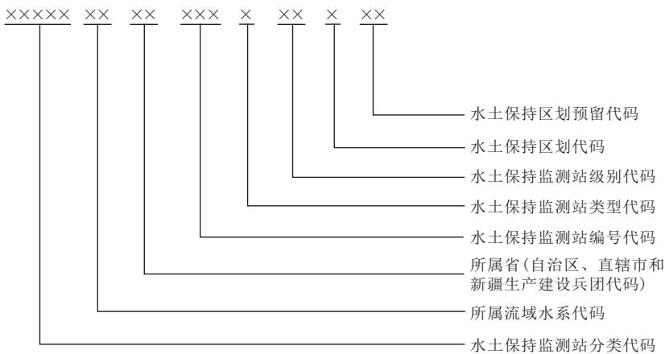
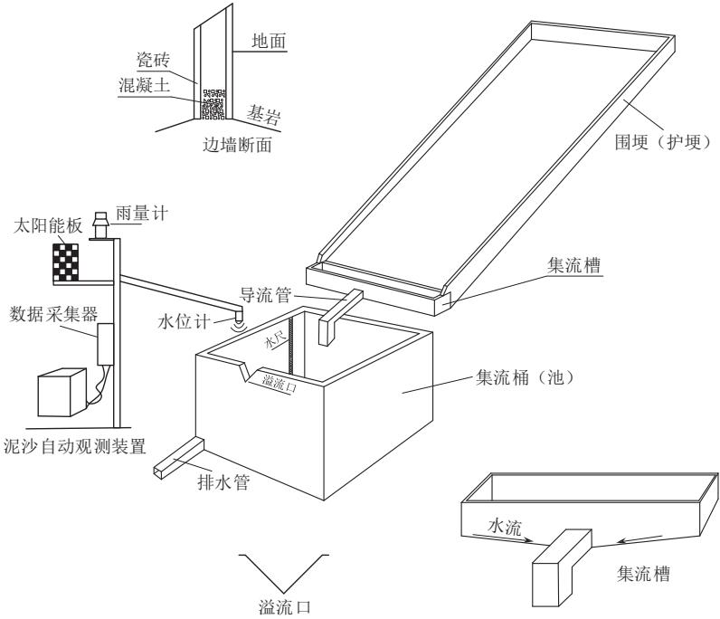
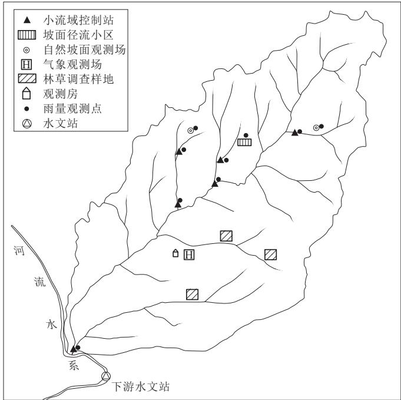
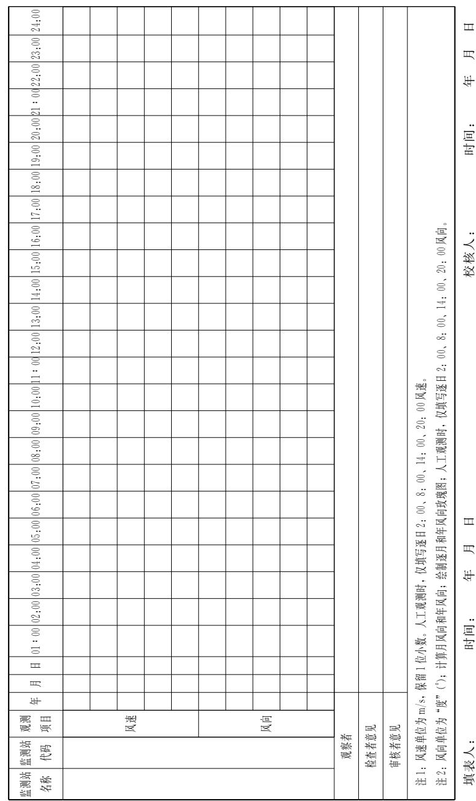
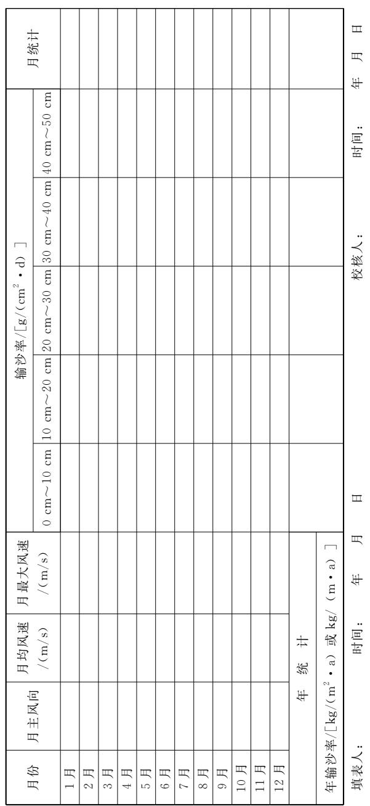
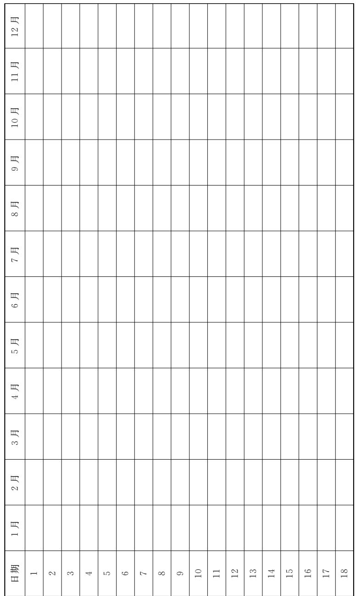
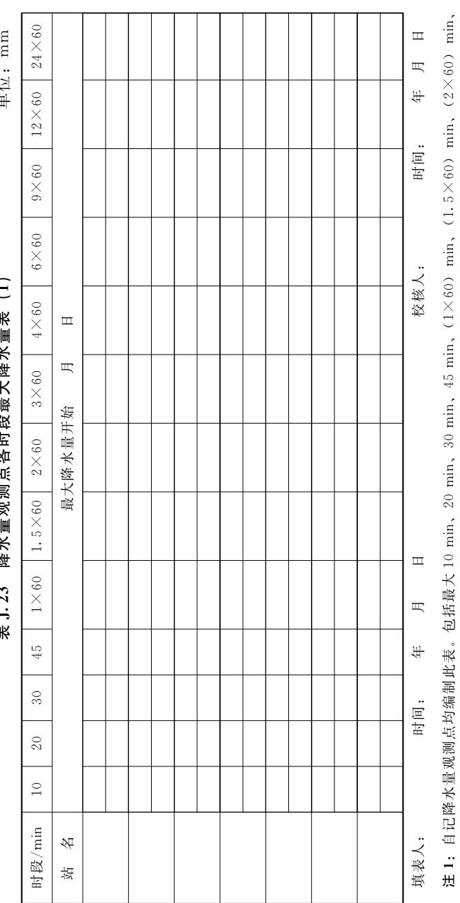

# SL_T 277-2024_水土保持监测技术规范

<!-- 由 MinerU 分片产物合并生成；共 2/2 片；源目录：md文件/SL_T 277-2024_水土保持监测技术规范/ -->

<!-- ===== 分片 p1-200（200页，源：SL_T 277-2024_水土保持监测技术规范（1-200页））===== -->

# 中华人民共和国水利行业标准

SL/T 277—2024

替代 SL 277—2002

SL 342—2006

SL 452—2009

SL 592—2012

# 水土保持监测技术规范

# Technical code for soil and water conservation monitoring

2024-10-22发布

2025-01- 22 实施

中华人民共和国水利部 发布

# 中华人民共和国水利部

# 关于批准发布《小型水库监测技术规范》等4 项水利行业标准的公告

2024年第20号

中华人民共和国水利部批准《小型水库监测技术规范》（SL/T828—2024）等4项为水利行业标准，现予以公布。

<table><tr><td rowspan=1 colspan=1>序号</td><td rowspan=1 colspan=1>标准名称</td><td rowspan=1 colspan=1>标准编号</td><td rowspan=1 colspan=1>替代标准号</td><td rowspan=1 colspan=1>发布日期</td><td rowspan=1 colspan=1>实施日期</td></tr><tr><td rowspan=1 colspan=1>1</td><td rowspan=1 colspan=1>小型水库监测技术规范</td><td rowspan=1 colspan=1>SL/T 828—2024</td><td rowspan=1 colspan=1></td><td rowspan=1 colspan=1>2024.10.22</td><td rowspan=1 colspan=1>2025.1.22</td></tr><tr><td rowspan=1 colspan=1>2</td><td rowspan=1 colspan=1>土石坝安全监测技术规范</td><td rowspan=1 colspan=1>SL/T 551—2024</td><td rowspan=1 colspan=1>SL 551—2012</td><td rowspan=1 colspan=1>2024.10.22</td><td rowspan=1 colspan=1>2025.1.22</td></tr><tr><td rowspan=1 colspan=1>3</td><td rowspan=1 colspan=1>水库大坝风险等级划分与评估导则</td><td rowspan=1 colspan=1>SL/T 829—2024</td><td rowspan=1 colspan=1></td><td rowspan=1 colspan=1>2024.10.22</td><td rowspan=1 colspan=1>2025.1.22</td></tr><tr><td rowspan=1 colspan=1>4</td><td rowspan=1 colspan=1>水土保持监测技术规范</td><td rowspan=1 colspan=1>SL/T 277—2024</td><td rowspan=1 colspan=1>SL 277—2002SL 342—2006SL 452—2009SL 592—2012</td><td rowspan=1 colspan=1>2024.10.22</td><td rowspan=1 colspan=1>2025.1.22</td></tr></table>

水利部

2024年10月22日

## 前 言

根据水利技术标准制修订计划安排，按照SL/T1—2024《水利技术标准编写规程》的要求，对SL277—2002《水土保持监测技术规程》、SL342—2006《水土保持监测设施通用技术条件》、SL452—2009《水土保持监测点代码》、SL592—2012《水土保持遥感监测技术规范》进行修订，合并为《水土保持监测技术规范》。

本标准共9章和9个附录，主要技术内容有：

监测站建设；

监测站观测内容与方法；

—自动化监测及信息化管理技术条件；

遥感监测；

——调查；

—资料整编。

本次修订的主要内容有：

细化了水土保持监测工作内容、任务的技术要求。删除了监测站网职责和任务；

补充完善了水土保持监测站建设、监测站观测内容与方法等的技术要求；

新增了自动化监测、资料整编等的技术要求；

修订了水土保持监测站的编码规则。

本标准所替代标准的历次版本为：

SL 277—2002

SL 342—2006

SL 452—2009

-SL 592—2012

本标准批准部门：中华人民共和国水利部

本标准主持机构：水利部水土保持司

本标准解释单位：水利部水土保持司

本标准主编单位：水利部水土保持监测中心

本标准参编单位：长江流域水土保持监测中心站黄河流域水土保持生态环境监测中心淮河流域水土保持监测中心站海河流域水土保持监测中心站珠江流域水土保持监测中心站松辽流域水土保持监测中心站太湖流域水土保持监测中心站北京市水生态保护与水土保持中心山西省水利发展中心山东水土保持监测站河南省水土保持监测总站中国水利水电科学研究院水利部南京水利水文自动化研究所中国科学院生态环境研究中心北京师范大学

本标准出版、发行单位：中国水利水电出版社

本标准主要起草人： 莫 沫 乔 殿新 赵赵屈张蔡 院辉创 曹 文华李天华 常丹东 李沁书顾朝军 张 栋 袁杜 利李子轩 金平伟 锋昕 婧秦 伟 张红丽 黄婷婷董仁才 符素华 任志勇 衣 强陆 敏

本标准审查会议技术负责人：王治国

本标准体例格式审查人：程 萌

本标准在执行过程中，请各单位注意总结经验，积累资料，随时将有关意见和建议反馈给水利部国际合作与科技司（通信地址：北京市西城区白广路二条2号；邮政编码：100053；电话：010-63204533；电子邮箱：bzh@mwr.gov.cn；网址：http: //gjkj. mwr.gov.cn/jsjd1/bzcx/)。

## 目 次

1总……………………………………………………………1  
2 术语……………………………………………………………3  
3基本规定………6  
4监测站建设………………………………………7  
4.1般规定……………………………………………………………………………7  
4.2水土保持监测站网………………8  
4.3 水力侵蚀监测站………………………10  
4.4风力侵蚀监测站………………………15  
4.5 冻融侵蚀监测站……………………………………19  
4.6监测站辅助设施设备建设…………………………………21  
4.7监测站设施设备维护与管理…………………………………22  
4.8 水土保持监测站代码…………………………………23  
监测站观测内容与方法……………………27  
5.1般规定………………………………………………………………27  
5.2水力侵蚀观测………………………………………27  
5.3 风力侵蚀观测…………………………………36  
5.4数据记录……………………………………37  
6 自动化监测及信息化管理技术条件…………………………39  
6.1般规定………………………………………39  
6.2监测设备……………………………………………………40  
6.3管理软件……………………………………………41  
6.4 安装与调试………………………………43  
7遥感监测……………………………45  
7.1般规定…………………………………………………45  
7.2遥感影像选择与预处理……………………………………45  
7.3解译标志建立………………………47  
7.4信息提取………………………48  
7.5野外验证………………………………51  
7.6分析评价与成果管理…………………51  
8调查………………………………………………………53  
8.1般规定…………………………………………………53  
8.2专项调查………………………………………53  
8.3普查………………………………………54  
9资料整编……………56  
9.1般规定…………………………………………………56  
9.2整编内容及要求………………………56  
9.3资料存储………………………………64  
附录A径流小区建设技术要求………………………65  
附录B 控制站建设技术要求…………………………71  
附录C调查样地布设技术要求………………………………77  
附录D径流小区记录表……81  
附录E控制站记录表……90  
附录F风力侵蚀观测记录表……………………………98  
附录G遥感监测记录表……101  
附录H土壤侵蚀分析评价模型……………………………109  
附录J资料整编表…………………112  
标准用词说明………………………………150  
标准历次版本编写者信息……………………151  
条文说明…………………………………………………………153

## 1 总 则

1.0.1为统一和规范水土保持监测技术要求，保证监测成果质量，提高监测的支撑和服务能力，制定本标准。

1.0.2本标准适用于国家和地方水土保持监测站建设、监测站观测内容和方法、遥感监测、数据管理与应用等。

1.0.3水土保持监测工作应根据监测范围、任务、应用与需求等，采用定量与定性、宏观与微观、连续性定位与周期性调查相结合的原则开展。

1.0.4生产建设项目水土保持监测工作按照GB/T51240《生产建设项目水土保持监测与评价标准》的规定执行。

1.0.5应鼓励采用新技术、新工艺、新方法、新设备。

1.0.6 本标准主要引用下列标准：

GB/T 2260 中华人民共和国行政区划代码

GB/T13989国家基本比例尺地形图分幅和编号

GB/T 15265 环境空气 降尘的测定 重量法

GB/T15772 水土保持综合治理 规划通则

GB/T 15774 水土保持综合治理 效益计算方法

GB/T15968 遥感影像平面图制作规范

GB/T 16453.1～6 水土保持综合治理 技术规范

GB/T 17278 数字地形图产品基本要求

GB/T18316 数字测绘成果质量检查与验收

GB/T 21010 土地利用现状分类

GB 22021国家大地测量基本技术规定

GB/T 35227 地面气象观测规范 风向和风速

GB/T 35237 地面气象观测规范 自动观测

GB/T 50138 水位观测标准

GB/T 50159 河流悬移质泥沙测验规范

$$
\mathrm { G B ~ 5 0 1 7 9 } \qquad \forall \pi \ o { \downarrow } \ o \uparrow \ o \downarrow \ o \downarrow \equiv \underline { { \Theta } } \underline { { \Sigma } } \underline { { \Sigma } } \underline { { \Sigma } } \underline { { \Sigma } } \underline { { \Sigma } } \underline { { \Sigma } } \underline { { \Sigma } } \underline { { \Sigma } } \underline { { \Sigma } } \ o \uparrow \ e \underline { { L } } \ o \uparrow \ Z \not { \Sigma } \not { \Sigma } \ .
$$

GB 50343 建筑物电子信息系统防雷技术规范

$$
\begin{array} { r l } { \mathrm { G B } ~ 5 1 0 1 8 ~ } & { { } \eta \kappa \pm \vert \frac { \nabla } { \mathbf { A } } \mathbf { f } \pm \vert \pm \vert \mathbf { \vec { x } } \pm \vert \frac { \nabla } { \mathbf { A } } \mathbf { \vec { x } } + \vert \mathbf { \vec { x } } \vert \vert \mathbf { \vec { z } } } \end{array}
$$

$$
\mathrm { S L ~ 2 1 } \int \limits _ { \pm \infty } ^ { \infty } x \frac { \theta } { \ln 2 } x [ \pi , \sin \theta ] + \pi \int \limits _ { \pm \infty } ^ { \infty } x \frac { \theta } { \sin 2 \theta }
$$

$$
\mathrm { S L / T } 3 4 \pi \propto \frac { 1 } { 2 } \pi \vert \times \vert \pm \pi \vert + \frac { 1 } { 2 } \times \vert \vert \pm \pi \vert \propto \frac { 5 } { 2 } \vert \vert \vert
$$

SL 42 河流泥沙颗粒分析规程

SL 196 水文调查规范

SL/T 213 水利对象分类与编码总则

SL 219 水环境监测规范

SL/T 276 水文基础设施建设及技术装备标准

SL 364 土壤墒情监测规范

SL 419 水土保持试验规程

SL 537 水工建筑物与堰槽测流规范

$$
\mathrm { S L } 6 5 1 \mathcal { N } \propto \mathcal { N } \arctan 3 \sqrt { 3 } \times 2 \sqrt { 5 } \times 2 \sqrt { 5 } \equiv \infty 1 2
$$

$$
1 0 0 0 0 \ 1 : 2 5 0 0 0 \ 1 : 5 0 0 0 0 \ 1 : 1 0 0 0 0 0 \ \frac { * } { 3 } \& \mathrel { \stackrel {  } { \pm } } \ \frac { \oplus \oplus } { \mid \mathrm { t r } \mid } \ \frac { \oplus \oplus } { \pm } \ \frac { \oplus \oplus } { \mid \mathrm { t r } \mid } \ \frac { \oplus \oplus } { \mid \mathrm { t r } \mid } \ \frac { \oplus } { \mid \mathrm { t r } \mid } \ .
$$

$$
1 0 0 0 0 1 : 2 5 0 0 0 1 : 5 0 0 0 0 1 : 1 0 0 0 0 0 \sharp \{ \underline { { \sim } } \underline { { \sim } } \underline { { \sim } } \underline { { \sim } } \underline { { \sim } } \underline { { \sim } } \underline { { \sim } } \underline { { \sim } } \underline { { \sim } } \underline { { \sim } } \underline { { \sim } } \underline { { \sim } } \underline { { \sim } } \underline { { \sim } } \underline { { \sim } } \underline { { \sim } } \underline { { \sim } } \underline { { \sim } } \underline { { \sim } } \underline { { \sim } } \underline { { \sim } } \underline { { \sim } { \sim } } \underline { { \sim } { \sim } } \underline { { \sim } { \sim } } \underline { { \sim } { \sim } } \underline { { \sim } { \sim } } \underline { { \sim } { \sim } } \underline { { \sim } { \sim } } \underline { { \sim } { \sim } } \underline { { \sim } { \sim } } \underline { { \sim } { \sim } } \underline { { \sim } { \sim } } \underline { { \sim } { \sim } } \underline { { \sim } { \sim } } \underline { { \sim } { \sim } } \underline { { \sim } { \sim } } \underline { { \sim } { \sim } } \underline { { \sim { \sim } } } \underline { { \sim { \sim } } } \underline  { \sim { \sim } } \underline { { \sim } { \sim } } \underline { { \sim \sim } } \underline { { \sim \sim } } \underline { { \sim \sim } } \underline { { \sim \sim } } \underline { { \sim \sim } } \underline { { \sim \sim } } \underline { { \sim \sim } } \underline { { \sim \sim } } \underline { { \sim \sim } \sim } \underline { { \sim } \sim } \underline { \sim { \sim } \sim } \underline { \sim } \mathrm { ~ ~ \sim }
$$

HJ 915 地表水自动监测技术规范（试行）

1.0.7 水土保持监测工作除应符合本标准规定外，还应符合国家现行技术标准的规定。

## 2 术 语

下列术语及其定义适用于本标准。

2.0.1 水土保持监测 soil and water conservation monitoring对水土流失状况、动态变化及防治成效进行监测的活动。

2.0.2 水土保持监测站网 network of soil and water conservation monitoring sites

水土保持监测站构成的水土流失及相关数据采集体系。

## 2.0.3 水土保持监测站 soil and water conservation monitoring site

用于获取水土流失及其影响因素、水土保持措施防治效果等监测数据而建设使用的场所、设施、设备的总称。

## 2.0.4 径流小区 runoff plot

用于观测坡面水力侵蚀规律及其影响因素的设施总称。根据观测目的和规格，分为标准径流小区、一般径流小区和自然坡面径流小区。

## 2.0.5 标准径流小区 unit runoff plot

在土壤全年裸露或植被盖度应小于5%、常年休闲并连续保持清耕状态的平整坡面上设置的宽5m、水平坡长20m、水平投影面积 $1 0 0 ~ \mathrm { m } ^ { 2 }$ 的径流小区。

## 2.0.6 一般径流小区 runoff observation plot

用于观测不同自然因素、人为因素在水土流失发生过程中所起的作用及其相互之间关系的径流小区，也称因子小区。

## 2.0.7 自然坡面径流小区 natural runoff plot

布设在地形、土壤、植被等有代表性的天然坡地上，用于观测实际下垫面情况下的径流、泥沙的自然坡面集流区。

## 2.0.8 典型实际样地径流泥沙观测小区 observation area of runoff and sediment in typical actual sample plot

布设在农业耕作方式、水土保持措施有代表性的农地坡面

上，用于观测实际条件下农地的径流、泥沙的坡面集流区。

## 2.0.9 简易径流小区 simple runoff plot

为临时或单纯观测土壤侵蚀量而设置的径流小区。

## 2.0.10 控制站 gauging station

布设在沟道（河道）上，用于观测径流过程和输沙过程的观测设施设备的总称，分为小流域控制站和河流控制站。

## 2.0.11 小流域控制站 small watershed gauging station

布设在闭合小流域出口处某一断面的控制站。

## 2.0.12 河流控制站 river gauging station

布设在河道上的控制站。一般为共享的水文站。

## 2.0.13 降雨侵蚀力 rainfall erosivity

雨滴动能（E）和降雨强度（I）的乘积，反映降雨侵蚀能力的特征值。

## 2.0.14 风力侵蚀观测场 wind erosion observation field

布设在风力侵蚀代表区域，用于观测风力侵蚀及其影响因素的场地。

## 2.0.15 降尘监测设施 dust monitoring facility

布设在风力侵蚀代表区域，用于收集和测定监测区域某一时段内降尘沉降量、沉降速率、沉降物物理及化学成分的设施。

## 2.0.16 风力侵蚀强度监测设施 wind erosion intensity monitoring facility

布设在风力侵蚀代表区域，用于监测某一地表类型在特定气候条件下，一定时段单位面积风力侵蚀量及其影响因子的设施。

## 2.0.17 寒冻剥蚀监测设施 cold denudation monitoring facility

用于监测高寒地区寒冻风化、冰劈作用及人为活动导致的寒冻剥蚀及影响因素的设施。

## 2.0.18 热融滑塌监测设施 thermal melt landslide monitoringfacility

用于监测冻土区缓坡坡面受气温变动影响，发生在解冻面以上消融层的滑塌、泥流等侵蚀的设施。

## 2.0.19 遥感解译标志 remote sensing interpretation marks

遥感影像解译时，判别目标物所依据的图像特征，也称判读标志。包括：目标物的形状、大小、阴影、色调（或色彩）、纹理、图案、位置、布局等。

## 2.0.20 综合评判法 comprehensive evaluation method

基于多个土壤侵蚀因子的综合分析，完成土壤侵蚀强度等级评价的方法。

## 2.0.21 样本 sample

野外验证时，从野外验证抽样总体中随机抽取，代表单个水土保持因子的图斑（或基本单元）的集合体，也称野外验证样本。

## 2.0.22 植被覆盖度季节变化曲线 seasonal curve of vegetation coverage

一年内植被覆盖度随时间的变化关系曲线，反映一定时间间隔（通常为半月）不同植被类型覆盖度的时序变化。

## 2.0.23 调查样地 sampling plots

按照一定规则选取地形、土壤、植被等下垫面条件具有典型代表性，用于采集水土流失及其影响因素、水土保持措施状况等指标而设立的有地理信息的地块。

## 2.0.24 水土流失动态监测 dynamic monitoring of regional soil and water loss

按照一定时间周期，为反映区域内水土流失类型、面积、强度、分布及其变化情况开展的分析评价活动。

## 3基本规定

3.0.1开展水土保持监测应通过水土保持监测站观测、遥感监测、调查等方式，掌握监测对象的水土流失及其防治状况。根据监测目的和对象的不同，主要应包括下列内容：

1水土流失状况，包括水土流失类型、面积、强度、分布、危害和变化趋势。

2水土流失影响因素，包括地形、地貌、气象、水文、植被、土壤（地面组成物质）、土地利用类型、水土保持措施等。

3水土流失防治情况，包括水土保持措施类型、数量、分布和防治效果。

3.0.2 水土保持监测站应对水土流失状况及其影响因素进行长期、连续的观测，通过分析评价揭示水土流失规律和机理。

3.0.3水土流失动态监测应综合采用资料收集、卫星遥感、无人机航测等手段，结合模型计算，获取水土流失类型、面积、强度、分布及其变化，评价水土流失及其防治状况等。

3.0.4水土保持遥感监测应按照资料准备、遥感影像选择与预处理、解译标志建立、信息提取、野外验证、分析评价和成果资料管理等程序进行。

3.0.5水土保持监测应根据信息化、自动化监测技术发展趋势和要求，合理布设监测设备和传感器，实现监测数据的自动收集、传输、处理和存储。

## 4 监测站建设

## 4.1 一般规定

4.1.1 水土保持监测站建设时应满足下列条件：

1按照“一站多能、以站带点、多站联合、多尺度嵌套、多目标融合”的要求建设。

2充分考虑监测站观测设施的长期性、连续性、稳定性和安全性。要考虑水、电、通信、交通、生活等条件的便利性。

3根据监测任务和内容，合理配置监测设备，做到人工观测和自动观测有机结合。对于水土保持监测站布设有径流小区、控制站、样地的，其地形测量、植被观测、实验分析等方面的仪器设备可共享使用，避免浪费。

4采用技术成熟、方法实用、质量可靠的设备，同时鼓励应用先进的自动化在线监测设备。

4.1.2 水土保持监测站建设应包括站址区、观测区和辅助区建设，具体还应包括下列内容：

1站址区包括观测用房、供水设施、排水设施、供电设施、供暖设施、通信设施、道路、计算机网络和数据管理设施等。

2 观测区包括观测水土流失及其影响因素、水土保持措施防治效果的观测设施、设备等。

3辅助区包括连接站址区、观测区的道路、供电系统、标识系统、监控及围栏等。

4.1.3水土保持监测站按照观测对象、作用和功能进行分类，具体要求如下：

1按照监测站所处土壤侵蚀类型区，水土保持监测站分为水力侵蚀监测站、风力侵蚀监测站和冻融侵蚀监测站。对于布设在水力侵蚀、风力侵蚀和冻融侵蚀交错区的监测站，同时布设水力侵蚀、风力侵蚀、冻融侵蚀的观测设施、设备，分类上应按照监测站所处的区域主要土壤侵蚀类型进行分类。

2 根据水土保持监测站在全国水土保持监测工作中的作用，可分为国家水土保持监测站和地方水土保持监测站。

1）由国务院水行政主管部门规划建设，布设在国家级水土流失重点防治区、国家重要生态功能区，在全国水土保持监测站网中承担骨干作用，具有关键节点性质的监测站应属于国家水土保持监测站。

2）由地方水行政主管部门规划建设，对国家水土保持监测站进行补充的监测站应属于地方水土保持监测站。

3按照国家水土保持监测站的功能可分为重点站和一般站。地方水土保持监测站可参照国家水土保持监测站分类。

1）重点站为大江大河流域或区域水土流失综合防治、水土资源利用与保护提供基础数据的监测站，起到骨干作用。应按照全国水土保持区划二级区布设。

2）一般站为增强区域代表性、提高全国水土保持监测数据联合分析精度和水平设置的监测站。应按照全国水土保持区划三级区布设。

## 4.2 水土保持监测站网

4.2.1 水土保持监测站网规划或布局方案主要内容应包括站网现状、需求分析、规划（布局）原则与目标、总体布局、站网构成、观测项目、观测方法、保障措施和效益评价等。

4.2.2 开展水土保持监测站网规划布局应收集有关基本资料，如地形、地貌、土壤、植被、气象、水文、土地利用、社会经济等；水土流失类型、分布、面积、强度和特征；水土保持措施类型、数量与分布；水文站、水土保持试验（推广）站（所）、生态系统长期定位观测研究站、野外观测研究台站等情况。

4.2.3 水土保持监测站网规划布局应围绕新时代国家生态文明建设和重大国家战略等对水土保持监测工作提出的新要求、赋予的新使命，聚焦推动水利高质量发展，贯彻新理念新要求，采用新技术，构建布局合理、功能完备、系统科学、技术先进的水土保持监测站网体系。

4.2.4 水土保持监测站网规划布局应遵循下列原则：

1统一规划原则。应以流域或区域为单元，统筹规划，根据土壤侵蚀类型与观测目的，合理确定水土保持监测站的数量、分布、类别、级别、建设内容与规模。

2 系统原真原则。转变传统监测站以单一人工径流小区为主的观测设施布设模式，坚持从生态系统整体性和流域系统性出发，加强自然植被和实地原型观测设施布设，注重依据水系汇流关系，构建林草调查样地、一般径流小区、自然坡面径流小区、典型实际样地径流泥沙观测小区、子（微）流域及小流域控制站、河流控制站、下游水文站合理嵌套、相互关联印证的多尺度系统观测体系。

3 代表性原则。水土保持监测站应按照水土保持区划布设，充分反映所代表范围的水土流失状况和主要特征。国家级重点站布设应按照全国水土保持区划8个一级区和40个二级区控制；国家级一般站布设应按照全国水土保持区划115个三级区控制。地方监测站可根据当地水土保持、生态保护的需要布设。

4 突出重点原则。水土流失重点防治区、重点生态功能区以及大江大河的重要支流等重点区域，可根据水土保持、生态保护的需要适当加密。

5 先进智能原则。转变传统监测站以人工观测为主的观测方式，积极利用先进仪器设备和现代信息技术，提高监测站数据采集、存储、传输、处理的自动化程度和智能化管理水平。

6 分级建设管理原则。国家水土保持监测站和地方水土保持监测站实行分级建设和管理，观测数据应做到相互交换。

7 共享共用原则。应注重共享水土保持监测相关的水文站、水土保持试验（推广）站（所）、生态系统长期定位观测研究站、野外观测研究台站等，经协商一致后可将其纳入全国水土保持监测站网。

4.2.5 水土保持监测站应至少设置1个降水蒸发观测场。降水蒸发观测场建设参照 GB/T 35227、GB/T 35237、SL 21的规定执行。降水蒸发观测场与径流小区集中布设区的距离最大不宜超过100m，超过100m时应在径流小区附近另布设降水量观测设备。

## 4.3 水力侵蚀监测站

4.3.1水力侵蚀监测站的监测设施包括径流小区、控制站、调查样地和降水量观测点等，应以流域水系为骨架，按照集水区一小流域一流域的嵌套关系布设，并宜实现与水文站嵌套布设、组网观测。水力侵蚀监测站设施布设应遵循下列原则：

1 应选择分水线清晰的闭合流域布设小流域控制站。

2有条件的，可按照小流域内的水系汇流关系，在小流域出口处及其子流域、微流域出口处分别布设控制站，以掌握泥沙迁移过程及规律。

3 在水土流失严重的区域，可选择自然条件（如地形、地貌、地质、土壤、植被、流域面积、流域形状等）相似、地理位置相邻或相近、已实施和未实施水土流失综合治理的小流域，分别在小流域沟口处布设控制站，观测小流域产水产沙量，对比分析自然条件与水土流失综合治理情况下的小流域产水产沙关系，掌握小流域水土流失状况及演进规律，提出不同区域水土流失治理模式。

4 水力侵蚀监测站应注重自然坡面径流小区布设，布设数量能够反映区域典型土壤类型、植被类型及覆盖度、坡度的水土流失状况。应根据坡耕地水土流失状况及治理情况，加强典型实际样地径流泥沙观测小区布设，布设数量能够反映区域实际条件下的农业耕作方式、水土保持措施的水土流失状况。应适当控制传统一般径流小区布设规模，当既有一般径流小区数量已满足观测目的的，不再新设一般径流小区。

4.3.2 水力侵蚀监测站选址工作应主要包括下列内容：

1 应在地形图或遥感影像上初步确定监测站的位置。

2 确定控制站的断面位置，量算控制断面以上的流域汇水面积、形状系数、沟道长度、沟壑密度和平均坡度等流域特征值。

3 确定对比小流域的位置，量算对比小流域控制断面以上的流域汇水面积、流域形状系数、沟道长度、沟壑密度和平均坡度等流域特征值。

4 确定自然坡面径流小区的位置。自然坡面径流小区应布设在土壤类型、植被类型及覆盖度、坡度及微地形典型且较为均一的坡面上。自然坡面径流小区宜从坡顶到坡脚整个坡面布设。有条件的，可在淤地坝、侵蚀沟边坡布设，以结合淤地坝、侵蚀沟专项调查和跟踪监测形成系统观测体系。

5 确定典型实际样地径流泥沙观测小区的位置。典型实际样地径流泥沙观测小区应布设在土壤类型、坡度、作物类型、耕作模式及水土保持措施典型的农地上。

6 确定标准和一般径流小区的位置。标准径流小区和一般径流小区应布设在坡度和土壤条件均一、土地利用方式典型的区域，标准径流小区、一般径流小区宜集中。

7确定降水量观测点的位置。水力侵蚀监测站的降水量观测点应以能控制流域内平面和垂直方向降水变化为原则，合理布设。

4.3.3 水力侵蚀监测站布设应经过查勘，掌握流域内的地形地貌、土壤、土地利用方式、耕作方式和水土保持措施等的数量和空间分布。查勘应主要包括下列内容：

1流域内地形地貌、土壤、地质、植被、土地利用类型的空间分布及人类活动等。

2流域边界和水系分布，水利工程、水土保持措施、道路、厂矿、城镇、村庄等对水土流失有重要影响的工程类型和空间分布。

4.3.4 径流小区布设应选择小流域内有代表性的坡面上。径流小区的土壤剖面结构一致，土层厚度均匀，坡度均一。自然坡面径流小区的坡面应保持自然状态并具有典型代表性。

4.3.5一般径流小区观测坡度与坡面产水产沙关系的，宜连续或断续地分别选择布设3°、5°、10°、15°、20°、25°、35°及大于35°的多个相同坡长、不同坡度的径流小区。具体坡度设置及布设数量应根据当地地形条件和观测目的确定。

4.3.6一般径流小区观测坡长与坡面产水产沙关系的，宜连续或断续地分别布设10 m、20m、30m、40 m和50m的多个相同坡度、不同坡长的径流小区。具体坡长设置和布设数量应根据当地地形条件和观测目的确定。

4.3.7 相似区域内有多个水力侵蚀监测站的，应注重站点联合运用，在满足观测目的情况下，相似区域内用于观测坡度、坡长与坡面产水产沙关系的一般径流小区不宜大量布设。

4.3.8自然坡面径流小区、典型实际样地径流泥沙观测小区依地形地貌条件布设，其形状可根据地形条件决定，集水区应有明确的分水线，与周围无水量交换；分水线不明确的，可人工设置围埂。

4.3.9径流小区应有围埂、防护设施、集流设施等，同时应配备径流泥沙观测的设施设备。设施设备建设应满足附录A的要求。

4.3.10径流小区、自然坡面径流小区和典型实际样地径流泥沙观测小区的径流泥沙监测设施，宜按照50年一遇24h最大降水量标准设计；也可结合当地近30年以来的气象、水文等资料，合理确定设计标准。

4.3.11控制站建设应符合下列要求，还应满足附录B的要求。

1小流域控制站应选择布设在沟道顺直、河床稳定、水流集中、便于布设观测设施的沟道段。

2小流域控制站的设施应包括测验沟（河）段基本设施、水位观测设施、流量测验设施、泥沙测验设施、降水观测设施。小流域控制站布设在水源涵养区、生态清洁小流域和有面源污染防治任务的区域，根据工作需要应设置水质监测断面和监测标志等监测设施，具体布设要求参照SL/T276、HJ915的有关规定执行。当水质监测设施和小流域控制站的其他设施组合利用时，不应重复布设水质监测设施。

3 小流域控制站宜按照50年一遇洪水标准设计；也可结合当地近30年以来发生的最大洪水，合理确定设计标准。

4 河流控制站宜选择与小流域控制站所在河流水系存在嵌套关系并具有开展泥沙观测条件的水文测站。其基本要求可按照SL/T 34的规定执行。

5小流域控制站的设备应包括水位观测设备、流量测验设备、泥沙测验设备、降水量观测设备及防雷设施等。有水质监测任务的还需配置水质监测设备，水质监测设备分为人工采样设备和自动监测设备，具体配置要求参照SL/T276、HJ915的有关规定执行。当配置的设备具有多种要素的组合观测功能时，不应重复布设单项观测设备。

6 小流域控制站设施设备精度与误差应符合下列规定：

1）水位观测按照GB/T 50138的规定执行。

2）径流、泥沙测验按照 SL537、GB/T 50159的规定执行。

3）水质监测采样、处理、分析精度按照SL219的规定执行。

7小流域控制站所使用的仪器设备，在小流域控制站正式投入使用前应进行比测。采用量水建筑物测流的小流域控制站，测流堰槽采用SL537规定的结构、规格、尺寸、材料等建造和安装的，可按SL537给定的公式计算流量，其流量系数可采用SL537规定的值，不需要进行率定检验。测流堰槽不采用SL537规定的结构、规格、尺寸、材料等建造和安装的，应进行现场或实验室校验，率定流量系数。

4.3.12 调查样地设置应符合下列规定：

1调查样地形状与面积，宜采用正方形、长方形、圆形样地。调查样地面积，乔木林调查样地不小于 $4 0 0 ~ \mathrm { ~ m ~ } ^ { 2 }$ ，宜为600$\mathrm { m } ^ { 2 }$ ；灌木林调查样地宜为 $2 5 \ \mathrm { ~ m } ^ { 2 } \sim 1 0 0 \ \mathrm { ~ m } ^ { 2 }$ ；草地调查样地宜为$1 { \mathrm { ~ m } } ^ { 2 } \sim 4 { \mathrm { ~ m } } ^ { 2 }$ ；耕地和其他地类调查样地根据坡度、地面组成、地块大小及连片程度确定，宜为 $1 0 \mathrm { ~ m } ^ { 2 } \sim 1 0 0 \mathrm { ~ m } ^ { 2 }$ 。开展综合抽样调查的，每次各种不同地类的调查样地面积应保持一致，以$4 0 0 \ \mathrm { m } ^ { 2 } \sim 6 0 0 \ \mathrm { m } ^ { 2 }$ 为宜。调查样地布设还应满足附录C的要求。

## 2 调查样地类别：

1）固定调查样地，定期监测的可复位的样地，应设置固定标志。

2）临时调查样地，本期不复位或下一期不复查的样地。

3）放弃调查样地，只有样地号，无法设置和调查的样地。

## 4.3.13 降水量观测点布设应满足下列要求：

1 水土保持监测站所在流域降水量观测点的布设数量，应能反映流域内降水变化状况。降水量观测点数量应按照流域面积大小合理配置，可按照表4.3.13布设。在开展降水量观测初期，降水量观测点可多布设一些；当积累一定资料后，通过抽样分析，可精简降水量观测点，要求精简前后计算的流域平均降水量平均允许误差应为±5%。

表4.3.13 流域降水量观测点布设数量表
<table><tr><td rowspan=1 colspan=1>流域面积 $/ \mathrm { k m } ^ { 2 }$ </td><td rowspan=1 colspan=1>&lt;0.2</td><td rowspan=1 colspan=1>0.2~0.5</td><td rowspan=1 colspan=1>0.5~2</td><td rowspan=1 colspan=1>2~5</td><td rowspan=1 colspan=1>5~10</td><td rowspan=1 colspan=1>10~20</td><td rowspan=1 colspan=1>20~50</td><td rowspan=1 colspan=1>50~100</td></tr><tr><td rowspan=1 colspan=1>降水量观测点个数/个</td><td rowspan=1 colspan=1>1</td><td rowspan=1 colspan=1>1~3</td><td rowspan=1 colspan=1>2~4</td><td rowspan=1 colspan=1>3~5</td><td rowspan=1 colspan=1>4~6</td><td rowspan=1 colspan=1>5~7</td><td rowspan=1 colspan=1>6~8</td><td rowspan=1 colspan=1>7~9</td></tr></table>

2 流域内只能布设1个降水量观测点的，应布设在流域中心或中心附近；布设2个的，则1个布设在流域出口的小流域控制站处，1个布设在流域上游；布设多个的，则应考虑流域形状、地形等因素进行布设，也应考虑与流域内径流小区降水量观测点、气象站的关系，避免重复布设。

3 每个降水量观测点宜同时设置两套观测降水量的设备，1个为标准雨量器，1个为自记雨量计。

4.3.14水力侵蚀监测站可根据工作需要，配备地形测量、植被观测等设备。

## 4.4 风力侵蚀监测站

4.4.1风力侵蚀监测站的监测设施宜包括降尘监测设施、风力侵蚀强度监测设施和调查样地等。

4.4.2风力侵蚀监测站选址时，应在调查掌握区域内地形地貌、土壤（地面组成物质）、地质、植被、土地利用类型的空间分布及人类活动等情况的基础上，选择地形地貌、土壤类型和土地利用方式具有典型性、代表性，且四周空旷开阔、无高大建筑物和树木的区域。

4.4.3 风力侵蚀监测站的监测设施设备宜集中布设。

4.4.4在风力侵蚀强烈、人类活动稀少的地区，宜建设简易风力侵蚀观测场，配置自动化程度高的设备。

4.4.5 降尘监测设施配置应符合下列规定：

1 降尘收集设施建设应按照GB/T15265 的规定执行。

2 风向、风速监测设施应按照GB/T 35227的规定执行。

3 降尘观测场面积宜不小于 $4 0 0 0 0 \ \mathrm { m ^ { 2 } }$ 。在观测场内应设置至少1个面积不小于 $1 0 0 0 0 \ \mathrm { m } ^ { 2 }$ 的观测区。观测区地面宜保持自然状态，地表起伏状态和植物状况应具有代表性。

4 观测场应设置观测场标识（标牌）及围栏等保护设施等。围栏不应影响通风。

4.4.6降尘监测设备应主要包括降尘缸、降尘缸放置平台及其辅助设施，其布设应满足下列要求：

1 降尘缸应由收集缸、筛板和围环构成。每1个观测场内应设置不少于3个降尘观测点，降尘观测点的间距应不小于50m。每一个降尘观测点应安置3个降尘缸，降尘缸的间距应不小于50 cm。

2 降尘缸放置平台由顶板和支架构成。顶板宜为100 cm×160cm的长方形平板。支架应为支持顶板的四脚架，垂直高宜为2m～12m，支架安置应保证顶板保持水平并稳定牢靠。

3 辅助设施设备宜用1个卡箍固定降尘缸；支架宜用3根～4根锚索拉紧固定；爬梯及护栏可与支架连体，也可独立设置。

4.4.7 降尘监测设施设备的技术要求应符合下列规定：

1 降尘观测场宜设在远离人、畜活动的空旷区，离障碍物的距离应不少于障碍物高度的3倍。

2降尘缸缸壁应垂直光滑，缸口不变形，形状规则，口缘向外倾斜。支架应用油漆涂成蓝色或绿色，质地均匀。降尘缸材料以不影响缸内集尘物的化学分析为准，且宜为玻璃、不锈钢或陶瓷材料；支架宜为角铁或不锈钢。降尘缸及支架应牢靠并与拉索紧密配合。

4.4.8 风力侵蚀强度监测设施布设应符合下列规定：

1观测场的地形地貌应具有典型性、代表性，下垫面均匀，并避免强烈干扰。

2风力侵蚀强度的监测可采用集沙仪、测钎、风蚀桥。集沙仪、测钎、风蚀桥可单独使用，也可组合使用，以便相互校验。

3风速、风向监测设备应布设在观测场中部。风速、风向监测设备的设置高度宜为2m。若风速、风向监测设备不能布设在监测场内，距离观测区不应超过1km。宜在观测场的中央设置1座通量塔，通量塔高宜为4m～12m，宜在距地面0.5m、1m、2m、4m、8m、12m处分别布设2个～6个风速仪，在距地面2m处布设1个风向传感器、1个降水量计，在距地面0.2m、2m处分别布设2个气温传感器、1个气压传感器，在距地面2m处布设1个相对湿度传感器，在埋深0.02m处布设1个土壤温度传感器、5个土壤水分传感器和1套数据采集仪和数据传输设备。

4.4.9 风力侵蚀强度监测设施设备配置应符合下列规定

1 风力侵蚀强度观测场面积宜不小于 $4 0 0 0 0 \ \mathrm { m } ^ { 2 }$ 。在观测场内应设置至少1个面积不小于 $1 0 0 0 0 \ \mathrm { m ^ { 2 } }$ 的干松裸露、地表起伏较平缓的观测区，观测区地面宜保持自然状态。观测场（或单一观测区）宜采用围栏保护。

2采用集沙仪法观测风力侵蚀强度的，可根据监测目的，选择旋转式集沙仪、单向固定式集沙仪、多通道集沙仪等不同形式的集沙仪，具体要求如下：

1）观测单一风向风沙流的输沙强度，宜采用单向固定式集沙仪。

2）观测多风向风沙流的输沙强度，宜采用旋转式集沙仪。

3）需要观测不同高度处风沙流的输沙强度的，应采用多通道集沙仪，分格间距宜为1.0cm～2.0cm，进沙口隔板厚应小于0.2mm。

4）不需要观测风蚀物随高度的变化的，宜采用单路集沙仪。

3采用测钎法观测风力侵蚀强度的，测钎应多排布设，宜设置成10m×10m的方格网，测钎间距离宜为0.5m～1.0m。

4采用风蚀桥法观测风力侵蚀强度的，风蚀桥应与主风向相垂直，单排或多排布设，排距应大于50m，桥距宜为10m。

5监测站可采用风蚀圈法观测风蚀圈内的风蚀量，计算风力侵蚀强度。风蚀圈直径宜为60m～100m，在风蚀圈上应每22.5°布设1台旋转式集沙仪，1个风蚀圈宜布设16台集沙仪。

6风速、风向监测设备配置应按照GB/T 35227的规定执行。

7需要观测地形、土壤、植被、下垫面粗糙度、田间管理措施等的，可按照需求选择相关设施设备。

4.4.10 风力侵蚀强度监测设施的技术要求应符合下列规定：

1风力侵蚀强度监测应在固定的观测场内进行，观测场应设有固定的标识。观测场应有固定的建筑设施，能够存放设备及供观测人员居住、测量、分析、化验；有固定的步道。

2 集沙仪进沙口面积最大允许误差应为±0.1%，高度最大允许误差应为±0.5cm；沙物质收集器应透气、不漏沙。

4.4.11 风力侵蚀强度监测设施整体结构应符合下列规定：

1 观测场各配套设施应布设有序，互不干扰，并对大气通行无扰动。

2集沙仪底面与监测场地面应接触紧密，稳定牢固。

3 测钎与风蚀桥应插入地面以下 20 cm～30 cm。沙漠地区应插入地面40cm～50cm。插入时，应能够防止对地面的破坏和风蚀桥对气流的影响。

4.4.12 风力侵蚀强度监测设施外观质量应符合下列规定：

1集沙仪表面光滑，旋转式集沙仪转动灵活，多路集沙仪隔挡牢固。

2测钎顺直光滑，无弯曲和折裂，测钎上有连续刻度，测片配套合理。

3 风蚀桥面板与地面基本平行，面板刻有10 cm宽度的控相间距，支柱可靠牢固。

4.4.13 简易风力侵蚀观测场应符合下列规定要求：

1观测场地选择应具有典型性、代表性，面积应不小于$2 0 ~ \mathrm { m } \times 5 0 \mathrm { ~ m ~ }$ ，标桩应不少于9根，要求下垫面均匀一致，并避免干扰。

2在风蚀观测场中部宜设置风向、风速监测设备，设备的设置高度宜为2m。

4.4.14 简易风蚀观测场的设施配置应符合下列规定：

1 监测设施应采用预制钢筋混凝土标桩或不锈钢圆管标桩。混凝土标桩规格应为 $1 0 \ \mathrm { c m } \times 1 0 \ \mathrm { c m } \times 1 0 0 \ \mathrm { c m }$ 的预制件，不锈钢圆管标桩规格应为 $\phi 3 ~ \mathrm { c m } \times 1 0 0 ~ \mathrm { c m }$

2 桩体应用油漆涂成白色和间隔为10 cm的红白色，桩顶平整编号。

3标桩布设时应采用方格状、梅花状、带状，不宜采用线状布设，桩间距不应小于2m。

4 标桩应埋入地面 60 cm～80 cm，地面应出露 20 cm～40cm，顶部应有明显标志。

5 观测场周围应布设铁丝围栏保护标桩安全。

4.4.15风力侵蚀监测场应根据工作需要，配置观测降尘、风速风向、植被、地形、土壤理化性质等方面的设备。

## 4.5 冻融侵蚀监测站

4.5.1冻融侵蚀监测站宜由观测场、调查样地组成。

4.5.2 冻融侵蚀监测设施应根据冻融侵蚀监测目的和监测内容，分为寒冻剥蚀监测设施和热融滑塌监测设施。

1 寒冻剥蚀监测设施主要包括寒冻剥蚀观测设施、气象观测设施、分析设施和其他配套设施。

2 热融滑塌监测设施主要包括热融滑塌的面积、厚度观测的设施，分析调查坡面特性、植被覆盖度及物质组成的设施，以及气象观测设施等。

4.5.3 冻融侵蚀监测站的寒冻剥蚀监测设施建设应符合下列基本要求：

1观测场应有代表性，坡面应均整，无突兀危岩，有设置测钎的条件。

2 观测场的观测坡脚应有收集台及收集栏，不受洪水威胁，无其他干扰破坏。

3观测场应至少有阳坡（正南面）和阴坡（正北面）两个标准坡面。

4监测场应配置气温、风速风向、降水、地温、土壤水、日照等观测设施。

4.5.4 冻融侵蚀监测站的热融滑塌监测设施建设应符合下列基本要求：

1 观测场应具有代表性。

2 观测场应设置在易发生热融滑塌侵蚀的坡面上，周围应无高大物体影响，较空旷。

3 观测场顺坡应设置成面积不小于200m²的矩形场地。观测场在四个坡向设置的情况下，可不重复设置。在一个坡向情况下，观测场宜设置为1个～2个重复。

4观测场应设置基准桩和校验桩，应通视良好，观测仰角和俯角在30°以内。观测场标桩应成网（排）状配置，稳定可靠，在人畜（兽）活动区应设围栏保护。

4.5.5 冻融侵蚀监测站的寒冻剥蚀监测设施配置应符合下列规定：

1测钎应按照网状（面观测）或带状（条带观测）布设，测钎间距2.0 m～3.0 m。测钎长度为 30 cm～50 cm、直径10mm～12mm，顶端刨光并有十字刻线，另一端为尖形或偏刃形，表面用红、白漆相间涂刷并编号。

2收集栏应设在坡面脚下平台，宜设置为双层，内层宜用木板、木桩围成骨架，其上铺设耐用织物，封闭严密。外层宜用木桩（或钢筋混凝土桩）及普通镀锌铁丝网围起。

4.5.6 冻融侵蚀监测站的热融滑塌监测设施配置应符合下列规定：

1标桩用钢筋混凝土制作，直径不大于5 cm，长度30cm～50cm，桩顶中心设小钉，用红、白彩漆相间涂刷并编号。标桩应成网状或排状打入地下，标桩间距宜为5m～10m，打入深度不应超过 15 cm。

2基准桩及校验桩应用钢筋混凝土制成，直径应为10 cm\~12 cm，长度应大于解冻层厚度，为 50 cm～70 cm；桩顶有出露钉头，并刻十字线，埋入不受干扰的观测场附近，埋入深度应大于解冻层厚度。校验桩宜选在基岩裸露处。

4.5.7 冻融侵蚀监测站的寒冻剥蚀设施配置技术要求应符合下列规定：

1 观测场地观测面不应受周围局部地形影响，应避免人为活动影响和洪水、泥石流等灾害威胁；应配置巡视、观测道路及爬高设施。

2 测钎网（带）设置后，观测时应用钢丝连接（或直尺连接），量测控相距应为10cm，测量最大允许误差应为±1mm。应用围栏收集法全部收集称重，称重最大允许误差应为±1.0g，面积量算相对误差应为±1.0%。

3 观测场整体布局应紧凑，宜互相靠拢。每个观测场的坡面与坡脚设施配套，相互校验。

4观测场应采用自然坡面，不宜人工修整，并设警示牌保护。

4.5.8 冻融侵蚀监测站的热融滑塌设施配置技术要求应符合下列规定：

1 热融滑塌监测场应有安全保障、交通便利，分析处理场所应有水电设施。

2 标桩位置最大允许误差应为±1 cm，位移最大允许误差应为±1cm，高度最大允许误差应为±1mm。温度观测最大允许误差应为 $\pm 0 . 2 ~ \mathrm { { ^ { \circ } C } }$

3监测场应保持自然坡面，不宜人工整理，设栏保护。

4.5.9冻融侵蚀监测站应配置气象、土壤理化性质、植被、分析处理和地形测量等方面的设备。在满足极端低温的条件下，可配置观测径流泥沙、土壤水分等的设备。

4.5.10冻融侵蚀监测站的气象观测设施应建在观测场区内，配置降水、风速风向、地温、气温、日照、土壤水分等观测设备，具体可参照 GB/T 35237、GB/T 35227的规定执行。

## 4.6 监测站辅助设施设备建设

4.6.1水土保持监测站辅助设施应主要包括监测用房、办公设备和数据管理分析设备和软件等。

4.6.2水土保持监测站应以确有必要、厉行节约为原则，根据监测站规模、功能、自动化程度和驻站人员情况，合理确定监测

用房形式与面积，配备办公设备和数据管理分析软件，避免浪费。

4.6.3监测用房应主要有观测用房、分析实验室、设备房、资料分析室和生活辅助用房等，具体应满足下列要求：

1观测用房应满足避雨、防雷、存放设备等要求，配备电源和水源等设施。

2 分析实验室可参考国家相关监测站网分析实验室建设的有关要求建设，做好水、电、通风、防雷、防腐蚀、控温、消防、紧急救援等设施。

3办公用房应配备桌、椅、柜等办公设施，配备电话、传真机和互联网设备等。

4.6.4办公设备包括电脑、交换机、服务器、打印机、扫描仪、电话、传真机等。数据管理分析软件包括日常办公软件、业务应用软件等。

4.6.5分析实验室仪器设备应主要包括室内分析、处理、测验等方面的仪器设备。

4.6.6 水土保持监测站应修建满足生产生活需要的道路，且应修建连接监测站至对外公共交通的道路。

4.6.7 水土保持监测站应根据需要配置生活及生产用电设施。

## 4.7 监测站设施设备维护与管理

4.7.1水土保持监测站管理单位应定期巡查（检查）监测站的基本监测设施和技术装备，对基本监测设施的重点部位应重点检查。发现设施损坏或故障，应及时更新维修。

4.7.2监测设施设备应每年汛前集中检修保养一次，日常保养应根据设备使用情况及时进行，确保设备运行正常。检修保养主要包括擦拭、清扫、润滑和调整设备等。常用监测设备在监测前和每一次监测完成后均应进行实地检查，清淤除杂并校核其精度，使其符合观测标准要求。

4.7.3监测设备应制定计量计划，定期进行检定/校准/测试。

新安装的人工监测设备、自动监测设备应进行检定/校准/测试。  
应建立仪器设备台账和维护保养记录。

4.7.4 监测设备更新频率应根据使用质量保证年限及设备的运行状况确定。

## 4.8 水土保持监测站代码

4.8.1 水土保持监测站代码应符合下列要求：

1 科学性。监测站的代码及代码格式应充分体现监测站所在区域、土壤侵蚀类型、级别等信息，应满足监测站分类、检索等管理需求。

2 唯一性。各个监测站与所编制代码应一一对应，保证信息存储、交换的唯一性和一致性。

3 完整性和可扩展性。所编制代码应包括正在运行的所有监测站，监测站代码序列以省为编制单元。代码格式上留有预留代码。

4.8.2 水土保持监测站编制代码的对象应为已纳入全国水土保持监测站网管理的监测站。临时设置的水土保持监测站不予编制代码。

4.8.3参照SL/T213的规定，水土保持监测站代码编制规则应由除I、O、Z之外的英文大写字母和阿拉伯数字组成，共18位。分别代表水土保持监测站分类代码、所属流域水系代码、所属省（自治区、直辖市和新疆生产建设兵团代码）、水土保持监测站编号代码、水土保持监测站类型代码、水土保持监测站级别代码、水土保持区划代码及水土保持区划预留代码。水土保持监测站代码结构见图4.8.3。

4.8.4 水土保持监测站代码格式应满足下列条件：

1 水土保持监测站分类代码由5位组成，分别为2位英文大写字母（MS）和3位阿拉伯数字（002）。

2监测站所属流域水系代码由2位字母组成，分别表示一级和二级流域（水系）码。监测站所属流域水系代码按照

  
图 4.8.3 水土保持监测站代码结构图

SL/T 213 的规定执行。

3监测站所属省（自治区、直辖市）、新疆生产建设兵团的代码由2位数字组成，监测站所属省（自治区、直辖市）、新疆生产建设兵团代码按照GB/T 2260的规定执行。

4 水土保持监测站编号代码由3位数字组成，分别按001～999并以省为单元按顺序编制代码。其中代码001～300表示监测站所属为国家水土保持监测站；301～999表示监测站所属为地方水土保持监测站。

5 水土保持监测站类型代码由1位数字组成，分别为1、2、3、4、5。水土保持监测站类型代码见表4.8.4-1。

表4.8.4-1 水土保持监测站类型代码
<table><tr><td rowspan=1 colspan=1>监测点类型</td><td rowspan=1 colspan=1>代码</td><td rowspan=1 colspan=1>监测点类型</td><td rowspan=1 colspan=1>代码</td></tr><tr><td rowspan=1 colspan=1>水力侵蚀监测站</td><td rowspan=1 colspan=1>1</td><td rowspan=1 colspan=1>风力侵蚀监测站</td><td rowspan=1 colspan=1>2</td></tr><tr><td rowspan=1 colspan=1>冻融侵蚀监测站</td><td rowspan=1 colspan=1>3</td><td rowspan=1 colspan=1>河流控制站（共享水文站）</td><td rowspan=1 colspan=1>4</td></tr><tr><td rowspan=1 colspan=1>其他</td><td rowspan=1 colspan=1>5</td><td rowspan=1 colspan=1></td><td rowspan=1 colspan=1></td></tr></table>

6 水土保持监测站级别代码由2位数字组成，表示监测站所属级别。代码11、12表示国家水土保持监测重点站、一般站；

13、14、15表示国家水土保持监测站共享水文站、重点站共享其他站、一般站共享其他站；21、22、23表示地方水土保持监测重点站、一般站、未区分重点站和一般站的地方水土保持监测站；24、25、26、27表示地方水土保持监测站共享水文站、重点站共享其他站、一般站共享其他站、未区分重点站和一般站的地方水土保持监测站共享其他站。水土保持监测站级别代码见表4.8.4-2。

表4.8.4-2 水土保持监测站级别代码
<table><tr><td rowspan=1 colspan=1>监测站级别</td><td rowspan=1 colspan=1>代码</td></tr><tr><td rowspan=1 colspan=1>国家水土保持监测重点站</td><td rowspan=1 colspan=1>11</td></tr><tr><td rowspan=1 colspan=1>国家水土保持监测一般站</td><td rowspan=1 colspan=1>12</td></tr><tr><td rowspan=1 colspan=1>国家水土保持监测站共享水文站</td><td rowspan=1 colspan=1>13</td></tr><tr><td rowspan=1 colspan=1>国家水土保持监测重点站共享其他站</td><td rowspan=1 colspan=1>14</td></tr><tr><td rowspan=1 colspan=1>国家水土保持监测一般站共享其他站</td><td rowspan=1 colspan=1>15</td></tr><tr><td rowspan=1 colspan=1>地方水土保持监测重点站</td><td rowspan=1 colspan=1>21</td></tr><tr><td rowspan=1 colspan=1>地方水土保持监测一般站</td><td rowspan=1 colspan=1>22</td></tr><tr><td rowspan=1 colspan=1>未区分重点站和一般站的地方水土保持监测站</td><td rowspan=1 colspan=1>23</td></tr><tr><td rowspan=1 colspan=1>地方水土保持监测站共享水文站</td><td rowspan=1 colspan=1>24</td></tr><tr><td rowspan=1 colspan=1>地方水土保持监测重点站共享其他站</td><td rowspan=1 colspan=1>25</td></tr><tr><td rowspan=1 colspan=1>地方水土保持监测一般站共享其他站</td><td rowspan=1 colspan=1>26</td></tr><tr><td rowspan=1 colspan=1>未区分重点站和一般站的地方水土保持监测站共享其他站</td><td rowspan=1 colspan=1>27</td></tr></table>

7 水土保持区划代码由1位数字组成，编码分别为1～8，见表4.8.4-3。

表4.8.4-3 水土保持区划代码
<table><tr><td rowspan=1 colspan=1>类型</td><td rowspan=1 colspan=1>代码</td><td rowspan=1 colspan=1>类型</td><td rowspan=1 colspan=1>代码</td></tr><tr><td rowspan=1 colspan=1>东北黑土区</td><td rowspan=1 colspan=1>1</td><td rowspan=1 colspan=1>北方风沙区</td><td rowspan=1 colspan=1>2</td></tr><tr><td rowspan=1 colspan=1>北方土石山区</td><td rowspan=1 colspan=1>3</td><td rowspan=1 colspan=1>西北黄土高原区</td><td rowspan=1 colspan=1>4</td></tr><tr><td rowspan=1 colspan=1>南方红壤区</td><td rowspan=1 colspan=1>5</td><td rowspan=1 colspan=1>西南紫色土区</td><td rowspan=1 colspan=1>6</td></tr><tr><td rowspan=1 colspan=1>西南岩溶区</td><td rowspan=1 colspan=1>7</td><td rowspan=1 colspan=1>青藏高原区</td><td rowspan=1 colspan=1>8</td></tr></table>

8 水土保持区划预留代码由2位数字组成，为预留水土保持区划的代码。用于在全国水土保持区划一级区的基础上再细分三级区，具体可根据实际情况自行定义代码，本标准中统一填写为“00”。

## 4.8.5 水土保持监测站名称命名由五个部分组成：

1 监测站级别，分为国家级、地方级。

2监测站所在省（自治区、直辖市）县（市、区、旗）名称。

3监测站所在乡镇（村）/小流域（沟道）名称或水文站名称。

4监测站监测类型分为水蚀、风蚀、冻融侵蚀、河流控制站（共享水文站）和其他。

5监测站重要性，分为重点站和一般站。

## 5 监测站观测内容与方法

## 5.1 一般规定

5.1.1 水土保持监测站观测内容应根据监测站的类型，分为水力侵蚀观测、风力侵蚀观测和冻融侵蚀观测。

5.1.2 水土保持监测站在开展常规的水土流失及其影响因素观测基础上，可根据需要开展生物多样性、生物量、碳汇、面源污染等观测。

5.1.3 冻融侵蚀观测根据具体情况，可开展年冻融日循环时间、日均冻融相变水量、年降水量、植被盖度、土壤含水率、冻土层厚度等冻融侵蚀影响因素观测，具体观测方法参照水力侵蚀、风力侵蚀的观测方法。

## 5.2 水力侵蚀观测

5.2.1 水力侵蚀观测应包括径流小区观测和控制站观测。

5.2.2径流小区观测项目应包括降水、径流泥沙、植被覆盖度、作物经营管理、水土保持措施防治效果、土壤理化指标等。径流小区设施设备基本情况表格式见附录D中表D.1。径流小区基本信息表格式见附录D中表D.2。径流小区观测应满足下列条件：

1降水观测应包括降水总量和降水过程的观测。具体观测要求按照SL21的规定执行。记录表格式参见附录D中表D.3。

2 径流泥沙观测应观测径流小区每场降水产生的径流量和含沙量。在条件具备的情况下，可观测径流小区产水产沙过程。采样时应详细准确记录每项观测内容，并计算径流量、含沙量、产沙量。记录表格式参见附录D中表D.4。径流小区径流泥沙观测应满足下列条件：

1）径流量和含沙量的观测设备为集流桶（池）时，产流结束后，应量取集流桶（池）水位，并将泥沙搅拌均匀后采集水样，测验水样含沙量，然后通过计算，获取1次降水过程中径流小区的土壤侵蚀总产沙量。

2）径流和泥沙的观测设备有分流桶（池）时，产流结束后，应分别量取分流桶（池）和集流桶（池）水位，并将泥沙搅拌均匀后分别采集水样，测验水样含沙量，然后通过计算，获取1次降水过程中径流小区的径流量和产沙量。

3）径流和泥沙的观测设备为自动观测设备时，应能够直接获取1次降水过程中径流小区总产沙量和径流量。

4）泥沙收集时，应注意将集流槽、导流管中沉积的泥沙收集到集流桶中。

3 径流小区的土壤水分观测，采用取土样方式（烘干法）或土壤水分测定仪（TDR或FDR）观测土壤水分的，应以旬为单位观测径流小区的土壤水分。当发生降水时，应在发生降水前、后各观测1次土壤水分。取土样地点宜在径流小区的保护带内。采取自动化在线观测土壤水分的，应从每日8：00开始，每间隔6h采集土壤水分信息1次；每日8：00应打包上传前一日8：00至当日8：00的数据，上传频率宜为1次/日。具体观测要求参照SL364的规定执行。记录表格式参见附录D中表D.5、表D.6。

4 径流小区土壤侵蚀影响因素与径流泥沙关系的观测应满足下列条件：

1）坡度和坡长。观测坡度与坡面产水产沙关系的，应布设多个相同坡长、不同坡度的径流小区，观测其产生的径流量和含沙量。观测坡长与坡面产水产沙关系的，应布设多个相同坡度、不同坡长的径流小区，观测其产生的径流量和含沙量。记录表格式参见附录D中表 D.4。

2）植被覆盖度。观测植被覆盖度与坡面产水产沙关系的，应每年在植被生长季，以半月为单位观测径流小区的植被覆盖度，并观测不同植被覆盖度情况下径流小区产生的径流量和含沙量。记录表格式参见附录D中表D.4～表D.6。

3）林地郁闭度。观测林地郁闭度与坡面产水产沙关系的，应每年在树木生长季，以半月为单位观测林地郁闭度，并观测不同林地郁闭度情况下径流小区产生的径流量和含沙量。记录表格式参见附录D中表D.4～表D.6。

4）作物经营管理。观测作物经营管理方式与坡面产水产沙关系的，应每年在土地翻耕期、整地播种期、作物苗期、成熟期到收获期及收获以后等不同阶段，观测作物植株高度、叶面积、土壤容重和地表糙率等。记录表格式参见附录D中表D.2、表D.4。

5）水土保持措施。观测水土保持措施与坡面产水产沙关系的，应观测不同水土保持措施的径流小区每次降水产生的径流量和含沙量，通过分析计算，评价不同水土保持措施的防治效果。记录表格式参见附录D中表D.2、表D.4。

5土壤理化性质观测。径流小区建成1年后，应测定径流小区土壤的容重、比重、孔隙度、团粒结构、机械组成等物理性质；测定土壤的酸碱度、有机质含量、氮、磷、钾等化学性质。每3年重复测定1次，测定时间和第1次相同。记录表格式参见附录 D 中表 D.7。

6 对于单纯观测土壤侵蚀的简易径流小区，应选择土壤、坡度、坡长、宽度、作物、植被等有代表性的地块（坡地）若干块，进入汛期前将直径 0.5 cm～1 cm、长 50 cm～100 cm 的测钎（钢钎），按照一定的距离（视地块面积而定），纵、横各3排打入地下，测钎（钢钎）帽与地面齐平，在测钎（钢钎）帽上涂上红漆，编号登记入册。每次暴雨后和汛期结束，观测钉帽距地面高度，计算土壤侵蚀厚度和总土壤侵蚀量。测钎（钢钎）布设在耕地（坡耕地）上的，汛期后要收回；测钎（钢钎）布设在非耕地（坡耕地）的其他土地利用类型的，可长期固定不动，但要注意做好保护。

5.2.3 控制站观测应分为小流域控制站观测和河流控制站观测。观测项目应主要包括水位、流量、泥沙、降水量等以及控制站所在流域水土流失状况。控制站流域基本情况表格式参见附录E中表E.1。控制站设施设备表格式参见附录E中表E.2。

5.2.4 小流域控制站应根据水尺断面测量结果，率定水位流量关系并建立水位流量关系曲线；在日常观测中，通过率定的水位流量关系曲线计算径流量；通过径流量和采样含沙量，计算次降水过程的产沙量。

5.2.5 小流域控制站采用人工观测水位的，应符合下列规定：

1 水位观测的定时观测时间为北京标准时间8：00。在西部地区、冬季或枯水期8：00观测确实有困难的，经专家论证后可根据情况改为其他时间定时观测。

2 水位观测的段次应在控制住小流域（河流）水位起涨、峰顶、峰腰、落平和其他转折点水位的前提下，宜按照水位变化均匀分布测次。峰顶附近不应少于3次，单峰不应少于8次，落水部分的退水下降缓慢时可30min或若干分钟观测1次。

3水位平稳时，每日8：00观测1次水位。稳定封冻期没有冰寒现象且水位平稳时，可每2 d～5 d观测1次，但要求月初、月末2天应观测。

4 水位变化缓慢时，每日应在8：00、20：00各观测1次。

5水位变化较大或出现较缓慢的峰谷时，每日应在2：00、8：00、14：00、20：00各观测1次。

6 洪水期或水位变化急剧时，应每10min或30 min观测1次。水位暴涨暴落时，应根据需要增为每2min或5min观测1次，以能测到各次峰、谷和完整的水位变化过程为原则。

7 水位观测宜读记至1cm。当上、下比降断面的水位差小于0.2 m时，比降水位应读记至0.5 cm；时间应记录至1 min。

记录表格式参见附录E中表E.3。

5.2.6小流域控制站采用自动设备观测水位的，应符合下列规定：

1 自记水位计应及时设置下列有关参数：

1）定时采集段次。

2）加密采集测次的条件。

2 水位自动观测设备在使用过程中应按照下列要求进行现场检查和维护：

1）汛前、汛中、汛后对水位自动观测设备进行1次全面检查维护，确保正常运行。

2）每场较大洪水过后，要对水位自动观测设备进行1次校核和检查。

5.2.7 小流域控制站流量测验应符合下列规定：

1 测流方式的选择。应根据小流域控制站测验断面条件和技术水平，选择适合本站特性的测验方法。当选择一种以上测流方法时，一种作为常用，其他作为备用。

2 测速垂线布设应大致均匀分布，并能基本控制基本地形和流速沿河宽分布的主要转折点，测速垂线的位置宜固定。垂线应优先布设在主流部分。有条件的小流域控制站应收集多线法实测资料，进行精简分析，确定垂线数目。垂线数目参照GB50179的有关规定执行。

5.2.8小流域控制站流量测验满足下列条件的，可采用流速仪法：

1 断面内大多数测点的流速不超过流速仪的测速范围。

2 垂线水深不小于用一点法测速的必要水深。

3在一次测流的起讫时间内，洪水水位涨落差小于平均水深的10%（水深较小涨落急剧的河流小于20%）。

4 流经测流断面的漂浮物不影响流速仪的正常运转。

5.2.9 小流域控制站流量测验满足下列条件的，可采用量水建筑物法：

1 流量小、含沙量小、沟床比降大的河段可采用量水堰。

2 含沙量大、流量较大的河段可采用量水槽。

3 量水堰（槽）应参照 SL 537的规定进行流量系数率定。

5.2.10小流域控制站流量测验满足下列条件的，可采用浮标法：

1 流速仪测速困难或超出流速仪测流范围和条件的高流速、 低流速和小水深等情况的流量测验。

2 垂线水深小于流速仪法中一点法测流的必要水深。

3 水位涨落急剧，使用流速仪测流的水位涨落差在一次测流的起讫时间内，洪水水位涨落差大于平均水深的20%（洪水水位涨落差大于平均水深的10%）。

4水面漂浮物过多，影响流速仪的正常旋转。

5.2.11 布设在非高含沙量或清水区域的小流域控制站，流量测验方法可采用声学多普勒法。

5.2.12 小流域控制站在施测流量时，应同时进行下列工作：

1观测基本水尺水位。当测流断面内另设有辅助水尺时，应同时观测；要求观测比降的测站，应同时观测比降水尺水位。

2 施测测流断面。

3 进行测点流速或垂线平均流速测量。对流向测验有要求时，应进行流向偏角测量。

4计算、检查和分析流量测验数据及计算成果。

5.2.13 流速仪法进行流量测量时，采用选点法施测垂线平均流速的，流速测点的分布应符合下列规定：

1一条垂线上相邻两测点的最小间距不宜小于流速仪旋桨或旋杯的直径。

2 施测水面流速时，仪器的旋转部分不应露出水面。

3 施测河底流速时，应将流速仪下放至0.9相对水深以下，并应使仪器旋转部分的边缘离开河底2 cm～5 cm。

4 流速仪的比测次数可视常用流速仪的性能、使用历时的长短及使用期间流速和含沙量大小等情况而定，流域每测流50h～

80h、多沙流域每测流30h～50h，应与备用流速仪比测1次。

## 5.2.14 采用量水建筑物测流的，水头测量应符合下列规定：

1 水头测量应在各种标准堰（槽）所规定的断面位置上进行。上下游水头测量，宜设置在同一岸。

2 水头测量宜采用自记设备，当水头变幅小于0.5m或要求记测至1mm的小型堰槽，宜采用针（钩）型水位计，特殊情况下可设立水尺进行人工测记。

3 采用浮子式自记水位计时，除执行GB/T 50138的有关规定外，连通管进水口、静水井口、井口大小、水尺零点高程、自记设备检查等应符合SL537的有关要求。

4 流量计算应根据采用的堰槽类型及相应的堰槽流量公式、参数推求实测流量，按照SL537的规定执行。

5.2.15 小流域控制站悬移质泥沙观测应符合下列规定：

1每次洪水过程的泥沙观测次数应不少于7次～10次，具体观测时间应根据洪水水位变化情况而确定。记录表格式参见附录 E中表 E.3 和表 E.4。

2当发生大洪水时，观测次数应加密；洪峰前、洪峰顶和洪峰后均应取样，洪水落平后应再取样1次～2次。采用自动仪器监测的，宜每3min～5min取1次样。

3 采用瓶式采样器采样的，每次采样不少于500mL。

4当含沙量超出仪器比测试验范围时，应采用其他方法施测。

5水样含沙量的测定，可根据情况采用烘干法、置换法、过滤法对泥沙水样进行处理。具体参照GB/T50159的规定执行。

6 每次洪水过程应选取不应少于3个悬移质颗粒分析样品，进行不同粒径的泥沙颗粒含量分析。样品应包括洪峰前、洪峰顶和洪峰后。

5.2.16 小流域控制站推移质泥沙观测应符合下列规定：

1 采用坑测法观测推移质泥沙的，在量水槽下游应设置推移质测坑，测坑上面应加盖，并留有一定器口，使推移质能进入坑内，又不应影响河底水流。一次洪水过后，用挖掘法取出沙样后测重。

2 采用采样法观测推移质泥沙的，在小流域控制站断面采用沙质推移质采样器或卵石推移质采样器，在一次洪水过程中应将采样器放至河底，器口迎向水流方向采样后测重。

3 应开展推移质颗粒分析，具体参照SL42的规定执行。

5.2.17小流域控制站、径流小区所在流域（区域）的降水、气温、湿度、蒸发、风速、风向、太阳辐射等气象要素观测参照GB/T 35237、GB/T 35227、SL21等的规定执行。降水量观测记录表格式参见附录D中表D.3。

5.2.18 小流域控制站所在流域需观测小流域水土流失综合治理效果和模式的，应开展流域自然条件、土地利用、社会经济、土壤侵蚀、水土保持措施等调查，并应结合小流域控制站、径流小区观测不同水土流失治理措施体系、不同土地利用变化对流域产水产沙的影响，分析评价不同水土流失综合治理模式的防治效果，提出适合当地的水土保持措施配置模式。具体评价方法参照GB/T 15774、SL 419 的规定执行。

5.2.19 小流域控制站所在流域要开展沟道侵蚀观测的，应选择有代表性的2条～3条子流域或支毛沟，从沟口至沟头，按照土壤侵蚀的严重程度，划分成2段～3段（如果土壤侵蚀情况复杂，可增加段数），设定固定断面2个～3个，通过测引水准高程设置永久水准标志。在每次洪水之后和汛期结束，测绘固定断面变化，通过断面变化比较计算流域的沟道侵蚀量。

5.2.20小流域控制站所在流域要开展滑坡（崩塌、崩岗、滑塌、泻溜）等重力侵蚀调查的，应分别在汛期开始和每次暴雨后5 d\~7d内，对全流域重力侵蚀情况进行一次全面调查，查清重力侵蚀的数量、地点、类型、面积、原因、总土石方量和被洪水冲走的土石方量等，通过先后的比较，计算分析重力侵蚀状况。有条件的小流域控制站，可采用高精度卫星导航系统测量技术、三维激光摄影测量等技术和方法进行观测，精准监测重力侵蚀状况。典型滑坡（崩塌、崩岗、滑塌、泻溜）调查表格式参见附录E中表 E.5。

5.2.21发生泥石流的小流域控制站，应在每次暴雨后对全流域的泥石流发生情况、运动特征及固体物质搬运量进行1次全面调查，重点调查固体径流物质的来源、搬运、堆积情况，评价泥石流的发生原因、发展状况并提出防治对策。典型泥石流调查表格式参见附录E中表E.6。

5.2.22 小流域控制站所在流域发生典型暴雨时，应在暴雨发生后及时开展1次水土流失状况调查。主要调查内容包括降水特征、径流泥沙特征、土壤侵蚀状况、水土保持措施防护效益及损毁情况等。

5.2.23 小流域控制站所在流域宜进行流域背景值调查。每5年进行1次流域背景值全面调查。气象与水文、植被与土壤、土地资源与利用、土壤侵蚀及治理、主要灾害、社会经济等宜每年调查1次。调查主要包括下列内容：

1 地理位置。主要包括自然地理区域、土壤侵蚀类型区、水土保持区划、经纬度范围等。

2气象与水文。主要包括降水量、温度、风向、风速、径流量、输沙量、水质以及流域内蓄水、拦沙设施的水沙调查、地下水出露和地表水漏失情况、生产建设活动对水沙的影响等。

3地形地貌。主要包括地貌类型、流域面积、海拔范围、沟长、沟壑密度、流域平均坡度、主沟道平均比降、坡度分级比例等。

4植被与土壤。主要包括植被类型、植被覆盖度、土壤类型及土壤理化性质等。

5土地资源与利用。主要包括土地类型、土地利用结构、水土流失防治投资强度、主要作物产量等。

6 土壤侵蚀及治理。主要包括土壤侵蚀状况、水土流失治理面积、主要水土保持措施等。

7主要灾害。主要包括干旱、洪涝、沙尘暴、滑坡、泥石流等。

8社会经济。主要包括人口、户数、人均纯收入、人口增长率以及生产建设活动等。

5.2.24 河流控制站的水位观测可参照GB/T 50138的规定执行，流量观测可参照GB50179的规定执行，泥沙观测可参照GB50159的规定执行。河流控制站所在流域背景值调查可参照小流域背景值调查的要求开展。

## 5.3风力侵蚀观测

5.3.1风力侵蚀观测内容应包括气象、风力侵蚀强度、降尘、土壤含水率、土壤坚实度、植被覆盖度、地面覆盖（作物残茬、薄膜覆盖、盐盖等）、土地利用以及风力侵蚀防治措施（沙障、方格、砾石、植物、化学等措施）等。风力侵蚀观测场基本情况表格式参见附录F中表F.1。

5.3.2风力侵蚀观测场的气象观测可参照GB/T 35237、GB/T35227、SL21等的规定执行。降水量观测记录表格式参见附录D中表D.3，逐日风速风向记录表格式参见附录E中表E.7。

5.3.3风力侵蚀观测场的风力侵蚀强度观测可采用测钎法，每15d量取测钎离地面的高度变化，在大风期应适当加密观测频次；也可采用风蚀圈法、集沙仪法观测。

测钎法和风蚀桥法测量最大允许误差应为±1mm。

采用风蚀圈法观测的，每次大风后根据风向观测记录判定主风向，确定风蚀圈的输入边和输出边，利用输入边和输出边上布设的集沙仪观测数据，计算风蚀圈内的风蚀量。

采用集沙仪法观测的，每次观测后，应仔细清理出收集袋中的沙土，称重最大允许误差应为±0.1g。

5.3.4风力侵蚀观测场的降尘量观测可采用降尘缸（管）法，具体观测要求参照GB/T15265 的规定执行。

5.3.5 风力侵蚀观测场的土壤含水率测定可采用取土样方式（烘干法）或土壤水分测定仪（TDR或FDR）的方法测定。具体观测要求参照SL364的规定执行。记录表格式参见附录F中表F.2。

5.3.6 风力侵蚀观测场的土壤坚实度测定可采用土壤物理学方法测定。

5.3.7风力侵蚀观测场的土地利用类型、植被覆盖度、地面覆盖、风力侵蚀防治措施及其防治效果应采用地面调查或遥感影像解译方法获取。地面覆盖记录表格式参见附录F中表F.3。

## 5.4数据记录

5.4.1 水土保持监测站观测的数据记录方式可根据数据采集方式，分为人工记录、电子记录方式。

5.4.2 水土保持监测站数据采用人工记录的，原始记载资料应用墨水笔或档案用圆珠笔填写原始记录；现场采样记录可用硬质铅笔或防水签字笔填写。

5.4.3 水土保持监测站数据采用人工记录的，原始记录不应记录在纸片或其他本子上再誊抄或以回忆方式填写。填写记录应字迹端正、内容真实、准确、完整，不应随意涂改。

5.4.4水土保持监测站数据采用人工记录的，原始记录需要改正时，在原数据上划一横线，并加盖记录者印章，再将正确数据填写在其上方，不应涂擦、挖补。

5.4.5水土保持监测站数据采用电子记录的，电子记录的生成、修改、维护、发送等活动，应能够真实、准确地按照操作步骤或测量工程的时间顺序，自动记录和存储电子信息及其电子信息记录生成的时间；能够识别电子记录的原始信息、校核与审查等修改信息，并能够追踪和验证原始信息被修改的内容、修改人与修改时间；能够生成准确而完整的复制件，可被随时调出和查阅。

5.4.6监测数据的原始记录应有检验、校核、审核等人员签字：校核、审核人员应对记录进行全面检查，发现原始记录有误或可疑，应通过原始记录填写人查明原因并进行确认后由校核、审核人员改正。校核、审核人员应对记录的完整性、规范性、正确性、可靠性负责。

5.4.7数据记录的要素单位、精度均应按照附录J中表J.1的规定执行，各要素采用的单位应使用国际标准单位符号。

# 6 自动化监测及信息化管理技术条件

## 6.1 一般规定

6.1.1 水土保持自动化监测应根据自动化监测技术发展趋势合理确定建设内容，将监测设备、传感器、通信设备、计算机及存储设备、网络安全设备、电源及防雷设备、管理软件等进行集成。

6.1.2水土保持自动化监测应选择实用、可靠、经济的自动化定型设备。鼓励使用自动化监测新技术和新设备。

6.1.3 水土保持自动化监测设备应具备能够实时将观测数据传入管理软件的功能。管理软件应具备能够实时接收水土保持监测设备的数据并存储的功能，具备人工观测数据及时录入的功能。

6.1.4 水土保持自动化监测的信息传输宜采用水利信息网和国家电子政务外网，通信方式宜采用无线通信方式或有线通信方式，重点站宜支持双信道通信。

6.1.5自动化监测宜采用双回路电源供电，在外部电源突然中断时，设备和软件工作参数及采集数据不丢失。无可靠交流电源时，可采用太阳能或风能等现地电源供电。电源应结合现场情况设置避雷器、隔离装置及稳压装置。

6.1.6 水土保持自动化监测应具备实现与其他行业信息系统相关数据的共享功能，并实施边界防护隔离等措施。

6.1.7 水土保持监测站的观测数据应通过水利统一数据交换平台进行传输和交换，实现数据统一管理和共享共用。国家水土保持监测站的观测数据应传输至国家级管理软件中，地方水土保持监测站的观测数据应传输至地方管理软件中。国家级管理软件和地方管理软件应实现互联互通和数据交换。水土流失动态监测数据应定期录入国家级管理软件。

6.1.8 水土保持自动化监测应满足信息安全技术和网络安全等级保护要求。监测设备、管理软件应具备接入认证、访问控制、重要数据具备加密等功能。涉密数据应满足国家、水利及相关行业有关保密及数据安全管理要求，不应接入水土保持自动化监测信息系统。

## 6.2监测设备

6.2.1根据监测要素，水土保持监测设备可分为水土保持类、气象类、水文类、土壤类、地形类、植被类等。也可根据水土保持监测设备在水土保持监测工作的使用情况，分为通用设备和专用设备。也可根据水土保持监测设备的性能，分为自动观测设备和人工观测设备。

6.2.2用于气象要素观测（降水、气温、蒸发、风速、风向等）、水文要素观测（水位、流速、流量、含沙量、水质等）、土壤要素观测（土壤水分、土壤机械组成、土壤有机质等）、地形要素测量（高程、坡度、坡向、方位、距离等）的通用设备的基本参数和技术要求，应符合气象要素观测、水文要素观测、土壤要素观测、地形要素测量设备的国家或行业相关技术标准要求。

6.2.3水土保持监测中使用的水土保持类、气象类、水文类、土壤类、地形类、植被类测量设备应规范开展计量管理工作。已出台计量技术规范或有关国家、行业标准中有明确计量技术规定的测量设备，应按照计量技术规范或技术规定开展计量检定、校准。现有计量检定、校准能力不能涵盖的，以及尚未出台计量技术规范或有关技术标准的测量设备，应由具有专业技术能力的机构进行设备使用前及使用中的测试，保证量值准确。列入国家实施强制管理的计量器具目录的设备，应按照强制管理有关规定执行。随着技术发展，应用于水土保持监测的新型设备，应按照上述要求，实施计量管理工作。

6.2.4 水土保持自动监测设备应满足下列条件：

1自动监测设备适用性可根据水土保持监测站类型选定。

2 自动监测设备的监测数据应优先考虑存储在数据采集器中。数据采集器的容量应不小于2MB，同时具有远程传输和管控功能。

3 自动监测设备供电方式优先采用 12 V或 24 V蓄电池和太阳能供电。

6.2.5监测设备主要技术指标应符合水土保持类、气象类、水文类、土壤类、地形类、植被类等监测设备的国家或相关行业标准，适应使用环境，并能与数据采集装置相匹配。

6.2.6应鼓励研究探索径流小区径流泥沙自动监测设备、小流域控制站径流泥沙自动监测设备、植被覆盖度测量仪以及蠕移收集器、风蚀桥等专用设备的计量方法；在具备检定或校准条件前，应进行设备使用前及使用中的测试，保证监测数据质量；条件具备后应按照器具管理要求开展检定或校准。

6.2.7 水土保持监测设备新产品制造、销售应符合计量器具新产品管理规定。新产品鉴定或试生产前，应开展检测或现场试验，宜选择在汛期或设备适应的工作期进行，试验时间应不少于3个月。制造销售列入实施强制管理的计量器具目录且监管方式为型式批准的计量器具新产品的，应按规定取得型式批准行政许可后，方可投入生产，制造其他计量器具的，生产者可根据需要自愿委托有能力的技术机构进行型式试验。未按规定取得型式批准或尚未通过型式试验、检测的新产品，不应采购或投入使用。

## 6.3管理软件

6.3.1管理软件包括应用软件和配套软件，应满足下列基本要求：

1 基于通用的操作环境，并根据需要采用单机、客户机/服务器（C/S）或浏览器/服务器（B/S）结构。

2 具有图文并茂的用户界面。

3 为用户提供通用的浏览器界面。

4 宜支持移动客户端。

6.3.2 应用软件包括数据采集软件和信息管理软件，并应具备

下列功能：

1数据采集软件应有数据采集、参数查询与修改、自诊断、测点维护、数据存储、异常告警及权限管理等功能。

2信息管理软件应有在线监测、离线分析、数据库管理、安全管理、图形报表制作、系统运维日志等功能，软件应提供中文交互界面。

6.3.3配套软件应分为操作系统软件、数据库软件及工具软件等，并应确保安全性、可靠性和可维护性，且应满足下列基本要求：

1操作系统应选择性能优良、安全稳定、被广泛采用的系统。

2数据库软件应选择可用性、可扩展性、数据安全性、稳定性强、被广泛使用的软件。

3工具软件应根据管理软件开发需求，选择适宜的软件开发工具。

6.3.4管理软件工作模式分为自报式、应答式和兼容式。管理软件工作模式应按照下列要求选用：

1仅需要获取监测站数据变化情况时，采用自报式，并配置定时自报，自报周期可调。

2 需要主动随时取得测站数据时，采用应答式。

3以上两种需求都需要，在兼容式、自报式和应答式混合组网工作模式中选用。

6.3.5管理软件应有显示功能，应能显示水土保持监测网络及监测系统的总体布置、各子系统组成、采集数据过程曲线、报警状态显示窗口等。

6.3.6 管理软件应具备下列操作功能：

1监视操作、输入/输出、显示打印、报告现在测值状态、调用历史数据、评估系统运行状态。

2 根据程序执行状况或系统工作状况给出相应的提示。

3修改系统配置、进行系统测试和系统维护等。

6.3.7管理软件应具有网络设备、数据安全防护功能，能够实现对数据、系统和网络设备进行有效的安全管理。

6.3.8管理软件应具有自检功能，自动检测系统仪器设备的工作状态，及时提供自检信息。

6.3.9管理软件除自动化采集数据自动入库外，还应具有人工输入数据功能。

6.3.10管理软件应备有与便携式计算机、测量仪表或移动终端通信的接口，能够使用便携式计算机、测量仪表或移动终端采集监测数据。

6.3.11管理软件各监测要素值或量的分辨力、测量范围、测量误差等技术指标应根据业务应用需求确定，并应满足现行行业标准或监测设备产品标准的要求。

6.3.12 管理软件通信规约应符合SL 651的要求。

6.3.13 通信信道误码率 $P e$ 应符合表6.3.13的要求。信道误码率 $P e$ 不能满足要求时，应调整组网方案或通信方式。

表 6.3.13 主要通信方式信道误码率 $P e$ 规定
<table><tr><td rowspan=1 colspan=1>信道</td><td rowspan=1 colspan=1>超短波通信</td><td rowspan=1 colspan=1>微波、卫星通信</td><td rowspan=1 colspan=1>移动通信</td><td rowspan=1 colspan=1>DDN、SDH、ADSL、MSTP</td><td rowspan=1 colspan=1>PSTN</td></tr><tr><td rowspan=1 colspan=1> $P e$ </td><td rowspan=1 colspan=1> $\leqslant 1 \times { 1 0 } ^ { - 4 }$ </td><td rowspan=1 colspan=1> $\leqslant 1 \times { 1 0 } ^ { - 6 }$ </td><td rowspan=1 colspan=1> $\leqslant 1 \times { 1 0 } ^ { - 5 }$ </td><td rowspan=1 colspan=1> $\leqslant 1 \times { 1 0 } ^ { - 6 }$ </td><td rowspan=1 colspan=1> $\leqslant 1 \times { 1 0 } ^ { - 5 }$ </td></tr></table>

6.3.14 管理软件可靠性指标的确定应符合下列规定：

1 管理软件数据收集的月平均畅通率不低于90%～99%。

2 管理软件通过计算机网络传输数据的月平均畅通率达到99%以上。

## 6.4安装与调试

6.4.1 安装设备前应对监测站的土建工程进行一次全面检查。

6.4.2 安装设备前应对各项设备及附件的机械和电气性能进行全面检查、测试和联试，主要包括下列检查内容：

1 蓄电池应在使用前做好充电准备，并根据设备的耗电情

况确定电池的更换时间。

2 各类监测设备，除对其外观进行检查外，还应进行标定。

3通信设备、数据采集装置在安装调试前，应检查其出厂前主要指标测试和联机试验的合格证明，查看其包装和外观有无损伤。应在室内进行模拟试运行实验，按照系统设计的技术指标考核系统各部分协调工作情况。

4 配置避雷设施应按照GB 50343的规定执行。

6.4.3 设备安装和检查应按照产品使用手册或产品说明书和相关规程要求进行，还应按照下列要求进行：

1各类线缆需要连接时，芯线之间应焊接牢靠，做好绝缘及防潮处理，线缆长度应留有一定裕量。

2 各类线缆布线应整齐并标识，室外线缆应放入电缆沟、穿金属钢管或设金属线槽保护。

3 数据采集装置宜安装在观测房内并做好接地连接，在室外安装时应设置防护装置。

4监测设备支座及支架应安装牢固，确保与被测对象联成整体，支架应进行防锈处理。

6.4.4 设备调试应满足下列要求：

1传感器安装后应模拟参数变化进行现场准确度校验，若准确度达不到要求，应检查原因加以排除并校验达标。

2 设备安装后应对设备运行状况进行全面的检查，主要包括模拟传感器参数变化、发送数据以及固态存储器数据的写入、读取和监测数据的一致检查。

3 对每个自动监测设备进行快速连续测试，以检查测值的稳定性。

4 有条件的应同步进行人工比测。

5系统安装结束后，应进行系统联调和性能测试。

6系统安装调试完成后，应提供系统安装调试报告，报告内容应包括系统组成及配置，主要设备型号、参数，以及系统测试情况等重要信息。

## 7遥感监测

## 7.1 一般规定

7.1.1水土保持遥感监测工作应按照资料准备、遥感影像选择与预处理、解译标志建立、信息提取、野外验证、分析评价和成果资料管理等程序进行。

7.1.2 资料准备应搜集已有成果资料，至少包括监测区域的地形图、土地利用类型、地貌、土壤、植被、水文、气象、水土流失防治等资料。

7.1.3 基础地理信息数据应根据监测成果精度要求，选择对应的比例尺进行收集。

7.1.4 开展各比例尺水土保持遥感监测的大地基准应按照GB22021的规定执行，采用CGCS2000国家大地坐标系统；高程基准应按照GB22021的规定执行，采用1985国家高程基准。

7.1.5 开展各比例尺水土保持遥感监测投影宜按照GB/T  
17278的规定执行。

7.1.6 水土保持遥感监测成果比例尺宜参照 GB/T 13989 的规定执行，并应符合下列要求：

1 小流域监测成果比例尺不宜小于1：10000。

2 县（市、区、旗）监测成果比例尺不宜小于1：50000。

3 省（自治区、直辖市）、水土流失重点预防区和重点治理区监测成果比例尺不宜小于1：250000。

4 全国、流域性监测成果比例尺不宜小于1：1000000。

## 7.2 遥感影像选择与预处理

7.2.1 遥感影像选择应符合下列要求：

1应根据调查成果精度和任务要求，选择适宜的遥感影像空间分辨率。水土流失动态监测土地利用解译宜选择2m或优于2m空间分辨率的遥感影像。开展淤地坝、侵蚀沟、坡耕地、典型水土保持措施（梯田等工程整地措施、水土保持林草等生物措施）等专项调查宜选择1m或优于1m空间分辨率的遥感影像。

2应根据任务要求，选择时相满足调查时段，易于区分土地利用、植被、水土保持措施等类型、变化特征的遥感影像。

3 遥感影像采用的谱段范围可分为可见光、近红外、热红外和微波等。其中，可见光遥感影像中绿波段宜用于植被类型，红波段宜用于城市用地、道路、土壤、地貌与植被的区分；近红外遥感影像宜用于植被类型、植被覆盖度与水体的识别；热红外遥感影像宜用于土壤湿度与地表温度信息的提取；微波遥感影像宜用于土壤湿度等信息的提取。工作中可根据实际情况选择谱段范围。

4 卫星影像的质量应符合下列要求：

1）选择倾角较小、覆盖工作区域的全色或多光谱影像，影像时相宜一致或接近，应层次丰富、影像清晰、色调均匀、反差适中，无明显噪声和条带缺失。

2）相邻各景影像之间应有不小于影像宽度4%的重叠， 特殊情况下重叠可小于上述指标。

3）以景为单位，单景遥感影像中云、雪覆盖量应不超过5%，且不应覆盖重点调查区域。分散的云、雪覆盖量，其面积总和不应超过作业区面积的10%。

5 航空像片的质量应符合下列要求：

1）影像清晰，对比度适中，覆盖工作区域且区域内云、雪覆盖量应不超过5%，且不应覆盖重点调查区域。分散的云、雪覆盖量，其面积总和不应超过作业区面积的10%。

2）有立体观测要求时，像片的航向重叠应不少于60%，旁向重叠不应少于30%，相邻像片的航高差应小于30m，航线的弯曲率应小于3%。

7.2.2 遥感影像预处理应满足下列要求：

1水土保持遥感监测的影像应经过辐射校正、几何纠正和 必要的增强、合成、融合、镶嵌等预处理。对于地形起伏较大山 区，遥感影像还应进行正射纠正。

2影像的纠正、融合、镶嵌、增强等预处理及质量参照GB/T15968的规定执行，并应符合下列要求：

1）根据搜集到的遥感信息，选择最佳波段组合，应利用数字图像处理方法进行信息增强。对梯田、淤地坝、水土保持林等特定目标的解译，宜选择与其相适用的信息增强处理方法。

2）利用地形图选取控制点进行几何校正时，校正后图面误差应不大于0.5mm，最大应不大于1mm。对于丘陵、山区侧视角较大的图像，可利用数字高程模型进行地形位移校正。

3）采用影像对影像校正时，两者配准后的误差不应大于0.5个像元。

4）涉及多源、多时相或多景遥感影像预处理时，应实现无缝镶嵌。

5）正射纠正质量应按照CH/T9009.3的规定执行，检查与验收应按照 GB/T 18316 的规定执行。

3 影像分幅和编号应按照GB/T13989的规定执行。

## 7.3 解译标志建立

7.3.1遥感影像解译前，应根据监测内容、遥感影像分辨率、时相、色调、几何特征、影像处理方法、外业调查等建立遥感解译标志。其内容应包括具有指导意义的土地利用类型、植被类型及其植被覆盖度、土壤侵蚀状况、水土流失防治措施的典型影像特征。建立的解译标志应具有代表性、实用性和稳定性。解译标志可采用下列方式建立：

1 通过计算机模型对既有解译标志进行深度学习，采用智能化遥感影像自动化解译逻辑与实地地物判读数据库的方式建立。

2 通过实地调查，对照遥感影像与实地地物的对应关系建立。

3 根据解译经验，对照遥感影像与已知或典型的判读类型的对应关系建立。

4 通过共享和收集相同地区相关行业既有解译标志，对照遥感影像、相关行业既有解译标志与实地地物的对应关系建立。

7.3.2 解译标志应通过野外验证，并根据实地情况进行修改和补充。对典型的解译标志和重要的要素分类界线、同质要素由于空间变异间接引起的解译标志差异等，应实地拍摄照片、绘制野外素描图，并做好野外记录。

7.3.3对各种解译标志应有详细的文字描述，并整理成册。解译标志记录表格式参见附录G中表G.1。

## 7.4信息提取

7.4.1 信息提取应包括下列内容：

1土壤侵蚀因子、土壤侵蚀类型和水土保持措施等。采用遥感手段不能或不易获取的可结合地面调查、野外解译标志建立、资料分析等开展，并参照GB/T15772的规定执行。

2土壤侵蚀因子应能够反映土地利用类型、植被覆盖度、坡度坡长、降雨侵蚀力、土壤及地表组成物质、水土保持措施、风力、表土湿度、地表粗糙度等土壤侵蚀因素，各项土壤侵蚀因子的栅格数据经重采样后的栅格大小应保持一致。土地利用现状分类见附录 G 中表 G.2。

7.4.2土地利用类型获取方法可根据实际情况，采用计算机自动识别、人工目视解译、计算机自动识别和人工目视解译相结合等方法：

1 计算机自动识别解译方法可根据实际情况采用基于地物光谱分析自动识别、模型自动识别和专家系统自动识别等解译

方法。

2人工目视解译方法可根据遥感影像的色彩、纹理、形状等特征，并结合实际情况综合判读。

3 计算机自动识别和人工目视解译相结合的方法可根据影像的纹理、色调、形状等特征，采取监督自动分类、分区自动分类、辅助波段分类、动态变化判读等方法进行。

7.4.3 遥感影像提取的植被覆盖度分为单时相植被覆盖度和多时相植被覆盖度。

1单时相植被覆盖度的提取可采用目视解译、归一化植被指数等方法，具体方法如下：

1）目视解译方法应根据影像辐射定标情况，可采用直接判读法、对比法、邻比延伸法、证据汇聚法、影纹分类法等多种方法相互配合使用。

2）归一化植被指数方法应根据影像辐射定标情况，利用近红外波段和可见光红波段计算得到归一化植被指数，通过植被指数计算得到植被覆盖度。

2 多时相植被覆盖度可采用下列方法获取：

1）半月植被覆盖度由半月内多期单时相植被覆盖度最大值合成获取，月平均植被覆盖度由本月2个半月植被覆盖度计算获取，年平均植被覆盖度由本年12个月平均植被覆盖度计算获取。

2）根据实测样地数据获取的植被覆盖度季节变化曲线，计算半月、月、年植被覆盖度。

7.4.4坡度坡长信息提取可通过适宜比例尺遥感立体像对，利用数字摄影测量等技术获取数字高程模型，或直接选取1：5000、1：10000、1：25000、1：50000等适宜比例尺数字高程模型计算坡度坡长因子。

7.4.5 降雨侵蚀力信息提取应符合下列规定：

1可通过收集降水资料，获取降水强度指标，计算次降雨侵蚀力、日降雨侵蚀力。

2可由次降雨侵蚀力、日降雨侵蚀力计算月降雨侵蚀力、年降雨侵蚀力和多年平均降雨侵蚀力。

3可利用各点的降雨侵蚀力，采用插值法形成降雨侵蚀力分布图。

7.4.6 其他土壤侵蚀因子信息提取应符合下列规定：

1可通过微波、热红外等遥感影像，结合地面观测数据等资料，获取土壤水分、表土湿度、地表温度等指标。

2 通过地面观测调查等资料获取风力、地表粗糙度等风蚀因子。

3 通过地面观测调查和土壤样品化验分析结果等计算土壤可蚀性因子。

7.4.7 水土保持措施信息提取应符合下列规定：

1 水土保持措施类型应按照 GB/T 16453.1～6 的规定划分。

2 遥感影像提取水土保持措施应参照7.4.2条的规定进行，结合土地利用现状监测进行。

3 对于通过遥感技术不能或不易获取的水土保持措施类型，应结合资料收集、调查等方法进行补充。

7.4.8 土壤侵蚀类型与强度分级应符合下列规定：

1 土壤侵蚀类型可结合SL 190 的规定和地面调查综合确定。

2 土壤侵蚀强度分级应按照 SL190的规定执行。

7.4.9 信息提取应满足下列质量要求：

1 解译结果应抽取不少于总图斑数的5%进行核查。核查对象的数量应符合下列要求：

1）小流域（包括大中型生产建设项目、水土保持措施）、县（市、区、旗）成果图核查对象数量不应小于10%。

2）省（自治区、直辖市）、水土流失重点预防区和重点治理区成果图核查对象数量为5%～10%。

3）全国、流域性成果图核查对象数量不应小于5%。

2 应对核查对象不少于10%或总图斑数不少于5%的样本进行实地验证，解译结果判对率不应小于90%。

3 数字高程模型质量应符合CH/T 9009.2的要求，检查与验收应符合 GB/T 18316 的要求。

## 7.5野外验证

## 7.5.1 验证内容与方法应符合下列要求：

1 野外验证应包括下列主要内容：

1）解译标志检验。

2）信息提取结果验证。

3）解译中的疑、难点以及需要补充的解译标志验证。

4）与现有资料对比有较大差异的解译结果验证。

2 验证可采用抽样调查的方法进行，并在空间上均匀分布。

3 验证样本的数量应符合7.4.9条要求，并应符合下列要求：

1）解译中疑难点，应补充解译标志，并抽取不小于20%的样本进行验证。

2）对解译结果与现有资料对比有较大差异的，应进行100%验证。

7.5.2 验证成果应符合下列要求：

1野外验证应根据实际情况，修改补充解译标志，并根据新建立的解译标志进行校核，修改解译结果。

2 对野外验证结果应及时补充、填写验证记录表。野外验证记录表格式参见附录G中表G.3。

3 验证点的实地平面位置误差应小于所使用的遥感影像1个像元大小，图斑属性判对率应大于90%。

4 经野外验证不能达到质量控制要求的，应重新解译。

## 7.6 分析评价与成果管理

## 7.6.1水力侵蚀、风力侵蚀和冻融侵蚀的分析方法主要包括综

合评判法和模型法，并应符合下列要求：

1采用综合评判法进行水力侵蚀、风力侵蚀分析的，按照SL190的规定执行。

2 采用模型法进行土壤侵蚀分析应利用该区域成熟分析模型进行计算，土壤侵蚀分析评价模型参见附录H。

3应结合水文泥沙观测、坡面径流小区观测、土壤侵蚀调查、水土流失防治等资料，对水土保持遥感监测结果进行合理性分析。

7.6.2 面积汇总应符合下列规定：

1 监测成果面积量算与汇总应以图幅理论面积作为控制面积，并进行面积量算和汇总。

2理论面积与实际面积误差范围不应大于理论面积的1/400。面积差应平差到每个图斑，平差后的残差值应赋予图中面积最大的图斑。

3全国、区域、流域的面积汇总时，应以县级行政单位为单元，分类分级统计面积。县级面积汇总时，应按乡级行政单位为单元进行统计。小流域可根据具体情况确定。土壤侵蚀面积统计表格式参见附录G中表G.4。水土保持措施统计表格式参见附录 G 中表 G.5。

## 7.6.3 成果管理应符合下列规定：

1在遥感解译、野外验证工作完成后，应进行资料的整理和综合分析，并按对应的工作阶段形成文字报告。

2中间资料和成果资料应分类整理，并及时归档。

3原始数据、中间成果和最终成果均应有元数据。

4 最终成果应为数字化产品，并按有关规定进行编码。

5 遥感影像与解译的成果或专题图宜采用地理信息系统技术进行分层管理，满足水土保持信息化管理的需要。

6 专题影像成果整饰应按照GB/T15968的规定执行，专题线划成果整饰应按照SL73.6的规定执行。

## 8 调 查

## 8.1 一般规定

8.1.1按照采取的调查方法和技术路线，水土保持调查可分为典型调查、抽样调查、专项调查和普查等。

8.1.2 水土保持调查应综合运用多种调查方法，对调查区域的土地利用类型、水土流失问题及其防治、社会经济、土地利用结构、农业生产结构等状况进行调查。同时可结合水土保持调查结果，对水土保持遥感监测结果进行实地检验。

8.1.3典型调查可采用资料搜集、实地考察和测量、访问等多种方式，调查典型灾害水土流失状况、小流域水土流失综合治理模式、重点水土保持工程情况等。

8.1.4抽样调查可采用成数抽样、随机抽样、系统抽样等统计学方法，通过抽查一定数量的土地利用类型、水土保持措施（工程措施、生物措施等）、土壤侵蚀图斑等样地，调查土地利用类型、水土流失状况、水土流失综合治理模式以及水土保持措施数量、质量和防治效果等。

## 8.2专项调查

8.2.1专项调查应包括侵蚀沟专项调查、淤地坝淤积专项调查、典型暴雨水土保持专项调查、坡耕地专项调查、崩岗专项调查等，以及根据工作需要开展的其他水土保持专项调查。

8.2.2 专项调查应遵循下列原则：

1根据调查目的和任务，制定专项调查技术方案，确定技术路线，充分应用先进技术手段，严格按照技术方案开展各项工作。

2应注意专项调查的针对性、时效性、科学性和合理性。

8.2.3侵蚀沟专项调查应采用遥感调查、现场调查和实地测量相结合的方法，调查侵蚀沟的位置、长度、面积、类型等内容，掌握侵蚀沟的数量、分布及变化情况。侵蚀沟调查采用的卫星遥感影像分辨率宜以亚米级为主，也可辅以采用无人机遥感测量的影像。

8.2.4 淤地坝淤积专项调查宜采用亚米级高分辨率卫星遥感、无人机航测等方法获取的数字正射影像（DOM）、数字表面模型（DSM）数据，辅以外业实地调查、淤地坝相关设计资料等，通过计算机自动计算获取单个淤地坝已淤库容等信息，掌握淤地坝的淤积状况、服务淤地坝管理以及拦沙效益评价等。

8.2.5典型暴雨水土保持专项调查宜采用实地调查为主、遥感调查为辅的方法，调查暴雨引起的土壤侵蚀及水土流失危害状况、水土保持措施损坏情况与发挥的效益、暴雨与洪水时空分布等，评价暴雨条件下的水土保持措施安全性与有效性。暴雨水土保持专项调查宜在暴雨过后及时开展。

8.2.6 坡耕地专项调查宜采用遥感调查和现场调查相结合的方法，调查坡耕地的面积、坡度、分布、耕作方式及其水土流失状况等。

8.2.7 崩岗专项调查宜采用现场调查为主，遥感调查为辅的方法，调查崩岗的位置、数量、面积、规模和发育程度等。

8.2.8其他水土保持专项调查应根据水土保持工作的需要，采用遥感调查、实地调查、统计相结合的方式，开展典型水土保持措施、水土流失综合治理成效、特定区域水土流失等专项调查。

## 8.3 普 查

8.3.1 普查应包括下列内容：

1 大面积的周期性水土流失或水土保持的逐级详细调查。

2可根据业务需要同步开展侵蚀沟、坡耕地水土流失、水土保持措施等特定专项任务的详细调查。

3 可根据业务需要同步开展小流域或生产建设项目的水土流失与水土保持的详细调查。

4与水土保持相关的地质、土壤、植被等的线路调查。

## 8.3.2 水土保持普查应遵循下列原则：

1应保证普查资料的时效性、准确性和可靠性。

2普查项目应统一，不同时期的普查，除因普查目的而增加新的普查项目外，其余应保持一致。

## 9资料整编

## 9.1 一般规定

9.1.1 水土保持监测站的观测资料应进行整编。资料整编从原始监测资料到整编成果宜经过整编、审查、复审、汇编4个工作阶段。水土保持监测资料审查工作宜每年不少于2次，复审工作宜按年度进行；整编成果宜分类整理、汇总，定期汇编成册，并刊印保存。

9.1.2 各项原始监测资料包括人工及自动仪器设备采集（存储）的数据、图表等]，应经过初作、一校、二校工序后方可开展整编。

9.1.3整编成果资料应包括说明资料、基本资料、调查资料。其中，说明资料应包括考证、分布图、对照表、分析、刊印说明等，基本资料应包括监测站的各项资料等，调查资料应包括控制站控制断面以上流域的土地利用类型、水土保持措施和下垫面等情况调查，以及控制站控制断面以上流域发生典型暴雨的水土流失状况调查等。

9.1.4 水土保持监测原始资料和整编成果，应按相关规定进行汇交、存储、归档。

9.1.5 整编及监测各要素计算、取用精度和单位应符合附录J中表J.1的规定。各要素采用的单位，宜使用国际标准单位符号。

9.1.6 水土流失动态监测资料整编可参照执行。

## 9.2 整编内容及要求

9.2.1 说明资料整编宜包括下列内容：

1整编说明，包括资料整编总体情况、整编资料的起止时间、监测站所在区域自然概况，行政区、地理位置、所属流域、地形地貌和气候特征、主要土壤和植被类型、观测项目与方法，整编表主要指标的计算方法等内容。

2 控制站整编说明表，表格式参见附录J中表J.2。

3 径流小区整编说明表，表格式参见附录J中表J.3。

4 降水量观测点整编说明表，表格式参见附录J中表J.4。

5风力侵蚀监测站整编说明表，表格式参见附录J中表J.5。

6控制站、径流小区、样地、降水量观测点分布图。

7 控制站控制断面以上流域土地利用现状图、植被分布图、水土保持措施分布图。

8 控制站控制断面以上流域地形图。

9监测站考证图表主要包括：监测站说明表、控制站测验河段平面图、径流小区平面图、气象站平面图。

9.2.2 监测站设站第一年应编制考证资料。公历逢0逢5年份应重新编制全面的考证图表。

9.2.3 基本资料整编应包括下列内容：

1 径流小区包括下列内容：

1）编制径流小区基本信息表，表格式参见附录D中表 D.2。

2）编制径流小区逐次径流泥沙测验成果表，表格式参见附录J中表J.6。

3）编制径流小区土壤含水率和植被覆盖度表，表格式参见附录J中表J.7。

2 控制站包括下列内容：

1）编制控制站实测流量成果表，表格式参见附录J中表J.8。

2）编制控制站逐日平均流量表，表格式参见附录J中表J.9。

3）编制控制站逐日平均悬移质含沙量表，表格式参见附录J中表J.10。

4）编制控制站逐日平均悬移质输沙率表，表格式参见附录J中表J.11。

5）编制控制站洪水水文要素摘录表，表格式参见附录J中表J.12。

6）编制控制站逐次洪水测验成果表，表格式参见附录J中表J.13。

7）编制控制站实测大断面成果表，表格式参见附录J中表J.14。

8）编制控制站实测悬移质单样颗粒级配成果表，表格式参见附录J中表J.15。

9）编制控制站实测推移质断面平均颗粒级配成果表，表格式参见附录J中表J.16。

3 风力侵蚀观测场包括下列内容：

1）编制风力侵蚀观测场风蚀厚度监测成果表，表格式参见附录J中表J.17。

2）编制风力侵蚀观测场输沙率成果表，表格式参见附录J中表J.18。

3）编制风力侵蚀观测场降尘量成果表，表格式参见附录J中表J.19。

4）编制风力侵蚀观测场积沙（尘）量成果表，表格式参见附录了中表J.20。

4 降水量观测点包括下列内容：

1）编制降水量观测点逐日降水量表，表格式参见附录J中表J.21。

2）编制降水量观测点降水量摘录表，表格式参见附录J中表J.22。

3）编制降水量观测点各时段最大降水量表（1），表格式参见附录J中表J.23。

4）编制降水量观测点各时段最大降水量表（2），表格式参见附录J中表J.24。

9.2.4 调查资料整编宜包括下列内容：

1 控制站控制断面以上流域水土流失状况调查说明及成果表，主要包括水土流失面积统计表、水土流失面积变化表等，表格式参见附录 G 中表 G.4。

2 控制站控制断面以上流域土地利用现状调查表，表格式参见附录J中表J.25。

3 控制站控制断面以上流域发生典型暴雨调查说明及成果表，主要包括暴雨洪水痕迹调查表、暴雨沟蚀调查表、暴雨生产道路侵蚀调查表等，表格式参见附录J中表J.26～表J.28。

4 控制站控制断面以上流域水土保持措施调查说明及成果表，表格式参见附录G中表G.5。

9.2.5 缺测（漏测）数据插补或修正应符合下列要求：

1水位短时间内缺测，根据不同情况，可分别选用下列方法予以插补：

1）直线插补：当缺测期间水位变化平缓，或虽变化较大，但呈一致的上涨或下落趋势时，可用缺测时段两端的观测值按时间比例内插求得。

2）连过程线插补：当缺测期间水位有起伏变化，如上下游站区间径流增减不多、冲淤变化不大、水位过程线又大致相似时，可参照上下游站水位起伏变化，连绘本站过程线进行插补。洪峰起涨点水位缺测，如起涨点以前的水位变化很小，可将起涨前最后一次实测水位移作起涨点水位；如起涨点前水位有明显的退水趋势，可连绘退水过程线进行插补。

3）水位相关法插补：当缺测期间水位变化较大，且本站与邻站的水位之间有密切相关关系时，可采用水位相关法进行插补。相关曲线可采用同时水位或相应水位点绘。

2 单样含沙量短时间内缺测，根据不同情况，可分别选用下列方法予以插补：

1）直线插补：当缺测期间水、沙变化平缓，或变化虽较大但未跨越峰、谷时，可用未测时段两端的实测含沙量，按时间比例内插缺测时段的含沙量。

2）连过程线插补：在含沙量与水位、流量变化过程较相应的测站或时期，当缺测期间的水位流量变化不大，或水位变化虽大，但缺测时间不长，可根据水位流量的起伏变化过程，连绘含沙量过程线，予以插补。沙峰起涨点缺测，而在起涨点以前的退水段含沙量变化很小时，可将起涨点前的最后一次含沙量作为起涨点含沙量。

3）流量与含沙量关系插补：山溪性河流（沟道水流）暴涨暴落，流量与含沙量间常有一定关系，可点绘流量与含沙量关系曲线，以插补缺测的单样含沙量。

4）当本站与上下游站含沙量关系良好时，可采用上下游含沙量过程线插补缺测的单样含沙量。

3 径流小区径流泥沙数据的插补与改正应符合下列要求：

1）径流小区径流泥沙数据缺测时，应根据基本情况相同的邻近径流小区的观测值综合分析后进行插补；如没有可用条件进行插补，应记缺测，并予以备注说明。

2）特大暴雨等导致径流小区溢流、或观测设施毁坏，经 论证需要插补径流小区特大值时，应根据邻近径流小 区实测值或调查值进行插补，并予以备注说明。

4降水量观测点降水量因仪器故障等发生缺测，应根据具体情况宜予以插补或修正。

1）降水量的插补：缺测之日，可根据地形、气候条件和邻近站降水量分布情况，采用邻站平均值法、比例法或等值线法进行插补。自记仪器出现故障，降水过程不准确但其时段总量准确，或有准确的人工观测总量，宜以时段或日量进行插补。

2）降水量的改正：如自记雨量计短时间发生故障，使降水量累积曲线发生中断或不正常时，应通过分析对照，参照邻站资料进行插补修正。否则，应将不能插补修正部分舍弃，采用人工观测记录。

3）因仪器故障造成较长时间降水量缺测的不宜插补，故障之日按照缺测处理并附注说明。

9.2.6 各类图表应按照附录中的表式及填制说明编制，附录中未列的其他整编表式，复审单位可根据需要确定。

9.2.7各测站各类资料整编表项宜保持历年稳定，确需变动的，应予以说明。

9.2.8 整编成果合理性检查应符合下列要求：

1 水位资料整编成果合理性检查时，可采用逐时或逐日平均水位过程线分析检查，根据水位变化的一般特性，检查水位变化的连续性与突涨、突落及峰形变化的合理性。

2 流量资料整编成果合理性检查应符合下列要求：

1）套绘控制站历年（不少于5年且包含高水有代表性的1年～2年）水位流量关系曲线，若测站高水控制较好，冲淤影响较小，历年曲线高水部分的趋势应基本一致；历年曲线低水部分的变化应是连续的，相邻年份年接头处曲线应衔接或接近一致。

2）将控制站水位、流量过程线点绘在同一图上，除冲淤严重及其他特殊因素影响外，两种过程线的变化趋势应基本一致，峰形相似，峰、谷相应。如出现反常情况，应主要检查控制站以上区域降水、径流系数、下垫面、水利工程等因素的变化影响。

3 泥沙资料整编成果合理性检查应符合下列要求：

1）在同一张图上点绘水位、流量、含沙量过程线，根据控制站历年水位、流量、含沙量变化规律，检查本年泥沙资料整编成果的合理性。如发现反常现象，应主要分析洪水来源、暴雨特性、流域下垫面等因素发生变化的影响。

2）将相同站（断面）同时段的悬移质与推移质泥沙颗粒分析成果进行对照检查，推移质泥沙粒径应较悬移质泥沙粒径偏粗，否则应分析查找原因，包括颗分样品取样方法及代表性、颗分样品制备、级配测定等环节。

4 径流小区资料整编成果合理性检查应符合下列要求：

1）应对监测站的所有径流小区整编成果进行平行对比分析，检查径流系数、径流量、含沙量、降水量特征值等指标的合理性，重点对比相同降水不同径流小区之间的数值差异。对可疑数据应深入分析，查找原因。

2）径流小区径流量应小于降水量；径流系数应为0～1。发现有不合理的整编数据，应审核记录表和计算过程，分析查找原因。

5 降水量观测点降水量资料整编成果合理性检查应符合下列要求：

1）各时段最大降水量应随时间延长而增大。

2）降水量摘录表或各时段最大降水量表与逐日降水量表对照，相应的日量及符号应一致；24h最大量应大于或等于1d最大量；各时段最大量应大于等于摘录中相应的时段量。

3）根据地形、邻近站雨量分布情况，对异常雨量数据应进行合理性分析。

6 风力侵蚀观测场资料整编成果合理性检查时，应先审核本年观测记录、计算过程、结果的合理性，再与往年同期整编成果进行对照检查，发现可疑数据应查找原因，并做相应说明。

9.2.9 审查阶段应包括下列主要工作内容：

1 抽查原始资料。

2对考证、整编方法、数据整理表、数据文件及整编成果进行全面检查。

3 审查单站合理性检查各项图表，进行综合合理性检查。

4统计、分析资料成果错误信息，进行资料质量评定。

5 编写审查情况说明。

## 9.2.10 复审阶段应包括下列主要工作内容：

1复审阶段应对考证情况、数据整理表、数据文件及成果表进行全面检查，抽取不少于20%的测站进行全面审查，其余只做主要项目检查。

2 对全部整编成果进行表面统一检查。

3 复查综合合理性检查图表，进行复审范围内的综合合理性检查。

4按错情登记记录评定审查成果质量，并进行验收。

## 9.2.11整编和审查阶段资料质量评定标准，可参考复审阶段资料的质量评定标准。复审阶段资料的质量应符合下列要求：

1无系统错误（无整编方法错误，无连续数次、数日、数月或影响多项、多表的错误)。

2 无特征值错误。

3 数据错误的错误率不超过1/10000。

4 字迹清楚，符号无误。

5 项目完整，图表齐全。

6 考证清楚，资料可靠。

9.2.12 整编成果经复审验收不合格，应退回原审查单位重新整编、审查。

9.2.13 汇编阶段应包括下列主要工作内容：

1 复审成果资料审查。

2 综合说明资料及汇编数据文件编制。

3 各类监测对象一览表与分布图编制。

9.2.14 汇编刊印成册资料编排顺序应符合下列规定：

1 整编资料宜按整编表在前、整编图在后的顺序汇编。

2 数据资料宜按照先坡面监测点，后小流域控制站的顺序汇编。

3监测资料宜按说明资料、基本资料和调查资料顺序汇编。

4 汇编刊印成册资料编排顺序如下：

封面；

目录；

——说明资料；

——基本资料；

——调查资料；

监测资料整编图表；

——封底。

## 9.3资料存储

9.3.1水土保持监测资料存储应在复审、汇编阶段且各项整编成果均达到9.2.11条规定的质量标准后进行。

9.3.2 整编单位、复审单位应分别负责存储所辖范围内的整编原始数据和整编成果。

9.3.3整编原始数据应包括现场原始记录、图表、影像等。

9.3.4整编原始数据及其整编成果应在复审、汇编后的年内完成存储与备份。

9.3.5原始数据应采用安全、长久的方法存储。

## 附录A 径流小区建设技术要求

A.0.1径流小区应有围埂、防护设施、集流设施等，同时应配备径流泥沙观测的设施设备。径流小区组成示意见图A.0.1。

  
图 A.0.1 径流小区示意图

A.0.2 径流小区宜按照50年一遇 24 h最大降水量标准设计；也可结合当地近30年以来的气象、水文等资料，合理确定设计标准。径流小区24h最大降水量形成的洪峰流量 $Q _ { \mathrm { m } }$ ，直接用频率为2%的最大暴雨强度 $I _ { \mathrm { ~ m ~ } }$ 、径流系数r和径流小区的投影面积进行计算。计算公式为

$$
Q _ { \mathrm { m } } = I _ { \mathrm { m } } r S\tag{A.0.2}
$$

式中 $Q _ { \mathrm { m } }$ 径流小区24h最大降水量形成的洪峰；

S——径流小区的投影面积 $\mathrm { ( m ^ { 2 } ) }$

$I _ { \mathrm { ~ m ~ } }$ ——频率为2%的暴雨的最大暴雨强度（mm）；

r——径流系数。

A.0.3径流小区围埂为径流小区边界（除下边界）的隔离设施，顶端为直角三棱柱，斜面朝小区外侧，其建筑材料要求应不吸水、不透水，互相连（搭）接紧密，宜高出地面20cm～40 cm，宜埋入地下 40 cm～60 cm。

A.0.4径流小区防护设施包括保护带和截排水系统，具体还应包括下列内容：

1保护带设置在每个径流小区的两侧和上部，宽度不宜小于1m。保护带内坡面条件要与径流小区一致，可设置为观测步道。

2 截排水系统设置在径流小区上部和两侧，宜按照5年～10年一遇短历时暴雨设计，可参照GB51018的相关技术要求执行；也可结合当地气象、水文等资料，根据径流小区截排水系统的汇水面积，合理确定设计标准。在径流小区下方应做好排水设施，利于集流桶（池）或径流泥沙自动观测设备的径流泥沙排泄。

3 径流小区周围应布设观测步道。

A.0.5集流设施包括集流槽和导流管，具体还应包括下列内容：

1集流槽设置在径流小区坡面下缘，垂直于径流流向，由混凝土或砌砖（石）砂浆抹面制成，长度与小区宽度一致，宽度20cm～30cm，槽缘应与小区坡底同高且水平，槽底由两端向导流管入口处倾斜，倾斜度以不产生泥沙沉积为准，顶部应加设盖板，槽身表面光滑，应满足不阻碍泥沙的要求。集流槽的断面计算公式为

$$
\omega = Q _ { \mathrm { m } } / V\tag{A.0.5−1}
$$

其中

$$
V = C ( R J ) ^ { 1 / 2 }\tag{A.0.5−2}
$$

式中 ω——集流槽的流水断面面积 $( \mathbf { m } ^ { 2 } )$

$Q _ { \mathrm { m } }$ —当地频率为2%的暴雨在径流小区上可能形成的洪峰流量 $( \mathrm { m } ^ { 3 } / \mathrm { s } )$ i

V——集流槽中水流的平均流速 $\mathrm { ( m / s ) }$ ，可按谢才公式进行计算；

C——谢才系数， $C = { R } ^ { 1 / 6 } / n$

J——水力比降，可采用集流槽底面的坡度；

n 一糙率，混凝土槽的糙率n可采用0.011；

R——水力半径（m），可根据公式 $R = \omega / x$ 确定，x为集流槽的湿周（m）。

2 导流管设置在集流槽下游边缘中部的最低处，以输导集流槽收集的径流和泥沙。导流管可为PVC管、PE管或不锈钢管等。导流管上部与集流槽应内侧平齐且无缝连接，不能漏水；下部通向测验设施「集流桶（池）或分流桶（池）或测验设备。导流管的直径应按照径流小区的设计标准设计，以能满足尽快排出集流槽中的径流和泥沙，避免出现有压流现象。

A.0.6自然坡面径流小区可根据集水面积大小和地形条件，在集水区出口处采用围埂或集流设施将径流泥沙直接导入测验设施设备。

A.0.7径流小区的集流桶（池）布设应符合下列要求：

1 集流桶可用镀锌铁皮或钢板等材料制作。集流池可用砖（石）浆砌抹面或混凝土浇筑而成，不应漏水，且集流池内壁应平整光洁。集流桶（池）底部要设置排水孔并安装阀门，顶部加设盖板。集流桶（池）的体积应根据当地的降水及产流情况而定，以一次降水过程中不溢流为准。当单个集流桶（池）容积有限时，可多个联用。

2对于产流量大、集流桶（池）容积有限时，或因空间狭小不能增加集流桶（池）等情况下应采用分流桶（池）。分流桶（池）可采用一级或多级分流。分流桶（池）可制成圆柱体或长方体，并设若干分流孔（分流孔个数宜为奇数），顶部加设盖板。

分流孔孔径必须一致，排列均匀，并分布在同一水平面上。在分流桶（池）的进水口设置挡板，挡板与分流桶（池）的下底留5 cm～10 cm的通道。使用分流桶（池）（池）前，应通过校验方式获取分流系数。集流桶（池）和分流桶（池）的安装应保持水平。

1）径流小区采用分流桶（池）的，总径流量计算公式为总径流量（m³）=一级分流桶（池）径流量 $\mathrm { ( m ^ { 3 } ) }$

$$
+ = = 4 \times 3 5 \times 3 5 \times 4 5 \times ( 3 5 \times 2 ) \times 3 5 \times 5 \times ( \mathrm { m } ^ { 3 } )
$$

$$
\times - 5 \times 4 ) \div 3 7 5 \div 7 = \frac { 3 } { 5 } \times 4 5 \times ( \frac { 2 } { 5 } \times 2 ) \times 5 0 0 = \frac { 1 } { 5 } ( m ^ { 3 } )
$$

$$
\times - 5 x - 3 \times \pi + \pi + \pi \times \frac { - 2 \pi } { 2 } \times \pi + \pi \times \frac { - \pi } { 2 }\tag{A.0.7-1}
$$

2）径流小区采用分流桶（池）的，泥沙总量计算公式为泥沙总量（kg）=一级分流桶（池）径流量 $( \mathrm { m } ^ { 3 } ) \times$ 含沙量(g/L)

$$
+ = = 4 \times 3 5 \times 3 5 \times 1 4 ( \div 6 ) \times 3 5 \times 1 0 = 2 0 ( m ^ { 3 } )
$$

$$
\times = \frac { 3 } { 1 2 } ( 1 - \frac { 1 } { 2 } ) \times ( \frac { 1 } { 2 } - 1 ) \times ( \frac { 3 } { 2 } - 1 ) \times ( \frac { 3 } { 2 } - 1 )
$$

$$
+ \infty \Re \Im \Im \Im \left( \Im \{ \underline { { t } } \} \right) \ \Im \Im \Im \left( \mathrm { m } ^ { 3 } \right) \times \Im \Im \left( \mathrm { J } \right) \stackrel { \ e q } { \equiv } ( \mathrm { g / L } )
$$

$$
\times - 5 x - 3 \times \pi + \pi = - \pi \times \pi + \pi + \pi\tag{A.0.7−2}
$$

3）径流小区土壤流失量计算公式为

$$
\pm \sharp \sharp \sharp \sharp \varkappa \varkappa \underline { { \varphi } } ^ { \sharp } ( \mathrm { t } / \mathrm { h } \mathrm { m } ^ { 2 } ) = \frac { \sharp \sharp \sharp / \mathrm { b } . \underline { { \varphi } } _ { \mathrm { m e } } ^ { \prime } \underline { { \varphi } } _ { \mathrm { k } } ^ { \sharp } ( \mathrm { k g } ) / 1 0 0 0 } { \jmath \mathrm { | v } [ \overline { { \mathrm { H } } } ] \sharp \mathrm { H } ( \mathrm { m } ^ { 2 } ) / 1 0 0 0 0 }\tag{A.0.7−3}
$$

A.0.8 径流小区产生的径流量可采用人工观测设备或自动观测设备，具体应符合下列要求：

1人工观测设备。为安装在集流桶（池）中的水尺，水尺精度为1mm。水尺安装应牢固、垂直。

2自动观测仪器设备。为在集流桶（池）内安装电子水尺或在集流桶（池）上方一定高度处安装自记水位计。电子水尺分辨力应达到1mm；自记水位计的分辨力应达到1mm。

对于产流量大、集流桶（池）容积有限的，可在集流桶（池）上的一侧开三角口或矩形口，形成三角堰或矩形堰，同时在集流桶（池）上方一定高度处安装自记水位计，自动记录集流桶（池）水深变化，利用水深数据和堰上水位数据，通过标定的水位流量关系曲线计算出产流过程和产流量。也可采用在集流桶（池）上安装管道式流量计观测流量。

A.0.9 径流小区产生的泥沙可采用人工观测设备或自动观测设备，具体应符合下列要求：

1 人工观测设备。可用普通瓶式采样器取样。当集流桶内泥水较多时，可分层取样或全剖面取样。

2自动观测设备。采用自动观测设备的，宜同时观测径流量和含沙量。称重式自动观测设备的含沙量测量最大允许误差应为±10%FS（满量程）。光电式自动观测设备含沙量测量最大允许误差应为±10%FS（满量程）。径流量测量最大允许误差应为±10%FS（满量程）。

A.0.10降雨观测设施设备应安装在水平距离最远径流小区100m内。对于分散布设且相互水平距离超过100m的径流小区，每个单独布设的径流小区应安装1个自记雨量计、1个标准雨量器。每组并排集中布设多个径流小区的观测场宜安装并共用1个自记雨量计、1个标准雨量器。自记雨量计和标准雨量器的安装、观测等按照SL21的规定执行。

A.0.11径流小区在配置观测径流泥沙设备的同时，确有必要的可选配土壤理化性质分析、植被测量等方面的设备。

A.0.12 径流小区设施的精度与误差应符合下列规定：

1 径流小区投影面积相对误差应为±0.1%。

2集流桶（池）和分流桶（池）基座应稳定，水平最大允许误差应为±2mm，容积最大允许误差应为±1%。

3集流桶（池）内径（尺寸）最大允许误差应为±2mm。A.0.13 径流小区设施的整体结构应符合下列规定：

1径流小区围埂、集流槽、导流管、分流桶（池）和集流桶（池）等设施设备应按顺序严密衔接。

2 径流小区周围10 m范围内无6 m 以上的树木或建筑物。

3集流桶（池）、分流桶（池）等设施设备基础坚固，工作期不沉降，无破裂；集流桶口宜用6mm以上钢筋箍紧，保证其不变形。

4围埂排列顺直平整，小区标牌明显，设备标号清晰准确，集流桶（池）内壁规整、平滑、清洁、无杂物残留，排水阀开闭灵活，不漏水。

## 附录B 控制站建设技术要求

B.0.1 控制站分为小流域控制站和河流控制站。

B.0.2 小流域控制站选址应符合下列要求：

1 布设控制站的沟道顺直长度宜为设计洪水时最大水面宽度的3倍～5倍。采用量水建筑物测验的沟道顺直段长度应大于行近河槽最大水面宽度的3倍～5倍；当天然河沟不能满足，应进行必要的人工整修。小流域控制站宜避开回水、支流汇入、冲淤变化、分流、斜流、严重漫滩等不利影响，避开妨碍观测工作的地貌、地物。结冰河流还应避开容易发生冰塞、冰坝的地段。若沟道段有急滩、跌水、石梁、天然卡口等，观测段宜选在它们的上游。测验河段须避开易发生滑坡、坍塌和泥石流的地点。

2 控制站设置治理与非治理对比观测小流域的，如果观测小流域附近无合适的对比小流域，可在观测小流域内选择两条支沟进行对比观测。小流域控制站布设要依据小流域沟道水系相互关系，在小流域出口处及其子流域出口处分别布设，以形成按照水系关系的小流域控制站嵌套布设。小流域控制站布设见图 B.0.2。

B.0.3选择的河流控制站应具有开展泥沙观测的条件，宜与小流域控制站所在河流水系存在嵌套关系。

B.0.4小流域控制站的测验河（沟）段基本设施布设应符合下列要求：

1小流域控制站可采用绝对基面、假定基面、冻结基面。控制站采用的基面应及时与国家水准网点联测，确定采用基面与1985（黄海）国家高程基准之间的换算关系。

2小流域控制站的水准点应设在地形稳定、在历年洪水位以上便于引测和保护的地点，宜设置1个基本水准点和2个校核水准点。水准点应统一编号，以后无论其高程是否变动，都不应改变其编号。基本水准点宜5年～10年校测1次；为了便于操作，基本水准点在尾数逢0和逢5的年份宜校测1次。校核水准点应每年校测一次。当发生地震、滑坡、地面沉降等现象时应尽快对水准点进行校核和恢复。水准点标石的型式与埋设、高程测量按照GB/T 50138的规定执行。

  
图 B.0.2 小流域控制站布设示意图

3小流域控制站的基本水尺断面宜设在河床稳定、水流集中平顺的顺直河段中央并与流向垂直，地形条件便于人工观测及安装自记水位计和其他观测设备；基本水尺断面位置一经确定，不宜变动；堰（槽）的上游基本水尺断面一般布设于上游跌水线以上水流平稳处，距堰（槽）的距离宜不小于最大水头的3倍～5倍。要求进行比降观测的控制站，应在基本水尺断面的上下游分别设置比降水尺断面，当受地形限制时，可用基本水尺断面兼

作比降上或下断面。

4测流断面宜与基本水尺断面重合，且垂直于流向，偏角 应不大于10°。

5小流域控制站的各种水尺断面、测流断面应在两岸设置断面标志（断面桩、断面标）；根据起点距施测方式设置标志索等定位标志；根据控制站的断面范围设置断面界桩和保护标志。断面标志、定位标志、断面界桩和保护标志的设置可根据控制站实际参照 SL/T 276 的规定执行。

6小流域控制站的基本水尺断面、测流断面应进行大断面测量。大断面测量包括水下断面测量和岸上断面测量，按照GB50179的规定执行。测流断面沟（河）床稳定，每年汛前复测一次。如测流断面沟（河）床不稳定，除每年汛前、汛后施测外，每次较大洪水过后加测。

B.0.5 小流域控制站的水位观测设施布设应符合下列要求：

1 小流域控制站基本水位观测断面可设立永久性水尺和水位观测平台一处，其他水位观测断面设立固定水尺。

2水位观测平台应根据控制站地形条件、水位变幅、河道冲淤变化、采用的自记仪器等情况，因地制宜地建设自记井（岛式、岸式、岛岸结合式）、水位观测专用灌注桩、水位计塔、水位计支架、水位计管道等观测设施。

3水位变幅大的控制站，同一断面一处水位观测平台不能满足水位观测要求时，可在同一断面分级建水位观测平台；采用比降面积法测流的控制站，上下比降断面应建设水位观测平台。

B.0.6 小流域控制站的流量测验设施布设应符合下列要求：

1 采用缆道测验的控制站，缆道基础设施根据地形条件建设塔架、主索、副索、地锚、缆道房及塔架和地锚保护等设施，宜布设拉偏索、标志索和防雷设施等。

2 小流域控制站的测流断面宽度1m～20m时，可加设工作桥。工作桥宜采用钢结构。测桥上应设立断面标志和定位标志。对于测流断面大于20m或不具备设置工作桥的断面，可设

置缆道。

3 采用量水建筑物测验的控制站，量水建筑物宜选用矩形长喉道槽、梯形长喉道槽、巴歇尔槽及复合槽等测流槽；也可选用薄壁堰、三角形剖面堰、矩形宽顶堰等测流堰，选用测流堰时，要注意泥沙淤积对测流的影响。对流量变幅较大的流域，应设计成复式测流堰槽，以提高测流精度。有人工观测内容的，观测室宜修建在量水建筑物的一侧，用于安置水位计、取样器等观测设备，面积宜为 $2 0 \mathrm { \ m } ^ { 2 } \sim 3 0 \mathrm { \ m } ^ { 2 }$ 。观测井通过导水管、进水口与量水建筑物上的水体相通，用于安装浮子式水位计等观测水位。观测井以圆形为主，直径应不小于60cm。引水墙宜成“八”字形，常采用混凝土浇筑，用于将河道内水流导入量水建筑物。水尺安装在量水建筑物上用于人工观测水位。水尺布设安装按照 GB/T 50138 的规定执行。

4 采用自动监测设备进行流量测验的控制站，应建设安装仪器的设施。

B.0.7小流域控制站应根据测站特性、任务、人员等情况，制定流量测验方案，选择一种或几种测验方法完成流量测验，并建设相应基础设施。控制站的监测设施配置应符合下列规定：

1 测流范围应满足设计流量最小值、最大值测流的要求。

2测验断面应规整、表面平滑。当上、下游河段不满足要求时，应进行护坡、护岸、护底及渐变段等人工整修，以满足长期观测要求。

3水位观测井应靠近测验断面，规格适宜进行人工维护作业。

4水尺应布设在测验断面处，刻画清晰，并涂抹荧光以便于夜间观测。

B.0.8 小流域控制站的泥沙测验设施布设应符合下列要求：

1利用流量测验设施进行泥沙测验的，不应再建立专用的泥沙测验设施。当流量测验设施不能同时满足流量、泥沙测验要求时，可建立专用泥沙测验设施。

2有推移质测验任务的小流域控制站，在量水堰槽的下游设置沉沙池（推移质测坑）。沉沙池与堰槽等宽，其大小以能容纳设计洪水时一次洪水携带的所有推移质为原则。

B.0.9 小流域控制站的降水量观测设施和水质监测设施应符合下列要求：

1 小流域控制站应建立降水量观测设施，自记雨量计和标准雨量器的安装、观测等按照SL21的规定执行。

2 有水质监测任务的控制站，应设置水质监测断面和监测标志，并尽量和其他测验断面相结合。

B.0.10小流域控制站的水位观测设备、流量测验设备、泥沙测验设备、降水量观测设备及防雷设施等，应符合下列要求：

1 水位观测设备。小流域控制站可根据地形条件设置直立式、矮桩式、倾斜式等人工观读水尺，水尺的布设、编号、水尺零点高程的测量按照GB/T50138的规定执行。应根据河道特性、地形条件选择自记水位计，采用浮子式水位计时，应设置观测井；采用雷达、超声波、激光、视觉等方法观测水位的，可不设置观测井。有条件的小流域控制站应配置水位遥测设备。

2 流量测验设备。小流域控制站应根据河道特性、地形条件、测流方式配置流量测验设备，可参照SL/T276的规定执行。

1）采用悬索缆道测流的小流域控制站应配置驱动设备、信号系统、控制设备、流速仪、计算机测流控制系统、照明设备、视频监视设备、应用软件等。

2）采用测桥测流的小流域控制站应配备机动和非机动桥测车。车上应配置动力系统、机械系统、操作控制系统、信号系统、记录计算设备、测深仪、铅鱼、流速仪、流速测算仪、无线通信设备、照明设备等。

3）采用ADCP测流的小流域控制站应配置走航式或固定式ADCP。包括主机、罗盘、运动传感器、定位设备、计算机和专用软件等。

4）采用量水建筑物测流的小流域控制站宜配置高精度水位计。

5）采用浮标测流的小流域控制站应配备浮标投放器、计时器、电动绞车设备、浮标定位设备、通信设备等。

6）采用超声波时差法测流设备，主要有超声换能器、水位计、测量主机、专用软件、传输接口、电缆、电源等。

7）电波流速仪测量设备应配置主机、电源、支架等。

3 泥沙观测设备。可按照GB/T50159的规定执行，采用采样器或自动泥沙测沙仪进行测验。

4 水质检测设备。可按照SL/T 276的规定执行。

5 每个小流域控制站所在地附近100 m且在小流域范围内应安装1台自记雨量计，并安装1个标准雨量器，同时，在小流域控制站控制断面以上的流域内布设自记雨量计观测流域面雨量。

6 小流域控制站的设施设备应保证安全可靠，并坚持常年观测。

B.0.11 小流域控制站应在建站初期进行考证，并编制考证簿，参照GB 50179的规定执行。

## 附录C 调查样地布设技术要求

C.0.1 调查样地布设应符合下列规定：

1 调查区域面积1000km²以上的，调查样地数量应采用成数抽样法确定。抽样可靠性应为90%～95%，精度应为80%～85%，最小地类总成数预计值应为1%～10%，宜采用5%。应以此为依据确定调查样地数。

2 调查区域面积1000km²以下的，调查样地数量应采用系统抽样法或随机抽样法确定。变动系数小于20%，采用系统抽样；变动系数大于20%，采用随机抽样：抽样可靠性为90%～95%时，估计抽样误差小于10%。

3 调查样地数量计算结果应增加10%的安全系数。

C.0.2 调查样地布点应符合下列规定：

1小流域范围内抽样调查林草生长状况、工程质量状况等的，可根据确定的样地数，在1：10000地形图上采用网状布点。

2中流域或县域范围进行水土流失及防治措施调查的，可根据确定的样地数，在1：10000或1：50000的地形图公里网交叉点上布点。

3 大流域或省域以上范围进行水土流失及防治措施调查的，应在1：50000或1：100000的地形图公里网交叉点上布点。

C.0.3 调查样地定位与设置应符合下列规定：

1 调查样地应根据地形图上确定的位置，利用调查样地附近的永久性明显地物标志，现场采用高精度的卫星导航接收设备确定其地面位置。

2 调查样地边界现地测定时，其各边方向角误差应小于1°，周长闭合最大允许误差应为1/100～1/200。

3 定期抽样调查时，固定调查样地应采用卫星导航接收设备复位，复查时发现固定样地位移值小于50m，但符合随机抽样原则，可确认为复位调查样地。

C.0.4调查样地数量可采用成数抽样法、系统抽样法或随机抽样法确定。

1 采用成数抽样法的，样本单元数确定，计算公式为

$$
n = \frac { t ^ { 2 } ( 1 - p ) } { E ^ { 2 } { \phi } }\tag{C.0.4−1}
$$

式中 $\boldsymbol { \phi }$ 第1，2，3，…，k种地类占面积最小的地类总体成数预计值；

t——可靠性指标， $\alpha = 9 5 \mathrm { ~ , ~ }$ %时， $t = 1 , 9 6$

E——相对允许误差， $E = 1 - P$ c（P。为精度）。

1）成数抽样总体估计值计算公式为

$$
\hat { A } = A \ \frac { n _ { i } } { n } = A P _ { k }\tag{C.0.4−2}
$$

2）成数抽样绝对误差值计算公式为

$$
\Delta \phi _ { i } = t \sqrt { \frac { P _ { i } ( 1 - P ) } { n - 1 } }\tag{C.0.4−3}
$$

3）成数抽样相对误差值计算公式为

$$
E _ { \scriptscriptstyle { P i } } = E _ { \scriptscriptstyle { A i } } = t \sqrt { \frac { 1 - P _ { i } } { P _ { i } ( 1 - P ) } }\tag{C.0.4−4}
$$

其中

$$
\sum _ { i = 1 } ^ { k } { P _ { i } = 1 }\tag{C.0.4−5}
$$

式中 $P _ { 1 }$ $P _ { \mathrm { ~ 2 ~ } }$ $P _ { 3 }$ ，…, $P _ { \textit { k } }$ ——各地类的总体成数估计值；

A——第i地类面积估计值 $\mathrm { ( m ^ { 2 } ) }$

A——总体面积 $( \mathbf { m } ^ { 2 } )$

$_ n$ —总样点数；

$n _ { i }$ ——第i地类的总体成数。

2 采用随机抽样或系统抽样的，若抽样比例小于5%，样本单元数确定计算公式为

$$
n = \frac { t ^ { 2 } c ^ { 2 } } { E }\tag{C.0.4−6}
$$

若抽样比例大于5%，则计算公式为

$$
n = { \frac { t ^ { 2 } c ^ { 2 } N } { E ^ { 2 } + t ^ { 2 } c ^ { 2 } } }\tag{C.0.4−7}
$$

式中 t——可靠性指标， $\alpha = 9 5$ %时， $t = 1 , 9 6$

$E ^ { \cdot }$ ——相对允许误差， $E { = } 1 { - } P _ { \mathrm { ~ c ~ } } \left( P _ { \mathrm { ~ c ~ } } \right)$ 为精度);

c——总体变动系数；

N——总体单元数， $N { = } A / a$ [A 为总体面积 $( \mathbf { m } ^ { 2 } )$ ， $a$ 为样地面积 $( \mathrm { m } ^ { 2 } ) ~ ]$ o

1）采用随机抽样或系统抽样的总体估计值计算公式为

$$
\widehat { Y } = \bar { y } = \frac { 1 } { n } \sum _ { i = 1 } ^ { n } y _ { i }\tag{C.0.4−8}
$$

式中： $Y -$ —总体平均数的估计值；

$\bar { y }$ ——样本平均数；

$y _ { i }$ ——第i 个单元观测值；

$n$ ——样本单元数。

2）采用随机抽样或系统抽样的标准误差计算公式为

$$
S _ { _ { y } } = { \frac { S _ { y } } { \sqrt { n } } } = { \sqrt { \frac { \displaystyle \sum _ { i = i } ^ { n } y _ { i } ^ { 2 } - { \frac { ( \sum _ { y } ) ^ { 2 } } { n } } } { n } } }\tag{C.0.4−9}
$$

C.0.5 定期抽样调查的，两期复位调查样地的动态变化误差符合下列要求：

1 调查样地复位率为95%时，动态变化的误差计算公式为

$$
\overline { { \Delta } } = \overline { { Y } } _ { p } - \overline { { X } } _ { p }\tag{C.0.5−1}
$$

$\varDelta$ 的方差计算公式为

$$
S _ { \Delta } ^ { 2 } = \frac { S _ { y p } ^ { 2 } + S _ { x p } ^ { 2 } - 2 R S _ { y p } S _ { x p } } { n _ { \phi } - 1 }\tag{C.0.5−2}
$$

$\overline { { \Delta } }$ 的标准误差计算公式为

$$
S _ { \overline { { \Delta } } } = ( S _ { \Delta } \div n _ { \rho } ) ^ { 1 / 2 }\tag{C.0.5-3}
$$

相关系数计算公式为

$$
R = \frac { S _ { x y } } { S _ { y p } S _ { x p } }\tag{C.0.5−4}
$$

估计精度计算公式为

$$
U = \left( 1 - \frac { t S _ { \overline { { { \Delta } } } } } { \overline { { { \Delta } } } } \right) \times 1 0 0 \%\tag{C.0.5−5}
$$

式中 $\overline { { Y } } _ { \ P }$ $\overline { { \boldsymbol X } } _ { \rho }$ —后期、前期土壤侵蚀面积成数平均数；

$S _ { y p }$ 固定样地后期土壤侵蚀面积成数方差；

$S _ { x _ { \phi } }$ 固定样地前期土壤侵蚀面积成数方差；

$S _ { x y }$ ——协方差；

$n _ { \mathit { p } }$ 固定样地数。

2 调查样地复位率达不到95%时，动态变化的误差计算公式为

$$
\overline { { \Delta } } = a \overline { { Y } } _ { \flat } - b \overline { { X } } _ { \flat } - ( 1 - a ) \overline { { Y } } _ { t } - ( 1 - b ) \overline { { X } } _ { t }\tag{C.0.5−6}
$$

$\varDelta$ 的方差计算公式为

$$
S _ { \Delta } ^ { 2 } = \frac { a ^ { 2 } S _ { y p } ^ { 2 } + b ^ { 2 } S _ { x p } ^ { 2 } } { n _ { p } } + \frac { ( 1 - a ) ^ { 2 } + S _ { y } ^ { 2 } } { n _ { t y } } - \frac { ( 1 - b ) ^ { 2 } + S _ { x } ^ { 2 } } { n _ { t x } }\tag{C.0.5−7}
$$

估计精度计算公式为

$$
U = \left( 1 - \frac { t S _ { \overline { { { \Delta } } } } } { \overline { { { \Delta } } } } \right) \times 1 0 0 \%\tag{C.0.5-8}
$$

式中 $\overline { { Y } } _ { t }$ ${ \overline { { X } } } _ { i }$ 后期、前期临时样地土壤侵蚀面积成数平均数；

$S _ { y }$ $S _ { x }$ 临时样地后期、前期土壤侵蚀面积成数方差；

$n _ { { \scriptscriptstyle t y } }$ $n _ { \scriptscriptstyle t x }$ 后期、前期临时样地数。

<table><tr><td rowspan=1 colspan=2>监测站名称</td><td rowspan=1 colspan=2>监测站代码</td><td rowspan=1 colspan=4>所在全国水土保持区划(到三级区)</td><td rowspan=1 colspan=1>所在流域(一级以下)</td><td rowspan=1 colspan=2>所在位置(县、乡、村)</td><td rowspan=1 colspan=2>经纬度</td><td rowspan=1 colspan=2>所属气候区</td><td rowspan=1 colspan=2>主要土壤类型</td><td rowspan=1 colspan=2>运行管理单位</td></tr><tr><td rowspan=1 colspan=2></td><td rowspan=1 colspan=2></td><td rowspan=1 colspan=4></td><td rowspan=1 colspan=1></td><td rowspan=1 colspan=2></td><td rowspan=1 colspan=2></td><td rowspan=1 colspan=2></td><td rowspan=1 colspan=2></td><td rowspan=1 colspan=2></td></tr><tr><td rowspan=1 colspan=8></td><td rowspan=1 colspan=9>（1） 降水观测设备</td><td rowspan=1 colspan=2></td></tr><tr><td rowspan=1 colspan=8>设备名称</td><td rowspan=1 colspan=4>参数及型号</td><td rowspan=1 colspan=5>开始观测时间</td><td rowspan=1 colspan=2>备注</td></tr><tr><td rowspan=1 colspan=8></td><td rowspan=1 colspan=4></td><td rowspan=1 colspan=5></td><td rowspan=1 colspan=2></td></tr><tr><td rowspan=1 colspan=8></td><td rowspan=1 colspan=4></td><td rowspan=1 colspan=5></td><td rowspan=1 colspan=2></td></tr><tr><td rowspan=1 colspan=8></td><td rowspan=1 colspan=11>(2) 土壤水分监测设备</td></tr><tr><td rowspan=1 colspan=8>设备名称</td><td rowspan=1 colspan=9>参数及型号</td><td rowspan=1 colspan=2>备注</td></tr><tr><td rowspan=1 colspan=8></td><td rowspan=1 colspan=4></td><td rowspan=1 colspan=5></td><td rowspan=1 colspan=2></td></tr><tr><td rowspan=1 colspan=19>(3)径流泥沙监测设施设备</td></tr><tr><td rowspan=1 colspan=1>小区编号</td><td rowspan=1 colspan=1>建立年份</td><td rowspan=1 colspan=1>设置目的</td><td rowspan=1 colspan=2>观测项目</td><td rowspan=1 colspan=1>分流级别</td><td rowspan=1 colspan=1>一级分流孔数目</td><td rowspan=1 colspan=1>一级分流孔高度/m</td><td rowspan=1 colspan=1>一级分流桶/池横截面积/m²</td><td rowspan=1 colspan=1>二级分流孔数目</td><td rowspan=1 colspan=1>二级分流孔高度/m</td><td rowspan=1 colspan=3>二级分流桶/池横截面积/m²</td><td rowspan=1 colspan=2>集流桶/池横截面积/m²</td><td rowspan=1 colspan=1>自动监测设备名称</td><td rowspan=1 colspan=1>型号及参数</td><td rowspan=1 colspan=1>备注</td></tr><tr><td rowspan=1 colspan=1></td><td rowspan=1 colspan=1></td><td rowspan=1 colspan=1></td><td rowspan=1 colspan=2></td><td rowspan=1 colspan=1></td><td rowspan=1 colspan=1></td><td rowspan=1 colspan=1></td><td rowspan=1 colspan=1></td><td rowspan=1 colspan=1></td><td rowspan=1 colspan=1></td><td rowspan=1 colspan=3></td><td rowspan=1 colspan=2></td><td rowspan=1 colspan=1></td><td rowspan=1 colspan=1></td><td rowspan=1 colspan=1></td></tr><tr><td rowspan=1 colspan=1></td><td rowspan=1 colspan=1></td><td rowspan=1 colspan=1></td><td rowspan=1 colspan=2></td><td rowspan=1 colspan=1></td><td rowspan=1 colspan=1></td><td rowspan=1 colspan=1></td><td rowspan=1 colspan=1></td><td rowspan=1 colspan=1></td><td rowspan=1 colspan=1></td><td rowspan=1 colspan=3></td><td rowspan=1 colspan=2></td><td rowspan=1 colspan=1></td><td rowspan=1 colspan=1></td><td rowspan=1 colspan=1></td></tr><tr><td rowspan=1 colspan=19>填表人：             时间：    年   月   日                                 校核人：           时间：    年 月 日</td></tr></table>

## 2

<table><tr><td rowspan=2 colspan=1>小区编号</td><td rowspan=2 colspan=1>监测目的/</td><td rowspan=2 colspan=1>坡度(°)</td><td rowspan=2 colspan=1>坡长/m</td><td rowspan=2 colspan=1>坡宽/m</td><td rowspan=2 colspan=1>面积/m2</td><td rowspan=2 colspan=1>坡向/(°)</td><td rowspan=2 colspan=1>坡位</td><td rowspan=2 colspan=1>上类整塑</td><td rowspan=2 colspan=1>土层厚度/cm</td><td rowspan=2 colspan=1>水保措施</td><td rowspan=2 colspan=1>整地方法</td><td rowspan=2 colspan=1>作物</td><td rowspan=2 colspan=1>播种方法</td><td rowspan=2 colspan=1>施肥纯量/(kg/hm²)</td><td rowspan=2 colspan=1>垄距/cm</td><td rowspan=2 colspan=1>株×行距/cm</td><td rowspan=2 colspan=1>密度/(株/hm²)</td><td rowspan=2 colspan=1>播种日期时</td><td rowspan=2 colspan=1>中耕间</td><td rowspan=2 colspan=1>收割日期</td><td rowspan=1 colspan=2>产量/(kg/hm²)</td><td rowspan=2 colspan=1>备注</td></tr><tr><td rowspan=1 colspan=1>粮食秸</td><td rowspan=1 colspan=1>秆</td></tr><tr><td rowspan=1 colspan=1></td><td rowspan=1 colspan=1></td><td rowspan=1 colspan=1></td><td rowspan=1 colspan=1></td><td rowspan=1 colspan=1></td><td rowspan=1 colspan=1></td><td rowspan=1 colspan=1></td><td rowspan=1 colspan=1></td><td rowspan=1 colspan=1></td><td rowspan=1 colspan=1></td><td rowspan=1 colspan=1></td><td rowspan=1 colspan=1></td><td rowspan=1 colspan=1></td><td rowspan=1 colspan=1></td><td rowspan=1 colspan=1></td><td rowspan=1 colspan=1></td><td rowspan=1 colspan=1></td><td rowspan=1 colspan=1></td><td rowspan=1 colspan=1></td><td rowspan=1 colspan=1></td><td rowspan=1 colspan=1></td><td rowspan=1 colspan=1></td><td rowspan=1 colspan=1></td><td rowspan=1 colspan=1></td></tr><tr><td rowspan=1 colspan=1></td><td rowspan=1 colspan=1></td><td rowspan=1 colspan=1></td><td rowspan=1 colspan=1></td><td rowspan=1 colspan=1></td><td rowspan=1 colspan=1></td><td rowspan=1 colspan=1></td><td rowspan=1 colspan=1></td><td rowspan=1 colspan=1></td><td rowspan=1 colspan=1></td><td rowspan=1 colspan=1></td><td rowspan=1 colspan=1></td><td rowspan=1 colspan=1></td><td rowspan=1 colspan=1></td><td rowspan=1 colspan=1></td><td rowspan=1 colspan=1></td><td rowspan=1 colspan=1></td><td rowspan=1 colspan=1></td><td rowspan=1 colspan=1></td><td rowspan=1 colspan=1></td><td rowspan=1 colspan=1></td><td rowspan=1 colspan=1></td><td rowspan=1 colspan=1></td><td rowspan=1 colspan=1></td></tr><tr><td rowspan=1 colspan=1></td><td rowspan=1 colspan=1></td><td rowspan=1 colspan=1></td><td rowspan=1 colspan=1></td><td rowspan=1 colspan=1></td><td rowspan=1 colspan=1></td><td rowspan=1 colspan=1></td><td rowspan=1 colspan=1></td><td rowspan=1 colspan=1></td><td rowspan=1 colspan=1></td><td rowspan=1 colspan=1></td><td rowspan=1 colspan=1></td><td rowspan=1 colspan=1></td><td rowspan=1 colspan=1></td><td rowspan=1 colspan=1></td><td rowspan=1 colspan=1></td><td rowspan=1 colspan=1></td><td rowspan=1 colspan=1></td><td rowspan=1 colspan=1></td><td rowspan=1 colspan=1></td><td rowspan=1 colspan=1></td><td rowspan=1 colspan=1></td><td rowspan=1 colspan=1></td><td rowspan=1 colspan=1></td></tr></table>

<table><tr><td rowspan=1 colspan=1>小区编号</td><td rowspan=1 colspan=1>监测目的</td><td rowspan=1 colspan=1>坡度/(°)</td><td rowspan=1 colspan=1>坡长/m</td><td rowspan=1 colspan=1>坡宽/m</td><td rowspan=1 colspan=1>面积/m²</td><td rowspan=1 colspan=1>坡向/(°)</td><td rowspan=1 colspan=1>坡位</td><td rowspan=1 colspan=1>土壤类型</td><td rowspan=1 colspan=1>土层厚度/cm</td><td rowspan=1 colspan=1>水保措施</td><td rowspan=1 colspan=1>树种</td><td rowspan=1 colspan=1>造林株方法</td><td rowspan=1 colspan=1>×行距/cm</td><td rowspan=1 colspan=1>林龄/年</td><td rowspan=1 colspan=1>平均树高/m</td><td rowspan=1 colspan=1>平均胸径/cm</td><td rowspan=1 colspan=1>平均树冠直径/m</td><td rowspan=1 colspan=1>郁闭度</td><td rowspan=1 colspan=1>林下植被类型</td><td rowspan=1 colspan=1>林下植被主要种类</td><td rowspan=1 colspan=1>覆盖度</td><td rowspan=1 colspan=1>林下植被平均高度/cm</td><td rowspan=1 colspan=1>备注</td></tr><tr><td rowspan=1 colspan=1></td><td rowspan=1 colspan=1></td><td rowspan=1 colspan=1></td><td rowspan=1 colspan=1></td><td rowspan=1 colspan=1></td><td rowspan=1 colspan=1></td><td rowspan=1 colspan=1></td><td rowspan=1 colspan=1></td><td rowspan=1 colspan=1></td><td rowspan=1 colspan=1></td><td rowspan=1 colspan=1></td><td rowspan=1 colspan=1></td><td rowspan=1 colspan=1></td><td rowspan=1 colspan=1></td><td rowspan=1 colspan=1></td><td rowspan=1 colspan=1></td><td rowspan=1 colspan=1></td><td rowspan=1 colspan=1></td><td rowspan=1 colspan=1></td><td rowspan=1 colspan=1></td><td rowspan=1 colspan=1></td><td rowspan=1 colspan=1></td><td rowspan=1 colspan=1></td><td rowspan=1 colspan=1></td></tr><tr><td rowspan=1 colspan=1></td><td rowspan=1 colspan=1></td><td rowspan=1 colspan=1></td><td rowspan=1 colspan=1></td><td rowspan=1 colspan=1></td><td rowspan=1 colspan=1></td><td rowspan=1 colspan=1></td><td rowspan=1 colspan=1></td><td rowspan=1 colspan=1></td><td rowspan=1 colspan=1></td><td rowspan=1 colspan=1></td><td rowspan=1 colspan=1></td><td rowspan=1 colspan=1></td><td rowspan=1 colspan=1></td><td rowspan=1 colspan=1></td><td rowspan=1 colspan=1></td><td rowspan=1 colspan=1></td><td rowspan=1 colspan=1></td><td rowspan=1 colspan=1></td><td rowspan=1 colspan=1></td><td rowspan=1 colspan=1></td><td rowspan=1 colspan=1></td><td rowspan=1 colspan=1></td><td rowspan=1 colspan=1></td></tr><tr><td rowspan=1 colspan=1></td><td rowspan=1 colspan=1></td><td rowspan=1 colspan=1></td><td rowspan=1 colspan=1></td><td rowspan=1 colspan=1></td><td rowspan=1 colspan=1></td><td rowspan=1 colspan=1></td><td rowspan=1 colspan=1></td><td rowspan=1 colspan=1></td><td rowspan=1 colspan=1></td><td rowspan=1 colspan=1></td><td rowspan=1 colspan=1></td><td rowspan=1 colspan=1></td><td rowspan=1 colspan=1></td><td rowspan=1 colspan=1></td><td rowspan=1 colspan=1></td><td rowspan=1 colspan=1></td><td rowspan=1 colspan=1></td><td rowspan=1 colspan=1></td><td rowspan=1 colspan=1></td><td rowspan=1 colspan=1></td><td rowspan=1 colspan=1></td><td rowspan=1 colspan=1></td><td rowspan=1 colspan=1></td></tr></table>

日月年

23
<table><tr><td rowspan=1 colspan=1>小区编号</td><td rowspan=1 colspan=1>监测目的</td><td rowspan=1 colspan=1>坡度/(°)</td><td rowspan=1 colspan=1>坡长/m</td><td rowspan=1 colspan=1>坡宽/m</td><td rowspan=1 colspan=1>面积/m²</td><td rowspan=1 colspan=1>坡向/(°)</td><td rowspan=1 colspan=1>坡位</td><td rowspan=1 colspan=1>土壤类型</td><td rowspan=1 colspan=1>土层厚度/cm</td><td rowspan=1 colspan=1>灌草种类</td><td rowspan=1 colspan=1>播种日期</td><td rowspan=1 colspan=1>播种方法</td><td rowspan=1 colspan=1>收割时间</td><td rowspan=1 colspan=1>生物量/(kg/hm²)</td><td rowspan=1 colspan=1>牧草产量/(kg/hm²)</td><td rowspan=1 colspan=1>覆盖度/%</td><td rowspan=1 colspan=1>平均高度/cm</td><td rowspan=1 colspan=1>备注</td></tr><tr><td rowspan=1 colspan=1></td><td rowspan=1 colspan=1></td><td rowspan=1 colspan=1></td><td rowspan=1 colspan=1></td><td rowspan=1 colspan=1></td><td rowspan=1 colspan=1></td><td rowspan=1 colspan=1></td><td rowspan=1 colspan=1></td><td rowspan=1 colspan=1></td><td rowspan=1 colspan=1></td><td rowspan=1 colspan=1></td><td rowspan=1 colspan=1></td><td rowspan=1 colspan=1></td><td rowspan=1 colspan=1></td><td rowspan=1 colspan=1></td><td rowspan=1 colspan=1></td><td rowspan=1 colspan=1></td><td rowspan=1 colspan=1></td><td rowspan=1 colspan=1></td></tr><tr><td rowspan=1 colspan=1></td><td rowspan=1 colspan=1></td><td rowspan=1 colspan=1></td><td rowspan=1 colspan=1></td><td rowspan=1 colspan=1></td><td rowspan=1 colspan=1></td><td rowspan=1 colspan=1></td><td rowspan=1 colspan=1></td><td rowspan=1 colspan=1></td><td rowspan=1 colspan=1></td><td rowspan=1 colspan=1></td><td rowspan=1 colspan=1></td><td rowspan=1 colspan=1></td><td rowspan=1 colspan=1></td><td rowspan=1 colspan=1></td><td rowspan=1 colspan=1></td><td rowspan=1 colspan=1></td><td rowspan=1 colspan=1></td><td rowspan=1 colspan=1></td></tr><tr><td rowspan=1 colspan=1></td><td rowspan=1 colspan=1></td><td rowspan=1 colspan=1></td><td rowspan=1 colspan=1></td><td rowspan=1 colspan=1></td><td rowspan=1 colspan=1></td><td rowspan=1 colspan=1></td><td rowspan=1 colspan=1></td><td rowspan=1 colspan=1></td><td rowspan=1 colspan=1></td><td rowspan=1 colspan=1></td><td rowspan=1 colspan=1></td><td rowspan=1 colspan=1></td><td rowspan=1 colspan=1></td><td rowspan=1 colspan=1></td><td rowspan=1 colspan=1></td><td rowspan=1 colspan=1></td><td rowspan=1 colspan=1></td><td rowspan=1 colspan=1></td></tr><tr><td rowspan=1 colspan=1></td><td rowspan=1 colspan=1></td><td rowspan=1 colspan=1></td><td rowspan=1 colspan=1></td><td rowspan=1 colspan=1></td><td rowspan=1 colspan=1></td><td rowspan=1 colspan=1></td><td rowspan=1 colspan=1></td><td rowspan=1 colspan=1></td><td rowspan=1 colspan=1></td><td rowspan=1 colspan=1></td><td rowspan=1 colspan=1></td><td rowspan=1 colspan=1></td><td rowspan=1 colspan=1></td><td rowspan=1 colspan=1></td><td rowspan=1 colspan=1></td><td rowspan=1 colspan=1></td><td rowspan=1 colspan=1></td><td rowspan=1 colspan=1></td></tr><tr><td rowspan=1 colspan=1></td><td rowspan=1 colspan=1></td><td rowspan=1 colspan=1></td><td rowspan=1 colspan=1></td><td rowspan=1 colspan=1></td><td rowspan=1 colspan=1></td><td rowspan=1 colspan=1></td><td rowspan=1 colspan=1></td><td rowspan=1 colspan=1></td><td rowspan=1 colspan=1></td><td rowspan=1 colspan=1></td><td rowspan=1 colspan=1></td><td rowspan=1 colspan=1></td><td rowspan=1 colspan=1></td><td rowspan=1 colspan=1></td><td rowspan=1 colspan=1></td><td rowspan=1 colspan=1></td><td rowspan=1 colspan=1></td><td rowspan=1 colspan=1></td></tr><tr><td rowspan=1 colspan=19>注1：灌草种类填写径流小区播种的灌草名称。注2：播种日期、收割时间填写径流小区内灌草播种与收割的时间，如非人工种植或不收割，则填“无”。注3：牧草产量填写收割后的牧草的产量，测产时称牧草干重，保留1位小数。如不收割，则填“无”。</td></tr></table>

3
<table><tr><td rowspan=1 colspan=10>观测年：     降水量观测点：    经度   。/ &quot;E 纬度： °-&quot;N                                  第   页，共   页</td></tr><tr><td rowspan=2 colspan=1>月</td><td rowspan=2 colspan=1>日</td><td rowspan=1 colspan=2>观测起止时间</td><td rowspan=2 colspan=1>实测降水量/mm</td><td rowspan=2 colspan=1>时段降水量/mm</td><td rowspan=2 colspan=1>日降水量/mm</td><td rowspan=2 colspan=1>是否产流</td><td rowspan=2 colspan=1>观测人</td><td rowspan=2 colspan=1>备注</td></tr><tr><td rowspan=1 colspan=1>起时</td><td rowspan=1 colspan=1>止时</td></tr><tr><td rowspan=1 colspan=1></td><td rowspan=1 colspan=1></td><td rowspan=1 colspan=1></td><td rowspan=1 colspan=1></td><td rowspan=1 colspan=1></td><td rowspan=1 colspan=1></td><td rowspan=1 colspan=1></td><td rowspan=1 colspan=1></td><td rowspan=1 colspan=1></td><td rowspan=1 colspan=1></td></tr><tr><td rowspan=1 colspan=1></td><td rowspan=1 colspan=1></td><td rowspan=1 colspan=1></td><td rowspan=1 colspan=1></td><td rowspan=1 colspan=1></td><td rowspan=1 colspan=1></td><td rowspan=1 colspan=1></td><td rowspan=1 colspan=1></td><td rowspan=1 colspan=1></td><td rowspan=1 colspan=1></td></tr><tr><td rowspan=1 colspan=1></td><td rowspan=1 colspan=1></td><td rowspan=1 colspan=1></td><td rowspan=1 colspan=1></td><td rowspan=1 colspan=1></td><td rowspan=1 colspan=1></td><td rowspan=1 colspan=1></td><td rowspan=1 colspan=1></td><td rowspan=1 colspan=1></td><td rowspan=1 colspan=1></td></tr><tr><td rowspan=1 colspan=1></td><td rowspan=1 colspan=1></td><td rowspan=1 colspan=1></td><td rowspan=1 colspan=1></td><td rowspan=1 colspan=1></td><td rowspan=1 colspan=1></td><td rowspan=1 colspan=1></td><td rowspan=1 colspan=1></td><td rowspan=1 colspan=1></td><td rowspan=1 colspan=1></td></tr><tr><td rowspan=1 colspan=1></td><td rowspan=1 colspan=1></td><td rowspan=1 colspan=1></td><td rowspan=1 colspan=1></td><td rowspan=1 colspan=1></td><td rowspan=1 colspan=1></td><td rowspan=1 colspan=1></td><td rowspan=1 colspan=1></td><td rowspan=1 colspan=1></td><td rowspan=1 colspan=1></td></tr><tr><td rowspan=1 colspan=10>月统计</td></tr><tr><td rowspan=1 colspan=6>总降水量：           mm</td><td rowspan=1 colspan=4>降水日数：       日</td></tr><tr><td rowspan=1 colspan=6>最大日降水量：       mm</td><td rowspan=1 colspan=4>日     期：    日</td></tr><tr><td rowspan=1 colspan=10></td></tr><tr><td rowspan=1 colspan=6>检查者意见</td><td rowspan=1 colspan=4>审核者意见</td></tr><tr><td rowspan=1 colspan=6></td><td rowspan=1 colspan=4></td></tr><tr><td rowspan=1 colspan=10>填表人：             时间：    年 月 日                                      校核人：           时间：    年 月 日</td></tr></table>

<table><tr><td rowspan=1 colspan=24>观测日期：    年 月 日 时          降水起止时间：           观测人：           审核人：       第   页，共   页</td></tr><tr><td rowspan=3 colspan=1>采集方式</td><td rowspan=3 colspan=1>小区编号</td><td rowspan=1 colspan=7>一级分水箱</td><td rowspan=1 colspan=7>二级分水箱</td><td rowspan=1 colspan=7>集流桶</td><td rowspan=3 colspan=1>备注</td></tr><tr><td rowspan=1 colspan=3>水深/cm</td><td rowspan=2 colspan=1>采样瓶号</td><td rowspan=2 colspan=1>采样体积/mL</td><td rowspan=2 colspan=1>泥沙盒号</td><td rowspan=2 colspan=1>盒十土重/g</td><td rowspan=1 colspan=3>水深/cm</td><td rowspan=2 colspan=1>采样瓶号</td><td rowspan=2 colspan=1>采样体积/mL</td><td rowspan=2 colspan=1>泥沙盒号</td><td rowspan=2 colspan=1>盒十土重/g</td><td rowspan=1 colspan=3>水深/cm</td><td rowspan=2 colspan=1>采样瓶号</td><td rowspan=2 colspan=1>采样体积/mL</td><td rowspan=2 colspan=1>泥沙盒号</td><td rowspan=2 colspan=1>盒十土重/g</td></tr><tr><td rowspan=1 colspan=1>1</td><td rowspan=1 colspan=1>2</td><td rowspan=1 colspan=1>3</td><td rowspan=1 colspan=1>1</td><td rowspan=1 colspan=1>2</td><td rowspan=1 colspan=1>3</td><td rowspan=1 colspan=1>1</td><td rowspan=1 colspan=1>2</td><td rowspan=1 colspan=1>3</td></tr><tr><td rowspan=4 colspan=1>人工</td><td rowspan=2 colspan=1></td><td rowspan=2 colspan=1></td><td rowspan=2 colspan=1></td><td rowspan=2 colspan=1></td><td rowspan=1 colspan=1></td><td rowspan=1 colspan=1></td><td rowspan=1 colspan=1></td><td rowspan=1 colspan=1></td><td rowspan=2 colspan=1></td><td rowspan=2 colspan=1></td><td rowspan=2 colspan=1></td><td rowspan=1 colspan=1></td><td rowspan=1 colspan=1></td><td rowspan=1 colspan=1></td><td rowspan=1 colspan=1></td><td rowspan=2 colspan=1></td><td rowspan=2 colspan=1></td><td rowspan=2 colspan=1></td><td rowspan=1 colspan=1></td><td rowspan=1 colspan=1></td><td rowspan=1 colspan=1></td><td rowspan=1 colspan=1></td><td rowspan=2 colspan=1></td></tr><tr><td rowspan=1 colspan=1></td><td rowspan=1 colspan=1></td><td rowspan=1 colspan=1></td><td rowspan=1 colspan=1></td><td rowspan=1 colspan=1></td><td rowspan=1 colspan=1></td><td rowspan=1 colspan=1></td><td rowspan=1 colspan=1></td><td rowspan=1 colspan=1></td><td rowspan=1 colspan=1></td><td rowspan=1 colspan=1></td><td rowspan=1 colspan=1></td></tr><tr><td rowspan=2 colspan=1></td><td rowspan=2 colspan=1></td><td rowspan=2 colspan=1></td><td rowspan=2 colspan=1></td><td rowspan=1 colspan=1></td><td rowspan=1 colspan=1></td><td rowspan=1 colspan=1></td><td rowspan=1 colspan=1></td><td rowspan=2 colspan=1></td><td rowspan=2 colspan=1></td><td rowspan=2 colspan=1></td><td rowspan=1 colspan=1></td><td rowspan=1 colspan=1></td><td rowspan=1 colspan=1></td><td rowspan=1 colspan=1></td><td rowspan=2 colspan=1></td><td rowspan=2 colspan=1></td><td rowspan=2 colspan=1></td><td rowspan=1 colspan=1></td><td rowspan=1 colspan=1></td><td rowspan=1 colspan=1></td><td rowspan=1 colspan=1></td><td rowspan=2 colspan=1></td></tr><tr><td rowspan=1 colspan=1></td><td rowspan=1 colspan=1></td><td rowspan=1 colspan=1></td><td rowspan=1 colspan=1></td><td rowspan=1 colspan=1></td><td rowspan=1 colspan=1></td><td rowspan=1 colspan=1></td><td rowspan=1 colspan=1></td><td rowspan=1 colspan=1></td><td rowspan=1 colspan=1></td><td rowspan=1 colspan=1></td><td rowspan=1 colspan=1></td></tr><tr><td rowspan=5 colspan=1>自动设备</td><td rowspan=2 colspan=1>小区号</td><td rowspan=1 colspan=7>观测起止时间</td><td rowspan=2 colspan=4>径流量/L</td><td rowspan=2 colspan=3>含沙量/(kg/L)</td><td rowspan=1 colspan=5>监测设备</td><td rowspan=2 colspan=1>检查者意见</td><td rowspan=2 colspan=1>审核者意见</td><td rowspan=2 colspan=1></td></tr><tr><td rowspan=1 colspan=4>起时</td><td rowspan=1 colspan=3>止时</td><td rowspan=1 colspan=3>名称及型号</td><td rowspan=1 colspan=2>参数</td></tr><tr><td rowspan=1 colspan=1></td><td rowspan=1 colspan=4></td><td rowspan=1 colspan=3></td><td rowspan=1 colspan=4></td><td rowspan=1 colspan=3></td><td rowspan=1 colspan=3></td><td rowspan=1 colspan=2></td><td rowspan=1 colspan=1></td><td rowspan=1 colspan=1></td><td rowspan=1 colspan=1></td></tr><tr><td rowspan=1 colspan=1></td><td rowspan=1 colspan=4></td><td rowspan=1 colspan=3></td><td rowspan=1 colspan=4></td><td rowspan=1 colspan=3></td><td rowspan=1 colspan=3></td><td rowspan=1 colspan=2></td><td rowspan=1 colspan=1></td><td rowspan=1 colspan=1></td><td rowspan=1 colspan=1></td></tr><tr><td rowspan=1 colspan=1></td><td rowspan=1 colspan=4></td><td rowspan=1 colspan=3></td><td rowspan=1 colspan=4></td><td rowspan=1 colspan=3></td><td rowspan=1 colspan=3></td><td rowspan=1 colspan=2></td><td rowspan=1 colspan=1></td><td rowspan=1 colspan=1></td><td rowspan=1 colspan=1></td></tr><tr><td rowspan=1 colspan=24>填表人：             时间：    年 月 日                                     校核人：           时间：    年 月 日</td></tr></table>

<table><tr><td rowspan=2 colspan=1>监测站名称</td><td rowspan=2 colspan=1>监测站代码</td><td rowspan=2 colspan=1>小区号</td><td rowspan=2 colspan=1>测次</td><td rowspan=2 colspan=1>测点</td><td rowspan=1 colspan=2>相片编号</td><td rowspan=1 colspan=2>郁闭度/覆盖度1%</td><td rowspan=2 colspan=1>植被平均高度/m</td><td rowspan=2 colspan=1>土样深度/cm</td><td rowspan=1 colspan=3>铝盒号</td><td rowspan=1 colspan=3>盒+湿土重/g</td><td rowspan=1 colspan=3>盒+干土重/g</td><td rowspan=1 colspan=1>备注</td></tr><tr><td rowspan=1 colspan=1>郁闭度</td><td rowspan=1 colspan=1>植被覆盖度</td><td rowspan=1 colspan=1>郁闭度</td><td rowspan=1 colspan=1>植被覆盖度</td><td rowspan=1 colspan=1>1</td><td rowspan=1 colspan=1>2</td><td rowspan=1 colspan=1>3</td><td rowspan=1 colspan=1>1</td><td rowspan=1 colspan=1>2</td><td rowspan=1 colspan=1>3</td><td rowspan=1 colspan=1>1</td><td rowspan=1 colspan=1>2</td><td rowspan=1 colspan=1>3</td><td rowspan=1 colspan=1></td></tr><tr><td rowspan=5 colspan=1></td><td rowspan=5 colspan=1></td><td rowspan=1 colspan=1></td><td rowspan=1 colspan=1></td><td rowspan=1 colspan=1></td><td rowspan=1 colspan=1></td><td rowspan=1 colspan=1></td><td rowspan=1 colspan=1></td><td rowspan=1 colspan=1></td><td rowspan=1 colspan=1></td><td rowspan=1 colspan=1></td><td rowspan=1 colspan=1></td><td rowspan=1 colspan=1></td><td rowspan=1 colspan=1></td><td rowspan=1 colspan=1></td><td rowspan=1 colspan=1></td><td rowspan=1 colspan=1></td><td rowspan=1 colspan=1></td><td rowspan=1 colspan=1></td><td rowspan=1 colspan=1></td><td rowspan=1 colspan=1></td></tr><tr><td rowspan=1 colspan=1></td><td rowspan=1 colspan=1></td><td rowspan=1 colspan=1></td><td rowspan=1 colspan=1></td><td rowspan=1 colspan=1></td><td rowspan=1 colspan=1></td><td rowspan=1 colspan=1></td><td rowspan=1 colspan=1></td><td rowspan=1 colspan=1></td><td rowspan=1 colspan=1></td><td rowspan=1 colspan=1></td><td rowspan=1 colspan=1></td><td rowspan=1 colspan=1></td><td rowspan=1 colspan=1></td><td rowspan=1 colspan=1></td><td rowspan=1 colspan=1></td><td rowspan=1 colspan=1></td><td rowspan=1 colspan=1></td><td rowspan=1 colspan=1></td></tr><tr><td rowspan=1 colspan=1></td><td rowspan=1 colspan=1></td><td rowspan=1 colspan=1></td><td rowspan=1 colspan=1></td><td rowspan=1 colspan=1></td><td rowspan=1 colspan=1></td><td rowspan=1 colspan=1></td><td rowspan=1 colspan=1></td><td rowspan=1 colspan=1></td><td rowspan=1 colspan=1></td><td rowspan=1 colspan=1></td><td rowspan=1 colspan=1></td><td rowspan=1 colspan=1></td><td rowspan=1 colspan=1></td><td rowspan=1 colspan=1></td><td rowspan=1 colspan=1></td><td rowspan=1 colspan=1></td><td rowspan=1 colspan=1></td><td rowspan=1 colspan=1></td></tr><tr><td rowspan=1 colspan=1></td><td rowspan=1 colspan=1></td><td rowspan=1 colspan=1></td><td rowspan=1 colspan=1></td><td rowspan=1 colspan=1></td><td rowspan=1 colspan=1></td><td rowspan=1 colspan=1></td><td rowspan=1 colspan=1></td><td rowspan=1 colspan=1></td><td rowspan=1 colspan=1></td><td rowspan=1 colspan=1></td><td rowspan=1 colspan=1></td><td rowspan=1 colspan=1></td><td rowspan=1 colspan=1></td><td rowspan=1 colspan=1></td><td rowspan=1 colspan=1></td><td rowspan=1 colspan=1></td><td rowspan=1 colspan=1></td><td rowspan=1 colspan=1></td></tr><tr><td rowspan=1 colspan=1></td><td rowspan=1 colspan=1></td><td rowspan=1 colspan=1></td><td rowspan=1 colspan=1></td><td rowspan=1 colspan=1></td><td rowspan=1 colspan=1></td><td rowspan=1 colspan=1></td><td rowspan=1 colspan=1></td><td rowspan=1 colspan=1></td><td rowspan=1 colspan=1></td><td rowspan=1 colspan=1></td><td rowspan=1 colspan=1></td><td rowspan=1 colspan=1></td><td rowspan=1 colspan=1></td><td rowspan=1 colspan=1></td><td rowspan=1 colspan=1></td><td rowspan=1 colspan=1></td><td rowspan=1 colspan=1></td><td rowspan=1 colspan=1></td></tr><tr><td rowspan=1 colspan=5>观测时间</td><td rowspan=1 colspan=16></td></tr><tr><td rowspan=1 colspan=21>填表人：             时间：    年月日                                     校核人：           时间：    年 月 日</td></tr></table>

/
<table><tr><td rowspan="3">监测站 名称</td><td rowspan="3">监测站 代码</td><td rowspan="3">小区 编号</td><td rowspan="3">测次</td><td rowspan="3">测点</td><td colspan="2">相片编号</td><td colspan="2">郁闭度/覆盖度/%</td><td rowspan="3">植被平均 高度 /m</td><td colspan="4">土壤水分/%</td><td rowspan="3">备注</td></tr><tr><td>郁闭度</td><td>植被 覆盖度</td><td>郁闭度</td><td>植被 覆盖度</td><td>测量深度</td><td>水分1</td><td>水分2</td><td>水分3</td></tr><tr><td></td><td></td><td></td><td></td><td></td><td>/cm</td><td></td><td></td><td></td><td></td></tr><tr><td rowspan="5"></td><td rowspan="5"></td><td></td><td></td><td></td><td></td><td></td><td></td><td></td><td></td><td></td><td></td><td></td><td></td><td></td></tr><tr><td></td><td></td><td></td><td></td><td></td><td></td><td></td><td></td><td></td><td></td><td></td><td></td><td></td></tr><tr><td></td><td></td><td></td><td></td><td></td><td></td><td></td><td></td><td></td><td></td><td></td><td></td><td></td></tr><tr><td></td><td></td><td></td><td></td><td></td><td></td><td></td><td></td><td></td><td></td><td></td><td></td><td></td></tr><tr><td>观测时间</td><td></td><td></td><td></td><td></td><td></td><td></td><td></td><td></td><td></td><td></td><td></td><td></td></tr><tr><td colspan="4">填表人： 时间：</td><td colspan="10">校核人：</td><td></td></tr><tr><td colspan="3"></td><td colspan="8">年月 日</td><td>时间：</td><td>年 月 日</td><td></td></tr></table>

<table><tr><td rowspan=2 colspan=1>监测站名称</td><td rowspan=2 colspan=1>监测站代码</td><td rowspan=2 colspan=1>取样点</td><td rowspan=1 colspan=3>取样日期</td><td rowspan=2 colspan=1>土壤类型</td><td rowspan=2 colspan=1>土壤质地</td><td rowspan=2 colspan=1>土壤容重/(g/cm³)</td><td rowspan=2 colspan=1>有机质含量1%</td><td rowspan=2 colspan=1>碳酸钙含量1%</td><td rowspan=1 colspan=4>机械组成/%</td></tr><tr><td rowspan=1 colspan=1>年</td><td rowspan=1 colspan=1>月</td><td rowspan=1 colspan=1>日</td><td rowspan=1 colspan=1>黏粒</td><td rowspan=1 colspan=1>粉粒</td><td rowspan=1 colspan=1>砂粒</td><td rowspan=1 colspan=1>砾石</td></tr><tr><td rowspan=1 colspan=1></td><td rowspan=1 colspan=1></td><td rowspan=1 colspan=1></td><td rowspan=1 colspan=1></td><td rowspan=1 colspan=1></td><td rowspan=1 colspan=1></td><td rowspan=1 colspan=1></td><td rowspan=1 colspan=1></td><td rowspan=1 colspan=1></td><td rowspan=1 colspan=1></td><td rowspan=1 colspan=1></td><td rowspan=1 colspan=1></td><td rowspan=1 colspan=1></td><td rowspan=1 colspan=1></td><td rowspan=1 colspan=1></td></tr><tr><td rowspan=1 colspan=1></td><td rowspan=1 colspan=1></td><td rowspan=1 colspan=1></td><td rowspan=1 colspan=1></td><td rowspan=1 colspan=1></td><td rowspan=1 colspan=1></td><td rowspan=1 colspan=1></td><td rowspan=1 colspan=1></td><td rowspan=1 colspan=1></td><td rowspan=1 colspan=1></td><td rowspan=1 colspan=1></td><td rowspan=1 colspan=1></td><td rowspan=1 colspan=1></td><td rowspan=1 colspan=1></td><td rowspan=1 colspan=1></td></tr><tr><td rowspan=1 colspan=1></td><td rowspan=1 colspan=1></td><td rowspan=1 colspan=1></td><td rowspan=1 colspan=1></td><td rowspan=1 colspan=1></td><td rowspan=1 colspan=1></td><td rowspan=1 colspan=1></td><td rowspan=1 colspan=1></td><td rowspan=1 colspan=1></td><td rowspan=1 colspan=1></td><td rowspan=1 colspan=1></td><td rowspan=1 colspan=1></td><td rowspan=1 colspan=1></td><td rowspan=1 colspan=1></td><td rowspan=1 colspan=1></td></tr><tr><td rowspan=1 colspan=1></td><td rowspan=1 colspan=1></td><td rowspan=1 colspan=1></td><td rowspan=1 colspan=1></td><td rowspan=1 colspan=1></td><td rowspan=1 colspan=1></td><td rowspan=1 colspan=1></td><td rowspan=1 colspan=1></td><td rowspan=1 colspan=1></td><td rowspan=1 colspan=1></td><td rowspan=1 colspan=1></td><td rowspan=1 colspan=1></td><td rowspan=1 colspan=1></td><td rowspan=1 colspan=1></td><td rowspan=1 colspan=1></td></tr><tr><td rowspan=1 colspan=1></td><td rowspan=1 colspan=1></td><td rowspan=1 colspan=1></td><td rowspan=1 colspan=1></td><td rowspan=1 colspan=1></td><td rowspan=1 colspan=1></td><td rowspan=1 colspan=1></td><td rowspan=1 colspan=1></td><td rowspan=1 colspan=1></td><td rowspan=1 colspan=1></td><td rowspan=1 colspan=1></td><td rowspan=1 colspan=1></td><td rowspan=1 colspan=1></td><td rowspan=1 colspan=1></td><td rowspan=1 colspan=1></td></tr><tr><td rowspan=1 colspan=1>备注</td><td rowspan=1 colspan=14></td></tr><tr><td rowspan=1 colspan=15>填表人：             时间：    年 月 日                                     校核人：           时间：    年 月 日</td></tr></table>

<table><tr><td rowspan=1 colspan=1>监测站名称</td><td rowspan=1 colspan=1>监测站代码</td><td rowspan=1 colspan=1>所在全国水土保持区划（到三级区）</td><td rowspan=1 colspan=1>所在流域(一级以下)</td><td rowspan=1 colspan=1>所在位置(县、乡、村)</td><td rowspan=1 colspan=1>经纬度</td><td rowspan=1 colspan=1>所属气候区</td><td rowspan=1 colspan=2>运行管理单位</td></tr><tr><td rowspan=1 colspan=1></td><td rowspan=1 colspan=1></td><td rowspan=1 colspan=1></td><td rowspan=1 colspan=1></td><td rowspan=1 colspan=1></td><td rowspan=1 colspan=1></td><td rowspan=1 colspan=1></td><td rowspan=1 colspan=2></td></tr><tr><td rowspan=1 colspan=9>(1) 自然情况</td></tr><tr><td rowspan=2 colspan=1>气候特征</td><td rowspan=1 colspan=1>年平均温度/(℃)</td><td rowspan=1 colspan=1>年最高温度/(℃)</td><td rowspan=1 colspan=1>年最低温度/(℃)</td><td rowspan=1 colspan=1>≥10℃积温/(℃)</td><td rowspan=1 colspan=1>无霜期/d</td><td rowspan=1 colspan=1>年均降水量/mm</td><td rowspan=1 colspan=2>年蒸发量/mm</td></tr><tr><td rowspan=1 colspan=1></td><td rowspan=1 colspan=1></td><td rowspan=1 colspan=1></td><td rowspan=1 colspan=1></td><td rowspan=1 colspan=1></td><td rowspan=1 colspan=1></td><td rowspan=1 colspan=2></td></tr><tr><td rowspan=2 colspan=1>流域特征</td><td rowspan=1 colspan=1>平均海拔/m</td><td rowspan=1 colspan=1>最高海拔/m</td><td rowspan=1 colspan=1>最低海拔/m</td><td rowspan=1 colspan=1>流域面积/km²</td><td rowspan=1 colspan=1>流域长度/km</td><td rowspan=1 colspan=1>沟壑密度/(km/km²)</td><td rowspan=1 colspan=1>流域形状系数</td><td rowspan=1 colspan=1>主沟道纵比降/%</td></tr><tr><td rowspan=1 colspan=1></td><td rowspan=1 colspan=1></td><td rowspan=1 colspan=1></td><td rowspan=1 colspan=1></td><td rowspan=1 colspan=1></td><td rowspan=1 colspan=1></td><td rowspan=1 colspan=1></td><td rowspan=1 colspan=1></td></tr><tr><td rowspan=3 colspan=1>坡度分级</td><td rowspan=1 colspan=1>坡名</td><td rowspan=1 colspan=1>平坡</td><td rowspan=1 colspan=1>缓坡</td><td rowspan=1 colspan=1>中等坡</td><td rowspan=1 colspan=1>斜坡</td><td rowspan=1 colspan=1>陡坡</td><td rowspan=1 colspan=1>急坡</td><td rowspan=1 colspan=1>急陡坡</td></tr><tr><td rowspan=1 colspan=1>坡度/(°)</td><td rowspan=1 colspan=1>≤3</td><td rowspan=1 colspan=1>3~5</td><td rowspan=1 colspan=1>5~8</td><td rowspan=1 colspan=1>8~15</td><td rowspan=1 colspan=1>15~25</td><td rowspan=1 colspan=1>25~35</td><td rowspan=1 colspan=1>&gt;35</td></tr><tr><td rowspan=1 colspan=1>1%</td><td rowspan=1 colspan=1></td><td rowspan=1 colspan=1></td><td rowspan=1 colspan=1></td><td rowspan=1 colspan=1></td><td rowspan=1 colspan=1></td><td rowspan=1 colspan=1></td><td rowspan=1 colspan=1></td></tr></table>

1
<table><tr><td rowspan=2 colspan=1>土壤与土壤侵蚀状况</td><td rowspan=1 colspan=7>主要土壤类型</td><td rowspan=1 colspan=2>平均土层厚度/cm</td><td rowspan=1 colspan=3>流域平均输沙模数/[t/(km²·a) ]/</td><td rowspan=1 colspan=3>土壤侵蚀模数[t/(km²·a)]</td><td rowspan=1 colspan=2>流域综合治理度1%</td></tr><tr><td rowspan=1 colspan=2></td><td rowspan=1 colspan=3></td><td rowspan=1 colspan=1></td><td rowspan=1 colspan=1></td><td rowspan=1 colspan=2></td><td rowspan=1 colspan=3></td><td rowspan=1 colspan=3></td><td rowspan=1 colspan=2></td></tr><tr><td rowspan=1 colspan=18>（2) 土地利用结构/hm²</td></tr><tr><td rowspan=1 colspan=1>总土地面积</td><td rowspan=1 colspan=1>耕地</td><td rowspan=1 colspan=1>园地</td><td rowspan=1 colspan=3>林地</td><td rowspan=1 colspan=1>草地</td><td rowspan=1 colspan=1>建设用地</td><td rowspan=1 colspan=4>交通运输用地</td><td rowspan=1 colspan=2>水域及水利设施用地</td><td rowspan=1 colspan=4>其他土地</td></tr><tr><td rowspan=1 colspan=1></td><td rowspan=1 colspan=1></td><td rowspan=1 colspan=1></td><td rowspan=1 colspan=3></td><td rowspan=1 colspan=1></td><td rowspan=1 colspan=1></td><td rowspan=1 colspan=4></td><td rowspan=1 colspan=2></td><td rowspan=1 colspan=4></td></tr><tr><td rowspan=1 colspan=1></td><td rowspan=1 colspan=17>(3) 水土保持措施</td></tr><tr><td rowspan=2 colspan=1>序号</td><td rowspan=1 colspan=6>工程措施</td><td rowspan=1 colspan=10>植物措施</td><td rowspan=1 colspan=1>耕作措施</td></tr><tr><td rowspan=1 colspan=3>类型</td><td rowspan=1 colspan=1>数量</td><td rowspan=1 colspan=2>质量</td><td rowspan=1 colspan=2>类型</td><td rowspan=1 colspan=2>数量</td><td rowspan=1 colspan=2>郁闭度</td><td rowspan=1 colspan=2>覆盖度1%</td><td rowspan=1 colspan=2>类型</td><td rowspan=1 colspan=1>数量</td></tr><tr><td rowspan=1 colspan=1></td><td rowspan=1 colspan=3></td><td rowspan=1 colspan=1></td><td rowspan=1 colspan=2></td><td rowspan=1 colspan=2></td><td rowspan=1 colspan=2></td><td rowspan=1 colspan=2></td><td rowspan=1 colspan=2></td><td rowspan=1 colspan=2></td><td rowspan=1 colspan=1></td></tr><tr><td rowspan=1 colspan=18>填表人：             时间：    年 月 日                                     校核人：           时间：    年 月 日</td></tr></table>

表 E.2 控制站设施设备表
<table><tr><td rowspan=1 colspan=7>(1) 观测项目及方法</td></tr><tr><td rowspan=1 colspan=1>观测项目</td><td rowspan=1 colspan=6>观测方法</td></tr><tr><td rowspan=1 colspan=1></td><td rowspan=1 colspan=6></td></tr><tr><td rowspan=1 colspan=1></td><td rowspan=1 colspan=6></td></tr><tr><td rowspan=1 colspan=1></td><td rowspan=1 colspan=6></td></tr><tr><td rowspan=1 colspan=1></td><td rowspan=1 colspan=6></td></tr><tr><td rowspan=1 colspan=1></td><td rowspan=1 colspan=6></td></tr><tr><td rowspan=1 colspan=7>(2) 监测设备参数</td></tr><tr><td rowspan=1 colspan=1>序号</td><td rowspan=1 colspan=2>名称</td><td rowspan=1 colspan=3>参数及型号</td><td rowspan=1 colspan=1>数量</td></tr><tr><td rowspan=1 colspan=1></td><td rowspan=1 colspan=2></td><td rowspan=1 colspan=3></td><td rowspan=1 colspan=1></td></tr><tr><td rowspan=1 colspan=1></td><td rowspan=1 colspan=2></td><td rowspan=1 colspan=3></td><td rowspan=1 colspan=1></td></tr><tr><td rowspan=1 colspan=1></td><td rowspan=1 colspan=2></td><td rowspan=1 colspan=3></td><td rowspan=1 colspan=1></td></tr><tr><td rowspan=1 colspan=1></td><td rowspan=1 colspan=2></td><td rowspan=1 colspan=3></td><td rowspan=1 colspan=1></td></tr><tr><td rowspan=1 colspan=1></td><td rowspan=1 colspan=2></td><td rowspan=1 colspan=3></td><td rowspan=1 colspan=1></td></tr><tr><td rowspan=1 colspan=1></td><td rowspan=1 colspan=2></td><td rowspan=1 colspan=3></td><td rowspan=1 colspan=1></td></tr><tr><td rowspan=1 colspan=7>(3) 流量堰规格参数</td></tr><tr><td rowspan=3 colspan=1>流量堰类型</td><td rowspan=1 colspan=6>巴塞尔           ()               矩形薄壁堰    ()</td></tr><tr><td rowspan=1 colspan=6>三角形薄壁堰    （）               三角剖面堰    ()</td></tr><tr><td rowspan=1 colspan=6>其他                                    ()</td></tr><tr><td rowspan=2 colspan=1>巴塞尔</td><td rowspan=1 colspan=6>喉道宽度/m：</td></tr><tr><td rowspan=1 colspan=6>流量计算公式：</td></tr><tr><td rowspan=2 colspan=1>三角形薄壁堰</td><td rowspan=1 colspan=6>堰顶角/（°）：</td></tr><tr><td rowspan=1 colspan=6>流量计算公式：</td></tr><tr><td rowspan=4 colspan=1>矩形薄壁堰</td><td rowspan=1 colspan=6>堰宽/m：</td></tr><tr><td rowspan=1 colspan=6>有无侧向收缩：有（）/无（）</td></tr><tr><td rowspan=1 colspan=3>进水渠宽度/m：</td><td rowspan=1 colspan=3>收缩比：</td></tr><tr><td rowspan=1 colspan=6>流量计算公式：</td></tr><tr><td rowspan=3 colspan=1>三角剖面堰</td><td rowspan=1 colspan=1>流量系数（CD）</td><td rowspan=1 colspan=3>影响系数（Cv）</td><td rowspan=1 colspan=2>堰宽/m</td></tr><tr><td rowspan=1 colspan=1></td><td rowspan=1 colspan=3></td><td rowspan=1 colspan=2></td></tr><tr><td rowspan=1 colspan=6>流量计算公式：</td></tr><tr><td rowspan=1 colspan=1>其他</td><td rowspan=1 colspan=6>矩形槽流量计算公式：</td></tr></table>

填表人： 时间： 年 月 日 校核人： 时间： 年月日

3
<table><tr><td rowspan=1 colspan=1>监测站名称</td><td rowspan=1 colspan=1>监测站代码</td><td rowspan=1 colspan=1>序号</td><td rowspan=1 colspan=1>月</td><td rowspan=1 colspan=1>日</td><td rowspan=1 colspan=1>时</td><td rowspan=1 colspan=1>分</td><td rowspan=1 colspan=1>水位/cm</td><td rowspan=1 colspan=1>流量/(m³/s)</td><td rowspan=1 colspan=1>含沙量/(g/L)</td><td rowspan=1 colspan=1>时段/min</td><td rowspan=1 colspan=1>累积径流深/mm</td><td rowspan=1 colspan=1>累积产沙/(t/km²)</td></tr><tr><td rowspan=7 colspan=2></td><td rowspan=1 colspan=1></td><td rowspan=1 colspan=1></td><td rowspan=1 colspan=1></td><td rowspan=1 colspan=1></td><td rowspan=1 colspan=1></td><td rowspan=1 colspan=1></td><td rowspan=1 colspan=1></td><td rowspan=1 colspan=1></td><td rowspan=1 colspan=1></td><td rowspan=1 colspan=1></td><td rowspan=1 colspan=1></td></tr><tr><td rowspan=1 colspan=1></td><td rowspan=1 colspan=1></td><td rowspan=1 colspan=1></td><td rowspan=1 colspan=1></td><td rowspan=1 colspan=1></td><td rowspan=1 colspan=1></td><td rowspan=1 colspan=1></td><td rowspan=1 colspan=1></td><td rowspan=1 colspan=1></td><td rowspan=1 colspan=1></td><td rowspan=1 colspan=1></td></tr><tr><td rowspan=1 colspan=1></td><td rowspan=1 colspan=1></td><td rowspan=1 colspan=1></td><td rowspan=1 colspan=1></td><td rowspan=1 colspan=1></td><td rowspan=1 colspan=1></td><td rowspan=1 colspan=1></td><td rowspan=1 colspan=1></td><td rowspan=1 colspan=1></td><td rowspan=1 colspan=1></td><td rowspan=1 colspan=1></td></tr><tr><td rowspan=1 colspan=1></td><td rowspan=1 colspan=1></td><td rowspan=1 colspan=1></td><td rowspan=1 colspan=1></td><td rowspan=1 colspan=1></td><td rowspan=1 colspan=1></td><td rowspan=1 colspan=1></td><td rowspan=1 colspan=1></td><td rowspan=1 colspan=1></td><td rowspan=1 colspan=1></td><td rowspan=1 colspan=1></td></tr><tr><td rowspan=1 colspan=1></td><td rowspan=1 colspan=1></td><td rowspan=1 colspan=1></td><td rowspan=1 colspan=1></td><td rowspan=1 colspan=1></td><td rowspan=1 colspan=1></td><td rowspan=1 colspan=1></td><td rowspan=1 colspan=1></td><td rowspan=1 colspan=1></td><td rowspan=1 colspan=1></td><td rowspan=1 colspan=1></td></tr><tr><td rowspan=1 colspan=3>观测人</td><td rowspan=1 colspan=4>检查者意见</td><td rowspan=1 colspan=4>审核者意见</td></tr><tr><td rowspan=1 colspan=3></td><td rowspan=1 colspan=4></td><td rowspan=1 colspan=4></td></tr><tr><td rowspan=1 colspan=13>填表人：             时间：    年月日                                     校核人：           时间：    年 月 日</td></tr></table>

<table><tr><td rowspan=2 colspan=1>监测站名称</td><td rowspan=2 colspan=1>监测站代码</td><td rowspan=2 colspan=1>序号</td><td rowspan=1 colspan=3>产流起</td><td rowspan=1 colspan=3>产流止</td><td rowspan=2 colspan=1>产流历时/min</td><td rowspan=2 colspan=1>洪峰流量/(m³/s)</td><td rowspan=2 colspan=1>径流深/mm</td><td rowspan=2 colspan=1>径流系数</td><td rowspan=2 colspan=1>含沙量/(g/L)</td><td rowspan=2 colspan=1>产沙模数/(t/km²)</td><td rowspan=2 colspan=1>备注</td></tr><tr><td rowspan=1 colspan=1>日</td><td rowspan=1 colspan=1>时</td><td rowspan=1 colspan=1>分</td><td rowspan=1 colspan=1>日</td><td rowspan=1 colspan=1>时</td><td rowspan=1 colspan=1>分</td></tr><tr><td rowspan=7 colspan=1></td><td rowspan=7 colspan=1></td><td rowspan=1 colspan=1></td><td rowspan=1 colspan=1></td><td rowspan=1 colspan=1></td><td rowspan=1 colspan=1></td><td rowspan=1 colspan=1></td><td rowspan=1 colspan=1></td><td rowspan=1 colspan=1></td><td rowspan=1 colspan=1></td><td rowspan=1 colspan=1></td><td rowspan=1 colspan=1></td><td rowspan=1 colspan=1></td><td rowspan=1 colspan=1></td><td rowspan=1 colspan=1></td><td rowspan=1 colspan=1></td></tr><tr><td rowspan=1 colspan=1></td><td rowspan=1 colspan=1></td><td rowspan=1 colspan=1></td><td rowspan=1 colspan=1></td><td rowspan=1 colspan=1></td><td rowspan=1 colspan=1></td><td rowspan=1 colspan=1></td><td rowspan=1 colspan=1></td><td rowspan=1 colspan=1></td><td rowspan=1 colspan=1></td><td rowspan=1 colspan=1></td><td rowspan=1 colspan=1></td><td rowspan=1 colspan=1></td><td rowspan=1 colspan=1></td></tr><tr><td rowspan=1 colspan=1></td><td rowspan=1 colspan=1></td><td rowspan=1 colspan=1></td><td rowspan=1 colspan=1></td><td rowspan=1 colspan=1></td><td rowspan=1 colspan=1></td><td rowspan=1 colspan=1></td><td rowspan=1 colspan=1></td><td rowspan=1 colspan=1></td><td rowspan=1 colspan=1></td><td rowspan=1 colspan=1></td><td rowspan=1 colspan=1></td><td rowspan=1 colspan=1></td><td rowspan=1 colspan=1></td></tr><tr><td rowspan=1 colspan=1></td><td rowspan=1 colspan=1></td><td rowspan=1 colspan=1></td><td rowspan=1 colspan=1></td><td rowspan=1 colspan=1></td><td rowspan=1 colspan=1></td><td rowspan=1 colspan=1></td><td rowspan=1 colspan=1></td><td rowspan=1 colspan=1></td><td rowspan=1 colspan=1></td><td rowspan=1 colspan=1></td><td rowspan=1 colspan=1></td><td rowspan=1 colspan=1></td><td rowspan=1 colspan=1></td></tr><tr><td rowspan=1 colspan=1></td><td rowspan=1 colspan=1></td><td rowspan=1 colspan=1></td><td rowspan=1 colspan=1></td><td rowspan=1 colspan=1></td><td rowspan=1 colspan=1></td><td rowspan=1 colspan=1></td><td rowspan=1 colspan=1></td><td rowspan=1 colspan=1></td><td rowspan=1 colspan=1></td><td rowspan=1 colspan=1></td><td rowspan=1 colspan=1></td><td rowspan=1 colspan=1></td><td rowspan=1 colspan=1></td></tr><tr><td rowspan=1 colspan=4>观测人</td><td rowspan=1 colspan=5>检查者意见</td><td rowspan=1 colspan=4>审核者意见</td><td rowspan=1 colspan=1></td></tr><tr><td rowspan=1 colspan=4></td><td rowspan=1 colspan=5></td><td rowspan=1 colspan=4></td><td rowspan=1 colspan=1></td></tr><tr><td rowspan=1 colspan=16>填表人：             时间：    年月日                                     校核人：           时间：    年月日</td></tr></table>

# 表E.5典型滑坡（崩塌、崩岗、滑塌、

## 泻溜）调查表

滑坡编号及名称

地理位置 省 县 镇 村

地理坐标 东经 至 ；北纬 至 至

1：10000或1：5000地形图分幅编号及名称

滑坡发生地的坐标 X ; Y

<table><tr><td rowspan=5 colspan=1>形成条件</td><td rowspan=1 colspan=2>地形地貌</td><td rowspan=1 colspan=4></td></tr><tr><td rowspan=1 colspan=2>地质构造</td><td rowspan=1 colspan=4></td></tr><tr><td rowspan=1 colspan=2>水文地质</td><td rowspan=1 colspan=4></td></tr><tr><td rowspan=1 colspan=2>滑坡体组成与结构</td><td rowspan=1 colspan=4></td></tr><tr><td rowspan=1 colspan=2>土地利用</td><td rowspan=1 colspan=4></td></tr><tr><td rowspan=4 colspan=1>诱发原因</td><td rowspan=1 colspan=2>降水情况</td><td rowspan=1 colspan=4></td></tr><tr><td rowspan=1 colspan=2>滑体前缘水流冲刷</td><td rowspan=1 colspan=4></td></tr><tr><td rowspan=1 colspan=2>滑坡前的地震征兆</td><td rowspan=1 colspan=4></td></tr><tr><td rowspan=1 colspan=2>人为活动</td><td rowspan=1 colspan=4></td></tr><tr><td rowspan=4 colspan=1>滑坡几何数据</td><td rowspan=1 colspan=2>滑壁最高点高程</td><td rowspan=1 colspan=2>m</td><td rowspan=1 colspan=1>滑舌高程</td><td rowspan=1 colspan=1>m</td></tr><tr><td rowspan=1 colspan=2>后壁高程</td><td rowspan=1 colspan=2>m</td><td rowspan=1 colspan=1>滑体中轴线长度</td><td rowspan=1 colspan=1>m</td></tr><tr><td rowspan=1 colspan=2>高度</td><td rowspan=1 colspan=2>m</td><td rowspan=1 colspan=1>滑体最大厚度</td><td rowspan=1 colspan=1>m</td></tr><tr><td rowspan=1 colspan=2>体积</td><td rowspan=1 colspan=2>×10m³</td><td rowspan=1 colspan=1></td><td rowspan=1 colspan=1></td></tr><tr><td rowspan=1 colspan=1>滑坡发生时间</td><td rowspan=1 colspan=1></td><td rowspan=1 colspan=1>新滑坡发生时间</td><td rowspan=1 colspan=2></td><td rowspan=1 colspan=1>老滑坡发生推测时间</td><td rowspan=1 colspan=1></td></tr><tr><td rowspan=1 colspan=3>危害及经济损失</td><td rowspan=1 colspan=4></td></tr><tr><td rowspan=1 colspan=3>防治情况</td><td rowspan=1 colspan=4></td></tr><tr><td rowspan=1 colspan=3>滑坡形态及稳定性评价</td><td rowspan=1 colspan=4></td></tr><tr><td rowspan=1 colspan=4>滑坡平面图</td><td rowspan=1 colspan=3>滑坡纵剖面图</td></tr><tr><td rowspan=1 colspan=1>备注</td><td rowspan=1 colspan=6></td></tr></table>

调查人： 时间： 年月 日  
填表人： 时间： 年月日

核查人： 时间：年月日

## 表 E.6 典型泥石流调查表

沟道编号及名称

所属水系及主河名称

地理位置 省 县 镇 村

地理坐标东经 至 ；北纬 至

<table><tr><td rowspan=20 colspan=1>形成条件与诱发原因</td><td rowspan=9 colspan=1>流域地貌</td><td rowspan=1 colspan=3>流域面积/km²</td><td rowspan=1 colspan=1></td><td rowspan=1 colspan=2></td><td rowspan=1 colspan=3>所处大地构造部位</td><td rowspan=1 colspan=1></td></tr><tr><td rowspan=1 colspan=3>流域长度/km</td><td rowspan=1 colspan=1></td><td rowspan=1 colspan=1></td><td rowspan=1 colspan=1></td><td rowspan=1 colspan=3>岩层构造</td><td rowspan=1 colspan=1></td></tr><tr><td rowspan=1 colspan=3>流域平均宽度/km</td><td rowspan=1 colspan=1></td><td rowspan=1 colspan=1></td><td rowspan=1 colspan=1></td><td rowspan=1 colspan=3>地震烈度</td><td rowspan=1 colspan=1></td></tr><tr><td rowspan=1 colspan=3>流域形状系数</td><td rowspan=1 colspan=1></td><td rowspan=1 colspan=1></td><td rowspan=1 colspan=1></td><td rowspan=1 colspan=3>地面组成物质</td><td rowspan=1 colspan=1></td></tr><tr><td rowspan=1 colspan=3>沟道比降/%</td><td rowspan=1 colspan=1></td><td rowspan=1 colspan=1></td><td rowspan=1 colspan=1></td><td rowspan=1 colspan=3>地表岩石风化程度</td><td rowspan=1 colspan=1></td></tr><tr><td rowspan=1 colspan=3>沟口海拔高程/m</td><td rowspan=1 colspan=1></td><td rowspan=1 colspan=1>月</td><td rowspan=1 colspan=1></td><td rowspan=1 colspan=3>沟道堆积物组成与厚度</td><td rowspan=1 colspan=1></td></tr><tr><td rowspan=1 colspan=3>相对最大高差/m</td><td rowspan=1 colspan=1></td><td rowspan=3 colspan=2></td><td rowspan=3 colspan=3>滑坡、坍塌、沟蚀等规模、面积、活动情况</td><td rowspan=1 colspan=1></td></tr><tr><td rowspan=1 colspan=3>冲积扇面积 $/ \mathrm { k m } ^ { 2 }$ </td><td rowspan=1 colspan=1></td><td rowspan=1 colspan=1></td></tr><tr><td rowspan=1 colspan=3>冲积扇厚度/m</td><td rowspan=1 colspan=1></td><td rowspan=1 colspan=1></td></tr><tr><td rowspan=6 colspan=1>土地利用状况</td><td rowspan=1 colspan=3>农业用地 $/ \mathrm { { h m } ^ { 2 } }$ </td><td rowspan=1 colspan=1></td><td rowspan=1 colspan=2></td><td rowspan=1 colspan=3>森林覆盖率/%</td><td rowspan=1 colspan=1></td></tr><tr><td rowspan=1 colspan=3>林业用地/hm²</td><td rowspan=1 colspan=1></td><td rowspan=1 colspan=1></td><td rowspan=1 colspan=1></td><td rowspan=1 colspan=3>林草覆盖率/%</td><td rowspan=1 colspan=1></td></tr><tr><td rowspan=1 colspan=3>牧业用地 $/ \mathrm { { h m } ^ { 2 } }$ </td><td rowspan=1 colspan=1></td><td rowspan=1 colspan=1></td><td rowspan=1 colspan=1></td><td rowspan=1 colspan=3>林木生长及分布情况</td><td rowspan=1 colspan=1></td></tr><tr><td rowspan=1 colspan=3>水域 $/ \mathrm { { h m } ^ { 2 } }$ </td><td rowspan=1 colspan=1></td><td rowspan=1 colspan=1></td><td rowspan=1 colspan=1></td><td rowspan=1 colspan=3>灌草生长及分布情况</td><td rowspan=1 colspan=1></td></tr><tr><td rowspan=1 colspan=3>裸岩及风化地 $/ \mathrm { { h m } ^ { 2 } }$ </td><td rowspan=1 colspan=1></td><td rowspan=1 colspan=1></td><td rowspan=1 colspan=1></td><td rowspan=1 colspan=3>林草涵养水源功能</td><td rowspan=1 colspan=1></td></tr><tr><td rowspan=1 colspan=3>其他用地面积 $/ \mathrm { { h m } ^ { 2 } }$ </td><td rowspan=1 colspan=1></td><td rowspan=1 colspan=2></td><td rowspan=1 colspan=3>林草防蚀功能</td><td rowspan=1 colspan=1></td></tr><tr><td rowspan=4 colspan=1>气候</td><td rowspan=1 colspan=3>年均气温/(℃)</td><td rowspan=1 colspan=1></td><td rowspan=1 colspan=2>社</td><td rowspan=1 colspan=3></td><td rowspan=1 colspan=1></td></tr><tr><td rowspan=1 colspan=3>年温差/(℃)</td><td rowspan=1 colspan=1></td><td rowspan=1 colspan=1></td><td rowspan=1 colspan=1></td><td rowspan=1 colspan=3></td><td rowspan=1 colspan=1></td></tr><tr><td rowspan=1 colspan=3>年均降水量/mm</td><td rowspan=1 colspan=1></td><td rowspan=1 colspan=1></td><td rowspan=1 colspan=1></td><td rowspan=1 colspan=3></td><td rowspan=1 colspan=1></td></tr><tr><td rowspan=1 colspan=3>日最大降水量/mm</td><td rowspan=1 colspan=1></td><td rowspan=1 colspan=2>况</td><td rowspan=1 colspan=3></td><td rowspan=1 colspan=1></td></tr><tr><td rowspan=1 colspan=2>诱发原因</td><td rowspan=1 colspan=8></td><td rowspan=1 colspan=1></td></tr><tr><td rowspan=1 colspan=4>泥石流历史活动及危害情况</td><td rowspan=1 colspan=8></td></tr><tr><td rowspan=6 colspan=4>典型泥石流发生情况</td><td rowspan=1 colspan=5>爆发时间</td><td rowspan=1 colspan=1></td><td rowspan=1 colspan=1>历时</td><td rowspan=1 colspan=1></td></tr><tr><td rowspan=1 colspan=5>容重 $/ ( \mathrm { t / m ^ { 3 } } )$ </td><td rowspan=1 colspan=1></td><td rowspan=1 colspan=1>流体性质</td><td rowspan=1 colspan=1></td></tr><tr><td rowspan=1 colspan=5>流速 $/ ( \mathrm { m } / \mathrm { s } )$ </td><td rowspan=1 colspan=1></td><td rowspan=1 colspan=1>流量 $/ ( \mathrm { m } ^ { 3 } / \mathrm { s } )$ </td><td rowspan=1 colspan=1></td></tr><tr><td rowspan=1 colspan=5>流态</td><td rowspan=1 colspan=1></td><td rowspan=1 colspan=1>冲出物量/m³</td><td rowspan=1 colspan=1></td></tr><tr><td rowspan=1 colspan=5>沟口堆积情况及危害</td><td rowspan=1 colspan=3></td></tr><tr><td rowspan=1 colspan=5>降水情况</td><td rowspan=1 colspan=3></td></tr><tr><td rowspan=1 colspan=4>潜在危害及威胁对象</td><td rowspan=1 colspan=8></td></tr><tr><td rowspan=1 colspan=4>防治情况</td><td rowspan=1 colspan=8></td></tr></table>

调查人： 时间： 年 月 日

填表人： 时间： 年 月 日

核查人： 时间： 年月 日

## 附录F 风力侵蚀观测记录表

表 F.1 风力侵蚀观测场基本情况表
<table><tr><td rowspan=1 colspan=1>监测站名称</td><td rowspan=1 colspan=1>监测站代码</td><td rowspan=1 colspan=1>所在全国水土保持区划(到三级区)</td><td rowspan=1 colspan=1>所在流域(一级以下)</td><td rowspan=1 colspan=1>位置（县、乡、村)</td><td rowspan=1 colspan=1>经纬度</td><td rowspan=1 colspan=1>所属气候区</td><td rowspan=1 colspan=1>主要土壤类型</td><td rowspan=1 colspan=1>运行管理单位</td></tr><tr><td rowspan=1 colspan=1></td><td rowspan=1 colspan=1></td><td rowspan=1 colspan=1></td><td rowspan=1 colspan=1></td><td rowspan=1 colspan=1></td><td rowspan=1 colspan=1></td><td rowspan=1 colspan=1></td><td rowspan=1 colspan=1></td><td rowspan=1 colspan=1></td></tr><tr><td rowspan=1 colspan=9>(1) 降水观测设备</td></tr><tr><td rowspan=1 colspan=1></td><td rowspan=1 colspan=2>设备名称</td><td rowspan=1 colspan=3>参数及型号</td><td rowspan=1 colspan=2>开始观测时间</td><td rowspan=1 colspan=1>备注</td></tr><tr><td rowspan=1 colspan=1></td><td rowspan=1 colspan=1></td><td rowspan=1 colspan=1></td><td rowspan=1 colspan=1></td><td rowspan=1 colspan=1></td><td rowspan=1 colspan=1></td><td rowspan=1 colspan=1></td><td rowspan=1 colspan=1></td><td rowspan=1 colspan=1></td></tr><tr><td rowspan=1 colspan=1></td><td rowspan=1 colspan=1></td><td rowspan=1 colspan=1></td><td rowspan=1 colspan=1></td><td rowspan=1 colspan=1></td><td rowspan=1 colspan=1></td><td rowspan=1 colspan=1></td><td rowspan=1 colspan=1></td><td rowspan=1 colspan=1></td></tr><tr><td rowspan=1 colspan=1></td><td rowspan=1 colspan=1></td><td rowspan=1 colspan=1></td><td rowspan=1 colspan=1></td><td rowspan=1 colspan=1></td><td rowspan=1 colspan=1></td><td rowspan=1 colspan=1></td><td rowspan=1 colspan=1></td><td rowspan=1 colspan=1></td></tr><tr><td rowspan=1 colspan=1></td><td rowspan=1 colspan=1></td><td rowspan=1 colspan=1></td><td rowspan=1 colspan=1></td><td rowspan=1 colspan=1></td><td rowspan=1 colspan=1></td><td rowspan=1 colspan=1></td><td rowspan=1 colspan=1></td><td rowspan=1 colspan=1></td></tr><tr><td rowspan=1 colspan=1></td><td rowspan=1 colspan=1></td><td rowspan=1 colspan=1></td><td rowspan=1 colspan=1></td><td rowspan=1 colspan=1></td><td rowspan=1 colspan=1></td><td rowspan=1 colspan=1></td><td rowspan=1 colspan=1></td><td rowspan=1 colspan=1></td></tr><tr><td rowspan=1 colspan=3></td><td rowspan=1 colspan=6>(2) 土壤水分监测设备</td></tr><tr><td rowspan=1 colspan=1></td><td rowspan=1 colspan=2>设备名称</td><td rowspan=1 colspan=3>参数及型号</td><td rowspan=1 colspan=2>开始观测时间</td><td rowspan=1 colspan=1>备注</td></tr><tr><td rowspan=1 colspan=1></td><td rowspan=1 colspan=1></td><td rowspan=1 colspan=1></td><td rowspan=1 colspan=1></td><td rowspan=1 colspan=1></td><td rowspan=1 colspan=1></td><td rowspan=1 colspan=1></td><td rowspan=1 colspan=1></td><td rowspan=1 colspan=1></td></tr><tr><td rowspan=1 colspan=1></td><td rowspan=1 colspan=1></td><td rowspan=1 colspan=1></td><td rowspan=1 colspan=1></td><td rowspan=1 colspan=1></td><td rowspan=1 colspan=1></td><td rowspan=1 colspan=1></td><td rowspan=1 colspan=1></td><td rowspan=1 colspan=1></td></tr><tr><td rowspan=1 colspan=1></td><td rowspan=1 colspan=1></td><td rowspan=1 colspan=1></td><td rowspan=1 colspan=1></td><td rowspan=1 colspan=1></td><td rowspan=1 colspan=1></td><td rowspan=1 colspan=1></td><td rowspan=1 colspan=1></td><td rowspan=1 colspan=1></td></tr><tr><td rowspan=1 colspan=1></td><td rowspan=1 colspan=1></td><td rowspan=1 colspan=1></td><td rowspan=1 colspan=1></td><td rowspan=1 colspan=1></td><td rowspan=1 colspan=1></td><td rowspan=1 colspan=1></td><td rowspan=1 colspan=1></td><td rowspan=1 colspan=1></td></tr><tr><td rowspan=1 colspan=1></td><td rowspan=1 colspan=1></td><td rowspan=1 colspan=1></td><td rowspan=1 colspan=1></td><td rowspan=1 colspan=1></td><td rowspan=1 colspan=1></td><td rowspan=1 colspan=1></td><td rowspan=1 colspan=1></td><td rowspan=1 colspan=1></td></tr><tr><td rowspan=1 colspan=3></td><td rowspan=1 colspan=6>(3) 监测设施设备</td></tr><tr><td rowspan=1 colspan=3>设备名称</td><td rowspan=1 colspan=3>参数及型号</td><td rowspan=1 colspan=2>开始观测时间</td><td rowspan=1 colspan=1>备注</td></tr><tr><td rowspan=1 colspan=3></td><td rowspan=1 colspan=3></td><td rowspan=1 colspan=2></td><td rowspan=1 colspan=1></td></tr><tr><td rowspan=1 colspan=3></td><td rowspan=1 colspan=3></td><td rowspan=1 colspan=2></td><td rowspan=1 colspan=1></td></tr><tr><td rowspan=1 colspan=3></td><td rowspan=1 colspan=3></td><td rowspan=1 colspan=2></td><td rowspan=1 colspan=1></td></tr><tr><td rowspan=1 colspan=3></td><td rowspan=1 colspan=3></td><td rowspan=1 colspan=2></td><td rowspan=1 colspan=1></td></tr><tr><td rowspan=1 colspan=3></td><td rowspan=1 colspan=3></td><td rowspan=1 colspan=2></td><td rowspan=1 colspan=1></td></tr></table>

填表人： 时间： 年 月 日 校核人： 时间： 年 月 日

2
<table><tr><td rowspan=2 colspan=1>监测站名称</td><td rowspan=2 colspan=1>监测站代码</td><td rowspan=2 colspan=1>测次</td><td rowspan=1 colspan=3>观测日期</td><td rowspan=1 colspan=3>土壤含水率/%</td></tr><tr><td rowspan=1 colspan=1>年</td><td rowspan=1 colspan=1>月</td><td rowspan=1 colspan=1>日</td><td rowspan=1 colspan=1>0 cm~5 cm</td><td rowspan=1 colspan=1>5 cm~10 cm</td><td rowspan=1 colspan=1>10 cm~20 cm</td></tr><tr><td rowspan=5 colspan=1></td><td rowspan=5 colspan=1></td><td rowspan=1 colspan=1></td><td rowspan=1 colspan=1></td><td rowspan=1 colspan=1></td><td rowspan=1 colspan=1></td><td rowspan=1 colspan=1></td><td rowspan=1 colspan=1></td><td rowspan=1 colspan=1></td></tr><tr><td rowspan=1 colspan=1></td><td rowspan=1 colspan=1></td><td rowspan=1 colspan=1></td><td rowspan=1 colspan=1></td><td rowspan=1 colspan=1></td><td rowspan=1 colspan=1></td><td rowspan=1 colspan=1></td></tr><tr><td rowspan=1 colspan=1></td><td rowspan=1 colspan=1></td><td rowspan=1 colspan=1></td><td rowspan=1 colspan=1></td><td rowspan=1 colspan=1></td><td rowspan=1 colspan=1></td><td rowspan=1 colspan=1></td></tr><tr><td rowspan=1 colspan=1></td><td rowspan=1 colspan=1></td><td rowspan=1 colspan=1></td><td rowspan=1 colspan=1></td><td rowspan=1 colspan=1></td><td rowspan=1 colspan=1></td><td rowspan=1 colspan=1></td></tr><tr><td rowspan=1 colspan=1></td><td rowspan=1 colspan=1></td><td rowspan=1 colspan=1></td><td rowspan=1 colspan=1></td><td rowspan=1 colspan=1></td><td rowspan=1 colspan=1></td><td rowspan=1 colspan=1></td></tr><tr><td rowspan=3 colspan=2>年统计</td><td rowspan=1 colspan=4>最大值</td><td rowspan=1 colspan=1></td><td rowspan=1 colspan=1></td><td rowspan=1 colspan=1></td></tr><tr><td rowspan=1 colspan=4>最小值</td><td rowspan=1 colspan=1></td><td rowspan=1 colspan=1></td><td rowspan=1 colspan=1></td></tr><tr><td rowspan=1 colspan=4>平均</td><td rowspan=1 colspan=1></td><td rowspan=1 colspan=1></td><td rowspan=1 colspan=1></td></tr><tr><td rowspan=1 colspan=2>观测人</td><td rowspan=1 colspan=4>检查者意见</td><td rowspan=1 colspan=3>审核者意见</td></tr><tr><td rowspan=1 colspan=2></td><td rowspan=1 colspan=4></td><td rowspan=1 colspan=3></td></tr><tr><td rowspan=1 colspan=3>备  注</td><td rowspan=1 colspan=6></td></tr><tr><td rowspan=1 colspan=9>填表人：             时间：    年月 日                                     校核人：           时间：    年月 日</td></tr></table>

<table><tr><td rowspan=2 colspan=1>监测站名称</td><td rowspan=2 colspan=1>监测站代码</td><td rowspan=1 colspan=3>调查时间</td><td rowspan=1 colspan=4>植   被</td><td rowspan=1 colspan=3>土壤结皮</td><td rowspan=1 colspan=2>砾石</td></tr><tr><td rowspan=1 colspan=1>年</td><td rowspan=1 colspan=1>月</td><td rowspan=1 colspan=1>日</td><td rowspan=1 colspan=1>类型</td><td rowspan=1 colspan=1>建群种/优势种</td><td rowspan=1 colspan=1>植被覆盖度/郁闭度/%</td><td rowspan=1 colspan=1>平均高度/cm</td><td rowspan=1 colspan=1>类型</td><td rowspan=1 colspan=1>覆盖度1%</td><td rowspan=1 colspan=1>厚度/mm</td><td rowspan=1 colspan=1>覆盖度1%</td><td rowspan=1 colspan=1>平均直径/mm</td></tr><tr><td rowspan=1 colspan=1></td><td rowspan=1 colspan=1></td><td rowspan=1 colspan=1></td><td rowspan=1 colspan=1></td><td rowspan=1 colspan=1></td><td rowspan=1 colspan=1></td><td rowspan=1 colspan=1></td><td rowspan=1 colspan=1></td><td rowspan=1 colspan=1></td><td rowspan=1 colspan=1></td><td rowspan=1 colspan=1></td><td rowspan=1 colspan=1></td><td rowspan=1 colspan=1></td><td rowspan=1 colspan=1></td></tr><tr><td rowspan=1 colspan=1></td><td rowspan=1 colspan=1></td><td rowspan=1 colspan=1></td><td rowspan=1 colspan=1></td><td rowspan=1 colspan=1></td><td rowspan=1 colspan=1></td><td rowspan=1 colspan=1></td><td rowspan=1 colspan=1></td><td rowspan=1 colspan=1></td><td rowspan=1 colspan=1></td><td rowspan=1 colspan=1></td><td rowspan=1 colspan=1></td><td rowspan=1 colspan=1></td><td rowspan=1 colspan=1></td></tr><tr><td rowspan=1 colspan=1></td><td rowspan=1 colspan=1></td><td rowspan=1 colspan=1></td><td rowspan=1 colspan=1></td><td rowspan=1 colspan=1></td><td rowspan=1 colspan=1></td><td rowspan=1 colspan=1></td><td rowspan=1 colspan=1></td><td rowspan=1 colspan=1></td><td rowspan=1 colspan=1></td><td rowspan=1 colspan=1></td><td rowspan=1 colspan=1></td><td rowspan=1 colspan=1></td><td rowspan=1 colspan=1></td></tr><tr><td rowspan=1 colspan=1></td><td rowspan=1 colspan=1></td><td rowspan=1 colspan=1></td><td rowspan=1 colspan=1></td><td rowspan=1 colspan=1></td><td rowspan=1 colspan=1></td><td rowspan=1 colspan=1></td><td rowspan=1 colspan=1></td><td rowspan=1 colspan=1></td><td rowspan=1 colspan=1></td><td rowspan=1 colspan=1></td><td rowspan=1 colspan=1></td><td rowspan=1 colspan=1></td><td rowspan=1 colspan=1></td></tr><tr><td rowspan=1 colspan=1></td><td rowspan=1 colspan=1></td><td rowspan=1 colspan=1></td><td rowspan=1 colspan=1></td><td rowspan=1 colspan=1></td><td rowspan=1 colspan=1></td><td rowspan=1 colspan=1></td><td rowspan=1 colspan=1></td><td rowspan=1 colspan=1></td><td rowspan=1 colspan=1></td><td rowspan=1 colspan=1></td><td rowspan=1 colspan=1></td><td rowspan=1 colspan=1></td><td rowspan=1 colspan=1></td></tr><tr><td rowspan=1 colspan=5>观测人</td><td rowspan=1 colspan=4>检查者意见</td><td rowspan=1 colspan=5>审核者意见</td></tr><tr><td rowspan=1 colspan=5></td><td rowspan=1 colspan=4></td><td rowspan=1 colspan=5></td></tr><tr><td rowspan=1 colspan=2>备   注</td><td rowspan=1 colspan=12></td></tr><tr><td rowspan=1 colspan=14>填表人：             时间：    年 月 日                                     校核人：           时间：    年 月 日</td></tr></table>

<table><tr><td rowspan=2 colspan=1>编号</td><td rowspan=2 colspan=1>行政单位</td><td rowspan=1 colspan=3>解译标志位置</td><td rowspan=2 colspan=1>土地利用分类</td><td rowspan=2 colspan=1>土壤类型</td><td rowspan=2 colspan=1>植被覆盖度/%</td><td rowspan=2 colspan=1>水土保持措施</td><td rowspan=2 colspan=1>土壤侵蚀形式</td><td rowspan=2 colspan=1>影像特征</td><td rowspan=2 colspan=1>照片编号</td><td rowspan=2 colspan=1>照片拍摄方向</td><td rowspan=2 colspan=1>照片拍摄日期</td><td rowspan=2 colspan=1>备注</td></tr><tr><td rowspan=1 colspan=1>经度</td><td rowspan=1 colspan=1>纬度</td><td rowspan=1 colspan=1>高程</td></tr><tr><td rowspan=1 colspan=1></td><td rowspan=1 colspan=1></td><td rowspan=1 colspan=1></td><td rowspan=1 colspan=1></td><td rowspan=1 colspan=1></td><td rowspan=1 colspan=1></td><td rowspan=1 colspan=1></td><td rowspan=1 colspan=1></td><td rowspan=1 colspan=1></td><td rowspan=1 colspan=1></td><td rowspan=1 colspan=1></td><td rowspan=1 colspan=1></td><td rowspan=1 colspan=1></td><td rowspan=1 colspan=1></td><td rowspan=1 colspan=1></td></tr><tr><td rowspan=1 colspan=1></td><td rowspan=1 colspan=1></td><td rowspan=1 colspan=1></td><td rowspan=1 colspan=1></td><td rowspan=1 colspan=1></td><td rowspan=1 colspan=1></td><td rowspan=1 colspan=1></td><td rowspan=1 colspan=1></td><td rowspan=1 colspan=1></td><td rowspan=1 colspan=1></td><td rowspan=1 colspan=1></td><td rowspan=1 colspan=1></td><td rowspan=1 colspan=1></td><td rowspan=1 colspan=1></td><td rowspan=1 colspan=1></td></tr><tr><td rowspan=1 colspan=1></td><td rowspan=1 colspan=1></td><td rowspan=1 colspan=1></td><td rowspan=1 colspan=1></td><td rowspan=1 colspan=1></td><td rowspan=1 colspan=1></td><td rowspan=1 colspan=1></td><td rowspan=1 colspan=1></td><td rowspan=1 colspan=1></td><td rowspan=1 colspan=1></td><td rowspan=1 colspan=1></td><td rowspan=1 colspan=1></td><td rowspan=1 colspan=1></td><td rowspan=1 colspan=1></td><td rowspan=1 colspan=1></td></tr></table>

<table><tr><td rowspan=1 colspan=2>一级类</td><td rowspan=1 colspan=2>二级类</td><td rowspan=2 colspan=1>含 义</td></tr><tr><td rowspan=1 colspan=1>编码</td><td rowspan=1 colspan=1>名称</td><td rowspan=1 colspan=1>编码</td><td rowspan=1 colspan=1>名称</td></tr><tr><td rowspan=4 colspan=1>1</td><td rowspan=4 colspan=1>耕地</td><td rowspan=1 colspan=1></td><td rowspan=1 colspan=1></td><td rowspan=1 colspan=1>指种植农作物的土地，包括熟地，新开发、复垦、整理地，休闲地（含轮歇地、休耕地）；以种植农作物（含蔬菜）为主，间有零星果树、桑树或其他树木的土地；平均每年能保证收获一季的已垦滩地和海涂。耕地中包括固定的沟、渠、路和地坎(埂)；临时种植药材、草皮、花卉、苗木等的耕地，临时种植果树、茶树和树木且耕作层未破坏的耕地，以及其他临时改变用途的耕地</td></tr><tr><td rowspan=1 colspan=1>11</td><td rowspan=1 colspan=1>水田</td><td rowspan=1 colspan=1>指用于种植水稻、莲藕等水生农作物的耕地。包括实行水生、旱生农作物轮种的耕地</td></tr><tr><td rowspan=1 colspan=1>12</td><td rowspan=1 colspan=1>水浇地</td><td rowspan=1 colspan=1>指有水源保证和灌溉设施，在一般年景能正常灌溉，种植旱生农作物的耕地。包括种植蔬菜等的非工厂化的大棚用地</td></tr><tr><td rowspan=1 colspan=1>13</td><td rowspan=1 colspan=1>旱地</td><td rowspan=1 colspan=1>指无灌溉设施，主要靠天然降水种植旱生农作物的耕地，包括没有灌溉设施，仅靠引洪淤灌的耕地</td></tr><tr><td rowspan=4 colspan=1>2</td><td rowspan=4 colspan=1>园地</td><td rowspan=1 colspan=1></td><td rowspan=1 colspan=1></td><td rowspan=1 colspan=1>指种植以采集果、叶、根、茎、汁等为主的集约经营的多年生木本和草本作物，覆盖度大于50%或每亩株数大于合理株数70%的土地。包括用于育苗的土地</td></tr><tr><td rowspan=1 colspan=1>21</td><td rowspan=1 colspan=1>果园</td><td rowspan=1 colspan=1>指种植果树的园地</td></tr><tr><td rowspan=1 colspan=1>22</td><td rowspan=1 colspan=1>茶园</td><td rowspan=1 colspan=1>指种植茶树的园地</td></tr><tr><td rowspan=1 colspan=1>23</td><td rowspan=1 colspan=1>其他园地</td><td rowspan=1 colspan=1>指种植桑树、橡胶、可可、咖啡、油棕、胡椒、药材等其他多年生作物的园地</td></tr></table>

<table><tr><td rowspan=1 colspan=2>一级类</td><td rowspan=1 colspan=2>二级类</td><td rowspan=2 colspan=1>含  义</td></tr><tr><td rowspan=1 colspan=1>编码</td><td rowspan=1 colspan=1>名称</td><td rowspan=1 colspan=1>编码</td><td rowspan=1 colspan=1>名称</td></tr><tr><td rowspan=4 colspan=1>3</td><td rowspan=4 colspan=1>林地</td><td rowspan=1 colspan=1></td><td rowspan=1 colspan=1></td><td rowspan=1 colspan=1>指生长乔木、竹类、灌木的土地，及沿海生长红树林的土地。包括迹地，不包括居民点内部的绿化林木用地，铁路、公路征地范围内的林木，以及河流、沟渠的护堤林</td></tr><tr><td rowspan=1 colspan=1>31</td><td rowspan=1 colspan=1>有林地</td><td rowspan=1 colspan=1>指树木郁闭度不小于0.2的乔木林地，包括红树林地和竹林地</td></tr><tr><td rowspan=1 colspan=1>32</td><td rowspan=1 colspan=1>灌木林地</td><td rowspan=1 colspan=1>指灌木覆盖度不小于40%的林地</td></tr><tr><td rowspan=1 colspan=1>33</td><td rowspan=1 colspan=1>其他林地</td><td rowspan=1 colspan=1>包括疏林地（指树木郁闭度不小于0.1、小于0.2的林地）、未成林地、迹地、苗圃等林地</td></tr><tr><td rowspan=4 colspan=1>4</td><td rowspan=4 colspan=1>草地</td><td rowspan=1 colspan=1>一</td><td rowspan=1 colspan=1></td><td rowspan=1 colspan=1>指生长草本植物为主的土地</td></tr><tr><td rowspan=1 colspan=1>41</td><td rowspan=1 colspan=1>天然牧草地</td><td rowspan=1 colspan=1>指以天然草本植物为主，用于放牧或割草的草地</td></tr><tr><td rowspan=1 colspan=1>42</td><td rowspan=1 colspan=1>人工牧草地</td><td rowspan=1 colspan=1>指人工种植牧草的草地</td></tr><tr><td rowspan=1 colspan=1>43</td><td rowspan=1 colspan=1>其他草地</td><td rowspan=1 colspan=1>指树木郁闭度小于0.1，表层为土质，生长草本植物为主，不用于畜牧业的草地</td></tr><tr><td rowspan=3 colspan=1>5</td><td rowspan=3 colspan=1>建设用地</td><td rowspan=1 colspan=1>51</td><td rowspan=1 colspan=1>城镇建设用地</td><td rowspan=1 colspan=1>指城市、乡镇驻地中已完建用于生活居住的各类房屋及其附属设施用地、城市道路、商业、服务业、机关团体、新闻出版、科教文卫、公用设施、公园、绿地（含高尔夫球场、滑雪场）以及与这些用地相连或邻近的工业生产、储藏等用地</td></tr><tr><td rowspan=1 colspan=1>52</td><td rowspan=1 colspan=1>农村建设用地</td><td rowspan=1 colspan=1>指农村中已完建用于生活居住的宅基地、村中道路、商店、养殖设施、空地、其他公用设施等</td></tr><tr><td rowspan=1 colspan=1>53</td><td rowspan=1 colspan=1>人为扰动用地</td><td rowspan=1 colspan=1>指监测当期正在发生的因建设、生产等人为活动扰动，可能引起水土流失的地类。如采矿、采石、采（砂）沙场、砖瓦窑等地面生产用地、排土（石）及尾矿堆放地、在建（含拆迁、三通一平未开工项目）项目用地等</td></tr></table>

<table><tr><td colspan="2" rowspan="1">一级类</td><td colspan="2" rowspan="1">二级类</td><td colspan="1" rowspan="2">含   义</td></tr><tr><td colspan="1" rowspan="1">编码</td><td colspan="1" rowspan="1">名称</td><td colspan="1" rowspan="1">编码</td><td colspan="1" rowspan="1">名称</td></tr><tr><td colspan="1" rowspan="1">5</td><td colspan="1" rowspan="1">建设用地</td><td colspan="1" rowspan="1">54</td><td colspan="1" rowspan="1">其他建设用地</td><td colspan="1" rowspan="1">指孤立于城市、乡镇驻地或村庄中已完建的建设项目、工业生产、物资存放场所、盐田用地；独立于城市、乡镇驻地或村庄的军事设施、涉外、宗教、科研实验用地、监教、殡葬、风景名胜等用地；独立存在非耕地的设施农业用地等</td></tr><tr><td colspan="1" rowspan="3">6</td><td colspan="1" rowspan="3">交通运输用地</td><td colspan="1" rowspan="1"></td><td colspan="1" rowspan="1"></td><td colspan="1" rowspan="1">指已建成用于运输通行的地面线路、场站、附属设施及铁路公路征地范围内的防护工程等的土地。包括民用机场、汽车客货运场站、港口、码头、地面运输管道和各种道路及轨道交通用地</td></tr><tr><td colspan="1" rowspan="1">61</td><td colspan="1" rowspan="1">农村道路</td><td colspan="1" rowspan="1">在农村范围内，南方宽度1.0m、8.0m，北方宽度2.0m、8.0m，用于村间、田间交通运输，并在国家公路网络体系之外，以服务于农村农业生产为主要用途的已建成的非硬化道路（含机耕道）</td></tr><tr><td colspan="1" rowspan="1">62</td><td colspan="1" rowspan="1">其他交通用地</td><td colspan="1" rowspan="1">除“农村道路”以外的所有已建成交通运输用地，含位于农村的硬化道路</td></tr><tr><td colspan="1" rowspan="4">7</td><td colspan="1" rowspan="4">水域及水利设施用地</td><td colspan="1" rowspan="1"></td><td colspan="1" rowspan="1"></td><td colspan="1" rowspan="1">指陆地水域、滩涂、沟渠、沼泽、水工建筑物、冰川及永久积雪等用地。不包括滞洪区和已垦滩涂中的耕地、园地、林地、居民点、道路等用地，以及短暂形成的洼地水面</td></tr><tr><td colspan="1" rowspan="1">71</td><td colspan="1" rowspan="1">河湖库塘</td><td colspan="1" rowspan="1">河流、湖泊、水库、坑塘及各种滩涂、水工建筑</td></tr><tr><td colspan="1" rowspan="1">72</td><td colspan="1" rowspan="1">沼泽地</td><td colspan="1" rowspan="1">指经常积水或渍水，一般生长湿生植物的土地。包括草本沼泽、苔藓沼泽、内陆盐沼、森林沼泽、灌丛沼泽和沼泽草地等</td></tr><tr><td colspan="1" rowspan="1">73</td><td colspan="1" rowspan="1">冰川及永久积雪</td><td colspan="1" rowspan="1">指表层被积雪常年覆盖的土地</td></tr><tr><td colspan="1" rowspan="5">8</td><td colspan="1" rowspan="5">其他土地</td><td colspan="1" rowspan="1">1</td><td colspan="1" rowspan="1">一</td><td colspan="1" rowspan="1">指上述地类以外的其他类型的土地</td></tr><tr><td colspan="1" rowspan="1">81</td><td colspan="1" rowspan="1">盐碱地</td><td colspan="1" rowspan="1">指表层盐碱聚集，生长天然耐盐植物的土地</td></tr><tr><td colspan="1" rowspan="1">82</td><td colspan="1" rowspan="1">沙地</td><td colspan="1" rowspan="1">指表层为沙覆盖、基本无植被（地表植被覆盖度小于5%）的土地，包括沙漠，不包括滩涂中的沙地</td></tr><tr><td colspan="1" rowspan="1">83</td><td colspan="1" rowspan="1">裸土地</td><td colspan="1" rowspan="1">植被覆盖度小于5%的土质土地</td></tr><tr><td colspan="1" rowspan="1">84</td><td colspan="1" rowspan="1">裸岩石砾地</td><td colspan="1" rowspan="1">地表砾石覆盖大于70%或裸岩覆盖率大于70%的土地</td></tr><tr><td colspan="5" rowspan="1">注1：在土壤侵蚀分析中，将GB/T21010中的二级分类橡胶园归并到其他园地；将二级分类乔木林地、竹林地、红树林地归并为有林地；将二级分类森林沼泽、灌丛沼泽、沼泽草地归并到沼泽地；将一级分类商服用地、工矿仓储用地、住宅用地、公共管理与公共服务用地、特殊用地合并为建设用地；将一级分类交通运输用地合并为农村道路、其他交通用地；将一级分类水域及水利设施用地合并为河湖库塘、沼泽地、冰川及永久积雪用地；将二级分类田坎用地归并到一级分类耕地中，将二级分类设施农用地归并到其他建设用地；将二级分类空闲地归并到裸土地或其他草地中。注2：在数据管理中，如果数据源符合GB/T21010要求，则直接按该编码体系存储数据；如果从遥感直接提取土地利用类型，可直接按注合并土地分类。</td></tr></table>

3
<table><tr><td rowspan=2 colspan=1>编号</td><td rowspan=2 colspan=1>行政单位</td><td rowspan=1 colspan=3>野外验证地点</td><td rowspan=1 colspan=7>解译结果</td><td rowspan=1 colspan=6>验证结果</td><td rowspan=2 colspan=1>备注</td></tr><tr><td rowspan=1 colspan=1>经度</td><td rowspan=1 colspan=1>纬度</td><td rowspan=1 colspan=1>高程</td><td rowspan=1 colspan=1>土地利用</td><td rowspan=1 colspan=1>植被覆盖度</td><td rowspan=1 colspan=1>水保措施</td><td rowspan=1 colspan=1>侵蚀类型</td><td rowspan=1 colspan=1>坡度坡长</td><td rowspan=1 colspan=1>地表组成物质</td><td rowspan=1 colspan=1>其他</td><td rowspan=1 colspan=1>土地利用</td><td rowspan=1 colspan=1>植被覆盖度</td><td rowspan=1 colspan=1>水保措施</td><td rowspan=1 colspan=1>坡度坡长</td><td rowspan=1 colspan=1>地表组成物质</td><td rowspan=1 colspan=1>其他</td></tr><tr><td rowspan=1 colspan=1></td><td rowspan=1 colspan=1></td><td rowspan=1 colspan=1></td><td rowspan=1 colspan=1></td><td rowspan=1 colspan=1></td><td rowspan=1 colspan=1></td><td rowspan=1 colspan=1></td><td rowspan=1 colspan=1></td><td rowspan=1 colspan=1></td><td rowspan=1 colspan=1></td><td rowspan=1 colspan=1></td><td rowspan=1 colspan=1></td><td rowspan=1 colspan=1></td><td rowspan=1 colspan=1></td><td rowspan=1 colspan=1></td><td rowspan=1 colspan=1></td><td rowspan=1 colspan=1></td><td rowspan=1 colspan=1></td><td rowspan=1 colspan=1></td></tr><tr><td rowspan=1 colspan=1></td><td rowspan=1 colspan=1></td><td rowspan=1 colspan=1></td><td rowspan=1 colspan=1></td><td rowspan=1 colspan=1></td><td rowspan=1 colspan=1></td><td rowspan=1 colspan=1></td><td rowspan=1 colspan=1></td><td rowspan=1 colspan=1></td><td rowspan=1 colspan=1></td><td rowspan=1 colspan=1></td><td rowspan=1 colspan=1></td><td rowspan=1 colspan=1></td><td rowspan=1 colspan=1></td><td rowspan=1 colspan=1></td><td rowspan=1 colspan=1></td><td rowspan=1 colspan=1></td><td rowspan=1 colspan=1></td><td rowspan=1 colspan=1></td></tr><tr><td rowspan=1 colspan=1></td><td rowspan=1 colspan=1></td><td rowspan=1 colspan=1></td><td rowspan=1 colspan=1></td><td rowspan=1 colspan=1></td><td rowspan=1 colspan=1></td><td rowspan=1 colspan=1></td><td rowspan=1 colspan=1></td><td rowspan=1 colspan=1></td><td rowspan=1 colspan=1></td><td rowspan=1 colspan=1></td><td rowspan=1 colspan=1></td><td rowspan=1 colspan=1></td><td rowspan=1 colspan=1></td><td rowspan=1 colspan=1></td><td rowspan=1 colspan=1></td><td rowspan=1 colspan=1></td><td rowspan=1 colspan=1></td><td rowspan=1 colspan=1></td></tr><tr><td rowspan=1 colspan=1></td><td rowspan=1 colspan=1></td><td rowspan=1 colspan=1></td><td rowspan=1 colspan=1></td><td rowspan=1 colspan=1></td><td rowspan=1 colspan=1></td><td rowspan=1 colspan=1></td><td rowspan=1 colspan=1></td><td rowspan=1 colspan=1></td><td rowspan=1 colspan=1></td><td rowspan=1 colspan=1></td><td rowspan=1 colspan=1></td><td rowspan=1 colspan=1></td><td rowspan=1 colspan=1></td><td rowspan=1 colspan=1></td><td rowspan=1 colspan=1></td><td rowspan=1 colspan=1></td><td rowspan=1 colspan=1></td><td rowspan=1 colspan=1></td></tr><tr><td rowspan=1 colspan=1></td><td rowspan=1 colspan=1></td><td rowspan=1 colspan=1></td><td rowspan=1 colspan=1></td><td rowspan=1 colspan=1></td><td rowspan=1 colspan=1></td><td rowspan=1 colspan=1></td><td rowspan=1 colspan=1></td><td rowspan=1 colspan=1></td><td rowspan=1 colspan=1></td><td rowspan=1 colspan=1></td><td rowspan=1 colspan=1></td><td rowspan=1 colspan=1></td><td rowspan=1 colspan=1></td><td rowspan=1 colspan=1></td><td rowspan=1 colspan=1></td><td rowspan=1 colspan=1></td><td rowspan=1 colspan=1></td><td rowspan=1 colspan=1></td></tr><tr><td rowspan=1 colspan=19>注1：行政单位是指目标物所在行政区划，按照国家统一行政区划编码填写。注2：经纬度坐标单位以度分秒或者十进制度计，高程单位为m。注3：解译结果是指野外验证点的遥感解译结果。注4：验证结果是指野外验证地点的现场调查结果。注5：备注包括野外验证点占地面积、范围、规模、坡位、周边环境进行描述。</td></tr></table>

<table><tr><td rowspan=3 colspan=1>行政单位</td><td rowspan=3 colspan=1>境内面积</td><td rowspan=2 colspan=2>境内轻度以上土壤侵蚀总面积</td><td rowspan=2 colspan=1>侵蚀</td><td rowspan=2 colspan=2>轻度以上面积</td><td rowspan=1 colspan=12>各级侵蚀强度</td></tr><tr><td rowspan=1 colspan=2>微度</td><td rowspan=1 colspan=2>轻度</td><td rowspan=1 colspan=2>中度</td><td rowspan=1 colspan=2>强烈</td><td rowspan=1 colspan=2>极强烈</td><td rowspan=1 colspan=2>剧烈</td></tr><tr><td rowspan=1 colspan=1>面积</td><td rowspan=1 colspan=1>百分数1%</td><td rowspan=1 colspan=1>类型</td><td rowspan=1 colspan=1>面积</td><td rowspan=1 colspan=1>百分数1%</td><td rowspan=1 colspan=1>面积</td><td rowspan=1 colspan=1>百分数1%</td><td rowspan=1 colspan=1>面积</td><td rowspan=1 colspan=1>百分数1%</td><td rowspan=1 colspan=1>面积</td><td rowspan=1 colspan=1>百分数1%</td><td rowspan=1 colspan=1>面积</td><td rowspan=1 colspan=1>百分数1%</td><td rowspan=1 colspan=1>面积</td><td rowspan=1 colspan=1>百分数1%</td><td rowspan=1 colspan=1>面积</td><td rowspan=1 colspan=1>百分数1%</td></tr><tr><td rowspan=1 colspan=1></td><td rowspan=1 colspan=1></td><td rowspan=1 colspan=1></td><td rowspan=1 colspan=1></td><td rowspan=1 colspan=1></td><td rowspan=1 colspan=1></td><td rowspan=1 colspan=1></td><td rowspan=1 colspan=1></td><td rowspan=1 colspan=1></td><td rowspan=1 colspan=1></td><td rowspan=1 colspan=1></td><td rowspan=1 colspan=1></td><td rowspan=1 colspan=1></td><td rowspan=1 colspan=1></td><td rowspan=1 colspan=1></td><td rowspan=1 colspan=1></td><td rowspan=1 colspan=1></td><td rowspan=1 colspan=1></td><td rowspan=1 colspan=1></td></tr><tr><td rowspan=1 colspan=1></td><td rowspan=1 colspan=1></td><td rowspan=1 colspan=1></td><td rowspan=1 colspan=1></td><td rowspan=1 colspan=1></td><td rowspan=1 colspan=1></td><td rowspan=1 colspan=1></td><td rowspan=1 colspan=1></td><td rowspan=1 colspan=1></td><td rowspan=1 colspan=1></td><td rowspan=1 colspan=1></td><td rowspan=1 colspan=1></td><td rowspan=1 colspan=1></td><td rowspan=1 colspan=1></td><td rowspan=1 colspan=1></td><td rowspan=1 colspan=1></td><td rowspan=1 colspan=1></td><td rowspan=1 colspan=1></td><td rowspan=1 colspan=1></td></tr><tr><td rowspan=1 colspan=1></td><td rowspan=1 colspan=1></td><td rowspan=1 colspan=1></td><td rowspan=1 colspan=1></td><td rowspan=1 colspan=1></td><td rowspan=1 colspan=1></td><td rowspan=1 colspan=1></td><td rowspan=1 colspan=1></td><td rowspan=1 colspan=1></td><td rowspan=1 colspan=1></td><td rowspan=1 colspan=1></td><td rowspan=1 colspan=1></td><td rowspan=1 colspan=1></td><td rowspan=1 colspan=1></td><td rowspan=1 colspan=1></td><td rowspan=1 colspan=1></td><td rowspan=1 colspan=1></td><td rowspan=1 colspan=1></td><td rowspan=1 colspan=1></td></tr><tr><td rowspan=1 colspan=1></td><td rowspan=1 colspan=1></td><td rowspan=1 colspan=1></td><td rowspan=1 colspan=1></td><td rowspan=1 colspan=1></td><td rowspan=1 colspan=1></td><td rowspan=1 colspan=1></td><td rowspan=1 colspan=1></td><td rowspan=1 colspan=1></td><td rowspan=1 colspan=1></td><td rowspan=1 colspan=1></td><td rowspan=1 colspan=1></td><td rowspan=1 colspan=1></td><td rowspan=1 colspan=1></td><td rowspan=1 colspan=1></td><td rowspan=1 colspan=1></td><td rowspan=1 colspan=1></td><td rowspan=1 colspan=1></td><td rowspan=1 colspan=1></td></tr><tr><td rowspan=1 colspan=1></td><td rowspan=1 colspan=1></td><td rowspan=1 colspan=1></td><td rowspan=1 colspan=1></td><td rowspan=1 colspan=1></td><td rowspan=1 colspan=1></td><td rowspan=1 colspan=1></td><td rowspan=1 colspan=1></td><td rowspan=1 colspan=1></td><td rowspan=1 colspan=1></td><td rowspan=1 colspan=1></td><td rowspan=1 colspan=1></td><td rowspan=1 colspan=1></td><td rowspan=1 colspan=1></td><td rowspan=1 colspan=1></td><td rowspan=1 colspan=1></td><td rowspan=1 colspan=1></td><td rowspan=1 colspan=1></td><td rowspan=1 colspan=1></td></tr><tr><td rowspan=1 colspan=19>注1：行政单位是指目标物所在行政区划，按照国家统一行政区划编码填写。注2：侵蚀类型主要分为水力侵蚀、风力侵蚀和冻融侵蚀。注3：境内轻度以上侵蚀总面积百分数=（境内轻度以上侵蚀总面积/境内面积）×100%。注4：轻度以上侵蚀面积百分数=（轻度以上侵蚀面积/境内面积）×100%。注5：各级侵蚀面积百分数=（各级侵蚀面积/境内面积）×100%。注6：面积的单位为km²，保留2位小数。</td></tr></table>

<table><tr><td rowspan=3 colspan=1>行政区名称</td><td rowspan=1 colspan=10>治理面积/hm²</td><td rowspan=1 colspan=2>淤地坝</td><td rowspan=1 colspan=2>坡面水系工程</td><td rowspan=1 colspan=2>小型蓄水保土工程</td></tr><tr><td rowspan=2 colspan=1>小计</td><td rowspan=1 colspan=3>基本农田</td><td rowspan=1 colspan=2>水土保持林</td><td rowspan=2 colspan=1>经济林种</td><td rowspan=2 colspan=1>草</td><td rowspan=2 colspan=1>封禁治理</td><td rowspan=2 colspan=1>其他</td><td rowspan=2 colspan=1>数量/座</td><td rowspan=2 colspan=1>淤地面积/hm²</td><td rowspan=2 colspan=1>控制面积/hm²</td><td rowspan=2 colspan=1>长度/km</td><td rowspan=2 colspan=1>点状工程/个</td><td rowspan=2 colspan=1>线状工程/km</td></tr><tr><td rowspan=1 colspan=1>梯田坝</td><td rowspan=1 colspan=1>地</td><td rowspan=1 colspan=1>其他基本农田</td><td rowspan=1 colspan=1>乔木林灌</td><td rowspan=1 colspan=1>木林</td></tr><tr><td rowspan=1 colspan=1>合计</td><td rowspan=1 colspan=1></td><td rowspan=1 colspan=1></td><td rowspan=1 colspan=1></td><td rowspan=1 colspan=1></td><td rowspan=1 colspan=1></td><td rowspan=1 colspan=1></td><td rowspan=1 colspan=1></td><td rowspan=1 colspan=1></td><td rowspan=1 colspan=1></td><td rowspan=1 colspan=1></td><td rowspan=1 colspan=1></td><td rowspan=1 colspan=1></td><td rowspan=1 colspan=1></td><td rowspan=1 colspan=1></td><td rowspan=1 colspan=1></td><td rowspan=1 colspan=1></td></tr><tr><td rowspan=3 colspan=1></td><td rowspan=1 colspan=1></td><td rowspan=1 colspan=1></td><td rowspan=1 colspan=1></td><td rowspan=1 colspan=1></td><td rowspan=1 colspan=1></td><td rowspan=1 colspan=1></td><td rowspan=1 colspan=1></td><td rowspan=1 colspan=1></td><td rowspan=1 colspan=1></td><td rowspan=1 colspan=1></td><td rowspan=1 colspan=1></td><td rowspan=1 colspan=1></td><td rowspan=1 colspan=1></td><td rowspan=1 colspan=1></td><td rowspan=1 colspan=1></td><td rowspan=1 colspan=1></td></tr><tr><td rowspan=1 colspan=1></td><td rowspan=1 colspan=1></td><td rowspan=1 colspan=1></td><td rowspan=1 colspan=1></td><td rowspan=1 colspan=1></td><td rowspan=1 colspan=1></td><td rowspan=1 colspan=1></td><td rowspan=1 colspan=1></td><td rowspan=1 colspan=1></td><td rowspan=1 colspan=1></td><td rowspan=1 colspan=1></td><td rowspan=1 colspan=1></td><td rowspan=1 colspan=1></td><td rowspan=1 colspan=1></td><td rowspan=1 colspan=1></td><td rowspan=1 colspan=1></td></tr><tr><td rowspan=1 colspan=1></td><td rowspan=1 colspan=1></td><td rowspan=1 colspan=1></td><td rowspan=1 colspan=1></td><td rowspan=1 colspan=1></td><td rowspan=1 colspan=1></td><td rowspan=1 colspan=1></td><td rowspan=1 colspan=1></td><td rowspan=1 colspan=1></td><td rowspan=1 colspan=1></td><td rowspan=1 colspan=1></td><td rowspan=1 colspan=1></td><td rowspan=1 colspan=1></td><td rowspan=1 colspan=1></td><td rowspan=1 colspan=1></td><td rowspan=1 colspan=1></td></tr><tr><td rowspan=3 colspan=1></td><td rowspan=1 colspan=1></td><td rowspan=1 colspan=1></td><td rowspan=1 colspan=1></td><td rowspan=1 colspan=1></td><td rowspan=1 colspan=1></td><td rowspan=1 colspan=1></td><td rowspan=1 colspan=1></td><td rowspan=1 colspan=1></td><td rowspan=1 colspan=1></td><td rowspan=1 colspan=1></td><td rowspan=1 colspan=1></td><td rowspan=1 colspan=1></td><td rowspan=1 colspan=1></td><td rowspan=1 colspan=1></td><td rowspan=1 colspan=1></td><td rowspan=1 colspan=1></td></tr><tr><td rowspan=1 colspan=1></td><td rowspan=1 colspan=1></td><td rowspan=1 colspan=1></td><td rowspan=1 colspan=1></td><td rowspan=1 colspan=1></td><td rowspan=1 colspan=1></td><td rowspan=1 colspan=1></td><td rowspan=1 colspan=1></td><td rowspan=1 colspan=1></td><td rowspan=1 colspan=1></td><td rowspan=1 colspan=1></td><td rowspan=1 colspan=1></td><td rowspan=1 colspan=1></td><td rowspan=1 colspan=1></td><td rowspan=1 colspan=1></td><td rowspan=1 colspan=1></td></tr><tr><td rowspan=1 colspan=1></td><td rowspan=1 colspan=1></td><td rowspan=1 colspan=1></td><td rowspan=1 colspan=1></td><td rowspan=1 colspan=1></td><td rowspan=1 colspan=1></td><td rowspan=1 colspan=1></td><td rowspan=1 colspan=1></td><td rowspan=1 colspan=1></td><td rowspan=1 colspan=1></td><td rowspan=1 colspan=1></td><td rowspan=1 colspan=1></td><td rowspan=1 colspan=1></td><td rowspan=1 colspan=1></td><td rowspan=1 colspan=1></td><td rowspan=1 colspan=1></td></tr><tr><td rowspan=1 colspan=17>注1：面状、线状措施数量保留2位小数。注2：点状措施数量为整数。注3：当数据为零时填写“0”。</td></tr></table>

日月年

## 附录H 土壤侵蚀分析评价模型

H.0.1水力侵蚀造成的土壤侵蚀模数采用公式（H.0.1）计算：

$$
A = R K L S B E T\tag{H.0.1}
$$

式中 A——土壤侵蚀模数 $( \mathrm { t } \cdot \mathrm { h m } ^ { - 2 } \cdot \mathrm { a } ^ { - 1 } )$

R——降雨侵蚀力因子 $( \mathrm { M J \bullet \ m m \bullet \ h m ^ { - 2 } \bullet \ h ^ { - 1 } \bullet \ a ^ { - 1 } } )$

K——土壤可蚀性因子 $( \mathrm {  ~ t ~ } \bullet \ \mathrm { h m } ^ { 2 } \ \bullet \ \mathrm { h } \ \bullet \ \mathrm { h m } ^ { - 2 } \ \bullet \ \mathrm { M J } ^ { - 1 }$ $\mathrm { m m } ^ { - 1 } )$ i

L——坡长因子，无量纲；

S——坡度因子，无量纲；

B—植被覆盖与生物措施因子，无量纲；

E——工程措施因子，无量纲；

T——耕作措施因子，无量纲。

H.0.2风力侵蚀造成的土壤侵蚀模数计算，根据土地利用类型，分别选用与之对应的耕地、草（灌）地、沙地（漠）风力侵蚀模型计算。

1 耕地风力侵蚀模型为

$$
\begin{array} { c c } { { Q _ { f a } = 0 . 0 1 8 ( 1 - W ) \displaystyle \sum _ { j = 1 } ^ { 3 5 } T _ { j } \exp \Big [ - 9 . 2 0 8 + \frac { 0 . 0 1 8 } { Z _ { 0 } } } } \\ { { + 1 . 9 5 5 ( 0 . 8 9 3 U _ { j } ) ^ { 0 . 5 } \Big ] ~ } } \end{array}\tag{0.2−1}
$$

式中 $Q _ { f a }$ ——每半个月内耕地风力侵蚀模数 $( \mathrm { t } \cdot \mathrm { h m } ^ { - 2 } \cdot \mathrm { a } ^ { - 1 } )$

W——每半个月内表土湿度因子，介于0～1；

$T _ { j }$ ——每半个月内各风速等级的累计时间（min）；

$Z _ { \mathrm { 0 } }$ ——地表粗糙度（cm）；

j——风速等级序号，在 $5 \ \mathrm { m / s } { \sim } 4 0 \ \mathrm { m / s }$ 内按 1 m/s 为间隔划分为35个等级，取值1，2，…，35；

$U _ { j }$ 一第j个等级的平均风速（m/s），譬如风速等级为

$$
5 \ \mathrm { m / s } \mathrm { \sim } 6 \ \mathrm { m / s } , \ U _ { j } = 5 . \ 5 \ \mathrm { m / s } _ { \circ }
$$

2 草（灌）地风力侵蚀模型为

$$
Q _ { f g } = 0 . 0 1 8 ( 1 - W ) \sum _ { j = 1 } ^ { 3 5 } T _ { j } \exp \biggl ( 2 . 4 8 6 9 - 0 . 0 0 1 4 V ^ { 2 } - \frac { 6 1 . 3 9 3 5 } { U _ { j } } \biggr )\tag{H.0.2-2}
$$

式中 $Q _ { f g }$ ——每半个月内草（灌）地风力侵蚀模数 $( \mathrm { ~ t ~ } \cdot \mathrm { ~ h m ~ } ^ { - 2 }$ $\cdot _ { \mathrm { ~ a ~ } } ^ { - 1 } )$

W——每半个月内表土湿度因子，介于0～1；

$T _ { j }$ ——每半个月内各风速等级的累计时间（min)；

V——植被覆盖度（%）。其他参数含义同式（H.0.2-1)。

$U _ { j }$ ——第j个等级的平均风速（m/s），譬如风速等级为$5 \ \mathrm { m / s } \mathrm { \sim } 6 \ \mathrm { m / s } , \ U _ { j } = 5 . \ 5 \ \mathrm { m / s } _ { \circ }$

3 沙地（漠）风力侵蚀模型为

$$
\begin{array} { r l r } {  { Q _ { f g } = 0 . \ 0 1 8 ( 1 - W ) \sum _ { j = 1 } ^ { 3 5 } T _ { j } \exp \Big [ 6 . \ 1 6 8 9 - 0 . \ 0 7 4 3 V } } \\ & { } & \\ & { } & { \ - \frac { 2 7 . \ 9 6 1 3 \ln ( 0 . 8 9 3 U _ { j } ) } { 0 . \ 8 9 3 U _ { j } } \Big ] \phantom { . } \ ~ \ ( \mathrm { H . ~ } 0 } \end{array}\tag{.2-3}
$$

式中 $Q _ { f g }$ ——每半个月内沙地（漠）风力侵蚀模数 $( \mathrm { t } \cdot \mathrm { h m } ^ { - 2 }$ $\mathrm { ~ a ~ } ^ { - 1 } )$ i

其他参数含义同式（H.0.2-1）和式（H.0.2-2）。

H.0.3 冻融侵蚀造成的土壤侵蚀模数计算，采用多因子综合评价模型计算冻融侵蚀强度综合指数，判定冻融侵蚀强度。冻融侵蚀强度综合指数的计算式（H.0.3）：

$$
F I = \sum _ { i = 1 } ^ { 6 } W _ { i } I _ { i }\tag{H.0.3}
$$

式中FI——冻融侵蚀强度综合指数，无量纲，不同的取值范围对应不同的冻融侵蚀强度；

$W _ { i }$ —年均冻融日循环天数、日均冻融相变水量、年均降水量、坡度、坡向和植被覆盖度6个评价指标的权重，无量纲；

I—年均冻融日循环天数、日均冻融相变水量、年均降水量、坡度、坡向和植被覆盖度6个评价指标不同范围对应的等级值；i为1，2，3，4，5，6。

一
<table><tr><td rowspan=1 colspan=1>项  目</td><td rowspan=1 colspan=1>单位</td><td rowspan=1 colspan=1>取用精度</td><td rowspan=1 colspan=1>示  例</td></tr><tr><td rowspan=1 colspan=1>至河口距离</td><td rowspan=1 colspan=1>km</td><td rowspan=1 colspan=1>大于等于10km，记至1km；小于10km，记至0.1km；小于1km，记至m</td><td rowspan=1 colspan=1>34, 12, 6.3, 0.843</td></tr><tr><td rowspan=1 colspan=1>集水面积</td><td rowspan=1 colspan=1>km²</td><td rowspan=1 colspan=1>大于等于10km²且小于100 km²，记至0.1km²，小于10 km²，记至0.01 km²</td><td rowspan=1 colspan=1>56.2,7.62</td></tr><tr><td rowspan=1 colspan=1>流域长度、流域宽度、河沟长度</td><td rowspan=1 colspan=1>km</td><td rowspan=1 colspan=1>小于10 km，记至 0.1 km；小于1 km，记至 m</td><td rowspan=1 colspan=1>8.3, 0.741</td></tr><tr><td rowspan=1 colspan=1>河道（沟道）平均比降</td><td rowspan=1 colspan=1>%0</td><td rowspan=1 colspan=1>取2位有效数字，小数不过1位</td><td rowspan=1 colspan=1>57,6.4</td></tr><tr><td rowspan=1 colspan=1>沟壑密度</td><td rowspan=1 colspan=1>km/km²</td><td rowspan=1 colspan=1>记至0.1</td><td rowspan=1 colspan=1>2.1, 0.6</td></tr><tr><td rowspan=1 colspan=1>流域形状系数</td><td rowspan=1 colspan=1></td><td rowspan=1 colspan=1>记至0.01</td><td rowspan=1 colspan=1>0.15, 0.36</td></tr><tr><td rowspan=1 colspan=1>经度、纬度</td><td rowspan=1 colspan=1>(° ″)</td><td rowspan=1 colspan=1>均记至整数</td><td rowspan=1 colspan=1>39°52′48″</td></tr><tr><td rowspan=1 colspan=1>基面、水准点高程</td><td rowspan=1 colspan=1>m</td><td rowspan=1 colspan=1>记至0.001</td><td rowspan=1 colspan=1>1210.883</td></tr><tr><td rowspan=1 colspan=1>断面面积</td><td rowspan=1 colspan=1>m²</td><td rowspan=1 colspan=1>取3位有效数字，小数不过2位</td><td rowspan=1 colspan=1>0.98, 2.33, 10.7</td></tr><tr><td rowspan=1 colspan=1>起点距</td><td rowspan=1 colspan=1>m</td><td rowspan=1 colspan=1>宜记至0.1m；小于5m可记至0.01m</td><td rowspan=1 colspan=1>4.52, 10.5</td></tr></table>

1
<table><tr><td rowspan=1 colspan=1>项  目</td><td rowspan=1 colspan=1>单位</td><td rowspan=1 colspan=1>取用精度</td><td rowspan=1 colspan=1>示 例</td></tr><tr><td rowspan=1 colspan=1>断面位置：基上（下）××m</td><td rowspan=1 colspan=1>m</td><td rowspan=1 colspan=1>记至整数</td><td rowspan=1 colspan=1>40，50</td></tr><tr><td rowspan=1 colspan=1>水面宽、平均堰宽</td><td rowspan=1 colspan=1>m</td><td rowspan=1 colspan=1>取3位有效数字；大于等于5m，小数不过1位；小于5m，小数不过2位</td><td rowspan=1 colspan=1>21.3, 3.25, 1.02</td></tr><tr><td rowspan=1 colspan=1>糙率</td><td rowspan=1 colspan=1></td><td rowspan=1 colspan=1>记至0.001</td><td rowspan=1 colspan=1>0.026</td></tr><tr><td rowspan=1 colspan=1>水力半径</td><td rowspan=1 colspan=1>m</td><td rowspan=1 colspan=1>记至0.01</td><td rowspan=1 colspan=1>32.41, 68.44</td></tr><tr><td rowspan=1 colspan=1>水位、河底高程、水位差、水深</td><td rowspan=1 colspan=1>m</td><td rowspan=1 colspan=1>记至0.01</td><td rowspan=1 colspan=1>7.88, 980.32, 2.13</td></tr><tr><td rowspan=1 colspan=1>流量</td><td rowspan=1 colspan=1>m³/s</td><td rowspan=1 colspan=1>宜取3位有效数字，小数不过3位，流量小时，可记至小数后5位</td><td rowspan=1 colspan=1>2.46, 0.888, 0.00014</td></tr><tr><td rowspan=1 colspan=1>流速、冰速</td><td rowspan=1 colspan=1>m/s</td><td rowspan=1 colspan=1>大于等于1m/s，取3位有效数字；小于1m/s，取2位有效数字，小数不过3位</td><td rowspan=1 colspan=1>7.45, 0.87</td></tr><tr><td rowspan=1 colspan=1>径流模数输沙率水面比降泥沙粒径平均沉速</td><td rowspan=1 colspan=1>10−3m³/ (s · km²)kg/s10−4mmcm/s</td><td rowspan=1 colspan=1>取3位有效数字，小数不过3位</td><td rowspan=1 colspan=1>500,2.09, 0.0590.819, 0.03117.9, 9.330.023,0.0561.23, 0.561</td></tr><tr><td rowspan=1 colspan=1>洪水量、径流量、蓄水量</td><td rowspan=1 colspan=1>m³或104m³或10⁸m³</td><td rowspan=1 colspan=1>取4位有效数字，小数不过4位</td><td rowspan=1 colspan=1>28860,2.886</td></tr><tr><td rowspan=1 colspan=1>单位面积径流量（径流量模数）单位面积洪水总量（洪水总量模数）</td><td rowspan=1 colspan=1>m³/km²</td><td rowspan=1 colspan=1>取4位有效数字，小数不过2位</td><td rowspan=1 colspan=1>10720, 88.44</td></tr></table>

1
<table><tr><td rowspan=1 colspan=1>项  目</td><td rowspan=1 colspan=1>单位</td><td rowspan=1 colspan=1>取用精度</td><td rowspan=1 colspan=1>示   例</td></tr><tr><td rowspan=1 colspan=1>径流深度</td><td rowspan=1 colspan=1>mm</td><td rowspan=1 colspan=1>记至0.1</td><td rowspan=1 colspan=1>120.1, 6.4</td></tr><tr><td rowspan=1 colspan=1>径流系数</td><td rowspan=1 colspan=1>%</td><td rowspan=1 colspan=1>取3位有效数字，小数不过2位</td><td rowspan=1 colspan=1>34.8,0.75</td></tr><tr><td rowspan=2 colspan=1>含沙量</td><td rowspan=1 colspan=1>kg/m³</td><td rowspan=1 colspan=1>取3位有效数字，小数不过3位</td><td rowspan=1 colspan=1>92.8, 1240</td></tr><tr><td rowspan=1 colspan=1>g/m³</td><td rowspan=1 colspan=1>取3位有效数字，小数不过1位</td><td rowspan=1 colspan=1>76.4, 92800</td></tr><tr><td rowspan=1 colspan=1>输沙量、产沙量</td><td rowspan=1 colspan=1>t或 104t或 10⁸t</td><td rowspan=1 colspan=1>取3位有效数字，小数不过3位</td><td rowspan=1 colspan=1>564, 5.64, 0.456</td></tr><tr><td rowspan=1 colspan=1>输沙模数、产沙模数、侵蚀模数</td><td rowspan=1 colspan=1>t/km²</td><td rowspan=1 colspan=1>取3位有效数字</td><td rowspan=1 colspan=1>345, 1670, 11200</td></tr><tr><td rowspan=1 colspan=1>单位面积土壤流失量</td><td rowspan=1 colspan=1>t/km²或 m³/km²</td><td rowspan=1 colspan=1>取4位有效数字，小数不过2位</td><td rowspan=1 colspan=1>3744,3.57</td></tr><tr><td rowspan=1 colspan=1>单位推移质输沙率</td><td rowspan=1 colspan=1>g/(s·m)</td><td rowspan=1 colspan=1>取3位有效数字，小数不过1位</td><td rowspan=1 colspan=1>20.1,51.4</td></tr><tr><td rowspan=1 colspan=1>降水量、蒸发量</td><td rowspan=1 colspan=1>mm</td><td rowspan=1 colspan=1>记至小数点后1位</td><td rowspan=1 colspan=1>45.1, 76.2</td></tr><tr><td rowspan=1 colspan=1>降水强度</td><td rowspan=1 colspan=1>mm/h</td><td rowspan=1 colspan=1>记至小数点后1位</td><td rowspan=1 colspan=1>12.5, 45.8</td></tr><tr><td rowspan=1 colspan=1>降水历时</td><td rowspan=1 colspan=1>h 或 min</td><td rowspan=1 colspan=1>记至 min</td><td rowspan=1 colspan=1>1.2, 0.65, 15, 420</td></tr><tr><td rowspan=1 colspan=1>降水侵蚀力</td><td rowspan=1 colspan=1>MJ·mm/(hm²·h·a)</td><td rowspan=1 colspan=1>记至0.1</td><td rowspan=1 colspan=1>2.1, 5.7, 18.3</td></tr><tr><td rowspan=1 colspan=1>器口离地面高度</td><td rowspan=1 colspan=1>m</td><td rowspan=1 colspan=1>记至0.1</td><td rowspan=1 colspan=1>0.8, 1.3</td></tr><tr><td rowspan=1 colspan=1>测雨（蒸发）仪器绝对高程</td><td rowspan=1 colspan=1>m</td><td rowspan=1 colspan=1>记至整数</td><td rowspan=1 colspan=1>800,1100</td></tr><tr><td rowspan=1 colspan=1>土壤含水率</td><td rowspan=1 colspan=1>%</td><td rowspan=1 colspan=1>取3位有效数字，小数不过1位</td><td rowspan=1 colspan=1>14.8, 8.3</td></tr><tr><td rowspan=1 colspan=1>土壤容重</td><td rowspan=1 colspan=1>g/cm³或 t/m³</td><td rowspan=1 colspan=1>记至小数点后2位</td><td rowspan=1 colspan=1>1.35, 2.65</td></tr><tr><td rowspan=1 colspan=1>冲刷深度</td><td rowspan=1 colspan=1>mm</td><td rowspan=1 colspan=1>取3位有效数字，小数不过3位</td><td rowspan=1 colspan=1>1.14, 0.406</td></tr></table>

1
<table><tr><td rowspan=1 colspan=1>项   目</td><td rowspan=1 colspan=1>单位</td><td rowspan=1 colspan=1>取用精度</td><td rowspan=1 colspan=1>示  例</td></tr><tr><td rowspan=1 colspan=1>水样体积（容积）</td><td rowspan=1 colspan=1>cm³或 mL</td><td rowspan=1 colspan=1>记至整数</td><td rowspan=1 colspan=1>900,960</td></tr><tr><td rowspan=1 colspan=1>沙样重</td><td rowspan=1 colspan=1>g</td><td rowspan=1 colspan=1>使用1/100天平记至0.01</td><td rowspan=1 colspan=1>46.17, 0.88</td></tr><tr><td rowspan=1 colspan=1>流量系数</td><td rowspan=1 colspan=1></td><td rowspan=1 colspan=1>取3位有效数字，小数不过2位</td><td rowspan=1 colspan=1>0.97, 1.02</td></tr><tr><td rowspan=1 colspan=1>流速系数</td><td rowspan=1 colspan=1></td><td rowspan=1 colspan=1>取3位有效数字，小数不过3位</td><td rowspan=1 colspan=1>0.75, 0.86</td></tr><tr><td rowspan=1 colspan=1>水温、气温</td><td rowspan=1 colspan=1>℃</td><td rowspan=1 colspan=1>记至0.1</td><td rowspan=1 colspan=1>16.7, 0.2,26.5</td></tr><tr><td rowspan=1 colspan=1>坡度</td><td rowspan=1 colspan=1>(°)</td><td rowspan=1 colspan=1>保留1位小数</td><td rowspan=1 colspan=1>6.3, 18.3</td></tr><tr><td rowspan=1 colspan=1>坡向</td><td rowspan=1 colspan=1>(°)</td><td rowspan=1 colspan=1>记至整数</td><td rowspan=1 colspan=1>45，90</td></tr><tr><td rowspan=1 colspan=1>坡长、坡宽</td><td rowspan=1 colspan=1>m</td><td rowspan=1 colspan=1>保留1位小数</td><td rowspan=1 colspan=1>19.8,5.1</td></tr><tr><td rowspan=1 colspan=1>土层厚度</td><td rowspan=1 colspan=1>cm</td><td rowspan=1 colspan=1>记至整数</td><td rowspan=1 colspan=1>10,20,40</td></tr><tr><td rowspan=1 colspan=1>生物量、粮食产量</td><td rowspan=1 colspan=1>kg/hm²</td><td rowspan=1 colspan=1>记至整数</td><td rowspan=1 colspan=1>1800,12000</td></tr><tr><td rowspan=1 colspan=1>林木高度、胸径、树冠直径</td><td rowspan=1 colspan=1>m</td><td rowspan=1 colspan=1>保留1位小数</td><td rowspan=1 colspan=1>4.6,0.5</td></tr><tr><td rowspan=1 colspan=1>郁闭度</td><td rowspan=1 colspan=1></td><td rowspan=1 colspan=1>记至小数点后2位</td><td rowspan=1 colspan=1>0.58,0.70</td></tr><tr><td rowspan=1 colspan=1>植被覆盖度、森林覆盖率</td><td rowspan=1 colspan=1>%</td><td rowspan=1 colspan=1>记至整数</td><td rowspan=1 colspan=1>25，38</td></tr><tr><td rowspan=1 colspan=4>注1：整编及监测各要素取用精度和单位应符合表J.1的规定。注2：有效数字按“四舍六入”法则取舍，即有效数字后的数字小于五者舍去，大于五者末位有效数字进一，当等于五时，其末位有效数字为奇数者进一，为偶数者舍去。</td></tr></table>

表J.2 控制站整编说明表
<table><tr><td rowspan=3 colspan=1>控制站沿革</td><td rowspan=1 colspan=2>设立或变动情况</td><td rowspan=1 colspan=2>发生年月</td><td rowspan=1 colspan=2>站名</td><td rowspan=1 colspan=1>站别</td><td rowspan=1 colspan=2>领导机关</td><td rowspan=1 colspan=2>说明</td></tr><tr><td rowspan=1 colspan=2></td><td rowspan=1 colspan=2></td><td rowspan=1 colspan=2></td><td rowspan=1 colspan=1></td><td rowspan=1 colspan=2></td><td rowspan=1 colspan=2></td></tr><tr><td rowspan=1 colspan=2></td><td rowspan=1 colspan=2></td><td rowspan=1 colspan=2></td><td rowspan=1 colspan=1></td><td rowspan=1 colspan=2></td><td rowspan=1 colspan=2></td></tr><tr><td rowspan=1 colspan=1>测验小流域沟段及其水系关系</td><td rowspan=1 colspan=11></td></tr><tr><td rowspan=4 colspan=1>水准点</td><td rowspan=2 colspan=1>编号</td><td rowspan=2 colspan=2>测量或变动日期</td><td rowspan=2 colspan=2>冻结基面以上高程/m</td><td rowspan=1 colspan=2>绝对或假定基面</td><td rowspan=2 colspan=1>型式及位置</td><td rowspan=2 colspan=2>引据水准点</td><td rowspan=2 colspan=1>变动原因</td></tr><tr><td rowspan=1 colspan=1>高程/m</td><td rowspan=1 colspan=1>基面名称</td></tr><tr><td rowspan=1 colspan=1></td><td rowspan=1 colspan=2></td><td rowspan=1 colspan=2></td><td rowspan=1 colspan=1></td><td rowspan=1 colspan=1></td><td rowspan=1 colspan=1></td><td rowspan=1 colspan=2></td><td rowspan=1 colspan=1></td></tr><tr><td rowspan=1 colspan=1></td><td rowspan=1 colspan=2></td><td rowspan=1 colspan=2></td><td rowspan=1 colspan=1></td><td rowspan=1 colspan=1></td><td rowspan=1 colspan=1></td><td rowspan=1 colspan=2></td><td rowspan=1 colspan=1></td></tr><tr><td rowspan=3 colspan=1>断面及主要测验设施布设情况</td><td rowspan=1 colspan=4>名称</td><td rowspan=1 colspan=3>位置</td><td rowspan=1 colspan=2>布设年月</td><td rowspan=1 colspan=2>使用情况</td></tr><tr><td rowspan=1 colspan=4></td><td rowspan=1 colspan=3></td><td rowspan=1 colspan=2></td><td rowspan=1 colspan=2></td></tr><tr><td rowspan=1 colspan=4></td><td rowspan=1 colspan=3></td><td rowspan=1 colspan=2></td><td rowspan=1 colspan=2></td></tr><tr><td rowspan=3 colspan=1>基本水尺断面水位观测设备</td><td rowspan=1 colspan=4>名称和型式</td><td rowspan=1 colspan=3>水尺或牌质料或自记台类型</td><td rowspan=1 colspan=4>位 置</td></tr><tr><td rowspan=1 colspan=4></td><td rowspan=1 colspan=3></td><td rowspan=1 colspan=4></td></tr><tr><td rowspan=1 colspan=4></td><td rowspan=1 colspan=3></td><td rowspan=1 colspan=4></td></tr><tr><td rowspan=1 colspan=12>量水建筑物规格参数</td></tr><tr><td rowspan=4 colspan=1>流量堰槽类型</td><td rowspan=1 colspan=11>巴歇尔槽 （）    矩形薄壁堰    （)</td></tr><tr><td rowspan=1 colspan=11>三角形薄壁堰 （）             三角剖面堰  （）</td></tr><tr><td rowspan=1 colspan=11>矩形长喉道槽  ()  梯形长喉道槽  （)  宽顶堰    （）</td></tr><tr><td rowspan=1 colspan=11>其他                                    （）</td></tr><tr><td rowspan=2 colspan=1>巴歇尔槽</td><td rowspan=1 colspan=11>喉道宽度/m：                    流量系数：</td></tr><tr><td rowspan=1 colspan=11>流量计算公式：</td></tr><tr><td rowspan=2 colspan=1>三角形薄壁堰</td><td rowspan=1 colspan=11>堰口角/(°)：</td></tr><tr><td rowspan=1 colspan=11>流量计算公式：</td></tr></table>

续表J.2
<table><tr><td rowspan=4 colspan=1>矩形薄壁堰</td><td rowspan=1 colspan=4>堰宽/m：</td></tr><tr><td rowspan=1 colspan=2>有无侧向收缩：有（）/无（）</td><td rowspan=1 colspan=1>进水渠宽度/m：</td><td rowspan=1 colspan=1>收缩比：</td></tr><tr><td rowspan=1 colspan=4>流量系数：</td></tr><tr><td rowspan=1 colspan=4>流量计算公式：</td></tr><tr><td rowspan=2 colspan=1>三角剖面堰</td><td rowspan=1 colspan=1>流量系数 $( C _ { D } )$ </td><td rowspan=1 colspan=2>影响系数 $( C _ { V } )$ </td><td rowspan=1 colspan=1>堰宽/m</td></tr><tr><td rowspan=1 colspan=4>流量计算公式：</td></tr><tr><td rowspan=2 colspan=1>矩形（梯形）长喉道槽</td><td rowspan=1 colspan=4>流量系数：</td></tr><tr><td rowspan=1 colspan=4>流量计算公式：</td></tr><tr><td rowspan=2 colspan=1>宽顶堰</td><td rowspan=1 colspan=4>流量系数：</td></tr><tr><td rowspan=1 colspan=4>流量计算公式：</td></tr><tr><td rowspan=1 colspan=1>其他</td><td rowspan=1 colspan=4>流量计算公式：</td></tr><tr><td rowspan=1 colspan=1>附注</td><td rowspan=1 colspan=4></td></tr></table>

填表人： 时间： 年 月 日 校核人： 时间： 年月日

注1：控制站沿革按时间顺序填写，要求如下：

1）设立或变动及发生年、月填写设立、停测、恢复、迁移、测站性质和类别变动等事件及其发生的年、月。其中“迁移”填写基本水尺断面迁移的方向和距离，如“上迁150m”等；非断面迁移等原因而改变站名者，填写“更改站名”或“恢复站名”。

2）站名填写各观测时期采用的站名。

3）站别填写测站的类别，如“国家重点站”“国家一般站”“地方站”等。

4）领导机关填写控制站所属监测站的上级机关。

5）说明填写需要说明的有关情况，如迁移前后新旧断面水位的换算关系。注2：测验小流域沟段及其水系关系用文字描述，内容包括：

1）测验沟段顺直情况、河槽形态及中、高水主槽宽度，低水位时岔流、串沟等情况。

2）河床组成及冲淤变化情况。

3）上下游有对水流及测验有影响的支沟、弯道、阻水建筑物等情况。

注3：水准点按照引据水准点、基本水准点、校核水准点的顺序填写，要求如下：

1）上次整编至本次整编测站说明表之间，水准点经过复测成高程发生变化时，每个水准点均填两行，前一行填上次整编的最后一个高程，后一行填本次整编最后一次测定或变更的高程。前一次整编后，水准点未作校测，只填上次整编的最后一次高程，校测高程变动在允许范围内，填原高程及新测日期。

2）引据水准点按原测设机关水准系统的编号填写。上次整编的水准点，若未重新编号，仍填写原编号；如特殊原因又重新编号，填写新编号，用括号注明原编号。

3）测量日期填写各水准点第一次测定或以后复测的日期，填写年、月、日。变动日期指水准网平差、变换基面等的日期。

4）冻结基面以上高程填写各水准点在本站冻结基面以上的高程数值。当各水准点没有上升下降等变动时，其冻结基面以上高程不变。在使用测站基面的地区，将“冻结”改为“测站”。

5）引据水准点的绝对高程根据原测量部门资料填写。本站水准点的绝对高程根据接测记录填写。当引据水准点由于水准平差或变换基面而使其高程发生变化，并经复审单位确定采用新的高程数值时，则本站水准点绝对高程做相应改变，若本站尚未与水准网接测，则本站各水准点填写假定基面表示的高程。绝对或假定基面名称：填写所采用的基面名称。如“85基准”“黄海”“假定”等。

6）型式及位置填写水准点型式，例如“暗标、混凝土”“明标、钢管铜头”等。位置填写水准点对固定建筑物的方向和距离，附近没有固定建筑物时，可填岸别及相对于基本水尺断面的方向和距离。

7）引据水准点填写基本和校核水准点各自的引据水准点的编号。

8）变动原因用简单文字填写，例如：“地震”“测错”“平差”“改基面”等。注4：断面及主要测验设施布设情况填写要求如下：

1）先填写基本水尺断面布设情况，再填写从上游向下游依次排列的其他断面和主要测验设施布设情况。

2）名称填写测站布设的各种断面及已使用的主要测验设施的名称。

3）位置栏，基本水尺断面填写其与附近能参证的固定建筑物或重要标志的相对位置；其他断面和设施均填写同基本水尺断面的相对位置。例如“基上10m”“基下100m”等。

4）布设年、月填写断面布设及测验设施建成开始使用的年、月。

5）使用情况填写断面及测验设施的使用情况，例如：“用于中低水测流取沙”“各级水位使用”等。

注5：基本水尺水位观测设备填写要求如下：

1）名称和型式填写观测水位所使用的水尺（包括校核水尺）和自记水位计的型式，例如：“直立式水尺”“倾斜式水尺”“雷达式自记水位计”“压力式自记水位计”等。

2）水尺板或牌质料或自记台类型填写水尺板或牌的质料或自记水位观测平台的类型。水尺板或牌质料可包括木质、搪瓷、不锈钢等；自记台类型有岛式、岸式，岛岸结合式、传动式等。

3）位置填写水尺或自记水位计设置的岸别及其至基本水尺断面或固定建筑物的方向和距离。例如：水位观测平台在“左岸基上15m”等。

注6：使用量水建筑物测流的，填写量水建筑物规格参数。

<table><tr><td rowspan=1 colspan=2>监测站名称</td><td rowspan=1 colspan=2>监测站代码</td><td rowspan=1 colspan=4>所在全国水土保持区划(到三级区)</td><td rowspan=1 colspan=1>所在流域(一级以下)</td><td rowspan=1 colspan=2>所在位置(县、乡、村)</td><td rowspan=1 colspan=2>东经</td><td rowspan=1 colspan=1>北纬</td><td rowspan=1 colspan=1>所属气候区</td><td rowspan=1 colspan=2>主要土壤类型</td><td rowspan=1 colspan=2>运行管理单位</td></tr><tr><td rowspan=1 colspan=2></td><td rowspan=1 colspan=2></td><td rowspan=1 colspan=4></td><td rowspan=1 colspan=1></td><td rowspan=1 colspan=2></td><td rowspan=1 colspan=2></td><td rowspan=1 colspan=1></td><td rowspan=1 colspan=1></td><td rowspan=1 colspan=2></td><td rowspan=1 colspan=2></td></tr><tr><td rowspan=1 colspan=19>（1） 降水观测设备</td></tr><tr><td rowspan=1 colspan=8>设备名称</td><td rowspan=1 colspan=4>参数及型号</td><td rowspan=1 colspan=4>开始观测时间</td><td rowspan=1 colspan=3>备注</td></tr><tr><td rowspan=1 colspan=8></td><td rowspan=1 colspan=4></td><td rowspan=1 colspan=4></td><td rowspan=1 colspan=3></td></tr><tr><td rowspan=1 colspan=8></td><td rowspan=1 colspan=4></td><td rowspan=1 colspan=4></td><td rowspan=1 colspan=3></td></tr><tr><td rowspan=1 colspan=19>(2) 土壤水分监测设备</td></tr><tr><td rowspan=1 colspan=8>设备名称</td><td rowspan=1 colspan=4>参数及型号</td><td rowspan=1 colspan=4>开始观测时间</td><td rowspan=1 colspan=3>备注</td></tr><tr><td rowspan=1 colspan=8></td><td rowspan=1 colspan=4></td><td rowspan=1 colspan=4></td><td rowspan=1 colspan=3></td></tr><tr><td rowspan=1 colspan=19>（3）径流泥沙监测设施设备</td></tr><tr><td rowspan=1 colspan=1>小区编号</td><td rowspan=1 colspan=1>建立年份</td><td rowspan=1 colspan=1>设置目的</td><td rowspan=1 colspan=2>观测项目</td><td rowspan=1 colspan=1>分流级别</td><td rowspan=1 colspan=1>一级分流孔数目</td><td rowspan=1 colspan=1>一级分流孔高度/m</td><td rowspan=1 colspan=1>一级分流桶/池横截面积/m²</td><td rowspan=1 colspan=1>二级分流孔数目</td><td rowspan=1 colspan=1>二级分流孔高度/m</td><td rowspan=1 colspan=3>二级分流桶/池横截面积/m²</td><td rowspan=1 colspan=1>集流桶/池横截面积/m²</td><td rowspan=1 colspan=1>自动监测设备名称</td><td rowspan=1 colspan=2>型号及参数</td><td rowspan=1 colspan=1>备注</td></tr><tr><td rowspan=1 colspan=1></td><td rowspan=1 colspan=1></td><td rowspan=1 colspan=1></td><td rowspan=1 colspan=2></td><td rowspan=1 colspan=1></td><td rowspan=1 colspan=1></td><td rowspan=1 colspan=1></td><td rowspan=1 colspan=1></td><td rowspan=1 colspan=1></td><td rowspan=1 colspan=1></td><td rowspan=1 colspan=3></td><td rowspan=1 colspan=1></td><td rowspan=1 colspan=1></td><td rowspan=1 colspan=2></td><td rowspan=1 colspan=1></td></tr><tr><td rowspan=1 colspan=1></td><td rowspan=1 colspan=1></td><td rowspan=1 colspan=1></td><td rowspan=1 colspan=2></td><td rowspan=1 colspan=1></td><td rowspan=1 colspan=1></td><td rowspan=1 colspan=1></td><td rowspan=1 colspan=1></td><td rowspan=1 colspan=1></td><td rowspan=1 colspan=1></td><td rowspan=1 colspan=3></td><td rowspan=1 colspan=1></td><td rowspan=1 colspan=1></td><td rowspan=1 colspan=2></td><td rowspan=1 colspan=1></td></tr><tr><td rowspan=1 colspan=19>填表人：             时间：    年  月   日                                 校核人：           时间：    年 月 日</td></tr></table>

：

<table><tr><td rowspan=2 colspan=1>编号</td><td rowspan=2 colspan=1>站名</td><td rowspan=2 colspan=1>位置</td><td rowspan=2 colspan=1>高程/m</td><td rowspan=1 colspan=2>地理位置</td><td rowspan=2 colspan=1>场地周围情况</td><td rowspan=2 colspan=6>仪器说明</td><td rowspan=2 colspan=1>观测起讫年份</td><td rowspan=2 colspan=1>仪器使用情况</td></tr><tr><td rowspan=1 colspan=1>东经</td><td rowspan=1 colspan=1>北纬</td></tr><tr><td rowspan=3 colspan=1></td><td rowspan=3 colspan=1></td><td rowspan=3 colspan=1></td><td rowspan=3 colspan=1></td><td rowspan=3 colspan=1></td><td rowspan=3 colspan=1></td><td rowspan=3 colspan=1></td><td rowspan=1 colspan=1>人工观测雨量器口径/cm</td><td rowspan=1 colspan=1></td><td rowspan=1 colspan=1>型式</td><td rowspan=1 colspan=1></td><td rowspan=1 colspan=1>器口距地面高/m</td><td rowspan=1 colspan=1></td><td rowspan=1 colspan=1></td><td rowspan=1 colspan=1></td></tr><tr><td rowspan=1 colspan=1>自记雨量计口径/cm</td><td rowspan=1 colspan=1></td><td rowspan=1 colspan=1>型式</td><td rowspan=1 colspan=1></td><td rowspan=1 colspan=1>器口距地面高/m</td><td rowspan=1 colspan=1></td><td rowspan=1 colspan=1></td><td rowspan=1 colspan=1></td></tr><tr><td rowspan=1 colspan=1>自动观测雨量器口径/cm</td><td rowspan=1 colspan=1></td><td rowspan=1 colspan=1>型式</td><td rowspan=1 colspan=1></td><td rowspan=1 colspan=1>器口距地面高/m</td><td rowspan=1 colspan=1></td><td rowspan=1 colspan=1></td><td rowspan=1 colspan=1></td></tr><tr><td rowspan=3 colspan=1></td><td rowspan=3 colspan=1></td><td rowspan=3 colspan=1></td><td rowspan=3 colspan=1></td><td rowspan=3 colspan=1></td><td rowspan=3 colspan=1></td><td rowspan=3 colspan=1></td><td rowspan=1 colspan=1>人工观测雨量器口径/cm</td><td rowspan=1 colspan=1></td><td rowspan=1 colspan=1>型式</td><td rowspan=1 colspan=1></td><td rowspan=1 colspan=1>器口距地面高/m</td><td rowspan=1 colspan=1></td><td rowspan=1 colspan=1></td><td rowspan=1 colspan=1></td></tr><tr><td rowspan=1 colspan=1>自记雨量计口径/cm</td><td rowspan=1 colspan=1></td><td rowspan=1 colspan=1>型式</td><td rowspan=1 colspan=1></td><td rowspan=1 colspan=1>器口距地面高/m</td><td rowspan=1 colspan=1></td><td rowspan=1 colspan=1></td><td rowspan=1 colspan=1></td></tr><tr><td rowspan=1 colspan=1>自动观测雨量器口径/cm</td><td rowspan=1 colspan=1></td><td rowspan=1 colspan=1>型式</td><td rowspan=1 colspan=1></td><td rowspan=1 colspan=1>器口距地面高/m</td><td rowspan=1 colspan=1></td><td rowspan=1 colspan=1></td><td rowspan=1 colspan=1></td></tr><tr><td rowspan=3 colspan=1></td><td rowspan=3 colspan=1></td><td rowspan=3 colspan=1></td><td rowspan=3 colspan=1></td><td rowspan=3 colspan=1></td><td rowspan=3 colspan=1></td><td rowspan=3 colspan=1></td><td rowspan=1 colspan=1>人工观测雨量器口径/cm</td><td rowspan=1 colspan=1></td><td rowspan=1 colspan=1>型式</td><td rowspan=1 colspan=1></td><td rowspan=1 colspan=1>器口距地面高/m</td><td rowspan=1 colspan=1></td><td rowspan=1 colspan=1></td><td rowspan=1 colspan=1></td></tr><tr><td rowspan=1 colspan=1>自记雨量计口径/cm</td><td rowspan=1 colspan=1></td><td rowspan=1 colspan=1>型式</td><td rowspan=1 colspan=1></td><td rowspan=1 colspan=1>器口距地面高/m</td><td rowspan=1 colspan=1></td><td rowspan=1 colspan=1></td><td rowspan=1 colspan=1></td></tr><tr><td rowspan=1 colspan=1>自动观测雨量器口径/cm</td><td rowspan=1 colspan=1></td><td rowspan=1 colspan=1>型式</td><td rowspan=1 colspan=1></td><td rowspan=1 colspan=1>器口距地面高/m</td><td rowspan=1 colspan=1></td><td rowspan=1 colspan=1></td><td rowspan=1 colspan=1></td></tr><tr><td rowspan=3 colspan=1></td><td rowspan=3 colspan=1></td><td rowspan=3 colspan=1></td><td rowspan=3 colspan=1></td><td rowspan=3 colspan=1></td><td rowspan=3 colspan=1></td><td rowspan=3 colspan=1></td><td rowspan=1 colspan=1>人工观测雨量器口径/cm</td><td rowspan=1 colspan=1></td><td rowspan=1 colspan=1>型式</td><td rowspan=1 colspan=1></td><td rowspan=1 colspan=1>器口距地面高/m</td><td rowspan=1 colspan=1></td><td rowspan=1 colspan=1></td><td rowspan=1 colspan=1></td></tr><tr><td rowspan=1 colspan=1>自记雨量计口径/cm</td><td rowspan=1 colspan=1></td><td rowspan=1 colspan=1>型式</td><td rowspan=1 colspan=1></td><td rowspan=1 colspan=1>器口距地面高/m</td><td rowspan=1 colspan=1></td><td rowspan=1 colspan=1></td><td rowspan=1 colspan=1></td></tr><tr><td rowspan=1 colspan=1>自动观测雨量器口径/cm</td><td rowspan=1 colspan=1></td><td rowspan=1 colspan=1>型式</td><td rowspan=1 colspan=1></td><td rowspan=1 colspan=1>器口距地面高/m</td><td rowspan=1 colspan=1></td><td rowspan=1 colspan=1></td><td rowspan=1 colspan=1></td></tr></table>

符热梁： 和： 图： 烫系符杂

表J.5 风力侵蚀监测站整编说明表
<table><tr><td rowspan=1 colspan=1>监测站名称</td><td rowspan=1 colspan=1>监测站代码</td><td rowspan=1 colspan=1>所在全国水土保持区划(到三级区)</td><td rowspan=1 colspan=1>所在流域(一级以下)</td><td rowspan=1 colspan=1>位置（县、乡、村）</td><td rowspan=1 colspan=1>经纬度</td><td rowspan=1 colspan=1>所属气候区</td><td rowspan=1 colspan=1>主要土壤类型</td><td rowspan=1 colspan=1>运行管理单位</td></tr><tr><td rowspan=1 colspan=1></td><td rowspan=1 colspan=1></td><td rowspan=1 colspan=1></td><td rowspan=1 colspan=1></td><td rowspan=1 colspan=1></td><td rowspan=1 colspan=1></td><td rowspan=1 colspan=1></td><td rowspan=1 colspan=1></td><td rowspan=1 colspan=1></td></tr><tr><td rowspan=1 colspan=9>(1) 降水观测设备</td></tr><tr><td rowspan=1 colspan=1></td><td rowspan=1 colspan=2>设备名称</td><td rowspan=1 colspan=3>参数及型号</td><td rowspan=1 colspan=2>开始观测时间</td><td rowspan=1 colspan=1>备注</td></tr><tr><td rowspan=1 colspan=1></td><td rowspan=1 colspan=1></td><td rowspan=1 colspan=1></td><td rowspan=1 colspan=1></td><td rowspan=1 colspan=1></td><td rowspan=1 colspan=1></td><td rowspan=1 colspan=1></td><td rowspan=1 colspan=1></td><td rowspan=1 colspan=1></td></tr><tr><td rowspan=1 colspan=1></td><td rowspan=1 colspan=1></td><td rowspan=1 colspan=1></td><td rowspan=1 colspan=1></td><td rowspan=1 colspan=1></td><td rowspan=1 colspan=1></td><td rowspan=1 colspan=1></td><td rowspan=1 colspan=1></td><td rowspan=1 colspan=1></td></tr><tr><td rowspan=1 colspan=1></td><td rowspan=1 colspan=1></td><td rowspan=1 colspan=1></td><td rowspan=1 colspan=1></td><td rowspan=1 colspan=1></td><td rowspan=1 colspan=1></td><td rowspan=1 colspan=1></td><td rowspan=1 colspan=1></td><td rowspan=1 colspan=1></td></tr><tr><td rowspan=1 colspan=1></td><td rowspan=1 colspan=1></td><td rowspan=1 colspan=1></td><td rowspan=1 colspan=1></td><td rowspan=1 colspan=1></td><td rowspan=1 colspan=1></td><td rowspan=1 colspan=1></td><td rowspan=1 colspan=1></td><td rowspan=1 colspan=1></td></tr><tr><td rowspan=1 colspan=1></td><td rowspan=1 colspan=1></td><td rowspan=1 colspan=1></td><td rowspan=1 colspan=1></td><td rowspan=1 colspan=1></td><td rowspan=1 colspan=1></td><td rowspan=1 colspan=1></td><td rowspan=1 colspan=1></td><td rowspan=1 colspan=1></td></tr><tr><td rowspan=1 colspan=3></td><td rowspan=1 colspan=6>(2) 土壤水分监测设备</td></tr><tr><td rowspan=1 colspan=1></td><td rowspan=1 colspan=2>设备名称</td><td rowspan=1 colspan=3>参数及型号</td><td rowspan=1 colspan=2>开始观测时间</td><td rowspan=1 colspan=1>备注</td></tr><tr><td rowspan=1 colspan=1></td><td rowspan=1 colspan=1></td><td rowspan=1 colspan=1></td><td rowspan=1 colspan=1></td><td rowspan=1 colspan=1></td><td rowspan=1 colspan=1></td><td rowspan=1 colspan=1></td><td rowspan=1 colspan=1></td><td rowspan=1 colspan=1></td></tr><tr><td rowspan=1 colspan=1></td><td rowspan=1 colspan=1></td><td rowspan=1 colspan=1></td><td rowspan=1 colspan=1></td><td rowspan=1 colspan=1></td><td rowspan=1 colspan=1></td><td rowspan=1 colspan=1></td><td rowspan=1 colspan=1></td><td rowspan=1 colspan=1></td></tr><tr><td rowspan=1 colspan=1></td><td rowspan=1 colspan=1></td><td rowspan=1 colspan=1></td><td rowspan=1 colspan=1></td><td rowspan=1 colspan=1></td><td rowspan=1 colspan=1></td><td rowspan=1 colspan=1></td><td rowspan=1 colspan=1></td><td rowspan=1 colspan=1></td></tr><tr><td rowspan=1 colspan=1></td><td rowspan=1 colspan=1></td><td rowspan=1 colspan=1></td><td rowspan=1 colspan=1></td><td rowspan=1 colspan=1></td><td rowspan=1 colspan=1></td><td rowspan=1 colspan=1></td><td rowspan=1 colspan=1></td><td rowspan=1 colspan=1></td></tr><tr><td rowspan=1 colspan=1></td><td rowspan=1 colspan=1></td><td rowspan=1 colspan=1></td><td rowspan=1 colspan=1></td><td rowspan=1 colspan=1></td><td rowspan=1 colspan=1></td><td rowspan=1 colspan=1></td><td rowspan=1 colspan=1></td><td rowspan=1 colspan=1></td></tr><tr><td rowspan=1 colspan=3></td><td rowspan=1 colspan=6>(3) 监测设施设备</td></tr><tr><td rowspan=1 colspan=3>设备名称</td><td rowspan=1 colspan=3>参数及型号</td><td rowspan=1 colspan=2>开始观测时间</td><td rowspan=1 colspan=1>备注</td></tr><tr><td rowspan=1 colspan=3></td><td rowspan=1 colspan=3></td><td rowspan=1 colspan=2></td><td rowspan=1 colspan=1></td></tr><tr><td rowspan=1 colspan=3></td><td rowspan=1 colspan=3></td><td rowspan=1 colspan=2></td><td rowspan=1 colspan=1></td></tr><tr><td rowspan=1 colspan=3></td><td rowspan=1 colspan=3></td><td rowspan=1 colspan=2></td><td rowspan=1 colspan=1></td></tr><tr><td rowspan=1 colspan=3></td><td rowspan=1 colspan=3></td><td rowspan=1 colspan=2></td><td rowspan=1 colspan=1></td></tr><tr><td rowspan=1 colspan=3></td><td rowspan=1 colspan=3></td><td rowspan=1 colspan=2></td><td rowspan=1 colspan=1></td></tr></table>

填表人： 时间： 年 月 日 校核人： 时间： 年 月 日  
注1：风力侵蚀监测站均填写此表。  
注2：本表填写位置信息、所在水土保持分区情况、所属水系、所属气候区（湿润、半湿润、干旱、半干旱、极干旱）、土壤类型等。  
注3：降水、土壤水分、风力侵蚀监测设施设备除填写设备名称、参数及型号、开始观测时间外，备注栏填写变更情况。

<table><tr><td rowspan=2 colspan=1>小区编号</td><td rowspan=2 colspan=1>降水次序</td><td rowspan=2 colspan=1>径流次序</td><td rowspan=1 colspan=4>降水起</td><td rowspan=1 colspan=3>降水讫</td><td rowspan=1 colspan=1>历时/min</td><td rowspan=1 colspan=1>全次雨量/m m</td><td rowspan=2 colspan=1>径流期雨量</td><td rowspan=2 colspan=1>平均雨强/(mm/h)</td><td rowspan=2 colspan=1>I30/(mm/h)</td><td rowspan=2 colspan=1>降雨侵蚀力/[MJ·mm/(hm² · h) ]</td><td rowspan=1 colspan=5>径流</td><td rowspan=2 colspan=1>含沙量/(kg/m³)</td><td rowspan=2 colspan=1>土壤流失量/(t/km²)</td><td rowspan=2 colspan=1>雨前土壤含水率1%</td><td rowspan=2 colspan=1>植被覆盖度1%</td><td rowspan=2 colspan=1>备注</td></tr><tr><td rowspan=1 colspan=1>月</td><td rowspan=1 colspan=1>日</td><td rowspan=1 colspan=1>时</td><td rowspan=1 colspan=1>分</td><td rowspan=1 colspan=1>日</td><td rowspan=1 colspan=1>时</td><td rowspan=1 colspan=1>分</td><td rowspan=1 colspan=1></td><td rowspan=1 colspan=1></td><td rowspan=1 colspan=1>历时(h:min)</td><td rowspan=1 colspan=1>浑水深/mm</td><td rowspan=1 colspan=1>清水深/mm</td><td rowspan=1 colspan=1>浑水清径流系数1%</td><td rowspan=1 colspan=1>水径流系数/%</td></tr><tr><td rowspan=1 colspan=1></td><td rowspan=1 colspan=1></td><td rowspan=1 colspan=1></td><td rowspan=1 colspan=1></td><td rowspan=1 colspan=1></td><td rowspan=1 colspan=1></td><td rowspan=1 colspan=1></td><td rowspan=1 colspan=1></td><td rowspan=1 colspan=1></td><td rowspan=1 colspan=1></td><td rowspan=1 colspan=1></td><td rowspan=1 colspan=1></td><td rowspan=1 colspan=1></td><td rowspan=1 colspan=1></td><td rowspan=1 colspan=1></td><td rowspan=1 colspan=1></td><td rowspan=1 colspan=1></td><td rowspan=1 colspan=1></td><td rowspan=1 colspan=1></td><td rowspan=1 colspan=1></td><td rowspan=1 colspan=1></td><td rowspan=1 colspan=1></td><td rowspan=1 colspan=1></td><td rowspan=1 colspan=1></td><td rowspan=1 colspan=1></td><td rowspan=1 colspan=1></td></tr><tr><td rowspan=1 colspan=1></td><td rowspan=1 colspan=1></td><td rowspan=1 colspan=1></td><td rowspan=1 colspan=1></td><td rowspan=1 colspan=1></td><td rowspan=1 colspan=1></td><td rowspan=1 colspan=1></td><td rowspan=1 colspan=1></td><td rowspan=1 colspan=1></td><td rowspan=1 colspan=1></td><td rowspan=1 colspan=1></td><td rowspan=1 colspan=1></td><td rowspan=1 colspan=1></td><td rowspan=1 colspan=1></td><td rowspan=1 colspan=1></td><td rowspan=1 colspan=1></td><td rowspan=1 colspan=1></td><td rowspan=1 colspan=1></td><td rowspan=1 colspan=1></td><td rowspan=1 colspan=1></td><td rowspan=1 colspan=1></td><td rowspan=1 colspan=1></td><td rowspan=1 colspan=1></td><td rowspan=1 colspan=1></td><td rowspan=1 colspan=1></td><td rowspan=1 colspan=1></td></tr><tr><td rowspan=1 colspan=1></td><td rowspan=1 colspan=1></td><td rowspan=1 colspan=1></td><td rowspan=1 colspan=1></td><td rowspan=1 colspan=1></td><td rowspan=1 colspan=1></td><td rowspan=1 colspan=1></td><td rowspan=1 colspan=1></td><td rowspan=1 colspan=1></td><td rowspan=1 colspan=1></td><td rowspan=1 colspan=1></td><td rowspan=1 colspan=1></td><td rowspan=1 colspan=1></td><td rowspan=1 colspan=1></td><td rowspan=1 colspan=1></td><td rowspan=1 colspan=1></td><td rowspan=1 colspan=1></td><td rowspan=1 colspan=1></td><td rowspan=1 colspan=1></td><td rowspan=1 colspan=1></td><td rowspan=1 colspan=1></td><td rowspan=1 colspan=1></td><td rowspan=1 colspan=1></td><td rowspan=1 colspan=1></td><td rowspan=1 colspan=1></td><td rowspan=1 colspan=1></td></tr><tr><td rowspan=1 colspan=1></td><td rowspan=1 colspan=1></td><td rowspan=1 colspan=1></td><td rowspan=1 colspan=1></td><td rowspan=1 colspan=1></td><td rowspan=1 colspan=1></td><td rowspan=1 colspan=1></td><td rowspan=1 colspan=1></td><td rowspan=1 colspan=1></td><td rowspan=1 colspan=1></td><td rowspan=1 colspan=1></td><td rowspan=1 colspan=1></td><td rowspan=1 colspan=1></td><td rowspan=1 colspan=1></td><td rowspan=1 colspan=1></td><td rowspan=1 colspan=1></td><td rowspan=1 colspan=1></td><td rowspan=1 colspan=1></td><td rowspan=1 colspan=1></td><td rowspan=1 colspan=1></td><td rowspan=1 colspan=1></td><td rowspan=1 colspan=1></td><td rowspan=1 colspan=1></td><td rowspan=1 colspan=1></td><td rowspan=1 colspan=1></td><td rowspan=1 colspan=1></td></tr><tr><td rowspan=1 colspan=1></td><td rowspan=1 colspan=1></td><td rowspan=1 colspan=1></td><td rowspan=1 colspan=1></td><td rowspan=1 colspan=1></td><td rowspan=1 colspan=1></td><td rowspan=1 colspan=1></td><td rowspan=1 colspan=1></td><td rowspan=1 colspan=1></td><td rowspan=1 colspan=1></td><td rowspan=1 colspan=1></td><td rowspan=1 colspan=1></td><td rowspan=1 colspan=1></td><td rowspan=1 colspan=1></td><td rowspan=1 colspan=1></td><td rowspan=1 colspan=1></td><td rowspan=1 colspan=1></td><td rowspan=1 colspan=1></td><td rowspan=1 colspan=1></td><td rowspan=1 colspan=1></td><td rowspan=1 colspan=1></td><td rowspan=1 colspan=1></td><td rowspan=1 colspan=1></td><td rowspan=1 colspan=1></td><td rowspan=1 colspan=1></td><td rowspan=1 colspan=1></td></tr><tr><td rowspan=1 colspan=1></td><td rowspan=1 colspan=1></td><td rowspan=1 colspan=1>总计</td><td rowspan=1 colspan=1></td><td rowspan=1 colspan=1></td><td rowspan=1 colspan=1></td><td rowspan=1 colspan=1></td><td rowspan=1 colspan=1></td><td rowspan=1 colspan=1></td><td rowspan=1 colspan=1></td><td rowspan=1 colspan=1></td><td rowspan=1 colspan=1>√</td><td rowspan=1 colspan=1>√</td><td rowspan=1 colspan=1></td><td rowspan=1 colspan=1></td><td rowspan=1 colspan=1></td><td rowspan=1 colspan=1></td><td rowspan=1 colspan=1>√</td><td rowspan=1 colspan=1>√</td><td rowspan=1 colspan=1>√</td><td rowspan=1 colspan=1>√</td><td rowspan=1 colspan=1>√</td><td rowspan=1 colspan=1>√</td><td rowspan=1 colspan=1></td><td rowspan=1 colspan=1></td><td rowspan=1 colspan=1></td></tr><tr><td rowspan=1 colspan=1></td><td rowspan=1 colspan=1></td><td rowspan=1 colspan=1>最大</td><td rowspan=1 colspan=1></td><td rowspan=1 colspan=1></td><td rowspan=1 colspan=1></td><td rowspan=1 colspan=1></td><td rowspan=1 colspan=1></td><td rowspan=1 colspan=1></td><td rowspan=1 colspan=1></td><td rowspan=1 colspan=1></td><td rowspan=1 colspan=1>√</td><td rowspan=1 colspan=1>√</td><td rowspan=1 colspan=1>√</td><td rowspan=1 colspan=1>√</td><td rowspan=1 colspan=1>√</td><td rowspan=1 colspan=1>√</td><td rowspan=1 colspan=1>√</td><td rowspan=1 colspan=1>√</td><td rowspan=1 colspan=1>√</td><td rowspan=1 colspan=1>√</td><td rowspan=1 colspan=1>√</td><td rowspan=1 colspan=1>√</td><td rowspan=1 colspan=1></td><td rowspan=1 colspan=1></td><td rowspan=1 colspan=1></td></tr><tr><td rowspan=1 colspan=1></td><td rowspan=1 colspan=1></td><td rowspan=1 colspan=1></td><td rowspan=1 colspan=1></td><td rowspan=1 colspan=1></td><td rowspan=1 colspan=1></td><td rowspan=1 colspan=1></td><td rowspan=1 colspan=1></td><td rowspan=1 colspan=1></td><td rowspan=1 colspan=1></td><td rowspan=1 colspan=1></td><td rowspan=1 colspan=1></td><td rowspan=1 colspan=1></td><td rowspan=1 colspan=1></td><td rowspan=1 colspan=1></td><td rowspan=1 colspan=1></td><td rowspan=1 colspan=1></td><td rowspan=1 colspan=1></td><td rowspan=1 colspan=1></td><td rowspan=1 colspan=1></td><td rowspan=1 colspan=1></td><td rowspan=1 colspan=1></td><td rowspan=1 colspan=1></td><td rowspan=1 colspan=1></td><td rowspan=1 colspan=1></td><td rowspan=1 colspan=1></td></tr><tr><td rowspan=1 colspan=1></td><td rowspan=1 colspan=1></td><td rowspan=1 colspan=1></td><td rowspan=1 colspan=1></td><td rowspan=1 colspan=1></td><td rowspan=1 colspan=1></td><td rowspan=1 colspan=1></td><td rowspan=1 colspan=1></td><td rowspan=1 colspan=1></td><td rowspan=1 colspan=1></td><td rowspan=1 colspan=1></td><td rowspan=1 colspan=1></td><td rowspan=1 colspan=1></td><td rowspan=1 colspan=1></td><td rowspan=1 colspan=1></td><td rowspan=1 colspan=1></td><td rowspan=1 colspan=1></td><td rowspan=1 colspan=1></td><td rowspan=1 colspan=1></td><td rowspan=1 colspan=1></td><td rowspan=1 colspan=1></td><td rowspan=1 colspan=1></td><td rowspan=1 colspan=1></td><td rowspan=1 colspan=1></td><td rowspan=1 colspan=1></td><td rowspan=1 colspan=1></td></tr><tr><td rowspan=1 colspan=1></td><td rowspan=1 colspan=1></td><td rowspan=1 colspan=1></td><td rowspan=1 colspan=1></td><td rowspan=1 colspan=1></td><td rowspan=1 colspan=1></td><td rowspan=1 colspan=1></td><td rowspan=1 colspan=1></td><td rowspan=1 colspan=1></td><td rowspan=1 colspan=1></td><td rowspan=1 colspan=1></td><td rowspan=1 colspan=1></td><td rowspan=1 colspan=1></td><td rowspan=1 colspan=1></td><td rowspan=1 colspan=1></td><td rowspan=1 colspan=1></td><td rowspan=1 colspan=1></td><td rowspan=1 colspan=1></td><td rowspan=1 colspan=1></td><td rowspan=1 colspan=1></td><td rowspan=1 colspan=1></td><td rowspan=1 colspan=1></td><td rowspan=1 colspan=1></td><td rowspan=1 colspan=1></td><td rowspan=1 colspan=1></td><td rowspan=1 colspan=1></td></tr><tr><td rowspan=1 colspan=1></td><td rowspan=1 colspan=1></td><td rowspan=1 colspan=1></td><td rowspan=1 colspan=1></td><td rowspan=1 colspan=1></td><td rowspan=1 colspan=1></td><td rowspan=1 colspan=1></td><td rowspan=1 colspan=1></td><td rowspan=1 colspan=1></td><td rowspan=1 colspan=1></td><td rowspan=1 colspan=1></td><td rowspan=1 colspan=1></td><td rowspan=1 colspan=1></td><td rowspan=1 colspan=1></td><td rowspan=1 colspan=1></td><td rowspan=1 colspan=1></td><td rowspan=1 colspan=1></td><td rowspan=1 colspan=1></td><td rowspan=1 colspan=1></td><td rowspan=1 colspan=1></td><td rowspan=1 colspan=1></td><td rowspan=1 colspan=1></td><td rowspan=1 colspan=1></td><td rowspan=1 colspan=1></td><td rowspan=1 colspan=1></td><td rowspan=1 colspan=1></td></tr><tr><td rowspan=1 colspan=1></td><td rowspan=1 colspan=1></td><td rowspan=1 colspan=1></td><td rowspan=1 colspan=1></td><td rowspan=1 colspan=1></td><td rowspan=1 colspan=1></td><td rowspan=1 colspan=1></td><td rowspan=1 colspan=1></td><td rowspan=1 colspan=1></td><td rowspan=1 colspan=1></td><td rowspan=1 colspan=1></td><td rowspan=1 colspan=1></td><td rowspan=1 colspan=1></td><td rowspan=1 colspan=1></td><td rowspan=1 colspan=1></td><td rowspan=1 colspan=1></td><td rowspan=1 colspan=1></td><td rowspan=1 colspan=1></td><td rowspan=1 colspan=1></td><td rowspan=1 colspan=1></td><td rowspan=1 colspan=1></td><td rowspan=1 colspan=1></td><td rowspan=1 colspan=1></td><td rowspan=1 colspan=1></td><td rowspan=1 colspan=1></td><td rowspan=1 colspan=1></td></tr><tr><td rowspan=1 colspan=1></td><td rowspan=1 colspan=1></td><td rowspan=1 colspan=1>总计</td><td rowspan=1 colspan=1></td><td rowspan=1 colspan=1></td><td rowspan=1 colspan=1></td><td rowspan=1 colspan=1></td><td rowspan=1 colspan=1></td><td rowspan=1 colspan=1></td><td rowspan=1 colspan=1></td><td rowspan=1 colspan=1></td><td rowspan=1 colspan=1>√</td><td rowspan=1 colspan=1>√</td><td rowspan=1 colspan=1></td><td rowspan=1 colspan=1></td><td rowspan=1 colspan=1></td><td rowspan=1 colspan=1></td><td rowspan=1 colspan=1>√</td><td rowspan=1 colspan=1>√</td><td rowspan=1 colspan=1>√</td><td rowspan=1 colspan=1>√</td><td rowspan=1 colspan=1>√</td><td rowspan=1 colspan=1>√</td><td rowspan=1 colspan=1></td><td rowspan=1 colspan=1></td><td rowspan=1 colspan=1></td></tr><tr><td rowspan=1 colspan=1></td><td rowspan=1 colspan=1></td><td rowspan=1 colspan=1>最大</td><td rowspan=1 colspan=1></td><td rowspan=1 colspan=1></td><td rowspan=1 colspan=1></td><td rowspan=1 colspan=1></td><td rowspan=1 colspan=1></td><td rowspan=1 colspan=1></td><td rowspan=1 colspan=1></td><td rowspan=1 colspan=1></td><td rowspan=1 colspan=1>√</td><td rowspan=1 colspan=1>V</td><td rowspan=1 colspan=1>√</td><td rowspan=1 colspan=1>√</td><td rowspan=1 colspan=1>√</td><td rowspan=1 colspan=1>√</td><td rowspan=1 colspan=1>√</td><td rowspan=1 colspan=1>√</td><td rowspan=1 colspan=1>√</td><td rowspan=1 colspan=1>√</td><td rowspan=1 colspan=1>√</td><td rowspan=1 colspan=1>√</td><td rowspan=1 colspan=1></td><td rowspan=1 colspan=1></td><td rowspan=1 colspan=1></td></tr><tr><td rowspan=1 colspan=26>填表人：             时间：    年   月    日                                 校核人：           时间：    年 月 日</td></tr></table>

<table><tr><td rowspan="3">小区 编号</td><td rowspan="3">取样 位置</td><td rowspan="3">测次</td><td colspan="2">取样时间</td><td rowspan="3">土壤 类型</td><td rowspan="3">植被</td><td colspan="5">测点土壤含水率/%</td><td rowspan="3">垂线平均 土壤 含水率</td><td rowspan="3">两测次间 降水量 /mm 1%</td><td rowspan="3">备注</td></tr><tr><td rowspan="2">月 日</td><td rowspan="2">覆盖 情况</td><td rowspan="2">0 cm~ 10 cm</td><td rowspan="2">10 cm~ 20 cm</td><td rowspan="2">20 cm～ 30 cm</td><td rowspan="2">30 cm~ 50 cm</td></tr><tr><td>50 cm~ 100 cm</td></tr><tr><td></td><td></td><td></td><td></td><td></td><td></td><td></td><td></td><td></td><td></td><td></td><td></td><td></td><td></td><td></td></tr><tr><td></td><td></td><td></td><td></td><td></td><td></td><td></td><td></td><td></td><td></td><td></td><td></td><td></td><td></td><td></td></tr><tr><td></td><td></td><td></td><td></td><td></td><td></td><td></td><td></td><td></td><td></td><td></td><td></td><td></td><td></td><td></td></tr><tr><td></td><td></td><td></td><td></td><td></td><td></td><td></td><td></td><td></td><td></td><td></td><td></td><td></td><td></td><td></td></tr><tr><td></td><td></td><td></td><td></td><td></td><td></td><td></td><td></td><td></td><td></td><td></td><td></td><td></td><td></td><td></td></tr><tr><td></td><td></td><td></td><td></td><td></td><td></td><td></td><td></td><td></td><td></td><td></td><td></td><td></td><td></td><td></td></tr><tr><td></td><td></td><td></td><td></td><td></td><td></td><td></td><td></td><td></td><td></td><td></td><td></td><td></td><td></td><td></td></tr><tr><td></td><td></td><td></td><td></td><td></td><td></td><td></td><td></td><td></td><td></td><td></td><td></td><td></td><td></td><td></td></tr><tr><td></td><td></td><td></td><td></td><td></td><td></td><td></td><td></td><td></td><td></td><td></td><td></td><td></td><td></td><td></td></tr><tr><td></td><td></td><td></td><td></td><td></td><td></td><td></td><td></td><td></td><td></td><td></td><td></td><td></td><td></td><td></td></tr><tr><td colspan="2">填表人：</td><td></td><td>时间：</td><td></td><td>年</td><td>月 日</td><td></td><td></td><td></td><td>校核人：</td><td></td><td>时间：</td><td>年 月 日</td><td></td></tr></table>

热交杀交交交：：

## 8

<table><tr><td rowspan=3 colspan=1>施测号数</td><td rowspan=1 colspan=4>施测时间</td><td rowspan=3 colspan=1>断面位置</td><td rowspan=3 colspan=1>测验方法</td><td rowspan=3 colspan=1>基本水尺水位/m</td><td rowspan=3 colspan=1>流量/(m³/s)</td><td rowspan=3 colspan=1>断面面积/m²</td><td rowspan=1 colspan=2>流速/(m/s)</td><td rowspan=1 colspan=1></td><td rowspan=1 colspan=2>水深/m</td><td rowspan=3 colspan=1>水面比降(10−4)</td><td rowspan=3 colspan=1>糙率</td><td rowspan=3 colspan=1>附注</td></tr><tr><td rowspan=2 colspan=1>月</td><td rowspan=2 colspan=1>日</td><td rowspan=1 colspan=2>起止</td><td rowspan=2 colspan=1>平均</td><td rowspan=2 colspan=1>最大</td><td rowspan=2 colspan=1>水面宽/m</td><td rowspan=2 colspan=1>平均</td><td rowspan=2 colspan=1>最大</td></tr><tr><td rowspan=1 colspan=1>时：分</td><td rowspan=1 colspan=1>时：分</td></tr><tr><td rowspan=1 colspan=1></td><td rowspan=1 colspan=1></td><td rowspan=1 colspan=1></td><td rowspan=1 colspan=1></td><td rowspan=1 colspan=1></td><td rowspan=1 colspan=1></td><td rowspan=1 colspan=1></td><td rowspan=1 colspan=1></td><td rowspan=1 colspan=1></td><td rowspan=1 colspan=1></td><td rowspan=1 colspan=1></td><td rowspan=1 colspan=1></td><td rowspan=1 colspan=1></td><td rowspan=1 colspan=1></td><td rowspan=1 colspan=1></td><td rowspan=1 colspan=1></td><td rowspan=1 colspan=1></td><td rowspan=1 colspan=1></td></tr><tr><td rowspan=1 colspan=1></td><td rowspan=1 colspan=1></td><td rowspan=1 colspan=1></td><td rowspan=1 colspan=1></td><td rowspan=1 colspan=1></td><td rowspan=1 colspan=1></td><td rowspan=1 colspan=1></td><td rowspan=1 colspan=1></td><td rowspan=1 colspan=1></td><td rowspan=1 colspan=1></td><td rowspan=1 colspan=1></td><td rowspan=1 colspan=1></td><td rowspan=1 colspan=1></td><td rowspan=1 colspan=1></td><td rowspan=1 colspan=1></td><td rowspan=1 colspan=1></td><td rowspan=1 colspan=1></td><td rowspan=1 colspan=1></td></tr><tr><td rowspan=1 colspan=1></td><td rowspan=1 colspan=1></td><td rowspan=1 colspan=1></td><td rowspan=1 colspan=1></td><td rowspan=1 colspan=1></td><td rowspan=1 colspan=1></td><td rowspan=1 colspan=1></td><td rowspan=1 colspan=1></td><td rowspan=1 colspan=1></td><td rowspan=1 colspan=1></td><td rowspan=1 colspan=1></td><td rowspan=1 colspan=1></td><td rowspan=1 colspan=1></td><td rowspan=1 colspan=1></td><td rowspan=1 colspan=1></td><td rowspan=1 colspan=1></td><td rowspan=1 colspan=1></td><td rowspan=1 colspan=1></td></tr><tr><td rowspan=1 colspan=1></td><td rowspan=1 colspan=1></td><td rowspan=1 colspan=1></td><td rowspan=1 colspan=1></td><td rowspan=1 colspan=1></td><td rowspan=1 colspan=1></td><td rowspan=1 colspan=1></td><td rowspan=1 colspan=1></td><td rowspan=1 colspan=1></td><td rowspan=1 colspan=1></td><td rowspan=1 colspan=1></td><td rowspan=1 colspan=1></td><td rowspan=1 colspan=1></td><td rowspan=1 colspan=1></td><td rowspan=1 colspan=1></td><td rowspan=1 colspan=1></td><td rowspan=1 colspan=1></td><td rowspan=1 colspan=1></td></tr><tr><td rowspan=1 colspan=1></td><td rowspan=1 colspan=1></td><td rowspan=1 colspan=1></td><td rowspan=1 colspan=1></td><td rowspan=1 colspan=1></td><td rowspan=1 colspan=1></td><td rowspan=1 colspan=1></td><td rowspan=1 colspan=1></td><td rowspan=1 colspan=1></td><td rowspan=1 colspan=1></td><td rowspan=1 colspan=1></td><td rowspan=1 colspan=1></td><td rowspan=1 colspan=1></td><td rowspan=1 colspan=1></td><td rowspan=1 colspan=1></td><td rowspan=1 colspan=1></td><td rowspan=1 colspan=1></td><td rowspan=1 colspan=1></td></tr><tr><td rowspan=1 colspan=1></td><td rowspan=1 colspan=1></td><td rowspan=1 colspan=1></td><td rowspan=1 colspan=1></td><td rowspan=1 colspan=1></td><td rowspan=1 colspan=1></td><td rowspan=1 colspan=1></td><td rowspan=1 colspan=1></td><td rowspan=1 colspan=1></td><td rowspan=1 colspan=1></td><td rowspan=1 colspan=1></td><td rowspan=1 colspan=1></td><td rowspan=1 colspan=1></td><td rowspan=1 colspan=1></td><td rowspan=1 colspan=1></td><td rowspan=1 colspan=1></td><td rowspan=1 colspan=1></td><td rowspan=1 colspan=1></td></tr><tr><td rowspan=1 colspan=18>填表人：             时间：    年   月   日                                 校核人：           时间：    年 月 日</td></tr></table>

采获统热艳热：采：：采：获热：热梁：一，一

表J.9 控制站逐日平均流量表  
集水面积\_km²
<table><tr><td rowspan=1 colspan=1>日期</td><td rowspan=1 colspan=1>1月</td><td rowspan=1 colspan=1>2月</td><td rowspan=1 colspan=1>3月</td><td rowspan=1 colspan=1>4月</td><td rowspan=1 colspan=1>5月</td><td rowspan=1 colspan=1>6月</td><td rowspan=1 colspan=1>7月</td><td rowspan=1 colspan=1>8月</td><td rowspan=1 colspan=1>9月</td><td rowspan=1 colspan=1>10月</td><td rowspan=1 colspan=1>11月</td><td rowspan=1 colspan=1>12月</td></tr><tr><td rowspan=1 colspan=1>1</td><td rowspan=1 colspan=1></td><td rowspan=1 colspan=1></td><td rowspan=1 colspan=1></td><td rowspan=1 colspan=1></td><td rowspan=1 colspan=1></td><td rowspan=1 colspan=1></td><td rowspan=1 colspan=1></td><td rowspan=1 colspan=1></td><td rowspan=1 colspan=1></td><td rowspan=1 colspan=1></td><td rowspan=1 colspan=1></td><td rowspan=1 colspan=1></td></tr><tr><td rowspan=1 colspan=1>2</td><td rowspan=1 colspan=1></td><td rowspan=1 colspan=1></td><td rowspan=1 colspan=1></td><td rowspan=1 colspan=1></td><td rowspan=1 colspan=1></td><td rowspan=1 colspan=1></td><td rowspan=1 colspan=1></td><td rowspan=1 colspan=1></td><td rowspan=1 colspan=1></td><td rowspan=1 colspan=1></td><td rowspan=1 colspan=1></td><td rowspan=1 colspan=1></td></tr><tr><td rowspan=1 colspan=1>3</td><td rowspan=1 colspan=1></td><td rowspan=1 colspan=1></td><td rowspan=1 colspan=1></td><td rowspan=1 colspan=1></td><td rowspan=1 colspan=1></td><td rowspan=1 colspan=1></td><td rowspan=1 colspan=1></td><td rowspan=1 colspan=1></td><td rowspan=1 colspan=1></td><td rowspan=1 colspan=1></td><td rowspan=1 colspan=1></td><td rowspan=1 colspan=1></td></tr><tr><td rowspan=1 colspan=1>4</td><td rowspan=1 colspan=1></td><td rowspan=1 colspan=1></td><td rowspan=1 colspan=1></td><td rowspan=1 colspan=1></td><td rowspan=1 colspan=1></td><td rowspan=1 colspan=1></td><td rowspan=1 colspan=1></td><td rowspan=1 colspan=1></td><td rowspan=1 colspan=1></td><td rowspan=1 colspan=1></td><td rowspan=1 colspan=1></td><td rowspan=1 colspan=1></td></tr><tr><td rowspan=1 colspan=1>5</td><td rowspan=1 colspan=1></td><td rowspan=1 colspan=1></td><td rowspan=1 colspan=1></td><td rowspan=1 colspan=1></td><td rowspan=1 colspan=1></td><td rowspan=1 colspan=1></td><td rowspan=1 colspan=1></td><td rowspan=1 colspan=1></td><td rowspan=1 colspan=1></td><td rowspan=1 colspan=1></td><td rowspan=1 colspan=1></td><td rowspan=1 colspan=1></td></tr><tr><td rowspan=1 colspan=1>6</td><td rowspan=1 colspan=1></td><td rowspan=1 colspan=1></td><td rowspan=1 colspan=1></td><td rowspan=1 colspan=1></td><td rowspan=1 colspan=1></td><td rowspan=1 colspan=1></td><td rowspan=1 colspan=1></td><td rowspan=1 colspan=1></td><td rowspan=1 colspan=1></td><td rowspan=1 colspan=1></td><td rowspan=1 colspan=1></td><td rowspan=1 colspan=1></td></tr><tr><td rowspan=1 colspan=1>7</td><td rowspan=1 colspan=1></td><td rowspan=1 colspan=1></td><td rowspan=1 colspan=1></td><td rowspan=1 colspan=1></td><td rowspan=1 colspan=1></td><td rowspan=1 colspan=1></td><td rowspan=1 colspan=1></td><td rowspan=1 colspan=1></td><td rowspan=1 colspan=1></td><td rowspan=1 colspan=1></td><td rowspan=1 colspan=1></td><td rowspan=1 colspan=1></td></tr><tr><td rowspan=1 colspan=1>8</td><td rowspan=1 colspan=1></td><td rowspan=1 colspan=1></td><td rowspan=1 colspan=1></td><td rowspan=1 colspan=1></td><td rowspan=1 colspan=1></td><td rowspan=1 colspan=1></td><td rowspan=1 colspan=1></td><td rowspan=1 colspan=1></td><td rowspan=1 colspan=1></td><td rowspan=1 colspan=1></td><td rowspan=1 colspan=1></td><td rowspan=1 colspan=1></td></tr><tr><td rowspan=1 colspan=1>9</td><td rowspan=1 colspan=1></td><td rowspan=1 colspan=1></td><td rowspan=1 colspan=1></td><td rowspan=1 colspan=1></td><td rowspan=1 colspan=1></td><td rowspan=1 colspan=1></td><td rowspan=1 colspan=1></td><td rowspan=1 colspan=1></td><td rowspan=1 colspan=1></td><td rowspan=1 colspan=1></td><td rowspan=1 colspan=1></td><td rowspan=1 colspan=1></td></tr><tr><td rowspan=1 colspan=1>10</td><td rowspan=1 colspan=1></td><td rowspan=1 colspan=1></td><td rowspan=1 colspan=1></td><td rowspan=1 colspan=1></td><td rowspan=1 colspan=1></td><td rowspan=1 colspan=1></td><td rowspan=1 colspan=1></td><td rowspan=1 colspan=1></td><td rowspan=1 colspan=1></td><td rowspan=1 colspan=1></td><td rowspan=1 colspan=1></td><td rowspan=1 colspan=1></td></tr><tr><td rowspan=1 colspan=1>11</td><td rowspan=1 colspan=1></td><td rowspan=1 colspan=1></td><td rowspan=1 colspan=1></td><td rowspan=1 colspan=1></td><td rowspan=1 colspan=1></td><td rowspan=1 colspan=1></td><td rowspan=1 colspan=1></td><td rowspan=1 colspan=1></td><td rowspan=1 colspan=1></td><td rowspan=1 colspan=1></td><td rowspan=1 colspan=1></td><td rowspan=1 colspan=1></td></tr><tr><td rowspan=1 colspan=1>12</td><td rowspan=1 colspan=1></td><td rowspan=1 colspan=1></td><td rowspan=1 colspan=1></td><td rowspan=1 colspan=1></td><td rowspan=1 colspan=1></td><td rowspan=1 colspan=1></td><td rowspan=1 colspan=1></td><td rowspan=1 colspan=1></td><td rowspan=1 colspan=1></td><td rowspan=1 colspan=1></td><td rowspan=1 colspan=1></td><td rowspan=1 colspan=1></td></tr><tr><td rowspan=1 colspan=1>13</td><td rowspan=1 colspan=1></td><td rowspan=1 colspan=1></td><td rowspan=1 colspan=1></td><td rowspan=1 colspan=1></td><td rowspan=1 colspan=1></td><td rowspan=1 colspan=1></td><td rowspan=1 colspan=1></td><td rowspan=1 colspan=1></td><td rowspan=1 colspan=1></td><td rowspan=1 colspan=1></td><td rowspan=1 colspan=1></td><td rowspan=1 colspan=1></td></tr><tr><td rowspan=1 colspan=1>14</td><td rowspan=1 colspan=1></td><td rowspan=1 colspan=1></td><td rowspan=1 colspan=1></td><td rowspan=1 colspan=1></td><td rowspan=1 colspan=1></td><td rowspan=1 colspan=1></td><td rowspan=1 colspan=1></td><td rowspan=1 colspan=1></td><td rowspan=1 colspan=1></td><td rowspan=1 colspan=1></td><td rowspan=1 colspan=1></td><td rowspan=1 colspan=1></td></tr><tr><td rowspan=1 colspan=1>15</td><td rowspan=1 colspan=1></td><td rowspan=1 colspan=1></td><td rowspan=1 colspan=1></td><td rowspan=1 colspan=1></td><td rowspan=1 colspan=1></td><td rowspan=1 colspan=1></td><td rowspan=1 colspan=1></td><td rowspan=1 colspan=1></td><td rowspan=1 colspan=1></td><td rowspan=1 colspan=1></td><td rowspan=1 colspan=1></td><td rowspan=1 colspan=1></td></tr><tr><td rowspan=1 colspan=1>16</td><td rowspan=1 colspan=1></td><td rowspan=1 colspan=1></td><td rowspan=1 colspan=1></td><td rowspan=1 colspan=1></td><td rowspan=1 colspan=1></td><td rowspan=1 colspan=1></td><td rowspan=1 colspan=1></td><td rowspan=1 colspan=1></td><td rowspan=1 colspan=1></td><td rowspan=1 colspan=1></td><td rowspan=1 colspan=1></td><td rowspan=1 colspan=1></td></tr><tr><td rowspan=1 colspan=1>17</td><td rowspan=1 colspan=1></td><td rowspan=1 colspan=1></td><td rowspan=1 colspan=1></td><td rowspan=1 colspan=1></td><td rowspan=1 colspan=1></td><td rowspan=1 colspan=1></td><td rowspan=1 colspan=1></td><td rowspan=1 colspan=1></td><td rowspan=1 colspan=1></td><td rowspan=1 colspan=1></td><td rowspan=1 colspan=1></td><td rowspan=1 colspan=1></td></tr><tr><td rowspan=1 colspan=1>18</td><td rowspan=1 colspan=1></td><td rowspan=1 colspan=1></td><td rowspan=1 colspan=1></td><td rowspan=1 colspan=1></td><td rowspan=1 colspan=1></td><td rowspan=1 colspan=1></td><td rowspan=1 colspan=1></td><td rowspan=1 colspan=1></td><td rowspan=1 colspan=1></td><td rowspan=1 colspan=1></td><td rowspan=1 colspan=1></td><td rowspan=1 colspan=1></td></tr><tr><td rowspan=1 colspan=1>19</td><td rowspan=1 colspan=1></td><td rowspan=1 colspan=1></td><td rowspan=1 colspan=1></td><td rowspan=1 colspan=1></td><td rowspan=1 colspan=1></td><td rowspan=1 colspan=1></td><td rowspan=1 colspan=1></td><td rowspan=1 colspan=1></td><td rowspan=1 colspan=1></td><td rowspan=1 colspan=1></td><td rowspan=1 colspan=1></td><td rowspan=1 colspan=1></td></tr><tr><td rowspan=1 colspan=1>20</td><td rowspan=1 colspan=1></td><td rowspan=1 colspan=1></td><td rowspan=1 colspan=1></td><td rowspan=1 colspan=1></td><td rowspan=1 colspan=1></td><td rowspan=1 colspan=1></td><td rowspan=1 colspan=1></td><td rowspan=1 colspan=1></td><td rowspan=1 colspan=1></td><td rowspan=1 colspan=1></td><td rowspan=1 colspan=1></td><td rowspan=1 colspan=1></td></tr><tr><td rowspan=1 colspan=1>21</td><td rowspan=1 colspan=1></td><td rowspan=1 colspan=1></td><td rowspan=1 colspan=1></td><td rowspan=1 colspan=1></td><td rowspan=1 colspan=1></td><td rowspan=1 colspan=1></td><td rowspan=1 colspan=1></td><td rowspan=1 colspan=1></td><td rowspan=1 colspan=1></td><td rowspan=1 colspan=1></td><td rowspan=1 colspan=1></td><td rowspan=1 colspan=1></td></tr><tr><td rowspan=1 colspan=1>22</td><td rowspan=1 colspan=1></td><td rowspan=1 colspan=1></td><td rowspan=1 colspan=1></td><td rowspan=1 colspan=1></td><td rowspan=1 colspan=1></td><td rowspan=1 colspan=1></td><td rowspan=1 colspan=1></td><td rowspan=1 colspan=1></td><td rowspan=1 colspan=1></td><td rowspan=1 colspan=1></td><td rowspan=1 colspan=1></td><td rowspan=1 colspan=1></td></tr><tr><td rowspan=1 colspan=1>23</td><td rowspan=1 colspan=1></td><td rowspan=1 colspan=1></td><td rowspan=1 colspan=1></td><td rowspan=1 colspan=1></td><td rowspan=1 colspan=1></td><td rowspan=1 colspan=1></td><td rowspan=1 colspan=1></td><td rowspan=1 colspan=1></td><td rowspan=1 colspan=1></td><td rowspan=1 colspan=1></td><td rowspan=1 colspan=1></td><td rowspan=1 colspan=1></td></tr><tr><td rowspan=1 colspan=1>24</td><td rowspan=1 colspan=1></td><td rowspan=1 colspan=1></td><td rowspan=1 colspan=1></td><td rowspan=1 colspan=1></td><td rowspan=1 colspan=1></td><td rowspan=1 colspan=1></td><td rowspan=1 colspan=1></td><td rowspan=1 colspan=1></td><td rowspan=1 colspan=1></td><td rowspan=1 colspan=1></td><td rowspan=1 colspan=1></td><td rowspan=1 colspan=1></td></tr><tr><td rowspan=1 colspan=1>25</td><td rowspan=1 colspan=1></td><td rowspan=1 colspan=1></td><td rowspan=1 colspan=1></td><td rowspan=1 colspan=1></td><td rowspan=1 colspan=1></td><td rowspan=1 colspan=1></td><td rowspan=1 colspan=1></td><td rowspan=1 colspan=1></td><td rowspan=1 colspan=1></td><td rowspan=1 colspan=1></td><td rowspan=1 colspan=1></td><td rowspan=1 colspan=1></td></tr></table>

续表J.9
<table><tr><td rowspan=1 colspan=1>日期</td><td rowspan=1 colspan=1>1月</td><td rowspan=1 colspan=1>2月</td><td rowspan=1 colspan=1>3月</td><td rowspan=1 colspan=1>4月</td><td rowspan=1 colspan=1>5月</td><td rowspan=1 colspan=1>6月</td><td rowspan=1 colspan=1>7月</td><td rowspan=1 colspan=1>8月</td><td rowspan=1 colspan=1>9月</td><td rowspan=1 colspan=1>10月</td><td rowspan=1 colspan=1>11月</td><td rowspan=1 colspan=1>12月</td></tr><tr><td rowspan=1 colspan=1>26</td><td rowspan=1 colspan=1></td><td rowspan=1 colspan=1></td><td rowspan=1 colspan=1></td><td rowspan=1 colspan=1></td><td rowspan=1 colspan=1></td><td rowspan=1 colspan=1></td><td rowspan=1 colspan=1></td><td rowspan=1 colspan=1></td><td rowspan=1 colspan=1></td><td rowspan=1 colspan=1></td><td rowspan=1 colspan=1></td><td rowspan=1 colspan=1></td></tr><tr><td rowspan=1 colspan=1>27</td><td rowspan=1 colspan=1></td><td rowspan=1 colspan=1></td><td rowspan=1 colspan=1></td><td rowspan=1 colspan=1></td><td rowspan=1 colspan=1></td><td rowspan=1 colspan=1></td><td rowspan=1 colspan=1></td><td rowspan=1 colspan=1></td><td rowspan=1 colspan=1></td><td rowspan=1 colspan=1></td><td rowspan=1 colspan=1></td><td rowspan=1 colspan=1></td></tr><tr><td rowspan=1 colspan=1>28</td><td rowspan=1 colspan=1></td><td rowspan=1 colspan=1></td><td rowspan=1 colspan=1></td><td rowspan=1 colspan=1></td><td rowspan=1 colspan=1></td><td rowspan=1 colspan=1></td><td rowspan=1 colspan=1></td><td rowspan=1 colspan=1></td><td rowspan=1 colspan=1></td><td rowspan=1 colspan=1></td><td rowspan=1 colspan=1></td><td rowspan=1 colspan=1></td></tr><tr><td rowspan=1 colspan=1>29</td><td rowspan=1 colspan=1></td><td rowspan=1 colspan=1></td><td rowspan=1 colspan=1></td><td rowspan=1 colspan=1></td><td rowspan=1 colspan=1></td><td rowspan=1 colspan=1></td><td rowspan=1 colspan=1></td><td rowspan=1 colspan=1></td><td rowspan=1 colspan=1></td><td rowspan=1 colspan=1></td><td rowspan=1 colspan=1></td><td rowspan=1 colspan=1></td></tr><tr><td rowspan=1 colspan=1>30</td><td rowspan=1 colspan=1></td><td rowspan=1 colspan=1></td><td rowspan=1 colspan=1></td><td rowspan=1 colspan=1></td><td rowspan=1 colspan=1></td><td rowspan=1 colspan=1></td><td rowspan=1 colspan=1></td><td rowspan=1 colspan=1></td><td rowspan=1 colspan=1></td><td rowspan=1 colspan=1></td><td rowspan=1 colspan=1></td><td rowspan=1 colspan=1></td></tr><tr><td rowspan=1 colspan=1>31</td><td rowspan=1 colspan=1></td><td rowspan=1 colspan=1></td><td rowspan=1 colspan=1></td><td rowspan=1 colspan=1></td><td rowspan=1 colspan=1></td><td rowspan=1 colspan=1></td><td rowspan=1 colspan=1></td><td rowspan=1 colspan=1></td><td rowspan=1 colspan=1></td><td rowspan=1 colspan=1></td><td rowspan=1 colspan=1></td><td rowspan=1 colspan=1></td></tr><tr><td rowspan=1 colspan=1>平均</td><td rowspan=1 colspan=1></td><td rowspan=1 colspan=1></td><td rowspan=1 colspan=1></td><td rowspan=1 colspan=1></td><td rowspan=1 colspan=1></td><td rowspan=1 colspan=1></td><td rowspan=1 colspan=1></td><td rowspan=1 colspan=1></td><td rowspan=1 colspan=1></td><td rowspan=1 colspan=1></td><td rowspan=1 colspan=1></td><td rowspan=1 colspan=1></td></tr><tr><td rowspan=1 colspan=1>最大</td><td rowspan=1 colspan=1></td><td rowspan=1 colspan=1></td><td rowspan=1 colspan=1></td><td rowspan=1 colspan=1></td><td rowspan=1 colspan=1></td><td rowspan=1 colspan=1></td><td rowspan=1 colspan=1></td><td rowspan=1 colspan=1></td><td rowspan=1 colspan=1></td><td rowspan=1 colspan=1></td><td rowspan=1 colspan=1></td><td rowspan=1 colspan=1></td></tr><tr><td rowspan=1 colspan=1>日期</td><td rowspan=1 colspan=1></td><td rowspan=1 colspan=1></td><td rowspan=1 colspan=1></td><td rowspan=1 colspan=1></td><td rowspan=1 colspan=1></td><td rowspan=1 colspan=1></td><td rowspan=1 colspan=1></td><td rowspan=1 colspan=1></td><td rowspan=1 colspan=1></td><td rowspan=1 colspan=1></td><td rowspan=1 colspan=1></td><td rowspan=1 colspan=1></td></tr><tr><td rowspan=1 colspan=1>最小</td><td rowspan=1 colspan=1></td><td rowspan=1 colspan=1></td><td rowspan=1 colspan=1></td><td rowspan=1 colspan=1></td><td rowspan=1 colspan=1></td><td rowspan=1 colspan=1></td><td rowspan=1 colspan=1></td><td rowspan=1 colspan=1></td><td rowspan=1 colspan=1></td><td rowspan=1 colspan=1></td><td rowspan=1 colspan=1></td><td rowspan=1 colspan=1></td></tr><tr><td rowspan=1 colspan=1>日期</td><td rowspan=1 colspan=1></td><td rowspan=1 colspan=1></td><td rowspan=1 colspan=1></td><td rowspan=1 colspan=1></td><td rowspan=1 colspan=1></td><td rowspan=1 colspan=1></td><td rowspan=1 colspan=1></td><td rowspan=1 colspan=1></td><td rowspan=1 colspan=1></td><td rowspan=1 colspan=1></td><td rowspan=1 colspan=1></td><td rowspan=1 colspan=1></td></tr><tr><td rowspan=2 colspan=1>年统计</td><td rowspan=1 colspan=2>最大流量</td><td rowspan=1 colspan=2>月 日</td><td rowspan=1 colspan=2>最小流量</td><td rowspan=1 colspan=2>月 日</td><td rowspan=1 colspan=2>平均流量</td><td rowspan=1 colspan=2></td></tr><tr><td rowspan=1 colspan=2>径流量/m³</td><td rowspan=1 colspan=2></td><td rowspan=1 colspan=2>径流模数 $/ [ 1 0 ^ { - 3 } \mathrm { m } ^ { 3 }$  $/ ( \mathrm { s } \cdot \mathrm { k m } ^ { 2 } ) ]$ </td><td rowspan=1 colspan=2></td><td rowspan=1 colspan=3>径流深度/mm</td><td rowspan=1 colspan=1></td></tr><tr><td rowspan=1 colspan=1>附注</td><td rowspan=1 colspan=12></td></tr></table>

填表人： 时间： 年 月 日 校核人： 时间： 年 月 日  
注1：日平均流量计算，平水期每日观测时距相等且流量变化不大时，用算术平均法计算；观测时距不等或部分时段河干时，采用面积包围法计算；洪水期采用面积包围法计算。流量单位为m³/s。  
注2：月平均流量计算用月总径流量除以全月天数。  
注3：月最大流量和日期从计算本月各日日平均流量的各瞬时流量中挑选最大值及相应日期。  
注4：月最小流量与日期从计算本月各日日平均流量的各瞬时流量中挑选最小值及相应日期。  
注5：年平均流量计算用年内各日日平均流量的总数除以本年的总天数。  
注6：年径流量计算用年总数乘以1日秒数（86400）。  
注7：年径流模数计算用年平均流量除以集水面积，再乘1000。  
注8：径流深度计算用年径流量除以集水面积，再除以1000。

表J.10 控制站逐日平均悬移质含沙量表  
集水面积km²
<table><tr><td rowspan=1 colspan=1>日期</td><td rowspan=1 colspan=1>1月</td><td rowspan=1 colspan=1>2月</td><td rowspan=1 colspan=1>3月</td><td rowspan=1 colspan=1>4月</td><td rowspan=1 colspan=1>5月</td><td rowspan=1 colspan=1>6月</td><td rowspan=1 colspan=1>7月</td><td rowspan=1 colspan=1>8月</td><td rowspan=1 colspan=1>9月</td><td rowspan=1 colspan=1>10月</td><td rowspan=1 colspan=1>11月</td><td rowspan=1 colspan=1>12月</td></tr><tr><td rowspan=1 colspan=1>1</td><td rowspan=1 colspan=1></td><td rowspan=1 colspan=1></td><td rowspan=1 colspan=1></td><td rowspan=1 colspan=1></td><td rowspan=1 colspan=1></td><td rowspan=1 colspan=1></td><td rowspan=1 colspan=1></td><td rowspan=1 colspan=1></td><td rowspan=1 colspan=1></td><td rowspan=1 colspan=1></td><td rowspan=1 colspan=1></td><td rowspan=1 colspan=1></td></tr><tr><td rowspan=1 colspan=1>2</td><td rowspan=1 colspan=1></td><td rowspan=1 colspan=1></td><td rowspan=1 colspan=1></td><td rowspan=1 colspan=1></td><td rowspan=1 colspan=1></td><td rowspan=1 colspan=1></td><td rowspan=1 colspan=1></td><td rowspan=1 colspan=1></td><td rowspan=1 colspan=1></td><td rowspan=1 colspan=1></td><td rowspan=1 colspan=1></td><td rowspan=1 colspan=1></td></tr><tr><td rowspan=1 colspan=1>3</td><td rowspan=1 colspan=1></td><td rowspan=1 colspan=1></td><td rowspan=1 colspan=1></td><td rowspan=1 colspan=1></td><td rowspan=1 colspan=1></td><td rowspan=1 colspan=1></td><td rowspan=1 colspan=1></td><td rowspan=1 colspan=1></td><td rowspan=1 colspan=1></td><td rowspan=1 colspan=1></td><td rowspan=1 colspan=1></td><td rowspan=1 colspan=1></td></tr><tr><td rowspan=1 colspan=1>4</td><td rowspan=1 colspan=1></td><td rowspan=1 colspan=1></td><td rowspan=1 colspan=1></td><td rowspan=1 colspan=1></td><td rowspan=1 colspan=1></td><td rowspan=1 colspan=1></td><td rowspan=1 colspan=1></td><td rowspan=1 colspan=1></td><td rowspan=1 colspan=1></td><td rowspan=1 colspan=1></td><td rowspan=1 colspan=1></td><td rowspan=1 colspan=1></td></tr><tr><td rowspan=1 colspan=1>5</td><td rowspan=1 colspan=1></td><td rowspan=1 colspan=1></td><td rowspan=1 colspan=1></td><td rowspan=1 colspan=1></td><td rowspan=1 colspan=1></td><td rowspan=1 colspan=1></td><td rowspan=1 colspan=1></td><td rowspan=1 colspan=1></td><td rowspan=1 colspan=1></td><td rowspan=1 colspan=1></td><td rowspan=1 colspan=1></td><td rowspan=1 colspan=1></td></tr><tr><td rowspan=1 colspan=1>6</td><td rowspan=1 colspan=1></td><td rowspan=1 colspan=1></td><td rowspan=1 colspan=1></td><td rowspan=1 colspan=1></td><td rowspan=1 colspan=1></td><td rowspan=1 colspan=1></td><td rowspan=1 colspan=1></td><td rowspan=1 colspan=1></td><td rowspan=1 colspan=1></td><td rowspan=1 colspan=1></td><td rowspan=1 colspan=1></td><td rowspan=1 colspan=1></td></tr><tr><td rowspan=1 colspan=1>7</td><td rowspan=1 colspan=1></td><td rowspan=1 colspan=1></td><td rowspan=1 colspan=1></td><td rowspan=1 colspan=1></td><td rowspan=1 colspan=1></td><td rowspan=1 colspan=1></td><td rowspan=1 colspan=1></td><td rowspan=1 colspan=1></td><td rowspan=1 colspan=1></td><td rowspan=1 colspan=1></td><td rowspan=1 colspan=1></td><td rowspan=1 colspan=1></td></tr><tr><td rowspan=1 colspan=1>8</td><td rowspan=1 colspan=1></td><td rowspan=1 colspan=1></td><td rowspan=1 colspan=1></td><td rowspan=1 colspan=1></td><td rowspan=1 colspan=1></td><td rowspan=1 colspan=1></td><td rowspan=1 colspan=1></td><td rowspan=1 colspan=1></td><td rowspan=1 colspan=1></td><td rowspan=1 colspan=1></td><td rowspan=1 colspan=1></td><td rowspan=1 colspan=1></td></tr><tr><td rowspan=1 colspan=1>9</td><td rowspan=1 colspan=1></td><td rowspan=1 colspan=1></td><td rowspan=1 colspan=1></td><td rowspan=1 colspan=1></td><td rowspan=1 colspan=1></td><td rowspan=1 colspan=1></td><td rowspan=1 colspan=1></td><td rowspan=1 colspan=1></td><td rowspan=1 colspan=1></td><td rowspan=1 colspan=1></td><td rowspan=1 colspan=1></td><td rowspan=1 colspan=1></td></tr><tr><td rowspan=1 colspan=1>10</td><td rowspan=1 colspan=1></td><td rowspan=1 colspan=1></td><td rowspan=1 colspan=1></td><td rowspan=1 colspan=1></td><td rowspan=1 colspan=1></td><td rowspan=1 colspan=1></td><td rowspan=1 colspan=1></td><td rowspan=1 colspan=1></td><td rowspan=1 colspan=1></td><td rowspan=1 colspan=1></td><td rowspan=1 colspan=1></td><td rowspan=1 colspan=1></td></tr><tr><td rowspan=1 colspan=1>11</td><td rowspan=1 colspan=1></td><td rowspan=1 colspan=1></td><td rowspan=1 colspan=1></td><td rowspan=1 colspan=1></td><td rowspan=1 colspan=1></td><td rowspan=1 colspan=1></td><td rowspan=1 colspan=1></td><td rowspan=1 colspan=1></td><td rowspan=1 colspan=1></td><td rowspan=1 colspan=1></td><td rowspan=1 colspan=1></td><td rowspan=1 colspan=1></td></tr><tr><td rowspan=1 colspan=1>12</td><td rowspan=1 colspan=1></td><td rowspan=1 colspan=1></td><td rowspan=1 colspan=1></td><td rowspan=1 colspan=1></td><td rowspan=1 colspan=1></td><td rowspan=1 colspan=1></td><td rowspan=1 colspan=1></td><td rowspan=1 colspan=1></td><td rowspan=1 colspan=1></td><td rowspan=1 colspan=1></td><td rowspan=1 colspan=1></td><td rowspan=1 colspan=1></td></tr><tr><td rowspan=1 colspan=1>13</td><td rowspan=1 colspan=1></td><td rowspan=1 colspan=1></td><td rowspan=1 colspan=1></td><td rowspan=1 colspan=1></td><td rowspan=1 colspan=1></td><td rowspan=1 colspan=1></td><td rowspan=1 colspan=1></td><td rowspan=1 colspan=1></td><td rowspan=1 colspan=1></td><td rowspan=1 colspan=1></td><td rowspan=1 colspan=1></td><td rowspan=1 colspan=1></td></tr><tr><td rowspan=1 colspan=1>14</td><td rowspan=1 colspan=1></td><td rowspan=1 colspan=1></td><td rowspan=1 colspan=1></td><td rowspan=1 colspan=1></td><td rowspan=1 colspan=1></td><td rowspan=1 colspan=1></td><td rowspan=1 colspan=1></td><td rowspan=1 colspan=1></td><td rowspan=1 colspan=1></td><td rowspan=1 colspan=1></td><td rowspan=1 colspan=1></td><td rowspan=1 colspan=1></td></tr><tr><td rowspan=1 colspan=1>15</td><td rowspan=1 colspan=1></td><td rowspan=1 colspan=1></td><td rowspan=1 colspan=1></td><td rowspan=1 colspan=1></td><td rowspan=1 colspan=1></td><td rowspan=1 colspan=1></td><td rowspan=1 colspan=1></td><td rowspan=1 colspan=1></td><td rowspan=1 colspan=1></td><td rowspan=1 colspan=1></td><td rowspan=1 colspan=1></td><td rowspan=1 colspan=1></td></tr><tr><td rowspan=1 colspan=1>16</td><td rowspan=1 colspan=1></td><td rowspan=1 colspan=1></td><td rowspan=1 colspan=1></td><td rowspan=1 colspan=1></td><td rowspan=1 colspan=1></td><td rowspan=1 colspan=1></td><td rowspan=1 colspan=1></td><td rowspan=1 colspan=1></td><td rowspan=1 colspan=1></td><td rowspan=1 colspan=1></td><td rowspan=1 colspan=1></td><td rowspan=1 colspan=1></td></tr><tr><td rowspan=1 colspan=1>17</td><td rowspan=1 colspan=1></td><td rowspan=1 colspan=1></td><td rowspan=1 colspan=1></td><td rowspan=1 colspan=1></td><td rowspan=1 colspan=1></td><td rowspan=1 colspan=1></td><td rowspan=1 colspan=1></td><td rowspan=1 colspan=1></td><td rowspan=1 colspan=1></td><td rowspan=1 colspan=1></td><td rowspan=1 colspan=1></td><td rowspan=1 colspan=1></td></tr><tr><td rowspan=1 colspan=1>18</td><td rowspan=1 colspan=1></td><td rowspan=1 colspan=1></td><td rowspan=1 colspan=1></td><td rowspan=1 colspan=1></td><td rowspan=1 colspan=1></td><td rowspan=1 colspan=1></td><td rowspan=1 colspan=1></td><td rowspan=1 colspan=1></td><td rowspan=1 colspan=1></td><td rowspan=1 colspan=1></td><td rowspan=1 colspan=1></td><td rowspan=1 colspan=1></td></tr><tr><td rowspan=1 colspan=1>19</td><td rowspan=1 colspan=1></td><td rowspan=1 colspan=1></td><td rowspan=1 colspan=1></td><td rowspan=1 colspan=1></td><td rowspan=1 colspan=1></td><td rowspan=1 colspan=1></td><td rowspan=1 colspan=1></td><td rowspan=1 colspan=1></td><td rowspan=1 colspan=1></td><td rowspan=1 colspan=1></td><td rowspan=1 colspan=1></td><td rowspan=1 colspan=1></td></tr><tr><td rowspan=1 colspan=1>20</td><td rowspan=1 colspan=1></td><td rowspan=1 colspan=1></td><td rowspan=1 colspan=1></td><td rowspan=1 colspan=1></td><td rowspan=1 colspan=1></td><td rowspan=1 colspan=1></td><td rowspan=1 colspan=1></td><td rowspan=1 colspan=1></td><td rowspan=1 colspan=1></td><td rowspan=1 colspan=1></td><td rowspan=1 colspan=1></td><td rowspan=1 colspan=1></td></tr><tr><td rowspan=1 colspan=1>21</td><td rowspan=1 colspan=1></td><td rowspan=1 colspan=1></td><td rowspan=1 colspan=1></td><td rowspan=1 colspan=1></td><td rowspan=1 colspan=1></td><td rowspan=1 colspan=1></td><td rowspan=1 colspan=1></td><td rowspan=1 colspan=1></td><td rowspan=1 colspan=1></td><td rowspan=1 colspan=1></td><td rowspan=1 colspan=1></td><td rowspan=1 colspan=1></td></tr><tr><td rowspan=1 colspan=1>22</td><td rowspan=1 colspan=1></td><td rowspan=1 colspan=1></td><td rowspan=1 colspan=1></td><td rowspan=1 colspan=1></td><td rowspan=1 colspan=1></td><td rowspan=1 colspan=1></td><td rowspan=1 colspan=1></td><td rowspan=1 colspan=1></td><td rowspan=1 colspan=1></td><td rowspan=1 colspan=1></td><td rowspan=1 colspan=1></td><td rowspan=1 colspan=1></td></tr></table>

续表 J.10
<table><tr><td rowspan=1 colspan=1>日期</td><td rowspan=1 colspan=1>1月</td><td rowspan=1 colspan=1>2月</td><td rowspan=1 colspan=2>3月</td><td rowspan=1 colspan=1>4月</td><td rowspan=1 colspan=1>5月</td><td rowspan=1 colspan=1>6月</td><td rowspan=1 colspan=1>7月</td><td rowspan=1 colspan=1>8月</td><td rowspan=1 colspan=1>9月</td><td rowspan=1 colspan=1>10月</td><td rowspan=1 colspan=2>11月</td><td rowspan=1 colspan=1>12月</td></tr><tr><td rowspan=1 colspan=1>23</td><td rowspan=1 colspan=1></td><td rowspan=1 colspan=1></td><td rowspan=1 colspan=2></td><td rowspan=1 colspan=1></td><td rowspan=1 colspan=1></td><td rowspan=1 colspan=1></td><td rowspan=1 colspan=1></td><td rowspan=1 colspan=1></td><td rowspan=1 colspan=1></td><td rowspan=1 colspan=1></td><td rowspan=1 colspan=2></td><td rowspan=1 colspan=1></td></tr><tr><td rowspan=1 colspan=1>24</td><td rowspan=1 colspan=1></td><td rowspan=1 colspan=1></td><td rowspan=1 colspan=2></td><td rowspan=1 colspan=1></td><td rowspan=1 colspan=1></td><td rowspan=1 colspan=1></td><td rowspan=1 colspan=1></td><td rowspan=1 colspan=1></td><td rowspan=1 colspan=1></td><td rowspan=1 colspan=1></td><td rowspan=1 colspan=2></td><td rowspan=1 colspan=1></td></tr><tr><td rowspan=1 colspan=1>25</td><td rowspan=1 colspan=1></td><td rowspan=1 colspan=1></td><td rowspan=1 colspan=2></td><td rowspan=1 colspan=1></td><td rowspan=1 colspan=1></td><td rowspan=1 colspan=1></td><td rowspan=1 colspan=1></td><td rowspan=1 colspan=1></td><td rowspan=1 colspan=1></td><td rowspan=1 colspan=1></td><td rowspan=1 colspan=2></td><td rowspan=1 colspan=1></td></tr><tr><td rowspan=1 colspan=1>26</td><td rowspan=1 colspan=1></td><td rowspan=1 colspan=1></td><td rowspan=1 colspan=2></td><td rowspan=1 colspan=1></td><td rowspan=1 colspan=1></td><td rowspan=1 colspan=1></td><td rowspan=1 colspan=1></td><td rowspan=1 colspan=1></td><td rowspan=1 colspan=1></td><td rowspan=1 colspan=1></td><td rowspan=1 colspan=2></td><td rowspan=1 colspan=1></td></tr><tr><td rowspan=1 colspan=1>27</td><td rowspan=1 colspan=1></td><td rowspan=1 colspan=1></td><td rowspan=1 colspan=2></td><td rowspan=1 colspan=1></td><td rowspan=1 colspan=1></td><td rowspan=1 colspan=1></td><td rowspan=1 colspan=1></td><td rowspan=1 colspan=1></td><td rowspan=1 colspan=1></td><td rowspan=1 colspan=1></td><td rowspan=1 colspan=2></td><td rowspan=1 colspan=1></td></tr><tr><td rowspan=1 colspan=1>28</td><td rowspan=1 colspan=1></td><td rowspan=1 colspan=1></td><td rowspan=1 colspan=2></td><td rowspan=1 colspan=1></td><td rowspan=1 colspan=1></td><td rowspan=1 colspan=1></td><td rowspan=1 colspan=1></td><td rowspan=1 colspan=1></td><td rowspan=1 colspan=1></td><td rowspan=1 colspan=1></td><td rowspan=1 colspan=2></td><td rowspan=1 colspan=1></td></tr><tr><td rowspan=1 colspan=1>29</td><td rowspan=1 colspan=1></td><td rowspan=1 colspan=1></td><td rowspan=1 colspan=2></td><td rowspan=1 colspan=1></td><td rowspan=1 colspan=1></td><td rowspan=1 colspan=1></td><td rowspan=1 colspan=1></td><td rowspan=1 colspan=1></td><td rowspan=1 colspan=1></td><td rowspan=1 colspan=1></td><td rowspan=1 colspan=2></td><td rowspan=1 colspan=1></td></tr><tr><td rowspan=1 colspan=1>30</td><td rowspan=1 colspan=1></td><td rowspan=1 colspan=1></td><td rowspan=1 colspan=2></td><td rowspan=1 colspan=1></td><td rowspan=1 colspan=1></td><td rowspan=1 colspan=1></td><td rowspan=1 colspan=1></td><td rowspan=1 colspan=1></td><td rowspan=1 colspan=1></td><td rowspan=1 colspan=1></td><td rowspan=1 colspan=2></td><td rowspan=1 colspan=1></td></tr><tr><td rowspan=1 colspan=1>31</td><td rowspan=1 colspan=1></td><td rowspan=1 colspan=1></td><td rowspan=1 colspan=2></td><td rowspan=1 colspan=1></td><td rowspan=1 colspan=1></td><td rowspan=1 colspan=1></td><td rowspan=1 colspan=1></td><td rowspan=1 colspan=1></td><td rowspan=1 colspan=1></td><td rowspan=1 colspan=1></td><td rowspan=1 colspan=2></td><td rowspan=1 colspan=1></td></tr><tr><td rowspan=1 colspan=1>平均</td><td rowspan=1 colspan=1></td><td rowspan=1 colspan=1></td><td rowspan=1 colspan=2></td><td rowspan=1 colspan=1></td><td rowspan=1 colspan=1></td><td rowspan=1 colspan=1></td><td rowspan=1 colspan=1></td><td rowspan=1 colspan=1></td><td rowspan=1 colspan=1></td><td rowspan=1 colspan=1></td><td rowspan=1 colspan=2></td><td rowspan=1 colspan=1></td></tr><tr><td rowspan=1 colspan=1>最大</td><td rowspan=1 colspan=1></td><td rowspan=1 colspan=1></td><td rowspan=1 colspan=2></td><td rowspan=1 colspan=1></td><td rowspan=1 colspan=1></td><td rowspan=1 colspan=1></td><td rowspan=1 colspan=1></td><td rowspan=1 colspan=1></td><td rowspan=1 colspan=1></td><td rowspan=1 colspan=1></td><td rowspan=1 colspan=2></td><td rowspan=1 colspan=1></td></tr><tr><td rowspan=1 colspan=1>日期</td><td rowspan=1 colspan=1></td><td rowspan=1 colspan=1></td><td rowspan=1 colspan=2></td><td rowspan=1 colspan=1></td><td rowspan=1 colspan=1></td><td rowspan=1 colspan=1></td><td rowspan=1 colspan=1></td><td rowspan=1 colspan=1></td><td rowspan=1 colspan=1></td><td rowspan=1 colspan=1></td><td rowspan=1 colspan=2></td><td rowspan=1 colspan=1></td></tr><tr><td rowspan=1 colspan=1>最小</td><td rowspan=1 colspan=1></td><td rowspan=1 colspan=1></td><td rowspan=1 colspan=2></td><td rowspan=1 colspan=1></td><td rowspan=1 colspan=1></td><td rowspan=1 colspan=1></td><td rowspan=1 colspan=1></td><td rowspan=1 colspan=1></td><td rowspan=1 colspan=1></td><td rowspan=1 colspan=1></td><td rowspan=1 colspan=2></td><td rowspan=1 colspan=1></td></tr><tr><td rowspan=1 colspan=1>日期</td><td rowspan=1 colspan=1></td><td rowspan=1 colspan=1></td><td rowspan=1 colspan=2></td><td rowspan=1 colspan=1></td><td rowspan=1 colspan=1></td><td rowspan=1 colspan=1></td><td rowspan=1 colspan=1></td><td rowspan=1 colspan=1></td><td rowspan=1 colspan=1></td><td rowspan=1 colspan=1></td><td rowspan=1 colspan=2></td><td rowspan=1 colspan=1></td></tr><tr><td rowspan=2 colspan=1>年统计</td><td rowspan=1 colspan=2>平均流量</td><td rowspan=1 colspan=3>m³/s</td><td rowspan=1 colspan=2>平均输沙率</td><td rowspan=1 colspan=2>kg/s</td><td rowspan=1 colspan=2>平均含沙量</td><td rowspan=1 colspan=3></td></tr><tr><td rowspan=1 colspan=3>最大含沙量</td><td rowspan=1 colspan=2></td><td rowspan=1 colspan=2>月 日</td><td rowspan=1 colspan=3>最小含沙量</td><td rowspan=1 colspan=2></td><td rowspan=1 colspan=2>月 日</td></tr><tr><td rowspan=1 colspan=1>附注</td><td rowspan=1 colspan=14></td></tr></table>

填表人： 时间： 年 月 日 校核人： 时间： 年 月 日  
注1：日平均含沙量计算，平水时期含沙量变化不大，一日取一次水样的，即以此水样含沙量为日平均值；一日取几次水样的，取样时距相等，用算术平均法计算日平均值；一日内部分时间河于或洪水期，其日平均值采用流量加权法，即先计算出日平均输沙率，再用日平均输沙率除以日平均流量。含沙量单位为 kg/m³。  
注2：月平均含沙量计算用月平均输沙率除以月平均流量。  
注3：年平均含沙量计算用年平均输沙率除以年平均流量。

表J.11 控制站逐日平均悬移质输沙率表  
集水面积km²
<table><tr><td rowspan=1 colspan=1>日期</td><td rowspan=1 colspan=1>1月</td><td rowspan=1 colspan=1>2月</td><td rowspan=1 colspan=1>3月</td><td rowspan=1 colspan=1>4月</td><td rowspan=1 colspan=1>5月</td><td rowspan=1 colspan=1>6月</td><td rowspan=1 colspan=1>7月</td><td rowspan=1 colspan=1>8月</td><td rowspan=1 colspan=1>9月</td><td rowspan=1 colspan=1>10月</td><td rowspan=1 colspan=1>11月</td><td rowspan=1 colspan=1>12月</td></tr><tr><td rowspan=1 colspan=1>1</td><td rowspan=1 colspan=1></td><td rowspan=1 colspan=1></td><td rowspan=1 colspan=1></td><td rowspan=1 colspan=1></td><td rowspan=1 colspan=1></td><td rowspan=1 colspan=1></td><td rowspan=1 colspan=1></td><td rowspan=1 colspan=1></td><td rowspan=1 colspan=1></td><td rowspan=1 colspan=1></td><td rowspan=1 colspan=1></td><td rowspan=1 colspan=1></td></tr><tr><td rowspan=1 colspan=1>2</td><td rowspan=1 colspan=1></td><td rowspan=1 colspan=1></td><td rowspan=1 colspan=1></td><td rowspan=1 colspan=1></td><td rowspan=1 colspan=1></td><td rowspan=1 colspan=1></td><td rowspan=1 colspan=1></td><td rowspan=1 colspan=1></td><td rowspan=1 colspan=1></td><td rowspan=1 colspan=1></td><td rowspan=1 colspan=1></td><td rowspan=1 colspan=1></td></tr><tr><td rowspan=1 colspan=1>3</td><td rowspan=1 colspan=1></td><td rowspan=1 colspan=1></td><td rowspan=1 colspan=1></td><td rowspan=1 colspan=1></td><td rowspan=1 colspan=1></td><td rowspan=1 colspan=1></td><td rowspan=1 colspan=1></td><td rowspan=1 colspan=1></td><td rowspan=1 colspan=1></td><td rowspan=1 colspan=1></td><td rowspan=1 colspan=1></td><td rowspan=1 colspan=1></td></tr><tr><td rowspan=1 colspan=1>4</td><td rowspan=1 colspan=1></td><td rowspan=1 colspan=1></td><td rowspan=1 colspan=1></td><td rowspan=1 colspan=1></td><td rowspan=1 colspan=1></td><td rowspan=1 colspan=1></td><td rowspan=1 colspan=1></td><td rowspan=1 colspan=1></td><td rowspan=1 colspan=1></td><td rowspan=1 colspan=1></td><td rowspan=1 colspan=1></td><td rowspan=1 colspan=1></td></tr><tr><td rowspan=1 colspan=1>5</td><td rowspan=1 colspan=1></td><td rowspan=1 colspan=1></td><td rowspan=1 colspan=1></td><td rowspan=1 colspan=1></td><td rowspan=1 colspan=1></td><td rowspan=1 colspan=1></td><td rowspan=1 colspan=1></td><td rowspan=1 colspan=1></td><td rowspan=1 colspan=1></td><td rowspan=1 colspan=1></td><td rowspan=1 colspan=1></td><td rowspan=1 colspan=1></td></tr><tr><td rowspan=1 colspan=1>6</td><td rowspan=1 colspan=1></td><td rowspan=1 colspan=1></td><td rowspan=1 colspan=1></td><td rowspan=1 colspan=1></td><td rowspan=1 colspan=1></td><td rowspan=1 colspan=1></td><td rowspan=1 colspan=1></td><td rowspan=1 colspan=1></td><td rowspan=1 colspan=1></td><td rowspan=1 colspan=1></td><td rowspan=1 colspan=1></td><td rowspan=1 colspan=1></td></tr><tr><td rowspan=1 colspan=1>7</td><td rowspan=1 colspan=1></td><td rowspan=1 colspan=1></td><td rowspan=1 colspan=1></td><td rowspan=1 colspan=1></td><td rowspan=1 colspan=1></td><td rowspan=1 colspan=1></td><td rowspan=1 colspan=1></td><td rowspan=1 colspan=1></td><td rowspan=1 colspan=1></td><td rowspan=1 colspan=1></td><td rowspan=1 colspan=1></td><td rowspan=1 colspan=1></td></tr><tr><td rowspan=1 colspan=1>8</td><td rowspan=1 colspan=1></td><td rowspan=1 colspan=1></td><td rowspan=1 colspan=1></td><td rowspan=1 colspan=1></td><td rowspan=1 colspan=1></td><td rowspan=1 colspan=1></td><td rowspan=1 colspan=1></td><td rowspan=1 colspan=1></td><td rowspan=1 colspan=1></td><td rowspan=1 colspan=1></td><td rowspan=1 colspan=1></td><td rowspan=1 colspan=1></td></tr><tr><td rowspan=1 colspan=1>9</td><td rowspan=1 colspan=1></td><td rowspan=1 colspan=1></td><td rowspan=1 colspan=1></td><td rowspan=1 colspan=1></td><td rowspan=1 colspan=1></td><td rowspan=1 colspan=1></td><td rowspan=1 colspan=1></td><td rowspan=1 colspan=1></td><td rowspan=1 colspan=1></td><td rowspan=1 colspan=1></td><td rowspan=1 colspan=1></td><td rowspan=1 colspan=1></td></tr><tr><td rowspan=1 colspan=1>10</td><td rowspan=1 colspan=1></td><td rowspan=1 colspan=1></td><td rowspan=1 colspan=1></td><td rowspan=1 colspan=1></td><td rowspan=1 colspan=1></td><td rowspan=1 colspan=1></td><td rowspan=1 colspan=1></td><td rowspan=1 colspan=1></td><td rowspan=1 colspan=1></td><td rowspan=1 colspan=1></td><td rowspan=1 colspan=1></td><td rowspan=1 colspan=1></td></tr><tr><td rowspan=1 colspan=1>11</td><td rowspan=1 colspan=1></td><td rowspan=1 colspan=1></td><td rowspan=1 colspan=1></td><td rowspan=1 colspan=1></td><td rowspan=1 colspan=1></td><td rowspan=1 colspan=1></td><td rowspan=1 colspan=1></td><td rowspan=1 colspan=1></td><td rowspan=1 colspan=1></td><td rowspan=1 colspan=1></td><td rowspan=1 colspan=1></td><td rowspan=1 colspan=1></td></tr><tr><td rowspan=1 colspan=1>12</td><td rowspan=1 colspan=1></td><td rowspan=1 colspan=1></td><td rowspan=1 colspan=1></td><td rowspan=1 colspan=1></td><td rowspan=1 colspan=1></td><td rowspan=1 colspan=1></td><td rowspan=1 colspan=1></td><td rowspan=1 colspan=1></td><td rowspan=1 colspan=1></td><td rowspan=1 colspan=1></td><td rowspan=1 colspan=1></td><td rowspan=1 colspan=1></td></tr><tr><td rowspan=1 colspan=1>13</td><td rowspan=1 colspan=1></td><td rowspan=1 colspan=1></td><td rowspan=1 colspan=1></td><td rowspan=1 colspan=1></td><td rowspan=1 colspan=1></td><td rowspan=1 colspan=1></td><td rowspan=1 colspan=1></td><td rowspan=1 colspan=1></td><td rowspan=1 colspan=1></td><td rowspan=1 colspan=1></td><td rowspan=1 colspan=1></td><td rowspan=1 colspan=1></td></tr><tr><td rowspan=1 colspan=1>14</td><td rowspan=1 colspan=1></td><td rowspan=1 colspan=1></td><td rowspan=1 colspan=1></td><td rowspan=1 colspan=1></td><td rowspan=1 colspan=1></td><td rowspan=1 colspan=1></td><td rowspan=1 colspan=1></td><td rowspan=1 colspan=1></td><td rowspan=1 colspan=1></td><td rowspan=1 colspan=1></td><td rowspan=1 colspan=1></td><td rowspan=1 colspan=1></td></tr><tr><td rowspan=1 colspan=1>15</td><td rowspan=1 colspan=1></td><td rowspan=1 colspan=1></td><td rowspan=1 colspan=1></td><td rowspan=1 colspan=1></td><td rowspan=1 colspan=1></td><td rowspan=1 colspan=1></td><td rowspan=1 colspan=1></td><td rowspan=1 colspan=1></td><td rowspan=1 colspan=1></td><td rowspan=1 colspan=1></td><td rowspan=1 colspan=1></td><td rowspan=1 colspan=1></td></tr><tr><td rowspan=1 colspan=1>16</td><td rowspan=1 colspan=1></td><td rowspan=1 colspan=1></td><td rowspan=1 colspan=1></td><td rowspan=1 colspan=1></td><td rowspan=1 colspan=1></td><td rowspan=1 colspan=1></td><td rowspan=1 colspan=1></td><td rowspan=1 colspan=1></td><td rowspan=1 colspan=1></td><td rowspan=1 colspan=1></td><td rowspan=1 colspan=1></td><td rowspan=1 colspan=1></td></tr><tr><td rowspan=1 colspan=1>17</td><td rowspan=1 colspan=1></td><td rowspan=1 colspan=1></td><td rowspan=1 colspan=1></td><td rowspan=1 colspan=1></td><td rowspan=1 colspan=1></td><td rowspan=1 colspan=1></td><td rowspan=1 colspan=1></td><td rowspan=1 colspan=1></td><td rowspan=1 colspan=1></td><td rowspan=1 colspan=1></td><td rowspan=1 colspan=1></td><td rowspan=1 colspan=1></td></tr><tr><td rowspan=1 colspan=1>18</td><td rowspan=1 colspan=1></td><td rowspan=1 colspan=1></td><td rowspan=1 colspan=1></td><td rowspan=1 colspan=1></td><td rowspan=1 colspan=1></td><td rowspan=1 colspan=1></td><td rowspan=1 colspan=1></td><td rowspan=1 colspan=1></td><td rowspan=1 colspan=1></td><td rowspan=1 colspan=1></td><td rowspan=1 colspan=1></td><td rowspan=1 colspan=1></td></tr><tr><td rowspan=1 colspan=1>19</td><td rowspan=1 colspan=1></td><td rowspan=1 colspan=1></td><td rowspan=1 colspan=1></td><td rowspan=1 colspan=1></td><td rowspan=1 colspan=1></td><td rowspan=1 colspan=1></td><td rowspan=1 colspan=1></td><td rowspan=1 colspan=1></td><td rowspan=1 colspan=1></td><td rowspan=1 colspan=1></td><td rowspan=1 colspan=1></td><td rowspan=1 colspan=1></td></tr><tr><td rowspan=1 colspan=1>20</td><td rowspan=1 colspan=1></td><td rowspan=1 colspan=1></td><td rowspan=1 colspan=1></td><td rowspan=1 colspan=1></td><td rowspan=1 colspan=1></td><td rowspan=1 colspan=1></td><td rowspan=1 colspan=1></td><td rowspan=1 colspan=1></td><td rowspan=1 colspan=1></td><td rowspan=1 colspan=1></td><td rowspan=1 colspan=1></td><td rowspan=1 colspan=1></td></tr><tr><td rowspan=1 colspan=1>21</td><td rowspan=1 colspan=1></td><td rowspan=1 colspan=1></td><td rowspan=1 colspan=1></td><td rowspan=1 colspan=1></td><td rowspan=1 colspan=1></td><td rowspan=1 colspan=1></td><td rowspan=1 colspan=1></td><td rowspan=1 colspan=1></td><td rowspan=1 colspan=1></td><td rowspan=1 colspan=1></td><td rowspan=1 colspan=1></td><td rowspan=1 colspan=1></td></tr><tr><td rowspan=1 colspan=1>22</td><td rowspan=1 colspan=1></td><td rowspan=1 colspan=1></td><td rowspan=1 colspan=1></td><td rowspan=1 colspan=1></td><td rowspan=1 colspan=1></td><td rowspan=1 colspan=1></td><td rowspan=1 colspan=1></td><td rowspan=1 colspan=1></td><td rowspan=1 colspan=1></td><td rowspan=1 colspan=1></td><td rowspan=1 colspan=1></td><td rowspan=1 colspan=1></td></tr></table>

续表J.11
<table><tr><td rowspan=1 colspan=1>日期</td><td rowspan=1 colspan=1>1月</td><td rowspan=1 colspan=1>2月</td><td rowspan=1 colspan=1>3月</td><td rowspan=1 colspan=1>4月</td><td rowspan=1 colspan=1>5月</td><td rowspan=1 colspan=1>6月</td><td rowspan=1 colspan=1>7月</td><td rowspan=1 colspan=1>8月</td><td rowspan=1 colspan=1>9月</td><td rowspan=1 colspan=1>10月</td><td rowspan=1 colspan=1>11月</td><td rowspan=1 colspan=1>12月</td></tr><tr><td rowspan=1 colspan=1>23</td><td rowspan=1 colspan=1></td><td rowspan=1 colspan=1></td><td rowspan=1 colspan=1></td><td rowspan=1 colspan=1></td><td rowspan=1 colspan=1></td><td rowspan=1 colspan=1></td><td rowspan=1 colspan=1></td><td rowspan=1 colspan=1></td><td rowspan=1 colspan=1></td><td rowspan=1 colspan=1></td><td rowspan=1 colspan=1></td><td rowspan=1 colspan=1></td></tr><tr><td rowspan=1 colspan=1>24</td><td rowspan=1 colspan=1></td><td rowspan=1 colspan=1></td><td rowspan=1 colspan=1></td><td rowspan=1 colspan=1></td><td rowspan=1 colspan=1></td><td rowspan=1 colspan=1></td><td rowspan=1 colspan=1></td><td rowspan=1 colspan=1></td><td rowspan=1 colspan=1></td><td rowspan=1 colspan=1></td><td rowspan=1 colspan=1></td><td rowspan=1 colspan=1></td></tr><tr><td rowspan=1 colspan=1>25</td><td rowspan=1 colspan=1></td><td rowspan=1 colspan=1></td><td rowspan=1 colspan=1></td><td rowspan=1 colspan=1></td><td rowspan=1 colspan=1></td><td rowspan=1 colspan=1></td><td rowspan=1 colspan=1></td><td rowspan=1 colspan=1></td><td rowspan=1 colspan=1></td><td rowspan=1 colspan=1></td><td rowspan=1 colspan=1></td><td rowspan=1 colspan=1></td></tr><tr><td rowspan=1 colspan=1>26</td><td rowspan=1 colspan=1></td><td rowspan=1 colspan=1></td><td rowspan=1 colspan=1></td><td rowspan=1 colspan=1></td><td rowspan=1 colspan=1></td><td rowspan=1 colspan=1></td><td rowspan=1 colspan=1></td><td rowspan=1 colspan=1></td><td rowspan=1 colspan=1></td><td rowspan=1 colspan=1></td><td rowspan=1 colspan=1></td><td rowspan=1 colspan=1></td></tr><tr><td rowspan=1 colspan=1>27</td><td rowspan=1 colspan=1></td><td rowspan=1 colspan=1></td><td rowspan=1 colspan=1></td><td rowspan=1 colspan=1></td><td rowspan=1 colspan=1></td><td rowspan=1 colspan=1></td><td rowspan=1 colspan=1></td><td rowspan=1 colspan=1></td><td rowspan=1 colspan=1></td><td rowspan=1 colspan=1></td><td rowspan=1 colspan=1></td><td rowspan=1 colspan=1></td></tr><tr><td rowspan=1 colspan=1>28</td><td rowspan=1 colspan=1></td><td rowspan=1 colspan=1></td><td rowspan=1 colspan=1></td><td rowspan=1 colspan=1></td><td rowspan=1 colspan=1></td><td rowspan=1 colspan=1></td><td rowspan=1 colspan=1></td><td rowspan=1 colspan=1></td><td rowspan=1 colspan=1></td><td rowspan=1 colspan=1></td><td rowspan=1 colspan=1></td><td rowspan=1 colspan=1></td></tr><tr><td rowspan=1 colspan=1>29</td><td rowspan=1 colspan=1></td><td rowspan=1 colspan=1></td><td rowspan=1 colspan=1></td><td rowspan=1 colspan=1></td><td rowspan=1 colspan=1></td><td rowspan=1 colspan=1></td><td rowspan=1 colspan=1></td><td rowspan=1 colspan=1></td><td rowspan=1 colspan=1></td><td rowspan=1 colspan=1></td><td rowspan=1 colspan=1></td><td rowspan=1 colspan=1></td></tr><tr><td rowspan=1 colspan=1>30</td><td rowspan=1 colspan=1></td><td rowspan=1 colspan=1></td><td rowspan=1 colspan=1></td><td rowspan=1 colspan=1></td><td rowspan=1 colspan=1></td><td rowspan=1 colspan=1></td><td rowspan=1 colspan=1></td><td rowspan=1 colspan=1></td><td rowspan=1 colspan=1></td><td rowspan=1 colspan=1></td><td rowspan=1 colspan=1></td><td rowspan=1 colspan=1></td></tr><tr><td rowspan=1 colspan=1>31</td><td rowspan=1 colspan=1></td><td rowspan=1 colspan=1></td><td rowspan=1 colspan=1></td><td rowspan=1 colspan=1></td><td rowspan=1 colspan=1></td><td rowspan=1 colspan=1></td><td rowspan=1 colspan=1></td><td rowspan=1 colspan=1></td><td rowspan=1 colspan=1></td><td rowspan=1 colspan=1></td><td rowspan=1 colspan=1></td><td rowspan=1 colspan=1></td></tr><tr><td rowspan=1 colspan=1>平均</td><td rowspan=1 colspan=1></td><td rowspan=1 colspan=1></td><td rowspan=1 colspan=1></td><td rowspan=1 colspan=1></td><td rowspan=1 colspan=1></td><td rowspan=1 colspan=1></td><td rowspan=1 colspan=1></td><td rowspan=1 colspan=1></td><td rowspan=1 colspan=1></td><td rowspan=1 colspan=1></td><td rowspan=1 colspan=1></td><td rowspan=1 colspan=1></td></tr><tr><td rowspan=1 colspan=1>最大</td><td rowspan=1 colspan=1></td><td rowspan=1 colspan=1></td><td rowspan=1 colspan=1></td><td rowspan=1 colspan=1></td><td rowspan=1 colspan=1></td><td rowspan=1 colspan=1></td><td rowspan=1 colspan=1></td><td rowspan=1 colspan=1></td><td rowspan=1 colspan=1></td><td rowspan=1 colspan=1></td><td rowspan=1 colspan=1></td><td rowspan=1 colspan=1></td></tr><tr><td rowspan=1 colspan=1>日期</td><td rowspan=1 colspan=1></td><td rowspan=1 colspan=1></td><td rowspan=1 colspan=1></td><td rowspan=1 colspan=1></td><td rowspan=1 colspan=1></td><td rowspan=1 colspan=1></td><td rowspan=1 colspan=1></td><td rowspan=1 colspan=1></td><td rowspan=1 colspan=1></td><td rowspan=1 colspan=1></td><td rowspan=1 colspan=1></td><td rowspan=1 colspan=1></td></tr><tr><td rowspan=2 colspan=1>年统计</td><td rowspan=1 colspan=3>最大日平均输沙率</td><td rowspan=1 colspan=1></td><td rowspan=1 colspan=2>月 日</td><td rowspan=1 colspan=3>平均输沙率</td><td rowspan=1 colspan=3></td></tr><tr><td rowspan=1 colspan=3>输沙量</td><td rowspan=1 colspan=3>10⁴t</td><td rowspan=1 colspan=3>侵蚀模数</td><td rowspan=1 colspan=3>t/km²</td></tr><tr><td rowspan=1 colspan=1>附注</td><td rowspan=1 colspan=12></td></tr></table>

填表人： 时间： 年 月 日 校核人： 时间： 年 月 日

注1：日平均输沙率计算，平水期含沙量变化不大，一日取一次水样的，以此水样含沙量为日平均值，乘以日平均流量得日平均悬移质输沙率；一日取几次水样的，取样时距相等，用算术平均法计算日平均含沙量，再乘以日平均流量得日平均输沙率；若一日内部分时间河干或洪水时期流量变化较大，则以流量加权法计算日平均输沙率。输沙率单位为kg/s。

注2：月平均输沙率计算用月输沙总量除以全月天数。

注3：年平均输沙率计算用年输沙总量除以年总天数。

注4：年输沙量计算用年输沙总量乘以一日秒数（86400）。

注5：年侵蚀模数计算用年输沙量（t）除以集水面积（km²）。

表J.12 控制站洪水水文要素摘录表
<table><tr><td rowspan=1 colspan=3>日期</td><td rowspan=2 colspan=1>水位/m</td><td rowspan=2 colspan=1>流量/(m³/s)</td><td rowspan=2 colspan=1>含沙量/(kg/m³)</td><td rowspan=1 colspan=3>日期</td><td rowspan=2 colspan=1>水位/m</td><td rowspan=2 colspan=1>流量/(m³/s)|</td><td rowspan=2 colspan=1>含沙量/(kg/m³)</td></tr><tr><td rowspan=1 colspan=1>月</td><td rowspan=1 colspan=1>日</td><td rowspan=1 colspan=1>月日时：分</td><td rowspan=1 colspan=1>月日</td><td rowspan=1 colspan=1>时</td><td rowspan=1 colspan=1>：分</td></tr><tr><td rowspan=1 colspan=1></td><td rowspan=1 colspan=1></td><td rowspan=1 colspan=1></td><td rowspan=1 colspan=1></td><td rowspan=1 colspan=1></td><td rowspan=1 colspan=1></td><td rowspan=1 colspan=1></td><td rowspan=1 colspan=1></td><td rowspan=1 colspan=1></td><td rowspan=1 colspan=1></td><td rowspan=1 colspan=1></td><td rowspan=1 colspan=1></td></tr><tr><td rowspan=1 colspan=1></td><td rowspan=1 colspan=1></td><td rowspan=1 colspan=1></td><td rowspan=1 colspan=1></td><td rowspan=1 colspan=1></td><td rowspan=1 colspan=1></td><td rowspan=1 colspan=1></td><td rowspan=1 colspan=1></td><td rowspan=1 colspan=1></td><td rowspan=1 colspan=1></td><td rowspan=1 colspan=1></td><td rowspan=1 colspan=1></td></tr><tr><td rowspan=1 colspan=1></td><td rowspan=1 colspan=1></td><td rowspan=1 colspan=1></td><td rowspan=1 colspan=1></td><td rowspan=1 colspan=1></td><td rowspan=1 colspan=1></td><td rowspan=1 colspan=1></td><td rowspan=1 colspan=1></td><td rowspan=1 colspan=1></td><td rowspan=1 colspan=1></td><td rowspan=1 colspan=1></td><td rowspan=1 colspan=1></td></tr><tr><td rowspan=1 colspan=1></td><td rowspan=1 colspan=1></td><td rowspan=1 colspan=1></td><td rowspan=1 colspan=1></td><td rowspan=1 colspan=1></td><td rowspan=1 colspan=1></td><td rowspan=1 colspan=1></td><td rowspan=1 colspan=1></td><td rowspan=1 colspan=1></td><td rowspan=1 colspan=1></td><td rowspan=1 colspan=1></td><td rowspan=1 colspan=1></td></tr><tr><td rowspan=1 colspan=1></td><td rowspan=1 colspan=1></td><td rowspan=1 colspan=1></td><td rowspan=1 colspan=1></td><td rowspan=1 colspan=1></td><td rowspan=1 colspan=1></td><td rowspan=1 colspan=1></td><td rowspan=1 colspan=1></td><td rowspan=1 colspan=1></td><td rowspan=1 colspan=1></td><td rowspan=1 colspan=1></td><td rowspan=1 colspan=1></td></tr><tr><td rowspan=1 colspan=1></td><td rowspan=1 colspan=1></td><td rowspan=1 colspan=1></td><td rowspan=1 colspan=1></td><td rowspan=1 colspan=1></td><td rowspan=1 colspan=1></td><td rowspan=1 colspan=1></td><td rowspan=1 colspan=1></td><td rowspan=1 colspan=1></td><td rowspan=1 colspan=1></td><td rowspan=1 colspan=1></td><td rowspan=1 colspan=1></td></tr><tr><td rowspan=1 colspan=1></td><td rowspan=1 colspan=1></td><td rowspan=1 colspan=1></td><td rowspan=1 colspan=1></td><td rowspan=1 colspan=1></td><td rowspan=1 colspan=1></td><td rowspan=1 colspan=1></td><td rowspan=1 colspan=1></td><td rowspan=1 colspan=1></td><td rowspan=1 colspan=1></td><td rowspan=1 colspan=1></td><td rowspan=1 colspan=1></td></tr><tr><td rowspan=1 colspan=1></td><td rowspan=1 colspan=1></td><td rowspan=1 colspan=1></td><td rowspan=1 colspan=1></td><td rowspan=1 colspan=1></td><td rowspan=1 colspan=1></td><td rowspan=1 colspan=1></td><td rowspan=1 colspan=1></td><td rowspan=1 colspan=1></td><td rowspan=1 colspan=1></td><td rowspan=1 colspan=1></td><td rowspan=1 colspan=1></td></tr><tr><td rowspan=1 colspan=1></td><td rowspan=1 colspan=1></td><td rowspan=1 colspan=1></td><td rowspan=1 colspan=1></td><td rowspan=1 colspan=1></td><td rowspan=1 colspan=1></td><td rowspan=1 colspan=1></td><td rowspan=1 colspan=1></td><td rowspan=1 colspan=1></td><td rowspan=1 colspan=1></td><td rowspan=1 colspan=1></td><td rowspan=1 colspan=1></td></tr><tr><td rowspan=1 colspan=1></td><td rowspan=1 colspan=1></td><td rowspan=1 colspan=1></td><td rowspan=1 colspan=1></td><td rowspan=1 colspan=1></td><td rowspan=1 colspan=1></td><td rowspan=1 colspan=1></td><td rowspan=1 colspan=1></td><td rowspan=1 colspan=1></td><td rowspan=1 colspan=1></td><td rowspan=1 colspan=1></td><td rowspan=1 colspan=1></td></tr><tr><td rowspan=1 colspan=1></td><td rowspan=1 colspan=1></td><td rowspan=1 colspan=1></td><td rowspan=1 colspan=1></td><td rowspan=1 colspan=1></td><td rowspan=1 colspan=1></td><td rowspan=1 colspan=1></td><td rowspan=1 colspan=1></td><td rowspan=1 colspan=1></td><td rowspan=1 colspan=1></td><td rowspan=1 colspan=1></td><td rowspan=1 colspan=1></td></tr><tr><td rowspan=1 colspan=1></td><td rowspan=1 colspan=1></td><td rowspan=1 colspan=1></td><td rowspan=1 colspan=1></td><td rowspan=1 colspan=1></td><td rowspan=1 colspan=1></td><td rowspan=1 colspan=1></td><td rowspan=1 colspan=1></td><td rowspan=1 colspan=1></td><td rowspan=1 colspan=1></td><td rowspan=1 colspan=1></td><td rowspan=1 colspan=1></td></tr><tr><td rowspan=1 colspan=1></td><td rowspan=1 colspan=1></td><td rowspan=1 colspan=1></td><td rowspan=1 colspan=1></td><td rowspan=1 colspan=1></td><td rowspan=1 colspan=1></td><td rowspan=1 colspan=1></td><td rowspan=1 colspan=1></td><td rowspan=1 colspan=1></td><td rowspan=1 colspan=1></td><td rowspan=1 colspan=1></td><td rowspan=1 colspan=1></td></tr><tr><td rowspan=1 colspan=1></td><td rowspan=1 colspan=1></td><td rowspan=1 colspan=1></td><td rowspan=1 colspan=1></td><td rowspan=1 colspan=1></td><td rowspan=1 colspan=1></td><td rowspan=1 colspan=1></td><td rowspan=1 colspan=1></td><td rowspan=1 colspan=1></td><td rowspan=1 colspan=1></td><td rowspan=1 colspan=1></td><td rowspan=1 colspan=1></td></tr><tr><td rowspan=1 colspan=1></td><td rowspan=1 colspan=1></td><td rowspan=1 colspan=1></td><td rowspan=1 colspan=1></td><td rowspan=1 colspan=1></td><td rowspan=1 colspan=1></td><td rowspan=1 colspan=1></td><td rowspan=1 colspan=1></td><td rowspan=1 colspan=1></td><td rowspan=1 colspan=1></td><td rowspan=1 colspan=1></td><td rowspan=1 colspan=1></td></tr><tr><td rowspan=1 colspan=1></td><td rowspan=1 colspan=1></td><td rowspan=1 colspan=1></td><td rowspan=1 colspan=1></td><td rowspan=1 colspan=1></td><td rowspan=1 colspan=1></td><td rowspan=1 colspan=1></td><td rowspan=1 colspan=1></td><td rowspan=1 colspan=1></td><td rowspan=1 colspan=1></td><td rowspan=1 colspan=1></td><td rowspan=1 colspan=1></td></tr><tr><td rowspan=1 colspan=1></td><td rowspan=1 colspan=1></td><td rowspan=1 colspan=1></td><td rowspan=1 colspan=1></td><td rowspan=1 colspan=1></td><td rowspan=1 colspan=1></td><td rowspan=1 colspan=1></td><td rowspan=1 colspan=1></td><td rowspan=1 colspan=1></td><td rowspan=1 colspan=1></td><td rowspan=1 colspan=1></td><td rowspan=1 colspan=1></td></tr><tr><td rowspan=1 colspan=1></td><td rowspan=1 colspan=1></td><td rowspan=1 colspan=1></td><td rowspan=1 colspan=1></td><td rowspan=1 colspan=1></td><td rowspan=1 colspan=1></td><td rowspan=1 colspan=1></td><td rowspan=1 colspan=1></td><td rowspan=1 colspan=1></td><td rowspan=1 colspan=1></td><td rowspan=1 colspan=1></td><td rowspan=1 colspan=1></td></tr><tr><td rowspan=1 colspan=1></td><td rowspan=1 colspan=1></td><td rowspan=1 colspan=1></td><td rowspan=1 colspan=1></td><td rowspan=1 colspan=1></td><td rowspan=1 colspan=1></td><td rowspan=1 colspan=1></td><td rowspan=1 colspan=1></td><td rowspan=1 colspan=1></td><td rowspan=1 colspan=1></td><td rowspan=1 colspan=1></td><td rowspan=1 colspan=1></td></tr><tr><td rowspan=1 colspan=1></td><td rowspan=1 colspan=1></td><td rowspan=1 colspan=1></td><td rowspan=1 colspan=1></td><td rowspan=1 colspan=1></td><td rowspan=1 colspan=1></td><td rowspan=1 colspan=1></td><td rowspan=1 colspan=1></td><td rowspan=1 colspan=1></td><td rowspan=1 colspan=1></td><td rowspan=1 colspan=1></td><td rowspan=1 colspan=1></td></tr><tr><td rowspan=1 colspan=1></td><td rowspan=1 colspan=1></td><td rowspan=1 colspan=1></td><td rowspan=1 colspan=1></td><td rowspan=1 colspan=1></td><td rowspan=1 colspan=1></td><td rowspan=1 colspan=1></td><td rowspan=1 colspan=1></td><td rowspan=1 colspan=1></td><td rowspan=1 colspan=1></td><td rowspan=1 colspan=1></td><td rowspan=1 colspan=1></td></tr><tr><td rowspan=1 colspan=1></td><td rowspan=1 colspan=1></td><td rowspan=1 colspan=1></td><td rowspan=1 colspan=1></td><td rowspan=1 colspan=1></td><td rowspan=1 colspan=1></td><td rowspan=1 colspan=1></td><td rowspan=1 colspan=1></td><td rowspan=1 colspan=1></td><td rowspan=1 colspan=1></td><td rowspan=1 colspan=1></td><td rowspan=1 colspan=1></td></tr><tr><td rowspan=1 colspan=1></td><td rowspan=1 colspan=1></td><td rowspan=1 colspan=1></td><td rowspan=1 colspan=1></td><td rowspan=1 colspan=1></td><td rowspan=1 colspan=1></td><td rowspan=1 colspan=1></td><td rowspan=1 colspan=1></td><td rowspan=1 colspan=1></td><td rowspan=1 colspan=1></td><td rowspan=1 colspan=1></td><td rowspan=1 colspan=1></td></tr><tr><td rowspan=1 colspan=1></td><td rowspan=1 colspan=1></td><td rowspan=1 colspan=1></td><td rowspan=1 colspan=1></td><td rowspan=1 colspan=1></td><td rowspan=1 colspan=1></td><td rowspan=1 colspan=1></td><td rowspan=1 colspan=1></td><td rowspan=1 colspan=1></td><td rowspan=1 colspan=1></td><td rowspan=1 colspan=1></td><td rowspan=1 colspan=1></td></tr><tr><td rowspan=1 colspan=1></td><td rowspan=1 colspan=1></td><td rowspan=1 colspan=1></td><td rowspan=1 colspan=1></td><td rowspan=1 colspan=1></td><td rowspan=1 colspan=1></td><td rowspan=1 colspan=1></td><td rowspan=1 colspan=1></td><td rowspan=1 colspan=1></td><td rowspan=1 colspan=1></td><td rowspan=1 colspan=1></td><td rowspan=1 colspan=1></td></tr><tr><td rowspan=1 colspan=1></td><td rowspan=1 colspan=1></td><td rowspan=1 colspan=1></td><td rowspan=1 colspan=1></td><td rowspan=1 colspan=1></td><td rowspan=1 colspan=1></td><td rowspan=1 colspan=1></td><td rowspan=1 colspan=1></td><td rowspan=1 colspan=1></td><td rowspan=1 colspan=1></td><td rowspan=1 colspan=1></td><td rowspan=1 colspan=1></td></tr><tr><td rowspan=1 colspan=1></td><td rowspan=1 colspan=1></td><td rowspan=1 colspan=1></td><td rowspan=1 colspan=1></td><td rowspan=1 colspan=1></td><td rowspan=1 colspan=1></td><td rowspan=1 colspan=1></td><td rowspan=1 colspan=1></td><td rowspan=1 colspan=1></td><td rowspan=1 colspan=1></td><td rowspan=1 colspan=1></td><td rowspan=1 colspan=1></td></tr><tr><td rowspan=1 colspan=1></td><td rowspan=1 colspan=1></td><td rowspan=1 colspan=1></td><td rowspan=1 colspan=1></td><td rowspan=1 colspan=1></td><td rowspan=1 colspan=1></td><td rowspan=1 colspan=1></td><td rowspan=1 colspan=1></td><td rowspan=1 colspan=1></td><td rowspan=1 colspan=1></td><td rowspan=1 colspan=1></td><td rowspan=1 colspan=1></td></tr><tr><td rowspan=1 colspan=1></td><td rowspan=1 colspan=1></td><td rowspan=1 colspan=1></td><td rowspan=1 colspan=1></td><td rowspan=1 colspan=1></td><td rowspan=1 colspan=1></td><td rowspan=1 colspan=1></td><td rowspan=1 colspan=1></td><td rowspan=1 colspan=1></td><td rowspan=1 colspan=1></td><td rowspan=1 colspan=1></td><td rowspan=1 colspan=1></td></tr></table>

填表人： 时间： 年 月 日 校核人： 时间： 年 月 日  
注1：依据本年度水位、流量、含沙量计算表进行摘录。水位、流量主要摘录控制要素变化过程，含沙量主要摘录实测点。  
注2：摘录时挑选全年洪峰流量最大、总量最大、含沙量最大的峰、孤立或连续的峰，汛期开始后的第一个峰，全年挑选5次～7次进行摘录；遇到洪水次数较多或枯水年份，挑选摘录洪峰次数可根据实测情况适当增加或减少；部分含基流未计起涨历时的洪水，起涨时刻为该次洪水相邻基流的实测时刻，其流量和含沙量为该时刻相对应的实测值。

类使垫： 采： 平：

13
<table><tr><td rowspan=2 colspan=1>洪水编号</td><td rowspan=1 colspan=2>施测日期</td><td rowspan=1 colspan=4>降水情况</td><td rowspan=1 colspan=2>洪水总量/m³</td><td rowspan=1 colspan=3>洪水历时(h:min)</td><td rowspan=1 colspan=2>洪水输沙量</td><td rowspan=1 colspan=2>流量/(m³/s)</td><td rowspan=1 colspan=2>含沙量/(kg/m³)</td><td rowspan=1 colspan=2>单位面积径流量/(m³/km²)</td><td rowspan=1 colspan=2>径流系数1%</td><td rowspan=1 colspan=2>单位面积土壤流失量</td></tr><tr><td rowspan=1 colspan=1>月</td><td rowspan=1 colspan=1>日</td><td rowspan=1 colspan=1>降水量/mm</td><td rowspan=1 colspan=1>历时(h: min))/</td><td rowspan=1 colspan=1>平均强度(mm/h)</td><td rowspan=1 colspan=1>降雨侵蚀力/MJ·mm浑水/(hm²·h)]</td><td rowspan=1 colspan=1>清水</td><td rowspan=1 colspan=1>涨水</td><td rowspan=1 colspan=1>落水</td><td rowspan=1 colspan=1>合计</td><td rowspan=1 colspan=1>重量</td><td rowspan=1 colspan=1>体</td><td rowspan=1 colspan=1>积最</td><td rowspan=1 colspan=1>大平</td><td rowspan=1 colspan=1>均最</td><td rowspan=1 colspan=1>大平</td><td rowspan=1 colspan=1>均浑</td><td rowspan=1 colspan=1>水清</td><td rowspan=1 colspan=1>水浑</td><td rowspan=1 colspan=1>水清</td><td rowspan=1 colspan=1>水</td><td rowspan=1 colspan=1>t/km²</td><td rowspan=1 colspan=1>m³/km²</td></tr><tr><td rowspan=1 colspan=1></td><td rowspan=1 colspan=1></td><td rowspan=1 colspan=1></td><td rowspan=1 colspan=1></td><td rowspan=1 colspan=1></td><td rowspan=1 colspan=1></td><td rowspan=1 colspan=1></td><td rowspan=1 colspan=1></td><td rowspan=1 colspan=1></td><td rowspan=1 colspan=1></td><td rowspan=1 colspan=1></td><td rowspan=1 colspan=1></td><td rowspan=1 colspan=1></td><td rowspan=1 colspan=1></td><td rowspan=1 colspan=1></td><td rowspan=1 colspan=1></td><td rowspan=1 colspan=1></td><td rowspan=1 colspan=1></td><td rowspan=1 colspan=1></td><td rowspan=1 colspan=1></td><td rowspan=1 colspan=1></td><td rowspan=1 colspan=1></td><td rowspan=1 colspan=1></td><td rowspan=1 colspan=1></td></tr><tr><td rowspan=1 colspan=1></td><td rowspan=1 colspan=1></td><td rowspan=1 colspan=1></td><td rowspan=1 colspan=1></td><td rowspan=1 colspan=1></td><td rowspan=1 colspan=1></td><td rowspan=1 colspan=1></td><td rowspan=1 colspan=1></td><td rowspan=1 colspan=1></td><td rowspan=1 colspan=1></td><td rowspan=1 colspan=1></td><td rowspan=1 colspan=1></td><td rowspan=1 colspan=1></td><td rowspan=1 colspan=1></td><td rowspan=1 colspan=1></td><td rowspan=1 colspan=1></td><td rowspan=1 colspan=1></td><td rowspan=1 colspan=1></td><td rowspan=1 colspan=1></td><td rowspan=1 colspan=1></td><td rowspan=1 colspan=1></td><td rowspan=1 colspan=1></td><td rowspan=1 colspan=1></td><td rowspan=1 colspan=1></td></tr><tr><td rowspan=1 colspan=1></td><td rowspan=1 colspan=1></td><td rowspan=1 colspan=1></td><td rowspan=1 colspan=1></td><td rowspan=1 colspan=1></td><td rowspan=1 colspan=1></td><td rowspan=1 colspan=1></td><td rowspan=1 colspan=1></td><td rowspan=1 colspan=1></td><td rowspan=1 colspan=1></td><td rowspan=1 colspan=1></td><td rowspan=1 colspan=1></td><td rowspan=1 colspan=1></td><td rowspan=1 colspan=1></td><td rowspan=1 colspan=1></td><td rowspan=1 colspan=1></td><td rowspan=1 colspan=1></td><td rowspan=1 colspan=1></td><td rowspan=1 colspan=1></td><td rowspan=1 colspan=1></td><td rowspan=1 colspan=1></td><td rowspan=1 colspan=1></td><td rowspan=1 colspan=1></td><td rowspan=1 colspan=1></td></tr><tr><td rowspan=1 colspan=1></td><td rowspan=1 colspan=1></td><td rowspan=1 colspan=1></td><td rowspan=1 colspan=1></td><td rowspan=1 colspan=1></td><td rowspan=1 colspan=1></td><td rowspan=1 colspan=1></td><td rowspan=1 colspan=1></td><td rowspan=1 colspan=1></td><td rowspan=1 colspan=1></td><td rowspan=1 colspan=1></td><td rowspan=1 colspan=1></td><td rowspan=1 colspan=1></td><td rowspan=1 colspan=1></td><td rowspan=1 colspan=1></td><td rowspan=1 colspan=1></td><td rowspan=1 colspan=1></td><td rowspan=1 colspan=1></td><td rowspan=1 colspan=1></td><td rowspan=1 colspan=1></td><td rowspan=1 colspan=1></td><td rowspan=1 colspan=1></td><td rowspan=1 colspan=1></td><td rowspan=1 colspan=1></td></tr><tr><td rowspan=1 colspan=1></td><td rowspan=1 colspan=1></td><td rowspan=1 colspan=1></td><td rowspan=1 colspan=1></td><td rowspan=1 colspan=1></td><td rowspan=1 colspan=1></td><td rowspan=1 colspan=1></td><td rowspan=1 colspan=1></td><td rowspan=1 colspan=1></td><td rowspan=1 colspan=1></td><td rowspan=1 colspan=1></td><td rowspan=1 colspan=1></td><td rowspan=1 colspan=1></td><td rowspan=1 colspan=1></td><td rowspan=1 colspan=1></td><td rowspan=1 colspan=1></td><td rowspan=1 colspan=1></td><td rowspan=1 colspan=1></td><td rowspan=1 colspan=1></td><td rowspan=1 colspan=1></td><td rowspan=1 colspan=1></td><td rowspan=1 colspan=1></td><td rowspan=1 colspan=1></td><td rowspan=1 colspan=1></td></tr><tr><td rowspan=1 colspan=1></td><td rowspan=1 colspan=1></td><td rowspan=1 colspan=1></td><td rowspan=1 colspan=1></td><td rowspan=1 colspan=1></td><td rowspan=1 colspan=1></td><td rowspan=1 colspan=1></td><td rowspan=1 colspan=1></td><td rowspan=1 colspan=1></td><td rowspan=1 colspan=1></td><td rowspan=1 colspan=1></td><td rowspan=1 colspan=1></td><td rowspan=1 colspan=1></td><td rowspan=1 colspan=1></td><td rowspan=1 colspan=1></td><td rowspan=1 colspan=1></td><td rowspan=1 colspan=1></td><td rowspan=1 colspan=1></td><td rowspan=1 colspan=1></td><td rowspan=1 colspan=1></td><td rowspan=1 colspan=1></td><td rowspan=1 colspan=1></td><td rowspan=1 colspan=1></td><td rowspan=1 colspan=1></td></tr><tr><td rowspan=1 colspan=1></td><td rowspan=1 colspan=1></td><td rowspan=1 colspan=1></td><td rowspan=1 colspan=1></td><td rowspan=1 colspan=1></td><td rowspan=1 colspan=1></td><td rowspan=1 colspan=1></td><td rowspan=1 colspan=1></td><td rowspan=1 colspan=1></td><td rowspan=1 colspan=1></td><td rowspan=1 colspan=1></td><td rowspan=1 colspan=1></td><td rowspan=1 colspan=1></td><td rowspan=1 colspan=1></td><td rowspan=1 colspan=1></td><td rowspan=1 colspan=1></td><td rowspan=1 colspan=1></td><td rowspan=1 colspan=1></td><td rowspan=1 colspan=1></td><td rowspan=1 colspan=1></td><td rowspan=1 colspan=1></td><td rowspan=1 colspan=1></td><td rowspan=1 colspan=1></td><td rowspan=1 colspan=1></td></tr><tr><td rowspan=1 colspan=1>总</td><td rowspan=1 colspan=2>计</td><td rowspan=1 colspan=1></td><td rowspan=1 colspan=1></td><td rowspan=1 colspan=1></td><td rowspan=1 colspan=1></td><td rowspan=1 colspan=1></td><td rowspan=1 colspan=1></td><td rowspan=1 colspan=1></td><td rowspan=1 colspan=1></td><td rowspan=1 colspan=1></td><td rowspan=1 colspan=1></td><td rowspan=1 colspan=1></td><td rowspan=1 colspan=1></td><td rowspan=1 colspan=1></td><td rowspan=1 colspan=1></td><td rowspan=1 colspan=1></td><td rowspan=1 colspan=1></td><td rowspan=1 colspan=1></td><td rowspan=1 colspan=1></td><td rowspan=1 colspan=1></td><td rowspan=1 colspan=1></td><td rowspan=1 colspan=1></td></tr><tr><td rowspan=1 colspan=1>最</td><td rowspan=1 colspan=2>大</td><td rowspan=1 colspan=1></td><td rowspan=1 colspan=1></td><td rowspan=1 colspan=1></td><td rowspan=1 colspan=1></td><td rowspan=1 colspan=1></td><td rowspan=1 colspan=1></td><td rowspan=1 colspan=1></td><td rowspan=1 colspan=1></td><td rowspan=1 colspan=1></td><td rowspan=1 colspan=1></td><td rowspan=1 colspan=1></td><td rowspan=1 colspan=1></td><td rowspan=1 colspan=1></td><td rowspan=1 colspan=1></td><td rowspan=1 colspan=1></td><td rowspan=1 colspan=1></td><td rowspan=1 colspan=1></td><td rowspan=1 colspan=1></td><td rowspan=1 colspan=1></td><td rowspan=1 colspan=1></td><td rowspan=1 colspan=1></td></tr><tr><td rowspan=1 colspan=24>填表人：            时间：   年月  日                                             校核人：         时间：   年 月 日</td></tr></table>

热采关热：采系校：热采热校热使采系热：采欣：采热护梁系：采热：/护采

表J.14 控制站实测大断面成果表  
断面名称及位置： 测时水位： m
<table><tr><td rowspan=1 colspan=1>垂线号</td><td rowspan=1 colspan=1>起点距/m</td><td rowspan=1 colspan=1>河底高程/m</td><td rowspan=1 colspan=1>垂线号</td><td rowspan=1 colspan=1>起点距/m</td><td rowspan=1 colspan=1>河底高程/m</td><td rowspan=1 colspan=1>垂线号</td><td rowspan=1 colspan=1>起点距/m</td><td rowspan=1 colspan=1>河底高程/m</td></tr><tr><td rowspan=1 colspan=1></td><td rowspan=1 colspan=1></td><td rowspan=1 colspan=1></td><td rowspan=1 colspan=1></td><td rowspan=1 colspan=1></td><td rowspan=1 colspan=1></td><td rowspan=1 colspan=1></td><td rowspan=1 colspan=1></td><td rowspan=1 colspan=1></td></tr><tr><td rowspan=1 colspan=1></td><td rowspan=1 colspan=1></td><td rowspan=1 colspan=1></td><td rowspan=1 colspan=1></td><td rowspan=1 colspan=1></td><td rowspan=1 colspan=1></td><td rowspan=1 colspan=1></td><td rowspan=1 colspan=1></td><td rowspan=1 colspan=1></td></tr><tr><td rowspan=1 colspan=1></td><td rowspan=1 colspan=1></td><td rowspan=1 colspan=1></td><td rowspan=1 colspan=1></td><td rowspan=1 colspan=1></td><td rowspan=1 colspan=1></td><td rowspan=1 colspan=1></td><td rowspan=1 colspan=1></td><td rowspan=1 colspan=1></td></tr><tr><td rowspan=1 colspan=1></td><td rowspan=1 colspan=1></td><td rowspan=1 colspan=1></td><td rowspan=1 colspan=1></td><td rowspan=1 colspan=1></td><td rowspan=1 colspan=1></td><td rowspan=1 colspan=1></td><td rowspan=1 colspan=1></td><td rowspan=1 colspan=1></td></tr><tr><td rowspan=1 colspan=1></td><td rowspan=1 colspan=1></td><td rowspan=1 colspan=1></td><td rowspan=1 colspan=1></td><td rowspan=1 colspan=1></td><td rowspan=1 colspan=1></td><td rowspan=1 colspan=1></td><td rowspan=1 colspan=1></td><td rowspan=1 colspan=1></td></tr><tr><td rowspan=1 colspan=1></td><td rowspan=1 colspan=1></td><td rowspan=1 colspan=1></td><td rowspan=1 colspan=1></td><td rowspan=1 colspan=1></td><td rowspan=1 colspan=1></td><td rowspan=1 colspan=1></td><td rowspan=1 colspan=1></td><td rowspan=1 colspan=1></td></tr><tr><td rowspan=1 colspan=1></td><td rowspan=1 colspan=1></td><td rowspan=1 colspan=1></td><td rowspan=1 colspan=1></td><td rowspan=1 colspan=1></td><td rowspan=1 colspan=1></td><td rowspan=1 colspan=1></td><td rowspan=1 colspan=1></td><td rowspan=1 colspan=1></td></tr><tr><td rowspan=1 colspan=1></td><td rowspan=1 colspan=1></td><td rowspan=1 colspan=1></td><td rowspan=1 colspan=1></td><td rowspan=1 colspan=1></td><td rowspan=1 colspan=1></td><td rowspan=1 colspan=1></td><td rowspan=1 colspan=1></td><td rowspan=1 colspan=1></td></tr><tr><td rowspan=1 colspan=1></td><td rowspan=1 colspan=1></td><td rowspan=1 colspan=1></td><td rowspan=1 colspan=1></td><td rowspan=1 colspan=1></td><td rowspan=1 colspan=1></td><td rowspan=1 colspan=1></td><td rowspan=1 colspan=1></td><td rowspan=1 colspan=1></td></tr><tr><td rowspan=1 colspan=1></td><td rowspan=1 colspan=1></td><td rowspan=1 colspan=1></td><td rowspan=1 colspan=1></td><td rowspan=1 colspan=1></td><td rowspan=1 colspan=1></td><td rowspan=1 colspan=1></td><td rowspan=1 colspan=1></td><td rowspan=1 colspan=1></td></tr><tr><td rowspan=1 colspan=1>附注：</td><td rowspan=1 colspan=8></td></tr></table>

填表人： 时间： 年 月 日 校核人： 时间： 年 月 日  
注1：填写高、中水施测流量的大断面成果。  
注2：施测日期填写本次施测断面的月、日。  
注3：断面名称及位置分别填写施测断面名称及与基本水尺断面相对的位置，如“流速仪测流断面（基上50m）”。  
注4：测时水位填写施测本次水道断面的计算水位。  
注5：垂线号第一行填写大断面起点所在的岸别，第二行垂线号数编排为1，以下依次编排，最后一行填写大断面终点所在的岸别。  
注6：起点距填写各垂线与断面起点桩之间的水平距离。  
注7：河底高程填写各垂线的河底高程。

““一类：护热一护期交定定：器热校柔系民烫梁热龄交类杂竹形柔梁垫花使柔交系使热交类热系使：使咨使使杂竹校

15
<table><tr><td rowspan=1 colspan=1>分</td><td rowspan=1 colspan=1>施</td><td rowspan=1 colspan=3>取样时间</td><td rowspan=1 colspan=11>小于某粒径的沙重（体积）百分数</td><td rowspan=3 colspan=1>最大粒径/mm</td><td rowspan=3 colspan=1>单样含沙量/(kg/m³)</td><td rowspan=3 colspan=1>施测水温/℃</td><td rowspan=3 colspan=1>取样方法</td><td rowspan=3 colspan=1>分析方法</td><td rowspan=3 colspan=1>附注</td></tr><tr><td rowspan=2 colspan=1>分析号数</td><td rowspan=2 colspan=1>施测号数</td><td rowspan=2 colspan=1></td><td rowspan=2 colspan=1></td><td rowspan=2 colspan=1>月日时：分</td><td rowspan=1 colspan=11>粒径级/mm</td></tr><tr><td rowspan=1 colspan=1>0.002</td><td rowspan=1 colspan=1>0.004</td><td rowspan=1 colspan=1>0.008</td><td rowspan=1 colspan=1>0.016</td><td rowspan=1 colspan=1>0.031</td><td rowspan=1 colspan=1>0.062</td><td rowspan=1 colspan=1>0.12</td><td rowspan=1 colspan=1>50.25</td><td rowspan=1 colspan=1>0.50</td><td rowspan=1 colspan=1>1.02</td><td rowspan=1 colspan=1>.0</td></tr><tr><td rowspan=1 colspan=1></td><td rowspan=1 colspan=1></td><td rowspan=1 colspan=3></td><td rowspan=1 colspan=1></td><td rowspan=1 colspan=1></td><td rowspan=1 colspan=1></td><td rowspan=1 colspan=1></td><td rowspan=1 colspan=1></td><td rowspan=1 colspan=1></td><td rowspan=1 colspan=1></td><td rowspan=1 colspan=1></td><td rowspan=1 colspan=1></td><td rowspan=1 colspan=1></td><td rowspan=1 colspan=1></td><td rowspan=1 colspan=1></td><td rowspan=1 colspan=1></td><td rowspan=1 colspan=1></td><td rowspan=1 colspan=1></td><td rowspan=1 colspan=1></td><td rowspan=1 colspan=1></td></tr><tr><td rowspan=1 colspan=1></td><td rowspan=1 colspan=1></td><td rowspan=1 colspan=3></td><td rowspan=1 colspan=1></td><td rowspan=1 colspan=1></td><td rowspan=1 colspan=1></td><td rowspan=1 colspan=1></td><td rowspan=1 colspan=1></td><td rowspan=1 colspan=1></td><td rowspan=1 colspan=1></td><td rowspan=1 colspan=1></td><td rowspan=1 colspan=1></td><td rowspan=1 colspan=1></td><td rowspan=1 colspan=1></td><td rowspan=1 colspan=1></td><td rowspan=1 colspan=1></td><td rowspan=1 colspan=1></td><td rowspan=1 colspan=1></td><td rowspan=1 colspan=1></td><td rowspan=1 colspan=1></td></tr><tr><td rowspan=1 colspan=1></td><td rowspan=1 colspan=1></td><td rowspan=1 colspan=3></td><td rowspan=1 colspan=1></td><td rowspan=1 colspan=1></td><td rowspan=1 colspan=1></td><td rowspan=1 colspan=1></td><td rowspan=1 colspan=1></td><td rowspan=1 colspan=1></td><td rowspan=1 colspan=1></td><td rowspan=1 colspan=1></td><td rowspan=1 colspan=1></td><td rowspan=1 colspan=1></td><td rowspan=1 colspan=1></td><td rowspan=1 colspan=1></td><td rowspan=1 colspan=1></td><td rowspan=1 colspan=1></td><td rowspan=1 colspan=1></td><td rowspan=1 colspan=1></td><td rowspan=1 colspan=1></td></tr><tr><td rowspan=1 colspan=1></td><td rowspan=1 colspan=1></td><td rowspan=1 colspan=3></td><td rowspan=1 colspan=1></td><td rowspan=1 colspan=1></td><td rowspan=1 colspan=1></td><td rowspan=1 colspan=1></td><td rowspan=1 colspan=1></td><td rowspan=1 colspan=1></td><td rowspan=1 colspan=1></td><td rowspan=1 colspan=1></td><td rowspan=1 colspan=1></td><td rowspan=1 colspan=1></td><td rowspan=1 colspan=1></td><td rowspan=1 colspan=1></td><td rowspan=1 colspan=1></td><td rowspan=1 colspan=1></td><td rowspan=1 colspan=1></td><td rowspan=1 colspan=1></td><td rowspan=1 colspan=1></td></tr><tr><td rowspan=1 colspan=1></td><td rowspan=1 colspan=1></td><td rowspan=1 colspan=3></td><td rowspan=1 colspan=1></td><td rowspan=1 colspan=1></td><td rowspan=1 colspan=1></td><td rowspan=1 colspan=1></td><td rowspan=1 colspan=1></td><td rowspan=1 colspan=1></td><td rowspan=1 colspan=1></td><td rowspan=1 colspan=1></td><td rowspan=1 colspan=1></td><td rowspan=1 colspan=1></td><td rowspan=1 colspan=1></td><td rowspan=1 colspan=1></td><td rowspan=1 colspan=1></td><td rowspan=1 colspan=1></td><td rowspan=1 colspan=1></td><td rowspan=1 colspan=1></td><td rowspan=1 colspan=1></td></tr><tr><td rowspan=1 colspan=1></td><td rowspan=1 colspan=1></td><td rowspan=1 colspan=3></td><td rowspan=1 colspan=1></td><td rowspan=1 colspan=1></td><td rowspan=1 colspan=1></td><td rowspan=1 colspan=1></td><td rowspan=1 colspan=1></td><td rowspan=1 colspan=1></td><td rowspan=1 colspan=1></td><td rowspan=1 colspan=1></td><td rowspan=1 colspan=1></td><td rowspan=1 colspan=1></td><td rowspan=1 colspan=1></td><td rowspan=1 colspan=1></td><td rowspan=1 colspan=1></td><td rowspan=1 colspan=1></td><td rowspan=1 colspan=1></td><td rowspan=1 colspan=1></td><td rowspan=1 colspan=1></td></tr><tr><td rowspan=1 colspan=1></td><td rowspan=1 colspan=1></td><td rowspan=1 colspan=3></td><td rowspan=1 colspan=1></td><td rowspan=1 colspan=1></td><td rowspan=1 colspan=1></td><td rowspan=1 colspan=1></td><td rowspan=1 colspan=1></td><td rowspan=1 colspan=1></td><td rowspan=1 colspan=1></td><td rowspan=1 colspan=1></td><td rowspan=1 colspan=1></td><td rowspan=1 colspan=1></td><td rowspan=1 colspan=1></td><td rowspan=1 colspan=1></td><td rowspan=1 colspan=1></td><td rowspan=1 colspan=1></td><td rowspan=1 colspan=1></td><td rowspan=1 colspan=1></td><td rowspan=1 colspan=1></td></tr><tr><td rowspan=1 colspan=1></td><td rowspan=1 colspan=1></td><td rowspan=1 colspan=3></td><td rowspan=1 colspan=1></td><td rowspan=1 colspan=1></td><td rowspan=1 colspan=1></td><td rowspan=1 colspan=1></td><td rowspan=1 colspan=1></td><td rowspan=1 colspan=1></td><td rowspan=1 colspan=1></td><td rowspan=1 colspan=1></td><td rowspan=1 colspan=1></td><td rowspan=1 colspan=1></td><td rowspan=1 colspan=1></td><td rowspan=1 colspan=1></td><td rowspan=1 colspan=1></td><td rowspan=1 colspan=1></td><td rowspan=1 colspan=1></td><td rowspan=1 colspan=1></td><td rowspan=1 colspan=1></td></tr><tr><td rowspan=1 colspan=1></td><td rowspan=1 colspan=1></td><td rowspan=1 colspan=3></td><td rowspan=1 colspan=1></td><td rowspan=1 colspan=1></td><td rowspan=1 colspan=1></td><td rowspan=1 colspan=1></td><td rowspan=1 colspan=1></td><td rowspan=1 colspan=1></td><td rowspan=1 colspan=1></td><td rowspan=1 colspan=1></td><td rowspan=1 colspan=1></td><td rowspan=1 colspan=1></td><td rowspan=1 colspan=1></td><td rowspan=1 colspan=1></td><td rowspan=1 colspan=1></td><td rowspan=1 colspan=1></td><td rowspan=1 colspan=1></td><td rowspan=1 colspan=1></td><td rowspan=1 colspan=1></td></tr><tr><td rowspan=1 colspan=22>填表人：             时间：    年  月   日                                 校核人：           时间：    年月 日</td></tr></table>

：交：

16
<table><tr><td rowspan=3 colspan=1>分析号数</td><td rowspan=3 colspan=1>施测号数</td><td rowspan=2 colspan=2>取样日期</td><td rowspan=1 colspan=11>小于某粒径的沙重（体积）百分数</td><td rowspan=3 colspan=1>中数粒径/mm</td><td rowspan=3 colspan=1>平均粒径/mm</td><td rowspan=3 colspan=1>最大粒径/mm</td><td rowspan=3 colspan=1>取样方法</td><td rowspan=3 colspan=1>分析方法</td><td rowspan=3 colspan=1>附注</td></tr><tr><td rowspan=2 colspan=11>粒径级/mm</td></tr><tr><td rowspan=1 colspan=1>月</td><td rowspan=1 colspan=1>日</td></tr><tr><td rowspan=1 colspan=1></td><td rowspan=1 colspan=1></td><td rowspan=1 colspan=1></td><td rowspan=1 colspan=1></td><td rowspan=1 colspan=1></td><td rowspan=1 colspan=1></td><td rowspan=1 colspan=1></td><td rowspan=1 colspan=1></td><td rowspan=1 colspan=1></td><td rowspan=1 colspan=1></td><td rowspan=1 colspan=1></td><td rowspan=1 colspan=1></td><td rowspan=1 colspan=1></td><td rowspan=1 colspan=1></td><td rowspan=1 colspan=1></td><td rowspan=1 colspan=1></td><td rowspan=1 colspan=1></td><td rowspan=1 colspan=1></td><td rowspan=1 colspan=1></td><td rowspan=1 colspan=1></td><td rowspan=1 colspan=1></td></tr><tr><td rowspan=1 colspan=1></td><td rowspan=1 colspan=1></td><td rowspan=1 colspan=1></td><td rowspan=1 colspan=1></td><td rowspan=1 colspan=1></td><td rowspan=1 colspan=1></td><td rowspan=1 colspan=1></td><td rowspan=1 colspan=1></td><td rowspan=1 colspan=1></td><td rowspan=1 colspan=1></td><td rowspan=1 colspan=1></td><td rowspan=1 colspan=1></td><td rowspan=1 colspan=1></td><td rowspan=1 colspan=1></td><td rowspan=1 colspan=1></td><td rowspan=1 colspan=1></td><td rowspan=1 colspan=1></td><td rowspan=1 colspan=1></td><td rowspan=1 colspan=1></td><td rowspan=1 colspan=1></td><td rowspan=1 colspan=1></td></tr><tr><td rowspan=1 colspan=1></td><td rowspan=1 colspan=1></td><td rowspan=1 colspan=1></td><td rowspan=1 colspan=1></td><td rowspan=1 colspan=1></td><td rowspan=1 colspan=1></td><td rowspan=1 colspan=1></td><td rowspan=1 colspan=1></td><td rowspan=1 colspan=1></td><td rowspan=1 colspan=1></td><td rowspan=1 colspan=1></td><td rowspan=1 colspan=1></td><td rowspan=1 colspan=1></td><td rowspan=1 colspan=1></td><td rowspan=1 colspan=1></td><td rowspan=1 colspan=1></td><td rowspan=1 colspan=1></td><td rowspan=1 colspan=1></td><td rowspan=1 colspan=1></td><td rowspan=1 colspan=1></td><td rowspan=1 colspan=1></td></tr><tr><td rowspan=1 colspan=1></td><td rowspan=1 colspan=1></td><td rowspan=1 colspan=1></td><td rowspan=1 colspan=1></td><td rowspan=1 colspan=1></td><td rowspan=1 colspan=1></td><td rowspan=1 colspan=1></td><td rowspan=1 colspan=1></td><td rowspan=1 colspan=1></td><td rowspan=1 colspan=1></td><td rowspan=1 colspan=1></td><td rowspan=1 colspan=1></td><td rowspan=1 colspan=1></td><td rowspan=1 colspan=1></td><td rowspan=1 colspan=1></td><td rowspan=1 colspan=1></td><td rowspan=1 colspan=1></td><td rowspan=1 colspan=1></td><td rowspan=1 colspan=1></td><td rowspan=1 colspan=1></td><td rowspan=1 colspan=1></td></tr><tr><td rowspan=1 colspan=1></td><td rowspan=1 colspan=1></td><td rowspan=1 colspan=1></td><td rowspan=1 colspan=1></td><td rowspan=1 colspan=1></td><td rowspan=1 colspan=1></td><td rowspan=1 colspan=1></td><td rowspan=1 colspan=1></td><td rowspan=1 colspan=1></td><td rowspan=1 colspan=1></td><td rowspan=1 colspan=1></td><td rowspan=1 colspan=1></td><td rowspan=1 colspan=1></td><td rowspan=1 colspan=1></td><td rowspan=1 colspan=1></td><td rowspan=1 colspan=1></td><td rowspan=1 colspan=1></td><td rowspan=1 colspan=1></td><td rowspan=1 colspan=1></td><td rowspan=1 colspan=1></td><td rowspan=1 colspan=1></td></tr><tr><td rowspan=1 colspan=1></td><td rowspan=1 colspan=1></td><td rowspan=1 colspan=1></td><td rowspan=1 colspan=1></td><td rowspan=1 colspan=1></td><td rowspan=1 colspan=1></td><td rowspan=1 colspan=1></td><td rowspan=1 colspan=1></td><td rowspan=1 colspan=1></td><td rowspan=1 colspan=1></td><td rowspan=1 colspan=1></td><td rowspan=1 colspan=1></td><td rowspan=1 colspan=1></td><td rowspan=1 colspan=1></td><td rowspan=1 colspan=1></td><td rowspan=1 colspan=1></td><td rowspan=1 colspan=1></td><td rowspan=1 colspan=1></td><td rowspan=1 colspan=1></td><td rowspan=1 colspan=1></td><td rowspan=1 colspan=1></td></tr><tr><td rowspan=1 colspan=1></td><td rowspan=1 colspan=1></td><td rowspan=1 colspan=1></td><td rowspan=1 colspan=1></td><td rowspan=1 colspan=1></td><td rowspan=1 colspan=1></td><td rowspan=1 colspan=1></td><td rowspan=1 colspan=1></td><td rowspan=1 colspan=1></td><td rowspan=1 colspan=1></td><td rowspan=1 colspan=1></td><td rowspan=1 colspan=1></td><td rowspan=1 colspan=1></td><td rowspan=1 colspan=1></td><td rowspan=1 colspan=1></td><td rowspan=1 colspan=1></td><td rowspan=1 colspan=1></td><td rowspan=1 colspan=1></td><td rowspan=1 colspan=1></td><td rowspan=1 colspan=1></td><td rowspan=1 colspan=1></td></tr><tr><td rowspan=1 colspan=21>填表人：             时间：    年   月    日                                 校核人：           时间：    年 月 日</td></tr></table>

17
<table><tr><td rowspan=1 colspan=1>监测站名称</td><td rowspan=1 colspan=1>监测站代码</td><td rowspan=1 colspan=1>测次</td><td rowspan=1 colspan=1>时间</td><td rowspan=1 colspan=1>风蚀厚度/mm</td><td rowspan=1 colspan=1>风蚀模数/[t/(km²·a)]</td></tr><tr><td rowspan=1 colspan=1></td><td rowspan=1 colspan=1></td><td rowspan=1 colspan=1></td><td rowspan=1 colspan=1>月   日</td><td rowspan=1 colspan=1>|L1-L₀|</td><td rowspan=1 colspan=1></td></tr><tr><td rowspan=1 colspan=1></td><td rowspan=1 colspan=1></td><td rowspan=1 colspan=1></td><td rowspan=1 colspan=1>月   日</td><td rowspan=1 colspan=1>|L2-L1|</td><td rowspan=1 colspan=1></td></tr><tr><td rowspan=1 colspan=1></td><td rowspan=1 colspan=1></td><td rowspan=1 colspan=1></td><td rowspan=1 colspan=1>月   日</td><td rowspan=1 colspan=1>|L3−L2 |</td><td rowspan=1 colspan=1></td></tr><tr><td rowspan=1 colspan=1></td><td rowspan=1 colspan=1></td><td rowspan=1 colspan=1></td><td rowspan=1 colspan=1>…</td><td rowspan=1 colspan=1>…</td><td rowspan=1 colspan=1></td></tr><tr><td rowspan=1 colspan=1></td><td rowspan=1 colspan=1></td><td rowspan=1 colspan=1></td><td rowspan=1 colspan=1>月   日</td><td rowspan=1 colspan=1>|Ln−Ln−1 |</td><td rowspan=1 colspan=1></td></tr><tr><td rowspan=1 colspan=1></td><td rowspan=1 colspan=1></td><td rowspan=1 colspan=2>合计</td><td rowspan=1 colspan=1>LE</td><td rowspan=1 colspan=1></td></tr><tr><td rowspan=1 colspan=6>填表人：             时间：    年   月   日                                 校核人：           时间：    年 月 日</td></tr></table>

18  

表J.19 风力侵蚀观测场降尘量成果表  
观测场面积： m2
<table><tr><td rowspan=1 colspan=1>月份</td><td rowspan=1 colspan=1>降尘量/(t/km²)</td><td rowspan=1 colspan=1>降尘强度/[g/(m²·d)]</td></tr><tr><td rowspan=1 colspan=1>1月</td><td rowspan=1 colspan=1></td><td rowspan=1 colspan=1></td></tr><tr><td rowspan=1 colspan=1>2月</td><td rowspan=1 colspan=1></td><td rowspan=1 colspan=1></td></tr><tr><td rowspan=1 colspan=1>3月</td><td rowspan=1 colspan=1></td><td rowspan=1 colspan=1></td></tr><tr><td rowspan=1 colspan=1>4月</td><td rowspan=1 colspan=1></td><td rowspan=1 colspan=1></td></tr><tr><td rowspan=1 colspan=1>5月</td><td rowspan=1 colspan=1></td><td rowspan=1 colspan=1></td></tr><tr><td rowspan=1 colspan=1>6月</td><td rowspan=1 colspan=1></td><td rowspan=1 colspan=1></td></tr><tr><td rowspan=1 colspan=1>7月</td><td rowspan=1 colspan=1></td><td rowspan=1 colspan=1></td></tr><tr><td rowspan=1 colspan=1>8月</td><td rowspan=1 colspan=1></td><td rowspan=1 colspan=1></td></tr><tr><td rowspan=1 colspan=1>9月</td><td rowspan=1 colspan=1></td><td rowspan=1 colspan=1></td></tr><tr><td rowspan=1 colspan=1>10月</td><td rowspan=1 colspan=1></td><td rowspan=1 colspan=1></td></tr><tr><td rowspan=1 colspan=1>11月</td><td rowspan=1 colspan=1></td><td rowspan=1 colspan=1></td></tr><tr><td rowspan=1 colspan=1>12月</td><td rowspan=1 colspan=1></td><td rowspan=1 colspan=1></td></tr><tr><td rowspan=1 colspan=1>年总量</td><td rowspan=1 colspan=1></td><td rowspan=1 colspan=1></td></tr><tr><td rowspan=1 colspan=1>备注</td><td rowspan=1 colspan=1></td><td rowspan=1 colspan=1></td></tr></table>

填表人： 时间： 年 月 日 校核人： 时间： 年 月 日  
注：降尘量为单位面积上单位时间内从大气中沉降的颗粒物的质量，单位为t/(km²·30 d)，计算方法参照 GB/T 15265。

表J.20 风力侵蚀观测场积沙(尘）量成果表  
观测场面积： m2
<table><tr><td rowspan=1 colspan=1>月份</td><td rowspan=1 colspan=1>积沙（尘）量/(t/km²）</td><td rowspan=1 colspan=1>积沙（尘）强度/[g/(m²·d）]</td></tr><tr><td rowspan=1 colspan=1>1月</td><td rowspan=1 colspan=1></td><td rowspan=1 colspan=1></td></tr><tr><td rowspan=1 colspan=1>2月</td><td rowspan=1 colspan=1></td><td rowspan=1 colspan=1></td></tr><tr><td rowspan=1 colspan=1>3月</td><td rowspan=1 colspan=1></td><td rowspan=1 colspan=1></td></tr><tr><td rowspan=1 colspan=1>4月</td><td rowspan=1 colspan=1></td><td rowspan=1 colspan=1></td></tr><tr><td rowspan=1 colspan=1>5月</td><td rowspan=1 colspan=1></td><td rowspan=1 colspan=1></td></tr><tr><td rowspan=1 colspan=1>6月</td><td rowspan=1 colspan=1></td><td rowspan=1 colspan=1></td></tr><tr><td rowspan=1 colspan=1>7月</td><td rowspan=1 colspan=1></td><td rowspan=1 colspan=1></td></tr><tr><td rowspan=1 colspan=1>8月</td><td rowspan=1 colspan=1></td><td rowspan=1 colspan=1></td></tr><tr><td rowspan=1 colspan=1>9月</td><td rowspan=1 colspan=1></td><td rowspan=1 colspan=1></td></tr><tr><td rowspan=1 colspan=1>10月</td><td rowspan=1 colspan=1></td><td rowspan=1 colspan=1></td></tr><tr><td rowspan=1 colspan=1>11月</td><td rowspan=1 colspan=1></td><td rowspan=1 colspan=1></td></tr><tr><td rowspan=1 colspan=1>12月</td><td rowspan=1 colspan=1></td><td rowspan=1 colspan=1></td></tr><tr><td rowspan=1 colspan=1>年总量</td><td rowspan=1 colspan=1></td><td rowspan=1 colspan=1></td></tr><tr><td rowspan=1 colspan=1>备注</td><td rowspan=1 colspan=1></td><td rowspan=1 colspan=1></td></tr></table>

填表人： 时间： 年 月 日

校核人： 时间： 年 月 日

<table><tr><td rowspan=1 colspan=1>日期</td><td rowspan=1 colspan=1>1月</td><td rowspan=1 colspan=1>2月</td><td rowspan=1 colspan=1>3月</td><td rowspan=1 colspan=1>4月</td><td rowspan=1 colspan=1>5月</td><td rowspan=1 colspan=1>6月</td><td rowspan=1 colspan=1>7月</td><td rowspan=1 colspan=1>8月</td><td rowspan=1 colspan=1>9月</td><td rowspan=1 colspan=1>10月</td><td rowspan=1 colspan=1>11月</td><td rowspan=1 colspan=1>12月</td></tr><tr><td rowspan=1 colspan=1>19</td><td rowspan=1 colspan=1></td><td rowspan=1 colspan=1></td><td rowspan=1 colspan=1></td><td rowspan=1 colspan=1></td><td rowspan=1 colspan=1></td><td rowspan=1 colspan=1></td><td rowspan=1 colspan=1></td><td rowspan=1 colspan=1></td><td rowspan=1 colspan=1></td><td rowspan=1 colspan=1></td><td rowspan=1 colspan=1></td><td rowspan=1 colspan=1></td></tr><tr><td rowspan=1 colspan=1>20</td><td rowspan=1 colspan=1></td><td rowspan=1 colspan=1></td><td rowspan=1 colspan=1></td><td rowspan=1 colspan=1></td><td rowspan=1 colspan=1></td><td rowspan=1 colspan=1></td><td rowspan=1 colspan=1></td><td rowspan=1 colspan=1></td><td rowspan=1 colspan=1></td><td rowspan=1 colspan=1></td><td rowspan=1 colspan=1></td><td rowspan=1 colspan=1></td></tr><tr><td rowspan=1 colspan=1>21</td><td rowspan=1 colspan=1></td><td rowspan=1 colspan=1></td><td rowspan=1 colspan=1></td><td rowspan=1 colspan=1></td><td rowspan=1 colspan=1></td><td rowspan=1 colspan=1></td><td rowspan=1 colspan=1></td><td rowspan=1 colspan=1></td><td rowspan=1 colspan=1></td><td rowspan=1 colspan=1></td><td rowspan=1 colspan=1></td><td rowspan=1 colspan=1></td></tr><tr><td rowspan=1 colspan=1>22</td><td rowspan=1 colspan=1></td><td rowspan=1 colspan=1></td><td rowspan=1 colspan=1></td><td rowspan=1 colspan=1></td><td rowspan=1 colspan=1></td><td rowspan=1 colspan=1></td><td rowspan=1 colspan=1></td><td rowspan=1 colspan=1></td><td rowspan=1 colspan=1></td><td rowspan=1 colspan=1></td><td rowspan=1 colspan=1></td><td rowspan=1 colspan=1></td></tr><tr><td rowspan=1 colspan=1>23</td><td rowspan=1 colspan=1></td><td rowspan=1 colspan=1></td><td rowspan=1 colspan=1></td><td rowspan=1 colspan=1></td><td rowspan=1 colspan=1></td><td rowspan=1 colspan=1></td><td rowspan=1 colspan=1></td><td rowspan=1 colspan=1></td><td rowspan=1 colspan=1></td><td rowspan=1 colspan=1></td><td rowspan=1 colspan=1></td><td rowspan=1 colspan=1></td></tr><tr><td rowspan=1 colspan=1>24</td><td rowspan=1 colspan=1></td><td rowspan=1 colspan=1></td><td rowspan=1 colspan=1></td><td rowspan=1 colspan=1></td><td rowspan=1 colspan=1></td><td rowspan=1 colspan=1></td><td rowspan=1 colspan=1></td><td rowspan=1 colspan=1></td><td rowspan=1 colspan=1></td><td rowspan=1 colspan=1></td><td rowspan=1 colspan=1></td><td rowspan=1 colspan=1></td></tr><tr><td rowspan=1 colspan=1>25</td><td rowspan=1 colspan=1></td><td rowspan=1 colspan=1></td><td rowspan=1 colspan=1></td><td rowspan=1 colspan=1></td><td rowspan=1 colspan=1></td><td rowspan=1 colspan=1></td><td rowspan=1 colspan=1></td><td rowspan=1 colspan=1></td><td rowspan=1 colspan=1></td><td rowspan=1 colspan=1></td><td rowspan=1 colspan=1></td><td rowspan=1 colspan=1></td></tr><tr><td rowspan=1 colspan=1>26</td><td rowspan=1 colspan=1></td><td rowspan=1 colspan=1></td><td rowspan=1 colspan=1></td><td rowspan=1 colspan=1></td><td rowspan=1 colspan=1></td><td rowspan=1 colspan=1></td><td rowspan=1 colspan=1></td><td rowspan=1 colspan=1></td><td rowspan=1 colspan=1></td><td rowspan=1 colspan=1></td><td rowspan=1 colspan=1></td><td rowspan=1 colspan=1></td></tr><tr><td rowspan=1 colspan=1>27</td><td rowspan=1 colspan=1></td><td rowspan=1 colspan=1></td><td rowspan=1 colspan=1></td><td rowspan=1 colspan=1></td><td rowspan=1 colspan=1></td><td rowspan=1 colspan=1></td><td rowspan=1 colspan=1></td><td rowspan=1 colspan=1></td><td rowspan=1 colspan=1></td><td rowspan=1 colspan=1></td><td rowspan=1 colspan=1></td><td rowspan=1 colspan=1></td></tr><tr><td rowspan=1 colspan=1>28</td><td rowspan=1 colspan=1></td><td rowspan=1 colspan=1></td><td rowspan=1 colspan=1></td><td rowspan=1 colspan=1></td><td rowspan=1 colspan=1></td><td rowspan=1 colspan=1></td><td rowspan=1 colspan=1></td><td rowspan=1 colspan=1></td><td rowspan=1 colspan=1></td><td rowspan=1 colspan=1></td><td rowspan=1 colspan=1></td><td rowspan=1 colspan=1></td></tr><tr><td rowspan=1 colspan=1>29</td><td rowspan=1 colspan=1></td><td rowspan=1 colspan=1></td><td rowspan=1 colspan=1></td><td rowspan=1 colspan=1></td><td rowspan=1 colspan=1></td><td rowspan=1 colspan=1></td><td rowspan=1 colspan=1></td><td rowspan=1 colspan=1></td><td rowspan=1 colspan=1></td><td rowspan=1 colspan=1></td><td rowspan=1 colspan=1></td><td rowspan=1 colspan=1></td></tr><tr><td rowspan=1 colspan=1>30</td><td rowspan=1 colspan=1></td><td rowspan=1 colspan=1></td><td rowspan=1 colspan=1></td><td rowspan=1 colspan=1></td><td rowspan=1 colspan=1></td><td rowspan=1 colspan=1></td><td rowspan=1 colspan=1></td><td rowspan=1 colspan=1></td><td rowspan=1 colspan=1></td><td rowspan=1 colspan=1></td><td rowspan=1 colspan=1></td><td rowspan=1 colspan=1></td></tr><tr><td rowspan=1 colspan=1>31</td><td rowspan=1 colspan=1></td><td rowspan=1 colspan=1></td><td rowspan=1 colspan=1></td><td rowspan=1 colspan=1></td><td rowspan=1 colspan=1></td><td rowspan=1 colspan=1></td><td rowspan=1 colspan=1></td><td rowspan=1 colspan=1></td><td rowspan=1 colspan=1></td><td rowspan=1 colspan=1></td><td rowspan=1 colspan=1></td><td rowspan=1 colspan=1></td></tr><tr><td rowspan=1 colspan=1>降水量</td><td rowspan=1 colspan=1></td><td rowspan=1 colspan=1></td><td rowspan=1 colspan=1></td><td rowspan=1 colspan=1></td><td rowspan=1 colspan=1></td><td rowspan=1 colspan=1></td><td rowspan=1 colspan=1></td><td rowspan=1 colspan=1></td><td rowspan=1 colspan=1></td><td rowspan=1 colspan=1></td><td rowspan=1 colspan=1></td><td rowspan=1 colspan=1></td></tr><tr><td rowspan=1 colspan=1>降水日数</td><td rowspan=1 colspan=1></td><td rowspan=1 colspan=1></td><td rowspan=1 colspan=1></td><td rowspan=1 colspan=1></td><td rowspan=1 colspan=1></td><td rowspan=1 colspan=1></td><td rowspan=1 colspan=1></td><td rowspan=1 colspan=1></td><td rowspan=1 colspan=1></td><td rowspan=1 colspan=1></td><td rowspan=1 colspan=1></td><td rowspan=1 colspan=1></td></tr><tr><td rowspan=1 colspan=1>最大日降水量</td><td rowspan=1 colspan=1></td><td rowspan=1 colspan=1></td><td rowspan=1 colspan=1></td><td rowspan=1 colspan=1></td><td rowspan=1 colspan=1></td><td rowspan=1 colspan=1></td><td rowspan=1 colspan=1></td><td rowspan=1 colspan=1></td><td rowspan=1 colspan=1></td><td rowspan=1 colspan=1></td><td rowspan=1 colspan=1></td><td rowspan=1 colspan=1></td></tr></table>

#和#：轻#：

<table><tr><td rowspan=1 colspan=1>日期</td><td rowspan=1 colspan=1>1月</td><td rowspan=1 colspan=1>2月</td><td rowspan=1 colspan=1>3月</td><td rowspan=1 colspan=1>4月</td><td rowspan=1 colspan=1>5月</td><td rowspan=1 colspan=1>6月</td><td rowspan=1 colspan=1>7月</td><td rowspan=1 colspan=1>8月</td><td rowspan=1 colspan=2>9月</td><td rowspan=1 colspan=2>10月</td><td rowspan=1 colspan=1>11月</td><td rowspan=1 colspan=1>12月</td></tr><tr><td rowspan=6 colspan=1>年统计</td><td rowspan=1 colspan=1>降水量</td><td rowspan=1 colspan=1></td><td rowspan=1 colspan=1>降水日数</td><td rowspan=1 colspan=1></td><td rowspan=1 colspan=2>最大日降水量</td><td rowspan=1 colspan=1></td><td rowspan=1 colspan=2>月一日</td><td rowspan=1 colspan=2></td><td rowspan=1 colspan=2>最大月降水量</td><td rowspan=1 colspan=1></td></tr><tr><td rowspan=1 colspan=2>最大次雨量</td><td rowspan=1 colspan=2></td><td rowspan=1 colspan=1>历时</td><td rowspan=1 colspan=1></td><td rowspan=1 colspan=1>最大I30</td><td rowspan=1 colspan=1></td><td rowspan=1 colspan=4>年降雨侵蚀力</td><td rowspan=1 colspan=2></td></tr><tr><td rowspan=1 colspan=2>时段/d</td><td rowspan=1 colspan=2>1</td><td rowspan=1 colspan=2>3</td><td rowspan=1 colspan=2>7</td><td rowspan=1 colspan=4>15</td><td rowspan=1 colspan=2>30</td></tr><tr><td rowspan=1 colspan=2>最大降水量</td><td rowspan=1 colspan=2></td><td rowspan=1 colspan=2></td><td rowspan=1 colspan=2></td><td rowspan=1 colspan=4></td><td rowspan=1 colspan=2></td></tr><tr><td rowspan=1 colspan=2>开始月一日</td><td rowspan=1 colspan=2>一</td><td rowspan=1 colspan=2>一</td><td rowspan=1 colspan=2>一</td><td rowspan=1 colspan=4>一</td><td rowspan=1 colspan=2>二</td></tr><tr><td rowspan=1 colspan=2>初雪月一日</td><td rowspan=1 colspan=4>一</td><td rowspan=1 colspan=6>终雪月一日</td><td rowspan=1 colspan=2>一</td></tr><tr><td rowspan=1 colspan=1>附注</td><td rowspan=1 colspan=14></td></tr></table>

21

## 22

<table><tr><td rowspan="3">降水 次序</td><td rowspan="3">月</td><td rowspan="3">日</td><td rowspan="3">时</td><td rowspan="3">分</td><td rowspan="3">累积雨量 /mm</td><td rowspan="3"></td><td rowspan="3">累积历时</td><td colspan="3">时段降水</td><td rowspan="3">I30</td><td colspan="2" rowspan="2">降雨侵蚀力</td><td rowspan="3"></td><td colspan="2" rowspan="2">备注</td></tr><tr><td>雨量</td><td>历时</td><td>雨强</td></tr><tr><td>/min</td><td></td><td></td><td>/(mm/h)</td><td>/(mm/h)|/[MJ·mm/(hm²·h)]</td></tr><tr><td></td><td></td><td></td><td></td><td></td><td></td><td></td><td></td><td>/mm</td><td>/min</td><td></td><td></td><td></td><td></td><td></td></tr><tr><td></td><td></td><td></td><td></td><td></td><td></td><td></td><td></td><td></td><td></td><td></td><td></td><td></td><td></td><td></td></tr><tr><td></td><td></td><td></td><td></td><td></td><td></td><td></td><td></td><td></td><td></td><td></td><td></td><td></td><td></td><td></td></tr><tr><td></td><td></td><td></td><td></td><td></td><td></td><td></td><td></td><td></td><td></td><td></td><td></td><td></td><td></td><td></td></tr><tr><td></td><td></td><td></td><td></td><td></td><td></td><td></td><td></td><td></td><td></td><td></td><td></td><td></td><td></td><td></td></tr><tr><td></td><td></td><td></td><td></td><td></td><td></td><td></td><td></td><td></td><td></td><td></td><td></td><td></td><td></td><td></td></tr><tr><td></td><td></td><td></td><td></td><td></td><td></td><td></td><td></td><td></td><td></td><td></td><td></td><td></td><td></td><td></td></tr><tr><td></td><td></td><td></td><td></td><td></td><td></td><td></td><td></td><td></td><td></td><td></td><td></td><td></td><td></td><td></td></tr><tr><td></td><td></td><td></td><td></td><td></td><td></td><td></td><td></td><td></td><td></td><td></td><td></td><td></td><td></td><td></td></tr><tr><td></td><td></td><td></td><td></td><td></td><td></td><td></td><td></td><td></td><td></td><td></td><td></td><td></td><td></td><td></td></tr><tr><td></td><td></td><td></td><td></td><td></td><td></td><td></td><td></td><td></td><td></td><td></td><td></td><td></td><td></td><td></td></tr><tr><td colspan="2"></td><td></td><td></td><td></td><td></td><td></td><td></td><td></td><td></td><td></td><td></td><td></td><td></td><td></td><td></td></tr><tr><td colspan="2">填表人：</td><td></td><td></td><td>时间：</td><td></td><td>年 月</td><td>日</td><td></td><td></td><td></td><td>校核人：</td><td>时间：</td><td></td><td>年 月 日</td><td></td></tr></table>

°:0:0::/0#的为竹热符获粮符热热交竹形和热：

) 23  

为热使为符符轻符符°30×)×0)×)×)×)×)×××   °热昂获为：获°

表
<table><tr><td rowspan=1 colspan=1>最大时段/h</td><td rowspan=1 colspan=3>1</td><td rowspan=1 colspan=3>2</td><td rowspan=1 colspan=3>3</td><td rowspan=1 colspan=3>6</td><td rowspan=1 colspan=3>12</td><td rowspan=1 colspan=3>24</td></tr><tr><td rowspan=2 colspan=1>观测点名称</td><td rowspan=2 colspan=1>降水量</td><td rowspan=1 colspan=2>开始</td><td rowspan=1 colspan=1></td><td rowspan=1 colspan=2>开始</td><td rowspan=1 colspan=1></td><td rowspan=1 colspan=2>开始</td><td rowspan=2 colspan=1>降水量</td><td rowspan=1 colspan=2>开始</td><td rowspan=2 colspan=1>降水量</td><td rowspan=1 colspan=2>开始</td><td rowspan=1 colspan=1></td><td rowspan=1 colspan=2>开始</td></tr><tr><td rowspan=1 colspan=1>月</td><td rowspan=1 colspan=1>日</td><td rowspan=1 colspan=1>降水量</td><td rowspan=1 colspan=1>月</td><td rowspan=1 colspan=1>日</td><td rowspan=1 colspan=1>降水量</td><td rowspan=1 colspan=1>月</td><td rowspan=1 colspan=1>日</td><td rowspan=1 colspan=1>月</td><td rowspan=1 colspan=1>日</td><td rowspan=1 colspan=1>月</td><td rowspan=1 colspan=1>日</td><td rowspan=1 colspan=1></td><td rowspan=1 colspan=1>月</td><td rowspan=1 colspan=1>日</td></tr><tr><td rowspan=1 colspan=1></td><td rowspan=1 colspan=1></td><td rowspan=1 colspan=1></td><td rowspan=1 colspan=1></td><td rowspan=1 colspan=1></td><td rowspan=1 colspan=1></td><td rowspan=1 colspan=1></td><td rowspan=1 colspan=1></td><td rowspan=1 colspan=1></td><td rowspan=1 colspan=1></td><td rowspan=1 colspan=1></td><td rowspan=1 colspan=1></td><td rowspan=1 colspan=1></td><td rowspan=1 colspan=1></td><td rowspan=1 colspan=1></td><td rowspan=1 colspan=1></td><td rowspan=1 colspan=1></td><td rowspan=1 colspan=1></td><td rowspan=1 colspan=1></td></tr><tr><td rowspan=1 colspan=1></td><td rowspan=1 colspan=1></td><td rowspan=1 colspan=1></td><td rowspan=1 colspan=1></td><td rowspan=1 colspan=1></td><td rowspan=1 colspan=1></td><td rowspan=1 colspan=1></td><td rowspan=1 colspan=1></td><td rowspan=1 colspan=1></td><td rowspan=1 colspan=1></td><td rowspan=1 colspan=1></td><td rowspan=1 colspan=1></td><td rowspan=1 colspan=1></td><td rowspan=1 colspan=1></td><td rowspan=1 colspan=1></td><td rowspan=1 colspan=1></td><td rowspan=1 colspan=1></td><td rowspan=1 colspan=1></td><td rowspan=1 colspan=1></td></tr><tr><td rowspan=1 colspan=1></td><td rowspan=1 colspan=1></td><td rowspan=1 colspan=1></td><td rowspan=1 colspan=1></td><td rowspan=1 colspan=1></td><td rowspan=1 colspan=1></td><td rowspan=1 colspan=1></td><td rowspan=1 colspan=1></td><td rowspan=1 colspan=1></td><td rowspan=1 colspan=1></td><td rowspan=1 colspan=1></td><td rowspan=1 colspan=1></td><td rowspan=1 colspan=1></td><td rowspan=1 colspan=1></td><td rowspan=1 colspan=1></td><td rowspan=1 colspan=1></td><td rowspan=1 colspan=1></td><td rowspan=1 colspan=1></td><td rowspan=1 colspan=1></td></tr><tr><td rowspan=1 colspan=1></td><td rowspan=1 colspan=1></td><td rowspan=1 colspan=1></td><td rowspan=1 colspan=1></td><td rowspan=1 colspan=1></td><td rowspan=1 colspan=1></td><td rowspan=1 colspan=1></td><td rowspan=1 colspan=1></td><td rowspan=1 colspan=1></td><td rowspan=1 colspan=1></td><td rowspan=1 colspan=1></td><td rowspan=1 colspan=1></td><td rowspan=1 colspan=1></td><td rowspan=1 colspan=1></td><td rowspan=1 colspan=1></td><td rowspan=1 colspan=1></td><td rowspan=1 colspan=1></td><td rowspan=1 colspan=1></td><td rowspan=1 colspan=1></td></tr><tr><td rowspan=1 colspan=1></td><td rowspan=1 colspan=1></td><td rowspan=1 colspan=1></td><td rowspan=1 colspan=1></td><td rowspan=1 colspan=1></td><td rowspan=1 colspan=1></td><td rowspan=1 colspan=1></td><td rowspan=1 colspan=1></td><td rowspan=1 colspan=1></td><td rowspan=1 colspan=1></td><td rowspan=1 colspan=1></td><td rowspan=1 colspan=1></td><td rowspan=1 colspan=1></td><td rowspan=1 colspan=1></td><td rowspan=1 colspan=1></td><td rowspan=1 colspan=1></td><td rowspan=1 colspan=1></td><td rowspan=1 colspan=1></td><td rowspan=1 colspan=1></td></tr><tr><td rowspan=1 colspan=1></td><td rowspan=1 colspan=1></td><td rowspan=1 colspan=1></td><td rowspan=1 colspan=1></td><td rowspan=1 colspan=1></td><td rowspan=1 colspan=1></td><td rowspan=1 colspan=1></td><td rowspan=1 colspan=1></td><td rowspan=1 colspan=1></td><td rowspan=1 colspan=1></td><td rowspan=1 colspan=1></td><td rowspan=1 colspan=1></td><td rowspan=1 colspan=1></td><td rowspan=1 colspan=1></td><td rowspan=1 colspan=1></td><td rowspan=1 colspan=1></td><td rowspan=1 colspan=1></td><td rowspan=1 colspan=1></td><td rowspan=1 colspan=1></td></tr><tr><td rowspan=1 colspan=1></td><td rowspan=1 colspan=1></td><td rowspan=1 colspan=1></td><td rowspan=1 colspan=1></td><td rowspan=1 colspan=1></td><td rowspan=1 colspan=1></td><td rowspan=1 colspan=1></td><td rowspan=1 colspan=1></td><td rowspan=1 colspan=1></td><td rowspan=1 colspan=1></td><td rowspan=1 colspan=1></td><td rowspan=1 colspan=1></td><td rowspan=1 colspan=1></td><td rowspan=1 colspan=1></td><td rowspan=1 colspan=1></td><td rowspan=1 colspan=1></td><td rowspan=1 colspan=1></td><td rowspan=1 colspan=1></td><td rowspan=1 colspan=1></td></tr><tr><td rowspan=1 colspan=1></td><td rowspan=1 colspan=1></td><td rowspan=1 colspan=1></td><td rowspan=1 colspan=1></td><td rowspan=1 colspan=1></td><td rowspan=1 colspan=1></td><td rowspan=1 colspan=1></td><td rowspan=1 colspan=1></td><td rowspan=1 colspan=1></td><td rowspan=1 colspan=1></td><td rowspan=1 colspan=1></td><td rowspan=1 colspan=1></td><td rowspan=1 colspan=1></td><td rowspan=1 colspan=1></td><td rowspan=1 colspan=1></td><td rowspan=1 colspan=1></td><td rowspan=1 colspan=1></td><td rowspan=1 colspan=1></td><td rowspan=1 colspan=1></td></tr><tr><td rowspan=1 colspan=1></td><td rowspan=1 colspan=1></td><td rowspan=1 colspan=1></td><td rowspan=1 colspan=1></td><td rowspan=1 colspan=1></td><td rowspan=1 colspan=1></td><td rowspan=1 colspan=1></td><td rowspan=1 colspan=1></td><td rowspan=1 colspan=1></td><td rowspan=1 colspan=1></td><td rowspan=1 colspan=1></td><td rowspan=1 colspan=1></td><td rowspan=1 colspan=1></td><td rowspan=1 colspan=1></td><td rowspan=1 colspan=1></td><td rowspan=1 colspan=1></td><td rowspan=1 colspan=1></td><td rowspan=1 colspan=1></td><td rowspan=1 colspan=1></td></tr><tr><td rowspan=1 colspan=1></td><td rowspan=1 colspan=1></td><td rowspan=1 colspan=1></td><td rowspan=1 colspan=1></td><td rowspan=1 colspan=1></td><td rowspan=1 colspan=1></td><td rowspan=1 colspan=1></td><td rowspan=1 colspan=1></td><td rowspan=1 colspan=1></td><td rowspan=1 colspan=1></td><td rowspan=1 colspan=1></td><td rowspan=1 colspan=1></td><td rowspan=1 colspan=1></td><td rowspan=1 colspan=1></td><td rowspan=1 colspan=1></td><td rowspan=1 colspan=1></td><td rowspan=1 colspan=1></td><td rowspan=1 colspan=1></td><td rowspan=1 colspan=1></td></tr><tr><td rowspan=1 colspan=1></td><td rowspan=1 colspan=1></td><td rowspan=1 colspan=1></td><td rowspan=1 colspan=1></td><td rowspan=1 colspan=1></td><td rowspan=1 colspan=1></td><td rowspan=1 colspan=1></td><td rowspan=1 colspan=1></td><td rowspan=1 colspan=1></td><td rowspan=1 colspan=1></td><td rowspan=1 colspan=1></td><td rowspan=1 colspan=1></td><td rowspan=1 colspan=1></td><td rowspan=1 colspan=1></td><td rowspan=1 colspan=1></td><td rowspan=1 colspan=1></td><td rowspan=1 colspan=1></td><td rowspan=1 colspan=1></td><td rowspan=1 colspan=1></td></tr><tr><td rowspan=1 colspan=19>填表人：             时间：    年   月    日                                 校核人：           时间：    年 月 日</td></tr></table>

表J.25 土地利用现状统计表

年

<table><tr><td rowspan=1 colspan=1>土地利用一级类</td><td rowspan=1 colspan=1>土地利用二级类</td><td rowspan=1 colspan=1>面积/km²</td><td rowspan=1 colspan=1>占总面积比/%</td></tr><tr><td rowspan=4 colspan=1>耕地</td><td rowspan=1 colspan=1>水田</td><td rowspan=1 colspan=1></td><td rowspan=1 colspan=1></td></tr><tr><td rowspan=1 colspan=1>水浇地</td><td rowspan=1 colspan=1></td><td rowspan=1 colspan=1></td></tr><tr><td rowspan=1 colspan=1>旱地</td><td rowspan=1 colspan=1></td><td rowspan=1 colspan=1></td></tr><tr><td rowspan=1 colspan=1>小计</td><td rowspan=1 colspan=1></td><td rowspan=1 colspan=1></td></tr><tr><td rowspan=4 colspan=1>园地</td><td rowspan=1 colspan=1>果园</td><td rowspan=1 colspan=1></td><td rowspan=1 colspan=1></td></tr><tr><td rowspan=1 colspan=1>茶园</td><td rowspan=1 colspan=1></td><td rowspan=1 colspan=1></td></tr><tr><td rowspan=1 colspan=1>其他园地</td><td rowspan=1 colspan=1></td><td rowspan=1 colspan=1></td></tr><tr><td rowspan=1 colspan=1>小计</td><td rowspan=1 colspan=1></td><td rowspan=1 colspan=1></td></tr><tr><td rowspan=4 colspan=1>林地</td><td rowspan=1 colspan=1>有林地</td><td rowspan=1 colspan=1></td><td rowspan=1 colspan=1></td></tr><tr><td rowspan=1 colspan=1>灌木林地</td><td rowspan=1 colspan=1></td><td rowspan=1 colspan=1></td></tr><tr><td rowspan=1 colspan=1>其他林地</td><td rowspan=1 colspan=1></td><td rowspan=1 colspan=1></td></tr><tr><td rowspan=1 colspan=1>小计</td><td rowspan=1 colspan=1></td><td rowspan=1 colspan=1></td></tr><tr><td rowspan=4 colspan=1>草地</td><td rowspan=1 colspan=1>天然牧草地</td><td rowspan=1 colspan=1></td><td rowspan=1 colspan=1></td></tr><tr><td rowspan=1 colspan=1>人工牧草地</td><td rowspan=1 colspan=1></td><td rowspan=1 colspan=1></td></tr><tr><td rowspan=1 colspan=1>其他草地</td><td rowspan=1 colspan=1></td><td rowspan=1 colspan=1></td></tr><tr><td rowspan=1 colspan=1>小计</td><td rowspan=1 colspan=1></td><td rowspan=1 colspan=1></td></tr><tr><td rowspan=5 colspan=1>建设用地</td><td rowspan=1 colspan=1>城镇建设用地</td><td rowspan=1 colspan=1></td><td rowspan=1 colspan=1></td></tr><tr><td rowspan=1 colspan=1>农村建设用地</td><td rowspan=1 colspan=1></td><td rowspan=1 colspan=1></td></tr><tr><td rowspan=1 colspan=1>采矿用地</td><td rowspan=1 colspan=1></td><td rowspan=1 colspan=1></td></tr><tr><td rowspan=1 colspan=1>其他建设用地</td><td rowspan=1 colspan=1></td><td rowspan=1 colspan=1></td></tr><tr><td rowspan=1 colspan=1>小计</td><td rowspan=1 colspan=1></td><td rowspan=1 colspan=1></td></tr><tr><td rowspan=3 colspan=1>交通运输用地</td><td rowspan=1 colspan=1>农村道路</td><td rowspan=1 colspan=1></td><td rowspan=1 colspan=1></td></tr><tr><td rowspan=1 colspan=1>其他交通用地</td><td rowspan=1 colspan=1></td><td rowspan=1 colspan=1></td></tr><tr><td rowspan=1 colspan=1>小计</td><td rowspan=1 colspan=1></td><td rowspan=1 colspan=1></td></tr><tr><td rowspan=4 colspan=1>水域及水利设施用地</td><td rowspan=1 colspan=1>河湖库塘</td><td rowspan=1 colspan=1></td><td rowspan=1 colspan=1></td></tr><tr><td rowspan=1 colspan=1>沼泽地</td><td rowspan=1 colspan=1></td><td rowspan=1 colspan=1></td></tr><tr><td rowspan=1 colspan=1>冰川及永久积雪</td><td rowspan=1 colspan=1></td><td rowspan=1 colspan=1></td></tr><tr><td rowspan=1 colspan=1>小计</td><td rowspan=1 colspan=1></td><td rowspan=1 colspan=1></td></tr><tr><td rowspan=5 colspan=1>其他</td><td rowspan=1 colspan=1>盐碱地</td><td rowspan=1 colspan=1></td><td rowspan=1 colspan=1></td></tr><tr><td rowspan=1 colspan=1>沙地</td><td rowspan=1 colspan=1></td><td rowspan=1 colspan=1></td></tr><tr><td rowspan=1 colspan=1>裸土地</td><td rowspan=1 colspan=1></td><td rowspan=1 colspan=1></td></tr><tr><td rowspan=1 colspan=1>裸岩石砾地</td><td rowspan=1 colspan=1></td><td rowspan=1 colspan=1></td></tr><tr><td rowspan=1 colspan=1>小计</td><td rowspan=1 colspan=1></td><td rowspan=1 colspan=1></td></tr><tr><td rowspan=1 colspan=3>合计</td><td rowspan=1 colspan=1></td></tr><tr><td rowspan=1 colspan=4>填表说明：保留2位小数；当数据为零时填写“0”，不能空缺。</td></tr></table>

填表人： 时间： 年 月 日 校核人： 时间： 年 月 日

## 26

日

<table><tr><td rowspan=2 colspan=1>编号</td><td rowspan=1 colspan=5>上游洪痕点</td><td rowspan=1 colspan=6>下游洪痕点</td><td rowspan=2 colspan=2>上下游洪痕点距离</td><td rowspan=2 colspan=2>水面比降</td><td rowspan=1 colspan=6>沟床物质组成</td><td rowspan=2 colspan=2>沟道糙率</td><td rowspan=2 colspan=2>断面示意图编号</td><td rowspan=2 colspan=1>照片编号</td><td rowspan=2 colspan=1>备注</td></tr><tr><td rowspan=1 colspan=1>高程</td><td rowspan=1 colspan=2>经度</td><td rowspan=1 colspan=2>纬度</td><td rowspan=1 colspan=2>高程</td><td rowspan=1 colspan=2>经度</td><td rowspan=1 colspan=2>纬度</td><td rowspan=1 colspan=2>沟底</td><td rowspan=1 colspan=2>左沟壁</td><td rowspan=1 colspan=2>右沟壁</td></tr><tr><td rowspan=1 colspan=1></td><td rowspan=1 colspan=1></td><td rowspan=1 colspan=2></td><td rowspan=1 colspan=2></td><td rowspan=1 colspan=2></td><td rowspan=1 colspan=2></td><td rowspan=1 colspan=2></td><td rowspan=1 colspan=2></td><td rowspan=1 colspan=2></td><td rowspan=1 colspan=2></td><td rowspan=1 colspan=2></td><td rowspan=1 colspan=2></td><td rowspan=1 colspan=2></td><td rowspan=1 colspan=2></td><td rowspan=1 colspan=1></td><td rowspan=1 colspan=1></td></tr><tr><td rowspan=1 colspan=1></td><td rowspan=1 colspan=1></td><td rowspan=1 colspan=2></td><td rowspan=1 colspan=2></td><td rowspan=1 colspan=2></td><td rowspan=1 colspan=2></td><td rowspan=1 colspan=2></td><td rowspan=1 colspan=2></td><td rowspan=1 colspan=2></td><td rowspan=1 colspan=2></td><td rowspan=1 colspan=2></td><td rowspan=1 colspan=2></td><td rowspan=1 colspan=2></td><td rowspan=1 colspan=2></td><td rowspan=1 colspan=1></td><td rowspan=1 colspan=1></td></tr><tr><td rowspan=1 colspan=1></td><td rowspan=1 colspan=1></td><td rowspan=1 colspan=2></td><td rowspan=1 colspan=2></td><td rowspan=1 colspan=2></td><td rowspan=1 colspan=2></td><td rowspan=1 colspan=2></td><td rowspan=1 colspan=2></td><td rowspan=1 colspan=2></td><td rowspan=1 colspan=2></td><td rowspan=1 colspan=2></td><td rowspan=1 colspan=2></td><td rowspan=1 colspan=2></td><td rowspan=1 colspan=2></td><td rowspan=1 colspan=1></td><td rowspan=1 colspan=1></td></tr><tr><td rowspan=1 colspan=1></td><td rowspan=1 colspan=26>断面测量记录</td><td rowspan=1 colspan=1></td></tr><tr><td rowspan=1 colspan=1>垂线号</td><td rowspan=1 colspan=1>起点距</td><td rowspan=1 colspan=1>高程</td><td rowspan=1 colspan=2>备注垂</td><td rowspan=1 colspan=2>线号起</td><td rowspan=1 colspan=2>点距</td><td rowspan=1 colspan=2>高程</td><td rowspan=1 colspan=2>备注</td><td rowspan=1 colspan=2>垂线号</td><td rowspan=1 colspan=2>起点距</td><td rowspan=1 colspan=2>高程</td><td rowspan=1 colspan=2>备注</td><td rowspan=1 colspan=2>垂线号</td><td rowspan=1 colspan=2>起点距</td><td rowspan=1 colspan=2>高程</td><td rowspan=1 colspan=1>备注</td></tr><tr><td rowspan=1 colspan=1></td><td rowspan=1 colspan=1></td><td rowspan=1 colspan=1></td><td rowspan=1 colspan=2></td><td rowspan=1 colspan=2></td><td rowspan=1 colspan=2></td><td rowspan=1 colspan=2></td><td rowspan=1 colspan=2></td><td rowspan=1 colspan=2></td><td rowspan=1 colspan=2></td><td rowspan=1 colspan=2></td><td rowspan=1 colspan=2></td><td rowspan=1 colspan=2></td><td rowspan=1 colspan=2></td><td rowspan=1 colspan=2></td><td rowspan=1 colspan=1></td></tr><tr><td rowspan=1 colspan=1></td><td rowspan=1 colspan=1></td><td rowspan=1 colspan=1></td><td rowspan=1 colspan=2></td><td rowspan=1 colspan=2></td><td rowspan=1 colspan=2></td><td rowspan=1 colspan=2></td><td rowspan=1 colspan=2></td><td rowspan=1 colspan=2></td><td rowspan=1 colspan=2></td><td rowspan=1 colspan=2></td><td rowspan=1 colspan=2></td><td rowspan=1 colspan=2></td><td rowspan=1 colspan=2></td><td rowspan=1 colspan=2></td><td rowspan=1 colspan=1></td></tr><tr><td rowspan=1 colspan=1></td><td rowspan=1 colspan=1></td><td rowspan=1 colspan=1></td><td rowspan=1 colspan=2></td><td rowspan=1 colspan=2></td><td rowspan=1 colspan=2></td><td rowspan=1 colspan=2></td><td rowspan=1 colspan=2></td><td rowspan=1 colspan=2></td><td rowspan=1 colspan=2></td><td rowspan=1 colspan=2></td><td rowspan=1 colspan=2></td><td rowspan=1 colspan=2></td><td rowspan=1 colspan=2></td><td rowspan=1 colspan=2></td><td rowspan=1 colspan=1></td></tr></table>

隐：：：

表J.27 暴雨沟蚀调查表

调查地块面积： m2 经度： 纬度：高程： m 坡度：

调查人：

调查小流域名称：

<table><tr><td rowspan=1 colspan=2>侵蚀沟编号</td><td rowspan=1 colspan=1>沟长/cm</td><td rowspan=1 colspan=1>沟深/cm</td><td rowspan=1 colspan=1>沟宽/cm</td><td rowspan=1 colspan=1>体积/cm³</td><td rowspan=1 colspan=1>侵蚀量/t</td><td rowspan=1 colspan=1>备注</td></tr><tr><td rowspan=4 colspan=1>细沟</td><td rowspan=1 colspan=1></td><td rowspan=1 colspan=1></td><td rowspan=1 colspan=1></td><td rowspan=1 colspan=1></td><td rowspan=1 colspan=1></td><td rowspan=1 colspan=1></td><td rowspan=1 colspan=1></td></tr><tr><td rowspan=1 colspan=1></td><td rowspan=1 colspan=1></td><td rowspan=1 colspan=1></td><td rowspan=1 colspan=1></td><td rowspan=1 colspan=1></td><td rowspan=1 colspan=1></td><td rowspan=1 colspan=1></td></tr><tr><td rowspan=1 colspan=1></td><td rowspan=1 colspan=1></td><td rowspan=1 colspan=1></td><td rowspan=1 colspan=1></td><td rowspan=1 colspan=1></td><td rowspan=1 colspan=1></td><td rowspan=1 colspan=1></td></tr><tr><td rowspan=1 colspan=1>小计</td><td rowspan=1 colspan=1></td><td rowspan=1 colspan=1></td><td rowspan=1 colspan=1></td><td rowspan=1 colspan=1></td><td rowspan=1 colspan=1></td><td rowspan=1 colspan=1></td></tr><tr><td rowspan=4 colspan=1>浅沟</td><td rowspan=1 colspan=1></td><td rowspan=1 colspan=1></td><td rowspan=1 colspan=1></td><td rowspan=1 colspan=1></td><td rowspan=1 colspan=1></td><td rowspan=1 colspan=1></td><td rowspan=1 colspan=1></td></tr><tr><td rowspan=1 colspan=1></td><td rowspan=1 colspan=1></td><td rowspan=1 colspan=1></td><td rowspan=1 colspan=1></td><td rowspan=1 colspan=1></td><td rowspan=1 colspan=1></td><td rowspan=1 colspan=1></td></tr><tr><td rowspan=1 colspan=1></td><td rowspan=1 colspan=1></td><td rowspan=1 colspan=1></td><td rowspan=1 colspan=1></td><td rowspan=1 colspan=1></td><td rowspan=1 colspan=1></td><td rowspan=1 colspan=1></td></tr><tr><td rowspan=1 colspan=1>小计</td><td rowspan=1 colspan=1></td><td rowspan=1 colspan=1></td><td rowspan=1 colspan=1></td><td rowspan=1 colspan=1></td><td rowspan=1 colspan=1></td><td rowspan=1 colspan=1></td></tr><tr><td rowspan=4 colspan=1>切沟</td><td rowspan=1 colspan=1></td><td rowspan=1 colspan=1></td><td rowspan=1 colspan=1></td><td rowspan=1 colspan=1></td><td rowspan=1 colspan=1></td><td rowspan=1 colspan=1></td><td rowspan=1 colspan=1></td></tr><tr><td rowspan=1 colspan=1></td><td rowspan=1 colspan=1></td><td rowspan=1 colspan=1></td><td rowspan=1 colspan=1></td><td rowspan=1 colspan=1></td><td rowspan=1 colspan=1></td><td rowspan=1 colspan=1></td></tr><tr><td rowspan=1 colspan=1></td><td rowspan=1 colspan=1></td><td rowspan=1 colspan=1></td><td rowspan=1 colspan=1></td><td rowspan=1 colspan=1></td><td rowspan=1 colspan=1></td><td rowspan=1 colspan=1></td></tr><tr><td rowspan=1 colspan=1>小计</td><td rowspan=1 colspan=1></td><td rowspan=1 colspan=1></td><td rowspan=1 colspan=1></td><td rowspan=1 colspan=1></td><td rowspan=1 colspan=1></td><td rowspan=1 colspan=1></td></tr><tr><td rowspan=4 colspan=1>冲沟</td><td rowspan=1 colspan=1></td><td rowspan=1 colspan=1></td><td rowspan=1 colspan=1></td><td rowspan=1 colspan=1></td><td rowspan=1 colspan=1></td><td rowspan=1 colspan=1></td><td rowspan=1 colspan=1></td></tr><tr><td rowspan=1 colspan=1></td><td rowspan=1 colspan=1></td><td rowspan=1 colspan=1></td><td rowspan=1 colspan=1></td><td rowspan=1 colspan=1></td><td rowspan=1 colspan=1></td><td rowspan=1 colspan=1></td></tr><tr><td rowspan=1 colspan=1></td><td rowspan=1 colspan=1></td><td rowspan=1 colspan=1></td><td rowspan=1 colspan=1></td><td rowspan=1 colspan=1></td><td rowspan=1 colspan=1></td><td rowspan=1 colspan=1></td></tr><tr><td rowspan=1 colspan=1>小计</td><td rowspan=1 colspan=1></td><td rowspan=1 colspan=1></td><td rowspan=1 colspan=1></td><td rowspan=1 colspan=1></td><td rowspan=1 colspan=1></td><td rowspan=1 colspan=1></td></tr><tr><td rowspan=1 colspan=6>调查地块总侵蚀量/t</td><td rowspan=1 colspan=1></td><td rowspan=1 colspan=1></td></tr><tr><td rowspan=1 colspan=6>调查地块平均侵蚀强度/(t/km²)</td><td rowspan=1 colspan=1></td><td rowspan=1 colspan=1></td></tr></table>

填表人： 时间： 年 月 日 校核人： 时间： 年 月 日  
注1：表名称中填写暴雨发生日期，如“8.26暴雨”，发生沟蚀的地类填写坡耕地、梯田、林地、草地、荒草坡。  
注2：侵蚀沟编号按照侵蚀沟分类分别填写。  
注3：沟深、沟宽填写平均值。  
注4：侵蚀量=体积×调查地块的土壤容重。  
注5：调查地块平均侵蚀强度=调查地块总侵蚀量/调查地块面积。

表J.28 暴雨生产道路侵蚀调查表

路面铺设： 调查路段长度： m 宽度： m

经度：

纬度：高程： m 坡度：

调查日期：

调查小流域名称：

<table><tr><td rowspan=1 colspan=1>侵蚀沟序号</td><td rowspan=1 colspan=1>沟长/cm</td><td rowspan=1 colspan=1>沟宽/cm</td><td rowspan=1 colspan=1>沟深/cm</td><td rowspan=1 colspan=1>体积/m³</td><td rowspan=1 colspan=1>侵蚀量/t</td><td rowspan=1 colspan=1>道路损毁情况描述</td><td rowspan=1 colspan=1>备注</td></tr><tr><td rowspan=1 colspan=1></td><td rowspan=1 colspan=1></td><td rowspan=1 colspan=1></td><td rowspan=1 colspan=1></td><td rowspan=1 colspan=1></td><td rowspan=1 colspan=1></td><td rowspan=1 colspan=1></td><td rowspan=1 colspan=1></td></tr><tr><td rowspan=1 colspan=1></td><td rowspan=1 colspan=1></td><td rowspan=1 colspan=1></td><td rowspan=1 colspan=1></td><td rowspan=1 colspan=1></td><td rowspan=1 colspan=1></td><td rowspan=1 colspan=1></td><td rowspan=1 colspan=1></td></tr><tr><td rowspan=1 colspan=1></td><td rowspan=1 colspan=1></td><td rowspan=1 colspan=1></td><td rowspan=1 colspan=1></td><td rowspan=1 colspan=1></td><td rowspan=1 colspan=1></td><td rowspan=1 colspan=1></td><td rowspan=1 colspan=1></td></tr><tr><td rowspan=1 colspan=1>小计</td><td rowspan=1 colspan=1></td><td rowspan=1 colspan=1></td><td rowspan=1 colspan=1></td><td rowspan=1 colspan=1></td><td rowspan=1 colspan=1></td><td rowspan=1 colspan=1></td><td rowspan=1 colspan=1></td></tr><tr><td rowspan=1 colspan=1>陷穴序号</td><td rowspan=1 colspan=1>直径/cm</td><td rowspan=1 colspan=1>深度/cm</td><td rowspan=1 colspan=1>流水长度/cm</td><td rowspan=1 colspan=1>体积/m³</td><td rowspan=1 colspan=1>侵蚀量/t</td><td rowspan=1 colspan=1>道路损毁情况描述</td><td rowspan=1 colspan=1>备注</td></tr><tr><td rowspan=1 colspan=1></td><td rowspan=1 colspan=1></td><td rowspan=1 colspan=1></td><td rowspan=1 colspan=1></td><td rowspan=1 colspan=1></td><td rowspan=1 colspan=1></td><td rowspan=1 colspan=1></td><td rowspan=1 colspan=1></td></tr><tr><td rowspan=1 colspan=1></td><td rowspan=1 colspan=1></td><td rowspan=1 colspan=1></td><td rowspan=1 colspan=1></td><td rowspan=1 colspan=1></td><td rowspan=1 colspan=1></td><td rowspan=1 colspan=1></td><td rowspan=1 colspan=1></td></tr><tr><td rowspan=1 colspan=1></td><td rowspan=1 colspan=1></td><td rowspan=1 colspan=1></td><td rowspan=1 colspan=1></td><td rowspan=1 colspan=1></td><td rowspan=1 colspan=1></td><td rowspan=1 colspan=1></td><td rowspan=1 colspan=1></td></tr><tr><td rowspan=1 colspan=1>小计</td><td rowspan=1 colspan=1></td><td rowspan=1 colspan=1></td><td rowspan=1 colspan=1></td><td rowspan=1 colspan=1></td><td rowspan=1 colspan=1></td><td rowspan=1 colspan=1></td><td rowspan=1 colspan=1></td></tr><tr><td rowspan=1 colspan=1>坍塌体序号</td><td rowspan=1 colspan=1>长度/cm</td><td rowspan=1 colspan=1>宽度/cm</td><td rowspan=1 colspan=1>深度/cm</td><td rowspan=1 colspan=1>体积/m³</td><td rowspan=1 colspan=1>侵蚀量/t</td><td rowspan=1 colspan=1>道路损毁情况描述</td><td rowspan=1 colspan=1>备注</td></tr><tr><td rowspan=1 colspan=1></td><td rowspan=1 colspan=1></td><td rowspan=1 colspan=1></td><td rowspan=1 colspan=1></td><td rowspan=1 colspan=1></td><td rowspan=1 colspan=1></td><td rowspan=1 colspan=1></td><td rowspan=1 colspan=1></td></tr><tr><td rowspan=1 colspan=1></td><td rowspan=1 colspan=1></td><td rowspan=1 colspan=1></td><td rowspan=1 colspan=1></td><td rowspan=1 colspan=1></td><td rowspan=1 colspan=1></td><td rowspan=1 colspan=1></td><td rowspan=1 colspan=1></td></tr><tr><td rowspan=1 colspan=1></td><td rowspan=1 colspan=1></td><td rowspan=1 colspan=1></td><td rowspan=1 colspan=1></td><td rowspan=1 colspan=1></td><td rowspan=1 colspan=1></td><td rowspan=1 colspan=1></td><td rowspan=1 colspan=1></td></tr><tr><td rowspan=1 colspan=1>小计</td><td rowspan=1 colspan=1></td><td rowspan=1 colspan=1></td><td rowspan=1 colspan=1></td><td rowspan=1 colspan=1></td><td rowspan=1 colspan=1></td><td rowspan=1 colspan=1></td><td rowspan=1 colspan=1></td></tr><tr><td rowspan=1 colspan=4>合 计</td><td rowspan=1 colspan=1></td><td rowspan=1 colspan=1></td><td rowspan=1 colspan=2></td></tr><tr><td rowspan=1 colspan=6>平均侵蚀强度 $/ ( { \mathrm { t } } / { \mathrm { k m } ^ { 2 } } )$ </td><td rowspan=1 colspan=2></td></tr></table>

填表人： 时间： 年 月 日 校核人： 时间： 年 月 日  
注1：表名称中填写暴雨发生日期，如“8.26暴雨”。  
注2：路面铺设填写土质、砂石、硬化等。  
注3：调查路面宽度至少量测3处及以上，取平均值。  
注4：侵蚀沟、坍塌体的宽度、深度及陷穴的直径至少量测3处及以上，取平均值。  
注5：侵蚀沟道路损毁情况描述填写道路破坏的现象及程度，如沿排水渠损坏、道路漫流、路面揭皮、道路冲刷等。陷穴道路损毁情况描述填写陷穴形状及道路破坏程度，如圆洞形、漏斗形等：田面下掏空形成地下潜流线等。坍塌体道路损毁情况描述填写水流掏空路基形成坍塌体等。  
注6：侵蚀量=体积×调查路段土壤容重。  
注7：调查路段平均侵蚀强度=调查路段总侵蚀量/调查段面积。

## 标准用词说明

<table><tr><td rowspan=1 colspan=1>标准用词</td><td rowspan=1 colspan=1>严格程度</td></tr><tr><td rowspan=1 colspan=1>必须</td><td rowspan=2 colspan=1>很严格，非这样做不可</td></tr><tr><td rowspan=1 colspan=1>严禁</td></tr><tr><td rowspan=1 colspan=1>应</td><td rowspan=2 colspan=1>严格，在正常情况下均应这样做</td></tr><tr><td rowspan=1 colspan=1>不应</td></tr><tr><td rowspan=1 colspan=1>宜</td><td rowspan=2 colspan=1>允许稍有选择，在条件许可时首先应这样做</td></tr><tr><td rowspan=1 colspan=1>不宜</td></tr><tr><td rowspan=1 colspan=1>可</td><td rowspan=1 colspan=1>有选择，在一定条件下可以这样做</td></tr></table>

# 标准历次版本编写者信息

SL 277—2002

本标准主编单位：水利部水土保持司水利部水土保持监测中心

本标准主要起草人：郭索彦曾大林佟伟力蔡建勤

李智广 姜德文 王治国 杨勤科

史学正 杨胜天 张长印 许 峰

SL 342—2006

本标准主编单位：水利部水土保持监测中心

本标准主要起草人：李智广刘秉正严慕绥 许峰段淑怀徐航赵帮元刘宪春丁国栋 董治宝

SL 452—2009

本标准主编单位：水利部水土保持监测中心

本标准主要起草人：郭索彦 姜德文 鲁胜力 李智广何兴照 赵院 严慕绥 刘宪春罗志东曹文华

SL 592—2012

本标准主编单位：水利部水土保持监测中心

本标准主要起草人：郭索彦 姜德文 赵 院 史明昌罗志东 李智广 王 莹 严慕绥刘宪春 杨胜天 赵帮元 杨勤科李丹曹文华徐晓桃 马卫星

# 中华人民共和国水利行业标准

# 水土保持监测技术规范

SL/T 277—2024

条文说明

## 修订说明

SL/T277—2024《水土保持监测技术规范》，经水利部2024年10月22日以第20号公告批准发布。

本标准在修订过程中，编制组进行了水土保持监测站建设与管理、遥感技术、监测设备、水土流失动态监测等方面的调查研究，根据新阶段水利高质量发展对水土保持监测工作的要求，在整合原四项标准内容的基础上，全面总结近二十年全国水利普查、水土流失动态监测、水土保持专项调查、水土保持监测站建设与管理等实践经验和成熟技术，融合了水土保持监测发展新理念、新需求，提出了新阶段水土保持监测的技术要求。

为便于广大监测、设计、施工、科研、管理等单位有关人员在使用本标准时能正确理解和执行条文规定，《水土保持监测技术规范》编制组按照章、节、条、款、项的顺序编制了本标准的条文说明，对条文规定的目的、依据以及执行中需要注意的有关事项进行了说明。本条文说明不具备与标准正文同等的法律效力，仅供使用者作为理解和把握标准规定的参考。

## 目 次

1总则…………………………………………………………156  
2 术语………………………………………………………… 157  
3 基本规定…………………………………158  
4监测站建设…………………………………………………159  
5 监测站观测内容与方法………………………………168  
6 自动化监测及信息化管理技术条件………………………175  
7遥感监测………177  
8调查…………………………………………184  
9资料整编………… ………………………186  
附录A径流小区建设技术要求……………………………187  
附录B控制站建设技术要求……………………………189  
附录C 调查样地布设技术要求………………………191  
附录D径流小区记录表…………192  
附录E 控制站记录表……193  
附录F风力侵蚀观测记录表…………………………………194  
附录G遥感监测记录表………195  
附录H土壤侵蚀分析评价模型……………………………196  
附录J资料整编表…………… ……………197

## 总 则

1.0.1 修订。本条将SL277—2002《水土保持监测技术规程》、SL 342—2006《水土保持监测设施通用技术条件》、SL452—2009《水土保持监测点代码》、SL592—2012《水土保持遥感监测技术规范》的1.0.1进行了整合和简化。

1.0.2 修订。本条将 SL 277—2002、SL 342—2006、SL 452—2009、SL592—2012的1.0.2进行了整合，并根据新形势新要求对标准的适用范围进行了规定。

1.0.3 新增。本条对监测工作开展的基本原则进行了规定。

1.0.4 修订。考虑GB/T51240《生产建设项目水土保持监测与评价标准》已对生产建设项目水土保持监测进行了规定，本标准将 SL277—2002 3.3.1\~3.3.5、7.1.1\~7.2.3删除。本条仅对生产建设项目水土保持监测进行了原则性规定。

1.0.5新增。本条对新技术、新工艺、新方法、新设备的应用进行了规定。

## 2 术 语

2.0.5新增。本标准规定标准径流小区的坡度以5°为主，考虑我国地貌类型多样，地形条件复杂，在不具备布设5°小区的地区，将15°的径流小区视为标准径流小区。标准径流小区的耕作方式与当地较传统的耕作方式在方法和时间上保持一致，小区经耕耙平后，纵横向平整，保持全年没有明显植被生长。对于有植被生长的，为保证覆盖度不大于5%，在保证扰动不大的前提下采用小铲铲除径流小区中的植被。考虑到当前除草剂在农业生产中大范围应用，也能利用除草剂灭除径流小区中的植被。

2.0.6新增。一般径流小区的宽度、水平坡长参照标准径流小区并依据观测要求确定；对于观测坡长因子的一般径流小区，根据观测目的确定水平坡长。

2.0.9新增。简易径流小区一般由PVC、铁皮等材质的模板搭建而成，通过在小区中布设测钎观测土壤侵蚀量。

2.0.11新增。考虑到我国地形复杂，水土流失因素多，流域面积超过50km²时，小流域控制站的代表性明显降低。为提高小流域控制站观测的科学性、代表性和合理性，小流域控制站的控制断面以上流域（汇水）面积不大于30km²，最大不超过50 km²。

2.0.12 新增。河流控制站一般为共享的水文站。主要为了实现径流小区、小流域控制站与水文站的嵌套布设、组网观测。共享水文站与小流域控制站所在河流水系存在嵌套关系并具有开展泥沙观测条件，其控制断面以上流域（汇水）面积小于1000km²。2.0.19修订。将SL592—2012中的2.0.2解译标志术语修订为遥感解译标志，比原术语描述更加严谨。

## 3基本规定

3.0.1、3.0.4、3.0.5新增。考虑本标准为 SL277—2002、SL342—2006、SL452—2009、SL592—20124个标准的整合修订，新增基本规定有助于参阅者更好地理解本标准。将SL592—2012中的基本规定3.0.1～3.0.7的内容调整为本标准遥感监测章节的7.1.1\~7.1.6。

3.0.2新增。根据水土保持区划，选择典型区域建设水土保持监测站，根据观测目的，观测水力侵蚀的布设径流小区、控制站、降水量观测点等设施设备，观测风力侵蚀的布设风力侵蚀观测场、气象站等设施设备，观测土壤侵蚀规律及其影响因素，建立土壤侵蚀模型，率定土壤侵蚀因子，测算水土保持措施效益定额，研究水土流失综合防治技术，提出水土流失防治措施体系等。

3.0.3 新增。2018年以来，水利部每年组织开展的全国水土流失动态监测工作，综合运用遥感、调查等技术手段，采用遥感解译、野外验证、模型计算、统计分析的技术路线，定量掌握了全国范围、大江大河流域水系范围、省级和县级行政区范围等水土流失类型、面积、强度、分布及其动态变化，分析评价监测区域的水土保持成效。

## 4 监测站建设

## 4.1 一般规定

4.1.1新增。本条规定了建设水土保持监测站的基本条件。其中一站多能、以站带点、多站联合、多尺度嵌套、多目标融合，以及监测站的水、电、通信、交通、生活等条件，在建设时重点考虑，以保证监测站建得成、能运行。

4.1.2 新增。水土保持监测站的站址区、观测区和辅助区建设，主要涉及水土保持监测站建设用地面积，借鉴中国科学院生态系统研究网络、国家陆地生态系统定位观测研究站网等野外台站建设用地情况，在综合分析全国已建成水土保持监测站实际情况基础上，水土保持监测站用地面积不少于2hm²，以利于站址区、观测区、辅助区的布设，以及实验用房、设备用房、监测设施等必要基础设施的建设。

标识系统设置在水土保持监测站入口处或其他显著位置，介绍水土保持监测站基本情况、监测站代码、观测任务、指标与方法等内容。

4.1.3 新增。本条规定了水土保持监测站的分类。

1 水土保持监测站类型按照观测项目和所处的土壤侵蚀类型区进行划分，是传统的划分方法，也是基本的划分方法。

2 根据水土保持监测站在全国水土保持监测工作中的作用，将水土保持监测站分为国家水土保持监测站和地方水土保持监测站，以利于水土保持监测站管理事权的划分。

3 将国家水土保持监测站分为重点站和一般站，主要为区别监测站在全国水土保持监测站网中的地位和功能。各地水行政主管部门为了加强对监测站点的管理，地方水土保持监测站参照国家水土保持监测站分为重点站和一般站。

重点站按全国水土保持区划二级区布局，重点布设在国家级水土流失重点防治区、国家和社会关注的重点区域、国家重要生态功能区、生态敏感脆弱区和国家重要生态建设工程区域，承担所代表区域的水土流失规律观测、水土保持措施遴选、水土流失治理模式研究、水土保持措施效益测定等任务，为大江大河或区域水土资源利用、保护与管理、水土流失防治提供基础数据，起到骨干功能，具有“定盘星”地位。

一般站按照全国水土保持区划三级区布设，承担所代表三级区的水土流失规律观测、水土保持措施遴选、水土流失治理模式研究、水土保持措施效益测定等任务，协同重点站开展水土流失因子率定等观测任务，补充提供观测数据，以提高全国水土保持监测数据汇交、联合分析预报的精度和水平。

## 4.2 水土保持监测站网

4.2.1 新增。本标准规定了水土保持监测站网规划或布局方案的基本内容，以及开展水土保持监测站网规划需要收集的基本资料的要求。删除了SL277—2002 中的2.1.1\~2.1.5 中关于监测站网职责和任务的要求。

4.2.2 修订。本条将SL277—2002中的2.1.6按照水土保持监测站网规划布局的基本资料要求进行了修订完善，增加了收集规划范围内的水文站、水土保持试验（推广）站（所）、生态系统长期定位观测研究站、野外观测研究台站等情况的技术要求。

4.2.3 新增。本规范规定了开展水土保持监测站网规划布局工作的总体方略是围绕新时代新要求和新使命，聚焦水利高质量发展，贯彻新理念新要求，采用新技术，构建布局合理、功能完备、系统科学、技术先进的水土保持监测站网体系。

4.2.4 修订。本条将 SL 277—2002中2.2.1～2.2.3按照水土保持监测面临的新形势、新要求和新技术进行了整合修订，明确提出了统一规划、系统原真、代表性、突出重点、先进智能、分级建设管理和共享共用的水土保持监测站点布局原则。

4.2.5 修订。本条将 SL 342—2006 中3.1.2关于降水、蒸发观测设施的布设安装技术要求，按照水土保持监测新形势、新要求和新技术进行了修订，并吸收和借鉴了有关国家标准和行业标准的技术要求。

## 4.3 水力侵蚀监测站

4.3.1新增。水力侵蚀监测站布设要以流域水系为依托，按照有利于开展样地—坡面一集水区一小流域一流域多尺度径流泥沙组网分析的思路，采用点面结合、多尺度嵌套式的方式，布设监测径流、泥沙、土壤水分、气象要素、植被盖度等各类设施设备；通过不同小流域控制站与坡面径流小区、自然坡面观测场、样地的长期协同观测，结合相关水文站径流泥沙观测资料，组网分析流域产流产沙和流域水沙关系，掌握区域水土流失状况及其规律、率定水土流失模型因子参数、评价水土流失综合防治成效等。

4.3.2修订。本条将SL277—2002中5.2.1、5.2.4的技术要求，按照水土保持监测新形势、新要求和新技术进行了修订，明确提出了控制站断面位置、对比小流域位置、径流小区位置、降水量观测点位置的技术要求。

4.3.3 新增。本条提出了水力侵蚀监测站布设时需要进行查勘，并规定了查勘的目的和主要内容。

4.3.4～4.3.6 修订。本标准将 SL 277—2002 中的5.2.1、5.3.4、5.3.5和SL 342—2006中的3.1.1～3.1.3、3.1.5的技术要求，按照水土保持监测新形势、新要求和新技术进行了整合修订。

径流小区主要用来观测面状侵蚀，在坡长较长、小区面积较大的情况下，也能观测浅沟侵蚀。

标准径流小区是一种有多种用途的最基本的径流小区，主要通过一般径流小区与标准径流小区对比观测，掌握不同水土流失影响因素条件下的水土流失规律。

一般径流小区按照当地典型的坡度、坡长、土地利用类型、

耕作制度和水土保持措施布设，具有典型性和代表性。

径流小区布设数量根据当地地形条件和试验目的确定。在条件允许的情况下，且径流小区之间数据有相互验证需求的，每个观测项目的径流小区数量重复布设1个，但每个观测项目的径流小区数量不超过3个。

径流小区由围埂、防护设施、集流设施和径流泥沙观测的设施设备组成。集流桶（池）的形状根据实际情况，选择圆柱体、长方体、立方体等，其大小尺寸根据当地降雨和产流状况确定。

采用自动化监测设备的径流小区，根据实际需要设置集流桶(池)。

设置分流桶（池）的集流桶（池），需要通过校验方式率定分流桶（池）的分流系数。具体率定方法是在设定不同流量情况下（依据当地产流状况确定），分别收集分流桶（池）的中孔和全部边孔的出流量，求出总出流量与中孔出流量比的平均值，即为该分流桶（池）的分流系数。特别要注意，一般情况下不用清水进行实验，在清水中加进少许泥沙或草屑。

4.3.7新增。本条提出了一般径流小区布设数量的限制条件，明确提出相似区域内有多个水力侵蚀监测站的，在满足观测目的情况下，相似区域内用于观测坡度、坡长与坡面产水产沙关系的一般径流小区不大量布设。

4.3.8新增。规定了自然坡面径流小区、典型实际样地径流泥沙观测小区的布设条件。

4.3.9 修订。本条对 SL342—2006 中3.1.3、3.1.4进行了合并修订，进一步细化了技术要求。

4.3.10修订。本条对SL342—2006 中3.1.5进行了修订，增加了自然坡面径流小区和典型实际样地径流泥沙观测小区的径流泥沙监测设施设计标准。

4.3.11修订。本条对SL277—2002中5.2.4的控制站布设与选址进行了修订，规定了控制站建设的技术要求。控制站按照所处的流域大小和位置，分为小流域控制站和河流控制站。

1 修订。本款对 SL277—2002 中5.2.4第1款进行了修订，规定了小流域控制站布设观测设施的沟道条件。

2 修订。本款修订了SL342—2006中3.2.5第1款～第3款，规定了小流域控制站的设施布设要求，并提出了水质监测设施布设要求。

3 新增。本款修订了SL342—2006中3.2.5第5款，提出了小流域控制站的设计标准。

4 新增。本款规定了河流控制站的选择条件。河流控制站要选择水土保持监测站所在河流水系上、下游具有开展泥沙观测条件的水文站，以通过水文测站与水土保持监测站的嵌套关系，开展水土流失与河流水沙关系分析，评价不同尺度的水土保持效果。

选取共享水文站作为控制站时，在剧烈、极强烈和强烈土壤侵蚀地区，共享水文站的数量不少于所处区域60%的水文站；在中度侵蚀地区，共享水文站的数量为30%～60%；在轻度和微度侵蚀地区，共享水文站的数量为15%～30%。

5 新增。本款规定了小流域控制站根据观测任务需要配置的观测设备类型。

6 修订。本款修订了SL 342—2006 中 3.2.5的技术要求。

7 新增。提出了小流域控制站设备在正式投入使用前进行比测的技术要求，明确了采用量水建筑物测流的小流域控制站的流量公式和流量系数的技术要求。

4.3.12 修订。本条修订了SL277—2002中6.5.4的技术要求。

4.3.13 修订。本条对 SL 277—2002中5.2.3第3款和5.4.3，SL342—2006中3.1.2第4款和3.2.5第2款进行了整合修订，提出了流域降水量观测点的布设数量要求。

4.3.14新增。本条规定了水力侵蚀观测站配置地形测量和植被观测等设备的要求。

## 4.4 风力侵蚀监测站

4.4.1 新增。本条规定了风力侵蚀监测站的监测设施类型。

4.4.2 修订。本条对 SL 277—2002 中5.5.1的技术要求进行了修订。

4.4.3新增。本条规定了风力侵蚀监测站监测设施设备集中布设，以利于观测和管理。

4.4.4新增。在风力侵蚀强烈、人类活动稀少的地区布设监测站，考虑到观测和管理的便利以及人身安全，建成简易风力侵蚀观测场，并配置自动化观测设备。

4.4.5修订。本条对 SL342—2006中4.1.2、4.1.3进行了整合修订，规定了降尘观测设施配置的技术要求。

4.4.6、4.4.7修订。对SL342—2006中4.1.4、4.1.5进行了整合修订，规定了降尘监测设备、辅助设施设备配置的技术要求。辅助设施设备为防止降尘缸和支架倾倒的固定设备；爬梯及护栏为供观测人员上下工作的设施。

4.4.8 修订。本条对SL342—2006中4.2.1～4.2.3进行了整合修订，提出了风力侵蚀强度监测设施布设的技术要求，并对通量塔的布设提出了技术规定。

4.4.9修订。本条对SL342—2006中4.2.3、4.2.4进行了修订，提出了风力侵蚀强度监测设施设备配置的技术规定。

1修订。风力侵蚀强度监测是测定某一特定地表类型、在一定气候条件下，某一时段内单位面积上的风力侵蚀量，为建立风蚀强度与气候、植被、地表物质、地表起伏等关系提供数据支持，也用来评价人为活动对风力侵蚀的影响和风力侵蚀防治措施的效果。

2修订。集沙仪为高0.5m、宽0.3m～0.5m、厚2.0cm\~3.0cm的扁平金属盒式设备，由进风口、出风口、集沙室几部分组成。分为旋转式集沙仪、单向固定式集沙仪、多通道集沙仪。

集沙仪集沙效率的率定采用风洞实验方法，在设定风沙强度下，测定集沙仪收集到的沙粒质量，与理论通过沙（输沙）量相比得出。

3 修订。测钎是测定风蚀量和风蚀强度的光滑细长的金属杆，直径2mm～5mm，长约60cm～100cm，顶端有一小环，且有一定刚度，不易弯曲。测钎上有测片和彩条。测片为一中心开孔（孔径略大于测钎直径，测钎从侧片中心开孔穿过）的圆形片。彩条为标识设备，系在每一测钎顶圆环上。

4 修订。风蚀桥是测定风力侵蚀量设备，由两根桥腿和一个横梁组成的桥型框架，布设成与主风向相垂直的单排或多排状；横梁一般用不易变形的长110cm，宽2cm，厚2mm～3mm的金属条制成，并标有10 cm间距的刻度尺；桥腿一般用直径5mm～8mm、长大于100 cm的钢筋制成，地上部分保留50cm，其余部分插入地下；对应横梁刻度尺，每间隔10cm插一根风蚀钎，并按顺序编号。

测钎、风蚀桥布设时，不要影响风沙气流，测钎要细而光滑，风蚀桥周围地表无过大起伏；不要影响地面风力侵蚀效果，安装时不要对地表扰动过大，以避免掏蚀现象发生。

5新增。采用“风蚀圈法”能够观测风力侵蚀强度，在每次大风后，根据风向观测记录判定主风向，确定风蚀圈的输入边和输出边，利用输入边和输出边上布设的集沙仪观测数据，计算风蚀圈内的风蚀量。

6修订。提出了风速、风向监测设备的配置要求。

7新增。提出了风力侵蚀监测站需要观测地形、土壤、植被、下垫面粗糙度、田间管理措施等的设施设备要求。

4.4.10\~4.4.12 修订。对SL342—2006中4.2.5进行了修订，提出了风力侵蚀观测设施的结构、精度、质量的技术要求。

4.4.14 修订。本条对SL 342—2006中4.3.1\~4.3.3进行了整合修订，提出了简易风力侵蚀观测场的建设技术要求。采用简易风蚀监测设施进行风蚀观测时，根据当地多年平均大风日数确定观测周期；大风日数多，观测周期相对短，一周或半月观测一次。简易风蚀观测场地的选择除具有代表性外，同时考虑植被覆盖度等因素，在设施布设时注意对原地貌的保护，扰动越小

越好。

4.4.15新增。规定了风力侵蚀监测站配置观测降尘、风速风向、植被、地形、土壤理化性质等方面设备的技术要求。

## 4.5 冻融侵蚀监测站

4.5.1～4.5.8 修订。对 SL 342—2006 中 6.1.1～ 6.1.5、  
6.2.1\~6.2.5进行了修订。

高寒冻土区由于坡面坡度、坡形及地面物质组成的差异，因而出现不同方式的冻融侵蚀。寒冻剥蚀和热融滑塌监测技术方法尚未成熟。

寒冻剥蚀监测方法，本标准规定的插钎法和围栏收集法适用于山坡、谷坡的寒冻风化、冰劈作用以及人工坡面剥蚀监测。该方法是在寒冻剥蚀监测中的试点应用。

寒冻剥蚀，可能出现岩块坠落，测钎不能细小，这样对测钎点扰动影响较大，因此以钎顶连线（用钢丝或板尺）至坡面的垂直距离来度量。在连线的相控距离前后两期观测值之差，即为该观测期的剥蚀厚度。若在坡脚收集剥蚀物进行称重，以起到校验的作用。

热融滑塌易发生在坡面陡峭且后有陡坎的地方。据调查研究，黄河流域热融滑塌一般发生在 $1 5 ^ { \circ }$ 以上的陡坡地。当消融水下渗汇集于永冻层的解冻面上，常易出现热融滑塌；若消融水较多，且地表组成物质细粒含量多时，常出现冻融泥流。受降水和气温影响，消融水沿坡面下流亦产生坡面的面蚀或细沟侵蚀，此种侵蚀观测方法借鉴径流小区有关技术要求。

根据调查研究资料，青藏高原冻土坡面产生热融滑塌、冻融泥流等侵蚀多发生在 $9 ^ { \circ } \sim 4 0 ^ { \circ }$ 坡面，热融滑塌和冻融泥流解冻层厚度在15cm以上，这就要求标桩埋深（打入深）不超过15 cm。

4.5.9新增。本条对冻融侵蚀监测站配置气象、土壤理化性质、植被、分析处理和地形测量等方面的设备提出了技术要求，并明确在满足极端低温的条件下，配置观测径流泥沙、土壤水分等设备，以观测冻融侵蚀对径流泥沙的影响。

4.5.10 新增。本条对冻融侵蚀监测站的气象观测设施提出了技术要求。

## 4.6 监测站辅助设施设备建设

4.6.1\~4.6.7 新增。规定了监测站辅助设施设备配置的技术要求，监测用房、办公设备和数据管理分析设备和软件等是监测站运行管理的必备条件。

## 4.7 监测站设施设备维护与管理

4.7.1\~4.7.4 新增。规定了监测站设施设备维护管理的基本要求，工作中要注意做好监测站设施设备的定期巡查（检查）、每年汛前集中检修保养、计量计划、设备更新等，以保证监测站的良好运行。

## 4.8 水土保持监测站代码

4.8.1\~4.8.5 修订。本标准对 SL 452—2009监测站代码编制规则进行了原则性继承，并注意和SL/T213《水利对象分类与编码总则》的衔接。将代码由11位扩展到18位，提出了监测站的代码编制规则和要求，简化了其他规定，删除了每一个监测站的代码，每个监测站的代码以文件形式印发。

## 5 监测站观测内容与方法

## 5.1 一般规定

5.1.1\~5.1.3 新增。对水土保持监测站观测内容和方法提出了原则性要求。

冻融侵蚀观测的技术方法尚未成熟，具体观测方法借鉴水力侵蚀、风力侵蚀的观测方法，根据冻融侵蚀表现形式选择。

热融滑塌侵蚀强度由典型调查结合定点观测确定，典型调查确定单位面积内产生热融滑塌面积比例的分级指标，选择在暖季初（5月）和末（9月）进行；定点观测取得分级指标中侵蚀数量指标。

高寒区冰雪侵蚀本标准未规定。欧洲国家采用布设径流泥沙观测站的方法长期监测，能够得出多年平均侵蚀泥沙输移状况，但要建立冰雪侵蚀与当年气候等要素的关系尚有较大困难。

## 5.2 水力侵蚀观测

5.2.1新增。本条明确了水力侵蚀观测包括径流小区观测和控制站观测。

5.2.2\~5.2.24修订。本标准根据新形势新要求和新技术对SL277—2002中5.3.1～5.3.4、5.3.6、5.3.8、5.4.1、5.4.2、5.4.4进行了整合修订。考虑滑坡和泥石流的管理职责已不属于水利部，简化了SL277—2002中5.6滑坡和泥石流监测的技术要求。

5.2.2 修订。本条对 SL277—2002中5.3水蚀小区观测的技术要求，根据水土保持监测技术发展的新形势进行了细化，并新增了观测记录表格，增强了标准的操作性和实用性。

1 修订。本款修订了 SL 277—2002 中 5.3.1 的技术要求，明确提出降水总量和降雨量观测要参照SL21的规定执行，以保证观测数据的一致性、通用性及和相关行业的共享。

2 修订。本款修订了SL277—2002中5.3.2的技术要求，提出了径流小区总径流量和泥沙总量的计算公式。

径流泥沙资料合理范围根据长时间序列的径流小区监测资料，通过统计分析降水、径流和泥沙数据，获得径流深、径流系数、含沙量、土壤流失量、含水量等指标的数据范围。

3 修订。本款修订了SL 277—2002中5.3.8的技术要求，根据监测技术发展的新形势，提出了径流小区土壤水分观测的方法、频率和观测记录表格。

4 修订。本款修订了 SL 277—2002 中5.3.4～5.3.7 的技术要求，根据监测技术发展的新形势，进一步细化了观测技术，增加了观测记录表格。

径流小区观测坡度对土壤侵蚀影响的，除坡度以外，坡长、土地利用类型、地表条件等要与标准径流小区具有相同的特征条件。坡度设置根据各地的地形条件、区域土壤侵蚀模型建立的要求而定。

径流小区观测坡长对土壤侵蚀影响的，除坡长以外，坡度、土地利用类型、地表条件等要与标准径流小区具有相同的特征条件。坡长设置根据各地的地形条件、区域土壤侵蚀模型建立的要求而定。

5修订。本款修订了SL277—2002中5.3.3的技术要求，根据监测技术发展的新形势，提出了土壤理化性质观测的内容、频率和方法，增加了观测记录表格。

6新增。本款规定了简易径流小区观测的内容、方法和频率。简易土壤侵蚀观测场应用测钎法时，设未受扰动区作为对比。当测钎法布设在新堆积的或松散的土坡上观测时，注意土体本身沉降的影响。用设置微型小区和集沙池收集泥沙的方法来校正。

5.2.3 新增。本条规定了小流域控制站和河流控制站的观测项目和观测记录表格。

5.2.4 新增。本条规定了小流域控制站建立水位流量关系曲线的技术要求。

5.2.5 修订。本条修订了SL277—2002中5.4.1的技术要求，细化了水位观测的方法、频率等技术要求，增加了观测记录表格。

5.2.6 新增。本条规定了小流域控制站采用自动化设备观测水位的技术要求，提出了自记水位计要设置采集段次和加密采集的参数要求。

5.2.7 新增。本条规定了小流域控制站流量测验的方法。控制站按照流量测验方法的需要，分别设立基本水尺断面和相应的流量测验断面。

5.2.8 新增。本条规定了小流域控制站采用流速仪法进行流量测验的技术要求。

流速仪法测流断面的布设选择在河岸顺直、等高线走向大致平行、水流集中的河段中央。当需比降水位观测时，根据需要将比降断面与测流断面重叠布设，配合应用。测验河段客观条件允许时，测流断面与基本水尺断面采用一个断面。

流速仪法测流断面的布设在低水期河段内有分流、串沟存在且流向与主流相差较大时，根据需要分别布设垂直于流向的不同测流断面。

5.2.9 新增。本条规定了小流域控制站采用量水建筑物测验流量的技术要求。

5.2.10 新增。本条规定了小流域控制站采用浮标法测验流量的技术要求。

采用浮标法测流的控制站，中断面根据需要与流速仪法测流断面、基本水尺断面重合。当受地形限制时分别设置，但避免与流速仪法测流断面间有水量加入或分出。上、下浮标断面平行于浮标中断面并间距相等，且其间河道地形的变化小；上、下浮标断面的距离大于最大断面平均流速值的50倍；当受条件限制时适当缩短，但不小于最大断面平均流速值的20倍。当中、高水位的断面平均流速相差悬殊时，按不同水位级分别设置上、下浮标断面。

采用浮标法测流的控制站，本站浮标的制作材料、形式、入水深度等规格必须统一。浮标系数经过试验分析，不同的测流方案使用各自相应的试验浮标系数。当因故改用其他类型的浮标测速时，其浮标系数另行试验分析。

采用浮标法测量流速时，浮标投放自一岸顺序投放至对岸；水流变化较急剧时，浮标投放先中间后两侧；采用均匀浮标法测流的，有效浮标数目与流速仪精测法测流时的测速垂线相当；采用中间浮标法测流的，一次测流中投放的浮标数量为3个～5个；从中选用历时最短、运行正常、流速最为接近的2个～3个，取其平均值。被选用的有效浮标，其运行历时相差不超过10%\~15%。

5.2.11 新增。本条规定了采用声学多普勒法测流的小流域控制站的技术条件。

5.2.12 新增。本条规定了小流域控制站在施测流量时要同时开展基本水尺水位观测、施测测流断面、测点流速和平均流速测量、流向偏角观测等技术要求。

5.2.13 新增。本条规定了小流域控制站采用流速仪法进行选点法施测垂线流速时，流速测点布设的技术要求。流速仪法实测流量计算，畅流期实测流量计算要按照下列规定执行：

1 垂线起点距和水深采用测量方法规定的计算公式计算。

2测点流速采用转数、历时计算，或从流速仪检数表上查读。

3 实测流向偏角大于 ${ 1 0 } ^ { \circ }$ 且各测点均有记录时，在计算垂线平均流速之前偏角改正。

4当垂线上没有回流时，垂线平均流速采用十一点法、五点法、三点法、二点法和一点法的计算公式计算。

5.2.14新增。本条规定了采用量水建筑物测流的小流域控制站，水头测量的技术要求。

5.2.15 修订。本条修订了SL277—2002中5.4.2的技术要求，细化了小流域控制站泥沙观测的方法、频率等技术要求。

为了保证控制站泥沙观测的精度，通过对长江、黄河、淮河等流域水土保持监测站的调研发现，控制站未及时清理量水建筑物（堰、槽）中的淤积物，对下次测验精度影响较大。因此，在每次洪水观测后，及时清理量水堰（槽）中的淤积物，以确保观测精度。

悬移质泥沙分析的泥沙粒级划分，采用美国制土壤质地划分 标准。

5.2.16 新增。本条规定了小流域控制站开展推移质观测的技术方法。鉴于推移质测验的设备和方法尚未成熟，有条件的监测站根据需要开展此项工作，积累经验，但需要用其他方法校正。有推移质测验任务的小流域控制站，设置的沉沙池（推移质测坑）尺寸大小，以能容纳设计洪水时一次洪水携带的所有推移质为原则。具体设计洪水一次携带的推移质总量，采用现场调查的方式获取。

5.2.17修订。本条修订了SL277—2002中5.4.3的技术要求，提出了小流域控制站、径流小区所在流域气象要素观测的技术要求，增加了观测记录表格。

5.2.18新增。本条规定了开展小流域水土流失综合治理效果和模式观测的小流域控制站，需要观测的项目和方法。

5.2.19 修订。本条修订了SL277—2002中5.3.9的技术要求，细化了小流域控制站开展沟道侵蚀观测的方法和技术要求。

5.2.20 新增。本条规定了小流域控制站开展重力侵蚀调查的内容、方法和频率等技术要求。

5.2.21 修订。本条合并修订了SL277—2002中5.6.3、5.6.4的技术要求，对小流域控制站开展泥石流调查的内容、方法、频率等提出了技术要求。

5.2.22 新增。本条规定了小流域控制站开展典型暴雨调查的内容、方法、频率等技术要求。

5.2.23修订。本条修订了SL277—2002中5.4.4的技术要求。控制站所在流域背景值调查，是将控制站控制断面以上流域作为一个整体进行全面描述，以建立径流小区观测、控制站观测和区域性宏观监测之间的关系。

5.2.24新增。本条规定了河流控制站开展水位、流量、泥沙观测以及流域背景值调查的技术要求。

## 5.3风力侵蚀观测

5.3.1 修订。本条修订了 SL 277—2002 中5.5.2的技术要求，细化了风力侵蚀观测内容，增加了观测记录表格，将SL277—2002中5.5.2拆分为本标准的5.3.1、5.3.3、5.3.5、5.3.6和5.3.7。

5.3.2新增。本条规定了风力侵蚀观测场气象观测的内容、方法，明确了观测记录表格。

5.3.3修订。本条修订了SL277—2002中5.5.2的技术要求，细化了风力侵蚀强度的观测方法，新增了风蚀圈法观测的技术要求。

5.3.4新增。本条规定了降尘量观测的方法和技术要求。

降尘量观测用降尘缸（管）法，获得观测区因为风力侵蚀作用而剥蚀、散落、移失的物质信息（颗粒组成、养分与元素），得到年风力侵蚀的流失量。降尘缸（管）法要求在观测现场安装一定数量集尘管（缸）收集降尘。

降尘缸采样之前，加入乙二醇60mL～80mL，以沾满缸底为原则；加水量冬季和夏季为50mL，春季和秋季为100mL～200mL。加好后，罩上塑料袋，开始观测时，摘取罩塑料袋开始收集降尘，并记录时间。

降尘缸按月定期更换（30d±2d），换缸时间为每月底（25d\~30d)。夏季降雨多，注意缸内积水，及时更换降尘缸，防止降水溢满。

5.3.5 修订。本条修订了 SL277—2002中5.5.2的技术要求，提出了风力侵蚀观测场土壤含水率测定方法和技术要求，增加了观测记录表格。

5.3.6 修订。本条修订了SL277—2002中5.5.2的技术要求，提出了风力侵蚀观测场土壤坚实度测定方法和技术要求。

5.3.7 修订。本条修订了SL277—2002中5.5.2的技术要求，提出了风力侵蚀观测场土地利用类型、植被覆盖度、地面覆盖、风力侵蚀防治措施的调查方法和技术要求，增加了观测记录表格。

## 5.4数据记录

5.4.1\~5.4.7新增。明确了水土保持监测站观测数据的记录方式，提出了人工记录、电子记录以及数据记录要素单位、精度的技术要求，规定了原始记录检验、校核、审核的注意事项。

# 6 自动化监测及信息化管理技术条件

## 6.1 一 般规定

6.1.1\~6.1.8新增。本标准规定了水土保持自动化监测的建设内容，水土保持监测设备、传感器、通信设备、计算机及存储设备、电源及防雷设备、管理软件等要集成安装和部署，以实现数据的自动传输、交换以及互联互通的功能。

## 6.2监测设备

6.2.1 新增。本条规定了水土保持监测设备的类型。根据水土保持监测工作中使用的设备情况，水土保持监测设备分为通用设备和专用设备。

通用设备是指水土保持监测中用于观测气象、水文、土壤、地形等水土流失影响因素的且其他行业也使用的设备。

专用设备是指主要用于水土保持监测的设备，主要包括用于观测径流小区、控制站的径流泥沙监测设备、测量植被覆盖度的设备，以及观测风力侵蚀的风蚀桥、降尘缸、蠕移收集器等。6.2.2\~6.2.7 新增。本标准规定了水土保持监测设备的技术参数及计量要求。

## 6.3管理软件

6.3.1\~6.3.14新增。本标准规定了水土保持监测管理软件的基本技术要求，提出了数据采集和信息管理等应用软件的功能要求，明确了操作系统、数据库等配套软件的基本要求。

操作系统选择性能优良、安全稳定、被广泛采用的系统，以提高管理软件信息接收、处理、查询和存储的可靠性和可维护性。

数据库软件选择可用性、可扩展性、数据安全性、稳定性强、被广泛使用的软件，提高管理软件数据管理的安全性和可靠性。

工具软件根据管理软件开发需求，选择适宜的软件开发工具，以提高管理软件的开放性、可靠性和可维护性。

管理软件具有人工输入数据功能，以便输入未实施自动化的测点的数据或因系统故障而用人工补测的测点数据。

## 6.4安装与调试

6.4.1\~6.4.4新增。本标准规定了水土保持监测设备安装、调试的技术要求。明确提出安装设备前要按照产品使用手册或产品说明书和相关规程要求，对各项设备及附件的机械和电气性能进行全面检查、测试和联试，传感器按照要求进行现场准确度校验，设备安装后进行全面的检查和人工比测，系统安装后按照要求进行系统联调和性能测试。

## 7遥感监测

## 7.1 一般规定

7.1.4 修订。本条修订了SL592—2012中3.0.4的技术要求。

开展各比例尺水土保持遥感监测的大地基准按照GB 22021《国家大地测量基本技术规定》的规定采用CGCS2000国家大地坐标系统。具体内容如下。

2000 国家大地坐标系（英文名称 China Geodetic CoordinateSystem 2000，简称 CGCS2000）的定义和常数是：

2000国家大地坐标系是右手地图直角坐标系。原点在地心；Z轴为国际地球自转局（IERS）定义的参考极方向，X轴为国际地球自转局定义的参考子午面与垂直于Z轴的赤道面的交线，Y轴与Z轴和X轴构成右手正交坐标系。

地心：整个地球（包括陆地、海洋和大气）的质量中心。

尺度单位：广义相对论意义下局部地球框架中的米。

Z轴定向：定向的初始值是由国际时间局（BIH）给出的1984.0的方向，其时间变化是在整个地球板块水平运动无净旋转条件下所确定的值。

2000国家大地坐标系的参考历元为2000.0。

大地测量基本常数采用无潮汐系统。具体数值如下：

长半轴： $a = 6 3 7 8 1 3 7 \mathrm { m }$

扁率： $f = 1 / 2 9 8 . 2 5 7 2 2 2 1 0 1$

地心引力常数： $G M { = } 3 . 9 8 6 0 0 4 4 1 8 { \times } 1 0 ^ { 1 4 } \mathrm { m ^ { 3 } / s ^ { 2 } }$

地球动力形状因子： $J _ { \mathit { \Pi } _ { 2 } } = 0 . 0 0 1 0 8 2 6 2 9 8 3 2 2 5 8$

地球旋转速度： $\omega { = } 7 . \ 2 9 2 1 1 5 \times 1 0 ^ { - 5 } \mathrm { r a d / s }$

开展各比例尺水土保持遥感监测的高程基准按照GB22021的规定，采用1985国家高程基准。1985国家高程基准定义为利用青岛大港验潮站1952—1979年的观测资料所计算的黄海平均海平面（高程起算面）。中华人民共和国水准原点位于青岛市观象山，高程为72.26m。

7.1.5修订。本条修订了SL592—2012中3.0.5的技术要求。开展各比例尺水土保持遥感监测的数字地形图基本产品所采用的大地坐标系、高程基准及深度基准按照国家相关规定执行。投影按照GB/T17278《数字地形图产品基本要求》的规定执行。

7.1.6 修订。本条修订了SL592—2012中3.0.7的技术要求。监测成果的比例尺要求根据监测成果精度的要求有所不同，在收集基础地理信息数据时按照统一的比例尺进行。

## 7.2 遥感影像选择与预处理

7.2.1 修订。本条将 SL 592—2012中4.1.1\~4.1.5 的技术要求进行了合并修订，并吸收了水利部2011年组织开展的第一次全国水利普查水土保持情况普查，以及2018年以来水利部组织开展的全国水土流失动态监测工作中遥感影像选择的经验，将SL592—2012中4.1.4规定的影像中云层覆盖面积占比不超过3%，分散的云层，其面积不超过作业区面积的8%。修订为以景为单位，单景遥感影像中云、雪覆盖量面积占比不超过5%。分散的云、雪覆盖量，其面积总和不超过作业区面积的10%。

7.2.2 修订。本条将 SL592—2012 中4.2.1～4.2.3的技术要求进行了合并修订。

## 7.3解译标志建立

7.3.1 修订。本条修订了SL592—2012中4.3.1的技术要求，吸收了水利部2011年组织开展的第一次全国水利普查水土保持情况普查，以及2018年以来水利部组织开展的全国水土流失动态监测工作中解译标志建立的经验，细化了解译标志建立的方法，将解译标志建立方法由 SL 592—2012中的3种方法，增加到4种方法。

7.3.2、7.3.3 修订。本条修订了SL 592—2012中4.3.2、

4.3.3的技术要求，吸收了水利部2011年组织开展的第一次全国水利普查水土保持情况普查，以及2018年以来水利部组织开展的全国水土流失动态监测工作中解译标志建立的经验。

## 7.4信息提取

7.4.1 修订。本条将 SL 592—2012 中 5.1.1、5.1.2和5.2.1的技术要求进行了合并修订，并吸收了水利部2011年组织开展的第一次全国水利普查水土保持情况普查，以及2018年以来水利部组织开展的全国水土流失动态监测工作经验和技术积累。

土地利用因子的提取，首先要结合水土保持行业特点，对其部分分类进行归并，再确定土地利用现状分类标准，其次是采用合理的方法，对遥感影像进行处理得出土地利用现状结果图，在此过程中注意进行质量的控制。

7.4.2 修订。本条修订了SL592—2012中5.2.2的技术要求。在继承了SL592—2012中5.2.2提出的计算机自动识别解译方法、人工目视解译方法的基础上，增加了计算机自动识别和人工目视解译相结合的信息提取方法。

7.4.3 修订。本条将SL592—2012中5.3.1～5.3.3的技术要求进行了合并修订，并吸收了水利部2011年组织开展的第一次全国水利普查水土保持情况普查，以及2018年以来水利部组织开展的全国水土流失动态监测工作经验和技术积累。

单时相植被覆盖度采用单次遥感影像所对应的植被覆盖度值。多时相植被覆盖度采用多期单时相遥感影像获取的植被覆盖度值，分为半月、月和年植被覆盖度。

归一化植被指数计算方法是在提取归一化植被指数基础上，确定植被全覆盖区域NDVI的最大值和无植被覆盖区域NDVI的最小值，以此为转换系数 $N D V I _ { \operatorname* { m a x } }$ 和 $N D V I _ { \mathrm { { m i n } } }$ ，并结合地面调查进行转换系数和经验系数的修正，计算植被覆盖度。

7.4.4 修订。本条将 SL 592—2012中5.4.1、5.4.2的技术要求进行了合并修订。并吸收了水利部2011年组织开展的第一次全国水利普查水土保持情况普查，以及2018年以来水利部组织开展的全国水土流失动态监测工作经验和技术积累。

7.4.5 修订。本条将 SL 592—2012 中5.5.1～5.5.3的技术要求进行了合并修订，提出了降雨侵蚀力的计算方法。

降雨侵蚀力（R）用一次降雨总动能（E）与该次降雨最大30 min 雨强 $( I _ { 3 0 } )$ 的乘积表示 $( E I _ { 3 0 } )$ 。计算降雨侵蚀力时，注意计算大于当地侵蚀性降雨的次降雨侵蚀力，不计算小于当地侵蚀性降雨的次降雨侵蚀力。

降雨侵蚀力的计算方法具体步骤为

（1）计算单位降雨动能 $( e _ { \mathrm { ~ m ~ } } )$ 。降雨动能用自记雨量计资料计算。首先按降雨强度的变化，将一次暴雨过程分为若干连续的、段内雨强相对一致的时段，每一时段的雨强称为断点雨强$( \boldsymbol { i } _ { \mathrm { ~ m ~ } } )$ 。其次分别计算每一时段的单位降雨动能 $( e _ { \mathrm { ~ m ~ } } )$

（2）计算一次降雨总动能（E）。一次降雨总动能是将各时段单位降雨动能与该时段雨量的乘积按时段进行累加。

（3）计算降雨侵蚀力 $( E I _ { 3 0 } )$ 。将一次降雨总动能乘以这次降雨的最大 30 min 雨强 $( I _ { 3 0 } )$ ，即得到一次降雨侵蚀力值。

日降雨侵蚀力是1日（24h）内，所有次降雨侵蚀力之和。

月旬降雨侵蚀力是1月或1旬时间段内，所有次降雨侵蚀力之和。

年降雨侵蚀力是将年内各次降雨侵蚀力累加求得。多年平均年降雨侵蚀力是将每年的年降雨侵蚀力按年求平均。计算多年平均年降雨侵蚀力时，年数越长越好，尤其是降水量年际变化越大，选取的资料序列越长越好。

7.4.6 修订。本条将SL592—2012中5.6.1、5.6.2的技术要求进行了合并修订，并吸收了水利部2011年组织开展的第一次全国水利普查水土保持情况普查，以及2018年以来水利部组织开展的全国水土流失动态监测工作经验和技术积累。土壤可蚀性因子（K）计算方法分为两类，一类是根据土壤类型和土壤机械组成计算，一类是利用标准径流小区的观测资料分析计算。

7.4.7 修订。本条将 SL 592—2012中 5.7.1、5.7.2的技术要求进行了合并修订。

GB/T16453.1～6《水土保持综合治理技术规范》将水土保持措施进行归类、划分为六大类，即坡耕地治理、荒地治理、沟壑治理、小型蓄排引水工程、风沙治理、崩岗治理六大类措施。

坡耕地治理措施包括保水保土耕作措施和梯田措施等类型。保水保土耕作措施分为四类：第一类，改变微地形的保水保土耕作，主要有等高耕作、沟垄种植、掏钵（穴状）种植、抗旱丰产沟、休闲地水平犁沟等。第二类，增加地面植物被覆的保水保土耕作，主要有草田轮作、间作、套种、带状间作、合理密植、休闲地上种绿肥等。第三类，增加土壤入渗，提高土壤抗蚀性能的保水保土耕作，主要有深耕、深松、增施有机肥、留茬播种等。第四类，减少土壤蒸发的保水保土耕作，主要有地膜覆盖、秸秆覆盖等。梯田措施根据地面坡度不同，分为陡坡区梯田与缓坡区梯田。根据田坎建筑材料不同，分为土坎梯田、石坎梯田和植物坎梯田等。根据梯田的断面形式不同，分为水平梯田、坡式梯田、隔坡梯田和反坡梯田等。根据梯田的用途不同，分为旱作物梯田、水稻梯田、果园梯田、茶园梯田、橡胶园梯田等。

荒地治理措施包括水土保持造林、水土保持种草和封育治理等类型。

沟壑治理措施包括沟头防护工程（蓄水型和排水型）、谷坊工程（土谷坊、石谷坊和植物谷坊）、淤地坝工程等类型。

小型蓄排引水工程措施包括截水沟、排水沟、沉沙池和蓄水池等类型。

7.4.8 修订。本条将 SL 592—2012中5.8.1、5.8.2的技术要求进行了合并修订。

7.4.9 修订。本条将SL592—2012 中5.9.1～5.9.4的技术要求进行了合并修订。解译结果判对率是指抽样校核中核查对象符合实际的样本数（或面积）与抽查的样本总数（或总面积）比值的百分数。

## 7.5野外验证

7.5.1 修订。本条将 SL 592—2012 中 6.1.1～6.1.3 的技术要求进行了合并修订。

解译标志检验主要是指对之前建立遥感影像解译标志的检验。

信息提取成果验证通过对遥感影像的解译成果与野外实际情况的对比，确定成果是否符合实际。

解译中的疑、难点以及需要补充解译的内容，是指通过野外抽样验证结果来解决遥感解译遇到的疑、难点，并且验证是否需要补充解译内容来提高遥感解译的质量。

与现有资料对比有较大差异的内容，通过野外验证来确定是采用解译结果还是采用现有资料的信息。

7.5.2 修订。本条将 SL592—2012中6.2.1～6.2.4的技术要求进行了合并修订。

## 7.6 分析评价与成果管理

7.6.1 修订。本条修订了SL592—2012中7.1.1的技术要求。根据水利部2011年组织开展第一次全国水利普查水土保持情况普查，以及2018年以来水利部组织开展的全国水土流失动态监测工作经验和技术积累。

7.6.2 修订。本条将 SL 592—2012 中 7.2.1～7.2.3 的技术要求进行了合并修订。

理论面积是指根据地图投影方式计算出图幅面积，实际面积是按图幅轮廓实际测算出的面积。

控制面积是指分幅地形图上各级行政区的总面积，它是对下一级行政区总面积或各类各级图斑面积量测的控制依据。为了保证控制面积的精度，量算地形图图幅内各级控制面积时，要以图幅的理论面积为基本控制，控制面积量测按行政区等级由高到低逐级逐幅进行，在规定的允许限差内进行逐级逐图幅平差。

图斑面积量测要在控制面积量测基础上进行，即经过控制面积量测和逐级平差后，按基层行政区进行图斑面积量测和图斑面积平差。

在图斑面积量测和平差后，按图幅逐级逐类自下而上面积量算结果进行统计汇总。

7.6.3 修订。本条将 SL 592—2012中 7.3.1～7.3.6的技术要求进行了合并修订。

## 8 调 查

## 8.1 一般规定

8.1.1 新增。本标准对 SL 277—2002第6章调查进行了原则性继承，增加了专项调查的技术要求。删除了SL277—2002的6.1～6.6，明确了本标准的水土保持调查的类型。

8.1.2新增。本条所述水土保持调查主要应用于土地利用、水土流失及其防治，以及与之相关的社会经济状况、土地利用结构、农业生产结构等综合调查，与遥感监测、监测站观测等结合使用，也对遥感监测结果进行实地检验。

8.1.3修订。本条对SL277—2002中6.3.1～6.3.3的技术要求进行了合并修订，提出典型调查是一种非全面调查。根据调查的目的和任务，在对被调查对象进行全面分析的基础上，有意识地选择若干典型的对象进行调查。调查的要求、工作程序、调查方法、内业整理、资料整汇编等根据具体的调查任务确定。调查选择的对象对全局起决定性作用，其标志值在总体标志总量中占的比重很大时，也称重点调查。

8.1.4 本条对 SL 277—2002 中6.5.1～6.5.6 的技术要求进行了合并修订。抽样调查是在被调查对象中，抽取一定数量的样地（样本）进行量测和调查，并采用统计方法来推算总体的调查监测方法。其基础是简单随机抽样，其他各种抽样的方法，在设计方案时除平均数、标准误差、样本单元数的确定等不同外，其工作步骤基本一致的。抽样调查时正确地划分区域调查范围，然后将它按既定的大小划分为若干单元N，N个单元的组合即为总体，从总体N个单元中采取一定的方法抽取n个样本单元进行调查，用样本结果来估计总体。

## 8.2专项调查

8.2.1\~8.2.8新增。本标准提出了专项调查的类型以及开展专项调查的工作原则；明确提出侵蚀沟、淤地坝淤积、典型暴雨水土保持、坡耕地、崩岗等专项调查的工作内容和技术方法。

## 8.3 普 查

8.3.1、8.3.2 修订。本标准对 SL 277—2002中6.4.1\~6.4.3的技术要求进行了合并修订。

## 9资料整编

新增。本章规定了资料整编的工作流程、整编内容、资料存储等技术要求。新增了28张资料整编表格。资料整编从原始监测资料经过整编、审查、复审、汇编4个工作阶段后形成整编成果。整编工作审查工作由大江大河流域水土保持监测机构、省级水土保持监测机构组织完成；复审及汇编由水利部水土保持监测机构组织完成。

## 附录A 径流小区建设技术要求

A.0.1 修订。本条修订了SL342—2006中3.1.2第3款的技术要求，增加了径流小区示意图。

A.0.2 修订。本条修订了SL342—2006中3.1.5第5款的技术要求。

A.0.3 修订。本条对 SL 277—2002 的 5.2.3 第 1 款和 SL342—2006中3.1.3第1款的第2项的技术要求进行了合并修订。

A.0.4 修订。本条修订了SL342—2006中3.1.3第1款的第2项、第3项的技术要求。在明确截排水系统设计标准的基础上，考虑各地条件的差异，在具体设计时，根据径流小区截排水系统的汇水面积，结合当地气象、水文等资料合理确定设计标准。径流小区下方做好排水设施，以利于集流桶（池）或径流泥沙自动观测设备的径流泥沙排泄。

A.0.5 修订。本条对 SL 277—2002 的 5.2.3 第 2 款和 SL342—2006中3.1.3第2款的技术要求进行了整合修订。提出径流小区导流管的直径尺寸设计标准，与径流小区的设计标准保持一致，以满足尽快排出集流槽中的径流和泥沙。

A.0.6新增。本条规定了自然坡面径流小区建设技术要求。

A.0.7 修订。本条对 SL 277—2002 的 5.2.3 第 2 款和 SL342—2006中3.1.3第2款的第2项、第3项、第4项的技术要求进行了整合修订，进一步细化了技术要求，给出了径流小区径流量和泥沙量的计算公式。

A.0.8 修订。本条对SL342—2006中3.1.4和3.1.5的技术要求进行了整合修订，进一步细化了设备配置的技术要求，提出了人工观测设备和自动化观测设备的技术要求。

A.0.9 修订。本条对SL342—2006 中3.1.4和3.1.5的技术要求进行了整合修订，提出了径流小区人工观测泥沙取样方法，以及自动化观测泥沙设备的测量误差要求。

A.0.10 修订。本条对 SL 277—2002 的 5.2.3 第 3 款和 SL342—2006中3.1.5第2款的第4项、第3款第4项的技术要求进行了整合修订，并进一步细化了技术要求。

A.0.11 修订。本条修订了 SL 342—2006 中 3.1.4 的技术要求，提出了径流小区配置土壤理化性质分析、植被测量等设备的技术条件。

A.0.12 修订。本条修订了 SL 342—2006 中 3.1.5第 2款的第1项～第3项的技术要求。

A.0.13 修订。本条修订了SL 342—2006中3.1.5第3款的第1项～第3项和第4款的技术要求。

## 附录B 控制站建设技术要求

B.0.1 新增。本条规定了控制站的分类。

B.0.2修订。本条修订了SL277—2002中5.2.4的技术要求，进一步细化了小流域控制站选址技术参数，提出了小流域控制站设置治理与非治理对比观测小流域的技术条件，明确了小流域控制站以水系关系进行嵌套布设，并增加了小流域控制站示意图。

B.0.3新增。本条规定了共享河流控制站的技术条件，明确提出河流控制站与小流域控制站所在河流水系存在嵌套关系的技术要求。

B.0.4新增。本条规定了小流域控制站测验河（沟）段基础设施布设的技术要求。

B.0.5修订。本条修订了SL342—2006中3.2.2第4款的技术要求，并进一步细化了小流域控制站水位观测设施布设的技术要求。

B.0.6 修订。本条对SL342—2006中3.2.2第2款和3.2.3第1款、第2款的技术要求进行了整合修订，并进一步细化了小流域控制站流量测验设施布设的技术要求。

B.0.7新增。本条规定了小流域控制站流量测验方案的技术要求。

B.0.8 修订。本条对SL342—2006中3.2.1第2款、3.2.2第4款和3.2.3第7款的技术要求进行了整合修订，并进一步细化了小流域控制站泥沙测验设施布设的技术要求。

B.0.9 修订。本条对SL342—2006中3.2.1第1款、3.2.2第3款的技术要求进行了整合修订，并增加了小流域控制站开展水质监测任务的技术要求。

B.0.10 修订。本条对 SL 342—2006中 3.2.1第 2款、3.2.2第4款、3.2.3第1款～第3款的技术要求进行了整合修订，并细化了小流域控制站水位、流量、泥沙、降水等观测设备以及防雷设施的布设技术要求。

B.0.11新增。本条规定了小流域控制站开展考证工作的技术要求。

## 附录C 调查样地布设技术要求

C.0.1\~C.0.5 修订。本标准修订了SL277—2002中6.5.4的技术要求，并进一步细化了调查样地布设要求。

<!-- ===== 分片 p201-206（6页，源：SL_T 277-2024_水土保持监测技术规范（201-206页））===== -->

## 附录D 径流小区记录表

新增。本标准规定了径流小区基本信息、设施设备基本情况、降水量观测、径流小区径流泥沙采样、植被郁闭度/覆盖度、土壤含水率，土壤理化性质等记录表。新增表格7张。

## 附录E控制站记录表

新增。本标准规定了控制站流域基本情况、控制站设施设备、控制站径流泥沙（悬移质）观测、控制站逐次洪水径流泥沙（悬移质）观测、逐日风速方向观测等记录表，以及典型滑坡（崩塌、崩岗、滑塌、泻溜）和典型泥石流调查表，新增表格7张。

## 附录F风力侵蚀观测记录表

新增。本标准规定了风力侵蚀观测场基本情况、土壤含水率观测、地面覆盖等记录表，新增表格3张。

## 附录G 遥感监测记录表

修订。本标准根据水利部2011年组织开展第一次全国水利普查水土保持情况普查，以及2018年以来水利部组织开展的全国水土流失动态监测工作经验和技术积累，修订了SL592一2012中附录B土地利用现状分类表。

## 附录H土壤侵蚀分析评价模型

新增。本标准根据水利部2011年组织开展第一次全国水利普查水土保持情况普查，以及2018年以来水利部组织开展的全国水土流失动态监测工作经验和技术积累，提出了土壤侵蚀分析评价的模型。

## 附录J资料整编表

新增。本标准规定了水土保持监测资料整编所需表格及说明。新增表格28张。
