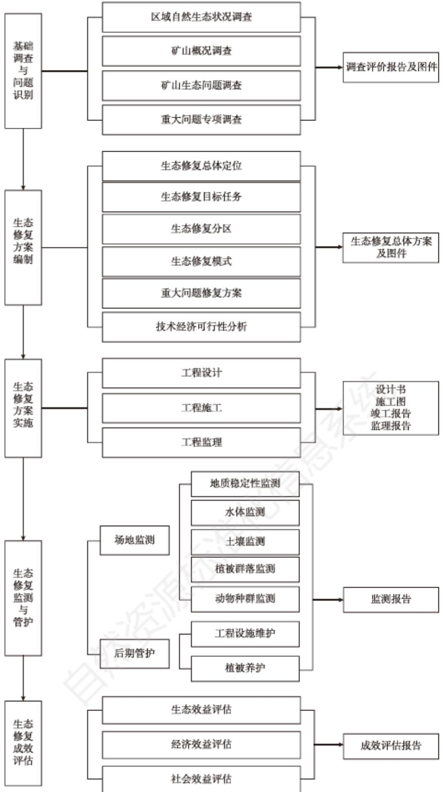

# 中华人民共和国土地管理行业标准

TD/T 1070. 1—2022

# 矿山生态修复技术规范 第1部分：通则

# Technical specifications for ecological restoration of mines—Part 1: General rule

2022-07-20 发布 2022-11-01 实施

## 目 次

前言…  
引言…  
1 范围…1  
2 规范性引用文件…1  
3 术语和定义1  
4 总体原则、总体目标与工作流程……………………………………………………………………2  
4. 1 总体原则…2  
4. 2 总体目标…3  
4. 3 工作流程3  
5 基础调查与问题识別…………………………………………………………………………………………………3  
5. 1 基础调查3  
5. 2 问题识别 5  
5.3 成果资料…6  
6 方案编制………6  
6. 1般规定……6  
6. 2 矿山基本情况6  
6. 3 总体定位与目标6  
6.4 主要任务与工作部署………6  
6. 5 跟踪监测7  
6. 6 经费估算7  
6.7 保障措施7  
7 方案实施…7  
7.1 工程实施7  
7. 2 技术措施8  
8 监测与管护…9  
8.1 跟踪监测…9  
8. 2 后期管护……10  
9 成效评估…10  
10 信息管理……11  
10.1 主要内容……11  
10. 2 管理要求 11  
附录 A(规范性) 矿山生态修复总体方案编制大纲……………………………………………………12  
附录B(资料性) 矿山生态修复定位与修复方向……14  
附录C(资料性) 矿山生态修复方式参考依据………15  
附录D(资料性) 矿山生态修复常用适地植物物种……16  
附录E（资料性） 土壤改良常用方法…… …………20  
附录F（资料性） 矿山生态修复成效监测参考方法与仪器……21  
参考文献…… …22

## 前 言

本文件按照GB/T1.1—2020《标准化工作导则 第1部分:标准化文件的结构和起草规则》的规定起草。

本文件是TD/T1070《矿山生态修复技术规范》的第1部分。TD/T1070已经发布了以下部分：

——第1部分：通则；

——第2部分：煤炭矿山；

——第4部分：建材矿山；

——第5部分：化工矿山；

——第6部分：稀土矿山；

——第7部分：油气矿山。

本文件由中华人民共和国自然资源部提出。

本文件由全国自然资源与国土空间规划标准化技术委员会(SAC/TC93)归口。

本文件起草单位：中国地质环境监测院、自然资源部国土空间生态修复司、中国自然资源经济研究院、河北省地质矿产勘查开发局第二地质大队、中煤科工集团唐山研究院有限公司、中国地质大学(武汉）、江西理工大学、中化地质矿山总局、江苏绿岩生态技术股份有限公司。

本文件主要起草人：张进德、张德强、杨利亚、王娜、王志一、郗富瑞、张志鹏、田磊、庞剑波、刘国伟、余洋、白光宇、李善峰、程国明、孙伟、王议、裴圣良、何培雍、董国明、李树志、饶运章、周建伟、孙贵尚、张荣波、余振国、白雪华、王頔、周巾枚。

## 引 言

为加快推进国土空间生态保护与修复工作，规范矿山生态修复工作流程、技术方法和要求，制定了TD/T1070《矿山生态修复技术规范》。

矿山生态修复涉及煤炭、金属、化工、建材、稀土、油气等不同矿种的矿山，涵盖调查、设计、施工、监测、评估的全过程，为满足矿山生态修复技术的通用性并突出不同矿种的特点，TD/T1070《矿山生态修复技术规范》拟由七个部分构成。

第1部分：通则。

——第2部分：煤炭矿山。

——第3部分：金属矿山。

——第4部分：建材矿山。

——第5部分：化工矿山。

——第6部分：稀土矿山。

——第7部分：油气矿山。

本文件是TD/T1070的第1部分，规范了矿山生态修复工作的技术流程、总体思路、工作方法等通用内容，其他六个部分是本文件的延伸和细化，重点强调了不同矿种的矿山生态修复技术措施。

## 矿山生态修复技术规范 第1部分：通则

## 1 范围

本文件规定了矿山生态修复的总体原则、总体目标与工作流程及基础调查与问题识别、方案编制、方案实施、监测与管护、成效评估和信息管理等内容。

本文件主要适用于矿产资源开采活动结束后的矿山生态修复等技术工作，矿产资源开采过程中开展矿山生态修复工作可参照执行。

## 2 规范性引用文件

下列文件中的内容通过文中的规范性引用而构成本文件必不可少的条款。其中，注日期的引用文件，仅该日期对应的版本适用于本文件;不注日期的引用文件，其最新版本(包括所有的修改单)适用于本文件。

GB/T 15776 造林技术规程

GB/T 21010 土地利用现状分类

GB/T 32864 滑坡防治工程勘查规范

GB/T 38360 裸露坡面植被恢复技术规范

GB 50021 岩土工程勘察规范

GB 51044 煤矿采空区岩土工程勘察规范

DZ/T 0153 物化探工程测量规范

DZ/T 0190 区域环境地质勘查遥感技术规定(1：50 000)

DZ/T 0282 水文地质调查规范(1:50 000)

DZ/T 0287 矿山地质环境监测技术规程

TD/T 1031.1 土地复垦方案编制规程 第1部分:通则

TD/T 1036 土地复垦质量控制标准

## 3 术语和定义

下列术语和定义适用于本文件。

## 3.1

矿山生态修复 mine ecological restoration

指依靠自然力量或通过人工措施干预，对因矿产资源开采活动造成的地质环境破坏、土地损毁和植被破坏等矿山生态问题进行修复，使矿山地质环境达到稳定、损毁土地得到复垦利用、生态系统功能得到恢复和改善。

3.2

自然恢复 natural restoration

指对生态系统停止人为干扰，以减轻负荷压力，依靠生态系统的自我调节能力和自组织能力使其向

有序的方向自然演替和更新恢复。

## 3.3

## 辅助再生 assisted restoration

指充分利用生态系统的自我恢复能力，辅以人工促进措施，使退化、受损的生态系统逐步恢复并进入良性循环。

## 3.4

## 生态重建 ecological reconstruction

指对因自然灾害或人为破坏导致生态功能受损、生态系统自我恢复能力丧失或发生不可逆变化，以人工措施为主，通过生物、物理、化学、生态或工程技术方法，围绕修复生境、恢复植被、生物多样性重组等过程，重构生态系统并使生态系统进入良性循环。

## 3.5

## 地貌重塑 landform reshaping

根据矿山地形地貌破坏方式与损毁程度，结合原有地形地貌特点，在消除地质环境问题和水土流失隐患基础上，通过有序排弃和土地整形等措施，形成与周边地貌景观相协调的新地貌。

## 3.6

## 土壤重构 soil reconstruction

指对矿山损毁土地采用工程、物理、化学、生物等改良措施，重新构造土壤基质，形成适宜植被生长的土壤剖面结构与肥力等条件。 MZ

## 3.7

## 植被重建 vegetation reconstruction

指综合考虑气候、海拔、坡度、坡向、地表物质组成和有效土层厚度等条件，选择先锋、适地植物物种，实施植被配置、栽植及管护，重新构建持续稳定的植物群落。

## 3.8

## 参照生态系统 reference ecosystem

指能够作为生态恢复基准的本地生态系统，常代表生态系统的非退化状态，包括其植物群、动物群(和其他生物群)、非生物成分、功能、过程和演替状态(未发生退化前的演替状态)。

## 3.9

## 生态系统功能 ecosystem function

指生态系统整体在其内部和外部的联系中表现出的作用和能力，随着能量、物质等的不断交流，生态系统亦产生不断变化和动态调整的过程。

## 4 总体原则、总体目标与工作流程

## 4.1 总体原则

4.1.1 尊重科学，顺应自然，保护自然。尊重生态系统演替规律，自然恢复与人工修复相结合，人工修复

为自然恢复创造条件，最大限度地发挥自然修复能力，避免过度工程治理。

4.1.2 整体保护，系统修复，综合治理。矿山生态修复应统筹考虑矿山所处区域生态功能以及各生态要素相互依存、相互影响、相互制约等特点，统筹兼顾，系统设计，逐步修复受损生态功能。

4.1.3因地制宜，分类施策，兴利除弊。统筹考虑矿山生态问题的多样性、复杂性、多因性和地域性特征，充分发挥国土空间规划引领作用，依据规划确定的土地用途，宜林则林、宜耕则耕、宜水则水、宜建则建、宜荒则荒。

4.1.4经济合理，技术可行，注重成效。按照财力可能、技术可行的原则，合理确定生态修复方向、方式和措施，提高投入产出效率，最大限度发挥废弃矿山修复后的长期效益。

## 4.2 总体目标

把因矿产资源开采而破坏的生态系统作为一个整体，依据矿山周边区域生态系统功能重要性、人居环境与经济社会发展状况，综合考虑自然条件、地形地貌条件、矿山生态问题及其危害程度等，坚持山水林田湖草沙一体化保护修复的理念，依靠自然恢复能力，结合必要的人工修复措施，对矿产资源开发造成的生态破坏进行生态修复与综合治理，消除矿山地质环境破坏问题，改善水土环境，有效恢复生态功能，使因采矿活动而破坏的区域地质环境达到稳定、损毁土地得到复垦利用、生态系统功能得到恢复或改善。

## 4.3 工作流程

矿山生态修复工作流程一般包括基础调查与问题识别、方案编制、方案实施、监测与管护、成效评估五个阶段。矿山生态修复工作流程详见图1。

## 5 基础调查与问题识别

## 5.1 基础调查

## 5.1.1 调查范围

充分体现生态系统完整性，统筹考虑矿山所在的地理单元和生态功能空间，以采矿活动影响到的区域范围为主，可适当扩展到周边区域。

## 5.1.2 调查内容

5.1.2.1 自然生态状况调查。包括矿山所在生态单元的区域自然生态条件、矿山地质环境条件和矿山生态状况。

a)区域自然生态条件调查包括气候、水文、土壤、植被，生态系统类型、结构、功能，以及生态功能定位、生态保护红线、重要生态敏感区、自然保护地等。

b)矿山地质环境条件调查包括地形地貌、地层岩性、地质构造、水文地质、工程地质、地壳表层基岩、风化壳、包气带、成土母质、土壤类型等，按照DZ/T0282执行。

c)矿山生态状况调查包括水体、土体、植被和动物等：

1)水体：水体类型、空间分布、面积，水体的环境质量和水温，水体的水位标高及其动态变化，水资源利用情况等；

2)土体：土地类型、空间分布、面积，土壤类型、分布、厚度、面积，土壤容重、粒度、结构，土壤含水量、有机质、pH、重金属、易溶盐等；

3)植被：植被群落构成，乔、灌、藤蔓、草本植物种类、分布、面积，植被覆盖率，植被根系分布和

  
图1 矿山生态修复工作流程图

发育深度等；

4）动物：动物种群类型、数量等。

5.1.2.2 矿山概况调查包括矿山名称、地理位置、矿山面积、建矿时间、闭坑或废弃时间、开采矿类与矿种、采区范围、开采深度层位、方式、规模以及矿山周边已实施的修复治理工程情况等。

5.1.2.3 矿山生态问题调查主要包括：

a)矿山地质环境破坏：地面塌陷、地裂缝、崩塌、滑坡、危岩体，不稳定边坡等的规模、位置、影响范围、成因、威胁对象等；

b)土地损毁：土地挖损、压占、沉陷、积水，地形地貌破坏的空间分布、面积、方式、程度等；按照TD/T 1031.1 执行。

c)水资源破坏：采矿活动影响的含水层类型、层位、范围、水位变化，地表水空间分布、水量变化等；

d)生态退化:采矿活动导致的表层土壤质地破坏、土壤侵蚀等的类型、面积和分布情况，植被损毁的类型、面积和分布，动物栖息地破坏的空间分布、面积、程度，以及由此造成生态系统结构破坏、功能衰退、生物多样性减少、生物生产力降低等；

e) 土地利用现状分类:按照 GB/T 21010执行。

5.1.2.4 重大问题专项调查。地下采空区、地面塌陷、露天矿坑边坡、含水层破坏等对矿山生态系统产生重大影响的地质环境问题，按照GB 51044、GB/T 32864开展调查。

## 5.1.3 调查方法

5.1.3.1 遥感调查：通过遥感影像解译矿山生态状况和生态问题，具体遥感调查流程、方法、精度要求按照DZ/T 0190执行。

5.1.3.2 踏勘：采用路线穿越与追索相结合的方法，初步了解矿山自然生态与地质环境概况。

5.1.3.3 物探：通过对工作区的实际踏勘，选用合适的物探方法。对于单一方法不易明确判定或较复杂的矿山生态问题，须采用两种或两种以上物探方法组合。具体调查流程、方法、精度要求按照DZ/T0153执行。 VINV

5.1.3.4 钻探：主要用于岩溶山区和重大生态问题区，具体钻探技术要求按照GB 50021执行。

5.1.3.5山地工程：采用坑探、槽探、井探、硐探等方法，调查探测对象的规模、边界、物质组成、形成条件等，获取现场试验参数等。 必

5.1.3.6 样品采集与分析测试：现场采集岩(土)体样品、土壤样品、水体样品、植被样品等，开展分析测试，具体样品取样、封存、运输和分析测试方法按相关要求执行。

## 5.1.4 专项调查

重大问题专项调查应根据问题的类型、特征，开展详细专项调查。

## 5.2 问题识别

## 5.2.1 建立矿山生态修复参照生态系统

采取与历史资料对比分析或矿山周围同类型地区综合调查等方法，建立矿山生态修复参照生态系统。一般用胁迫因素、物质条件、物种组成、结构多样性、生态系统功能和外部交换六个生态系统属性描述参照生态系统。

## 5.2.2 矿山生态问题分级

I级：场地存在严重矿山地质环境破坏问题，地质条件不稳定，或场地存在具有影响环境安全的重大

水土污染问题，或存在严重土地损毁、水资源破坏，地表植被生境受到严重影响，生态退化严重。

Ⅱ级：场地存在一定的矿山地质环境破坏问题，地质稳定性较差，或场地局部存在水土污染，存在一定程度土地损毁、水资源破坏，局部植被盖度与质量受到影响，物种生境条件较为稳定，生态系统结构与功能较为完好。

Ⅲ级：场地不存在矿山地质环境破坏问题和水土污染，地质稳定性与水土质量良好，地表仅存在少量土地损毁或水资源破坏，仅局部植被盖度与质量受到影响，物种生境条件稳定，生态系统结构与功能完好。

## 5.3 成果资料

主要包括调查数据表、测试分析数据、调查照片、音频视频、实际材料图、生态问题图等。

## 6 方案编制

## 6.1 一般规定

矿山生态修复方案在完成基础调查与问题识别的基础上编制，并与相关规划衔接。编制内容主要包括矿山基本情况、总体定位与目标、主要任务与工作部署、跟踪监测、投资估算、保障措施。矿山生态修复方案编制大纲可参照附录A确定。

## 6.2 矿山基本情况

6.2.1 区域自然生态状况。主要阐述区域自然生态条件、矿山地质环境条件和矿山生态状况。

6.2.2矿山概况。主要阐述矿山的地理位置、交通状况、矿权范围、开采矿种、开采规模、开采方式、开采层位、开采历史等。

6.2.3 矿山生态问题。主要阐述因矿山开采造成的地质环境破坏、土地损毁、水资源破坏和生态退化等生态问题分布、规模、特征，分析矿山生态问题的严重程度和危害，划分矿山场地生态问题严重程度等级。

## 6.3 总体定位与目标

6.3.1 矿山生态修复总体定位。根据国土空间规划确定的生态空间、农业空间、城镇空间布局，结合矿山未来用地规划、开发利用方式和土地用途等综合确定。矿山生态修复总体定位可参见附录B确定。

6.3.2 矿山生态修复总体目标。主要从矿山地质环境破坏问题治理、生态环境改善、损毁土地利用等方面，定性或定量给出约束性指标和引导性指标。

## 6.4 主要任务与工作部署

6.4.1依据矿山生态修复总体定位和国土空间用地用海分类指南，结合修复场地地质环境、水土环境、水资源平衡等场地条件，确定地面塌陷区、露天采场、工业广场、废料场、排土场、废石堆等矿山场地的修复用途。

6.4.2 根据已确定的矿山场地修复用途，统筹考虑生态问题的严重程度、现有技术经济条件等，确定矿山生态修复方式。修复方式选择可参见附录C确定。

6.4.3 根据矿山场地的生态修复方式，结合场地条件提出适宜的修复措施。对于矿山重大生态问题，需单独给出生态修复专项工程技术方案，明确工程措施。

6.4.4 按照轻重缓急、分阶段实施的原则，提出工程总体部署和分年度实施计划，测算工程量。

6.4.5综合考虑当地经济发展水平和修复技术、成本、周期、民众可接受程度等因素，分析生态修复技术

经济可行性。

## 6.5 跟踪监测

明确矿山生态修复监测的目的、范围、内容、方法，以及监测期限和监测频次等。

## 6.6 经费估算

根据矿山生态修复技术措施和所部署的工程量，测算所需经费，明确经费筹措渠道。

## 6.7 保障措施

制定保障矿山生态修复工作顺利实施的组织管理、技术保障、资金保障、后期管护等措施。

## 7 方案实施

## 7.1 工程实施

## 7.1.1 工程设计

7.1.1.1 设计依据。工程设计在编制完成矿山生态修复方案的基础上进行，遵守相关法律法规和政策文件，并与相关规划衔接。

7.1.1.2 设计思路。统筹考虑矿山的自然条件、地质环境条件、生态问题复杂程度和技术经济可行性等因素，按照因地制宜、分类施策的原则，优先治理矿山地质环境破坏问题，再根据不同场地的生态修复方向和模式，确定适宜的生态修复措施。 MZ

7.1.1.3 设计书编制。设计书在矿山生态修复方案的基础上编制，包括文本、附表和附图三部分。

a)文本，包括前言、工程概况、设计依据和原则、目标任务、工程设计、工程量、工程部署、工程进度、工程预算、组织管理。

b)附表，包括工程量表、工程预算表、重要事项说明表等。

c)附图，包括工程部署图、工程设计平面(剖面)图、工程实施效果图、工程量计算图、重点工程设计大样图和其他附图。

## 7.1.2 工程施工

7.1.2.1 工程施工严格按照工程设计及相关要求进行，加强施工进度和工程质量控制，确保规定工期内保质保量完成任务，保证工程目标实现。

7.1.2.2 依据安全生产法律法规、文件和技术标准组织施工，及时处理施工中出现的问题，确保工程安全。 入

7.1.2.3 按照信息管理要求，及时填报工程施工进展信息。

## 7.1.3 施工准备

7.1.3.1技术准备。包括收集资料、现场踏勘、技术交底、编制施工组织设计和施工方案、工程材料准备、施工工艺方法试验、开工资料编制及报验等。

7.1.3.2现场准备。包括施工现场布置、临时设施建设、场地硬化、施工道路修建、临时水电配置、人员组织、施工设备进场、施工围挡、临时排水、场地绿化以及文明施工与环境保护措施落实等。

7.1.3.3测量放线。包括测量基准点的移交、接受、复核、加固，测量控制网布设、施工区地形图复核与

修测，工程范围、工程控制点及高程施测，测量成果检查验收及报验。

## 7.1.4 施工组织

7.1.4.1 施工组织设计编制依据为项目勘查报告、工程设计书、合同文件及法律法规等，主要内容包括工程基本情况、管理目标、施工总体部署、施工方案、施工方法、施工顺序、进度计划、施工安全、现场管理、保障措施等。

7.1.4.2 根据施工组织设计开展施工作业，按照工程设计、施工方案要求组织施工，保证在规定的期限内完成施工作业。施工期间按设计要求进行现场施工质量检测，检测方法和检测标准应满足相关要求。

## 7.1.5 施工监理

7.1.5.1 施工监理依据主要包括工程设计文件、已批准的施工组织设计、施工方案、监理合同文件等。

7.1.5.2 施工监理阶段主要包括施工准备监理、施工监理、竣工验收监理、工程保修(养护)监理。

7.1.5.3 施工监理内容主要包括工程质量控制、工程投资控制、工程进度控制、安全生产管理和环境保护、合同与信息管理以及组织协调等。

## 7.2 技术措施

## 7.2.1 自然恢复措施

7.2.1.1 采取封闭修复场地、拆除废弃设施等措施，消除影响自然恢复的生态胁迫因子。

7.2.1.2 不允许在修复场地内翻土、取石、搬运、垦殖等人类活动，排除外界干扰，减少对场地的扰动。

7.2.1.3 依赖场地和周边生态系统自我愈合能力，促进植被再生和生物种群恢复。

## 7.2.2 辅助再生措施

7.2.2.1 通过坡面危岩清理、采坑回填、废石(渣)清理等人工辅助措施进行矿山地质环境治理。

7.2.2.2 通过坡面修整、土壤改良、截排水等人工辅助措施进行场地平整，改善土壤功能，为植被恢复提供条件。 X

7.2.2.3筛选适地植物物种，采取补植、补播、抚育、间伐、杂灌草清除等人工辅助措施，加快场地生态系统结构和功能的修复。适地植物物种的选择可参见附录D.

7.2.2.4 禁止引入对当地生物多样性造成威胁的外来物种。

## 7.2.3 生态重建措施

7.2.3.1 治理矿山地质环境破坏问题应通过以下措施：

a)采取清理、疏导、拦挡、固化等工程措施消除矿山废弃渣土安全隐患；

b)采取爆破清除、锚固、拦挡、支护等工程措施消除矿山危岩体安全隐患；

c)采取坡体锚固、削坡卸荷、垫脚堆坡、坡脚拦挡、疏导排水等工程措施消除矿山不稳定边坡隐患；

d)采取爆破、拆除、回填、封堵、加固、综合利用等工程措施消除矿山废弃井口安全隐患；

e) 采取回填、整平等工程措施消除矿山地表开裂和地面塌陷坑安全隐患。

7.2.3.2 地貌重塑：根据矿山地貌破坏方式与损毁程度，结合矿山周边地貌特点，通过地形重塑、土地整治、重构截排水系统等措施重新塑造一个与周边地貌相协调的新地貌。

a)通过边坡修理、废石(渣)清理、平台整理、采坑回填、地表开挖、台阶修筑、道路修建、挖深垫浅、矿井封堵等工程措施重塑地形。场地修复为旱耕地、园地，修复后的地形坡度一般不超过25°;场地修复为水浇耕地，修复后的地形坡度一般不超过15°；场地修复为林草地，地形坡度不做规定；场地修复为建设用地，地形应满足建筑物防洪要求，地形坡度值按照当地同类岩土体稳定性坡度值确定。

b)采取场地平整、表土保护、土石配置、客土覆盖等工程措施进行土地整治。场地平整需与修复方向相结合，平整时合理配置土石，确需剥离表土，先将表土单独堆放，待平整完成后，再均匀摊铺；客土覆盖宜合理选择客土土源，土源位置宜接近修复区。

c)通过铺设防渗层和修筑排洪沟、暗沟、截水墙、水塘等工程措施重构截排水系统。防渗层铺盖材料可选择黏土、混凝土、水泥砂浆等;排洪沟需与自然沟系相连接，采取植物岸坡形式；暗沟宜布设在沿顺山坡走向的低洼地带或天然沟谷处。

7.2.3.3 土壤重构:在矿山地貌重塑基础上，依靠本地的岩土条件、水热与温湿条件等，充分利用采矿剥离的表土和采矿遗留的废石(渣)、尾矿砂(渣)、粉煤灰等固体废弃物，通过培肥改良、土层置换、表土覆盖、土层翻转、化学改良、生物修复等措施，重构土壤剖面结构与土壤肥力条件。不同场地的土壤重构可根据场地修复用途确定重构措施，不同用途的土地复垦质量控制标准按照TD/T1036的附录D.1至D.10执行。

a)场地修复后用作耕地，有效表土厚度不小于40cm，土壤质地以砂壤土和砂质黏土为主，砾石含量不超过20%，有机质含量不小于1.5%，pH值介于6.0\~8.5之间，控制土壤容重不超过1.45$\mathrm { { g / c m ^ { 3 } } }$

b) 场地修复后用作园地，有效表土厚度不小于40cm，土壤质地以砂壤土和砂质黏土为主，砾石含量不超过20%，有机质含量不小于1.5%，pH值介于6.0～8.5之间，控制土壤容重不超过1.45g/cm³。

c) 场地修复后用作林地，有效表土厚度不小于20cm，土壤质地以砂土和粉黏土为主，砾石含量不超过30%，有机质含量不小于1%，pH值介于5.5\~8.5之间，控制土壤容重不超过1.5g/cm³。

d) 场地修复后用作草地，有效表土厚度不小于20cm，土壤质地以砂土和壤质黏土为主，砾石含量不超过20%，有机质含量不小于1%，pH值介于6.0～8.5之间，控制土壤容重不超过1.45$\mathrm { { g / c m ^ { 3 } } }$ VIAKO

e) 对存在土壤污染的场地，应对污染场地进行先导治理或协同治理，使其达到土壤环境质量相关标准和要求。

f) 土壤改良常用方法可参见附录E。

7.2.3.4 植被重建：在地貌重塑和土壤重构基础上，依据按照生态系统的生物种群特点，考虑矿山生态重建的植被适宜性、结构布局合理性和物种多样性，合理配置植物种群组成和结构，借助人工支持和诱导，重建与周边生态系统相协调的生态系统，保障植物群落持续稳定。

a)依据重塑的地貌形态和重构的土壤条件，充分考虑植被配置的多样性、适应性、先锋性和抗逆 性，合理配置矿山植被重建空间。

b)根据场地条件，筛选出根系发达、固氮能力强、生长速度快、播种栽植容易、成活率高、病虫害少、抗水土流失能力强、易管护的适生植物和先锋植物，通过林、草、花、卉、乔、灌种植结合，合理部署植被疏密和覆盖区域。矿山植被重建常用适地植物物种可参见附录D。不同植被的种植技术和栽培方法可按照GB/T 38360、GB/T 15776 执行。

## 8 监测与管护

## 8.1 跟踪监测

8.1.1 监测目的是掌握矿山生态修复实施效果，为后期管护和成效评估提供依据。

8.1.2 监测范围以矿山生态修复实施区域为主，可适当扩展到矿山周边地区。

8.1.3监测内容包括地质稳定性、水体、土壤、植物群落和动物种群等。

a)地质稳定性的监测内容主要包括边坡稳定性、地面塌陷、地裂缝等。

b)水体的监测内容主要包括地表水分布、面积、水质和地下水水位、水质等。

c)土壤的监测内容主要包括土壤类型、分布、面积和土壤肥力、理化性质等。

d)植被群落的监测内容主要包括植被种类、分布、面积和植被成活率、覆盖度等。

e)动物种群的监测内容主要包括动物类型、数量和分布等。

8.1.4 地质稳定性监测周期可按照DZ/T0287执行;水体监测周期为2次/年，丰水期、枯水期各1次；  
土壤、植被群落和动物种群监测周期为1次/年。监测期限可根据后期管护要求确定。

8.1.5 监测方法根据监测内容和场地条件确定，常用监测方法和相应的监测仪器参见附录F。

## 8.2 后期管护

8.2.1 矿山生态修复工程验收合格后，根据矿山生态修复目标，需做好后期管护工作。管护内容主要包括工程设施维护和植被养护。

a)工程设施维护主要对支护加固工程、截排水工程、地貌重塑工程、土壤重构工程和相关配套附属设施等，按照工程设计和运行要求进行定期检查和维护；发现工程设施运行不正常或损毁，应及时修复或替换。

b)植被养护主要采取定期或不定期喷水、追肥、清除杂草、防治病虫害、补植、补种等措施，对复绿植被进行养护。

8.2.2 后期管护时间根据矿山自然生态条件和修复成效确定，一般管护时间为2年～3年，生态脆弱区管护时间为3年～5年。 4W

8.2.3鼓励积极探索建立规模化、专业化、社会化管护运营机制，实现矿山生态修复工程长效、持续、稳定。

## 9 成效评估

9.1 矿山生态修复工作完成后，根据监测结果，对矿山生态修复成效进行评估。矿山生态修复成效评估一般在竣工验收结束后进行，具体评估时间可根据实际情况确定。

9.2 矿山生态修复成效评估的内容主要包括生态效益评估、社会效益评估和经济效益评估三个方面。

a)生态效益评估主要考虑矿山地质稳定性、水体、土壤、植被群落和动物种群五个方面：

1) 矿山地质稳定性评估重点针对地质环境破坏问题治理后的边坡、地面塌陷区、地裂缝等区域的地质稳定情况进行分析评估；

2) 矿山水体评估重点针对修复后的地表水水质、地下水水质改善情况和地下水水位变化情况进行分析评估；

3) 土壤评估重点针对修复后的土壤质量改善情况进行分析评估；

4)植物群落评估重点针对修复后的植被类型、分布、成活率、覆盖度的变化情况进行分析评估；

5)动物种群评估重点针对修复后的动物类型、数量的变化情况进行分析评估。

b)社会效益评估主要考虑矿山生态修复工程涉及的人居环境改善、防灾减灾能力提升、群众满意度上升，以及依托矿山生态修复工程实施带来的就业渠道拓宽、环保意识提高等方面。

c) 经济效益评估主要考虑工程投入产出比，以及由矿山生态修复带来的其他方面的潜在效益，如土地增值、居民收入增长、旅游收入增长等。

## 10 信息管理

## 10.1 主要内容

10.1.1原始资料数据。包括工作底图数据、调查数据、监测数据、评估数据、测试数据、过程分析数据、照片、音频及视频等资料。

10.1.2成果资料数据。包括可行性研究报告、总体实施方案、调查报告、勘查报告、工程设计、施工设计、竣工验收报告、总结报告、专题报告、监理报告、规划图件、分析评价图件、专题图件、综合图件等材料。

## 10.2 管理要求

10.2.1 按照矿山生态修复相关法规、标准规范的要求，对数据资料进行分级分类建库和管理，各单位对本部产生数据质量负责，数据的传输、共享和应用应符合国家安全保密规定。

10.2.2 对各阶段工作产生的各类数据及时分类整理、编目、存档。除保存原始纸介质资料外，应建立信息系统与数据库，进行数据资料管理。

10.2.3 信息系统建设应符合国家相关网络安全设计要求。

10.2.4 数据库涵盖矿山生态修复各阶段数据内容，建立数据更新机制，数据质量符合相关要求。

# 附录 A

# (规范性) 矿山生态修复总体方案编制大纲

## A.1 矿山基本情况

## A. 1.1 区域自然生态状况

区域自然生态条件、矿山地质环境条件和矿山生态状况。

## A.1.2 矿山概况

矿山的地理位置、交通状况、矿权范围、开采矿种、矿采规模、开采方式、开采层位、开采历史等。

## A. 1.3 矿山生态问题

因矿山开采造成的地质环境破坏、土地损毁、水资源破坏和生态退化等生态问题分布、规模、特征，分析矿山生态问题的严重程度和危害，划分矿山场地生态问题严重程度等级。

## A.2 矿山生态修复总体定位与目标任务

## A.2.1 总体定位

根据国土空间规划相关要求，结合矿山未来用地规划、开发利用方式和土地用途确定的生态修复方向。

## A.2.2 总体目标

通过实施矿山生态修复，拟完成的生态修复总体目标，以及详细的绩效目标，包括数量指标(地质环境破坏问题治理数量、修复治理面积或长度等)和效益指标(生态质量改善、生态功能提升、水质改善、土地复垦、植被覆盖率提升、生物多样性保护等情况)等。

## A.2.3 主要任务

围绕总体目标和具体绩效目标，需开展的重点工作任务。

## A.3 矿山生态修复工作部署

## A.3.1 修复方式

矿山场地修复用途，以及不同场地的生态修复方式。

## A.3.2 修复措施

不同场地的主要生态修复措施。

## A.3.3 修复工程部署

矿山生态修复工程总体部署和分项部署，工程实施的总工程量和分项工程量，工程实施年限和分年

度实施计划。可附表、附图说明。

## A.3.4 技术经济可行性分析

矿山生态修复技术经济可行性。

## A.4 跟踪监测

工程实施跟踪监测内容与方法，以及监测期限和监测频次等。

## A. 5 经费估算

## A. 5.1 估算依据

经费估算的依据、取费标准等。

## A.5.2 经费估算

经费估算计算方法、过程和估算结果等，可详细列表说明。

## A.6 保障措施

## A.6.1 组织保障

实施生态修复工程的组织管理方式。

## A.6.2 技术保障

生态修复工程技术措施的先进性、可行性等。

## A.6.3 资金保障

生态修复工程经费筹措和使用管理等。

## A.6.4 后期管护

工程实施后的工程设施维护和植被养护措施。

## A.7 附图

A.7.1 矿山生态问题现状图。

A.7.2 矿山生态修复工程规划部署图。

## 附录B

(资料性)

矿山生态修复定位与修复方向

表B.1给出了矿山生态修复定位与修复方向参考依据。

表 B.1 矿山生态修复定位与修复方向
<table><tr><td rowspan=1 colspan=1>生态修复定位依据</td><td rowspan=1 colspan=1>矿山生态修复方向</td></tr><tr><td rowspan=1 colspan=1>农业空间</td><td rowspan=1 colspan=1>矿山位于国土空间规划的农业空间区域，修复方向优先考虑恢复农业生产功能，宜耕则耕、宜园则园、宜林则林、宜水则水;无法恢复农业生产功能的应恢复生态系统功能</td></tr><tr><td rowspan=1 colspan=1>城镇空间</td><td rowspan=1 colspan=1>矿山位于国土空间规划的城镇空间区域，修复方向优先考虑恢复城镇开发利用条件，盘活工矿废弃地利用;矿山及周边自然生态景观良好或矿山拥有悠久矿业开发历史、珍贵矿业遗迹和丰富矿业文化，可考虑创建矿山主题公园，提升城市生态品质；无法恢复城镇开发利用条件的，应恢复生态系统功能、提升生态质量</td></tr><tr><td rowspan=1 colspan=1>生态空间</td><td rowspan=1 colspan=1>矿山位于国土空间规划的生态空间区域，修复方向优先考虑恢复生态系统功能。生态保护红线内，须修复生态系统，禁止任何开发活动或改变生态用地的用途；生态保护红线外，可考虑在不妨碍现有生态功能的前提下，适度开展国土开发、资源和景观利用，但严格限制建设占用等不可逆变化</td></tr></table>

## 附 录 C

(资料性)

矿山生态修复方式参考依据

表C.1给出了确定矿山生态修复方式参考依据。

表 C.1 矿山生态修复方式参考依据
<table><tr><td rowspan=1 colspan=1>矿山生态修复方式</td><td rowspan=1 colspan=1>适宜的场地条件</td></tr><tr><td rowspan=1 colspan=1>自然恢复</td><td rowspan=1 colspan=1>场地存在轻微地质环境破坏，不存在水土污染，地质稳定性与水土质量良好，地表仅存在少量土地损毁或水资源破坏，仅局部植被盖度与质量受到影响，物种生境条件稳定，生态系统结构与功能完好</td></tr><tr><td rowspan=1 colspan=1>辅助再生</td><td rowspan=1 colspan=1>场地存在一定的矿山地质环境破坏，地质稳定性较差，或场地局部存在水土污染，存在一定程度土地损毁、水资源破坏，部分植被盖度与质量受到影响，物种生境条件较为稳定，生态系统结构与功能基本完好</td></tr><tr><td rowspan=1 colspan=1>生态重建</td><td rowspan=1 colspan=1>场地存在严重矿山地质环境破坏，地质条件不稳定，或场地存在具有影响环境安全的重大水土污染问题，或存在严重土地损毁、水资源破坏，地表植被生境受到严重影响，生态退化严重</td></tr></table>

()  
花
<table><tr><td rowspan=1 colspan=1>自然植被区域</td><td rowspan=1 colspan=1>行政区域</td><td rowspan=1 colspan=1>乔木植物</td><td rowspan=1 colspan=1>灌木植物</td><td rowspan=1 colspan=1>草本植物</td><td rowspan=1 colspan=1>攀援植物</td></tr><tr><td rowspan=1 colspan=1>寒温带半干旱区域</td><td rowspan=1 colspan=1>内蒙古东北部、黑龙江西北部</td><td rowspan=1 colspan=1>樟子松、柞木、落叶松、红皮云杉、白桦、山杨、冷杉、旱柳、紫椴、蒙古栎、榆树、黄檗、水曲柳</td><td rowspan=1 colspan=1>松江柳、东北山梅花、珍珠梅、山刺玫、紫丁香、蓝果忍冬、红瑞木、茶条槭</td><td rowspan=1 colspan=1>线叶菊、冰草、冷蒿、草地早熟禾、狗尾草、赖草、沟叶羊茅、羊茅、大叶章、乌拉草、大籽蒿</td><td rowspan=1 colspan=1>蛇葡萄、山葡萄、五味子</td></tr><tr><td rowspan=1 colspan=1>温带湿润、半湿润区域</td><td rowspan=1 colspan=1>黑龙江、吉林大部及辽宁东北部</td><td rowspan=1 colspan=1>红皮云杉、油松、黑松、樟子松、红松、侧柏、圆柏、丹东桧、杜松、兴安落叶松、银中杨、小黑杨、旱柳、核桃楸、白桦、榆树、山皂荚、刺槐、元宝枫、蒙椴、复叶槭、水曲柳、辽东水蜡树、暴马丁香</td><td rowspan=1 colspan=1>忍冬、金银木、东北山梅花、珍珠梅、黄刺玫、榆叶梅、紫丁香、东北连翘、紫穗槐、胡枝子、文冠果、荆条、蚂蚱腿子、沙拐枣、山刺玫、金银忍冬、长白忍冬、蓝果忍冬、黄花忍冬、松江柳、榛、毛榛、红瑞木、茶条槭、山杏</td><td rowspan=1 colspan=1>大叶章、乌拉草、高原早熟禾、冷蒿、紫羊茅、大籽蒿、草木樨、黄芪、草地早熟禾、高羊茅、针茅、无芒雀麦、白草、冰草、龙须草、偃麦草、狗尾草、赖草、羊草、马蔺、紫苜蓿、绣球小冠花、沙打旺、白三叶、波斯菊、线叶菊、万寿菊、二月蓝、山野豌豆、异穗薹草</td><td rowspan=1 colspan=1>地锦、异叶蛇葡萄、山葡萄、常春藤、紫藤、南蛇藤</td></tr><tr><td rowspan=1 colspan=1>北暖温带湿润、半湿润区域</td><td rowspan=1 colspan=1>北京、天津、河北大部、辽宁南部、山东北部、陕西中南部、山西南部</td><td rowspan=1 colspan=1>青杆、白杆、雪松、油松、白皮松、华山松、黑松、侧柏、桧柏、蜀桧、龙柏、水杉、银杏、小青杨、毛白杨、旱柳、馒头柳、核桃、板栗、槲栎、榆树、玉兰、杂种鹅掌楸、杜仲、悬铃木、西府海棠、合欢、刺槐、国槐、臭椿、元宝枫、栾树、柿树、洋白蜡、毛泡桐</td><td rowspan=1 colspan=1>紫穗槐、胡枝子、沙棘、柠条锦鸡儿、小叶锦鸡儿、金银忍冬、马棘、扶芳藤、欧李、连翘、酸枣、荆条、黄刺玫、华北绣线菊、决明、卫矛、沙地柏、白刺花、滨藜、杠柳、铺地柏、山杏、枸杞、丁香、沙柳、毛黄、榛、毛榛</td><td rowspan=1 colspan=1>高羊茅、无芒雀麦、冰草、弯叶画眉草、狗尾草、白草、龙须草、鸭茅、紫花苜蓿、绣球小冠花、红豆草、二月蓝、异穗薹草、白颖薹草、赖草、黄花苜蓿、沙打旺、草本犀状黄芪、黄香草木樨、白香草木樨、狗牙根、白羊草、早熟禾、黑麦草、三叶草、籽粒苋、老芒麦、披碱草、雀麦、马唐、棘豆、野大豆、剪股颖、百喜草、结缕草</td><td rowspan=1 colspan=1>葡萄、山葡萄、爬山虎、地锦、凌霄、葛藤、南蛇藤</td></tr></table>

和准花
<table><tr><td rowspan=1 colspan=1>自然植被区域</td><td rowspan=1 colspan=1>行政区域</td><td rowspan=1 colspan=1>乔木植物</td><td rowspan=1 colspan=1>灌木植物</td><td rowspan=1 colspan=1>草本植物</td><td rowspan=1 colspan=1>攀援植物</td></tr><tr><td rowspan=1 colspan=1>南暖温带湿润、半湿润区域</td><td rowspan=1 colspan=1>山东南部、河南中北部、江苏、安徽北部、陕西中部</td><td rowspan=1 colspan=1>侧柏、油松、黑松、樱桃、毛樱桃、杜梨、青檀、盐肤木、刺槐、云杉、雪松、华山松、铅笔柏、桧柏、龙柏、水杉、广玉兰、银杏、加拿大杨、旱柳、垂柳、栓皮栎、小叶朴、玉兰、杂种鹅掌楸、杜仲、悬铃木、合欢、皂荚、国槐、臭椿、苦楝、乌柏、七叶树、栾树、青桐、柿树、白蜡、泡桐、毛泡桐</td><td rowspan=1 colspan=1>紫穗槐、胡枝子、沙棘、锦鸡儿、金银忍冬、扶芳藤、马棘、欧李、连翘、酸枣、荆条、黄刺玫、华北绣线菊、决明、卫矛、沙地柏、白刺花、滨藜、杠柳、铺地柏、山杏、枸杞、丁香、沙柳、毛黄栌、榛、毛榛、花木兰、木槿、紫荆、女贞、紫丁香、山合欢</td><td rowspan=1 colspan=1>高羊茅、绣球小冠花、黑麦草、结缕草、早熟禾、紫羊茅、二月蓝、无芒雀麦、冰草、弯叶画眉草、狗尾草、白草、龙须草、鸭茅、紫花苜蓿、红豆草、异穗薹草、白颖薹草、赖草、黄花苜蓿、沙打旺、草本犀状黄芪、黄香草木樨、白香草木樨、狗牙根、白羊草、三叶草、籽粒苋、老芒麦、披碱草、雀麦、马唐、棘豆、野大豆、剪股颖、百喜草、金鸡菊、百脉根</td><td rowspan=1 colspan=1>爬山虎、凌霄、葛藤、地锦、山葡萄、南蛇藤</td></tr><tr><td rowspan=1 colspan=1>北亚热带湿润、半湿润区域</td><td rowspan=1 colspan=1>江苏、上海、安徽、湖北大部，河南、陕西、甘肃南部，浙江北部，云贵川及中南省份高海拔山地</td><td rowspan=1 colspan=1>罗汉松、雪松、日本五针松、赤松、马尾松、湿地松、柏木、水杉、金钱松、苦储、广玉兰、香樟、八角枫、木荷、桂花、银杏、垂柳、枫杨、麻栎、白栎、杂种鹅掌楸、无患子、枫香、法桐、合欢、国槐、重阳木、红枫、鸡爪槭、黄连木、七叶树、全缘叶栾树、青桐</td><td rowspan=1 colspan=1>木豆、多花木蓝、紫穗槐、扶芳藤、胡枝子、马棘、夹竹桃、火棘、车桑子、锦鸡儿、杜鹃、牡荆、欧李、紫薇、女贞、珊瑚树、决明、石楠、枸骨、冬青、黄杨、小蜡、金丝桃、麻叶绣线菊、紫荆、木槿、多花木兰</td><td rowspan=1 colspan=1>结缕草、狗牙根、宽叶雀稗、马唐、地毯草、假俭草、野牛草、黑麦草、高羊茅、白三叶、小冠花、香根草、百喜草、大翼豆、弯叶画眉草、知风草、紫花苜蓿、白灰毛豆、百脉根、草木樨、猪屎豆、乌毛蕨</td><td rowspan=1 colspan=1>爬山虎、凌霄、金合欢、蛇藤、紫藤、常春油麻藤、南蛇藤、野蔷薇、多花蔷薇、地锦</td></tr><tr><td rowspan=1 colspan=1>中亚热带湿润区域</td><td rowspan=1 colspan=1>江西、福建、湖南、贵州等省大部，云南、广东、广西等北部，浙江南部、四川东部、重庆西部</td><td rowspan=1 colspan=1>重阳木、雪松、云南松、马尾松、湿地松、罗汉松、冷杉、柳杉、南岭黄檀、黄山栾、川棟、黑荆、蚊母树、五角枫、香樟、滇杨、藏柏、桤木、枫杨、竹柏、三尖杉、南方红豆杉、香榧、金钱松、水松、落雨杉、池杉、粗榧、广玉兰、木莲、黑壳楠、阴香、杜英、杨桐、木荷、加拿利海枣、棕榈、银杏、垂柳、鹅掌楸、枫香、法桐、乌柏、黄连木、三角枫、红枫、鸡爪槭、全缘叶栾树、无患子、蓝果树</td><td rowspan=1 colspan=1>伞房决明、双荚决明、车桑子、小叶女贞、扶芳藤、荆条、麻叶绣线菊、马桑、火棘、石楠、紫荆、厚皮香、紫穗槐、五色梅、戟叶酸模、木豆、多花木蓝、胡枝子、马棘、夹竹桃、锦鸡儿、杜鹃、牡荆、欧李、紫薇、珊瑚树</td><td rowspan=1 colspan=1>结缕草、狗牙根、宽叶雀稗、马唐、地毯草、假俭草、黑麦草、百喜草、香根草、大翼豆、弯叶画眉草、沟叶结缕草、知风草、高羊茅、白三叶、紫苜蓿、白灰毛豆、波斯菊、百脉根、草木樨、猪屎豆、乌毛蕨</td><td rowspan=1 colspan=1>羽叶金合欢、蛇藤、常春油麻藤、南蛇藤、野蔷薇、多花蔷薇、地锦、凌霄</td></tr></table>

<table><tr><td rowspan=1 colspan=1>自然植被区域</td><td rowspan=1 colspan=1>行政区域</td><td rowspan=1 colspan=1>乔木植物</td><td rowspan=1 colspan=1>灌木植物</td><td rowspan=1 colspan=1>草本植物</td><td rowspan=1 colspan=1>攀援植物</td></tr><tr><td rowspan=1 colspan=1>南亚热带湿润区域</td><td rowspan=1 colspan=1>福建南部，广东大部至广西、云南中部，台湾低海拔地区及其附属海岛</td><td rowspan=1 colspan=1>南洋杉、马尾松、湿地松、云南松、柳杉、罗汉松、竹柏、三尖杉、香榧、水松、落羽杉、池杉、水杉、青冈栎、高山榕、大果榕、小叶榕、银桦、玉兰、阴香、相思、南洋楹、红花羊蹄甲、腊肠树、重阳木、木麻黄、桃花心木、木荷、柠檬桉、幌伞枫、鸡蛋花、假槟榔、棕榈、长叶刺葵、大叶榕、鹅掌楸、枫香、法桐、复羽叶栾树、木棉、香樟、合欢、台湾相思、黑荆、银荆、女贞、杜英、刺桐、凤凰木、金凤花、川楝、滇楸、水黄皮、红千层</td><td rowspan=1 colspan=1>伞房决明、双荚决明、黄槐决明、鸡冠刺桐、黄槐、紫薇、扶芳藤、假茉莉、假连翘、水蜡、车桑子、金丝桃、九里香、小叶女贞、木槿、紫荆、五色梅、木豆、多花木蓝、紫穗槐、胡枝子、马棘、夹竹桃、火棘、锦鸡儿、杜鹃、牡荆、欧李、珊瑚树</td><td rowspan=1 colspan=1>结缕草、狗牙根、宽叶雀稗、马唐、地毯草、假俭草、黑麦草、百喜草、香根草、大翼豆、弯叶画眉草、沟叶结缕草、知风草、高羊茅、白三叶、紫苜蓿、白灰毛豆、波斯菊、百脉根、草木樨、猪屎豆、乌毛蕨</td><td rowspan=1 colspan=1>羽叶金合欢、蛇藤、常春油麻藤、南蛇藤、野蔷薇、多花蔷薇、地锦、凌霄</td></tr><tr><td rowspan=1 colspan=1>热带湿润区域</td><td rowspan=1 colspan=1>云南南部，广西、广东、福建等省区沿海和海南省，台湾南端</td><td rowspan=1 colspan=1>南洋杉、海南五针松、湿地松、鸡毛松、竹柏、陆均松、罗汉松、池杉、落羽杉、白莲叶桐、木菠萝、大果榕、高山榕、银桦、白兰、红花羊蹄甲、铁刀木、秋枫、海南杜英、木麻黄、青梅、海南菜豆树、火焰树、长叶刺葵、槟榔、皇后葵、桄榔、椰子、楹树、盾柱木、腊肠树、假苹婆、榄仁树、玉蕊、凤凰木、刺桐、金凤花、川楝子、台湾相思、大叶相思、水黄皮、海滨木巴戟、重阳木、红千层、栾树、黄槐、女贞、黄槿</td><td rowspan=1 colspan=1>木豆、宝巾、多花木蓝、夹竹桃、紫薇、扶芳藤、构棘、野牡丹、虾子花、桃金娘、朱槿、木芙蓉、悬玲花、山麻杆、红背山麻杆、朱缨花、双荚决明、金樱子、龙船花、露兜树、棕竹、散尾葵、金竹、芸香竹、小叶女贞、鸡冠刺桐、黄槐、假茉莉、假连翘、伞房决明、猪屎豆、白灰毛豆</td><td rowspan=1 colspan=1>大叶油草、百喜草、狗牙根、海滨雀稗、沟叶结缕草、弯叶画眉草、阔苞菊、铺地黍、细穗草、羽叶决明、猪屎豆、香根草、假俭草、糖蜜草、类芦、细叶结缕草、白灰毛豆、大翼豆、肾蕨、狗脊、翠云草、艳山姜、山姜、美人蕉、野蕉、柊叶、斑茅、四棱豆、乌毛蕨</td><td rowspan=1 colspan=1>地锦、葛藤、首冠藤、红叶藤、使君子、红背叶羊蹄甲、龙须藤、山葡萄、蔓九节、络石、凌霄、省藤、藤竹草、合欢</td></tr></table>

和准花
<table><tr><td rowspan=1 colspan=1>自然植被区域</td><td rowspan=1 colspan=1>行政区域</td><td rowspan=1 colspan=1>乔木植物</td><td rowspan=1 colspan=1>灌木植物</td><td rowspan=1 colspan=1>草本植物</td><td rowspan=1 colspan=1>攀援植物</td></tr><tr><td rowspan=1 colspan=1>温带半干旱区域</td><td rowspan=1 colspan=1>内蒙古中东部，辽宁、吉林西部，山西、宁夏、陕西、河北等省北部，甘肃中部</td><td rowspan=1 colspan=1>云杉、樟子松、油松、华山松、杜松、侧柏、丹东桧、西安桧、圆柏、落叶松、银杏、银白杨、加拿大杨、小黑杨、馒头柳、旱柳、圆冠榆、白榆、玉兰、山桃、臭椿、火炬树、丝棉木、栾树、柿、白蜡、暴马丁香、山杨、刺槐、白桦、沙枣、杜梨、柽柳、复叶槭、茶条槭</td><td rowspan=1 colspan=1>忍冬、金银木、山梅花、珍珠梅、黄刺玫、榆叶梅、紫丁香、连翘、紫穗槐、胡枝子、扶芳藤、文冠果、荆条、蚂蚱腿子、沙拐枣、山杏、毛樱桃、筐柳、紫穗槐、中国沙棘、白刺、小叶锦鸡儿、黄杨、驼绒藜、花棒、沙冬青、毛黄栌、酸枣、狼牙刺、宁夏枸杞、枸杞、蒙古岩黄耆、砂地柏、沙棘、柠条、金露梅、灌木铁线莲、蒙古扁桃、柄扁桃、蒙古莸</td><td rowspan=1 colspan=1>大叶章、乌拉草、高原早熟禾、冷蒿、紫羊茅、大籽蒿、白花草木樨、黄芪、高羊茅、多年生黑麦草、冰草、无芒雀麦、草地早熟禾、燕麦、甘草、披碱草、狗尾草、赖草、羊草、老芒麦、草木樨、红豆草、白三叶、绣球小冠花、鸢尾、马蔺、黄花菜、费菜、波斯菊、大针茅、细裂叶莲蒿、山野豌豆、野苜蓿、沙打旺、二色补血草、白颖薹草</td><td rowspan=1 colspan=1>异叶蛇葡萄、地锦、山葡萄、葡萄、南蛇藤</td></tr><tr><td rowspan=1 colspan=1>温带干旱区域</td><td rowspan=1 colspan=1>新疆大部，甘肃西北部、宁夏北部、内蒙古西部</td><td rowspan=1 colspan=1>红皮云杉、青海云杉、油松、樟子松、侧柏、千头柏、丹东桧、塔柏、龙柏、圆柏、银杏、新疆杨、胡杨、箭杆杨、白柳、核桃、圆冠榆、白榆、刺槐、国槐、丝棉木、元宝枫、紫椴、柽柳、大叶白蜡、小叶白腊、暴马丁香、旱柳、沙枣</td><td rowspan=1 colspan=1>枸杞、紫穗槐、沙棘、白刺、柠条锦鸡儿、小叶锦鸡儿、中间锦鸡儿、细枝岩黄耆、梭梭、沙冬青、沙拐枣、截叶铁扫帚、灰枸子、金雀锦鸡儿、黄芪、新疆忍冬、野花椒、筐柳、蒙古岩黄耆、花棒、霸王、欧李、盐穗木、盐爪爪、红柳、驼绒藜、木地肤、多枝柽柳、乌柳、沙木蓼、膜果麻黄、合头草、红砂、砂地柏、蒿叶猪毛菜、骆驼刺、黑沙蒿</td><td rowspan=1 colspan=1>沙蒿、高原早熟禾、披碱草、沙生冰草、紫花苜蓿、沙打旺、白花草木樨、无芒雀麦、四翅滨藜、甘草、针茅、芨芨草、须芒草、燕麦、草木樨、紫苜蓿、白三叶、啤酒花、红豆草、花花柴、河西菊、中亚紫苑木、阿尔泰狗娃花、赖草、羊草、沙蓬、西北针茅</td><td rowspan=1 colspan=1>地锦</td></tr><tr><td rowspan=1 colspan=1>青藏高原区域</td><td rowspan=1 colspan=1>西藏、青海两省区，四川西北部和甘肃西南部分地区</td><td rowspan=1 colspan=1>鳞皮冷杉、川西云杉、青海云杉、柳杉、杉木、岷江柏木、新疆杨、青杨、旱柳、垂柳、圆冠榆、国槐、臭椿、刺槐、白蜡、黄连木、藏柏、西藏云杉、林芝云杉、冷杉、大果圆柏、白桦、山杨、藏川杨、白榆、糙皮桦、尼泊尔桤木</td><td rowspan=1 colspan=1>沙生槐、杨柴、绵刺、藏锦鸡儿、鬼箭锦鸡儿、柠条锦鸡儿、枸杞、霸王、沙棘、驼绒藜、白刺、沙地柏、金露梅、紫穗槐、乌柳、坡柳、黄芦木、高山柳、高山绣线菊、金银忍冬、金花忍冬、长白忍冬、蓝果忍冬、鲜卑花、全缘栒子、高山矮蒿</td><td rowspan=1 colspan=1>藏沙蒿、大籽蒿、青藏蒿、高原早熟禾、碱茅、沙生针茅、老芒麦、紫花针茅、高山嵩草、西藏嵩草、青藏薹草、紫羊茅、冰草、高羊茅、赖草、羊草、无芒雀麦、白草、星星草、草地早熟禾、垂穗披碱草、短芒披碱草、冷地早熟禾、中华羊茅、高原嵩草、披碱草、马先蒿、珠芽蓼、蕨麻、细裂亚菊、火绒草、青藏风毛菊、紫花碎米荠、甘青报春、钝裂银莲花、异燕麦、青海鹅观草、乳白香青、草玉梅、黄花棘豆</td><td rowspan=1 colspan=1>地锦、南蛇藤</td></tr></table>

## 附录 E

(资料性)

土壤改良常用方法

表E.1给出了土壤改良常用方法。

表 E.1 土壤改良常用方法
<table><tr><td rowspan=1 colspan=1>改良方式</td><td rowspan=1 colspan=1>常用方法</td></tr><tr><td rowspan=1 colspan=1>土壤结构改良</td><td rowspan=1 colspan=1>(1)原土过筛：将场地的表土刨出并经过人工或机械筛土，去除粗颗粒石块、瓦砾、杂物等，改善土质结构，原土过筛后再重新摊平(2)基质调配：向土壤中添加黏结材料、保水材料、轻质颗粒(珍珠岩、陶粒、蛭石类)、有机纤维、腐殖肥等物料，改善土质结构；当土壤过砂或过黏时，可采用砂土与黏土相互掺混的办法(3)化学改良：使用石灰、石膏、磷石膏、氯化钙、硫酸亚铁、腐殖酸钙等化学改良剂，调节土壤酸碱度至中性</td></tr><tr><td rowspan=1 colspan=1>土壤肥力改良</td><td rowspan=1 colspan=1>(1)添加肥料：向表土层中施加有机肥、无机肥、复合肥料、复混肥料等，提高土壤肥力(2)原地沤肥：采集场地附近的野生杂草、树叶、农作物秸秆等，采用原地翻压、堆土、施水等措施沤制绿色肥料，改善土壤肥力(3)客土覆盖：采取异地肥力较好的客土摊铺到场地表土之上，覆土厚度根据复垦方向确定</td></tr><tr><td rowspan=1 colspan=1>土壤活力改良</td><td rowspan=1 colspan=1>(1)生物改良：向表土层中添加微生物菌剂、微生物肥料、生物有机肥、土壤调理剂等改善土壤活力(2)封育养护：封闭场地，将有机物料铺覆于场地之上，通过喷灌、滴灌、微灌等施水措施改善土壤水分条件</td></tr></table>

## 附录F

(资料性)

矿山生态修复成效监测参考方法与仪器

表F.1给出了矿山生态修复成效监测参考方法与适合监测的仪器。

表F.1 矿山生态修复成效监测参考方法与监测仪器
<table><tr><td rowspan=1 colspan=2>监测内容</td><td rowspan=1 colspan=1>监测方法</td><td rowspan=1 colspan=1>监测仪器(数据来源)</td></tr><tr><td rowspan=13 colspan=1>地质环境监测</td><td rowspan=6 colspan=1>边坡稳定性</td><td rowspan=1 colspan=1>土压力测量法</td><td rowspan=1 colspan=1>土压力计等</td></tr><tr><td rowspan=1 colspan=1>现场测试法</td><td rowspan=1 colspan=1>岩土含水率测定仪等</td></tr><tr><td rowspan=1 colspan=1>采样送检测试法</td><td rowspan=1 colspan=1>岩土体含水率分析仪等</td></tr><tr><td rowspan=1 colspan=1>振弦测量法</td><td rowspan=1 colspan=1>振弦式渗压计等</td></tr><tr><td rowspan=1 colspan=1>光纤测量法</td><td rowspan=1 colspan=1>光纤渗压计等</td></tr><tr><td rowspan=1 colspan=1>降雨量测量法</td><td rowspan=1 colspan=1>雨量自动监测设备等</td></tr><tr><td rowspan=6 colspan=1>地面塌陷</td><td rowspan=1 colspan=1>水准测量法</td><td rowspan=1 colspan=1>水准仪、全站仪等</td></tr><tr><td rowspan=1 colspan=1>GPS 定位法</td><td rowspan=1 colspan=1>GPS定位系统等</td></tr><tr><td rowspan=1 colspan=1>激光扫描法</td><td rowspan=1 colspan=1>三维激光扫描仪等</td></tr><tr><td rowspan=1 colspan=1>测距法</td><td rowspan=1 colspan=1>土体沉降仪、激光测距仪、钢尺等</td></tr><tr><td rowspan=1 colspan=1>雷达干涉测量法</td><td rowspan=1 colspan=1>根据区域面积及精度选择适合的 SAR数据</td></tr><tr><td rowspan=1 colspan=1>应变测量法</td><td rowspan=1 colspan=1>光纤应变计、埋入式振弦应变计等</td></tr><tr><td rowspan=1 colspan=1>地裂缝</td><td rowspan=1 colspan=1>测缝法</td><td rowspan=1 colspan=1>测缝计、位移计、伸缩仪等</td></tr><tr><td rowspan=4 colspan=1>水体</td><td rowspan=1 colspan=1>地表水体分布</td><td rowspan=1 colspan=1>遥感监测法</td><td rowspan=1 colspan=1>遥感影像数据等</td></tr><tr><td rowspan=1 colspan=1>地下水水位</td><td rowspan=1 colspan=1>手动监测法</td><td rowspan=1 colspan=1>便携式水位计等</td></tr><tr><td rowspan=2 colspan=1>地表水、地下水水质</td><td rowspan=1 colspan=1>现场测试法</td><td rowspan=1 colspan=1>便携式水质测量仪等</td></tr><tr><td rowspan=1 colspan=1>采样送检测试法</td><td rowspan=1 colspan=1>采样器、水样容器等</td></tr><tr><td rowspan=4 colspan=1>土壤</td><td rowspan=2 colspan=1>土壤理化性质</td><td rowspan=1 colspan=1>现场测量法</td><td rowspan=1 colspan=1>便携式土壤检测仪、土壤电导率及盐分一体测试仪、pH测量仪等</td></tr><tr><td rowspan=1 colspan=1>采样送检测试法</td><td rowspan=1 colspan=1>采样器、采样器等</td></tr><tr><td rowspan=1 colspan=1>土壤肥力</td><td rowspan=1 colspan=1>综合判断法</td><td rowspan=1 colspan=1>土壤成分检测仪</td></tr><tr><td rowspan=1 colspan=1>土壤分布</td><td rowspan=1 colspan=1>遥感监测法</td><td rowspan=1 colspan=1>遥感影像数据等</td></tr><tr><td rowspan=4 colspan=1>植被群落</td><td rowspan=1 colspan=1>植被覆盖度</td><td rowspan=1 colspan=1>遥感监测法</td><td rowspan=1 colspan=1>遥感影像数据等</td></tr><tr><td rowspan=1 colspan=1>植被成活率</td><td rowspan=1 colspan=1>现场调查法</td><td rowspan=1 colspan=1>现场查验、记录所获取的记录</td></tr><tr><td rowspan=2 colspan=1>植被构成</td><td rowspan=1 colspan=1>遥感监测法</td><td rowspan=1 colspan=1>遥感影像数据等</td></tr><tr><td rowspan=1 colspan=1>现场调查法</td><td rowspan=1 colspan=1>现场查验、记录所获取的记录</td></tr><tr><td rowspan=4 colspan=1>动物种群</td><td rowspan=4 colspan=1>种群类型、数量</td><td rowspan=1 colspan=1>自动监测法</td><td rowspan=1 colspan=1>红外摄像机</td></tr><tr><td rowspan=1 colspan=1>鸣声监测法</td><td rowspan=1 colspan=1>现场查验、记录所获取的数据</td></tr><tr><td rowspan=1 colspan=1>直观监测法</td><td rowspan=1 colspan=1>照相机、摄影机、采样器等</td></tr><tr><td rowspan=1 colspan=1>踪迹监测法</td><td rowspan=1 colspan=1>照相机、摄影机、采样器等</td></tr></table>

## 参考文献

[1] GB/T 40112—2021 地质灾害危险性评估规范

[2] GB/T 38509—2020 滑坡防治设计规范

[3] 任海，等.恢复生态学[M].北京：科学出版社，2019

[4] 刘晓端，等.生态修复理论与实践[M].北京：地质出版社，2020

[5] 方星等.矿山生态修复理论与实践[M].北京：地质出版社，2019

[6] 侯学煜.中国植被地理及优势植物化学成分[M].北京：科学出版社，1992

[7] 张进德，郗富瑞．我国废弃矿山生态修复研究[J].生态学报，2020，40(21):7921—7930

[8] 白中科.国土空间生态修复若干重大问题研究[J].地学前缘，2021，28(04):1—13

## 特别声明

一、地质出版社有限公司是自然资源类行业标准的合法出版单位、发行单位。我们发现，有不法书商以地质出版社有限公司的名义征订、发行我社出版的自然资源行业标准。在此声明，我社未委托任何单位或个人征订、发行我社出版的行业标准。读者订购时请注意甄别：凡征订者要求汇款的账户不是“地质出版社有限公司”者，所发行的标准涉嫌盗版。

二、正版自然资源行业标准的封面贴有数码防伪标志，读者可通过两种方式鉴别真伪：(1)手机拨打4006361315，按照语音提示操作(验证码在防伪标的涂层下)，将有语音回告是否为正版；(2)登录 http：//www. china3-15.com中国商品信息验证中心输入验证码，验证该标准是否为正版。防伪标涂层下的验证码一书一码，并且仅限查询一次，第二次查询将提示“该数码已被查询过，谨防假冒”。

三、标准订购与咨询请联系：010—66554646，66554578。

地质出版社有限公司特此声明。

中华人民共和国土地管理行业标准矿山生态修复技术规范 第1部分：通则TD/T 1070.1—2022

地质出版社出版发行

北京市海淀区学院路31号

邮政编码：100083

网址：http://www.gph.com.cn电话：(010)66554646（邮购部）(010) 66554578(编辑室)

开本：880mm×1230 mm 1/16

印张：2 字数：62 千字

2022年10月北京第1版2022年10月北京第1次印刷

书号：12116·551

定价：40.00元

如本书有印装问题 本社负责调换版权专有侵权必究