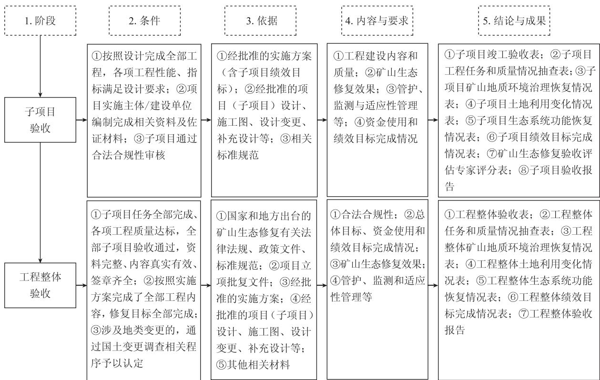

# 中华人民共和国土地管理行业标准

TD/T 1092—2024

# 矿山生态修复工程验收规范

# Specification for mine ecological restoration project acceptance

2024-06-11 发布 2024-09-01 实施

中华人民共和国自然资源部 发布

## 目 次

前…Ⅲ  
1范围…1  
2规范性弓用文件……1  
3术语和定义………………………………………1  
4总体要………………………2  
5 子项目验收……2  
5.1子项目验收条件与依据……2  
5.2子项目验收组织与程序……4  
5.3子项目验收内容与要求……4  
5.4子项目验收结论与成果……5  
6工程整体验收………………………………………6  
6.1工程整体验收条件与依据……6  
6.2工程整体验收组织与程序……6  
6.3工程整体验收内容与要求……6  
6.4工程整体验收结论与成果……7  
7档案管理……  
附录B（规范性）工程任务和质量情况抽查表……10  
附录C（规范性）矿山地质环境治理恢复情况表……13  
附录D（规范性）土地利用变化情况表………14  
附录E（规范性） 生态系统功能恢复情况表……15  
附录F(规范性） 绩效目标完成情况表……17  
附录G(规范性）矿山生态修复验收评估专家评分表……19  
附录H（资料性）子项目验收报告编写大纲……21  
附录Ⅰ（规范性）工程整体验收表……23  
附录J（资料性）工程整体验收报告编写大纲……25  
参考文献…… …27

## 前 言

本文件按照GB/T1.1—2020《标准化工作导则 第1部分：标准化文件的结构和起草规则》的规定起草。

请注意本文件的某些内容可能涉及专利。本文件的发布机构不承担识别专利的责任。

本文件由中华人民共和国自然资源部提出。

本文件由全国自然资源与国土空间规划标准化技术委员会(SAC/TC93)归口。

本文件起草单位：自然资源部国土空间生态修复司、中国自然资源经济研究院、自然资源部国土整治中心、中国地质环境监测院、中国地质科学院水文地质环境地质研究所、中国地质大学(北京）、重庆地质矿产研究院、内蒙古自治区地质调查研究院、广西壮族自治区自然资源生态修复中心。

本文件主要起草人：卢丽华、刘向敏、余振国、李红举、杨婧、侯冰、陈晶、刘永兵、白雪华、冯春涛、王敬、穆泳林、杜越天、孙贵尚、李杏茹、张德强、周顺江、付梅臣、白中科、马磊、郑杰炳、王力、乔文光、王显彬、黄佳。

# 矿山生态修复工程验收规范

## 1 范围

本文件规定了矿山生态修复工程子项目和工程整体验收的条件与依据、组织与程序、内容与要求、结论与成果，以及档案管理等内容。

本文件适用于政府部门立项并组织实施的矿山生态修复工程(包括财政出资和社会资本投入的工程)验收工作，其他矿山生态修复工程验收可参照执行。

## 2 规范性引用文件

下列文件中的内容通过文中的规范性引用而构成本文件必不可少的条款。其中，注日期的引用文件，仅该日期对应的版本适用于本文件；不注日期的引用文件，其最新版本(包括所有的修改单)适用于本文件。

GB15618 土壤环境质量 农用地土壤污染风险管控标准(试行)

GB/T 15776 造林技术规程

GB/T18507 城镇土地分等定级规程

GB/T 28407 农用地质量分等规程

GB 36600 土壤环境质量 建设用地土壤污染风险管控标准(试行)

GB/T 38360 裸露坡面植被恢复技术规范

GB/T 38509 滑坡防治设计规范

DZ/T 0287 矿山地质环境监测技术规程

TD/T 1036 土地复垦质量控制标准

TD/T 1044 生产项目土地复垦验收规程

TD/T1055 第三次全国国土调查技术规程

TD/T 1060 自然资源分等定级通则

TD/T1069 国土空间生态保护修复工程验收规范

TD/T1070(所有部分） 矿山生态修复技术规范

TD/T 1071 园地分等定级规程

## 3 术语和定义

下列术语和定义适用于本文件。

## 3.1

矿山生态修复工程 mine ecological restoration project

在矿产资源开采活动造成破坏的区域及影响区，依靠自然力量或通过人工措施干预，对矿山地质环境破坏、土地损毁和植被破坏等问题进行系统修复与综合治理，使矿山地质环境达到稳定、损毁土地得到复垦利用、生态系统功能得到恢复和改善的过程及活动。

## 3.2

子项目验收 sub-project acceptance

在子项目完工后，依据有关规定和技术标准，组织对子项目建设内容、工程质量、资金使用、实施效果等进行查验与核实，形成验收结论，编写验收资料的过程。

## 3.3

工程整体验收 whole project acceptance

在全部子项目验收合格的基础上，对工程实施整体情况进行一次性验收，针对工程建设目标任务、建设内容、绩效指标、综合效益等完成情况进行全面总结，形成整体验收结论，编写验收报告，组卷验收资料等过程。

## 4 总体要求

4.1按照“谁批准实施方案、谁负责组织验收”的原则，行业主管部门依据相关规定，会同同级有关部门进行验收，组织编制验收材料，做好工程档案管理。

4.2 矿山生态修复工程验收包括子项目验收和工程整体验收。工程规模较小未划分子项目的，可参照子项目验收要求直接开展工程验收。工程设置子项目的，应进行子项目验收和工程整体验收。在子项目验收和工程整体验收中应开展生态修复效果评估，生态修复效果难以在短时间内显现的，应加强生态修复效果的监测评估和适应性管理。有关部门可结合本地实际细化验收工作阶段和内容。

4.3工程验收时，应根据工程特点按规定抽选验收专家，组建验收专家组。专家组人数应为5人以上单数，专业领域应涵盖地质环境、土地复垦、林草生态、水利、财务等。 MZ

4.4验收工作应科学组织，遵照各阶段验收条件与依据，采用定量与定性相结合、室内审阅文件与实地核查相结合的方法，合理开展验收，编制各阶段验收资料，实事求是给出公正、真实的验收意见和结论。

4.5工程验收后应及时整理各阶段形成的文件资料，分类标注，统一编号存档。

4.6矿山生态修复工程验收涉及新增耕地指标、城乡建设用地增减挂钩、耕地质量建设、生态保护红线、存量采矿用地复垦修复与采矿项目新增用地相挂钩等政策时，执行有关规定。涉及地类变更的，通过国土变更调查相关程序予以认定。 X

4.7 矿山生态修复工程验收工作流程见图1。

## 5 子项目验收

## 5.1 子项目验收条件与依据

## 5.1.1 子项目验收条件

5.1.1.1按照子项目设计完成全部工程项目，各项工程性能、指标均满足设计要求，全部工程项目经实施主体/建设单位评定合格。

5.1.1.2 项目实施主体/建设单位组织编制完成以下有关工程档案和施工管理等资料，并做到资料完整、内容真实有效、签章齐全。

a）调查报告、勘查报告、实施方案。

b）项目(子项目)设计、施工图、设计变更、补充设计等。

c）施工组织设计、开工资料、施工验收记录、施工日志、竣工图、施工总结报告等。

  
图1 矿山生态修复工程验收工作流程图

d）监理规划(含工程项目划分）、监理报表、监理日志、工程质量评估报告、监理工作专题报告、监理总结报告等。 M

e）项目招投标文件、项目合同等管理资料。

f）其他相关材料。

5.1.1.3 项目实施主体/建设单位组织编制完成以下有关验收佐证材料：

a）工程质量检验与评定资料；

b）工程质量抽检报告；

c）土地质量评定报告；

d） 监测评估数据等资料；

e）竣工测量报告；

f）其他相关材料。

5.1.1.4 子项目验收前应对以下内容进行合法合规性审核。

a）符合国家法律法规及相关政策，符合国土空间规划和用途管制的要求，各项工程不存在违法占地和破坏耕地行为。

b）涉及占用或调整永久基本农田的，应符合永久基本农田管控要求。

c）涉及生态保护红线的，应符合有关管控要求。

d）涉及地类变更的，应通过年度国土变更调查或日常变更机制完成地类变更；涉及土地权属调整的，应符合土地权属调整相关要求。

## 5.1.2 子项目验收依据

主要包括：

a） 经批准的实施方案(含子项目绩效目标)；

b）经批准的项目(子项目)设计、施工图、设计变更、补充设计等；

c）相关标准规范。

## 5.2 子项目验收组织与程序

5.2.1子项目验收由子项目设计批准部门负责，也可由实施方案批准部门组织或指定部门负责，验收部门按规定会同同级有关部门进行验收。

5.2.2 子项目验收按下列程序开展。

a）提出申请。在子项目工程内容全部完工并自验合格后，由项目实施主体/建设单位向验收组织单位提出验收申请，并提交5.1.1.2和5.1.1.3中的资料。验收组织单位对提交验收材料的完备性和项目合法合规性进行审核。

b）开展验收。对于满足验收条件的，验收组织单位与项目实施主体/建设单位商定验收事宜，开展验收。验收应通过资料审查与现场核查，对子项目建设内容、工程质量、实施效果、资金使用和绩效目标完成等情况进行查验与核实。现场核查应抽取资金量大、对绩效目标贡献大的工程项目。

c）形成验收结论。在资料审查与现场核查基础上，听取利益相关方意见，综合评估矿山生态修复效果，出具子项目验收意见即填写子项目竣工验收表(见附录A)。

d）汇总验收成果材料。验收组织单位组织编写和汇总验收成果材料。

## 5.3 子项目验收内容与要求

5.3.1查验子项目工程建设内容和质量，应符合以下要求。

a）按合同段进行复核，将工程建设情况和经批准的项目(子项目)设计文件进行对比，检查工程建设任务目标完成情况，工程内容和数量应符合设计规定。

b）查阅工程质量检验与评定资料，全部工程质量应满足工程设计和施工质量标准。

c）矿山地质环境治理恢复和监测类修复任务现场抽查比例不低于该类型修复任务数量的10%，土地复垦利用和生态系统功能恢复类修复任务现场抽查数量按照TD/T1044现场抽样要求确定。现场抽查合格率应达到100%。现场抽查应填写工程任务和质量情况抽查表(见附录B)。

d）工程项目存在变更或调整时，应符合有关规定程序。

5.3.2 查验子项目矿山地质环境治理恢复情况，填写矿山地质环境治理恢复情况表(见附录C)。香验内容主要包括矿山地质环境隐患点消除、地貌重塑等技术措施的实施效果以及水体状况，应符合以下要求

a）矿山废弃渣土、危岩体、不稳定边坡、废弃井口、地裂缝和地面塌陷等矿山地质环境隐患应全部按实施方案采取治理措施，符合 GB/T 38509和 TD/T1070的规定。

b） 地貌重塑应符合TD/T1070的规定，修复后的地形地貌应与周边景观相协调。

c） 水质等水体状况应得到改善，水资源保障程度应满足实施区域生态保护修复需要。

5.3.3 查验子项目土地复垦利用情况，填写土地利用变化情况表(见附录D)。查验内容主要包括土地利用类型、面积、质量等内容，应符合以下要求。

a）复垦为耕地、园地、林地、草地等农用地时，地面坡度、土层厚度、耕作层质量和配套工程建设应符合TD/T1036的规定；耕地建设应符合现有农田建设标准的规定；用于建设用地时，应符合TD/T1036的规定。农用地、建设用地的土壤环境质量应分别符合GB15618和GB 36600的规定。

b）复垦后的土地利用地类划分应符合TD/T1055的规定。复垦后的耕地、园地、林地、草地质量评定应符合 GB/T 28407、TD/T 1071 和 TD/T 1060 的规定，国有建设用地质量评定应符合GB/T 18507 的规定。

c）涉及新增耕地拟用于占补平衡的，还应符合新增耕地核实认定的有关标准和要求。

5.3.4 评价子项目生态系统功能恢复改善情况，填写生态系统功能恢复情况表(见附录E)。核查植被恢复、林草成活率，对比参照生态系统，对景观协调性、生物多样性、水土保持、水源涵养、碳汇等内容进行评价，应符合以下要求：

a）植被恢复面积符合设计要求，质量符合GB/T15776和GB/T38360的规定，修复后的植物种群组成和结构合理；

b）林、草成活率符合设计要求；

c）地形地貌和土地利用类型应与周边相协调；

d）生物多样性、水土保持、水源涵养、碳汇等生态系统功能应得到改善和提升。

5.3.5 查验子项目后期管护、监测措施落实和适应性管理情况，应符合以下要求：

a）明确了后期管护的责任主体、具体措施和资金来源等，管护周期合理；

b）监测内容、方法、周期和监测点布设等符合实施方案、设计文件和DZ/T0287、TD/T1070的要求，监测设备齐全，运行正常；

c）根据监测结果，制定了适应性管理措施。

5.3.6 查验子项目资金来源和使用、绩效目标完成情况，填写绩效目标完成情况表(见附录F)。查验内容应符合以下要求：

a）按合同段工程划分，复核项目资金及时到位情况，各项资金筹措应按计划落实；

b）资金使用规范合理，财政资金支出范围符合财政事权和支出责任划分的有关规定；

c）子项目各项绩效指标应全部完成。

5.3.7开展子项目生态修复效果评估，采用专家打分法对矿山地质环境治理恢复、土地复垦利用、生态系统功能恢复、社会经济效益、监测管护等内容进行综合评估，填写矿山生态修复验收评估专家评分表(见附录G)。

## 5.4 子项目验收结论与成果

5.4.1子项目验收应给出通过或不通过的结论。出现以下负面清单情况的，验收专家组应在验收意见

a）未完成实施方案(子项目设计)提出的绩效目标，设计工程量未完成，工程质量不达标。

b） 存在违法违规问题，财政资金支出不符合规定。

c）存在地质环境问题隐患，且未按实施方案或设计规定采取相关措施。

d） 矿山生态修复验收评估专家组打分低于60分，或其中一项得0分。

5.4.2 子项目验收成果主要包括：

a) 子项目竣工验收表(见附录 A)；

b) 工程任务和质量情况抽查表(见附录B)；

c） 矿山地质环境治理恢复情况表(见附录C)；

d) 土地利用变化情况表(见附录D)；

e） 生态系统功能恢复情况表(见附录E)；

f) 绩效目标完成情况表(见附录F)；

g）矿山生态修复验收评估专家评分表(见附录G)；

h）子项目验收报告，编写大纲参见附录H。报告编写内容应涵盖子项目竣工验收表的主要内容。

注：工程设置子项目，应进行子项目验收和工程整体验收的，可不编写子项目验收报告。

## 6 工程整体验收

## 6.1 工程整体验收条件与依据

6.1.1 工程整体验收条件包括：

a）子项目任务全部完成，各项工程性能、指标均满足设计要求，全部子项目验收通过，资料完整、内容真实有效、签章齐全；

b）按照实施方案完成了全部工程内容，修复目标全部完成；

c）涉及地类变更的，已经通过国土变更调查相关程序予以认定。

## 6.1.2 工程整体验收依据主要包括：

a）国家和地方出台的矿山生态修复有关法律法规、政策文件、标准规范；

b）项目立项批复文件；

c）经批准的实施方案；

d）经批准的项目(子项目)设计、施工图、设计变更、补充设计等；

e）其他相关材料。

## 6.2 工程整体验收组织与程序

6.2.1工程整体验收由实施方案批准部门或政府指定部门负责，验收部门按规定会同同级有关部门进行验收。

6.2.2 参照5.2.2的程序开展工程整体验收。

## 6.3 工程整体验收内容与要求

6.3.1复核合法合规性。按照5.1.1.4的要求，验收组织部门通过资料比对和外业查验，复核全部子项目的合法合规性。 VA

6.3.2 复核总体目标和绩效目标完成情况。按照TD/T1069的相关要求，对矿山生态修复工程总体目标、资金使用和绩效目标完成情况进行复核。

6.3.3 综合评定矿山生态修复效果，应符合以下要求。

a）复核矿山地质环境治理恢复工程内容、质量和实施效果。现场抽查同类型修复任务工程数量不低于10%的项目。按照5.3.2的要求，查验矿山地质环境隐患点消除、地貌重塑效果，以及水体状况。 A

b） 复核土地复垦利用工程内容、质量和实施效果。按照TD/T1044现场抽样要求抽查该类型修复任务一定数量的工程项目。按照5.3.3的要求，查验土地复垦质量效果、土地利用变化情况。

c）评价生态系统功能恢复改善情况。核验植被恢复情况，对比参照生态系统，评价景观协调性、生物多样性、水土保持、水源涵养和碳汇功能提升情况。

6.3.4 综合评定管护、监测措施落实和适应性管理情况，应符合以下要求。

a）综合评定后期管护责任主体、管护措施和资金落实情况，保障和维护工程设施正常运行。

b）综合评定实施方案提出的监测点和监测指标设置的科学合理有效性、数据真实可靠性、监测措施落实情况、监测制度完善情况等。

c）综合评定工程实施中适应性管理措施的及时性、针对性、可行性，涉及工程变更或调整的，综合评定变更或调整的程序合规性、内容科学性、措施合理性，以及对总体目标和绩效目标的影响；根据整体验收情况，提出拟采取的适应性管理措施和建议。

## 6.4 工程整体验收结论与成果

6.4.1工程整体验收后，应出具工程整体验收意见，给出通过或不通过的结论。

6.4.2 工程整体验收结论认定为不通过时，验收专家组应在验收意见中载明需整改的事项和时限。整改完成后，应再次开展工程整体验收。

6.4.3 工程整体验收成果主要包括：

a) 工程整体验收表(见附录 I)；

b) 工程任务和质量情况抽查表(见附录 B)；

c） 矿山地质环境治理恢复情况表(见附录C)；

d) 土地利用变化情况表(见附录D)；

e）生态系统功能恢复情况表(见附录E)；

f) 绩效目标完成情况表(见附录F)；

g）工程整体验收报告，编写大纲参见附录J。报告编写内容应涵盖工程整体验收表的主要内容。

6.4.4工程整体验收后，应以工程为单位，将相关信息纳入自然资源“一张图”及国土空间基础信息平台。

## 7 档案管理

7.1矿山生态修复工程实施前、实施中和竣工验收后形成的各类文件均属于档案范畴。在各阶段验收工作完成后，应及时整理并归档。 X

7.2 资料归档的管理职责、档案用语、归档范围及保管期限、电子档案等可参照DA/T28—2018《建设项目档案管理规范》，并符合行业主管部门有关规定 W

# 附录A

(规范性)

子项目竣工验收表

子项目竣工验收内容见表A.1。

表 A. 1 子项目竣工验收表
<table><tr><td rowspan=1 colspan=12>一、基本情况</td></tr><tr><td rowspan=1 colspan=1>1. 子项目编号</td><td rowspan=1 colspan=1></td><td rowspan=1 colspan=1>开工时间</td><td rowspan=1 colspan=2></td><td rowspan=1 colspan=2>竣工时间</td><td rowspan=1 colspan=2></td><td rowspan=1 colspan=2>验收组织单位</td><td rowspan=1 colspan=1></td></tr><tr><td rowspan=1 colspan=2>2. 子项目名称</td><td rowspan=1 colspan=10></td></tr><tr><td rowspan=1 colspan=2>3. 子项目立项时间</td><td rowspan=1 colspan=10></td></tr><tr><td rowspan=1 colspan=2>4. 主管部门</td><td rowspan=1 colspan=10></td></tr><tr><td rowspan=1 colspan=2>5. 实施主体/建设单位</td><td rowspan=1 colspan=10></td></tr><tr><td rowspan=1 colspan=2>6. 子项目是否调整和报批</td><td rowspan=1 colspan=10>(有调整的需说明批准或同意单位)</td></tr><tr><td rowspan=1 colspan=2>7. 子项目实施区域</td><td rowspan=1 colspan=10>（提供项目实施区域拐点坐标，采用2000国家大地坐标系）</td></tr><tr><td rowspan=1 colspan=2>8. 合同段数量</td><td rowspan=1 colspan=10>MS</td></tr><tr><td rowspan=1 colspan=2>9. 所处空间</td><td rowspan=1 colspan=10>农业空间□ 城镇空间□ 生态空间(说明是否是自然保护地)□ 其他□</td></tr><tr><td rowspan=1 colspan=2>10. 项目所在县(市)、乡(镇)、村</td><td rowspan=1 colspan=10>K</td></tr><tr><td rowspan=1 colspan=2>11. 主要生态问题</td><td rowspan=1 colspan=10>(简要说明子项目实施区域存在的矿山生态问题)</td></tr><tr><td rowspan=1 colspan=2>12. 合法合规性审核情况</td><td rowspan=1 colspan=10>(对照5.1.1.4，简要说明子项目实施的合法合规性)</td></tr><tr><td rowspan=1 colspan=2>13. 完成地类变更时间</td><td rowspan=1 colspan=10></td></tr><tr><td rowspan=1 colspan=12>二、实施情况</td></tr><tr><td rowspan=2 colspan=2>1. 工程建设内容和质量情况</td><td rowspan=1 colspan=10>(对照5.3.1，简要说明工程建设任务完成情况，工程质量检验和评定等有关结论)</td></tr><tr><td rowspan=1 colspan=2>抽查情况</td><td rowspan=1 colspan=2>抽查处(点)数量</td><td rowspan=1 colspan=2>处(个)</td><td rowspan=1 colspan=2>合格处(点)数量</td><td rowspan=1 colspan=2>处(个)</td></tr><tr><td rowspan=4 colspan=2>2. 投资</td><td rowspan=1 colspan=2>分类</td><td rowspan=1 colspan=2>总投资</td><td rowspan=1 colspan=2>中央财政</td><td rowspan=1 colspan=2>地方财政</td><td rowspan=1 colspan=2>社会投资</td></tr><tr><td rowspan=1 colspan=2>计划投资</td><td rowspan=1 colspan=2>万元</td><td rowspan=1 colspan=2>万元</td><td rowspan=1 colspan=2>万元</td><td rowspan=1 colspan=2>万元</td></tr><tr><td rowspan=1 colspan=2>实际投资</td><td rowspan=1 colspan=2>万元</td><td rowspan=1 colspan=2>万元</td><td rowspan=1 colspan=2>万元</td><td rowspan=1 colspan=2>万元</td></tr><tr><td rowspan=1 colspan=10>(简述资金使用情况)</td></tr></table>

表 A.1 子项目竣工验收表(续)
<table><tr><td rowspan=1 colspan=7>三、矿山生态修复效果</td></tr><tr><td rowspan=1 colspan=2>1. 矿山地质环境治理恢复情况</td><td rowspan=1 colspan=5>(对照5.3.2，简要说明子项目矿山地质环境治理恢复情况</td></tr><tr><td rowspan=1 colspan=2>2. 土地复垦利用情况</td><td rowspan=1 colspan=5>（对照5.3.3，简要说明子项目土地复垦利用情况)</td></tr><tr><td rowspan=1 colspan=2>3. 生态系统功能恢复情况</td><td rowspan=1 colspan=5>（对照5.3.4，简要说明子项目生态系统功能恢复改善情况）</td></tr><tr><td rowspan=1 colspan=7>四、管护监测及适应性管理情况</td></tr><tr><td rowspan=1 colspan=7>(对照5.3.5，简要说明子项目后期管护、监测及适应性管理的情况)</td></tr><tr><td rowspan=1 colspan=7>五、绩效目标完成情况</td></tr><tr><td rowspan=1 colspan=2>1. 总体目标</td><td rowspan=1 colspan=5>(对照子项目总体目标，简述子项目总体目标完成情况)</td></tr><tr><td rowspan=1 colspan=2>2. 绩效指标</td><td rowspan=1 colspan=5>(对照子项目绩效目标，简述子项目各项绩效指标完成与达标情况)</td></tr><tr><td rowspan=1 colspan=7>六、验收意见                                                                 </td></tr><tr><td rowspan=1 colspan=2>1. 验收结论</td><td rowspan=1 colspan=5>(说明存在的问题，并提出整改措施和建议；给出是否通过的明确结论)</td></tr><tr><td rowspan=6 colspan=1>2. 验收专家名单</td><td rowspan=1 colspan=1>专家组</td><td rowspan=1 colspan=1>姓名</td><td rowspan=1 colspan=1>单位</td><td rowspan=1 colspan=1>专业</td><td rowspan=1 colspan=1>职务/职称</td><td rowspan=1 colspan=1>签字</td></tr><tr><td rowspan=1 colspan=1>组长</td><td rowspan=1 colspan=1></td><td rowspan=1 colspan=1></td><td rowspan=1 colspan=1></td><td rowspan=1 colspan=1></td><td rowspan=1 colspan=1></td></tr><tr><td rowspan=1 colspan=1>成员</td><td rowspan=1 colspan=1></td><td rowspan=1 colspan=1></td><td rowspan=1 colspan=1></td><td rowspan=1 colspan=1></td><td rowspan=1 colspan=1></td></tr><tr><td rowspan=1 colspan=1>成员</td><td rowspan=1 colspan=1></td><td rowspan=1 colspan=1></td><td rowspan=1 colspan=1></td><td rowspan=1 colspan=1></td><td rowspan=1 colspan=1></td></tr><tr><td rowspan=1 colspan=1>成员</td><td rowspan=1 colspan=1></td><td rowspan=1 colspan=1></td><td rowspan=1 colspan=1></td><td rowspan=1 colspan=1></td><td rowspan=1 colspan=1></td></tr><tr><td rowspan=1 colspan=1>…</td><td rowspan=1 colspan=1></td><td rowspan=1 colspan=1></td><td rowspan=1 colspan=1></td><td rowspan=1 colspan=1></td><td rowspan=1 colspan=1></td></tr><tr><td rowspan=1 colspan=7>注1:子项目建设时间包括开工时间和竣工时间，主要指主管部门批准的第一个标段工程开工、最后一个标段验收通过的时间，可查阅工程建设监理有关材料。注2:子项目实施主体/建设单位，是指由行业主管部门或地方政府明确的子项目实施管理单位。注3:子项目实施区域，是指子项目所有工程施工所覆盖的区域。注4:完成地类变更时间，是指根据年度国土变更调查成果认定地类的日期或通过日常变更机制并经国家核查认定地类的日期。注5:投资，是指投入子项目建设的各类资金量，单位为万元，保留小数点后四位。注6:绩效指标应与实施方案、子项目设计的绩效指标相一致。</td></tr></table>

填表人：  
填表日期：

验收组织单位：(盖章)

<table><tr><td rowspan=1 colspan=3>使用范围</td><td rowspan=1 colspan=10>子项目□ 工程整体□</td></tr><tr><td rowspan=1 colspan=3>对应名称</td><td rowspan=1 colspan=10></td></tr><tr><td rowspan=2 colspan=4>修复任务</td><td rowspan=2 colspan=1>修复数量</td><td rowspan=2 colspan=1>具体措施</td><td rowspan=1 colspan=4>工程量</td><td rowspan=1 colspan=3>工程质量</td></tr><tr><td rowspan=1 colspan=1>设计工程量</td><td rowspan=1 colspan=1>变更量</td><td rowspan=1 colspan=1>完成工程量</td><td rowspan=1 colspan=1>单位</td><td rowspan=1 colspan=1>查验内容</td><td rowspan=1 colspan=1>抽查数量</td><td rowspan=1 colspan=1>合格数量</td></tr><tr><td rowspan=11 colspan=1>矿山地质矿环境治理恢复</td><td rowspan=11 colspan=1>山地质环境隐患点消除</td><td rowspan=2 colspan=2>危岩体</td><td rowspan=2 colspan=1>处</td><td rowspan=1 colspan=1>爆破清除</td><td rowspan=1 colspan=1></td><td rowspan=1 colspan=1></td><td rowspan=1 colspan=1></td><td rowspan=1 colspan=1></td><td rowspan=2 colspan=1></td><td rowspan=2 colspan=1>处</td><td rowspan=2 colspan=1>处</td></tr><tr><td rowspan=1 colspan=1>F</td><td rowspan=1 colspan=1></td><td rowspan=1 colspan=1></td><td rowspan=1 colspan=1></td><td rowspan=1 colspan=1></td></tr><tr><td rowspan=2 colspan=2>不稳定边坡</td><td rowspan=2 colspan=1>处</td><td rowspan=1 colspan=1>削坡卸荷</td><td rowspan=1 colspan=1></td><td rowspan=1 colspan=1></td><td rowspan=1 colspan=1></td><td rowspan=1 colspan=1></td><td rowspan=2 colspan=1></td><td rowspan=2 colspan=1>处</td><td rowspan=2 colspan=1>处</td></tr><tr><td rowspan=1 colspan=1>…</td><td rowspan=1 colspan=1></td><td rowspan=1 colspan=1></td><td rowspan=1 colspan=1></td><td rowspan=1 colspan=1></td></tr><tr><td rowspan=2 colspan=2>废弃井口</td><td rowspan=2 colspan=1>个</td><td rowspan=1 colspan=1>封堵</td><td rowspan=1 colspan=1></td><td rowspan=1 colspan=1></td><td rowspan=1 colspan=1></td><td rowspan=1 colspan=1></td><td rowspan=2 colspan=1></td><td rowspan=2 colspan=1>个</td><td rowspan=2 colspan=1>个</td></tr><tr><td rowspan=1 colspan=1>…</td><td rowspan=1 colspan=1></td><td rowspan=1 colspan=1></td><td rowspan=1 colspan=1></td><td rowspan=1 colspan=1></td></tr><tr><td rowspan=2 colspan=2>地裂缝</td><td rowspan=2 colspan=1>处</td><td rowspan=1 colspan=1>回填</td><td rowspan=1 colspan=1></td><td rowspan=1 colspan=1></td><td rowspan=1 colspan=1></td><td rowspan=1 colspan=1></td><td rowspan=2 colspan=1></td><td rowspan=2 colspan=1>处</td><td rowspan=2 colspan=1>处</td></tr><tr><td rowspan=1 colspan=1>…</td><td rowspan=1 colspan=1></td><td rowspan=1 colspan=1></td><td rowspan=1 colspan=1></td><td rowspan=1 colspan=1></td></tr><tr><td rowspan=2 colspan=2>地面塌陷</td><td rowspan=2 colspan=1>处</td><td rowspan=1 colspan=1>回填</td><td rowspan=1 colspan=1></td><td rowspan=1 colspan=1></td><td rowspan=1 colspan=1></td><td rowspan=1 colspan=1></td><td rowspan=2 colspan=1></td><td rowspan=2 colspan=1>处</td><td rowspan=2 colspan=1>处</td></tr><tr><td rowspan=1 colspan=1>……</td><td rowspan=1 colspan=1></td><td rowspan=1 colspan=1></td><td rowspan=1 colspan=1></td><td rowspan=1 colspan=1></td></tr><tr><td rowspan=1 colspan=2>…</td><td rowspan=1 colspan=1></td><td rowspan=1 colspan=1>…</td><td rowspan=1 colspan=1></td><td rowspan=1 colspan=1></td><td rowspan=1 colspan=1></td><td rowspan=1 colspan=1></td><td rowspan=1 colspan=1></td><td rowspan=1 colspan=1></td><td rowspan=1 colspan=1></td></tr></table>

<table><tr><td rowspan=2 colspan=3>修复任务</td><td rowspan=2 colspan=1>修复数量</td><td rowspan=2 colspan=1>具体措施</td><td rowspan=1 colspan=4>工程量</td><td rowspan=1 colspan=3>工程质量</td></tr><tr><td rowspan=1 colspan=1>设计工程量</td><td rowspan=1 colspan=1>变更量</td><td rowspan=1 colspan=1>完成工程量</td><td rowspan=1 colspan=1>单位</td><td rowspan=1 colspan=1>查验内容</td><td rowspan=1 colspan=1>抽查数量</td><td rowspan=1 colspan=1>合格数量</td></tr><tr><td rowspan=9 colspan=1>矿山地质环境治理地恢复</td><td rowspan=9 colspan=1>貌重塑</td><td rowspan=2 colspan=1>破损山体</td><td rowspan=2 colspan=1>处</td><td rowspan=1 colspan=1>坡面整形</td><td rowspan=1 colspan=1></td><td rowspan=1 colspan=1></td><td rowspan=1 colspan=1></td><td rowspan=1 colspan=1></td><td rowspan=2 colspan=1></td><td rowspan=2 colspan=1>处</td><td rowspan=2 colspan=1>处</td></tr><tr><td rowspan=1 colspan=1>…</td><td rowspan=1 colspan=1></td><td rowspan=1 colspan=1></td><td rowspan=1 colspan=1></td><td rowspan=1 colspan=1></td></tr><tr><td rowspan=2 colspan=1>露天采坑</td><td rowspan=2 colspan=1>处</td><td rowspan=1 colspan=1>深坑填埋</td><td rowspan=1 colspan=1></td><td rowspan=1 colspan=1></td><td rowspan=1 colspan=1></td><td rowspan=1 colspan=1></td><td rowspan=2 colspan=1></td><td rowspan=2 colspan=1>处</td><td rowspan=2 colspan=1>处</td></tr><tr><td rowspan=1 colspan=1>…</td><td rowspan=1 colspan=1></td><td rowspan=1 colspan=1></td><td rowspan=1 colspan=1></td><td rowspan=1 colspan=1></td></tr><tr><td rowspan=2 colspan=1>废石(渣、土)堆、煤矸石堆</td><td rowspan=2 colspan=1>资源处</td><td rowspan=1 colspan=1>废石(渣、土)堆、煤矸石堆清理</td><td rowspan=1 colspan=1></td><td rowspan=1 colspan=1></td><td rowspan=1 colspan=1></td><td rowspan=1 colspan=1></td><td rowspan=2 colspan=1></td><td rowspan=2 colspan=1>处</td><td rowspan=2 colspan=1>处</td></tr><tr><td rowspan=1 colspan=1>…</td><td rowspan=1 colspan=1></td><td rowspan=1 colspan=1></td><td rowspan=1 colspan=1></td><td rowspan=1 colspan=1></td></tr><tr><td rowspan=2 colspan=1>建(构)筑物</td><td rowspan=2 colspan=1>处</td><td rowspan=1 colspan=1>建(构)筑物拆除</td><td rowspan=1 colspan=1></td><td rowspan=1 colspan=1></td><td rowspan=1 colspan=1></td><td rowspan=1 colspan=1></td><td rowspan=2 colspan=1></td><td rowspan=2 colspan=1>处</td><td rowspan=2 colspan=1>处</td></tr><tr><td rowspan=1 colspan=1>…</td><td rowspan=1 colspan=1></td><td rowspan=1 colspan=1></td><td rowspan=1 colspan=1></td><td rowspan=1 colspan=1></td></tr><tr><td rowspan=1 colspan=1>…</td><td rowspan=1 colspan=1></td><td rowspan=1 colspan=1>…</td><td rowspan=1 colspan=1></td><td rowspan=1 colspan=1></td><td rowspan=1 colspan=1></td><td rowspan=1 colspan=1></td><td rowspan=1 colspan=1></td><td rowspan=1 colspan=1></td><td rowspan=1 colspan=1></td></tr><tr><td rowspan=8 colspan=1>土地复垦利用</td><td rowspan=3 colspan=2>土地平整</td><td rowspan=3 colspan=1>hm²</td><td rowspan=1 colspan=1>开挖</td><td rowspan=1 colspan=1></td><td rowspan=1 colspan=1></td><td rowspan=1 colspan=1></td><td rowspan=1 colspan=1></td><td rowspan=3 colspan=1></td><td rowspan=3 colspan=1>处</td><td rowspan=3 colspan=1>处</td></tr><tr><td rowspan=1 colspan=1>回填</td><td rowspan=1 colspan=1>X</td><td rowspan=1 colspan=1></td><td rowspan=1 colspan=1></td><td rowspan=1 colspan=1></td></tr><tr><td rowspan=1 colspan=1>…</td><td rowspan=1 colspan=1></td><td rowspan=1 colspan=1></td><td rowspan=1 colspan=1></td><td rowspan=1 colspan=1></td></tr><tr><td rowspan=5 colspan=2>土壤重构</td><td rowspan=5 colspan=1>hm²</td><td rowspan=1 colspan=1>表土剥离利用</td><td rowspan=1 colspan=1></td><td rowspan=1 colspan=1></td><td rowspan=1 colspan=1></td><td rowspan=1 colspan=1></td><td rowspan=5 colspan=1></td><td rowspan=5 colspan=1>处</td><td rowspan=5 colspan=1>处</td></tr><tr><td rowspan=1 colspan=1>客土覆盖</td><td rowspan=1 colspan=1></td><td rowspan=1 colspan=1></td><td rowspan=1 colspan=1></td><td rowspan=1 colspan=1></td></tr><tr><td rowspan=1 colspan=1>土地翻耕</td><td rowspan=1 colspan=1></td><td rowspan=1 colspan=1></td><td rowspan=1 colspan=1></td><td rowspan=1 colspan=1></td></tr><tr><td rowspan=1 colspan=1>土壤改良</td><td rowspan=1 colspan=1></td><td rowspan=1 colspan=1></td><td rowspan=1 colspan=1></td><td rowspan=1 colspan=1></td></tr><tr><td rowspan=1 colspan=1>.</td><td rowspan=1 colspan=1></td><td rowspan=1 colspan=1></td><td rowspan=1 colspan=1></td><td rowspan=1 colspan=1></td></tr></table>

和
<table><tr><td rowspan=2 colspan=2>修复任务</td><td rowspan=2 colspan=1>修复数量</td><td rowspan=2 colspan=1>具体措施</td><td rowspan=1 colspan=4>工程量</td><td rowspan=1 colspan=3>工程质量</td></tr><tr><td rowspan=1 colspan=1>设计工程量</td><td rowspan=1 colspan=1>变更量</td><td rowspan=1 colspan=1>完成工程量</td><td rowspan=1 colspan=1>单位</td><td rowspan=1 colspan=1>查验内容</td><td rowspan=1 colspan=1>抽查数量</td><td rowspan=1 colspan=1>合格数量</td></tr><tr><td rowspan=3 colspan=1>土地复垦利用</td><td rowspan=3 colspan=1>配套工程</td><td rowspan=3 colspan=1>km</td><td rowspan=1 colspan=1>道路工程</td><td rowspan=1 colspan=1></td><td rowspan=1 colspan=1></td><td rowspan=1 colspan=1></td><td rowspan=1 colspan=1></td><td rowspan=3 colspan=1></td><td rowspan=3 colspan=1>处</td><td rowspan=3 colspan=1>处</td></tr><tr><td rowspan=1 colspan=1>灌排工程</td><td rowspan=1 colspan=1></td><td rowspan=1 colspan=1></td><td rowspan=1 colspan=1></td><td rowspan=1 colspan=1></td></tr><tr><td rowspan=1 colspan=1>…</td><td rowspan=1 colspan=1></td><td rowspan=1 colspan=1></td><td rowspan=1 colspan=1></td><td rowspan=1 colspan=1></td></tr><tr><td rowspan=2 colspan=1>生态系统功能恢复</td><td rowspan=2 colspan=1>植被重建</td><td rowspan=2 colspan=1>hm²</td><td rowspan=1 colspan=1>林草恢复</td><td rowspan=1 colspan=1></td><td rowspan=1 colspan=1></td><td rowspan=1 colspan=1></td><td rowspan=1 colspan=1></td><td rowspan=2 colspan=1></td><td rowspan=2 colspan=1>处</td><td rowspan=2 colspan=1>处</td></tr><tr><td rowspan=1 colspan=1>…</td><td rowspan=1 colspan=1></td><td rowspan=1 colspan=1></td><td rowspan=1 colspan=1></td><td rowspan=1 colspan=1></td></tr><tr><td rowspan=1 colspan=1></td><td rowspan=1 colspan=1>..</td><td rowspan=1 colspan=1></td><td rowspan=1 colspan=1>…</td><td rowspan=1 colspan=1></td><td rowspan=1 colspan=1></td><td rowspan=1 colspan=1></td><td rowspan=1 colspan=1></td><td rowspan=1 colspan=1></td><td rowspan=1 colspan=1></td><td rowspan=1 colspan=1></td></tr><tr><td rowspan=5 colspan=1>监测</td><td rowspan=5 colspan=1>监测点</td><td rowspan=5 colspan=1>个</td><td rowspan=1 colspan=1>地质稳定性监测</td><td rowspan=1 colspan=1></td><td rowspan=1 colspan=1></td><td rowspan=1 colspan=1></td><td rowspan=1 colspan=1></td><td rowspan=1 colspan=1></td><td rowspan=1 colspan=1>个</td><td rowspan=1 colspan=1>个</td></tr><tr><td rowspan=1 colspan=1>水体监测</td><td rowspan=1 colspan=1></td><td rowspan=1 colspan=1></td><td rowspan=1 colspan=1></td><td rowspan=1 colspan=1></td><td rowspan=1 colspan=1></td><td rowspan=1 colspan=1>个</td><td rowspan=1 colspan=1>个</td></tr><tr><td rowspan=1 colspan=1>土壤监测</td><td rowspan=1 colspan=1></td><td rowspan=1 colspan=1></td><td rowspan=1 colspan=1></td><td rowspan=1 colspan=1></td><td rowspan=1 colspan=1></td><td rowspan=1 colspan=1>个</td><td rowspan=1 colspan=1>个</td></tr><tr><td rowspan=1 colspan=1>植被群落监测</td><td rowspan=1 colspan=1></td><td rowspan=1 colspan=1></td><td rowspan=1 colspan=1></td><td rowspan=1 colspan=1></td><td rowspan=1 colspan=1></td><td rowspan=1 colspan=1>个</td><td rowspan=1 colspan=1>个</td></tr><tr><td rowspan=1 colspan=1>…</td><td rowspan=1 colspan=1></td><td rowspan=1 colspan=1></td><td rowspan=1 colspan=1></td><td rowspan=1 colspan=1></td><td rowspan=1 colspan=1></td><td rowspan=1 colspan=1></td><td rowspan=1 colspan=1></td></tr><tr><td rowspan=1 colspan=11>注1:适用于子项目和工程整体两个验收阶段的抽查统计工作。注2:修复任务数量、设计工程量、变更量，依据调查、实施方案和项目(子项目)设计有关材料进行填写，完成工程量依据监理有关材料进行填写。注3:工程质量中的查验内容，依据实施方案和项目(子项目)设计有关材料进行填写。注4:工程质量中的抽查数量，填写抽查的修复任务数量；合格数量，填写所抽查的修复任务中的已合格数量。注5:矿山地质环境治理恢复和监测类修复任务(单位为处、个)，现场抽查数量不低于该类型修复任务数量的10%(向上取整)。注6:土地复垦利用和生态系统功能恢复类修复任务，按照TD/T1044现场抽样要求进行抽查。单位为hm²的，面积小于5hm²时，抽样个数大于或等于3；面积大于或等于5hm²且小于30 hm²时，抽样个数大于或等于5；面积大于或等于30 hm²且小于50hm²时，抽样个数大于或等于7；面积大于或等于50hm²时，抽样个数大于或等于10。单位为km的，长度小于1km时，抽样个数大于或等于3；长度大于或等于1km且小于3km时，抽样个数大于或等于5；长度大于或等于3km且小于5km时，抽样个数大于或等于7;长度大于或等于5km时，抽样个数大于或等于10。</td></tr></table>

## 附录 C

(规范性)

矿山地质环境治理恢复情况表

子项目、工程整体矿山地质环境治理恢复情况见表C.1。

表 C. 1 矿山地质环境治理恢复情况表
<table><tr><td rowspan=1 colspan=2>使用范围</td><td rowspan=1 colspan=3>子项目□ 工程整体□</td></tr><tr><td rowspan=1 colspan=2>对应名称</td><td rowspan=1 colspan=3></td></tr><tr><td rowspan=1 colspan=2>矿山地质环境问题</td><td rowspan=1 colspan=1>基期年(        年   月）</td><td rowspan=1 colspan=1>验收年一        年   月）</td><td rowspan=1 colspan=1>目标值</td></tr><tr><td rowspan=6 colspan=1>矿山地质环境隐患</td><td rowspan=1 colspan=1>危岩体处</td><td rowspan=1 colspan=1></td><td rowspan=1 colspan=1></td><td rowspan=1 colspan=1></td></tr><tr><td rowspan=1 colspan=1>不稳定边坡处</td><td rowspan=1 colspan=1></td><td rowspan=1 colspan=1></td><td rowspan=1 colspan=1></td></tr><tr><td rowspan=1 colspan=1>废弃井口个</td><td rowspan=1 colspan=1></td><td rowspan=1 colspan=1></td><td rowspan=1 colspan=1></td></tr><tr><td rowspan=1 colspan=1>地裂缝处</td><td rowspan=1 colspan=1></td><td rowspan=1 colspan=1></td><td rowspan=1 colspan=1></td></tr><tr><td rowspan=1 colspan=1>地面塌陷hm²</td><td rowspan=1 colspan=1></td><td rowspan=1 colspan=1></td><td rowspan=1 colspan=1></td></tr><tr><td rowspan=1 colspan=1>…</td><td rowspan=1 colspan=1></td><td rowspan=1 colspan=1></td><td rowspan=1 colspan=1></td></tr><tr><td rowspan=5 colspan=1>地形地貌</td><td rowspan=1 colspan=1>破损山体m²</td><td rowspan=1 colspan=1></td><td rowspan=1 colspan=1></td><td rowspan=1 colspan=1></td></tr><tr><td rowspan=1 colspan=1>露天采坑hm²</td><td rowspan=1 colspan=1></td><td rowspan=1 colspan=1></td><td rowspan=1 colspan=1></td></tr><tr><td rowspan=1 colspan=1>废石(渣、土)堆、煤矸石堆hm²</td><td rowspan=1 colspan=1></td><td rowspan=1 colspan=1></td><td rowspan=1 colspan=1></td></tr><tr><td rowspan=1 colspan=1>建(构)筑物hm²</td><td rowspan=1 colspan=1></td><td rowspan=1 colspan=1></td><td rowspan=1 colspan=1></td></tr><tr><td rowspan=1 colspan=1>…</td><td rowspan=1 colspan=1></td><td rowspan=1 colspan=1></td><td rowspan=1 colspan=1></td></tr><tr><td rowspan=2 colspan=1>水体</td><td rowspan=1 colspan=1>水位m</td><td rowspan=1 colspan=1></td><td rowspan=1 colspan=1></td><td rowspan=1 colspan=1></td></tr><tr><td rowspan=1 colspan=1>…</td><td rowspan=1 colspan=1></td><td rowspan=1 colspan=1></td><td rowspan=1 colspan=1></td></tr><tr><td rowspan=1 colspan=5>注1:适用于子项目和工程整体两个验收阶段的矿山地质环境治理恢复情况统计工作。注2:矿山地质环境隐患类型根据基础调查及实施方案等进行填写。注3:矿山地质环境问题已按实施方案采取治理措施的，在“验收年”一栏可进行数量核减。注4:单位为m²和m时，保留小数点后两位；单位为hm²时，保留小数点后四位。</td></tr></table>

填表人：  
验收组织单位：(盖章)

填表日期：

## 附录 D

(规范性)

土地利用变化情况表

子项目、工程整体土地利用变化情况见表D.1。

表 D. 1 土地利用变化情况表
<table><tr><td rowspan=1 colspan=2>使用范围</td><td rowspan=1 colspan=8>子项目□ 工程整体□</td></tr><tr><td rowspan=1 colspan=2>对应名称</td><td rowspan=1 colspan=8></td></tr><tr><td rowspan=1 colspan=2>一级地类</td><td rowspan=1 colspan=2>二级地类</td><td rowspan=1 colspan=2>基期年(        年   月）</td><td rowspan=1 colspan=3>验收年一        年   月）</td><td rowspan=2 colspan=1>面积增减hm²</td></tr><tr><td rowspan=1 colspan=1>编码</td><td rowspan=1 colspan=1>名称</td><td rowspan=1 colspan=1>编码</td><td rowspan=1 colspan=1>名称</td><td rowspan=1 colspan=1>面积hm²</td><td rowspan=1 colspan=1>质量</td><td rowspan=1 colspan=1>面积hm²</td><td rowspan=1 colspan=1>质量</td><td rowspan=1 colspan=1>图斑编号</td></tr><tr><td rowspan=2 colspan=1>00</td><td rowspan=2 colspan=1>湿地</td><td rowspan=1 colspan=1>…</td><td rowspan=1 colspan=1>…</td><td rowspan=1 colspan=1></td><td rowspan=1 colspan=1></td><td rowspan=1 colspan=1></td><td rowspan=1 colspan=1></td><td rowspan=1 colspan=1></td><td rowspan=1 colspan=1></td></tr><tr><td rowspan=1 colspan=2>小计</td><td rowspan=1 colspan=1></td><td rowspan=1 colspan=1></td><td rowspan=1 colspan=1></td><td rowspan=1 colspan=1></td><td rowspan=1 colspan=1></td><td rowspan=1 colspan=1></td></tr><tr><td rowspan=2 colspan=1>01</td><td rowspan=2 colspan=1>耕地</td><td rowspan=1 colspan=1>…</td><td rowspan=1 colspan=1>…</td><td rowspan=1 colspan=1></td><td rowspan=1 colspan=1></td><td rowspan=1 colspan=1></td><td rowspan=1 colspan=1></td><td rowspan=1 colspan=1></td><td rowspan=1 colspan=1></td></tr><tr><td rowspan=1 colspan=2>小计</td><td rowspan=1 colspan=1></td><td rowspan=1 colspan=1></td><td rowspan=1 colspan=1></td><td rowspan=1 colspan=1></td><td rowspan=1 colspan=1></td><td rowspan=1 colspan=1></td></tr><tr><td rowspan=2 colspan=1>02</td><td rowspan=2 colspan=1>种植园地</td><td rowspan=1 colspan=1>…</td><td rowspan=1 colspan=1>…</td><td rowspan=1 colspan=1></td><td rowspan=1 colspan=1></td><td rowspan=1 colspan=1></td><td rowspan=1 colspan=1></td><td rowspan=1 colspan=1></td><td rowspan=1 colspan=1></td></tr><tr><td rowspan=1 colspan=2>小计</td><td rowspan=1 colspan=1></td><td rowspan=1 colspan=1></td><td rowspan=1 colspan=1></td><td rowspan=1 colspan=1></td><td rowspan=1 colspan=1></td><td rowspan=1 colspan=1></td></tr><tr><td rowspan=2 colspan=1>03</td><td rowspan=2 colspan=1>林地</td><td rowspan=1 colspan=1>…</td><td rowspan=1 colspan=1>…</td><td rowspan=1 colspan=1></td><td rowspan=1 colspan=1></td><td rowspan=1 colspan=1></td><td rowspan=1 colspan=1></td><td rowspan=1 colspan=1></td><td rowspan=1 colspan=1></td></tr><tr><td rowspan=1 colspan=2>小计</td><td rowspan=1 colspan=1></td><td rowspan=1 colspan=1></td><td rowspan=1 colspan=1></td><td rowspan=1 colspan=1></td><td rowspan=1 colspan=1></td><td rowspan=1 colspan=1></td></tr><tr><td rowspan=2 colspan=1>…</td><td rowspan=2 colspan=1></td><td rowspan=1 colspan=1>…</td><td rowspan=1 colspan=1>…</td><td rowspan=1 colspan=1></td><td rowspan=1 colspan=1></td><td rowspan=1 colspan=1></td><td rowspan=1 colspan=1></td><td rowspan=1 colspan=1></td><td rowspan=1 colspan=1></td></tr><tr><td rowspan=1 colspan=2>小计</td><td rowspan=1 colspan=1></td><td rowspan=1 colspan=1></td><td rowspan=1 colspan=1></td><td rowspan=1 colspan=1></td><td rowspan=1 colspan=1></td><td rowspan=1 colspan=1></td></tr><tr><td rowspan=2 colspan=1>06</td><td rowspan=2 colspan=1>工矿用地</td><td rowspan=1 colspan=1>…</td><td rowspan=1 colspan=1>…</td><td rowspan=1 colspan=1></td><td rowspan=1 colspan=1></td><td rowspan=1 colspan=1></td><td rowspan=1 colspan=1></td><td rowspan=1 colspan=1></td><td rowspan=1 colspan=1></td></tr><tr><td rowspan=1 colspan=2>小计</td><td rowspan=1 colspan=1></td><td rowspan=1 colspan=1></td><td rowspan=1 colspan=1></td><td rowspan=1 colspan=1></td><td rowspan=1 colspan=1></td><td rowspan=1 colspan=1></td></tr><tr><td rowspan=1 colspan=2>…</td><td rowspan=1 colspan=2>…</td><td rowspan=1 colspan=1></td><td rowspan=1 colspan=1></td><td rowspan=1 colspan=1></td><td rowspan=1 colspan=1></td><td rowspan=1 colspan=1></td><td rowspan=1 colspan=1></td></tr><tr><td rowspan=1 colspan=4>合计</td><td rowspan=1 colspan=1></td><td rowspan=1 colspan=1></td><td rowspan=1 colspan=1></td><td rowspan=1 colspan=1></td><td rowspan=1 colspan=1></td><td rowspan=1 colspan=1></td></tr><tr><td rowspan=1 colspan=10>注1:适用于子项目和工程整体两个验收阶段的土地利用变化情况统计工作。注2:由验收组织单位组织填写，并逐级汇总。注3:地类名称及统计口径应与国家公布的第三次全国国土调查和年度国土变更调查成果一致。注4:基期年数据采用项目立项时或项目实施前最新年度国土变更调查成果数据。注5:各地类面积单位为hm²，保留小数点后四位。注6:耕地质量依据GB/T 28407进行评定。注7:园地质量依据TD/T 1071 进行评定。注8:林地、草地质量依据TD/T1060进行评定。注9:国有建设用地质量依据GB/T18507进行评定，集体建设用地不评定质量。注10:图斑编号填写全国历史遗留矿山核查系统涉及的地块编号。其中，涉及存量采矿用地复垦修复与采矿项目新增用地相挂钩的，应注明。</td></tr></table>

填表人：

验收组织单位：(盖章)

填表日期：

# 附录E

(规范性)

生态系统功能恢复情况表

子项目、工程整体生态系统功能恢复情况见表E.1。

表 E. 1 生态系统功能恢复情况表
<table><tr><td colspan="3" rowspan="1">使用范围</td><td colspan="7" rowspan="1">子项目□ 工程整体□</td></tr><tr><td colspan="3" rowspan="1">对应名称</td><td colspan="7" rowspan="1"></td></tr><tr><td colspan="1" rowspan="2">序号</td><td colspan="1" rowspan="2">一级指标</td><td colspan="1" rowspan="2">二级指标</td><td colspan="1" rowspan="2">三级指标</td><td colspan="1" rowspan="2">单位</td><td colspan="2" rowspan="1">基期值C        年 月）</td><td colspan="2" rowspan="1">验收值C        年  月）</td><td colspan="1" rowspan="2">目标值</td></tr><tr><td colspan="1" rowspan="1">数值</td><td colspan="1" rowspan="1">来源</td><td colspan="1" rowspan="1">数值</td><td colspan="1" rowspan="1">来源</td></tr><tr><td colspan="1" rowspan="1">1</td><td colspan="1" rowspan="5">生态</td><td colspan="1" rowspan="5">植被恢复</td><td colspan="1" rowspan="1">面积</td><td colspan="1" rowspan="1">hm²</td><td colspan="1" rowspan="1"></td><td colspan="1" rowspan="1"></td><td colspan="1" rowspan="1"></td><td colspan="1" rowspan="1"></td><td colspan="1" rowspan="1"></td></tr><tr><td colspan="1" rowspan="1">2</td><td colspan="1" rowspan="1">植被覆盖度</td><td colspan="1" rowspan="1">%</td><td colspan="1" rowspan="1"></td><td colspan="1" rowspan="1"></td><td colspan="1" rowspan="1"></td><td colspan="1" rowspan="1"></td><td colspan="1" rowspan="1"></td></tr><tr><td colspan="1" rowspan="1">3</td><td colspan="1" rowspan="1">草成活率</td><td colspan="1" rowspan="1">%</td><td colspan="1" rowspan="1"></td><td colspan="1" rowspan="1"></td><td colspan="1" rowspan="1"></td><td colspan="1" rowspan="1"></td><td colspan="1" rowspan="1"></td></tr><tr><td colspan="1" rowspan="1">4</td><td colspan="1" rowspan="1">林木成活率</td><td colspan="1" rowspan="1">%</td><td colspan="1" rowspan="1"></td><td colspan="1" rowspan="1"></td><td colspan="1" rowspan="1"></td><td colspan="1" rowspan="1"></td><td colspan="1" rowspan="1"></td></tr><tr><td colspan="1" rowspan="1">5</td><td colspan="1" rowspan="1">…</td><td colspan="1" rowspan="1"></td><td colspan="1" rowspan="1"></td><td colspan="1" rowspan="1"></td><td colspan="1" rowspan="1"></td><td colspan="1" rowspan="1"></td><td colspan="1" rowspan="1"></td></tr><tr><td colspan="1" rowspan="1">6</td><td colspan="1" rowspan="3">系统恢复</td><td colspan="1" rowspan="3">景观协调性</td><td colspan="1" rowspan="1">地形地貌与周边协调性</td><td colspan="1" rowspan="1"></td><td colspan="1" rowspan="1">好□中□差□</td><td colspan="1" rowspan="1"></td><td colspan="1" rowspan="1">好□中□差□</td><td colspan="1" rowspan="1"></td><td colspan="1" rowspan="1"></td></tr><tr><td colspan="1" rowspan="1">7</td><td colspan="1" rowspan="1">土地利用类型与周边协调性</td><td colspan="1" rowspan="1"></td><td colspan="1" rowspan="1">好□中□差□</td><td colspan="1" rowspan="1"></td><td colspan="1" rowspan="1">好□中□差□</td><td colspan="1" rowspan="1"></td><td colspan="1" rowspan="1"></td></tr><tr><td colspan="1" rowspan="1">8</td><td colspan="1" rowspan="1">…</td><td colspan="1" rowspan="1"></td><td colspan="1" rowspan="1"></td><td colspan="1" rowspan="1"></td><td colspan="1" rowspan="1"></td><td colspan="1" rowspan="1"></td><td colspan="1" rowspan="1"></td></tr><tr><td colspan="1" rowspan="1">9</td><td colspan="1" rowspan="5">生态系统功能改善</td><td colspan="1" rowspan="5">生物多样性</td><td colspan="1" rowspan="1">动物种类</td><td colspan="1" rowspan="1"></td><td colspan="1" rowspan="1"></td><td colspan="1" rowspan="1"></td><td colspan="1" rowspan="1"></td><td colspan="1" rowspan="1"></td><td colspan="1" rowspan="1"></td></tr><tr><td colspan="1" rowspan="1">10</td><td colspan="1" rowspan="1">植物种类</td><td colspan="1" rowspan="1">一</td><td colspan="1" rowspan="1"></td><td colspan="1" rowspan="1"></td><td colspan="1" rowspan="1"></td><td colspan="1" rowspan="1"></td><td colspan="1" rowspan="1"></td></tr><tr><td colspan="1" rowspan="1">11</td><td colspan="1" rowspan="1">旗舰物种</td><td colspan="1" rowspan="1">一</td><td colspan="1" rowspan="1"></td><td colspan="1" rowspan="1"></td><td colspan="1" rowspan="1"></td><td colspan="1" rowspan="1"></td><td colspan="1" rowspan="1"></td></tr><tr><td colspan="1" rowspan="1">12</td><td colspan="1" rowspan="1">群落类型</td><td colspan="1" rowspan="1">一</td><td colspan="1" rowspan="1"></td><td colspan="1" rowspan="1"></td><td colspan="1" rowspan="1"></td><td colspan="1" rowspan="1"></td><td colspan="1" rowspan="1"></td></tr><tr><td colspan="1" rowspan="1">13</td><td colspan="1" rowspan="1">…</td><td colspan="1" rowspan="1"></td><td colspan="1" rowspan="1"></td><td colspan="1" rowspan="1"></td><td colspan="1" rowspan="1"></td><td colspan="1" rowspan="1"></td><td colspan="1" rowspan="1"></td></tr><tr><td colspan="1" rowspan="1">14</td><td colspan="1" rowspan="2"></td><td colspan="1" rowspan="2">水土保持</td><td colspan="1" rowspan="1">水土流失面积</td><td colspan="1" rowspan="1">hm²</td><td colspan="1" rowspan="1"></td><td colspan="1" rowspan="1"></td><td colspan="1" rowspan="1"></td><td colspan="1" rowspan="1"></td><td colspan="1" rowspan="1"></td></tr><tr><td colspan="1" rowspan="1">15</td><td colspan="1" rowspan="1">…</td><td colspan="1" rowspan="1"></td><td colspan="1" rowspan="1"></td><td colspan="1" rowspan="1"></td><td colspan="1" rowspan="1"></td><td colspan="1" rowspan="1"></td><td colspan="1" rowspan="1"></td></tr><tr><td colspan="1" rowspan="2">序号</td><td colspan="1" rowspan="2">一级指标</td><td colspan="1" rowspan="2">二级指标</td><td colspan="1" rowspan="2">三级指标</td><td colspan="1" rowspan="2">单位</td><td colspan="2" rowspan="1">基期值(        年  月）</td><td colspan="2" rowspan="1">验收值(        年  月）</td><td colspan="1" rowspan="2">目标值</td></tr><tr><td colspan="1" rowspan="1">数值</td><td colspan="1" rowspan="1">来源</td><td colspan="1" rowspan="1">数值</td><td colspan="1" rowspan="1">来源</td></tr><tr><td colspan="1" rowspan="1">16</td><td colspan="1" rowspan="2">生态系统</td><td colspan="1" rowspan="2">水源涵养</td><td colspan="1" rowspan="1">地下水位</td><td colspan="1" rowspan="1">m</td><td colspan="1" rowspan="1"></td><td colspan="1" rowspan="1"></td><td colspan="1" rowspan="1"></td><td colspan="1" rowspan="1"></td><td colspan="1" rowspan="1"></td></tr><tr><td colspan="1" rowspan="1">17</td><td colspan="1" rowspan="1">…</td><td colspan="1" rowspan="1"></td><td colspan="1" rowspan="1"></td><td colspan="1" rowspan="1"></td><td colspan="1" rowspan="1"></td><td colspan="1" rowspan="1"></td><td colspan="1" rowspan="1"></td></tr><tr><td colspan="1" rowspan="1">18</td><td colspan="1" rowspan="2">功能改善</td><td colspan="1" rowspan="2">碳汇</td><td colspan="1" rowspan="1">固碳量</td><td colspan="1" rowspan="1">t</td><td colspan="1" rowspan="1"></td><td colspan="1" rowspan="1"></td><td colspan="1" rowspan="1"></td><td colspan="1" rowspan="1"></td><td colspan="1" rowspan="1"></td></tr><tr><td colspan="1" rowspan="1">19</td><td colspan="1" rowspan="1">…</td><td colspan="1" rowspan="1"></td><td colspan="1" rowspan="1"></td><td colspan="1" rowspan="1"></td><td colspan="1" rowspan="1"></td><td colspan="1" rowspan="1"></td><td colspan="1" rowspan="1"></td></tr><tr><td colspan="10" rowspan="1">注1:适用于子项目和工程整体两个验收阶段的生态系统功能恢复情况统计工作。注2:相关指标应依据工程实施方案或项目(子项目)设计确定，需要补充的指标可根据项目所在地生态修复目标等综合选取。注3:数据来源包括调查监测、现场实测、样本检测等。注4:景观协调性依据验收佐证材料和现场检查情况等进行综合评判，与周边非常协调为“好”，与周边基本协调为“中”，与周边不协调为“差”。注5:植物种类、动物种类等根据监测情况填写具体物种名称。注6:面积单位为hm²时，保留小数点后四位。</td></tr></table>

填表人：  
填表时间：

验收组织单位：(盖章)

## 附录F

(规范性)

# 绩效目标完成情况表

子项目、工程整体绩效目标完成情况见表F.1。

表 F.1 绩效目标完成情况表
<table><tr><td rowspan=1 colspan=3>使用范围</td><td rowspan=1 colspan=8>子项目□ 工程整体□</td></tr><tr><td rowspan=1 colspan=3>对应名称</td><td rowspan=1 colspan=8></td></tr><tr><td rowspan=1 colspan=3>所属专项</td><td rowspan=1 colspan=8></td></tr><tr><td rowspan=1 colspan=3>实施主体/建设单位</td><td rowspan=1 colspan=8></td></tr><tr><td rowspan=1 colspan=3>资金来源</td><td rowspan=1 colspan=2>总投资</td><td rowspan=1 colspan=1>中央财政资金</td><td rowspan=1 colspan=3>地方财政资金</td><td rowspan=1 colspan=2>社会资本</td></tr><tr><td rowspan=1 colspan=3>计划投资</td><td rowspan=1 colspan=2>万元</td><td rowspan=1 colspan=1>万元</td><td rowspan=1 colspan=3>万元</td><td rowspan=1 colspan=2>万元</td></tr><tr><td rowspan=1 colspan=3>实际投资</td><td rowspan=1 colspan=2>万元</td><td rowspan=1 colspan=1>万元</td><td rowspan=1 colspan=3>万元</td><td rowspan=1 colspan=2>万元</td></tr><tr><td rowspan=3 colspan=1>总体目标</td><td rowspan=1 colspan=10>矿山生态修复工程位于</td></tr><tr><td rowspan=1 colspan=10>，通过项目实施，主要解决了实施区域内存在的</td></tr><tr><td rowspan=1 colspan=10>等主要生态问题，完成生态修复总面积hm²。（具有项目特色的总结性指标可自行添加，推荐性描述如：边坡治理、采坑治理等的细化目标指标)。工程内容包括具有项目特色的总结性指标可自行添加，推荐性描述如：消除矿山地质环境隐患点处。修复废弃矿山(矿点)数         个]：工程实施后产生的效益包括(推荐性描述如：实施区域人居环境改善程度，修复后与周边生态状况适宜情况，复垦土地利用率等)。</td></tr><tr><td rowspan=6 colspan=1>绩效</td><td rowspan=1 colspan=1>一级指标</td><td rowspan=1 colspan=2>二级指标</td><td rowspan=1 colspan=3>三级指标</td><td rowspan=1 colspan=1>指标值</td><td rowspan=1 colspan=2>实际完成值</td><td rowspan=1 colspan=1>是否达标</td></tr><tr><td rowspan=11 colspan=1>产出指标</td><td rowspan=11 colspan=2>白然资数量指标</td><td rowspan=1 colspan=3>矿山生态修复面积</td><td rowspan=1 colspan=1>hm²</td><td rowspan=1 colspan=2>hm²</td><td rowspan=1 colspan=1></td></tr><tr><td rowspan=1 colspan=3>修复废弃矿山(矿点)数量</td><td rowspan=1 colspan=1>个</td><td rowspan=1 colspan=2>个</td><td rowspan=1 colspan=1></td></tr><tr><td rowspan=1 colspan=3>矿山地质环境隐患点消除数量</td><td rowspan=1 colspan=1>处</td><td rowspan=1 colspan=2>处</td><td rowspan=1 colspan=1></td></tr><tr><td rowspan=1 colspan=3>边坡治理面积</td><td rowspan=1 colspan=1>hm²</td><td rowspan=1 colspan=2>hm²</td><td rowspan=1 colspan=1></td></tr><tr><td rowspan=1 colspan=3>采坑治理面积</td><td rowspan=1 colspan=1>hm²</td><td rowspan=1 colspan=2>hm²</td><td rowspan=1 colspan=1></td></tr><tr><td rowspan=6 colspan=1>目标</td><td rowspan=1 colspan=3>新增林地面积</td><td rowspan=1 colspan=1>hm²</td><td rowspan=1 colspan=2>hm²</td><td rowspan=1 colspan=1></td></tr><tr><td rowspan=1 colspan=3>林地提质改造面积</td><td rowspan=1 colspan=1>hm²</td><td rowspan=1 colspan=2>hm²</td><td rowspan=1 colspan=1></td></tr><tr><td rowspan=1 colspan=3>新增草地面积</td><td rowspan=1 colspan=1>hm²</td><td rowspan=1 colspan=2>hm²</td><td rowspan=1 colspan=1></td></tr><tr><td rowspan=1 colspan=3>退化草地修复面积</td><td rowspan=1 colspan=1>hm²</td><td rowspan=1 colspan=2>hm²</td><td rowspan=1 colspan=1></td></tr><tr><td rowspan=1 colspan=3>土地复垦面积</td><td rowspan=1 colspan=1>hm²</td><td rowspan=1 colspan=2>hm²</td><td rowspan=1 colspan=1></td></tr><tr><td rowspan=1 colspan=3></td><td rowspan=1 colspan=1></td><td rowspan=1 colspan=2></td><td rowspan=1 colspan=1></td></tr></table>

TD/T 1092—2024

表 F.1 绩效目标完成情况表(续)
<table><tr><td rowspan=21 colspan=1>绩效目标</td><td rowspan=1 colspan=1>一级指标</td><td rowspan=1 colspan=1>二级指标</td><td rowspan=1 colspan=1>三级指标</td><td rowspan=1 colspan=1>指标值</td><td rowspan=1 colspan=1>实际完成值</td><td rowspan=1 colspan=1>是否达标</td></tr><tr><td rowspan=7 colspan=1>产出指标</td><td rowspan=3 colspan=1>质量指标</td><td rowspan=1 colspan=1>工程质量合格率</td><td rowspan=1 colspan=1>％</td><td rowspan=1 colspan=1>%</td><td rowspan=1 colspan=1></td></tr><tr><td rowspan=1 colspan=1>植被成活率</td><td rowspan=1 colspan=1>%</td><td rowspan=1 colspan=1>%</td><td rowspan=1 colspan=1></td></tr><tr><td rowspan=1 colspan=1>…</td><td rowspan=1 colspan=1></td><td rowspan=1 colspan=1></td><td rowspan=1 colspan=1></td></tr><tr><td rowspan=2 colspan=1>时效指标</td><td rowspan=1 colspan=1>项目按时开工率</td><td rowspan=1 colspan=1>％</td><td rowspan=1 colspan=1>%</td><td rowspan=1 colspan=1></td></tr><tr><td rowspan=1 colspan=1>…</td><td rowspan=1 colspan=1></td><td rowspan=1 colspan=1></td><td rowspan=1 colspan=1></td></tr><tr><td rowspan=2 colspan=1>成本指标</td><td rowspan=1 colspan=1>单位成本控制数</td><td rowspan=1 colspan=1>万元/hm²</td><td rowspan=1 colspan=1>万元/hm²</td><td rowspan=1 colspan=1></td></tr><tr><td rowspan=1 colspan=1>…</td><td rowspan=1 colspan=1></td><td rowspan=1 colspan=1></td><td rowspan=1 colspan=1></td></tr><tr><td rowspan=11 colspan=1>效益指标</td><td rowspan=2 colspan=1>社会效益</td><td rowspan=1 colspan=1>人居环境改善</td><td rowspan=1 colspan=1>万人</td><td rowspan=1 colspan=1>万人</td><td rowspan=1 colspan=1></td></tr><tr><td rowspan=1 colspan=1>…</td><td rowspan=1 colspan=1></td><td rowspan=1 colspan=1></td><td rowspan=1 colspan=1></td></tr><tr><td rowspan=3 colspan=1>生态效益</td><td rowspan=1 colspan=1>增加的植被覆盖率</td><td rowspan=1 colspan=1>%</td><td rowspan=1 colspan=1>%</td><td rowspan=1 colspan=1></td></tr><tr><td rowspan=1 colspan=1>水土流失面积减少率</td><td rowspan=1 colspan=1>%</td><td rowspan=1 colspan=1>%</td><td rowspan=1 colspan=1></td></tr><tr><td rowspan=1 colspan=1>…</td><td rowspan=1 colspan=1></td><td rowspan=1 colspan=1></td><td rowspan=1 colspan=1></td></tr><tr><td rowspan=3 colspan=1>经济效益</td><td rowspan=1 colspan=1>居民收入增长率</td><td rowspan=1 colspan=1>%</td><td rowspan=1 colspan=1>%</td><td rowspan=1 colspan=1></td></tr><tr><td rowspan=1 colspan=1>土地复垦利用率</td><td rowspan=1 colspan=1>%</td><td rowspan=1 colspan=1>%</td><td rowspan=1 colspan=1></td></tr><tr><td rowspan=1 colspan=1>…</td><td rowspan=1 colspan=1></td><td rowspan=1 colspan=1></td><td rowspan=1 colspan=1></td></tr><tr><td rowspan=3 colspan=1>可持续影响指标</td><td rowspan=1 colspan=1>后期管护持续时间</td><td rowspan=1 colspan=1>年</td><td rowspan=1 colspan=1>年</td><td rowspan=1 colspan=1></td></tr><tr><td rowspan=1 colspan=1>矿山生态功能稳定可持续时间</td><td rowspan=1 colspan=1>年</td><td rowspan=1 colspan=1>年</td><td rowspan=1 colspan=1></td></tr><tr><td rowspan=1 colspan=1>…</td><td rowspan=1 colspan=1></td><td rowspan=1 colspan=1></td><td rowspan=1 colspan=1></td></tr><tr><td rowspan=2 colspan=1>满意度</td><td rowspan=1 colspan=1>服务对象满意度指标</td><td rowspan=1 colspan=1>项目实施区域群众满意度</td><td rowspan=1 colspan=1>％</td><td rowspan=1 colspan=1>%</td><td rowspan=1 colspan=1></td></tr><tr><td rowspan=1 colspan=1>…</td><td rowspan=1 colspan=1>X</td><td rowspan=1 colspan=1></td><td rowspan=1 colspan=1></td><td rowspan=1 colspan=1></td></tr><tr><td rowspan=1 colspan=7>注1:适用于子项目和工程整体两个验收阶段的绩效目标完成情况统计工作。注2:计划投资和实际投资填写资金数量，单位为万元，保留小数点后四位。注3:根据实施方案、项目(子项目)设计确定的绩效目标填写各项绩效指标和指标值。注4:可持续影响指标根据查验项目(子项目)后期管护、监测措施落实和适应性管理情况确定。</td></tr></table>

填表人：

验收组织单位：(盖章)

填表时间：

# 附录G

(规范性)

## 矿山生态修复验收评估专家评分表

矿山生态修复验收评估专家评分内容见表G.1。

表 G.1 矿山生态修复验收评估专家评分表
<table><tr><td rowspan=1 colspan=2>对应项目名称</td><td rowspan=1 colspan=4></td></tr><tr><td rowspan=1 colspan=1>一级指标</td><td rowspan=1 colspan=1>二级指标</td><td rowspan=1 colspan=1>评估内容</td><td rowspan=1 colspan=1>赋分说明</td><td rowspan=1 colspan=1>扣分原因</td><td rowspan=1 colspan=1>得分</td></tr><tr><td rowspan=5 colspan=1>01矿山地质环境治理恢复(25%)</td><td rowspan=2 colspan=1>011地质环境稳定性</td><td rowspan=1 colspan=1>已有地质环境隐患是否已全部按照方案采取了治理措施</td><td rowspan=1 colspan=1>“是”得10分，“否”得0分</td><td rowspan=1 colspan=1></td><td rowspan=1 colspan=1></td></tr><tr><td rowspan=1 colspan=1>是否产生新的地质环境隐患</td><td rowspan=1 colspan=1>“是”得0分，“否”得5分</td><td rowspan=1 colspan=1></td><td rowspan=1 colspan=1></td></tr><tr><td rowspan=1 colspan=1>012地貌重塑</td><td rowspan=1 colspan=1>地形地貌与周边景观的协调性</td><td rowspan=1 colspan=1>分值：1分～4分</td><td rowspan=1 colspan=1></td><td rowspan=1 colspan=1></td></tr><tr><td rowspan=2 colspan=1>013水体</td><td rowspan=1 colspan=1>水量、水位、水质等改善情况</td><td rowspan=1 colspan=1>分值：1分～3分</td><td rowspan=1 colspan=1></td><td rowspan=1 colspan=1></td></tr><tr><td rowspan=1 colspan=1>对实施区域生态保护修复的水资源保障程度</td><td rowspan=1 colspan=1>分值：1分～3分</td><td rowspan=1 colspan=1></td><td rowspan=1 colspan=1></td></tr><tr><td rowspan=4 colspan=1>02土地复垦利用(25%)</td><td rowspan=4 colspan=1>021土地利用</td><td rowspan=1 colspan=1>是否符合国土空间规划和用途管制要求</td><td rowspan=1 colspan=1>“是”得5分，“否”得0分</td><td rowspan=1 colspan=1></td><td rowspan=1 colspan=1></td></tr><tr><td rowspan=1 colspan=1>各类土地面积满足设计要求情况</td><td rowspan=1 colspan=1>分值：0分～8分</td><td rowspan=1 colspan=1></td><td rowspan=1 colspan=1></td></tr><tr><td rowspan=1 colspan=1>各类土地质量是否符合设计要求及相关标准                    必</td><td rowspan=1 colspan=1>“是”得7分，“否”得0分</td><td rowspan=1 colspan=1></td><td rowspan=1 colspan=1></td></tr><tr><td rowspan=1 colspan=1>配套设施是否完善并正常运行</td><td rowspan=1 colspan=1>分值：1分～5分</td><td rowspan=1 colspan=1></td><td rowspan=1 colspan=1></td></tr><tr><td rowspan=4 colspan=1>03生态系统功能恢复(20%)</td><td rowspan=2 colspan=1>031生态系统恢复</td><td rowspan=1 colspan=1>植被恢复面积、覆盖度和成活率是否符合设计要求</td><td rowspan=1 colspan=1>“是”得5分，“否”得0分</td><td rowspan=1 colspan=1></td><td rowspan=1 colspan=1></td></tr><tr><td rowspan=1 colspan=1>景观协调性</td><td rowspan=1 colspan=1>分值：1分～5分</td><td rowspan=1 colspan=1></td><td rowspan=1 colspan=1></td></tr><tr><td rowspan=2 colspan=1>032生态系统功能改善</td><td rowspan=1 colspan=1>对比参照生态系统，生物多样性水平提高情况</td><td rowspan=1 colspan=1>分值：1分～5分</td><td rowspan=1 colspan=1></td><td rowspan=1 colspan=1></td></tr><tr><td rowspan=1 colspan=1>对比参照生态系统，水土保持、水源涵养、碳汇能力提升和改善情况</td><td rowspan=1 colspan=1>分值：1分～5分</td><td rowspan=1 colspan=1></td><td rowspan=1 colspan=1></td></tr><tr><td rowspan=2 colspan=1>04社会经济效益(15%)</td><td rowspan=1 colspan=1>041经济效益</td><td rowspan=1 colspan=1>工程产出投入比，居民收入增长率，土地复垦利用率，土地价值提升等情况</td><td rowspan=1 colspan=1>分值：1分～8分</td><td rowspan=1 colspan=1></td><td rowspan=1 colspan=1></td></tr><tr><td rowspan=1 colspan=1>042社会效益</td><td rowspan=1 colspan=1>人居环境改善等情况</td><td rowspan=1 colspan=1>分值：1分～7分</td><td rowspan=1 colspan=1></td><td rowspan=1 colspan=1></td></tr></table>

TD/T 1092—2024

表 G.1 矿山生态修复验收评估专家评分表(续)
<table><tr><td rowspan=1 colspan=1>一级指标</td><td rowspan=1 colspan=1>二级指标</td><td rowspan=1 colspan=1>评估内容</td><td rowspan=1 colspan=1>赋分说明</td><td rowspan=1 colspan=1>扣分原因</td><td rowspan=1 colspan=1>得分</td></tr><tr><td rowspan=2 colspan=1>05监测管护(15%)</td><td rowspan=1 colspan=1>051监测</td><td rowspan=1 colspan=1>监测评估制度建立情况</td><td rowspan=1 colspan=1>分值：1分～8分</td><td rowspan=1 colspan=1></td><td rowspan=1 colspan=1></td></tr><tr><td rowspan=1 colspan=1>052管护</td><td rowspan=1 colspan=1>后期管护责任主体、资金、保障措施等落实情况</td><td rowspan=1 colspan=1>分值：1分～7分</td><td rowspan=1 colspan=1></td><td rowspan=1 colspan=1></td></tr><tr><td rowspan=1 colspan=3>满分</td><td rowspan=1 colspan=1>100分</td><td rowspan=1 colspan=1></td><td rowspan=1 colspan=1></td></tr><tr><td rowspan=1 colspan=5>得分总计</td><td rowspan=1 colspan=1></td></tr><tr><td rowspan=1 colspan=6>注1:适用于子项目验收阶段的矿山生态修复效果评估专家评分工作。注2:由验收专家组进行填写。注3:景观协调性、生态系统功能改善、经济效益、社会效益等内容根据项目实施主体/建设单位提供的监测数据、评估报告等佐证材料及现场查验情况进行填写。注4:任何一项评估内容得0分，验收结论为不通过；评估内容得分均非0分，但满分低于60分，验收结论为不通过。</td></tr></table>

验收专家组长(签字)：

验收组织单位(盖章)：

填表日期：

# 附录H

# (资料性)

# 子项目验收报告编写大纲

## H.1 子项目验收总体情况

简要说明子项目验收程序和工作过程。

简要说明子项目需要解决的矿山生态问题，工程范围，规模、资金投入和使用情况。涉及变更调整的，说明调整、变更所涉及项目地点、建设内容、绩效目标、资金投入等，简述调整、变更的理由及主管部门批复情况。

## H.2 子项目合法合规性

对照5.1.1.4要求，说明子项目的合法合规性。

## H.3 子项目实施情况

说明子项目总体目标完成情况。

对照实施方案和项目(子项目)设计，说明子项目的工程内容、数量和质量完成情况，工程变更、调整情况。 X

说明现场抽查核验情况。

## H.4 矿山地质环境治理恢复情况

说明子项目实施前存在的矿山地质环境问题，以及子项目实施后矿山地质环境隐患消除情况、地形地貌景观协调性，以及水体状况。

## H.5 土地复垦利用情况

说明子项目实施前土地资源损毁情况，子项目实施后土地利用类型、面积、质量变化等情况，存量采矿用地复垦修复为耕地等农用地的面积、质量等情况。

## H.6 生态系统功能恢复情况

说明子项目实施后植被恢复的面积、覆盖度、成活率，对比参照生态系统，说明地形地貌、土地利用类型与周边的协调性，以及生物多样性、水土保持、水源涵养和碳汇功能改善提升情况。

## H.7 管护、监测与适应性管理情况

说明子项目后期工程设施维护和植被养护的责任主体、措施、资金来源等情况。

说明监测内容、方法、周期等情况。

说明子项目实施过程中的适应性管理情况及拟采取的适应性管理措施。

## H.8 绩效目标完成情况

对照实施方案和有关部门下达的绩效指标，从产出指标、效益指标和满意度等方面，说明子项目各项绩效指标的完成情况，没有完成的，说明理由。

## H.9 子项目验收结论

综合说明工程建设总体目标、资金使用、绩效目标完成、矿山生态修复效果、管护监测措施和适应性管理等验收结论。

# 附录 I

(规范性)

# 工程整体验收表

工程整体验收内容见表I.1。

表 I.1 工程整体验收表
<table><tr><td rowspan=1 colspan=15>一、总体情况</td></tr><tr><td rowspan=1 colspan=2>1. 总规模</td><td rowspan=1 colspan=13>hm²(填写工程实施区域面积)</td></tr><tr><td rowspan=1 colspan=2>2. 子项目数量</td><td rowspan=1 colspan=4>计划数</td><td rowspan=1 colspan=4>个</td><td rowspan=1 colspan=4>完成数</td><td rowspan=1 colspan=1>个</td></tr><tr><td rowspan=2 colspan=2>3. 变更或调整情况</td><td rowspan=1 colspan=1>涉及子项目数</td><td rowspan=1 colspan=3>是否履行手续</td><td rowspan=1 colspan=2>规模是否缩减</td><td rowspan=1 colspan=2>资金是否减少</td><td rowspan=1 colspan=4>绩效目标是否降低(如降低，说明哪项指标降低)</td><td rowspan=1 colspan=1>建设地点是否变更，是否跨县(市)</td></tr><tr><td rowspan=1 colspan=1>个</td><td rowspan=1 colspan=3></td><td rowspan=1 colspan=2></td><td rowspan=1 colspan=2></td><td rowspan=1 colspan=4></td><td rowspan=1 colspan=1></td></tr><tr><td rowspan=1 colspan=2>4. 合法合规性审核情况</td><td rowspan=1 colspan=13>(对照6.3.1，简要说明合法合规性审核情况)</td></tr><tr><td rowspan=1 colspan=15>二、资金使用情况                                                                       X</td></tr><tr><td rowspan=4 colspan=1>1. 投资</td><td rowspan=1 colspan=4>分类</td><td rowspan=1 colspan=4>总投资</td><td rowspan=1 colspan=2>中央财政</td><td rowspan=1 colspan=3>地方财政</td><td rowspan=1 colspan=1>社会投资</td></tr><tr><td rowspan=1 colspan=4>计划投资</td><td rowspan=1 colspan=4>万元</td><td rowspan=1 colspan=2>万元</td><td rowspan=1 colspan=3>万元</td><td rowspan=1 colspan=1>万元</td></tr><tr><td rowspan=1 colspan=4>拨付到位</td><td rowspan=1 colspan=4>万元</td><td rowspan=1 colspan=2>万元</td><td rowspan=1 colspan=3>万元</td><td rowspan=1 colspan=1>万元</td></tr><tr><td rowspan=1 colspan=4>实际投资</td><td rowspan=1 colspan=4>万元</td><td rowspan=1 colspan=2>有万元</td><td rowspan=1 colspan=3>万元</td><td rowspan=1 colspan=1>万元</td></tr><tr><td rowspan=1 colspan=1>2. 资金使用</td><td rowspan=1 colspan=3>及时到位</td><td rowspan=1 colspan=3>是□ 否□</td><td rowspan=1 colspan=3>规范使用</td><td rowspan=1 colspan=2>是□ 否□</td><td rowspan=1 colspan=2>经济合理</td><td rowspan=1 colspan=1>是□ 否□</td></tr><tr><td rowspan=1 colspan=15>三、工程任务与质量完成情况</td></tr><tr><td rowspan=1 colspan=1>1. 工程任务完成与质量评定情况</td><td rowspan=1 colspan=14>(核验子项目验收材料，简要说明工程整体建设任务完成情况，工程质量检验和评定等有关结论)</td></tr><tr><td rowspan=1 colspan=1>2. 抽查情况</td><td rowspan=1 colspan=5>抽查处(点)数量</td><td rowspan=1 colspan=4>处(个)</td><td rowspan=1 colspan=3>合格情况</td><td rowspan=1 colspan=2></td></tr><tr><td rowspan=1 colspan=15>四、绩效目标完成情况      </td></tr><tr><td rowspan=1 colspan=15>(具体指标依据有关部门下达的工程绩效目标表确定)</td></tr><tr><td rowspan=1 colspan=1>1. 总体目标</td><td rowspan=1 colspan=14>(对照实施方案确定的总体目标，简述矿山生态修复工程总体目标完成情况）</td></tr><tr><td rowspan=1 colspan=1>2. 绩效目标</td><td rowspan=1 colspan=14>(对照实施方案确定的绩效目标，简述各项绩效指标完成情况)</td></tr></table>

表 I.1 工程整体验收表(续)
<table><tr><td rowspan=1 colspan=7>五、矿山生态修复效果</td></tr><tr><td rowspan=1 colspan=1>1. 矿山地质环境治理恢复情况</td><td rowspan=1 colspan=6>[对照6.3.3a)，简述工程整体矿山地质环境治理恢复情况]</td></tr><tr><td rowspan=1 colspan=1>2. 土地复垦利用情况</td><td rowspan=1 colspan=6>「对照6.3.3b)，简述工程整体土地复垦利用情况</td></tr><tr><td rowspan=1 colspan=1>3. 生态系统功能恢复情况</td><td rowspan=1 colspan=6>[对照6.3.3c)，简述工程整体生态系统功能恢复改善情况]</td></tr><tr><td rowspan=1 colspan=7>六、管护监测措施落实与适应性管理情况</td></tr><tr><td rowspan=1 colspan=7>(对照6.3.4逐条说明)</td></tr><tr><td rowspan=1 colspan=7>七、整体验收意见</td></tr><tr><td rowspan=1 colspan=1>1. 存在问题</td><td rowspan=1 colspan=6>（综合说明工程的合法合规性、总体目标完成和资金使用情况、绩效目标完成情况、矿山生态修复效果、管护监测和适应性管理等方面存在的问题，提出下一步整改措施及建议)</td></tr><tr><td rowspan=1 colspan=1>2. 验收结论</td><td rowspan=1 colspan=6>(给出是否通过的明确意见)</td></tr><tr><td rowspan=4 colspan=1>3. 验收专家名单</td><td rowspan=1 colspan=1>专家组</td><td rowspan=1 colspan=1>姓名</td><td rowspan=1 colspan=1>单位</td><td rowspan=1 colspan=1></td><td rowspan=1 colspan=1>职务/职称</td><td rowspan=1 colspan=1>签字</td></tr><tr><td rowspan=1 colspan=1>组长</td><td rowspan=1 colspan=1></td><td rowspan=1 colspan=1></td><td rowspan=1 colspan=1></td><td rowspan=1 colspan=1></td><td rowspan=1 colspan=1></td></tr><tr><td rowspan=1 colspan=1>成员</td><td rowspan=1 colspan=1></td><td rowspan=1 colspan=1></td><td rowspan=1 colspan=1></td><td rowspan=1 colspan=1></td><td rowspan=1 colspan=1></td></tr><tr><td rowspan=1 colspan=1>…</td><td rowspan=1 colspan=1></td><td rowspan=1 colspan=1></td><td rowspan=1 colspan=1></td><td rowspan=1 colspan=1></td><td rowspan=1 colspan=1></td></tr></table>

填表人：  
验收组织单位：(盖章)  
填表日期：

# 附录J

# (资料性)

# 工程整体验收报告编写大纲

## J.1 前言

简要说明工程整体验收程序和工作过程。

## J.2 总体情况

简要说明工程所在区域自然地理概况，待修复的矿山数量，需要解决的矿山生态问题，工程实施范围和子项目数量、规模、资金投入。简要说明工程设施占地的合法合规性，矿山生态修复总体目标及绩效目标的完成情况。涉及调整、变更的，说明调整、变更所涉及项目地点、建设内容、绩效目标、资金投入等，简述调整、变更的理由及主管部门批复情况。简要说明工程实施后矿山地质环境治理恢复情况、土地复垦利用情况、生态系统功能恢复改善情况。

## J.3 工程实施的合法合规性

说明工程设施占地情况，说明工程实施在用途管制、占用耕地和永久基本农田、是否涉及突破生态保护红线、地类变更和土地权属等方面的合法合规性情况。

## J.4 工程任务和质量完成情况

对照实施方案和设计文件，说明工程内容、数量、质量完成情况。

说明现场抽查情况。

## J.5 总体目标和绩效目标完成情况

对照实施方案的总体目标，说明工程总体目标完成情况。说明工程调整、变更对工程总体目标的影响。 必N

说明资金筹措及多元化投入情况，以及资金到位的及时性、使用的规范性和经济合理性等。

对照实施方案和有关部门下达的绩效指标，从产出指标、效益指标和满意度等方面，说明各项绩效指标的完成情况。没有完成的，说明理由。

## J.6 工程实施效果

综合评价矿山生态修复效果，内容包括：

a）矿山地质环境治理恢复情况，包括矿山地质环境隐患点消除情况、地形地貌景观与周边的协调情况和水体状况；

b）土地复垦利用情况，包括工程实施前后土地利用类型、面积、质量的变化情况，存量采矿用地复垦修复为耕地等农用地的面积、质量等情况

c）生态系统恢复和功能改善情况，包括核查植被恢复情况，评价景观协调性、生物多样性、水土保持、水源涵养、碳汇等改善提升情况。

## J.7 管护、监测与适应性管理情况

总体说明工程后期管护责任主体、管护措施和资金保障等情况，监测内容、监测方式、监测周期等情

况，适应性管理措施的针对性、可行性和科学性，以及管护监测制度的建立及保障等情况。

## J.8 制度建设和主要做法

总结工程实施有关的制度建设、体制机制、修复模式、市场化投入等方面的主要做法和经验。

## J.9 整体验收意见

综合说明工程建设、资金使用、绩效目标完成、矿山生态修复效果、管护监测措施、适应性管理等验收情况，说明存在的主要问题，提出下一步整改措施及建议，形成整体验收意见。

## 参考文献

[1] DA/T 28—2018 建设项目档案管理规范

2自然资源部办公厅．自然资源部办公厅关于加强国土空间生态修复项目规范实施和监督管理的通知（自然资办发〔2023〕10号），2023

3自然资源部办公厅．自然资源部办公厅关于明确存量采矿用地复垦修复土地验收有关要求的通知(自然资办发〔2023〕26号)，2023

## 特别声明

一、地质出版社有限公司是自然资源类行业标准的合法出版单位、发行单位。我们发现，有不法书商以地质出版社有限公司的名义征订、发行我社出版的自然资源行业标准。在此声明，我社未委托任何单位或个人征订、发行我社出版的行业标准。读者订购时请注意甄别：凡征订者要求汇款的账户不是“地质出版社有限公司”者，所发行的标准涉嫌盗版。

二、正版自然资源行业标准的封面贴有数码防伪标志，读者可通过两种方式鉴别真伪：（1）手机拨打4006361315，按照语音提示操作（验证码在防伪标的涂层下），将有语音回告是否为正版；（2）登录 http：//www.china3—15.com中国商品信息验证中心输入验证码，验证该标准是否为正版。防伪标涂层下的验证码一书一码，并且仅限查询一次，第二次查询将提示“该数码已被查询过，谨防假冒”。

三、标准订购与咨询请联系：010—66554646，66554578。

地质出版社有限公司特此声明。

地质出版社有限公司版权所有，未经许可，不得进行信息网络传播、编辑、汇编、销售等侵权活动。 C

欢迎读者扫描以下二维码获取书目。

地质高教服务

  
扫码关注，获取更多资讯

# 中华人民共和国土地管理行业标准矿山生态修复工程验收规范

TD/T 1092—2024

X

责任编辑：徐洋责任校对：王瑛

地质出版社出版发行

北京市海淀区学院路31号

邮政编码：100083

网址：https：//www.gph.clmpg.com

电话：（010）66554646（邮购部）

（010）66554582（编辑室）

开本：880mm×1230 mm 1/16

印张：2.25 字数：70千字

2024年8月北京第1版2024年8月北京第1次印刷

书号：12116·704

定价：52.00元

如本书有印装问题 本社负责调换版权专有侵权必究