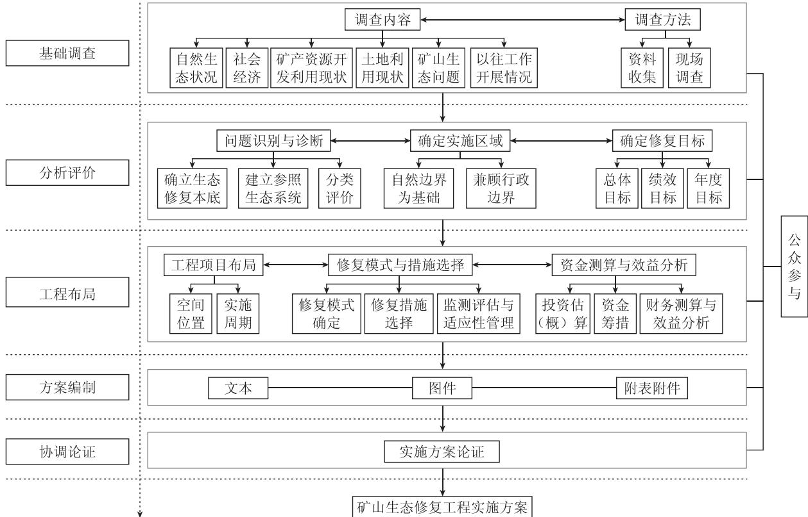

# 中华人民共和国土地管理行业标准

TD/T 1093—2024

# 矿山生态修复工程实施方案编制导则

# Directive for preparation of implementation scheme of mine ecological restoration project

2024-06-11 发布 2024-09-01 实施

## 目 次

前…Ⅲ  
1范围…1  
2规范性弓用文件…………………………1  
3术语和定义……………………………………………………………………………………………1  
4总体要求………………………………………………………………………………………………………………………………………………1  
4.1般规定…………………………………………………………………………………………1  
4.2 编制原……2  
5编制程……………………………………………………………………………………………………………………2  
5.1骗制流程…………………………………………………………………………………………………………2  
5.2基调香……3  
5.3分析评价……………………4  
5.4工程布局………………………………………………………………………………………………………………………………5  
5.5方案编制…………………………6  
5.6协调论证…6  
5.7公众参与…… …6  
附录A（资料性）矿山生态问题调查、监测评估、识别与诊断表……7  
附录B（规范性） 矿山生态修复工程基本信息与拟治理图斑台账表 …12  
附录C（资料性） 矿山生态修复工程/子项目绩效目标表…………14  
附录D（规范性）矿山生态修复工程/子项目年度绩效目标表……17  
附录E（规范性）矿山生态修复实施区域土地利用现状及修复目标情况表……19  
附录F（规范性）矿山生态修复工程投资估(概)算与投资计划表……20  
附录G（规范性）矿山生态修复工程实施方案编制内容与成果要求……23  
参考文献…… …33

## 前 言

本文件按照GB/T1.1—2020《标准化工作导则 第1部分：标准化文件的结构和起草规则》的规定起草。

请注意本文件的某些内容可能涉及专利。本文件的发布机构不承担识别专利的责任。

本文件由中华人民共和国自然资源部提出。

本文件由全国自然资源与国土空间规划标准化技术委员会(SAC/TC93)归口。

本文件起草单位：自然资源部国土空间生态修复司、中国自然资源经济研究院、自然资源部国土整治中心、中国地质环境监测院、浙江大学、中国地质大学(武汉)。

本文件主要起草人：卢丽华、孙贵尚、刘永兵、王敬、许闯胜、刘向敏、穆泳林、李红举、张德强、吴次芳、冯春涛、白雪华、白光宇、周建伟。

# 矿山生态修复工程实施方案编制导则

## 1 范围

本文件规定了矿产资源开采活动结束后的废弃矿山生态修复工程实施方案编制的总体要求、程序、内容、成果等。

本文件适用于政府立项并组织实施的矿山生态修复工程(包括财政出资或引入社会资本投入的工程)实施方案编制，其他矿山生态修复工程实施方案编制可参照执行。

## 2 规范性引用文件

下列文件中的内容通过文中的规范性引用而构成本文件必不可少的条款。其中，注日期的引用文件，仅该日期对应的版本适用于本文件；不注日期的引用文件，其最新版本(包括所有的修改单)适用于本文件。

GB/T 15776 造林技术规程

GB/T 21010 土地利用现状分类

DZ/T0223 矿山地质环境保护与恢复治理方案编制规范

LY/T 2356 矿山废弃地植被恢复技术规程

TD/T1031.1 土地复垦方案编制规程 第1部分：通则

TD/T1049 矿山土地复垦基础信息调查规程

TD/T1055 第三次全国国土调查技术规程

TD/T1068 国土空间生态保护修复工程实施方案编制规程

TD/T1070.1 矿山生态修复技术规范 第1部分:通则

## 3 术语和定义

下列术语和定义适用于本文件。

## 3.1

矿山生态修复工程 mine ecological restoration project

在矿产资源开采活动造成破坏的区域及影响区，依靠自然力量或通过人工措施于预，对矿山地质环境破坏、土地损毁和植被破坏等问题进行系统修复与综合治理，使矿山地质环境达到稳定、损毁土地得到复垦利用、生态系统功能得到恢复和改善的过程及活动。

## 4 总体要求

## 4.1 一般规定

4.1.1 实施方案是开展矿山生态修复工程设计、资金管理、工程实施、监测监管、竣工验收、绩效评价和

综合成效评估等的基本依据。

4.1.2 实施方案应遵循生态保护红线特别是自然保护地、耕地保护红线特别是永久基本农田等管控要求，与各级国土空间规划以及国土空间生态保护修复、矿产资源等相关专项规划充分衔接。实施方案采用的自然资源基础数据应依据最新的自然资源调查、确权登记以及相关生态状况监测评价等成果；相关图件应符合自然资源“一张图”及国土空间基础信息平台建设管理和应用要求。数据的传输、共享和应用符合国家安全保密规定。

4.1.3 实施方案中充分利用残存的土壤和植物，涉及土壤剥离利用宜做到“应剥尽剥、即剥尽用、分层剥离、分层堆放、分层回填”，对剥离、运输、储存、养护和回覆等土壤剥离利用工程做出时间、空间和经济可行的安排。

4.1.4 实施方案不低于可行性研究有关技术要求。对于实施区域和规模较小、实施期限较短的工程，实施方案已达到工程设计深度的，可不再另行开展工程设计。涉及土石料利用的工程，应当在实施方案中专章说明土石料情况，并按照相关要求执行。

4.1.5 实施方案按照“谁组织实施、谁负责编制”的原则，由市级或县级政府(或主管部门)组织编制，实施区域跨行政区域的由上一级政府(或主管部门)组织编制。

4.1.6 因国家政策和相关规划的调整，以及适应性管理等需要，实施方案可按规定程序和要求进行相应调整或重新编制。

## 4.2 编制原则

4.2.1坚持规划引领。依据国土空间规划及生态保护修复相关规划，结合生态功能修复和后续资源开发利用、产业开发需求等，按照宜林则林、宜耕则耕、宜草则草、宜建则建、宜荒则荒原则，合理确定矿山生态修复方向、修复模式和修复措施等，使矿山地质环境达到稳定、损毁土地得到复垦利用、生态系统功能得到恢复和改善。

4.2.2坚持问题导向。以解决实施区域生态问题为导向，结合实施工程所在区域的自然条件及社会经济发展状况，根据调查评价和问题识别诊断结果，按照优先保障安全、突出生态功能、兼顾生态景观的要求，有针对性地确定修复目标任务、建设内容、工程布局和时序安排、技术路线和修复标准、资金规模和保障措施等。 X

4.2.3坚持科学修复。以本地适宜的生态系统为参照标准，结合国家、行业及地方相关标准，遵循国十空间用途管制要求，统筹考虑矿山类型及矿山生态问题的多样性、复杂性、多因性和地域性特征，采用基于自然的解决方案，坚持人工修复与自然恢复相结合、人工修复为自然恢复创造条件，分类施策、兴利除弊、合理利用，体现系统修复、综合治理。

4.2.4坚持合理可行。方案论证充分，实施区域明确，项目可落地；目标任务可量化、可考核；实施措施科学合理、技术可行；资金筹措来源明确、有保障、可平衡，支出方向符合相关管理要求。注重投入产出效率，最大限度发挥废弃矿山修复后的整体效益和长期效益；公众参与程度高，利益相关方的合法权益得到保障。

## 5 编制程序

## 5.1 编制流程

实施方案编制主要包括基础调查、分析评价、工程布局、方案编制、协调论证、公众参与等，具体工作流程见图1。

  
图1 矿山生态修复工程实施方案编制流程图

## 5.2 基础调查

## 5.2.1 调查范围

充分体现生态系统完整性，统筹考虑矿山所在的自然地理单元和生态功能空间，以采矿活动影响到的区域范围为主，可适当扩展到周边区域。

## 5.2.2 调查内容

5.2.2.1 自然生态状况调查。按照 TD/T 1068 和 TD/T 1070.1 相关要求执行。

5.2.2.2 社会经济调查。调查范围所在行政区域的社会经济状况，以及涉及的人口、收入等情况。按照TD/T 1068相关要求执行。 AD

5.2.2.3 矿产资源开发利用现状调查。按照TD/T1070.1相关要求执行。

5.2.2.4土地利用现状调查。包括实施区域内土地利用类型、面积、范围、质量、权属等，以及周边实施区域外主要土地利用类型，有关国土空间规划及“三区三线”划定情况。土地利用现状分类按照GB/T21010 和 TD/T 1055 相关要求执行。

5.2.2.5 矿山生态问题调查。包括矿山地质环境破坏、土地损毁、生态破坏或退化等情况(参见附录A中表A.1)，根据需要可开展重大问题专项调查。具体按照TD/T1070.1相关要求执行。

5.2.2.6以往工作开展情况调查。包括本行政区域内已开展的矿山生态修复项目、投入资金、治理面积、修复成效、技术措施、问题与经验等，参见附录A中表A.1。收集整理与调查范围内矿山生态问题相似的示范典型案例、具有价值的科研成果、先进适用技术模式等。

## 5.3 分析评价

## 5.3.1 问题识别与诊断

## 5.3.1.1 确立生态修复本底值

根据调查分析结果，确定实施区域内修复前表征矿山地质环境破坏状况、土地利用现状、生态系统状况的本底指标及数值，参见附录A中表A.2。

## 5.3.1.2 建立参照生态系统

采取与历史资料对比分析或矿山周围同类型地区综合调查等方法，建立矿山生态修复参照生态系统。一般用胁迫因素、物质条件、物种组成、结构多样性、生态系统功能等生态系统属性描述参照生态系统，参见附录A中表A.2。

## 5.3.1.3 分类评价

开展分类评价，参见附录A中表A.3。主要包括：

a） 矿山生态问题分级，按照TD/T1070.1相关要求执行；

b） 矿山地质环境影响评价，按照TD/T1070.1和DZ/T0223相关要求执行；

c） 矿山土地损毁程度评价，按照TD/T1031.1和TD/T1049相关要求执行；

d） 矿山生态系统退化程度及恢复力评价，按照TD/T1068相关要求执行。

## 5.3.2 确定实施区域

5.3.2.1 在调查范围内综合考虑区域生态功能定位，结合国土空间规划、生态修复规划及矿产资源规划等，确定实施区域。 4W

5.3.2.2 实施区域应具体到所在的县(市)、乡(镇)、行政村，有明确的矢量边界。

## 5.3.3 确定修复目标

## 5.3.3.1 总体目标

坚持宜林则林、宜耕则耕、宜草则草、宜建则建、宜荒则荒原则，根据国土空间规划相关要求，结合未来用地规划，土地开发利用方式和土地用途，以及工程范围内生态系统特点等，采用类比法、综合分析法等方法，围绕解决实施区域矿山生态问题，从矿山地质环境治理、土地复垦、生态系统功能恢复和改善等方面，明确生态修复方向和修复总体目标。工程包含子项目的，还应确定每个子项目总体目标，子项目总体目标应与工程总体目标相衔接。矿山生态修复工程基本信息见附录B中表B.1。

## 5.3.3.2 绩效目标

根据调查分析评价结果，依据确定的总体目标，进行目标可达性分析。按照有关部门绩效管理要求，从产出(数量、质量)、效益(生态、社会、经济)、满意度等方面，制定实施期限内可量化、可评价的绩效指标体系。工程包含子项目的，还应确定每个子项目绩效目标，子项目绩效目标应与工程绩效目标相衔接。矿山生态修复工程/子项目绩效目标表参见附录C中表C.1。

## 5.3.3.3 年度目标

根据总体目标、绩效目标和工程实施周期，按年度制定工程项目修复目标。年度目标应与总体目标、绩效目标相衔接。工程包含子项目的，应确定每个子项目年度目标，子项目年度目标应与工程年度目标相衔接。矿山生态修复工程/子项目年度绩效目标表见附录D中表D.1。

## 5.4 工程布局

## 5.4.1 工程项目布局

5.4.1.1 矿山生态修复工程布局应体现整体性、系统性、协调性。矿山生态修复工程实施区域较大的，可综合考虑自然地理条件、矿山分布、生态功能定位及行政边界等设置子项目。

5.4.1.2 确定工程所在行政区域、国土空间位置、面积、工程量。工程包含子项目的，应说明每个子项目相应情况。

5.4.1.3 核实确认是否涉及国土空间规划调整，实施区域土地类型，是否涉及耕地、永久基本农田，是否涉及生态保护红线、自然保护地。

5.4.1.4核实是否涉及土地权属调整，如涉及权属调整应征得权利人同意，编制权属调整方案，并根据权属变动情况及时办理不动产登记。涉及土地利用变化情况需明确的内容，见附录E中表E.1。

5.4.1.5根据工程项目范围内矿山生态问题的严重性、保护修复的紧迫性，以及施工难易程度等，有序安排工程实施进度、实施周期。工程包含子项目的，应说明每个子项目相应情况。

5.4.1.6针对工程项目特点，制定工程实施的技术路线。工程包含子项目的，应按子项目制定相应的技术路线。

## 5.4.2 修复模式与措施选择

## 5.4.2.1 修复模式

5.4.2.1.1在实施区域内，根据自然地理条件、矿山地质环境影响等级、土地损毁程度、生态恢复力评价结果、修复目标和参照生态系统，确定修复模式。修复模式一般包括自然恢复、辅助再生、生态重建等。可选择一种或多种模式。 MZ

5.4.2.1.2 自然恢复、辅助再生、生态重建按照TD/T1070.1相关要求执行。

## 5.4.2.2 修复措施选择

5.4.2.2.1综合考虑当地经济发展水平和修复技术、成本、周期、民众可接受程度等因素，分析生态修复技术经济可行性。 1X

5.4.2.2.2 根据矿山生态问题、修复目标、修复模式等，确定消除矿山地质环境隐患、地貌重塑、土壤重构、植被重建等技术措施，按照GB/T15776、LY/T 2356、TD/T1070.1等相关要求执行。

5.4.2.2.3 技术措施可选一种或多种技术措施的组合。

## 5.4.2.3 监测评估与适应性管理

5.4.2.3.1 监测评估内容如下。

a）根据工程设定的监测内容与指标，明确监测点布设，监测措施、手段，以及监测评估技术方法、频次等按照TD/T1070.1相关要求执行。监测指标参见附录A中表A.2。

b） 对矿山生态修复实施效果及绩效目标完成情况进行动态评估，按照TD/T1070.1相关要求执行。

c）以修复前建立的生态修复本底值作为基期监测值，对矿山生态修复实施效果及绩效目标完成情况进行评估。指标参见附录A中表A.2。

## 5.4.2.3.2 适应性管理内容如下。

a）对矿山生态修复工程项目实施中可能存在的风险隐患，制定防范与适应性管理的相关措施。

b）后期管护。定期检查和维护工程设施，发现工程设施运行不正常或损毁，及时修复或替换。植被养护主要采取定期或不定期喷水、追肥、清除杂草、防治病虫害、补植、补种等措施。一般管护

时间为2年～3年，生态脆弱区管护时间为3年～5年。

## 5.4.3 资金测算与效益分析

## 5.4.3.1 投资估(概)算

矿山生态修复工程投资估(概)算与投资计划需明确的内容见附录F，投资估(概)算具体方法如下。

a）对照本地类似工程，采用案例比较、成本效益分析等方法，参照国家、行业及地方相关投资定额标准(无定额标准的可参照当地市场价或询价)，估(概)算工程施工投资。实施方案达到工程设计有关技术要求的，可进行投资预算。

b）根据实施方案确定的单项工程内容和工程量估(概)算子项目的工程施工费。

c）在子项目施工投资测算的基础上，测算实施区域生态修复工程总投资，包括工程施工费、监测与管护费、其他费用及不可预见费等。

## 5.4.3.2 资金筹措

提出资金来源及构成和资金筹措方式等。需明确财政资金投入方式，社会资本投入的融资方案，以及其他资金来源情况。

## 5.4.3.3 财务测算与效益分析

财务测算与效益分析方法如下：

a）明确矿山生态修复工程期限、投资回报机制等财务测算边界条件，从资金投入（来源及构成）、修复成本支出、修复预期收益(复垦土地利用率、土地价值提升、产业发展等)开展财务测算；

b）矿山生态修复工程的生态效益、社会效益、经济效益分析，可按照TD/T1070.1相关要求执行。

## 5.5 方案编制

实施方案报告包括文本、相关图表、必要的影像资料及拟治理图斑数据等，编制内容与成果要求详见附录G。

## 5.6 协调论证

实施方案应广泛征求政府相关部门(财政、自然资源、生态环境、林业草原、农业农村、水利、城乡建设、应急管理等)和利益相关方的意见，从组织管理、修复目标、措施与技术、经济可行、费用保障、绩效考核指标以及公众接受程度等方面进行可行性论证。

## 5.7 公众参与

5.7.1公众参与人员应包括生态修复利益相关方(单位、个人等)及相关领域专家。

5.7.2 公众参与环节应包括方案编制前期研究、方案编制及论证过程。

5.7.3 公众参与内容主要包括修复的意愿及其产生的影响，生态修复目标、标准，生态问题识别与诊断，拟采取措施技术，监测及管护等。

5.7.4听取公众意见可采取座谈、问卷调查、走访、网络、电视、广播、报纸、公告、公示等。调查宜采用通俗易懂的图表，开展座谈会、问卷调查、走访及媒体公告等。

5.7.5收集公众参与相关资料、影像、图片等，制作相关图表，对反馈意见进行梳理分析，分类提出处理结果建议。

## 附录A

(资料性)

矿山生态问题调查、监测评估、识别与诊断表

表A.1给出了矿山生态问题调查内容，表A.2给出了矿山生态调查监测评估推荐指标，表A.3给出了矿山生态问题识别与诊断内容。

表 A. 1 矿山生态问题调查表
<table><tr><td rowspan=1 colspan=1>调查表编号</td><td rowspan=1 colspan=2></td><td rowspan=1 colspan=1>调查时间</td><td rowspan=1 colspan=1></td><td rowspan=1 colspan=2>调查地点</td><td rowspan=1 colspan=1></td><td rowspan=1 colspan=1>记录人</td><td rowspan=1 colspan=1></td></tr><tr><td rowspan=1 colspan=1>问题尺度</td><td rowspan=1 colspan=9>子项目□ 场地□</td></tr><tr><td rowspan=1 colspan=1>所处空间</td><td rowspan=1 colspan=9>农业空间□ 城镇空间□ 生态空间(说明是否是自然保护地)□ 其他□</td></tr><tr><td rowspan=1 colspan=1>土地利用现状</td><td rowspan=1 colspan=9>(根据第三次全国国土调查或最新年度变更调查结果，说明土地利用类型、面积、范围、质量、坡度、权属等，可另附页)</td></tr><tr><td rowspan=7 colspan=1>主要问题</td><td rowspan=1 colspan=9>(简述该区域的国土空间规划目标和用途、生态保护修复功能定位，定性描述突出矿山生态问题)</td></tr><tr><td rowspan=6 colspan=1>关键指标现状值</td><td rowspan=1 colspan=2>指标</td><td rowspan=1 colspan=2>值</td><td rowspan=1 colspan=2>单位红</td><td rowspan=1 colspan=2>获取时间</td></tr><tr><td rowspan=1 colspan=2>指标1(例：植被覆盖度)</td><td rowspan=1 colspan=2>(例：80%)</td><td rowspan=1 colspan=2></td><td rowspan=1 colspan=2>(例：2024.1.1)</td></tr><tr><td rowspan=1 colspan=2>指标2</td><td rowspan=1 colspan=2></td><td rowspan=1 colspan=2></td><td rowspan=1 colspan=2></td></tr><tr><td rowspan=1 colspan=2>指标3</td><td rowspan=1 colspan=2></td><td rowspan=1 colspan=2></td><td rowspan=1 colspan=2></td></tr><tr><td rowspan=1 colspan=2>指标4</td><td rowspan=1 colspan=2></td><td rowspan=1 colspan=2></td><td rowspan=1 colspan=2></td></tr><tr><td rowspan=1 colspan=2>…</td><td rowspan=1 colspan=2></td><td rowspan=1 colspan=2></td><td rowspan=1 colspan=2></td></tr><tr><td rowspan=1 colspan=1>原因分析</td><td rowspan=1 colspan=9>(阐述出现此矿山生态问题的原因)</td></tr><tr><td rowspan=1 colspan=1>应对措施</td><td rowspan=1 colspan=9>(阐述针对此问题的经验做法、已有措施技术及相关意见建议等)</td></tr><tr><td rowspan=1 colspan=1>典型案例</td><td rowspan=1 colspan=9>(若针对此问题的对策有典型案例可供参考，请阐述在本行政区域内已开展的矿山生态修复项目、国土空间位置、投入资金、治理面积、修复成效、技术措施、问题与经验等，或收集整理与调查范围内矿山生态问题相似的示范典型案例、具有价值的科研成果、先进适用技术模式等</td></tr><tr><td rowspan=1 colspan=10>注：“关键指标”可参考但不限于表A.2。</td></tr></table>

<table><tr><td rowspan=3 colspan=1>序号</td><td rowspan=3 colspan=1>一级指标</td><td rowspan=3 colspan=1>二级指标</td><td rowspan=3 colspan=1>三级指标</td><td rowspan=3 colspan=1>单位</td><td rowspan=2 colspan=2>参照值</td><td rowspan=2 colspan=2>现值</td><td rowspan=1 colspan=4>监测值</td><td rowspan=2 colspan=2>目标值</td><td rowspan=3 colspan=1>备注</td></tr><tr><td rowspan=1 colspan=2>基期(N)</td><td rowspan=1 colspan=2>监测年(…)</td></tr><tr><td rowspan=1 colspan=1>数值</td><td rowspan=1 colspan=1>来源</td><td rowspan=1 colspan=1>数值</td><td rowspan=1 colspan=1>来源</td><td rowspan=1 colspan=1>数值</td><td rowspan=1 colspan=1>来源</td><td rowspan=1 colspan=1>数值</td><td rowspan=1 colspan=1>来源</td><td rowspan=1 colspan=1>数值</td><td rowspan=1 colspan=1>来源</td></tr><tr><td rowspan=1 colspan=1>1</td><td rowspan=13 colspan=1>01矿山地质环境</td><td rowspan=6 colspan=1>011矿山地质环境隐患</td><td rowspan=1 colspan=1>危岩体</td><td rowspan=1 colspan=1>处</td><td rowspan=1 colspan=1></td><td rowspan=1 colspan=1></td><td rowspan=1 colspan=1></td><td rowspan=1 colspan=1></td><td rowspan=1 colspan=1></td><td rowspan=1 colspan=1></td><td rowspan=1 colspan=1></td><td rowspan=1 colspan=1></td><td rowspan=1 colspan=1></td><td rowspan=1 colspan=1></td><td rowspan=1 colspan=1></td></tr><tr><td rowspan=1 colspan=1>2</td><td rowspan=1 colspan=1>地面塌陷</td><td rowspan=1 colspan=1>hm²</td><td rowspan=1 colspan=1></td><td rowspan=1 colspan=1></td><td rowspan=1 colspan=1></td><td rowspan=1 colspan=1></td><td rowspan=1 colspan=1></td><td rowspan=1 colspan=1></td><td rowspan=1 colspan=1></td><td rowspan=1 colspan=1></td><td rowspan=1 colspan=1></td><td rowspan=1 colspan=1></td><td rowspan=1 colspan=1></td></tr><tr><td rowspan=1 colspan=1>3</td><td rowspan=1 colspan=1>地裂缝</td><td rowspan=1 colspan=1>处</td><td rowspan=1 colspan=1></td><td rowspan=1 colspan=1></td><td rowspan=1 colspan=1></td><td rowspan=1 colspan=1></td><td rowspan=1 colspan=1></td><td rowspan=1 colspan=1></td><td rowspan=1 colspan=1></td><td rowspan=1 colspan=1></td><td rowspan=1 colspan=1></td><td rowspan=1 colspan=1></td><td rowspan=1 colspan=1></td></tr><tr><td rowspan=1 colspan=1>4</td><td rowspan=1 colspan=1>不稳定边(斜)坡</td><td rowspan=1 colspan=1>处</td><td rowspan=1 colspan=1></td><td rowspan=1 colspan=1></td><td rowspan=1 colspan=1></td><td rowspan=1 colspan=1></td><td rowspan=1 colspan=1></td><td rowspan=1 colspan=1></td><td rowspan=1 colspan=1></td><td rowspan=1 colspan=1></td><td rowspan=1 colspan=1></td><td rowspan=1 colspan=1></td><td rowspan=1 colspan=1></td></tr><tr><td rowspan=1 colspan=1>5</td><td rowspan=1 colspan=1>矿山废弃井口</td><td rowspan=1 colspan=1>个</td><td rowspan=1 colspan=1></td><td rowspan=1 colspan=1></td><td rowspan=1 colspan=1></td><td rowspan=1 colspan=1></td><td rowspan=1 colspan=1></td><td rowspan=1 colspan=1></td><td rowspan=1 colspan=1></td><td rowspan=1 colspan=1></td><td rowspan=1 colspan=1></td><td rowspan=1 colspan=1></td><td rowspan=1 colspan=1></td></tr><tr><td rowspan=1 colspan=1></td><td rowspan=1 colspan=1>A</td><td rowspan=1 colspan=1></td><td rowspan=1 colspan=1></td><td rowspan=1 colspan=1></td><td rowspan=1 colspan=1></td><td rowspan=1 colspan=1></td><td rowspan=1 colspan=1></td><td rowspan=1 colspan=1></td><td rowspan=1 colspan=1></td><td rowspan=1 colspan=1></td><td rowspan=1 colspan=1></td><td rowspan=1 colspan=1></td><td rowspan=1 colspan=1></td></tr><tr><td rowspan=1 colspan=1>6</td><td rowspan=5 colspan=1>012地形地貌</td><td rowspan=1 colspan=1>破损山体</td><td rowspan=1 colspan=1>处</td><td rowspan=1 colspan=1></td><td rowspan=1 colspan=1></td><td rowspan=1 colspan=1></td><td rowspan=1 colspan=1></td><td rowspan=1 colspan=1></td><td rowspan=1 colspan=1></td><td rowspan=1 colspan=1></td><td rowspan=1 colspan=1></td><td rowspan=1 colspan=1></td><td rowspan=1 colspan=1></td><td rowspan=1 colspan=1></td></tr><tr><td rowspan=1 colspan=1>7</td><td rowspan=1 colspan=1>露天采坑</td><td rowspan=1 colspan=1>处</td><td rowspan=1 colspan=1></td><td rowspan=1 colspan=1></td><td rowspan=1 colspan=1></td><td rowspan=1 colspan=1></td><td rowspan=1 colspan=1></td><td rowspan=1 colspan=1></td><td rowspan=1 colspan=1></td><td rowspan=1 colspan=1></td><td rowspan=1 colspan=1></td><td rowspan=1 colspan=1></td><td rowspan=1 colspan=1></td></tr><tr><td rowspan=1 colspan=1>8</td><td rowspan=1 colspan=1>废石(渣、土)堆、煤矸石堆</td><td rowspan=1 colspan=1>hm²</td><td rowspan=1 colspan=1></td><td rowspan=1 colspan=1></td><td rowspan=1 colspan=1></td><td rowspan=1 colspan=1></td><td rowspan=1 colspan=1></td><td rowspan=1 colspan=1></td><td rowspan=1 colspan=1></td><td rowspan=1 colspan=1></td><td rowspan=1 colspan=1></td><td rowspan=1 colspan=1></td><td rowspan=1 colspan=1></td></tr><tr><td rowspan=1 colspan=1>9</td><td rowspan=1 colspan=1>建(构)筑物</td><td rowspan=1 colspan=1>hm²</td><td rowspan=1 colspan=1></td><td rowspan=1 colspan=1></td><td rowspan=1 colspan=1></td><td rowspan=1 colspan=1></td><td rowspan=1 colspan=1></td><td rowspan=1 colspan=1></td><td rowspan=1 colspan=1></td><td rowspan=1 colspan=1></td><td rowspan=1 colspan=1></td><td rowspan=1 colspan=1></td><td rowspan=1 colspan=1></td></tr><tr><td rowspan=1 colspan=1></td><td rowspan=1 colspan=1>…</td><td rowspan=1 colspan=1></td><td rowspan=1 colspan=1></td><td rowspan=1 colspan=1></td><td rowspan=1 colspan=1></td><td rowspan=1 colspan=1></td><td rowspan=1 colspan=1></td><td rowspan=1 colspan=1></td><td rowspan=1 colspan=1></td><td rowspan=1 colspan=1></td><td rowspan=1 colspan=1></td><td rowspan=1 colspan=1></td><td rowspan=1 colspan=1></td></tr><tr><td rowspan=1 colspan=1>10</td><td rowspan=2 colspan=1>013水体</td><td rowspan=1 colspan=1>水位</td><td rowspan=1 colspan=1>m</td><td rowspan=1 colspan=1></td><td rowspan=1 colspan=1></td><td rowspan=1 colspan=1></td><td rowspan=1 colspan=1></td><td rowspan=1 colspan=1></td><td rowspan=1 colspan=1></td><td rowspan=1 colspan=1></td><td rowspan=1 colspan=1></td><td rowspan=1 colspan=1></td><td rowspan=1 colspan=1></td><td rowspan=1 colspan=1></td></tr><tr><td rowspan=1 colspan=1></td><td rowspan=1 colspan=1>……</td><td rowspan=1 colspan=1></td><td rowspan=1 colspan=1></td><td rowspan=1 colspan=1></td><td rowspan=1 colspan=1></td><td rowspan=1 colspan=1></td><td rowspan=1 colspan=1></td><td rowspan=1 colspan=1></td><td rowspan=1 colspan=1></td><td rowspan=1 colspan=1></td><td rowspan=1 colspan=1></td><td rowspan=1 colspan=1></td><td rowspan=1 colspan=1></td></tr><tr><td rowspan=1 colspan=1>11</td><td rowspan=3 colspan=1>02土地利用</td><td rowspan=3 colspan=1>021耕地</td><td rowspan=1 colspan=1>面积</td><td rowspan=1 colspan=1>hm²</td><td rowspan=1 colspan=1></td><td rowspan=1 colspan=1></td><td rowspan=1 colspan=1></td><td rowspan=1 colspan=1></td><td rowspan=1 colspan=1></td><td rowspan=1 colspan=1></td><td rowspan=1 colspan=1></td><td rowspan=1 colspan=1></td><td rowspan=1 colspan=1></td><td rowspan=1 colspan=1></td><td rowspan=1 colspan=1></td></tr><tr><td rowspan=1 colspan=1>12</td><td rowspan=1 colspan=1>质量</td><td rowspan=1 colspan=1>一</td><td rowspan=1 colspan=1></td><td rowspan=1 colspan=1></td><td rowspan=1 colspan=1></td><td rowspan=1 colspan=1></td><td rowspan=1 colspan=1></td><td rowspan=1 colspan=1></td><td rowspan=1 colspan=1></td><td rowspan=1 colspan=1></td><td rowspan=1 colspan=1></td><td rowspan=1 colspan=1></td><td rowspan=1 colspan=1></td></tr><tr><td rowspan=1 colspan=1></td><td rowspan=1 colspan=1>…</td><td rowspan=1 colspan=1></td><td rowspan=1 colspan=1></td><td rowspan=1 colspan=1></td><td rowspan=1 colspan=1></td><td rowspan=1 colspan=1></td><td rowspan=1 colspan=1></td><td rowspan=1 colspan=1></td><td rowspan=1 colspan=1></td><td rowspan=1 colspan=1></td><td rowspan=1 colspan=1></td><td rowspan=1 colspan=1></td><td rowspan=1 colspan=1></td></tr></table>

<table><tr><td rowspan=3 colspan=1>序号</td><td rowspan=3 colspan=1>一级指标</td><td rowspan=3 colspan=2>二级指标</td><td rowspan=3 colspan=1>三级指标</td><td rowspan=3 colspan=1>单位</td><td rowspan=2 colspan=2>参照值</td><td rowspan=2 colspan=2>现值</td><td rowspan=1 colspan=4>监测值</td><td rowspan=2 colspan=2>目标值</td><td rowspan=3 colspan=1>备注</td></tr><tr><td rowspan=1 colspan=2>基期(N)</td><td rowspan=1 colspan=2>监测年(…)</td></tr><tr><td rowspan=1 colspan=1>数值</td><td rowspan=1 colspan=1>来源</td><td rowspan=1 colspan=1>数值</td><td rowspan=1 colspan=1>来源</td><td rowspan=1 colspan=1>数值</td><td rowspan=1 colspan=1>来源</td><td rowspan=1 colspan=1>数值</td><td rowspan=1 colspan=1>来源</td><td rowspan=1 colspan=1>数值</td><td rowspan=1 colspan=1>来源</td></tr><tr><td rowspan=1 colspan=1>13</td><td rowspan=12 colspan=1>02土地利用</td><td rowspan=3 colspan=2>022园地</td><td rowspan=1 colspan=1>面积</td><td rowspan=1 colspan=1>hm²</td><td rowspan=1 colspan=1></td><td rowspan=1 colspan=1></td><td rowspan=1 colspan=1></td><td rowspan=1 colspan=1></td><td rowspan=1 colspan=1></td><td rowspan=1 colspan=1></td><td rowspan=1 colspan=1></td><td rowspan=1 colspan=1></td><td rowspan=1 colspan=1></td><td rowspan=1 colspan=1></td><td rowspan=1 colspan=1></td></tr><tr><td rowspan=1 colspan=1>14</td><td rowspan=1 colspan=1>质量</td><td rowspan=1 colspan=1></td><td rowspan=1 colspan=1></td><td rowspan=1 colspan=1></td><td rowspan=1 colspan=1></td><td rowspan=1 colspan=1></td><td rowspan=1 colspan=1></td><td rowspan=1 colspan=1></td><td rowspan=1 colspan=1></td><td rowspan=1 colspan=1></td><td rowspan=1 colspan=1></td><td rowspan=1 colspan=1></td><td rowspan=1 colspan=1></td></tr><tr><td rowspan=1 colspan=1></td><td rowspan=1 colspan=1>…</td><td rowspan=1 colspan=1></td><td rowspan=1 colspan=1></td><td rowspan=1 colspan=1></td><td rowspan=1 colspan=1></td><td rowspan=1 colspan=1></td><td rowspan=1 colspan=1></td><td rowspan=1 colspan=1></td><td rowspan=1 colspan=1></td><td rowspan=1 colspan=1></td><td rowspan=1 colspan=1></td><td rowspan=1 colspan=1></td><td rowspan=1 colspan=1></td></tr><tr><td rowspan=1 colspan=1>15</td><td rowspan=3 colspan=2>023林地</td><td rowspan=1 colspan=1>面积</td><td rowspan=1 colspan=1>hm²</td><td rowspan=1 colspan=1></td><td rowspan=1 colspan=1></td><td rowspan=1 colspan=1></td><td rowspan=1 colspan=1></td><td rowspan=1 colspan=1></td><td rowspan=1 colspan=1></td><td rowspan=1 colspan=1></td><td rowspan=1 colspan=1></td><td rowspan=1 colspan=1></td><td rowspan=1 colspan=1></td><td rowspan=1 colspan=1></td></tr><tr><td rowspan=1 colspan=1>16</td><td rowspan=1 colspan=1>质量</td><td rowspan=1 colspan=1>一</td><td rowspan=1 colspan=1></td><td rowspan=1 colspan=1></td><td rowspan=1 colspan=1></td><td rowspan=1 colspan=1></td><td rowspan=1 colspan=1></td><td rowspan=1 colspan=1></td><td rowspan=1 colspan=1></td><td rowspan=1 colspan=1></td><td rowspan=1 colspan=1></td><td rowspan=1 colspan=1></td><td rowspan=1 colspan=1></td></tr><tr><td rowspan=1 colspan=1></td><td rowspan=1 colspan=1>…</td><td rowspan=1 colspan=1></td><td rowspan=1 colspan=1></td><td rowspan=1 colspan=1></td><td rowspan=1 colspan=1></td><td rowspan=1 colspan=1></td><td rowspan=1 colspan=1></td><td rowspan=1 colspan=1></td><td rowspan=1 colspan=1></td><td rowspan=1 colspan=1></td><td rowspan=1 colspan=1></td><td rowspan=1 colspan=1></td><td rowspan=1 colspan=1></td></tr><tr><td rowspan=1 colspan=1>17</td><td rowspan=3 colspan=2>024草地</td><td rowspan=1 colspan=1>面积</td><td rowspan=1 colspan=1>hm2</td><td rowspan=1 colspan=1></td><td rowspan=1 colspan=1></td><td rowspan=1 colspan=1></td><td rowspan=1 colspan=1></td><td rowspan=1 colspan=1></td><td rowspan=1 colspan=1></td><td rowspan=1 colspan=1></td><td rowspan=1 colspan=1></td><td rowspan=1 colspan=1></td><td rowspan=1 colspan=1></td><td rowspan=1 colspan=1></td></tr><tr><td rowspan=1 colspan=1>18</td><td rowspan=1 colspan=1>质量</td><td rowspan=1 colspan=1></td><td rowspan=1 colspan=1></td><td rowspan=1 colspan=1></td><td rowspan=1 colspan=1></td><td rowspan=1 colspan=1></td><td rowspan=1 colspan=1></td><td rowspan=1 colspan=1></td><td rowspan=1 colspan=1></td><td rowspan=1 colspan=1></td><td rowspan=1 colspan=1></td><td rowspan=1 colspan=1></td><td rowspan=1 colspan=1></td></tr><tr><td rowspan=1 colspan=1></td><td rowspan=1 colspan=1>…</td><td rowspan=1 colspan=1></td><td rowspan=1 colspan=1></td><td rowspan=1 colspan=1></td><td rowspan=1 colspan=1></td><td rowspan=1 colspan=1></td><td rowspan=1 colspan=1></td><td rowspan=1 colspan=1></td><td rowspan=1 colspan=1></td><td rowspan=1 colspan=1></td><td rowspan=1 colspan=1></td><td rowspan=1 colspan=1></td><td rowspan=1 colspan=1></td></tr><tr><td rowspan=1 colspan=1>19</td><td rowspan=3 colspan=2>025湿地</td><td rowspan=1 colspan=1>面积</td><td rowspan=1 colspan=1>hm²</td><td rowspan=1 colspan=1></td><td rowspan=1 colspan=1></td><td rowspan=1 colspan=1></td><td rowspan=1 colspan=1></td><td rowspan=1 colspan=1></td><td rowspan=1 colspan=1></td><td rowspan=1 colspan=1></td><td rowspan=1 colspan=1></td><td rowspan=1 colspan=1></td><td rowspan=1 colspan=1></td><td rowspan=1 colspan=1></td></tr><tr><td rowspan=1 colspan=1></td><td rowspan=1 colspan=1>质量</td><td rowspan=1 colspan=1>一</td><td rowspan=1 colspan=1></td><td rowspan=1 colspan=1></td><td rowspan=1 colspan=1></td><td rowspan=1 colspan=1></td><td rowspan=1 colspan=1></td><td rowspan=1 colspan=1></td><td rowspan=1 colspan=1></td><td rowspan=1 colspan=1></td><td rowspan=1 colspan=1></td><td rowspan=1 colspan=1></td><td rowspan=1 colspan=1></td></tr><tr><td rowspan=1 colspan=1></td><td rowspan=1 colspan=1>…</td><td rowspan=1 colspan=1></td><td rowspan=1 colspan=1></td><td rowspan=1 colspan=1></td><td rowspan=1 colspan=1></td><td rowspan=1 colspan=1></td><td rowspan=1 colspan=1></td><td rowspan=1 colspan=1></td><td rowspan=1 colspan=1></td><td rowspan=1 colspan=1></td><td rowspan=1 colspan=1></td><td rowspan=1 colspan=1></td><td rowspan=1 colspan=1></td></tr><tr><td rowspan=1 colspan=1>20</td><td rowspan=4 colspan=1>03生态系统</td><td rowspan=2 colspan=2>031</td><td rowspan=1 colspan=1>群落类型</td><td rowspan=1 colspan=1></td><td rowspan=1 colspan=1></td><td rowspan=1 colspan=1></td><td rowspan=1 colspan=1></td><td rowspan=1 colspan=1></td><td rowspan=1 colspan=1></td><td rowspan=1 colspan=1></td><td rowspan=1 colspan=1></td><td rowspan=1 colspan=1></td><td rowspan=1 colspan=1></td><td rowspan=1 colspan=1></td><td rowspan=1 colspan=1></td></tr><tr><td rowspan=1 colspan=1>21</td><td rowspan=1 colspan=1></td><td rowspan=1 colspan=1>植被覆盖度</td><td rowspan=1 colspan=1>%</td><td rowspan=1 colspan=1></td><td rowspan=1 colspan=1></td><td rowspan=1 colspan=1></td><td rowspan=1 colspan=1></td><td rowspan=1 colspan=1></td><td rowspan=1 colspan=1></td><td rowspan=1 colspan=1></td><td rowspan=1 colspan=1></td><td rowspan=1 colspan=1></td><td rowspan=1 colspan=1></td><td rowspan=1 colspan=1></td></tr><tr><td rowspan=1 colspan=1>22</td><td rowspan=2 colspan=2>植被状况</td><td rowspan=1 colspan=1>分布及面积</td><td rowspan=1 colspan=1>hm²</td><td rowspan=1 colspan=1></td><td rowspan=1 colspan=1></td><td rowspan=1 colspan=1></td><td rowspan=1 colspan=1></td><td rowspan=1 colspan=1></td><td rowspan=1 colspan=1></td><td rowspan=1 colspan=1></td><td rowspan=1 colspan=1></td><td rowspan=1 colspan=1></td><td rowspan=1 colspan=1></td><td rowspan=1 colspan=1></td></tr><tr><td rowspan=1 colspan=1></td><td rowspan=1 colspan=1>…</td><td rowspan=1 colspan=1></td><td rowspan=1 colspan=1></td><td rowspan=1 colspan=1></td><td rowspan=1 colspan=1></td><td rowspan=1 colspan=1></td><td rowspan=1 colspan=1></td><td rowspan=1 colspan=1></td><td rowspan=1 colspan=1></td><td rowspan=1 colspan=1></td><td rowspan=1 colspan=1></td><td rowspan=1 colspan=1></td><td rowspan=1 colspan=1></td></tr></table>

<table><tr><td rowspan=3 colspan=1>序号</td><td rowspan=3 colspan=1>一级指标</td><td rowspan=3 colspan=1>二级指标</td><td rowspan=3 colspan=1>三级指标</td><td rowspan=3 colspan=1>单位</td><td rowspan=2 colspan=2>参照值</td><td rowspan=2 colspan=2>现值</td><td rowspan=1 colspan=4>监测值</td><td rowspan=2 colspan=2>目标值</td><td rowspan=3 colspan=1>备注</td></tr><tr><td rowspan=1 colspan=2>基期(N)</td><td rowspan=1 colspan=2>监测年(…)</td></tr><tr><td rowspan=1 colspan=1>数值</td><td rowspan=1 colspan=1>来源</td><td rowspan=1 colspan=1>数值</td><td rowspan=1 colspan=1>来源</td><td rowspan=1 colspan=1>数值</td><td rowspan=1 colspan=1>来源</td><td rowspan=1 colspan=1>数值</td><td rowspan=1 colspan=1>来源</td><td rowspan=1 colspan=1>数值</td><td rowspan=1 colspan=1>来源</td></tr><tr><td rowspan=1 colspan=1>23</td><td rowspan=10 colspan=1>03生态系统</td><td rowspan=5 colspan=1>032多样性</td><td rowspan=1 colspan=1>物种丰富度</td><td rowspan=1 colspan=1>个</td><td rowspan=1 colspan=1></td><td rowspan=1 colspan=1></td><td rowspan=1 colspan=1></td><td rowspan=1 colspan=1></td><td rowspan=1 colspan=1></td><td rowspan=1 colspan=1></td><td rowspan=1 colspan=1></td><td rowspan=1 colspan=1></td><td rowspan=1 colspan=1></td><td rowspan=1 colspan=1></td><td rowspan=1 colspan=1></td></tr><tr><td rowspan=1 colspan=1>24</td><td rowspan=1 colspan=1>本地物种数目</td><td rowspan=1 colspan=1>个</td><td rowspan=1 colspan=1></td><td rowspan=1 colspan=1></td><td rowspan=1 colspan=1></td><td rowspan=1 colspan=1></td><td rowspan=1 colspan=1></td><td rowspan=1 colspan=1></td><td rowspan=1 colspan=1></td><td rowspan=1 colspan=1></td><td rowspan=1 colspan=1></td><td rowspan=1 colspan=1></td><td rowspan=1 colspan=1></td></tr><tr><td rowspan=1 colspan=1>25</td><td rowspan=1 colspan=1>重要物种变化</td><td rowspan=1 colspan=1>一</td><td rowspan=1 colspan=1></td><td rowspan=1 colspan=1></td><td rowspan=1 colspan=1></td><td rowspan=1 colspan=1></td><td rowspan=1 colspan=1></td><td rowspan=1 colspan=1></td><td rowspan=1 colspan=1></td><td rowspan=1 colspan=1></td><td rowspan=1 colspan=1></td><td rowspan=1 colspan=1></td><td rowspan=1 colspan=1></td></tr><tr><td rowspan=1 colspan=1>26</td><td rowspan=1 colspan=1>有害物种变化</td><td rowspan=1 colspan=1>一</td><td rowspan=1 colspan=1></td><td rowspan=1 colspan=1></td><td rowspan=1 colspan=1></td><td rowspan=1 colspan=1></td><td rowspan=1 colspan=1></td><td rowspan=1 colspan=1></td><td rowspan=1 colspan=1></td><td rowspan=1 colspan=1></td><td rowspan=1 colspan=1></td><td rowspan=1 colspan=1></td><td rowspan=1 colspan=1></td></tr><tr><td rowspan=1 colspan=1></td><td rowspan=1 colspan=1></td><td rowspan=1 colspan=1></td><td rowspan=1 colspan=1></td><td rowspan=1 colspan=1></td><td rowspan=1 colspan=1></td><td rowspan=1 colspan=1></td><td rowspan=1 colspan=1></td><td rowspan=1 colspan=1></td><td rowspan=1 colspan=1></td><td rowspan=1 colspan=1></td><td rowspan=1 colspan=1></td><td rowspan=1 colspan=1></td><td rowspan=1 colspan=1></td></tr><tr><td rowspan=1 colspan=1>27</td><td rowspan=5 colspan=1>033生态系统功能</td><td rowspan=1 colspan=1>土壤保持量</td><td rowspan=1 colspan=1>t/a</td><td rowspan=1 colspan=1></td><td rowspan=1 colspan=1></td><td rowspan=1 colspan=1></td><td rowspan=1 colspan=1></td><td rowspan=1 colspan=1></td><td rowspan=1 colspan=1></td><td rowspan=1 colspan=1></td><td rowspan=1 colspan=1></td><td rowspan=1 colspan=1></td><td rowspan=1 colspan=1></td><td rowspan=1 colspan=1></td></tr><tr><td rowspan=1 colspan=1>28</td><td rowspan=1 colspan=1>水源涵养量</td><td rowspan=1 colspan=1>m³· a</td><td rowspan=1 colspan=1></td><td rowspan=1 colspan=1></td><td rowspan=1 colspan=1></td><td rowspan=1 colspan=1></td><td rowspan=1 colspan=1></td><td rowspan=1 colspan=1></td><td rowspan=1 colspan=1></td><td rowspan=1 colspan=1></td><td rowspan=1 colspan=1></td><td rowspan=1 colspan=1></td><td rowspan=1 colspan=1></td></tr><tr><td rowspan=1 colspan=1>29</td><td rowspan=1 colspan=1>防风固沙量</td><td rowspan=1 colspan=1>t/(km²·a)</td><td rowspan=1 colspan=1></td><td rowspan=1 colspan=1></td><td rowspan=1 colspan=1></td><td rowspan=1 colspan=1></td><td rowspan=1 colspan=1></td><td rowspan=1 colspan=1></td><td rowspan=1 colspan=1></td><td rowspan=1 colspan=1></td><td rowspan=1 colspan=1></td><td rowspan=1 colspan=1></td><td rowspan=1 colspan=1></td></tr><tr><td rowspan=1 colspan=1>30</td><td rowspan=1 colspan=1>固碳量</td><td rowspan=1 colspan=1>kg·a</td><td rowspan=1 colspan=1></td><td rowspan=1 colspan=1></td><td rowspan=1 colspan=1></td><td rowspan=1 colspan=1></td><td rowspan=1 colspan=1></td><td rowspan=1 colspan=1></td><td rowspan=1 colspan=1></td><td rowspan=1 colspan=1></td><td rowspan=1 colspan=1></td><td rowspan=1 colspan=1></td><td rowspan=1 colspan=1></td></tr><tr><td rowspan=1 colspan=1></td><td rowspan=1 colspan=1>……</td><td rowspan=1 colspan=1></td><td rowspan=1 colspan=1></td><td rowspan=1 colspan=1></td><td rowspan=1 colspan=1></td><td rowspan=1 colspan=1></td><td rowspan=1 colspan=1></td><td rowspan=1 colspan=1></td><td rowspan=1 colspan=1></td><td rowspan=1 colspan=1></td><td rowspan=1 colspan=1></td><td rowspan=1 colspan=1></td><td rowspan=1 colspan=1></td></tr><tr><td rowspan=1 colspan=3>…</td><td rowspan=1 colspan=1>…</td><td rowspan=1 colspan=1></td><td rowspan=1 colspan=1></td><td rowspan=1 colspan=1>S</td><td rowspan=1 colspan=1></td><td rowspan=1 colspan=1></td><td rowspan=1 colspan=1></td><td rowspan=1 colspan=1></td><td rowspan=1 colspan=1></td><td rowspan=1 colspan=1></td><td rowspan=1 colspan=1></td><td rowspan=1 colspan=1></td><td rowspan=1 colspan=1></td></tr></table>

乐烫的梁即和它采 关和团和交类疗护剂一 统垫系龄粮项采即采采采杀系色热替：

表A.3 矿山生态问题识别与诊断表
<table><tr><td rowspan=2 colspan=1>序号</td><td rowspan=2 colspan=1>评价单元</td><td rowspan=2 colspan=1>国土空间位置</td><td rowspan=2 colspan=1>参照值</td><td rowspan=1 colspan=9>矿山生态系统受损状况</td><td rowspan=2 colspan=1>修复模式推荐</td></tr><tr><td rowspan=1 colspan=1>矿山地质环境影响等级</td><td rowspan=1 colspan=1>土地损毁程度</td><td rowspan=1 colspan=1>矿山生态系统退化程度</td><td rowspan=1 colspan=1>矿山生态问题类型</td><td rowspan=1 colspan=1>涉及面积</td><td rowspan=1 colspan=1>矿山生态问题分级</td><td rowspan=1 colspan=1>影响因素</td><td rowspan=1 colspan=1>恢复力</td><td rowspan=1 colspan=1>紧迫程度</td></tr><tr><td rowspan=1 colspan=1>1</td><td rowspan=1 colspan=1></td><td rowspan=1 colspan=1></td><td rowspan=1 colspan=1></td><td rowspan=1 colspan=1></td><td rowspan=1 colspan=1></td><td rowspan=1 colspan=1></td><td rowspan=1 colspan=1></td><td rowspan=1 colspan=1></td><td rowspan=1 colspan=1></td><td rowspan=1 colspan=1></td><td rowspan=1 colspan=1></td><td rowspan=1 colspan=1></td><td rowspan=1 colspan=1></td></tr><tr><td rowspan=1 colspan=1>2</td><td rowspan=1 colspan=1></td><td rowspan=1 colspan=1></td><td rowspan=1 colspan=1></td><td rowspan=1 colspan=1></td><td rowspan=1 colspan=1></td><td rowspan=1 colspan=1></td><td rowspan=1 colspan=1></td><td rowspan=1 colspan=1></td><td rowspan=1 colspan=1></td><td rowspan=1 colspan=1></td><td rowspan=1 colspan=1></td><td rowspan=1 colspan=1></td><td rowspan=1 colspan=1></td></tr><tr><td rowspan=1 colspan=1>3</td><td rowspan=1 colspan=1></td><td rowspan=1 colspan=1></td><td rowspan=1 colspan=1></td><td rowspan=1 colspan=1></td><td rowspan=1 colspan=1></td><td rowspan=1 colspan=1></td><td rowspan=1 colspan=1></td><td rowspan=1 colspan=1></td><td rowspan=1 colspan=1></td><td rowspan=1 colspan=1></td><td rowspan=1 colspan=1></td><td rowspan=1 colspan=1></td><td rowspan=1 colspan=1></td></tr><tr><td rowspan=1 colspan=1>…</td><td rowspan=1 colspan=1></td><td rowspan=1 colspan=1></td><td rowspan=1 colspan=1></td><td rowspan=1 colspan=1></td><td rowspan=1 colspan=1></td><td rowspan=1 colspan=1></td><td rowspan=1 colspan=1></td><td rowspan=1 colspan=1></td><td rowspan=1 colspan=1></td><td rowspan=1 colspan=1></td><td rowspan=1 colspan=1></td><td rowspan=1 colspan=1></td><td rowspan=1 colspan=1></td></tr></table>

附录 B

(规范性)

矿山生态修复工程基本信息与拟治理图斑台账表

表B.1给出了矿山生态修复工程基本信息，表B.2给出了矿山生态修复工程拟治理图斑台账。

表 B.1 矿山生态修复工程基本信息表
<table><tr><td rowspan=1 colspan=4>生态功能定位</td><td rowspan=1 colspan=12>（简述矿山修复工程所在的生态功能区、生物多样性保护优先区、自然保护区等情况，说明该工程的生态功能定位)</td></tr><tr><td rowspan=1 colspan=4>自然生态现状</td><td rowspan=1 colspan=12>(简述需要修复的矿山生态系统本底状况)</td></tr><tr><td rowspan=1 colspan=4>主要生态问题</td><td rowspan=1 colspan=12>(简述实施区域解决的矿山生态问题)</td></tr><tr><td rowspan=3 colspan=4>总体目标</td><td rowspan=1 colspan=12>矿山生态修复工程位于</td></tr><tr><td rowspan=1 colspan=12>，通过项目实施主要解决了实施区域内存在的</td></tr><tr><td rowspan=1 colspan=12>等主要生态问题，完成生态修复总面积         hm²。（具有项目特色的总结性指标可自行添加，推荐性描述如：边坡治理、采坑治理等的细化目标指标)。工程内容包括「具有项目特色的总结性指标可自行添加，推荐性描述如：消除矿山地质环境隐患点          处。修复废弃矿山(矿点)数个]：工程实施后产生的效益包括(推荐性描述如：实施区域人居环境改善程度，修复后与周边生态状况适宜情况，复垦土地利用率等)。</td></tr><tr><td rowspan=1 colspan=4>拟治理图斑面积hm²</td><td rowspan=1 colspan=4></td><td rowspan=1 colspan=6>实施区域面积hm2</td><td rowspan=1 colspan=2></td></tr><tr><td rowspan=1 colspan=4>拐点坐标</td><td rowspan=1 colspan=4></td><td rowspan=1 colspan=6>实施周期(起止时间)</td><td rowspan=1 colspan=2></td></tr><tr><td rowspan=1 colspan=4>合法合规性说明</td><td rowspan=1 colspan=4></td><td rowspan=1 colspan=6>腾退指标使用计划</td><td rowspan=1 colspan=2></td></tr><tr><td rowspan=1 colspan=4>土地权属基本情况</td><td rowspan=1 colspan=12></td></tr><tr><td rowspan=1 colspan=4>投资总额万元</td><td rowspan=1 colspan=2></td><td rowspan=1 colspan=2>中央财政万元</td><td rowspan=1 colspan=2></td><td rowspan=1 colspan=2>地方财政万元</td><td rowspan=1 colspan=2></td><td rowspan=1 colspan=1>社会资本万元</td><td rowspan=1 colspan=1></td></tr><tr><td rowspan=2 colspan=1>序号</td><td rowspan=2 colspan=1>子项目名称</td><td rowspan=2 colspan=1>国土空间位置</td><td rowspan=2 colspan=2>保护修复模式</td><td rowspan=2 colspan=2>绩效目标指标</td><td rowspan=2 colspan=1>具体措施</td><td rowspan=1 colspan=6>资金预算</td><td rowspan=2 colspan=1>费用构成</td><td rowspan=2 colspan=1>备注</td></tr><tr><td rowspan=1 colspan=1>合计</td><td rowspan=1 colspan=2>中央财政地</td><td rowspan=1 colspan=2>方财政</td><td rowspan=1 colspan=1>社会资本</td></tr><tr><td rowspan=1 colspan=1>1</td><td rowspan=1 colspan=1></td><td rowspan=1 colspan=1></td><td rowspan=1 colspan=2></td><td rowspan=1 colspan=2></td><td rowspan=1 colspan=1></td><td rowspan=1 colspan=1></td><td rowspan=1 colspan=2></td><td rowspan=1 colspan=2></td><td rowspan=1 colspan=1></td><td rowspan=1 colspan=1></td><td rowspan=1 colspan=1></td></tr><tr><td rowspan=1 colspan=1>2</td><td rowspan=1 colspan=1></td><td rowspan=1 colspan=1></td><td rowspan=1 colspan=2></td><td rowspan=1 colspan=2></td><td rowspan=1 colspan=1></td><td rowspan=1 colspan=1></td><td rowspan=1 colspan=2></td><td rowspan=1 colspan=2></td><td rowspan=1 colspan=1></td><td rowspan=1 colspan=1></td><td rowspan=1 colspan=1></td></tr><tr><td rowspan=1 colspan=1>3</td><td rowspan=1 colspan=1></td><td rowspan=1 colspan=1></td><td rowspan=1 colspan=2></td><td rowspan=1 colspan=2></td><td rowspan=1 colspan=1></td><td rowspan=1 colspan=1></td><td rowspan=1 colspan=2></td><td rowspan=1 colspan=2></td><td rowspan=1 colspan=1></td><td rowspan=1 colspan=1></td><td rowspan=1 colspan=1></td></tr><tr><td rowspan=1 colspan=1>…</td><td rowspan=1 colspan=1></td><td rowspan=1 colspan=1></td><td rowspan=1 colspan=2></td><td rowspan=1 colspan=2></td><td rowspan=1 colspan=1></td><td rowspan=1 colspan=1></td><td rowspan=1 colspan=2></td><td rowspan=1 colspan=2></td><td rowspan=1 colspan=1></td><td rowspan=1 colspan=1></td><td rowspan=1 colspan=1></td></tr></table>

表 B.1 矿山生态修复工程基本信息表(续)
<table><tr><td>填表说明： 1.“拟治理图斑面积”:按照表B.2中各个子项目图斑面积总和填写。 2.“合法合规性说明”：说明复垦修复项目符合国家法律法规及相关政策，拟复垦修复后的土地符合市、县、乡镇国土 空间规划及生态修复规划等相关规划、“三区三线”划定及管控要求，是否地类清晰、权属无争议等情况。 3.“腾退指标使用计划”：项目类型为企业存量采矿用地的填写此项。填写内容为本企业本地区(省域范围内)拟使 用指标的时间、地类、面积、区域等情况。 4.“国土空间位置”：填写识别与诊断区域在“三区三线”所处的位置，生态空间具体到自然保护地核心区、自然保护 地一般管控区、自然保护地外的生态保护红线区域、一般生态空间；农业空间需要明确是否位于永久基本农田保护红线 范围内；城镇空间要明确是否位于城镇开发边界内。</td></tr></table>

表B.2 矿山生态修复工程拟治理图斑台账表
<table><tr><td rowspan=1 colspan=1>子项目名称</td><td rowspan=1 colspan=1>序号</td><td rowspan=1 colspan=1>图斑编号</td><td rowspan=1 colspan=1>图斑面积 $\mathrm { h m } ^ { 2 }$ </td><td rowspan=1 colspan=1>备注</td></tr><tr><td rowspan=5 colspan=1></td><td rowspan=1 colspan=1>1</td><td rowspan=1 colspan=1></td><td rowspan=1 colspan=1></td><td rowspan=1 colspan=1></td></tr><tr><td rowspan=1 colspan=1>2</td><td rowspan=1 colspan=1></td><td rowspan=1 colspan=1></td><td rowspan=1 colspan=1></td></tr><tr><td rowspan=1 colspan=1>3</td><td rowspan=1 colspan=1></td><td rowspan=1 colspan=1></td><td rowspan=1 colspan=1></td></tr><tr><td rowspan=1 colspan=1>…</td><td rowspan=1 colspan=1></td><td rowspan=1 colspan=1></td><td rowspan=1 colspan=1></td></tr><tr><td rowspan=1 colspan=2>小计</td><td rowspan=1 colspan=1></td><td rowspan=1 colspan=1></td></tr><tr><td rowspan=5 colspan=1>自</td><td rowspan=1 colspan=1>1</td><td rowspan=1 colspan=1></td><td rowspan=1 colspan=1></td><td rowspan=1 colspan=1></td></tr><tr><td rowspan=1 colspan=1>2</td><td rowspan=1 colspan=1></td><td rowspan=1 colspan=1></td><td rowspan=1 colspan=1></td></tr><tr><td rowspan=1 colspan=1>3X</td><td rowspan=1 colspan=1></td><td rowspan=1 colspan=1></td><td rowspan=1 colspan=1></td></tr><tr><td rowspan=1 colspan=1></td><td rowspan=1 colspan=1></td><td rowspan=1 colspan=1></td><td rowspan=1 colspan=1></td></tr><tr><td rowspan=1 colspan=2>小计</td><td rowspan=1 colspan=1></td><td rowspan=1 colspan=1></td></tr><tr><td rowspan=1 colspan=1>…</td><td rowspan=1 colspan=1>…</td><td rowspan=1 colspan=1></td><td rowspan=1 colspan=1></td><td rowspan=1 colspan=1></td></tr><tr><td rowspan=1 colspan=3>总计</td><td rowspan=1 colspan=1></td><td rowspan=1 colspan=1></td></tr></table>

## 附录 C

(资料性)

矿山生态修复工程/子项目绩效目标表

表C.1给出了矿山生态修复工程/子项目绩效目标。

表 C.1 矿山生态修复工程/子项目绩效目标表
<table><tr><td rowspan=1 colspan=3>项目类型</td><td rowspan=1 colspan=6>工程□ 子项目□</td></tr><tr><td rowspan=1 colspan=3>所属专项</td><td rowspan=1 colspan=6></td></tr><tr><td rowspan=1 colspan=3>主管部门</td><td rowspan=1 colspan=6></td></tr><tr><td rowspan=1 colspan=3>实施主体/建设单位</td><td rowspan=1 colspan=6></td></tr><tr><td rowspan=4 colspan=3>资金情况万元</td><td rowspan=1 colspan=2>总投资</td><td rowspan=1 colspan=4></td></tr><tr><td rowspan=1 colspan=2>中央财政</td><td rowspan=1 colspan=4></td></tr><tr><td rowspan=1 colspan=2>地方财政</td><td rowspan=1 colspan=4></td></tr><tr><td rowspan=1 colspan=2>社会资本</td><td rowspan=1 colspan=4></td></tr><tr><td rowspan=3 colspan=1>总体目标</td><td rowspan=1 colspan=8>矿山生态修复工程位于</td></tr><tr><td rowspan=1 colspan=8>，通过项目实施主要解决了实施区域内存在的等主要生态问题，完成生态修复总面积hm²。（具有项目特色的总结性指标可自行添加，推荐性描述如：边坡治理、采坑治理等的细化目标指标）。</td></tr><tr><td rowspan=1 colspan=8>具有项目特色的总结性指标可自行添加，推荐性描述如：消除矿山地质环境隐患点          处。X修复废弃矿山(矿点)数         个]：工程实施后产生的效益包括（推荐性描述如：实施区域人居环境改善程度，修复后与周边生态状况适宜情况，复垦土地利用率等)。</td></tr><tr><td rowspan=7 colspan=1>绩效目标</td><td rowspan=1 colspan=1>一级指标</td><td rowspan=1 colspan=2>二级指标</td><td rowspan=1 colspan=2>三级指标</td><td rowspan=1 colspan=1>指标值</td><td rowspan=1 colspan=1>解释指标和评价要点</td><td rowspan=1 colspan=1>备注</td></tr><tr><td rowspan=6 colspan=1>产出指标</td><td rowspan=6 colspan=2>数量指标</td><td rowspan=1 colspan=2>矿山生态修复面积</td><td rowspan=1 colspan=1>×× hm²</td><td rowspan=1 colspan=1>工程实施范围内，复垦修复及改善生态系统功能的治理区域面积之和</td><td rowspan=1 colspan=1>必填项</td></tr><tr><td rowspan=1 colspan=2>修复废弃矿山(矿点)数量</td><td rowspan=1 colspan=1>××个</td><td rowspan=1 colspan=1>工程实施范围内，得到修复矿山(矿点)数量之和</td><td rowspan=1 colspan=1>必填项</td></tr><tr><td rowspan=1 colspan=2>矿山地质环境隐患点消除数量</td><td rowspan=1 colspan=1>××处</td><td rowspan=1 colspan=1>工程实施范围内，通过避让及各种工程措施消除的矿山地质环境隐患点数量</td><td rowspan=1 colspan=1></td></tr><tr><td rowspan=1 colspan=2>边坡治理面积</td><td rowspan=1 colspan=1>×× hm²</td><td rowspan=1 colspan=1>工程实施范围内，完成采掘面、排土场、露天采坑等各种边坡的实际治理面积</td><td rowspan=1 colspan=1></td></tr><tr><td rowspan=1 colspan=2>采坑治理面积</td><td rowspan=1 colspan=1>×× hm²</td><td rowspan=1 colspan=1>工程实施范围内，对采坑进行修复治理或复垦利用的面积</td><td rowspan=1 colspan=1></td></tr><tr><td rowspan=1 colspan=2>新增林地面积</td><td rowspan=1 colspan=1>×× hm²</td><td rowspan=1 colspan=1>工程实施范围内，新增加的林地面积。“林地”的含义详见 TD/T 1055</td><td rowspan=1 colspan=1></td></tr></table>

表 C.1 矿山生态修复工程/子项目绩效目标表(续)
<table><tr><td rowspan=18 colspan=2>产出指标绩效目标</td><td rowspan=1 colspan=1>一级指标</td><td rowspan=1 colspan=1>二级指标</td><td rowspan=1 colspan=1>三级指标</td><td rowspan=1 colspan=1>指标值</td><td rowspan=1 colspan=1>解释指标和评价要点</td></tr><tr><td rowspan=5 colspan=1>数量指标</td><td rowspan=1 colspan=1>林地提质改造面积</td><td rowspan=1 colspan=1>×× hm²</td><td rowspan=1 colspan=1>工程实施范围内，提质改造的林地面积</td><td rowspan=1 colspan=1></td></tr><tr><td rowspan=1 colspan=1>新增草地面积</td><td rowspan=1 colspan=1>×× hm²</td><td rowspan=1 colspan=1>工程实施范围内，新增加的草地面积。“草地”的含义详见 TD/T 1055</td><td rowspan=1 colspan=1></td></tr><tr><td rowspan=1 colspan=1>退化草地修复面积</td><td rowspan=1 colspan=1>×× hm²</td><td rowspan=1 colspan=1>工程实施范围内，工程实施后，退化草地得到修复的面积</td><td rowspan=1 colspan=1></td></tr><tr><td rowspan=1 colspan=1>土地复垦面积</td><td rowspan=1 colspan=1>×× hm²</td><td rowspan=1 colspan=1>工程实施范围内，通过综合整治达到可供利用状态的土地面积，即经国土变更调查认定为新增耕地、园地、林地、草地、湿地，以及修复利用的原建设用地等土地面积之和。不包括实施前土地利用现状为耕地、林地、草地等提质增效的面积</td><td rowspan=1 colspan=1></td></tr><tr><td rowspan=1 colspan=1>…</td><td rowspan=1 colspan=1></td><td rowspan=1 colspan=1></td><td rowspan=1 colspan=1></td></tr><tr><td rowspan=3 colspan=1>质量指标</td><td rowspan=1 colspan=1>工程质量合格率</td><td rowspan=1 colspan=1>≥××%</td><td rowspan=1 colspan=1>根据工程实施进展，通过抽查、测量、测试及相关材料等方式获取的合格率</td><td rowspan=1 colspan=1>必填项</td></tr><tr><td rowspan=1 colspan=1>植被成活率</td><td rowspan=1 colspan=1>≥××%</td><td rowspan=1 colspan=1>参照工程验收时植被成活数量与设计种植总量计算</td><td rowspan=1 colspan=1></td></tr><tr><td rowspan=1 colspan=1>…</td><td rowspan=1 colspan=1></td><td rowspan=1 colspan=1>K</td><td rowspan=1 colspan=1></td></tr><tr><td rowspan=2 colspan=1>时效指标</td><td rowspan=1 colspan=1>项目按时开工率</td><td rowspan=1 colspan=1>≥××%</td><td rowspan=1 colspan=1>规定时间内工程下设的项目按时开工的比率</td><td rowspan=1 colspan=1></td></tr><tr><td rowspan=1 colspan=1>…</td><td rowspan=1 colspan=1></td><td rowspan=1 colspan=1></td><td rowspan=1 colspan=1></td></tr><tr><td rowspan=2 colspan=1>成本指标</td><td rowspan=1 colspan=1>单位成本控制数</td><td rowspan=1 colspan=1>≤××万元/hm²</td><td rowspan=1 colspan=1>完成修复目标确定的单位(公顷)生态修复工程量所需成本控制阈值</td><td rowspan=1 colspan=1>选填1~2项主要工程成本控制数。如边坡治理小于或等于××万元/hm²等</td></tr><tr><td rowspan=1 colspan=1></td><td rowspan=1 colspan=1></td><td rowspan=1 colspan=1></td><td rowspan=1 colspan=1></td></tr><tr><td rowspan=5 colspan=1></td><td rowspan=2 colspan=1>社会效益</td><td rowspan=1 colspan=1>人居环境改善</td><td rowspan=1 colspan=1>××万人</td><td rowspan=1 colspan=1>工程实施范围内，受惠的行政区域常住人口数</td><td rowspan=1 colspan=1>相关数据需通过调查问卷评价</td></tr><tr><td rowspan=1 colspan=1>..</td><td rowspan=1 colspan=1></td><td rowspan=1 colspan=1></td><td rowspan=1 colspan=1></td></tr><tr><td rowspan=3 colspan=1>生态效益</td><td rowspan=1 colspan=1>增加的植被覆盖率</td><td rowspan=1 colspan=1>≥××%</td><td rowspan=1 colspan=1>工程实施后，植被覆盖率与原植被覆盖率之差</td><td rowspan=1 colspan=1></td></tr><tr><td rowspan=1 colspan=1>水土流失面积减少率</td><td rowspan=1 colspan=1>≥××%</td><td rowspan=1 colspan=1>工程实施后，减少的水土流失面积与原工程范围内水土流失总面积的比</td><td rowspan=1 colspan=1></td></tr><tr><td rowspan=1 colspan=1>…</td><td rowspan=1 colspan=1></td><td rowspan=1 colspan=1></td><td rowspan=1 colspan=1></td></tr></table>

TD/T 1093—2024

表C.1 矿山生态修复工程/子项目绩效目标表(续)
<table><tr><td rowspan=9 colspan=1>绩效目标</td><td rowspan=1 colspan=1>一级指标</td><td rowspan=1 colspan=1>二级指标</td><td rowspan=1 colspan=1>三级指标</td><td rowspan=1 colspan=1>指标值</td><td rowspan=1 colspan=1>解释指标和评价要点</td><td rowspan=1 colspan=1>备注</td></tr><tr><td rowspan=6 colspan=1>效益指标</td><td rowspan=3 colspan=1>经济效益</td><td rowspan=1 colspan=1>居民收入增长率</td><td rowspan=1 colspan=1></td><td rowspan=1 colspan=1>根据矿山生态治理恢复后给地方居民带来的额外年收入增加值与常规的正常年收入的比</td><td rowspan=1 colspan=1></td></tr><tr><td rowspan=1 colspan=1>土地复垦利用率</td><td rowspan=1 colspan=1>≥××%</td><td rowspan=1 colspan=1>工程实施范围内，土地复垦利用土地面积与矿山生态修复面积的比</td><td rowspan=1 colspan=1></td></tr><tr><td rowspan=1 colspan=1>…</td><td rowspan=1 colspan=1></td><td rowspan=1 colspan=1></td><td rowspan=1 colspan=1></td></tr><tr><td rowspan=3 colspan=1>可持续影响指标</td><td rowspan=1 colspan=1>后期管护持续时间</td><td rowspan=1 colspan=1>≥××年</td><td rowspan=1 colspan=1>工程竣工验收后，由所在地政府对修复工程进行管护的最短时间(不得低于三年)</td><td rowspan=1 colspan=1></td></tr><tr><td rowspan=1 colspan=1>矿山生态功能稳定可持续时间</td><td rowspan=1 colspan=1>≥××年</td><td rowspan=1 colspan=1>工程实施后矿山生态功能稳定可持续的最短时间，可采用空间对比法、时间序列对比法确定</td><td rowspan=1 colspan=1></td></tr><tr><td rowspan=1 colspan=1>…</td><td rowspan=1 colspan=1></td><td rowspan=1 colspan=1></td><td rowspan=1 colspan=1></td></tr><tr><td rowspan=2 colspan=1>满意度</td><td rowspan=2 colspan=1>服务对象满意度指标</td><td rowspan=1 colspan=1>项目实施区域群众满意度</td><td rowspan=1 colspan=1>≥××%</td><td rowspan=1 colspan=1>以实施区域内居民为调查对象。进行抽样统计，满意度不低于 85%</td><td rowspan=1 colspan=1></td></tr><tr><td rowspan=1 colspan=1></td><td rowspan=1 colspan=1></td><td rowspan=1 colspan=1></td><td rowspan=1 colspan=1></td></tr></table>

## 附录 D

(规范性)

矿山生态修复工程/子项目年度绩效目标表

表D.1给出了矿山生态修复工程/子项目年度绩效目标。

表D.1 矿山生态修复工程/子项目年度绩效目标表
<table><tr><td rowspan=1 colspan=2>项目类型</td><td rowspan=1 colspan=6>工程□ 子项目□</td></tr><tr><td rowspan=1 colspan=2>项目名称</td><td rowspan=1 colspan=6></td></tr><tr><td rowspan=1 colspan=2>国土空间位置</td><td rowspan=1 colspan=6></td></tr><tr><td rowspan=1 colspan=2>实施地点</td><td rowspan=1 colspan=6></td></tr><tr><td rowspan=1 colspan=2>具体措施</td><td rowspan=1 colspan=6></td></tr><tr><td rowspan=2 colspan=3>实施计划指标</td><td rowspan=2 colspan=1>目标值</td><td rowspan=1 colspan=4>年度</td></tr><tr><td rowspan=1 colspan=1>第一年20_年</td><td rowspan=1 colspan=1>第二年20_年</td><td rowspan=1 colspan=1>第三年20_年</td><td rowspan=1 colspan=1>…</td></tr><tr><td rowspan=9 colspan=1>绩效目标</td><td rowspan=1 colspan=2>矿山生态修复面积hm²</td><td rowspan=1 colspan=1></td><td rowspan=1 colspan=1></td><td rowspan=1 colspan=1></td><td rowspan=1 colspan=1></td><td rowspan=1 colspan=1></td></tr><tr><td rowspan=1 colspan=2>修复废弃矿山(矿点)数量个</td><td rowspan=1 colspan=1></td><td rowspan=1 colspan=1></td><td rowspan=1 colspan=1></td><td rowspan=1 colspan=1></td><td rowspan=1 colspan=1></td></tr><tr><td rowspan=1 colspan=2>矿山地质环境隐患点消除数量处</td><td rowspan=1 colspan=1></td><td rowspan=1 colspan=1></td><td rowspan=1 colspan=1></td><td rowspan=1 colspan=1></td><td rowspan=1 colspan=1></td></tr><tr><td rowspan=1 colspan=2>边坡治理面积hm²</td><td rowspan=1 colspan=1></td><td rowspan=1 colspan=1></td><td rowspan=1 colspan=1></td><td rowspan=1 colspan=1></td><td rowspan=1 colspan=1></td></tr><tr><td rowspan=1 colspan=2>采坑治理面积hm²</td><td rowspan=1 colspan=1></td><td rowspan=1 colspan=1></td><td rowspan=1 colspan=1></td><td rowspan=1 colspan=1></td><td rowspan=1 colspan=1></td></tr><tr><td rowspan=1 colspan=2>新增林地面积hm²</td><td rowspan=1 colspan=1></td><td rowspan=1 colspan=1></td><td rowspan=1 colspan=1></td><td rowspan=1 colspan=1></td><td rowspan=1 colspan=1></td></tr><tr><td rowspan=1 colspan=2>林地提质改造面积hm²</td><td rowspan=1 colspan=1></td><td rowspan=1 colspan=1></td><td rowspan=1 colspan=1></td><td rowspan=1 colspan=1></td><td rowspan=1 colspan=1></td></tr><tr><td rowspan=1 colspan=2>新增草地面积hm²</td><td rowspan=1 colspan=1></td><td rowspan=1 colspan=1></td><td rowspan=1 colspan=1></td><td rowspan=1 colspan=1></td><td rowspan=1 colspan=1></td></tr><tr><td rowspan=1 colspan=2>退化草地修复面积hm²</td><td rowspan=1 colspan=1></td><td rowspan=1 colspan=1></td><td rowspan=1 colspan=1></td><td rowspan=1 colspan=1></td><td rowspan=1 colspan=1></td></tr></table>

TD/T 1093—2024

表D.1 矿山生态修复工程/子项目年度绩效目标表(续)
<table><tr><td rowspan=2 colspan=2>实施计划指标</td><td rowspan=2 colspan=1>目标值</td><td rowspan=1 colspan=4>年度</td></tr><tr><td rowspan=1 colspan=1>第一年20年</td><td rowspan=1 colspan=1>第二年20年</td><td rowspan=1 colspan=1>第三年20年</td><td rowspan=1 colspan=1>…</td></tr><tr><td rowspan=2 colspan=1>绩效目标</td><td rowspan=1 colspan=1>土地复垦面积 $\mathrm { h m } ^ { 2 }$ </td><td rowspan=1 colspan=1></td><td rowspan=1 colspan=1></td><td rowspan=1 colspan=1></td><td rowspan=1 colspan=1></td><td rowspan=1 colspan=1></td></tr><tr><td rowspan=1 colspan=1>…</td><td rowspan=1 colspan=1></td><td rowspan=1 colspan=1></td><td rowspan=1 colspan=1></td><td rowspan=1 colspan=1></td><td rowspan=1 colspan=1></td></tr><tr><td rowspan=4 colspan=1>计划投资</td><td rowspan=1 colspan=1>总投资万元</td><td rowspan=1 colspan=1></td><td rowspan=1 colspan=1></td><td rowspan=1 colspan=1></td><td rowspan=1 colspan=1></td><td rowspan=1 colspan=1></td></tr><tr><td rowspan=1 colspan=1>中央财政万元</td><td rowspan=1 colspan=1></td><td rowspan=1 colspan=1></td><td rowspan=1 colspan=1></td><td rowspan=1 colspan=1></td><td rowspan=1 colspan=1></td></tr><tr><td rowspan=1 colspan=1>地方财政万元</td><td rowspan=1 colspan=1></td><td rowspan=1 colspan=1></td><td rowspan=1 colspan=1></td><td rowspan=1 colspan=1></td><td rowspan=1 colspan=1></td></tr><tr><td rowspan=1 colspan=1>社会资本万元</td><td rowspan=1 colspan=1></td><td rowspan=1 colspan=1></td><td rowspan=1 colspan=1></td><td rowspan=1 colspan=1></td><td rowspan=1 colspan=1></td></tr><tr><td rowspan=1 colspan=7>注：“绩效目标”与表C.1中“绩效目标”内容一致。</td></tr></table>

## 附录E

(规范性)

矿山生态修复实施区域土地利用现状及修复目标情况表

表E.1给出了矿山生态修复实施区域土地利用现状及修复目标情况。

表E.1 矿山生态修复实施区域土地利用现状及修复目标情况表
<table><tr><td rowspan=1 colspan=2>实施区域</td><td rowspan=1 colspan=7>工程□ 子项目□ 场地(拟治理图斑)□ (根据需要填写)</td></tr><tr><td rowspan=1 colspan=2>对应名称</td><td rowspan=1 colspan=7></td></tr><tr><td rowspan=1 colspan=2>一级地类</td><td rowspan=1 colspan=2>二级地类</td><td rowspan=1 colspan=2>基期年</td><td rowspan=1 colspan=2>修复目标</td><td rowspan=2 colspan=1>面积增减 $\mathrm { h m } ^ { 2 }$ </td></tr><tr><td rowspan=1 colspan=1>编码</td><td rowspan=1 colspan=1>名称</td><td rowspan=1 colspan=1>编码</td><td rowspan=1 colspan=1>名称</td><td rowspan=1 colspan=1>面积hm²</td><td rowspan=1 colspan=1>质量</td><td rowspan=1 colspan=1>面积hm²</td><td rowspan=1 colspan=1>质量</td></tr><tr><td rowspan=2 colspan=1>00</td><td rowspan=2 colspan=1>湿地</td><td rowspan=1 colspan=1>…</td><td rowspan=1 colspan=1>…</td><td rowspan=1 colspan=1></td><td rowspan=1 colspan=1></td><td rowspan=1 colspan=1></td><td rowspan=1 colspan=1></td><td rowspan=1 colspan=1></td></tr><tr><td rowspan=1 colspan=2>小计</td><td rowspan=1 colspan=1></td><td rowspan=1 colspan=1></td><td rowspan=1 colspan=1></td><td rowspan=1 colspan=1></td><td rowspan=1 colspan=1></td></tr><tr><td rowspan=2 colspan=1>01</td><td rowspan=2 colspan=1>耕地</td><td rowspan=1 colspan=1>…</td><td rowspan=1 colspan=1>…</td><td rowspan=1 colspan=1></td><td rowspan=1 colspan=1></td><td rowspan=1 colspan=1></td><td rowspan=1 colspan=1></td><td rowspan=1 colspan=1></td></tr><tr><td rowspan=1 colspan=2>小计</td><td rowspan=1 colspan=1></td><td rowspan=1 colspan=1></td><td rowspan=1 colspan=1></td><td rowspan=1 colspan=1></td><td rowspan=1 colspan=1></td></tr><tr><td rowspan=2 colspan=1>02</td><td rowspan=2 colspan=1>种植园地</td><td rowspan=1 colspan=1>…</td><td rowspan=1 colspan=1>…</td><td rowspan=1 colspan=1></td><td rowspan=1 colspan=1></td><td rowspan=1 colspan=1></td><td rowspan=1 colspan=1></td><td rowspan=1 colspan=1></td></tr><tr><td rowspan=1 colspan=2>小计</td><td rowspan=1 colspan=1></td><td rowspan=1 colspan=1></td><td rowspan=1 colspan=1></td><td rowspan=1 colspan=1></td><td rowspan=1 colspan=1></td></tr><tr><td rowspan=2 colspan=1>03</td><td rowspan=2 colspan=1>林地</td><td rowspan=1 colspan=1>…</td><td rowspan=1 colspan=1>…</td><td rowspan=1 colspan=1></td><td rowspan=1 colspan=1></td><td rowspan=1 colspan=1></td><td rowspan=1 colspan=1></td><td rowspan=1 colspan=1></td></tr><tr><td rowspan=1 colspan=2>小计</td><td rowspan=1 colspan=1></td><td rowspan=1 colspan=1></td><td rowspan=1 colspan=1></td><td rowspan=1 colspan=1></td><td rowspan=1 colspan=1></td></tr><tr><td rowspan=2 colspan=1>…</td><td rowspan=2 colspan=1></td><td rowspan=1 colspan=1>…</td><td rowspan=1 colspan=1>…</td><td rowspan=1 colspan=1></td><td rowspan=1 colspan=1></td><td rowspan=1 colspan=1></td><td rowspan=1 colspan=1></td><td rowspan=1 colspan=1></td></tr><tr><td rowspan=1 colspan=2>小计</td><td rowspan=1 colspan=1></td><td rowspan=1 colspan=1></td><td rowspan=1 colspan=1></td><td rowspan=1 colspan=1></td><td rowspan=1 colspan=1></td></tr><tr><td rowspan=2 colspan=1>06</td><td rowspan=2 colspan=1>工矿用地</td><td rowspan=1 colspan=1>…</td><td rowspan=1 colspan=1>…</td><td rowspan=1 colspan=1></td><td rowspan=1 colspan=1></td><td rowspan=1 colspan=1></td><td rowspan=1 colspan=1></td><td rowspan=1 colspan=1></td></tr><tr><td rowspan=1 colspan=2>小计</td><td rowspan=1 colspan=1></td><td rowspan=1 colspan=1></td><td rowspan=1 colspan=1></td><td rowspan=1 colspan=1></td><td rowspan=1 colspan=1></td></tr><tr><td rowspan=1 colspan=2>…</td><td rowspan=1 colspan=2></td><td rowspan=1 colspan=1></td><td rowspan=1 colspan=1></td><td rowspan=1 colspan=1></td><td rowspan=1 colspan=1></td><td rowspan=1 colspan=1></td></tr><tr><td rowspan=1 colspan=4>合计</td><td rowspan=1 colspan=1></td><td rowspan=1 colspan=1></td><td rowspan=1 colspan=1></td><td rowspan=1 colspan=1></td><td rowspan=1 colspan=1></td></tr><tr><td rowspan=1 colspan=9>注1:“实施区域”可根据实际情况，按工程、子项目或场地(拟治理图斑)三种尺度填写。注2:地类名称及统计口径，应与国家公布的第三次全国国土调查和年度国土变更调查成果一致。注3:“基期年”数据采用项目立项时或项目实施前最新年度国土变更调查成果数据。注4:各地类面积单位为hm²，保留小数点后四位。注5:耕地质量依据GB/T28407《农用地质量分等规程》进行评定。注6:园地质量依据TD/T1071《园地分等定级规程》进行评定。注7:林地、草地质量依据TD/T1060《自然资源分等定级通则》进行评定。注8:国有建设用地质量依据GB/T18507《城镇土地分等定级规程》进行评定，集体建设用地不评定质量。</td></tr></table>

## 附录F

(规范性)

矿山生态修复工程投资估(概)算与投资计划表

表F.1给出了矿山生态修复工程总的投资估(概)算，表F.2给出了矿山生态修复工程单位工程投资估算，表F.3给出了矿山生态修复工程其他费用估算，表F.4给出了矿山生态修复工程年度投资计划。

表F.1 矿山生态修复工程投资估(概)算总表
<table><tr><td rowspan=1 colspan=2>项目类型</td><td rowspan=1 colspan=2>工程□ 子项目□</td></tr><tr><td rowspan=1 colspan=1>序号</td><td rowspan=1 colspan=1>工程或费用名称</td><td rowspan=1 colspan=1>费用万元</td><td rowspan=1 colspan=1>比例%</td></tr><tr><td rowspan=1 colspan=1>1</td><td rowspan=1 colspan=1>工程施工费</td><td rowspan=1 colspan=1></td><td rowspan=1 colspan=1></td></tr><tr><td rowspan=1 colspan=1>2</td><td rowspan=1 colspan=1>监测与管护费</td><td rowspan=1 colspan=1></td><td rowspan=1 colspan=1></td></tr><tr><td rowspan=1 colspan=1>3</td><td rowspan=1 colspan=1>其他费用</td><td rowspan=1 colspan=1></td><td rowspan=1 colspan=1>众</td></tr><tr><td rowspan=1 colspan=1>4</td><td rowspan=1 colspan=1>不可预见费</td><td rowspan=1 colspan=1></td><td rowspan=1 colspan=1></td></tr><tr><td rowspan=1 colspan=1>5</td><td rowspan=1 colspan=1>总投资</td><td rowspan=1 colspan=1></td><td rowspan=1 colspan=1></td></tr></table>

表F.2 矿山生态修复工程单位工程投资估算表
<table><tr><td rowspan=2 colspan=1>序号</td><td rowspan=2 colspan=1>子项目</td><td rowspan=2 colspan=1>国土空间位置</td><td rowspan=2 colspan=1>实施地点</td><td rowspan=2 colspan=1>具体措施</td><td rowspan=2 colspan=1>修复模式</td><td rowspan=2 colspan=1>工程量hm²</td><td rowspan=2 colspan=1>单位工程投资万元/hm²</td><td rowspan=1 colspan=3>对比方案</td></tr><tr><td rowspan=1 colspan=1>项目名称</td><td rowspan=1 colspan=1>立项批复年限</td><td rowspan=1 colspan=1>单位工程投资万元/hm²</td></tr><tr><td rowspan=1 colspan=1>1</td><td rowspan=1 colspan=1>子项目1</td><td rowspan=1 colspan=1></td><td rowspan=1 colspan=1></td><td rowspan=1 colspan=1>X</td><td rowspan=1 colspan=1></td><td rowspan=1 colspan=1></td><td rowspan=1 colspan=1></td><td rowspan=1 colspan=1></td><td rowspan=1 colspan=1></td><td rowspan=1 colspan=1></td></tr><tr><td rowspan=1 colspan=1>2</td><td rowspan=1 colspan=1>子项目2</td><td rowspan=1 colspan=1></td><td rowspan=1 colspan=1></td><td rowspan=1 colspan=1></td><td rowspan=1 colspan=1></td><td rowspan=1 colspan=1></td><td rowspan=1 colspan=1></td><td rowspan=1 colspan=1></td><td rowspan=1 colspan=1></td><td rowspan=1 colspan=1></td></tr><tr><td rowspan=1 colspan=1>3</td><td rowspan=1 colspan=1>子项目3</td><td rowspan=1 colspan=1></td><td rowspan=1 colspan=1></td><td rowspan=1 colspan=1></td><td rowspan=1 colspan=1></td><td rowspan=1 colspan=1></td><td rowspan=1 colspan=1></td><td rowspan=1 colspan=1></td><td rowspan=1 colspan=1></td><td rowspan=1 colspan=1></td></tr><tr><td rowspan=1 colspan=1>…</td><td rowspan=1 colspan=1>…</td><td rowspan=1 colspan=1></td><td rowspan=1 colspan=1></td><td rowspan=1 colspan=1></td><td rowspan=1 colspan=1></td><td rowspan=1 colspan=1></td><td rowspan=1 colspan=1></td><td rowspan=1 colspan=1></td><td rowspan=1 colspan=1></td><td rowspan=1 colspan=1></td></tr><tr><td rowspan=1 colspan=6>总计</td><td rowspan=1 colspan=1></td><td rowspan=1 colspan=1></td><td rowspan=1 colspan=1></td><td rowspan=1 colspan=1></td><td rowspan=1 colspan=1></td></tr></table>

表F.3 矿山生态修复工程其他费用估算表
<table><tr><td rowspan=1 colspan=2>项目类型</td><td rowspan=1 colspan=3>工程□ 子项目□</td></tr><tr><td rowspan=1 colspan=1>序号</td><td rowspan=1 colspan=1>费用名称</td><td rowspan=1 colspan=1>计费基础</td><td rowspan=1 colspan=1>费率%</td><td rowspan=1 colspan=1>金额万元</td></tr><tr><td rowspan=1 colspan=1>1</td><td rowspan=1 colspan=1>前期工作费</td><td rowspan=1 colspan=1>工程施工费</td><td rowspan=1 colspan=1></td><td rowspan=1 colspan=1></td></tr><tr><td rowspan=1 colspan=1>(1)</td><td rowspan=1 colspan=1>土地与生态现状调查费</td><td rowspan=1 colspan=1>工程施工费</td><td rowspan=1 colspan=1></td><td rowspan=1 colspan=1></td></tr><tr><td rowspan=1 colspan=1>(2)</td><td rowspan=1 colspan=1>实施方案编制费</td><td rowspan=1 colspan=1>工程施工费</td><td rowspan=1 colspan=1></td><td rowspan=1 colspan=1></td></tr><tr><td rowspan=1 colspan=1>…</td><td rowspan=1 colspan=1></td><td rowspan=1 colspan=1></td><td rowspan=1 colspan=1></td><td rowspan=1 colspan=1></td></tr><tr><td rowspan=1 colspan=1>2</td><td rowspan=1 colspan=1>工程监理费</td><td rowspan=1 colspan=1>工程施工费</td><td rowspan=1 colspan=1></td><td rowspan=1 colspan=1></td></tr><tr><td rowspan=1 colspan=1>3</td><td rowspan=1 colspan=1>竣工验收费</td><td rowspan=1 colspan=1>工程施工费</td><td rowspan=1 colspan=1></td><td rowspan=1 colspan=1></td></tr><tr><td rowspan=1 colspan=1>(1)</td><td rowspan=1 colspan=1>工程验收费</td><td rowspan=1 colspan=1></td><td rowspan=1 colspan=1></td><td rowspan=1 colspan=1></td></tr><tr><td rowspan=1 colspan=1>…</td><td rowspan=1 colspan=1></td><td rowspan=1 colspan=1></td><td rowspan=1 colspan=1></td><td rowspan=1 colspan=1></td></tr><tr><td rowspan=1 colspan=1>4</td><td rowspan=1 colspan=1>业主管理费</td><td rowspan=1 colspan=1></td><td rowspan=1 colspan=1></td><td rowspan=1 colspan=1></td></tr><tr><td rowspan=1 colspan=4>总计</td><td rowspan=1 colspan=1></td></tr></table>

<table><tr><td rowspan=2 colspan=1>序号</td><td rowspan=2 colspan=1>子项目</td><td rowspan=2 colspan=1>绩效目标</td><td rowspan=2 colspan=1>具体措施</td><td rowspan=2 colspan=1>工程量</td><td rowspan=1 colspan=4>投资估算万元</td><td rowspan=1 colspan=2>第一年20年</td><td rowspan=1 colspan=2>第二年20年</td><td rowspan=1 colspan=2>第三年20_年</td></tr><tr><td rowspan=1 colspan=1>总额</td><td rowspan=1 colspan=1>中央财政地</td><td rowspan=1 colspan=1>方财政社</td><td rowspan=1 colspan=1>会资本</td><td rowspan=1 colspan=1>投资金额年万元</td><td rowspan=1 colspan=1>度投资比例投%</td><td rowspan=1 colspan=1>资金额年万元</td><td rowspan=1 colspan=1>度投资比例%</td><td rowspan=1 colspan=1>投资金额万元</td><td rowspan=1 colspan=1>年度投资比例%</td></tr><tr><td rowspan=1 colspan=1>1</td><td rowspan=1 colspan=1></td><td rowspan=1 colspan=1></td><td rowspan=1 colspan=1></td><td rowspan=1 colspan=1></td><td rowspan=1 colspan=1></td><td rowspan=1 colspan=1></td><td rowspan=1 colspan=1></td><td rowspan=1 colspan=1></td><td rowspan=1 colspan=1></td><td rowspan=1 colspan=1></td><td rowspan=1 colspan=1></td><td rowspan=1 colspan=1></td><td rowspan=1 colspan=1></td><td rowspan=1 colspan=1></td></tr><tr><td rowspan=1 colspan=1>2</td><td rowspan=1 colspan=1></td><td rowspan=1 colspan=1></td><td rowspan=1 colspan=1></td><td rowspan=1 colspan=1></td><td rowspan=1 colspan=1></td><td rowspan=1 colspan=1></td><td rowspan=1 colspan=1></td><td rowspan=1 colspan=1></td><td rowspan=1 colspan=1></td><td rowspan=1 colspan=1></td><td rowspan=1 colspan=1></td><td rowspan=1 colspan=1></td><td rowspan=1 colspan=1></td><td rowspan=1 colspan=1></td></tr><tr><td rowspan=1 colspan=1>3</td><td rowspan=1 colspan=1></td><td rowspan=1 colspan=1></td><td rowspan=1 colspan=1></td><td rowspan=1 colspan=1></td><td rowspan=1 colspan=1></td><td rowspan=1 colspan=1></td><td rowspan=1 colspan=1></td><td rowspan=1 colspan=1></td><td rowspan=1 colspan=1></td><td rowspan=1 colspan=1></td><td rowspan=1 colspan=1></td><td rowspan=1 colspan=1></td><td rowspan=1 colspan=1></td><td rowspan=1 colspan=1></td></tr><tr><td rowspan=1 colspan=1>…</td><td rowspan=1 colspan=1></td><td rowspan=1 colspan=1></td><td rowspan=1 colspan=1></td><td rowspan=1 colspan=1></td><td rowspan=1 colspan=1></td><td rowspan=1 colspan=1></td><td rowspan=1 colspan=1></td><td rowspan=1 colspan=1></td><td rowspan=1 colspan=1></td><td rowspan=1 colspan=1></td><td rowspan=1 colspan=1></td><td rowspan=1 colspan=1></td><td rowspan=1 colspan=1></td><td rowspan=1 colspan=1></td></tr><tr><td rowspan=1 colspan=2>合计</td><td rowspan=1 colspan=1></td><td rowspan=1 colspan=1></td><td rowspan=1 colspan=1></td><td rowspan=1 colspan=1></td><td rowspan=1 colspan=1></td><td rowspan=1 colspan=1></td><td rowspan=1 colspan=1></td><td rowspan=1 colspan=1></td><td rowspan=1 colspan=1></td><td rowspan=1 colspan=1></td><td rowspan=1 colspan=1></td><td rowspan=1 colspan=1></td><td rowspan=1 colspan=1></td></tr></table>

# 附录G

# (规范性)

# 矿山生态修复工程实施方案编制内容与成果要求

## G. 1 矿山生态修复工程实施方案编制内容

## G.1.1 方案摘要

简述工程项目基本情况，字数不超过1500字。主要内容包括：

a）工程实施区域的地理位置及涉及的行政区域、所在流域或自然地理单元名称、生态功能定位、工程涉及的相关生态保护修复规划、计划等；

b）工程实施区域的自然生态状况和土地利用现状、矿山主要生态问题等；

c）工程实施面积、总体目标、绩效目标、主要内容、子项目布局、实施期限等；

d）工程项目总投资以及申请中央财政、地方财政及社会资本投资来源组成、单位成本控制数；

e）工程项目成熟度。

## G.1.2 重要性、必要性及可行性

## G.1.2.1 重要性

阐述工程项目实施区域是否属于关乎国家(或区域)生态安全的生态安全屏障核心区域或重点区域，说明工程项目实施区域与“三区四带”重要生态功能区的关系。项目实施与贯彻落实党中央、国务院重大决策部署和国家重大战略、重大规划的关系等，说明其符合相关生态保护修复规划情况。

## G.1.2.2 必要性

聚焦生态区位重要、生态问题突出，严重影响人居环境的废弃矿山，从保障地区生态安全、改善区域生态系统质量、提升人居环境、促进当地经济社会发展的重大意义作用等角度，说明工程实施的必要性。

## G.1.2.3 可行性

G.1.2.3.1 说明实施方案编制、协调论证、公众参与等情况。

G.1.2.3.2说明工程项目与永久基本农田、生态保护红线、自然保护地等的关系，涉及用地(林、草)，要分析评估工程项目获得行政许可的可行性，并提供相关审批文件、协议书或县级以上人民政府承诺书等。G.1.2.3.3 涉及权属和利益调整的，提供征求利益相关方意见情况及协调结果等。

## G.1.3 基本情况

## G.1.3.1 实施区域及期限

G.1.3.1.1 实施区域。简述矿山生态修复工程实施区域范围及面积、与周边的关系等；实施区域涉及的行政区域，具体到乡(镇）、村(组）。附实施区域遥感影像图、实施区域与周边土地利用现状图、实施区域拟治理图斑分布图、工程项目布局图(含边界)、子项目布局图(含边界)等图件，提供拟治理图斑矢量数据。附矿山生态修复工程基本信息表G.2.3a），即附录B中表B.1。

G.1.3.1.2 实施期限。说明工程项目修复年限及管护年限。工程项目批准后到项目完工为治理修复期，工程项目验收交付后为管护期。可通过签订管护协议或合同约定管护期限。

## G. 1.3.2 自然地理概况

简述工程项目范围所在地的所在流域、山体山脉等相对完整自然地理单元名称、主要地形地貌、气

候、水文、地质等。可根据需要在相关文字内容中插入工程项目地理位置图、工程项目区域地形图、工程项目区域水系图、工程项目区域土壤类型分布图、工程项目区域植被类型分布图等。

## G.1.3.3 社会经济与自然资源利用概况

G.1.3.3.1 简述工程项目所在区域的人口、社会、经济及资源开发利用等状况。

G.1.3.3.2 说明工程项目实施区域及周边所处的国土空间位置、土地利用现状，重点说明实施区域内土地利用现状，包括类型、分布、面积等，重点说明耕地特别是永久基本农田保护情况、相关权利人、土地权属等情况。附实施区域国土空间规划图G.2.2a）、实施区域与“三区三线”空间关系图G.2.2d）、矿山生态修复实施区域土地利用现状及修复目标情况表G.2.3c)，即附录E中表E.1]。

G.1.3.3.3 说明工程项目实施区域拟治理矿山的地理位置、交通状况、矿权范围、空间分布、拟治理图斑信息、矿种类型、开采方式、开采规模、开采历史情况、开发利用状况等。附矿山生态修复工程拟治理图斑台账表[G.2.3b)，即附录 B 中表B.2]。

## G.1.3.4 生态系统概况

G.1.3.4.1 简述工程项目所在流域或自然地理单元名称及生态功能定位等。

G.1.3.4.2 简述工程项目实施区域所涉及的主要生态系统类型，构成生态系统的动植物群落及其生境特征，包括动植物群落物种组成及主要特征，特别是地带性植被建群物种、本地关键物种、指示物种、旗舰物种、先锋物种、入侵物种等的种类、分布及数量等。

G.1.3.4.3 简述工程项目实施区域与所涉及的相关水系、生态廊道、自然保护地等生态环境敏感目标的关系。附实施区域与生态环境敏感目标空间关系图G.2.2f)]。

## G.1.3.5 以往工作开展情况

G.1.3.5.1简述本地区以往矿山生态修复的总体情况。说明已实施、正在实施和计划实施的矿山生态修复工程项目情况，包括中央财政支持或地方自主实施的项目名称、实施区域、项目进展、资金投入、问题经验、修复成效、绩效评价等。

G.1.3.5.2 简述与实施区域内矿山生态问题相似的典型案例、具有价值的科研成果、先进适用技术模式等。

## G.1.4 问题识别与诊断

## G.1.4.1 参照生态系统

说明工程项目的参照生态系统确定过程，明确参照生态系统的自然地理条件、胁迫因素、物质条件、物种组成、结构多样性、生态系统功能等关键属性及指标等。工程包含子项目的，以子项目为单元列出相应内容。插入参照生态系统典型照片，附矿山生态调查监测评估推荐指标表G.2.3d)，即附录A中表A.2。

## G.1.4.2 矿山生态问题识别与诊断

说明工程项目实施区域拟治理矿山数量、矿种类型、面积，矿山开采造成的矿山地质环境破坏、土地损毁和生态系统退化等主要生态问题及其分布、规模、程度、特征等。工程包含子项目的，以子项目为单元列出相应内容。插入现场典型照片等。

## G.1.4.3 分析评价结果

依据参照生态系统指标，在问题识别与诊断基础上，说明工程项目的矿山地质环境影响等级、土地损毁程度、矿山生态系统退化程度、恢复力及需修复的紧迫程度等。工程包含子项目的，以子项目为单元列出相应内容。附矿山生态问题识别与诊断表[G.2.3e)，即附录A中表A.3]。

## G.1.5 生态修复主要目标

## G.1.5.1 总体目标

主要围绕生态保护修复对象，针对识别出的生态问题，坚持定性和定量描述相结合，从系统工程和全

局角度，提出历史遗留废弃矿山生态修复工程实施的总体目标，明确矿山生态修复治理总面积，提升区域生态功能稳定性，改善矿区人居环境。工程包含多个子项目的，要对每个子项目的总体目标进行描述。附矿山生态修复工程基本信息表[G.2.3a)，即附录B中表B.1]。

## G.1.5.2 绩效目标

根据总体目标，从产出指标(数量、质量、时效、成本)、效益指标(生态、社会、经济、可持续影响指标)、满意度等方面阐述实施周期内可量化、可考核的指标体系。产出指标主要包括：修复矿山数量、矿山地质环境隐患点消除数量及修复治理面积等；效益指标主要包括：增加的植被覆盖率、复垦土地利用率、人居环境改善等。工程包含子项目的，以子项目为单元填写绩效目标。附矿山生态修复工程/子项目绩效目标表G.2.3f)，即附录C中表C.1。

## G.1.5.3 年度目标

根据工程项目实施周期，按年度说明工程项目的年度目标。工程包含子项目的，以子项目为单元填写年度目标。附矿山生态修复工程/子项目年度绩效目标表[G.2.3h)，即附录D中表D.1]。

## G.1.6 工程内容

## G.1.6.1 技术路线

结合实施区域的矿种类型、生态问题、修复目标及修复模式等，从消除矿山地质环境隐患、地貌重塑、土壤重构、植被重建、监测管护等方面，有针对性地制定实施区域内典型类型的修复技术路线。工程包含子项目的，可根据需要以子项目为单元说明采取的主要技术路线。

## G. 1.6.2 实施内容及修复模式措施

G.1.6.2.1根据实施区域所处国土空间位置及矿山实际情况，简述拟采取的自然恢复、辅助再生、生态重建等修复模式，涉及自然恢复的，应说明具体范围并附论证结果。工程包含子项目的，以子项目为单元说明相应的修复模式。附实施区域修复模式分布图[G.2.2i)]。 W

G.1.6.2.2从治理矿山废弃渣土、危岩体、不稳定边坡、废弃井口、地表开裂和地面塌陷等方面，说明拟采取矿山地质环境治理内容及相应措施。从地形重塑、土地整治、重构截排水系统等方面简述地貌重塑内容及相应措施。从残存表土剥离、培肥改良、土层置换、表土覆盖、土层翻转、化学改良、生物修复等方面简述土壤重构内容及相应措施。从选用残存植物、适生植物和先锋植物，配置植物种群组成和结构，建植方式等方面简述植被重建内容及相应措施，说明引入外来物种的情况及理由。工程包含子项目的，还应以子项目为单元说明实施内容及相应措施。

## G.1.7 工程布局与进度安排

## G.1.7.1 工程项目布局

工程包含子项目的，阐述矿山生态修复工程涉及的子项目设置、布局的依据、方法及结果，说明各子项目所在行政区域、国土空间位置和面积、工程量、实施周期等，附相应矿山生态修复工程子项目清单表[G.2.3g)]。

## G.1.7.2 进度安排

说明工程项目实施期限和起止时间，分年度实施计划、工程量、投资计划、管护年限。工程包含子项目的，以子项目为单元列出相应内容。附矿山生态修复工程/子项目年度绩效目标表G.2.3h），即附录D中表D.1、矿山生态修复工程年度投资计划表G.2.31)，即附录F中表F.4。

## G.1.8 监测评估、适应性管理与后期管护

## G.1.8.1 监测评估

说明工程项目实施拟监测评估的内容、方法、期限，监测点位布设、监测指标、监测频次、监测方法、计

划安排。工程包含子项目的，以子项目为单元列出相应内容。

## G.1.8.2 适应性管理

说明工程项目实施中可能存在的风险隐患，说明防范与适应性管理的相关措施。

## G.1.8.3 后期管护

工程实施后的工程设施维护和植被养护措施。主要对支护加固工程、截排水工程、地貌重塑工程、土壤重构工程和相关配套附属设施等，按照工程设计和运行要求进行定期检查和维护，发现工程设施运行不正常或损毁，应及时修复或替换。采取定期或不定期喷水、追肥、清除杂草、防治病虫害、补植、补种等措施，对复绿植被进行养护。一般管护时间为2年～3年，生态脆弱区管护时间为3年～5年。

## G.1.9 资金估(概)算和资金筹措

## G.1.9.1 投资估(概)算

G.1.9.1.1 说明工程项目投资估(概)算编制依据，包括参照的国家、行业相关投资定额标准(无定额标准的可参照当地市场价或询价)，实施方案拟定的绩效目标和工程量。

G.1.9.1.2 说明工程项目估(概)算采用的方法。

G.1.9.1.3 说明工程项目的工程施工费、监测与管护费、其他费用(前期工作费、工程监理费、竣工验收费、业主管理费)以及不可预见费等费用构成。附矿山生态修复工程单位工程投资估算表[G.2.3j)，即附录F中表F.2]、矿山生态修复工程其他费用估算表[G.2.3k)，即附录F中表F.3]。

G.1.9.1.4 说明完成单位工程量的各类生态修复措施所需的资金。

G.1.9.1.5 根据工程年度计划确定的年度工程量，制定年度投资计划。

G.1.9.1.6 工程包含子项目的，以子项目为单元说明相应内容。

## G.1.9.2 资金筹措

G.1.9.2.1说明工程项目总投资以及申请中央财政、地方财政、社会资本投入资金来源组成。财政资金投入方式、吸引社会投入的融资方案等情况。重点说明地方财政资金的保障情况。

G.1.9.2.2工程、子项目投资估(概)算与投资计划。附矿山生态修复工程投资估(概)算总表[G.2.3i)，即附录F中表F.1]、矿山生态修复工程年度投资计划表[G.2.31)，即附录F中表F.4]。

G.1.9.2.3 涉及社会投入资金的，应说明项目名称、社会资本具体参与的内容和方式、资金来源及盈利模式。并附相关证明材料。

## G.1.10 效益分析

## G.1.10.1 生态效益

从增加的植被覆盖率、水土流失面积减少率等方面，简述工程项目的预期生态效益。

## G.1.10.2 社会效益

从人居环境改善、群众满意度等方面，简述工程项目的预期社会效益。

## G.1.10.3 经济效益

从居民收入增长率、复垦土地利用率、土地价值提升、产业发展等方面，简述工程项目的预期经济效益。

## G.1.11 保障措施

## G.1.11.1 组织保障

从加强组织领导、明确具体组织和实施的责任单位和部门，做好宣传动员，充分发挥群众的监督作

用，以及加大执法力度等方面，简述组织保障措施。

## G.1.11.2 技术保障

从专家队伍建设，工程设计、生态修复工程实施监督体系建设，实施区域生态环境调查、实施方案编制、工程施工、管理监督人员培训、成效评估等方面，简述技术保障措施。

## G.1.11.3 资金保障

从地方配套资金和融资渠道，吸引社会资本进行矿山生态修复优惠政策，经济收入分配政策以及财政、税收等方面，阐述资金保障措施。

## G.1.11.4 制度保障

从完善制度和政策体系，建立全社会参与制度、相关规划协同实施机制等生态修复长效机制，建立健全生态修复的利益协调机制等方面，阐述制度机制保障措施。

## G.1.12 公众参与

简述矿山生态修复实施区域内相关利益方，落实全面参与制度的保障措施。说明矿山生态修复工程实施方案编制各阶段信息公开方式，对公众意见的采纳与不采纳情况及其理由应做出说明。

## G.2 矿山生态修复工程实施方案编制成果要求

## G.2.1 工程与子项目命名

## G.2.1.1 工程命名

项目所在区域(或区域十矿山名称)十矿山生态修复工程。

## G.2.1.2 子项目命名

项目所在区域(或区域+矿山名称)+矿山生态修复子项目。

## G.2.2 附图

附图包括下列图件：

a）实施区域国土空间规划图[采用工程项目涉及的县(市）、乡(镇)国土规划成果数据，包含县（市)、乡(镇)行政边界、空间规划信息、实施区域边界，比例尺原则上不小于1：2.5万]；

b） 实施区域遥感影像图[实施区域及周边最新遥感影像，空间分辨率不低于2m，包含县(市）、乡(镇)行政边界、实施区域边界，比例尺原则上不小于1：2.5万]；

c） 实施区域拟治理图斑分布图(以实施区域遥感影像图为底图，增加拟治理图斑边界，比例尺原则

d） 实施区域与“三区三线”空间关系图(以实施区域拟治理图斑分布图为底图，增加“三区三线”信息，比例尺原则上不小于1：2.5万)；

e）实施区域与周边土地利用现状图采用最新年度国土变更调查成果数据，包含县(市）、乡(镇)行政边界、实施区域边界、拟治理图斑信息、土地利用信息，比例尺原则上不小于1：2.5万]；

f) 实施区域与生态环境敏感目标空间关系图(以实施区域拟治理图斑分布图为底图，增加生态环境敏感目标信息，比例尺原则上不小于1：2.5万)；

g) 工程项目布局图(以实施区域拟治理图斑分布图为底图，增加工程项目名称及边界，比例尺原则上不小于1：2.5万)；

h)子项目布局图(含边界)(以工程布局图为底图，增加子项目名称及边界，比例尺原则上不小于1:2.5万)；

i） 实施区域修复模式分布图(以工程布局图为底图，增加拟治理图斑修复模式信息，比例尺原则上不小于1：2.5万）。

## G.2.3 附表

附表包括以下表格：

a） 矿山生态修复工程基本信息表(见附录B中表B.1)；

b） 矿山生态修复工程拟治理图斑台账表(见附录B 中表B.2)；

c） 矿山生态修复实施区域土地利用现状及修复目标情况表(见附录E中表E.1)；

d) 矿山生态调查监测评估推荐指标表(参见附录A 中表A.2)；

e) 矿山生态问题识别与诊断表(参见附录 A中表 A.3)；

f) 矿山生态修复工程/子项目绩效目标表(参见附录C 中表C.1)；

g）矿山生态修复工程子项目清单表；

h） 矿山生态修复工程/子项目年度绩效目标表(见附录D中表D.1)；

i) 矿山生态修复工程投资估(概)算总表(见附录F中表F.1)；

j） 矿山生态修复工程单位工程投资估算表(见附录F中表F.2)；

k） 矿山生态修复工程其他费用估算表(见附录F中表F.3)；

1） 矿山生态修复工程年度投资计划表(见附录F中表F.4)。

## G.2.4 数据要求

G.2.4.1 矿山生态修复工程数据应与国土空间生态保护修复监管系统相衔接，按照国土空间生态保护修复监管系统和自然资源“一张图”及国土空间基础信息平台数据标准，提供工程范围、子项目、拟治理图斑边界范围的矢量数据。

G.2.4.2 其他数据要求。参照附录A形成生态状况基础信息相关数据；参照附录C形成工程实施数据；参照附录F形成相关投资估(概)算数据等。 YINV

G.2.4.3 基本格式要求。流式文件采用.wps.doc或.docx格式；版式文件采用.pdf格式；一般图片文件采用.ipg格式，专题图采用.tiff格式；表格文件采用.et、.xls或.xlsx格式；矢量图层数据文件采用.shapefile、.mdb或.gdb格式；非矢量数据库文件采用.mdb格式。数据的坐标系统统一采用2000国家大地坐标系(CGCS2000)，投影采用高斯一克吕格投影，高程基准采用1985国家高程基准，分带为3°分带。

## G.2.5 实施方案编排格式要求

## G.2.5.1 报告构成

报告按封面、扉页、目录、报告正文和附件的顺序编排，封面和扉页按图G.1、图G.2的样式编排。在报告正文最后可增加补充说明和引用的参考文献。

## G.2.5.2 报告编写要求

编写要求如下：

a）报告内容完整、层次分明、重点突出、配套图表齐全。

b）报告文字使用《现代汉语通用字表》规范字，用阿拉伯数字或科学计数法表示数量。

c）计量单位名称和符号按《中华人民共和国法定计量单位》选用。文字后使用单位名称，数字后使用单位符号，同一报告要统一。

d）引用的资料与成果应当正确，并明确其来源或依据。

# ×××矿山生态修复工程实施方案

(一号黑体)

申报单位：××(小三号黑体)(公章)

编制单位：××(小三号黑体)(公章)

××××年××月××日(小三号黑体)

图G. 1 矿山生态修复工程实施方案封面样式

# ×××矿山生态修复工程实施方案

(二号黑体)

工程名称：×(四号仿宋体)

申报单位：×(四号仿宋体)

申报时间：××××年××月××日(四号仿宋体）

图G.2 矿山生态修复工程实施方案扉页样式

e）报告装订时，所有图表均应折叠整齐，大小与所用稿纸一致，装订部位一律位于左侧装订线处。

## G.2.5.3 报告格式

## G.2.5.3.1 层次划分与编号要求

层次划分与编号要求如下：

a）报告层次分为章、节、条、项和小项五个层次。章、节、条的编号采用阿拉伯数字表示，除章居中外其他一律左起顶格书写，层次之间在数字右下角加圆点，编号与标题之间空一格，如第1章第2节，应写成“1.2 编制原则”。项采用带半括号的英文小写字母，如a)、b)、c)等；小项采用半括号的阿拉伯数字，如1)、2)、3)等。

b）章、节、条有标题，标题后不应有标点符号，且单独成一行，与正文分开；项根据情况可设或不设标题，但在同一章中必须统一设标题或不设标题。

c）章的编号应在同一文件内自始至终连续排列，节的编号应在所属章内连续排列，其余类同。

d）章和节下面不允许直接设项和小项，如遇到并列的语句时，可采用破折号加以区别。

## G.2.5.3.2 字体与字号

章使用三号黑体，节使用小三号黑体，条使用四号黑体，项、小项及正文使用小四号仿宋体，英文字母和数字使用 Times New Roman字体，表名与图名使用五号黑体。

## G.2.5.3.3 表格的规定

表格的规定如下：

a）表的用法。当用表提供信息更有利于报告的理解时，则宜用表。每个表在报告中均应明确提及。

b）编号与表名。表格应有编号和表名。正文中插表的编号格式为：“表”章号-顺序号，章号和顺序号均为阿拉伯数字。例如，第1章的第一个表的编号应为“表1-1”，表的编号应在所属章内连续排列。表格边框用实线封闭，编号和表名应在表格上方居中位置，编号和表名之间空一格。当表格须转页续排时，在随后的各页上应重复表的编号和表名，并在续表的编号前加“续”字，如“表1-2”的续表应为“续表1-2”，续表均应重复表头及与单位有关的陈述。附表的编号格式为：“附表”顺序号，顺序号为阿拉伯数字。例如，第一个附表的编号应为“附表1”，附表的编号应连续排列。

c） 表格中的计量单位。当所有的计量单位都相同时，应在表的右上角注明单位，见表G.1。

表 G.1 表格计量单位示例  
单位为毫米
<table><tr><td rowspan=1 colspan=1>类型</td><td rowspan=1 colspan=1>长度S</td><td rowspan=1 colspan=1>内直径</td><td rowspan=1 colspan=1>外直径</td></tr><tr><td rowspan=1 colspan=1>A</td><td rowspan=1 colspan=1>150</td><td rowspan=1 colspan=1>30</td><td rowspan=1 colspan=1>50</td></tr></table>

d）表的注释。表的注释书写在表格底线下左起顶格。写上“注”字后加冒号“：”，再写上序号①②等和注释文字，每条注释应另起行，编号对齐，除末条结束后加句号“。”外，其余各条结束后，可视情况加分号“；”或句号“。”，当同一条注释内容较长时应另行书写，回行后与文字位置对齐。

e） 表中文字的规定。表中文字使用五号仿宋体，数字使用TimesNewRoman字体，如果表格大小与页面不符，可调整表中文字字号，但不应大于正文文字。

f）其他规定。表头和表中各栏不允许出现斜线，某些栏无内容填写时用一字线“”表示，见表G.2。表中相邻参数(竖向计量单位)的数字或文字内容相同时，不得使用类似“同上”“同左”或“·”的文字和符号，而应逐个填写或以通栏表示，通栏表示方法见表G.3。表格宽度应满幅编排。

表 G.2 表头及表中示例
<table><tr><td rowspan=2 colspan=1>X</td><td rowspan=1 colspan=3>Y</td></tr><tr><td rowspan=1 colspan=1>a</td><td rowspan=1 colspan=1>b</td><td rowspan=1 colspan=1>C</td></tr><tr><td rowspan=1 colspan=1>A</td><td rowspan=1 colspan=1></td><td rowspan=1 colspan=1>10</td><td rowspan=1 colspan=1></td></tr></table>

表 G.3 通栏表示示例
<table><tr><td rowspan=2 colspan=1>项目</td><td rowspan=1 colspan=1>a</td><td rowspan=1 colspan=1>b</td><td rowspan=1 colspan=1>C</td><td rowspan=1 colspan=1> $d$ </td></tr><tr><td rowspan=1 colspan=3>mm</td><td rowspan=1 colspan=1> $\mathrm { P a }$ </td></tr><tr><td rowspan=1 colspan=1>A</td><td rowspan=1 colspan=1>150</td><td rowspan=2 colspan=1>200</td><td rowspan=1 colspan=1>50</td><td rowspan=1 colspan=1>25</td></tr><tr><td rowspan=1 colspan=1>B</td><td rowspan=1 colspan=1>200</td><td rowspan=1 colspan=1>60</td><td rowspan=1 colspan=1>25</td></tr></table>

## G.2.5.3.4 图的规定

报告中的图应有编号和图名，正文中插图的编号格式为：“图”章号-顺序号，章号和顺序号均为阿拉伯数字。例如，第1章的第一个图的编号应为“图1-1”，图的编号应在所属章内连续排列。编号和图名位于图的下方居中，编号和图名之间空一格。附图的编号格式为：“附图”顺序号，顺序号为阿拉伯数字。例如，第一个附图的编号应为“附图1”，附图的编号应连续排列。

## G.2.5.3.5 公式的规定

报告中的公式应按章编号，并加圆括号“（)”，书写在每条公式右侧。公式后的“式中”左起顶格书写，后加冒号“：”，空一个字以后，接写符号及注释，符号与注释之间加破折号“ ”，若符号的注释内容较长，回行后与破折号后文字对齐。

## 参考文献

[1] GB/T 18507 城镇土地分等定级规程

[2] GB/T 28407 农用地质量分等规程

[3] TD/T 1060 自然资源分等定级通则

[4] TD/T 1071 园地分等定级规程

[5]财政部办公厅，自然资源部办公厅．财政部办公厅自然资源办公厅关于组织申报2023年历史遗留废弃矿山生态修复示范工程项目的通知(财办咨环〔2023〕1号)，2023

[6]自然资源部办公厅．自然资源部办公厅关于加强国土空间生态修复项目规范实施和监督管理的通知(自然资办发〔2023〕10号），2023

## 特别声明

一、地质出版社有限公司是自然资源类行业标准的合法出版单位、发行单位。我们发现，有不法书商以地质出版社有限公司的名义征订、发行我社出版的自然资源行业标准。在此声明，我社未委托任何单位或个人征订、发行我社出版的行业标准。读者订购时请注意甄别：凡征订者要求汇款的账户不是“地质出版社有限公司”者，所发行的标准涉嫌盗版。

二、正版自然资源行业标准的封面贴有数码防伪标志，读者可通过两种方式鉴别真伪：（1）手机拨打4006361315，按照语音提示操作（验证码在防伪标的涂层下），将有语音回告是否为正版；（2）登录 http：//www.china3—15.com中国商品信息验证中心输入验证码，验证该标准是否为正版。防伪标涂层下的验证码一书一码，并且仅限查询一次，第二次查询将提示“该数码已被查询过，谨防假冒”。

三、标准订购与咨询请联系：010—66554646，66554578。

地质出版社有限公司特此声明。

地质出版社有限公司版权所有，未经许可，不得进行信息网络传播、编辑、汇编、销售等侵权活动。 C

欢迎读者扫描以下二维码获取书目。

地质高教服务

  
扫码关注，获取更多资讯

# 中华人民共和国土地管理行业标准矿山生态修复工程实施方案编制导则

TD/T 1093—2024

X

责任编辑：徐洋责任校对：张冬

地质出版社出版发行

北京市海淀区学院路31号

邮政编码：100083

网址：https：//www.gph.clmpg.com

电话：（010）66554646（邮购部）

(010）66554582（编辑室）

开本：880mm×1230 mm 1/6

印张：2.75 字数：86千字

2024年8月北京第1版2024年8月北京第1次印刷

书号：12116·705

定价：64.00元

如本书有印装问题 本社负责调换版权专有侵权必究