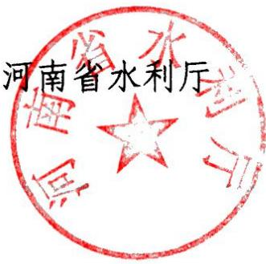
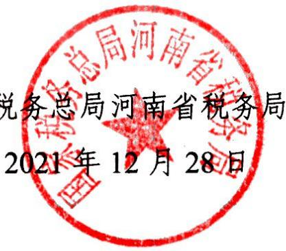

# 河南省发展和改革委员会河南省财政 厅 文件河 南省水利 厅国家税务总局河南省税务局

豫发改收费〔2021〕1112号

## 关于继续执行我省水土保持补偿费收费标准的通知

各省辖市、济源示范区发展改革委（发改统计局）、财政局、水利局，国家税务总局各省辖市、郑州航空港经济综合实验区、济源示范区税务局：

根据我省水土保持补偿费管理运行情况，为持续促进水土流失预防和治理，不断改善生态环境，经研究，我省水土保持补偿费收费标准继续按照省发展改革委、省财政厅、省水利厅《关于我省水土保持补偿费收费标准的通知》（豫发改收费[2018〕1079号）执行。

按照《财政部关于水土保持补偿费等四项非税收入划转税务部门征收的通知》（财税〔2020〕58号）规定，自2021年1月1日起，水土保持补偿费划转至税务部门征收。划转后，水土保持补偿费的征收范围、对象、分成、使用等政策继续按照现行规定执行。各收费单位要严格执行收费公示制度，不得擅自增加收费项目，提高收费标准、扩大收费范围或加收其他费用。各级价格、财政、水利主管部门要加强水土保持补偿费收费标准执行情况和收支情况的监管。

本通知自2022年1月1日起执行。

河南省发展和改革委员会

国家税务总局河南省税务局

河南省发展和改革委员会办公室