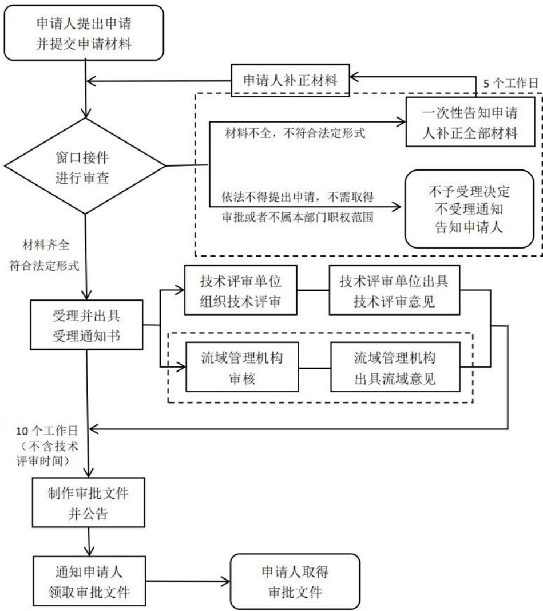
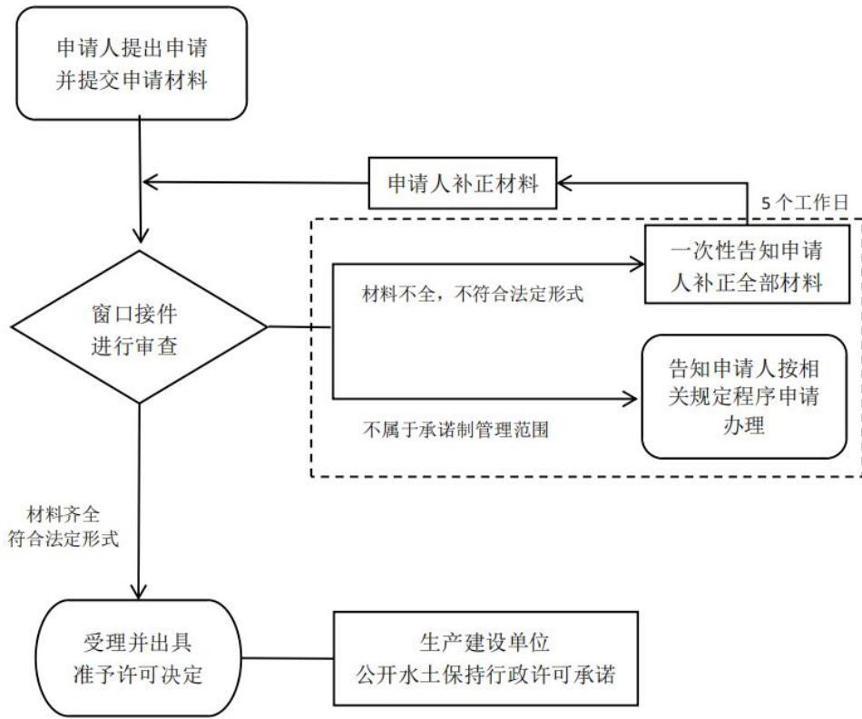
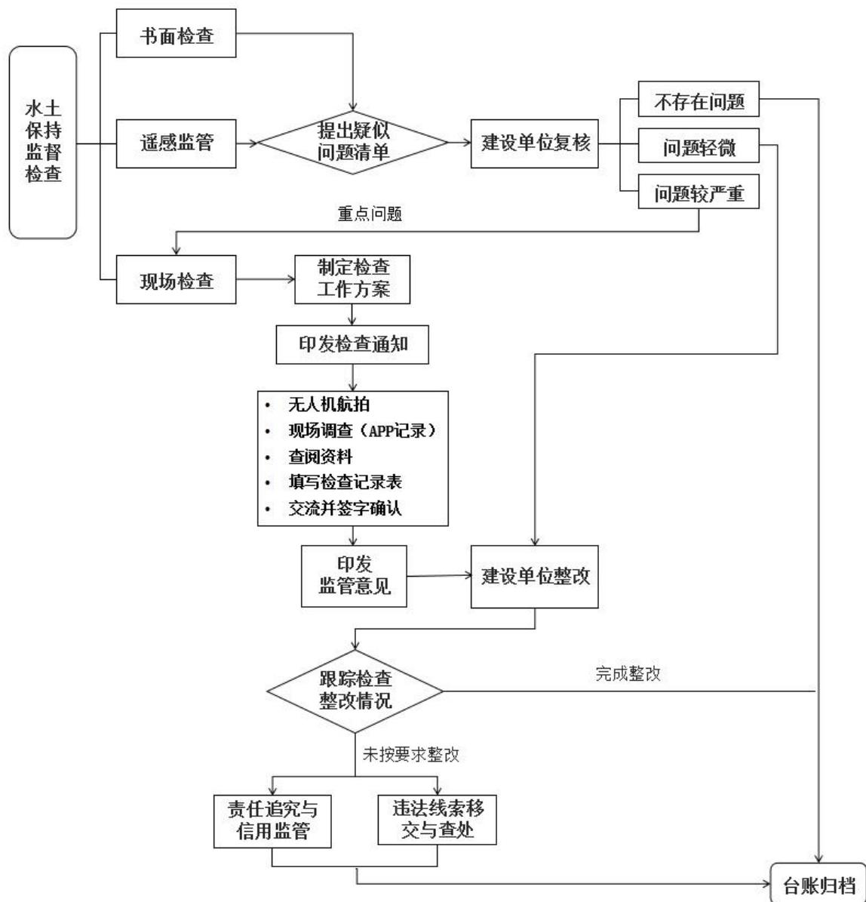
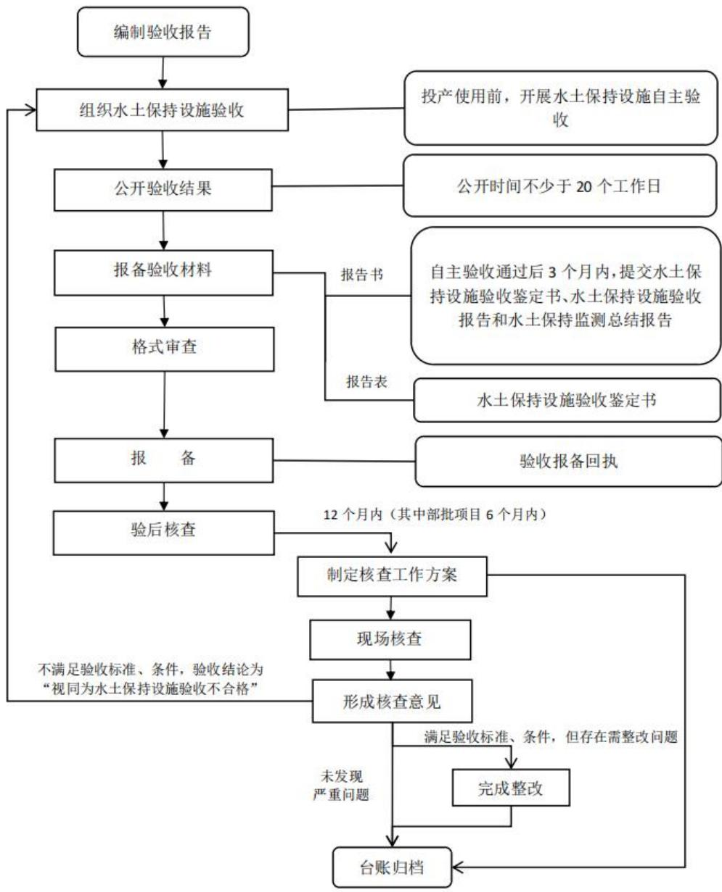

# 生产建设项目水土保持工作指南

(2026年版)

中华人民共和国水利部2026年8月

近年来，中共中央办公厅、国务院办公厅印发了《关于加强新时代水土保持工作的意见》，生态环境法典、长江保护法、黄河保护法、黑土地保护法、青藏高原生态保护法等法律相继颁布实施，对生产建设项目水土保持监管工作提出新的更高要求。为贯彻落实党中央、国务院决策部署，水利部先后制修订了《生产建设项目水土保持方案管理办法》（水利部令第53号）等20余项规章制度及标准规范。近期，水利部水土保持司根据现行法律法规、规章制度和标准规范，组织研究编制了《生产建设项目水土保持工作指南（2026年版）》，旨在指导基层水土保持监管工作人员依法依规落实好水土保持监管法定职责，指导生产建设单位落实好人为水土流失防治法定义务，供大家在工作中参考。

基层水土保持监管工作人员和生产建设单位在水土保持工作中如有疑问，可与水利部水土保持司及相关流域管理机构联系。

联系电话及电子邮箱：

水土保持司 010-63204573，jdc@mwr.gov.cn

长江水利委员会 027-82828733，stbcj@cjw.gov.cn

黄河水利委员会 0371-66028067，1035269573@qq.com

淮河水利委员会 0552-3093653，shaobr@hrc.gov.cn

海河水利委员会022-24102655，hwshuibaojiandu@163.com

珠江水利委员会 020-87117993，zwsbc@pearlwater.gov.cn

松辽水利委员会 0431-85607185，hd6205@126.com

太湖流域管理局 021-25101068，fengchangdong@tba.gov.cn

## 目 录

一、生产建设项目水土保持总体要求...  
二、生产建设项目各阶段水土保持工作内容和要求..  
三、水土保持监督检查和违法违规行为处理.... ..28  
附件1现行水土保持监管规章规范性文件及标准规范目录..........33  
附件2生产建设项目水土保持方案报告书审批流程图... ... 38  
附件3承诺制生产建设项目水土保持方案审批流程图... ...39  
附件4生产建设项目水土保持监管流程图... ..40  
附件5生产建设项目水土保持设施验收、报备和核查流程图........41

## 一、生产建设项目水土保持总体要求

1.保护水土资源。任何单位和个人都有保护水土资源、预防和治理水土流失的义务，并有权对破坏水土资源、造成水土流失的行为进行举报。（水土保持法第八条）

2.履行治理责任。生产建设单位是生产建设项目水土流失防治的责任主体，对项目水土保持工作负总责。开办生产建设项目或者从事其他生产建设活动造成水土流失的，应当进行治理。（水土保持法第三十二条第一款，关于加强新时代水土保持工作的意见第三项（十））

3.落实水土保持空间管控制度。生产建设项目选址、选线应当避让水土流失重点预防区和重点治理区。限制或者禁止在水土流失严重、生态脆弱区域开展可能造成水土流失的生产建设活动。确因国家发展战略和国计民生需要建设的，应当进行科学论证，并依照规定办理审批手续。（水土保持

## 法第二十四条，生态环境法典第八百九十五条第三款）

4.落实水土保持方案制度。在山区、丘陵区、风沙区以及水土保持规划确定的容易发生水土流失的其他区域开办可能造成水土流失的生产建设项目，生产建设单位应当编制水土保持方案。（水土保持法第二十五条）

5.落实水土保持“三同时”制度。依法应当编制水土保持方案的生产建设项目中的水土保持设施，应当与主体工程同时设计、同时施工、同时投产使用；生产建设项目竣工验收，应当验收水土保持设施；水土保持设施未经验收或者验收不合格的，生产建设项目不得投产使用。（水土保持法第二十七条）

6.落实水土保持费用。生产建设项目在建设过程中和生产过程中发生的水土保持费用，按照国家统一的财务会计制度处理。（水土保持法第三十二条第三款）

7.生产建设活动要求。未纳入水土保持方案管理的生产建设活动，依照生产建设活动水土流失防治标准进行水土流失防治。（生态环境法典第八百九十七条第三款）

## 二、生产建设项目各阶段水土保持工作内容和要求

## （一）项目前期阶段

## 1.有关规划征求意见

有关基础设施建设、矿产资源开发、城镇建设、公共服务设施建设等方面的规划，以及重大产业和工程布局等实施方案，在实施过程中可能造成水土流失的，规划的组织编制机关应当在规划中提出水土流失预防和治理的对策和措施，并在规划报请审批前征求本级人民政府水行政主管部门的意见。（水土保持法第十五条，生态环境法典第八百九十二条第二款）

## 2.水土保持方案编报要求

（1）时限要求。依法应当编制水土保持方案的生产建设项目，生产建设单位未编制水土保持方案或者水土保持方案未经水行政主管部门批准的，生产建设项目不得开工建设。（水土保持法第二十六条）

（2）编报范围。在山区、丘陵区、风沙区以及水土保持规划确定的容易发生水土流失的其他区域开办可能造成水土流失的生产建设项目，生产建设单位应当编制水土保持方案，报县级以上人民政府水行政主管部门审批。（水土保持法第二十五条第一款)

（3）分类管理。水土保持方案分为报告书和报告表。征占地面积5公顷以上或者挖填土石方总量5万立方米以上的生产建设项目，应当编制水土保持方案报告书。征占地面积0.5公顷以上、不足5公顷或者挖填土石方总量1000立方米以上、不足5万立方米的生产建设项目，应当编制水土保持方案报告表。

征占地面积不足0.5公顷并且挖填土石方总量不足1000立方米的生产建设项目，不需要编制水土保持方案，但应当按照水土保持有关技术标准做好水土流失防治工作。（生产建设项目水土保持方案管理办法（水利部令第53号）第七条）

（4）分级审批。水土保持方案实行分级审批。国务院或者国务院有关部门审批、核准、备案的生产建设项目，其水土保持方案由水利部审批。县级以上地方人民政府及其有关部门审批、核准、备案的生产建设项目，其水土保持方案由同级人民政府水行政主管部门审批。跨行政区域的生产建设项目，其水土保持方案由共同的上一级人民政府水行政主管部门审批。（生产建设项目水土保持方案管理办法（水利部令第53号）第十条）

（5）审批程序。水土保持方案审批前组织开展审查审核。水行政主管部门审批水土保持方案报告书，水行政主管部门可以组织技术评审机构对水土保持方案报告书进行技术评审。水利部作出审批决定前，应当征求相关流域管理机构的意见。

对编制水土保持方案报告表，已实施水土保持区域评估范围内的生产建设项目，及法律法规规定实行承诺制管理的其他生产建设项目水土保持方案，审批部门不再组织技术评审，仅对收到的申请材料仅进行形式审查，符合规定要求的在受理后即来即办、现场办结。（生产建设项目水土保持方案管理办法（水利部令第53号）第十三条，水利部办公厅关于做好生产建设项目水土保持承诺制管理的通知（办水保〔2020〕160号，2020年7月28）第一、三项）

（6）批文内容。水土保持方案准予行政许可决定文件主要内容应包括但不限于以下内容：水土流失防治责任范围、水土流失防治标准及目标值、水土保持补偿费，弃渣场设置及敏感点处置方案，以及后续设计、施工组织管理、水土保持监理监测、水土保持方案变更、水土保持设施验收、监督检查及违法查处等工作要求。不予行政许可决定文件应明确不予许可的原因和法律法规依据。

（7）审批时限。对实行承诺制管理生产建设项目水土保持方案，申请人依法履行承诺手续，水行政主管部门在受理后即时办结。

水土保持方案报告书，应当自受理申请之日起10个工作日内作出行政许可决定。10个工作日内不能作出决定的，经审批部门负责人批准，可以延长10个工作日，并将延长期限的理由告知申请人。技术评审所需时间不计算在审批时间内，但不得超过30个工作日。（生产建设项目水土保持方案管理办法（水利部令第53号）第十三条）

（8）有效期。水土保持方案自批准之日起满3年，生产建设项目未开工建设的，其水土保持方案应当在开工前报原审批部门重新审核。（生产建设项目水土保持方案管理办法（水利部令第53号）第十八条）

## 3.水土保持方案主要内容及要求

（1）主要内容。水土保持方案应包括项目水土流失预防和治理的范围、目标、措施和投资等内容。（水土保持法第二十五条第二款，具体见《水利部办公厅关于印发生产建设项目水土保持方案编制模板的通知》（办水保函〔2026〕232号）、《生产建设项目水土保持技术标准》（GB50433—2018））

## （2）水土保持空间管控要求

主体工程前期论证应评价项目是否满足有关区域或行业规划水土保持要求。应避让水土流失重点预防区、重点治理区、水土流失严重、生态脆弱的区域，以及泥石流易发区、崩塌滑坡危险区，以及生态保护红线、自然保护区、饮用水水源保护区等其他水土保持敏感区域。

确因国家发展战略和国计民生需要建设的，无法避让长江流域、黄河流域、青藏高原等流域区域内的水土流失严重、生态脆弱区域的应当经科学论证，并依法办理水土保持方案审批手续，严格控制扰动范围；报批水土保持方案时应重点论证占用的必要性，并提出节约集约水土资源和减缓控制水土流失的措施。

确实无法避让国家级两区的，应充分论证，开展选址、选线方案比选，即根据项目不同选址、选线方案，对占用国家级两区的位置、长度、面积、数量，从地形地貌、地质、施工等条件，以及可能造成的工程安全、水土流失、生态及其他影响等方面进行比较分析，充分论证占用国家级两区的不可避让性。说明是否采取减少占用国家级两区的工程技术措施，以及减缓对国家级两区影响的工程布局、施工布置、施工工艺等方案；应执行水土流失防治一级标准，截排水与拦挡工程级别和防洪标准应提高一级，林草覆盖率提高1\~2个百分点，提高植物措施标准等，及时消除水土流失风险，有效减轻对生态环境的影响。要结合经济社会发展要求和水土流失状况等，在国家级两区分类采取预防保护和综合治理措施。

无法避让其他水土保持敏感区的，应提高防治标准，优化施工工艺，减少地表扰动和植被损坏范围，有效控制可能造成的水土流失。

(水土保持法第十八条第一款、第二十四条，长江保护法第六十一条第二款，黄河保护法第三十五条，青藏高原保护法第三十二条第二款，水利部关于加强水土保持空间管控的意见（水保〔2024〕4号）第三项（八），水利部办公厅关于做好国家级水土流失重点预防区和重点治理区落地上图成果应用的通知（办水保〔2025〕170号）第二项，生产建设项目水土保持技术标准（GB 50433—2018）第3.2.2条第4项，生产建设项目水土流失防治标准（GB/T

50434—2018）第4.0.1 条）

## (3）其他管控要求

禁止在河道、湖泊管理范围内建设妨碍行洪的建筑物、构筑物，倾倒垃圾、渣土。在河道管理范围内建设桥梁、码头和其他拦河、跨河、临河建筑物、构筑物，铺设跨河管道、电缆，应当符合国家规定的防洪标准和其他有关的技术要求，工程建设方案应当依照防洪法的有关规定报经有关水行政主管部门审查同意。（防洪法第二十二条第二款，水法第三十八条）

禁止损坏、擅自占用淤地坝。（黄河保护法第三十四条第三款）

(4）表土资源剥离保护利用要求。涉及土石方挖填的生产建设活动应开展表土资源调查与评价，制定表土保护利用方案，对其所占用土地的地表土应当进行分层剥离、保存和利用，做到土石方挖填平衡，减少地表扰动范围。（水土保持法第三十八条第一款，水利部办公厅关于印发生产建设项目水土保持方案编制模板的通知（办水保函〔2026〕232号）附件1）

表土资源调查成果应包含土壤类型及分布情况、项目占地范围内表土厚度、可剥离范围及面积、利用途径等，并评价表土资源质量及剥离的可行性。严格控制地表扰动和植被损坏范围，表土保护措施应全面有效，后期利用方向明确可行。表土资源不足的，应明确表土来源或提出土壤改良方案。

(水利部办公厅关于印发生产建设项目水土保持方案编制模板的通知（办水保函〔2026〕232号）附件1）

剥离的黑土应当就近用于新开垦耕地和劣质耕地改良、被污染耕地的治理、高标准农田建设、土地复垦等。建设项目主体应当制定剥离黑土的再利用方案，报自然资源主管部门备案。（黑土地保护法第二十一条第二款）

（5）取土场要求。涉及取土场的，取土场位置应明确。禁止在崩塌和滑坡危险区、泥石流易发区内设置取土场。涉及河湖管理范围的，应满足《中华人民共和国防洪法》《中华人民共和国河道管理条例》等相关法律法规要求。取土场要素信息应全面准确，防护措施、后期恢复方向应合理可行。表土及无用料等的临时堆放、处置与防护要求应明确。平原区取土场宜以宽浅式为主，注重取土后的恢复利用措施。（水土保持法第十七条第二款，水利部办公厅关于印发生产建设项目水土保持方案审查要点的通知（办水保〔2023〕177号）第三项，生产建设项目水土保持技术标准(GB 50433—2018)第 3.2.3、3.2.4 和 3.3.9 条）

涉及取土场的，应开展“一场一图”措施布设(或设计)，附位置、地形和影像等图件，并能够反映下游至少1公里范围内的地形地物信息，明确措施布设和表土堆放场位置。（水利部办公厅关于印发生产建设项目水土保持方案审查要点的通知（办水保〔2023〕177号）第十项，生产建设项目水土保持技术标准（GB 50433—2018）第4.2.1和4.2.3条）

（6）弃渣综合利用要求。依法应当编制水土保持方案的生产建设项目，其生产建设活动中排弃的砂、石、土、矸石、尾矿、废渣等应当综合利用。（水土保持法第二十八条）

应开展弃渣综合利用调查，制定综合利用方案，明确综合利用途径、方向，分析综合利用方案是否合理、合法、可行，对综合利用涉及需要设置堆存场地的，应布置拦挡、截排水等有效的防护措施。弃渣通过公共资源交易平台转让的，应明确交易方式、市场消耗能力。（水利部办公厅关于印发生产建设项目水土保持方案审查要点的通知（办水保〔2023〕177号）第三项，水利部办公厅关于印发生产建设项目水土保持方案编制模板的通知（办水保函〔2026〕232号）附件）

（7）弃渣场要求。弃渣不能综合利用，确需废弃的应当堆放在水土保持方案确定的专门存放地，并采取措施保证不产生新的危害。（水土保持法第二十八条）

1）选址的禁止性要求。禁止在河湖管理范围（含水库淹没区）内设置；禁止在对公共设施、基础设施、工业企业、居民点等有重大影响的区域设置。

涉及弃渣场（含临时堆土场，下同）的，弃渣场位置与运渣方案应明确。弃渣场选址应经相关管理部门及土地权属单位（个人）确认，落实用地可行性。（水利部办公厅关于印发生产建设项目水土保持方案审查要点的通知（办水保〔2023〕177号）第三项，水利部办公厅关于印发生产建设项目水土保持方案编制模板的通知（办水保函〔2026〕232号）附件）

2）稳定性分析评价要求。设置弃渣场的，应结合渣体物质组成实际和堆置方案按规范要求采用适宜的方法开展稳定性分析，评价弃渣场边坡、整体、拦挡工程稳定性，明确弃渣场稳定性分析结论。弃渣用于填平坑、塘时可不进行弃渣场稳定计算。（水土保持工程设计规范（GB51018—2014）第12.2.5条）

3）失事影响分析要求。沟道型弃渣场（含临时堆土场）下游3km，坡地型弃渣场（含临时堆土场）下游1km，平地型弃渣场（含跨越汛期且最大堆高超过5m的平地型临时堆土场）周边15倍堆渣高度范围内存在居民点、重要基础设施等敏感因素的，以及敏感因素虽不在上述范围内但弃渣场风险源较多或经现场查勘研判可能会对敏感因素有影响的，应提交弃渣场（含临时堆土场）失事影响专题分析报告，深入论证弃渣场（含临时堆土场）对敏感点的影响，生产建设单位应作出对失事影响专题分析报告真实性与论证结论全面负责的承诺。（水利部办公厅关于印发生产建设项目水土保持方案编制模板的通知（办水保函〔2026〕232号）附件，弃渣场(含临时堆土场)失事影响专题分析报告编制提纲(试行））

4）堆置方案。弃渣场要素信息应全面准确，弃渣堆置方案合理，恢复方向可行。4级及以上弃渣场应提供地质勘察报告结论。应开展“一场一图”措施布设（或设计），附位置、地形和影像等图件，并能够反映沟道型弃渣场（含临时堆土场）下游至少3km、坡地型弃渣场（含临时堆土场）下游至少1km、平地型弃渣场（含跨越汛期且最大堆高超过5m的平地型临时堆土场）周边至少15倍堆渣高度范围内的地形地物信息和表土堆放场位置。（水利部办公厅关于印发生产建设项目水土保持方案审查要点的通知(办水保[2023〕177号）第三、十项）

5）防护措施。对废弃的砂、石、土、矸石、尾矿、废渣等存放地，应当采取拦挡、坡面防护、防洪排导等措施。(水土保持法第三十八条第一款)

6）监测要求。3级及以上弃渣场（含临时堆土场）应开展稳定监测、视频监控。（水利部办公厅关于印发生产建设项目水土保持方案编制模板的通知（办水保函〔2026〕232号）附件1）

7）特殊要求。对于水电工程，应按照行业规范要求开展弃渣场选址及多方案比选论证，堆渣量超300万立方米或最大堆渣高度超100米的弃渣场应进行专门论证。

井工矿建设期井巷工程量、排矸量与利用、堆弃方案，及生产期年排矸量、综合利用方案应明确。禁止设置永久性煤矸石堆放场。临时排矸场规模不应超过3年储矸量，后续综合利用方案可行。（水利部办公厅关于印发生产建设项目水土保持方案审查要点的通知（办水保〔2023〕177号）附

## 件3、6)

（8）水土保持措施要求。措施总体布局应根据区域水土流失状况、行业特点及施工组织等明确综合防治措施体系。防治措施应覆盖防治责任范围和施工全过程，并与主体工程施工时序相匹配、与周边环境相协调。措施应明确级别和设计标准，截排水工程的水文及水力计算应准确，结构，型式合理。（水利部办公厅关于印发生产建设项目水土保持方案审查要点的通知（办水保〔2023〕177号）第六项）

生产建设活动结束后，应当及时在取土场、开挖面和存放地的裸露土地上植树种草、恢复植被，对闭库的尾矿库进行复垦。（水土保持法第三十八条第一款）

（9）施工临时工程要求。铁路、公路建设项目设置制（存）梁场、铺轨基地、预制场、拌和站、施工生产生活区、施工便道等应开展水土保持措施典型设计。（水利部办公厅关于印发生产建设项目水土保持方案审查要点的通知（办水保〔2023〕177号）附件2）

## 4.法律责任

依法应当编制水土保持方案的生产建设项目，未编制水土保持方案或者编制的水土保持方案未经批准而开工建设的，由县级以上人民政府水行政主管部门责令停止违法行为，限期补办手续；逾期不补办手续的，处五万元以上五十万元以下的罚款；对生产建设单位直接负责的主管人员和其他直接责任人员依法给予处分。（水土保持法第五十三条第

一款）

## （二）项目建设阶段

## 1.落实水土保持工作责任

(1）生产建设单位承担主体责任。生产建设单位是生产建设项目水土流失防治的责任主体，对项目水土保持工作负总责。生产建设项目主管部门要有针对性加强行业指导，督促指导生产建设单位依法依规开展水土保持相关工作。（关于加强新时代水土保持工作的意见第三项（十），生产建设项目水土保持方案管理办法（水利部令第53号）第四条，水利部关于进一步深化“放管服”改革全面加强水土保持监管的意见（水保〔2019〕160号）第三项（七））

（2）采取水土流失预防和治理措施。严格落实水土保持“三同时”制度（水土保持措施与主体工程同时设计、同时施工、同时投产使用），按照经批准的水土保持方案，组织施工单位及各参建单位，及时全面落实水土保持措施，有效预防和治理工程建设可能造成的水土流失。（关于加强新时代水土保持工作的意见第三项（十），生产建设项目水土保持方案管理办法（水利部令第53号）第十九条）

（3）管理维护水土保持设施。水土保持设施的所有权人或者使用权人应当加强对水土保持设施的管理与维护，落实管护责任，保障其功能正常发挥。（水土保持法第十九条）

（4）接受监督检查。被检查单位或者个人对水土保持监督检查工作应当给予配合，如实报告情况，提供有关文件、证照、资料；不得拒绝或者阻碍水政监督检查人员依法执行公务。（水土保持法第四十五条）

生产建设单位应当配合水行政主管部门和流域管理机构的监督检查，需要依法改正的，应当按照要求制定改正计划和措施，在规定期限内改正。（生产建设项目水土保持方案管理办法（水利部令第53号）第二十八条）

## 2.做好开工准备

（1）开展水土保持后续设计。根据批准的水土保持方案，按程序与主体工程同时开展水土保持初步设计和施工图设计，将水土保持方案涉及的水土保持措施纳入各阶段设计并进行细化，深化稳定性分析论证，合理确定各项措施涉及标准和设计方案，并进一步深化完善主体工程初步设计中的取（弃）土场设计，做好临时堆放场、临时周转场设计，确保取（弃）土场、临时堆放场、临时周转场等安全稳定，拦挡设施、截排水设施等有效发挥作用不造成新的水土流失危害。上述成果一并报经有关部门审核，作为水土保持措施实施的依据，严格控制重大变更。严格实行生产建设单位和参建单位工程质量终身责任制。（水利部关于进一步深化“放管服”改革全面加强水土保持监管的意见（水保〔2019〕160号）第三项）

水利建设项目涉及水土保持措施和弃渣场选址变化的，应在初步设计报告水土保持篇章中单独说明。与初步设计相比，水土保持措施发生重大变更或弃渣场选址发生变化，应按相关规定先履行水土保持方案变更审批手续。经批准的初步设计报告水土保持篇章，与水土保持方案一并作为水土保持后续工作、监督检查和设施验收的依据。（水利部办公厅关于加强水利建设项目水土保持工作的通知(办水保〔2021〕143号）第二项）

（2）纳入招标内容管理。生产建设单位应当将水土保持工作任务和内容纳入施工招投标文件和施工合同中，落实施工单位水土保持责任，在建设过程中同步实施水土保持方案提出的水土保持措施，保证水土保持措施的质量、实施进度和资金投入。（生产建设项目水土保持方案管理办法（水利部令第53号）第十九条第三款）

(3）缴纳水土保持补偿费。编制水土保持方案的生产建设项目或从事其他生产建设活动的，应当由缴费人向税务部门申报缴纳水土保持补偿费。按次缴纳的，应于项目开工前或建设活动开始前，缴纳水土保持补偿费。按期缴纳的，在期满之日起15日内申报缴纳水土保持补偿费。（水土保持法第三十二条，国家税务总局关于水土保持补偿费等政府非税收入项目征管职责划转有关事项的公告（2020年第21号）第三项）

## 3.加强水土保持管理

（1）将水土保持纳入工程建设管理体系，建立健全管理制度，明确责任部门，落实管理人员，保障资金投入，加强全过程水土保持管理。

（2）施工单位等参建单位进场后，生产建设单位组织对参建单位开展水土保持培训，明确水土保持任务、责任和要求。

（3）推行绿色设计、绿色施工，加强施工管理，规范施工行为，依法合规落实水土保持方案及后续设计要求。严格控制耕地占用和地表扰动，严禁乱堆乱弃。

（4）持续落实弃渣减量和综合利用要求，加强土石方数量和去向管理。

（关于加强新时代水土保持工作的意见第三项（十），水利部办公厅关于印发生产建设项目水土保持方案审查要点的通知（办水保〔2023〕177号）第九项）

4.组织开展水土保持监测工作

（1）编制水土保持方案报告书的项目，生产建设单位应当自行或者委托具备相应技术条件的机构，依法开展水土保持监测工作。

（2）水土保持监测工作自项目开工动土（施工准备期）开始，到水土流失防治任务全面完成（水土保持设施验收）结束，期间不得滞后或中断。

（3）从事水土保持监测活动应当遵守国家有关技术标准、规范和规程，保证监测质量。要制定监测实施方案，按期编报监测季报、年报和总结报告。每季度第一个月底前报送上季度监测季报。工期3年以上的项目，需编制监测年报，并于每年1月底前报送上年度监测年报；工期不超过3年的，无需单独编制报送监测年报。监测工作完成后，应于3个月内报送总结报告。

监测单位发现可能发生水土流失危害情况的，应随时向生产建设单位报告。

（4）及时在官方网站、业主项目部和施工项目部公开监测季报，并根据监测成果优化水土保持设计，加强施工组织管理。对监测发现的问题及时建立台账、组织整改，实行问题闭环销号管理。

(水土保持法第四十一条，水利部办公厅关于进一步加强生产建设项目水土保持监测工作的通知（办水保〔2020〕161号）第二条）

## 5.组织开展水土保持监理工作

（1）凡主体工程开展监理工作的项目，应当按照水土保持监理标准和规范，与主体工程同步开展水土保持工程施工监理。

征占地面积在20公顷以上或者挖填土石方总量20万立方米以上的项目，应当配备具有水土保持专业监理资格的工程师；征占地面积200公顷以上或者挖填土石方总量200万立方米以上的项目，应当由具有水土保持工程施工监理专业资质的单位承担监理任务。（水利部关于进一步深化“放管服”改革全面加强水土保持监管的意见（水保〔2019〕160号）第三项）

（2）工程建设期间，水土保持监理要做好可能产生水土流失各环节的预防和监管，包括准备工作、事前监理、过程监理和验收监理（含水土保持分部工程质量验收、单位工程质量验收和水土保持设施验收），以及协调参建各方的关系，并定期编报监理月报等，相关工作应符合水土保持有关技术标准和监理规范要求。（水土保持监理规范（SL/T523—2024）第5章，水土保持工程质量验收与评价规范（SL/T336—2025）第5章）

（3）对工程施工中出现的未治理或治理不符合标准，以及未批先弃、乱弃乱倒、顺坡溜渣、随意开挖等违法违规问题，监理应当及时予以制止并督促整改。（水土保持监理规范第 5章）

## 6.履行水土保持及方案重大变更手续

（1）变更审批。水土保持方案经批准后，生产建设项目的地点、规模发生重大变化的，应当补充或者修改水土保持方案并报原审批机关批准。水土保持方案实施过程中，水土保持措施需要作出重大变更的，应当经原审批机关批准。

（2）变更情形。水土保持方案经批准后存在下列情形之一的，生产建设单位应当补充或者修改水土保持方案，报原审批部门审批：

①工程扰动新涉及水土流失重点预防区或者重点治理区的；

②水土流失防治责任范围或者开挖填筑土石方总量增

加 30%以上的；

③线型工程山区、丘陵区部分线路横向位移超过300米的长度累计达到该部分线路长度30%以上的；

④表土剥离量或者植物措施总面积减少30%以上的；

⑤水土保持重要单位工程措施发生变化，可能导致水土保持功能显著降低或者丧失的。

因工程扰动范围减少，相应表土剥离和植物措施数量减少的，不需要补充或者修改水土保持方案。（生产建设项目水土保持方案管理办法（水利部令第53号）第十六条）

在水土保持方案确定的弃渣场以外新设弃渣场的，或者因弃渣量增加导致弃渣场等级提高的，生产建设单位应当开展弃渣减量化、资源化论证，并在弃渣前编制水土保持方案补充报告，报原审批部门审批。（生产建设项目水土保持方

## 案管理办法（水利部令第53号）第十七条）

## 7.水土保持设施与主体工程同时施工

各项水土保持措施应按照工程设计要求，与主体工程同步实施，并保证水土保持措施的质量、实施进度和资金投入。

（1）按照水土保持方案要求，严格控制扰动土地范围。严禁随意占压、扰动和破坏地表植被。

（2）根据方案要求优化施工工艺、合理安排施工时序和水土保持措施实施进度，严格控制施工期间可能造成的水土流失。

严格落实表土和砾幕层资源保护利用要求，做好剥离，保存和利用，加强临时堆土管理，及时落实各项防护措施。做好土石方数量和去向的动态台账管理，周转期限内完成临时堆土清运并做好迹地恢复，确保弃渣综合利用依法依规落实到位。

严格落实土地整治、表土和砾幕回覆、植被恢复等措施，优化取料施工组织设计，严禁滥采乱挖，最大限度降低对地表覆盖物的影响。

（3）弃土（渣）场应按照水土保持方案中确定的位置布设，按照“先拦后弃”的原则采取拦挡措施进行防护。

（4）强化过程管理，做好临时防护措施的布设及管理维护，按照“边建设、边恢复”的原则，及时回填表土，实施植被恢复、绿化美化等措施。

(水土保持法第三十八条，关于加强新时代水土保持工作的意见第三项（十），水利部关于进一步深化“放管服”改革全面加强水土保持监管的意见（水保〔2019〕160号）第三项（三））

## 8.法律责任

（1）造成水土流失不治理：开办生产建设项目或者从事其他生产建设活动造成水土流失，不进行治理的，由县级以上人民政府水行政主管部门责令限期治理；逾期仍不治理的，县级以上人民政府水行政主管部门可以指定有治理能力的单位代为治理，所需费用由违法行为人承担。其中在黄河流域从事生产建设活动造成水土流失未进行治理，或者治理不符合国家规定的相关标准的，由县级以上地方人民政府水行政主管部门或者黄河流域管理机构及其所属管理机构责令限期治理，对单位处二万元以上二十万元以下罚款，对个人可以处二万元以下罚款；逾期不治理的，代为治理，所需费用由违法者承担。（水土保持法第五十六条，黄河保护法第一百一十条）

（2）未履行水土保持方案变更报批手续，擅自进行变更：生产建设项目的地点、规模发生重大变化，未补充、修改水土保持方案或者补充、修改的水土保持方案未经原审批机关批准的，对水土保持措施作出重大变更的，由县级以上人民政府水行政主管部门责令停止违法行为，限期补办手续；逾期不补办手续的，处五万元以上五十万元以下的罚款；对生产建设单位直接负责的主管人员和其他直接责任人员依法给予处分。（水土保持法第五十三条（二）、（三））

（3）违法取土、挖沙、采石：在崩塌、滑坡危险区或者泥石流易发区从事取土、挖砂、采石等可能造成水土流失的活动的，由县级以上地方人民政府水行政主管部门责令停止违法行为，没收违法所得，对个人处一千元以上一万元以下的罚款，对单位处二万元以上二十万元以下的罚款。（水土保持法第四十八条）

（4）违法倾倒废弃土、石、渣：在水土保持方案确定的专门存放地以外的区域倾倒砂、石、土、矸石、尾矿、废渣等的，由县级以上地方人民政府水行政主管部门责令停止违法行为，限期清理，按照倾倒数量处每立方米十元以上二十元以下的罚款；逾期仍不清理的，县级以上地方人民政府水行政主管部门可以指定有清理能力的单位代为清理，所需费用由违法行为人承担。（水土保持法第五十五条）

（5）未落实表土剥离：建设项目占用黑土地未对耕作层的土壤实施剥离的，由县级以上地方人民政府自然资源主管部门处每平方米一百元以上二百元以下罚款；未按照规定的标准对耕作层的土壤实施剥离的，处每平方米五十元以上一百元以下罚款。（黑土地保护法第三十三条）

（6）未及时足额缴纳水土保持补偿费：拒不缴纳水土保持补偿费的，由县级以上人民政府水行政主管部门责令限期缴纳；逾期不缴纳的，自滞纳之日起按日加收滞纳部分万分之五的滞纳金，可以处应缴水土保持补偿费三倍以下的罚款。（水土保持法第五十七条）

## （三）项目竣工验收阶段

## 1. 完成时限

水土保持设施未经验收或者验收不合格的，生产建设项目不得投产使用。（水土保持法第二十七条）

## 2.验收程序

生产建设项目投产使用前，生产建设单位应当按照水利部规定的标准和要求，开展水土保持设施自主验收。验收后，验收结果向社会公开时间不少于20个工作日。在水土保持设施自主验收通过后3个月内，向审批水土保持方案的水行政主管部门或者水土保持方案审批机关的同级水行政主管部门报备水土保持设施验收材料，取得报备回执，并接受验收核查。

编制水土保持方案报告书的生产建设项目水土保持设施验收报备材料包括水土保持设施验收鉴定书、水土保持设施验收报告和水土保持监测总结报告。编制水土保持方案报告表等承诺制项目水土保持设施验收材料为水土保持设施验收鉴定书。

(生产建设项目水土方案管理办法（水利部令第53号）第二十二条，水利部关于进一步深化“放管服”改革全面加强水土保持监管的意见（水保〔2019〕160号）第四项，水利部办公厅关于印发生产建设项目水土保持监督管理办法的通知（办水保〔2019〕172号）第八、九条）

## 3.合格条件

（1）依法依规履行了水土保持方案编报审批程序，主体工程各设计阶段开展了相应的水土保持设计；涉及水土保持方案变更、设计变更的，相应变更手续完备；

（2）依法依规开展了水土保持监测、监理，且符合相关标准要求；

（3）水土保持设施按批准的水土保持方案及设计要求建成，涉及水土保持的分部工程、单位工程验收合格；

（4）水土流失防治指标达到批复的水土保持方案确定的目标值，无水土流失风险隐患；

（5）设置弃渣场的生产建设项目，涉及4级（含）以上弃渣场及容易发生水土流失危害的5级弃渣场，其稳定评估结论为稳定；

（6）水土保持设施具备正常运行条件，满足交付或使用要求，且管理、维护责任已落实；

（7）依法依规缴纳了水土保持补偿费；

（8）水土保持方案（含变更）、设计、施工、监理、监测、设施验收等资料齐备，成果真实可靠；

（9）符合国家规定的其他条件。水土保持措施体系、等级和标准按照水土保持方案批复要求落实；水土保持设施验收材料内容不存在重大缺项、漏项、或重大技术问题。（生产建设项目水土方案管理办法（水利部令第53号）第二十三条，生产建设项目水土保持设施验收技术规程（GB/T22490—2025）第4.5条）

## 4. 其他要求

（1）编制水土保持方案报告书的，生产建设单位组织第三方机构编制水土保持设施验收报告。承担生产建设项目水土保持方案技术评审、水土保持监测、水土保持监理工作的单位不得作为该生产建设项目水土保持设施验收报告编制的第三方机构。（生产建设项目水土保持方案管理办法(水利部令第53号）第二十二条第二款）

（2）实行承诺制或备案制管理的，不需要编制水土保持设施验收报告，验收报备材料只需提交水土保持设施验收鉴定书，验收组中应有至少一名省级水行政主管部门水土保持方案专家库专家。（水利部关于进一步深化“放管服”改革全面加强水土保持监管的意见（水保〔2019〕160号）第二项）

（3）弃渣场稳定评估应在完成调查勘察、岩土试验的基础上，就弃渣场稳定性、防护措施对弃渣场稳定安全的作用发挥或影响、弃渣场周边敏感因素等全面分析评价，并编制稳定评估报告，明确稳定安全结论。生产建设单位对弃渣场稳定安全结论负责。（生产建设项目水土保持设施验收技术规程（GB/T22490—2025）第6章）

（4）按规定需要开展阶段验收和完工验收的水利建设项目，应同步进行相应阶段的水土保持设施专项验收。（水利部办公厅关于加强水利建设项目水土保持工作的通知（办水保〔2021〕143号）第四项）

5.法律责任：水土保持设施未经验收或者验收不合格将生产建设项目投产使用的，由县级以上人民政府水行政主管部门责令停止生产或者使用，直至验收合格，并处五万元以上五十万元以下的罚款。（水土保持法第五十四条）

（四）生产运行期

水土保持设施验收合格后，生产建设项目方可投产使用。生产建设单位或者运行管理单位应当依法防治生产运行过程中发生的水土流失，加强对水土保持设施的管理维护，确保水土保持设施长期发挥效益。（生产建设项目水土保持

## 方案管理办法（水利部令第53号）第二十四条）

## 三、水土保持监督检查和违法违规行为处理

监督检查包括对水土保持方案实施情况的跟踪检查和对水土保持设施自主验收情况的核查。

## 1.跟踪检查

（1）跟踪检查职责。水土保持方案监督检查实行“分级负责、属地管理”的原则，各级水行政主管部门负责本级审批水土保持方案项目的监督检查。

流域管理机构负责本流域管辖范围内水利部审批项目水土保持方案实施情况的监督检查。项目所在地水行政主管部门负有属地监管职责。（生产建设项目水土保持方案管理办法（水利部令第53号）第三条，水利部办公厅关于进一步加强部批项目水土保持监管工作的通知（办水保〔2024〕57号）第二项）

（2）检查内容和方法。县级以上人民政府水行政主管部门、流域管理机构对生产建设项目水土保持方案实施、水土保持监测、水土保持监理、水土保持设施验收等情况进行全链条全过程监督检查，对发现的问题依法依规处理。

监督检查综合遥感监管、现场检查、书面检查、“互联网+监管”相结合的方式，以遥感监管为基本手段，充分运用卫星、无人机等遥感技术，实行无风险不打扰、低风险预提醒、中高风险严监控。（生产建设项目水土保持方案管理办法（水利部令第53号）第二十六条，生产建设项目水土保持监督检查管理办法（办水保〔2019〕172号）第十三条）

（3）监管意见主要内容。应包括但不限于以下内容：项目组织管理、方案审批及后续设计、表土剥离保存利用、取土弃渣场设置、方案措施落实、水土保持监理监测、水土保持补偿费缴纳等方面情况及存在问题，并明确整改要求、整改时限等要求。（生产建设项目水土保持监督检查管理办法（办水保〔2019〕172号）第十四、十七条）

## 2.验收核查

（1）验收核查职责。水利部出具报备回执的生产建设项目，由流域管理机构组织核查，可邀请项目所在地相关水行政主管部门或者专家参加。（生产建设项目水土保持监督检查管理办法（办水保〔2019〕172号）第十九条）

（2）核查重点与时限。核查单位应当在出具报备回执后12个月内组织开展核查，根据需要可以邀请项目所在地相关水行政主管部门或者专家参加。部批项目在项目取得水土保持设施验收报备回执6个月内由流域管理机构组织核查。（生产建设项目水土保持监督检查管理办法（办水保〔2019〕172号）第二十、二十一条）

根据验收报备情况，水行政主管部门应当从已报备的生产建设项目中选取水土保持监测评价结论为“红”色或日常监管发现问题较多的项目，设置弃渣场的项目，以及根据跟踪检查和验收报备材料核查的情况发现可能存在较严重水土保持问题的，开展水土保持设施验收情况核查。验收核查一般采取查阅资料和现场随机抽查方式进行。（生产建设项目水土保持监督检查管理办法（办水保〔2019〕172号）第十九条、二十条、第二十一条第二款，关于加强部批项目水土保持监管工作的通知（办水保〔2024〕57号）第三部分第(三）严格验收核查）

（3）核查内容。核查应当依据水土保持设施验收标准和条件开展，重点核查验收材料、验收程序、措施落实和防治效果等内容。其中，验收标准和条件执行情况应包括是否依法依规履行了水土保持方案编报审批程序，主体工程各设计阶段是否开展了相应的水土保持设计；涉及水土保持方案变更、设计变更的，是否相应变更手续完备；是否依法依规开展了水土保持监测、监理，时段、内容、成果等且符合相关标准要求；水土保持设施按批准的水土保持方案及设计要求建成，涉及水土保持的分部工程、单位工程验收合格；水土流失防治指标是否达到批复的水土保持方案确定的目标值，无水土流失风险隐患；设置弃渣场的生产建设项目，涉及4级（含）以上弃渣场及容易发生水土流失危害的5级弃渣场，其稳定评估结论是否为稳定，意见建议是否采纳并实施；水土保持措施是否按设计实施，水土保持措施落实和防治效果是否达到方案要求，水土保持设施是否具备正常运行条件、满足交付或使用要求、且管理、维护责任已落实；是否依法依规缴纳了水土保持补偿费；水土保持方案（含变更）、设计、施工、监理（监理总结报告）、监测（监测总结报告）、设施验收（包括单位工程验收鉴定、分部工程验收签证）等资料（含过程资料）是否齐备，成果是否真实可靠。（生产建设项目水土保持监督检查管理办法（办水保〔2019〕172号）第二十一条第一款，生产建设项目水土保持设施验收技术规程（GB/T22490—2025）第4.5条）

（4）核查意见主要内容。应包括但不限于以下内容：核查工作开展情况、发现的问题、核查结论及下一步要求等。未发现不满足验收条件情形的，应该给出“本项目水土保持设施自主验收程序履行、验收标准和条件执行方面未发现严重问题。”对不符合规定程序或不满足验收标准和条件的，应当给出“视同为水土保持设施验收不合格”的结论，并列出核查发现问题清单、提出限期整改及工作要求。逾期不整改或者整改不到位投产使用的，由地方水行政主管部门按照水土保持法第五十四条的规定进行处罚。（生产建设项目水土保持监督管理办法（办水保〔2019〕172号）第二节）

## 3.违法违规行为处理

（1）责任追究。对存在“未批先建”“未批先变”“未批先弃”“未验先投”“未治理或治理不符合标准”等水土保持违法行为，依法实施行政处罚。

对存在不符合水土保持法律法规和技术标准问题的，根据问题的性质、严重程度及问题整改情况，依法依规对涉及的生产建设单位、施工单位和水土保持咨询服务单位采取约谈、通报、重点监管等责任追究措施。对造成生态环境损害的，依法依规严格追究生态环境损害赔偿责任。（水土保持法第五十三、五十四、五十五、五十六条，水利部办公厅关于进一步加强部批项目水土保持监管工作的通知（办水保〔2024〕57号）第四项）

（2）信用监管。对符合水土保持信用监管“重点关注名单”和“黑名单”认定情形的单位，按程序进行认定、告知，并推送至有关水利建设监管服务平台和政府信用网站，进行信用惩戒。同时，按规定报水利部，作为开展水土保持信用评价的重要依据。（水利部办公厅关于实施生产建设项目水土保持信用监管“两单”制度的通知（办水保〔2020〕157号）全文，水利部办公厅关于进一步加强部批项目水土保持监管工作的通知（办水保〔2024〕57号）第四项）

（3）协同监管。按照水土流失联防联控联治机制，开展跨部门、跨区域、跨流域的协同监管。对存在水土流失情节严重、影响恶劣、拒不整改等违法行为的，移送检察机关，开展检察公益诉讼。（水利部办公厅关于进一步加强部批项目水土保持监管工作的通知（办水保〔2024〕57号）第四项）

# 现行水土保持监管规章规范性文件及标准规范目录

## 一、规章规范性文件及相关文件

1. 生产建设项目水土保持方案管理办法（水利部令第53号，2023年1月17日）

2. 水利工程建设监理规定（2025年水利部令第59号，2026年2月1日起施行）

3. 财政部国家发展改革委水利部中国人民银行关于印发《水土保持补偿费征收使用管理办法》的通知（财综〔2014〕8号，2014年2月3日）

4. 财政部关于修改部分文件条款的通知（财税〔2023〕9号，2023年3月7日）

5. 国家发展改革委财政部关于降低电信网码号资源占用费等部分行政事业性收费标准的通知（发改价格〔2017】1186号，2017年6月22日）

6. 水利部关于加强事中事后监管规范生产建设项目水土保持设施自主验收的通知（水保〔2017〕365号，2017年11月13日）

7. 水利部关于进一步深化“放管服”改革全面加强水土保持监管的意见（水保〔2019〕160号，2019年6月5日）

8. 水利部关于实施水土保持信用评价的意见（水保

〔2023〕359号，2023年12月21日）

9. 水利部关于加强水土保持空间管控的意见（水保〔2024〕4号，2024年1月5日）

10. 水利部关于发布《水利工程设计概（估）算编制规定》及水利工程系列定额的通知（水总〔2024〕323号，2024年12月9日）

11. 水利部办公厅关于印发生产建设项目水土保持监督管理办法的通知（办水保〔2019〕172号，2019年8月2日）

12. 水利部办公厅关于实施生产建设项目水土保持信用监管“两单”制度的通知（办水保〔2020〕157号，2020年7月24日）

13. 水利部办公厅关于做好生产建设项目水土保持承诺制管理的通知（办水保〔2020〕160号，2020年7月28日）

14. 水利部办公厅关于进一步加强生产建设项目水土保持监测工作的通知（办水保〔2020〕161号，2020年7月28日）

15. 水利部办公厅关于进一步优化开发区内生产建设项目水土保持管理工作的意见（办水保〔2020〕235号，2020年11月5日）

16. 水利部办公厅关于加强水利建设项目水土保持工作的通知（办水保〔2021〕143号，2021年5月10日）

17. 水利部办公厅关于强化流域管理机构水土保持管

理工作的通知（办水保〔2022〕91号，2022年3月31日）

18. 水利部办公厅国铁集团办公厅关于加强铁路建设项目水土保持工作的通知（办水保〔2023〕3号，2023年1月3日）

19. 水利部办公厅关于印发生产建设项目水土保持方案审查要点的通知（办水保〔2023〕177号，2023年7月4日）

20. 水利部办公厅关于进一步加强部批项目水土保持监管工作的通知（办水保〔2024〕57号，2024年2月21日）

21. 水利部办公厅关于做好国家级水土流失重点预防区和重点治理区落地上图成果应用的通知（办水保〔2025〕170号，2025年9月19日）

22. 水利部办公厅关于印发生产建设项目水土保持问题分类和责任追究标准的通知（办水保函〔2020〕564号，2020年7月24日）

23. 水利部办公厅关于印发生产建设项目水土保持方案编制模板的通知（办水保函〔2026〕232号，2026年4月3日）

24. 水利部水土保持司关于印发生产建设项目水土保持设施自主验收报备申请、报备回执及验收核查意见参考式样的通知（水保监督函〔2019〕23号，2019年8月16日）

25. 水利部水土保持司关于进一步加强生产建设项目水土保持方案质量管理的通知（水保监督函〔2022〕21号，2022年9月21日）

26. 水利部水土保持司关于印发农林开发活动水土流失防治导则（试行）的通知（水保监督〔2023〕33号，2023年10月25日）

27. 水利部水土保持司关于印发相关规划水土保持内容编制技术要点的通知（水保监督〔2023〕34号，2023年10月25日）

28. 水利部水土保持司关于规范和加强部批项目水土保持方案技术评审工作的通知（水保监督函〔2024〕30号，2024年12月31日）

## 二、标准规范

1. 生产建设项目水土保持技术标准（GB 50433—2018）

2. 生产建设项目水土流失防治标准（GB/T50434—2018)

3. 水土保持工程设计规范（GB 51018—2014）

4. 水土保持工程调查与勘测标准（GB/T 51297—2018）

5. 生产建设项目水土保持监测与评价标准（GB/T51240—2018)

6. 生产建设项目水土保持设施验收技术规程（GB/T22490—2025)

7. 水土保持监测技术规范（SL/T277—2024）

8. 水土保持监理规范（SL/T 523—2024）

9. 水利水电工程制图第6部分：水土保持图（SL/T73.6—2026)

10.水土保持工程质量验收与评价规范（SL/T

## 336—2025)

11.土壤侵蚀分类分级标准（SL190—2007）

12. 水利水电工程水土保持技术规范（SL 575—2012）

13. 水利水电工程弃渣场稳定安全评估规范 (T/CWHIDA 0018—2021)

14. 人为水土流失危害调查和鉴定评估技术指南(T/CSSWC 001—2024)

# 生产建设项目水土保持方案报告书审批流程图

  
备注：1.内容形式应符合水利部办公厅关于印发生产建设项目水土保持方案编制模板的通知（办水保函〔2026）232号）要求。  
2.涉及水利部审批的水土保持方案，需征求流域管理机构意见。  
3.技术评审时间不得超过30个工作日。

# 承诺制生产建设项目水土保持方案审批流程图

备注：1.编制水土保持方案报告表的生产建设项目、国务院和省级人民政府批准设立的各类开发区范围内的生产建设项目（弃渣场设置在开发区外的除外）及法律法规规定实行承诺制管理的其他生产建设项目，实行承诺制管理。

其中，国务院和省级人民政府批准设立的各类开发区包括经济技术开发区、高新技术产业开发区、海关特殊监管区域等国家级开发区和经济开发区、工业园区、高新技术产业园等省级开发区。

2.内容形式应符合水利部办公厅关于印发生产建设项目水土保持方案编制模板的通知（办水保函（2026）232号）要求。

3.承诺制项目水土保持方案，受理后即时办结。

## 生产建设项目水土保持监管流程图

# 生产建设项目水土保持设施验收、报备和核查流程图

