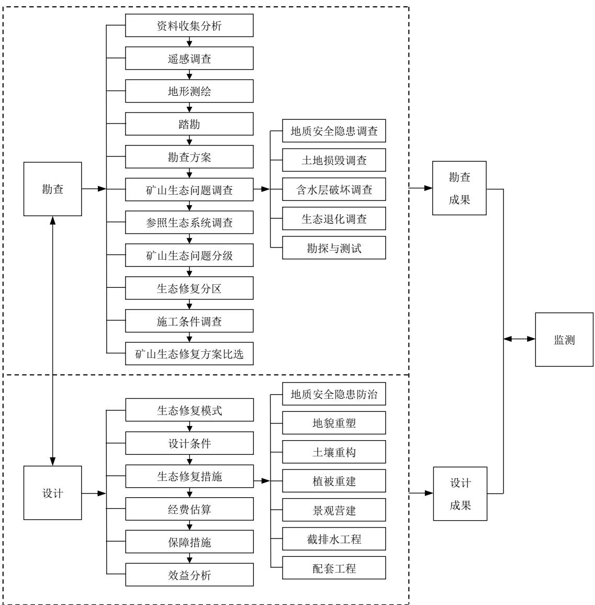

# 河 南 省 地 方 标 准

DB41/T 3056—2025

# 露天矿山生态修复技术规程

2025 - 12 - 26 发布

2026 - 03 - 25 实施

## 目 次

前言 ..........................  
2 规范性引用文件 ..................................................................... 1  
3 术语和定义 .............................................................  
4 总体要求与工作程序 .....................................................  
5 勘查 ............................................................................... 4  
6 设计 .............. ...... 8  
7 监测 .......... ......... 17  
附录 A（资料性） 矿山生态问题调查表.................................................. 19  
附录 B（资料性） 生物多样性调查表.............. ......... 23  
附录 C（资料性） 勘查报告编写大纲...................................... .......... 24  
附录 D（资料性） 设计报告编写大纲................................ ......... 27  
参考文献 ................. .... 30

## 前 言

本文件按照GB/T 1.1—2020《标准化工作导则 第1部分：标准化文件的结构和起草规则》的规定起草。

请注意本文件的某些内容可能涉及专利。本文件的发布机构不承担识别专利的责任。

本文件由河南省自然资源厅提出。

本文件由河南省自然资源标准化技术委员会（HN/TC 25）归口。

本文件起草单位：河南省自然资源监测和国土整治院、河南省地质灾害防治和生态保护修复协会、河南省资源环境调查一院有限公司、河南省地质研究院、河南省第四地质矿产调查院有限公司、河南省地质局生态环境地质服务中心、中化地质河南局集团有限公司。

本文件主要起草人：赵振杰、赵红伟、商真平、李会杰、莫德国、田鹏州、申浩君、丁爱红、郭玉娟、周敏、张丽娟、潘小雨、宋清坤、李亚刚、许来慧。

## 露天矿山生态修复技术规程

## 1 范围

本文件规定了露天矿山生态修复工程勘查、设计、监测的基本内容和程序。

本文件适用于露天矿山生态修复技术工作。

## 2 规范性引用文件

下列文件中的内容通过文中的规范性引用而构成本文件必不可少的条款。其中，注日期的引用文件，仅该日期对应的版本适用于本文件；不注日期的引用文件，其最新版本（包括所有的修改单）适用于本文件。

GB/T 15163 封山（沙）育林技术规程

GB 15618 土壤环境质量 农用地土壤污染风险管控标准（试行）

GB/T 15776 造林技术规程

GB/T 16453.1 水土保持综合治理技术规范 坡耕地治理技术

GB/T 16453.4—2008 水土保持综合治理技术规范 小型蓄排引水工程

GB/T 24356 测绘成果质量检查与验收

GB/T 32864—2016 滑坡防治工程勘查规范

GB/T 37573—2019 露天煤矿边坡稳定性年度评价技术规范

GB/T 38360 裸露坡面植被恢复技术规范

GB/T 38509 滑坡防治设计规范

GB/T 43933 金属矿土地复垦与生态修复技术规范

GB/T 45107 表土剥离及其再利用技术要求

GB 50021 岩土工程勘察规范

GB 50026 工程测量标准

GB/T 50085 喷灌工程技术标准

GB 50330 建筑边坡工程技术规范

GB/T 50485 微灌工程技术标准

GB 50778—2012 露天煤矿岩土工程勘察规范

GB 51016—2014 非煤露天矿边坡工程技术规范

DZ/T 0097—2021 工程地质调查规范（1:50 000）

DZ/T 0287 矿山地质环境监测技术规程

DZ/T 0448 滑坡崩塌泥石流灾害精细调查规范

HJ 164 地下水环境监测技术规范

JGJ 147 建筑拆除工程安全技术规范

NY/T 1342 人工草地建设技术规程

TD/T 1012 土地整治项目规划设计规范

TD/T 1036 土地复垦质量控制标准

TD/T 1070.1—2022 矿山生态修复技术规范 第1部分：通则

TD/T 1070.4 矿山生态修复技术规范 第4部分：建材矿山

## 3 术语和定义

下列术语和定义适用于本文件。

## 3.1

## 露天矿山

采用露天开采方式的矿山，包括历史遗留矿山和持证矿山。

## 3.2

## 矿山生态问题

因矿产资源开采活动引发的矿山地质安全隐患、土地损毁、含水层破坏、生态退化等危害人类生产、生活的各种问题。

## 3.3

## 矿山生态修复工程

指在矿产资源开采活动造成破坏的区域及影响区，依靠自然力量或通过人工措施干预，对矿山地质环境破坏、土地损毁和植被破坏等问题进行系统修复与综合治理，使矿山地质环境达到稳定、损毁土地得到复垦利用、生态系统功能得到恢复和改善的过程及活动。

[来源：TD/T 1092—2024，3.1]

## 3.4

## 参照生态系统

指一个能够作为生态恢复目标或基准的生态系统。

注：本文件特指矿山开采前的生态系统、未受扰动的矿山周边本地生态系统或基于目标值可预测实现的生态系统。[来源：GB/T 43935—2024，3.4]

## 3.5

## 生态地质条件

指对生态有影响的地质条件的总称，主要包括地形地貌、地层岩性、成土母质、土壤、地下水等。[来源：DD 2019—09，3.2]

## 3.6

## 自然恢复

指对生态系统停止人为干扰，以减轻负荷压力，依靠生态系统的自我调节能力和自组织能力使其向有序的方向自然演替和更新恢复。

[来源：TD/T 1070.1—2022，3.2]

## 3.7

## 辅助再生

指充分利用生态系统的自我恢复能力，辅以人工促进措施，使退化、受损的生态系统逐步恢复并进入良性循环。

[来源：TD/T 1070.1—2022，3.3]

## 3.8

## 生态重建

指对因自然灾害或人为破坏导致生态功能受损、生态系统自然恢复能力丧失或发生不可逆变化，以人工措施为主，通过生物、物理、化学、生态或工程技术方法，围绕修复生境、恢复植被、生物多样性重组等过程，重构生态系统并使生态系统进入良性循环。

[来源：TD/T 1070.1—2022，3.4]

## 4 总体要求与工作程序

## 总体要求

4.1.1 坚持自然恢复，辅助再生和生态重建相结合，以恢复生态系统功能为目标，消除地质安全隐患，改善水土环境，促使生态系统稳定，提升生物多样性。

4.1.2 采取综合勘查手段，查清露天矿山生态问题及施工环境条件，确定参照生态系统。

4.1.3 坚持问题导向，因地制宜，选择适宜的矿山生态修复模式和技术措施，科学设计，注重修复成效。

4.1.4 明确监测对象、内容、方法和相关技术要求，确保工程长期稳定发挥效益。

4.1.5 采用新技术、新方法、新材料、新工艺，提高露天矿山生态修复技术水平。

## 工作程序

矿山生态修复工作程序见图1。

  
图1 矿山生态修复工作程序图

## 5 勘查

## 一般要求

5.1.1 根据矿山生产阶段、矿山生态问题分布及影响范围综合确定勘查范围。

5.1.2 勘查工作按照工业广场、办公生活区、矿区道路、采场边坡、采场底盘、渣堆、排土场及参照生态系统等场地进行，采场边坡、渣堆、排土场等场地应布置适宜的勘探工程、监测和测试工作，查明边坡稳定程度。

5.1.3 场地勘查应布设不少于 1条勘探线，勘探线间距20 m～80 m，采场边坡、渣堆、排土场勘探线宜垂直于边帮或沿潜在滑坡方向布设，勘探工程点间距 20 m～40 m且不少于3点，其它场地勘探工程点间距 30 m～60 m。矿山生态问题严重区，宜加密控制。

5.1.4 勘探点以仪器法测定位置，点位误差在相应比例尺图上不大于0.5 mm。

5.1.5 勘查成果应满足施工图设计要求，勘查内容包括区域自然地理、生态地质条件、矿山生态问题调查、参照生态系统调查与确定、施工条件与矿山生态修复方案比选、周边矿山生态修复措施及成效等。

5.1.6 矿山生态修复勘查范围内存在水土污染的，应开展专项调查。水污染监测项目应符合 HJ 164的规定，土壤污染监测项目应符合 GB 15618的规定。

## 编制勘查方案

## 5.2.1 资料收集分析

收集勘查区及周边区域地质背景条件、勘查区生态地质条件、动植物种群、气象、水文、社会经济发展统计、国土空间规划、林业样地调查等资料，编制勘查区地形地貌、地层岩性分布、地质构造、工程地质、水文地质、土壤类型等基础图件。

## 5.2.2 遥感调查

5.2.2.1 调查勘查区森林、草地、湿地等空间分布、类型及其动态变化，调查矿山生态问题及其影响范围、土地利用现状、地表水体、地貌、地层岩性等。

5.2.2.2 采用分辨率优于2 m 的遥感数据，优先选用国产资源三号、高分一号、高分二号等卫星影像数据，数据源应具有时限性，一般选择植被生长旺盛期。

5.2.2.3 遥感调查成果包括勘查区遥感影像生态地质解译图，矿山生态问题遥感解译图及遥感解译说明书等。

## 5.2.3 地形测绘

5.2.3.1 对勘查区地形地貌、自然地理和建（构）筑物进行测量，绘制满足施工图设计要求精度的地形图。

5.2.3.2 平面控制测量采用 2000 国家大地坐标系统，高程系统采用 1985 国家高程基准，高程控制测量采用水准测量，首级高程控制网等级不低于四等。平面控制测量技术、高程测量技术符合 GB 50026规定。

5.2.3.3 根据勘查区地形地貌复杂程度及矿山生态问题特征，确定地形图比例尺。地形图比例尺宜为  
1:500～1:2 000。

5.2.3.4 地形图应标示各类测量控制点、居民地及设施、独立地物、交通、管线、水系、境界、地类等要素。

5.2.3.5 地形测绘成果质量检查应符合 GB/T 24356 的规定。

## 5.2.4 踏勘

5.2.4.1 根据工作程度、地形地貌、植被类型、交通地理条件，结合勘查区生态地质条件和初步了解的矿山生态问题，制订踏勘工作计划。

5.2.4.2 根据主要生态地质条件及主要矿山生态问题分布特征，选择典型路线，确定调查的重点内容。

5.2.4.3 踏勘成果包括矿山基本情况、主要矿山生态问题、施工条件。矿山生态问题调查表见附录 A，生物多样性调查表见附录B。

## 5.2.5 勘查方案

明确勘查范围，目标和任务，初步分析矿山生态问题，确定勘查技术路线与工作方法、工作量及进度等，编制勘查方案，内容包括任务来源、目标任务、工作依据、技术路线与工作量及经费概算等。

## 矿山生态问题调查

## 5.3.1 地质安全隐患调查

5.3.1.1 崩塌（危岩体）、滑坡隐患调查应符合DZ/T 0448的规定，勘查应符合GB/T 32864 的规定。

5.3.1.2 非煤矿山边坡勘查应符合 GB 51016—2014 中 4.5 的规定，露天煤矿边坡勘察应符合GB 50778—2012 中第 4 章的规定。

5.3.1.3 崩塌（危岩体）、滑坡隐患、采场边坡应进行稳定性评价，符合以下要求：

a) 应在定性分析（图解法、地质类比法、赤平投影及变形迹象分析）的基础上定量计算综合评价；

b) 应对崩塌（危岩体）的各种可能破坏模式进行稳定性计算和稳定状态判断，定量计算宜采用有限元法；

c) 滑坡隐患、采场边坡稳定性评价应采用极限平衡法，以设计工况稳定性系数作为主要评价指标，根据边坡破坏模式选择计算方法，并考虑运输载荷、地震、爆破震动等条件下的诱发因素；

d) 采用原位测试、室内试验、反演分析和工程类比等方法确定岩土体物理力学参数，根据破坏模式选择合适的计算方法，采用两种及以上方法进行计算；

e) 存在滑面的土质、破碎或较破碎软质岩崩塌、滑坡隐患稳定性评价和推力计算应符合GB/T 32864—2016 中 13.4 的规定；

f) 非煤矿山边坡稳定性计算方法按照 GB 51016—2014中附录 D的规定；

g) 露天煤矿边坡稳定性计算方法按照 GB/T 37573—2019中附录A的规定。

## 5.3.2 土地损毁调查

包括以下内容：

a) 土地利用现状类型、数量、质量等级，道路、灌溉设施及主要农作物生产水平调查等；

b) 土地所有权、使用权和承包经营权状况等；

c) 永久基本农田分布范围及面积；

d) 损毁类型、面积和土壤质量等。

## 5.3.3 含水层破坏调查

包括以下内容：

a) 含水层的补给面积，含水层厚度、层序、补给条件、径流通道、储水构造等变化；

b) 水位、水温、水质及水资源量变化；

c) 对矿区及周边生产、生活供水影响。

## 5.3.4 生态退化调查

包括以下内容：

a) 表层土壤质地破坏（自然侵蚀、人为破坏）类型、分布、强度及其发展趋势；土壤基质组成、肥力现状、污染风险；

b) 地表水流量、水质（pH、浊度、重金属、硫酸盐等），采场积水的来源与水质；地下水位、流向、水质，地表水与地下水的污染风险；

c) 植被类型、植被覆盖度、地上生物量；林地、草地等生态用地面积、现状、破坏方式及其分布变化特征，入侵物种等；湿地富营养化状况等；

d) 典型动物栖息地功能衰退、生物多样性减少、生物生产力降低等。

## 5.3.5 勘探与测试

## 5.3.5.1 地球物理勘探

地球物理勘探可查明崩塌（危岩体）、滑坡隐患、采场边坡、渣堆等空间分布特征、地质构造、软弱层、易崩易滑地层及其他不良地质体的埋藏分布情况。应符合以下要求：

a) 宜采用电阻率测探、高密度电法、地震、声波测井等方法，进行物探前应通过现场试验，测试采用方法的有效性，并确定合适的野外观测系统和仪器工作参数；

b) 物探勘探线的布设应与主要勘探线叠合；

c) 当物探反映有明显异常时，应补充钻探、山地工程等予以验证；

d) 提交成果包括工程布置平面图、物探剖面图等内容的物探勘查报告。

## 5.3.5.2 工程地质钻探

工程地质钻探是通过钻孔获取岩土样本、水文参数及原位力学数据，分析地层结构、岩土特性和地质构造等，应符合以下要求：

a) 根据区域地质背景，查明地层岩性、产状、厚度及其空间分布规律并划定地层时代；

b) 查明地质构造空间位置，分析地质构造发育特征；

c) 查明风化带、断层破碎带、软弱层、岩溶等发育规律；

d) 查明透水层、含水层、隔水层岩性、厚度、埋藏条件、渗透性及地下水水位、水量和水质等；

e) 开展采样测试、试验和原位测试，查明易崩易滑地层岩土体工程地质力学性质；

f) 钻探方法和技术要求符合GB 50021的规定；

g) 提交成果包括钻孔柱状图、工程地质剖面图、岩土样测试报告、钻孔原始编录表、简易水文观测和岩心影像档案等。

## 5.3.5.3 山地工程

山地工程一般包括槽探、浅井和坑探，可查明岩土层界线、破碎带宽度、构造现象、包气带结构、地裂缝、地表变形特征及渣堆厚度、物质组成等，并采取岩土样品，应符合以下要求：

a) 山地工程应结合勘探线布置，宜与钻探工程布置相适应；

b) 应及时进行地质编录，绘制槽探、浅井和坑探展示图。展示图比例尺宜为1:100～1:50；

c) 完成后的山地工程应进行回填或作为监测井、浇筑钢筋砼形成抗滑桩；

d) 原始地质记录、简易水文观测、样品采集记录，记录格式按照 DZ/T 0097—2021 附录 D 中D.10～D.12 执行；

e) 提交成果包括地质编录、展示图、岩土力学测试报告、回填记录和影像资料等。

## 5.3.5.4 原位测试

测试方法主要有大体积重度试验、直剪试验、圆锥动力触探试验、标准贯入试验、抽水试验及注水试验等。应符合以下要求：

a) 测试原状土体重度，采用容积法进行大体积重度试验，试坑体积应根据土的成分、粒径确定，可通过注水或充填标准砂测量，试坑尺寸不宜小于500 mm×500 mm×500 mm；

b) 测试滑带土、岩土体结构面及岩体与混凝土交结面抗剪强度，应进行大面积现场直剪试验；

c) 测试填土、砂土、粉土、碎石土和软岩等地基土密实度、地基承载力及单桩承载力等，可根据施工条件选用圆锥动力触探试验或标准贯入试验；

d) 测定岩土层渗透性、导水系数等水文地质参数，评价富水性，可根据施工条件选用抽水或注水试验；

e) 原位测试试验适用范围、试验仪器设备、测试技术要求、测试成果及应用应符合 DZ/T 0097规定；

f) 原位测试成果提交测试设计书及测试成果报告。

## 5.3.5.5 室内试验

测试内容主要有岩土物理性质试验，抗压、抗剪强度试验，岩矿分析，土壤分析及水质分析等。应符合以下要求：

a) 对软弱层、易崩易滑地层宜分类进行岩土体的物理性质试验、直剪试验及单轴压缩试验，确定物理性质指标、抗剪强度指标、抗压强度及其他变形指标；

b) 厚层高压缩性软土基础应进行土的压缩—固结试验；

c) 倾倒性土质崩塌（危岩体）隐患应进行土的物理性质试验、土的抗剪强度试验；

d) 试验样不应少于6 组，对有易溶或膨胀岩（土）分布的边坡，应进行不少于3 组的易溶盐及膨胀性试验；

e) 岩土室内试验测试项目、试验方法应符合GB 50021规定；

f) 岩矿分析、土壤分析、水质分析、植被测试分析内容及方法参考 DD 2019规定。

## 参照生态系统调查

参照生态系统类型可分为原生系统、本地健康系统、未来适应型系统，包括以下内容：

a) 地形地貌、地层岩性、成土母质、土壤、地下水等；

b) 土壤类型、厚度、结构、成因、组分、土壤有机质、含水量、易溶盐、pH值和有害元素等；

c) 包气带的渗透性能、水分盐分垂向分布及动态、蒸发影响带深度、毛细水上升高度等；

d) 乔木树种胸径、树高、生长势（新梢长度、粗度、叶片大小、根系发育）调查，灌木种类、高度、盖度调查，草本、藤本植物种类调查，生物种类及生物量、根系分布和发育深度等；

e) 动物种群类型、数量调查等。

## 矿山生态问题分级

矿山生态问题分为以下三个等级：

a) Ⅰ级，场地存在严重矿山生态问题，地质条件不稳定，重大水土污染，严重土地损毁，矿区及周边生产生活用水困难，严重影响植被生境，生态退化严重；

b) Ⅱ级，场地存在较严重矿山生态问题，地质条件稳定性较差，局部存在水土污染，较严重土地损毁，矿区及周围部分生产生活用水，局部植被盖度与质量受到影响，生态系统结构与功能较为完好；

c) Ⅲ级，场地存在轻微的矿山生态问题，地质条件基本稳定，无水土污染，仅存在少量土地损毁，不影响矿山及周围生产生活用水，植被生境条件稳定，生态系统结构与功能较为完好。

## 生态修复分区

以勘查成果为基础，综合考虑地形地貌、高程、地质条件、土壤、植被、矿山生态问题及社会经济需求等，通过归类分析、空间映射等方法进行生态修复分区，提出各分区矿山生态修复目标及利用建议。矿山生态修复分区符合以下要求：

a) 采场底盘、采场边坡及其影响范围宜划为地貌重塑与稳定性修复区，修复目标是消除地质安全隐患、重建稳定地形基底；

b) 削方或蓄坡形成的平台、剥离表土堆放场地宜划为植被恢复与生态重建区，修复目标是恢复植被覆盖、重建生态功能；

c) 开采前属于耕地的平坦区域、临近村庄的部分平台宜划为土地复垦与综合利用区，修复目标是复耕或转型利用；

d) 削方或蓄坡形成的缓坡宜划为水土保持区，修复目标是控制水土流失；

e) 修复区与村庄交界带、采场边缘可视区域宜划为生态缓存与景观融合区，修复目标是提升景观 协调性、减少扬尘、噪音等。

## 施工条件调查

分析现有施工条件对矿山生态修复工程布置的影响及要求。施工条件调查应包含以下内容：

a) 治理区内外交通状况、道路类型、数量、分布及质量等；

b) 周边可利用水源的位置、水质、水量，现有灌排设施类型、数量、分布、质量及运行情况；

c) 变电站位置、规模、容量及相关配电、用电设备位置、数量、容量、功率、分布及运营方式；

d) 治理区及周边一定范围内可供覆土用的土源分布、储量、质量等，调查其开挖条件和运输条件，评价其适用性以及开挖后对周边地质环境的影响；

e) 对治理工程所需砂、砾石、块石、毛石等的质量和储量踏勘和评估，天然骨料缺乏或质量不符合工程要求时，应对人工料源、钢筋、水泥等进行调查，查明运输条件和价格等信息。

## 矿山生态修复方案比选

结合勘查区矿山生态问题发育特征、施工条件，综合考虑经济、适用性、可靠性、施工难易程度、施工周期和修复效果等因素，推荐两种及以上矿山生态修复方案，并进行工程经费概算。

## 勘查成果

包括勘查报告、附图、附表、附件等，勘查报告应通过单位技术负责人审定，并进行专家论证，勘查报告编写大纲见附录C。

## 6 设计

## 一般要求

6.1.1 矿山生态修复工程设计应统筹考虑勘查成果、国土空间规划、当地社会、经济、环境等条件，且符合相关政策。

6.1.2 根据农业空间、城镇空间和生态空间布局，确定矿山生态修复方向。矿山生态修复定位与修复方向按照 TD/T 1070.1—2022 中附录 B 确定。

6.1.3 应首先消除地质安全隐患，与周边地形地貌、土地利用现状、生态环境相协调，植被重建优先选用乡土树种，遵循物种多样性、结构稳定性及生态功能完整性原则构建生态群落。

6.1.4 根据危害等级、工程安全等级及不同荷载组合条件确定采场边坡的设计安全系数。

6.1.5 采场边坡危害等级按照表1确定。

表1 采场边坡危害等级
<table><tr><td rowspan=1 colspan=2>边坡危害等级</td><td rowspan=1 colspan=1>I</td><td rowspan=1 colspan=1>ⅡI</td><td rowspan=1 colspan=1>III</td></tr><tr><td rowspan=1 colspan=2>可能的人员伤亡</td><td rowspan=1 colspan=1>有人员伤亡</td><td rowspan=1 colspan=1>有人员伤亡</td><td rowspan=1 colspan=1>无人员伤亡</td></tr><tr><td rowspan=2 colspan=1>潜在的经济损失</td><td rowspan=1 colspan=1>直接</td><td rowspan=1 colspan=1>≥100万</td><td rowspan=1 colspan=1>50万～100万</td><td rowspan=1 colspan=1>≤50万</td></tr><tr><td rowspan=1 colspan=1>间接</td><td rowspan=1 colspan=1>≥1000万</td><td rowspan=1 colspan=1>500万～1000万</td><td rowspan=1 colspan=1>≤500万</td></tr><tr><td rowspan=1 colspan=2>综合评定</td><td rowspan=1 colspan=1>很严重</td><td rowspan=1 colspan=1>严重</td><td rowspan=1 colspan=1>不严重</td></tr></table>

6.1.6 采场边坡工程安全等级按照表 2确定。

表2 采场边坡工程安全等级划分
<table><tr><td rowspan=1 colspan=1>边坡工程安全等级</td><td rowspan=1 colspan=1>边坡高度H（m）</td><td rowspan=1 colspan=1>边坡危害等级</td></tr><tr><td rowspan=3 colspan=1>I</td><td rowspan=1 colspan=1>H&gt;500</td><td rowspan=1 colspan=1>Ⅰ、Ⅱ、ⅢII</td></tr><tr><td rowspan=1 colspan=1>300&lt;H≤500</td><td rowspan=1 colspan=1>I、Ⅱ</td></tr><tr><td rowspan=1 colspan=1>100&lt;H≤300</td><td rowspan=1 colspan=1>I</td></tr><tr><td rowspan=3 colspan=1>II</td><td rowspan=1 colspan=1>300&lt;H≤500</td><td rowspan=1 colspan=1>III</td></tr><tr><td rowspan=1 colspan=1>100&lt;H≤300</td><td rowspan=1 colspan=1>II、IⅢII</td></tr><tr><td rowspan=1 colspan=1>H≤100</td><td rowspan=1 colspan=1>I</td></tr><tr><td rowspan=2 colspan=1>III</td><td rowspan=1 colspan=1>100&lt;H≤300</td><td rowspan=1 colspan=1>III</td></tr><tr><td rowspan=1 colspan=1>H≤100</td><td rowspan=1 colspan=1>II、ⅢI</td></tr></table>

6.1.7 不同荷载组合下采场边坡的设计安全系数按照表 3确定。

表3 不同荷载组合下采场边坡的设计安全系数
<table><tr><td rowspan=2 colspan=1>边坡工程安全等级</td><td rowspan=1 colspan=3>边坡工程设计安全等级</td></tr><tr><td rowspan=1 colspan=1>荷载组合Ⅰ</td><td rowspan=1 colspan=1>荷载组合Ⅱ</td><td rowspan=1 colspan=1>荷载组合Ⅲ</td></tr><tr><td rowspan=1 colspan=1>I</td><td rowspan=1 colspan=1>1.25~1.20</td><td rowspan=1 colspan=1>1.23~1.18</td><td rowspan=1 colspan=1>1.20~1.15</td></tr><tr><td rowspan=1 colspan=1>II</td><td rowspan=1 colspan=1>1.20~1.15</td><td rowspan=1 colspan=1>1.18~1.13</td><td rowspan=1 colspan=1>1.15~1.10</td></tr><tr><td rowspan=1 colspan=1>IⅢI</td><td rowspan=1 colspan=1>1.15~1.10</td><td rowspan=1 colspan=1>1.13~1.08</td><td rowspan=1 colspan=1>1.10~1.05</td></tr><tr><td rowspan=1 colspan=4>注：荷载组合I为自重+地下水；荷载组合Ⅱ为自重+地下水+爆破振动力；荷载组合Ⅲ为自重+地下水+地震力。</td></tr></table>

6.1.8 削坡减载、填方边坡及边坡支护工程等设计应进行稳定性验算，并开展“必要合理、影响最小化”论证。

6.1.9 根据施工条件，结合工程建设地建设工程造价信息、原材料运输距离等进行工程预算。

6.1.10 地质条件发生重大变化且设计方案不具备实施条件时，应对设计方案进行修改、补充或调整，必要时补充调查与勘探工作。

6.1.11 设计成果应达到施工图设计工作要求，包括设计边界、设计条件、分部分项工程设计、土石料利用、监测、工程预算、保障措施、绩效目标、效益分析等。

## 矿山生态修复模式

根据矿山场地修复用途，统筹考虑矿山生态问题的严重程度、现有技术经济条件等，确定矿山生态修复模式。矿山生态修复模式参考依据见表4。

表4 矿山生态修复模式参考依据
<table><tr><td rowspan=1 colspan=1>矿山生态修复模式</td><td rowspan=1 colspan=1>适宜的场地条件</td></tr><tr><td rowspan=1 colspan=1>自然恢复</td><td rowspan=1 colspan=1>场地不存在地质安全隐患和水土污染，地质稳定性与水土质量良好，地表仅存在少量土地损毁或水资源破坏，仅局部植被盖度与质量受到影响，物种生境条件稳定，生态系统结构与功能完好</td></tr><tr><td rowspan=1 colspan=1>辅助再生</td><td rowspan=1 colspan=1>场地存在一定的地质安全隐患，地质稳定性较差，或场地局部存在水土污染，存在一定程度土地损毁、水资源破坏，部分植被盖度与质量受到影响，物种生境条件较为稳定，生态系统结构与功能基本完好</td></tr><tr><td rowspan=1 colspan=1>生态重建</td><td rowspan=1 colspan=1>场地存在重大地质安全隐患，地质条件不稳定，或场地存在具有影响环境安全的重大水土污染问题，或存在严重土地损毁、水资源破坏，地表植被生境受到严重影响，生态退化严重</td></tr></table>

## 设计条件

6.3.1 地质安全隐患防治工程设计使用年限为50年或不低于被保护的建（构）筑物设计使用年限，明确地质安全隐患防治措施、防治工程类别、材料及节点详图。

6.3.2 确定各修复分区土壤质地、砾石含量、有机质含量、pH值以及土壤容重等参数。

6.3.3 根据参照生态系统确定乔、灌、藤、草类型，规格、株行距、树穴大小等。

6.3.4 确定挡土坎、截排水沟的材料及断面结构等。

6.3.5 明确配套工程类型、位置、规格等。

## 生态修复措施

## 6.4.1 地质安全隐患防治

6.4.1.1 崩塌（危岩体）隐患防治工程设计应遵循主动治理和被动防护相结合的原则，在边坡稳定性评价的基础上进行，崩塌（危岩体）主要防治工程措施有清除、锚固、支撑与嵌补及拦截等，防治工程设计符合以下要求：

a) 崩塌（危岩体）防护结构应考虑场地地质、施工环境、规模大小、失稳破坏模式及工程安全等级等因素选定，设计荷载包括危岩体自重、地表水、地下水、地震力、冲击荷载等；

b) 崩塌（危岩体）清除应自上而下分层进行，避免破坏母岩稳定性，可采用临时加固再破碎清除的方法防止局部失稳引发连锁崩塌，危岩体清除后应进行边坡稳定性验算；

c) 对于较破碎岩质崩塌体或土质崩塌，应综合采用锚杆（索）、格构梁、肋柱等加固支护措施；

d) 崩塌（危岩体）底部悬空或存在较大空腔宜采用支撑，存在小空腔宜采用嵌补，支撑与嵌补基础应置于稳定地基上，基底存在软弱层时，应进行加固处理，支撑与嵌补应结合锚固措施进行综合防治；

e) 崩塌（危岩体）母岩整体稳定性较差且表面无大量植被时，宜采用主动加固防护措施，不宜采用柔性防治措施；

f) 边坡整体稳定且浅表层崩塌（危岩体）发育宜采用主动防护网措施，保护对象上方有小型高位崩塌（危岩体）且危岩体难以清除宜采用被动防护网措施；

g) 上陡下缓边坡坡脚处存在宽平台的，可采用拦石墙进行拦挡，高度不宜大于8 m，内侧填筑缓冲层，分层压实度不小于85％，并设置落石槽，槽底设置盲沟保证排水畅通；

h) 宜根据崩塌（危岩体）坡面发育特征及周边汇水情况，设置截排水工程；

i) 在有建（构）筑物的崩塌（危岩体）区域进行防治工程设计时，拟采用的工程措施不应危及建（构）筑物的安全和正常使用；

j) 位于水库区或江河岸边的崩塌（危岩体）防治工程设计，应考虑水位变化对崩塌的影响以及防治工程对水环境的影响；

k) 锚杆（索）设计应符合GB 50330规定。

6.4.1.2 滑坡隐患防治工程设计应在稳定性评价的基础上进行，宜采取岩土工程措施与植被防护措施相结合的方案，并考虑施工的便利性，设计符合以下要求：

a) 优先采取排水措施，并结合地形条件、工程地质、水文地质条件及降水条件设计截排水工程，包括地表截排水、地下排水等；

b) 宜在滑坡隐患体较薄、嵌固段地基强度较高的地段部署抗滑桩，综合考虑其平面布置、桩间距、桩长和截面积等，确保滑坡体不越过桩顶或从桩间滑动，应对越过桩顶滑出可能进行验算，并采取相应的防护措施；

c) 当滑坡隐患体坡面较陡且为堆积层或土质滑坡时，预应力锚索应与抗滑桩、钢筋混凝土格构组合使用；

d) 当滑坡隐患表面岩土体易风化、剥落且有浅层崩滑、蠕滑等现象且需要对坡面进行绿化美化时，宜采用格构锚固进行综合防护；

e) 浅层滑坡宜采用钢筋混凝土格构+锚杆进行防治，中深层滑坡采用钢筋混凝土格构+预应力锚索进行防治，锚杆（索）应穿过滑带进入稳定层；

f) 挡土墙工程类似应根据地形条件、滑坡地质条件、施工条件、土地利用等综合因素确定，宜与排水、减载、护坡等其他防治工程措施配合使用；

g) 滑坡隐患防治工程设计应符合 GB/T 38509的规定。

6.4.1.3 采场边坡工程设计应结合矿山生产阶段、采矿工艺进行设计，符合以下要求：

a) 施工工艺相对简单、易于实施且周期短；

b) 综合采用削坡减载、截排水、加固、支护等措施，确保采场边坡的安全、稳定；

c) 在采场边坡稳定的前提下，可采用固土、建植及养护等植被防护措施，提升景观协调性。

## 6.4.2 地貌重塑

6.4.2.1 削坡减载工程设计应控制在崩塌（危岩体）、滑坡隐患范围内，纵向不应超过其后缘边界，削坡区应与周边稳定的坡体自然衔接。

6.4.2.2 削坡断面和削方边坡坡率设计应符合以下要求：

a) 对边坡高度不超过 8m 的土质边坡和不超过 15m 的岩质边坡，宜采用一坡式断面进行削方。土质边坡高度在 5 m 以下且坡度不大于 35°，高度 5m～8m 且坡度不大于 30°；软质岩石边坡高度在8m以下且坡度不大于45°，高度8m～15m且坡度不大于35°；硬质岩石边坡高度在8m以下且坡度不大于60°，高度8 m～15m且坡度不大于50°；

b) 对边坡高度超过8 m且小于15m的土质边坡、高度超过 15m且小于30m的岩质边坡，宜采用阶梯形削坡。土质边坡每级高差 4m～6m，岩质边坡每级高度 8m～12m；大于三级的多级台阶，每隔两级及变坡率处应加宽台阶设计；土质边坡台阶宽度不小于6m，岩质边坡台阶宽度不小于4m，台阶内倾；

c) 削坡后应清除坡面松散的岩土体，坡面裂缝可采用水泥浆灌注、非膨胀性黏土封填或混凝土封闭等方法处理；

d) 稳定边坡坡脚处存在交通道路或其他建（构）筑物时，可设置护脚墙，护脚墙高度一般不超过1.5 m。

6.4.2.3 排险清坡及削坡减载产生的渣土，应合理布置堆放场地，通过覆盖、拦挡以及截排水等工程措施，避免水土流失、渣土污染。

6.4.2.4 采用爆破削坡减载工程措施应进行专项设计，并组织技术论证。

6.4.2.5 当边坡后缘削坡受限或削坡工程量大且坡脚或采场底盘场地充足时，可在坡脚处回填渣（石）土蓄坡、填筑台阶，蓄坡体应满足稳定的坡高和休止角。回填蓄坡、填筑台阶应符合以下要求：

a) 填方边坡台阶数量不多于三级，台阶宽度不小于 6m，汇水面积较大时，应考虑截排水工程；

b) 土质填方边坡，单层台阶高度不大于 8 m，边坡坡度小于 30°；岩质填方边坡，单层台阶高度不大于 12m，边坡坡度 30°～45°；对于浸水填方边坡，设计水位以下填方边坡坡度不大于20°；

c) 台阶填筑密度应根据自然条件、土料特性、填筑台阶结构等因素综合确定。黏性土填筑压实度不应小于90％；无黏性土填筑相对密度不应小于 0.60；

d) 填方边坡覆土厚度不小于 0.3 m，绿化时宜采用乔、灌、草本及藤本植物相结合；

e) 填方边坡坡脚处存在建（构）筑物时，应修筑浆砌石护面墙，墙高一般 1.5 m～2.0 m。

6.4.2.6 修复为旱地、园地、人工牧草地时，地面坡度不应超过 25°；修复为水浇地、水田时，地面坡度不宜超过 15°，修复地块地形坡度应符合 TD/T 1036的规定。

6.4.2.7 坡耕地保水保土耕作、梯田布局与设计应符合 GB/T 16453.1的规定。

6.4.2.8 在边坡自身稳定的前提下，可对边坡进行防护设计，一般包括以下五类：

a) 实体式护面墙适用于土质边坡，易风化岩质边坡以及其他风化严重的软质岩层和较破碎的岩石边坡，坡度不大于 60°；

b) 干砌片（块）石护坡适用于受到水流冲刷边坡，坡度 25°～35°；

c) 浆砌片（块）石护坡适用于土质边坡和易风化岩质边坡，坡度不大于 45°；

d) 混凝土预制块护坡适用于较大水流波浪冲击边坡，坡度不大于30°；

e) 生态坡面防护适用于表层土体溜塌与人居环境相邻的边坡，优先采用灌草类植物护坡，生态坡面防护按照 GB/T 38360 的规定。

6.4.2.9 存在废弃建（构）筑物应予以拆除。废弃建（构）筑拆除应符合 JGJ 147的规定。

## 6.4.3 土壤重构

6.4.3.1 客土覆盖区域地表具有较好肥力、耕性、生产性能和生态功能的土壤应进行剥离和再利用。  
表土剥离和利用应符合GB/T 45107的规定。

6.4.3.2 土壤重构工程实施后，在养护期内土壤质量达到同类土地利用类型的质量或生产力水平。

6.4.3.3 根据土壤重构后用途及农作物、植被等养分元素需求，利用施肥和客土等进行土壤改良。

6.4.3.4 土壤重构工程设计应符合以下要求：

a) 场地修复后用作耕地，有效表土厚度不小于80 cm，土壤质地以壤土和壤质黏土为主，砾石含量不超过 5％，有机质含量不小于 1.5％，pH 值介于 6.5～8.5 之间，控制土壤容重不超过1.40 $\mathrm { g / c m } ^ { 3 }$ ；

b) 场地修复后用作园地，有效表土厚度不小于60 cm，土壤质地以砂土和砂质黏土为主，砾石含量不超过 10％，有机质含量不小于 1.0％，pH 值介于 6.0～8.5 之间，控制土壤容重不超过1.45 $\mathrm { g / c m } ^ { 3 }$

c) 场地修复后用作林地，有效表土厚度不小于60 cm，土壤质地以砂土和壤质黏土为主，砾石含量不超过 20％，有机质含量不小于 1％，pH 值介于 6.0～8.5 之间，控制土壤容重不超过1.5 $\mathrm { g / c m } ^ { 3 }$ ；

d) 场地修复后用作草地，有效表土厚度不小于30 cm，土壤质地以砂土和壤质黏土为主，砾石含量不超过 5％，有机质含量不小于 1.5％，pH 值介于 6.5～8.5 之间，控制土壤容重不超过1.40 g/cm3；

e) 土壤重构区表土改良常用方式有土壤结构改良、土壤肥力改良、土壤活力改良等，改良方法按照 TD/T 1070.1—2022 中附录 E.1 的规定执行。

6.4.3.5 宜就近客土，取土场设置满足回覆土源数量、质量等要求，符合以下要求：

a) 客土有一定疏松度，无明显可视杂物，常规土色，无明显异味；

b) 使用前应对土壤进行检验，根据植物生长需要，分区分配使用客土；

c) 客土应避免使用强酸性土壤和湿地中含还原性有害物质的土壤；

d) 取土场应进行复垦再利用，取土场复垦质量应符合TD/T 1036的规定。

6.4.3.6 存在土壤污染的场地，应进行先导治理或协同治理，修复后不宜直接用于建设用地；用作农用地的，镉、汞、砷、铅、铬、铜、镍、锌为必测项目，土壤污染风险筛选值和管制值符合 GB 15618的规定。

6.4.3.7 土壤重构工程宜配套截排水等水土保持工程措施。水土保持工程设计按照 GB/T 16453.1 和GB/T 16453.4 的规定。

## 6.4.4 植被重建

6.4.4.1 应综合考虑自然环境、社会环境、工程条件，在确保生态系统功能健康的前提下，在交通便利、土壤条件较好区域，营造生态经济林，实现生态效益与经济效益的有机统一。

6.4.4.2 植被重建措施主要包括苗木种（补）植、客土喷播、生态袋、鱼鳞坑、植生毯、播种等。

6.4.4.3 植被重建工程设计应符合以下要求：

a) 依据重塑的地貌形态、土壤条件、参照生态系统，考虑植被适宜性，结构布局合理性，物种多样性，开展植被重建；

b) 筛选出适应当地气候、立地条件，抗逆性强、耐贫瘠、易成活、易养护、根系发达、种源丰富、水土保持功能强、管理粗放的乡土植物，综合考虑乔、灌、草、藤植物，固氮与非固氮，深根性与浅根性，经济林与生态林结合，合理部署植被空间和覆盖区域；

c) 边坡植被重建，应根据立地条件、坡向（向阳、背阴）、坡度、岩性及风化程度、植物习性等，采取适宜的方法种植；

d) 边坡再造台阶植被重建，宜采用乔、灌、草、藤植物立体种植，平台内、外侧各栽植一至二排攀缘植物，向上攀爬或向下垂吊复绿坡面，可适当栽植观赏植物物种；

e) 坡脚蓄坡面、填筑台阶覆盖种植土后，宜采用乔、灌、草、藤植物重建，可适当栽植观赏植物物种；

f) 裸露坡面植物配置、栽植技术及方法按照GB/T 38360 的规定；

g) 修复为园地、林地时，种植密度、造林方法按照 GB/T 15776的规定；

h) 修复为草地时，播种量、种子处理和播种方法按照NY/T 1342的规定。

6.4.4.4 苗木运输和假植宜符合以下要求：

a) 苗木运输量应根据种植量确定，苗木运到现场后应及时栽植；

b) 裸根苗木自起苗开始，暴露时间不宜超过8 h，当天不能种植的苗木，应进行假植；

c) 带土球小型花灌木运至施工现场后，应排码整齐，当日不能种植时，应喷水保持土球湿润；

d) 非种植季节所需苗木应在合适的季节起苗，并用容器假植。

6.4.4.5 乔木、灌木种植前应进行根系修剪，宜将劈裂根、病虫根、过长根剪除。

6.4.4.6 乔木树冠修剪宜符合以下要求：

a) 具有明显主干的高大落叶乔木应保持原有树形，适当疏枝，对保留的主侧枝应在健壮芽上短截，可剪去枝条的1/5～1/3；

b) 无明显主干、枝条茂密的落叶乔木，对干径 0.10m 以上树木，可疏枝保持原树形；对干径为0.05m～0.10m的苗木，可选留主干上的几个侧枝，保持原有树形进行短截；

c) 枝条茂密具圆头形树冠的常绿乔木可适量疏枝。枝叶集生树干顶部的苗木可不修剪。具轮生侧枝的常绿乔木用作行道树时，可剪除基部2～3 层轮生侧枝；

d) 常绿针叶树不宜修剪，只剪除病虫枝、枯死枝、生长衰弱枝、过密的轮生枝和下垂枝。

6.4.4.7 灌木及藤蔓类树冠修剪宜符合以下要求：

a) 带土球或湿润地区带宿土裸根苗木及上年花芽分化的开花灌木不宜修剪，当有枯枝、病虫枝时应予剪除；

b) 枝条茂密的灌木可适量疏枝；

c) 分枝明显、新枝着生花芽的小灌木应顺其树势适当强剪，促生新枝，更新老枝。攀缘类和蔓性苗木可剪除过长部分。攀缘上架苗木可剪除交错枝、横向生长枝。

6.4.4.8 剪口应平滑，不得劈裂。枝条短截时应留外芽，剪口应在留芽位置以上至少10 mm。修剪直径  
20 mm以上大枝及粗根时，截口必须削平并涂防腐剂。

6.4.4.9 种植穴、槽的大小，应根据苗木根系、土球直径和土壤情况而定。穴、槽必须垂直下挖，上口下底相等。

6.4.4.10 乔木林、竹林的郁闭度≤0.4，灌木林盖度≤40％时，以及疏林地、迹地、造林失败地等可采取封山育林措施。封山育林工程设计按照 GB/T 15163执行。

6.4.4.11 植被种植后应及时进行抚育、灌溉、施肥、调配、病虫害防治、有害植物清除等养护措施，保证成活率。

## 6.4.5 景观营建

以生物多样性保护为目标，营建矿区受损水系廊道、生物多样性廊道和景观廊道，连接修复区与本地生态系统，实现生态系统的连通性。景观营建应符合以下要求：

a) 采场、渣堆、排土场等场地可结合矿业文化进行文化功能营建与提升；

b) 人工堆积、采场边坡形成的阶梯状地貌，宜结合周边自然景观营建为山地景观；

c) 积水区可重建为人工湿地景观，宜建立湿地水域之间、湿地与周边河流湖库间的水系连通系统；

d) 对于具有一定科学文化价值的基础地质、地貌景观、重要物种、地质灾害遗迹及人类工程遗迹，应采取措施予以保护，并推荐其利用方向；

e) 景观营建设计应符合 GB/T 43933的规定。

## 6.4.6 截排水工程

6.4.6.1 截排水工程设计应与自然环境协调，与区外排水系统合理衔接，形成完整通畅的排水系统。

6.4.6.2 根据地形地貌特征、汇水面积等进行截排水工程设计，应符合以下要求：

a) 截水沟设置应距坡顶边缘≥5m，纵向坡度不宜小于 0.5％，沟渠的顶面高度应高出设计水位0.1 m～0.2 m；

b) 场地平整区排水沟宜布置在低洼地带，当纵坡变化时，应改变断面大小而避免上游产生壅水，一般情况宜改变断面宽度，深度保持不变；

c) 边坡应设置“坡顶截水沟+台阶排水沟+坡脚边沟”三级系统，在坡脚平缓处宜设计跌水和消能池；

d) 排水沟宜用浆砌片石或块石砌筑，地质条件较差时可采用毛石混凝土或素混凝土砌筑；

e) 表层积水区、泉水露头，可将排水沟做成渗水盲沟，疏干积水；

f) 截排水流量、断面设计应符合 GB/T 16453.4—2008 中 3.3.1 和 3.3.2 的规定。

## 6.4.7 配套工程

## 6.4.7.1 灌溉工程

应符合以下要求：

a) 水资源利用应以地表水为主，地下水为辅，禁止开采深层地下水，宜选用集蓄水池、周边河流、水库、机井、坑塘等，不得使用工业废水、生活污水进行灌溉；

b) 灌溉设计保证率应根据气象、水文、水源类型、农作物、灌溉方式及经济效益等因素综合确定；

c) 在农作物生育期内，灌溉水温与农田地温之差宜小于 10℃，水田灌溉水温宜为 15℃～35 ℃；

d) 灌溉水质应符合 GB/T 50485 的规定。

## 6.4.7.2 机井工程

宜符合以下要求：

a) 根据机井规划、建井用途、需水量、水质要求和水文地质条件进行设计；

b) 机井设计出水量与降深，应采用抽水试验资料确定，当资料不足时，可采用探采结合的实测资料或类比附近机井资料确定，成井后进行试验抽水，予以校正；

c) 根据需水量和拟开采含水层（组、段）的埋深、厚度、富水性、出水能力及水质确定机井深度。

## 6.4.7.3 蓄水工程

应符合以下要求：

a) 蓄水池建设地点应避开地质安全隐患和填方地段，宜修建在地质稳定地段，并与截排水工程相连通；

b) 蓄水池大小应根据矿山开采境界或所在局部地形分水（线）集水面积、降水条件、集水区地表径流量及修复后需水量等综合确定；

c) 蓄水池进水口前设置拦污栅、沉砂池，同时修建泄洪道或梯步，周边安装防护设施、警示标志等；

d) 采场内已有积水区，宜改造成蓄水池，充分利用水资源；

e) 高位水池一般修建于坡顶或适当的高地上，用于储存和调节水量，水源可来自修建的蓄水池、坑塘或机井、泉、河流、水库等；

f) 蓄水池、沉沙池设计按照 GB/T 16453.4—2008 中 3.3.3 和 3.3.4 执行。

## 6.4.7.4 输配水工程

宜符合以下要求：

a) 灌溉渠道应根据灌区面积和地形条件分级设置，各级渠道之间平顺衔接；

b) 灌溉渠道宜短而直、基础稳固、渗漏损失量小且满足作物需水，有利于机耕，避免深挖高填；

c) 输水管道宜短而直，水头损失小、管理维护方便；

d) 固定管道和易损管道应埋于地下，埋深不小于0.6m，并在冻土层之下；

e) 输水管道应根据水资源分配情况设置配水口，各级输水管道进口应设置截止阀。

## 6.4.7.5 喷灌与微灌工程

应符合下列要求：

a) 喷灌工程设计应符合下列要求：

1) 配水点应设置调解流量、压力给水栓和压力测量设备；

2) 喷灌支管应平行耕作方向布置。地形高差较大时，支管可垂直等高线布置，必要时支管上各个喷头应安装消能装置；

3) 中心支轴式喷灌机未覆盖的地角，应进行补喷；

4) 喷灌系统设计应符合 GB/T 50085的规定。

b) 微灌工程设计应符合下列要求：

1) 微灌用水必须经过净化处理，不得含有泥沙、杂草种子、鱼卵、藻类及其它有可能堵塞管道和灌水器的物质；

2) 支管布置应有利于毛管沿等高线、作物种植方向或果树行间设置；

3) 由集中排列的多条毛管组成的微灌小区应设阀门控制。微灌小区之间宜按轮灌进行设计，同一微灌小区内灌水器的平均流量应与各灌水器的设计流量基本一致，微灌均匀系数不应低于0.8；

4) 微灌系统设计应符合 GB/T 50485的规定。

## 6.4.7.6 道路工程

生态修复区道路工程可分为田间道路和生产路。田间道路用于连接田块与村庄，供大中型农机具通行及物资运输；生产路用于小型机械通行，面向区内生产、养护。道路工程设计应符合以下要求：

a) 应利于生态修复区生产、工程养护、机械化操作及改善交通条件；

b) 田间道路路面宽度 3m～4m，路肩宽 0.5 m，路基宽度 4m～5m；生产道路路面宽度1m～2m，不设路肩，路基宽度 1m～2m；路面一般高于路基 0.3m～0.5m；

c) 田间道路路网密度不宜超过 4 km/km2，生产路路网密度不宜超过 8km/km2；

d) 路基应具有足够的强度和良好的稳定性，路肩高出地面积水，并考虑地面水、地下水和冰冻作用对路基强度和稳定性的影响；

e) 水泥混凝土路面基层厚度不应小于 20 cm，在透水性路基或膨胀土路基上的基层，宽度应与路基相同；岩石路基上不设置基层，应根据需要设置砂或碎石平整层，平整层厚可为3 cm～5 cm，采用碎石时其粒径应小于20 mm；

f) 泥结碎石路面和级配碎（砾）石路面面层厚度可为 15cm～30 cm，土质路基上，底基层和基层的厚度可按相关规定计算确定；岩石路基上不设置底基层和基层，应根据需要设置砂砾石或碎石调平层，调平层厚度宜为 6cm～8cm；

g) 田间道路设计标准、路线、路基、路面、边沟排水设计及生产路路基、路面设计应符合TD/T 1012 的规定。

## 6.4.7.7 警示、标识工程

应符合以下要求：

a) 在边坡坡顶、坡脚、蓄水池、坑塘、水井等地段设置警示标识；

b) 临近道路的矿山生态修复场地，应设置警示标识，警示标志的设置符合 TD/T 1070.4的规定；

c) 属于典型矿山生态修复工程的，可在生态修复治理区进场道路或出场道路路口处建设标志碑，标志碑内容包括工程名称、工程简介、建设单位、勘查单位、设计单位、监理单位、施工日期、建碑日期等。

## 经费估算

确定经费估算依据和取费标准，根据矿山生态修复工设计工程量，测算矿山生态修复工程费用，存在不同渠道资金来源时，应明确相应的矿山生态修复工程及治理区。

## 保障措施

制定保障矿山生态修复工作顺利实施的组织管理、质量保障、资金保障及安全文明施工等措施。符合以下要求：

a） 成立由项目经理、技术负责、施工员、预算员、质检员、安全员、材料员等组成的项目管理机构，制定各个岗位职责，明确责任分工及工作要求；

b） 明确质量控制机制，制定质量管理目标，建立质量管理组织体系，从施工队伍、施工组织、技术管理、原材料质量管控、质量监督检查等方面明确工作要求；

c） 建立资金管理制度，从资金投入及使用、项目结算、原材料采购等方面制定管理要求；

d） 建立安全文明施工管理制度，成立安全文明施工管理组织机构，从安全培训、安全检查、环境保护等方面加强施工现场全过程管理。

## 效益分析

效益分析符合下列要求：

a） 生态效益主要包括加强生物多样性保护、优化生态格局，提升生态质量，增强生态功能等；

b） 社会效益主要包括改善当地群众生产生活条件，不断增强生态福祉，提高全社会生态文明意识等；

c） 经济效益主要包括盘活利用土地资源、提升耕地利用效率、促进生态产业发展等。

## 设计成果

包括设计报告、预算书、附图、附件、附表等，设计报告编写大纲见附录D。

## 7 监测

## 一般要求

7.1.1 坚持全面调查与重点监测相结合，定期监测和动态监测相结合，调查监测与定位监测相结合。

7.1.2 根据矿山生产阶段及矿山生态修复目标确定监测范围、监测目标任务、监测对象及监测内容。

7.1.3 矿山生态修复监测分为背景值监测、开采活动或施工活动监测及生态修复效果监测。

7.1.4 监测点（线）布设符合实际，监测数据应准确反映监测对象的状态和发展趋势。

7.1.5 监测点布设、监测等级、监测点密度、监测频率、监测方法、监测周期、监测仪器及精度要求应符合 DZ/T 0287 的规定。

7.1.6 监测设计内容包括：监测目的和依据、监测点布设原则、监测内容论证和确定、监测方法及精度、监测点网布设、监测资料整理、监测人员组成、主要设备仪器、监测经费预算。

## 监测内容

## 7.2.1 地质安全隐患监测

对于变形明显且速率较大的地质安全隐患，可结合勘探施工进行深部位移监测，宜持续到防治工程竣工。包括以下内容：

a) 气象、水文；

b) 崩塌（危岩体）绝对位移、拉张裂缝（张开、闭合、位错）相对位移等；

c) 滑坡后缘裂缝、滑动面位移变形、滑动引起的建（构）筑物变形等；

d) 边坡坡顶及坡面裂缝、软弱层收敛变化，岩土体含水率、孔隙水压力、土压力和地应力等；

e) 宏观变形（坡面流土、掉块，局部坍塌、鼓胀等）、宏观地声和地表水宏观异常等；

f) 人类工程活动情况。

## 7.2.2 地下水环境监测

根据地下水补给、径流以及排泄区流向或垂向布设监测点，包括以下内容：

a) 地下水位、水量、水质、水温、流速等背景值；

b) 破坏含水层厚度、水位、水量、水温、流速、孔隙率、渗透系数、水质等。

## 7.2.3 土地损毁监测

根据矿山开采时序、损毁方式、土地利用现状或矿山生态修复工程部署等开展土地损毁监测，包括以下内容：

a) 土地利用类型、面积、权属等；

b) 损毁方式、损毁土地类型、分布、面积等。

## 7.2.4 生态系统监测

包括以下内容：

a) 地表水分布、面积、水质、水温、流量等背景值及水质达标率、排泄等；

b) 土壤矿物全量、土壤微量元素等背景值及土壤酸碱度，土壤重金属，土壤水溶性盐等；

c) 植被种类、规格、生长势、生物种类、植被盖度、生物量。

## 监测点、线布设

在治理区范围内、外布设监测控制点，应选择不易移动，视野开阔，无电磁干扰，相互通视的区域，并能及时掌握周边岩土体的受力与变形情况，使开采或施工处于安全稳定的状态。

## 监测周期

一般情况下，监测周期3天一次，汛期、雨季、预报期应加密监测。其中以降雨监测为中心的气象监测频率应与附近气象部门气象站的监测频率保持一致。

## 监测成果

包括监测工作方案，周报、月报、年报及特殊工况下的时报、日报、旬报和专报等，监测数据分析与评价（生态地质条件、矿山生态问题特征与成因、发展趋势及结论），适应性管理对策等。

附 录 A

（资料性）

矿山生态问题调查表

表A.1～表A.4分别给出了矿山基本情况、采场边坡、危岩体和固体废弃物堆放场地等四类矿山生态问题调查表内容与格式。

表A.1 矿山基本情况调查表
<table><tr><td rowspan=7 colspan=1>矿山基本情况</td><td rowspan=1 colspan=2>统一编号</td><td rowspan=1 colspan=3></td><td rowspan=1 colspan=3>矿山名称</td><td rowspan=1 colspan=5></td></tr><tr><td rowspan=1 colspan=2>法人代表</td><td rowspan=1 colspan=3></td><td rowspan=1 colspan=3>通信地址</td><td rowspan=1 colspan=5></td></tr><tr><td rowspan=1 colspan=2>采矿许可证号</td><td rowspan=1 colspan=3></td><td rowspan=1 colspan=3>电话</td><td rowspan=1 colspan=2></td><td rowspan=1 colspan=2>传真</td><td rowspan=1 colspan=1></td></tr><tr><td rowspan=1 colspan=2>中心坐标</td><td rowspan=1 colspan=3></td><td rowspan=1 colspan=3>生产现状</td><td rowspan=1 colspan=2></td><td rowspan=1 colspan=2>矿山规模</td><td rowspan=1 colspan=1></td></tr><tr><td rowspan=1 colspan=2>矿山面积/m²</td><td rowspan=1 colspan=3></td><td rowspan=1 colspan=3>设计生产能力</td><td rowspan=1 colspan=2></td><td rowspan=1 colspan=2>实际生产能力</td><td rowspan=1 colspan=1></td></tr><tr><td rowspan=1 colspan=2>建矿时间</td><td rowspan=1 colspan=3></td><td rowspan=1 colspan=3>服务年限</td><td rowspan=1 colspan=2></td><td rowspan=1 colspan=2>开采矿种</td><td rowspan=1 colspan=1></td></tr><tr><td rowspan=1 colspan=2>开采方式</td><td rowspan=1 colspan=3></td><td rowspan=1 colspan=3>选矿方式</td><td rowspan=1 colspan=2></td><td rowspan=1 colspan=2>开采层位</td><td rowspan=1 colspan=1></td></tr><tr><td rowspan=6 colspan=1>场地基本情况</td><td rowspan=1 colspan=2>工业场地</td><td rowspan=1 colspan=1>占地面积/m²</td><td rowspan=1 colspan=2></td><td rowspan=1 colspan=3>临时建（构）筑物占地面积/m²</td><td rowspan=1 colspan=2></td><td rowspan=1 colspan=2>永久建（构）筑物占地面积/m²</td><td rowspan=1 colspan=1></td></tr><tr><td rowspan=1 colspan=2>道路</td><td rowspan=1 colspan=1>道路类型</td><td rowspan=1 colspan=2></td><td rowspan=1 colspan=3>路面宽度/m</td><td rowspan=1 colspan=2></td><td rowspan=1 colspan=2>损毁长度/m</td><td rowspan=1 colspan=1></td></tr><tr><td rowspan=1 colspan=2>采场边坡</td><td rowspan=1 colspan=1>占地面积/m²</td><td rowspan=1 colspan=2></td><td rowspan=1 colspan=3>表面积/m²</td><td rowspan=1 colspan=2></td><td rowspan=1 colspan=2>数量/个</td><td rowspan=1 colspan=1></td></tr><tr><td rowspan=1 colspan=2>采场底盘</td><td rowspan=1 colspan=1>占地面积/m²</td><td rowspan=1 colspan=2></td><td rowspan=1 colspan=3>积水深度/m</td><td rowspan=1 colspan=2></td><td rowspan=1 colspan=2>数量/个</td><td rowspan=1 colspan=1></td></tr><tr><td rowspan=2 colspan=2>固体废弃物</td><td rowspan=1 colspan=1>占地面积/m²</td><td rowspan=1 colspan=2></td><td rowspan=1 colspan=3>类型</td><td rowspan=1 colspan=2></td><td rowspan=1 colspan=2>处置方式</td><td rowspan=1 colspan=1></td></tr><tr><td rowspan=1 colspan=1>累计存量/m³</td><td rowspan=1 colspan=2></td><td rowspan=1 colspan=3>可利用量/m³</td><td rowspan=1 colspan=2></td><td rowspan=1 colspan=2>主要成份及有害物质</td><td rowspan=1 colspan=1></td></tr><tr><td rowspan=6 colspan=1>生态问题及修复情况</td><td rowspan=4 colspan=2>矿山生态问题</td><td rowspan=1 colspan=1>矿山地质安全隐患</td><td rowspan=1 colspan=10>□崩塌隐患 □滑坡隐患 □不稳定斜坡 □其他：</td></tr><tr><td rowspan=1 colspan=1>土地损毁</td><td rowspan=1 colspan=10>损毁各种地类面积：</td></tr><tr><td rowspan=1 colspan=1>含水层破坏</td><td rowspan=1 colspan=10>含水层类型、破坏面积、地下水位下降幅度和受影响对象</td></tr><tr><td rowspan=1 colspan=1>生态退化</td><td rowspan=1 colspan=10>水土流失、植被覆盖度下降、生物多样性服务功能下降</td></tr><tr><td rowspan=1 colspan=2>威胁对象</td><td rowspan=1 colspan=11>□居民  □企业 □公路 □铁路 □航运 □生态红线 □自然保护区□湿地   □公园□风景区    □其他：</td></tr><tr><td rowspan=1 colspan=2>修复率</td><td rowspan=1 colspan=11></td></tr><tr><td rowspan=1 colspan=2>调查单位</td><td rowspan=1 colspan=3></td><td rowspan=1 colspan=2>填表人</td><td rowspan=1 colspan=1></td><td rowspan=1 colspan=2>审查人</td><td rowspan=1 colspan=2></td><td rowspan=1 colspan=1>填表时间</td><td rowspan=1 colspan=1></td></tr></table>

表 A.2 采场边坡调查表
<table><tr><td rowspan=1 colspan=2>统一编号</td><td rowspan=1 colspan=3></td><td rowspan=1 colspan=2>项目名称</td><td rowspan=1 colspan=5></td></tr><tr><td rowspan=1 colspan=2>采场边坡编号</td><td rowspan=1 colspan=3></td><td rowspan=1 colspan=2>坐标</td><td rowspan=1 colspan=5></td></tr><tr><td rowspan=1 colspan=2>附近建筑设施</td><td rowspan=1 colspan=3></td><td rowspan=1 colspan=2>形成原因</td><td rowspan=1 colspan=5></td></tr><tr><td rowspan=1 colspan=2>边坡结构类型</td><td rowspan=1 colspan=5>□土质 □岩质 □岩土覆合 □渣堆</td><td rowspan=1 colspan=2>边坡地层时代</td><td rowspan=1 colspan=3></td></tr><tr><td rowspan=1 colspan=2>软弱层</td><td rowspan=1 colspan=10>包括地层岩性、产状、厚度</td></tr><tr><td rowspan=1 colspan=2>易崩易滑地层</td><td rowspan=1 colspan=10>包括地层岩性、产状、厚度及与边坡面的夹角等</td></tr><tr><td rowspan=2 colspan=2>边坡基本特征</td><td rowspan=1 colspan=1>走向</td><td rowspan=1 colspan=2>长度/m</td><td rowspan=1 colspan=2>倾向</td><td rowspan=1 colspan=2>倾角</td><td rowspan=1 colspan=3>高差/m</td></tr><tr><td rowspan=1 colspan=1></td><td rowspan=1 colspan=2></td><td rowspan=1 colspan=2></td><td rowspan=1 colspan=2></td><td rowspan=1 colspan=3></td></tr><tr><td rowspan=2 colspan=2>单体裂隙</td><td rowspan=1 colspan=1>分布位置</td><td rowspan=1 colspan=2>走向</td><td rowspan=1 colspan=2>长度/m</td><td rowspan=1 colspan=2>宽度/m</td><td rowspan=1 colspan=3>深度/m</td></tr><tr><td rowspan=1 colspan=1></td><td rowspan=1 colspan=2></td><td rowspan=1 colspan=2></td><td rowspan=1 colspan=2></td><td rowspan=1 colspan=3></td></tr><tr><td rowspan=2 colspan=2>群体裂隙</td><td rowspan=1 colspan=1>分布位置</td><td rowspan=1 colspan=2>总体走向</td><td rowspan=1 colspan=2>长度/m</td><td rowspan=1 colspan=2>密度 $( \sharp / 1 0 0 \ m ^ { 2 } )$ </td><td rowspan=1 colspan=3>深度/m</td></tr><tr><td rowspan=1 colspan=1></td><td rowspan=1 colspan=2></td><td rowspan=1 colspan=2></td><td rowspan=1 colspan=2></td><td rowspan=1 colspan=3></td></tr><tr><td rowspan=1 colspan=2>坡面形态</td><td rowspan=1 colspan=10>□凸 □凹 □阶梯□直线</td></tr><tr><td rowspan=1 colspan=2>坡面变形</td><td rowspan=1 colspan=10>□中下部有轻微变形 □上部有轻微变形 □无坡面变形</td></tr><tr><td rowspan=3 colspan=2>流土掉块</td><td rowspan=1 colspan=10>□有流土有掉块□有流土 □无流土无掉块</td></tr><tr><td rowspan=1 colspan=1>岩土类型</td><td rowspan=1 colspan=2>块度</td><td rowspan=1 colspan=2>滑落平距/m</td><td rowspan=1 colspan=2>堆积方量</td><td rowspan=1 colspan=3>堆积体稳定性</td></tr><tr><td rowspan=1 colspan=1></td><td rowspan=1 colspan=2></td><td rowspan=1 colspan=2></td><td rowspan=1 colspan=2></td><td rowspan=1 colspan=3></td></tr><tr><td rowspan=1 colspan=2>坡面变形</td><td rowspan=1 colspan=10>□中下部有轻微变形 □上部有轻微变形 □无变形</td></tr><tr><td rowspan=2 colspan=2>坡面出水情况</td><td rowspan=1 colspan=1>位置</td><td rowspan=1 colspan=2>出水点密度 $( \sharp / 1 0 0 \ m ^ { 2 } )$ </td><td rowspan=1 colspan=2>单点流量/L/s</td><td rowspan=1 colspan=2>水质</td><td rowspan=1 colspan=3>水温（℃）</td></tr><tr><td rowspan=1 colspan=1></td><td rowspan=1 colspan=2></td><td rowspan=1 colspan=2></td><td rowspan=1 colspan=2></td><td rowspan=1 colspan=3></td></tr><tr><td rowspan=1 colspan=2>边坡稳定程度</td><td rowspan=1 colspan=10>□稳定 □基本稳定□不稳定</td></tr><tr><td rowspan=1 colspan=2>威胁对象</td><td rowspan=1 colspan=10></td></tr><tr><td rowspan=1 colspan=2>防治措施和建议</td><td rowspan=1 colspan=10></td></tr><tr><td rowspan=1 colspan=1>平面图</td><td rowspan=1 colspan=4></td><td rowspan=1 colspan=7>剖面图</td></tr><tr><td rowspan=1 colspan=2>调查单位</td><td rowspan=1 colspan=2></td><td rowspan=1 colspan=1>填表人</td><td rowspan=1 colspan=1></td><td rowspan=1 colspan=2>审查人</td><td rowspan=1 colspan=2></td><td rowspan=1 colspan=1>填表时间</td><td rowspan=1 colspan=1></td></tr></table>

表 A.3 危岩体调查表
<table><tr><td rowspan=1 colspan=3>统一编号</td><td rowspan=1 colspan=5></td><td rowspan=1 colspan=3>项目名称</td><td rowspan=1 colspan=4></td></tr><tr><td rowspan=1 colspan=3>危岩体编号</td><td rowspan=1 colspan=1></td><td rowspan=1 colspan=2>坐标</td><td rowspan=1 colspan=2></td><td rowspan=1 colspan=3>地层岩性</td><td rowspan=1 colspan=1></td><td rowspan=1 colspan=2>地层产状</td><td rowspan=1 colspan=1></td></tr><tr><td rowspan=1 colspan=3>崩塌类型</td><td rowspan=1 colspan=5>□岩质□土质</td><td rowspan=1 colspan=3>运动形式</td><td rowspan=1 colspan=4>□滑移式 □倾倒式 □坠落式</td></tr><tr><td rowspan=1 colspan=3>控制结构面类型</td><td rowspan=1 colspan=5>□卸荷裂隙  □软弱层      □节理裂隙□风化剥蚀面 □基覆界面 □其他：</td><td rowspan=1 colspan=3>宏观稳定性评价</td><td rowspan=1 colspan=4>□不稳定□基本稳定 □稳定</td></tr><tr><td rowspan=2 colspan=3>断裂</td><td rowspan=1 colspan=1>倾向</td><td rowspan=1 colspan=2>倾角/°</td><td rowspan=1 colspan=2>分布长度/m</td><td rowspan=2 colspan=3>节理裂隙</td><td rowspan=1 colspan=1>倾向</td><td rowspan=1 colspan=2>倾角/°</td><td rowspan=1 colspan=1>长度/m</td></tr><tr><td rowspan=1 colspan=1></td><td rowspan=1 colspan=2></td><td rowspan=1 colspan=2></td><td rowspan=1 colspan=1></td><td rowspan=1 colspan=2></td><td rowspan=1 colspan=1></td></tr><tr><td rowspan=1 colspan=3>主崩方向/°</td><td rowspan=1 colspan=1></td><td rowspan=1 colspan=2>分布高程/m</td><td rowspan=1 colspan=2></td><td rowspan=1 colspan=3>最大高差/m</td><td rowspan=1 colspan=1></td><td rowspan=1 colspan=2>最大水平位移/m</td><td rowspan=1 colspan=1></td></tr><tr><td rowspan=1 colspan=3>危岩体长度 $/ \mathfrak { m }$ </td><td rowspan=1 colspan=1></td><td rowspan=1 colspan=2>危岩体宽度 $/ \mathfrak { m }$ </td><td rowspan=1 colspan=2></td><td rowspan=1 colspan=3>危岩体厚度 $/ \mathfrak { m }$ </td><td rowspan=1 colspan=1></td><td rowspan=1 colspan=2>体积/m³</td><td rowspan=1 colspan=1></td></tr><tr><td rowspan=1 colspan=3>堆积体面积 $/ \mathfrak { m } ^ { 2 }$ </td><td rowspan=1 colspan=1></td><td rowspan=1 colspan=2>堆积体厚度 $/ \mathfrak { m }$ </td><td rowspan=1 colspan=2></td><td rowspan=1 colspan=3>堆积体体积 $/ \mathrm { m } ^ { 3 }$ </td><td rowspan=1 colspan=1></td><td rowspan=1 colspan=2>最远落石距离/m</td><td rowspan=1 colspan=1></td></tr><tr><td rowspan=1 colspan=3>堆积体稳定性初步评价</td><td rowspan=1 colspan=12></td></tr><tr><td rowspan=1 colspan=3>威胁对象</td><td rowspan=1 colspan=12></td></tr><tr><td rowspan=1 colspan=3>防治措施和建议</td><td rowspan=1 colspan=12></td></tr><tr><td rowspan=1 colspan=1>平面图</td><td rowspan=1 colspan=7></td><td rowspan=1 colspan=1>剖面示意图</td><td rowspan=1 colspan=6></td></tr><tr><td rowspan=1 colspan=1>结构面赤平投影图</td><td rowspan=1 colspan=7></td><td rowspan=1 colspan=1>正立面图</td><td rowspan=1 colspan=6></td></tr><tr><td rowspan=1 colspan=2>调查单位</td><td rowspan=1 colspan=3></td><td rowspan=1 colspan=2>填表人</td><td rowspan=1 colspan=1></td><td rowspan=1 colspan=2>审查人</td><td rowspan=1 colspan=2></td><td rowspan=1 colspan=1>填表时间</td><td rowspan=1 colspan=2></td></tr></table>

表A.4 固体废弃物堆放场地调查表
<table><tr><td rowspan=1 colspan=3>统一编号</td><td rowspan=1 colspan=4></td><td rowspan=1 colspan=2>项目名称</td><td rowspan=1 colspan=4></td></tr><tr><td rowspan=1 colspan=3>野外编号</td><td rowspan=1 colspan=4></td><td rowspan=1 colspan=2>坐标</td><td rowspan=1 colspan=4></td></tr><tr><td rowspan=1 colspan=3>位置</td><td rowspan=1 colspan=4></td><td rowspan=1 colspan=2>类型</td><td rowspan=1 colspan=4>□尾矿 □废石（土）  □其他：</td></tr><tr><td rowspan=1 colspan=3>地形地貌</td><td rowspan=1 colspan=4></td><td rowspan=1 colspan=2>地表岩性</td><td rowspan=1 colspan=4></td></tr><tr><td rowspan=1 colspan=3>堆置年代</td><td rowspan=1 colspan=2></td><td rowspan=1 colspan=2>防渗措施</td><td rowspan=1 colspan=2>□有 □无</td><td rowspan=1 colspan=2>堆置状态</td><td rowspan=1 colspan=2>□进行 □停止</td></tr><tr><td rowspan=1 colspan=3>分布面积/m²</td><td rowspan=1 colspan=2></td><td rowspan=1 colspan=2>占地类型、面积/m²</td><td rowspan=1 colspan=2></td><td rowspan=1 colspan=2>堆场边坡坡度/°</td><td rowspan=1 colspan=2></td></tr><tr><td rowspan=1 colspan=3>宏观稳定评价</td><td rowspan=1 colspan=10>是否存在变形迹象，分布位置，拉张裂缝发育特征，滑塌变形特征等，渣堆稳定性</td></tr><tr><td rowspan=1 colspan=3>包气带粘性土层厚度/m</td><td rowspan=1 colspan=2></td><td rowspan=1 colspan=2>渗透系数/cm/s</td><td rowspan=1 colspan=2></td><td rowspan=1 colspan=2>介质类型</td><td rowspan=1 colspan=2>□孔隙 □裂隙□岩溶</td></tr><tr><td rowspan=1 colspan=3>承压性质</td><td rowspan=1 colspan=2>□潜水□承压水</td><td rowspan=1 colspan=2>泉水排泄</td><td rowspan=1 colspan=2>□有 □无</td><td rowspan=1 colspan=2>补给类型</td><td rowspan=1 colspan=2>□降水□地表水□人工</td></tr><tr><td rowspan=1 colspan=3>可能污染通道</td><td rowspan=1 colspan=2>□孔隙□构造裂隙□采水井□岩溶</td><td rowspan=1 colspan=2>水位埋深/m</td><td rowspan=1 colspan=2></td><td rowspan=1 colspan=2>地下水流向</td><td rowspan=1 colspan=2></td></tr><tr><td rowspan=1 colspan=3>地下水污染程度</td><td rowspan=1 colspan=2></td><td rowspan=1 colspan=2>主要污染成分</td><td rowspan=1 colspan=2></td><td rowspan=1 colspan=2>与地下水源地距离/m</td><td rowspan=1 colspan=2></td></tr><tr><td rowspan=1 colspan=3>与周边道路距离/km</td><td rowspan=1 colspan=2></td><td rowspan=1 colspan=2>与居民点的距离/km</td><td rowspan=1 colspan=2></td><td rowspan=1 colspan=2>居民点所在风向</td><td rowspan=1 colspan=2></td></tr><tr><td rowspan=1 colspan=3>与地表水距离/km</td><td rowspan=1 colspan=2></td><td rowspan=1 colspan=2>与城镇距离/km</td><td rowspan=1 colspan=2></td><td rowspan=1 colspan=2>与公共设施距离/km</td><td rowspan=1 colspan=2></td></tr><tr><td rowspan=1 colspan=3>地层结构</td><td rowspan=1 colspan=10></td></tr><tr><td rowspan=1 colspan=1>平面素描图</td><td rowspan=1 colspan=6></td><td rowspan=1 colspan=6>剖面图</td></tr><tr><td rowspan=1 colspan=2>调查单位</td><td rowspan=1 colspan=2></td><td rowspan=1 colspan=2>填表人</td><td rowspan=1 colspan=1></td><td rowspan=1 colspan=1>审查人</td><td rowspan=1 colspan=2></td><td rowspan=1 colspan=2>填表时间</td><td rowspan=1 colspan=1></td></tr></table>

## 附 录 B

（资料性）

生物多样性调查表

表B.1～表B.4分别给出了乔木和灌木、草本植物、两栖爬行类动物和土壤动物等四类生物多样性调查表内容与格式。

表B.1 乔木和灌木植物调查表
<table><tr><td rowspan=1 colspan=1>地点名称</td><td rowspan=1 colspan=1></td><td rowspan=1 colspan=1>样地名称</td><td rowspan=1 colspan=1></td><td rowspan=1 colspan=1>样地编号</td><td rowspan=1 colspan=1></td><td rowspan=1 colspan=1>观测日期</td><td rowspan=1 colspan=1></td><td rowspan=1 colspan=1>天气</td><td rowspan=1 colspan=1></td></tr><tr><td rowspan=1 colspan=1>观测时间</td><td rowspan=1 colspan=1></td><td rowspan=1 colspan=1>观测次序</td><td rowspan=1 colspan=1></td><td rowspan=1 colspan=1>海拔</td><td rowspan=1 colspan=1></td><td rowspan=1 colspan=1>空气湿度</td><td rowspan=1 colspan=1></td><td rowspan=1 colspan=1>气温</td><td rowspan=1 colspan=1></td></tr><tr><td rowspan=1 colspan=1>样方大小</td><td rowspan=1 colspan=1></td><td rowspan=1 colspan=1>植被类型</td><td rowspan=1 colspan=1></td><td rowspan=1 colspan=1>干扰类型</td><td rowspan=1 colspan=1></td><td rowspan=1 colspan=1>干扰强度</td><td rowspan=1 colspan=1></td><td rowspan=1 colspan=1>观测者</td><td rowspan=1 colspan=1></td></tr><tr><td rowspan=1 colspan=1>样方号</td><td rowspan=1 colspan=1>标牌号</td><td rowspan=1 colspan=1>中文号</td><td rowspan=1 colspan=1>胸径</td><td rowspan=1 colspan=1>树高</td><td rowspan=1 colspan=1>冠幅</td><td rowspan=1 colspan=1>物候期</td><td rowspan=1 colspan=1>X坐标</td><td rowspan=1 colspan=1>Y坐标</td><td rowspan=1 colspan=1>备注</td></tr><tr><td rowspan=1 colspan=1></td><td rowspan=1 colspan=1></td><td rowspan=1 colspan=1></td><td rowspan=1 colspan=1></td><td rowspan=1 colspan=1></td><td rowspan=1 colspan=1></td><td rowspan=1 colspan=1></td><td rowspan=1 colspan=1></td><td rowspan=1 colspan=1></td><td rowspan=1 colspan=1></td></tr></table>

表B.2 草本植物调查表
<table><tr><td rowspan=1 colspan=1>地点名称</td><td rowspan=1 colspan=1></td><td rowspan=1 colspan=1>样地名称</td><td rowspan=1 colspan=1></td><td rowspan=1 colspan=1>样地编号</td><td rowspan=1 colspan=1></td><td rowspan=1 colspan=1>观测日期</td><td rowspan=1 colspan=1></td></tr><tr><td rowspan=1 colspan=1>样方大小</td><td rowspan=1 colspan=1></td><td rowspan=1 colspan=1>海拔</td><td rowspan=1 colspan=1></td><td rowspan=1 colspan=1>天气</td><td rowspan=1 colspan=1></td><td rowspan=1 colspan=1>观测时间</td><td rowspan=1 colspan=1></td></tr><tr><td rowspan=1 colspan=1>样方号</td><td rowspan=1 colspan=1></td><td rowspan=1 colspan=1>空气湿度</td><td rowspan=1 colspan=1></td><td rowspan=1 colspan=1>气温</td><td rowspan=1 colspan=1></td><td rowspan=1 colspan=1>观测者</td><td rowspan=1 colspan=1></td></tr><tr><td rowspan=1 colspan=1>序号</td><td rowspan=1 colspan=1>中文名</td><td rowspan=1 colspan=1>多度</td><td rowspan=1 colspan=1>平均高度/m</td><td rowspan=1 colspan=1>盖度/%</td><td rowspan=1 colspan=1>样方总盖度1%</td><td rowspan=1 colspan=1>物候期</td><td rowspan=1 colspan=1>备注</td></tr><tr><td rowspan=1 colspan=1></td><td rowspan=1 colspan=1></td><td rowspan=1 colspan=1></td><td rowspan=1 colspan=1></td><td rowspan=1 colspan=1></td><td rowspan=1 colspan=1></td><td rowspan=1 colspan=1></td><td rowspan=1 colspan=1></td></tr></table>

表B.3 两栖爬行类动物调查表
<table><tr><td rowspan=1 colspan=1>地点名称</td><td rowspan=1 colspan=1></td><td rowspan=1 colspan=1>样地名称</td><td rowspan=1 colspan=1></td><td rowspan=1 colspan=1></td></tr><tr><td rowspan=1 colspan=1>样地标号</td><td rowspan=1 colspan=1></td><td rowspan=1 colspan=1>观测日期</td><td rowspan=1 colspan=1></td><td rowspan=1 colspan=1></td></tr><tr><td rowspan=1 colspan=1>位点坐标</td><td rowspan=1 colspan=1></td><td rowspan=1 colspan=1>海拔</td><td rowspan=1 colspan=1></td><td rowspan=1 colspan=1></td></tr><tr><td rowspan=1 colspan=1>样线长度</td><td rowspan=1 colspan=1></td><td rowspan=1 colspan=1>观测者</td><td rowspan=1 colspan=1></td><td rowspan=1 colspan=1></td></tr><tr><td rowspan=1 colspan=1>序号</td><td rowspan=1 colspan=1>中文名</td><td rowspan=1 colspan=1>数量</td><td rowspan=1 colspan=1>生境环境</td><td rowspan=1 colspan=1>备注</td></tr><tr><td rowspan=1 colspan=1></td><td rowspan=1 colspan=1></td><td rowspan=1 colspan=1></td><td rowspan=1 colspan=1></td><td rowspan=1 colspan=1></td></tr></table>

表B.4 土壤动物调查表
<table><tr><td rowspan=1 colspan=1>地点名称</td><td rowspan=1 colspan=1></td><td rowspan=1 colspan=1>样地名称</td><td rowspan=1 colspan=1></td><td rowspan=1 colspan=1>土壤温度</td><td rowspan=1 colspan=1></td></tr><tr><td rowspan=1 colspan=1>样地编号</td><td rowspan=1 colspan=1></td><td rowspan=1 colspan=1>观测日期</td><td rowspan=1 colspan=1></td><td rowspan=1 colspan=1>pH</td><td rowspan=1 colspan=1></td></tr><tr><td rowspan=1 colspan=1>位点坐标</td><td rowspan=1 colspan=1></td><td rowspan=1 colspan=1>海拔</td><td rowspan=1 colspan=1></td><td rowspan=1 colspan=1>植被类型</td><td rowspan=1 colspan=1></td></tr><tr><td rowspan=1 colspan=1>观测者</td><td rowspan=1 colspan=1></td><td rowspan=1 colspan=1>干扰类型</td><td rowspan=1 colspan=1></td><td rowspan=1 colspan=1>干扰强度</td><td rowspan=1 colspan=1></td></tr><tr><td rowspan=1 colspan=1>序号</td><td rowspan=1 colspan=1>样品编号</td><td rowspan=1 colspan=1>中文名</td><td rowspan=1 colspan=1>数量</td><td rowspan=1 colspan=1>采样深度</td><td rowspan=1 colspan=1>备注</td></tr><tr><td rowspan=1 colspan=1></td><td rowspan=1 colspan=1></td><td rowspan=1 colspan=1></td><td rowspan=1 colspan=1></td><td rowspan=1 colspan=1></td><td rowspan=1 colspan=1></td></tr></table>

# 附 录 C

# （资料性）

## 勘查报告编写大纲

## C.1 前言

## C.1.1 任务由来

简述项目来源、项目地点、委托单位、委托时间及项目绩效目标下达情况。

## C.1.2 目的任务

简述本次勘查工作的主要目的和需要完成的主要任务。

## C.1.3 工作依据

简述勘查工作参照的政策文件、技术规范、《实施方案》等技术文件及其它依据等。

## C.1.4 勘查工作概况及质量评述

叙述本次勘查完成的时间、工作量、质量等情况。

## C.2 自然地理与生态地质条件

## C.2.1 自然地理概况

## C.2.1.1 交通位置

勘查项目所在行政区域、地理坐标和交通状况，附交通位置图。

## C.2.1.2 气象水文

叙述多年气象、水文情况和典型现象，如极端天气、洪涝灾害等。附多年平均降水等值线图和水系分布图。

## C.2.1.3 土地利用现状

## C.2.1.4 生物多样性

叙述勘查区植被类型，乔、灌、草、藤种类、规格及动栖息地。

## C.2.1.5 社会经济概况

叙述勘查区涉及乡镇空间布局，人口、经济、资源状况，土地、资源利用状况。编制空间规划图、土地利用现状图。

## C.2.2 矿山地质环境条件

叙述勘查区地形地貌、地层岩性、地质构造、工程地质、水文地质及周边人类活动等情况。

## C.3 勘查

## C.3.1 资料收集

收集工作区气象水文、生态地质条件、土壤、动植物种群、地质安全隐患、矿产资源开采现状、矿山生态修复方案等。

## C.3.2 遥感调查

## C.3.3 地形测绘

## C.3.4 矿山生态问题现状调查

通过矿山地质安全隐患、土地损毁、含水层破坏、生态退化调查，详述其分布特征、面积和负面影响等。

## C.3.5 勘探与测试

叙述地球物理勘探、工程地质钻探、山地工程、原位测试、采样和室内试验等工作开展情况，工作量布置和阶段性成果。

## C.3.6 监测

叙述勘查期间开展的矿山生态修复监测工作。

## C.4 生态修复分区

生态修复分区，可分为地形重塑与稳定性修复区、植被恢复与生态重建区、土地复垦与综合利用区、水土保持区及生态缓存与景观融合区。

## C.5 施工条件与矿山生态修复方案比选

## C.5.1 施工条件

叙述工程施工的交通状况、水源条件、土源条件、电力设施、建筑材料等情况。

## C.5.2 矿山生态修复方案比选

根据勘查结论，针对矿山生态问题破坏及其影响进行初步分析，提出修复治理方案的建议，为后续设计提供依据。

## C.5.3 周边矿山生态修复措施及成效

## C.6 结论与建议

C.6.1 结论

C.6.2 建议

C.7 附图

附图包括：

a) 实际材料图（1:500～1:2 000）；

b) 矿区生态问题现状图（1:500～1:5 000）；

c) 生态修复分区图（1:500～1:5 000）；

d) 生态地质剖面图册（1:200～1:1 000）；

e) 钻孔柱状图册（1:100）；

f) 井、槽、洞探成果及素描（1:50）图册。

## C.8 附表

附表包括：

a) 矿山生态问题调查表；

b) 生物多样性调查表；

c) 地表变形监测表；

d) 地质灾害调查表等；

e) 其他。

## C.9 附件

附件包括：

a) 试验成果报告；

b) 原位测试报告；

c) 地质安全隐患稳定性计算书（计算剖面图册）；

d) 物探成果报告；

e) 照片与影像集；

f) 其他。

# 附 录 D

# （资料性）

# 设计报告编写大纲

## D.1 前言

## D.1.1 任务由来

简述项目批复情况、总体规模、绩效目标、项目周期、资金及资金来源。

## D.1.2 目的任务

简述工程设计目的、任务。

## D.1.3 勘查工作成果与治理方案简述

简述勘查手段及完成的工作量，对勘查工作质量进行评述；简述本次工程设计治理方案及治理前后土地利用结构调整情况。

## D.2 自然地理与地质环境条件

## D.2.1 交通位置

项目所处行政区划，周边铁路、公路等交通状况。附交通位置示意图。

## D.2.2 矿山基本概况

矿山开采矿种、开采历史、开采方式、年限、以往地质工作、矿山生态修复方案编制及实施情况等。

## D.2.3 自然地理和生态状况

矿山所处区域的气象、水文、土地利用、土壤、植被、动物及社会经济状况等。叙述与国土空间生态修复规划、经济社会发展规划、土地利用规划、城乡建设规划等结合情况。

## D.2.4 地质环境条件

阐述项目区的地质（地层、构造、地震及岩浆岩）、水文地质、工程地质条件、人类经济活动情况等，并附典型性、代表性插图。

## D.3 矿山生态问题

## D.3.1 矿山地质安全隐患

崩塌（危岩体）、滑坡隐患及采场边坡等的位置、分布范围、基本特征、潜在威胁对象等，评价其稳定性和危险性。

## D.3.2 土地损毁

占压、挖损等土地损毁的分布范围、面积及其土地利用现状类型等。

## D.3.3 含水层破坏

含水层空间分布特征、水位降幅、水质、水温及其影响范围。

## D.3.4 生态退化

治理区及周边林、草、湿地减少情况，水土流失、植被减少和生态功能退化情况。

## D.4 矿山生态修复分区

可分为地貌重塑与稳定性修复区、植被恢复与生态重建区、土地复垦与综合利用区、水土保持区及生态缓存与景观融合区，并编制矿山生态修复分区图。

## D.5 矿山生态修复工程设计

## D.5.1 设计原则

从因地制宜的角度说明技术可行、经济合理等，突出工程设计的安全性、科学性、可行性和合理性。

## D.5.2 设计依据

依据的法律法规、政策文件、技术标准规范及矿山地质相关资料。

## D.5.3 设计条件及参数选取

根据矿山生态问题确定矿山生态修复工程措施，明确防治工程类别、材料等，并根据修复目标，确定削坡或蓄坡坡高、坡度、台阶宽，土地复垦质量指标，植物配置、植被种类、规格、栽植密度（株距）及配套工程结构参数、节点详图等。

## D.5.4 工程总体部署

对治理区进行分区，明确每个分区拟采取的生态修复模式。概述各分区部署的主要工程措及拟解决的矿山生态问题。

## D.5.5 矿山生态修复工程设计

分部分项工程设计，包括矿山地质安全隐患防治、地貌重塑、土壤重构、植被重建、景观营建、截排水工程、配套工程、监测及管护工程等；并说明计算方法、计算过程、计算结果。

## D.6 设计工程量

分部分项工程量汇总。

## D.7 土石料利用

包括土石渣平衡分析和土石渣处置方案。明确原地遗留土石渣量、新产生的土石渣量；用于本修复工程的数量、余量；可通过公共资源交易平台体系进行交易的数量及外运的数量等。

## D.8 施工组织设计

阐述施工条件、进度安排、施工顺序及施工方法、施工组织与管理、质量检验及工程验收、施工监理等。

## D.9 保障措施

组织保障措施、技术保障措施、质量保障措施、安全文明施工保障措施。

## D.10 工程预算

预算编制依据、费用构成、经费预算、资金来源，并根据资金来源说明分部分项工程资金使用情况。

## D.11 效益分析

阐述生态效益、社会效益、经济效益。

## D.12 结论与建议

概述项目来源、总体目标、主要工程内容、工程量及概（预）算、工期及预期成果等；针对工程实施的重点、难点、安全生产、环境保护以及可能出现的问题提出建议或解决方案。

## D.13 附图

附图包括：

a) 生态修复治理工程规划图（1:500～1:2 000）；

b) 生态修复治理工程设计平面图（1:500～1:1 000）；

c) 生态修复治理工程设计剖面图（1:200～1:500）；

d) 分项工程设计平面图（1:500～1:1 000）；

e) 分项工程设计剖面图（1:200～1:500）；

f) 监测工程平面布置图（1:500～1:2 000）；

g) 矿山地质安全隐患防治工程、覆土工程、苗木种植、截排水工程、道路工程、蓄水池、警示牌、标志碑等设计大样图（1:20～1:100）；

h) 生态修复治理工程效果图（1:500～1:2 000）。

## D.14 附件

附件包括：

a) 项目立项、批复文件或资金批复文件；

b) 资质证书；

c) 中标通知书或合同；

d) 预算书；

e) 其他。

## 参 考 文 献

[1] GB/T 43935—2024 矿山土地复垦与生态修复监测评价技术规范

[2] DD 2019—09 生态地质调查技术要求（1：50 000）（试行）

[3] TD/T 1092—2024 矿山生态修复工程验收规范

[4] 李贵明，王现国等.河南省矿山地质环境恢复治理工程勘查、设计、施工技术要求（试行）[M].郑州:黄河水利出版社，2014

[5] 张世文等.矿业废弃地复垦与生态修复理论及实践[M].北京:科学出版社，2020

[6] 方星等.矿山生态修复理论与实践[M].北京:地质出版社，2019