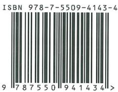
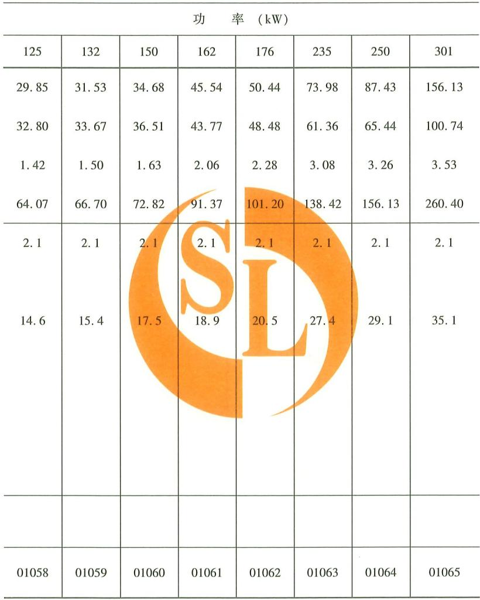
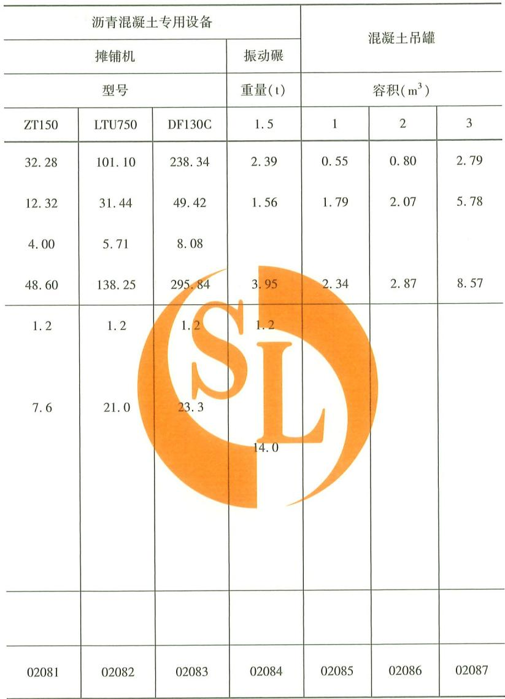
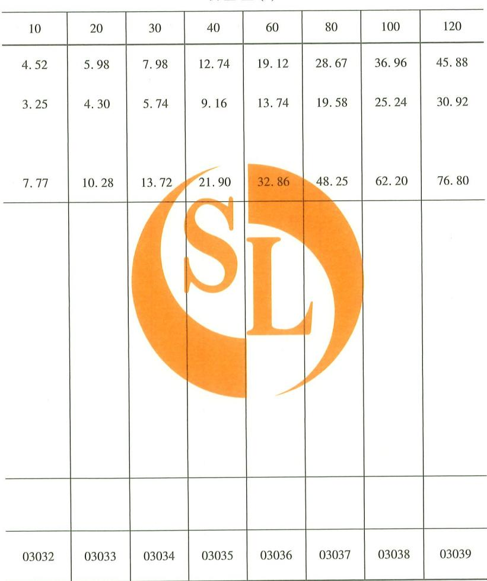
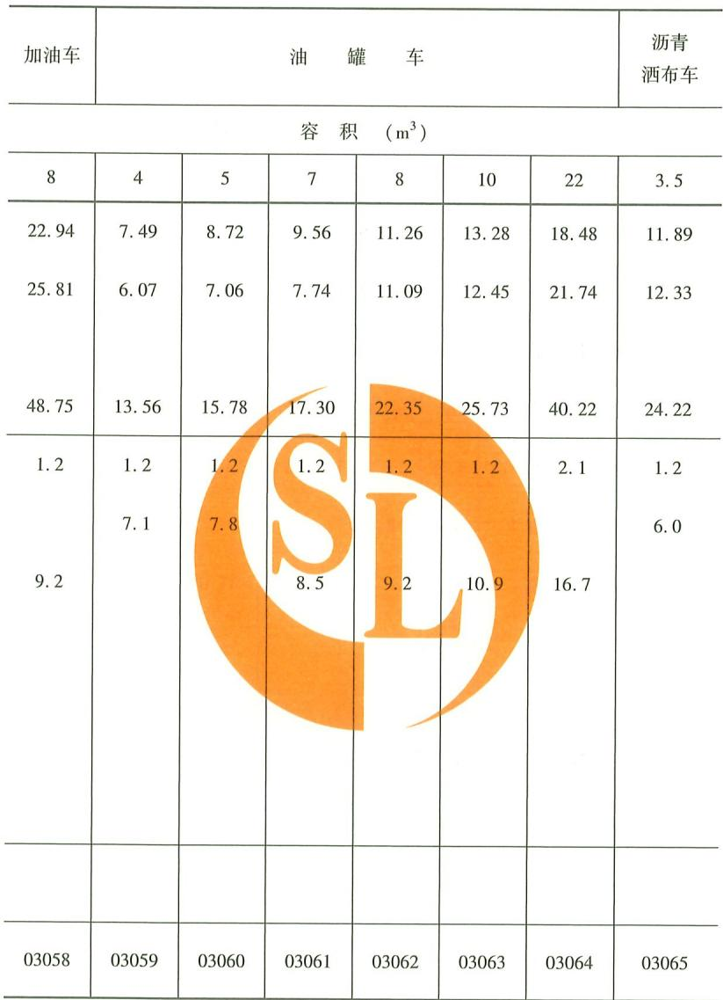
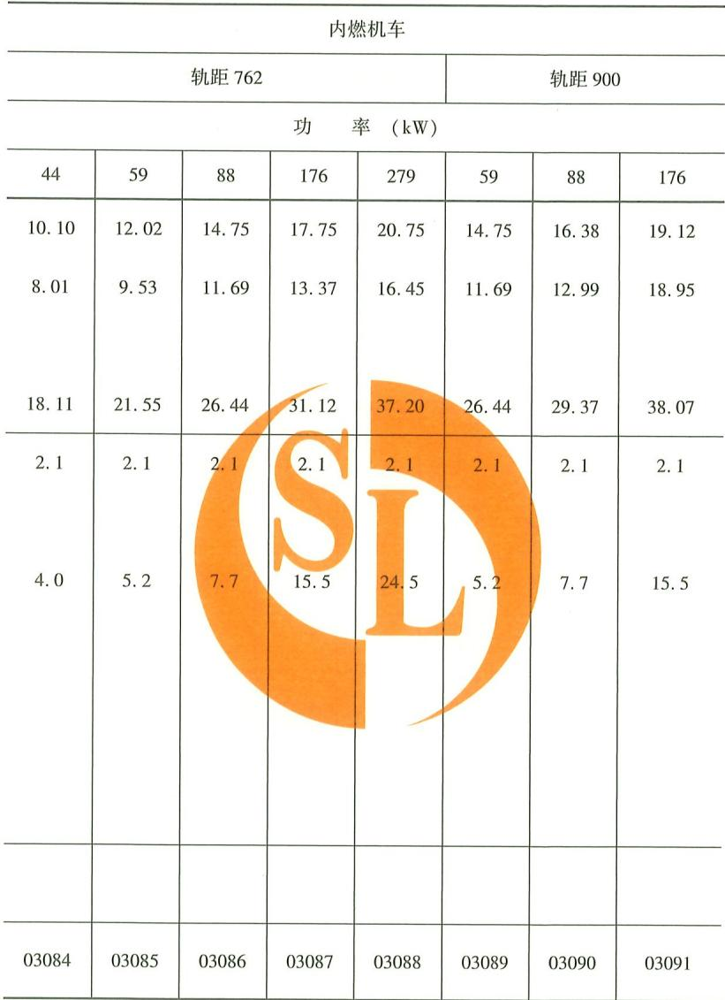
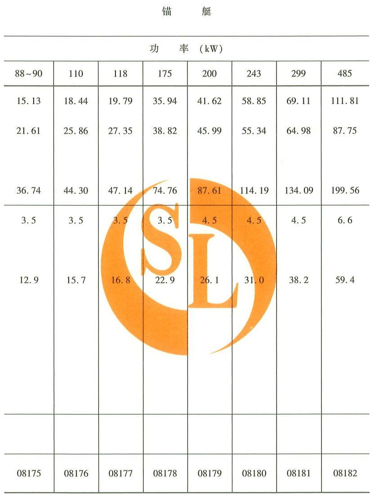

水利工程施工机械台时费定额

水利部水利建设经济定额站主编

# 水利工程施工机械台时费定额

水利建筑工程预算定额  
水利建筑工程概算定额  
水利设备安装工程预算定额  
水利设备安装工程概算定额  
水土保持工程概算定额  
水利工程施工机械台时费定额

责任编辑 吕洪予封面设计 李思璇责任校对 兰文峡责任监制 常红昕定价：110.00元

中华人民共和国水利部

# 水利工程施工机械台时费定额

水利部水利建设经济定额站 主编

黄河水利出版社

## 图书在版编目(CIP)数据

水利工程施工机械台时费定额/水利部水利建设经济定额站主编.--郑州：黄河水利出版社，2025.3.ISBN 978-7-5509-4143-4

I. TV512

中国国家版本馆CIP数据核字第202574NV64号

出版发行:黄河水利出版社

地址：河南省郑州市顺河路49号 邮政编码：450003

网址:www. yrcp. com E-mail: hhslcbs@ 126. com

印数：1—10000

印次：2025年3月第1次印刷

# 水利 部 文 件

# 水总[2024]323号

# 水利部关于发布《水利工程设计概(估)算编制规定》及水利工程系列定额的通知

部直属各单位，各省、自治区、直辖市水利(水务)厅(局)，各计划单列市水利(水务)局，新疆生产建设兵团水利局：

为进一步加强水利工程造价管理，完善定额体系，合理确定和有效控制工程投资，提高投资效益，支撑水利高质量发展，水利部水利建设经济定额站组织编制完成《水利工程设计概(估)算编制规定》及水利工程系列定额，已经我部审查批准，经商国家发展改革委，现予以发布，自2025年4月1日起执行。

本次发布的《水利工程设计概(估)算编制规定》包括工程部分概(估)算编制规定、环境保护工程概(估)算编制规定，水土保持工程概(估)算编制规定：水利工程系列定额包括《水利建筑工程预算定额》《水利建筑工程概算定额》《水利设备安装工程预算定额》《水利设备安装工程概算定额》《水土保持工程概算定额》和《水利工程施工机械台时费定额》。

《中小型水利水电设备安装工程预算定额》《中小型水利水电设备安装工程概算定额》(水建〔1993]63号)、《水利水电设备安装工程预算定额》《水利水电设备安装工程概算定额》(水建管〔1999]523号)、《水利建筑工程预算定额》《水利建筑工程概算定额》《水利工程施工机械台时费定额》(水总〔2002]116号)、《开发建设项目水土保持工程概(估)算编制规定》《水土保持生态建设工程概(估）算编制规定》《水土保持工程概算定额》（水总〔2003]67号）、《水利工程概预算补充定额》（水总〔2005]389号）、《水利水电工程环境保护概估算编制规程》(SL359—2006)、《水利工程概预算补充定额(掘进机施工隧洞工程)》(水总〔2007]118号)、《水利工程设计概(估)算编制规定(工程部分)》(水总〔2014]429号)、《水利工程营业税改征增值税计价依据调整办法》(办水总〔2016]132号)、《水利部办公厅关于调整水利工程计价依据增值税计算标准的通知》(办财务函〔2019]448号)、《水利部办公厅关于调整水利工程计价依据安全生产措施费计算标准的通知》（办水总函〔2023]38号）同时废止。

本次发布的概(估)算编制规定和系列定额由水利部水利建设经济定额站负责解释。在执行过程中如有问题请及时函告水利部水利建设经济定额站。

附件：1.《水利工程设计概(估)算编制规定》(工程部分)

2.《水利工程设计概(估)算编制规定》(环境保护工程）

3.《水利工程设计概(估)算编制规定》(水土保持工程）

4.《水利建筑工程预算定额》

5.《水利建筑工程概算定额》

6.《水利设备安装工程预算定额》

7.《水利设备安装工程概算定额》

8.《水土保持工程概算定额》

9.《水利工程施工机械台时费定额》

中华人民共和国水利部

2024年12月9日

2024年12月11日印发

水利部办公厅

主编单位 水利部水利建设经济定额站

参编单位 长江勘测规划设计研究有限责任公司中水北方勘测设计研究有限责任公司

审查李明沈凤生刘伟平

温续余 朱党生 刘志明王治明

技术顾问宋崇丽 韩增芬 胡玉强

主 编 尚友明王朋基

副主编华夏

编 写 尚友明 华 夏 李胡纪 想鹏 尹志洋 李卓玉张义敏 强 王辰 子怡妍 田野

## 目 录

说明……………………1  
、土石方机械……4  
单挖掘机……4  
索式挖掘机……7  
多挖掘机……8  
挖掘装载机……9  
装载机……9  
多功能装载机……11  
推土机……………11  
拖拉机…………14  
铲运机………………………………………16  
削坡机………………………………………………………17  
自行式平地机……17  
轮胎碾…………………………………………………………………………17  
振动碾……………18  
斜坡振动碾…………………20  
羊脚碾……………20  
压路机……………………………………………………21  
刨毛机……………21  
蛙式夯实机……21  
风钻…………………………………………………………………21  
风镐(铲)…………………………………………………………22  
潜钻………………………………22  
液压履帯钻…………23  
电钻…………………23  
凿岩台车………24  
罐………………………………………………………………24  
液压平台车……24  
装岩机……25  
锚杆台车……………………………………………………………………………27  
锚杆钻机…………………………………………27  
水枪…………………………………………… 27  
缺口耙………………27  
単齿松土器……27  
…………………………27  
吊(桶)………………27  
二、混凝土机械……28  
混凝土搅拌机……28  
混凝土搅拌站……29  
混凝土搅拌楼……30  
强制式混凝土搅拌楼……32  
混凝土搅拌车……32  
混凝土输送泵……33  
混凝土车……34  
真空泵……35  
混凝土喷射机……35  
胎带机……36  
塔带机……………………36  
喷浆机……36  
振动器……………………………………36  
变频机组……………………………………37  
四联振捣器…………………37  
混凝土平仓振捣机……37  
混凝土平仓机……………37  
混凝土振动碾……38  
压力水冲洗机…………………………38  
高压冲毛机………………………………39  
边墙挤压成型机……39  
切缝机………………………39  
负压溜槽系统………………………………………39  
保温罐…………………………………………40  
沥青混凝土专用设备……40  
混凝土吊罐……41  
风水(砂)枪…………………………42  
水泥拆包机……42  
喂料小车……………………………42  
螺旋空气输送机……43  
水泥真空卸料机……43  
双仓泵…………43  
针梁模板台车……43  
钢模台车…………44  
滑模台车……45  
三、运输机械……48  
载重汽车……48  
自卸汽车……………………………………………………………………49  
公路底卸车……………………52  
平板挂车…………53  
汽车拖车头……54  
汽车挂车……………………………………………………………………………55  
洒水车……56  
加油车………………………………………………………57  
油罐车……………57  
沥青酒布车…………………………………57  
散装水泥车……58  
工程修理车………59  
高空作业车……59  
客货两用车………………………………………………………………59  
三轮卡车…………………59  
胶轮车…………………………………………………………………………59  
机动翻斗车……………59  
电瓶搬运车……59  
内燃机车……………60  
电瓶机车……64  
平车…………………………………………64  
敞车…………………………………………………………………65  
棚车……………………………………………………………………………66  
车…………………………………………………………………………67  
V型车………67  
自卸矿车……………………………………………67  
侧倾式矿车……67  
底开车………68  
散装水泥车……68  
油罐车……68  
守车………68  
轨道车…………………………………69  
移道车…………69  
矿用机车…………69  
梭式矿车………69  
螺旋输送机……69  
斗式提升机……72  
胶带输送机……73  
马、起重机械……80  
缆索起重机…………80  
简易缆索起重机……83  
摆塔式缆机……84  
门座式起重机……84  
塔式起重机…………85  
龙门式起重机……86  
简易龙门式起重机……87  
桥式起重机……87  
机电设备安装用桥式起重机……88  
履带起重机……92  
汽车起重机……94  
轮胎起重机……97  
内叉车…………99  
桅杆式起重机……99  
铁道起重机……100  
链式起重机…………100  
电动葫芦………101  
千斤顶……101  
张拉千顶……103  
卷扬机……………………103  
卷扬台车……107  
箕………………………………………………107  
绞车……………………………………107  
五、砂石料加工机械……110  
颚式破碎机………110  
旋回破碎机………………………111  
圆锥破碎机………………112  
锤式破碎机……………113  
反击式破碎机……114  
立式冲击破碎机………114  
球(棒)磨机……116  
悬辊式磨机………117  
砂石洗选机……117  
槽式洗矿机……118  
螺旋分级机……118  
圆振动筛……………119  
自定中心振动筛……121  
惯性振动筛……122  
重型振动筛……122  
共振筛……………………………123  
偏心半振动筛……124  
直线振动筛……124  
液压高频振动筛……125  
给料机………………125  
堆料机……………129  
斗轮堆取料机……129  
卸料小车……129  
六、钻孔灌浆机械……130  
地质钻机…………130  
冲击钻机…………………………………………………………130  
大口径工程钻……131  
反井钻机……………131  
冲击式反循环钻机……131  
液压铣槽机………………………………………………131  
液压锯槽机……132  
自行射水成槽机……132  
泥浆净化装置……132  
灌浆自动记录仪………133  
泥浆搅拌机……133  
灰浆搅拌机…………………133  
高速搅拌机………133  
泥浆泵……………………………………………………………133  
灌浆泵……………………………………………………………133  
灰浆泵………………………134  
高压水泵……134  
搅灌机……………………………134  
旋定摆提升装置……134  
高喷台车…………………………………………………134  
柴油打桩机…………135  
旋挖钻机……135  
振动桩机……136  
电动振冲器………136  
液压振冲器……137  
液压抓……138  
计量泵………139  
潜水砂石泵……139  
振动桩锤……139  
多轴钻孔机……139  
螺旋钻孔机………140  
强夯机………………………………140  
粉喷桩机………140  
工程钻机………140  
打锥机…………………141  
拔管机………………………………141  
单头搅拌桩机……141  
双头搅拌桩机……141  
多头搅拌桩机……141  
振动沉模设备……141  
柱塞水泵……141  
七、掘进机施工机械……142  
双护盾TBM…………………142  
敞开式TBM……143  
対旋式轴流通风机……145  
管片蒸汽养护及输送系统……146  
TBM 管片吊运安装系统……146  
步进小车……147  
内燃机车(掘进机施工专用)……147  
液压翻车机……148  
豆砾石运输车……149  
矿车(掘进机施工专用)……149  
混凝土管片运输车…………149  
轨轮式水泥(砂)浆运输车……150  
胶带输送机(掘进机施工专用)……151  
内燃叉车(掘进机施工专用)……155  
锚杆钻机(掘进机施工专用)……155  
混凝土喷射系统………156  
豆砾石喷射及灌浆系统……156  
钢筋网安装器………156  
钢拱架安装器…………………………………………………157  
龙门式起重机(掘进机施工专用）………157  
桥式起重机(掘进机施工专用)……158  
盾构管片吊运安装系统……158  
轨轮式混凝土搅拌运输车……159  
电瓶机车(掘进机施工专用)……159  
刀盘式土压平衡盾构掘进机……160  
刀盘式泥水平衡盾构掘进机……161  
复合式管片模具(环)……162  
盾构同步注浆系统…………163  
膨润土注入系统……164  
泡沫剂注入系统……164  
排泥…………………………………………………165  
八、工程船舶……………………………166  
绞吸式挖泥船……………166  
链斗式挖泥船……………171  
链斗式采砂船…………………………………………174  
铲式挖泥船…………………………………………………………175  
铲扬式挖泥船………………………………175  
抓斗式挖泥船………175  
水力冲挖机组……176  
吹泥船……177  
浮筒管………………………………………………………………179  
岸管……………………………………………183  
潜管………………………………………187  
排泥胶管…………188  
拖轮……189  
锚艇………………193  
机艇………………………………………………………194  
开底泥驳……195  
满底泥驳……197  
砂驳………………198  
石……198  
油轮……………199  
工程修理船……199  
输砂……199  
甲板………………………………………199  
油驳………………………………200  
钢质船……201  
木船……………………………………201  
潜水衣具……201  
九、动力机械……202  
工锅炉……202  
空气压缩机……203  
汽油发电机……205  
柴油发电机……206  
柴油发电机组……………………………………………………207  
十、其他机械…………………………………………………208  
离心水泵…………………………………………………………208  
汽油泵…………211  
潜水泵………211  
深井泵……212  
污水泵………212  
衬胶泵…………213  
灰渣泵…………213  
耐酸泵……………………213  
电磁试压泵……………………………………213  
试压泵……213  
高压油泵…214  
电动油泵………………………………………………214  
叶式通风机……………………………………………214  
离心通风机……………………………………………………215  
轴流通风机………………………………………………215  
开启式活塞制冷压缩机……217  
螺杆式压缩冷凝机组………………217  
螺杆式氨泵机组…………………………………217  
螺杆式制冷压缩机组……218  
螺杆式冷水机组……219  
立式冷凝器……220  
卧式冷凝器……………………221  
氨油分离器………………………221  
贮氨器………………………………………221  
氨液分离器………………………………………………………222  
蒙发器……222  
空分离器……223  
空气冷却器……223  
片机……223  
玻璃钢冷却塔………224  
贮冰称量装置……224  
库……224  
电焊机……………224  
点焊机……225  
多点焊机……226  
対焊机……226  
自动电焊机…………227  
半自动电焊机………227  
气割枪……227  
钢筋弯曲机………………227  
钢筋切断机…………228  
钢筋调直机……228  
型钢剪断机………………………228  
液压弯管机……229  
弯管机………229  
型材弯曲机……229  
钢模板调平机……229  
卷板机…………………229  
剪板机……231  
刨边机……………………231  
铆釘枪……………………231  
空气锤………231  
普通车床…………………………232  
单柱立式车床……………………232  
双柱立式车床………233  
落地车床……………………………………………………………233  
搖臂钻床…………233  
立式钻床…………………………………………………………234  
卧式镗床……………………………………………………………234  
落地镗床………………………………………………………………………235  
外圆磨床……………………………………………235  
内圆磨床……………………………………………………………235  
万能工具磨床…………………………………………235  
曲轴磨床………………………………………………235  
万能外圆磨床……………………………235  
珩磨机……235  
平面磨床…………………………………………………236  
铣齿机……236  
滚齿机……236  
插齿机…………………………………………………………………………236  
铣床…………………………………236  
牛头刨床……237  
插床……237  
弓锯床……………………………………………………………………237  
木工加工机械………237  
龙门刨床…………238  
电焊条烘干箱………239  
平面硫化机……239  
水磨石机………239  
小型带锯…………239  
氩弧焊机…………………239  
咬口机…………………239  
折方机……………240  
手持式坡口机……240  
台钻…………………240  
压力滤油机……240  
真空滤油机……240  
集油器…………………241  
吊顶冷风机……241  
x光探伤机……………………241  
超声波探伤仪……241  
制氧机…………………241  
吹风机……………………241  
联合冲剪机……242  
热熔焊接机………242  
扳功机………242  
土工膜热焊机……242  
土工布缝边机……242  
喷砂除锈机……243  
顶管设备……………………243  
顶管液压千斤顶………243  
滴灌帯铺设机……243  
十一、水土保持工程专用机械……244  
推土机……………244  
拖拉机………………244  
压路机………245  
液压喷播植草机……245  
自卸汽车…………………245  
卷扬机……………………………245  
颚式破碎机………………245  
灰浆输送泵…………246  
木船246  
木驳船……………………………………………………246  
离心水泵……246  
单级离心清水泵……247  
离心泵………………………247  
通风机……………………………………………247  
挖坑机……………………………………………247  
索道机………………247  
灰土拌和机…………247  
U 型槽成型机…………248  
开沟机……248  
喷药车………248

## 说 明

一、《水利工程施工机械台时费定额》(简称本定额)包括土石方机械、混凝土机械、运输机械、起重机械、砂石料加工机械、钻孔灌浆机械、掘进机施工机械、工程船舶、动力机械、其他机械及水土保持工程专用机械，共十一类1572个子目。

二、本定额与一并发布的《水利建筑工程概算定额》《水利设备安装工程概算定额》《水土保持工程概算定额》配套使用，是编制和审批水利工程投资估算、设计概算的依据。

三、本定额由折旧费、修理及替换设备费、安装拆卸费，以及施工机械机上操作人员和施工机械正常运转所需动力燃料或消耗材料的消耗量组成。其中，折旧费、修理及替换设备费、安装拆卸费按2023年价格水平编制，以“元”为计量单位，用金额表示。

1.折旧费：指施工机械在规定使用期限内陆续回收其原值的台时折旧摊销费用。

2.修理及替换设备费：指施工机械在规定使用期限内，为使其保持正常功能和正常运转而进行修理、日常保养、替换设备，以及使用随机配备工具附具和保管施工机械等的台时摊销费用。

3.安装拆卸费：指施工机械在施工现场进行安装、拆卸、试运转、场内转移和施工机械辅助设施的台时摊销费用。本定额备注栏内注有符号“”的大型施工机械，表示该项定额未计列安装拆卸费，其费用包含在配套使用的编制规定的“其他施工临时工程”中：注有符号“▲”的大型施工机械，表示该项定额未计列安装拆卸费，其本体及后配套设备的安装拆卸费按一并发布的《水利建筑工程概算定额》中相关定额子目和配套使用的编制规定的有关规定计算。

4.人工.指施工机械机上操作人员的人工消耗量，按水利工程“中级工”编制，以“工时”为计量单位。

5.动力燃料或消耗材料：指施工机械正常运转所需汽油、柴油、电、风、水、煤的消耗量，以法定计量单位计量。其中，电的消耗量包括施工机械本身用电和最后一级降压变压器低压侧至施工用电点之间的线路损耗，风、水的消耗量包括施工机械本身用风、用水和移动支管的线路损耗。

四、本定额中的单斗挖掘机台时费定额适用于正铲和反铲。

五、本定额中的搅拌楼台时费定额按搅拌楼本体拟定，不包括本体以外的进料设备；塔带机台时费定额不包括主塔之外的皮带输送系统。

六、本定额中的双护盾TBM台时费定额不包括TBM管片吊运安装系统、豆砾石喷射及灌浆系统：敞开式TBM台时费定额不包括锚杆钻机、混凝土喷射系统、钢筋网安装器、钢拱架安装器；盾构掘进机台时费定额不包括盾构管片吊运安装系统、盾构同步注浆系统、膨润土注入系统、泡沫剂注入系统。

七、胶带输送机(掘进机施工专用）台时费定额中，电的消耗量按输送仰角小于或等于6°拟定。仰角每增加3°，耗电量乘以1.15系数。

八、本定额中带长0.5km的胶带输送机(掘进机施工专用)仅适用于输送距离小于或等于0.5km的主支洞转渣。

九、本定额定额子目编号按下列方式排列：

土石方机械01001\~01157

混凝土机械02001\~02123

运输机械03001\~03209

起重机械04001\~04187

砂石料加工机械05001\~05126 钻孔灌浆机械06001\~06078

掘进机施工机械07001\~07157 工程船舶08001\~08237

动力机械09001\~09040

其他机械10001\~10228

水土保持工程专用机械11001\~11030

十、水利工程施工机械台时费由一类费用和二类费用组成：

一类费用包括折旧费、修理及替换设备费、安装拆卸费。除另有规定外，一类费用按本定额计算。

二类费用包括施工机械机上操作人员人工费、施工机械正常运转所需动力燃料或消耗材料费。二类费用按本定额中的消耗量乘以相应单价计算，相应单价的计算方法执行配套使用的编制规定的相关规定。

## 一、土石方机械

<table><tr><td colspan="2" rowspan="2">项</td><td rowspan="4">目</td><td rowspan="4">单位</td><td colspan="6">单斗挖掘机</td></tr><tr><td colspan="3">油动</td><td colspan="3">电动</td></tr><tr><td colspan="2"></td><td colspan="5">斗容(m³)</td></tr><tr><td colspan="2">折旧费</td><td>元</td><td>0.5 21.28</td><td>1</td><td>2</td><td>3</td><td>4</td></tr><tr><td rowspan="3">(一)</td><td colspan="2" rowspan="3"></td><td></td><td>20.55</td><td>28.37 30.29</td><td>54.38</td><td>89.85</td><td>189.16</td></tr><tr><td>修理及替换设备费</td><td>元</td><td></td><td>53.19</td><td>68.35</td><td>85.32</td></tr><tr><td>安装拆卸费 小 计</td><td>元 元</td><td>41.83</td><td></td><td>4.71 162.91</td><td>7.18 281.66</td></tr><tr><td rowspan="6">(二)</td><td colspan="2">人 工</td><td>工时</td><td>2. 4</td><td>58.66 2.4 12.8</td><td rowspan="6">107.57 2.4 100.6</td><td rowspan="6">2.4 128.1</td><td rowspan="6">2.4</td></tr><tr><td colspan="2">汽 油</td><td>kg</td><td></td></tr><tr><td colspan="2">柴 油 电</td><td>kg kW·h</td><td>9.6</td></tr><tr><td colspan="2">风</td><td>m³</td><td></td></tr><tr><td colspan="2">水</td><td>m³ kg</td><td></td></tr><tr><td colspan="2">煤 备 注</td><td></td><td></td></tr><tr><td colspan="3">编 号</td><td></td><td>01001</td><td>01002</td><td>01003</td><td>01004 01005</td></tr><tr><td colspan="10" rowspan="1">单斗挖掘机</td></tr><tr><td colspan="2" rowspan="1">电动</td><td colspan="8" rowspan="1">液压</td></tr><tr><td colspan="10" rowspan="1">斗容(m³)</td></tr><tr><td colspan="1" rowspan="1">10</td><td colspan="1" rowspan="1">12</td><td colspan="1" rowspan="1">0.2</td><td colspan="1" rowspan="1">0.4</td><td colspan="1" rowspan="1">0.6</td><td colspan="1" rowspan="1">1</td><td colspan="1" rowspan="1">1.6</td><td colspan="3" rowspan="1">2</td></tr><tr><td colspan="1" rowspan="1">546.46196.92743.38</td><td colspan="1" rowspan="1">903.76325.661229.42</td><td colspan="1" rowspan="1">14.4710.5024.97</td><td colspan="1" rowspan="1">23.4116.4539.86</td><td colspan="1" rowspan="1">28.9419.6748.61</td><td colspan="1" rowspan="1">35.3322.3857.71</td><td colspan="1" rowspan="1">57.4632.4389.89</td><td colspan="3" rowspan="1">69.8036.18105.98</td></tr><tr><td colspan="1" rowspan="1">2.6222.4</td><td colspan="1" rowspan="1">2.6311.3</td><td colspan="1" rowspan="1">.23.7</td><td colspan="1" rowspan="1">1.26.0</td><td colspan="1" rowspan="1">2.47.5</td><td colspan="1" rowspan="1">2.411.4</td><td colspan="1" rowspan="1">2.415.7</td><td colspan="3" rowspan="1">2.417.0</td></tr><tr><td colspan="1" rowspan="1">※</td><td colspan="1" rowspan="1">※</td><td colspan="1" rowspan="1"></td><td colspan="1" rowspan="1"></td><td colspan="1" rowspan="1"></td><td colspan="1" rowspan="1"></td><td colspan="1" rowspan="1"></td><td colspan="3" rowspan="1"></td></tr><tr><td colspan="1" rowspan="1">01006</td><td colspan="1" rowspan="1">01007</td><td colspan="1" rowspan="1">01008</td><td colspan="1" rowspan="1">01009</td><td colspan="1" rowspan="1">01010</td><td colspan="1" rowspan="1">01011</td><td colspan="1" rowspan="1">01012</td><td colspan="3" rowspan="1">01013</td></tr></table>

<table><tr><td colspan="4" rowspan="3">项 目</td><td rowspan="3">单位</td><td colspan="5">单斗挖掘机</td></tr><tr><td colspan="5">液压</td></tr><tr><td>斗</td><td colspan="4">容（m³）</td></tr><tr><td rowspan="3">(一)</td><td colspan="2" rowspan="3">折旧费 修理及替换设备费</td><td>元</td><td>2.5</td><td>3 117.28</td><td>4 170.24</td><td>5 198.62</td><td>6 213.64</td></tr><tr><td>元</td><td>90.80 45.89</td><td>57.75</td><td>79.42</td><td>87.51</td><td>93.02</td></tr><tr><td colspan="2" rowspan="2">安装拆卸费 计</td><td rowspan="2">3.15</td><td>3.31</td><td>3.48</td><td>4.06</td><td>4.35</td></tr><tr><td>元 元</td><td>139.84</td><td>178.34</td><td>253.14</td><td>290.19 311.01</td></tr><tr><td rowspan="6">(二)</td><td>人 汽 柴</td><td>工 油 油</td><td>工时 kg kg</td><td>2.4 18.0</td><td>2.4</td><td>2.4</td><td>2.4</td><td>2.4</td></tr><tr><td colspan="2">电 风</td><td>kW·h</td><td></td><td>21.4</td><td>30.2</td><td>35.5</td><td>40.8</td></tr><tr><td colspan="2">水</td><td>m³ m³</td><td></td><td></td><td></td><td></td><td></td></tr><tr><td colspan="3">煤</td><td>kg</td><td></td><td></td><td></td><td></td></tr><tr><td colspan="3">备 注</td><td></td><td></td><td></td><td></td><td></td></tr><tr><td colspan="3">编 号</td><td>01014</td><td>01015</td><td>01016</td><td>01017</td><td>01018</td></tr><tr><td colspan="7">单斗挖掘机</td><td colspan="3">索式挖掘机</td></tr><tr><td colspan="7">液压</td><td colspan="3">油动</td></tr><tr><td colspan="10">容（m³）</td></tr><tr><td>10</td><td>12</td><td>0.65</td><td>斗 0.5</td><td>0.9</td><td>0.5</td><td>1</td><td></td><td colspan="2">2</td></tr><tr><td>605.31</td><td>783.34</td><td>44.69</td><td>32.62</td><td>38.43</td><td></td><td>42.90</td><td>27.74</td><td colspan="2">37.83</td></tr><tr><td>188.26</td><td>243.63</td><td>28.31</td><td>24.17</td><td>25.10</td><td></td><td>28.02</td><td>30.20</td><td colspan="2">41.18</td></tr><tr><td></td><td></td><td>3.10</td><td>2.26</td><td>2.66</td><td></td><td>2.97</td><td>2.82</td><td colspan="2">3.85</td></tr><tr><td>793.57 2.6</td><td>1026.97 2.6</td><td>76.10 2.4</td><td>59.05 2.4</td><td>66.19 2.4</td><td></td><td>73.89 2.4</td><td>60.76 2.4</td><td colspan="2">82.86 2.4</td></tr><tr><td>58.1</td><td>72.6</td><td>13.7</td><td>9.2</td><td>11.8</td><td>11.8</td><td></td><td>14.6</td><td colspan="2">19.4</td></tr><tr><td>※</td><td>※</td><td>长臂型</td><td colspan="2">湿地型</td><td>湿地 长臂型</td><td></td><td></td><td colspan="2"></td></tr><tr><td>01019</td><td>01020</td><td>01021</td><td colspan="2">01022</td><td>01023 01024</td><td>01025</td><td></td><td colspan="2">01026</td></tr><tr><td colspan="2" rowspan="2">项</td><td rowspan="4">目</td><td rowspan="4">单位</td><td colspan="2">索式挖掘机</td><td colspan="4">多斗挖掘机</td></tr><tr><td rowspan="2">油动</td><td colspan="3">链斗式</td><td colspan="2" rowspan="2">轮斗式 型号</td></tr><tr><td>斗 容（m³）</td><td colspan="4"></td></tr><tr><td rowspan="3">(一)</td><td colspan="2" rowspan="3">折旧费 修理及替换设备费</td><td>元</td><td>3</td><td>4</td><td>0.045</td><td colspan="2">0.08 DW-200</td></tr><tr><td></td><td>60.53 59.61</td><td>151.33 94.13</td><td>11.11</td><td colspan="3">14.19 56.75 61.20</td></tr><tr><td>安装拆卸费</td><td>元 元</td><td></td><td>14.23 1.77</td><td colspan="3">16.41 1.99</td></tr><tr><td rowspan="3"></td><td rowspan="3">小</td><td>计</td><td></td><td>120.14</td><td>245.46</td><td>27.11</td><td colspan="3">32.59 117.95</td></tr><tr><td>人 工</td><td>工时</td><td>4</td><td rowspan="2">2.4 40.4</td><td rowspan="2">2.1 2.1</td><td colspan="3" rowspan="2">4.7</td></tr><tr><td>汽 油 柴 油</td><td>kg kg</td><td colspan="3">32.3</td></tr><tr><td colspan="4">(二)</td><td></td><td></td><td>8.4 15.4</td><td colspan="3">106.2</td></tr><tr><td colspan="3">水</td><td>m³ m³</td><td></td><td></td><td></td><td colspan="3"></td></tr><tr><td colspan="3">煤</td><td>kg</td><td></td><td></td><td></td><td colspan="3"></td></tr><tr><td colspan="3">备 注</td><td></td><td>※</td><td>※</td><td></td><td colspan="3">※</td></tr><tr><td colspan="3">编 号</td><td></td><td>01027</td><td>01028 01029</td><td>01030</td><td colspan="3">01031</td></tr><tr><td colspan="3">挖掘装载机</td><td colspan="7">装载机</td></tr><tr><td colspan="3">斗容  $( \mathrm { m } ^ { 3 } )$ </td><td colspan="7">轮胎式</td></tr><tr><td rowspan="2">挖0.1 装0.42</td><td rowspan="2">挖0.2 装0.5</td><td rowspan="2">挖0.3 装0.9</td><td colspan="7">斗容(m³)</td></tr><tr><td>1</td><td>1.5</td><td>1.7</td><td>2</td><td colspan="3">2.5</td></tr><tr><td>11.82</td><td>14.19</td><td>19.86</td><td>9.05</td><td>11.64</td><td>14.87</td><td>18.11</td><td colspan="3">23.86</td></tr><tr><td>9.89 0.98</td><td>11.88 1.18</td><td>16.62 1.65</td><td>6.09</td><td>7.84</td><td>10.79</td><td>14.13</td><td colspan="3">18.55</td></tr><tr><td>22.69</td><td>27.25</td><td>38.13</td><td>15.14</td><td>19.48</td><td>25.66</td><td>32.24</td><td colspan="3">42.41</td></tr><tr><td>1.2</td><td>1.2 7.9</td><td>.2 9.9</td><td>1.2 9.5</td><td>1.2 9.9</td><td>1.2 11.</td><td>1.2 13.6</td><td colspan="3">1.2 15.6</td></tr><tr><td></td><td></td><td></td><td></td><td></td><td></td><td></td><td colspan="3"></td></tr><tr><td></td><td></td><td></td><td></td><td></td><td></td><td></td><td colspan="3"></td></tr><tr><td>01032</td><td>01033</td><td>01034</td><td>01035</td><td>01036</td><td>01037</td><td>01038</td><td colspan="3">01039</td></tr></table>

<table><tr><td colspan="2" rowspan="2">项</td><td rowspan="4">目</td><td rowspan="4">单位</td><td colspan="6">装载机</td></tr><tr><td colspan="6">轮胎式</td></tr><tr><td colspan="2"></td><td colspan="2"></td><td colspan="4">斗 容（m³）</td></tr><tr><td colspan="2">折旧费</td><td colspan="2">元</td><td colspan="2">3 3.5 29.10</td><td>4.5 51.74</td><td>5 58.20</td><td>7 168.14</td></tr><tr><td rowspan="2">(一)</td><td colspan="2">修理及替换设备费</td><td rowspan="2">元 元</td><td rowspan="2">22.63</td><td rowspan="2">35.57 25.81</td><td rowspan="2"></td><td rowspan="2">32.18</td><td rowspan="2">33.18</td><td rowspan="2">75.30</td></tr><tr><td colspan="2">安装拆卸费</td></tr><tr><td rowspan="5">(二)</td><td colspan="2">小 人</td><td>计 工</td><td>元 工时</td><td>51.73 1.2</td><td>61.38 1.2</td><td>83.92 2.1</td><td>91.38 2.1</td><td>243.44 2.1</td></tr><tr><td colspan="2">汽 柴</td><td>油</td><td>kg kg</td><td>16.5</td><td>16.9</td><td>21.8</td><td>24.3</td><td>26.4</td></tr><tr><td colspan="2">电</td><td>油</td><td>kW·h</td><td></td><td></td><td></td><td></td><td></td></tr><tr><td colspan="2">风 水</td><td>m³ m³</td><td></td><td></td><td></td><td></td><td></td><td></td></tr><tr><td colspan="2">煤</td><td></td><td>kg</td><td></td><td></td><td></td><td></td><td></td></tr><tr><td colspan="3">备 注</td><td></td><td></td><td></td><td></td><td></td><td></td><td></td></tr><tr><td colspan="4">编 号</td><td></td><td>01040</td><td>01041</td><td>01042</td><td>01043</td><td></td><td>01044</td></tr></table>

续表
<table><tr><td colspan="7">装载机</td><td rowspan="2">多功能 装载机</td><td rowspan="2">推土机</td></tr><tr><td colspan="2">轮胎式</td><td colspan="4">履带式</td><td>侧卸式</td></tr><tr><td></td><td></td><td>斗容</td><td> $\left( \mathrm { m } ^ { 3 } \right)$ </td><td></td><td></td><td>生产率 (m³/h)</td><td>功率(kW)</td></tr><tr><td>9.6 258.68</td><td>10.7 291.01</td><td>0.8 40.48</td><td>3.2 68.50</td><td>3 42.04</td><td>4 61.76</td><td>250 169.76</td><td>55 8.41</td></tr><tr><td>93.86</td><td>105.59</td><td>26.07</td><td>37.76</td><td>26.27</td><td>38.60</td><td>96.79</td><td>11.33 0.43</td></tr><tr><td>352.54 2.1</td><td>396.60 2.1</td><td>66.55 1.2</td><td>106.26 2.1</td><td>68.31 2.1</td><td>100.36 2.1</td><td>266.55 2.1</td><td>20.17 2.1</td></tr><tr><td>41.3</td><td>44.9</td><td>12.1 </td><td>18.6</td><td>24.7</td><td>36.3</td><td>13.3</td><td>6.4</td></tr><tr><td></td><td></td><td></td><td></td><td></td><td></td><td></td><td></td></tr><tr><td>01045</td><td>01046</td><td>01047</td><td>01048</td><td>01049</td><td>01050</td><td>01051</td><td>01052</td></tr></table>

<table><tr><td colspan="3" rowspan="3">项 目</td><td rowspan="3">单位</td><td rowspan="3"></td><td colspan="4">推土机</td></tr><tr><td rowspan="2"></td><td colspan="4">功 率(kW)</td></tr><tr><td>59</td><td>74</td><td>88</td><td>96</td></tr><tr><td rowspan="3">(一)</td><td colspan="2" rowspan="3">折旧费</td><td>元</td><td>9.17</td><td>16.81</td><td>25.35</td><td>27.51</td><td>28.89</td></tr><tr><td>修理及替换设备费</td><td>元</td><td>12.36</td><td>20.92</td><td>28.59 30.63</td><td>31.75</td></tr><tr><td>安装拆卸费</td><td>元</td><td>0.47</td><td>0.86</td><td>1.20 1.31</td><td>1.37</td></tr><tr><td rowspan="3"></td><td colspan="2" rowspan="3">小 计 人</td><td>元</td><td>22.00</td><td>38.59</td><td>55.14</td><td>59.45</td><td>62.01</td></tr><tr><td>工 油</td><td>工时</td><td>1 2.1 8.6</td><td rowspan="2">2.1 10.2</td><td rowspan="2">2.1</td><td rowspan="2">2.1</td></tr><tr><td>汽 柴 油</td><td>kg kg</td><td>6.9</td></tr><tr><td colspan="4">(二)</td><td>kW·h m³</td><td></td><td></td><td></td><td></td></tr><tr><td colspan="4">水</td><td></td><td></td><td></td><td></td><td></td></tr><tr><td colspan="4">煤</td><td></td><td></td><td></td><td></td><td></td></tr><tr><td colspan="4">备 注</td><td></td><td></td><td></td><td></td><td></td></tr><tr><td colspan="3">编 号</td><td></td><td>01053</td><td>01054</td><td>01055</td><td>01056</td><td>01057</td></tr></table>

推土机  

<table><tr><td rowspan="3" colspan="3">项 目</td><td rowspan="3">单位</td><td rowspan="2" colspan="2">推土机</td><td rowspan="2"></td><td colspan="2">拖拉机</td></tr><tr><td>手扶式</td><td>轮胎式</td></tr><tr><td>343</td><td>功 522</td><td>575</td><td>率(kW)</td><td>11</td><td>20</td></tr><tr><td rowspan="3">(一)</td><td colspan="2">折旧费</td><td>元</td><td>180.15</td><td>249.31</td><td>308.26</td><td>0.74</td><td>1.82</td></tr><tr><td colspan="2">修理及替换设备费</td><td>元</td><td>108.13</td><td>134.40</td><td>187.01</td><td>1.41</td><td>1.58</td></tr><tr><td colspan="2">安装拆卸费</td><td>元</td><td>3.91</td><td>4.23</td><td>4.84</td><td>0.08</td><td>0.08</td></tr><tr><td rowspan="3"></td><td colspan="2">小 计 人 工</td><td>元 工时</td><td>292.19 2.1</td><td>387.94 2.1</td><td>500.11 2.1</td><td>2.23 1.0</td><td>3.48 1.2</td></tr><tr><td colspan="2">汽 油 柴 油</td><td>kg kg</td><td>39.9</td><td>60.8</td><td>67.0</td><td>1.5</td><td>2.5</td></tr><tr><td colspan="2">电 风</td><td>kW·h m³</td><td></td><td></td><td></td><td></td><td></td></tr><tr><td colspan="3">水</td><td>m³</td><td></td><td></td><td></td><td></td><td></td></tr><tr><td colspan="3">煤</td><td>kg</td><td></td><td></td><td></td><td></td><td></td></tr><tr><td colspan="3">备 注</td><td></td><td></td><td></td><td></td><td></td><td></td></tr><tr><td colspan="3">编 号</td><td></td><td>01066</td><td>01067</td><td>01068</td><td>01069</td><td>01070</td></tr></table>

续表
<table><tr><td colspan="8">拖拉机</td></tr><tr><td colspan="2">轮胎式</td><td colspan="6">履带式</td></tr><tr><td colspan="7">功 率(kW)</td></tr><tr><td>26</td><td>37</td><td>55</td><td>59</td><td>74</td><td>88</td><td>118</td><td>132</td></tr><tr><td>2.06</td><td>3.19</td><td>7.87</td><td>9.08</td><td>14.89</td><td>16.95</td><td>19.21</td><td>20.95</td></tr><tr><td>1.79</td><td>2.78</td><td>6.85</td><td>7.91</td><td>12.74</td><td>13.77</td><td>15.19</td><td>16.57</td></tr><tr><td>0.11</td><td>0.20</td><td>0.51</td><td>0.67</td><td>0.95</td><td>1.03</td><td>1.18</td><td>1.29</td></tr><tr><td>3.96</td><td>6.17</td><td>15.23</td><td>17.66</td><td>28.58</td><td>31.75</td><td>35.58</td><td>38.81</td></tr><tr><td>1.2 3.1</td><td>1.2 4.4</td><td>2.1 6.6</td><td>2.1 7.1</td><td>2.1 8.9</td><td>2.1 10.6</td><td>2.1 14.2</td><td>2.1 15.9</td></tr><tr><td></td><td></td><td></td><td></td><td></td><td></td><td></td><td></td></tr><tr><td>01071</td><td>01072</td><td>01073</td><td>01074</td><td>01075</td><td>01076</td><td>01077</td><td>01078</td></tr></table>

<table><tr><td colspan="2" rowspan="2">项</td><td rowspan="4">目</td><td rowspan="4">单位</td><td colspan="5">铲运机</td></tr><tr><td colspan="3">拖式</td><td colspan="2">自行式</td></tr><tr><td colspan="2"></td><td colspan="4">斗 容（m³）</td></tr><tr><td colspan="2">折旧费</td><td></td><td>2.75</td><td>6~8</td><td>9~11</td><td>6~8 9~12</td></tr><tr><td rowspan="3">(一)</td><td colspan="2"></td><td>元</td><td>4.41 4.12</td><td>6.94</td><td>11.98</td><td>26.48 33.29</td></tr><tr><td colspan="2">修理及替换设备费</td><td>元</td><td>6.19</td><td>10.38</td><td>28.82</td><td>36.24</td></tr><tr><td colspan="2">安装拆卸费</td><td>元</td><td>0.65</td><td>0.88 1.44</td><td></td><td></td></tr><tr><td colspan="2"></td><td>计 工</td><td>9.18 工时</td><td>14.01</td><td>23.80</td><td>55.30 2.1</td><td>69.53 2.1</td></tr><tr><td rowspan="7">(二)</td><td colspan="2">汽 油</td><td>kg</td><td></td><td rowspan="2"></td><td rowspan="6"></td><td rowspan="6">9.8</td><td rowspan="6">14.1</td></tr><tr><td colspan="2">柴 油 电</td><td>kg</td></tr><tr><td colspan="2">风</td><td>kW·h</td></tr><tr><td colspan="2"></td><td>m³</td><td rowspan="2"></td><td rowspan="2"></td><td rowspan="2"></td></tr><tr><td>水</td><td>m³ kg</td><td></td></tr><tr><td colspan="2">煤 备 注</td><td></td><td></td><td></td></tr><tr><td colspan="3">编 号</td><td>01079</td><td>01080</td><td>01081</td><td>01082</td><td>01083</td></tr><tr><td>削坡机</td><td colspan="5">自行式平地机</td><td colspan="4">轮胎碾</td></tr><tr><td colspan="6"></td><td colspan="4">自行式 重量(t)</td></tr><tr><td>50</td><td>功 44</td><td>66</td><td>率(kW) 118</td><td>135</td><td>162</td><td>10~20</td><td></td><td colspan="2">12~26</td></tr><tr><td>37.83</td><td>7.57</td><td>22.70</td><td>28.89</td><td>33.02</td><td>38.52</td><td>23.71</td><td>26.23</td><td colspan="2"></td></tr><tr><td>15.69</td><td>10.25</td><td>26.26</td><td>28.45</td><td>29.25</td><td>34.13</td><td>28.68</td><td></td><td colspan="2">31.73</td></tr><tr><td>2.56 56.08</td><td>17.82</td><td>48.96</td><td>57.34</td><td>62.27</td><td>72.65</td><td>52.39</td><td></td><td colspan="2">57.96</td></tr><tr><td>2.4</td><td>2.1</td><td></td><td>2.1</td><td>2.1</td><td>2.1</td><td>2.1</td><td></td><td colspan="2">2.1</td></tr><tr><td>7.3</td><td>7.6</td><td>11.4</td><td>16.3</td><td>18.7</td><td>22.4</td><td>10.1</td><td></td><td colspan="2">12.7</td></tr><tr><td></td><td></td><td></td><td></td><td></td><td></td><td></td><td></td><td colspan="2"></td></tr><tr><td>01084</td><td>01085</td><td>01086</td><td>01087</td><td>01088</td><td>01089</td><td>01090</td><td>01091</td><td colspan="2"></td></tr></table>

<table><tr><td colspan="2" rowspan="2">项</td><td rowspan="4">目</td><td rowspan="4">单位</td><td colspan="6">轮胎碾 振动碾 自行式</td></tr><tr><td colspan="6"></td></tr><tr><td colspan="2"></td><td colspan="5">重量（t)</td></tr><tr><td colspan="2">折旧费</td><td>元</td><td>16~30 28.25</td><td>12 31.44</td><td>14 36.55</td><td>18 46.06</td><td>20 48.03</td></tr><tr><td rowspan="2">(一)</td><td colspan="2">修理及替换设备费 安装拆卸费</td><td>元 元</td><td>34.17</td><td>39.11</td><td>45.47</td><td>57.30</td><td>59.75</td></tr><tr><td colspan="2">小 计</td><td>元</td><td>62.42</td><td>70.55</td><td>82.02</td><td>103.36</td><td>107.78</td></tr><tr><td rowspan="6">(二)</td><td>人 汽</td><td>工 油</td><td>工时 kg</td><td>2.1</td><td>2.1</td><td>2.1</td><td>2.1</td><td>2.1</td></tr><tr><td colspan="2">柴 油 电</td><td>kg kW·h</td><td>14.5</td><td>10.2</td><td>12.1</td><td>16.3</td><td>17.0</td></tr><tr><td colspan="3">风</td><td>m³</td><td></td><td></td><td></td><td></td></tr><tr><td colspan="2">水</td><td>m³</td><td></td><td></td><td></td><td></td><td></td></tr><tr><td colspan="2">煤</td><td>kg</td><td></td><td></td><td></td><td></td><td></td></tr><tr><td colspan="3">备 注</td><td></td><td></td><td></td><td></td><td></td><td></td></tr><tr><td colspan="3">编 号</td><td></td><td>01092</td><td>01093</td><td>01094</td><td>01095</td><td></td><td>01096</td></tr></table>

<table><tr><td rowspan=1 colspan=8>振动碾</td></tr><tr><td rowspan=1 colspan=1>自行式</td><td rowspan=1 colspan=4>拖    式</td><td rowspan=1 colspan=3>凸块自行式</td></tr><tr><td rowspan=1 colspan=8>重    量(t)</td></tr><tr><td rowspan=1 colspan=1>26</td><td rowspan=1 colspan=1>13~14</td><td rowspan=1 colspan=1>16</td><td rowspan=1 colspan=1>20</td><td rowspan=1 colspan=1>22</td><td rowspan=1 colspan=1>12</td><td rowspan=1 colspan=1>14</td><td rowspan=1 colspan=1>18</td></tr><tr><td rowspan=1 colspan=1>57.9072.03129.93</td><td rowspan=1 colspan=1>12.945.5318.47</td><td rowspan=1 colspan=1>13.625.7519.37</td><td rowspan=1 colspan=1>17.547.4124.95</td><td rowspan=1 colspan=1>19.128.0827.20</td><td rowspan=1 colspan=1>33.4141.5674.97</td><td rowspan=1 colspan=1>38.5347.9386.46</td><td rowspan=1 colspan=1>48.0359.75107.78</td></tr><tr><td rowspan=1 colspan=1>2.119.2</td><td rowspan=1 colspan=1>8.6</td><td rowspan=1 colspan=1>11.6</td><td rowspan=1 colspan=1>12.1</td><td rowspan=1 colspan=1>S712.7</td><td rowspan=1 colspan=1>2.410.2</td><td rowspan=1 colspan=1>2.412.1</td><td rowspan=1 colspan=1>2.416.3</td></tr><tr><td rowspan=1 colspan=1></td><td rowspan=1 colspan=1></td><td rowspan=1 colspan=1></td><td rowspan=1 colspan=1></td><td rowspan=1 colspan=1></td><td rowspan=1 colspan=1></td><td rowspan=1 colspan=1></td><td rowspan=1 colspan=1></td></tr><tr><td rowspan=1 colspan=1>01097</td><td rowspan=1 colspan=1>01098</td><td rowspan=1 colspan=1>01099</td><td rowspan=1 colspan=1>01100</td><td rowspan=1 colspan=1>01101</td><td rowspan=1 colspan=1>01102</td><td rowspan=1 colspan=1>01103</td><td rowspan=1 colspan=1>01104</td></tr></table>

<table><tr><td colspan="2" rowspan="2">项</td><td rowspan="4">目</td><td rowspan="4">单位</td><td colspan="2">振动碾</td><td>斜坡 振动碾</td><td rowspan="2"></td><td rowspan="2">羊脚碾</td></tr><tr><td colspan="2">凸块自行式 拖式</td></tr><tr><td colspan="2"></td><td>20</td><td>重 26</td><td>量(t)</td><td></td><td>8~12</td></tr><tr><td rowspan="2">(一)</td><td colspan="2">折旧费 修理及替换设备费</td><td>元 元</td><td>50.00 62.20</td><td>59.87</td><td>10 12.11</td><td>5~7 1.26 1.09</td><td>1.51 1.32</td></tr><tr><td colspan="2">安装拆卸费 小 计</td><td>元 元</td><td>112.20</td><td>74.48 134.35</td><td>5.02 17.13</td><td>2.35</td><td>2.83</td></tr><tr><td rowspan="6">(二)</td><td colspan="2">人 工 汽 油 柴 油</td><td>工时 kg</td><td>4</td><td>2.4</td><td>9.0</td><td></td><td></td></tr><tr><td colspan="2">电 风</td><td>kg kW·h m³</td><td>17.0</td><td>19.2</td><td></td><td></td><td></td></tr><tr><td colspan="3">水</td><td></td><td></td><td></td><td></td><td></td></tr><tr><td colspan="2">煤</td><td>m³ kg</td><td></td><td></td><td></td><td></td><td></td></tr><tr><td colspan="3">备 注</td><td></td><td></td><td></td><td></td><td></td></tr><tr><td colspan="3">编 号</td><td></td><td>01105</td><td>01106</td><td>01107</td><td>01108</td><td>01109</td></tr></table>

<table><tr><td rowspan="2">羊脚碾</td><td colspan="3">压路机</td><td rowspan="2">刨毛机</td><td rowspan="2">蛙式 夯实机</td><td colspan="2" rowspan="2">风钻</td></tr><tr><td colspan="3">全液压</td></tr><tr><td></td><td>重</td><td>量(t)</td><td></td><td></td><td>功率(kW) 2.8</td><td>手持式</td><td>气腿式</td></tr><tr><td>12~18 2.02</td><td>10 40.79</td><td>12 44.74</td><td>13 46.06</td><td>4.04</td><td>0.14</td><td>0.43</td><td>0.65</td></tr><tr><td>2.13</td><td>50.74</td><td>55.66</td><td>57.30</td><td>4.64 0.19</td><td>0.86</td><td>1.56</td><td>2.02</td></tr><tr><td>4.15</td><td>91.53 2.1</td><td>100.40</td><td>103.36 2.1</td><td>8.87 2.1</td><td>1.00 1.8</td><td>1.99</td><td>2.67</td></tr><tr><td></td><td>10.5</td><td>10.8</td><td>11.0</td><td>7.0</td><td>2. 5</td><td>180.1 0.2</td><td>248.4 0.4</td></tr><tr><td>01110</td><td>01111</td><td>01112</td><td>01113</td><td>01114</td><td>01115</td><td>01116</td><td>01117</td></tr></table>

<table><tr><td colspan="4" rowspan="3">项 目</td><td rowspan="3">风镐 单位 (铲)</td><td colspan="4">潜孔钻</td></tr><tr><td colspan="4"></td></tr><tr><td>手持式</td><td>80 型</td><td>型 100型</td><td>号 150型</td><td>200 型</td></tr><tr><td rowspan="3">(一)</td><td colspan="2">折旧费</td><td>元 元</td><td>0.38 1.38</td><td>9.63 14.98</td><td>11.35 17.65</td><td>24.07 37.43</td><td>36.46 56.70</td></tr><tr><td colspan="2">修理及替换设备费 安装拆卸费</td><td>元</td><td></td><td>0.33</td><td>0.43</td><td>0.91</td><td>1.38</td></tr><tr><td colspan="2">小 计 人 工</td><td>元 工时</td><td>1.76</td><td>24.94 1.2</td><td>29.43</td><td>62.41</td><td>94.54</td></tr><tr><td rowspan="5">(二)</td><td colspan="2">汽 油 柴 油</td><td>kg kg</td><td></td><td></td><td>1.2</td><td>1.2</td><td>1.2</td></tr><tr><td colspan="2">电 风</td><td>kW· h</td><td>74.5</td><td>14.0 310.5</td><td>22.8</td><td>26.3</td><td>27.7</td></tr><tr><td colspan="2">水</td><td>m³ m³</td><td></td><td></td><td>403.7</td><td>683.1</td><td>720.4</td></tr><tr><td colspan="2">煤</td><td>kg</td><td></td><td></td><td></td><td></td><td></td></tr><tr><td colspan="2">备 注</td><td></td><td></td><td></td><td></td><td></td><td></td></tr><tr><td colspan="3">编 号</td><td></td><td>01118</td><td>01119</td><td>01120</td><td>01121</td><td>01122</td></tr></table>

续表
<table><tr><td rowspan=1 colspan=3>潜孔钻</td><td rowspan=1 colspan=4>液压履带钻</td><td rowspan=1 colspan=1>电钻</td></tr><tr><td rowspan=1 colspan=3>型     号</td><td rowspan=1 colspan=4>孔径（mm）</td><td rowspan=1 colspan=1>功率(kW)</td></tr><tr><td rowspan=1 colspan=1>QZJ-100B</td><td rowspan=1 colspan=1>CM-200</td><td rowspan=1 colspan=1>CM-351</td><td rowspan=1 colspan=1>64~76</td><td rowspan=1 colspan=1>89~102</td><td rowspan=1 colspan=1>102~165</td><td rowspan=1 colspan=1>105~180</td><td rowspan=1 colspan=1>1.5</td></tr><tr><td rowspan=1 colspan=1>2.754.390.107.24</td><td rowspan=1 colspan=1>20.6438.510.7859.93</td><td rowspan=1 colspan=1>32.5060.641.2394.37</td><td rowspan=1 colspan=1>83.2345.541.16129.93</td><td rowspan=1 colspan=1>90.8049.681.26141.74</td><td rowspan=1 colspan=1>149.4481.772.08233.29</td><td rowspan=1 colspan=1>181.5999.362.52283.47</td><td rowspan=1 colspan=1>0.300.470.77</td></tr><tr><td rowspan=1 colspan=1>1.2558.9</td><td rowspan=1 colspan=1>1.21055.7</td><td rowspan=1 colspan=1>1.21117.8</td><td rowspan=1 colspan=1>2.111.7</td><td rowspan=1 colspan=1>2.112.6</td><td rowspan=1 colspan=1>2.115.7</td><td rowspan=1 colspan=1>2.118.9</td><td rowspan=1 colspan=1>1.3</td></tr><tr><td rowspan=1 colspan=1></td><td rowspan=1 colspan=1></td><td rowspan=1 colspan=1></td><td rowspan=1 colspan=1></td><td rowspan=1 colspan=1></td><td rowspan=1 colspan=1></td><td rowspan=1 colspan=1></td><td rowspan=1 colspan=1></td></tr><tr><td rowspan=1 colspan=1>01123</td><td rowspan=1 colspan=1>01124</td><td rowspan=1 colspan=1>01125</td><td rowspan=1 colspan=1>01126</td><td rowspan=1 colspan=1>01127</td><td rowspan=1 colspan=1>01128</td><td rowspan=1 colspan=1>01129</td><td rowspan=1 colspan=1>01130</td></tr></table>

<table><tr><td colspan="3" rowspan="3">项 目</td><td rowspan="3"></td><td rowspan="3">单位</td><td colspan="3">凿岩台车</td><td rowspan="3">爬罐 型号</td><td rowspan="3">液压 平台车</td></tr><tr><td></td><td colspan="3">液 压</td></tr><tr><td></td><td>二臂</td><td>三臂</td><td>四臂</td><td>STH-5E</td></tr><tr><td rowspan="4">(一)</td><td colspan="2">折旧费</td><td>元</td><td>179.43</td><td>284.39</td><td></td><td>435.82</td><td>110.06</td><td>18.52</td></tr><tr><td colspan="2">修理及替换设备费</td><td>元</td><td>103.05</td><td>163.33</td><td>263.41</td><td></td><td>89.25</td><td>16.96</td></tr><tr><td colspan="2">安装拆卸费</td><td>元</td><td>2.90</td><td>4.18</td><td>7.04</td><td></td><td>2.03</td><td></td></tr><tr><td colspan="2">小</td><td>计</td><td>元</td><td>285.38</td><td>451.90</td><td>706.27</td><td>201.34</td><td>35.48</td></tr><tr><td rowspan="8">(二)</td><td colspan="2">人 汽</td><td>工 油</td><td>工时</td><td>7</td><td>6.6</td><td rowspan="6">7.8</td><td>5.2</td><td>2.4</td></tr><tr><td colspan="3">柴 油</td><td>kg kg</td><td>3.7</td><td>10.9</td><td>10.9</td><td>16.0</td></tr><tr><td colspan="3">电</td><td>kW·h 90.3</td><td></td><td>144.5</td><td>161.5 6.7</td><td></td></tr><tr><td colspan="3">风</td><td>m³</td><td></td><td></td><td>298.1</td><td></td></tr><tr><td colspan="3">水</td><td> $\mathrm { m } ^ { 3 }$ </td><td>3.5</td><td>5.1</td><td>6.8</td><td>3.2</td></tr><tr><td colspan="2">煤</td><td>kg</td><td></td><td></td><td></td><td></td><td></td></tr><tr><td colspan="3">备 注</td><td></td><td></td><td></td><td></td><td></td><td></td></tr><tr><td colspan="3">编</td><td colspan="2">号</td><td>01131</td><td>01132</td><td>01133</td><td>01134</td><td>01135</td></tr></table>

续表
<table><tr><td colspan="8">装岩机</td></tr><tr><td colspan="2">抓斗式</td><td>耙斗式</td><td colspan="2">风动</td><td colspan="3">电动</td></tr><tr><td colspan="8">斗 容（m³）</td></tr><tr><td>0.4</td><td>0.6</td><td>0.6</td><td>0.12</td><td>0.26</td><td>0.2</td><td>0.6</td><td>0.75</td></tr><tr><td>9.73</td><td>11.35</td><td>2.97</td><td>2.22</td><td>3.73</td><td>3.13</td><td>5.40</td><td>8.92</td></tr><tr><td>10.59</td><td>12.35</td><td>4.31</td><td>4.62</td><td>5.80</td><td>4.82</td><td>7.84</td><td>12.48</td></tr><tr><td>0.71</td><td>0.83</td><td>0.22</td><td>0.19</td><td>0.31</td><td>0.21</td><td>0.34</td><td>0.53</td></tr><tr><td>21.03 2.1</td><td>24.53</td><td>7.50</td><td>7.03 1.2</td><td>9.84 2.1</td><td>8.16 2.1</td><td>13.58 2.1</td><td>21.93</td></tr><tr><td>1055.7</td><td>1255.7</td><td>21.7</td><td>218.0</td><td>714.2</td><td>15.7</td><td>24.7</td><td>33.4</td></tr><tr><td></td><td></td><td></td><td></td><td></td><td></td><td></td><td></td></tr><tr><td>01136</td><td>01137</td><td>01138</td><td>01139</td><td>01140</td><td>01141</td><td>01142</td><td>01143</td></tr></table>

<table><tr><td colspan="2" rowspan="4">项</td><td rowspan="4">目</td><td rowspan="4">单位</td><td rowspan="4">长绳</td><td colspan="4">装岩机</td></tr><tr><td>悬吊抓斗 斗容</td><td colspan="3">立爪式 蟹爪式 功率(kW)</td></tr><tr><td> $\left( { \mathfrak { m } } ^ { 3 } \right)$ </td><td colspan="3">生产率(m³/h)</td></tr><tr><td>0.6</td><td>100</td><td>120</td><td>150</td><td>55</td></tr><tr><td rowspan="4">(一)</td><td colspan="2">折旧费</td><td>元</td><td>8.11</td><td>31.95</td><td>34.47</td><td>37.83</td><td>35.56</td></tr><tr><td colspan="2">修理及替换设备费</td><td>元</td><td>8.83</td><td>13.52</td><td>14.59</td><td>16.01</td><td>25.81</td></tr><tr><td colspan="2">安装拆卸费</td><td>元</td><td>0.60</td><td>0.45</td><td>0.49</td><td>0.53</td><td>3.89</td></tr><tr><td colspan="2">小 计</td><td>元</td><td>17.54</td><td>45.92</td><td>49.55</td><td>54.37</td><td>65.26</td></tr><tr><td rowspan="8">(二)</td><td colspan="2">人 工</td><td>工时</td><td rowspan="6">2.1</td><td rowspan="6">2.1</td><td rowspan="6">2.1 24.5</td><td rowspan="6">2.1 30.8</td><td rowspan="6">2.1 39.8</td></tr><tr><td>汽</td><td>油</td><td>kg kg</td><td></td></tr><tr><td>柴</td><td>油</td><td></td><td>18.1</td></tr><tr><td colspan="2">电</td><td>kW·h</td><td>25.3</td></tr><tr><td colspan="2" rowspan="2">风 水</td><td>m³</td><td>96.0</td><td rowspan="2"></td></tr><tr><td>m³ kg</td><td></td></tr><tr><td colspan="3">煤 备 注</td><td></td><td></td><td></td><td></td><td></td></tr><tr><td colspan="3"></td><td></td><td></td><td></td><td></td><td></td><td></td></tr><tr><td colspan="3">编 号</td><td></td><td>01144</td><td>01145</td><td>01146</td><td>01147</td><td>01148</td></tr><tr><td colspan="3" rowspan="1">锚杆台车</td><td colspan="1" rowspan="1">锚杆钻机</td><td colspan="1" rowspan="1">水枪</td><td colspan="1" rowspan="3">缺口耙</td><td colspan="1" rowspan="3">单齿松土器</td><td colspan="2" rowspan="1">犁</td><td colspan="2" rowspan="1">吊斗(桶)</td></tr><tr><td colspan="3" rowspan="1">型     号</td><td colspan="2" rowspan="1">类型</td><td colspan="4" rowspan="1">斗容(m³)</td></tr><tr><td colspan="1" rowspan="1">Boltec LD</td><td colspan="1" rowspan="1">MZ65Q</td><td colspan="1" rowspan="1">陕西20 型</td><td colspan="1" rowspan="1">三铧</td><td colspan="1" rowspan="1">五铧</td><td colspan="1" rowspan="1">0.2~0.6</td><td colspan="3" rowspan="1">2</td></tr><tr><td colspan="1" rowspan="1">283.74145.313.21432.26</td><td colspan="1" rowspan="1">5.408.400.3114.11</td><td colspan="1" rowspan="1">0.651.632.28</td><td colspan="1" rowspan="1">0.471.431.90</td><td colspan="1" rowspan="1">3.7810.9714.75</td><td colspan="1" rowspan="1">0.491.351.84</td><td colspan="1" rowspan="1">0.671.832.50</td><td colspan="1" rowspan="1">0.320.660.98</td><td colspan="3" rowspan="1">0.711.101.81</td></tr><tr><td colspan="1" rowspan="1">4.511.049.0</td><td colspan="1" rowspan="1">1.2435.0</td><td colspan="1" rowspan="1">1.0</td><td colspan="1" rowspan="1"></td><td colspan="1" rowspan="1"></td><td colspan="1" rowspan="1"></td><td colspan="1" rowspan="1"></td><td colspan="1" rowspan="1"></td><td colspan="3" rowspan="1"></td></tr><tr><td colspan="1" rowspan="1"></td><td colspan="1" rowspan="1"></td><td colspan="1" rowspan="1"></td><td colspan="1" rowspan="1"></td><td colspan="1" rowspan="1"></td><td colspan="1" rowspan="1"></td><td colspan="1" rowspan="1"></td><td colspan="1" rowspan="1"></td><td colspan="3" rowspan="1"></td></tr><tr><td colspan="1" rowspan="1">01149</td><td colspan="1" rowspan="1">01150</td><td colspan="1" rowspan="1">01151</td><td colspan="1" rowspan="1">01152</td><td colspan="1" rowspan="1">01153</td><td colspan="1" rowspan="1">01154</td><td colspan="1" rowspan="1">01155</td><td colspan="1" rowspan="1">01156</td><td colspan="3" rowspan="1">01157</td></tr></table>

## 二、混凝土机械

<table><tr><td colspan="2" rowspan="4">项</td><td rowspan="4">目</td><td rowspan="4">单位</td><td colspan="5">混凝土搅拌机</td><td rowspan="2">强制式</td></tr><tr><td></td><td colspan="4">自落式</td></tr><tr><td colspan="2"></td><td></td><td>出</td><td>料  $\left( { \mathfrak { m } } ^ { 3 } \right)$ </td><td></td><td>0.25</td></tr><tr><td colspan="2" rowspan="2">折旧费</td><td>元</td><td>0.25 1.13</td><td>0.4 2.65</td><td>0.8</td><td>1</td><td></td></tr><tr><td colspan="2"></td><td>2.03</td><td>4.46</td><td>3.15 4.69</td><td>7.57 7.72</td><td>2.05 3.31</td></tr><tr><td rowspan="3">(一)</td><td colspan="2">修理及替换设备费</td><td>元</td><td></td><td></td><td></td><td>2.10</td><td>0.91</td></tr><tr><td colspan="2">安装拆卸费</td><td>元</td><td>0.44</td><td>0.97</td><td>1.09</td><td></td><td></td></tr><tr><td colspan="2">小 计 人 工</td><td>元 工时</td><td>3.60 0</td><td>8.08 1.0</td><td>8.93 1.0</td><td>17.39 1.0</td><td>6.27 1.2</td></tr><tr><td rowspan="6">(二)</td><td colspan="2">汽 油</td><td>kg</td><td></td><td>8.6</td><td rowspan="6">18.0</td><td rowspan="6">24.7</td><td rowspan="6"></td><td rowspan="6">10.1</td></tr><tr><td colspan="2">柴 油</td><td>kg</td><td>4.3</td></tr><tr><td colspan="2">电</td><td>kW·h</td><td></td></tr><tr><td colspan="2">风 水</td><td> $\mathrm { m } ^ { 3 }$ </td><td></td></tr><tr><td colspan="2">煤</td><td>kg</td><td></td></tr><tr><td colspan="2">备 注</td><td></td><td></td></tr><tr><td colspan="3">编 号</td><td></td><td>02001</td><td>02002</td><td>02003</td><td>02004 02005</td></tr><tr><td colspan="4" rowspan="1">混凝土搅拌机</td><td colspan="8" rowspan="1">混凝土搅拌站</td></tr><tr><td colspan="4" rowspan="1">强制式</td><td colspan="1" rowspan="1">整体移动式</td><td colspan="7" rowspan="1">强制式</td></tr><tr><td colspan="4" rowspan="1">出 料  $( \mathrm { m } ^ { 3 } )$ </td><td colspan="8" rowspan="1">生产率  $( \mathrm { m } ^ { 3 } / \mathrm { h } )$ </td></tr><tr><td colspan="1" rowspan="1">0.35</td><td colspan="1" rowspan="1">0.5</td><td colspan="1" rowspan="1">0.75</td><td colspan="1" rowspan="1">1</td><td colspan="1" rowspan="1">25</td><td colspan="1" rowspan="1">35</td><td colspan="1" rowspan="1">50</td><td colspan="5" rowspan="1">60</td></tr><tr><td colspan="1" rowspan="1">2.654.261.168.07</td><td colspan="1" rowspan="1">4.166.511.7712.44</td><td colspan="1" rowspan="1">6.9410.702.8720.51</td><td colspan="1" rowspan="1">9.1412.793.6625.59</td><td colspan="1" rowspan="1">20.1810.4630.64</td><td colspan="1" rowspan="1">31.3912.7544.14</td><td colspan="1" rowspan="1">66.7027.1093.80</td><td colspan="5" rowspan="1">93.6038.03131.63</td></tr><tr><td colspan="1" rowspan="1">1.220.8</td><td colspan="1" rowspan="1">1.237.8</td><td colspan="1" rowspan="1">1.242.5</td><td colspan="1" rowspan="1">1.2P52.0</td><td colspan="1" rowspan="1">4.548.2</td><td colspan="1" rowspan="1">4.558.</td><td colspan="1" rowspan="1">4.592.4</td><td colspan="5" rowspan="1">4.5109.7</td></tr><tr><td colspan="1" rowspan="1"></td><td colspan="1" rowspan="1"></td><td colspan="1" rowspan="1"></td><td colspan="1" rowspan="1"></td><td colspan="1" rowspan="1">※</td><td colspan="1" rowspan="1">※</td><td colspan="1" rowspan="1">※</td><td colspan="5" rowspan="1">※</td></tr><tr><td colspan="1" rowspan="1">02006</td><td colspan="1" rowspan="1">02007</td><td colspan="1" rowspan="1">02008</td><td colspan="1" rowspan="1">02009</td><td colspan="1" rowspan="1">02010</td><td colspan="1" rowspan="1">02011</td><td colspan="1" rowspan="1">02012</td><td colspan="5" rowspan="1">02013</td></tr></table>

<table><tr><td colspan="4" rowspan="3">项 目</td><td rowspan="3">单位</td><td colspan="3">混凝土搅拌站</td><td rowspan="3" colspan="2">混凝土搅拌楼</td></tr><tr><td colspan="3">强制式</td></tr><tr><td>生产率</td><td colspan="3"> $( \mathbf { m } ^ { 3 } / \mathbf { h } )$ </td></tr><tr><td rowspan="3">(一)</td><td colspan="2">折旧费</td><td>元</td><td>120 121.06</td><td>180 141.24</td><td>270 215.22</td><td>1×2.0 67.38</td><td>2×1.0 71.12</td></tr><tr><td colspan="2">修理及替换设备费 安装拆卸费</td><td>元 元</td><td>49.18</td><td>57.38</td><td>87.44</td><td>18.16</td><td>26.62</td></tr><tr><td colspan="2">小 计 人</td><td>元 工时</td><td>170.24 6.6</td><td>198.62 6.6</td><td>302.66 6.6</td><td>85.54 6.6</td><td>97.74 6.6</td></tr><tr><td rowspan="7">(二)</td><td colspan="2">工 汽 油 柴 油</td><td>kg kg kW·h</td><td></td><td></td><td></td><td></td><td></td></tr><tr><td colspan="3">电 风</td><td>163.4</td><td>194.6</td><td>326.9</td><td>56.2</td><td>60.0</td></tr><tr><td colspan="3">m³ 水 m³</td><td></td><td></td><td></td><td></td><td></td></tr><tr><td colspan="3">煤</td><td>kg</td><td></td><td></td><td></td><td></td></tr><tr><td colspan="3"></td><td>※</td><td>※</td><td></td><td>※</td><td>※</td></tr><tr><td colspan="3">备 注</td><td></td><td></td><td></td><td></td><td></td></tr><tr><td colspan="3">编 号</td><td></td><td>02014</td><td>02015</td><td>02016</td><td>02017</td><td>02018</td></tr></table>

混凝土搅拌楼
<table><tr><td colspan="8">装机(台数×出料)(m³)</td></tr><tr><td>2×1.5</td><td>2×2.5</td><td>2×3.0</td><td>3×1.0</td><td>3×1.5</td><td>3×3.0</td><td>4×1.5</td><td>4×3.0</td></tr><tr><td>86.10 32.23</td><td>112.30 37.84</td><td>119.79 44.88</td><td>93.58 35.03</td><td>104.81 36.41</td><td>280.75 105.10</td><td>160.96 60.26</td><td>389.31 145.74</td></tr><tr><td>118.33</td><td>150.14</td><td>164.67</td><td>128.61</td><td>141.22</td><td>385.85</td><td>221.22</td><td>535.05</td></tr><tr><td>6.6</td><td>8.7</td><td>8.7</td><td>8.7</td><td>8.7</td><td>8.7</td><td>10.6</td><td>10.6</td></tr><tr><td>72.3</td><td>101.2</td><td>120.5</td><td>78.8</td><td>92.5</td><td>183.4</td><td>123.4</td><td>242.1</td></tr><tr><td></td><td>※</td><td>※</td><td>※</td><td>※</td><td>※</td><td>※</td><td>※</td></tr><tr><td>02019</td><td>02020</td><td>02021</td><td>02022</td><td>02023</td><td>02024</td><td>02025</td><td>02026</td></tr></table>

<table><tr><td colspan="4" rowspan="3">项 目</td><td rowspan="3"></td><td colspan="3" rowspan="2">强制式混凝土 混凝土搅拌楼</td><td>混凝土 搅拌车 轮胎式</td></tr><tr><td rowspan="2">搅拌楼 装机(台数×出料)(m³)</td></tr><tr><td>单位</td></tr><tr><td colspan="2"></td><td colspan="2"></td><td>2×4×1.5</td><td>4×6.0</td><td>1×2.0</td><td>2×3.0或 2×2.5</td><td>3</td></tr><tr><td rowspan="3">(一)</td><td colspan="2">折旧费</td><td>元</td><td>486.64</td><td>673.81</td><td>89.84</td><td>161.71</td><td>12.11</td></tr><tr><td colspan="2">修理及替换设备费</td><td>元</td><td>182.17</td><td>239.67</td><td>36.32</td><td>65.38</td><td>24.09</td></tr><tr><td colspan="2">安装拆卸费</td><td>元</td><td></td><td></td><td></td><td></td><td>1.57</td></tr><tr><td rowspan="6">(二)</td><td colspan="2">小 计 人 工</td><td>工时</td><td>668.81 15.0</td><td>913.48 15.0</td><td>126.16 6.6</td><td>227.09 6.6</td><td>37.77 1.2</td></tr><tr><td colspan="2">汽 油 油</td><td>kg</td><td></td><td></td><td rowspan="4"></td><td rowspan="4">200.1</td><td rowspan="4">7.4</td></tr><tr><td colspan="2">柴 电</td><td>kg</td><td>kW·h 246.8 300.2</td><td>133.4</td></tr><tr><td colspan="2">风</td><td>m³</td><td></td><td></td></tr><tr><td colspan="2">水</td><td>m³</td><td></td><td></td><td></td></tr><tr><td colspan="3">煤</td><td>kg</td><td></td><td></td><td></td><td>※</td></tr><tr><td colspan="3">备 注</td><td></td><td>※</td><td>※</td><td></td><td></td><td></td></tr><tr><td colspan="3">编 号</td><td></td><td>02027</td><td>02028</td><td>02029</td><td>02030</td><td>02031</td></tr></table>

<table><tr><td colspan="5">混凝土搅拌车</td><td rowspan="2">混凝土输送泵</td><td rowspan="2"></td><td rowspan="2"></td></tr><tr><td colspan="5">轮胎式</td><td></td></tr><tr><td></td><td colspan="4">容积  $\left( { \mathrm { m } } ^ { 3 } \right)$ </td><td colspan="3">生产率  $( \mathrm { m } ^ { 3 } / \mathrm { h } )$ </td></tr><tr><td>6</td><td>8</td><td>9</td><td>10</td><td>12</td><td>30</td><td>60</td><td>70</td></tr><tr><td>27.84</td><td>29.05</td><td>31.48</td><td>32.69</td><td>35.11</td><td>20.18</td><td>43.38</td><td>46.71</td></tr><tr><td>55.39</td><td>57.79</td><td>62.63</td><td>65.03</td><td>69.85</td><td>14.16</td><td>30.44</td><td>32.78</td></tr><tr><td>3.62</td><td>3.78</td><td>4.09</td><td>4.25</td><td>4.56</td><td>1.57</td><td>3.37</td><td>3.63</td></tr><tr><td>86.85</td><td>90.62</td><td>98.20</td><td>101.97</td><td>109.52</td><td>35.91</td><td>77.19</td><td>83.12</td></tr><tr><td>1.2 12.1</td><td>1.2 14.5</td><td>.2 14.6</td><td>1.2 14.7</td><td>1.2 15.0</td><td>2.2 26.</td><td>2.2 60.0</td><td>2.2 73.4</td></tr><tr><td></td><td></td><td></td><td></td><td></td><td></td><td></td><td></td></tr><tr><td>02032</td><td>02033</td><td>02034</td><td>02035</td><td>02036</td><td>02037</td><td>02038</td><td>02039</td></tr><tr><td colspan="2" rowspan="3">项</td><td rowspan="3">目</td><td rowspan="3">单位</td><td>混凝土 输送泵</td><td colspan="4">混凝土泵车</td></tr><tr><td>生产率 (m³/h)</td><td colspan="4">生产率,臂长(m³/h,m)</td></tr><tr><td>85</td><td>120~ 170,46</td><td>120~ 170,48</td><td>120~ 170,52</td><td>120~ 170,56</td></tr><tr><td rowspan="3">(一)</td><td colspan="2" rowspan="3">折旧费 修理及替换设备费</td><td>元</td><td>50.44</td><td>260.62</td><td>290.04</td><td>365.71</td><td>449.78</td></tr><tr><td>元</td><td>35.40</td><td>81.06</td><td>90.21</td><td>113.74</td><td>139.89</td></tr><tr><td>安装拆卸费</td><td>元 3.92</td><td>8.10</td><td>9.01</td><td>11.36</td><td>13.98</td></tr><tr><td rowspan="3"></td><td rowspan="3">小 人</td><td>计 工</td><td>元 工时</td><td>89.76 2.2 3.0</td><td>349.78 389.26 3.0</td><td>490.81 3.0</td><td>603.65 3.0</td></tr><tr><td>汽 油</td><td>kg kg</td><td rowspan="2"></td><td rowspan="2">22.5</td><td rowspan="2">24.4</td><td rowspan="2">25.0</td><td rowspan="2">25.7</td></tr><tr><td>柴 油</td></tr><tr><td rowspan="3">(二)</td><td rowspan="3"></td><td>电 风</td><td>kW·h m³</td><td>80.0</td><td></td><td></td><td></td></tr><tr><td>水</td><td>m³</td><td></td><td></td><td></td><td></td></tr><tr><td>煤</td><td>kg</td><td></td><td></td><td></td><td></td></tr><tr><td colspan="3">备 注</td><td></td><td></td><td></td><td></td><td></td><td></td></tr><tr><td colspan="3">编 号</td><td></td><td>02040</td><td>02041</td><td>02042</td><td>02043</td><td>02044</td></tr></table>

续表
<table><tr><td colspan="3" rowspan="2">真空泵</td><td colspan="7">混凝土喷射机</td></tr><tr><td colspan="2">干喷</td><td colspan="5">湿喷</td></tr><tr><td colspan="3">功率(kW)</td><td colspan="7">生产率  $( \mathrm { m } ^ { 3 } / \mathrm { h } )$ </td></tr><tr><td colspan="2">4.5</td><td>7</td><td>22</td><td>4~5</td><td>6~10</td><td>5</td><td colspan="2">9</td></tr><tr><td colspan="2">0.76</td><td>1.21</td><td>2.40</td><td>1.16</td><td>1.60</td><td>3.11</td><td colspan="2">7.57</td></tr><tr><td colspan="2">1.90</td><td>2.57</td><td>4.45</td><td>1.01</td><td>1.47</td><td>2.85</td><td colspan="2">6.94</td></tr><tr><td colspan="2">0.13</td><td>0.22</td><td>0.46</td><td>0.09</td><td>0.12</td><td>0.24</td><td colspan="2">0.59</td></tr><tr><td colspan="2">2.79</td><td>4.00 0.6</td><td>7.31 0.6</td><td>2.26 2.2</td><td>3.19 2.2</td><td>6.20 2.2</td><td colspan="2">15.10 2.2</td></tr><tr><td colspan="2">0.6 3.4</td><td>5.3</td><td>16.6</td><td>4.9 526.6</td><td>6.7 745.2</td><td>6.7 621.0</td><td colspan="2">13.3 1242.0</td></tr><tr><td colspan="2"></td><td></td><td></td><td></td><td></td><td></td><td colspan="2"></td></tr><tr><td colspan="2">02045</td><td>02046</td><td>02047</td><td>02048</td><td>02049</td><td>02050</td><td colspan="2">02051</td></tr><tr><td colspan="2" rowspan="4">项</td><td rowspan="4">目</td><td rowspan="4">单位</td><td>胎带机 ROTEC</td><td>塔带机 TC/TB-</td><td rowspan="3">喷浆机</td><td colspan="2">振动器</td></tr><tr><td>CC200-24</td><td>2400</td><td colspan="2">插入式</td></tr><tr><td colspan="2">生产率(m³/h)</td><td colspan="2">功率(kW)</td></tr><tr><td></td><td>400</td><td>400</td><td>75L</td><td>1.1</td><td>1.5</td></tr><tr><td rowspan="4">(一)</td><td colspan="2">折旧费</td><td>元</td><td>788.70</td><td>2678.44</td><td>1.42</td><td>0.25</td><td>0.39</td></tr><tr><td colspan="2">修理及替换设备费</td><td>元</td><td>509.57</td><td>1340.88</td><td>4.72</td><td>0.69</td><td>1.00</td></tr><tr><td colspan="2">安装拆卸费</td><td>元</td><td></td><td></td><td>0.24</td><td></td><td></td></tr><tr><td colspan="2">小 计</td><td></td><td>1298.27</td><td>4019.32</td><td>6.38</td><td>0.94</td><td>1.39</td></tr><tr><td rowspan="8">(二)</td><td colspan="2">人 工 汽 油</td><td>工时 kg</td><td>3. 5</td><td>2.4</td><td rowspan="6">1.2 2.0 111.8</td><td rowspan="6">0.8</td><td rowspan="6">1.1</td></tr><tr><td>柴</td><td>油</td><td>kg</td><td></td></tr><tr><td>电</td><td></td><td>kW·h 133.4200.1</td><td></td></tr><tr><td colspan="2">风</td><td>m³</td><td></td></tr><tr><td rowspan="2">水</td><td></td><td> $\mathrm { m } ^ { 3 }$ </td><td></td></tr><tr><td>kg</td><td></td><td></td></tr><tr><td colspan="3">备 注</td><td></td><td>※ ※</td><td></td><td></td><td></td></tr><tr><td colspan="3">编 号</td><td></td><td>02052</td><td>02053</td><td>02054</td><td>02055 02056</td></tr></table>

续表
<table><tr><td rowspan=1 colspan=3>振动器</td><td rowspan=2 colspan=1>变频机组</td><td rowspan=2 colspan=1>四联振捣器</td><td rowspan=2 colspan=1>混凝土平仓振捣机</td><td rowspan=2 colspan=1>混凝土平仓机</td></tr><tr><td rowspan=1 colspan=2>插人式</td><td rowspan=1 colspan=1>平板式</td></tr><tr><td rowspan=1 colspan=3>功率(kW)</td><td rowspan=1 colspan=1>容量(kVA)</td><td rowspan=1 colspan=1>型号</td><td rowspan=1 colspan=2>功率(kW)</td></tr><tr><td rowspan=1 colspan=1>2.2</td><td rowspan=1 colspan=1>4</td><td rowspan=1 colspan=1>2.2</td><td rowspan=1 colspan=1>8.5</td><td rowspan=1 colspan=1>EX-60</td><td rowspan=1 colspan=1>40</td><td rowspan=1 colspan=1>74</td></tr><tr><td rowspan=1 colspan=1>0.421.051.47</td><td rowspan=1 colspan=1>0.641.532.17</td><td rowspan=1 colspan=1>0.250.751.00</td><td rowspan=1 colspan=1>2.165.127.28</td><td rowspan=1 colspan=1>20.6631.531.3453.53</td><td rowspan=1 colspan=1>54.9339.6394.56</td><td rowspan=1 colspan=1>30.1144.331.8976.33</td></tr><tr><td rowspan=1 colspan=1>1.7</td><td rowspan=1 colspan=1>3.0</td><td rowspan=1 colspan=1>1.7</td><td rowspan=1 colspan=1></td><td rowspan=1 colspan=1>1.94.8</td><td rowspan=1 colspan=1>1.27.6</td><td rowspan=1 colspan=1>1.29.8</td></tr><tr><td rowspan=1 colspan=1></td><td rowspan=1 colspan=1></td><td rowspan=1 colspan=1></td><td rowspan=1 colspan=1></td><td rowspan=1 colspan=1></td><td rowspan=1 colspan=1></td><td rowspan=1 colspan=1></td></tr><tr><td rowspan=1 colspan=1>02057</td><td rowspan=1 colspan=1>02058</td><td rowspan=1 colspan=1>02059</td><td rowspan=1 colspan=1>02060</td><td rowspan=1 colspan=1>02061</td><td rowspan=1 colspan=1>02062</td><td rowspan=1 colspan=1>02063</td></tr></table>

<table><tr><td colspan="2" rowspan="2">项</td><td rowspan="2">目</td><td rowspan="2">单位</td><td colspan="4">混凝土振动碾</td><td rowspan="2">压力水 冲洗机</td></tr><tr><td></td><td>BW</td><td>型 BW</td><td>号 BW-</td></tr><tr><td rowspan="2">(一)</td><td colspan="2">折旧费 修理及替换设备费</td><td>元 元</td><td>BW- 75H 11.35 6.14</td><td>90AD-5 21.19 8.79</td><td>120AD-4 25.73 10.67</td><td>202AD 62.04 33.44</td><td>PS6.3 0.48 0.75</td></tr><tr><td colspan="2">安装拆卸费 小 计</td><td>元 元</td><td>17.49</td><td>29.98</td><td>36.40</td><td>95.48</td><td>0.11 1.34</td></tr><tr><td rowspan="6">(二)</td><td>人 汽 柴 油</td><td>工 油</td><td>工时 kg kg</td><td>1.2 1.3</td><td>1.2 3.3</td><td>1.2 5.3</td><td>1.2 9.4</td><td>1.2</td></tr><tr><td colspan="2">电</td><td>kW·h m³</td><td></td><td></td><td></td><td></td><td>8.3</td></tr><tr><td colspan="3">风 水</td><td>m³</td><td></td><td></td><td></td><td></td></tr><tr><td colspan="3">煤</td><td>kg</td><td></td><td></td><td></td><td></td></tr><tr><td colspan="3">备 注</td><td></td><td></td><td></td><td></td><td></td></tr><tr><td colspan="3">编 号</td><td></td><td>02064</td><td>02065</td><td>02066</td><td>02067</td><td>02068</td></tr></table>

<table><tr><td rowspan=1 colspan=1>高压冲毛机</td><td rowspan=1 colspan=1>边墙挤压成型机</td><td rowspan=1 colspan=1>切缝机</td><td rowspan=2 colspan=4>负压溜槽系统溜槽长度(m)</td></tr><tr><td rowspan=1 colspan=2>型号</td><td rowspan=1 colspan=1>功率(kW)</td></tr><tr><td rowspan=1 colspan=1>GCHJ50</td><td rowspan=1 colspan=1>BJY系列</td><td rowspan=1 colspan=1>55</td><td rowspan=1 colspan=1>10</td><td rowspan=1 colspan=1>20</td><td rowspan=1 colspan=1>30</td><td rowspan=1 colspan=1>40</td></tr><tr><td rowspan=1 colspan=1>5.107.930.8613.89</td><td rowspan=1 colspan=1>13.1717.4830.65</td><td rowspan=1 colspan=1>25.3817.851.3344.56</td><td rowspan=1 colspan=1>9.1816.721.2627.16</td><td rowspan=1 colspan=1>12.2322.271.6836.18</td><td rowspan=1 colspan=1>15.2927.842.1045.23</td><td rowspan=1 colspan=1>18.3533.422.5254.29</td></tr><tr><td rowspan=1 colspan=1>1.233.4</td><td rowspan=1 colspan=1>2.18.7</td><td rowspan=1 colspan=1>1.28.2</td><td rowspan=1 colspan=1>1.2</td><td rowspan=1 colspan=1>1.2</td><td rowspan=1 colspan=1>1.2</td><td rowspan=1 colspan=1>1.2</td></tr><tr><td rowspan=1 colspan=1></td><td rowspan=1 colspan=1></td><td rowspan=1 colspan=1></td><td rowspan=1 colspan=1></td><td rowspan=1 colspan=1></td><td rowspan=1 colspan=1></td><td rowspan=1 colspan=1></td></tr><tr><td rowspan=1 colspan=1>02069</td><td rowspan=1 colspan=1>02070</td><td rowspan=1 colspan=1>02071</td><td rowspan=1 colspan=1>02072</td><td rowspan=1 colspan=1>02073</td><td rowspan=1 colspan=1>02074</td><td rowspan=1 colspan=1>02075</td></tr></table>

<table><tr><td rowspan="5"></td><td rowspan="5">项 目</td><td rowspan="4"></td><td rowspan="4">单位</td><td>保温罐</td><td>滚动 强制</td><td rowspan="2">沥青混凝土专用设备</td><td>搅拌机</td><td></td></tr><tr><td>容积</td><td colspan="2">烘干机 搅拌机组</td><td>搅拌楼</td></tr><tr><td>(m³)</td><td>φ1200×</td><td>型号</td><td>出料(m³)</td><td>型号</td></tr><tr><td colspan="2">折旧费</td><td>1.5</td><td>L5000</td><td>WH30</td><td>0.15 LB-1000</td></tr><tr><td rowspan="3">(一)</td><td colspan="2"></td><td>元 元</td><td>0.95 0.79</td><td>12.10 5.14</td><td>52.79 22.16</td><td>2.88 112.30</td></tr><tr><td colspan="2">修理及替换设备费</td><td></td><td></td><td></td><td>1.28</td><td>42.07</td></tr><tr><td colspan="2">安装拆卸费 小 计</td><td>元</td><td>0.32</td><td>1.39</td><td>5.75 0.34</td><td></td></tr><tr><td rowspan="6">(二)</td><td colspan="2">人 工</td><td>元 工时</td><td>2.06 2 .</td><td>18.63 1.2</td><td>80.70 5.7</td><td>4.50 1.2</td><td>154.37 8.7</td></tr><tr><td colspan="2">汽 油 柴 油</td><td>kg</td><td></td><td>27.7</td><td rowspan="4">138.8</td><td rowspan="4">6.6</td><td rowspan="4">96.4</td></tr><tr><td colspan="2">电</td><td>kg kW·h</td><td></td><td>93.7</td></tr><tr><td colspan="2">风</td><td>m³</td><td></td><td></td></tr><tr><td colspan="2">水 煤</td><td>m³</td><td></td><td></td><td></td></tr><tr><td colspan="3"></td><td>kg</td><td></td><td></td><td></td><td></td></tr><tr><td colspan="3">备 注</td><td></td><td></td><td></td><td></td><td></td><td></td></tr><tr><td colspan="3">编 号</td><td></td><td>02076</td><td>02077</td><td>02078</td><td>02079</td><td>02080</td></tr></table>

<table><tr><td colspan="2" rowspan="2">项</td><td rowspan="2">目</td><td rowspan="2">单位</td><td colspan="2">混凝土吊罐</td><td>风水(砂)枪 耗风量</td><td>水泥 拆包机 生产率</td><td rowspan="3">喂料 小车</td></tr><tr><td colspan="2">容积  $( \mathrm { m } ^ { 3 } )$ </td><td colspan="2"> $( \mathrm { m } ^ { 3 } / \mathrm { m i n } )$ </td></tr><tr><td colspan="2">折旧费</td><td>元</td><td>6 9 9.53</td><td></td><td>(t/h) 6 30</td></tr><tr><td rowspan="2">(一)</td><td colspan="2">修理及替换设备费</td><td rowspan="2">元 元 元</td><td colspan="2" rowspan="2">5.19 6.19 10.97</td><td rowspan="2">0.17 0.30</td><td rowspan="2">6.49 10.83</td><td>3.39</td></tr><tr><td colspan="2" rowspan="2">安装拆卸费</td></tr><tr><td colspan="2" rowspan="2">小 人</td><td colspan="2" rowspan="2">计</td><td colspan="2" rowspan="2">11.38 20.50</td><td rowspan="2">0.47 17.32</td><td>1.23</td></tr><tr><td>8.25</td></tr><tr><td rowspan="4">(二)</td><td colspan="2">工 汽</td><td>工时 kg</td><td rowspan="3"></td><td rowspan="3"></td><td rowspan="3"></td><td rowspan="3"></td><td rowspan="3">2.1</td></tr><tr><td>柴</td><td>油 油</td><td>kg</td></tr><tr><td colspan="2">电</td><td>kW·h</td><td></td></tr><tr><td colspan="2">水</td><td>风</td><td>m³ m³</td><td></td><td>207.0 4.0</td><td></td></tr><tr><td colspan="3">煤</td><td>kg</td><td></td><td></td><td></td><td></td><td></td></tr><tr><td colspan="3">备 注</td><td></td><td></td><td></td><td></td><td></td><td></td></tr><tr><td colspan="3">编 号</td><td></td><td>02088</td><td>02089</td><td>02090</td><td>02091</td><td>02092</td></tr></table>

续表
<table><tr><td rowspan=1 colspan=1>螺旋空气输送机</td><td rowspan=1 colspan=1>水泥真空卸料机</td><td rowspan=1 colspan=1>双仓泵</td><td rowspan=1 colspan=4>针梁模板台车</td></tr><tr><td rowspan=1 colspan=3>生产率(t/h)</td><td rowspan=1 colspan=4>衬砌后隧洞直径(m)</td></tr><tr><td rowspan=1 colspan=1>65</td><td rowspan=1 colspan=1>20~30</td><td rowspan=1 colspan=1>60</td><td rowspan=1 colspan=1>4</td><td rowspan=1 colspan=1>6</td><td rowspan=1 colspan=1>8</td><td rowspan=1 colspan=1>10</td></tr><tr><td rowspan=1 colspan=1>2.552.580.415.54</td><td rowspan=1 colspan=1>4.374.730.679.77</td><td rowspan=1 colspan=1>3.305.931.0110.24</td><td rowspan=1 colspan=1>62.2613.5575.81</td><td rowspan=1 colspan=1>102.7422.37125.11</td><td rowspan=1 colspan=1>149.4332.53181.96</td><td rowspan=1 colspan=1>202.3544.05246.40</td></tr><tr><td rowspan=1 colspan=1>1.268.71620.2</td><td rowspan=1 colspan=1>3.042.4</td><td rowspan=1 colspan=1>1.2103.01456.0</td><td rowspan=1 colspan=1>2.75.7</td><td rowspan=1 colspan=1>2.77.4</td><td rowspan=1 colspan=1>2.79.0</td><td rowspan=1 colspan=1>2.710.6</td></tr><tr><td rowspan=1 colspan=1></td><td rowspan=1 colspan=1></td><td rowspan=1 colspan=1></td><td rowspan=1 colspan=1>※</td><td rowspan=1 colspan=1></td><td rowspan=1 colspan=1>※</td><td rowspan=1 colspan=1>※</td></tr><tr><td rowspan=1 colspan=1>02093</td><td rowspan=1 colspan=1>02094</td><td rowspan=1 colspan=1>02095</td><td rowspan=1 colspan=1>02096</td><td rowspan=1 colspan=1>02097</td><td rowspan=1 colspan=1>02098</td><td rowspan=1 colspan=1>02099</td></tr></table>

<table><tr><td colspan="3" rowspan="2">项 目</td><td rowspan="4"></td><td rowspan="2">针梁模板 台车 单位</td><td colspan="4">钢模台车</td></tr><tr><td>衬砌后隧 洞直径(m)</td><td colspan="4">衬砌后断面面积  ${ \bf \Xi } ( { \bf \Lambda } _ { \bf m } ^ { 2 } )$ </td></tr><tr><td rowspan="2">(一)</td><td colspan="2" rowspan="2">折旧费 修理及替换设备费</td><td rowspan="2">元 元</td><td>12</td><td>10</td><td>20</td><td>40</td><td>70</td></tr><tr><td>261.49 56.93</td><td>32.23 7.02</td><td>49.01 10.67</td><td>76.24 16.60</td><td>110.93 24.15</td></tr><tr><td rowspan="3"></td><td rowspan="3">人 工</td><td rowspan="3">安装拆卸费 小 计</td><td rowspan="3">元 元</td><td rowspan="3"></td><td></td><td></td><td></td><td></td></tr><tr><td>318.42</td><td>39.25</td><td>59.68 92.84</td><td>135.08</td></tr><tr><td>工时</td><td>2.7</td><td rowspan="5">2.7 5.9</td><td rowspan="5"></td><td rowspan="2">2.7</td><td rowspan="2">2.7</td></tr><tr><td rowspan="4">(二)</td><td rowspan="3">汽 柴</td><td>油 油</td><td>kg kg</td><td></td><td></td></tr><tr><td>电 风</td><td>kW·h m³</td><td>12.1</td><td rowspan="2">4.</td><td rowspan="2">7.5</td></tr><tr><td>水</td><td> $\mathrm { m } ^ { 3 }$ </td><td></td></tr><tr><td colspan="2">煤</td><td>kg</td><td></td><td></td><td>※</td><td>※</td></tr><tr><td colspan="3">备 注</td><td></td><td>※</td><td>※</td><td></td><td></td><td>※</td></tr><tr><td colspan="3">编 号</td><td></td><td>02100</td><td>02101</td><td>02102</td><td>02103</td><td>02104</td></tr></table>

续表
<table><tr><td rowspan=2 colspan=3>钢模台车</td><td rowspan=1 colspan=4>滑模台车</td></tr><tr><td rowspan=1 colspan=2>溢流面</td><td rowspan=1 colspan=2>混凝土面板</td></tr><tr><td rowspan=1 colspan=3>衬砌后断面面积(m²)</td><td rowspan=1 colspan=4>分缝宽度(m)</td></tr><tr><td rowspan=1 colspan=1>110</td><td rowspan=1 colspan=1>150</td><td rowspan=1 colspan=1>200</td><td rowspan=1 colspan=1>≤10</td><td rowspan=1 colspan=1>&gt;10</td><td rowspan=1 colspan=1>≤10</td><td rowspan=1 colspan=1>&gt;10</td></tr><tr><td rowspan=1 colspan=1>152.1633.13185.29</td><td rowspan=1 colspan=1>190.3641.44231.80</td><td rowspan=1 colspan=1>235.5651.28286.84</td><td rowspan=1 colspan=1>66.7310.3877.11</td><td rowspan=1 colspan=1>100.0915.65115.74</td><td rowspan=1 colspan=1>43.1813.4356.61</td><td rowspan=1 colspan=1>64.7720.1484.91</td></tr><tr><td rowspan=1 colspan=1>2.710.6</td><td rowspan=1 colspan=1>2.711.8</td><td rowspan=1 colspan=1>213.1</td><td rowspan=1 colspan=1>16.0</td><td rowspan=1 colspan=1>2.119.0</td><td rowspan=1 colspan=1>2.115.0</td><td rowspan=1 colspan=1>2.117.0</td></tr><tr><td rowspan=1 colspan=1>※</td><td rowspan=1 colspan=1>※</td><td rowspan=1 colspan=1></td><td rowspan=1 colspan=1>※</td><td rowspan=1 colspan=1>※</td><td rowspan=1 colspan=1>※</td><td rowspan=1 colspan=1>※</td></tr><tr><td rowspan=1 colspan=1>02105</td><td rowspan=1 colspan=1>02106</td><td rowspan=1 colspan=1>02107</td><td rowspan=1 colspan=1>02108</td><td rowspan=1 colspan=1>02109</td><td rowspan=1 colspan=1>02110</td><td rowspan=1 colspan=1>02111</td></tr></table>

<table><tr><td colspan="3" rowspan="3">项 目</td><td rowspan="3"></td><td rowspan="3">单位</td><td colspan="5">滑模台车</td></tr><tr><td colspan="5">竖井</td></tr><tr><td></td><td colspan="4">衬砌后直径(m)</td></tr><tr><td rowspan="2">(一)</td><td colspan="2" rowspan="2">折旧费 修理及替换设备费 安装拆卸费</td><td>元 元</td><td>5 50.84</td><td>7 85.85</td><td>10 149.62</td><td>13 225.73</td><td>15 283.11</td></tr><tr><td>元</td><td>7.91</td><td>13.35</td><td>23.27</td><td>35.10</td><td>44.02</td></tr><tr><td rowspan="2"></td><td colspan="2">小 计 人 工</td><td>元 工时</td><td>58.75 6.3</td><td>99.20 6.3</td><td>172.89 6.3</td><td>260.83 6.3</td><td>327.13 6.3</td></tr><tr><td colspan="2">汽 柴</td><td>油 油</td><td>kg kg kW·h 16.0</td><td>22.4</td><td>32.0</td><td>41.6</td><td>48.0</td></tr><tr><td colspan="4">(二) 风 水</td><td>m³</td><td></td><td></td><td></td><td></td></tr><tr><td colspan="3">煤</td><td>m³ kg</td><td></td><td></td><td></td><td></td><td></td></tr><tr><td colspan="3">备 注</td><td></td><td>※</td><td></td><td>※</td><td>※</td><td>※</td></tr><tr><td colspan="3">编 号</td><td></td><td>02112</td><td>02113</td><td>02114</td><td>02115</td><td>02116</td></tr></table>

<table><tr><td rowspan=2 colspan=7>滑模台车斜井衬砌后直径(m)</td></tr><tr><td rowspan=1 colspan=1></td></tr><tr><td rowspan=1 colspan=1>18</td><td rowspan=1 colspan=1>5</td><td rowspan=1 colspan=1>7</td><td rowspan=1 colspan=1>10</td><td rowspan=1 colspan=1>13</td><td rowspan=1 colspan=1>15</td><td rowspan=1 colspan=1>18</td></tr><tr><td rowspan=1 colspan=1>377.4358.69436.12</td><td rowspan=1 colspan=1>55.898.6964.58</td><td rowspan=1 colspan=1>94.4714.69109.16</td><td rowspan=1 colspan=1>164.5625.59190.15</td><td rowspan=1 colspan=1>248.2538.60286.85</td><td rowspan=1 colspan=1>311.4348.43359.86</td><td rowspan=1 colspan=1>415.1964.56479.75</td></tr><tr><td rowspan=1 colspan=1>6.357.6</td><td rowspan=1 colspan=1>6.316.0</td><td rowspan=1 colspan=1>6.322.4</td><td rowspan=1 colspan=1>6.332.0</td><td rowspan=1 colspan=1>6.341.6</td><td rowspan=1 colspan=1>6.348.0</td><td rowspan=1 colspan=1>6.357.6</td></tr><tr><td rowspan=1 colspan=1>※</td><td rowspan=1 colspan=1>※</td><td rowspan=1 colspan=1>※</td><td rowspan=1 colspan=1>※</td><td rowspan=1 colspan=1></td><td rowspan=1 colspan=1>※</td><td rowspan=1 colspan=1>※</td></tr><tr><td rowspan=1 colspan=1>02117</td><td rowspan=1 colspan=1>02118</td><td rowspan=1 colspan=1>02119</td><td rowspan=1 colspan=1>02120</td><td rowspan=1 colspan=1>02121</td><td rowspan=1 colspan=1>02122</td><td rowspan=1 colspan=1>02123</td></tr></table>

## 三、运输机械

<table><tr><td colspan="4" rowspan="3">项 目</td><td rowspan="3">单位</td><td colspan="5">载重汽车</td></tr><tr><td rowspan="2"></td><td colspan="5">载重量(t)</td></tr><tr><td>2</td><td>2.5</td><td>4</td><td>5</td><td>6.5</td></tr><tr><td rowspan="3">(一)</td><td colspan="2" rowspan="3">折旧费</td><td></td><td>元 4.85</td><td>5.26</td><td>6.07</td><td>6.47</td><td>9.71</td></tr><tr><td>修理及替换设备费</td><td>元</td><td>7.02 7.62</td><td>8.79</td><td>9.37</td><td>11.02</td></tr><tr><td>安装拆卸费 计</td><td>元</td><td>11.87</td><td>12.88 14.86</td><td>15.84</td><td>20.73</td></tr><tr><td rowspan="5">(二)</td><td rowspan="3">人 汽</td><td>工 油</td><td>工时 kg</td><td>2 3.</td><td>1.2 3.4</td><td>1.2 4.7</td><td>1.2 5.2</td><td>1.2</td></tr><tr><td>柴 油 电</td><td>kg kW·h</td><td></td><td></td><td></td><td></td><td>6.3</td></tr><tr><td colspan="2">风</td><td>m³</td><td></td><td></td><td></td><td></td></tr><tr><td colspan="2">水 煤</td><td>m³</td><td></td><td></td><td></td><td></td><td></td></tr><tr><td colspan="3">备 注</td><td>kg</td><td></td><td></td><td></td><td></td><td></td></tr><tr><td colspan="3">编 号</td><td></td><td>03001</td><td>03002</td><td>03003</td><td>03004</td><td>03005</td></tr></table>

<table><tr><td rowspan=1 colspan=8>自卸汽车载重量(t)</td></tr><tr><td rowspan=1 colspan=1>8</td><td rowspan=1 colspan=1>10</td><td rowspan=1 colspan=1>12</td><td rowspan=1 colspan=1>15</td><td rowspan=1 colspan=1>18</td><td rowspan=1 colspan=1>3.5</td><td rowspan=1 colspan=1>5</td><td rowspan=1 colspan=1>8</td></tr><tr><td rowspan=1 colspan=1>12.3613.4125.77</td><td rowspan=1 colspan=1>14.6715.1229.79</td><td rowspan=1 colspan=1>19.7420.3440.08</td><td rowspan=1 colspan=1>20.5121.1441.65</td><td rowspan=1 colspan=1>20.8521.4942.34</td><td rowspan=1 colspan=1>6.603.4210.02</td><td rowspan=1 colspan=1>9.204.7713.97</td><td rowspan=1 colspan=1>17.9911.1929.18</td></tr><tr><td rowspan=1 colspan=1>1.26.8</td><td rowspan=1 colspan=1>1.27.6</td><td rowspan=1 colspan=1>.28.3</td><td rowspan=1 colspan=1>1.210.0</td><td rowspan=1 colspan=1>1.211.8</td><td rowspan=1 colspan=1>1.26.0</td><td rowspan=1 colspan=1>1.26.8</td><td rowspan=1 colspan=1>1.27.7</td></tr><tr><td rowspan=1 colspan=1></td><td rowspan=1 colspan=1></td><td rowspan=1 colspan=1></td><td rowspan=1 colspan=1></td><td rowspan=1 colspan=1></td><td rowspan=1 colspan=1></td><td rowspan=1 colspan=1></td><td rowspan=1 colspan=1></td></tr><tr><td rowspan=1 colspan=1>03006</td><td rowspan=1 colspan=1>03007</td><td rowspan=1 colspan=1>03008</td><td rowspan=1 colspan=1>03009</td><td rowspan=1 colspan=1>03010</td><td rowspan=1 colspan=1>03011</td><td rowspan=1 colspan=1>03012</td><td rowspan=1 colspan=1>03013</td></tr></table>

<table><tr><td colspan="3" rowspan="2">项 目</td><td rowspan="3"></td><td rowspan="3">单位</td><td colspan="4">自卸汽车</td></tr><tr><td></td><td colspan="4">载重量(t)</td></tr><tr><td colspan="2">折旧费</td><td>元 元</td><td>8 18.99</td><td>10 22.18</td><td>12 23.60</td><td>15 26.43</td><td>18 30.21</td></tr><tr><td rowspan="2">(一)</td><td colspan="2">修理及替换设备费 安装拆卸费</td><td>元</td><td>11.81</td><td>13.80</td><td>17.13</td><td>19.18</td><td>20.36</td></tr><tr><td colspan="2">小 计 人 工</td><td>元 工时</td><td>30.80 1.2</td><td>35.98 1.2</td><td>40.73 1.2</td><td>45.61 1.2</td><td>50.57 1.2</td></tr><tr><td rowspan="4">(二)</td><td colspan="2">汽 油 柴 油</td><td>kg kg</td><td>7.8</td><td>8.2</td><td>10.1</td><td>11.0</td><td>12.1</td></tr><tr><td colspan="2">电</td><td>kW·h</td><td></td><td></td><td></td><td></td><td></td></tr><tr><td colspan="2">风 水</td><td>m³ m³</td><td></td><td></td><td></td><td></td><td></td></tr><tr><td colspan="2">煤</td><td>kg</td><td></td><td></td><td></td><td></td><td></td></tr><tr><td colspan="3">备 注</td><td></td><td>保温</td><td></td><td></td><td></td><td></td></tr><tr><td colspan="3">编 号</td><td></td><td>03014</td><td>03015</td><td>03016</td><td>03017</td><td>03018</td></tr></table>

自卸汽车
<table><tr><td rowspan=1 colspan=8>载重量(t)</td></tr><tr><td rowspan=1 colspan=1>20</td><td rowspan=1 colspan=1>25</td><td rowspan=1 colspan=1>27</td><td rowspan=1 colspan=1>32</td><td rowspan=1 colspan=1>45</td><td rowspan=1 colspan=1>50</td><td rowspan=1 colspan=1>65</td><td rowspan=1 colspan=1>77</td></tr><tr><td rowspan=1 colspan=1>33.9822.9056.88</td><td rowspan=1 colspan=1>72.2637.46109.72</td><td rowspan=1 colspan=1>85.8544.50130.35</td><td rowspan=1 colspan=1>139.5157.85197.36</td><td rowspan=1 colspan=1>198.1271.89270.01</td><td rowspan=1 colspan=1>252.2491.52343.76</td><td rowspan=1 colspan=1>297.35107.89405.24</td><td rowspan=1 colspan=1>336.99122.27459.26</td></tr><tr><td rowspan=1 colspan=1>1.213.2</td><td rowspan=1 colspan=1>1.215.2</td><td rowspan=1 colspan=1>1.216.0</td><td rowspan=1 colspan=1>1.219.5</td><td rowspan=1 colspan=1>1.229.2</td><td rowspan=1 colspan=1>1.236.4</td><td rowspan=1 colspan=1>1.247.6</td><td rowspan=1 colspan=1>1.257.2</td></tr><tr><td rowspan=1 colspan=1></td><td rowspan=1 colspan=1></td><td rowspan=1 colspan=1></td><td rowspan=1 colspan=1></td><td rowspan=1 colspan=1></td><td rowspan=1 colspan=1></td><td rowspan=1 colspan=1></td><td rowspan=1 colspan=1></td></tr><tr><td rowspan=1 colspan=1>03019</td><td rowspan=1 colspan=1>03020</td><td rowspan=1 colspan=1>03021</td><td rowspan=1 colspan=1>03022</td><td rowspan=1 colspan=1>03023</td><td rowspan=1 colspan=1>03024</td><td rowspan=1 colspan=1>03025</td><td rowspan=1 colspan=1>03026</td></tr></table>

<table><tr><td colspan="4" rowspan="3">项 目</td><td colspan="4">自卸汽车 单位</td><td colspan="3">公路底卸车</td></tr><tr><td colspan="5"></td><td colspan="2"></td></tr><tr><td colspan="2"></td><td>108</td><td>165</td><td></td><td>载重量(t) 205</td><td>70</td><td>100</td></tr><tr><td rowspan="2">(一)</td><td colspan="2">折旧费 修理及替换设备费</td><td>元 元</td><td>460.18 143.12</td><td>849.05 264.06</td><td></td><td>1003.78 312.18</td><td>298.19 83.39</td><td>382.30 106.91</td></tr><tr><td colspan="2">安装拆卸费 小 计</td><td>元 元</td><td>603.30</td><td>1113.11</td><td>1315.96</td><td></td><td>381.58</td><td>489.21</td></tr><tr><td rowspan="4">(二)</td><td rowspan="4">汽</td><td colspan="2">人 工 油</td><td>工时</td><td>2</td><td>1.2</td><td rowspan="2">1.2 129.6</td><td rowspan="4"></td><td rowspan="4">1.2 52.2</td><td rowspan="2">1.2 74.8</td></tr><tr><td colspan="2">柴 油 电</td><td>kg kg</td><td>70.5</td><td>96.4</td></tr><tr><td colspan="2">风</td><td>kW·h m³</td><td></td><td></td><td rowspan="2"></td></tr><tr><td colspan="2">水</td><td>m3</td><td></td><td></td></tr><tr><td colspan="3">煤 备 注</td><td>kg</td><td></td><td></td><td></td><td></td><td></td><td></td></tr><tr><td colspan="3">编 号</td><td></td><td>03027</td><td>03028</td><td></td><td>03029</td><td>03030</td><td>03031</td></tr></table>

平板挂车  
载重量(t)  

<table><tr><td colspan="2" rowspan="2">项</td><td colspan="2" rowspan="2">目 单位</td><td>平板挂车</td><td colspan="4">汽车拖车头</td></tr><tr><td>载重量(t)</td><td colspan="4">牵引量(t)</td></tr><tr><td rowspan="2"></td><td colspan="2"></td><td rowspan="2">元 元</td><td rowspan="2">200 60.53</td><td rowspan="2">10 7.80</td><td rowspan="2">20 11.82</td><td rowspan="2">30 16.68</td><td rowspan="2">40 22.24</td></tr><tr><td colspan="2">折旧费 修理及替换设备费</td></tr><tr><td rowspan="2">(一)</td><td colspan="2">安装拆卸费</td><td rowspan="2">元 元</td><td rowspan="2">40.79 101.32</td><td rowspan="2">5.66 13.46</td><td rowspan="2">8.09 19.91</td><td rowspan="2">10.84 27.52</td><td rowspan="2">13.92 36.16</td></tr><tr><td colspan="2">小 计</td></tr><tr><td rowspan="6">(二)</td><td>人</td><td>工 油</td><td>工时 kg kg</td><td rowspan="3"></td><td rowspan="3">1.2 6.7</td><td rowspan="3">1.2</td><td colspan="2">2.4</td></tr><tr><td>汽</td><td></td><td></td><td rowspan="2">7.9</td><td rowspan="2">9.7 10.4</td></tr><tr><td>柴 电</td><td>油</td><td>kW·h</td></tr><tr><td rowspan="2"></td><td>风</td><td>m³ m³</td><td></td><td rowspan="2"></td><td rowspan="2"></td><td rowspan="2"></td></tr><tr><td>水 煤</td><td>kg</td><td></td></tr><tr><td colspan="3">备 注</td><td></td><td></td><td></td><td></td><td></td><td></td></tr><tr><td colspan="3">编 号</td><td></td><td>03040</td><td>03041</td><td>03042</td><td>03043</td><td>03044</td></tr></table>

<table><tr><td colspan="5" rowspan="1">汽车拖车头</td><td colspan="3" rowspan="1">汽车挂车</td></tr><tr><td colspan="5" rowspan="1">牵引量(t)</td><td colspan="3" rowspan="1">载重量(t)</td></tr><tr><td colspan="1" rowspan="1">60</td><td colspan="1" rowspan="1">80</td><td colspan="1" rowspan="1">100</td><td colspan="1" rowspan="1">120</td><td colspan="1" rowspan="1">200</td><td colspan="1" rowspan="1">1.5</td><td colspan="1" rowspan="1">3</td><td colspan="1" rowspan="1">5</td></tr><tr><td colspan="1" rowspan="1">48.5429.1977.73</td><td colspan="1" rowspan="1">63.1637.36100.52</td><td colspan="1" rowspan="1">73.1443.26116.40</td><td colspan="1" rowspan="1">99.7358.98158.71</td><td colspan="1" rowspan="1">139.6282.65222.27</td><td colspan="1" rowspan="1">0.541.121.66</td><td colspan="1" rowspan="1">0.761.462.22</td><td colspan="1" rowspan="1">1.362.684.04</td></tr><tr><td colspan="1" rowspan="1">2.414.7</td><td colspan="1" rowspan="1">2.417.0</td><td colspan="1" rowspan="1">2.418.2</td><td colspan="1" rowspan="1">2.419.9</td><td colspan="1" rowspan="1">2.421.6</td><td colspan="1" rowspan="1"></td><td colspan="1" rowspan="1"></td><td colspan="1" rowspan="1"></td></tr><tr><td colspan="1" rowspan="1"></td><td colspan="1" rowspan="1"></td><td colspan="1" rowspan="1"></td><td colspan="1" rowspan="1"></td><td colspan="1" rowspan="1"></td><td colspan="1" rowspan="1"></td><td colspan="1" rowspan="1"></td><td colspan="1" rowspan="1"></td></tr><tr><td colspan="1" rowspan="1">03045</td><td colspan="1" rowspan="1">03046</td><td colspan="1" rowspan="1">03047</td><td colspan="1" rowspan="1">03048</td><td colspan="1" rowspan="1">03049</td><td colspan="1" rowspan="1">03050</td><td colspan="1" rowspan="1">03051</td><td colspan="1" rowspan="1">03052</td></tr><tr><td colspan="2" rowspan="3">项     目</td><td colspan="1" rowspan="3">单位</td><td colspan="1" rowspan="1">汽车挂车</td><td colspan="4" rowspan="1">洒水车</td></tr><tr><td colspan="1" rowspan="1">载重量(t)</td><td colspan="4" rowspan="1">容积（m³）</td></tr><tr><td colspan="1" rowspan="1">8</td><td colspan="1" rowspan="1">3</td><td colspan="1" rowspan="1">4</td><td colspan="1" rowspan="1">5</td><td colspan="1" rowspan="1">8</td></tr><tr><td colspan="1" rowspan="1">(一)</td><td colspan="1" rowspan="1">折旧费修理及替换设备费安装拆卸费小     计</td><td colspan="1" rowspan="1">元元元</td><td colspan="1" rowspan="1">1.953.125.07</td><td colspan="1" rowspan="1">5.316.5511.86</td><td colspan="1" rowspan="1">9.7111.1220.83</td><td colspan="1" rowspan="1">11.3313.9825.31</td><td colspan="1" rowspan="1">16.0122.9038.91</td></tr><tr><td colspan="1" rowspan="1">(二)</td><td colspan="1" rowspan="1">人     工汽     油柴      油电风水煤</td><td colspan="1" rowspan="1">工时kgkgkW·hm³kg</td><td colspan="1" rowspan="1"></td><td colspan="1" rowspan="1">1.24.4</td><td colspan="1" rowspan="1">7.1</td><td colspan="1" rowspan="1">1.28.2</td><td colspan="1" rowspan="1">1.29.2</td></tr><tr><td colspan="3" rowspan="1">备     注</td><td colspan="1" rowspan="1"></td><td colspan="1" rowspan="1"></td><td colspan="1" rowspan="1"></td><td colspan="1" rowspan="1"></td><td colspan="1" rowspan="1"></td></tr><tr><td colspan="3" rowspan="1">编     号</td><td colspan="1" rowspan="1">03053</td><td colspan="1" rowspan="1">03054</td><td colspan="1" rowspan="1">03055</td><td colspan="1" rowspan="1">03056</td><td colspan="1" rowspan="1">03057</td></tr></table>

续表

<table><tr><td colspan="2" rowspan="2">项</td><td rowspan="2">目</td><td rowspan="3">单位</td><td colspan="5">散装水泥车</td></tr><tr><td colspan="5">载重量(t)</td></tr><tr><td rowspan="2"></td><td colspan="2"></td><td rowspan="2">4 元 11.19 10.24</td><td rowspan="2">7 13.35</td><td rowspan="2">10 17.79</td><td rowspan="2">13 19.18</td><td rowspan="2">18 27.73</td></tr><tr><td colspan="2">折旧费 修理及替换设备费</td></tr><tr><td rowspan="2">(一)</td><td colspan="2"></td><td rowspan="2">元 元 元</td><td rowspan="2">21.43</td><td rowspan="2">13.82 27.17</td><td rowspan="2">17.99 35.78</td><td rowspan="2">19.44 38.62</td><td rowspan="2">27.41 55.14</td></tr><tr><td colspan="2">安装拆卸费 小 计</td></tr><tr><td rowspan="6">(二)</td><td>人 汽</td><td>工 油</td><td>工时 kg</td><td>1.2 8.0</td><td>1.2</td><td>1.2 11.0</td><td>1.2 12.6</td><td>1.2</td></tr><tr><td>柴</td><td>油</td><td>kg</td><td></td><td>9.4</td><td></td><td></td><td>16.6</td></tr><tr><td colspan="2">电 风</td><td>kW·h m³</td><td></td><td></td><td></td><td></td><td>49.7</td></tr><tr><td colspan="2">水</td><td>m³</td><td></td><td></td><td></td><td></td><td></td></tr><tr><td colspan="2">煤</td><td>kg</td><td></td><td></td><td></td><td></td><td></td></tr><tr><td colspan="3">备 注</td><td>03066</td><td>03067</td><td>03068</td><td>03069</td><td></td><td>03070</td></tr><tr><td colspan="1" rowspan="1">散装水泥车</td><td colspan="1" rowspan="1">工程</td><td colspan="1" rowspan="1">高空作业车</td><td colspan="1" rowspan="1">客货两用车</td><td colspan="1" rowspan="3">三轮卡车</td><td colspan="1" rowspan="3">胶轮车</td><td colspan="1" rowspan="1">机动翻斗车</td><td colspan="3" rowspan="3">电瓶搬运车</td></tr><tr><td colspan="1" rowspan="1">载重量(t)</td><td colspan="1" rowspan="2">修理车</td><td colspan="2" rowspan="1">型号</td><td colspan="3" rowspan="1">载重量(t)</td></tr><tr><td colspan="1" rowspan="1">20</td><td colspan="1" rowspan="1">YZ12-A</td><td colspan="1" rowspan="1">130型</td><td colspan="3" rowspan="1">1</td></tr><tr><td colspan="1" rowspan="1">38.2344.1882.41</td><td colspan="1" rowspan="1">11.7627.3939.15</td><td colspan="1" rowspan="1">16.2824.8041.08</td><td colspan="1" rowspan="1">5.106.0311.13</td><td colspan="1" rowspan="1">0.550.921.47</td><td colspan="1" rowspan="1">0.190.490.68</td><td colspan="1" rowspan="1">1.321.232.55</td><td colspan="3" rowspan="1">0.650.691.34</td></tr><tr><td colspan="1" rowspan="1">1.217.255.9</td><td colspan="1" rowspan="1">1.23.8</td><td colspan="1" rowspan="1">1.28.9</td><td colspan="1" rowspan="1">1.23.8</td><td colspan="1" rowspan="1">1.21.9</td><td colspan="1" rowspan="1"></td><td colspan="1" rowspan="1">1.21.3</td><td colspan="3" rowspan="1">1.24.0</td></tr><tr><td colspan="1" rowspan="1"></td><td colspan="1" rowspan="1"></td><td colspan="1" rowspan="1"></td><td colspan="1" rowspan="1"></td><td colspan="1" rowspan="1"></td><td colspan="1" rowspan="1"></td><td colspan="1" rowspan="1"></td><td colspan="3" rowspan="1"></td></tr><tr><td colspan="1" rowspan="1">03071</td><td colspan="1" rowspan="1">03072</td><td colspan="1" rowspan="1">03073</td><td colspan="1" rowspan="1">03074</td><td colspan="1" rowspan="1">03075</td><td colspan="1" rowspan="1">03076</td><td colspan="1" rowspan="1">03077</td><td colspan="3" rowspan="1">03078</td></tr></table>

<table><tr><td colspan="2" rowspan="2">项 目</td><td rowspan="4"></td><td rowspan="4">单位</td><td colspan="4">内燃机车</td><td colspan="2">轨距762</td></tr><tr><td colspan="4">轨距610</td><td colspan="2"></td></tr><tr><td colspan="2"></td><td colspan="4">功率（kW）</td><td colspan="2"></td></tr><tr><td rowspan="3">(一)</td><td colspan="2" rowspan="3">折旧费 修理及替换设备费</td><td>元</td><td>15 6.55</td><td>29 7.10</td><td>59 7.65</td><td>88 9.01</td><td>29 9.83</td></tr><tr><td>元</td><td>5.19</td><td>5.35</td><td>5.76</td><td>6.79</td><td>7.40</td></tr><tr><td colspan="2">安装拆卸费 小</td><td>11.74</td><td>12.45</td><td>13.41</td><td>15.80</td><td>17.23</td></tr><tr><td rowspan="6">(二)</td><td colspan="2" rowspan="3">人 汽 柴</td><td>计 工</td><td>元 工时 2.</td><td>2.1</td><td>2.1</td><td></td><td>2.1</td><td>2.1</td></tr><tr><td>油 油</td><td>kg</td><td>3.8</td><td>4.5</td><td rowspan="2"></td><td rowspan="2">6.8</td><td rowspan="2">3.8</td></tr><tr><td>电</td><td>kg kW·h</td><td>2.0</td><td></td></tr><tr><td colspan="2">风 水</td><td>m³</td><td></td><td></td><td></td><td></td><td></td></tr><tr><td colspan="2">煤</td><td>m³ kg</td><td></td><td></td><td></td><td></td><td></td><td></td></tr><tr><td colspan="3">备 注</td><td></td><td></td><td></td><td></td><td></td><td></td></tr><tr><td colspan="3">编 号</td><td></td><td>03079</td><td>03080</td><td>03081</td><td>03082</td><td>03083</td></tr></table>

<table><tr><td colspan="2" rowspan="3">项</td><td rowspan="4">目</td><td rowspan="4">单位</td><td></td><td colspan="3">内燃机车</td><td colspan="2"></td></tr><tr><td>轨距900</td><td colspan="3">轨距1000</td><td colspan="2">准轨</td></tr><tr><td>279</td><td>功 59</td><td>74</td><td>率(kW) 88</td><td></td><td>59</td></tr><tr><td rowspan="2">(一)</td><td colspan="2" rowspan="2">折旧费 修理及替换设备费 安装拆卸费</td><td rowspan="2">元</td><td>22.39</td><td>15.02</td><td>15.57</td><td>18.57</td><td>18.84</td></tr><tr><td>元 21.30 元</td><td>11.83</td><td>12.34</td><td>13.99</td><td>17.01</td></tr><tr><td rowspan="5">(二)</td><td colspan="2">人 汽</td><td>计 元 工 工时 油 kg</td><td>43.69 2.1</td><td>26.85 2.1</td><td>27.91</td><td>2.1</td><td>32.56 2.1</td><td>35.85 2.1</td></tr><tr><td colspan="2">柴 油 电</td><td>kg kW·h</td><td>24.5</td><td>5.6</td><td>6.5</td><td></td><td>7.7</td><td>5.2</td></tr><tr><td colspan="2">风 水</td><td>m³ m³</td><td></td><td></td><td></td><td></td><td></td><td></td></tr><tr><td colspan="2">煤</td><td>kg</td><td></td><td></td><td></td><td></td><td></td><td></td></tr><tr><td colspan="3">备 注</td><td></td><td></td><td></td><td></td><td></td><td></td></tr><tr><td colspan="3">编 号</td><td></td><td>03092</td><td></td><td>03093</td><td>03094</td><td>03095</td><td>03096</td></tr></table>

<table><tr><td rowspan=1 colspan=8>内燃机车</td></tr><tr><td rowspan=1 colspan=8>准    轨</td></tr><tr><td rowspan=1 colspan=8>功率（kW)</td></tr><tr><td rowspan=1 colspan=1>88</td><td rowspan=1 colspan=1>118</td><td rowspan=1 colspan=1>132</td><td rowspan=1 colspan=1>176</td><td rowspan=1 colspan=1>279</td><td rowspan=1 colspan=1>919</td><td rowspan=1 colspan=1>2426</td><td rowspan=1 colspan=1>2646</td></tr><tr><td rowspan=1 colspan=1>20.4818.4938.97</td><td rowspan=1 colspan=1>22.9420.7243.66</td><td rowspan=1 colspan=1>24.0321.7045.73</td><td rowspan=1 colspan=1>25.1222.6947.81</td><td rowspan=1 colspan=1>27.3124.6651.97</td><td rowspan=1 colspan=1>84.6558.36143.01</td><td rowspan=1 colspan=1>109.2371.34180.57</td><td rowspan=1 colspan=1>125.6182.04207.65</td></tr><tr><td rowspan=1 colspan=1>2.17.7</td><td rowspan=1 colspan=1>2.110.4</td><td rowspan=1 colspan=1>2.111.6</td><td rowspan=1 colspan=1>2.115.5</td><td rowspan=1 colspan=1>2.124.5</td><td rowspan=1 colspan=1>3.080.9</td><td rowspan=1 colspan=1>3.0213.5</td><td rowspan=1 colspan=1>3.0232.8</td></tr><tr><td rowspan=1 colspan=1></td><td rowspan=1 colspan=1></td><td rowspan=1 colspan=1></td><td rowspan=1 colspan=1></td><td rowspan=1 colspan=1></td><td rowspan=1 colspan=1></td><td rowspan=1 colspan=1></td><td rowspan=1 colspan=1></td></tr><tr><td rowspan=1 colspan=1>03097</td><td rowspan=1 colspan=1>03098</td><td rowspan=1 colspan=1>03099</td><td rowspan=1 colspan=1>03100</td><td rowspan=1 colspan=1>03101</td><td rowspan=1 colspan=1>03102</td><td rowspan=1 colspan=1>03103</td><td rowspan=1 colspan=1>03104</td></tr></table>

<table><tr><td colspan="2" rowspan="2">项 目</td><td rowspan="4">单位</td><td rowspan="2" colspan="2">电瓶机车</td><td colspan="4">平车</td></tr><tr><td colspan="4">窄轨</td></tr><tr><td colspan="2" rowspan="2"></td><td>5</td><td>重量(t)</td><td>8</td><td></td><td>载重量(t)</td><td>10</td></tr><tr><td colspan="2">折旧费 元</td><td colspan="2">3.82 5.46</td><td>2 0.71</td><td>5 0.93</td><td>1.20</td></tr><tr><td rowspan="2">(一)</td><td colspan="2" rowspan="2">修理及替换设备费 安装拆卸费</td><td rowspan="2">元 元</td><td rowspan="2">3.17</td><td rowspan="2">3.81</td><td rowspan="2">0.26</td><td rowspan="2">0.34</td><td rowspan="2">0.43</td></tr><tr><td></td></tr><tr><td colspan="2">(二)</td><td colspan="2">小 计 人 工 汽 油</td><td>6.99 工时</td><td>9.27 2 1.2</td><td></td><td>0.97</td><td>1.27</td><td>1.63</td></tr><tr><td colspan="2"></td><td colspan="2">柴 油 电</td><td>kg kg kW·h</td><td>5.4</td><td></td><td rowspan="3"></td><td rowspan="3"></td><td rowspan="3"></td></tr><tr><td colspan="4"></td><td></td><td>7.9</td></tr><tr><td colspan="3">风 水</td><td>m³ m3</td><td></td><td></td></tr><tr><td colspan="3">煤</td><td>kg</td><td></td><td></td><td></td><td></td><td></td></tr><tr><td colspan="3">备 注</td><td></td><td></td><td></td><td></td><td></td><td></td></tr><tr><td colspan="3">编 号</td><td></td><td>03105</td><td>03106</td><td>03107</td><td>03108</td><td>03109</td></tr></table>

续表
<table><tr><td rowspan=1 colspan=6>平车</td><td rowspan=1 colspan=2>敞车</td></tr><tr><td rowspan=1 colspan=1>窄轨</td><td rowspan=1 colspan=7>准     轨</td></tr><tr><td rowspan=1 colspan=8>载重量(t)</td></tr><tr><td rowspan=1 colspan=1>20</td><td rowspan=1 colspan=1>30</td><td rowspan=1 colspan=1>40</td><td rowspan=1 colspan=1>50</td><td rowspan=1 colspan=1>60</td><td rowspan=1 colspan=1>65</td><td rowspan=1 colspan=1>30</td><td rowspan=1 colspan=1>40</td></tr><tr><td rowspan=1 colspan=1>1.750.632.38</td><td rowspan=1 colspan=1>3.821.325.14</td><td rowspan=1 colspan=1>4.301.495.79</td><td rowspan=1 colspan=1>5.501.907.40</td><td rowspan=1 colspan=1>6.692.329.01</td><td rowspan=1 colspan=1>7.172.489.65</td><td rowspan=1 colspan=1>5.691.977.66</td><td rowspan=1 colspan=1>5.932.057.98</td></tr><tr><td rowspan=1 colspan=1></td><td rowspan=1 colspan=1></td><td rowspan=1 colspan=1>C</td><td rowspan=1 colspan=1>S</td><td rowspan=1 colspan=1>L</td><td rowspan=1 colspan=1></td><td rowspan=1 colspan=1></td><td rowspan=1 colspan=1></td></tr><tr><td rowspan=1 colspan=1></td><td rowspan=1 colspan=1></td><td rowspan=1 colspan=1></td><td rowspan=1 colspan=1></td><td rowspan=1 colspan=1></td><td rowspan=1 colspan=1></td><td rowspan=1 colspan=1></td><td rowspan=1 colspan=1></td></tr><tr><td rowspan=1 colspan=1>03110</td><td rowspan=1 colspan=1>03111</td><td rowspan=1 colspan=1>03112</td><td rowspan=1 colspan=1>03113</td><td rowspan=1 colspan=1>03114</td><td rowspan=1 colspan=1>03115</td><td rowspan=1 colspan=1>03116</td><td rowspan=1 colspan=1>03117</td></tr></table>

<table><tr><td colspan="4" rowspan="3">项 目</td><td rowspan="3">单位</td><td colspan="4">敞车</td></tr><tr><td colspan="4">准轨</td></tr><tr><td colspan="5">载重量(t)</td></tr><tr><td rowspan="2">(一)</td><td colspan="2" rowspan="2">折旧费 修理及替换设备费 安装拆卸费</td><td rowspan="2">元 元 元</td><td>50 60 8.08</td><td></td><td>30 6.07</td><td>40 50 6.64</td></tr><tr><td>6.45 2.23 2.79</td><td>2.10</td><td>2.29</td><td>8.03 2.77</td></tr><tr><td rowspan="3">(二)</td><td colspan="2">小 计 人 工</td><td>元 工时</td><td rowspan="3">8.68</td><td rowspan="3">10.87</td><td rowspan="3">8.17</td><td rowspan="3">8.93 10.80</td><td rowspan="3"></td></tr><tr><td>汽 柴</td><td>油 油</td><td>kg kg</td></tr><tr><td colspan="2">电 风</td><td>kW·h m³</td></tr><tr><td colspan="3">水 煤</td><td>m³ kg</td><td></td><td></td><td></td><td></td><td></td></tr><tr><td colspan="3">备 注</td><td></td><td></td><td></td><td></td><td></td><td></td></tr><tr><td colspan="3">编 号</td><td></td><td>03118</td><td>03119</td><td>03120</td><td>03121</td><td>03122</td></tr></table>

续表
<table><tr><td colspan="1" rowspan="1">棚车</td><td colspan="1" rowspan="1">矿车</td><td colspan="2" rowspan="1">V型斗车</td><td colspan="2" rowspan="1">自卸矿车</td><td colspan="2" rowspan="1">侧倾式矿车</td></tr><tr><td colspan="1" rowspan="1">准轨</td><td colspan="3" rowspan="1">窄轨</td><td colspan="4" rowspan="1">准轨</td></tr><tr><td colspan="1" rowspan="1">载重量(t)</td><td colspan="3" rowspan="1">容积 $( \mathbf { m } ^ { 3 } )$ </td><td colspan="4" rowspan="1">载重量(t)</td></tr><tr><td colspan="1" rowspan="1">60</td><td colspan="1" rowspan="1">3.5</td><td colspan="1" rowspan="1">0.6</td><td colspan="1" rowspan="1">1</td><td colspan="1" rowspan="1">50</td><td colspan="1" rowspan="1">60</td><td colspan="1" rowspan="1">40</td><td colspan="1" rowspan="1">60</td></tr><tr><td colspan="1" rowspan="1">8.462.9211.38</td><td colspan="1" rowspan="1">1.290.471.76</td><td colspan="1" rowspan="1">0.340.090.43</td><td colspan="1" rowspan="1">0.540.150.69</td><td colspan="1" rowspan="1">9.122.7511.87</td><td colspan="1" rowspan="1">14.644.4219.06</td><td colspan="1" rowspan="1">6.121.707.82</td><td colspan="1" rowspan="1">6.912.028.93</td></tr><tr><td colspan="1" rowspan="1"></td><td colspan="1" rowspan="1"></td><td colspan="1" rowspan="1"></td><td colspan="1" rowspan="1"></td><td colspan="1" rowspan="1"></td><td colspan="1" rowspan="1"></td><td colspan="1" rowspan="1"></td><td colspan="1" rowspan="1"></td></tr><tr><td colspan="1" rowspan="1"></td><td colspan="1" rowspan="1"></td><td colspan="1" rowspan="1"></td><td colspan="1" rowspan="1"></td><td colspan="1" rowspan="1"></td><td colspan="1" rowspan="1"></td><td colspan="1" rowspan="1"></td><td colspan="1" rowspan="1"></td></tr><tr><td colspan="1" rowspan="1">03123</td><td colspan="1" rowspan="1">03124</td><td colspan="1" rowspan="1">03125</td><td colspan="1" rowspan="1">03126</td><td colspan="1" rowspan="1">03127</td><td colspan="1" rowspan="1">03128</td><td colspan="1" rowspan="1">03129</td><td colspan="1" rowspan="1">03130</td></tr><tr><td colspan="2" rowspan="4">项     目</td><td colspan="1" rowspan="4">单位</td><td colspan="2" rowspan="1">底开车</td><td colspan="1" rowspan="1">散装水泥车</td><td colspan="1" rowspan="1">油罐车</td><td colspan="1" rowspan="1">守车</td></tr><tr><td colspan="5" rowspan="1">准轨</td></tr><tr><td colspan="5" rowspan="1">载重量(t)</td></tr><tr><td colspan="1" rowspan="1">40</td><td colspan="1" rowspan="1">60</td><td colspan="1" rowspan="1">60</td><td colspan="1" rowspan="1">50</td><td colspan="1" rowspan="1">16</td></tr><tr><td colspan="1" rowspan="1">(一)</td><td colspan="1" rowspan="1">折旧费修理及替换设备费安装拆卸费小     计</td><td colspan="1" rowspan="1">元元元元</td><td colspan="1" rowspan="1">8.853.6112.46</td><td colspan="1" rowspan="1">10.324.2114.53</td><td colspan="1" rowspan="1">13.823.5417.36</td><td colspan="1" rowspan="1">7.422.9210.34</td><td colspan="1" rowspan="1">6.633.4910.12</td></tr><tr><td colspan="1" rowspan="1">(二)</td><td colspan="1" rowspan="1">人     工汽     油柴     油电风水煤</td><td colspan="1" rowspan="1">工时m³kgkgkW·hm³kg</td><td colspan="1" rowspan="1">2</td><td colspan="1" rowspan="1"></td><td colspan="1" rowspan="1"></td><td colspan="1" rowspan="1"></td><td colspan="1" rowspan="1"></td></tr><tr><td colspan="3" rowspan="1">备    注</td><td colspan="1" rowspan="1"></td><td colspan="1" rowspan="1"></td><td colspan="1" rowspan="1"></td><td colspan="1" rowspan="1"></td><td colspan="1" rowspan="1"></td></tr><tr><td colspan="3" rowspan="1">编     号</td><td colspan="1" rowspan="1">03131</td><td colspan="1" rowspan="1">03132</td><td colspan="1" rowspan="1">03133</td><td colspan="1" rowspan="1">03134</td><td colspan="1" rowspan="1">03135</td></tr><tr><td colspan="1" rowspan="1">轨道车</td><td colspan="1" rowspan="1">移道车</td><td colspan="3" rowspan="1">矿用机车</td><td colspan="1" rowspan="1">梭式矿车</td><td colspan="2" rowspan="2">螺旋输送机</td></tr><tr><td colspan="2" rowspan="1">准轨</td><td colspan="3" rowspan="1">轨距762</td><td colspan="1" rowspan="1">窄轨</td></tr><tr><td colspan="1" rowspan="1">型号</td><td colspan="1" rowspan="1">功率(kW)</td><td colspan="3" rowspan="1">载重量(t)</td><td colspan="1" rowspan="1">容积(m³)</td><td colspan="2" rowspan="1">直径×长度(mm×m)</td></tr><tr><td colspan="1" rowspan="1">QD-160</td><td colspan="1" rowspan="1">70</td><td colspan="1" rowspan="1">2</td><td colspan="1" rowspan="1">5</td><td colspan="1" rowspan="1">8</td><td colspan="1" rowspan="1">8</td><td colspan="1" rowspan="1">168×5</td><td colspan="1" rowspan="1">200×15</td></tr><tr><td colspan="1" rowspan="1">11.586.5818.16</td><td colspan="1" rowspan="1">9.125.3814.50</td><td colspan="1" rowspan="1">3.552.486.03</td><td colspan="1" rowspan="1">6.884.8011.68</td><td colspan="1" rowspan="1">10.987.6718.65</td><td colspan="1" rowspan="1">12.117.532.7522.39</td><td colspan="1" rowspan="1">0.400.630.031.06</td><td colspan="1" rowspan="1">0.761.940.082.78</td></tr><tr><td colspan="1" rowspan="1">3.05.4</td><td colspan="1" rowspan="1">2.16.4</td><td colspan="1" rowspan="1">1.23.3</td><td colspan="1" rowspan="1">1.25.4</td><td colspan="1" rowspan="1">1.210.8</td><td colspan="1" rowspan="1">1.22.3</td><td colspan="1" rowspan="1">0.61.1</td><td colspan="1" rowspan="1">0.62.1</td></tr><tr><td colspan="1" rowspan="1"></td><td colspan="1" rowspan="1"></td><td colspan="1" rowspan="1"></td><td colspan="1" rowspan="1"></td><td colspan="1" rowspan="1"></td><td colspan="1" rowspan="1"></td><td colspan="1" rowspan="1"></td><td colspan="1" rowspan="1"></td></tr><tr><td colspan="1" rowspan="1">03136</td><td colspan="1" rowspan="1">03137</td><td colspan="1" rowspan="1">03138</td><td colspan="1" rowspan="1">03139</td><td colspan="1" rowspan="1">03140</td><td colspan="1" rowspan="1">03141</td><td colspan="1" rowspan="1">03142</td><td colspan="1" rowspan="1">03143</td></tr></table>

<table><tr><td colspan="3" rowspan="3">项 目</td><td rowspan="3">单位</td><td rowspan="3"></td><td colspan="4">螺旋输送机</td></tr><tr><td colspan="5">直径×长度(mm×m)</td></tr><tr><td>200×30</td><td>200×40</td><td>250×15</td><td>250×30</td><td>250×40</td></tr><tr><td rowspan="3">(一)</td><td colspan="2" rowspan="3">折旧费 修理及替换设备费</td><td>元</td><td>2.16</td><td>2.43</td><td>1.22</td><td>2.69</td><td>3.28</td></tr><tr><td></td><td>元 3.59</td><td>4.04</td><td>3.17</td><td>5.24</td><td>6.03</td></tr><tr><td>安装拆卸费</td><td>元</td><td>0.17</td><td>0.19</td><td>0.13</td><td>0.23 0.27</td></tr><tr><td rowspan="3"></td><td colspan="2" rowspan="3">小 计 人</td><td>元</td><td>5.92</td><td>6.66</td><td>4.52</td><td>8.16</td><td>9.58</td></tr><tr><td>工 油</td><td>工时 kg</td><td>0.6 0.6</td><td>0.6</td><td>0.6</td><td>0.6</td></tr><tr><td>柴 油 电 风</td><td>kg kW·h m³</td><td>3.9</td><td>7.0</td><td>2.1</td><td>5.3</td></tr><tr><td colspan="3">水</td><td>m³</td><td></td><td></td><td></td><td></td><td></td></tr><tr><td colspan="3">煤</td><td>kg</td><td></td><td></td><td></td><td></td><td></td></tr><tr><td colspan="3">备 注</td><td></td><td></td><td></td><td></td><td></td><td></td></tr><tr><td colspan="3">编 号</td><td></td><td>03144</td><td>03145</td><td>03146</td><td>03147</td><td>03148</td></tr></table>

螺旋输送机
<table><tr><td colspan="8">直径×长度(mm×m)</td></tr><tr><td>300×15</td><td>300×30</td><td>300×40</td><td>400×15</td><td>400×30</td><td>400×40 3.91</td><td>500×15</td><td>500×30</td></tr><tr><td>1.31 3.39</td><td>3.08 6.03</td><td>3.68 6.78</td><td>1.46 3.80</td><td>3.28 7.78</td><td>8.87</td><td>1.77 4.42</td><td>4.03 9.18</td></tr><tr><td>0.15</td><td>0.28</td><td>0.37</td><td>0.17</td><td>0.38</td><td>0.44</td><td>0.20</td><td>0.45</td></tr><tr><td>4.85</td><td>9.39</td><td>10.83</td><td>5.43</td><td>11.44</td><td>13.22</td><td>6.39</td><td>13.66</td></tr><tr><td>0.6 7.0</td><td>0.6 9.1</td><td>0.6 11.9</td><td>0.6 7.0</td><td>0.6 11.9</td><td>0.6 18.2</td><td>0.6 9.1</td><td>0.6 15.4</td></tr><tr><td></td><td></td><td></td><td></td><td></td><td></td><td></td><td></td></tr><tr><td></td><td></td><td></td><td></td><td></td><td></td><td></td><td></td></tr><tr><td>03149</td><td>03150</td><td>03151</td><td>03152</td><td>03153</td><td>03154</td><td>03155</td><td>03156</td></tr></table>

<table><tr><td colspan="3" rowspan="3">项 目</td><td rowspan="3">单位</td><td rowspan="3"></td><td colspan="4">螺旋输送机</td><td colspan="2">斗式提升机</td></tr><tr><td colspan="4">直径×长度(mm×m)</td><td colspan="2">斗宽×提升高度 (mm×m)</td></tr><tr><td></td><td>500×40</td><td>600×15</td><td>600×30</td><td></td><td>600×40</td><td>D160×11.4</td></tr><tr><td rowspan="3">(一)</td><td colspan="2" rowspan="3"></td><td>折旧费</td><td>元</td><td>4.52</td><td>2.02</td><td>4.14</td><td>4.85</td><td></td><td>1.07</td></tr><tr><td>修理及替换设备费</td><td>元</td><td>9.95</td><td>4.78</td><td>9.43</td><td>10.38</td><td></td><td>2.52</td></tr><tr><td colspan="2">安装拆卸费</td><td>元</td><td>0.51</td><td>0.23</td><td>0.46</td><td>0.55</td><td>0.41</td></tr><tr><td rowspan="3">(二)</td><td colspan="2" rowspan="3">人 汽</td><td>计 工</td><td>元 工时 kg</td><td>14.98 0.6</td><td>7.03 0.6</td><td>14.03 0.6</td><td>15.78 0.6</td><td>4.00</td><td>1.2</td></tr><tr><td>油 柴 油</td><td>kg</td><td></td><td></td><td>11.9</td><td>17.9</td><td>25.9</td><td>1.7</td></tr><tr><td colspan="2">电 风 水</td><td>m3 m³</td><td>kW·h 21.0</td><td></td><td></td><td></td><td></td></tr><tr><td colspan="5">斗式提升机</td><td colspan="7">胶带输送机</td></tr><tr><td colspan="5" rowspan="2">斗宽×提升高度(mm×m)</td><td colspan="7">移动式</td></tr><tr><td colspan="7">带宽×带长(mm×m)</td></tr><tr><td>D250×21.6</td><td>D250×30</td><td></td><td>D350×21.7D450×23.7HL300×27.6</td><td></td><td>500×10</td><td>500×15</td><td colspan="5">500×20</td></tr><tr><td>1.93</td><td>2.34</td><td>2.56</td><td>3.62</td><td>2.37</td><td>0.99</td><td>1.26</td><td colspan="5">1.54</td></tr><tr><td>3.58</td><td>4.15</td><td>4.57</td><td>5.53</td><td>4.72</td><td>1.22</td><td>1.54</td><td colspan="5">1.88</td></tr><tr><td>0.69</td><td>0.82</td><td>0.89</td><td>1.14</td><td>0.88</td><td>0.13</td><td>0.17</td><td colspan="5">0.21</td></tr><tr><td>6.20</td><td>7.31</td><td>8.02</td><td>10.29</td><td>7.97</td><td>2.34</td><td>2.97</td><td colspan="5">3.63</td></tr><tr><td>1.2 4.3</td><td>1.2 6.0</td><td>2 6.0</td><td>1.2 8.3</td><td>1.2 8.3</td><td>0.6</td><td>0.6 3.4</td><td colspan="5">0.6 4.3</td></tr><tr><td></td><td></td><td></td><td></td><td></td><td></td><td></td><td colspan="5"></td></tr><tr><td>03162</td><td>03163</td><td>03164</td><td>03165</td><td>03166</td><td>03167</td><td>03168</td><td colspan="5">03169</td></tr></table>

<table><tr><td colspan="3" rowspan="4">项 目</td><td rowspan="4"></td><td rowspan="4">单位</td><td colspan="5">胶带输送机</td></tr><tr><td colspan="5">固定式</td></tr><tr><td>500×30</td><td colspan="3">带宽×带长(mm×m)</td><td></td></tr><tr><td colspan="2">折旧费</td><td></td><td>500×50</td><td>500×75</td><td>650×30</td><td>650×50</td></tr><tr><td rowspan="3">(一)</td><td colspan="2" rowspan="3"></td><td>元</td><td>2.08</td><td>3.18</td><td>4.55</td><td>2.79</td><td>4.33</td></tr><tr><td>修理及替换设备费</td><td>元</td><td>2.61</td><td>4.90 7.25</td><td>3.40</td><td>5.28</td></tr><tr><td>安装拆卸费</td><td>元 元</td><td>0.28</td><td>0.54</td><td>0.80</td><td>0.38 0.59</td></tr><tr><td rowspan="4">(二)</td><td rowspan="2">小 人</td><td>计 工</td><td>工时</td><td>4.97 0.6</td><td>8.62 0.9</td><td>12.60 0.9</td><td>6.57 0.6</td><td>10.20 0.9</td></tr><tr><td>汽 油</td><td>kg</td><td rowspan="3">4.7</td><td rowspan="3">5.4</td><td rowspan="3">12.8</td><td rowspan="3">10.9</td><td rowspan="3">14.0</td></tr><tr><td>柴 电</td><td>油</td><td>kg kW·h</td></tr><tr><td colspan="2">风</td><td>m³</td><td></td></tr><tr><td colspan="3">水 煤</td><td>m³</td><td></td><td></td><td></td><td></td><td></td></tr><tr><td colspan="3"></td><td>kg</td><td></td><td></td><td></td><td></td><td></td></tr><tr><td colspan="3">备 注</td><td></td><td></td><td></td><td></td><td></td><td></td></tr><tr><td colspan="3">编 号</td><td></td><td>03170</td><td>03171</td><td>03172</td><td>03173</td><td>03174</td></tr></table>

<table><tr><td colspan="8">胶带输送机</td></tr><tr><td colspan="8">固定式</td></tr><tr><td colspan="8">带宽×带长(mm×m)</td></tr><tr><td>650×75</td><td>650×100</td><td>650×125</td><td>800×30</td><td>800×50</td><td>800×75</td><td>800×100</td><td>800×125</td></tr><tr><td>6.04</td><td>7.89</td><td>9.75</td><td>3.62</td><td>5.59</td><td>7.78</td><td>8.73</td><td>10.74</td></tr><tr><td>7.62</td><td>9.96</td><td>12.30</td><td>4.41</td><td>6.82</td><td>9.82</td><td>12.35</td><td>15.22</td></tr><tr><td>0.85</td><td>1.11</td><td>1.38</td><td>0.49</td><td>0.76</td><td>1.10</td><td>1.45</td><td>1.78</td></tr><tr><td>14.51</td><td>18.96</td><td>23.43</td><td>8.52</td><td>13.17</td><td>18.70</td><td>22.53</td><td>27.74</td></tr><tr><td>0.9 21.0</td><td>1.2 27.0</td><td>1.2 30.0</td><td>0.6 12.0</td><td>0.9 22.5</td><td>0.9 27.0</td><td>1.2 32.0</td><td>1.2 33.2</td></tr><tr><td></td><td></td><td></td><td></td><td></td><td></td><td></td><td></td></tr><tr><td>03175</td><td>03176</td><td>03177</td><td>03178</td><td>03179</td><td>03180</td><td>03181</td><td>03182</td></tr></table>

<table><tr><td colspan="2" rowspan="2">项</td><td colspan="2"></td><td rowspan="3">单位</td><td colspan="5">胶带输送机</td></tr><tr><td colspan="2">目</td><td colspan="5">固定式</td></tr><tr><td colspan="2"></td><td></td><td colspan="5">带宽×带长(mm×m)</td></tr><tr><td rowspan="3">(一)</td><td colspan="2" rowspan="3">折旧费</td><td></td><td>800×150 12.75</td><td>800×200 16.77</td><td>800×250 20.80</td><td>800×300 24.82</td><td>1000×50 6.85</td></tr><tr><td>修理及替换设备费</td><td>元 元</td><td>18.07</td><td>22.57</td><td>29.47</td><td>35.17 8.35</td></tr><tr><td>安装拆卸费</td><td>元</td><td>2.11</td><td>2.53</td><td>3.60</td><td>0.94</td></tr><tr><td rowspan="3"></td><td colspan="2" rowspan="3">小 计</td><td>元</td><td>32.93</td><td>41.87</td><td>53.87</td><td>4.11 64.10</td><td>16.14</td></tr><tr><td>工</td><td>工时</td><td>2</td><td>1.2 1.2</td><td>1.2</td><td>0.9</td></tr><tr><td>汽 油 柴 油 电</td><td>kg kg</td><td></td><td></td><td colspan="2"></td></tr><tr><td colspan="3" rowspan="3">(二) 风</td><td></td><td>kW·h 37.1 51.1</td><td></td><td>70.1</td><td>93.1</td><td>26.3</td></tr><tr><td></td><td>m³</td><td></td><td></td><td></td><td></td></tr><tr><td>水 煤</td><td>m³ kg</td><td></td><td></td><td></td><td></td><td></td></tr><tr><td colspan="3">备 注</td><td></td><td></td><td></td><td></td><td></td><td></td></tr><tr><td colspan="3">编 号</td><td></td><td>03183</td><td>03184</td><td>03185</td><td>03186</td><td>03187</td></tr></table>

<table><tr><td colspan="8">胶带输送机</td></tr><tr><td colspan="8">固定式</td></tr><tr><td colspan="8">带宽×带长(mm×m)</td></tr><tr><td>1000×75</td><td>1000×100</td><td>1000×125</td><td></td><td>1000×1501000×2001000×250</td><td></td><td>1000×300</td><td>1200×50</td></tr><tr><td>9.53</td><td>11.67</td><td>13.14</td><td>15.60</td><td>20.52</td><td>24.12</td><td>28.76</td><td>8.93</td></tr><tr><td>12.03</td><td>15.71</td><td>18.62 2.18</td><td>22.10</td><td>27.62</td><td>34.17</td><td>38.71</td><td>10.90</td></tr><tr><td>1.35</td><td>1.76</td><td>33.94</td><td>2.59 40.29</td><td>3.09</td><td>4.00</td><td>4.33</td><td>1.22</td></tr><tr><td>22.91 0.9</td><td>29.14 1.2</td><td></td><td>1.2</td><td>51.23 1.2</td><td>62.29 1.2</td><td>71.80 1.2</td><td>21.05 0.9</td></tr><tr><td>28.1</td><td>35.0</td><td>36.9</td><td>50.9</td><td>70.0</td><td>92.9</td><td>102.7</td><td>29.2</td></tr><tr><td></td><td></td><td></td><td></td><td></td><td></td><td></td><td></td></tr><tr><td>03188</td><td>03189</td><td>03190</td><td>03191</td><td>03192</td><td>03193</td><td>03194</td><td>03195</td></tr></table>

<table><tr><td colspan="3" rowspan="4">项</td><td rowspan="4">目</td><td rowspan="4">单位</td><td colspan="8">胶带输送机</td></tr><tr><td colspan="4"></td><td colspan="4">固定式 带宽×带长(mm×m)</td></tr><tr><td></td><td>1200×</td><td>1200×</td><td>1200×</td><td></td><td>1200×</td><td>1200×</td><td>1200×</td></tr><tr><td colspan="2">折旧费</td><td>元</td><td>75 12.21</td><td>100 14.19</td><td>125</td><td>150</td><td></td><td>200</td><td>250</td></tr><tr><td rowspan="3">(一)</td><td colspan="2" rowspan="3"></td><td>修理及替换设备费</td><td>元</td><td>15.41</td><td>19.10</td><td>16.61 22.36</td><td>19.63</td><td>23.11</td><td>28.47</td><td></td></tr><tr><td colspan="2">安装拆卸费</td><td>元</td><td></td><td></td><td></td><td>26.42</td><td>32.74</td><td>38.32</td></tr><tr><td colspan="2">小 计</td><td>元</td><td>1.72 29.34</td><td>2.14 35.43</td><td>2.50 41.47</td><td>2.96 49.01</td><td>3.83 59.68</td><td>4.29 71.08</td></tr><tr><td rowspan="6">(二)</td><td colspan="3">人</td><td>工时</td><td rowspan="6">0.9 49.0</td><td rowspan="6"></td><td rowspan="6">1.2 50.9</td><td rowspan="6">1.2 69.1 72.4</td><td rowspan="6">1.2</td><td rowspan="6"></td><td rowspan="6">1.2 1.2</td><td rowspan="6"></td></tr><tr><td>汽</td><td>油</td><td>kg kg</td></tr><tr><td>柴</td><td>油</td><td></td></tr><tr><td colspan="2" rowspan="4"></td><td>电</td><td>kW·h</td></tr><tr><td>风</td><td>m³</td></tr><tr><td>水</td><td>m³</td></tr><tr><td colspan="3">煤</td><td></td><td>kg</td></tr><tr><td colspan="3">备</td><td colspan="2">注</td><td></td><td></td><td></td><td></td><td></td><td></td><td></td></tr><tr><td colspan="3">编 号</td><td></td><td>03196</td><td>03197</td><td></td><td>03198</td><td>03199</td><td>03200</td><td>03201</td></tr></table>

<table><tr><td colspan="8">胶带输送机</td></tr><tr><td colspan="8">固定式</td></tr><tr><td colspan="8">带宽×带长(mm×m)</td></tr><tr><td>1200×300</td><td>1400×50</td><td>1400×75</td><td></td><td>1400×1001400×1501400×200</td><td></td><td>1400×250</td><td>1400×300</td></tr><tr><td>33.83</td><td>11.07</td><td>15.07</td><td>18.22</td><td>24.12</td><td>28.38</td><td>34.94</td><td>39.11</td></tr><tr><td>45.53</td><td>13.50</td><td>19.02</td><td>24.52</td><td>32.46</td><td>40.21</td><td>47.03</td><td>55.41</td></tr><tr><td>5.10</td><td>1.51</td><td>2.13</td><td>2.74</td><td>3.63</td><td>4.70</td><td>5.26</td><td>6.48</td></tr><tr><td>84.46</td><td>26.08</td><td>36.22</td><td>45.48</td><td>60.21</td><td>73.29</td><td>87.23</td><td>101.00</td></tr><tr><td>1.2 142.4</td><td>0.9 36.9</td><td>0.9 50.9</td><td>1.2 69.1</td><td>1.2 106.0</td><td>1.2 119.1</td><td>1.2 142.4</td><td>1.2 169.0</td></tr><tr><td></td><td></td><td></td><td></td><td></td><td></td><td></td><td></td></tr><tr><td>03202</td><td>03203</td><td>03204</td><td>03205</td><td>03206</td><td>03207</td><td>03208</td><td>03209</td></tr></table>

## 四、起重机械

<table><tr><td rowspan=4 colspan=2>项     目</td><td rowspan=4 colspan=1>单位</td><td rowspan=1 colspan=4>缆索起重机</td></tr><tr><td rowspan=1 colspan=4>平移式</td></tr><tr><td rowspan=1 colspan=4>起重量×跨距(t×m)</td></tr><tr><td rowspan=1 colspan=1>10×460</td><td rowspan=1 colspan=1>20×500</td><td rowspan=1 colspan=1>20×600</td><td rowspan=1 colspan=1>20×650</td></tr><tr><td rowspan=1 colspan=1>(一)</td><td rowspan=1 colspan=1>折旧费修理及替换设备费安装拆卸费小     计</td><td rowspan=1 colspan=1>元元元</td><td rowspan=1 colspan=1>215.8631.89247.75</td><td rowspan=1 colspan=1>366.9754.21421.18</td><td rowspan=1 colspan=1>397.2356.50453.73</td><td rowspan=1 colspan=1>435.0761.88496.95</td></tr><tr><td rowspan=1 colspan=1>(二)</td><td rowspan=1 colspan=1>人     工汽     油柴     油电风水煤</td><td rowspan=1 colspan=1>工时kgkgkW·hm³ $\mathrm { m } ^ { 3 }$ kg</td><td rowspan=1 colspan=1>273.9</td><td rowspan=1 colspan=1>9.2376.7</td><td rowspan=1 colspan=1>9.2376.7</td><td rowspan=1 colspan=1>9.2376.7</td></tr><tr><td rowspan=1 colspan=3>备     注</td><td rowspan=1 colspan=1>※</td><td rowspan=1 colspan=1>※</td><td rowspan=1 colspan=1>※</td><td rowspan=1 colspan=1>※</td></tr><tr><td rowspan=1 colspan=3>编     号</td><td rowspan=1 colspan=1>04001</td><td rowspan=1 colspan=1>04002</td><td rowspan=1 colspan=1>04003</td><td rowspan=1 colspan=1>04004</td></tr></table>

<table><tr><td colspan="8">缆索起重机</td></tr><tr><td colspan="8">平移式</td></tr><tr><td colspan="8">起重量×跨距(t×m)</td></tr><tr><td>20×700</td><td>20×870</td><td>20×1000</td><td>30×650</td><td>30×750</td><td>30×1073</td><td>30×1270</td><td>30×1365</td></tr><tr><td>453.98 64.59</td><td>510.73 72.64</td><td>537.21 76.43</td><td>983.63 139.91</td><td>1002.54 142.60</td><td>1040.38 148.01</td><td>1053.62 149.86</td><td>1081.99 153.90</td></tr><tr><td>518.57</td><td>583.37</td><td>613.641123.54</td><td></td><td>1145.14</td><td>1188.39</td><td>1203.48</td><td>1235.89</td></tr><tr><td>9.2</td><td>9.2</td><td></td><td>9.2</td><td>9.2</td><td>9.2 503.9</td><td>9.2 503.9</td><td>9.2 503.9</td></tr><tr><td>376.7</td><td>376.7</td><td>376.7</td><td>503.9</td><td>503.9</td><td></td><td></td><td></td></tr><tr><td>※</td><td>※</td><td>※</td><td>※</td><td>※</td><td></td><td>※</td><td>※</td></tr><tr><td>04005</td><td>04006</td><td>04007</td><td>04008</td><td>04009</td><td>04010</td><td>04011</td><td>04012</td></tr></table>

<table><tr><td rowspan=3 colspan=2>项     目</td><td rowspan=3 colspan=1>单位</td><td rowspan=1 colspan=4>缆索起重机</td></tr><tr><td rowspan=1 colspan=4>辐射式起重量×跨距(t×m)</td></tr><tr><td rowspan=1 colspan=1>20×235</td><td rowspan=1 colspan=1>20×410</td><td rowspan=1 colspan=1>20×500</td><td rowspan=1 colspan=1>20×600</td></tr><tr><td rowspan=1 colspan=1>(一)</td><td rowspan=1 colspan=1>折旧费修理及替换设备费安装拆卸费小    计</td><td rowspan=1 colspan=1>元元元元</td><td rowspan=1 colspan=1>295.0948.43343.52</td><td rowspan=1 colspan=1>321.5752.79374.36</td><td rowspan=1 colspan=1>359.4058.98418.38</td><td rowspan=1 colspan=1>378.3262.10440.42</td></tr><tr><td rowspan=1 colspan=1>(二)</td><td rowspan=1 colspan=1>人     工汽     油柴     油电风水煤</td><td rowspan=1 colspan=1>工时m3kgkgkW·hm³kg</td><td rowspan=1 colspan=1>9.2346.9</td><td rowspan=1 colspan=1>9.2346.9</td><td rowspan=1 colspan=1>9.2346.9</td><td rowspan=1 colspan=1>9.2346.9</td></tr><tr><td rowspan=1 colspan=3>备    注</td><td rowspan=1 colspan=1></td><td rowspan=1 colspan=1>※</td><td rowspan=1 colspan=1>※</td><td rowspan=1 colspan=1>※</td></tr><tr><td rowspan=1 colspan=3>编     号</td><td rowspan=1 colspan=1>04013</td><td rowspan=1 colspan=1>04014</td><td rowspan=1 colspan=1>04015</td><td rowspan=1 colspan=1>04016</td></tr></table>

<table><tr><td colspan="2" rowspan="1">缆索起重机</td><td colspan="9" rowspan="2">简易缆索起重机起重量×跨距(t×m)</td></tr><tr><td colspan="5" rowspan="1"></td></tr><tr><td colspan="1" rowspan="1">20×700</td><td colspan="1" rowspan="1">20×892</td><td colspan="1" rowspan="1">20×200</td><td colspan="1" rowspan="1">20×300</td><td colspan="2" rowspan="1">20×400</td><td colspan="1" rowspan="1">20×500</td><td colspan="1" rowspan="1">40×200</td><td colspan="1" rowspan="1">40×300</td></tr><tr><td colspan="1" rowspan="1">416.1568.31484.46</td><td colspan="1" rowspan="1">499.3881.97581.35</td><td colspan="1" rowspan="1">85.4613.2598.71</td><td colspan="1" rowspan="1">99.6815.18114.86</td><td colspan="2" rowspan="1">125.4919.51145.00</td><td colspan="1" rowspan="1">138.4321.53159.96</td><td colspan="1" rowspan="1">155.3524.16179.51</td><td colspan="1" rowspan="1">186.0828.94215.02</td></tr><tr><td colspan="1" rowspan="1">9.2346.9</td><td colspan="1" rowspan="1">9.2346.9</td><td colspan="1" rowspan="1">7.037.8</td><td colspan="1" rowspan="1">7.037.8</td><td colspan="2" rowspan="1">7.037.8</td><td colspan="1" rowspan="1">7.037.8</td><td colspan="1" rowspan="1">7.047.6</td><td colspan="1" rowspan="1">7.047.6</td></tr><tr><td colspan="1" rowspan="1">※</td><td colspan="1" rowspan="1">※</td><td colspan="1" rowspan="1">※</td><td colspan="1" rowspan="1">※</td><td colspan="2" rowspan="1">※</td><td colspan="1" rowspan="1">※</td><td colspan="1" rowspan="1">※</td><td colspan="1" rowspan="1">※</td></tr><tr><td colspan="1" rowspan="1">04017</td><td colspan="1" rowspan="1">04018</td><td colspan="1" rowspan="1">04019</td><td colspan="1" rowspan="1">04020</td><td colspan="2" rowspan="1">04021</td><td colspan="1" rowspan="1">04022</td><td colspan="1" rowspan="1">04023</td><td colspan="1" rowspan="1">04024</td></tr><tr><td rowspan="4"></td><td rowspan="4">项 目</td><td rowspan="4"></td><td rowspan="4">单位</td><td colspan="2" rowspan="2">简易缆索起重机</td><td rowspan="2">摆塔式 缆机</td><td>门座式 起重机 DMQ</td><td>10/30t</td></tr><tr><td></td><td>540/30型 高架 起重量(t)</td></tr><tr><td>40×400</td><td>起重量×跨距(t×m) 40×500</td><td>30×1400</td><td>10~30</td><td>10~30</td></tr><tr><td colspan="2">折旧费</td><td>元</td><td>215.60</td><td>242.05 1513.27</td><td>71.88</td><td>81.77</td></tr><tr><td rowspan="3">(一)</td><td colspan="2" rowspan="3">修理及替换设备费</td><td>元</td><td>33.53</td><td>37.64</td><td>611.83</td><td>29.00</td><td>27.97</td></tr><tr><td>安装拆卸费</td><td>元</td><td></td><td></td><td></td><td></td></tr><tr><td>小 计</td><td>元</td><td>249.13</td><td>279.69</td><td>2125.10</td><td>100.88 109.74</td></tr><tr><td rowspan="6">(二)</td><td>人 汽</td><td>工 油</td><td>工时 kg</td><td>0</td><td>7.0 47.6</td><td rowspan="3">9.2</td><td rowspan="3">3.5</td><td>3.5</td></tr><tr><td>柴 电</td><td>油</td><td>kg</td><td>kW·h 47.6</td><td>550.0</td><td>98.8 98.8</td></tr><tr><td colspan="2">风</td><td>m³</td><td></td><td></td><td></td><td></td></tr><tr><td colspan="3">水 煤</td><td>m³ kg</td><td></td><td></td><td></td><td></td></tr><tr><td colspan="3">备 注</td><td></td><td>※</td><td>※</td><td>※</td><td>※</td><td>※</td></tr><tr><td colspan="3">编 号</td><td></td><td>04025</td><td>04026</td><td>04027</td><td>04028</td><td>04029</td></tr></table>

<table><tr><td>门座式 起重机</td><td colspan="7">塔式起重机</td></tr><tr><td>SDMQ 1260/60</td><td colspan="6"></td><td></td><td>型号</td></tr><tr><td>20~60</td><td>2</td><td>6</td><td>起重量(t) 8</td><td>10</td><td>15</td><td></td><td>25</td><td>SDTQ 1800/60</td></tr><tr><td>170.24</td><td>7.14</td><td>18.14</td><td>24.38</td><td>35.08</td><td>44.69</td><td>59.77</td><td></td><td>200.51</td></tr><tr><td>46.56</td><td>2.58</td><td>6.92</td><td>8.84</td><td>14.85</td><td>17.57</td><td>23.50</td><td></td><td>56.29</td></tr><tr><td>216.80</td><td>0.68</td><td>1.88</td><td>2.29</td><td>2.97</td><td>3.65</td><td></td><td></td><td></td></tr><tr><td>3.5</td><td>10.40 2.1</td><td>26.94 I</td><td>35.51 2.4</td><td>52.90 2.4</td><td>65.91 2.4</td><td>83.27 2.4</td><td></td><td>256.80 3.5</td></tr><tr><td>183.4</td><td>11.3</td><td>21.1</td><td>27.2</td><td>36.7</td><td>45. 4</td><td>78.7</td><td></td><td>164.1</td></tr><tr><td>※</td><td></td><td></td><td></td><td></td><td></td><td></td><td></td><td>※</td></tr><tr><td>04030</td><td>04031</td><td>04032</td><td>04033</td><td>04034</td><td>04035</td><td></td><td>04036</td><td>04037</td></tr></table>

<table><tr><td colspan="4" rowspan="2">项 目</td><td rowspan="2">单位</td><td colspan="5">龙门式起重机</td></tr><tr><td colspan="5">起重量(t)</td></tr><tr><td rowspan="2"></td><td colspan="2" rowspan="2">折旧费 修理及替换设备费</td><td rowspan="2">元 元</td><td>5</td><td>10</td><td>15</td><td>20</td><td>30</td></tr><tr><td>9.03</td><td>14.38</td><td>16.44</td><td>19.66</td><td>42.50</td></tr><tr><td rowspan="3">(一)</td><td colspan="2" rowspan="3">安装拆卸费 小</td><td></td><td>3.44 0.57</td><td>4.35 0.79</td><td>4.92 0.90</td><td>5.80 0.93</td><td>12.54</td></tr><tr><td>计</td><td>元 元</td><td></td><td></td><td></td><td>2.00</td></tr><tr><td>人 工</td><td>工时</td><td>13.04 2.1</td><td>19.52 2.1 2.1</td><td>22.26 26.39 2.1</td><td>57.04 2.1</td></tr><tr><td rowspan="4">(二)</td><td>汽 柴</td><td>油 油</td><td>kg kg</td><td></td><td></td><td></td><td></td><td></td></tr><tr><td colspan="2">电 风</td><td>kW·h m³</td><td>13.5</td><td>18.7</td><td>28.0</td><td>31.4</td><td>44.8</td></tr><tr><td colspan="2">水</td><td>m³</td><td></td><td></td><td></td><td></td><td></td></tr><tr><td colspan="2">煤</td><td>kg</td><td></td><td></td><td></td><td></td><td></td></tr><tr><td colspan="3">备 注</td><td></td><td></td><td></td><td></td><td></td><td></td></tr><tr><td colspan="3">编 号</td><td></td><td>04038</td><td>04039</td><td>04040</td><td>04041</td><td>04042</td></tr></table>

续表
<table><tr><td rowspan="2">龙门式 起重机</td><td rowspan="2">简易龙门 式起重机</td><td colspan="6">桥式起重机</td></tr><tr><td colspan="3">单梁</td><td colspan="3">双梁</td></tr><tr><td colspan="8">起重量(t)</td></tr><tr><td>50</td><td>40</td><td>1</td><td>2</td><td>3</td><td>5</td><td>10</td><td>15/3</td></tr><tr><td>100.30 28.16</td><td>14.71 4.37</td><td>1.62 1.62</td><td>1.97 1.95</td><td>2.37 2.35</td><td>7.33 2.94</td><td>7.81 3.13</td><td>11.84 4.75</td></tr><tr><td>4.71</td><td>1.46</td><td>0.21</td><td>0.25</td><td>0.30</td><td>0.38</td><td>0.41</td><td>0.59</td></tr><tr><td>133.17</td><td>20.54</td><td>3.45</td><td>4.17</td><td>5.02</td><td>10.65</td><td>11.35</td><td>17.18</td></tr><tr><td>2.1</td><td>2.1</td><td>1.2</td><td>1.2</td><td>1.2</td><td>1.2</td><td>1.2</td><td>1.2</td></tr><tr><td>53.0</td><td>15.5</td><td>1.4</td><td>1.7</td><td>2.1</td><td>8.9</td><td>11.7</td><td>12.5</td></tr><tr><td></td><td></td><td></td><td></td><td></td><td></td><td></td><td></td></tr><tr><td>04043</td><td>04044</td><td>04045</td><td>04046</td><td>04047</td><td>04048</td><td>04049</td><td>04050</td></tr></table>

<table><tr><td colspan="2" rowspan="2">项</td><td rowspan="2">目</td><td rowspan="3">单位</td><td colspan="3">桥式起重机</td><td colspan="2">机电设备安装 用桥式起重机</td></tr><tr><td colspan="3">双梁</td><td colspan="2">单小车</td></tr><tr><td colspan="2"></td><td>20/5</td><td colspan="3">起重量(t)</td><td colspan="2">16</td></tr><tr><td rowspan="3">(一)</td><td colspan="2" rowspan="3">折旧费 修理及替换设备费</td><td>元</td><td>15.10</td><td>30/5 19.73</td><td>50/10 22.48</td><td rowspan="3">10 4.23</td><td rowspan="3">5.37</td></tr><tr><td>元</td><td>5.75</td><td>7.52</td><td>8.56</td></tr><tr><td>安装拆卸费</td><td>元</td><td>0.68 0.89</td><td>1.02</td></tr><tr><td rowspan="3"></td><td colspan="2" rowspan="3">小 计 人 汽</td><td>元 工时</td><td>21.53</td><td>28.14</td><td>32.06</td><td rowspan="3">4.23 1.2</td><td rowspan="3">5.37 1.2</td></tr><tr><td>工 油 kg</td><td></td><td>1.2</td><td>1.2</td></tr><tr><td>柴 油 电</td><td>kg kW·h</td><td>15.2</td><td>29.2</td></tr><tr><td colspan="3"></td><td>m³</td><td></td><td>20.6</td><td rowspan="2"></td><td rowspan="2">11.7</td><td rowspan="2">16.0</td></tr><tr><td colspan="3">水</td><td>m³</td><td></td></tr><tr><td colspan="3">煤</td><td>kg</td><td></td><td></td><td></td><td></td><td></td></tr><tr><td colspan="3">备 注</td><td></td><td></td><td></td><td></td><td></td><td></td></tr><tr><td colspan="3">编 号</td><td></td><td>04051</td><td>04052</td><td>04053</td><td>04054</td><td>04055</td></tr></table>

<table><tr><td colspan="8" rowspan="1">机电设备安装用桥式起重机单小车起重量(t)</td></tr><tr><td colspan="1" rowspan="1">20</td><td colspan="1" rowspan="1">32</td><td colspan="1" rowspan="1">50</td><td colspan="1" rowspan="1">80</td><td colspan="1" rowspan="1">100</td><td colspan="1" rowspan="1">125</td><td colspan="1" rowspan="1">160</td><td colspan="1" rowspan="1">200</td></tr><tr><td colspan="1" rowspan="1">7.177.17</td><td colspan="1" rowspan="1">9.349.34</td><td colspan="1" rowspan="1">11.2811.28</td><td colspan="1" rowspan="1">20.0120.01</td><td colspan="1" rowspan="1">22.1922.19</td><td colspan="1" rowspan="1">25.8525.85</td><td colspan="1" rowspan="1">30.6330.63</td><td colspan="1" rowspan="1">33.9933.99</td></tr><tr><td colspan="1" rowspan="1">1.219.5</td><td colspan="1" rowspan="1">1.223.8</td><td colspan="1" rowspan="1">.232.4</td><td colspan="1" rowspan="1">1.235.0</td><td colspan="1" rowspan="1">1.238.0</td><td colspan="1" rowspan="1">1.239.8</td><td colspan="1" rowspan="1">1.241.5</td><td colspan="1" rowspan="1">1.245.7</td></tr><tr><td colspan="1" rowspan="1"></td><td colspan="1" rowspan="1"></td><td colspan="1" rowspan="1"></td><td colspan="1" rowspan="1"></td><td colspan="1" rowspan="1"></td><td colspan="1" rowspan="1"></td><td colspan="1" rowspan="1"></td><td colspan="1" rowspan="1"></td></tr><tr><td colspan="1" rowspan="1">04056</td><td colspan="1" rowspan="1">04057</td><td colspan="1" rowspan="1">04058</td><td colspan="1" rowspan="1">04059</td><td colspan="1" rowspan="1">04060</td><td colspan="1" rowspan="1">04061</td><td colspan="1" rowspan="1">04062</td><td colspan="1" rowspan="1">04063</td></tr><tr><td colspan="2" rowspan="3">项</td><td rowspan="3">目</td><td rowspan="3">单位</td><td colspan="4">机电设备安装用桥式起重机</td></tr><tr><td colspan="4">单小车</td></tr><tr><td colspan="4">起重量(t)</td></tr><tr><td rowspan="2">(一)</td><td colspan="2">折旧费</td><td rowspan="2">元 元 元</td><td rowspan="2">250 38.38</td><td rowspan="2">300 44.02</td><td rowspan="2">400 50.48</td><td rowspan="2">500 59.18</td></tr><tr><td colspan="2">修理及替换设备费 安装拆卸费 小</td></tr><tr><td rowspan="4">(二)</td><td>人 汽</td><td>计 工 油</td><td>元 工时</td><td>38.38 1.2</td><td>44.02 1.2</td><td>50.48 1.2</td><td>59.18 1.2</td></tr><tr><td>柴</td><td>油 电</td><td>kg kg kW·h</td><td>48.4</td><td>51.9</td><td>62.3</td><td>69.2</td></tr><tr><td colspan="2">风 水</td><td>m³ m³</td><td></td><td></td><td></td><td></td></tr><tr><td colspan="2">煤 备 注</td><td>kg</td><td></td><td></td><td></td><td></td></tr><tr><td colspan="4">编 号</td><td>04064</td><td>04065</td><td>04066</td><td>04067</td></tr><tr><td colspan="8" rowspan="1">机电设备安装用桥式起重机</td></tr><tr><td colspan="8" rowspan="1">双小车</td></tr><tr><td colspan="8" rowspan="1">起重量(t)</td></tr><tr><td colspan="1" rowspan="1">2×63</td><td colspan="1" rowspan="1">2×80</td><td colspan="1" rowspan="1">2×100</td><td colspan="1" rowspan="1">2×125</td><td colspan="1" rowspan="1">2×160</td><td colspan="1" rowspan="1">2×200</td><td colspan="1" rowspan="1">2×250</td><td colspan="1" rowspan="1">2×320</td></tr><tr><td colspan="1" rowspan="1">27.3227.32</td><td colspan="1" rowspan="1">36.2336.23</td><td colspan="1" rowspan="1">38.9138.91</td><td colspan="1" rowspan="1">42.3142.31</td><td colspan="1" rowspan="1">45.2545.25</td><td colspan="1" rowspan="1">50.7850.78</td><td colspan="1" rowspan="1">53.5453.54</td><td colspan="1" rowspan="1">68.5768.57</td></tr><tr><td colspan="1" rowspan="1">1.215.2</td><td colspan="1" rowspan="1">1.219.0</td><td colspan="1" rowspan="1">1.220.8</td><td colspan="1" rowspan="1">1.222.5</td><td colspan="1" rowspan="1">1.225.6</td><td colspan="1" rowspan="1">1.238.0</td><td colspan="1" rowspan="1">1.248.4</td><td colspan="1" rowspan="1">1.255.3</td></tr><tr><td colspan="1" rowspan="1"></td><td colspan="1" rowspan="1"></td><td colspan="1" rowspan="1"></td><td colspan="1" rowspan="1"></td><td colspan="1" rowspan="1"></td><td colspan="1" rowspan="1"></td><td colspan="1" rowspan="1"></td><td colspan="1" rowspan="1"></td></tr><tr><td colspan="1" rowspan="1">04068</td><td colspan="1" rowspan="1">04069</td><td colspan="1" rowspan="1">04070</td><td colspan="1" rowspan="1">04071</td><td colspan="1" rowspan="1">04072</td><td colspan="1" rowspan="1">04073</td><td colspan="1" rowspan="1">04074</td><td colspan="1" rowspan="1">04075</td></tr></table>

<table><tr><td colspan="2" rowspan="3">项</td><td rowspan="3">目</td><td rowspan="3">单位</td><td colspan="5">履带起重机</td></tr><tr><td colspan="5">油动</td></tr><tr><td>5</td><td></td><td>起重量(t) 10</td><td>15</td><td>20</td></tr><tr><td rowspan="3">(一)</td><td colspan="2" rowspan="3">折旧费 修理及替换设备费</td><td>元</td><td>12.61</td><td>8 16.39</td><td>20.81</td><td>30.27</td><td>35.94</td></tr><tr><td>元</td><td>7.69</td><td>9.39</td><td>12.69</td><td>18.46</td><td>19.37</td></tr><tr><td>安装拆卸费</td><td>元</td><td>0.53 0.59</td><td>0.87</td><td>1.27</td><td>1.29</td></tr><tr><td rowspan="3"></td><td colspan="2" rowspan="3">小 计 人</td><td>元</td><td>20.83</td><td>26.37</td><td>34.37</td><td>50.00</td><td>56.60</td></tr><tr><td>工</td><td>工时</td><td>2.1</td><td>2.1 7.9</td><td>2.1 11.3</td><td>2.1 11.7</td></tr><tr><td>汽 油 柴 油 电</td><td>kg kg</td><td>7.4</td><td>7.6</td><td colspan="2"></td></tr><tr><td colspan="2" rowspan="3"></td><td colspan="2">风</td><td>kW·h</td><td></td><td></td><td></td><td></td></tr><tr><td colspan="2">水</td><td>m³</td><td></td><td></td><td></td><td></td></tr><tr><td colspan="2">煤</td><td>kg</td><td></td><td></td><td></td><td></td><td></td></tr><tr><td colspan="3">备 注</td><td></td><td></td><td></td><td></td><td></td><td></td></tr><tr><td colspan="3">编 号</td><td></td><td>04076</td><td>04077</td><td>04078</td><td>04079</td><td>04080</td></tr></table>

<table><tr><td colspan="8">履带起重机</td></tr><tr><td colspan="8">油动</td></tr><tr><td colspan="8">起重量(t)</td></tr><tr><td>25</td><td>30</td><td>35</td><td>40</td><td>50</td><td>90</td><td>100</td><td>150</td></tr><tr><td>40.98</td><td>56.75</td><td>59.90</td><td>70.62</td><td>83.77</td><td>140.52</td><td>162.14</td><td>324.27</td></tr><tr><td>22.09</td><td>27.80</td><td>29.34</td><td>32.95</td><td>34.63</td><td>45.89</td><td>51.27</td><td>79.00</td></tr><tr><td>1.47</td><td>2.03</td><td>2.06</td><td>2.11</td><td>2.18</td><td>2.59</td><td>2.77</td><td>5.53</td></tr><tr><td>64.54</td><td>86.58</td><td>91.30</td><td>105.68</td><td>120.58</td><td>189.00</td><td>216.18</td><td>408.80</td></tr><tr><td>2.1 13.6</td><td>2.1 14.2</td><td>14.9</td><td>2.1 16.1</td><td>2.1 17.7</td><td>2.1 20.0</td><td>2.1 21.1</td><td>2.1 22.9</td></tr><tr><td></td><td></td><td></td><td></td><td></td><td></td><td></td><td></td></tr><tr><td>04081</td><td>04082</td><td>04083</td><td>04084</td><td>04085</td><td>04086</td><td>04087</td><td>04088</td></tr></table>

<table><tr><td colspan="2" rowspan="2">项 目</td><td rowspan="4">单位</td><td rowspan="4"></td><td colspan="4">履带起重机</td><td rowspan="3">汽车 起重机</td></tr><tr><td colspan="2">油动</td><td colspan="2">电动</td></tr><tr><td colspan="6">起重量(t)</td></tr><tr><td rowspan="3">(一)</td><td colspan="2" rowspan="3">折旧费 修理及替换设备费</td><td>元</td><td>200 378.32</td><td>350 675.57</td><td>50 75.66</td><td>63.4 5 86.10</td></tr><tr><td>元</td><td>92.17</td><td>164.58</td><td>34.10 36.86</td><td>12.41 9.93</td></tr><tr><td>安装拆卸费 元</td><td>6.46</td><td>11.53</td><td>1.21</td><td>1.25</td></tr><tr><td rowspan="6">(二)</td><td>人 汽</td><td>工 油</td><td>元 工时 kg</td><td>476.95 2.1</td><td>851.68 2.1</td><td>110.97 2.1</td><td>124.21 2.1</td><td>22.34 2.4 5.3</td></tr><tr><td colspan="2">柴 油 电 风</td><td>kg kW·h</td><td>24.6</td><td>28.6</td><td>78.3</td><td>100.9</td><td></td></tr><tr><td colspan="3">水</td><td>m³ m³</td><td></td><td></td><td></td><td></td></tr><tr><td colspan="3">煤</td><td>kg</td><td></td><td></td><td></td><td></td></tr><tr><td colspan="3">备 注</td><td></td><td></td><td></td><td></td><td></td></tr><tr><td colspan="3">编 号</td><td>04089</td><td></td><td>04090</td><td>04091 04092</td><td>04093</td></tr></table>

汽车起重机
<table><tr><td colspan="8" rowspan="1">起重量(t)</td></tr><tr><td colspan="1" rowspan="1">8</td><td colspan="1" rowspan="1">10</td><td colspan="1" rowspan="1">12</td><td colspan="1" rowspan="1">16</td><td colspan="1" rowspan="1">20</td><td colspan="1" rowspan="1">25</td><td colspan="1" rowspan="1">30</td><td colspan="1" rowspan="1">40</td></tr><tr><td colspan="1" rowspan="1">16.0411.6627.70</td><td colspan="1" rowspan="1">20.2814.6234.90</td><td colspan="1" rowspan="1">29.0520.9550.00</td><td colspan="1" rowspan="1">34.5022.4356.93</td><td colspan="1" rowspan="1">35.6723.1958.86</td><td colspan="1" rowspan="1">42.1627.4169.57</td><td colspan="1" rowspan="1">44.8729.1874.05</td><td colspan="1" rowspan="1">66.5937.28103.87</td></tr><tr><td colspan="1" rowspan="1">2.45.8</td><td colspan="1" rowspan="1">2.46.9</td><td colspan="1" rowspan="1">2.49.10</td><td colspan="1" rowspan="1">2.410.2</td><td colspan="1" rowspan="1">2.410.8</td><td colspan="1" rowspan="1">2.412.4</td><td colspan="1" rowspan="1">2.413.3</td><td colspan="1" rowspan="1">2.416.0</td></tr><tr><td colspan="1" rowspan="1"></td><td colspan="1" rowspan="1"></td><td colspan="1" rowspan="1"></td><td colspan="1" rowspan="1"></td><td colspan="1" rowspan="1"></td><td colspan="1" rowspan="1"></td><td colspan="1" rowspan="1"></td><td colspan="1" rowspan="1"></td></tr><tr><td colspan="1" rowspan="1">04094</td><td colspan="1" rowspan="1">04095</td><td colspan="1" rowspan="1">04096</td><td colspan="1" rowspan="1">04097</td><td colspan="1" rowspan="1">04098</td><td colspan="1" rowspan="1">04099</td><td colspan="1" rowspan="1">04100</td><td colspan="1" rowspan="1">04101</td></tr><tr><td colspan="2" rowspan="2">项     目</td><td colspan="1" rowspan="2">单位</td><td colspan="5" rowspan="1">汽车起重机起重量(t)</td></tr><tr><td colspan="1" rowspan="1">50</td><td colspan="1" rowspan="1">70</td><td colspan="1" rowspan="1">90</td><td colspan="1" rowspan="1">100</td><td colspan="1" rowspan="1">110</td></tr><tr><td colspan="1" rowspan="1">(一)</td><td colspan="1" rowspan="1">折旧费修理及替换设备费安装拆卸费小     计</td><td colspan="1" rowspan="1">元元元元</td><td colspan="1" rowspan="1">81.0743.12124.19</td><td colspan="1" rowspan="1">97.4651.83149.29</td><td colspan="1" rowspan="1">106.8356.83163.66</td><td colspan="1" rowspan="1">116.2061.80178.00</td><td colspan="1" rowspan="1">137.8273.30211.12</td></tr><tr><td colspan="1" rowspan="1">(二)</td><td colspan="1" rowspan="1">人     工汽     油柴     油电风水煤</td><td colspan="1" rowspan="1">工时kgkgkW·h3mm³kg</td><td colspan="1" rowspan="1">2.416.4</td><td colspan="1" rowspan="1">2.418.0</td><td colspan="1" rowspan="1">2.418.9</td><td colspan="1" rowspan="1">2.422.6</td><td colspan="1" rowspan="1">2.422.9</td></tr><tr><td colspan="3" rowspan="1">备     注</td><td colspan="1" rowspan="1"></td><td colspan="1" rowspan="1"></td><td colspan="1" rowspan="1"></td><td colspan="1" rowspan="1"></td><td colspan="1" rowspan="1"></td></tr><tr><td colspan="3" rowspan="1">编     号</td><td colspan="1" rowspan="1">04102</td><td colspan="1" rowspan="1">04103</td><td colspan="1" rowspan="1">04104</td><td colspan="1" rowspan="1">04105</td><td colspan="1" rowspan="1">04106</td></tr><tr><td colspan="3" rowspan="1">汽车起重机</td><td colspan="5" rowspan="1">轮胎起重机</td></tr><tr><td colspan="8" rowspan="1">起重量(t)</td></tr><tr><td colspan="1" rowspan="1">130</td><td colspan="1" rowspan="1">200</td><td colspan="1" rowspan="1">220</td><td colspan="1" rowspan="1">8</td><td colspan="1" rowspan="1">10</td><td colspan="1" rowspan="1">15</td><td colspan="1" rowspan="1">16</td><td colspan="1" rowspan="1">20</td></tr><tr><td colspan="1" rowspan="1">184.8498.30283.14</td><td colspan="1" rowspan="1">264.82140.84405.66</td><td colspan="1" rowspan="1">272.39144.86417.25</td><td colspan="1" rowspan="1">21.2811.1232.40</td><td colspan="1" rowspan="1">24.0512.5736.62</td><td colspan="1" rowspan="1">30.7416.0646.80</td><td colspan="1" rowspan="1">35.2117.4852.69</td><td colspan="1" rowspan="1">42.5220.8563.37</td></tr><tr><td colspan="1" rowspan="1">2.423.2</td><td colspan="1" rowspan="1">2.424.9</td><td colspan="1" rowspan="1">2.425.5</td><td colspan="1" rowspan="1">2.14.9</td><td colspan="1" rowspan="1">2.15.3</td><td colspan="1" rowspan="1">2.16.3</td><td colspan="1" rowspan="1">2.16.5</td><td colspan="1" rowspan="1">2.16.6</td></tr><tr><td colspan="1" rowspan="1"></td><td colspan="1" rowspan="1"></td><td colspan="1" rowspan="1"></td><td colspan="1" rowspan="1"></td><td colspan="1" rowspan="1"></td><td colspan="1" rowspan="1"></td><td colspan="1" rowspan="1"></td><td colspan="1" rowspan="1"></td></tr><tr><td colspan="1" rowspan="1">04107</td><td colspan="1" rowspan="1">04108</td><td colspan="1" rowspan="1">04109</td><td colspan="1" rowspan="1">04110</td><td colspan="1" rowspan="1">04111</td><td colspan="1" rowspan="1">04112</td><td colspan="1" rowspan="1">04113</td><td colspan="1" rowspan="1">04114</td></tr><tr><td colspan="2" rowspan="3">项     目</td><td colspan="1" rowspan="3">单位</td><td colspan="5" rowspan="1">轮胎起重机</td></tr><tr><td colspan="5" rowspan="1">起重量(t)</td></tr><tr><td colspan="1" rowspan="1">25</td><td colspan="1" rowspan="1">35</td><td colspan="1" rowspan="1">40</td><td colspan="1" rowspan="1">55</td><td colspan="1" rowspan="1">100</td></tr><tr><td colspan="1" rowspan="1">(一)</td><td colspan="1" rowspan="1">折旧费修理及替换设备费安装拆卸费小    计</td><td colspan="1" rowspan="1">元元元元</td><td colspan="1" rowspan="1">65.2432.0097.24</td><td colspan="1" rowspan="1">88.3845.63134.01</td><td colspan="1" rowspan="1">94.5846.39140.97</td><td colspan="1" rowspan="1">132.4164.94197.35</td><td colspan="1" rowspan="1">274.28138.19412.47</td></tr><tr><td colspan="1" rowspan="1">(二)</td><td colspan="1" rowspan="1">人     工汽     油柴     油电风水煤</td><td colspan="1" rowspan="1">工时kgkgkW·hm³m³kg</td><td colspan="1" rowspan="1">2.18.7</td><td colspan="1" rowspan="1">2.111.2</td><td colspan="1" rowspan="1">2.111.7</td><td colspan="1" rowspan="1">2.112.7</td><td colspan="1" rowspan="1">2.417.8</td></tr><tr><td colspan="3" rowspan="1">备     注</td><td colspan="1" rowspan="1"></td><td colspan="1" rowspan="1"></td><td colspan="1" rowspan="1"></td><td colspan="1" rowspan="1"></td><td colspan="1" rowspan="1"></td></tr><tr><td colspan="3" rowspan="1">编     号</td><td colspan="1" rowspan="1">04115</td><td colspan="1" rowspan="1">04116</td><td colspan="1" rowspan="1">04117</td><td colspan="1" rowspan="1">04118</td><td colspan="1" rowspan="1">04119</td></tr></table>

<table><tr><td colspan="3" rowspan="1">内燃叉车</td><td colspan="7" rowspan="1">桅杆式起重机</td></tr><tr><td colspan="10" rowspan="1">起重量(t)</td></tr><tr><td colspan="1" rowspan="1">2</td><td colspan="1" rowspan="1">3</td><td colspan="1" rowspan="1">6</td><td colspan="1" rowspan="1">5</td><td colspan="1" rowspan="1">10</td><td colspan="1" rowspan="1">15</td><td colspan="1" rowspan="1">25</td><td colspan="3" rowspan="1">40</td></tr><tr><td colspan="1" rowspan="1">5.089.6014.68</td><td colspan="1" rowspan="1">5.7210.7716.49</td><td colspan="1" rowspan="1">10.5717.7528.32</td><td colspan="1" rowspan="1">6.314.452.5613.32</td><td colspan="1" rowspan="1">7.825.523.7417.08</td><td colspan="1" rowspan="1">10.347.304.7322.37</td><td colspan="1" rowspan="1">10.857.664.9623.47</td><td colspan="3" rowspan="1">12.869.085.8827.82</td></tr><tr><td colspan="1" rowspan="1">1.22.8</td><td colspan="1" rowspan="1">1.23.7</td><td colspan="1" rowspan="1">1.24.0</td><td colspan="1" rowspan="1">2.118.1</td><td colspan="1" rowspan="1">2.126.7</td><td colspan="1" rowspan="1">2.141.6</td><td colspan="1" rowspan="1">2.146.9</td><td colspan="3" rowspan="1">2.166.7</td></tr><tr><td colspan="1" rowspan="1"></td><td colspan="1" rowspan="1"></td><td colspan="1" rowspan="1"></td><td colspan="1" rowspan="1"></td><td colspan="1" rowspan="1"></td><td colspan="1" rowspan="1"></td><td colspan="1" rowspan="1"></td><td colspan="3" rowspan="1"></td></tr><tr><td colspan="1" rowspan="1">04120</td><td colspan="1" rowspan="1">04121</td><td colspan="1" rowspan="1">04122</td><td colspan="1" rowspan="1">04123</td><td colspan="1" rowspan="1">04124</td><td colspan="1" rowspan="1">04125</td><td colspan="1" rowspan="1">04126</td><td colspan="3" rowspan="1">04127</td></tr><tr><td colspan="2" rowspan="4">项</td><td rowspan="4">目</td><td rowspan="4">单位</td><td colspan="2">铁道起重机</td><td colspan="2">链式起重机 手动</td></tr><tr><td colspan="4">内燃</td></tr><tr><td></td><td colspan="3">起重量(t)</td></tr><tr><td colspan="2">折旧费</td><td>元</td><td>8 16 24.59 34.55</td><td>1 0.06</td><td>2 0.08</td></tr><tr><td rowspan="3">(一)</td><td colspan="2">修理及替换设备费</td><td>元</td><td>12.06</td><td>18.16</td><td>0.03 0.03</td></tr><tr><td colspan="2">安装拆卸费</td><td>元</td><td></td><td></td><td></td></tr><tr><td colspan="2">小 计 人</td><td>工时</td><td>36.65</td><td>52.71 0.09 2.1</td><td>0.11</td></tr><tr><td rowspan="6">(二)</td><td rowspan="3">汽 柴 电</td><td>工 油 油</td><td>kg</td><td></td><td rowspan="3"></td><td rowspan="3"></td></tr><tr><td>kg kW·h</td><td>4.5</td><td>4.5</td></tr><tr><td>风</td><td>m³</td><td></td></tr><tr><td colspan="2">水 煤</td><td>m³ kg</td><td></td><td></td><td></td></tr><tr><td colspan="3">备 注</td><td></td><td></td><td></td><td></td></tr><tr><td colspan="3">编 号</td><td>04128</td><td>04129</td><td>04130</td><td>04131</td></tr><tr><td colspan="2" rowspan="1">链式起重机手动</td><td colspan="5" rowspan="1">电动葫芦</td><td colspan="3" rowspan="1">千斤顶</td></tr><tr><td colspan="10" rowspan="1">起重量(t)</td></tr><tr><td colspan="1" rowspan="1">3</td><td colspan="1" rowspan="1">5</td><td colspan="1" rowspan="1">0.5</td><td colspan="1" rowspan="1">1</td><td colspan="1" rowspan="1">2</td><td colspan="1" rowspan="1">3</td><td colspan="1" rowspan="1">5</td><td colspan="3" rowspan="1">≤10</td></tr><tr><td colspan="1" rowspan="1">0.110.040.15</td><td colspan="1" rowspan="1">0.180.060.24</td><td colspan="1" rowspan="1">0.610.391.00</td><td colspan="1" rowspan="1">0.740.471.21</td><td colspan="1" rowspan="1">0.950.601.55</td><td colspan="1" rowspan="1">1.170.741.91</td><td colspan="1" rowspan="1">1.270.762.03</td><td colspan="3" rowspan="1">0.040.010.05</td></tr><tr><td colspan="1" rowspan="1"></td><td colspan="1" rowspan="1"></td><td colspan="1" rowspan="1"></td><td colspan="1" rowspan="1">S2.0</td><td colspan="1" rowspan="1"></td><td colspan="1" rowspan="1">3.</td><td colspan="1" rowspan="1">5.7</td><td colspan="3" rowspan="1"></td></tr><tr><td colspan="1" rowspan="1"></td><td colspan="1" rowspan="1"></td><td colspan="1" rowspan="1"></td><td colspan="1" rowspan="1"></td><td colspan="1" rowspan="1"></td><td colspan="1" rowspan="1"></td><td colspan="1" rowspan="1"></td><td colspan="3" rowspan="1"></td></tr><tr><td colspan="1" rowspan="1">04132</td><td colspan="1" rowspan="1">04133</td><td colspan="1" rowspan="1">04134</td><td colspan="1" rowspan="1">04135</td><td colspan="1" rowspan="1">04136</td><td colspan="1" rowspan="1">04137</td><td colspan="1" rowspan="1">04138</td><td colspan="3" rowspan="1">04139</td></tr></table>

<table><tr><td rowspan=3 colspan=2>项     目</td><td rowspan=3 colspan=1>单位</td><td rowspan=1 colspan=4>千斤顶</td></tr><tr><td rowspan=1 colspan=4>起重量(t)</td></tr><tr><td rowspan=1 colspan=1>50</td><td rowspan=1 colspan=1>100</td><td rowspan=1 colspan=1>200</td><td rowspan=1 colspan=1>300</td></tr><tr><td rowspan=1 colspan=1>(一)</td><td rowspan=1 colspan=1>折旧费修理及替换设备费安装拆卸费小    计</td><td rowspan=1 colspan=1>元元元元</td><td rowspan=1 colspan=1>0.110.040.15</td><td rowspan=1 colspan=1>0.340.120.46</td><td rowspan=1 colspan=1>0.390.140.53</td><td rowspan=1 colspan=1>1.060.371.43</td></tr><tr><td rowspan=1 colspan=1>(二)</td><td rowspan=1 colspan=1>人     工汽     油柴     油电风水煤</td><td rowspan=1 colspan=1>工时kgkgkW·hm³m³kg</td><td rowspan=1 colspan=1></td><td rowspan=1 colspan=1></td><td rowspan=1 colspan=1></td><td rowspan=1 colspan=1></td></tr><tr><td rowspan=1 colspan=3>备     注</td><td rowspan=1 colspan=1></td><td rowspan=1 colspan=1></td><td rowspan=1 colspan=1></td><td rowspan=1 colspan=1></td></tr><tr><td rowspan=1 colspan=3>编     号</td><td rowspan=1 colspan=1>04140</td><td rowspan=1 colspan=1>04141</td><td rowspan=1 colspan=1>04142</td><td rowspan=1 colspan=1>04143</td></tr></table>

续表
<table><tr><td colspan="7" rowspan="2">张拉千斤顶</td><td colspan="1" rowspan="1">卷扬机</td></tr><tr><td colspan="1" rowspan="1">单筒慢速</td></tr><tr><td colspan="7" rowspan="1">张拉力(kN)</td><td colspan="1" rowspan="1">起重量(t)</td></tr><tr><td colspan="1" rowspan="1">1000</td><td colspan="1" rowspan="1">1500</td><td colspan="1" rowspan="1">2000</td><td colspan="1" rowspan="1">2500</td><td colspan="1" rowspan="1">3500</td><td colspan="1" rowspan="1">5000</td><td colspan="1" rowspan="1">6500</td><td colspan="1" rowspan="1">1</td></tr><tr><td colspan="1" rowspan="1">0.450.130.58</td><td colspan="1" rowspan="1">0.590.170.76</td><td colspan="1" rowspan="1">0.990.291.28</td><td colspan="1" rowspan="1">1.210.361.57</td><td colspan="1" rowspan="1">1.350.401.75</td><td colspan="1" rowspan="1">2.000.592.59</td><td colspan="1" rowspan="1">2.420.713.13</td><td colspan="1" rowspan="1">0.680.270.010.96</td></tr><tr><td colspan="1" rowspan="1"></td><td colspan="1" rowspan="1"></td><td colspan="1" rowspan="1"></td><td colspan="1" rowspan="1"></td><td colspan="1" rowspan="1"></td><td colspan="1" rowspan="1"></td><td colspan="1" rowspan="1"></td><td colspan="1" rowspan="1">1.02.9</td></tr><tr><td colspan="1" rowspan="1"></td><td colspan="1" rowspan="1"></td><td colspan="1" rowspan="1"></td><td colspan="1" rowspan="1"></td><td colspan="1" rowspan="1"></td><td colspan="1" rowspan="1"></td><td colspan="1" rowspan="1"></td><td colspan="1" rowspan="1"></td></tr><tr><td colspan="1" rowspan="1">04144</td><td colspan="1" rowspan="1">04145</td><td colspan="1" rowspan="1">04146</td><td colspan="1" rowspan="1">04147</td><td colspan="1" rowspan="1">04148</td><td colspan="1" rowspan="1">04149</td><td colspan="1" rowspan="1">04150</td><td colspan="1" rowspan="1">04151</td></tr><tr><td colspan="2" rowspan="2">项</td><td rowspan="4">目</td><td rowspan="4">单位</td><td colspan="4">卷扬机</td></tr><tr><td colspan="4">单筒慢速 起重量(t)</td></tr><tr><td colspan="4"></td><td colspan="2">5</td></tr><tr><td rowspan="3">(一)</td><td colspan="2" rowspan="3">折旧费 修理及替换设备费 安装拆卸费</td><td>元</td><td>2 1.23</td><td>3 1.59</td><td>8</td></tr><tr><td></td><td></td><td>2.29</td><td>5.60 2.26</td></tr><tr><td>元 元</td><td>0.50 0.02</td><td>0.64 0.03</td><td>0.93 0.04</td></tr><tr><td rowspan="3"></td><td rowspan="3">小 人 汽 油</td><td>计 工</td><td></td><td>1.75 2.26 1.0 0</td><td>3.26 1.2</td><td>7.96</td></tr><tr><td>油</td><td>工时 kg kg</td><td></td><td rowspan="2">5.4 7.9</td><td rowspan="2">1.2 10.8</td></tr><tr><td>柴 电 风</td><td>kW·h m³</td><td></td></tr><tr><td colspan="3">水</td><td> $\mathrm { m } ^ { 3 }$ </td><td></td><td></td><td></td></tr><tr><td colspan="3">煤</td><td>kg</td><td></td><td></td><td></td></tr><tr><td colspan="3">备 注</td><td></td><td></td><td></td><td></td></tr><tr><td colspan="3">编 号</td><td>04152</td><td>04153</td><td>04154</td><td>04155</td></tr></table>

<table><tr><td colspan="9">卷扬机</td></tr><tr><td>单筒慢速</td><td colspan="4">单筒快速</td><td colspan="4">双筒慢速</td></tr><tr><td colspan="9">起重量(t)</td></tr><tr><td>10</td><td>1</td><td>2</td><td>3</td><td>5</td><td>3</td><td>5</td><td colspan="2">10</td></tr><tr><td>6.81</td><td>0.71</td><td>1.38</td><td>2.70</td><td>4.35</td><td>4.34 1.75</td><td>4.97</td><td colspan="2">15.47 6.25</td></tr><tr><td>2.75</td><td>0.29</td><td>0.56</td><td>1.09</td><td>1.76</td><td></td><td>2.01</td><td colspan="2"></td></tr><tr><td>0.12</td><td>0.01</td><td>0.02</td><td>0.05</td><td>0.08</td><td>0.08</td><td>0.09</td><td colspan="2">0.27</td></tr><tr><td>9.68 1.2</td><td>1.01 1.0</td><td>1.96 0</td><td>3.84 1.0</td><td>6.19 1.2</td><td>6.17 1.0</td><td>7.07 1.2</td><td colspan="2">21.99 1.2</td></tr><tr><td>15.9</td><td>2.9</td><td>5.4</td><td>10.8</td><td>21.7</td><td>7. 9</td><td>10.1</td><td colspan="2">15.9</td></tr><tr><td></td><td></td><td></td><td></td><td></td><td></td><td></td><td colspan="2"></td></tr><tr><td>04156</td><td>04157</td><td>04158</td><td>04159</td><td>04160</td><td>04161</td><td>04162</td><td colspan="2">04163</td></tr><tr><td colspan="2" rowspan="3">项</td><td rowspan="4">目</td><td rowspan="4">单位</td><td colspan="4">卷扬机</td></tr><tr><td colspan="4">双筒快速</td></tr><tr><td></td><td colspan="3">起重量(t)</td></tr><tr><td rowspan="2">(一)</td><td colspan="2"></td><td rowspan="2">1 元 0.97 0.39</td><td rowspan="2">2 2.80 1.13</td><td rowspan="2">3 4.63</td><td rowspan="2">5 6.05</td></tr><tr><td colspan="2" rowspan="2">折旧费 修理及替换设备费 安装拆卸费</td></tr><tr><td rowspan="2">小</td><td rowspan="2">计</td><td rowspan="2">元 元</td><td rowspan="2">0.05</td><td rowspan="2">1.87 0.08</td><td rowspan="2">2.45 0.11</td></tr><tr><td>元 0.02 1.38</td></tr><tr><td rowspan="4">(二)</td><td colspan="2">人 工 汽</td><td>工时 kg kg</td><td rowspan="3">1.0</td><td rowspan="3">3.98 1.0 11.7</td><td rowspan="3">6.58 1.0 17.1</td><td rowspan="3">1.2</td></tr><tr><td rowspan="2">柴 电</td><td rowspan="2">油 油</td><td rowspan="2">5.8</td></tr><tr><td rowspan="3">kW·h</td></tr><tr><td>风 水</td><td></td><td>m³ m³</td><td></td><td></td><td></td></tr><tr><td colspan="2">煤 备 注</td><td>kg</td><td></td><td></td><td></td></tr><tr><td colspan="3"></td><td></td><td></td><td></td><td></td><td></td></tr><tr><td colspan="3">编 号</td><td></td><td>04164</td><td>04165</td><td>04166</td><td>04167</td></tr><tr><td colspan="2">卷扬机</td><td rowspan="4">卷扬 台车</td><td rowspan="2">箕斗</td><td rowspan="2"></td><td colspan="3">绞车</td></tr><tr><td colspan="2">双筒快速</td><td rowspan="2"></td><td colspan="3">单筒</td></tr><tr><td colspan="2">起重量(t)</td><td colspan="2">斗容(m³)</td><td colspan="2">卷筒直径×宽度,功率(m×m,kW)</td></tr><tr><td>8</td><td>10</td><td></td><td>0.6</td><td>1</td><td>1.2×1.0, 30</td><td>1.2×1.0, 75</td><td>1.6×1.2, 75</td></tr><tr><td>8.51</td><td>18.08</td><td>35.47</td><td>1.05</td><td>1.35</td><td>5.60</td><td>11.56</td><td>13.24</td></tr><tr><td>3.44</td><td>7.31</td><td>37.87</td><td>0.29</td><td>0.38</td><td>2.26</td><td>4.67</td><td>5.35</td></tr><tr><td>0.15</td><td>0.31</td><td>3.21</td><td></td><td></td><td>0.10</td><td>0.20</td><td>0.23</td></tr><tr><td>12.10</td><td>25.70</td><td>76.55</td><td>1.34</td><td>1.73</td><td>7.96</td><td>16.43</td><td>18.82</td></tr><tr><td>1.2 42.8</td><td>1.2 46.1</td><td>2.4 100.1</td><td></td><td></td><td>1.2 21.7</td><td>1.2 54.2</td><td>1.2 54.2</td></tr><tr><td>04168</td><td>04169</td><td>04170</td><td>04171</td><td>04172</td><td>04173</td><td>04174</td><td>04175</td></tr></table>

<table><tr><td colspan="2" rowspan="4">项</td><td rowspan="4">目</td><td rowspan="4">单位</td><td rowspan="4"></td><td colspan="4">绞车</td></tr><tr><td colspan="4">单筒 卷筒直径×宽度,功率(m×m,kW)</td></tr><tr><td colspan="4"></td></tr><tr><td colspan="2">折旧费</td><td>1.6×1.2, 110</td><td>2.0×1.5, 30</td><td>2.0×1.5, 55</td><td>2.0×1.5, 155</td></tr><tr><td rowspan="3">(一)</td><td colspan="2" rowspan="3">修理及替换设备费</td><td>元 元</td><td>15.97</td><td>7.09</td><td>8.99</td><td>31.21</td></tr><tr><td></td><td>6.46 0.28</td><td>2.87</td><td>3.63</td><td>12.62</td></tr><tr><td>安装拆卸费 小 计</td><td>元</td><td>0.12</td><td>0.16</td><td>0.54</td></tr><tr><td rowspan="4">(二)</td><td colspan="2">人 工 汽</td><td>元 工时</td><td>22.71</td><td>10.08 1.2</td><td rowspan="4">12.78 1.2</td><td rowspan="4">44.37 1.2 112.0</td></tr><tr><td colspan="2" rowspan="3">柴</td><td>油 油</td><td>kg kg</td><td>21.7</td><td rowspan="3">39.7</td></tr><tr><td>电 风</td><td>kW·h m³</td><td>79.5</td></tr><tr><td>水</td><td>m³</td><td></td></tr><tr><td colspan="4">煤 备 注</td><td>kg</td><td></td><td></td><td></td></tr><tr><td colspan="3"></td><td></td><td></td><td></td><td></td><td></td></tr><tr><td colspan="3">编 号</td><td></td><td>04176</td><td>04177</td><td>04178</td><td>04179</td></tr><tr><td colspan="11">绞车</td></tr><tr><td colspan="11">双筒</td></tr><tr><td colspan="11">卷筒直径×宽度,功率(m×m,kW)</td></tr><tr><td>1.2×1.0, 30</td><td>1.2×1.0, 55</td><td>1.2×1.0, 75</td><td>1.6×1.2, 75</td><td>1.6×1.2, 110</td><td>1.6×1.2, 155</td><td>2.0×1.5, 30</td><td colspan="4">2.0×1.5, 155</td></tr><tr><td>6.62</td><td>11.82</td><td>16.20</td><td>16.84</td><td>17.97</td><td>20.81</td><td>8.99</td><td colspan="4">34.05</td></tr><tr><td>2.68</td><td>4.78</td><td>6.55</td><td>6.81</td><td>7.27</td><td>8.41</td><td>3.63</td><td colspan="4">13.77</td></tr><tr><td>0.12</td><td>0.21</td><td>0.28</td><td>0.29</td><td>0.31</td><td>0.36</td><td>0.16</td><td colspan="4">0.77</td></tr><tr><td>9.42</td><td>16.81</td><td>23.03</td><td>23.94</td><td>25.55</td><td>29.58</td><td>12.78</td><td colspan="4">48.59</td></tr><tr><td>1.2 21.7</td><td>1.2 39.7</td><td>1.2 54.2</td><td>1.2 54.2</td><td>1.2 79.5</td><td>1.2 112.0</td><td>1.2 21.7</td><td colspan="4">1.2 112.0</td></tr><tr><td></td><td></td><td></td><td></td><td></td><td></td><td></td><td colspan="4"></td></tr><tr><td>04180</td><td>04181</td><td>04182</td><td>04183</td><td>04184</td><td>04185</td><td>04186</td><td colspan="4">04187</td></tr></table>

## 五、砂石料加工机械

<table><tr><td colspan="2" rowspan="2">项 目</td><td rowspan="2">单位</td><td rowspan="2"></td><td colspan="5">颚式破碎机</td></tr><tr><td></td><td>进料口（宽度×长度）（mm×mm）</td><td></td><td></td><td></td></tr><tr><td rowspan="2">(一)</td><td colspan="2">折旧费</td><td>元</td><td>150×250 1.09</td><td>200×350 1.97</td><td>250×400 2.40</td><td>250×1000 7.59</td><td>400×600 5.11</td></tr><tr><td colspan="2">修理及替换设备费</td><td>元</td><td>5.14</td><td>8.57</td><td>9.41</td><td>19.91</td><td>14.00</td></tr><tr><td rowspan="3"></td><td colspan="2" rowspan="3">安装拆卸费 小</td><td>元</td><td>0.27</td><td>0.48</td><td>0.57</td><td>1.37</td><td>0.92</td></tr><tr><td>计 元</td><td>6.50</td><td>11.02</td><td>12.38</td><td>28.87</td><td>20.03</td></tr><tr><td>工 油</td><td>工时 kg</td><td>1.2 1.2</td><td>1.2 10.8</td><td>1.2</td><td>1.2</td></tr><tr><td rowspan="3">(二)</td><td colspan="2">汽 柴 油 电</td><td>kg kW·h</td><td>2.2</td><td>5.0</td><td></td><td>28.0</td><td>21.2</td></tr><tr><td colspan="2">风 水</td><td>m³ m³</td><td></td><td></td><td></td><td></td><td></td></tr><tr><td colspan="3">煤</td><td>kg</td><td></td><td></td><td></td><td></td><td></td></tr><tr><td colspan="3">备 注</td><td></td><td></td><td></td><td></td><td></td><td></td><td></td></tr><tr><td colspan="3">编 号</td><td></td><td>05001</td><td></td><td>05002</td><td>05003</td><td>05004</td><td>05005</td></tr></table>

<table><tr><td colspan="7">颚式破碎机</td><td>旋回 破碎机</td></tr><tr><td colspan="7">进料口（宽度×长度）（mm×mm）</td><td>料口宽度 (进/出) (mm)</td></tr><tr><td>450×600</td><td>450×750</td><td>500×750</td><td>600×900</td><td>900×1200</td><td>1200×1500</td><td>1500×2100</td><td>500/70</td></tr><tr><td>5.88</td><td>7.93</td><td>8.32</td><td>18.60</td><td>41.62</td><td>125.16</td><td>226.72</td><td>65.68</td></tr><tr><td>15.78</td><td>20.87</td><td>21.82</td><td>48.26</td><td>75.48</td><td>226.99</td><td>411.18</td><td>49.02</td></tr><tr><td>1.06</td><td>1.43</td><td>1.50</td><td>3.33</td><td>5.38</td><td>16.17</td><td>29.28</td><td>6.28</td></tr><tr><td>22.72</td><td>30.23</td><td>31.64</td><td>70.19</td><td>122.48</td><td>368.32</td><td>667.18</td><td>120.98</td></tr><tr><td>1.2 22.7</td><td>1.2 37.8</td><td>1.2 41.6</td><td>1.2 52.9</td><td>1.2 99.8</td><td>1.2 121.0</td><td>1.2 189.0</td><td>1.2 93.9</td></tr><tr><td></td><td></td><td></td><td></td><td></td><td></td><td></td><td></td></tr><tr><td>05006</td><td>05007</td><td>05008</td><td>05009</td><td>05010</td><td>05011</td><td>05012</td><td>05013</td></tr></table>

<table><tr><td colspan="2" rowspan="2">项</td><td rowspan="2">目</td><td rowspan="2">单位</td><td colspan="4">旋回破碎机</td><td>圆锥 破碎机 锥底</td></tr><tr><td></td><td colspan="3">料口宽度（进/出）（mm）</td><td>直径 (mm)</td></tr><tr><td rowspan="3">(一)</td><td colspan="2">折旧费</td><td>元</td><td>700/100 135.06</td><td>700/130 148.98</td><td>900/130 208.60</td><td>1200/170 335.27</td><td>900 14.65</td></tr><tr><td colspan="2">修理及替换设备费</td><td>元</td><td></td><td></td><td></td><td></td><td></td></tr><tr><td colspan="2">安装拆卸费</td><td></td><td>100.81</td><td>111.20</td><td>155.70</td><td>250.25</td><td>14.43</td></tr><tr><td rowspan="2"></td><td colspan="2">小 计</td><td>元 元</td><td>12.93</td><td>14.26 274.44</td><td>19.97</td><td>32.09</td><td>1.82</td></tr><tr><td colspan="2">人 工</td><td>工时</td><td>248.80 2</td><td>1.2</td><td>384.27 1.2</td><td>617.61 1.2</td><td>30.90 1.2</td></tr><tr><td rowspan="5">(二)</td><td colspan="2">汽 油 柴</td><td>kg</td><td></td><td>112.0</td><td rowspan="2">151.8</td><td rowspan="4"></td><td rowspan="4">224.0 39.7</td></tr><tr><td colspan="2">油 电</td><td>kg</td><td>kW·h 104.8</td></tr><tr><td colspan="2">风</td><td>m³ 3</td><td></td><td></td></tr><tr><td colspan="2">水 煤</td><td>m³</td><td></td><td></td><td></td></tr><tr><td colspan="3">备 注</td><td>kg</td><td></td><td></td><td></td><td></td></tr><tr><td colspan="3">编 号</td><td></td><td>05014</td><td>05015</td><td>05016</td><td>05017</td><td>05018</td></tr></table>

续表
<table><tr><td colspan="4" rowspan="2">圆锥破碎机</td><td colspan="4">锤式破碎机</td></tr><tr><td colspan="4">转子</td></tr><tr><td colspan="4">锥底直径（mm）</td><td colspan="4">直径×长度(mm×mm)</td></tr><tr><td>1200</td><td>1650</td><td>1750</td><td>2200</td><td>600×400</td><td>800×600</td><td>1000×800</td><td>1250×1250</td></tr><tr><td>29.68</td><td>46.56</td><td>51.83</td><td>101.86</td><td>1.66</td><td>3.50</td><td>7.32</td><td>19.95</td></tr><tr><td>29.23</td><td>45.86</td><td>51.05</td><td>100.32</td><td>3.16</td><td>5.61</td><td>11.73</td><td>26.30</td></tr><tr><td>3.69</td><td>5.79</td><td>6.44</td><td>12.66</td><td>0.15</td><td>0.31</td><td>0.64</td><td>1.31</td></tr><tr><td>62.60</td><td>98.21</td><td>109.32</td><td>214.84</td><td>4.97</td><td>9.42</td><td>19.69</td><td>47.56</td></tr><tr><td>1.2 79.5</td><td>1.2 112.0</td><td>.2 130.1</td><td>1.2 202.3</td><td>1.2 12.3</td><td>1.2 39.7</td><td>1.2 54.2</td><td>1.2 130.1</td></tr><tr><td></td><td></td><td></td><td></td><td></td><td></td><td></td><td></td></tr><tr><td>05019</td><td>05020</td><td>05021</td><td>05022</td><td>05023</td><td>05024</td><td>05025</td><td>05026</td></tr></table>

<table><tr><td rowspan=4 colspan=2>项     目</td><td rowspan=4 colspan=1>单位</td><td rowspan=1 colspan=1>锤式破碎机</td><td rowspan=1 colspan=2>反击式破碎机</td><td rowspan=2 colspan=1>立式冲击破碎机</td></tr><tr><td rowspan=1 colspan=3>转子</td></tr><tr><td rowspan=1 colspan=3>直径×长度(mm×mm)</td><td rowspan=1 colspan=1>型号</td></tr><tr><td rowspan=1 colspan=1>1300×1600</td><td rowspan=1 colspan=1>1000×1000</td><td rowspan=1 colspan=1>1200×1000</td><td rowspan=1 colspan=1>PL550</td></tr><tr><td rowspan=1 colspan=1>(一)</td><td rowspan=1 colspan=1>折旧费修理及替换设备费安装拆卸费小    计</td><td rowspan=1 colspan=1>元元元元</td><td rowspan=1 colspan=1>24.3433.551.6759.56</td><td rowspan=1 colspan=1>29.4028.953.6562.00</td><td rowspan=1 colspan=1>19.2919.002.4040.69</td><td rowspan=1 colspan=1>12.5517.321.4731.34</td></tr><tr><td rowspan=1 colspan=1>(二)</td><td rowspan=1 colspan=1>人    工汽     油柴     油电风水煤</td><td rowspan=1 colspan=1>工时kgkgkW·hm³m³kg</td><td rowspan=1 colspan=1>1.2144.5</td><td rowspan=1 colspan=1>1.254.2</td><td rowspan=1 colspan=1>1.268.7</td><td rowspan=1 colspan=1>1.235.9</td></tr><tr><td rowspan=1 colspan=3>备    注</td><td rowspan=1 colspan=1></td><td rowspan=1 colspan=1>双转子</td><td rowspan=1 colspan=1>单转子</td><td rowspan=1 colspan=1></td></tr><tr><td rowspan=1 colspan=3>编     号</td><td rowspan=1 colspan=1>05027</td><td rowspan=1 colspan=1>05028</td><td rowspan=1 colspan=1>05029</td><td rowspan=1 colspan=1>05030</td></tr></table>

立式冲击破碎机
<table><tr><td colspan="8"></td></tr><tr><td colspan="8">型 号</td></tr><tr><td>PL700</td><td>PL850</td><td>PL1000</td><td>PL1200</td><td>B5100</td><td>B6150</td><td>B7150</td><td>B9100</td></tr><tr><td>16.40</td><td>34.74</td><td>53.08</td><td>65.62</td><td>37.83</td><td>52.02</td><td>75.66</td><td>89.85</td></tr><tr><td>22.64</td><td>47.96</td><td>73.28</td><td>90.59</td><td>49.56</td><td>68.15</td><td>99.12</td><td>117.71</td></tr><tr><td>1.93</td><td>4.08</td><td>6.24</td><td>7.71</td><td>5.98</td><td>8.23</td><td>11.97</td><td>14.21</td></tr><tr><td>40.97 1.2</td><td>86.78 1.2</td><td>132.60 1.2</td><td>163.92 1.2</td><td>93.37 1.2</td><td>128.40 1.2</td><td>186.75 1.2</td><td>221.77 1.2</td></tr><tr><td>59.9</td><td>143.7</td><td>239.4</td><td>359.2</td><td>55.9</td><td>119.2</td><td>238.4</td><td>372.4</td></tr><tr><td></td><td></td><td></td><td></td><td colspan="4">巴马克</td></tr><tr><td>05031</td><td>05032</td><td>05033</td><td>05034</td><td>05035</td><td>05036</td><td>05037</td><td>05038</td></tr></table>

<table><tr><td colspan="2" rowspan="3">项</td><td rowspan="3">目</td><td rowspan="3">单位</td><td colspan="5">球(棒)磨机</td></tr><tr><td colspan="5">筒体</td></tr><tr><td>550×450</td><td colspan="3">直径×长度（mm×mm）</td><td colspan="2">2100× 2100×</td></tr><tr><td rowspan="3">(一)</td><td colspan="2" rowspan="3">折旧费 修理及替换设备费</td><td>元</td><td>4.13</td><td>900×1800 4.81</td><td>1500× 3000 13.07</td><td>3000 28.17</td><td>3600 39.48</td></tr><tr><td>元</td><td>5.81</td><td>6.06</td><td>14.09</td><td>23.42</td><td>30.52</td></tr><tr><td>安装拆卸费</td><td>元</td><td>0.32</td><td>1.03</td><td>1.85</td><td>2.44</td></tr><tr><td rowspan="3"></td><td colspan="2" rowspan="3">小 计 人</td><td>元</td><td>10.26</td><td>0.38 11.25</td><td>28.19</td><td>53.44</td><td>72.44</td></tr><tr><td>工</td><td>工时</td><td>1.2</td><td>1.2 71.8</td><td>1.2</td><td>1.2</td></tr><tr><td>汽 油 柴 油 电</td><td>kg kg kW·h</td><td>2.2</td><td>16.6</td><td>140.1</td><td>163.4</td></tr><tr><td colspan="3">风 水</td><td>m³ m³</td><td></td><td></td><td></td><td></td><td></td></tr><tr><td colspan="3">煤</td><td>kg</td><td></td><td></td><td></td><td></td><td></td></tr><tr><td colspan="3">备 注</td><td></td><td></td><td></td><td></td><td></td><td></td></tr><tr><td colspan="3">编 号</td><td></td><td>05039</td><td>05040</td><td>05041</td><td>05042</td><td>05043</td></tr></table>

续表
<table><tr><td rowspan="2" colspan="3" rowspan="2">球(棒)磨机</td><td rowspan="2"></td><td colspan="3">砂石洗选机</td></tr><tr><td colspan="2">单螺旋</td><td colspan="2">双螺旋</td></tr><tr><td>筒体 直径×长度</td><td colspan="3">磨辊个数×直径(mm)</td><td colspan="2">型号</td><td colspan="2">直径×长度 (mm×mm)</td></tr><tr><td>(mm×mm) 2700×3600</td><td>3×270</td><td>4×320</td><td>5×400</td><td>XL-450</td><td>XL-914</td><td>540×4600</td><td>1800× 6900</td></tr><tr><td>47.29</td><td>5.49</td><td>7.26</td><td>9.99</td><td>1.35</td><td>3.54</td><td>2.81</td><td>17.73</td></tr><tr><td>34.90</td><td>7.02</td><td>9.32</td><td>12.16</td><td>1.82</td><td>4.77</td><td>3.79</td><td>23.89</td></tr><tr><td>2.71</td><td>0.76</td><td>0.99</td><td>1.36</td><td>0.11</td><td>0.30</td><td>0.25</td><td>1.60</td></tr><tr><td>84.90</td><td>13.27</td><td>17.57</td><td>23.51</td><td>3.28</td><td>8.61</td><td>6.85</td><td>43.22</td></tr><tr><td>1.2 311.3</td><td>1.2 15.9</td><td>1.2 32.5</td><td>76.3</td><td>1.2 4.0</td><td>1.2 10.8</td><td>1.2 5.4</td><td>1.2 43.4</td></tr><tr><td></td><td></td><td></td><td></td><td></td><td></td><td></td><td></td></tr><tr><td>05044</td><td>05045</td><td>05046</td><td>05047</td><td>05048</td><td>05049</td><td>05050</td><td>05051</td></tr></table>

<table><tr><td colspan="2" rowspan="4">项</td><td rowspan="4">目</td><td rowspan="4">单位</td><td>砂石 洗选机</td><td colspan="3">槽式洗矿机</td><td>螺旋 分级机</td></tr><tr><td>双螺旋</td><td colspan="3">双螺旋</td><td>单螺旋 直径</td></tr><tr><td></td><td colspan="3">直径×长度(mm×mm)</td><td>(mm) 450</td></tr><tr><td colspan="2"></td><td>2200× 8400</td><td>1070× 4600</td><td>1800× 6900</td><td>2400× 8300</td></tr><tr><td rowspan="3">(一)</td><td colspan="2">折旧费</td><td>元</td><td>36.77</td><td>7.99</td><td>17.11</td><td>22.05 3.20</td></tr><tr><td colspan="2">修理及替换设备费</td><td>元</td><td>49.56 10.77</td><td>23.06</td><td>29.72</td><td>4.99</td></tr><tr><td colspan="2">安装拆卸费</td><td>元</td><td>3.12</td><td>0.72</td><td>1.55 1.99</td><td>0.40</td></tr><tr><td rowspan="3">(二)</td><td colspan="2">小 计 人 工</td><td>元 工时</td><td>89.45 1.2</td><td>19.48 1.2</td><td>41.72 1.2</td><td>53.76 8.59 1.2 1.2</td></tr><tr><td colspan="2">汽 油 油</td><td>kg</td><td colspan="2"></td><td rowspan="6">43.4</td><td rowspan="6">54.2</td><td rowspan="6">0.8</td></tr><tr><td colspan="2">柴 电</td><td>kg</td><td>54.2</td></tr><tr><td colspan="2"></td><td>kW·h</td><td>5.8</td></tr><tr><td colspan="2">风 水</td><td>m³ m³</td><td></td></tr><tr><td colspan="2">煤</td><td>kg</td><td></td></tr><tr><td colspan="3">备 注</td><td></td><td></td><td></td></tr><tr><td colspan="3">编 号</td><td>05052</td><td>05053</td><td>05054</td><td>05055</td><td>05056</td></tr><tr><td colspan="6">螺旋分级机</td><td colspan="2" rowspan="2">圆振动筛</td><td colspan="2" rowspan="2"></td></tr><tr><td colspan="4">单螺旋</td><td colspan="2">双螺旋</td></tr><tr><td colspan="4">直径(mm)</td><td></td><td colspan="2">个数×直径(mm)</td><td colspan="2">筛面(宽×长) (mm×mm)</td></tr><tr><td>700</td><td>1000</td><td>1200</td><td>1500</td><td>2×1200</td><td></td><td>2×1500</td><td>1200×3600</td><td>1500×3600</td></tr><tr><td>4.48</td><td>5.99</td><td>7.39</td><td>10.71</td><td>12.02</td><td></td><td>16.81</td><td>4.66</td><td>5.90</td></tr><tr><td>6.04</td><td>7.25</td><td>8.67</td><td>12.13</td><td>13.55</td><td></td><td>18.84</td><td>8.07</td><td>10.21</td></tr><tr><td>0.54</td><td>0.57</td><td>0.70</td><td>1.02</td><td>1.14</td><td></td><td>1.60</td><td>0.13</td><td>0.16</td></tr><tr><td>11.06</td><td>13.81</td><td>16.76 1.2</td><td>23.86</td><td>26.71</td><td></td><td>37.25</td><td>12.86</td><td>16.27</td></tr><tr><td>1.2 3.6</td><td>1.2 5.4</td><td>7.9</td><td>1.2 10.8</td><td>1.2 13.0</td><td></td><td>1.2 14.0</td><td>1.2 7.9</td><td>1.2 8.7</td></tr><tr><td></td><td></td><td></td><td></td><td></td><td></td><td></td><td></td></tr><tr><td>05057</td><td>05058</td><td>05059</td><td>05060</td><td>05061</td><td>05062</td><td>05063</td><td>05064</td></tr><tr><td colspan="2" rowspan="2">项</td><td rowspan="2">目</td><td rowspan="2">单位</td><td colspan="6">圆振动筛</td></tr><tr><td></td><td colspan="5">筛面（宽×长）（mm×mm）</td></tr><tr><td rowspan="3">(一)</td><td colspan="2" rowspan="3">折旧费 修理及替换设备费</td><td></td><td>1500× 4800</td><td>1800× 3600</td><td>1800× 4200</td><td>1800× 4800</td><td colspan="2">2100× 4800</td></tr><tr><td>元</td><td>6.48 11.22</td><td>6.41 11.10</td><td>6.95</td><td>7.29</td><td colspan="2">9.62</td></tr><tr><td>安装拆卸费</td><td>元</td><td></td><td>12.03</td><td>12.62</td><td colspan="2">16.65</td></tr><tr><td rowspan="3"></td><td colspan="2" rowspan="3">小 人</td><td>元 元</td><td>0.18</td><td>0.17 17.68</td><td>0.19</td><td>0.20</td><td colspan="2">0.26</td></tr><tr><td>计 工</td><td>17.88 工时 1.</td><td>1.2</td><td>19.17 1.2</td><td>20.11 1.2</td><td colspan="2">26.53 1.2</td></tr><tr><td>汽 油 柴 油</td><td>kg kg</td><td></td><td></td><td></td><td colspan="2"></td></tr><tr><td rowspan="3">(二)</td><td colspan="2" rowspan="3">电 风</td><td>kW·h</td><td>10.8</td><td rowspan="3">9.8</td><td rowspan="3">10.8</td><td rowspan="3">11.7</td><td colspan="2" rowspan="3">14.5</td></tr><tr><td>m 3</td><td colspan="2"></td></tr><tr><td>m³</td><td colspan="2"></td></tr><tr><td colspan="3">煤 备 注</td><td>kg</td><td></td><td></td><td></td><td></td><td colspan="2"></td></tr><tr><td colspan="3">编 号</td><td></td><td>05065</td><td>05066</td><td>05067</td><td>05068</td><td colspan="2">05069</td></tr><tr><td colspan="2">圆振动筛</td><td colspan="7">自定中心振动筛</td></tr><tr><td colspan="7">筛面（宽×长）（mm×mm）</td><td colspan="3"></td></tr><tr><td>2100×6000 11.55</td><td>2400×6000 12.22</td><td>900×1800 1.17</td><td>1250×2500 1.36</td><td>1250×3000 1.56</td><td></td><td>1250×4000 1.65</td><td>1500×3000 1.69</td><td>1500×4000 2.27</td></tr><tr><td>20.00</td><td>21.16</td><td>2.06</td><td>2.13</td><td>2.25</td><td>2.27</td><td></td><td>2.29</td><td>2.64</td></tr><tr><td>0.31</td><td>0.33</td><td>0.03</td><td>0.04</td><td>0.04</td><td></td><td>0.04</td><td>0.04</td><td>0.06</td></tr><tr><td>31.86 1.2</td><td>33.71 1.2</td><td>3.26</td><td>3.53 1.2</td><td>3.85 1.2</td><td>3.96 1.2</td><td>1.2</td><td>4.02 1.2</td><td>4.97</td></tr><tr><td>21.7</td><td>32.5</td><td>1.6</td><td>4.0</td><td>4.7</td><td></td><td>5.4</td><td></td><td>7.9</td></tr><tr><td></td><td></td><td></td><td></td><td></td><td></td><td></td><td></td><td></td></tr><tr><td>05070</td><td>05071</td><td>05072</td><td>05073</td><td>05074</td><td>05075</td><td>05076</td><td></td><td>05077</td></tr></table>

<table><tr><td colspan="2" rowspan="2">项</td><td rowspan="2">目</td><td rowspan="2">自定中心 振动筛 单位</td><td colspan="2">惯性振动筛</td><td colspan="2">重型振动筛</td></tr><tr><td></td><td colspan="3">筛面（宽×长）（mm×mm）</td></tr><tr><td rowspan="3">(一)</td><td colspan="2"></td><td>1800×3600 3.31</td><td>1250×2500 1.89</td><td></td><td>1500×30001500×30001750×3500</td><td></td></tr><tr><td colspan="2">折旧费 修理及替换设备费</td><td>元</td><td></td><td>2.71</td><td>2.15</td><td>2.95 5.35</td></tr><tr><td colspan="2">安装拆卸费</td><td>元 元</td><td>3.84 0.08</td><td>5.80 0.08</td><td>6.73 0.10</td><td>4.08</td></tr><tr><td rowspan="3"></td><td colspan="2">小 计</td><td>元</td><td>7.23</td><td>7.77</td><td>0.07 9.54 6.30</td><td>0.08 8.38</td></tr><tr><td colspan="2">人 工 汽 油</td><td>工时 kg</td><td>1.2 </td><td>1.2</td><td>1.2 1.2</td><td>1.2</td></tr><tr><td colspan="2">柴 油 电</td><td>kg kW·h</td><td>13.4</td><td>4.0</td><td>4.0</td><td>7.9 10.8</td></tr><tr><td colspan="3">水 煤</td><td>m³ m³</td><td></td><td></td><td></td><td></td></tr><tr><td colspan="3">备 注</td><td>kg</td><td></td><td></td><td></td><td></td></tr><tr><td colspan="3">编 号</td><td></td><td>05078</td><td>05079</td><td>05080 05081</td><td>05082</td></tr><tr><td colspan="3" rowspan="1">重型振动筛</td><td colspan="5" rowspan="1">共振筛</td></tr><tr><td colspan="8" rowspan="1">筛面（宽×长）（mm×mm）</td></tr><tr><td colspan="1" rowspan="1">1800×3600</td><td colspan="1" rowspan="1">2100×6000</td><td colspan="1" rowspan="1">2400×6000</td><td colspan="1" rowspan="1">1000×2500</td><td colspan="1" rowspan="1">1200×3000</td><td colspan="1" rowspan="1">1250×3000</td><td colspan="1" rowspan="1">1500×3000</td><td colspan="1" rowspan="1">1500×4000</td></tr><tr><td colspan="1" rowspan="1">5.5510.070.1615.78</td><td colspan="1" rowspan="1">11.5821.010.3332.92</td><td colspan="1" rowspan="1">12.6122.880.3635.85</td><td colspan="1" rowspan="1">2.104.560.066.72</td><td colspan="1" rowspan="1">2.445.290.077.80</td><td colspan="1" rowspan="1">2.685.820.078.57</td><td colspan="1" rowspan="1">2.916.310.089.30</td><td colspan="1" rowspan="1">3.677.960.1011.73</td></tr><tr><td colspan="1" rowspan="1">1.215.9</td><td colspan="1" rowspan="1">1.221.7</td><td colspan="1" rowspan="1">1.232.5</td><td colspan="1" rowspan="1">1.22.2</td><td colspan="1" rowspan="1">1.23.0</td><td colspan="1" rowspan="1">1.23.1</td><td colspan="1" rowspan="1">1.24.0</td><td colspan="1" rowspan="1">1.25.4</td></tr><tr><td colspan="1" rowspan="1"></td><td colspan="1" rowspan="1"></td><td colspan="1" rowspan="1"></td><td colspan="1" rowspan="1"></td><td colspan="1" rowspan="1"></td><td colspan="1" rowspan="1"></td><td colspan="1" rowspan="1"></td><td colspan="1" rowspan="1"></td></tr><tr><td colspan="1" rowspan="1">05083</td><td colspan="1" rowspan="1">05084</td><td colspan="1" rowspan="1">05085</td><td colspan="1" rowspan="1">05086</td><td colspan="1" rowspan="1">05087</td><td colspan="1" rowspan="1">05088</td><td colspan="1" rowspan="1">05089</td><td colspan="1" rowspan="1">05090</td></tr><tr><td colspan="2" rowspan="3">项</td><td rowspan="3">目</td><td rowspan="3">单位</td><td colspan="4">偏心 直线振动筛 半振动筛</td></tr><tr><td colspan="4">筛面（宽×长）（mm×mm）</td></tr><tr><td>1250×3000</td><td>1200×4800</td><td>1500×4800</td><td>1800×4800</td></tr><tr><td rowspan="3">(一)</td><td colspan="2">折旧费</td><td>元</td><td>2.37</td><td>6.79</td><td>10.40</td><td>12.03</td></tr><tr><td colspan="2">修理及替换设备费</td><td>元</td><td>5.22</td><td>8.45</td><td>12.94</td><td>14.97</td></tr><tr><td colspan="2">安装拆卸费 小 计</td><td>元</td><td>0.09</td><td>0.23</td><td>0.35</td><td>0.41</td></tr><tr><td rowspan="3">(二)</td><td colspan="2">人 工 汽 油</td><td>工时 kg</td><td>7.68</td><td>15.47 1.2</td><td>23.69 1.2</td><td>27.41 1.2</td></tr><tr><td colspan="2">柴 油 电</td><td>kg kW·h</td><td>5.4</td><td>7.9</td><td>8.6</td><td>15.9</td></tr><tr><td colspan="3">风 水</td><td>m³</td><td></td><td></td><td></td></tr><tr><td colspan="3">煤</td><td>m³ kg</td><td></td><td></td><td></td><td></td></tr><tr><td colspan="3">备 注</td><td></td><td></td><td></td><td></td><td></td></tr><tr><td colspan="3">编 号</td><td></td><td>05091</td><td>05092</td><td>05093</td><td>05094</td></tr><tr><td colspan="2" rowspan="2">直线振动筛</td><td rowspan="2">液压高频 振动筛</td><td colspan="5">给料机</td></tr><tr><td rowspan="2">圆盘式</td><td rowspan="2">叶轮式</td><td colspan="3">重型槽式</td></tr><tr><td colspan="2">筛面（宽×长）（mm×mm）</td><td></td><td colspan="2">给料槽（宽×长)(mm×mm)</td></tr><tr><td>2100×6000</td><td>2400×6000</td><td>1800×5700</td><td>DB-1600</td><td>φ400×400</td><td>900×2100</td><td>1100×2700</td><td>1250×3200</td></tr><tr><td>14.91</td><td>15.77</td><td>32.01</td><td>2.40</td><td>0.46</td><td>5.03</td><td>5.56</td><td>8.67</td></tr><tr><td>18.55</td><td>19.62</td><td>55.42</td><td>5.03</td><td>0.75</td><td>7.93</td><td>8.76</td><td>13.66</td></tr><tr><td>0.51</td><td>0.53</td><td>0.87</td><td>0.20</td><td>0.03</td><td>0.30</td><td>0.34</td><td>0.52</td></tr><tr><td>33.97</td><td>35.92 1.2</td><td>88.30 1.2</td><td>7.63 1.2</td><td>1.24 1.2</td><td>13.26 1.2</td><td>14.66</td><td>22.85</td></tr><tr><td>1.2 21.7</td><td>23.3</td><td>15.9</td><td>2.9</td><td>2.2</td><td>4.6</td><td>1.2 5.3</td><td>1.2 7.9</td></tr><tr><td>05095</td><td>05096</td><td>05097</td><td>05098</td><td>05099</td><td>05100</td><td>05101</td><td>05102</td></tr></table>

<table><tr><td colspan="2" rowspan="3">项</td><td rowspan="4">目</td><td rowspan="4">单位</td><td colspan="4">给料机</td></tr><tr><td colspan="4">惯性给料机</td></tr><tr><td></td><td colspan="3">给料槽（宽×长)(mm×mm)</td></tr><tr><td colspan="2">折旧费</td><td>元 元</td><td>600×1500 1.28</td><td>700×2500 1.84</td><td>800×3000 3.54</td><td>900×3700 4.64</td></tr><tr><td rowspan="3">(一)</td><td colspan="2" rowspan="3">修理及替换设备费 安装拆卸费</td><td></td><td>1.27</td><td>1.83</td><td>3.52</td><td>4.62</td></tr><tr><td>元</td><td>0.15</td><td>0.22</td><td>0.42</td><td>0.55</td></tr><tr><td>小 计</td><td>元 2.70</td><td>3.89</td><td>7.48</td><td>9.81</td></tr><tr><td rowspan="4">(二)</td><td>人 汽 柴 油</td><td>工 油</td><td>工时 kg kg</td><td>1.2</td><td>1.2</td><td>1.2</td><td>1.2</td></tr><tr><td colspan="2">电 风</td><td>kW·h m³</td><td>0.9</td><td>2.2</td><td>3.5</td><td>4.3</td></tr><tr><td colspan="2">水 煤</td><td>m³ kg</td><td></td><td></td><td></td><td></td></tr><tr><td colspan="3">备 注</td><td></td><td></td><td></td><td></td></tr><tr><td colspan="3">编 号</td><td></td><td>05103</td><td>05104</td><td>05105</td><td>05106</td></tr></table>

<table><tr><td colspan="10">给料机</td></tr><tr><td colspan="4">惯性给料机</td><td colspan="3">棒条给料机 (电机振动式)</td><td colspan="3">棒条给料机 (激振箱式)</td></tr><tr><td colspan="10">给料槽(宽×长)(mm×mm)</td></tr><tr><td>1000×3700</td><td>1200×4200</td><td>1400×5000</td><td>1500×6000</td><td>1500×1100</td><td>900×3000</td><td>1000×3600</td><td colspan="3">950×3800</td></tr><tr><td>5.13</td><td>8.01</td><td>11.43</td><td>18.51</td><td>0.76</td><td>2.90</td><td>4.59</td><td colspan="3">4.83</td></tr><tr><td>5.11</td><td>7.97</td><td>11.38</td><td>18.42</td><td>0.76</td><td>2.89</td><td>4.57</td><td colspan="3">4.81</td></tr><tr><td>0.61</td><td>0.95</td><td>1.36</td><td>2.20</td><td>0.09</td><td>0.34</td><td>0.54</td><td colspan="3">0.57</td></tr><tr><td>10.85</td><td>16.93</td><td>24.17</td><td>39.13</td><td>1.61</td><td>6.13</td><td>9.70</td><td colspan="3">10.21</td></tr><tr><td>1.2 4.6</td><td>1.2 7.9</td><td>1.2 10.8</td><td>1.2 15.9</td><td>1.2 1.6</td><td>1.2 3.2</td><td>1.2 4.3</td><td colspan="3">1.2 7.9</td></tr><tr><td></td><td></td><td></td><td></td><td></td><td></td><td></td><td colspan="3"></td></tr><tr><td>05107</td><td>05108</td><td>05109</td><td>05110</td><td>05111</td><td>05112</td><td>05113</td><td colspan="3">05114</td></tr><tr><td colspan="2" rowspan="4">项</td><td rowspan="4">目</td><td rowspan="4">单位</td><td colspan="4">给料机</td></tr><tr><td colspan="4">棒条给料机(激振箱式)</td></tr><tr><td></td><td colspan="3">给料槽（宽×长)(mm×mm)</td></tr><tr><td colspan="2">折旧费</td><td>1100×4900</td><td>1300×4900</td><td>1300×5500</td><td>1400×5500</td></tr><tr><td rowspan="3">(一)</td><td colspan="2" rowspan="3">修理及替换设备费</td><td>元</td><td>5.81</td><td>8.25</td><td>11.30</td><td>12.53</td></tr><tr><td>元</td><td>5.78</td><td>8.21</td><td>11.25</td><td>12.47</td></tr><tr><td>安装拆卸费</td><td>元 0.69</td><td>0.98</td><td>1.34</td><td>1.49</td></tr><tr><td colspan="2"></td><td>计 工</td><td>工时</td><td>12.28</td><td>17.44 1.2</td><td>23.89 1.2</td><td>26.49 1.2</td></tr><tr><td rowspan="5">(二)</td><td colspan="2">汽 油 柴 油</td><td>kg</td><td></td><td>15.9</td><td rowspan="5"></td><td rowspan="5">26.7</td></tr><tr><td colspan="2">电</td><td>kg kW·h</td><td>10.8</td><td>21.7</td></tr><tr><td colspan="2">风</td><td>m³</td><td></td><td></td></tr><tr><td colspan="2">水</td><td>m3</td><td></td><td></td></tr><tr><td colspan="2">煤</td><td>kg</td><td></td><td></td></tr><tr><td colspan="3">备 注 编 号</td><td></td><td>05115</td><td>05116</td><td>05117</td><td>05118</td></tr><tr><td colspan="3" rowspan="1">给料机</td><td colspan="3" rowspan="1">堆料机</td><td colspan="1" rowspan="2">斗轮堆取料机</td><td colspan="3" rowspan="2">卸料小车</td></tr><tr><td colspan="2" rowspan="1">棒条给料机(激振箱式)</td><td colspan="1" rowspan="1">重型板式</td><td colspan="2" rowspan="1">双臂</td><td colspan="3" rowspan="1">摇臂</td></tr><tr><td colspan="3" rowspan="1">给料槽(宽×长)(mm×mm)</td><td colspan="3" rowspan="1">生产率(m³/h)</td><td colspan="1" rowspan="1">生产能力(/h)</td><td colspan="3" rowspan="1">功率(kW)</td></tr><tr><td colspan="1" rowspan="1">1500×6000</td><td colspan="1" rowspan="1">1600×5600</td><td colspan="1" rowspan="1">1200×4500</td><td colspan="1" rowspan="1">300</td><td colspan="1" rowspan="1">500</td><td colspan="1" rowspan="1">500</td><td colspan="1" rowspan="1">500</td><td colspan="3" rowspan="1">15</td></tr><tr><td colspan="1" rowspan="1">14.3614.291.7030.35</td><td colspan="1" rowspan="1">17.4217.342.0736.83</td><td colspan="1" rowspan="1">8.0615.690.7124.46</td><td colspan="1" rowspan="1">15.5310.204.0729.80</td><td colspan="1" rowspan="1">19.3112.685.0637.05</td><td colspan="1" rowspan="1">45.8030.087.8083.68</td><td colspan="1" rowspan="1">104.0456.2510.05170.34</td><td colspan="3" rowspan="1">0.872.990.394.25</td></tr><tr><td colspan="1" rowspan="1">1.232.5</td><td colspan="1" rowspan="1">1.232.5</td><td colspan="1" rowspan="1">1.27.9</td><td colspan="1" rowspan="1">1.28.3</td><td colspan="1" rowspan="1">1.212.8</td><td colspan="1" rowspan="1">4.048.6</td><td colspan="1" rowspan="1">6.376.4</td><td colspan="3" rowspan="1">1.28.3</td></tr><tr><td colspan="1" rowspan="1"></td><td colspan="1" rowspan="1"></td><td colspan="1" rowspan="1"></td><td colspan="1" rowspan="1"></td><td colspan="1" rowspan="1"></td><td colspan="1" rowspan="1"></td><td colspan="1" rowspan="1"></td><td colspan="3" rowspan="1"></td></tr><tr><td colspan="1" rowspan="1">05119</td><td colspan="1" rowspan="1">05120</td><td colspan="1" rowspan="1">05121</td><td colspan="1" rowspan="1">05122</td><td colspan="1" rowspan="1">05123</td><td colspan="1" rowspan="1">05124</td><td colspan="1" rowspan="1">05125</td><td colspan="3" rowspan="1">05126</td></tr></table>

## 六、钻孔灌浆机械

<table><tr><td colspan="4" rowspan="2">项 目</td><td colspan="5"></td><td rowspan="2">冲击 钻机 功率</td></tr><tr><td>单位</td><td colspan="4">型号</td></tr><tr><td rowspan="2"></td><td colspan="2" rowspan="2">折旧费 修理及替换设备费</td><td></td><td>100型</td><td>150型</td><td>300 型</td><td>500 型</td><td>(kW) 20</td></tr><tr><td>元</td><td>2.26</td><td>2.78</td><td>3.78</td><td>4.81</td><td>5.97</td></tr><tr><td rowspan="3">(一)</td><td colspan="2" rowspan="3"></td><td>元</td><td>5.74</td><td>6.49</td><td>8.12</td><td>10.39</td><td>10.21</td></tr><tr><td>安装拆卸费</td><td>元</td><td>1.56</td><td>1.96</td><td>2.61</td><td>3.82</td><td>2.93</td></tr><tr><td colspan="2">小 计</td><td>元</td><td>9.56</td><td>11.23 14.51</td><td>19.02</td><td>19.11</td></tr><tr><td rowspan="4">(二)</td><td>人 汽 柴</td><td>工 油 油</td><td>工时 kg kg</td><td>2.5</td><td>2.6</td><td>2.6</td><td>2.6</td><td>2.6</td></tr><tr><td colspan="2">电 风</td><td>kW·h m³</td><td>4.9</td><td>9.8</td><td>15.4</td><td>18.3</td><td>17.8</td></tr><tr><td colspan="2">水 煤</td><td>m³ kg</td><td></td><td></td><td></td><td></td><td></td></tr><tr><td colspan="2">备 注</td><td></td><td></td><td></td><td></td><td></td><td></td></tr><tr><td colspan="3">编 号</td><td></td><td>06001</td><td>06002</td><td>06003</td><td>06004</td><td>06005</td></tr></table>

<table><tr><td colspan="3">冲击钻机</td><td>大口径 工程钻</td><td>反井 钻机</td><td colspan="2">冲击式 反循环钻机</td><td>液压 铣槽机</td></tr><tr><td colspan="4">功率(kW)</td><td colspan="4">型号</td></tr><tr><td>30 11.48</td><td>45 17.04</td><td>75 19.24</td><td>GL-6000 62.76</td><td>LM-200</td><td>HZ-60F 18.33</td><td>HZ-80</td><td>BC-32</td></tr><tr><td>16.89</td><td>24.45</td><td>27.60</td><td>106.12</td><td>101.35 172.31</td><td>30.40</td><td>30.90 51.25</td><td>1910.36 1188.28</td></tr><tr><td>4.86</td><td>7.15 48.64</td><td>8.08 54.92</td><td>25.79 194.67</td><td>58.52 332.18</td><td>8.29 57.02</td><td>13.97 96.12</td><td>3098.64</td></tr><tr><td>33.23 2.6</td><td>2.6</td><td>2.6</td><td>3.1</td><td>4.7</td><td>3.4</td><td>3.4</td><td>6.8</td></tr><tr><td>26.7</td><td>40.0</td><td>66.7</td><td>9.5</td><td>58.8 7.5</td><td>39.7</td><td>50.0</td><td>119.0</td></tr><tr><td></td><td></td><td></td><td></td><td></td><td></td><td></td><td></td></tr><tr><td>06006</td><td>06007</td><td>06008</td><td>06009</td><td>06010</td><td>06011</td><td>06012</td><td>06013</td></tr></table>

<table><tr><td colspan="4"></td><td rowspan="2">液压</td><td rowspan="2">自行射水 成槽机</td><td colspan="3"></td><td colspan="3" rowspan="3">泥浆净化装置</td></tr><tr><td colspan="3" rowspan="2">项 目</td><td rowspan="2">锯槽机</td><td colspan="3">型号</td></tr><tr><td rowspan="2"></td><td rowspan="2">26.83</td><td rowspan="2">ZX-100B</td></tr><tr><td rowspan="2">折旧费 修理及替换设备费</td><td rowspan="2"></td><td rowspan="2">元 元</td><td rowspan="2">31.14</td></tr><tr><td></td><td></td><td>11.20</td><td>16.49</td><td>17.25</td></tr><tr><td rowspan="2">(一)</td><td colspan="2" rowspan="2">安装拆卸费 小 计</td><td rowspan="2">元 元</td><td rowspan="2">45.20 14.08</td><td rowspan="2">37.83 12.13</td><td>6.97</td><td>10.26</td><td>10.73</td></tr><tr><td>3.16 76.79</td><td>4.66 21.33 31.41</td><td>4.87</td></tr><tr><td rowspan="6">(二)</td><td rowspan="3">人 汽 柴</td><td rowspan="3">工 油 油</td><td rowspan="3">工时 kg</td><td>4</td><td></td><td>4.5</td><td>1.7</td><td>1.7</td><td>32.85 1.7</td></tr><tr><td>kg</td><td></td><td rowspan="2">88.0</td><td rowspan="2">17.2</td><td rowspan="2">34.2 41.3</td><td rowspan="2"></td></tr><tr><td></td><td>kW·h 79.0</td></tr><tr><td colspan="3">风 水</td><td>m³ m³</td><td></td><td></td><td></td><td></td><td></td></tr><tr><td colspan="3">煤</td><td>kg</td><td></td><td></td><td></td><td></td><td></td></tr><tr><td colspan="3">备 注</td><td></td><td></td><td></td><td></td><td></td><td></td></tr><tr><td colspan="3">编 号</td><td></td><td>06014</td><td>06015</td><td>06016</td><td>06017</td><td>06018</td></tr></table>

<table><tr><td rowspan="3">灌浆自动 记录仪</td><td rowspan="3">泥浆 搅拌机</td><td>灰浆 搅拌机</td><td>高速 搅拌机</td><td>泥浆泵</td><td colspan="5">灌浆泵</td></tr><tr><td>出料量(L)</td><td colspan="2">型号</td><td colspan="2">中低压</td><td colspan="3">高压</td></tr><tr><td>500</td><td>NJ-1500</td><td>HB80/10 型3PN</td><td>泥浆</td><td>砂浆</td><td colspan="3">泥浆</td></tr><tr><td colspan="2">3.74</td><td>2.65</td><td>0.83</td><td>2.36</td><td>0.32</td><td>1.78</td><td>2.57</td><td>2.69</td></tr><tr><td colspan="2">1.94</td><td>4.46</td><td>1.89</td><td>4.89</td><td>0.68</td><td>4.31</td><td>5.99</td><td>6.01</td></tr><tr><td colspan="2">0.42</td><td>0.54</td><td>0.22</td><td>0.53</td><td>0.18</td><td>0.48</td><td>0.68</td><td>0.66</td></tr><tr><td colspan="2">6.10</td><td>7.65</td><td>2.94</td><td>7.78</td><td>1.18</td><td>6.57</td><td>9.24</td><td>9.36</td></tr><tr><td colspan="2">0.1</td><td>1.2 12.9</td><td>1.2 6.3</td><td>1.2 D 12.5</td><td>0.6 2.9</td><td>2.1 11.7</td><td>2.1 10.1</td><td>2.1 17.1</td></tr><tr><td colspan="2"></td><td></td><td></td><td></td><td></td><td></td><td></td><td></td></tr><tr><td colspan="2">06019</td><td>06020</td><td>06021</td><td>06022</td><td>06023</td><td>06024</td><td>06025</td><td>06026</td></tr><tr><td colspan="2" rowspan="2">项 目</td><td rowspan="2">单位</td><td rowspan="2">灰浆泵</td><td>高压水泵</td><td>搅灌机</td><td rowspan="2">旋定摆 提升装置</td><td rowspan="2"></td><td rowspan="2">高喷 台车</td></tr><tr><td colspan="2">功率(kW)</td><td>型号</td></tr><tr><td rowspan="3">(一)</td><td colspan="2">折旧费 修理及替换设备费</td><td>元</td><td>4 0.82</td><td>75 2.93</td><td>WJG-80 2.57</td><td>1.71</td><td>4.78</td></tr><tr><td colspan="2"></td><td>元</td><td>2.42</td><td>8.25</td><td>5.20</td><td>5.67</td><td>7.60</td></tr><tr><td colspan="2">安装拆卸费 小 计</td><td>元 元</td><td>0.46 3.70</td><td>1.66</td><td>0.51</td><td>0.29</td><td>2.26</td></tr><tr><td rowspan="6">(二)</td><td>人 汽 油</td><td>工</td><td>工时</td><td>0.6</td><td>12.84 1.2</td><td>8.28 3.3</td><td>7.67 2.4</td><td>14.64 1.2</td></tr><tr><td colspan="2">柴 油</td><td>kg kg</td><td>4.0</td><td>72.5</td><td>9.0</td><td>6.0</td><td>3.0</td></tr><tr><td colspan="2">电 风</td><td>kW·h m³</td><td></td><td></td><td></td><td></td><td></td></tr><tr><td colspan="2">水</td><td>m³</td><td></td><td></td><td></td><td></td><td></td></tr><tr><td colspan="2">煤</td><td>kg</td><td></td><td></td><td></td><td></td><td></td></tr><tr><td colspan="3">备 注</td><td></td><td></td><td></td><td></td><td></td><td></td></tr><tr><td colspan="3">编 号</td><td></td><td>06027</td><td>06028</td><td>06029</td><td>06030</td><td></td><td>06031</td></tr></table>

<table><tr><td colspan="4">柴油打桩机</td><td colspan="4">旋挖钻机</td></tr><tr><td colspan="4">锤头重量(t)</td><td colspan="4">最大扭矩 R(kN·m)</td></tr><tr><td>1~2</td><td>2~4</td><td>4~6</td><td>6~8</td><td>150</td><td>160</td><td>200</td><td>220</td></tr><tr><td>2.40</td><td>12.61</td><td>15.92</td><td>24.07</td><td>143.76</td><td>148.17</td><td>205.55</td><td>261.67</td></tr><tr><td>5.87</td><td>27.73</td><td>36.19</td><td>63.25</td><td>102.25</td><td>105.39</td><td>146.20</td><td>186.12</td></tr><tr><td>2.00</td><td>10.12</td><td>12.77</td><td>23.23</td><td>7.29</td><td>7.52</td><td>10.43</td><td>13.27</td></tr><tr><td>10.27</td><td>50.46 3.5</td><td>64.88 3.5</td><td>110.55 3.5</td><td>253.30 2.6</td><td>261.08 2.6</td><td>362.18 2.6</td><td>461.06 2.6</td></tr><tr><td>3.5 3.0</td><td>4.0</td><td>5.0</td><td>6.0</td><td>18.9</td><td>28.2</td><td>29.3</td><td>32.2</td></tr><tr><td></td><td></td><td></td><td></td><td></td><td></td><td></td><td></td></tr><tr><td>06032</td><td>06033</td><td>06034</td><td>06035</td><td>06036</td><td>06037</td><td>06038</td><td>06039</td></tr></table>

<table><tr><td colspan="3" rowspan="3">项 目</td><td rowspan="3">单位</td><td colspan="3">旋挖钻机</td><td rowspan="2">振动 桩机</td><td colspan="3">电动 振冲器</td></tr><tr><td></td><td colspan="3">最大扭矩 R(kN·m)</td><td>型号</td><td>功率 (kW)</td></tr><tr><td colspan="2"></td><td>250</td><td></td><td>280</td><td>360</td><td>DZJ-90</td><td>30</td></tr><tr><td rowspan="3">(一)</td><td colspan="2" rowspan="3"></td><td>折旧费</td><td>元</td><td>280.59</td><td>312.74</td><td>501.27</td><td>20.18</td><td></td><td>10.85</td></tr><tr><td>修理及替换设备费</td><td>元</td><td>199.58</td><td>222.45</td><td>356.54</td><td>14.35</td><td></td><td>10.69</td></tr><tr><td>安装拆卸费</td><td>元</td><td>14.23</td><td>15.87</td><td></td><td>25.43</td><td>16.19</td><td>1.10</td></tr><tr><td rowspan="3">(二)</td><td colspan="2" rowspan="3">人</td><td>小 计 工</td><td>元 工时</td><td>494.40 2.6</td><td>551.06 2.6</td><td>883.24 2.6</td><td>50.72 2.1</td><td></td><td>22.64 1.2</td></tr><tr><td>汽 油</td><td>kg</td><td></td><td>39.5</td><td rowspan="2"></td><td rowspan="2">46.2</td><td rowspan="2">65.0</td><td rowspan="2">21.7</td></tr><tr><td>柴 油 电</td><td>kg kW·h</td><td></td><td>37.8</td></tr><tr><td colspan="3">风 水</td><td>m 3</td><td></td><td></td><td></td><td></td><td></td><td></td></tr><tr><td colspan="3">煤</td><td>m³ kg</td><td></td><td></td><td></td><td></td><td></td><td></td></tr><tr><td colspan="3">备 注</td><td></td><td></td><td></td><td></td><td></td><td></td><td></td></tr><tr><td colspan="3">编 号</td><td></td><td>06040</td><td></td><td>06041</td><td>06042</td><td>06043</td><td>06044</td></tr></table>

续表
<table><tr><td colspan="6">电动振冲器</td><td colspan="2">液压振冲器</td></tr><tr><td colspan="7">功率(kW)</td></tr><tr><td>45</td><td>75</td><td>100</td><td>130</td><td>150</td><td>180</td><td>150</td><td>180</td></tr><tr><td>11.80</td><td>12.47</td><td>13.44</td><td>14.58</td><td>17.31</td><td>19.25</td><td>60.95</td><td>65.15</td></tr><tr><td>11.62</td><td>11.63</td><td>12.54</td><td>12.85</td><td>15.25</td><td>16.96</td><td>53.71</td><td>57.41</td></tr><tr><td>1.20</td><td>1.27</td><td>1.37</td><td>1.48</td><td>1.76</td><td>1.96</td><td>6.20</td><td>6.63</td></tr><tr><td>24.62</td><td>25.37</td><td>27.35</td><td>28.91</td><td>34.32</td><td>38.17</td><td>120.86</td><td>129.19</td></tr><tr><td>1.2 32.5</td><td>1.2 54.2</td><td>.2 72.3</td><td>1.2 93.9</td><td>1.2 108.4</td><td>1.2 130.1</td><td>1.2 108.4</td><td>1.2 130.1</td></tr><tr><td></td><td></td><td></td><td></td><td></td><td></td><td></td><td></td></tr><tr><td>06045</td><td>06046</td><td>06047</td><td>06048</td><td>06049</td><td>06050</td><td>06051</td><td>06052</td></tr></table>

<table><tr><td colspan="4" rowspan="3">项 目</td><td colspan="5">液压抓斗</td></tr><tr><td colspan="5">单位 最大提升力(kN)</td></tr><tr><td></td><td>180</td><td>360</td><td>400</td><td>450</td><td>550</td></tr><tr><td rowspan="2">(一)</td><td colspan="2">折旧费</td><td rowspan="2">元</td><td rowspan="2">123.64 71.22</td><td rowspan="2">205.40 118.31</td><td rowspan="2">229.28 132.06</td><td rowspan="2">272.27 156.82</td><td rowspan="2">343.93 198.10</td></tr><tr><td>修理及替换设备费 安装拆卸费 小 计</td><td>元 元</td></tr><tr><td rowspan="4">(二)</td><td colspan="2">人 工 汽 油</td><td>元 工时 kg</td><td>194.86 2.6</td><td>323.71 2.6</td><td>361.34 2.6</td><td>429.09 2.6</td><td>542.03 2.6</td></tr><tr><td colspan="2">柴 油</td><td>kg</td><td>27.7</td><td>32.0</td><td>34.5</td><td>39.4</td><td>49.3</td></tr><tr><td colspan="2">电 风</td><td>kW·h m³</td><td></td><td></td><td></td><td></td><td></td></tr><tr><td colspan="2">水 煤</td><td>m³ kg</td><td></td><td></td><td></td><td></td><td></td></tr><tr><td colspan="4"></td><td></td><td></td><td>※</td><td>※</td><td>※</td></tr><tr><td colspan="4">备 注</td><td>※</td><td>※</td><td></td><td></td><td></td></tr><tr><td colspan="3">编 号</td><td></td><td>06053</td><td>06054</td><td>06055</td><td>06056</td><td>06057</td></tr></table>

续表
<table><tr><td rowspan=1 colspan=1>计量泵</td><td rowspan=1 colspan=1>潜水砂石泵</td><td rowspan=1 colspan=4>振动桩锤</td><td rowspan=1 colspan=2>多轴钻孔机</td></tr><tr><td rowspan=1 colspan=2>型号</td><td rowspan=1 colspan=4>功率(kW)</td><td rowspan=1 colspan=2>型号</td></tr><tr><td rowspan=1 colspan=1>JXM-100/81</td><td rowspan=1 colspan=1>50-SBQ-30</td><td rowspan=1 colspan=1>30</td><td rowspan=1 colspan=1>60</td><td rowspan=1 colspan=1>90</td><td rowspan=1 colspan=1>120</td><td rowspan=1 colspan=1>ZKD65A-3Z</td><td rowspan=1 colspan=1>KD85A-3</td></tr><tr><td rowspan=1 colspan=1>2.361.623.98</td><td rowspan=1 colspan=1>2.5011.141.2214.86</td><td rowspan=1 colspan=1>4.813.420.118.34</td><td rowspan=1 colspan=1>8.415.980.1914.58</td><td rowspan=1 colspan=1>10.427.410.2318.06</td><td rowspan=1 colspan=1>22.9616.330.5239.81</td><td rowspan=1 colspan=1>140.14107.61247.75</td><td rowspan=1 colspan=1>195.31149.97345.28</td></tr><tr><td rowspan=1 colspan=1>1.21.3</td><td rowspan=1 colspan=1>1.220.0</td><td rowspan=1 colspan=1>1.221.7</td><td rowspan=1 colspan=1>1.243.4</td><td rowspan=1 colspan=1>1.265.0</td><td rowspan=1 colspan=1>1.286.7</td><td rowspan=1 colspan=1>3.570.0</td><td rowspan=1 colspan=1>3.5140.1</td></tr><tr><td rowspan=1 colspan=1></td><td rowspan=1 colspan=1></td><td rowspan=1 colspan=1></td><td rowspan=1 colspan=1></td><td rowspan=1 colspan=1></td><td rowspan=1 colspan=1></td><td rowspan=1 colspan=1>※</td><td rowspan=1 colspan=1>※</td></tr><tr><td rowspan=1 colspan=1>06058</td><td rowspan=1 colspan=1>06059</td><td rowspan=1 colspan=1>06060</td><td rowspan=1 colspan=1>06061</td><td rowspan=1 colspan=1>06062</td><td rowspan=1 colspan=1>06063</td><td rowspan=1 colspan=1>06064</td><td rowspan=1 colspan=1>06065</td></tr></table>

<table><tr><td colspan="2" rowspan="2">项 目</td><td colspan="2" rowspan="2">单位</td><td>螺旋 钻孔机</td><td colspan="2">强夯机</td><td>粉喷 桩机</td><td>工程 钻机</td></tr><tr><td>直径(mm)</td><td colspan="2">夯击能(kN·m)</td><td colspan="3">型号</td></tr><tr><td rowspan="3">(一)</td><td colspan="2" rowspan="3">折旧费</td><td></td><td>≤600</td><td>3000</td><td>5000</td><td>PH-5A</td><td>GQ-60</td></tr><tr><td></td><td>元 元</td><td>44.77 59.45</td><td>113.50</td><td>11.48</td><td>6.35</td></tr><tr><td colspan="2">修理及替换设备费 安装拆卸费</td><td>7.23</td><td>24.58</td><td>27.65</td><td>14.85</td><td>10.60</td></tr><tr><td rowspan="3"></td><td colspan="2" rowspan="3">小</td><td>元</td><td>0.41 52.41</td><td>1.78 85.81</td><td>2.08</td><td>5.58</td><td>2.73</td></tr><tr><td>计 工</td><td>元 工时 2.</td><td>2.1</td><td>143.23 2.1</td><td>31.91 2.1</td><td>19.68 3.5</td></tr><tr><td>人 汽 油 柴 油</td><td>kg</td><td></td><td rowspan="5"></td><td colspan="2">23.0</td><td></td></tr><tr><td rowspan="4">(二)</td><td colspan="2">电</td><td>kg kW·h</td><td>50.0</td><td rowspan="3">13.4</td><td rowspan="3"></td><td rowspan="3">32.5</td><td>23.8</td></tr><tr><td colspan="2">风</td><td>m³</td><td></td><td></td></tr><tr><td colspan="2">水 煤</td><td>m³</td><td></td><td></td></tr><tr><td colspan="3">备 注</td><td>kg</td><td></td><td></td><td></td><td></td></tr><tr><td colspan="3"></td><td></td><td></td><td></td><td></td><td></td><td></td></tr><tr><td colspan="3">编 号</td><td></td><td>06066</td><td>06067</td><td>06068</td><td>06069</td><td>06070</td></tr><tr><td colspan="3" rowspan="1">打锥机</td><td colspan="1" rowspan="1">拔管机</td><td colspan="1" rowspan="3">单头搅拌桩机</td><td colspan="1" rowspan="3">双头搅拌桩机</td><td colspan="2" rowspan="1">多头搅拌桩机</td><td colspan="1" rowspan="3">振动沉模设备(组)</td><td colspan="1" rowspan="1">柱塞水泵</td></tr><tr><td colspan="2" rowspan="1">型号</td><td colspan="2" rowspan="1">型号</td><td colspan="3" rowspan="1">功率(kW)</td></tr><tr><td colspan="1" rowspan="1">QZ-10</td><td colspan="1" rowspan="1">JTB-200</td><td colspan="1" rowspan="1">BJS-15B</td><td colspan="1" rowspan="1">ZCJ-25</td><td colspan="3" rowspan="1">10</td></tr><tr><td colspan="1" rowspan="1">1.201.122.32</td><td colspan="1" rowspan="1">7.0516.755.6629.46</td><td colspan="1" rowspan="1">9.749.4019.14</td><td colspan="1" rowspan="1">15.1613.8629.02</td><td colspan="1" rowspan="1">27.0620.7847.84</td><td colspan="1" rowspan="1">75.7734.46110.23</td><td colspan="1" rowspan="1">74.8765.84140.71</td><td colspan="3" rowspan="1">1.091.620.232.94</td></tr><tr><td colspan="1" rowspan="1">1.00.9</td><td colspan="1" rowspan="1">3.818.1</td><td colspan="1" rowspan="1">2.635.0</td><td colspan="1" rowspan="1">3.4D46.7</td><td colspan="1" rowspan="1">3.442.8</td><td colspan="1" rowspan="1">3.485.6</td><td colspan="1" rowspan="1">2.670.0</td><td colspan="3" rowspan="1">0.67.8</td></tr><tr><td colspan="1" rowspan="1"></td><td colspan="1" rowspan="1"></td><td colspan="1" rowspan="1">※</td><td colspan="1" rowspan="1">※</td><td colspan="1" rowspan="1">※</td><td colspan="1" rowspan="1"></td><td colspan="1" rowspan="1">※</td><td colspan="3" rowspan="1"></td></tr><tr><td colspan="1" rowspan="1">06071</td><td colspan="1" rowspan="1">06072</td><td colspan="1" rowspan="1">06073</td><td colspan="1" rowspan="1">06074</td><td colspan="1" rowspan="1">06075</td><td colspan="1" rowspan="1">06076</td><td colspan="1" rowspan="1">06077</td><td colspan="3" rowspan="1">06078</td></tr></table>

## 七、掘进机施工机械

<table><tr><td colspan="2" rowspan="2">项 目</td><td rowspan="2">单位</td><td rowspan="2"></td><td colspan="5">双护盾TBM</td></tr><tr><td></td><td colspan="4">直径(m)</td></tr><tr><td rowspan="2">(一)</td><td colspan="2">折旧费 修理及替换设备费 安装拆卸费</td><td>元 元</td><td>3 2317.17 1168.23</td><td>4 2997.95 1511.45</td><td>5 3482.96 1755.98</td><td>6 4172.11 2103.41</td><td>7 4850.23 2445.30</td></tr><tr><td colspan="2">小 人</td><td>计 工</td><td>元 元 工时</td><td>3485.40 8.0</td><td>4509.40 8.0</td><td>5238.94 8.0</td><td>6275.52</td><td>7295.53</td></tr><tr><td rowspan="3">(二)</td><td colspan="2">汽 油 柴 油</td><td>kg kg</td><td></td><td></td><td></td><td>8.0</td><td>8.0</td></tr><tr><td colspan="2">电 风</td><td>kW·h m³</td><td>838.3</td><td>1117.7</td><td>1397.1</td><td>1676.5</td><td>1955.9</td></tr><tr><td colspan="2">水 煤</td><td>33 kg</td><td></td><td></td><td></td><td></td><td></td></tr><tr><td colspan="3">备 注</td><td></td><td>▲</td><td>▲</td><td>▲</td><td>▲</td><td>▲</td></tr><tr><td colspan="3">编 号</td><td></td><td>07001</td><td>07002</td><td>07003</td><td>07004</td><td>07005</td></tr></table>

<table><tr><td rowspan=1 colspan=3>双护盾 TBM</td><td rowspan=1 colspan=5>敞开式TBM</td></tr><tr><td rowspan=1 colspan=8>直径(m)</td></tr><tr><td rowspan=1 colspan=1>8</td><td rowspan=1 colspan=1>9</td><td rowspan=1 colspan=1>10</td><td rowspan=1 colspan=1>3</td><td rowspan=1 colspan=1>4</td><td rowspan=1 colspan=1>5</td><td rowspan=1 colspan=1>6</td><td rowspan=1 colspan=1>7</td></tr><tr><td rowspan=1 colspan=1>6173.063112.239285.29</td><td rowspan=1 colspan=1>6785.443420.9610206.40</td><td rowspan=1 colspan=1>7777.953921.3511699.30</td><td rowspan=1 colspan=1>2574.351297.893872.24</td><td rowspan=1 colspan=1>2873.071448.504321.57</td><td rowspan=1 colspan=1>3322.651675.164997.81</td><td rowspan=1 colspan=1>3923.091977.875900.96</td><td rowspan=1 colspan=1>4487.422262.396749.81</td></tr><tr><td rowspan=1 colspan=1>8.02235.3</td><td rowspan=1 colspan=1>8.02794.2</td><td rowspan=1 colspan=1>8.03073.6</td><td rowspan=1 colspan=1>8.0801.3</td><td rowspan=1 colspan=1>8.01068.4</td><td rowspan=1 colspan=1>8.01335.5</td><td rowspan=1 colspan=1>8.01602.5</td><td rowspan=1 colspan=1>8.01869.6</td></tr><tr><td rowspan=1 colspan=1>▲</td><td rowspan=1 colspan=1>▲</td><td rowspan=1 colspan=1>▲</td><td rowspan=1 colspan=1>▲</td><td rowspan=1 colspan=1>▲</td><td rowspan=1 colspan=1>▲</td><td rowspan=1 colspan=1>▲</td><td rowspan=1 colspan=1>▲</td></tr><tr><td rowspan=1 colspan=1>07006</td><td rowspan=1 colspan=1>07007</td><td rowspan=1 colspan=1>07008</td><td rowspan=1 colspan=1>07009</td><td rowspan=1 colspan=1>07010</td><td rowspan=1 colspan=1>07011</td><td rowspan=1 colspan=1>07012</td><td rowspan=1 colspan=1>07013</td></tr></table>

<table><tr><td colspan="3" rowspan="3">项 目</td><td rowspan="3">单位</td><td rowspan="3"></td><td colspan="4">敞开式 TBM</td></tr><tr><td colspan="5">直径(m)</td></tr><tr><td>8</td><td>9</td><td>10</td><td>11</td><td>12</td></tr><tr><td>(一)</td><td colspan="2">折旧费 修理及替换设备费 安装拆卸费</td><td>元 元 元</td><td>5574.34 2810.37</td><td>6448.31 3251.00</td><td>7375.37 3718.39</td><td>8844.58 4459.11</td><td>10530.76 5309.21</td></tr><tr><td rowspan="3">(二)</td><td colspan="2">小 计 人 工 汽 油</td><td>元 工时 kg</td><td>8384.71 8.0</td><td>9699.31 8.0</td><td>11093.76 8.0</td><td>13303.6915839.97 8.0</td><td>8.0</td></tr><tr><td colspan="2">柴 油 电 风</td><td>kg m³</td><td>kW·h 2136.7</td><td>2670.9</td><td>2938.0</td><td>3472.2</td><td>4006.4</td></tr><tr><td colspan="3">水 煤</td><td>m³ kg</td><td></td><td></td><td></td><td></td></tr><tr><td colspan="3">备 注</td><td></td><td>▲</td><td>▲</td><td>▲</td><td>▲</td><td>▲</td></tr><tr><td colspan="3">编 号</td><td></td><td>07014</td><td>07015</td><td>07016</td><td>07017</td><td>07018</td></tr></table>

对旋式轴流通风机
<table><tr><td colspan="8">功率(kW)</td></tr><tr><td>2×55</td><td>2×75</td><td>2×110</td><td>2×160</td><td>2×200</td><td>2×250</td><td>2×280</td><td>2×315</td></tr><tr><td>29.00</td><td>34.56</td><td>37.95</td><td>44.59</td><td>53.37</td><td>64.10</td><td>66.75</td><td>76.50</td></tr><tr><td>16.11</td><td>19.17</td><td>21.26</td><td>24.98</td><td>29.89</td><td>35.90</td><td>37.39</td><td>42.85</td></tr><tr><td>3.85</td><td>4.58</td><td>5.08</td><td>5.97</td><td>7.14</td><td>8.58</td><td>8.93</td><td>10.24</td></tr><tr><td>48.96</td><td>58.31</td><td>64.29</td><td>75.54</td><td>90.40</td><td>108.58</td><td>113.07</td><td>129.59</td></tr><tr><td>1.2 81.6</td><td>1.2 111.3</td><td>1.2 163.2</td><td>1.2 237.4</td><td>1.2 296.8</td><td>1.2 371.0</td><td>1.2 415.5</td><td>1.2 467.5</td></tr><tr><td></td><td></td><td></td><td></td><td></td><td></td><td></td><td></td></tr><tr><td>07019</td><td>07020</td><td>07021</td><td>07022</td><td>07023</td><td>07024</td><td>07025</td><td>07026</td></tr></table>

<table><tr><td colspan="2" rowspan="2">项</td><td colspan="2" rowspan="2">目 单位</td><td colspan="3">管片蒸汽养护 及输送系统</td><td colspan="2">TBM管片吊运 安装系统</td></tr><tr><td></td><td colspan="2">TBM(盾构)开挖直径(m)</td><td colspan="2">TBM 开挖直径(m)</td></tr><tr><td rowspan="2"></td><td colspan="2" rowspan="2">折旧费 修理及替换设备费</td><td rowspan="2">元</td><td>3-6</td><td>7-8</td><td>9-11</td><td>3-6 7-8</td></tr><tr><td>203.76</td><td>237.73 305.62</td><td>134.10</td><td>156.45</td></tr><tr><td rowspan="2">(一)</td><td colspan="2" rowspan="2">安装拆卸费 小 计</td><td rowspan="2">元 元</td><td>136.78 7.20</td><td>159.58 8.39</td><td>205.16 10.79</td><td>29.96</td><td rowspan="2">34.95</td></tr><tr><td>元 347.74</td><td>405.70</td><td>521.57</td><td>164.06 191.40</td></tr><tr><td rowspan="6">(二)</td><td>人 汽</td><td>工 油</td><td>工时 kg</td><td>5.0 A</td><td>5.0</td><td>5.0</td><td>2.0</td><td>2.0</td></tr><tr><td>柴 电</td><td>油</td><td>kg kW·h</td><td>25.6</td><td>29.9</td><td>38.5</td><td>44.0</td><td>61.6</td></tr><tr><td colspan="2">风 水</td><td>m³ m³</td><td></td><td></td><td></td><td></td><td></td></tr><tr><td colspan="3">煤</td><td>kg</td><td></td><td></td><td></td><td></td></tr><tr><td colspan="3">备 注</td><td></td><td></td><td></td><td></td><td></td></tr><tr><td colspan="3">编 号</td><td>07027</td><td>07028</td><td>07029</td><td>07030</td><td>07031</td></tr><tr><td colspan="1" rowspan="1">TBM 管片吊运安装系统</td><td colspan="5" rowspan="1">步进小车</td><td colspan="3" rowspan="1">内燃机车(掘进机施工专用)</td></tr><tr><td colspan="1" rowspan="1">TBM 开挖直径(m)</td><td colspan="5" rowspan="1">载重量(t)</td><td colspan="3" rowspan="1">功率(kW)</td></tr><tr><td colspan="1" rowspan="1">9-10</td><td colspan="1" rowspan="1">300</td><td colspan="1" rowspan="1">600</td><td colspan="1" rowspan="1">900</td><td colspan="1" rowspan="1">1200</td><td colspan="1" rowspan="1">1500</td><td colspan="1" rowspan="1">88</td><td colspan="2" rowspan="1">132</td></tr><tr><td colspan="1" rowspan="1">170.9838.20209.18</td><td colspan="1" rowspan="1">96.0324.68120.71</td><td colspan="1" rowspan="1">183.3347.12230.45</td><td colspan="1" rowspan="1">261.8967.31329.20</td><td colspan="1" rowspan="1">331.7385.26416.99</td><td colspan="1" rowspan="1">392.84100.96493.80</td><td colspan="1" rowspan="1">91.7459.44151.18</td><td colspan="2" rowspan="1">104.8367.92172.75</td></tr><tr><td colspan="1" rowspan="1">2.079.2</td><td colspan="1" rowspan="1"></td><td colspan="1" rowspan="1"></td><td colspan="1" rowspan="1"></td><td colspan="1" rowspan="1"></td><td colspan="1" rowspan="1"></td><td colspan="1" rowspan="1">2.27.8</td><td colspan="2" rowspan="1">2.211.6</td></tr><tr><td colspan="1" rowspan="1"></td><td colspan="1" rowspan="1"></td><td colspan="1" rowspan="1"></td><td colspan="1" rowspan="1"></td><td colspan="1" rowspan="1"></td><td colspan="1" rowspan="1"></td><td colspan="1" rowspan="1"></td><td colspan="2" rowspan="1"></td></tr><tr><td colspan="1" rowspan="1">07032</td><td colspan="1" rowspan="1">07033</td><td colspan="1" rowspan="1">07034</td><td colspan="1" rowspan="1">07035</td><td colspan="1" rowspan="1">07036</td><td colspan="1" rowspan="1">07037</td><td colspan="1" rowspan="1">07038</td><td colspan="2" rowspan="1">07039</td></tr></table>

<table><tr><td colspan="2" rowspan="2">项</td><td rowspan="2">目</td><td rowspan="2">单位</td><td colspan="2">内燃机车 (掘进机施工专用)</td><td colspan="3">液压翻车机</td></tr><tr><td></td><td colspan="3">功率(kW)</td><td></td></tr><tr><td rowspan="2">(一)</td><td colspan="2">折旧费 修理及替换设备费</td><td>元 元</td><td>176 109.02</td><td>220 125.78</td><td>15 89.69</td><td>20 105.51</td><td>30 116.06</td></tr><tr><td colspan="2">安装拆卸费 小 计</td><td>元 元</td><td>70.64 179.66</td><td>81.50 207.28</td><td>58.11</td><td>68.36</td><td>75.20</td></tr><tr><td rowspan="6">(二)</td><td colspan="2">人 工 汽 油</td><td>工时 kg</td><td>2.2</td><td>2.2</td><td>147.80 2.0</td><td>173.87 2.0</td><td>191.26 2.0</td></tr><tr><td colspan="2">柴 油 电</td><td>kg</td><td>15.5</td><td>19.4</td><td rowspan="2">12.0</td><td rowspan="2">16.0</td><td rowspan="2">23.9</td></tr><tr><td colspan="2">风</td><td>kW·h m³</td><td></td></tr><tr><td colspan="2">水</td><td>m³</td><td></td><td></td><td></td><td></td></tr><tr><td colspan="2">煤</td><td>kg</td><td></td><td></td><td></td><td></td><td></td></tr><tr><td colspan="3">备 注</td><td></td><td></td><td></td><td></td><td></td><td></td></tr><tr><td colspan="3">编 号</td><td></td><td>07040</td><td>07041</td><td>07042</td><td>07043</td><td>07044</td></tr></table>

<table><tr><td colspan="2">豆砾石运输车</td><td colspan="3">矿车(掘进机施工专用)</td><td colspan="3">混凝土管片运输车</td></tr><tr><td colspan="5">容积(m³)</td><td colspan="3">载重量(t)</td></tr><tr><td>6</td><td>8</td><td>10</td><td>15</td><td>20</td><td>5</td><td>10</td><td>15</td></tr><tr><td>4.50 2.33</td><td>4.95 2.56</td><td>3.50 1.81</td><td>4.55 2.36</td><td>5.25 2.72</td><td>2.55 1.32</td><td>3.00 1.55</td><td>3.90 2.02</td></tr><tr><td>6.83</td><td>7.51</td><td>5.31</td><td>6.91</td><td>7.97</td><td>3.87</td><td>4.55</td><td>5.92</td></tr><tr><td></td><td></td><td></td><td>S</td><td></td><td></td><td></td><td></td></tr><tr><td></td><td></td><td></td><td></td><td></td><td></td><td></td><td></td></tr><tr><td>07045</td><td>07046</td><td>07047</td><td>07048</td><td>07049</td><td>07050</td><td>07051</td><td>07052</td></tr><tr><td colspan="2" rowspan="3">项     目</td><td colspan="1" rowspan="3">单位</td><td colspan="1" rowspan="1">混凝土管片运输车</td><td colspan="4" rowspan="1">轨轮式水泥(砂)浆运输车</td></tr><tr><td colspan="1" rowspan="1">载重量(t)</td><td colspan="4" rowspan="1">容积(m³)</td></tr><tr><td colspan="1" rowspan="1">20</td><td colspan="1" rowspan="1">4</td><td colspan="1" rowspan="1">6</td><td colspan="1" rowspan="1">8</td><td colspan="1" rowspan="1">10</td></tr><tr><td colspan="1" rowspan="1">(一)</td><td colspan="1" rowspan="1">折旧费修理及替换设备费安装拆卸费小    计</td><td colspan="1" rowspan="1">元元元元</td><td colspan="1" rowspan="1">4.802.497.29</td><td colspan="1" rowspan="1">6.559.3815.93</td><td colspan="1" rowspan="1">7.7011.0318.73</td><td colspan="1" rowspan="1">9.2413.2422.48</td><td colspan="1" rowspan="1">11.5516.5428.09</td></tr><tr><td colspan="1" rowspan="1">(二)</td><td colspan="1" rowspan="1">人     工汽     油柴     油电风水煤</td><td colspan="1" rowspan="1">工时kgkgkW·hm³m³kg</td><td colspan="1" rowspan="1"></td><td colspan="1" rowspan="1">4.1</td><td colspan="1" rowspan="1">5.1</td><td colspan="1" rowspan="1">6.3</td><td colspan="1" rowspan="1">7.5</td></tr><tr><td colspan="3" rowspan="1">备    注</td><td colspan="1" rowspan="1"></td><td colspan="1" rowspan="1"></td><td colspan="1" rowspan="1"></td><td colspan="1" rowspan="1"></td><td colspan="1" rowspan="1"></td></tr><tr><td colspan="3" rowspan="1">编     号</td><td colspan="1" rowspan="1">07053</td><td colspan="1" rowspan="1">07054</td><td colspan="1" rowspan="1">07055</td><td colspan="1" rowspan="1">07056</td><td colspan="1" rowspan="1">07057</td></tr></table>

胶带输送机(掘进机施工专用)
<table><tr><td colspan="8">带宽×带长(mm×km)</td></tr><tr><td>650×0.5</td><td>650×1</td><td>650×2</td><td>650×3</td><td>650×4</td><td>650×5</td><td>650×10</td><td>800×0.5</td></tr><tr><td>120.76 104.33</td><td>176.57 152.54</td><td>249.04 215.15</td><td>326.57 282.12</td><td>401.52 346.88</td><td>644.14 556.49</td><td>1101.09 951.25</td><td>142.34 122.96</td></tr><tr><td>9.95</td><td>14.55</td><td>20.52</td><td>26.91</td><td>33.08</td><td>53.07</td><td>90.73</td><td>11.73</td></tr><tr><td>235.04</td><td>343.66</td><td>484.71</td><td>635.60</td><td>781.48</td><td>1253.70</td><td>2143.07</td><td>277.03</td></tr><tr><td>1.2</td><td>1.2</td><td>1.2</td><td>1.2</td><td>1.2</td><td>2.2</td><td>2.2</td><td>1.2</td></tr><tr><td>52.5</td><td>70.0</td><td>87.5</td><td>109.3</td><td>137.7</td><td>174.9</td><td>275.5</td><td>63.6</td></tr><tr><td></td><td></td><td></td><td></td><td></td><td></td><td></td><td></td></tr><tr><td>07058</td><td>07059</td><td>07060</td><td>07061</td><td>07062</td><td>07063</td><td>07064</td><td>07065</td></tr></table>

<table><tr><td colspan="4" rowspan="3">项 目</td><td colspan="5">胶带输送机(掘进机施工专用)</td></tr><tr><td colspan="5">单位 带宽×带长(mm×km)</td></tr><tr><td></td><td></td><td>800×2</td><td>800×3</td><td>800×4</td><td>800×5</td></tr><tr><td rowspan="3">(一)</td><td colspan="2" rowspan="3">折旧费 修理及替换设备费 安装拆卸费</td><td>元</td><td>800×1 206.59</td><td>290.30</td><td>383.78</td><td>475.13 769.98</td></tr><tr><td>元</td><td>178.48</td><td>250.80</td><td>331.55 410.48</td><td>665.20</td></tr><tr><td>元</td><td>17.02</td><td>23.92</td><td>31.62</td><td>39.15 63.44</td></tr><tr><td rowspan="3">(二)</td><td rowspan="3">人 汽 柴</td><td>小 计 工</td><td>元 工时</td><td>402.09 2</td><td>565.02 1.2 1.2</td><td>746.95 924.76 1.2</td><td>1498.62 2.2</td></tr><tr><td>油 油 电</td><td>kg kg kW·h 79.5</td><td></td><td>99.4</td><td>139.1 159.0</td><td>204.7</td></tr><tr><td colspan="2">风 水 煤</td><td>m3</td><td></td><td></td><td></td></tr><tr><td colspan="3">备 注</td><td>kg</td><td></td><td></td><td></td><td></td></tr><tr><td colspan="3"></td><td></td><td></td><td></td><td></td><td></td></tr><tr><td colspan="3">编 号</td><td>07066</td><td>07067</td><td>07068</td><td>07069</td><td>07070</td></tr></table>

胶带输送机(掘进机施工专用)
<table><tr><td colspan="8">带宽×带长(mm×km)</td></tr><tr><td>800×10</td><td>1000×0.5</td><td>1000×1</td><td>1000×2</td><td>1000×3</td><td>1000×4</td><td>1000×5</td><td>1000×10</td></tr><tr><td>1386.26</td><td>153.40</td><td>226.19</td><td>317.33</td><td>429.50</td><td>537.55</td><td>850.65</td><td>1528.19</td></tr><tr><td>1197.61</td><td>132.52</td><td>195.41</td><td>274.15</td><td>371.06</td><td>464.39</td><td>734.89</td><td>1320.22</td></tr><tr><td>114.22</td><td>12.64</td><td>18.64</td><td>26.15</td><td>35.39</td><td>44.29</td><td>70.09</td><td>125.92</td></tr><tr><td>2698.09</td><td>298.56</td><td>440.24</td><td>617.63</td><td>835.95</td><td>1046.23</td><td>1655.63</td><td>2974.33</td></tr><tr><td>2.2 377.6</td><td>1.2 71.6</td><td>1.2 100.2</td><td>1.2 125.2</td><td>1.2 161.0</td><td>1.2 202.1</td><td>2.2 268.3</td><td>2.2 522.3</td></tr><tr><td></td><td></td><td></td><td></td><td></td><td></td><td></td><td></td></tr><tr><td>07071</td><td>07072</td><td>07073</td><td>07074</td><td>07075</td><td>07076</td><td>07077</td><td>07078</td></tr></table>

<table><tr><td colspan="4" rowspan="3">项 目</td><td colspan="5">胶带输送机(掘进机施工专用)</td></tr><tr><td colspan="5">单位 带宽×带长(mm×km)</td></tr><tr><td></td><td>1200×0.5</td><td>1200×1</td><td>1200×2</td><td>1200×3</td><td>1200×4</td></tr><tr><td rowspan="3">(一)</td><td colspan="2" rowspan="3">折旧费 修理及替换设备费</td><td>元</td><td>167.79</td><td>250.75</td><td>355.06</td><td>489.57</td><td>624.81</td></tr><tr><td>元</td><td>144.95</td><td>216.62</td><td>306.74</td><td>422.94</td><td>539.79</td></tr><tr><td>安装拆卸费</td><td>元</td><td>13.83 20.66</td><td>29.26</td><td>40.34</td><td>51.48</td></tr><tr><td rowspan="3"></td><td colspan="2" rowspan="3">小 计 人 汽</td><td>元</td><td>326.57</td><td>488.03 1.2</td><td>691.06</td><td>952.85</td><td>1216.08</td></tr><tr><td>工 油</td><td>工时 kg</td><td>1.2</td><td>1.2</td><td>1.2</td><td>1.2</td></tr><tr><td colspan="2">柴 油 电 风 水</td><td>kg kW·h m³</td><td>79.5 111.3</td><td>143.1</td><td>179.7</td><td>238.5</td></tr><tr><td colspan="4">备 注</td><td>kg</td><td></td><td></td><td></td><td></td></tr><tr><td colspan="3"></td><td></td><td></td><td></td><td></td><td></td><td></td></tr><tr><td colspan="3">编 号</td><td></td><td>07079</td><td>07080</td><td>07081</td><td>07082</td><td>07083</td></tr></table>

续表
<table><tr><td rowspan=1 colspan=2>胶带输送机(掘进机施工专用)</td><td rowspan=1 colspan=5>内燃叉车(掘进机施工专用)</td><td rowspan=3 colspan=1>锚杆钻机(掘进机施工专用)</td></tr><tr><td rowspan=1 colspan=2>带宽×带长(mm×km)</td><td rowspan=1 colspan=5>起重量(t)</td></tr><tr><td rowspan=1 colspan=1>1200×5</td><td rowspan=1 colspan=1>1200×10</td><td rowspan=1 colspan=1>7</td><td rowspan=1 colspan=1>8</td><td rowspan=1 colspan=1>10</td><td rowspan=1 colspan=1>14</td><td rowspan=1 colspan=1>16</td></tr><tr><td rowspan=1 colspan=1>959.41828.8479.051867.30</td><td rowspan=1 colspan=1>1755.831516.89144.673417.39</td><td rowspan=1 colspan=1>16.9820.5037.48</td><td rowspan=1 colspan=1>21.7926.3048.09</td><td rowspan=1 colspan=1>24.3829.4353.81</td><td rowspan=1 colspan=1>63.9377.18141.11</td><td rowspan=1 colspan=1>70.4185.01155.42</td><td rowspan=1 colspan=1>206.5056.00262.50</td></tr><tr><td rowspan=1 colspan=1>2.2318.0</td><td rowspan=1 colspan=1>2.2601.0</td><td rowspan=1 colspan=1>1.25.0楼</td><td rowspan=1 colspan=1>1.25.2</td><td rowspan=1 colspan=1>1.25.5</td><td rowspan=1 colspan=1>1.27.3</td><td rowspan=1 colspan=1>1.27.7</td><td rowspan=1 colspan=1>1.254.2</td></tr><tr><td rowspan=1 colspan=1></td><td rowspan=1 colspan=1></td><td rowspan=1 colspan=1></td><td rowspan=1 colspan=1></td><td rowspan=1 colspan=1></td><td rowspan=1 colspan=1></td><td rowspan=1 colspan=1></td><td rowspan=1 colspan=1></td></tr><tr><td rowspan=1 colspan=1>07084</td><td rowspan=1 colspan=1>07085</td><td rowspan=1 colspan=1>07086</td><td rowspan=1 colspan=1>07087</td><td rowspan=1 colspan=1>07088</td><td rowspan=1 colspan=1>07089</td><td rowspan=1 colspan=1>07090</td><td rowspan=1 colspan=1>07091</td></tr></table>

<table><tr><td colspan="2" rowspan="2">项 目</td><td colspan="2" rowspan="2">单位</td><td>混凝土 喷射系统</td><td colspan="2">豆砾石喷射 及灌浆系统</td><td colspan="2">钢筋网安装器</td></tr><tr><td>生产率 (m³/h) 15</td><td>豆砾石 喷射系统</td><td>灌浆系统</td><td colspan="2">TBM 开挖 直径(m)</td></tr><tr><td rowspan="3">(一)</td><td colspan="2" rowspan="3">折旧费 修理及替换设备费 安装拆卸费</td><td rowspan="3">元 元 元</td><td>422.53</td><td>83.41</td><td>21.96</td><td>3-6 20.41</td><td>7-8 31.10</td></tr><tr><td>174.49</td><td>53.82</td><td>14.17</td><td>11.00</td><td>16.76</td></tr><tr><td colspan="2">计 元</td><td>597.02 137.23</td><td>36.13 2.0</td><td>31.41 2.0</td><td>47.86 2.0</td></tr><tr><td rowspan="6">(二)</td><td>人 汽</td><td>工 油</td><td>工时 kg</td><td>2.0</td><td>2.0 27.0</td><td rowspan="2">10.7</td><td rowspan="2"></td><td rowspan="2"></td></tr><tr><td>柴 电</td><td>油</td><td>kg kW·h</td><td>40.8</td><td></td></tr><tr><td colspan="2">风</td><td>m³ 3</td><td>330.0</td><td>264.0</td><td rowspan="2"></td><td rowspan="2">14.8</td><td rowspan="2">18.6</td></tr><tr><td colspan="2">水</td><td>m³ kg</td><td></td><td></td></tr><tr><td colspan="3">煤 备 注</td><td></td><td></td><td></td><td></td><td></td></tr><tr><td colspan="3"></td><td></td><td></td><td></td><td></td><td></td><td></td></tr><tr><td colspan="3">编 号</td><td></td><td>07092</td><td>07093</td><td>07094</td><td>07095</td><td>07096</td></tr></table>

续表
<table><tr><td rowspan=1 colspan=2>钢筋网安装器</td><td rowspan=1 colspan=4>钢拱架安装器</td><td rowspan=1 colspan=2>龙门式起重机(掘进机施工专用)</td></tr><tr><td rowspan=1 colspan=6>TBM 开挖直径(m)</td><td rowspan=1 colspan=2>起重量(t)</td></tr><tr><td rowspan=1 colspan=1>9-10</td><td rowspan=1 colspan=1>11-12</td><td rowspan=1 colspan=1>3-6</td><td rowspan=1 colspan=1>7-8</td><td rowspan=1 colspan=1>9-10</td><td rowspan=1 colspan=1>11-12</td><td rowspan=1 colspan=1>80</td><td rowspan=1 colspan=1>150</td></tr><tr><td rowspan=1 colspan=1>38.8820.9459.82</td><td rowspan=1 colspan=1>46.6525.1471.79</td><td rowspan=1 colspan=1>73.0239.35112.37</td><td rowspan=1 colspan=1>92.9350.07143.00</td><td rowspan=1 colspan=1>112.8460.81173.65</td><td rowspan=1 colspan=1>138.7374.75213.48</td><td rowspan=1 colspan=1>123.3937.205.81166.40</td><td rowspan=1 colspan=1>169.3151.057.97228.33</td></tr><tr><td rowspan=1 colspan=1>2.022.3</td><td rowspan=1 colspan=1>2.026.0</td><td rowspan=1 colspan=1>2.029.7</td><td rowspan=1 colspan=1>2.033.4</td><td rowspan=1 colspan=1>2.037.1</td><td rowspan=1 colspan=1>2.040.8</td><td rowspan=1 colspan=1>2.291.3</td><td rowspan=1 colspan=1>2.2131.6</td></tr><tr><td rowspan=1 colspan=1></td><td rowspan=1 colspan=1></td><td rowspan=1 colspan=1></td><td rowspan=1 colspan=1></td><td rowspan=1 colspan=1></td><td rowspan=1 colspan=1></td><td rowspan=1 colspan=1></td><td rowspan=1 colspan=1></td></tr><tr><td rowspan=1 colspan=1>07097</td><td rowspan=1 colspan=1>07098</td><td rowspan=1 colspan=1>07099</td><td rowspan=1 colspan=1>07100</td><td rowspan=1 colspan=1>07101</td><td rowspan=1 colspan=1>07102</td><td rowspan=1 colspan=1>07103</td><td rowspan=1 colspan=1>07104</td></tr></table>

<table><tr><td colspan="2" rowspan="2">项 目</td><td rowspan="2">单位</td><td rowspan="2">龙门式 起重机</td><td>(掘进机 施工</td><td colspan="3">桥式起重机 (掘进机施工专用)</td><td rowspan="3">盾构管 片吊运 安装 系统</td></tr><tr><td>专用)</td><td colspan="3">起重量(t)</td></tr><tr><td rowspan="3">(一)</td><td colspan="2"></td><td>250</td><td>80 39.95</td><td>150</td><td>250 117.75</td><td>128.51</td></tr><tr><td colspan="2">折旧费 修理及替换设备费</td><td>元 元</td><td>211.49 63.76</td><td colspan="2"></td><td>72.35</td><td rowspan="2">28.71</td></tr><tr><td colspan="2">安装拆卸费</td><td>元</td><td>9.96</td><td>12.05 1.88</td><td>21.81 3.41</td><td>35.50 5.54</td></tr><tr><td rowspan="3">(二)</td><td colspan="2">小 计 人 工</td><td>元 工时</td><td>285.21 2.2</td><td colspan="2">53.88 1.2</td><td>97.57 1.2</td><td>158.79 157.22 1.2 2.0</td></tr><tr><td colspan="2">汽 油</td><td>kg</td><td colspan="2">189.3</td><td rowspan="2"></td><td rowspan="2">113.6</td><td rowspan="2">37.1</td></tr><tr><td>柴</td><td>油 电</td><td>kg kW·h</td><td>41.6</td><td>71.2</td></tr><tr><td colspan="2">煤</td><td>风 水</td><td>m³ m³</td><td></td><td></td><td></td><td></td><td></td></tr><tr><td colspan="3">备 注</td><td>kg</td><td></td><td></td><td></td><td></td><td></td></tr><tr><td colspan="3"></td><td></td><td></td><td></td><td></td><td></td><td></td></tr><tr><td colspan="3">编 号</td><td></td><td>07105</td><td>07106</td><td>07107</td><td>07108</td><td>07109</td></tr></table>

<table><tr><td colspan="3" rowspan="1">轨轮式混凝土搅拌运输车</td><td colspan="5" rowspan="1">电瓶机车(掘进机施工专用)</td></tr><tr><td colspan="3" rowspan="1">容积 $\left( { \mathrm { m } } ^ { 3 } \right)$ </td><td colspan="5" rowspan="1">重量(t)</td></tr><tr><td colspan="1" rowspan="1">4</td><td colspan="1" rowspan="1">6</td><td colspan="1" rowspan="1">8</td><td colspan="1" rowspan="1">12</td><td colspan="1" rowspan="1">18</td><td colspan="1" rowspan="1">25</td><td colspan="1" rowspan="1">35</td><td colspan="1" rowspan="1">45</td></tr><tr><td colspan="1" rowspan="1">10.1514.312.0326.49</td><td colspan="1" rowspan="1">10.6715.052.1427.86</td><td colspan="1" rowspan="1">13.8019.452.7636.01</td><td colspan="1" rowspan="1">16.6511.5328.18</td><td colspan="1" rowspan="1">21.0814.6035.68</td><td colspan="1" rowspan="1">34.9224.1859.10</td><td colspan="1" rowspan="1">38.9626.9865.94</td><td colspan="1" rowspan="1">51.6535.7787.42</td></tr><tr><td colspan="1" rowspan="1">1.25.1</td><td colspan="1" rowspan="1">1.26.3</td><td colspan="1" rowspan="1">1.27.5</td><td colspan="1" rowspan="1">1.215.8</td><td colspan="1" rowspan="1">1.228.7</td><td colspan="1" rowspan="1">1.246.7</td><td colspan="1" rowspan="1">1.264.6</td><td colspan="1" rowspan="1">1.279.0</td></tr><tr><td colspan="1" rowspan="1"></td><td colspan="1" rowspan="1"></td><td colspan="1" rowspan="1"></td><td colspan="1" rowspan="1"></td><td colspan="1" rowspan="1"></td><td colspan="1" rowspan="1"></td><td colspan="1" rowspan="1"></td><td colspan="1" rowspan="1"></td></tr><tr><td colspan="1" rowspan="1">07110</td><td colspan="1" rowspan="1">07111</td><td colspan="1" rowspan="1">07112</td><td colspan="1" rowspan="1">07113</td><td colspan="1" rowspan="1">07114</td><td colspan="1" rowspan="1">07115</td><td colspan="1" rowspan="1">07116</td><td colspan="1" rowspan="1">07117</td></tr><tr><td colspan="2" rowspan="2">项     目</td><td colspan="1" rowspan="2">单位</td><td colspan="5" rowspan="1">刀盘式土压平衡盾构掘进机直径(m)</td></tr><tr><td colspan="1" rowspan="1">4</td><td colspan="1" rowspan="1">5</td><td colspan="1" rowspan="1">6</td><td colspan="1" rowspan="1">7</td><td colspan="1" rowspan="1">8</td></tr><tr><td colspan="1" rowspan="1">(一)</td><td colspan="1" rowspan="1">折旧费修理及替换设备费安装拆卸费小     计</td><td colspan="1" rowspan="1">元元元元</td><td colspan="1" rowspan="1">1297.58699.691997.27</td><td colspan="1" rowspan="1">1733.63934.822668.45</td><td colspan="1" rowspan="1">2327.181254.873582.05</td><td colspan="1" rowspan="1">2879.591552.744432.33</td><td colspan="1" rowspan="1">3440.621855.275295.89</td></tr><tr><td colspan="1" rowspan="1">(二)</td><td colspan="1" rowspan="1">人     工汽     油柴     油电风水煤</td><td colspan="1" rowspan="1">工时kgkgkW·h3m³m³kg</td><td colspan="1" rowspan="1">332.6</td><td colspan="1" rowspan="1">6.0519.8</td><td colspan="1" rowspan="1">6.0748.4</td><td colspan="1" rowspan="1">6.01018.7</td><td colspan="1" rowspan="1">6.01330.6</td></tr><tr><td colspan="3" rowspan="1">备     注</td><td colspan="1" rowspan="1">△</td><td colspan="1" rowspan="1">▲</td><td colspan="1" rowspan="1">▲</td><td colspan="1" rowspan="1">▲</td><td colspan="1" rowspan="1">▲</td></tr><tr><td colspan="3" rowspan="1">编     号</td><td colspan="1" rowspan="1">07118</td><td colspan="1" rowspan="1">07119</td><td colspan="1" rowspan="1">07120</td><td colspan="1" rowspan="1">07121</td><td colspan="1" rowspan="1">07122</td></tr><tr><td colspan="3" rowspan="1">刀盘式土压平衡盾构掘进机</td><td colspan="5" rowspan="1">刀盘式泥水平衡盾构掘进机</td></tr><tr><td colspan="8" rowspan="1">直径(m)</td></tr><tr><td colspan="1" rowspan="1">9</td><td colspan="1" rowspan="1">10</td><td colspan="1" rowspan="1">11</td><td colspan="1" rowspan="1">4</td><td colspan="1" rowspan="1">5</td><td colspan="1" rowspan="1">6</td><td colspan="1" rowspan="1">7</td><td colspan="1" rowspan="1">8</td></tr><tr><td colspan="1" rowspan="1">3961.682136.246097.92</td><td colspan="1" rowspan="1">4313.882326.156640.03</td><td colspan="1" rowspan="1">4517.472435.936953.402</td><td colspan="1" rowspan="1">1482.42711.94194.36</td><td colspan="1" rowspan="1">2001.00961.012962.01</td><td colspan="1" rowspan="1">2672.381283.453955.83</td><td colspan="1" rowspan="1">3391.521628.835020.35</td><td colspan="1" rowspan="1">3933.101888.935822.03</td></tr><tr><td colspan="1" rowspan="1">6.01684.0</td><td colspan="1" rowspan="1">6.02079.0</td><td colspan="1" rowspan="1">6.02515.6</td><td colspan="1" rowspan="1">6.0349.3</td><td colspan="1" rowspan="1">6.0545.7</td><td colspan="1" rowspan="1">6.0785..6</td><td colspan="1" rowspan="1">6.01069.9</td><td colspan="1" rowspan="1">6.01397.4</td></tr><tr><td colspan="1" rowspan="1">A</td><td colspan="1" rowspan="1">▲</td><td colspan="1" rowspan="1">▲</td><td colspan="1" rowspan="1">▲</td><td colspan="1" rowspan="1">▲</td><td colspan="1" rowspan="1">▲</td><td colspan="1" rowspan="1">▲</td><td colspan="1" rowspan="1">▲</td></tr><tr><td colspan="1" rowspan="1">07123</td><td colspan="1" rowspan="1">07124</td><td colspan="1" rowspan="1">07125</td><td colspan="1" rowspan="1">07126</td><td colspan="1" rowspan="1">07127</td><td colspan="1" rowspan="1">07128</td><td colspan="1" rowspan="1">07129</td><td colspan="1" rowspan="1">07130</td></tr><tr><td colspan="2" rowspan="3">项     目</td><td colspan="1" rowspan="3">单位</td><td colspan="3" rowspan="1">刀盘式泥水平衡盾构掘进机</td><td colspan="2" rowspan="1">复合式管片模具(环)</td></tr><tr><td colspan="3" rowspan="1">直径(m)</td><td colspan="2" rowspan="1">TBM(盾构)开挖直径(m)</td></tr><tr><td colspan="1" rowspan="1">9</td><td colspan="1" rowspan="1">10</td><td colspan="1" rowspan="1">11</td><td colspan="1" rowspan="1">3</td><td colspan="1" rowspan="1">4</td></tr><tr><td colspan="1" rowspan="1">(一)</td><td colspan="1" rowspan="1">折旧费修理及替换设备费安装拆卸费小    计</td><td colspan="1" rowspan="1">元元元元</td><td colspan="1" rowspan="1">4578.772199.026777.79</td><td colspan="1" rowspan="1">5080.792440.127520.91</td><td colspan="1" rowspan="1">5320.582555.287875.86</td><td colspan="1" rowspan="1">31.388.4739.85</td><td colspan="1" rowspan="1">41.8411.2953.13</td></tr><tr><td colspan="1" rowspan="1">(二)</td><td colspan="1" rowspan="1">人     工汽     油柴     油电风水煤</td><td colspan="1" rowspan="1">工时kgkgkW·hm³m³kg</td><td colspan="1" rowspan="1">6.01767.9</td><td colspan="1" rowspan="1">6.02183.0</td><td colspan="1" rowspan="1">6.02641.1</td><td colspan="1" rowspan="1">1.016.3</td><td colspan="1" rowspan="1">1.021.7</td></tr><tr><td colspan="3" rowspan="1">备    注</td><td colspan="1" rowspan="1">▲</td><td colspan="1" rowspan="1">▲</td><td colspan="1" rowspan="1">▲</td><td colspan="1" rowspan="1"></td><td colspan="1" rowspan="1"></td></tr><tr><td colspan="3" rowspan="1">编     号</td><td colspan="1" rowspan="1">07131</td><td colspan="1" rowspan="1">07132</td><td colspan="1" rowspan="1">07133</td><td colspan="1" rowspan="1">07134</td><td colspan="1" rowspan="1">07135</td></tr><tr><td colspan="7" rowspan="1">复合式管片模具(环)</td><td colspan="1" rowspan="3">盾构同步注浆系统</td></tr><tr><td colspan="7" rowspan="1">TBM(盾构)开挖直径(m)</td></tr><tr><td colspan="1" rowspan="1">5</td><td colspan="1" rowspan="1">6</td><td colspan="1" rowspan="1">7</td><td colspan="1" rowspan="1">8</td><td colspan="1" rowspan="1">9</td><td colspan="1" rowspan="1">10</td><td colspan="1" rowspan="1">11</td></tr><tr><td colspan="1" rowspan="1">56.3315.2171.54</td><td colspan="1" rowspan="1">64.3717.3881.75</td><td colspan="1" rowspan="1">75.1120.2895.39</td><td colspan="1" rowspan="1">115.8831.28147.16</td><td colspan="1" rowspan="1">144.8439.10183.94</td><td colspan="1" rowspan="1">160.9443.45204.39</td><td colspan="1" rowspan="1">184.4149.78234.19</td><td colspan="1" rowspan="1">236.9854.49291.47</td></tr><tr><td colspan="1" rowspan="1">1.031.6</td><td colspan="1" rowspan="1">1.043.4</td><td colspan="1" rowspan="1">1.050.6</td><td colspan="1" rowspan="1">1.084.6</td><td colspan="1" rowspan="1">1.0122.0</td><td colspan="1" rowspan="1">1.0135.6</td><td colspan="1" rowspan="1">1.0149.2</td><td colspan="1" rowspan="1">2.48.6</td></tr><tr><td colspan="1" rowspan="1"></td><td colspan="1" rowspan="1"></td><td colspan="1" rowspan="1"></td><td colspan="1" rowspan="1"></td><td colspan="1" rowspan="1"></td><td colspan="1" rowspan="1"></td><td colspan="1" rowspan="1"></td><td colspan="1" rowspan="1"></td></tr><tr><td colspan="1" rowspan="1">07136</td><td colspan="1" rowspan="1">07137</td><td colspan="1" rowspan="1">07138</td><td colspan="1" rowspan="1">07139</td><td colspan="1" rowspan="1">07140</td><td colspan="1" rowspan="1">07141</td><td colspan="1" rowspan="1">07142</td><td colspan="1" rowspan="1">07143</td></tr></table>

<table><tr><td colspan="3" rowspan="3">项 目</td><td rowspan="3">单位</td><td rowspan="3"></td><td colspan="4">膨润土注入系统</td><td colspan="3">泡沫剂注入系统</td></tr><tr><td></td><td colspan="3">盾构开挖直径(m)</td><td colspan="3"></td></tr><tr><td></td><td>4-5</td><td>6-8</td><td>9-11</td><td>4-5</td><td>6-8</td><td>9-11</td></tr><tr><td rowspan="3">(一)</td><td colspan="3" rowspan="3">折旧费 修理及替换设备费</td><td>元</td><td>11.55 2.65</td><td>19.24</td><td>26.94</td><td>26.78</td><td>51.96</td><td></td><td>77.77</td></tr><tr><td></td><td>元</td><td>4.42</td><td>6.19</td><td>6.16</td><td></td><td>11.94</td><td>17.88</td></tr><tr><td>安装拆卸费 计</td><td>元 元</td><td>14.20</td><td>23.66</td><td>33.13</td><td>32.94</td><td></td><td>63.90 95.65</td></tr><tr><td rowspan="5">(二)</td><td colspan="3">人 汽</td><td>工时</td><td>2.4</td><td>2.4</td><td>2.4</td><td rowspan="5">2.4</td><td rowspan="5"></td><td rowspan="5">2.4 56.8</td><td rowspan="5">2.4</td></tr><tr><td colspan="3">油 柴 油</td><td>kg kg</td><td></td><td></td><td>25.3</td></tr><tr><td colspan="3">电</td><td></td><td>kW·h 19.5 41.3 55.6</td><td rowspan="3"></td><td rowspan="3"></td><td rowspan="3">88.7</td></tr><tr><td colspan="3">风 水</td><td>m³ m³</td><td></td></tr><tr><td colspan="3">煤</td><td>kg</td><td></td></tr><tr><td colspan="3">备</td><td colspan="2">注</td><td></td><td></td><td></td><td></td><td></td><td></td><td></td></tr><tr><td colspan="3">编</td><td colspan="2">号</td><td></td><td>07144</td><td>07145</td><td>07146</td><td>07147</td><td>07148</td><td>07149</td></tr></table>

排泥泵
<table><tr><td rowspan=1 colspan=8>功率（kW）</td></tr><tr><td rowspan=1 colspan=1>110</td><td rowspan=1 colspan=1>132</td><td rowspan=1 colspan=1>160</td><td rowspan=1 colspan=1>185</td><td rowspan=1 colspan=1>200</td><td rowspan=1 colspan=1>215</td><td rowspan=1 colspan=1>230</td><td rowspan=1 colspan=1>250</td></tr><tr><td rowspan=1 colspan=1>36.7816.3753.15</td><td rowspan=1 colspan=1>44.1319.6463.77</td><td rowspan=1 colspan=1>53.5023.8177.31</td><td rowspan=1 colspan=1>61.8627.5289.38</td><td rowspan=1 colspan=1>66.8829.7696.64</td><td rowspan=1 colspan=1>71.8831.99103.87</td><td rowspan=1 colspan=1>76.9034.22111.12</td><td rowspan=1 colspan=1>83.5937.19120.78</td></tr><tr><td rowspan=1 colspan=1>1.285.6</td><td rowspan=1 colspan=1>1.2102.7</td><td rowspan=1 colspan=1>1.2124.5</td><td rowspan=1 colspan=1>1.2144.0</td><td rowspan=1 colspan=1>1.2155.6</td><td rowspan=1 colspan=1>1.2167.3</td><td rowspan=1 colspan=1>1.2179.0</td><td rowspan=1 colspan=1>1.2194.6</td></tr><tr><td rowspan=1 colspan=1></td><td rowspan=1 colspan=1></td><td rowspan=1 colspan=1></td><td rowspan=1 colspan=1></td><td rowspan=1 colspan=1></td><td rowspan=1 colspan=1></td><td rowspan=1 colspan=1></td><td rowspan=1 colspan=1></td></tr><tr><td rowspan=1 colspan=1>07150</td><td rowspan=1 colspan=1>07151</td><td rowspan=1 colspan=1>07152</td><td rowspan=1 colspan=1>07153</td><td rowspan=1 colspan=1>07154</td><td rowspan=1 colspan=1>07155</td><td rowspan=1 colspan=1>07156</td><td rowspan=1 colspan=1>07157</td></tr></table>

## 八、工程船舶

<table><tr><td colspan="2" rowspan="2">项 目</td><td rowspan="4"></td><td rowspan="4">单位</td><td colspan="6">绞吸式挖泥船</td></tr><tr><td colspan="3">生产率</td><td colspan="2"> $( \mathrm { m } ^ { 3 } / \mathrm { h } )$ </td></tr><tr><td colspan="2"></td><td colspan="2">40</td><td colspan="2">60</td><td>80</td></tr><tr><td colspan="2">折旧费</td><td>元</td><td>挖泥 16.81</td><td>挖砂 16.81</td><td>挖泥 25.22</td><td>挖砂 25.22</td><td>挖泥 35.97</td></tr><tr><td rowspan="2">(一)</td><td colspan="2">修理及替换设备费 安装拆卸费</td><td>元 元</td><td>22.66</td><td>42.61</td><td>31.91</td><td>59.81</td><td>43.74</td></tr><tr><td colspan="2">小 计 人 工</td><td>元 工时</td><td>39.47 4.5</td><td>59.42 4.5</td><td>57.13 4.5</td><td>85.03 4.5</td><td>79.71 5.7</td></tr><tr><td rowspan="6">(二)</td><td>汽</td><td>油</td><td>kg</td><td></td><td></td><td>41.4</td><td>41.4</td><td>50.8</td></tr><tr><td colspan="2">柴 油 电</td><td>kg</td><td>34.0</td><td>34.0</td><td rowspan="2"></td><td rowspan="2"></td><td rowspan="2"></td></tr><tr><td colspan="2">风</td><td>kW·h m³</td><td></td><td></td></tr><tr><td colspan="3">水 煤</td><td>m³</td><td></td><td></td><td></td><td></td></tr><tr><td colspan="3">备 注</td><td>kg</td><td></td><td></td><td></td><td></td><td></td></tr><tr><td colspan="3"></td><td></td><td></td><td></td><td></td><td></td><td></td></tr><tr><td colspan="3">编 号</td><td></td><td>08001</td><td>08002</td><td>08003</td><td>08004</td><td>08005</td></tr></table>

<table><tr><td colspan="8">绞吸式挖泥船</td></tr><tr><td colspan="8">生产率（m³/h）</td></tr><tr><td>80</td><td colspan="2">100</td><td colspan="2">120</td><td colspan="2">200</td><td>280</td></tr><tr><td>挖砂</td><td>挖泥</td><td>挖砂</td><td>挖泥</td><td>挖砂</td><td>挖泥</td><td>挖砂</td><td>挖泥</td></tr><tr><td>35.97 81.50</td><td>44.94 57.96</td><td>44.94 108.78</td><td>48.15 60.58</td><td>48.15 113.09</td><td>110.06 68.46</td><td>110.06 136.92</td><td>126.11 78.44</td></tr><tr><td>117.47</td><td>102.90</td><td>153.72</td><td>108.73 5.7</td><td>161.24</td><td>178.52 8.0</td><td>246.98 8.0</td><td>204.55 8.0</td></tr><tr><td>5.7 50.8</td><td>5.7 54.9</td><td>5.7 54.9</td><td>82.0</td><td>5.7 82.0</td><td>136.0</td><td>136.0</td><td>174.4</td></tr><tr><td></td><td></td><td></td><td></td><td></td><td></td><td></td><td></td></tr><tr><td>08006</td><td>08007</td><td>08008</td><td>08009</td><td>08010</td><td>08011</td><td>08012</td><td>08013</td></tr></table>

<table><tr><td colspan="2" rowspan="2">项 目</td><td rowspan="4"></td><td rowspan="4">单位</td><td colspan="6">绞吸式挖泥船</td></tr><tr><td rowspan="2"></td><td colspan="5">生产率（m³/h)</td></tr><tr><td>280</td><td colspan="2">350</td><td colspan="2">400</td></tr><tr><td rowspan="2"></td><td colspan="2" rowspan="2">折旧费 修理及替换设备费</td><td rowspan="2">元</td><td rowspan="2">挖砂 126.11</td><td rowspan="2">挖泥 153.43</td><td rowspan="2">挖砂 153.43</td><td>挖泥 172.35</td><td>挖砂</td></tr><tr><td>190.87</td><td>172.35</td></tr><tr><td rowspan="3">(一)</td><td colspan="2" rowspan="3">安装拆卸费 小</td><td>元 元</td><td>156.89</td><td>95.44</td><td></td><td>107.20</td><td>214.41</td></tr><tr><td>计</td><td>元</td><td>283.00 248.87</td><td>344.30</td><td>279.55</td><td>386.76</td></tr><tr><td>工 油</td><td>工时 kg</td><td>8.0</td><td>10.1 10.1</td><td>10.1 221.1</td><td>10.1</td></tr><tr><td rowspan="5">(二)</td><td colspan="2">汽 柴 油</td><td></td><td>174.4</td><td>204.8</td><td rowspan="2">204.8</td><td rowspan="2"></td><td rowspan="2">221.1</td></tr><tr><td colspan="2">电</td><td>kg kW·h</td><td></td><td></td></tr><tr><td colspan="2">风</td><td>m³</td><td></td><td></td><td></td><td></td><td></td></tr><tr><td colspan="2">水 煤</td><td>m³ kg</td><td></td><td></td><td></td><td></td><td></td></tr><tr><td colspan="3">备 注</td><td></td><td></td><td></td><td></td><td></td><td></td></tr><tr><td colspan="3">编 号</td><td></td><td>08014</td><td>08015</td><td>08016</td><td>08017</td><td>08018</td></tr></table>

<table><tr><td colspan="8">绞吸式挖泥船</td></tr><tr><td colspan="8">生产率（m³/h）</td></tr><tr><td colspan="2">500</td><td colspan="2">800</td><td colspan="2">980</td><td colspan="2">1250</td></tr><tr><td>挖泥</td><td>挖砂</td><td>挖泥</td><td>挖砂</td><td>挖泥</td><td>挖砂</td><td>挖泥</td><td>挖砂</td></tr><tr><td>231.19 131.82</td><td>231.19 263.64</td><td>318.58 148.62</td><td>318.58 284.03</td><td>378.32 156.88</td><td>378.32 298.07</td><td>436.20 171.84</td><td>436.20 325.59</td></tr><tr><td>363.01</td><td>494.83</td><td>467.20</td><td>602.61</td><td>535.20</td><td>676.39</td><td>608.04</td><td>761.79</td></tr><tr><td>12.3 262.1</td><td>12.3 262.1</td><td>12.3 303.0</td><td>12.3 303.0</td><td>14.4 360.4</td><td>14.4 360.4</td><td>14.4 438.5</td><td>14.4 438.5</td></tr><tr><td></td><td></td><td></td><td></td><td></td><td></td><td></td><td></td></tr><tr><td>08019</td><td>08020</td><td>08021</td><td>08022</td><td>08023</td><td>08024</td><td>08025</td><td>08026</td></tr></table>

<table><tr><td colspan="2" rowspan="2">项</td><td rowspan="2">目</td><td rowspan="3"></td><td colspan="6">绞吸式挖泥船</td></tr><tr><td colspan="3">单位</td><td colspan="2">生产率(m³/h)</td></tr><tr><td colspan="2"></td><td></td><td colspan="2">1450 挖泥 挖砂</td><td colspan="2">1720</td><td>2000</td></tr><tr><td rowspan="2">(一)</td><td colspan="2" rowspan="2">折旧费 修理及替换设备费 安装拆卸费</td><td>元 元</td><td>529.65</td><td>529.65</td><td>挖泥 813.38</td><td>挖砂 813.38</td><td>挖泥 1040.38</td></tr><tr><td>元</td><td>192.18</td><td>367.89</td><td>295.13</td><td>564.96</td><td>377.50</td></tr><tr><td colspan="2"></td><td>小 计 人 工</td><td>元 工时</td><td>721.83 14.4</td><td>897.54 14.4</td><td>1108.51 17.0</td><td>1378.34 17.0</td><td>1417.88 17.0</td></tr><tr><td rowspan="6">(二)</td><td colspan="2">汽 油</td><td>kg</td><td colspan="2"></td><td></td><td colspan="2"></td><td>823.7</td></tr><tr><td colspan="2">柴 油 电</td><td>kg</td><td>534.7</td><td>534.7</td><td>617.9</td><td>617.9</td><td></td></tr><tr><td colspan="2">风</td><td>kW·h m³</td><td></td><td></td><td></td><td></td><td></td></tr><tr><td colspan="2">水</td><td>m³</td><td></td><td></td><td></td><td></td><td></td></tr><tr><td colspan="2">煤</td><td>kg</td><td></td><td></td><td></td><td></td><td></td></tr><tr><td colspan="3">备 注</td><td></td><td></td><td></td><td></td><td></td><td></td></tr><tr><td colspan="3">编</td><td colspan="2">号</td><td>08027</td><td>08028</td><td>08029</td><td>08030</td><td>08031</td></tr></table>

续表
<table><tr><td colspan="3">绞吸式挖泥船</td><td colspan="5">链斗式挖泥船</td></tr><tr><td colspan="7">生产率（m³/h)</td><td colspan="2"></td></tr><tr><td>2000</td><td colspan="2">2500</td><td colspan="2">40</td><td colspan="2">60</td><td>100</td></tr><tr><td>挖砂</td><td>挖泥</td><td>挖砂</td><td>挖泥</td><td>挖砂 13.37</td><td>挖泥 20.18</td><td>挖砂 20.18</td><td>挖泥</td></tr><tr><td>1040.38 722.63</td><td>1194.69 433.49</td><td>1194.69 829.82</td><td>13.37 21.84</td><td>26.89</td><td>37.31</td><td>46.69</td><td>28.66 60.55</td></tr><tr><td>1763.01 17.0</td><td>1628.18 17.0</td><td>2024.51 17.0</td><td>35.21 4.5</td><td>40.26 4.5</td><td>57.49 5.7</td><td>66.87 5.7</td><td>89.21 6.6</td></tr><tr><td>823.7</td><td>1100.9</td><td>1100.9 </td><td>18.5</td><td>18.5</td><td>22.6</td><td>22.6</td><td>33.4</td></tr><tr><td></td><td></td><td></td><td></td><td></td><td></td><td></td><td></td></tr><tr><td>08032</td><td>08033</td><td>08034</td><td>08035</td><td>08036</td><td>08037</td><td>08038</td><td>08039</td></tr></table>

<table><tr><td colspan="2" rowspan="4">项</td><td rowspan="4">目</td><td rowspan="4">单位</td><td colspan="6">链斗式挖泥船</td></tr><tr><td></td><td colspan="4">生产率  $( \mathrm { m } ^ { 3 } / \mathrm { h } )$ </td></tr><tr><td>100</td><td colspan="2">120</td><td colspan="2">150</td></tr><tr><td>折旧费</td><td>元</td><td>挖砂 挖泥</td><td>挖砂</td><td>挖泥</td><td>挖砂</td></tr><tr><td rowspan="3">(一)</td><td colspan="2" rowspan="3">修理及替换设备费 安装拆卸费</td><td></td><td>28.66</td><td>34.39</td><td>34.39</td><td>43.56</td><td>43.56</td></tr><tr><td>元 元</td><td>76.43</td><td>68.65</td><td>89.33</td><td>83.15</td><td>105.54</td></tr><tr><td>计</td><td>元 105.09</td><td>103.04</td><td>123.72</td><td>126.71</td><td>149.10</td></tr><tr><td rowspan="6">(二)</td><td rowspan="3">人 汽</td><td>工 油</td><td>工时 kg</td><td>6 6</td><td>8.7</td><td rowspan="3">8.7 37.5</td><td rowspan="3">11.3 43.7</td><td>11.3 43.7</td></tr><tr><td>柴 油</td><td>kg</td><td>33.4</td><td>37.5</td></tr><tr><td>电 风</td><td>kW·h m³</td><td></td><td></td></tr><tr><td colspan="3">水 煤</td><td>m³ kg</td><td></td><td></td><td></td><td></td></tr><tr><td colspan="3">备 注</td><td></td><td></td><td></td><td></td><td></td></tr><tr><td colspan="3">编 号</td><td>08040</td><td>08041</td><td>08042</td><td>08043</td><td>08044</td></tr><tr><td colspan="10">链斗式挖泥船</td></tr><tr><td colspan="10">生产率（m³/h）</td></tr><tr><td colspan="2">180</td><td colspan="2">350</td><td colspan="2">500</td><td colspan="4">750</td></tr><tr><td>挖泥</td><td>挖砂</td><td>挖泥</td><td>挖砂</td><td>挖泥</td><td>挖砂</td><td>挖泥</td><td colspan="3">挖砂</td></tr><tr><td>65.58 94.68</td><td>65.58 119.92</td><td>117.13 168.74</td><td>117.13 214.20</td><td>167.20 249.60</td><td>167.20 314.97</td><td>532.93 369.50</td><td colspan="3">532.93 472.38</td></tr><tr><td>160.26</td><td>185.50</td><td>285.87</td><td>331.33</td><td>416.80</td><td>482.17</td><td>902.43</td><td colspan="3">1005.31</td></tr><tr><td>13.5 52.6</td><td>13.5 52.6</td><td>17.0 103.1</td><td>17.0 103.1</td><td>17.9 126.4</td><td>17.9 126.4</td><td>19.1 188.4</td><td colspan="3">19.1 188.4</td></tr><tr><td></td><td></td><td></td><td></td><td></td><td></td><td></td><td colspan="3"></td></tr><tr><td>08045</td><td>08046</td><td>08047</td><td>08048</td><td>08049</td><td>08050</td><td>08051</td><td colspan="3">08052</td></tr></table>

<table><tr><td colspan="2" rowspan="2">项</td><td rowspan="4">目</td><td rowspan="4">单位</td><td colspan="6">链斗式采砂船</td></tr><tr><td colspan="3"></td><td colspan="3">生产率（m³/h)</td></tr><tr><td colspan="2"></td><td colspan="2">120</td><td>150</td><td>250</td><td></td><td>750</td></tr><tr><td colspan="2">折旧费</td><td>元</td><td>电动 17.83</td><td colspan="2">30.95</td><td>油动 58.12</td><td>216.55</td><td>526.86</td></tr><tr><td rowspan="2">(一)</td><td colspan="2">修理及替换设备费 安装拆卸费</td><td>元 元</td><td>24.03</td><td>38.50</td><td>72.30</td><td></td><td>269.40</td><td>382.34</td></tr><tr><td colspan="2">小</td><td>计</td><td>元 41.86 5.4</td><td>69.45 5.4</td><td></td><td>130.42</td><td>485.95 10.1</td><td>909.20</td></tr><tr><td rowspan="8">(二)</td><td colspan="2">人 汽</td><td>工</td><td>工时 kg</td><td></td><td></td><td>5.4</td><td></td><td>19.1</td></tr><tr><td colspan="2">柴</td><td>油 油</td><td>kg</td><td></td><td>26.2</td><td>31.5</td><td>62.6</td><td>219.0</td></tr><tr><td colspan="3">电</td><td>kW·h</td><td>84.0</td><td></td><td></td><td></td><td></td></tr><tr><td colspan="3">风</td><td>m³</td><td></td><td></td><td></td><td></td><td></td></tr><tr><td colspan="3">水</td><td>m³</td><td></td><td></td><td></td><td></td><td></td></tr><tr><td colspan="3">煤</td><td>kg</td><td></td><td></td><td></td><td></td><td></td></tr><tr><td colspan="3">备 注</td><td></td><td></td><td></td><td></td><td></td><td></td></tr><tr><td colspan="3">编</td><td>号</td><td></td><td>08053</td><td>08054</td><td>08055</td><td>08056</td><td>08057</td></tr></table>

<table><tr><td rowspan=1 colspan=2></td><td rowspan=1 colspan=6>抓斗式挖泥船斗容（m³）</td></tr><tr><td rowspan=1 colspan=1>0.75</td><td rowspan=1 colspan=1>4</td><td rowspan=1 colspan=1>4</td><td rowspan=1 colspan=1>0.5</td><td rowspan=1 colspan=1>0.75</td><td rowspan=1 colspan=1>1</td><td rowspan=1 colspan=1>1.5</td><td rowspan=1 colspan=1>2</td></tr><tr><td rowspan=1 colspan=1>25.2249.9175.13</td><td rowspan=1 colspan=1>186.75191.32378.07</td><td rowspan=1 colspan=1>504.42503.661008.08</td><td rowspan=1 colspan=1>16.6539.2755.92</td><td rowspan=1 colspan=1>25.2248.4973.71</td><td rowspan=1 colspan=1>30.4958.6389.12</td><td rowspan=1 colspan=1>45.8676.66122.52</td><td rowspan=1 colspan=1>61.04110.16171.20</td></tr><tr><td rowspan=1 colspan=1>9.926.1</td><td rowspan=1 colspan=1>14.4139.0</td><td rowspan=1 colspan=1>10.897.1</td><td rowspan=1 colspan=1>6.620.3</td><td rowspan=1 colspan=1>8.726.2</td><td rowspan=1 colspan=1>10.827.7</td><td rowspan=1 colspan=1>12.038.9</td><td rowspan=1 colspan=1>13.546.1</td></tr><tr><td rowspan=1 colspan=1></td><td rowspan=1 colspan=1></td><td rowspan=1 colspan=1></td><td rowspan=1 colspan=1></td><td rowspan=1 colspan=1></td><td rowspan=1 colspan=1></td><td rowspan=1 colspan=1></td><td rowspan=1 colspan=1></td></tr><tr><td rowspan=1 colspan=1>08058</td><td rowspan=1 colspan=1>08059</td><td rowspan=1 colspan=1>08060</td><td rowspan=1 colspan=1>08061</td><td rowspan=1 colspan=1>08062</td><td rowspan=1 colspan=1>08063</td><td rowspan=1 colspan=1>08064</td><td rowspan=1 colspan=1>08065</td></tr></table>

<table><tr><td colspan="3" rowspan="3">项 目</td><td rowspan="3">单位</td><td colspan="3" rowspan="2">抓斗式挖泥船</td><td colspan="2">水力冲挖机组</td></tr><tr><td></td><td>高压水泵</td><td>水枪</td></tr><tr><td></td><td>斗 4</td><td>容（m³） 8</td><td>13</td><td></td><td>功率(kW) 15</td><td>直径(mm) 65</td></tr><tr><td rowspan="4">(一)</td><td colspan="2">折旧费</td><td>元</td><td>111.67</td><td>136.89</td><td>204.97</td><td>0.46</td><td>0.38</td></tr><tr><td colspan="2">修理及替换设备费</td><td>元</td><td>160.14</td><td>187.33</td><td>222.64</td><td>0.68</td><td>0.79</td></tr><tr><td colspan="2">安装拆卸费</td><td>元</td><td></td><td></td><td></td><td>0.26</td><td></td></tr><tr><td colspan="2">小 计</td><td>元</td><td>271.81</td><td>324.22</td><td>427.61</td><td>1.40</td><td>1.17</td></tr><tr><td rowspan="6">(二)</td><td>人 汽</td><td>工 油</td><td>工时 kg</td><td>14.4</td><td>15.6</td><td>16.5</td><td>0.6</td><td>1.8</td></tr><tr><td>柴</td><td>油</td><td>kg</td><td>72.9</td><td>107.4</td><td>141.8</td><td></td><td></td></tr><tr><td colspan="2">电 风</td><td>kW·h m³</td><td></td><td></td><td></td><td>14.0</td><td></td></tr><tr><td colspan="2">水</td><td>m³</td><td></td><td></td><td></td><td></td><td></td></tr><tr><td colspan="2">煤</td><td>kg</td><td></td><td></td><td></td><td></td><td></td></tr><tr><td colspan="2">备 注</td><td></td><td></td><td></td><td></td><td></td><td></td></tr><tr><td colspan="3"></td><td></td><td></td><td></td><td></td><td></td><td></td></tr><tr><td colspan="3">编 号</td><td></td><td>08066</td><td>08067</td><td>08068</td><td>08069</td><td>08070</td></tr><tr><td colspan="6">水力冲挖机组</td><td colspan="5">吹泥船</td></tr><tr><td colspan="4">泥浆泵</td><td colspan="2">排泥管</td><td colspan="5">生产率(m³/h)</td></tr><tr><td colspan="4">功率(kW)</td><td colspan="2">直径×长度(mm×m)</td><td colspan="5">60</td></tr><tr><td>15</td><td>22</td><td>30</td><td>160</td><td>100×100</td><td>150×100</td><td>挖泥</td><td colspan="4">挖砂</td></tr><tr><td>1.04</td><td>1.65</td><td>2.04</td><td>13.05 13.98</td><td>0.38</td><td>0.48</td><td>27.74</td><td colspan="4">27.74 51.14</td></tr><tr><td>2.16</td><td>3.42</td><td>4.23</td><td>7.37</td><td>0.08</td><td>0.10</td><td>26.38</td><td colspan="4"></td></tr><tr><td>0.59</td><td>0.93</td><td>1.15</td><td>34.40</td><td>0.46</td><td>0.58</td><td>54.12</td><td colspan="4">78.88</td></tr><tr><td>3.79 0.6</td><td>6.00 0.6</td><td>7.42</td><td>1.2</td><td></td><td></td><td>5.7</td><td colspan="4">5.7</td></tr><tr><td>12.0</td><td>17.6</td><td>24.0</td><td>32.6</td><td></td><td></td><td>21.4</td><td colspan="4">21.4</td></tr><tr><td></td><td></td><td></td><td></td><td></td><td></td><td></td><td colspan="4"></td></tr><tr><td>08071</td><td>08072</td><td>08073</td><td>08074</td><td>08075</td><td>08076</td><td>08077</td><td colspan="4">08078</td></tr></table>

<table><tr><td colspan="4" rowspan="3">项 目</td><td rowspan="3">单位</td><td colspan="5">吹泥船</td></tr><tr><td rowspan="2"></td><td colspan="2">生产率</td><td colspan="2"> $( \mathrm { m } ^ { 3 } / \mathrm { h } )$ </td><td></td></tr><tr><td colspan="2">80</td><td colspan="2">150</td><td>400</td></tr><tr><td rowspan="3">(一)</td><td colspan="2" rowspan="3">折旧费</td><td>元 元</td><td>挖泥 35.31</td><td>挖砂 35.31</td><td>挖泥 57.32</td><td>挖砂 57.32</td><td>挖泥 69.06</td></tr><tr><td colspan="2">修理及替换设备费 安装拆卸费</td><td>31.24</td><td>60.98</td><td>40.69</td><td>80.35</td><td>56.70</td></tr><tr><td colspan="2">小 计</td><td>元 元 66.55</td><td>96.29</td><td>98.01</td><td>137.67</td><td>125.76</td></tr><tr><td rowspan="6">(二)</td><td colspan="2">人 汽</td><td>工 工时</td><td>6.6</td><td>6.6</td><td></td><td>7.8</td><td>7.8</td><td>7.8</td></tr><tr><td colspan="2">柴</td><td>油 油</td><td>kg kg</td><td>27.7</td><td>27.7</td><td>52.9</td><td>52.9</td><td>61.6</td></tr><tr><td colspan="2">电</td><td>kW·h</td><td></td><td></td><td></td><td></td><td></td><td></td></tr><tr><td colspan="2">风</td><td>m³</td><td></td><td></td><td></td><td></td><td></td><td></td></tr><tr><td colspan="2">水</td><td>m³</td><td></td><td></td><td></td><td></td><td></td><td></td></tr><tr><td colspan="2">煤</td><td></td><td>kg</td><td></td><td></td><td></td><td></td><td></td></tr><tr><td colspan="3">备 注</td><td></td><td></td><td></td><td></td><td></td><td></td><td></td></tr><tr><td colspan="3">编 号</td><td></td><td></td><td>08079</td><td>08080</td><td>08081</td><td>08082</td><td>08083</td></tr></table>

续表
<table><tr><td rowspan=1 colspan=5>吹泥船</td><td rowspan=1 colspan=3>浮筒管(组)</td></tr><tr><td rowspan=1 colspan=5>生产率(m³/h)</td><td rowspan=1 colspan=3>管径×长度（mm×mm）</td></tr><tr><td rowspan=1 colspan=1>400</td><td rowspan=1 colspan=2>800</td><td rowspan=1 colspan=2>1000</td><td rowspan=1 colspan=2>250×5000</td><td rowspan=1 colspan=1>300×5000</td></tr><tr><td rowspan=1 colspan=1>挖砂</td><td rowspan=1 colspan=1>挖泥</td><td rowspan=1 colspan=1>挖砂</td><td rowspan=1 colspan=1>挖泥</td><td rowspan=1 colspan=1>挖砂</td><td rowspan=1 colspan=1>排泥</td><td rowspan=1 colspan=1>排砂</td><td rowspan=1 colspan=1>排泥</td></tr><tr><td rowspan=1 colspan=1>69.06110.83179.89</td><td rowspan=1 colspan=1>90.4482.30172.74</td><td rowspan=1 colspan=1>90.44159.17249.61</td><td rowspan=1 colspan=1>139.68142.63282.31</td><td rowspan=1 colspan=1>139.68264.13403.81</td><td rowspan=1 colspan=1>0.570.190.070.83</td><td rowspan=1 colspan=1>0.800.270.101.17</td><td rowspan=1 colspan=1>0.680.230.080.99</td></tr><tr><td rowspan=1 colspan=1>7.861.6</td><td rowspan=1 colspan=1>7.875.2</td><td rowspan=1 colspan=1>7.875.222</td><td rowspan=1 colspan=1>14.4241.6</td><td rowspan=1 colspan=1>14.4241.6</td><td rowspan=1 colspan=1></td><td rowspan=1 colspan=1></td><td rowspan=1 colspan=1></td></tr><tr><td rowspan=1 colspan=1></td><td rowspan=1 colspan=1></td><td rowspan=1 colspan=1></td><td rowspan=1 colspan=1></td><td rowspan=1 colspan=1></td><td rowspan=1 colspan=1></td><td rowspan=1 colspan=1></td><td rowspan=1 colspan=1></td></tr><tr><td rowspan=1 colspan=1>08084</td><td rowspan=1 colspan=1>08085</td><td rowspan=1 colspan=1>08086</td><td rowspan=1 colspan=1>08087</td><td rowspan=1 colspan=1>08088</td><td rowspan=1 colspan=1>08089</td><td rowspan=1 colspan=1>08090</td><td rowspan=1 colspan=1>08091</td></tr></table>

<table><tr><td colspan="2" rowspan="2">项</td><td colspan="2"></td><td rowspan="4">单位</td><td colspan="5">浮筒管(组)</td></tr><tr><td colspan="2">目</td><td colspan="5">管径×长度（mm×mm）</td></tr><tr><td colspan="2"></td><td>300×5000</td><td colspan="2">400×7500</td><td colspan="3">450×7500</td></tr><tr><td rowspan="2">(一)</td><td colspan="2" rowspan="2">折旧费 修理及替换设备费</td><td>元</td><td>排砂 0.96</td><td>排泥 1.18</td><td>排砂 1.67</td><td>排泥 1.30</td><td>排砂 1.83</td></tr><tr><td>元</td><td>0.33</td><td>0.40</td><td>0.57</td><td>0.44</td><td>0.63</td></tr><tr><td rowspan="2"></td><td colspan="2" rowspan="2">安装拆卸费 小 计</td><td>元</td><td>0.12</td><td>0.15</td><td>0.21</td><td>0.16</td><td>0.23</td></tr><tr><td></td><td>1.41</td><td>1.73</td><td>2.45</td><td>1.90</td><td>2.69</td></tr><tr><td rowspan="6">(二)</td><td colspan="2">人 工 汽 油 柴 油</td><td>工时 kg</td><td></td><td></td><td rowspan="2"></td><td rowspan="4"></td><td rowspan="4"></td><td rowspan="2"></td></tr><tr><td colspan="2">电</td><td>kg kW·h</td><td></td></tr><tr><td colspan="2">风</td><td>m³</td><td></td><td rowspan="2"></td><td rowspan="2"></td><td rowspan="2"></td></tr><tr><td colspan="2">水</td><td>m³</td><td></td></tr><tr><td colspan="3">煤</td><td>kg</td><td></td><td></td><td></td><td></td></tr><tr><td colspan="3">备 注</td><td></td><td></td><td></td><td></td><td></td><td></td></tr><tr><td colspan="3">编 号</td><td></td><td>08092</td><td>08093</td><td>08094</td><td>08095</td><td>08096</td></tr></table>

<table><tr><td colspan="8">浮筒管(组)</td></tr><tr><td colspan="8">管径×长度（mm×mm）</td></tr><tr><td colspan="2">500×7500</td><td colspan="2">560×7500</td><td colspan="2">600×7500</td><td colspan="2">650×9000</td></tr><tr><td>排泥</td><td>排砂</td><td>排泥</td><td>排砂</td><td>排泥</td><td>排砂</td><td>排泥</td><td>排砂</td></tr><tr><td>1.43</td><td>2.02</td><td>1.61</td><td>2.28</td><td>1.80</td><td>2.54</td><td>2.47</td><td>3.49</td></tr><tr><td>0.49</td><td>0.69</td><td>0.55</td><td>0.78</td><td>0.62</td><td>0.87</td><td>0.85</td><td>1.19</td></tr><tr><td>0.18</td><td>0.25</td><td>0.20</td><td>0.28</td><td>0.22</td><td>0.32</td><td>0.31</td><td>0.43</td></tr><tr><td>2.10</td><td>2.96</td><td>2.36</td><td>3.34</td><td>2.64</td><td>3.73</td><td>3.63</td><td>5.11</td></tr><tr><td></td><td></td><td></td><td>S</td><td></td><td></td><td></td><td></td></tr><tr><td></td><td></td><td></td><td></td><td></td><td></td><td></td><td></td></tr><tr><td>08097</td><td>08098</td><td>08099</td><td>08100</td><td>08101</td><td>08102</td><td>08103</td><td>08104</td></tr></table>

<table><tr><td colspan="2" rowspan="2"></td><td colspan="2">单位</td><td colspan="6">浮筒管(组)</td></tr><tr><td colspan="2">项 目</td><td colspan="6">管径×长度（mm×mm）</td></tr><tr><td colspan="2"></td><td></td><td colspan="2">650×13800 排泥</td><td>排砂</td><td colspan="2">700×9000 排泥 排砂</td><td>750×7800 排泥</td></tr><tr><td rowspan="2">(一)</td><td colspan="2" rowspan="2">折旧费 修理及替换设备费 安装拆卸费</td><td>元</td><td>3.18</td><td>4.48</td><td>2.85</td><td>4.03</td><td>2.83</td></tr><tr><td>元</td><td>1.09</td><td>1.53</td><td>0.98</td><td>1.38</td><td>0.97</td></tr><tr><td rowspan="2"></td><td colspan="2" rowspan="2">小 计 人</td><td>元</td><td>0.40</td><td>0.56</td><td>0.35</td><td>0.50</td><td>0.35</td></tr><tr><td>元</td><td>4.67</td><td>6.57</td><td>4.18</td><td>5.91</td><td>4.15</td></tr><tr><td rowspan="5">(二)</td><td colspan="2">汽</td><td>工</td><td rowspan="3">工时 kg kg</td><td rowspan="3"></td><td rowspan="3"></td><td rowspan="3"></td><td rowspan="3"></td><td rowspan="3"></td></tr><tr><td>柴</td><td>油 油</td></tr><tr><td>电</td><td></td><td>kW·h</td></tr><tr><td colspan="3">风 水</td><td>m³ m³</td><td></td><td></td><td></td><td></td></tr><tr><td colspan="3">煤</td><td>kg</td><td></td><td></td><td></td><td></td><td></td></tr><tr><td colspan="3">备 注</td><td></td><td></td><td></td><td></td><td></td><td></td></tr><tr><td colspan="3">编 号</td><td></td><td>08105</td><td>08106</td><td>08107</td><td>08108</td><td>08109</td></tr></table>

续表
<table><tr><td colspan="3">浮筒管(组)</td><td colspan="5">岸管(根)</td></tr><tr><td colspan="7">管径×长度（mm×mm）</td><td colspan="2"></td></tr><tr><td>750×7800</td><td colspan="2">800×9000</td><td colspan="2">250×4000</td><td colspan="2">250×6000</td><td>300×4000</td></tr><tr><td>排砂</td><td>排泥</td><td>排砂</td><td>排泥</td><td>排砂</td><td>排泥</td><td>排砂</td><td>排泥</td></tr><tr><td>3.99 1.37</td><td>3.84 1.31</td><td>5.42 1.85</td><td>0.24 0.03</td><td>0.33 0.05</td><td>0.24 0.03</td><td>0.37 0.05</td><td>0.27 0.04</td></tr><tr><td>0.50 5.86</td><td>0.48 5.63</td><td>0.67 7.94</td><td>0.27</td><td>0.38</td><td>0.27</td><td>0.42</td><td>0.31</td></tr><tr><td></td><td></td><td></td><td></td><td></td><td></td><td></td><td></td></tr><tr><td>08110</td><td></td><td></td><td>08113</td><td>08114</td><td>08115</td><td>08116</td><td>08117</td></tr><tr><td colspan="2" rowspan="4">项     目</td><td colspan="1" rowspan="4">单位</td><td colspan="6" rowspan="1">岸管（根）</td></tr><tr><td colspan="6" rowspan="1">管径×长度（mm×mm）</td></tr><tr><td colspan="1" rowspan="1">300×4000</td><td colspan="2" rowspan="1">300×6000</td><td colspan="3" rowspan="1">350×6000</td></tr><tr><td colspan="1" rowspan="1">排砂</td><td colspan="1" rowspan="1">排泥</td><td colspan="1" rowspan="1">排砂</td><td colspan="1" rowspan="1">排泥</td><td colspan="2" rowspan="1">排砂</td></tr><tr><td colspan="1" rowspan="1">(一)</td><td colspan="1" rowspan="1">折旧费修理及替换设备费安装拆卸费小    计</td><td colspan="1" rowspan="1">元元元</td><td colspan="1" rowspan="1">0.380.060.44</td><td colspan="1" rowspan="1">0.270.040.31</td><td colspan="1" rowspan="1">0.420.060.48</td><td colspan="1" rowspan="1">0.310.040.35</td><td colspan="2" rowspan="1">0.480.070.55</td></tr><tr><td colspan="1" rowspan="1">(二)</td><td colspan="1" rowspan="1">人     工汽     油柴     油电风水煤</td><td colspan="1" rowspan="1">工时kgkgkW·hm³m3kg</td><td colspan="1" rowspan="1"></td><td colspan="1" rowspan="1">D</td><td colspan="1" rowspan="1">2</td><td colspan="1" rowspan="1"></td><td colspan="2" rowspan="1"></td></tr><tr><td colspan="3" rowspan="1">备    注</td><td colspan="1" rowspan="1"></td><td colspan="1" rowspan="1"></td><td colspan="1" rowspan="1"></td><td colspan="1" rowspan="1"></td><td colspan="2" rowspan="1"></td></tr><tr><td colspan="3" rowspan="1">编     号</td><td colspan="1" rowspan="1">08118</td><td colspan="1" rowspan="1">08119</td><td colspan="1" rowspan="1">08120</td><td colspan="1" rowspan="1">08121</td><td colspan="2" rowspan="1">08122</td></tr></table>

<table><tr><td colspan="9" rowspan="1">岸管（根）管径×长度（mm×mm）</td></tr><tr><td colspan="2" rowspan="1">400×6000</td><td colspan="2" rowspan="1">450×6000</td><td colspan="2" rowspan="1">500×6000</td><td colspan="3" rowspan="1">560×6000</td></tr><tr><td colspan="1" rowspan="1">排泥</td><td colspan="1" rowspan="1">排砂</td><td colspan="1" rowspan="1">排泥</td><td colspan="1" rowspan="1">排砂</td><td colspan="1" rowspan="1">排泥</td><td colspan="1" rowspan="1">排砂</td><td colspan="1" rowspan="1">排泥</td><td colspan="2" rowspan="1">排砂</td></tr><tr><td colspan="1" rowspan="1">0.330.050.38</td><td colspan="1" rowspan="1">0.490.070.56</td><td colspan="1" rowspan="1">0.380.060.44</td><td colspan="1" rowspan="1">0.590.090.68</td><td colspan="1" rowspan="1">0.410.060.47</td><td colspan="1" rowspan="1">0.640.090.73</td><td colspan="1" rowspan="1">0.450.070.52</td><td colspan="2" rowspan="1">0.690.100.79</td></tr><tr><td colspan="1" rowspan="1"></td><td colspan="1" rowspan="1"></td><td colspan="1" rowspan="1">C</td><td colspan="1" rowspan="1">S</td><td colspan="1" rowspan="1">L</td><td colspan="1" rowspan="1"></td><td colspan="1" rowspan="1"></td><td colspan="2" rowspan="1"></td></tr><tr><td colspan="1" rowspan="1"></td><td colspan="1" rowspan="1"></td><td colspan="1" rowspan="1"></td><td colspan="1" rowspan="1"></td><td colspan="1" rowspan="1"></td><td colspan="1" rowspan="1"></td><td colspan="1" rowspan="1"></td><td colspan="2" rowspan="1"></td></tr><tr><td colspan="1" rowspan="1">08123</td><td colspan="1" rowspan="1">08124</td><td colspan="1" rowspan="1">08125</td><td colspan="1" rowspan="1">08126</td><td colspan="1" rowspan="1">08127</td><td colspan="1" rowspan="1">08128</td><td colspan="1" rowspan="1">08129</td><td colspan="2" rowspan="1">08130</td></tr><tr><td colspan="2" rowspan="3">项</td><td rowspan="3">目</td><td rowspan="3">单位</td><td colspan="4">岸管（根）</td></tr><tr><td colspan="2">管径×长度（mm×mm）</td><td colspan="2"></td><td></td></tr><tr><td>600×6000</td><td>排砂</td><td colspan="2">650×6000 排泥</td><td>650×12000 排泥</td></tr><tr><td rowspan="3">(一)</td><td colspan="2">折旧费 修理及替换设备费</td><td>元 元</td><td>排泥 0.50 0.07</td><td>0.78 0.11</td><td>0.54 0.08</td><td>排砂 0.84 0.12</td><td>1.07 0.16</td></tr><tr><td colspan="2">安装拆卸费 小 计</td><td>元 元</td><td>0.57</td><td>0.89</td><td>0.62</td><td>0.96</td><td>1.23</td></tr><tr><td colspan="2">人 工 汽 油</td><td>工时 kg</td><td colspan="2"></td><td></td><td></td><td></td></tr><tr><td rowspan="4">(二)</td><td colspan="2">柴 油 电</td><td>kg</td><td></td><td colspan="2"></td><td colspan="2"></td></tr><tr><td colspan="2">风</td><td>kW·h</td><td></td><td></td><td></td><td></td></tr><tr><td colspan="2">水</td><td>m³ m³</td><td></td><td></td><td></td><td></td></tr><tr><td colspan="2">煤</td><td>kg</td><td></td><td></td><td></td><td></td></tr><tr><td colspan="3">备 注</td><td></td><td></td><td></td><td></td><td></td></tr><tr><td colspan="3">编 号</td><td></td><td>08131</td><td>08132</td><td>08133</td><td>08134 08135</td></tr><tr><td colspan="7" rowspan="1">岸管(根)</td><td colspan="2" rowspan="1">潜管(套)</td></tr><tr><td colspan="7" rowspan="1">管径×长度(mm×mm)</td><td colspan="2" rowspan="1">管径（mm）</td></tr><tr><td colspan="1" rowspan="1">650×12000</td><td colspan="2" rowspan="1">700×6000</td><td colspan="2" rowspan="1">750×6000</td><td colspan="2" rowspan="1">800×6000</td><td colspan="2" rowspan="1">700</td></tr><tr><td colspan="1" rowspan="1">排砂</td><td colspan="1" rowspan="1">排泥</td><td colspan="1" rowspan="1">排砂</td><td colspan="1" rowspan="1">排泥</td><td colspan="1" rowspan="1">排砂</td><td colspan="1" rowspan="1">排泥</td><td colspan="1" rowspan="1">排砂</td><td colspan="2" rowspan="1">排泥</td></tr><tr><td colspan="1" rowspan="1">1.660.241.90</td><td colspan="1" rowspan="1">0.670.100.77</td><td colspan="1" rowspan="1">1.030.151.18</td><td colspan="1" rowspan="1">0.700.100.80</td><td colspan="1" rowspan="1">1.080.161.24</td><td colspan="1" rowspan="1">0.760.110.87</td><td colspan="1" rowspan="1">1.180.171.35</td><td colspan="2" rowspan="1">74.0761.6218.83154.52</td></tr><tr><td colspan="1" rowspan="1"></td><td colspan="1" rowspan="1"></td><td colspan="1" rowspan="1"></td><td colspan="1" rowspan="1"></td><td colspan="1" rowspan="1"></td><td colspan="1" rowspan="1"></td><td colspan="1" rowspan="1"></td><td colspan="2" rowspan="1">4.22.3</td></tr><tr><td colspan="1" rowspan="1"></td><td colspan="1" rowspan="1"></td><td colspan="1" rowspan="1"></td><td colspan="1" rowspan="1"></td><td colspan="1" rowspan="1"></td><td colspan="1" rowspan="1"></td><td colspan="1" rowspan="1"></td><td colspan="2" rowspan="1"></td></tr><tr><td colspan="1" rowspan="1">08136</td><td colspan="1" rowspan="1">08137</td><td colspan="1" rowspan="1">08138</td><td colspan="1" rowspan="1">08139</td><td colspan="1" rowspan="1">08140</td><td colspan="1" rowspan="1">08141</td><td colspan="1" rowspan="1">08142</td><td colspan="2" rowspan="1">08143</td></tr></table>

<table><tr><td colspan="2" rowspan="4">项</td><td rowspan="4"></td><td rowspan="4">单位</td><td>潜管(套)</td><td colspan="6">排泥胶管(节)</td></tr><tr><td colspan="6">目</td><td colspan="2"></td></tr><tr><td>700</td><td colspan="3">250</td><td colspan="3">300</td></tr><tr><td colspan="2"></td><td>排砂</td><td>排泥</td><td></td><td>排砂</td><td>排泥</td><td>排砂</td></tr><tr><td rowspan="3">(一)</td><td colspan="2">折旧费</td><td>元</td><td>92.59</td><td>0.08</td><td>0.12</td><td>0.11</td><td></td><td>0.15</td></tr><tr><td colspan="2">修理及替换设备费</td><td>元</td><td>82.17</td><td>0.01</td><td>0.01</td><td>0.01</td><td></td><td>0.02</td></tr><tr><td colspan="2">安装拆卸费</td><td>元</td><td>25.11</td><td></td><td></td><td></td><td>0.12</td><td>0.17</td></tr><tr><td rowspan="2">(二)</td><td colspan="2">小 计 人 工</td><td></td><td>工时</td><td>199.87 2</td><td>0.09</td><td>0.13</td><td></td><td></td><td colspan="2"></td></tr><tr><td colspan="2" rowspan="2"></td><td colspan="2">汽 油 柴 油</td><td>kg kg kW·h</td><td>2.3</td><td></td><td colspan="2"></td><td colspan="2"></td></tr><tr><td colspan="2">电 风 水</td><td>m³</td><td></td><td></td><td colspan="2"></td><td></td><td></td></tr><tr><td colspan="4">煤</td><td>分3 kg</td><td></td><td></td><td></td><td></td><td></td><td></td></tr><tr><td colspan="4">备 注</td><td></td><td></td><td></td><td></td><td></td><td></td><td></td></tr><tr><td colspan="3">编</td><td>号</td><td></td><td>08144</td><td>08145</td><td>08146</td><td>08147</td><td></td><td>08148</td></tr></table>

续表
<table><tr><td rowspan=1 colspan=6>排泥胶管(节)</td><td rowspan=2 colspan=2>拖     轮</td></tr><tr><td rowspan=1 colspan=6>管径(mm)</td></tr><tr><td rowspan=1 colspan=2>400</td><td rowspan=1 colspan=2>560</td><td rowspan=1 colspan=2>700</td><td rowspan=1 colspan=2>功  率（kW)</td></tr><tr><td rowspan=1 colspan=1>排泥</td><td rowspan=1 colspan=1>排砂</td><td rowspan=1 colspan=1>排泥</td><td rowspan=1 colspan=1>排砂</td><td rowspan=1 colspan=1>排泥</td><td rowspan=1 colspan=1>排砂</td><td rowspan=1 colspan=1>37</td><td rowspan=1 colspan=1>44</td></tr><tr><td rowspan=1 colspan=1>0.120.020.14</td><td rowspan=1 colspan=1>0.160.020.18</td><td rowspan=1 colspan=1>0.350.050.40</td><td rowspan=1 colspan=1>0.490.060.55</td><td rowspan=1 colspan=1>0.780.100.88</td><td rowspan=1 colspan=1>1.100.141.24</td><td rowspan=1 colspan=1>6.678.2914.96</td><td rowspan=1 colspan=1>7.879.7917.66</td></tr><tr><td rowspan=1 colspan=1></td><td rowspan=1 colspan=1></td><td rowspan=1 colspan=1>C</td><td rowspan=1 colspan=1>S</td><td rowspan=1 colspan=1></td><td rowspan=1 colspan=1></td><td rowspan=1 colspan=1>3.04.6</td><td rowspan=1 colspan=1>3.05.4</td></tr><tr><td rowspan=1 colspan=1></td><td rowspan=1 colspan=1></td><td rowspan=1 colspan=1></td><td rowspan=1 colspan=1></td><td rowspan=1 colspan=1></td><td rowspan=1 colspan=1></td><td rowspan=1 colspan=1></td><td rowspan=1 colspan=1></td></tr><tr><td rowspan=1 colspan=1>08149</td><td rowspan=1 colspan=1>08150</td><td rowspan=1 colspan=1>08151</td><td rowspan=1 colspan=1>08152</td><td rowspan=1 colspan=1>08153</td><td rowspan=1 colspan=1>08154</td><td rowspan=1 colspan=1>08155</td><td rowspan=1 colspan=1>08156</td></tr></table>

<table><tr><td colspan="2" rowspan="2">项</td><td rowspan="2">目</td><td rowspan="2">单位</td><td colspan="5">拖 轮</td></tr><tr><td></td><td>功</td><td>率(kW)</td><td></td><td></td></tr><tr><td rowspan="2">(一)</td><td colspan="2">折旧费</td><td>元</td><td>75 11.43</td><td>90 12.39</td><td>110 14.08</td><td>125 20.10</td><td>147 24.56</td></tr><tr><td colspan="2">修理及替换设备费 安装拆卸费 小</td><td>元 元</td><td>13.63</td><td>14.77</td><td>16.06</td><td>20.84</td><td>25.46</td></tr><tr><td rowspan="6">(二)</td><td>人</td><td>计 工</td><td>元 工时</td><td>25.06 3.0</td><td>27.16 3.0</td><td>30.14 4.2</td><td>40.94 4.2</td><td>50.02 4.5</td></tr><tr><td>汽</td><td>油</td><td>kg</td><td></td><td>11.1</td><td>13.6</td><td>15.4</td><td>18.2</td></tr><tr><td>柴 电</td><td>油</td><td>kg kW·h</td><td>9.3</td><td></td><td></td><td></td><td></td></tr><tr><td colspan="2">风</td><td>m³</td><td></td><td></td><td></td><td></td><td></td></tr><tr><td colspan="2">水</td><td>m³</td><td></td><td></td><td></td><td></td><td></td></tr><tr><td colspan="2">煤</td><td>kg</td><td></td><td></td><td></td><td></td><td></td></tr><tr><td colspan="3">备 注</td><td></td><td></td><td></td><td></td><td></td><td></td></tr><tr><td colspan="3">编 号</td><td></td><td>08157</td><td>08158</td><td>08159</td><td>08160</td><td>08161</td></tr></table>

<table><tr><td colspan="8">拖 轮</td></tr><tr><td colspan="8">功率(kW)</td></tr><tr><td>176</td><td>200</td><td>221</td><td>270</td><td>294</td><td>353</td><td>370</td><td>397</td></tr><tr><td>39.09 38.50</td><td>53.23 52.42</td><td>53.35 52.54</td><td>60.39 56.35</td><td>62.86 58.65</td><td>65.34 60.96</td><td>67.23 62.73</td><td>70.26 65.55</td></tr><tr><td>77.59</td><td>105.65</td><td>105.89</td><td>116.74</td><td>121.51</td><td>126.30</td><td>129.96</td><td>135.81</td></tr><tr><td>4.5</td><td>5.4</td><td>5.4</td><td>5.4</td><td>6.3</td><td>7.5</td><td>7.5</td><td>7.5</td></tr><tr><td>21.7</td><td>24.7</td><td>27.3</td><td>33.3</td><td>36.1</td><td>43.3</td><td>45.4</td><td>48.7</td></tr><tr><td></td><td></td><td></td><td></td><td></td><td></td><td></td><td></td></tr><tr><td>08162</td><td>08163</td><td>08164</td><td>08165</td><td>08166</td><td>08167</td><td>08168</td><td>08169</td></tr></table>

<table><tr><td colspan="4" rowspan="3">项 目</td><td rowspan="3">单位</td><td colspan="4">拖 轮</td></tr><tr><td rowspan="2"></td><td colspan="4">功 率（kW)</td></tr><tr><td>515</td><td>588</td><td>720</td><td>882</td></tr><tr><td rowspan="3">(一)</td><td colspan="2" rowspan="3">折旧费 修理及替换设备费</td><td>元</td><td>77.79</td><td>90.84</td><td>123.76</td><td>165.90</td><td>1470 236.18</td></tr><tr><td></td><td>元 68.55</td><td>75.34</td><td>96.23</td><td>120.39</td><td>159.15</td></tr><tr><td>安装拆卸费</td><td>元</td><td></td><td></td><td></td><td></td></tr><tr><td rowspan="3">(二)</td><td rowspan="3">人 汽</td><td>小 计 工</td><td>元 工时</td><td>146.34 8</td><td>166.18 10.8</td><td>219.99 10.8</td><td>286.29 10.8</td><td>395.33 10.8</td></tr><tr><td>油 柴</td><td>kg</td><td></td><td>72.1</td><td rowspan="2">88.3</td><td rowspan="2">108.2</td><td rowspan="2">180.3</td></tr><tr><td>油 电</td><td>kg</td><td>63.2</td><td></td></tr><tr><td rowspan="4"></td><td rowspan="4">风</td><td></td><td>kW·h</td><td></td><td></td><td></td><td></td><td></td></tr><tr><td>水</td><td>m³</td><td></td><td></td><td></td><td></td><td></td></tr><tr><td>煤</td><td>m³</td><td></td><td></td><td></td><td></td><td></td></tr><tr><td>备 注</td><td>kg</td><td></td><td></td><td></td><td></td><td></td></tr><tr><td colspan="3">编 号</td><td></td><td>08170</td><td>08171</td><td>08172</td><td>08173</td><td>08174</td></tr></table>

<table><tr><td colspan="2" rowspan="2">项</td><td rowspan="2">目</td><td rowspan="3">单位</td><td>锚艇</td><td colspan="4">机 艇</td></tr><tr><td rowspan="2"></td><td colspan="5">功 率(kW)</td></tr><tr><td></td><td>510</td><td>30</td><td>40</td><td>50</td><td>60</td></tr><tr><td rowspan="2">(一)</td><td colspan="2" rowspan="2">折旧费 修理及替换设备费 安装拆卸费</td><td>元 元</td><td>144.18 105.68</td><td>3.78 7.42</td><td>4.98 7.85</td><td>5.91 8.17</td><td>7.09 9.34</td></tr><tr><td>元</td><td>249.86</td><td>11.20</td><td>12.83</td><td></td><td></td></tr><tr><td rowspan="5">(二)</td><td colspan="2">人 工 汽</td><td>元 工时</td><td>7.8</td><td>2.1</td><td>2.1</td><td>14.08 3.0</td><td>16.43 3.0</td></tr><tr><td colspan="2">油 柴 油</td><td>kg kg</td><td>62.4</td><td>5.8</td><td>7.2</td><td>9.0</td><td>10.8</td></tr><tr><td colspan="2">电</td><td>kW·h</td><td></td><td></td><td></td><td></td><td></td></tr><tr><td colspan="2">风</td><td>m³</td><td></td><td></td><td></td><td></td><td></td></tr><tr><td colspan="2">水 煤</td><td>m3</td><td></td><td></td><td></td><td></td><td></td></tr><tr><td colspan="4"></td><td>kg</td><td></td><td></td><td></td><td></td><td></td></tr><tr><td colspan="4">备 注</td><td></td><td></td><td></td><td></td><td></td><td></td></tr><tr><td colspan="4">编 号</td><td></td><td>08183</td><td>08184</td><td>08185</td><td>08186</td><td>08187</td></tr></table>

续表
<table><tr><td colspan="6">机 艇</td><td colspan="2">开底泥驳</td></tr><tr><td colspan="6"></td><td colspan="3">自航</td></tr><tr><td></td><td>功</td><td>175</td><td>率(kW) 200</td><td>350</td><td>590</td><td colspan="2">舱容积 50</td><td> $\left( { \mathfrak { m } } ^ { 3 } \right)$  120</td></tr><tr><td>88~90 12.77</td><td>120 17.02</td><td>34.05</td><td>40.20</td><td>52.96</td><td>71.46</td><td>15.76</td><td></td><td>21.24</td></tr><tr><td>16.24</td><td>21.17</td><td>36.08</td><td>42.38</td><td>60.01</td><td>75.12</td><td>9.62</td><td></td><td>25.86</td></tr><tr><td>29.01 4.2</td><td>38.19 4.2</td><td>70.13 4.5</td><td>82.58 4.5</td><td>112.97 6.6</td><td>146.58 6.6</td><td>25.38 4.5</td><td></td><td>47.10 5.4</td></tr><tr><td>16.0</td><td>17.3</td><td>23.4</td><td>25.2</td><td>43.2</td><td>50.4</td><td>17.5</td><td></td><td>21.2</td></tr><tr><td></td><td></td><td></td><td></td><td></td><td></td><td></td><td></td><td></td></tr><tr><td>08188</td><td>08189</td><td>08190</td><td>08191</td><td>08192</td><td>08193</td><td>08194</td><td></td><td>08195</td></tr></table>

<table><tr><td colspan="2" rowspan="2">项</td><td rowspan="4">目</td><td rowspan="4">单位</td><td colspan="6">开底泥驳</td></tr><tr><td>自航</td><td colspan="5">非自航</td></tr><tr><td colspan="2"></td><td>280</td><td>30</td><td>40</td><td>舱容积（m³） 50</td><td>60</td><td>100</td></tr><tr><td rowspan="2">(一)</td><td colspan="2" rowspan="2">折旧费 修理及替换设备费 安装拆卸费</td><td rowspan="2">元</td><td>49.47</td><td>3.59</td><td>5.20</td><td>6.62</td><td>7.57</td><td>13.24</td></tr><tr><td>元 60.97 元</td><td>6.48</td><td>8.47</td><td>9.63</td><td>16.10</td><td>22.95</td></tr><tr><td rowspan="3">(二)</td><td colspan="2" rowspan="3">小 人 汽</td><td>计 工</td><td>元 工时</td><td>110.44 10.07 7.8 2.1</td><td>13.67 2.1</td><td>16.25 2.1</td><td>23.67 2.1</td><td>36.19 3.0</td></tr><tr><td>油 油</td><td>kg</td><td></td><td>0.9 0.9</td><td rowspan="2"></td><td rowspan="2">0.9 0.9</td><td rowspan="2">0.9</td></tr><tr><td>柴 电</td><td>kg kW·h</td><td>41.4</td></tr><tr><td colspan="3">风 水</td><td>m³ m³</td><td></td><td rowspan="3"></td><td rowspan="3"></td><td colspan="2"></td></tr><tr><td colspan="3">煤</td><td>kg</td><td></td><td></td><td></td></tr><tr><td colspan="3">备 注</td><td></td><td></td><td></td><td></td><td></td></tr><tr><td colspan="3">编 号</td><td></td><td>08196</td><td>08197</td><td>08198</td><td>08199</td><td>08200</td><td>08201</td></tr></table>

续表
<table><tr><td colspan="3">开底泥驳</td><td colspan="5">满底泥驳</td></tr><tr><td colspan="3">非自航</td><td>自航</td><td colspan="4">非自航</td></tr><tr><td colspan="9">舱容积（m³）</td></tr><tr><td>180</td><td>280</td><td>500</td><td>60</td><td>40</td><td>60</td><td>100</td><td>180</td></tr><tr><td>22.12 27.26</td><td>34.34 29.36</td><td>57.34 44.37</td><td>10.72 9.36</td><td>3.78 5.25</td><td>5.04 7.97</td><td>7.88 10.38</td><td>13.47 16.72</td></tr><tr><td>49.38</td><td>63.70</td><td>101.71</td><td>20.08</td><td>9.03</td><td>13.01</td><td>18.26</td><td>30.19</td></tr><tr><td>4.2 0.9</td><td>4.5 1.8</td><td>5. 3.0</td><td>4.2 22.6</td><td>2.1 0.7</td><td>2.1 0.7</td><td>3.3 0.7</td><td>3.3 0.9</td></tr><tr><td></td><td></td><td></td><td></td><td></td><td></td><td></td><td></td></tr><tr><td>08202</td><td>08203</td><td>08204</td><td>08205</td><td>08206</td><td>08207</td><td>08208</td><td>08209</td></tr></table>

<table><tr><td colspan="2" rowspan="3">项</td><td rowspan="4">目</td><td rowspan="4">单位</td><td colspan="3">满底泥驳</td><td colspan="2" rowspan="2">砂驳</td><td rowspan="2"></td><td rowspan="2">石驳</td></tr><tr><td></td><td>非自航</td><td></td><td>舱容积（m³）</td></tr><tr><td></td><td>280</td><td>350</td><td>500</td><td>60</td><td>180</td><td>120</td></tr><tr><td rowspan="2">(一)</td><td colspan="2">折旧费 修理及替换设备费</td><td>元 元</td><td>20.95 26.19 19.25 21.79</td><td></td><td>32.43 28.51</td><td>21.91 11.36</td><td>58.78 33.01</td><td>91.67 47.80</td></tr><tr><td colspan="2">安装拆卸费 小 计</td><td>元 元</td><td>40.20</td><td>47.98</td><td>60.94</td><td>33.27</td><td>91.79</td><td>139.47</td></tr><tr><td rowspan="6">(二)</td><td>人 汽</td><td>工 油</td><td>工时 kg</td><td>4.2</td><td>4.2</td><td>4.2</td><td>3.5</td><td>5.7</td><td>4.5</td></tr><tr><td>柴</td><td>油</td><td>kg</td><td>1.8</td><td>1.8</td><td>3.0</td><td>8.8</td><td>2.8</td><td>2.5</td></tr><tr><td colspan="2">电 风</td><td>kW·h m³</td><td></td><td></td><td></td><td></td><td>19.1</td><td></td></tr><tr><td colspan="2">水</td><td>m³</td><td></td><td></td><td></td><td></td><td></td><td></td></tr><tr><td colspan="2"></td><td></td><td></td><td></td><td></td><td></td><td></td><td></td></tr><tr><td colspan="2">煤</td><td>kg</td><td></td><td></td><td></td><td></td><td></td><td></td></tr><tr><td colspan="3">备 注</td><td></td><td></td><td></td><td></td><td></td><td></td><td></td></tr><tr><td colspan="3">编 号</td><td></td><td>08210</td><td>08211</td><td>08212</td><td>08213</td><td>08214</td><td>08215</td></tr></table>

续表
<table><tr><td rowspan=1 colspan=1>石驳</td><td rowspan=1 colspan=2>油轮</td><td rowspan=1 colspan=1>工程修理船</td><td rowspan=1 colspan=2>输砂趸船</td><td rowspan=1 colspan=2>甲板驳</td></tr><tr><td rowspan=1 colspan=1>舱容积(m³)</td><td rowspan=1 colspan=2>载重量(t)</td><td rowspan=1 colspan=1>功率(kW)</td><td rowspan=1 colspan=2>生产率(t/h)</td><td rowspan=1 colspan=2>载重量(t)</td></tr><tr><td rowspan=1 colspan=1>210</td><td rowspan=1 colspan=1>30</td><td rowspan=1 colspan=1>300</td><td rowspan=1 colspan=1>59</td><td rowspan=1 colspan=1>800</td><td rowspan=1 colspan=1>1500</td><td rowspan=1 colspan=1>100~200</td><td rowspan=1 colspan=1>300~500</td></tr><tr><td rowspan=1 colspan=1>131.6568.65200.30</td><td rowspan=1 colspan=1>25.9819.2645.24</td><td rowspan=1 colspan=1>155.51138.37293.88</td><td rowspan=1 colspan=1>15.7613.6129.37</td><td rowspan=1 colspan=1>20.9518.4639.41</td><td rowspan=1 colspan=1>29.5025.9955.49</td><td rowspan=1 colspan=1>24.0314.0638.09</td><td rowspan=1 colspan=1>36.9722.5459.51</td></tr><tr><td rowspan=1 colspan=1>5.74.8</td><td rowspan=1 colspan=1>4.51.8</td><td rowspan=1 colspan=1>12.733.3</td><td rowspan=1 colspan=1>7.16.7</td><td rowspan=1 colspan=1>6.639.8</td><td rowspan=1 colspan=1>8.774.8</td><td rowspan=1 colspan=1>4.2</td><td rowspan=1 colspan=1>4.2</td></tr><tr><td rowspan=1 colspan=1></td><td rowspan=1 colspan=1></td><td rowspan=1 colspan=1></td><td rowspan=1 colspan=1></td><td rowspan=1 colspan=1></td><td rowspan=1 colspan=1></td><td rowspan=1 colspan=1></td><td rowspan=1 colspan=1></td></tr><tr><td rowspan=1 colspan=1>08216</td><td rowspan=1 colspan=1>08217</td><td rowspan=1 colspan=1>08218</td><td rowspan=1 colspan=1>08219</td><td rowspan=1 colspan=1>08220</td><td rowspan=1 colspan=1>08221</td><td rowspan=1 colspan=1>08222</td><td rowspan=1 colspan=1>08223</td></tr></table>

<table><tr><td colspan="4" rowspan="3">项 目</td><td rowspan="3">甲板驳 单位</td><td colspan="5">油 驳</td></tr><tr><td rowspan="2"></td><td colspan="5">载重量(t)</td></tr><tr><td>1000</td><td>7</td><td>20</td><td>30</td><td>100</td></tr><tr><td rowspan="3">(一)</td><td colspan="2" rowspan="3">折旧费 修理及替换设备费</td><td>元</td><td>61.17</td><td>2.84</td><td>5.20</td><td>6.78</td><td>60 10.33</td><td>12.08</td></tr><tr><td></td><td>元 35.94</td><td>2.29</td><td>4.20</td><td>5.47</td><td>8.95</td><td>9.59</td></tr><tr><td>安装拆卸费</td><td>元</td><td></td><td></td><td></td><td></td><td></td></tr><tr><td rowspan="6">(二)</td><td rowspan="3">小 人</td><td>计 工</td><td>元 工时</td><td>97.11 6.1</td><td>5.13 2.4</td><td>9.40 2.4</td><td>12.25 2.4</td><td>19.28 3.5</td><td>21.67 3.5</td></tr><tr><td>汽 油</td><td>kg</td><td>1.4</td><td>0.7</td><td>1.6</td><td>1.9</td><td>2.7</td><td>3.5</td></tr><tr><td colspan="2">柴 油 电</td><td>kg kW·h</td><td></td><td></td><td></td><td></td><td></td></tr><tr><td colspan="2">风</td><td>m³</td><td></td><td></td><td></td><td></td><td></td></tr><tr><td colspan="2">水</td><td>m³</td><td></td><td></td><td></td><td></td><td></td></tr><tr><td colspan="2">煤 备 注</td><td>kg</td><td></td><td></td><td></td><td></td><td></td><td></td></tr><tr><td colspan="3">编 号</td><td></td><td>08224</td><td>08225</td><td>08226</td><td>08227</td><td>08228</td><td>08229</td></tr></table>

续表
<table><tr><td rowspan=1 colspan=2>油驳</td><td rowspan=1 colspan=4>钢质趸船</td><td rowspan=1 colspan=1>木船</td><td rowspan=3 colspan=1>潜水衣具</td></tr><tr><td rowspan=1 colspan=7>载重量(t)</td></tr><tr><td rowspan=1 colspan=1>300</td><td rowspan=1 colspan=1>350</td><td rowspan=1 colspan=1>35</td><td rowspan=1 colspan=1>70</td><td rowspan=1 colspan=1>350</td><td rowspan=1 colspan=1>1000</td><td rowspan=1 colspan=1>20~30</td></tr><tr><td rowspan=1 colspan=1>18.7813.6332.41</td><td rowspan=1 colspan=1>20.1313.9134.04</td><td rowspan=1 colspan=1>4.204.909.10</td><td rowspan=1 colspan=1>6.527.2513.77</td><td rowspan=1 colspan=1>11.9512.9524.90</td><td rowspan=1 colspan=1>24.5924.6449.23</td><td rowspan=1 colspan=1>3.315.769.07</td><td rowspan=1 colspan=1>2.161.123.28</td></tr><tr><td rowspan=1 colspan=1>5.75.3</td><td rowspan=1 colspan=1>5.76.2</td><td rowspan=1 colspan=1>1.1</td><td rowspan=1 colspan=1>3.52.2</td><td rowspan=1 colspan=1>6.62.9</td><td rowspan=1 colspan=1>13.55.1</td><td rowspan=1 colspan=1>2.0</td><td rowspan=1 colspan=1></td></tr><tr><td rowspan=1 colspan=1></td><td rowspan=1 colspan=1></td><td rowspan=1 colspan=1></td><td rowspan=1 colspan=1></td><td rowspan=1 colspan=1></td><td rowspan=1 colspan=1></td><td rowspan=1 colspan=1></td><td rowspan=1 colspan=1></td></tr><tr><td rowspan=1 colspan=1>08230</td><td rowspan=1 colspan=1>08231</td><td rowspan=1 colspan=1>08232</td><td rowspan=1 colspan=1>08233</td><td rowspan=1 colspan=1>08234</td><td rowspan=1 colspan=1>08235</td><td rowspan=1 colspan=1>08236</td><td rowspan=1 colspan=1>08237</td></tr></table>

## 九、动力机械

<table><tr><td colspan="4" rowspan="3">项 目</td><td rowspan="3">单位</td><td colspan="4">工业锅炉</td></tr><tr><td rowspan="2"></td><td colspan="4">蒸发量(t)</td></tr><tr><td>0.5</td><td>1</td><td>1.5</td><td>2 4</td></tr><tr><td rowspan="3">(一)</td><td colspan="2" rowspan="3">折旧费</td><td>元</td><td>3.14</td><td>4.82</td><td>5.45</td><td>6.53</td><td>8.04</td></tr><tr><td>修理及替换设备费</td><td>元</td><td>2.11 2.95</td><td>3.50</td><td>4.20</td><td>5.41</td></tr><tr><td>安装拆卸费</td><td>元</td><td>0.59</td><td>0.79 0.97</td><td>1.17</td><td>1.50</td></tr><tr><td rowspan="3"></td><td rowspan="3">小</td><td>计 工</td><td>元</td><td>5.84</td><td>8.56</td><td>9.92</td><td>11.90</td><td>14.95</td></tr><tr><td>人 油</td><td>工时</td><td rowspan="2">1.0</td><td rowspan="2">2.0</td><td rowspan="2">2.0</td><td rowspan="2">2.0</td><td rowspan="2">2.0</td></tr><tr><td>汽 柴 油</td><td>kg</td></tr><tr><td rowspan="5">(二)</td><td colspan="2">电</td><td>kg kW·h</td><td></td><td></td><td></td><td></td><td></td></tr><tr><td colspan="2">风</td><td>m³</td><td></td><td></td><td></td><td></td><td></td></tr><tr><td colspan="2">水</td><td>m³</td><td>0.6</td><td>1.4</td><td>1.9</td><td>2.6</td><td>3.6</td></tr><tr><td colspan="2">煤</td><td>kg</td><td>84.1</td><td>201.1</td><td>252.8</td><td>377.4</td><td>484.5</td></tr><tr><td colspan="2">备 注</td><td></td><td></td><td></td><td></td><td></td><td></td></tr><tr><td colspan="3">编 号</td><td></td><td>09001</td><td>09002</td><td>09003</td><td>09004</td><td>09005</td></tr></table>

<table><tr><td rowspan="2" colspan="2">工业锅炉</td><td rowspan="2">空气压缩机</td><td colspan="5"></td></tr><tr><td colspan="4">电动移动式</td><td colspan="2">油动移动式</td></tr><tr><td colspan="2">蒸发量(t)</td><td colspan="6">排气量  $\mathrm { ( ~ m ^ { 3 } / m i n ) }$ </td></tr><tr><td>6 15.07</td><td>10 21.09</td><td>0.6 0.28</td><td>3 1.60</td><td>6 2.22</td><td>10 3.93</td><td>3 2.05</td><td>6 3.00</td></tr><tr><td>10.14</td><td>16.13</td><td>0.81</td><td>3.42</td><td>4.72</td><td>5.88</td><td>4.15</td><td>5.58</td></tr><tr><td>2.88</td><td>4.40</td><td>0.09</td><td>0.51</td><td>0.75</td><td>1.11</td><td>0.75</td><td>0.89</td></tr><tr><td>28.09</td><td>41.62</td><td>1.18</td><td>5.53</td><td>7.69</td><td>10.92</td><td>6.95</td><td>9.47</td></tr><tr><td>3.0</td><td>3.0</td><td>1.2</td><td>1.2</td><td>1.2</td><td>1.2</td><td>1.2</td><td>1.2</td></tr><tr><td>5.8</td><td>9.4</td><td>4.2</td><td>16.6</td><td>28.0</td><td>49.1</td><td>4.2</td><td>7.1</td></tr><tr><td>773.2</td><td>1288.5</td><td></td><td></td><td></td><td></td><td></td><td></td></tr><tr><td></td><td></td><td></td><td></td><td></td><td></td><td></td><td></td></tr><tr><td>09006</td><td>09007</td><td>09008</td><td>09009</td><td>09010</td><td>09011</td><td>09012</td><td>09013</td></tr></table>

<table><tr><td colspan="3" rowspan="3">项 目</td><td rowspan="3">单位</td><td rowspan="3"></td><td colspan="4">空气压缩机</td><td colspan="3">电动固定式</td></tr><tr><td colspan="4">油动移动式</td><td colspan="3"></td></tr><tr><td>10</td><td>17</td><td></td><td>排气量 20</td><td> $( \mathrm { { m } } ^ { 3 } / \mathrm { { m i n } ) }$  27</td><td colspan="2">9</td><td>15</td></tr><tr><td rowspan="3">(一)</td><td colspan="2" rowspan="3"></td><td>折旧费</td><td>元</td><td>5.19</td><td>10.42</td><td>16.72</td><td>27.04</td><td>2.96</td><td>3.68</td><td></td></tr><tr><td>修理及替换设备费</td><td>元</td><td>8.58</td><td>16.70</td><td>23.31</td><td>37.68</td><td>3.99</td><td></td><td>4.47</td></tr><tr><td colspan="2">安装拆卸费</td><td>元</td><td>1.47</td><td>3.08</td><td>4.95</td><td>8.02</td><td>0.62</td><td>0.77</td></tr><tr><td rowspan="3">(二)</td><td colspan="2" rowspan="3">小 人</td><td>计</td><td>元 工时</td><td>15.24 1.2</td><td>30.20</td><td>44.98</td><td>72.74</td><td>7.57</td><td>8.92</td></tr><tr><td>工 汽 油</td><td>kg</td><td></td><td>2.1 22.4</td><td>2.1 35.0</td><td rowspan="2">2.1 38.9</td><td rowspan="2">1.2</td><td rowspan="2">1.2 49.1 71.8</td><td rowspan="2"></td></tr><tr><td>柴 油 电</td><td>kg kW·h</td><td>11.3</td><td></td></tr><tr><td colspan="3">风 水</td><td>m³  $\mathrm { m } ^ { 3 }$ </td><td></td><td></td><td></td><td></td><td></td><td></td><td></td></tr><tr><td colspan="3">煤</td><td>kg</td><td></td><td></td><td></td><td></td><td></td><td></td><td></td></tr><tr><td colspan="3">备 注</td><td></td><td></td><td></td><td></td><td></td><td></td><td></td><td></td></tr><tr><td colspan="3">编 号</td><td></td><td>09014</td><td>09015</td><td></td><td>09016</td><td>09017</td><td>09018</td><td>09019</td></tr></table>

续表
<table><tr><td colspan="6">空气压缩机 油动</td><td colspan="2">汽油发电机</td></tr><tr><td colspan="6">电动固定式</td><td>移动式 固定式</td><td>固定式</td></tr><tr><td colspan="6">排气量  $( \mathrm { m } ^ { 3 } / \mathrm { m i n } )$ </td><td colspan="2">功率(kW)</td></tr><tr><td>20</td><td>40</td><td>60</td><td>93</td><td>103</td><td>12</td><td>15</td><td>55</td></tr><tr><td>5.32</td><td>9.85</td><td>13.45</td><td>17.71</td><td>19.65</td><td>4.19</td><td>2.12</td><td>2.88</td></tr><tr><td>6.36</td><td>12.49</td><td>15.03</td><td>19.79</td><td>21.96</td><td>7.08</td><td>6.32</td><td>4.36</td></tr><tr><td>1.03</td><td>2.34</td><td>2.95</td><td>3.88</td><td>4.31</td><td>1.11</td><td>0.79</td><td>0.75</td></tr><tr><td>12.71</td><td>24.68</td><td>31.43</td><td>41.38</td><td>45.92</td><td>12.38</td><td>9.23</td><td>7.99</td></tr><tr><td>2.1 83.2</td><td>2.1 189.0</td><td>2.1 264.6</td><td>2.1 378.0</td><td>2.1 415.8</td><td>1.2 16.7</td><td>1.2 3.7</td><td>1.2 13.5</td></tr><tr><td></td><td></td><td></td><td></td><td></td><td></td><td></td><td></td></tr><tr><td>09020</td><td>09021</td><td>09022</td><td>09023</td><td>09024</td><td>09025</td><td>09026</td><td>09027</td></tr></table>

<table><tr><td colspan="4" rowspan="3">项 目</td><td rowspan="3">单位</td><td colspan="5">柴油发电机</td></tr><tr><td colspan="5">移动式 功率(kW)</td></tr><tr><td colspan="5"></td></tr><tr><td rowspan="3">(一)</td><td colspan="2" rowspan="3">折旧费 修理及替换设备费</td><td>元</td><td>20 1.70</td><td>30 2.42</td><td>40 2.50</td><td>50 2.77</td><td>60 3.35</td></tr><tr><td>元</td><td>3.77</td><td>5.35</td><td>6.16</td><td>6.40</td><td>7.17</td></tr><tr><td>安装拆卸费 元</td><td>0.67</td><td>0.79</td><td>0.99</td><td>1.07</td><td>1.18</td></tr><tr><td rowspan="3"></td><td colspan="2" rowspan="3">小 计 人</td><td>元</td><td>6.14</td><td>8.56</td><td>9.65</td><td>10.24</td><td>11.70</td></tr><tr><td>工</td><td>工时 kg</td><td>1.2 1.2</td><td>1.2</td><td>1.2</td><td>2.1</td></tr><tr><td>汽 油 柴 油</td><td>kg</td><td>4.7</td><td>7.0</td><td>9.3</td><td>10.9</td></tr><tr><td colspan="2">(二) 水</td><td>电 风</td><td>kW·h m³</td><td></td><td></td><td></td><td></td></tr><tr><td colspan="3">煤</td><td>m³ kg</td><td></td><td></td><td></td><td></td><td></td></tr><tr><td colspan="3">备 注</td><td></td><td></td><td></td><td></td><td></td><td></td></tr><tr><td colspan="3">编 号</td><td></td><td>09028</td><td>09029</td><td>09030</td><td>09031</td><td>09032</td></tr><tr><td colspan="8">柴油发电机</td><td colspan="2" rowspan="2">柴油 发电 机组</td></tr><tr><td>移动式</td><td colspan="7">固定式</td></tr><tr><td colspan="7">功 率(kW)</td><td></td><td colspan="2"></td></tr><tr><td>85</td><td>160</td><td>200</td><td>250</td><td>400</td><td>440</td><td>480</td><td colspan="3">1000</td></tr><tr><td>3.88</td><td>4.52</td><td>6.33</td><td>7.03</td><td>12.68</td><td>12.83</td><td>13.12</td><td colspan="3">53.85</td></tr><tr><td>7.97</td><td>6.96</td><td>7.18</td><td>7.97</td><td>14.35</td><td>16.71</td><td>16.95</td><td colspan="3">48.68</td></tr><tr><td>1.32</td><td>1.35</td><td>1.49</td><td>1.59</td><td>3.02</td><td>3.19</td><td>3.54</td><td colspan="3">8.46</td></tr><tr><td>13.17</td><td>12.83</td><td>15.00</td><td>16.59</td><td>30.05</td><td>32.73</td><td>33.61</td><td colspan="3">110.99</td></tr><tr><td>2.1 17.7</td><td>3.5 32.1</td><td>3.5 35.6</td><td>3.5 44.6</td><td>5.1 63.5</td><td>5.1 69.8</td><td>5.1 76.2</td><td colspan="3">6.2 158.7</td></tr><tr><td></td><td></td><td></td><td></td><td></td><td></td><td></td><td colspan="3"></td></tr><tr><td>09033</td><td>09034</td><td>09035</td><td>09036</td><td>09037</td><td>09038</td><td>09039</td><td colspan="3">09040</td></tr></table>

## 十、其他机械

<table><tr><td colspan="2" rowspan="2">项</td><td rowspan="4">目</td><td rowspan="4">单位</td><td colspan="5">离心水泵</td></tr><tr><td colspan="5">单级</td></tr><tr><td colspan="2"></td><td colspan="5">功 率（kW）</td></tr><tr><td rowspan="3">(一)</td><td colspan="2" rowspan="3">折旧费 修理及替换设备费</td><td>元</td><td>5.5</td><td>7.5</td><td>11</td><td>15 18.5</td></tr><tr><td></td><td>0.10 0.58</td><td>0.11</td><td>0.15</td><td>0.18 0.30 1.77</td></tr><tr><td>安装拆卸费</td><td>元</td><td>0.64</td><td>0.88</td><td>1.06</td></tr><tr><td rowspan="3"></td><td colspan="2" rowspan="3">小 人</td><td>元</td><td>0.19 0.87</td><td>0.20 0.95</td><td>0.28 1.31</td><td>0.33 1.57</td><td>0.56 2.63</td></tr><tr><td>计 工</td><td>工时 0.6</td><td>0.6</td><td>0.6</td><td>0.6</td><td>0.6</td></tr><tr><td>汽 油 柴 油 电</td><td>kg kg</td><td></td><td></td><td colspan="2"></td></tr><tr><td colspan="2">(二)</td><td>风</td><td>kW·h m³</td><td>5.0</td><td>6.8</td><td>10.0</td><td>13.7</td><td>16.9</td></tr><tr><td colspan="2">水</td><td></td><td>m3</td><td></td><td></td><td></td><td></td><td></td></tr><tr><td colspan="3">煤</td><td>kg</td><td></td><td></td><td></td><td></td><td></td></tr><tr><td colspan="3">备 注</td><td></td><td></td><td></td><td></td><td></td><td></td></tr><tr><td colspan="3">编 号</td><td></td><td>10001</td><td>10002</td><td>10003</td><td>10004</td><td>10005</td></tr><tr><td colspan="9">离心水泵</td></tr><tr><td colspan="5">单级</td><td colspan="3">单级双吸</td></tr><tr><td colspan="9">功 率（kW)</td></tr><tr><td>22</td><td>30</td><td>37</td><td>55</td><td>75</td><td>22</td><td>37</td><td></td><td>55</td></tr><tr><td>0.38</td><td>0.52</td><td>0.56</td><td>0.89</td><td>1.05</td><td>0.80</td><td></td><td>0.97</td><td>1.24</td></tr><tr><td>2.21</td><td>3.03</td><td>3.26</td><td>3.72</td><td>4.36</td><td>4.56</td><td></td><td>5.53</td><td>7.07</td></tr><tr><td>0.71</td><td>0.97</td><td>1.04</td><td>1.16</td><td>1.35</td><td>1.41</td><td></td><td>1.71</td><td>2.19</td></tr><tr><td>3.30</td><td>4.52</td><td>4.86</td><td>5.77</td><td>6.76</td><td>6.77</td><td></td><td>8.21</td><td>10.50</td></tr><tr><td>0.6 20.1</td><td>0.6 27.4</td><td>33.8</td><td>1.2 50.2</td><td>1.2 68.5</td><td>0.6</td><td>21.3</td><td>1.2 35.8</td><td>1.2 53.2</td></tr><tr><td></td><td></td><td></td><td></td><td></td><td></td><td></td><td></td><td></td></tr><tr><td>10006</td><td>10007</td><td>10008</td><td>10009</td><td>10010</td><td>10011</td><td>10012</td><td></td><td>10013</td></tr></table>

<table><tr><td colspan="2" rowspan="2">项</td><td rowspan="2">目</td><td rowspan="2">单位</td><td colspan="6">离心水泵</td></tr><tr><td colspan="3">单级双吸</td><td colspan="3">多级</td></tr><tr><td colspan="2"></td><td></td><td colspan="2"></td><td>功</td><td colspan="3">率(kW)</td></tr><tr><td rowspan="3">(一)</td><td colspan="2" rowspan="3">折旧费 修理及替换设备费</td><td>元</td><td>110 2.39</td><td>132 2.76</td><td>7.5 0.33</td><td>15 0.36</td><td>30 1.75</td></tr><tr><td>元</td><td>13.49</td><td>15.58</td><td>1.24</td><td>1.30</td><td>6.33</td></tr><tr><td>安装拆卸费</td><td>元 3.88</td><td>4.48</td><td>0.43</td><td>0.45</td><td>2.17</td></tr><tr><td rowspan="3"></td><td colspan="2">小 计 人 工</td><td>元 工时</td><td>19.76 1.2</td><td>22.82 1.2</td><td>2.00 0.6</td><td>2.11 0.6</td><td>10.25 0.6</td></tr><tr><td colspan="2">汽 油 柴 油</td><td>kg kg</td><td colspan="2">106.3</td><td></td><td></td><td></td></tr><tr><td colspan="3">电 风 水 煤</td><td>kW·h m³ m³</td><td></td><td>127.6</td><td>7.5</td><td>15.0</td><td>30.0</td></tr><tr><td colspan="3">备 注</td><td>kg</td><td></td><td></td><td></td><td></td><td></td></tr><tr><td colspan="3"></td><td></td><td></td><td></td><td></td><td></td><td></td></tr><tr><td colspan="3">编 号</td><td></td><td>10014</td><td>10015</td><td>10016</td><td>10017</td><td>10018</td></tr></table>

续表
<table><tr><td colspan="5">离心水泵</td><td rowspan="2">汽油泵</td><td rowspan="2"></td><td rowspan="2">潜水泵</td></tr><tr><td colspan="5">多级</td></tr><tr><td></td><td>90</td><td>110</td><td>功 220</td><td>率(kW) 400</td><td>3.5</td><td>2.2</td><td>7</td></tr><tr><td>45 2.06</td><td>4.77</td><td>5.63</td><td>7.45</td><td>13.80</td><td>0.28</td><td>0.23</td><td>0.45</td></tr><tr><td>6.61</td><td>15.30</td><td>16.34</td><td>17.31</td><td>27.87</td><td>1.13</td><td>1.18</td><td>2.16</td></tr><tr><td>2.42</td><td>5.61</td><td>6.62</td><td>6.93</td><td>11.12</td><td>0.30</td><td>0.43</td><td>0.83</td></tr><tr><td>11.09</td><td>25.68</td><td>28.59</td><td>31.69</td><td>52.79</td><td>1.71</td><td>1.84</td><td>3.44</td></tr><tr><td>1.2</td><td>1.2</td><td>1.2</td><td>1.2</td><td>1.2</td><td>0.6 0.9</td><td>0.6</td><td>0.6</td></tr><tr><td>45.0</td><td>90.1</td><td>110.1</td><td>220.1</td><td>400.2</td><td></td><td>1.9</td><td>6.4</td></tr><tr><td></td><td></td><td></td><td></td><td></td><td></td><td></td><td></td></tr><tr><td>10019</td><td>10020</td><td>10021</td><td>10022</td><td>10023</td><td>10024</td><td>10025</td><td>10026</td></tr></table>

<table><tr><td colspan="3" rowspan="2">项 目</td><td rowspan="3">单位</td><td rowspan="3">潜水泵</td><td>深井泵</td><td colspan="4">污水泵</td></tr><tr><td rowspan="2">功</td><td colspan="5">率（kW）</td></tr><tr><td></td><td>37</td><td>15</td><td>4</td><td>7.5</td><td>22</td></tr><tr><td rowspan="3">(一)</td><td colspan="2" rowspan="3">折旧费</td><td></td><td>元</td><td>1.44</td><td>0.95</td><td>0.21</td><td>0.25</td><td>0.60</td></tr><tr><td>修理及替换设备费</td><td>元</td><td>4.21</td><td>1.82</td><td>1.48</td><td>1.68</td><td>2.52</td></tr><tr><td colspan="2">安装拆卸费</td><td>元 1.99</td><td>0.85</td><td>0.67</td><td>0.72</td><td>0.74</td></tr><tr><td rowspan="6">(二)</td><td colspan="2">小 计 人 工 汽 油</td><td>元 工时 kg</td><td>7.64 2</td><td>3.62 0.6</td><td></td><td>2.36 0.6</td><td>2.65 0.6</td><td>3.86 0.6</td></tr><tr><td colspan="3">柴 油 电</td><td>kg</td><td></td><td>12.9</td><td></td><td></td><td></td></tr><tr><td colspan="3">风</td><td>kW·h m³</td><td>31.8</td><td></td><td>3.9</td><td>7.2</td><td>21.3</td></tr><tr><td colspan="3">水</td><td>m³</td><td></td><td></td><td></td><td></td><td></td></tr><tr><td colspan="3">煤</td><td>kg</td><td></td><td></td><td></td><td></td><td></td></tr><tr><td colspan="3">备 注</td><td></td><td></td><td></td><td></td><td></td><td></td></tr><tr><td colspan="3">编</td><td>号</td><td></td><td>10027</td><td>10028</td><td>10029</td><td>10030</td><td>10031</td></tr></table>

续表
<table><tr><td>污水泵</td><td>衬胶泵</td><td colspan="3">灰渣泵</td><td>耐酸泵</td><td>电磁 试压泵</td><td>试压泵</td></tr><tr><td colspan="6">功 率(kW)</td><td colspan="2">规格(MPa)</td></tr><tr><td>55</td><td>17</td><td>75</td><td>90</td><td>160</td><td>3</td><td>3</td><td>2.5</td></tr><tr><td>1.17</td><td>2.34</td><td>2.85 4.85</td><td>2.90</td><td>4.38</td><td>0.20</td><td>0.47</td><td>0.35</td></tr><tr><td>3.06</td><td>4.00</td><td></td><td>4.94</td><td>7.47</td><td>0.21</td><td>2.65</td><td>0.33</td></tr><tr><td>0.80</td><td>1.74</td><td>2.12</td><td>2.16</td><td>3.26</td><td>0.08</td><td></td><td>0.24</td></tr><tr><td>5.03</td><td>8.08 0.6</td><td>9.82 1.2</td><td>10.00 1.2</td><td>15.11 1.2</td><td>0.49 1.2</td><td>3.12 1.2</td><td>0.92 1.2</td></tr><tr><td>1.2 53.2</td><td>16.4</td><td>72.5</td><td>D 87.0</td><td>154.6</td><td>2. 9</td><td>2.9</td><td>1.5</td></tr><tr><td></td><td></td><td></td><td></td><td></td><td></td><td></td><td></td></tr><tr><td>10032</td><td>10033</td><td>10034</td><td>10035</td><td>10036</td><td>10037</td><td>10038</td><td>10039</td></tr></table>

<table><tr><td colspan="3" rowspan="3">项 目</td><td rowspan="3">单位</td><td rowspan="3"></td><td>高压油泵电动油泵</td><td></td><td colspan="3">叶式通风机</td></tr><tr><td>规格 (MPa)</td><td>型号</td><td colspan="3">功率(kW)</td></tr><tr><td>50</td><td>ZB4-500</td><td>4.5</td><td>10</td><td>20</td></tr><tr><td rowspan="3">(一)</td><td colspan="2" rowspan="3">折旧费</td><td></td><td>元</td><td>0.40</td><td>0.19 0.31</td><td>0.41</td><td></td><td>0.53</td></tr><tr><td>修理及替换设备费</td><td>元</td><td>0.41</td><td>0.98</td><td>1.02</td><td>1.37</td><td>1.66</td></tr><tr><td colspan="2">安装拆卸费</td><td>元</td><td>0.15</td><td></td><td>0.19 0.22</td><td>0.24</td></tr><tr><td rowspan="3"></td><td colspan="2" rowspan="3">小 人</td><td>计</td><td>元 0.96</td><td>1.17 1.2</td><td>1.52 0.6</td><td>2.00</td><td>2.43</td></tr><tr><td>工 汽</td><td>工时 kg</td><td rowspan="2">1.2</td><td rowspan="2"></td><td rowspan="2"></td><td rowspan="2">0.6</td><td rowspan="2">0.6</td></tr><tr><td>油 柴 油</td></tr><tr><td colspan="4">(二)</td><td>kg kW·h</td><td>17.1</td><td>2.4</td><td>4.0</td><td>7.6</td><td>15.1</td></tr><tr><td rowspan="3"></td><td colspan="2"></td><td></td><td></td><td rowspan="3"></td><td rowspan="3"></td><td rowspan="3"></td><td rowspan="3"></td><td rowspan="3"></td></tr><tr><td colspan="2">风</td><td>m³</td><td></td></tr><tr><td colspan="2">水</td><td>m³</td><td></td></tr><tr><td colspan="3">煤</td><td></td><td>kg</td><td></td><td></td><td></td><td></td><td></td></tr><tr><td colspan="4">备 注</td><td></td><td></td><td></td><td></td><td></td><td></td></tr><tr><td colspan="4">编 号</td><td></td><td>10040</td><td>10041</td><td>10042</td><td>10043</td><td>10044</td></tr></table>

续表
<table><tr><td colspan="8">叶式通风机 离心通风机</td></tr><tr><td colspan="8">功 率(kW)</td></tr><tr><td>40</td><td>70</td><td>4.5</td><td>10</td><td>28</td><td>55</td><td>75</td><td>7.5</td></tr><tr><td>0.99</td><td>2.16 3.95</td><td>0.15 0.98</td><td>0.26 1.10</td><td>0.83 2.41</td><td>1.28</td><td>1.50</td><td>0.36 0.56</td></tr><tr><td>2.53</td><td>0.66</td><td>0.05</td><td>0.09</td><td>0.30</td><td>2.65 0.39</td><td>3.00 0.45</td><td>0.08</td></tr><tr><td>0.34 3.86</td><td>6.77</td><td>1.18</td><td>1.45</td><td>3.54</td><td>4.32</td><td>4.95</td><td>1.00</td></tr><tr><td>0.6 30.2</td><td>0.6 52.9</td><td>0.6 3.4</td><td>0.6 7.6</td><td>0.6 21.2</td><td>0.6 41.6</td><td>0.6 56.7</td><td>0.6 5.7</td></tr><tr><td></td><td></td><td></td><td></td><td></td><td></td><td></td><td></td></tr><tr><td>10045</td><td>10046</td><td>10047</td><td>10048</td><td>10049</td><td>10050</td><td>10051</td><td>10052</td></tr></table>

<table><tr><td colspan="4" rowspan="3">项 目</td><td colspan="5">轴流通风机</td></tr><tr><td colspan="2">单位</td><td colspan="4">功 率(kW)</td></tr><tr><td colspan="2"></td><td>14</td><td>28</td><td>37</td><td>55</td><td>2×55</td></tr><tr><td rowspan="3">(一)</td><td colspan="2" rowspan="3">折旧费 修理及替换设备费</td><td>元</td><td>1.03</td><td>1.22</td><td>1.30</td><td>1.52</td><td>3.23</td></tr><tr><td></td><td>元 1.64</td><td>2.10</td><td>2.24</td><td>2.36</td><td>3.92</td></tr><tr><td>安装拆卸费</td><td>元</td><td>0.28 0.35</td><td>0.39</td><td>0.43</td><td>0.69</td></tr><tr><td rowspan="3"></td><td colspan="2" rowspan="3">小 计 人 汽</td><td>元 工时</td><td>2.95 0. 6</td><td>3.67 0.6</td><td>3.93 0.6</td><td>4.31 0.6</td><td>7.84 1.2</td></tr><tr><td>工 油 油</td><td>kg kg</td><td></td><td></td><td></td><td></td><td></td></tr><tr><td colspan="2">电 风</td><td>kW·h 10.6 m³</td><td>21.2</td><td>28.0</td><td>41.6</td><td>67.3</td></tr><tr><td colspan="4">水 煤</td><td>m³</td><td></td><td></td><td></td><td></td></tr><tr><td colspan="4">kg 备 注</td><td></td><td></td><td></td><td></td><td></td></tr><tr><td colspan="3"></td><td></td><td></td><td></td><td></td><td></td><td></td></tr><tr><td colspan="3">编 号</td><td></td><td>10053</td><td>10054</td><td>10055</td><td>10056</td><td>10057</td></tr></table>

<table><tr><td colspan="3">开启式活塞 制冷压缩机</td><td colspan="2">螺杆式 压缩冷凝机组</td><td colspan="3">螺杆式氨泵机组</td></tr><tr><td colspan="9">制冷量（kW)</td></tr><tr><td>16</td><td>21</td><td>33</td><td>60</td><td>130</td><td>65</td><td>130</td><td>280</td></tr><tr><td>1.16</td><td>1.19</td><td>1.28</td><td>3.29</td><td>4.39</td><td>5.28</td><td>7.86</td><td>11.81</td></tr><tr><td>1.76</td><td>1.80</td><td>1.94</td><td>4.98</td><td>6.64</td><td>7.99</td><td>11.90</td><td>17.88</td></tr><tr><td>0.34</td><td>0.34</td><td>0.37</td><td>0.95</td><td>1.27</td><td>1.53</td><td>2.27</td><td>3.42</td></tr><tr><td>3.26 2.1</td><td>3.33 2.1</td><td>3.59 2.</td><td>9.22 2.1</td><td>12.30 2.1</td><td>14.80 2.1</td><td>22.03 2.1</td><td>33.11 2.1</td></tr><tr><td>7.9</td><td>10.6</td><td>15.9</td><td>21.7</td><td>39.7</td><td>21.7</td><td>39.7</td><td>72.3</td></tr><tr><td></td><td></td><td></td><td>XY-30 电控柜</td><td>XY-55 电控柜</td><td>XB-30 电控柜</td><td>XB-55 电控柜</td><td>XB-100 电控柜</td></tr><tr><td>10058</td><td>10059</td><td>10060</td><td>10061</td><td>10062</td><td>10063</td><td>10064</td><td>10065</td></tr></table>

<table><tr><td colspan="4" rowspan="3">项 目</td><td colspan="5">螺杆式制冷压缩机组</td></tr><tr><td colspan="5">单位 制冷量(kW)</td></tr><tr><td></td><td>65 140</td><td></td><td>290</td><td>290</td><td>580</td></tr><tr><td rowspan="3">(一)</td><td rowspan="3">折旧费</td><td>元</td><td>2.78</td><td>3.53</td><td>4.60</td><td>5.35</td><td>6.31</td></tr><tr><td>修理及替换设备费</td><td>元</td><td>4.21 5.34</td><td>6.96</td><td>8.10</td><td>9.55</td></tr><tr><td>安装拆卸费</td><td>元</td><td>0.80 1.02</td><td>1.33</td><td>1.55</td><td>1.83</td></tr><tr><td rowspan="3"></td><td rowspan="3">小</td><td>计</td><td>元</td><td>7.79 9.89 2.1</td><td>12.89</td><td>15.00</td><td>17.69</td></tr><tr><td>人 工 汽 油</td><td>工时 kg</td><td rowspan="2">2.1 21.7</td><td rowspan="2">39.7</td><td rowspan="2">2.1 72.3</td><td rowspan="2">2.1 2.1</td></tr><tr><td>柴 油</td></tr><tr><td colspan="3">(二)</td><td>kW·h m³ m³</td><td></td><td></td><td>108.4</td><td>159.0</td></tr><tr><td colspan="3">煤</td><td>kg</td><td></td><td>X-55 X-100</td><td>X-150</td><td>X-220</td></tr><tr><td colspan="3">备 注</td><td>X-30 电控柜</td><td>电控柜</td><td>电控柜</td><td>电控柜</td><td>电控柜</td></tr><tr><td colspan="3">编 号</td><td>10066</td><td>10067</td><td>10068</td><td>10069</td><td>10070</td></tr><tr><td colspan="3" rowspan="1">螺杆式制冷压缩机组</td><td colspan="7" rowspan="1">螺杆式冷水机组</td></tr><tr><td colspan="10" rowspan="1">制冷量（kW)</td></tr><tr><td colspan="1" rowspan="1">580</td><td colspan="1" rowspan="1">1160</td><td colspan="1" rowspan="1">2330</td><td colspan="1" rowspan="1">116</td><td colspan="1" rowspan="1">220</td><td colspan="1" rowspan="1">318</td><td colspan="1" rowspan="1">491</td><td colspan="3" rowspan="1">983</td></tr><tr><td colspan="1" rowspan="1">7.3311.092.1220.54</td><td colspan="1" rowspan="1">28.6143.308.2880.19</td><td colspan="1" rowspan="1">64.1797.1318.56179.86</td><td colspan="1" rowspan="1">4.396.641.2712.30</td><td colspan="1" rowspan="1">5.979.041.7316.74</td><td colspan="1" rowspan="1">8.5112.882.4623.85</td><td colspan="1" rowspan="1">14.8122.424.2841.51</td><td colspan="3" rowspan="1">23.5335.616.8165.95</td></tr><tr><td colspan="1" rowspan="1">2.1180.7</td><td colspan="1" rowspan="1">2.1325.2</td><td colspan="1" rowspan="1">2.1578.1</td><td colspan="1" rowspan="1">2.121.7</td><td colspan="1" rowspan="1">2.147.0</td><td colspan="1" rowspan="1">2.161.4</td><td colspan="1" rowspan="1">2.190.3</td><td colspan="3" rowspan="1">2.1180.7</td></tr><tr><td colspan="1" rowspan="1">X-250电控柜</td><td colspan="1" rowspan="1">另配电控柜</td><td colspan="1" rowspan="1">另配电控柜</td><td colspan="1" rowspan="1">XY-30电控柜</td><td colspan="1" rowspan="1">XY-65电控柜</td><td colspan="1" rowspan="1">XY-85电控柜</td><td colspan="1" rowspan="1">XY-125电控柜</td><td colspan="3" rowspan="1">XY-250电控柜</td></tr><tr><td colspan="1" rowspan="1">10071</td><td colspan="1" rowspan="1">10072</td><td colspan="1" rowspan="1">10073</td><td colspan="1" rowspan="1">10074</td><td colspan="1" rowspan="1">10075</td><td colspan="1" rowspan="1">10076</td><td colspan="1" rowspan="1">10077</td><td colspan="3" rowspan="1">10078</td></tr><tr><td colspan="2" rowspan="3">项     目</td><td colspan="1" rowspan="3">单位</td><td colspan="1" rowspan="1">螺杆式冷水机组</td><td colspan="6" rowspan="1">立式冷凝器</td></tr><tr><td colspan="1" rowspan="1">制冷量(kW)</td><td colspan="6" rowspan="1">型   号</td></tr><tr><td colspan="1" rowspan="1">1840</td><td colspan="1" rowspan="1">LN75</td><td colspan="1" rowspan="1">LN100</td><td colspan="1" rowspan="1">LN150</td><td colspan="3" rowspan="1">LN250</td></tr><tr><td colspan="1" rowspan="1">(一)</td><td colspan="1" rowspan="1">折旧费修理及替换设备费安装拆卸费小     计</td><td colspan="1" rowspan="1">元元元元</td><td colspan="1" rowspan="1">48.1372.8513.92134.90</td><td colspan="1" rowspan="1">2.941.930.084.95</td><td colspan="1" rowspan="1">3.892.550.106.54</td><td colspan="1" rowspan="1">5.813.810.169.78</td><td colspan="3" rowspan="1">9.786.420.2516.45</td></tr><tr><td colspan="1" rowspan="1">(二)</td><td colspan="1" rowspan="1">人     工汽     油柴     油电风水煤</td><td colspan="1" rowspan="1">工时kgkgkW·h3mm³kg</td><td colspan="1" rowspan="1">361.5</td><td colspan="1" rowspan="1">D</td><td colspan="1" rowspan="1"></td><td colspan="1" rowspan="1"></td><td colspan="3" rowspan="1"></td></tr><tr><td colspan="3" rowspan="1">备     注</td><td colspan="1" rowspan="1">另配电控柜</td><td colspan="1" rowspan="1"></td><td colspan="1" rowspan="1"></td><td colspan="1" rowspan="1"></td><td colspan="3" rowspan="1"></td></tr><tr><td colspan="3" rowspan="1">编     号</td><td colspan="1" rowspan="1">10079</td><td colspan="1" rowspan="1">10080</td><td colspan="1" rowspan="1">10081</td><td colspan="1" rowspan="1">10082</td><td colspan="3" rowspan="1">10083</td></tr></table>

续表
<table><tr><td>立式 冷凝器</td><td colspan="4">卧式冷凝器</td><td>氨油 分离器</td><td colspan="3">贮氨器</td></tr><tr><td colspan="6">型</td><td colspan="3">容积（m³）</td></tr><tr><td>LN310</td><td>WN150</td><td>WN200</td><td>WN300</td><td>WN420</td><td>YF125-X</td><td>3.5</td><td colspan="2">4.5</td></tr><tr><td>12.18</td><td>9.50 6.23</td><td>11.66 7.65</td><td>17.01</td><td>23.12</td><td>0.63</td><td>2.79</td><td colspan="2">3.21</td></tr><tr><td>7.99</td><td></td><td></td><td>11.18 0.42</td><td>15.17</td><td>0.41</td><td>1.56</td><td colspan="2">1.80 0.07</td></tr><tr><td>0.33 20.50</td><td>0.23 15.96</td><td>0.29 19.60</td><td>28.61</td><td>0.57 38.86</td><td>0.02 1.06</td><td>0.06 4.41</td><td colspan="2">5.08</td></tr><tr><td></td><td></td><td></td><td>S</td><td></td><td></td><td></td><td colspan="2"></td></tr><tr><td></td><td></td><td></td><td></td><td></td><td></td><td></td><td colspan="2"></td></tr><tr><td>10084</td><td>10085</td><td>10086</td><td>10087</td><td>10088</td><td>10089</td><td>10090</td><td colspan="2">10091</td></tr><tr><td colspan="2" rowspan="2">项 目</td><td rowspan="2">单位</td><td>贮氨器</td><td colspan="2">氨液分离器</td><td colspan="2">蒸发器</td></tr><tr><td>容积  $( \mathbf { m } ^ { 3 } )$ </td><td colspan="4">型 号</td></tr><tr><td rowspan="2"></td><td colspan="2" rowspan="2">折旧费 修理及替换设备费</td><td></td><td>5</td><td>AF-200</td><td>AF-300 LZ-90</td><td>LZ-320 18.24</td></tr><tr><td>元 3.44 元 1.93</td><td>1.24 0.99</td><td>1.91 1.52</td><td>7.56 6.10</td><td>14.75</td></tr><tr><td rowspan="2">(一)</td><td colspan="2" rowspan="2">安装拆卸费 小 计</td><td>元</td><td>0.07</td><td>0.04</td><td>0.06</td><td>2.20</td><td>5.29</td></tr><tr><td>元</td><td>5.44</td><td>2.27</td><td>3.49</td><td>15.86</td><td>38.28</td></tr><tr><td rowspan="4">(二)</td><td colspan="2">人 工 汽 油 柴 油</td><td>工时 kg kg</td><td></td><td></td><td></td><td></td><td></td></tr><tr><td colspan="2">电 风</td><td>kW·h m³</td><td></td><td></td><td></td><td></td><td></td></tr><tr><td colspan="2">水 煤</td><td>m³ kg</td><td></td><td></td><td></td><td></td><td></td></tr><tr><td colspan="2">备 注</td><td></td><td></td><td></td><td></td><td></td><td></td></tr><tr><td colspan="3">编</td><td></td><td>10092</td><td>10093</td><td>10094</td><td>10095</td><td>10096</td></tr></table>

续表
<table><tr><td rowspan=1 colspan=2>空气分离器</td><td rowspan=1 colspan=4>空气冷却器</td><td rowspan=1 colspan=2>片冰机</td></tr><tr><td rowspan=1 colspan=6>型   号</td><td rowspan=1 colspan=2>生产能力(t/d)</td></tr><tr><td rowspan=1 colspan=1>KF-32</td><td rowspan=1 colspan=1>KF-50</td><td rowspan=1 colspan=1>KL760</td><td rowspan=1 colspan=1>GKL680</td><td rowspan=1 colspan=1>GKL1000</td><td rowspan=1 colspan=1>GKL1250</td><td rowspan=1 colspan=1>15</td><td rowspan=1 colspan=1>30</td></tr><tr><td rowspan=1 colspan=1>0.150.180.060.39</td><td rowspan=1 colspan=1>0.310.380.120.81</td><td rowspan=1 colspan=1>3.352.811.177.33</td><td rowspan=1 colspan=1>3.883.421.508.80</td><td rowspan=1 colspan=1>6.105.382.2113.69</td><td rowspan=1 colspan=1>8.327.332.8218.47</td><td rowspan=1 colspan=1>9.056.611.8017.46</td><td rowspan=1 colspan=1>22.1212.583.4538.15</td></tr><tr><td rowspan=1 colspan=1></td><td rowspan=1 colspan=1></td><td rowspan=1 colspan=1>收</td><td rowspan=1 colspan=1></td><td rowspan=1 colspan=1></td><td rowspan=1 colspan=1></td><td rowspan=1 colspan=1>2.18.7</td><td rowspan=1 colspan=1>2.115.9</td></tr><tr><td rowspan=1 colspan=1></td><td rowspan=1 colspan=1></td><td rowspan=1 colspan=1></td><td rowspan=1 colspan=1></td><td rowspan=1 colspan=1></td><td rowspan=1 colspan=1></td><td rowspan=1 colspan=1></td><td rowspan=1 colspan=1></td></tr><tr><td rowspan=1 colspan=1>10097</td><td rowspan=1 colspan=1>10098</td><td rowspan=1 colspan=1>10099</td><td rowspan=1 colspan=1>10100</td><td rowspan=1 colspan=1>10101</td><td rowspan=1 colspan=1>10102</td><td rowspan=1 colspan=1>10103</td><td rowspan=1 colspan=1>10104</td></tr></table>

<table><tr><td colspan="2" rowspan="2">项 目</td><td rowspan="2">单位</td><td rowspan="2"></td><td>玻璃钢 贮冰 冷却塔 称量装置</td><td rowspan="2">规格</td><td colspan="2" rowspan="2">贮冰库</td><td rowspan="2">电焊机 直流</td></tr><tr><td>型号</td></tr><tr><td rowspan="2"></td><td colspan="2" rowspan="2">折旧费 修理及替换设备费</td><td rowspan="2">元</td><td>NBL500</td><td>300kg</td><td>30t</td><td>60t</td><td>9.6</td></tr><tr><td>4.30</td><td>1.44</td><td>33.75</td><td>55.45</td><td>0.45</td></tr><tr><td rowspan="2">(一)</td><td colspan="2" rowspan="2">安装拆卸费 小</td><td>元 元</td><td>3.61 1.43</td><td>0.95 0.42</td><td>48.98</td><td>80.48</td><td>0.31</td></tr><tr><td>计</td><td>9.34</td><td>2.81</td><td>9.53 92.26</td><td>15.66 151.59</td><td>0.09 0.85</td></tr><tr><td rowspan="4">(二)</td><td rowspan="2">人 汽 柴</td><td>工</td><td>工时 kg kg</td><td>2. 1</td><td></td><td rowspan="2">4.8</td><td rowspan="2">7.2 24.6 9.6</td><td rowspan="2"></td></tr><tr><td>油 油 电</td><td>kW·h</td><td>21.7 24.6</td><td>14.5</td></tr><tr><td colspan="2">风 水</td><td>m³ m³</td><td></td><td></td><td></td><td></td><td></td></tr><tr><td colspan="3">煤</td><td>kg</td><td></td><td></td><td></td><td></td></tr><tr><td colspan="3">备 注</td><td></td><td></td><td></td><td></td><td></td></tr><tr><td colspan="3">编 号</td><td>10105</td><td></td><td>10106 10107</td><td>10108</td><td>10109</td></tr><tr><td colspan="4">电焊机</td><td colspan="5">点焊机</td></tr><tr><td colspan="2">直流(kW)</td><td colspan="7">交流(kVA)</td></tr><tr><td>20 0.68</td><td>30 0.77</td><td>25 0.26</td><td>50 0.43</td><td>25 0.89</td><td>35 1.03</td><td>75 1.27</td><td colspan="2">150 1.59</td></tr><tr><td>0.45</td><td>0.53</td><td>0.24</td><td>0.42</td><td>1.65</td><td>1.91</td><td>2.35</td><td colspan="2">2.94</td></tr><tr><td>0.14 1.27</td><td>0.16 1.46</td><td>0.08 0.58</td><td>0.14 0.99</td><td>0.42 2.96</td><td>0.48 3.42</td><td>0.59 4.21</td><td colspan="2">0.74 5.27</td></tr><tr><td rowspan="3">20.0</td><td></td><td></td><td>S</td><td>1.2</td><td>1.2</td><td>1.2</td><td colspan="2">1.2</td></tr><tr><td>30.0</td><td>18.1</td><td>36.1</td><td>15.3</td><td>21.4</td><td>45.9</td><td colspan="2">80.0</td></tr><tr><td></td><td>10112</td><td>10113</td><td>10114</td><td>10115</td><td>10116</td><td colspan="2"></td></tr></table>

<table><tr><td colspan="2" rowspan="2">项 目</td><td rowspan="2">单位</td><td rowspan="2"></td><td colspan="2">多点焊机</td><td colspan="3">对焊机</td></tr><tr><td>交流(kVA)</td><td>1000</td><td colspan="2">电阻型(kVA)</td><td>电弧型 (kVA)</td></tr><tr><td rowspan="2"></td><td colspan="2" rowspan="2">折旧费 修理及替换设备费</td><td rowspan="2">元 元</td><td>300 1.61</td><td>2.88</td><td>75 0.49</td><td>150 0.90</td><td>150 1.35</td></tr><tr><td>3.27</td><td>5.84</td><td>1.20</td><td>2.21</td><td>2.12</td></tr><tr><td rowspan="2">(一)</td><td colspan="2">安装拆卸费 小 计</td><td>元 元 工时</td><td>0.83 5.71</td><td>1.49 10.21</td><td>0.27 1.96</td><td>0.49 3.60</td><td>0.69 4.16</td></tr><tr><td colspan="2">人 汽 柴</td><td>工 油 油</td><td>1.2 kg kg kW·h 86.7</td><td>1.2 289.1</td><td>1.2</td><td>1.2</td><td>1.2</td></tr><tr><td colspan="4">(二)</td><td>m³ m³ kg</td><td></td><td></td><td></td><td>80.0 8.1 3.2</td></tr><tr><td colspan="3">备 注</td><td></td><td></td><td></td><td></td><td></td><td></td></tr><tr><td colspan="3">编</td><td></td><td>10118</td><td>10119</td><td>10120</td><td>10121</td><td>10122</td></tr></table>

续表
<table><tr><td rowspan=1 colspan=2>对焊机</td><td rowspan=1 colspan=3>自动电焊机</td><td rowspan=1 colspan=1>半自动电焊机</td><td rowspan=1 colspan=1>气割枪</td><td rowspan=1 colspan=1>钢筋弯曲机</td></tr><tr><td rowspan=1 colspan=2>电弧型(kVA)</td><td rowspan=1 colspan=2>等速</td><td rowspan=1 colspan=1>变速</td><td rowspan=1 colspan=2>型号</td><td rowspan=1 colspan=1>直径(mm)</td></tr><tr><td rowspan=1 colspan=1>300</td><td rowspan=1 colspan=1>380</td><td rowspan=1 colspan=1>MZ1-1000</td><td rowspan=1 colspan=1>MZ2-1500</td><td rowspan=1 colspan=1>MZ-1000</td><td rowspan=1 colspan=1>MB-500</td><td rowspan=1 colspan=1>ACM-2</td><td rowspan=1 colspan=1>6~40</td></tr><tr><td rowspan=1 colspan=1>1.502.530.824.85</td><td rowspan=1 colspan=1>1.572.650.865.08</td><td rowspan=1 colspan=1>1.551.120.222.89</td><td rowspan=1 colspan=1>2.021.540.313.87</td><td rowspan=1 colspan=1>1.781.360.273.41</td><td rowspan=1 colspan=1>1.260.930.162.35</td><td rowspan=1 colspan=1>0.060.120.18</td><td rowspan=1 colspan=1>0.441.250.231.92</td></tr><tr><td rowspan=1 colspan=1>1.2146.815.85.5</td><td rowspan=1 colspan=1>1.2185.920.17.0</td><td rowspan=1 colspan=1>30.7</td><td rowspan=1 colspan=1>36.8</td><td rowspan=1 colspan=1>40.7</td><td rowspan=1 colspan=1>19.2</td><td rowspan=1 colspan=1>1.2</td><td rowspan=1 colspan=1>1.24.7</td></tr><tr><td rowspan=1 colspan=1></td><td rowspan=1 colspan=1></td><td rowspan=1 colspan=1></td><td rowspan=1 colspan=1></td><td rowspan=1 colspan=1></td><td rowspan=1 colspan=1></td><td rowspan=1 colspan=1></td><td rowspan=1 colspan=1></td></tr><tr><td rowspan=1 colspan=1>10123</td><td rowspan=1 colspan=1>10124</td><td rowspan=1 colspan=1>10125</td><td rowspan=1 colspan=1>10126</td><td rowspan=1 colspan=1>10127</td><td rowspan=1 colspan=1>10128</td><td rowspan=1 colspan=1>10129</td><td rowspan=1 colspan=1>10130</td></tr></table>

<table><tr><td colspan="4" rowspan="3">项 目</td><td colspan="4">钢筋切断机 单位</td><td rowspan="2">钢筋 型钢 调直机 剪断机</td></tr><tr><td>功</td><td colspan="4">率(kW)</td></tr><tr><td colspan="2"></td><td>7.5</td><td>10</td><td>20</td><td>4~14</td></tr><tr><td rowspan="3">(一)</td><td colspan="2" rowspan="3">折旧费 修理及替换设备费</td><td>元</td><td>0.56</td><td>0.71</td><td>0.94</td><td>13 1.43 8.24</td></tr><tr><td>元</td><td>0.87</td><td>1.09</td><td>1.41 2.50</td><td>4.83</td></tr><tr><td>安装拆卸费</td><td>0.15</td><td>0.19</td><td>0.25</td><td>0.45 1.43</td></tr><tr><td rowspan="3">(二)</td><td rowspan="3">小 人 汽</td><td>计 工</td><td>元 工时</td><td>1.58 2</td><td>1.99 2.60 1.2 1.2</td><td>4.38 1.2</td><td>14.50 1.2</td></tr><tr><td>油 柴 油</td><td>kg kg</td><td></td><td></td><td></td><td></td></tr><tr><td colspan="2">电 kW·h 风 m³ 水</td><td>6.4</td><td>8.6</td><td>17. 2</td><td>4.3 10.1</td></tr><tr><td colspan="3">煤</td><td>m³ kg</td><td></td><td></td><td></td><td></td></tr><tr><td colspan="3">备 注</td><td></td><td></td><td></td><td></td><td></td></tr><tr><td colspan="3">编 号</td><td>10131</td><td>10132</td><td>10133</td><td>10134</td><td>10135</td></tr><tr><td rowspan="2">液压 弯管机 功率(kW)</td><td rowspan="2">弯管机</td><td rowspan="2">型材 弯曲机</td><td>钢模板 调平机</td><td colspan="6">卷板机</td></tr><tr><td>型号</td><td colspan="6">规格(mm)</td></tr><tr><td>3</td><td>7.5</td><td></td><td>GMTP-81A</td><td>2.25×1000</td><td>20×2000</td><td>30×3000</td><td colspan="3">22×3500</td></tr><tr><td>2.51</td><td>9.43</td><td>2.62</td><td>0.83</td><td>2.22</td><td>9.83</td><td>27.51</td><td colspan="3">28.17</td></tr><tr><td>0.89</td><td>3.35</td><td>6.79</td><td>0.69</td><td>0.60</td><td>1.86</td><td>5.21</td><td colspan="3">5.34</td></tr><tr><td>0.07</td><td>0.25</td><td>1.18</td><td>0.03</td><td>0.07</td><td>0.18</td><td>0.51</td><td colspan="3">0.53</td></tr><tr><td>3.47</td><td>13.03</td><td>10.59 1.2</td><td>1.55 2.1</td><td>2.89 2.1</td><td>11.87 2.1</td><td>33.23 2.1</td><td colspan="3">34.04 2.1</td></tr><tr><td>1.2 2.3</td><td>1.2 5.8</td><td>4.3</td><td>D 18.0</td><td>3.1</td><td>15.6</td><td>20.6</td><td colspan="3">20.8</td></tr><tr><td></td><td></td><td></td><td></td><td></td><td></td><td></td><td colspan="3">10143</td></tr></table>

<table><tr><td rowspan=3 colspan=3>项     目</td><td rowspan=3 colspan=1>单位</td><td rowspan=1 colspan=5>卷板机</td></tr><tr><td rowspan=1 colspan=5>规格(mm)</td></tr><tr><td rowspan=1 colspan=1>22×4000</td><td rowspan=1 colspan=1>40×3000</td><td rowspan=1 colspan=1>50×3000</td><td rowspan=1 colspan=1>60×3000</td><td rowspan=1 colspan=1>70×3000</td></tr><tr><td rowspan=1 colspan=1>(一)</td><td rowspan=1 colspan=2>折旧费修理及替换设备费安装拆卸费小    计</td><td rowspan=1 colspan=1>元元元元</td><td rowspan=1 colspan=1>31.505.970.5938.06</td><td rowspan=1 colspan=1>49.149.310.9259.37</td><td rowspan=1 colspan=1>62.2411.791.1675.19</td><td rowspan=1 colspan=1>72.5613.741.3587.65</td><td rowspan=1 colspan=1>87.6816.611.63105.92</td></tr><tr><td rowspan=1 colspan=1>(二)</td><td rowspan=1 colspan=1></td><td rowspan=1 colspan=1>人    工汽     油柴     油电风水煤</td><td rowspan=1 colspan=1>工时kgkgkW·hm³m³kg</td><td rowspan=1 colspan=1>2.125.0</td><td rowspan=1 colspan=1>2.130.6</td><td rowspan=1 colspan=1>2.136.1</td><td rowspan=1 colspan=1>2.150.0</td><td rowspan=1 colspan=1>2.158.4</td></tr><tr><td rowspan=1 colspan=4>备    注</td><td rowspan=1 colspan=1></td><td rowspan=1 colspan=1></td><td rowspan=1 colspan=1></td><td rowspan=1 colspan=1></td><td rowspan=1 colspan=1></td></tr><tr><td rowspan=1 colspan=4>编号</td><td rowspan=1 colspan=1>10144</td><td rowspan=1 colspan=1>10145</td><td rowspan=1 colspan=1>10146</td><td rowspan=1 colspan=1>10147</td><td rowspan=1 colspan=1>10148</td></tr></table>

<table><tr><td rowspan=1 colspan=1>剪板机</td><td rowspan=1 colspan=2>刨边机</td><td rowspan=1 colspan=1>铆钉枪</td><td rowspan=1 colspan=4>空气锤</td></tr><tr><td rowspan=1 colspan=1>规格(mm)</td><td rowspan=1 colspan=2>加工长度(m)</td><td rowspan=1 colspan=1>型号</td><td rowspan=1 colspan=4>规格(kg)</td></tr><tr><td rowspan=1 colspan=1>6.3×2000</td><td rowspan=1 colspan=1>9</td><td rowspan=1 colspan=1>12</td><td rowspan=1 colspan=1>SHD66-3</td><td rowspan=1 colspan=1>45</td><td rowspan=1 colspan=1>75</td><td rowspan=1 colspan=1>150</td><td rowspan=1 colspan=1>560</td></tr><tr><td rowspan=1 colspan=1>2.812.320.105.23</td><td rowspan=1 colspan=1>23.588.190.7532.52</td><td rowspan=1 colspan=1>27.939.700.8138.44</td><td rowspan=1 colspan=1>0.030.03</td><td rowspan=1 colspan=1>0.791.520.092.40</td><td rowspan=1 colspan=1>2.323.300.205.82</td><td rowspan=1 colspan=1>4.395.220.349.95</td><td rowspan=1 colspan=1>11.7912.990.7225.50</td></tr><tr><td rowspan=1 colspan=1>2.18.0</td><td rowspan=1 colspan=1>1.212.0</td><td rowspan=1 colspan=1>1.220.1</td><td rowspan=1 colspan=1>62.1</td><td rowspan=1 colspan=1>2.13.0</td><td rowspan=1 colspan=1>2.15.0</td><td rowspan=1 colspan=1>2.112.3</td><td rowspan=1 colspan=1>2.130.0</td></tr><tr><td rowspan=1 colspan=1></td><td rowspan=1 colspan=1></td><td rowspan=1 colspan=1></td><td rowspan=1 colspan=1></td><td rowspan=1 colspan=1></td><td rowspan=1 colspan=1></td><td rowspan=1 colspan=1></td><td rowspan=1 colspan=1></td></tr><tr><td rowspan=1 colspan=1>10149</td><td rowspan=1 colspan=1>10150</td><td rowspan=1 colspan=1>10151</td><td rowspan=1 colspan=1>10152</td><td rowspan=1 colspan=1>10153</td><td rowspan=1 colspan=1>10154</td><td rowspan=1 colspan=1>10155</td><td rowspan=1 colspan=1>10156</td></tr></table>

<table><tr><td colspan="3" rowspan="3">项 目</td><td rowspan="3">单位</td><td colspan="4">普通车床</td><td colspan="2">单柱立式 车床</td></tr><tr><td>直</td><td></td><td colspan="3">径（mm）</td><td>最大直径 (mm)</td></tr><tr><td colspan="2"></td><td>300~ 400</td><td>400~ 600</td><td>600~ 800</td><td></td><td>800~ 1000</td><td>1250</td></tr><tr><td rowspan="3">(一)</td><td colspan="2" rowspan="3">折旧费 修理及替换设备费</td><td>元</td><td>3.93</td><td>4.12</td><td>7.76</td><td>11.33</td><td></td><td>12.23</td></tr><tr><td></td><td>元</td><td>3.83</td><td>4.02</td><td>4.41</td><td>6.30</td><td>8.62</td></tr><tr><td colspan="2">安装拆卸费 小 计</td><td>元 0.03</td><td>0.04 8.18</td><td>0.06 12.23</td><td>0.08</td><td>0.09</td></tr><tr><td rowspan="6">(二)</td><td colspan="2">人 工 汽 油</td><td>元 工时 kg</td><td>7.79 1.2</td><td>1.2</td><td>1.2</td><td>17.71 2.1</td><td>20.94</td><td>2.1</td></tr><tr><td colspan="2">柴 油 电</td><td>kg kW·h</td><td>5.0</td><td></td><td>5.3</td><td>8.2</td><td>10.2</td><td>14.7</td></tr><tr><td colspan="3">风</td><td>m³</td><td></td><td></td><td></td><td></td><td></td></tr><tr><td colspan="3">水</td><td>m³</td><td></td><td></td><td></td><td></td><td></td></tr><tr><td colspan="2">煤</td><td>kg</td><td></td><td></td><td></td><td></td><td></td><td></td></tr><tr><td colspan="3">备 注</td><td></td><td></td><td></td><td></td><td></td><td></td></tr><tr><td colspan="3">编 号</td><td></td><td>10157</td><td>10158</td><td>10159</td><td>10160</td><td></td><td>10161</td></tr></table>

续表
<table><tr><td colspan="2">单柱立式车床</td><td colspan="2">双柱立式车床</td><td>落地 车床</td><td colspan="2">摇臂钻床</td></tr><tr><td colspan="5">最大直径(mm)</td><td colspan="2">直径(mm)</td></tr><tr><td>1600</td><td>2000</td><td>3150</td><td>4000</td><td>1600</td><td>32</td><td>50</td></tr><tr><td>17.35</td><td>19.54 12.98</td><td>37.01 20.91</td><td>45.11 25.49</td><td>25.32</td><td>2.53</td><td>3.82</td></tr><tr><td>12.11</td><td></td><td>0.26</td><td>0.33</td><td>15.15 0.21</td><td>1.60 0.02</td><td>2.41 0.03</td></tr><tr><td>0.15</td><td>0.16</td><td>58.18</td><td>70.93</td><td>40.68</td><td>4.15</td><td>6.26</td></tr><tr><td>29.61 2.1</td><td>32.68 2.1</td><td></td><td></td><td>2.1</td><td>1.2</td><td>1.2</td></tr><tr><td>14.7</td><td>20.0</td><td>36.7</td><td>50.0</td><td>14.7</td><td>1.6</td><td>3.0</td></tr><tr><td></td><td></td><td></td><td></td><td></td><td></td><td></td></tr><tr><td>10162</td><td>10163</td><td>10164</td><td>10165</td><td>10166</td><td>10167</td><td>10168</td></tr></table>

<table><tr><td colspan="2" rowspan="2">项</td><td rowspan="2">目</td><td rowspan="2">单位</td><td colspan="3">立式钻床</td><td colspan="2">卧式镗床</td></tr><tr><td colspan="3">直径(mm)</td><td colspan="2">型号</td></tr><tr><td rowspan="2"></td><td colspan="2" rowspan="2">折旧费 修理及替换设备费</td><td rowspan="2">元</td><td>13 0.64</td><td>25</td><td>32</td><td>XT818 TX68</td></tr><tr><td>0.78</td><td>0.90</td><td>8.06</td><td>15.29</td></tr><tr><td rowspan="3">(一)</td><td colspan="2" rowspan="3">安装拆卸费 小</td><td>元 元</td><td>0.49</td><td>0.60 0.01</td><td>0.69 0.01</td><td>5.46 0.12</td><td>10.36 0.22</td></tr><tr><td>计 元</td><td>1.13</td><td>1.39</td><td>1.60</td><td>13.64</td><td>25.87</td></tr><tr><td>工 油</td><td>工时</td><td>1.2 1.2</td><td>1.2</td><td>1.2</td><td>1.2</td></tr><tr><td rowspan="4">(二)</td><td colspan="2">汽 柴 油 电</td><td>kg kg</td><td></td><td></td><td></td><td></td><td></td></tr><tr><td colspan="2">风</td><td>kW·h m³</td><td>0.7</td><td>0.8</td><td>1.3</td><td>8.2</td><td>10.8</td></tr><tr><td colspan="2">水</td><td>m³</td><td></td><td></td><td></td><td></td><td></td></tr><tr><td colspan="2">煤</td><td>kg</td><td></td><td></td><td></td><td></td><td></td></tr><tr><td colspan="3">备 注</td><td></td><td></td><td></td><td></td><td></td><td></td></tr><tr><td colspan="3">编 号</td><td></td><td>10169</td><td>10170</td><td>10171</td><td>10172</td><td>10173</td></tr><tr><td colspan="3">落地 镗床</td><td>外圆 磨床</td><td>内圆 磨床</td><td>万能 工具磨床</td><td>曲轴 磨床</td><td>万能 外圆磨床</td><td>珩磨机</td></tr><tr><td colspan="9">型 号</td></tr><tr><td colspan="3">TX6211</td><td>M1420E</td><td>M215A</td><td>MQ6025A</td><td>MQ8240 5.50</td><td>ME1450</td><td>M4214</td></tr><tr><td colspan="3">22.80 34.56</td><td>4.64 2.65</td><td>3.85 2.20</td><td>1.89 1.07</td><td>3.13</td><td>13.79 7.85</td><td>1.79 0.71</td></tr><tr><td colspan="3">0.24</td><td>0.05</td><td>0.04</td><td>0.02</td><td>0.06</td><td>0.14</td><td>0.01</td></tr><tr><td colspan="3">57.60</td><td>7.34</td><td>6.09</td><td>2.98</td><td>8.69 1.2</td><td>21.78</td><td>2.51 1.2</td></tr><tr><td colspan="3">1.2 9.2</td><td>1.2 4.0</td><td>1.2 8.6</td><td>1.2 1.0</td><td>7.6</td><td>1.2 11.9</td><td>2.2</td></tr><tr><td colspan="3"></td><td></td><td></td><td></td><td></td><td></td><td></td></tr><tr><td colspan="3">10174</td><td>10175</td><td>10176</td><td>10177</td><td>10178</td><td>10179</td><td>10180</td></tr></table>

<table><tr><td colspan="2" rowspan="2">项 目</td><td rowspan="4"></td><td rowspan="4">单位</td><td>平面 磨床</td><td>铣齿机</td><td>滚齿机</td><td>插齿机</td><td>铣床</td></tr><tr><td colspan="6">型</td></tr><tr><td colspan="2">折旧费</td><td>M7132H</td><td>Y38</td><td>YG3612A</td><td>号 B5032</td><td>X5025</td></tr><tr><td rowspan="2">(一)</td><td colspan="2" rowspan="2">修理及替换设备费</td><td rowspan="2">元 元</td><td>6.29</td><td>2.88</td><td>6.46</td><td>2.67</td><td>3.82 4.32</td></tr><tr><td rowspan="2">2.51</td><td rowspan="2">3.91</td><td rowspan="2">7.30</td><td rowspan="2"></td><td rowspan="2">3.02 0.21 0.27</td></tr><tr><td colspan="2" rowspan="2">安装拆卸费 小</td><td colspan="2" rowspan="2">元 元</td><td rowspan="2">0.21</td><td rowspan="2"></td></tr><tr><td>计</td><td>0.05 8.85</td><td></td><td>0.04 13.80</td></tr><tr><td rowspan="5">(二)</td><td rowspan="2">人 汽</td><td>工 油</td><td>工时 kg</td><td>2</td><td>7.00 1.2</td><td>1.2</td><td>5.90 1.2</td><td>8.41 1.2</td></tr><tr><td colspan="2">柴 油 电</td><td>kg kW·h</td><td>6.7</td><td>8.2</td><td rowspan="2">0.6</td><td rowspan="2">3.0</td><td rowspan="2">3.0</td></tr><tr><td colspan="2">风 水</td><td>m³ m³</td><td></td><td></td></tr><tr><td colspan="3">煤</td><td></td><td></td><td></td><td></td><td></td></tr><tr><td colspan="3">备 注</td><td></td><td></td><td></td><td></td><td></td><td></td></tr><tr><td colspan="3">编 号</td><td></td><td>10181</td><td>10182</td><td>10183</td><td>10184</td><td>10185</td></tr></table>

续表
<table><tr><td rowspan="2">铣床</td><td rowspan="2">牛头 刨床</td><td rowspan="2">插床</td><td rowspan="2">弓锯床</td><td colspan="3">木工加工机械</td></tr><tr><td>大带锯</td><td rowspan="3">圆盘锯</td><td>带锯机</td></tr><tr><td>型号</td><td>规格</td><td colspan="3">型号</td><td>型号</td></tr><tr><td>XQ2011/3m</td><td>B=650</td><td>B5032</td><td>G7116</td><td>MJ3210</td><td>MJ3110C</td></tr><tr><td>8.31</td><td>3.03</td><td>4.30</td><td>0.20</td><td>1.79</td><td>0.42</td><td>3.68</td></tr><tr><td>9.39</td><td>2.90</td><td>4.85</td><td>0.22</td><td>2.00</td><td>1.28</td><td>4.16</td></tr><tr><td>0.60</td><td>0.22</td><td>0.32</td><td>0.02</td><td>0.11</td><td>0.06</td><td>0.59</td></tr><tr><td>18.30 1.2</td><td>6.15 1.2</td><td>9.47 .2</td><td>0.44 1.2</td><td>3.90 3.0</td><td>1.76 2.1</td><td>8.43 2.1</td></tr><tr><td>17.1</td><td>2.2</td><td>3.0</td><td>0.3</td><td>19.6</td><td>4.9</td><td>21.2</td></tr><tr><td></td><td></td><td></td><td></td><td></td><td></td><td></td></tr><tr><td>10186</td><td>10187</td><td>10188</td><td>10189</td><td>10190</td><td>10191</td><td>10192</td></tr></table>

<table><tr><td colspan="2" rowspan="2">项</td><td rowspan="2">目</td><td rowspan="3">单位</td><td colspan="3">木工加工机械</td><td rowspan="2" colspan="2">龙门刨床</td></tr><tr><td>双面刨床平面刨床</td><td>开榫机 型</td></tr><tr><td colspan="2"></td><td></td><td>MB204A</td><td>MB506F</td><td>MX5012</td><td>号 BQ2010</td><td>B2016A-S</td></tr><tr><td rowspan="3">(一)</td><td colspan="2">折旧费</td><td>元</td><td>0.77</td><td>0.73</td><td>1.02</td><td>1.08</td><td>55.03</td></tr><tr><td colspan="2">修理及替换设备费</td><td>元</td><td>0.87</td><td>0.78</td><td>1.61</td><td>1.22</td><td>62.16</td></tr><tr><td colspan="2">安装拆卸费 小 计</td><td>元</td><td>0.13</td><td>0.11</td><td>0.10</td><td>0.08</td><td>3.98</td></tr><tr><td rowspan="6">(二)</td><td colspan="2">人 工</td><td>元 工时</td><td>1.77 1.2</td><td>1.62 1.2</td><td>2.73 1.2</td><td>2.38 2.1</td><td>121.17 2.1</td></tr><tr><td colspan="2">汽 油 柴 油</td><td>kg kg</td><td></td><td></td><td></td><td></td><td></td></tr><tr><td colspan="2">电</td><td>kW·h</td><td>5.8</td><td>4.3</td><td>8.6</td><td>5.2</td><td>42.2</td></tr><tr><td colspan="2">风</td><td>m³</td><td></td><td></td><td></td><td></td><td></td></tr><tr><td colspan="2">水</td><td>m³</td><td></td><td></td><td></td><td></td><td></td></tr><tr><td colspan="2">煤</td><td>kg</td><td></td><td></td><td></td><td></td><td></td></tr><tr><td colspan="4">备 注</td><td></td><td></td><td></td><td></td><td></td><td></td></tr><tr><td colspan="4">编 号</td><td></td><td>10193</td><td>10194</td><td>10195</td><td>10196</td><td>10197</td></tr></table>

续表
<table><tr><td rowspan=1 colspan=1>电焊条烘干箱</td><td rowspan=1 colspan=2>平面硫化机</td><td rowspan=3 colspan=1>水磨石机</td><td rowspan=3 colspan=1>小型带锯</td><td rowspan=1 colspan=1>氩弧焊机</td><td rowspan=1 colspan=1>咬口机</td></tr><tr><td rowspan=2 colspan=1>规格(mm)600×500×750</td><td rowspan=2 colspan=1>一般</td><td rowspan=2 colspan=1>大型</td><td rowspan=1 colspan=1>规格</td><td rowspan=1 colspan=1>板厚(mm)</td></tr><tr><td rowspan=1 colspan=1>≤500A</td><td rowspan=1 colspan=1>1.5</td></tr><tr><td rowspan=1 colspan=1>1.470.992.46</td><td rowspan=1 colspan=1>0.971.770.242.98</td><td rowspan=1 colspan=1>1.893.440.475.80</td><td rowspan=1 colspan=1>0.100.310.030.44</td><td rowspan=1 colspan=1>0.890.920.061.87</td><td rowspan=1 colspan=1>4.853.651.109.60</td><td rowspan=1 colspan=1>1.430.832.26</td></tr><tr><td rowspan=1 colspan=1>2.3</td><td rowspan=1 colspan=1>1.25.8</td><td rowspan=1 colspan=1>1.210.1</td><td rowspan=1 colspan=1>1.22.0</td><td rowspan=1 colspan=1>2.10.9</td><td rowspan=1 colspan=1>1.214.2</td><td rowspan=1 colspan=1>1.2</td></tr><tr><td rowspan=1 colspan=1></td><td rowspan=1 colspan=1></td><td rowspan=1 colspan=1></td><td rowspan=1 colspan=1></td><td rowspan=1 colspan=1></td><td rowspan=1 colspan=1></td><td rowspan=1 colspan=1></td></tr><tr><td rowspan=1 colspan=1>10198</td><td rowspan=1 colspan=1>10199</td><td rowspan=1 colspan=1>10200</td><td rowspan=1 colspan=1>10201</td><td rowspan=1 colspan=1>10202</td><td rowspan=1 colspan=1>10203</td><td rowspan=1 colspan=1>10204</td></tr></table>

<table><tr><td colspan="2" rowspan="2">项 目</td><td rowspan="2"></td><td rowspan="2">单位</td><td>折方机</td><td>手持式 坡口机</td><td>台钻</td><td>压力 滤油机</td><td>真空 滤油机</td></tr><tr><td>规格 (mm×mm)</td><td>功率 (kW)</td><td colspan="2">型号</td><td>规格 (L/min) ≤100</td></tr><tr><td rowspan="2">(一)</td><td colspan="2" rowspan="2">折旧费 修理及替换设备费</td><td rowspan="2">元 元</td><td rowspan="2">4×2000 1.07 0.79</td><td rowspan="2">1.1 1.25</td><td rowspan="2">Z4016 0.17</td><td rowspan="2">150型 0.75 0.25</td><td rowspan="2">4.51 3.48</td></tr><tr><td>0.64 0.26</td></tr><tr><td></td><td colspan="2">安装拆卸费 小 计 人 工</td><td>元 元 工时</td><td>1.86</td><td>1.89</td><td>0.43</td><td>0.08 1.08</td><td>0.47 8.46</td></tr><tr><td rowspan="6">(二)</td><td colspan="2">汽 油</td><td>kg kg m³</td><td></td><td></td><td rowspan="6">1.2 0. 4</td><td rowspan="6">1.2</td><td rowspan="6">1.2 2.7</td><td rowspan="6">19.2</td></tr><tr><td colspan="3">柴 油</td><td>2.2</td></tr><tr><td colspan="2">电</td><td>kW·h</td><td>0.7</td></tr><tr><td colspan="2">风 水</td><td></td><td rowspan="2"></td><td rowspan="2"></td></tr><tr><td>m³ kg</td><td></td><td></td></tr><tr><td colspan="2">煤 备 注</td><td></td><td></td></tr><tr><td colspan="3">编 号</td><td></td><td>10205</td><td>10206</td><td>10207</td><td>10208</td><td>10209</td></tr></table>

<table><tr><td rowspan="3">集油器</td><td rowspan="3">吊顶 冷风机 型号</td><td rowspan="3">X光 探伤机</td><td rowspan="3">超声波</td><td colspan="2" rowspan="2">制氧机</td><td rowspan="3">吹风机</td></tr><tr><td colspan="2">产量(m³/h)</td></tr><tr><td>探伤仪</td><td>30</td><td>排风量  $( \mathrm { m } ^ { 3 } / \mathrm { m i n } )$  ≤4</td></tr><tr><td>JY-300 0.28</td><td>GL170 0.96</td><td>TX-2505 2.20</td><td>2.08</td><td>23.58</td><td>50 29.20</td><td>0.72</td></tr><tr><td>0.27</td><td>1.09</td><td>3.64</td><td>2.17</td><td>18.61</td><td>23.04</td><td>0.42</td></tr><tr><td>0.09</td><td>0.38</td><td>0.05</td><td>0.29 4.54</td><td>7.35 49.54</td><td>7.83 60.07</td><td>1.14</td></tr><tr><td>0.64</td><td>2.43</td><td>5.89</td><td>S</td><td>5.2</td><td>5.2 79. 5</td><td>11.6</td></tr><tr><td></td><td></td><td></td><td></td><td></td><td></td><td></td></tr><tr><td>10210</td><td>10211</td><td>10212</td><td>10213</td><td>10214</td><td>10215</td><td>10216</td></tr><tr><td colspan="2" rowspan="2">项     目</td><td colspan="1" rowspan="2">单位</td><td colspan="1" rowspan="1">联合冲剪机</td><td colspan="1" rowspan="2">热熔焊接机</td><td colspan="1" rowspan="2">扳边机</td><td colspan="1" rowspan="2">土工膜热焊机</td><td colspan="1" rowspan="2">土工布缝边机</td></tr><tr><td colspan="2" rowspan="1">板厚(mm)16</td></tr><tr><td colspan="1" rowspan="1">(一)</td><td colspan="1" rowspan="1">折旧费修理及替换设备费安装拆卸费小    计</td><td colspan="1" rowspan="1">元元元元</td><td colspan="1" rowspan="1">9.562.8012.36</td><td colspan="1" rowspan="1">0.731.160.152.04</td><td colspan="1" rowspan="1">1.650.792.44</td><td colspan="1" rowspan="1">1.780.962.74</td><td colspan="2" rowspan="1">0.050.030.08</td></tr><tr><td colspan="1" rowspan="1">(二)</td><td colspan="1" rowspan="1">人     工汽     油柴     油电风水煤</td><td colspan="1" rowspan="1">工时kgkgkW·hm³m³kg</td><td colspan="1" rowspan="1">1.22.3</td><td colspan="1" rowspan="1">1.23.1</td><td colspan="1" rowspan="1">1.21.5</td><td colspan="1" rowspan="1">1.20.7</td><td colspan="2" rowspan="1">1.20.1</td></tr><tr><td colspan="3" rowspan="1">备    注</td><td colspan="1" rowspan="1"></td><td colspan="1" rowspan="1"></td><td colspan="1" rowspan="1"></td><td colspan="1" rowspan="1"></td><td colspan="2" rowspan="1"></td></tr><tr><td colspan="3" rowspan="1">编     号</td><td colspan="1" rowspan="1">10217</td><td colspan="1" rowspan="1">10218</td><td colspan="1" rowspan="1">10219</td><td colspan="1" rowspan="1">10220</td><td colspan="2" rowspan="1">10221</td></tr></table>

续表
<table><tr><td rowspan=1 colspan=1>喷砂除锈机</td><td rowspan=1 colspan=4>顶管设备(人工挖土)</td><td rowspan=1 colspan=1>顶管液压千斤顶</td><td rowspan=1 colspan=1>滴灌带铺设机</td></tr><tr><td rowspan=1 colspan=1>规格 $( \mathrm { { m } ^ { 3 } / \mathrm { { m i n } } ) }$ </td><td rowspan=1 colspan=4>直径(mm)</td><td rowspan=1 colspan=1>规格(t)</td><td rowspan=1 colspan=1>功率(kW)</td></tr><tr><td rowspan=1 colspan=1>3</td><td rowspan=1 colspan=1>1200</td><td rowspan=1 colspan=1>1650</td><td rowspan=1 colspan=1>2000</td><td rowspan=1 colspan=1>2460</td><td rowspan=1 colspan=1>200</td><td rowspan=1 colspan=1>20</td></tr><tr><td rowspan=1 colspan=1>1.430.940.332.70</td><td rowspan=1 colspan=1>1.421.590.153.16</td><td rowspan=1 colspan=1>1.661.840.153.65</td><td rowspan=1 colspan=1>1.852.070.154.07</td><td rowspan=1 colspan=1>1.992.210.154.35</td><td rowspan=1 colspan=1>0.450.670.151.27</td><td rowspan=1 colspan=1>2.882.510.125.51</td></tr><tr><td rowspan=1 colspan=1>186.3</td><td rowspan=1 colspan=1>23.3</td><td rowspan=1 colspan=1>34.2</td><td rowspan=1 colspan=1>46.7</td><td rowspan=1 colspan=1>49.0</td><td rowspan=1 colspan=1></td><td rowspan=1 colspan=1>1.22.7</td></tr><tr><td rowspan=1 colspan=1></td><td rowspan=1 colspan=1></td><td rowspan=1 colspan=1></td><td rowspan=1 colspan=1></td><td rowspan=1 colspan=1></td><td rowspan=1 colspan=1></td><td rowspan=1 colspan=1></td></tr><tr><td rowspan=1 colspan=1>10222</td><td rowspan=1 colspan=1>10223</td><td rowspan=1 colspan=1>10224</td><td rowspan=1 colspan=1>10225</td><td rowspan=1 colspan=1>10226</td><td rowspan=1 colspan=1>10227</td><td rowspan=1 colspan=1>10228</td></tr></table>

## 十一、水土保持工程专用机械

<table><tr><td colspan="2" rowspan="2">项 目</td><td rowspan="4"></td><td rowspan="4">单位</td><td colspan="2">推土机</td><td colspan="4">拖拉机 轮胎式</td></tr><tr><td colspan="6">功 率(kW)</td></tr><tr><td colspan="2">折旧费</td><td>118</td><td>18</td><td>24</td><td>28</td><td>59</td></tr><tr><td rowspan="3">(一)</td><td colspan="2" rowspan="3">修理及替换设备费 安装拆卸费</td><td>元</td><td>29.54</td><td>1.73</td><td>1.99</td><td>2.28</td><td>9.08</td></tr><tr><td>元</td><td>32.47</td><td>1.51</td><td>1.72</td><td>1.97</td><td>4.37</td></tr><tr><td>元</td><td>1.40</td><td>0.07</td><td>0.10</td><td>0.13</td><td>0.41</td></tr><tr><td rowspan="4">(二)</td><td colspan="2">小 计 人 工 汽 油</td><td>元 工时</td><td>63.41 2.</td><td>3.31 1.2</td><td>3.81 1.2 2.9</td><td>4.38 1.2</td><td>13.86 1.2</td></tr><tr><td colspan="2">柴 油</td><td>kg kg</td><td>13.8</td><td>2.3</td><td rowspan="3"></td><td rowspan="3">3.3</td><td rowspan="3">7.1</td></tr><tr><td colspan="2">电 风</td><td>kW·h m³</td><td></td><td></td></tr><tr><td colspan="2">水</td><td>m³</td><td></td><td></td></tr><tr><td colspan="3">煤</td><td>kg</td><td></td><td></td><td></td><td></td><td></td></tr><tr><td colspan="3">备 注</td><td></td><td></td><td></td><td></td><td></td><td></td></tr><tr><td colspan="3">编 号</td><td></td><td>11001</td><td>11002</td><td>11003</td><td>11004</td><td>11005</td></tr></table>

<table><tr><td colspan="2">拖拉机</td><td colspan="2">压路机</td><td rowspan="2">液压喷播 植草机</td><td rowspan="2">自卸汽车</td><td rowspan="2">卷扬机</td><td rowspan="2">颚式 破碎机</td></tr><tr><td colspan="2">轮胎式</td><td colspan="2">内燃</td></tr><tr><td colspan="2" rowspan="2">功率(kW)</td><td colspan="2">重量(t)</td><td>规格</td><td>载重量</td><td>单筒慢速 起重量</td><td>进料口 (宽度×长度)</td></tr><tr><td>103</td><td>8~10</td><td>12~15</td><td>4000L</td><td>(t) 6.5</td><td>(t) 15</td><td>(mm×mm) 600×750</td></tr><tr><td>74 16.64</td><td>24.20</td><td>5.85</td><td>10.12</td><td>2.46</td><td>14.74</td><td>20.80</td><td>9.43</td></tr><tr><td>8.01</td><td>11.64</td><td>10.55</td><td>17.91</td><td>2.19</td><td>8.68</td><td>10.48</td><td>24.64</td></tr><tr><td>0.75</td><td>1.09</td><td></td><td></td><td>0.11</td><td></td><td>1.74</td><td>1.70</td></tr><tr><td>25.40</td><td>36.93</td><td>16.40</td><td>28.03</td><td>4.76</td><td>23.42</td><td>33.02</td><td>35.77</td></tr><tr><td>1.2</td><td>1.2 12.5</td><td>2.4 4.5</td><td>2.4 6.5</td><td>2.4 5.8</td><td>1.2 7.3</td><td>1.2 25.5</td><td>1.2 49.4</td></tr><tr><td></td><td></td><td></td><td></td><td></td><td></td><td></td><td></td></tr><tr><td></td><td></td><td></td><td></td><td></td><td></td><td></td><td></td></tr><tr><td>11006</td><td>11007</td><td>11008</td><td>11009</td><td>11010</td><td>11011</td><td>11012</td><td>11013</td></tr><tr><td colspan="2" rowspan="2">项</td><td rowspan="4">目</td><td rowspan="4">单位</td><td>灰浆 输送泵</td><td rowspan="2">木船</td><td rowspan="2">木驳船</td><td colspan="2">离心水泵 多级</td></tr><tr><td>载重量(t)</td><td colspan="2"></td></tr><tr><td colspan="2"></td><td>生产率 (m³/h)</td><td colspan="2"></td><td colspan="2">功率(kW)</td></tr><tr><td rowspan="3">(一)</td><td colspan="2" rowspan="3">折旧费 修理及替换设备费</td><td>元</td><td>3 4.73</td><td>8~20 0.75</td><td>80 141.12</td><td>40 100 1.96 5.20</td></tr><tr><td>元</td><td>3.50</td><td>4.50</td><td>264.91</td><td>6.52 15.82</td></tr><tr><td>安装拆卸费 元</td><td>0.91</td><td></td><td></td><td>2.34 6.12</td></tr><tr><td rowspan="6">(二)</td><td rowspan="3">小 人</td><td>计</td><td>元</td><td>9.14 1.2</td><td>5.25 2.0 2.7</td><td>406.03 10.82</td><td>27.14</td></tr><tr><td>工</td><td>工时</td><td rowspan="2"></td><td rowspan="2"></td><td rowspan="2">1.2</td><td rowspan="2">1.2</td></tr><tr><td>汽 油</td><td>kg</td></tr><tr><td>柴</td><td>油</td><td>kg</td><td></td><td rowspan="2">25.0</td><td rowspan="2">40 100.1</td></tr><tr><td>电 风</td><td>kW·h</td><td>5.9</td><td></td><td></td></tr><tr><td rowspan="2"></td><td></td><td>m³</td><td></td><td rowspan="2"></td><td rowspan="2"></td><td rowspan="2"></td></tr><tr><td>水</td><td>m³</td><td></td></tr><tr><td colspan="3">煤</td><td>kg</td><td></td><td></td><td></td><td></td></tr><tr><td colspan="3">备 注</td><td></td><td></td><td></td><td></td><td></td><td></td></tr><tr><td colspan="3">编 号</td><td></td><td>11014</td><td>11015</td><td>11016</td><td>11017</td><td>11018</td></tr></table>

续表
<table><tr><td>单级离心 清水泵</td><td>离心泵</td><td>通风机</td><td colspan="3">挖坑机</td><td>索道机</td><td>灰土 拌和机</td></tr><tr><td>20m</td><td>12.5m³/h|≤50m³/h 38m</td><td> $\leqslant 8 \mathrm { { m } } ^ { 3 } / \mathrm { { m i n } }$ </td><td colspan="5">功率(kW)</td></tr><tr><td>0.05</td><td>0.27</td><td>0.19</td><td>5 0.71</td><td>18.5 3.14</td><td>50 8.89</td><td>30 3.79</td><td>240 43.96</td></tr><tr><td>0.31</td><td>1.61</td><td>0.20</td><td>0.55</td><td>2.68</td><td>7.65</td><td>1.78</td><td>60.21</td></tr><tr><td>0.10</td><td>0.51 2.39</td><td>0.03 0.42</td><td>0.03 1.29</td><td>0.20 6.02</td><td>0.60 17.14</td><td>0.17 5.74</td><td>104.17</td></tr><tr><td>0.46 1.0</td><td>1.2</td><td>0.7</td><td>2.3 1.3</td><td>2.4</td><td>2.4</td><td>1.0</td><td>2.0</td></tr><tr><td>1.4</td><td>2.2</td><td>2.0</td><td></td><td>3.1</td><td>5.8</td><td>27.0</td><td>18.5</td></tr><tr><td></td><td></td><td></td><td></td><td></td><td></td><td></td><td></td></tr><tr><td>11019</td><td>11020</td><td>11021</td><td>11022</td><td>11023</td><td>11024</td><td>11025</td><td>11026</td></tr><tr><td colspan="2" rowspan="2">项</td><td rowspan="2">目</td><td rowspan="2">单位</td><td colspan="2">U型槽成型机</td><td rowspan="2">开沟机</td><td rowspan="2">喷药车 容积(m³)</td></tr><tr><td></td><td colspan="2">功率(kW)</td></tr><tr><td rowspan="4">(一)</td><td colspan="2">折旧费</td><td></td><td>10</td><td>15</td><td>40</td><td>3</td></tr><tr><td colspan="2"></td><td>元</td><td>6.52</td><td>10.88</td><td>5.04</td><td>15.04</td></tr><tr><td colspan="2">修理及替换设备费</td><td>元</td><td>3.06</td><td>5.10</td><td>4.54</td><td>7.47</td></tr><tr><td colspan="2">安装拆卸费</td><td>元</td><td>0.30</td><td>0.49</td><td>0.36</td><td>0.68</td></tr><tr><td rowspan="4">(二)</td><td colspan="2">小 计 人 工 汽 油</td><td>元 工时</td><td>9.88 8.0</td><td>16.47 8.0</td><td>9.94 1.2</td><td>23.19 2.3</td></tr><tr><td colspan="2">柴 油 电</td><td>kg kg kW·h</td><td>9.0</td><td>13.5</td><td>4.9</td><td>15.7</td></tr><tr><td colspan="2">风</td><td>m³</td><td></td><td></td><td></td><td></td></tr><tr><td colspan="2">水</td><td>m³</td><td></td><td></td><td></td><td></td></tr><tr><td colspan="3">煤</td><td>kg</td><td></td><td></td><td></td></tr><tr><td colspan="3">备 注</td><td></td><td></td><td></td><td></td><td></td></tr><tr><td colspan="3">编 号</td><td></td><td>11027</td><td>11028</td><td>11029</td><td>11030</td></tr></table>