# ex02_胡振琪_土地复垦与生态重建

<!-- 由 MinerU 分片产物合并生成；共 2/2 片；源目录：md文件/ex02_胡振琪_土地复垦与生态重建/ -->

<!-- ===== 分片 p1-200（200页，源：ex02_胡振琪_土地复垦与生态重建（1-200页））===== -->

高等学校“十一五”规划教材

# 土地复垦与生态重建

Land Reclamation and Ecological Restoration

胡振琪 等编著

中国矿业大学出版社

China University of Mining and Technology Press

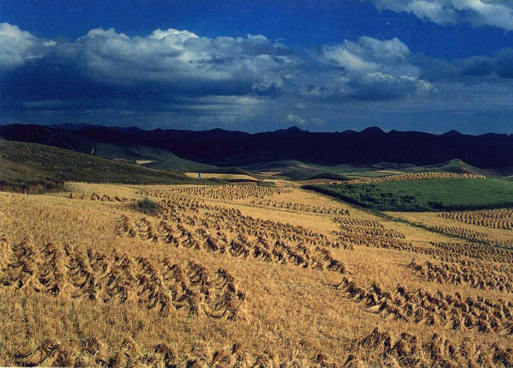

## Land Reclamation and Ecological Restoration

China University of Mining and Technology Press

# 土地复垦与生态重建

胡振琪卞正富成枢赵艳玲杨帆郑礼全

陈秋计 陈胜华 杨秀红 付梅臣 李 晶

编著

中国矿业大学出版社

# Land Reclamation and Ecological Restoration

Hu Zhenqi Bian Zhengfu Cheng Shu Zhao Yanling

Yang Fan Zheng Liquan Chen Qiuji Chen Shenghua

Yang Xiuhong Fu Meichen Li Jing

China University of Mining and Technology Press

## 内容提要

土地复垦与生态重建是对人为活动和自然灾害损毁的土地和环境采取整治措施，因地制宜地恢复到期望状态的行为或过程。本书介绍了土地复垦与生态重建的概念、内涵与发展历史，阐述了采矿对土地与环境的影响，介绍了相关的基础理论知识，详细讨论了土地复垦与生态重建的十大技术：工矿区环境破坏的动态监测与评价技术、土地复垦管理技术、土地复垦规划设计技术、采煤沉陷地复垦与生态重建技术、露天矿土地复垦技术、煤矸石山绿化技术、矿区重金属污染土地的修复技术、土地复垦与生态重建的信息技术、土地复垦与生态重建的评价与验收技术和微生物复垦技术。最后，对矿区土地复垦与生态重建中的测量工作也给予了介绍。

本书是一本关于土地复垦与生态重建方面的教材，内容全面，适宜于高等学校、科研与规划设计单位有关土地资源管理、环境、生态、测绘、地质、采矿、水土保持、土壤等专业的师生和工程技术人员使用，也可供相关领域的行政与事业单位的工作人员参考。

## 图书在版编目(CIP)数据

土地复垦与生态重建/胡振琪等编著.一徐州：中国矿业大学出版社，2008.8

ISBN 978 -7 - 81107 - 959 - 3

I.土… Ⅱ.胡…Ⅲ.①矿区—复土造田—研究②生态环境一矿区环境保护—研究 Ⅳ. TD88 X322

中国版本图书馆CIP 数据核字(2008)第120846号

书名 土地复垦与生态重建

编 著胡振琪等

责任编辑潘俊成

出版发行中国矿业大学出版社

(江苏省徐州市中国矿业大学内邮编221008)

网址 http://www.cumtp.com E-mail:cumtpvip@cumtp.com

排 版中国矿业大学出版社排版中心

印 刷徐州新华印刷厂

经 销新华书店

开 本 787×1092 1/16 印张 24 字数 599 千字

版次印次 2008年8月第1版 2008年8月第1次印刷

定价 36.00 元

(图书出现印装质量问题，本社负责调换)

## 前 言

土地是人类之母，是人类生存与发展的基础，是宝贵的自然资源。但自从有了人类以来，采矿、修路(铁路、公路)、水利工程等人类活动就不断地扰动和破坏着土地。我国人多地少，采矿等人为活动破坏了大量土地，加剧了人地矛盾。伴随着土地的破坏，引发了大量的生态环境问题，如水土流失、土地沙漠化、盐渍化、滑坡、泥石流、大气污染、水污染等。

20世纪初，人类为了自身的生存发展，开始对土地所遭受破坏及其引发的环境问题采取补救措施，土地复垦与生态重建便应运而生，并逐渐被各国所重视。土地复垦与生态重建产生于20世纪初的工业发达国家，大都是针对采矿破坏的土地和环境问题所采取的治理措施，且大都是以在矿山废弃地上恢复植被为主要治理工作。

土地复垦常常用“Restoration”、“Reclamation”和“Rehabilitation”三个词进行描述，且越来越多的专家认为这三个词具有相同的含义。国外土地复垦的定义是：将破坏的土(场)地(Site)恢复到破坏前的原状、近似状态或与破坏前制订的规划相一致的形式和生产力，其主要目标是重新建立永久稳定的景观地貌，这种地貌在美学上和环境上能与未被破坏的土地相协调，而且采后土地的用途能最有效地促进其所在的生态系统的稳定和生产能力的提高。我国1989年1月1日生效的《土地复垦规定》将土地复垦定义为：对在生产建设过程中，因挖损、塌陷、压占等造成破坏的土地，采取整治措施，使其恢复到可供利用状态的活动。近年来，根据我国的实际情况，土地复垦的内涵进一步扩展，它是对人为和自然损毁的土地，因地制宜地采取整治措施，使其恢复到可供利用的期望状态的行为或过程，其主要目的是再生利用土地、恢复生态平衡，使生产建设得到健康发展的同时，土地资源和环境也得以保护和持续利用。

生态重建(Ecological Restoration 或Ecological Reconstruction)是将人类所破坏的生态系统恢复成具有生物多样性和动态平衡的本地生态系统，其实质是将人为破坏的区域环境恢复或重建成一个与当地自然界相和谐的生态系统。生态重建更侧重于强调生态系统的恢复。土地复垦在恢复土地利用价值的同时，也是对土地生态系统的恢复。因此，土地复垦与生态重建有非常紧密的联系和一致性。

随着我国经济的持续快速稳定发展，采矿业和道路建设得到了飞速发展，对土地和环境的破坏也达到了非常严重的程度。以煤炭开采为例，我国煤炭年产量已突破20亿t，是世界第一产煤大国，1949～2006年累计煤炭产量约376亿t，按万吨煤塌陷0.2hm²计，我国因采煤塌陷破坏的土地面积已达75.2万hm²，而且每年还以4.6万hm²的速度递增。土地破坏、环境恶化、失地农民增多等生态环境问题和社会问题已成为区域和国家可持续发展的重要制约因素，而土地复垦与生态重建正是解决这一问题的有效途径。因此，土地复垦与生态重建已得到越来越多的关注和政府的高度重视。

从《土地复垦规定》生效至今已近20年，我国土地复垦在理论和实践上取得了很大的进展，许多高校也试图开设这门专业课，但一直没有一本系统全面的教材，为此我们几所院校的教师共同编写了这本教材。本书由中国矿业大学(北京)胡振琪教授构思设计和组织编写。全书共有14章，具体参加人员和撰写写分工是：中国矿业大学(北京)胡振琪(第一章、第三章部分、第五章部分、第七章部分、第九章部分)、赵艳玲(第十二章、第五章部分、第七章部分)、李晶(第十四章)，中国矿业大学卞正富(第六章)，中国地质大学(北京)付梅臣(第八章)，山东科技大学成枢(第二章、第十三章、第三章部分)，辽宁工程技术大学杨帆(第三章部分)，黑龙江科技学院杨秀红(第十章)，河南理工大学陈秋计(第十一章)，安徽理工大学郑礼全(第四章)和太原理工大学阳泉学院陈胜华(第九章部分)。

土地复垦与生态重建在我国还是一个新的领域，新理论、新技术不断涌现，我们希望呈献给大家的是一本比较系统而全面的教材，但由于我们水平所限，错误之处一定不少，欢迎批评指正。

胡振琪

2008年2月

## Preface

Land is the most precious natural resources for human survival and development. But with the appearance of human, the land began to be disturbed and destroyed by human activities such as mining, road construction (railway and highway), hydraulic engineering and so on. China has a large population and scarce land resource, so the human activities results the conflicts between people and land. Many eco— environmental problems have been caused by land destruction such as soil erosion, land desertification, soil salinization, landslide, debris flow, air pollution, water pollution and so on. At the beginning of 20th century, people began to take remedial measures to solve the environmental problem caused by land destruction, thus land reclamation and ecological restoration appeared and been emphasized by many countries, Land reclamation and ecological restoration originated in the developed countries at the beginning of the 20th century, most of them are remedial measures according to land destruction and environmental problems, and the main task is revegetation of abandoned mined land. Restoration, Reclamation and Rehabilitation are three popular words in this field. Now, more and more experts have recognized that the three words have synonymous meaning. The concept of land reclamation overseas is: the site will recover to the exact or approximately conditions of the site before disturbance, or a form and productivity in conformity with a prior use plan, the main purpose of land reclamation is to reestablish a permanent and stable landscape which is coordinated with the surrounding undisturbed land in the view of aesthetics and environment, the land use can effectively promote the stability and productivity of the ecosystem. In the Stipulation of Land Reclamation which became effective on Jan 1st, 1989, the conception of land reclamation is described as the activities to recover the land damaged by production activities such as excavation, subsidence or occupation to a useable state with remedial measures. In recent years, many experts thinks that the meaning of land reclamation should become the activity or process to recover the disturbed land destructed by natural disaster or human activities to an expected state with remedial measures based on its suitability. The main task of land reclamation is to reuse the land and restore the ecological balance, which results the good environment with the economic development. Ecological restoration or ecological reconstruction means that reconstructing the ecosystem destructed by human activities to the ecosystem with biodiversity and ecological balances. It is the reconstruction of the destructed ecosystem to the one which can coordi-

nate with the local nature. Ecological restoration emphasizes the restoration of the ecosystem. Land reclamation also restored the ecosystem while recovering the value of land utilization. Therefore, land reclamation and ecological restoration has a tight link and consistent with each other.

With the continuously rapid and stable development of national economy in China, the mining industry has a high developing speed, which results over 2 billion tons of the coal production. Thus China becomes the largest coal production country in the world. With the excavation of coal, a lot of lands were serious damaged. During the year 1949\~2006, the coal production accumulated to 37. 6 billion tons, and the subsidence land is achieved 0.75 million hm2, and grow 0.04 million hm2 per year. Many farmers lost their land, thus cause employee problem, and do harm to the social stability. Many problems such as land destruction, environment pollution and farmland losses have become the main restraint factors for regional and national sustainable development. Land reclamation and ecological restoration is an effective way to solve these problems. Therefore, many governments pay much attention on land reclamation and ecological restoration.

The Stipulation of Land Reclamation has been put effect for nearly 20 years in China. A great progress of land reclamation has been achieved. Many universities have established this specialized course, but there is no systemic and comprehensive textbook, so some teachers from 9 universities wrote this book. Professor Hu Zhenqi (China University of Mining and Technology, Beijing) design the structure of the book and organized the writing of the book. This book has 14 Chapters: Chapter 1 is Introduction, written by Hu Zhenqi(China University of Mining and Technology, Beijing); Chapter 2 is Mining influence on land and environment, written by Cheng Shu (Shandong University of science and Technology); Chapter 3 is Basic theory of land reclamation and ecological restoration, written by Yang Fan(Liaoning Technical University), Cheng Shu and Hu Zhenqi; Chapter 4 is Dynamic monitoring and evaluation technology of environmental destruction in industrial and mining area written by Zheng Liquan(Anhui University of Science and Technology); Chapter 5 is Land reclamation management, written by Hu Zhenqi, Zhao Yanling (China University of Mining and Technology, Beijing); Chapter 6 is Technologies of land reclamation planning and design, written by Bian Zhengfu (China University of Mining and Technology); Chapter 7 is Land reclamation and ecological restoration technology in coal mine subsidence land, written by Hu Zhenqi, Zhao Yanling; Chapter 8 is Land reclamation in open pit mine, written by Fu Meichen (China University of Geosciences, Beijing); Chapter 9 is Coal waste pile reclamation, written by Chen Shenghua (Taiyuan University of Technology Yangquan College), Hu Zhenqi; Chapter 10 is Remediation technology of heavy metal polluted land in mining area, written by Yang Xiuhong (Heilongjiang Institute of Science and Technology); Chapter 11 is Information techniques of land reclamation and ecological restoration, written by Chen Qiuji (Henan Polytechnic University); Chapter 12 is Evaluation and acceptance techniques of land reclamation and ecological res-

toration, written by Zhao Yanling; Chapter 13 is Survey in land reclamation and ecological restoration in mining area, written by Cheng Shu; Chapter 14 is Microorganism reclamation techniques, written by Li Jing(China University of Mining and Technology, Beijing).

Land reclamation and ecological restoration is still a new field in China. As the planned textbook for the mining science in the 11th five-year plan, we hope this book can be a systemic and comprehensive one in the field of land reclamation and ecological restoration. But restricting our ability and time, there must be many mistakes in this book, we really appreciate it if you could kindly point out and correct it.

Hu Zhenqi

Feb.15th ,2008

## 目 录

第章绪论…………………………………1  
第一节土地复垦与生态重建的产生…………………………………………1  
第二节土地复垦与生态重建的定义与内涵………………………2  
第三节土地复垦与生态重建的作用…………………7  
第四节 土地复垦与生态重建的历史与现状………………………………10  
第二章采矿对土地与环境的影响……………15  
第一节我国矿产资源及其开发利用…………………15  
第二节采矿对土地的破坏………………………………………………21  
第三节采矿対环境的影响………………………………23  
第三章土地复垦与生态重建的基础理论…………………31  
第节土壤和植物……………………………………………………31  
第二节生态学基础………………………………39  
第三节矿山开采沉陷学…………………………………………………………49  
第四节景观生态学基础……………………………………………………68  
第五节土壤重构理论…………………………………79  
第四章工矿区环境破坏的动态监测与评价技术………………………86  
第一节工矿区陆面演变遥感监测与分析……………………………86  
第二节多源多时相遥感影像融合与陆面演变动态监测……………………………117  
第五章土地复星管理…………130  
第节土地复垦管理概述………………………………130  
第二节采煤沉陷土地资源的管理………………145  
第三节国家投资土地复垦项目的管理……………………………………151  
第六章土地复舅规划设计技术……………159  
第节概述……………………………………………………………159  
第二节土地复垦的适宜性评价………………………………………165  
第三节复垦土地利用结构规划……………………………………169  
第四节塌陷积水区土地复垦规划与利用……………………………………173  
第五节 矿区生态工程复垦规划设计…………………………176  
第六节露天煤矿土地复垦规划设计……179  
第七节 土地复垦高程规划设计………………………………………………181  
第八节 矿区土地复垦规划报告的编制………………………………………189  
第七章 采煤沉陷地复垦与生态重建技术…………192  
第一节挖深垫浅复垦技术…………………………192  
第二节充填复垦技术…………………………………………199  
第三节 采煤沉陷地复垦与生态重建的其他技术………………………………206  
第四节未稳沉塌陷地复垦技术介绍…………………………209  
第八章露天矿土地复星…………………………………………213  
第节露天矿复星概述……………………………213  
第二节露天矿复垦技术体系与工艺………………………215  
第三节 露天矿排土场的整形……………………………………………………218  
第四节露天矿排土场土壤重构…………………………220  
第五节 露天矿排土场植被恢复……………………………………………226  
第九章煤石山绿化技术………………228  
第节煤矸石山绿化概述…………………………………………………228  
第二节煤矸石山绿化的技术模式和程序………………………………………229  
第三节煤石山立地条件的改良……………………………233  
第四节煤石山植物栽植…………………………………………240  
第十章 矿区重金属污染土地的修复技术………………………249  
第一节重金属污染的含义……………………………………………………249  
第二节 土壤环境重金属背景值和土壤环境质量标准……………………………252  
第三节 重金属污染土地的生态系统效应…………………………254  
第四节 国外关于污染土地的政策……………………256  
第五节土壤重金属污染的控制与修复…………………………………257  
第六节 黏土矿物与微生物菌根治理重金属污染土壤研究…………………………261  
第十一章土地复垦与生态重建的信息技术………………265  
第节概述………………………………………………………………………265  
第二节 土地复垦信息系统……………………………………………………………270  
第三节 矿区土地复垦信息系统的总体设计……………279  
第四节 DTM 在矿区土地复垦中的应用研究…………………………286  
第十二章土地复垦与生态重建的评价与验收技术…………………………295  
第一节土地复垦与生态重建评价技术概述………………………295  
第二节 土地复垦与生态重建的环境影响评价技术…………………………299  
第三节 土地复垦与生态重建的效益评价技术……………………………304  
第四节土地复垦与生态重建的后评价技术…………………………………311  
第五节 土地复垦与生态重建的验收技术…………………………………314  
第十三章矿区土地复垦与生态重建中的测量工作………………319  
第一节 矿区土地复垦与生态重建时测量的主要任务………………………319  
第二节 矿区土地复垦与生态重建时的特殊测量方法…………………………319  
第三节 地表破坏预测图的绘制与表土层剥离时的测量工作………………………328  
第四节地面复垦时的测量工作…………………………331  
第五节 研石场复垦时的测量工作…………………………………338  
第六节 复垦地区水工建筑物与道路施工的测量…………………………………341  
第十四章微生物复垦技术……………  
参考文献………

## CONTENTS

Chapter 1 Introduction   
Section 1 The generation of land reclamation and ecological restoration   
Section 2 Definition and connotation of land reclamation and   
ecological restoration   
Section 3 Role of land reclamation and ecological restoration   
Section 4 History and present situation of land reclamation and   
ecological restoration 10   
Chapter 2 Mining influence on land and environment   
Section 1 Mineral resources and its development and utilization in China   
Section 2 Land destruction caused by mining activities 21   
Section 3 Mining influence on environment 23   
Chapter 3 Basic theory of land reclamation and ecological restoration 31   
Section 1 Soil and plant 31   
Section 2 Ecological basis 39   
Section 3 Mining subsidence 49   
Section 4 Basic of landscape ecology 68   
Section 5 Theory of soil reconstruction 79   
Chapter 4 Dynamic monitoring and evaluation technology of environmental destruction   
in industrial and mining area 86   
Section 1 Monitoring and analysis of terrestrial surface evolution in industrial   
and mining area by remote sensing 86   
Section 2 Fusion of multi—source, multi—time remote sensing image and   
dynamic monitoring of terrestrial surface evolution 117   
Chapter 5 Land reclamation management 130   
Section 1 Summary of land reclamation management 130   
Section 2 Land resource management in coal mining subsidence land 145   
Section 3 Management of land reclamation projects with national   
investments 151   
Chapter 6 Technologies of land reclamation planning and design 159   
Section 1 General introduction 159   
Section 2 Land reclamation suitability evaluation 165   
Section 3 Utilization structure planning for reclaimed land 169   
Section 4 Land reclamation planning and utilization of subsided land with   
accumulated water 173   
Section 5 Ecological engineering planning and design in mining area 176   
Section 6 Land reclamation planning and design of open pit mining 179   
Section 7 Elevation planning and design of land reclamation 181   
Section 8 Compilation of land reclamation planning report in mining area   
Chapter 7 Land reclamation and ecological restoration technology in coal mine   
subsidence land 192   
Section 1 Land reclamation technology of "digging deep to fill shallow" 192   
Section 2 Filling reclamation techniques 199   
Section 3 Other techniques of land reclamation and ecological restoration   
in coal mine subsidence land 206   
Section 4 Introduction of unstable subsidence land reclamation techniques ..... 209   
Chapter8 Land reclamation in surface mines 213   
Section 1 Introduction of land reclamation in surface mines 213   
Section 2 Technical system and technology of surface mine reclamation 215   
Section 3 Reshaping dumps in surface mine 218   
Section 4 Soil reconstruction of dumps in surface mine 220   
Section 5 Vegetation restoration in dumps of surface mine 226   
Chapter 9 Coal waste pile reclamation 228   
Section 1 Introduction of coal waste pile reclamation 228   
Section 2 Techniques model and procedures of coal waste pile reclamation ..... 229   
Section 3 Reconditioning of coal waste piles 233   
Section 4 Planting techniques of coal waste piles 240   
Chapter 10 Remediation technology of contaminated soil with heavy metals in   
mining area 249   
Section 1 Implication of heavy metal pollution 249   
Section 2 Heavy metal background values and quality standard of soil   
environment 252   
Section 3 Effect of heavy metal pollution on land ecosystem 254   
Section 4 Policies on contaminated land 256   
Section 5 Control and remediation of contaminated soil with heavy metals …. 257   
Section 6 Study on the remediation of contaminated soil with heavy metals   
by clay mineral and mycorrhiza 261   
Chapter 11 Information techniques of land reclamation and ecological restoration ….... 265   
Section 1 Introduction 265   
Section 2 Land reclamation information system 270   
Section 3 General design of land reclamation information system in   
mining area 279   
Section 4 Application of DTM in land reclamation in mining area 286   
Chapter 12 Evaluation and check techniques of land reclamation and   
ecological restoration 295   
Section 1 Introduction of evaluation techniques of land reclamation and   
ecological restoration 295   
Section 2 Techniques of environmental impact assessment for land reclamation   
and ecological restoration 299   
Section 3 Benefit evaluation techniques of land reclamation and ecological   
restoration 304   
Section 4 Post evaluation techniques of land reclamation and ecological   
restoration 311   
Section 5 Check techniques for land reclamation and ecological restoration . 314   
Chapter 13 Surveying in land reclamation and ecological restoration in   
mining area 319   
Section 1 Main task of surveying in land reclamation and ecological   
restoration in mining area 319   
Section 2 Special methods of surveying in land reclamation and ecological   
restoration in mining area 319   
Section 3 Drawing of surface destruction prediction map and surveying during   
stripping of the topsoil 328   
Section 4 Surveying of land reclamation engineering 331   
Section 5 Surveying in coal waste dump reclamation 338   
Section 6 Surveying in hydraulic structures and road construction in   
reclamation area 341   
Chapter 14 Microbiological reclamation techniques 344   
References 356

## 第一章 绪 论

## 第一节 土地复垦与生态重建的产生

任何一门学科的产生，都有一定的历史背景和历史环境，都是社会和生产力发展到一定阶段，为人类的某种需要而产生的，土地复垦与生态重建的产生也不例外。

众所周知，土地是人类之母，是人类生存与发展的基础，是宝贵的自然资源。但自从有了人类以来，人类的活动就不断地扰动和破坏着土地。原始社会，由于人口数量少，生产工具简单，人类对土地的破坏并不严重，但随着人口的增加，特别是随着18～19世纪的三次工业革命的兴起和采矿业的迅速发展，大量的土地因城市化和工业化而被占用或因矿藏开采而遭受了巨大的破坏。到21世纪初，人类对土地的破坏已远远超过了土地的自我恢复和调节能力，同时世界范围的人口膨胀，使人均占有耕地面积明显减少，人地矛盾已经达到了前所未有的尖锐程度。伴随着土地的破坏，水土流失、土地沙漠化、盐渍化、滑坡、泥石流、大气污染、水污染等自然灾害在世界范围内频繁发生，人类已经饱尝了自然界的惩罚。为了人类自身的生存发展，人类开始对土地所遭受的破坏及其引发的环境问题采取补救措施，土地复垦与生态重建便应运而生，并逐渐被各国所重视。由于各国社会生产力发展水平的差异，土地复垦与生态重建在各国的产生与重视在时间上也有明显差异，美国1911年提出土地复垦，1918年在伊州丹维尔附近的煤矿进行种植复垦，同年在印第安纳州进行复垦试验；德国和前苏联对土地复垦始于20世纪50年代末；英国在1951年颁布了复田法；我国早在古代开山取石中就注重生态重建，浙江绍兴东湖风景区原先是一处采石场，从汉代起开山取石，隋代扩建绍兴城时，大规模开采，由于长年累月的开凿，形成千奇百怪的峭壁和深邃的小塘，构成了东湖的雏形，至清代，东湖筑堤分界，外为河，内为湖，并经长期的改造，形成了山水交融、洞窍盘错的风景旅游胜地，在国内外享有盛名。我国于20世纪80年代正式提出土地复垦与生态重建问题。

图1-1是土地复垦与生态重建产生示意图，从图中可以看出，土地复垦与生态重建的产生需要三个条件：

①土地与生态问题已达到一定的危害程度一-足以引起人们的注意。

②公众有关心生活质量的意识(环境意识)。

③社会有一定的经济发展水平(实力)。

综上所述，我们不难发现，土地复垦与生态重建不是学者们突发奇想、心血来潮的产物，它是社会生产力发展到一定阶段，人类与土地的关系以及与环境的关系陷于深刻危机的严峻时期，在人类社会发展的阵阵痉挛和频频剧痛中兴起的。它的兴起，意味着人类和土地以及环境都遭受了巨大的创伤。

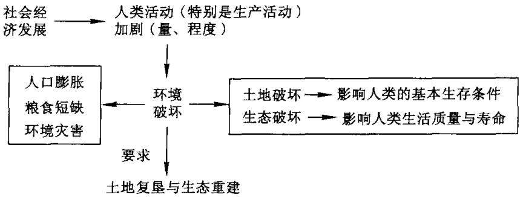  
图1-1 土地复垦与生态重建产生示意图

## 第二节 土地复垦与生态重建的定义与内涵

关于土地复垦与生态重建的内涵及其两者的关系，人们一直有不同的理解，导致现在存在很多不同的说法。例如，同是针对矿区破坏土地的治理工作，矿山、土地、农业等的研究人员称其为“土地复垦”；环保研究人员有时称其为“土地复垦”，有时称其为“生态建设”；生态研究人员常称之为“生态恢复”或“生态重建”。甚至有人统称之为“土地复垦与生态重建”，或“生态重建/土地复垦”。虽然名称各异，方向也各有所侧重，但从近年的研究和实施工程来看，其总目标在逐渐趋向于更综合的生态环境问题。

那么，土地复垦与生态重建的定义和内涵究竟有无区别，二者之间有何关系呢？本节重点介绍该内容。

## 一、土地复垦的定义与内涵

“土地复垦”，顾名思义，往往理解为土地的恢复耕种，这是我国不少人的理解。我国新近颁布的《土地管理法》的英文版中，将“土地复垦”翻译为“LandRecultivation”，即土地重新耕种。但也有专家将土地复垦的定义表述为：对采矿等人为破坏的土地，采取整治措施，因地制宜地恢复到可供利用的期望状态的行动或过程。其目的是：再生利用土地、恢复生态平衡，使生产建设得到健康发展的同时，土地资源和环境也得以保护和持续利用。另外一种表述为：土地复垦是对地球表层的陆地部分(包括海洋滩涂和内陆水域)中由于人为或自然营力原因遭到直接或间接破坏而丧失了原有利用价值的部分，采取各种技术和相关措施，使之恢复到可供人类持续、高效利用状态的行为。而我国1989年生效实施的《土地复垦规定》，将土地复垦定义为：对各种破坏土地“恢复到可供利用状态的活动”。

## (一)土地复垦概念的来源

在《新编说文解字》中对复、垦的解释是：“复，行故道也’，其本义是返回、回来’，引申为‘恢复””；“垦，耕也’，本义是翻土，开垦。”复、垦两字组合在一起的字面意思则是：“重新开垦、恢复可耕。”所以，在我国“土地复垦”一词最早称之为“造地覆田”、“复田”、“垦复”、“复耕”、“复垦”、“综合治理”等，直到1988年11月国务院颁布了《土地复垦规定》，“土地复垦”一词才被我国确定下来。

“复垦”一词来源于国外，应在对国外原始定义理解的基础上加以翻译。欧美常用Res-toration、Reclamation和Rehabilitation三个词进行描述。目前，越来越多的专家认为这三个词具有相同的含义，国外常常用这三个词其中的一个代表其他词用以表示所有的“恢复”工作，如美国常常用“Reclamation”，加拿大和澳大利亚习惯用“Rehabilitation”，英国则常常用“Restoration”。

《现代高级英汉双解辞典》中对“Reclamation”的解释为“bring back(waste land,etc) toa useful condition，a state of cultivation，etc”；中文意思为：“将废弃地等还原(恢复)成为有用的状态、可耕植状态等等”，从英文原意中的几个“等”字，表明还原(恢复)的对象不仅仅指“废弃地”，还有其他环境对象。

对科技术语的翻译，不应死搬字典，而应从其科学定义中加以理解和翻译，才是最好的。美国科学院(National Academy of Sciences)1974 年对这三个术语给出了定义，并被许多国家广为采用：

① Restoration:(means that the exact conditions of the site before disturbance will bereplicated after disturbance.)是指复原到破坏前所存在的状态，这里包括重新复原破坏前的地形、地表水和地下水以及重新建立原有的植物和动物群落。因此，此英文可译为“复原”。

② Reclamation:(implies that the site will be habitable to organisms originally present in approximately the same composition and density after the reclamation process has been completed.)是指将破坏的地区恢复到近似破坏前的状态。主要包括近似地恢复至破坏前 的地形，植物和动物群落也恢复到近似破坏前的水平。因此，此英文译为“恢复”比译为“复 垦”更贴切。但因人们长期已习惯用“复垦”一词，不便再更改，但人们应深人理解其内涵。

③ Rehabilitation:(means that the disturbed site will be returned to a form and pro-ductivity in conformity with a prior use plan. )将破坏的场地恢复到与破坏前制订的规划相一致的形式和生产力，即将破坏的地区恢复到稳定的和永久的用途，这种用途可以和破坏前一样，也可以在更高的程度上用于农业，或者改作游乐休闲地或野生动物栖息区。假如改变用途，新的用途必须对社会更有利而且与周围环境的美学价值一致（mustbeconsistentwith surrounding aesthetic values)。因此，此英文可译为“重建”。

“复原”(Restoration)是在土地复垦工作初期提出的，实践证明是很难实现的，除非有独特的地貌特征需要保存下来，“复原”是不应考虑的。“恢复”(Reclamation)是大部分环境工作者支持的概念，也是可以实现的。“重建”(Rehabilitation)则具有更大的灵活性，可以不受原地形条件的限制，完全可以按照公共利益及经济条件来确定复垦土地的利用方案。所以，“恢复”(Reclamation)和“重建”(Rehabilitation)是目前国外常用的两个术语。

由此可见，国外对这三个英文单词的理解已有共识，都是对扰动(破坏)场地(Site)的状态的恢复，都要求与周围环境相适应。定义中的场地(Site)不仅仅指土地，也包括动植物等生态环境。同时，随着技术的发展，常常用这三个词中的任何一个代表其他词以表示所有的“复垦”工作，而不再加以过细的区分。

在美国，“Reclamation”工作必须按照联邦和州政府法规的要求进行。L.R.Hossner在其 Sur face Mined-Land Reclamation(露天矿土地恢复)一书中也指出：“恢复(Reclamation)的主要目标是重新建立永久稳定的景观地貌(Landscape)，这种地貌在美学上和环境上能与未被破坏的土地相协调，而且采后土地的用途能最有效地促进其所在生态系统的稳定和生产

能力的提高。”

英国《采石场恢复指南》一书中指出：“采石场和露天采场可恢复成为用于某种生产性目的的土地。”英国著名生态复垦专家 A. D. Bradshaw提出的恢复(Restoration)概念是：“将被破坏的土地恢复或重建至有益的用途(Beneficial Use)，并使其生物能力(Biological Po-tential)得到恢复……最终的复垦土地利用方式应该满足当地的需要并与附近其他土地的利用方式相适应(Compatible)。”

前苏联《露天矿土地恢复》一书中指出：“土地恢复是指以恢复破坏土地的生产效能和国民经济及改善环境条件为目标的各项工作之总和”。

德国《景观与露天采矿：恢复的生态指南》一书中解释为：“恢复(Reclamation)是使破坏的景观恢复生产力和视觉吸引力(Visually Attractive)的各种措施。”

综上所述，基于国外的定义，土地复垦(Reclamation或Land Reclamation)不仅要求恢复土地的使用价值，而且要求恢复的场所保持环境的优美和生态系统的稳定，其目的就是：重新恢复利用土地，恢复被扰动或损毁的环境。

## (二)我国土地复垦的定义与内涵

由国外土地复垦的定义和内涵可以看出，国外的土地复垦是以保护生态环境为主要目标，其内涵是十分广泛的。

在我国，限于当时的实际情况，我国土地复垦的目标定义为“可供利用的状态”，并以复垦耕地为重点。经过十多年的复垦实践，特别是加人WTO后，我国与国际在复垦方面的交流与合作日渐增多，目前的土地复垦的目标与内涵已经难以适应现实需要。例如，现有的土地复垦定义将复垦对象限定为“挖损、压占、塌陷造成破坏”的土地，直观地理解这三类复垦对象均是工业生产过程中直接破坏的，而工业生产间接破坏的土地，如地下水位的下降或上升、含水层的疏干与破坏、周边地区土壤的污染等都没有纳入复垦的范畴。其结果是在进行复垦研究与实践时，往往是就事论事，挖肉补疮，效果不好。如某地复垦时遵循因地制宜的原则，采取挖深垫浅的方法复垦，复垦区内鱼塘星罗棋布，丰水年份整体效益尚好，但枯水年份大部分鱼塘则干枯，后来经论证发现，问题在于复垦时没有考虑地下水位的年际变化及本区砂礓土壤不保水的特性。另外，我国大量的自然灾害损毁土地也急需复垦，但按照现在的土地复垦规定，自然灾害损毁的土地是否属于土地复垦的范畴是有争议的，如何界定呢？实际上，我国1988年颁布《土地复垦规定》的实施管理办法中就将自然损毁的土地作为土地复垦的研究对象，其列出的具体对象是：

①在生产建设过程中，因挖损、塌陷、压占等造成破坏的土地。

②因道路改线、建筑物搬迁、废弃旧宅基地压占和城镇乡村垃圾压占而废弃的土地。

③因兴修水利、农田基本建设废弃的坑、塘、洼地及其他零星闲散废弃地。

④工业排污造成土地化学污染而废弃的土地。

⑤自然灾害损毁等其他原因荒废的土地。

目前，我国已在某些矿区征收矿区生态环境恢复补偿费用。该政策一出台就受到不少企业和地区的反对，理由是企业已承担了土地复垦费用，认为该项费用为重复收费。但也有一些地区认为征收此项费用是合理的，理由是矿山企业在开采过程中对当地的生态环境破坏太严重，若不征收专项费用用于矿区的生态环境恢复与治理，这种破坏将威胁后代人的生存。这种分歧同样来自于对“土地复垦”内涵的理解偏差。

综上所述，出现问题和争议的关键都在于对土地复垦内涵的界定。如果将“复垦”正名为“恢复”就可以消除这些问题。目前，国内一些学者鉴于国内外在“Reclamation”方面认知的差异，建议将“复垦”研究的内涵扩大，迫切要求我国的复垦工作与国际接轨，以前只重视复垦的数量和要求复垦为可利用状态是不够的，一定要注意复垦的质量和复垦土地生产效能(包括环境效能)的恢复。鉴于以上诸多因素，我国土地复垦目标与内涵应与国际接轨，按照国际通行的概念与内涵进行扩展以适应我国加入WTO的形势，即：

①土地复垦研究对象的扩展———从过去的各种因挖损、塌陷、压占破坏的土地，扩展为各种人为活动和自然灾害损毁的土地。

②土地复垦目标的扩展—从过去恢复到“可供利用状态”并侧重复垦为耕地，扩展为恢复土地期望的利用价值和保护生态环境。所谓“期望的利用价值”是指因地制宜且复垦到一定生产效能的期望的标准状态。这种期望状态需经有关部门制订和审批，既要注重土地价值，又要注重生态功能恢复。土地复垦的实际目标可分为8类：农用地、森林、牧草地(或干草地）、野生动物栖息地、娱乐用地、水利及水产养殖、商业用途、综合用途。

③土地复垦内涵的扩展—从过去偏重土地整治工程，扩展为土地整治的生物措施、复垦土地的景观生态恢复、土地生态系统的生物多样性、土地质量和土地生产效能与效益的恢复。

基于以上分析，土地复垦的定义是：对人为和自然损毁的土地，因地制宜地采取整治措施，使其恢复到可供利用的期望状态的行动或过程。

## 二、生态重建的定义与内涵

“生态重建”，也称之为“生态恢复”、“生态恢复重建”，多用“reconstruction of ecosys-tems"、“reclamation"、“rehabilitation"、“ecological reconstruction"、“ecological reclama-tion”等，是由环境和生态学界20多年前提出的概念，有时又称之为“生态恢复”。

有学者将生态重建表述为：“对采矿引起的结构缺损、功能失调的极度退化的生态系统，借助人工支持和诱导，对其组成、结构和功能进行超前性的计划、规划、安排和调控，同时对逐渐逼近最终目标这一逆向演替过程中可能出现的各种问题，进行跟踪评估并匹配相应的技术经济措施，最终重建一个符合代际需求和价值取向的可持续的生态系统。”但也有另外一种表述是：“对采矿引起的土地功能退化、生态结构缺损等问题，通过工程、生物及其他综合措施来恢复和提高生态系统的功能，逐步实现矿区的可持续发展。”还有另一种表述则认为：“生态重建是按照景观生态学原理，在宏观上设计出合理的景观格局，在微观上创造出合适的生态条件，把社会经济的持续发展建立在良好生态环境的基础上，实现人与自然的共生，它涵盖了复垦以外的社会、经济和环境的需要。”而美国生态重建学会1994年将生态重建定义为：“将人类所破坏的生态系统恢复成具有生物多样性和动态平衡的本地生态系统。其实质是将人为破坏的区域环境恢复或重建成一个与当地自然界相和谐的生态系统。”

## 三、土地复垦与生态重建的关系

国内学者一见到“Reclamation”往往认为是土地问题，与国外强调土地资源和生态环境恢复双重目标的定义更是差距很大，甚至有人认为“土地复垦”是“生态(恢复)重建”的主要或核心任务，要用“生态重建”(Ecological Reconstruction)取代“复垦”和“Reclamation”。

从中文的字面理解不难看出，“复垦”往往是对土地的恢复利用(耕种)，而“生态恢复”不仅包括土地因子的恢复，还包括其他诸如水体、植物和动物等生态因子的恢复，所以“复垦”理应是“生态恢复”的重要任务之一。

土地(Land)和生态(Ecological)均是“(环境)恢复”(现译为“复垦”)(Reclamation)的定语，所以，“(环境)恢复”(Reclamation)理所当然地既包括土地恢复(复垦)(Land Reclama-tion)，又包括生态恢复或重建(Ecological Reclamation)。如果Reclamation的中译名—“复垦”不便修改的话，那么“复垦”便应包括生态重建，而不是生态重建包括“复垦”，这就使许多人难以接受，其根源就是Reclamation的中译名存在问题。在当前“复垦”一词作为Reclamation的中译名的情况下，只能加强对其内涵的理解。

近年来，我国与国外在Reclamation方面交流与合作增多，国内外在Reclamation方面认知的差异使得不少学者建议将“复垦”研究的内涵扩大，从所谓的“工程复垦”向“生态复垦”发展，并认为是新的发展趋势。实际上，生态原则正是Reclamation本身固有的研究内容，如果正名为“(环境)恢复”就不存在名不符实、要求扩大内涵的问题。

国外许多国家的有关Reclamation法律明确指出其目的是要保护环境。值得指出的是，我国土地复垦界常常引用的美国联邦复垦法规一《露天采矿管理与土地复垦法》(Sur-face Mining Control and Reclamation Act,简称 SMCRA)，在美国常常被认为是一种珍贵的环境法规，而并非当做一种土地法规，有人甚至称之为“煤炭开采的环保法”。所以，《露天采矿管理与土地复垦法》也可译成《露天开采管理与(环境)恢复法》。在此法规的第一章102节中明确指出(摘选)：“d条，确保采矿作业以有利于环境保护的方式进行；e条，……尽可能地在露天开采作业的同时进行‘复垦’(恢复)工作；h条，促进原已遗弃的未进行‘复垦’(恢复)的矿区进行‘复垦’(恢复)工作。”在第五章515节中也明确指出：“在复垦的土地上建立多样的、有效的和永久的植被，并具有自我可持续能力，同时植物的演替(PlantSuc-cession)与本区域自然植被一致。”

R. E. Ries 在回顾美国Ecological Reclamation（生态恢复)的历史时指出，在 reclama-tion的发展过程中，植被的建立一直是最普通的实践。生态演替(Ecological Process)的重要性是美国1977年联邦法所强调的，即要求生物多样性、永久性、自我持续性和植物演替。演替作为生态学的一个重要原则，长期以来一直是reclamation研究中重要的一部分。

M.K.Wali(1980)曾深入讨论了矿山土地恢复(Mineland Reclamation)中的生态原则和生态演替。他认为：“生态演替过程的理解对加速露天矿土地的恢复和重新植被是至关重要的。自从1976年以来，ReclamationResearch(环境恢复研究)已开始探讨矿山土地的生态演替过程。”此外，矿山土地进化、重新植被的演替、植物种群的选择与适宜性等问题也得到了深入研究。许多研究表明：“20世纪70年代早期，矿山采后环境条件中的植物和植物生长的生态关系就成为环境恢复研究的焦点”，“农业生态系统的恢复也是环境恢复研究和技术开发的焦点”。

综合以上分析不难看出，国外有关reclamation的法规、研究内容和研究历史十分重视植被的恢复和生态原则，也一直将生态恢复作为研究的焦点。因此可以归纳为以下两种观点：

①从“土地复垦”和“生态重建”的本质和内涵上讲，二者具有相同的或相似的目标。这种理解，可以看做“土地复垦”的广义内涵。

②从我国现阶段的理解和中文的含义来理解，“土地复垦”侧重于土地的保护和恢复利用，而“生态重建”则侧重于生态系统的修复与重建一这种理解可作为“土地复垦”的狭义内涵。由于土地生态系统是区域生态系统中一个子系统，因此土地复垦就自然而然地成为生态重建的核心内容。

## 第三节 土地复垦与生态重建的作用

土地复垦是为了解决人类活动对土地的破坏及其引发的环境问题而产生的，它的主要作用是恢复土地的使用价值和保护生态环境。在我国，人多地少、土地资源十分紧缺，现代化建设又大量占用和破坏土地，使成千上万的居民失去赖以生存的土地，而且就业安置又十分困难，使无业游民增多，工农矛盾加剧，也为社会安定留下了隐患。所以，土地复垦在我国还具有缓解工农矛盾、维护社会安定的作用。

## 一、土地复垦与生态重建是恢复土地资源、解决人地矛盾的一种有效措施

人类消费的大部分热量和95%以上的蛋白质取自土地，其中80%以上的热量和75%以上的蛋白质来自耕地提供的物质，其数量和质量是一个国家或民族生存、发展的最基本的物质基础。我国是一个人口众多的农业大国，七亿以上农民仍以土地为生，因此土地问题对我国更是至关重要。

我国土地辽阔，总面积相当于世界陆地的1/15，约占亚洲总面积的1/4，与整个欧洲面积差不多。但我国人口众多，人均占有面积很少，人均约12.59亩，不足世界平均水平的1/3；人均林地仅为世界平均数的14.3%，人均草地是世界平均数的32.5%，人均耕地仅1.28亩，为世界平均数的32.3%。所以，从总量上说，我国地大物博，但从相对量上说，我国却是一个人均资源贫乏的国家，人地矛盾十分尖锐。此外，我国的土地资源山地多、平原少，暂难利用土地比重大，且土地资源分布不平衡，土地后备资源也不足、开发难度大。因此，我国土地资源的形势十分严峻，人口多、耕地少，已成为制约我国经济发展的重要因素。

据统计，我国1949年的耕地面积为14.88亿亩。建国初期，我国开荒造田面积超过建设占地面积，耕地逐年增加。1957年，全国耕地扩展到16.77亿亩，是我国耕地最多的一年。此后，耕地面积逐年减少。至1986年的29年间，累计减少耕地6.11亿亩，平均每年减少耕地2107万亩；减去供开发土地3.77亿亩，实际净减少2.34亿亩；平均每年净减少耕地807万亩。仅“六五”期间，全国共减少耕地8752万亩，平均每年减少耕地1702万亩；减去开发土地5063万亩，实际净减少3689万亩，平均每年净减少耕地737万亩。1985年，全国共减少耕地2396.9万亩，减去开荒造田883.1万亩，净减少耕地1513.8万亩。1986年，全国共减少耕地1662.4万亩，减去开荒造田702.6万亩，净减少耕地959.8万亩。1987年，由于对建设用地实行了计划指标控制，当年减少耕地1220多万亩，减去开荒造田510万亩，净减少耕地710万亩。2006年10月，我国耕地面积仅为18.27亿亩，可见耕地减少是一个大趋势。

我国耕地减少的主要原因是经济发展，特别是工业发展。我国是发展中国家，经济建设的迅猛发展，各行业对土地的需求不断增加，而这种增加一方面压占大量土地资源，另一方面也造成巨大的土地破坏并引起严重的环境问题。采矿业是从自然界索取矿物资料、金属矿石、化工原料和建筑材料等矿产，供应国民经济各个生产部门，以保证经济的发展。因此，采矿业是工业发展的基础，对国民经济的发展起着十分重要的作用。由于矿产资源都是深埋于地下，且其位置具有固定性，不可能像其他工程建设那样加以选择，因此往往造成难以避免的土地破坏和环境破坏。采矿业是造成土地破坏最严重的行业之一。

煤炭是我国最重要的能源，占全国一次能源总量的74%左右，对国民经济的发展起着举足轻重的作用。1989年我国原煤产量突破10亿t大关，成为世界第一大产煤国，到2006年我国原煤产量已超过23.25亿t。煤炭工业的迅猛发展，在为国民经济提供大量能源的同时，也必然会导致地表的大量剥离、地表的大面积塌陷和固体废弃物的大量堆积，从而导致土地资源的大量破坏，使良田荒芜、耕地减少。我国煤炭产量已逾20亿t/a，其中96%来自井工开采。据统计，我国仅煤炭资源与耕地资源分布的复合区域面积就占我国耕地总面积的42.7%，据测算，煤炭开采的万吨煤炭塌陷率少的有 $0 , 0 3 3 { \mathrm { ~ h m } } ^ { 2 }$ ，多的达 $0 . 5 3 3 ~ \mathrm { h m } ^ { 2 }$ ,平均为0.2hm²（3亩/万t)。根据1949～2006年煤炭产量约376亿t计算，目前我国因采煤塌陷破坏土地75.2万hm²(1128万亩)，而且每年还以4.6万hm²(69万亩)的速度递增。此外，全国现有矸石总量30亿t，压占土地10000hm²（15万亩），而且每年以0.5万亩的速度递增。煤炭开采对土地的破坏，使许多农民失去赖以生存的土地，加剧了人地矛盾，影响区域经济的发展。例如，我国重要的粮棉油基地之一的安徽省淮北市，因采煤塌陷，全市耕地面积逐年减少。1960～1990年，煤矿征用土地1.44万hm²，其中采煤塌陷1.13万hm²，万吨煤塌陷率为0.3～0.36hm²，按现有生产能力，每年将塌陷近666.7hm²(1万亩)土地，相当于每年损失750万～800万kg粮食，大约2万人失掉全年口粮。人均耕地已从1960年的 $0 . 2 6 \ \mathrm { h m } ^ { 2 }$ 降至1990年的0.127hm²，有的农业区已降至0.043hm²。据调查，1980～1990年间，全市农业的年平均增长速度为2.8%，远远低于全国4%和全省7.2%的水平，出现了萎缩性增长的局面。江苏省徐州市铜山县，全县塌陷地达9060hm²，占全县耕地面积的5.87%，塌陷地中常年积水面积为2700hm²。耕地面积因采煤塌陷而大量减少，直接影响了当地的农业生产，并给当地人民的生活带来了一定困难。

在经济发展使耕地逐年减少的同时，人口却在逐年增加。1949年我国仅有人口5.4亿，1981年突破10亿大关，1988年突破11亿，1995年10月1日的抽样调查已超过12亿，国家统计局测算数据表明，2005年1月6日中国人口总数达到13亿（不包括香港、澳门特别行政区和台湾省），约占世界总人口的21%。到2050年，中国人口最保守的估计是16亿，有的估计为20亿。按照我国2050年达到中等发达国家水平，选择人均每年消耗粮食600kg的标准，按人口18亿计算则每年共需粮食10800亿kg。获得这些粮食的途径只有两个：扩大耕地面积、提高单位面积产量(没考虑进口粮食)。我国目前粮食单位面积产量的水平已经不低，亩产(播产)已经达到242kg(目前仅荷兰、日本等少数国家达到350kg)，增产的潜力并不很大，且必须以大量的投入为代价。如果不进行土地复垦，那么到2050年只有15亿亩耕地，若80%用于种粮，则有12.4亿亩可以生产粮食，按复种指数160%计算，播种面积为19.84亿亩，要求每亩单产达到544 kg。从242 kg提高到544 kg，这样大的幅度，没有农业上的技术革命是绝对不能的。我们总不能把民族的生存寄托在不确定的技术革命上。因此，通过土地复垦，扩大耕地面积是最重要的途径，它是一件关系到国计民生的大计。

综上所述，我国人多地少，耕地尤其不足。随着建设的发展，耕地还在不断减少，人口还在不断增加，因而人地矛盾十分尖锐。这种客观情况要求我们，为了建设，为了吃饭，必须坚决实施“切实保护耕地”的基本国策，复垦被破坏的土地，努力增加耕地。

实践告诉我们，土地复垦与生态重建是土地再生的一种有效方法。被破坏的土地资源，若能采取工程或生物等措施，可以重新恢复利用。土地的废墟，可以变成良田沃土，可以营造郁郁葱葱的果林，可以开挖鱼虾满池的水塘，可以生长青青的禾苗。昨天被废弃的土地，今天又回到人类的怀抱，这正是土地复垦与生态重建的巨大作用。

## 二、土地复垦与生态重建是保护生态环境、提高人民生活质量的有效措施

在被破坏的土地上，原有的景观环境改变了，并引发严重的生态环境问题。例如，平原变成高低不平的塌陷地；肥沃的农田变成沼泽地；粉尘飞扬，废气、废水渗溢，土壤污染、土地沙漠化等。由于土地破坏引发的环境问题是严重的，只有通过复垦工程，才能得以缓和、改善，甚至优于原先的自然状态，这是人们按照现代的科学手段与时代要求，经过积极的人类活动，使环境更符合时代的风貌。

作为土地破坏最严重的采矿业，它在对土地大量破坏的同时，也造成严重的矿区环境污染。追溯到400多年前，1556年出版的由阿格利柯拉所著的世界上第一本矿业教科书《论金属》中就提到：“贬低矿业的人们最强烈争辩的是田地因采矿作业而遭到破坏……树林、灌木丛被砍伐，而树林和灌木丛被砍光之后，就毁灭或赶跑了野兽和鸟类；另外，洗矿砂石用过的水会污染溪水、河流，或将鱼毒死，或将鱼驱散……这就是说，从长远看采矿造成的危害，显然远超过采矿生产的金属价值。”可见，矿业对土地、大气和水资源等自然环境的有毒、有害影响早就是人们关心的课题。但是直到20世纪初人们才认识到，环境保护问题已成为矿业发达国家急需解决的问题之一。国外许多国家土地复垦的主要目的就是保护环境，例如美国1977年联邦政府颁布的《露天采矿管理与土地复垦法》(SMCRA)中就明确指出：确保采矿作业以有利于环境保护的方式进行。可见，在西方发达国家，土地复垦与生态重建的主要作用是保护人类的生态环境，改善人们的生存环境质量。

## 三、土地复垦与生态重建是缓解工农矛盾、解决就业和维护社会安定团结的有效途径

由于土地被破坏，使良田荒芜、耕地减少，严重影响工农业生产，加剧了工农用地矛盾和由此引发的工农纠纷。据不完全统计，许多城市工农矛盾的80%是由于土地纠纷引起的，企业大门被堵、道路被断的现象时有发生。大面积的土地破坏，还导致了许多农民丧失生活的来源，形成对社会的就业压力，在政府目前无力安置就业的情况下，无业游民的增多也给社会带来了不安全的隐患。例如，安徽淮北市到1990年已被破坏13万亩土地，这么多农民一旦失去土地，失去谋生的手段，随时都有可能诱发工农矛盾的恶性事件和产生一些经济、危及社会稳定的各种问题，并直接影响区域的经济发展。因此，只有通过土地复垦与生态重建，还田于民，才能缓解工农矛盾，减轻政府就业压力，并提供给农民就业机会，使农民安居乐业，促进区域健康、稳定的发展。

## 四、土地复垦与生态重建是区域和矿业可持续发展的有力保障

随着社会的发展，人们对环境问题越来越重视，特别是1992年联合国举办世界环境与发展大会，颁布《21世纪议程》以后，世界各国都在制定本国走可持续发展道路的纲领和行动计划，并制定各种更加严格的环保法规。作为对环境影响最严重行业之一的采矿业，必然将受到多方面的限制。有的国家已颁布法令停止高硫煤的开采，有的国家颁布更为严格的土地复垦法规。因此，为了能够使采矿业得以存在和发展，为了在开发矿藏资源的同时又保护土地和环境，只有通过土地复垦与生态重建才能实现。可见，土地复垦与生态重建是采矿业不可缺少的一项工作。

## 第四节 土地复垦与生态重建的历史与现状

## 一、国外土地复垦与生态重建的产生与发展

土地复垦与生态重建首先产生在工业发达的国家，主要是由于工业化的发展使土地破坏达到了非常严重的程度。美国和德国是最早开展土地复垦与生态重建的国家，开始于20世纪初。20世纪50年代和60年代，许多工业发达国家加速复垦法规的制定和复垦工程的实践活动，比较自觉地进入了科学复垦的时代。进入70年代以来，矿区生态环境修复集采矿、地质、农学、林学等多学科为一体，已发展成为一门牵动着多行业、多部门的系统工程。20世纪80年代以后，许多工业发达国家的矿区生态环境修复已步入蓬勃、正常的发展轨道。

美国主要研究露天矿的复垦(特别是煤矿)，对复垦土壤的重构与改良、再生植被、侵蚀控制和农业、林业生产技术等方面的研究较深入，对矿山固体废弃物的复垦、复垦中的有毒有害元素的污染和采煤塌陷地复垦等方面的研究也予以极大的关注。近年来对生物复垦和复垦区的生态问题也给予了高度重视，成为新的热点。为推动土地复垦的研究和技术革新，美国专门成立了“国家矿山土地复垦研究中心”(NMLRC)，并由国会每年拨140万美元作为土地复垦研究的专项经费，组织多学科专家攻关。此外，美国露天采矿与土地复垦学会还每季度出版一期会讯，每年组织一次全国学术会议。因此，美国的土地复垦研究是世界上最活跃的，且技术水平也比较高。

加拿大与美国一样，也在广泛而活跃地开展土地复垦研究，除与美国一样在多个领域开展研究之外，最近对油页岩复垦以及由于石油和各种有毒有害物质造成污染的土地问题给予高度重视。加拿大政府每年出资支持土地复垦研究以保护环境，加拿大土地复垦协会每年召开一次学术年会并负责编辑出版国际土地复垦家联合会会讯和《国际露天采矿、复垦与环境》杂志。

德国关于土地复垦的最早记录出现在1766年，当时的土地租赁合同明确写明采矿者有义务对采矿迹地进行治理并植树造林，而系统地对土地进行复垦始于20世纪20年代。德国的土地复垦可分为四个阶段：第一阶段(20世纪20年代～1945年)的土地复垦主要是试验性地植树造林，那时人们有意识地进行多树种混种，使重建的林地像原始森林一样，各种树种混杂，能完成多种生态功能，但这充满希望的活动由于第二次世界大战而中断了。第二阶段始于1946年，战后的德国百业待兴，对煤炭的需求量急剧加大，对土地的占有量也随之加大，这使政府和企业不得不考虑对环境的重建。1950年4月北莱茵州颁布了针对褐煤矿区的总体规划法，同时对《基本矿业法》进行了修订，将“在矿山企业开采过程中和完成后，应保护和整理地表，重建生态环境”第一次写进了法律。受当时经济状况的影响，北莱茵州的露天矿场回填后，主要是栽种杨树。第三阶段(20世纪60年代初～1989年)始于60年代西德对林业复垦的状况进行改进：一是把早期种植的杨树砍掉，取而代之的是橡树、山毛榉、枫树等；二是随煤炭开采力度的加大和矿场的迁移，土地复垦不再是植树造林，而是兼顾多种用途。东德褐煤区的土地复垦与西德的做法不同：60年代主要是林业复垦，70年代农业复垦受到重视，土地的经济用途得到强调，土地的生产力和林木的经济价值成为衡量土地复垦成败的主要指标，但生态环境的重建并未受到重视。80年代由于对煤炭的开采力度不断加大，矿区作为能源基地不断被扩建，采矿所造成的土地和环境损害也随之加重，但由于资金短缺，土地复垦被推到“未来”。随着东西德的合并，土地复垦进入到第四阶段。在北莱茵地区，由于生态意识的增强，重构生态系统的要求受到重视。目标已从以林、农业复垦为主转向建立休闲用地、重构生物循环体和保护物种上来。即所谓的混合型土地复垦模式：农林用地、水域及许多微生态循环体协调、统一地设立在一起，从而为人和动、植物提供较大的生存空间。成功的例子是汉巴赫矿区外排土场的复垦，莱茵州褐煤公司从1984年开始详细规划，对汉巴赫矿外排土场Sopnienhoeher进行复垦，如今该外排土场已被重建成为一个别具特色的风景区。

英国也是开展土地复垦较早的国家之一。目前，该国主要以污染地的复垦和矿山固体废弃物为研究重点。

此外，澳大利亚、波兰、南非等国家对土地复垦的研究也十分深入，复垦技术也较先进。

国外土地复垦与生态重建工作开展较好的国家都有以下特点：①有健全的法规；②有专门的管理机构；③有明确的资金渠道和建立了“(生态)恢复基金”；④将生态修复纳入开采许可证制度之中；⑤实行生态修复的保证金制度；⑥建立严格的生态修复标准；⑦重视科学研究和多学科专家的参与与合作；⑧有专门的学术团体和研究机构，且学术活动十分活跃。

国外近年来重点研究的领域是：

## （1）干旱、半干旱地区土地复垦的方法与技术

由于干旱、半干旱地区水资源缺乏，复垦工作难度相对较大，因此对这类地区的复垦技术和方法的研究较活跃，主要侧重于研究迅速恢复和保持植被技术、适宜的植物品种、保持水分防止侵蚀的地表覆盖(Mulching)技术及地表覆盖材料的优选、以蓄积水分为目的的特殊地貌构造技术以及新型保水剂的应用。

## (2)矿山固体废弃物的处理与复垦

研究的重点主要是矿山固体废弃物的处理与利用方式、减少废弃物中有害有毒元素的迁移技术、迅速在废弃物上建立植被以减少侵蚀和吸收有毒有害元素技术以及施用石灰中和废石酸性的技术等。英国每3年召开一次煤矸石处理、利用和复垦国际学术会议。

新近矿山固体废弃物复垦技术主要有两个：

①微生物技术—-在矿山固体废弃物中引入微生物，促进植物根瘤菌和菌根的生成，从而促进植物迅速生长、固定废弃物和加速废弃物风化成土，其中真菌Glomus mosseae，G.fasciculatum 和 Vesicular—arbuscular mycorrhizae(泡状丛枝吸胞菌根)被认为可以达到取代覆盖表土的作用。

②矿山尾矿的多层覆盖技术——如在矿山废弃物上加三层覆盖材料，并在覆盖材料中间加薄薄的地质滤网以阻止材料的上下混合。

## (3）提高复垦土壤生产力的土壤培肥措施

基于复垦土壤的特点并运用农业研究的成果，探讨提高复垦土壤生产力的各种土壤培肥措施，特别是施以弥补材料如垃圾、农家肥和秸秆等。

## （4）矿山复垦土地的再造植被与牧草和农作物生产技术

主要是再造植被的品种选择和迅速恢复重建技术，对于复垦作为牧草和农业用地，其研究重点是在复垦土地上获得高产的各种生产技术。

## (5)矿山废弃地的复垦

矿山废弃地是在国家相关法律出台前破坏的土地，矿山开采者无复垦义务，加上矿山资料缺乏，使这类复垦工作有很大的特殊性。这类复垦的研究主要侧重于矿山破坏土地的估计与评价、提出存在的问题及综合治理技术以及资金筹措等。

## (6) 矿山酸性水的排放(AMD， Acid Mine Drainage)

主要研究矿山酸性水排放的预计、取样设计和方法，减少矿山酸性水排放的矿山设计以及矿山酸性水的被动治理技术(PassiveTreatment)。对被动治理技术往往研究其技术措施的选择和被动治理系统的设计、建设、维护等。

## (7）复垦规划与复垦效果评价及相关的法规研究

研究复垦规划的内容与深度要求、评价复垦效果的指标体系以及相关的法律条款的修订，以土壤生产力和各种生态指标评价复垦效果是目前研究的两大热点。

## (8) 污染土地的复垦

矿产资源的开采在破坏土地资源的同时也污染了土壤，对这些污染土地的复垦主要是研究适宜的覆土厚度、有毒有害元素的存在形式和分布与迁移规律以及其治理技术、污染土地的再造植被技术、植物吸附技术等。目前，由于石油和油页岩开采导致的污染问题和矿山土壤中重金属污染问题得到广泛重视。

## （9）生态复垦与生物复垦

主要研究复垦区域的生态重建和复垦地的植物生态等问题。采用生物技术(特别是微生物技术)恢复植被、培肥新垦土壤、制造生物土、去除土壤污染等。

## (10）开采沉陷及其复垦

侧重研究开采沉陷对土地的破坏预计、破坏程度分类方法、采煤塌陷对土地的破坏规律及其与开采过程的动态关系、开采沉陷地的复垦方法。

## （11）计算机在土地复垦中的应用及软件开发

主要研制用于复垦的各种应用软件，如 STRATIFACT、STATGRAPHICS 和 SURV-CADD在废弃矿土地复垦设计和开采许可申请中的应用、开采沉陷的预计软件、开采与复垦一体化工艺的模拟软件等。三维模拟、虚拟现实(VR)、地理信息系统(GIS)等新技术正成为该领域的应用热点。

## （12）矿山复垦土地的景观再造和侵蚀控制

研究矿山复垦土地的景观设计和再造技术、复垦土地侵蚀机理及水土保持措施。

## （13）土地复垦设备及产品的研制

研究改良复垦土壤压实的深耕(松)机、表土改良剂或替代表土的生物土、各种侵蚀控制产品等。

总之，重构适宜的土壤介质与稳定和谐的景观以及恢复植被和地力是土地复垦成败的关键，也一直是复垦研究的重点。国际土地复垦研究的发展正日益采取各种高新技术，努力

提高复垦土地的社会、经济和生态效益。

## 二、中国土地复垦与生态重建的产生与发展

从历史上来讲，我国早在古代就出现过土地复垦与生态重建的事例。浙江绍兴的东湖风景名胜区就是采石场复垦的典型案例。

近代的土地复垦始于20世纪50年代末或60年代初，是随着国民经济和社会主义建设的发展自发开展起来的。如辽宁省桓仁铅锌矿，在1957年就开始将废弃的尾矿池采取工程措施覆土造田；1958年北京郊区斋堂公路从设计开始，利用选线，以路为堤，造地上千亩；1958年郑州铝厂小关矿，在设计中就考虑了复垦问题，利用废石造地千余亩；从1964年开始，坂谭锡矿利用剥离废土边采矿边回填采空区，开创了当年征地当年造地补偿的先例；唐山马兰庄铁矿从选择厂址开始就避开了占用耕地，利用剥岩填沟平坑造田和尾矿砂充填河滩地造田等多种措施，复垦率达85%以上，造田面积超过建矿占地面积，使当地农村从缺粮乡变成余粮乡。还有一些科研单位，如有色冶金设计研究院早在1975年就专门从事土地复垦的调查研究。煤炭、黑色冶金设计研究单位在这方面也做了大量工作。经过50年代末到党的十一届三中全会(1978年)的20多年来的自发探索，为我国土地复垦事业在80年代的兴起奠定了基础。

土地复垦与生态重建在我国真正得到重视应是在20世纪80年代，这与我国的社会经济发展密切相关。党的十一届三中全会以后，我国的社会生产力得到了解放，随着改革开放的深入，各行各业都得到了飞速发展。工业、建筑、采矿等行业的占地急剧增加，对能源的需求也在迅速增长，而能源的开发又破坏和占用大量土地。与此同时，我国人口却在急剧膨胀，人均耕地日益下降，土地的供需矛盾越来越突出。因此，对珍惜和节约每寸土地的观念越来越重视，土地复垦问题也从而受到党和政府及有关部门乃至社会各方面的关注。原煤炭工业部在80年代初期就借鉴国外土地复垦经验提出了采煤塌陷地的造地还田问题，并于1983～1986年在淮北确立了“六五”科技攻关项目塌陷区造地复田综合治理的研究，用于农业、林业、建筑和娱乐。1984年冶金部门下文批准在长沙黑色冶金设计研究院成立复垦研究设计室，接受有关土地复垦的设计与研究工作。1985年在安徽省淮北市召开了第一次全国土地复垦学术研讨会，与会代表酝酿成立复垦学术团体。1987年在山西大同市第二次全国土地复垦学术交流会上成立了中国土地学会土地复垦研究会。1988年11月8日国务院颁布《土地复垦规定》，并于1989年1月1日正式实施，标志着我国土地复垦工作开始走上了法制的轨道。在此之后，全国各地不少省、市、行业依据《土地复垦规定》制定实施细则和狠抓落实，我国土地复垦工作从此进入了一个有组织、有领导的法制时期。1990年前后在全国设立了12个土地复垦试验示范点，开始了大面积的土地复垦试验推广工作。迄今为止，我国土地复垦工作从无到有，复垦率已达12%，取得了明显的经济、社会和环境效益。

目前，我国在采煤塌陷地的复垦方面已积累了大量经验，许多复垦技术得到了试验和推广应用。总体来说，采煤塌陷地复垦主要采用充填复垦和非充填复垦两大类技术。充填复垦常常用矿山固体废弃物(如煤矸石、粉煤灰)作为充填物料。20多年来已复垦了近万亩的采煤塌陷地，在其上建立了林场、农田、菜地、学校、居民住宅等，取得了很大的经济、社会和环境效益。但是，一些充填复垦土地存在严重的土壤污染甚至生长的作物严重超过国家标准，说明充填复垦技术存在造成二次污染的可能。非充填复垦技术比较常用，依据不同的破坏类型和程度其工程复垦技术主要分为直接利用法、修整法、疏排法和挖深垫浅法，而挖深垫浅法依据复垦设备不同又可细分为泥浆泵复垦技术、推土机复垦技术、挖掘机复垦技术、挖掘机+卡车复垦技术、挖掘机+四轮翻斗车复垦技术、拖式铲运机复垦技术等。

总体来看，我国土地复垦与生态重建曾长期处于自发状态，起步晚、发展慢、水平低。近年来国土资源部启动了国家投资开发整理项目，使复垦工作有了一定的资金支持，大大推进了复垦工作。但仍有许多不足，如复垦工作还赶不上破坏，复垦法规不健全，复垦理论远远落后于实践，复垦的管理机构和人员明显不足，复垦缺乏技术标准，复垦技术落后且复垦效果较差，研究人员少，没有专项研究和复垦基金，更谈不上复垦产品与产业化。所以，我国土地复垦研究中的薄弱环节仍是政策法规、现行复垦技术的革新与理论提高以及研制复垦设备和产品。

## 第二章 采矿对土地与环境的影响

## 第一节 我国矿产资源及其开发利用

## 一、矿产资源及其有关概念

## (一)矿产资源

矿产资源是指由地质作用形成的，赋存于地壳内部或地表具有利用价值的，呈固态、液态或气态的自然资源。它既包括在当前技术经济条件下可以开发利用的物质，也包括在未来条件下具有潜在利用价值的物质。矿产资源的范畴包括以下3类：

①可以从中提取金属元素的金属矿产。

②可以从中提取非金属原料或直接加工利用的非金属矿产，后者又称为工业岩石和矿物。

③可以作为燃料的有机矿产。

此外，地下水、含矿热水、惰性气体、二氧化碳气体以及海底矿物资源等，也在矿产资源范畴内。矿产资源的最大特点是再生速度极为缓慢或不能再生。矿产资源是国民经济的基础，珍惜和合理开发矿产资源尤为重要。

## (二)我国矿产资源的基本特点

我国幅员辽阔，地质构造条件复杂多样，地壳活动频繁，从而形成了较为优越的地质成矿条件——我国是世界上少有的几个矿产品种较齐全、矿产资源较丰富的国家之一。到2003年初，我国已发现矿产171种，其中探明有储量的158种，包括能源矿产10种，金属矿产54种，非金属矿产91种，水气矿产3种。

在已发现的全部矿种中，现阶段在国民经济中扮演重要角色的有45种：

能源矿产煤、石油、天然气；

金属矿产铁、锰、铬、钒、铝、铜、铅、锌、镍、钨、锡、钼、锑、汞、钛、金、银、铂族、稀土、铌、铍、锂、铀；

非金属矿产磷、硫、钾盐、硼、芒硝、菱镁矿、萤石、石棉、滑石、重晶石、膨润土、高岭土、耐火黏土、石膏、珍珠岩、天然碱、金刚石、石墨。

根据对这45种主要矿产的资源形势分析和与世界资源的对比结果，我国矿产资源的基本特点如下。

1. 矿产种类齐全，总量大，但人均矿量严重不足

目前世界上已知的矿产在我国均有发现，而在已探明储量的158种矿产中，有20多种矿产储量居世界前列，其中近10种可排为世界第一。按1990年的保有储量计，我国稀土矿储量占世界总量的80%，锑占52%，钨占47%，煤占46%，菱镁矿占30%，重晶石占24%，钒占14%，萤石占12%。按45种主要矿产探明储量的可比价值分析，我国约为世界总价值的10%，居世界第三。但由于我国人口基数大，矿产储量的人均占有值很低，仅为世界人均值的27%，退居世界第80位以后。

通过对45种主要矿产的探明储量及其人均拥有量在世界上的地位的综合分析，可将我国矿产资源分成以下5类：

①具有绝对优势的矿产指探明储量居世界第1、2位，人均拥有量大于世界平均值的矿种，包括稀土、钛、钽、钨、锡、钼、锑、钒、锂、石膏、膨润土、芒硝、重晶石、菱镁矿、石墨共15种。

②具有相对优势的矿产—指探明储量居世界第2、3位，但人均拥有量接近或低于世界平均值的矿产，包括煤、铌、铍、汞、硫、萤石、滑石、磷、石棉共9种。

③具有潜在优势的矿产指虽然探明储量居世界前列，而人均拥有量偏低，但据地质勘查工作表明资源量大，储量可以得到提高的矿种，包括锌、铝土矿、珍珠岩、高岭土、耐火黏土共5种。

④相对短缺的矿产———指探明储量居世界第5～10位，而人均拥有量低于世界平均的1/2～1/8的矿产，包括铁、锰、镍、铅、铜、金、银、石油、铀、硼共10种。

⑤紧缺矿产—指我国探明储量在世界上的位次偏后而人均拥有量低于世界平均值1/20的矿产，包括金刚石、钼、铬、钾盐、天然气和天然碱共6种。

2.贫矿多，富矿少；中小型矿多，大型矿少；综合矿多，单一矿少

我国金属矿产的品位普遍较低，就目前已探明的储量看，86%的铁矿属于贫铁矿，70%的铜、磷、铝土矿和50%的锰矿也为贫矿。此外，铬铁矿、铁矿、铅矿、钼矿、砷矿、硫铁矿、银矿、铂族矿、铍矿、钽矿、锆矿、硼矿等10多种矿产的平均品位均低于国外同类矿种的平均品位。

我国虽有一批在世界上堪称第一的特大型矿床，如内蒙古白云鄂博稀土矿、新疆阿舍勒铜矿、湖南柿竹园钨锡多金属矿、广西大厂锡矿、湖南锡矿山锑矿、辽宁海城菱镁矿和范家堡子滑石矿、内蒙古达拉特旗芒硝矿、贵州天柱县大河边重晶石矿等，但总体上仍以中小型矿偏多。在全国已探明有储量的矿产地中，70%以上为小型矿床。

我国有一大批多组分综合性矿产，如攀枝花共(伴)生铁、钒、钛、铬矿，甘肃金川共(伴)生镍、铜、钴、铂族矿，湖南柿竹园共(伴)生锡、锑、铋、铅、锌矿，内蒙古白云鄂博共(伴)生铁、稀土、铌矿。这些综合性矿产，虽然增加了选冶难度，但如重视综合利用，则会大大提高矿产资源开发利用的经济效益。

3. 资源分布广泛，但储量的地理分布极不均衡

已知的20多万个矿床(矿化点)散布于全国各地，但大部分矿产的探明储量具有区域性集中的特点，如铁矿50%的探明储量集中于辽宁省鞍山及本溪、河北东部和攀枝花以西地区；煤矿储量的64%集中在山西、内蒙古和陕西；铝矿近90%的储量集中在山西、贵州、河南、广西；磷矿储量的77%分布在云南、贵州、四川、湖北、湖南。这种地理分布的不均衡性，对我国矿业布局和经济发达地区与不发达地区资源的合理配给有很大的影响。在相当长的时间内我国将维持“北煤南运”、“南磷北送”及“西矿东流”的局面。

## （三）中国矿产资源对经济社会的支持

目前，我国正处于工业化中期发展阶段，经济增长和矿产资源消费处于同步增长的阶段。随着中国工业化进程的不断加快，中国后备资源储量的增长速度已经滞后于消耗速度，矿产资源对经济社会的支持力度正呈下降趋势。中国年产矿石总量50多亿吨，煤炭、钢材、水泥、磷矿、铜、铅、锌、铝等10种有色金属、原油总产量居世界前5位，采选和相关原材料加工业产值占全国工业总产值的31%，已成为世界重要的矿产资源大国和矿业大国。已探明的矿产资源总量较大，约占世界的12%，仅次于美国和俄罗斯，居世界第3位。

矿产资源是国民经济建设与社会发展的物质基础，现阶段我国95%以上的能源、80%以上的工业原料、70%以上的农业生产资料都来源于矿产资源，30%以上的农业用水和饮用水来自属于矿产资源范畴的地下水。可以说，没有矿产资源持续稳定的供应，就没有现代经济与社会的健康发展。然而，根据将总量和人均消费量联系起来对未来资源需求所做的预测，我国煤炭探明储量818亿t，未来20a年需求16亿～18亿t，累计需求总量247亿～268亿t;石油探明储量25亿 t.未来10 a年需求5亿～6.4亿t，累计需求总量85亿～92亿t；天然气探明储量5.4亿t，未来10a年需求0.6亿～0.7亿t，累计需求总量9.2亿～10亿t;铁2012\~2014年需求2.4亿\~2.6亿t;铜2019\~2023年需求530万～680万t;铝2022\~2028年年需求1300万t。可以看出，已探明的矿产储量对经济社会的支持能力正在逐渐减弱，而后备储量的出现需要10～15a的间歇期，所以我国经济社会的发展对资源需求的相对缺乏不是一个暂时的现象。从我国矿产资源的保证程度来看，原煤、钢、10种有色金属和水泥产量居世界第一位，磷矿石和硫铁矿产量分别居世界第二位和第三位，原油产量居世界第五位。其中，煤、铁、铜、铝、铅、锌等支柱性矿产都有较多的查明资源储量，煤、稀土等矿产资源在世界上具有明显优势。所以，煤的供应量相对充足，铅、锌和钨等优势矿产品的出口量较大，而石油、富铁、富铜、优质铝土矿、铬铁矿等矿产资源供需缺口较大。因此，原油、铁矿石(砂)、锰矿石(砂)和铜精矿进口量会较大，并对石油、化工和钢铁等重化工行业产生明显影响。

矿产资源的这种供需格局，在我国经济发展进入到工业化阶段后，对能源和基础原材料的超常需求，导致了部分能源及基础原材料供应不足的缺口，以及一系列生产资料产品价格的上涨，超常需求和资源相对不足使得我国矿产资源对经济社会的支持能力有所降低。

## 二、我国矿产资源开发利用现状

据国家发改委预测，到2020年，我国重要金属和非金属矿产资源可供储量的保障程度，除稀土等有限资源保障程度为100%外，其余均大幅度下降，其中铁矿石为35%、铜为27.4%、铝土矿为27.1%、铅为33.7%、锌为38.2%、金为8.1%。可采年限石灰石为30a、磷为20a、硫不足10a，钾盐目前已是严重短缺。我国矿产资源开发具有以下特点：

## （一）需求量不断增大，资源量日益短缺

我国是世界上矿种较齐全、部分矿产储量相当丰富的少数几个国家之一。但是，和这种绝对总量丰富对应的却是人均占有量只有世界平均值的1/3左右。我国如今已成为世界上最大的钢材、有色金属和化肥进口国。按照国外经验，一个国家对矿产资源的需求在人均800～3500美元之间的工业化阶段时最大。21世纪初期，我国正处于人均800美元以上的经济发展时期，对矿产资源的需求量将进入高峰期。按照这种需求，21世纪初铜矿只能保证需求量的不足一半，铁锰矿山生产能力将消失10%，硼矿储量将采完，金矿现有矿山生产能力将消失70%。2010年我国矿产需进口量将达到2亿t左右，到2020年，进口量将达2.5亿～3亿t，而那时全世界将同样面临矿产资源贫乏的困境。

## （二）矿产资源分布不均，开发利用难度不断加大

由我国矿产资源的总体特点可以看出，矿床的开采将是低品位矿、废矿、呆矿的重新开发和利用，以及对老矿的二次开发。矿产的利用不再是单一矿种的选冶，而将转向多矿种、伴生矿的综合利用。所有这些，需要成矿机理、矿产勘探、开发、采选、冶炼等多方面新理论、新方法的探索及推广。这将是对已不适应现实情况的传统理论与方法的巨大挑战，也是地质学家目前所面临的紧迫而复杂的任务。

## （三）矿产资源浪费严重，环境成本高

著名经济学家萨缪尔森在《经济学》一书中将矿产资源开发利用过程中的浪费定义为：使用稀缺资源，使资源存量减少和质量下降，而不支付费用或支付费用但偏离成本的现象。按照这个定义，我国矿产开采利用中的浪费现象比比皆是。

首先，是矿产储量的最终开采利用率很低。据统计，我国3498座矿山的矿产资源总回收率比发达国家低10%～20%，仅有色金属矿山每年因开采利用率低就损失有色金属近20万t，相当于损失了几个大型有色金属矿山。其次，是矿产资源综合利用率低。我国矿产资源成分复杂，伴生有大量有益组分，但在开采和冶炼过程中，伴生组分大多被废弃。而废弃的伴生组分或矿物的价值往往高于主矿几倍甚至几十倍。据统计，1845个应进行矿产资源综合利用的矿山中，只有2%的矿山综合利用率在70%以上，而75%的矿山综合利用率不到2.5%。另外，由于选冶理论和技术的限制，相当多的矿不能利用而成为呆矿。其中比较突出的有碳酸锰矿数亿吨、铁锰矿上亿吨、锡铁矿及硼矿约几十亿吨、胶磷矿近百亿吨。

对于矿产资源，以往只注重矿产要求和供需的问题，而很少考虑矿产开发利用对环境产生的影响。事实上，矿山开发利用过程是同时对矿产资源与环境资源两者的消耗。受经济利益驱使，矿产利用过程中，很少或几乎没有考虑环境成本的造价。矿山开采造成地形改变、土地利用能力下降、采坑塌陷、植被破坏，而开采产生的废石、低品位矿石会引发泥石流、滑坡等危害，选冶后的尾矿及废物任意堆放将造成土地、水、空气的严重污染。山西阳泉煤业集团有限责任公司二矿因煤矸石自燃造成空气中 $\mathrm { C O } _ { 2 }$ 浓度达 $1 2 5 . 9 \mathrm { \ m g } / \mathrm { m } ^ { 3 }$ ，超标5倍以上； $\mathrm { S O } _ { 2 }$ 浓度 $1 9 . 0 ~ \mathrm { m g / \Omega m ^ { 3 } }$ ，超标7倍以上。另外，矿产使用本身也会造成环境损害。最典型的就是煤的使用，由于缺乏清洁煤技术，每年将向大气中排放大量的 $\mathrm { C O _ { 2 } } \ 、 \mathrm { S ( ) _ { 2 } } \ 、 \mathrm { C ( ) } \ 、 \mathrm { N ( ) _ { 2 } }$ 等气体。所有这些造成的环境损害是巨大的，其显性和隐性的价值几乎难以用具体的数值来进行估计。

“环境与发展”已成为全世界关注的焦点，矿产资源开发利用与环境协调问题也是不容忽视的世界性问题。

## 三、矿产资源战略

## (一)发达国家的矿产资源战略概述

长期以来，以美国、日本、德国、澳大利亚为代表的资本主义发达国家，一直努力实施全球资源战略，鼓励本国公司到海外勘探开发矿产资源，其意图就是为了优化资源配置，获取廉价、优质的矿产资源，扩大对全球资源的控制能力，以保证本国资源需求，确保国家经济

安全。目前，世界上大部分矿产资源已经为发达国家的少数几家公司所控制。

由于国情不同，各国推行全球资源战略的手段和方法也有所差别。

## 1. 美国—全球资源统治战略

美国作为世界上拥有丰富矿产资源的唯一超级大国，依托其强大的经济实力，实行“全球开放式”资源战略。为了持久、稳定、经济地获得资源供应，已建立起面向全球的多层次、多渠道的供应保障体系。美国全球资源战略的显著特点是：①大量购买和使用全球廉价资源；②通过经济援助和投资，控制他国战略资源；③建立庞大的战略资源储备。在资源开发上，则注重研究勘探开发这类资源的方法和技术，如成矿规律、地球化学、地球物理和遥感勘查技术以及深部探测方法，先进的采选冶技术资源评价，改进资源可采性和产能预测模型，建立国家级资源地球科学数据库、专家意见和产品信息等。

## 2. 日本—海外投资立国战略

日本历来推行“海外投资立国”战略。作为一个矿产资源贫乏的岛国，日本几乎完全依赖进口他国矿产资源和其他工业原材料，进一步生产、加工和制造成高附加值产品后再出口他国，是世界上最典型的依靠本国发达的工业和先进的科学技术的国家之一。日本通过财政、金融、税收等多种手段，全方位鼓励矿业企业的跨国经营，把国内剩余的生产能力向外转移，并从政治、外交等不同角度支持和促进在海外建立矿产资源供应基地。

此外，日本也大量进口国外的原材料及资源初级产品，进行有计划的资源储备。为了保障国外矿产品的长期稳定供应，在1971年10月通产省公布的原料白皮书和1972年1月发表的合作白皮书中确定：①确保稳定的矿产来源(海外供应保证三方案“产量分成、产品返销协定、技术帮助协议”)：②系统开发本国矿产资源；③通过与矿产资源丰富的发展中国家的经济合作，积极促进开发海外矿产资源(对其海外矿产勘查实行资金补助，对开发公司实行保险、贷款担保政策）；④进行经济与战略储备（政府授权MMAJ储备和管理钴、镍、铬、钨、锰、钒，储备量为60天消费量）。

## 3. 德国—政策全方位支持矿业发展

德国的大部分矿产原材料高度依赖进口，其原材料的供应政策以支持经济为目的，采取多渠道供应。以采购国外的矿产资源为主导，配合开发节约原材料的工艺技术以及研究和开发回收丁艺等措施，来保证原材料的稳定供应。具体措施有：①对德国采矿企业建立一些特殊的优惠政策，如找矿和勘探的经费被认为是生产成本，纳税可减税额，亏损可结转；②政府在对外采购矿产原材料时，提供法律和政治的保证，加强原材料的自由贸易，搞好与输出矿产资源的发展中国家间的合作关系等；③德国政府对矿产资源勘探开发提供了直接的财政支持，共设立了两种风险勘探开发基金：一是1969～1989年间，联邦政府设立风险基金23亿马克，资助石油公司到国外进行石油勘探开发，同时承诺，勘探成功了必须偿还，不成功可以不偿还；二是在1971～1990年间，为了保证矿产品的供应，促进国内经济的持续发展，联邦政府设立5126亿马克的风险基金，资助除石油外其他矿产的风险勘探开发。对获得资助的项目，要求公司和政府对半投资，成功了要偿还，不成功可以不偿还。另外，德国为应付特殊情况，还进行了矿产品储备。

## 4. 澳大利亚“玻璃地球”计划和旗舰计划

澳大利亚被称为“坐在矿车上的国家”。矿物种类繁多，其中许多矿物储量大，品位高，产量和出口量在世界上具有突出地位。目前，澳大利亚与金属矿产勘探开发研究有关的战

略主要包括“玻璃地球”计划和旗舰计划。

①“玻璃地球”计划—是一项地质勘探计划，发生在科工组织内部。其宗旨是使澳大利亚大陆地表以下1km深度以及发生于其中的地质过程变为透明。“玻璃地球”计划主要围绕3个主题，即：获取新资料的能力建设，新资料判识、综合和解译的能力建设，基于澳大利亚大陆的勘探模式的建立。

②旗舰计划—是澳大利亚国家层面上的一项重大计划。它是在经过同政府、科技界、工业界和社会各界广泛协商、咨询的基础上提出的，其目标是综合、重组、凝练国家科技资源配置，解决国家发展最为紧迫和至关重要的一系列问题。科工组织、各个大学、各州政府部门所属研究机构都积极参与，承担角色。旗舰计划培育的技术是新型工业的核心和支柱，如采矿、酿酒、棉花、信息和通讯、科学仪器、医疗设备等。迄今为止，旗舰计划总共投入的经费达十几亿澳元，旗舰项目达十几项。

## (二)我国的矿产资源战略

综观中国矿业面临的形势，国家发展对矿业的要求以及当今世界潮流和时代特点，中国矿业的发展宜采取“双向发展战略”。

双向发展战略的含义和要点是：既要广辟矿产资源来源渠道，又要十分珍惜与合理开发利用矿产资源，贯彻开源与节约放在首位的方针；既要充分挖掘国内资源潜力，又要积极开拓与建立我国全球矿产资源供应体系，贯彻实施利用国际国内两个市场和国内、国外两种资源的方针：既要开发利用传统能源矿产资源，又要依靠科技进步开发利用新能源和替代矿产资源；既要增加勘查投入，寻找与发现新的矿物原料产地，建设新的矿山、油田，扩大勘查开发规模，又要通过深化改革，依靠科技进步，加强生产经营管理，调动矿业职工积极性，挖掘老矿山资源潜力，增加服务年限，走内涵式发展道路，积极推进由粗放型向集约型转变；既要继续推动东部、中部地区的矿业发展，又要大力勘查开发西部地区的矿产资源，贯彻实施区域经济协调发展的方针；既要挖掘陆地资源潜力，又要加强海域资源勘查开发，实行陆海并进的方针；既要开采大矿、中矿，又要开采小矿，实行大、中、小矿一起采的方针；既要开采富矿，又要开采贫矿，实行贫富兼采的方针；既要巩固与发展国有矿业企业的主导地位，又要鼓励与支持其他所有制形式矿业企业依法经营与发展，贯彻实施以公有制为主体、多种经济成分共同发展的方针。

为了贯彻实施中国矿业双向发展战略，在实际工作中主要应采取以下十项方针和措施：

①增加投入，扩大矿产资源供给，实行“发展矿业、勘查先行”的方针。

②大力挖掘陆地资源潜力，积极开发海洋资源，实行“陆海并进”的方针。

③加强西部地区矿产资源勘查开发，实行“发挥区域优势与全国资源配套相结合”的方针。

④建立我国全球矿产资源供应体系，实行“利用国内外两种资源”的方针。

⑤积极扩大开放，实行“自主开发与合作开发相结合”的方针。

⑥珍惜与合理利用矿产资源，实行“开发与保护并重”的方针。

⑦坚持以国有矿为骨干，实行“国有矿与非国有矿共同发展”的方针。

⑧正确处理矿业与非矿业的关系，实行“矿业为主，多种经营，综合发展”的方针。

⑨调整矿产品进出口政策，实行“有出有进、以出养进”的方针。

①建立战略储备制度，实行“消费与储备并举”的方针。

## 第二节 采矿对土地的破坏

## 一、矿区土地破坏类型

两个世纪以前，人们就已注意到煤炭开采对土地造成的破坏。1791年，英国萨默塞特煤矿租约中明确提到，在煤矿关闭时要对矿井进行回填，并平整土地。

矿产资源开采对土地破坏有不同的分类研究，广义的土地破坏相当于环境的破坏，狭义的土地破坏指地表土地资源的破坏。以煤矿区为例，中国科学院黄土高原综合考察队(1991)认为煤炭开采造成的土地破坏有2种类型：一是占用土地，包括排矸场、露天开采剥离物压占的土地及由其引起的土地污染；二是采空区造成的地表变形、塌陷、裂缝以及由此引起的水土流失、土地质量退化。李根福(1991)将土地破坏分为2类：采煤场地、排土场地直接破坏的土地，称为“直接土地破坏”；这些场地的尘土飞扬、水土流失、有毒有害物质流出、地下水系被破坏等所造成的矿区及附近地区的土地污染称为“间接土地破坏”。我国《土地复垦规定》将待复垦的破坏土地分为3类，即挖损、塌陷和压占。挖损是由于露天矿对上覆土层与岩层的直接挖掘、开采所造成的土地破坏；塌陷是由于井工开采造成的地表陷落、裂缝、错动等土地破坏；压占是指露天开采和井工开采时排出固体废渣堆积、占用土地造成的破坏。而对于井下采煤破坏的地表土地，又有学者将其分为3类：地面塌陷、坡子地和矸石堆积地。地面塌陷为地下采煤引起的地表沉陷地，即通常所说的煤矿塌陷地、采煤塌陷地；坡子地为采煤造成的土地变形的斜坡地；矸石堆积地为煤矸石堆积占用的土地。我国煤炭以井工开采为主，其产量约占原煤产量的96%，因此我国煤矿破坏土地的类型以采煤塌陷地为主。

总之，采煤引起的土地破坏的类型因采煤方式、破坏形式、分类标准不同而分为多种类型。

## 二、井工开采沉陷地

未经采动的岩体，在地壳内受到各个方向力的约束，处于自然应力平衡状态。当局部矿体采出后，在岩体内部形成一个采空区，导致周围岩体应力状态发生变化，从而引起应力重新分布，使岩体产生移动变形和破坏，直至达到新的平衡。随着采矿工作的进行，这一过程不断重复。它是一个十分复杂的物理、力学变化过程，也是岩层产生移动和破坏的过程，这一过程和现象称为岩层移动。当其内部拉应力超过岩层的抗拉强度极限时，直接顶板首先断裂、破碎、相继冒落。随着工作面的向前推进，受采动影响的岩层范围不断扩大，当开采范围足够大时，岩层移动发展到地表，引起地表土地破坏。

井工开采沉陷地是矿山生产用地，性质属人为破坏。由于矿产资源位置的不可选择性和现有技术水平的限制，地下资源开采引起的地表下沉是不可避免的。

依据沉陷地破坏的物理特征，可以将井工开采沉陷对地表的破坏形式归纳为以下3种：

## (1)地表下沉盆地

在开采影响波及地表以后，受采动影响的地表从原有标高向下沉降，从而在采空区上方地表形成一个比采空区面积大得多的沉陷区域。这种地表沉陷区域称为地表下沉盆地。在地表下沉盆地形成的过程中，改变了地表原有的形态，引起了高低、坡度及水平位置的变化。因此，对位于影响范围内的道路、管路、河渠、建筑物、生态环境等，都带来不同程度的影响。在华东地区，由于地下潜水位很高，地表下沉1m左右，移动盆地内便可积水，严重影响了土地的使用，造成矿区耕地大量减少。地表下沉盆地内，除积水区以外，其余均为坡地，对农业生产影响很大。因此，地表沉陷地的最明显破坏形式为下沉盆地，其中积水和坡地是最主要的破坏特征。

## (2) 裂缝及台阶

在地表下沉盆地的外边缘区，地表可能产生裂缝。这主要是由地表下沉的拉伸变形所致。地表裂缝一般平行于采空区边界发展，其深度和宽度，与有无第四纪松散层及其厚度、性质和变形值大小密切相关。地表裂缝容易造成水土流失和养分损失，影响农业生产。当裂缝大到一定程度时还会出现堑沟或台阶，对地表破坏更大。

## (3) 塌陷坑

塌陷坑多出现在急倾斜煤层开采的地区。但在浅部缓倾斜或倾斜煤层开采，地表有非连续性破坏时，也可能出现漏斗状塌陷坑。塌陷坑往往造成农田绝产及建筑物或道路的破坏，危害极大。

依据对土壤生产力的破坏程度，也可将井工开采沉陷地划分为绝产地、季节性绝产地和低产坡地。绝产地系指沉陷后，沉陷盆地内积水或因断裂或沉陷而完全失去原有生产力的土地；季节性绝产地往往是因季节性的沉陷地积水而失去生产力；低产坡地是地表下沉不均匀形成的坡地，位于绝产地和未破坏土地之间，即盆地四周为坡地。

采煤沉陷破坏土地与矿区地形、地质、覆岩性质、煤层赋存特征以及采煤方法等因素有关，具体参见第三章。

## 三、露采迹地

露天开采由于其作业的需要，必须直接剥离大量的地表岩土以及其上生长的大量植被，对土地的破坏是毁灭性的。如抚顺西露天煤矿，采煤2亿t，已开挖形成一个长11km、宽2.5km、深288m的露天采空区，破坏土地近4万亩。另一个著名的阜新海州露天煤矿，至今采煤1.3亿t，已形成一个深193m、面积1.1万亩的露天采空区。

露采迹地对土地破坏的影响因素包括矿产资源赋存条件、开采方式等。一般矿产资源埋藏越深，地表剥离范围越大。露天采矿场一般可分为薄矿层少剥离的小型露采场、薄矿层多剥离或厚矿层少剥离的中型露采场、厚矿层多剥离的大型露采场和透水露采场。直接挖损对土地的破坏非常严重。根据调查与资料统计，对于露天开采，每采1万t煤炭就有0.06～0.13hm²的+地挖损，平均为0.08hm²，截止到2002年底，我国露天矿开采挖损土地约为8840hm²。随着西部开发战略的实施，煤炭资源开发向西部转移的形势下，露天开采量会进一步增大，对于西部珍贵的土地资源及脆弱的生态环境的影响将日趋严重。由于被挖损的土地已彻底破坏，不经复垦将毫无使用价值。

## 四、废弃物堆积地

煤矿井工开采的固体废弃物主要是煤矸石，用露天方法开采的固体废弃物主要是剥离土石方。煤矸石占地面积主要取决于排矸量和堆放形式，露天矿剥离土石方的占地面积主

要与剥离量和地方条件有关。

矿区煤矸石的主要来源是矿井排矸和洗选排矸。矿井排矸量主要取决于岩石井巷掘进量和煤层顶板的性质，岩石井巷掘进量大，煤层夹石层较多，伪顶或直接顶松软，则矿井排矸量较大，反之则较小。一般用煤矸石排放量占矿井原煤产量的百分数(即排矸率)来表示煤矸石排放量。现场调查资料表明，山西国有矿无洗煤设施的矿井排矸率约为3%～10%，平均约6%；有洗选设施的矿井其总排矸率为15%～22%，平均约18%。目前国有大矿的洗精煤产量约占原煤产量的25%～30%。县(市)营煤矿的排矸率总的来说比国有大矿总排矸率略小一些，平均在10%～15%之间。乡镇和个体煤矿的排矸率更小，大约在10%以下。有的小矿除建井期间有井巷工程排矸外，生产期间基本不排矸，煤矸石在井下拣出充填了采空区。

调查研究表明，一般平地起堆的排矸场每公顷存矸量大约为30万t左右，而山区顺坡堆放的山谷排矸场每公顷存矸量一般可达45万～90万t，最多可达225万～300万t。根据单位面积存矸量和矸石量可以估算矸石占地面积。

露天矿土石方剥离量与剥离层厚度和剥离面积有关。剥离量已知时，在一定堆放条件下，用上述方法剥离土石方的占地面积就可以估算出来。我国大部分露天矿目前均采用外排土场方式开采。露天开采外排土压占的土地约是挖掘土地量的1.5～2.5倍，平均为2倍。露天矿正常生产后，每采万吨煤排土场压占土地0.04～0.33hm²，平均为0.16hm²。

燃煤电厂在生产过程中，将煤块破碎研磨成煤粉，再送入锅炉在1300℃～1500℃的高温下燃烧。煤粉燃烧后剩余的残灰就是粉煤灰，每燃烧1t煤要产生250～300kg粉煤灰。目前，除一小部分粉煤灰被工业利用外，其余大部分以1：10～1：20的灰水比排入到储灰场储存起来。

废弃物在露天堆放情况下，经受风吹、日晒和雨淋，发生物理风化的剥蚀作用和化学风化，其中的有毒重金属元素(如铅、镉、汞、砷、铬等)通过扬尘、雨水的淋溶作用渗入周围土地并沉积在表面，导致严重的土壤污染并影响农业耕作。有些重金属污染还能沿着食物链传递，最终进入人体，危害人类健康。

## 第三节 采矿对环境的影响

矿产资源的大力开发在满足社会需求和带来经济效益的同时，不仅破坏了大量土地，也对环境造成严重破坏。一些地方和企业法制观念淡薄，缺乏统一的规划和科学管理，致使环境进一步恶化。如我国小秦岭金矿，生态环境被严重破坏。环境监测表明，矿区200km²内大气环境中汞的瞬时浓度均超标，最大超标38倍，氰化物超标4倍以上；矿区内7条河流全部污染。据统计，全国每年各类矿山排放废水30亿t，造成江河污染；每年排放废气5400万m³，造成大气污染；每年排放金属尾矿3.2亿t，煤矸石1.5亿t，粉煤灰0.7亿t，侵占大量土地资源，污染地表水体、土壤、农田等。因污染带来的经济损失在1000亿元以上。尾矿对环境的影响和危害十分突出，如冶金矿山9个重点选厂附近的14条河流被污染，粉尘使周围土壤沙化，许多农田绝产。湖南东坡铅锌矿尾矿因山洪而坍塌造成极大的经济损失。近几年来，国家对矿产资源开发利用制定了一系列法律和措施，为矿产的可持续发展战略目标和生态环境保护计划的实施提供了保证。很多矿山通过合理的开采和治理，走出了一条矿产开发与环境保护并存的新路子。像唐山市古冶区，在多年前，“盆地式”塌陷区一个接一个，造成路断行、渠断水的局面，经过多年治理，采矿塌陷地得到大面积的开发复垦，在开发复垦的土地上兴建住宅、企业和菜园、养殖场，在塌陷坑上兴建养鱼场、娱乐场，每年为国家节约征地费250万元，年创产值5000多万元。现在许多矿山都在积极改善环境质量。

## 一、环境的基本概念

我国《环境保护法》对环境的概念作了明确规定，并列举了较为重要的环境要素。它所称的环境，是指影响人类生存和发展的各种天然的和经过人工改造的自然因素的总体，包括大气、水、海洋、土地、矿藏、森林、草原、野生生物、自然遗迹、人文遗迹、自然保护区、风景名胜区、城市和乡村等。

环境是一个非常复杂的体系，目前尚未形成统一的分类方法。一般情况下，按环境的主体、范围、环境的要素和人类对环境的利用或环境的功能进行分类，可分为人类环境与生态环境、大环境与小环境、自然环境与社会环境等。在我国的环境保护法规中，是根据环境的要素和人类对环境的利用或环境的功能将其分为自然环境与社会环境两大类。自然环境是指环绕着人群的空间可以直接、间接影响到人类生活、生产的一切自然形成的物质、能量的总体，是人类赖以生存的物质基础；社会环境是相对于自然环境而言的，是指在自然环境的基础上，人类通过长期有意识的社会劳动，加工和改造了的自然物质、创造的物质生产体系、积累的物质文化等所形成的体系。

人类的活动，如井丁开采或露天开采矿产资源等，既影响自然环境，又影响社会环境。本节主要论述人类的采矿活动对环境的影响。

## 二、采矿对环境的影响

采矿诱发的地裂缝、地面沉陷、泥石流，导致景观变化、地表水漏失、水位下降、空气质量 下降、水质变差等，给周围村民的生产和生活带来诸多不便。

## （一）井工开采沉陷对环境的影响

## 1. 开采沉陷对景观的影响

地下开采在地表形成下沉盆地、地裂缝、台阶、塌陷坑后，原有的地表形态发生变化。在山区和丘陵地区，由于开采沉陷引起的地表起伏与原有的地表自然起伏相比很小，一般说来，对地形、地貌的影响不大。但在地势较平坦的地区，开采沉陷通常对地形、地貌产生明显的影响。特别是当采出的矿层厚度较大时，将使原有的平原地貌变为一种特殊的丘陵地貌。

矿区地形、地貌的变化，影响植被的生长发育，破坏自然景观。有的风景区因地形、地貌改变，植被被大量破坏，其秀美的风光受到损害，失去了诱人的魅力。

## 2. 开采沉陷对生物的影响

## (1）对植物的影响

矿区地下开采引起土地大面积沉陷，影响植物的生长发育，甚至造成绿色植物的大幅度减少。土地沉陷对植物的影响情况与矿区的地形、地貌、地质、区域气候、地下潜水位高低等自然要素和采矿条件有关，可按地形地貌和潜水位高低大致划分为四个影响区：

①高潜水位的平原矿区—在地下潜水位很高的平原矿区，如位于华东地区的淮南、淮北、徐州等矿区，通常地面沉陷后潜水出露地表，下沉盆地内常年大面积积水，造成大量土地不能耕种，使绿色植物大幅度减少；在盆地的季节性积水部分，减少种植茬数或造成严重减产。盆地的其余部分因产生附加坡度面形成坡耕地，不利于农作物生长。据统计，淮北矿区每采万吨煤塌陷土地4.2亩，其中积水面积占35%；季节性积水或荒芜面积占34%；仍可耕种但减产的面积占31%。

②低潜水位的平原矿区在潜水位较低的平原矿区，由于开采沉陷使地势变低和抬高潜水位，一方面使地面、地下径流不畅，在雨季很容易出现洪涝，使土地沼泽化，另一方面，在旱季潜水蒸发变得强烈，地下水易携带盐分上升到地表，使土地盐碱化。土地出现沼泽化和盐碱化，使作物生长明显受到抑制，在一些重盐碱土上甚至寸草不生。在草原地带，由于潜水位上升影响牧草的生长发育，积水区会变成沼泽地，使牧草绝产。

③丘陵矿区在丘陵地区，开采沉陷对植物的影响既有有利的一面，又有不利的一面。当地下开采使地表上凸部分下沉时，将减小地面凸凹不平的程度，使地面变得较平坦。对植物生长有利；当地下开采使地表下凹部分下沉时，将增大地面凸凹不平的程度，同时使地面坡度变陡，对植物生长不利；另外，在干旱的丘陵矿区，如果地下开采引起地表裂缝发育，将使地表水易于流失，土壤变得更为干燥，也影响植物生长。但总的看来，丘陵矿区的开采沉陷对植物的影响很小。

④山区矿区—在山区，开采沉陷对植物的影响情况主要与区域气候和地质条件有关。一般情况下，山区开采沉陷对植物的影响不大，与丘陵矿区的影响情况类似。但在某些干旱的山区，如山西省的一些矿区，由于开采沉陷引起的地表非连续变形(裂缝、台阶、塌陷坑、滑坡)发育，地表水流失严重，土壤微气候变得更为干燥。土地更容易被风、水等侵蚀，也严重影响植物生长，造成农作物减产。

## (2)对野生动物和微生物的影响

野生动物的生长繁殖要有适宜的环境条件。由于开采沉陷使矿区的自然景观发生剧变，影响绿色植物的生长发育，改变了动物的栖息环境，因而使一些野生动物由于不适应环境的变化或由于缺少食物而死亡或迁移。一般说来，开采沉陷会导致矿区原有野生动物的种群和数量下降。

水体和土壤中微生物的正常生长繁殖，要求pH值不超过一定范围，有毒物质的浓度不能超过细菌所能忍受的极限。另外，土壤微生物的繁殖还要求土壤中的水分不能过多。由于开采沉陷对水体和土地的损害都是无毒的，且一般不会引起水体的pH值发生明显的变化。因此，开采沉陷不会对水体微生物产生明显的影响。但在某些地区，由于开采沉陷会引起土壤中水分过多以及pH值发生变化，因而会影响土壤中微生物的活动。

## 3. 引发滑坡和泥石流

在山区，当开采地区存在滑坡条件或有古老滑坡时，由于地下开采使覆岩产生破坏，影响岩石的物理力学性质和滑体的稳定性，很容易诱发滑坡或引起新的滑坡。当地面天然坡度较大，在雨季含水达到饱和时，随着表土层重量增大，在采动影响下还可能发生泥石流。

滑坡和泥石流是非常严重的地质灾害，常因此淹没农田，摧毁房屋，造成人民生命财产的损失。

## 4. 加剧岩石的风化和剥蚀

由前所述，地表受采动影响后容易发生水土流失，因此在表土层不厚的情况下，容易使基岩裸露而遭受风化和剥蚀。在基岩直接出露地表的地方，表层岩石长期受风化作用已变

得较为松软，受采动影响后其强度将大为降低，因而会加剧岩石的风化和剥蚀。在山区，当产生滑坡和泥石流时，将暴露出较大范围的新鲜岩石被风化和剥蚀。

## 5. 疏于地下水，地下水位下降

煤、水资源共存于一个地质体中，在天然条件下，各有自身的赋存条件及变化规律。由于煤矿开采排水打破了地下水原有的自然平衡，形成以矿井为中心的降落漏斗，改变了原有的补、径、排条件，使地下水向矿坑汇流，在其影响半径之内，地下水流加快，水位下降，储存量减少，局部由承压转为无压，导致煤系地层以上裂隙水受到明显的破坏，使原有的含水层变为透水层。

①对浅、中层地下水的影响——浅、中层地下水是工业用水和生活用水的主要水源，由于采煤的影响，煤系地层及上覆松散岩类中垂向裂缝增多、增大，煤系地层中的水、松散岩类地层中的水均快速地向下渗透，形成了区域性地下水位降落漏斗，浅、中层地下水逐年被疏干，煤矿周围村庄的水井也因无水而报废。如河津市矿区原有泉水100多处，泉水出露高程在756 m以上的有20多个，出露在700 m以上的有60多个。目前出露高程在700m以上的泉水只有40个，干涸了20多个。采煤不但引起矿区泉水流量减小，而且也使矿区以外的泉水流量减少。

②对深层地下水的影响—煤矿在开采过程中，为了维持采矿的正常进行及采煤工作面的横向和纵向的发展，必须将工作面周围的水或潜在的水排出。随开采深度的加大，深层各含水层水被截留，转化为矿坑水排出，矿井排水量逐年增加，导致深层地下水位逐年下降，所形成的地下水降落漏斗范围和幅度也越来越大。深层地下水位一旦下降，很难在短时期内得到恢复。分布在山丘地带的煤矿，采煤排水变成了人为的排水带，排水带截取了山丘区地下水向河谷盆地的补给，改变了地下水的径流路线，使地下水由水平运动变为垂直运动，减少了平川地区的侧向补给量。

## (二)露天采场对环境的影响

## 1. 露天采场对景观的影响

露天开采后，露天采场形成一个大的采空区，尤其是开山采石对当地自然景观和生态环境破坏极大，经过砍树拔草去土皮再炸石后，一座座秀丽的青山变成乱石堆。如广州番禺的黄角镇境内有不同规模的采石场28个，到处可见光秃秃的采坑散布在翠绿的山间，破坏了自然山体轮廓线而形成大量裸露的山体缺口，大煞自然景观。这些地段植被已破坏，基岩裸露，生态环境恶化，人们称之为“山河破碎，满目疮痍”毫不过分。

废弃的采石场不仅破坏自然景观，而且对城市景观影响很大，因为交通道路是城市景观的骨架，是一个城市形象的重要组成部分，人流量大、信息传递快，是城市景观的主要视点，因此，沿交通道路分布的采石场直接影响来往人流对城市的直观印象，严重影响城市对旅游者、投资商及居民的吸引力。如在广深高速、107国道、惠盐高速、深汕公路、深惠公路等沿线分布的采石场对深圳城市景观已造成很大的影响。广州市有多达22个采石场位于民航航线、主干公路的可视范围和居民区附近，也严重影响着广州市景观，并且制约了森林资源、水资源、旅游资源的保护和开发，最终影响了城市的投资环境和总体规划。

## 2. 露天开采对水资源的影响

露天开采对采矿地区水文地质条件的影响程度取决于采矿工程的规模、采矿技术条件、地下水位、底土的水文地质情况、采矿坑道的排水能力和恢复工作的完全性及完成时间。在采场及其附近的排土场内，通常地形上凸部分明显地表现为疏干，而在地形下凹部分则水量过多，使地表湿度过大或被水淹没。据国外资料，露天开采可对采场以外相当远范围内的水文地质条件产生影响。例如，原苏联某露天矿区开采引起水文地质条件发生变化的面积超过了开采面积的9倍；波兰一面积为 $2 \ 1 0 0 \ \mathrm { h m } ^ { 2 }$ 的露天采场，引起12万hm²的面积上水文情况有变化；法国有几个褐煤露天矿，开采后使地下水位降到200m以下，造成矿区周围几平方公里的地面沉陷。另外，因排放露天矿坑水未进行净化处理，还造成地表水和地下水的酸化。露天开采引起的土地缺水和水质酸化，大大降低了土地的生产效能，同时使生态环境遭受严重破坏。

## （三）固体废弃物对环境的影响

## 1. 固体废弃物对景观的影响

矿山无论是露天开采还是井工开采都会产生大量固体废弃物，即使是开采时考虑煤矸石充填的矿山，在井巷工程建设和开采前期仍有相当数量的煤矸石无法利用，废弃煤矸石一般堆成煤矸石山。在煤矿区煤矸石的大量堆放是环境景观破坏的主要因素，煤矸石多为灰黑色，在大部分矿区，巨大的、黑色的、光秃秃的煤矸石山成了煤矿区的标志物。煤矸石自燃，然后变成光秃秃的黑褐色的煤矸石山，有时还冒着白色的烟雾，严重地影响矿区的自然风光，直接影响煤炭企业的形象。特别是位于工业广场和居民区附近的煤矸石山，与周围的自然环境和人工环境很不协调，并且煤矸石的堆放破坏了原来的地形、地貌，完全改变了原来的景观，由于其色彩、形式、质感等方面的巨大改变，使景观破坏程度特别突出。另外，煤矸石山溢流水和经雨水淋溶形成的蚀流，进入地表水系中，常常使河流出现颜色杂乱的污染带，严重破坏自然景观。尤其是那些位于风景区和市区附近的矸石山，它们与周围的环境极不协调，既压占着大量宝贵的土地资源使其不能利用，又影响游人的观景情绪和城市的文明风貌。

## 2. 固体废弃物对生物的影响

固体废弃物的堆积使得压占土地生物灭绝，由于堆场土石混堆，特别是含硫铁矿的煤矸石山易自燃，生物难以生长，整个堆场呈现一片荒凉景象。

## 3. 固体废弃物对水资源的影响

矸石山经雨水、雪水等的浸淋产生的淋溶水含有酸性物质、有害的重金属离子、溶解的盐类以及悬浮未溶解的颗粒状污染物。由于这些淋溶水酸性大且有毒，盐类高度集中，流人水体后则使水质发生变化，危害水生生物和人类。如当淋溶水引起水体的pH值小于5时，就能消灭或抑制水中微生物的生长，妨碍水体自净，并使鱼类死亡。

此外，野生动物和牲畜摄入被矸石中的有害有毒物质污染了的食物后，会影响其正常的生长和繁殖机能，甚至产生疾病而死亡。

煤矸石中普遍含有较高的硫分及其他有害元素，硫主要以黄铁矿的形式存在。四川南桐煤矿矸石含硫量高达18.93%，贵州六枝煤矿达8%～16.08%。煤矸石中的黄铁矿结核经过风化及大气降水的长期淋溶作用，形成硫酸或酸性水，离解出各种有毒有害元素渗入地下，导致土壤、地表水及浅层地下水的酸化和污染。例如，美国俄亥俄州某矿区，受长期的风化淋溶作用，在10多年的时间内，煤矸石山附近水体的硫酸盐浓度增加了20mg/L，这种现象在我国西南、西北及山西一些高硫分矿区尤为突出。

淋溶水对地表水的影响与水系分布、暴雨径流以及煤矸石山风化程度等因素有关。对地下水的污染程度取决于煤矸石山的渗透能力、渗入煤矸石山的雨量、煤矸石山底部是否有细黏土层。因此，在 $\textcircled { 1 } ^ { 2 }$ 区的规划设计工作中，选择煤矸石山位置要考虑其水文地质条件，以免对未来的矿区水资源环境造成不可弥补的损失。

## 4. 固体废弃物对大气的影响

## (1)扬尘对大气的影响

煤矸石在运输、堆放过程中会形成一种粉尘颗粒，粉尘中含有很多对人体有害的元素(如汞、铬、锡、铜、砷等)。漂浮在空气中的粉尘颗粒小的会被人体吸入肺部，导致气管炎、肺气肿、尘肺等疾病，严重的还能导致癌症的发生；大的会进入眼、鼻，引起感染，危及人体健康。另外，颗粒悬浮于大气中破坏了大气的温室效应，也会使气候出现异常。

根据山西省矿区的实验及有关科研单位的监测分析，煤矸石的扬尘量与风速有关，其下风方向的风蚀扬尘量与风速成正比，而且距场地越近，扬尘量越高。另外，扬尘量受矸石的粒度、质量和块度的影响较大，并与装卸活动有关，装卸时的扬尘量大，平时扬尘量小。有些监测资料分析表明，煤矸石山扬尘污染的影响范围一般不超过1km，故适当选取排矸场地可减少粉尘对环境的影响。

目前，国内防治风蚀扬尘的方法主要有干法、湿法、干湿结合法等，其中煤矸石山通过覆土或者压实是较好的防尘方法。据测定，在风速达4.8m/s时，粉尘颗粒就会起飞并悬浮于大气中。因此可以通过栽植防风带、设置防风林网等，以降低风速，减少煤矸石山与风的接触面积，减少扬尘的产生。

粉煤灰在刮风天灰渣随风扬散，加重空气的粉尘污染。如我国包头市的粉煤灰场，遇四级风可剥离1\~1.5cm，灰尘飞扬高度达 $2 0 \sim 5 0 \mathrm { ~ m ~ }$ ，使平均视线降低30%～70%。我国城市尤其是北方城市的降尘和总悬浮物普遍超标，与粉煤灰关系很大。降尘对人体的直接危害较小，主要是损害设备、农作物和景观；飘尘可长期悬浮在大气中，易进入人体的呼吸道深部，且由于飘尘的表面积很大，能吸附芘、苯并(a)芘、苯并(e)芘、苯并范、苯并蒽等有机毒物，它们协同作用毒性更大，因此对人体危害甚大。若煤炭中含有微量元素和放射性元素，尤其是镉、汞、砷、铀、钍等元素，能引起骨痛、白血球减少、呕吐以及癌症等病症，对人体危害很大。

## (2)矸石山自燃对大气的影响

煤矸石山的自燃对矿区生态环境的污染最为严重。煤矸石中含有残煤、炭质泥岩和废木材等可燃物，其中碳和硫构成煤矸石山自燃的物质基础。一般煤矸石中固定碳含量为10%～30%，发热量高的可达 $6 \ 2 7 9 { \sim } 1 2 \ 5 5 8 \ \mathrm { k J / k g }$ 。野外露天堆放的煤矸石，日积月累，堆积在煤矸石里的黄铁 $\overrightarrow { A } ) ^ { 2 } ( F e S _ { 2 } ) $ 氧化发热，其内部的热量逐渐积蓄，当温度达到可燃物的燃点时，逐级引起混在煤矸石里的原煤自燃，再引起煤矸石自燃。自燃后，煤矸石山中部可达$8 0 0 \ { } ^ { \circ } { \mathrm { C } } \sim 1 \ 0 0 0 \ { } ^ { \circ } { \mathrm { C } }$ 高温，使煤矸石熔解，并放出大量 $\mathrm { C O } , \mathrm { C O } _ { 2 } \ldots \mathrm { S O } _ { 2 } \ldots \mathrm { H } _ { 2 } \mathrm { S }$ 和氮氧化合物等有害气体。山西霍州辛置矿煤矸石山实例表明，煤矸石自燃时火苗高达60cm，着火处 $\mathrm { S O } _ { 2 }$ 浓度高达 $1 3 . 9 7 ~ \mathrm { m g } / \mathrm { m } ^ { 3 }$ 。据原苏联的资料，在顿涅茨克地区，距离燃烧的矸石山300m外，二氧化碳和硫化物的浓度分别达到 $1 2 5 ~ \mathrm { m g / m ^ { 3 } }$ 和 $1 . 6 5 ~ \mathrm { m g / m ^ { 3 } }$ 。矸石山的燃烧可长达几年、几十年，剧烈燃烧时进入空气中的二氧化碳的总体积可达每天数万立方米。

矸石山自燃时还伴生大量的煤尘，污染矿区的大气环境，严重损害人体健康，使矸石山附近居民的呼吸道疾病和癌症发病率上升。如乌达矿务局某矿山自燃，排放出的 $\mathrm { S O } _ { 2 } \ 、 \mathrm { H } _ { 2 } \mathrm { S }$ 最高日平均浓度达 $1 0 . 6 9 ~ \mathrm { m g } / \mathrm { m } ^ { 3 }$ ，使该地区呼吸道疾病发病率明显高于其他地区；铜川矿务局13个煤矿中6个煤矿的煤矸石发生自燃，使煤矸石山周围地区 $\mathrm { S O } _ { 2 }$ 、TSP等严重超标，导致在自燃矸石山周围工作5年以上的职工都患有不同程度的肺气肿病，而且这些地区是癌症高发区。

近年来，国内煤矸石山自燃的治理方法主要有分层压实、封闭法、喷浆法和注浆法。黄土表面封闭法，即采用致密的黄土或粉煤灰对煤矸石山表面进行覆盖，然后压实。表面喷浆法是将石灰、火碱、黄土和水等灭火材料制成一定比例和浓度的浆对煤矸石山表面进行喷洒处理。浅孔注浆法，即用煤电钻在煤矸石山表面打2～3m深的孔，然后注浆。深孔注浆法，主要应用于大型的自燃煤矸石山。

## 5. 固体废弃物对环境其他方面的影响

## （1）煤矸石对环境的放射性污染

煤矸石在采出、运输、堆放等过程中，由于逐渐破碎，裸露面积逐渐增大，从而扩大了与空气的接触面积，其中的放射性元素向空气中大量析出，使空气中的放射性元素浓度增大，超过其本底值，便会造成辐射污染。如在开采黑色页岩矿床时，由于围岩和夹石中常含有一定量的放射性元素，其废石就会产生放射性污染。

煤矸石中天然放射性核元素主要有铀-238、针-232、镭-226、钾-40，目前我国在这方面的研究较少。为了分析煤矸石中天然放射性核元素对环境的影响，山西西山矿区对铀、钍、镭和钾的放射性进行了监测，结果表明：煤矸石中的天然放射性核元素含量均高于原煤和土壤中的相应数值，煤矸石中的铀、钍、镭含量与原煤中的含量相比分别高出3.38倍、3.09倍、2.15倍；与山西土壤中的含量相比分别高出3.94倍、2.11倍、2.56倍，但钾的含量则低于土壤。但与国家放射防护规定的标准比较，其天然放射性核元素的最大值远小于规定标准，故该矿区的煤矸石不属于放射性废物。

另外，对人们危害较大的还有氡(Rn)，它是导致矿工肺癌的主要原因之一。

## （2）煤矸石山崩塌和滑坡

矿区煤矸石山多为自然堆积而成，结构疏松，受煤矸石中碳分自燃、有机质灰化及硫分离解挥发等作用，导致煤矸石山的稳定性普遍较差，极易发生崩塌、滑坡。英国Aberfan附近的煤矸石山滑坡曾导致144人丧生，并造成重大的财产损失。我国某矿1992年3月发生煤矸石山滑坡，滑落十方10000多立方米，破坏坑木场2000多平方米，死亡一人，给国家造成几十万元的损失。2005年5月15日，平顶山煤业集团四矿煤矸石山突然发生自燃崩塌，造成100m外的18间民房不同程度受损，房中人员被埋压。在抢险过程中，因突发暴雨导致煤矸石山再次喷发，造成40多名抢险人员不同程度烧伤。此次煤矸石山自燃崩塌共造成8人遇难，另有122人不同程度被灼伤。

## (3) 煤矸石泥石流

山区煤矿大都直接将煤矸石堆于沟谷中，成为泥石流的物质源，一旦山谷中形成较强的径流条件，即可能形成泥石流灾害。煤矸石泥石流灾害多发生于雨季，形成的灾害程度有大有小。20世纪70年代发生于美国西弗吉尼亚州法罗山谷的煤矸石泥石流灾害造成116人死亡，546间房屋和1000多辆汽车被毁，使4000多人无家可归。

## (4)煤矸石山爆炸

煤矸石堆积后由于内部发热，温度升高（可达800℃～1200℃），形成一个内部高温高压的环境，当煤矸石山内的瓦斯气体聚集到一定浓度，在高压的情况下，则极易产生爆炸，并引起崩塌、滑坡，形成连锁灾害。煤矸石山爆炸也是我国煤矿常见的地质灾害，20世纪80

年代以来，发生大小煤矸石山爆炸事故10余起，导致30多人死亡，焦作矿区1988年一次煤矸石山爆炸即造成6名儿童丧生。

## (四)采矿对环境的其他影响

各种采矿设备发出的噪声对环境的污染也很大，它影响邻近居民的正常生活和安全生产。降低劳动生产率，还能使人体产生多种疾病。

露天矿大爆破是巨大的周期性污染源。大爆破产生的烟尘冲向空中，使空气受到污染，然后粉尘又降落下来，使土地和水体受到污染。烟尘量的多少取决于矿岩硬度、含水量和药量等。据原苏联的资料，大爆破产生的烟尘总量超过 $1 5 \sim 2 0 ~ \mathrm { M m } ^ { 3 }$ ，粉尘及有害气体可飘浮$1 0 \sim 1 2 ~ \mathrm { k m }$ 之远，在1\~4昼夜可在直径2\~4km的范围内降落200～500t粒度1.5mm以下的粉尘。在鲁尔斯克和西里西亚地区，每年每昼夜在 $1 0 0 ~ \mathrm { m } ^ { 2 }$ 的地面上降尘2\~3kg，土壤被埋没在一层厚达0.5m的粉尘之下。据捷克和波兰学者的研究资料，由于粉尘污染使谷物收成损失27%～29%、土豆和糖用甜菜收成减少5%～10%。此外，大爆破产生的地震波和冲击波，还能损坏露天矿邻近地面上的工、民用建筑物以及其他自然物体。

## 第三章 土地复垦与生态重建的基础理论

第一节 土壤和植物

## 一、土壤的形成

生物的生存环境主要包括两个方面：一是生物栖息地周围与之相关的理化因素的总和，即物理环境(又称非生物环境)；二是生物环境，即包含活有机体的环境，由影响动植物生存和繁衍的其他生物所组成。其中生物的物理环境主要由四个圈层所组成，分别为大气圈、水圈、岩石圈及土壤圈。对于陆地生态系统而言，它主要包括地上和地下两部分，地上部分生物包括地上的植物和动物；地下部分的生物主要由土壤生物所组成。地下生态系统是指地下土壤和各种生物所组成的土壤生态系统。

土壤是具有肥力能够生长植物的、疏松的陆地表层，它的形成必须经过两个阶段，先是岩石经过风化变成母质，而后是成土母质在自然因素的作用下，经过生物作用产生肥力而发育成土壤。这两个过程是同时同地进行的，且需很长时间才能成为土壤。所以最终土壤的形成是成土母质、气候、生物、地形和时间五个因素相互影响、相互渗透，以生物为主导综合作用的结果。

## 二、土壤的组分及物理特性

土壤(Soil)是一个由固、液、气三相组成的分散体系。三相物质的组成彼此相互影响，形成各种物理性质，这些物理性质的差异导致土壤环境功能的差异。

## (一)土壤孔性

土壤孔性(SoilPorosity)是土壤孔隙数量、大小孔隙分配和比例特征。土壤孔隙分为无效孔隙(非活性孔隙)、毛管孔隙和通气孔隙(非毛管孔隙)。无效孔隙在无结构的黏土中较多，而在砂质土及结构良好的土壤中少。毛管孔隙能保持对植物有效的毛细管水，对土壤供水供肥具有重要意义。通气孔隙是土壤水分、空气的通道，其数量是土壤通气、透水性的重要指标，一般能保持植物正常生长的通气孔隙度应大于8%，理想的指标为10%～20%。

土壤孔性除了调节水、肥、气、热外，还决定生物的活动。孔隙度影响微生物的活力和养分转化，土壤酶的种类、数量及其活性。研究表明，土壤酶的活性与孔隙度呈正相关。

## （二）土壤质地

土壤质地(SoilTexture)差异形成不同的土壤结构和通透性状，因而对土壤的过滤截留、物理和化学吸附、化学分解、微生物降解等功能都有重要的影响。

黏质土类，颗粒细小，比表面积大，大孔隙少，通气透水性差，能阻留悬浮物于土壤表层。

由于黏土类富含黏粒，土壤物理性吸附、化学吸附及离子交换作用强，具有较强保肥、保水性能，同时也把进入土壤中污染物质的有机、无机分子离子吸附到土粒表面保存起来，增加了污染物的转移难度。

砂质土类中砂粒含量占优势，通气性、透水性强，分子吸附、化学吸附及交换作用弱，对进入土壤中的污染物的吸附能力弱，同时由于通气孔隙大，污染物容易随水淋溶、迁移。

壤土的性质介于黏土和砂土之间，其性状差异取决于壤土中砂、黏粒含量比例，黏粒含量多，性质偏于黏土类，砂粒含量多则偏于砂土类。

土壤质地在剖面上分布不同，形成不同的土地构型，因而引起通气性、透水性差异。自然土壤中淋溶土类的淀积层和农业土壤犁底层，由于黏粒、淀积物质多或犁底挤压，土层紧实通透性弱，成为表层淋溶物质的接纳层，阻隔了可溶性及非可溶物质的下移。

## （三）土壤胶体物质

土壤胶体(Soil Colloid)是指具有胶体性质、粒径小于0.002 mm的微细固体颗粒，是由矿物质微粒(铝硅酸盐类)、腐殖质、铝、铁、锰、硅含水氧化物组成的。土壤胶体分为无机胶体、有机胶体和有机一无机复合体等类型，它们有各自的组成成分和性质。

土壤无机胶体包括黏土矿物、氧化物及其水化物。黏土矿物大多数是层状铝硅酸盐类，是极细薄片状晶粒，由许多晶层叠合而成，具有黏结性、黏着性、可塑性和胀缩性。氧化物及其水化合物，主要包括铁、铝、锰、钛、硅等的氧化物，易形成凝胶，包被于土粒表面，具有较强的胶结力，对阳离子吸附力弱，而铁、氧化铝与硅酸根相结合形成难溶解性磷酸盐，降低了磷的有效性。

土壤有机胶体主要是土壤腐殖质及少量的多糖类、蛋白质和脂肪类等高分子有机化合物。腐殖质胶体的特点：①颗粒细小，呈球形，直径为2～4μm，比表面积高达800～1000m²/g；②具大量功能团，带大量可变电荷，属两性胶体，通常显负电荷为主，CEC高；③具有较强的络合能力，腐殖酸上的羚基与酚羚基与铁、铝、铜、锌形成络合物，络合物稳定性随土壤溶液pH值升高而增大；④腐殖质是亲水胶体，吸水性强，具有良好的保肥、保水性能；⑤能吸收进入土壤的污染物质，降低有毒无机、有机物质的危害。

土壤有机一无机复合体是由土壤中的有机胶体和无机胶体结合在一起形成的，其特点：①表面性质不是原来有机胶体和无机胶体的总和，颗粒已由单个黏粒复合成较大的复粒，比表面积减小；②胶体的部分交换基因在粒子复合时使用，阳离子交换量比未复合前两者之和小；③有机胶体以包被形式包裹黏粒或者进入黏粒晶层间，这种结合形成稳定的团粒结构，改善了水、肥、气、热状况。

## 三、土壤污染与自净

## (一)土壤污染与自净概述

## 1. 土壤污染

全国科学技术名词审订委员会给出的定义为：土壤污染(SoilPollution)是指对人类及动物、植物有害的化学物质经人类活动进入土壤，其积累数量和速度超过土壤净化速度的现象。

《中国农业百科全书·土壤卷》给出的定义为：土壤污染(SoilPollution)是指人为活动将对人类本身和其他生命体有害的物质施加到土壤中，致使某种有害成分的含量明显高于

土壤原有含量，而引起土壤环境质量恶化的现象。

## 2. 土壤的自净

土壤的自净作用是指在自然因素作用下，通过土壤自身的作用，使污染物在土壤环境中的数量、浓度或形态发生变化，活性、毒性降低的过程。土壤环境都有一定的缓冲作用和强大的自然净化作用，土壤的自净作用对维持土壤生态平衡起重要的作用。

## (二)土壤污染过程

在正常情况下，物质和能量在环境和土壤之间不断进行交换、转化、迁移和积累，处于一定的动态平衡状态，不会发生土壤环境的污染。但是，随着人类社会对土壤需求的扩展，土壤的开发强度越来越大，向土壤排放的污染物也成倍增加，就打破了土壤环境中的自然动态平衡，会导致土壤酸化、板结，土壤环境质量恶化，对植物的生长造成严重的影响；并因污染物的迁移转化，引起作物减产，农产品质量下降，通过食物链进一步影响到鱼类、畜禽与野生动物的生长和人体健康。

土壤污染的过程有其自身的特点，首先从土壤污染本身的特点来看，它具有三大特点：①具有隐藏性和潜伏性，它对动植物的危害是隐性的，即通过食物链逐级积累危害；②具有不可逆性和长期性，土壤一旦遭到污染就极难恢复，重金属元素对土壤的污染是一个不可逆的过程，而许多有机化学物质的污染也是需要一个比较长的降解过程；③具有后果严重性，土壤污染往往通过食物链危害动物和人体的健康，造成严重后果。

其次从土壤污染的原因看，土壤污染具有人为性。随着人类社会对土地要求的不断扩大，人类在开发、利用土壤，向土壤高强度索取的同时，向土壤排放的废弃物(污染物)的种类和数量也日益增加。可以说，土壤污染是人类谋求自身发展的副产品。

再从土壤污染与其他环境要素污染的关系来看，土壤污染具有聚集性和制约性。在地球自然系统中，大气、水体和土壤等自然地理要素的联系是一个自然过程的结果，是相互影响和相互制约的，土壤污染也必定受到水体和大气污染的影响。据报道，大气和水体中污染物的90%以上最终沉积在土壤中。反过来，土壤的污染也将导致空气或水体的污染。例如，过量施用氮肥可引起地下水中的硝态氮超标，而水稻土痕量气体(NH₄、NO)的释放，被认为是造成温室效应气体的主要来源之一。

## (三）土壤污染物的种类及土壤污染发生类型

通过各种途径输入土壤环境中的物质种类十分繁多，有的是有益的，有的是有害的。通常把输入土壤环境中的足以影响土壤环境正常功能，降低作物产量和生物学质量，有害于人体健康的那些物质，统称为土壤环境污染物质。土壤环境污染物的来源极其广泛，其中主要是工矿企业排放的“三废”物质，以及农药、病原微生物等。土壤环境主要污染物质见表3-1。

根据土壤环境主要污染物的来源和土壤环境污染的途径，可以把土壤环境污染的发生类型归纳为下列五类：

①水质污染型水质污染型的土壤污染源是工矿企业废水、城市生活污水和受污染的地面水体。经由水体污染所造成的土壤环境污染，其分布特点是：首先，由于污染物大多是以污水灌溉形式从地表进入土体的，所以污染物一般集中于土壤表层。有时随污灌时间的延续，某些污染物随水自上部向土体下部迁移，以至到达地下水层。其次，污染土壤沿已被污染的河流或干渠呈树枝状或片状分布，且污染不易消除。

表3-1  
土壤环境主要污染物质
<table><tr><td rowspan=1 colspan=3>污染物种类</td><td rowspan=1 colspan=1>主要来源</td></tr><tr><td rowspan=3 colspan=1>无机污染物</td><td rowspan=1 colspan=1>重金属</td><td rowspan=1 colspan=1>汞(Hg)铬(Cr)镉(Cd)铜(Cu)锌(Zn)铅(Pb)镍(Ni)硒(Se)砷(As)</td><td rowspan=1 colspan=1>制烧碱、汞化物生产等工业废水和污泥、含汞农药、汞蒸气冶炼、电镀、制革、印染等工业废水和污泥冶炼、电镀、染料等工业废水、污泥和废气，肥料杂质冶炼、铜制品生产等废水、废渣和污泥，含铜农药冶炼、镀锌、纺织等工业废水、废渣和污泥，含锌农药、磷肥颜料、冶金等工业废水、汽油防爆燃烧排气、农药冶炼、电镀、炼油、染料等工业废水和污泥电子、电器、油漆、墨水等工业的排放物硫酸、化肥、农药、医药、玻璃等工业废水、废气</td></tr><tr><td rowspan=1 colspan=1>放射性元素</td><td rowspan=1 colspan=1>铯(137Cs)锶(90 Sr)</td><td rowspan=1 colspan=1>原子能、核动力、同位素生产等工业废水、废渣，核爆炸原子能、核动力、同位素生产等工业废水、废渣，核爆炸</td></tr><tr><td rowspan=1 colspan=1>其他</td><td rowspan=1 colspan=1>氟(F)盐、碱酸</td><td rowspan=1 colspan=1>冶炼、氟硅酸盐等废水、废气、肥料纸浆、纤维、化学等工业废水硫酸、石油化工、酸洗、电镀等工业废水、大气酸沉降</td></tr><tr><td rowspan=1 colspan=1>有机污染物</td><td rowspan=1 colspan=2>有机农药酚氰化物苯并(a)芘石油有机洗涤剂有害微生物多氯联苯类有机悬浮物及含氮物质</td><td rowspan=1 colspan=1>农药生产与施用炼焦、炼油、合成苯酚、橡胶、化肥、农药等工业废水电镀、冶金、印染等工业废水，肥料石油、炼焦等工业废水、废气石油开采、炼油、输油管道漏油城市污水、有机工业污水厩肥、城市污水、污泥、垃圾人工合成品及生产工业废气、废水城市污水、食品、纤维、纸浆业废水</td></tr></table>

②大气污染型一即土壤环境污染物质来自被污染的大气，主要表现在以下几个方面：一方面，由工业或民用煤的燃烧所排放的含有大量酸性气体的废气、汽车尾气等经降雨、降尘而输入土壤；另一方面，由于工业生产排放的含有有毒的微粒、废气，直接或降尘污染土壤；再者，原子能工业、核武器试验等产生的放射性物质，随降雨降尘而进入土壤，形成对土壤环境的放射性污染。经由大气污染所造成的土壤环境污染，其特点是以大气污染源为中心呈椭圆状或条带状分布，长轴沿主风向伸长。其污染面积和扩散距离取决于污染物质的性质、排放量以及排放形式。而机动车排放的尾气只对公路两旁的土壤产生污染危害。污染物质主要集中于土壤表层(0\~5cm)，耕作土壤则集中于耕层(0～20 cm)。

③固体废弃物污染型一在土壤表层堆放或处理、处置固体废物、废渣，不仅占用大量耕地，而且可通过大气扩散或降水淋滤，使周围地区的土壤受到污染，所以称为固体废弃物污染型。其污染特征属点源性质，主要是造成土壤环境的重金属污染，以及油类、病原菌和某些有害有机物的污染。

④农业污染型——农业污染型是指由于农业生产的需要而不断地施用化肥、农药、城市垃圾堆肥、厩肥、污泥等所引起的土壤环境污染。其中主要污染物质是化学农药和重金属，而化肥既是植物生长发育必需营养元素的给源，又是日益增长着的环境污染因子。

农业污染型的特点是土壤污染的轻重与污染物质的种类、成分有关。污染物质主要集中于表层或耕层，其分布比较广泛，属面源污染。

⑤综合污染型对于同一地区受污染的土壤，其污染源可能同时来自受污染的地面水体、大气，或同时受到固体废弃物以及农药、化肥的污染。因此，土壤环境的污染往往是综合污染型，即多源性。但是有时对土壤来说，可能是以某一污染类型或某两种污染类型为主。

## (四)土壤自净作用类型

按作用机理的不同，土壤的自净作用可划分为物理净化作用、物理化学净化作用、化学净化作用和生物净化作用等四个方面。

①物理净化作用一由于土壤的物理特性，进入土壤中的难溶性固体污染物可被土壤机械阻留；可溶性污染物可被土壤水分稀释，减少毒性，或被土壤固相表面吸附(物理吸附)，但也可能随水迁移至地表水或地下水层，特别是那些呈负吸附的污染物(如硝酸盐、亚硝酸盐)，以及呈中性分子态和阴离子形态存在的某些农药等，随水迁移的可能性更大；某些污染物可挥发或转化成气态物质在土壤孔隙中迁移、扩散，以至扩散到大气中。这些净化作用都是一些物理过程，因此，统称为物理净化作用。

②物理化学净化作用一—土壤胶体上原来吸附的阴阳离子与污染物的阴阳离子之间的离子交换吸附作用称为土壤环境的物理化学净化作用。此种净化作用为可逆的离子交换反应，且服从质量守恒定律，同时这种净化作用也是土壤环境缓冲作用的重要机制。土壤胶体吸附污染物的阴阳离子，降低了土壤溶液中这些离子的浓(活)度，相对减轻了有害离子对植物生长的不利影响。由于物理化学净化作用也只能使污染物在土壤溶液中的离子浓(活)度降低，相对地减轻危害，而并没有从根本上将污染物在土壤环境中消除。可见，土壤物理化学净化作用只是暂时的、不稳定的。同时，对土壤本身来说，则是污染物在土壤环境中的积累过程，将产生严重的潜在威胁。

③化学净化作用——污染物进入土壤后，可能发生一系列的化学反应，通过这些化学反应，使污染物转化成难溶性、难解离性物质，使危害程度和毒性减少，或者分解为无毒物或营养物质，这些作用称为化学净化作用。这些化学反应包括凝聚与沉淀反应、氧化还原反应、络合一螯合反应、酸碱中和反应、同晶置换反应、水解、分解和化合反应，或者发生由太阳辐射能和紫外线等而引起的光化学降解作用等。其中酸碱中和反应和氧化还原反应在土壤自净过程中起着主要作用，许多重金属在碱性土壤中容易沉淀，同样在还原条件下，大部分重金属离子能与硫离子形成难溶性硫化物沉淀，从而降低污染物的毒性。土壤环境的化学净化作用机理很复杂，影响因素也较多，不同的污染物有着不同的反应过程。那些性质稳定的化合物则难以在土壤中被化学净化。

④生物净化作用——土壤中的有机污染物在土壤生物(土壤微生物、土壤动物和植物根茎)及其酶作用下，通过生物降解被分解为简单的无机物而消散的过程，称为土壤的生物净化作用。土壤生物对污染物的吸收、降解、分解和转化过程与植物根茎对污染物的生物性吸收、迁移和转化是土壤环境系统中两个最重要的物质与能量的迁移转化过程，也是土壤最重要的净化功能。土壤净化作用的强弱取决于生物净化作用，而生物净化作用的大小又决定于土壤生物和生长植物的生物学特性。从净化机理看，生物化学净化被认为是真正的净化，但不同化学结构的物质在土壤中降解的历程不同。污染物在土壤中的半衰期长短悬殊，其中有的降解中间产物的毒性可能比母体更大。

由于土壤中微生物的种类繁多，各种有机污染物在不同条件下的分解形式是多种多样的。主要有氧化还原反应、水解、脱烃、脱卤、芳环羟基化和异构化、环破裂等过程，并最终转化为对生物无毒性的残留物和 $\mathrm { C O } _ { 2 }$ 。有些无机污染物也可在土壤微生物的参与下发生一系列化学变化，以降低活性和毒性。但是微生物不能净化重金属，反而可能使重金属在土壤中富集，这也是称重金属为土壤环境最危险污染物的根本原因。

同时，土壤环境中的污染物质被生长在土壤中的植物所吸收、降解，并随茎叶、种子而离开土地；或者为土壤中的蚯蚓等软体动物所食用；污水中的病原菌被某些微生物所吞食等，都属于土壤环境的生物净化作用。因此，选育栽培对某些污染物吸收、降解能力特别强的植物，或应用具有特殊功能的微生物及其他生物体，也是提高土壤环境生物净化能力的重要措施。

总之，土壤的自净作用是各种化学过程共同作用、相互影响的结果，其过程相互交错，其强度的总和构成了土壤环境容量的基础。尽管土壤环境具有一定的净化作用，而且也可通过多种措施来提高土壤环境的净化能力，但是土壤自净能力是有一定限度的，不能超过土壤环境容量。

## 四、土壤环境背景值

土壤环境背景值是指未受或少受人类活动(特别是人为污染)影响的土壤环境本身的化学元素组成及其含量。它是诸成土因素综合作用下成土过程的产物，而成土母质是决定土壤元素含量最基本、最主要的因素，土壤类型、气候、地形、植被等是影响土壤元素背景值的重要因素。土壤环境背景值代表土壤环境发展中一个历史阶段、相对意义上的数值，并不是确定不变的数值。

土壤环境背景值的研究大约始于20世纪70年代，它是随着环境污染的出现而发展起来的。美国、英国、加拿大、日本等国已做了较大规模的研究，如美国早在1975年就提出了美国大陆岩石、沉积物、土壤、植物及蔬菜的元素化学背景值；日本(1976)报告了水稻土元素的背景值。我国在20世纪70年代后期也开始了土壤背景值的研究工作，先后开展了北京、南京、广州、重庆以及华北平原、东北平原、松辽平原、黄淮海平原、西北黄土、西南红黄壤等土壤和农作物的背景值研究，同时还开展了土壤背景值的应用及环境容量的同步研究，这是我国土壤背景值研究有别于其他国家的主要方面。

土壤环境背景值具有十分重要的实践意义：

①土壤环境背景值是土壤环境质量评价，特别是土壤污染综合评价的基本依据，如评价土壤环境质量，划分质量等级或评价土壤是否已发生污染，划分污染等级，均必须以区域土壤环境背景值作为对比的基础和评价的标准，并用此判断土壤环境质量状况和污染程度，以此来制定防治土壤污染的措施，进而作为土壤环境质量预测和调控的基本依据。

②土壤环境背景值是研究和确定土壤环境容量、制定土壤环境标准的基本数据。

③土壤环境背景值也是研究污染元素和化合物在土壤环境中化学行为的依据，因污染物进入土壤环境之后的组成、数量、形态和分布变化，都需要与环境背景值比较才能加以分析和判断。

④在土地利用及其规划，研究土壤生态、施肥、污水灌溉、种植业规划，提高农、林、牧、副业生产水平和产品质量，进行食品卫生、环境医学研究时，土壤环境背景值也是重要的参比数据。

总之，土壤环境背景值不仅是土壤环境学研究的重要内容，也是环境科学研究的重点之一，是区域土壤环境质量评价，土壤污染态势预测预报，土壤环境容量计算，土壤环境质量基准或标准的确定，土壤环境中的元素迁移、转化研究，以及制定国民经济发展规划等多方面工作的基础数据。

## 五、土壤环境容量

环境容量是指某一环境在自然生态的结构和正常功能不受损害，人类生存环境质量不下降的前提下，能容纳的污染物的最大负荷量。如对污染物排放的控制，不仅按一定的容许浓度标准加以限制，而且还要把排放的总量限制在一定数量内。土壤环境容量系指土壤环境单元所容许承纳的污染物质的最大数量或负荷量。由定义可知，土壤环境容量实际上是土壤污染物起始值和最大负荷值之间的差值。若以土壤环境标准作为土壤环境容量的最大允许极限值，则该土壤环境的基本容量的计算值便是土壤环境标准值减去背景值(或本底值)。但在尚未制定土壤环境标准的情况下，环境工作者往往通过土壤环境污染的生态效应试验，以测定的土壤环境所允许容纳污染物的最大限值土壤的环境基准含量，这个量值(即土壤环境基准值减去土壤环境背景值)有的称之为土壤环境的静容量，相当于土壤环境的基本容量。

土壤环境的静容量虽然反映了污染物生态效应所容许的最大容纳量，但尚未考虑和顾及土壤环境的自净作用与缓冲性能，因而，目前的环境学界认为，土壤环境容量应是静容量加上这部分土壤的净化量，方是土壤的全部环境容量或土壤的动容量。

根据最新进展，将土壤环境容量定义为：一定土壤环境单元在一定时限内遵循环境质量标准，既维持土壤生态系统的正常结构与功能，保证农产品的生物学产量与质量，也不使环境系统污染时，土壤环境所能容纳污染物的最大负荷量。

研究土壤环境容量的目的，首先是控制进入土壤的污染物数量，因此，它可以在土壤质量评价、制定“三废”农田排放标准、灌溉水质标准、污泥施用标准、微量元素累积施用量等方面发挥作用。

## 六、植物与土壤环境

## （一）植物生长与土壤环境

土壤的物质和能量被植物获取和利用均是通过根系得到实现的，可见根系的分布特征反映了土壤的物质和能量被利用的可能性以及生产力。根系在植被发育过程中起着重要作用，土壤环境的异质性和复杂性决定着植被的发育，因此根系的生长与土壤环境有着密切的关系。

## 1. 土壤物理性质对根系生长的影响

同种植物，根系在不同的土壤环境中表现出不同的根系分布特征，据研究表明，根系的分布特征随土层厚度的变化而变化，土壤中根系的密度与土壤密度呈负相关。土壤密度影响土壤的通气状态，从而影响根系的生长发育状况。土层厚度和土壤密度一般影响根系的

垂直和水平分布，而根系所能达到的深度也受土层腐殖质颗粒的大小和土壤环境的影响。

## 2. 土壤温度对根系生长的影响

温度可以影响根系对水分和矿物质元素的吸收以及呼吸速率等生理过程，从而影响根系的生长发育。温度影响着新根的数量和新根的长度。不同植物分布于不同的温度带也与根系的抗寒性密切相关。根系温度对叶片生长和光合作用及其生理机能都有影响，从而影响到植物的代谢过程。土壤温度直接影响到根系细胞壁的结构特性和生理功能进而影响植物根系对水分和营养物质的吸收。

## 3. 土壤化学性质对根系生长的影响

植物根系在地下部分的竞争主要是对水分和养分的竞争。土壤环境中的N、P等元素作为植物生长不可缺少的营养元素，其在土壤中的含量直接影响着根系的生长。同时，根系与土壤环境中的有机C、有机N、可溶性P、交换性阴阳离子等呈正相关。研究表明，土壤溶液浓度和矿物质元素种类对根系的水分、养分吸收都产生影响，在养分条件充足的地方根系的增长主要是细根的伸长和侧根级数的增加。土壤环境中 $\mathbf { C O } _ { 2 }$ 的浓度也影响到根系的呼吸作用，一般 $\mathrm { C O } _ { 2 }$ 浓度增高会抑制根系的呼吸作用，使水分和矿物质元素吸收减弱。

## 4. 土壤水分对根系生长和分布的影响

植物根系对水分的吸收主要有两种方式：主动吸收和被动吸收。不同植物的吸水方式也不同。研究表明，在水涝条件下，由于根系缺氧使得根系活力下降，吸收能力降低，进而使植物生长受到抑制。轻度的水分胁迫会诱导根系下扎，吸收深层的土壤水分。在干旱地区，具有发达根系的树种具有明显的优势。土壤剖面的水分分布，决定活性根系的分布，而活性根系又可改变土体的水分分布。抗旱性强的植物根系的水势低，且在干旱条件下可以利用增强呼吸释放的能量进行主动吸水，以增强植物的抗旱性。

## （二）植物根系对土壤环境的改良作用

在植物根系分布范围内土壤微生物量是最大的，据T.Paul等估计，根际土壤（离根系距离小于1mm)比非根际土壤的微生物含量可多10倍以上，约5%～10%的根系表面被土壤微生物所占据。根系能分泌一些营养物质，如糖类、磷酸、蛋白质等，供微生物生存，又能分泌一些特殊的化学物质，如有机酸、酚类等，参与对污染物的分解。同时，植物根系也能分泌出一些对其自身具有毒性的物质，如生物碱、氰糖、多环芳香物等，来抵御一些细菌、真菌的人侵，由于这些因素的作用，使植物根系对毒性物质既有一定的适应性，又有一定的解毒能力。植物的根系对土壤 $\mathrm { p H }$ 值具有不同的影响，从而影响土壤溶液中的离子溶解度和活性。

## （三）根系对土壤养分循环的作用

植物的细根具有巨大的吸收表面积，且生理活性强，是植物水分和养分吸收的主要器官。在森林生态系统中，3%～84%的净初级生产用于细根生产，主要与树木种类、气候、土壤等环境因子有关。细根的生产、周转和分解归还都直接影响森林或整个生态系统的碳平衡和养分循环。

## (四)根系对提高土壤抗冲性的作用

土壤密度、水稳定团粒含量、水分状况、有机质含量等均与土壤抗蚀性有关，而土壤对照因素的变化强烈受制于植物类型特别是根系的分布特征。研究证明，根系可提高水稳定性团粒含量、非毛细空隙，增加有机质含量，降低土壤的坚实度和土壤密度，同时对土壤结构也

有较大的改变，其稳定土层结构的范围与细根剖面中的分布一致。但是一旦植被被破坏，随着根系的逐渐腐烂，上部土壤的抗冲性很快降低，遇到暴雨冲刷极易发生沟蚀。同时根系也可以通过分泌大量的高分子粘胶物质、多糖类物质将土粒黏结，提高土壤的抗冲性。

## （五)根系对固土护坡的作用

植物根系除了具有增强土壤抗冲性和抗蚀性外，还可以防止层状面侵蚀和河岸的冲掏等作用，更重要的是植物根系还具有稳定斜坡、控制重力侵蚀等作用。根系的固土作用主要表现为3种方式：①网络作用由于根系在土壤中交织穿梭，把较小结构的土块组成大的土块，在水流的冲击作用下不易被分散解体。②护挡作用——受水流冲刷而导致外露的根系，对上面冲来的土块起阻挡缓冲作用。③牵拉作用—有些土粒紧密地附着在根系的周围，即使根系在水中飘动，土粒也不会被冲走。根系的固土护坡作用主要表现在对土壤抗剪强度的影响上。土体抗剪强度是指土壤在外力的作用下，发生变形或滑动时所具有的抗剪切破坏的极限强度。

## （六）根系对污染物的吸收与分解作用

污染物在一定程度内能在植物根系范围内被吸收和分解，植物对污染物的吸收取决于许多因素。植物根系能通过扩散方式在水溶液中或土壤孔隙中吸收污染物。扩散吸收主要是按照化学平衡来进行的，由于植物根系表面积很大，这种吸收过程就比较迅速，但这种吸收过程只限于一些中性基团和一些重金属元素，而对一些极性基团吸收时易被细胞膜阻隔。

植物根系分泌对污染物质的直接分解作用和根际微生物的分解过程很难区分。污染物在根系中进行分解的过程是根际降解的过程，它既可以是微生物的作用，也可是根系自身的作用。植物体内降解是污染物通过转移在植物体内进行分解，通过植物体内的代谢来完成。而污染物在植物体内的代谢可分为3个阶段：第一阶段是转换反应，通过氧化还原过程生成各种羟基团；第二阶段是结合反应，与一定的基团结合，产生活动态或固定态产物；第三阶段是被转化物质被分隔于液泡或细胞壁中，从而达到对污染物的分解。

## 第二节 生态学基础

## 一、生态学概念及研究对象

## (一)生态学概念

生态学是由德国生物学家赫克尔(E.Haeckel)于1866年在其所著的《普通生物形态学》一书中首先提出的，他认为生态学是研究生物在其生活过程与环境的关系，尤其指动物有机体与其他动物、植物之间的互惠或敌对关系。他于1886年创立了生态学这门学科。

E.Haeckel所赋予生态学的定义很广泛，由此引起许多学者的争议，一些著名生态学家也对生态学下过定义。英国生态学家C.Elton定义生态学是“科学的自然历史”。澳大利亚生态学家H.G.Andrewartha认为，生态学是研究有机体的分布与多度的科学，强调了对种群动态的研究，他的著作《动物的分布与多度》被当作动物生态学教科书；后来，C.Krebs认为这个定义是静态的，忽视了相互关系，他定义为“生态学是研究有机体的分布与多度和环境相互关系的科学”。美国生态学家E.P.Odum定义生态学是研究生态系统的结构与功能的科学。植物生态学家E.Warming提出了植物生态学研究是“影响植物生活的外在因子及其对植物的影响；地球上出现的植物群落……及其决定因子……”。法国学者BraunBlaquet把植物生态学称为植物社会学，认为它是一门研究植物群落的科学。

我国著名生态学家马世骏认为生态学是研究生命系统和环境系统相互关系的科学，他同时提出了社会一经济一自然复合生态系统的概念。

虽然不同学者给生态学下的定义很不同，但一般可以归纳为三类：第一类研究重点是自然历史和适应性；第二类强调的是动物的种群生态学和植物的种群生态学；第三类是生态系统生态学。这三类定义反映了生态学发展的不同阶段，也强调了基础生态学的不同研究分支领域。

## (二）生态学的研究对象

生物是呈等级组织存在的——生物大分子—基因—细胞—个体—种群—群落一生态系统一景观直至生物圈。可见，从分子到生物圈都是生态学的研究对象。生态学涉及的环境也十分复杂，从无机环境(岩石圈、大气圈、水圈)、生物环境(植物、动物、微生物)到人与人类社会，以及由人类活动所导致的环境问题，生态学研究的范围十分广泛。

由于生态学研究对象的复杂性，它已发展成为一个庞大的学科体系。根据其研究对象的组织水平、类群、生境以及研究性质等可划分为如下几类。

①根据研究对象的组织水平划分可以把生态学分为分子生态学、进化生态学、个体生态学或生理生态学、种群生态学、群落生态学、生态系统生态学、景观生态学和全球生态学等。

②根据研究对象的分类学类群划分——生态学起源于生物学，可根据生物的一些特定类群将生态学分为普通生态学、植物生态学、动物生态学、微生物生态学、陆生植物生态学、哺乳动物生态学、昆虫生态学、地衣生态学，以及各主要物种的生态学，如鸟类生态学、鱼类生态学等。

③根据研究对象的生境类别划分由于不同的生物有不同的生存环境，根据研究对象生境类别划分为陆地生态学、海洋生态学、淡水生态学、岛屿生态学、森林生态学、草原生态学、沙漠生态学、农田生态学、城市生态学等。

④根据研究的性质划分生态学的研究分为理论研究和应用研究两大类，因此可分为理论生态学和应用生态学。理论生态学涉及生态学进程、生态关系的数学推理及生态建模，如能量生态学、功能生态学等；应用生态学主要是将生态学原理应用到人类生产活动的许多方面，如农业生态学、工业生态学、宇宙太空生态学、放射生态学、森林生态学、草地生态学、自然资源生态学、城市生态学、污染生态学、环境生态学、恢复生态学、生态工程学、人类生态学、社会生态学、人口生态学、经济生态学、生态伦理学等。

⑤根据生态学与其他学科的关系划分—根据生态学和其他学科相结合可分为系统生态学、能量生态学、化学生态学、物理生态学等。

## 二、生态系统

生态系统研究是现代生态学研究的主流，当前全球所面临的重大资源与环境问题的解决，都依赖于对生态系统结构和功能、多样性与稳定性以及生态系统演替、恢复和生态平衡等问题的研究。

## (一)生态系统的结构与特征

## 1. 生态系统的基本概念

生态系统一词是英国植物生态学家 A.G. Tansley于1936 年首先提出来的。在 1965年丹麦哥本哈根会议上决定采用生态系统一词，此后生态系统便得到了广泛的应用。

生态系统就是在一定空间中共同栖居着的所有生物(即生物群落)与其环境之间由于不断地进行物质循环和能量流动过程而形成的统一整体。地球上的森林、草原、荒漠、湿地、海洋、湖泊、河流等，不仅它们的外貌有区别，生物组成也各有其特点，并且其中的生物和非生物构成了一个相互作用、物质不断循环、能量不断流动的生态系统。

生态系统主要在于强调一定地域中各种生物相互之间及它们与环境之间功能上的统一性。生态系统主要是功能上的单位，而不是生物学中分类学的单位。

学者在应用生态系统概念时，对其范围和大小并没有严格的限制，小至动物有机体内消化道的微生态系统，大至各大洲的森林、荒漠等生物群落类型，甚至整个地球上的生物圈或生态圈，其范围和边界是随研究问题的特征而定的。

## 2. 生态系统的组成和结构

## （1）生态系统的基本组成

地球表面的各种不同的生态系统，不论是陆地还是水域，大的或小的，一个发育完整的生态系统的基本成分都可概括为生物成分(生命系统)和非生物成分(环境系统)两大部分，包括生产者、消费者、分解者和非生物环境四种基本成分。

非生物成分是生物成分赖以生存和发展的基础，也是生物活动的场所及其生命活动所需能量和物质的源泉。如果没有非生物成分形成的环境，生物就没有生存的场所，也得不到维持生命的能量和物质，因而也就难以生存下去；如果仅有非生物环境而没有生物成分，也谈不上生态系统。因此，生态系统中非生物环境和生物成分缺一不可。

①非生物成分通常包括能量因子和物质因子以及与物质和能量运动相联系的气候状况等，其中能量因子包括太阳辐射能(热能)、化学能、潮汐能、风能、核能和机械能等；物质因子包括岩石、土壤、水、空气等基质和介质，光照、温度、湿度、大气压、风等气候要素，以及各种生物生命活动的代谢物质，如 $\mathrm { C O } _ { 2 } \ 、 \mathrm { H } _ { 2 } \mathrm { O } \ 、 \mathrm { O } _ { 2 } \ 、 \mathrm { N } _ { 2 }$ 等空气成分和N、P、K、Ca、Mg、Fe、Zn、Se等矿物质元素及无机盐类等。此外，也包括一些联系生命系统和环境系统的有机物质，如蛋白质、糖类、脂类、腐殖质等。

②生物成分—是生态系统中有生命的部分。根据生物在生态系统中的作用和地位，可将其划分为生产者、消费者和分解者三大功能群。

· 生产者是指利用太阳能或其他形式的能量将简单的无机物制造成有机物的各类自养生物，包括所有的绿色植物、光合细菌和化能合成细菌等。它们是生态系统中最基础的成分。

· 消费者是指不能利用太阳能将无机物质制造成有机物质，而只能直接或间接地依赖于生产者所制造的有机物质维持生命的各类异养生物，主要是各类动物。

·分解者。分解者是异养生物，其作用是把动植物残体的复杂有机物分解为生产者能重新利用的简单化合物，并释放出能量，其作用正与生产者相反。分解者在生态系统中的作用是极为重要的。

## (2) 生态系统的结构

生态系统结构是指生态系统中生物的和非生物的诸要素在时间、空间和功能上分化与配置而形成的各种有序系统。生态系统的结构是生态系统功能的基础。现代生态学在不同层次上对生态系统的组成、结构和功能进行定性和定量研究，以阐明组成、结构和功能的相互关系，提高生态系统的生产力，维持系统的稳定性，改善系统的整体功能。生态系统结构通常可从物种结构、营养结构、时空结构和层级结构等方面来认识。

①生态系统的物种结构—指根据各生物物种在生态系统中所起的作用和地位分化不同而划分的生物成员型结构，如优势种、建群种、伴生种、偶见种等。还可根据各种不同的物种在生态系统所起的作用与地位的不同，区分出关键种和冗余种等。

②生态系统的营养结构—指生态系统中各种生物成分之间或生态系统中各生态功能群生产者、消费者和分解者之间通过吃与被吃的食物关系以营养为纽带依次连接而成的食物链网结构以及营养物质在食物链网中不同环节的组配结构。它反映了生态系统中各种生物成分取食习性的不同和营养级位的分化，同时反映了生态系统中各营养级位生物的生态位分化与组配情况，是生态系统中物质循环、能量流动和转化、信息传递的主要途径。

③生态系统的时空结构也称形态结构，它是指生态系统中组成要素或其亚系统在时间和空间上的分化与配置所形成的结构。无论是自然生态系统还是人工生态系统，都具有在水平空间上或简单或复杂的镶嵌性、在垂直空间上的成层性和在时间上的动态发展与演替等特征，它们是生态系统各种结构的基础。

④生态系统的层次结构—是基于20世纪60年代以来逐渐发展形成的层级(等级)理论而确立的有序结构体系。层级理论是关于复杂系统结构、功能和动态的理论。该理论认为任何系统都属于一定的层级，并具有一定的时间和空间尺度。一个复杂的系统由相互关联的若干亚系统组成，各亚系统又是由各自的许多亚系统组成的，以此类推，直到最低的层次。其最低层次依赖于系统的性质和研究的目的。

地球表面的生态系统是具有多重层级的复杂系统。按照各系统的组成特点、时空结构、尺度大小、功能特性、内在联系以及能量变化范围等多方面特点，可将地球表层的生态系统分解为如下若干个不同的层级，即生物圈/全球、洲际大陆/大洋、国家/地区、流域/景观、生态系统/群落、种群/个体、器官/组织、细胞/亚细胞、基因/生物大分子等多个不同的层级。其中，个体以下的为微观层级，个体至景观和流域水平的为中观层级，区域以上的为宏观层级。各种不同层级的生态系统之间，既相互联系、相互依赖，又彼此相对独立、各具特色，它们共同组成地球表面复杂的生态系统网络，其中生物圈是地球上最大的和最复杂的多层级生态系统，或称全球生态系统。

## 3. 生态系统的重要特征

①以生物为主体，具有整体性特征——生态系统通常与一定空间范围相联系，以生物为主体。生物多样性与生命支持系统的物理状况有关，各要素稳定的网络式联系保证了系统的整体性。

②复杂、有序的层级结构—自然界中生物的多样性和相互关系的复杂性，决定了生态系统是一个极为复杂的、多要素、多变量构成的层级系统。较高的层级系统以大尺度、大基粒、低频率和缓慢的速度为特征，它们被更大的系统、更缓慢的作用所控制。

③开放的、远离平衡态的热力学系统一任何一个自然生态系统都是开放的，有输入和输出，而输人的变化总会引起输出的变化。维持生态系统需要能量，生态系统变得更大更复杂时，就需要更多的可用能量去维持，经历着从混沌到有序，到新的混沌，再到新的有序的

发展过程。

④具有明确的功能生态系统不是生物分类学单元，而是个功能单元。

⑤受环境深刻的影响—环境的变化和波动形成了环境压力，最初是通过敏感物种的种群表现出来的。生态系统对气候变化和其他因素的变化表现出长期的适应性。

⑥环境的演变与生物进化相联系自生命在地球上出现以来，生物有机体不仅适应了物理环境条件，而且以多种不同的方式对环境进行着有利于生命的方向改造。许多科学家也证实，微生物在营养物质循环中，尤其是氮的循环，以及大气层和海洋的内部平衡中起着重要的作用。

⑦具有自维持、自调控功能—一个自然生态系统中的生物与其环境条件是经过长期进化适应，逐渐建立相互协调关系的。生物经常不断地从所在的生境中摄取所需的物质，生境亦需要对其输出进行及时的补偿，两者进行着输入与输出之间的供需调控。生态系统对干扰具有抵抗和恢复的能力，甚至面临季节、年际或长期的气候变化的动态，生态系统也能保持相对稳定。生态系统调控功能主要靠反馈的作用，通过正、负反馈相互作用和转化，保证系统达到一定的稳态。

⑧具有一定的负荷力—生态系统负荷力是涉及用户数量和每个使用者强度的二维概念。这二者之间保持互补关系，当每一个体使用强度增加时，一定资源所能维持的个体数目减少。

⑨具有动态的、生命的特征——生态系统也和自然界许多事物一样，具有发生、形成和死亡的过程。生态系统可分为幼期、成长期和成熟期，表现出鲜明的历史性特点。换言之，任何一个自然生态系统都是经过长期发展形成的。生态系统这一特性为预测未来提供了重要的科学依据。

⑩具有健康、可持续发展特性—自然生态系统在数十亿万年发展中支持着全球的生命系统，为人类提供了经济发展的物质基础和良好的生存环境。然而长期以来掠夺式的开采方式给生态系统的健康造成极大的威胁。可持续发展观要求人们转变思想，对生态系统加强管理，保持生态系统健康和可持续发展特性在时间、空间上的全面发展。

## (二)生态系统功能

## 1. 生态系统的物质生产

生态系统的物质生产由初级生产和次级生产两大部分组成。绿色植物通过光合作用吸收和固定太阳能，从无机物合成、转化成复杂的有机物的过程称为初级生产，或称为第一性生产。初级生产以外的生态系统的物质生产，统称为次级生产，或第二性生产。

## 2. 生态系统的能量流动

植物通过光合作用所同化的第一性生产量成为进入生态系统中可利用的基本能源。这些能量遵循热力学基本定律在生态系统内各成分之间不停地流动或转移，使得生态系统的各种功能得以正常进行。能量流动从初级生产在植物体内分配与消耗开始。

生产者体内所贮存的能量在生态系统中可做如下分配：一部分为昆虫、鸟类和其他食草动物所利用，而进入草食动物体内；一部分以残落物的形式贮存起来，作为穴居土壤动物和分解者的食物来源；另一部分则以活体形式贮存于生产者体中。

初级生产者作为第二性生产的原材料被草食动物采食后，一部分以未被消化吸收的残渣排泄出体外，进入环境成为小型消费者的食物。消化后的同化量大部分用来维持生命活

动，其中呼吸消耗一部分，另一部分贮存于体内，增长身体和繁殖后代，成为第二性生产量。  
肉食动物以草食动物为食，草食动物转移到肉食动物的能量只占10%～20%。

食物在生态系统各成分间的消耗、转移和分配过程，就是能量的流通过程。能量在生态系统中流动具有以下特点：

①能流在生态系统中和在物理系统中不同，能流与一定的摩擦损失或遗漏的能量和一定系统的传导性或传导系数两方面有关。

②能量是单向流，生态系统中能量的流动是单一方向的。如能量以光能的状态进入生态系统后，就不能再以光的形式存在，而是以热的形式不断地逸散于环境中。

③能量在生态系统内流动的过程是不断递减的过程，从太阳辐射能到被生产者固定，再经植食动物，到肉食动物，再到大型肉食动物，能量是逐级递减的过程。

④能量在流动中质量逐渐提高。能量在生态系统中流动，一部分能量以热能耗散，另一部分的去向是把较多的低质量能转化成另一种较少的高质量能。在太阳能输入生态系统后的能量流动过程中，能量的质量是逐步提高的。

生态系统中的能量流动是借助于食物链和食物网来实现的。因此，食物链和食物网便是生态系统能流的渠道。对于不同的生态系统，以及系统内不同生物组织水平，其能量流动规律是有所差异的。

## 3. 生态系统的物质循环

生命的维持不但需要能量，而且也依赖于各种化学元素的供应。如果说生态系统中的能量来源于太阳，那么物质则是由地球供应的。生态系统从大气、水体和土壤等环境中获得营养物质，通过绿色植物吸收，进入生态系统，被其他生物重复利用，最后再归入环境中，称为物质循环，又称生物地球化学循环。在生态系统中能量不断流动，而物质不断循环。能量流动和物质循环是生态系统中的两个基本过程，正是这两个过程使生态系统各个营养级之间和各种成分(非生物和生物)之间组成一个完整的功能单位。

生态系统中的物质循环可以用库和流通两个概念加以概括。库是由存在于生态系统某些生物或非生物成分中一定数量的某种化合物所构成的。对于某一种元素而言，存在一个或多个主要的蓄库。在库里，该元素的数量远远超过正常结合在生命系统中的数量，并且通常只能缓慢地将该元素从蓄库中放出。物质在生态系统中的循环实际上是在库与库之间彼此流通的。在一个具体的水生生态系统中，磷在水体中的含量是一个库，在浮游生物体内的磷含量是第二个库，而在底泥中的磷含量又是一个库，磷在库与库之间的转移(浮游生物对水中的磷吸收以及死亡后残体下沉到水底，底泥中的磷又缓慢释放到水中)就构成了该生态系统中的磷循环。在单位时间或单位体积的转移量就称为流通量。

流通量常用单位时间、单位面积内通过的营养物质的绝对值表示。为了表示一个特定的流通过程对有关库的相对重要性，用周转率和周转时间来表示。周转率就是出入一个库的流通率除以该库中的营养物质的总量。周转时间就是库中的营养物质总量除以流通率，周转时间表达了移动库中全部营养物质所需要的时间。

在物质循环中，周转率越大，周转时间就越短。如大气圈中二氧化碳的周转时间大约是1 a左右(光合作用从大气圈中移走二氧化碳)；大气圈中分子氮的周转时间则需100万a(主要是生物的固氮作用将氮分子转化为氨氮为生物所利用)；而大气圈中水的周转时间为10.5d，也就是说，大气圈中的水分一年要更新大约34次。在海洋中，硅的周转时间最短，约800 a;钠最长，约2.06亿a。下面简单介绍生态系统中的水循环和碳循环。

## (1)生态系统中的水循环

生态系统中的水循环包括截取、渗透、蒸发、蒸腾和地表径流。植物在水循环中起着重要作用，植物通过根吸收土壤中的水分。与其他物质不同的是，进入植物体的水分只有1%～3%参与植物体的建造并进入食物链，被其他营养级所利用，其余的都通过叶面蒸腾返回大气中，参与水分的再循环。例如，生长茂盛的水稻，每天每公顷大约吸收70t的水，这些被吸收的水分仅有5%用于维持原生质的功能和光合作用，其余大部分成为水蒸气从气孔排出。不同的植被类型，蒸腾作用是不同的，而以森林植被的蒸腾量最大，它在水的生物地球化学循环中的作用最为重要。

## (2) 碳循环

碳是一切生命中最基本的成分，有机体干重45%以上是碳。

生物可直接利用的碳是水圈和大气圈中以二氧化碳形式存在的碳。碳的主要循环形式是从大气的二氧化碳蓄库开始，经过生产者的光合作用，把碳固定，生成糖类，然后经过消费者和分解者，在呼吸和残体腐败分解后，再回到大气蓄库中。碳被固定后始终与能流密切结合在一起，生态系统生产力的高低也是以单位面积中的碳来衡量的。

植物通过光合作用，将大气中的二氧化碳固定在有机物中，包括合成多糖、脂肪和蛋白质，而贮存于植物体内。食草动物吃了以后经消化合成，通过一个一个营养级，再消化合成。在这个过程中，部分碳又通过呼吸作用回到大气中；另一部分成为动物体的组分；动物排泄物和动植物残体中的碳，则由微生物分解为二氧化碳，再回到大气中。除了大气，碳的另一个贮存库是海洋，它的含碳量是大气的50倍，更重要的是海洋对于调节大气中的含碳量起着重要的作用。在水体中，同样由水生植物将大气中扩散到水上层的二氧化碳固定转化为糖类，通过食物链经消化合成，再消化再合成，经各种水生动植物呼吸作用又释放到大气中。动植物残体埋入水底，其中的碳都暂时离开循环。但是经过漫长的地质年代，又可以石灰岩或珊瑚礁的形式再露于地表。岩石圈中的碳也可以借助于岩石的风化和溶解、火山爆发等重返大气圈。有部分则转化为化石燃料，燃烧过程使大气中的二氧化碳含量增加。

在生态系统中，碳循环的速度是很快的，最快的在几分钟或几小时就能够返回大气，一般会在几周或几个月返回大气。一般来说，大气中二氧化碳的浓度基本上是恒定的。但是，近百年来，由于人类活动对碳循环的影响，一方面森林大量砍伐，同时在工业发展中大量化石燃料的燃烧，使得大气中二氧化碳的含量呈上升趋势。由于二氧化碳对来自太阳的短波辐射有高度的透过性，而对地球反射回来的长波辐射有高度的吸收性，这就有可能导致大气层低处的对流层变暖，而高处的平流层变冷，这一现象称为温室效应。温室效应导致地球气温逐渐上升，引起未来的全球性气候改变，促使南北极冰雪融化，海平面上升，将会淹没许多沿海城市和广大陆地。虽然二氧化碳对地球气温的影响问题还有很多不明之处，有待于人们进一步研究，但大气中二氧化碳浓度不断增大，对地球上生物具有不可忽视的影响，这一点是不容置疑的。

## 4. 生态系统的物种流动

物种流是指物种的种群在生态系统内或系统之间时空变化的状态。自然界中众多生物是在不同生境中生存和发展起来的。通过物种流动，扩大和加强了不同生态系统间的交流和联系，提高了生态系统服务的功能，产生复杂而深远的影响。

物种流主要有三层含义：①生物有机体与环境之间相互作用所产生的时间、空间变化过程；②物种种群在生态系统内或系统之间格局和数量的动态，反映了物种关系的状态，如寄生、捕食、共生等；③生物群落中物种组成、配置，营养结构变化，外来种和本地种的相互作用，生态系统对物种增加和空缺的反应等。自然界中众多的物种在不同生境中发展，通过流动汇集成一个个生物群落，赋予生态系统新的面貌。每个生态系统都有各自的生物区系。物种既是遗传的单元，又是适应变异的单元。同一物种个体可自由交配，共享共有的基因库，每个物种具有一个独特的基因库。所以，物种流也意味着基因流。

物种流具有以下特点：

①迁移和入侵物种的空间变动可概括为无规律的生物入侵和有规律的迁移两大类。有规律迁移多指动物靠主动和自身行为进行扩散和移动，一般都是固有的习性和行为的表现，有一定的途径和路线，跨越不同的生态系统；而生物入侵是指生物由原发地侵入到一个新的生态系统的过程，入侵成功与否取决于多方面的因素。

②有序性—物种种群的个体移动有季节的先后，有年幼、成熟个体的先后等。

③连续性一个体在生态系统内运动常是连续不断的，有时加速，有时减速。

④连锁性物种向外扩散常是成批的。东亚飞蝗先是少数个体起飞，然后带动大量蝗虫起飞。据报道，非洲沙漠蝗在1889年一次飞越红海的蝗群面积约有2000hm²，数量约有2500亿只。

## 5. 生态系统的信息流动

生态系统的功能除体现在生物生产过程、能量流动和物质循环过程以外，还表现在系统中各生命成分之间的信息传递。信息传递是生态系统的基本功能之一，在传递过程中伴随着一定的物质和能量的消耗。但是信息传递不像物质流那样是循环的，也不像能流那样是单向的，而往往是双向的，有从输入到输出的信息传递，也有从输出到输入的信息反馈。按照控制论的观点，正是由于这种信息流，才使生态系统产生了自动调节机制。

生态系统中，环境就是一种信息源。例如在一个生态系统中，射入的阳光给植物光合作用带来了能量，同时也带进了信息—一年四季及昼夜日照变化。流入森林的河流滋润着土壤，并带来了外界的各种养分，同时，河水的涨落、水中养分的变化也给森林带进了信息。这些信息主要从时间的不均匀性上体现出来。另外，不同的土质、射入森林的阳光被枝叶遮挡后光强、光质的变化等，都是物质能量空间分布不均匀的例子。

生态系统中包含多种多样的信息，大致可以分为物理信息、化学信息、行为信息和营养信息。

①物理信息及其传递一生态系统中以物理过程为传递形式的信息称为物理信息，生态系统中的各种光、声、热、电、磁等都是物理信息。

②化学信息及其传递化学信息是生态系统中信息流的重要组成部分。在个体内，通过激素或神经体液系统协调各器官活动。在种群内部，通过外激素协调个体之间的活动，以调节受纳动物的发育、繁殖、行为，并可提供某些情报贮存在记忆中。某些生物自身毒物或自我抑制物，以及动物密集时累积的废物，具有驱避或抑制作用，使种群数量不致过分拥挤。在群落内部，通过异种外激素调节种群之间的活动。

③行为信息许多植物的异常表现和动物异常行动传递了某种信息，可通称为行为信息。蜜蜂发现蜜源时，就有舞蹈动作的表现，以“告诉”其他蜜蜂去采蜜。蜂舞有各种形态

和动作，来表示蜜源的远近和方向，如蜜源较近时，作圆舞姿态；蜜源较远时，作摆尾舞等。  
其他工蜂则以触觉来感觉舞蹈的步伐，得到正确飞翔的方向信息。

④营养信息——在生态系统中生物的食物链就是一个生物的营养信息系统，各种生物通过营养信息关系联系成一个互相依存和相互制约的整体。食物链中的各级生物要求一定的比例关系，即生态金字塔规律。根据生态金字塔规律，养活一只草食动物需要几倍于它的植物，养活一只肉食动物需要几倍数量的草食动物。前一营养级的生物数量反映出后一营养级的生物数量。

## 三、生态系统的动态与平衡

## (一)生态系统动态

像自然界的任何事物一样，生态系统并不是固定不变的，而是在不断变化、不断发展的。换句话说，它是一个动态系统。生态系统的动态包括两方面内容：生态系统进化和生态系统演替。

生态系统进化是长期的地质、气候等外部变化与生态系统生物组分活动结果所引起的内部过程相互作用的结果。一般说来，长期的进化发展的总“策略”是：增加对物理环境的控制，或与物理环境保持一种稳定，以便对外界扰乱达到最大的防护。

生态系统的演替指的是系统自身的发生发展过程，即生态系统的发展史。换句话说，生态系统演替就是生态系统的结构和功能随时间的改变。即在某一生态系统中，同一地段上，不同生物群落相继更替的过程。例如，在落叶阔叶林区的撂荒地，经过一系列暂时性的群落更替，最后又恢复到落叶阔叶林，这是森林群落的演替。而且随着植物群落的更替，栖息在其中的动物消费者、微生物还原者以及群落环境都在发生改变、更替，因此，植物群落的演替，实际上是整个生态系统的演替。

引起生态系统演替的原因总是系统内部的发展过程与外界加给的物理力量相互作用的结果。生态系统的演替是有次序的改变过程，这种改变是定向的，因而是可以预测的，演替最后导致建立一个更加稳定的生态系统并达到顶极状态。

生态系统演替的一种重要特点是趋向于多样化。食物链由简单的线状发展成为复杂的网状，种类组成和群落结构、成层现象及生态位等变得复杂多样。但自养有机体的多样性出现在演替发展阶段，此时有机体体积增加和竞争加强，多样性减少。

生态系统的演替，通常以植物群落、动物种群变化和环境条件变化为基础，生态系统的演替同样可分为早期幼年发展阶段和增长成熟顶极稳定阶段。

## （二)生态平衡

## 1. 生态平衡的概念

生态系统的平衡是指某个主体与其环境的综合协调。从这一意义上说，生命系统的各个层次都涉及生态平衡的问题。如种群和群落的稳定不只受自身调节机制的制约，同时也与其他种群或群落及许多其他因素有关。这是对生态平衡的广义理解。狭义的生态平衡就是指生态系统的平衡，简称生态平衡。具体来说，在一定时间内，生态系统中生物各种群之间，通过能流、物流、信息流的传递，达到互相适应、协调和统一的状态，处于动态的平衡之中，这种动态的平衡称为生态平衡。

生态平衡是动态的，因为能量流动和物质循环总在不间断地进行，生物个体也在不断地进行更新。在自然条件下，生态系统总是朝着种类多样化、结构复杂化和功能完善化的方向发展，直到使生态系统达到成熟的最稳定状态为止。当生态系统中某一部分发生改变而引起不平衡，可依靠生态系统的自我调节能力，使其进人新的平衡状态。生态系统调节能力的大小，与生态系统组成成分的多样性有关。成分越多样，结构越复杂，调节能力越强。但是，生态系统的调节能力再强，也有一定限度(即生态学上所称的阈值）)，超出这个限度，调节就不再起作用，生态平衡就会遭到破坏。

自然生态系统的平衡并不一定总是适应人们的需要。自然界的顶极群落是很稳定的生态系统，该生态系统可以说是达到生态平衡了，但它的净生产量却不能满足人们的生产、生活的目的。从人类对食物和纤维等的大量需求来看，我们基本上不能依靠这种自然界原有的生态平衡系统，而需要建立各种各样的农业生态系统、人工林生态系统。与自然生态系统相比较，农业生态系统是很不稳定的，但它能给人类提供更多的家畜产品，它的平衡和稳定需靠人类来维持。但自然界原有生态平衡的系统也是人类所必需的，它对于维持适宜人类居住的地球和区域环境，保护珍贵动植物资源和科学研究等方面都具有重要的意义。还应指出的是，生态平衡不只是一个系统的稳定与平衡，而是意味着多种生态系统的配合、协调和平衡，甚至是指全球各种生态系统的稳定、协调和平衡。

## 2. 生态平衡的标志

①生态系统中物质和能量的输入、输出的相对平衡—任何生态系统都是程度不同的开放系统，既有物质和能量的输入，也有物质和能量的输出，能量和物质在生态系统之间不断地进行着开放性流动。只有生物圈这个最大的生态系统，对于物质运动来说是相对封闭的，如全球的水分循环是平衡的；营养元素的循环也是全球平衡的。生态系统中输出多，输入相应也多，如果入不敷出，系统就会衰退；若输入多，输出少，则生态系统有积累，处于非平衡状态。人类从不同的生态系统中获取能量和物质，增加系统的输出，应给予相应的补偿，只有这样才能使环境资源保持持续再生产。

②在生态系统整体上，生产者、消费者、分解者应构成完整的营养结构一对于一个处于平衡状态的生态系统来说，生产者、消费者、分解者都是不可缺少的，否则食物链会断裂，会导致生态系统的衰退和破坏。生产者减少或消失，消费者和分解者就没有赖以生存的食物来源，系统就会崩溃。消费者与生产者在长期共同发展过程中，已形成了相互依存的关系，没有消费者的生态系统也是一个不稳定的生态系统。分解者完成归还或还原或再循环的任务，是任何生态系统所不可缺少的。

③生物种类和数量的相对稳定生物之间是通过食物链维持着自然的协调关系，控制物种间的数量和比例。如果人类破坏了这种协调关系和比例，使某种物种明显减少，而另一些物种却大量孳生，破坏系统的稳定和平衡，就会带来灾害。

④生态系统之间的协调一在一定区域内(一般包括多种类型的生态系统)，如果能根据自然条件合理配置森林、草地、农田等生态系统的比例，它们之间就可以相互促进；相反，就会对彼此造成不利的影响。

## 3. 导致生态平衡失调的原因

①自然因素主要是指自然界发生的异常变化，或自然界本来就存在的对人类和生物的有害因素。如火山爆发、山崩海啸、水旱灾害、地震、台风、流行病等自然灾害，都会使生态平衡遭到破坏。这些自然因素对生态系统的破坏是严重的，甚至可使其彻底毁灭，并具有突发性的特点。但这类因素常常是局部的，出现的频率并不高。

②人为因素主要指人类对自然资源不合理的开发利用以及工农业生产所带来的环境污染等。人为因素对生态平衡的影响往往是渐进的、长效性的，破坏程度与作用时间、作用强度紧密相关。在人类生活和生产过程中，导致生态系统失去平衡的主要原因有如下三种。

· 物种改变人类有意或无意地造成某一生态系统中某一生物消失或往其中引入某一物种，都可能对整个生态系统造成影响，甚至破坏一个生态系统。

·环境因素的改变—工农业生产的迅速发展，使大量污染物质进入环境，从而改变环境因素，影响整个生态系统，甚至破坏生态平衡。

· 信息系统的破坏许多生物在生存过程中都能释放出某种信息素(一种特殊的化学物质)以驱赶天敌、排斥异种，取得直接或间接的联系以繁衍后代。

## 4. 生态平衡的保持

保持生态平衡，促进人类与自然界的协调，已成为当代亟待解决的重要课题。人类与自然及生态系统的关系是一种平衡和协调发展的关系。人类是受自然约束的生物种，它的生存和繁衍也必须受自然资源和生物量的限制，受环境的约束。要使人类与自然协调发展，保持生态平衡，人类的一切活动，首先是生产活动，都必须遵守自然规律，按生态规律办事。否则，人类就会遭受自然的无情惩罚。事实证明，人类只有在保持生态平衡的条件下，才能求得生存和发展。

当今，生态学和生态平衡规律已成为指导人类生产实践的普遍原则。要解决世界五大问题(即人口、粮食、能源、自然资源、环境保护)，必须以生态学理论为指导，并按生态规律办事。对环境问题的认识和处理，必须运用生态学的理论和观点来分析。环境质量的保持与改善以及生态平衡的恢复和重建，都要依靠人们对生态系统的结构和功能的了解，及生态学原理在环境保护中的应用。

## 第三节 矿山开采沉陷学

## 一、矿山开采沉陷工程的研究对象和任务

地下矿产采出后，开采区周围岩土体的原始应力平衡状态受到破坏，岩土体出现位移和变形，应力重新分布，达到新的平衡。在此过程中，岩土体上出现的位移和变形称之为开采沉陷(MiningSubsidence)。开采沉陷不仅可能对矿山工程本身造成影响和危害，还可能对其他岩土工程及含水层和地面的工程和耕地造成影响及危害，它早已成为采矿工程中的一个重大科学技术课题而受到人们关注。

经过近百年实践特别是近20多年的研究，该类问题已逐渐发展成为采矿和岩体力学学科中一个相对独立的分支学科。其研究内容、基本理论和技术方法即被概括为矿山开采沉陷工程。其研究和服务的对象较广，包括建(构)筑物下采矿与保护，水体下和近水体采矿与水体保护，铁路、公路下采矿与保护，巷道附近采矿及井巷保护，采矿区山体崩塌和滑坡的原因分析与防治，开采沉陷区新建建(构)筑物的可行性分析，矿山各类各级受护物的安全矿柱设计，矿体的最佳开采顺序，矿山开采沉陷与土地保护、利用与治理等。

矿山开采沉陷工程学的研究内容主要有：采矿引起岩土体位移与变形的机理和规律，减小岩土体位移与变形的采矿技术，采动区建(构)筑物变形的机理与规律及其保护加固措施，受采动影响的岩土体及建(构)筑物变形的监测与预计技术，受护建(构)筑物保护矿柱设计技术，矿区与开采沉陷有关的环境影响评价与保护技术以及矿区建设规划等。

## 二、矿山开采沉陷规律

在地下矿体开采前，岩体在地应力场作用下处于相对平衡状态。当局部矿体被采出后，在岩体内部形成一个采空区，导致周围岩体应力状态发生变化，从而引起应力重新分布，使岩体产生移动变形和破坏，直至达到新的平衡。随着采矿工作进行，这一过程不断重复。它是一个十分复杂的物理、力学变化过程，也是岩层产生移动和破坏的过程，这一过程和现象称为岩层移动。

当地下矿层开采后，采空区直接顶板岩层在自重应力及上覆岩层重力的作用下，产生向下的移动和弯曲。当其内部应力超过岩层的应力强度时，直接顶板首先断裂、破碎并相继冒落，而基本顶岩层则以梁、板形式沿层面法线方向移动、弯曲，进而产生断裂、离层。随着工作面的向前推进，受采动影响的岩层范围不断扩大。当开采范围足够大时(0.2H～0.3H，H为采深)，岩层移动发展到地表，在地表形成一个比采空区范围大得多的下沉盆地。

根据观测和研究，在岩层移动过程中，开采空间周围岩层的移动形式可归结为以下几种：

①弯曲—这是岩层移动的主要形式。地下矿层开采后，便从直接顶板开始沿层面法线方向产生弯曲，直到地表。

②岩层垮落(或称冒落)—矿层采出后，采空区周边附近上方岩层便弯曲而产生拉伸变形。当拉伸变形超过岩层的允许抗拉强度时，岩层破碎成大小不一的岩块并冒落充填于采空区。此时，岩层不再保持其原有的层状结构。这是岩层移动过程中最剧烈的形式，通常只发生在采空区直接顶板岩层中。

③煤被挤出(又称片帮)—一部分采空区边界矿层在支承压力作用下被压碎挤向采空区，这种现象称为片帮。由于增压区的存在，矿层顶底板岩层在支承压力作用下产生竖向压缩，从而使采空区边界以外的上覆岩层和地表产生移动。

④岩层沿层面滑移—在开采倾斜矿层时，岩石在自身重力的作用下，除产生沿层面法线方向的弯曲以外，还会产生沿层面方向的移动。岩层倾角越大，岩层沿层面滑移越明显。沿层面滑移的结果，使采空区上山方向的部分岩层受拉伸甚至断裂，而下山方向的部分岩层则受压缩。

⑤垮落岩石下滑(或滚动)—矿层采出后，采空区为冒落岩块所充填。当矿层倾角较大且开采自上而下顺序进行，下山部分矿层继续开采而形成新的采空区时，采空区上部垮落的岩石可能下滑而充填新采空区，从而使采空区上部的空间增大、下部空间减小，使位于采空区上山部分的岩层移动加剧而下山部分的岩层移动减弱。

⑥底板岩层隆起一底板岩层较软时，矿层采出后，底板在垂直方向减压而水平方向受压，导致底板向采空区方向隆起。

冲积层的移动形式是垂直弯曲，不受矿层倾角影响。在水平矿层条件下，冲积层和基岩的移动形式是一致的。

应该指出，以上6种移动形式并非一定同时出现在某一个具体的岩层移动过程中。矿层采出后，使周围岩体产生移动，当移动变形超过岩体的极限变形时，岩体被破坏。由于岩体破坏后其导水性能提高，对水体下采矿至关重要，所以在水体下采矿中将上覆岩层划分为三带：垮落带、裂缝带和弯曲带；将底板以下岩体也分为三带：底板采动导水破坏带、底板阻水带和底板承压水导升带。

## 三、地表移动变形及破坏规律

## （一）地表移动的基本概念

## 1. 地表移动盆地

当地下工作面开采达到一定距离后，地下开采便波及地表，使受采动影响的地表从原有标高向下沉降，从而在采空区上方地表形成一个比采空区大得多的沉陷区域，这种地表沉陷区域称为地表移动盆地，或称下沉盆地。在地表移动盆地的形成过程中，逐渐改变了地表的原有形态，引起地表标高、水平位置发生变化，从而导致位于影响范围的建(构)筑物、铁路、公路等地破坏。从地表移动的力学过程及工程技术问题的需要出发，地表移动的状态可用垂直移动和水平移动进行描述。常用的定量指标有：下沉、水平移动、倾斜、曲率、水平变形、扭曲和剪应变。目前，对前5种指标研究得比较充分，而后两种指标使用的较少，一般工程问题中不使用。

## (1) 下沉

地表点的沉降叫下沉，用W表示，是地表移动向量的垂直分量。用本次与首次观测点的标高差表示，即：

$$
W _ { n } = H _ { n 0 } - H _ { m }\tag{3-1}
$$

式中， $W _ { n }$ 为地表点的下沉， $\mathrm { m m } ; H _ { n 0 } \ldots H _ { m n }$ 为地表n点首次和m次观测时的高程，mm。

上式计算出的下沉，正值表示测点下沉，负值表示测点上升，它反映一个点不同时间在垂直方向上的变化量。

## (2) 水平移动

地表下沉盆地中某点沿某一水平方向的位移叫水平移动，用u表示。用本次与首次测得的从该点至控制点水平距离差表示，即：

$$
u _ { n } = L _ { m n } - L _ { n 0 }\tag{3-2}
$$

式中， $\pmb { u } _ { n }$ 为地表n点的水平移动，mm； $L _ { n 0 } \setminus L , _ { m n }$ 为首次和m次观测时地表n点到观测线控制点间的水平距离，mm。

水平移动正负号的规定如下：在矿层倾斜断面上，指向矿层上山方向的移动为正值，指向矿层下山方向的移动为负值；在走向断面上，指向走向方向的移动为正，逆向走向方向的移动为负。

## (3) 倾斜

地表倾斜是指相邻两点在竖直方向的下沉差与其水平距离的比值，用以反映地表移动盆地沿某一方向的坡度，通常用i表示。即：

$$
i _ { m - n } = \frac { W _ { n } - W _ { m } } { l _ { m - n } } = \frac { \Delta W _ { m - n } } { l _ { m - n } }\tag{3-3}
$$

式中， $i _ { m - n }$ 为m、n两点的平均倾斜变形， $\mathrm { m m } / \mathrm { m } ; l _ { m }$ -n为地表m、n点间的水平距离， $\mathfrak { m } ; \mathfrak { w } _ { m }$

$\varpi _ { n }$ 为地表点m、n的下沉值，mm。

倾斜实际是两点间的平均斜率。倾斜的正负号规定如下：在矿层倾斜断面上，指向上山方向的倾斜为正，指向下山方向的倾斜为负。在走向断面上，指向走向方向的倾斜为正，逆向走向方向的为负。

## (4) 曲率

地表曲率是两相邻线段的倾斜差与两线段中点间的水平距离的比值，用以反映观测线断面上的弯曲程度。由下式进行计算：

$$
k _ { n - n } ~ , ~ = ~ \frac { i _ { n - p } - i _ { n - n } } { \frac { 1 } { 2 } ( l _ { n - n } + l _ { n - p } ) }\tag{3-4}
$$

式中， $i _ { m - n } , i _ { n - p }$ 为地表 m—n和 $n - \phi$ 点间的平均斜率， $\mathrm { m m / m } ; l _ { m - n } , l _ { n - p }$ 为地表m—n和 $n -$ $\boldsymbol { \mathscr { p } }$ 点间的水平距离， $\mathfrak { m } ; \boldsymbol { k } _ { m - n - \mathfrak { t } }$ 为 $m { \stackrel {  } { - } } n , n { \stackrel {  } { - } } \beta$ 线段的平均曲率， $\mathrm { m } \mathrm { m } / \mathrm { m } ^ { 2 }$

曲率有正负之分，地表下沉曲线上凸为正，下凹为负。为了使用方便，曲率变形有时以曲率半径R表示，即：

$$
\textstyle R = { \frac { 1 } { k } }\tag{3-5}
$$

## (5) 水平变形

地表水平变形是指相邻两点的水平移动差与两点间水平距离的比值，通常用ε表示。由下式进行计算：

$$
\epsilon _ { m ^ { - } n } = \frac { u _ { n } - u _ { m } } { l _ { m \cdot n } } = \frac { \Delta u _ { n \cdot m } } { l _ { m \cdot n } }\tag{3-6}
$$

式中， $u _ { n } \circ u _ { m }$ 为n、m点的水平移动， $\operatorname* { m m } ; l _ { m ^ { - } n }$ 为m、n点的水平距离， $\mathfrak { m } ; \mathfrak { E } _ { m ^ { - } n }$ 为m、n点的水平变形， $\mathrm { m m } / \mathrm { m }$ 0

水平变形反映线段的拉伸和压缩，正值表示拉伸变形，负值表示压缩变形。

对于扭曲和剪切变形，由于用得比较少，本书不予介绍，有兴趣的读者可参阅相关文献。

## 2. 充分采动和非充分采动

## (1) 充分采动

地下矿层采出后地表下沉值达到该地质采矿条件下应有的最大值，此时的采动状态称为充分采动。此后，开采工作面的尺寸继续扩大，地表的影响范围也相应扩大，但地表最大下沉值却不再增加，地表移动盆地将出现平底。为加以区别，通常把地表移动盆地内只有一个点的下沉达到最大下沉值的采动状态称为刚好达到充分采动，此时的开采称为临界开采(Critical Mining)，地表移动盆地呈碗形。地表有多个点的下沉值达到最大下沉值的采动情况，称为超充分采动，此时的开采称为超临界开采(SupercriticalMining)，地表移动盆地呈盆形。

现场实测表明，当采空区的长度和宽度均达到或超过1. $2 H _ { \mathfrak { o } } \sim 1 . 4 H _ { \mathfrak { o } } \langle H _ { \mathfrak { o } }$ 为平均开采深度)时，地表达到充分采动。

## (2) 非充分采动

采空区尺寸(长度和宽度)小于该地质采矿条件下的临界开采尺寸时，地表最大下沉值未达到该地质采矿条件下应有的最大下沉值，称这种采动为非充分采动。此时，地表移动盆地呈碗形。

工作面在一个方向(走向或倾向)达到临界开采尺寸而另一个方向未达到临界开采尺寸时，也属非充分采动。此时的地表移动盆地呈槽形。

## 3. 地表移动盆地的主断面

地表移动盆地内各点的移动和变形不完全相同，在正常情况下，移动和变形分布具有以下规律：①下沉等值线以采空区中心为原点呈椭圆形分布，椭圆的长轴位于工作面开采尺寸较大的方向；②盆地中心下沉值最大，向四周逐渐减小；③水平移动指向采空区中心，采空区中心上方地表几乎不产生水平移动，开采边界上方地表水平移动值最大，向外逐渐减小为零。水平移动等值线也是一组平行于开采边界的线簇。

由于下沉等值线和水平移动等值线均平行于开采边界，移动盆地内下沉值最大的点和水平移动值为零的点都在采空区中心，因此通过采空区中心与矿层走向平行或垂直的断面上的地表移动值最大。通常将地表移动盆地内通过地表最大下沉点所作的沿矿层走向和倾向的垂直断面称为地表移动盆地主断面。沿走向的主断面称为走向主断面，沿倾向的主断面称为倾向主断面。

从以上定义可以看出，地表非充分采动和刚达到充分采动时，沿走向和倾向分别只有一个主断面；而当地表超充分采动时，地表则有若于个最大下沉值，通过任意一个最大下沉值沿矿层走向或倾向的垂直断面都可成为主断面，此时主断面有无数个。当走向达到充分采动、倾向未达到充分采动时，可作无数个倾向主断面但只有一个走向主断面，反之也成立。

从主断面的定义可知，水平和缓倾斜煤层开采时，地表移动盆地主断面有如下特征：

①在主断面上地表移动盆地的范围最大。

②在主断面上地表移动量最大。

③在主断面上不存在垂直于主断面方向的水平移动。

由于主断面的上述特征，在研究开采引起的地表移动变形分布规律时，为简单明了起见常首先研究主断面上的地表移动变形。在水平矿层条件下，主断面一般位于采空区中心。在倾斜矿层开采条件下，倾向主断面位于采空区中心，走向主断面偏向矿层下山方向，用最大下沉角确定。所谓最大下沉角，就是在倾向主断面上由采空区的中点和地表移动盆地的最大下沉点(在基岩面的投影点)的连线与水平线之间在矿层下山方向一侧的夹角，用θ表示。

## （二）地表移动盆地边界的确定

## 1. 地表移动对建(构)筑物的影响

地下开采引起的地表移动变形，使位于移动影响范围内的建(构)筑物产生移动变形，当建(构)筑物移动变形大于其允许值时，建(构)筑物将被损害。建(构)筑物不需维修仍能保持正常使用所允许的地表最大变形值，称为临界变形值。在我国有关规程中规定，长度小于20m的砖石结构建筑物的临界变形值为：倾斜 $i { = } 3 \ \mathrm { m m / m }$ ，曲率 $k { = } 0 . 2 \ \mathrm { m m } / \mathrm { m } ^ { 2 }$ ，水平变形$ \varepsilon = 2 \ \mathrm { m m / m }$ 。如果建(构)筑物所处地表的变形值达到上述临界变形值中的某一个指标，则认为建(构)筑物可能会受到损害。

不同类型的建(构)筑物对各种变形反映的敏感程度亦不同，下面分别介绍各种移动变形对建(构)筑物的影响。

## (1）下沉和水平移动对建(构)筑物的影响

地表均匀、平缓地下沉和水平移动可使建(构)筑物位置发生变化，但不会使建(构)筑物

内产生较大附加应力，也不会使其损害。在高潜水位矿区，当下沉值较大时，地下水出露地表或内涝积水，可使建(构)筑物淹没水中而影响其使用。

## (2)地表倾斜对建(构)筑物的影响

地表倾斜会使位于其影响范围内的建(构)筑物歪斜，特别是底面积很小而高度大的建(构)筑物，如水塔、烟囱、高压线铁塔等，如果地表倾斜过大，则可能使建(构)筑物重心偏离基础底面，使其倾覆。

倾斜会使铁路、公路、管线等坡度发生改变，增加行车阻力，改变水流方向。

## (3)地表曲率对建(构)筑物的影响

地表曲率变形使建(构)筑物地基产生弯曲，从而使建(构)筑物产生附加应力。正曲率(地表上凸)可使建(构)筑物中间受力大、两端受力小，产生倒八字形裂缝；负曲率则可使建(构)筑物中间受力小、两端受力大，产生正八字形裂缝。

## (4)地表水平变形对建(构)筑物的影响

地表水平变形通过建(构)筑物基础与周围土体的摩擦力而传递给上部建(构)筑物，使建(构)筑物产生附加应力和压应力，导致建(构)筑物拉坏和压坏，在门窗洞口、墙体、基础上产生裂缝。拉伸变形使管道、电缆拉断，使铁路钢轨轨缝加大。压缩变形使轨缝挤死，从而导致铁轨上鼓或侧弯而发生行车事故等。

## 2. 地表移动边界

按照地表移动变形值的大小以及其对建(构)筑物及地表的影响程度，可将地表移动盆地划分出三个边界：最外边界、危险移动边界和裂缝边界。

## (1)移动盆地的最外边界

移动盆地的最外边界，是指以地表移动变形为零的盆地边界点所圈定的边界。在现场实测中，考虑到观测的误差，一般取下沉10mm的点为边界点，最外边界实际上是下沉10mm的点圈定的边界。多年来的观测表明，有时水平移动为10mm的边界较下沉为10mm的边界大，有的学者建议取两者的最外边界作为移动盆地的最外边界。

## (2)移动盆地的危险移动边界

移动盆地的危险移动边界，是指以临界变形值确定的边界，表示处于该边界范围内的建(构)筑物将会产生损害，而位于该边界外的建(构)筑物则不会产生明显的损害。我国一般采用i=3 mm/m、k=0.2 mm/m²和ε=2 mm/m三个临界变形值中最外一个值确定的边界为危险移动边界。

值得注意的是，不同结构的建(构)筑物能承受最大变形的能力不同，各种类型的建(构)筑物都对应有相应的临界变形值。如华东地区部分村庄多采用泥浆砌筑，当拉伸变形达到1～1.5mm/m时，房屋即遭破坏。在确定移动盆地的危险移动边界时，用相应建(构)筑物的临界变形值圈定会更接近于实际情况。

## (3)移动盆地的裂缝边界

移动盆地的裂缝边界，是指根据移动盆地的最外侧的裂缝圈定的边界。

## 3. 角量参数

描述地表移动盆地形态和范围的角量参数主要有：边界角、移动角、裂缝角、松散层移动角、充分采动角。

## (1) 边界角

在充分采动或接近充分采动条件下，地表移动盆地主断面上盆地边界点（下沉为10mm)至采空区边界的连线与水平线在矿柱一侧的夹角称为边界角。当有松散层存在时，应先从盆地边界点用松散层移动角画线和基岩与松散层的交接面相交，此交点至采空区边界的连线与水平线在矿柱一侧的夹角称为边界角。按不同的断面，边界角可区分为走向边界角、下山边界角、上山边界角、急倾斜矿层底板边界角，分别用 $\delta _ { \Uparrow } \mathbf { \Omega } \cdot \beta _ { \emptyset } \mathbf { \Omega } \cdot \gamma _ { \emptyset } \mathbf { \Omega } \cdot \lambda _ { \emptyset }$ 表示。

## (2) 移动角

在充分采动或接近充分采动条件下，地表移动盆地主断面上三个临界变形中最外边的一个临界变形值点至采空区边界的连线与水平线在矿柱一侧的夹角称为移动角。当有松散层存在时，应从最外边的临界变形值点用松散层移动角画线和基岩与松散层交接面相交，此交点至采空区边界的连线与水平线在矿柱一侧的夹角称为移动角。按不同断面，移动角可区分为走向移动角、下山移动角、上山移动角、急倾斜矿层底板移动角，分别用δ、β、γ、λ表示。

## (3) 裂缝角

在充分采动或接近充分采动条件下，地表移动盆地主断面上，移动盆地最外侧的地表裂缝至采空区边界的连线与水平线在矿柱一侧的夹角称为裂缝角。按不同断面，裂缝角可分为走向裂缝角、下山裂缝角、上山裂缝角、急倾斜矿层底板裂缝角，分别用 $\delta ^ { \prime \prime } , \beta ^ { \prime \prime } , \gamma ^ { \prime \prime } , \lambda ^ { \prime \prime }$ 表示。

## (4)松散层移动角

松散层移动角用 $\varphi$ 表示，它不受矿层和基岩倾角的影响，主要与松散层的特性有关。

## (5) 充分采动角

在充分采动条件下的地表移动盆地主断面上，移动盆地平底的边缘(在地表水平线上的投影点)和同侧采空区边界的连线与矿层在采空区一侧的夹角称为充分采动角。按不同断面，充分采动角可分为走向充分采动角、下山充分采动角、上山充分采动角，分别用 $\varphi _ { 3 } \ldots \varphi _ { 1 } ~ ,$ φ2表示。

## （三）地表移动变形规律

地表移动变形规律，是指地下开采引起的地表移动和变形的大小、空间分布形态及其与地质采矿条件的关系，包括地表移动盆地主断面内的移动变形分布规律、地表移动稳定后全面积移动分布规律等。

由于地表移动变形规律受地质采矿条件的影响，不同地质采矿条件下的地表移动变形规律存在一定差异。下面叙述的规律是典型化和理想化的结果，需满足以下几个条件：

①深厚比H/m(开采深度与开采厚度之比值)大于30。这种条件下的地表移动变形在空间和时间上都具有明显的连续性和一定的分布规律。

②地质采矿条件正常，无大的地质构造(如大断层和地下溶洞等)，并采用正规循环采矿作业。

③采空区为规则的矩形。

④不受邻近工作面开采的影响。

## 1. 水平矿层非充分采动时地表移动盆地主断面内地表移动和变形分布规律

下沉曲线的分布规律是：在采空区中央上方地表下沉值最大，从盆地中心向采空区边缘下沉逐渐减小，在盆地边界点处下沉为零，下沉曲线以采空区中央对称。

倾斜曲线的分布规律是：盆地边界至拐点间倾斜渐增，拐点至最大下沉点间倾斜逐渐减小，在最大下沉点处倾斜为零，在拐点处倾斜最大，有两个相反的最大倾斜值，倾斜曲线以采空区中央反对称。

曲率曲线的分布规律是：曲率曲线有三个极值，两个相等的最大正曲率和一个最大的负曲率，两个最大正曲率位于边界点和拐点之间，最大负曲率位于最大下沉点处；边界点和拐点处曲率为零；盆地边缘处为正曲率区，盆地中部为负曲率区。

水平移动分布规律与倾斜曲线相似，即盆地边界至拐点间水平移动渐增，拐点至最大下沉点间水平移动逐渐减小，在最大下沉点处水平移动为零。在拐点处水平移动最大，有两个相反的最大水平移动值，水平移动曲线以采空区中央反对称。

水平变形曲线与曲率曲线的分布规律相似：水平变形曲线有三个极值，两个相等的最大拉伸变形和一个最大压缩变形，两个最大拉伸变形位于边界点和拐点之间，最大压缩变形位于最大下沉点处；边界点和拐点处水平变形为零；盆地边缘区为拉伸区，盆地中部为压缩区。

2. 水平矿层充分采动时地表移动盆地主断面内地表移动和变形分布规律

与水平矿层非充分采动时主断面内地表移动和变形分布规律相比，它具有以下特点：地表移动盆地的最大下沉值已达到该地质采矿条件下的最大值，即充分采动条件下的地表最大下沉值；在最大下沉点处，水平变形和曲率变形值均为零，在盆地中心区出现两个最大负曲率和两个最大压缩变形值，位于拐点和最大下沉点之间；拐点处下沉为最大下沉值的一半；水平变形曲线、曲率曲线以拐点反对称。

3. 水平矿层超充分采动时地表移动盆地主断面内地表移动和变形分布规律

与水平矿层充分采动时主断面内的地表移动和变形分布规律相比，下沉盆地出现平底，在该区域内各点下沉值相等并达到该地质采矿条件下的最大值；在平底区内，水平变形、倾斜、曲率均为零或接近于零，各种变形主要分布在采空区边界上方附近；最大倾斜和最大水平移动位于拐点处，最大正曲率、最大拉伸变形位于拐点和边界点之间，最大负曲率、最大压缩变形位于拐点和最大下沉点之间；盆地平底区内水平移动理论上为零，实际存在残余水平移动。

4. 倾斜矿层 $( 1 5 ^ { \circ } < \alpha < 5 5 ^ { \circ } )$ 非充分采动时地表移动盆地主断面内地表移动和变形分布 规律

与水平矿层非充分采动时地表移动分布规律相比，它具有以下特征：地表移动变形曲线失去对称性和相似性，即下沉曲线、倾斜曲线、曲率曲线、水平变形曲线、水平移动曲线均不关于采空区对称或反对称，移动变形曲线偏向下山方向，水平移动曲线和倾斜曲线、水平变形曲线和曲率曲线已不相似；最大下沉点偏向下山方向，上山下沉曲线比下山陡，影响范围小；拐点不与采空区中央对称，偏向下山方向；指向上山方向的水平移动增加，指向下山方向的水平移动减小，最大拉伸变形在下山方向，最大压缩变形在上山方向。

5. 急倾斜 $\pi ^ { \frac { 1 } { f } }$ 层 $( \alpha > 5 5 ^ { \circ } )$ 非充分采动时地表移动盆地主断面内地表移动和变形分布 规律

与倾斜矿层非充分采动时地表移动分布规律相比，它具有以下特征：下沉盆地形态的非对称性十分明显，下山方向的影响范围远大于上山方向的影响范围。随着矿层倾角增大，地表下沉曲线由对称的碗形逐渐变为非对称的瓢形。当 $\textcircled { 6 }$ 层倾角接近 $9 0 ^ { \circ }$ 时，下沉盆地剖面又转变为对称的碗形或兜形；随着 $\overrightarrow { A }$ 层倾角增加，最大下沉点位置逐渐移向矿层上山方向，当矿层倾角接近 $9 0 ^ { \circ }$ 时在 $\textcircled { 1 } \textcircled { 1 }$ 层露头上方；在松散层较薄情况下，可能只出现指向上山方向的水平移动；在开采厚度大、采深较小时，地表煤层露头处可能出现塌陷坑。

## （四）地表动态移动变形规律

地下矿层采出后引起地表沉陷是一个非常复杂的时间和空间发展过程。随着采矿工作的进行，不同时间采煤工作面与地表点的相对位置不同，开采对地表点的影响也不同。地表点的移动经历了开始移动一剧烈移动一移动停止的全过程。研究采动过程中的地表移动规律，对于铁路、公路、建(构)筑物下采矿十分重要。

## （1）地表点的移动轨迹

当地表点与工作面相对位置不同时，地表点的移动方向和大小不同。据地表最大下沉值点从开始移动到移动结束的全过程，可将地表移动分为以下四个阶段：

①当工作面由远处向某点(假定为A)推进时，移动波及A点，A点开始下沉。随着工作面推进，A点下沉速度由小逐渐变大，此时A点的移动方向与工作面推进方向相反，此时为移动的第一阶段。

②当工作面通过A点正上方继续推进时，A点的下沉速度增大并逐渐达到最大下沉速度，A点的移动方向近于铅垂方向，此时为移动的第二阶段。

③当工作面继续推进并离开A点后，A点的移动方向与工作面推进方向相同，此时为移动的第三阶段。

④当工作面远离A点一定距离后，回采工作面对A点的影响逐渐减小，A点下沉速度逐渐趋于零，点A移动停止，此时为移动的第四阶段。移动稳定后，A点的位置并不在其起始位置的正下方，一般略偏向采煤工作面停采线一侧。

上面描述的是位于采空区中心的最大下沉点的移动过程，反映了地表点移动的全过程。由于地表点所处位置不同，地表其他的点的移动轨迹亦不一定均完成上述全过程，而只是上述过程的一部分。位于开切眼一侧的地表点只有指向工作面推进方向的移动，而位于停采线一侧的地表点只有逆向工作面推进方向的移动。总体而言，地表点的移动有以下特点：①移动方向开始都指向工作面，移动稳定后的移动向量均指向工作面中心；②点移动轨迹的弯曲程度与工作面推进速度有关，工作面推进速度越大点移动轨迹曲线的弯曲程度越小，反之亦然。

## (2)采动过程中地表下沉的变化规律

在走向主断面上，工作面由开切眼推进到一定距离时，岩层移动开始波及地表。通常把地表开始移动(下沉为10mm)时的工作面推进距离称为起动距(约为 $1 / 4 H _ { \circ } { \sim } 1 / 2 H _ { \circ } )$ 。随着丁作面再推进，地表移动盆地的范围和移动量均增加。当工作面推进到一定位置时，地表达到充分采动，地表移动最大值达到该地质采矿条件下的最大值。工作面再推进，地表移动范围增大，但地表下沉量不再增加，当工作面停止推进后，地表移动范围和移动量较推进过程中有所增大，说明地表动态移动量和移动范围小于稳定后的移动量和移动范围。

在工作面推进过程中，工作面前方的地表受采动影响而下沉，这种现象称为超前影响。将工作面前方地表开始移动(下沉10mm)的点与当时工作面的连线和水平线在煤柱一侧的夹角称为超前影响角，用ω表示。开始移动的点到工作面的水平距离l称为超前影响距，超前影响角ω和超前影响距l有如下关系：

$$
w = \arctan { \frac { l } { H _ { \mathrm { 0 } } } }\tag{3-7}
$$

## （3）工作面推进过程中的下沉速度

下沉速度的计算公式为：

$$
v _ { n } = \frac { w _ { m + 1 } - w _ { m } } { t } = \frac { H _ { m + 1 } - H _ { m } } { t }\tag{3-8}
$$

式中， $\ w _ { w \to 1 }$ 为第m+1次测得的n号点的下沉量，mm； ${ \mathfrak { w } } _ { m }$ 为第m次测得的n号点的下沉量，mm;t为两次观测的时间间隔天数； $H _ { m + 1 } \setminus H _ { m }$ 为第 m +1 次和第 m 次测得的 n 号点的高程，mm。

地表最大下沉速度达到该地质采矿条件下的最大值，最大下沉速度点的位置滞后工作面一固定距离，此固定距离称为最大下沉速度滞后距，用L表示。这种现象称为最大下沉速度滞后现象。把地表最大下沉速度点与相应的采煤工作面连线和煤层(水平线)在采空区一侧的夹角，称为最大下沉速度角，用 $\phi$ 表示，其计算式为：

$$
\phi = \operatorname { a r c c o t } { \frac { L } { H _ { \mathrm { \scriptsize ~ 0 } } } }\tag{3-9}
$$

影响最大下沉速度角的主要因素是演示的物理力学性质、采深与采厚之比 $( H _ { \circ } / m )$ 、工作面推进速度。一般规律是： $H _ { 0 } / m$ 越大、岩石越坚硬，工作面推进速度越快，滞后角越小。

## （4)地表移动的持续时间

地表移动的持续时间(或移动总时间)，是指在充分采动或接近充分采动情况下，地表下沉值最大的点从移动开始到移动稳定持续的时间。移动的持续时间应根据地表最大下沉点求得，因为在地表移动盆地内各地表点中，地表最大下沉点的下沉量最大、下沉的时间最长。前苏联专家阿威尔辛按下沉速度大小及对建(构)筑物的影响程度不同将地表点的移动过程分为以下三个阶段：

①开始阶段—下沉量达到10mm的时刻为移动开始时刻。从移动开始至下沉速度达到1.67 mm/d(或50 mm/月)的时刻为移动开始阶段。

②活跃阶段—下沉速度大于1.67mm/d(或50 mm/月)的阶段。由于在该阶段内地表点的下沉占总下沉的85%～95%，地表移动剧烈，是对地面建(构)筑物损坏的主要时期，因此也称该阶段为危险变形阶段。

③衰退阶段—从下沉速度小于1.67 mm/d(或50 mm/月)起至6个月内地表各点下沉累计不超过 30 mm时为移动衰退阶段。

开始阶段、活跃阶段、衰退阶段这三个阶段的时间总和，称为移动过程总时间或移动持续时间。

影响地表移动持续时间的因素主要是岩石的物理力学性质、开采深度和工作面推进速度。一般规律如下：开采深度越大、覆岩越坚硬，地表移动持续时间越长，反之亦然。采深在100～200m时，地表移动持续时间一般为1～2a，有的可达十几年，但大多数不会超过5a。

## （五）地表破坏规律

地下开采之后，地表移动除出现连续移动盆地外，在大多数情况下地表还会产生非连续破坏现象。这种现象一般有两种形式：地表裂缝和台阶、塌陷坑和塌陷槽。了解地表破坏发生和发展的特征、形态及其与覆岩破坏的关系，对防止产生非连续性地表破坏、保证水体下安全采煤具有重要意义。

## （1）地表裂缝和台阶

在一定条件下，地表移动盆地外边缘拉伸变形区可能产生裂缝。裂缝的深度、宽度与有无第四系松散层及其厚度、性质和变形值大小有关。国内外观测表明，塑性大的黏土，一般在地表拉伸变形值超过6～10mm/m时地表才发生裂缝。塑性小的黏土、砂质黏土、黏土质砂或岩石，当地表拉伸变形达到2～3mm/m时即发生裂缝。地表裂缝一般平行于工作面边界发展，但在推进工作面前方地表可能出现平行干工作面的裂缝。这种裂缝深度和宽度较小，随工作面推进先张开而后逐渐闭合。

裂缝的形状一般呈楔形，上口大，越往深处越小，到一定深度尖灭。当地表存在较厚表土时，地表裂缝深度一般小于5m，对于采厚较大的综采放顶煤开采情况，地表裂缝深度可达十几米。当地表不存在表土或表土较薄时，地表裂缝深度可达数十米。当采深小且基岩为坚硬岩层时，这种裂缝可使地表与采空区连通。

在采深和采厚比值较小时，地表裂缝的宽度可达几十毫米，裂缝两侧可出现落差而形成台阶。台阶落差的大小取决于地表移动值的大小。

地表除出现张口裂缝外，在某些特殊情况下还可能出现剪切式压密裂缝。常见有三种情况：①断层导致的压密裂缝；②软弱夹层导致的压密裂缝；③重复开采时下沉盆地边缘区主裂缝面导致的压密裂缝。

## （2)塌陷坑和塌陷槽

开采缓倾斜矿层和倾斜矿层时，地表破坏的主要形式是地表出现裂缝，但在某些特殊地质开采条件下地表也可能出现漏斗状塌陷坑和塌陷槽。其类型主要有：浅部不均匀开采引起的塌陷坑；松散沙层进入井下引起的漏斗状塌陷坑；急倾斜矿层开采引起的漏斗状塌陷坑；开口大裂缝引起的漏斗状塌陷坑；导水断层引起的漏斗状塌陷坑；岩溶塌陷引起的漏斗状塌陷坑等。

## 四、矿山开采沉陷的预计理论

地表沉陷的预计方法大致可分为剖面函数法、影响函数法、连续介质力学法、数值模拟和物理模拟法等。预计所需要的参数和资料有：开采几何要素，如采深、采厚、开采面积等；开采沉陷参数，如下沉系数、水平移动系数、拐点偏移距、主要影响角正切、边界角、充分采动角等；地层结构和岩体的物理力学性质参数，如煤层的倾角、断层、褶曲、弹性模量及强度参数等。这里仅介绍我国常用的影响函数法。

## （一）最大下沉和最大水平移动

开采沉陷稳定后，地表移动盆地的最大下沉值和最大水平移动值反映了地表移动变形的剧烈程度，同时也是各种开采沉陷预计理论的两个重要参数。

## 1. 最大下沉值

（1）充分采动条件下的最大下沉值

充分采动条件下的最大下沉值 $W _ { \mathrm { 0 } }$ 为：

$$
W _ { \circ } = q m \cos \alpha\tag{3-10}
$$

式中，m为煤层的开采厚度，mm；α为煤层的倾角；q为充分采动条件下的下沉系数，下沉系数的值取决于地质、采矿因素的综合影响。

表3-2给出了各种采矿方法和顶板管理方法地表的下沉系数。当存在巨厚含水冲积层时，地表的下沉系数可能大于1.0，通常情况下重复采动时的值大于其初次采动的相应值，

但总下沉系数仍小于1.0。

表 3-2  
各种采矿方法及顶板管理方法地表的下沉系数
<table><tr><td rowspan=1 colspan=2>采矿方法及顶板管理方法</td><td rowspan=1 colspan=3>下沉系数q</td><td rowspan=1 colspan=1>备  注</td></tr><tr><td rowspan=1 colspan=1>全部垮落法</td><td rowspan=1 colspan=1>长臂开采综采放顶煤厚含水冲击层</td><td rowspan=1 colspan=3>0.60~0.800.80~1.20</td><td rowspan=9 colspan=1>矿层的倾角大于35°</td></tr><tr><td rowspan=1 colspan=1>条带开采</td><td rowspan=1 colspan=1>垮落法开采水沙充填</td><td rowspan=1 colspan=3>0.06~0.160.01~0.05</td></tr><tr><td rowspan=7 colspan=1>充填开采</td><td rowspan=1 colspan=1>一般水沙充填</td><td rowspan=1 colspan=3>0.06~0.20</td></tr><tr><td rowspan=1 colspan=1>加压水沙充填</td><td rowspan=1 colspan=2></td><td rowspan=1 colspan=2>0.05~0.08</td></tr><tr><td rowspan=1 colspan=1>风力充填</td><td rowspan=1 colspan=1></td><td rowspan=1 colspan=2>0.40~0.50</td></tr><tr><td rowspan=1 colspan=1>矸石自溜充填</td><td rowspan=1 colspan=2></td><td rowspan=1 colspan=1>0.45~0.55</td></tr><tr><td rowspan=2 colspan=1>带状充填</td><td rowspan=3 colspan=3>0.55~0.700.02</td><td rowspan=2 colspan=1></td><td rowspan=1 colspan=1></td></tr><tr><td rowspan=1 colspan=2></td></tr><tr><td rowspan=1 colspan=1>混凝土充填</td></tr></table>

## (2)非充分采动条件下的最大沉值

当其他条件相同时，非充分采动条件下的最大沉值为：

$$
W _ { { \scriptscriptstyle m } } = q m \cos \alpha \sqrt [ k ] { n _ { 1 } n _ { 2 } }\tag{3-11}
$$

式中，k为系数，一般取为 $2 \sim 3 \ ; n _ { 1 } \ , n _ { 2 }$ 为沿倾向和走向的充分采动程度系数，其值可按下式进行计算：

$$
n _ { 1 } = \frac { D _ { 1 } } { D _ { \mathrm { o t } } } \qquad n _ { 2 } = \frac { D _ { 2 } } { D _ { \mathrm { o 2 } } }
$$

式中， $D _ { 1 } \setminus D _ { 2 }$ 分别为采空区沿倾向和沿走向的长度， $D _ { 0 1 } \setminus D _ { 0 2 }$ 分别为地表达到充分采动时采空区相应的临界长度。

## 2. 最大水平移动值

在地表未达到充分采动的条件下，其最大水平移动值随最大下沉值的增大而增大。倾斜煤层开采时，地表走向方向与倾斜方向的最大水平移动值不同，应分别进行计算。

沿煤层走向方向，充分采动时地表的最大水平移动值 $U _ { \mathrm { 0 } }$ 可按下式进行计算：

$$
\dot { U _ { \mathrm { 0 } } } ^ { \mathrm { ~ \scriptsize ~ = ~ } } b W _ { \mathrm { 0 } }\tag{3-12}
$$

式中，b为水平移动系数，其值大约在0.2～0.4之间，一般为0.3。

实测资料表明，覆岩的岩性对水平移动系数的影响较小，主要随煤层倾角 $\alpha$ 的变化而变化。当煤层倾角 $\alpha < 5 5 ^ { \circ }$ 时，有：

$$
b _ { c } = ( 1 + 0 , 0 0 8 ~ 6 \alpha ) b _ { 0 }\tag{3-13}
$$

式中， $b _ { c }$ 为倾斜煤层开采时其走向方向地表的水平移动系数； $b _ { 0 }$ 为在相同的地质采 $\textcircled { 1 } ^ { 2 }$ 条件下，水平煤层开采时地表的水平移动系数。

倾斜煤层开采时，地表的最大水平移动总是出现在下山半盆地内。倾斜方向的水平移动系数明显地与煤层的倾角有关，随煤层倾角的增大而增大(表3-3)。当表土层较薄时，两者之间的关系明显；若表土层较厚，它与倾角之间的关系减弱。

表3-3  
水平移动系数与煤层倾角之间的关系
<table><tr><td rowspan=1 colspan=1>倾角 $\alpha$ </td><td rowspan=1 colspan=1> $0 ^ { \circ }$ </td><td rowspan=1 colspan=1> $_ \mathrm { ~ i ~ } ^ { * } ( \ u ) ^ { \circ }$ </td><td rowspan=1 colspan=1> $2 { 0 } ^ { \circ }$ </td><td rowspan=1 colspan=1> $3 0 ^ { \circ }$ </td><td rowspan=1 colspan=1> $4 0 ^ { \circ }$ </td><td rowspan=1 colspan=1> $5 0 ^ { \circ }$ </td><td rowspan=1 colspan=1> $6 0 ^ { \circ }$ </td><td rowspan=1 colspan=1> $6 5 ^ { \circ }$ </td><td rowspan=1 colspan=1> ${ 7 0 } ^ { \circ }$ </td></tr><tr><td rowspan=1 colspan=1>系数 $\textstyle { b _ { \alpha } }$ </td><td rowspan=1 colspan=1>0.2~0.3</td><td rowspan=1 colspan=1>0.35</td><td rowspan=1 colspan=1>0.50</td><td rowspan=1 colspan=1>0.60</td><td rowspan=1 colspan=1>0.80</td><td rowspan=1 colspan=1>1.00</td><td rowspan=1 colspan=1>1.2~1.4</td><td rowspan=1 colspan=1>1.6~1.8</td><td rowspan=1 colspan=1>2.0~2.4</td></tr></table>

当表土层较薄时，地表倾斜方向的水平移动系数 $b _ { \alpha }$ 可按下式进行计算：

$$
b _ { \alpha } = b _ { \mathrm { { c } } } + 0 . 7 \cot \theta\tag{3-14}
$$

当表土层较厚时，有：

$$
b _ { a } = b _ { 0 } + 0 . 7 \Big ( \tan \alpha - \frac { h } { H _ { \circ } - h } \Big )\tag{3-14a}
$$

式中，θ为最大下沉角；h为表土层的厚度，m，当 $\left( \tan \alpha - { \frac { h } { H _ { \circ } - h } } \right) \leqslant 0$ 时，取其值为 $0$ 9

## （二）影响函数法

影响函数法是介于经验方法和理论方法之间的一种方法。它首先于1925年由德国的凯因霍尔斯特提出，后经巴尔斯(1932)、别耶尔(1944)、扎恩(1944)、克诺特(1950)逐步完善和系统化。之后，波兰学者李特威尼申院士(1954)创立了岩层移动的随机介质理论。在此基础上，我国学者刘宝琛、廖国华提出了较为实用的概率积分法。

## 1. 影响函数法的理论基础

影响函数法的理论基础就是叠加原理。如图3-1所示，设ab段内煤层的开采在地表点处产生的下沉为 $W _ { \mathcal { A } }$ 。我们可将 $a b$ 段煤层分为n个小段开采，每个小段的开采长度为 $\Delta x _ { i }$ 其开采对地表点A产生的下沉影响为 $\Delta W _ { . 4 } ^ { i }$ 。则总的开采对地表A的下沉影响为各个小段$\Delta x _ { i }$ 开采影响 $\Delta W _ { A } ^ { i }$ 的总和，即：

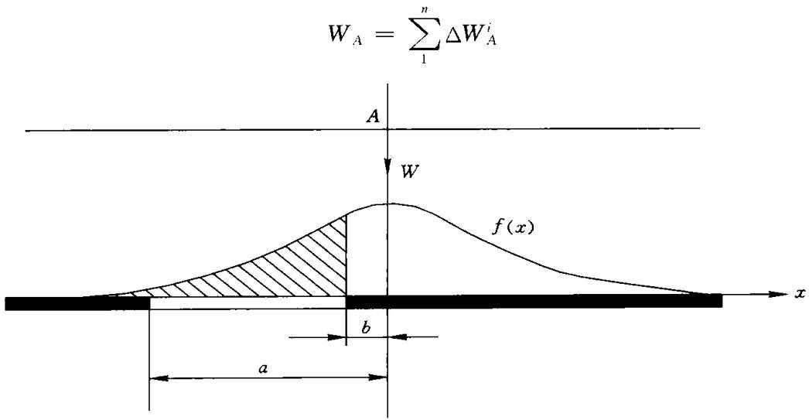  
图3-1 影响函数法的叠加原理

很显然，小段 $\Delta \ v { x } _ { i }$ 开采的影响 $\Delta W _ { A } ^ { i }$ 既与开采小段的长度 $\Delta x _ { i }$ 有关，也与开采小段的位置x，有关。因此，可取 $\Delta W _ { A } ^ { i }$ 为：

$$
W _ { \mathcal { A } } ^ { i } = f ( x _ { i } ) \Delta x _ { i }
$$

则 $W _ { A }$ 可表示为：

$$
W _ { A } = \sum _ { 1 } ^ { n } f ( x _ { i } ) \Delta x _ { i }
$$

取 $\Delta x _ { i } \to 0 , n \to \infty$ 时，则 $a b$ 段煤层的开采在地表点A产生的下沉为：

$$
W _ { . 4 } = \int _ { 4 } ^ { b } f ( x ) \mathrm { d } x\tag{3-15}
$$

式中， $f ( x )$ 为影响函数。由积分的性质可知，ab段煤层的开采在地表点A产生的下沉为$W _ { A }$ ，即为影响函数 $f ( x )$ 在区域 $( a , b )$ 内与 $f ( x ) = 0$ 之间所围的面积。

为了导出半无限开采(充分采动)地表下沉的剖面方程，设工作面自很远处开采并停止于A点，取地面横坐标与煤层面横坐标重合(图3-2)，则 $W ( A )$ 为：

$$
W ( x ) = \int _ { - s . } ^ { x } f ( x ) \mathrm { d } x = \int _ { x } ^ { + s . } f ( x ) \mathrm { d } x\tag{3-16}
$$

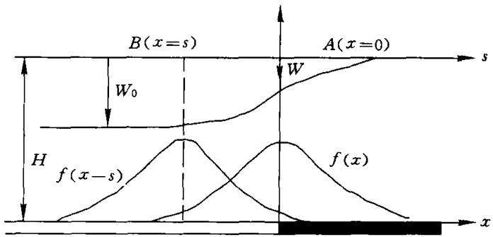  
图3-2 充分采动地表下沉剖面方程推导示意图

而倾斜和曲率为：

$$
\left. \begin{array} { l } { \displaystyle i ( x ) = \frac { \mathrm { d } W ( x ) } { \mathrm { d } x } } \\ { \displaystyle k ( x ) = \frac { \mathrm { d } ^ { 2 } W ( x ) } { \mathrm { d } x ^ { 2 } } \Biggl \} } \end{array} \right.\tag{3-17}
$$

关于水平移动与水平变形，阿维尔辛提出了水平煤层开采水平移动与倾斜成正比的著名论断。因此有：

$$
\left. \begin{array} { c } { { U ( x ) = B i \left( x \right) } } \\ { { \vphantom { \left( { x } \right) } } } \\ { { \varepsilon ( x ) = B k \left( x \right) } } \end{array} \right\}\tag{3-18}
$$

常用的影响函数列于表3-4。

表3-4  
常用的影响函数
<table><tr><td rowspan=1 colspan=1>影响函数</td><td rowspan=1 colspan=1>公式编号</td><td rowspan=1 colspan=1>提出者</td></tr><tr><td rowspan=1 colspan=1> $f ( x ) = W _ { \odot } \ \frac { r ^ { 3 } \tan ^ { 3 } \hat { \theta _ { 0 } } } { \pi } x ( \sin \hat { \theta _ { 0 } } \cos \hat { \theta _ { 0 } } + \frac { \pi } { 2 } ) - \hat { \partial _ { 0 } } ( \boldsymbol { x } ^ { 2 } + r ^ { 2 } \tan ^ { 2 } \hat { \partial _ { \langle } } ) ^ { 2 }$ </td><td rowspan=1 colspan=1>(3-19)</td><td rowspan=1 colspan=1>巴尔斯(R.Bals)</td></tr><tr><td rowspan=1 colspan=1> $f ( \mathbf { \nabla } _ { , T } ) = W _ { \mathrm { ~ 0 ~ } } \frac { 3 r ^ { 2 } } { \pi } ( 1 - \frac { x ^ { 2 } } { r ^ { 2 } } )$ </td><td rowspan=1 colspan=1>(3-20)</td><td rowspan=1 colspan=1>别耶尔(F. Beyer)</td></tr><tr><td rowspan=1 colspan=1> $f ( x ) = W _ { 0 } \ \frac { 2 } { \sqrt { \pi ^ { 3 } } r x } \mathrm { e } ^ { - 4 } \frac { x ^ { 2 } } { r ^ { 2 } }$       取n=1</td><td rowspan=1 colspan=1>(3-21)</td><td rowspan=1 colspan=1>勃劳纳(G. Brauner)</td></tr></table>

续表3-4
<table><tr><td rowspan=1 colspan=1>影响函数</td><td rowspan=1 colspan=1>公式编号</td><td rowspan=1 colspan=1>提出者</td></tr><tr><td rowspan=1 colspan=1> $f ( x ) = W _ { 0 } \ { \frac { 0 . 2 1 6 x } { r } } \mathrm { e } ^ { - 4 { \frac { x ^ { 6 } } { r ^ { 6 } } } }$        $y _ { \mathbb { Z } } \ n = 3$ </td><td rowspan=1 colspan=1>(3-22)</td><td rowspan=1 colspan=1>勃劳纳(G. Brauner)</td></tr><tr><td rowspan=1 colspan=1> $f ( \mathbf { \Psi } _ { , x } ) = W _ { \mathbb { 1 } } \ \frac { \mathbb { 1 } } { r _ { 2 } } \mathrm { e } ^ { - \pi \frac { x ^ { 2 } } { r ^ { 2 } } }$       取n=1</td><td rowspan=1 colspan=1>(3-23)</td><td rowspan=1 colspan=1>李特威尼申(J. Litwini-szyn)</td></tr><tr><td rowspan=1 colspan=1> $f ( \cdot , x ) = W _ { \odot } \ \frac { 4 . 6 r ^ { 2 } } { \pi } \mathrm { e } ^ { \cdot 4 . 6 \frac { x ^ { 2 } } { r ^ { 2 } } }$ </td><td rowspan=1 colspan=1>(3-24)</td><td rowspan=1 colspan=1>埃尔哈尔特一佐埃尔(W. Ehrhardt 和 A. Sauer)</td></tr><tr><td rowspan=1 colspan=1> $\boldsymbol { f } ( \boldsymbol { x } ) = \boldsymbol { W } _ { 0 } \ \frac { 2 } { r ^ { 2 } } \mathrm { e } ^ { - 2 \pi \frac { x ^ { 2 } } { r ^ { 2 } } }$        取n=2</td><td rowspan=1 colspan=1>(3-25)</td><td rowspan=1 colspan=1>勃劳纳(G. Brauner)</td></tr><tr><td rowspan=1 colspan=1> $f ( x ) = W _ { 0 } \ { \frac { 7 } { r ^ { 2 } } } { \mathrm { e } } ^ { \cdots 6 . 6 5 ; \frac { x ^ { 2 } } { r ^ { 2 } } }$       取 $r = 6 , 6 5 r _ { 0 } , n = 1$ </td><td rowspan=1 colspan=1>(3-26)</td><td rowspan=1 colspan=1>勃劳纳(G. Brauner)</td></tr></table>

除式(3-19)外，表中所有的影响函数可描述为：

$$
f ( x ) = k _ { 1 } W _ { \circ } g ( r , k _ { 2 } , x )\tag{3-27}
$$

式中， $W _ { \mathrm { 0 } }$ 为充分采动条件下的最大下沉值，mm；r为临界开采半径(主要影响半径)，近似为充分采动时盆地平底最外点或最大下沉点至开采边界的距离，m；x为计算点至开采单元的距离， $\mathfrak { m } ; \boldsymbol { k } _ { 1 } , \boldsymbol { k } _ { 2 }$ 为影响函数的待定常数。

临界开采半径r是影响函数的一个重要参数，它控制下沉曲线的横向发育，从而影响影响函数法的预计精度。图3-3给出了当积分半径 $r _ { 1 }$ 与临界半径r取不同值时，计算的最大值与 $W _ { \mathrm { 0 } }$ 之间的比例关系，图中曲线编号即表3-4中公式的编号。我们希望当 $r _ { 1 } = r$ 时，计算的最大值接近100%的 $W _ { \mathrm { 0 } }$ ，但不同的影响函数其接近程度不同，总的计算误差在6%以内。

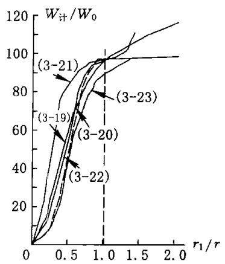

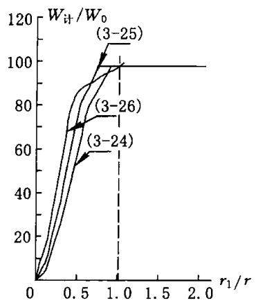  
图 3-3 计算的最大下沉值 $W _ { \mathrm { i \mathrm { t } } }$ 与 $W _ { \mathrm { 0 } }$ 的比值与 $r _ { 1 }$ /r之间的关系

## 2. 概率积分法

## （1）单元下沉盆地和水平移动盆地

如图3-4所示，取直角坐标 $( x , y , z )$ 和 $( s , t , m )$ 。在采深为H处，采出肯定会引起地表沉陷的体积 $2 s _ { \scriptscriptstyle 0 } \times 2 t _ { \scriptscriptstyle 0 } \times 2 m _ { \scriptscriptstyle 0 }$ 的 $\textcircled { 1 } ^ { 2 }$ 体。则组成此开采的一个单元体积 $1 \times 1 \times 1$ 的开采在地表形成的下沉曲面和水平移动曲面称之为单元下沉盆地和水平移动盆地。

对水平煤层来说，可以近似认为：

①微面开采影响的各向同性。只要地表点与开采微面的相对位置不变，面积相同的微面开采引起该地表点下沉的概率相等，而与坐标轴的选择无关。

②微面开采影响的衰减性。面积相同的微面对某地表点下沉的影响随其二者之间距离的增大而逐渐减小。

③单元开采下沉盆地的体积不变性。柯赫曼斯基认为地下开采后地表下沉盆地的最终体积将近似等于采出空间的体积，因此，单元开采下沉盆地的体积最终等于1。

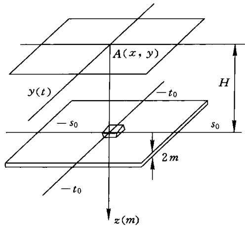  
图 3-4 空间开采示意图

④单元下沉盆地体积的增加速率与残存未压实的体积成正比。在单元采出后，顶板在不长的时间内逐步垮落，上覆岩体逐渐压密垮落岩石，并逐渐形成单元下沉盆地。单元下沉盆地的体积 $V _ { \epsilon }$ 从0增加到1的过程，可以看成垮落岩石逐渐压实的过程，单元下沉盆地体积的增加速率与残存未压实的体积成正比，即：

$$
\frac { \mathrm { d } V _ { e } } { \mathrm { d } t } = C \bullet ( 1 - V _ { e } )\tag{3-28}
$$

式中，C为下沉速度系数。

⑤岩体的不可压缩性。若取x和y方向的水平移动分别为 $U , V , z$ 方向的下沉为W，则有：

$$
\frac { \partial U } { \partial x } + \frac { \partial V } { \partial y } + \frac { \partial W } { \partial z } = 0\tag{3-29}
$$

根据上述假设，可以导出水平成层介质或水平各向同性介质中单元下沉盆地和水平移动盆地的表达式为：

$$
\begin{array} { l } { { W _ { \star } ( x , y , z ) = \displaystyle \frac { 1 } { r ^ { 2 } ( z ) } ( 1 - \mathrm { e } ^ { - \alpha } ) \bullet \mathrm { e } ^ { - \frac { \alpha \beta ^ { 2 } \cdot x ^ { 2 } } { r _ { \star \star } ^ { 2 } } } } } \\ { { \phantom { W _ { \star } ( x , y , z , \it { t } ) = B ( z ) \ \frac { \partial W _ { \star } ( x , y , z , \it { t } ) } { \partial x } = - \frac { 2 \pi } { r ( z ) } \bullet \frac { \mathrm { d } r ( z ) } { \mathrm { d } z } ( 1 - \mathrm { e } ^ { - \alpha } ) \bullet \mathrm { e } ^ { - \frac { \alpha \beta ^ { 2 } \cdot x ^ { 2 } } { r _ { \star \star } ^ { 2 } } } } } } \end{array}\tag{3-30}
$$

当矿体和岩层倾斜时，盆地中心向下山方向移动。倾斜成层介质中三维单元下沉盆地和水平移动盆地为：

$$
\left. \begin{array} { l } { { W _ { \star } ( x , y , z , t ) = \displaystyle \frac { 1 } { r ^ { 2 } ( z ) } ( 1 - \mathrm { e } ^ { - \tau t } ) \bullet \mathrm { e } ^ { - \frac { \tau , x , \varrho ( z ) \dot { z } ^ { 2 } - y ^ { 2 } } { r ^ { 2 } ( z ) } } } } \\ { { U _ { \star } ( x , y , z , t ) = B ( z ) \displaystyle \frac { \partial W _ { \star } ( x , y , z , t ) } { \partial x } + \displaystyle \frac { \partial \rho ( z ) } { \partial z } W _ { e } ( x , y , z , t ) \Bigg \rangle } } \end{array} \right\}\tag{3-31}
$$

当 $t  \infty$ 时：有：

$$
\left. \begin{array} { l } { { W _ { \mathrm { { e } } } ( x , y , z ) = \displaystyle \frac { 1 } { r ^ { 2 } ( z ) } \bullet \mathrm { e } ^ { - x \frac { \mathrm { { i } } ^ { 2 } \cdot \sigma \cdot ( z ) \cdot \sigma ^ { 2 } } { r ^ { 2 } ( z ) } } } } \\ { { U _ { \mathrm { { e } } } ( x , y , z ) = B ( z ) \ : \displaystyle \frac { \partial W _ { \mathrm { { e } } } ( x , y , z ) } { \partial x } + \frac { \partial \rho ( z ) } { \partial z } W _ { \mathrm { { e } } } ( x , y , z ) \ : \displaystyle \right\} } } \end{array}\tag{3-32}
$$

由此可见，当矿体和岩层倾斜时，单元水平移动由两部分组成：第一部分与倾斜成正比，第二部分与下沉成正比，它是因介质倾斜引起的。而 $\rho ( z )$ 应为：

$$
\rho ( z ) = \frac { z } { \tan \theta } = \frac { z } { \tan ( 9 0 ^ { \circ } - k \alpha ) }\tag{3-33}
$$

式中，θ为开采影响传播角；k为开采影响传播系数；α为矿体的倾斜角。

若 $\alpha ^ { = } 0 ^ { \circ }$ 时 $\scriptstyle \mathbf { \rho } , \mathbf { \rho } , \mathbf { \rho } , \mathbf { \rho } , \mathbf { \rho } , \mathbf { \rho } , \mathbf { \rho } , \mathbf { \rho } , \mathbf { \rho } , \mathbf { \rho } , \mathbf { \rho } , \mathbf { \rho } , \mathbf { \rho } ,$ ，第二项为零，即为水平煤层开采时的单元水平移动盆地。当取 $\alpha = 0 ^ { \circ }$ ，且仅考虑 $( x , z )$ 面上的移动变形时，单元下沉和单元水平移动为：

$$
\left. \begin{array} { l } { { W _ { e } ( x , z ) = \displaystyle \frac { 1 } { r ( z ) } \cdot \mathrm { e } ^ { - \pi \frac { x ^ { 2 } } { r ^ { 2 } ( z ) } } } } \\ { { { } } } \\ { { U _ { e } ( x , y , z ) = B ( z ) \frac { \partial W _ { e } ( x , z ) } { \partial x } = \frac { r r ^ { ' } } { 2 \pi } \frac { \partial W _ { e } ( x , z ) } { \partial x } } } \end{array} \right\}\tag{3-34}
$$

## (2)地表移动的平面问题

平面问题本是固体力学上的一个名词术语，其特点是：①物体在某个坐标方向的尺寸远大于或远小于其他两个坐标方向的尺寸，几何上是柱形体或薄板；②外力的分布和支承条件不随该坐标轴而变化，或者外力均匀作用在周边上，且沿厚度不变，并平行于薄板的两面，在薄板的两面上没有外力。前者为平面应变问题，后者为平面应力问题。

所谓地表移动的平面问题，是指平面应变问题，即开采沿某个方向(如y轴方向)是无限的，因而与该方向正交的方向上(一般取x轴方向)，其岩层与地表的移动仅与x坐标有关，而与y坐标无关。在x方向的开采，又可分为半无限开采与有限开采。半无限开采是指x方向上的开采宽度相当大，使计算水平z上的岩层或地表的移动达到充分采动，开采宽度继续增大时，工作面上方地表移动和变形不再变化。反之，开采宽度相对比较小，z水平上岩层或地表移动还不充分，其数值还将随开采宽度增大而改变。这种情况称之为有限开采，即非充分采动。

## ① 半无限开采

如图3-5所示，采深为H，开采厚度为m，取坐标原点通过开采边界。由于垮落顶板岩石的碎胀，顶板的最大下沉量不会等于开采厚度，而只是采出厚度的一部分。实际观测表明，顶板下沉曲线为一条连续曲线。但为了工程应用，可用阶梯形曲线来描述，即：

$$
W ( s ) = \left\{ \begin{array} { l l } { { 0 } } & { { ( s < 0 ) } } \\ { { m q } } & { { ( s \geqslant 0 ) } } \end{array} \right.\tag{3-35}
$$

式中， $^ Ḋ 1 q Ḍ$ 为下沉系数，取决于顶板管理办法；m为煤层开采厚度，mm。

当煤层自s=0开采到s=∞时，地表稳定后的移动变形为：

$$
\begin{array} { l } { W ( x ) = \displaystyle \frac { W _ { 0 } } { 2 } \big [ \mathrm { e r f } ( \sqrt { \pi } x ) + 1 \big ] } \\ { i ( x ) = \displaystyle \frac { \mathrm { d } W ( x ) } { \mathrm { d } x } = \frac { W _ { 0 } } { r } \mathrm { e } ^ { - \kappa _ { r } ^ { 2 } } } \\ { k ( x ) = \displaystyle \frac { \mathrm { d } ^ { 2 } W ( x ) } { \mathrm { d } ^ { 2 } x } = 2 \pi \frac { W _ { 0 } } { r ^ { 2 } } ( - \frac { x } { r } ) \mathrm { e } ^ { - \kappa _ { r } ^ { 2 } } } \\ { U ( x ) = \mathrm { b r i } ( x ) = b W _ { 0 } \mathrm { e } ^ { \frac { - \kappa _ { r } ( \frac { - x } { r } ) ^ { 2 } } { 2 } } } \\ { \varepsilon ( x ) = \mathrm { b r k } ( x ) = 2 \pi b \frac { W _ { 0 } } { r } ( - \frac { x } { r } ) \mathrm { e } ^ { - \kappa _ { r } ^ { 2 } } } \end{array}\tag{3-36}
$$

式中

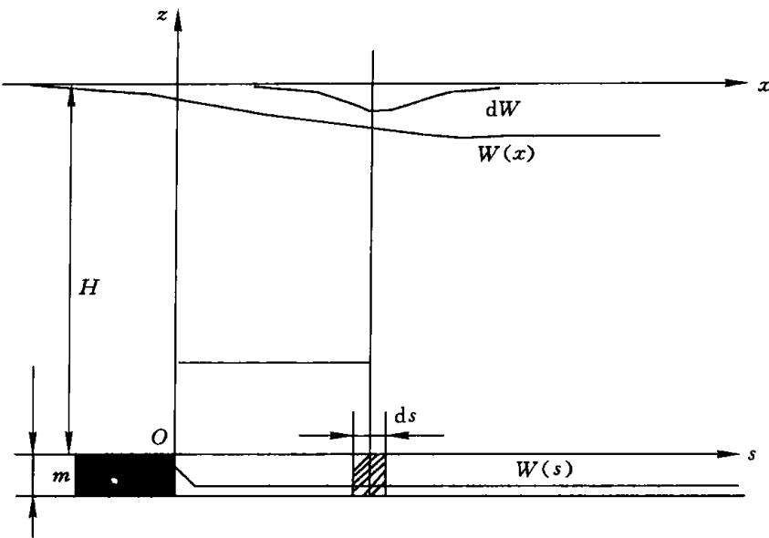  
图 3-5 下沉盆地剖面图

$$
\begin{array} { c } { { \mathrm { e r f } ( \displaystyle \frac { \sqrt { \pi } } { r } x ) = \displaystyle \frac { 2 } { \sqrt { \pi } } \displaystyle \int _ { 0 } ^ { \frac { \sqrt { \pi } } { r } } { \mathrm { e } ^ { - \lambda ^ { 2 } } } \mathrm { d } \lambda } } \\ { { b = \displaystyle \frac { r ^ { \prime } } { 2 \pi } } } \\ { { W _ { 0 } = m q } } \end{array}
$$

为了应用的方便，可查以 $\frac { \sqrt { \pi } } { r }$ 为引数的概率积分表。

## ②有限开采

在有限开采时，考虑到工作面开采边界附近有一个未压密带 $s _ { 0 }$ (拐点偏移距)，因此在进行地表移动变形计算时，应采用计算宽度 $l = l _ { 0 } - 2 s _ { 0 }$ 。由图3-6可知，顶板下沉曲线近似为：

$$
W ( s ) = \left\{ \begin{array} { l l } { 0 \quad } & { ( s < 0 ) } \\ { m q \quad } & { ( 0 \leqslant s \leqslant 1 ) } \\ { 0 \quad } & { ( s > 1 ) } \end{array} \right.\tag{3-37}
$$

式中， $l _ { 0 }$ 为实际开采宽度。

有限开采地表的下沉、倾斜、曲率、水平移动和水平变形为：

$$
\begin{array} { l } { { W ^ { 0 } ( x ) = \displaystyle \frac { W _ { 0 } } { 2 } \left. \left[ 1 + \mathrm { e r f } ( \sqrt \pi ~ \frac { x } { r } ) \right] - \left[ 1 + \mathrm { e r f } ( \sqrt \pi ~ \frac { x - l } { r } ) \right] \right. = W ( x ) - W ( x - l ) } } \\ { { \displaystyle i ^ { 0 } ( x ) = \frac { \mathrm { d } W ^ { 0 } ( x ) } { \mathrm { d } x } = \frac { W _ { 0 } } { r } \left[ \mathrm { e } ^ { - \pi ^ { \frac { x ^ { 2 } } { r ^ { 2 } } } } - \mathrm { e } ^ { - \pi ^ { \frac { ( x - l ) ^ { 2 } } { r ^ { 2 } } } } \right] = i ( x ) - i ( x - l ) } } \\ { { \displaystyle k ^ { 0 } ( x ) = \frac { \mathrm { d } ^ { 2 } W ^ { 0 } ( x ) } { \mathrm { d } x ^ { \frac { x } { 2 } } } = \frac { 2 \pi W _ { 0 } } { r ^ { 2 } } \big [ \frac { x } { r } \mathrm { e } ^ { - \pi ^ { \frac { x ^ { 2 } } { r ^ { 2 } } } } - \frac { x - l } { l } - \mathrm { e } ^ { - \pi ^ { \frac { x - l } { r ^ { 2 } } } } \big ] = k ( x ) - k ( x - l ) } } \\ { { \displaystyle U ^ { 0 } ( x ) = b W _ { 0 } \Big [ \mathrm { e } ^ { - \pi ^ { \frac { x ^ { 2 } } { r ^ { 2 } } } } - \mathrm { e } ^ { - \pi ^ { \frac { x + l - l - l } { r ^ { 2 } } } } \big ] = U ( x ) - U ( x - l ) } } \\   \displaystyle \varepsilon ^ { 0 } ( x ) = \frac { \mathrm { d } u ^ { 0 } ( x ) } { \mathrm { d } x } = \frac { 2 \pi b W _ { 0 } } { r } \Big [ \frac { x } { r } \mathrm { e } ^ { - \pi ^ { \frac { x ^ { 2 } } { r ^ { 2 } } } } - \frac { x - l } { r } \mathrm { e } ^ { - \pi ^ { \frac { x - l - l } { r ^ { 2 } } } } \Big ] \end{array}\tag{3-38}
$$

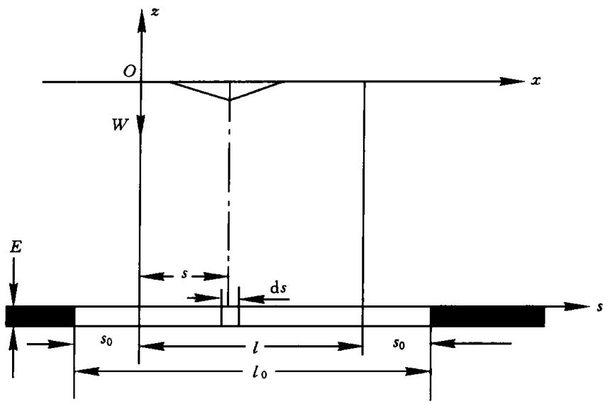  
图 3-6 有限开采计算示意图

因此，有限开采的地表移动变形为两个半无限开采的地表移动变形通过几何叠加而得出。

## (3)地表移动变形的空间问题

## ①地表任意点的下沉

如图3-4所示，根据叠加原理，在体积为 $2 s _ { \mathrm { 0 } } \times 2 m _ { \mathrm { 0 } } \times 2 t _ { \mathrm { 0 } }$ 开采影响下的下沉盆地，等于组成这一体积的各微小体积开采影响的总和，即：

$$
\begin{array} { c } { { W ( x , y ) = \displaystyle { \int _ { - m _ { 0 } } ^ { m _ { 0 } } \int _ { - s _ { 0 } } ^ { s _ { 0 } } \int _ { - t _ { 0 } } ^ { t _ { 0 } } \frac { 1 } { r ^ { 2 } } \mathrm { e } ^ { - \frac { \pi } { r ^ { 2 } } [ ( x - s ) ^ { 2 } + ( y - t ) ^ { 2 } ] } \mathrm { d } s \mathrm { d } t \mathrm { d } m } } } \\ { { = \displaystyle { \frac { 1 } { W _ { 0 } } W ^ { 0 } \left( x \right) W ^ { 0 } \left( y \right) W _ { \circ } \bullet C ( x ) \bullet C ( y ) } } } \end{array}\tag{3-39}
$$

这里， $C ( x )$ 与 $C ( y )$ 称为主断面内的下沉分布系数。

## ②地表任意点的倾斜

在任意点 $( x , y )$ 且与x坐标轴相交成 $\varphi$ 角的任意方向上，地表的倾斜 $i ( x , y ) _ { \varphi }$ 为：

$$
\begin{array} { r } { i { ( x , y ) _ { \varphi } = } \displaystyle \frac { \partial W ( x , y ) } { \partial x } \mathrm { c o s } ~ \varphi + \frac { \partial W ( x , y ) } { \partial y } \mathrm { s i n } ~ \varphi } \\ { { = } C ( y ) i ( x ) \mathrm { c o s } ~ \varphi + C ( x ) i ( y ) \mathrm { s i n } ~ \varphi } \end{array}\tag{3-40}
$$

主倾斜方向和主倾斜角为：

$$
\begin{array} { c } { { \varphi _ { k } = \arctan \displaystyle \frac { C ( x ) i ( y ) } { C ( y ) i ( x ) } } } \\ { { i ( x , y ) _ { \varphi _ { k } } = C ( y ) i ( x ) \cos \varphi _ { k } + C ( x ) i ( y ) \sin \varphi _ { k } } } \end{array}\tag{3-41}
$$

## ③地表任意点的曲率

过任意点沿任意方向的曲率 $k ( x , y ) _ { \varphi }$ 为：

$$
k ( x , y ) _ { \varphi } = C ( y ) k ( x ) \cos ^ { 2 } \varphi + C ( x ) k ( y ) \sin ^ { 2 } \varphi + C _ { [ x , y ] } \sin 2 \varphi\tag{3-42}
$$

其中

$$
C _ { [ x , y ] } = \frac { 1 } { W _ { \circ } i ( x ) } i ( x ) i ( y )\tag{3-43}
$$

主曲率方向和主曲率值为：

$$
\begin{array} { c } { { \varphi _ { k } = \displaystyle \frac { 1 } { 2 } \arctan \frac { 2 C _ { [ x , y ] } } { C ( y ) k ( x ) - C ( x ) k ( y ) } } } \\ { { k ( x , y ) _ { \varphi _ { k } } = C ( y ) k ( x ) \cos ^ { 2 } \varphi _ { k } + C ( x ) k ( y ) \sin ^ { 2 } \varphi _ { k } + C _ { [ x , y ] } \sin 2 \varphi _ { k } } } \end{array}\tag{3-44}
$$

④地表任意点的水平移动

过任意点沿任意方向的倾斜 $U ( x , y ) _ { \varphi }$ 为：

$$
U ( x , y ) _ { \varphi } = C ( y ) U ( x ) \cos \varphi + C ( x ) U ( y ) \sin \varphi\tag{3-45}
$$

主水平移动方向和主水平移动值为：

$$
\varphi _ { k } = \arctan { \frac { C ( x ) U ( y ) } { C ( y ) U ( x ) } }
$$

$$
U ( x , y ) \varphi _ { k } = C ( y ) U ( x ) \cos \varphi _ { k } + C ( x ) U ( y ) \sin \varphi _ { k }\tag{3-46}
$$

## ⑤地表任意点的水平变形

过任意点沿任意方向的水平变形 $\boldsymbol { \mathsf { \varepsilon } } \left( \boldsymbol { x } , \boldsymbol { y } \right) _ { \varphi }$ 为：

$$
\varepsilon ( x , y ) _ { \varphi } = C ( y ) \varepsilon ( x ) \cos ^ { 2 } \varphi + C ( x ) \varepsilon ( y ) \sin ^ { 2 } \varphi + { \frac { 1 } { 2 } } r _ { [ x , y ] } \sin 2 \varphi _ { k }\tag{3-47}
$$

其中

$$
r _ { [ x , y ] } = \frac { 1 } { W _ { \ L _ { 0 } } } [ C ( \ L _ { \mathit { y } } ) i ( \ L _ { \mathit { y } } ) U ( x ) + C ( \ L _ { \mathit { x } } ) i ( \ L _ { \mathit { x } } ) U ( \ L _ { \mathit { y } } ) ]\tag{3-48}
$$

主水平变形方向和主水平变形值为：

$$
\varphi _ { k } = { \frac { 1 } { 2 } } \mathrm { a r c t a n } { \frac { 2 r _ { [ x , y ] } } { C ( y ) _ { \mathfrak { E } } ( x ) - C ( x ) _ { \mathfrak { E } } ( y ) } }
$$

$$
\varepsilon ( x , y ) \varphi _ { k } = C ( y ) _ { \pmb { \varepsilon } } ( x ) \cos ^ { 2 } \varphi _ { k } + C ( x ) _ { \pmb { \varepsilon } } ( y ) \sin ^ { 2 } \varphi _ { k } + \frac { 1 } { 2 } r _ { [ x , y ] } \sin 2 \varphi _ { k }\tag{3-49}
$$

## 第四节 景观生态学基础

景观生态学是生态学的一个重要层次，它不但是一门新兴的学科，而且是现代生态学领域中内容最丰富、发展最快、影响最广泛的分支之一。

## 一、景观和景观生态学

(一)景观

景观(Landscape)作为地域综合体，具有多种含义，也是多个学科的研究对象。这些含义包括：景观作为视觉审美的对象，如森林、草原与湖泊这些美丽景色；景观作为人类生活的栖息地，这时的景观与人类是合为一体的；景观作为系统，成为我们科学研究的对象。因而，景观是审美的、是体验的、是科学的、是有含义的。将景观作为生态系统来讨论，它是一个有机的系统，是一个自然生态系统和人类生态系统相叠加的复合生态系统。任何一种景观，像一片森林、一片沼泽地、一个城市里面都是有物质、能量及物种在流动的，是“活”的，是有功能和结构的。总之，对景观的一般理解主要是关注景观的视觉特性和文化价值，地理学和景观生态学将其进一步拓展，以“地域综合体”作为它们共同的概念基础。景观具有如下5个特征：

①景观由不同空间单元镶嵌组成，具有异质性。

②景观是具有明显形态特征与功能联系的地理实体，其结构与功能具有相关性和地域性。

③景观既是生物的栖息地，更是人类的生存环境。

④景观是处于生态系统之上、全球环境之下的中间尺度，具有尺度性。

⑤景观具有经济、生态和文化的多重价值，表现为综合性。

## (二）景观生态学

## 1. 景观生态学的发展简史

1939年德国著名生物地理学家C. Troll最早提出“景观生态学”(Landscape Ecology)的概念。C.Troll将景观生态学定义为研究某一景观中生物群落与主要生物群落之间错综复杂的因果反馈关系的学科。为此，C.Troll特别强调景观生态学是将航空摄影测量学、地理学和植被生态学结合在一起的综合性研究学科。C. Troll把景观看做是人类生活环境中的“空间的总体和视觉所触及的一切整体”。1984年，在第一部较为有影响的景观生态学英文教科书中Z.Naveh和D.Lieberman继承并进一步发展了欧洲早期景观生态学的概念，提出了“景观生态学是基于系统论、控制论和生态系统学之上的跨学科的生态地理科学，是整体人类生态系统科学的一个分支”。欧洲景观生态学的一个重要特点是强调整体论(Ho-lism)和生物控制论(Biocy-bernetics)观点，并以人类活动频繁的景观系统为主要研究对象。因此，景观生态学在欧洲一直与土地、景观的规划管理、保护和恢复密切联系。20世纪80年代初景观生态学才在北美逐渐兴起。美国生态学家R.Forman通过一系列文章介绍了欧洲景观生态学的一些概念，强调景观生态学是着重于研究较大尺度上不同生态系统的空间格局和相互关系的学科，提出了“斑块—廊道一基质”(Patch—Corridor一Matrix)模式。与此同时,T. M. Burgess 和 D. M. Sharpe 编著的 Forestlsland Dynamicsin Man-DominatedLandscaped(人类主导的景观中的森林岛动态)一书，突出了岛屿生物地理学理论在研究景观镶嵌体中的作用。1983年，在美国伊利诺伊州的Allertaon公园召开的景观生态学研讨会上，提出景观生态学应强调空间异质性和尺度，而且对景观生态学的研究内容和方法也做了较为系统的阐述。Allertaon研讨会成为北美景观生态学发展过程中一个重要的里程碑。

景观生态学在我国虽然起步较晚，但近年来发展很快。现在已有不少介绍景观生态学概念和方法的文章和书籍，而且有关城市景观、农业景观、景观模型等方面的研究论文也陆续发表。然而，从总体上看，我国景观生态学尚缺乏系统的、跨尺度的理论和实践研究。

## 2. 景观生态学的研究内容

景观生态学是研究景观单元的类型组成、空间格局及其与生态过程相互作用的综合性学科。强调空间格局、生态过程与尺度之间的相互作用是景观生态学的核心所在。景观生态学的提出填补了生态学组织层次上的空白，成为介于生态系统生态学和全球生态学之间的过渡，对强调生态要素与现象的空间结构和尺度作用具有重要的意义。

景观生态学的研究对象和内容可以概括为3个基本方面：

①景观结构—即景观组成单元的类型、多样性及其空间关系。

②景观功能—即景观结构与生态学过程的相互作用或景观结构单元之间的相互作用。

③景观动态—即指景观在结构和功能方面随时间推移发生的变化。

景观的结构、功能和动态是相互依赖、相互作用的。这正如其他生态学组织单元(如种群、群落、生态系统)的结构与功能是相辅相成的一样，结构在一定程度上决定功能，而结构的形成和发展又受到功能的影响。

一般而言，景观生态学研究的重点主要集中在景观结构、功能和动态的相互关系以及景观生态学中的基本概念和理论等方面。

## 3. 几个重要的概念

景观生态学中的许多概念来自于相邻学科，如空间格局、多样性、异质性(不均匀性)等都是群落生态学中描绘种的分布时所经常使用的概念。

## (1）斑块一廊道一基质模式

无论是在景观生态学还是在景观生态规划中，斑块(Path)一廊道(Corridor)一基质(Matrix)模式都是构成并用来描述景观空间格局的一个基本模式。其概念来自于生物地理学(主要是植物地理学)中对不同群落分布形式的描述，并给予更加明确的定义，从而形成的一套专有概念和术语体系。如斑块是在景观的空间比例尺上所能见到的最小异质性单元，即一个具体的生态系统；廊道是指不同于两侧基质的狭长地带，可以看做是一个线状或带状斑块，连接度、结点及中断等是反映廊道结构特征的重要指标；基质是景观中范围广阔、相对同质且连通性最强的背景地域，是一种重要的景观元素。它在很大程度上决定着景观的性质，对景观的动态起着主导作用。

斑块一廊道一基质模式的形成，使得对景观结构、功能和动态的表述更为具体、形象，而且，斑块一廊道一基质模式还有利于考虑景观结构与功能之间的相互关系，比较它们在时间上的变化。然而，在实际研究中，要确切地区分斑块、廊道和基质往往是很困难的，也是不必要的。广义而言，把所谓基质看做是宏观中占绝对主导地位的斑块也未尝不可；另外，因为景观结构单元的划分总是与观察尺度相联系，所以斑块、廊道和基质的区分往往是相对的。例如，某一尺度上的斑块可能成为较小尺度上的基质，也可能是较大尺度上廊道的一部分。

## (2) 景观结构与格局

景观作为一个整体成为一个系统，具有一定的结构和功能。而其结构和功能在外界干扰和其本身自然演替的作用下，呈现出动态的特征。景观结构是指景观的组分构成及其空间分布形式。景观结构特征是景观性状最直观的表现方式，也是景观生态学研究的核心内容之一。不同的景观结构是不同动力学发生机制的产物，同时还是不同景观功能得以实现的基础。

在景观生态学中，结构与格局是两个既有区别又有联系的概念。比较传统的理解是，景观结构包括景观的空间特征(如景观元素的大小、形状及空间组合等)和非空间特征(如景观元素的类型、面积比率等)两部分内容，而景观格局概念一般是指景观组分的空间分布和组合特征。另外，这两个概念均为尺度相关概念，表现为大结构中包含有小的格局，大格局中同样含有小的结构。不过，现阶段许多景观生态学文献往往不再区分景观格局和景观结构之间的概念差异。

景观生态研究通常需要基于大量空间定位信息，在缺乏系统景观发生和发展历史资料记录的情况下，从现有景观结构出发，通过对不同景观结构与功能之间的对应联系进行分析，成为景观生态学研究的主要思路。因此，景观结构分析是景观生态研究的基础。格局、异质性、尺度效应问题是景观结构研究的几个重点领域。

## (3)异质性(Heterogeneity)

异质性是景观生态学的重要概念，指在一个景观区域中，景观元素类型、组合及属性在空间或时间上的变异程度，是景观区别于其他生命层次的最显著特征。景观生态学主要研究基干地表的异质性信息，而景观以下层次的生态学研究则大多数需要以相对均质性的单元数据为内容。

景观异质性包括时间异质性和空间异质性，更确切地说，是时空偶合异质性。空间异质性反映一定空间层次景观的多样性信息，而时间异质性则反映不同时间尺度景观空间异质性的差异。正是时空两种异质性的交互作用导致了景观系统的演化发展和动态平衡，系统的结构、功能、性质和地位取决于其时间和空间异质性。所以，景观异质性原理不仅是景观生态学的核心理论，也是景观生态规划的方法论基础和核心。地球上多种多样的景观是异质性的结果，异质性是景观元素间产生能量流、物质流的原因。

## (4) 尺度(Scale)

尺度是景观生态学的另一个重要概念，指研究对象时间和空间的细化水平，任何景观现象和生态过程均具有明显的时间和空间尺度特征。景观生态学研究的重要任务之一，就是了解不同时间、空间水平的尺度信息，弄清研究内容随尺度发生变化的规律性。景观特征通常会随着尺度变化出现显著差异，以景观异质性为例，小尺度上观测到的异质性结构，在较大尺度上可能会作为一种细节被忽略。因此，某一尺度上获得的任何研究结果，不能未经转换就向另一种尺度推广。

不同的分析尺度对于景观结构特征以及研究方法的选择均具有重要影响，虽然在大多数情况下，景观生态学是在与人类活动相适应的相对宏观尺度上描述自然和生物环境的结构，但景观以下的生态系统、群落等小尺度资料对于景观生态学分析仍具有重要的支撑作用。不过，最大限度地追求资料的尺度精细水平同样是一种不可取的做法，因为小尺度的资料虽然可以提供更多的细节信息，但增加了准确把握景观整体规律的难度。所以，在着手进行一项景观生态问题研究时，确定合适的研究尺度以及相适应的研究方法，是取得合理研究成果的必要保证。

## 二、景观要素

## (一)斑块

斑块(Patch)的概念早已在植物群落和海洋浮游动植物空间分布的研究中得到应用。斑块性(Patchiness)是任何生态学系统的基本属性之一。许多空间格局和生态学过程由相应的斑块性和斑块动态(Patchdynamics)来决定。近年来，斑块性和斑块动态引起了生态学家的重视，理论和实际研究工作正在迅速开展。

根据起源的不同，将斑块分为4种类型：干扰斑块(DisturbancePatch)、残存斑块(Rem-nantpatch)、环境资源斑块(Environmental Resource Patch)和引入斑块(Introduced Patch)。

## (1) 干扰斑块

基质内的局部干扰形成干扰斑块。于扰是使生态系统、群落或种群的结构遭到破坏和使资源、基质的有效性或物理环境发生变化的任何相对离散的事件，如火灾、火山爆发、洪水、泥石流、病虫害等。例如，在一片森林里发生火灾，形成一个或多个火烧迹地，这就是干扰斑块。人类活动也是重要的干扰因素，在林区因采伐造成的干扰斑块是很普遍的。

干扰斑块和基质是动态关系。单一干扰情况下，初始干扰斑块内物种迁人率与消失率大幅度增加，随后降低，然后进入演替阶段，最后与基质融为一体。重复于扰(长期干扰)情况下，最初物种迁入率与消失率也较大，持续不断的干扰阻止了正常演替序列的形成，斑块进入一个相对稳定的时期；如果重复于扰停止，于扰斑块的物种迁入率与消失率又大幅度提高，演替重新开始，直至干扰斑块最终消失。干扰斑块是消失最快的斑块类型。

## (2) 残存斑块

残存斑块是由于它周围的土地受到干扰而形成的，它内嵌在受干扰基质内，成因与干扰斑块相同，只是地位不同。例如，在森林发生火灾时，火灾较小，出现的火烧迹地是干扰斑块，周围未烧的森林叫基质；如果火灾蔓延很广，残留的植被是残存斑块，大面积的火烧迹地为基质。

残存斑块形成后，有一段物种变动速率增高的时期，称之为调整期(RegulationPer-lod)。在景观基质受到干扰之后，有些物种将迁入到残余斑块中，其中一部分会定居下来，但是不久，这种物种增加的时期被物种灭绝率增高的时期所代替。甚至当基质和残存斑块融合一起以后，由它们汇合起来的生态系统，物种仍比原有的生态系统贫乏些。

## (3) 环境资源斑块

环境资源斑块起源于环境的异质性。如林区内，在河谷低地的沼泽；草原植被上的片林；聚集在沙漠绿洲周围的两栖动物和爬行动物等斑块。斑块与基质之间存在着生态交错区(Ecotone)。在干扰斑块(或残余斑块)与基质之间，生态交错区是比较窄的，即它们的过渡是比较突然的。在环境资源斑块与基质之间，生态交错区较宽，即两个群落的过渡比较缓慢。环境资源斑块与干扰无关，较为稳定，持续时间较长，物种的迁入与转化始终存在着，但变化水平较低。

## (4) 引入斑块

把生物引进到一块地区，就形成引人斑块。引入植物就形成种植斑块(PlantedPatch)，如农田、人工林等。

## （二） 廊道

廊道按起源分为干扰廊道、残存廊道、环境资源廊道、种植廊道、再生廊道等。廊道的起源某种程度上与斑块相同。于扰廊道由带状于扰所致，如道路；残存廊道由周围基质的干扰所引起，如森林采伐留存的带状林地、为动物迁徙保留的植被带；环境资源廊道由环境资源在空间上的异质性线性分布形成，如河流、山脊线、谷底动物路径等。

根据结构特点，廊道分为线状廊道与带状廊道。线状廊道狭窄，以边缘种占优势；带状廊道较宽，除边缘种外，还有内部种。

景观为廊道所分割，同时又被廊道所连接，这种双重而又相反的特性说明廊道在景观中具有重要作用。R.Forman(1995)论述了廊道的5种功能。

①栖息地—廊道是边缘种和一般种的栖息地，多生境种类和外来种在廊道中也能发现，一般情况下廊道中见不到稀有种和濒危种。

②通道—有关廊道通道功能方面的专题研究较少。有关小型哺乳动物沿高速公路开阔边缘的迁移和植物沿堤坝的迁移已有论述。树篱生态学的研究表明，仅有少量小型哺乳动物和植物可沿树篱有效迁移，某些鸟类和大中型哺乳动物则利用树篱穿越景观。火灾和病虫害暴发等干扰可能沿廊道迅速蔓延，但另一方面，廊道也能起到屏障作用，土地管理

者可借此有效地控制干扰的传播。

③过滤器动植物穿越廊道的能力是不一样的。有些森林内部鸟类和小型哺乳动物不一定能穿越采伐林地中的道路或小片空地，许多哺乳动物在穿越时将被杀死，有一些则集体避开道路廊道。廊道是半渗透性的过滤器。

④源——如果在大片农田或森林中开辟一条新的廊道，试想廊道将如何变化？沿廊道运动的动物、水、车辆、徒步旅行者也有可能进入基质，噪声、灰尘、各类化学物质以及某些廊道残遗种同样如此。廊道具有“源”的功能，对基质产生多种影响。

⑤汇飞雪、土壤以及种子在林地廊道边缘聚集。廊道的功能(R.Forman，1995)于基质的水侵蚀物质、农药和动物在河流廊道积聚，动物穿越廊道时被杀死。廊道具有“汇”的功能，承受来自基质的影响。

影响廊道功能的结构因素有宽度、连接度和弯曲度或通直度。边缘种的多样性随廊道的宽度不同而不同，宽度越大，廊道的功能越强。连接度是廊道在空间上连续程度的量度，可简单地用单位长度上断开区的数量来表示。无论是从通道功能还是从障碍功能来说，连接度均是很重要的。例如一个河流要是开了口子，它的功能就会丧失或造成巨大的伤害；如农田防护林，有时为了拖拉机的通行，裂口是有必要的，但也会妨碍该廊道的整体功能。一般认为，连接度越高，廊道的功能水平越高。断开区在物种沿廊道迁移和物种穿越廊道中具有特别重要的作用。如果廊道具有断开区，可对断开区进行特别设计，以促进动物沿廊道的迁移。廊道越通直，景观中两点之间的实际距离越短，动物在廊道中移动的越快。但并不是越直越好，如在旅行中的道路以及河流要有自然的弯度等。

## （三）基质

基质(Matrix)是景观中面积最大、连通性最好、在景观中起控制作用的景观要素。控制景观动态是基质的最根本特征。基质在景观功能上起着重要的作用，能影响能流、物流、信息流和物种流，如广阔的草原、沙漠，连片分布的森林、农田等。

## 1. 基质判定标准

①相对面积当景观中某一要素所占的面积比其他要素大得多时，这种要素类型可能就是基质，它控制着景观中主要的流。相对面积的大小决定着基质对整个景观的控制程度。或者说，如果某种景观要素占景观面积的50%以上，那么它就很可能是基质，如果最大的景观成分在景观中所占面积不及50%，那么在确定基质时附加特征很重要。

②连通性—树篱景观中树篱所占面积一般不到总面积的10%，然而由于它的连通性好，人们往往觉得树篱网络就是基质。

③动态控制—以树篱和农田来说，树篱中的乔木的果实、种子可被动物或风等媒介传到农田中去，起到物种源的作用，从而使农田在失去人的管理之后，不久就会变为森林群落。这就表现出树篱对景观动态的控制作用。又如，森林地区和原始森林相比，采伐迹地和火烧迹地是不稳定的，它们内部乔木树种的更新和恢复，要靠周围森林供给种源并给予其他方面的有利影响。所以森林应为基质，而采伐迹地和火烧迹地应为斑块。

动态控制是判别基质的第三条标准，也是最难估计的。具体判断时，首先根据相对面积，依据相对面积难以判别时，使用连通性标准。如果根据上述两个标准还不能确定，则要进行野外调查以确定哪一种景观要素对景观动态的控制作用大。

## 2. 景观基质的孔隙度

孔隙度是景观中所含斑块密度的量度，与斑块大小无关，即包括基质在内的单位面积的闭合边界(不接触所研究空间或景观的周界)的数目，与研究对象的尺度和分辨率有关。闭合边界的斑块数量越多，基质的孔隙度越高。不管本底中有多少个孔隙，但如基质能相互连通，则称连接完全，否则称之为连接不完全。所以，孔隙度可能与连通度无关。

低孔隙度可能会抑制斑块间的物种交换，孔隙度小表明景观中有一些偏僻的地区，这对一些动物是至关重要的。高孔隙度对穿越基质的动物可能产生或大或小的影响，这最终取决于斑块和基质间流的性质：如果斑块不适宜生存，或者有捕食者或猎人在斑块内等待动物通过，那么动物在基质内的迁移就会缓慢下来，而且会遇到危险；相反，如果斑块特别容易接近则能促进动物以跳跃形式穿越景观。景观的孔隙度与动物的觅食密切相关，因为适宜的斑块密度对动物获得足够食物和供养巢穴中的幼崽是很重要的。

## 三、景观结构

## (一)景观结构类型

根据R.Forman研究，景观结构可分为四大类：分散的斑块景观、网状景观、交错景观、棋盘状景观。

## (1) 分散的斑块景观

在这种景观中，以一种生态系统或一种景观要素作为优势的基质，而以另外一种或多种类型斑块分散在其内。具有绿洲的荒漠、具有片林的农区或牧场可作为这种类型的实例。这种景观类型的关键特征有：①基质的相对面积；②斑块大小；③斑块间的距离；④斑块分散性(集聚、规则或随机)。分散的斑块景观对景观的很多特征均有影响。例如，相对面积对基质中某些物质的源区(Source)和汇区(Sink)功能影响就很大。

因此，来自广大基质的尘埃、二氧化氮和烟将显著改变大气的质量，例如来自周围地区的热将使湿润的绿洲斑块变得干燥，农区的大量居民将使分散片林中的薪炭材资源日益减少。斑块间的距离影响到很多干扰、种和有害生物由一个斑块向其他斑块的传播。

## (2) 网状景观

这种景观的特点是，在景观中相互交叉的廊道占优势。例如，牧场中的树篱网或林网，森林中的集运材道，溪流系统等。关键的空间特征是：①廊道宽度；②连通性；③网的回路；④网格大小；⑤节点大小；⑥节点分布。

这种景观结构对各种基本变量的影响是明显的。在一些地区，粮食生产、土壤的干化和侵蚀都要取决于防风林带的宽度和流通性。动物的活动性，无疑受到连通性和回路的影响。洪水和水质要决定于溪流走廊和河岸带系统。很多海滨鱼类、营养水平和三角洲的形成，均取决于能够抑制侵蚀的河岸带植被和坡地上的水土保持林带。

## (3) 交错景观

在交错景观里，占优势的有两种景观要素，彼此犬牙交错，但共同具有一个边界。这种景观的实例有：在山区农田和林地的交错分布，沿道路建设的居民区与非建筑区的交互分布。主要空间特征因素有：①每一要素类型的相对面积；②半岛的多度和方向；③半岛的长度和方向。

半岛的方向显然影响到风的穿人和作物产量，而宽度与生物多样性有关。在这种景观中总的边缘长度可能相当大，这样对边缘种和要求两种生态系统的动物有利。这种景观相邻两个生态系统的相互作用强烈，例如，农田中的家畜可能会妨碍森林的天然更新，而森林中的食草动物也会妨碍农田中的作物。

## (4) 棋盘状结构

这种景观由相互交错的棋盘状格子组成。人为管理的伐区格局和农田轮作可作为其代表。其显著的特征因素有：①景观粒度的大小(可直接按照组成斑块的平均面积或平均直径测定)；②棋盘格子的规整；③总的边界长度(或边缘数量)。

景观的粒度大小决定了内部种的多度和生物多样性，因为细粒景观包括的边缘种多。棋盘格子的规整性控制着很多客体(如作物授粉者、病害的媒介物和人)的移动和定居。伐区的更新和树木的风倒都与棋盘格子的特点有关。但是，棋盘景观的高度切割性质可减少于旱地区大气尘埃污染和大火的蔓延。

## （二）景观格局

景观空间格局(Landscapepattern)一般指大小和形状不一的景观斑块在空间上的配置。景观格局是景观异质性的具体体现，同时又是包括干扰在内的各种生态过程在不同尺度上作用的结果。景观作为一个整体具有其组成部分所没有的特性。因此，不能把景观单纯地描述为耕地、房屋、河流和牧场的总和。景观镶嵌格局在所有尺度上都存在。并且都是由斑块、廊道和基质构成的，即所谓斑块一廊道一基质模式。

分析景观格局的目的是从看似无序的景观斑块镶嵌中，发现潜在的有意义的规律性。如果想更加深入地理解景观格局，最好的方式是把它与一些运动过程和变化联系起来。因为，今天看到的格局是过去的景观流形成的。同样，景观格局也影响着各种景观流。通过景观格局的分析，希望能确定产生和控制空间格局的因子和机制，比较不同的空间格局及其效应，探讨空间格局的尺度性质等。

## (1)景观格局类型

R. Forman 和 M. Godron(1986)将景观格局分为以下几类。

①均匀分布格局。指某一特定类型景观要素间的距离相对一致。

②聚集型分布格局。例如，在许多热带农业区农田多聚集在村庄附近或道路的一端；在丘陵地区农田往往成片分布；村庄聚集在较大的山谷内。

③线状格局。例如，房屋沿公路零散分布或耕地沿河分布的格局形式。

④平行格局。如侵蚀活跃地区的平行河流廊道，以及山地景观中沿山脊分布的森林带。

⑤特定组合或空间连接，大多分布在不同类型要素之间。例如，稻田和酸果蔓沼泽总是与河流或渠道并存；道路和高尔夫球场往往与城市或乡村呈正相关空间连接。考察识别景观中特定构型之前，首先应该确定它的镶嵌度(Patchiness)。孔隙度是指某种特定类型的斑块密度。镶嵌度是所有类型斑块密度的一种量度。斑块面积较小的城郊景观比斑块面积大的草原景观具有更高的镶嵌度。

在由若干斑块类型组成的镶嵌体中，一般会有3个或更多的景观要素类型相交于某一地点。这些地点可视为掩蔽点或聚集点，这些地方分布有多种资源，对野生动物特别重要。除景观要素间的相互作用集中外，聚集点往往位于两个景观要素构成的半岛尖端，是动物迁移和其他物种穿越景观的关键点(漏斗效应)。3种景观要素极为接近的线状廊道称为聚集线，如草原和农田间的防护林、人工针叶林和阔叶林带的伐木道等。

## (2) 景观对比度

景观对比度是指邻近景观单元之间的相异程度。如果相邻景观要素间差异甚大，过渡带窄而清晰，就可认为是高对比度的景观，反之，则为低对比度景观。低对比度往往出现在大面积自然条件相对均一的地带，如热带雨林、温带草原、沙漠等，一般是自然形成的。人为活动会引起景观对比度的增加，如森林砍伐、城乡建设、铺路筑桥等。但有些人类活动也会造成景观对比度的降低，如在三角洲地区和平原地区，受人为的农业活动影响，地貌单一，景观的对比度相对较低。

高对比度可由自然机制造成，一个常见的例子是由水热条件不同引起的山地植被带的垂直分布。再就是在土壤条件对优势植物或动物种的分布起控制作用的地区，例如在西伯利亚和斯堪的纳维亚地区泥炭地和森林间的明显界线都是自然形成的。景观的对比度也存在季节上的差异，尤其在季节分明的地区。

景观对比度高低只是描述景观外貌特征的一个指标，其高低大小无绝对的优劣之分。有些动物在选择栖息地时，往往对景观对比度的高低有一定的喜好，因此在涉及物种多样性时，应注意对个别物种生境的保护，在了解受保护物种的行为特点之前，不要轻易地人为改变其景观的对比度。

## (3) 景观粒度

景观尺度上有粗粒和细粒景观之分。粗粒和细粒是相对而言的，依据观察尺度的不同，对粗粒和细粒景观也就有不同的定义。如在大兴安岭林区，尤其是人工林集中的地方，可以认为是细粒景观，而在武夷山的山顶，分布着草甸、苔藓、矮曲林等自然植被，就可以认为是粗粒景观。又如三江平原，集中分布大面积的湿地、水田，也可以认为是细粒景观，而在城乡交接带，则是城市用地与各种类型的农业用地交错分布，就称得上粗粒景观了。这时观察的尺度在几公顷到上百公顷之间。

## （三）景观要素间的联系

景观之间的空间联系分为两种方式：一是网络结构，包括由廊道相互连接形成的廊道网络和由同质性和(或)异质性景观斑块通过廊道的空间联系形成的斑块网络；另一种是生态交错带，由异质性斑块空间邻接形成，它的显著特点是具有边缘效应。

## (1) 网络

网络(Network)把不同的生态系统相互连接起来，是景观中最常见的一种结构。网络功能的重要性不仅在于物种沿着它移动，而且还在于它对周围景观基质和斑块群落的影响。例如在我国东北西部半于旱区，通过防火林带把农业生态系统、草原生态系统和城市生态系统连接起来，构成一个多功能的复杂网络。廊道相互交叉的频率和这些交叉点扩展为斑块的程度，对迁移效率有重要作用。某些特殊网络，如小路和公路，则对于动物和人的移动都起着有效的作用。

## (2) 交错带

不同景观斑块空间连接会产生与斑块特征不同的边缘带，即生态交错带(Ecotone)。生态交错带的特殊功能即是边缘效应(Edgeeffect)。

## (四)景观连通性和连接度

景观连通性是指景观元素在空间结构上的联系，而景观连接度是景观中各元素在功能

上和生态过程上的联系。景观连通性可从下述几个方面得到反映：斑块的大小、形状、同类型斑块之间的距离、廊道存在与否、不同类型树篱之间相交的频率和由树篱组成的网络单元的大小。可以认为，景观连接度是研究同类斑块之间或异质斑块之间在功能和生态过程上的有机联系，这种联系可能是生物群体之间的物种交换，也可能是景观元素间物质、能量的交换和迁移。景观连接度的影响因素有多个方面，不仅和景观的空间结构有密切的关系，而且与研究的生态过程和研究对象相关。主要表现在以下几个方面：①组成景观的元素和空间分布格局。功能和结构具有密不可分的联系，不同的结构将决定不同的功能，因而研究景观连接度必须研究景观元素的空间分布格局，斑块的大小、形状、同类斑块之间的距离、宽度、形状、长度都将影响景观连接度的水平。②研究的生态过程。不同的生态过程，运动变化的机理也不同。景观中物种迁移、能量流动均有各自的规律，同一类型的景观结构，由于研究的生态过程不同，其机理不同，斑块之间的景观连接度水平将有较大差异。③研究的对象和目的。对于生物群体而言，不同的生物种，同一景观结构，其景观连接度将会不同。

如陆生生物与水生生物之间，陆地生物和水禽之间，由于各自适应的环境条件不同，在同一种景观元素中将会有不同的适应能力，因而具有的景观连接度将有较大的差异。

许多研究表明，景观连接度对于破碎景观(如人类活动强烈的农业景观地区)中动物栖息地和物种的保护具有重要意义。保护过程中，在不同景观类型区应针对不同被保护对象，通过景观连接度分析，选择廊道建立的数目、宽度、物质组成和空间的排列方式，或通过景观连接度分析，研究物种“暂栖地”的建立，对于物种在景观中的迁徙、繁殖和栖息起到重要作用。

## 四、景观变化

## (一)景观变化特点及稳定性

景观随时间变化的特点可用3个参数来描述：①变化趋势（上升、下降或水平趋势）：②波动幅度(大或小)；③波动韵律(规则或不规则)。由于所有景观都受气候波动的影响，在不同的季节，许多景观参数会上下波动。另一方面，多数景观具有长期的变化趋势，例如在演替过程中生物量的不断增加或随人类影响景观要素间的差别增大等。因此，从全球来讲，如果景观参数的长期变化呈水平状态，并且其水平线上下波动幅度和周期性具有统计特征，那我们就可以说景观是稳定的。可见，只有成水平趋势、小范围(或较大范围)但有规则波动的变化曲线才是稳定的。

景观稳定性可以看做是干扰条件下景观的不同反映。在这种情况下，稳定性就是系统的两种特征一—恢复和抗性的产物。恢复性或弹性是指系统发生变化后恢复原来状态的能力；抗性是指系统在环境变化或潜在于扰下抗变化的能力。阻抗值可用系统偏离其初始轨迹的偏差量的倒数来衡量。偏差较大就意味着抗性较低。恢复性可用系统回到原状态所需的时间来度量。

一般来说，景观的抗性越强，也就是说景观受到外界干扰时变化越小，景观越稳定；景观的恢复性(弹性)越强，也就是说景观受到外界干扰后，恢复到原来状态的时间越短，景观越稳定。

事实上，景观可看做是干扰的产物。景观之所以是稳定的，是因为建立了与干扰相适应的机制。不同的干扰频度和规律下形成的景观的稳定性不同。如果干扰的强度很低，而且干扰是规则的，景观能够建立起与干扰相适应的机制，从而保持景观的稳定性；如果干扰比较严重，但干扰经常发生而且可以预测，景观也可以发展适应干扰的机制来维持稳定性；但如果干扰是不规则的，而目发生的频率较低，景观的稳定性最差。因为这种景观很少遇到十扰，不能形成与干扰相适应的机制。换句话说，这种景观一遇到十扰就可能发生重大变化。理论上讲，在干扰经常发生且没有一定干扰规律下形成的景观稳定性最高，这种景观在形成适应正常于扰的机制的同时也可以适应间或的非预测性干扰。

## （二）景观变化梯度

根据人类对干景观的影响程度，可将景观划分为自然景观、管理景观、耕作景观、城郊景观与城市景观。从自然景观到管理景观，再至城郊景观、城市景观，犹如乘车从一个大面积自然保护区的深处来到城市的中心，沿途可观察到景观的梯度变化。

## (1) 自然景观

自然景观受人类活动的影响较小，热带雨林是较为典型的自然景观。雨林景观是一个均质的低对比度的景观(雨林是地球上种类成分最丰富的一种植被类型，雨林中通常很难找到优势种，可以说是一个多优势种或无优势种的群落；雨林地区终年高温多雨，不存在季节的变化，雨林的周期性不明显，群落全年都呈深绿色），很多情况下景观要素之间的界限难以区分，斑块的粒度通常较大，多数斑块是源于物理因子空间变化的环境资源斑块，但干扰斑块也是存在的。廊道较少，且几乎都是河流廊道。

## (2) 管理景观

牧场、收获林产品的森林属于管理景观。管理景观中小型村庄(几户人家)处处可见，用于通讯和收获的线状廊道纵横交错，显著降低了基质的连接度。斑块密度增加，出现更多的干扰斑块，但斑块的粒度趋于减少。

管理景观中物种多样性可能减少，因为当地种消失的数量可能要比引进的非当地种的数量大得多。更为明显的是基质的相对均一性，在一些当地种(特别是一些脊椎动物)变得稀少的同时，少数可利用的种类不断单调重复。

## (3) 耕作景观

耕作景观中河流廊道常常被破坏，很少保持原状，用于耕作收获以及村庄连接的线状廊道分布较广，网络明显占优势，基质的连接度较低。与管理景观相比，耕作景观的斑块密度有所增加，但斑块的粒度趋于降低；斑块成因发生明显变化，干扰斑块减少，引进斑块与残存斑块增加。耕作景观中物种多样性急剧减少，除几种农作物外，其他种类因机械化耕作和使用农药而大多数被除去，零星残存的自然生态系统的物种因各种重复干扰和隔离而相当贫乏，物种局部灭绝后的重新定植过程难以实现。

## (4) 城郊景观

城郊景观中线状廊道和网络不断增加，河流廊道逐渐减少，基质的连接度极小。斑块类型不是引进斑块，就是残存斑块。城郊景观的物种多样性较高。尽管残存斑块的特性发育不全，但许多自然景观和耕作景观的物种特性总体上还都存在。苗圃、花店和供观赏的动植物供应处是物种丰富的另一来源(它们中仅有一部分可以成功地定植于城郊景观的自然区域，但大多是有害种类)。

随着人口压力的增大，城郊景观中的残存斑块(管理景观和耕地景观)很可能迅速地被其他土地利用方式所吞并。城郊景观具有一种特殊的动态变化，即不断地向城外蔓延，并保

持连贯的形式。

## (5) 城市景观

廊道网络贯穿整个城市景观，形成许多等大而较小的引进斑块，其他类型的斑块和廊道则相当少。城市景观的物种多样性低，尽管某一区域的动植物种类相对多一点，但大多数为外来种。偶尔出现的河流廊道、小片林地、高尔夫球场对城市景观的物种多样性来说具有特别重要的意义。

## 第五节 土壤重构理论

土壤是植物赖以生存的基础，没有良好的土壤母质，作物与植被的建立就无从谈起或者说很难达到良好的效果。有关研究表明，现代复垦技术研究的重点应该是土壤因素的重构而不仅仅是作物因素的建立，为使复垦土壤达到最优的生产力，构造一个较优的土壤物理、化学和生物条件是最基本的和最重要的内容。

## 一、土壤重构的概念及重要性

## （一）土壤重构的概念

土壤重构(Soil Reconstruction)即重构土壤，是以工矿区破坏土地的土壤恢复或重建为目的，采取适当的采矿和重构技术工艺，应用工程措施及物理、化学、生物、生态措施，重新构造一个适宜的土壤剖面和土壤肥力因素，在较短的时间内恢复和提高重构土壤的生产力，并改善重构土壤的环境质量。

传统的土地复垦技术不考虑土壤重构，往往导致土层顺序的颠倒，如图3-7所示。

图3-7(a)虽然做了改进，但是2、3层土的顺序还是颠倒了。

土壤重构的实质是人为构造和培育土壤，其理论基础主要来源于土壤学科。土壤重构可以是土壤剖面及土壤肥力因素的重组重建，或简单地整理、归还和复原。土壤重构所用的物料既包括土壤和土壤母质，也包括各类岩石、矸石、粉煤灰、矿渣、低品位矿石等矿山废弃物，或者是其中两项或多项的混合物。所以在某些情况下，复垦初期的“土壤”并不是严格意义上的土壤，真正具有较高生产力的土壤，是在人工措施定向培肥条件下，重构物料与区域气候、生物、地形和时间等成土因素相互作用，经过风化、淋溶、淀积、分解、合成、迁移、富集等基本成土过程而逐渐形成的。

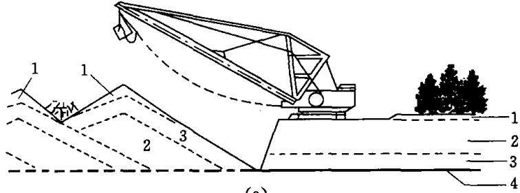  
(a)

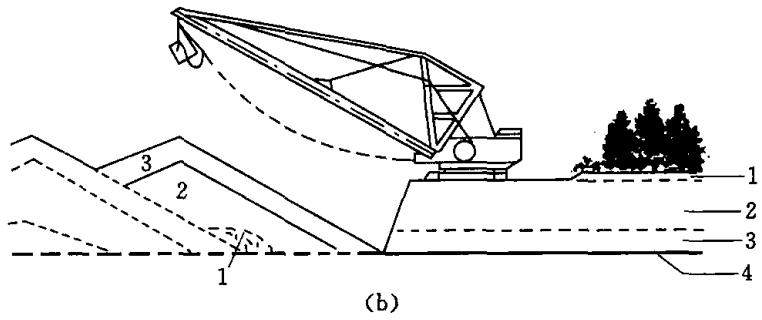  
图 3-7 传统复垦工艺示意图  
(a)改进的剥离方法，交替处理废石；(b)传统的剥离方法，依次剥离废石1—表层土壤；2——页岩、砂岩；3——酸性层页岩、砂岩；4——煤

在矿区土壤重构过程中，人为因素是一个独特而最具影响力的成土因素，它对重构土壤的形成产生广泛而深刻的影响，可使土壤肥力特性短时间内即产生巨大的变化，减轻或消除土壤污染，改善土壤的环境质量；另外，人为因素能够解决土壤长期发育、演变及耕作过程中产生的某些土壤发育障碍问题，使土壤的肥力迅速提高。但是，自然成土因素对重构土壤的发育产生长期、持久、稳定的影响，并最终决定重构土壤的发育方向。因此，土壤重构必须全面考虑到自然成土因素对重构土壤的潜在影响，采用合理有效的重构方法与措施，最大限度地提高土壤重构的效果，并降低土壤重构的成本和重构土壤的维护费用。

## （二）土壤重构的类型

按煤矿区土地破坏的成因和形式，土壤重构主要可分为以下三类，即采煤沉陷地土壤重构、露天煤矿排土场土壤重构和矿区固体污染废弃物堆弃地土壤重构。

按土壤重构过程的阶段性，可分为土壤剖面工程重构以及进一步的土壤培肥改良。而土壤剖面工程重构又包括地质剖面的重构以及在此基础之上的表层土壤的重构和地貌景观的重塑。土壤培肥改良措施包括施肥措施、耕作措施和林灌草措施等。

按复垦所用主要物料理化性质的不同，可分为土壤的重构、软质岩土的土壤重构、硬质岩土的土壤重构、废弃物填埋场及堆弃地的土壤重构等等。

在不同土壤类型区，自然成土因素对重构土壤的影响和综合作用不同，土壤的发育和形成过程各异。按区域土壤自然地理因素和地带土壤类型来划分，土壤重构可分为红壤区的土壤重构、黄壤区的土壤重构、棕壤区的土壤重构、褐土区的土壤重构、黑土区的土壤重构等等。

复垦土壤重构可分为工程措施重构与生物措施重构(包括微生物重构)。工程重构主要是采用工程措施(同时使用相应的物理措施和化学措施)，根据当地重构条件，按照重构土地的利用方向，对沉陷破坏土地进行的剥离、回填、挖垫、覆土与平整等处理。工程重构一般应用于土壤重构的初始阶段。生物重构是工程重构结束后或与工程重构同时进行的重构“土壤”培肥改良与种植措施，目的是加速重构“土壤”剖面发育，逐步恢复重构土壤肥力，提高重构土壤生产力，生物重构是一项长期的任务，决定了土壤重构的长期性。

沉陷地土壤重构根据所采取的工程措施可分为充填重构与非充填重构。充填重构是利用土壤或矿山固体废弃物回填沉陷区至设计高程，但一般情况下很难得到足够数量的土壤，而多使用矿山固体废弃物来充填，这既处理了废弃物，又复垦了沉陷区被破坏的耕地，其经济、环境效益显著，一举而多得。主要类型有煤矸石充填重构、粉煤灰充填重构与河湖淤泥充填重构等。但某些废弃物可能造成土壤、植物与地下水的污染。

非充填重构是根据当地自然条件和沉陷情况，因地制宜地采取整治措施，恢复利用沉陷破坏的土地。据分析估计，矿区固体废弃物只能满足约1/4塌陷区充填重构的需要，还有约3/4的沉陷区得不到充填物料，应该进行非充填复垦重构措施。非充填复垦重构措施包括疏排法重构、挖深垫浅重构、梯田法重构等重构方式。

根据重构目的和重构土壤用途可分为农业土壤重构、林业土壤重构、草业土壤重构，其中农业土壤重构的标准最高。

农田土壤重构是将恢复后的土地用于作物种植，是沉陷区土壤重构的重点研究目标，它要求重构土地平整、土壤特性较好、具备一定的水利条件。工程重构结束后应及时进行有效的生物重构措施，进一步改良培肥土壤。

林业重构是将重构后的土壤作乔灌种植，是重构物料特性较差时的主要重构方式，它对重构土壤层的标准要求较低，地形要求亦不是很严，允许地表存在一定坡度。林业重构一般应该侧重其环境与生态效益，在此基础上才能谈到经济效益。所选重构树种应该对特定恶劣立地条件有较强的适应性。对用有害废弃物重构的土地，可栽植能吸收降解有害元素的抗性树种，达到减少有害元素和净化重构土壤的目的。

草地土壤重构国内研究较少，西方发达国家相关研究较多，可与乔灌措施相结合使用。

## 二、土壤重构的原理及模型

土壤重构的研究对象是工矿区破坏的土地，虽然本书只涉及煤矿区，但其范围可延伸到其他类型矿区及工程项目建设区废弃地土壤的重构，以及因自然因素或人为因素形成的退化土壤。

土壤重构的目标可分为农业用地、林业用地和草地等三类。农业用地包括种植粮食、蔬菜、油料、果树等用地；林业用地包括林木、灌木、干果、园林等用地；草地包括牧草地、草坪地。土壤重构的目标又可区分为阶段性目标和最终目标。矿区破坏土地的土壤重构方向，应该是根据区域土地利用总体规划，并由破坏土地的具体情况、岩土条件、当地的社会经济条件以及区域土壤地理、生态环境等条件所决定的。土壤重构是一个长期的过程，面对的重构条件往往十分复杂和恶劣，某些情况下不能一次性地恢复为农田，过渡性的、阶段性的目标是必需的。例如，可以视具体条件先将破坏土地恢复为林业用地或草地，利用先锋植物对土壤的改良作用逐步培肥净化土壤，使之逐渐发育为具备农业种植条件的土壤。

## (一）土壤重构的一般方法及其依据

土壤重构的方法因具体重构条件而异，不同采矿区域、不同采矿类型、不同采矿与复垦阶段的土壤重构方法各不相同，一般方法可概括如图3-8所示。

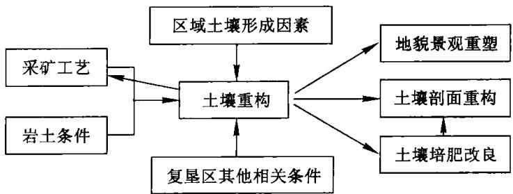  
图 3-8 复垦土壤重构的一般方法

土壤重构方法的确定首先要考虑到当地的采矿工艺和岩土条件；其次，土壤重构方法应该考虑到重构后的土壤要与区域自然成土条件相协调；第三，土壤重构还要考虑到破坏土地

的利用方向、复垦投资、法律要求等其他一些相关因素。另外，土壤重构包括地貌景观重塑、土壤剖面重构和土壤培肥改良等几方面内容。

## 1. 采矿工艺及岩土条件对土壤重构方法的影响

土壤重构要以具体的采矿工艺和当地的岩土条件为基础，不同的采矿工艺和岩土条件要求采取不同的重构方式：并工采煤往往造成不同程度的地表沉陷，沉陷地的土壤重构可采用直接利用法、修整法、疏排法、挖深垫浅法、充填法等；露天土壤重构应该十分注重采排工艺的紧密结合，不考虑土壤重构的采排工艺必然会大大增加土壤重构的难度和成本，一般要求对表土进行剥离和回填，以及地质剖面重构和地貌景观重塑；对少土区来说，表土的剥离与回填最为关键；在无土区，则需要对各扰动层次进行样品分析，选择合适层次的物料作为替代“土壤”覆盖于表层；黄土区土层深厚，对表土的剥离与回填要求不高，但是需要采取有效的水土保持措施防止水土流失，恢复植被，重建生态；在土壤重构的初期，偏重工程措施和物理化学方法，复垦的后期则多用生物生态措施。

## 2. 区域土壤形成因素对土壤重构方法的影响

区域土壤形成因素必然对重构土壤产生长期的稳定的影响，并最终决定重构土壤的发育方向。土壤重构虽然是人为构造和培肥土壤，但是，人工措施只有与自然成土因素相协调，全面考虑到自然成土因素对重构土壤的影响，才能有效地发挥作用，从而使重构土壤最终与生态环境相协调，降低重构土壤的维护和管理费用。

## 3. 复垦区域其他相关条件对土壤重构方法的影响

复垦区破坏土地利用方向的依据是相关法律法规以及区域土地利用总体规划，它们决定了破坏土地是否恢复为农林草用途，此为土壤重构的依据。复垦的投资是土壤重构的资金保证，复垦资金的多少关系到土壤重构工艺和措施的选择，从而影响到重构土壤的质量。

## 4. 土壤重构的方法步骤

对剧烈扰动的复垦土地，首先需要进行地质剖面的重构和地表景观的重塑，并重建地表与地下水文系统。在此基础上进行与植物生长密切相关的表层土壤剖面重构，构造适宜作物生长的剖面层次，在本阶段工程措施是主要的。然后是重构土壤的培肥改良，在此阶段，物理、化学与生物措施是主要的。另外需要指出的是，土壤剖面重构阶段并不排斥土壤培肥改良措施。

## (二）土壤重构的原理及模型

## 1. 采矿一复垦一体化的土壤重构原理及模型

采用“分层剥离、交错回填”的土壤重构原理，使破坏土地的土层顺序在复垦后保持基本不变、更适宜于作物生长。其基本原理与方法是：

①根据当地地质和土壤条件和复垦需要，将上覆岩土层划分为若干层(如分为上部土层和下部岩石层)。

②将复垦区域划分为若干条带或块段。

③分层剥离岩(土)层并通过错位的方式交错回填以实现土层顺序的基本不变或按期望的顺序进行构造。

下面以上覆岩土层划分为两层(如分为上部土层和下部岩土层)为例介绍土壤重构的原理并推导数学模型。

## （1）条带式倒堆工艺的土壤重构原理

该方法多见于区域条带式露天矿，采用开采一复垦一体化技术。如图3-9所示，将第1条带的上部土层和下部岩土层分别剥离并堆放在开采复垦区域旁边，如果是采煤的话，第1条带此时可以采煤了，第2条带的上部土层也剥离并堆放在旁边的上部土层堆上，将第2条带的下部岩土层剥离并填充在第1条带的采空区上，再将第3条带的上部土层继续填充在第1条带上就构成基本层序不变的第1条带的新构土壤，即：

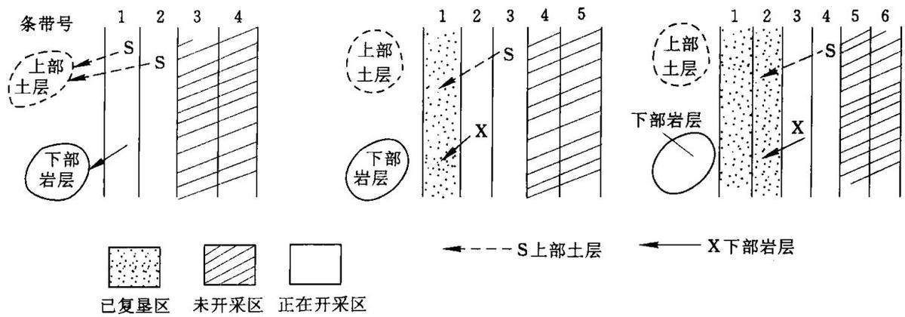  
图3-9上覆岩(土)层分为两层的条带式倒堆工艺的土壤剖面重构原理

第1条带新土壤=第2条带下部岩土层+第3条带上部土层相应地： 第2条带新土壤一第3条带下部岩土层+第4条带上部土层

因此，可总结出规律如下：

第i条带新土壤=第(i+1)条带下部岩土+第(i+2)条带上部土层 (i=1,2，…，n—2)第n一1条带新土壤 = 第n条带下部岩土 + 第 1、2条带上部土层第n条带新土壤=第1条带下部岩土+第1、2条带上部土层

## （2）其他开采类型的土壤重构原理

对于其他类型的开采方法的土壤重构，可以通过划分若干块段，通过块段间的交错回填，构造出土层顺序基本不变的新造土壤。其原理和新构造土层的公式与条带式倒堆工艺的一致，只不过将开采条带变成开采块段，详见图3-10。

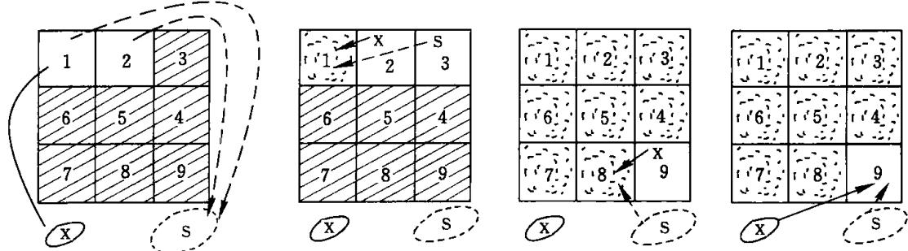  
图3-10上覆岩(土)层分为两层的划分为开采块段的土壤剖面重构原理

## （3）通用土壤重构原理与数学模型

设上覆岩(土)层分为m层，自上而下的岩(土)层为 $L _ { 1 } , \ L _ { 2 } , \cdots , \ L _ { m }$ ，开采条带或块段数为n，那么，在开切阶段，开采区域的外部将形成m个土堆，分别用 $L ^ { \prime } { } _ { 1 } , L ^ { \prime } { } _ { 2 } , \cdots , L ^ { \prime } ,$ n

表示：

$L ^ { \prime }$ 由第1,2，…，m条带的 $L _ { 1 }$ 土层混合而成的土堆；

$L _ { \mathrm { ~ 2 ~ } } ^ { \prime }$ 由第 $1 , 2 , \cdots , m - 1$ 条带 $L _ { 2 }$ 土层混合而成的土堆；

$L _ { \ m - 1 } ^ { \prime }$ 由第1,2条带的 $L _ { m - 1 }$ 土层混合而成的土堆；

$L _ { \ m } ^ { \prime }$ 由第1条带的 $L _ { m }$ 土层混合而成的土堆。

新构造的土壤的结构是：

第i条带新土壤 $= \sum _ { j = 1 } ^ { m } \left[ i + m - j + 1 \right]$ 条带的 $L _ { j }$ 岩土层 $( i = 1 , 2 , \cdots , n - m )$

第 $n ^ { - } \left( m - k \right)$ 条带新土壤 $= \sum _ { j = 1 } ^ { k } L _ { \ j } ^ { \prime } + \sum _ { j = k + 1 } ^ { m } \left[ n - ( m - j ) \right]$ 条带的 $L _ { [ m - ( j ^ { - } } , ( k { + } 1 ) ) ]$

$$
( k = 1 , 2 , \cdots , m { - } 1 ) ;
$$

第 n 条带新土壤 $= \sum _ { j = 1 } ^ { m } L _ { j }$

2. 挖深垫浅复垦土壤剖面重构的原理与方法

挖深垫浅中复垦土壤剖面重构(土方工程)主要以“分层剥离、交错回填”的土壤重构原理为依据，主要工艺可概括为(图3-11)：

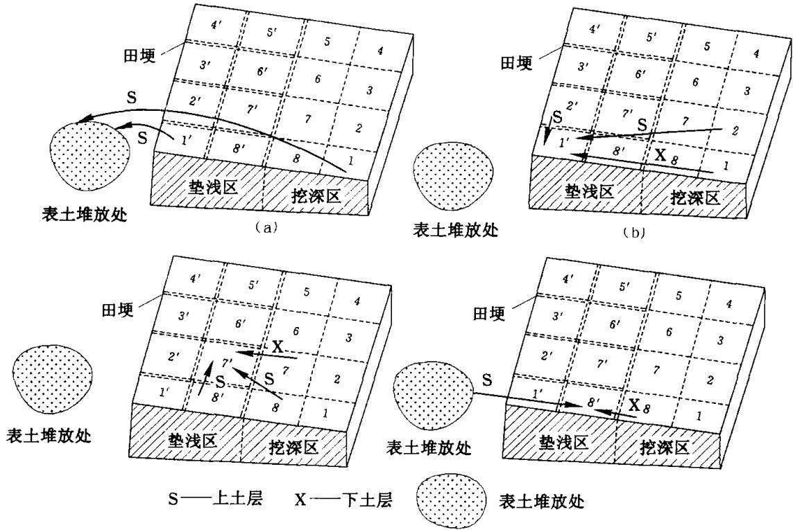  
图3-11 挖深垫浅复垦工艺中土壤重构示意图

①把“挖深区”和“垫浅区”划分成若干块段(依地形和土方量划分)，并对“垫浅区”划分的块段边界设立小土(田)埂以利于充填。

②将土层划分为若干层(通常为两个层次，一是上部 $2 0 \sim 4 0 ~ \mathrm { c m }$ 的表土层S，二是下部土层 X)。

③按照“分层剥离、交错回填”的土壤重构原理进行复垦，使复垦后的表土层厚度增大(理论上可达到两层表土)，使复垦土地明显优于原土地，其重构的数学模型是：

i'块段土壤结构=(i+1)块段上层土+i块段下层土+(i+1)′块段预剥离的上层土其中，i=1,2，…，n-1(n为划分的块段数)

n′块段的结构=1块段上层土+n块段下层土+1′块段预剥离的上层土

## 3. 表土重构原理与方法

在某些情况下，可以单独进行表土的剥离与回填，而不考虑其他土层的重构，其重构的方法是：根据挖掘机械的宽度，由外到里(塌陷中心)预算出每一挖掘机械宽度范围内的土方量，然后将复垦区划分成不同的复垦条带和取土区，每一条带大致为挖掘机械宽度的整数倍，最后由外向里层层剥离(如图3-12所示)。

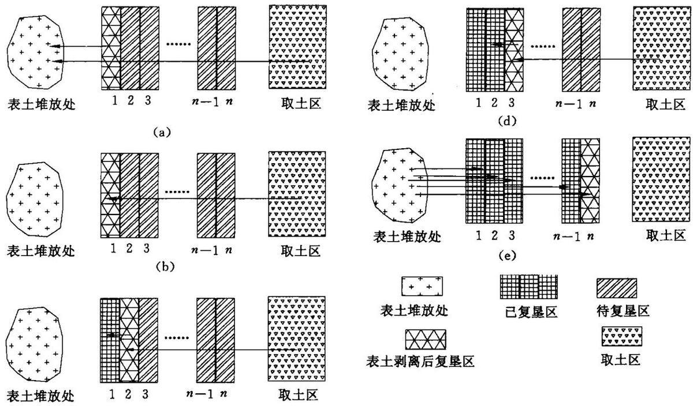  
图3-12 挖深垫浅的条带复垦表土外移剥离法

先将第1条带的表土层和取土区的表土层剥离，并堆积在复垦区外[图3-12(a)]，然后从取土区取生土填在第1条带，再将第2条带的表土移至第1条带[图3-12(b)]，依次类推「图3-12(c)、(d)]，最后将剥离的第1条带表土层和取土区表土层回填到第n条带及各层整平「见图3-12(e)]。复垦后土层的剖面结构可表示为：

第i条带土壤剖面=第i条带下部生土+取土区下部生土+第i十1条带表土+

$$
\begin{array} { r l } { \sharp \sharp ~ 1 \sharp ^ { * + } \sharp \sharp \sharp \sharp \mathbb { K } \pm \lvert \sharp \sharp \pm \underline { { \sharp } } \rvert \underline { { \sharp } } \sharp } & { { } ( i = 1 , 2 , \cdots , n - 1 ) } \end{array}
$$

第n条带土壤剖面=第n条带下部生土+第1条带与取土区表土回填

施工后，外围复垦耕地用于发展生态农业，中心取土塘区用于水产养殖或蓄水、排水、水上公园等。

## 第四章 工矿区环境破坏的动态监测与评价技术

工矿区是一种特殊的地理区域，具有综合性、动态性、空间性、后效性和滞后性等基本特征。煤炭资源开发、加工和利用在促进区域社会经济发展的同时，也引发了多种生态环境问题和社会负面影响。其中，陆面演变(Terrestrial Surface Evolution，TSE)是影响区域社会经济发展和人民生活最突出、最严重的生态环境损害问题之一。

## 第一节 工矿区陆面演变遥感监测与分析

遥感图像已成为全球变化、环境监测、区域可持续发展研究最基本、最主要的信息源。航空/航天遥感技术所具有的高、快、广、精、全等优点，使其已成为地学研究与应用的基础。当前，国内外对遥感地学分析、遥感图像地学理解、遥感图像应用于地学中的关键问题等都进行了大量的研究工作。但是，遥感图像应用于地学研究，并没有一套普遍适用的理论框架与技术体系，对于不同的地学应用目的与领域、不同的应用对象，应从具体的目标出发，分析其对遥感信息的需求，进而确定所需的信息源，综合应用多种图像处理与信息提取方法，结合已有的地理信息、知识与资料，获取需要的信息，在空间分析模型与GIS的支持下进行分析、评价、模拟与预测，最终提供决策支持，服务于区域可持续发展战略的实施。本节从工矿区陆面演变研究对遥感信息的需要出发，在确定所采用的信息源的基础上，探讨陆面演变的遥感信息机理，进而对遥感图像处理和信息提取模型与方法进行探讨，并以实例进行验证。

## 一、工矿区陆面演变的遥感信息机理与遥感应用研究

## (一)工矿区陆面演变的主要形式与遥感可探测性

## 1. 主要形式

根据外业调查，结合矿区实际情况，将区域陆面状态表征分为：建设用地(含居民地、公共建设用地、交通用地、矿区用地等)、水域、绿地(含农田和植被)、山体、塌陷地。陆面演变实质上就是不同的陆面状态之间的转换。表4-1为区域陆面演变状态表。

常见的陆面演变形式有：绿地(主要是农田)一塌陷地，其他用地一塌陷地，绿地(主要是农田)一建设用地(包括道路、建设用地、工矿用地)，塌陷地一可利用土地。以下对其形态及其遥感特征进行探讨。

(1) 绿地—塌陷地

塌陷地作为工矿区陆面演变的主要形式，其对象主要是各种绿地特别是农田，这些土地在发生了使用权的转变后，由初始利用状态转为废弃，进而产生破坏、塌陷，形成塌陷区，并

可能产生积水现象。除采煤导致的塌陷外，还伴有采水塌陷、岩溶塌陷。塌陷地在卫星遥感图像上表现为灰度变化、纹理结构变化，并随时相不同而动态变化，可以进行识别。

表4-1  
陆面演变状态表
<table><tr><td rowspan=1 colspan=1>初态末态</td><td rowspan=1 colspan=1>建设用地</td><td rowspan=1 colspan=1>水域</td><td rowspan=1 colspan=1>绿地</td><td rowspan=1 colspan=1>山体</td><td rowspan=1 colspan=1>塌陷地</td></tr><tr><td rowspan=1 colspan=1>建设用地</td><td rowspan=1 colspan=1>√</td><td rowspan=1 colspan=1>一</td><td rowspan=1 colspan=1>—</td><td rowspan=1 colspan=1>×</td><td rowspan=1 colspan=1>√</td></tr><tr><td rowspan=1 colspan=1>水域</td><td rowspan=1 colspan=1>× </td><td rowspan=1 colspan=1>V</td><td rowspan=1 colspan=1>×</td><td rowspan=1 colspan=1>×</td><td rowspan=1 colspan=1>V</td></tr><tr><td rowspan=1 colspan=1>绿地</td><td rowspan=1 colspan=1>√</td><td rowspan=1 colspan=1>—</td><td rowspan=1 colspan=1>V</td><td rowspan=1 colspan=1>×</td><td rowspan=1 colspan=1>V</td></tr><tr><td rowspan=1 colspan=1>山体</td><td rowspan=1 colspan=1>×</td><td rowspan=1 colspan=1>×</td><td rowspan=1 colspan=1>×</td><td rowspan=1 colspan=1>V</td><td rowspan=1 colspan=1>×</td></tr><tr><td rowspan=1 colspan=1>塌陷地</td><td rowspan=1 colspan=1>√</td><td rowspan=1 colspan=1>V</td><td rowspan=1 colspan=1>√</td><td rowspan=1 colspan=1>X</td><td rowspan=1 colspan=1>√</td></tr></table>

注：表中，“一”表示有可能但很少发生，“√”表示常见的陆面演变情况，“×”表示不可能发生的演变情况。

## （2)其他用地一塌陷地

产生塌陷的其他用地包括位于开采影响范围内的村庄(其用地一般已进行征用、搬迁)、荒地等，塌陷后在遥感图像上具有明显的变化，特征明显，易于提取。

## （3)塌陷地一可利用土地

通过土地复垦可以使塌陷地恢复到可利用状态，复垦方式如发展水产养殖、恢复绿地状态(包括表面种草、植树和恢复农用)、作为建设用地(建筑物)、作为公共用地(公园)等。从塌陷地到复垦后可供利用的状态，在光谱特征、空间关系、内部结构方面都发生了明显的变化，可以通过遥感图像进行识别与监测。

## （4)绿地一建设用地

在区域建设、城镇化的发展中一般呈纵向和横向两种方式。纵向即向高空和地下方向发展，它受各种因素的影响，高层建筑往往有一定的局限性，故最普遍的发展方式就是占用农林用地，即城镇化过程中的土地利用变化，它属于城乡变迁的范畴，本书不予讨论。

## 2. 陆面演变的图像纹理表达

纹理是除灰度之外最重要的图像信息和特征。图像纹理分析得到了广泛的重视，并在图像分类、图像理解和分析中发挥着日益重要的作用。以往对纹理的研究主要集中在航空遥感方面，但随着卫星遥感应用的发展，对卫星遥感图像的纹理特征研究得到了越来越多的重视和关注。陆面演变必然伴随着区域地物类型、土地覆盖、土地利用状态、区域空间结构等的改变，从遥感信息特点与获取的角度来说，其在遥感图像上的直接体现就是同一空间位置灰度值的变化、不同空间位置相互关系的变化特别是相邻象元灰度模式空间结构间的变化，也即体现在同一空间位置不同时相的纹理变化上。如一块平坦的农田因开采沉陷而塌陷后，从空间形态上看原来的平面将被不规则的塌陷坑所取代，而原来的土地利用状态则被积水或废弃地所取代，在空间形态、利用属性(覆盖属性)变化的影响下，遥感图像上的灰度及其空间组合必然发生相应的变化，从而体现在纹理的变化上。同时，有些情况下尽管灰度值变化不大，但其纹理特征却会发生明显的变化，由此可以对陆面演变进行分析研究。从演变的角度来看，图像纹理的变化主要包括：粗糙度的变化、方向的变化、空间结构的变化等，具体到不同的图像纹理表达方法上，则表示为

相应的特征指标值的变化。

总之，工矿区陆面演变具有多种可能的状态，这些过程都直接体现于土地覆盖或陆面状态在光谱特征、空间关系、结构特征、纹理特征等方面的变化上，可以通过多分辨率、多平台、多时相的卫星遥感资料动态获取。因此，工矿区陆面演变存在遥感的可探测性，应用遥感技术进行宏观的陆面演变研究是完全可行的。

## （二）卫星遥感应用的优越性

卫星遥感应用于工矿区陆面演变研究的优越性，可用“广、快、省、真、全、易、合”七个字来概括。

“广”—是指图像覆盖范围广，如一景TM图像其覆盖地面范围为185 km×185km。一般情况下在以矿区作为研究对象时，一景TM图像就可以覆盖研究区。

“快”—是指从时间分辨率来看，如TM图像的时间分辨率为16天，有利于动态监测的实施。

“省”是指以卫星遥感作为信息源，相对传统信息获取技术手段(如航空遥感、实地调查等)而言，可以极大地节省经费，节约人力，提高效率。

“真”是由遥感原理、特性决定的，可以真实反映陆面状态，如TM图像不同波段对不同特征有显著识别的功能，多波段的组合、互补可以反映陆面演变的实际情况；SAR则可以实现全天候成像，并具有一定的穿透能力。

“全”—是指遥感信息的全面性，尤其是利用多平台、多波段遥感信息，对陆面演变的各种表现形式都可进行表达，应用范围广，既可实现全面宏观监测，又可用于专题分析研究。

“易”则是由于当前遥感应用在深度、广度上发展很快，获得遥感资料比较容易，还有大量的实用软件技术系统(如PCI、ERDAS、ENVI等)可供使用，从而具有实施简单易行的特点。

“合”—是指融合与集成，遥感是一个开放的技术系统，可以方便地和其他信息如地理信息、社会统计信息、不同遥感信息等进行融合，特别是可以与GIS进行集成，更新GIS信息数据。

因此，在工矿区陆面演变研究方面，应用遥感技术手段，相对传统的实地测量、统计调查等手段而言，具有多方面的显著的优越性。

## (三)对卫星遥感信息源的要求及其主要应用目标

以遥感作为信息源可以快速、高效地提供多时相、多波段、多平台、多领域的信息，为矿区合理开发、环境保护和区域社会经济的发展提供由静态到动态，由定性到定位、定量、定谱，由宏观到微观的现代技术支撑和丰富、可靠的信息来源。根据工矿区陆面演变的特点和研究内容，对遥感信息在性能方面的要求主要包括：

①适用精度一遥感图像用于陆面演变的研究，首先必须满足一定的精度条件，既不应盲目追求过高的精度，又要能满足需要，其中空间分辨率为主要精度指标。从矿区一般应用来说，选用TM、SPOT、CBERS和我国的ZY—1、ZY—2的空间分辨率已可以满足要求。更高分辨率的遥感资料将随着其成本的降低而实用化。

②时效性——陆面演变是一个动态的发展过程，选取的图像资料必须结合研究区域的实际情况，选择有代表性的不同时相的资料，以保证研究结果的合理性和可靠性。

③多谱段—陆面演变在遥感图像上表现为陆面表层地物、地貌的变化及其光谱信息的差异。由于不同地物、不同要素的光谱特性不同，因此对遥感器的谱段有相应的要求。应从研究区有代表性的陆面要素出发，确定需要的遥感信息谱段，即对遥感光谱段及其分辨率的要求。

④图像质量遥感图像的成像质量必须满足一定的要求，且整体均匀。

⑤信息量遥感图像所提供的信息量必须能满足研究的要求，对信息量可通过熵进行计算。

结合以上要求，根据陆面演变监测的时空尺度与精度要求，同时兼顾开展多种遥感模式矿区应用的思路，确定的信息源组合方式是：以RADARSAT SAR(1999年4月)图像为参考资料，以历史时段TM信息（1987年9月和1994年9月）为历史参考数据进行动态监测，这种选择方式具有以下特点：

①将当前普遍应用的多光谱遥感与微波遥感结合应用于矿区生态环境问题的研究，可为进一步的研究奠定基础，并开展多项研究工作。

②形成了多源、多时相的遥感图像序列，有利于动态监测的实施。

③时间尺度为5～7年，可以和不同时段的有关地理图件进行合成。

④经费、利用效果具有较好的可比性。

当然，后续的研究工作说明，这种组合方式也有一定的不足，主要体现在所选的TM和SAR图像都不能形成立体像对，即未能实现对高程变化的监测，而高程变化却是矿区陆面演变的主要形式一地面塌陷的本质特征。研究矿区具有塌陷地在属性方面的变化，可以确定其范围，以上遥感信息可有效地胜任研究任务，而对于其他一些不积水的矿区，则需要采用具有立体量测功能的遥感信息源。

从卫星遥感图像中可以提取的主要信息、完成的主要目标包括：

①矿区土地利用及覆盖信息—工矿区陆面演变导致陆面要素波谱特性的改变，从遥感图像上可以提取这些信息，成为分析陆面演变的基础。

②矿区人居环境和城乡变迁状况及其发展信息—可为区域规划工作提供基础信息和指导。

③矿区环境污染与地质灾害信息—陆面演变与地表水污染、采矿和采水导致的地表塌陷等密切相关，从遥感图像上可以获取关于区域地表环境污染和地质灾害信息，进而开展防治。

④其他陆面信息—如陆面温度、土壤粗糙度等。

## 二、面向矿区应用的TM图像信息特征与波段组合

美国的Landsat TM图像是当前应用最为广泛的卫星遥感信息源之一，研究中应用的是 Landsat 5 可提供7 个波段的信息。由于 Landsat 6 的发射失败，Landsat 5 已处于超期服役之中，随着Landsat7的发射成功，Landsat信息源的应用必将进入更新的阶段。

## (一) TM 图像的信息特征

表4-2所示为TM各波段的主要特征。

表4-2  
TM图像各波段的主要特征及用途
<table><tr><td rowspan=1 colspan=1>波段</td><td rowspan=1 colspan=1>波长/μm</td><td rowspan=1 colspan=1>用途</td></tr><tr><td rowspan=1 colspan=1>1</td><td rowspan=1 colspan=1>0.45~0.52(蓝绿波段)</td><td rowspan=1 colspan=1>用来穿透水体，绘制浅水区地图，识别土壤和常绿落叶植被及制图</td></tr><tr><td rowspan=1 colspan=1>2</td><td rowspan=1 colspan=1>0.52~0.60(绿波段)</td><td rowspan=1 colspan=1>测量植被绿色反射峰值，鉴别植被类型及制图</td></tr><tr><td rowspan=1 colspan=1>3</td><td rowspan=1 colspan=1>0.63~0.69(红波段)</td><td rowspan=1 colspan=1>测量植物叶绿素的吸收率，进行植被分类</td></tr><tr><td rowspan=1 colspan=1>4</td><td rowspan=1 colspan=1>0.76~0.90(近红外)</td><td rowspan=1 colspan=1>用于生物量与作物长势的测定，进行农作物估产</td></tr><tr><td rowspan=1 colspan=1>5</td><td rowspan=1 colspan=1> $1 . 5 5 { \overset { \cdot } { \sim } } 1 .$ 75(近红外)</td><td rowspan=1 colspan=1>土壤水分和地质研究与制图</td></tr><tr><td rowspan=1 colspan=1>6</td><td rowspan=1 colspan=1>10.4~12.6(热红外)</td><td rowspan=1 colspan=1>植被的分类与制图，鉴定土壤水分及其他热测量与制图</td></tr><tr><td rowspan=1 colspan=1>7</td><td rowspan=1 colspan=1>2.08~2.35(近红外)</td><td rowspan=1 colspan=1>用于城市土地利用与制图，岩石光谱反射及地质探矿与地质制图</td></tr></table>

根据研究矿区城市特点与矿井分布情况，选取能充分代表研究区的三块子图像作为样区进行统计，如图4-1所示。各样区大小均为256×256像元大小。

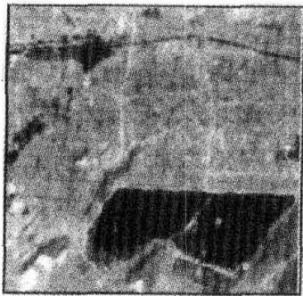

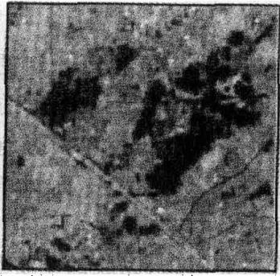

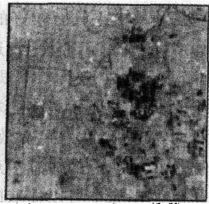  
图 4-1 各样区 TM图像(波段 5)

表4-3和表4-4为对各样区图像进行统计分析的基本数据(由于第6波段的空间分辨率为120m，在研究中没有使用，故未进行考虑）。

表 4-3  
各样区遥感图像的波谱特征
<table><tr><td rowspan=1 colspan=1>样区</td><td rowspan=1 colspan=1>波段号</td><td rowspan=1 colspan=1>最大值</td><td rowspan=1 colspan=1>最小值</td><td rowspan=1 colspan=1>均值</td><td rowspan=1 colspan=1>方差</td><td rowspan=1 colspan=1>亮度范围</td></tr><tr><td rowspan=6 colspan=1>样区一</td><td rowspan=1 colspan=1>TM1</td><td rowspan=1 colspan=1>148</td><td rowspan=1 colspan=1>61</td><td rowspan=1 colspan=1>82.34</td><td rowspan=1 colspan=1>8.42</td><td rowspan=1 colspan=1>87</td></tr><tr><td rowspan=1 colspan=1>TM2</td><td rowspan=1 colspan=1>90</td><td rowspan=1 colspan=1>25</td><td rowspan=1 colspan=1>39.26</td><td rowspan=1 colspan=1>5.37</td><td rowspan=1 colspan=1>65</td></tr><tr><td rowspan=1 colspan=1>TM3</td><td rowspan=1 colspan=1>121</td><td rowspan=1 colspan=1>22</td><td rowspan=1 colspan=1>42.64</td><td rowspan=1 colspan=1>9.28</td><td rowspan=1 colspan=1>99</td></tr><tr><td rowspan=1 colspan=1>TM4</td><td rowspan=1 colspan=1>136</td><td rowspan=1 colspan=1>8</td><td rowspan=1 colspan=1>54.56</td><td rowspan=1 colspan=1>18.73</td><td rowspan=1 colspan=1>128</td></tr><tr><td rowspan=1 colspan=1>TM5</td><td rowspan=1 colspan=1>158</td><td rowspan=1 colspan=1>2</td><td rowspan=1 colspan=1>58.37</td><td rowspan=1 colspan=1>23.5</td><td rowspan=1 colspan=1>156</td></tr><tr><td rowspan=1 colspan=1>TM7</td><td rowspan=1 colspan=1>98</td><td rowspan=1 colspan=1>0</td><td rowspan=1 colspan=1>28.98</td><td rowspan=1 colspan=1>14</td><td rowspan=1 colspan=1>98</td></tr></table>

续表 4-3
<table><tr><td rowspan=1 colspan=1>样区</td><td rowspan=1 colspan=1>波段号</td><td rowspan=1 colspan=1>最大值</td><td rowspan=1 colspan=1>最小值</td><td rowspan=1 colspan=1>均值</td><td rowspan=1 colspan=1>方差</td><td rowspan=1 colspan=1>亮度范围</td></tr><tr><td rowspan=6 colspan=1>样区二</td><td rowspan=1 colspan=1>TM1</td><td rowspan=1 colspan=1>135</td><td rowspan=1 colspan=1>59</td><td rowspan=1 colspan=1>73.07</td><td rowspan=1 colspan=1>5.45</td><td rowspan=1 colspan=1>76</td></tr><tr><td rowspan=1 colspan=1>TM2</td><td rowspan=1 colspan=1>77</td><td rowspan=1 colspan=1>22</td><td rowspan=1 colspan=1>34.55</td><td rowspan=1 colspan=1>3.85</td><td rowspan=1 colspan=1>55</td></tr><tr><td rowspan=1 colspan=1>TM3</td><td rowspan=1 colspan=1>98</td><td rowspan=1 colspan=1>19</td><td rowspan=1 colspan=1>35.37</td><td rowspan=1 colspan=1>7.22</td><td rowspan=1 colspan=1>79</td></tr><tr><td rowspan=1 colspan=1>TM4</td><td rowspan=1 colspan=1>128</td><td rowspan=1 colspan=1>6</td><td rowspan=1 colspan=1>67.68</td><td rowspan=1 colspan=1>23.29</td><td rowspan=1 colspan=1>122</td></tr><tr><td rowspan=1 colspan=1>TM5</td><td rowspan=1 colspan=1>147</td><td rowspan=1 colspan=1>0</td><td rowspan=1 colspan=1>64.46</td><td rowspan=1 colspan=1>20.21</td><td rowspan=1 colspan=1>147</td></tr><tr><td rowspan=1 colspan=1>TM7</td><td rowspan=1 colspan=1>82</td><td rowspan=1 colspan=1>0</td><td rowspan=1 colspan=1>27.30</td><td rowspan=1 colspan=1>10.37</td><td rowspan=1 colspan=1>82</td></tr><tr><td rowspan=6 colspan=1>样区三</td><td rowspan=1 colspan=1>TM1</td><td rowspan=1 colspan=1>134</td><td rowspan=1 colspan=1>57</td><td rowspan=1 colspan=1>71.07</td><td rowspan=1 colspan=1>4.42</td><td rowspan=1 colspan=1>77</td></tr><tr><td rowspan=1 colspan=1>TM2</td><td rowspan=1 colspan=1>81</td><td rowspan=1 colspan=1>24</td><td rowspan=1 colspan=1>33.70</td><td rowspan=1 colspan=1>3.05</td><td rowspan=1 colspan=1>57</td></tr><tr><td rowspan=1 colspan=1>TM3</td><td rowspan=1 colspan=1>117</td><td rowspan=1 colspan=1>19</td><td rowspan=1 colspan=1>33.86</td><td rowspan=1 colspan=1>5.85</td><td rowspan=1 colspan=1>98</td></tr><tr><td rowspan=1 colspan=1>TM4</td><td rowspan=1 colspan=1>125</td><td rowspan=1 colspan=1>4</td><td rowspan=1 colspan=1>75.85</td><td rowspan=1 colspan=1>17.65</td><td rowspan=1 colspan=1>121</td></tr><tr><td rowspan=1 colspan=1>TM5</td><td rowspan=1 colspan=1>141</td><td rowspan=1 colspan=1>2</td><td rowspan=1 colspan=1>70.54</td><td rowspan=1 colspan=1>13</td><td rowspan=1 colspan=1>139</td></tr><tr><td rowspan=1 colspan=1>TM7</td><td rowspan=1 colspan=1>75</td><td rowspan=1 colspan=1>0</td><td rowspan=1 colspan=1>27.95</td><td rowspan=1 colspan=1>7.08</td><td rowspan=1 colspan=1>75</td></tr></table>

表 4-4  
各样区图像波段相关系数表
<table><tr><td rowspan=1 colspan=1>样区</td><td rowspan=1 colspan=1>波段</td><td rowspan=1 colspan=1>TM1</td><td rowspan=1 colspan=1>TM2</td><td rowspan=1 colspan=1>TM3</td><td rowspan=1 colspan=1>TM4</td><td rowspan=1 colspan=1>TM5</td><td rowspan=1 colspan=1>TM7</td></tr><tr><td rowspan=6 colspan=1>样区一</td><td rowspan=1 colspan=1>TM1</td><td rowspan=1 colspan=1>1.0000</td><td rowspan=1 colspan=1>0.939 3</td><td rowspan=1 colspan=1>0.9344</td><td rowspan=1 colspan=1>-0.1784</td><td rowspan=1 colspan=1>0.241 8</td><td rowspan=1 colspan=1>0.5461</td></tr><tr><td rowspan=1 colspan=1>TM2</td><td rowspan=1 colspan=1>0.939 3</td><td rowspan=1 colspan=1>1.0000</td><td rowspan=1 colspan=1>0.9497</td><td rowspan=1 colspan=1>-0.1510</td><td rowspan=1 colspan=1>0.2244</td><td rowspan=1 colspan=1>0.505 9</td></tr><tr><td rowspan=1 colspan=1>TM3</td><td rowspan=1 colspan=1>0.9344</td><td rowspan=1 colspan=1>0.949 7</td><td rowspan=1 colspan=1>1.0000</td><td rowspan=1 colspan=1>-0.1194</td><td rowspan=1 colspan=1>0.370 6</td><td rowspan=1 colspan=1>0.679 7</td></tr><tr><td rowspan=1 colspan=1>TM4</td><td rowspan=1 colspan=1>0.9344</td><td rowspan=1 colspan=1>-0.1510</td><td rowspan=1 colspan=1>-0.119 4</td><td rowspan=1 colspan=1>1.0000</td><td rowspan=1 colspan=1>0.767 9</td><td rowspan=1 colspan=1>0.4207</td></tr><tr><td rowspan=1 colspan=1>TM5</td><td rowspan=1 colspan=1>0.2418</td><td rowspan=1 colspan=1>0.224 4</td><td rowspan=1 colspan=1>0.370 6</td><td rowspan=1 colspan=1>0.767 9</td><td rowspan=1 colspan=1>1.000 0</td><td rowspan=1 colspan=1>0.883 9</td></tr><tr><td rowspan=1 colspan=1>TM7</td><td rowspan=1 colspan=1>0.5461</td><td rowspan=1 colspan=1>0.505 9</td><td rowspan=1 colspan=1>0.679 7</td><td rowspan=1 colspan=1>0.4207</td><td rowspan=1 colspan=1>0.883 9</td><td rowspan=1 colspan=1>1.000 0</td></tr><tr><td rowspan=6 colspan=1>样区二</td><td rowspan=1 colspan=1>TM1</td><td rowspan=1 colspan=1>1.000 0</td><td rowspan=1 colspan=1>0.912 2</td><td rowspan=1 colspan=1>0.935 8</td><td rowspan=1 colspan=1>-0.1576</td><td rowspan=1 colspan=1>0.299 3</td><td rowspan=1 colspan=1>0.699 0</td></tr><tr><td rowspan=1 colspan=1>TM2</td><td rowspan=1 colspan=1>0.912 2</td><td rowspan=1 colspan=1>1.0000</td><td rowspan=1 colspan=1>0.924 3</td><td rowspan=1 colspan=1>0.0347</td><td rowspan=1 colspan=1>0.4315</td><td rowspan=1 colspan=1>0.727 6</td></tr><tr><td rowspan=1 colspan=1>TM3</td><td rowspan=1 colspan=1>0.935 8</td><td rowspan=1 colspan=1>0.924 3</td><td rowspan=1 colspan=1>1.0000</td><td rowspan=1 colspan=1>-0.163 9</td><td rowspan=1 colspan=1>0.3481</td><td rowspan=1 colspan=1>0.759 6</td></tr><tr><td rowspan=1 colspan=1>TM4</td><td rowspan=1 colspan=1>-0.1576</td><td rowspan=1 colspan=1>0.0347</td><td rowspan=1 colspan=1>-0.163 9</td><td rowspan=1 colspan=1>1.0000</td><td rowspan=1 colspan=1>0.783 7</td><td rowspan=1 colspan=1>0.309 9</td></tr><tr><td rowspan=1 colspan=1>TM5</td><td rowspan=1 colspan=1>0.299 3</td><td rowspan=1 colspan=1>0.431 5</td><td rowspan=1 colspan=1>0.3481</td><td rowspan=1 colspan=1>0.783 7</td><td rowspan=1 colspan=1>1.000 0</td><td rowspan=1 colspan=1>0.8007</td></tr><tr><td rowspan=1 colspan=1>TM7</td><td rowspan=1 colspan=1>0.6990</td><td rowspan=1 colspan=1>0.727 6</td><td rowspan=1 colspan=1>0.759 6</td><td rowspan=1 colspan=1>0.309 9</td><td rowspan=1 colspan=1>0.8007</td><td rowspan=1 colspan=1>1.000 0</td></tr><tr><td rowspan=6 colspan=1>样区三</td><td rowspan=1 colspan=1>TM1</td><td rowspan=1 colspan=1>1.000 0</td><td rowspan=1 colspan=1>0.884 4</td><td rowspan=1 colspan=1>0.901 6</td><td rowspan=1 colspan=1>-0.2411</td><td rowspan=1 colspan=1>0.3286</td><td rowspan=1 colspan=1>0.6989</td></tr><tr><td rowspan=1 colspan=1>TM2</td><td rowspan=1 colspan=1>0.8844</td><td rowspan=1 colspan=1>1,000 0</td><td rowspan=1 colspan=1>0.899 9</td><td rowspan=1 colspan=1>-0.0276</td><td rowspan=1 colspan=1>0.484 2</td><td rowspan=1 colspan=1>0.736 8</td></tr><tr><td rowspan=1 colspan=1>TM3</td><td rowspan=1 colspan=1>0.901 6</td><td rowspan=1 colspan=1>0.899 9</td><td rowspan=1 colspan=1>1.0000</td><td rowspan=1 colspan=1>-0.2807</td><td rowspan=1 colspan=1>0.392 8</td><td rowspan=1 colspan=1>0.8146</td></tr><tr><td rowspan=1 colspan=1>TM4</td><td rowspan=1 colspan=1>-0.2411</td><td rowspan=1 colspan=1>-0.0276</td><td rowspan=1 colspan=1>-0.2807</td><td rowspan=1 colspan=1>1.0000</td><td rowspan=1 colspan=1>0.634 3</td><td rowspan=1 colspan=1>0.0217</td></tr><tr><td rowspan=1 colspan=1>TM5</td><td rowspan=1 colspan=1>0.3286</td><td rowspan=1 colspan=1>0.484 2</td><td rowspan=1 colspan=1>0.392 8</td><td rowspan=1 colspan=1>0.634 3</td><td rowspan=1 colspan=1>1.0000</td><td rowspan=1 colspan=1>0.723 2</td></tr><tr><td rowspan=1 colspan=1>TM7</td><td rowspan=1 colspan=1>0.698 9</td><td rowspan=1 colspan=1>0.736 8</td><td rowspan=1 colspan=1>0.814 6</td><td rowspan=1 colspan=1>0.0217</td><td rowspan=1 colspan=1>0.723 2</td><td rowspan=1 colspan=1>1.0000</td></tr></table>

由表4-3、表4-4统计分析的数据可以看出，TM图像各波段信息具有以下主要特点：①从信息量(以各波段图像所覆盖的辐射量化级即亮度值范围)来看，TM5包含的信息量最丰富，TM7、TM4包含的信息量依次有所减少，TM2所含的信息量最少，TM1、TM3则介于中间，即低于TM5、TM7、TM4，高于TM2。

②在各波段信息的相关性方面，3个可见光波段(即TM1、TM2、TM3波段)之间的相关性都很高，信息冗余多，故在应用中常通过主成分变换方法取它们的第一主分量代表可见光波段的信息；两个中红外波段TM5、TM7之间的相关性也很多，具有较大的相似性；TM4的光谱信息则与其他波段之间的相关系数比较小，相对独立，因此是进行波段组合中必不可少的部分，这将在后面的讨论中进一步说明。

③从样区来看，各波段信息在不同样区具有类似的特点，这与其他学者的研究成果是一致的。

## （二）波段组合方案的选择

## 1. TM 中多波段数据的选取方法

TM多波段之间既有相关性，存在信息冗余，又有互补性，各波段信息可以取长补短。针对具体应用的要求选择图像波段与组合方式，实质上就是一个特征约简(最优特征子集的确定)问题。用于特征约简的方法一般有两种：特征提取(FeatureExtraction)和特征选择(Feature Selection)，前者主要是通过在原始特征空间中采用一些线性或非线性变换以压缩其中包含的信息，如主成分分析、KT变换等，它可得到原始特征空间的一个去相关子集，但由于变换结果仅是一种信息上的组合，而失去了其真正的物理意义，因此近年来的研究主要是针对后者进行，即特征选择算法。一般在波段选取中应选择信息量最大的合成方案。选取标准及方法很多，如最佳指数法、以样本间的灰度差异为准则、以视觉色差为选择标准等。

在各种选择方案中，以N维熵值原理为基础进行最佳波段选择的算法，具有考虑因素全面、操作容易、效果明显的特点，我们以此为选取准则。其算法模型为：

$$
S = \sum _ { i = 1 } ^ { M } P _ { i } \left( x \right) \mathrm { l n } ~ P _ { i } \left( x \right)\tag{4-1}
$$

式中，S为熵值； $P _ { i } \left( x \right)$ 为变量概率密度函数。在正态分布条件下，有：

$$
P _ { i } ( \boldsymbol { x } ) = 1 / \pmb { K } _ { s } \mathrm { e x p } \ o \left[ - ( \pmb { x } - \bar { \boldsymbol { x } } ) ^ { \top } \pmb { M } _ { s } ^ { - 1 } ( \pmb { x } - \bar { \boldsymbol { x } } ) / 2 \right]\tag{4-2}
$$

式中， ${ \pmb K } _ { S } = ( 2 \pi ) ^ { \frac { \mathrm { v } } { 2 } } { \pmb M } _ { S } ^ { \frac { 1 } { 2 } } \ { \pmb \chi } _ { S } \ { \pmb M } _ { S }$ 为样区协方差矩阵；x为图像变量，即象元亮度值 $\bullet x$ 为图像均值变量，即像元平均亮度值；N为波段数；M为样区像元总数。

遥感图像变量近似服从正态分布，将式(4-2)代入式(4-1)得：

$$
S = \ln ( \pmb { K _ { s } } ) - \frac { 1 } { 2 } \sum \pmb { x } ^ { \operatorname { \scriptscriptstyle T } } \ \bullet \ \pmb { M _ { s } } ^ { - 1 } \ \bullet \ \pmb { x } \ \bullet \ \pmb { P } _ { i } ( \pmb { x } )\tag{4-3}
$$

对于无偏估计，由式(4-3)得：

$$
S = { \frac { N } { 2 } } + \ln ( K _ { s } ) = { \frac { N } { 2 } } + { \frac { N } { 2 } } \mathrm { l n } ( 2 \pi ) + { \frac { 1 } { 2 } } \mathrm { l n } ( M _ { s } )\tag{4-4}
$$

由式(4-4)可以看出，熵值S随变量协方差矩阵行列式值 $| { \bf M } _ { S } |$ 的变化而变化，因此只需计算波段组合的协方差矩阵行列式，其数值大小就可以表征该组合的信息量。

## 2. 对研究区的计算

在遥感图像假彩色合成中，要选用三个波段分别赋予红、绿、蓝三色进行图像的可视显示。在TM图像7个波段中，因波段6空间分辨率仅为120m，一般用于热场研究，因此在研究中仅考虑其他6个波段。从6个波段中选择3个波段，共有20种选择，分别对三个样区计算各种组合方案的行列式值，并按照从大到小排序后如表4-5所示。

表 4-5  
各样区波段组合按行列式值从大到小排序
<table><tr><td rowspan=1 colspan=1></td><td rowspan=1 colspan=2>样区一</td><td rowspan=1 colspan=4>样区二</td><td rowspan=1 colspan=3>样区三</td></tr><tr><td rowspan=1 colspan=1></td><td rowspan=1 colspan=1>波段组合</td><td rowspan=1 colspan=1>行列式值</td><td rowspan=1 colspan=2>波段组合</td><td rowspan=1 colspan=2>行列式值</td><td rowspan=1 colspan=2>波段组合</td><td rowspan=1 colspan=1>行列式值</td></tr><tr><td></td><td rowspan=1 colspan=1>TM145</td><td rowspan=1 colspan=1>3.48E+06</td><td rowspan=1 colspan=2>TM345</td><td rowspan=1 colspan=2>1.71E+06</td><td rowspan=1 colspan=2>TM345</td><td rowspan=1 colspan=1>4.11E+05</td></tr><tr><td rowspan=1 colspan=1></td><td rowspan=1 colspan=1>TM345</td><td rowspan=1 colspan=1>3.18E÷06</td><td rowspan=1 colspan=2>TM145</td><td rowspan=1 colspan=2>1.30E+06</td><td rowspan=1 colspan=2>TM145</td><td rowspan=1 colspan=1>3.45E+05</td></tr><tr><td></td><td rowspan=1 colspan=1>TM147</td><td rowspan=1 colspan=1>2.01E+06</td><td rowspan=1 colspan=2>TM457</td><td rowspan=1 colspan=2>8.93E+05</td><td rowspan=1 colspan=2>TM457</td><td rowspan=1 colspan=1>2.52E+05</td></tr><tr><td></td><td rowspan=1 colspan=1>TM347</td><td rowspan=1 colspan=1>1.65E+06</td><td rowspan=1 colspan=2>TM245</td><td rowspan=1 colspan=2>7.30E+05</td><td rowspan=1 colspan=2>TM245</td><td rowspan=1 colspan=1>1.72E+05</td></tr><tr><td></td><td rowspan=1 colspan=1>TM245</td><td rowspan=1 colspan=1>1.59E+06</td><td rowspan=1 colspan=2>TM347</td><td rowspan=1 colspan=2>6.77E+05</td><td rowspan=1 colspan=2>TM147</td><td rowspan=1 colspan=1>1.36E+05</td></tr><tr><td></td><td rowspan=1 colspan=1>TM247</td><td rowspan=1 colspan=1>9.53E+05</td><td rowspan=1 colspan=2>TM147</td><td rowspan=1 colspan=2>5.58E+05</td><td rowspan=1 colspan=2>TM347</td><td rowspan=1 colspan=1>1.32E+05</td></tr><tr><td></td><td rowspan=1 colspan=1>TM457</td><td rowspan=1 colspan=1>8.79E+05</td><td rowspan=1 colspan=2>TM247</td><td rowspan=1 colspan=2>3.37E+05</td><td rowspan=1 colspan=2>TM247</td><td rowspan=1 colspan=1>6.62E+04</td></tr><tr><td></td><td rowspan=1 colspan=1>TM157</td><td rowspan=1 colspan=1>7.33E+05</td><td rowspan=1 colspan=2>TM357</td><td rowspan=1 colspan=2>1.92E+05</td><td rowspan=1 colspan=2>TM357</td><td rowspan=1 colspan=1>3.59E+04</td></tr><tr><td></td><td rowspan=1 colspan=1>TM357</td><td rowspan=1 colspan=1>6.04E+05</td><td rowspan=1 colspan=2>TM157</td><td rowspan=1 colspan=2>1.51E+05</td><td rowspan=1 colspan=2>TM134</td><td rowspan=1 colspan=1>3.59E+04</td></tr><tr><td></td><td rowspan=1 colspan=1>TM257</td><td rowspan=1 colspan=1>3.54E+05</td><td rowspan=1 colspan=2>TM134</td><td rowspan=1 colspan=2>1.01E+05</td><td rowspan=1 colspan=2>TM157</td><td rowspan=1 colspan=1>3.56E+04</td></tr><tr><td></td><td rowspan=1 colspan=1>TM135</td><td rowspan=1 colspan=1>3.32E+05</td><td rowspan=1 colspan=2>TM257</td><td rowspan=1 colspan=2>9.53E+04</td><td rowspan=1 colspan=2>TM135</td><td rowspan=1 colspan=2>1.81E+04</td></tr><tr><td></td><td rowspan=1 colspan=1>TM134</td><td rowspan=1 colspan=1>2.58E+05</td><td rowspan=1 colspan=2>TM135</td><td rowspan=1 colspan=2>6.84E+04</td><td rowspan=1 colspan=2>TM257</td><td rowspan=1 colspan=2>1.73E+04</td></tr><tr><td></td><td rowspan=1 colspan=1>TM125</td><td rowspan=1 colspan=1>1.25E+05</td><td rowspan=1 colspan=2>TM234</td><td rowspan=1 colspan=2>4.49E+04</td><td rowspan=1 colspan=2>TM234</td><td rowspan=1 colspan=2>1.24E+04</td></tr><tr><td></td><td rowspan=1 colspan=1>TM235</td><td rowspan=1 colspan=1>9.38E+04</td><td rowspan=1 colspan=2>TM235</td><td rowspan=1 colspan=2>3.66E+04</td><td rowspan=1 colspan=2>TM124</td><td rowspan=1 colspan=2>9.66E+03</td></tr><tr><td></td><td rowspan=1 colspan=1>TM245</td><td rowspan=1 colspan=1>8.30E-04</td><td rowspan=1 colspan=2>TM124</td><td rowspan=1 colspan=2>3.15E+04</td><td rowspan=1 colspan=2>TM235</td><td rowspan=1 colspan=2>7.88E+03</td></tr><tr><td></td><td rowspan=1 colspan=1>TM124</td><td rowspan=1 colspan=1>8.15E+04</td><td rowspan=1 colspan=2>TM125</td><td rowspan=1 colspan=2>2.30E+04</td><td rowspan=1 colspan=2>TM125</td><td rowspan=1 colspan=2>4.89E+03</td></tr><tr><td></td><td rowspan=1 colspan=1>TM137</td><td rowspan=1 colspan=1>7.23E+04</td><td rowspan=1 colspan=2>TM137</td><td rowspan=1 colspan=2>8.71E+03</td><td rowspan=1 colspan=2>TM137</td><td rowspan=1 colspan=2>2.07E+03</td></tr><tr><td rowspan=1 colspan=2>TM127</td><td rowspan=1 colspan=1>3.31E+04</td><td rowspan=1 colspan=1>TM237</td><td rowspan=1 colspan=2>5.07E+03</td><td rowspan=1 colspan=2>TM237</td><td rowspan=1 colspan=2>1.02E+03</td></tr><tr><td rowspan=1 colspan=2>TM237</td><td rowspan=1 colspan=1>1.62E+04</td><td rowspan=1 colspan=2>TM127</td><td rowspan=1 colspan=2>3.69E+03</td><td rowspan=1 colspan=2>TM127</td><td rowspan=1 colspan=1>8.86E+02</td></tr><tr><td rowspan=1 colspan=2>TM123</td><td rowspan=1 colspan=1>1.72E+03</td><td rowspan=1 colspan=1>TM123</td><td rowspan=1 colspan=2>3.64E+02</td><td rowspan=1 colspan=2>TM123</td><td rowspan=1 colspan=2>1.88E+02</td></tr></table>

从表4-5可以看出，在各样区所有的组合方案中，TM3、TM4、TM5与TM1、TM4、TM5的波段组合为最佳，信息量最大。通过更多的试验，我们发现，在多数情况下TM3、TM4、TM5的组合为最佳组合。而TM1、TM2、TM3、TM7之间的组合则是信息量最小的方案，特别是TM1、TM2、TM3的组合信息量最小，这与前面对各波段信息分析中TM1、TM2、TM3之间的强相关性是一致的。

另外，在最佳的前6种组合中，都包含有TM4，而且另两个波段分别来自{TM1、TM2、TM3}、{TM5、TM7}。因此，可以将TM图像信息分为四个集合，分别是{TM1、TM2、TM3}、{TM5、TM7}、{TM4}、{TM6}。进一步的分析可看出，在信息量较大的组合方案中，必须包括中红外波段集合{TM5、TM7}和近红外波段{TM4}，最佳的组合则一般采用TM3、TM4、TM5组合。通过对具体的赋色效果进行分析，可以发现，TM3(B)、TM4(G)、TM5(R)的组合视觉效果最佳，接近于自然色，也可选用TM5(R)、TM4(G)、TM3(B)的组合方式。

## (三)基于遗传算法(Genetic Algorithm)的波段组合确定

近年来得到广泛应用的进化计算主要包括遗传算法(GA)、进化规划(EP)、进化策略(ES)，而其中在模式识别与图像处理领域应用较多的是遗传算法。

## 1. 遗传算法的基本原理

遗传算法(以下简称GA)是以自然选择和遗传理论为基础，将生物过程中适者生存的规则与群体内部染色体的随机信息交换机制相结合的搜索方法。它能实现全局并行搜索，具有简单、快速、稳定性强等特点。GA在模仿生物进化原理的同时，引入了随机统计原理，是一种迭代式算法。在执行过程中，每一代有许多不同的个体(或称为染色体)组成一个群体，在这个群体中哪一个体保留下来，哪个被淘汰，是根据它们对环境的适应能力来决定的，适应性强的个体有更多的机会在下一代中保留下来；反之，适应性弱的个体，则由计算出的适应度函数值的大小来决定。适应度函数与问题的目标函数有着密切的关系，它反映出群体中每个个体对环境(或对一个具体问题要达到的目标)的适应能力。对于一个实际问题，构造一个合理的适应度函数是遗传算法的关键问题之一。GA一般包含以下四个主要操作：

①编码：在问题的候选解范围内随机地产生一组候选解，作为初始群体，每一个候选解用一个串(串可以是二进制的，也可以是十进制的)表示，经过编码后的候选解称为个体。

②选择：是从群体中选择生命力强的个体，产生新群体的过程。根据各个个体的适应度函数值，按一定的概率选取作为父(母)体的个体；选择的依据是适应度值大的被选中的概率大。

③交叉：它在遗传算法中起到核心作用，能保证在遗传繁衍的过程中，达到优胜劣汰的目的。在当前新产生的群体中按一定的概率随机选出个体作为下一代的双亲，每个个体对(父体和母体)按交叉率经过杂交(即互换串中部分代码)产生2个新的子个体。

④变异：为了增加GA找到接近最优解的能力，将某一新个体的任一位按某一概率取反操作，变异的概率很低，一般在0.001～0.05范围之内。

GA 的整个操作过程可用图4-2表示。

与传统的优化算法相比，GA具有如下特点：

①寻优过程不是直接作用在变量上，而是作用在变量的编码上。

②寻优过程是从一组解迭代到另一组解，而不是从一个解迭代到另一个解，这样既可以防止局部收敛，又具有快速到达最优解范围的能力。

③对搜索空间无任何特殊要求，只利用适应度信息，不需要其他辅助信息，因而适用范围更广。

④搜索是按随机规律进行，而不是按确定的规则进行，从而保证对不同问题都有较强的适应性。

将GA 用于解决优化问题通常需要解决以下5个问题：

①将问题的解编码成基因串。

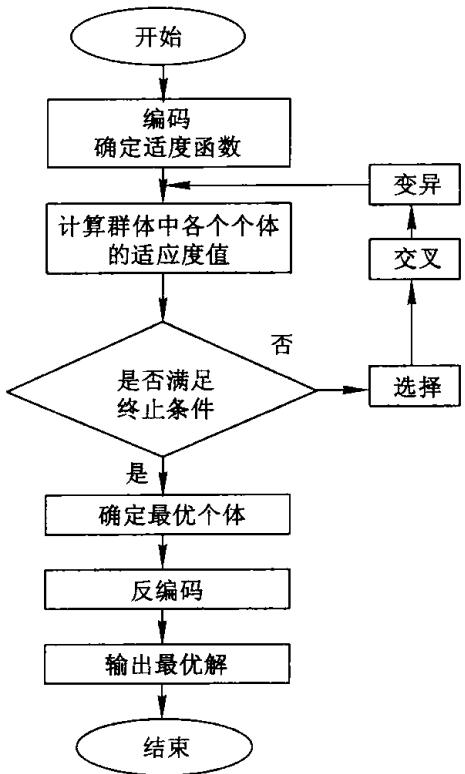  
图 4-2 遗传算法流程图

②构造一个有效的适应度函数。

③确定控制 GA操作的概率。

④确定合适的选择算法。

⑤算法终止条件的设定。

2. 对研究区的计算

以下结合波段选择问题，讨论GA算法的实现。

①编码：采用二值编码策略，由于研究对象是从一个六元素集中选取几个元素，使其符合特定条件，编码策略是以一个六位二值码串表示一种波段组合，从左至右依次代表TM1、TM2、TM3、TM4、TM5、TM7，其中“1”表示选择该位所代表的波段，“0”表示不选择该位所代表的波段，如“100110”表示选择TM1、TM4、TM5进行组合。

②构造适应度函数：按照前面的讨论，适应度函数取为波段组合协方差阵的行列式值。

③确定控制GA操作的概率：经反复试验，确定群体中个体数为6，选择概率为0.9、交叉率为0.9、变异率为0.02，最大迭代次数为10次。

④确定合适的选择算法：采用赌轮算法，其详细方法见相关文献。

⑤算法终止条件的设定：终止条件为当前群体与上代群体的平均适应度之比位于区间[0.995，1.005]内，或迭代次数超过10次时，迭代停止。

经对前面的TM波段进行计算，当不限制选择波段数时，六个波段的组合为最佳组合，当取三个小段时，TM3、TM4、TM5的组合为最佳，因此遗传算法是一种有效的特征提取与优化策略，特别是在多光谱、超光谱遥感信息应用中将发挥更重要的作用。

(四)当前TM与ETM图像的主要应用领域及存在问题

Landsat的ETM与TM卫星遥感图像是当前应用最为广泛的遥感信息源之一，其主要应用领域包括：①资源(包括矿产、石油、水、森林、草地)勘查；②土地利用现状调查与动态监测；③环境监测；④城市规划与管理；⑤地图(常用于比例尺小于1：50000的地形图及其他图件)测绘与更新；⑥防灾减灾工程(如洪灾监测、地质灾害监测、雪灾监测等)；⑦区域管理与地理研究(如地理环境演变监测)等。

尽管TM图像是当前应用最为广泛的遥感信息源，但其应用从总体上看还是基于单一信息源的，主要基于光谱特征、依靠人工处理进行的，随着计算智能与认知科学的发展，当前在TM与ETM图像应用方面仍有许多问题有待深入研究，如：

① 混合像元(Mixed Pixel)的处理。

②与其他信息包括地学信息、遥感信息的融合，特别是与GIS的集成问题。

③计算智能与模糊理论的应用，特别是模糊分类与神经网络、进化算法的应用。

④基于知识的遥感图像处理与专家系统应用。

⑤图像处理不确定性问题。

⑥针对具体应用的信息提取与应用模型问题，如遥感信息模型。

## 三、TM图像中陆面信息的提取

遥感图像处理的目标主要分为五种类型：分类、变化检测、物理量的提取、指标的提取、特定地物及状态的提取。遥感专题信息的提取是遥感应用的重要手段，我们针对陆面演变研究的主要因子从TM图像中提取专题信息，所提取的典型信息包括建设用地、水域、塌陷

地、绿地(含农田、植被、森林等)。

对各种地类进行直接提取，一种方法是利用解译标志，另一种则是利用数字图像处理方法。目视解译主要是根据对地物特征的统计分析，建立解译标志，通过人机交互实现对地物的提取，其优点是实施简便、易行，但存在着工作量大、精度受主观因素影响大等缺点。表4-6 为以 TM3、TM4、TM5 波段组合后主要地类的解译标志。

表4-6  
TM5(R)、TM4(G)、TM3(B)波段假彩色合成图像地类解译标志
<table><tr><td rowspan=1 colspan=2>地类</td><td rowspan=1 colspan=2>图像特征</td></tr><tr><td rowspan=1 colspan=1></td><td rowspan=1 colspan=1>形状</td><td rowspan=1 colspan=1>颜色</td><td rowspan=1 colspan=1>纹理</td></tr><tr><td rowspan=1 colspan=1>绿地</td><td rowspan=1 colspan=1>耕地深浅相间，有规则条块状，林地特征明显</td><td rowspan=1 colspan=1>绿色，浅绿色</td><td rowspan=1 colspan=1>纹理细密，边界清晰</td></tr><tr><td rowspan=1 colspan=1>建设用地</td><td rowspan=1 colspan=1>呈有规则的块状、小块状，有道路相连</td><td rowspan=1 colspan=1>棕色，粉红色，暗棕色</td><td rowspan=1 colspan=1>影纹粗糙，有深浅不同的斑点，不均一，边界较清晰</td></tr><tr><td rowspan=1 colspan=1>水体</td><td rowspan=1 colspan=1>水域影像的形状为块状、条带状</td><td rowspan=1 colspan=1>蓝色、黑色</td><td rowspan=1 colspan=1>影纹细密，均一</td></tr><tr><td rowspan=1 colspan=1>采矿塌陷地</td><td rowspan=1 colspan=1>不规则斑块状，分散、杂乱</td><td rowspan=1 colspan=1>多种颜色共存，主要是黑色、灰色</td><td rowspan=1 colspan=1>纹理粗糙，不均匀，组合特性明显</td></tr><tr><td rowspan=1 colspan=1>山地与荒地</td><td rowspan=1 colspan=1>呈无规则的大片状、片状、条带状</td><td rowspan=1 colspan=1>棕色，粉红色</td><td rowspan=1 colspan=1>影纹不均一，略有斑点状，边界较清晰，有阴影</td></tr></table>

当前主要的研究集中在基于光谱特征、空间关系与知识的目标自动识别和提取、图像分类方面，特别是利用人类认知、计算机视觉等智能理论进行图像处理。对于TM图像来说，主要的信息是灰度信息，主要的知识是波谱知识。以灰度为基础计算的纹理特征可作为辅助信息，根据统计、GIS、空间分析等方法可以从遥感图像中提取需要的地理、背景及其他知识。在具体提取时，针对每一大类都包含若干个子类，按照子类进行采样与灰度统计。以1994年的TM图像为例，对各类均选取50个特征点。进行波谱特征分析与统计，以此来建立各地类的提取模型。表4-7为对各地类特征像元灰度值的统计情况，对应的曲线如图4-3所示。

表4-7  
各地类特征像元灰度统计
<table><tr><td rowspan=1 colspan=1>地  类</td><td rowspan=1 colspan=1>TM1</td><td rowspan=1 colspan=1>TM2</td><td rowspan=1 colspan=1>TM3</td><td rowspan=1 colspan=1>TM4</td><td rowspan=1 colspan=1>TM5</td><td rowspan=1 colspan=1>TM7</td></tr><tr><td rowspan=1 colspan=1>自然水体</td><td rowspan=1 colspan=1>82.3</td><td rowspan=1 colspan=1>42.7</td><td rowspan=1 colspan=1>42.7</td><td rowspan=1 colspan=1>20.7</td><td rowspan=1 colspan=1>8.7</td><td rowspan=1 colspan=1>5.0</td></tr><tr><td rowspan=1 colspan=1>积水</td><td rowspan=1 colspan=1>66.6</td><td rowspan=1 colspan=1>28.6</td><td rowspan=1 colspan=1>26.2</td><td rowspan=1 colspan=1>21.8</td><td rowspan=1 colspan=1>10.8</td><td rowspan=1 colspan=1>5.0</td></tr><tr><td rowspan=1 colspan=1>市区</td><td rowspan=1 colspan=1>85.0</td><td rowspan=1 colspan=1>39.2</td><td rowspan=1 colspan=1>45.6</td><td rowspan=1 colspan=1>43.2</td><td rowspan=1 colspan=1>60.4</td><td rowspan=1 colspan=1>36.2</td></tr><tr><td rowspan=1 colspan=1>道路</td><td rowspan=1 colspan=1>98.7</td><td rowspan=1 colspan=1>51.7</td><td rowspan=1 colspan=1>65.2</td><td rowspan=1 colspan=1>64.8</td><td rowspan=1 colspan=1>98.3</td><td rowspan=1 colspan=1>64.0</td></tr><tr><td rowspan=1 colspan=1>乡村</td><td rowspan=1 colspan=1>87.3</td><td rowspan=1 colspan=1>45.3</td><td rowspan=1 colspan=1>58.5</td><td rowspan=1 colspan=1>57.0</td><td rowspan=1 colspan=1>90.5</td><td rowspan=1 colspan=1>59.3</td></tr><tr><td rowspan=1 colspan=1>植被山</td><td rowspan=1 colspan=1>68.0</td><td rowspan=1 colspan=1>29.2</td><td rowspan=1 colspan=1>26.6</td><td rowspan=1 colspan=1>53.6</td><td rowspan=1 colspan=1>45.4</td><td rowspan=1 colspan=1>17.2</td></tr><tr><td rowspan=1 colspan=1>裸山</td><td rowspan=1 colspan=1>89.0</td><td rowspan=1 colspan=1>47.8</td><td rowspan=1 colspan=1>61.8</td><td rowspan=1 colspan=1>79.0</td><td rowspan=1 colspan=1>119.3</td><td rowspan=1 colspan=1>63.8</td></tr><tr><td rowspan=1 colspan=1>农田</td><td rowspan=1 colspan=1>68.0</td><td rowspan=1 colspan=1>32.6</td><td rowspan=1 colspan=1>28.6</td><td rowspan=1 colspan=1>96.6</td><td rowspan=1 colspan=1>68.8</td><td rowspan=1 colspan=1>24.4</td></tr></table>

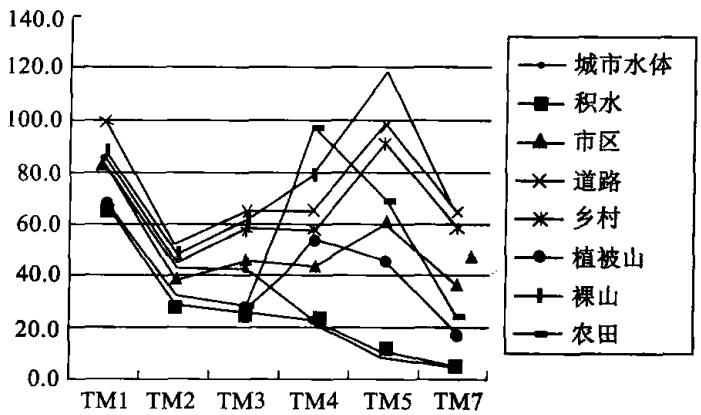  
图 4-3 地物灰度曲线比较

## （一）水体提取

研究区的水体主要包括湖水、区域积水(主要是塌陷地积水)、河流(黄河古道、京杭大运河）、水库、水塘等。水体几乎吸收了近红外和中红外波段的全部人射能量，所以在这两个波段的反射能量很少，呈现出暗色调。

## 1. 基于阈值的单波段水体提取模型

对采样数据进行分析可以看出，在TM1、TM2、TM3波段上，水体与建设用地的光谱特征值类似；在TM4、TM5、TM7上，水体的灰度与其他地物均有明显的区别，远小于其他地物的灰度，因此利用这些波段可以建立基于阈值法的水体提取模型。其关键问题是阈值的确定，可采用两种方法选择阈值：一种是常用的试验法，即取不同的阈值进行提取，并与实地情况对照，从而确定最可信的阈值；另一种则是利用遗传算法进行分割阈值的选择。

分别对TM4、TM5、TM7进行阈值提取，并与GIS中的信息进行比较，确定当采用波段TM4时，阈值取34；当采用TM5波段时，阈值取32；当采用波段TM7时，阈值取10可实现对水体的提取。图4-4为原图像和采用以上阈值提取的水体。

## 2. 基于谱间关系的水体提取

针对水体的敏感波段，对其可能的特征组合进行计算，如表4-8、图4-5所示。

表4-8  
针对水体提取的波段组合计算
<table><tr><td rowspan=1 colspan=1>地类</td><td rowspan=1 colspan=1>TM2+3</td><td rowspan=1 colspan=1>TM4+5</td><td rowspan=1 colspan=1>TM5+7</td><td rowspan=1 colspan=1>TM4+7</td><td rowspan=1 colspan=1>TM4+5+7</td></tr><tr><td rowspan=1 colspan=1>自然水体</td><td rowspan=1 colspan=1>85.3</td><td rowspan=1 colspan=1>29.3</td><td rowspan=1 colspan=1>13.7</td><td rowspan=1 colspan=1>25.7</td><td rowspan=1 colspan=1>34.3</td></tr><tr><td rowspan=1 colspan=1>积水</td><td rowspan=1 colspan=1>54.8</td><td rowspan=1 colspan=1>32.5</td><td rowspan=1 colspan=1>15.8</td><td rowspan=1 colspan=1>26.8</td><td rowspan=1 colspan=1>37.5</td></tr><tr><td rowspan=1 colspan=1>市区</td><td rowspan=1 colspan=1>84.8</td><td rowspan=1 colspan=1>103.6</td><td rowspan=1 colspan=1>96.6</td><td rowspan=1 colspan=1>79.4</td><td rowspan=1 colspan=1>139.8</td></tr><tr><td rowspan=1 colspan=1>道路</td><td rowspan=1 colspan=1>116.8</td><td rowspan=1 colspan=1>163.2</td><td rowspan=1 colspan=1>162.3</td><td rowspan=1 colspan=1>128.8</td><td rowspan=1 colspan=1>227.2</td></tr><tr><td rowspan=1 colspan=1>乡村</td><td rowspan=1 colspan=1>103.8</td><td rowspan=1 colspan=1>147.5</td><td rowspan=1 colspan=1>149.8</td><td rowspan=1 colspan=1>116.3</td><td rowspan=1 colspan=1>206.8</td></tr><tr><td rowspan=1 colspan=1>植被山</td><td rowspan=1 colspan=1>55.8</td><td rowspan=1 colspan=1>99.0</td><td rowspan=1 colspan=1>62.6</td><td rowspan=1 colspan=1>70.8</td><td rowspan=1 colspan=1>116.2</td></tr><tr><td rowspan=1 colspan=1>裸山</td><td rowspan=1 colspan=1>109.5</td><td rowspan=1 colspan=1>198.3</td><td rowspan=1 colspan=1>183.0</td><td rowspan=1 colspan=1>142.8</td><td rowspan=1 colspan=1>262.0</td></tr><tr><td rowspan=1 colspan=1>农田</td><td rowspan=1 colspan=1>61.2</td><td rowspan=1 colspan=1>165.4</td><td rowspan=1 colspan=1>93.2</td><td rowspan=1 colspan=1>121.0</td><td rowspan=1 colspan=1>189.8</td></tr></table>

分析发现，水体的谱间关系具有以下与其他地物区别明显的特征：

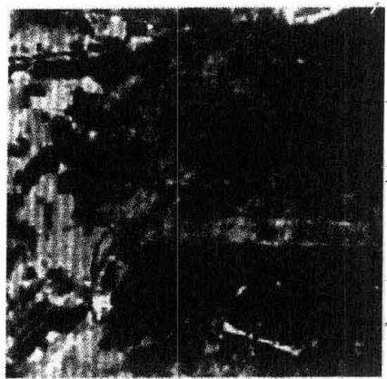  
(a)

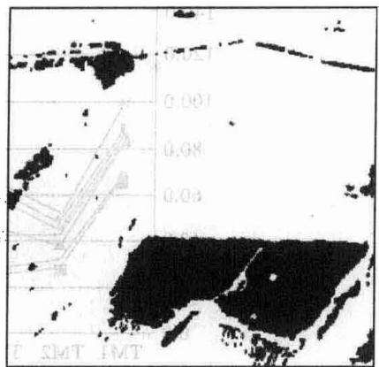  
(b)

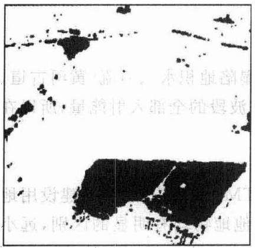  
(c)

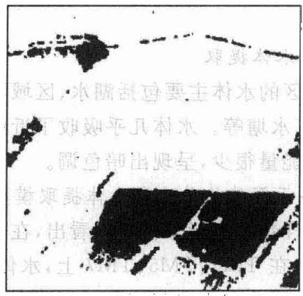  
(d)  
图 4-4 采用阈值水体提取模型  
(a) 用于水体提取的原始图像；(b) TM4 提取的水体；  
(c) TM5 提取的水体；(d) TM7 提取的水体

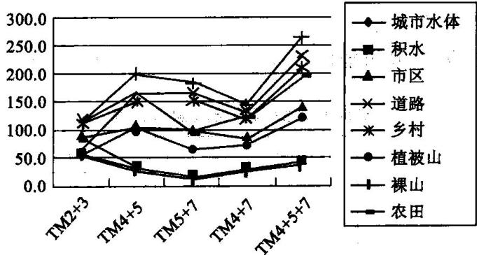  
图 4-5 用于水体提取的波段组合

①从灰度值的大小看，水体具有 $\mathrm { T M } 4 { > } \mathrm { T M } 5 { > } \mathrm { T M } 7$ 的光谱特征。

②由于水体在TM4、TM5、TM7各波段上其灰度值都是最小的，因此采用TM4+TM5+TM7可以增大这种差异。

③在所有的地物中，只有水体具有 $\left( \mathrm { T M 2 + T M 3 } \right) > \left( \mathrm { T M 4 + T M 5 } \right) , \left( \mathrm { T M 2 + T M 3 } \right) >$ (TM5+TM7)的特征。

按照以上的谱间关系特征，可以建立如下的水体提取模型：

$$
{ \bf \ddag { \bf \Xi } 1 _ { \bar { \iota } } ( T M 2 + T M 3 ) - ( T M 4 + T M 5 ) > 0 }
$$

模型2:(TM2+TM3)-(TM5+TM7)>0

模型 $3 : ( \mathrm { T M 4 } + \mathrm { T M 5 } + \mathrm { T M 7 } ) < K , K$ 采用阈值确定方法选取。

在以上几个提取模型中，最有效的是模型1和模型2，它不依赖于具体的灰度值，可以适用于不同气候条件、不同时相的TM图像。在实际提取中，考虑到遥感信息受自然条件的影响，将模型变换为 $( \mathrm { T M } 2 + \mathrm { T M } 3 ) - ( \mathrm { T M } 4 + \mathrm { T M } 5 ) > 1 0$ 或(TM2+TM3)—(TM5+$\mathrm { T M } 7 ) { > } 1 0$ ，以有效免除多提或误提的水体，图4-6、图4-7为由模型1、模型2提取的水体。

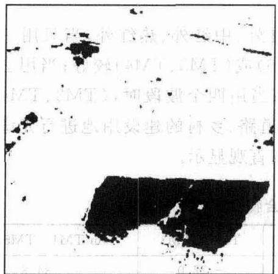  
图 4-6 由模型 1 提取的水体

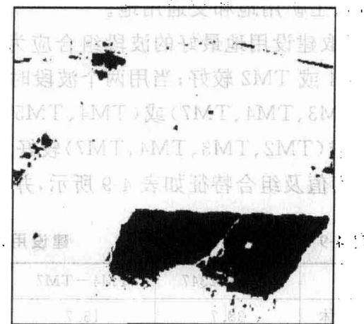  
图 4-7 由模型 2 提取的水体

## 3. 基于 GA 算法的阈值提取

图像阈值的选取一直是图像分割、目标识别中的一个重要问题，依靠经验和目视判读确定阈值只适用于精度要求不太高的情况。因此根据一定的提取准则，确定精确的阈值提取算法就成为图像处理中的一项基本工作。提取的准则不同，提取算法也不同，最常用的一种准则是最大类间方差法，其基本思想是：设确定的阈值为T，则可将像素按灰度值分成 ${ \mathrm { C } } _ { 0 }$ (用灰度值GD0表达，如取0)和 $C _ { 1 }$ (用灰度值GD1表示，如取255)，其判断准则为：

IF GD(i,j ) < = T THEN   
F(i,j) = GD0   
ELSE   
F(i,j ) = GD1   
END IF

设 $\infty _ { 0 } ( T )$ 为 $C _ { 0 }$ 中包含的像素数目， $m _ { 0 } ^ { \prime } ( T )$ 为 $C _ { 0 }$ 中所有像素灰度值的均值 ${ \mathfrak { a } } _ { 1 } ( T )$ 为$C _ { 1 }$ 中包含的像素数目， $m _ { 1 } \left( T \right)$ 为 $C _ { 1 }$ 中所有像素灰度值的均值，则可由式(4-5)计算类间方差：

$$
\begin{array} { r } { \sigma ( T ) ^ { 2 } = w _ { 0 } ( T ) \times w _ { 1 } ( T ) \times ( m _ { 1 } ( T ) - m _ { 2 } ( T ) ) ^ { 2 } } \end{array}\tag{4-5}
$$

将 $T \notin [ 0 , L \mathrm { ~ - ~ } 1 ]$ 区间内依次改变，则 $\pmb { \sigma }$ 最大的 $T$ 值即为最佳阈值 $T ^ { \prime }$

可以看出，最大类间方差法确定阈值的实质就是确定一个问题的最优解，因而可以用GA算法进行求解。针对已有方法的特点，我们提出一种基于改进GA算法的图像阈值确定方法，采取的改进方法如下：

①人工方法产生初始群体。

②对上代群体的处理进行优化。

③优选父代交换。

④大突变操作。

经改进后，GA算法的稳定性、收敛速度均有了明显的提高，并且结果与前面提取的阈值一致。

## （二）建设用地提取

建设用地的分布、性质是研究区域发展的主要指标，在研究区内，建设用地主要包括居民用地、工矿用地和交通用地。

提取建设用地最好的波段组合应为可见光、近红外、中红外、热红外，当只用一个波段时，TM4或TM2较好；当用两个波段时，(TM4、TM6)或(TM3、TM4)较好；当用三个波段时，(TM3、TM4、TM7)或(TM4、TM5、TM7)较好；当用四个波段时，(TM3、TM4、TM5、TM7)或(TM2、TM3、TM4、TM7)较好。取某市区、道路、乡村的建设用地进行光谱特征分析，灰度值及组合特征如表4-9所示，并用图4-8予以直观显示。

表 4-9  
建设用地提取波段组合特征
<table><tr><td rowspan=1 colspan=1></td><td rowspan=1 colspan=1>Mean 12347</td><td rowspan=1 colspan=1>TM4- TM7</td><td rowspan=1 colspan=1>TM4-TM5</td><td rowspan=1 colspan=1>TM4-TM3</td><td rowspan=1 colspan=1>Sum TM4-TM5- TM7</td></tr><tr><td rowspan=1 colspan=1>城市水体</td><td rowspan=1 colspan=1>38.7</td><td rowspan=1 colspan=1>15.7</td><td rowspan=1 colspan=1>12.0</td><td rowspan=1 colspan=1>22.0</td><td rowspan=1 colspan=1>34.3</td></tr><tr><td rowspan=1 colspan=1>积水</td><td rowspan=1 colspan=1>29.6</td><td rowspan=1 colspan=1>16.8</td><td rowspan=1 colspan=1>11.0</td><td rowspan=1 colspan=1>-4.5</td><td rowspan=1 colspan=1>37.5</td></tr><tr><td rowspan=1 colspan=1>市区</td><td rowspan=1 colspan=1>49.8</td><td rowspan=1 colspan=1>7.0</td><td rowspan=1 colspan=1>-17.2</td><td rowspan=1 colspan=1>-2.4</td><td rowspan=1 colspan=1>139.8</td></tr><tr><td rowspan=1 colspan=1>道路</td><td rowspan=1 colspan=1>68.9</td><td rowspan=1 colspan=1>0.8</td><td rowspan=1 colspan=1>-33.5</td><td rowspan=1 colspan=1>-0.3</td><td rowspan=1 colspan=1>227.2</td></tr><tr><td rowspan=1 colspan=1>乡村</td><td rowspan=1 colspan=1>61.5</td><td rowspan=1 colspan=1>-2.3</td><td rowspan=1 colspan=1>-33.5</td><td rowspan=1 colspan=1>-1.5</td><td rowspan=1 colspan=1>206.8</td></tr><tr><td rowspan=1 colspan=1>植被山</td><td rowspan=1 colspan=1>38.9</td><td rowspan=1 colspan=1>36.4</td><td rowspan=1 colspan=1>8.2</td><td rowspan=1 colspan=1>27.0</td><td rowspan=1 colspan=1>116.2</td></tr><tr><td rowspan=1 colspan=1>农田</td><td rowspan=1 colspan=1>50.0</td><td rowspan=1 colspan=1>72.2</td><td rowspan=1 colspan=1>27.8</td><td rowspan=1 colspan=1>68.0</td><td rowspan=1 colspan=1>189.8</td></tr></table>

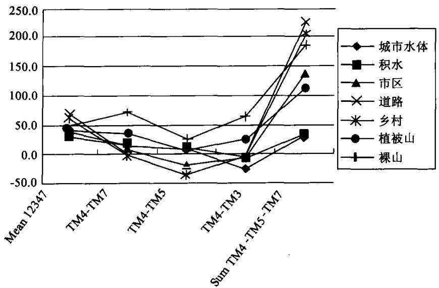  
图4-8 建设用地提取波段组合特征

经统计分析发现，建设用地有以下特点：

①建设用地和裸山在每个波段上的灰度值都是最大的，因此采用灰度值可以扩大这种差异，受阈值影响要比单波段小得多。

②建设用地的TM4、TM7灰度值非常接近，而其他地物中只有裸山具有这一特性。

③建设用地的TM4、TM3灰度值非常接近，地面积水虽然也具有这一特性，但有前面水体提取的模型，很容易将水体予以识别。

④尽管建设用地和裸山具有相似的光谱特征，但一方面二者具有不同的纹理特征；另一方面，裸山具有固定性、不变性，在GIS数据库中表现为固定地物，易于去除，故可实现建设用地与裸山的区分，特别是后者具有简易性、可行性。

根据以上分析，提取时可分两步进行，首先确定建设用地与易混淆地物(裸山、水体)的混合区，然后再进行区分。具体的提取方法和模型如下：

①建设用地与混合区的初步提取和识别：

方法1先由植被指数(NDVI)去掉植被区，再由前面的模型去掉水体，则得到建设用地与其他易混合地类(主要是裸山和荒地)的混合区，即： $| \mathrm { \Delta \ T M 4 - T M 3 } | < K \mathrm { \ A N D }$ $( \mathrm { T M 2 + T M 3 } ) { < } ( \mathrm { T M 4 - T M 5 } )$ ;

方法2——由单波段光谱或多波段阈值(以TM7为最佳)得到建设用地与裸山的混合体，即： $\mathrm { T M 7 } { > } K _ { 1 } \mathrm { O R } \mathrm { S U M } ( \mathrm { T M 1 } , \cdots , \mathrm { T M 5 } , \mathrm { T M 7 } ) { > } K _ { 2 } ( K _ { 1 } , K _ { 2 }$ 为阈值，由前面的方法确定)；

方法3—由建设用地和裸山共有的光谱特性实现对二者的识别，即： $( \mathrm { T M } 5 - \mathrm { T M } 4 )$ $> 0 \mathrm { \ A N D } ( \mathrm { T M } 4 < K _ { 1 } \mathrm { \ O R \ T M } 5 < K _ { 2 } ) \mathrm { \ O R \ } ( \mathrm { T M } 4 - \mathrm { T M } 7 ) < K _ { 3 }$

②从建设用地与裸山混合图像中去除裸山，得到建设用地，可以用三种方法：

方法1一—基于已有的DEM和空间知识(如坡度)，因为裸山是一种客观存在，不会凭空产生，因此基于空间知识可以将其剔除；

方法2—将裸山与建设用地的光谱特征进一步分析，可以发现在波段TM4、波段TM5上，裸山的灰度值明显大于建设用地，因此可以设定阈值从混合体中剔除裸山，得到建设用地；

方法3——根据纹理特征(用灰度共生矩阵即可)进行区分。

经综合比较分析，选取 $( \mathrm { T M } 4 - \mathrm { T M } 7 ) < 1 5 $ 和$\mathrm { T M } 5 - \mathrm { T M } 4 > 0$ 分别进行初步提取，利用GIS数据库中关于山体的数据实现对裸山的滤除，操作最简单，且比较可靠，按此方法提取的建设用地如图4-9所示。

## (三)植被与农田提取

根据区域陆面演变的要求，对植被与农田可不必细分其具体的种类，因此将其归并为“绿地”进行提取。虽然可以采用的植被指数很多，但常用的仍是比值植被指数RVI、标准化植被指数(NDVI)：

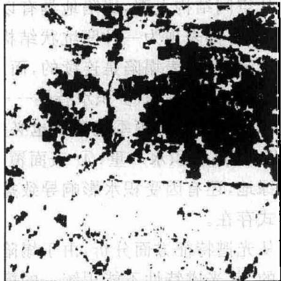  
图 4-9 提取的建设用地

$$
{ \mathrm { R V I } } { = } \frac { \mathrm { T M 4 } } { \mathrm { T M 3 } } \qquad { } \mathrm { N D V I } { = } \frac { \mathrm { T M 4 } - \mathrm { T M 3 } } { \mathrm { T M 4 } + \mathrm { T M 3 } }
$$

对图像进行计算得到NDVI，可在其上提取绿地，如图4-10所示。与实地对比分析发现，由于背景影响等因素，部分建设用地特别是工矿区低层建筑、村镇建筑物在一些像元也呈现出NDVI>0的特征，即 $\mathrm { T M } 4 - \mathrm { T M } 3 > 0$ 的现象，也称伪植被现象，其差值一般都比较小，因此可设置 $\mathrm { T M } 4 - \mathrm { T M } 3 > K _ { 1 }$ 或 $R V I { = } . \mathrm { T M } 4 / \mathrm { T M } 3 { > } K _ { 2 }$ 。经试验，取 $K _ { 1 } = 1 0$ 或 $\kappa _ { 2 } =$ 1.2，对于绿地来说，这一阈值条件不会产生影响，但却可以有效去除误提取的绿地。图4-11为按照 $\mathrm { T M } 4 - \mathrm { T M } 3 > 1 0$ 提取的绿地，对比原图并经实地调查，发现去除了多数误提取的绿地。

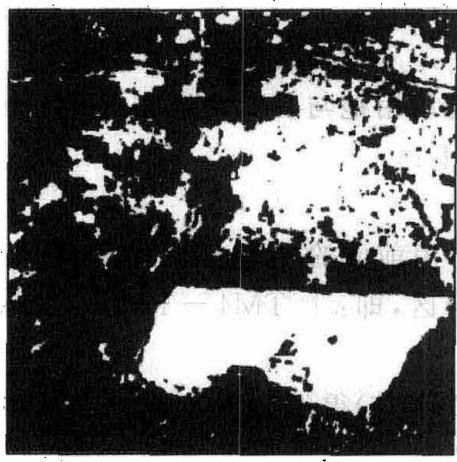  
图 4-10 由 NDVI>0 确定的绿地

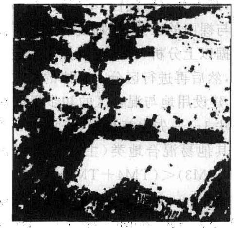  
图4-11 由 $\mathrm { T M } 4 - \mathrm { T M } 3 > 1 0$ 提取的绿地

## (四)塌陷地的提取

研究区内的塌陷地主要是采煤塌陷地，由于采煤对地下水系的影响，诱发了采水导致的地面沉降、岩溶塌陷等新的塌陷形式。研究矿区开采时间长、范围大，地面塌陷相当严重，且潜水位较高，在9月份大都处于积水期，以面状或斑点状形态与浅蓝色背景形成鲜明的对比。

## 1. 塌陷地的特征

从空间结构上看，塌陷地具有以下特征：①具有坑状结构——不管是形成移动盆地还是塌陷坑，都表现为一种凹坑状结构；②宏观连续与微观离散状态从整个塌陷坑或移动盆地来看，地表塌陷是连续的，而从内部具体形态上来看，又表现为高低不平的起伏态，即微观上的离散形态；③积水特性—由于地下潜水位较高，当塌陷到一定深度时，将导致塌陷区积水，另外，在雨季塌陷坑也必然会汇聚大量积水，特别是我们获取遥感图像的时相是9月份，塌陷坑积水严重；④表面覆被非均一性—塌陷区内既有积水区，也有塌陷但未积水的绿地，还有因受积水影响导致盐渍化的裸露土地，不同覆被斑块之间以不规则、非均一的形式存在。

从光谱特征方面分析，由于塌陷地实际上是由绿地、荒地、水域以及少数建设用地组合而成的，其光谱特性不能用统一的模式进行描述，而是既有各种覆被单独存在的像元，又有多种覆被引起的混合像元(Mixed Pixel)，这是TM图像处理中的难题之一。因此，直接基于光谱特性进行塌陷地的提取非常困难，必须根据其特征及有关知识进行提取。

## 2. 关于塌陷地的知识

由塌陷地的特征，可以建立以下的知识用于塌陷地提取：

①积水的时态性——塌陷区积水范围是动态变化的，将这一知识用产生式规则表示为：

设W。为由地形图获取的区域自然水体，W1为由遥感图像提取的水体信息，则进行基 $W _ { \mathrm { 0 } }$ $W _ { 1 }$ 于栅格的运算： $W _ { 2 } = W _ { 1 } - W _ { 0 }$ ,对 $W _ { 2 }$ 中每一像元，进行如下判断：

$$
\mathrm { I F } \ W _ { 2 } ( \mathrm { i } , \mathrm { j } ) = 1 \ \mathrm { T H E N } \ \mathrm { S U B S I D E N C E } \ \mathrm { C F } = 0 . 9
$$

②积水区应在开采煤层的缓冲区范围内设对地下开采范围进行缓冲区分析，得到的区域为Buf，则可以对水体W，与Buf进行求交运算，得到区域 $W _ { \mathrm { ~ l ~ } }$ $W { - } \operatorname { B u f }$ ，对其中的每一像元进行判断：

$$
\mathrm { I F } \ W - \mathrm { B u f ( i , j ) } = 1 \ \mathrm { T H E N \ S U B S I D E N C E } \ C F = 0 . 9
$$

③土地利用的动态变化—设 $I _ { 1 }$ 为时相1图像的分类结果， $I _ { 2 }$ 为时相2的分类结果，则首先对 $I _ { 1 }$ 与 $I _ { 2 }$ 进行比较，然后提取其中的变化像元，根据塌陷地形成的规则和以上的知识进行识别：

$$
\begin{array} { r l } & { \mathrm { I F ~ } I _ { 1 } \left( \mathrm { i } , \mathrm { j } \right) = I _ { 2 } \left( \mathrm { i } , \mathrm { j } \right) \ \mathrm { T H E N ~ } R ( \mathrm { i } , \mathrm { j } ) = I _ { 1 } \left( \mathrm { ~ i } , \mathrm { j } \right) } \\ & { \mathrm { E L S E ~ } R ( \mathrm { i } , \mathrm { j } ) = F ( I _ { 1 } \left( \mathrm { i } , \mathrm { j } \right) , I _ { 2 } \left( \mathrm { i } , \mathrm { j } \right) ) } \\ & { \mathrm { E N D I F } } \end{array}
$$

其中函数F为根据两时相像元类别进行组合得出的值，它反映了像元从时相1的状态变化到时相2的状态的类别，F为一有限离散函数，而且根据其取值可以确定变化类别，进而依据有关的知识确定其中可能是塌陷区的变化种类。

## 3. 基于光谱特性和知识的塌陷区提取

按照以上的分析，可以在提取水体、建设用地和绿地的基础上，对塌陷地进行提取。

## 模型1—基于塌陷区积水的提取模型

①以某一矿区中心(或矿区井田边界)为基础做缓冲区分析，半径 $r _ { 1 }$ 根据 $\textcircled { \sharp } ^ { \star }$ 区开采面积确定，得到区域 $R _ { 1 } : \textcircled { 2 }$ 将 $R _ { 1 }$ 与提取的水体区域 $W _ { 1 }$ 作交运算，提取落在此缓冲区内的水体 $R _ { 2 } = R _ { 1 } - W _ { \mathrm { ~ l ~ } }$ ；③根据地形图得到区域内自然水体集合 $W _ { 2 }$ ，进行差值运算 $R _ { 3 } = R _ { 2 } - W _ { 2 }$ 并将 $R _ { 3 }$ 内部的区域进行填充；④根据塌陷坑边界与积水边界的统计关系，确定外推半径$r _ { 2 }$ ,以 $R _ { 3 }$ 边界为基础，向外作缓冲区 $R _ { 4 }$ ，得到提取的塌陷地。

## 模型2—基于土地覆盖因子变化的提取模型

对于未积水的塌陷地来说，必须依赖于陆面覆被的动态变化进行识别。可采用的方法是.①以某一矿区中心(或矿区井田边界)为基础做缓冲区分析，半径 $r _ { 1 }$ 根据矿区开采面积确定，得到区域 $R _ { 1 } : \textcircled { 2 }$ 在区域R，内划定土地利用变化范围 $R _ { 2 }$ ，由多时相遥感图像分类信息或GIS基础信息确定变化类型，提取符合塌陷地特点的区域；③根据R2和知识推理规则， $R _ { 2 }$ 确定可能的塌陷地像元集合 $R _ { 3 } : \textcircled { 4 }$ 根据经验统计数据，确定外推半径 $r _ { 2 }$ ，以 $R _ { 3 }$ 边界为基础，向外作缓冲区R，即可作为提取的塌陷地。塌陷地的提取在GIS的支持下进行，根据以 $R _ { 4 }$ 上的提取方法和模型，由TM图像提取了1987年和1994年B区的塌陷土地（图4-12）。

## 四、RADARSAT图像中陆面演变信息的提取

遥感技术从20世纪50年代开始应用于人居环境探测、人口估计和城市分析。相对而言，可见光和红外遥感的应用得到了极大的重视，而雷达遥感应用的研究却较少，尤其是雷达遥感用于人居环境、城市和人口调查近年来才被引起注意，有必要加强这方面的研究。与可见光遥感相比，微波遥感有许多优点：第一，微波具有穿透云层和在一定尺度上穿透雨区的能力及其不信赖于太阳作为照射源的特点；第二，微波比可视光波能更深地穿入植被，穿透的程度取决于植物的含水量、密度及使用的波长，因而改变微波的波长可以得到植被上层、下层甚至植被覆盖下的表层土壤的信息；第三，微波得到的信息与可见光、红外波段得到的信息有所不同，可以互作补充。当前主要应用的雷达遥感信息源有ERS一SAR、JERS一SAR 和 RADARSAT，其中RADARSAT是 2000 年以前最先进的雷达观测卫星，是迄今为止所有雷达卫星中最为完善和最为先进的，它的多模态对地覆盖和多分辨率为其应用提供了更为灵活的方式，使星载雷达数据的应用上了一个新的台阶。尽管RADARSAT在我国应用的时间还不是很长，但已在资源监测、环境遥感、灾害监测中显现出了巨大的应用潜力，特别是在1998年的特大洪灾中，RADARSAT图像发挥了巨大的作用。

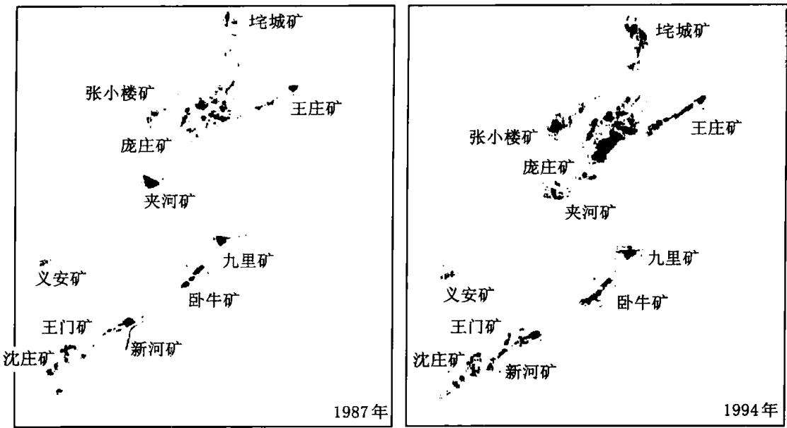  
图 4-12 利用 TM图像提取的 B 区塌陷地

## (一)RADARSAT 图像滤波

抑制雷达图像斑点噪声是这种图像信息提取的前提。斑点噪声可视为非相关的乘性噪声模型，因此SAR观测数据可用式(4-6)表示：

$$
\boldsymbol { g } = f \boldsymbol { u }\tag{4-6}
$$

式中，g为观测数据；f为去除斑点噪声后的数据；u为与f相对独立的斑点噪声随机向量。 $_ { g }$ 斑点噪声由回波信号中均值为0、标准差与图像场景无关的随机相位干扰产生，服从均值 $\mu { = } 1$ 、方差为 $\sigma _ { u } ^ { 2 }$ 的指数分布。在单视数时，标准差 $\sigma _ { u }$ 的理论值约为0.5227。

如果该乘性噪声模型适用于SAR图像，则u的标准差应该等于 $_ { g }$ 的标准差和 $\pmb { g }$ 的均值之比，即σ，对 $\sigma _ { g }$ $\overline { { g } }$ 的关系曲线应该是通过原点且斜率为 $\sigma _ { u }$ 的直线。实验结果证明该模型是实用的，进而可证明噪声服从Γ分布：

$$
f ( u ) = \frac { u ^ { L - 1 } L ^ { L } } { T ( L ) } \mathrm { e x p } ( - u L ) \qquad ( u \geqslant 0 )\tag{4-7}
$$

式中，L为图像视数。对单视图像，L=1，斑点噪声服从单边指数分布。

抑制雷达图像斑点噪声是这种图像信息提取的前提。目前对噪声的抑制方法可分为两大类，即成像之前的多视处理技术和成像后的滤波技术。前者用多视平均的方法，以空间分辨率降低N倍为代价获得N1/2倍的 Speckle抑制；后者可分为空间滤波技术和频域滤波技术，其中以空间滤波技术为基础的 Speckle噪声抑制算法是 SAR图像 Speckle抑制技术的主流。当前常用的SAR滤波算法主要包括：

①传统方法—包括中值平滑滤波、均值滤波、局部均值滤波、SIGMA滤波(Delta滤波)等，其缺点是平滑噪声的同时损失了边缘信息，而且SAR的乘性噪声与传统方法假设的噪声分布不同，必然导致效果较差。

②模型方法即假定静态的噪声模型，然后用相应的滤波器进行处理，如Kalman、LEE滤波器等，其缺点是对噪声的假设往往不能与信号的实际情况相符，因此效果不稳定。

③局部统计自适应滤波器主要是基于图像局部直方图特征、均值、灰度、梯度等指标来决定参与滤波的邻域点及其权值，进行自适应滤波。包括FROST自适应滤波、KUAN、LEE自适应滤波等。其优点是能够根据局部统计特征在平滑噪声的同时有效地保持明显的边缘，因此得到了广泛的应用，也是当前应用最多的方法。

④几何滤波法—将图像的二维平面位置(行、列号)加上灰度值考虑为一种三维模型，用形态学方法滤波，如GAMMAMAP滤波器，这种滤波器的边缘保持能力优于局部统计滤波。

⑤基于小波的滤波———利用小波分析对图像进行分解，对代表图像低频部分的低分辨率图像进行滤噪处理，对代表高频成分的高分辨率图像进行适当的阈值处理以保留主要的边缘信息，然后再重建图像。这种方法噪声抑制和边缘保持效果都较好，其缺点是计算量大，实现复杂。

⑥频域滤波即将图像经过FFT变换后在频域进行处理，然后再通过反变换回到空间域，相对而言，应用不是太多。

从RADARSAT重采样后的图像上选取1024×1024像元大小图像，应用各种方法包括均值滤波法、中值滤波法、边缘锐化滤波法、GAMMA滤波、增强FROST、增强LEE、FROST滤波、KUAN滤波、LEE滤波、小波滤波、小波软阈值法进行处理，经定量分析与综合比较，KUAN滤波(5×5窗口)后的图像效果最好，故以它为基础进行分类与信息提取。原图像和几种主要滤波方法处理的图像参见图4-14。

在以下研究中，设n为滤波窗口半径，则对像元(i，j)而言，其滤波窗口为从像元 $( i - n , j - n )$ 到像元 $( i + n , j + n )$ 的 $( 2 n + 1 ) \times ( 2 n + 1 )$ 正方形区域。当n=1时，为3×3滤波窗口，如图4-13所示。

在所有方法采用的符号中，除非特别声明，各符号的含义如下所述：

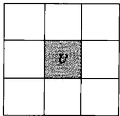

$F _ { i j }$ ——滤波后像元(i,j)的灰度值；

$G _ { k l }$ ——滤波前像元(k，l)的灰度值；

图4-13 3×3滤波窗口

M滤波窗口内像元灰度平均值；

V——滤波窗口中像元的方差；

U——乘性噪声的均值(U=1)；

S———滤波窗口内的噪声标准差；

L——视角数，对 RADARSAT 而言，L=1。

## (1) 传统滤波算法

传统滤波算法主要是中值滤波和均值滤波。中值滤波是将滤波窗口内的像元灰度值进行排序，取序列中值作为中心像元滤波后的灰度值，其数学模型为：

$$
F _ { i j } = \operatorname { m e d i a n } \{ G _ { k l } \} \qquad ( k = i - n , \cdots , i + n ; l = j - n , \cdots , j + n )\tag{4-8}
$$

均值滤波是取滤波窗口内像元灰度均值作为中心像元滤波后的灰度，其数学模型为：

$$
F _ { i j } = \frac { 1 } { ( 2 n + 1 ) ^ { 2 } } { \sum _ { k = i - n } ^ { i + n } \sum _ { l = j - n } ^ { i + n } G _ { k l } }\tag{4-9}
$$

由于SAR图像噪声具有乘性噪声的性质，因此应采用同态滤波策略进行处理，即先对原图像取对数运算，采用中值、均值滤波后再进行指数运算，最后得到滤波图像。图4-14(a)为滤波前的原图像，图4-14(b)为均值滤波、图4-14(c)为中值滤波后的结果图像。需要说明的是，滤波窗口选择对滤波效果有直接影响，为便于对各种方法的滤波效果进行比较，我们选择效果较好的5×5窗口进行分析。

## (2) LEE 与增强 LEE 滤波

LEE滤波是一种迭代式自适应滤波，可在对噪声作不同假定的前提下进行处理，当噪声为乘性噪声时，其数学模型为：

$$
F _ { \iota \prime } = M + K ( G _ { i j } - U M )\tag{4-10}
$$

式中 $, K = ( U V ) / ( V U ^ { 2 } + M ^ { 2 } M _ { \mathrm { v a R } } ) \ ; M _ { \mathrm { v a R } } = ( S / M ) ^ { 2 }$ 0

增强LEE算法以相对标准差为依据将图像分为均匀、非均匀和点状目标3类区域，分别进行均值滤波、LEE滤波和保持不变，其算法为：

$$
F _ { i j } = \left\{ \begin{array} { l l } { M \qquad } & { ( C _ { x } < C _ { u } ) } \\ { G _ { i j } W + M ( 1 - W ) \qquad } & { ( C _ { u } \leqslant C _ { x } \leqslant C _ { \mathrm { m a x } } ) } \\ { G _ { i j } \qquad } & { ( C _ { x } > C _ { \mathrm { m a x } } ) } \end{array} \right.\tag{4-11}
$$

式中，C，为窗口相对标准差， $C _ { x } = V / M ; C _ { u }$ 为噪声相对标准差， $C _ { u } = _ { \sigma _ { u } } / \mu , \sigma _ { \iota }$ 与 $\mu$ 的含义同前； $C _ { \mathrm { m a x } } = \sqrt { 3 } C _ { u } ; W = \mathrm { e x p } [ - ( C _ { x } - C _ { u } ) / ( C _ { \mathrm { m a x } } - C _ { x } ) ]$ ，下文各量含义与此相同。

图 4-14(d)为 LEE 滤波、图 4-14(e) 为增强 LEE 滤波后的图像。

## (3) FROST 与增强 FROST 滤波

FROST滤波是以权重为自适应调节参数的滤波器，对每一像元，按式(4-12)确定一个权重值，然后按式(4-13)进行滤波：

$$
W = \exp ( - A T )\tag{4-12}
$$

$$
F _ { i j } = \sum _ { k = i - n } ^ { i + n } \sum _ { I = j - n } ^ { j + n } G _ { k l } W _ { k l } / \sum _ { k = i - n } ^ { i + n } \sum _ { l = j - n } ^ { j + n } W _ { k l }\tag{4-13}
$$

式中 $. A { = } D ( V / M ^ { 2 } )$ ；D为阻尼因子，D值越大，边缘保持效果越好，但平滑效果较差；反之，D值越小，平滑效果越好，但边缘保持效果较差。经试验，在滤波中取D=2效果较好； $T$ 为滤波窗口中心像元到邻域像元的绝对距离。

增强 FROST 滤波是对不同的像元 A 采用不同的计算方法：

$$
A = \left\{ \begin{array} { l l } { M } & { ( C _ { x } < C _ { u } ) } \\ { D ( C _ { x } - C _ { u } ) / ( C _ { \mathrm { m a x } } - C _ { x } ) } & { ( C _ { u } \leqslant C _ { x } \leqslant C _ { \mathrm { m a x } } ) } \\ { G _ { \eta } } & { ( C _ { x } > C _ { \mathrm { m a x } } ) } \end{array} \right.\tag{4-14}
$$

图 4-14(f) 为 FR()ST、图 4-14(g)为增强 FROST 方法的滤波结果图像。

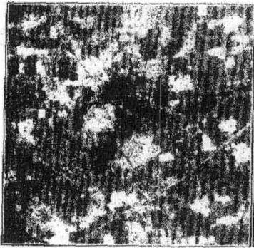  
(a)

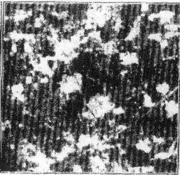  
(b)

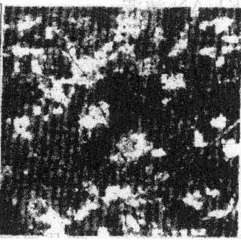  
(c)

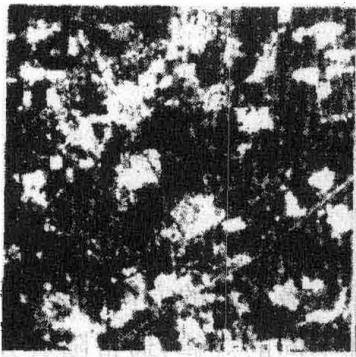  
(d)

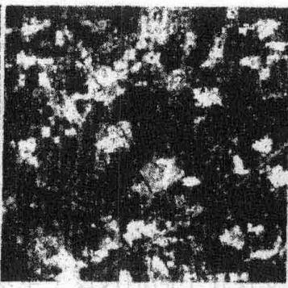  
(e)

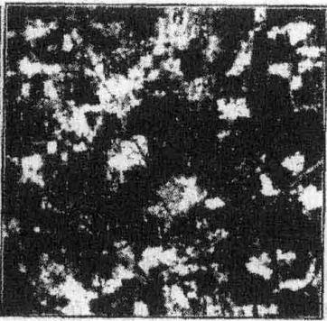  
(f)

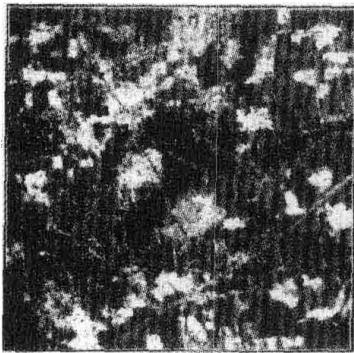  
(g)

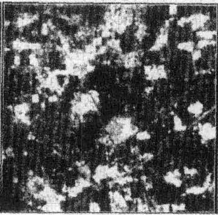  
(h)

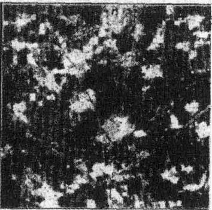  
(i)

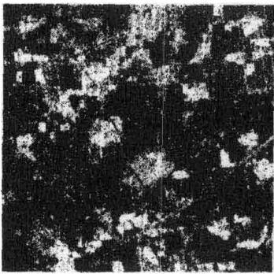  
(j)

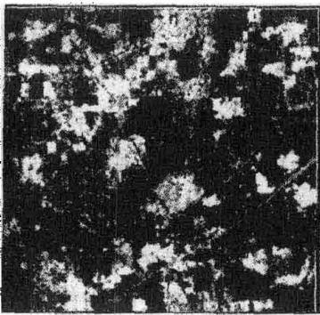  
(k)

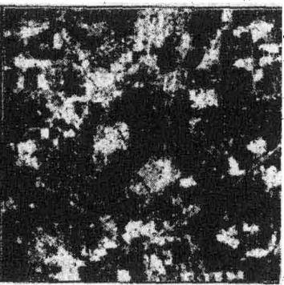  
(1)  
图4-14 原图像和各种滤波方法处理的结果图像  
(j) 小波分解第一层近似图像；(k) 小波分解第二层近似图像；(1) 小波软阈值滤波图像

## (4) KUAN 滤波

KUAN滤波是一种加权自适应滤波算法，它根据滤波窗口内特征决定中心像元与窗口均值的权重，其数学模型为：

$$
F _ { i j } = G _ { i j } W + M ( 1 - W )\tag{4-15}
$$

式中， $W = ( 1 - C _ { u } / C _ { x } ) / ( 1 + C _ { u } )$

图 4-14(h)为 KUAN 滤波结果图像。

## (5) GAMMA 滤波

GAMMA滤波是一种几何滤波法，其数学模型为：

$$
F _ { i j } = \left\{ \begin{array} { l l } { M } & { ( C _ { x } < C _ { u } ) } \\ { ( B M + \sqrt { P } ) / ( 2 \alpha ) } & { ( C _ { u } \leqslant C _ { x } \leqslant C _ { \mathrm { m a x } } ) } \\ { G _ { i j } } & { ( C _ { x } > C _ { \mathrm { m a x } } ) } \end{array} \right.\tag{4-16}
$$

式中，α为异质参数，对单视图像有： $\AA ; \alpha = 2 / ( C _ { x } ^ { 2 } - 1 ) ; B = \alpha - 2 ; P = M ^ { 2 } B ^ { 2 } + 8 \alpha M G _ { i j }$

图 4-14(i)为 GAMMA 滤波后的图像。

## (6) 基于小波的滤波算法

小波变换近年来在图像处理中得到了较多应用，其中一个最重要的方向就是图像滤波。其基本原理是：信号与噪声的小波变换在不同的尺度下呈现不同的规律，通常随着分辨率的降低，噪声的小波变换值也随之减小，信噪比提高，因此通过对原始图像的小波分解，从低信噪比的细节图像中提取特征信息，进而进行小波反变换重构原始图像就可有效地消除噪声，实现图像滤波、增强与复原。基于小波的滤波方法最简单的是直接取小波分解后的低频图像(近似图像)作为滤波结果，但它损失了大部分的边缘信息，应用较少。小波软阈值法是最常用的滤波方法，其具体步骤为：①对图像进行小波变换得到小波系数；②对小波系数进行软阈值化；③进行小波逆变换，得到滤波后的图像。其关键问题主要是：①小波基的选取，要兼顾正交性和规则性的要求；②小波变换级数的确定；③阈值的确定。

常用的小波是 Daubechies 小波、双正交小波等，本书采用 Sym4 小波，它是对 Dau-bechies 小波的改进。图4-14(j)、图4-14(k)为原图像二层小波分解后，由第一层近似图像、第二层近似图像重构后的图像，图4-14(1)为二层小波分解后的软阈值滤波图像。

## （7）滤波效果的比较与分析评价

对滤波效果进行评价可以选用不同的因子，其中应用最多的是平滑指数F和边缘保持指数E。平滑指数是滤波处理后各地类图斑中所有像元的均值与其标准差的比值，它表征各滤波器对各种地类图斑的平滑能力，F值越高，表示平滑作用越强，其计算公式为：

$$
F = M / S\tag{4-17}
$$

E表示处理后各滤波器对图斑水平与垂直向边缘的保持能力，其值越高，意味着保持能力越高，计算公式为：

$$
E = \frac { \displaystyle { \sum _ { i = 1 } ^ { m } \mid ( G _ { R 1 } - G _ { R 2 } ) \mid \equiv \alpha \alpha E } } { \displaystyle { \sum _ { i = 1 } ^ { m } \mid G _ { R 1 } - G _ { R 2 } \mid \alpha \alpha \alpha \beta } }\tag{4-18}
$$

式中，m是检验样本的个数； $G _ { R 1 }$ 和 $G _ { R 2 }$ 分别是沿边界交接处左右或上下互邻像元的灰度值。

此外，还采用均值、标准差、熵等图像统计参数对滤波前后的图像进行度量。分别利用以上评价指标对各种方法的滤波图像进行计算，如表4-10、表4-11所示。

表 4-10  
滤波图像特性统计
<table><tr><td rowspan=1 colspan=1>图像类别</td><td rowspan=1 colspan=1>最大值</td><td rowspan=1 colspan=1>最小值</td><td rowspan=1 colspan=1>灰度区间</td><td rowspan=1 colspan=1>均值</td><td rowspan=1 colspan=1>标准差</td><td rowspan=1 colspan=1>熵</td></tr><tr><td rowspan=1 colspan=1>原始图像</td><td rowspan=1 colspan=1>255</td><td rowspan=1 colspan=1>0</td><td rowspan=1 colspan=1>255</td><td rowspan=1 colspan=1>14.9</td><td rowspan=1 colspan=1>15.2</td><td rowspan=1 colspan=1>3.4981</td></tr><tr><td rowspan=1 colspan=1>均值滤波图像</td><td rowspan=1 colspan=1>143</td><td rowspan=1 colspan=1>0</td><td rowspan=1 colspan=1>143</td><td rowspan=1 colspan=1>14.9</td><td rowspan=1 colspan=1>10.4</td><td rowspan=1 colspan=1>3.268 2</td></tr><tr><td rowspan=1 colspan=1>中值滤波图像</td><td rowspan=1 colspan=1>146</td><td rowspan=1 colspan=1>0</td><td rowspan=1 colspan=1>146</td><td rowspan=1 colspan=1>13.2</td><td rowspan=1 colspan=1>8.7</td><td rowspan=1 colspan=1>3.141 8</td></tr><tr><td rowspan=1 colspan=1>LEE滤波图像</td><td rowspan=1 colspan=1>142</td><td rowspan=1 colspan=1>0</td><td rowspan=1 colspan=1>142</td><td rowspan=1 colspan=1>14.4</td><td rowspan=1 colspan=1>10.4</td><td rowspan=1 colspan=1>3.2651</td></tr><tr><td rowspan=1 colspan=1>增强 LEE 滤波图像</td><td rowspan=1 colspan=1>253</td><td rowspan=1 colspan=1>0</td><td rowspan=1 colspan=1>253</td><td rowspan=1 colspan=1>15.8</td><td rowspan=1 colspan=1>13.9</td><td rowspan=1 colspan=1>3.360 9</td></tr><tr><td rowspan=1 colspan=1>FROST 滤波图像</td><td rowspan=1 colspan=1>229</td><td rowspan=1 colspan=1>0</td><td rowspan=1 colspan=1>229</td><td rowspan=1 colspan=1>14.8</td><td rowspan=1 colspan=1>11.3</td><td rowspan=1 colspan=1>3.2747</td></tr><tr><td rowspan=1 colspan=1>增强 FROST 滤波图像</td><td rowspan=1 colspan=1>253</td><td rowspan=1 colspan=1>0</td><td rowspan=1 colspan=1>253</td><td rowspan=1 colspan=1>15.6</td><td rowspan=1 colspan=1>14.2</td><td rowspan=1 colspan=1>3.3740</td></tr><tr><td rowspan=1 colspan=1>KUAN 滤波图像</td><td rowspan=1 colspan=1>143</td><td rowspan=1 colspan=1>0</td><td rowspan=1 colspan=1>143</td><td rowspan=1 colspan=1>14.9</td><td rowspan=1 colspan=1>10.4</td><td rowspan=1 colspan=1>3.2670</td></tr><tr><td rowspan=1 colspan=1>GAMMA 滤波图像</td><td rowspan=1 colspan=1>253</td><td rowspan=1 colspan=1>0</td><td rowspan=1 colspan=1>253</td><td rowspan=1 colspan=1>15.4</td><td rowspan=1 colspan=1>13.1</td><td rowspan=1 colspan=1>3.331 2</td></tr><tr><td rowspan=1 colspan=1>小波一层分解近似图像</td><td rowspan=1 colspan=1>255</td><td rowspan=1 colspan=1>0</td><td rowspan=1 colspan=1>255</td><td rowspan=1 colspan=1>14.66</td><td rowspan=1 colspan=1>15.32</td><td rowspan=1 colspan=1>3.445 9</td></tr><tr><td rowspan=1 colspan=1>小波二层分解近似图像</td><td rowspan=1 colspan=1>255</td><td rowspan=1 colspan=1>0</td><td rowspan=1 colspan=1>255</td><td rowspan=1 colspan=1>14.53</td><td rowspan=1 colspan=1>12.95</td><td rowspan=1 colspan=1>3.356 8</td></tr><tr><td rowspan=1 colspan=1>小波软阈值滤波图像</td><td rowspan=1 colspan=1>255</td><td rowspan=1 colspan=1>0</td><td rowspan=1 colspan=1>255</td><td rowspan=1 colspan=1>14.40</td><td rowspan=1 colspan=1>13.04</td><td rowspan=1 colspan=1>3.329 3</td></tr></table>

表4-11  
不同方法滤波效果比较
<table><tr><td rowspan=2 colspan=1>图像类别</td><td rowspan=1 colspan=3>平滑指数F</td><td rowspan=1 colspan=2>边缘保持指数E</td></tr><tr><td rowspan=1 colspan=1>居民区</td><td rowspan=1 colspan=1>农地</td><td rowspan=1 colspan=1>水体</td><td rowspan=1 colspan=1>水平方向</td><td rowspan=1 colspan=1>垂直方向</td></tr><tr><td rowspan=1 colspan=1>原始图像</td><td rowspan=1 colspan=1>1.17</td><td rowspan=1 colspan=1>1.99</td><td rowspan=1 colspan=1>1.78</td><td rowspan=1 colspan=1>1.0</td><td rowspan=1 colspan=1>1.0</td></tr><tr><td rowspan=1 colspan=1>均值滤波图像</td><td rowspan=1 colspan=1>2.05</td><td rowspan=1 colspan=1>4.33</td><td rowspan=1 colspan=1>4.3</td><td rowspan=1 colspan=1>0.148</td><td rowspan=1 colspan=1>0.442</td></tr><tr><td rowspan=1 colspan=1>中值滤波图像</td><td rowspan=1 colspan=1>1.96</td><td rowspan=1 colspan=1>4.68</td><td rowspan=1 colspan=1>5.22</td><td rowspan=1 colspan=1>0.241</td><td rowspan=1 colspan=1>0.349</td></tr><tr><td rowspan=1 colspan=1>LEE滤波图像</td><td rowspan=1 colspan=1>2.02</td><td rowspan=1 colspan=1>4.15</td><td rowspan=1 colspan=1>3.52</td><td rowspan=1 colspan=1>0.259</td><td rowspan=1 colspan=1>0.419</td></tr><tr><td rowspan=1 colspan=1>增强 LEE 滤波图像</td><td rowspan=1 colspan=1>1.39</td><td rowspan=1 colspan=1>3.14</td><td rowspan=1 colspan=1>2.55</td><td rowspan=1 colspan=1>0.741</td><td rowspan=1 colspan=1>0.977</td></tr><tr><td rowspan=1 colspan=1>FROST 滤波图像</td><td rowspan=1 colspan=1>1.83</td><td rowspan=1 colspan=1>3.66</td><td rowspan=1 colspan=1>3.07</td><td rowspan=1 colspan=1>0.593</td><td rowspan=1 colspan=1>0.698</td></tr><tr><td rowspan=1 colspan=1>增强 FROST 滤波图像</td><td rowspan=1 colspan=1>1.32</td><td rowspan=1 colspan=1>2.95</td><td rowspan=1 colspan=1>2.49</td><td rowspan=1 colspan=1>0.815</td><td rowspan=1 colspan=1>0.977</td></tr><tr><td rowspan=1 colspan=1>KUAN滤波图像</td><td rowspan=1 colspan=1>2.05</td><td rowspan=1 colspan=1>4.35</td><td rowspan=1 colspan=1>4.2</td><td rowspan=1 colspan=1>0.185</td><td rowspan=1 colspan=1>0.488</td></tr><tr><td rowspan=1 colspan=1>GAMMA 滤波图像</td><td rowspan=1 colspan=1>1.43</td><td rowspan=1 colspan=1>3.20</td><td rowspan=1 colspan=1>2.89</td><td rowspan=1 colspan=1>0.685</td><td rowspan=1 colspan=1>0.884</td></tr><tr><td rowspan=1 colspan=1>小波一层分解近似图像</td><td rowspan=1 colspan=1>1.37</td><td rowspan=1 colspan=1>1.81</td><td rowspan=1 colspan=1>1.43</td><td rowspan=1 colspan=1>0.681</td><td rowspan=1 colspan=1>0.686</td></tr><tr><td rowspan=1 colspan=1>小波二层分解近似图像</td><td rowspan=1 colspan=1>2.53</td><td rowspan=1 colspan=1>3.65</td><td rowspan=1 colspan=1>3.32</td><td rowspan=1 colspan=1>0.469</td><td rowspan=1 colspan=1>0.514</td></tr><tr><td rowspan=1 colspan=1>小波软阈值滤波图像</td><td rowspan=1 colspan=1>2.17</td><td rowspan=1 colspan=1>3.01</td><td rowspan=1 colspan=1>2.91</td><td rowspan=1 colspan=1>0.702</td><td rowspan=1 colspan=1>0.457</td></tr></table>

由表4-10可以看出，除小波滤波器外，其他方法滤波后的图像灰度范围都有一定程度的减小，这是噪声滤除后的必然结果；滤波后图像均值包括对局部图像区域均值而言，其变化都不是太大，但标准差有明显的下降。此外，图像熵值变化并不是太大，而且滤波后图像熵值都呈现变小的趋势，这是由于噪声去除后灰度分布、直方图变化引起的。

对表4-11的评价指标进行分析，可以看出，经各种滤波处理后的图像其F值均高于原图像，说明各种滤波器均可以用干图像平滑，其中平滑效果最好的是KUAN滤波器、小波滤波器、均值滤波器和LEE滤波器。进一步对各算法进行分析，可发现这主要是由算法特性决定的。如KUAN滤波器，它对中心像元与窗口均值进行加权，滤波后的灰度值必然更接近窗口均值，因此标准差将减小，平滑效果较好。又如对于小波滤波而言，在保留近似信息的基础上，对高频信息即边缘与纹理信息进行阈值处理，低频信息基本没有损失；特别是多层分解后的低频图像直接重构后的图像，平滑效果最好，但其边缘保持能力较弱。从边缘保持能力来看，增强LEE滤波、增强FROST滤波具有最高的边缘保持能力，这是由于它们考虑了窗口特性，采用自适应滤波的策略进行处理。除此之外，FROST滤波、GAMMA滤波也具有较高的边缘保持能力。

对居民区而言，F最大的几种方法是小波滤波、KUAN滤波、均值滤波、LEE滤波，但其平滑指数相对原图像而言，提高不是太多，主要是由于居民区中纹理信息复杂，因此标准差较大；滤波在去除噪声的同时，也损失了一部分纹理信息，导致边缘模糊，直接影响图像利用的效果，因此在图像平滑的同时还应尽量有较高的边缘保持能力。对农地与水体而言，滤波后平滑指数明显提高，其中效果最好的是KUAN滤波、均值滤波、中值滤波与LEE滤波，这是由于水体为一均质区域，农地也相对均质，其中纹理信息不太丰富，斑点噪声易于滤除。对水体而言，不必考虑边缘保持能力，对农地而言，还应尽量提高边缘保持能力。对于由不同地类构成的复杂区域，滤波算法的选取则应综合考虑平滑效果与边缘保持能力的兼顾与协调。

总之，传统的中值、均值滤波算法在RADARSAT图像滤波中的效果相对较差，而自适应滤波算法则是最为有效的算法。综合比较分析可知，增强FROST滤波算法、增强LEE算法及KUAN算法是三种最有效的算法。小波软阈值法也比较有效，但在小波基选取、分解层数确定、阈值选择等方面还有待进一步深入研究。此外，不同的滤波算法对不同的土地覆被效果不同，如何针对具体的图像应用目标与区域特性，选择最适宜的滤波算法，尚有待进一步研究。

## (二) RADARSAT 图像纹理分析

对于单一SAR图像而言，其所能提供的信息相当于单波段的灰度信息，而且由于斑点噪声的影响，灰度信息往往集中在较小的区域，单纯依靠灰度信息很难对SAR图像进行分类，综合应用纹理与灰度信息进行分类可以极大地提高分类的正确性。SAR图像的纹理计算及基于纹理的分类是一个重要的研究方向，当前SAR图像纹理计算方法主要有统计法(主要是灰度共生矩阵法)、结构法(如纹理谱法)、模型法(分形模型、Markov模型）、空一频变换法（主要是小波方法）等。对SAR图像纹理分别采用以下计算策略：①用FBM法、双毯法计算分形维数；②计算灰度共生矩阵的特征值；③基于小波分解计算纹理特征值。

灰度共生矩阵法的模型及纹理特征值是应用最广泛的，计算后将所有的纹理特征均采用密度分割算法化算到\_0，255上。

对FBM法和双毯法计算的分形维数进行比较，结果基本接近，现采用FBM法计算纹理，其公式为：

$$
\lg \ \operatorname { E } { \big [ } \ { \big | } \ f ( X + \Delta X ) - f ( X ) \ { \big | } { \big ] } - H \bullet \lg \ \| \ \Delta X \ \| \ = \lg \ C
$$

由最小二乘法拟合得出H后，可求出分形维数 $( d { = } 3 { - } H )$

经综合比较，分维数、灰度共生矩阵法计算的局部平稳(Homogeneity)、均值(Mean)、变化量(Variance)、熵(Entropy)、角二阶矩(AngularSecond Moment)几个纹理特征值是最为有效的纹理特征，将灰度共生矩阵的特征值进行密度分割，使其位于区间[0，255]中，进行影像化，将纹理图像与灰度图像综合考虑作为信息提取的基础。

## (三)RADARSAT图像中陆面演变信息的提取

## 1. 水体的提取

相对RADARSAT的波长来说，陆地属于粗糙表面，其回波强度较大，在图像上呈现出灰白色或黑灰色，而水体表面相对SAR的波长而言，则可视为光滑表面，回波强度较小，在图像上呈现出暗色和黑色。但在山区，当山体的坡面与雷达入射角垂直时，就会出现较强的回波强度，在图像上表现为亮斑，而远离波束的山坡，其回波强度较小，在图像上呈现出暗色或黑色，与水体在亮度值上容易混淆，难以将二者区分开来。这时的关键问题是如何将水体与山体的阴影区分开来。单纯依靠灰度无法实现对水体的提取，对纹理特征进行分析，发现局部平稳、变化量、熵值可以实现对水体的有效提取，进一步对这些纹理特征值与灰度进行综合分析发现：

①对于水体而言，局部平稳(HOM)与灰度值(GD)之差大于某一阈值 $K _ { 1 }$ ,即HOM-GD${ \displaystyle > K _ { 1 } }$ ;而对于建设用地而言，恒有HOM一GD<0;植被与其他绿地的差值则介于二者之间。

②在HOM、角二阶矩(ASM)图像上，均可选取一定的阈值对积水、绿地、建设用地进行识别，而且通过对二者的识别效果进行综合，可以有效去除误识别的部分。图4-15为进行专题信息提取的SAR滤波图像。

因此建立以下的水体提取模型：

模型一—根据局部平稳提取水体

取 $D _ { 1 } { = } \mathrm { H O M - G D }$ ,对 $\mathfrak { D } _ { 1 }$ 进行分析，根据前文采用的阈值求取算法，用 $G A$ 算法确定國值 $K _ { 1 }$ ,最终取 $K _ { 1 } = 6 \cdot$ ，图4-16为提取的水体；

模型二—根据纹理图像阈值提取的水体

① 先根据 $\mathrm { H O M } { > } K _ { 1 }$ ，提取水体集合 $W _ { 1 }$ i

②根据变化量 $\mathbf { \dot { V } A R } { < } K _ { 2 }$ ，提取水体 $W _ { 2 }$

③求 $\pmb { W } _ { 1 }$ 和 $\mathbf { \bar { W } } _ { 2 }$ 的交集W，作为提取的水体集合，提取的水体如图4-17所示。

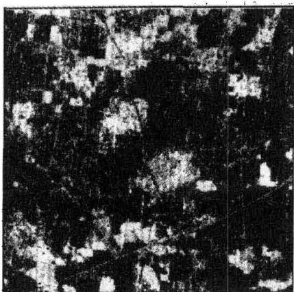  
图 4-15 用于信息提  
取的 SAR 图像

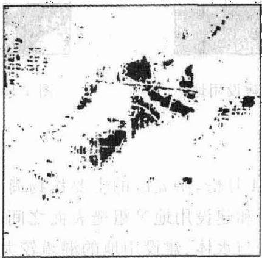  
图 4-16 由模型一提  
取的水域

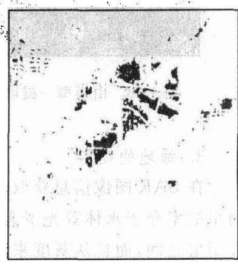  
图 4-17 由模型二提取的水域

此外，如果有同时相或接近同期的TM图像，则以TM图像和SAR图像融合可以实现对水体更高精度的提取。

## 2. 建设用地的提取

建设用地的微波遥感图像记载了来自于建设用地的雷达回波，其影响因素包括雷达系统参数和建设用地自身的参数。建设用地自身参数主要有表面粗糙度和复介电常数。从表面粗糙度而言，建设用地相对SAR的波长而言，属于极粗糙表面，从而在雷达图像上呈现出非常亮的图斑。建设用地的雷达图像特征由建设用地内的镜面反射、漫反射、各向同性散射，以及其角反射和谐振效应等的强度和空间配置决定，同时也与雷达系统的参数如波长、入射角和极化方式有关。就RADARSAT来说，建设用地的总体特征就是亮斑存在于较暗的背影中，其亮度值比周围的其他土地要高，相对于水体、绿地较易识别。

对建设用地的灰度及纹理图像进行统计分析发现，建设用地可以通过阈值法进行提取，而且具有HOM一GD<0的特征，则可建立以下的建设用地提取模型：

## 模型一——根据局部平稳与灰度进行提取

按照局部平稳纹理特征小于灰度值的特征，可以实现建设用地的提取。提取的建设用地如图4-18所示，对照实地情况发现其中有部分误提的像素。

## 模型二—根据变化量进行提取

在变化量(VAR)纹理特征上，建设用地的亮度值明显高于其他地物，因此以 $\mathrm { V A R } > K _ { 2 }$ 可以提取建设用地，对研究区进行分析，当取阈值为140时，提取的建设用地如图4-19所示。

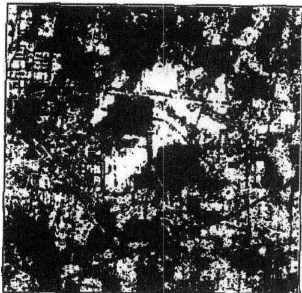  
图4-18 由模型一提取的建设用地

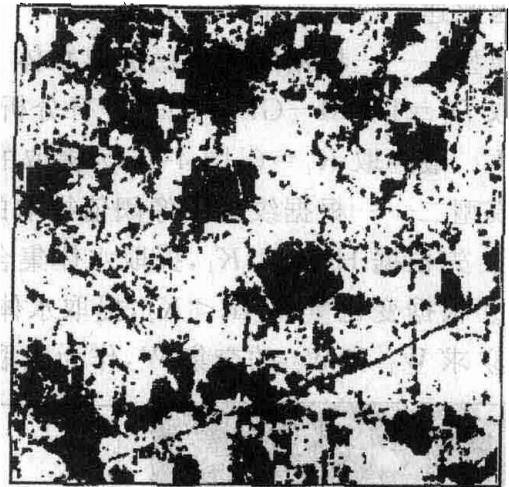  
图 4-19 由模型二提取的建设用地

## 3. 绿地的提取

在SAR图像信息获取的4月份，研究区的主要作物尚处在成长初期，其覆盖下的地面的粗糙率介于水体等光滑表面和建设用地等粗糙表面之间，因此回波强度也介于水体与建设用地之间，而且从灰度来看，与水体、建设用地的混淆较大，即使在各纹理特征上也有一定的混淆。根据纹理特征区间进行提取。通过对各个纹理特征进行分析，发现在变化量中，绿地的亮度介于建设用地和水体之间，可以根据这一区间进行提取。经试验，确定的阈值区间为： $K _ { 1 } { < } \mathrm { V A R } { < } K _ { 2 }$ ,其中 $K _ { 1 } = 4 0 , K _ { 2 } = 1 4 0$ 。提取的绿地与其他空地如图4-20所示。

## 4. 塌陷地的提取

在上述分析的基础上，根据塌陷地提取的知识，在GIS环境下进行塌陷地的提取识别。具体方法为：

①建立矿区缓冲区确定各待处理子区，即塌陷地可能存在的区域。

②从提取的水体集合中剔除自然水体。

③对各待处理子区的水体进行边缘提取，确定水陆边界。

④在GIS环境下对水体与建设用地、农田的空间组合关系进行分析。

⑤根据有关知识，进行推理判断，从而确定塌 陷地的范围。

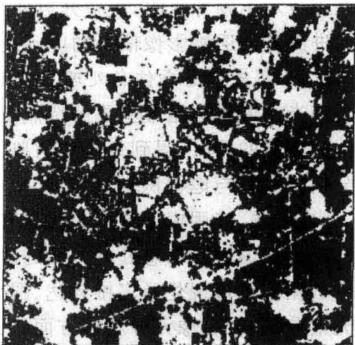  
图 4-20 由纹理特征提取的绿地

## 五、高光谱遥感在工矿区陆面演变研究中的应用

近年来，随着国内外不同学科领域人员的联合攻关研究，遥感信息获取技术得到了快速发展，形成了地面、航空、航天遥感综合集成的信息获取技术系统，遥感的空间分辨率、时间分辨率和光谱分辨率不断提高。以卫星遥感为例，目前正常运行的遥感卫星每天可以获取覆盖全球不同地区的大量遥感影像，为不同领域的遥感应用、资源环境分析与决策支持、空间信息基础设施建设等提供了有力的基础地学信息支持。海量遥感影像的积累对信息管理、处理、分析与应用都提出了许多新的要求，必须综合应用多学科理论、技术与方法，解决诸多新问题，实现遥感信息的高效综合应用，为数字城市、可持续发展提供决策支持，并且推动遥感科学与技术的不断发展。

近十多年来，高光谱遥感作为一种新的、发展潜力巨大的遥感技术得到了快速发展，例如，岩石矿物识别、植被分析、作物长势分析与病虫害诊断、污染探测、精细农业、土地动态监测、海洋应用以及城市应用等。它与合成孔径雷达(SAR)、激光雷达(LIDAR)被视为21世纪最具发展潜力的遥感信息获取技术。对于高光谱遥感信息处理的研究目前虽然已取得了明显进展，形成了一些实用的方法与模型，但相比于全色、多光谱遥感信息处理以及高光谱遥感的应用需求，高光谱遥感信息处理的理论和方法仍很不完善，有诸多问题需要解决。

## (一)高光谱遥感信息获取及其发展

高光谱遥感信息获取技术已经形成地面、航空和卫星同步发展的格局，光谱分辨率不断提高。在地面层次，已有多种实用的地物光谱仪，并建立了针对不同对象、不同区域、不同时相的地物光谱数据库，作为信息处理的基础和参照。在航空层次，国外如AVIRIS、CERIS等高光谱遥感信息都已经得到了广泛应用，国内也在863项目的支持下设计了MAIS、OMIS、PHI等传感器，并在不同区域获取了相关的试验数据，初步取得了一些应用。在卫星高光谱遥感方面，MODIS近年来已得到较多应用，其他一些项目计划也在发展之中，如我国计划发展的灾害与环境小卫星中，将有专门应用于灾害与环境监测分析的高光谱遥感传感器。可以相信，在未来一段时间内，高光谱遥感信息获取技术将继续快速发展。

为了满足高光谱遥感信息处理研究的需要，国家863计划信息技术领域中的信息获取与处理技术主题专家组，免费开放使用我国自主设计传感器获取的多个地区的高光谱影像，以促进高光谱遥感影像信息的应用及相关技术的发展。

## (二)高光谱遥感信息处理及其发展

高光谱遥感数据最主要的特点是将传统的图像维与光谱维信息融合在一起，在获取地表空间图像的同时，得到每个地物单元的连续光谱信息，从而实现依据地物光谱特征的地物成分信息反演与地物识别。因此，高光谱遥感信息在信息量、波段数、波段相关性、图谱合一、处理方法、应用模型等方面都具有不同于传统全色、多光谱遥感信息的特点。近年来，国内外在高光谱遥感信息处理方面的研究主要集中在高光谱成像信息的定标与定量化、成像光谱数据信息可视化及多维表达、图像光谱变换、大数据量数据处理、波段选择与特征提取、高光谱分类、混合像元分解等方面。

在高光谱影像数据可视化表达与特征提取方面，通常用图像光谱数据立方体来表达高光谱遥感影像，其中既可以提取图像维的特征如边缘、纹理等，也可以提取光谱维的特征如光谱向量、植被指数等。针对高光谱遥感信息的特点，导数光谱(或称光谱微分技术)得到了广泛应用，高阶导数光谱在目标识别中往往能够发挥重要作用。

在高光谱遥感影像降维处理方面，主要包括特征选择(FeatureSelection)和特征提取(FeatureExtraction)两个层次，前者是通过在原始数据集中直接选择若干波段作为最佳波段组合，后者则是通过对原始数据进行若干处理与分析后选择若干处理数据集(提取的特征图像)或处理数据集与原始数据集的集合作为降维后的数据集参与后续处理。在应用一些经典算法如主成分分析(PCA)、最大信息熵理论、基于类间可分性的选择等基础上，发展了基于波段指数的特征选择、基于粗集理论和遗传算法等波段选择的新方法。

高光谱遥感分类是当前应用研究的一个热点方向。目前的分类处理算法大体上可以归纳为两大类：一类是通过降维处理将原始高维数据降到较低的数据维，然后用成熟的多光谱分类器如最大似然分类器、最小距离分类器进行分类，此外还有学者提出了二阶段分类、基于决策边界的分类等，总体上都属于此类方法的范畴；另一类是直接将每一像元视为一个高维向量，通过向量相似性的度量实现分类，其中最典型的就是光谱角制图模型(SpectralAn-gle Mapping)，正交子空间投影(Orthogonal Subspace Projection,OSP)也是一种有效的分类算法。基于数据融合特别是决策层融合的高光谱分类、人工神经网络应用于高光谱分类等的研究也得到了重视。

混合像元分解(Mixed Pixel Decomposition)是高光谱遥感信息处理的一项重要内容。由于地物构成的不均匀性，遥感中往往每一像元都是几种地物构成的混合像元，但传统的多光谱遥感无法处理这一问题，而高光谱遥感影像则因其详细的光谱信息可以对每一像元中各成分的比例进行计算，从而提高分类精度。目前的混合像元分解模型主要包括线性模型、概率统计模型、随机几何模型、几何光学模型和模糊模型，形成了一些实用的算法。以此为基础，有学者提出和发展了基于邻域的混合像元解译方法。

近年来，定量遥感、高光谱遥感不确定性、以地物识别和分类为目标的高光谱遥感数据挖掘等方面的研究也得到了重视，并取得了一些成果。

此外，我们认为，光谱相似性度量、高光谱遥感影像检索、高光谱数据挖掘等也是近期高光谱遥感信息处理与应用需要解决的技术问题，具有很强的实用性和发展前景。

## (三）高光谱遥感在工矿区陆面演变研究中的应用

目前，高光谱遥感在工矿区陆面演变的应用研究主要体现在陆面要素精细光谱特征识别、陆面理化参数反演、土地利用/覆盖变化识别、陆面生态环境污染分析、工矿城市环境分析与制图等方面。

## 1. 陆面要素精细光谱特征提取与识别

工矿区陆面演变是指各种陆面要素的空间位置形态、物理化学特性随时间的变化。对其研究既可以从区域的视角开展综合研究，如陆面覆盖变化研究，又可以从陆面某一要素的角度开展分析，如塌陷地扩展、建设用地扩展、植被覆盖变化等。在进行陆面演变分析时，为了提高要素提取与识别的精度，可以充分应用高光谱遥感具有的精细光谱表达优势，通过光谱诊断特征、识别特征、高光谱分类等提取陆面构成要素，特别是对于一些利用传统多光谱图像难以区分的陆面要素、同一大类下不同小类陆面要素的识别等，高光谱遥感有望解决传统遥感信息源存在的不足。

## 2. 土地利用/覆盖变化监测

如前所述，土地利用/覆盖变化是工矿区陆面演变的重要、关键内容。高光谱遥感的应用将有助于提高变化检测的精度，对变化类别进行精确划分，充分发挥高光谱遥感信息的优越性。

## 3. 陆面生态环境污染分析

矿区陆面系统存在着严重的环境污染与生态损害，在地下采矿导致地面塌陷，在一些矿区还可能形成地面积水区，同时由于矿山生产污染、矸石山等的影响，使得矿区土地污染、土壤侵蚀、水环境污染、固体废弃物(矸石山)堆积等问题都相当严重；在露天开采矿区，由于表土层的剥离、运输和堆积，导致区域土地生态系统紊乱、植被损害、土壤侵蚀、水土流失等问题非常严重。开展矿山陆面生态环境损害(污染)监测与评价，要求获取充分反映污染状态的参数。而如何定量反演污染状态参数、合理评价矿山污染并分析其时空变化规律，高光谱遥感信息无疑是最有效的信息源。特别是目前高光谱遥感在水污染评价、水土流失评价、固体废弃物监测等方面都已得到一定应用，可为工矿区陆面演变研究提供有力的借鉴。

## 4. 陆面理化参数反演

对工矿区陆面演变的研究目前主要是从空间分布、陆面覆被、典型问题等展开，而进一步的研究则必然需要将陆面演变、陆面参数与陆面生态过程、气候过程等相结合，以分析陆面影响对区域生态系统、微气候系统等的影响，拓展研究的深度和广度。在这一过程中，如何反演陆面的有关物理和化学参数是一个重要问题，而反演生物、物理与化学参数则是高光谱遥感较为成熟的应用领域之一，特别是基于统计回归建立陆面参数与光谱信息之间的转换模型，具有广泛的应用前景。

## 5. 工矿城市环境分析与制图

工矿区陆面演变研究必然要涉及工矿城市的生态环境分析、城市遥感制图等问题。随着高光谱遥感在城市应用的深入，基于高光谱遥感的工矿城市生态环境分析、遥感制图等方面的应用工作也将得到进一步发展。

## (四)高光谱遥感应用于工矿区陆面演变研究的若干关键问题

尽管高光谱遥感有其突出优势，在工矿区陆面演变研究中具有广泛的应用潜力，但它在这一领域的应用研究目前仍处在探索和发展之中，实际案例还比较少，还有许多问题待解

决。这里对若干主要的问题进行探讨。

## 1. 高光谱遥感数据源的获取

从目前来看，推进高光谱遥感应用面临的首要问题是数据源，目前的应用仍以航空高光谱遥感信息源为主，如国外的AVIRIS和国内的MIS、PHI等，而卫星高光谱遥感信息源还比较少。对于典型区域的研究来看，航空获取高光谱数据成本较高，对于许多地区来说存在一定的困难。因此针对工矿区研究的需求，如何获取高光谱遥感数据是一个重要的、必须解决的问题，这首先有赖于卫星高光谱遥感信息源的提供。由于我国计划发射的环境与灾害小卫星中有专门的高光谱遥感传感器，因此这一问题有望得到解决。另一方面，当前可侧重采用地物光谱仪进行地物光谱测试与分析方面的研究工作，建立光谱数据库，研究有关算法等，为今后的应用奠定基础。

## 2. 矿区典型地物与现象的高光谱遥感诊断特征研究

将高光谱遥感应用于工矿区陆面演变，首先应针对研究对象的特点，对其遥感信息机理和特征进行分析，以地面实测光谱曲线为基础，研究其高光谱遥感诊断与识别特征。如何获取矿区典型地物或过程的光谱曲线，并对相应光谱曲线进行统计分析以提取诊断特征是当前研究的主要内容。

## 3. 矿山高光谱遥感应用的定量遥感模型

参数反演是高光谱遥感矿区应用的重要方向之一，在建立各种诊断特征的基础上，不仅要定性地予以识别和判断，而且要能够定量地反演相关参数。目前遥感参数反演的主要方法是获取地物光谱曲线与待反演参数的实测值，通过统计分析、回归、拟合等途径建立光谱特征与待反演特征之间的关联模型，从而实现参数的反演。在这些统计模型的基础上，是否有可能结合当前定量遥感领域的研究，建立一些适合矿区应用的定量遥感模型，是一个需要进一步研究的问题。

## 4. 高光谱遥感信息处理方法

将高光谱遥感信息应用于工矿区陆面演变的研究时，常规高光谱遥感信息处理方法无疑可以得到有效应用。同时，还需要针对矿区应用的特点，开展一些针对性的信息处理方法研究。这方面的研究可从两方面进行：一方面是已有算法的试验与分析，如通过导数光谱分析试图发现最有效的导数运算，通过对各种光谱特征指标的分析选择最有效的指标，对各种分类算法进行比较选择最有效的分类算法，通过不同降维方法选择对矿区最有效的波段组合、独立成分分析的应用、正交子空间投影的应用等；另一方面要结合当前高光谱遥感信息处理发展的前沿，研究和探索一些新算法的应用，如基于支持向量机的高光谱遥感分类、基于归纳学习的光谱特征发现、基于数据挖掘的高光谱遥感信息处理等，以矿区为研究试验区域，发展一些新的信息处理方法，并开发相应的专业应用模块。

## 5. 典型应用与精度分析评价

随着遥感信息应用深度和广度的发展，遥感技术应用已从最初的“是否能用？”“怎么用?”发展到“应用效果如何?”的阶段，即如何评价遥感应用的精度、如何提高遥感应用的精度。开展工矿区陆面演变的高光谱遥感应用研究时，还需对应用精度、效果进行全面分析评价。

## 第二节 多源多时相遥感影像融合与陆面演变动态监测

遥感技术应用正在从静态分析发展到动态监测阶段。遥感由静态到动态，由定性解释到定量调查，是其发展的必然过程。工矿区陆面演变的三个要素是时间、空间、属性。演变本质上就是特定空间实体在多个观测时间点上属性的变化。陆面演变的本质特性在于“演变”，即其动态性，而动态监测正是遥感技术所具有的优越性之一。多时相遥感信息是进行陆面演变动态研究的基础。获取多时相、多平台、多光谱、多分辨率、多尺度的呈信息金字塔结构的海量遥感数据后，如何对这些数据进行综合分析，特别是避免“就数据论数据”的低水平利用，实现多源数据的互补与综合作用，是关键问题之一。单一的遥感信息源在具体应用中往往存在一定的局限性，不同遥感信息源之间则具有较好的互补性，如TM图像具有多光谱的特性，但其空间分辨率较低，而SAR图像一般具有较高的空间分辨率，但其光谱分辨率较低，如果将SAR图像与相应地区的TM图像结合起来进行分析，则可以综合反映可见光、近红外光及微波的反射特性。对不同平台、不同时相的遥感信息进行融合，一方面可以实现信息互补，提高利用率，提取更多的信息，另一方面可进行动态、综合比较。遥感信息融合已成为当前遥感应用的一个重要研究方向。

## 一、多源遥感影像融合

多源、多时相遥感数据处理的基础是遥感图像融合，融合后的图像既可以用于目视解译，又可以用于变化信息的提取，遥感图像融合是当前遥感技术应用研究的热点之一。

融合(Fusion)是指采集并集成各种信息源、多媒体和多格式的信息，从而生成完整、准确、及时和有效的综合信息过程。信息融合技术研究如何加工、协同利用多源信息，并使不同形式的信息相互补充，以获得对同一事物或目标的更客观、更本质认识的信息综合处理技术。它比直接从各信息源得到的信息更简洁、更少冗余、更为实用。信息融合技术可划分为原始数据融合或像元级融合(PixelBased)、目标级或特征级融合(FeatureBased)和决策级融合(DecisionLevel)三个层次，其优势主要体现在：扩展系统的时间和空间覆盖范围，增加系统的信息利用率，提高融合信息的可信度和精度，增强对目标物的检测与识别能力，降低系统的投资。

遥感图像融合可定义为：将不同类型传感器获取的同一地区的图像数据进行空间配准，然后采用一定的算法将各图像数据中所含的信息优势或互补性有机地结合起来产生新的图像数据的技术。遥感图像融合是一种通过高级图像处理技术来复合多源遥感图像的技术，其目的是将单一传感器的多波段信息或不同类传感器提供的信息加以综合，消除多传感器信息之间可能存在的冗余和矛盾，加强互补，降低不确定性，减少模糊度，增强图像信息透明度，改善解译的精度、可靠性以及使用率，以形成对目标的完整一致的信息描述，并在以下几方面显示出明显的优越性：锐化图像，改善几何纠正精度，为立体摄影测量提供立体观测能力，增加原单一数据源中不清晰的那些特征；互补的数据用于改善分类质量，利用多时相数据进行变化检测，实现某一图像中丢失的信息由另一传感器图像数据来替换，克服目标提取与识别中的数据不完整性。

不同类型遥感图像之间的融合处理，必须具备4个条件，即：①融合图像应包括不同的空间和光谱分辨率；②融合的图像应是同一区域；③图像应精确配准；④在不同时间获取的图像中，其内容没有大的变化。

## (一)图像配准

图像匹配误差对土地利用变化监测结果的影响研究表明，要得到可靠的土地利用变化结果，需极高的图像配准精度，1个像元空间匹配误差将导致50%的虚假变化。要想将错误率控制在10%以内，图像配准误差就必须小于0.2个像元或更小。遥感图像融合的前提和基础是多源遥感图像的配准，配准误差要求小于1个像元。在TM与SAR图像的配准中，由于两者空间分辨率有较大差异，且SAR图像受斑点噪声的影响，因此提高配准精度至关重要。

一般来说，两个图像进行配准与几何精校正的原理是一样的，是利用图像间配准控制点(RCP)的对应关系，模拟图像间的畸变进行配准，其步骤如下：

①寻找并标注同名点：一般是在图像上选取具有明显特征的点，如道路交叉点、水陆交界点等。

②根据同名点建立几何变换模型。

③依据模型校正图像。

数学模型通常采用多项式，设 $( x , y )$ 是匹配图像(欲校正图像)上的一点， $( x ^ { \prime } , y ^ { \prime } )$ 是参考图像上相应的点，则变换模型为：

$$
\left\{ \begin{array} { l l } { { { \displaystyle x ^ { \prime } = \sum _ { i = 0 } ^ { n } \sum _ { j = i } ^ { n } a _ { i j } x ^ { i } y ^ { j - i } } } } & { { } } \\ { { } } & { { ( 1 \leqslant n \leqslant 3 ) } } \\ { { { \displaystyle y ^ { \prime } = \sum _ { i = 0 } ^ { n } \sum _ { j = i } ^ { n } b _ { i j } x ^ { i } y ^ { j - i } } } } & { { } } \end{array} \right.\tag{4-19}
$$

因此确定模型包括两步：先确定多项式的阶数n，再用最小二乘法确定系数。

也可以用二维仿射变换的原理进行模拟，其模型为：

$$
\binom { x ^ { \prime } } { y ^ { \prime } } = k \binom { \cos \theta \quad \sin \theta } { - \sin \theta \quad \cos \theta } \binom { x } { y } + \binom { \Delta x } { \Delta y }\tag{4-20}
$$

研究中的配准策略是：在1：50000地形图上选择明显特征点，以其为基础将SAR图像和TM图像配准到统一的地理空间上，经检验，配准精度能满足应用要求。

## （二）遥感图像融合算法及其比较

图像融合包括基于像元的融合、基于特征的融合和基于决策的融合。

## 1. 基于像元的图像融合

①比值变换—能消除空间或时间变换而产生的增益和偏置算子，如将TM3/SAR、TM4/SAR、TM5/SAR 比值图像进行假彩色合成。

②相关系数法如使用相关性加权的方法，融合 SAR图像与 TM图像：

$$
\} ( i , j ) = ( 1 + \mid r _ { R } \mid ) \times P _ { 1 } \times \mathrm { S A R } ( i , j ) + ( 1 - \mid r _ { R } \mid ) \times P _ { 2 } \times T M ( i , j )\tag{4-21}
$$

③ 加权融合法——即对 TM 某波段(如 TM5)和 SAR 分别施以不同的权重进行融合：

$$
G = A ( P _ { T } T M + P _ { s } S A R ) + B\tag{4-22}
$$

④图像差分法融合主要用于多时相图像的动态变化分析

$$
G = A ( P _ { T } T M - P _ { s } S A R ) + B\tag{4-23}
$$

## 2. 基于特征的融合方法

## (1）高通滤波融合法(HPF)

通过将高分辨率图像中的几何信息逐像素地叠加到低分辨率图像频道中而进行融合。高分辨率图像的高通滤波对应于图像空间的高频分量，因此将该滤波器叠加到低分辨率图像频道上，高分辨率图像的高几何信息内容在融合结果中显而易见。HPF融合算法按下式定义：

$$
F ( i , j ) = L ( i , j ) + \left[ H ( i , j ) - \overline { { { H } } } ( i , j ; w , h ) \right]\tag{4-24}
$$

式中， $F ( i , j )$ 为 $( \ : i , j )$ 处的融合值； $L ( i , j )$ 和 $H ( i , j )$ 分别为低分辨率和高分辨率频道同名位置上的像素值； $\overline { { H } } ( \it { i } , \it { j } ; \tau \omega , h )$ 对应于以像素 $( \ : i , j )$ 为中心的 $\boldsymbol { \omega } \times \boldsymbol { h }$ 窗口尺寸的高分辨率图像频道的局部均值。

## (2) LMM 与 LMVM 融合算法

为了将高分辨图像的结构信息叠加到低分辨率多光谱图像中，经典的方法是将高分辨率全色图像的高频分量叠加到多光谱图像的强度分量中，或将高分辨率图像替代多光谱图像的强度分量，此融合处理仍会产生一定的光谱畸变，且其融合结果依赖于景物。为了减小融合图像与低分辨率多光谱图像频道的差别，有的学者设计了LMM和LMVM算法：

LMM法：

$$
F ( i , j ) = H ( i , j ) \frac { \overline { { L } } ( i , j ; w , h ) } { \overline { { H } } ( i , j ; w , h ) }\tag{4-25}
$$

$$
F ( i , j ) = \frac { \big [ H ( i , j ) - \overline { { H } } ( i , j ; w , h ) \big ] S ( L ) _ { ( i , j ; w , h ) } } { S ( H ) _ { ( i , j ; w , h ) } } + \overline { { L } } ( i , j ; w , h )\tag{4-26}
$$

式中， $F$ 代表融合后图像的灰度；H代表高分辨率图像；L代表低分辨率图像；S代表标准差；带上划线表示 ${ \boldsymbol { \ w } } \times { \boldsymbol { h } }$ 窗口中的均值。

这两种方法通过改变滤波窗口尺寸来改善融合图像的空间分辨率，同时最大限度地保持原多光谱图像的光谱信息，具有可提高分类精度、分别保持原图像信息、可有效抑制噪声等优点。

## (3) IHS 法

这是一种使用彩色空间变换法进行融合的方法。首先，对TM图像(如TM3、TM4、TM5)进行IHS变换；然后，将经过预处理的SAR图像与经IHS变换生成出的I分量图像进行直方图匹配，使生成的SAR图像直方图与Ⅰ分量图像的直方图接近，以增大两图像间的基本相关性并抑制光斑效应；最后，由生成的SAR图像替代I分量图像，与H分量、S分量进行IHS反变换。用这种方法生成的融合图像，其地物边缘更清晰，噪声更小，更有利于进行专题信息分析。

实施IHS变换可以采用不同的方法，如球体变换、圆柱体变换、三角形变换、单六角锥变换等，其中用球体变换进行IHS变换的效果最好。

## （4)基于小波的图像融合方法

基于小波的遥感图像融合方法是当前研究较多且被证明行之有效的图像融合方法，它将小波分析的多尺度、多分辨率分析用于图像融合，取得了良好的效果。

标准小波变换(MWD)的融合过程包括以下步骤：

①将配准好的图像A和图像B分别进行小波变换，获取各自的低频图像和细节/纹理图像；

②将图像A的低频图像替代图像B的低频图像；

③对替代后的图像进行小波逆变换，得到融合结果图像。

这种方法存在两个问题：

① 将引起图像 A 的信息丢失；

②由于不同图像的时相差异、灰度差异，结果图像可能出现光谱信息的改变，甚至导致噪声的出现。

针对MWD存在的问题，有学者提出了一种综合小波融合模型——CMWD，其做法为：

① 分别以配准好的 TM3、TM4、TM7 为参考图像，对高分辨率图像(如 SAR)进行直方图匹配，形成三幅新的SAR/TM图像；

②将本幅新的图像施行小波变换，形成各自的低频图像和高频细节图像；

③分别将原始的TM3、TM4、TM7图像与相应的低频图像配准，生成新的TM3、TM4、TM7图像；

④将上一步的图像分别替代与之对应的低频图像；

⑤对替换后的图像及与之相关的细节信息进行小波逆变换，从而获得融合图像fTM3、fTM4、fTM7。

研究证明，融合结果的好坏与小波基(滤波器)的长度密切相关，长度为10的滤波器效果最好。

## 3. 基于分类结果(决策级)的融合方法

## (1) Bayes 融合法

它是一种基于 Bayes 的 SAR 与 TM 图像融合法，其方法是：首先分别将 TM 与 SAR进行分类，其中TM直接由灰度信息进行分类，而SAR则采用单向乘积性自回归随机场作为其纹理模型，采用模型参数作为纹理矢量特征，然后综合采用Bayes决策公式和上下文模型进行融合分类。研究证明，融合分类的精度可大幅度提高。

## (2) 基于小波的方法

基于小波变换的多分类器融合分类系统的基本方法是：

①对原始图像进行预处理，选取图像的代数特征，即将图像变换为具有n维特征的矢量；

②利用小波分析理论中的多尺度分析和正交小波变换，对所获得的模式信息进行处理，即将n维特征空间的模式进行正交分解，变换到k个m维特征空间中，以达到维数压缩的目的；

③用模型模糊的 BP网络(FBPNN)分别对k个特征空间的模式样本并发进行自适应学习和分类；

④根据多源信息融合的原理，再利用一个FBPNN将k个神经网络的输出进行融合产生最后的分类结果。

## (三)几种新的融合方法

小波融合算法与IHS算法各有其优点与不足，将二者进行结合的融合方法已得到重视，为此我们提出几种新的融合算法，兼具有小波融合和IHS融合的优点。

## 1. 小波—IHS 综合融合算法

当对 SAR与 TM图像施以IHS 融合时，是以 SAR 代替I分量，然后进行IHS 反变换，而进行小波融合则是以SAR的近似图像(即低频部分)代替对应TM波段的近似图像，施行小波逆变换。如果将二者进行集成，则可取得更好的效果。

具体的算法是：对组合信息量最大的TM5、TM4、TM3进行IHS 变换，对得到的强度分量Ⅰ进行小波变换，采用的小波函数为 Sym4小波，它是对 Daubechies小波函数的一种改进。对 SAR图像与I图像采用 Sym4 小波进行一层小波分解，用 SAR 的近似图像 AS 代替I的近似图像 AI,施加小波反变换得到 ${ \boldsymbol { \mathrm { I } } } ^ { \prime }$ ，再进行IHS逆变换，得到新的图像 $\mathbf { R ^ { \prime } } \cdot \mathbf { G ^ { \prime } } \cdot \mathbf { B ^ { \prime } }$ ,即可得到融合图像，其流程如图4-21所示。

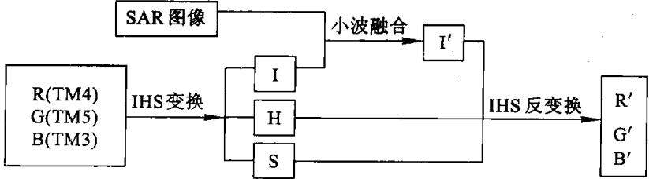  
图 4-21 小波与 IHS 集成的遥感图像融合方法

## 2. 主成分综合融合算法

由IHS融合得到的是三幅图像，单独由小波融合只能对单波段图像进行融合，而在TM图像的应用中，一方面采用具有最大信息量的TM4、TM5、TM3波段同时进行处理是必要的，另一方面在具体的应用中往往希望能用一幅图像代表多幅图像的主要信息，应用主成分变换可以提取融合后的主要信息。将PCA与IHS、小波变换相综合的融合算法，提出两种常用模式如下：

①分别将TM图像的各个波段与SAR进行基于小波的融合，然后进行主成分分析，提取第一主成分、第二主成分以获取主要的融合信息。

②对前文中最后得到的 $\mathrm { R ^ { \prime } \cdot G ^ { \prime } \cdot B ^ { \prime } }$ 三幅图像进行主成分变换，提取其第一主成分，则此时综合了三种变换所具有的优点，图4-22所示为上述融合图像的第一、二主成分。

由图4-22 可以看出，在 TM3、TM4、TM5与 SAR 进行小波IHS 综合融合后，对结果图像进行主成分变换，第一主成分中包含了73%的信息，而第二主成分中包含的信息较少，第三主成分中则基本没有可应用的信息。因此，通过对融合后多图像进行主成分变换与分析，可以将不同图像的信息反映予以集中反映，实现对特征的综合和提取。

## 3. 加权特征 IHS 融合法

应用IHS变换进行图像融合时，要先用强度分量I对SAR图像进行直方图均衡化，然后用SAR图像取代I后进行IHS反变换，这时存在的一个缺点就是单纯的取代往往容易丧失Ⅰ图像所具有的信息，进而导致IHS反变换后的图像会产生信息缺失。因此，如果能使反变换时采用的强度图像I兼具有SAR和Ⅰ的特征则可以克服这一问题，一种可行的方法就是对SAR与Ⅰ分量进行加权合成，而不是单纯的替代，即 $I ^ { \prime } = P * I + ( 1 - P ) * \mathrm { S A R }$ ,然后再进行IHS逆变换，P的选取视实际情况而定。

加权特征IHS融合算法是对IHS的改进，其特点是根据图像特点确定融合中各部分的权重。TM经配准和重采样后，其空间分辨率较低，重在应用其光谱信息，而纹理、边缘等反映空间细节的信息则是由SAR图像进行描述的，因此权值根据SAR图像来确定。确定权值的原则是：在边缘或纹理丰富区，SAR图像权重大，I图像权重小；在均匀区，SAR图像权重小，I图像权重大。具体来说，权值根据SAR图像的均匀程度或纹理粗糙度来确定。融合算法一般步骤的示意图与加权IHS变换类似。权值的确定可以采用两种方法：一种是离散定权法，一种是连续定权法。离散定权法是通过对某一定权指标进行离散的区间划分，对每一区间内的值赋予统一的权值。连续定权法是根据某一指标定义一个定权函数，定义随指标而变化的权值。

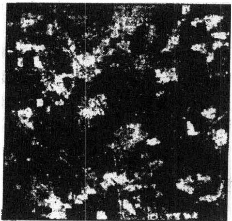  
第一主成分

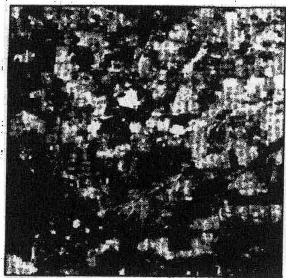  
第二主成分  
图 4-22 小波 IHS 综合融合图像主成分变换图像

根据常用的描述均匀性和体现高空间分辨率图像特点的指标，选择均值、方差和纹理三个特征进行区域复杂度描述，作为定权的指标。

## (1) 基于均值的算法

中心像元灰度与其邻域窗口均值的差是描述均匀性最简单、最常用的指标，LMM和LMVM法实际就是应用了中心像元灰度与窗口均值之差作为融合的关键因子。以下选择这一差值作为确定权重的依据。

设 P为SAR的权重。在 SAR中，以像元(i,j)为中心取5×5窗口，设窗口均值为H，中心像元 $( i , j )$ 的灰度值为H，则可以按下式计算权值：

$$
P = \frac { ( \overrightarrow { H } - H ) } { \mathrm { m a x } ( \overrightarrow { H } , H ) }\tag{4-27}
$$

显然，P的取值在区间[0，1]内，将其作为SAR图像的权值，相应TM图像的权重为1一P。权值越大，表示该像元位置处具有边缘、突变或其他细节信息，因此SAR图像应具有较大的权重；权值越小，表示该位置为均匀区域，侧重于应用其光谱特征进行分类与识别，因此应增大TM图像的权重。以此为基础可以进行融合运算。

## (2)基于标准差的算法

以窗口为基础基于方差确定权重，以SAR图像中的方差为调节准则。

计算像元(i,j)为中心 $5 \times 5$ 窗口的标准差：

$$
\delta _ { u } = \sqrt { \frac { \sum [ H ( l , k ) - \widehat { H } ] ^ { 2 } } { 2 5 } }\tag{4-28}
$$

引入测量平差中单位权中误差和定权的思想，定义单位权 $\sigma _ { 0 } ^ { 2 }$ ，对于每一像元其权值为：

$$
\begin{array} { r } { P = \frac { \sigma _ { w } ^ { 2 } } { \sigma _ { 0 } ^ { 2 } } } \end{array}\tag{4-29}
$$

因此，关键在于确定单位权 $\sigma _ { 0 } ^ { 2 }$ 。根据自适应滤波的研究， $\sigma _ { 0 } ^ { 2 } = 2 \sigma _ { 1 } ^ { 2 }$

若计算出 $P { > } 1$ ,则取 $P = 1$ ，否则P取实际值。

在有些研究中，也可以根据相对标准差来确定权重：①首先计算出窗口相对标准差 $C _ { \imath } .$ $= \sigma _ { w } / \bar { H }$ ;②再对整幅 SAR图像计算出图像的相对标准差 $C _ { 1 } { = } _ { \sigma _ { 1 } } / \mu ; \textcircled { 3 }$ 定义 $\mathrm { C } _ { \mathsf { M } } = = \sqrt { 3 } \times \mathrm { C } _ { \mathrm { I } }$ 则其权值可用式 $P { = } C _ { w } / C _ { \mathrm { M } }$ 确定。

## （3)基于纹理的算法

遥感信息融合的主要目标之一就是充分应用高分辨率遥感影像的细节信息和多光谱影像的光谱信息，因此关键就在于将纹理信息叠加到多光谱图像中。针对这一思想，可以考虑基于纹理特征来确定融合权重。对纹理丰富的区域，赋予比较大的权值，关键在于纹理复杂度的描述指标，经试验可选择纹理粗糙度作为描述算子，也可以采用分维数作为纹理度量。

选择空间自相关函数作为纹理粗糙度的描述，空间自相关函数的定义为：

$$
C ( \varepsilon , \eta , j , k ) = \frac { \displaystyle \sum _ { m = j - w } ^ { j + w } \sum _ { n = k - w } ^ { k + u } f ( m , n ) f ( m - \varepsilon , n - \eta ) } { \displaystyle \sum _ { m = j - w } ^ { j + w } \sum _ { n = k \cdot \ w } ^ { k + u } \left[ f ( m , n ) \right] ^ { 2 } }\tag{4-30}
$$

式中， $f ( m , n )$ 为图像，(j，k)为像素点位置。纹理粗糙度用T来表 $\ddagger { \overline { { \mathfrak { N } } } }$ 1

$$
T ( j , k ) = \sum _ { \epsilon = - T \eta = - T } ^ { I } \sum _ { \epsilon } ^ { k } \epsilon ^ { 2 } \eta ^ { 2 } C ( \epsilon , \eta , j , k )\tag{4-31}
$$

对每一个像元(j，k)，计算出其粗糙度指标 $T ( j , k )$ 后，为使其作为权值使用，还应归一化到[0，1]区间。

选择一个单位权粗糙度指标，则对于任一粗糙度，其权值可以通过下式来计算：

$$
P = \frac { T ( j , k ) } { T _ { \mathrm { 0 } } }\tag{4-32}
$$

若计算出 $P > 1$ ，则取P=1，否则P取实际值。

分别对以上几种融合算法应用于TM和SAR图像的融合，采用定性比较和定量判别的方法，说明它们能有效提高融合图像的信息量与分辨率，但针对具体的应用目标，不同方法的适用性不同，另外随图像特点的变化，融合效果也不尽相同。

## 二、多时相遥感影像融合与工矿区陆面演变动态监测

将卫星遥感图像应用于区域陆面演变动态研究的主要方法有两种：一种是直接基于遥感图像、通过多时相图像综合分析评价，也称逐个像元比较法(Pixel to Pixel Comparison);另一种则是利用所提取的信息、分类结果在GIS的支持下，结合空间分析模型进行分析研究，即分类后比较法(Post Classification Comparison)。

## (一)遥感动态监测

遥感主要能够解决两方面的问题，即“从空中的角度看地球”和“从历史的角度看问题”，遥感动态监测是当前遥感应用的主要方向。利用遥感数据进行动态监测(变化检测)的一般

步骤为：

①提出问题确定研究区域，确定监测的频率，选择适当的土地覆盖分类系统。

②考虑影响因素一—包括遥感系统方面(时相、空间、光谱、辐射分辨率)、环境因素(大气条件、土壤湿度条件、物候圈条件、潮汐状态）。

③遥感图像数据处理获取合适的用于变化检测的数据(现场实测辅助数据、遥感数据)，多源遥感数据的预处理(几何配准、辐射校正)，选择适当的变化检测算法，应用合适的图像分类算法，基于GIS的变化检测(用变化检测矩阵对选定类别进行增强，产生变化图产品，计算变化统计量）。

④质量控制—包括评估统计精度、确定单一数据分类、变化检测产品精度。

⑤提供成果产品的形式可以是数字产品或模拟产品。

## （二）多时相遥感图像中的动态监测与分析

不同时相具有统一空间基准与地理区域的遥感图像，反映了区域实时的综合特征，通过对多时相遥感图像的综合分析可以提取变化信息，实现对区域演变的遥感监测。目前，常用的变化检测方法主要包括图像运算法、植被指数相减法、变化矢量分析法、变化信息提取法、主成分分析法、光谱特征变异法、分类结果比较法等。对这些方法进行分析，可以将区域演变遥感动态监测的方法归纳为基于图像信息运算的方法、基于空间信息变换的方法、基于分类结果比较的方法、基于空间分析模型的方法。此外，将多时相数据分别赋予R、G、B颜色进行彩色合成、可视显示，目视判读仍是一种常用的变化检测方法。

## 1. 基于图像信息运算的方法

设F表示第i时相所获取的遥感图像，则在任意两个时相i，j内区域演变的情况可以通过基本的图像运算表示：

$$
\Delta F _ { i j } = F _ { j } - F _ { i } + M\tag{4-33}
$$

式中，F；最基本的表达方法是直接采用像素灰度值进行运算，但即使对于同样的土地覆被，由于成像时间、气候条件、太阳高度角等的不同，不同时相的灰度值也不一定相同，尽管可以通过校正使二者接近，但由于它们并不是一种简单的线性关系，不可能建立统一的转换模型，因此精度较低。由于不同时相的遥感图像其灰度值的差异往往具有一定的规律，因此可以通过确定阈值的方法来确定变化区域。

为此，提出了采用植被指数相减的方法，这种方法对于植被、农田等的动态变化适用，但对其他的演变形态则未必适用.如由乡村用地变为城镇用地、道路交通用地，并不伴随植被指数的变化，显然效果不好。

## 2. 基于图像信息变换的方法

运用不同时相的遥感图像信息通过各种图像变换后进行动态监测，主要方法有以下几种。

## （1）基于主成分变换的方法

其主要思路是对不同时相的数据进行主成分变换，突出主要的信息部分。包括：①差值主成分法：对差值图像作KI变换，则变换结果的第一分量集中了差值图像的主要信息即两时相图像的主要差异信息；②主成分差异法：将不同时相图像KL变换的第一主成分进行差值运算：③多时相主成分变换法：先将多时相图像融合形成混合数据集，然后对其实施主成分变换，即在前一、二个分量反映原始图像的主要信息，而后面几个分量则反映了变化

信息。

## (2) 基于 K—T 变换的方法

K一T变换与KL变换的基本思想类似，对TM图像的四个波段施加变换，从而得到四个新的特征 $\mathrm { I } _ { \mathrm { S B } } \setminus \mathrm { I } _ { \mathrm { ( ; V } \setminus \mathrm { I } _ { \mathrm { Y } } \setminus \mathrm { I } _ { \mathrm { N } } }$ ，并产生四幅特征图像，通常取变换后的 $\mathrm { I } _ { \mathrm { S B } }$ 和 $\boldsymbol { \mathrm { I _ { G V } } }$ 作为二维特征进行分类处理，其中 $\mathrm { I } _ { \mathrm { S B } }$ 特征图像对土壤分类有效， $\bar { \mathrm { I } } _ { \mathrm { G V } }$ 特征图像对植被分类有效。对于多时相K一T变换，可先对两时相的图像分别进行K一T变换，取变换结果的第一和第二分量，根据图像转换的经验系数对上面的两分量做旋转变换以使结果分别对应两时相的绿度和亮度值，计算变化矢量的方向分量和幅度分量，形成IHS空间，转化生成RGB空间图像。

## (3)基于频率域的分析

常用的频率域分析方法主要是基于FFT和小波变换的变化信息探测。

此外，还有基于对应成分变换的分析、基于典型成分变换的变化检测等。

## 3. 基于分类结果的分析方法

在对不同时相的遥感图像进行分类的基础上进行比较分析，我们提出以下方法。

①基于编码的变换分析方法将两时相的像元类别进行组合，生成一个新的字符串作为组合后的编码，预先建立陆面演变的变化特征码，根据特征码进行逐个像元处理确定变化区域，提取每一时相像元的类别，从而确定变化类型，实现定位、定性、定量的分析。

②基于变换矩阵的方法一—变换矩阵一般是分别统计两时相各种地类面积之间的转换关系，从而建立以地类转换为目标的变换矩阵，通过矩阵可以对变化情况进行分析。其关键是转换面积的获取，一般要在分类结果图像的基础上，借助GIS的空间分析功能(矢量叠加、面积量算)来实现。

## 4. 基于模型的分析方法

基于模型的动态监测方法是对变化情况采用一定的模型进行表达，然后以遥感图像的信息(常采用灰度信息，也可以纹理信息作为辅助)作为模型参数，进行变化识别。遥感信息模型是分析地学过程遥感模式的有效手段，可以建立陆面演变的遥感信息模型进行具体的研究工作。

## （三）几种新的变化检测方法

针对以上几种变化信息提取方法的特点与不足，结合研究目标及研究区的实际情况，可以建立以下几种变化信息提取方法，以实现基于遥感图像的动态监测。

## 1. 综合动态监测方法

在进行陆面演变遥感动态监测与分析时，有三个方面的要求：①确定发生变化的空间位置：②确定变化的种类；③对变化情况进行定量描述。根据前文介绍的方法要同时实现这三方面的要求，只有利用分类后比较分析法，但由于它以分类为基础，计算量较大，如何解决这一问题将是进行定位、定性、定量监测的关键所在。显然，采用单一的方法难以满足要求，因此可以考虑采用多种方法的集成，称其为综合动态监测方法，主要思想和技术流程如下：

Step1——利用主成分差值法，确定两时相的变化区域CR；

Step2—对变化区域进行缓冲区分析，形成新的变化区域及其周围背景区 $\mathrm { C R } ^ { \prime }$

Step 3——对区域 $\mathrm { C R } ^ { \prime }$ 进行分类，确定其在两时相的类别，从而实现动态监测；

Step4——对变化区域进行定量表达与分析。

这种方法的关键是对主成分差值图像进行后处理，以实现动态监测，它只对变化区域进行处理，因而减少了处理的工作量。

## 2. 基于灰度回归的变化检测

不同时相遥感图像上同一地物的灰度之间应该具有一定的函数关系，以往主要是采用线性关系模型进行讨论，但对于SAR图像与TM图像而言，这种灰度关系到底符合什么样的模型，还需要进行研究。但是，不管是按照线性还是非线性的函数关系，都可以建立针对研究地物的灰度相关模型，并可对模型进行相关检验，进而以建立的模型为基础，取一种图像为自变量(取TM)，另一种为因变量(取SAR)，先以自变量为基础得出一幅模拟图像SAR′，然后对SAR与SAR′进行求差比较，按照一定的阈值提取变化部分，并对变化部分分别在TM和SAR中按照最小距离原则归入相应的类别，基于证据理论对结果进行融合，从而实现变化检测与动态监测。

## 3. 基于GIS 辅助数据的遥感变化信息检测

GIS中的许多背景信息可以用来提供陆面演变的背景信息。根据对区域的调查和统计分析，可以建立陆面演变的主要影响因素，并根据这些因素划分陆面演变敏感区，利用GIS数据确定敏感区及其缓冲区，在此区域内应用多时相遥感信息进行分析，并进行变化检测。它充分利用了GIS技术及已有数据，可提高效率，精度也较高。

总之，多源遥感图像中发现变化信息、实施动态监测的关键是图像融合和变化信息的探测，针对具体的应用目标，应选取相应的算法和模型。

## 三、多时相遥感数据在陆面演变分析中的应用

## （一)基于图像运算的模型

图像运算通常采用的是图像相除和图像相减运算，适用于同种多时相图像的处理。针对不同的演变形式，所选用的算法形式应有所区别。以塌陷地的识别为目标，对1987年、1994年的TM3、TM4、TM5波段分别进行图像相除和图像相减运算后发现，基于图像运算的模型在进行辐射校正后基本可以实现变化信息的提取，但辐射校正的具体模型很难都通用，与多时相遥感数据的属性、图像信息组成、区域地理条件等因素有关，运算结果中往往容易出现伪变化区域，不宜进行高精度要求的比较。

在研究中发现，对多时相信息与变化信息同时进行RGB表示，可以从图像上直接识别变化区域，对信息量最丰富的 $\mathrm { T M } 5 _ { \& \ 7 }$ 、T $\mathrm { \Delta } \mathrm { M } 5 _ { 9 4 }$ $\mathrm { T M } _ { 8 7 } . . _ { 9 4 }$ 用假彩色进行表示，此外，将两时相TM3、TM4、TM5波段差值图像进行RGB合成，也可以识别变化区域。

## (二)基于主成分分析的模型

针对1987年、1994年两个时相的TM图像，采用主成分变换的方法对演变进行分析，按主成分差值、差值主成分、多时相主成分三种方法分别进行考虑。

进行主成分差值法分析时，取1987年TM图像6个波段的第一主成分 $\mathrm { P C 1 } _ { 8 7 }$ 、1994年TM图像6 个波段的第一主成分 $\mathrm { P C l _ { 9 4 } }$ 进行标准化后，计算 $\Delta \mathrm { P C 1 }$ ，并以图像形式显示，如图4-23、图4-24所示，可以看出图中反映了陆面演变的主要变化信息，可以提取塌陷地区域。

在差值主成分变换方法中，分别对1987年和1994年的TM图像进行校正，然后按波段求差，对6个差值图像进行主成分变换，经分析试验可知，第一主成分和第二主成分已包含了主要的变化信息，如图4-25所示。可以看出，变化信息与背景信息之间具有明显的阈值，将其采用ISODATA法分为两类后，可以从中提取变化明显的区域。但具体的分析研究也表明，差值主成分受差值图像的影响较大，容易出现伪变化区域。

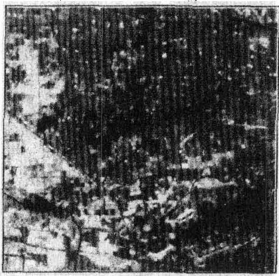  
1987年

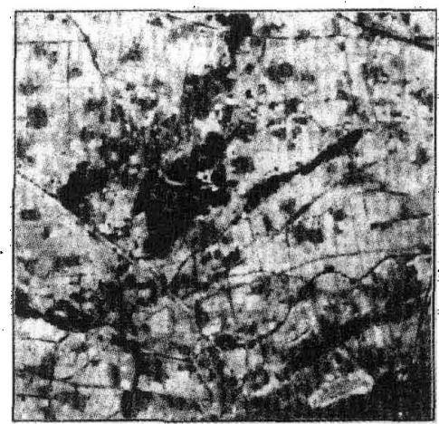  
1994年

图 4-23 TM 图像第一主成分  
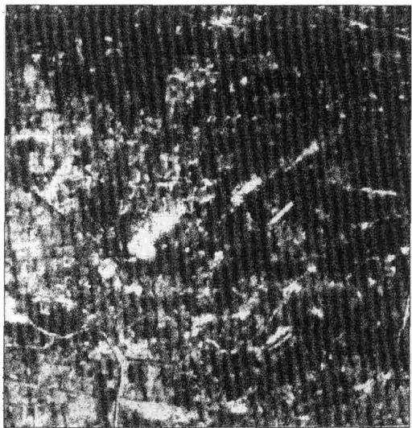  
图 4-24 1994年与1987年第一主成分之差

在多时相主成分中，为了减少计算量在每一时相中均选取组合信息量最大的TM3、TM4、TM5三个波段，组成六个波段为一个集合，进行主成分变换，表4-12所示为各主成分的特征值、标准差及所占比例。对各主成分图像进行分析，发现PC1、PC2、PC3已基本覆盖了全部图像信息，其中第一主成分与第二主成分如图4-26所示。对各主成分进行判断分析可以看出，第一、二主成分主要反映了各时相图像中相对稳定的部分，即主要用于识别不变部分，而第三主成分中则主要体现了变化部分，如图4-27所示。在PC1、PC2、PC3用RGB的合成图像上，变化区域得到了明显的表达。

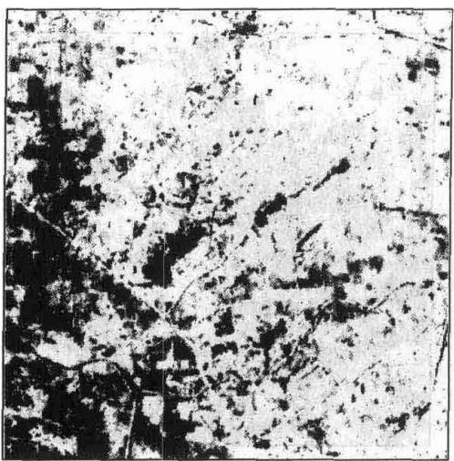  
第一主成分

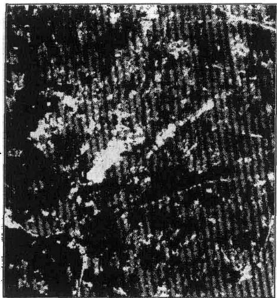  
第二主成分  
图 4-25 差值图像主成分

表 4-12  
多时相主成分变换参数
<table><tr><td rowspan=1 colspan=1>主成分通道</td><td rowspan=1 colspan=1>特征值</td><td rowspan=1 colspan=1>标准差</td><td rowspan=1 colspan=1>方差比</td></tr><tr><td rowspan=1 colspan=1>1</td><td rowspan=1 colspan=1>741.386 5</td><td rowspan=1 colspan=1>27.2284</td><td rowspan=1 colspan=1>59.25%</td></tr><tr><td rowspan=1 colspan=1>2</td><td rowspan=1 colspan=1>285.242 5</td><td rowspan=1 colspan=1>16.889 1</td><td rowspan=1 colspan=1>22.79%</td></tr><tr><td rowspan=1 colspan=1>3</td><td rowspan=1 colspan=1>149.133 0</td><td rowspan=1 colspan=1>i2.212 0</td><td rowspan=1 colspan=1>11.92%</td></tr><tr><td rowspan=1 colspan=1>4</td><td rowspan=1 colspan=1>51.9552</td><td rowspan=1 colspan=1>7.2080</td><td rowspan=1 colspan=1>4.15%</td></tr><tr><td rowspan=1 colspan=1>5</td><td rowspan=1 colspan=1>14.545 4</td><td rowspan=1 colspan=1>3.813 8</td><td rowspan=1 colspan=1>1.16%</td></tr><tr><td rowspan=1 colspan=1>6</td><td rowspan=1 colspan=1>9.1028</td><td rowspan=1 colspan=1>3.0171</td><td rowspan=1 colspan=1>0.73%</td></tr></table>

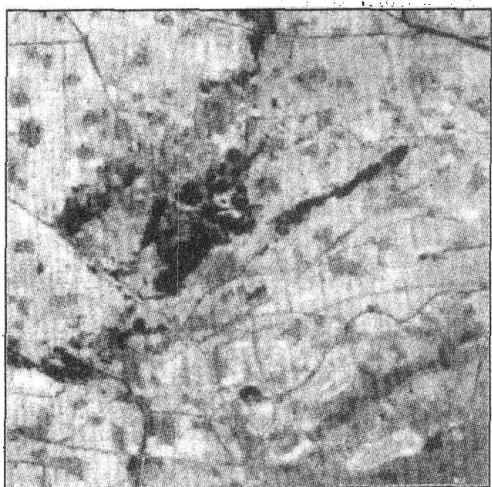  
第一主成分

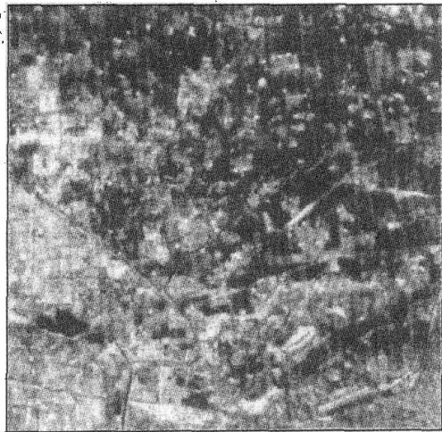  
第二主成分  
图4-26 多时相综合变换

对三种主成分变换方法的比较说明：①主成分变换可以用来实现多源、多时相遥感图像中的变化信息提取，但主要是限于确定变化区域，而要确定具体的变化类型，则要在分类系统的支持下进行：②在主成分差值法、差值主成分法、多时相主成分法三种变化中，判别效果最好的是多时相主成分法，它既可以确定两时相中的主要信息即不变信息，又可以确定变化信息：主成分差值法也是一种相对有效的判别方法，可以实现对变化区域的判别；而差值主成分法由干受差值图像影响较大，容易出现伪变化信息，因此在使用前需先进行辐射校正，减少成像条件等客观因素引起灰度变化而导致伪变化信息的出现。

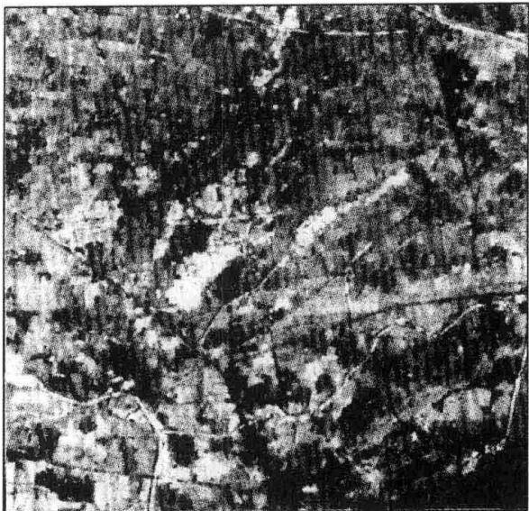  
第三主成分  
图4-27 多时相综合变换

## 第五章 土地复垦管理

土地复垦管理是土地管理工作的组成部分，是指对土地复垦工作采用经济、行政、法律手段以及综合措施予以管理监督，以达到将一切破坏、废弃的土地复垦成可利用的土地的目的。

## 第一节 土地复垦管理概述

所谓土地复垦管理，是指对土地复垦工作采用各种手段，如经济的、行政的、法律的以及综合措施，将一切破坏、废弃的土地复垦成可利用的土地，加以合理恢复利用。

自《土地复垦规定》颁布以来，土地复垦管理工作受到了各界的关注，一些地方也颁布了自己的土地复垦管理办法，如《山东省土地复垦管理办法》、《平顶山市土地复垦管理规定》等，这些措施为我国土地复垦管理技术的推进提供了很好的基础。

## 一、土地复垦管理的任务

①宣传、贯彻和执行《土地管理法》、《土地复垦规定》以及国家有关法律、法规，提高对土地复垦重要性的认识和自觉性。目前，严重的问题是宝贵的土地资源大量遭到破坏，而且有不少长期闲置荒废，并未被一些部门所认识。要认清国情，各行业、各部门要树立节约土地的观念。因此，要把宣传、贯彻有关法律、法规落到实处。

②强化土地复垦管理。各级土地管理部门是土地复垦工作的主管部门，负责管理、监督检查本地区土地复垦工作，建立健全土地复垦管理机构，是依法管理土地复垦工作的组织保证。同时，要建立一支以土地管理部门为主体的土地复垦专业技术队伍。另外，还要建立和完善各项土地复垦管理制度。

③制定有关土地复垦的配套法规及鼓励优惠政策。《土地管理法》有关土地复垦的规定和《土地复垦规定》是针对全国的，是一个原则规定。我国幅员辽阔，各地情况差异较大，为使土地复垦有法可依、有章可循，各地应结合本地实际情况，制定相应的具体实施办法，以有利于《土地管理法》和《土地复垦规定》的贯彻执行和土地复垦工作的开展。

④疏通土地复垦资金渠道。由于土地复垦所需资金数额巨大，无论是企业还是国家都难以承担，因此，需要多方集资，这是土地复垦的一项巨大任务。

⑤加强调查研究，摸清复垦土地资源家底。通过待复垦土地资源的调查，查清土地资源破坏的种类、数量、分布和复垦利用的基本情况，并作出科学评价，以采取措施有计划、有步骤地进行土地复垦。

⑥编制土地复垦规划。土地复垦规划属于土地专项规划，是土地利用总体规划的一部分。土地复垦必须有计划、有步骤地进行，通过复垦规划的编制确定土地复垦的顺序、复垦

目标及规模等。

## 二、土地复垦管理机构及职责

## (一）土地复垦管理机构及职责

各级人民政府土地行政主管部门负责本行政区域内土地复垦的管理工作，其职责是：

①贯彻执行国家有关土地的法律、法规和政策，根据《土地管理法》和《土地复垦规定》，结合本地区的实际情况，制定本地区的具体实施办法及有关政策。

②负责调查、掌握本行政区域内各种破坏的土地、废弃地以及各类荒废的土地资源的数量、种类、分布等，在此基础上制定本区域的土地复垦规划和年度实施计划。

③协调有关部门的关系，包括部门与部门、部门与农民之间的关系，积极帮助有复垦任务的单位和个人解决一些实际问题。

④按照《土地复垦规定》的要求，负责对有复垦任务的建设项目的可行性研究报告、设计任务书进行审查，有复垦任务而不列入复垦内容的项目不予批准建设用地。

⑤审查各部门及单位和个人制定的具体复垦规划和计划，并负责监督实施。

⑥会同有关部门制定复垦指标，并对复垦后的土地及时组织检查验收。

⑦确定土地复垦后的土地权属，做好复垦土地的登记、统计、发证等地籍管理工作。

⑧负责本区域内土地复垦项目的审查、论证和计划监督情况的检查。

⑨表彰土地复垦先进单位和个人，对不履行土地复垦义务的依法进行处罚。

⑩负责土地复垦押金的收取、使用、管理，并会同财政部门管理土地复垦补助经费。

①负责土地复垦咨询工作。

## （二）各行业主管部门的职责

## (1) 计划部门

各级计划部门要配合土地管理部门平衡全国土地复垦规划、计划，并纳入国民经济和社会发展计划，土地复垦所需物资指标要纳入计划管理。

## (2) 行政部门

①负责管理行业的土地复垦工作，并积极配合土地管理部门对本系统的土地复垦情况进行监督检查。

②负责调查、统计汇总本行业内各单位、企业破坏土地的数量、种类、分布及破坏情况，并及时报送统计土地管理部门。

③负责制定本行业的土地复垦规划、年度实施计划，并报送县级以上人民政府部门，平衡协调后组织实施。

## 三、土地复垦的权属管理

## （一）复垦土地的所有权

企业(不含乡村的集体企业和私营企业)在生产建设过程中破坏的集体所有土地，按下列情况分别处理：

①经复垦后不能恢复原用途或者复垦后需要用于国家建设的，由国家征用。

②经复垦后不能恢复原用途，但集体经济组织愿意保留的，可以实行国家征用。

③经复垦后可以恢复原用途，但国家建设不需要的，不实行国家征用。

## （二）复垦土地的使用权

## （1）企业用自有资金或贷款复垦后的土地使用权

生产过程中破坏的国家征用土地，企业用自有资金或者贷款进行复垦的，复垦后归该企业使用；根据规划设计企业不需要使用的土地或者未经当地土地管理部门同意，复垦后连续两年以上不使用的土地，由当地县级以上人民政府统筹安排使用。

## （2）企业采用承包或者集资方式复垦后的土地使用权

企业采用承包或者集资方式进行复垦的，复垦后的土地使用权和受益分配，依照承包合同或者集资协议约定的期限和条件确定；因国家生产建设需要提前收回的，企业应当对承包合同或者集资协议的另一方当事人支付适当的赔偿。

## （3）国家不征用的被破坏土地的使用权

生产过程中破坏的国家不征用的土地，复垦后仍归原集体经济组织使用。

## 四、土地复垦管理的基本理论

土地复垦工作牵涉到国家、地方政府、各个破坏土地的企业及集体经济组织和农民各方面的利益，土地复垦管理涉及土地现状调查、评价、土地复垦规划和计划、复垦土地资源的配置、土地复垦工程实施、复垦土地的监督检查及验收等诸多具体管理环节，因此，土地复垦管理本身就是一个牵涉诸多部门、包含各种管理措施的一个复杂大系统。该系统又可分为不同层次的子系统，系统的结构决定着系统的功能。

整个土地复垦管理系统实质上是一个控制系统，也是土地管理系统的一个子系统。各环节之间的关系可用图5-1描述。

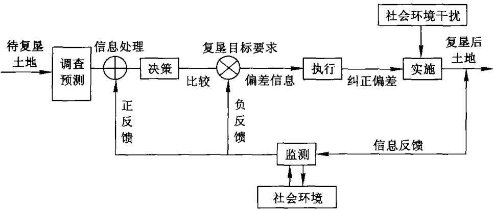  
图5-1 土地复垦管理控制系统

调查、预测环节中待复垦土地的现状调查、土地生产力评价及未来破坏情况预测是制定科学合理的土地复垦规划、计划、土地复垦标准的依据。

决策环节中正确的政策、法规保障，科学合理的土地复垦规划、计划、标准是保证高层次、高标准、高效益复垦的前提。

执行环节中土地复垦管理机构只有深入到具体复垦工程中进行组织、指导、协调、控制及监督，才能将预定的复垦目标落到实处。

监测环节中土地复垦管理机构部门通过对复垦土地调查、监督检查、生产力评价、动态监测、土地统计及验收等手段，及时掌握复垦土地反馈信息，找出存在的问题，加以纠正，排

除外界干扰，才能保质保量地完成任务。

土地复垦管理过程是一个不断发展、逐步完善的过程。土地复垦管理决策机构不断吸收复垦土地的反馈信息，并进行市场调查，与外界进行信息交换，采纳先进的科技成果，根据变化了的情况和社会进步的要求不断深化改革，及时调整政策、法规，更新充实规划和计划，提高土地复垦标准，才能将土地复垦工作推向更高层次。

## 五、土地复垦管理的一般模式

土地复垦管理一般分为三个阶段：第一阶段为规划、决策管理，第二阶段为复垦实施阶段管理，第三阶段为实施后管理。具体管理流程见图5-2(a)、(b)。

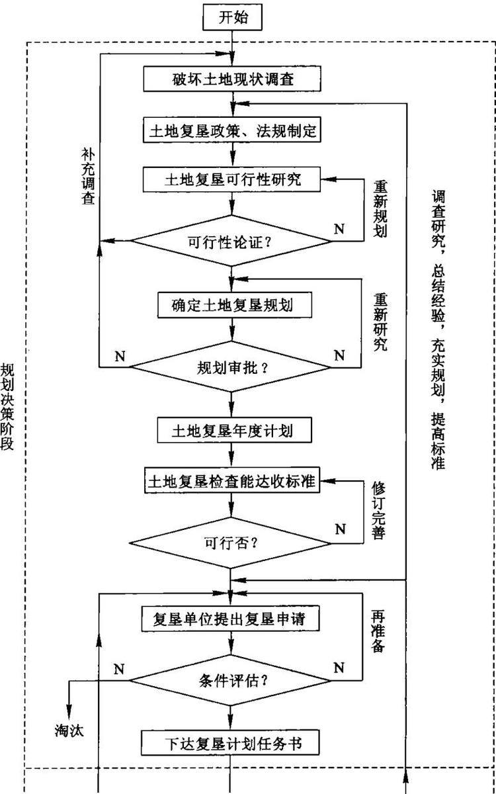  
图 5-2(a) 土地复垦规划决策阶段管理流程图

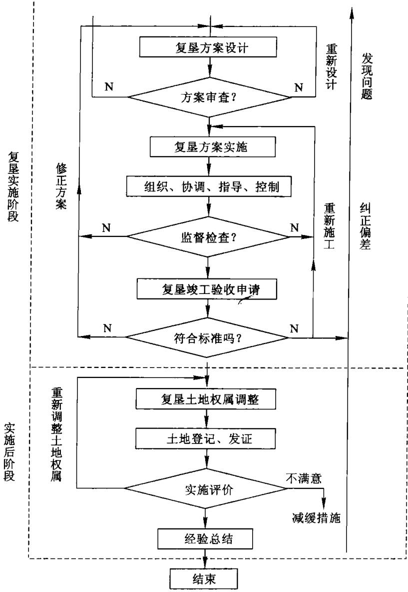  
图5-2(b)土地复垦实施阶段、实施后阶段管理流程图

## （一）规划、决策阶段管理

该阶段从复垦土地现状调查开始到下达复垦计划任务书为止，包括土地复垦政策法规拟定、可行性研究及论证、土地复垦规划制定、土地复垦年度计划安排、土地复垦检查验收标准制定、拟复垦单位提出申请并对其条件进行评估等环节。该阶段实质上是超前控制阶段，是建立在深入调查和科学预测基础上的优化决策过程。该阶段管理质量的高低，直接决定着后续阶段土地复垦效果的优劣。

土地管理部门一定要对可行性研究报告的论证、土地复垦规划及年度计划的制定及审查、土地复垦检查验收标准的制定及拟复垦单位资质评估等环节严格把关，并吸取已复垦土地在实施过程中及复垦后存在的经验教训，及时修订政策法规，充实和完善复垦规划、调整年度计划、提高复垦标准，只有这样才能使所制定的政策法规、规划、计划及标准等科学合理，真正起到指导性作用。

## (二）复垦实施阶段的管理

该阶段从接到复垦计划任务书开始，到土地复垦工程验收通过为止，包括复垦方案设计及审查、复垦方案实施、复垦过程中的跟踪管理、复垦竣工验收等环节。该阶段是按照上阶段既定的规划和计划，将土地复垦工程付诸实施的阶段，具有承上启下的作用。

在该阶段，土地管理部门应深入到土地复垦工程中去，在参与中及时发现问题，排解矛盾，科学指导，纠正错误，具体工作是：

①参与复垦方案设计，给予认真指导。

②组织复垦方案审查工作，对复垦方案的设计深度、与土地复垦规划的关系、利用结构，利用布局及总平面布置、主要工程量、主要技术工艺措施、投资概算及技术经济分析等进行认真审查，对不全面或深度不够的应重新设计或补充，对于复垦能力不足或无法按土地复垦规划复垦的单位，应对其复垦条件重新评估。

③在复垦方案实施过程中，土地管理部门应积极参与，跟踪管理，帮助协调各方面关系，排解矛盾与纠纷，给予技术指导并对复垦工程是否按复垦规划和设计方案施工进行监督检查。若没有正当理由不按设计方案施工，应责令其重新施工。若确因设计方案不合理，无法按设计施工时，应及时修正设计方案，重新施工。

④复垦单位提出复垦竣工验收申请后土地管理部门应组织有关单位和人员及时进行验收。对不符合复垦标准的，应责令复垦单位重新施工，直到符合复垦验收标准为止。

⑤在此过程中，土地管理部门应深入调查研究，总结复垦工程中的经验和教训，及时反馈给决策机构，以便调整政策，修正和完善规划、计划和复垦标准。

## (三)复垦后阶段的管理

该阶段从复垦实施验收通过开始，到土地复垦全面验收通过为止，包括复垦土地的权属调整、登记、发证、实施评价等环节。其中实施评价的目的是对已实施的土地复垦工程的效益进行评价，一方面是对工程的进一步检查，如果存在不满意的地方，应由复垦承担单位进一步采取补救措施，另一方面可以总结土地复垦的经验和教训，为土地复垦政策的制定提供实践依据。当前，对该阶段的管理还比较弱，致使工程复垦后的土地没有取得应该取得的效益等，因此，土地管理部门应该重视和强化该阶段的管理。

## 六、国外土地复垦立法与管理的经验

在国外，早在20世纪20年代就开始了土地复垦的研究和实践，目前已有很高水平。美国、前苏联、德国、加拿大等国的土地复垦率都已超过50%。

## (一)美国矿区生态环境恢复的主要作法与经验

美国矿区生态环境恢复的管理主要由内政部牵头，由内政部露天采矿与恢复(复垦)执法办公室负责实施，内政部的其他部门也依法进行与本部门有关的矿区生态环境恢复的管理，其中矿业局、土地局和环境保护署是核心。

美国十地复垦的经验值得学习和借鉴，概括起来有如下几个方面：

## 1. 建立、健全法规

国外矿区生态环境恢复(治理)比较好的国家，都有一套法规作为工作的依据。如美国有专门要求恢复矿区生态环境的法规-——《露天采矿管理与土地复垦法》(1977，联邦政府法，简称《复垦法》)，除此以外，还有许多相关的法规，如《垃圾法》(1899)、《矿山租赁法》(1920)、《渔业及野生动物协调法》(1934)、《联邦金属矿和非金属矿安全法》、《联邦煤矿卫生和安全法》(1966)、《国家环境政策法》(1969)、《矿业及矿产政策法》(1970)、《联邦污染控制法》、《固体废弃物处理法》、《清洁空气法》及其修订案。此外各州均有相应的环保与“复垦”(恢复治理)法规。在1977年联邦政府的《露天采矿管理与土地复垦法》的目的中明确指出(第一章102节，摘选)：

d条，确保采矿作业以有利于环境保护的方式进行。

e条，……尽可能地在露天开采作业的同时进行“复垦”(恢复)工作。

h条，促进原已遗弃的未进行“复垦”(恢复)的矿区进行“复垦”(恢复)工作。

2. 建立专门的矿区生态环境恢复(治理)的管理机构

美国1979年成立了主管全国露天采矿与复垦的执法办公室，直属联邦政府内政部，管理人员有1000多人，而且在23个州设立了派出机构(美国露天采煤主要在23个州)实行垂直领导。该办公室的职责是：贯彻执行《复垦法》，监督检查实施情况；负责制定颁布《复垦法》的实施细则及有关规定；开采与复垦作业的计划审批，制订与颁布实施本法规的条令、实施细则及有关规定，组织废弃矿区复垦；向各州发放复垦作业补助金；中止、吊销或撤回许可证；授权成立复垦研究机构及示范工程；建立“露天开采、地下开采和‘复垦’对地表影响的情报资料中心”；会同有关部门及地方政府做好恢复计划的协调；协助各州制定恢复要求，反映地方实际和该地方环境、农业的特征和条件；与其他联邦机构和州的管理机构加强合作，管理、检查《复垦法》的实施；行使《复垦法》所规定的职责。

## 3. 划定矿区生态环境恢复(治理)的界限

在国外，一般根据法律颁布的时间将矿区分为法律前的矿区和法律后的矿区，使恢复治理工作责任明确。对于法律颁布后出现的矿区生态环境破坏，一律实行“谁破坏”、“谁恢复”，且要求恢复率为100%。而对于法律前已破坏的废弃矿区则由国家通过筹集恢复(治理)基金的方式组织恢复治理。

## 4. 设立“恢复(治理)基金”

在 SMCRA的第四章(已废弃矿区的恢复治理)中明确规定：

a条，美国国库账册中设“废弃矿恢复治理(复垦)基金”，由内政部长管理。每个州应当设该州的废矿恢复治理基金，州基金由内政部长根据经过批准的恢复治理计划由国家废矿恢复治理基金拨出的补助金组成。

b条，国家废矿恢复治理基金的收取及款项构成：

①据本法第402节规定征收的恢复治理费(露天开采的煤，每吨交35美分，地下开采的煤，每吨15美分或售价的10%，褐煤则每吨交10美分或售价的2%)；

②对使用本法恢复治理后的土地征收的使用费减去养护该土地的开支后余下的款项；

③任何个人、公司、协会、团体、基金会为本法所述目的而提供的捐款；

④据本法规定重新收回的其他款项。

c条，国家“恢复(治理)基金”可用于以下目的(摘选)：

①恢复治理(复垦)露天采煤地区，封闭和回填废弃竖井与孔洞、植被、河床疏浚和污水处理，防止或减轻自燃，防止、控制、制止矿区沉降；

②治理由于矿区废弃地造成农村地区的土壤侵蚀与环境污染灾害；

③恢复已受到煤炭开采的不良影响的土地、水资源和环境，包括采取各种措施以保存

和开发土壤、水域、林地、野生动物、娱乐资源和农业的生产能力；

④保护、修复、重建或增多各种受到煤炭开采作业不良影响的各种公用设施，如煤气、电、供水设施、道路、休养地以及保存这些设施；

⑤向实施本法规定的各州拨放补助金(现在已采取国家和州政府5：5分成的办法)；

⑥按内政部长与其公共组织签订的合同进行研究，其目的在于提供情报、建议和技术援助、实验与示范作业(如每年向国家土地复垦研究中心提供1.4亿美元的科研经费以进行研究、开发与示范作业）。

从1978年起到1986年已筹集18亿美元的“恢复(治理)基金”。此外，法律中还规定：对弄虚作假、不如数交纳恢复治理基金的，据情节轻重，罚1万美元以下的罚金或1年以下有期徒刑，或处罚并行。

## 5. 建立开采许可证制度

采取“开采许可证”制度、强行要求矿山企业对矿区生态环境予以恢复是美国行之有效的办法。其主要特征有：

①不持州的管理机构或者内政部颁发的许可证，任何单位或个人不得进行新的露天采煤作业或重新打开、开发已废弃的矿并或矿区。发放许可证的机构，各州均不一致，有的是州环保部，有的是州自然资源部，有的是州土地开垦局，有的是州矿山局或地矿局，等等。

②开采者应递交内容翔实并包括恢复治理规划的申请，主要内容是：(a）许可证申请人的姓名、住址；(b）与许可证所申请的地区相邻的地表和近地表层地区的情况；(c）提供待采矿场地的原始资料，如地表、地下水的质量和数量，土壤类型、深度、pH值、坡度和植物生长的能力，各岩层的物理化学特征(包括煤层)，植物种类、密度，野生动物种类、密度，已存在的土地利用情况，优质农田情况，高产田情况等；(d）提供从事采煤作业地区的地图及各种有法律效力的文契；(e)开采计划(包括环境评价、工艺等)；(f)采矿和复垦(恢复治理)对矿区和流经矿区的水产生的后果的预评价；(g)采矿后的恢复治理计划。

③对有复垦(恢复治理)信誉的矿山主优先审批许可证，而对于不遵守SMCRA及州政府颁布的相关条例、规定的矿山主，SMCRA执法办公室或发证机关有权中止、吊销或撤回开采许可证。

## 6. 实行恢复治理(复垦)保证金制度

开采许可证申请得到批准但尚未正式颁发以前，申请人先交纳恢复治理(复垦)保证金。保证金的数额根据许可证所批准的恢复治理要求确定，可因各采矿区的地理、地质、水文、植被的不同而有差异，其数额由管理机关决定。该保证金在采矿者不履行恢复治理计划时用来支付恢复治理作业的费用，每一个许可证所呈交的保证金不得少于1万美元。完成恢复治理且验收合格后予以返还。

## 7. 严格的恢复治理标准

美国的恢复治理验收标准特别细，也特别严，以确保矿区生态环境在采矿后等于或优于采矿前。其主要标准有：

①使该土地的特性在经采矿作业后发生的变化减到最小限度。

②恢复受影响土地的特征，使其生产力达到采矿之前所能达到的程度或比原来更大、更好。

③确保所有的酸性物质、有毒物质或可能引起火灾的物质按下述原则处置：焚毁或掩

埋，防止污染地表水或地下水。

④在规定的地区或其他所受影响的土地上种草植树，植被应是多样化、有效和永久性的。该地的植被覆盖率不低于该地区天然的植被覆盖率。

⑤采矿区植被应在5年内达到④的要求，当年降雨量小于29英寸(736.6 mm)时应在10年内达到。

⑥尽可能地减少采矿复垦(恢复)对鱼类、野生生物及有关环境价值造成的损害和不良影响。

⑦最大限度地减少对地表水、地下水两个水系的水质、水量的影响。

⑧保护受采煤影响的地表面，包括矿渣堆，回填复垦应防止土壤侵蚀及防止空气、水污染。

⑨恢复表土层。

⑩除有规定之外，所有露天采煤用地应进行回填、夯实、平整，以便大致达到该土地原来的轮廓，并与周围土地的利用在生态学上一致起来，复垦好的土地应重新恢复植被。

美国的土地复垦验收工作一般分三个阶段：

阶段一—当复垦的土地经过岩土回填、土地平整、表土复原、建立排灌设施和侵蚀控制措施等复垦工序后，破坏的土地达到了可供利用的状态，此时可进行第一阶段的验收工作，若符合复垦法规和复垦规划对第一阶段工程任务的要求，可退回60%的复垦保证金。

阶段二—当复垦的土地进一步恢复了生产力并满足复垦法规、规划规定的第二阶段要求时，矿山主可申请第二阶段验收，验收合格，矿山主可得到复垦保证金的25%。第二阶段的主要要求有：①根据复垦规划建立了植被；②符合重植植被的标准；③复垦土地无泥沙进入河流；④径流植被控制在限定的范围，无泥沙进入限定范围以外的河流；⑤基本农田复垦的土地生产力已与相似的未破坏的基本农田土地生产力一致；⑥蓄水池的使用与管理符合土地复垦规划。

阶段三—当所有的复垦工作按照复垦规划完成，土地实现了批准的采后土地用途，植被生长也达到了约定的期限（一般地区5年，干旱地区10年），方可申请第三阶段验收，若合格，矿山主可得到余下15%的复垦保证金。

(二）澳大利亚的矿区土地复垦管理的目标与实现

澳大利亚作为以矿业为主的国家，矿山复垦已经取得了长足进展和令人瞩目的成绩，被认为是世界上先进而且成功地处置扰动土地的国家。它把土地复垦视为矿区开发整体活动不可缺少的组成部分。

澳大利亚各州在矿业开发中具有主导作用，州议会有权制定相关的法律，所以州一级矿业法规十分完备。有关矿区土地复垦/复原方面的法律规定，散见于各州的矿业法或环境法规之中。如维多利亚州（以下简称维州），相关的法律法规主要在《1990年矿产资源开发法》、《1995年采掘工业发展法》、《1991年矿产资源权属规定》等之中。西澳大利亚州(以下简称西澳州)主要在《1986年环境保护法》、《1978年矿业法》、《1981年矿业法规》、《1981年矿业法规修正》、《1981年采矿和石油勘探法》之中，等等。各州的法规内容、执法程序大同小异，我们就以维州为例来说明。

维州是老殖民地，矿业开发已有上百年历史。著名的淘金潮时期，仅涌入维州的华工就达数十万。可以说，矿业过去是维州的经济基础，现在则是重要的支柱产业。加上较好的法制传统，维州矿业法规中的矿区复垦/复原法律规定严谨而周详，易于操作。

维州有关矿区土地复垦的法规，有三方面基本的也是其他各州共有的规定：一是从事探矿或采矿的矿权所有者，必须恢复已破坏土地及相关用地的原貌。二是在取得勘探权之前，必须按照“标准许可证条件”签署包含具体复垦要求的协议。或者在获得采矿权之前，必须提交复垦计划书，经过政府批准后严格遵照执行。三是采矿权所有人必须提交一份书面保证并若干保证金，与政府有关部门(维州是自然资源与环境部)一起承担矿区复垦的责任。

这些规定不仅提出了原则要求，而且提供了具体的操作方案以及保障措施。其中最具特点的是复垦计划书和保证金制度。

1. 矿产资源开采前，必须提交复垦计划书

维州法律规定，在取得矿权之前必须提交项目规划，项目规划中则必须包括土地复垦计划书。计划书必须认真考虑如下方面因素：项目终结后的土地用途，复垦进度，地形和遮蔽物，表土剥离，表七复原，表土存放，预备耕作层，植被复原，植被复原的技术方法，道路、车辙及其他压实的地区，水土流失控制，工厂设备迁移，矿区安全，复原土地的维护与监督等。

计划书还必须针对如何处理浅表矿、采掘凹陷、地下开采、尾矿处理、尾矿坝、废料场以及堆浸场等生产区域的土地复原或复垦问题，提供详尽可行的方案及相应的技术措施等。

值得注意的是，与复垦计划相呼应，法律规定项目规划中还必须包括环境评价方面的内容，涉及了尘土、空气、水体、噪音及动物、植物和交通运输、水土侵蚀等方面。

在程序上，法律规定复垦计划形成之前必须要与土地(不论私有或联邦土地)所有者磋商，地主有权要求将自已和矿权所有者之间的协议写进计划。复垦计划提交政府主管部门后，还要审查，批准通过后就要严格遵照执行。复垦要求必须与探矿或采矿活动同时展开，而且必须执行到计划完成并且达到地主满意为止。

2. 矿权所有者必须提交一份书面保证及若干保证金

在维州，《1990年矿产资源开发法》和《1995年采掘工业发展法》中详细规定了“复垦保证余”的条款，其目的就是为了“在矿权所有者失于完成复垦责任时，保护公众的利益”。法律规定每项复垦计划都必须有足以完成复垦任务的保证金。确定某项目保证金的额度之前，负责管理此业务的自然资源与环境部部长要和矿权涉及土地的当地市政厅磋商(包括地主）。矿权所有者必须将保证书和保证金一道提交政府，并与政府一起承担矿区复垦的责任。

在返还保证金之前，自然资源与环境部部长必须与当地市政厅和地主磋商。如果复垦按照“标准许可证条件”或“复垦计划”顺利执行，并经该部检查满意，保证金就可以退还矿权所有者。如果未按计划复垦，或者该部部长认为还须进一步工作，或者地主有合理要求，这时部长就有责任采取行动。当然，部长不同意地主的要求，则必须告知原因何在。如果在合理的期限内，矿权所有者疏于此事，完不成任务，该部长就必须采取行动，动用该项目的保证金推动必需的工作。如果资金不足，该部长可以从矿权所有者处追讨。在矿权所有者申请该项目有效终止之后，如果有理由相信此复垦计划不成功，该部部长可以扣押此保证金六年，直至复垦成功。

作为程序性规定，保证金的建立必须按照“矿权所有者十担保企业十银行十政府”的方式办理。首先，矿权所有人要与参加复垦的企业一道，按照《1990年矿产资源开发法》规定，以法定银行的固定表格形式，做出书面保证。其内容大致如下：某某持照人和某某担保人(企业），共同支付给维州自然资源与环境部部长总计××款项。其义务在于：上述持照人应该明了所有矿法规定的条件、限制等规定。如不明了，此保证金可能被没收，以便自然资源与环境部长行使复垦之责。另外，书面保证还规定：没有维州自然资源与环境部和担保者(企业)的书面授权，此款不得发还。其次，担保银行必须根据《1995年采掘工业发展法》的规定，单独书面保证：某某银行承诺对总计××款项的责任等，其义务与前一保证书内容相同。

澳大利亚对矿区土地复垦方面的程序要求中还有一个十分重要的环节，这就是公众意见听取会议。应该说，听取公众意见处理重大事项，在西方民主法制传统中始终是具有特殊意义的环节。几乎各种涉及公众利益、具有社会影响的事务，在作出决定前，必须听取当地民众的意见。矿业开发活动当然概莫能外。无论勘探或采矿活动，都必然影响到居民的生产生活，以及改变环境甚至生态。凡此类项目确定前，如州合同签署前，政府都要责成有关企业在公共媒体通报详细情况，然后由政府出面组织会议，邀请各方面代表，对项目的发展和对公众的影响提出意见和建议。西澳州主管矿业的政府机构之一—矿产能源部就有50～60人在所属处室专责处理“顾客服务”方面的事务，保证“投诉有门”。基层政府则设有矿山巡视员，专门负责矿法的实施情况，同时向上级报告居民和社会的反映。

澳大利亚能够吸引大量矿业投资，重要原因之一是能够根据自己的特点制定十分适用的政策法规，并有效地加以实施。一般容易引起投资者与当地居民和政府关系紧张的重要因素，是矿区勘探开发过程中，环境变化(甚至恶化)给当地造成的生活生产不便(甚至困难)；个别最终造成生态破坏或灾难，引起冲突，矿山关闭或者两败俱伤。工业化国家历经了诸多教训后，从20世纪70年代开始不断制定、修订和完善矿业法规，其中对矿区土地复垦方面的规定，可以说是这一时期矿业立法活动中最具积极影响的历史性建树之一。其最直接和最具说服力的结果是，一方面吸引了大批投资者和投资，另一方面地方当局和居民的相关排斥言行降到了最低点；国家、地方、投资者、老百姓各方均获得了利益，相互不仅限于近期，还包括了所谓长远利益。换句话说，吸引外来投资的长效政策，绝不是靠一味的“优惠”措施去鼓励，还要包括各种成本不菲的约束措施，如强制性的复垦规定。因为它最终符合各个利益集团的利益。20多年来，澳大利亚、美国、加拿大能够吸引全球大部分矿业投资的事实，有力地说明了“约束”的积极作用。

## (三)加拿大的矿区土地复垦管理

## 1. 管理法规的历史演变

1960年以前，加拿大在联邦和省一级关于被采矿破坏土地的复垦或恢复方面几乎没有立法。20世纪60年代人们开始关注自然环境污染的后果，实行立法和制定管理措施来减少各种活动对环境的破坏，而这些新法律中大部分是针对采矿业的，并且有许多老的法律又都重新生效或加以修订，用以管理采矿工业(如《加拿大渔业法》和《北方内陆水法》)。这些与采矿有关的大部分法律法规要求恢复(复垦)被破坏的矿区环境(包括土地)，然而各省及各级政府之间对矿区环境恢复(复垦)的规定和采取的方法却差异很大。

虽然矿山公司对矿山关闭后矿区自然环境始终负有责任(各省规定的程度不同)，但在过去，大量的工作只是一般的清整或满足最低的卫生安全标准。从历史过程看，采矿过程中正式结合恢复(复垦)治理内容的最初阶段开始于20世纪60年代，在采矿法中列入一般性条款，规定进行平土、清整和在废弃矿山废石场上做些植被再造(例如早期的艾伯塔露天煤矿复垦条例)。本阶段后期采用了修正方案或新的采矿法，规定了废弃矿山应采取的具体复垦办法。60年代底，出现了对新矿山和扩建原有矿山要在开采前编制环境和复垦规划的规定。

第二个阶段是最活跃的阶段，时间是在70年代的前5年，那时大多数的省开始将大量有关环保标准的法律优先引入采矿法。这个阶段的特点是：对各采矿阶段编制恢复(复垦)规划提出了不同的规定；有了第一批预先决定土地最终用途的事例，实行检查、罚款等办法，以及在主要部门和机构中建立有关制度，并且成立了起主要协调作用的环保部门。这个阶段的一个主要内容是，对矿山开发和恢复(复垦)有直接影响的资源管理各个方面的控制，逐步采用专门的政策规定和准则。

最后阶段反映了采矿工业整个环保方面的“工艺发展水平”和80年代出现的环保发展的总趋势。在原有条件或标准中可能见不到补充的规定，因此，将来恢复(复垦)规划的一个组成部分便是附加到矿山租契和(或)经营许可证中，这就允许在有关矿业的法律条文中因地制宜而有灵活性。

现在，大多数省和地区的复垦规定已将以前采矿用地再生利用或变为风景区的责任归之厂矿。虽然有些厂矿仍然认为复垦并不是采矿过程的一个重要组成部分，但按新的立法，现已将复垦并入初步规划编制和矿山生产两阶段中。如前所述，如同时进行复垦，则比矿山关闭后进行再复垦更为有效，费用也更低。

## 2. 管理结构

加拿大的立法和执法管理规定有一整套的执法概念，管理结构有两大类：法定的(有成文法可依的)和非法定的(无成文法可依的)或斟定的(任意决定的)。

## (1) 法定的

①法令—是加拿大议会或省立法机构通过的法令，法律的基本内容在成文法中陈述宣布。在资源管理法中，法令通常规定了由条例加以阐明的程序细则。

②条例—不是由议会或省立法机构制定，而是由行政机构代为制定的，即通常是总督(联邦内阁)或副省长(省内阁)。一经批准，法令或条例一般均同成文法，在法律上有同等效力。

## (2)斟定的(任意决定的)

包括在这类管理结构中的有政策说明、准则、标准、执照(许可证、租契等）、规范或实施规则，这些通常可根据法令或条例的职权来执行。斟定权限通常根据管理机构的职权来使用或执行某些有法律效力的规定，如执照、许可证、章程或租契等。执照、许可证、章程或租契等的审批权限必须来自法令或条例。

①政策通常被认为是政府所采取行为的一种方针。政策有不同程度的政治约束，这取决于政策是否在有法律效力的法令或条例中体现，或是通过准则、标准、实施规则来体现。当在许可证或执照审批过程中，政策是通过准则或实施规则来体现时，政策的实行通常是比较审慎的。一项新的政策内容的最高法律形式就是经过批准的一项新法令或者条例。

②准则有多种形式，且常是根据不同情况订立的。其重要性不尽相同，可以是非正式的指导以帮助某些机构运用条例，重申政策内容，制订长期目标内容，或是确定重要性

类似条例的规定。

③执照其许可和审批(取决于所涉及的管辖范围)是大多数环境法(包括所有的采矿法)共用的管理手段。通常每一经营项目均应取得执照或许可证，规定影响自然环境的各种形式污染物或干扰活动的有关条件。这些条件可按照法令或条件所规定的法律程序加以修改或取消。执照的期限往往跟部门的斟定权限密切有关。

④标准或目标一—指不许超过的污染物影响含量、标准或目标，可以是强制性的，或是谨慎斟定的，通常用排放标准的形式制定。强制性标准可制定像条例一样，例如《联邦的金属污水排放条例》。斟定标准的例子有1979年污染管理局公布的《不列颠哥伦比亚省采矿、冶炼及有关工业污染控制目标》。在土地复垦方面规定，在一定年限后复垦地要达到生物生长的一定标准和程度。规范通常是科学的规定，是确定标准或目标所作决策或判断的依据。

有些准则、标准、实施规则等没有执行的法律根据，而只不过是推荐书或技术建议，其中大部分是作为执照或许可证审批内容的一部分而斟定实行的。它通常指出管理或批准机构在考虑一个矿山的被破坏土地复垦草案时所审查的有关参量或范围。有些范围极广而引起多种解释，有些则明确得多。后者往往是对采矿工业的各个生产环节或矿山服务年限内各项经营活动中所使用的特定目标。规范或标准、准则的执行常常是因地制宜的。

## （四）前苏联矿区土地复垦规定和措施

苏联于20世纪60年代开始把矿区环境恢复(复垦)任务编入《国家自然保护法》和《土地法》中，由于政府的重视，恢复(复垦)治理工作起步很快。到70年代，苏联陆续颁布了《水法》、《地下资源法》、《动物保护和利用法》、《森林法》、《大气保护法》，发表了最高苏维埃、苏共中央和苏联部长会议《关于加强自然保护和合理利用自然资源》的决议，发布《对被破坏土地应恢复利用和制止其污染环境》的指令。

1976年苏联部长会议颁布了《关于有用矿物和泥煤开采、地质勘探、建筑和其他工程的土地恢复(复垦)、肥沃土壤保存及其合理利用规定》，1977年农业部按上述规定编制了《恢复(复垦)条例》和作为土地恢复(复垦)验收依据的《程序条例》，至此苏联已形成了一套可供多种行业遵守的完整的矿区环境恢复(复垦)法规和实施条例，足以指导和管理各工业企业的恢复(复垦)治理工作。

下面用几部法规的内容简要介绍关于恢复(复垦)治理的有关规定。

## 1. 《苏联乌克兰自然保护法》(1960)

第七条：在开采矿藏过程中，应当采取必要措施以保护地面、地面建筑、水库和树木，免受开采的损害。

第八条：在临时占用的农业用地和林业用地上进行露天开采或地下开采矿藏、进行地质调查、建筑和其他工作的企业、组织和机关，必须以自己的资金在现行法律规定的期限内，妥善地将这些土地达到能使用的状态。施工中不得不破坏土壤时，肥沃土层应当剥下并保存起来，用以复原土地和提高低产田的肥力。

第十四条：一切向水域排放污水的企业，都应建立净化设施，凡净水装置未建立和使用以及没有得到行使国家监督权的机构批准时，不得投产。

第二十一条：为了保护大气免受各种工业废弃物的污染，新建或改建的企业、车间和设备，在未安装相应的净化装置之前，禁止投产。

2.《苏俄自然保护法》(1960)

第二条：进行建筑、勘探和开采矿藏的企业和组织，必须采取措施，禁止使用加重土壤风化侵蚀、盐渍化、沼泽化及其他使土壤丧失肥力的手段和方法。

第四条：在其活动的区域范围内，实施改善水的状况，排除可能发生水的有害作用的水文土壤改良措施、森林土壤改良措施、农业技术措施和卫生措施。

3. 《苏联各加盟共和国水法纲要》(1970)

第十条：新建和改建企业、设施和其他工程项目的布局、设计、施工和投产，须采取规定措施保护水不受污染、堵塞和枯竭，对土地的淹没应限制到最小范围。须及时采取措施保障鱼类、其他水生植物及其再生条件的保护。

4. 《苏联和各加盟共和国土地法》(1968)

第十一条：临时供露天开采或地下开采矿藏、进行勘探、建筑或其他工程使用的农业或林业用地，须由以上企业以自己的资金实行恢复(复垦)，该工作应在施工过程中进行，如果不可能做到，则应该在工程完工后一年以内进行。

5.《苏联最高苏维埃关于进一步加强地下资源保护和改进矿产利用的措施的决议》(1975)

裁减常见矿产的小露天采场。这些小露天矿往往占用大片耕地和其他农业用地，采场结束作业后，往往都没有恢复(复垦)，熟田大多受到破坏。

6.《苏联和各加盟共和国森林立法纲要》(1977)

第五十条：如果所进行的工程，由于未实施工艺、卫生措施来保护森林状况及其繁育的，以致危害森林时，则按法律规定程序，停止进行上述工程。

7.《苏联大气保护法》(1981)

摘要：规定在开采矿物、安排和使用废石场和垃圾场地时，应按苏联和各加盟共和国法律，遵照大气监督机关及其他机构所同意的办法，在防止或减少大气污染的情况下始能进行。

8.《关于有用矿物和泥煤开采、地质勘探、建筑和其他工程的土地恢复、肥沃土壤保存及其合理利用规定》(1976)

该法规可摘要成责任、经费与措施三个方面的内容：

责任——凡上述企业或工程机构有责任将那些被破坏的土地恢复为农业、林业和渔业使用；并采集、保护和堆存肥沃表层土用到复垦地上，或用于改良附近的低产农田；土地使用者应该负责恢复复垦地肥力的工作；对于老区待复垦土地未经整治和没有移交给土地使用者时，采矿企业无权征用新地。

费用—土地复垦费、恢复肥力费均划入企业的生产成本内；关于剥离、保护和搬运土壤的费用规定为：在有用矿物和泥煤开采中列入企业产品成本；在厂房、构筑物和企业建设中列入该设施费用；在地质勘探、地质测量、找矿、测量和其他工作实施中列入该项工作费用。

措施—《规定》要求有关部门不应只编制有用矿物开采设计，还应编制复垦设计；被破坏的土地复垦后，由临时用地企业负责移交；规定指出，需采取必要措施，改进土地复垦的研究和在生产实践中加速应用最完善可靠的恢复被破坏土地的方法。

## 9. 移交复垦土地《程序条例》(1977)

规定由有关部门组成土地复垦验收移交委员会，列入了委员会的职责及工作程序。

10.《有用矿物和泥煤开采、地质勘探、建筑和其他工程的破坏土地复垦条例》(1977)

规定凡经开采矿床、建筑工作等破坏了的土地，其复垦工作必须在这些工程完成后一年内达到；设计时，土地复垦费用列入采矿、地质勘探、建筑等总预算内。土地复垦设计与矿山等工程设计应同主要用地单位(国营农场、集体农庄、林场和其他组织)会同实施国家监督的土地管理系统协商，并按规定程序报批。

## (五)其他国家土地复垦情况

## (1) 英国

直到1983年，英国的露天煤矿开采许可证一直是由国家能源部签发，但自此以后，该项权利就下放到各地区的矿业官方机构(如郡议会等)，而被批准的开采计划申请量也下降了近1/3，因为总有很多对采矿场造成的灰尘、噪音等环境污染的反对意见。从1983年以来，对计划露天开采项目的正式环境评价被提上了日程，这一环境评价包括初步评价、基本研究、环境反应敏感度分析及模式、影响预计、环境叙述和环境审计。最近开发署与其他机构如乡镇委员会、自然保护理事会及当地计划机关等一起工作，以求设计一个不仅农作物可以生长，而且具有多种效用，能产生一个含有树篱、沟渠、协调的地形、阔叶作物聚集带等令人赏心悦目的土地复垦方案。有证据表明，农业用地可以被恢复其原有生产力，采用正常的耕作方法就可以在复垦土地上获得和附近未受采动影响土地上相同的作物产量，甚至以前勉强能放牧的贫瘠土地现在可以被恢复为林地和更高级别的农业用地。近年来由于农业用地过剩，非农用土地有增长趋势，复垦协议可将土地用于建房和工业用地，包括修建起飞和降落的机场跑道，复垦土地也被用作休闲娱乐用地。

## (2) 西班牙

作为进入欧共体的结果及满足欧共体环境标准和法规一致的要求，露天矿采后的土地恢复工作已在西班牙绝大部分地区以法律形式而制定下来。现在每个开采计划都要求论述对土地的影响、当地条件(物理的、社会经济的和文化的)、环境和恢复计划的研究，其目的就是恢复矿区环境。这些计划将提交到地方或国家政府拨款委员会，环境恢复计划的技术评价由国家地质采矿测量局和国家自然保护局来完成。

在西班牙，要求所有新建的或扩展的露天矿承担的环境破坏评价的综合性立法已经在1988年6月颁布实施。对已存在的矿区没有法律出台。自从西班牙矿山开采以来，有大量的被废弃的土地需要复垦，在开采过程中，要监测查明各种不利影响。在西班牙，土地复垦实际上是一个新的概念，大多数工作仍停在评估和计划阶段上，然而，已有许多因素因采矿而进行复垦工作使土地增值的例子。

## (3) 南非

在南非，三分之一的煤是由露天矿开采的，其中许多是在东南部主要农业生产区内。1956年的《采矿工程规程》规定，要对被破坏的土地进行复垦，而且要求防止水污染，且使其恢复到符合《水法》的规定。在采矿工程部批准之前，所有的复垦计划都必须由水务局批准。南非矿山指导委员会可提供复垦的有关指导，如如何确定详细的开采前的环境信息、怎样保护水资源、怎样实施复垦等，采矿业已经接受了“综合环境管理”的新概念，即在矿山开采的各个阶段考虑环保工作。复垦计划的审批和实施要由矿山局来执行。

## 第二节 采煤沉陷土地资源的管理

## 一、采煤沉陷土地资源管理的必要性

众所周知，煤炭资源都是埋于地下且其位置有不可选择的特点，因此煤炭的开采必然会导致其上部一定区域土地资源的沉陷破坏，从而引发国家、集体、个人之间的利益冲突，因此，研究如何合理配置沉陷土地资源是十分必要的。其必要性主要表现在如下几个方面：

(一）现行煤矿沉陷土地资源的配置方法不尽合理

根据我国有关法律、法规，现行沉陷土地配置一般采用两种方式，即国家征用和赔偿损失。实践证明，现行的配置方式过于单一，存在许多弊端：

①征地造成煤矿企业的沉重压力，煤矿企业无力支付高额的土地征、赔费。

②征地周期长，征地过程困难重重，影响煤炭企业正常生产。在征地过程中，农民及地方政府总希望征地价格高些，尽量多安置剩余劳动力，而煤炭企业则正好相反，因此矛盾较大，协议很难很快达成。有时还会出现一些人为障碍，如突击盖房、种树、修鱼塘等，加大征地费用，从而人为地增加征地工作的难度。煤炭开采具有地理位置不可选择性，征地周期过长直接影响煤炭正常生产，有的矿山不得不为此而暂停某些采区的生产。

③煤矿沉陷地征用导致农民失去土地，人地矛盾进一步加剧，政府安置就业压力增大。煤炭企业只能安置少量无地农转非的农民，大部分仍需地方政府解决，而地方政府往往无力承受，这样企业、农民和地方政府之间就不可避免地会产生矛盾。另外，无业游民增多也会给地方增加不安定因素。

综上所述，由于沉陷土地资源配置不尽合理，已严重制约了煤炭生产的正常进行，也增加了地方政府的压力和社会不安定因素，因此，探索沉陷土地资源优化配置模式是十分必要的。

(二）沉陷土地的优化配置是土地复垦工作得以健康发展的客观要求

①如果采用传统的征用、赔偿配置方式，征赔费用太高，企业连正常的生产都难以维持，土地复垦费用势必难以筹措及真正到位，必然影响土地复垦工作的健康发展。

②对浅沉陷的低产坡地，企业实行土地沉陷期内的赔偿制度，土地所有权不变。由于采煤造成的土地沉陷影响土地的地表结构，而根据有关法规，企业赔偿仅为土地沉陷破坏期内的士地收益损失，沉陷稳定后煤矿企业不再赔偿，这时有些土地结构被破坏无法恢复原有生产力，而这部分土地资源的复垦又没有资金来源，某种意义上说反而加剧了土地损失和土地退化。

③沉陷地的征用导致土地使用权权属不清。从理论上说，沉陷地既已被煤炭企业征用，煤炭企业就应该拥有该土地的使用权。据了解，矿山企业是否拥有这些土地使用权各地解释不一，实际上许多地方已征用的沉陷地仍归农民使用。特别是沉陷地经矿山企业复垦后，农民会争抢这些复垦土地，煤矿企业往往得不到收益，容易挫伤煤矿企业土地复垦的积极性。

(三）沉陷土地资源优化配置是土地使用制度深化改革的必然趋势

①矿山企业的主要任务是煤炭生产，因此，矿山企业没有精力从事农业生产。即使拥有土地使用权，也没有能力充分发挥这部分土地资源应有的潜力，从而造成一种体制性的土地资产的隐形流失。

②煤矿沉陷地属于一种特殊形式的建设用地，应该通过市场经济手段进行配置，才能充分发挥其应有的潜力。

③实行城乡地政统一管理是土地管理的基本原则。煤炭企业复垦土地后，由于本身没有能力和精力经营，往往转让、转租其他单位和个人经营，容易产生土地隐形市场，不利于统一管理。

## 二、采煤沉陷土地资源配置模式

（一）沉陷土地资源配置的原则

①社会、经济、环境三效益统一的原则。

②兼顾国家、煤炭企业和集体经济组织利益的原则。

③有利于土地复垦工作开展的原则。

④因地制宜，合理利用沉陷土地资源的原则。

⑤适应土地使用制度改革要求的原则。

## (二）待沉陷土地资源的配置

1. 配置模式一：采用临时用地方式进行配置，这是最优配置模式

## (1) 条件

①待沉陷土地目前沉陷事实尚未形成，具备采用临时用地的客观条件。同时，也有时间制定临时用地取得、使用、赔偿的具体办法。

②《土地管理法》、《土地复垦规定》的颁布以及土地使用制度改革的深化为采用临时用地政策奠定了基础和指明了方向。

③煤矿企业对采用临时用地政策有强烈的要求。另外，由于农副产品价格的放开，集体经济组织从事农业、养殖业的积极性增强。

## (2) 方法

煤炭企业对因采煤而造成的沉陷土地不实行征用，在整个沉陷过程中，煤矿根据井下实际开采情况、煤层的开采计划和地表实际沉陷现状，对单一煤层或多煤层沉陷土地不断采取措施加以整治，以使这部分土地在整个沉陷过程中都能得到不同程度的利用，以避免闲置或荒芜，提高土地的利用率。在此过程中，对该部分土地沉陷前和沉陷过程中以及整治后的生产力分别进行评价，根据整治后与沉陷前的土地收益差额(生产力降低数额)，由煤炭企业逐年给予补偿。待沉陷稳定后，经过全面复垦使土地生产力达到或超过相应等级土地的生产力，交还农村集体经济组织使用。复垦后对其生产力进行评价，当达不到规定标准或原有的生产力水平时，由企业按实际差额给予一次性补偿或实行征用。

## (3) 现实意义

①由于土地的权属性质不发生变化，煤炭企业支付的赔偿费仅为土地使用权价格，从而避免了高额的征地费用，降低煤炭生产成本。一方面，可以促进煤炭生产的持续发展，另一方面由于煤矿利润增加，就有能力拨出专款进行土地复垦，从而推动土地复垦工作的顺利开展。

②真正将“谁破坏、谁复垦”的原则落到了实处。

③有利于沉陷土地的合理利用，提高土地的利用率，避免了沉陷地闲置、荒芜现象。

④由于沉陷土地的权属性质不发生变化，农民不失去土地，每年都可在整治后的沉陷土地上从事农业生产，获得一定的收益，同时还可获得煤矿企业的补偿，其生活水平不致下降。此外，在土地整治过程中，农民尚可以参与土地复垦工程，获得额外收益并减少了无业游民，减轻地方政府的就业压力，缓减工农紧张关系，具有良好的社会效益。

⑤由于采取边破坏、边治理措施，不至于使矿区环境质量急剧恶化。因而沉陷稳定后，有能力采取综合治理措施，区域环境质量可得到改善和提高，具有良好的环境效益。

## (4) 保证措施

①首先需对待沉陷土地进行分等定级，在此基础上对其生产力进行科学合理的评价。

②根据煤层赋存情况、回采接替计划等对地表开采沉陷进行预计，掌握待沉陷土地与井下回采安排之间的关系，找出其动态变化规律，在此基础上结合土地利用总体规划制定出待沉陷土地资源各阶段整治计划与稳定后的复垦规划。

③对沉陷土地进行动态监测，各阶段整治后均要对其生产力进行评价，进而确定出不同时期、不同整治措施的科学合理的补偿标准。沉陷稳定经过全面复垦后，对复垦土地尚需进行生产力评价，以确定其是否符合移交标准。

④做好沉陷土地的跟踪管理工作，对沉陷土地的利用方向是否合理、土地整治复垦措施是否按计划进行随时进行监督检查，对涉及赔偿费用等纠纷及时进行调解。

## 2. 配置模式二：实行国家征用，然后进入土地市场

如果待沉陷土地资源采用临时用地模式阻力大，地方集体经济组织不愿接受时，可实行国家征用，变集体土地为国有土地，然后纳入土地市场，借助其他力量复垦。

## (1) 条件

①因已实行国家征用，该部分土地已属国家所有，根据《中华人民共和国城镇国有土地使用权出让和转让暂行条例》规定，该部分土地使用权可以出让和转让，进入市场具有法律依据。

②因土地权属性质已发生变化，国家在处置和复垦时，不受地方经济组织的掣肘，便于采取灵活的使用方向和复垦措施。

③煤矿企业可以摆脱地方经济组织(农村)常年的纠缠，如果处置合理，煤矿企业乐于接受。

## (2) 方法

对待沉陷土地，由煤矿企业出资实行国家征用。对征用后的土地采取如下措施之一加以配置：

①明确煤矿企业对该土地拥有使用权，但不能转让。由煤矿企业在符合土地利用总体规划的前提下，因地制宜地加以复垦利用，国家适当减免耕地占用税。煤矿企业用复垦后的土地搞多种经营，兴办第三产业，用此收益抵偿征地费。

②国家根据煤矿沉陷土地的实际情况，给予特殊政策。允许征用后的沉陷土地转让，煤炭企业用转让金抵偿部分征地费，由受让方按合同规定进行开发复垦。煤矿企业利用土地转让金对新沉陷土地进行综合开发和复垦，然后再行转让，形成土地复垦良性循环的局面。

③煤矿企业不拥有沉陷土地使用权，由国家对沉陷土地资源进行统一开发，统一出让，将出让金按一定比例返还煤矿企业，抵偿高额征地费用。然后再将出让金按一定比例投入新沉陷土地的开发复垦中，促进土地复垦的良性循环，做到边破坏，边复垦。煤矿企业若需利用复垦后的土地进行多种经营，可优先优惠获得土地使用权，用出让金抵偿应返还煤矿企业的部分。

## (3) 现实意义

①有利于国有土地使用制度改革的深化。

②沉陷土地资源进入市场后，土地复垦资金易于筹措，可以促进土地复垦工作的顺利开展。

③有利于减轻煤矿企业的沉重负担，加速煤炭工业的发展。

④可提高沉陷土地的利用率，经过统一复垦，综合治理，可提高土地复垦综合效果，避免沉陷土地废弃、荒芜或低水平开发。

⑤吸引地方闲散人员和经济组织受让经复垦治理的土地，增加就业渠道，繁荣地方经济。

## (4) 保证措施

①及时做好征用、出让、转让过程中土地变更登记工作，避免产生权属纠纷。

②对沉陷土地现状进行调查和分类，在此基础上制订出土地复垦规划和年度计划。

③对复垦后的土地进行生产力评价和经济评价，确定出科学合理、切实可行的出让底价。

④对土地复垦工作进行跟踪管理，监督检查。

## （三）废弃沉陷土地和正在沉陷土地资源的再配置

在《土地管理法》、《土地复垦规定》颁布以前已经形成的、国家已实行征用的废弃沉陷地以及目前正在沉陷且国家正在征用的沉陷土地，由于其沉陷事实已经形成或正在形成，而且权属性质已发生变化，因此，属于国有土地配置范畴。由于沉陷地已经历了一次权属性质的变化即进行了一次配置，对这类土地的开发利用不妨称之为再配置。因历史原因和现实情况不同，其再配置方式有其特殊性。

## 1. 再配置模式一：以地换地模式

## (1) 条件

①必须是企业有使用权的沉陷土地。

②由于农业用地稀缺，人地矛盾尖锐，煤矿企业新征土地困难、补偿费用高昂，农村集体经济组织需新增土地缓解农业用地紧张局面。

## (2) 方法

煤矿企业对自己有使用权的稳定沉陷地，采取土地复垦措施，进行综合治理，使其生产力达到或超过该土地原生产力，用其交换急需使用的待沉陷土地，达到不征或少征土地，不赔或少赔损失的目的，解决征地或赔偿周期长、费用高昂等问题。

## (3) 现实意义

①符合国家关于加强土地复垦工作、合理利用土地、改善生态环境的要求。符合“谁破坏、谁复垦”的原则，可大大加快废弃及正在沉陷土地的复垦进度。

②煤矿企业可以解决征用土地困难的问题，将征地及赔偿费用改做土地复垦费用，可以在不加重企业负担的情况下，既完成了国家规定的复垦任务，又解决了征地困难。

③对于农民来说，可以不因采煤而失去土地，收入有可靠保证，解决了就业无门的难题。而且复垦后的土地由于有合理的规划和大量的追加投资，级差收益明显，生产条件比过去好，农民乐于接受。

④对于地方政府来说，一方面缓解了人地矛盾，避免了耕地锐减的问题，繁荣了地方经济；另一方面，减轻了就业压力，减少了无业游民，社会治安等问题得到了改善。另外，矿区环境质量也有了一定程度的改善。

## (4) 保证措施

①及时做好变更土地登记工作、避免出现权属纠纷、引发新的矛盾。

②对废弃沉陷地及正在沉陷土地进行沉陷现状调查，然后结合当地的实际条件和习惯确定出适宜的农民乐于接受的复垦方向，制定出切实可行的复垦规划和计划。

③及时对待沉陷土地和复垦土地进行生产力评价，确定合理的交换条件和交换方式。

④土地管理部门对复垦规划、复垦工程、土地交换、评价等全过程进行跟踪管理和监督检查，及时指导，纠正错误，排解纠纷。

## 2. 再配置模式二：地方政府统一复垦后再配置模式

## (1) 条件

①企业无使用权的沉陷土地或企业有使用权但长期废弃、荒芜的沉陷地，由政府收回土地使用权，进行统一复垦。

②由政府出面统一复垦，可排除各方面的干扰，有利于土地复垦工作的顺利开展。

③应有足够的用于第一期复垦工程的启动资金。

## (2) 方法

地方政府将企业无使用权的沉陷土地和企业有使用权但长期闲置荒芜、不进行复垦的沉陷地，收回其使用权，由政府统一组织复垦，然后将复垦后的土地通过土地市场再配置，出让或出租给合适的用地者经营。将出让金或租金用来抵偿土地复垦费用，多余部分再用于其他沉陷土地的复垦。以较低的出让金或租金形成土地复垦良性循环的机制。

## (3) 现实意义

①对长期废弃荒芜、无人问津的沉陷地进行了综合开发和治理，避免了沉陷地长期废弃现象，加快了土地复垦速度，改善了区域环境质量，繁荣地方经济。

②由政府统一组织复垦，体现了城乡地政统一管理的原则，有利于土地复垦工作向高层次、高标准、高效益方向发展，另外，由政府组织大面积成片开发复垦，有利于机械化作业，可降低复垦成本。

③减轻煤矿企业复垦负担，使其可以专心从事煤炭生产。

④当地农民或集体经济组织可以受让或承租复垦后的土地，就近解决就业问题，减轻地方政府的就业压力，解决社会不安定因素。

## (4) 保证措施

①在沉陷土地现状调查的基础上，制定出科学合理的土地复垦规划和专项设计，使有限的复垦土地获得最大的经济收益。

②对复垦后的土地进行实事求是的生产力评价及经济评价，以确定合理可行的出让、出租费用标准。

③制定沉陷复垦土地出让、出租等的政策法规、使用年限等，要求进行综合开发复垦。

政府可适当降低出让金标准，以复垦费代替部分出让金，并规定在复垦工程见效后一定年限内分期收回出让金。政府然后将出让金按一定比例投入到其他沉陷土地的复垦工程中。

## 3. 再配置模式三：沉陷土地出让后复垦模式

## (1) 条件

①地方政府已收回企业沉陷土地的使用权，拥有对沉陷土地的处置权力。

②地方政府在当前情况下没有能力进行复垦。

③有适宜的受让方。

## (2) 方法

地方政府对废弃的企业无使用权的沉陷地以及企业有使用权但长期闲置荒芜、不进行开发复垦的沉陷地，收回其土地使用权。在地方政府没有经济实力或精力组织复垦的前提下，可将该部分沉陷土地以协议、招标等形式出让给适宜的受让方，由受让方按照出让合同规定的开发方向、用途、复垦标准、使用年限等要求进行综合开发复垦。政府可适当降低出让金，并规定复垦工程见效后在一定年限内分期收回出让金，政府然后将出让金按一定比例投入其他沉陷土地的复垦工程中。

## (3) 现实意义

①在地方政府没有复垦能力的前提下，可完成土地复垦任务，加快土地复垦进度。

②复垦资金有保障，有明确的复垦承担者，受让方为收回出让金，一定会全身心地致力于土地复垦和治理工作，以达到预期效益。

③为国有沉陷土地使用制度改革探索一条新的出路，可有效地解决废弃沉陷地的复垦问题。

④可依靠其他力量繁荣地方经济，增加就业渠道、改善区域环境质量。

⑤地方政府有一定的财政收入，并可将出让金再投资于土地复垦工程中，扩大土地复垦面积，加快土地复垦进度，缓减人地紧张矛盾。

## （4)保证措施

①在对沉陷土地现状调查的基础上，制定出科学合理的土地复垦规划，为确定出让合同中各地块的开发复垦方向和用途提供依据。

②对不同地块进行详细的现状调查，在此基础上根据复垦方向和用途做出复垦工程量和投资预测，并进行复垦后土地生产潜力评价，以确定合理的出让金标准和出让金回收期限。

③制定出与沉陷土地出让后复垦相关的政策法规，培育和完善沉陷土地市场。

④土地管理部门一定要做好出让土地的跟踪管理。包括出让土地的变更登记，土地规划等，对是否按照出让合同规定进行开发复垦进行监督检查，对是否符合复垦标准进行验收。

## 4. 再配置模式四：股份制经营开发

鉴于目前土地复垦资金难以筹措，沉陷土地长期闲置、荒芜的现状，可以考虑由政府出面组织，由政府、企业、农民和其他经济组织(个人)入股进行开发复垦，以董事会形式进行经营，复垦后土地的收益按股分红。

其优越性是复垦资金来源渠道多，资金易于筹措，促进沉陷土地的及时开发复垦，可避免沉陷土地的长期荒芜闲置。引入了市场机制，政府、企业以及农民利害关系一致，避免在土地复垦工作中互相牵制、互相制约等扯皮现象。

为保证该项工作顺利进行，首先应制定股份制复垦经营沉陷土地方面的政策法规，使投资者敢于入股，其次要进行科学规划，高水平、高效益综合开发，并制定合理的利益分配政策，使投资者有利可图，才能吸引资金。第三，政府要做好管理工作，协调各方面的关系，确保土地复垦工程符合规划和计划要求。

## 5. 再配置模式五：农民集资复垦

农民以地为生，惜土如金，对土地充满了感情，农民失去土地就失去了生活依靠，国家应体谅农民的心情，充分调动其复垦积极性，国家将废弃沉陷土地使用权有偿出让给农民，由农民将土地补偿费、安置补助费及其他渠道筹集的资金用于土地复垦，增加可耕地量，从事农、副业生产，待复垦土地有收益后逐年偿还土地出让金。

其优点是可以增加土地复垦渠道，缓解人地紧张局面，加快土地复垦步伐。由农民进行复垦，避免了与企业之间的纠纷，复垦土地符合农民意愿和生产习惯。

为保证其顺利实施，首先应拟定沉陷地复垦的优惠政策，鼓励农民复垦。其次应做好土地复垦规划，土地管理部门加强管理，避免农民粗放式和低水平的开发复垦，土地管理部门及时给予指导，避免农民复垦的盲目性。第三，农民复垦宜由地方经济组织统一组织实施，以便于综合开发，合理利用，降低成本，形成规模效益。

## 第三节 国家投资土地复垦项目的管理

自2000年国土资源部启动国家投资土地开发整理项目以来，土地复垦一直是其中的重点投资内容，特别是针对山东、河南、安徽等煤矿区采煤沉陷地“欠账”较多的地区，在投资上有一定的政策倾斜。由于该类项目是由国土资源部牵头，因此在管理方面有一套程序，在这里做一介绍，为我国土地复垦复管理系统的成熟提供可供借鉴的经验。

## 一、土地复垦的立项管理

## (一)土地复垦项目的立项原则

①符合规划原则。土地复垦必须符合各级土地利用总体规划和专项规划。

②生态保护原则。土地复垦项目立项时必须充分考虑生态环境保护和改善，不得造成新的水土流失。

③与旧村改造和促进当地经济发展相结合的原则。鼓励以旧村改造为核心实施土地复垦。

④以新增耕地为主、有利于实现耕地占补平衡与农业可持续发展原则。

⑤权属明确、调整方案切实可行原则。

## (二)土地复垦项目类型及立项条件

按照性质不同，分为重点项目、示范项目和补助项目。

## 1. 重点项目

重点项目是指国家以增加耕地面积为主要目的，集中资金成规模进行耕地开发的土地复垦项目。

在选择重点项目时，应在基础条件、净增耕地比例、建设规模等方面具备以下条件：

## (1) 基础条件

项目区具备土地复垦所必需的路、水、电等配套基础设施，或者已经拟定相关的道路、水利、电力工程、村庄改造等建设方案，有关措施与资金已经落实，拟同步规划、同步实施，或者上述几项建设正在实施。

## (2) 净增耕地比例

净增耕地面积不低于项目规划设计面积的40%。

## (3) 建设规模

丘陵地区60～100hm²，项目相对集中连片，单片面积不少于 $2 0 \ \mathrm { ~ h m } ^ { 2 }$ ，片块不超过10片；平原地区 $2 0 0 \sim 1 \ 0 0 0 \ \mathrm { h m } ^ { 2 }$ ，项目相对集中连片，单片面积不少于 $6 0 \ \mathrm { \ h m ^ { 2 } }$ ，片块不超过10片。

## 2. 示范项目

示范项目是指国家在耕地复垦中，为完成有关土地复垦管理与技术方面的改革、创新任务，具有示范作用的土地复垦项目。在选择示范项目时，应在基础条件、管理工作、净增耕地比例、建设规模等方面具备以下条件：

①项目区具有土地复垦所必需的道路、水、电等配套基础设施；或者已经拟定相关的道路、水利、电力工程、村庄改造等建设方案，有关措施与资金已经落实，拟同步规划、同步实施；或者上述几项建设正在实施，项目具有代表性。

②项目所在地土地行政主管部门在土地复垦有关政策配套、管理机制与手段、应用先进科学技术等方面工作比较突出。

③新增耕地比例不低于重点项目同类比例、建设规模不高于重点项目同等类型建设规模。

## 3. 补助项目

补助项目是指国家对特定地区耕地复垦给予适当资金补助的土地复垦项目。在选择补助项目时应在项目所在地区和建设规模等方面具备以下条件：

①项目所在地区主要是贫困地区、少数民族地区、革命老区、受灾地区。通过项目建设能增加耕地面积，改善农业生产条件，发展当地经济。国家根据项目建设需要给予适当的资金补助，其余资金由各省(市、区)根据地方各级财力自行解决。

②建设规模是指项目相对集中连片，丘陵山区 $1 0 0 \ \mathrm { h m } ^ { 2 }$ 以上，平原区 $2 0 0 \ \mathrm { h m } ^ { 2 }$ 以上。

## (三）土地复垦项目申报、立项审查、立项批复阶段

## 1. 项目申报

项目申报实行一年一报，每年申报时间为第四季度。国土资源部决定，在收到省（区、市)申报的有关材料后将其列入项目申报库。

国土资源部对所有地方上报材料，包括立项申报材料、项目规划设计与预算、项目投资计划和预算建议、续建项目上报材料等，一律实行窗口办公制度，由国土资源部办公厅设窗口核收省(区、市)申报的有关材料。

## 2. 立项审查

国土资源部在进行正式的项目立项审查之前，为保证立项审查工作能够做到公开、公平、公正，首先要编制项目审查、立项要点。然后，根据项目审查、立项要点，对项目进行立项审查，包括必要的现场踏勘，踏勘工作将主要由省级国土资源管理部门组织。省级国土资

源管理部门在申报项目时，须报送按国土资源部统一要求编写的省级项目踏勘报告，可以根据各省(区、市)的具体情况以及对项目资料的审查情况，进行重点踏勘或随机抽查。

## 3. 立项批复

国土资源部在完成对申报项目的立项审查后，首先形成项目立项建议，经部联席会审定通过后，批复立项的项目列人部项目备选库。

## 二、土地复垦项目的实施管理

(一）土地复垦项目实施管理的主要内容

## 1. 建立项目组织机构

土地复垦项目实施组织机构是直接对国家投资负责的系列机构，主要包括土地复垦项目实施领导小组、项目法人(项目实施单位)、项目施工单位、工程监理机构、监督检查与验收机构等。

## 2. 项目法人管理

项目法人是具体操作土地复垦项目实施的、具有法人资格的单位。选好项目法人，建立严格的项目法人责任制，是顺利实施土地复垦项目的首要环节。

## 3. 项目公告管理

土地复垦项目涉及广大农民群众的切身利益，对土地复垦项目实施实行严格的公告管理制度，是增强投资和资金使用透明度、密切联系群众、加强社会监督、提高资金利用效益的一项重要措施。

## 4. 项目招投标管理

实行项目招投标管理制度，是寻求最佳工程施工、建设监理等单位，实现公平竞争、提高项目建设质量和进度、降低项目建设成本的一项有效措施。

## 5. 工程建设监理

实行工程建设监理制，是对项目施工单位的一种监督，工程建设监理单位主要对项目法人负责。

## 6. 合同管理

项目合同管理，是明确各方权益、责任的重要手段和依据。

## 7. 采购管理

采购管理主要是对土地复垦项目实施所需物资的供应管理，是确保土地复垦项目质量、降低建设成本的一项重要管理措施。

## 8. 权属管理

权属管理包括项目实施前土地权属现状确认、项目实施后权属调整和变更登记等。权属管理是顺利实施土地复垦项目、维护社会稳定的一项重要管理措施。

## 9. 资金管理

资金管理直接关系到土地复垦项目的建设成本和资金使用是否合理，是土地复垦项目实施管理的一项重要内容。

## 10. 项目监督检查

监督检查主要是各有关机构对项目法人、项目施工单位、工程建设监理单位的定期或不定期检查，是管好、用好土地复垦项目资金、确保工程质量和建设进度的一项重要措施。

## 11. 信息档案管理

土地复垦项目实施中的信息档案是进行土地复垦项目年度检查、中期检查、竣工验收等工作的重要依据之一，信息档案管理工作贯穿在土地复垦项目实施管理工作始终，是一项基础性管理工作。

## 12. 项目竣工验收

项目竣工验收是土地复垦项目实施管理的关键一环，它不仅是对项目本身的验收，也是对项目法人、工程建设监理单位工作的检验。

## 13. 项目竣工决算

竣工决算是一项重要的财务管理工作，是检验土地复垦项目资金是否安全、合理的重要依据，是项目竣工验收的重要工作内容之一。

## 14. 项目审计

土地复垦项目审计主要是由专业审计部门对项目资金使用、项目竣工决算等工作的活动，是土地复垦项目资金使用是否合理、有无违纪违法行为的最后一道防线。

## 15. 项目后期管护

后期管护是对土地复垦成果(如农田水利设施、田间道路等)在使用过程中的管理维护，以巩固土地复垦成果、延长其使用寿命，提高土地复垦项目投资效果。

## 16. 项目后评价

土地复垦项目后评价是指对项目实施及使用过程中积累的经验、存在的问题、实际运行效果、实际投资效果等进行系统分析、评价的过程。它对其他同类项目及本项目进一步方案设计或改进都具有十分重要的意义。

## (二）土地复垦项目实施管理的工作流程

土地复垦项目实施管理的工作流程大致上可分为工作准备、工程施工、竣工验收、后期管护与后评价四个阶段。

## 1. 工作准备阶段

工作准备阶段包括的管理工作主要有：

①成立组织机构。

②核实权属现状。

③公告。

④招投标。

⑤委托工程建设监理。

⑥签订有关合同。

⑦编制实施方案和年度工作计划。

⑧建立健全相关管理制度(地方自行制定的有关实施管理制度)。

⑨实施准备总结。

2. 工程施工阶段

工程施工阶段包括的管理工作主要有：

①项目法人或项目承担单位建立现场办公制度。

②项目规划设计变更和预算调整。

③监督检查。

④项目实施进展情况报告。

⑤年度验收。

## 3. 竣工验收阶段

竣工验收阶段包括的主要管理工作有：

①验收准备。

②竣工验收。

③竣工决算。

④审计。

## 4. 工程后期阶段

土地开发整理项目后期工作主要包括：

①后期管护。

②项目后评价。

## 三、土地复垦的资金管理

## (一)项目资金性质及其主要来源

## 1. 项目资金性质和特点

土地复垦项目资金是专项用于土地开发整理项目实施的资金，属于专项资金范畴。土地复垦项目资金既具有一般专项资金所共有的基本特征，又具有自己的特点，主要表现在以下几个方面：

## (1)资金来源的固定性

土地复垦项目的实施，必须有一定的资金作保障，因此，在项目纳入实施计划的同时，也确定了其资金来源渠道，除非项目实施计划和投资人发生变更，否则，已确定的资金来源渠道不会发生改变。例如，重点项目和示范项目，其资金来源主要是纳入政府财政预算管理的新增建设用地土地有偿使用费。

## (2)资金使用的限制性

投资人和资金供给者，对土地复垦项目资金的使用做了限制性的规定，包括对资金使用范围、开支标准、资金最高耗费量和应取得的项目建设成果等的限制。这种限制是以法规、制度、计划、预算、合同等形式分别体现的，对有关各方都具有约束力。对项目承担单位来讲，必须在保证完成项目任务的前提下，按照规定控制使用资金。

## （3）资金运行的单向性

土地复垦项目资金的运行过程是单向性的，即从资金的取得到使用和耗费再到核销，是沿着单向轨迹运行的。不能形成资金的循环周转。项目建设完成后，按照土地权属关系将土地和配套设施无偿地移交给农村集体使用，已耗费的资金则作为财政性专项支出予以核销。

## 2. 项目资金的主要来源

该类项目主要是由国家立项和国土资源部门或其授权的所属机构具体组织实施的，所需的投资由国家财政性资金安排，主要来源渠道有土地有偿使用费、耕地开垦费、土地复垦费等。

为了保障土地复垦事业的持续发展，切实做好耕地保护工作，国家在不断加大对土地复

垦投入的同时，也将引人市场运行机制，鼓励社会力量(包括社会企事业单位和个人)参与土地复垦工作的投入，逐步建立起土地复垦多元化投融资渠道。

## （二）项目资金管理任务

由于各主体在项目资金管理中的职能权限不同，所承担的责任和任务也有所不同，可以概括为以下几个方面。

## 1. 中央国土资源管理部门、财政部门的主要任务

①制定有关土地复垦项目资金管理方面的统一制度和规定，使各责任主体在统一规范下管理项目资金。

②对已批准实施的土地复垦项目的预算执行情况和资金使用情况以及有关法规制度贯彻执行情况进行监督检查，确保项目资金管理总目标的实现。

③加强对项目资金管理主体的政策引导和业务指导，不断提高项目资金管理水平和资金使用效果。

## 2. 地方国土资源管理部门、财政部门的主要任务

①根据中央主管部门关于土地复垦项目资金管理的统一规定，结合本地区实际情况和管理需要，制定具体管理办法，并贯彻实施，督促项目承担单位及有关单位依法管理和使用项目资金。

②对本地区已批准实施的土地复垦项目预算执行情况和资金使用情况以及有关法规制度执行情况进行监督检查，确保项目资金管理目标的实现。

③加强对项目建设单位的政策引导和业务指导，不断提高项目资金管理水平和资金使用效果。

## 3. 项目承担单位的主要任务

项目承担单位是项目资金的使用者，在项目资金管理中，主要是对项目资金使用过程的管理，其主要任务可以归纳为以下几个方面：

①贯彻执行国家有关法律、法规和政策，确保土地复垦项目建设过程中各项经济活动和资金管理行为的合法性。

②建立健全内部管理制度与控制机制，确保项目资金管理的规范化。

③节省资金，降低成本，确保项目预算和资金收支计划的顺利执行。

④加强财务会计工作，及时提供会计信息，满足有关各方管理需要。

## (三）项目资金管理的组织形式

项目承担单位是承担土地复垦项目实施任务的法人主体，也是项目资金管理的责任主体，采用何种项目资金管理组织形式，对管好用好项目资金具有重要影响。一般情况下，项目承担单位可以根据管理需要和本单位管理体制等实际情况，选择项目资金管理组织形式。

项目资金管理一般有以下两种组织形式：

## （1)集中管理组织形式

即将土地复垦项目资金管理权全部集中到承担单位本部，单位领导者通过财务等有关职能部门对项目资金从预算、计划、控制、核算到分析考核，实行全过程的直接管理。其优点是：有利于从整体上控制资金流入流出和项目成本，有利于充分发挥业务部门的职能作用。其缺点是：不利于调动一线直接从事工程建设和管理人员参与项目资金管理的积极性。

## (2) 分级管理组织形式

即按土地复垦项目设置二级管理机构，将项目工程施工管理权和相应的资金使用权交给二级管理机构，承担单位领导者通过职能部门对二级管理机构进行控制和监督检查。其优点是：有利于从费用发生的源头控制资金的耗费，有利于充分发挥一线人员参与资金管理的积极性。其缺点是：如果没有严密的约束机制和监控手段，容易造成管理失控。

## 四、土地复垦项目的检查验收

## (一）土地复垦项目检查验收的目的和类型

土地复垦项目检查验收是项目由建设转人使用和运营阶段的标志，是全面考核和检验项目建设工作是否符合规划设计要求和生产要求的重要内容，是项目业主、项目工程建设承包人向投资者汇报建设成果和缴付固定资产的过程。项目验收的内容、方法和资料是进行项目后评价的重要基础，也可以说是项目后评价的准备阶段。

土地复垦项目验收可以分为年度验收和竣工验收两种类型。年度验收是对一年以上建设期项目的年度计划任务完成情况进行的阶段性或中期检查验收，是决定该项目下一年度是否续建的依据。竣工验收是项目实施部门按照批准的规划设计、实施方案全面完成了土地开发整理任务后，对竣工项目实施情况及效果的全面验收，是项目验收的最终阶段，在内容和范围上都要广于年度验收。进行项目验收前，项目承担单位应该按照规定做好项目的结算或决算工作，作为项目验收的重要依据。下面主要介绍土地复垦项目的竣工验收。

## (二）项目竣工验收的组织及其职责

项目竣工验收的组织是指对项目成果进行验收的组织及其人员。

按照《国家投资土地开发整理项目竣工验收暂行办法》(国土资发200321号)的规定组成，土地复垦项目竣工验收组织实行分级管理，即划分为国家、省级和县级三级，具体为国土资源部、省级国土资源管理部门和县级国土资源管理部门(含县级项目实施单位)。其中重点、示范项目由国土资源部统一组织竣工验收，地方各级国土资源部门协助做好竣工验收工作；补助项目竣工验收由省级国土资源管理部门组织进行。各有关部门主要职责如下：

1. 国土资源部

①组织重点、示范项目竣工验收。

②对补助项目竣工验收结果进行备案。

③通报项目竣工验收结果。

④组织编制有关竣工验收工作规章制度和技术规范。

2. 省级国土资源管理部门

①组织重点、示范项目初验，上报竣工验收申请。

②协助国土资源部开展重点、示范项目竣工验收。

③组织补助项目竣工验收，上报国土资源部备案。

④监督不合格项目的整改。

⑤新增耕地指标纳入省级耕地储备库。

3. 县级国土资源管理部门(含县级项目实施单位)

①组织开展自查。

②编报项目竣工报告及图件、财务决算报告报表等。

③提交工程监理报告、审计报告和土地重估报告。

④落实《土地权属调整方案》，进行土地变更登记。

⑤上报竣工初验申请。

⑥配合开展竣工初验和竣工验收。

⑦落实整改措施。

⑧办理工程结算。

⑨办理固定资产移交。

⑩项目档案归档。

①落实工程管护制度和措施。

## （三）竣工验收的一般程序

申请项目竣工验收的前提条件是自验合格。自验是土地复垦项目完工以后，项目实施部门根据批准、核定的项目投资计划与支出预算、项目规划设计、项目实施方案以及审计、监理和质检部门的意见等，经实际查验，认为工程合格后，由项目实施部门提出验收申请，并提交《土地复垦项目竣工报告》。

竣工验收一般程序包括接受验收申请、进行验收准备、项目现场检查、作出验收结论等环节。其中验收准备要明确工作要求，做好时间安排和组织验收组。验收意见汇总与评估主要是由验收组汇总各单项验收的意见，根据相关标准对项目进行综合评估。验收组对项目能否通过验收作出明确结论，必要时可评定项目工程等级。

# 第六章 土地复垦规划设计技术

第一节 概 述

## 一、土地复垦规划设计的意义

土地复垦规划是对土地复垦在一定时期内的总体安排。它需要根据矿山企业发展规划与矿产资源开采计划、地方的自然、经济与社会条件对复垦项目、复垦进度、复垦项目的工程措施及复垦后土地的用途甚至生态类型等作出决策。矿区土地复垦设计则是在规划的基础上，对复垦工程量、平面布置、复垦工程的技术参数等作具体安排和计算。

土地复垦规划设计的意义主要表现在以下方面：

(1）避免土地复垦工程的盲目性

不经过科学规划设计的复垦工程，往往具有盲目性：

①在矿山开采塌陷不稳定区中实施大量土方工程。

②片面追求高标准。

③对矿山塌陷积水区采取盲目回填措施和工程等。

通过对土地复垦工程合理规划，可以充分利用区域自然资源，正确选择土地复垦投资方向，不致造成土地复垦有投入无产出或产出甚微的情况。

(2)保证土地利用结构和矿区生态系统结构更合理

土地复垦规划是土地利用总体规划的重要内容，是土地利用总体规划的一个专项规划。国内外土地复垦实践证明：制定合理的土地复垦规划完全可以使土地生产力及生态环境得到恢复和重建。

(3）保证土地管理部门对土地复垦工作的宏观调控

我国是一个人多地少的国家，土地资源比较宝贵，耕地资源更加宝贵。在条件允许情况下，应先考虑将土地复垦为耕地。土地管理部门通过审定土地复垦规划对土地复垦方向实行宏观调控。

（4）保证土地复垦项目时空分布的合理性

土地复垦规划实质是对土地复垦项目实施的时间顺序和空间布局的合理安排，因此，土地复垦规划设计保证了土地复垦项目时空分布的合理性。即在时间上，土地复垦项目纳入企业生产与发展计划，不同生产阶段完成不同的复垦任务；在空间上，按照土地破坏特征将土地复垦为不同用途的土地类型。

## 二、土地复垦规划设计的原则

土地复垦规划应与土地利用总体规划相协调。各行业、各管理部门在制订土地复垦规划时，应根据经济合理性原则、自然条件以及土地破坏状态，确定复垦后的土地用途。在城市规划区内，复垦后的土地利用应当符合城市规划。

土地复垦应当与生产建设统一规划。有土地复垦任务的企业应把土地复垦指标纳人生产建设计划，在征求土地管理部门意见后，经行业管理部门批准后实施。

土地复垦应当充分利用邻近的废弃物(如粉煤灰、煤矸石、城市垃圾等)充填塌陷区和地下采空区。利用废弃物作为土地复垦充填物，应当防止充填物造成新的污染。

以上条款是我国《土地复垦规定》对土地复垦规划的原则规定，在土地复垦实际工作中，还要遵循以下原则：

①先总体规划，再进行土地复垦工程设计。

②土地复垦要因地制宜，综合治理。

③土地复垦要将近期效益与长远效益相结合。

④经济效益、生态环境效益与社会效益相结合。

因此，土地复垦工程应从全局考虑，首先安排投资少、见效快的项目。土地复垦工程不仅要寻求最佳的投资收益比，还要达到土地复垦后生态系统的整体性和协调性。土地复垦规划不仅是耕地恢复规划，还包括村庄搬迁、水系道路、建设用地、环境治理等综合规划。

## 三、土地复垦规划设计的基本程序

土地复垦规划是一项系统工程，制定土地复垦规划设计的基本程序如图6-1所示。

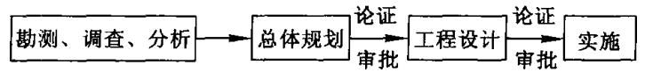  
图6-1 矿区土地复垦规划设计的一般程序

## （1）勘测、调查与分析

勘测、调查与分析是土地复垦的前提，明确土地复垦问题的性质，获取制定土地复垦规划的基础数据、图纸等资料。

## (2) 土地复垦总体规划

土地复垦总体规划首先确定规划范围、规划时间，制定复垦目标和任务；然后将土地复垦对象分类、分区，并制定土地复垦实施计划，对总体规划方案进行投资效益预算；最终通过部门间协调与论证，形成一个可行的规划方案。其成果包括规划图纸和规划报告。

## （3）土地复垦工程设计

土地复垦工程设计是在土地复垦总体规划基础上，对近期要实施的复垦项目进行详细设计。土地复垦工程设计最基本的要求是具有可操作性，即施工部门能按设计图纸和设计说明书进行施工。

## (4) 审批实施

无论是土地复垦总体规划还是土地复垦工程设计都需要得到土地管理部门和行业主管

部门审批后，方可付诸实施，且土地复垦工程实施后，土地管理部门需对土地复垦工程进行验收，土地使用者需对复垦后土地进行动态监测管理。

土地复垦规划设计各阶段内容和目标如表6-1所示。

表 6-1  
矿区土地复垦规划设计各阶段的内容和目标
<table><tr><td rowspan=1 colspan=1>阶段</td><td rowspan=1 colspan=1>内容</td><td rowspan=1 colspan=1>目   标</td></tr><tr><td rowspan=1 colspan=1>勘测调查与分析</td><td rowspan=1 colspan=1>①地质采矿条件调查与评价；②社会经济现状调查与评价；③社会经济发展计划；④自然资源调查与评价，包括土地破坏与土地利用现状、土壤类型与分布、水资源、气候条件等；⑤环境污染现状调查与环境质量评价；⑥ 地形勘测</td><td rowspan=1 colspan=1>①明确土地复垦问题的性质；②为土地复垦总体规划提供基础资料</td></tr><tr><td rowspan=1 colspan=1>总体规划</td><td rowspan=1 colspan=1>①结合矿山开采范围与地质条件确定土地复垦规划区域范围；②确定土地复垦规划时间；③选择土地利用方向与土地复垦工程措施；④制定分类、分区、分期土地复垦方案；⑤土地复垦规划方案的优化论证；⑥投资效益预测；⑦关于影响土地复垦工程实施的相关问题与解决方法的说明</td><td rowspan=1 colspan=1>①和土地利用总体规划一起为区域土地利用的合理性提供保证；②为土地复垦工程设计提供依据</td></tr><tr><td rowspan=1 colspan=1>复垦工程设</td><td rowspan=2 colspan=1>①明确土地复垦工程设计的对象（位置、范围面积、特征等)；②设计达到土地复垦总体规划目标的工艺流程、工艺措施、机械设备选择、材料消耗、劳动用工等；③实施计划安排(如所需物料来源、资金来源、水源等)；④施工起止日期安排，工程投入与年经营费、年收益的详细预算</td><td rowspan=2 colspan=1>供施工单位施工</td></tr><tr><td rowspan=1 colspan=1>计</td></tr></table>

## 四、土地复垦规划对象的分类

## (一)土地复垦规划的分类

矿山开采分为地下开采和露天开采两种，所以土地复垦分为地下开采土地复垦和露天开采土地复垦，土地复垦规划则可分为地下开采复垦规划和露天开采复垦规划。在时间尺度上，土地复垦规划可分为采前复垦规划和采后复垦规划。采前规划是指新矿区开发或老矿井改扩建时，在采矿设计阶段就做土地复垦规划；采后规划是指矿产资源开采后，因以前对复垦工作没有重视，现需要复垦面做的规划。在空间范围内，可以是一片塌陷地、一个矿井、一个矿区、某矿、某矿区或全国的土地复垦规划。按矿区的地理位置，可分为“城郊一矿区”型与“农村一矿区”型规划，而我国“农村一矿区”型规划多。根据地貌条件，可分为山区矿区土地复垦规划和平原矿区土地复垦规划。根据地下潜水位情况，可分为高、中、低潜水

位土地复垦规划。

制定 $\textcircled { 1 }$ 区土地复垦规划时，根据分类明确土地复垦方向、土地复垦重点及影响土地复垦工程的制约因素。如一般情况下，“城郊一矿区”型规划可优先考虑建设用地、建立蔬菜基地或园林化复垦；“农村一矿区”型规划则优先考虑种植业、养殖业用地。采前规划需要预测土地破坏程度；采后规划需实地勘测土地破坏程度。地下开采复垦规划应重点考虑解决地表沉陷后积水、土地沼泽化、土壤次生盐渍化等问题；露天开采复垦规划应重点考虑土壤结构重建、植被重建等问题。不同地貌条件的土地复垦方向与重点也不同，位于黄淮平原、华北平原等重要粮棉基地的矿区，恢复耕地是复垦的重点；位于丘陵、山区的矿区，加强水土保持措施、防止水土流失是考虑的重点。

## （二）土地复垦对象的模糊聚类分析

## 1. 基本原理

聚类分析是多元统计方法中的一种数学分类方法，是把所有研究对象看作空间的一个点，然后按其性质上亲疏远近的程度研究对象之间的相似性，最后把关系密切的点归为一类。两个数据点在m维空间的相似性可以用欧几里德距离来度量，距离越小，两者的相似性越大：

$$
d _ { i j } = \sqrt { \sum _ { k = 1 } ^ { m } ( x _ { k i } - x _ { k j } ) ^ { 2 } }\tag{6-1}
$$

式中， $d _ { i j }$ 为数据点i与数据点j之间的欧几里德距离；k为变量序号 ${ \ ; } m$ 为变量个数 $\mathbf { ; } \mathcal { X } _ { k i }$ 为数据点i的k变量数据； $x _ { k j }$ 为数据点j的k变量数据。

对模糊集分类，首先要确定不同的分类水平 $\lambda ( 0 \leqslant \lambda \leqslant 1 )$ ，取模糊集合的λ截集使其成为普通集合，然后再进行分类，这种方法就叫模糊聚类分析。

设X为给定的有限论域， $\pmb { R } = ( \gamma _ { i j } .$ )是X上的模糊关系，R满足：

$$
\left\{ { \begin{array} { l l } { r _ { i j } = 1 } & { i = j } \\ { r _ { i j } = r _ { j i } } & { i \neq j } \end{array} } \right.\tag{6-2}
$$

(6-3)

就称R为模糊相似关系，它所对应的矩阵 $\pmb { R } { = } ( r _ { i j }$ )叫做模糊相似矩阵。若模糊相似关系R还满足传递性，即：

$$
\rho ( i , j ) < \rho ( i , k ) < \rho ( k , j )\tag{6-4}
$$

式中 $, \rho$ 为两向量的距离。则称R为模糊等价关系。下面先看一个模糊聚类分析的例子。

例 6-1 设 ${ \pmb X } { = } ( x _ { 1 } , x _ { 2 } , x _ { 3 } , x _ { 4 } )$ ，给出模糊等价关系R，它所对应的矩阵为：

$$
\pmb { R } = \left[ \begin{array} { r r r r } { 1 } & { 0 . 4 8 } & { 0 . 6 2 } & { 0 . 4 1 } \\ { 1 } & { 0 . 4 8 } & { 0 . 4 1 } \\ { 1 } & { 1 } & { 0 . 4 1 } \\ { 1 } & { 1 } & { 1 } \end{array} \right]\tag{6-5}
$$

若取 $\lambda _ { 1 }$ 满足 $0 . 6 2 { < } \lambda _ { 1 } { \leqslant } 1$ ，由于λ截集是一个普通集合，其元素可用“1”和“0”表示，这时R中凡大于0.62的元素都用“1”表示，小于或等于0.62的元素用 $" 0 "$ 表示，这样便得到

$$
\mathbf { { \cal { R } } } _ { \lambda _ { 1 } } = { \left[ \begin{array} { l l l } { 1 } & { } & { } \\ { } & { 1 } & { } \\ { } & { } & { 1 } \end{array} \right] }\tag{6-6}
$$

于是，X可分为 $\left\{ x _ { 1 } \right\} , \left\{ x _ { 2 } \right\} , \left\{ x _ { 3 } \right\} , \left\{ x _ { 4 } \right\}$ 四类。依此取不同的分类水平，还有以下集中分类结果：

① $\lambda _ { 1 } \in ( 0 , 4 8 , 0 . 6 2 )$ ，分为 $\{ x _ { 1 } , x _ { 3 } \} , \{ x _ { 2 } \} , \{ x _ { 4 } \}$ 三类；

② $\lambda _ { 2 } \in ( 0 . 4 1 , 0 . 4 8 )$ ，分为 $\{ x _ { 1 } , x _ { 2 } , x _ { 3 } \} , \{ x _ { 4 } \}$ 两类；

③ $\lambda _ { 3 } \in [ 0 , 0 . 4 1 ]$ ，分为 $\{ x _ { 1 } , x _ { 2 } , x _ { 3 } , x _ { 4 } \}$ 一类。

根据上述分类结果，可作出动态聚类图(图6-2)。

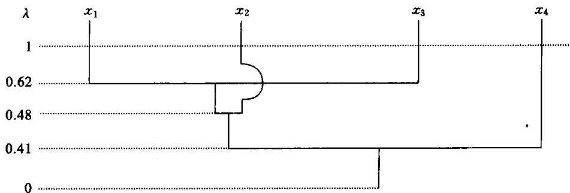  
图 6-2 动态聚类图

从上例不难看出：为了进行分类，首先必须构造模糊等价关系矩阵，在此基础上取不同分类水平的λ截集，最终可得到一个动态聚类图。

在解决实际问题时，供分类用的数据往往比较复杂，下面介绍如何用这些数据来构造模糊等价关系及分类计算步骤。

## 2. 模糊聚类法分类的计算步骤

## （1）原始数据标准化

原始数据标准化是将分类指标数值压缩或放大成0，1里的数。

设被分类对象一共有n个，对这些对象的某一因素 $X _ { k }$ 一共可取得n个原始数据，设为$( x _ { \star _ { 1 } } ^ { \prime } , x _ { \star _ { 2 } } ^ { \prime } , \cdots , x _ { \ k _ { n } } ^ { \prime } )$ ，目把它们叫做这一因素的各个元素。为了把这些元素标准化，先找出这一因素诸元素中的最大值和最小值，记为 $x ^ { \prime } { } _ { k \operatorname* { m a x } }$ 和 $x _ { \ k \operatorname* { m i n } } ^ { \prime }$ ，于是可用式(6-7)将各元素标准化：

$$
x _ { k _ { i } } = \frac { { x ^ { \prime } } _ { k _ { i } } - { x ^ { \prime } } _ { k _ { \operatorname* { m i n } } } } { x ^ { \prime } _ { k _ { m a x } } - x ^ { \prime } _ { k _ { \operatorname* { m i n } } } } \quad ( k = 1 , 2 , \cdots , m ; i = 1 , 2 , \cdots , n )\tag{6-7}
$$

式中，m为因素个数；n为分类对象个数；x为元素标准化后数值；x′为元素标准化前的 $_ m$ $x _ { k i }$ $x ^ { \prime } { _ { k i } }$ 数值。

## (2) 标定

数据标准化后，为了构造模糊相似关系矩阵，就要根据各分类对象的各不同元素的标准化数据，算出分类对象间的相似程度，这个步骤叫做标定。

计算 $r _ { i j }$ 的方法很 $\mathcal { B }$ ，式(6-8)为欧几里德距离法计算 $r _ { i j }$ 的公式：

$$
r _ { i j } = \left\{ \begin{array} { c c } { { 1 } } & { { ( i = j ) } } \\ { { \displaystyle { \sqrt { \frac { 1 } { m } \sum _ { k = 1 } ^ { m } ( x _ { k i } - x _ { k j } ) } } } } & { { ( i \neq j ) } } \end{array} \right.\tag{6-8}
$$

计算出 $r _ { i j }$ ，就可得到模糊相似关系矩阵 $\pmb { R } { = } ( r _ { i j } ) _ { n { \times } n }$ 0

计算 $r _ { i j }$ 的方法还有夹角余弦、数量积法、指数相似系数法、非参数方法等。

## （3)求取模糊等价关系

设R为模糊相似关系矩阵，据模糊数学原理有： $R ^ { 2 } = R \circ R , R ^ { 4 } = R ^ { 2 } \circ R ^ { 2 }$ ，…直至 $\pmb { R } ^ { 2 k } = \pmb { R } ^ { k }$ 为止，记模糊等价关系 $\pmb { R } ^ { * }$ 为：

$$
\pmb { R } ^ { * } \ = \pmb { R } ^ { k }\tag{6-9}
$$

这里 $\cdot ^ { 6 6 } \star$ ”表示模糊关系矩阵相乘，它不同于普通矩阵相乘。设模糊关系矩阵 $\pmb { A } = ( a _ { i j } ) _ { n \times n }$ $B = ( b _ { i j } ) _ { n \times n } , C ^ { = } A \circ B = ( c _ { i j } ) _ { n \times n }$ ，则模糊关系矩阵相乘按式(6-10)法则相乘：

$$
c _ { i j } = \operatorname * { m a x } _ { k } [ a _ { i k } , b _ { k j } ] = \vee _ { k } [ A _ { i k } \wedge b _ { k j } ]\tag{6-10}
$$

## (4) 聚类

有了模糊等价关系，就可以按相似标准进行分类。取值 $\lambda \in [ 0 , 1 ]$ ，规定对于集合中任意两个元素 $x _ { i } \cdot x _ { j }$ ,若 $r _ { i j } \geqslant \lambda$ ，则 $x _ { i } \cdot x _ { j }$ 属于同一类，否则 $x _ { i } , x _ { j }$ 不同类。

一般说来，分类结果与λ的取值大小有关。λ取值越大，分类就越细，即类数越多；λ取值越小，类容量就越大，相应类数就越少。当λ值小到一定程度时，所有样本就归为一类了。通常根据实际问题的需要选择适当的λ值而获得与实际情况较一致的分类。

## 3. 塌陷土地的模糊聚类分析示例

例6-2 某矿八片塌陷区域的分类基础数据如表6-2所示，此分类对象个数为8，即n$= 8$ 。分类对象属性即因素个数为5， $, \mathbf { \nabla } _ { m } = 5$ 0

表 6-2  
某矿区塌陷地分类基础数据
<table><tr><td rowspan=1 colspan=1>分类对象因素</td><td rowspan=1 colspan=1>1</td><td rowspan=1 colspan=1>2</td><td rowspan=1 colspan=1>3</td><td rowspan=1 colspan=1>4</td><td rowspan=1 colspan=1>5</td><td rowspan=1 colspan=1>6</td><td rowspan=1 colspan=1>7</td><td rowspan=1 colspan=1>8</td></tr><tr><td rowspan=1 colspan=1>塌陷深度 $/ \mathbf { m }$ </td><td rowspan=1 colspan=1>2.47</td><td rowspan=1 colspan=1>1.19</td><td rowspan=1 colspan=1>1.12</td><td rowspan=1 colspan=1>3.40</td><td rowspan=1 colspan=1>3.24</td><td rowspan=1 colspan=1>6.30</td><td rowspan=1 colspan=1>4.46</td><td rowspan=1 colspan=1>3.29</td></tr><tr><td rowspan=1 colspan=1>塌陷面积/亩</td><td rowspan=1 colspan=1>1 591</td><td rowspan=1 colspan=1>2 911</td><td rowspan=1 colspan=1>819</td><td rowspan=1 colspan=1>1 919</td><td rowspan=1 colspan=1>3 360</td><td rowspan=1 colspan=1>864</td><td rowspan=1 colspan=1>430</td><td rowspan=1 colspan=1>395</td></tr><tr><td rowspan=1 colspan=1>积水深度 $/ { \mathfrak { m } }$ </td><td rowspan=1 colspan=1>0.47</td><td rowspan=1 colspan=1>0.41</td><td rowspan=1 colspan=1>0.1</td><td rowspan=1 colspan=1>1.4</td><td rowspan=1 colspan=1>1.24</td><td rowspan=1 colspan=1>4.30</td><td rowspan=1 colspan=1>2.64</td><td rowspan=1 colspan=1>1.29</td></tr><tr><td rowspan=1 colspan=1>万吨塌陷率/(亩/万t)</td><td rowspan=1 colspan=1>5.3</td><td rowspan=1 colspan=1>5.8</td><td rowspan=1 colspan=1>5.0</td><td rowspan=1 colspan=1>5.0</td><td rowspan=1 colspan=1>5.0</td><td rowspan=1 colspan=1>4.0</td><td rowspan=1 colspan=1>4.0</td><td rowspan=1 colspan=1>4.0</td></tr><tr><td rowspan=1 colspan=1>土壤等级</td><td rowspan=1 colspan=1>N</td><td rowspan=1 colspan=1>N</td><td rowspan=1 colspan=1>Ⅲ</td><td rowspan=1 colspan=1>N</td><td rowspan=1 colspan=1>I</td><td rowspan=1 colspan=1>Ⅲ</td><td rowspan=1 colspan=1>N</td><td rowspan=1 colspan=1>Ⅲ</td></tr></table>

按照上述分类步骤，取不同的λ值得到该矿区8片塌陷地模糊聚类谱系图如图6-3所示。

由图6-3知：当分类 $\lambda { = } 0 . 6 2$ 时，8片塌陷地分为(1,2，4,5)、(3)、(6,7,8)三类，于是土地复垦规划可按这三种类型分别给出规划设计方案。

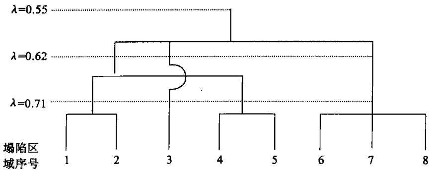  
图6-3 某矿区塌陷地模糊聚类谱系图

## 第二节 土地复垦的适宜性评价

## 一、适宜性评价的概念

土地复垦适宜性评价是对受破坏的土地针对待定复垦方向的适宜程度作出的判断分析。这些待定复垦方向包括农作物种植、水产养殖、家禽家畜养殖、林果种植、蔬菜种植、建筑利用、娱乐场所等。

适宜性评价的一般步骤是：

①确定具体的土地复垦方向。

②选择影响因子，包括土壤、气候、地貌、地物等自然因素，工农业生产布局、资金投入、土地利用结构等经济因素，种植习惯、行政区划分等社会因素。

③按照一定的标准评判某一地块的各个因子对指定复垦方向的适宜程度。

适宜性评价结果作为复垦规划的依据。

## 二、土地复垦适宜性评价的特点

矿区待复垦土地资源属于特殊立地条件，土地用途受到极大限制、土地资源位于特定环境条件下，即矿区待复垦土地资源不同于一般的土地资源，有其特殊性。

1. 土地破坏程度制约土地复垦利用方向

土地破坏程度越严重，土地复垦利用方向限制越大。土地破坏的表现形式多种多样，如稳定和不稳定，长年积水、季节性积水与不积水，裂缝、台阶状下沉与波浪状下沉等。对于不稳定塌陷地，一般不进行较大的投入，土地利用方向为临时性的。

土地破坏程度对土地复垦利用方向的制约程度可通过增加投入来弥补，复垦投入越大，复垦方向的选取越灵活。

2. 非现状、非评价对象本身因素起较大的制约作用

非现状因素是指未来塌陷的影响程度、种植习惯、管理水平、复垦工程措施的选取等；非评价对象本身因素是指相邻塌陷区的情况、相邻区域的环境条件和土地利用模式、水利设施、交通运输条件和充填料来源等。

因此，待复垦土地的适宜性评价不只是对现状的评述，还具有一定的预测性。评价因子应包括非现状、非评价对象本身的因素。

3. 经济、环境、社会效益有机结合

矿区破坏土地的复垦利用既是一项经济活动，又是矿区环境治理的任务，因此，必须兼顾经济、环境与社会效益的统一。

4. 区位原则具有特定含义

区位原则是指地块地理位置的差异带来经济效益上的差异。待复垦土地范围一般较小，区位原则具有特定的含义，即地块距充填料来源地近时，复垦土地利用方向的选择范围大；地块距水源地近且塌陷深时，越宜发展水产养殖业；距矿山工业广场越近的地区越需加强绿化造林，以改善矿山环境质量等。

## 三、待复垦土地的适宜性评价方法

## (一)适宜性评价的分类系统

适宜性评价分类系统是指复垦后土地利用方向及适宜等级构成的评价系统。这种分类系统不同于土地利用现状调查规程规定的分类系统，一般可根据待复垦土地本身的属性和复垦目标灵活确定。

例如，平顶山市根据破坏土地的现状，将待复垦土地资源按“纲一亚纲一类一级”建立分类系统，所有待复垦土地分为适宜纲和不适宜纲。适宜纲是指经过一定的改造措施，破坏的土地资源可复垦为农、林、牧、渔、建等用地；不适宜纲是指采取复垦措施在技术上不可行或经济上不合算。适宜纲又分为宜农(包括粮食和蔬菜种植)、宜林、宜牧、宜渔、宜建五个亚纲。在亚纲下又根据被破坏土地资源类型分为八个类，即塌陷地、矸石山、粉煤灰场、窑场等。在类下按破坏程度和复垦利用的难易程度分为几个级。

中国矿业大学在对江苏省铜山县采煤塌陷地作适宜性评价时，根据需要将评价对象分为适宜纲和不适宜纲。适宜纲又分为宜农用地、宜基塘复垦用地、宜林果用地三类；对宜农用地又进一步分为一级宜农用地和二级宜农用地。

## （二）适宜性评价的依据

适宜性评价时需要选择影响因子、确定影响因子的权重以及影响因子对给定复垦方向等级的影响分值。适宜性评价的重要标准是土地生产力，即选择那些对土地生产力影响较大的因子，确定权重和分值时主要看影响因子对给定土地利用方向生产力的贡献大小。选择影响因子、确定权重和分值一般是建立在实际调查资料基础上的。

## (三)适宜性评价方法

土地适宜性评价方法有极限条件法、指数法和模糊数学等方法。下面介绍一种基于模糊数学原理的模糊集合综合评价法。

模糊集合综合评价法由单项适宜性评价模型和多目标生产布局决策模型两部分组成。

## 1. 单项适宜性评价模型

设对某一复垦方向做适宜性分析，影响因素有m个，每个因素对应一个状态集 $V _ { i }$ 为：

$$
V _ { i } = ( V _ { i 1 } , V _ { i 2 } , \cdots , V _ { i j } , \cdots , V _ { i n } ) \qquad ( i = 1 , 2 , \cdots , m ; j = 1 , 2 , \cdots , n )\tag{6-11}
$$

式中，i为影响因子序号；j为某一复垦方向的适宜等级。

例如，对影响因子附加坡度而言，若将宜农复垦方向分为两个等级，则它所对应的状态集为：

$$
V = ( \leqslant 0 . 5 , > 0 . 5 )\tag{6-12}
$$

显然，每个因素的状态集都是一个对指定复垦方向从优到劣的全序集。

所有影响因素属性值的优劣可用矩阵R表示。

$$
\pmb { R } = \left[ \begin{array} { c c c c c c } { a _ { 1 } \hbar _ { 1 1 } } & { \cdots } & { a _ { i } \hbar _ { 1 i } } & { \cdots } & { a _ { m } \hbar _ { 1 m } } \\ { \vdots } & & { \vdots } & & { \vdots } \\ { a _ { 1 } \hbar _ { j 1 } } & { \cdots } & { a _ { 1 } \hbar _ { j i } } & { \cdots } & { a _ { m } \hbar _ { j m } } \\ { \vdots } & & { \vdots } & & { \vdots } \\ { a _ { 1 } \hbar _ { n 1 } } & { \cdots } & { a _ { i } \hbar _ { n i } } & { \cdots } & { a _ { m } \hbar _ { m n } } \end{array} \right]\tag{6-13}
$$

式中， $\cdot a _ { i }$ 为i因子对指定复垦方向的影响权重值； $\pmb { \mathscr { p } } _ { j i }$ 为i因子对指定复垦方向j适宜等级的

贡献函数值(或称适宜分值)。

$a _ { j }$ 可用层次分析法、特尔斐法、多元回归分析或经验法确定。p的确定方法是：首先设 $\phi _ { j i }$ 定一等地的适宜分值，其他适宜等级的分值用贡献函数方程或分值分配公式(如等差级数形式)确定。

显然，j等级的理想分值 $\boldsymbol { \hat { p } } _ { \perp }$ 为：

$$
{ \pmb / } _ { j } = \sum _ { i = 1 } ^ { m } { \pmb / } _ { j i } \quad ( j = 1 , \cdots , n )\tag{6-14}
$$

设每个评价单元或地块的属性指数值ID，有

$$
I D = \frac { 1 } { \displaystyle \sum _ { i = 1 } ^ { m } a _ { i } P _ { 1 1 } } \sum _ { i = 1 } ^ { m } a _ { i } \phi _ { j i }\tag{6-15}
$$

又设D为评价单元对于j等级的相容度，有：

$$
D = \vert ~ I D - P _ { j } / P _ { 1 } ~ \vert\tag{6-16}
$$

若某一等级的理想分值 $\phi _ { j }$ 使D值最大，则可将此评价单元归为j等级。

## 2. 多目标生产布局决策模型

设备选土地复垦方向有k个，这时就需建立多目标生产布局决策模型进行综合适宜性评价。设与k复垦方向有关的因素有r个，r个因素的实际属性指数值为 $( t _ { 1 } \ , t _ { 2 } \ , \cdots , t _ { r } )$ ,对于k复垦方向最佳要求的属性值为 $( T _ { 1 } , T _ { 2 } , \cdots , T _ { r } )$ ，于是，实际属性与最佳要求属性存在距离：

$$
d _ { k } = \sqrt { \sum _ { i = 1 } ^ { r } ( t _ { i } - T _ { i } ) ^ { 2 } }\tag{6-17}
$$

比较k个复垦方向的距离 $d _ { k } , d _ { k }$ 最小者即为最佳土地复垦方向。

## 四、模糊集合综合适宜性评价示例

例6-3 华东某高潜水位矿区模糊集合综合适宜性评价示例。

## 1. 评价区域概述

评价区域位于华东高潜水位矿区，采煤沉陷后积水率达30%以上。土地塌陷前为高产农田。煤矿开采后环境污染严重。区域内经济基础好，复垦资金来源充足。道路、水利设施框架完整，局部受开采影响。本区土壤类型基本分为淤土和砂礓土两类，地理位置近市靠矿。

## 2. 土地复垦方向选择

根据实际条件和生产需要，选择农作物种植、基塘复垦、林果种植三种复垦方向。农作物种植进一步分为一级宜农地和二级宜农地。

## 3. 评价因子的选择

不同的土地复垦方向，其影响因子不尽相同，因素间的重要性也存在差异。三种不同的复垦方向的影响因子分别为：

## （1）农作物种植复垦方向

影响因素有积水状况、土地利用现状、排灌条件、区位条件、土壤条件等。积水状况和土地利用现状反映了土地破坏程度以及土地的肥力、耕作条件等，因此，没有单独考虑下沉深度等因素。排灌条件包括两个方面，即旱能灌、涝能排，它直接影响土地生产力的发挥。区位条件是指塌陷地块距充填料及水源、道路的远近。土壤条件没有细分成有机质含量、土层厚度等因素，主要考虑评价区域内土壤条件变化不大。其他因素，如地形起伏等对农业生产限制性较大，但因本区这些因素的取值或条件变化不大，因此没有考虑。

## (2) 基塘复垦方向

影响因素有水源条件、积水状况、治理现状及其他外部条件。外部条件是指能否成片开发，政府与农民的积极性，水、电、路通畅条件等。

## （3）林果种植复垦方向

影响因素有环境污染程度、治理现状、地表标高及区位条件等。

## (4)评价因子权重及等级分值的确定

评价因子的权重反映该因子对指定复垦方向的重要性，采用层次分析法确定。

等级分值用以区分同一复垦方向不同适宜等级间的差异。当参评因子的属性值在某复垦方向一级适宜度的区间内或以上时，其分值为100；当参评因子属性在某复垦方向的末级适宜度以外或以下，即不适宜该复垦方向时，其分值为0；介于两者之间的其他适宜等级分值根据贡献函数方程确定。本例只涉及农作物种植用地的分等，取一级为100，二级为60。

不同复垦方向的参评因子、权重、等级分值、属性值如表6-3、表6-4、表6-5所示。

表 6-3  
农作物种植复垦方向的参评因子、权重及分值表
<table><tr><td rowspan=2 colspan=1>等级</td><td rowspan=1 colspan=1>评价因子</td><td rowspan=1 colspan=1>积水状况</td><td rowspan=1 colspan=1>土地利用现状</td><td rowspan=1 colspan=1>区位条件</td><td rowspan=1 colspan=1>排灌条件</td><td rowspan=1 colspan=1>土壤条件</td></tr><tr><td rowspan=1 colspan=1>因子权重</td><td rowspan=1 colspan=1>0.12</td><td rowspan=1 colspan=1>0.25</td><td rowspan=1 colspan=1>0.21</td><td rowspan=1 colspan=1>0.24</td><td rowspan=1 colspan=1>0.18</td></tr><tr><td rowspan=3 colspan=1>1</td><td rowspan=1 colspan=1>等级分值</td><td rowspan=1 colspan=1>100</td><td rowspan=1 colspan=1>100</td><td rowspan=1 colspan=1>100</td><td rowspan=1 colspan=1>100</td><td rowspan=1 colspan=1>100</td></tr><tr><td rowspan=1 colspan=1>属性值</td><td rowspan=1 colspan=1>12</td><td rowspan=1 colspan=1>25</td><td rowspan=1 colspan=1>21</td><td rowspan=1 colspan=1>24</td><td rowspan=1 colspan=1>18</td></tr><tr><td rowspan=1 colspan=1>属性</td><td rowspan=1 colspan=1>无</td><td rowspan=1 colspan=1>水浇地、菜地及稻麦两熟地</td><td rowspan=1 colspan=1>距排水沟近、离污染源远等</td><td rowspan=1 colspan=1>起伏小、有排灌设施</td><td rowspan=1 colspan=1>淤土、土层厚</td></tr><tr><td rowspan=3 colspan=1>2</td><td rowspan=1 colspan=1>等级分值</td><td rowspan=1 colspan=1>60</td><td rowspan=1 colspan=1>60</td><td rowspan=1 colspan=1>60</td><td rowspan=1 colspan=1>60</td><td rowspan=1 colspan=1>60</td></tr><tr><td rowspan=1 colspan=1>属性值</td><td rowspan=1 colspan=1>7.2</td><td rowspan=1 colspan=1>15</td><td rowspan=1 colspan=1>12.6</td><td rowspan=1 colspan=1>14.4</td><td rowspan=1 colspan=1>10.8</td></tr><tr><td rowspan=1 colspan=1>属性</td><td rowspan=1 colspan=1>季节性积水</td><td rowspan=1 colspan=1>旱地、可改造荒地、草地</td><td rowspan=1 colspan=1>水源不足、距污染源近等</td><td rowspan=1 colspan=1>无排灌设施或排灌设施不健全</td><td rowspan=1 colspan=1>淤土土层薄、砂礓土</td></tr></table>

表 6-4  
基塘复垦方向的参评因子、权重及分值表
<table><tr><td rowspan=2 colspan=1>等级</td><td rowspan=1 colspan=1>参评因子</td><td rowspan=1 colspan=1>水源条件</td><td rowspan=1 colspan=1>积水状况</td><td rowspan=1 colspan=1>治理现状</td><td rowspan=1 colspan=1>外部条件</td></tr><tr><td rowspan=1 colspan=1>因子权重</td><td rowspan=1 colspan=1>0.10</td><td rowspan=1 colspan=1>0.16</td><td rowspan=1 colspan=1>0.34</td><td rowspan=1 colspan=1>0.40</td></tr><tr><td rowspan=3 colspan=1>1</td><td rowspan=1 colspan=1>等级分值</td><td rowspan=1 colspan=1>100</td><td rowspan=1 colspan=1>100</td><td rowspan=1 colspan=1>100</td><td rowspan=1 colspan=1>100</td></tr><tr><td rowspan=1 colspan=1>属性值</td><td rowspan=1 colspan=1>10</td><td rowspan=1 colspan=1>16</td><td rowspan=1 colspan=1>34</td><td rowspan=1 colspan=1>40</td></tr><tr><td rowspan=1 colspan=1>属性</td><td rowspan=1 colspan=1>好</td><td rowspan=1 colspan=1>长年积水但面积不大，季节性积水面积大</td><td rowspan=1 colspan=1>精养鱼塘，浅滩区</td><td rowspan=1 colspan=1>距污染源远，有成片开发可能</td></tr></table>

表 6-5  
林果种植复垦方向的参评因子、权重及分值表
<table><tr><td rowspan=2 colspan=1>等级</td><td rowspan=1 colspan=1>参评因子</td><td rowspan=1 colspan=1>地表标高</td><td rowspan=1 colspan=1>环境污染现状</td><td rowspan=1 colspan=1>治理现状</td><td rowspan=1 colspan=1>区位条件</td></tr><tr><td rowspan=1 colspan=1>因子权重</td><td rowspan=1 colspan=1>0.14</td><td rowspan=1 colspan=1>0.29</td><td rowspan=1 colspan=1>0.26</td><td rowspan=1 colspan=1>0.31</td></tr><tr><td rowspan=3 colspan=1>1</td><td rowspan=1 colspan=1>等级分值</td><td rowspan=1 colspan=1>100</td><td rowspan=1 colspan=1>100</td><td rowspan=1 colspan=1>100</td><td rowspan=1 colspan=1>100</td></tr><tr><td rowspan=1 colspan=1>属性值</td><td rowspan=1 colspan=1>14</td><td rowspan=1 colspan=1>29</td><td rowspan=1 colspan=1>26</td><td rowspan=1 colspan=1>31</td></tr><tr><td rowspan=1 colspan=1>属性</td><td rowspan=1 colspan=1>较高</td><td rowspan=1 colspan=1>严重</td><td rowspan=1 colspan=1>粉煤灰充填区，砂礓土无植被区</td><td rowspan=1 colspan=1>沟、渠、路、厂、矿、居民点四周</td></tr></table>

## (5) 综合适宜性评价结果

通过计算，得到适宜复垦方向的用地结构如表6-6所示，同时可得到各类各级复垦方向的平面分布图(略)。

表 6-6  
适宜复垦方向的用地结构
<table><tr><td rowspan=1 colspan=1>复垦用地结构</td><td rowspan=1 colspan=1>一级宜农地</td><td rowspan=1 colspan=1>二级宜农地</td><td rowspan=1 colspan=1>基塘复垦</td><td rowspan=1 colspan=1>林果地</td><td rowspan=1 colspan=1>总面积</td></tr><tr><td rowspan=1 colspan=1>面积/亩</td><td rowspan=1 colspan=1>3 810.75</td><td rowspan=1 colspan=1>1971.75</td><td rowspan=1 colspan=1>2 235.0</td><td rowspan=1 colspan=1>982.5</td><td rowspan=1 colspan=1>9000.00</td></tr></table>

## 第三节 复垦土地利用结构规划

合理的用地结构应综合考虑土地的适宜性、经济效果以及生态环境效果，并符合土地利用总体规划及其他各项政策要求。土地适宜性评价结果得到的用地结构主要考虑了待复垦土地的自然属性因素，不一定是合理的。合理的用地结构往往按下述方法之一确定：

①按农业生产技术的需要，如间、套、轮作的合理比例或生态工程各生态单元的用地比例确定。

②考虑土地自身的适宜性及其他各项要求，按最佳经济效果配置用地结构。

## 一、用地结构优化的线性规划模型

设 Z(t)为t 年土地的总收益， $c _ { j } \left( t \right)$ 为t年各类用地单位面积的经济收益， $x _ { j } \left( t \right)$ 为t年各类用地的面积，则有：

目标函数

约束条件

$$
\begin{array} { c } { { \displaystyle { \bf M a x } ~ { \cal Z } ( t ) = \sum _ { j = 1 } ^ { n _ { 1 } } C _ { j } ( t ) x _ { j } ( t ) } } \\ { { \displaystyle \left\{ \sum _ { { \vphantom { \bf a } } } a _ { i j } ( t ) x _ { j } ( t ) \geqslant m _ { i } ( t ) \qquad ( i = 1 , \cdots , n _ { 2 } ) \right. } } \\ { { \left. x _ { j } ( t ) \geqslant 0 \qquad ( j = 1 , \cdots , n _ { 1 } ) \right. } } \end{array}\tag{6-18}
$$

若t年系数一定，上述模型简化为：

目标函数

$$
\displaystyle \mathrm { M a x } Z = \sum _ { j = 1 } ^ { n _ { 1 } } c _ { j } x _ { j }
$$

约束条件

$$
\left\{ \begin{array} { l l } { { \displaystyle \sum _ { j = 1 } ^ { n _ { 1 } } } \alpha _ { i j } x _ { j } \geqslant m ( t ) } & { \qquad ( i = 1 , \cdots , n _ { 2 } ) } \\ { { \qquad x _ { j } ( t ) \geqslant 0 } } & { { \qquad ( j = 1 , \cdots , n _ { 1 } ) } } \end{array} \right.\tag{6-19}
$$

式中 $, n _ { 1 }$ 为用地类型数 ${ \mathrm { ~ \bf ~ \mathscr ~ } } n _ { 2 }$ 为除非负约束外的约束条件数。

为列立约束方程，通常需作深入的调查研究和统计分析工作，以寻求模型中的参数 $c _ { j }$ 1$\boldsymbol { a } _ { i j }$ 和 $m _ { i }$ 0

上述模型中，若设Z为总产值或总产量，那么方案就难以说明效益的高低，只是在总量控制时是有意义的。若需要其效益最佳，不妨将 $Z$ 设为投入产出比。若还想用其他指标作为规划的目标，需要用多目标规划模型来求解。

## 二、约束条件的类型

建立土地利用结构优化模型的关键是选取计算参数和列立约束方程。土地复垦规划的约束条件通常分为总量约束、绝对量约束、配置量约束及非负约束四类。

## 1. 总量约束

常见的总量约束如下：

## (1) 资金约束

与土地复垦有关的工程如挖深垫浅、土壤肥化等都需要耗费大量的资金，而我国目前复垦资金渠道有限，要在有限的投入下获得最佳的经济效果，就受到资金的约束。例如，恢复1 亩耕地需投资 $a _ { 1 1 }$ ，开挖1亩鱼塘需 $a _ { 1 2 }$ ，依次类推，而总的投资约束在 $m _ { 1 }$ 内，于是有约束方程：

$$
a _ { 1 1 } x _ { 1 } + a _ { 1 2 } x _ { 2 } + \cdots \leqslant m _ { 1 }\tag{6-20}
$$

## (2) 资源约束

无论是用粉煤灰还是矸石或其他废弃物，或从外地运泥土充填塌陷坑，其总量总是有限的，另外在发展水产养殖业或复垦为水浇地时也受到当地水资源的限制。比如根据计算或经验知，某矿区造地1亩需填方 $a _ { 2 1 }$ ，挖塘1亩得土 $a _ { 2 2 }$ ，现有各种充填料 $m _ { 2 }$ ，则：

$$
a _ { 2 1 } x _ { 1 } - a _ { 2 2 } x _ { 2 } \leqslant m _ { 2 }\tag{6-21}
$$

## (3) 劳动力约束

设每年可投入复垦工程的劳动日为 $m _ { 3 }$ ，而耕地、鱼塘、菜地等每亩需劳动日 $a _ { 3 1 } \ 、 a _ { 3 2 } 、 a _ { 3 3 }$ 个，于是有：

$$
a _ { 3 1 } x _ { 1 } + a _ { 3 2 } x _ { 2 } + a _ { 3 3 } x _ { 3 } + \cdots \leqslant m _ { 3 }\tag{6-22}
$$

若从解决就业问题的角度出发，通过复垦必须安排 $m _ { \mathrm { ~ 3 ~ } } ^ { \prime }$ 个劳动日以上，则有：

$$
a _ { 3 1 } x _ { 1 } + a _ { 3 2 } x _ { 2 } + a _ { 3 3 } x _ { 3 } + \cdots \geq m ^ { \prime } { _ 3 }\tag{6-23}
$$

## 2. 绝对量约束

## (1) 需求约束

矿区地表沉陷引起农作物产量下降，非农业人口增加，而对粮油等的需求量也日益增加，这就对复垦为耕地的要求更加迫切。若矿区需粮n，复垦土地单产 $\boldsymbol { \phi }$ ，未受破坏土地s亩，单产 $q$ ，矿区外调拨粮食t，则复垦为耕地的面积 $x _ { 1 }$ 必须满足：

$$
x _ { 1 } \geqslant { \frac { n - s q - t } { \pmb { \mathscr { p } } } }\tag{6-24}
$$

## (2) 政策约束

据国家政策或地方规定又有许多约束，如矿区要求林业覆盖率达η，则： $\eta ,$

$$
x _ { * } \geqslant \frac { * } { * } + \frac { * } { * } - \frac { * } { * } - \frac { * } { * } - \eta \times \triangledown \mathfrak { F } ^ { \prime } \rVert \interleave \mathfrak { F } \ll \frac { * } { * } - \overline { { \mathfrak { F } } } \ll \frac { * } { * } - \overline { { \mathfrak { F } } } \ll \frac { * } { * } - \overline { { \mathfrak { F } } } \ll \frac { * } { * } - \overline { { \mathfrak { F } } } \ll \frac { * } { * } - \overline { { \mathfrak { F } } } \ll \frac { * } { * } - \overline { { \mathfrak { F } } } \ll \frac { * } { * } - \overline { { \mathfrak { F } } } \ll \frac { * } { * } - \overline { { \mathfrak { F } } } \ll \frac { * } { * } - \overline { { \mathfrak { F } } } \ll \frac { * } { * } - \overline { { \mathfrak { F } } } \ll \frac { * } { * } - \overline { { \mathfrak { F } } } \ll \frac { * } { * } - \overline { { \mathfrak { F } } } \ll \frac { * } { * } - \overline { { \mathfrak { F } } } \ll \frac { * } { * } { * } - \overline { { \mathfrak { F } } } \ll \frac { * } { \mathfrak { F } } \ll \frac { * } { \mathfrak { F } } \ll \frac { * } { \mathfrak { F } } \ll \frac { * } { \mathfrak \mathfrak { F } } \ll \frac { * } { \mathfrak \mathfrak { F } } \ll \frac { * } { \mathfrak \mathfrak { F } } \ll \frac { \mathfrak { F } } \Psi \ll \frac { \mathfrak } { \mathfrak \mathfrak { F } } \Psi \Psi \Psi \Psi \Psi \Psi \Psi \Psi \Psi \Psi \Psi \Psi \Psi \Psi \Psi \Psi \Psi \Psi \Psi \Psi \Psi \Psi \Psi \Psi \Psi \Psi \Psi \Psi \Psi \Psi \Psi \Psi \Psi \Psi \Psi \Psi \Psi \Psi \Psi \Psi \Psi \Psi \Psi \Psi \Psi \Psi \Psi \Psi \Psi \Psi \Psi \Psi \Psi \Psi \Psi \Psi \Psi \Psi \Psi \Psi \Psi \Psi \Psi \Psi \Psi \Psi \Psi \Psi \Psi \Psi \Psi \Psi \Psi \Psi \Psi \Psi \Psi \Psi \Psi \Psi \Psi \Psi \Psi \Psi \Psi \Psi \Psi \Psi \Psi \Psi \Psi\tag{6-25}
$$

## 3. 配置量约束

例如，养鱼1亩水面需配饲料地0.5亩，则有：

$$
x _ { 4 } \mathrm { ~ -- ~ } 0 . 5 x _ { 2 } \geqslant 0\tag{6-26}
$$

4. 非负约束

非负约束表示为：

$$
x _ { j } \geqslant 0 \qquad ( j = 1 , \cdots , n _ { 1 } )\tag{6-27}
$$

## 三、用地结构化步骤

线性规划的优点是方法成熟，使用简便，有通用计算机程序，因此被广泛使用。但约束条件和模型中的参数直接影响优化结果，若约束条件建立不当或系数选取不合理，往往导致优化结果失真。另外，线性规划模型虽可解算众多约束条件的问题，但对复垦用地结构优化来说，应尽可能使模型简捷，层次清楚，考虑主要的约束条件。

用地结构优化问题解算步骤如下：

①系统分析。

②确定决策变量和参数。

③建立目标函数和约束条件。

④解算线性规划模型，获得几个优化方案。

⑤方案比较与评价。

⑥决策。

## 四、应用举例

例6-4 某规划区面积约860亩，规划区内人口约700人。原地势平坦，均为良田，适于种植小麦、玉米、大豆、水稻、花生等粮食作物与经济作物。该区平均潜水位标高为34.5m，最高时达35.0m，丰水期积水率在30%以上。

该规划区距某市较近，据调查，农产品尤其是蔬菜、水产品需求量大。与规划区相邻接的较大范围的社会经济状况为：因煤炭开采耕地大面积塌陷，部分地方人均耕地仅0.1亩。当地农民已自发开挖了一些鱼塘，他们对复垦后的耕作制度和养殖技术缺乏经验。

## 1. 系统分析与建模

根据土地利用现状和复垦利用的可能性，复垦后土地利用方向包括养猪场、养鸡场、养鱼池、粮食作物、林果园、饲料地及服务用地等七类。根据现有资源和生产条件约束条件分为四类，即总量约束、配置约束、绝对量约束和非负约束。总量约束所需数据见表6-7。配置约束有养鱼1亩配饲料地0.5亩，即 $_ { x _ { 6 } } { \geqslant } 0 . \ 5 x _ { 3 }$ 。绝对量约束有：受技术水平、饲料来源等限，猪场、鸡场的规模受到一定限制，即 $x _ { 1 } { \leqslant } 2 0 , x _ { 2 } { \leqslant } 4 0$ ,该区需粮 $2 0 \times 1 0 ^ { 4 } \ \mathrm { k g }$ ,以亩 $y = 6 0 0$ $\mathbf { k } \mathbf { g }$ 计算， $x _ { 4 } \geqslant 3 3 3$ 。非负约束为 $x _ { 1 } \ 、 x _ { 2 } \ 、 x _ { 3 } \ 、 x _ { 4 } \ 、 x _ { 5 } \ 、 x _ { 6 } \ 、 x _ { 7 } \gtrless 0$

表 6-7  
总量约束数据表
<table><tr><td rowspan=1 colspan=1>利用方向</td><td rowspan=1 colspan=1>决策变量</td><td rowspan=1 colspan=1>纯收益/元·(年·亩)1</td><td rowspan=1 colspan=1>复垦投资/元·亩-1</td><td rowspan=1 colspan=1>劳力投入/人·(年·亩)−1</td><td rowspan=1 colspan=1>服务用地面积/亩</td><td rowspan=1 colspan=1>土方量 $/ \mathbf { m ^ { 3 } } \cdot \overrightarrow { \boxplus } ^ { - 1 }$ </td></tr><tr><td rowspan=1 colspan=1>猪场</td><td rowspan=1 colspan=1> $x _ { 1 }$ </td><td rowspan=1 colspan=1>14000</td><td rowspan=1 colspan=1>34 500</td><td rowspan=1 colspan=1>3</td><td rowspan=1 colspan=1>0.03</td><td rowspan=1 colspan=1>-200</td></tr><tr><td rowspan=1 colspan=1>鸡场</td><td rowspan=1 colspan=1> $x _ { 2 }$ </td><td rowspan=1 colspan=1>10 000</td><td rowspan=1 colspan=1>21 180</td><td rowspan=1 colspan=1>4</td><td rowspan=1 colspan=1>0.03</td><td rowspan=1 colspan=1>-200</td></tr><tr><td rowspan=1 colspan=1>养鱼</td><td rowspan=1 colspan=1> $x _ { 3 }$ </td><td rowspan=1 colspan=1>800</td><td rowspan=1 colspan=1>1500</td><td rowspan=1 colspan=1>0.1</td><td rowspan=1 colspan=1>0.01</td><td rowspan=1 colspan=1>700</td></tr><tr><td rowspan=1 colspan=1>粮食作物</td><td rowspan=1 colspan=1> $x . \mathrm { . }$ </td><td rowspan=1 colspan=1>600</td><td rowspan=1 colspan=1>2000</td><td rowspan=1 colspan=1>0.1</td><td rowspan=1 colspan=1>0.01</td><td rowspan=1 colspan=1>-400</td></tr><tr><td rowspan=1 colspan=1>林果园</td><td rowspan=1 colspan=1> $x _ { 5 }$ </td><td rowspan=1 colspan=1>800</td><td rowspan=1 colspan=1>1200</td><td rowspan=1 colspan=1>0.02</td><td rowspan=1 colspan=1>0.02</td><td rowspan=1 colspan=1>-200</td></tr><tr><td rowspan=1 colspan=1>饲料地</td><td rowspan=1 colspan=1> $x _ { 6 }$ </td><td rowspan=1 colspan=1>167</td><td rowspan=1 colspan=1>1200</td><td rowspan=1 colspan=1>0.05</td><td rowspan=1 colspan=1>0.005</td><td rowspan=1 colspan=1>-400</td></tr><tr><td rowspan=1 colspan=1>服务用地</td><td rowspan=1 colspan=1> $\boldsymbol { \mathscr { x } } _ { \tilde { \boldsymbol { \mathscr { i } } } }$ </td><td rowspan=1 colspan=1>0</td><td rowspan=1 colspan=1>700</td><td rowspan=1 colspan=1>0</td><td rowspan=1 colspan=1>-1</td><td rowspan=1 colspan=1>0</td></tr><tr><td rowspan=1 colspan=1>M</td><td rowspan=1 colspan=1>=860</td><td rowspan=1 colspan=1>=Max Z</td><td rowspan=1 colspan=1>≤1 720 000</td><td rowspan=1 colspan=1>≤300</td><td rowspan=1 colspan=1>≤0</td><td rowspan=1 colspan=1>≥0</td></tr></table>

目标函数为：

$$
\mathbf { M a x } ~ Z = 1 4 ~ 0 0 0 x _ { 1 } + 1 0 ~ 0 0 0 x _ { 2 } + 8 0 0 x _ { 3 } + 6 0 0 x _ { 4 } + 8 0 0 x _ { 5 } + 1 6 7 x _ { 6 }
$$

2. 模型结算与结果分析

根据实际需要，对下述两种情况进行了解算：

①只考虑 $x _ { 3 } \sim x _ { 7 }$ 五种复垦利用方向，考虑上述所有约束条件。

②考虑 $x _ { 1 } \sim x _ { 7 }$ 七种复垦利用方向，不考虑粮食种植面积约束，将投资总额由172万元增至260万元。

计算结果如表6-8所列。

表 6-8  
解算结果表
<table><tr><td rowspan=1 colspan=1>利用方向</td><td rowspan=1 colspan=1>x1</td><td rowspan=1 colspan=1>T2</td><td rowspan=1 colspan=1> $x _ { 3 }$ </td><td rowspan=1 colspan=1> $x _ { 4 }$ </td><td rowspan=1 colspan=1> $\boldsymbol { \mathscr { x } } _ { 5 }$ </td><td rowspan=1 colspan=1> $\boldsymbol { \mathscr { x } } _ { 6 }$ </td><td rowspan=1 colspan=1> $x _ { 7 }$ </td></tr><tr><td rowspan=1 colspan=1>方案一</td><td rowspan=1 colspan=1>0</td><td rowspan=1 colspan=1>0</td><td rowspan=1 colspan=1>296.1</td><td rowspan=1 colspan=1>333</td><td rowspan=1 colspan=1>74.3</td><td rowspan=1 colspan=1>148.1</td><td rowspan=1 colspan=1>8.5</td></tr><tr><td rowspan=1 colspan=1>方案二</td><td rowspan=1 colspan=1>20</td><td rowspan=1 colspan=1>40</td><td rowspan=1 colspan=1>211.5</td><td rowspan=1 colspan=1>0</td><td rowspan=1 colspan=1>468.9</td><td rowspan=1 colspan=1>105.8</td><td rowspan=1 colspan=1>13.8</td></tr></table>

结果表明：

①方案一需投资138.30万元，就业人数72人，土方工程量 $2 0 . 7 \times 1 0 ^ { 4 } ~ \mathrm { m } ^ { 3 }$ ，挖填均衡，年纯收入最大值为52.09万元，以复利i=10%计算，投资回收期3.2年，人均收入744元。此方案的优点是将塌陷地充分开发利用为粮食、林果种植和水产养殖，土方工程量均衡，充分利用了区内资金和资源条件。存在的问题是解决就业的人数少，人均收入低。即使这样，同未受塌陷影响的农村相比，效益也是可以的。

②方案二需投资256.1万元，解决251人就业，土方量为 $1 4 . 8 \times 1 0 ^ { 4 } ~ \mathrm { m } ^ { 3 }$ ，挖填均衡，年纯收益最大值为124.20万元，以复利i=10%计算，投资回收期为2.4年，人均收入1744.27元。该方案的优点是将塌陷地充分开发利用于林果种植、水产及禽畜养殖，土方工程量小，解决就业人数多，人均收入高。存在的问题是仅靠区内提供的资金和资源条件是不够的。一方面需筹集资金，初期投资需256.1万元，表6-7中可供利用的资金只有172万元，尚缺84，1万元；另一方面，在约束条件中只考虑了养鱼的饲料来源，养鸡、养猪亦需大量的饲料，需从外地购进；再一个问题就是当地居民的口粮没有解决。若能解决以上问题，方

案二是较优的，若不能解决则选用第一方案。

## 五、复垦土地利用结构的决策

复垦土地利用结构的决策需要考虑以下因素：

## 1. 遵循土地利用总体规划的要求

土地利用总体规划往往是粗线条的，它要提出本地区土地利用目标和基本方针，包括开发、复垦目标，这些目标、方针正是制定土地复垦规划的依据。如某地区确定2000年以前复垦煤矿塌陷地3万亩，其中复垦为耕地不少于1万亩，以弥补新开采沉陷的耕地数量，于是在制定矿区土地复垦规划时，就应从现有的塌陷地中挑选出1万亩最适宜，即自然条件好、投入少、宜于复垦为高产农田的塌陷地块复垦为耕地。

## 2. 满足人民生活和生产建设需要

满足人民生活需要就是要综合考虑本地区粮食供应、劳动力就业、当地居民生活与耕作习惯等因素；满足生产建设需要包括满足农业生产和工业生产两方面，如兴修水利、道路建设、村庄搬迁、煤矿工业广场扩大、其他工业企业用地等均应统一考虑。

## 3. 合理的用地结构应能改善本地区的生态环境质量

水资源短缺地区可结合矿区土地修建一些蓄水设施；矿区粉尘污染严重，应通过复垦适当增加绿地面积；矿山污水、固体废弃物排放亦影响复垦后土地利用结构的决策。

## 4. 社会因素

需要考虑的社会因素包括劳动力就业、规划区内人口构成、生活习惯、规划区内交通、通讯设施现状、游乐场所现状等。

## 第四节 塌陷积水区土地复垦规划与利用

矿山开采塌陷积水是开采沉陷后土地破坏的一个重要特征，在我国东部沿海高潜水位矿区，开采沉陷积水率在30%以上，华北地区在20%～30%之间。在这种情况下，无论采取何种复垦措施，都不可能排除塌陷坑积水使矿区水面率控制在原有水平。因此，对塌陷积水区域进行合理规划与开发利用具有十分重要的意义。

## 一、塌陷积水区域形态与水质特征

## 1. 塌陷积水区域形态

塌陷积水区域一般是封闭的水体，其中部深、四周浅，类似于天然湖泊，水面面积从几亩到数千亩不等，积水深度与煤层开采厚度、潜水位表高、外河水位等因素有关。按积水情况，塌陷积水区域分为长年积水深度大于3m的深水区；长年积水深度在1～3m的浅水区，因盐渍和水涝而荒芜的荒滩区。常见的塌陷积水区域形态如图6-4所示。

## 2. 塌陷积水区域水质

塌陷区积水主要来源于地下水的渗入、天然降水、灌溉退水、矿井水与生活用水的排入。据对部分矿区的调查，塌陷积水区域水质一般呈中营养类型，理化性状良好。由于积水区大多是原来常年耕种的农田，积水后土壤中的营养盐类、N、P、K都逐渐溶于水中，形成较肥沃的水层，有利于水生生物的生长。根据生物监测和理化检测，大多数矿区塌陷积水区域水质的项目都在国家渔业水质标准的地面水二级标准之内。

(a)  
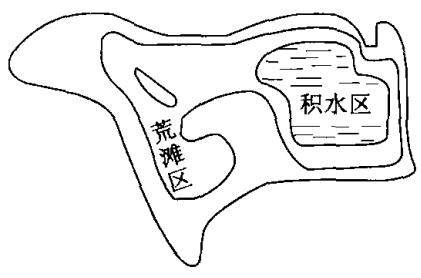

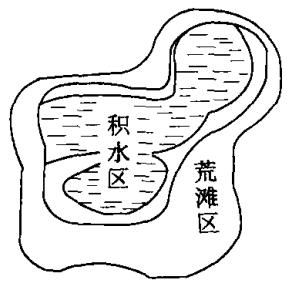  
(b)  
图6-4 塌陷积水区域形态示例

## 二、塌陷积水区域的开发利用规划

## 1. 农灌用水规划

我国不少矿区塌陷后出现丰水季节倒灌、旱季缺水的现象。这类矿区进行土地复垦时可保留适当的水面用作水库、蓄水池和鱼塘来调节供水排水。究竟保留多大水面合适，这是需要规划的问题。若水面太大，则耕地太少；反之，则复垦费用增加，且不能调节用水排水量。因此。农灌用水规划任务之一就是确定最优水面率。

农灌供水规划的另一任务是对水域的位置、水系的流向作合理的安排。蓄水池的位置与排水站、灌溉站的位置及塌陷地的深度等有关，因而也存在确定其最佳位置的问题。

最优水面率的确定可以用线性规划模型来求解，蓄水池或水库最佳位置的确定可以用网络技术进行优化。

## 2. 水产发展规划

水产发展规划包括确定养殖品种、放养方式、开发措施以及开发的时间顺序。

## (1) 确定养殖品种

水产养殖品种有鱼类、虾类、蟹类、贝类、藻类以及其他水生动植物。确定养殖品种时，应综合考虑养殖水面的条件、水质条件、水生动植物的生物学特性以及当地对不同水产品的市场供需情况。

## (2) 确定放养方式

有拦鱼设施、能彻底清除敌害、有较好的起水条件，并且饲料和肥料比较充足的水域可精养；若起水条件较差，可粗养。

## (3) 确定开发措施

对塌陷积水区域的开发利用能形成一定生产能力的养殖场，应根据具体情况采取相应的开发措施，如修建场房、办公室、实验室、加工厂、抽水机站；铺设通往养殖场的公路；设置拦鱼设施；修建产卵池、孵化池、鱼苗池、越冬池、格力池、蓄水池、沉淀池、晒水池等。

## (4) 确定开发的时间顺序

一般是先开发荒滩区和潜水区，再开发深水区，开发时间视当地资源条件、资金投入、生产经验等确定。

## 3. 提高水域生产能力的规划

开发利用塌陷积水区域应以提高水域生产能力为目标。所谓水域生产力，是指在一定时期内单位水域动植物的生产量。提高水域生产力的措施通常有：

## (1) 增加投入

增加投入包括投喂充足的饵料和改善养殖水面的条件。用于水产养殖的水面应满足以下要求：

①有足够的光照。

②鱼类生长季节的水温保持在20℃～30℃，水位不能过浅。

③保持较大的水面，使水体流动，从而保证足够的溶氧含量。

④使水体呈现中至弱碱性，pH值在6.5\~8.5之间。

⑤水中有丰富的饵料(包括微生物、浮游植物、浮游动物、底栖生物、人工水草等)。

## (2) 精细管理

精细管理措施包括水域中水的质量、防治鱼病、完善排灌系统、建立水质动态监测制度等。

## (3)采用科学的养殖方式

科学的养殖方式包括选用良种良苗、立体混养、流水密养、轮捕轮放等，实践证明这样既能获得高产，又经济易行。

## 三、塌陷积水区域的充分利用

## 1. 荒滩区的开发利用

荒滩区是季节性积水区，既盐渍又水涝，因而其生态位适宜于野生水草。为了改变荒滩区的生态条件，稳定塌陷区可采取挖深垫浅方法将荒滩区改造成田塘相间的种植一养殖系统；不稳定塌陷区可采用围堰分割的方法将荒滩区与浅水区发展为水产养殖。

## 2. 浅水区的开发利用

浅水区的常年积水深度在1～3m，适宜于水生植物及鱼类生长。由于水面宽广，难于投料和控制鱼类的品种比例，鱼类的自然生长受到天敌的侵害和同类的竞争，有效地改善鱼类的生长条件和加强养殖管理是必要的。通常可采用围网养鱼的方法，把水面分割成若干片，分片进行投料与管理以提高产量。围网水域要求水底平坦，否则不宜采用该法。围网内可以养殖鱼类为主，适当放养少量水禽和水生植物，围网外以放养水禽和水生植物为主，适当放养少量鱼类。

## 3. 深水区开发利用

深水区常年积水在3m以上，适宜于鱼类、水禽及水生植物生长。但养鱼存在难管理的问题，水禽及水生植物的生长条件不如浅水区。改善鱼类养殖条件的方式只有网箱养殖。网箱养殖的特点是投资大，技术要求高，管理复杂，但经济效益十分显著。网箱外可放养水禽、水生植物和鱼类。

综上所述，塌陷积水区域的开发利用形式可采取挖深垫浅、围网养鱼、网箱养鱼、种植水生植物以及水禽养殖等多种形式。除此之外，对缺水地区，可将深水区改造成水库或蓄水池；对城镇郊区或居民较多的工矿区，可将塌陷积水区改造成水上公园；距电厂较近时，可利用塌陷积水区域作为贮灰场，必要时采取保护水体不受污染的措施。

## 第五节 矿区生态工程复垦规划设计

## 一、生态工程与生态复垦工程概述

1979年，著名生态学家马世骏教授首次提出了生态系统工程的概念，简称生态工程。这是一种运用生态学中物种共生和物质循环再生等原理以及系统工程的优化方法，实现物质多层次利用的工程体系。

在生态系统的动态变化中，有两个功能起主要作用：一是通过系统中共生种间的协调作用形成生态系统在功能和结构上的动态平衡；二是系统中的物质循环再生功能，就是以多层次营养结构为基础的物质转化、分解、富集和再生。从经济学观点看，有了两个基本功能，自然生态系统中的生物成员就可以合理、高效地利用环境中的资源。把自然生态系统中的那种“最优化”结构和高经济效能的原理应用到土地复垦中去，就是矿区生态复垦工程的基本思想。

生态工程复垦是依据生态工程原理把矿山塌陷地建设成为一个人工生态系统的土地复垦活动。生态工程复垦所依据的生态原理主要包括：

## 1. 生态位原理

生态位指一种生物群落所要求的全部生活条件，包括生物和非生物。种群和生态位是一一对应的，否则将导致剧烈的种内和种间斗争。图6-5是一陆地生态系统就温度、湿度、光照三种生态因子建立的三维生态图位。当确定某种生物的种养位置时，便可根据生物对生态因子的要求条件，确定它在三维空间中的某一立体方位。

## 2. 食物链原理

生态系统中由初级生产者、初级消费者、次级消费者直至分解者所构成的营养关系称为食物链。食物链既是一种物质传递链，又是一种价值增值链。当生态系统比较复杂时，简单的食物链就发展成食物网，在食物网中，生产者、消费者有时是难以区分的，只能区分出不同的营养层次。

## 3. 养分循环原理

自然生态系统中，有强大的自我调节和自我维持的“自肥能力”，是基于几乎闭合的养分循环机制和生物固氮而产生的氮素平衡机制(图6-6)。

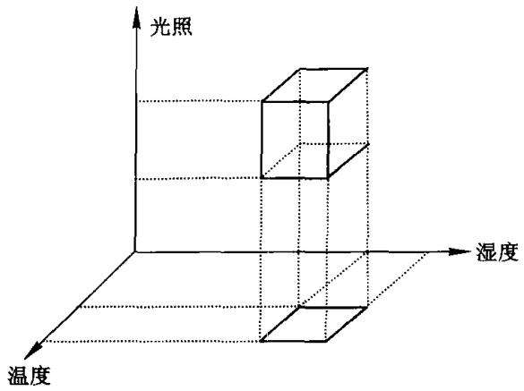  
图 6-5 三维生态位示意图

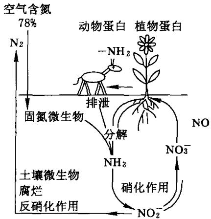  
图 6-6 养分 N 循环示意图

## 4. 生物和环境协同进化原理

生态系统作为生物和环境的统一体，既要求生物要适应环境，又承认生物对环境的反作用，即改造作用。改造了的环境对生物群落有新的作用，最终导致了生物群落的改变和生态系统的演替。

在矿山塌陷区进行生态工程复垦时，生态位条件原理主要用于指导如何改善和利用塌陷区不同区域的生态位条件。食物链原理是根据塌陷区不同区域的生态位来指导选择适生的、有经济价值的生物物种，完成塌陷区开发的人工生态系统的营养结构设计。养分循环原理要求在选择生物物种设计营养结构时，应考虑到营养物质的循环利用。生物与环境的协同进化原理则要求考虑到生物与环境的相互作用，使复垦后的人工生态系统走上良性循环的道路。

## 二、矿山生态工程复垦规划设计的内容和步骤

矿山生态工程复垦规划的内容有系统结构规划和工艺规划。结构规划又包括营养结构、平面结构、垂直结构和时间结构规划等，其中营养结构是规划的基础。

生态工程复垦规划设计的主要步骤为：

①根据矿区土地破坏特点及矿区生态变化规律，吸取本矿区及外地生态农业经验，找出符合本矿区生产发展的营养结构模式。

②营养结构模式优化。

③对优化的营养结构模型进行评价。

④根据优化的营养结构模型进行平面结构、垂直结构和时间结构的设计。

⑤对整个结构设计进行总体评价。

⑥进行工艺规划和设计。

## 三、生态复垦规划的结构设计

## 1. 营养结构设计

生态系统的营养结构是指生态系统的生物成员在能量和营养物质上的依存关系。营养结构设计就是根据食物链原理选择适合复垦土地生态条件的生物物种，并确定生物物种间在能量和营养物质上的依存关系。

按食物链原理，进人生态系统的能量都是从太阳经绿色植物转化而来。在矿山生态工程复垦系统中，绿色植物主要是旱地的农作物或饲草及水域中的水生植物。绿色植物中一小部分直接被鱼类食用，大部分需经禽畜消化后再供给鱼类，塘泥则作为肥料将营养物质送回旱地，完成能量的转化过程和营养物质的循环过程，其一般模式如图6-7所示。

生态复垦与传统的种植、养殖业相比，主要区别在于生态系统的各营养单元的物种和比例按一般的要求配置。图6-7中，旱地农作物品种的选择主要考虑能为家禽、家畜提供质高量多的饲料；水生植物品种考虑能为鱼及水禽提供食物；家禽、家畜品种的选择应和旱地农作物、水生植物协调考虑；鱼类品种选择则应考虑到池鱼混养的生态要求。

生态系统的营养结构通常是较为复杂的网络系统。为提高系统内的营养物质循环利用率，可适当增长食物链，设置一些过渡营养单元(图6-8)。在水体中充分利用不同鱼种的取食关系，使整个系统营养物质利用率提高，从而提高整个系统的效率。

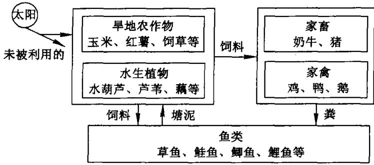  
图6-7 矿山生态复垦系统营养结构的一般模式

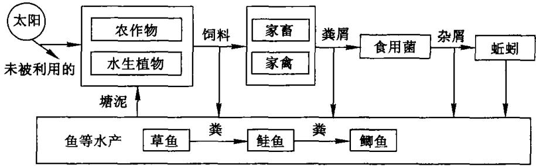  
图 6-8 加长食物链示例

## 2. 平面结构设计

生态系统的平面结构是指生态系统的生物成员在平面上的分布情况。平面结构设计是在对塌陷区实施工程复垦措施后，依据生态位原理，将营养结构中的各营养单元，即生物成员配置在一定的平面位置上。

例6-5 如图6-9所示是淮北矿区袁庄矿某塌陷地生态工程复垦的平面结构设计。

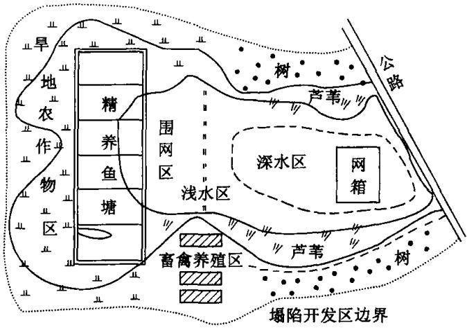  
图 6-9 平面结构设计示例

## 3. 垂直结构设计

生态系统的垂直结构设计是指生态系统各营养单元在垂直面上的分布情况。矿区复垦后生态系统在竖直面内具有不同的生态条件，适合于不同的生物物种生存，垂直结构设计就

是依据生态位原理，兼顾种植养殖方便，将生物成员配置在适当的竖直位置上。

例6-6 如图6-10所示是淮北矿区袁庄矿某塌陷地生态工程复垦的竖直结构设计。

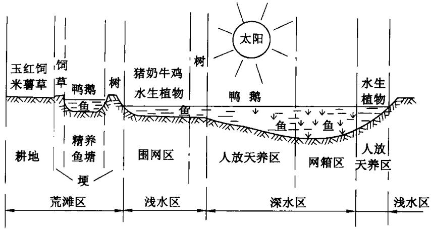  
图 6-10 垂直结构设计示例

生态系统的平面结构和垂直结构是相互联系的，两者统称为生态系统的空间结构。

## 4. 时间结构设计

生态系统的时间结构是指生态系统的生物成员在一年内四季的更替情况。水陆共生生态系统中，陆地生产的时间结构主要考虑一年四季适生的作物品种，水域生产时间结构主要确定不同季节水产上市品种与轮捕轮放方式。通过合理设计复垦系统的时间结构，可提供土地利用率和光能转化率、水资源利用率等。生态系统的时间结构往往是在生产实践过程中逐步调整、总结经验的基础上建立起来的。

## 第六节 露天煤矿土地复垦规划设计

## 一、规划设计的原始资料

1. 矿区范围工程地质与水文地质勘测资料

主要包括剥离岩石、土壤类别及其物理力学性质，其中含有害元素的分布情况及化验分析资料，地下水分布状况及水量、水质化验资料。

## 2. 土壤资料

包括土壤类别和分布状况；物理性质，如松软、板结、透水等；农业化学性质；pH值等指标；采掘场、排水场范围土壤数量，其中腐殖土储量应单独统计计算。

## 3. 地形地域资料

地物地貌特征与类型；交通、通讯条件；地震烈度；土地利用现状；地区经济发展规划；土地利用总体规划、水土保持规划等相关规划资料；名胜古迹及国家重要设施、受保护的自然资源分布情况等。

## 4. 地表水体状况

水体分布；水资源利用情况；洪水位资料；水质分析资料；区域水利规划等。

## 5. 气象资料

温度、湿度；风力风向；降雨量，包括暴雨频率、降雨时间分布等；冻土深度；积温状况及其他农业气候特征。

## 6. 区域生态环境特征

主要植被、作物类型及其生长分布状况；区域性环境状况及各种污染源分布；环境容量及“三废”排放量等；区域环境保护规划资料。有关资料可以从矿区环境质量评价及环境评价报告书中获取。

## 7. 矿区开发规划与开采计划

矿区中长期开发规划，包含矿床开发顺序及排弃工程项目规划、矿区总平面布置、单项工程平面布置等；开采进度计划，包括开采工艺、开采设备、运输系统及基建、移交、达产到最终停排位置平面图。

## 二、规划设计原则

①遵循《土地复垦规定》中有关土地复垦规定的条款。

②符合地方环境保护规划及国家有关的环境保护法规。

③复垦设备尽量与矿山采运排设备合用，以便减少投资，提高设备利用率。

## 三、规划设计内容

露天煤矿土地复垦设计是矿山开采设计的重要组成部分，一般土地复垦设计的原则和方法不完全适用于露天矿山，露天矿山土地复垦设计的内容具有自身的特色。

## 1. 矿山土地破坏预测

设计前需对挖损、压占破坏的土地及景观进行预测，包括破坏土地的分类、分布及数量、破坏程度；排弃物料类别及含有害元素物料的状况；排土场的稳定状况及其对复垦工程的影响；土壤的损失与贫化等。

## 2. 覆土来源与土壤改良计划设计

覆土的来源主要有：一是采掘常剥离表土，对此设计时要严格控制和安排，不能将开采初期的表土，特别是对复垦价值很高的腐殖土运至排土场任意排弃，而必须按设计圈定的表土堆存场地堆放并采取保护措施；二是排土场址范围内的地表土，不仅可作复垦的覆盖土源，而且对排土场的基层稳定十分有力，依据排土设计，按不同生产时期的占地范围进行表土的采运和堆存；三是在有条件的矿区，利用塘河湖泥进行覆盖。当上述三种覆盖土数量仍不足时，可选择剥离物中易风化的物料作为表土层。选择覆盖土的堆存场地，首先要考虑经济合理的运输距离，又要防止不稳定引起大块段塌方及水土流失，危害环境。

土壤改良设计是露天矿复垦设计的重要内容。土壤改良方法通常可采用无力的、化学的及生物改良措施，有效的方法是这三种措施的综合运用。

## 3. 复垦设备类型及数量计算

复垦设备包括复垦工程设备和复垦种植与收获设备。复垦工程设备的选择与数量取决于复垦工程量的大小与运输距离。当运输距离在50m以内时宜采用推土机；当运输距离在50～200m时宜采用铲运机；当运输距离在200～1000m时，宜采用自卸卡车运输；当矿山采用铁道运输工艺时，若线路技术条件允许，亦可采用铁道运输。装载设备一般选用与卡车吨位相匹配的挖掘机和前装机。平整场地一般采用推土机和平地机等。复垦种植与收获一般需配备拖拉机、耙地机、收割机及载重汽车等。

## 4. 复垦后土地利用类型与作物品种的选择

选择复垦后土地利用类型与作物品种应因地制宜，综合考虑复垦区域土壤条件、排灌条件、土地利用总体规划的要求。

## 5. 复垦区域道路与排灌系统布置

排土场的排土干线和支线道路可继续用作复垦道路使用，同时可根据复垦后的需要布置必要的道路，供复垦设备及人员通行。道路等级可采用较低标准。复垦区灌溉与排水系统的设计可采用远近结合的方法，逐步提高排灌标准。

## 6. 复垦与监测管理设计

复垦监测的内容包括土壤改良定位监测、有害元素迁移转化规律监测、水位水质监测、沉降监测等；复垦管理的内容包括劳动定员、管理机构、耕作制度、田间管理等。复垦监测与管理设计即是对上述内容的实施方法和步骤作出安排。

## 7. 费用效益分析

费用效益分析之前，首先估算复垦工程量，如土方量、排灌沟渠、道路及土建工程量等，据此计算总投资。费用效益分析通常根据实际情况选择投资回收期、单位面积产出等指标来分析。

## 第七节 土地复垦高程规划设计

## 一、田面高程设计

无论是充填复垦还是非充填复垦，复垦为耕地的土地高程均有一定要求，田面高程设计应因地制宜，与农田水利工程设计相结合，既能确保农田旱涝保收，又能使填、挖土方量最小。

田面最低高程可按下式计算：

$$
H = H _ { d } + \sum _ { i } l _ { i } i _ { i } + h _ { k }\tag{6-28}
$$

式中，H为田面最低高程，m；Hd为承泄区常年水位或强排区主排水沟经常水位，m;li $H _ { d }$ $\mathbf { m } ; l _ { i }$ 为各级排水沟道长度， $\operatorname* { m } ; i _ { i }$ 为各级排水沟道坡降； $h _ { k }$ 为作物保持正常生长的地下水位临界深度，m(表6-9，表6-10)。

表 6-9  
北方地区采用的地下水临界埋深表
<table><tr><td rowspan=1 colspan=1>土壤质地矿化度 $/ \tt g \cdot \tt L ^ { - 1 }$ </td><td rowspan=1 colspan=1>砂壤</td><td rowspan=1 colspan=1>壤土</td><td rowspan=1 colspan=1>黏土</td></tr><tr><td rowspan=1 colspan=1>&lt;2</td><td rowspan=1 colspan=1>1.8~2.1</td><td rowspan=1 colspan=1>1.5~1.7</td><td rowspan=1 colspan=1>1.0~1.2</td></tr><tr><td rowspan=1 colspan=1>2~5</td><td rowspan=1 colspan=1>2.1~2.3</td><td rowspan=1 colspan=1>1.7~1.9</td><td rowspan=1 colspan=1>1.1~1.3</td></tr><tr><td rowspan=1 colspan=1>5~10</td><td rowspan=1 colspan=1>2.3~-2.6</td><td rowspan=1 colspan=1>1.8~2.0</td><td rowspan=1 colspan=1>1.2~1.4</td></tr><tr><td rowspan=1 colspan=1>&gt;10</td><td rowspan=1 colspan=1>2.6~2.8</td><td rowspan=1 colspan=1>2.0~2.2</td><td rowspan=1 colspan=1>1.3~1.5</td></tr></table>

表 6-10  
各种作物要求的地下水埋深
<table><tr><td rowspan=1 colspan=1>作物</td><td rowspan=1 colspan=1>小麦</td><td rowspan=1 colspan=1>玉米</td><td rowspan=1 colspan=1>棉花</td><td rowspan=1 colspan=1>高粱</td><td rowspan=1 colspan=1>甘薯</td></tr><tr><td rowspan=1 colspan=1>生长期适宜地下水埋深/mm</td><td rowspan=1 colspan=1>100~120</td><td rowspan=1 colspan=1>120~150</td><td rowspan=1 colspan=1>110~150</td><td rowspan=1 colspan=1>80~100</td><td rowspan=1 colspan=1>90~110</td></tr><tr><td rowspan=1 colspan=1>雨后短期允许的地下水埋深/mm</td><td rowspan=1 colspan=1>80~100</td><td rowspan=1 colspan=1>40~50</td><td rowspan=1 colspan=1>40~70</td><td rowspan=1 colspan=1>30~40</td><td rowspan=1 colspan=1>50~60</td></tr></table>

## 二、土地平整规划设计

土地平整工程一般包括土地平整工程类型确定、耕作田块规划、土地平整施工和地力保持措施等。土地平整类型根据地形地貌特点一般分为条田和梯田，平原地区耕作田块为条田，丘陵地区耕作田块一般为梯田。

## (一)耕作田块规划

耕作田块一般指条田、方田或田区，是末级固定田间工程设施所围成的地块，是田间作业、轮作和工程建设的基本单元，是田间灌溉和排水的基本单元。耕作田块规划包括条田和梯田的田块布置、田块形状、田块方向、田块长度、田块宽度、田块规模确定等。田块规划设计是土地开发整理土地平整的基础性工作，也是土地平整单元确定的前提。耕作田块规划总体上应遵循以下几点原则。

## 1. 因地制宜原则

首先应该考虑开发整理区地形、地貌的特点和原有的基础设施。如平原地区水田宜采用条田并在条田内划分格田形式，以保证水稻在不同生育阶段对水分的需求；滩涂区耕作田块设计应注意抬高田面高程，降低地下水位，洗盐、降渍和排涝，改良土壤，改善生态环境；丘陵山区则应以修筑梯田，保持水土为其主要目标。

区域社会经济条件异同也使规划方案有所区别，如项目区常用农用机械决定田块的长度与宽度；当地人均耕地面积及经济发展水平的差异决定了田块的规模大小，等等。自然条件地区差异及整理区的耕作习惯决定了方案的差异，如北方由于存在风沙危害，必须考虑防护林规划，防护林的有效防护距离是决定田块的长度主要因素之一；南方地区则主要表现为营造生态保护林，制约其长宽的因素主要表现为格田的灌排水及田块内部土地的精细平整；盐碱化地区则主要以降低地下水位为原则，通过排水沟的设置以合理确定田面长宽度。

## 2. 系统协调原则

耕作田块规划是系统工程，不是一个独立的规划，需综合考虑项目区原有水源、沟渠、道路、村庄，也即做到山、水、田、林、路综合考虑。田块的布设应有利于沟渠、道路、防护林的综合规划，要把耕地、道路、防护林、排灌渠道、水源工程和村庄等结合起来考虑，全面规划，合理安排。要以地形和水源定沟渠，以村镇和沟渠定路，沟渠路搭架，划块定方。对于土地开发整理项目而言，一般以支沟渠、斗沟渠和田间道分大方，以斗沟渠、农沟渠和生产路分小方，大方套小方(条田或梯田)，以临时沟渠(毛渠、毛沟)和田埂分格田或畦田，各个方田形成网格。因此要先修沟、渠、路，搭好骨架，然后平整土地，进行方内建设。

单一田块的规划则应对田块所处的地形、土壤条件等因素综合考虑，尽量满足田块自流排灌、同一田块土壤条件相似的要求。

## 3. 远近结合原则

田块规划的主要目标之一是改善农业生产条件。通过田块规划达到田成方、路成框、林成行的格局。最主要的改善表现为田块合并与重调，而田块面积大小的确定则又是田块规划的主要内容之一，规划中田块面积的确定不仅要考虑与田块相关的自然条件，如除涝降渍对沟渠布设的要求、防护林的有效防护距离、机械作业要求、土地平整工程量的大小，还应综合权衡社会经济条件，如农地的规模经营成为农村土地经营方式的一种必然趋势。因此，在田块规划中，不仅应当考虑到当前的需要，还应满足规模经营的要求，使田块规划满足机械化作业要求，尽可能做出一个具有弹性的规划，以减少将来重新调整规划所需的成本。

## 4. 综合效益原则

田块规划要以最少的投资取得最大的收益。具体表现为通过事前的测量，使田块平整工程量最小化；通过田块合理长宽比的确定达到机械作业效率的最大化；通过田块布局准确定位使与田块相配套的其他相关渠系、道路、防护林的设置成本最小化，等等。

规划方案经济效益的提高不能以牺牲社会效益为代价。因此，在田块规划设计中应体现以人为本的精神，使田块的规划符合农村的作业习惯，方便农民生产与生活。

田块规划应以不破坏农业生态环境为底线。尽量满足保持农田生物物种的多样性与异质性的要求，田块规划还要满足美学要求，使所规划的田块符合一定的视觉标准。

## 5. 权属完整性原则

土地整理与复垦项目往往涉及几个行政村甚至几个乡镇，而田块的重新规划将不可避免地打乱原有的权属关系，因而土地整理与复垦的一个重要问题与难点就是土地权属的调整问题，权属调整不合理是引发农地纠纷的主要原因之一。

因此，在田块规划中应当尽量保持行政村、乡原有权属的完整性，减少不必要的土地纠纷。具体规划中应坚持保持权属的合一性，即同一个村、同一个乡的土地尽可能地集中在一块，调节项目区的飞地与插花地。在保持权属合理的基础上，尽可能沿道路、渠系或明显标志性建筑物划分界线。尽可能沿耕作田块边界划分界线，避免割裂田块化。

## （二）土地平整工程标准

土地平整后要发挥机械效率，提高机耕质量，灌排方便，满足作物高产稳产对水分的需要。土地平整范围一般以农渠和农渠之间的田块为平整单位，若田块面积较大或地形有一定的起伏，可将田块分成几个平整区域。水稻田或以洗盐为目的时，以一个格田的面积为平整单位。在旱作区，一个农渠控制的田块内，在有临时毛渠布设的地方，一个临时毛渠控制的田块内，纵横方向没有反坡，田面横向一般不设计坡度；田面纵坡方向一般设计与自然坡降一致，坡度的大小综合考虑灌水方向和土质情况。水稻田纵坡降一般为1/3000～1/2000；稻麦两茬地的坡降可为1/2000\~1/1000;畦灌田的坡降一般为1/1000\~1/500；沟灌田的坡降一般为1/1000～1/250；横向坡降要小，一般不要超过纵坡的1/3。种植水稻的格田内绝对高差应在±3 cm以内。

## (三)土地平整高程设计方法

土地平整高程设计方法主要有方格网法、小田块并大田块法等。

## 1. 方格网法

方格网法比较适合地面高低不平的平整单元，设计高程及挖填土方量计算步骤如下：

## (1) 设计方格网

在要平整的地块内设立方格网，方格的大小依据地形高低程度和施工方法，一般人工平整采用10m×10m或20m×20m，机械施工采用40m×40m或100m×100m。为方便

计算，各方格网点应对照现场绘于简图上，并按行列编号。

## （2)测定方格点高程

采用测量仪器测定各方格点的高程，也可在1：2000或更大比例尺的图上采用内插法确定方格点高程(高程标法见图6-11)。

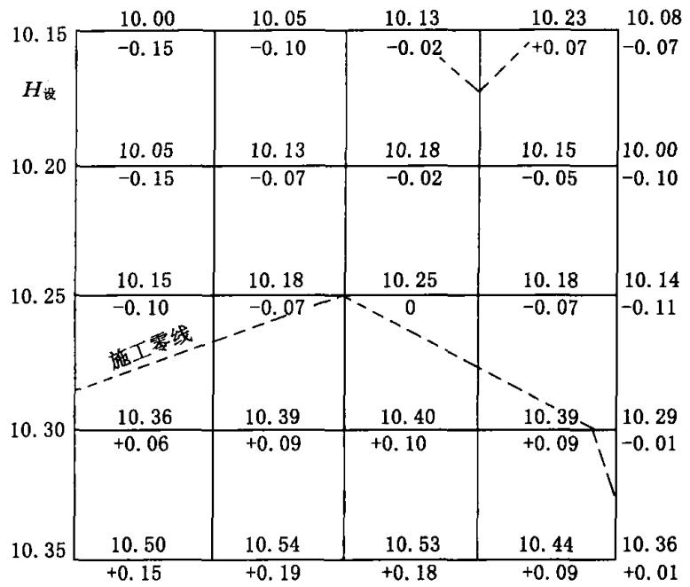  
图 6-11 土地平整方格网

## (3) 计算设计高程

计算每个方格角点的平均高程 $H _ { 1 } , H _ { 2 } , \cdots , H _ { n } ( n$ 为方格数)。如图6-11左上角第1个方格：

$$
H _ { \mathrm { 1 } } = \frac { \mathrm { 1 } } { \mathrm { 4 } }
$$

第2个小方格：

$$
H _ { 2 } = \frac { 1 } { 4 } ( 1 0 . 0 5 + 1 0 . 1 3 + 1 0 . 1 3 + 1 0 . 1 8 ) = 1 0 . 1 2 \ ( \mathrm { m } )
$$

依此类推计算出所有小方格的平均高程。

计算平面重心(面积中心)设计高程 $H _ { m }$

$$
H _ { m } = { \frac { 1 } { 1 6 } } ( H _ { 1 } + H _ { 2 } + \cdots + H _ { 1 6 } ) = 1 0 . 2 5 \ ( \mathrm { m } )
$$

## （4)计算斜面各方格点设计高程

计划将地面平整成南高北低，坡度为1/400的斜面，东西向无倾斜，则在方格网为$2 0 \ \mathrm { m } \times 2 0 \ \mathrm { m }$ 的情况下，自北向南相邻两方格点的设计高差应为 $2 0 \times 1 / 4 0 0 { = } 0 . 0 5 \mathrm { ~ m }$

各方格点分别位于5行直线上，中心行各点的设计高程为 $H _ { m } = 1 0 . \ 2 5 \ \mathrm { ~ m ~ }$ 。因此，各行主格点的设计高程分别为10.15,10.20,10.25，10.30,10.35。

## (5) 田面设计高程修正

若经计算总挖方量与填方量相差较大，则需要修正设计高程：

<!-- ===== 分片 p201-383（183页，源：ex02_胡振琪_土地复垦与生态重建（201-383页））===== -->

$$
\begin{array} { r } { \sharp \sharp \sharp \sharp \sharp \sharp \sharp \sharp \sharp \sharp + \sharp \sharp \sharp _ { \ell } \sharp \underline { { \varphi } } = \sharp \sharp } _ { \ell } - \varkappa \sharp \sharp \qquad \textnormal { \rVert \le \lVert \sharp \rVert _ { L ^ { \ell } } \lVert \lVert \partial \rVert _ { L ^ { \ell } } \rVert + \lVert \widetilde { \sharp } \rVert _ { L ^ { \ell } } \lVert \lVert \partial \rVert _ { L ^ { \ell } } + \lVert \widetilde { \sharp } \rVert _ { L ^ { \ell } } \lVert \partial \rVert _ { L ^ { \ell } } \lVert \partial \rVert _ { L ^ { \ell } } } \end{array} \to \mathrm { ~ \# ~ \# ~ \# ~ \# ~ \# ~ \# ~ \# ~ \# ~ \# ~ \# ~ \# ~ \# ~ \# ~ \# ~ \# ~ \# ~ \# ~ \# ~ \# ~ \# ~ \# ~ \# ~ \# ~ \# ~ \# ~ \# ~ \# ~ \# ~ \# ~ \# ~ \# ~ \# ~ \# ~ }  _ { \sharp \sharp \sharp \sharp } \qquad \varkappa \wedge \qquad \ell \to \{ \ell \in \Psi _ { \ell } \ G _ { \ell } \} _ { \ell } \to \{ \ell \in \Psi _ { \ell } \} _ { \ell } \to \{ 0 , \ G _ { \ell } \} _ { \ell } \to \{ 0 , \ G _ { \ell } \} _ { \ell } \to \{ 0 , \ G _ { \ell } \} _ { \ell } \to \{ 0 , \ G _ { \ell } \} _ { \ell } \to \{ 0 , \ G _ { \ell } \} _ { \ell } \to \{ 0 , \ G _ { \ell } \} _ { \ell } \to \{ 0 , \ G _ { \ell } \} _ { \ell } \ G _ { \ell } \to \{ 0 , \ G _ { \ell } \} _ { \ell } \} _ { \ell } \to \{ 0 , \ G _ { \ell } \} _ { \ell } \to \{ 0 , \ G _ { \ell } \} _ { \ell } \to \{ 0 , \ G _ { \ell } \} _ { \ell } \ G _ { \ell } \} _ { \ell } \to \{ 0 , \ G _ { \ell } \} _ { \ell } \to \{ 0 , \ G _ { \ell } \} _ { \ell } \to \{ 0 , \ G _ { \ell } \} _ { \ell } 
$$

## 2. 小块田并大块田法

如图6-12所示有四块不等高的平台阶地，面积分别为 $S _ { 1 } , S _ { 2 } , S _ { 3 } , S _ { 4 }$ ，高程(若田面平坦，则为有代表性一点的高程；若田面有均匀坡度，则为平均高程)分别为 $H _ { 1 } \thinspace , H _ { 2 } \thinspace , H _ { 3 } \thinspace , H _ { 4 }$ 设平整后的田面高程为 $H _ { m }$ ，则各田块的填(挖)高度为 $H _ { 1 } - H _ { m } , H _ { 2 } - H _ { m } , H _ { 3 } - H _ { m } , H _ { 4 }$ $- H _ { m }$

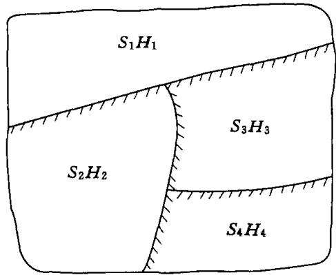  
图 6-12 小田块布置

为了满足土方平衡条件，填挖方量总和应等于零，即：

$$
\begin{array} { c } { { S _ { 1 } ( H _ { 1 } - H _ { m } ) + S _ { 2 } ( H _ { 2 } - H _ { m } ) + S _ { 3 } ( H _ { 3 } - H _ { m } ) + S _ { 4 } ( H _ { 4 } - H _ { m } ) = 0 } } \\ { { { } } } \\  { H _ { m } = { \frac { S _ { 1 } H _ { 1 } + S _ { 2 } H _ { 2 } + S _ { 3 } H _ { 3 } + S _ { 4 } H _ { 4 } } { S _ { 1 } + S _ { 2 } + S _ { 3 } + S _ { 4 } } } } \end{array}\tag{6-29}
$$

## (四)挖填土方量计算及其调配

按前述方法设立方格网，测定各方格点的地面高程，计算确定设计高程基础上，按以下步骤计算挖填土方量。

## 计算各方格点填挖数：填挖数=地面高程一设计高程

各方格点填挖数以带正负号形式标在图上，“+”表示地面高程大于设计高程，土方应挖去；“—”号则相反，表示填方(见图6-11)。

## 1. 绘制施工零线

在方格网的填方点和挖方点之间，必定有一个填挖分界点(施工零点)，把施工零点连接起来，即为施工零线。零点和零线是计算土方量和施工量的重要依据。零点位置根据相似三角形比例关系求出(图6-11)，公式为： ${ \bf \Phi } ; x _ { 1 } = L h _ { 1 } / ( h _ { 1 } + h _ { 2 } )$ ,式中 $x _ { 1 }$ 为零点距填(挖)数为$h _ { 1 }$ 的方格点的距离， $h _ { 1 } \setminus h _ { 2 }$ 为方格两端的填(挖)数，均用绝对值，L为方格边长。

本例中，L=20m，则有：

$$
x _ { 1 } = \frac { 2 0 \times 0 . 0 6 } { 0 . 0 6 + 0 . 1 0 } = 7 . 5 ( \mathrm { m } )\tag{6-30}
$$

## 2. 填挖方量计算

由于地面高低起伏变化复杂，所以只能近似地计算土方量。计算公式可视具体情况按表6-11所列选用。

表 6-11  
方格内填(挖)方量计算公式
<table><tr><td rowspan=1 colspan=1>底面积图形</td><td rowspan=1 colspan=1>说明</td><td rowspan=1 colspan=1>土方计算公式</td></tr><tr><td rowspan=1 colspan=1>［原图缺失］</td><td rowspan=1 colspan=1>底面积正方形截棱柱体</td><td rowspan=1 colspan=1> $V = { \frac { L ^ { 2 } } { 4 } } ( h _ { 1 } + h _ { 2 } + h _ { 3 } + h _ { 4 } ) = { \frac { L ^ { 2 } } { 4 } } \sum h$ </td></tr><tr><td rowspan=1 colspan=1>［原图缺失］</td><td rowspan=1 colspan=1>底面积三角形截棱柱体</td><td rowspan=1 colspan=1> $V = { \frac { 1 } { 2 } } b c \cdot { \frac { \sum h } { 3 } } = { \frac { 1 } { 6 } } b c \sum h$ </td></tr><tr><td rowspan=1 colspan=1>［原图缺失］</td><td rowspan=1 colspan=1>底面积五边形截棱柱体</td><td rowspan=1 colspan=1> $V = [ L ^ { 2 } - \frac { ( L - b ) ( L - c ) } { 2 } ] \frac { \sum _ { h } } { 5 }$ </td></tr><tr><td rowspan=1 colspan=1>［原图缺失］</td><td rowspan=1 colspan=1>底面积梯形截棱柱体</td><td rowspan=1 colspan=1> $V = { \frac { b + c } { 2 } } L \cdot { \frac { \sum h } { 4 } } = { \frac { ( b + c ) L \cdot \sum h } { 8 } }$ </td></tr></table>

为了提高计算效率，还可根据表6-11中的公式，制出土方体积查算备用。应该指出的是，由于计算公式是近似的，因此，在逐个计算出每个小方格内的填(挖)方量再汇总时，往往总填方量与总挖方量不完全相等。如果两者相差较大，经复算又无误时，则需要修正设计高程。用改正后的设计高程，重新定零线，再计算填(挖)方量，直到填挖基本相等为止。

## 三、梯田复垦规划设计

水平梯田设计主要是研究确定在不同条件下梯田的合理断面。田面宽、田坎高和田块侧坡是梯田断面的三要素。如何使得这三要素适当，做到既保证安全稳定、耕作灌溉方便，同时又节省用工、少占土地，就是梯田设计中应解决的主要具体问题。

如图6-13(a)所示，梯田的田面宽度就是梯田田面内边缘至外边缘的宽度；田坎高度是指每一级水平梯田的高差；田坎侧坡是指梯田田坎的边坡，分内外侧坡，一般指外侧边坡，常以外边坡的倾角表示。

从图6-13(b)中可推算出各要素间关系式：

$$
B _ { m } = H \cot \theta\tag{6-31}
$$

$$
B , \ w\tag{6-32}
$$

$$
B = B _ { n } - B _ { n } = H ( \cot \theta - \cot \alpha )\tag{6-33}
$$

$$
H = B / ( \cot \theta - \cot \alpha )\tag{6-34}
$$

$$
B _ { 1 } = H / \sin \theta\tag{6-35}
$$

式中，θ为原地面坡度， $( ^ { \circ } ) { \mathfrak { a } } \alpha$ 为埂坎坡度，(°)；H为埂坎高度，m； $B _ { \mathfrak { n } }$ 为田面净宽， $\mathbf { m } ; B _ { \ell }$ 为原 坡面斜宽， $\displaystyle \mathbf { m } \colon B _ { \mathrm { m } }$ 为田面毛宽， $\mathrm { ~ \mathfrak ~ { ~ m ~ } ~ } ; \alpha$ 为田埂宽度， $m ; h$ 为地埂高， $\mathbf { m }$ 0

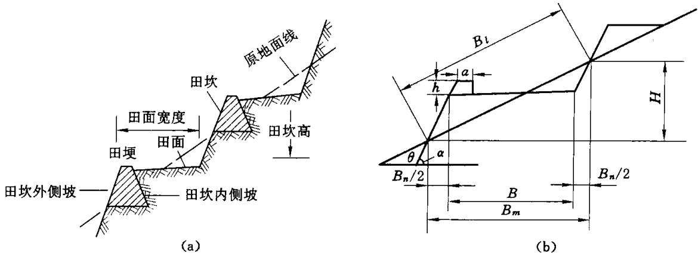  
图 6-13 梯田断面要素

## 1. 田面宽度

田面宽度不宜太窄，也不宜太宽。太窄则耕作不便，田坎占地又多；太宽则平土量大，花费劳力多。因此，确定梯田的田面宽度应根据地形、坡度、土层厚度、种植作物种类、劳力和机械化程度等因素，综合考虑。原地面坡度陡时，田面窄一些，缓坡时宽些；土层薄的田面窄些，土层厚的宽些；人口稀少地区窄些，劳力多的田面宽些。

陡坡区田面宽度一般为5～15m，缓冲区一般为20～40m。

## 2. 田坎高度

田坎高度与田面宽度和原地面坡度等因素有关。如原地面坡度一定，田面越宽，则田坎越高；田面越窄，田坎越低。田坎抬高，不但修筑困难，费工、费时，而且容易损坏崩塌。因而要根据土质好坏、坡度大小和方便耕作等条件来确定。一般田坎高度在0.9～1.8m为宜。具体高度H按上述方法计算。为了保护田坎，可以在田坎上种植灌木、豆类作物等，实现田坎绿化，既保护田坎安全，又可增加副业收入。

田坎高H再加上地埂高h即为梯田埂高(地埂高h一般为 0.2 m左右)。

## 3. 田坎坡度

田坎外坡越缓，安全稳定性越高，但占地和用工量增大；反之，田坎外坡较陡，占地和用工量减少，但安全稳定性差。因此田坎边坡的确定，以能使田坎稳定而少占耕地为原则。边坡大小与田坎高度和筑埂材料有关，田坎愈高，田埂外边坡应愈缓，一般在70°左右(壤性土壤坡度为1：0.3\~1：0.4，沙性土壤坡度多为1：0.5)。

## 4. 蓄水埂

除上述各要素外，梯田边应有蓄水埂，高0.3～0.5m，内外坡比约1：1；我国南方多雨地区，梯田内侧应有排水沟，其具体尺寸根据各地降雨、土质、地表径流情况而定，一般以发生暴雨(多采用5～10年一遇24小时最大暴雨)不漫溢地坎为前提条件，并考虑施工方便等因素，坎高及顶宽多为0.2～0.3m。所需土方量根据断面尺寸量算，不纳入上述各要素设计。

水平梯田断面主要尺寸参考数值见表6-12，常见水平梯田规格见表6-13。

表 6-12  
水平梯田断面尺寸参数数值
<table><tr><td rowspan=1 colspan=1>适应地区</td><td rowspan=1 colspan=1>地面坡度θ</td><td rowspan=1 colspan=1>田面净宽B/m</td><td rowspan=1 colspan=1>田坎高度 H/m</td><td rowspan=1 colspan=1>田坎坡度α</td></tr><tr><td rowspan=5 colspan=1>中国北方</td><td rowspan=1 colspan=1> $1 ^ { \circ } \sim 5 ^ { \circ }$ </td><td rowspan=1 colspan=1>30~40</td><td rowspan=1 colspan=1>1.1~2.3</td><td rowspan=1 colspan=1> $8 5 ^ { \circ } \sim 7 0 ^ { \circ }$ </td></tr><tr><td rowspan=1 colspan=1> $5 ^ { \circ } \sim 1 0 ^ { \circ }$ </td><td rowspan=1 colspan=1>20~30</td><td rowspan=1 colspan=1>1.5~4.3</td><td rowspan=1 colspan=1> $7 5 ^ { \circ } \sim 5 5 ^ { \circ }$ </td></tr><tr><td rowspan=1 colspan=1> $1 0 ^ { \circ } \sim 1 5 ^ { \circ }$ </td><td rowspan=1 colspan=1>15~20</td><td rowspan=1 colspan=1>2.6~4.4</td><td rowspan=1 colspan=1> $7 0 ^ { \circ } \sim 5 0 ^ { \circ }$ </td></tr><tr><td rowspan=1 colspan=1> $1 5 ^ { \circ } \sim 2 0 ^ { \circ }$ </td><td rowspan=1 colspan=1>10~15</td><td rowspan=1 colspan=1>2.7~4.5</td><td rowspan=1 colspan=1> $7 0 ^ { \circ } \sim 5 0 ^ { \circ }$ </td></tr><tr><td rowspan=1 colspan=1> $2 0 ^ { \circ } \sim 2 5 ^ { \circ }$ </td><td rowspan=1 colspan=1>8~10</td><td rowspan=1 colspan=1>2.9~4.7</td><td rowspan=1 colspan=1>70°~50°</td></tr><tr><td rowspan=5 colspan=1>中国南方</td><td rowspan=1 colspan=1> $1 ^ { \circ } \sim 5 ^ { \circ }$ </td><td rowspan=1 colspan=1>10~15</td><td rowspan=1 colspan=1>0.5~1.2</td><td rowspan=1 colspan=1>90°~85°</td></tr><tr><td rowspan=1 colspan=1> $5 ^ { \circ } \sim 1 0 ^ { \circ }$ </td><td rowspan=1 colspan=1>8~10</td><td rowspan=1 colspan=1>0.7~1.8</td><td rowspan=1 colspan=1> $9 0 ^ { \circ } \sim 8 0 ^ { \circ }$ </td></tr><tr><td rowspan=1 colspan=1> $\overline { { \downarrow 0 ^ { \circ } } } \sim 1 5 ^ { \circ }$ </td><td rowspan=1 colspan=1>7~8</td><td rowspan=1 colspan=1>1.2~2.2</td><td rowspan=1 colspan=1>85°~75°</td></tr><tr><td rowspan=1 colspan=1> $1 5 ^ { \circ } \sim 2 0 ^ { \circ }$ </td><td rowspan=1 colspan=1>6~7</td><td rowspan=1 colspan=1>1.6~2.6</td><td rowspan=1 colspan=1>75°~70°</td></tr><tr><td rowspan=1 colspan=1> $2 0 ^ { \circ } \sim 2 5 ^ { \circ }$ </td><td rowspan=1 colspan=1>5~6</td><td rowspan=1 colspan=1>1.8~2.8</td><td rowspan=1 colspan=1>70°~65°</td></tr></table>

·注：本表中的田面宽度与田坎坡度适用于土层较厚地区和土质田坎。至于土层较薄地区其田面宽度应根据土层厚度适当减少；对石质田坎的坡度，将结合梯田的施工另作规定。

表 6-13  
常见水平梯田规格表
<table><tr><td rowspan=2 colspan=1>原地面坡度α</td><td rowspan=2 colspan=1>田坎高度 $H / { \mathfrak { m } }$ </td><td rowspan=2 colspan=1>斜坡长 $B _ { \mathrm { L } } / \mathbf { m }$ </td><td rowspan=1 colspan=3>土坎梯田</td><td rowspan=1 colspan=3>石坎梯田</td></tr><tr><td rowspan=1 colspan=1>地坎侧坡</td><td rowspan=1 colspan=1>田面宽B/m</td><td rowspan=1 colspan=1>田坎占地/%</td><td rowspan=1 colspan=1>地坎侧坡</td><td rowspan=1 colspan=1>田面宽B/m</td><td rowspan=1 colspan=1>田坎占地/%</td></tr><tr><td rowspan=1 colspan=1>5°(9%)</td><td rowspan=1 colspan=1>1.01.52.02.5</td><td rowspan=1 colspan=1>11.517.223.028.7</td><td rowspan=1 colspan=1>1:0.251:0.251:0.31:0.3</td><td rowspan=1 colspan=1>11.216.822.327.8</td><td rowspan=1 colspan=1>2.22.22.62.6</td><td rowspan=1 colspan=1>1:01:01:01:0.1</td><td rowspan=1 colspan=1>11.417.122.928.3</td><td rowspan=1 colspan=1>0.9</td></tr><tr><td rowspan=4 colspan=1>10°(18%)</td><td rowspan=4 colspan=1>1.52.02.53.0</td><td rowspan=1 colspan=1>8.6</td><td rowspan=1 colspan=1>1:0.25</td><td rowspan=1 colspan=1>8.1</td><td rowspan=1 colspan=1>4.4</td><td rowspan=1 colspan=1>1:0</td><td rowspan=3 colspan=1>3.511.313.9</td><td rowspan=3 colspan=1>1.8</td></tr><tr><td rowspan=3 colspan=1>11.514.417.3</td><td rowspan=1 colspan=1>1:0.3</td><td rowspan=1 colspan=1>10.7</td><td rowspan=1 colspan=1>5.3</td><td rowspan=2 colspan=1>1:01:0.1</td></tr><tr><td rowspan=1 colspan=1>1:0.3</td><td rowspan=1 colspan=1>13.4</td><td rowspan=1 colspan=1>5.3</td></tr><tr><td rowspan=1 colspan=1>1:0.35</td><td rowspan=1 colspan=1>16.0</td><td rowspan=1 colspan=1>6.2</td><td rowspan=1 colspan=1>1:0.1</td><td rowspan=1 colspan=1>16.7</td><td rowspan=1 colspan=1>1.8</td></tr><tr><td rowspan=1 colspan=1>15°</td><td rowspan=1 colspan=1>1.5</td><td rowspan=1 colspan=1>5.8</td><td rowspan=1 colspan=1>1:0.25</td><td rowspan=1 colspan=1>5.2</td><td rowspan=1 colspan=1>6.7</td><td rowspan=1 colspan=1>1:0</td><td rowspan=1 colspan=1>5.6</td><td rowspan=1 colspan=1></td></tr><tr><td rowspan=1 colspan=1></td><td rowspan=1 colspan=1>2.0</td><td rowspan=1 colspan=1>7.7</td><td rowspan=1 colspan=1>1:0.3</td><td rowspan=1 colspan=1>6.9</td><td rowspan=1 colspan=1>8.0</td><td rowspan=1 colspan=1>1:0</td><td rowspan=1 colspan=1>7.5</td><td rowspan=1 colspan=1></td></tr><tr><td rowspan=2 colspan=1>(27%)</td><td rowspan=2 colspan=1>2.53.0</td><td rowspan=2 colspan=1>9.711.6</td><td rowspan=1 colspan=1>1:0.3</td><td rowspan=1 colspan=1>8.6</td><td rowspan=1 colspan=1>8.0</td><td rowspan=1 colspan=1>1:01</td><td rowspan=1 colspan=1>9.1</td><td rowspan=1 colspan=1>2.7</td></tr><tr><td rowspan=1 colspan=1>1:0.35</td><td rowspan=1 colspan=1>10.1</td><td rowspan=1 colspan=1>9.4</td><td rowspan=1 colspan=1>1:01</td><td rowspan=1 colspan=1>10.9</td><td rowspan=1 colspan=1>2.7</td></tr><tr><td rowspan=1 colspan=1>20°</td><td rowspan=1 colspan=1>2.0</td><td rowspan=1 colspan=1>5.8</td><td rowspan=1 colspan=1>1:0.3</td><td rowspan=1 colspan=1>4.9</td><td rowspan=1 colspan=1>10.9</td><td rowspan=1 colspan=1>1:0</td><td rowspan=1 colspan=1>5.5</td><td rowspan=1 colspan=1></td></tr><tr><td rowspan=3 colspan=1>(36%)</td><td rowspan=1 colspan=1>2.5</td><td rowspan=1 colspan=1>7.3</td><td rowspan=1 colspan=1>1:0.3</td><td rowspan=1 colspan=1>6.1</td><td rowspan=1 colspan=1>10.9</td><td rowspan=1 colspan=1>1:0.1</td><td rowspan=1 colspan=1>6.6</td><td rowspan=1 colspan=1>3.7</td></tr><tr><td rowspan=2 colspan=1>3.03.5</td><td rowspan=2 colspan=1>8.810.2</td><td rowspan=1 colspan=1>1:0.35</td><td rowspan=1 colspan=1>7.2</td><td rowspan=1 colspan=1>12.7</td><td rowspan=1 colspan=1>1:0.1</td><td rowspan=1 colspan=1>7.9</td><td rowspan=1 colspan=1>3.7</td></tr><tr><td rowspan=1 colspan=1>1:0.35</td><td rowspan=1 colspan=1>8.4</td><td rowspan=1 colspan=1>8.4</td><td rowspan=1 colspan=1>1:0.2</td><td rowspan=1 colspan=1>8.9</td><td rowspan=1 colspan=1>7.3</td></tr><tr><td rowspan=1 colspan=1>25°</td><td rowspan=1 colspan=1>2.5</td><td rowspan=1 colspan=1>5.9</td><td rowspan=1 colspan=1>1:0.3</td><td rowspan=1 colspan=1>4.6</td><td rowspan=1 colspan=1>4.6</td><td rowspan=1 colspan=1>1:0.1</td><td rowspan=1 colspan=1>5.1</td><td rowspan=1 colspan=1>4.7</td></tr><tr><td rowspan=1 colspan=1></td><td rowspan=1 colspan=1>3.0</td><td rowspan=1 colspan=1>7.1</td><td rowspan=1 colspan=1>1:0.35</td><td rowspan=1 colspan=1>5.4</td><td rowspan=1 colspan=1>5.4</td><td rowspan=1 colspan=1>1:0.1</td><td rowspan=1 colspan=1>6.1</td><td rowspan=1 colspan=1>4.7</td></tr><tr><td rowspan=2 colspan=1>(47%)</td><td rowspan=2 colspan=1>3.54.0</td><td rowspan=1 colspan=1>8.3</td><td rowspan=1 colspan=1>1:0.35</td><td rowspan=1 colspan=1>6.3</td><td rowspan=1 colspan=1>6.3</td><td rowspan=1 colspan=1>1:0.2</td><td rowspan=1 colspan=1>6.8</td><td rowspan=1 colspan=1>9.3</td></tr><tr><td rowspan=1 colspan=1>9.5</td><td rowspan=1 colspan=1>1:0.35</td><td rowspan=1 colspan=1>7.2</td><td rowspan=1 colspan=1>7.2</td><td rowspan=1 colspan=1>1:0.2</td><td rowspan=1 colspan=1>7.8</td><td rowspan=1 colspan=1>9.3</td></tr></table>

## 5. 水平梯田土方量计算

## (1）单位面积土方量的计算

$$
V = { \frac { 1 } { 2 } } \Bigl ( { \frac { B } { 2 } } \times { \frac { H } { 2 } } \times L \Bigr ) = { \frac { 1 } { 8 } } B H L\tag{6-36}
$$

式中，V为单位面积(公顷或亩)梯田土方量， $\mathfrak { m } ^ { 3 }$ ;L为单位面积(公顷或亩)梯田长度，m;H为田坎高度，m;B为田面净宽，m。

当梯田面积按公顷计算时：

$$
V = { \frac { 1 } { 8 } } H \times 1 0 ^ { 4 } = 1 \ 2 5 0 H
$$

当梯田面积按亩计算时：

$$
V = { \frac { 1 } { 8 } } H \times 6 6 6 . 7 = 8 3 . 3 H
$$

## (2) 总土方量计算

当梯田面积按公顷计算时，总土方量为：

$$
V _ { ☉ } = 1 ~ 2 5 0 H \cdot S
$$

当梯田面积按亩计算时，总土方量为：

$$
V _ { \ast } = 8 3 . 3 H \cdot S
$$

式中，S为总面积。

## 第八节 矿区土地复垦规划报告的编制

土地复垦规划类型不同，报告的编制内容和深度要求也不一样，本节重点介绍矿山企业设计时的土地复垦规划及对矿山开采已造成的废弃地进行复垦时的规划报告的编制方法。

## 一、编制土地复垦规划报告的依据

编制土地复垦规划报告的依据有国家和地方的法规、行业技术设计规程和企业设计文件等几方面，具体有：

①国务院颁发的《土地复垦规定》及当地土地复垦等有关规定、政策和实施细则。

②与土地利用有关的法律、法规，包括《中华人民共和国土地管理法》、《中华人民共和国城市规划法》、《中华人民共和国矿产资源法》和《中华人民共和国环境保护法》。

③有关行业的技术设计规程。

④当地国民经济和社会发展规划、计划以及矿山企业的生产计划。

⑤国民经济统计资料。

⑥土地复垦资源现状调查资料、图件与统计表。

⑦为编制土地复垦规划而设置的专项研究成果等。

⑧地质勘探报告以及补充地质调查报告。

⑨开采设计或已开采区域的开采情况。

## 二、矿山企业设计时的土地复垦规划报告的编制

从科学合理性的角度来说，应当将土地复垦看成矿山企业生产建设的一个重要环节。即在矿山地质勘探、设计、建设直至报废等阶段都应考虑土地复垦问题。因此，土地复垦规划是根据地质勘探成果、建设项目的可行性研究报告和设计任务书、设计文件、工艺设计中对土地复垦的要求和生产建设过程中可能造成的土地破坏情况以及经济合理性原则编制的。

1. 《土地复垦规定》对有土地复垦任务的建设项目的基本要求

①建设项目可行性报告和设计任务书中应当包括土地复垦的内容。

②设计文件应当有土地复垦的章节，明确其复垦任务。

③工艺设计应当兼顾土地复垦的要求。

④土地复垦应当与生产建设统一规划。

⑤应当把土地复垦指标纳入生产建设规划。

⑥可能时，地质勘探阶段就对土地资源及与复垦有关的其他资源进行详细调查。

2. 矿山企业设计时土地复垦规划报告的内容

矿山企业设计时土地复垦规划报告的内容与企业性质、开采矿产资源类型、开采方式以及企业所处的地理位置等多种因素有关。原冶金工业部在《黑色冶金矿山企业初步设计的内容深度及编写规定》中对土地复垦专门作了规定。煤炭科学研究总院唐山分院曾受国家土地局委托起草了《煤矿(井工开采)土地复垦规划设计编制深度的规定》(征求意见稿)。根据我国目前复垦规划报告编写现状，矿山企业设计时土地复垦规划报告一般应包括如下内容：

①前言一包括任务来源和编制依据，如委托书、合同书、国家有关法规、土地利用总体规划要求、城市建设规划和环境规划要求等；规划期限；规划范围；复垦承担单位和分工协作关系；需要说明的其他问题等。

②社会环境与自然环境概况包括地理、交通、地形地貌、区域经济、人文社会环境、土地利用现状、土壤、气候、地表水系、农田水利系统与生态环境等。

③地质与矿藏埋藏条件—包括地层、构造、水文地质条件等，煤层厚度、埋藏条件、分布状况、倾角等要素。

④煤层开采计划与土地破坏预测开采计划包括近期、中期及远期开采计划，为减少地面破坏(包括村庄、道路、河流、耕地等)而采取的井下开采工艺计划，露天矿山为少占农田、剥离保护耕植土等而采取的开采工艺计划等；土地破坏预测包括预测农田破坏数量、范围、程度以及地面附属设施的破坏程度、土壤产生盐渍化的可能性等多方面。

⑤土地复垦规划设计包括复垦目标规划、工艺措施和复垦方向的规划、矿山废弃物处理利用的可能性、复垦工程实施计划等。

⑥复垦效益和技术经济指标复垦效益从社会、经济、生态环境三方面论述，主要技术经济指标包括工程量、投资与人员定员、年经营费用、年效益、复垦率等。

⑦附图包括矿区交通位置图（1：10000～1：50000）、地形图（1：2000～1：10000）、开采计划与复垦规划图（1：2000～1：10000）、塌陷预测图（1：2000～1：10000）、地质剖面图、复垦进度实施计划图表等。

随着人们环境意识的加强，采前复垦规划必将形成一种制度得到各部门及地方政府的重视。一般情况下，设计阶段的复垦规划工作由矿山企业委托设计部门制定。

## 三、矿山废弃地复垦规划报告的编制

我国目前面临的主要复垦任务是对已挖损、塌陷和压占的土地编制复垦规划，实施复垦

手段。

矿山废弃地复垦规划是土地利用总体规划的重要内容，又是土地利用的一个专项规划。土地利用总体规划是在各级人民政府领导下，由土地管理部门会同其他有关部门负责组织编制工作。矿山土地复垦规划由其行业管理部门负责编制，并纳入土地利用的总体规划。

矿山废弃地复垦规划报告涉及的内容与规划的目的、土地破坏的原因、复垦对象、范围、现有技术水平、经济实力等多因素有关。一般应包括下述内容：

①前言任务来源和设计依据；规划设计的目的和指导思想；规划范围和面积；基本要求；其他要说明的问题。

②总论土地利用现状及其周围的环境特征，如地形地貌、植被分布、气候气象、居民区分布、土壤类型等；矿床开采方法及开采历史、开采计划；矿山企业的经营状况与用地需求；复垦的有利条件和不利条件分析等。

③废弃地复垦的可行性分析—可行性分析从技术可行、经济合理、实践可能三个方面入手。具体内容包括：场地稳定性论证；成片复垦的可能性；已塌陷土地与将要破坏的土地综合考虑的可能性；复垦难易程度评价；复垦利用的适宜性评价；与区域环境治理协调一致的可行性；总投入、总产出、单位投入效益等经济分析；复垦工程实施的组织管理；复垦的资金来源；复垦后产生的社会、生态环境效益等。

④复垦工程设计包括：复垦目标；复垦工艺措施设计；复垦利用方向和层次选择；复垦方案的优化；辅助复垦工程设计，如道路、排水系统、灌溉系统等工程；专门问题设计，如表土堆放、种植计划、田间试验等。

⑤分期实施规划—分期实施规划主要考虑资金的分期投入量、复垦工程的难易程度、复垦项目收益的大小、复垦工程本身对时节的要求等因素。

⑥复垦工程概预算与复垦资金来源、偿还计划。

⑦复垦规划的实施步骤和实施计划。

## 第七章 采煤沉陷地复垦与生态重建技术

我国从20世纪80年代开始进行有组织的土地复垦研究和实践，取得了不少经验，土地复垦率也由最初的不足1%，到现在已超过12%，取得了巨大的成绩。但由于起步较晚，我国土地复垦工作开始时面临的是大面积已稳沉土地，因此，采煤稳沉地复垦技术得到了很多研究和实践，初步形成了采煤沉陷地复垦的技术体系，而未稳沉土地的复垦技术也正在研究中。

本章主要介绍已稳沉土地的复垦与生态重建技术的应用条件、实施工艺等，为技术的推广提供参考。

## 第一节 挖深垫浅复垦技术

挖深垫浅技术是将造地与挖塘相结合，即用挖掘机械(如挖掘机、推土机、水力挖塘机组等)将沉陷深的区域继续挖深(“挖深区”)，形成水(鱼)塘，取出的土方充填至沉陷浅的区域形成陆地(“垫浅区”)，达到水陆并举的利用目标。水塘除可用来进行水产养殖外，也可视当地实际情况改造成水库、蓄水池或水上公园等，陆地可作为农业种植或建筑等。

应用条件：沉陷较深，有积水的高、中潜水位地区，同时，“挖深区”挖出的土方量大于或等于“垫浅区”充填所需土方量，使复垦后的土地达到期望的高程。

如果挖深水塘用于水产养殖，还需要满足以下条件：

①水质适宜于水产养殖。

②沉陷深部加深以后足以形成标准鱼塘。

③鱼塘进排水条件便利，且与井下采空区域无水力联系。

优点：操作简单、适用面广、经济效益高、生态效益显著。

缺点：对土壤的扰动大，处理不好会导致复垦土壤条件差。

依据复垦设备的不同，可以细分为：泥浆泵复垦技术、拖式铲运机复垦技术、挖掘机复垦技术(依据运输工具不同又可分为挖掘机+卡车复垦技术、挖掘机+四轮翻斗车复垦技术)、推土机复垦技术。由于推土机多用于平整土地，往往与其他机械设备联合使用，因此从复垦设备区分主要是前三种。

## 一、泥浆泵复垦技术

泥浆泵实际就是水力挖泥机，亦称水力机械化土方工程机械。泥浆泵复垦技术就是模拟自然界水流冲刷原理，运用水力挖塘机组(由立式泥浆泵输泥系统、高压泵冲泥系统、配电系统或柴油机系统三部分组成)将机电动力转化为水力而进行挖土、输土和填土作业，即由高压水泵产生的高压水，通过水枪喷出一股密实的高压高速水柱，将泥土切割、粉碎，使之湿化、崩解，形成泥浆和泥块的混合液，再由泥浆泵通过输送管压送到待复垦的土地上，然后泥浆沉积排水达到设计标高的过程。由于泥浆泵是水力挖塘机组的核心，因此这种技术称之为泥浆泵复垦，如图7-1所示。

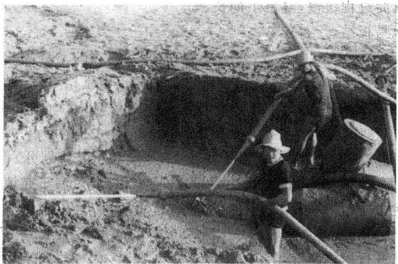  
图 7-1 沉陷地泥浆泵复垦工作图

## 1. 应用条件

除满足挖深垫浅复垦技术的应用条件外，还应有足够的水源供泥浆泵水力挖掘土壤。

## 2. 施工工艺

泥浆泵复垦技术的具体施工工艺见图7-2。

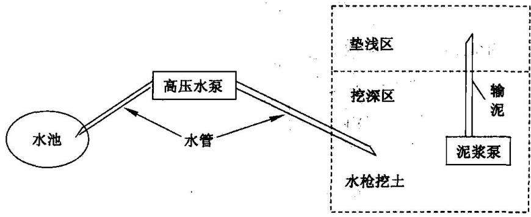  
产生高压水→挖土→输土→充填与沉淀→修整土地→利用  
图7-2 沉陷地泥浆泵复垦技术工艺流程示意图

①产生高压水：由高压水泵(一般为IS80-50-160或IS80-50-200型)将附近水池中的自由水转变成高压水，水速一般为 $5 0 ~ \mathrm { m } ^ { 3 } / \mathrm { h }$

②冲土水枪挖土：高压水泵产生的高压水通过冲土水枪挖土，使土壤成为泥浆状。

③输送土：用泥浆泵吸取泥浆并通过输泥管将泥浆输送到待复垦的土地上。

④充填与沉淀：泥浆充填在待复垦土地上，经自然沉淀形成复垦土壤。

⑤修整土地：待泥浆沉淀数月并适宜于平整时，用人工或推土机进行平整。

## 3. 优点

这种方法工艺简单、成本低，在我国不少矿区得到广泛应用。

4. 缺点

①复垦后原耕作层与深土层相混合，破坏了原有的土壤结构。

②土壤在用水切割、粉碎、运输、沉淀等过程中，营养成分随水流失。

③泥浆自然沉淀过程缓慢，复垦工期长。

④复垦后土地易板结。

所有上述缺点导致复垦土壤贫瘠，影响复垦效益。

针对上述土壤结构混合的缺点，依据土壤学理论和土壤重构原理，提出了一个改进的泥浆泵复垦工艺流程和完整技术模式(图7-3、图7-4)。图7-3展示了新的冲土顺序和充填位置，其方法是：

①把“挖深区”和“垫浅区”划分成若干块段(依地形和土方量划分)，并在“垫浅区”剥离表土(可用推土机)后对该区划分的块段边界设立小土(田)埂以利于充填。

②用泥浆泵挖掘“开切块段”，取出的土充填“首填块段”。

③ 将“挖深区”的土层分为上层土(一般 30～50 cm)和下层土(一般大于 30 cm 或 50cm)，按以下的顺序进行挖掘与充填：

i'块段土壤结构 $= ^ { 6 6 } { \left( i + 1 \right) }$ 块段上层土”+“i块段下层土”其中， $i = 1 , 2 , \cdots , n - 1$ (n为划分的块段数)。

n'块段的结构=“1块段上层土”(在首填块段上)+“n块段下层土”

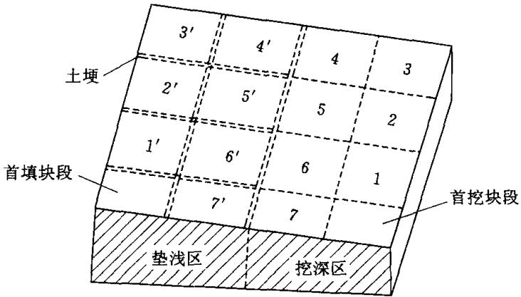  
图7-3 新的土壤重构方法

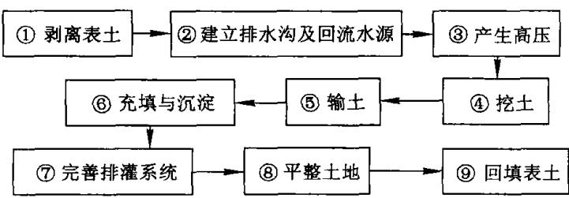  
图 7-4 新的泥浆泵复垦工艺流程

由此可见，“垫浅区”上新构造的土壤除“首填块段”以外，其余块段的土层顺序基本保持不变。当复垦土地上多余水分排走后，再回填原“垫浅区”的表土，这样所构的复垦土壤比原复田技术优越，并极有可能当年恢复原土壤生产力。为此我们提出了泥浆泵复垦完整技

术模式：

绘制待复垦区的等值线图  
复 地质、水文、气象、资料分析  
垦 土壤和水质的测试分析  
规 确定最佳水面率和挖掘的深度及土方量  
划 确定复垦后的养殖与种植计划复垦的工序安排与经济概算

表土的剥离与储存复垦工程实践 水力挖掘水力输土泥浆的充填与沉淀排水沟的建立回填表土与平整土地平填后立即种植豆科类植物或草

复垦后的 完善排灌系统与改善 土壤和水质的进一步测试分析种植与养殖的实施管理 培肥产与种 管理技术

## 二、拖式铲运机复垦工艺

大型铲运机已被国外广泛用于露天矿的表土和心土的剥离。由于铲运机集挖掘、运输于一体，是一个很好的土壤挖掘和运输机械。但由于采煤沉陷地地形起伏变化大，有些区域潜水位较高，因此，一般采用中小型拖式铲运机进行施工。

拖式铲运机实质为一个无动力的拖斗，在前部用推土机作为牵引设备和匹配设备进行铲装运土作业。铲运机由一个带有活动底板的铲斗、4个轮胎和液压(驱动)系统组成，其中铲斗的活动底板有锋利的箕形铲刀，用于剥离土壤。工作时前推后拉，既可推土又可挖土和运土，具备铲、运、填、平等多种功能，能将土方从“挖深区”推或拉至“垫浅区”，对“垫浅区”进行回填。通过液压(驱动)系统进行升降(图7-5)，结构合理，操作维修简便，性能良好。基于拖式铲运机复垦设备的这一组合，与单纯的推土机相比，除具备推土机的推(铲)土功能外，还具有良好的长距离运送功能。

## 1. 复垦工艺

以皖北煤电公司采煤沉陷地拖式铲运机复垦为例说明。

矿区内地下潜水位高，在施工时，为了满足复垦后土地标高一次到位，“挖深区”鱼塘深度设计一般为3.5m；然后将“挖深区”分成若干块段(可按机械多少和地块大小而定)，多台机械同时进行挖掘回填；为了保证复垦后的土地质量，剥离回填之前需要将“挖深区”和“垫浅区”的熟土层剥离堆存起来。待回填到一定标高后，最后再将熟土回填到复垦地上，使“垫浅区”达到设计标高。推平后，再使用农用耕作细耙或推耙机进行松土整理，建立复垦区田间水利灌排系统，培肥后即可种植，虽然拖式铲运机施工对土壤压实较轻，但这个问题依然存在，种植前最好采取一次深耕措施，适当的施肥措施对恢复土壤生产力也是必须的。而“挖深区”所形成的鱼塘用于水产养殖。整个复垦工艺流程如图7-6所示。

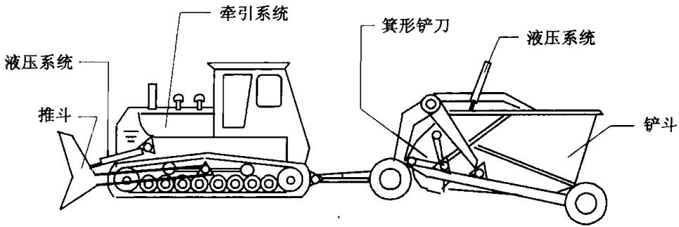  
图7-5 采煤沉陷地复垦中所采用的中小型拖式铲运机

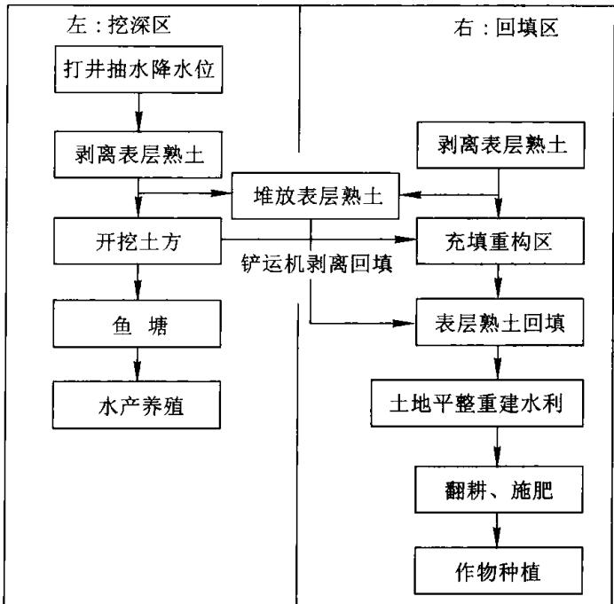  
图7-6 铲运机复垦技术工艺流程图

为了保证施工机械在无积水条件下正常作业(如果沉陷地无积水，则这一工序可省略)，需要打简易井进行降水。施工时首先需在拟开挖鱼塘四周打井排水。

采用拖式铲运机复垦方法时需要考虑的主要是如何解决高潜水位情况下的排水问题。因为潜水位太高时土壤松软，造成开挖困难，并且严重破坏土壤结构，难以保证重构土壤质量。施工时采用了抽水井降低地下水位法(参见图7-7)，即在设计挖深区范围内开挖前打井抽排水，水井一般每间隔50m布置一个。井深应该控制在潜水范围内，不得穿透到承压水层(淮北地区一般为10m左右)，一般井深达到7～8m(位于流砂层之上)即可。井径大小可为0.6m，抽水半径约为30m，采用12马力的柴油机，12.7cm的水管连续抽水，使水位下降并保持在设计高度。

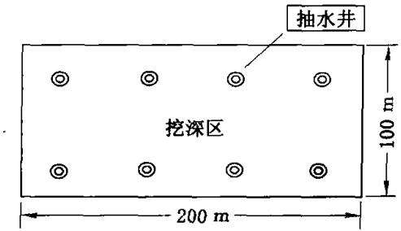  
图7-7 挖深区抽水降水位井平面布置示意图

## 2. 优点

拖式铲运机复垦技术存在以下5方面的优势：

①土地复垦速度快、效率高、工期短。中小型拖式 $\sharp ^ { * }$ 运机一趟可挖运土方量 $3 ~ \mathrm { m ^ { 3 } }$ 左右，一台铲运机一天工作15～16h可挖土方 $3 5 0 ~ \mathrm { m } ^ { 3 }$ ，作业生产效率提高约25%。

②不受运输距离等限制。铲运机进行长距离土方运送工作效率仍很高，弥补了挖掘机和推土机的不足。

③施工不受土壤内部结构成分(如砂浆砾石)的影响，弥补了泥浆泵的不足。

④铲运机前部的推斗可调整高度和方向，机械灵活，挖出的鱼塘较规则平整。

⑤施工过程中通过分块段、分层剥离和分层回填技术，容易使熟土重新回填作为表土层，这样能保证复垦后土壤结构破坏程度较小。而且铲运机复垦得到的耕地平整，可以立即恢复农业种植，不存在泥浆泵复垦对土地结构破坏严重、土壤干结周期太长等问题，因而这种复垦技术也更容易被当地农民所接受。

## 3. 缺点

拖式铲运机复垦技术的不足之处在于：

①施工受积水和潜水位条件限制，对积水区需排水和打井降低潜水位，雨季需停工。

②为减少抽水费用，一般需长时间连续作业(每台铲运机开工18～20h/d以上)，工人劳动强度较大。

③对机械设备要求较高，复垦成本较其他工艺要高。因此，本技术主要用于不积水或积水较浅的沉陷地，沙土或土壤中含砾石的土地和土壤含水量在50%左右，更能发挥它的作用。

中小型铲运机在采煤沉陷地土地复垦与生态重建中的应用，在国内还是第一次，具有很多方面的优越性，已经在淮北等采煤沉陷地复垦实践中推广应用。

## 三、挖掘机复垦技术

实践表明，铲运机复垦可以很好地实现“分层剥离、交错回填”的土壤重构原理与方法。但是，由于其剥离土壤是通过箕形铲刀实现的，在土壤中含砂礓等困难条件下因极容易损伤箕形铲刀，铲运机就无法使用了，这时就可以选择挖掘机复垦。

由于挖掘机是一种很好的土方挖掘机械，因此，也被广泛用于土地复垦中。挖掘力强、速度快、适应性强是其特点。由于它无法运输的特点，必须与卡车、四轮翻斗车等运输机械联合作业才能完成复垦工作。

下面以江苏徐州贾汪区薄表土含砂礓的特殊条件介绍挖掘机联合四轮翻斗车的采煤沉

陷地复垦技术(图7-8)。

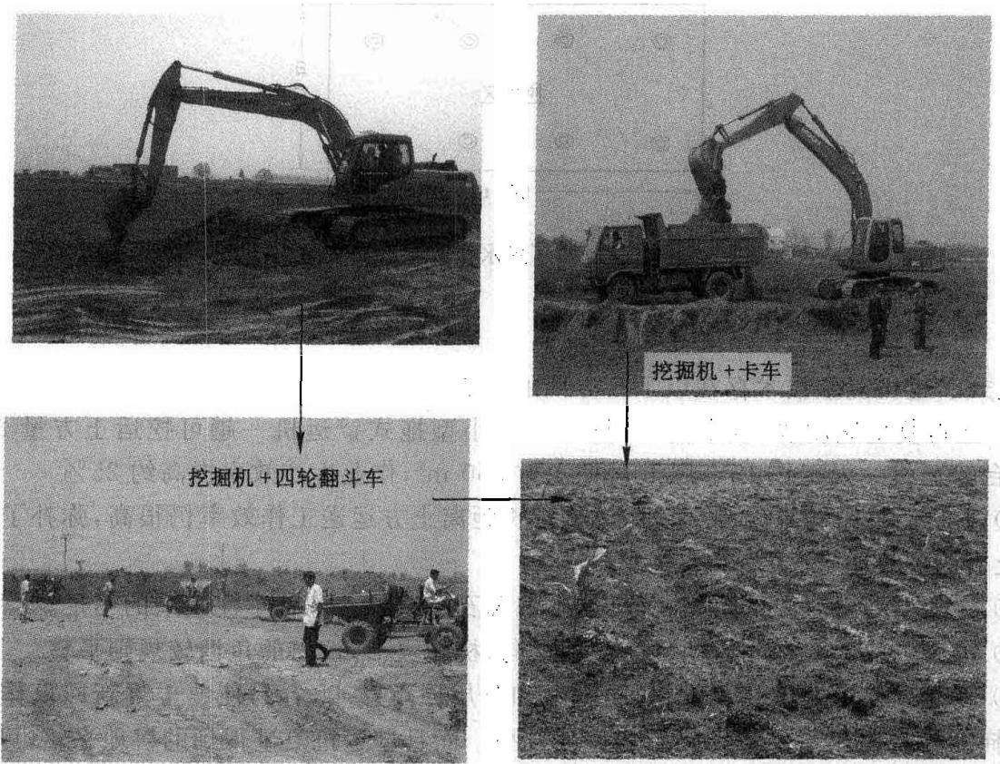  
图7-8 挖掘机+四轮翻斗车或卡车复垦

其技术特点是：

①把“挖深区”和“垫浅区”划分成若干块段(依地形和土方量划分)，并对“垫浅区”划分的块段边界设立小土(田)埂以利于充填。

②将土层划分为两个层次，一是上部(40cm左右)的土壤层，二是下部(40 cm以下)的砂礓层。

③用上述“分层剥离、交错回填”的土壤重构方法和数学模型进行复垦，但在每次充填前应对垫浅区的相应块段先进行上部土层的剥离，待两层构造完成后再将所剥离的上部土层回填，使复垦后的土层厚度增大(有的地方可达80cm厚)，使复垦土地明显优于原土地。剥离采用挖掘机，运输使用四轮翻斗车。

## 四、挖深垫浅复垦技术对比

根据准北市的复垦实践，三种复垦技术的相关参数对比与应用条件见表7-1。

同时，通过大量的野外测试，分析了泥浆泵复垦土壤、推土机复垦土壤和拖式铲运机复垦土壤的特征及其与农业土壤的差异(表7-2)，发现泥浆泵复垦土壤具有极差的土壤结构，是上下土层的混合并且无熟化的耕作层；土壤含水量大，约为农业土壤的1.5\~2.5倍；入渗慢，约为农业土壤的1/5\~1/10；土壤肥力较低，表层有机质含量约为农田的1/2\~1/4，因此，泥浆泵复垦土地的排水和培肥是决定复垦效益的关键。推土机复垦和拖式铲运机复垦土壤，不存在土壤含水量过大、土层顺序差的问题，但存在压实问题，要求二者在复垦时注意复垦设备运行路线的优化和土壤压实的改良。

表 7-1  
铲运机、挖掘机、泥浆泵复垦工艺的相关参数对比与应用条件
<table><tr><td rowspan=1 colspan=1>复垦工艺</td><td rowspan=1 colspan=1>铲运机</td><td rowspan=1 colspan=1>挖掘机+推土机</td><td rowspan=1 colspan=1>泥浆泵</td></tr><tr><td rowspan=1 colspan=1>工作原理</td><td rowspan=1 colspan=1>利用铲运机挖土、运土和回填</td><td rowspan=1 colspan=1>挖掘机+推土机联合进行挖土、运土和回填</td><td rowspan=1 colspan=1>水力挖土、输土和填土</td></tr><tr><td rowspan=1 colspan=1>场地条件</td><td rowspan=1 colspan=1>干燥、土质松软、水位较低；或土中含大粒径的砾石不适于泥浆泵复垦，且作业场地大，运送距离较长(&gt;50 m)时</td><td rowspan=1 colspan=1>干燥、土质松软、水位较低；或土中含大粒径的砾石不适于泥浆泵复垦，运送距离较短时(&lt;50 m)</td><td rowspan=1 colspan=1>待剥离层表土为轻黏土或砂质土，且不含大粒径的砾石；有充足的水源，运距离相对推土机长，但也不宜过长</td></tr><tr><td rowspan=1 colspan=1>工作性能</td><td rowspan=1 colspan=1>连续工作、速度快、工期短</td><td rowspan=1 colspan=1>可连续工作</td><td rowspan=1 colspan=1>不能连续工作</td></tr><tr><td rowspan=1 colspan=1>复垦效率</td><td rowspan=1 colspan=1>挖土方350m³/天·台</td><td rowspan=1 colspan=1>挖土方200～300m³/天·台</td><td rowspan=1 colspan=1>挖土方65m³/天·台</td></tr><tr><td rowspan=1 colspan=1>复垦成本</td><td rowspan=1 colspan=1>4.68元/m³</td><td rowspan=1 colspan=1>4.0元/m³</td><td rowspan=1 colspan=1>2.3元/m³</td></tr><tr><td rowspan=1 colspan=1>复垦效果</td><td rowspan=1 colspan=1>能保留熟土层，土壤养分损失较少；复垦后土壤存在压实现象，需要深耕；复垦后土地能立即恢复耕种</td><td rowspan=1 colspan=1>能保留熟土层，土壤养分损失较少；复垦后土壤存在压实现象，需要深耕；复垦后土地能立即恢复耕种</td><td rowspan=1 colspan=1>复垦后土壤含水分高，干结周期长；土壤结构被破坏；土壤养分流失严重、肥力降低，需培肥</td></tr><tr><td rowspan=1 colspan=1>应用矿区</td><td rowspan=1 colspan=1>刘桥一矿、刘桥二矿、任楼矿</td><td rowspan=1 colspan=1>前岭矿、徐州贾汪矿区</td><td rowspan=1 colspan=1>孟庄矿、毛郢孜矿、平顶山辛南塌陷地</td></tr><tr><td rowspan=1 colspan=1>其他因素</td><td rowspan=1 colspan=1>受雨季、潜水深度及地形影响</td><td rowspan=1 colspan=1>受雨季、潜水深度及地形影响</td><td rowspan=1 colspan=1>需有充足的水源保障</td></tr></table>

表 7-2  
采煤沉陷地复垦土壤的理化特性
<table><tr><td rowspan=1 colspan=2>土壤特性取样田      土壤层次</td><td rowspan=1 colspan=1>密度 $/ g \cdot \mathrm { ~ m ~ } ^ { - 3 }$ </td><td rowspan=1 colspan=1>含水量1%</td><td rowspan=1 colspan=1>入渗率/cm·h−1</td><td rowspan=1 colspan=1>全氮1%</td><td rowspan=1 colspan=1>速效磷/mg·kg−i</td><td rowspan=1 colspan=1>速效钾/mg·kg</td><td rowspan=1 colspan=1>有机质1%</td></tr><tr><td rowspan=2 colspan=1>未破坏农田</td><td rowspan=1 colspan=1>0~20 cm</td><td rowspan=1 colspan=1>1.16</td><td rowspan=1 colspan=1>13.8</td><td rowspan=1 colspan=1>12.6</td><td rowspan=1 colspan=1>0.107</td><td rowspan=1 colspan=1>14.1</td><td rowspan=1 colspan=1>112.5</td><td rowspan=1 colspan=1>1.90</td></tr><tr><td rowspan=1 colspan=1>20~40 cm</td><td rowspan=1 colspan=1>1.55</td><td rowspan=1 colspan=1>14.0</td><td rowspan=1 colspan=1></td><td rowspan=1 colspan=1>0.066</td><td rowspan=1 colspan=1>3.7</td><td rowspan=1 colspan=1>95.0</td><td rowspan=1 colspan=1>1.33</td></tr><tr><td rowspan=2 colspan=1>泥浆泵复垦地</td><td rowspan=1 colspan=1>0~20 cm</td><td rowspan=1 colspan=1>1.33</td><td rowspan=1 colspan=1>26.6</td><td rowspan=1 colspan=1>3.5</td><td rowspan=1 colspan=1>0.035</td><td rowspan=1 colspan=1>3.0</td><td rowspan=1 colspan=1>86.3</td><td rowspan=1 colspan=1>0.41</td></tr><tr><td rowspan=1 colspan=1>20~40 cm</td><td rowspan=1 colspan=1>1.46</td><td rowspan=1 colspan=1>30.9</td><td rowspan=1 colspan=1></td><td rowspan=1 colspan=1>0.048</td><td rowspan=1 colspan=1>1.4</td><td rowspan=1 colspan=1>96.3</td><td rowspan=1 colspan=1>0.67</td></tr><tr><td rowspan=2 colspan=1>推土机复垦地</td><td rowspan=1 colspan=1>0~20 cm</td><td rowspan=1 colspan=1>1.72</td><td rowspan=1 colspan=1>20.3</td><td rowspan=1 colspan=1>0.3</td><td rowspan=1 colspan=1>0.059</td><td rowspan=1 colspan=1>2.0</td><td rowspan=1 colspan=1>120.0</td><td rowspan=1 colspan=1>0.77</td></tr><tr><td rowspan=1 colspan=1>20~40 cm</td><td rowspan=1 colspan=1>1.56</td><td rowspan=1 colspan=1>33.7</td><td rowspan=1 colspan=1></td><td rowspan=1 colspan=1>0.055</td><td rowspan=1 colspan=1>2.2</td><td rowspan=1 colspan=1>132.5</td><td rowspan=1 colspan=1>0.506</td></tr><tr><td rowspan=2 colspan=1>铲运机复垦地</td><td rowspan=1 colspan=1>0~20 cm</td><td rowspan=1 colspan=1>1.54</td><td rowspan=1 colspan=1>26.2</td><td rowspan=1 colspan=1>1.8</td><td rowspan=1 colspan=1>0.035</td><td rowspan=1 colspan=1>17.8</td><td rowspan=1 colspan=1>171.8</td><td rowspan=1 colspan=1>1.114</td></tr><tr><td rowspan=1 colspan=1>20~40 cm</td><td rowspan=1 colspan=1>1.58</td><td rowspan=1 colspan=1>25.3</td><td rowspan=1 colspan=1></td><td rowspan=1 colspan=1>0.023</td><td rowspan=1 colspan=1>3.2</td><td rowspan=1 colspan=1>114.0</td><td rowspan=1 colspan=1>0.515</td></tr></table>

## 第二节 充填复垦技术

充填复垦技术一般是利用土壤和容易得到的矿区固体废弃物(如煤矸石、坑口和电厂的粉煤灰、露天矿排放的剥离物)及垃圾、沙泥、湖泥、水库库泥和江河污泥等来充填采煤沉陷

地，恢复到设计地面高程来复垦土地，如图7-9所示。

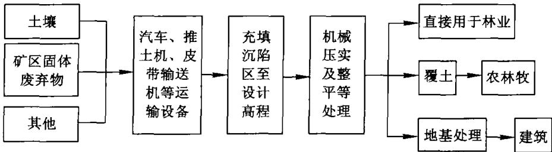  
图7-9 机械运输矿区废弃物及土壤充填沉陷区复垦重构工艺流程

充填复垦技术的应用条件是有足够的充填材料且充填材料无污染或可经济有效地采取污染防治措施。优点是既解决了沉陷地的复垦问题，又进行了固体废弃物的处理，其经济环境效益显著。缺点是土壤生产力一般不是很高，并可能造成二次污染。

## 一、煤矸石充填复垦技术

用煤矸石作为充填物进行充填复垦可分为两种情况，即新排矸石复垦和预排矸石复垦。新排矸石复垦是指将矿井新产生的煤矸石直接排入充填区域造地，这是最经济合理的煤矸石充填复垦方式。预排矸复垦是指建井过程中和生产初期，沉陷区未形成前或未终止沉降时，在采区上方，将沉降区域的表土先剥离取出堆放四周，然后根据地表下沉预计结果预先排放矸石，待沉陷稳定后再利用。根据测算，在充填复垦时，煤矸石的实际充填高度应为设计高度的1.31倍左右。

实例一：王台铺矿煤矸石充填复垦

根据规划，以充填区域周边耕地高度为准，整个回填区一个水平。工作程序如下：

规划→剥离表土层→贮存表土层→回填煤矸石→推平→压实→覆土→回填表土层→ 种植

在回填沉陷区时，事先将地表面20cm的表土剥离、存贮，防止受水冲和风化，为以后的复垦做好准备。剥离表土后，先把对植物生长不利的回填物置于下面，再回填煤矸石，根据深度合理安排回填物的结构，再用推土机推平、压路机压实，以免透气造成煤矸石自燃和覆土后由于降水下渗而形成漏斗或表土流失。然后在煤矸石上填土，厚度1.2m左右，最后将贮存的表土覆盖于最上部，厚度约20 cm。

为了降低工作量，减少表土存贮量，在回填地点30m前剥离表土层，这样可避免上部煤矸石滚下危及安全。回填区的边缘不得有煤矸石外露，上覆黄土层要比正常区域厚，达到1.5m，坡度平缓时，接壤区域2m宽度内全部用黄土覆盖，以提高煤矸石的密封性能，杜绝自燃现象的发生。

从三年的实地观测结果看，土地复垦的小麦长势明显好于其他土地，麦穗长达70mm，每公顷产量达到4 500 kg。

实例二：煤矸石充填复垦为建筑用地

皖北煤电集团公司地处黄淮海平原，是我国的粮棉重点产区之一，区内地势平坦，土地肥沃，村庄稠密。由于本区地表潜水位较高，潜水位埋深在1.5～4m，因而采煤沉陷易造成地表积水，对地面村庄建筑物破坏严重。刘桥二矿工厂西南有沉陷地230亩，复垦区内有两个人工取土坑，南取土坑长150m，宽约80m，底标高平均为+27.0m，北取土坑长、宽均为120m，底标高+28.0m。地面平均标高(不包括取土坑)为+30.3m。

复垦工艺与方法：

①首先进行矸石碾压试验，根据碾压选定的机械，确定矸石地基分层振动压实的最佳分层厚度、压实趟次及最佳含水量，矸石碾压机械选用的是YZ14JG型振动压路机。

②在进行碾压试验的同时，将东区表土用铲运机械或推土机按照设计程序运到西区，回填西区至复垦设计标高，同时将东区0.3m复土1.78万 $\mathfrak { m } ^ { 3 }$ ，就近堆存于西区。东区取土深度在1.4～2.2m，取土回填土总量为5.1万m³。

③待东区取土工程完毕，东区整个区域统一实施矸石分层振动碾压回填复垦，以防矸石复垦时形成人为回填边界，造成今后复垦地基产生不均匀沉降。

④待东区矸石复垦至设计标高，再将堆存于西区的土覆盖到东区，覆土厚度为0.3m。

⑤最后复垦场地实行统一整平，并用压路机进行一趟次碾压，整个复垦工程即告结束。

通过充填复垦，处理煤矸石15.8万 $\mathbf { m } ^ { 3 }$ ，重建抗变形民房464栋，解决了刘桥二矿四个自然村庄的近地搬迁。重建的村落交通方便，道路宽敞整齐，院落成排成行，形成比较优美自然的村落环境。

## 二、粉煤灰充填复垦技术

粉煤灰用于农业的途径主要有两条：一是在土壤中掺加粉煤灰作为肥料和改良剂，二是在排灰场(包括沉陷地)复垦进行农林种植。

我国火力发电厂以燃煤为主，燃煤电厂年发电量约占总发电量的76%，全国电厂每年燃煤约3.6亿t，截至2005年，电力企业装机容量已达4.4亿kW，是世界上粉煤灰排弃量最大的国家。燃煤电厂在生产过程中，将煤块破碎研磨成煤粉，再送入锅炉在1300℃～1 500℃的高温下燃烧，煤粉燃烧后剩余的残灰就是粉煤灰。一般每燃烧1000kg煤要产生250～300kg粉煤灰。目前，除一部分粉煤灰被工业利用外，其余都排入贮灰场或用于充填沉陷地。由于粉煤灰品质和经济技术等各方面条件的限制，目前我国粉煤灰总利用率约为58%，大量粉煤灰被堆放在贮灰场，不仅没有得到有效利用，而且还要压占宝贵的土地，增加贮灰场修建及其维护费用。

近年由于我国采取变输煤为输电的策略，许多大型坑口电站相继建成，大大降低了煤矿区沉陷地充填运输费用，从而给沉陷地充填复垦创造了有利条件。

沉陷地粉煤灰充填复垦是将粉煤灰直接充填到沉陷地，恢复到设计地面高程，然后根据复垦目的进行土壤重构，整平造地。也可以利用电厂原有设备和增加所需要的输灰管道，便可将灰水直接充填塌陷区。贮灰场沉积的粉煤灰达到设计标高后停止充灰，将水排净，而后覆土。

用粉煤灰充填复垦是我国现行的主要复垦技术之一，已在平顶山、徐州、淮北、唐山等矿区复垦了数千亩土地。

粉煤灰充填复垦技术的工艺流程如图7-10所示。

## 三、其他充填复垦技术

除了煤矸石与粉煤灰外，露天采矿剥离物、垃圾、湖泥等也可以作为充填物进行充填复

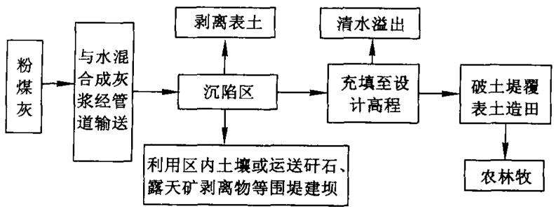  
图7-10 管道水力输送电厂粉煤灰充填沉陷区复垦技术工艺流程

垦，其技术工艺与上述大体相同，这里不再介绍。下面举一个湖泥充填复垦的实例。

姚桥煤矿东五采区位于微山县张楼乡张楼村滨湖农田下，并局部穿越大堤至昭阳湖下。由于该采区的回采，造成昭阳湖西大堤及湖外农田塌陷，最大塌陷深度达3.5m。湖堤在该采区回采前，已经利用湖外未塌陷的农田内的土源进行了预加高。湖堤外农田由于采煤塌陷及湖西大堤加固取土，形成了600多亩的大坑，而本地区潜水位较高，塌陷后的农田完全被积水所淹没，不仅农作物绝收，人多地少的矛盾凸显，而且大堤背水侧滩地也浸泡在水中，对大堤的防洪渡汛构成严重威胁。为了解决张楼村人多地少的矛盾，保持社会稳定，改善生态环境，消除隐患，确保大堤汛期安全，该矿因地制宜，利用湖区淤泥作为充填材料，通过绞吸式挖泥船及管道输送工艺对采煤塌陷区进行充填，此方法不仅实施方便，也为当地群众所接受，既改善生态环境，增加耕地，同时又彻底消除了湖西大堤隐患，确保大堤汛期安全。

## 1. 方案选择

①挖深垫浅。本区西北侧为大坝加固取土坑，塌陷较深，其余则一部分为塌陷盆地的盆底，一部分为倾斜的拉坡地。根据塌陷现状，可将取土坑及盆底部分改造成鱼塘，拉坡地部分复垦成耕地。

②利用姚桥矿煤矸石或电厂粉煤灰对塌陷区进行充填，上覆土层，将塌陷地改造成农田。

③用绞吸式挖泥船从湖内取土，通过管道将湖泥充填到塌陷区，再经排水、固结，复垦造地。

由于本区塌陷深度较大，加上大堤加固取土，对方案①而言，复垦后的耕地面积较少，鱼塘面积较大，对人多地少的张楼村来说不是最佳方案，且采用该方案，堤外滩地仍浸泡在水中，不能消除大堤安全隐患；由于本区充填工程量较大，方案②所用充填物煤矸石、粉煤灰已由工业废渣变为多用途的建筑材料，且运距远，用量大，经济成本较高，充填后其所含的某些化学成分对农作物生长也有影响；方案③所用充填物—一湖泥资源丰富，有机质含量高，价廉物美。因此，方案③明显优于前两个方案，该方案的优点是：利用绞吸式挖泥船通过管道充填塌陷区，技术成熟、可行，运行费用低；湖泥资源丰富，用量不受限制，成本低，复垦标准高，能全部复垦成耕地，且湖泥沉积水下多年，有机质含量高，土壤肥沃，复垦耕种后即可达到甚至超过塌陷前的收成。缺点是：淤泥层厚，排水固结时间比较长，两三年后才能耕种。

## 2. 施工

按照设计要求，山东省水利疏浚工程处和微山县水利施工公司于2001年初对工程进行了实施。施工顺序为：塌陷区围堰填筑→施工船就位→排泥管铺设→绞吸式吹填→沉淀→排水→固结→土地平整→水系配套。

施工中有几个关键点：

①取土区标志设立：挖槽设计位置以明显标志显示。纵向标志设在挖槽中心线和设计上开口边线上，横向标志设在挖槽起讫点、施工分界线上，每50～100m设一组横向标志。

②排泥管架设：排泥管平坦顺直，弯度力求平缓，避免死弯，出泥管口高出排泥面0.5m以上，排泥管接头紧固严密，整个管线和接头不得漏泥漏水，发现泄漏及时修补更换。

③挖泥船施工：挖泥船施工时分层开挖，上层厚，下层薄。为保证有一个相对稳定的排泥距离，从距排泥区远的一侧开始，依次由远到近分条开挖，条与条之间重叠一个宽度，以免形成欠挖土埂。

④充填区围堰填筑：围堰填筑坚实牢固，防止决堤、溃堤。

⑤排水：由于泥浆含水量较高，泥浆充填到塌陷区后，须沉淀排水，应采取工程措施，增加充填时泥浆在复垦区的流程(在复垦区中修筑互相交错小田埂)，使抽取的淤泥流经路线尽可能长，便于淤泥充分沉淀。

⑥充填泥浆的自然沉缩率：由于采用湖泥对塌陷区进行充填复垦，在矿区属首次，因此充填泥浆的自然沉缩率无可靠数据，只能根据现场取样，做试验进行估算。实际充填高度比设计高10%左右。

复垦小区的泥浆在充分沉缩固结后，2004年经平整、配套水系，标高完全达到设计要求。

## 四、采煤沉陷地无害化充填复垦新技术模式

耕地是人类最珍贵的土地资源，耕地生产力的提高、绿色生产和生物多样性是世界农业发展的趋势。因此，我们非常有必要对充填复垦技术进行革新，从重视复垦耕地数量的观念转变到重视复垦耕地的质量上来，以生态健康为本，顺应世界农业发展的趋势。面对这种形势，如何改进充填复垦的工艺，成为一个新的研究课题。

近年来，国外提出了增加隔离层(如薄膜层、黏土层等)和覆盖层等方法，来防止充填材料中的毒物渗透进地下水和上覆耕作层土壤，但对隔离层的材料和厚度选择等详细的技术特征方面还处于探索阶段。薄膜过滤在废水循环利用中的例子比较多见，是一种经济且效果不错的处理手段。

波兰华沙农业大学的W. Piatkiewicz教授做了一个实验。他将填埋废弃物的渗出液通过四个步骤进行过滤处理：预过滤（Prefiltration)、微过滤（Microfiltration，MF)、超过滤(Ultrafiltration,UF)和逆渗透(Reverse Osmosis,RO)。在 MF 处理时加聚丙烯试管薄膜，UF处理时用聚砜试管薄膜，结果表明：MF处理后的过滤液与UF处理后的过滤液的化学成分没有显著的差别，可以将MF处理过程省略。

崔龙鹏在认识到煤矸石中重金属含量会对周围的土壤和水资源造成污染的时候，就提到充填复垦应进行必要的试验研究和科学论证，合理设计填充方案，减少煤研石淋溶及有害污染物的迁移机会，譬如，可以采取在填充煤矸石之上用厚黏土层覆盖，在充填过程中，设置多层黏土隔离层，或类似于垃圾埋场处理。

王国强等秉承该思想，参照垃圾卫生填埋法，提出了煤矸石填埋设计的基本程序，即在施工前须对煤矸石进行堆浸试验，测定堆浸液中污染物成分、浓度及有关所需参数；根据综合治理的可行性，选择查明塌陷区的水文地质条件，特别是其与周边的水力联系，试验确定其水力扩散的弥散系数，根据污染物的传播机理，综合考虑各方面因素，预估其可能造成的危害，以确定底部防渗层的材料、施工方法等。但是，他并没有给出确切的设计方法和公式，而且充填复垦与垃圾填埋存在许多不同之处：其一，垃圾填埋是强制执行的规定，对要填埋的垃圾类别没有选择性，而充填复垦材料是可以选择的，可能的话，可以选择没有污染性的充填材料；其二，充填复垦的目的是增加耕地面积，充填材料最好与周围的土质融为一体，形成一个利于土壤水循环的环境，而采用垃圾填埋法的隔离层就破坏了这种循环，不利于生态系统的恢复。

随着环境保护意识的加强，我国对于固体废弃物的排放与处置制定了一系列的国家标准，如《一般工业固体废物贮存、处置场污染控制标准》(GB18599一2001)、《危险废物填埋污染控制标准》(GB18598一2001)等；对于耕地质量的保护也提出了相应的标准，如《农用粉煤灰中污染物控制标准》(GB8173一87)、《土壤环境质量标准》(GB15618一1995)、《绿色食品产地环境技术条件》(NY/T391一2000)以及《工业企业土壤环境质量风险评价基准》(HJ/T25一1999)等。因此，我们参照已有的思想，并参照国家对于环境保护和土壤质量的标准要求，提出新的充填复垦技术模式。

整个技术程序分为三个阶段：材料筛选、技术设计与实施以及复垦后土壤质量评价。

首先，对充填材料进行筛选，分为初级筛选和高级筛选，筛选掉的材料可以进行其他方式的利用。

第一步：采集充填复垦材料(煤矸石或粉煤灰)样本。样本要具有典型性。

第二步：初级筛选。按照《固体废弃物浸出毒性浸出方法》(GB5086)对样本进行浸出试验，并分析主要的污染物浸出量，同时依据《一般工业固体废物贮存、处置场污染控制标准》(GB18599一2001)选择Ⅰ类一般工业固体废物，即浸出液中任何一种污染物的浓度均未超过GB 8978-1996 最高允许排放浓度(见表7-3)，且 pH值在6～9范围之内的样本作为充填材料，如果超过了表中规定的浓度，则不能作为充填材料。

第三步：高级筛选。经过充填材料的初级筛选过程，可以排除充填复垦对土壤的严重污染，如果在城镇区域复垦作为建设用地是可以的，但如果在农业区，复垦作为农业用地，就要考虑充填材料对于浅层地下水的污染，特别是对于主要依靠地下水灌溉的区域。从表7-3中可以看出，《地下水质量标准》(GB/T14848一93)中Ⅳ类水(适用于农业和部分工业用水，适当处理后可作生活饮用水)对于重金属含量的要求比GB8978一1996更加严格，因此，将GB/T14848一93中Ⅳ类水标准作为高级筛选标准，超过该标准的样本可以采取以下两种处理方式：一是不准作为充填材料，这样会极大地限制充填材料的选择范围，缩小充填材料的来源，同时也限制了煤矸石或粉煤灰的利用数量；二是通过采取设置隔离层或掺加修复剂之类的物质，将重金属元素的化学形态固定，防止其向地下水渗透。这就增大了复垦的投资额，而且不能避免潜在的目前不能预知的环境污染风险。二者相较，前者的利用

潜力较大。

然后，根据选定的充填样本性质，同时按照GB18599-2001对充填复垦场地进行环境检测与评价来进行复垦工艺的设计和实施，以确保复垦措施的合理性和环境风险。一般情况下，需要充填复垦的区域符合处置场设计的环境保护要求。

最后，按照《土壤环境质量标准》(GB15618一1995)，对于复垦后土壤进行质量评价(表7-4)。对于以农业种植为目的的复垦，充填材料除了对地下水有污染外，还会随着土壤水移动对周围的土壤产生污染。对于复垦后土壤中重金属类元素含量超过三级标准上限值的，应该先采取土壤修复措施，当土壤质量符合标准后，再种植一般农作物。

表 7-3  
污染物排放浓度标准  
单位：mg/L
<table><tr><td rowspan=1 colspan=1>序号</td><td rowspan=1 colspan=1>污染物</td><td rowspan=1 colspan=1>GB 8978-1996</td><td rowspan=1 colspan=1>GB/T 14848-93</td></tr><tr><td rowspan=1 colspan=1>1</td><td rowspan=1 colspan=1>总汞(Hg)</td><td rowspan=1 colspan=1>≤0.05</td><td rowspan=1 colspan=1>≤0.001</td></tr><tr><td rowspan=1 colspan=1>2</td><td rowspan=1 colspan=1>烷基汞</td><td rowspan=1 colspan=1>不得检出</td><td rowspan=1 colspan=1></td></tr><tr><td rowspan=1 colspan=1>3</td><td rowspan=1 colspan=1>总镉(Cd)</td><td rowspan=1 colspan=1>≤0.1</td><td rowspan=1 colspan=1>≤0.01</td></tr><tr><td rowspan=1 colspan=1>4</td><td rowspan=1 colspan=1>总铬（Cr）</td><td rowspan=1 colspan=1>≤1.5</td><td rowspan=1 colspan=1></td></tr><tr><td rowspan=1 colspan=1>5</td><td rowspan=1 colspan=1>六价铬(Cr6+)</td><td rowspan=1 colspan=1>≤0.5</td><td rowspan=1 colspan=1>≤0.1</td></tr><tr><td rowspan=1 colspan=1>6</td><td rowspan=1 colspan=1>总砷(As)</td><td rowspan=1 colspan=1>≤0.5</td><td rowspan=1 colspan=1>≤0.05</td></tr><tr><td rowspan=1 colspan=1>7</td><td rowspan=1 colspan=1>总铅(Pb)</td><td rowspan=1 colspan=1>≤1.0</td><td rowspan=1 colspan=1>≤0.1</td></tr><tr><td rowspan=1 colspan=1>8</td><td rowspan=1 colspan=1>总镍(Ni)</td><td rowspan=1 colspan=1>≤1.0</td><td rowspan=1 colspan=1>≤0.1</td></tr><tr><td rowspan=1 colspan=1>9</td><td rowspan=1 colspan=1>苯并(a)芘</td><td rowspan=1 colspan=1>≤0.000 03</td><td rowspan=1 colspan=1></td></tr><tr><td rowspan=1 colspan=1>10</td><td rowspan=1 colspan=1>总铍(Be)</td><td rowspan=1 colspan=1>≤0.005</td><td rowspan=1 colspan=1>≤0.001</td></tr><tr><td rowspan=1 colspan=1>11</td><td rowspan=1 colspan=1>总银(Ag)</td><td rowspan=1 colspan=1>≤0.5</td><td rowspan=1 colspan=1></td></tr><tr><td rowspan=1 colspan=1>12</td><td rowspan=1 colspan=1>总α放射性(Bq/L)</td><td rowspan=1 colspan=1>≤1</td><td rowspan=1 colspan=1>&gt;0.1</td></tr><tr><td rowspan=1 colspan=1>13</td><td rowspan=1 colspan=1>总β放射性(Bq/L)</td><td rowspan=1 colspan=1>≤10</td><td rowspan=1 colspan=1>&gt;1</td></tr><tr><td rowspan=1 colspan=1>14</td><td rowspan=1 colspan=1>铁(Fe)</td><td rowspan=1 colspan=1></td><td rowspan=1 colspan=1>≤1.5</td></tr><tr><td rowspan=1 colspan=1>15</td><td rowspan=1 colspan=1>锰(Mn)</td><td rowspan=1 colspan=1></td><td rowspan=1 colspan=1>≤1.0</td></tr><tr><td rowspan=1 colspan=1>16</td><td rowspan=1 colspan=1>铜(Cu)</td><td rowspan=1 colspan=1></td><td rowspan=1 colspan=1>≤1.5</td></tr><tr><td rowspan=1 colspan=1>17</td><td rowspan=1 colspan=1>锌(Zn)</td><td rowspan=1 colspan=1></td><td rowspan=1 colspan=1>≤5.0</td></tr><tr><td rowspan=1 colspan=1>18</td><td rowspan=1 colspan=1>钼(Mo)</td><td rowspan=1 colspan=1></td><td rowspan=1 colspan=1>≤0.5</td></tr><tr><td rowspan=1 colspan=1>19</td><td rowspan=1 colspan=1>钴(Co)</td><td rowspan=1 colspan=1></td><td rowspan=1 colspan=1>≤1.0</td></tr><tr><td rowspan=1 colspan=1>20</td><td rowspan=1 colspan=1>硒(Se)</td><td rowspan=1 colspan=1></td><td rowspan=1 colspan=1>≤0.1</td></tr><tr><td rowspan=1 colspan=1>21</td><td rowspan=1 colspan=1>钡(Ba)</td><td rowspan=1 colspan=1></td><td rowspan=1 colspan=1>≤4.0</td></tr><tr><td rowspan=1 colspan=1>22</td><td rowspan=1 colspan=1>氟化物</td><td rowspan=1 colspan=1></td><td rowspan=1 colspan=1>≤2.0</td></tr></table>

注：表中空位为该标准对该污染物没有要求。

<table><tr><td rowspan=1 colspan=10>表7-4                                     土壤质量评价标准参照                                单位：mg/kg</td></tr><tr><td rowspan=3 colspan=1>项目</td><td rowspan=1 colspan=6>(GB 15618-1995)</td><td rowspan=1 colspan=3>NY/T 391-2000</td></tr><tr><td rowspan=1 colspan=1>级别</td><td rowspan=1 colspan=1>一级</td><td rowspan=1 colspan=1>二级</td><td rowspan=1 colspan=1>三级</td><td rowspan=1 colspan=1></td><td rowspan=1 colspan=1></td><td rowspan=1 colspan=3></td></tr><tr><td rowspan=1 colspan=1>土壤pH</td><td rowspan=1 colspan=1>自然背景</td><td rowspan=1 colspan=1>&lt;6.5</td><td rowspan=1 colspan=1>6.5~7.5</td><td rowspan=1 colspan=1>&gt;7.5</td><td rowspan=1 colspan=1>&gt;6.5</td><td rowspan=1 colspan=1>&gt;6.5</td><td rowspan=1 colspan=1>6.5~7.5</td><td rowspan=1 colspan=1>&gt;7.5</td></tr><tr><td rowspan=2 colspan=1>镉(Cd)</td><td rowspan=1 colspan=1>水田</td><td rowspan=1 colspan=1>0.20</td><td rowspan=1 colspan=1>0.30</td><td rowspan=1 colspan=1>0.60</td><td rowspan=1 colspan=1>1.0</td><td rowspan=1 colspan=1></td><td rowspan=1 colspan=1>0.3</td><td rowspan=1 colspan=1>0.3</td><td rowspan=1 colspan=1>0.4</td></tr><tr><td rowspan=1 colspan=1>旱地</td><td rowspan=1 colspan=1>0.20</td><td rowspan=1 colspan=1>0.30</td><td rowspan=1 colspan=1>0.60</td><td rowspan=1 colspan=1>1.0</td><td rowspan=1 colspan=1></td><td rowspan=1 colspan=1>0.3</td><td rowspan=1 colspan=1>0.4</td><td rowspan=1 colspan=1>0.4</td></tr><tr><td rowspan=1 colspan=2>汞(Hg)</td><td rowspan=1 colspan=1>0.15</td><td rowspan=1 colspan=1>0.30</td><td rowspan=1 colspan=1>0.50</td><td rowspan=1 colspan=1>1.0</td><td rowspan=1 colspan=1>1.5</td><td rowspan=1 colspan=1>0.25</td><td rowspan=1 colspan=1>0.3</td><td rowspan=1 colspan=1>0.35</td></tr><tr><td rowspan=2 colspan=1>砷(As)</td><td rowspan=1 colspan=1>水田</td><td rowspan=1 colspan=1>15</td><td rowspan=1 colspan=1>30</td><td rowspan=1 colspan=1>25</td><td rowspan=1 colspan=1>20</td><td rowspan=1 colspan=1>30</td><td rowspan=1 colspan=1>25</td><td rowspan=1 colspan=1>20</td><td rowspan=1 colspan=1>15</td></tr><tr><td rowspan=1 colspan=1>旱地</td><td rowspan=1 colspan=1>15</td><td rowspan=1 colspan=1>40</td><td rowspan=1 colspan=1>30</td><td rowspan=1 colspan=1>25</td><td rowspan=1 colspan=1>40</td><td rowspan=1 colspan=1>25</td><td rowspan=1 colspan=1>20</td><td rowspan=1 colspan=1>20</td></tr><tr><td rowspan=2 colspan=1>铜(Cu)</td><td rowspan=1 colspan=1>农田等</td><td rowspan=1 colspan=1>35</td><td rowspan=1 colspan=1>50</td><td rowspan=1 colspan=1>100</td><td rowspan=1 colspan=1>100</td><td rowspan=1 colspan=1>400</td><td rowspan=1 colspan=1>50</td><td rowspan=1 colspan=1>60</td><td rowspan=1 colspan=1>60</td></tr><tr><td rowspan=1 colspan=1>果园</td><td rowspan=1 colspan=1></td><td rowspan=1 colspan=1>150</td><td rowspan=1 colspan=1>200</td><td rowspan=1 colspan=1>200</td><td rowspan=1 colspan=1>400</td><td rowspan=1 colspan=1>100</td><td rowspan=1 colspan=1>120</td><td rowspan=1 colspan=1>120</td></tr><tr><td rowspan=1 colspan=2>铅(Pb)</td><td rowspan=1 colspan=1>35</td><td rowspan=1 colspan=1>250</td><td rowspan=1 colspan=1>300</td><td rowspan=1 colspan=1>350</td><td rowspan=1 colspan=1>500</td><td rowspan=1 colspan=1>50</td><td rowspan=1 colspan=1>50</td><td rowspan=1 colspan=1>50</td></tr><tr><td rowspan=2 colspan=1>铬(Cr)</td><td rowspan=1 colspan=1>水田</td><td rowspan=1 colspan=1>90</td><td rowspan=1 colspan=1>250</td><td rowspan=1 colspan=1>300</td><td rowspan=1 colspan=1>350</td><td rowspan=1 colspan=1>400</td><td rowspan=1 colspan=1>120</td><td rowspan=1 colspan=1>120</td><td rowspan=1 colspan=1>120</td></tr><tr><td rowspan=1 colspan=1>旱地</td><td rowspan=1 colspan=1>90</td><td rowspan=1 colspan=1>150</td><td rowspan=1 colspan=1>200</td><td rowspan=1 colspan=1>250</td><td rowspan=1 colspan=1>300</td><td rowspan=1 colspan=1>120</td><td rowspan=1 colspan=1>120</td><td rowspan=1 colspan=1>120</td></tr><tr><td rowspan=1 colspan=2>锌(Zn)</td><td rowspan=1 colspan=1>100</td><td rowspan=1 colspan=1>200</td><td rowspan=1 colspan=1>250</td><td rowspan=1 colspan=1>300</td><td rowspan=1 colspan=1>500</td><td rowspan=1 colspan=1></td><td rowspan=1 colspan=1></td><td rowspan=1 colspan=1></td></tr><tr><td rowspan=1 colspan=2>镍(Ni)</td><td rowspan=1 colspan=1>40</td><td rowspan=1 colspan=1>40</td><td rowspan=1 colspan=1>50</td><td rowspan=1 colspan=1>60</td><td rowspan=1 colspan=1>200</td><td rowspan=1 colspan=1></td><td rowspan=1 colspan=1></td><td rowspan=1 colspan=1></td></tr></table>

注：表中空位为该标准对该污染物没有要求。

此外，2000年农业部发布了中华人民共和国农业行业标准《绿色食品产地环境技术条件》(NY/T391-2000)。当然，要达到NY/T391-2000的标准，还要对复垦区域的整体环境进行改善，这也是土地复垦与生态重建工作的最高工作目标。

## 第三节 采煤沉陷地复垦与生态重建的其他技术

## 一、沉陷地土地平整技术

土地平整技术是沉陷地复垦技术中一项比较基本的技术，主要是消除附加坡度、地表裂缝以及波浪状下沉等破坏特征对土地利用的影响。

适用条件：主要用于中低潜水位沉陷地的非充填复垦、高潜水位沉陷地的充填法复垦，以及与疏排法配合用于高潜水位沉陷地的非充填复垦等。

在进行沉陷地平整时，一方面应设计好标高，使地面平整度符合规定要求，另一方面土地平整要与沟、渠、路、田、林、井等统一考虑，避免挖了又填，填了又挖的现象。

## 二、梯田式复垦技术

梯田式复垦就是根据沉陷后地形及土质条件与耕作要求，合理设计出梯田断面，将沉陷地整理成梯田。

适用条件：主要用于位于丘陵山区或中低潜水位采厚较大的矿区，耕地受损的特征是形成高低不平甚至台阶状地貌的沉陷地复垦。采煤形成沉陷而产生的附加坡度一般都较小，沉陷后地表坡度在2°～6°之间时，可沿地形等高线修整成梯田。

我国山西大部分矿区、河南、山东等地的一些矿区不少沉陷地可用此法复垦。

## 三、疏排复垦技术

疏排法是将开采沉陷积水区通过强排或自排的方式实现复垦，即采用合理的排水措施(如建立排水沟、直接泵排等)，开挖沟渠、疏浚水系，将沉陷区积水引入附近的河流、湖泊或设泵站强行排除积水，使采煤沉陷地的积水排干，再加以必要的地表整修，使采煤沉陷地不再积水并得以恢复利用。开挖沟渠、疏浚水系是防止和减轻低洼易涝地渍害的有效途径。

适用条件：地表沉陷不大，且正常的排水措施和地表整修工程能保证土地的恢复利用，多用在低潜水位地区或单一煤层、较薄煤层开采的高、中潜水位地区。

优点：工程量小，投资少、见效快，且不改变土地原用途。

缺点：需对配套的水利设施进行长期有效的管理以防洪涝、保证沉地的持续利用。

## 四、生态农业复垦技术

沉陷地生态工程复垦是根据生态学、生态经济学和系统工程原理及土地生态经济系统的基本属性和要求，将土地复垦工程技术和生态工程技术结合起来，对采煤沉陷地进行系统设计、整治和开发利用。其目的在于促进各生产要素的优化配置，实现物质、能量的多级分层利用，不断提高其循环转化效率和系统的生产力，获取较大的经济、生态和社会综合效益，走可持续发展的道路。

它不仅包括上述的各种土地复垦工程技术的选择，还常常通过平面设计、垂直设计、时间设计、食物链设计和复垦工程设计来实现，如图7-11所示。

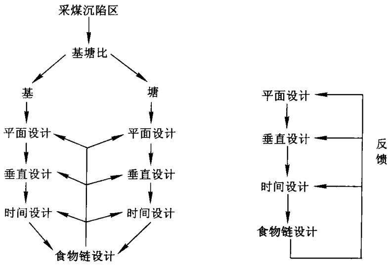  
图 7-11 采煤沉陷区生态工程复垦的总体设计

## 五、井下充填复垦技术介绍

井下充填复垦技术是利用填充物直接进行井下充填，以减少或避免地面沉陷，是土地复垦的预防技术。填充物可以是煤矿固体废弃物(煤矸石、粉煤灰等)、水泥、沙子、河泥等。

随着人们对环境保护和可持续发展认识的提高，“绿色开采”、“洁净生产”和“绿色矿区”已成为当前的研究热点，为此，国内对于煤矸石的井下充填和零排放也应运而生，试图为煤矸石的处置利用和绿色开采探索一条新途径。

张东升等(2004)在预掘巷过断层处理技术中采用预掘硐室作为贮矸空间，然后用编织袋封装的矸石垒砌在贮矸空间，使煤与矸石得到合理的置换，避免矸石上井，增加了煤炭的产出。

刘建功(2005)、郝永玥(2004)等在邢东煤矿矸石充填中使用矸石充填输送机直接充填和高压泵巷道注浆的充填方法。首先用破碎机把矸石破碎成粒径小于150mm的矸石存放到矸石仓，再用带式输送机把矸石运到充填点，通过带式输送充填到巷道内。将筛分出的粒径小于5mm的粉末，由注浆系统加压注入充填矸石上部空隙，使充填密实。

张魁武等(2005)研究了掘进矸石在井下的处理方法。将掘进矸石装入专门的侧卸式矿车，通过提升运输，运入采区内就近的采煤工作面上巷，卸入专门向工作面采空区运送矸石的运输机中，然后靠自重滑入专门运矸的运输机，运输机间歇性地运输，运输机装满矸石，这时停止运输机，2人将矸石卸下并充入采空区。每充填一个柱长度翻一顶子，由下往上逐渐充满，完成一个充填循环。但是这种充填方式由于采充平行作业，造成工作面工序、环节增多、人员增加，工作场所越发狭小，随之各种不安全因素也有所增加。

王宜振等(2002)在枣庄泉兴煤矿的12下煤1216工作面利用矸石带充填沿空留巷，充填带宽度为3m，高度1.1m，充填带的材料主要是工作面断层的矸石及易冒落的伪顶，还有少量的运输巷卧底的矸石。这种做法降低了排矸量，取得了较好的经济和社会、生态效益。

新汶矿业集团泉沟煤矿采用的井下煤矸石充填开采技术，不仅实现了煤矸石的零排放、地面零沉陷，而且提高了煤炭回采率。其中“回采巷道留矸充填”技术的施工工艺为：

## (1) 顺煤层掘进

先顺煤层按2.0m宽的断面掘进4m，巷道见顶见底。巷道为裸体支护。使用ZYP一13型扒装机机械扒装，采用JD-11.4kW绞车提升1辆底卸式矿车跟扒装机。

## (2) 矸石硐室

顺煤层按2.0m宽断面掘进4m后，在下帮掘出矸石硐室。硐室长2.2m，宽2.0m，硐室间距 2.0 m(图 7-12)。

## (3) 垒砌矸石带

将浮煤清理干净，然后人工将矸石垒砌在硐室内。硐室按照由里向外，“外边垒砌大块矸石，里边垒砌小块矸石”的原则进行。外边垒砌的大块矸石，不准出现直缝，矸石与矸石之间有不少于50mm的压茬，接顶要实。

## (4) 清理矸石

随工作面推进，将矸石硐室内的矸石全部清理在采空区。

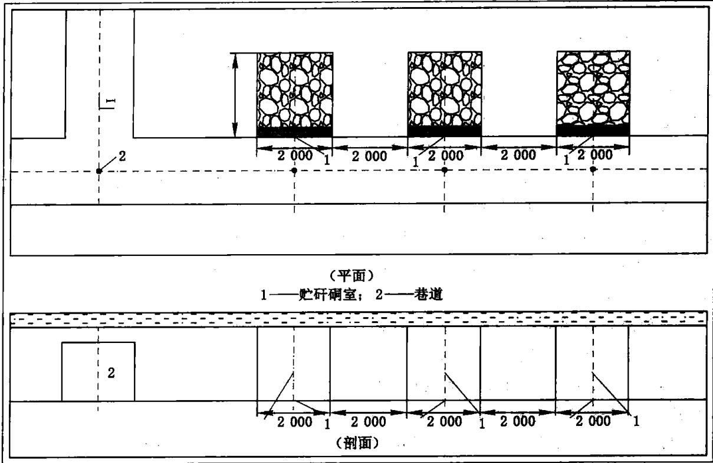  
图 7-12 贮矸硐室实现煤与矸置换示意

## 第四节 未稳沉塌陷地复垦技术介绍

我国土地复垦与生态重建工作开始时面临的是大面积已稳沉土地，因此，上述都是属于“先破坏、后治理”的模式。但是，对于高潜水位矿区，地面很容易积水，若等稳沉后再复垦，土壤资源沉入水中，往往导致土壤资源的损失与贫化和复垦成本的增加。王辉、顾和和等对高潜水位地区开采沉陷对耕地的破坏研究表明：沉陷地土壤密度增大，土壤受到压缩；土壤有机质、速效养分和土壤微生物量的变化与坡地上的土壤侵蚀和沉陷地下部积水有关，并受沉陷稳定时间长短影响，而且有潜在盐渍化的趋势。永夏矿区的研究表明，由于开采沉陷改变了地表耕地原有平坦的形态，在沉陷区范围内形成了坡度大于8%的坡地，从而加剧了水十流失，造成土壤薄层化，土壤养分循环失衡。再有，地面积水后，开放、良好的陆地农田生态系统将转变为封闭的、半封闭的湖泊沼泽生态系统，使原来在地表上生存的绿色植物因不能适应改变后的土壤环境而退化，进而造成生态系统的退化。若在此时开展土地复垦工作，不仅复垦时土方工程变为水下方工程，增加了施工难度和工程造价，而且增加了后期土壤改良与生态系统重建的投人，延长了青苗补偿时间。据皖北煤电集团有限责任公司的实践，水下工程复垦较一般工程复垦其费用增加约30%。以永夏矿区为例，采用传统的土地复垦技术与采用动态预复垦技术相比，与一般沉陷地补偿时间相差2～3年，每年的青苗补偿费达150万元(仅陈四楼矿)。

农业本身在我国是一种“弱质”产业，效益较低，如果各矿区土地复垦时投入的资金过多，往往需要很长时间才能收回，而且不得不长时间地处于农民对土地质量的抱怨声中和不断的支付青苗补偿费。矿区农民也看不到土地复垦给他们带来的收益，大量农民长期处于失业或半失业状态，从而增加矿区社会不稳定因素，引发环保、就业、治安等一系列社会问题，导致地方政府、矿山企业、农民等各方积极性不高，使土地复垦陷入徘徊境地。因此，如何将土地复垦与资源开采相结合，在土地遭到破坏之前，就采取有效的治理措施，最大限度地降低复垦成本具有重要的现实意义和实用价值。

进入21世纪以来，国家在国土资源部设立的“国家投资开发整理项目”，每年有数十亿支持土地复垦工程。在近5年实践中发现，一些项目未稳沉就列入国家复垦项目进行投资，导致复垦后的土地再次破坏，给国家造成了极大的浪费。为此，目前国家在审批复垦项目时都明确要求是稳沉的采煤沉陷地。如果对未稳沉的采煤沉陷地的复垦技术能够成功开发和推广应用，必将能促进我国复垦事业的发展。所以，动态预复垦研究十分必要且具有十分重要的推广应用价值。

动态预复垦强调从矿山建井开始，就将复垦工作贯穿到采矿活动中，全盘考虑，统筹安排，因此，有明显的技术优势，主要表现在以下3个方面：

①实施动态预复垦，可以避免在长时间的抛荒过程中土壤资源的损失和生态系统的退化，尤其是可以在沉陷地积水前将珍贵的表土剥离加以保护，待工程复垦完成后再将表土层覆盖在最上面，稍加培肥改良便可以迅速地恢复土壤生产力，生态系统也可以快速稳定，缩短了后期生物复垦的时间和投入，减少了矿山企业支付青苗赔偿费用的年限和额度。而且在施工过程中可以避免“水下作业”，从而降低工程复垦的难度和投资。因此，实施动态预复垦可以大量节约投资，缩短复垦周期，增加了复垦效益，提高了矿山企业和矿区农民参与复垦的积极性，使复垦工作形成良性循环。

②实施动态预复垦，可以更加灵活地选择施工机械和施工工艺。由于受采矿活动的长期扰动，沉陷地稳沉后，其水文、生态、土壤等客观环境可能较以往有很大的不同，而这些变化对工程复垦时施工机械、施工工艺的选择都有很大影响。比如对于积水区，在工程复垦施工方式上选择铲运机就会很不方便；在施工工艺上选择充填复垦，就会给复垦工作带来很大难度，甚至导致复垦失败。相反，若采用动态预复垦技术，在沉陷地积水前进行复垦，就可以灵活地选择铲运机、挖掘机、推土机等任一种施工机械进行施工，降低了复垦工艺的难度。

③实施动态预复垦，可以使矿区采取除“征地”外的更加灵活的沉陷地复垦管理模式。随着征地费用的提高，许多矿区开始采取“以复代征”、“以地换地”等更加灵活的管理措施。但是，如果复垦后土地质量不好，农民往往不愿意接受，这就使得“以地换地”很难落实，矿山企业与地方农民经常为此发生“扯皮”。而采取动态预复垦技术可使复垦后的耕地质量较原来下降不是很多，稍微培肥地力便可追上甚至超过原来耕地的质量，这样，复垦出的耕地农民乐意接受，从而使“以地换地”变得容易实施。

此外，许多矿山企业都呼吁将采煤沉陷地的管理由以往的征用改为临时用地，以减轻矿山征地的负担。然而，根据我国现行法律规定，临时用地期限较短，即使国家放宽该期限，传统复垦模式的周期也早超过了国家临时用地期限。因此，要想使临时用地政策在矿区采煤沉陷地管理上变为可行，必须缩短沉陷地从被破坏到能重新利用的时间。无疑，实施动态预复垦是最好的选择。

因此，动态预复垦技术具有其不可替代的优势，是一项利国、利企、利民的技术，值得大规模推广应用。

1999年以后，动态预复垦就开始成为我国新的热点课题，目前已取得了一些进展：

## （1）动态充填预复垦技术

利用粉煤灰、煤矸石等充填材料充填造地复田，方法简单、经济、安全。周锦华等在皖北煤电集团有限责任公司刘桥二矿进行了煤矸石充填复垦未稳沉沉陷地为建筑用地的研究；刘学山等利用山东石横电厂原有设备和增加的输灰管道，将灰水直接充填到沉陷区。应用此种方法时，一般要求沉陷区与电厂的距离不大于10km，而且应注意沉陷区的隔水层，确保灰水不会渗透到井下。唐山吕家坨矿曾在大安各庄未稳定沉陷区试验修建了一个总面积925亩的动态复垦贮灰场，利用充灰2%。～3%0的自然坡度，通过调整排灰口位置，实现了分期分区复垦。

## (2)动态非充填预复垦技术

李太启等人研究了皖北煤电集团有限责任公司刘桥二矿开采两层煤，沉陷地要经过二次沉陷才能稳沉条件下的动态复垦技术。具体措施是：采用上行开采方式，先对第一个煤层进行跳采。跳采结束后，地表已经过第一次沉陷，但沉陷深度一般不大，要么还未积水，要么也是仅发生季节性积水。此时，可根据预计最大下沉值和规划的沉陷地复垦利用方向开始进行一次标高到位的复垦，复垦最佳时机为跳采后中央隔离工作面回采之前。

杨伦等人研究了珲春矿区的多煤层、采煤工作面布置及回采顺序可不受常规约束条件下的动态复垦技术。其具体措施是：根据地质报告在平原区下方选择最终累计采厚能达到最大的部位，首先开采选定范围内的各煤层或使该范围内始终较其外围超前开采1～2个煤层。该选定范围即为集中(超前)开采区，开采完毕后再自上而下开采采区周围的各煤层，使地表逐渐形成既大又深的下沉盆地，以利地表水的汇集。当地表开始下沉但尚未积水以前，在盆地底部开挖适当大小和深度的积水塘，再通过开挖的明沟或埋管排水，降低下沉盆地内的水位。通过排水，把积水塘的水位控制在一定的高度以下，从而使下沉盆地内积水塘四周的水稻田能正常生长。

董祥林等通过对朱仙庄矿七采区地表沉陷现状的反复研究和充分论证，提出对矿区沉陷地实施梯次动态复垦。在采场布置上采取“中间开花，上下同步”的方式，先行治理中段沉陷区，后从深部沉陷区块段取土回填浅部沉陷块段，实行滚动治理。其具体工艺是根据采区内煤层赋存状况，合理布局采煤工作面，厚薄煤层交替配采，使地表沉陷呈梯次动态变化。依据沉陷区综合治理规划，对浅部块段先行复垦还田；中部块段休耕期同治，“挖深垫浅”，形成精养鱼塘，发展水面养殖业；深部块段用固体废弃物充填，覆土后用于开发经济林地。

周锦华对兖州矿区综采放顶煤条件下，土地沉陷预复垦的可行性及复垦方法进行了论证，提出了3种具体的预复垦治理方法：第一种方法是结合矿井煤矸石排放，用煤矸石充填预复垦治理沉陷地。该方法是选择离矿井工业广场较近的采区，在综放开采要采煤层之前1～2个月，先行将未来沉陷的表土剥离堆放，然后在采动的过程中，结合矿井正常排矸，将矸石运至复垦沉陷区充填，矸石充填至设计厚度后，再用预剥离表土进行复土。第二种方法是预推土筑坝，修建精养鱼塘。该方法应在综放开采前2～3个月进行，为提高预复垦效率，应根据综放工作面推进速度和农田两季作物时间，对一季作物将受影响的沉陷地进行分区、分期预复垦治理。第三种方法是预取土挖深垫浅复垦沉陷缓坡地或积水沉陷地。该方法是将即将沉陷的土地表土取出，堆存至未来沉陷的缓坡地，待未积水缓坡地形成并基本稳定后，再平整缓坡地使之恢复至原有标高，将缓坡地复垦为高产农田。

虽然我国关于动态预复垦的研究已经取得了一些成果，但是还存在如下问题：

①动态预复垦技术研究尚处于实践探索阶段，缺乏理论研究，没有形成完整的技术体系。如关于动态预复垦的说法不一，有“动态复垦”、“预复垦”等不同说法；偏重于充填动态预复垦技术研究，以煤炭科学研究总院唐山分院为主取得了较多成果，已比较成熟，而非充填动态预复垦技术的研究较少。

②动态预复垦的工艺有待革新。以非充填动态预复垦来说，复垦后得到一个理想的土壤剖面是非常重要的，这就要求在复垦工艺中采用科学的土壤重构技术，而实际上现有技术往往忽视了土壤重构的重要性。虽然有的研究提到了表土剥离，其目的仅是作为充填土源，在剥离堆放和回填过程中均忽视了对其质量的保护，使得复垦后土壤剖面混乱，不利于土地生产力的迅速恢复。

③缺乏对动态预复垦工艺细节和关键技术的深入研究。如动态预复垦时机的选择问题，有的矿区是凭借经验选择复垦工程开始的时间，如“地面没积水就行”、“之前1～2个月”、“之前2～3个月”等类似说法，这是一个非常含糊的概念，缺乏科学依据。而实际上选择何时开始复垦涉及很多因素，例如复垦工程的可承受性、复垦区的地下水位、采用的复垦技术等。开始得太早，复垦工程有二次破坏的风险，开始的太晚，地面出现积水，不仅使表土沉入水中，而且增加了复垦的难度，甚至导致工程失败。对于动态预复垦的范围的确定，不同于已稳沉土地的直观判断，需要科学确定，而这方面研究很少，虽然戚家忠提出了耕地影响角的概念，但仅给出几何求解的方法，实际应用有很大局限性。

④对于高潜水位矿区，动态预复垦由于提前挖掘沉陷区，往往形成较深的鱼塘，矿区农民不得不面临由种植模式向养殖模式的转变，特别是深水养殖有着不同于一般养殖模式的特殊性，这就意味着不能照搬传统模式，需要针对性的研究。目前，这方面的研究还未见报道。

综上所述，动态预复垦是一项非常复杂的技术，风险性的存在使得其难度超过了一般的土地复垦工作，尤其是动态预复垦的一些关键技术，如复垦的时机、复垦范围、复垦标高和如何重构土壤等，还未得到深入研究，更没有形成成熟的动态预复垦技术体系和工艺。

## 第八章 露天矿土地复垦

## 第一节 露天矿复垦概述

目前，我国露天开采煤炭产量约为8000万t，占煤炭开采总产量的6%。根据调查与资料统计，对于露天开采，每采1万t煤炭就有0.06\~0.13hm²的土地挖损，平均为0.08hm²，截至2002年底，我国露天矿开采挖掘土地约为8840hm²。

随着西部大开发战略的实施，煤炭资源开发向西部转移的形势下，露天开采量会进一步增大，对于西部珍贵的土地资源及脆弱的生态环境的影响将日趋严重。

## 一、露天开采方式

露天采煤是直接剥离表土和煤层的上覆岩层，使煤层暴露后开采。在适宜的矿床条件下，使用现代化大型机械的露天采煤较井工采煤效率高，成本低，回采率高。我国近年露天采煤发展较快，如平朔露天煤矿(图8-1)、神府一东胜煤田等。露天采煤矿山可分为采矿场、排土场、尾矿场和工业场地等几个部分。

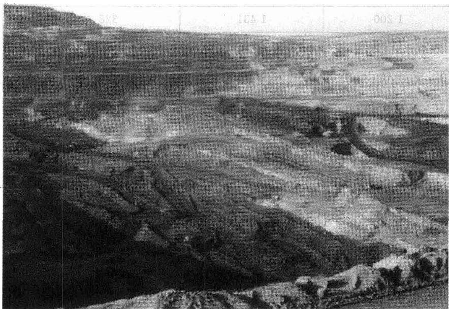  
图 8-1 平朔露天煤矿

现今采用的露天开采方式基本上有以下六种：露天矿坑开采、大面积开采(露天矿坑改造）、表土剥离开采、山坡露头开采、山顶剥离开采和砂矿开采。大面积开采和表土剥离开采破坏的土地面积最大，因为这两种方式主要用于开采厚度小、埋藏浅而且所占面积很大的矿床。一般露天采矿场都设有外部排土场和内部排土场，采用条带排土和条带复垦，且复垦条带的排土量与剥离条带的开采量尽量相适应。如孝义铝矿采用当代先进的“松土机一铲运机”露天矿开采工艺，引进大型的铲运机将铲装、运输及卸载作业实现一机化，使复垦工艺与开采工艺结合为一体。

## 二、露天矿复垦类型

露天开采对土地资源的破坏主要表现在露天采场的直接挖损、外排土场压占土地(表8-1)。露天开采由于作业方式的需要，必须剥离大面积的表土层，直接破坏大量植被。所以，露天矿复垦类型主要包括露采场复垦、排土场复垦。

## 1. 露采场复垦

露天采矿一方面是剥离矿藏上的岩石、土壤，一方面将剥离的岩石、土壤进行堆置(即造地），因而露天采矿是采矿与造地同时进行的。露天矿的采矿工程包括剥离、采矿、排弃、堆置、造地，其中，堆置造地工艺是采矿工程中的组成部分。露采场的复垦主要取决于矿床赋存与地形条件，其次与围岩、表土及当地实际需要有关。

表 8-1  
我国部分露天煤矿的土地破坏情况表
<table><tr><td rowspan=1 colspan=1>露天矿</td><td rowspan=1 colspan=1>生产能力 $/ \mathcal { F } \mathfrak { t } \cdot \mathfrak { a } ^ { - 1 }$ </td><td rowspan=1 colspan=1>占地总面积 $/ \mathrm { h m } ^ { 2 }$ </td><td rowspan=1 colspan=1>采掘场面积 $/ \mathrm { h m } ^ { 2 }$ </td><td rowspan=1 colspan=1>外排土场面积 $/ \mathrm { h m } ^ { 2 }$ </td></tr><tr><td rowspan=1 colspan=1>抚顺西</td><td rowspan=1 colspan=1>500</td><td rowspan=1 colspan=1>4060</td><td rowspan=1 colspan=1>1 320</td><td rowspan=1 colspan=1>2130</td></tr><tr><td rowspan=1 colspan=1>海州</td><td rowspan=1 colspan=1>500</td><td rowspan=1 colspan=1>2 605</td><td rowspan=1 colspan=1>780</td><td rowspan=1 colspan=1>867</td></tr><tr><td rowspan=1 colspan=1>霍林河</td><td rowspan=1 colspan=1>1000</td><td rowspan=1 colspan=1>2856</td><td rowspan=1 colspan=1>660</td><td rowspan=1 colspan=1>1580</td></tr><tr><td rowspan=1 colspan=1>黑岱沟</td><td rowspan=1 colspan=1>1 200</td><td rowspan=1 colspan=1>1 431</td><td rowspan=1 colspan=1>328</td><td rowspan=1 colspan=1>431</td></tr><tr><td rowspan=1 colspan=1>安太堡</td><td rowspan=1 colspan=1>1 500</td><td rowspan=1 colspan=1>2152</td><td rowspan=1 colspan=1>1028</td><td rowspan=1 colspan=1>756</td></tr><tr><td rowspan=1 colspan=1>义马北</td><td rowspan=1 colspan=1>85</td><td rowspan=1 colspan=1>615</td><td rowspan=1 colspan=1>243</td><td rowspan=1 colspan=1>326</td></tr><tr><td rowspan=1 colspan=1>元宝山</td><td rowspan=1 colspan=1>500</td><td rowspan=1 colspan=1>3 166</td><td rowspan=1 colspan=1>300</td><td rowspan=1 colspan=1>480</td></tr><tr><td rowspan=1 colspan=1>伊敏</td><td rowspan=1 colspan=1>500</td><td rowspan=1 colspan=1>2 891</td><td rowspan=1 colspan=1></td><td rowspan=1 colspan=1></td></tr><tr><td rowspan=1 colspan=1>岭北</td><td rowspan=1 colspan=1>300</td><td rowspan=1 colspan=1></td><td rowspan=1 colspan=1></td><td rowspan=1 colspan=1>870</td></tr><tr><td rowspan=1 colspan=1>安家岭</td><td rowspan=1 colspan=1>1 500</td><td rowspan=1 colspan=1>3 815</td><td rowspan=1 colspan=1>381.5</td><td rowspan=1 colspan=1>452</td></tr><tr><td rowspan=1 colspan=1>新邱</td><td rowspan=1 colspan=1>100</td><td rowspan=1 colspan=1>867</td><td rowspan=1 colspan=1></td><td rowspan=1 colspan=1></td></tr></table>

## (1) 浅采矿场复垦

采区表层土壤要妥善就近贮存并与底土分别堆放，防止岩石混入使土质恶化，尽可能保持原有的土壤结构，以利种植。开采剥离的表土在临近采矿场境外建立临时的表土堆场贮存。当几个采区交替进行剥离、开采、土地复垦时可将一个采区剥离的表土直接铺覆于另一个已回填或部分回填废石的采空区，免二次搬运。

将开采形成的废岩土回填至采空区，使采矿与废石回填相互配合，尽量使废岩土在采区内解决，避免往返运输，缩短造地周期。回填后将贮存的表土和底土顺序覆盖，恢复原先的地形，经土地平整、配套农田水利设施和防护林网，建成标准农田。

## (2) 倾斜或急倾斜矿复垦

开采矿体为长的倾斜或急倾斜矿可采用内排法，其复垦工艺流程是：将矿体分为若于小矿田，对剥离系数最小的一块矿田进行强化开采，尽快将矿体采出以腾出空间；将剥离的表土暂时堆弃在该矿田周边，再开采另一块矿田并将剥离物填在已腾出空间的采空区上，将其周边的表土覆盖并整平。

## (3) 山坡露采场复垦

对倾斜或急倾斜的坡积矿床，这类地形的复垦可就地取材修筑梯田，即按等高线堆筑石墙，然后在墙内填尾矿，待尾矿干涸后即成为可供农业或林业用的梯田。

## 2. 排土场复垦

露天矿排土场破坏土地的面积一般占到全矿总面积的50%以上，排土场复垦是矿山企业土地复垦工程中的重点所在。排土场排弃物料中岩石居多，土壤较少，在岩石层上进行农业复垦有一定难度，因而排土场主要适用于林业复垦，少量用于农业复垦或其他用途。

## 三、露天矿复垦区复核

露天矿土地扰动类型包括挖损、压占、占用和污染。挖损是对原地表形态、地质层组、生物种群的直接摧毁，致使原土地不复存在。压占是挖损过程中产生的废弃岩土堆置于原土地上造成原地貌功能的丧失。占用是原有的土地利用类型变为容纳厂房、选煤场、运煤铁路、排土道路、供电通风线路以及给排水管道的工业广场。污染是挖损、压占和占用过程中次生的水污染、粉尘污染及水、土流失等。

所以，露天矿复垦复核的主要对象是挖损、压占、占用和污染的土地范围、类型、破坏程度和时间以及环境要求等。

## 第二节 露天矿复垦技术体系与工艺

## 一、露天矿复垦技术体系

露天矿复垦包括各个方面，它不限于土壤和植被，虽然被破坏的地区不能够完全复原到采前的状态，但能够恢复，它可以恢复其在生态系统中作为一个组成部分的有益功能。但是，在任何情况下，达到复垦目的的最经济的办法就是在土地实际破坏以前编制合适的复垦规划和景观设计。

剥离物规划和回填造地差不多对复垦工作的所有方面都起到重要作用，特别是对水文地质的影响，因此监测剥离物质的量是复垦成功的措施之一。

露天矿复垦包括土地平整、规划剥离物堆体设计、土地整形、沉积池设计、平整设备的设计与操作、费用以及与设计相关的计算机程序设计，即由地貌整形、土壤重构、植被恢复三大部分所构成，如图8-2所示。

## 二、露天矿复垦模式

露天矿土地复垦模式包括平台复垦模式和边坡复垦模式。平台(平盘)，系指排土场中形成的基本水平台地；边坡(斜坡)，系指不同高程的台地与台地接界处形成的坡地。

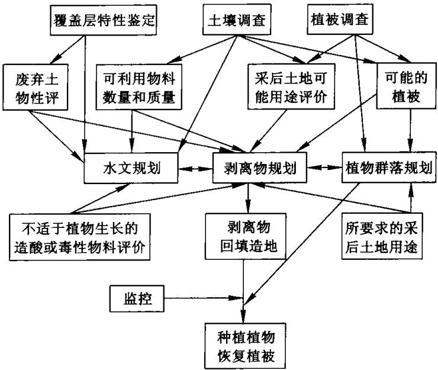  
图8-2 露天矿土地复垦模型

## 1. 平台(平盘)分类

首先是用大型推土机推平，同时修边棱、道路。依地处位置种植适宜的林草。或经四五年后，根据情况再垦为耕地，这时还需利用平土机平土，进行二次平整和裂缝处理，边棱、裂缝处理方法是人工回填、滤料，表面复土。

排土场复垦平盘分为水平式平盘、反坡式平盘和坡式平盘。

①水平式平盘：复垦平盘被整治为水平。

②反坡式平盘：平盘地表稍向内倾斜，反坡角度一般可达2°，这种形状适合于工作面较窄的平盘，能够大幅度地提高田间蓄水能力，并使暴雨过多时由上部平盘坡面产生的径流从平盘内侧安全排走。

③坡式平盘：当平盘较宽并且向内有一定的坡度时，需顺坡向每隔一定间距略高于等高线0.3～0.5m修筑田埂。随着逐年翻耕、径流冲淤而逐渐加高地埂，使田面坡度逐年变缓，最终形成水平田地。

## 2. 平台(平盘)复垦模式

平台(平盘)复垦模式包括“永久性林业用地”和“最终耕地十过渡性林灌(草)用地”两种。

## （1）永久性林业用地平台（平盘)

主要分布在离矿区公路、铁路、工业广场、建筑用地及输煤干线100～200m内的平台。

从地形坡度上讲，平台的坡度为0～5°，虽然可作耕地，但考虑到矿山生产的安全、防风固沙、防粉尘污染及矿区景观美化等功能，作为永久性防风林带。

## (2）农林牧复合用地平台（平盘)

主要分布在外排土场第1～2台阶以上的平台及内排土场的最终平台。其地形大多平坦、开阔、土层深厚、易于耕种，故最终利用方向应恢复成耕地。但考虑到排土场初期非均匀沉降，尤其是严重的水土流失、水分无效损失(包括地表径流、深层下渗和地表蒸发)较多，土壤肥力贫瘠等限制因素，无法在短期内进行农作物栽培，故可暂时作为林牧用地，5～10年后，待排土场基本稳定、水土流失基本控制及土壤肥力提高后，除保留必要的农田林网外，绝大部分地块可逐渐转换成耕地。为了防止风蚀、水蚀、保护农田，在要改为耕地的地块上，一般保留30%左右的林草。

## 3. 边坡复垦模式

边坡复垦系在坡面上先挖鱼鳞坑，再种植适宜的林、草。根据安太堡矿排土场稳定性及水土保持的要求，边坡复垦最终的利用方向只能是永久性林牧用地。

## 三、露天煤矿横跨采场倒堆工艺

根据土壤重构原理，横跨采场倒堆工艺的露天煤矿开采与复垦的工艺方法如下（图8-3):

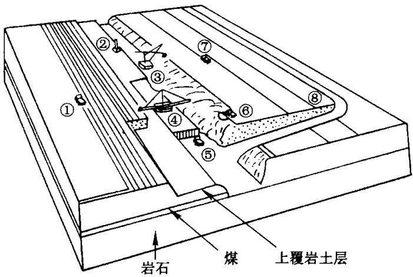  
图 8-3 横跨采场倒堆工艺示意图

图中①、②、③、④、⑤、⑥、⑦、⑧表示该工艺的实施步骤，具体为：

①剥离表土：在开采第i条带前，用推土机超前剥离表土并堆存于开采掘进的通道上；一般剥离厚度为20～30cm，同时也应超前剥离2～3个条带，即i+1，i+2，i+3条带。

②在第i条带的下部较坚硬岩石上打眼爆破。

③用巨大的剥离铲剥离经②步骤疏松的第i条带的下部较坚硬岩石，并堆放在内侧的采空区上(即i—1条带上)。

④用可与剥离铲在矿坑内交叉移动的大斗轮挖掘机，挖掘i十1条带上部较松软的土层，并覆盖在i一1条带内经③操作而形成的新下部较硬岩层的剥离物上。

⑤在剥离铲剥离上覆岩层后，i条带的煤层被暴露出来，用采煤机械进行采煤和运煤。

⑥用推土机平整内排土场第i十1条带的土壤与剥离物，就构成了以i+1条带上部较疏松土层的剥离物为心土层、以i条带下部较硬岩层的剥离物为新下部土层的复垦土壤。

⑦用铲运机回填表土并覆盖在复垦的心土上。

⑧在复垦后的土地上种上植被(一般首先播种禾本科和豆科混合的草种)并喷洒秸秆覆盖层以利于水土保持和植被生长。

## 第三节 露天矿排土场的整形

露天采煤在采区内外分层堆置和分层压实剥离岩土与矸石等排弃物形成排“土”场，排土场由碾压平台和松散陡坡间隔组成，基本形状类似塔形。排土场范围内原地貌、土壤和植被尽被掩埋其下，形成一个特殊的人工景观。排土场是采区岩土混合的人工巨型堆垫体，大型露天矿排土场高度可达到几十米至一百几十米。排土场岩土的混合、复杂的物料组成、表层岩土受大型机械压实、相当长时间的不均匀沉陷、高达35°～40°的坡面、特殊的孔隙、裂隙/缝、洞穴分布特征等等都大大增加了排土场复垦的难度。

露天矿排土场的整形和平整，主要是指利用采矿、复垦机械进行运送、平整复垦区内的土岩工作，使工程复垦后的土地恢复到比较合理的地形、地貌，可以获得稳定坡面和防止水土流失，而且可以增加美学特征和安全性能。

## 一、露天矿排土场的整形设备

## 1. 剥离物搬运设备

用于覆盖物、剥离物、煤矸石搬运的机械有许多种，许多矿山认为铲运机设备比其他运土设备更能准确地铲掘和撒布覆盖物料。

一般来讲，推土机作为排土场剥离物整形、平整的最佳设备，可将推土机与铲刀组合，推土机在复垦中有50%的空转，效率较低，配上铲刀可以提高复垦效率。

## 2. 复垦设备

复垦工程设备属矿山采运设备的组成部分。按照采掘一运输一排弃一复垦的统一考虑，大量的复垦工程均由矿山运输卡车和推土机完成。考虑到复垦工作日常工程的处理。以及维护和洒水的需要，另单独配备复垦设备主要有：162kW推土机1台、PY一F3A型绿化喷药车1台、15t洒水车1台、平土机1台、水播机1台（播草籽专用）、松土机1台等。

## 二、露天矿排土场的整形技术要求

露天矿排土场非均匀沉降的形态有小陷穴、大陷坑、小裂隙、大裂缝、盲洞、盲沟等，造成地表变形的径流紊乱，会引发滑坡、泥石流等地质灾害。故排土场岩土堆垫高速，整体构型松散。在地貌重塑与土体再造初期，应特加注意。

排土场基质构筑和主体构筑过程是地貌重塑过程，而排土场平台构筑过程实际上就是人工进行土体再造，形成复垦种植层的过程。

国外和我国南方露天矿排土场建造的惯例是：先把开挖区原地貌表土单独剥离存放一处，并加以养护，当排土场达到最终标高后，先铺底土，再把原表土二次倒运覆于排土场表面。

大型露天矿排土场面临两大通病：一个是重型卡车碾压，使平台地层严重压实；另一个是非均匀沉降，产生沉陷裂缝。

## 三、“一条龙”复垦模式

矿山类型不同，其排土方式和平整土地方式也不同，要求大型矿山完全效仿中、小型矿山的排土、平整方式也是不可能的。复垦费用不仅与复垦方式、矿山状况有关，而且矿产开采技术也对复垦成本有较大的影响，如露天矿的汽车电铲开采方式，配用铲运机并且有选择性地堆置回填料，都可以使复垦费用低于索斗铲堆积剥离物和配用推土机平整的费用，但前者的矿产开采费用高于后者。除了设备以外，剥离物体积、形状、堆置方式等直接关系到剥离物的搬运数量和距离，同样对露天矿复垦费用有一定的影响。大型矿山因采用大型机械，稍一不慎就会使地表土壤压实，所以必须有一个全盘考虑的计划，真正做到采掘、运输、排弃、复垦“一条龙”，具体安排排土场设计参数的标高和排土场各台阶的堆放形式以及结合现场剥离物的情况分段分期来完成，绝对不能等大面积堆放完再进行覆土、修整地形作复垦工程。分段分期进行复垦能及时搞好水土保持，一次扰动减少二次倒土，减少地表土壤密度，节省运距资金。实践证明，这种作法不但彻底改善了土壤的物理性状，还可以从根本上改变水土流失的状况，加速复垦速度。当然，这样会增加采矿、剥离、排土全面安排的难度，但它仅仅是要求更周密的生产计划，而不会增加复垦投资。

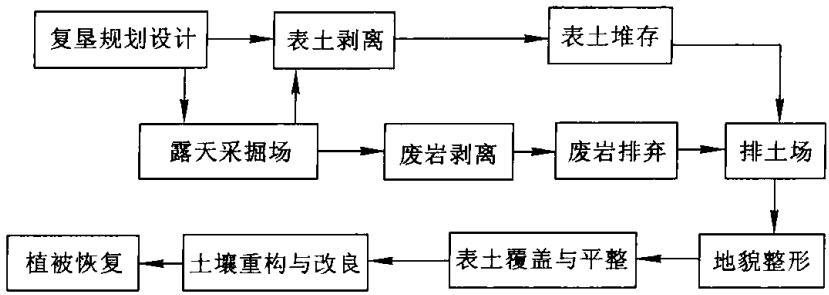  
图 8-4 排土场复垦工艺流程图

“一条龙”作业，即指在露天采矿工艺过程中的采掘→剥离运输→固体物排弃→土地复垦(生物措施、工程措施、水保措施)。

## 四、露天矿排土场防护设施

露天矿排土场的整形中需要注意其安全性，防止水土流失和滑坡，生成新的地质灾害。排土场边坡构筑时，建议采取以下措施：

①修筑挡水墙，阻止平台径流汇入边坡，杜绝切沟和冲沟的发生。

②坡脚堆放大石块，拦截坡面下移泥沙，保护坡脚排水渠系。

③坡面不覆厚层表土，而是土石混堆后立即种植；或者薄层覆土作为备用土，种植时覆土沿坡逐坑下移，覆土立即种植；遇到局部砂、页岩的坡，可客土种植。

排土场除设置必要的蓄水工程外，还需设置必要的排洪渠系，以确保排土场的稳定、安全。

## 五、露天矿排土场整形事项

国内外复垦实践证明，露天矿工程复垦有其一般规律可寻。露天矿排土场整形应注意的事项如下：

## (1）注重采矿工艺与复垦工艺结合

采矿工艺与复垦工艺的有效结合不仅可以大幅度提高复垦效率，充分利用已有的采矿

设备和人员，并目节约复垦成本，减少采矿对矿区环境的不良影响，从而提高了整体效率和效益。

## (2)强调表土的剥离与储存

表+层含有丰富的矿物质、动植物残体腐解生成的有机质、水分和空气等物质，它是植物生长的基础。因此，在采矿工程阶段需要对表土进行预先的剥离和储存，以便复垦用来覆土。

## (3)矸石排弃与场地平整

在采矿阶段就应当做好剥离的岩石的排弃工作，做到排土平盘平整，台阶坡面角满足排土台阶稳定的要求，防止出现泥石流和滑坡现象。

## (4)表土覆盖与平整工程

对农、牧、林业复垦而言，常常需要将储存的表土覆盖在剥离岩层上并加以平整以满足植物生长的要求。对建筑与娱乐用地而言也要进行土地的平整与压实，高大建筑要做好水层的隔离工作。

## (5)修建基本的水利工程

复垦区植物的生长速度相对缓慢，土壤有机质极易流失，因此必须修建必要的水利工程，防止水土流失。

## 第四节 露天矿排土场土壤重构

## 一、露天煤矿复垦土壤重构概述

排土场的基质主要由露天矿剥离的表土及表土母质和矸石组成。表土及其母质堆放的面积约占35%，适于农业开发。矸石堆放地块基质主要是粉岩、砾岩、煤页岩和其他岩石构成。

露天煤矿复垦土壤存在问题主要有土壤侵蚀、岩土混合、不均匀沉陷以及表土的机械压实等。首先是岩土的混排造成的土壤剖面的完全破坏。露天煤矿各层岩土的剥采与堆倒由干受开采成本及开采技术的限制，以往常常是无次序的混排，形成所谓的“矿山土”，这完全改变了原有的自然土壤的层次结构，给重新植被和种植利用带来了很大的困难；混排堆倒的岩土物料松散，抗侵蚀能力差，在植被重新建立之前基本呈裸露状态，在水力、风力、重力作用下很容易造成土壤侵蚀，产生剧烈的水土流失，是否能有效控制水土流失常常是排土场复垦初期的主要任务。露天矿排土一般都采用大型机械施工，由此导致的表层岩土压实在国内外是一个普遍性的问题，很不利于排土场复垦种植。另外，上覆岩层和煤矸石中还可能含有有害的重金属元素或带有较高的放射性，如果将这些岩土堆垫到地表会造成土壤污染，这些有毒有害物质如果随径流扩散，还将造成更大范围的土壤与环境污染，应该采取及时有效的复垦措施，恢复矿区土壤和植被。

露天矿排土场是经过剥离、运输、堆垫而形成的，原来的土体和岩层经过剧烈的扰动混合后以松散堆积状态被堆置在内外排土场、露采场，原有土壤的理化特性与外部环境均发生了根本变化。排土场由于松散堆积而成隆起状态，其周围为陡坡，很容易受到集中的暴雨径流的冲刷和侵蚀而产生剧烈的水土流失。另外，排土场复垦地植被稀少、土质疏松，如果又处在干旱的气候环境，地表岩土颗粒极易受风力吹蚀搬运，产生风蚀。因此，半干旱区露天煤矿排土场土壤的复垦首先要解决水土流失问题，采取的措施首先是排土场位置的正确选择和排土场的合理设计，尽可能把排土场址选在有利于地基稳定的地段，并合理确定排土场的边坡角及不同性质岩土的配置和堆垫方式。在排土场的堆垫过程中，还应该同时采取围堰、覆盖、打坝、设置排水渠道等水土保持工程措施防止水土流失。还应尽快采取林草及微生物等生物措施，尽快建立植被覆盖表土，增加土壤的抗侵蚀能力。

露天采矿使用大型开采及运输机械，重型运输汽车的车轮碾压造成表层土壤的压实，压实土壤的密度可高达1.4g/cm³以上。坚硬的表面恶化了土壤的物理性状，给耕作和种植增加了难度，而且还造成了地表径流的大量汇集，给水土流失创造了条件，利用深松机深松土壤效果良好。另外，露天开采技术和运输机械的改进也是减轻土壤压实的很重要的一个方面。

露天煤矿区土壤重构的主要内容是排土场的土壤重构。排土场土壤重构的核心问题，主要是排土场合理的开采工艺与复垦技术相结合的土壤剖面重构，构造一个与原土壤一致或更加合理的土壤剖面，是露采煤矿排土场进一步复垦的基础和关键。美国《露天采矿管理与土地复垦法》规定和推荐采用的采矿与复垦一体化工艺，视不同地区和地形条件，分别采用平地开采法(Area mining)、等高开采法(Contour Mining)、山顶开采法(Mountain TopRemoval Mining)等采矿与复垦一体化模式。

较平坦地区的露天煤矿农田复垦能较好地体现复垦对土壤重构的要求，目前国外广为采用的横跨采场倒堆的铲斗轮开采系统又是较为典型的露天矿土地复垦技术。该系统是一种同时使用剥离铲和斗轮挖掘机进行剥离的无运输倒堆工艺，属于露天区域采矿方法的一种，适用于倾角小于10°的水平或近水平煤层。由于这种开采方法没有运输环节，与其他露天开采工艺相比，具有投资省、成本低、工效高和复田快等一系列优点，并能形成边采煤边复垦的良性循环。

铲斗轮倒堆开采系统做到了边开采边复垦，使开采与复垦一体化，已经在美国、英国、加拿大、澳大利亚、俄罗斯等国家广泛使用。我国虽然尚未采用这种工艺，但在山西、内蒙、云南等地有大量水平、近水平煤层适于采用这种工艺。可以预见，随着土地复垦工作日益引起人们的重视，这种横跨采场倒堆的铲斗轮开采方法符合土壤重构原理，将在我国得到推广和应用。

除铲斗轮倒堆开采系统外，露天矿轮斗挖掘机一带式输送机一排土机(堆取料机)连续式开采工艺也是采矿与复垦一体化的典型代表工艺，此工艺以其高效率、低成本而在软岩剥离与开采中获得了广泛的应用，并取得了不断的完善与发展。连续开采工艺最早在德国褐煤露天矿中得到广泛应用，此后在俄罗斯、捷克、斯洛伐克、罗马尼亚、波兰、希腊等欧洲国家应用，并扩展至北美、澳洲、亚洲等地区，表明了这一开采工艺的强大生命力。该连续开采工艺的主要优点是系统生产能力高，单位产量的能耗低，工艺过程易于实现自动化管理等。该工艺的缺点是对矿床赋存条件和气候条件要求严格以及初期设备费用高。

排土场表层剖面与表土的构造在排土场复垦中尤为重要，越来越多的矿山排土场复垦注意到了这一点。伊敏河露天矿在排土场复垦过程中，将电厂粉煤灰与露天矿剥离物混合排弃，进行了种草试验；在采掘过程中，将腐殖表土进行预剥离存贮；在开采技术工艺上提前实现了内排，较多地使用了采掘空间作为排土场，从而减少了占地面积。平朔将排土场复垦与采排工艺统筹考虑，提出了采矿、运输、排土、复垦一条龙作业方法以及排土场工程治理、工程复垦与生物复垦方法紧密结合，得到了很好的复垦效果，是我国矿山开采工艺与复垦工

艺结合得较好的矿山之一。

## 二、排土场平台“堆状地面”土壤重构与侵蚀控制优化方法

(一）“堆状地面”土壤重构与侵蚀控制优化方法简介

露天采煤直接剥离表土和煤层的上覆岩层，使煤层暴露后开采。在适宜的矿床和开采技术条件下，露天开采较井工开采能以较低成本达到更高的生产率和回采率。目前露天采煤量平均约占世界总采煤量的30%以上。我国目前露天采煤量仅为总采煤量的8%，主要分布在我国西部地区，随着西部大开发战略的实施，未来的露天采煤量将有大幅度提高。露天采煤剧烈扰动地表，直接破坏地表景观，从而导致更为严重的水土流失、土地破坏、植被破坏、河床淤积、洪水泛滥、沙漠化等一系列环境问题，影响到土壤、植被、地质、地貌、水文甚至区域气候等各个方面。本书以山西省平朔安太堡大型露天煤矿排土场为例展开。

安太堡露天煤矿位于山西省平鲁县境内，地处黄土高原，桑干河流域上游，丘陵地貌，寒温带季风大陆性气候，年均气温6.2℃，年均降水量450mm，时间分布很不均匀，其中65%降水量集中在6～9月份，年均蒸发量2160mm，冬春季节多风沙，地带性植被属干旱草原类型，地带性土壤为栗钙土和黄绵土，土壤有机质含量低、结构差、抗蚀能力弱，水土流失极为严重，是桑干河流域土壤侵蚀最为严重的地区，侵蚀模数高达10120t/(km²·a)。

安太堡露天煤矿是一个典型的现代化露采矿山，是晋、陕、蒙接壤区第一个投产的世界级大型露天煤矿，剥采比为5.6：1，设计年产原煤1500万t，规划开采时间为99年。其工程开发与设计跟美国西部的露天矿类似，采用单头挖掘机一卡车运输的采排工艺。

安太堡露天煤矿排土场是经过剥离、运输、堆垫而形成的。外排土场采用堆山式排土，在原地貌基础上堆起，下垫面有黄土、红土及岩石等。出于减少占地面积的考虑，设计高程较国内同类型排土场要高。内排土场是在采空区堆置而逐渐回填采坑，基质石质，地形平缓。排土场平台与边坡相间分布，平台宽数十米至百余米，台阶高20～40m，台阶坡面角为30°～42°。排土场为岩土混排，原来的土体和上覆岩层经过剧烈的扰动混合后以松散堆积状态堆置在内外排土场，形成人工巨型松散堆积地貌景观。由于排土场堆置时间迅速，排弃岩土的自然固结时间短，稳定性差。原有土壤的理化特性及其相关的地质、地貌及水文条件等均发生了根本变化。平台表层土壤严重压实，干密度达1.5～1.9g/cm³，渗透系数为0.3\~0.4 mm/min；相比之下，平台之间的边坡土体松散，干密度仅为0.9～1.2 g/cm³。

按《土地法》规定，排土场大部分区段的最终利用方向是农耕地。黄土区土源丰富，在到达设计标高前，排土场表层土壤重构以往通常采取厚层覆土方式并用重型机械碾压。这不仅造成了平台表层土壤的严重压实，不利于植被恢复，而且坚硬的平台表面不利于水分入渗，暴雨时很容易形成地表集中的暴雨径流。集中的径流不仅冲蚀了排土场松散的边坡，引起边坡面切沟、崩塌、滑坡，而且还可能沿着排土场内部的大孔隙、不稳定沉陷产生的裂缝以及水流侵蚀形成的盲沟陷穴深入到排土场深层甚至基质，成为排土场稳定的隐患。

侵蚀控制是排土场土壤重构初期最为关键的任务。以往尽管采取填穴、填缝、围堰、覆盖、打坝、设置排水渠道等水土保持工程措施，但由于排土场初期的不稳定性，常规水土保持措施很难发挥有效作用，侵蚀控制效果不是很理想。针对上述问题，赵景逵等基于对安太堡大型露天煤矿排土场的具体分析研究，早在1993年就提出了排土场平台“堆状地面”侵蚀控制方法的设想(图8-5):将排土随机混乱堆弃于平台最上层，利用松散黄土吸纳大量雨水，增加水分入渗，将其储存于土体内，以减小排土场平台与边坡侵蚀，并进行了小规模的试验。实地调查发现，虽然堆状地面取得了较好的效果，但大暴雨时仍然存在边坡冲蚀现象，而半干旱区的绝大部分土壤侵蚀量就是来自每年的几次大暴雨，因此有必要对这一方法作进一步改进。

“堆状地面”土壤重构与侵蚀控制排土工艺(参见图8-5)进一步完善了该方法。本优化排土工艺是在顶层平台上将一车车覆盖土壤按分析计算得到的优化排列方式疏松堆积，不仅利用松散黄土吸纳大量雨水，将其储存于土体内，最大限度地增加水分入渗，而且借助堆与堆之间形成的众多凹坑容纳雨水来分散暴雨径流，同时与常规围堰等措施有机结合，进一步增进了暴雨径流分散效果，从而多方面保证了在大暴雨条件下不会形成大量集中水流侵蚀边坡，消除了大面积集中水流的汇集和钻缝，为快速恢复植被创造了条件。另外，堆状地面还兼具提供填缝填穴土源和在一定程度上自动弥补沉陷裂缝及陷穴的作用，从而避免大量水流下渗到排土场基质影响排土场的稳定。

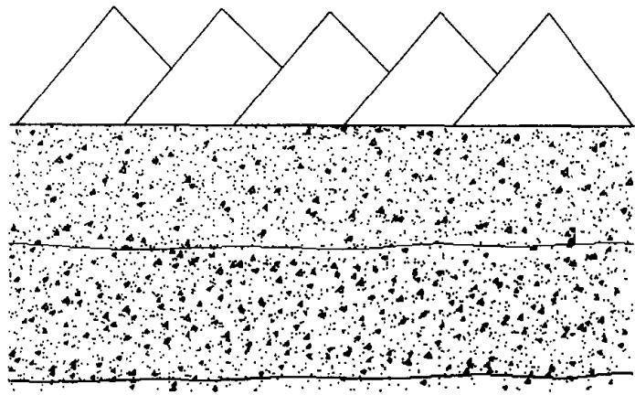  
图 8-5 露天煤矿排土场堆状地面示意图

本堆状地面土壤重构与侵蚀控制优化方法同样适用于工矿区相同类型排土场的初期复垦重构措施。

## （二）堆状地面土壤重构与侵蚀控制优化方法的数学分析

## 1. 堆状地面松散堆状体的几何形状

单车倒土所形成的堆积体的实际形状是一个底面椭圆的劈状体，但与单锥体形状近似，可简单地视其为锥形，表8-2是安太堡露天煤矿西排土场堆状体的实测值。

表 8-2  
安太堡露天煤矿西排土场单个堆状体实测值
<table><tr><td rowspan=1 colspan=1>堆状体实测序号</td><td rowspan=1 colspan=1>底面椭圆长轴直径 $/ { \mathfrak { m } }$ </td><td rowspan=1 colspan=1>底面椭圆短轴直径 $/ \mathbf { m }$ </td><td rowspan=1 colspan=1>堆积体的高度 $/ { \mathfrak { m } }$ </td><td rowspan=1 colspan=1>单个堆积体的体积 $/ \mathbf { m } ^ { 3 }$ </td></tr><tr><td rowspan=1 colspan=1>1</td><td rowspan=1 colspan=1>11.2</td><td rowspan=1 colspan=1>9.7</td><td rowspan=1 colspan=1>3.2</td><td rowspan=1 colspan=1>91.4</td></tr><tr><td rowspan=1 colspan=1>2</td><td rowspan=1 colspan=1>10.9</td><td rowspan=1 colspan=1>10.1</td><td rowspan=1 colspan=1>3.1</td><td rowspan=1 colspan=1>89.5</td></tr><tr><td rowspan=1 colspan=1>3</td><td rowspan=1 colspan=1>10.1</td><td rowspan=1 colspan=1>9.3</td><td rowspan=1 colspan=1>3.5</td><td rowspan=1 colspan=1>86.2</td></tr><tr><td rowspan=1 colspan=1>4</td><td rowspan=1 colspan=1>10.8</td><td rowspan=1 colspan=1>10.3</td><td rowspan=1 colspan=1>3.1</td><td rowspan=1 colspan=1>90.3</td></tr><tr><td rowspan=1 colspan=1>5</td><td rowspan=1 colspan=1>12.0</td><td rowspan=1 colspan=1>10.2</td><td rowspan=1 colspan=1>2.8</td><td rowspan=1 colspan=1>92.7</td></tr><tr><td rowspan=1 colspan=1>均值</td><td rowspan=1 colspan=1>11.0</td><td rowspan=1 colspan=1>9.9</td><td rowspan=1 colspan=1>3.1</td><td rowspan=1 colspan=1></td></tr><tr><td rowspan=1 colspan=5>锥体平均值        平均直径R = 5.2 m        平均高度H = 3.1 m        平均体积 $\widetilde { V } = 9 0 . 0 ~ \mathrm { m } ^ { 3 }$ </td></tr></table>

以大型排土汽车每车土体积均值 $9 0 ~ \mathrm { m } ^ { 3 }$ 计算，排弃土壤的安息角定为 $3 5 ^ { \circ }$ ，则锥体高度$h = r \ \tan \ 3 5 ^ { \circ }$ ，单个锥体体积可由下式计算：

$$
V = \pi / 3 \times r ^ { 2 } \times h = \pi / 3 \times r ^ { 2 } \times r \times \tan 3 5 ^ { \circ } = 9 0 ~ ( \mathrm { m } ^ { 3 } )
$$

从而有 $r = 4 . 9 7 \mathrm { ~ m ~ }$ ,则 $h = = r \ { \tan \ 3 5 ^ { \circ } } = 3 . 4 8 \ { \mathrm { m } }$ 。即此近似单锥体的底面半径为4.97m，高为3.48 m。

实际的堆积形状是多个锥体的联合，其排列组合状况可以有多种形式，例如图8-6所示的正方形排列、三角形排列、多边形排列、优化排列等等。锥体排列的凹形区域构成了堆状地面的基本微集水单元，可视为一个个微小流域。

  
(a)

  
(b)

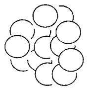  
(c)

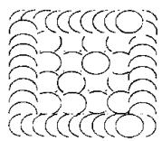  
(d)

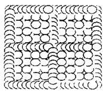  
(e)  
图8-6 排土场顶层平台堆状地面的堆排土方式示意图

## 2. 堆状体水文计算

堆状地面相邻锥体构成一个个微集水单元，以微集水单元为计算单位，分析计算在一定设计频率的暴雨下，单元内产流量的多少，配合后面堆土形式的几何计算，可以确定堆状地面的最优堆积方式。

## (1）松散(黄土)堆积物的入渗速率确定

根据实测降雨径流资料和实地模拟降雨条件下入渗测定数据，并考虑到入渗速率与所选择的暴雨时间段长短有关，取产流计算时段的平均入渗速率 $f \mathrm { = ~ } 0 . 5 5 ~ \mathrm { m m / m i n }$ o

## (2) 设计暴雨计算

根据区域附近平鲁县1951～1980年共22年暴雨资料，进行水文统计计算并作频率曲线分析，拟定设计暴雨时段 $T { = } 3 0 \ \mathrm { m i n }$ ，设计频率按10年一遇和20年一遇（即 $P = 1 0$ %和5%)分别讨论，则由水文适线法得到：

$$
\overline { { i } } _ { 3 0 \mathrm { ~ m i n } } = 0 . 5 7 \mathrm { ~ m m } / \mathrm { m i n } , C _ { \mathrm { v } } = 0 . 4 0 , C _ { \mathrm { s } } = 2 . 5 C _ { \mathrm { v } }
$$

从而：

$$
\begin{array} { r l } { i _ { 3 0 , 5 \% } = K _ { 5 \% } \times \bar { i } _ { 3 0 \mathrm { m i n } } = 1 . 7 5 \times 0 . 5 7 = 1 . 0 0 ~ ( \mathrm { m m / m i n } ) } & { } \\ { i _ { 3 0 , 1 0 \% } = K _ { 1 0 \% } \times \bar { i } _ { 3 0 \mathrm { m i n } } = 1 . 5 4 \times 0 . 5 7 = 0 . 8 8 ~ \mathrm { ( m m / m i n } ) } & { } \end{array}
$$

式中， $C _ { \mathrm { v } }$ 为离势(变差)系数； $C _ { \mathrm { s } }$ 为偏态系数。

## （3）微集水单元产流量的计算

以正方形堆排土形式为例[图8-6(a)]，其微集水单元水平投影面为正方形(图8-7)，是由相邻四个锥体各四分之一部分围成的一个闭合集水区域。如果两两锥体的间距以2C来表示，则闭合正方形集水单元的面积 $F = ( 2 C ) ^ { 2 }$

由下面的产流量计算公式可以知道在设计暴雨条件下各集水单元是否因溃决而相互串通形成侵蚀水流。单个微集水单元面积很小，汇流时间很短。根据水文学一般原理，考虑用如下公式计算在设计暴雨条件下单个微集水单元的产流量R：

$$
R _ { 3 0 , 5 \% } = K ( i _ { 3 0 , 5 \% } - f ) F \cdot T
$$

式中，R为微集水单元的产流量， $\mathfrak { m } ^ { 3 } : i _ { 3 0 , \bar { 3 } \% }$ 为 20年一遇 30 min 暴雨强度，mm/min;f 为计算时段内的平均入渗速率， $\mathrm { m m } / \mathrm { m i n } ; F$ 为产流面积， $\mathrm { m } ^ { 2 }$ ；T 为暴雨历时，min;K 为单位转换系数， $1 0 ^ { - 3 }$ o

由以上拟定的各参数可以得到：

$$
\begin{array} { l } { { R _ { 3 0 , 5 \% } = K ( i _ { 3 0 , 5 \% } - f ) F \bullet T } } \\ { { \ = 1 0 ^ { - 3 } \bullet ( 1 . 0 0 - 0 . 5 5 ) \bullet ( 2 C ) ^ { 2 } \bullet 3 0 } } \\ { { \ = 0 . 0 5 4 \ 0 C ^ { 2 } ( { \bf m } ^ { 3 } ) } } \end{array}
$$

$$
\begin{array} { r l } { { } } & { R _ { 3 0 , 1 0 \% } = K ( i _ { 3 0 , 1 0 \% } - f ) F \bullet T } \\ { } & { = 1 0 ^ { - 3 } \bullet ( 0 . 8 8 - 0 . 5 5 ) \bullet ( 2 C ) ^ { 2 } \bullet 3 0 } \\ { } & { = 0 . 0 3 9 6 C ^ { 2 } ( \mathfrak { m } ^ { 3 } ) } \end{array}
$$

## (4)微集水区域的容水体积计算

集水区曲面形状复杂，为组和型曲面，很难用单一数学方程表达，但可据图8-8用几何方法计算集水区域的容水体积。

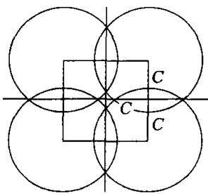  
图 8-7 正方形排列  
形成的微集水单元

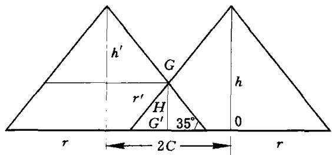  
图 8-8 微集水单元的  
几何分析图

微集水区域控制点G相对锥体底面的高度H：

$$
H = ( r - C ) \sin 3 5 ^ { \circ }
$$

其中，C为 $\boldsymbol { O } \boldsymbol { G } ^ { \prime }$ 两点间的距离。

微集水区域G点水平面以下锥体底面以上的总容积为：

$$
V _ { \ast } = ( 2 C ) ^ { 2 } H = 4 C ^ { 2 } ( r - C ) \sin 3 5 ^ { \circ }
$$

微集水区域G点水平面以下锥体底面以上土的体积为：

$$
V _ { \pm } = 9 0 - \frac { \pi } { 3 } r ^ { \prime 2 } h ^ { \prime } = 9 0 - \frac { \pi } { 3 } C ^ { 2 } \big [ h - ( r - C ) \mathrm { s i n } 3 5 ^ { \circ } \big ]
$$

则微集水区域的容水体积V为：

$$
{ \begin{array} { r l } & { V _ { \nmid \nwarrow } = V _ { \nmid \nwarrow } - V _ { \pm } } \\ & { \qquad = 4 C ^ { 2 } \left( r - C \right) \sin 3 5 ^ { \circ } - 9 0 + { \frac { \pi } { 3 } } C ^ { 2 } \left[ h - \left( r - C \right) \sin 3 5 ^ { \circ } \right] } \\ & { \qquad = 1 2 , 0 6 C ^ { 2 } - 1 . 6 9 C ^ { 3 } - 9 0 } \end{array} }
$$

## (5)微集水区域的最大容积的确定

微集水区域的容水体积随C值的变化如图8-9所示。对上面(4)中微集水区域的容水体积计算公式求一阶导数，并令其为0，可得到最大微集水区域的容水体积 $V _ { \mathrm { * m a x } }$ 及其对应的C值：

$$
V ^ { \prime } { } _ { \ast } = 2 4 . 1 2 C - 5 . 0 7 C ^ { 2 } = 0
$$

解之得：C=4.76，即当C=4.76m时，微集水区域的容水体积最大 $\cdot  { V _ { \star \mathrm { m a x } } } = 0 . 9 8 ~ \mathrm { m ^ { 3 } }$ o

(6)不同设计暴雨条件下产流量的计算

①按10年一遇30min暴雨计算，由上面相应的产流计算公式可以得到：

$$
R _ { 3 0 , 1 0 \% } = 0 . 0 3 9 ~ 6 C ^ { 2 } = 0 . 9 0 ~ \mathrm { m ^ { 3 } } < 0 . 9 8 ~ \mathrm { m ^ { 3 } }
$$

即微集水区域内产流量小于微集水区域的最大容水体积，在此暴雨条件下不会产生集中的侵蚀径流。

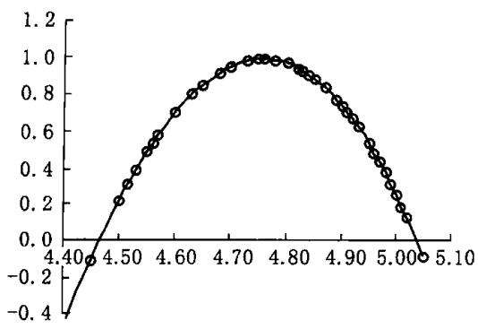  
图 8-9 微集水容积 V 随

②按20年一遇 30min暴雨计算，由上面相应的产流计算公式可以得到：

间距C值的变化

$$
R _ { 3 0 , 5 \% } = 0 . 0 5 4 ~ 0 C ^ { 2 } = 1 . 2 2 ~ \mathrm { m ^ { 3 } } > 0 . 9 8 ~ \mathrm { m ^ { 3 } }
$$

即微集水区域内的产流量大于微集水区域的最大容水体积，在此暴雨条件下将会产生少量集中的侵蚀径流，应该进一步采取相应的措施。

上述分析计算结果表明，堆状地面的分散径流及入渗减流效果明显，一般暴雨时可有效防止径流的产生和汇集，从而在很大程度上避免了集中水流对排土场的侵蚀。但以往常规倒土方式未形成有效的微集水单元(凹坑)或其容积还不是足够大，特大暴雨时仍有出现积水溃坑形成集中水流的可能。

为了彻底解决集中径流对排土场的冲刷侵蚀，可采取堆状地面与常规的围堰措施有机结合的方法。具体措施是：在堆状地面或排土场顶层平台边缘以密集堆积的方式设置土埂，用来拦挡可能出现的暴雨径流，见图8-6(d)；进一步地还可以在整个平台用大方格状密集堆积的方式来分割分散集流区域，减少径流，达到更好的效果，见图8-6(e)。

在倒土方式上，应该使 $C { < } r ($ 即堆堆相连)，以便凹坑下有一定数量的松散土壤来吸纳雨水，同时在 $C { < } r$ 的情况下，堆状表面也较为平整，起伏小，有利于进一步采取土壤重构措施，也有利于植被生长恢复。

但需注意的是，表层黄土的松散堆积在春冬季节有可能引起较强烈的风蚀，应该同时采取覆盖措施和快速的植被恢复等措施。

## 第五节 露天矿排土场植被恢复

## 一、植物选择与恢复

生物复垦工艺设计主要包括排土场石砾坡加速风化技术、排土场平台生土熟化培肥技术、排土场平台覆盖保墒技术、排土场植物配置技术以及排土场植物种植技术。

露天矿土地复垦的首要步骤就是要控制水土流失和加速人工重建植被。

由于排土场存在的时间较长，一些耐旱、耐碱、耐地表高温的草本植物“入侵”了排土场，在一定程度上降低了排土场对自然环境的危害。经调查发现天然木本植物有杨树、榆树和槐树等，草本植物有隐子草、蒺藜、飞蓬、结缕草、狼尾草、早熟禾等。多种牧草对新垦土地不良的土壤肥力状况有着较强的适应能力，它可以从土地深层吸收水分和更广泛的范围内吸

取矿物质营养，起到迅速恢复植被的作用。

根据国内外露天矿排土场植被恢复经验，可以采用“以草先行”、“以草为主”的模式。究其原因为：排土场要经过一段塌实过程，据国内经验为4～6年后才稳定；排土场未结束前复垦不变；先植草后植树是使地面的植被覆盖率可在较短时间内快速提高等。

有条件的可采用草、林、农齐头并进、合理配置，短期长期效益相结合的模式，克服以往从水土保持到生态效益到经济效益依次发展，投资时间长，见效缓慢的缺点。

在新垦的土地上，虽然许多植物都可以生长，但是欲获得牧草高产，必须配合施肥管理。在一定范围内施用肥料的量与产量成正相关关系。

近几年以来，为迅速恢复植被，改变矿区生态环境，主要从两个方面着手：首先是通过工程措施营造有利于植物生长的地形，即平整表面、铺排黄土、平盘修水平小区，基本做到小雨无径流现象；随后是生物治理，所遵循的基本原则是平盘以豆科牧草为先锋植物，以求迅速改善新垦土地的物理和化学性质，逐渐成为适宜农林的可利用状态；在坡面以豆科牧草与禾本科牧草混播，并配合乔木和灌木，以固坡、防风，达到长久的生态效益；利用平坦、背风向阳的小气候区，探讨栽培果林、木本油料植物、观赏灌木等有经济价值的林木的可行性；在靠近矿区办公楼附近，栽培长绿观赏灌木，以改善矿区环境。

## 二、植被恢复管理

根据国内外露天矿土地复垦的主要经验、教训，在植被恢复过程中应该注意以下事项：

(1）内外排土场地面不强调覆原表土

因保留表土投资极大，故按安太堡矿经验，地面不强调覆表土。

## (2)“堆状地面”可促进排土场的安定

为避免排土场地表裂缝、渗水危及地基引发排土场滑坡事件，除平台地面进行反坡、规划排洪渠系外，其余部分作“堆状地面”，即地表排土时，将土堆按次序排列，不推平、不碾压，使地表不产生可见的裂隙，不产生径流，降水就地强化渗入虚土层。尤其在外排土场间更需注意。

## （3）地表覆土后应立即开始复垦

排土场地表覆盖厚层表土会引起严重的面蚀、沟蚀。故不能等待排土场结束后才进行水土保持、土地复垦。必须在局部结束时，立即进行水土保持与土地复垦工作，以免引起排土场的不安定和侵蚀后不易复垦等问题。

## （4)排土场不宜作刚性建筑物

排土场是疏松的堆积体，水保工程及排洪工程的刚性建筑物因地面变形而易破损。故工程措施尽量不用刚性建筑物，代以块石，土袋等，以便及时修补。

## （5)排土场坡面不宜盖土

坡面盖土虽易种植，但降水延续时间较长时，坡面易产生泥石流。坡面不宜厚层盖土，种植可用鱼鳞坑、客土等方法解决。

## （6)应以生物措施为主

排土场土地复垦应以生物措施为主，工程措施为辅，这样见效快，投资少。

## (7)尽可能恢复为耕地

排土场平台除必要的农田林网和防护林外，最终利用方向尽量应规划为耕地，以利于矿区的农业持续发展。

## 第九章 煤矸石山绿化技术

## 第一节 煤矸石山绿化概述

煤矸石是煤矿开采和洗选分离出的含煤岩石和其他岩石的总称，是煤炭开采和加工过程中的必然产物。其主要矿物构成有：高岭土、石英、蒙脱石、长石、伊利石、石灰石、硫化铁、氧化铝等，以 $\mathrm { S i O } _ { 2 }$ 和 $\mathrm { A l } _ { 2 } \mathrm { O } _ { 3 }$ 为主，分别为40%～60%和20%～30%不等，此外还有少量镓、钒、锗等稀土元素。按照我国目前的煤矿生产条件，煤矸石排放量约占原煤产量的10%～20%，煤炭洗选加工过程中煤研石排放量约为原煤人洗量的15%～20%。据不完全统计，目前我国历年累积堆放的煤矸石约45亿t，规模较大的煤矸石山有1600多座，占用土地约$1 . 5 \times 1 0 ^ { 5 } ~ \mathrm { h m } ^ { 2 }$ ，而且堆积量每年还要增加 $1 . 5 \times 1 0 ^ { 8 } \sim 2 \times 1 0 ^ { 8 }$ t(约占地 $3 0 0 \ \mathrm { h m } ^ { 2 } )$ ，成为我国排放量和堆存量最大的工业固体废弃物。大约有三分之一的煤矸石山发生过自燃或正在发生自燃。

## 一、我国煤矸石综合利用现状

根据煤矸石的利用方法和技术，大致可分为直接利用型、提质加工型和综合利用型三大类，我国从20世纪70年代起就开展了煤矸石的综合利用工作，目前主要利用方式有：

## (1)用作燃料供热或发电

煤矸石是一种低热值燃料，燃烧时间长，可以解决 $\overrightarrow { y }$ 区的供热，也可用来发电，产生的炉渣还可以制造各种建材。

## (2) 用来生产建筑材料

制砖、瓦、水泥等，用煤矸石代替部分和全部黏土，煤矸石中少量的可燃物，既可做原料又可做燃料，降低生产成本。

## (3) 用作充填材料

利用低热值的煤矸石作充填物治理采煤沉陷区和其他塌陷坑或废 $\mathfrak { P }$ 场等，然后进行土地复垦，恢复生态环境，或用作一般公路的底基层或路基，还可以用作井下护巷充填材料，既代替了部分护巷材料，又减少了排矸量。

## (4) 制取化工产品

煤矸石中含有硫、铝、铁、钡等50多种元素，当富集量达到具有工业利用价值时可加以提取利用。另外，煤矸石中含有植物生长需要的大量有机质和微量元素，往其中加入添加剂、活性剂，可以生产有机肥料。

尽管煤矸石具有多种利用途径和方法，但由于受资源性质、经济条件、技术设备以及市场变化的影响，目前我国煤矸石的利用率不到30%，与发达国家相比差距较大，而历年来积

存的煤矸石基本未用。大量实践证明，煤矸石山绿化是我国目前治理煤矸石山的有效途径之一，既可以增加矿区的绿化面积，还可以改善矿区生态环境，是矿区生态重建的基础和核心内容。

## 二、煤矸石山绿化的目标与作用

煤矸石山实际上是人造“石质荒漠”，无土、缺水、于热、强酸、有毒，缺少植物种子和残根，不具备植物生存和更新条件。从植被自然演替规律看，石质荒漠区的植被形成，必须经过石质风化一低等植物侵占一高等植物衍生等各个演进阶段，需要50～100年的时间。但人工营造植被可通过改造环境和创造植物生长、繁育条件，缩短植被演化的进程。因此，煤矸石山绿化的目标就是建立稳定、高效的煤矸石山人工植被生态系统，通俗地说，就是把黑秃秃的煤矸石山变成“花果山”。其主要作用有：

①利用物理、化学方法改善煤矸石山的立地条件，利于煤矸石山植被的生长，加快煤矸石山植被的演替进程。

②通过煤矸石山的植被恢复，改善煤矸石山的环境条件和美化景观，利用植被覆盖，减缓地表径流、拦截泥沙、调蓄土壤水分、减少风蚀和粉尘污染。

③通过煤矸石山的植被恢复，降低煤矸石山的温度，减弱煤矸石山内部氧气的含量和 流动性，防止煤矸石山自燃，减少煤矸石山自燃对矿区环境的危害。

④利用植物的有机残体和根系的穿透力以及分泌物的物理、化学作用，改变扰动区下面的物质循环和能量流动方式，促进煤矸石山的成土过程，增进生态环境的生物多样性。

⑤利用植物群落根系错落交叉的整体网络结构，增加下垫面的稳固性和抗蚀、抗冲能力，保障煤矸石山的工程建设顺利进行以及工程结束后退化生态系统的恢复与重建，形成稳定良好的生态结构和功能。

⑥恢复了煤矸石山压占土地的使用价值，并通过植被的建立实现一定的经济价值。

⑦通过煤矸石山植被恢复，调节区域气候、制造氧气、美化环境，取得显著的环境效益 和社会效益。

## 第二节 煤矸石山绿化的技术模式和程序

## 一、煤矸石山绿化技术模式

煤矸石山作为煤矿区主要的废弃地和退化生态系统，在我国其植被恢复和生态重建的研究与实践已有10多年历史。目前，我国已有十几座煤矸石山得到绿化，在一些矿区已经取得较好的效果和初步经验，但由于煤矸石山立地条件的复杂性，还有较多技术问题亟待解决，理论研究的深度和广度还远远不能满足煤矸石山植被恢复和生态重建的需求。另外，我国地域辽阔，各地自然条件差异较大，各个矿区煤矸石的来源与特性不同，在植被恢复技术研究结果上各有侧重点，主要集中于单项技术措施(立地条件分析、植物种类的选择、整地及基质改良技术、幼林的成活或生长状况中的某一项或几项)的研究上，缺乏科学有效的植被恢复与生态重建技术模式，导致可比性和推广性较差，影响了煤矸石山植被恢复技术的推广和应用。

以恢复生态学原理为基本的理论基础，以森林培育学为基本的理论和技术框架，基于我国煤矸石山植被恢复的实践经验和在山西某矿煤矸石山造林绿化的成功案例，中国矿业大学(北京)土地复垦与生态重建研究所提出了煤矸石山植被恢复与生态重建技术模式(图9-1)，由以下6项植被恢复工程技术组成：

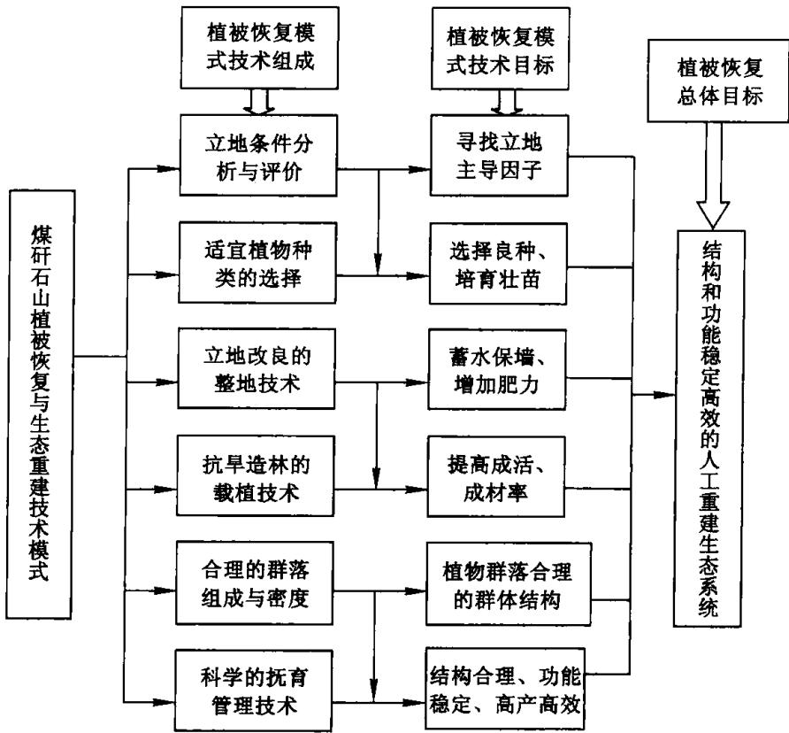  
图 9-1 煤矸石山植被恢复与重建技术模式体系框图

## 1. 立地条件分析与评价技术

通过对各种立地因子的测定与分析，寻找植被恢复的限制因子，确定主导因子，为植物种类选择和立地条件改良提供依据。

## 2. 适宜植物种类的选择

通过分析植物的生物学特性，尤其是植物的生理生态特性，以乡土植物种为主要对象，筛选适宜植物种类，达到“适地适植物”或“适地适树”的目标。

## 3. 整地与立地改良技术

通过合理的整地和科学的基质改良方法，达到“蓄水保墒、增加肥力”的目标，为植被恢复创造良好的环境。

## 4. 综合抗旱栽植技术

通过合理的植物栽培方法和抗旱栽植技术，达到提高成活率与保存率，进而促进恢复植被的成林和生长稳定的目标。

## 5. 合理的群落组成与密度调控技术

通过确定合理的栽植密度和植物组成类型，使恢复的植物群落具有合理、稳定的结构。

6. 植物群落经营管理技术

通过土壤管理与植被管理措施，达到植物生态系统“结构合理、功能稳定、高产高效”的

目标。

以上各项技术措施相辅相成、相互关联，缺一不可。在煤矸石山生态重建过程中，可按照以上6项技术措施，科学地进行施工和培育，在煤矸石山建立起结构和功能稳定高效的植物生态系统，实现煤矸石山生态系统的重建，这也是任何退化生态系统恢复和重建的最终目标。

## 二、煤矸石山绿化程序

煤矸石山是开采废弃物堆积而成的人工“地貌”，其地形、地表组成物质及其物理化学性质大多不利于植被的生长和演替，植被遇到的生态学问题是叠加性的。例如，有的煤矸石山既有酸性，又有重金属及其他有毒物质的毒害，还缺乏有机质和氮、磷、钾等营养元素。因此，煤矸石山生态重建工程除常规的植物栽培技术措施外，还必须配以其他特殊的工程技术措施和实施程序，以保证煤矸石山植被恢复与生态重建工程的成功。

煤矸石山植被恢复的工程程序包括3个阶段9个步骤，简称“3段9步”(图9-2)：

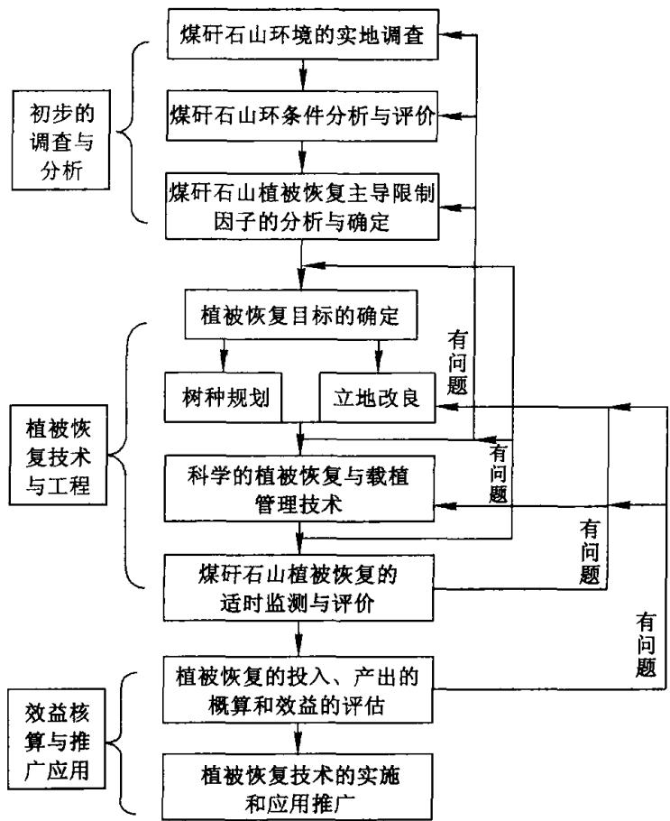  
图9-2 煤矸石山植被恢复实施工程程序

## (一)煤矸石山的初步调查与分析

煤矸石山植被的恢复由于受到煤矸石山的环境和立地条件的限制，以及煤矸石山生态恢复利用目标规划的需要，必须对煤矸石山的环境状况进行调查和分析，内容包括以下三个方面：

## 1. 煤矸石山环境的调查

包括煤矸石山生态环境和煤矸石山所在区域环境的调查。调查煤矸石山的生态环境，包括其土壤、水文和养分等。区域环境的调查要全面地调查煤研石山所在区域的生态、社会和经济等情况，为煤矸石山的生态重建目标规划提供资料。

## 2. 煤矸石山环境条件分析与评价

煤矸石山的立地条件分析，主要从煤矸石山的风化层土壤、水文等条件以及煤矸石山的酸碱度和养分状况等方面进行。根据煤矸石山的岩性特点，有的还需要分析其金属毒性和有害物质的含量等。由此评价煤矸石山作为植物生活环境的适宜性。通过分析煤矸石山区域环境条件，确定和评价煤矸石山生态重建的期望目标。

## 3. 煤矸石山植被恢复主导因子的分析与确定

通过对煤矸石山的立地条件和环境条件的分析与评价，了解和确定限制煤矸石山植被成活和生长的主要因素，为煤矸石山植物品种的选择和立地改良措施提供依据。

## （二）生态重建工程与技术

在对煤矸石山环境条件充分了解的基础上，规划煤矸石山的生态重建目标，选择煤矸石山的适宜树种，并采取适宜的立地改良、植物栽植等措施，实现煤矸石山的植被恢复，并对煤矸石山的植被实施监测和评价，加强煤矸石山植被恢复的过程管理，实现煤矸石山的生态重建目标。

## 1. 生态重建目标的确定

根据煤矸石山的生态环境和区域环境条件等确定煤矸石山的生态重建目标，如林业利用目标、农牧业利用目标、风景旅游利用目标和综合利用目标等。生态重建目标必须与区域的生态环境和区域的社会经济发展相协调。

## 2. 树种规划和立地改良

根据立地条件和矿区环境条件规划选择适宜的树种和立地改良措施，是植被恢复成功的关键。树种规划要坚持“适地适树”的原则，同时考虑树种选择的长远利用目标。树种选择一般以乡土树种为主，可以适当地增加经过驯化的能够适应煤矸石山环境的外来树种，以增加树种的多样性，创建乔、灌、草合理配置的复层植被群落系统。立地改良运用物理、化学和生物等方法，改良土壤的物理结构、养分结构和化学性状等，使之能够满足植物成活与生长的要求。

## 3. 科学的植物配置与栽植管理技术

煤矸石山植被恢复的目标是重建煤矸石山自维持的稳定的生态系统，因此煤矸石山的植物配置应该采用群落式的布置形式，根据煤矸石山的环境条件确定植被群落的密度、结构和组成。群落组成的确定还要考虑乔、灌、草的结合和树种的多样性，为植物群落的稳定奠定基础。植被的栽植要结合煤矸石山的立地条件和立地改良方法，采取适当的栽植技术，如覆土栽植、无覆土栽植等，缺水地区还要考虑采用抗旱造林方法，如保水剂、秸秆和地膜覆盖等方法。煤矸石山恢复植被的管理重点是要加强水肥的管理。煤矸石山植被恢复初步成功之后，管理的力度要强，随着植被的生长，管理力度根据实际情况可以适当降低，以促进植物生态系统实现自我演替。

## 4. 植被恢复的适时监测与评价

植被恢复初步成功之后，恢复的植被可能由于多种原因发生退化，通过监测和评价可以尽快地发现植被退化的原因，采取适宜的措施，对恢复的植被进行维护；通过监测和评价还可以及时地发现由于乡土树种的侵入或者其他物种的侵入使恢复植被的自我演替不是按照规划设计的方向发展，这时可以通过引进期待树种，使之能够按照规划设计的方向创建希望的生态恢复系统。

监测和评价已经建立的生态恢复系统，还可以评估植被重建的环境效益和生态效益，深入研究生态恢复的过程与机制，为推广和发展植被恢复技术提供理论支持。

## （三）效益核算与推广应用

煤矸石山植被恢复的主要目的是要恢复和保护矿区生态环境，实现环境效益、社会效益和经济效益。通过煤矸石山植被恢复的效益核算，可以了解煤矸石山的植被恢复投入与产出的关系，进而对煤矸石山的植被恢复模式进行调整，使之更优化，更适应煤矸石山的实际情况，从而获得更高的效益。对具有较高效益的煤矸石山生态重建模式进行推广应用，实现煤矸石山及矿区生态环境的改善。

## 第三节 煤矸石山立地条件的改良

## 一、煤矸石山立地条件分析与评价

立地条件是指与植物生长发育有关的所有环境因子的总称，简称立地，生态学称之为生态环境条件或生境条件。煤矸石山立地条件可理解为：在煤矸石山植被恢复与重建时，与植被生长和发育有关的所有环境因子的综合。

立地条件分析与评价的目的在于：通过立地条件调查和综合分析，掌握影响植物生长的主导因子(限制因子)，以主导因子为依据，将复杂的环境条件划分称内部条件相似，而与外部条件有明显差别的立地条件类型，然后按立地条件类型进行植被恢复技术措施的设计。煤矸石山立地条件十分特殊，需要认真分析。

## (一)煤矸石山的地形及风化层

煤矸石山是人工堆垫而成的石质山，属“人工地貌”，由于堆放工艺的原因，山形多呈锥形，斜坡的坡度为矸石的自然安息角(36°左右)，煤矸石山的高度不一，有的可高达百余米，占地面积少则几公顷，多的可达几十公顷。虽然近几年煤矸石排放要求压平，但以前遗留下来的煤矸石山仍然是锥形。

煤矸石的物质组成主要由高岭石、伊利石、黏土矿物、石英和少量的煤、黄铁矿组成，各类矸石仅在组成百分比上有些差异。白色矸石主要指硅质砂岩、石灰岩、砾岩等，此类矸石由于结构致密，块大，一般不易风化，其他以黑色矸石(炭质泥岩、炭质页岩)为主组成的矸石山表面都有风化现象。

矸石山表层的物理结构以风化颗粒为主，颗粒以石、砾为主，砂及粉砂可占10%～40%，粉砂以下颗粒很少，故矸石山剖面发育极不明显，颗粒组成比黄土颗粒粗得多。另外矸石山坡下部和低凹处由于风力和冲积的作用，有较厚的风化堆积物，其他部位的风化物的厚度多年维持在10cm左右。从矸石山剖面来看，可分为三个层次：风化层(0～10cm)、微弱风化层(10\~30 cm)和未风化层(>30 cm)。

## (二)煤矸石山的水分特点

矸石风化物与黄土相比，密度相近，密度较大，表现为总孔隙度较低，进而又表现为田间持水量和有效水含量最大值都较低。由于颗粒粗，凋萎系数较低，矸石风化物仍具有一定的蓄水孔隙，可为植物提供一定数量的有效水，能在一定程度上满足植物对水、气的需求，因此矸石风化物可作为植物生长的介质。

一般认为，土壤结构决定土壤低吸力段的持水量，土壤质地决定土壤高吸力段的持水量。矸石风化物属粗碎屑土，故水分运行和黄土的迥然不同。矸石因极少毛管孔隙，水分易渗透而不易蒸发，故虽有效水容纳量小于黄土，但有效水利用率却高于黄土，尤其在旱季可高于黄土2%～5%。

## (三)煤矸石山立地条件的主导因子分析

煤矸石山的立地条件与其他矿区废弃地一样，影响植被生长的立地条件包括气候、地形、土壤(实质是煤矸石的物理与化学性质)、水文与植被条件等。但与其他种类的造林地(或退化生态系统)相比，生态重建面临的主要环境问题突出表现在以下几方面：

①地表组成物质由煤矸石及岩石组成，无土壤可言，有机质含量少，物理结构极差，尤其是保水、持水、保肥能力差。

②存在限制植物生长的物质，包括pH值、重金属及其他有毒物质等。

③缺乏营养元素，尤其缺乏植物生长必需的氮和磷。

④土壤生物缺乏，尤其缺乏对植物生长有利的生物，如蚯蚓、线虫及微生物等。

这些因素正是植物生长的限制因子，即煤矸石立地条件的主导因子，集中表现在煤矸石山地表组成物质的物理与化学性质方面。同时由于不同煤矸石山的地表组成物质具有不同的来源，上述主导因子的种类与含量具有较大差异。

因此，煤矸石山在植被恢复工作之前，首先应分析煤矸石山的物理化学性质，寻找出植物生长的主导限制因子，同时预测煤矸石山对植物生长的供水能力，这是植物种类选择和确定植物栽培方式的最基础工作。煤矸石山地表组成物质的物理化学性质主要包括：

①煤矸石山风化特征及决定成土机制的矿物组成及特性。

②煤矸石山的密度、孔隙度、粒径级配、持水能力、渗透性能等土壤物理及水分物理特征。

③煤矸石山的有机质、大量元素(氮、磷、钾、钙、镁)、微量元素(铁、锰、硼、钼等)、酸碱度、重金属及其他有毒有害物质元素的含量及化学特性与营养特征。

## 二、煤矸石山的整地

## (一)煤矸石山整形整地的作用及要求

前已述及，煤矸石山地形特殊，多数呈锥形，为了改善其立地条件，防止煤矸石山在遇到大风和雨水时造成径流和侵蚀，创造植物生长的有利条件，同时也为满足煤矸石山植被恢复工程的施工安全和方便，必须对其进行整形整地。

在世界经济发达国家，煤矸石山的整形整地多采用推平整地、减缓坡度、覆盖土壤以及添加营养物质等措施，较大规模改良煤矸石山的立地质量。但我国限于经济势力、土地资源状况和技术水平，难以达到这样的改造程度，只能以较小的整形工程规模、局部的整地措施和较少的经济投入达到尽量改善立地环境的目的。

煤矸石山整形整地的主要目的和作用在于：

①减缓坡度，减少粒度，改善地表组成物质的粒径级配。

②改善孔隙状况，增加毛管孔隙度，提高土壤的持水、供水能力。

③改善局部土壤的养分和水分状况，增加土壤含水量。

④稳定地表结构，减少水土流失和控制土壤侵蚀。

⑤便于植被恢复施工，提高造林质量。

⑥增加栽植区土层的厚度，提高栽植成活率和保存率，促进植物生长。

对煤矸石山进行整形，既要考虑栽植工程的实施，也要考虑景观优美，在整形设计时一般有以下要求：

①建立一条环山道路直达山顶，便于运料和整地施工以及游人登顶。

②对山顶进行平整以建立亭台和休闲活动场所。

③结合景观设计和整地种植，采取平缓陡坡、修建梯田等方法重塑地貌景观。

④在煤矸石山的一些适宜位置建立错落有致的石阶供游人登山。

⑤建立排水系统，由于煤矸石山高度比较大，坡度较陡，表面覆土后很容易发生表面侵蚀，产生水土流失，因此煤矸石山整形的同时应设计完善的排水系统。

## （二）煤矸石山整地的方法与技术规格

## 1. 整地的方式方法

整地的方式有全面整地(翻垦全部土壤)和局部整地(翻垦局部土壤)两种。按照既经济省工又能较大程度改善立地质量的原则，不提倡整个煤矸石山全面覆土的整地方式，而采用局部整地方式。在局部整地方式中，带状整地方法和块状整地方法均可采用。带状整地可采用水平阶、水平梯田及反坡梯田的方法；块状整地可采用鱼鳞坑和穴状两种方法。

为增加栽植区的土层厚度，在整好的植树带或植树穴内再进行适量“客土”覆盖。“客土”有两种来源：一是异地“客土”，即利用其他地方的土壤填入植树带或植树穴内；二是就地取材，即将植树带或植树穴附近的表层煤矸石风化物填入其中。另外，有条件的煤矿，最好利用污泥覆盖技术，既能较大程度地提高煤矸石山的肥力水平、改善煤矸石山表层结构，又能降低覆盖绿化成本和污水厂的处理成本，提高废物利用率，减少二次污染，达到“以废治废”的目的。

## 2. 整地的技术规格

整地的技术规格包括整地深度、宽度、断面形式和覆土的厚度等。

①煤矸石山的整地深度因植被不同而异，一般情况下，各种植被所需整地深度的低限值是：草本植物为15 cm，低矮灌木为30cm，高大灌木为45cm，低矮乔木为60 cm，高大的乔木为 90 cm。

②整地宽度的基本原则是，在自然条件和经济条件许可的前提下最大限度地改善立地条件，控制水土流失。煤矸石山的坡度一般较大，整地宽度不宜过大，以免加剧水土流失。若采用反坡梯田整地的方法，在坡度分别为20°、30°、40°时，其整地宽度依次为1.5m、1.0m、0.8m为宜。

③断面形式是指整地后的土面与原坡面所构成的断面形式。为更多地积蓄降水，减少蒸发，增加土壤湿度，煤矸石山整地的坡土面要低于原坡面，并与原坡面形成一定的角度，构成一定的蓄水容积，并能积聚雨水冲下来的煤矸表层风化物，增加土层厚度。

④综合解决煤矸石山限制性因子的最好最快的方法是在煤矸石山上覆盖物料，国外常用树皮、锯木屑、城市污泥，因其含有大量的有机质、养分和微生物，可促进煤矸石的风化，国内最常用的覆盖物料为土。惯例是在平整的地面上先盖底土(生土)，再覆盖肥沃表土，对于干旱地区，由于降雨量小、蒸发快，煤矸石山绿化时覆土厚度应在40cm以上，实践中土层厚度常常大于80cm，如宁夏大武口选煤厂煤矸石山复垦覆土100cm。这种方法虽好，但投资大，尤其在土源缺乏的地方无法进行，另外，在异地取土的过程中有可能造成更大范围的土地生态环境的破坏。对于半干旱地区和半湿润地区且煤矸石山无自燃的情况下可以无覆土栽植。也有研究认为，薄层覆盖(在煤矸石山地表覆盖一层约3～5cm的黄土，将黑色地面盖住即可)可以解决直播草籽高温烧苗的问题，而且因根系大多可扎入煤矸石层中，更有利于水分的有效利用。操作的方法是先播种草籽，然后再盖薄层黄土。

## 3. 煤矸石山整地季节及施工方式

煤矸石山的整地应按照至少提前一个雨季的原则进行，即如果是春季造林，整地最好在造林前一年的雨季以前进行；如果是秋季造林，整地最好在当年的雨季以前进行。这样有利于植树带的蓄水保墒和增加有机质等养分含量。

整地施工时，一般是按照由上而下的顺序施工，不仅可以借助重力的作用便于施工，而且可以使下一个梯田的施工不影响上一个已施工好的梯田。

## 三、煤矸石山自燃的防治

## (一)煤矸石山自燃的特征及原因

## 1. 煤矸石山自燃的特征

煤矸石山由大量煤矸石颗粒堆积而成，占地面积大，堆积高度高，结构疏松，在重力作用下，煤矸石颗粒排放滚落具有分选型，颗粒上粗下细。一方面由于煤矸石组成比较复杂，可燃物质的分布、粒度大小等不均匀，造成自燃后燃烧强度不均匀，自热和自燃的不均匀性加强了温度和空气流动分布的不均匀，而且由于氧气供应不足，具有不完全燃烧的特点。另一方面，燃烧发展过程十分缓慢而隐蔽，一般从内部先燃烧，初期阶段燃烧涉及的煤矸石数量很少，燃烧强度不大，释放热量很少，自燃区温度也不高，处于缓慢引燃状态的时间较长。

## 2. 煤矸石山自燃的机理

## （1）高硫量的煤矸石山及低硫量的煤矸石山

高硫量的煤矸石中含有大量的煤屑和硫，其中硫主要以硫铁 $\overrightarrow { A D } ^ { 2 } ( F e S _ { 2 } )$ 形式赋存。煤矸石山内部2\~7m的多孔条件，使硫铁 $\ y ^ { 2 }$ 与氧接触而发生氧化，产生热量保存下来，热流加剧反应的速度，造成恶性循环。当超过临界燃烧点时，引发自燃。供氧充足时氧化反应如下：

$$
4 \mathrm { F e S } _ { 2 } + 1 1 \mathrm { O } _ { 2 } = 2 \mathrm { F e } _ { 2 } \mathrm { O } _ { 3 } + 8 \mathrm { S O } _ { 2 }\tag{9-1}
$$

$$
4 \mathrm { F e S } + 7 \mathrm { O } _ { 2 } = 2 \mathrm { F e } _ { 2 } \mathrm { O } _ { 3 } + 4 \mathrm { S O } _ { 2 }\tag{9-2}
$$

少数低硫量煤矸石山也容易产生自燃。低变质煤H的含量较高，挥发份较高，燃点较低。煤矸石中残存的低变质煤，接受不完全氧化，生成CO和 $\mathrm { C O _ { 2 } }$ ，随着热区矸石温度的升高，大量的 $\mathrm { C O } _ { 2 }$ 被还原成CO，使CO的浓度逐渐增大，当温度达到煤的燃点时，煤矸石自燃。供氧不足时的氧化反应为：

$$
4 \mathrm { F e S } _ { 2 } + 3 \mathrm { O } _ { 2 } = 2 \mathrm { F e } _ { 2 } \mathrm { O } _ { 3 } + 8 \mathrm { S }\tag{9-3}
$$

$$
2 \mathrm { F e S } + 3 \mathrm { O } _ { 2 } = 2 \mathrm { F e O } + 2 \mathrm { S O } _ { 2 }\tag{9-4}
$$

## (2) 气体贯入易引发自燃

煤矸石山在自然堆放(平地或顺坡堆放)过程中，产生其特有的堆积结构。煤矸石沿索道自上而下排放堆积煤矸石，形成“倒坡式”排放，在自然重力作用下，滑落堆积的煤矸石具有明显的分选性，这样会使煤矸石堆积时产生下部颗粒粗大、上部颗粒细小的粒度偏析，造成煤矸石山下部空隙较大，利于空气进入，气体贯入易使煤矸石氧化而聚热，上部空隙较小，具有良好的储热性。氧化产生的热量，一部分随空气带出，另一部分则积聚在煤矸石山中，当某一局部温度达到自燃点时便引起自燃，且逐步向四周蔓延，因此，煤矸石山燃烧多发生在煤矸石山内部或裂隙地带。这种堆积方式是其自燃的外部原因。

## (3）水促进煤矸石山的氧化，加速了自燃的进程

水是影响煤矸石山自燃的另一重要因素，水的存在增加了煤矸石中黄铁矿的水解作用和氧化能力。

$$
4 \mathrm { F e S } _ { 2 } + 1 2 \mathrm { O } _ { 2 } + 6 \mathrm { H } _ { 2 } \mathrm { O } = \mathrm { F e } ( \mathrm { S O } _ { 4 } ) _ { 3 } + \mathrm { F e } ( \mathrm { O H } ) _ { 3 } + 3 \mathrm { H } _ { 2 } \mathrm { S O } _ { 4 } + 2 \mathrm { S }\tag{9-5}
$$

而且氧化使煤矸石山山体疏松，从而加剧了氧化的进程，同时为山体的崩塌埋下了隐患。

## (二)煤矸石山自燃的防治措施

煤矸石山自燃是一种比较特殊的燃烧系统，它的起燃和维持燃烧、火区的转移同一般火灾有很大差别。在采取防治措施时，不仅需要考虑常规灭火的一般规律，还要考虑煤矸石山的特殊规律。一般应从其引燃的内外因入手。

## 1. 煤矸石山自燃的预防

预防煤矸石山自燃是一项长期的战略任务，应具有一套科学的施工工艺。

## (1）煤矸石的预处理

堆积前，如能加以分选回收黄铁矿及煤矸石中的残煤，减少煤矸石中的可燃物质，不仅能有效预防自燃，而且有一定的经济收益。

## （2）改进煤矸石的排放工艺，科学堆放煤矸石

可以改进煤矸石的排放工艺，减少煤矸石中硫化物的活化性能，即减弱其氧化反应必需的水及空气条件，如采用煤矸石与岩石混排法或煤矸石与表土混排法等。另外堆放煤叶石时应考虑几个原则：

①选择适宜地点，尽量平面堆放，降低煤矸石山堆放高度，限制矸石山热量聚集能力；堆放过程中可使用推土机推平并用重型机械压碎压实，破坏自然堆放时因“粒度偏析”而产生的空气通道，隔断氧气供应。

②尽量使煤矸石的裸露面积最小，如采用表面浇灌法、表面封闭法(覆盖法)进行处理，喷洒黄+等活性差的物质，使之不易透气；对煤矸石山裂隙地段，加固后用惰性材料覆盖，切断矸石山内部氧气的供应通道，达到隔氧目的。

③建设排水系统，减少水侵入煤矸石山，缓解煤矸石山的氧化进程。

## 2. 燃烧中的煤矸石山的治理

对正在燃烧的煤矸石山进行清除可燃物、降温、隔氧和灭火相结合的综合治理方法。现有的灭火方法有：挖掘熄灭法、泡沫灭火法、注浆法等。

## (1) 挖掘熄灭法

挖掘熄灭法是最直接也是相当有效的方法，在确定燃烧范围后，挖出着火煤矸石，使其自然冷却。当着火范围不大时，该法实施较简单，成功率高，但对大面积自燃，人员及设备难以进入火区，挖除火源工作量大，并有一定危险性。因此该方法仅用于煤矸石山自燃初期或作为一种辅助的灭火措施。

## (2) 泡沫灭火法

泡沫灭火法是向火区灌注泡沫灭火剂，以隔绝氧气和吸收热量，降低煤矸石温度，达到灭火目的。其灭火原理是用浓硫酸和碳酸氢氨反应产生二氧化碳。

$$
2 ( \mathrm { N H _ { 4 } } ) \mathrm { H C O _ { 3 } } + \mathrm { H _ { 2 } S O _ { 4 } } = ( \mathrm { N H _ { 4 } } ) _ { 2 } \mathrm { S O _ { 4 } } + 2 \mathrm { H _ { 2 } O } + 2 \mathrm { C O _ { 2 } }\tag{9-6}
$$

泡沫灭火法与注浆法相比，可使 $\mathrm { C O _ { 2 } }$ 长时间保持在空隙中，而不会很快从煤矸石缝隙中流走，在小型工程试验中效果较好，但煤矸石山在风吹雨淋下，很难保持泡沫的稳定性。

## (3) 注浆法

注浆法是通过降温与隔氧达到灭火的目的，是目前国内外广泛采用的灭火技术。其基本方法是，建立注浆站，安装灰浆泵，铺设注浆管道，在煤矸石山着火区按一定间隔钻孔，深度 $1 { \sim } 3 \mathrm { ~ m ~ }$ ，用泥浆泵将石灰、黄土、氯化镁等阻燃物质及多种化学原料制成的灭火浆液喷注在煤矸石山火源处，同时加入适量渗透剂深入到着火源。在温度较高处，先喷洒浆液，待矸石降温后，再将浆液注入，使其综合反应，生成物包裹在煤矸石表面，隔绝火源与空气，阻止煤矸石中的硫化亚铁进一步氧化，使煤矸石中的可燃物达不到燃点而熄灭，最后用泥土堵塞孔眼。

注浆材料选用黄土、石灰等。石灰的主要成分是 $\boldsymbol { \mathrm { C a O } }$ ，加水后生成 $\mathrm { C a } ( \mathrm { O H } ) _ { 2 }$ ，与煤矸石自燃产生的气体 $\mathrm { S O _ { 2 } } \ 、 \mathrm { S O _ { 3 } } \ 、 \mathrm { H _ { 2 } S } \ 、 \mathrm { C O } \ 、 \mathrm { C O _ { 2 } }$ 产生如下反应：

$$
\mathrm { S O } _ { 2 } + 2 \mathrm { C a } ( \mathrm { O H } ) _ { 2 } = \mathrm { C a S O } _ { 3 } + \mathrm { H } _ { 2 } \mathrm { O }\tag{9-7}
$$

$$
\mathrm { S O } _ { 3 } + \mathrm { C a } ( \mathrm { O H } ) _ { 2 } = \mathrm { C a S O } _ { 4 } + \mathrm { H } _ { 2 } \mathrm { O }\tag{9-8}
$$

$$
\mathrm { H } _ { 2 } \mathrm { S } + 2 \mathrm { O } _ { 2 } + \mathrm { C a } ( \mathrm { O H } ) _ { 2 } = \mathrm { C a S O } _ { 4 } + 2 \mathrm { H } _ { 2 } \mathrm { O }\tag{9-9}
$$

$$
2 \mathrm { C } ( \mathrm { ) } + \mathrm { O } _ { 2 } + 2 \mathrm { C } a ( \mathrm { O H } ) _ { 2 } = 2 \mathrm { C } a \mathrm { C O } _ { 3 } + 2 \mathrm { H } _ { 2 } \mathrm { O }\tag{9-10}
$$

$$
\mathrm { C O } _ { 2 } + \mathrm { C a } ( \mathrm { O H } ) _ { 2 } = \mathrm { C a C O } _ { 3 } + \mathrm { H } _ { 2 } \mathrm { O }\tag{9-11}
$$

反应生成物化学性质较为稳定，可在注浆层形成一层致密的隔离层以隔绝空气的对流，达到灭火目的。

黄土属黏土的一种，它含有一定量的活性 $\mathrm { S i O _ { 2 } }$ 与 $\mathrm { { A l } } _ { 2 } \mathrm { { O } } _ { 3 }$ ,活性 $\mathrm { S i O } _ { 2 }$ 与 $\mathrm { { A l } } _ { 2 } \mathrm { { O } } _ { 3 }$ 的特点是内表面积很大，碱离子较易将其中起联结作用的硅一氧键与铝一氧键破坏解体，生成凝胶。活性的 $\mathrm { S i O _ { 2 } }$ 和 $\mathrm { { A l } _ { 2 } \mathrm { { O } _ { 3 } } }$ 与 $\mathrm { C a } ( \mathrm { O H } ) _ { 2 }$ 发生反应，生成水化硅酸钙与水化铝酸钙凝胶体。它是水泥凝结硬化过程中的产物，具有水硬性、耐水性及一定的强度，并有相当高的抗渗能力。

石灰与黄土单独使用均有良好的包裹隔绝作用，但将石灰与黄土按一定的比例混用，能更充分地发挥黄土中活性 $\mathrm { S i O } _ { 2 }$ 和 $\mathrm { A l } _ { 2 } \mathrm { O } _ { 3 }$ 的作用，收到更好的效果。浆液浓度一般配成5%石灰加10%黄土，但由于现场情况变化较大，具体某一区域应配成多少浓度的浆液，应根据现场勘察具体计算确定。

该法的最大优点是使煤矸石迅速降温，并有较好的隔氧效果。缺点是在火区钻孔比较困难。如果大面积燃烧，难于进入火区，作业人员有一定危险性。一般采用泡沫法与注浆法相结合的方法。

## 四、煤矸石山的基质改良

煤矸石山基质改良的目的是解决其土壤的熟化和培肥问题，提高土壤肥力，真正为植物生长创造条件。

煤矸石山基质改良的材料和方法很多，对于每一种不良的理化性质，都有短期和长期的改良措施。对于煤矸石山来说，应该首先选用一些短期、快速的改良措施，为煤矸石山的生态重建(植被恢复)创造先期条件。

## （一)改良物质

用于改良废弃地的材料极其广泛，如表土、化学肥料、有机废弃物、绿肥、固氮植物等，不同的改良物质有着独特的作用，现分述如下：

## 1. 化学改良物质

①碳酸氢盐和石灰等：主要用于改善煤矸石山的酸性条件。一般新的煤矸石往往是中性偏碱，但因煤矸石中常伴有黄铁矿，故暴露于大气之后有酸化现象，使pH值降低，所以煤矸石山一般呈酸性，危害植物生长。可用碳酸氢盐或石灰作为掺合剂中和酸性、减缓酸性或者变酸性为中性，这是常用的和有效的方法。

②化学肥料：N、P和K都是植物生长所必需的大量元素，由于煤矸石山的养分极其缺乏，N、P和K肥的施用一般能取得迅速而显著的效果。在使用速效的化学肥料时，由于煤矸石山结构松散，保水保肥能力差，化肥很容易淋溶流失。因此，为保证施肥效果，要少量多次施用速效化肥或选用一些分解缓慢的长效肥料。如果煤矸石山上存在极端的pH等有毒因素，那么N、P和K的缺乏就不再是植物生长的主要限制因子了，需要把有毒因素排除后，再施用肥料，植物生长才能获得明显效果。

## 2. 生物改良物质

生物改良是利用对极端生境条件具有耐性的固氮植物、绿肥作物、固氮微生物、菌根真菌改善矿区废弃地的理化性质。固氮植物、绿肥作物能够吸收土壤深层的养分，具有固氮作用，在其本身腐败后，氮元素营养便留在土壤中有利于增加土壤的养分，并能改善土壤的物理结构，微生物菌根等能够参与土壤养分的转化，改善土壤结构，促进植物的发育。

## （二）改良措施

## 1. 生物改良法

①微生物法：微生物法是利用菌肥或生物活化剂改善土壤理化性质和植物生长条件。主要是将微生物+化学药剂(或有机物)的混合剂添加到土壤中，迅速熟化土壤，固定土壤中的氮素，参与养分的转化，促进植物对养分的吸收，分泌激素刺激植物根系发育，抑制有害微生物的活动。复垦土壤经过实施微生物培肥技术，能够形成植物生长发育所需要的立地条件，迅速重建人工生态系统。因此微生物培肥技术成为土壤改良研究的新热点。

②绿肥法：利用绿肥植物(多为豆科植物)耐酸碱、生命力旺盛的特点，将其作为煤矸石山植被恢复的先锋植物。绿肥一般含有丰富的有机质和氮素，根系发达，能吸收和积聚深层土壤的养分，为后茬作物提供各种有效养分。绿肥腐烂后还有胶结和团聚土粒的作用，从而改善土壤的理化特性。绿肥法是改良废弃地的贫瘠土壤、增加有机质和氮、磷、钾等多种营养成分的最有效方法。

③生物固氮：将具有固氮能力的植物如桤木、槐树、红三叶草等种植在煤矸石山上，以吸收氮元素，在植物体腐败后，将氮元素释放到土壤中，达到改良土壤的目的。生物固氮可很好地替代化肥和有机肥。

## 2. 客土法

客土法就是将外来的土壤覆盖到煤矸石山的表面，以增加土层厚度，迅速有效地调整煤矸石山粒径结构，达到改良质地、提高肥力的目的。客土用量可根据煤矸石与客土各自的颗粒组成及要求达到的质地标准来估算。

如前所述，污水污泥和生活垃圾一般可作为表土的替代物用以覆盖矿业废弃地，因为它们养分含量较高，往往能取得良好的效果。

## 3. 灌溉与施肥

灌溉在一定程度上可以缓解废弃地的酸性、盐度和重金属问题。俄罗斯顿巴斯煤矸石废弃地的实践表明，适当的灌溉措施可以有效改善废弃地的酸性和盐害。当废弃地的毒性被解除之后，施用化学肥料有助于建立和维持植物的养分供应。氮、磷、钾是植物生长必需的大量元素，施肥时，综合施肥要比单施某一种肥料效果好，有机肥要比化学肥料好，速效的化学肥料在结构不良的废弃地上易于淋溶，收效不大，因此化学肥料的施用要采用少量多次的方法，有机肥和缓效肥料往往会取得更好的效果。

## 第四节 煤矸石山植物栽植

## 一、煤矸石山绿化植物种类的选择

植物种类的选择是煤矸石山绿化的关键，应根据煤矸石山植被恢复与生态重建的目标要求，从实际的立地条件出发，并借鉴以往的成功经验，科学地、因地制宜地选择适宜树种。

## (一)煤矸石山植物选择的基本原则

煤矸石山生态重建的主要目的是通过发挥植被的防护功能改善生态环境，同时由于立地条件特殊，要求选择具有一定特殊抗性的树种。因此，煤矸石山适宜植物种类的选择具有特殊性，应遵循以下原则。

## 1. 适地适植物(或适地适树)原则

使植物的生物学特性与煤矸石山的立地条件相适应，以充分发挥植物(或树种)的生产与生态潜力，达到该立地条件在当前技术经济条件下可能达到的生态、社会和经济效益。这是煤矸石山植被恢复应遵循的最基本原则。具体方法是：

①选树(植物)适地，即选择适宜的植物种类。根据煤矸石山的立地条件，选择或引进对煤矸石山各种限制因子具有适应性或抗性的先锋植物种类栽植。随着先锋植物的生长，生态环境逐渐得以改善，其他的生物种类逐渐入侵，如果生长和繁殖不受限制，最终将演替成为“顶极群落”。

②改地适树(植物)，主要通过人为活动改善立地条件（尤其是限制因子）。如通过整地、施肥、灌溉、土壤管理等措施，改变煤矸石山的植物生长环境，使其基本适应植物的生物学特性。此法在国外被广泛采用，只要措施得当，可以速见成效。

以上两种方法互相补充、相辅相成。另外，就我国目前的技术经济条件面而言，改地程度是有限的，所以如何选择植物种类是适地适植物的根本途径。

## 2. 优先选择乡土树种的原则

煤矸石山植被恢复应优先选择乡土树种，但应注意的是，煤矸石山又有与其他土壤完全不同的理化性质，立地环境与乡土树种正常生长发育的土壤条件往往有较大的差异，因此，对乡土树种的选用也必须在煤矸石山上进行植物种的筛选试验，才能获得成功。

另外，通过科学的引种试验，也可以引进适宜于煤矸石山生长的外来树种，做到选育和引种相结合。以乡土植物种选择为主，可以保证煤矸石山植被恢复的稳妥和成功，适当引进外来树种，可以丰富煤矸石山植被恢复的植物种类，提高生态恢复的进度和效益，促进生物多样性。

## 3. 水土保持与土壤快速改良原则

煤矸石山限制植物生长的主导因子是土壤条件，而且水土流失及其对环境的污染和生态的破坏也主要由于煤矸石山特殊的理化性质引起，所以，在煤矸石山适宜植物种类的筛选中，优先选择的优良植物种类必须具有良好的水土保持特性和快速改良煤矸石山物理和化学性质的特点：

①抗干旱和耐贫瘠的肥料树种。干旱和贫瘠是煤矸石山最突出的立地特征，因此，优先选择的植物种类首先要有较高忍耐和抵抗能力，其次是具有较强的改善功能。从这一原则出发，应优先选择那些抗旱而且具有固氮能力的豆科植物种类。例如，北方常见的豆科乔灌木树种有刺槐、紫穗槐、胡枝子、锦鸡儿等，还有豆科牧草等。

②优先选择优良的灌木树种。在植被的防护功能和改良土壤功能上，灌木树种具有比乔木植物和草本植物更优越的条件。与乔木植物相比，具有抗逆性、根系发达、枯枝落叶丰富，郁闭时间短、能迅速覆盖地表、土壤改良作用强的优点；与草本植物相比，具有生长快速、生物量大、根系发达、固持和网络土壤能力强、生态效益多样以及防护功能强的优点。所以，优先选择优良的灌木树种可以使煤矸石山提早郁闭，加快绿化和生态恢复的速度。

## 4. 植被效益最优原则

煤矸石山植被恢复的最终目的是获得对人类有利的生态效益和经济效益，所选择的植物种类首先应具有满足植被恢复目标要求(如防护、美化、水土保持等)的优良性状，即突出其生态功能弱化其经济价值。在进行煤矸石山适宜植物种类的筛选时，要善于比较，将其中最适生、最具有防护功能和经济功能的植物列为主要植物种，以保证植被恢复的效益。

## 5. 乔、灌、草相结合的原则

困难立地条件下的植被恢复应遵循植被演替规律，宜林则林、宜灌则灌、宜草则草，模拟天然植被结构，实行乔、灌、草复层混交是快速建造稳定植被的科学途径。

## (二)煤矸石山绿化的适宜植物种类

依据煤矸石山植物种类选择的原则和要求，充分考虑植物的生物学特性及煤矸石山特殊的立地条件，煤矸石山适宜的先锋植物种类应满足以下基本要求：

①较高的逆境胁迫忍耐力与抵抗力(主要是抗旱、耐贫瘠、pH值幅度的极度适应等)。

②生长迅速，具有较强的土壤改良功能。

③具有较强的抗污染、水土保持、绿化美化和经济功能。

经研究和实践，对煤矸石山适宜的植物种类进行筛选，主要的乔木、灌木和草本植物有：

针叶树——油松、樟子松、华北落叶松、华山松、红皮云杉、侧柏、香柏、桧柏、刺柏、圆柏等。

阔叶乔灌木树种—榆树、榔榆、桑树、山楂、杜梨、杏、山桃、合欢、紫穗槐、刺槐、锦鸡儿、胡枝子、国槐、花椒、臭椿、苦楝、黄杨、黄连木、火炬树、元宝枫、黄栌、栾树、木槿、柽柳、沙枣、君迁子、白蜡、连翘、柿树、杜鹃等。

草本植物野苜蓿、狗尾草、羊胡子草、铁杆蒿、蒲公英、野牛草、野豌豆、野燕麦、蜀 葵、野黄菊、鬼针草、苍耳、锦葵、石竹梅、曼陀罗、喇叭花、鸡冠花、地肤等。

另外，由于煤田地质条件、气候条件和环境条件等的差异，不同地区植被恢复的适宜树种也会有所不同。例如，鹤岗矿区以樟子松、落叶松为主要树种；山东新汶矿区以火炬树、臭椿为主要绿化树种；山西阳泉矿区以侧柏、杜松、刺槐等为主要绿化树种；淮北矿务局以刺槐、柳树、杨树、楝树为主要绿化树种。

因此，在煤矸石山植被恢复工作中，应依据研究结果和本地实践，因地制宜地选择适宜树种。

## 二、煤矸石山的绿化栽植

栽植是农林园艺栽种植株的一种作业，但一般常狭义地理解为“种植”。广义的“栽植”应包括起(掘)苗、搬运、种植三个基本环节。每一个环节都要加强对树木的保护，否则都会影响树木的栽植成活率。

## (一)煤矸石山适宜的造林方法与栽植季节

一般按造林所用的植物材料分为播种造林、分殖造林和植苗造林三种方法：

①播种造林符合植物繁殖的自然规律，自然界大部分植物的更新都是由种子萌发完成的，所以，播种造林是对自然规律的模仿。播种造林具有不需要育苗、技术简单易行、节省劳力与投资的优点，但只适用于种子发芽力强的树种，而且对立地条件(尤其是水分环境)的要求较高。

②分殖造林是以植物的营养器官(枝、干、根等)作为造林材料直接栽植。其最大优点是能够保持母本的优良遗传特性，不会发生遗传变异，而且林分的前期生长比较快，但仅适用于营养器官能够迅速生产大量不定根的树种，而具有这种能力的树种较少，且对造林地水分环境的要求很高。

③植苗造林是用已经形成根系和茎、于的苗木作为材料。最突出的优点是对不良环境的适应能力较强，能够较快地适应造林地的环境条件，造林成活率较高，几乎适用于所有的造林树种；尤其在干旱及水土流失严重的立地条件下，造林成活率与成功率高于播种造林和分殖造林。

煤矸石山立地条件以干旱、缺水、贫瘠为突出的生态环境特征，一般情况下不适宜采用分殖造林方法，播种造林除草本植物与部分灌木植物外，也不适宜采用，所以对木本植物而言，植苗造林是煤矸石山植被恢复采用的主要方法。

一般地，根据树木生长规律和栽植成活原理，最适宜的植树季节是树木的休眠期，即早春和晚秋，树木萌芽前刚开始生命活动的时候，以及树木落叶后开始进人休眠期至土壤冻结前的时期，这两个时期树木对水分和养分的需求量不大，容易得到满足，而且此时树体内还储存有大量的营养物质，又有一定的生命活动能力，有利于伤口的愈合和新根的再生，所以在这两个时期栽植一般成活率最高。

另外，雨季(夏季)是全年降水集中，气温最高的季节，土壤水分条件好，所以雨季造林有利于根系恢复和生长，但由于植物生长旺盛，蒸腾量大，应掌握好造林时间，关键是雨情，一般是在下过一两场透雨而且降雨稳定之后开始造林，在华北地区，适宜的时间是“头伏”末和“二伏”初，连阴天气最佳。

对煤矸石山而言，原则上应选择在温度适宜、湿度较大、遭受自然灾害的可能性小、符合植物生物学特性、栽植省工、投资少的季节进行造林。煤矸石山的造林，在春季、雨季和秋季都能进行，但在哪一个季节、具体到什么时间栽植，主要依据植物种类的生物学特性而定。煤矸石山的雨季造林主要适用于针叶树和某些常绿阔叶树，大部分落叶阔叶树不适宜于雨季造林。

## （二)煤矸石山绿化栽植技术

煤矸石山植被恢复技术按对其立地改良的程度和整地方式，可分为覆土和无覆土两大类。

## 1. 煤矸石山覆土栽植技术

覆土绿化是在矸石山表面覆盖一定厚度的土壤、粉煤灰、污泥等，这种方法已在部分矿区进行了成功实验。其优点是植物生长环境尤其是土壤环境改善较高，除适宜较多的树种生长且造林成活率较高外，还可以种植一些农作物和牧草。

在覆盖栽植技术中，覆土的厚度是关键因素。覆土厚度较小(20cm以下)，覆盖效应低，对立地改良作用小，而且植物根系绝大多数分布于覆盖层中，没有真正“扎根”于矸石山，由于得不到土壤层以下的水分供应，在无灌溉条件下，植物反而容易受旱；覆土厚度较大(20cm以上），覆盖的土方量增加，加上运输距离一般较远，从而提高了复垦投资，制约煤矸石山复垦种植的推广。薄层覆土(对黄土而言约2～5cm)是一种经济实用的覆土植被恢复技术，大大降低了复垦地造价，同时对于出苗、保苗比较有利，还可以使幼苗免受高温灼伤，不会降低植物根系的抗逆性，薄层覆土栽植的植被的根系能够深入到矸石深层，吸收矸石山深层的水分和养分，有利于植物的成活和发育。

覆盖栽植技术还可以采用局部换土的方法。新汶矿业集团公司的华丰煤矿采取挖鱼鳞坑填土种植植物或用柳条筐、草袋装土后栽种植物的方法，栽种火炬树、紫穗槐等树种较为成功。

## 2. 煤矸石山无覆土栽植技术

由于经济和缺土的原因，我国的煤矸石山林业复垦中一般采用无覆土的造林技术。无覆土绿化就是将植物直接栽种于煤矸石山表面的矸石风化物上，对矸石山只采用适宜的整地方法(带状整地或块状整地)，然后在植树穴或植树带内进行适量“客土”，而不采用表面全部覆土等基质改良技术。

大多数不覆盖的煤矸石山不易平整地面，尽量保留煤矸石风化物以便于种植。先挖坑(块状整地)加速坑内煤矸石的风化利于树木成活，如秋季挖坑春季栽植；也可挖沟(带状整地)后将煤矸石风化物集中于沟内进行栽植。这种造林方法省工、经济，复垦投资较少，但对于矸石山的立地改良程度较低，需要选择抗旱性较强的树种并采用适宜的植苗造林方法。

有研究表明，无覆土绿化由于煤矸石具有较强的吸热性能，植物苗期的煤矸石山表层温度高达39℃～42℃，易使幼苗灼伤而迅速死亡，因此要特别注意浇水措施。

## 3. 煤矸石山污泥覆盖技术

近期的试验研究认为，利用污泥覆盖技术，对煤矸石山进行立地改良和植被恢复，是值得提倡的方法。污泥是生活污水厂的主要产物之一，目前污泥处理多采用浓缩、脱水、干化、消化、堆肥、焚烧、填埋等手段，处理费用约占污水厂运行费用的20%～50%。利用污泥覆盖对煤矸石山进行植被恢复具有以下优点：

①污泥含有丰富的氮、磷、钾植物营养物和植物所必需的微量元素等，可以较大程度地提高矸石山的肥力水平。

②污泥具有流动性，可填堵煤矸石山表层的大孔隙，有效地改善煤矸石山表层的结构。

③可有效减少覆盖层的运输环节，降低覆盖绿化成本和污水厂的处理成本，提高废物利用率，减少二次污染。

污泥覆盖技术总体上既能提高矸石山表层保水性能及肥力，解决影响矸石山植被恢复的主要问题，较好地改善绿化植物的生长环境，又具有较高的经济效益，可谓一举多得。该技术的可行性已在阳泉矿区得到实验证明。但也存在一些问题，如有害病菌的处理、输泥管道堵塞、淋溶水处理及煤矸石山表层水土流失问题等。

## (三)煤矸石山绿化的抗旱栽植技术

为了保证煤矸石山植被的成活率，根据植苗造林成活的基本原理与关键因子，在煤矸石山植被栽植工程中要掌握以下抗旱栽植的技术要点。

## 1. 选用良种壮苗

要选择适宜煤矸石山生长的具有抗旱、耐贫瘠等优良特征的植物种类或利用优良植物种类培育出的优良苗木。对壮苗的选择标准是：

①根系发达，具有较多的侧根与须根，主根短而直。

②苗木粗壮而挺直，有与苗木地径相称的高度，上下均匀，充分木质化，枝叶繁茂，色泽 正常。

③苗木的种量大而且茎根比值(地上部分与地下部分的比值)较小。

④无病虫害与机械损伤。

⑤具有饱满与健壮的顶芽(针叶树)或侧芽(阔叶树)、生长势较强。

## 2. 苗木保护与保水技术

在煤矸石山这种极端缺水的立地条件下植苗造林，保持苗木的水分是植物成活和生长的关键因素。在苗木栽植工程中避免苗木失水、供给苗木足够水分的主要措施有以下几方面：

①“五不离水”。即在整个苗木栽植过程中要做到：起苗前浇水，运输时洒水，假植时浇 水，栽植时蘸水或浸水，栽植后浇透水。

另外，对萌芽力较强的阔叶树可进行“截干栽植”，由于苗木茎干被去掉，可以大大减低水分蒸腾，防止苗干的干枯，提高造林的成活率。对常绿针叶树或大苗造林时，可适量修枝剪叶，以减少枝叶面积和水分蒸腾量。

②保水剂技术。保水剂是一种高吸水性树脂，在树脂内部可产生高渗透缔合作用，并通过其网孔结构吸水。保水剂的一般使用方法有蘸根、泥团裹根和土施等。

③地膜覆盖技术。地膜覆盖技术是抗旱造林的有效技术，能大幅度提高造林成活率。覆盖前，根据林种、密度和苗木规格等将地膜裁成大小合适的小块。栽植后浇水，等水渗下后，将1米见方的地膜在中心破洞，从苗木顶端套下，展平后，将苗木根基部及四周薄膜盖严，随树盘做成漏斗状，以利吸收自然降水。还要将边缘压实，最好再在地膜上敷一层薄土，以防大风将地膜刮走。另外，还可采取秸秆、杂草、紫穗槐、石片等进行覆盖。漏斗式地膜覆盖的好处是：雨水集中到树干中心的破洞，渗到土层中，使无效小雨变有效降雨，同时避免蒸发。

④生根粉应用技术。ABT生根粉是一种新型植物生长调节剂，应用于植树造林和扦插，可促进苗木生根、生长，提高成活率。在造林上，有浸根、喷根、速蘸、浸根包泥团4种方法。

## 3. 栽植方法与技术要点

## (1) 栽植方法

树木的栽植方法一般可分为裸根栽植和带土球栽植两种。其中的带土球栽植，根据容器的有无还可以分为带土坨栽植和容器育苗栽植两种。

裸根栽植法多用于常绿树小苗及落叶树种的栽植，其关键技术是要保持根系的完整。其中骨干根不可太长，侧根、须根尽量多带。为提高栽植的成活率，从掘苗到栽植，务必保持根部湿润，根系打浆是常用的保护方式之一，可提高移栽成活率20%。运输过程中采用湿草覆盖，可以防止根系风于，保持根系的湿润。

带土坨栽植主要用于一些较大规格的针叶树造林；容器育苗目前被国内外广泛用于针叶树的大面积造林。这两种栽植方法都具有不伤害和不裸露苗木根系、成活率高的优点，在煤矸石山植被恢复中应大力提倡。尤其是容器育苗，能保持原土壤和根系的自然状态，造林后无缓苗过程，幼林生长快，即使在立地条件较差的造林地上也能大幅度提高造林成活率。

## (2) 挖穴(刨坑)

穴栽的树木要根据树种根系特点(或土球大小）、土壤情况来决定树穴规格。确定刨坑规格时，必须考虑不同树种的根系分布形态和土球规格。平生根系的土坑要适当加大直径，直生根系的土坑要适当加大深度。穴挖的好坏，对栽植质量和日后的生长发育有很大影响，因此对挖穴规格必须严格要求。挖穴时把表土与底土按规定分别放置。树穴上口沿与底边必须保持垂直，大小一致。切忌挖成上大下小的锥形或锅底形，否则栽植踩实时会使根系劈裂、拳曲或上翘，造成不舒展而影响树木成活。树与穴的关系如图9-3所示。

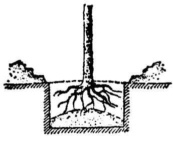  
(a)

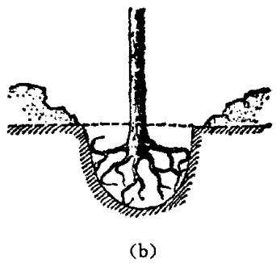  
图 9-3 树与穴的关系示意图  
(a)正确(树穴上下一致，树木根系舒展)；（b)不正确(树穴呈锅底状，根系卷曲)

## （3)裸根苗栽植技术

一般地，大面积植被恢复主要采用裸根苗栽植。裸根苗造林最常用的是穴植法，栽植技

术的关键一是保证苗木根系舒展(不窝根)，二是采用“三埋、两踩、一提苗”的操作要领。

保证苗木根系的舒展，在挖穴时要注意满足规格和质量的要求，并根据根系特点进行栽植，如须根系较多的苗木，栽植时要穴底填土，让根系平展开来；直根系的苗木，栽植时穴底填土要少，避免主根弯曲，造成窝根，影响成活。“三埋两踩一提苗”是林业技术部门提倡的一种科学的树木栽植方法，包括三次埋土、两次踩实以及一次将苗木向上提起的过程。

## （4)容器育苗造林技术

容器育苗造林就是将育苗的容器连同苗木一起栽植到树穴中的造林方法。容器苗造林具有以下优点：

①容器苗根系在起苗、运输和栽植时很少有机械损伤和风吹日晒，而且由于根系带有原来的土壤，减少了缓苗过程。其造林成活率要比常规造林方法高。

②容器苗因容器内是营养土，土壤中的营养极其丰富，比裸根苗具备了良好的生育条件，有利于幼苗生长发育，为矸石山造林成活后幼林生长和提早郁闭成林创造了良好的生存条件。

③容器苗适应春、夏、秋三季造林，可以加速矸石山造林绿化速度。

④容器苗造林的成本虽然与常规植苗造林相比较高，但其成活率高、郁闭早、成林快、成效显著，减少了常规造林反复性造林的缺陷，综合效益要高于常规植苗造林。

## （5）菌根菌育苗造林技术

菌根菌育苗技术就是在高等植物的根系受特殊土壤真菌的侵染而形成的互惠共生体系，然后用这种被侵染的菌根苗造林的技术。菌根苗的根系能扩大对水分及矿质营养的吸收，增强植物的抗逆性，提高植物对土传病害的抗性，尤其在干旱、贫瘠的恶劣环境中菌根作用的发挥更加显著。有关资料证明，在干旱区、荒山荒地等地区，一般都需要有相应的菌根才能建立起植被或实现造林。

## （6）秸秆及地膜覆盖造林技术

秸秆及地膜覆盖造林技术是在造林地上覆盖秸秆或者地膜，从而提高栽植的成活率的方法。秸秆与地膜覆盖可以避免晚霜或春寒、春旱、大风等寒流的侵袭造成的冻害，提高了地温，促进了土壤中微生物的活动、有机质的分解和养分的释放，从而有利于根系的生长、吸收及营养物质的合成和转化，保证苗木的成活和生长。另外，覆盖秸秆或者地膜还可以保持和充分利用地表蒸发的水分，提供了苗木成活后生长所需的水分，防止苗木因干旱造成生理缺水而死亡。因此可以说，秸秆及地膜覆盖造林，在保水增温、促进幼苗的迅速生长、尽快恢复植被、防止水土流失、改善生态环境等方面，发挥着重要的作用。

抚育管理是植物栽培工作中非常重要的技术环节，俗语有“三分栽植、七分管理”之说。煤矸石山植被抚育管理的目的是通过对林地、植被的管理与保护，为植物的成活、生长、繁殖、更新创造良好的环境条件，使之迅速成林。无论在幼林阶段或成林阶段，必要的抚育管理直接关系到植被生长效应、防护效应和经济效应的发挥。

植被的抚育管理主要包括林地土壤管理、植被的管理与保护两个方面。土壤管理主要有灌溉、施肥等措施；植被的管理主要有平茬、整形修剪等措施；植被保护主要有防止病虫害、火灾等自然灾害以及人畜活动对植被的破坏等措施。

植被抚育管理所采取的主要措施因不同栽培目的、不同立地条件和不同经济条件而异。依据煤矸石山立地条件、植被恢复与生态重建的主要目标，在造林的过程中主要应做好施肥、灌溉、平茬、修枝以及防止人畜对植被的破坏几个方面的工作。

## （四)植株的修剪

## 1. 平茬

平茬是在造林后对生长不良的幼树进行补救的措施，是利用植物(主要是阔叶树种)的萌蘖能力保留地茎以上一小段主干，截除其余部分，促使幼树长出新茎干的抚育措施。当幼树的地上部分由于种种原因而生长不良，失去培养前途，或在造林初期由于缺水苗木有可能失去水分平衡影响成活时，都可进行平茬。平茬一般在造林后1～3年进行，幼树新长出的萌条一般都能赶上未平茬的同龄植株。

## 2. 整形修剪

煤矸石山造林的目的主要是为了防护，应尽快促进枝叶扩展，增加郁闭度，一般不提倡修剪。但有时为了增加植株的美观和观赏性，或者为了减少枝叶面积降低植株的蒸腾耗水量，可适量进行整形修剪，但修剪强度不宜过大。而且要注意修剪的季节和时间，一般以植物休眠期为好。修剪方法主要有截、疏、除蘖等。

## (五)煤矸石山幼林的保护

幼林的保护通常包括对病虫害、鸟兽害、极端气候因子(大风、高温、低温、暴雨等)危害、火灾以及人畜破坏等自然灾害与人为灾害的预防和防治。有条件的矿区应安排专职人员进行护理，特别注意人畜对植株的破坏。尤其要保护好地表植被与枯枝落叶，更好地防止土壤侵蚀，减少土壤蒸发，保持土壤水分，有利于植株生长和植被演替。

煤矸石山造林初期一般无病虫害，但随造林时间的延长病虫害时有发生，要注意观察，做到早发现、早防治。病虫害防治可采取的方法有喷粉法、喷雾法、熏蒸法、毒草饵、胶环(毒环)法等。

另外在每次暴雨和大风过后，要及时了解植株的受害情况，积极采取补救措施，扶植受害的植株，必要时及时进行补植。

## （六）灌溉

干旱缺水是煤矸石山最突出的生态特征。由于煤矸石特殊的物理结构导致其持水力弱，含水量低；而且煤矸石中含有大量的碳，吸热快，热量大，温度高，水分蒸发快，植被可利用的水分极少。

灌溉一方面可以提高土壤的含水量，有利于植被的生长，另一方面可以降低地温防止夏季高温对苗木的灼伤，同时加速煤矸石的风化、促进微生物的活性，有利于改善煤矸石养分的释放，提高煤矸石山的肥力水平。所以，煤矸石山造林要采取灌溉措施，有条件的煤矿，可建设将矿井水引用到煤矸石山的设施，节约水资源，并且可以“以废治废”。

## (七)施肥

由于煤矸石风化物极粗，其中速效养分缺乏，尤其缺乏植物生长必需的氮素和磷素。在自然生态系统中，植物吸收的氮素是由土壤中累积的巨大氮素的有机库提供的，由于煤矸石山几乎无土壤可言，氮素的缺乏成为必然。这一矛盾虽然可以通过种植豆科植物或其他具有固氮能力的植物来缓解，但因固氮植物对缺磷条件敏感，并不能解决整个煤矸石山的所有养分问题。

施肥是煤矸石山造林抚育管理最突出的措施。合理的施肥措施不仅应体现在植物产量上，而且还应有助于改善土壤性状，在复垦种植初期，培肥煤矸石特别重要。煤矸石山的施肥应以氮肥为主，同时辅以磷肥和钾肥，最好是施用有机肥。但我国有机肥缺乏，有条件的煤矿区可以使用城市污泥，符合农用标准的污泥施入煤矸石风化物中，不仅可以增加风化物的养分和颗粒细度，还能降低地表的黑度和温度，更能促进微生物的活动。在煤矸石山上使用化学肥料时，由于煤矸石山土壤保水保肥能力很弱，所以要坚持多次少施的原则。

## 第十章 矿区重金属污染土地的修复技术

人类从事采矿业已有数千年的历史，开采矿藏给人类带来了巨大财富，但是采矿过程中所导致的环境污染与破坏，以及采后留下的尾矿、废弃地、废渣等都带来了许多生态问题，其中土壤基质被污染、重金属毒害是矿地普遍存在且最为严重的问题之一。据统计，我国每年排放的工业固体废弃物85%以上来自矿山。每年金属矿山排放的尾矿量在3亿t以上，约占当年工业固体废弃物的30%，累计堆放量存量已达50亿～70亿t，占地约500 km²。

## 第一节 重金属污染的含义

重金属是指密度在4.0或5.0以上的元素。环境污染方面所指的重金属主要是指生物毒性显著的汞、镉、铅、铬、锌、铜、钴、镍、锡等以及类金属砷、硒，还包括钒、铍、铝等。当这些重金属污染物由于人类活动进入土壤并对土壤一植物系统产生危害时，就会造成土壤重金属污染，虽然铜、锌等重金属是植物生长所必需的微量元素，但当它们进入土壤中的量超过土壤的自净能力，而且对土壤、植物和动物造成损害时，也会对土壤造成重金属污染。

随着采矿业的发展，含重金属的污染物通过各种途径进入土壤，不仅导致土壤环境质量下降，农作物出现重金属中毒，并通过食物链威胁着人类的健康。同时还会造成对水体的污染和生态环境的进一步恶化。因此，世界各国纷纷关注土壤重金属污染及其防治。

## 一、土壤重金属污染现状

我国金属矿产资源主要分布在长江以南地区，特别是红壤地区。目前，红壤地区已探明具有一定贮量的矿产100多种，其中有色金属矿产40多种，是我国多种有色金属的重要基地。当前，伴随南方地区许多大型金属矿产的开发利用，在带来经济效益的同时，也造成土壤生态系统的严重破坏(表10-1)。有报道认为，我国现有重金属污染耕地约2000万hm²，绝大部分未得到合理治理。2000年农业部对30万 $\mathrm { h m } ^ { 2 }$ 基本农田保护区有害重金属的抽样结果表明，其中3.6万 $\mathrm { h m } ^ { 2 }$ 农田有害重金属超标，超标率12%。据全国污水灌区调查结果显示，我国目前污水灌区面积约140万 $\mathrm { h m } ^ { 2 }$ ，遭受重金属污染的土地面积占污灌总面积的64.8%，其中轻度污染面积占46.7%，中度污染面积占9.7%，严重污染面积占8.4%，并且以汞和镉的污染面积最大。据统计，我国有3万多公顷土地受汞的污染，有1万多公顷土地受镉的污染，每年仅生产镉米就达5万t以上，而每年因污染而损失的粮食约1200万t，严重影响了我国的粮食生产和食物安全。江西大余县污灌引起的Cd污染面积达 $5 ~ 5 0 0 ~ \mathrm { h m ^ { 2 } }$ 青岛市2.7%～9%的农田土壤分别受到Cr、Hg、Cd、As、Pb、Cu、Zn等7种重金属的轻污染；沈阳张士污灌区多年使用沈阳市重工业部门排放的污水灌溉，有 $2 \ 5 3 3 \ \mathrm { h m } ^ { 2 }$ 土地遭受镉的污染，其中严重污染面积占13%，污水灌区人尿中镉的含量增高，癌症、风湿性关节炎、肾

炎等平均患病率均高于清水灌区。

表 10-1  
我国南方红壤地区污染概况
<table><tr><td rowspan=1 colspan=1>地区</td><td rowspan=1 colspan=1>分析样点数</td><td rowspan=1 colspan=1>污染样点数</td><td rowspan=1 colspan=1>污染/%</td></tr><tr><td rowspan=1 colspan=1>江西</td><td rowspan=1 colspan=1>134</td><td rowspan=1 colspan=1>107</td><td rowspan=1 colspan=1>80</td></tr><tr><td rowspan=1 colspan=1>福建</td><td rowspan=1 colspan=1>163</td><td rowspan=1 colspan=1>85</td><td rowspan=1 colspan=1>52</td></tr><tr><td rowspan=1 colspan=1>广东</td><td rowspan=1 colspan=1>29</td><td rowspan=1 colspan=1>23</td><td rowspan=1 colspan=1>79</td></tr><tr><td rowspan=1 colspan=1>湖南</td><td rowspan=1 colspan=1>48</td><td rowspan=1 colspan=1>41</td><td rowspan=1 colspan=1>85</td></tr><tr><td rowspan=1 colspan=1>浙江</td><td rowspan=1 colspan=1>112</td><td rowspan=1 colspan=1>82</td><td rowspan=1 colspan=1>73</td></tr><tr><td rowspan=1 colspan=1>合计</td><td rowspan=1 colspan=1>486</td><td rowspan=1 colspan=1>338</td><td rowspan=1 colspan=1>69</td></tr></table>

## 二、土壤重金属污染的成因

自然界中，重金属在岩石或土壤中通常以痕量形式存在。但随着工业化进程的加快，人们在采矿、冶金等工业活动和农业活动中，将重金属释放出来并进入土壤，造成土壤重金属污染。矿区土壤重金属污染主要由以下原因造成。

## 1. 工业产生的废气沉降造成的污染

工业生产过程排放的废气中含有有毒的重金属，这些重金属最终会降落到土壤中，引起土壤重金属污染。例如，美国蒙大拿州某有色冶金企业每年排入大气中的锌约5t，镉约250 kg，其周围地区土壤表层0\~2.5 cm 内锌的含量很高，离厂1.8 km 达1090 mg/kg，离厂3.6 km 为233 mg/kg，离厂7.2 km为48 mg/kg；在上述距离土壤中镉的含量分别为 37mg/kg、17mg/kg和4mg/kg。可见冶金企业排放的废气对周围环境有明显的污染，而且离厂越近，污染越严重。

## 2. 固体废弃物排放造成的污染

我国现有的国营矿山企业8000多个，个体矿山达23万多个，由于种种条件的限制，国内许多矿山废弃物未经任何处理就任意排放与堆置，造成了较为严重的环境污染问题。例如，对江西各钨矿附近地区土壤研究发现，土壤中钼、镉、铜、铁的含量非常高，分别为（10.6$\sim 1 0 3 , 0 ) \times 1 0 ^ { - 6 } , ( 1 , 6 \sim 3 . 4 ) \times 1 0 ^ { - 6 } , ( 9 , 3 \sim 3 2 . 2 ) \times 1 0 ^ { - 6 } , ( 7 9 , 2 \sim 2 1 8 . 0 ) \times 1 0 ^ { - 6 }$ 。因此，该区反刍动物钼中毒的现象较为普遍，耕牛发生白皮白毛、腹泻消瘦等综合症，家畜的营养状况和繁殖力均较低，常年生活在这里的人癌症特别是肝癌发病率很高。1993年，在铜绿山尾矿库周围的5个采样点中，4个点的各层土壤中重金属含量均高于“湖北省土壤环境背景值”中的有关背景值：表层(A层：0～20 cm)土壤Cu为其背景的15～120倍、Pb为1.7～22倍、Zn为1.1\~3.7倍、Cd为16.1\~20.9倍；浅层土(B:层20～40 cm)土壤Cu为13.2～49.1倍、Pb为0.5\~2.8倍、Zn为1.2～2.5倍、Cd为15.6～26倍。与土壤分级评价标准比较，有4个点的土壤Cu为375.0～3 405.0 mg/kg，大多数超过400 mg/kg的标准，属重污染，Cd为1.60～2.65mg/kg，超过1.5mg/kg的标准，属中污染。土壤的污染不仅形成不同类型的污染田，对农作物的生长造成危害，甚至形成不能耕种的废弃地。铜绿山尾矿区的农作物中，稻谷样Cu的含量42.88 mg/kg，是评价标准(20mg/kg)的2.1倍；蔬菜(丝瓜、扁豆)样Pb的含量2.98～5.12 mg/kg，接近或超过3 mg/kg的标准。

## 3. 工业污水灌溉造成的污染

我国北方和西北地区由于年降雨量较少，水资源缺乏，因此污灌面积逐年扩大。而工业废水中含有大量有毒有害的重金属如Cd，Hg，Pb，As等，不恰当的污灌会造成土壤重金属污染。表10-2列出了部分工矿企业排放的污水中含有重金属的情况。据1993年中国环境状况公报，全国工业废水排放量为 $2 1 9 . 5 \times 1 0 ^ { 8 }$ t,污灌污染农田面积为 $3 , 3 \times 1 0 ^ { 6 } \ \mathrm { h m } ^ { 2 }$ ，表10-3为我国部分主要污水灌溉区的重金属污染面积。

表 10-2  
部分工矿企业排放的污水中所含重金属
<table><tr><td rowspan=1 colspan=1>企业类型</td><td rowspan=1 colspan=1>Ag</td><td rowspan=1 colspan=1>As</td><td rowspan=1 colspan=1>Ba</td><td rowspan=1 colspan=1>Cd</td><td rowspan=1 colspan=1>Co</td><td rowspan=1 colspan=1>Cr</td><td rowspan=1 colspan=1>Cu</td><td rowspan=1 colspan=1>Fe</td><td rowspan=1 colspan=1>Hg</td><td rowspan=1 colspan=1>Mn</td><td rowspan=1 colspan=1>Mo</td><td rowspan=1 colspan=1>Pb</td><td rowspan=1 colspan=1>Ni</td><td rowspan=1 colspan=1>Sb</td><td rowspan=1 colspan=1>Sn</td><td rowspan=1 colspan=1>Ti</td></tr><tr><td rowspan=1 colspan=1>采矿选矿</td><td rowspan=1 colspan=1>十</td><td rowspan=1 colspan=1></td><td rowspan=1 colspan=1></td><td rowspan=1 colspan=1>十</td><td rowspan=1 colspan=1></td><td rowspan=1 colspan=1></td><td rowspan=1 colspan=1></td><td rowspan=1 colspan=1>十</td><td rowspan=1 colspan=1>十</td><td rowspan=1 colspan=1>十</td><td rowspan=1 colspan=1>十</td><td rowspan=1 colspan=1>十</td><td rowspan=1 colspan=1></td><td rowspan=1 colspan=1></td><td rowspan=1 colspan=1></td><td rowspan=1 colspan=1></td></tr><tr><td rowspan=1 colspan=1>冶金电镀</td><td rowspan=1 colspan=1>十</td><td rowspan=1 colspan=1>十</td><td rowspan=1 colspan=1></td><td rowspan=1 colspan=1>十</td><td rowspan=1 colspan=1></td><td rowspan=1 colspan=1>十</td><td rowspan=1 colspan=1>十</td><td rowspan=1 colspan=1></td><td rowspan=1 colspan=1>十</td><td rowspan=1 colspan=1></td><td rowspan=1 colspan=1></td><td rowspan=1 colspan=1>十</td><td rowspan=1 colspan=1>十</td><td rowspan=1 colspan=1></td><td rowspan=1 colspan=1></td><td rowspan=1 colspan=1></td></tr><tr><td rowspan=1 colspan=1>化工</td><td rowspan=1 colspan=1></td><td rowspan=1 colspan=1>十</td><td rowspan=1 colspan=1>十</td><td rowspan=1 colspan=1>十</td><td rowspan=1 colspan=1>十</td><td rowspan=1 colspan=1></td><td rowspan=1 colspan=1>十</td><td rowspan=1 colspan=1>+</td><td rowspan=1 colspan=1>+</td><td rowspan=1 colspan=1>十</td><td rowspan=1 colspan=1></td><td rowspan=1 colspan=1></td><td rowspan=1 colspan=1>十</td><td rowspan=1 colspan=1>十</td><td rowspan=1 colspan=1></td><td rowspan=1 colspan=1></td></tr><tr><td rowspan=1 colspan=1>陶瓷</td><td rowspan=1 colspan=1></td><td rowspan=1 colspan=1>十</td><td rowspan=1 colspan=1></td><td rowspan=1 colspan=1></td><td rowspan=1 colspan=1></td><td rowspan=1 colspan=1>十</td><td rowspan=1 colspan=1></td><td rowspan=1 colspan=1></td><td rowspan=1 colspan=1></td><td rowspan=1 colspan=1></td><td rowspan=1 colspan=1></td><td rowspan=1 colspan=1></td><td rowspan=1 colspan=1></td><td rowspan=1 colspan=1>十</td><td rowspan=1 colspan=1></td><td rowspan=1 colspan=1></td></tr><tr><td rowspan=1 colspan=1>涂料</td><td rowspan=1 colspan=1></td><td rowspan=1 colspan=1>十</td><td rowspan=1 colspan=1></td><td rowspan=1 colspan=1></td><td rowspan=1 colspan=1>十</td><td rowspan=1 colspan=1></td><td rowspan=1 colspan=1></td><td rowspan=1 colspan=1></td><td rowspan=1 colspan=1></td><td rowspan=1 colspan=1></td><td rowspan=1 colspan=1>十</td><td rowspan=1 colspan=1></td><td rowspan=1 colspan=1></td><td rowspan=1 colspan=1></td><td rowspan=1 colspan=1>十</td><td rowspan=1 colspan=1></td></tr><tr><td rowspan=1 colspan=1>玻璃</td><td rowspan=1 colspan=1></td><td rowspan=1 colspan=1>十</td><td rowspan=1 colspan=1>十</td><td rowspan=1 colspan=1></td><td rowspan=1 colspan=1>十</td><td rowspan=1 colspan=1></td><td rowspan=1 colspan=1></td><td rowspan=1 colspan=1></td><td rowspan=1 colspan=1></td><td rowspan=1 colspan=1></td><td rowspan=1 colspan=1></td><td rowspan=1 colspan=1></td><td rowspan=1 colspan=1>十</td><td rowspan=1 colspan=1></td><td rowspan=1 colspan=1></td><td rowspan=1 colspan=1>十</td></tr><tr><td rowspan=1 colspan=1>造纸</td><td rowspan=1 colspan=1></td><td rowspan=1 colspan=1></td><td rowspan=1 colspan=1></td><td rowspan=1 colspan=1></td><td rowspan=1 colspan=1></td><td rowspan=1 colspan=1>十</td><td rowspan=1 colspan=1>十</td><td rowspan=1 colspan=1></td><td rowspan=1 colspan=1>十</td><td rowspan=1 colspan=1></td><td rowspan=1 colspan=1></td><td rowspan=1 colspan=1>十</td><td rowspan=1 colspan=1>十</td><td rowspan=1 colspan=1></td><td rowspan=1 colspan=1></td><td rowspan=1 colspan=1>十</td></tr><tr><td rowspan=1 colspan=1>制革</td><td rowspan=1 colspan=1></td><td rowspan=1 colspan=1>十</td><td rowspan=1 colspan=1>十</td><td rowspan=1 colspan=1></td><td rowspan=1 colspan=1></td><td rowspan=1 colspan=1>十</td><td rowspan=1 colspan=1>十</td><td rowspan=1 colspan=1>十</td><td rowspan=1 colspan=1>十</td><td rowspan=1 colspan=1></td><td rowspan=1 colspan=1></td><td rowspan=1 colspan=1></td><td rowspan=1 colspan=1></td><td rowspan=1 colspan=1></td><td rowspan=1 colspan=1></td><td rowspan=1 colspan=1></td></tr><tr><td rowspan=1 colspan=1>纺织</td><td rowspan=1 colspan=1></td><td rowspan=1 colspan=1>十</td><td rowspan=1 colspan=1>十</td><td rowspan=1 colspan=1>十</td><td rowspan=1 colspan=1></td><td rowspan=1 colspan=1></td><td rowspan=1 colspan=1>十</td><td rowspan=1 colspan=1>十</td><td rowspan=1 colspan=1>十</td><td rowspan=1 colspan=1></td><td rowspan=1 colspan=1></td><td rowspan=1 colspan=1>十</td><td rowspan=1 colspan=1>十</td><td rowspan=1 colspan=1>+</td><td rowspan=1 colspan=1></td><td rowspan=1 colspan=1></td></tr><tr><td rowspan=1 colspan=1>化肥</td><td rowspan=1 colspan=1></td><td rowspan=1 colspan=1>十</td><td rowspan=1 colspan=1></td><td rowspan=1 colspan=1>十</td><td rowspan=1 colspan=1></td><td rowspan=1 colspan=1>十</td><td rowspan=1 colspan=1>十</td><td rowspan=1 colspan=1>十</td><td rowspan=1 colspan=1>十</td><td rowspan=1 colspan=1>十</td><td rowspan=1 colspan=1></td><td rowspan=1 colspan=1>十</td><td rowspan=1 colspan=1>十</td><td rowspan=1 colspan=1></td><td rowspan=1 colspan=1></td><td rowspan=1 colspan=1></td></tr><tr><td rowspan=1 colspan=1>氯碱工业</td><td rowspan=1 colspan=1></td><td rowspan=1 colspan=1>十</td><td rowspan=1 colspan=1></td><td rowspan=1 colspan=1>十</td><td rowspan=1 colspan=1></td><td rowspan=1 colspan=1>十</td><td rowspan=1 colspan=1></td><td rowspan=1 colspan=1>十</td><td rowspan=1 colspan=1>十</td><td rowspan=1 colspan=1></td><td rowspan=1 colspan=1></td><td rowspan=1 colspan=1>十</td><td rowspan=1 colspan=1></td><td rowspan=1 colspan=1></td><td rowspan=1 colspan=1>十</td><td rowspan=1 colspan=1></td></tr><tr><td rowspan=1 colspan=1>炼油</td><td rowspan=1 colspan=1></td><td rowspan=1 colspan=1>十</td><td rowspan=1 colspan=1></td><td rowspan=1 colspan=1>十</td><td rowspan=1 colspan=1></td><td rowspan=1 colspan=1>十</td><td rowspan=1 colspan=1>十</td><td rowspan=1 colspan=1>十</td><td rowspan=1 colspan=1></td><td rowspan=1 colspan=1></td><td rowspan=1 colspan=1></td><td rowspan=1 colspan=1>十</td><td rowspan=1 colspan=1>十</td><td rowspan=1 colspan=1></td><td rowspan=1 colspan=1></td><td rowspan=1 colspan=1></td></tr></table>

注：“十”表示该工矿企业所排放的污水中含有此种重金属元素。

表 10-3  
我国部分主要污水灌溉区重金属污染面积
<table><tr><td rowspan=1 colspan=1>地点</td><td rowspan=1 colspan=1>受污染农田面积/亩</td><td rowspan=1 colspan=1>污染物质</td></tr><tr><td rowspan=1 colspan=1>保定苑七店</td><td rowspan=1 colspan=1>30</td><td rowspan=1 colspan=1>Pb</td></tr><tr><td rowspan=1 colspan=1>贵州锦江流域</td><td rowspan=1 colspan=1>20 000</td><td rowspan=1 colspan=1>Hg等</td></tr><tr><td rowspan=1 colspan=1>上海蚂蚁浜灌区</td><td rowspan=1 colspan=1>400</td><td rowspan=1 colspan=1>Cd</td></tr><tr><td rowspan=1 colspan=1>桂林阳朔思的</td><td rowspan=1 colspan=1>1 394</td><td rowspan=1 colspan=1>Cd</td></tr><tr><td rowspan=1 colspan=1>江西大余县荡萍、西华山</td><td rowspan=1 colspan=1>30 270</td><td rowspan=1 colspan=1>Cd</td></tr><tr><td rowspan=1 colspan=1>贵州清镇农灌渠上中游</td><td rowspan=1 colspan=1>360</td><td rowspan=1 colspan=1>Hg</td></tr><tr><td rowspan=1 colspan=1>沈阳张士、哈大道以东</td><td rowspan=1 colspan=1>6000</td><td rowspan=1 colspan=1>Cd</td></tr><tr><td rowspan=1 colspan=1>广州东郊、大石</td><td rowspan=1 colspan=1>2100</td><td rowspan=1 colspan=1>Cu,Pb</td></tr><tr><td rowspan=1 colspan=1>成都蛇田</td><td rowspan=1 colspan=1>5</td><td rowspan=1 colspan=1>Cd</td></tr><tr><td rowspan=1 colspan=1>上海川沙八一大队</td><td rowspan=1 colspan=1>706</td><td rowspan=1 colspan=1>Cd</td></tr><tr><td rowspan=1 colspan=1>北京东南郊高碑店上下段</td><td rowspan=1 colspan=1>1 500</td><td rowspan=1 colspan=1>Hg</td></tr><tr><td rowspan=1 colspan=1>郑州瓦屋里</td><td rowspan=1 colspan=1>60</td><td rowspan=1 colspan=1>Hg</td></tr></table>

续表 10-3
<table><tr><td rowspan=1 colspan=1>地点</td><td rowspan=1 colspan=1>受污染农田面积/亩</td><td rowspan=1 colspan=1>污染物质</td></tr><tr><td rowspan=1 colspan=1>济南北园、东郊</td><td rowspan=1 colspan=1>10 000</td><td rowspan=1 colspan=1>Cd</td></tr><tr><td rowspan=1 colspan=1>兰州白银</td><td rowspan=1 colspan=1>6 390</td><td rowspan=1 colspan=1>Pb、Cd</td></tr><tr><td rowspan=1 colspan=1>天津赵沽里</td><td rowspan=1 colspan=1>1000</td><td rowspan=1 colspan=1>Hg</td></tr><tr><td rowspan=1 colspan=1>西安沣惠李上壕讲武殿</td><td rowspan=1 colspan=1>1000</td><td rowspan=1 colspan=1>Cd</td></tr><tr><td rowspan=1 colspan=1>太原西流、小王、大马、南瓦窑</td><td rowspan=1 colspan=1>88 500</td><td rowspan=1 colspan=1>Hg、Cd、Cr</td></tr></table>

注：1亩=0.0667hm²。

## 第二节 土壤环境重金属背景值和土壤环境质量标准

## 一、土壤环境重金属背景值

环境背景值是指水体、土壤、岩石、生物等在未受污染和破坏的情况下，环境要素本身固有的化学组成和含量。重金属是构成地壳的元素，在地球上的水循环、生物循环和地球化学循环等的作用下，在岩石圈、大气圈、水圈和土壤圈之间迁移循环，广泛分布于土壤、大气、水体和生物体中。重金属环境背景值的确定是研究与评价环境中重金属污染和制定环境质量标准的前提和基础，在环境医学和农业生产等方面有着重要的作用。土壤重金属环境背景值是土壤环境背景值研究的重要内容。

## 1. 影响土壤中重金属环境背景值的因素

成土母质、土壤类型和土壤理化性质是影响土壤中重金属背景值的决定性因素。土壤中各元素的背景值，反映了在没有污染的情况下，通过母质的风化并在成土过程中发生的元素的迁移转化，因此成土母质的差异是引起土壤环境背景值差异的最主要因素。而不同的土壤类型是在不同的母质或相同的母质条件下，经过不同的生物气候作用而形成的，因此不同土壤类型中的重金属元素的背景值反映了母质、气候和生物等的共同作用，其差异性是必然的。土壤理化性质对重金属环境背景值的影响主要表现在土壤质地、pH值和有机质含量方面。一般来说，土壤质地越黏重，土壤颗粒对重金属的吸附能力越强，土壤中的重金属背景值越高，pH值显著影响土壤中重金属的迁移转化能力，在pH值较低的酸性土壤中，H+常可使重金属离子从土壤颗粒中被解吸出来，增加其活性和迁移转化能力，因此在酸性土壤中的重金属含量常低于碱性土壤，如石灰岩类母质上发育的土壤，重金属背景值大多数较高。而土壤中有机质含量与重金属背景值的关系视不同的土壤类型和不同的重金属元素而异。除此之外，地貌条件和气候条件也会影响土壤中重金属元素背景值。

## 2. 重金属环境背景值分布规律

不同的重金属元素环境背景值分布规律既有共性又有差异性，其共性表现在：一是在成土母质和土壤类型等决定性因素的控制下，重金属元素环境背景值表现出地域分异规律。如在我国Cu、Ni、V、Co、Cr等第四周期元素在土壤环境中，其含量呈现出西南区>青藏高原>蒙新区=华北区>东北区>华南区的特性；二是各个重金属元素在土壤剖面的不同层次间呈现出垂直分异规律。其差异性表现在不同的重金属元素的地域分异规律和垂直分异规律是不相同的，如大多数的研究表明，Hg易累积在表土层中，而As易累积在底层中。

## 3. 我国土壤环境重金属背景值

早在1973年，我国就开始了土壤元素背景值的调研工作。1977年，在农业部和中国科学院的支持下，还对土壤环境背景值进行了有组织的系统研究。尤其是这一工作后来作为国家“七五”攻关项目，在29个省、市和自治区进行了系统的研究。表10-4列出了这一研究的部分成果。

表 10-4  
中国土壤8个元素的背景含量①  
单位：mg/kg
<table><tr><td rowspan=1 colspan=1>土壤类型</td><td rowspan=1 colspan=1> $\mathtt { H g }$ </td><td rowspan=1 colspan=1>Cd</td><td rowspan=1 colspan=1> $\mathrm { { \bf P b } }$ </td><td rowspan=1 colspan=1> $\mathtt { A s }$ </td><td rowspan=1 colspan=1> $\textstyle \mathrm { C r }$ </td><td rowspan=1 colspan=1> $\mathrm { C u }$ </td><td rowspan=1 colspan=1> $Z _ { \mathfrak { n } }$ </td><td rowspan=1 colspan=1>Ni</td></tr><tr><td rowspan=1 colspan=1>褐土(北京)</td><td rowspan=1 colspan=1>0.0401.67</td><td rowspan=1 colspan=1>0.1180.024</td><td rowspan=1 colspan=1>14.414.22</td><td rowspan=1 colspan=1>8.131.80</td><td rowspan=1 colspan=1>58.1312.3</td><td rowspan=1 colspan=1>19.997.80</td><td rowspan=1 colspan=1>56.731.35</td><td rowspan=1 colspan=1>23.696.4</td></tr><tr><td rowspan=1 colspan=1>水稻土(太湖流域)</td><td rowspan=1 colspan=1>0.1631.63</td><td rowspan=1 colspan=1>0.1161.63</td><td rowspan=1 colspan=1>20.391.20</td><td rowspan=1 colspan=1>8.802.33</td><td rowspan=1 colspan=1>65.7213.92</td><td rowspan=1 colspan=1>22.785.18</td><td rowspan=1 colspan=1>73.0220.61</td><td rowspan=1 colspan=1>29.127.41</td></tr><tr><td rowspan=1 colspan=1>黄绵土(陕西)</td><td rowspan=1 colspan=1>0.0600.033</td><td rowspan=1 colspan=1>0.1010.026</td><td rowspan=1 colspan=1>11.63.24</td><td rowspan=1 colspan=1>10.61.82</td><td rowspan=1 colspan=1>56.35.85</td><td rowspan=1 colspan=1>19.31.17</td><td rowspan=1 colspan=1>54.21.14</td><td rowspan=1 colspan=1>28.41.20</td></tr><tr><td rowspan=1 colspan=1>Bowen®</td><td rowspan=1 colspan=1>0.03</td><td rowspan=1 colspan=1>0.06</td><td rowspan=1 colspan=1>10</td><td rowspan=1 colspan=1>6</td><td rowspan=1 colspan=1>100</td><td rowspan=2 colspan=1>20(2~100)</td><td rowspan=2 colspan=1>50(10~300)</td><td rowspan=2 colspan=1>40(10~100)</td></tr><tr><td rowspan=1 colspan=1>(1966)</td><td rowspan=1 colspan=1>(0.01~0.3)</td><td rowspan=1 colspan=1>(0.01~0.7)</td><td rowspan=1 colspan=1>(2~200)</td><td rowspan=1 colspan=1>(0.1~40)</td><td rowspan=1 colspan=1>(5~300)</td></tr></table>

注：①表内数字为 $\frac { 1 7 + 1 1 5 } { 1 7 \sqrt { 5 } + 1 7 \sqrt { 5 } }$ ，括号内为范围值。  
② H. J. M. Bowen. Trace elements in biochemistry. Aeademic Press. London. 1996.

## 二、土壤环境质量标准

土壤环境容量可定义为在保证土壤圈生态系统良性循环的条件下，土壤容纳污染物的最大允许量，它是区域环境规划和土地利用规划的重要参数。自1983年以来，土壤环境容量就作为国家级项目进行了系统的研究，在环境容量的区域性分异规律和信息系统的建立等方面积累了许多第一手资料，有了良好的开端。在土壤环境背景值和土壤环境容量工作的基础上，同时对土壤环境质量基准也进行了专门的研究。在这之后，国家环保总局则组织制订了土壤环境质量标准，见表10-5。并于1996年3月开始实施，为土壤污染的防治提供了科学的依据和执法的尺度。

表 10-5  
土壤环境质量标准值  
单位：mg/kg
<table><tr><td rowspan=2 colspan=2>级别项目</td><td rowspan=1 colspan=1>一级</td><td rowspan=1 colspan=3>二级</td><td rowspan=1 colspan=1>三级</td></tr><tr><td rowspan=1 colspan=1>自然背景</td><td rowspan=1 colspan=1>土壤 pH值&lt;6.5</td><td rowspan=1 colspan=1>土壤 $\mathtt { p H }$ 值6.5~7.5</td><td rowspan=1 colspan=1>土壤 pH值&gt;7.5</td><td rowspan=1 colspan=1>土壤 $\mathsf { p H }$ 值&gt;6.5</td></tr><tr><td rowspan=1 colspan=2>镉≤</td><td rowspan=1 colspan=1>0.20</td><td rowspan=1 colspan=1>0.30</td><td rowspan=1 colspan=1>0.30</td><td rowspan=1 colspan=1>0.60</td><td rowspan=1 colspan=1>1.0</td></tr><tr><td rowspan=1 colspan=2>汞≤</td><td rowspan=1 colspan=1>0.15</td><td rowspan=1 colspan=1>0.30</td><td rowspan=1 colspan=1>0.50</td><td rowspan=1 colspan=1>1.0</td><td rowspan=1 colspan=1>1.5</td></tr><tr><td rowspan=2 colspan=1>砷</td><td rowspan=1 colspan=1>水田≤</td><td rowspan=1 colspan=1>15</td><td rowspan=1 colspan=1>30</td><td rowspan=1 colspan=1>25</td><td rowspan=1 colspan=1>20</td><td rowspan=1 colspan=1>30</td></tr><tr><td rowspan=1 colspan=1>旱地≤</td><td rowspan=1 colspan=1>15</td><td rowspan=1 colspan=1>40</td><td rowspan=1 colspan=1>30</td><td rowspan=1 colspan=1>25</td><td rowspan=1 colspan=1>40</td></tr></table>

续表 10-5
<table><tr><td rowspan=2 colspan=2>级别项目</td><td rowspan=1 colspan=1>一级</td><td rowspan=1 colspan=3>二级</td><td rowspan=1 colspan=1>三级</td></tr><tr><td rowspan=1 colspan=1>自然背景</td><td rowspan=1 colspan=1>土壤 pH值&lt;6.5</td><td rowspan=1 colspan=1>土壤pH值6.5~7.5</td><td rowspan=1 colspan=1>土壤pH值&gt;7.5</td><td rowspan=1 colspan=1>土壤 pH值&gt;6.5</td></tr><tr><td rowspan=2 colspan=1>铜</td><td rowspan=1 colspan=1>农田等≤</td><td rowspan=1 colspan=1>15</td><td rowspan=1 colspan=1>50</td><td rowspan=1 colspan=1>100</td><td rowspan=1 colspan=1>100</td><td rowspan=1 colspan=1>400</td></tr><tr><td rowspan=1 colspan=1>果园≤</td><td rowspan=1 colspan=1>35</td><td rowspan=1 colspan=1>150</td><td rowspan=1 colspan=1>200</td><td rowspan=1 colspan=1>200</td><td rowspan=1 colspan=1>400</td></tr><tr><td rowspan=1 colspan=2>铅≤</td><td rowspan=1 colspan=1>一</td><td rowspan=1 colspan=1>250</td><td rowspan=1 colspan=1>300</td><td rowspan=1 colspan=1>350</td><td rowspan=1 colspan=1>500</td></tr><tr><td rowspan=2 colspan=1>铬</td><td rowspan=1 colspan=1>水田≤</td><td rowspan=1 colspan=1>90</td><td rowspan=1 colspan=1>250</td><td rowspan=1 colspan=1>300</td><td rowspan=1 colspan=1>350</td><td rowspan=1 colspan=1>400</td></tr><tr><td rowspan=1 colspan=1>旱地≤</td><td rowspan=1 colspan=1>90</td><td rowspan=1 colspan=1>150</td><td rowspan=1 colspan=1>200</td><td rowspan=1 colspan=1>250</td><td rowspan=1 colspan=1>300</td></tr><tr><td rowspan=1 colspan=2>锌≤</td><td rowspan=1 colspan=1>100</td><td rowspan=1 colspan=1>200</td><td rowspan=1 colspan=1>250</td><td rowspan=1 colspan=1>300</td><td rowspan=1 colspan=1>500</td></tr><tr><td rowspan=1 colspan=1>镍≤</td><td rowspan=1 colspan=1></td><td rowspan=1 colspan=1>40</td><td rowspan=1 colspan=1>40</td><td rowspan=1 colspan=1>50</td><td rowspan=1 colspan=1>60</td><td rowspan=1 colspan=1>200</td></tr></table>

注：① 重金属(铬主要是三价)和砷均按元素量计，适用于阳离子交换量>5 cmol/kg的土壤，若≤5 cmol/kg，其标准值为表内数值的半数。  
②水旱轮作地的土壤环境质量标准，砷采用水田值，铬采用旱地值。  
③一级标准是为保护区域自然生态，维持自然背景的土壤环境质量的限制值：二级标准是为保障农业生产，维护人体健康的土壤限制值；三级标准是为保障农林业生产和植物正常生长的土壤临界值。

## 第三节 重金属污染土地的生态系统效应

重金属污染地区土壤和植物中重金属浓度增高，植物出现中毒现象，并可经过食物链进入人体，在人体内成千百倍地富集起来，产生慢性或急性中毒。土壤中微生物大量死亡，土壤失去消化分解能力，导致土壤肥力下降，土壤生态环境质量迅速下降。

## 一、重金属污染对植物的影响

重金属进入土壤后，95%被土壤矿质胶体和有机质迅速吸附或固定。资料表明，土壤中的重金属只有很少一部分随作物地上部分的收获而被移去，经历20年的耕种与收获，也只能减少大约0.5%～2%的蓄积量。因此，这些重金属一旦进入土壤，就可能存留几千年。实验表明，重金属可完全抑制土壤中的共生固氮过程，使三叶草的产量减少40%。这是因为高浓度的金属引起共生质粒的丢失，导致植物丧失根瘤结节的能力。重金属的污染还可使土壤中微生物的总量成倍地降低，阻碍植物的生长和固氮作用。

重金属在土壤一植物系统中的迁移直接影响到植物的生理生化和生长发育，从而影响作物的产量和质量。研究表明，当镉超过一定浓度后，对叶绿素有破坏作用，并促进抗坏血酸分解，使游离脯氨酸积累，抑制硝酸还原酶活性。另外，镉能减少根系对水分和养分的吸收，也可抑制根系对氮的固定。成都东邻污灌区内，Cd在稻米中积累，播种前为0.0982mg/kg，收获时达1.647mg/kg，年富积量1.549 mg/kg，有的形成镉米，不能食用。

在美国的佛罗里达州，土壤的含铜量超过50mg/kg时，柑橘幼苗生长受到影响，土壤含铜量达200mg/kg时，小麦枯死。若土壤铜含量再高，则出现叶片褪绿呈枯黄色现象，根系短而疏，生长不良。土壤中重金属能影响作物的产量，张祖锡等人的试验表明：污灌小麦3次试验的生物量比对照的下降分别为23.3%，28.53%和9.78%。同时，作物的品质也下降。胡声泰对江西德兴铜矿铜污染土壤进行研究，土壤有效铜致水稻减产幅度见表10-6。

表 10-6  
水稻减产幅度
<table><tr><td rowspan=1 colspan=1>土壤有效铜 $/ \mathrm { m } \mathbf { g } \cdot \mathbf { k } \mathbf { g } ^ { \mathrm { ~ - ~ } \mathrm { i ~ } }$ </td><td rowspan=1 colspan=1>减产幅度1%</td><td rowspan=1 colspan=1>土壤有效铜 $/ \mathbf { m } \mathbf { g } \cdot \mathbf { k } \mathbf { g } ^ { - 1 }$ </td><td rowspan=1 colspan=1>减产幅度1%</td></tr><tr><td rowspan=1 colspan=1>&lt;80</td><td rowspan=1 colspan=1>0</td><td rowspan=1 colspan=1>400</td><td rowspan=1 colspan=1>0~57</td></tr><tr><td rowspan=1 colspan=1>100</td><td rowspan=1 colspan=1>0~32</td><td rowspan=1 colspan=1>450</td><td rowspan=1 colspan=1>2~61</td></tr><tr><td rowspan=1 colspan=1>150</td><td rowspan=1 colspan=1>0~36</td><td rowspan=1 colspan=1>500</td><td rowspan=1 colspan=1>6~65</td></tr><tr><td rowspan=1 colspan=1>200</td><td rowspan=1 colspan=1>0~40</td><td rowspan=1 colspan=1>600</td><td rowspan=1 colspan=1>15~74</td></tr><tr><td rowspan=1 colspan=1>220</td><td rowspan=1 colspan=1>0~42</td><td rowspan=1 colspan=1>700</td><td rowspan=1 colspan=1>23~82</td></tr><tr><td rowspan=1 colspan=1>250</td><td rowspan=1 colspan=1>0~44</td><td rowspan=1 colspan=1>800</td><td rowspan=1 colspan=1>32~91</td></tr><tr><td rowspan=1 colspan=1>300</td><td rowspan=1 colspan=1>0~48</td><td rowspan=1 colspan=1>900</td><td rowspan=1 colspan=1>40~99</td></tr><tr><td rowspan=1 colspan=1>350</td><td rowspan=1 colspan=1>0~53</td><td rowspan=1 colspan=1></td><td rowspan=1 colspan=1></td></tr></table>

过量的砷对植物生长有明显的抑制作用。水稻受砷害后根系呈铁黄色，生长受到抑制，抽穗期延迟，结实率降低，严重者造成死亡。

土壤中的铅的浓度很高时可严重抑制植物生长，也可引起因铁的进入遭到破坏而产生的失绿病。铅在植物组织中的累积可导致氧化过程和光合过程及脂肪代谢过程强度减弱。另外，铅可促使水的吸收量减少，耗氧量增大，阻碍植物生长，甚至引起植物死亡。

土壤和植物内含有大量的镍能导致植物铁和锌缺乏，产生失绿病。有关学者认为镍对作物的毒害症状与缺锰症状极为相似，叶片边缘失绿并产生灰斑病。此外，镍过剩时，燕麦和马铃薯等高等植物叶脉发白，呈变性黄化病，而油菜发生特异性枯斑病症状，地上部分发生褐色斑点或斑纹。镍过剩还可抑制作物根系的生长，其症状是整个根成珊瑚状。

现有研究表明，土壤中重金属对植物的危害序列为： $\mathrm { \Delta \mathrm { J g > C u > N i > P b > C o = Z n > C d } }$ ${ > } \mathrm { F e } { > } \mathrm { M n } { > } \mathrm { M g } { > } \mathrm { C a }$ ，但这一序列因土壤类型及其植物种类的不同而有所差异。

## 二、重金属污染对土壤微生物量和群落结构的影响

土壤微生物生物量是指土壤中体积小于 $5 \times 1 0 ^ { 3 } \mu \mathrm { m } ^ { 3 }$ 的生物量。它能代表参与调控土壤中能量和养分循环以及有机质转化的对应微生物的数量，且土壤微生物量碳和氮转化速率较快、可以很好地表征土壤总碳或总氮的动态变化，是比较敏感的生物学指标。

大量研究表明，重金属污染的土壤，其微生物量存在不同程度的差异。E.Kandeler等人研究发现，Cu、Zn、Pb等重金属污染矿区土壤的微生物生物量受到严重影响，靠近矿区附近土壤的微生物生物量明显低于远离矿区土壤的微生物生物量。研究表明，不同重金属及其不同浓度对土壤微生物生物量的影响效果也不一致。K.Chander研究了不同重金属浓度对土壤微生物生物量的影响，结果表明只有当重金属浓度达到欧盟制定的标准土壤重金属环境容量的2～3倍，才能表现出对微生物生物量的抑制作用。土壤环境因素也影响重金属污染对土壤微生物生物量的大小。E.Baath等研究表明，重金属污染对不同质地土壤的微生物生物量的影响是不同的，对砂质、砂壤质土壤的微生物生物量的抑制作用比壤质、黏质土壤大得多。总之，有些重金属元素在浓度较低时对微生物生物量有一定的刺激作用，但超过一定浓度时对土壤微生物则有毒害效应。土壤微生物种群结构特征是表征土壤生态系统群落结构稳定性的重要参数之一。通常情况下，重金属污染对微生物有两个明显效应：一是不适应生长的微生物种数量的减少或绝灭；二是适应生长的微生物数量的增大与积累。E.Baath等人用碳素利用法研究了Cu、Ni、Zn等重金属污染土壤的微生物组成，结果得出高铜污染土壤中微生物群落比Ni、Zn污染的土壤中微生物群落少，重金属严重污染会减少能利用有关碳底物的微生物量的数量，降低微生物对单一碳底物的利用能力，减少了土壤微生物群落的多样性。T. Duxbury和 B. Bichnell 研究了自然土与重金属污染土壤中的细菌种群、发现重污染土壤比轻污染土壤中耐性细菌的数量多15倍。T. Yamamoto等发现对照土壤 $( \mathrm { C u } { < } 1 0 0 ~ \mathrm { m g / k g } )$ 有35种真菌，中等污染土壤中(Cu1000 mg/kg)有25种真菌，高度污染土壤 $( \mathrm { C u ~ 1 0 ~ 0 0 0 ~ m g / k g } )$ 只有13种真菌。可见，重金属胁迫对土壤微生物种群结构会产生一定程度的影响。

## 第四节 国外关于污染土地的政策

污染土地如果不加治理就对其进行开发和使用将会造成很大的危害。因此，许多发达国家已开始重视污染土地的治理。在英国，当开发污染土地时，一般要对其进行普查和治理。英国在1976年，以环境部为基础，建立了污染土地再开发委员会，负责污染土地再开发过程中可能对建筑工人、后期该土地的使用者及地区建筑物产生危害的研究。目前，英国在内城地区和城市地区对前工业用地进行治理和改造以补偿绿地的不足，这从整个城市内部地区的新生到独立废弃地段的改造都已经取得了可观的效益。美国和荷兰的政策则是更直接地对污染地区进行鉴定，即便这一地区不会立即被开发，也会对其污染物进行治理，采用的方法多是现场治理而不是污染物的彻底清除和销毁。荷兰1980年政府调查表明：污染地区已多达4000处，其中1000处要求进行治理。荷兰制定了立法以确保对污染地区进行调查和评价，并且要求各省的官方机构制订计划对污染土地进行改造或修复。在污染土地治理方面，尽管政府提供了额外的基金，但是同时也采用了污染补偿费的办法，这一办法促进了污染土地治理技术的发展，同时荷兰住房、空间规划和环境部制定了保护生态的土壤质量指导值和保护人体健康的土壤质量指导值，并且取两者中的最低值作为最终的综合性土壤质量指导值。虽然美国在污染土地重新利用方面的压力比英国小得多，但这样的地区也已经出现，产生的问题从而促进了美国关于污染土地政策的发展，治理过程中相关的费用由美国环境保护机构和有关的各州来分担。

由军事活动引起的污染问题在1990年初前苏联军队解体时捷克共和国才第一次意识到。一次调查鉴定了50个严重污染场地并随即采取了修复行动。在对这些场地的清理过程中，国家行政机构和关注处理污染土地的专业组织都获得了宝贵的经验。到1998年底对34个污染场地的清理工作才结束，随后又完成了13个场地的清理。对这些军事场地的污染修复花费估计总共有4000万欧元。由工业活动引起的污染在国家财产私有化的过程中受到了高度关注。整个过程开始于1992年，在这个领域的一个非常重要的过程是国有财产转变成个体私营时，对私营公司进行环境审计是包括在必须条件里的。到此为止，环境部门已经评定了超过5500个环境审计，其中10%被发现有严重的污染。在250个案例中，进行了详细的风险评价分析来量化污染的水平。国家经核准认可了300多个退还清理花费的协议，为这项工作留出的资金总额高达1.25亿欧元。在过去的50年里，在捷克共和国进行的铀的开采和加工造成了大量废料堆、尾料和矿坑而对环境产生了巨大的负面影响。据估计，造成 $ { \mathcal { T } }  { \mathrm { ~ 5 ~ } } 8 0 0  { \mathrm { ~ \mathcal { F } ~ } }  { \mathrm { m } } ^ { 3 }$ 废弃采矿坑和5600万 $\mathrm { m ^ { 3 } }$ 尾料，400万t浸提酸被倒入含矿砂岩中。目前已经作出了涵盖这些情况的全面环境影响评价，修复项目的第一阶段工作已经开始。

匈牙利强有力的经济发展，也导致了土地和地下水的环境污染问题，直到20世纪70年代末80年代初，匈牙利都没有强制的环境立法。加工工厂产生的重金属、石化产品和杀虫剂是主要污染来源，此外还有采矿和军事活动产生的污染。问题的范围在10年前就得到认可，但是包括国家性环境修复项目的国家环境项目直到1996年才开始。匈牙利在环境污染修复方面的第一个行动直指前苏联军队基地。1991年，政府的中短期行动计划—对废弃的前苏联兵营和军队离开匈牙利后的训练场地进行鉴别测定、评价和去除累积污染被认为是修复项目的起点。研究了150个废弃地，它们中的一半需要进行立即清理。对绝大部分受污染的前苏联军队场地的修复工作要在后续的两年内完成。同期，因为Metallochemia工厂区域和附近的土壤被重金属污染，当地环境部门在1990年停止了它的运行。这是匈牙利第一次因为环境问题停止一个工厂的生产。主要的污染物是铅，接下来进行了详细的风险评估，进行了各种预防措施来制止作物种植和地下水使用。匈牙利还制定出了修复项目，但是由于缺乏资金，工作还没有开始。匈牙利地下水污染也是一个非常严重的问题，由于90%的国家饮用水都来自地下水，所以严重的污染将使国家无水可喝。修复项目的范围反映了这个状况，并且工作开始于建立一个包含污染场地详细信息的同类数据库。通过对这些数据的分析草拟列出了一个全国性的污染场地优先修复列表，以指导修复行动的进行。在对研究的24个场地进行评估的基础上，其中的7个不存在严重的环境损害。为达到指定限度进行的环境修复(土壤和地下水)已经在6个污染场地进行，它们中的2个已经完成。以上项目的每年预算达500万欧元，总共有300万欧元每年被用在全部的环境修复项目上。

波兰也承受着由于前苏联的军事行动引起的土地污染。在这些地区的主要危害与原油渗漏、非法废弃物倾倒和存储有毒化学品有关。据估计，总共 $7 0 \ \mathrm { ~ 0 0 0 ~ h m ^ { 2 } }$ 土地被前苏联军队占领， $5 0 0 \ \mathrm { { h m ^ { 2 } } }$ 被石油和危险有毒化学品严重污染，并且急切需要复垦。在波兰的法律体系，没有准确普遍的数据或者法律来确定地面可接受的化学浓度，也没有任何全国性的受法律约束的污染土地分类。但是已经提出了关于农业中重金属和硫磺污染评价的国家指导方针和标准值。此外，环境保护的国家巡视员公布了在进行处理被重金属、无机化合物和芳香族、多环烃和氯代烃污染的土地和地下水的风险评价时的咨询指导方针。但是，中欧和东欧风险消除中心认为波兰在污染土地管理方面需要一个重大的变革，发展基于风险的手段和将基于风险的方法与环境法结合，将在决定进行有效污染土地管理时的范围和所需要的潜在修复花费评价方面产生重大的进步。迫切需要对高风险场地进行修复的国家性项目和一系列对再开发中度污染场地的地方/区域项目进行国家性激励。

## 第五节 土壤重金属污染的控制与修复

## 一、土壤重金属污染的控制

土壤一旦遭到重金属污染，治理工作将是长期的和困难的，因此土壤污染的预防比土壤

污染的治理更为重要。污染源的控制是避免土壤污染的最根本性和最重要的原则。控制土壤重金属污染源主要有以下途径。

## 1. 控制工业废气中重金属的排放

工业生产过程排放的废气中含有有毒的重金属，这些重金属最终会降落到土壤中，引起土壤重金属污染。因此，应严格制止工业废气的超标准排放，并大力推广净化废气工艺，尽量减少废气中重金属的含量。

## 2. 控制污水灌溉中重金属的含量

污水灌溉可以节省水资源，但污水中含有大量有毒的重金属。如果污水中重金属不能达标排放或对污灌使用不当，则会造成土壤重金属的严重污染。因此应严格禁止污水超标排放并积极进行重金属污染废水的治理，尽量减少污水中重金属的含量。在污水灌溉中还应控制一定的灌溉量并防止渗漏。

## 3. 对固体废弃物进行处理

煤矸石山和金属矿山尾矿库中含有大量的重金属，由于长期淋溶会进入土壤，因此应加强矿山固体废弃物的绿化及整治。

## 4. 发展清洁工艺

清洁工艺就是不断地、全面地采用环境保护的战略以降低生产过程和生产产品对人类和环境的危害。清洁工艺技术包括节约原料、能量，消除有毒原料，减少所有排放物的数量和毒性。清洁工艺的战略主要是在从原料到产品最终处理的全过程中减少“三废”的排放量，以减轻对环境的影响。

## 二、土壤重金属污染修复技术的国内外研究现状

目前，国内外治理土壤重金属污染的途径归纳起来主要有三种：一是改变重金属在土壤中的存在形态，使其固定和稳定，降低其在环境中的迁移性和生物可利用性；二是从土壤中去除重金属；三是将污染地区与未污染地区隔离。围绕这三种治理途径，已相应地提出各自的物理、化学和生物修复方法。

J.F.Blāis于1992 年提出细菌产生的特殊酶能还原重金属，且对 Cd、Co、Ni、Mn、Zn、Pb和Cu等有亲和力。据报道，E.Coli能将汞蒸汽氧化成二价汞离子，这主要与大肠杆菌能够分泌过氧化氢酶等有关。另外，芽孢杆菌(Bacillus)和链霉菌(Streptomyces)对汞也有氧化作用。硫还原细菌可以通过两种途径将硫酸盐还原成硫化物：一是在呼吸过程中硫酸盐作为电子受体被还原；二是在同化过程中利用硫酸盐合成氨基酸如胱氨酸和蛋氨酸，再通过脱硫作用使S⁻分泌于体外。S²⁻可以和重金属如Cd²+形成沉淀，这一过程在重金属污染治理方面有重要的意义。呼吸途径已在废水和土壤净化中得到应用，但必须是严格的厌氧条件，同化途径的优点是硫的还原受氧化还原电位的影响甚小。

美国环保局将固化作用和稳定化作用(Solidification/Stabilization,S/S)定为一种确认的治理技术，该技术是将污染土壤从现场挖出后置于一定的处理设施中进行处理，将污染土壤、沉积物中的重金属固定，使其不再向周围环境迁移。CharlesM.Wilk等(1995)报道，采用水泥作黏合剂治理正在修建的∪tah高速公路附近的铅/酸废电池废弃物的污染，固化后的废弃物可用于建筑公路路基的材料。淋滤液毒性试验研究表明，处理后废弃物中淋滤出来的铅不至达到有毒的浓度。Valerie Sappin-Didier等人(1992)研究了利用钢渣对土壤中$\mathrm { C d } ^ { 2 + }$ ${ \mathrm { N i } ^ { 2 + } }$ 和 $Z \mathfrak { n } ^ { 2 ^ { . . } }$ 的固化作用。钢渣易被腐蚀，在土壤中能被氧化成铁的化合物，对 $\mathrm { C d } ^ { 2 + }$ $\mathrm { N i ^ { 2 + } }$ 和 $Z \mathfrak { n } ^ { 2 ^ { + } }$ 有吸附和共沉淀作用，从而使重金属固定。此方法对固定土壤中的重金属很有效，但还须对重金属和钢渣在土壤中的物理、化学和生物性能进行长期的监测。BarbaraGworek等人(1992)研究了用膨润土、合成沸石、海泡石等矿物作添加剂钝化土壤中镉等重金属的研究，发现这些矿物对镉有很好的吸附作用，可以显著降低受镉污染土壤中一系列作物根部和地上部分的镉浓度。

使用电动力学修复法可以去除土壤中的重金属，在污染土壤中插入电极并通电，土壤中的重金属在电解、电迁移、电渗和电泳等的作用下在阳极或阴极被移走。R.Lageman的试验表明，每天通电 10 h，43 d后泥炭土中的 Cu 和 Pb 分别被除去 80%和 70%，但由于该法具有水流慢、金属离子电迁移速度不够大等缺点，因此不适用于渗透性好、传导性差的砂性土壤。对此，I. K. Lutful等人将电解法和淋洗法联合使用，使 Zn、Mn、Pb含量分别是1 875,634 和 178 mg/kg 的污染土壤，Zn 和 Mn 除去率为 72%，Pb 除去率为 46%。

热解吸法可以去除挥发性的重金属，如采取加热的方法能将汞从土壤中解吸出来，然后再回收利用。美国的一家汞回收服务公司对汞的回收利用进行了实验室和中型模拟实验研究，最后成功地应用于现场治理，并且开始了商业化服务。迄今为止，此项技术已成功地治理了2300t以上被汞污染的土壤，治理后土壤中汞的浓度达到了背景值 $( < 1 \mathrm { \ m g / L } )$

在土壤中添加试剂可以去除土壤中的重金属，如盐酸、硫酸、乙酸、柠檬酸和EDTA、NTA等。虽然一些试剂能去除重金属，但由于其自身容易给环境带来影响，所以有必要采用易降解和无毒性的表面活性剂，如生物表面活性剂。C.N.Mulligan等人使用表面活性剂去除锌、铜和铀，取得了很好的效果。并且该法可在淋滤法和洗土法中应用。

某些植物对土壤中某种金属具有特别强的吸收能力，我们称它为超富集植物或超累积植物，可利用他们来降低土壤污染物的浓度。例如G.S.Banuelos等研究发现，印度芥菜有较高的吸收和积累硒的能力，在种植这一作物的第1年和第2年可以使土壤中的全硒减少48%和 13%。在美国加州 Corcoran 的人工构建的 $1 ~ \mathrm { { h m } } ^ { 2 }$ 湿地功能区，种植不同湿地植物品种可以显著降低该区农田灌溉水中硒的含量，在一些场地硒含量从25mg/kg降至5 mg/kg以下。

国内目前对重金属污染土壤的研究刚刚起步，许多学者探讨了国外重金属污染土壤的治理方法，目前国内对重金属污染土壤的研究主要集中在生物修复技术方面。

中国科学院地理科学与资源研究所的陈同斌、安志装等人(2003)研究了蜈蚣草修复土壤重金属复合污染的能力，研究表明蜈蚣草作为一种砷超富集植物，不仅有较强的耐砷和富集砷的能力，而且具有生长速度快和生物量大的特点，蜈蚣草还有较强的耐铅、锌毒能力，土壤铅、锌添加量分别为1750 mg/kg和 $1 ~ 3 5 0 ~ \mathrm { m g / k g }$ 时，蜈蚣草的生物量最大。

北京大学黄艺等人(2000)研究采用根垫法和连续形态分析技术，分析了生长在污灌土壤中菌根小麦和无菌根小麦根际Cu、Zn、Pb、Cd的形态分布和变化趋势，研究结果表明，与对照土壤相比，菌根际土壤中交换态Cu含量显著增加，交换态Cd呈减少的趋势；与非菌根际相比，Cu、Zn、Pb的有机结合态在菌根根际中显著增加，而4种测定金属的碳酸盐态和铁锰氧化态都没有显著改变。认为植物根系能影响根际中金属形态的变化，且菌根比无菌根的影响程度大，在土壤金属浓度过量的情况下，菌根可通过调节根际中金属形态从而调节土壤中金属的生物有效性。

湖南农业大学杨仁斌等(2000)利用根际分泌物如柠檬酸、酒石酸、草酸、琥珀酸、天冬氨酸、谷氨酸对铅锌矿尾砂及其废水污染土壤中Pb、Zn、Cd、Cu的溶解性影响进行实验，结果表明16mmol/L的有机酸和氨基酸对土壤中重金属Pb、Zn、Cd、Cu具有较强的活化效应，其中柠檬酸、酒石酸和草酸的活化能力最强。

中国科学院南京土壤研究所的蒋先军等人(2000)研究了Zn、Cd、Cu、Pb四种重金属对印度芥菜地上部生物量的影响，结果表明，在含Cu 250 mg/kg、Pb 500 mg/kg 或 Zn 500mg/kg的污染土壤上，印度芥菜能够忍耐、正常生长，印度芥菜在含Cd200mg/kg的土壤上发生镉毒而出现失绿黄化症状，Cd与中等浓度的Zn、Cu、Pb共存时毒害更为严重，这种植物适合 Zn、Cu、Pb 中等污染土壤的修复。

浙江大学杨肖娥等人(2001)研究了东南景天对锌的耐性及超积累特性，研究发现生长在古老Pb/Zn矿的东南景天是一种新的Zn超积累植物。在自然和控制条件下，古老Pb/Zn矿生态型比非矿山生态型植株的茎粗、叶片大、植株高。在矿山土壤Zn有效含量为105.5\~325.4mg/kg时，矿山生态型东南景天植株地上部Zn含量为 $4 ~ 1 3 4 { \sim } 5 ~ 0 0 0 ~ \mathrm { m g / k g }$ 在相同Zn浓度下，矿山生态型地上部Zn含量比非矿山生态型高30倍左右。

中国科学院南京土壤研究所吴龙华等人(2000)通过吸附、解吸试验和室内培养试验研究了EDTA和猪粪可溶性有机物(DCM)对红壤铜吸附、解吸特性的影响及对污染红壤铜的释放作用。结果表明，外加EDTA可明显降低红壤对铜的吸附率和解吸率；吸附率和解吸率与加入的EDTA含碳量的对数呈极显著的负相关，猪粪DOM在加入量小于21.9mg/L时红壤铜吸附率、解吸率显著降低，符合直线方程；大于21.9mg/LC时则使红壤铜吸附率、解吸率逐渐增大，可以对数方程拟合，相关性达到极显著水平。EDTA对污染红壤铜的释放作用随着EDTA：Cu摩尔比的增大而迅速增大，随着铜处理时间的延长而降低；在同一培养时间，外加铜浓度50mg/kg时，EDTA对土壤铜的释放量占土壤铜总量的比例即提取效率高于(100mg/kg)外源铜处理时的提取效率，但随着EDTA：Cu摩尔比的增大，两者的提取效率差异越来越小。

## 三、各种土壤重金属污染修复技术的主要特点

国内外重金属污染土壤治理方法中，物理隔离方法的费用是最低的，但是这种方法在污染地区留下了污染物而没有进行治理。使金属相对稳定的治理方法是固化处理法，如固定化、稳定化或玻璃化方法。这些方法可以在现场进行，以减少治理费用。治理费用取决于存在的有机物残渣、过量的水分、污染物的情况和土壤的均匀性等。玻璃化方法费用很高，但对于很少有合适的技术处理混合的废物来说是适用的。电动力学方法和淋滤法虽只在少部分地区使用，但结果表明该方法是很有前途的，更多的地区证明是需要这两种技术的。现场淋洗对均匀的、渗透的砂质、粉砂质土壤是非常有效的，这种方法对地区水文情况必须掌握以避免污染物移动进入无污染地区。对于现场淋洗更多的发展方向是无毒添加剂领域，并通过回收金属也能提高经济效益。植物修复和生物淋溶方法尽管需要较长的治理时间，但是这些方法对轻污染地区是有用的，很多的问题仍需解决并且需要更多的论证，其中一些问题包括通过植物提高金属的富集，从植物中提取金属方法的研究和确定土壤成分与生物利用度之间的相互关系。总之，每种治理技术的选择都应考虑污染地点和污染特点的特殊性。目前，各种主要治理技术比较见表10-7。

表 10-7  
重金属污染土壤治理技术比较
<table><tr><td rowspan=1 colspan=2>治理技术</td><td rowspan=1 colspan=1>方法</td><td rowspan=1 colspan=1>适用性</td><td rowspan=1 colspan=1>费用/$ US·ton−1 ①</td></tr><tr><td rowspan=1 colspan=1>围堵技术</td><td rowspan=1 colspan=1>物理方法</td><td rowspan=1 colspan=1>通过阻止液体的流动来阻止重金属的迁移</td><td rowspan=1 colspan=1>垃圾填埋场的覆盖与泥浆墙</td><td rowspan=1 colspan=1>10~90</td></tr><tr><td rowspan=4 colspan=1>异位修复技术</td><td rowspan=1 colspan=1>封闭方法</td><td rowspan=1 colspan=1>产生惰性废物</td><td rowspan=1 colspan=1>喷射凝固的化学物质</td><td rowspan=1 colspan=1>60~290</td></tr><tr><td rowspan=1 colspan=1>玻璃化作用</td><td rowspan=1 colspan=1>应用电能使污染物玻璃化</td><td rowspan=1 colspan=1>浅部污染的土壤低挥发性的金属</td><td rowspan=1 colspan=1>400~870</td></tr><tr><td rowspan=1 colspan=1>物理分离</td><td rowspan=1 colspan=1>包括泡沫浮选，重力分离，筛选等</td><td rowspan=1 colspan=1>金属浓度高的土壤60~245</td><td rowspan=1 colspan=1></td></tr><tr><td rowspan=1 colspan=1>土壤冲洗</td><td rowspan=1 colspan=1>添加表面活性剂和其他添加剂溶解重金属</td><td rowspan=1 colspan=1>水溶性污染物25~300</td><td rowspan=1 colspan=1></td></tr><tr><td rowspan=4 colspan=1>原位修复技术</td><td rowspan=1 colspan=1>火法冶金</td><td rowspan=1 colspan=1>升高温度提取和去除金属</td><td rowspan=1 colspan=1>重度污染土壤</td><td rowspan=1 colspan=1>200~1 000</td></tr><tr><td rowspan=1 colspan=1>反应屏蔽</td><td rowspan=1 colspan=1>产生渗透屏蔽</td><td rowspan=1 colspan=1>污染物在屏蔽内被吸附或降解</td><td rowspan=1 colspan=1>60~245</td></tr><tr><td rowspan=1 colspan=1>土壤淋洗</td><td rowspan=1 colspan=1>用水冲洗淋滤污染物</td><td rowspan=1 colspan=1>易溶的污染物</td><td rowspan=1 colspan=1>100~200</td></tr><tr><td rowspan=1 colspan=1>电动力学法</td><td rowspan=1 colspan=1>应用电流</td><td rowspan=1 colspan=1>适宜有浅地下水流动的渗透的土壤</td><td rowspan=1 colspan=1>无有关信息</td></tr><tr><td rowspan=1 colspan=2>植物修复</td><td rowspan=1 colspan=1>利用植物提取重金属</td><td rowspan=1 colspan=1>浅部土壤</td><td rowspan=1 colspan=1>50 000~200 000/acre</td></tr></table>

注：① 1 ton=1016.046 9 kg。  
②1 acre=4.046 856×10³ m²。

重金属污染土壤治理的方法虽然很多，但以上这些方法绝大部分还处在实验室试验和模拟试验阶段，已达到现场应用程度的成熟方法很少，当前的研究侧重于寻求治理效率高、费用低和现场可操作性强的方法。

## 第六节 黏土矿物与微生物菌根治理重金属污染土壤研究

## 一、黏土矿物治理重金属污染土壤的研究进展

防治污染、保护环境已日益成为世界各国的一项基本国策。从严格意义上讲，对于任何污染物人们都能发明相应的有效治理方法，关键问题是污染防治技术的成本，这也是妥善解决环保与生产、环境与发展的矛盾之所在。尤其是广大发展中国家的企业规模较小，生产水平较低，更是渴望开发利用成本低廉的环保技术。

在重金属污染土壤修复技术中，大多数处理技术普遍存在设备繁、成本高等不利因素，难以在污染治理的实践中得到人们的自觉推广与应用。利用天然矿物治理污染物的方法是建立在充分利用自然规律的基础之上的，体现了天然自净化作用的特色。更为有利的是，要采用的部分天然矿物往往来源于矿山废弃物，以废治废、污染控制与废弃物资源化并行，具有“零排放”兼有“零废料”的环保意义。显然，矿物处理方法具有处理设备简单、成本低、效果好且不出现二次污染等优势，理应成为发展中国家为寻求成本低廉的环保技术、实现环保与生产的协调发展以及确保社会与经济的持续发展而要优先开展的重点研究方向之一。

工业矿物与金属矿物和燃料，是现代化建设不可缺少的三大矿物原料支柱，非金属矿产品因具有多种独特的优异性能，如耐热、隔热性、耐酸碱性、坚硬性、导电性、绝缘性、润滑性、吸附性、膨胀性等物理性能及各种化学性能而被广泛用于冶金、化工、石油、轻工、建材、机械、农业、国防、环保等工业部门。当今世界已用工业矿物的开发利用程度来衡量一个国家经济与科技发展的水平。据20世纪80年代以来不完全统计，我国人均年耗非金属矿产品200余千克，美国、日本、西欧发达国家人均年耗量约9500kg，德国人均年耗量为15000kg。由此可见，非金属矿产品在我国开发利用的市场潜力巨大，利用工业矿物治理重金属污染土壤具有重要的经济意义。

在重金属污染土壤原位修复技术中，利用黏土矿物钝化土壤中的重金属是一种有效的技术，一些黏土矿物具有较大的内、外表面和较强的吸附能力，当经过改性后，其吸附能力更加增强，可以有效地与土壤中的重金属发生离子交换作用，固定土壤中的重金属，防止重金属在土壤中迁移，进入植物体内。

K. Atkinson 与胡振琪教授等(1999)在对英国康沃县 Geevor 废弃铜矿山进行污染修复技术的研究中，发现铜污染和强酸性是该矿山土地的最主要问题。将污染土壤表层剥离的修复技术并不能达到预期的效果，用非污染的心土覆盖修复技术可以达到修复污染的目的，但成本高且土壤中石块含量大；用蒙脱石矿物作为改良剂的修复技术，操作相对简单，且能达到修复部分污染、中和土壤酸性和加速自然植被生长的效果。

C. Haidouti(1997)采用盆栽试验，对含汞达920μg/kg的污染土壤添加天然沸石进行处理并种植紫花苜蓿和黑麦草。研究发现，天然沸石采用不同的比例作为土壤添加剂的使用，减少了汞在植物紫花苜蓿和黑麦草中的地上部分和根部的浓度，盆栽中生长的黑麦草地上部分和根部汞的浓度与没有添加沸石的对照盆比较，汞分别降低了86%和55.4%，紫花苜蓿也获得了相似的结果，分别减少84.2和58.2%。

1997年美国的 A.Chlopecka 和 D.C. Adriano 研究了重金属 Cd、Pb 污染的人工土壤对植物(玉米和大麦)的生长和吸收的影响，并利用添加天然沸石改良重金属Cd、Pb污染土壤的方法进行了盆栽试验研究。结果表明，沸石的用量在15g/kg时可以较大地降低植物对Cd、Pb的吸收。

1998年我国台湾的 Cheng Fang Lin等人进行了合成沸石稳定镉污染土壤的批试验和柱试验的研究。批试验结果表明，沸石用量越大，淋溶液中镉的浓度越低。柱试验也表明沸石添加后，土壤中镉的迁移量很小。

1999年西班牙的 A.García-Sánchez等人探讨了海泡石、膨润土和坡缕石对重金属Zn、Cd、Cu的吸附情况及合成沸石对Pb等元素的吸附情况。研究表明，海泡石的吸附量最大，Cd 可达 8.3 mg/g，Cu可达 6.9 mg/g，Zn 可达 5.7 mg/g；合成沸石对一价和二价阳离子有较大的吸附力，合成沸石与混有黄铁矿泥浆的土壤混合物的淋溶实验和离子交换实验表明，合成沸石能显著降低Ti、Zn、Cd、Mn、Co的迁移(63%～100%)。吸附能力不仅是由于沸石具有较大的阳离子交换能力，还由于沸石的加入降低了土壤的酸性。

我国张强(1996)也采用盆栽试验，对海泡石处理镉污染土壤进行了研究，结果发现往土壤中施入海泡石以后，交换态镉显著下降，残渣态镉明显上升，还可以使植株体内的镉含量明显降低。郝秀珍(2002)对江苏省汤山九华铜矿尾矿砂中添加了蒙脱石和鸡粪，进行室内盆栽试验，种植了黑麦草，研究发现经过该方法处理的尾矿砂，有效态铜、锌有降低的趋势，并且黑麦草对铜、锌的吸收也减少。

中国科学院生态环境研究中心陈世宝等(2004)研究了不同含磷化合物(羟基磷灰石、磷矿粉、磷酸氢钙)对中国芥菜铅吸收特性的影响。结果表明，羟基磷灰石对降低土壤中铅的生物有效性、增加污染土壤中铅的化学稳定性具有明显的效果。

有关利用黏土矿物治理重金属污染土壤的研究在我国还处于初步研究阶段，虽然该治理方法是可行的，但其具体的作用机理和实际应用效果还有待进一步更加深入细致和有针对性的研究。

## 二、微生物菌根治理重金属污染土壤的研究进展

菌根真菌包括内生菌根真菌(VAMF)，外生菌根真菌(ECMF)及一些其他类型的菌根真菌，它们可以侵染自然界中绝大多数高等植物的根系形成菌根共生体。许多研究表明，重金属污染土壤中常有菌根真菌存在，菌根真菌对重金属具有耐受性，并能侵染生长在重金属污染地的植物。但菌根在重金属污染土壤修复过程中对生物的有效性这方面的研究还不是很多，且结论不一。主要研究有以下方面：

E.J.Joner和C.Leyval(2001)通过盆栽实验研究了在工业污染土壤上不同收获期三种处理(没有灭菌，土壤本身有AM菌根真菌；灭菌，不含菌根；灭菌，重新接种Glomus mosse-ae)对三叶草和玉米吸收重金属的影响。研究发现，植物对磷和重金属的吸收因植物种类、收获期和土壤处理不同而不同。这两种植物随着生长期的增加，地上部Zn、Cd和Cu的浓度都降低，而Ni浓度增加。在灭菌处理土壤上重新接种AM菌根，植株的生长情况普遍较好，但与本身含有AM菌根的土壤相比重金属浓度较高。同非菌根植物相比，菌根植物的地上部和根部通常含有较多的P、Zn、Cd、Cu和Pb。接种菌根的植物磷含量和金属含量的根部与地上部的比值较高，表明金属磷酸盐积累在根部。菌根的作用主要是影响根密度，根密度低，则菌根植物的金属浓度也降低，然而当根非常有效地利用全部土壤而使根密度高的时候则对重金属浓度没有影响。E.J. Joner和 C. Leyval 认为根密度数据可以基本解释菌根对植株吸收重金属的影响。

黄艺等(2000)通过测定两种不同施锌和施铜水平下苗木和离体菌丝中的铜锌含量，研究了接种外生菌根(Suillus Bovinus)对欧洲赤松(Pinus Sylvestris)苗生长和微量元素积累与分配的影响。结果表明，菌丝的侵染增加了苗木生长，同时也增加了植物体内重金属的含量。然而，菌根植物中的重金属大部分分布在根部，在铜处理中菌根植物地下部分的铜含量是无菌根植物的2.6倍，在锌处理中锌是无菌根植物的1.3倍。说明菌丝侵染使植物将过量的重金属滞留在根部，从而增加了植物对过量重金属的抗性。通过进一步测定培养在过量重金属中的离体菌丝的重金属含量，结果显示随着外界重金属浓度的增加，菌丝分泌物内重金属含量比菌丝内重金属含量增加快，说明滞留在根部的重金属可能并没有进入根系而是以某种形态滞留在菌丝分泌物和菌丝内。

陶红群等(1997)采用三室隔网盆栽方法研究了3种不同施锌水平下，接种VA菌根菌对红三叶草植株生长和养分吸收的影响。结果表明，施锌水平对菌根侵染率无显著影响，说明供试菌种对锌的污染有较强的适应能力。菌根的侵染显著改善了植物的磷营养状况，使植株含磷量增加了1倍多，因此大大促进了植株的生长，菌根侵染对微量元素表现出不同的作用，与不接种的对照相比，菌根侵染植株体内Cu的含量增加， $\mathrm { F e }$ 的含量降低，而对 $Z \mathfrak { n }$ $\mathrm { { { M n } } }$ 的影响不大。

## 三、黏土矿物与微生物菌根联合修复重金属污染土壤的研究

微生物一矿物的相互作用是地球上广泛发生的一种地质作用，它直接导致矿物的溶解和沉淀，进而对环境产生重要的影响。微生物一矿物相互作用对环境修复具有重要意义，如金属还原细菌(DMRB)可通过与 $\mathrm { F e ^ { 3 + } }$ 氧化物矿物的相互作用催化氧化降解含芳香环的化合物如苯酸盐、苯、甲苯等，或催化还原降解(聚)硝基芳香环化合物及四氯化碳等，还可通过表面吸附作用或氧化还原作用使一些重金属元素如U、Np等高毒性的污染物固着或形成不溶的矿物形式，从而有效去除其毒性。黏土矿物具有较大的比表面积和阳离子交换能力，可以有效地吸附土壤中的重金属，降低土壤中重金属有效态的含量，从而防止重金属迁移进入植物体内，有效降低了植株中重金属的含量。微生物菌根有效促进了植株对磷营养的吸收，促进了植株的生长，从而降低了重金属对植株的毒害。自然界中 $\pi$ 物与微生物的交互作用包括协同作用和拮抗作用，黏土 $\pi ^ { 2 }$ 物与微生物菌根联合修复可以比它们单一修复效果好。试验表明，联合修复可以显著促进玉米的生长，显著降低玉米地上部镉含量，显著增加玉米地上部和地下部的磷含量及吸磷总量。黏 $\pm \pi$ 物与微生物菌根联合修复污染土壤的交互作用表现为协同作用，黏土矿物的覆盖保护了菌根真菌，使菌根真菌细胞避免遭受水分损失，提高了菌根真菌的活动力，促进了菌根真菌对植株根系的侵染。由于土壤中黏土矿物的保护作用，菌根真菌在干土中有较高的耐重金属能力，避免菌根在重金属的胁迫下死亡。黏土$\overrightarrow { b } \overrightarrow { \vert }$ 物与微生物菌根联合是一种非常好的重金属污染土壤修复技术。

## 第十一章 土地复垦与生态重建的信息技术

近几年来，信息技术的迅速发展，给土地复垦工作提供了很多有用的工具，极大地促进了土地复垦的发展，尤其是 GIS(Geographic Information System，简称 GIS)技术，在土地复垦领域有很好的应用前景。GIS可以对空间数据按地理坐标或者空间位置进行处理，对数据进行有效管理、研究各种空间实体及其相互关系，通过交互地对多种因素进行综合分析和对比，它可以迅速地获取满足应用需要的信息，可以获得新的启发和知识，并能以地图、图形或者数据的形式表示处理的结果。因此GIS成为土地复垦研究工作者进行信息分析和解释的强有力工具。

## 第一节 概 述

## 一、GIS应用现状及发展趋势

GIS是反映人们赖以生存的现实世界(资源与环境)的现势和变迁的各类空间数据及描述这些空间数据特征的属性，在计算机软件和硬件的支持下，以一定的格式输入、存贮、检索、显示和综合分析应用的技术系统。它是测绘、计算机、图形学、制图学、应用数学等多学科技术集成的基础平台，是处理和表达空间地理信息的一种重要工具。它包含若干软件工具，用于输人、编辑、显示空间型和非空间型的地理数据；利用数据库管理系统有效地存储和管理地理数据，并提供多种空间分析模型支持空间分析；它具有传统的地图功能，地图上的所有信息它都可以有，只不过将模拟信息变成了数字信息；它具有数据库管理功能，能够通过各种数据模型和数据结构将多源的、海量的地理数据统一存储与管理，可以进行各种查询、检索、统计；同时它还具有很强的分析功能，包括GIS中特定意义的空间分析，如空间数据的叠加分析、缓冲区分析、网络分析、地形分析等。

目前世界上常用的GIS软件已达400多种，它们大小不一，风格各异。国外较著名的有 ArcGIS,MapInfo,GENAMAP,MGE 等；国内较著名的有 MAPGIS,SuperMap,GeoStar和 CityStar 等。

尽管现存的GIS软件很多，但对于它的研究应用，归纳概括起来有两种情况：一是利用GIS系统来处理用户的数据；二是在GIS的基础上，利用它的开发函数库二次开发出用户专用的GIS软件。目前已成功地应用到了包括资源管理、自动制图、设施管理、城市和区域的规划、人口和商业管理、交通运输、石油和天然气、教育、军事等九大类别的一百多个领域。在美国及发达国家，GIS应用遍及环境保护、资源保护、灾害预测、投资评价、城市规划建设、政府管理等众多领域。近年来，随着我国经济建设的迅速发展，加速了GIS应用的进程，在城市规划管理、交通运输、测绘、环保、农业、制图等领域发挥了重要作用，取得了良好的经济

效益和社会效益。

近年来GIS技术发展迅速，其主要的源动力来自日益广泛的应用领域对GIS不断提出更高的要求，另一方面，计算机科学的飞速发展为GIS提供了先进的工具和手段，许多计算机领域的新技术，如面向对象技术、三维技术、图像处理和人工智能技术都可直接应用到GIS中。GIS的发展趋势主要反映在以下八个方面：

## (1)组件(Components)GIS

Components GIS 是一种新的 GIS 开发思想，它是将 GIS 功能分散制作成 Active XControl 和 Automation, 这些标准的 Active X Control 和 Automation 可以被任何支持它们的开发环境调用，以便在原有的或新开发的信息系统中加入GIS功能。

## (2) Internet 或 Intranet GIS

信息高速公路的建立极大地方便了世界各地用户间的信息交换与信息查询。由于GIS能提供丰富的空间查询、空间分析及属性管理功能，因此GIS正在成为Internet(国际互联网)或Intranet(企业局域网)的一个主要内容。

## (3) Data Warehousing

DataWarehousing的字面意思是建立数据仓库。由于空间数据量非常大，这些数据大都分散在政府和私人机构及公司的各个部门，数据的管理与使用变得非常的复杂。但同时由于这些空间数据具有极大的科学和经济价值，因此大多数发达国家都比较重视空间数据库的建库工作，在这些国家一般都有许多研究机构和政府部门参与到空间数据库建立的研究工作中。中国国家测绘局也积极地推进我国空间数据基础设施的建设工作，并提出规划模式，部分内容已经在实施当中。

## (4) 3D GIS

地球以及各种物体都是以三维空间的形式存在的，因此目前二维GIS技术或二维半(平面X，Y坐标加高程)GIS对于完整地描述地球上的对象是有一定限制的。需要用三维空间来描述的应用领域有如下几个方面：气象学、地质学、采矿学、石油勘探与开发、计算机辅助设计与制造(CAD/CAM)、医学影像和机器人学等。近年来，不少学者围绕3D GIS空间数据模型做了大量的研究，提出了许多三维空间数据模型和建模方法。

## (5) GIS 与多媒体数据、GPS 和 RS 的集成

GIS与多媒体数据、GPS(全球定位系统)和RS(遥感)的集成使得基于空间数据的信息管理系统变得更加灵活多样，极大地拓宽了信息来源渠道，方便用户对各种信息的存储与管理，同时能够建立起更加科学的决策系统。

## (6）开放型（Open GIS）

Open GIS是为了使不同的GIS软件之间具有良好的互操作性，以及异构分布式数据库之间实现信息共享。目前一种多用户、跨平台的OpenGIS技术正在被国外的许多研究机构、政府部门和高等院校所研究和开发利用。OpenGIS的研究和应用使得各政府部门及企业之间不同格式的数据能够方便地互访，有利于网络GIS及分布式GIS空间数据库的建立，使GIS的应用领域及其功能大大拓宽。

## (7) 虚拟现实技术

虚拟现实是目前GIS研究领域的另一重要方向。虚拟现实是对人类真实世界某一部分或某一过程的逼真模拟，给人提供视觉、听觉、触觉、力觉、嗅觉等信息，令人完全置身于虚拟世界中，感受与现实系统一致或接近，从而让人产生一种虽幻犹真的沉浸感。美国MultiGen公司生产的MultiGen软件已可以利用地理信息中心的数字地形海拔数据(DTED)、数字文化特征数据(DFAD)和与之配套的航空或卫星照片，快速高效地构造任何地区的地形地貌和文化特征。

## (8)时空系统(Spatio—temporal System)

传统的GIS只考虑地物的空间特性，忽略了其时间特性。在许多应用领域中，如环境监测、地震救援、天气预报等，空间对象是随时间变化的，而这种动态变化的规律在求解过程中起着十分重要的作用。过去GIS忽略时态主要是受器件的限制，也有技术方面的原因。近年来，对GIS中时态特性的研究变得十分活跃。目前国际上已有G.Langran、N.Chris-man、D.Peuquet等人提出了一系列时空数据模型，国内也有陈军、龚建雅、舒红等人在这方面作了细致的研究，取得了一定的成绩。提出的具有代表性的时空数据模型主要有序列快照模型、基态修正模型、空间一时间组合体模型、空间一时间立方体模型、面向对象的时空数据模型和基于特征的时空数据模型等。

## 二、GIS在土地复垦中的应用研究现状

## (一)GIS在土地复垦中的作用和意义

矿区土地复垦所需处理的数据信息涉及采矿、地质、地理、土地、环境、景观、生态、农林、生物、土壤及社会经济等众多领域，具有信息量大、信息属性及拓扑关系复杂、信息时空变化大等特点。随着土地复垦工作的深入，研究范围的扩展以及土地复垦在一些矿山企业得到实施，复垦所要处理的有关空间数据信息的业务量也越来越大，有关土地复垦专家和现场复垦技术人员切实认识到，传统的工作方式和管理模式越来越不适应当前业务的需求，迫切需要一种新的工具顺应当今数字化社会的发展趋势。GIS是20世纪80年代产生的一门新兴的信息技术，是处理和表达空间地理信息的一种重要工具。GIS的出现，为管理和处理土地复垦相关的信息提供了极为方便的手段。GIS应用于土地复垦的意义如下：

## 1. 高效处理与矿区待复垦土地资源相关的海量数据

待复垦土地资源的数据量极其巨大，而且待复垦土地管理工作涉及有关破坏土地的位置、破坏性质、权属关系、可复垦利用性、复垦利用现状、复垦后土地利用方向等海量数据信息的处理，矿山企业的土地管理和复垦部门的工作业务量繁重，手工方式处理效率很低，难以适应现代化管理的需要。

## 2. 维持矿区土地信息的现势性

一般说来，矿区土地经破坏后，土地利用的性质就变得很复杂，即土地破坏性质、破坏范围、空间分布、空间变化等性质随着矿山开采而不断动态变化。而现有矿山企业对矿区破坏土地的管理采用的是一种征地赔偿方式，因此，对矿山企业土地管理部门来说，保持矿山土地信息的现势性，尽快地进行数据更新，以动制动，及时获得土地破坏性质、破坏面积、原有权属、土地的原有生产力等信息，这对指导征地工作，减少盲目征地和及时有效地复垦具有重要的意义。

## 3. 开展矿区土地复垦研究

矿山土地复垦的目的就是要使破坏了的土地恢复到可供利用的状态。因此，除了必要的矿区土地管理工作外，还需要对土地破坏、侵蚀等过程的动态变化特点，复垦土壤的结构特征与时空变化分布规律，开采沉陷对矿区周围基础设施、景观、农作物产量的影响及其规律性，破坏后土地可垦性分析、复垦工艺措施、复垦后土地利用方向等诸多空间数据信息进行描述和分析。基于GIS技术的空间分析功能和其他应用模型，建立矿山土地复垦决策支持系统，并为矿山企业的复垦规划、决策及复垦工程的实施提供指导。

## 4. 实现对后备土地资源宏观规划和管理

随着人口的不断增长，我国客观存在的土地资源的承载能力已接近极限，而经济建设的加速发展，对土地的需求量和消费量也在迅速增长，进一步加剧了我国人多地少的矛盾。开发复垦后备土地资源对促进我国社会经济发展具有重要意义。据统计，全国约有2亿亩后备土地资源可供利用，其中工矿企业在生产和建设中已破坏或压占的废弃土地累计约5000万亩，预计今后每年仍以70万亩的速度递增，它在可供复垦利用的后备土地资源中占有相当大的份额。因此，建立起全国工矿企业的土地复垦信息系统，也是我国实施后备土地资源的复垦利用战略，实现对后备土地资源宏观规划和管理的迫切需要。

## 5. 监督检查矿区土地复垦工作

为了保证土地复垦工作的质量，需由相关部门对其进行监督，《土地复垦规定》中明确指出：“各级人民政府土地管理部门负责管理、监督检查本行政区域的土地复垦工作”；土地复垦工作应“改善生态环境”；特别是目前由国土资源部牵头的国家投资的土地复垦项目，检查验收是至关重要的一个环节。GIS为矿区土地复垦工作的监督检查提供了方便的工具，它不仅可以对复垦资料进行有效管理，而且为矿山企业提供了可操作的技术软件，从而科学和经济地完成本矿区的土地复垦工作，并作为相关部门提供监督及检查土地复垦工作的工具。

## (二)GIS在土地复垦中的应用方向

结合GIS的基本功能，GIS在土地复垦中的应用方向可归纳为以下六个方面：

## (1) 矿区地籍管理

对矿区内土地的权属、土地等级、土地生产能力、工业民用建筑实体的空间分布、各种统计资料及报表等进行管理，并具有查询、漫游、分析和统计功能，为矿区正常的土地管理和规划提供服务。以动制动，对矿区采煤破坏土地的时空变化规律实行动态管理，及时获得土地破坏性质、破坏面积、权属特征、土地生产力等信息，为征地、搬迁和复垦土地利用提供信息参考。

## （2）对地表沉陷进行动态监测和模拟

及时提供基础数据并进行空间分析，预测地表移动规律，结合土地复垦理论对超前复垦可行性进行评述，并对沉陷盆地进行稳沉性论证等。对地面沉陷过程模拟，可以用两种方法：第一种方法是基于二维平面状态的模拟。以不同颜色表示地面沉陷的不同程度，根据数字高程模型(DEM)对沉陷程度进行分级，并赋予相应的颜色，通过色彩的动态变化表达动态过程；或获取不同时相的陆面沉陷状态，通过空间内插、预测等方法将时间尺度调整到需要的间隔，通过动画技术对不同时相的沉陷状况进行组织，实现动画模拟；或将二维数据予以扩展，赋予时间属性，进行动态模拟。第二种方法是三维模拟。三维模拟可以对地面沉陷过程进行表达，较二维模拟有较大的优越性，其基础是三维可视化。最基本的方法是利用不同时相的沉陷情况的三维图像进行动画显示；或将GIS与沉陷的空间模型相结合，实现动态模拟；或以 GIS 中三维数据结构为基础进行三维动态模拟；或以Open GL技术结合 DEM实现三维可视化。

## （3）对基于GIS的地面沉陷所造成的环境影响进行评价

矿山生产对生态环境的破坏包括景观破坏型、环境污染型、生物多样性影响型三种状态。用GIS进行地面沉陷环境影响评价的基本方法是：①根据评价目标，确定评价所采用的数据；②将GIS与地面沉陷预测模型结合，确定地面沉陷范围，并形成地面等高线与DEM，将影响区内各变形指标(倾斜、曲率、水平移动等)进行可视化表示；③结合特定的评价模型，从GIS数据库中提取需要的信息，进行具体评价；④将评价结果通过GIS予以可视化表达。

## （4）基于GIS的矿区废弃土地的复垦潜力评价

在进行复垦潜力评价时，首先应合理选取评价因子，然后在GIS的支持下对各因子信息进行获取、组织，并提供评价模型应用。根据矿区废弃土地类型及破坏的特殊性，可选用的因子包括土壤条件、地形条件、气候及水文条件和社会经济条件等因子。传统的方法主要是利用层次分析法、模糊综合评价法等进行，其操作复杂，计算量大，而利用GIS进行评价并将结果予以可视化表达，则可以克服传统方法的缺点和不足。

## (5) GIS 支持下的沉陷地治理决策

当前对沉陷地治理的主要方法就是土地复垦，使其恢复到可利用状态，其主要包括沉陷区的调查与分析、复垦方案规划、复垦模拟(景观模拟）、复垦工程与管理等，GIS在这些方面将发挥重要作用。如建立土地复垦专家系统模块，用户通过输入有关矿山现有破坏土地的自然状况、破坏性质、地形特点、面积大小、土壤性质和生产力等多元信息，系统可对破坏后土地可垦性进行综合分析，确定复垦工艺措施、复垦后土地利用方向及技术经济分析评价等，为用户提供专家指导。还可利用矿区采前的数字地面模型(DTM)，指导复垦设计和规划后的DTM，为评价土地复垦效果提供依据。

## (6) 3S 集成应用

在矿山地面沉陷监测、管理与治理中，3S既独立应用同时相互之间又有互补性，通过集成应用实现优势互补，并最终实现空间信息技术的一体化应用。在空间信息技术一体化应用体系中，RS主要应用于提取变化信息，确定变化区域，基于卫星遥感图像技术，根据矿区地物或实体在影像上表现出的几何特征，建立直接或间接判读依据，用来确定与矿区有关组成要素的空间分布与数量构成。如破坏土地分布、土地利用现状、工业民用建筑实体分布、矿区破坏土地水土流失状况等。GPS主要应用于实施野外监测（包括平面测量和高程测量)提供控制点信息，GIS则用于提供背景数据与辅助信息，并作为信息处理的平台与框架。

## (三)GIS在土地复垦中的应用现状

在长期的生产和研究实践过程中，有关采矿、土地复垦及环境专家早已关心这些复杂的空间数据信息，他们一直在探索快速处理这些空间数据信息的途径。GIS技术的出现，为空间地理信息处理提供了极为方便的手段，因此，有关专家开始尝试将GIS技术引入到矿山环境和土地复垦领域的空间数据信息处理中。在国外，A.David等利用GIS的图层信息数据的重叠组合功能，调查美国伊利诺伊州南部地区传统房柱式开采废弃矿的沉陷位置及沉陷对上部土地、基础设施的潜在破坏影响。R.G.Darmody(1992)在研究了对影响土壤沉陷灵敏性的有关因素(季节性、水平面高度、坡度、遭受洪涝的可能性、自然排灌条件、水文及土壤结构等)基础上，结合GIS技术，建立了一个有关美国伊利诺伊州长壁开采对农业用地沉陷敏感性及农作物产量影响的预测模型，再用于对矿区庄稼产量损失进行预测，并为长壁开采规划设计提供参考。T.M.Younos等(1993)在 GIS环境下，运用通用土壤侵蚀方程USLE(Universal Soil Loss Equation)来建模分析预测美国弗吉尼亚西南地区现存的废弃矿山土地土壤侵蚀情况，作者还通过三种不同复垦方案的选择对减少土壤损失的影响的分析比较，证明了不同复垦战略对减少土壤的潜在侵蚀的有效性。美国印第安纳州州立大学LiuQian(2000)将GIS、遥感数据、多目标决策方法(MCDM)相结合集成为空间决策支持系统，对废弃露天矿的复垦方案进行优化设计。DavidL. Jordan等人（2002）基于ArcView 3D analyst模块建立 DEM模型，在此基础上对矿区的弃土堆的复垦方案进行模拟。Matthew Reid，Erica Mignone利用 GIS 去寻找适合矿区土地复垦所需的淤泥及粉煤灰的来源。

我国GIS在土地复垦中的应用起步较晚。随着矿区GIS的发展，土地复垦管理将作为矿区GIS的重要功能模块之一。胡振琪等探讨了我国建立基于GIS技术的矿山土地复垦信息系统的必要性和可行性，提出了GIS技术在土地复垦领域的主要应用方向，从软件工程的角度，介绍了基于GIS建立矿区土地复垦管理信息系统应考虑的几个问题。白中科和申广荣等人根据大型露天煤矿废弃地生态重建的特点，详细地阐述了大型露天煤矿废弃物的生态重建智能决策支持系统的设计思想，建立了该系统的总体框架。

## （四)存在的主要问题

GIS为人类由客观世界到信息世界的认识、抽象过程以及由信息世界返回客观世界的利用改造过程创造了良好的条件和环境。它给土地复垦研究提供了从局部到全局、从部分到整体、从分解到综合、从定性到定量的系统分析和系统工程方法。

近几年来，GIS建设与应用在我国已得到日益广泛的重视，但在有关专用GIS的建设和应用方面发展仍很缓慢，这在土地复垦方面尤其突出。究其原因主要是GIS的发展主要基于通用性，在行业中的应用必须要有相应的专业人士参与，这一点与我国土地复垦技术相对落后有关。

从以上研究现状来看，GIS技术在土地复垦中已经有了一定的应用，但是依然刚刚开始，还存在一些问题。我国GIS在土地复垦中的应用落后于西方发达国家，大部分应用都只是利用了通用GIS平台所提供的基本功能，利用GIS技术对土地复垦的信息进行综合管理的研究还很少，尤其是如何利用GIS为土地复垦的决策支持研究不足。这主要是由于以前我国的土地复垦多重视工程，对理论研究不足所致。

## 第二节 土地复垦信息系统

## 一、GIS 的开发技术

GIS根据其内容可分为两大基本类型：一是应用型GIS，以某一专业、领域或工作为主要内容，包括专题GIS和区域综合GIS；二是工具型 GIS，也就是GIS工具软件包，如 Arc-GIS等，具有空间数据输入、存储、处理、分析和输出等GIS基本功能。随着GIS应用领域的扩展，应用型GIS的开发工作日显重要。如何针对不同的应用目标，高效地开发出既合乎需要又具有方便美观丰富的界面形式的GIS，是GIS开发者非常关心的问题。矿区土地复垦信息系统，属于应用型GIS开发。在开发初期，最主要的工作就是要确定实现方式。

## (一)应用型GIS开发的三种实现方式

## 1. 独立开发

指不依赖于任何GIS工具软件，从空间数据的采集、编辑到数据的处理分析及结果输出，所有的算法都由开发者独立设计，然后选用某种程序设计语言，如VC、Delphi等，在一定的操作系统平台上编程实现。这种方式的好处在于无须依赖任何商业GIS工具软件，减少了开发成本，但一方面对于大多数开发者来说，能力、时间、财力方面的限制使其开发出来的产品很难在功能上与商业化GIS工具软件相比，而且在购买GIS工具软件上省下的钱可能还抵不上开发者在开发过程中绞尽脑汁所花的代价。

## 2. 单纯二次开发

指完全借助于GIS工具软件提供的开发语言进行应用系统开发。GIS工具软件大多提供了可供用户进行二次开发的宏语言，如 ESRI的 ArcView提供了 Avenue语言，MapInfo公司研制的 MapInfo Professional 提供了MapBasic 语言等。用户可以利用这些宏语言，以原GIS工具软件为开发平台，开发出自己的针对不同应用对象的应用程序。这种方式省时省心，但进行二次开发的宏语言，作为编程语言只能算是二流，功能极弱，用它们来开发应用程序仍然不尽如人意。

## 3. 集成二次开发

集成二次开发是指利用专业的 GIS 工具软件，如 ArcView、MapInfo等，实现 GIS 的基本功能，以通用软件开发工具尤其是可视化开发工具，如Delphi、VC、VB、PB等，进行二者的集成开发。集成二次开发目前主要有两种方式：

## (1) OLE/DDE 集成开发

对象连接与嵌入(Object Linking and Embedding，简称 OLE)最初是 Microsoft 公司为解决Windows中应用程序间的通讯问题而提出的，它是面向对象技术的进一步发展，可以使应用程序通过数据连接和数据嵌入来更容易地共享数据。

要使用OLE，需要两个协作操作的应用程序——客户机和服务器。OLE自动化就是一个应用程序可编程化，或者说是让其他软件以编程的方式来使用该程序所提供的各种服务。它不仅包含应用程序之间的数据共享，而且还包含了应用程序之间的功能共享。它的基本思想是自动化服务器以对象的形式提供可被其他程序使用的属性与方法，并以此调用应用程序的内部函数，以实现外部程序对其数据及功能的操作。目前大多数GIS软件对外界提供 Automation 对象。

动态数据交换(Dynamic Data Exchange，简称 DDE)是一种通过应用程序共享公共内存空间实现其相互通讯的手段，它允许支持DDE的应用程序之间通过连续自动地交换数据进行会话。

采用OLE自动化技术或DDE技术，用VB、VC等语言开发工具开发前台可执行应用程序，以OLE自动化方式或DDE方式启动GIS工具软件在后台执行，利用回调技术动态获取其返回信息，实现应用程序中的地理信息处理功能，达到数据在不同系统间转换和共享的目的。这种开发模式属于“客户机/服务器”(Client/Server)模式，即GIS平台作为后台服务器，而系统开发平台作为前台客户端，其开发的程序称为客户程序。这种模式的系统结构如图11-1所示。在具体应用中，一般倾向于采用OLE而不用DDE，这是因为前者比后者迅速和可靠，并且OLE自动控制器一般提供比DDE更详细的错误信息报告。同时OLE自动化技术在数据转换方面具有很大的优势，并且能使系统的集成度得到提高。

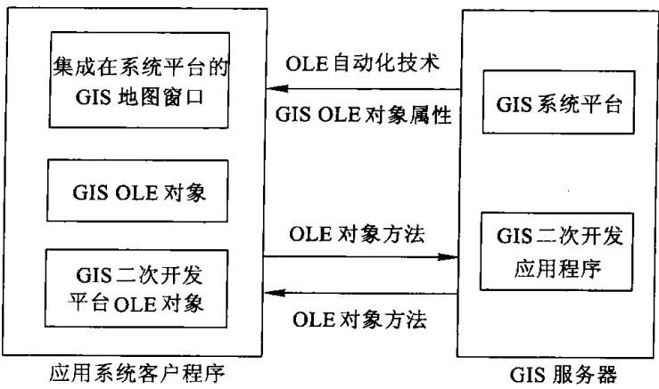  
图11-1 基于“客户机/服务器”模式的GIS系统集成结构

## (2) 集成控件开发

利用GIS工具软件生产厂家提供的建立在OCX技术基础上的GIS功能控件，如 ESRI的 MapObjects、MapInfo 公司的 MapX等，在 VB、VC 等编程环境下，可直接将 GIS 功能嵌入到应用程序中，从而实现GIS的各种功能。

集成二次开发中的OLE和GIS控件技术各具特色。利用OLE技术集成开发，几乎可以实现GIS工具软件的所有功能，开发周期短，费用低。集成控件开发技术，占用资源少，编程过程更简洁和灵活，但GIS控件往往只包含原系统平台的部分功能，一些复杂的地理分析难以实现。在实际工作中，要根据系统的需求来决定开发方式的选择。

## （二）三种实现方式的分析与比较

由于独立开发难度太大，单纯二次开发受GIS工具提供的编程语言的限制，因此结合GIS工具软件与当今可视化开发语言的集成二次开发方式就成为GIS应用开发的主流。它的优点是既可以充分利用GIS工具软件对空间数据库的管理和分析功能，又可以利用其他可视化开发语言具有的高效、方便等编程优点，集二者之所长，不仅能大大提高应用系统的开发效率，而且使用可视化软件开发工具开发出来的应用程序具有更好的外观效果，更强大的数据库功能，而且可靠性好、易于移植、便于维护。尤其是使用OCX技术利用GIS功能组件进行集成开发，更能表现出这些优势。

基于上述优点，集成二次开发正成为应用GIS开发的主流方向。这种方法唯一的缺点是前期投入比较大，需要同时购买GIS工具软件和可视化编程软件。目前许多软件公司都开发了很多ActiveX控件，合理选择和运用现成的控件，可以减少开发者的编程工作量，使开发者避开某些应用的具体编程，直接调用控件，实现这些具体应用，不仅可以缩短程序开发周期，使编程过程更简洁，用户界面更友好，还可以使程序更加灵活和简便。

## 二、开发平台与开发工具的选择

GIS应用首先要选择相应的软件平台。目前GIS的软件较多，各种软件性能的强弱和着重点不尽相同。如何选择功能既灵活又成本低廉的工具软件是系统成功和未来推广的重要因素之一。一般而言，性能愈强，价格愈高，因此，要针对系统的要求选取相应的软件。选

择GIS平台主要考虑如下几方面：

①功能可满足应用的需要，并且具有较好的开放性、兼容性和可扩展性。

②软件成熟，运行稳定，有良好的用户界面，进行二次开发方便。

③应具有较高的性能价格比。

目前，商业GIS软件平台大都能实现土地复垦信息管理所需的基本功能。MapInfoProfessional是由美国MapInfo公司开发的桌面GIS软件，其汉化程度高，空间和属性数据查询统计功能较强，操作方便，能与Office良好地兼容，而且MapInfo具有以下几个鲜明的特点：

## （1）地图表达与处理功能

MapInfo提供了多种图形元素、颜色及地图符号，具有灵活的专题制图功能，提供多种数据可视化的专题地图。可以方便地对图形进行编辑修改操作，可打印地图和地图的局部，也具有对栅格图像数据的处理能力。

## （2)数据查询与分析功能

MapInfo提供了对象查询、区域查询及缓冲查询等工具，可以精确地在地图上查询、分析其相应的地理数据库信息，为应用程序实现图形查询和表查询提供了强大的手段。

## （3）关系型数据库管理功能

内置ODBC，支持各种关系型数据库，实现了电子地图与数据库的自动连接和双向查询，支持SQL查询，从而保证了对原有数据库的延用和对远程数据库的访问。

## (4) 地图图层化

采用层的概念来组织和管理数据，这样用户可以根据自己的需要对地图元素进行分层组合。

## （5）支持多种数据格式及其转换

MapInfo既支持数字化仪的图形输入方式，直接生成矢量图，也支持目前市场上流行的图形图像格式。可接受 AutoCAD的 DWG、DXF标准文件格式，还可通过MIF 及MID文件与其他软件建立数据的接口。其中MIF文件内保存有图形信息，MID文件内保存有图形的属性信息。MIF 及 MID 文件通过 MapInfo 的菜单命令 Import 和 Export 来输入和产生。

## （6）提供二次开发工具 MapBasic

作为一个系统软件，MapInfo提供了可以将其所有的功能用程序来驱动的方法，内置标准的二次开发工具—MapBasic。MapBasic不仅与大众化的Basic语法相一致，具有基本一致的常用函数集(计算、字符串处理、文件I/O、DLL调用等)，而且利用MapBasic语言所提供的函数、过程和语句命令可以完成许多有关图形对象管理的复杂操作和运算。它的真正优势在于对MapInfo中的Table及其图形对象的管理所提供的特性和强大功能，采用面向对象及事件驱动编程。

## (7)集成二次开发能力

具有 OLE 和 OLE Automation 功能，可以方便地使用 VB、VC、Delphi 等多种开发语言，保证了新的应用程序与原有的应用界面保持一致，为今后的深层开发提供一个扩展空间。

## 三、MapInfo空间数据的拓扑关系模型

空间数据的拓扑关系模型是 GIS的基石。当前商用 GIS中，主要采用 POLYVRT结构和“空间实体+空间索引”两种模型。

MapInfo采用称作“空间实体+空间索引”的拓扑关系模型。20世纪80年代中后期出现的商用GIS，尤其是桌面 GIS大多采用这种方式，包括ESRI的ArcView。而采用POLYVRT 模型的系统主要是以 Arc/Info 为代表的一些专业 GIS 产品。

“空间实体十空间索引”模型的基础是“空间实体”。空间实体是地理实体的抽象，主要包括点、线、面三种类型。每个空间实体对象都维护着自己的所有属性，多个空间实体组成一个图层。

“空间实体+空间索引”模型的空间查询功能是通过“空间索引”技术来实现的。空间索引的目的是对给定的空间坐标，能够以尽快的速度搜索到坐标范围内的空间对象。MapInfo采用R一Tree技术将空间实体的最小外接矩形(MBR)存储在索引中，并按从大到小的顺序进行索引搜索。建立了空间索引，就能快速地进行空间分析了。

POLYVRT的优点是多个不同的对象可以共用相同的结点，节省存储空间，但由此产生的问题是其结构更加复杂，数据的编辑和维护比较困难。而“空间实体十空间索引”模型虽然会造成公共结点的重复存储，但是其结构化的实体模型使得对某个对象的更改不会影响到其他对象的定义，从而大大增强了空间数据的可维护性。

另外，基于POLYVRT结构的空间数据组织不能被规范为关系模式，而基于“空间实体十空间索引”模型可以规范为“实体一关系”模型，从而可以与关系数据库系统结合，在关系数据库内实现对空间数据的查询、分析和处理等操作。

## 四、通过 MapInfo 访问 Oracle 中的空间数据

目前，采用数据库管理空间数据已经成为主流技术，其优点在于能够实现空间数据与属性数据的无缝集成，这种数据库也称为空间数据库。空间数据库利用数据库的管理机制可以保证空间数据的完整性和安全性，对空间数据进行备份和恢复以及控制用户的并发访问等。Oracle的空间数据选件可以把复杂的地图对象(包括空间数据和属性数据)存入一个表中，同时建立空间数据索引，从而实现空间数据和属性数据的一体化存储和管理。OracleSpatial还提供空间算子，结合SQL语句实现对空间数据的查询和其他复杂空间分析。

MapInfo 提供 Easy Loader 工具，用来将用户制作的 MapInfo 地图数据上载到 Oracle数据库中。如果将来地图数据发生了变更，也只需要通过EasyLoader的刷新表功能，即可将发生变化的地图数据在Oracle数据库中更新。

## (1) MapInfo 地图的上载

地图用 MapInfo 编辑完成，用 Easy Loader For Oracle 将编辑好的 MapInfo 的地图上载到 Oracle 中。第一次上载 MapInfo 地图到 Oracle 时，Easy Loader 会自动创建一个名为MapInfo的用户，该用户的缺省口令为“MapInfo”，缺省表空间和临时表空间都是SYSTEM，同时会在该用户下创建一个名为MapInfo\_Mapcatalog的表，这个表用来记录所有上载到Oracle中的MapInfo地图的信息，如地图的存储和索引形式、地图的名称、地图的所有者、存储地图空间数据的列名、地图的坐标系、地图的边界、地图中点线面的样式信息等。

## (2) MapInfo 地图在 Oracle 中的存储和管理方式

Oracle 为管理空间数据提供了对象管理模式 SDO(Spatial Data Object)，同时提供优秀的空间索引机制。MDSYS是Oracle Spatial的管理用户，MDSYS 方案规定几何数据的存储方式、语法形式和语义。MDSYS方案中，表 SDO\_GEOM\_METADATA\_TABLE存储所有上载到 Oracle 中的 MapInfo 地图的信息，表 SDO INDEX METADATATABLE存储与索引相关的信息，如被索引的列名、索引的方式、索引的级别、索引的所有者等。MDSYS方案中还有与空间数据及其索引相关的视图，如ALLSDO GEOM METADA-TA、ALL\_SDO\_INDEX\_METADATA、DBA\_SDO\_GEOM\_METADATA、DBA\_SDO\_INDEX METADATA、USER SDO GEOM METADATA、 USER SDO INDEXMETADATA。上载到Oracle中的每一个地图由两个表表示，一个是与该地图空间索引方式相关的表，叫做索引表，另一个用来存储地图属性数据和空间数据，叫数据表。Oracle为了有效地管理和存储MapInfo地图，在数据表中新增加两列：一列是类型为NUMBER的“MI\_PRINX”，它是唯一性索引字段，一列是类型为 SDO\_GEOMETRY的“GEOLOC”，用来存储空间数据。SDO\_GEOMETRY是Oracle中存储地图数据的空间数据类型。

## (3) 利用 MapInfo 从 Oracle 中读取数据

MapInfo 从 Professional 5.5 开始才支持向 Oracle 8i Spatial 中存取空间数据。在 Pro-fessional 5. 5 以前 MapInfo 只支持通过 ODBC 向 Oracle 数据库中存取 MapInfo Table 表的属性数据。Oracle也只从Oracle 8.1.5开始，才向MapInfo提供了OCI底层接口，并通过 OCI接口来实现与 MapInfo 之间的空间数据存取。MapInfo 可以利用 ODBC或者 OCI获取Oracle中的数据。OCI是一种比ODBC更底层的数据库接口。通过此接口可以直接向Oracle数据库中存取MapInfo空间地图。在程序中连接Oracle空间数据库时，不再需要使用 ODBC 连接所必需的数据源 DSN。用户在 MapInfo Professional 环境下，可以进行基于属性或是基于空间关系的 SQL查询，从 Oracle 8i Spatial 中下载数据。

## （4) 文本对象的处理

由于现在 Oracle Spatial 还无法接受MapInfo的文本对象，所以用户将MapInfo的文本对象图层上载到Oracle表中后，再下载到MapInfo环境中时，所有的文本对象都会丢失。但是其所有的属性信息都还仍然存在。解决办法如下：

利用EasyLoader上载MapInfo表之前，先在表中增加几个属性字段，将文本对象的信息(如文本对象的内容、文本样式等)当作对象的属性值保存到表中，并连同表的其他属性一起上载到Oracle数据库中。当用户通过程序将该表从 OracleSpatial中下载到MapInfo中后，再根据保存在表中的文本对象的信息，利用程序为每个记录再重新创建一具文本对象。

## 五、多媒体技术与GIS 的集成

目前由于多媒体技术的迅速崛起和高速发展，越来越多的应用软件都大量使用了多媒体技术，如果将多媒体技术应用于GIS软件中，势必大大增强GIS信息的表现能力，扩大GIS的应用领域。多媒体信息管理的管理方式可分为两种：第一种方式是采用数据库记录目标所关联信息的存放路径和文件名，在需要时检索出对应媒体文件，然后使用内置功能或者外挂程序来播放；第二种途径是将多媒体信息数据以二进制的方式存放到数据库中，通过目标关键字与之关联，用户播放时，首先将数据从数据库中读出，然后写入文件，再提交给其他控件或者第三方API播放(如果能自行开发多媒体的播放功能，则从数据库中读出数据后无需写成文件，可以直接进行处理、播放，但工作量较大，这里不考虑这种方式)。比较这两种方式可以发现，后者将所有相关多媒体数据集成到一个数据库中，能够较好地保持数据的完整性，并且从系统的角度而言易于管理。但其弊端也很明显，首先在播放时需要从数据库中读出，然后再写成文件，降低了系统的效率；其次多媒体数据的编辑修改会影响目标与它的关联性。

## 六、应用模型与GIS的集成

近几年来，随着GIS技术的逐渐成熟，其应用领域不断扩大，凡是涉及地理空间信息的领域都已经或开始使用GIS技术，GIS正深刻地改变着人们的思维方式和日常生活方式。在求解某个具体的问题时，人们往往需要功能强大、复杂的应用分析模型。以数据的采集、储存、管理和查询检索功能为主的GIS不能满足社会和区域可持续发展在空间分析、预测预报、决策支持等方面的要求，直接影响到GIS的应用效益和生命力。

应用模型是在某一专业领域对解决具体问题所采用的分析方法和操作步骤的抽象，它可用于解决同类问题或为解决相似问题提供参考。模型的建立都是为了解决具体的问题，即模型是面向应用的。一般地说，专业应用模型可分解为若干个或并联或环联或是层次结构的子过程，各个子过程都需要一定的空间分析手段。

应用模型是在实践经验积累的基础上发展起来，以空间分析的基本方法和算法模型为基础，用以解决一些需要专家知识才能解决的问题。

GIS是由应用需求的驱动而发展起来的，最初是为数据管理的需要而设计的，其分析功能尚有待加强。应该说应用模型与GIS的结合是增强GIS功能最有效也是最简捷的途径之一。GIS的空间数据和属性数据的紧密结合为空间分析和空间模拟提供了迄今为止最强有力的环境。GIS可以输入、存储、操作、管理空间数据，以图形等直观形式表达输出结果，但它本身缺少专业应用所需的空间分析和空间模拟功能，难以得到直接应用。空间模型具有很强的预测分析和空间模拟能力，可对空间数据进行精确的模型运算，但它需要大量的时空数据，这些数据的可得性和准确性直接影响到模拟结果的准确性。

GIS和空间分析模型在功能上的互补是二者结合的驱动力。它们的有效结合可大大增强GIS的空间分析功能，进一步拓宽其应用范围，加深其应用的深度，同时GIS为模型的数据输入和预处理以及模拟结果的直观显示提供了极好的工具。

随着GIS应用领域的扩大和深入，必然越来越多地涉及专业应用模型与GIS的集成问题。在不同的发展阶段和技术条件下，GIS与应用模型结合的层次有所不同。GIS与应用模型的结合可分为以下三个层次：

## (1） 应用模型与 GIS 的松散结合

应用模型与GIS没有程序语言上的直接连接，它的运行基本上是独立的，模型所需的数据从GIS数据库中获取，模型的输出结果可放回GIS数据库，空间查询、显示由GIS的基本功能完成。这种结合方式开发费用低，风险小，容易实现，同时保持了空间分析模型的原有专业特色，为分析理解模拟结果带来很大方便，但系统效率低，增加了非专业人员掌握和应用的难度。其结合示意图见图11-2所示。

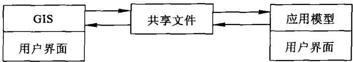  
图 11-2 GIS 与应用模型的松散结合

## (2) 应用模型与 GIS的紧密结合

以一系统为主，加入另一系统的功能，两者具有共同的用户界面，通过共享文件和存储空间实现无缝连接。这种结合有两种方式：一种是将应用模型嵌入GIS中；另一种是对应用模型进行功能扩充，使其具有基本的GIS功能。其结合示意图见图11-3所示。

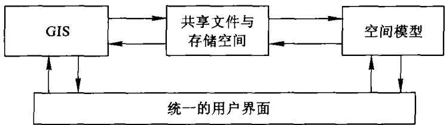  
图 11-3 GIS 与应用模型的紧密结合

这种结合方式利用界面程序(Interface)或宏语言(Macro Language)使从属系统能直接运行于主系统之中，变成主系统的特有功能之一。其特点是用户界面友好，系统稳定。

## (3) 应用模型与 GIS 完全一体化

某一专业应用模型的理论研究与实践应用逐渐成熟，发展成为广为接受的空间分析工具，通过GIS基础平台技术的发展和完善，有能力将其纳入GIS基础平台，作为基本的空间分析工具，实现完全一体化，这是最高的结合层次。其结合示意图见图11-4所示。

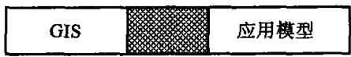  
图 11-4 GIS 与应用模型的完全一体化

## 七、虚拟场景的建立方法

随着计算机技术的发展，人们对传统的基于二维平面反映规划结果的形式已不满足，基于规划数据建立起复垦后的具有真实感的三维景观模型，通过三维可视化的形式，反映土地复垦前后的景观变化，对评价规划方案、展示规划效果和提高各方面人士的参与复垦的积极性都有重要意义。MapInfo虽然提供了DEM可视化技术，但在三维建模方面，可视化操作等方面功能较弱，不能满足实际需要。OpenGL是一个硬件和图形软件接口，由于它在三维真实感图形制作中性能优秀，OpenGL已经成为事实上的高性能和交互式视景标准。OpenGL中很容易实现模型的各种变换、着色、光照、纹理、交互操作和动画，但是它只能提供基本几何元素的造型函数，使得复杂模型的建模相对困难。3DMAX是Kinetix公司的三维图形建模和动画软件，能方便建立各种复杂物体模型，但是很难进行程序控制。因此，本研究所采用的技术路线为：将GIS中存储的规划数据导入到3DMAX，在3DMAX中建立好复杂模型后，在OpenGL中实现对其方便控制和变换。技术流程如图11-5所示。

## (1) OpenGL

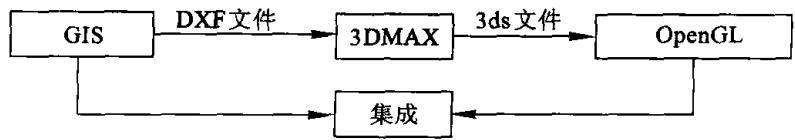  
图11-5 三维景观模拟的数据处理流程图

OpenGL是一个硬件和图形发生器的软件接口，它包括了100多个图形操作函数，开发者可以利用这些函数来构造景物模型、进行三维图形交互软件的开发。OpenGL是一个高性能的图形开发软件包。OpenGL支持网络，在网络系统中用户可以在不同的图形终端上运行程序显示图形。OpenGL作为一个与硬件独立的图形接口，它不提供与硬件密切相关的设备操作函数，同时，它也不提供描述类似于飞机、汽车、分子形状等复杂形体的图形操作函数。用户必须从点、线、面等最基本的图形单元开始构造自己的三维模型。当然，像OpenInventor那样更高一级的基于OpenGL的三维图形建模开发软件包将提供方便的工具。因此OpenGL的图形操作函数十分基本、灵活。OpenGL提供了以下的对三维物体的绘制方式：

①网格线绘图方式(Wireframe)。这种方式仅绘制三维物体的网格轮廓线。

②深度优先网格线绘图方式(Depth\_cued)。用网格线方式绘图，增加模拟人眼看物体一样，远处的物体比近处的物体要暗些。

③反走样网格线绘图方式(Antialiased)。用网格线方式绘图，绘图时采用反走样技术以减少图形线条的参差不齐。

④平面消隐绘图方式(Flat\_shade)。对模型的隐藏面进行消隐，对模型的平面单元按光照程度进行着色但不进行光滑处理。

⑤光滑消隐绘图方式(Smooth\_shade)。对模型进行消隐，在光照渲染着色的过程中再进行光滑处理，这种方式更接近于现实。

⑥加阴影和纹理的绘图方式(Shadows、Textures)。在模型表面贴上纹理甚至于加上光照阴影，使得三维景观像照片一样。

⑦运动模糊的绘图方式(Motion-blured)。模拟物体运动时人眼观察所感觉的动感现象。

⑧大气环境效果(Atmosphere-effects)。在三维景观中加入如雾等大气环境效果，使人身临其境。

⑨深度域效果(Depth-of-effects)。类似于照相机镜头效果，模型在聚焦点处清晰，反之则模糊。

这些三维物体绘图和特殊效果处理方式，说明OpenGL已经能够模拟比较复杂的三维物体或自然景观。

## (2) OpenGL 图形操作步骤

根据流程可以归纳出在OpenGL中进行主要的图形操作直至在计算机屏幕上渲染绘制出三维图形景观的基本步骤：

①根据基本图形单元建立景物模型，并且对所建立的模型进行数学描述(OpenGL中

将点、线、多边形、图像和位图都作为基本图形单元)。

②把景物模型放在三维空间中的合适位置，并且设置视点(Viewpoint)以观察所感兴趣的景观。

③计算模型中所有物体的色彩，其中的色彩根据应用要求来确定，同时确定光照条件、纹理粘贴方式等。

④把景物模型的数学描述及其色彩信息转换至计算机屏幕上的像素，这个过程也就是光栅化（Rasterization)。

在这些步骤的执行过程中，OpenGL可能执行其他的一些操作，例如自动消隐处理等。另外，景物光栅化之后被送入帧缓冲器之前还可以根据需要对像素数据进行操作。

## 第三节 矿区土地复垦信息系统的总体设计

## 一、系统的总体功能

## (一)系统的内涵

矿区土地复垦信息系统( Land Reclamation Information System of Mining Area)具有以下几个明显特征：

①区域性——复垦区的土地资源是一种与地域相关的资源，这决定了矿区土地复垦信息系统的区域性特点。

②时效性——复垦区的土地资源处于不停的变化之中，这种变化包括采矿对土地资源的影响，以及采取复垦措施后土地利用的变化等。因此矿区土地复垦信息系统应及时反映这种变化。

③综合性—复垦区土地资源的开发与利用受到采矿、地质、环境等多方面的影响，同时在制定复垦方案时应坚持生态、环境、效益等多目标相统一。

④专业性矿区土地复垦信息系统属于专业应用型系统，主要为土地复垦管理和研究服务。

矿区土地复垦信息系统具有的四个明显特征决定了系统开发的性质，即矿区土地复垦信息系统是以GIS的软硬件为基础，综合处理和分析矿区破坏土地和复垦土地属性和空间分布的一种技术系统，为土地复垦规划和管理提供决策支持。

## (二)系统的功能概述

建立矿区土地复垦信息系统的目的是对整个矿区已复垦及待复垦土地进行统一协调和综合管理。系统应包括的几个主要功能模块有数据输入、数据变换、查询统计、空间分析、三维景观模拟、应用模型、数据库管理等(图11-6)，各功能模块简要介绍如下：

## 1. 数据输入模块

系统可以输入各种属性数据、文本数据以及各种图件，并对数据进行初级提炼、加工和分析，对各种图件进行数字化及编辑。在数据录入前应进行数据预处理，其目的是提高数据的标准化程度，使之符合某种标准或要求，因为模型中要求数据具有一定的格式，同时进行图件的数字化及编辑，为后期的空间分析做准备。

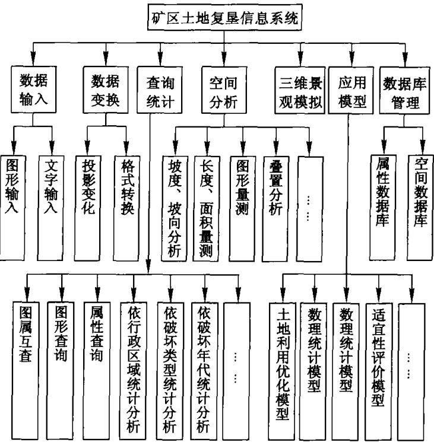  
图11-6 矿区土地复垦信息系统的功能模块图

## 2. 数据变换模块

为了便于不同系统之间进行数据交换和实现资料共享，系统应具备相应的数据变换功能。

## 3. 查询统计模块

提供方便快速的图形与属性互查功能，任意字段的自定义查询等功能，包括临时空间数据查询与按多种条件组合查询。

## 4. 空间分析模块

为了满足土地复垦中空间分析的需要，系统应具有基本的空间分析能力，主要包括量算(面积、长度等)、缓冲区分析、叠加分析等。

## 5. 三维景观模拟模块

基于DEM，建立具有真实感的三维景观模型，评价复垦方案，展示复垦前后的景观变化。

## 6. 应用模型模块

该模块是矿区土地复垦信息系统的核心内容，为土地复垦决策服务，主要包括土地利用规划模型、评价模型和常用的数理统计分析模型。根据获得的土地利用现状等数据进行辅助规划设计。基于DEM，进行土方量计算。利用GIS的空间分析功能，分析土地利用的现状分布，结合应用模型进行复垦土地的适宜性分析、空间布局的辅助决策、土地利用的结构与布局调整以及土地利用分区等。

## 7. 数据库管理模块

土地复垦中涉及大量的图形与属性数据，系统应对这些资料进行有效管理。矿区土地复垦所涉及的图件大致分为两大类：第一类基础数据，如地形图、DEM等；第二类为各种专

题图件，如土地分等定级图、土壤特性图、水文图、地质图、采矿规划图等。基于GIS的矿区土地复垦信息系统应具有输入、输出(显示)上述图件的功能，使用户对与矿区土地有关的各类信息有直观的了解。

## 二、矿区土地复垦数据的组织

## （一）数据库在系统中的作用

矿区土地复垦信息系统的研究对象是被破坏的土地，它利用现代计算机技术将土地要素信息有机地结合在一起，并以数据流的方式在信息系统中构成了一个复杂而有序的整体。空间数据和属性数据是矿区土地复垦信息系统的“血液”，是保证矿区土地复垦信息系统能够正常工作的基础。可见，数据库在矿区土地复垦信息系统中有着十分重要的地位。由此可见，高质量的土地复垦信息数据库是建设矿区土地复垦信息系统的基础。评价土地复垦信息数据库的三个基本标准是：数据的完整性、正确性和一致性。所谓完整性是指为完成某一特定的工作目标，数据库是否充分地具备其所需的全部信息数据；所谓正确性，对于空间数据是指数据的准确程度，而对属性数据是指数据的正确程度；而所谓的一致性是指数据库中所有表达同一个对象的信息数据(包括数据关联)用同一单位和同一代码，而且在逻辑上和空间关系上也应当全部一致。只有在这三个方面达到一定要求的数据库才具有可用性，否则系统输出的结果将毫无用处。

## （二）数据库的组成

土地复垦使用的数据可分为空间数据和非空间数据。空间数据包括图形和属性数据，主要以土地基础地理信息、土地利用现状图和相关的规划图等形式存在。非空间数据包括结构化数据和非结构化数据，主要是以各种文档、报表等形式存在。结构化数据可用关系数据库的表和视图表示，如各种表等；而非结构化数据主要是一些文档数据，如各种文件、法规等，需要将这些数据转换为电子格式的数据，建立文档数据库。按数据特征，矿区土地复垦信息系统数据库可分为空间数据库和非空间数据库，非空间数据库又可分为关系数据库和文档数据库，其组成如图11-7所示。

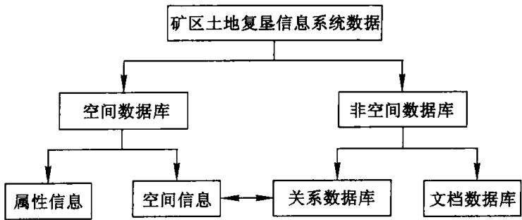  
图11-7 矿区土地复垦信息系统的信息分类

从数据的内容和用途分类，矿区土地复垦信息系统数据库包括基础地理信息库、土地利用现状库、土地复垦规划库等数据库，如图11-8所示。这些数据库包括空间数据库、关系数据库、文件。关系数据库主要存贮空间数据和非空间数据的结构化数据，并通过空间数据引擎与空间数据库相连，文件存储部分空间数据和文档数据，文档数据构成文档数据库。文档

数据库主要包括政策法规、规划条例等。

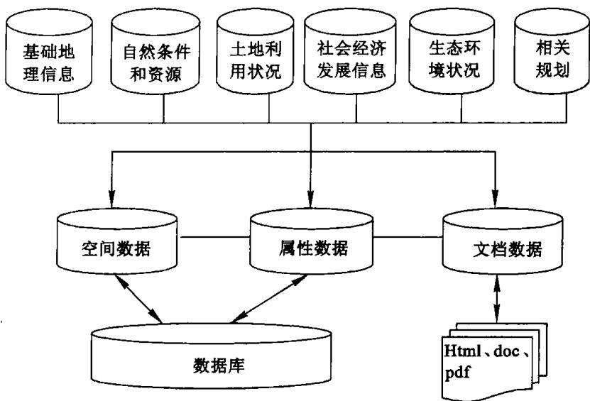  
图11-8 矿区土地复垦信息系统数据库总体结构

## (三）基于E一R模型的概念设计

要想建立一个满足需要的矿区土地复垦信息系统，必须依靠一套高效的工具来构造其概念模型，为进一步构建逻辑模型和物理模型提供坚实的基础。

## 1. E—R 模型概述

实体—关系数据模型(Entity-Relation data model，简称 E-R 数据模型或 E—R 模型)由实体类(简称实体)、关系类(简称关系)和属性三个抽象概念组成，是构建信息系统或数据库概念模型的一种有效工具或有效方法(也简称E一R方法)。E一R数据模型的特点是强调实体间的联系，而不是实体的属性。基本E一R数据模型由 Peter Chen于1976 年提出，其目的有：①企图建立一个统一的数据模型，以概括层次、网状和关系三个传统的数据模型；②作为三种数据模型相互转换的中间数据模型；③作为超脱数据库管理系统(DBMS)的一种概念模型，以比较自然的方式描述现实世界。三个目的都已在不同程度上达到，但E一R数据模型用得最广泛且最成功的是作为概念设计的数据模型。

基本E一R模型关系类型通常有：拥有/属于关系；集/子集关系；父/子关系；实体的组成关系。这些关系又有一对一、一对多、多对多三种类型。实体有自己的属性，关系也有自己的属性。一般地，实体是数据库的存储对象，关系是数据库所要进行的查询操作。在基本E一R图中，实体用矩形表示，关系用菱形表示，属性用椭圆表示(表11-1)。

在基本E一R模型提出以后，为了满足新的应用需求和表达更多的语义，E一R模型经历了不少改进，提出了扩充 E一R模型(Extended E一R data model，简称 EER 数据模型或EER模型)。EER模型在基本E一R模型的基础上，又引入了下列抽象概念：分化(Specifi-cation)与综合(Generalization)、聚集(Aggregation)、范畴/类(Category)。分化是把一个实体集或类(简称实体)按某一特征分成几个实体集。综合是分化的逆过程。由联系及参与联系的实体组合而成的新实体称为聚集。范畴/类是实体集的一个子实体集。

<table><tr><td colspan="4">表11-1 土地复垦空间E一R 模型</td></tr><tr><td colspan="4">土地复垦空间E—R模型 (据 H. W.Calkins，1996，修改)</td></tr><tr><td>实 体</td><td colspan="4"></td></tr><tr><td>构 成</td><td colspan="2">［原图缺失］</td><td></td></tr><tr><td>例子</td><td colspan="2">塌陷地(类型形成时间) 多边形(坐标 拓扑关系)</td><td></td></tr><tr><td>实体 表</td><td colspan="4">［原图缺失］</td></tr><tr><td>达 实体 类</td><td colspan="4">一般实体(与空间实体对应) 多空间尺度/类型表达实体 ［原图缺失］</td></tr><tr><td>型 关 系</td><td colspan="4">多时段表达实体 ［原图缺失］ 一般关系(拥有、参与等)</td></tr><tr><td>类 型</td><td colspan="4">由空间操作导出的关系 ［原图缺失］ (邻近、交叠、跨越等)</td></tr><tr><td>属性</td><td colspan="4">［原图缺失］</td></tr></table>

E一R方法广泛应用于GIS需求分析和GIS数据库概念模型的设计。有些学者根据地理数据的特点对E一R数据模型作了改进。E一R方法在GIS中的应用可归纳为两类：直接应用和根据地理数据具有空间特性对E一R方法进行改进。后者称为基本E一R方法在GIS中的扩展应用。目前，基本E一R方法GIS的应用中，两种类型都有，而扩展E一R方法只是直接应用。直接应用的缺点是建立的空间概念模型只能反映地理实体的一个层面，即物理层面或空间层面，不能完整地描述现实世界。到目前为止，E一R方法在GIS中的成功应用是H.W.Calkins的基本E一R方法在 GIS 中的扩展应用，简称空间基本E一R

方法。

## （1）地理实体及其表达

地理数据描述的实体具有空间特性。地理实体不同于一般数据库的实体，一般实体是物理实体，而地理实体除了具有物理实体，还具有与物理实体相对应的空间实体(见表11-1)。空间实体一般用点、线、面或 grid一cell、tin、image像元表示。

在基本的E一R模型中，用矩形表示实体，只能描述和表达地理实体的一个层面，即只能表达物理实体或只能表达空间实体。H.W.Calkins(1996)将物理实体名称和空间实体类型在一个特定的矩形框中同时表达出来(见表11-1)。

一般数据库中只有一种实体，即没有空间实体对应的一般实体。H.W，Calkins定义了三种地理实体类型：有空间实体对应的一般实体；有空间实体对应的需用多种尺度空间(类型)表达的实体，如道路在一些GIS数据库既表达为线，又表达为面；有空间实体对应的需表达多时段的实体，如十年的土地利用，并分别用单个特定矩形框、两个交叠的特定矩形框、三个交叠的特定矩形框来表示(见表11-1)。

## （2）地理实体间的关系及其表达

与地理实体一样，地理实体间的关系也具有双重性。既具有物理实体间的关系，如拥有/属于关系、集/子集关系、父/子关系等，也具有空间实体间的关系，如拓扑关系：点一点的相离、相等；点一线的相离、相接、包含于；点一面的相离、相接、包含于；线一线的分离、交叠、相交、相接、包含、相等；线一面的分离、相交、相接、包含于；面一面的分离、交叠、相交、相接、包含、包含于、相等、覆盖、被覆盖。

H.W.Calkins将地理实体间的关系归纳为三类：一般关系（一般数据库均有）、拓扑关系(相邻、联结、包含)和由空间操作导出的关系(邻近、交叠、空间位置的一致性)，并分别用菱形、六边形和双线六边形表示(见表11-1)。

## 2. E—R模型的建立步骤

第一步：识别实体。根据系统的具体应用和需求分析的数据与功能列表，确定物理/概念实体、相应的空间实体、实体类型、相关实体、实体属性。本系统主要为矿区土地复垦规划提供信息服务。

第二步：关键实体的确定。确定关键实体有助于勾画正确、完整、清晰、易懂、结构良好的E一R图。关键实体的判别依据主要是应用主题和实体的相关数量。

第三步：勾画E一R图。E一R图分局部E—R图和全局E一R图。为了清晰描述E一R图，将属性不放在E一R图中，将其列入第一步的实体判别表中。

## 三、矿区土地复垦信息系统的建立

本书以华东某矿区为例进行了开发，本系统采用流行的MapInfo为平台。开发工具主要是MapBasic、VB、VC，数据库采用 Oracle。在系统开发中，前台主要采用VB。VB和MapInfo之间的联系采用OLE技术，在VB 中调用MapInfo的 GIS功能，这样便实现了系统与GIS软件的信息自由交换，充分利用GIS软件强大的图形处理功能，界面满足系统用户的需求。

1. VB 与 MapInfo 集成的主要实现步骤

(1) VB 应用客户程序与 MapInfo OLE 服务器的连接

VB 应用客户程序与 MapInfo OLE服务器连接原理是：在 VB 应用客户程序中通过OLE Automation 技术实现应用客户程序与 MapInfo 的连接，从而实现 OLE 对 MapInfo 的调用。

## （2)实现地图窗口在系统应用客户程序中的嵌入

在 VB的应用客户程序中集成MapInfo的地图窗口，必须在VB的应用客户程序中为MapInfo中的应用窗口设置父窗口，一般父窗口是窗体，并指定一个Picture控件为集成地图窗口的父窗口。同时还可以设置 MapInfo信息的父窗口和MapInfo的其他父窗口。这些设置可以使用OLE自动化对象的Do方法实现。最后，将地图的空间数据、属性数据以及其他数据建立有效的连接。

## (3) 在 VB 应用客户程序中 MapInfo 功能的实现

在集成地图应用程序中，是通过向 MapInfo 发送 MapBasic命令串来操作 MapInfo，使用OLE自动化或DDE技术给 MapInfo发送这些命令串，是主要的方法。

在本系统中，实现 MapInfo的功能主要采用 OLE方法进行调用。MapInfo的 OLE自动化对象的方法有多种，本系统主要使用的方法如下：

① Do(String)方法——解释 String 为语句，并执行它；用于在客户程序执行 MapBasic语句，不能返回值。

②Eval(String)方法———解释 String 为表达式，并返回它的值；用于在客户程序执行Mapbasic表达式，并可获取返回值。

③ RunCommand(String)方法—功能与 Do 方法相同。

④ RunMenuCommand(menuid)方法——执行指定的 MapInfo菜单或按钮命令，仅对标准命令有效。

## (4）用回叫机制从 MapInfo 中获取信息

在集成二次开发中，通常采用回叫机制从MapInfo中获取信息。所谓回叫，是指当集成客户程序的MapInfo地图窗口中有事件发生时，MapInfo通过OLE自动化对象自动向客户应用程序发送消息的机制。

利用回调机制，在如下情况下MapInfo可以向客户程序发送信息：

①MapInfo中执行菜单栏或者工具按钮的命令。

②图窗口发生变化。

③MapInfo 状态条发生改变(用户在地图上移动鼠标)。

而客户程序可以接收相应的信息，在自己定义的方法中进行处理。所以可以利用回叫机制在应用程序中实现下面的功能：

① 定义 MapInfo 右键菜单。

②通过用户自定义工具同MapInfo交互。

③控制发生变化的地图。

④自定义客户程序状态栏显示的内容。

回叫是利用OLE自动化集成二次开发的难点所在，其核心思想是MapInfo服务器向客户程序发送消息。

(5） 在 VB 应用客户程序中调用 MapBasic 程序

在 VB 客户程序中处理一些复杂的 GIS 系统操作时，一般先使用 MapBasic编程方式来

处理，再将处理结果返回到VB客户程序中，从而达到其目的。这可以采用在VB客户程序中调用MapBasic程序方法来实现。

## 2. 数据的收集和处理

本系统的数据主要包括图形数据和社会统计数据。图形数据主要包括：

①全区土地利用现状图(1：50000)，各乡镇土地利用现状图(1：10000)。

②矿产资源分布现状图(1：50000)。

③地形图(1：50000)。

④复垦项目区分布图(1：50000)。

⑤露采矿山位置标注图(1：50000)。

⑥主要煤矿的井上下对照图(1：2000)。

⑦行政区划图。

⑧地理位置图。

属性数据主要包括土地统计台账、各类社会经济发展统计数据、采煤塌陷地统计表、矸石山统计表、露天矿山统计表、矿山企业登记表等。

数据规范化处理是数据预处理的步骤之一，指获得可直接输入计算机的符合系统要求的数据。包括数据整理、数据分类及编码。

数据整理是数据输入前的准备工作。各种数据资料在入库之前需要根据系统设计的要求进行整理筛选。一是地图资料整理。数字化前要进行必要的图面处理，如将不清晰或遗漏的图廓点标绘清楚，为数据的精确配准奠定基础，将模糊不清的线状图件进行加工、处理，对图面上的各种标记标注清楚，以减少数字化和数据编辑处理的工作量。二是属性资料的整理。对土地利用台账及一些相应的统计资料进行整理归档，制成相应的统计表，以便输入。

## 第四节 DTM 在矿区土地复垦中的应用研究

数字地面模型(Digital Terrain Models，简称 DTM)是对地面诸特性空间分布的数字描述，它的本质是对二维地理空间的定位和数字表达。有了DTM后，在传统的地形图中，地貌和地物已不仅仅是在纸上用等高线和图例符号来表示。而是以地面点的空间坐标和特征编码为基础，以数字的形式描述的三维立体图。如果地面特性为高程，这种DTM又称作DEM(Digital Elevation Model).

## 一、DTM 与 DEM

## （一）概念

DTM更通用的定义是描述地球表面形态多种信息空间分布的有序数值阵列，从数学的角度，可以用下述二维函数系列取值的有序集合来概括地表示DTM的丰富内容和多样形式：

$$
K _ { p } = f _ { k } ( u _ { p } , v _ { p } ) ( k = 1 , 2 , 3 , \cdots , m ; \ p = 1 , 2 , 3 , \cdots , n )\tag{11-1}
$$

式中， $K _ { \mathfrak { p } }$ 为第 $\boldsymbol { \phi }$ 号地面点(可以是单一的点，但一般是某点及其微小邻域所划定的一个地表面元)上的第k类地面特性信息的取值； ${ \bf \Phi } ; u _ { p } \mathrm { ~ , ~ } v _ { p }$ 为第 $\boldsymbol { \phi }$ 号地面点的二维坐标，可以是采用

任一地图投影的平面坐标，或者是经纬度和矩阵的行列号等； $m \left( m \geqslant 1 \right)$ 为地面特性信息类型的数目；n为地面点的个数。

当上述函数的定义域为二维地理空间上的面域、线段或网络时，n趋于正无穷大；当定义域为离散点集时，n一般为有限正整数。例如，假定将土壤类型编作第i类地面特性信息，则数字地面模型的第i个组成部分为：

$$
I _ { \rho } = f _ { i } ( u _ { \rho } , v _ { p } ) \qquad ( \rho = 1 , 2 , 3 , \cdots , n )\tag{11-2}
$$

地理空间实质是三维的，但人们往往在二维地理空间上描述并分析地面特性的空间分布，如专题图大多是平面地图。数字地面模型是对某一种或多种地面特性空间分布的数字描述，是叠加在二维地理空间上的一维或 $\mathfrak { F }$ 维地面特性向量空间，是GIS空间数据库的某类实体或所有这些实体的总和。DTM的本质共性是二维地理空间定位和数字描述。

在式(11-2)中，当 $m = 1$ 且 $f _ { i }$ 为对地面高程的映射， $( u _ { \rho } , v _ { \rho } )$ 为矩阵行列号时，式(11-2)表达的数字地面模型即所谓的数字高程模型。显然，DEM是DTM的一个子集。实际上，DEM是DTM中最基本的部分，它是对地球表面地形地貌的一种离散的数字表达。

总之，DEM是表示区域D上的三维向量有限序列，用函数的形式描述为：

$$
V _ { i } = ( x _ { i } , y _ { i } , z _ { i } ) ( i = 1 , 2 , 3 , \cdots , n )\tag{11-3}
$$

式中 $\phantom { } , x _ { i } \phantom { } , y _ { i }$ 是平面坐标， $\textstyle z _ { i }$ 是 $( x _ { i } , y _ { i } )$ 对应的高程。当该序列中各平面向量的平面位置呈规则格网排列时，其平面坐标可省略，此时 $V _ { i }$ 就简化为一维向量序列 $z _ { i } ( i = 1 , 2 , 3 , \cdots , n )$ o

DEM既然是地理空间定位的数字数据集合，因此凡牵涉到地理空间定位，在研究过程中又依靠计算机系统支持的课题，一般都要建立DEM。从这个角度看，建立DEM是对地面特性进行空间描述的一种数字方法途径，DEM的应用可遍及整个地学领域。

## (二) DEM 的表示方法

一个地区的地表高程的变化可以采用多种方法表达，用数学定义的表面或点、线、影像都可用来表示 DEM。

## 1. 数学方法

用数学方法来表达，可以采用整体拟合方法，即根据区域所有的高程点数据，用傅立叶级数和高次多项式拟合统一的地面高程曲面。也可用局部拟合方法，将地表复杂表面分成正方形规则区域或面积大致相等的不规则区域进行分块搜索，根据有限个点进行拟合形成高程曲面。

## 2. 图形方法

## (1) 线模式

等高线是表示地形最常见的形式。其他的地形特征线也是表达地面高程的重要信息源，如山脊线、谷底线、海岸线及坡度变换线等。

## (2) 点模式

用离散采样数据点建立DEM是常用的方法之一。数据采样可以按规则格网采样，可以是密度一致的或不一致的；可以是不规则采样，如不规则三角网、邻近网模型等；也可以有选择性地采样、采集山峰、洼坑、隘口、边界等重要特征点。

GIS中，DEM最主要的三种表示模型是规则格网模型、等高线模型和不规则三角网模型。

## (三) DEM 的建立方法

DEM数据的采集主要有以下几种方法：

## (1) 地面测量

利用测绘仪器在野外实测，将采集到的数据输入计算机进行处理，生成DEM。

## (2)现有地图数字化

利用数字化仪对已有地图上的信息(如等高线)进行数字化的方法，目前常用的数字化仪有手扶跟踪数字化仪和扫描数字化仪。

## (3) 空间传感器

利用GPS，结合雷达和激光测高仪等进行数据采集。

## (4) 数字摄影测量方法

这是DEM数据采集最常用的方法之一。利用附有自动记录装置(接口)的立体测图仪或立体坐标仪，解析测图仪及数字摄影测量系统，进行人工、半自动或全自动的量测来获取数据。

## 二、基于DEM表达复垦区土地的破坏状况

地表沉陷以后，地形景观发生了较大的变化，如何描述沉陷对地表的破坏程度(主要是耕地），传统的方法大都是定性的描述。基于DEM可以获得地形景观的一些指标，从而可以用于表达地形的破坏程度，如坡度、粗糙度等。

坡度是反映地面的倾斜程度，给定点的坡度是曲面上该点的法线向量N与垂直方向Z之间的夹角α。坡度的计算通常在 $3 \times 3$ 的 DEM 格网窗口(图11-9)中进行，窗口在数据矩阵中连续移动后完成整幅图的计算工作。

坡度计算公式如下：

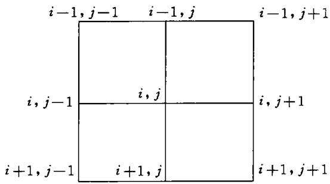

$$
s l o p e = \left[ ( \frac { \partial z } { \partial x } ) ^ { 2 } + ( \frac { \partial z } { \partial y } ) ^ { 2 } \right] ^ { \frac { 1 } { 2 } }\tag{11-4}
$$

图 11-9 格网节点示意图

上式中的偏导数可采用二阶差分法计算，对于上图所示的格网，对于点(i，j)有：

$$
\frac { \partial z } { \partial x } = \frac { z _ { i . j + 1 } - z _ { i , j - 1 } } { 2 \Delta x }\tag{11-5}
$$

$$
\frac { \partial z } { \partial y } = \frac { z _ { i + 1 , j } - z _ { i - 1 , j } } { 2 \Delta y }\tag{11-6}
$$

地表粗糙度是反映地表的起伏变化和侵蚀程度的指标，一般定义为地表单元的曲面面积与其在水平面上的投影面积之比。实际应用中，以格网顶点空间对角线 $L _ { 1 }$ 和 $L _ { 2 }$ 的中点距离D来表示地表粗糙度，D值越大，说明四个顶点的起伏也愈大，其计算公式为：

$$
R _ { i , j } = D = \left\lfloor \frac { z _ { i + 1 , j + 1 } + z _ { i , j } } { 2 } - \frac { z _ { i , j + 1 } + z _ { i + 1 , j } } { 2 } \right\rfloor = \frac { 1 } { 2 } \mid z _ { i + 1 , j + 1 } + z _ { i , j } - z _ { i , j + 1 } - z _ { i + 1 , j } \mid\tag{11-7}
$$

## 三、基于DEM和元胞自动机的基塘复垦模拟

我国煤炭产量的96%来自于井工开采，地下煤层采出后，在采空区上方地表形成一个比采空区面积大得多的沉陷区域，成为地表下沉盆地或沉陷盆地(图11-10)。地下煤层开采后，受采动影响的地表从原有标高向下沉降，当地表下沉至地下潜水位以下时，盆地内出

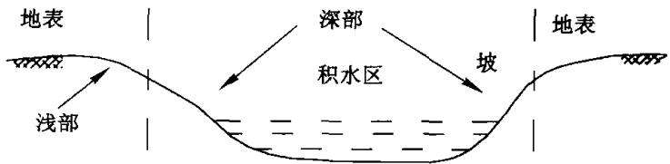  
图11-10 采煤沉陷区地表形态剖面图

现积水。在华东地区，由于地下潜水位很高，地表下沉1m左右，下沉盆地内便可积水，积水率一般在30%以上，在华北地区，积水率一般为20%左右。沉陷积水区域一般是封闭的水体，其中部深，四周浅，类似于天然湖泊，水面面积在几亩到数千亩不等，积水深度与煤层开采厚度、潜水位标高、外河水位等因素有关。按积水状况，可将沉陷区积水区域分为：常年积水深度大于3m的深水区；常年积水深度在1～3m的浅水区；季节性积水，因盐渍化和水涝而荒芜的浅滩区。沉陷区的积水主要来源于地下水的渗入、天然降水、矿井与生活用水的排入。据对部分矿区的调查，沉陷积水区域水质一般呈中营养类型，理化性状良好。由于积水区大多是原来常年耕种的农田，积水后土壤中的营养盐类、N、P、K都逐渐溶于水中，形成较肥沃的水层，有利于水生生物的生长。根据生物监测和理化检测，大多数矿区沉陷积水区水质的一般规定项目都在国家渔业水质标准和地面水二级标准之内。

## (一)元胞自动机模型的基本理论

元胞自动机(CellularAutomata，简称CA)是一种时空离散的局部动力学模型，是研究复杂系统的典型方法，由于其易于与栅格的GIS、遥感技术集成，增强GIS的空间分析能力，广泛应用于城市扩充模拟研究，土地利用变化研究等。

CA是定义在一个具有离散、有限状态组成的元胞空间上，按照一定局部规则，在离散的时间维上演化的动力学系统。CA是数学、物理学、计算机科学、生物学和系统科学等多多学科的交叉和边缘领域，是复杂系统的重要研究方法之一，CA由四种基本元素构成：元胞(Cell)，状态(State)，邻居(Neighborhood)和规则(Rule)。元胞是具有一定空间结构的目标，状态是反映单元自身的属性，邻居是单元在空间的毗邻关系，规则又称转换规则，是描述单元状态变化的规则或原则。CA的两个显著特点是其描述的简单性和运算的封闭性。

元胞自动机自产生以来，被广泛地应用到社会、经济、军事和科学研究的各个领域。在地学领域也有较多的成功应用实例，如林火模拟、城市土地利用变化模拟、农村地区的居住分布格局等，但在土地复垦领域应用较少。

## (二)基于 DEM 和 CA 的基塘复垦模拟

## 1. 模型的建立

常规的CA模型主要是依据邻近范围的状态来决定中心单元状态的转换。一般的CA

模型可以用下式表达，该模型可以利用迭代的规则来实现具体操作：

$$
S ^ { t + 1 } = f ( S ^ { t } , N )\tag{11-8}
$$

式中，S表示状态；N表示邻近范围；f表示转换函数；t表示时间。

为了利用CA模拟基塘复垦的挖深区和垫浅区，对原模型进行了如下改进：

①总体目标的控制—在一般的CA模型中，单元的状态仅仅根据前一时刻的状态和邻域状态而变化，对变化的总量没有控制。由于基塘复垦的首要前提就是保证挖填方量基本平衡，因此，把土方量的平衡作为系统的总体控制目标。

②内在适宜性——对每一个单元，其转移变化不仅仅受自身的状态和邻域影响，而且在某种程度上依赖于自身内在的适宜性，如下沉的深度越大，越适合复垦为鱼塘。

③转换规则——本模型采用8邻域结构，在8个邻接单元中，认为它们的邻接距离相等。具体的转换规则如下：

$$
S ^ { t + 1 } \{ x , y \} = f ( P _ { s } ^ { t } \{ x , y \} )\tag{11-9}
$$

$$
P _ { i j } ^ { t } = ( \sum _ { k = 1 } ^ { m - 1 } W _ { k } \times S _ { k } + W _ { m } \times N ) \times C\tag{11-10}
$$

式中， $P _ { i j } ^ { t }$ 是单元 s 在t 时刻向某类复垦方向的转换概率； $S _ { k }$ 和 $\boldsymbol { W } _ { \boldsymbol { k } }$ 表示单元对某类复垦方向的适宜程度和权重；N和 $W _ { m }$ 表示邻域的影响和权重；C是二值变量，表示对用地变化的限制(如特殊保护的用地)。

## 2. 合理标高的确定

适宜的复垦耕地标高值，对于减少挖、填方总量，节约土方工程费用，加快施工进度都具有十分重要的意义。复垦耕地标高过高或过低对作物生长或排灌都有影响，过高则不利于灌溉，使土壤变干而不利于作物生长，而且耕地标高设计过高还增加挖、填方量，增加土方工程复垦成本；过低则不易排水，雨季土地积水涝害而影响作物生长。因此，在满足耕地抗洪条件的前提下，复垦地最佳标高应满足以下条件：

$$
H = H _ { 0 } + h\tag{11-11}
$$

式中，H为复垦地设计标高； $H _ { \mathfrak { d } }$ 为复垦地潜水位(地下水位)标高；h为潜水位上部土层的厚度，其值可根据作物的生长要求确定。

挖深区的标高根据潜水位的标高和鱼塘的深度来确定，通常要求鱼塘的水深2.5～3 m。

## 3. 模拟过程

将模拟区用栅格的形式来表示，每一个栅格作为CA的一个单元。单元的状态用整数来表示，1表示耕地区(垫浅区)，0表示鱼塘(深挖区)。单元的状态根据目标控制要求而不断变化。首先根据单元内在的适宜性赋予单元初值，计算总体控制目标值，如果满足不了要求，相对于某一转移方向，基于转移概率，从最高概率的单元开始，然后是第二个最高概率，如此分配，直到满足总体控制要求。之后，施加一随机干扰，开始下一轮模拟。

## (三)模拟试验

图11-11为某一模拟的下沉盆地，等高线间距为0.5m。最大下沉深度4m，周围地面高程为51.5 m，潜水位高程为48 m，鱼塘底部高程为46 m。图11-12 为根据下沉曲线建立的DEM模型，图11-13为模拟后的基塘分布状况，挖填方 $2 2 \ 9 7 0 \ \mathrm { m } ^ { 3 }$ ，基塘比为5：1。

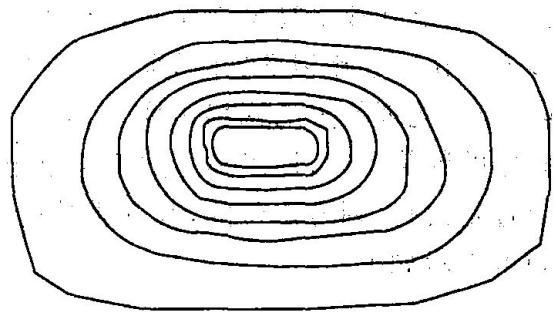  
图11-11 模拟的下沉盆地

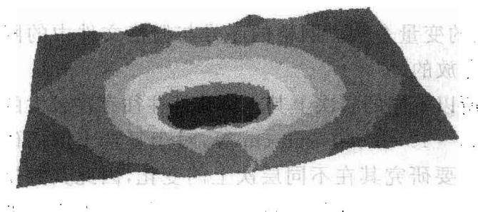  
图 11-12 DEM 模型

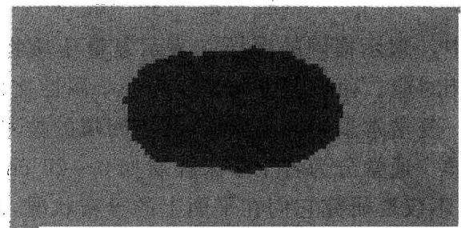  
图11-13.模拟后的基塘分布图

## 四、基于DTM建立数字复垦土壤特性模型

我国土地复垦起步较晚，往往侧重于复垦工程实践，对重构土壤重视和研究不足，致使许多复垦土壤生产力低下、土壤条件差、盐碱化严重甚至出现复垦好的土地无法交接或再次抛荒现象。因此对重构土壤特性的时间、空间变化和分布规律进行系统研究，以便对复垦工作的开展和复垦技术革新提供理论支持，是目前土地复垦的研究热点之一。运用计算机技术建立数字复垦土壤特性模型，以三维的形式充分展示复垦土壤特性在空间的分布状况。在此基础上，可以进行复垦土壤特性的时空变异分析、复垦土壤的生产力评价等，为进一步进行复垦土壤的改良提供技术支持，也为实施精确农业提供基础。下面主要研究复垦土壤特性数据的组织方法及应用研究。 13

## (一)数字复垦土壤特性模型的数据结构

DTM反映了叠加在二维地理空间上的一维或多维地面实体的特征。除了地貌(如高程、坡度、坡向)特征以外，DTM还可以包括土壤、植被、地质、气候等自然资源和环境信息，也可以包括人口分布、工业产值、国民收入等社会经济信息。为了方便起见，把描述复垦土壤特性的数字地面模型定义为数字复垦土壤特性模型。 1

数字复垦土壤特性模型可以采用矢量数据结构，也可以采用栅格数据结构，经过分析对比，在这里采用栅格数据结构更合理。在栅格数据结构中，无论怎样进行叠加运算，其最小数据单元都是一个栅格，而格网的数量是固定不变的。这样就不会给数据的管理与分析造成困难。另外，栅格数据结构简单，便于代数运算与逻辑操作。当然，栅格数据结构的缺点之一就是数据量大。如果将每一个因子处理成一个栅格文件，那么有多少个土壤特性变量，就需要多少个文件。这样，尽管空间分析时容易，但数量也是相当惊人。为了克服这个缺点，我们采用有序数值阵列的方法建立数字复垦土壤特性模型。首先将每一个土壤特性空间分布的图件转换为栅格形式。在建立栅格数据时，采用统一的地理坐标、统一转换方法和统一的栅格尺寸，以保证具有统一地理位置的网格可实现多重专题属性的表达。然后将每一个栅格文件合并成一个有序的数值阵列，用以建立数字复垦土壤特性模型。

在栅格数据中网格的位置是由行、列号定位的，其本质是利用二维数组结构的方式表示格网的位置。有序数值阵列可表示如下：

$$
K _ { i j } = \left[ \begin{array} { c c c c } { { k _ { 1 1 } } } & { { k _ { 1 2 } } } & { { \cdots } } & { { k _ { 1 m } } } \\ { { k _ { 2 1 } } } & { { k _ { 2 2 } } } & { { \cdots } } & { { k _ { 2 m } } } \\ { { \vdots } } & { { \vdots } } & { { k _ { i j } } } & { { \vdots } } \\ { { k _ { n 1 } } } & { { k _ { n 2 } } } & { { \cdots } } & { { k _ { m n } } } \end{array} \right] \quad ( i = 1 , 2 , 3 , { \cdots } { \cdots } , { n } ; j = 1 , 2 , 3 { \cdots } { \cdots } , m )\tag{11-12}
$$

式中，i表示格网的序号；j表示复垦土壤特性的变量个数。网格的序号与栅格文件中的网格相对应。而数值阵列是作为一个属性文件存放的。

复垦常采用分层剥离、交错回填的技术，所以不同的层次上其土壤特性往往存在较大的差异。通常分为若干个采样层如 $ 0 { \sim } 2 0 \ \mathsf { c m } , 2 0 { \sim } 4 0 \ \mathsf { c m } , 4 0 { \sim } 6 0 \ \mathsf { c m }$ 等，对于复垦土壤的研究，不仅要研究它们在平面上的分布状况，而且要研究其在不同层次上的变化，因此其数据是具有一定层次的三维数据场。由于垂直方向和平面方向的分辨率不同，而且高度方向的数值相对于平面方向的较小，并且具有一定的结构性，相当于一个表面层，因此，可以采用不同采样层的某一土壤特性数据看做是同一位置的不同因子。

采用有序数值阵列的方法，可以对复垦土壤特性的专题内容和分析结果进行可视化表达。它不仅可以准确、客观和直观地反映各要素以及综合状况，还可以充分体现土壤特性空间分布的差异，包括水平分异和垂直分异。基于该模型，可以方便地对复垦土壤进行评价分析，在此基础上提出相应的改良措施。

## （二）数字复垦土壤特性模型的构造方法

基于离散的采样点数据，通过插值方法生成栅格形式的数据。不同的复垦土壤特性栅格文件利用叠加的方式进行合并。在最后输出的栅格文件属性表中，每一个网格包含了若干个属性项。这张属性表就是有序阵列表。

## (三)基于数字复垦土壤特性模型进行复垦土壤生产力的评定

复垦土壤生产力的优劣是评定复垦成败和衡量复垦效果高低的客观标准，也是农业土地分等定级和合理配置的重要依据。目前复垦土壤生产力评价的模型主要有L.L.Neill提出的土壤生产力指数模型，模糊PI模型，以及复垦土壤生产力的修正模型等。这些模型的基本思想是基于复垦土壤的不同层面的土壤特性来评价复垦土壤的生产力。基于数字复垦土壤特性数字模型可以精确地计算出每一栅格大小的土壤生产力指数，并且可以用三维可视化的形式展示生产力指数在空间的分布状况。下面以模糊PI模型为例，说明基于数字复垦土壤特性数字模型进行复垦土壤生产力指数计算的方法。

## 1. 模糊 PI 模型

根据评价土壤生产力的特点，模糊PI模型为两层结构单评语模型，单评语为 $V = \left\{ \begin{array} { r l r } \end{array} \right.$ 土壤生产力好}，即土壤特性的综合特征最适宜于作物生长，算子取 $( \times , + )$ 。模型为：

$$
P I = \sum _ { j = 1 } ^ { L _ { i } } P I _ { j } \cdot W L _ { j }\tag{11-13}
$$

$$
P I _ { j } = \sum _ { i = 1 } ^ { n } ( \boldsymbol { w } _ { i } \cdot { R } \boldsymbol { L } _ { i j } )\tag{11-14}
$$

式中， ${ \mathbf { } } P I$ 为土壤生产力系数 $\beta \pmb { n }$ 为土壤特性数目 ${ \bf \nabla } _ { \bf { j } } w _ { \bf { j } }$ 为第i个土壤特性的权重； $\ R L _ { i j }$ 为第i个土壤特性第j 土壤层的适应程度； $\mathbf { \Delta } W L ,$ 为第j个土壤层的权重； $L _ { i } ^ { \setminus }$ 为第i个土壤特性的土壤层数。

## 2. 计算步骤

首先根据复垦土壤特性的适宜性函数和权值，分层次计算出每一个格网点的在该层上的综合适宜度，然后将不同层次上的综合适宜度利用地图代数再做加权求和，即可得到所有网格点的土壤生产力指数。

## (四)基于数字复垦土壤特性模型计算复垦土壤特性空间场信息熵

熵原是一个热力学概念，统计物理学用它来表示分子不规则运动的程度。信息论中则把它作为随机变量无约束程度的一种变量。信息熵是对事件发生概率不确定性的消除。对于复垦土壤特性的空间场信息熵可用下式进行计算：

$$
\begin{array} { l } { { \displaystyle { \cal H } = - \int _ { - \infty } ^ { + \infty } ( \frac { 1 } { \sigma \sqrt { 2 \pi } } { \mathrm e } ^ { - \frac { x ^ { 2 } } { 2 \sigma ^ { 2 } } } ) \ln ( \frac { 1 } { \sigma \sqrt { 2 \pi } } { \mathrm e } ^ { - \frac { x ^ { 2 } } { 2 \sigma ^ { 2 } } } ) \mathrm { d } x } } \\ { { \displaystyle ~ = \ln ( \sigma \sqrt { 2 \pi \mathrm e } ) } } \end{array}\tag{11-15}
$$

式中 $\bullet \pmb { \sigma }$ 为连续型随机变量的标准差。

信息熵的大小反映了被研究对象在地理空间上分布的丰富程度或复杂性。熵越大，对于相应的复垦土壤特性来说，分布就愈不均匀、愈复杂；反之，熵愈小，分布就愈均匀。通过信息熵的大小，可以揭示复垦土壤在空间分布的复杂程度。图11-14是某一复垦三年土地全氮含量在不同深度的信息熵。上部土层随着复垦土壤熟化，空间分布的复杂程度变小。

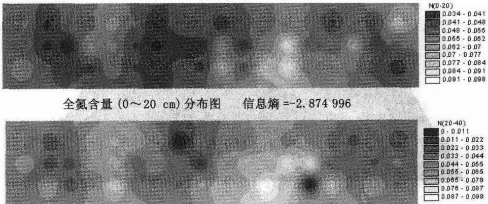  
全氮含量(20\~40 cm)分布图 信息熵=-2.61342  
图11-14 复垦土壤全氮含量在不同深度的信息熵

## 五、复垦区三维景观模拟实例

## (一)复垦区三维景观模拟

某矿区因为井工煤炭开采，造成地表大面积的塌陷，使大量耕地遭受破坏。为满足矿区社会经济发展和土地可持续利用的需要，采用“挖深垫浅”复垦工艺，对其中一块长640m，宽725m，约700亩的塌陷地进行复垦利用。根据矿山企业对土地利用的基本要求，在该塌陷地复垦规划中，中部 $2 0 0 ~ \mathrm { m } \times 7 0 ~ \mathrm { m }$ 范围的深积水区进一步深挖，开辟为鱼塘，每个鱼塘的大小为 $1 0 0 ~ \mathrm { m } \times 6 5 ~ \mathrm { m }$ 。东西两侧经回填后大部分复垦为耕地，东南侧平整后作为村庄搬迁的用地区。图11-15为平面规划数据，图11-16为根据平面规划数据，采用上面的三维景观模拟方法建立复垦区三维景观。

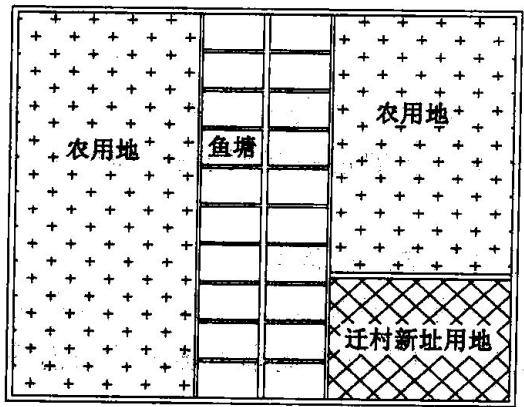  
图 11-15 平面规划图

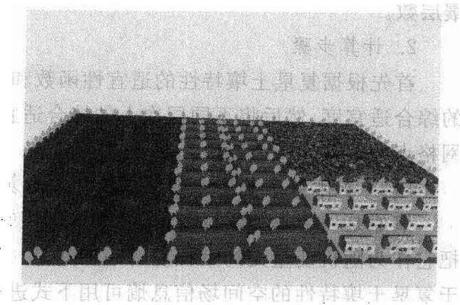  
图11-16 复垦区三维景观图

## (二)矸石山绿化模拟

淮南某矿区工业广场旁边有一座矸石山及其周围的217亩土地(有一部分为塌陷地)，为了改善环境，需要对矸石山及其工业广场区进行绿化，同时对塌陷地进行复垦，恢复为耕地或水产养殖用，模拟效果如图11-17所示。

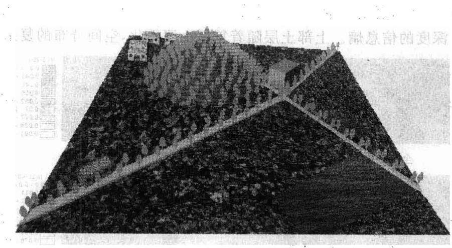  
图 11-17 矸石山绿化模拟效果图

## 第十二章 土地复垦与生态重建的评价与验收技术

## 第一节 土地复垦与生态重建评价技术概述

土地复垦与生态重建是以土地为对象，通过工程、生物等措施，把破坏土地资源变为可充分有效利用的土地资源，提高土地利用率和产出率，形成新的固定资产和新的生产能力，同时改善和保护生态环境的投资建设活动。土地复垦与生态重建工作的优劣，不仅表现在技术上可行，而且要有一定的效益，并且不能破坏生态环境。所以，评判土地复垦与生态重建工作，不但要从技术上审查，更重要的是要进行评价。

## 一、土地复垦与生态重建评价的内涵及意义

按土地复垦与生态重建的不同实施阶段划分，土地复垦与生态重建评价分为实施前评价和后评价。实施前评价是依据土地复垦与生态重建的可行性研究报告、规划设计方案等进行的，评价所需数据来源于报告中的预测数据，一般包括环境影响评价和效益评价；后评价是对土地复垦与生态重建实施过程中及实施后实际达到的效果等进行的评价，找出实施的实际和规划设计目标的差异，客观分析土地复垦与生态重建在营运管理过程中取得的成绩和存在问题，评价土地复垦与生态重建的效果、效益、作用和影响。

土地复垦与生态重建评价的意义表现在以下几个方面：

①土地复垦与生态重建评价是土地复垦与生态重建项目投资决策的重要依据。进行项目投资的目的主要是为了获得利益，对于土地复垦与生态重建来说，“利益”或者是经济方面的，或者是其他方面的，都会成为是否投资的重要依据。没有“利益”的项目是没有投资意义的。

②土地复垦与生态重建的实施前评价是土地复垦与生态重建方案优选的重要依据。土地复垦与生态重建方案的优选一般从技术和效益两个方面来进行，因此，效益评价是土地复垦与生态重建方案优选的重要依据。通过对多个方案的效益评价和预测，对比后选择能实现最大效益的方案作为实施方案。

③有利于促进土地复垦与生态重建效益的最大化。

## 二、土地复垦与生态重建评价的原则

土地复垦与生态重建评价应遵循以下基本原则。

## 1. 客观性

土地复垦与生态重建评价必须依据客观规律，坚持一切从实际出发，坚持深入调查研究，实事求是的工作作风，排除一切人为干扰，力求评价成果反映客观实际。

## 2. 科学性

科学性是指科学的工作态度以及科学的工作方法。对待所从事的土地复垦与生态重建评价工作应持有科学的态度，这主要包括遵守国家及地方法律法规的自觉性以及态度的严谨性，使土地复垦与生态重建评价工作符合国家的规范以及有关规则的要求。科学的工作方法，主要是指在评价中所采用的调查与评价方法必须是符合科学规律的方法，应有充分的科学依据。

## 3. 综合性

采取定性与定量相结合的方式综合考虑土地复垦与生态重建的发展水平与程度，综合考虑多种方案。

## 4. 系统性

既要反映土地复垦与生态重建和国家现代化的相互关系，也要反映土地复垦与生态重建自身的特点，使其组成比较完整的体系，在区域乃至全国范围内合理开展，既能全面支持当地经济的发展和优化利用当地能源，又要考虑与生态环境、社会、人文等相关的因素，平衡各个区域的经济发展。

## 5. 代表性

能够合理利用当地自然资源优势和其他有利条件，呈现出项目的自有特色。

## 6. 可操作性

评价指标具有科学性与可操作性，简单明了，能够定量化分析，便于实际测算和制定目标。

## 三、土地复垦与生态重建评价的方法

土地复垦与生态重建的评价方法包括定量分析法、定性分析法、对比分析法、逻辑框图法、网络分析法、参与式评价法等。

## 1. 定量分析法与定性分析法

定量分析法是指运用统一的量纲、一定的计算公式及判别标准(参数)，通过数量演算反映评价结果的方法。定性分析方法基本是采用文字描述，说明事物的性质，因为在土地复垦与生态重建的评价中，很多影响和效果是无法定量的，必须借助定性分析。在效益分析中多采用这两种方法，但是定量分析与定性分析的区分也不是绝对的，定性分析在需要与可能的情况下，应尽量采用直接或间接的数据，以便更准确地说明问题的性质或结论，只是一般难以用一定的数学公式计算而已。

鉴于土地复垦与生态重建工作影响因素多而且复杂，在实践中通常采用定量分析与定性分析相结合的评价方法。

## 2. 对比分析法

对比分析法是一种传统的直观分析法，由于其逻辑严密且操作简便，可以直观地描述土地复垦与生态重建活动引起的变化，明确地表达土地复垦与生态重建活动的效果，其结论对于土地复垦与生态重建参与各方都有很强的说服力。

根据比较参照对象的不同，对比分析法可分为前后对比分析和有无对比分析。

一般情况下，前后对比是指比较所选择的同样的指标在土地复垦与生态重建实施前与土地复垦与生态重建实施后的变化，根据指标的变化程度来确定土地复垦与生态重建所发挥的作用和影响的一种方法。在采用这种方法时，须注意除了土地复垦与生态重建活动检查以外其他与时间有关的因素所起的作用，这是前后对比分析的一条重要原则。例如，土地复垦与生态重建实施前后对比粮食产量明显提高，但不能把这部分增量都归功于土地复垦与生态重建，还需要根据对照扣除品种改良、土壤改良等因素所产生的贡献部分。

有无对比是指将土地复垦与生态重建实际发生的情况与若无土地复垦与生态重建可能发生的情况进行对比，以度量真正由土地复垦与生态重建实施带来的变化，并据此判断土地复垦与生态重建的真实作用、效益和影响。分清土地复垦与生态重建作用的影响与土地复垦与生态重建以外作用的影响，是运用有无项目对比分析方法的一个重要方法论原则。

## 3. 逻辑框架法

逻辑框架法是美国国际开发署在1970年开发并使用的一种设计、计划和评价方法。近年来，许多发达国家和世行等国际金融组织广泛采用该法进行建设项目后评价工作。

逻辑框架法是将几个内容相关、必须同步考虑的动态因素组合起来，通过分析其间的关系，从设计策划到目标、目的的确定来指导、管理、评价一项活动或工作。逻辑框架法为项目计划者和评价者提供一种分析框架，通过对项目目标和达到目标所需手段间逻辑关系的分析，用以确定工作的范围和任务。

逻辑框架法的核心概念是事物层次间的因果逻辑关系，即“如果”提供了某种条件，“那么”就会产生某种结果；这些条件包括事物内在的因素和事物所需要的外部条件。逻辑框架的基本结构是一个4×4的矩阵，如表12-1所示，表中逻辑纲要包括以下四个层次：

表 12-1  
逻辑框架的基本机构
<table><tr><td rowspan=1 colspan=1>层次纲要</td><td rowspan=1 colspan=1>客观验证指标</td><td rowspan=1 colspan=1>验证方法</td><td rowspan=1 colspan=1>假定外部条件</td></tr><tr><td rowspan=1 colspan=1>目标/影响</td><td rowspan=1 colspan=1>目标指标</td><td rowspan=1 colspan=1>监测和监督手段及方法</td><td rowspan=1 colspan=1>实现目标的主要条件</td></tr><tr><td rowspan=1 colspan=1>目的/作用</td><td rowspan=1 colspan=1>目的指标</td><td rowspan=1 colspan=1>监测和监督手段及方法</td><td rowspan=1 colspan=1>实现目的的主要条件</td></tr><tr><td rowspan=1 colspan=1>产出/结果</td><td rowspan=1 colspan=1>产出物定量指标</td><td rowspan=1 colspan=1>监测和监督手段及方法</td><td rowspan=1 colspan=1>实现产出的主要条件</td></tr><tr><td rowspan=1 colspan=1>投入/措施</td><td rowspan=1 colspan=1>投入物定量指标</td><td rowspan=1 colspan=1>监测和监督手段及方法</td><td rowspan=1 colspan=1>落实投入的主要条件</td></tr></table>

①目标—通常是指高层次的目标，即宏观计划、规划、政策和方针等，该目标可由几个方面的因素来实现。宏观目标一般超越了项目的范畴，它是指国家、地区、部门或投资组织的整体目标以及项目对其可能产生的影响。

②目的一目的是指“为什么”要实施这个项目，即项目直接的效果、效益和作用。一般应考虑项目为受益目标群体带来什么，主要是社会和经济方面的成果和作用。

③产出—这里的“产出”是指项目“干了些什么”，即项目的建设内容或投入的产出物。一般要提供项目可计量的直接结果。

④投入和活动一该层次是指项目的实施过程及内容，主要包括资源的投入量和时间等。

逻辑框架的逻辑关系分为垂直逻辑和水平逻辑。垂直逻辑关系，即因果关系，从下往上或从上往下进行四个层次的分析，其中关键在于层次纲要与假定条件的关系分析；水平逻辑主要是指验证指标和验证方法。

逻辑框架法采用结构框架来表述研究结论，以便于系统而符合逻辑地表述和确定项目/规划的目标层次及其之间的关系；表明目标是否能够或者已经实现；分析和建立监测项目/规划范围以外的影响其成果的那些因素。

逻辑框架法的一项主要任务，就是对项目最初确定的目标必须做出清晰的定义，需要对项目的内容有清楚的描述：清晰并可度量的目标；不同层次的目标和最终目标之间的联系；项目成功与否的测量指标；项目的主要内容；计划和设计时的主要假设条件；检查项目进度的办法；项目实施中要求的资源投人。

## 4. 参与式评价方法

土地复垦与生态重建效果如何，受益者最有发言权。对受益者来说，参与土地复垦与生态重建评价是认识、了解土地复垦与生态重建和积累知识的手段。

参与式评价方法是指土地复垦与生态重建受益者根据自已掌握的监测数据和信息，与土地复垦与生态重建的管理者和决策者一起对土地复垦与生态重建实施的效果、影响进行评价，以便帮助管理者和决策者通过调整、重新制定政策和目标、重组机构等方式提高效益的一种工作方式。参与式评价不仅是一种调查方法，也是受益者参与调查、分析、评价和决策的过程，可以加强受益者本身的独立思考、判断和决策能力，这一点也是参与式评价方法的精髓。这种方法强调定性分析，不注重数据的系统统计，其目的是通过受益者的参与，使之自己发现存在的问题、发展机遇和潜力。

## 四、土地复垦与生态重建评价的程序

土地复垦与生态重建的评价程序包括以下几个步骤：

## 1. 提出问题

要明确土地复垦与生态重建评价的任务、具体对象、目的和要求等，为后续的评价工作指明方向。

## 2. 准备

问题提出、任务明确后，即可进行土地复垦与生态重建评价的筹备工作，根据拟评价任务的具体情况和评价内容，组织评价小组，制定评价工作计划，进行资料收集、调研、分析等。

## 3. 指标选择

土地复垦与生态重建评价的关键在于选择合适的评价指标。要根据评价目的，针对土地复垦与生态重建的实际情况，结合土地复垦与生态重建规划、设计、建设及运行管理状况、地区的经济和社会发展计划、区域生态环境特点等，选择合适的评价指标。

评价指标分为定量分析指标和定性分析指标。定量分析指标是衡量项目效果的客观尺度，用数量概念能够反映土地整理项目建设对经济、社会、环境等不同侧面的影响程度和效果。定性指标是采用文字描述说明事物的性质。

## 4. 分析评价

根据调查资料及选定的评价指标，采用相对应的评价方法，对土地复垦与生态重建进行分析评价。

## 5. 编制评价报告

将上述调查分析评价成果，写成书面报告。

## 第二节 土地复垦与生态重建的环境影响评价技术

## 一、土地复垦与生态重建环境影响评价的意义及内容

土地复垦与生态重建过程中采取的工程措施不可避免地会对工程本身及周围区域的环境造成一定的影响，其中对土壤结构及其营养成分的运移、地表地下水文环境等产生的影响是最为明显的。因此，在实施前对土地复垦与生态重建工程的环境影响进行评价，不仅能为项目决策提供支持，而且能为规划设计提出切实可行的环境保护措施，对避免重大环境问题有十分重要的意义。同时，开展环境影响评价，是贯彻落实国家保护环境基本国策和《中华人民国和国环境影响评价法》的需要。

土地复垦与生态重建环境影响评价从复垦区内的环境特征等因素出发，针对土地复垦与生态重建的建设内容，对潜在影响的环境因子进行环境现状调查、建成后的环境预测，确定土地复垦与生态重建所引起的重要环境问题、制定环境保护措施方案。最终形成区域经济发展与环境保护相协调发展的动态预复垦规划方案，促进复垦区社会、经济、资源利用的可持续发展。主要内容包括：

## (一)调查土地复垦与生态重建区环境现状

复垦区环境现状调查包括自然环境调查和社会环境调查。自然环境包括气候、水文、地质、地貌、生物、土壤等主要内容；社会环境包括人口、社会经济、土地利用、交通状况等。调查目的之一是明确各自然环境要素的变化规律和分布特征、社会经济状况、土地利用状况、基础设施状况。重点是分析环境敏感因素，明确重点保护对象及当地的主要环境问题，比如珍稀动物栖息地和迁徙路线等、少数民族生活习惯、湿地保护区等。调查目的之二是为分析土地利用的制约因素及土地复垦与生态重建的适应性和潜力提供依据。

## (二)预测土地复垦与生态重建对环境的影响

通过对复垦区环境现状的调查，明确了土地利用的制约因素，分析了土地复垦与生态重建的潜力，也就明确了复垦建设的内容，确定了主要的环境影响因子，为进一步预测土地复垦与生态重建对环境影响的范围及影响程度提供了基础资料。

根据国内外类似复垦对相关环境因子的影响情况，对拟复垦区域的环境影响进行分析，分别在复垦实施过程中以及复垦完成后对水、土、气、渣、生态和社会等要素按其影响程度进行预测，分别列出复垦的有益、有害影响，明确主要有害影响因素及其影响程度。在此基础上，对危害程度比较深、影响范围大的主要影响因素建立数学模型进行预测，并对预测结果合理性进行分析。

## (三)确定土地复垦与生态重建的重要环境问题及保护措施

在明确主要环境问题后，根据生态学原理和其他相关的方法制定相应的环境保护措施，对土地复垦与生态重建的环境影响问题进行补救。确定主要的解决思路，在规划设计中制定切实可行的措施，避免发生破坏环境的严重后果。

## 二、土地复垦与生态重建环境影响评价指标

土地复垦与生态重建环境影响主要体现在对自然环境、生态环境和人文经济环境三个

方面的影响。

## (一)自然环境

土地复垦与生态重建项目要达到预期的目的，必须借助一系列的工程措施来实现。这些工程对自然环境产生的影响主要表现在以下几个方面：

## 1. 局部气候

通过工程措施的实施，对地表覆盖条件会有所改变，这将导致局部小气候的变化。影响的主要因子是蒸发量、风速和风向。在评价局部小气候变化时，需要采用科学的判别方法确定是否是因为土地复垦与生态重建引起的。

## 2. 地形地貌

通过工程措施的实施，同样会对地形地貌有一定的影响。如田块规整、挖深垫浅等对地形的改变作用尤为突出。地形地貌的变化会对其他环境因子发生改变，如地形坡度变化使地表径流条件发生改变，还会引起其他水文因素发生改变。

## 3. 土壤土质

水土流失是造成我国大部分地区土壤瘠薄的主要原因。土地复垦与生态重建通过工程措施，控制水土流失；通过改进耕作方法，改善土壤结构，提高土壤肥力，提高单位面积耕地的产量，促进农业发展。

但有些项目在刚完成的一定时期内，由于对原耕作土层有不同程度的破坏，土壤的基本性状变差，因此，这就需要在项目完成后的一定时期内通过精耕细作、多施有机肥的方法促进土壤改良，加强土壤水肥管理，提高耕地肥力。

## 4. 水文

土地复垦与生态重建对水文的影响可以分为水文特性指标和水质的影响。土地复垦与生态重建的实施会改变局部地形地貌、地表覆盖和土壤土质，这些条件的变化会改变降雨利用率、地表径流量以及地表径流水质状况；灌溉排水系统的变化，会在一定程度上影响地下水位，同时，灌溉条件的变化对农田水分和盐类的运移、分布会有很大的影响，从而影响地下水的水质。

水文特性指标主要有径流系数、河流泥沙含量、地下水动、静水位、补给条件等；水质指标主要有水分中的氮、磷、钾含量，农药和有毒有害的元素含量等。

## (二)生态环境

土地复垦与生态重建的实施对生态环境的影响主要包括对形态结构指标、能量结构指标、物质结构指标和生态功能指标的影响。

## 1. 形态结构指标

形态结构指标主要指森林、农田、河流、湖泊及人类居住面积等生态结构指标。土地复垦与生态重建一般以“农田成方、路渠配套、排水畅通、绿化成网”为建设目标，因此，大多数复垦都能够改善项目区的形态结构，需要评价的是对其形态结构的改善程度。

## 2. 能量结构指标

能量结构指标主要指单位面积上的植物量、动物量、人口数量和每人每年的食物量。

土地复垦与生态重建实施后土地生产力提高，单位面积上的作物产量提高，是充分利用光热资源的结果，因此，复垦后的土地能够提高能量利用效率。

## 3. 物质结构指标

物质结构指标是指包括区域各种水体的流入量、流出量、农业用水量和排水量，营养结构指标，氮、磷、钾等营养物质在区域内的各种输入量、输出量以及在生物体和土壤中的含量等。

## 4. 生态功能指标

生态功能指标是指物质利用率和利用效率，包括水、氮、磷、钾等物质的利用率和利用效率，总生物量、净生物量、净辐射量等。

## 5. 生态效益指标

生态效益指标指的是有益生物量、水土保持效果、净化空气效果、景观效果等。生物群落物种种类保护区面积、植被覆盖面积。

## (三)人文经济

土地复垦与生态重建的实施对人文经济的影响主要包括对自然景观和地区经济的影响。

## 1. 自然景观

主要是土地复垦与生态重建对水源的保障、作物长势、乡村环境、景观的变化等方面进行评价。主要指标包括林网覆盖率、绿色覆盖率、环境风险降低、美学角度的判断等。

## 2. 地区经济

通过耕地面积变化，耕地生产力变化，林带、道路、渠系的规整，土地利用更趋合理，农业生产条件和交通状况得到改善，抵御洪涝灾害能力增强，通常会促进地区经济的发展。主要指标有交通通达度，渠系配套率，排洪、排涝标准，社会受益人群，经济受益程度，环境因素对少数民族的影响等方面。

## 三、土地复垦与生态重建环境影响评价的工作程序

土地复垦与生态重建环境影响评价的工作程序包括评价方案制定、评价实施、评价报告书撰写和跟踪评价四个阶段(图12-1)。

## （一）评价工作方案的制订

## 1. 规划方案分析

包括分析拟定规划的目标、指标、布局及规划方案与其他规划的关系。

## 2. 确定评价范围和采集、分析评价信息

土地复垦与生态重建环境影响评价范围在空间上不仅包括实施区域，还包括实施区域以外的受影响区域。复垦对其实施区域以外产生环境影响的途径有两个：一是通过经济系统传递；另一个途径是通过环境介质传输，如跨流域污染问题、酸雨问题等。因此，影响的区域范围是比较难以确定的，一般需通过专家评判法和实地调查法来确定。

收集复垦区与评价有关的各种信息，对相关环境状况加以分析评价。

## 3. 环境影响识别

包括识别土地复垦与生态重建目标、指标、方案(包括替代方案)的主要环境问题和环境影响。环境影响识别主要有两方面的内容：一是确定所有预期的环境影响或相关的环境影响因子与复垦之间的关系；二是识别出较为关键的环境影响或环境因子。

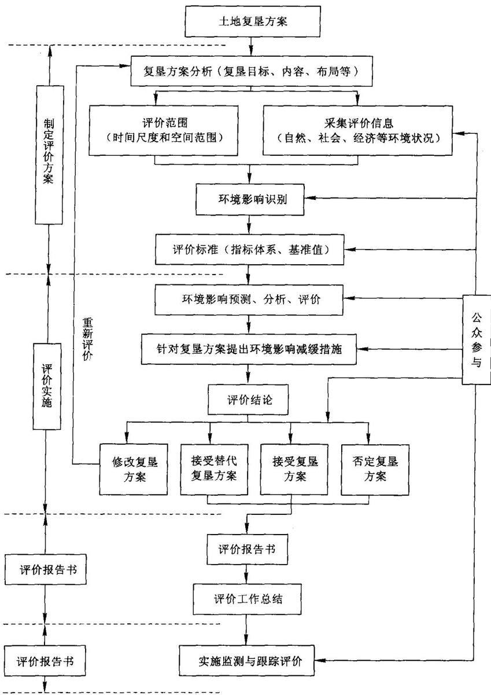  
图12-1 土地复垦与生态重建环境影响评价的工作程序

## 4. 确定评价标准

以环境影响识别为基础，结合复垦方案及环境背景值调查情况、复垦所涉及部门或区域环境保护目标，并借鉴国内外研究成果，通过理论分析、专家咨询、公众参与初步确立评价指标，并在评价工作中补充、调整、完善。根据现行的环境标准值、区域环境背景值或本底值，通过类比分析、公众参与及专家咨询等方式，确定评价标准。

## （二）评价工作的实施

## 5. 环境影响预测、分析和评价

应对所有复垦方案的主要环境影响进行预测。预测内容主要包括两方面：一方面是预测其直接的、间接的环境影响，特别是复垦的累积影响；另一方面是复垦方案影响下的可持续发展能力预测。预测方法一般有类比分析法、系统动力学、投入产出数学模型、环境数学模型、情景分析法等。

同时，对复垦方案的主要环境影响进行分析与评价。分析评价的主要内容包括：规划对环境保护目标的影响；规划对环境质量的影响；规划的合理性分析，包括社会、经济、环境变化趋势与生态承载力的相容性分析等。评价方法常用的有加权比较法、费用效益分析法、层次分析法、可持续发展能力评估、对比评价法、环境承载力分析等。

## 6. 针对复垦方案提出减缓措施

根据环境影响预测与分析评价结果，提出符合复垦目标和环境保护目标要求的规划方案，并对各复垦方案提出减缓措施，用来避免、降低、修复或补偿复垦对环境的不利影响。减缓措施主要针对显著的、潜在的环境影响进行，其目的就是使该环境影响下降至某一合理的可接受水平。按减缓措施的性质，可分为以下几类：避免措施、最小化措施、减量化措施、修复补救措施和复(重)建措施。

## 7. 评价结论

根据上述各项工作，利用环境影响评价中相应的预测模式、评价模式进行整体综合评价后，应对拟议复垦方案得出以下评价结论中的一种：

①接受复垦方案。

②接受替代复垦方案。

③修改复垦目标或复垦方案。

④放弃复垦方案。

通过环境影响评价，如果复垦方案或复垦替代方案是可行的，则进入下一步；认为已有的复垦方案在环境上不可行，则应当考虑修改的复垦目标或复垦方案，并重新进行环境影响评价；对不允许修改的复垦目标或复垦方案，或经过修改仍不能满足环境要求的方案，则应当放弃。

## （三)报告撰写

这一阶段的主要任务有两个：编制环境影响评价的报告书和总结本次环境影响评价的实施经验。

## 8. 编制土地复垦与生态重建环境影响评价报告书

报告书既是对复垦环境影响评价工作全过程的总结及成果体现，又是管理者进行战略决策的环境依据，同时还为公众及其他管理决策者提供关于该方案，以及替代方案对于未来或现实环境造成影响方面的资料。因此，报告书应该全面、客观、概括地反映复垦环境影响评价的全部工作。对于环境影响评价报告书的具体要求是：内容详略得当，重点突出；文字简捷、准确；结论明确；表述通俗，尽可能地用非专业术语，以便于管理者、公众等非专业人员全面、准确、迅速地了解环境影响评价的有关情况。

## 9. 环境影响评价总结

由于开展环境影响评价在我国才刚刚起步，因此每次环境影响评价工作完成后的总结对于检验环境影响评价的理论和方法、完善评价的理论体系，进一步指导以后的环境影响评

价工作具有十分重要的意义。主要是从本次评价工作的成功经验、不足之处及一些问题的思考等方面进行总结。

## （四)跟踪评价

## 10. 监测与跟踪评价

首先利用现有环境标准和监测系统，监测复垦实施后的环境影响，以及通过专家咨询和公众参与等方式，监督复垦实施后的环境影响。在此基础上，评价复垦实施后的实际环境影响，其评价主要内容有：

①环境影响评价及其建议的减缓措施是否得到了有效的贯彻实施。

②确定为进一步提高复垦的环境效益所需的改进措施。

③该环境影响评价的经验和教训。

另外，需特别注意的是，在环境影响评价中，非常注意公众参与。从复垦环境影响评价的工作程序中可以看到，公众参与在评价工作的各个阶段都有涉及，是全程式的参与。

## 第三节 土地复垦与生态重建的效益评价技术

如前所述，土地复垦与生态重建的评价一般是以项目为单位进行的，因此，土地复垦与生态重建的效益评价是对复垦项目建设可能取得的经济效益、社会效益和生态环境效益进行的系统论证，它是在项目实施前进行的，以科研或设计报告中的预测数据为基础。效益评价的结果是复垦方案比选的重要依据。

## 一、经济效益评价

经济效益评价主要通过投入产出的分析手段，考察土地复垦与生态重建项目在微观上的盈利能力、清偿能力以及在宏观上对国民经济的净贡献，从而评价其在经济上的合理性和对当地社会经济的贡献程度。

## (一)土地复垦与生态重建分类

按照盈利性质不同，土地复垦与生态重建可以分为非盈利性项目和盈利性项目两种。

非盈利性土地复垦与生态重建项目是指投资方以无偿的方式提供土地复垦与生态重建所需建设资金，不以盈利为主要目的，主要以国家投资、地方政府投资和中央、地方政府联合投资为主，其显著特点有两个方面：①无偿投资方式；②有特定的投资目的和任务，如增加有效耕地面积、实现耕地占补平衡、缓解人地矛盾、完成土地复垦与生态重建管理与技术等方面的改革与创新、改善农业基本生产条件等。对于投资参与方而言，非盈利性项目投资并不为其带来直接经济收益。所以，非盈利性土地复垦与生态重建项目一般只进行简单和快速的经济效益评价。

盈利性土地复垦与生态重建项目是指投资方以有偿的方式为项目区提供建设资金，项目除需要完成特定的土地复垦与生态重建任务外，还有着更为明确的盈利目标。这类项目资金来源主要有企业投资、政府与企业联合投资以及中外联合投资。盈利性项目经济效益评价较非盈利性项目更为严格和复杂，通常包括财务评价和国民经济评价两部分。

## （二）评价指标

由于土地复垦与生态重建项目未实施前，项目区土地已存在一定的收益和费用。因此，

经济效益评价中采用“有无项目对比法”进行评价，即计算“有项目”与“无项目”相比的增量效益和增量费用。下面就非盈利性和盈利性土地复垦与生态重建项目分别进行评价。

## 1. 非盈利性土地复垦与生态重建项目的经济效益评价

非盈利性土地复垦与生态重建项目的直接受益者多为项目区农户，虽然投资者并未获得直接投资收益，我们仍然可以通过计算农户所获得的投资收益来考察整个项目的经济效果和经济贡献。但是，由于项目投资收益分散于各个农户生产经营中，通过计算众多独立经营农户的投资收益来评价整个项目的经济效益困难很大，因此，在实践中通常计算项目区主要农作物的平均新增净收益来衡量项目的经济效益。具体评价指标如下：

## (1) 单位投资水平指标

①项目单位面积投资：

$$
\begin{array} { r }  \mathfrak { M } \sharp \sharp \sharp / \frac { \ d ^ { 3 } } { \ d \mathcal { D } } \langle \overline { { \mathtt { X } } } \rangle \overline { { \mathtt { X } } } \overline { { \mathtt { X } } } \overline { { \mathtt { X } } } \overline { { \mathtt { X } } } \overline { { \mathtt { X } } } \overline { { \mathtt { X } } } \overline { { \mathtt { X } } } = \overline { { \mathtt { X } } } \overline { { \mathtt { X } } } \overline { { \mathtt { X } } } \overline { { \mathtt { X } } } \overline { { \mathtt { X } } } \overline { { \mathtt { X } } } \overline { { \mathtt { X } } } / \overline { { \mathtt { X } } } \overline { { \mathtt { X } } } / \overline { { \mathtt { X } } } \overline { { \mathtt { X } } } \overline { { \mathtt { X } } } \overline { { \mathtt { X } } } \overline { { \mathtt { X } } } \overline { { \mathtt { X } } } \overline { { \mathtt { X } } } \overline { { \mathtt { X } } } \overline { { \mathtt { X } } } \overline { { \mathtt { X } } } \overline { { \mathtt { X } } } \overline { { \mathtt { X } } } \overline { { \mathtt { X } } } \overline { { \mathtt { X } } } \overline { { \mathtt { X } } } \overline { { \mathtt { X } } } \overline { { \mathtt { X } } } \overline { { \mathtt { X } } } \overline { { \mathtt { X } } } \overline { { \mathtt { X } } } \overline { { \mathtt { X } } } \overline { { \mathtt { X } } } \overline { { \mathtt { X } } } \overline { { \mathtt { X } } } \overline { { \mathtt { X } } } \overline { { \mathtt { X } } } \overline { { \mathtt { X } } } \overline { { \mathtt { X } } } \overline { { \mathtt { X } } } \overline { { \mathtt { X } } } \overline { { \mathtt { X } } } \overline { { \mathtt { X } } } \overline { { \mathtt { X } } } \overline { { \mathtt { X } } } \overline { { \mathtt { X } } } \overline { { \mathtt { X } } } \overline { { \mathtt { X } } } \overline { { \mathtt { X } } } \overline { { \mathtt { X } } } \overline   \mathtt  \end{array}
$$

②新增耕地单位面积投资：

$$
\begin{array} { r }  \frac { 3 \times 1 } { 3 5 } + \frac { 1 } { 3 5 } + \frac { 1 } { 3 5 } + \frac { 1 } { 3 5 } + \frac { 2 } { 3 5 } + \frac { 1 } { 3 5 } + \frac { 1 } { 5 5 } + \frac { 1 } { 3 5 } - \frac { 3 } { 5 5 } = \frac { 2 0 } { 3 5 } + \frac { 1 } { 3 5 } + \frac { 3 } { 5 5 } + \frac { 1 } { 3 5 } + \frac { 3 } { 5 5 } + \frac { 1 } { 3 5 } = \frac { 2 0 } { 3 5 } + \frac { 1 } { 3 5 } + \frac { 1 } { 3 5 } + \frac { 1 } { 3 5 } + \frac { 1 } { 3 5 } + \frac { 1 } { 3 5 } + \frac { 1 } { 3 5 } + \frac { 1 } { 3 5 } = \frac { 2 0 } { 3 5 } + \frac { 1 } { 3 5 } = \frac { 2 0 } { 3 5 } + \frac { 1 } { 3 5 } = \frac { 2 0 } { 3 5 } + \frac { 1 } { 3 5 } = \frac { 2 0 } { 3 5 } + \frac { 1 } { 3 5 } = \frac { 2 0 } { 3 5 } + \frac { 1 } { 3 5 } = \frac { 2 0 } { 3 5 } + \frac { 1 } { 3 5 } = \frac { 2 0 } { 3 5 } + \frac { 1 } { 3 5 } = \frac { 2 0 } { 3 5 } + \frac { 1 } { 3 5 } = \frac { 2 0 } { 3 5 } + \frac { 1 } { 3 5 } = \frac { 2 0 } { 3 5 } + \frac { 1 } { 3 5 } = \frac { 2 0 } { 3 5 } + \frac { 1 } { 3 5 } = \frac { 2 0 } { 3 5 } + \frac { 1 } { 3 5 } = \frac { 2 0 } { 3 5 } + \frac { 1 } { 3 5 } = \frac { 2 0 } { 3 5 } + \frac { 1 } { 3 5 } = \frac { 2 0 } { 3 5 } + \frac { 1 } { 3 5 } = \frac { 2 0 } { 3 5 } + \frac { 1 } { 3 5 } = \frac { 2 0 } { 3 5 } + \frac { 1 } { 3 5 } = \frac { 2 0 }  \end{array}
$$

③每万元投资新增耕地数量：

$$
\begin{array} { r } { \frac { 4 4 } { 3 5 } \pi \frac { 4 4 } { 3 5 } \times \frac { 3 5 } { 3 5 } \times \frac { 1 6 } { 3 5 } \times \frac { 4 1 } { 3 5 } + \frac { 1 6 } { 3 5 } \times \frac { 4 1 } { 3 5 } \times \frac { 4 1 } { 3 5 } = \frac { 3 5 } { 3 5 } \times \frac { 3 5 } { 3 5 } \times \frac { 4 1 } { 3 5 } + \frac { 1 6 } { 3 5 } \times \frac { 4 1 } { 3 5 } \times \frac { 3 5 } { 3 5 } \times ( \frac { 3 3 } { 3 5 } \times \frac { 4 1 } { 3 5 } ) } \\ { \frac { 1 6 } { 3 5 } \times \frac { 5 } { 3 5 } \times \frac { 3 5 } { 3 5 } \times \frac { 4 1 } { 3 5 } \times ( \frac { 3 3 } { 3 5 } \times \frac { 4 1 } { 3 5 } ) } \end{array}
$$

以上指标是反映项目投资效果的单位指标。进行方案比较时，在确保完成项目预期目标的前提下，项目单位面积投资或新增耕地单位面积投资越少，每万元投资新增耕地数量越多，其方案越优。

## (2) 静态经济评价指标

非盈利性土地整理项目资金主要来源于政策性资金和政府投入，通常不考虑项目资金的时间价值，因此多选用静态评价指标进行快速、简便的分析。

## ①静态投资收益率：

## 静态投资收益率=(项目年新增净产值/项目总投资)×100%

静态投资收益率是反映项目投入产出比大小的一个静态指标。在条件相同的情况下，静态投资收益率越高，表明项目获得的产出越高，经济效益也越大。项目静态投资收益率的判别依据，可采用同行业或相关行业发布或者投资者设定的基础投资收益率，当静态投资收益率大于或等于基础投资收益率时，即认为项目的盈利能力能够满足要求。进行方案比选时，条件相同的情况下，应选投资收益率高的方案。

## ②静态投资回收期：

$$
\begin{array} { r }  \frac { 4 4 } { 1 6 } \div \frac { 3 } { 4 2 } + \frac { 3 } { 5 2 } \times \frac { 4 } { 5 2 } \times \frac { 1 } { 1 6 } + \frac { 3 } { 5 2 } = ( \frac { 3 } { 1 6 } \times \frac { 3 } { 1 6 } + \frac { 3 } { 1 6 } \times \frac { 3 } { 1 6 } ) ( \frac { 2 } { 1 6 } \times \frac { 3 } { 1 6 } + \frac { 3 } { 5 2 } \times \frac { 3 } { 1 6 } ) \times 1 0 0 \% \leq \frac { 3 } { 4 2 } \times \frac { 3 } { 1 6 } \times \frac { 3 } { 1 6 } \times 1 \frac { 3 } { 1 6 } \times 1 \frac { 3 } { 1 6 } \times 1 \frac { 3 } { 1 6 } \times 1 \frac { 3 } { 1 6 } \times 1 \frac { 3 } { 1 6 } \times 1 \frac { 3 } { 1 6 } \times 1 \frac { 3 } { 1 6 } \times 1 \frac { 3 } { 1 6 } \times 1 \frac { 3 } { 1 6 } \times 1 \frac { 3 } { 1 6 } \times 1 \frac { 3 } { 1 6 } \times 1 \frac { 3 } { 1 6 } \times 1 \frac { 3 } { 1 6 } \times 1 \frac { 3 } { 1 6 } \times 1 \frac { 3 } { 1 6 } \times 1 \frac { 3 } { 1 6 } \times 1 \frac { 3 } { 1 6 } \times 1 \frac { 3 } { 1 6 } \times 1 \frac { 3 } { 1 6 } \times 1 \frac { 3 } { 1 6 } \times 1 \frac { 3 } { 1 6 } \times 1 \frac { 3 } { 1 6 } \times 1 \frac { 3 } { 1 6 } \times 1 \frac { 3 } { 1 6 } \times 1 \frac { 3 } { 1 6 } \times 1 \frac { 3 } { 1 6 } \times 1 \frac { 3 } { 1 6 } \times 1 \frac { 3 } { 1 6 } \times 1 \frac { 3 } { 1 6 } \times 1 \frac { 3 } { 1 6 } \times 1 \frac { 3 } { 1 6 } \times 1 \frac { 3 } { 1 6 } \times 1 \frac { 3 } { 1 6 } \times 1 \frac { 3 } { 1 6 } \times 1 \frac { 3 } { 1 6 } \times 1 \frac { 3 }  1 \end{array}
$$

静态投资回收期是反映以项目年净收益偿还项目全部投资所需时间长短的一个静态指标。通常静态投资回收期越短，表明项目的盈利能力和抗风险能力越好。进行方案比选时，条件相同的情况下，以回收期短的方案为优。

## (3) 项目运营效果

①基础设施运营成本一是指项目为农业生产服务而新建或提供的基础设施的年正常运营成本，它包括基础设施自身的运行成本以及正常维护管理成本。

②运营成本率：

$$
\begin{array} { r }  \frac { 1 1 } { 2 \Xi } \xrightarrow [ ] { + \infty } \frac { 1 3 } { 9 \pi } \frac { 1 } { 4 \Lambda } \xrightarrow [ ] { + } = ( \frac { 1 3 ] { 1 } } { 9 \pi } \Theta [ \Xi ] \xrightarrow [ ] { + } \pi \frac { 1 } { 1 2 } \frac { 1 } { 9 \pi } \frac { 1 } { 1 5 } \frac { 1 } { 2 } \frac { 1 } { 3 \Xi } \frac { 1 } { 2 \Xi } \frac { 1 } { 4 \Xi } + \frac { 1 3 } { 1 5 } \frac { 1 + \kappa } { 3 \Xi } \frac { 1 + \kappa } { 3 \Xi } \frac { 1 } { 3 \Xi } \frac { 1 } { 3 \Xi } \frac { 1 } { 3 \Xi } \frac { 1 } { 4 \Xi } \frac { 1 } { 1 5 } \frac { 1 } { 3 \Xi } \frac { 1 } { 1 5 } \frac { 1 } { 3 \Xi } \frac { 1 } { 1 5 } \frac { 1 } { 3 \Xi } \frac { 1 } { 1 5 } \frac { 1 } { 3 \Xi } \frac { 1 } { 1 5 } \frac { 1 } { 3 \Xi } \frac { 1 } { 1 5 } \frac { 1 } { 3 \Xi } \frac { 1 } { 1 5 } \frac { 1 } { 3 \Xi } \frac { 1 } { 1 5 } \frac { 1 } { 3 \Xi } \frac { 1 } { 1 5 } \frac { 1 } { 3 \Xi } \frac { 1 } { 1 5 } \frac { 1 } { 3 \Xi } \frac { 1 } { 1 5 } \frac { 1 } { 3 \Xi } \frac { 1 } { 1 5 } \frac { 1 } { 3 \Xi } \frac { 1 } { 1 5 } \frac { 1 } { 3 \Xi } \frac { 1 } { 1 5 } \frac { 1 } { 3 \Xi } \frac { 1 } { 1 5 } \frac { 1 } { 3 \Xi } \frac { 1 } { 1 5 } \frac { 1 } { 3 \Xi } \frac { 1 } { 1 5 } \frac { 1 } { 3 \Xi } \frac { 1 } { 1 5 } \frac { 1 } { 3 \Xi } \frac { 1 } { 1 5 } \frac { 1 } { 3 \Xi } \frac { 1 } { 1 5 } \frac { 1 } { 3 \Xi } \frac { 1 } { 1 5 } \frac { 1 }  3 \Xi  \end{array}
$$

项目基础设施运营成本率越高，项目实施后农户对基础设施的利用率就越低，最终将影

响项目的经济效益。因此，在方案比选时，以基础设施运营成本率低的方案为优。

## 2. 盈利性土地复垦与生态重建项目的经济效益评价

盈利性土地复垦与生态重建项目的经济效益评价除需要考察非盈利性项目的评价指标以外，还应进行财务评价和国民经济评价。在这里，只介绍财务评价技术，国民经济评价的内容可参照项目评估类的书籍。

财务评价是在国家现行财税和市场价格体系下，分析预测土地复垦与生态重建项目的财务效益与费用，计算财务评价指标，考察项目的盈利能力、偿债能力，据以判断项目的财务可行性。

财务评价采用动态分析指标，其与静态分析指标的区别在于动态分析指标考虑了金钱的时间价值，即资金在流通中产生的新价值——利润。所以动态分析比静态分析更具有综合性。具体包括：

## （1）财务盈利能力分析指标

①财务净现值(FNPV)——是指按设定的折现率i。计算的项目计算期内各年净现金流量的现值之和，即把初期的投入(投资)和后期的产出(效益)，按同一折现率折算到同一规定年的现值，以便在同一基础上进行比较。也是评价项目盈利能力的主要动态指标。计算公式为：

$$
F N P V = \sum _ { t = 1 } ^ { n } ( C I - C O ) _ { t } ( 1 + i _ { c } ) ^ { - 1 }
$$

式中，CI为现金流入量；CO为现金流出量；(CI-CO)，为第t年的净现金流量；n为计算年数。

财务净现值同时又是评价项目盈利能力的绝对指标，它反映项目在满足设定折现率要求的盈利之外，获得的超额盈利的现值。财务净现值等于或者大于零，表明项目的盈利能力达到或者超过按设定的折现率计算的盈利水平。一般只计算所得税前的财务净现值。

②财务内部收益率(FIRR)—是指项目在整个计算期内各年净现金流量现值累计等于零时的折现率，它反映项目所占用资金的盈利率，是评价项目盈利能力的主要动态指标。其表达式为：

$$
\sum _ { t = 1 } ^ { n } ( C I - C O ) _ { t } ( 1 + F I R R ) ^ { - 1 } = 0
$$

式中符号同前。

财务内部收益率可根据财务现金流量表中的净现金流量，用试差法计算，也可以采用专用软件的财务函数计算。

试差法计算步骤为：

（a）确定基准年及土地复垦与生态重建的投资和效益过程；

（b）任取一适当年利率i，计算净现值；

（c）当求得净现值为正时，则另取一个较大的年利率再进行计算，当求得净现值为负时，则另选一个较小的年利率再进行计算；

（d)选取后，再试算，直至净现值趋于零或改变符号；

(e）得出最后两个利率i及相应的净现值，即可用内插法求出内部收益率。

$$
F I R R = i _ { 1 } + \frac { \mid { F N P V } _ { 1 } \mid } { \mid { F N P V } _ { 1 } \mid + \mid { F N P V } _ { 2 } \mid } \times ( i _ { 2 } - i _ { 1 } )
$$

项目财务内部收益率(FIRR)的判别依据，应采用行业发布或者评价人员设定的财务基础收益率(i)，当FIRR≥i。时，即认为项目的盈利能力能够满足要求。资本金和投资各方收益率应与出资方最低期望收益率对比，判断投资方收益水平。

③动态投资回收期(P)—是指以项目的净收益偿还项目全部投资所需要的时间，一般以年为单位，并从项目建设起始年算起。若从项目投产年算起，应予以特别注明。其表达式为：

$$
\sum _ { t = 1 } ^ { P _ { t } } ( C I - C O ) _ { t } = 0
$$

动态投资回收期可根据现金流量表计算，现金流量表中的累计现金流量(所得税前)由负值变为0时的时点，即为项目的动态投资回收期，其详细的计算公式为：

$$
P _ { t } = \frac { y } { x _ { t } } ~ { \mathrm { i f } } \ \ne \frac { y } { y } \ \& ~ \widehat { \mathbf { x } } \ \widehat { \mathbf { x } } \ \widehat { \mathbf { x } } \ \widehat { \mathbf { x } } \ \widehat { \mathbf { x } } \ F \ \widehat { \mathbf { x } } \ \widehat { \mathbf { x } } \ \widehat { \mathbf { x } } \ \widehat { \mathbf { x } } \ \widehat { \mathbf { x } } \ \widehat { \mathbf { x } } \ \widehat { \mathbf { x } } \ \widehat { \mathbf { x } } \ \widehat { \mathbf { x } } \ \widehat { \mathbf { x } } \ \widehat { \mathbf { x } } \ \widehat { \mathbf { x } } \ \widehat { \mathbf { x } } \ \widehat { \mathbf { x } } \ \widehat { \mathbf { x } } \widehat { \mathbf { x } } \ \widehat { \mathbf { x } } \widehat { \mathbf { x } } \ \widehat { \mathbf { x } } \widehat { \mathbf { x } } \ \widehat { \mathbf { x } } \widehat { \mathbf { x } } \ - 1 \ \textup { i n s s i n s } \ \frac  \sum \widehat { { \mathbf { x } } } \ \widehat { \mathbf { x } } \ \widehat { \mathbf { x } } \widehat { \mathbf { x } } \ \widehat { \mathbf { x } } \ \widehat { \mathbf { x } } \widehat { \mathbf { x } } \ \widehat { \mathbf { x } } \ \widehat { \mathbf { x } } \widehat { \mathbf { x } } \ \widehat { \mathbf { x } } \ \widehat { \mathbf { x } } \ \widehat { \mathbf { x } } \ \widehat { \mathbf { x } } \ \widehat { \mathbf { x } } \ \widehat { \mathbf { x } } \ \widehat { \mathbf { x } } \ \widehat { \mathbf { x } } \ \widehat { \mathbf { x } } \ \widehat { \mathbf { x } } \ \widehat { \mathbf { x } } \ \widehat { \mathbf { x } } \ \widehat { \mathbf { x } } \ \widehat { \mathbf { x } } \ \widehat { \mathbf { x } } \ \widehat { \mathbf { x } } \ \widehat { \mathbf { x } } \ \widehat { \mathbf { x } } \ \widehat { \mathbf { x } } \ \widehat { \mathbf { x } } \ \widehat { \mathbf { x } } \ \widehat { \mathbf { x } } \ \widehat { \mathbf { x } } \ \widehat { \mathbf { x } } \ \widehat { \mathbf { x } } \ \widehat 
$$

动态投资回收期越短，表明项目的盈利能力和抗风险能力越好。动态投资回收期的判别标准是基准投资回收期，其取值可根据行业水平或者投资者的要求设定。

④投资利润率—是指项目在计算期内正常生产年份的年利润总额(或年平均利润总额)与项目投入总资金的比例，它是考察单位投资盈利能力的静态指标。将项目投资利润率与同行业平均投资利润率对比，判断项目的获利能力和水平：

$$
\ddagger \ddagger { \ddagger } \nearrow \ddagger { | \langle \chi | \smash [ t ] { \ddot { z } } \rvert } \ne = ( \ddagger \ddagger { | \langle \chi | \smash [ t ] { \ddot { z } } \rvert } \xrightarrow [ ] { \varkappa } \overline { { \iiint } } \smash [ t ] { \langle \overline { { z } } \rangle } \bigm | \\hat { z } \bigm | \nearrow \smash { | \overline { { \chi } } \rangle } \nearrow \bigm | \times 1 0 0 \%
$$

## (2) 偿债能力分析指标

根据有关财务报表计算借款偿还期、利息备付率、偿债备付率等指标，评价项目借款偿债能力。如果采用借款偿还期指标，可不用计算备付率，如果计算备付率，则不再计算借款偿还期指标。

①借款偿还期一是指以项目投产后获得的可用于还本付息的资金，还清借款本息所需的时间，一般以年为单位表示。这项指标可由借款偿还计划表推算。不足整年的部分可用内插法计算。指标值要能满足贷款机构的期限要求。

借款偿还期指标旨在计算最大偿还能力，适用于尽快还款的项目，不适用于已经约定借款偿还期限的项目。对于已约定借款偿还期限的项目，应采用利息备付率和偿债备付率指标分析项目的偿债能力。

②利息备付率——是指项目在借款偿还期内，各年可用于支付利息的税息前利润与当期应付利息费用的比值，即：

$$
\ddag | \mapsto \sharp \varkappa \varkappa \langle \doteq \ddag \rangle \ddag = \ddag \rangle \varkappa , \varpi \gg \lVert \mathfrak { f } \rVert \gg \lVert \mathfrak { f } \rVert \gg \lVert \mathfrak { f } \rVert \gg \lVert \mathfrak { f } \rVert \gg \lVert \mathfrak { f } \rVert \gg \lVert \mathfrak { f } \rVert \gg \lVert \mathfrak { f } \rVert , \ddag \rVert
$$

其中，税息前利润=利润总额十计入总成本费用的利息费用；当期应付利息是指计入总成本费用的全部利息。

利息备付率可以按年计算，也可以按整个借款期计算。利息备付率表示项目的利润偿付利息的保证倍率。对于正常营业的企业，利息备付率应当大于2，否则表示付息能力保障程度不足。

③偿债备付率——是指项目在借款偿还期内，各年可用于还本付息资金与当期应还本付息金额的比值，即：

$$
1 ) Zeta ( \frac { 2 0 } { 1 2 } , \frac { 1 0 } { 1 2 } , \frac { 1 0 } { 1 2 } , \frac { 1 0 } { 1 2 } , \frac { 1 0 } { 1 2 } , \frac { 1 0 } { 1 2 } , \frac { 1 0 } { 1 2 } , \frac { 1 0 } { 1 2 } , \frac { 1 0 } { 1 2 } , \frac { 1 0 } { 1 2 } , \frac { 1 0 } { 1 2 } , \frac { 1 0 } { 1 2 } , \frac { 1 0 } { 1 2 } , \frac { 1 0 } { 1 2 } , \frac { 1 0 } { 1 2 } , \frac { 1 0 } { 1 2 } , \frac { 1 0 } { 1 2 } , \frac { 1 0 } { 1 2 } , \frac { 1 0 } { 1 2 } , \frac { 1 0 } { 1 2 } , \frac { 1 0 } { 1 2 } , \frac { 1 0 } { 1 2 } , \frac { 1 0 } { 1 2 } , \frac { 1 0 } { 1 2 } , \frac { 1 0 } { 1 2 } , \frac { 1 0 } { 1 2 } , \frac { 1 0 } { 1 2 } , \frac { 1 0 } { 1 2 } , \frac { 1 0 } { 1 2 } , \frac { 1 0 } { 1 2 } , \frac { 1 0 } { 1 2 } , \frac { 1 0 } { 1 2 } , \frac { 1 0 } { 1 2 } , \frac { 1 0 } { 1 2 } , \frac { 1 0 } { 1 2 } , \frac { 1 0 } { 1 2 } , \frac { 1 0 } { 1 2 } , \frac { 1 0 } { 1 2 } , \frac { 1 0 } { 1 2 } , \frac { 1 0 } { 1 2 } , \frac { 1 0 } { 1 2 } , \frac { 1 0 } { 1 2 } , \frac { 1 0 } { 1 2 } , \frac { 1 0 } { 1 2 } , \frac { 1 0 } { 1 2 } , \frac { 1 0 } { 1 2 } , \frac { 1 0 } { 1 2 } , \frac { 1 0 } { 1 2 } , \frac { 1 0 } { 1 2 } , \frac { 1 0 } { 1 2 } , \frac { 1 0 } { 1 2 } , \frac { 1 0 } { 1 2 } , \frac { 1 0 } { 1 2 } , \frac { 1 0 } { 1 2 } , \frac  1 0 
$$

可用于还本付息的资金包括可用于还款的折旧和摊销、在成本中列支的利息费用、可用于还款的利润等。当期应还本付息金额包括当期应还贷款本金及计入成本的利息。

偿债备付率可以按年计算，又可以按整个借款期计算。偿债备付率表示可用于还本付息的资金偿还借款本息的保证倍率。偿债备付率在正常情况下应当大于1。当指标小于1时，表示当年资金来源不足以偿还当期债务，需要通过短期借款偿付已到期债务。

## 二、社会效益评价

## （一）社会效益评价的作用

土地复垦与生态重建的社会效益评价旨在系统调查土地复垦与生态重建项目的建设、运营产生的社会影响与社会效益。通过分析项目涉及的各种社会因素，评价项目的社会可行性，分析项目与当地社会的协调关系，是否规避社会风险，促进社会稳定。

对土地复垦与生态重建进行社会效益评价有利于国民经济发展目标与社会发展目标协调一致，防止单纯追求项目的经济效益；有利于项目与所在地区利益协调一致，减少社会矛盾和纠纷，防止可能产生的不利社会影响和后果，促进社会稳定；有利于避免或减少项目建设和运营的社会风险，提高投资效益。

社会效益评价内容包括分析土地复垦与生态重建对当地社会生活、宏观社会经济环境等方面的相互作用、相互影响，对相关因素进行识别、计量、综合、分析和论证，以评价项目的社会可行性。

## （二）社会效益评价的指标

## 1. 定量分析指标

土地复垦与生态重建工作的实施必然会对社会产生一定效果，也可能产生一定的不良影响。作为社会效益评价的定量指标有许多，根据国内外社会效益评价的经验，特别是借鉴国家投资土地开发整理项目的社会效益评价指标，本书选择了以下8个指标作为土地复垦与生态重建的社会效益评价指标。当然，在对某一具体项目进行评价时，要因项目类别制宜，指标应有所选择或有所侧重。

## (1) 土地复垦率

土地复垦率是反映区域土地复垦工作成效的一个重要指标，也是唯一一个不以单一项目为单位进行评价的指标。即：在需复垦与重建的土地面积中，已复垦的土地面积所占的比例：

土地复垦率=(已复垦土地面积/区域需复垦与重建面积)×100%

## （2）新增耕地面积和新增耕地率

其计算公式为：

新增耕地面积=项目实施后耕地总面积一项目区原有耕地面积

新增耕地率=(新增耕地面积/土地复垦与生态重建总面积)×100%

两项指标值越大，则表示土地复垦与生态重建产生的社会效益越高。

## （3）新增耕地可供养人数

耕地是农民最基本的社会保障，人均耕地资源的增加意味着农民基本社会保障程度的提高，可以通过计算新增耕地可供养人数的多少来反映土地复垦与生态重建所产生的社会效益大小。其计算公式为：

新增耕地可供养人数=新增耕地面积/土地复垦与生态重建所在地农民的人均耕地面积

该指标值越大，说明项目区农民基本社会保障提高程度越大，项目产生的社会效益也越高。实践中，人均耕地值小的地区比人均耕地值大的地区的人地矛盾更为严峻，其对耕地的需求程度也较后者更为迫切，在新增耕地面积相同的情况下，计算出的新增耕地可供养人数值前者较后者更大，即表明前者所获得的社会效益要比后者高，这与实际是相符合的。

## (4) 农民的收入水平

土地复垦与生态重建的最终目标体现在农民的增产和增收上，提高项目区农民的收入水平，改善他们的生产、生活条件，这也是调动和提高广大农民参与项目建设积极性的一个直接动因。因此，在社会效益评价中，分析土地复垦与生态重建实施后项目区内农户收入的变化状况是十分重要的。可以通过计算人均年纯收入增加量来分析项目区农民收入水平的提高情况。其计算公式为：

## 人均年纯收入增加量=项目区农户纯收入增量之和/项目区农业人口数量

## (5) 就业效果

农村大量的剩余劳动力使得农民就业成为一个突出的社会问题，土地复垦与生态重建无疑会对项目区农村劳动力就业问题产生较大的影响。其影响主要表现在以下3个方面：①土地复垦与生态重建的实施为农村劳动力增加了就业机会，此时就业效果为正值；②土地复垦与生态重建实施后，该区域的产业调整或规模化经营，可能会使得劳动力相对过剩，就业效果呈负值；③由于规模化经营是农业现代化发展的目标，它所带来的实际社会效益是积极的，因此对于这种情况下的就业效果指标可以不予计量。具体可以通过单位投资就业人数来对项目就业效果进行衡量。其计算公式为：

## 单位投资就业人数=因土地复垦与生态重建新增总就业人数/项目总投资

单位投资就业人数值为正值且值越大，则说明项目的就业效果越好，反之为负值且越小，则说明就业效果越差。

## (6) 扶贫效果

尽管我国政府已宣布在2000年末基本实现了消除绝对贫困的目标。但我国的点贫状况、脱贫又返贫、局部地区的成片贫困状况仍很严重。国家和有关地方政府通过项目的形式对这些地区在生产条件上给以扶持，使他们最终能够依靠自己发展生产、摆脱贫困落后的局面。各贫困地区均制定了脱离贫困生活的标准金额界限，根据这些标准可以计算出项目区脱贫率水平。其计算公式为：

脱贫率=(土地复垦与生态重建实施后某年项目区脱贫人数/项目区某年总人口)×100%该指标值越大，则说明项目的扶贫效果越好，社会效益也越高。

## (7) 生产力效果

农业劳动生产率低是我国城乡收人差距大的一个根本原因。随着土地复垦与生态重建的实施，将加快和促进项目区农业劳动生产力向第二、三产业转移、农业机械化发展以及单位面积农业产量提高，项目区生产力效果也因此将得到提高。

生产力效果的提高程度可以通过计算项目实施后农业劳动生产率增量进行衡量。其计算公式为：

$$
\begin{array} { r } { \Re \downarrow \downarrow \downarrow \xrightarrow [ \Re ] { + } \hat { x } \downarrow \downarrow \xrightarrow [ \Re ] { + } \hat { x } \downarrow \downarrow \xrightarrow [ \Re ] { \hat { y } } \downarrow \downarrow = \bigg ( \frac { \hat { x } } { \hat { x } } \frac { \hat { y } } { \hat { x } } \frac { \hat { y } } { \hat { x } } \frac { \hat { y } } { \hat { y } } \frac { \hat { x } } { \hat { y } } \frac { \hat { y } ^ { x } } { \hat { y } ^ { x } } \frac { \hat { y } ^ { x } } { \hat { y } ^ { x } } \frac { \hat { y } ^ { x } } { \hat { y } ^ { x } } \frac { \hat { y } ^ { x } } { \hat { y } ^ { x } } \frac { \hat { y } ^ { x } } { \hat { y } ^ { x } } \frac { \hat { y } ^ { x } } { \hat { y } ^ { x } } \frac { \hat { y } ^ { x } } { \hat { y } ^ { x } } \frac { \hat { y } ^ { x } } { \hat { y } ^ { x } } \frac { \hat { y } ^ { x } } { \hat { y } ^ { x } } \frac { \hat { y } ^ { x } } { \hat { y } ^ { y } } \frac { \hat { y } ^ { x } } { \hat { y } ^ { x } } \bigg ) \times 1 0 0 \% } \end{array}
$$

该项指标值越大，说明项目的社会效益越好；若指标值等于零或小于零，则均表明项目不可取。

## (8) 粮食产量水平

一般用土地复垦与生态重建后单产增量表示，其计算公式为：

单产增量=土地复垦与生态重建后粮食单产一土地复垦与生态重建前的粮食单产

## 2. 定性分析指标

土地复垦与生态重建的许多社会效果和影响难以用定量指标衡量和表示，因此需要采用定性方法进行分析。在对具体项目进行分析时，需要根据项目的性质、特定目标等实际情况选择若干问题进行分析：

①土地复垦与生态重建对当地产业结构与发展方面的影响。

②土地复垦与生态重建对当地社会、环境方面的影响。

③土地复垦与生态重建后耕地质量的改善程度。

## 三、生态环境效益评价

生态环境效益评价是在土地复垦与生态重建后，根据当地情况，设置反映当地生态环境影响的指标，对土地复垦与生态重建产生的环境影响和生态效益进行评价。

生态环境效益评价应坚持以下原则：①符合国家环境保护法律、法规和环境功能规划的要求；②坚持“三同时”原则，即环境治理设施应与复垦的主体工程同时设计、同时施工、同时使用；③应从生态环境效益与经济效益相统一的角度进行论证，力求土地复垦与生态重建方案技术可行和经济合理。

生态环境效益评价通常采用定量分析与定性分析相结合的方法。

## （一）定量分析指标

根据特定的项目，分别选用以下计算指标进行土地复垦与生态重建前后对比，评价其变化幅度。

①土地垦殖率—已开垦为耕地的面积与土地复垦与生态重建总面积的比率，计算公式为：

$$
\pm 4 0 = 3 6 \pm \frac { 4 } { 4 } = ( \frac { 4 1 } { 1 9 } + \frac { 1 } { 1 9 } - \frac { 2 } { 1 9 } ) \times \frac { 1 } { 1 9 } + 3 6 \div \frac { 2 } { 1 9 } = \frac { 3 } { 1 9 } \pm \frac { 4 } { 1 9 } \neq \frac { 2 } { 1 9 } = \frac { 3 } { 1 9 } \div \frac { 2 } { 1 9 } = 1 \times 1 0 0 \%
$$

②绿色植被覆盖率—绿色植物面积与土地复垦与生态重建总面积之比，计算公式为：

绿色植被覆盖率=[(林地面积+草地面积+农作物面积)/土地复垦与生态重建总面积]×100%

③林草覆盖率—即林草地面积占土地复垦与生态重建总面积的比例，计算公式为：林草覆盖率=[(林地面积+草地面积)/土地复垦与生态重建总面积]×100%

④草场载畜量指数—草场实际载畜量与允许载畜量的比例，计算公式为：

$$
\frac { 1 4 } { 1 4 } \div \frac { 1 } { 4 } \div \frac { 2 } { 5 } \div \frac { 3 } { 5 } \div \frac { 1 } { 5 } \times \frac { 3 } { 5 } = ( \frac { 1 } { 1 4 } \div \frac { 1 } { 3 5 } \div \frac { 1 } { 5 5 } \div \frac { 1 } { 5 5 } \div \frac { 2 } { 5 5 } \div \frac { 3 } { 5 5 } \div \frac { 1 } { 5 } \div \frac { 1 } { 5 5 } \div \frac { 3 } { 5 5 } \div \frac { 5 } { 5 5 } ) \times 1 0 0 \%
$$

⑤水土流失面积指数一水土流失面积占土地复垦与生态重建总面积的比例，计算公式为：

$$
\Re \pm \Re \nearrow \Re \nearrow \Re \nearrow \Re = ( \Re \pm \Re \nearrow \overline { { \mathbb { H } } } \ne \overline { { \mathbb { H } } } \ne \mathbb { H } ^ { n } / \pm \# \mathbb { H } \nearrow \overline { { \mathbb { H } } } \ne \mathbb { H } \nearrow \overline { { \mathbb { H } } } \ne \mathbb { H } \nearrow \overline { { \mathbb { H } } } \ne \mathbb { H } \nearrow \overline { { \mathbb { H } } } \ne \overline { { \mathbb { H } } } \ne \mathbb { H } \nearrow \overline { { \mathbb { H } } } \nearrow \pi ) \times 1 0 0 \%
$$

⑥土地退化面积指数一指土壤沙化、次生盐渍化、潜育化、沼泽化等的总称，计算公式为：

土地退化面积指数=(土地中各种退化面积/土地复垦与生态重建总面积)×100%

该指标要进行项目前后对比，以表示项目实施后的变化情况。土地退化面积减少越多，说明土地复垦与生态重建效果越好。

## ⑦ 旱涝灾率：

旱涝灾率=(受旱涝灾害面积/土地复垦与生态重建后的耕地总面积)×100%

⑧防护林保护面积指土地复垦与生态重建新种植的防护林能够保护的土地面积。

此外，还有水体环境质量指数、土壤有机质平衡比率、土壤氮、磷、钾平衡比率、农田水分平衡比较值、农田抗逆力等相关指标。

## （二）定性分析指标

在运用定量评价指标的时候，必须紧密结合定性分析方法。目前，我国尚未制定统一生态环境评价标准，加之受试验和检测手段等条件的限制，完全按照定量评价指标要求会有一定的难度，因此，有些指标也可以采取定性分析的方法。

在生态环境效益评价中，通常采用的定性分析指标有：自然资源综合利用状况，水资源节约利用状况，灌溉水和人、畜饮用水资源的余缺状况；土地资源节约利用状况，已有耕地是否得到合理利用；对缺能地区，特别是生活缺能地区，能源开发利用的效果；项目有无废气、废渣、废水、噪音，对环境有无污染，采取的环保措施是否得当；项目区的生态环境状况，进行建设的效果和影响。

## 第四节 土地复垦与生态重建的后评价技术

项目后评价是在项目已经建成通过竣工验收，并经过一段时期的生产运营后，对项目全过程进行的总结评价。其目的是总结经验，吸取教训，将有关信息反馈到投资管理部门，以提高项目的决策水平和投资效益。

## 一、土地复垦与生态重建后评价的内涵与特点

土地复垦与生态重建的后评价是指对照土地复垦与生态重建目标，通过对土地复垦与生态重建活动时间的检查总结，找出土地复垦与生态重建实施的实际和复垦目标的差异，客观分析土地复垦与生态重建在营运管理过程中取得的成绩和存在问题，评价土地复垦与生态重建的效果、效益、作用和影响，判断复垦目标是否达到，方案是否合理，主要效益指标是否实现，通过建立有效的后评价反馈机制，改进和完善拟建土地复垦与生态重建工程，提高土地复垦与生态重建效益。

土地复垦与生态重建后评价的特点有以下几个方面：

## （1）土地复垦与生态重建后评价具有独立性和权威性

独立性和权威性是土地复垦与生态重建后评价的前提和基础，它是指后评价的执行机构和人员具有权威性，后评价的实施全过程具有独立性，而不受当事人(如决策者、组织实施者等)的主观干扰，使后评价的分析和结论都不带有任何偏见，以保证评价结果的客观、公正和严密性。

## （2）土地复垦与生态重建后评价的过程和结果具有透明性

土地复垦与生态重建后评价要求对所有无保密要求的后评价报告都直接或间接地向社

会公布，加强后评价过程和报告的透明性，以便于接受社会公众的监督，促进后评价信息的有效反馈和作用。

## （3）土地复垦与生态重建后评价设计的内容具有全面性和综合性

土地复垦与生态重建后评价既包括工程质量后评价，又包括经济与影响后评价；既涉及完工后评价，也涉及未来持续发展预测和重复性建设的可行性评价；既包括对项目实施后评价，又要包括对信息反馈机制的评价。

## (4) 反馈性

后评价的成果和信息，应该及时反馈给委托评价单位和有关部门，使他们能够了解情况，吸取经验教训，改进和提高今后工作的质量。项目后评价的结果还应有计划、有目的、有针对性地向社会反馈，通过新闻媒介，强化社会各部门的监督作用。

## (5) 重要性

后评价既要全面分析项目的投入与产出，总结经验教训，又要突出针对项目存在的主要问题，提出切实可行的改善措施和建议，切忌面面俱到、没有重点、不解决主要问题的后评价报告。

## 二、土地复垦与生态重建后评价的主要内容及指标

## (一)目标评价

评定土地复垦与生态重建预定目标的实现程度，是后评价所需要完成的主要任务之一。因此，后评价要对照原定目标完成的主要指标，检查项目实际实现的情况和变化，分析实际发生变化的原因，以判断目标的实现程度。判别土地复垦与生态重建目标的指标应在实施前就确定了，一般包括宏观目标，即对所在地区经济和社会发展的总体影响和作用。目标评价的另一项任务是要对土地复垦与生态重建原定决策目标的正确性、合理性和实践性进行分析评价。有些原定目标不明确或不符合实际情况，项目实施过程中可能会发生重大变化，如政策性变化等，后评价要给予重新分析和评价。

## （二）实施过程评价

实施过程评价应对照土地复垦与生态重建方案制订时所预计的情况和实际执行的过程进行比较和分析，找出差别，分析原因。实施过程评价一般要分析以下几个方面：

①土地复垦与生态重建的准备、评估。

②土地复垦与生态重建建设规模和工程内容。

③工程进度和实施情况。

④配套设施和服务条件。

⑤受益者范围及其反映。

⑥实施管理机制。

⑦财务执行情况。

## （三）效益评价

效益评价包括经济效益评价、环境效益评价和社会效益评价。

## 1. 经济效益评价

用来衡量土地复垦与生态重建的实施所带来的经济效益的大小。衡量指标根据土地复垦与生态重建的实际情况选择，如新增耕地面积比率、耕地质量提高程度、新增粮食生产能

力、新增国民生产总值、新增国民收入、单位面积承载人口数量、投入产出率、农产品人均占有量、农产品商品率、单位面积新增产值、产量等。

## 2. 环境效益评价

用来说明土地复垦与生态重建的实施对生态、环境造成的影响，这种影响包括正面影响和负面影响。衡量生态环境效益的指标包括：生物总数、生物种类构成、生物多样性、水土流失、土地沙漠化、土壤盐渍化、林草覆盖率、土壤污染等。

## 3. 社会效益评价

反映的是土地复垦与生态重建的实施是否符合当地的文化观、价值观，是否能满足社会发展的需求，带来一定的社会效益。衡量社会效益的指标包括：人均受教育程度、就业指数、社会优秀文化遗产、美学欣赏等。美学欣赏指标是用来说明项目的实施是否符合社会文化审美观，给人们提供心理享受，如旅游观光农业、现代化都市农业等。

## （四）持续性评价

持续性是指在土地复垦与生态重建的建设资金投入完成之后，既定目标是否还能继续，是否可以持续地发展下去，接受投资的业主是否愿意并可能依靠自己的力量继续去实现既定目标；土地复垦与生态重建是否具有可重复性，即是否可在未来以同样的方式建设同类项目。

持续性的影响因素一般包括：政策、管理、组织和地方参与、财务因素、技术因素、社会文化因素、环境和生态因素、外部因素等。

## 三、土地复垦与生态重建后评价的分析方法

## (一)分析评价的基本思路

基本思路是：通过阅读文件、现场调查，对照原定的目标和指标，找出土地复垦与生态重建实施过程中的变化、问题及影响；通过对变化和问题的分析，找出内部和外部的原因；通过原因的分析，提出对策建议；通过全面总结，提出可供借鉴的经验教训。

## （二）分析评价的策划

后评价要找出问题、分析原因，就必须按照土地复垦与生态重建建设周期的顺序，从不同时点上发现复垦指标的变化，为最终对比和结论找到依据。土地复垦与生态重建后评价的主要分析时点有：可行性研究、规划设计、概算调整、竣工验收和后评价5个时点。评价的内容一般也可分为5个方面：目标(宏观目标和目的)、资源(物质和技术资源，人力资源和财力资源)、经济(财务和经济)、环境和社会、管理(体制、水平)等。为此，在评价前要把评价分析时点和评价内容结合起来，进行周密的策划，这不仅使评价完整、科学，而且可以节约大量的时间和物力人力。

## 四、土地复垦与生态重建后评价的工作程序

实施土地复垦与生态重建后评价的基本步骤如下：

## 1. 接受委托、明确任务

土地复垦与生态重建后评价委托者应以委托任务书或其他形式，正式委托独立的咨询机构去实施后评价，委托书必须目的明确，一般都有确定的评价范围、时间要求和经费来源。委托者同时要通知被评单位后评价任务的下达。

## 2. 制订工作计划

评价者根据委托书的要求，按照确定的评价时点和内容，编制工作计划和费用预算，确定后评价负责人。并与土地复垦与生态重建建设业主联系，确定后评价自我评价报告的编写和完成时间，必要时要先去业主单位指导和帮助他们编写自我评价报告。

## 3. 成立专家组

一般的后评价都需要成立一个专家组来完成任务，专家的选择必须考虑专业知识、评价经验和独立性，特别是专家组组长，应由与被评任务没有直接关系的人员担任。

## 4. 收集资料

专家组成立后应立即开始收集有关的信息和资料，主要收集的资料包括：土地复垦与生态重建可行研究报告及其评估报告、规划设计文件、开工报告、概算调整报告、竣工验收报告、运营的主要财务报表等。

## 5. 编制调查提纲

在专家阅读文件资料的基础上，仔细研究土地复垦与生态重建的自我评价报告，找出主要需要调查的内容，并根据委托任务的要求和编写后评价报告的需要，认真准备现场调查提纲。

## 6. 现场调查

根据现场调查提纲，专家组赴复垦实地了解情况，发现问题，分析原因。业主单位的招待者、财务管理人员和工程设计单位应配合协助调查。

## 7. 形成专家组意见

在现场调查后应及时形成专家组意见，特别是对重大问题达成现场共识，但允许保留并记录不同意见。专家组要形成对土地复垦与生态重建整体评价的结论。专家组意见应作为后评价报告的重要附件。

## 8. 后评价报告初稿的编写

复垦根据调查和专家意见，按照后评价报告的格式，及时编写后评价报告，经部门负责人审改后形成报告初稿。

## 9. 后评价报告初稿的修改

后评价报告初稿形成后，一般要征求后评价委托者的意见，以确定是否满足了委托方的要求，并按照委托方的要求进行修改。

## 10. 报告和反馈

后评价报告应按规定的时间及时送出，并根据成果反馈的需要，经委托方同意，尽快反馈到有关单位和部门。

## 第五节 土地复垦与生态重建的验收技术

土地复垦与生态重建的验收是指工程建设进入到某一阶段的程序，籍以全面考核该阶段工程是否符合批准的设计要求，以确定工程能否继续进入下一阶段。

## 一、土地复垦与生态重建验收的意义

土地复垦与生态重建验收的依据是有关法律、规章和技术标准，主管部门的有关文件，

工程施工合同，监理签发的施工图纸和说明，设备技术说明等。土地复垦与生态重建验收的意义有：

①通过验收，可以检查工程是否按照审定的设计方案进行建设，检查已完工程在设计、施工、设备安装等方面的质量是否符合技术标准、设计文件的要求和合同的规定，并对验收的遗留问题提出处理要求。

②检查工程是否具备运行或进行下一阶段建设的条件。

③总结工程建设中的经验教训，为管理和今后的工程建设服务，使工程及时移交，尽早发挥投资效益。

## 二、美国土地复垦与生态重建验收介绍

目前，美国土地复垦与生态重建技术的研究已经进入成熟阶段，其复垦验收标准也制定的特别细致、严格，以确保矿区生态环境在采矿后等于或优于采矿前。

根据美国1977年颁布的《露天采矿管理与土地复垦法》，土地复垦与生态重建验收工作一般分三个阶段：

阶段一：当复垦的土地经过岩土回填、土地平整、表土复原、建立排灌设施和侵蚀控制措施等复垦工序后，破坏的土地达到了可供利用的状态，此时可进行第一阶段的验收工作。

阶段二：当复垦的土地进一步恢复了生产力并满足复垦法规、规划规定的第二阶段要求时，矿主可申请第二阶段验收。要求：①根据复垦规划，建立了植被；②符合重植植被的标准；③复垦土地无泥沙进入河流；④径流被控制在限定的范围，无泥沙进入限定范围以外的河流；⑤基本农田复垦的土地生产力已与相似的未破坏的基本农田土地生产力一致；⑥蓄水池的使用与管理符合土地复垦规划。

阶段三：当所有的复垦工作按照复垦规划完成，土地实现了批准的采后土地用途，植被生长也达到了约定的期限（一般地区5年，干旱地区10年)，方可申请第三阶段验收。

## 三、国家投资土地复垦项目的验收

当前，国家投资土地整理复垦项目验收的主要参照标准为《土地开发整理项目验收规程》。

## (一)验收阶段的划分

土地复垦项目验收通常分为中间验收和竣工验收两个阶段。

中间验收，又叫项目验收，是由项目承担单位组织，在项目实施建设过程中开展的验收，必要时可以邀请政府主管部门参加。中间验收划分为隐蔽工程验收、分部工程验收、单位工程验收和阶段验收等四种类型。

竣工验收是在整个工程项目已经全面完工，具备了投产、运行条件，可以正式办理工程交付使用手续之后，由政府主管部门组织，全面考核建设工程，检查工程是否符合设计文件要求和工程质量是否符合验收标准，能够交付使用、投产，发挥投资效益的环节。一般在竣工验收前需要进行竣工自验。

## (二)验收标准

1. 中间验收

## (1) 隐蔽工程验收

隐蔽工程验收是指基础开挖或地下建筑物开挖完毕未进行覆盖以前的验收，验收依据是工程设计图纸、设计说明、施工要求、施工记录、工程质量检查等有关图纸和技术资料。验收内容包括：基础断面尺寸、标高、边坡状况及稳定情况、基础处理状况、基础排水情况、地质情况、试桩及其他试验情况以及原材料质量证明、原材料复验报告、施工记录、质量检查记录和质量评定情况等。

工程达到验收条件后，施工单位应进行自检自评，自评合格后，向项目承担单位、监理单位提出验收申请，并提交相关资料。项目承担单位、监理单位在收到验收申请后，立即组织相关人员进行验收。验收成果是“重要隐蔽工程验收签证”，内容包括：施工依据、材料使用情况、施工情况及质量水平、相关人员签字。

## (2) 分部工程验收

分部工程是单位工程的组成部分，它是按工程部位或工种的不同而作的分类，如灌溉排水工程中的支、斗、农、毛沟渠；水工建筑物中的水闸、倒虹吸等。验收依据是分部工程设计标准。验收内容包括：鉴定工程是否达到设计标准、按现行国家或行业技术标准评定工程质量、对验收遗留问题提出处理意见。

工程施工进展到经项目承担单位认可的项目划分方案中的某一分部工程中的所有分项工程都已完工时，施工单位填写分部工程质量评定表，评定分部工程质量标准，施工单位应将自评的分部工程质量评定表连同该分部工程中所有分项工程质量评定资料、重要隐蔽工程及关键部位的分部工程验收签证以及其他有关记录，如原材料、中间产品、金属结构、机电设备还应包括反映其质量记录的资料，一并报给项目承担单位、监理单位审查复核。验收成果是“分部工程验收签证”。

## (3) 单位工程验收

单位工程是指具有独立的设计文件，可独立组织施工，但建成后不能独立发挥生产能力或工程效益的工程，如土地平整、田间道等，每一个单位工程本身仍然是由许多结构更小的部分组成。验收依据是单位工程设计标准。验收内容包括：检查工程是否达到设计标准、按现行国家或行业技术标准评定工程质量、检查工程是否具备安全运行条件、对验收遗留问题提出处理意见、主持单位工程移交。

单位工程的验收程序与分部工程验收类似，验收成果是“单位工程验收鉴定书”。

## (4) 阶段验收

阶段验收是指施工进行到一定的关键阶段(如部分工程将投入使用或将被覆盖)所进行的验收。在整个工程项目施工进程中，属于建设期中间阶段性质的验收，均可统称为阶段验收。验收依据是工程设计标准。验收内容包括：检查已完工程的形象面貌、鉴定已完工程的质量、检查在建工程建设情况、检查待建工程的计划安排和主要技术措施落实情况，以及是否具备施工条件、检查拟投入使用工程是否具备运用条件、对能否进行验收提出意见、对验收遗留问题提出处理要求。

阶段验收程序与分部工程验收类似，验收成果是“阶段验收鉴定书”。

## 2. 竣工验收

竣工验收包括竣工自验、竣工初验和竣工验收三个小阶段。

竣工自验是指在项目承担单位向地(市)或县级国土资源管理部门正式申请项目竣工验收之前，组织设计、施工、监理等有关单位，按照土地开发整理项目竣工验收的内容、程序、要求等，对项目实施建设进行全面验收的一系列活动。竣工初验是指在地(市)或县级国土资源管理部门向省级国土资源管理部门正式申请项目竣工验收之前，组织设计、施工、监理等有关单位，按照土地开发整理项目竣工验收的内容、程序、要求等，对项目实施建设进行全面验收的一系列活动。竣工验收由省级国土资源管理部门负责组织，国土资源部负责对项目竣工验收结果进行抽查。

竣工验收的内容包括：主要工程任务完成情况、整理复垦土地的面积、整理复垦土地的质量、土地整理复垦效益、土地权属、资金管理、项目管护措施等7个方面。

土地开发整理项目竣工验收是对整个土地开发整理项目实施情况及效果的全面验收。项目竣工验收的依据不仅应包括有关计划批复和技术文本资料，还应包括相关政策法规及技术规范。根据竣工验收的内容要求和工作实际，这里将竣工验收依据归纳为以下五个方面：

## （1）批复计划性依据

经国土资源部、财政部下达的国家投资土地开发整理项目投资计划和预算。

(2)确定项目各项技术经济指标的依据

①经核定的土地开发整理项目规划设计。

②经核定的项目预算书。

③土地开发整理项目利用现状图。

④土地开发整理项目规划图。

⑤经批准的项目规划设计变更批准文件及图纸。

⑥经确定的项目招标文件。

⑦有关工程施工、工程建设监理、物资采购等合同文本。

## （3) 政策法规性依据

①《土地开发整理若干意见》(国土资发[2003]363号)。

②《国家投资土地开发整理项目竣工验收暂行办法》(国土资发[2003]21号)。

③《国家投资土地开发整理项目管理暂行办法》(国土资发[2003]316号)。

④《国家投资土地开发整理项目资金管理暂行办法》(国土资发[2000]282号)。

⑤《国家投资土地开发整理项目实施管理暂行办法》(国土资发[2003]122号)。

⑥《土地开发整理项目预算编制暂行办法》(财[2001]41号)。

⑦《新增建设用地土地有偿使用费收缴使用管理办法》(财综字[1999]117号)。

⑧《新增建设用地土地有偿使用费财务管理暂行办法》（财建[2001]330号）。

⑨《关于进一步明确国家投资土地开发整理项目管理有关问题的通知》(国土资发[2002]226号）。

①《关于印发试行(土地分类)的通知》(国土资发[2001]255号)。

（4)行业标准依据

①《土地开发整理项目验收规程》(TD/T1013—2000)。

②《土地开发整理项目规划设计规范》(TD/T1012—2000)。

③农、林、畜牧、水、环保、交通、城镇(村镇)建设等相关行业标准。

## (5) 其他资料

①土地权属调整方案、土地权属和利用现状报告、土地登记资料、相关土地权属调整协

议等。

②有关施工记录、所用材料、构件和设备的质检合格文件。

③有关工程建设监理日记和月报、工程监理总结报告等。

④工程质量检验资料及有关质检部门意见。

⑤工程竣工验收图(图12-2)。

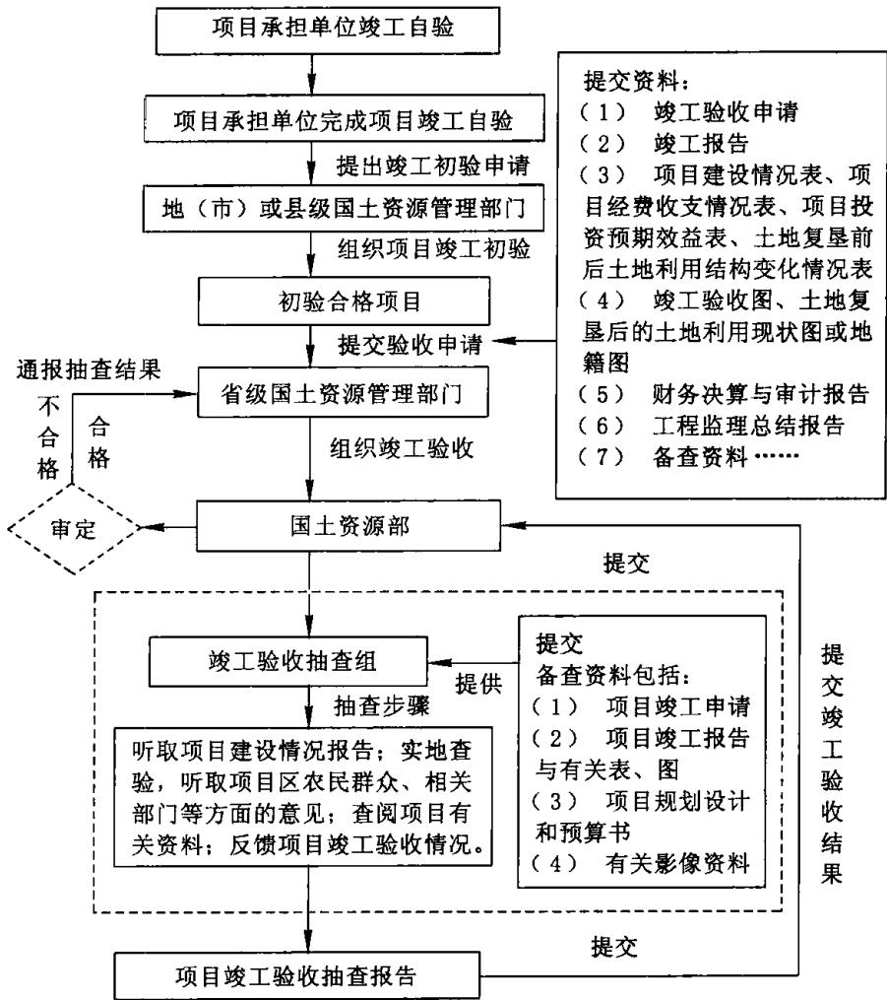  
图12-2 国家投资土地复垦项目竣工验收流程图

## 第十三章 矿区土地复垦与生态重建中的测量工作

## 第一节 矿区土地复垦与生态重建时测量的主要任务

土地复垦与生态重建是一项涉及多种学科知识的综合性工作。在土地复垦与生态重建工作中，测量人员自始至终要参与勘察、复垦设计、实地标定、监督实测等各项工作。综合起来，矿区土地复垦与生态重建时测量的主要任务有：

①在复垦区建立测量控制网。

②土地复垦与生态重建前和复垦与生态重建后的地形测量。

③绘制与复垦各阶段的设计和实施有关的矿山测量图，并在图上表示出地表破坏的全貌。

④预计采矿引起的地表移动与变形，绘制预计平面图。

⑤为当前的土地复垦与生态重建规划及远景规划准备原始数据资料。

⑥参与土地复垦与生态重建的规划设计。

⑦实地标定设计的几何要素。

⑧从时空上对土地复垦与生态重建进行系统监督。

⑨参与制定保存肥沃土壤的措施，掘取沃土和潜在土壤的有关工作，计算沃土的储量、损失及贫化率。

①观测堆积层的下沉量及建筑物的沉降变形。

①露天矿坑和排土场边坡的削缓和台阶化工作，建造人工水体的有关工作。

②参与将已复垦地区移交给使用单位的交接工作，准备交接的图纸资料。

## 第二节 矿区土地复垦与生态重建时的特殊测量方法

## 一、建立平面测量控制网

在地下开采或露天开采破坏区进行土地复垦与生态重建工作时，必须进行平面测量和高程测量。为此首先要布设足够数量的测量控制点，这些点相对于最近的矿区高级测量控制点的点位中误差不应超过±0.2m。

布设土地复垦与生态重建区域的平面测量控制点的方法视具体条件不同可采用不同的加密方案，例如大家熟悉的插网、线形锁插点、前方交汇和后方交汇等。随着光电测距仪的发展，导线测量用作加密控制也日益增多。下面介绍两种不直接量边的导线测量方法。

## (一）方位导线法

如图13-1所示，在坚强边AB与CD间敷设方位角导线，在野外可直接进行方位附合检核。按方位角方式进行测角步骤为：在B点整置经纬仪，瞄准BA方向，并使度盘读数等于起始边AB反方向BA的坐标方位角。照准1点，则度盘读数即为 $a _ { \mathfrak { B } 1 }$ ，倒镜后照准A点，若仪器无误差，其值应为 $a _ { A B }$ (作为检核)，然后再照准1点，读取读数 $\alpha _ { 1 B }$ ，并取中值 $\alpha _ { B \mathfrak { l } }$ 使用。将经纬仪移至1点，重复上述过程，直至C点，得CD边坐标方位角的测量值 $a _ { C D ; \mathrm { \textmu p } }$ 与已知坚强边方位角 $\alpha _ { \mathit { C D } }$ 相比较，视较差是否超限。

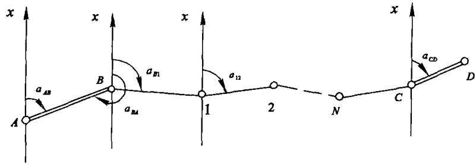  
图13-1 方位角导线的测设

图13-2所示的是只丈量导线起始边Aa和最末边eE的方位角导线示意图。在露天坑的非工作帮有明显的方位标(三角点M和大烟囱顶点N），其坐标已知，在坑内敷设方位角导线 $A { \mathrm { - } } a { \mathrm { - } } b { \mathrm { - } } c { \mathrm { - } } d { \mathrm { - } } e { \mathrm { - } } E$ 。多数导线边穿越各梯段，量边较困难。

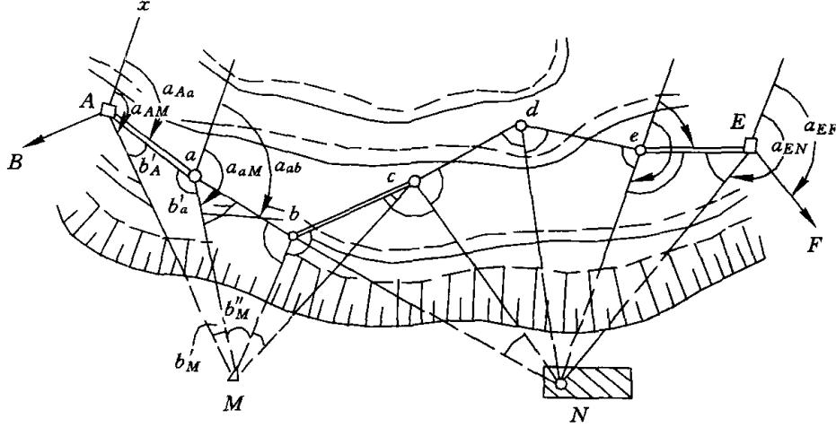  
图13-2 方位角导线法布设测量控制网

从坚强边AB(A点坐标已知)开始测设方位角导线，测得坐标方位角 $a _ { A a } \ 、 a _ { A M } 、 a _ { a b } 、 a _ { a M }$ 等。在野外进行最终方向检核： $f _ { \beta } { = } \alpha _ { E F \ddot { \imath } \parallel } { - } \alpha _ { E F }$ 0

为了求算各点坐标，根据坐标方位角的差值，可求得测点上各方向间的水平角 $\beta _ { A } ^ { ' } \cdot \beta _ { \alpha } ^ { ' }$ $\beta _ { \mathrm { ~ } M } ^ { \prime } \cdot \beta _ { \mathrm { ~ } a } ^ { \prime \prime } \cdot \beta _ { \mathrm { ~ } b } ^ { \prime \prime } \cdot \beta _ { \mathrm { ~ } M } ^ { \prime \prime }$ 等，这样就从一个三角形转入下一个三角形，直至eE边。bc边是从方位标M转到另一个方位标N的过渡边。eE边长可实地丈量，故可计算线量闭合差。若导线的方位角和线量闭合差均在限差之内，则进行平差，计算各点坐标。

## （二）联合法

用联合法建立平面控制网的原理是基于方位角导线和解析几何。野外测设方位角导

线，根本不用量边，解析几何方法求算各点坐标，这将大大减轻野外作业强度，而且测点可选在测角最方便的地方。如图13-3所示，若要建立控制网1、2、3、4各点，则从坚强点A、B、C测设方位角导线，在野外进行方向附合以检查测量的正确性。

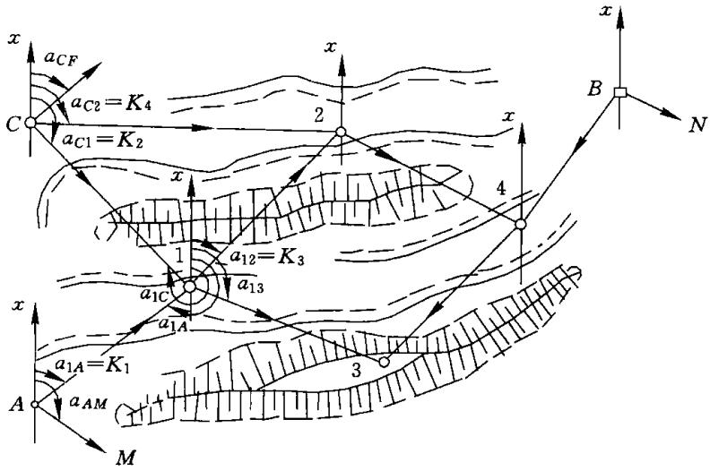  
图13-3 联合法建立平面控制网

各点的坐标可用解析几何方法算得，图13-3各边的箭头方向表示计算路线。例如，1点坐标可由下列两个方程式求解而得：

$$
\tan \alpha _ { A 1 } = { \frac { y _ { 1 } - y _ { A } } { x _ { 1 } - x _ { A } } } = K _ { 1 }\tag{13-1}
$$

$$
\tan \alpha _ { C 1 } = { \frac { y _ { 1 } - y _ { C } } { x _ { 1 } - x _ { C } } } = K _ { 2 }\tag{13-2}
$$

解上两式得：

$$
x _ { 1 } = ( K _ { 1 } x _ { A } - K _ { 2 } x _ { c } + y _ { c } - y _ { A } ) / ( K _ { 1 } - K _ { 2 } ) |\tag{13-3}
$$

$$
y _ { 1 } = K _ { 1 } x _ { 1 } - K _ { 1 } x _ { A } + y _ { A } = K _ { 2 } x _ { 1 } - K _ { 2 } x _ { c } + y _ { c }\tag{13-4}
$$

当已知点1的坐标及其相邻点(本例中为C点)的坐标时，点2的坐标便可按下式求得：

$$
x _ { 2 } = ( K _ { 3 } x _ { 1 } - K _ { 4 } x _ { c } + y _ { c } - y _ { 1 } ) / ( K _ { 3 } - K _ { 4 } )\tag{13-5}
$$

$$
y _ { 2 } = K _ { 3 } x _ { 2 } - K _ { 3 } x _ { 1 } + y _ { 1 } = K _ { 4 } x _ { 2 } - K _ { 4 } x _ { C } + y _ { C }\tag{13-6}
$$

$$
K _ { 3 } = \tan \alpha _ { 1 2 } = \frac { y _ { 2 } - y _ { 1 } } { x _ { 2 } - x _ { 1 } } \qquad K _ { 4 } = \tan \alpha _ { C 2 } = \frac { y _ { 2 } - y _ { C } } { x _ { 2 } - x _ { C } }
$$

按此法用计算机专用程序可算得全部控制点的坐标。

## 二、高程测量方法

## (一)倾斜视线水准测量

高程测量方法常用的有几何水准和三角高程。几何水准只适用于坡高较小的地方，而三角高程的精度较低，况目使用的仪器又不同，这就给开采破坏区的高程测量带来困难。例如台阶状地形剖面，从倾斜急剧过渡到平地或相反，此时地表倾斜变化幅度可能很大。如在普通水准仪物镜前安装上一个附件，就可进行倾斜视线的水准测量，做到一机两用，较合理地解决了这个问题。下面先介绍“定角双倾斜视线水准测量方法”的原理。

如图13-4所示，仪器照准立于标桩A上的水准尺，按倾角分别为α和 $\beta$ 的一对视线读取a和b，水准尺倾斜角 $\delta = \frac { 1 } { 2 } \left( \alpha + \beta \right)$ 。仪器与立尺点的高差为：

$$
h _ { \{ \tilde { x } \ }  = K ( a - b ) - b \cdot \cos \delta\tag{13-7}
$$

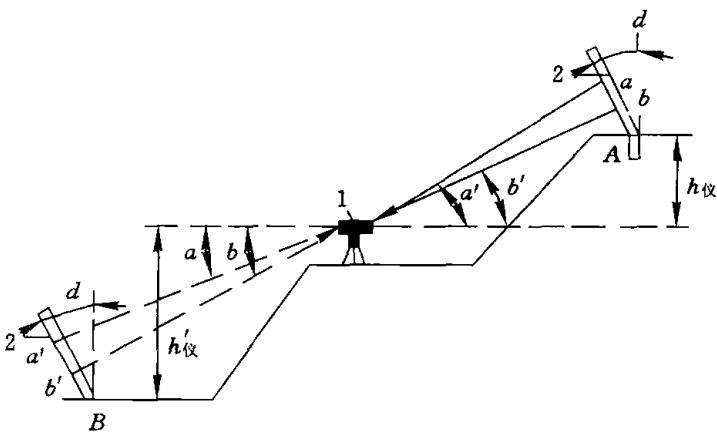  
图13-4 定角双倾斜视线水准测量  
1—装有倾斜视线附镜的水准仪；2—水准尺

倾斜视线水准测量中，视线倾角α和 $\beta$ 决定了仪器系数K、高差大小及视线的长度。为了满足高程测量的精度要求，K值应为6～8，而最大视线长度为40～50m。

在普通水准仪的物镜前安上一个特制的倾斜视线附镜，它由两个双反射棱镜组成(各占左右半个物镜的位置），两条出射光轴与水准仪主轴分别倾斜 $\alpha$ 和 $\beta$ 角。视线倾角为 $2 5 ^ { \circ }$ $3 0 ^ { \circ }$ 。倾斜视线附镜用固定螺钉与水准仪连接，工作时牢固可靠，装卸均很方便，图13-5是该仪器的外貌和倾斜视线附镜。

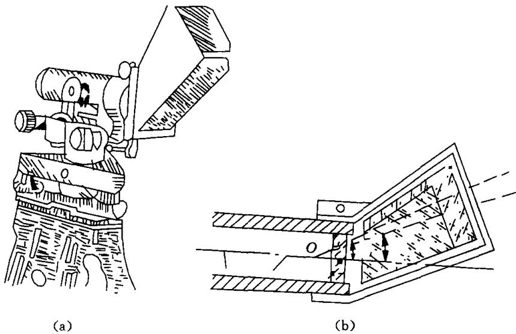  
图13-5 普通水准仪和倾斜视线附镜  
（a）装有倾斜视线附镜的水准仪；（b）倾斜视线附镜

在哈萨克斯坦一些露天矿进行了野外测试，阶段高11～16m，剖面线跨越3～6个水平，始末水准点高差48～75m，测量精度为：水准导线不符值为±3.6～±8.1mm，一测站的高差中误差为 $\pm 0 . 8 \sim \pm 3 . 6 ~ \mathrm { m m }$ 。三角高程测量是达不到这个精度的。此方法的效率为几何水准测量的6倍，三角高程测量的2倍。

## (二)用伸缩水准尺进行水准测量

土地复垦与生态重建时遇到大量的水准测量工作，为加快测量速度及内业计算，可使用伸缩水准尺。

图13-6表示常规的水准测量情况，前视点高程 $H _ { B } = H _ { i } - b [$ [图13-6(a)]，其中视线高程 $H _ { i } = H _ { A } + \alpha$ 。若将水准尺倒立在A、B点上[零端在上，见图13-6(b)]，则 $H _ { B } = H _ { A } - a ^ { \prime }$ $+ b ^ { \prime } = H ^ { \prime } , + b$ $H _ { i }$ 称为假定的视线高程，它等于 $H _ { A } - \alpha ^ { \prime }$ 。在外业中，心算时加法比减法快,若 $H ^ { \prime }$ 是整数米，则计算就更快了，例如 $H _ { i } = 1 8 4 . 0 0 0 , b ^ { \prime } = 1$ .583，则 $H _ { B } = 1 8 5 , \ 5 8 3$ ,立即可将此高程记在手簿上。

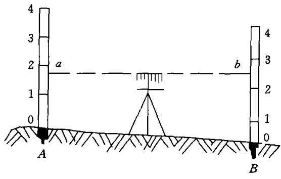  
(a)

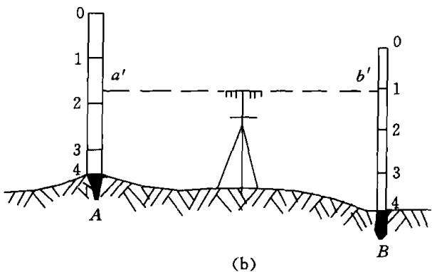  
图 13-6 水准测量  
(a) 水准尺零端在下；(b) 水准尺零端在上

为使H；成为整米数，必须使 $\boldsymbol { a } ^ { \prime }$ 的小数部分等于后视点高程 $H _ { A }$ 的小数部分。例如 $H _ { A }$ $= 1 8 5 . 4 5 0$ ，则对3m长的水准点来说， $a ^ { ' }$ 应取0.450、1.450、2.450，此时 $\boldsymbol { H ^ { \prime } } _ { i }$ 分别为185.000、184.000、183.000。为了做到这一点，可使用如图13-7所示的伸缩水准尺。它由两根尺子构成，1尺通常为 $3 \ \mathrm { m } ; 2$ 尺短些，一般在1m内有刻画。两根尺子可相对移动而得到不同的总长度。只要前、后视点所立的一对水准尺变动同一长度值l，则两点间的高差值将不变。

调节长度l的操作程序为：将水准仪整置在工作地点后，将伸缩水准尺（1尺在箍圈内下放到底)立在水准点 $A \perp ( H _ { A } = 1 8 5 . 4 5 0 )$ ，并取读数 $\alpha ^ { \prime } \iota$ 设 $a ^ { \prime } { = } 1 , 2 7 5 )$ 。为使假定视线高程 $H ^ { \prime } { } _ { i } = 1 8 4 . 0 0$ ，则应取 $l { = } 1 , 4 5 0 { - } 1 , 2 7 5 { = } 0 . 1 7 5$ ，指挥持水准尺者放松箍圈上的止动螺钉，沿短尺将上水准尺1移至l高度，固紧止动螺钉。重新立尺。取水准仪读数作检查，若全部操作正确无误，则检查读数 $a ^ { ' }$ 应为1.450。然后即可快速地进行面积水准测量，将立尺点的高程记于手簿上。

## (三)激光平面水准仪的应用

在平整地表及面积水准测量等工作中，一种具有旋转激光束的激光平面水准仪有着广泛的应用前景，这种仪器的结构如图13-8所示。激光束绕仪器竖轴旋转形成水平的激光平面，持尺者则根据激光平面在各点水准尺上的扫描读取读数，记于手簿中。

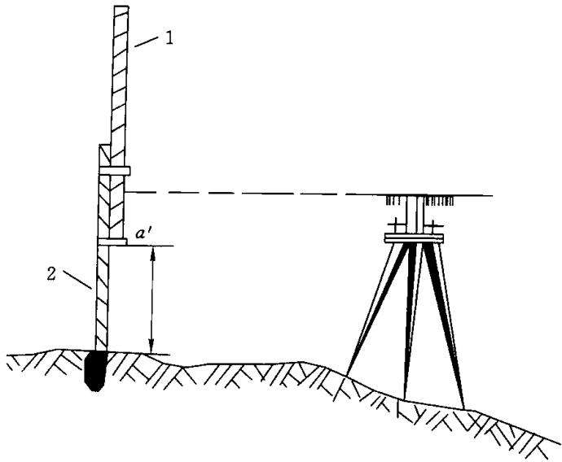  
图 13-7 可伸缩水准尺

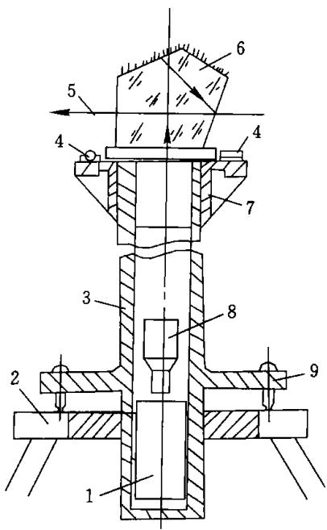  
图 13-8 激光平面水准仪  
1——激光光源；2—三角架；3———套筒；4——水准管；  
5——激光束；6—五角棱镜；7——旋转部；8——准直管；9——底座

## 三、难及和不可及地物的测量

在矿区地表沉陷区进行测图时，难于接近和不能接近的地物有：炽热的矸石堆、排土场的火区、露天矿的边坡、地下开采引起的塌陷坑、地下工程建筑、管线网及水库等。

在测量不能接近的目的物之前，需制订安全措施。所采用的测量方法应该是使测量人员不需进入危险区。

## (一)矸石山测量

在测量矸石山时，由于燃烧、陡坡等原因，测量人员不能到达，不能用水准尺，此时最好采用摄影测量方法或者采用角度交汇法。这些方法的实质见图13-9。围绕难以到达区设经纬仪一水准仪导线，测点A、B、C、D、E、F用木桩标定。导线一般为闭合导线。确定每个测点的x、y、z坐标。

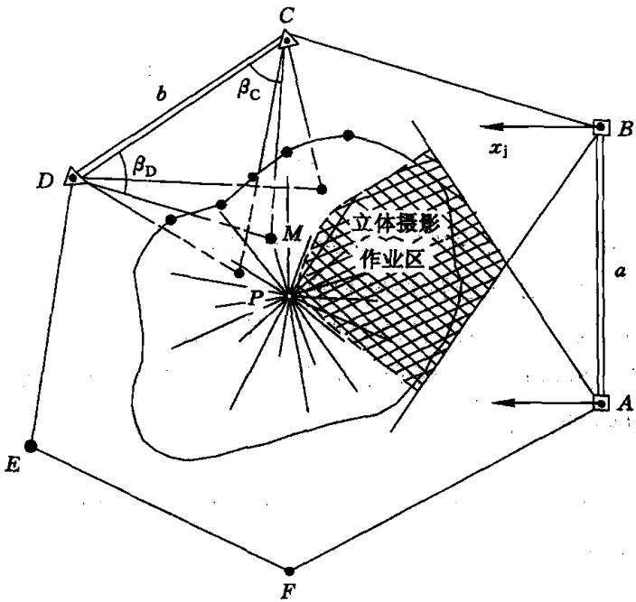  
图 13-9 不能接近地区的测量方法  
(a) 摄影测量；(b 角度交会法

进行摄影测量时，导线的边即为基线，用摄影经纬仪在基线的两端进行摄影测量。在立体坐标量测仪上，借助于立体自动测图仪对照片进行处理，按规定的比例尺绘制平面图或剖面图。

采用角度交会法时，在从导线边的两端点架设经纬仪，如图13-9中的C、D点，瞄准矸石堆坡面的特征点，如图中M点，不仅需要测量平面角 $\beta \boldsymbol { c }$ 和 $\beta _ { D }$ ，而且需测量线CM、CD与地面的夹角，即倾角 $\delta _ { C }$ 和 $\delta _ { D }$ ，线CM和DM的水平距离可按正弦公式计算。则可根据上述数据和经纬仪望远镜旋转轴的高程解算出M点的x、y、z坐标。

## (二)边坡测量

高阶段的边坡测量比较危险，实践中多采用沿给定方向的简易边坡测量法——剖面法，最常用的是线交会法(图13-10)。测量时两人参与工作，一人站在阶段的上缘，另一人站在阶段的底板。在已知坐标点A和B上，竖起轻质装配式立柱，它的上端可固定卷尺，上下立柱高度应相同。在卷尺上拴一个3\~5kg的轻锤，由下面的测量员指挥边坡测量工作，按其口令，用一端卷紧一端松开的方法使轻锤P沿边坡调迁到特征点1上，上下二人同时在卷尺上读数 $l _ { i }$ 和 $\smash { \boldsymbol { l } _ { \perp } ^ { \prime } }$ ，再移P至2点，读取 $l _ { 2 }$ 和 $\boldsymbol { l } ^ { \prime } { } _ { 2 }$ ，同时逐点进行测量。在剖面图上以AB为基线直接根据测量数据按线交会法作图。

## (三)地下工程管线测量

地下工程管线包括水管、排水系统、供暖管线、电缆等。测量应在收集和分析已有资料(地下管线图、施工图、设计等)之后进行，根据这些资料，设计地下管线总布置图，确定检查井间的联系。根据所确定的总图进行踏勘和修正。

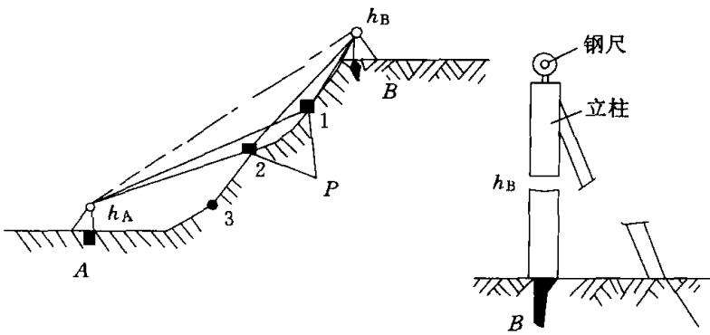  
图 13-10 线交会法边坡测量

勘查检查井及其他地下建筑时，必须有两人，并确认井下没有有害气体时才能进行。下检查井必须有保险带。测量可以按区段或按管线类型(排水管、水管、供暖管路等)分别进行。测量时，需测出管线的拐角、检查井中心、管道直径、检查井井底、管路顶部的标高、地下排水沟的截面积等。

确定检查井井底和管道顶、底部的高程最好用木质或铁制测尺，测量时，观测者不需下到井底，测量方法如图13-11所示。

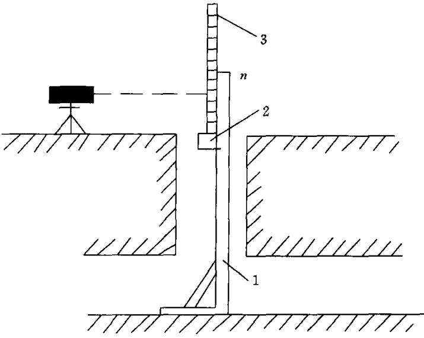  
图13-11 检查井高程测量  
1———测尺；2——放置水准尺的凸块；3——水准尺

当缺乏地下管线施工资料时，可借助地下管线探测仪查找地下管线的位置。最新的地下管线探测仪确定地下管线的平面和高程位置的误差为±10cm。

用管线探测仪寻找非金属管道(水泥、石棉水泥和陶土的)时，需向管道内放金属导线或在水中加某些物质使其变为电解质。

## (四)水域地形测量

积水的移动盆地和露天矿坑等水域池底的测量，一般称水体底部测量或水域地形测量。

浅池底面可乘小船沿剖面线进行测量，剖面线与岸上的测量控制网相连，点的位置可用角交会法测定(基线设在岸上），坐小船视距测量可使用水准尺、刻有分划的测杆等。池底沉积物的厚度可使用特制的探尺测定。欲探明基质岩石的性质，可以从平底船上打钻探测。深水池底测量，可利用装置在小船上的声波测距仪进行。它可自动绘出沿给定方向的剖面，而且在剖面图上将区分出软岩石(黏土质沉积物)和划出基岩的轮廓。

例13-1 由淮南矿务局与上海无线电二十二厂研制开发的水域地形自动化测绘的系统测绘的矿区多种水域地形图，为矿区“三下”采矿、塌陷区土地复垦综合治理的规划和实施提供基础图纸资料。该系统由测量工作船、岸站装备和室内数据处理三个单元组成(图13-12)。在轻型可移动的小船上，安放一套微机控制的测深仪测量水深，由在岸边的电子速测仪对测量船用极坐标定位，数据存入野外手簿内。以上通过计算机处理后，由微机绘图仪自动绘出水域地形图。

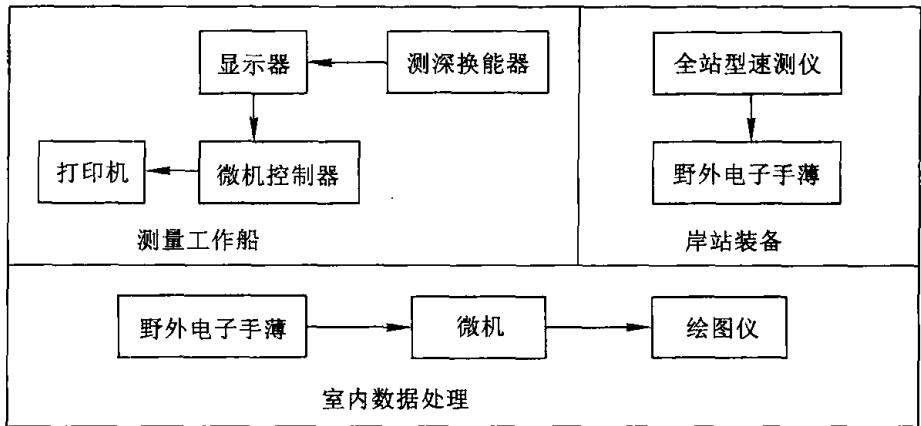  
图13-12 水域地形的自动化测绘系统

## 1. 测量工作船

①测量船为一艘长3 m、宽1.3 m、可手划也可驱动的玻璃钢壳体船。船重120kg，可载重300 kg，船速为 0.5\~5 m/s。

②CRT测深仪，是根据声纳探测原理探测水域深度及水域底部地貌的一种回声探测仪。其技术性能为：基本量程：0\~100m；量程放大：0\~20m，20～40m，40～60m，60\~80m,80\~100 m;测量精度：深度>20 m时误差<±1%，深度≤20 m时误差<±0.2 m。

## 2. 岸站装备

主要用于测定低速航行的测量船位置，选用TC1600或T1000+D1000的电子速测仪，用极坐标法对船定位，也可选用脉冲式激光地形仪配合普通经纬仪或小平板进行，用电子速测仪时采集的数据直接输入野外电子手簿。

## 3. 室内数据处理

它由硬件配置(微机、大屏幕显示器、绘图仪、数字化仪)操作系统和支持软件组成。该系统能将 $\mathrm { G R E } _ { 3 }$ 内的数据自动传输到微机内，并将原始记录存盘并进行必要处理，依据现实图式，自动完成标准网格或任意网格的绘制工作，自动展绘岸站及水域地形点并注记高程（或水深)，一次可对2500个地形点绘制等高线或等值线图，也可绘制任一剖面的剖面图，还能自动计算水域面积和断面面积及水域体积。

水域地形的自动化测绘系统进行外业测量时，可采用散点法或剖面法。实践证明，该系统效率高，成图周期短，精度能满足水域地形测量的技术要求，值得推广。

## 第三节 地表破坏预测图的绘制与表土层剥离时的测量工作

## 一、地表与岩层移动变形预计和地表破坏预测平面图的绘制

国内外对于煤矿床地下开采引起的地表移动及变形的规律已经有比较充分的研究。通过岩移预计，可以求得移动盆地主断面上的下沉、水平移动、水平变形、倾斜与曲率等数值。目前常采用典型曲线法、剖面函数法、下沉格网法等进行预计。

从土地复垦的角度讲，上述参数中最主要的是采动范围内的地表下沉值。对于每一个开采区域，通过岩移预计可以绘制出岩移结束后下沉量等值线图。运用矿体几何制图中地形式曲面数学演算的方法，把地表地形等高线图减去下沉量等值线图就能得到下沉后的地表地形图。根据下沉后的地表地形图，结合该地区水文和水文地质特点，就可以圈定出可能的淹没区，并确定水淹的深度，这正是土地复垦所需的基本资料。

另一个影响土地复垦与生态重建的主要参数是岩层移动过程中地表出现的裂缝。要预计裂缝带的位置及宽度与裂缝张开的最大值等，也可以根据矿区积累的经验资料确定。

在编制地表与岩层移动预计的报告后就可以着手进行土地复垦的规划工作。当对生产矿井制订土地复垦计划时，要求地表破坏预计平面图的比例尺为1：2000，等高距为0.5m；当制定远景规划时，则图的比例尺应为1：5000，等高距为1m。

现举例说明地表破坏预测图的绘制方法。

例13-2 如图13-13 所示，矿井的开采层为 $K _ { 1 3 } \setminus K _ { 1 4 }$ ，上部为 $K _ { \scriptscriptstyle { 1 4 } }$ 煤层，煤厚为2.1m，倾角 $\alpha$ 为 $2 6 ^ { \circ }$ ，采区上部采深为101m，下部为197m，分东、西两个工作面进行开采。下部为$K _ { 1 3 }$ 号煤层，煤层厚为1.3m，只有一个工作面。

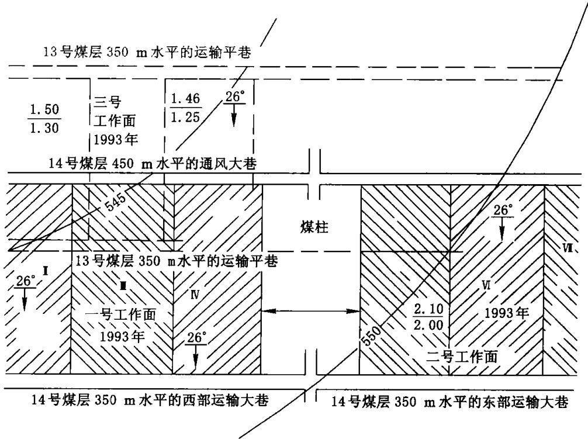  
图 13-13 $K _ { 1 3 } \setminus K _ { 1 4 }$ 煤层采矿工作发展平面图

煤层的两个工作面间留设有宽40m的煤柱。判断煤柱对地表移动是否有影响，要根据煤柱宽度l和平均埋藏深度 $l / H$ 的比值。根据原苏联B.n鲍鲁契夫斯基的研究，有：

$$
\begin{array} { r l } { \ddagger { \ddagger { 0 } } \vphantom { \biggl | } \overline { { \diamond } } \overrightarrow { \mathfrak { H } } \smash { \mathfrak { F } } \rvert { \ddot { \mathfrak { F } } } } & { { } \lvert { \mu } \rvert \quad ( l / H ) _ { \mathrm { m a x } } = - \ 0 , 5 7 3 \mathrm { s e c } \ \alpha \mathrm { l g } ( 1 - 1 . 3 3 5 h _ { \mathrm { c } } \mathrm { s e c } \ \alpha / m ) } \end{array}
$$

$$
\begin{array} { r l } { \ddagger { \underline { { \operatorname* { m i n } } } } \mathbin { \overleftrightarrow { \mathbf { g } } } \mathbin { \overleftrightarrow { \mathbf { x } } } \mathbin { \overleftrightarrow { \mathbf { g } } } \mathfrak { h } \mathfrak { h } \mathfrak { t } } & { { } ( l / H ) _ { \mathrm { m a x } } = - 0 . 5 7 3 \mathrm { s e c } \alpha \mathrm { l g } ( 1 - 1 . 7 5 h _ { c } \mathrm { s e c } \alpha / m ) } \end{array}
$$

式中 $\mathbf { \nabla } \cdot h _ { \mathbf { \nabla } \cdot }$ 为预测下沉量的允许误差，一般取0.5m;m为煤层开采厚度。如果l/H值小于允许值，就可以认为是全部开采而不考虑煤柱的影响。在上述实例中， $l / H { = } 4 0 / 1 4 9 { = } 0 . 2 7$ $( l / H ) _ { \mathrm { m a x } } { = } 0 . 0 1$ 。由此可见，两个工作面 $\therefore \angle 1$ 须分别预计它们对地表的影响，所获得的预计下沉等值线图如图13-14所示。

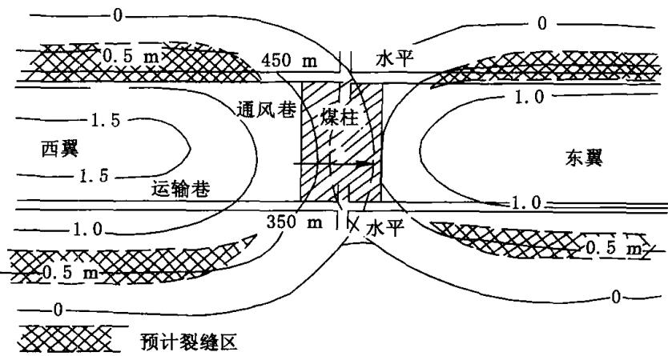  
图 13-14 开采 $K _ { \scriptscriptstyle { 1 4 } }$ 煤层时地表下沉等值线预计图

图中用交错线表示的地段即为裂缝与断裂带。受一次采动影响地表裂缝宽度可达0.5m，整个裂缝区的宽度达0.3H=45m。

用相似的方法在重复采动的条件下预计开采 $K _ { 1 3 }$ 煤层对地表下沉的影响，绘制等值曲线图。把两张下沉等值曲线图叠加，再与地表等高线图相减，即得下沉后的地形图。在地形式曲面的加减运算中，也可以应用矩形格网法，即对每一个格网交点上的指标值进行数学运算。

## 二、表土层剥离和储存计划的制订

对于露天矿来说，需要剥离加以保护的土壤包括采剥范围内的，也包括外部排土场的用地，还有堑沟、公路及工业建筑地上的土壤。在制订计划时必须确定：

①表土层剥离的次序及日期。

②表土层与底土层的厚度及体积。

③所剥离的表土移放地点及今后利用的可能性。

对于地下开采来说，只需在部分地段剥离表土层并保存或利用。这些地段就是预计在岩移结束后可能被地表水或地下水淹没的区域，或者发生巨大裂缝及塌陷坑的地区。

可能有两种情况：一种是剥离表土层后直接运送到土地复垦区域；另一种是把剥离的表土层长期或临时堆存起来，这样就需储存场地并增加费用。剥离土层的机械一般为堆土机、铲土机及其他挖土机器，也可用水力冲击机。剥离下来的表土层可用汽车、胶带输送机、铁路及水力运输。图13-15为表土层长期堆放场的技术工艺方案图，图中(a)为使用推土机；(b)为使用汽车和推土机；(c)为使用轮式铲土机；(d)为沿岩石斜坡使用挖掘机。

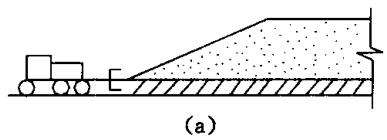

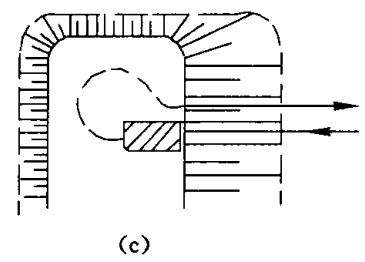

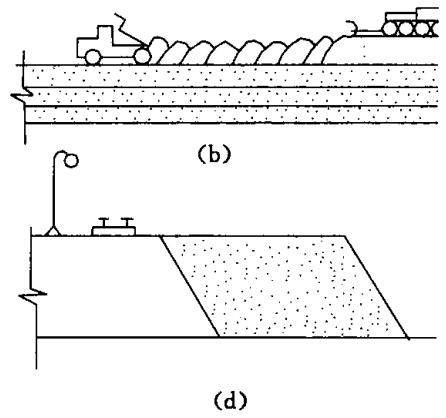  
图13-15 表土层长期堆放场形成的工艺方案

测量工作者应根据钻孔及探并资料绘制肥沃表土层的等厚线图，求得平均厚度值，并应用某一种储量计算方法(如算术平均法、等值线法、垂直断面法等)计算肥沃表土层的体积。这个体积量对于土壤运送及堆存工作的组织计划是十分重要的。

根据土地复垦工作的要求，有时需设置肥沃表土的长期堆存场地，一般高度不超过10m底边为圆形或正方形。为了防止水与风力的侵蚀，土堆的表面可捣实并种草。

堆置面积S 可按式(13-8)计算：

$$
S = \frac { V K _ { \rho } } { h _ { m } }\tag{13-8}
$$

式中， $K _ { \rho }$ 为松散系数；V为剥离前表土层的体积； $\cdot h _ { m }$ 为表土层堆存场的平均高度。

在肥沃表土长期堆放场的组织工作中，测量人员必须完成以下几项工作：

①按照设计要求进行堆放场的标定。

②对堆放场地进行地形测量，比例尺为1：500或1：1000，等高距为0.25或0.5。

③建立堆土场测量的工作控制网。

④运土公路的标定工作。

⑤确定堆放场上表土层的厚度及它们的储量。

⑥定期的测量堆土场，确定它们的体积。形状规则的、不大的土堆可用卷尺丈量，延伸形的土堆要用剖面法测量，形状不规则而又很大的土堆要用视距法进行测量。

实测数字表明，土壤的松散系数一般为1.08\~1.25，黑土的密实度为1.04～1.10，灰化土的密度为1.3\~1.8。

## 第四节 地面复垦时的测量工作

## 一、监督复垦地区的土地平整工作

土地平整工作是在复垦地区建立符合设计要求的地形，它需要精细的测量监督。多数情况下，复垦时要进行大面积的平整，它比条带状平整工作要复杂得多。一般地讲，复垦区地表要求平整成水平面或微倾斜面，而对露天坑或外排土场则是倾斜面。

## (一)激光平整

为了自动监督平整工作，可利用激光系统，沿给定方向发射出稳定的激光束。

在平整地区事先选择好的点上架设激光发射器，依靠激光束水平旋转的方法建立给定倾角的光平面。在每台平整机械的伸缩式架杆上装设激光接受装置(图13-16)。激光接收装置确定了平整机械相对于光平面的位置，从而监督它的工作。一个激光发射器能同时为多台平整机械服务。

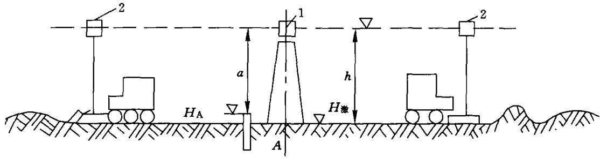  
图 13-16 激光平整示意图  
1——激光发射器；2——激光接收装置

开始时先要确定激光束的高程 $H _ { \mathfrak { H } }$

$$
H _ { \ast } = H _ { A } + a
$$

则

$$
h = H _ { \# } - H _ { \# }
$$

式中， $H _ { A }$ 为水准点A的高程； $H _ { \# }$ 为地面设计高程； $H _ { \mathfrak { X } }$ 为光平面高程；a为水准点上水准尺读数。

将激光发射器置于所需高度后，沿标杆定向，从而指明平面的倾斜方向。

## (二)瞄准杆平整

在竖直面内用目测方法给定方向时，可用钉成“T”形的木制瞄准器完成，给向不应少于两次。可用移动的轻便式瞄准器来检查是否符合设计要求。为了醒目，可将固定瞄准杆的横条漆成淡色，而移动瞄准杆的横条漆成黑色。在实际工作中，可将瞄准杆做成金属的，以便多次使用。

在平整时，固定的瞄准杆可按下列三种方式设置：

① 在平整工作区的后面[图13-17(a)];

② 在平整工作区的前面[图13-17(b)];

③ 在平整工作区的两面[图13-17(c)]。

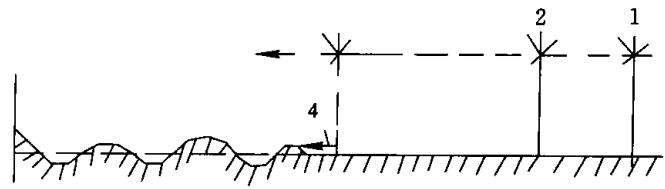

(a)  
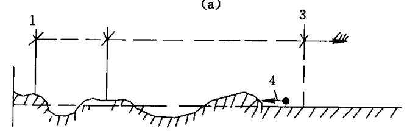  
(b)

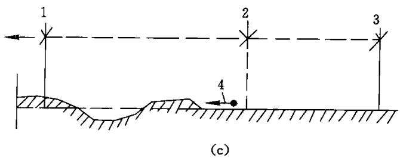  
图 13-17 T形瞄准杆设置示意图  
1、3固定的瞄准杆；2—移动的瞄准杆；4——推土机的移动方向

精度评定表明，图13-17(c)所示方式为最佳，其他两种同等。为了提高精度，两固定瞄准杆间的距离不应小于30m。也可用水准仪或经纬仪来给定倾斜面的设计方向。

## 二、充填法复垦时的测量工作

## （一）露天矿坑的充填

按土地复垦设计进行露天矿坑充填时，常用废石、尾石、工业和生活垃圾作为充填物。此时，测量师首先要熟知设计图、充填物的调运、土方工程作业图等。

露天矿坑的充填物可能与开采同时进行，即建立内部排土场。实践表明，这时的复垦费用要降低70%～80%。若从露天坑剥离的废石不敷充填时，还可以从其他露天矿运来，或运自废弃的排土场和矸石山。

废弃露天矿坑的充填工作可按倾斜分层式、水平分层式或混合式进行(图13-18)。混合式系统无需进行专门的平整工作。

充填废石要沉降，沉降量要按设计规定，使沉降后的地表高于计算的潜水面，这样才能保证复垦区的合适使用。

充填后形成的地表应向地势低处倾斜，使大气降水不积在个别地区，而是均匀地分布在整片复垦土地上。多余的水要能较快地流走，但流速不宜过大，以免土壤受到侵蚀。充填时应考虑建立隔水层，在它上面再铺设潜在肥沃岩石和沃土层。

如果露采开切了含水层，为了防止工业废料中的有害物资污染地下水，露天矿坑的底和边帮应预先覆盖隔水材料，如黏土、农用乙烯薄膜等。在坚硬岩石内建立隔水层可采用边帮钻孔注浆的方法，这时测量师的工作就是在实地标设钻孔位置，并检查其深度。在铺设隔水

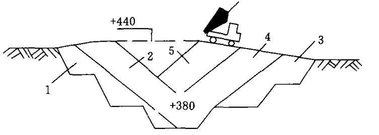  
(a)

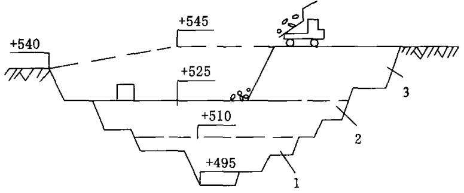

(b)  
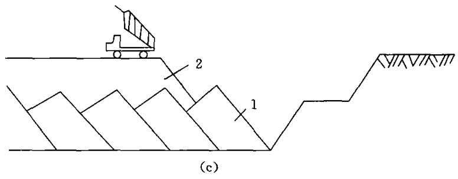  
图 13-18 露天坑充填示意图  
(a)倾斜分层式；（b)水平分层式；(c)混合式；1\~5充填次序

材料时，应监督是否铺在设计规定的地方。

充填和复垦后的地表形状应与设计一致。测量人员应定期测绘平面图和剖面图。在充填过程中，可用“T”形瞄准杆和水准测量方法检测高程、标设运输道路和坡度。

实际充填工作量可用相隔25～50m的平行剖面计算。验收时，要检查充填后的地面高程、边界及设计规定的其他地表参数。

## （二）充填移动盆地、塌陷坑和其他低洼地形

地下开采时，可用井下矸石、工业废料和发电厂的粉煤灰等充填移动盆地、塌陷坑和其他低洼地形。此时的填充工作又有其自身的特点，必须顾及岩移过程的活跃期和衰减期。充填低洼地形可达原地面标高，或低于原来的标高，这可根据复垦后地面的利用方向而定。

土地复垦工作根据地形和矿层的采矿地质特点，可选用不同的工艺方式和工作顺序。可在复垦地上倾倒排矸场废石、矸石山自燃过的岩石、井下废石，上面覆盖黏土层，再堆上肥沃的土壤，所用的复垦工艺方式如图13-19所示。

复垦工作开始要进行比例尺为1：5000～1：2000的地形测量，以供设计之用。在地形图上确定地表破坏区的范围和充填岩土量。充填和平整的边界及次序应在地面打木桩进行标定。测量人员要绘制专门的图纸。

塌陷坑的充填次序要按专门的设计进行，充填前要对塌陷坑进行平面一高程测量，绘制

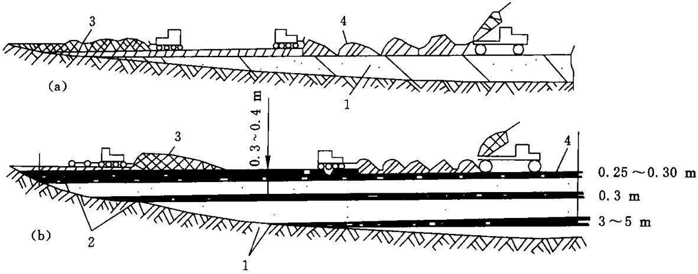  
图 13-19 采动区复土技术方案示意图  
(a)倾斜分层；(b) 水平分层  
1—矿井矸石充填层；2—已燃烧过的矸石山矸石充填层；3-———沃土层；4——黏土保护层

剖面图。测量人员要在实地标设出危险移动变形带的范围。充填必须充分，这不仅恢复了地表，而且可以防止塌陷坑的积水危及采 $\textcircled { 1 } ^ { 2 . }$ 安全。

各种沟渠的充填用堆土机或电铲进行，应定期计算完成的土方工程量。通常应用垂直 $\ddag ^ { \ddag }$ 剖面法或“最近区域法”来进行(图13-20)。

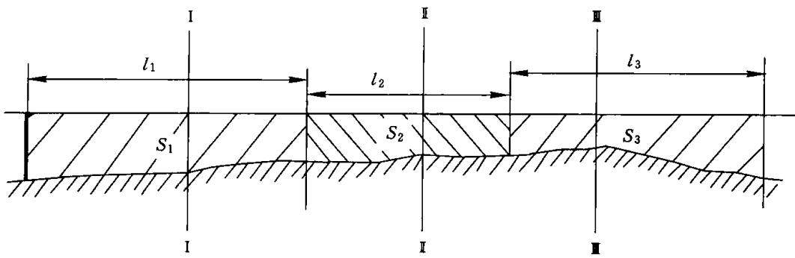  
图13-20 计算土方工程量的“最近区域法”示意图

沟渠中充填的体积计算公式为：

$$
V = \sum S _ { i } l _ { i } \mathrm { ~ m } ^ { 3 }\tag{13-9}
$$

式中， $S _ { i }$ 为沟渠横断面面积， $\mathbf { m } ^ { 2 }$ ；li为该断面所代表区域的长度，m。

## 三、整治人工水池岸边地带和池底时的测量工作

对于浅的露天矿坑，进行废石充填是合理的，复垦后可作农业和林业用地。但对于深度较大的露天矿坑则改造成各种用途的水池更好，如工业和居民的供水池、养鱼和水禽池、水上运动池、文化娱乐设施和疗养池等。

水池的岸边地带是水和陆地交互作用地区，它包括水上和水下两部分，水上部分称为岸，水下部分称为“水上岸坡”。在废弃的露天 $\textcircled { + } \frac { 2 } { ( 1 5 ) }$ 坑内整治水下岸坡的工作方式和工作量取决于岸边地区的用途、岸的高度和岸边岩石的组成。若岸边地带用作浴场，则可将露天坑帮削缓，坡度1：7达到1.0m深(图13-21)。在这些缓坡区内要覆盖沙子。儿童浴场水深不应超过0.7m。在建造带有跳板和跳台的水池时，水深在跳台以下不小于4.5m，在3m和1 m 跳板以下不小于 3.5 m 和 3 m。

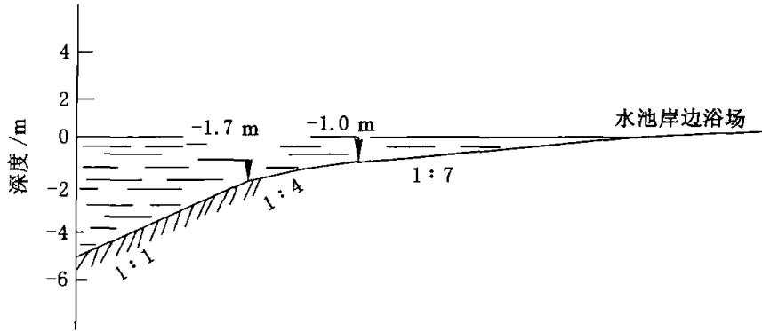  
图 13-21 在露天矿坑处建贮水池时浴场地带的整治

若露天矿坑的水面以下部分边帮由硬岩石组成，那么应修筑成台阶状，每一个梯段设置一个平台，宽度不大于1.5m，反坡1：10，最低的平台要高于水面1.5m，而第二个要高出5$\sim 7 \textrm { m }$ ，边坡削缓成1：2。边帮的水上部分高度大于3m时要沿边帮上部修筑截水小沟或土堤，以防边坡受降雨损害和水侵蚀(图13-22)。

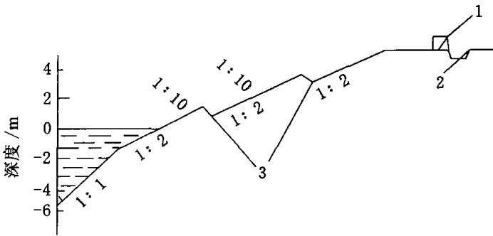  
图13-22 位于硬岩层中的贮水池边坡  
1——挡水土堤；2——截水水沟；3——平台(宽1.5m)

在露天坑内修建贮水池时，边帮的稳固性在充水前后是不一样的，充水降低了边帮的稳固性。在计算和整治之前要进行工程计算，确定边帮稳固参数，得出稳固性系数。

如图13-23所示，开始时不顾及水的静作用力和动作用力来计算边坡的稳定性，在地块中确定出预期的最弱面，沿此面岩石可能滑动，然后找出沉降曲线和等水压线的位置，压力计算可自任意水平直线AA起始。

将边坡和最弱边之间的棱柱体分为各计算块段1、2、3…水的静作用力和动作用力的合压力(此力方向垂直于滑动面，作用在计算块段的中点)为：

$$
D _ { i } = \Delta _ { 0 } ( H _ { i } - y ^ { ' } _ { i } ) a _ { i } / \cos \delta _ { i }\tag{13-10}
$$

式中， $H _ { i }$ 为计算块段范围内的平均高度， $\mathrm { m } ; \boldsymbol { y } ^ { \prime }$ 为在块段内滑动曲线的平均纵坐标， $\mathbf { m } \colon a _ { i }$ 为块段的宽度， $\operatorname* { m } ; \Delta _ { 0 }$ 为水的密度， $1 0 ^ { 3 } ~ \mathrm { k g / m ^ { 3 } } \ : ; \delta _ { i }$ 为计算块段中点处滑动面切线的倾角， ${ \bf \Xi } ^ { \circ } )$

边坡在被淹没的情况下稳定性系数为：

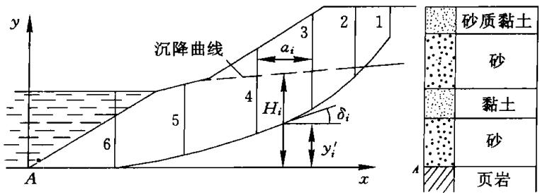  
图13-23 被淹没边坡稳定性计算示意图

$$
n = \frac { \sum \{ \left[ P _ { i } \cos \varphi _ { i } + P _ { i } ^ { B } \cos ( \alpha - \delta _ { i } ) / \cos \alpha \right] - D _ { i } \tan \rho _ { i } + K _ { i } l _ { i } \} } { \sum \{ P _ { i } \sin \delta _ { i } - P _ { i } ^ { B } \sin ( \alpha - \delta _ { i } ) / \cos \alpha \} }\tag{13-11}
$$

式中 $\cdot \rho _ { i }$ $K .$ 为相应的摩擦角和岩石黏着系数； $P _ { i } ^ { B }$ 为在计算块段内，高于坡面的“自由水”质量，t;α为边坡角， ${ \bf \Xi } ^ { \circ } ) : P _ { i }$ 为块段(包括所含的水)质量， $\mathrm { t } ; l _ { i }$ 为第i段沿滑动面的长度，m。

根据前苏联矿山测量科学研究院的研究结果，总稳定性最差的情况发生在透水岩石条件下和边坡被水浸泡在其深处的时候。在此条件下，稳定性系数与无水边坡相比将减小10%\~25%。

土地复垦时，水上部分边坡的参数选择应保证其稳定性系数为1.5～2.0。

测量人员要为露天矿边帮削缓设计提供采矿平面图、边帮横断面图、采空区底板等高线图及描述边帮和底板的岩层与地质构造特征的资料。

露天矿坑边帮削缓的土方量大小取决于坑的大小、深度和消缓角度。边帮削缓用推土机、电靶或电铲等进行。在削缓工作中，测量人员要在实地每隔20～50m标定一个剖面。剖面标志木桩间距取15～30m。边帮整治见图13-24。

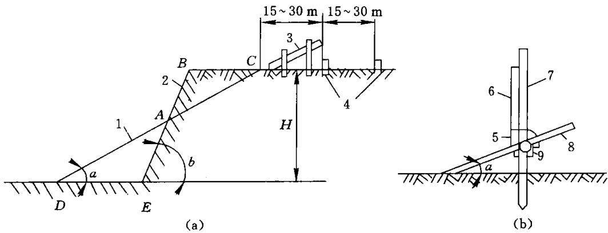  
图13-24 露天矿坑(梯段)边帮的整治  
（a）总示意图；（b）安装斜坡指示器的模板  
1设计的轮廓线；2—实际轮廓线；3—斜坡指示器；4剖面方向桩；  
5半圆(刻画为度)；6-锤球；7立柱；8-尺条；9卡子

按设计倾角整治边坡的方向可借助于安装在平台上的斜坡指示器。斜坡指示器则用木质或金属制的模板来安设[图13-24(b)]。

由图13-24(a)可知，在实地标定时，还应知道BC和DE线段的长度，其值在给定 $\alpha \cdot \beta$ 和H的情况下可用图解法或解析法求得，图解法应在 $1 : 1 0 0 \sim 1 : 2 0 0$ 的剖面图上确定，解析

法的计算公式为：

$$
B C = D E = { \frac { H ( \tan \beta - \tan \alpha ) } { 2 \tan \alpha \cdot \tan \beta } }\tag{13-12}
$$

式中，H为阶段高度；α为设计边坡角 ${ } _ { ! \beta }$ 为实际边坡角。

边坡削缓的总工作量为：

$$
V = S _ { \triangle A B C } \cdot L = { \frac { H ^ { 2 } L ( \tan \beta - \tan \alpha ) } { 8 \tan \alpha \tan \beta } }\tag{13-13}
$$

式中，L为边坡整治地带的长度。

整治边坡时，对于硬岩层还要进行钻孔爆破。为此测量人员还要绘制剖面图，并按设计在实际中标定钻孔、测量孔位、丈量孔深等。

在整治贮水池底时，测量师要在实地标设几何要素，并在坑底建立高程控制点，整治工作结束后，要绘制贮水池底部的等高线图，比例尺为1：1000～1：5000，还要绘制比例尺为1：200～1：1000的露天坑边帮的横剖面图。

## 四、在地表移动沉陷区的废石场上面建造贮水池

地下开采后地表产生的移动盆地和沉陷坑经常积水，故常改建成贮水池。若在居民点附近，这种人工修建的贮水池地区可开辟为公园，建造水上运动中心等。为此，必须在岩层移动之前作好综合准备工作。为保证及时在预计的移动盆地范围内先取走植物层和有害岩石，测量人员应在欲建贮水池地区确定下沉盆地的轮廓，预计地表移动值和绘制开采后地表预期的地形图，并在该图上圈出移动盆地边界和画出沿盆地主断面的垂直剖面图。然后将全部设计要素(如预期的移动盆地边界、植物层和有害岩石的挖取边界、防止污染水渗入贮水池和加固池岸用的挡土墙的轮廓等)标设于实地。

在废石场的低洼部分也可建造贮水池。这种贮水池的特点在于它们建在倾倒的土壤上面，因而就需在贮水池底床上设置专门的防渗漏覆盖物。通常利用黏土质土壤作为防渗漏覆盖物而形成防护层。边坡设置不要陡于1：4，厚度按计算选取。防护层可分片营造。土壤分片堆好后，要铺平成厚0.25～0.30m的土层。防护层数目不少于两层，铺设时要分层碾平，其厚度用直接测量法检查，每 $6 \sim 1 0 \ \mathrm { m } ^ { 2 }$ 至少要测量一个点的厚度，测点要均匀分布。

贮水池完工后，测量人员要测绘池底等高线图及水池附近的地形图和两个大致通过贮水池中心且相互垂直的断面图，比例尺为 $1 : 5 0 0 \sim 1 : 1 \ 0 0 0$ 。测量人员要按照设计在实地上为水渠、水沟和管道等各种供水建筑物定线，检查施工的正确性和计算所完成的土方量。然后利用附近河流或湖泊供给的水快速灌满贮水池，这样既可堵住地下酸性水和碱性水的流出，又可保证边帮稳固。实践表明，边坡滑动经常发生在淹没高度为露天坑边帮高度的1/3时；当坑内水面高于其深度的2/3时，边帮的稳定性将不低于报废时的稳定性。

水面的最低标高应按卫生规范和保证贮水池正常工作来计算，最高标高是根据地表地形、贮水池的用途等确定。贮水池灌满水后，要绘制1：2000或1：5000的平面图，并在图上画出误差为±0.5m的水面边界线，在人工贮水池附近常存有用途各异的建筑物，此时应按有关规程要求设观测站，对近帮地带进行仪器观测，防止池岸产生危险变形时使建筑物遭到损害。

## 第五节 矸石场复垦时的测量工作

## 一、排矸场复垦概述

露天矿和矿井的排矸场占据了大量的肥沃土地。排矸场复垦一般可分为两种情况：一种是矸石有利用的可能，例如煤矸石可以烧制各种建筑材料，发热量较高的还可以作为沸腾炉的燃料，目前我国煤矸石的积存量超过了30亿t，占地近15万亩，如果全国大力开展煤矸石的综合利用，就可能使大片被占的土地得以恢复。另一种情况是矸石不能利用，复垦工作的主要任务是进行矸石场的平整或修整为阶地状，使它能抵御水和风的侵蚀，并在平整的表面上采取农业化学措施以保证植被的生长。本节将着重讨论第二种情况。

研石场的平整工作一般用推土机、挖掘机等机械设备进行，测量人员的任务在于把设计的几何参数标设于实地、检查平整工作的质量、测算所完成的工作量。

矸石场复垦时的经济合理性，在多数情况下取决于矸石场的几何形状、周围的地形、岩石性质和矸石场堆置的次序等。所以，当进行矸石场的设计和实施时就应该作周密的考虑，占地面积要尽量小，外观要较好，复垦工作量较小，且不能分散设置。分散的矸石场在复垦工作中花费大，又不能合理利用土地资源。此外，矸石场的设置要考虑不改变地区的水文系统，即不阻碍正常的水流及集水方向。同时，也不要使地表水流经矸石场，以免渗透溶解造成对地下水的污染。

剥离物的堆放要考虑它们的物理化学性质和农业生物特性，把有毒的岩石堆放在底部，而把有肥力的或有潜在肥力的岩土堆放在上部。如有自燃性的废岩，就应分层堆放及压紧，层与层之间应为不燃的夹层。矸石场的上表面和侧面都应该由适于生物复垦的岩石所组成。由于上述各项工作都反映在采矿工作现状和远景的平面图上，因此测量部门与这些工作有直接的联系。

为了确定最后一次平整的适当时间，必须掌握矸石场岩土下沉的规律性，为此要设置观测站、观测剖面线或观测方格网，进行几何水准或三角高程测量，丈量各点之间的距离。观测站的设置方法和观测精度与地表岩移观测和露天滑坡观测相同。根据观测结果绘制各个不同时间及移动过程结束后的下沉量等值线图。

## 二、矸石场的竖向平整

竖向平整就是把所有地面地形改造成为按设计使用要求的地形所进行的工作总和。在设计中要确定切挖和填高的数值、土方量和土石移动的路线。土方量最小的方案就是最佳的方案，在矿山企业中一般由测量部门利用1：1000～1：5000的矸石场平面图来确定。

设计平面的高度可用图解法、解析法和图解解析法来确定。目前以图解解析法的应用最为普遍，其绘图量较小且计算简便。对于复杂表面的竖向平整设计，最好应用剖面法，其实施步骤如下：

①在进行平整的地区，每隔25～50m绘制横断面，表明地形特征和岩石组成。

②绘制3\~4个与横断面垂直的纵断面图，用作设计表面的高程连接和确定纵向的坡度。

③在横断面图上对设计平面进行初步草拟，考虑允许的坡度和土方挖填的平衡，用铅笔勾出线条。

④将横断面上的设计数据转绘于纵断面上，把各点逐个相连接，得出走向上的设计剖面。如果在剖面上未来的地表出现坑洼地段或陡坡，则可采用逐步近似法对横断面进行修正。

⑤把最后的设计结果用红色墨水绘于纵、横断面图上，并把断面图上的标高移到平面图上，绘制设计表面的等值线图。

对于大面积的平整，最好用土方工程统计图(图13-25)。先在平面图上划分方格网，然后把格网交点标定于实地。方格边长取决于平面图比例尺及土方计算的精度要求。在格网的交点注明其实际高程、设计高程和工作高度。按内插法在平面上求得每一点的实际和设计高程。设计高程与实际高程之差即为工作(挖填)高度。在图13-25上，实际和设计高程写在点的右边，工作(挖填)高度写在左边。用算术平均法计算每一个方块的土方量。零线通过的方块内则需分别计算挖方及填土量。与土方工程统计图相配合，应有一张土方量计算一览表。在进行土方平衡时，要考虑挖方的松散系数。

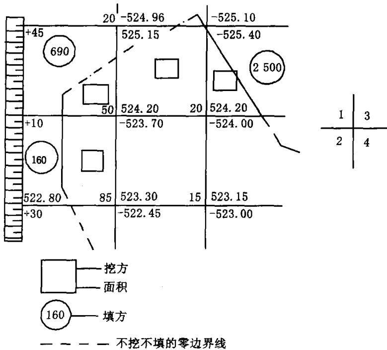  
图 13-25 土方工程统计图  
1——挖高，cm；2——填高，cm;3———现有平面的标高，m;4——设计平面的标高，m

在竖向平整工作中，测量部门的一项重要任务是按设计标高对矸石场表面整平进行测量检核。标定设计点的方法取决于基准点情况及地区条件。在矸石场初次平整中，宜用极坐标法进行标定，标定要素从平面图上量取，完工后要对平整的表面进行全面测量，计算所完成的土方量，并与设计要求进行校核。当表面沉降结束后进行二次平整，测量人员最后进行水准与边长测量。

## 三、外部排土场边坡的削缓和阶地化

露天矿外部排土场进行复垦时，必须使边坡绿化，为此要进行边坡削缓及阶地化工作。边坡削缓可从上而下或由下而上，用推土机或索斗铲进行施工，在边坡削缓工程中，测量人员需按间距20～30m标定横断面，在每一断面上要标定设计边坡上下的台肩和台脚点。

当自上而下地使边坡削缓时，需要增加占地面积 $\Delta S$ 。如果在地形图上已知矸石场边坡的轮廓线(实际和设计的)，那么， $\Delta S$ 为：

$$
\Delta S = 0 . 5 d _ { m } ( P _ { 1 } + P _ { 2 } )\tag{13-14}
$$

式中， $P _ { 1 } , P _ { 2 }$ 为削缓前、后矸石场边坡的周长；dm为边坡方向上宽度的平均增加量。 $; d _ { m }$

如果自上而下地削缓边坡，通常用索斗铲把岩石从边坡搬移到矸石场上，再用推土机或平土机对边坡进行最后的修整。这种方案与第一种方案相比，土方量要大几倍，但无须扩大废石场的占地面积，适用于无空地可占的条件下。可用垂直断面法计算土方量。

边坡削缓后，要研究边坡土壤的农业化学性质，或者在斜坡上覆盖一层适于植物生长的土壤。

边坡稳定性的提高不仅需要削缓，而且要进行阶地化。台阶地是一种水平的或倾角小于3°的平台，每一个台阶包括平台和边坡。边坡阶地化的参数包括：放缓角、台阶宽度和高 $3 ^ { \circ }$ 度、台阶的间距。设计中采用的地形图比例尺为 $1 : 5 0 0 ($ 坡面角 ${ > } 3 0 ^ { \circ } )$ 或1：1000(坡面角${ \leqslant } 3 0 ^ { \circ } )$ 。图13-26为矸石场边坡削缓的方案图。选择台阶平台之间的垂直距离时，要考虑到植树的连接。可用下式计算：

$$
h = ( l _ { 1 } - 2 a ) \tan \gamma\tag{13-15}
$$

式中，h为台阶高度 ${ \mathfrak { s l } } _ { 1 }$ 为树木间距，考虑到树冠的会合，可取 $1 0 \sim 1 2 ~ \textrm m ; a$ 为树苗至坡顶线与坡底线的距离，取1.5 m；γ为台阶坡面角。

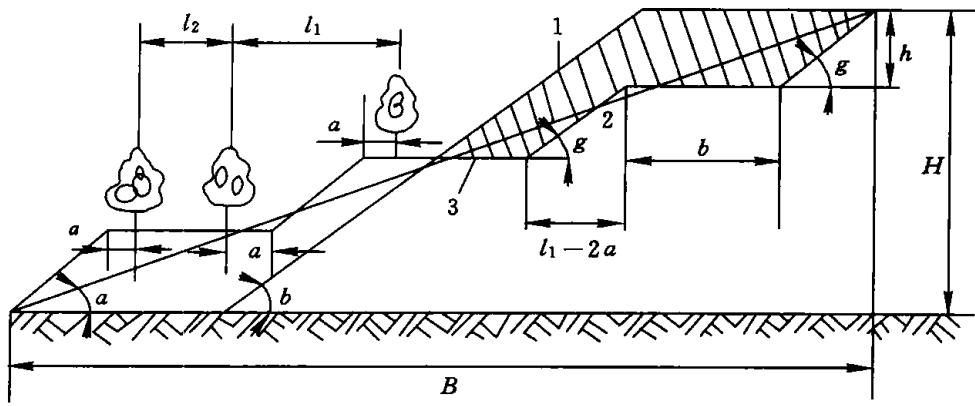  
图13-26 废石场边坡削缓的方案图  
1——废石场边坡；2——台阶的边坡；3——台阶的平台

台阶的数目为 $\scriptstyle { n = H / h , H }$ 为矸石场高度。如果n为分数，则按凑整原则取其整数。

已知 $H , h , \beta , \gamma$ 及 $b = l + 2 a$ ，就可用图解法确定边坡放缓的终止角 $\pmb { \alpha } \pmb { \beta } \pmb { \alpha }$ 值要符合边坡稳定的要求，通常由设计给出。确定α后，按 $B { = } H \cdot \cot \alpha$ 求算边坡宽度，并由此求得台阶的平均宽度 $b { = } [ B { - } ( l _ { 1 } { - } 2 \alpha ) n ] ( n { - } 1 )$

测量人员的任务是把边坡台阶化的设计标设在实地，在完成全部土方工程后绘制平面图、边坡横断面图及台阶平台的纵断面图。

## 第六节 复垦地区水工建筑物与道路施工的测量

## 一、水工建筑物设计、建设和维修时的测量工作

土地复垦与生态重建的目的不仅是为了恢复被破坏土地的生产效能和经济价值，而且也是为了改善生态环境。如果不采取抗侵蚀措施，土地复垦时所铺上的沃土就有可能被地表水流冲走，而使复垦区环境再次恶性化。因此，在复垦计划中必须包括修建专门的水利工程设施，使多余的水流汇集后流向河塘。

在设计及修建抗侵蚀水工建筑物之前，必须进行地形测量及工程勘察工作，要掌握汇水面积的大小和形式。

水工建筑物主要有排水沟、挡水堤坝和灌溉系统。根据汇水面积、降雨量、蒸发量、渗透量预计该地区的水量，进行水利工程设计，并沿工程建筑物的走向绘制必要的纵、横断面图。

排水沟的纵向坡度一般为 $3 ^ { \circ } \sim 4 ^ { \circ }$ ，最小不得低于 $0 . 5 ^ { \circ }$ ，并按水利学原理计算沟的断面积和形状。排水沟一般分主干渠和支渠，其形状为矩形或梯形。通常在等高距为 $0 . 5 { \sim } 1 . 0 \mathrm { ~ m }$ 的 $1 : 2 \ 0 0 0 { \sim } 1 : 1 0 \ 0 0 0$ 的地形图上选择沟的线路，然后把设计沟标设于实地。沟拐弯应尽量少并保证具有最大的曲率半径。在平坦地区，弯曲处最小允许半径 $R _ { \mathrm { m i n } } = 1 0 B$ ，在山区$R _ { \mathrm { m i n } } = 5 . 5 B _ { \mathrm { m a x } } ( B , B _ { \mathrm { m a x } }$ 为沟中通过正常水流量和最大水流量时的水面宽度)。施工时应标定排水沟的中心桩和开口桩，桩距一般为 $2 0 \textrm { m }$

在土地复垦区也可用挡水坝作为抗侵蚀水工建筑，它是一种长条状的土坝，可在地形图上根据实际条件进行设计。挡水坝分为湿斜坡面和干斜坡面，其倾角分别为 $\pmb { \alpha } _ { 1 }$ 和 $\alpha _ { 2 }$ (图13-27)。用斜线表示复垦区域，在其上侧面根据汇水方向修建一条挡水坝。利用 $\pi$ 体几何学中的标高投影法，根据湿斜坡面与干斜坡面的倾角，求得两平面的投影平均距为 $d _ { 1 }$ $= h _ { c } \cot \alpha _ { 1 } , d _ { 2 } = h _ { c } \cot \alpha _ { 2 } ( h _ { \cdot }$ 为等高线间距)，图13-27中 $h _ { c } = 2 . ~ 5 \mathrm { ~ m ~ }$ 。求两个平面与地形同名等高线的交点，将交点相连即得出挡水坝的坝底线（在该设计中，坝顶设计高程为149m)。这种堤坝既是挡水的，又是导水的；既能防止较低的复垦区域受到水流的侵蚀，又能把水流引导到某一指定的地方。

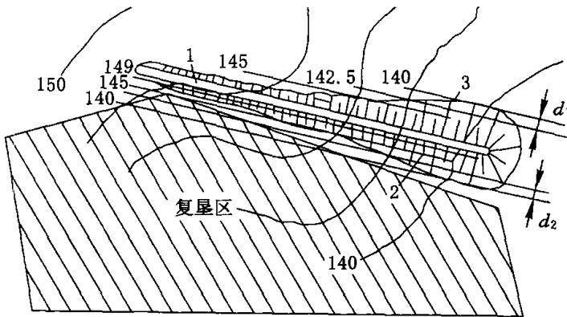  
图 13-27 防水堤坝轮廓线计算图  
1——堤坝脊部；2—干斜坡；3——湿斜坡

挡水坝的主要参数为高度、斜坡面坡度和坝脊宽度。测量人员的任务是：为设计提供基础资料、把设计标设于实地、检查施工质量及统计所完成的实际工作量。标定时，首先要敷设经纬仪及水准导线。然后从这些基准点出发，把堤坝的设计走向标设于实地，并用木桩固定，每隔100m设立里程桩并编号，其方法同线路水准测量。

与线路走向相垂直，要标设横断面。如图13-28所示，B为坝脊宽度，h为坝顶在该横断面上的高度， $1 / n _ { \mathfrak { I } }$ 和 $1 / n _ { 2 }$ 分别为堤坝两个斜坡面的坡度，1/m为地形的坡度。

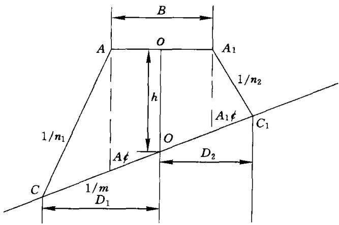  
图 13-28 堤坝横断面图

标定时，不仅要标出中心桩O，而且要标出边桩C和 $C _ { 1 }$ 。边桩与中心桩的距离 $D _ { ! }$ 和$D _ { 2 }$ 为：

$$
D _ { 1 } = \frac { 0 . 5 B + n _ { 1 } h } { 1 - \frac { n _ { 1 } } { m } }\tag{13-16}
$$

$$
D _ { 2 } = \frac { 0 . 5 B + n _ { z } h } { 1 + \frac { n _ { z } } { m } }\tag{13-17}
$$

为了取得复垦土地更高的效益，一般应在其上修建灌溉系统，灌溉系统可采用自流式、地下式和喷洒式三种方法。测量人员要将设计标设于实地并进行监督验收。

## 二、道路施工和维修中的测量工作

土地复垦区修建的道路，按其用途可分为三种，即 $\pi$ 区主要交通运输线的延续路干线；联结各土地利用区与干线的支线和用作行人来往的人行道。

设计道路网时，应经济合理地利用土地，考虑水流交叉与积雪等自然因素的影响，注意排水，并顾及各复垦区的边界范围、灌溉区的走向、农业附属物的边界等。干线道路等的选线包括图上选线、野外踏勘、实地定线、进行纵横剖面测量、计算挖填土方量等工作。建路时，测量人员应及时按设计进行标定，并不断对施工进行监督检查。在维修采动的道路时，以预计地表下沉值，实地圈出采动范围的边界，确定纵、横断面的现状，查明维修地段的路面结构，调查排水系统，查明积水处与水沟破坏情况等，为此编制维修道路的设计。采动区道路的大修要在地表移动过程终止后进行，在道路的维修地段建简便的临时绕车道。道路修建结束后要进行道路测量，绘制竣工图。移交时要验收路面的厚度、道路的纵横剖面、侧沟的断面和坡度、边坡的斜度、路中心线的位置、通车部分的宽度、路面的平整度等。在道路的两侧应植树绿化。

## 第十四章 微生物复垦技术

目前的矿区土地复垦手段中工程措施占的比重较大，工程费用往往对复垦成本起着决定性的作用，而借助生物技术，尤其是微生物来提高复垦水平和效益，降低复垦成本，可增强矿区土地复垦对改善矿区生态环境的作用，有效地推动矿区复垦手段向更高层次发展。

生物复垦是工程复垦的延续，是土地复垦过程中不可分割的一部分。生物复垦是利用生物措施，恢复土壤肥力与生物生产能力的活动，它是实现废弃土地农业复垦的关键环节，主要内容为土壤改良和植被恢复。微生物复垦是土壤改良技术的一种，利用生物进行治理和改良土壤在国外复垦中有较快的发展，特别是微生物肥料的研究已在复垦土地的培肥中得以工业化的应用，前景广阔。

## 一、微生物复垦的概念

微生物复垦技术就是利用微生物的接种优势，对复垦土壤进行综合治理与改良的一种措施。利用微生物复垦技术来培肥地力往往具有低成本、高效益的特点。除较成功地应用自生固氮菌、磷钾细菌肥料及复合菌肥技术以外，菌根技术已开始在矿区土壤的应用中取得较好的效果。

据估计，95%以上的高等植物与菌根真菌共生，这为我们的研究提供了广阔的空间。近30年来，菌根研究在国际上日益活跃。美国、法国、澳大利亚、日本及南美一些国家已开始将菌剂生产商品化，在农业、林业及园艺作物上应用。A.D.Robson等应用VA菌根接种赤桉河镰刀桉幼苗，用于煤矿废弃地复垦，取得了显著效益。怀俄明大学的威廉和舒曼教授对菌根在土地复垦中的应用，做了大量的实验和现场工作，总结了很多宝贵经验。中国农业大学、中国农业科学院、中科院南京土壤所等单位的研究人员在菌根对植物的影响方面已做了深入的研究，特别是很多室内实验已经成熟。北京矿冶研究总院在矿业上应用已做了一些探索，主要研究了粉煤灰作为土壤改良剂加入后，再接种菌根的效果。复垦土壤中接种菌根的效果，中国矿业大学也做了一些模拟实验。

## 二、微生物复垦的作用

微生物是自然界物质循环圈中必不可少的一个组成成员，它的种类、组成、数量及其演替都与土壤中的物质转化、植被的生长和繁育密切相关。矿区土壤的复垦同样离不开微生物的参与，有益微生物可通过多方面的作用加速复垦的进程，促进植物的生长发育。对于矿区复垦土壤，一方面经过机械对土层的剥离，扰动了土壤结构，微生物群落减少，同时也破坏了地下菌丝桥，土壤贫瘠，复垦难以顺利进行，而且复垦土壤的填充材料粉煤灰，其自身的养分含量很低，有效磷的含量更低，pH较高，也对植物的生长不利。若将微生物接种到复垦土壤中，可以改善其微环境，降低土壤pH值，增加植物对土壤有效养分的利用，是一种很好

的生物复垦措施。

微生物复垦技术就是利用微生物的接种优势，对复垦土壤进行综合治理与改良的一种措施。利用微生物复垦技术来培肥地力往往具有低成本、高效益的特点。除较成功地应用自生固氮菌、磷钾细菌肥料及复合菌肥技术以外，菌根技术已开始在矿区土壤的应用中取得较好的效果，美国、澳大利亚等国家都已取得较多的实践性应用成果，为矿区土地复垦提供了一项有效的技术手段。

## (一）微生物对植物利用土壤养分的作用

## 1. 微生物与植物磷素营养

养分缺乏是复垦土壤上植物不能正常生长的关键限制因素，而许多土壤微生物具有活化土壤潜在养分，增加土壤养分有效性的特性。磷素缺乏一直是世界范围内限制植物生长的主要因素，因此微生物对植物磷营养的作用也一直是人们关注的焦点。F.C.Gerretsen(1948)首先发现接种根际微生物具有促进植物生长和磷吸收的效应。此后，利用根际微生物对难溶性磷的溶解作用来促进植物生长和改善植物磷营养状况的研究得到广泛开展，而土壤中凡是对难溶性磷具有溶解能力的微生物均被称为解磷微生物。

大多数解磷微生物主要分布于植物的根际。解磷微生物种类繁多，包括细菌、真菌和放线菌。植物根际土壤中的解磷细菌主要是芽孢杆菌（Bacillus）和假单胞杆菌（Pseudo-monas)。例如，从田间棉花的根际分离出的111种解磷细菌中，Bacillus属占所有解磷细菌总数的 34%，主要包括 B. Brevis、B. Megaterium、B. sphaericus 和 B. licheniformis;Pseudo-monas 属占 17%，主要包括 P. aureofaciens、P. fluorescens 和 P. savastanoi。土壤中的解磷真菌数量较细菌少，但有研究认为解磷真菌对难溶性磷源(如磷酸钙或磷矿粉)的溶解作用可能比解磷细菌要强。具有解磷能力的土壤真菌主要为Penicilluim和Aspergillus属真菌。放线菌中的Streptomyces属也具有一定的解磷能力。前苏联和印度等国已成功地将“解磷细菌”作为“细菌肥料”，接种于番茄、甘蓝、马铃薯、甜菜、小麦、大麦、玉米、水稻、三叶草等植物上，并取得了一定的经济效益，充分发挥了微生物在活化土壤难溶性磷和对难溶性磷肥利用的作用。

微生物对土壤养分的吸收及活化具有一定的作用，其在生长繁殖过程中常常会产生一些代谢产物，并分泌到体外，促进土壤难溶性磷的转化，影响植物的生长和发育。解磷微生物的分泌物中可能包括有机酸、H+、氨基酸、维生素、植物生长调节物质、铁载体或各种胞外酶。解磷微生物的种类不同，其分泌物的组成和数量也不尽相同，对难溶性磷的转化和植物生长的影响机制也有所区别。许多解磷细菌，如假单孢杆菌、分枝杆菌、微球菌、芽胞杆菌等属的一些种和青霉、曲霉、镰孢等可通过分泌多元有机酸来促进土壤难溶性无机磷酸盐的溶解及植物对磷的吸收和利用。解磷微生物所释放的有机酸主要包括草酸、柠檬酸、丁酸、丙二酸、乳酸、丁二酸、苹果酸、葡萄糖酸、乙酸、延胡羧酸、己二酸和葡糖酮酸。有机酸的产生可能引起根际pH值的降低，从而有利于土壤中难溶性无机磷的溶解。解磷微生物所释放的一些有机酸能与土壤中的 $\mathrm { A l - P } , \mathrm { C a - P }$ 、和 $\mathrm { F e - P }$ 型的无机磷酸盐发生螯合作用，从而促进土壤中的无机态难溶性磷的释放。但解磷微生物分泌的有机酸能否真正有效地使土壤难溶性含磷化合物中的磷释放出来，提高植物的磷营养状况不仅取决于其分泌的数量，更与有机酸的种类有关。此外，有机酸对难溶性磷溶解能力的大小也与其环境条件和土壤的性状(如土壤类型、有机质含量、土壤的缓冲性大小、 $\mathrm { C a } ^ { 2 + }$ 的含量、磷的形态)有关，从而也影响植物的磷营养状况。菌根菌可通过改变菌丝际pH值和分泌有机酸活化和利用土壤中的难溶性无机磷酸盐。

## 2. 微生物与植物氮素营养

从需求量来说，植物体内的氮含量大约是磷的10倍。土壤中氮的形态以有机氮为主，有效性的矿质态氮的数量在很大程度上依赖于土壤有机态氮的矿化，有机态氮的矿化与土壤微生物活性大小有关。土壤中无机氮主要有铵态氮和硝态氮有两种形态，由于铵态氮很容易发生硝化作用，因而土壤中硝态氮有两种形态，由于铵态氮很容易发生硝化作用，因而土壤中的硝态氮的含量要比铵态氮大的多。铵态氮在土壤中易被吸附固定、移动性小；硝态氮在土壤中的移动性较强，可以通过质流为植物所吸收，而铵态氮的移动性较差，主要靠扩散为植物吸收。

以菌根为例，最早关于丛枝菌根真菌与土壤氮素关系的报道在1976年，Haines andBest 观察到在接种 Glomus mossese 的植物(Liquidambar styraciflua)的土壤中 NH+、NO3以及NO，的淋洗损失被延迟。他们只是简单地解释为菌根植物的根系比非菌根植物的根系要大，在计算氮平衡时没有考虑到菌根真菌。许多研究都表明，从枝菌根真菌对自然界中的氮循环起着重要的作用：一方面从枝菌根真菌通过改善植物的磷营养状况提高根瘤菌的固氮活性，促进豆科植物生长，增加固氮量；另一方面从枝菌根真菌加速土壤有机氮矿化，增加有效氮的数量；此外，菌根可以通过增加吸收面积和与土壤的接触位点增强对氮的吸收作用。

关于菌根菌丝直接吸收土壤氮素的作用，R.N.Ames等人早在1983年就通过15N标记试验证明，从枝菌根菌丝能够从根外数厘米远的土壤中吸收NH，并运输到宿主植物根中。并目从枝菌根真菌能增加植物从有机氮源中吸收铵态氮。由于土壤中氮素的移动性比磷钾等养分大得多，可以从较远的地方通过质流和扩散迁移到植物的根表，为根系直接吸收利用，加之菌根菌丝吸收氮素的能力相对于植物的需要量而言往往是微不足道的。

从枝菌根在改善植物营养物体内氮素营养方面的功能只有一半，即：它能够增加植物对氮的吸收但不能提高植物的含氮量。丛枝菌根真菌促进植物生长的机理也很难与其改善部分氮状况联系起来，因为在极端缺氮的条件下菌根真菌因为改善了磷营养状况使植物苗期生长量成倍增加，菌根植物的吸氮量也有大幅度提高，但植物含氮量却大幅度降低。这一方面反映出含磷量高低对植物苗期的生长的重要性远比含氮量大的多；另一方面也说明菌根真菌或植物根系吸收、运输氮的速率远低于菌根真菌吸收磷并促进植物生长的速率。

## 3. 微生物与植物钾素营养

在土壤风化程度高、固钾能力强、土壤干旱缺水造成钾的有效性降低及施肥比例长期严重失调的条件下，作物往往出现缺钾现象。微生物若能促进作物对钾的吸收和利用，则对植物生长将具有良好的作用。的确，在一些试验中，接种菌根菌提高了植物体内钾浓度，在提高植物吸磷量的同时也提高了植物吸钾量。在其他的一些试验中，菌根侵染显著增加了植物吸钾量，但是植物体内钾浓度未受影响，或由于生物稀释效应反而低于对照植物。菌根侵染后，改善了宿主植物的磷营养，促进根系的生长，增加根系吸收土壤养分的活性，延长根系吸收养分的时间，以及由于生物量的增加而导致的对钾吸收的间接作用都可能促进植物对钾的吸收总量，或提高植物钾浓度。几乎在所有关于钾效应的菌根试验中，都未能将菌丝对钾的直接吸收作用和通过根系引起的间接作用相区分。

菌根侵染提高植物钾浓度或吸钾总量的另一种可能机理是菌丝的直接吸收和运输作用。钾在土壤中的移动性虽比磷强得多，但在一般生长条件下，由于植物吸收钾的速率大于钾在土壤中的移动速率，因而往往在根际内仍能很快形成一个钾浓度亏缺区，从而限制了根系对钾的吸收。土壤供钾水平不能满足植物生长的需要时，菌丝伸展到钾亏缺区以外，吸收根系吸收不到的钾，并运输给植物，对改善植物的钾营养将有一定作用。

但是菌根对土壤钾素的直接吸收作用的贡献不应估计过高。因为一般情况下，菌丝所吸收和运输给宿主植物的绝对数量难以满足植物正常生长的需要。菌丝在上述试验中的吸钾作用，并未能使植物体钾浓度显著提高，相反，随着植物生长量的增加，由于生物稀释效应使地上部的钾浓度呈下降趋势。和磷相比，菌丝对钾的直接吸收和运输功能，对宿主植物钾营养的贡献是有限的。菌根真菌对植物钾营养的作用中，间接作用可能更为主要。

## （二）微生物对复垦土壤结构的改良作用

T. Edward and J. M. Bremner 提出土壤是由微团聚体 $( < 2 5 0 ~ \mu \mathrm { m }$ 直径)黏合成大团聚体 $c > 2 5 0 ~ \mu \mathrm { m }$ 直径)，并且生物团聚体内的结合要比团聚体之间的结合牢固得多。许多其他的淋溶土和软土也被发现含有这些尺度的大团聚体和微团聚体。J. M. Oades and A. G.Waters提出了关于淋溶土和软土的团聚体模型，认为团聚体植物主要由于有机物质的存在而变得稳定，并在模型中提出团聚体的类型有： $< 2 0 ~ \mu \mathrm { m } , 2 0 \sim 9 0 ~ \mu \mathrm { m } , 9 0 \sim 2 5 0 ~ \mu \mathrm { m }$ >250μm。不是所有的土壤都适合这个模型。变性土的不稳定大团聚体在水中直接分散成稳定的直径为20～35μm的微团聚体。主要由于氧化物存在而稳定的氧化土含有在水中很稳定的大团聚体，但是这种大团聚体在水中受到持续滚翻摇动或者超声波影响时会分散成直径<20 μm 的微团聚体。在 J. M.Oades and A.G. Waters 模型中，根(每克土含有 1 m 以上的根长)和菌丝(高达20m/g)存在于微团聚体之间的空隙中并使得大团聚体更稳定。因为微团聚体的空隙中存在的植物、微生物残片和细菌更小(有的甚至达到几微米)，并且它们能够通过它们细胞外的多聚糖促进微团聚体的稳定性。

微生物能够分泌出一些多糖类物质—球囊霉素，黏结分散的土粒，维持土壤的稳定性，改善土壤的团粒结构。近年来，菌根在土壤保持中的作用逐渐引起了菌根学家的关注，土壤保持是持续农业的基础，包含着减少土壤侵蚀、保持土壤肥力等的管理措施。成功的土壤保持措施通常可以通过维持和创造稳定的土壤团聚体结构得以实现。

## 1. 根和菌根对大团聚体的影响

在通过有机物质稳定的土壤中，稳定性取决于有机物质或者进人到土壤中的碳水化合物的数量、微生物量和土壤中的菌丝长度。而植物土壤中，大团聚体的稳定性主要受到植物根系和 VAM菌丝的影响。

根和菌根菌丝加上根系对大团聚体稳定性的相关作用能够通过在土壤中使用菌丝通过但不能使根通过的隔网分室培养方法得到证实。根系和VAM菌丝在土壤中形成一个广阔的菌丝网和细胞外分泌的多聚糖将微团聚体牢牢地固定，并且确保大团聚体完整，因此土壤结构不会在水中崩溃。而根系表面的黏土会保护根和菌丝不被其他微生物分解，但是一旦菌丝网被动物群或耕作破坏，根和菌丝死亡，大团聚体在水中就会瓦解；结壳的碎片以微团聚体的形式存在。大团聚体会随着根和菌丝的生长而很快地形成，但是也会很容易被耕作破坏，例如，大田中生长六个月的黑麦草会使得淋溶土中稳定大团聚体的百分含量从39%上升到78%；在多年牧场土壤中耕种了一年的西红柿中大团聚体的百分含量为58%，而同样的几种牧场土壤中的大团聚体的百分含量为90%。

## 2. VA 菌根真菌作用

W. A.Thomas等人认为洋葱根系比它们的 VAM菌丝更能稳定淤泥黏土大团聚体的稳定性，并且菌丝通过促进洋葱根系的生长间接地增强团聚体稳定性。但是，牧草地的淋溶土中大团聚体的稳定性与细根(直径为0.2\~1mm)长度和表面VAM菌丝的长度有直接的关系；稳定性与非常细的根(直径<0.2mm)长度没有直接的关系，但是与非常细的根外部的菌丝有间接的关系。细根和非常细的根对稳定性的不同作用可能是因为根系主要为非常细的根(直径<0.1 mm)的植物比根系主要为粗根(直径>0.5 mm)的植物形成的菌根少。

目前关于VA菌根根外菌丝的生长，哪些菌根种类是最有效的土壤团聚体稳定剂，某些菌根种类在一些土壤中是不是比其他种类更有效，菌根产生和稳定大团聚体的机理等了解尚少。现在的研究需要确定是否绝大部分的有效稳定剂都能产生更多的植物胶水、产生更持久或更黏的植物胶水、是通过疏水性黏合剂还是多价阳离子桥或者对黏土薄片有更强的静电引力黏结在一起、在土壤中持续更长的时间、与其他种类相比和一些植物种类、微生物或者动物的相互作用更好、使黏土颗粒定向移动使得它们排列更紧密、结合更坚固、能更快地侵入土壤、产生更多的根外菌丝或者产生更多的某一种菌丝。

菌根菌改善土壤结构主要基于以下机理：

黏结作用—菌根及其根外菌丝分泌的有机酸、酚酸等酸性物质能溶解草酸钙、碳酸钙等含高价阳离子的盐类，使其释放出高价阳离子，然后高价阳离子黏结土壤颗粒形成团聚体。

团聚作用菌根及其根外菌丝分泌的各种多糖类高分子聚合物也有团聚作用，它们的团聚功能来自这些聚合物的酚羟基、胺基和羧基。

吸附作用—菌丝吸收邻近土壤中的水分，土壤干燥后，分散的土壤颗粒就被菌丝分泌物多糖紧紧吸附，形成团聚体。

缠绕作用植物根系和菌根菌丝本身对土壤具有缠绕作用。

综上所述，菌根真菌侵染植物活细胞，产生的根外菌丝又可扩展到土壤中与土壤团聚体中微生物区系和土壤微域环境建立起一种密切的联系。因此菌根将土壤、植物、微生物联系起来，不仅将土壤中的矿质营养提供给植物，而且把寄主植物的碳水化合物提供给土壤和土壤生物体，在植物生产和土壤保持中起着重要的作用。

P.F.Peretto等利用原位技术证明受 VA菌根真菌侵染的植物根系分泌的多糖类物质有助于土壤大团聚体的形成。复垦土壤经过机械扰动，土壤团聚体结构受到破坏，且土壤构建时进行的机械作业，造成土壤紧实度增加。根外菌丝作为菌根真菌吸收土壤磷素的器官，其直径(2\~7μm)比植物根毛(通常 $> 1 0 ~ \mu \mathrm { m } )$ 要小，因此，在养分吸收方面菌丝具有其显著的优点，它极大增加了单位体积或单位质量的养分吸收面积，且菌丝能伸展到根毛不易进入的土壤孔隙(如土壤微团聚体和土壤有机质)或紧实土壤中吸收养分，因而更有利于养分的吸收。这对从高紧实度的土壤(如大型机械作业造成的紧实土壤、多年耕作形成的犁底层或新垦荒坡地的底层土等)或质地比较黏重的土壤中植物的磷吸收更具有重要的意义。

土壤水稳性团聚体的形成与菌根菌丝的缠绕和根系真菌菌丝的分泌物都有关系。据报道，玉米的根分泌物(主要是大分子多糖类物质）能增加大团聚体的稳定性。R.B.Aspiras等人的试验结果证明，菌丝本身缠绕的团聚体的稳定性比菌丝分泌的大分子多糖类物质黏结的团聚体的稳定性弱。据J.P.Martin的试验结果估计，在土壤真菌形成的团聚体中50%是靠菌丝的直接缠绕作用，另50%的作用靠菌丝分泌物黏结。

然而他们的试验结果是针对外生菌根真菌菌丝和腐生真菌菌丝而言，对于丛枝菌根真菌的菌丝对土壤团聚体的作用机制是否与外生菌根真菌菌丝和腐生真菌菌丝相同，尚不清楚。

## (三）微生物对增强植物对重金属抗性的作用

土壤微生物对重金属离子的生物固持有关键性的作用。土壤微生物中的菌根真菌则具有能为土体和植物根系提供直接联系的特殊作用。复垦土壤中存在着重金属污染的因素，在一些重金属污染的土壤上发现有某些具有抵抗重金属毒害的菌根植物的存在，而且这些植物生长良好。一些外生菌根在锌、镉等重金属含量过高的土壤上表现出明显的抗性。如在锌含量高的土壤上，外生菌根能降低植物地上部锌的含量。污染区大多数植被是能够形成丛枝菌根的植物种类，因此，研究丛枝菌根在重金属污染土壤中对植物抗性的影响及机制就显得尤为重要。

菌根的大量外生菌丝对过量重金属进入植物有机械屏障作用，使重金属不能向植物体转移。在外生菌根上这种作用非常明显，这与外生菌根真菌具有菌丝套、哈蒂氏网这些特殊结构有关。与不接种的对照相比，菌根植物根系中含锌量高的事实，表明了菌根真菌可以阻滞锌于菌丝中。

对于丛枝菌根真菌来说，在根内有可能提供结合重金属的位点，使重金属积聚于真菌中。当土壤中的重金属达到毒害水平时，菌根真菌可以通过分泌某些物质，结合过量的重金属元素于菌根中，减少重金属向地上部的转移而达到解毒作用。T.A.Dueck等认为菌根缓解锌毒害可能是通过真菌表面的吸附作用，或是外生菌丝产生多糖分泌物质的结合作用而降低其毒性。El-Kherbawy等也认为重金属在真菌和土壤界面上可能被吸附或螯合，因而菌根菌的侵染加强了宿主植物毒害重金属由根系向地上部转移的屏障作用。

K.Turnau等的研究发现，聚磷酸盐可以结合镉、钛和硼。聚磷酸盐颗粒对潜在的毒害重金属的结合作用被称为“过滤”机制。他们通过能谱技术进行元素的定位测定，初步获得了丛枝菌根真菌中结合重金属的定性化证据。菌根真菌除了直接对植物抵抗或免受过量重金属的毒害起作用外，还可通过真菌侵染宿主植物根系后改变根系生理学、形态学及根际环境等间接作用达到缓解或免除重金属对植物的毒害的效果。

尽管诸多研究结果很不一致，重金属污染条件下从枝菌根对宿主植物生长及重金属耐性的积极作用仍是客观存在的。归结有关菌根与重金属关系的研究报道，菌根植物对土壤重金属污染的适应性机制可以分为菌根的直接作用和间接作用：

## 1. 直接作用

## （1）真菌结构的固持和屏障作用

菌根外生菌丝对过量重金属进入菌根有机械屏障作用，在外生菌根上这种作用非常明显。这与外生菌根真菌具有菌丝套、哈氏网这些特殊结构有关。J.V.Colpaert等人研究发现，与不接种的对照相比，菌根植物根系中锌含量明显较高，表明菌根真菌可以将锌阻滞于根部。H.J. Denny 和 D. A. Wilkins 发现 Hartig 网和菌丝套中锌主要存在于真菌菌丝细胞壁和细胞间隙中。菌套对重金属具有过滤效应，利用EELS技术(电子能谱)研究发现，重金属主要被固持于电负性的菌丝细胞壁，在菌套外层显示最高浓度，而在哈蒂氏网最低。

对于丛枝菌根真菌来说，由于真菌菌丝间无横隔，也不具备外生菌根所具有的哈氏网和菌丝套，因此将重金属阻滞于外生菌丝内的作用很小。但是，丛枝菌根真菌在根内有可能提供结合重金属的位点，使重金属积聚于真菌中。当土壤中的重金属达到毒害水平时，菌根真菌可以通过分泌某些物质结合过量的重金属元素于菌根中，减少重金属向地上部的转移而达到解毒作用。T.A.Dueck等认为菌根缓解锌毒害可能是通过真菌表面的吸附作用，或是外生菌丝产生多糖分泌物质的结合作用而降低其毒性。El-Kherbawy等也认为重金属在真菌和土壤界面上可能被吸附或螯合。有研究表明菌根根系中游离氨基酸发生变化，基性氨基酸的含量增加，这些基性氨基酸的增加也可能和重金属结合而达到阻滞重金属由根系向地上部转移的作用，B.D. Dehn和H.Schuepp提出了真菌中具有半胱氨酸配位体，从而对过量的锌和镉起螯合作用，形成一类被称为“金属硫因”类结合物质，这种作用的提出是鉴于在菌根植物根系中检测出具有硫基结构的色氨酸。硫基结构的色氨酸在真菌细胞壁或基质界面上能结合重金属，因而菌根菌的侵染加强了宿主植物毒害重金属由根系向地上部转移的屏障作用。

## (2)“过滤”机制

K.Turnau等人的研究发现，聚磷酸盐可以结合镉、钛和硼。聚磷酸盐颗粒对潜在毒害重金属的结合作用被称为“过滤”机制。他们通过能谱技术进行元素的定位测定，初步获得了丛枝菌根真菌中结合重金属的定性化证据。研究从镉污染土壤上获取的Pteridium aquilinum（L.)菌根植物根系元素分布表明，大多数的镉位于真菌细胞质中，并且和含有硫与氮的聚磷酸盐颗粒结合在一起，同时有铝、铁、钛和硼等元素的存在。聚磷酸盐颗粒形成于外生菌丝的顶端并且是通过细胞质流的方式运输的，业已发现能与聚磷酸盐颗粒结合的元素有铁、锰、硫、镁、氮、铝和氯等。然而，D.A.Orlovich和A.E. Ashford却认为外生菌根真菌Pisolithus tinctorius里的聚磷酸盐颗粒是在样品处理过程中造成的假象。他们对冷冻的菌丝进行显微分析表明，液泡里只有可溶态的聚磷酸盐，而聚磷酸盐颗粒是在经过一些处理后才形成的。这说明聚磷酸盐颗粒结合重金属的可能性很小，而真菌菌丝中高氮和硫更能表明某些蛋白质具有这种功能在镉毒害的情况下会形成植物螯合物、富含色氨酸的多肤类物质可能是一种解毒的机制，但还缺乏这些“金属硫因”物质的直接测定方法及特性的描述。

## 2. 间接作用

在直接作用之外，菌根真菌还可通过改变宿主植物根系生理学、形态学及根际环境等间接作用缓解或免除重金属对植物的毒害。

## （1）改变根际微域环境理化性状

与非菌根植物相比，接种菌根菌后，菌根植物能明显地缓解锰的毒害，植物体内锰的含量显著降低。究其原因，主要是菌根的形成改变了根际微生物群落的组成。在玉米菌根植物的根际还原锰的微生物减少，而在三叶草菌根植物根际氧化锰的微生物增加，结果使得菌根际Mn²+向Mn转化，锰的有效性显著降低，从而使植物减少了对锰的吸收量而避免其毒害作用。

一些金属元素的活性与土壤pH值关系密切，菌根生理活动对根际pH值的些微改变可能影响植物对重金属的吸收。X.L.Li和P.Christie利用尼龙网分室装置研究发现，在锌污染条件下，菌根真菌侵染显著降低了宿主植物红三叶草植株体内的Zn浓度，菌丝生长室土壤溶液pH较对照(未接种处理)高0.2个单位左右，同时接种处理土壤溶液中Zn浓度相对较低，随施锌水平升高这种趋势愈加明显。作者提出，菌根在锌吸收对宿土植物的保护效应可能与土壤溶液 pH变化导致 Zn的溶解度变化或者 Zn在根外菌丝体中的固定相关。

## (2) 改变根系形态

菌根菌的侵染也会使宿主植物的根系生物量、根长等发生变化，从而影响重金属的吸收和转移，B.Ricken和W.Hofner在锌、镉和镍污染的土壤上接种菌根菌后，发现苜蓿体内重金属由根系向地上部的转移量增加，而在燕麦体内重金属由根系向地上部的转移量明显降低，他们认为，这是因为菌根菌的侵染使苜蓿的根变短，而燕麦的根长增加引起的。由于燕麦菌根植物根长的增加，使根细胞壁表面积也随之增大，从而对重金属的结合能力也增强，这样就减少了重金属由根系向地上部的转移。

## (3)改变宿主植物养分状况

在重金属污染且非极度缺磷的情况下，菌根的形成会显著促进植物对磷的吸收。与未接种的植物相比，菌根植物体内磷的含量能显著提高，磷营养水平的改善使植物的生物量也显著增加。因此，很可能由于生物稀释效应的作用使菌根植物体内重金属含量降低，从而减轻重金属毒害作用。陶红群和熊礼明等试验均证实菌根能促进植物的生长导致生物稀释效应降低植物体内重金属元素的含量，从而减缓锌、镉的毒害作用。

概括起来，丛枝菌根在植物抵御重金属毒害过程中，既有直接作用又有间接作用。但是到目前为止，对于直接作用尚缺乏足够有力的证据，对于菌根植物根系形态学和生理学等的改变对抵御金属毒害的意义还不十分清楚。

## (四）微生物对植物抗逆性的作用

由于复垦土壤是经过机械扰动后重新构建的新土壤结构，其利用的填充材料及开采所引起的生态环境都不可避免受到破坏，存在许多不利于生物生活的逆境条件，如土壤颜色较暗，吸收足够的太阳辐射能量，导致地温较高，不利于出苗，且昼夜温差大，对植物生长不利。复垦土壤中的旱涝、盐渍及病虫害问题，也是复垦工作需要解决的。

## 1. 从枝菌根真菌对植物水分代谢的影响

从枝菌根真菌的菌丝对水分的吸收利用是十分显著的，能够提高植物对于旱胁迫的抵抗能力。刘润进报道丛枝菌根使中国樱桃叶片气孔传导力和蒸腾速率增加，萎蔫点降低。无论在正常供水、干旱逆境还是萎蔫点状态下，湖北海棠菌根苗的叶水势、气孔阻力、叶片脯氨酸含量和萎蔫点均显著低于非菌根化苗，供水后恢复快，有利于植物的抗旱；汪洪钢计算出不同含水量的砂培条件下，菌根化植物制造一克于物重所消耗的水分都是未接种植株的一半；林先贵等认为土壤水分长期处于亏缺状态虽不利于植物生长，但对菌根侵染率和菌类发育影响不大，接种菌根真菌能够提高植物的抗旱能力。生理干旱是盐胁迫下植物生长受到抑制的原因之一。Poss等报道，在三个盐渍水平下VA菌根真菌显著提高了番茄木质部的水势。他们认为VA菌根提高植物耐盐能力的机理除了与改善磷营养条件外，提高植株水势也是很重要的。G.Berta等发现，菌根形成过程中根系分生组织活性受到抑制，导致了不定根和大侧根数量增加。R.Gupta等认为菌根侵染改变植物根系形态，使不定根和侧根数量增加，从而增加植物吸水。

在正常供水或土壤干旱情况下，从干重、株高和页面积、光合速率等反映植物生长状况的形态和生理指标来看，接种3个不同的菌种提高了玉米的光合速率，促进了玉米植株的生长，植物对干旱的初始反应是根部产生ABA诱导气孔关闭，以减少蒸腾。从枝菌根真菌侵染可以使植物气孔关闭的时间推迟。Allen报道，于旱处理的非菌根小麦在叶片水势达到一1.8MPa时气孔开始关闭，处理4天后全部关闭；而接种G.fasciculatum的植株则在叶片水势下降到一2.2.\~一2.7MPa时，气孔才开始关闭；处理后67天仍能保持一定的膨压和蒸腾量。这对于在胁迫条件下维持光合作用的正常进行是十分重要的。由于菌根植物的代谢活性强，因而其叶片蒸腾速率、根系水分传导力高，气孔阻力和叶片水势低。这就使得菌根植物的耗水量通常大于非菌根植物，在控制条件下很容易观察到接种丛枝菌根真菌的植物消耗土壤水分的速率要比不接种的植株快的现象。同时菌根植物经干旱处理再复水后植株膨压的恢复速率比非菌根植株快。

在土壤有效磷含量低的情况下，菌根真菌促进植物生长的效应大于消耗水分的效应，菌根植物的水分利用效率一般都要高于非菌根植物，并且在土壤干旱条件下菌根真菌提高植物水分利用效率的效应远大于正常供水条件下的。不同丛枝菌根真菌或菌株改善植物水分状况和提高耐旱性的效应是不同的。在干旱条件下，植物达到永久凋萎系数重新供水后，不同菌根真菌一植物共生体的恢复速率相差很大。

从枝菌根真菌改善植物水分状况、增强植物耐旱性的机理尚不十分清楚。从理论上来说，菌根菌丝直接吸收土壤水分的作用肯定是存在的。早期的试验试图通过给根系使用杀真菌剂后测定其水分传导力的变化加以验证，如果根内菌丝显著地参与水分转运，那么，杀菌剂的使用就可以改变水分传导力。然而，试验结果表明杀菌剂并没有改变菌根的水分传导力。很多试验结果支持从枝菌根真菌直接参与水分吸收和转运的说法，一些研究者则认为菌丝不可能吸收转运足够地水分以改变地上部的水分状况。

接种从枝菌根真菌能够降低植物的萎蔫系数，植株永久凋萎系数和恢复时间与丛枝菌根真菌菌丝数量和菌根表面菌丝着生点数呈显著相关性。这可能是因为在土壤于旱的过程中，菌根菌丝可以进入根系无法进入的细小的土壤空隙中吸收毛细管水。J.H.Graham等认为，尽管在一定条件下施磷肥能在一定程度上部分改善植物的水分状况，然而施磷肥并不能降低萎蔫点，更不能代替菌根的作用。Ruiz-Lozano and Azcon采用上下两层的两室根箱，上层萎根室施加干旱处理，当植株受旱时给距离根表10cm的菌丝生长室中供水，结果发现菌根植物与非菌根植物的磷营养状况没有显著差别，但菌根植物的CO2同化速率、水 $\mathrm { C O _ { 2 } }$ 分利用效率、光合效率、气孔导度、蒸腾速率等指标均比非菌根植物有所改善，植物的含水量也高干非菌根植物。这些结果说明菌丝直接吸收的水分与植物耐水分胁迫能力可能存在某些联系，至少在水分胁迫下菌根菌丝吸收的水分能够使植物维持一定的膨压、光合作用和一定量的生长或者延长植物的生命。

多数研究结论认为，从枝菌根直菌改善植物水分状况的原因是菌根真菌改善植物磷营养状况的间接作用的结果。例如，增加磷营养能够提高叶片气孔导度和蒸腾作用，菌根真菌提高气孔导度和蒸腾作用与叶片高磷浓度相关，改善磷营养状况使植物根系活力增强，吸收水分能力和导水率得到改善；菌根真菌使植物根系生长量增加，在土壤干旱条件下，NO³⁻在 $\mathrm { N O } ^ { 3 \cdot }$ 土壤中的扩散速率的降低，潜在缺氮亦成为植物生长的限制因素。在这种情况下丛枝菌根真菌不仅显著改善植株磷营养状况，而目还显著改善植株氮的吸收和氮的代谢，从而提高植物的生长量。

接种从枝菌根真菌能够提高植物净光合作用，并诱导光合作用产物向根细胞分配，在干旱条件下丛枝菌根真菌同样显著增加可溶性糖在植物根细胞中的积累。干旱胁迫的酥油草在叶鞘中积累葡萄糖和果糖，这些可溶性糖的积累使细胞渗透势降低有利于吸收水分，而丛枝菌根真菌由于调节了叶片和根系细胞的渗透势而使酥油草更加适应干旱胁迫的环境，因此丛枝菌根真菌提高植物耐旱性的机理在很大程度上是由菌根真菌与植物间的这种共生关系的特征所决定的。

水分胁迫下植物体内一些与耐旱性有关的酶活性降低，而接种丛枝菌根真菌则可以提高这些酶的活性，Ruiz-Lozano等人观察到在正常供水条件下，接种菌根真菌处理与对照植株地上部的SOD酶活性无显著差异，但接种处理的根内增加了16%～18%；干旱条件下对照地上部的 SOD 酶活性增加 17%，而接种 G. desticola 和 G. mosseae 的体内则分别增加93%和128%，而且这些变化与植物磷营养无关。

干旱条件下丛枝菌根真菌及植株从干旱逆境恢复过程中，气孔传导力及蒸腾速率的提高都与内源激素平衡的改变有关。植物在感受到土壤干旱的过程中能够产生ABA信号，调节叶片的气孔开度。越来越多的研究证实丛枝菌根真菌有可能通过改变植物内源激素平衡状况，尤其是提高细胞分裂素的含量，影响到叶片气孔开度和气孔阻力。

土壤干旱条件下从枝菌根真菌改善植物水分状况的结论已经公认，但是对于其机理的认识并不十分一致。前人的工作可以归纳为以下几个方面：第一，菌丝直接吸水，即通过根外菌丝在土壤中延伸和穿入土壤团粒的细微孔隙中、扩大与土壤的接触面积而直接吸收根系无法得到的水分，但这部分水对植物水分代谢的贡献可能是很小的；第二，菌丝为水分运输提供了一条低阻力的通道，使水分直接进入皮层细胞；第三，通过提高植物的净光合作用增加叶片和根系细胞可溶性碳水化合物，如可溶性糖、游离氨基酸等物质的浓度，使细胞渗透势提高，从而有利于根系的保持和获得水分；第四，通过增加根长和根系生长深度，提高根系对水分的吸收；第五，改善植物氮、磷营养状况。

## 2. 丛枝菌根真菌与耐盐性

许多研究都发现盐渍化土壤中存在着从枝菌根真菌，种类也十分丰富。土壤含盐量，特别是 $\mathrm { N a ^ { + } }$ 含量是影响盐渍土中从枝菌根真菌数量的主要因素。C. K. Kim 和 D.J. Weber 调查了位于美国Utah干盐湖(Playalakes)周围及中心地带盐生植物丛枝菌根真菌及根际孢子的数量。他们发现土壤中 $\mathrm { N a } ^ { + }$ 含量在 $1 5 3 \sim 1 ~ 6 0 0 ~ \mu \mathrm { g / g }$ 范围内，该地区优势植物种—盐草(Distichlis spicata)上的丛枝菌根真菌侵染率和孢子数量与土壤 $\mathrm { N a ^ { + } }$ 含量成负相关关系；当 $\mathrm { N a ~ } ^ { + }$ 含量达到3131 $\mu \mathbf { g } / \mathbf { g }$ 时，就观察不到丛枝菌根真菌侵染了。而在该地区灌溉条件好的土壤(含 $\mathrm { N a ^ { + } }$ 为 $1 0 \sim 3 2 ~ \mu \mathbf { g } / \mathbf { g } )$ 上生长的植物种类较多，丛枝菌根真菌的孢子数量和菌根琴燃料舱都很高(最高可达到80%)，并且二者与土壤 ${ \ N } _ { \mathfrak { a } } { ^ { + } }$ 含量无相关性。

许多现象都表明，在盐胁迫条件下接种丛枝菌根真菌提高了植物的生长量。A.J.R.Guttay发现菌根真菌促进糖槭树在盐渍土壤上的生长。M. C. Hirrel等人首先证实在NaCl 胁迫下接种 Glomus fasciculatus 和 Gigasporec margarita 两种丛枝菌根真菌对洋葱和辣椒有促进作用。以后的十余年里，相继在盐生植物如盐草、银胶菊、羊茅，非盐生植物如洋葱、柑橘、番茄、黄瓜等植物上都获得了类似的结果。这些研究的共同之处在于：随着土壤种$\mathrm { N a C l }$ 含量增加，菌根化和非菌根化株产量均呈递减趋势。在同一NaCl水平下，菌根植物生物产量显著高于非菌根植物的。从不同植物、不同盐水平下接种丛枝菌根真菌的效应来看，丛枝菌根真菌促进植物生长的效应随着土壤盐分含量提高而增加。

从植物生理学角度上已经证实，盐害对植物的伤害机理主要是离子毒害、渗透胁迫和营养亏缺。根据菌根的特点，丛枝菌根真菌提高植物耐盐性的机理可以归纳为以下两个方面：第一，直接作用：丛枝菌根真菌增加了植株磷等矿质营养元素的含量，改善了盐胁迫引起的 $\textcircled { 6 }$ 营养亏缺；菌根菌丝增加植株对水分的吸收，缓解了生理性干旱；改变植物体内离子平衡，降低Na+和Cl的含量或相对比例，减轻质膜和酶损伤程度，菌根真菌侵染改变了碳水化合物 $\mathrm { N a ^ { + } }$ $\mathrm { C l } ^ { \cdots }$ 在植物体内的分配，增加了根系内的碳水化合物的分配量，使根系可溶性糖含量增加，从而提高了根系的渗透调节能力。第二，间接作用：改变植物体内的激素平衡；菌根菌侵染改变植物的根系形态或增强植物根系活力，促进根系吸收水分。菌根真菌提高植物耐盐性的直接机理不是唯一的，但改善磷营养状况是其主导机理。也就是说当植物处在磷缺乏状态下时，菌根真菌改善植物磷营养的作用对于促进植物在盐胁迫条件下的生长起着主导作用；当植物体内磷营养状况处于临界状态时，其他机理就可能发挥出明显的效应了。

## 3. 菌根对植物受温度胁迫的影响

菌根真菌可能对土壤温度较高的环境中植物的生长有重要影响，同时还会分别影响植物和菌根共生体，或者对两者都有影响，使得它们能够特别的适应一个特定的高温环境。因为植物在高温环境中会遇到多种环境限制因素，使得碳的固定和生物量积聚都受到限制，而菌根真菌能够促进植物对营养的获得。研究发现菌根可增强植物对高温的抗性。Max发现P. tinctorius 真菌能耐高温，而 E. calospora 也能够在较高温度时促进植株的生长。Max和 Bryan 发现在植株幼苗(P. taeda)上接种 Pisolith 外生菌根菌，在 $4 5 \ \mathrm { ~ \textdegree C }$ 时幼苗生长较好，而无该菌时，幼苗在 $4 0 ~ \mathrm { { ^ \circ C } }$ 就不能生长。

菌根侵染可增强植物对低温的抵抗能力。赵士杰等发现，接种丛枝菌根菌的韭菜，在低温处理下，GlomusMosseae接种的韭菜比未接种的对照生物量高，菌根化植株在低温下细胞膜受害程度较轻，其相对电导率的增加也较小，表明AM能增强植株耐低温的能力。

## 4. 植物—菌根共生体在多种胁迫极端环境中的共生

Rebecca Bunn 和 Catherine Zabinsi 发现，美国黄石国家公园的地热土壤 pH 值范围广泛，根围环境温度高达 $5 7 \ \textrm { ‰}$ ，他们就在这种特殊的环境中研究植物生长和菌根共生体在极端生态环境中的植被重建的潜力。他们在温室中使用这些地热土壤中的酸性土(pH值为3.5)、中性土(pH 值为 6.5)和碱性土(pH 值为9.5)研究了菌根真菌对 Mimulus guttatus(黄石公园中的一种植物)适应特殊环境的作用；同时还通过比较不添加菌根真菌、添加分离自地热酸性土的菌根真菌、地热碱性土的菌根真菌和非地热中性土的菌根真菌对植物的作用来分析对植物抗极端环境作用的影响。他们以植物花期时间和花的总数作为植物适应性的指标，在62天的花期试验后发现菌根真菌来源和土壤 $\mathrm { p H }$ 值单独都对花期时间和花的总数没有显著影响，但是菌根真菌来源和pH值联合作用影响了花的总数。接种地热土分离得到的菌根真菌的 Mimulus guttatus 在土壤 pH 值为 3.5 和 9.5 时比 $\mathrm { p H }$ 值为6.5 时开花更多；相反，接种来自非地热中性土菌根真菌的 Mimulus guttatus 在 pH 值为 6.5 时比 $\mathsf { p H }$ 值为3.5和9.5的开花都多。这些数据表明分离自极端环境的菌根真菌更有助于植物在极端状况下的生长，但是对生长在中性土壤中的植物没有明显帮助，

## 三、微生物在土地复垦与生态重建中的应用

工业采矿和选矿过程中会产生大量的尾矿，这些大面积废弃的矿渣地面临着复垦的问题。但是由于这些粗矿渣的持水量极低，缺乏有机质和各种植物生长所必需的养分，致使复垦和土地绿化非常困难。单纯地投入高肥力，栽植多种植物也难以形成良好的植被以建立长期的植物群落。R. K. Noyd 等成功地利用丛枝菌根真菌 Glomus intraradices 和 Glomusclaroideum接种到牧草上，并辅以堆肥，在矿渣地上形成了良好的植被，这说明已建立起一个持久的当地草类群落，基本上达到了复垦的目的。施用堆肥将会增加微生物生物量及细菌和真菌群落，从而提高微生物活性。在退化土壤复垦过程中，丛枝菌根真菌有重要作用，它能缓解或免受高浓度重金属对植物的毒害以及一定程度上提高植物营养状况，尤其是磷。然而，这种共生关系在很大程度上将依赖于丛枝菌根真菌在重金属过量的情况下对生态环境的适应程度。分离和筛选对逆境适应性强的共生体，无论是在理论上还是在实践中都是本领域中的核心问题。

由于在工程开采过程中移走了正在生长的植株，剥离了表土，土层被扰动，因而在复垦时菌根真菌及其他一些微生物群落的数量及种类都明显减少，不仅影响了草本、灌木及一些杂草植被的建植，也影响了整个生态群落的发展。当丛枝菌根易于被引进矿区土壤时，复垦工作就会变得相对更为容易。然而，由于丛枝菌根菌尚不能进行纯培养，目前还难以实施大规模田间接种，如此大量有活性的菌根真菌接种剂的获得必须依靠丛枝菌根真菌群落的生物多样性及其自然适应能力，而不同的菌种其适应环境的能力及功能又不同。复垦土壤中真菌的种类和数量不同，与土壤及种植的宿主种类有关，且丛枝菌根真菌孢子的基因型差异与矿区土壤的理化性状相关。A.B.Gould对植株幼苗期的研究表明，在刚开始复垦后1～2年内，复垦土壤中的菌根真菌孢子仅几种，而随着复垦时间的延长，出现一些较大的孢子，且这些种类的孢子数量迅速增加，随后复垦土壤中真菌的种类增加速率变慢，5年内呈现出不规则的波动趋势，最后孢子种类稳定至10种。在复垦2年后，真菌的优势种、多样性及平均数都相对稳定下来。因而在矿区复垦土壤上可以有选择地接种多种菌种，持续地维持生态系统的稳定。

矿区资源开采时，表土被剥离而堆放在一处，直至复垦时被重新利用。许多研究表明，这种方式对土壤中的微生物及土壤理化性状是有害的。表土堆放减少了生物的有效调节过程，如对土壤团聚体的形成及微团聚体组成的影响，减少了土壤中菌根真菌的密度。M.Rives等发现表层土壤堆放15个月后，菌根菌的侵染势就已明显降低，3年后其侵染势已相当微弱。所以应该边开采边复垦，缩短表土堆放时间，这样既开采了能源，又使复垦土壤得到合理利用，保证复垦工程进入良性循环的轨道。

综上所述，菌根及其他一些微生物对复垦土壤改良具有重要作用，它可以克服工程复垦所造成的不利影响，促进植被的恢复，维持生态系统的稳定，有利于工农业的持续发展。因此，微生物复垦技术，尤其是利用丛枝菌根来进行复垦治理，具有广阔的应用前景。在应用时应结合矿区的自然地理及气候状况，筛选出当地的优势菌种，在进一步明确菌根功能的情况下，充分发挥微生物的生物多样性特性，接种到大田，种植当地的菌根植物，探讨菌根对复垦土壤的作用及其生态学意义，是微生物复垦技术的一个关键任务。

## 参考文献

〔1〕安太堡露天煤矿土地复垦协作组．黄土高原地区露天煤矿土地复垦研究论文集(第一集)[M]. 北京：中国科学技术出版社，1995.

[2〕安志装，陈同斌，雷梅.蜈蚣草耐铅、铜、锌毒性和修复能力的研究[J].生态学报，2003，23(12):2594-2598.

[3〕白中科，胡振华．露天煤矿排土场人为加速侵蚀及分类研究[J]. 土壤侵蚀与水土保持学报,1998,4(1)：34-40.

〔4〕白中科，左寻，郭青霞，等．大型露天煤矿土地复垦规划案例研究[J].水土保持学报，2001, 15(4):118-121.

[5〕边馥芩.地理信息系统原理和方法[M].北京：测绘出版社，1996.

[6〕卞正富，翟广中.矿区土地复垦规划的理论与实践[M].北京：煤炭工业出版社，1996.

[7〕蔡昆争.人工神经网络在农业中的应用[J]. 农业系统科学与综合研究，2001，17(1)：54-56.

[8〕曹中初，孙苏南．CA与GIS的集成用于地理信息的动态模拟和建模[J].测绘通报，1999,(11):7-9.

[9〕常克章.塌陷区回填煤矸石复垦[J].煤矿环境保护，2000，14(6)：58-59.

[10〕陈怀满.土壤一植物系统中的重金属污染[M].北京：科技出版社，1996.

[11〕陈建春． Visual C++开发 GIS 系统———实例剖析[M].北京：电子工业出版社，2000.

[12〕陈建设，鲍宏波．采煤矿区土地复垦工艺探究[J]. 资源产业，2002，4(5)：25-27.

[13〕陈军，陈尚超.用非第一范式表达GIS时态属性数据[J].武汉测绘科技大学学报，1995,20(1):12-17.

〔14〕陈龙乾.矿区土地演变监测与可持续利用研究[M].徐州：中国矿业大学出版社，2003.

〔15〕陈世宝，朱永官.不同含磷化合物对中国芥菜(Brassica Oleracea)铅吸收特性的影响[J].环境科学学报，2004,24(4):707-712.

[16〕陈晓峰.基于地理信息系统的数字环境模型研究[J].遥感学报，1998,2(4):305-309.

[17〕陈新燕.我国矿产资源现状研究及保护对策[J].矿产保护与利用，2005(1)：6-8.

[18〕陈志良，仇荣亮，张景书，等.重金属污染土壤的修复技术J].工程与技术，2001(8)：17-19.

[19〕成枢.岩层与地表移动数值分析新方法[M].徐州：中国矿业大学出版社，1998.

[20〕楚泽涵，李艳华.矿产资源开发和生态环境问题[J].古地理学报，2003，5(4)：508-516.

[21〕丛艳国，魏立华.土壤环境重金属污染物来源的现状分析[J].现代化农业，2002(1)：18-20.

[22〕崔光华.改革用地制度是采煤塌陷地综合治理的根本出路[J].煤矿环境保护，1993，7

(1):45-48.

〔23〕董品杰，赖红松，基于多目标遗传算法的土地利用空间结构优化配置J.地理与地理信息科学，2003，19(6):52-56.

〔24〕杜培军，等.工矿区陆面演变监测分析与调控治理研究M].北京：地质出版社，2005.

(25〕杜培军，高松洁.高光谱遥感数据挖掘若于基本问题的研究|J).遥感信息，2005(3)：53-57.

〔26〕杜培军，郭达志，方涛，等.GIS在开采沉陷领域应用及与专业模型的结合[J].武汉大学学报(信息科学版)，2003,29(4):463-467.

[27〕冯培忠，曲选辉，吴小飞.关于我国矿产资源利用现状及未来发展的战略思考[J].中国矿业,2004，13(6):12-16.

[28〕伏玉琛，周洞汝.虚拟现实GIS核心技术的研究[J].计算机应用，2003,23(7)：75-79.

[29〕傅立.灰色系统理论及其应用[M.北京：科学技术文献出版社，1993.

〔30〕高林，张文敏，杨新海.有色金属工业环境的整治及矿山复垦：现代生态学的热点问题研究M.北京：中国科学技术出版社，1996.

[31〕龚建雅.GIS中面向对象时空数据模型[J].测绘学报，1997,26(4):289-298.

[32〕龚平，孙铁珩，李培军.重金属对土壤微生物的生态效应[J].应用生态学报，1997，8(2):218-224.

[33〕郭达志，金学林，盛业华，等.煤矿城市的环境与动态综合监测技术[J].煤矿环境保护，1995,9(2):50-54.

〔34〕郭达志，盛业华.地理信息系统基础与应用[M].北京：煤炭工业出版社，1997.

[35〕郭峰濂．我国矿产资源可持续发展研究[J]. 国土资源导刊，2004(5):10-14.

[36〕郭际元，曾文.多媒体技术在地理信息系统中的应用[J].中国地质大学学报，1998，23(4):404-407.

[37〕郝平，李瑞麟，应时彦，等.组件式地理信息系统技术[J].浙江工业大学学报，2001，29(3):301-304.

[38]郝秀珍，周东美，王玉军.不同改良剂对铜矿尾矿砂的改良效果研究[J].农村生态环境，2002,18(1):11-15.

[39〕何书金，苏光全.矿区废弃土地复垦潜力评价方法及应用实例研究[J].地理研究，2000,19(2):165-171.

〔40〕贺日兴，胡振琪.试论基于GIS建立我国矿山土地复垦信息系统[J].中国土地科学，1999,13(5):41-44

[41〕胡声泰.铜矿山废水对周边耕作土壤的影响及对策[J].环境与开发，1997，12(4)：25-27.

[42]胡守仁.神经网络导论[M].北京：国防科技大学出版社，1993.

[〔43〕胡振琪赵艳玲，程琳琳.中国土地复垦目标与内涵的扩展[J].中国土地科学，2004，18(3):1-8.

[44〕胡振琪，等.土地整理概论[M].北京：中国农业出版社，2007.

[45〕胡振琪，李鹏波，张光灿.煤矸石山复垦[M].北京：煤炭工业出版社，2006.

〔46〕胡振琪，杨秀红，高爱林，等.镉污染土壤的菌根修复研究[J].中国矿业大学学报，

2007,36(2):237-240.

〔47〕胡振琪，杨秀红，高爱林.黏土矿物对镉的吸附研究[J]，金属矿山，2004，(6)：53-55.

[48〕胡振琪，杨秀红，张迎春.重金属污染土壤的黏土矿物与菌根稳定化修复技术[M].北京：地质出版社，2006.

[49〕胡振琪，杨秀红，朱永官，等.钠基膨润土对铜污染土壤的修复[J].稀有金属材料与工 程,2004,33(Suppl 2):92-95.

[50〕胡振琪．采煤沉陷地的土地资源管理与复垦[M].北京：煤炭工业出版社，1996.

[51〕胡振琪．露天煤矿土地复垦研究[M]. 北京：煤炭工业出版社，1995.

[52]胡振琪．煤矿山复垦土壤剖面重构的基本原理与方法[J]. 煤炭学报，1997，22(6)：617-622.

[53〕黄艺，陈有键，陶澍.菌根植物根际环境对污染土壤中Cu、Zn、Pb、Cd形态的影响[J].应用生态学报，2000,11(3):431-434

〔54〕黄艺，陶澍，陈有鑑，等．外生菌根对欧洲赤松苗（Pinus sylvestr is）Cu、Zn积累和分配的影响[J].环境科学，2003,21(2):1-6.

[55〕霍宏，胡福乔.用 MapX访问 Oracle中的空间数据[J]. 计算机应用，2003，23（1)：113-118.

[56〕江斌，黄波，陆锋.GIS环境下的空间分析和地学视觉化[M].北京：高等教育出版社，2002.

〔57〕蒋先军，骆永明，赵其国，等.重金属污染土壤的植物修复研究[J].土壤，2000(2)：71-74.

[58〕焦李成.神经网络系统理论[M].西安：西安电子科技大学出版社，1992

[59〕金学林，郭达志，盛业华.地球信息科学技术与矿区环境监测和治理[J].煤炭学报，1997,22(4):370-374.

[60〕雷英杰.一种Oracle空间数据的设计与实现[J].计算机工程与应用，2002，(13)：201-203.

[61〕李滨，王青山，赵加强.Oracle数据库空间数据插件技术初探[J].测绘学院学报，2002，19(1):45-49.

[62〕李博，等.生态学[M].北京：高等教育出版社，2000.

[63〕李德仁，关泽群.空间信息系统的集成与实现[M].武汉：武汉测绘科技大学出版社，2000.

[64〕李根福.土地复垦知识[M]. 北京：冶金工业出版社，1991.

〔65〕李海涛，张继贤，王静，等.成像光谱技术及其在土地利用动态监测中的应用[J].中国土地科学，2002,16(3):36-40.

[66〕李洪远，文科军，鞠美庭.生态学基础[M].北京：化学工业出版社，2006.

〔67〕李江，郭庆胜.基于信息熵的城市用地结构动态演变分析[J].长江流域资源与环境，2002,11(5):393-397.

[68〕李连营，李清泉，李汉武，等.基于MapX的GIS应用开发[M].武汉：武汉大学出版社，2003.

[69〕李小娟.基于特征的时空数据模型及其在土地利用动态监测信息系统中的应用[D].北

京：中国科学院遥感应用研究所，1999.

〔70〕梁留科，常江，吴次芳，等．德国煤矿区景观生态重建/土地复垦及对中国的启示[J].经济地理，2002(11):711-715.

[71〕廖继佩，林先贵，曹志洪.内外生菌根真菌对重金属的耐受性及机理[J].土壤，2003，35(5):370-377.

[72〕廖金凤.城市化对土壤环境的影响[J].生态科学，2001，20(1,2)：91-95.

[73〕林广发，冯学智．以事件为核心的面向对象的时空数据模型[J].测绘学报，2002，31(1):71-76.

[74〕刘春，刘大杰.GIS的应用及研究热点探讨[J].现代测绘，2003,26（3）：7-10.

〔75〕刘光.地理信息系统二次开发教程——组件篇[M].北京：清华大学出版社，2003.

〔76〕刘仁义，刘南.基态修正时空数据模型的扩展及在土地产权产籍系统中的应用[J].测绘学报,2001,30(2):168-172.

[77〕刘胜华，刘家彬，等.土地管理概论[M].湖北：武汉大学出版社，2006.

[78〕刘思峰，郭天榜，党耀国.灰色系统理论及其应用[M].北京：科学出版社，2000.

[79〕刘晓燕，林珲，张宏.虚拟城市建设原理与方法[M].北京：科学出版社，2003.

[80〕龙花楼.采矿迹地景观生态重建的理论与实践[J].地理科学进展，1997,16(4):38-75.

[81〕鲁安怀.环境矿物材料在土壤、水体、大气污染治理中的利用[J].岩石矿物学杂志，1999,18(4):292-300.

[82〕吕国年，张书亮，龚敏霞.地理信息系统的集成原理与方法[M].北京：科学出版社，2003.

[83〕马建华，管华.系统科学及其在地理学中的应用[M].北京：科学出版社，2003.

[84〕孟凡生，王业耀.煤矿开采环境影响评价中地下水问题探析[J]. 地下水，2007，29(1)：81-84.

[85〕欧名豪，等.土地利用管理[M].北京：中国农业出版社，2003.

[86〕乔朝飞，胡振琪.基于GIS的矿区土地复垦管理信息系统若干问题的探讨[J].计算机工程与应用，2002,34(4):239-241.

[87〕秦淑琴.治理土壤重金属污染的方法概述[J].新疆环境保护，1998,20(1):19-23.

[88〕尚玉昌.普通生态学[M].北京：北京大学出版社，2002.

〔89〕邵全琴，周成虎，杜云艳，等.海洋渔业数据建模的E一R方法研究[J].地理研究，1998，17(s):108-115.

[90〕盛业华，等.工矿区环境动态监测与分析研究[M].北京：地质出版社，2001.

[91〕史立强，等．矿产资源与可持续发展研究[J]. 吉林地质，2005,24(4)：130-134.

[92〕舒红，陈军.面向对象的时空数据模型[J].武汉测绘科技大学学报，1997，22(3)：229-233.

〔93〕宋明健，等.矿产资源开发的现状及发展分析[J].采矿技术，2005，5(1):110-113.

[94〕苏光全，何书金，郭焕成.矿区废弃土地资源适宜性评价[J].地理科学进展，1998，17(4):39-46.

〔95〕谭文兵，王永生.发达国家的矿产资源战略以及对我国的启示[J].中国矿业，2007，16(6):20-22.

[96〕谭章禄.人工神经网络在矿业工程中的应用[M].北京：煤炭工业出版社，1998.

[97〕陶红群，李晓林，张俊铃.锌污染条件下VA菌根对三叶草生长和元素吸收的影响[J].应用与环境生物学报，1997,3(3):263-267.

[98〕陶家元.矿区生态环境的初步研究[J].长江流域资源与环境，1997(6)：355-262.

〔99〕滕应，黄昌勇.重金属污染土壤的微生物生态效应及其修复研究进展[J].土壤与环境，2002, 11(1):85-89.

[100〕田亮，郁志刚，贺玉林.煤炭开采对土地资源破坏的分析[J].山西煤炭，2001(12)：17-19.

[101〕汪云甲.矿产资源开发利用的研究现状及其认识[J]. 中国矿业，2001，10(4)：24-26.

[102〕王家耀.空间信息系统原理[M].北京：科学出版社，2001.

〔103〕王菊凤，等.中国自然资源及其开发利用研究综述[J]. 吉首大学学报（自然科学版），2003,24(2):93-96.

[104〕王桥，吴纪桃.GIS中的应用模型及其管理研究[J].测绘学报，1997,26(3)：280-283.

〔105〕王慎强，陈怀满，司友斌.我国土壤环境保护研究的回顾与展望[J].土壤，1999(5)：255-260.

[106〕王卫红，张文君，吴亚东.将Multigen/vega 虚拟现实场景用于GIS的研究与实践[J].陕西师范大学学报(自然科学版),2003,31(2):167-171.

[107〕王文彬，王金梅．剥离—采矿—复垦一体化新工艺在孝义铝矿的应用[J]. 中国矿业，2004,13(2)：56-57,81.

[108〕王寅.肥料中铅含量测定方法的研究和应用[J]. 化肥标准与质量检测.2002(2):1-5.

[109〕魏忠义.煤矿区复垦土壤重构研究[D].北京：中国矿业大学(北京)，2002.

[110〕翁永玲，田庆久.遥感数据融合方法分析与评价方法综述[J]. 遥感信息，2003(3)：49-54.

〔111〕吴龙华，骆永明，黄焕忠.铜污染土壤修复的有机调控研究[J].土壤，2000(2)：62-66.

〔112〕席一凡，杨茂盛，尚耀华.遗传算法在城市土地功能配置规划中的应用[J].西北建筑工程学院学报(自然科学版),2001,18(4):190-194.

[113〕夏汉平，蔡锡安采矿地的生态恢复技术[J].应用生态学报，2002，13(11):1471-1477.

[114〕夏立江，王宏康.土壤污染与防治[M].上海：华东理工大学出版社，2001.

〔115〕夏星辉，陈静生.土壤重金属污染治理方法研究进展[J].环境科学，1997，18(3)：72-76.

〔116〕向芳，等.我国矿产资源利用现状与可持续发展对策[J].成都理工学院学报，2000，27(增刊)：6-9.

〔117〕谢刚生.地理信息系统中的热点问题综述[J].华东地质学院学报，1999，22(2)：168-174.

[118〕刑文训，谢金星.现代优化计算方法[M].北京：清华大学出版社，1999.

[119〕徐嵩龄.采矿地的生态重建和恢复生态学[J].科学导报，1994(3)：49-51，16.

〔120〕薛世新.湖泥充填塌陷区在张楼村土地复垦中应用[J]. 能源技术与管理，2006(5)：58-59.

[121〕严金明.土地利用结构的系统分析与优化设计以南京市为例[J].南京农业大学

学报,1996,19(2):88-95.

[122〕严志才.土地复垦[M].北京：学苑出版社，1988.

[123〕阎正，蒋景瞳.城市地理信息系统标准化指南[M].北京：科学出版社，2000.

[124〕阎正.城市地理信息系统标准化指南M.北京：科学出版社，1998.

(125〕杨仁斌，曾清如，周细红，等.植物根系分泌物对铅锌尾矿污染土壤中重金属的活化效应J.农业环境保护，2000，19(3)：152-155.

[126〕杨荣新．露天采矿学[M]. 徐州：中国矿业大学出版社，1990.

〔127〕杨肖娥，龙新宪，倪吾钟，等.古老铅锌矿山生态型东南景天对锌耐性及超积累特性的研究[J].植物生态学报，2001,25(6):665-672.

[128〕杨秀红，胡振琪，高爱林，等.凹凸棒石修复铜污染土壤的研究[J].辽宁工程技术大学学报,2006,25(4):629-631.

[129〕杨秀红，胡振琪，高爱林，等.环境修复材料钠化改性膨润土对土壤环境改良的研究[J].稀有金属材料与工程，2005,34(Suppl1):1092-1095.

〔130〕杨秀红，胡振琪，高爱林，等，钠化改性膨润土对镉的吸附研究[J]，环境化学，2004，(5):506-509.

[131〕杨秀红，胡振琪，张学礼.粉煤灰充填复垦土地风险评价及稳定化修复技术[J].科技导报,2006(3):33-35.

〔132〕杨秀红，胡振琪，张迎春.利用工业矿物治理重金属污染土壤的研究[J].金属矿山，2003,(3):52-55.

[133〕杨秀红，胡振琪，朱永官，等.海泡石修复铜污染土壤的研究[J].稀有金属材料与工程,2004,33(Suppl 2):96-98.

[134〕尹德涛，等.矿区生态研究的现状及发展趋势[J].地理科学，2004,24(2)：238-244.

[135〕尹志福，戴惠新.矿产资源开发与环境协调问题探讨[J].湿法冶金，2004，23(3)：138-140.

[136〕余平.工业矿物材料应用的新趋势[J].矿产与地质，2000，14(1):30-32.

[137〕原振雷，等．矿产资源开发区生态环境问题及其防治[J]. 矿产保护与利用，2005，(1):40-44.

138〕张德明.矿产资源开发利用与生态工程[C]/曾绍金.矿产、土地与环境.北京：地震出版社，2001.

[139〕张刚元.遗传算法及其在土地利用总体规划中的应用[J].重庆师范大学学报（自然科学版),1998,15(4)：40-44

[140〕张国良，等.矿区环境与土地复垦[M].徐州：中国矿业大学出版社，1997.

〔141〕张力猛，何秉宇，张永福.虚拟现实与三维可视化仿真技术及其在地理信息系统中的应用[J].新疆大学学报(自然科学版)，2003，20(1)：41-45.

[142〕张强，李支援.海泡石对镉污染土壤的改良效果[J].湖南农业大学学报，1996，22(4)：346-350.

[143〕张维碟.重金属污染土壤植物富集能力的诱导作用研究[D].杭州:浙江大学，2002.

[144〕张新长，曾广鸿，张青年.城市地理信息系统[M].北京：科学出版社，2001.

[145〕张新英，宋书巧.重金属环境背景值研究[J].广西师院学报，1999，16(4)：98-101.

[146〕张永生，王仁礼.遥感动态监测[M].北京：解放军出版社，1999.

[147〕赵改栋.煤炭开采对土地破坏的研究综述[J].煤矿环境保护，1998，12(2):27-29.

[148〕赵景逵．矿区土地复垦技术与管理[M]. 北京：农业出版社，1993.

[149〕赵俊三，赵耀龙.GIS发展的最新趋势及其应用前景[J].测绘工程，2000,9(2):21-25.

[150]郑云．矿产资源可持续开发利用与社会可持续性发展[J]. 新疆有色金属，2005(1)：61-62.

[151〕中国矿业学院．露天采矿手册(第五册)[M]. 北京：煤炭工业出版社，1986.

〔152〕周成虎，孙站利，谢一春.地理元胞自动机研究[M].北京：科学出版社，2000.

〔153〕周前祥，敬忠良，姜世忠，等.多源遥感影像信息融合研究现状与展望[J].宇航学报， 2002,23(5):89-94.

〔154〕周新忠，赵俊三，李炼恒.GIS中应用Oracle Spatial对象模型进行空间数据存储的分析[J].矿山测量，2002，(1):47-50.

[155〕朱德海，等.土地信息系统[M].北京：中国农业大学出版社，2000.

[156〕朱利东，林丽，付修根，等.矿区生态重建[J].成都理工学院学报，2001，28(3)：310-314.

[157〕朱庆，高玉荣，危拥军，等.GIS中三维模型的设计[J].武汉大学学报(信息科学版)，2003,28(3):283-287.

〔158〕朱荫湄，周启星.土壤污染与我国农业环境保护的现状、理论和展望[J].土壤通报，1999,30(3):132-135.

[159〕邹友峰，等.矿山开采沉陷工程[M].徐州：中国矿业大学出版社，1996.

[160] ATKINSON K, WHITBREAD P H, ZHENQI HU. Comparison of different soil reconstruction methods for reclaiming contaminated lands in Geevor mine[C]. Mining Science and Technology'99, 1999.

[161] ALE RAZA, WOLFGANG KAINZ. Cell Tuple Based Spatio—Temporal Data Model: An Object Oriented Approach[C]. ACM GIS'99 Proceedings of the 7th international symposium on Advances in Geographic Information System,20-25.

[162] BAATH E, DIAZ-RAVINA M, FROSTEGARD, et al. Effect of metal-rich sludge amendments on the soil microbial community[J]. Applied and Environmental Bicrobiology, 1998(64):238-145.

163] BAATH E. Effects of heavy metals in soils on microbial processes and populations (a review)[J]. Water Air and Soil pollution, 1989(47):335-379.

[164] BANUELOS G S, CARBON G. Boron and Selenium removal in boron-laden soil by 4 sprinkler plant-species[J]. Journal of Environment quality, 1993,22(6):786-792.

[165] BARBARA GWOREK. Inactivation of cadmium in contaminated soil using synthetic zeolites[J]. Environmental pollution, 1992,75(3):269-273.

166] BARTAN L L,DAVID A SABATIONI. Transport and Remediation of Subsurface Contaminants[J]. Washington D C:American Chemical Society,1992:99-107.

167] BATTY M, XIE Y, SUN Z. Modeling urban dynamics through GIS-based cellular automata[J].Computers, Environment and Urban Systems,1999(23):206-207.

[168] BLATTY J F, TYAGI R D. Bioleaching of metals from sewage sludge by sulfuroxidizing bacteria[M]. Journal of Environment Engineer, 1992(5):690-707.

169] BRADSHAW A D, CHADWICK M J. The Restoration of Land: The ecological and reclamation of derelic and degraded land[M]. University of Califorlia Press, Blackwell Scientific Publications,1980.

170] BRADSHAW A D. The reconstruction of ecosystems[J]. Journal of Applied Ecology, 1983 (20):1-17.

[171] BRYAN C, PIJANOWSKI, DANIEL G, et al. Using neural networks and GIS to forecast land use changes: a Land Transformation Model[J]. Computers, Environment and Urban system,2002(26): 553-575.

[172] BYUNG JOO PARK, HYUNG RIM COI, HYUN SOO KIM. A hybrid genetic algorithm for the job shop scheduling problems[J]. Computers & Industrial Engineering,2003(45):597-613.

[173] CHAMBERS J C, WADE G L (ed. ). Evaluating Reclamation Success: The Ecological Consideration —- Proceedings of a Symposium, USDA Northeastern Forest Experiment Station, 1990.

[174] CHARLES C, et al. Potter. Principles & Methods of Reclamation Science[M]. University of New Mexico Press,1988.

175] CHENG FANG LIN, SHUN SHIN LO, HERNG YUH LIN. Stabilization of cadimium contaminated soils using synthesized zeolite[J]. Journal of Hazardous Materials, 1998(60):217-226.

[176] CHERYL J BURLEY, JON BRYAN BURLEY, TERRY J BROWN. Geographic Information Systems For Reclamation Application[C]. Proceeding of the 9th Annual National American Society for Surface Mining and Reclamation, Duluth, Minnesota June,1992:463-476.

[177] CHLOPECKA A, ADRIANO DC. Influence of zeolite, apatite and Fe-oxide on Cd and Pb uptake by crops [J]. The Science of the Total Environment, 1997(207): 195-206.

178] DARMER, GERHARD. Landscape and surface mining : Ecological guidelines for reclamation, Van Nostrand Beinhold,1992.

[179] DARRELL BROWN, RICHARD G HALLMAN. Reclaiming Disturbed Lands. United States Department of Agriculture,1984.

[180] DARRELL WHITLEY. An overview of evolutionary algorithms: practical issues and common pitfalls[J]. Information &software technology,2001(43):817-831.

[181] GANG DUAN, YIXIN YU. Problem-specific genetic algorithm for power transmission system planning[J]. Electric Power Systems Research,2002(61):41-50.

182] GARCIA-SANCHEZ A, ALASTUEY A, QUERO X. Heavy metal adsorption by different minerals: application to the remediation of polluted soils[J]. The Science of the Total Environment,1999(242):179-188.

183] GREG C SMITH, SHANA S F SMITH. An enhanced genetic algorithm for automated assembly planning[J]. Robotics and Computer Integrated Manufacturing, 2002,(18):355-364.

184 HAIDOUTI C. Inactivation of mercury in contaminated soils using natural zeolites. The Science of the Environment,1997(208):105-109.

[185] HAIGH MARTIN J, SANSOM BEN. Soil compaction, runoff and erosion on reclaimed coal-lands[J]. International Journal of Surface Mining,Reclamation and Environment,1999,13(4): 135-146.

186] HARRIS J A, BIRCG P,PALMER J. Land Restoration and Reclamation[M]. Addison Wesley Longman,1996.

187] HEINEMANN A B, HOOGENBOOM G, DE FARIA R T. Determination of spatial water requirements at county and regional levels using crop models and GIS an example for the state of parana, brazil[J]. Agricultural water management,2002(52): 177-196.

[188] HOSSNER L R. Reclamation of Surface-Mined Lands[M]. CRC Press, Roca Ration,Florida, USA,1988.

[189] HU ZHENQI, YANG XIUHONG, GAO AILIN. Effects of AM-Mycorrhizal infection on the growth of maize in Cd contaminated soil[C], In Proceedings of 10th International Conference on Environment and Mineral processing, Ostrava, Czech Repulic, 2006:249-254.

[190] HU ZHENQI, YANG XIUHONG, ZHANG YINGCHUN. Clay minerals as a feasible additive to stabilize cadmium contaminated soils. Key material engineer,2006.

191] JAMES A ENTRY, PAUL T RYGIEWICZ, LIDIA S WATRUD. et al. Influence of adverse soil conditions on the formation and function of Arbuscular mycorrhizas [J]. Advances in Environmental Research, 2002(7):123-138.

192] JONER E J, LEYVAL C. Time-course of heavy metal uptake in maize and clover as affected by root density and different mycorrhizal inoculation regimes[J]. Biol Fertil Soils,2001(33):351-357.

[193] JOZE KORTNIK. Use of virtual modeling in mining industry and geotechnology, Mine Land Reclamation and Ecological Restoration for the 21 Century[C]. China Coal Industry Publishing House, 2000.

[194] KANDELER E, LUFTENEGGER G, SCHWARZ S. Influence of heavy metals on the functional diversity of soil microbial communities[J]. Bilogy and Fertiility of Soils, 1997(23):299-306.

[195] LIQING LEI. Relationship between Environmental Pollution of Coal Mine and Spectral Characteristics of nearby Plants[J]. Journal of university of science and technology Beijing,2001,8(1):10-14.

196] LIU QIAN. Spatial decision support system for abandoned coal mine reclamation [D]. Indiana State University,2000.

[197] LOTHAR M. Schmitt. Fundamental Study Theory of genetic algorithms[J]. Theoretical Computer Science,2001(259):1-61.

[198] MIAO Z, MARRS R. Ecological restoration and land reclamation in open-cast mine sin Shanxi Province of China[J].Journal of Environmental Management,2000(59): 205-215.

[199] MULLIGAN C N, YONG R N, GIBBS B F. Remediation technologies for metalcontaminated soils and groundwater: an evaluation[J]. Engineer Geology, 2001 (60):193-207.

[200] MULLIGAN C N, YONG R N, GIBBS B F. Removal of heavy metals from contaminated soils and sediments using the biosurfactant surfactin[J]. Soil Contaminant, 1999(8):231-254.

[201] NEILL L L. An evaluation of soil productivity based on root growth and water depletion. M S Thesis. Univ of Missouri,1979.

[202] PEUQUET D J, DUAN,N. An event-based spatiotemporal data model (ESTDM) for temporal analysis of geographical data[J]. International Journal of Geographical Information Systems,1995,9(1):7-24.

[203] ROMERO C E,CARTER J N. Using genetic algorithms for reservoir characterization[J].Journal of Petroleum Science and Engineering,2001(31):113-123.

[204] SA V HO. Integrated in situ soil remediation technology: the lasagna process[J]. Environment Science Technology, 1995(29):2528-2534.

[205] SMITH T, JEFFERY KP, MCGARVEY A. Bacterial oxidation of mercury metal vapor, Hg(0)[J]. Appl Environ Microbiol, 1998,64(4):1328-1332.

[206] SMYTH C R, DEARDEN P. Performance standards and monitoring requirements of surface coal mine reclamation success in mountainous jurisdictions of western North America: a review[J].Journal of Environmental Management,1998(53):209- 229.

[207] STUART DUFFIELD, ALFREDO C Lucia, Neil Mitchison. et al. Land recovery and man-made risks: a perspectiye from the EU accession countries[J]. Journal of Hazardous Materials,2000(78):91-103.

[208] Surface Mining Control and Reclamation Act (1977-1995). PUBLIC LAW 1995— 1987, USA.

209〕 SUZANA DRAGICEVIC,DANIELLE J MARCEAU. A fuzzy set approach for modelling time in GIS[J]. INT J, Geographical Information Science, 2000, 14 (3): 225-245.

[210] TAE HYUP ROH, KYONG JOO OHB, INGOO HAN. The collaborative filtering recommendation based on SOM cluster-indexing CBR[J]. Expert Systems with Applications,2003(25): 413-423.

[211] TARRY N, RUGH C L. Proceeding of extended abstract of 5th international conference on the Biogeochemistry of trace element[J]. Nature Biotechnology, 1999,

141(2):24-25.

[212] VIVIAN SALIM, XIAOQIANG CAI. A genetic algorithm for railway scheduling with environmental considerations[J]. Environmental modeling & software,1997, 12(4):301-309.

[213] WAGNER D. Cellular Automata and Geographic Information Systems[J]. Environment and Planning B: Planning and Design,1997,24(2):219-234.

[214) WANG C L, MARATUKULAM P M, LUM A M, et al. Metabolic Engineering of an aerobic sulfate reduction pathway and its application to precipitation of cadmium on the cell surface[J]. Appl Environ Microbiol, 2000,66(10):4497-4502.

[215] WHITE R, ENGELEN G. Cellular automata as the basis of integrated dynamic regional modeling[J]. Environment and planning B: planning and design,1997(24): 235-246.

[216] WU F, WEBSTER C J. Simulation of Land Development through the Integration of Cellular Automata and Multicriteria Evaluation[J]. Environment and Planning B: Planning and Design,1998(25):103-126.

217] YU MING CHEN. Management of water resources using improved genetic algo rithm[J].Computers and electronic in agriculture,1997(18):117-127.

218] ZHANG HESHENG. Land reclamation is the basic guarantee of regional sustainable development in mining areas in china[J]. Journal of coal science & engineering, 1998,14(1):71-75.

[219] ZHAO XUESHENG, WANG JINZHUANG. Research on mine-area land & environment information system based on GIS, Mine Land Reclamation and Ecological Restoration for the 21 Century[M]. Beijing:China Coal Industry Publishing House, 2000.

"sha1": "4c0723ac252c4b9db9fffa5cb74519d7a53e430b",

"total\_pixels": 2498379290,

"header\_md5": "d1ee7bf27b644b022ebafc6e749080aa",

Images have been losslessly embedded. Information about the original file can be found in PDF attachments. Some stats (more in the PDF attachments):
