# 采煤沉陷地的土地资源管理与复垦

胡振琪等著

(Qoo00)0)n

国家自然科学基金资助项目

煤炭工业出版社

封面设计：郑玉水

ISBN 7-5020-1354-7/S289

书号：4123定价：9.00元

# 采煤沉陷地的土地资源管理与复垦

胡振琪等著

国家自然科学基金资助项目

## 内容提要

本书将采煤沉陷地作为一种特殊的上地资源，在介绍了采煤沉陷的危害及其对土地的破坏特征的基础上、提出了管理与工程技术相结合的新的土地复垦技术体系；深入探讨了采煤沉陷土地资源的合理配置模式和复垦过程管理模式；结合平顶山的实际，深入研究了采煤沉陷地泥浆泵复垦技术和生态工程复垦技术，并运用模糊数学理论，研制了定量评价复垦土壤生产力的效学模型。

本书可供大专院校和科研单位有关国土整治、采矿、土壤、环境、地理、土地管理等专业的师生及矿山工程技术人员参考。

图书在版编目（CIP）数据

采煤沉陷地的土地资源管理与复垦/胡振琪著·-北

京：煤炭工业出版社，1996

ISBN 7-5020-1354-7

1.采…Ⅱ，胡…Ⅲ，①矿区，煤矿-沉陷性-荒地-土地管理②矿区，煤矿-沉陷性-荒地-农垦ⅣV.S289

中国版本图书馆CIP数据核字（96）第07280号

采煤沉陷地的土地资源管理与复垦

胡振琪等著/藏

责任编辑：黄朝

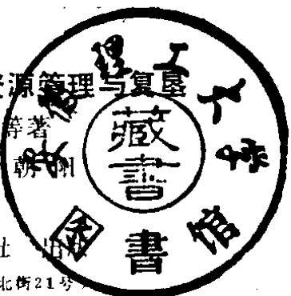

煤炭工业出版社

（北京安定门外和平里北街21号

北京房山宏伟印刷厂印刷

新华书店北京发行所 发行

## 前 言

土地是人类赖以生存的物质基础，社会的一切物质财富，无不源于人们对土地的开发利用。我国的土地面积虽然居世界第三位，但人均占有面积只及世界人均数的1/3。因此，国家将“十分珍惜和合理利用每寸土地，切实保护耕地”作为我国的一项基本国策。

煤炭产业是国民经济的重要支柱产业之一，在我国一次能源生产和消耗构成中占75%左右。1989年我国原煤产量突破10亿t大关，成为世界第一产煤国，计划到2000年我国原煤产量达到或超过14亿t。煤炭生产的迅速发展，必然会导致地表的大量剥离、地表的大面积下沉和固体废弃物的大量堆积，从而导致土地资源的大量破坏。我国煤炭产量的96%来自于井工开采，地下煤炭采出后，必然造成地表沉陷（俗称塌陷），煤炭开采的沉陷率一般为0.2\~0.33hm²/万t，根据1949\~1993年煤炭产量200亿t计算，我国因采煤沉陷破坏的土地已达40\~66万hm²，而且每年以约2万hm²的速度递增。本来丰富的煤炭资源的开采能为国家增添财富，给当地经济带来繁荣，而煤矿的大量开采造成大面积土地沉陷，使昔日农民赖以生存的良田、耕地因开采破坏而变为一片汪洋或杂草丛生的荒芜土地，矿区的人均耕地大大减少，不仅影响当地的工农业生产，而且严重影响地区的生态环境和社会的安定团结，因此，采煤沉陷地的复垦就成为当前的一项十分紧迫的任务。

尽管全国各地已积极地开展了采煤沉陷地的复垦工作，但由于采煤沉陷土地资源的配置不尽合理、采煤沉陷地的权属不清、复垦政策与管理机制不健全、复垦资金渠道不落实、复垦的理论远远落后于实践等问题，致使采煤沉陷地的复垦工作困难重重、步履艰难。为了走出困境，本书试图将采煤沉陷地作为一种特殊的土地资源和资产，从采煤沉陷地的属性及破坏特征入手，探讨管理与工程技术相结合的土地复垦新对策（技术体系）。通过研究，提出了采煤沉陷土地资源的合理配置模式和复垦过程管理模式，以及采煤沉陷地泥浆泵复垦新技术、生态工程复垦技术和复垦土壤生产力定量评价的数学模型。

参加撰写本书的人员有：胡振琪（中国矿业大学）、秦延春（河南省平顶山市土地局）、殷耀西（平煤集团公司）、顾和和（中国矿业大学）、高霞莉（徐州师范大学生物系）、李勤良（河南省平顶山市土地局）。全书由胡振琪总撰写，顾和和参加了第二、五章的执笔，高霞莉参加了第三章的执笔，最后全书由胡振琪、秦延春、殷耀西、李勤良总审定。

本书是作者在进行河南平顶山采煤沉陷地复垦实践和科学研究的基础上，结合第一作者的博士后研究成果和国家自然科学基金、中国博士后基金、国家教委留学回国人员基金资助项目的研究成果编写而成的。

本书的研究成果得到了国土局土地规划利用司、河南省土地管理局、平顶山市土地局、平顶山市郊区政府、平顶山矿务局房地产开发公司、平顶山市东高皇乡政府及辛南村等单位领导和同志们的帮助，作者对此深表感激。在研究过程中还得到了丁玉萍、刘子林、朱红伟、胡建岭、陈醒亚等同志的帮助，在此一并表示衷心的感谢！

胡振琪

1995.12于徐州

## 目 录

前言  
第一章 绪论………  
第一节 采煤沉陷的危害……  
第二节 采煤沉陷地的属性及破坏特征……… … 4  
第三节 采煤沉陷地复垦研究现状……… 6  
第四节 采煤沉陷地复垦的技术体系与新思路…… . 8  
第二章 采煤沉陷地的土地资源合理配置与复垦  
管理模式………… …10  
第一节 我国采煤沉陷土地资源合理配置的必要性………………10  
第二节 采煤沉陷土地资源合理配置模式……… ……12  
第三节 采煤沉陷土地复垦的管理模式……… …23  
第四节 平顶山市郊区在土地复垦管理方面的经验与实例………33  
第三章 采煤沉陷地泥浆泵复垦技术研究………………………38  
第一节 引言……… 38  
第二节 试验场概况与试验设计…… …38  
第三节 泥浆泵复垦技术的工作原理与现行工艺流程……………40  
第四节 泥浆泵复垦的规划设计方法………… …42  
第五节 泥浆泵复垦土壤的生产力评价………… …45  
第六节 泥浆泵复垦土地的试验研究……… ……49  
第七节 泥浆泵复垦与推土机复垦工艺对比试验………… ……54  
第八节 泥浆泵复垦技术评价与新工艺的探讨……………………57  
第九节 泥浆泵复垦完整技术模式的探讨…… …60  
第十节 泥浆泵复垦工程的成本与效益分析……… 61  
第四章土壤生产力定量评价的数学模型及其应用…………65  
第一节 土壤生产力定量评价的目的和意义………………………65  
第二节 土壤生产力定量评价的数学模型———模糊PI模型………66  
第三节 模糊PI模型计算机软件的开发…………… 73  
第四节 土壤生产力定量评价数学模型的应用……………………75  
第五章 采煤沉陷地的生态工程复垦……………………………81  
第一节 概述…………  
第二节生态工程复垦的基本原理…………………………………83  
第三节 生态工程复垦设计…………………………………………85  
第四节 生态工程复垦实例…………………………………………93  
第六章 结论与研究方向…………………………………………101  
附件一土地复垦规定…………… ……104  
附件二煤炭工业环境保护暂行管理办法………………………109  
参考文献…………… 8

## 第一章绪 论

第一节 采煤沉陷的危害

有用矿物被采出以后，开采区域周周的岩体的原始应力平衡状态受到破坏，应力重新分布后，达到新的平衡。在此过程中，岩层和地表产生连续的移动、变形和非连续的破坏（开裂、冒落等），这种现象称为“开采沉陷”（MiningSubsidence)。煤炭是重要的层状有用矿物，它的井工开采必然引起岩层和地表的下沉，导致大量土地的沉陷，我们将这种现象称为“采煤沉陷”，形成的沉陷区（土地）称之为“采煤沉陷区（土地）”。

众所周知，煤炭是我国最重要的能源，占全国一次性能源总量的74.2%（1990年统计），对国民经济的发展起着举足轻重的作用。1953\~1993年累计国内煤炭生产量已逾200亿t，今后仍以每年10亿多吨的速度发展。在煤炭生产中，约96%的产量来自于井工开采，因此造成了大面积的地表沉陷，使良田荒芜、耕地减少。图1-1展示了我国煤炭产量与耕地变化的关系，说明我国煤炭开采引起的土地破坏是我国土地资源日益紧缺的主要原因之一。据测算，井下开采每万吨原煤造成的沉陷地，少的0.033hm²，多的达0.533hm²，平均0.2\~0.33hm²，按我国煤炭产量推算，到1993年底累计沉陷地已达40\~66万hm²，而且以每年约2万hm²的速度递增，这些量大面广的采煤沉陷地，对工农业生产，矿区的生态环境以及矿区的社会安定都产生了严重危害。

## 一、采煤沉陷造成耕地减少，对工农业生产产生重大影响

采煤沉陷最直接的破坏是土地，昔日的平原变成高低不平的沉陷地，肥沃农田变成低产坡地、沼泽地或芦苇丛生的湖泊，不仅使农业生产受到影响，也使许多农民失去赖以生存的土地。例如我国重要的粮棉油基地之一的安徽省淮北市，因采煤沉陷，全市耕地面积逐年减少。30多年来，煤矿已征用土地1.44万hm²，其中采煤沉陷1.13万hm²，万吨煤沉陷率为0.3\~0.36hm²，按现有生产能力，每年将沉陷近666.7hm²土地，相当于每年损失750\~800万kg粮食，使大约2万人失掉全年口粮。人均耕地已从1960年的0.26hm降至1990年的0.127hm²，有的农业区已降至0.043hm²。到2000年，全市煤矿征地将达20000hm²，形成沉陷地1.47万hm²。据调查，1980\~1990年10年间，全市农业的平均增长速度仅为2.8%，远远低于全国4%和全省7.2%的水平，出现了萎缩性增长的局面。江苏徐州的铜山县，全县沉陷地达9060hm²，占全县耕地面积的5.87%，沉陷地中常年积水面积为2700hm²。大横、大昊和拾屯三个乡，由原来人均耕地0.1hm²降低至人均0.053hm²，全县人均耕地在0.033hm²以下的村民小组有390个，共19万人，其中有89个村近4万人人均耕地降至0.0067hm²以下。耕地面积因采煤沉陷大量减少，直接影响到当地的农业生产，给当地人民生活带来了一定困难。

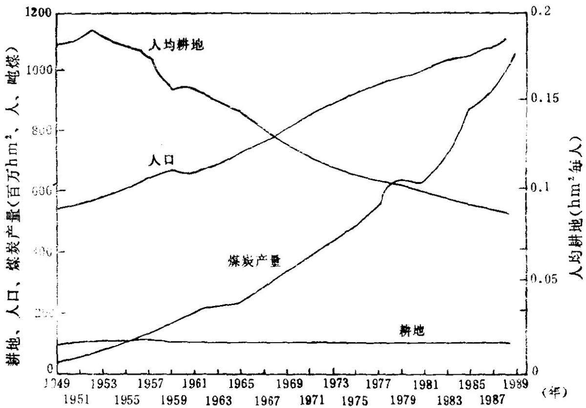  
图1-1 我国人口、土地与煤炭产量的变化趋势

采煤沉陷对农业生产造成重大影响的同时，对煤炭工业生产也造成了不可估量的损失。具体表现在两方面：一方面矿山企业每年需花费大量的费用对采煤沉陷地进行赔偿，企业负担加重；二是土地征用和赔偿的周期较长、各方面矛盾较多，常常因达不成征、赔协议而影响矿山正常开采，严重时使矿山被迫停产或局部停产。据调查，安徽淮北矿区，在60年代每公顷征地费2160元，70年代征地费上升到6300元，1985年征地费高达83235元，到1988年达248280元，1992年每公顷又增加粮油煤差价60000～90000元，所以征地费已提高到321000元/hm²。由于征地费的猛涨，几乎达到了企业无法承担的地步，在一定程度上制约了生产的发展。再如皖北矿务局，年产煤仅370万左右，但近几年征迁费用约为4000万元左右，约占全局总收入的四分之一。

综上所述，采煤沉陷对工农业生产造成很大的影响。

## 二、采煤沉陷对矿区生态环境造成严重破坏

采煤沉陷对土地的破坏和工农业生产的影响是明显的，但对其它可见和不可见的生态环境因素的破坏也不容忽视的。通常，采煤沉陷对矿区生态环境的人为破坏可分为景观破坏和生态破坏。景观破坏是开采沉陷过程中或开采沉陷后次生的对地表的破坏(如对地形、植被的破坏)；生态破坏是破坏矿区土地及其邻近地区内的生物生存条件、减少生物量、降低环境的总适宜性，对动植物和人类均产生不利影响。表1-1列出了因开采沉陷而引起的矿区生态环境的破坏特征及其危害。

## 三、采煤沉陷增加了失业人员，影响工农关系和社会的安定团结

由于土地沉陷，使昔日农民赖以生存的良田，变成了一片汪洋或杂草丛生的荒芜地带，使人均耕地减少，增加了地方政府安置无地农民的压力。由于地方政府的财政能力无法及时解决这些无地农民的就业出路，无疑这批无事可做的农民，对社会的繁荣稳定是一个隐患。另一方面，由于在补偿及安置费的管理、使用等多方面的原因，被征地农民的生活仍不能保持原生活水平，剩余劳动力不能得到有效的安置，这一切都加剧了工农矛盾和社会不安定因素。例如，淮北市到1990年，已破坏0.867万hm²土地，10万多农民无地可种，预计到2000年全市将有15万人失去土地，这么多的农民一旦失去土地，失去谋生的手段，随时都有可能出现影响经济、危及社会稳定的各种问题并直接影响区域的经济发展。

表 1-1 采煤沉陷对矿区生态环境的破坏
<table><tr><td rowspan=1 colspan=1>类型</td><td rowspan=1 colspan=1>破坏特征</td><td rowspan=1 colspan=1>主要危害</td></tr><tr><td rowspan=4 colspan=1>景观破坏</td><td rowspan=1 colspan=1>坡地</td><td rowspan=1 colspan=1>水土流失严重、影响土地生产力和附近的水域</td></tr><tr><td rowspan=1 colspan=1>裂缝</td><td rowspan=1 colspan=1>水土流失、养分流失，影响农业灌溉和生产</td></tr><tr><td rowspan=1 colspan=1>1凹凸不平</td><td rowspan=1 colspan=1>影响农业生产，水土流失严重</td></tr><tr><td rowspan=1 colspan=1>积水</td><td rowspan=1 colspan=1>丧失植被和农作物生产能力，易引起污水的渗人</td></tr><tr><td rowspan=3 colspan=1>生态破坏</td><td rowspan=1 colspan=1>土壤生态的破坏</td><td rowspan=1 colspan=1>土壤中的生物生存条件变化，生物量减少，土壤生产力丧失或降低</td></tr><tr><td rowspan=1 colspan=1>地表疏干</td><td rowspan=1 colspan=1>水文地质条件破坏，饮用水困难</td></tr><tr><td rowspan=1 colspan=1>污染的加剧及迁移</td><td rowspan=1 colspan=1>沉陷区土地因污水的涌入而遭受污染、影响作物生长，同时因水土流失，造成大气粉尘量增加，江河淤积和水质污染</td></tr></table>

## 第二节 采煤沉陷地的属性及破坏特征

采煤沉陷地是一种因采煤而遭受破坏，使其生产力下降或丧失的土地，是煤矿生产用地，性质属人为破坏。由于煤炭资源位置的不可选择性和现有技术水平限制，煤炭开采引起的地表下沉是不可避免的。

依据沉陷地破坏的物理特征，可以将采煤沉陷对地表的破坏形式归纳为以下几种：

## 1）地表下沉盆地。

在开采影响波及到地表以后，受采动影响的地表从原有标高向下沉降，从而在采空区上方地表形成一个比采空区面积大得多的沉陷区域。这种地表沉陷区域称为地表下沉盆地。在地表下沉盆地形成的过程中，改变了地表原有的形态，引起了高低、坡度及水平位置的变化。因此，对位于影响范围内的道路、管路、河渠、建筑物、生态环境等等，都带来不同程度的影响。在华东地区，由于地下潜水位很高，地表下沉1m左右，移动盆地内便可积水，严重影响土地的使用，造成矿区耕地大量减少。地表下沉盆地内，除积水区以外，其余均为坡地，对农业生产影响很大。因此，地表沉陷地的最明显破坏形式为下沉盆地，其中积水和坡地是最主要的破坏特征。

## 2）裂缝及台阶。

在地表下沉盆地的外边缘区，地表可能产生裂缝。这主要是由地表下沉的拉伸变形所致。地表裂缝一般平行于采空区边界发展，其深度和宽度，与有无第四纪松散层及其厚度、性质和变形值大小密切相关。地表裂缝容易造成水土流失和养分损失，影响农业生产。当裂缝大到一定程度时还会出现堑沟或台阶，对地表破坏更大。

## 3）塌陷坑。

塌陷坑多出现在急倾斜煤层开采的地区。但在浅部缓倾斜或倾斜煤层开采，地表有非连续性破坏时，也可能出现漏斗状塌陷坑。塌陷坑往往造成农田绝产及建筑物或道路的破坏，危害极大。

依据对土壤生产力的破坏程度，可将采煤沉陷地划分为绝产地、季节性绝产地和低产坡地。绝产地系指采煤沉陷后，沉陷盆地内积水或因断裂或塌陷而完全失去原有生产力的土地；季节性绝产地往往是因季节性的沉陷地积水而失去生产力；低产坡地是地表下沉不均匀形成的坡地，这是大量的，非充分采动时，沉陷范围内均为坡地；充分采动时，坡地出现在煤层露头、开切眼、停采线和煤柱上方，即盆地四周为坡地。坡地坡度与采厚、采沉、上覆岩层的岩性和煤层倾角有关。

采煤引起的地表破坏形式和程度，是受多种地质采矿因素影响的，它随着采深、采厚、采矿方法、煤层产状、表土及岩层的厚度和性质等因素的不同，而呈现不同的破坏特征，见表1-1。在采深和采厚的比值较大时，地表下沉和变形在空间和时间上是连续的、渐变的，具有明显的规律。当采深与采厚的比值较小（一般小于30）或具有较大的地质构造时，地表的下沉和变形在空间和时间上将是不连续的、不规律的，有可能出现较大裂缝或塌陷坑。

综合以上分析不难发现：积水、坡地、裂缝是采煤沉陷地常见的三大破坏特征，对农业生产影响很大。

## 第三节 采煤沉陷地复垦研究现状

土地复垦是恢复利用已被人类生活和生产活动所破坏的土地，消除或防治因土地破坏带来的各种危害，力求减轻受害程度、危害范围，恢复土地使用价值和生产力的工作。

在被占用和被破坏的土地中，很大部分是由采掘与加工工业造成的，这些土地具有很高的可复性，最早开始土地复垦的是德国和美国，美国在《1920年矿山租赁法》中就明确要求保护土地和自然环境，德国从20年代开始在煤矿废弃地上植树，50年代末许多国家加速了土地复垦的法规的制定和复垦工程实践活动，比较自觉地进入了科学复垦的时代，人们开始研究复垦技术和经济效益的提高等。

进入70年代以来，复垦技术集多学科为一体，已发展成为一门牵动着多行业、多部门的系统工程。为了有效地复垦被破坏的土地，英国、美国、匈牙利等国政府对复垦工作给予补贴，疏通多种资金渠道来支持土地复垦工作。随着复垦技术的发展和复垦法规逐步完善，促使这些国家土地复垦率有明显提高。美国在1971年以前平均复垦率为40%，1977年联邦土地复垦法颁布后的新破坏土地实现了边开采边复垦，复垦率为100%，同时又不断地复垦废弃的破坏土地；原民主德国从60年代末到80年代初，复垦面积是露天采煤占用面积的92%；原联邦德国的莱因褐煤矿区，到1985年底复垦土地面积是露天采煤占用面积的62%；原苏联自70年以来复垦工作得到了很大发展，黑色金属矿山平均年复垦率已提高到50%。

各国的土地复垦工作成绩显著，复垦利用方向适合所在地区的农、林、渔业或自然景观的特点和需要，在恢复土地原有生产力的同时，既保护了生态环境又为企业增加了经济收入。国外复垦工作的经验告诉我们，迅速制定并完善土地复垦法规、加强复垦技术的应用研究，是当前我国推进土地复垦工作的当务之急。

我国是一个人多地少的国家，土地资源十分贫乏，而煤矿造成了大量土地的破坏或压占，因此，土地复垦在我国是一项十分紧迫的任务。限于经济发展的水平，我国到本世纪80年代才开始重视土地复垦，1989年1月1日生效的国务院第19号令《土地复垦规定》，标志着我国土地复垦事业的开端。之前，许多矿区自发开展了一些土地复垦实践，如江苏、安徽、辽宁、黑龙江等省的矿区都进行过采煤塌陷区综合治理的试验。发展最快的是矸石充填复垦建筑用地和农村宅基地，其次是用泥浆泵进行挖深垫浅的复田工程，在淮北、徐州、平顶山等矿区发展较快。

根据我国沉陷地复垦的实践，可以归纳出以下几种采煤沉陷地的土地复垦方法：

1）疏排法：对于潜水位不太高的沉陷区，通过建立排水系统，降低潜水位和疏排积水，来达到土地重新利用的目的。

2）挖深垫浅复垦法：采用水力挖塘机组(泥浆泵)或辅以推土机，将沉陷深的区域再挖深，取出的土方充填沉陷浅的区域，达到水产养殖和农业种植并举的应用目标。我国目前常采用这种复垦方式。

3）充填复垦：用某种材料充填沉陷区复田。我国常用的充填材料有：（1）露天矿剥离物；（2）煤矸石；（3）粉煤灰；（4）城市垃圾和江河湖泥。一般情况下，充填材料上应覆盖一定的土壤以利植物生长。

4）其它复垦技术：对于大面积的沉陷水面，可以采取网箱养鱼、养鸭等直接开发利用；对于浅水位沉陷区所形成的非积水的丘陵地貌可以采取不同形式的修整（如平整或梯田）措施，然后直接利用。对未稳沉的土地也可采取超前复垦。

尽管采煤沉陷地的复垦实践不少，但理论总结较少且不够深入，对复垦管理更显研究不足，因此，有必要对破坏土地的管理及复垦进行系统研究。

## 第四节 采煤沉陷地复垦的技术体系与新思路

长期以来，人们往往关注土地复垦的某一工程技术，常常因许多土地的社会问题而阻力重重，究其原因是忽视了从其研究对象的属性去探讨新的研究途径。众所周知，土地复垦的研究对象是破坏了的土地，而土地具有自然和社会双重属性，因此，土地复垦的研究应包括自然和社会两方面，自然方面就是指土地复垦的工程技术；社会方面就是土地复垦的管理技术。所以，完整的土地复垦技术体系乃是复垦工程技术与管理技术的结合，如图1-2所示。土地复垦工程技术是许多学者研究的主要内容，在此，作者不再赘述。土地复垦的管理技术包括被破坏土地资源的管理和复垦宏观与过程管理两方面。

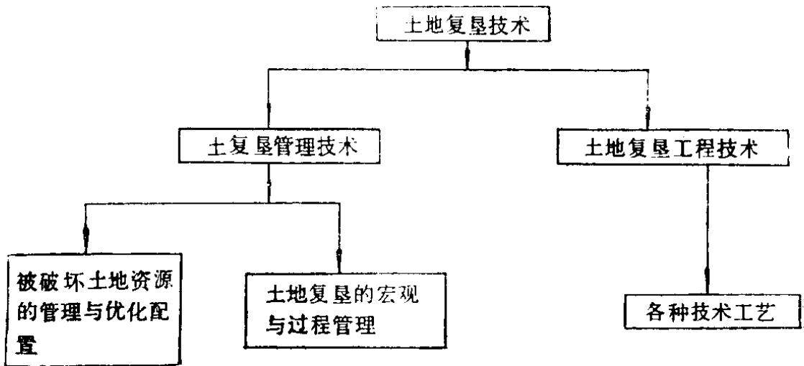  
图 1-2 土地复垦技术体系

采煤沉陷土地复垦工作目前还面临困境和阻力的主要原因是沉陷地产权不清和破坏土地资源配置不尽合理，使复垦积极性调动不起来，致使大量沉陷地荒芜。为此，我们将沉陷地作为一种特殊的土地资源和资产，从其合理配置入手，探讨沉陷地合理开发利用的管理模式和沉陷地复垦的过程管理模式，进而基于破坏土地的破坏特征及破坏规律来研究采煤沉陷地复垦的工程技术和复垦后的评价技术，本书正是按照这一思路进行了探讨。

# 第二章 采煤沉陷地的土地资源合理配置与复垦管理模式

第一节 我国采煤沉陷土地资源合理配置的必要性

由于煤炭资源一般都是深埋于地下且其位置不可选择，故地下煤炭的开采必然会导致其上部一定区域土地资源的沉陷破坏，从而引发国家、集体、个人之间的利益冲突。因此，研究如何合理配置沉陷土地资源是十分必要的。其必要性主要表现在如下几个方面：

## 一、现行煤矿沉陷土地资源的配置方法不尽合理

根据我国有关法律、法规，现行沉陷土地配置一般采用两种方式，即国家征用和赔偿损失。实践证明，现行的配置方式过于单一，存在许多弊端：

（1）征地造成煤矿企业的沉重压力，煤矿企业无力支付高额的土地征、赔费。目前，平原地区的徐州、淮北、淮南、兖州、开滦等矿区的征地费一般为22.5\~37.5万元/hm²，有的高达45\~60万元/hm²，按煤炭行业2000年用地规划平均每年用地1.6万hm²，每年征地平均费用（考虑到各矿区地价差异）按15\~22.5万元/hm²计算，则年征地费用为24\~36亿元。除此之外，还有其他额外的费用。据有关单位测算，这些费用如能如数交纳，加上土地复垦年需的费用，仅国家统配煤矿一年就要支付60多亿元，相当于国家每年给统配煤矿的建设投资。煤炭行业原本就是亏损行业，虽然煤价已经放开，但仍然是买方市场，煤炭企业无力支付这么多的征赔费。

（2）征地周期长，征地过程困难重重，影响煤炭企业正常生产。在征地过程中，农民及地方政府总希望征地价格高些，尽量多安置剩余劳动力，而煤炭企业则正好相反，因此矛盾较大，协议很难尽快达成。特别还会出现一些人为障碍，如突击盖房、种树、修鱼塘等，加大征地费用，人为地增加征地工作的难度。煤炭开采具有地理位置不可选择性，征地周期过长直接影响煤炭正常生产，有的矿山不得不为此暂停某些采区的生产。

（3）煤矿沉陷地征用导致农民失去土地，人地矛盾进一步加剧，政府安置就业压力增大。对无地农转非的农民，煤炭企业只能进行少量安置，大部分仍需地方政府解决，而地方政府往往无力承受，这样，企业、农民和地方政府的矛盾的增加就不可避免。另外，无业游民增多也会给地方增加不安定因素。

综上所述，由于采煤沉陷土地资源配置不尽合理，已严重制约了煤炭生产的正常进行，也增加了地方政府的压力和社会不安定因素，因此，探索沉陷土地资源优化配置模式是十分必要的。

## 二、沉陷土地的优化配置是土地复垦工作得以健康发展的客观要求

（1）如果采用传统的征用、赔偿配置方式，征赔费用太高，企业连正常的生产都难以维持，土地复垦费用势必难以筹措及真正到位，必然影响土地复垦工作的健康发展。

（2）对浅沉陷的低产坡地，企业实行土地沉陷期内的赔偿制度，土地所有权不变。由于采煤造成的土地沉陷影响土地的地表结构，而根据有关法规，企业赔偿仅为土地沉陷破坏期内的土地收益损失，沉陷稳定后煤矿企业不再赔偿。这时有些土地结构被破坏无法恢复原有生产力，而这部分土地资源的复垦又没有资金来源，某种意义上说反而加剧土地损失和土地退化。

（3）沉陷地的征用导致土地使用权权属不清。从理论上说，沉陷地既已被煤炭企业征用，煤炭企业就应该拥有该土地的使用权。据了解，矿山企业是否拥有这些土地使用权各地解释不一，实际上许多地方已征用的沉陷地仍归农民使用。特别是沉陷地经矿山企业复垦后，农民会争抢这些复垦土地，煤矿企业往往得不到收益，容易挫伤煤矿企业土地复垦的积极性。

## 三、沉陷土地资源优化配置是土地使用制度深化改革的必然趋势

（1）矿山企业的主要任务是煤炭生产，因此，矿山企业没有精力从事农业生产。既使拥有土地使用权，也没有能力充分发挥这部分土地资源应有的潜力，从而造成一种体制性的土地资产的隐形流失。

（2）煤矿沉陷地属于一种特殊形式的建设用地，应该通过市场经济手段进行配置，才能充分发挥其应有的潜力。

（3）实行城乡地政统一管理是土地管理的基本原则。煤炭企业复垦土地后，由于本身没有能力和精力经营，往往转让、转租其他单位和个人经营，容易产生土地隐形市场，不利于统一管理。

## 第二节 采煤沉陷土地资源合理配置模式

## 一、采煤沉陷土地形态分类

采煤沉陷地因采煤方法、地质条件、潜水位、煤层厚度及赋存情况等地质采矿条件的不同而呈现出不同的破坏形态。沉陷地破坏形态的不同对其开发利用将产生重大影响，进而影响其配置的方式。因此为了探寻合理的配置模式，必须对采煤沉陷地的形态进行合理的分类，也可以说煤矿沉陷土地形态分类，是确定采煤沉陷土地资源配置模式的基本依据。依沉陷土地形成的时间顺序，可分为：废弃塌陷土地、正在塌陷土地和待塌陷土地。废弃沉陷土地是指《土地复垦规定》颁布之前，已经形成而且未得到复垦的土地。正在沉陷土地是指《土地复垦规定》颁布后开始沉陷以及目前正在沉陷的土地。待沉陷土地是指未来受采动影响必然要沉陷的土地。依沉陷状态可分为：稳定沉陷土地和不稳定沉陷土地。稳定沉陷土地是指在目前技术水平下，其下方的可采煤层已全部开采完毕，沉陷状态已稳定，不再发生变化的沉陷土地；反之，称为不稳定沉陷士地。稳定沉陷土地及不稳定沉陷土地均可再分为常年积水沉陷土地、季节性积水沉陷土地和无积水沉陷土地。依沉陷土地权属性质的不同，可分为：国家所有沉陷土地和集体所有沉陷土地。国家所有沉陷土地是指沉陷前就是国有土地以及土地沉陷后国家已征用的原集体土地；集体所有沉陷土地一般是指国家未实行征用而是逐年赔偿损失的那部分浅沉陷坡地，以及乡镇煤矿开采造成的沉陷土地。国家所有沉陷土地又可再分为企业有使用权的沉陷土地和企业无使用权的沉陷土地。依采动的充分程度不同，沉陷土地可分为充分采动沉陷盆地和非充分采动沉陷盆地。充分采动沉陷盆地是指地下煤层采出后，地表下沉值达到该地质采矿条件下应有的最大值，此后开采工作面的尺寸再继续扩大时，地表的影响范围相应扩大，但地表下沉值不再增加，地表移动盆地将出现平底；反之，为非充分采动沉陷盆地，此时地表移动盆地呈碗形。

## 二、煤矿沉陷土地征用标准的重新界定

长期以来，煤矿沉陷地征用与否是以“被破坏的状态”确定的，沉陷后绝产的土地实行征用，未绝产的浅沉陷低产坡地实行赔偿。《土地复垦规定》界定的征地标准是按照“是否恢复原用途”并结合国家是否需要和农村集体经济组织的意愿来确定的（参见《土地复垦规定》第十二条）。根据上述征用标准，必然造成沉陷地复垦中存在下列问题：

（1）沉陷地绝产后，国家一律征用，由于征用土地代价高，企业一般再无力进行复垦；另一方面，煤矿企业的主要任务是煤炭生产，既使对土地进行复垦，其复垦土地的措施不一定恰当，复垦后土地的利用方向不一定符合国家产业政策和土地利用总体规划的要求。

（2）煤矿沉陷土地一般难以恢复原用途，但绝大多数沉陷土地均可通过一定的复垦措施达到一定的生产力，特别是若改造为水产养殖地，将大大超过原生产力，因此，以是否能恢复为原用途而决定是否征用是不科学的。

(3）经复垦不能恢复原用途，但其生产力高于原用途的沉陷地，如果原集体经济组织不愿意保留的，也需要征用，这显然极不合理。因为现阶段农业生产的效益不如其他行业高，原集体经济组织往往希望得到征用费而从事其他产业，因而极力阻挠土地复垦工作。既使复垦后土地的生产力高于原生产力，原集体经济组织也往往不愿接受，从而造成土地的闲置和荒芜，不利于土地的合理利用和土地复垦工作的开展。

因此，我们认为，沉陷土地的征用或赔偿应以有利于土地资源的合理利用，有利于土地复垦工作的顺利开展为原则进行，沉陷土地是否实行国家征用，应依据“复垦后土地的生产力”为界定标准，凡是复垦后土地的生产力达到或超过原生产力的，一般不实行国家征用；将征地费用用于土地复垦工程，企业出资复垦后，将复垦后的土地和沉陷期间的实际损失补偿费一并交农村集体经济组织。只有那些无法复垦或复垦后土地生产力难以达到原生产力，或者国家需要使用的土地，才实行征用。

## 三、沉陷土地资源配置模式（体系）

(一）沉陷土地资源配置的原则

1）社会、经济、环境三效益统一的原则。

2）兼顾国家、煤炭企业和集体经济组织利益的原则。

3）有利于土地复垦工作开展的原则。

4）因地制宜，合理利用沉陷土地资源的原则。

5）适应土地使用制度改革要求的原则。

## （二）待沉陷土地资源的配置

1.配置模式一

对待沉陷土地资源，采用临时用地方式进行配置—这是最优配置模式。

1）条件。

（1）待沉陷土地目前沉陷事实尚未形成，具备采用临时用地的客观条件。同时，也有时间制定临时用地取得、使用、赔偿的具体办法。

(2）《土地管理法》、《土地复垦规定》的颁布以及土地使用制度改革的深化为采用临时用地政策奠定了基础和指明了方向。

（3）煤矿企业对采用临时用地政策有强烈的要求。另一方面，由于农副产品价格的放开，集体经济组织从事农业、养殖业的积极性增强。

## 2）方法。

煤炭企业对因采煤而造成的沉陷土地不实行征用，在整个沉陷过程中，煤矿根据井下实际开采情况、煤层的开采计划和地表实际沉陷现状，对单一煤层或多煤层沉陷土地不断采取措施加以整治，以使这部分土地在整个沉陷过程中都能得到不同程度的利用，以避免闲置或荒芜，提高土地的利用率。在此过程中，对该部分土地沉陷前和沉陷过程中以及各阶段整治后的生产力分别进行评价．根据各阶段整治后与沉陷前土地收益差额（生产力降低数额），由煤炭企业逐年给予补偿。待沉陷稳定后，经过全面复垦使土地生产力达到或超过相应等级土地的生产力，交还农村集体经济组织使用。复垦后对其生产力进行评价，当达不到规定标准或原有的生产力水平时，由企业按实际差额给予一次性补偿或实行征用。

## 3）现实意义。

（1）由于土地的权属性质不发生变化，煤炭企业支付的赔偿费仅为土地使用权价格，从而避免了高额的征地费用，降低煤炭生产成本。一方面，可以促进煤炭生产的持续发展，另一方面由于煤矿利润增加，就有能力拨出专款进行土地复垦，从而推动土地复垦工作的顺利开展。

（2）真正将“谁破坏、谁复垦”的原则落到了实处。

（3）有利于沉陷土地的合理利用，提高土地的利用率，避免了沉陷地闲置、荒芜现象。

(4）由于沉陷土地的权属性质不发生变化，农民不失去土地，每年都可在整治后的沉陷土地上从事农业生产，获得一定的收益，同时还可获得煤矿企业的补偿，其生活水平不致下降。此外，在土地整治过程中，农民尚可以参与土地复垦工程，获得额外收益并减少了无业游民，减轻地方政府的就业压力，缓解工农紧张关系，具有良好的社会效益。

(5)由于采取边破坏、边治理措施，不至使矿区环境质量急剧恶化。因沉陷稳定后，有能力采取综合治理措施，区域环境质量可得到改善和提高，具有良好的环境效益。

4）保证措施。

（1）首先需对待沉陷土地进行分等定级，在此基础上对其生产力进行科学合理的评价。

（2）根据煤层赋存情况、回采接替计划等对地表开采沉陷进行预计，掌握待沉陷土地与井下回采安排之间的关系，找出其动态变化规律，在此基础上结合土地利用总体规划制定出待沉陷土地资源各阶段整治计划与稳定后的复垦规划。

（3）对沉陷土地进行动态监测，各阶段整治后均要对其生产力进行评价，进而确定出不同时期、不同整治措施的科学合理的补偿标准。沉陷稳定经过全面复垦后，对复垦土地尚需进行生产力评价，以确定其是否符合移交标准。

（4）做好沉陷土地的跟踪管理工作，对沉陷土地的利用方向是否合理、土地整治复垦措施是否按计划进行随时进行监督检查，对涉及到赔偿费用等纠纷及时进行调处。

## 2.配置模式二

实行国家征用，然后进入土地市场。

如果待沉陷土地资源采用临时用地模式阻力大，地方集体经济组织不愿接受时，可实行国家征用，变集体土地为国有土地，然后纳入土地市场，借助其他力量复垦。

## 1）条件。

（1）因已实行国家征用，该部份土地已属国家所有，根据《中华人民共和国城镇国有土地使用权出让和转让暂行条例规定，该部份土地使用权可以出让和转让，进入市场具有法律依据。

(2）因土地权属性质已发生变化，国家在处置和复垦时，不受地方经济组织的掣肘，便于采取灵活的使用方向和复垦措施。

（3）煤矿企业可以摆脱地方经济组织（农村）常年的纠缠，如果处置合理，煤矿企业乐于接受。

2）方法。

对待沉陷土地，由煤矿企业出资实行国家征用。对征用后的土地采取如下措施之一加以配置：

（1）明确煤矿企业对该土地拥有使用权，但不能转让。由煤矿企业在符合土地利用总体规划的前提下，因地制宜地加以复垦利用，国家适当减免耕地占用税。煤矿企业用复垦后的土地搞多种经营，兴办第三产业，用此收益抵偿征地费。

(2）国家根据煤矿沉陷土地的实际情况，给予特殊政策。允许征用后的沉陷土地转让，煤炭企业用转让金抵偿部分征地费，由受让方按合同规定进行开发复垦。煤矿企业利用土地转让金对新沉陷土地进行综合开发和复垦，然后再行转让，形成土地复垦良性循环的局面。

(3）煤矿企业不拥有沉陷土地使用权，由国家对沉陷土地资源进行统一开发，统一出让，将出让金按一定比例返还煤矿企业，抵偿高额征地费用。然后再将出让金按一定比例投入新沉陷土地的开发复垦中，促进土地复垦的良性循环，做到边破坏、边复垦。煤矿企业若需利用复垦后的土地进行多种经营，可优先优惠获得土地使用权，用出让金抵偿应返还煤矿企业的部分。

3）现实意义。

（1）有利于国有土地使用制度改革的深化。

(2）沉陷土地资源进入市场后，土地复垦资金易于筹措，可以促进土地复垦工作的顺利开展。

（3）有利于减轻煤矿企业的沉重负担，加速煤炭工业的发展。

（4）可提高沉陷土地的利用率，经过统一复垦，综合治理，可提高土地复垦综合效果，避免沉陷土地废弃、荒芜或低水平开发。

（5）吸引地方闲散人员和经济组织受让经复垦治理的土

地，增加就业渠道，繁荣地方经济。

4）保证措施。

（1）及时做好征用、出让、转让过程中土地变更登记工作，避免产生权属纠纷。

（2）对沉陷土地现状进行调查和分类，在此基础上制订出土地复垦规划和年度计划。

（3）对复垦后土地进行生产力评价和经济评价，确定出科学合理、切实可行的出让底价。

（4）对土地复垦工作进行跟踪管理，监督检查。

（三）废弃沉陷土地和正在沉陷土地资源的再配置

在《土地管理法》、《土地复垦规定》颁布以前已经形成的、国家已实行征用的废弃沉陷地以及目前正在沉陷且国家正在征用的沉陷土地，由于其沉陷事实已经形成或正在形成，而且权属性质已发生变化，因此，属于国有土地配置范畴。由于沉陷地已经历了一次权属性质的变化即进行了一次配置，对这类土地的开发利用不妨称之为再配置。因历史原因和现实情况不同，其再配置方式有其特殊性。

## 1.再配置模式一

以地换地模式。

1）条件。

（1）必须是企业有使用权的沉陷土地。

（2）由于农业用地稀缺，人地矛盾尖锐，煤矿企业新征土地困难、补偿费用高昂，农村集体经济组织需新增土地缓解农业用地紧张局面。

2）方法。

煤矿企业对自己有使用权的稳定沉陷地，采取土地复垦措施，进行综合治理，使其生产力达到或超过该土地原生产力，用其交换急需使用的待沉陷土地，达到不征或少征土地，不赔或少赔损失的目的，解决征地或赔偿周期长，费用高昂等问题。

3 )现实意义。

（1）符合国家关于加强土地复垦工作，合理利用土地，改善生态环境的要求。符合“谁破坏、谁复垦”的原则，可大大加快废弃及正在沉陷土地的复垦进度。

（2）煤矿企业可以解决征用土地困难的问题，将征地及赔偿费用改做土地复垦费用，可以在不加重企业负担的情况下，既完成了国家规定的复垦任务，又解决了征地困难。

（3）对于农民来说，可以不因采煤而失去土地，收入有可靠保证，解决了就业无门的难题。而且复垦后的土地由于有合理的规划和大量的追加投资，级差收益明显，生产条件比过去好，农民乐于接受。

（4）对于地方政府来说，一方面缓解了人地矛盾，避免了耕地锐减的问题，繁荣了地方经济。另一方面，减轻了就业压力，减少了无业游民，社会治安等问题得到了改善。另外，矿区环境质量也有了一定程度的改善。

4）保证措施。

（1）及时做好变更土地登记工作，避免出现权属纠纷，引发新的矛盾。

（2）对废弃沉陷地及正在沉陷土地进行沉陷现状调查，然后结合当地的实际条件和习惯确定出适宜的农民乐于接受的复垦方向，制定出切实可行的复垦规划和计划。

（3）及时对待沉陷土地和复垦土地进行生产力评价，确定合理的交换条件和交换方式。

（4）土地管理部门对复垦规划、复垦工程、土地交换、评价等全过程进行跟踪管理和监督检查，及时指导，纠正错误，排解纠纷。

## 2. 再配置模式二

地方政府统一复垦后再配置模式。

1）条件。

（1）企业无使用权的沉陷土地或企业有使用权、但长期废弃、荒芜的塌陷地，由政府收回土地使用权，进行统一复垦。

(2）由政府出面统一复垦，可排除各方面的干扰，有利于土地复垦工作的顺利开展。

(3）应有足够的用于第一期复垦工程的启动资金。

2）方法。

地方政府将企业无使用权的沉陷土地和企业有使用权、但长期闲置荒芜、不进行复垦的沉陷地，收回其使用权，由政府统一组织复垦，然后将复垦后的土地通过土地市场再配置，出让或出租给合适的用地者经营。将出让金或租金用来抵偿土地复垦费用，多余部分再用于其他沉陷土地的复垦。以较低的出让金或租金形成土地复垦良性循环的机制。

## 3）现实意义。

(1）对长期废弃荒芜，无人问津的沉陷地进行了综合开发和治理，避免了沉陷地长期废弃现象，加快了土地复垦速度，改善了区域环境质量，繁荣地方经济。

（2）由政府统一组织复垦，体现了城乡地政统一管理的原则，有利于土地复垦工作向高层次、高标准、高效益方向发展，另外，由政府组织大面积成片开发复垦，有利于机械化作业，可降低复垦成本。

(3）减轻煤矿企业复垦负担，使其可以专心从事煤炭生产。

（4）当地农民或集体经济组织可以受让或承租复垦后的土地，就近解决就业问题，减轻地方政府的就业压力，解决社会不安定因素。

## 4）保证措施。

（1）在沉陷土地现状调查的基础上，制定出科学合理的土地复垦规划和专项设计，使有限的复垦土地获得最大的经济收益。

（2）对复垦后土地进行实事求是的生产力评价及经济评价，以确定合理可行的出让、出租费用标准。

（3）制定沉陷复垦土地出让、出租等方面的政策法规、使用年限等，要求进行综合开发复垦。政府可适当降低出让金标准，以

复垦费代替部分出让金，并规定在复垦工程见效后一定年限内分期收回出让金。政府然后将出让金按一定比例投入其他沉陷土地的复垦工程中。

## 3. 再配置模式三

沉陷土地出让后复垦模式。

## 1）条件。

（1）地方政府已收回企业沉陷土地的使用权，拥有对沉陷土地的处置权力。

（2）地方政府在当前情况下没有能力进行复垦。

（3）有适宜的受让方。

## 2）方法。

地方政府对废弃的企业无使用权的沉陷地以及企业有使用权、但长期闲置荒芜，不进行开发复垦的沉陷地，收回其土地使用权。在地方政府没有经济实力或精力组织复垦的前提下，可将该部分沉陷土地以协议、招标等形式出让给适宜的受让方，由受让方按照出让合同规定的开发方向、用途、复垦标准、使用年限等要求进行综合开发复垦。政府可适当降低出让金，并规定复垦工程见效后在一定年限内分期收回出让金，政府然后将出让金按一定比例投入其他沉陷土地的复垦工程中。

## 3）现实意义。

（1）在地方政府没有复垦能力的前提下，可完成土地复垦任务，加快土地复垦进度。

（2）复垦资金有保障，有明确的复垦承担者，受让方为收回出让金，一定会全身心地致力于土地复垦和治理工作，以达到预期效益。

（3）为国有沉陷土地使用制度改革探索一条新的出路，可有效地解决废弃沉陷地的复垦问题。

（4）土地复垦是繁荣地方经济，增加就业渠道、改善区域环境质量的新途径。

（5）地方政府有一定的财政收入，并可将出让金再投资于

土地复垦工程中，扩大土地复垦面积，加快土地复垦进度，缓解人地紧张矛盾。

4）保证措施。

（1）在对沉陷土地现状调查的基础上，制定出科学合理的土地复垦规划，为确定出让合同中各地块的开发复垦方向和用途提供依据。

（2）对不同地块进行详细的现状调查，在此基础上根据复垦方向和用途做出复垦工程量和投资预测，并进行复垦后土地生产潜力评价，以确定合理的出让金标准和出让金回收期限。

（3）制定出与沉陷土地出让后复垦相关的政策法规，培育和完善沉陷土地市场。

(4）土地管理部门一定要做好出让土地的跟踪管理。包括出让土地的变更登记，土地规划等，对是否按照出让合同规定进行开发复垦进行监督检查，对是否符合复垦标准进行验收。

## 4. 其他再配置模式

1）再配置模式四：股份制经营开发。

鉴于目前土地复垦资金难以筹措，沉陷土地长期闲置、荒芜的现状，可以考虑由政府出面组织，由政府、企业、农民和其他经济组织（个人）入股进行开发复垦，以董事会形式进行经营，复垦后土地的收益按股分红。

其优越性是复垦资金来源渠道多，资金易于筹措，促进沉陷土地的及时开发复垦，可避免沉陷土地的长期荒芜闲置。引入了市场机制，政府、企业以及农民利害关系一致，避免在土地复垦工作中互相牵制、互相制约等扯皮现象。

为保证该项工作顺利进行，首先应制定股份制复垦经营沉陷土地方面的政策法规，使投资者敢于入股，其次要进行科学规划，高水平、高效益综合开发，并制定合理的利益分配政策，使投资者有利可图，才能吸引资金。第三，政府要做好管理工作，协调各方面的关系，确保土地复垦工程符合规划和计划要求。

2）再配置模式五：农民集资复垦。

农民以地为生，惜土如金，对土地充满了感情，农民失去土地就失去了生活依靠，国家应体谅农民的心情，充分调动其复垦积极性，国家将废弃沉陷土地使用权有偿出让给农民，由农民将上地补偿费、安置补助费及其他渠道筹集的资金用于土地复垦，增加可耕地量，从事农、副业生产，待复垦土地有收益后逐年偿还土地出让金。

其优点是可以增加土地复垦渠道，缓解人地紧张局面，加快土地复垦步伐。由农民进行复垦，避免了与企业之间的纠纷，复垦土地符合农民意愿和生产习惯。

为保证其顺利实施，首先应拟定沉陷地复垦的优惠政策，如采用减免若干年农业税等办法，鼓励农民复垦。其次应做好土地复垦规划，土地管理部门加强管理，避免农民粗放式和低水平的开发复垦，土地管理部门及时给予指导，避免农民复垦的盲目性。第三，农民复垦宜由地方经济组织统一组织实施，以便于综合开发，合理利用、降低成本，形成规模效益。

## 第三节 采煤沉陷土地复垦的管理模式

尽管《土地复垦规定》颁布已有数年，但我国的土地复垦率还很低，土地复垦项目离高层次、高标准、高效益的要求仍有较大差距。究其原因，除了土地破坏历史遗留问题多、土地复垦任务大、土地复垦资金难以筹措、土地复垦工作在我国刚刚起步、缺乏经验等主客观因素外，缺乏符合我国实际情况的土地复垦管理模式和科学合理的土地复垦管理办法也是重要原因之一。

## 一、沉陷土地复垦管理的一般模式

## (一)基本理论

1）土地复垦工作牵涉到国家、地方政府、各个破坏土地的企业及集体经济组织和农民各方面的利益；土地复垦管理涉及沉陷土地现状调查、沉陷及复垦土地评价、土地复垦规划和设计、复垦土地资源的配置、土地复垦工程实施、复垦土地的监督检查及验收等诸多具体管理环节。因此，土地复垦管理本身就是一个牵涉诸多部门、包含各种管理措施的一个复杂大系统。该系统又可分为不同层次的子系统，系统的结构决定着系统的功能。

2）整个土地复垦管理系统实质上是一个控制系统。而它又是土地管理系统的一个子系统。土地管理部门对土地复垦工作的具体管理如图2-1所示。

沉陷土地现状调查及待沉陷土地破坏程度预测、沉陷前土地生产力评价是制定科学合理的土地复垦规划、设计、土地复垦标准的依据。正确的政策、法规保障，科学合理的土地复垦规划、设计、标准是保证高层次、高标准、高效益复垦的前提。

土地管理部门复垦机构只有深入到具体复垦工程中进行组织、指导、协调、控制及监督，才能将预定的复垦目标落到实处。

土地管理部门对复垦土地通过调查、监督检查、生产力评价、动态监测、土地统计及验收等手段，及时掌握复垦土地反馈信息，找出存在的问题，加以纠正，排除外界干扰，才能保质保量的完成任务。

3）土地复垦管理过程是一个不断发展，逐步完善的过程。土地管理决策机构不断吸收复垦土地的反馈信息，并进行市场调查，与外界进行信息交换，采纳先进的科技成果，根据变化了的情况和社会进步的要求不断深化改革，及时调整政策、法规，更新充实规划和计划，提高土地复垦标准，才能将土地复垦工作推向更高层次。

## (二)一般模式

土地复垦管理一般分为三个阶段。第一阶段为规划、决策阶段管理，第二阶段为工程复垦阶段管理，第三阶段为生物复垦阶段管理，具体管理流程如图2-2所示。

## 1.规划、决策阶段管理

该阶段沉陷土地现状调查开始到下达复垦计划任务书为止。中间包括土地复垦政策法规拟定、可行性研究及论证、土地复垦规划制定、土地复垦年度计划安排、土地复垦检查验收标准制定、拟复垦单位提出申请并对其条件进行评估等环节。该阶段实质上是超前控制阶段，是建立在深入调查和科学预测基础上的优化决策过程。该阶段管理质量的高低，直接决定着后续阶段土地复垦效果的优劣。

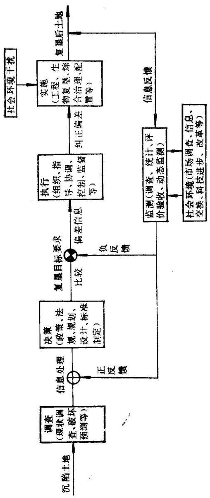  
热系

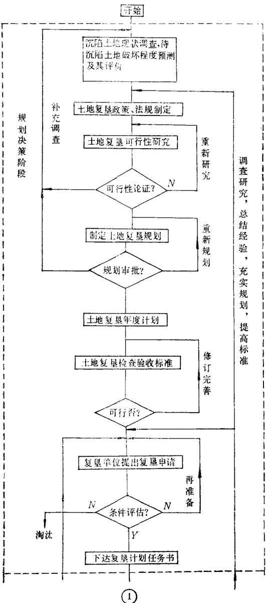  
图 2-2 土地复垦管理流程图

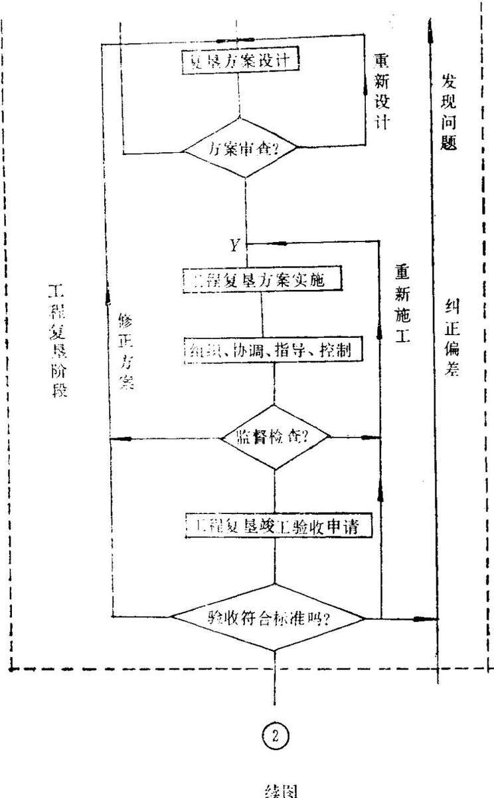  
图 2-2 土地复垦管理流程图

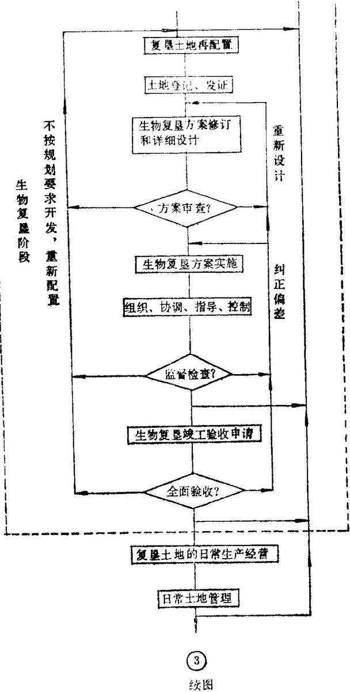  
图 2-2 土地复垦管理流程图

土地管理部门一定要对可行性研究报告的论证、土地复垦规划及年度计划的制定及审查、上地复垦检查验收标准的制定及拟复垦单位资质评估等环节严格把关，并吸取已复垦土地在工程、生物复垦过程中及复垦后生产经营过程中存在的经验教训，及时修订政策法规，充实和完善复垦规划、调整年度计划、提高复垦标准，只有这样，才能使所制定的政策法规、规划、计划及标准等科学合理，真正起到指导性作用。

## 2.工程复垦阶段的管理

该阶段从接到复垦计划任务书开始，到土地复垦工程验收通过为止。包括复垦方案设计及审查、工程复垦方案实施、工程复垦过程中的跟踪管理、工程复垦竣工验收等环节。该阶段是按照上阶段既定的规划和计划，将土地复垦工程付诸实施的阶段，并影响着复垦后土地的利用方向，具有承上启下的作用。

目前，许多复垦工程不按规划进行，盲目蛮干，复垦土地利用率低，效益欠佳，很大程度上是由于土地管理部门缺乏管理所致。

在该阶段，土地管理部门应深入到土地复垦工程中去，在参与中及时发现问题，排解矛盾，科学指导，纠正错误，具体工作是：

(1）参与复垦方案设计，给予认真指导。

(2）组织复垦方案审查工作，对复垦方案的设计深度、与土地复垦规划的关系、利用结构、利用布局及总平面布置、主要工程量、主要技术工艺措施、投资概算及技术经济分析等进行认真审查，对不全面或深度不够的，应重新设计或补充，对于复垦能力不足或无法按土地复垦规划复垦的单位，应对其复垦条件重新评估。

（3）在工程复垦方案实施过程中，土地管理部门应积极参与，跟踪管理，帮助协调各方面的关系，排解矛盾与纠纷，给予技术指导并对复垦工程是否按复垦规划和设计方案施工进行监督检查。若没有正当理由不按设计方案施工，应责令其重新施工，若确因设计方案不合理，无法按设计施工时，应及时修正设计方案，重新施工。

（4）复垦单位提出工程复垦竣工验收申请后土地管理部门应组织有关单位和人员及时进行验收。对不符合工程复垦标准的，应责令复垦单位重新施工或修正设计方案后重新施工，直到符合复垦验收标准为止。

（5）在此过程中，土地管理部门应深入调查研究，总结工程复垦中的经验和教训，及时反馈给决策机构，以便调整政策，修正和完善规划、计划和复垦标准。

## 3.生物复垦阶段的管理

该阶段从工程复垦验收通过开始，到土地复垦全面验收通过为止。其中包括复垦土地资源的再配置、生物复垦方案的修订、详细设计及其审查论证、生物复垦方案实施过程中的跟踪管理和监督检查、生物复垦竣工后对土地复垦工作的全面验收等环节。该阶段是土地复垦目标的实现阶段，直接关系土地复垦的利用方向和复垦效果。当前，对该阶段的管理还比较弱，致使工程复垦后的土地经常不按规划和设计的方向使用，复垦后的土地没有取得应该取得的效益等，因此，土地管理部门应该重视和强化该阶段的管理，做好以下几方面工作：

(1）将工程复垦后的土地再进行优化配置，配置给效益最好的利用方向和最适宜的用地单位（个人）。使花费巨大投资后有限的复垦土地取得最大的效益（社会、环境、经济效益）。

(2）参与生物复垦方案详细设计中，给予技术指导。

（3）对生物复垦方案详细设计，组织专家进行认真审查。该设计一般应遵循上阶段的设计精神，对不详细和不合理的部分给予适当修改订正。对设计深度、土壤熟化和改良措施、种养规模、结构、种苗性能及来源、茬口衔接、主要工程量、技术工艺流程、防疫防病及配套措施、市场预测、投资概算及技术经济分析等进行认真分析和论证。对设计不详细的地方责成补充和重新设计。对无法按规定用途和利用方向进行经营的单位，可考虑收回土地使用权，重新配置给有能力的单位（个人）。

（4）在生物复垦方案实施过程中，土地管理部门应经常深入现场，进行合理组织、协调各方面关系，给予技术指导和监督检查，对发现的不符合设计要求的措施及时予以纠正。

(5）对复垦后的土地进行动态监测，掌握复垦土壤的时间、空间变异性，对种、养适宜性进行科学评价，并客观地评价出复垦土地的生产力。并将此信息及时反馈给生物复垦单位和土地管理决策机构。

(6)当生物复垦单位提出竣工验收申请后，土地管理部门应会同有关部门和人员对其进行全面检查验收，如果复垦后土地未达到设计要求，应责令其采取措施重新施工；若未按设计要求进行施工或没有能力达到复垦标准，可考虑收回土地使用权；若符合验收标准，则予以通过，此时，应对其复垦土地的生产能力、利用结构和利用方向给予客观评价，进入日常土地管理序列。并将复垦中的经验教训，复垦后土地的生产能力等信息及时反馈给决策机构。为修订和完善政策法规、规划、计划和验收标准服务。

(三)其他管理措施

## 1.建立健全土地复垦管理机构

如前所述，土地复垦是一个复杂的系统，系统的结构决定着系统的功能。目前，我国的土地管理系统中，结构不合理，缺乏土地复垦执行机构，如图2-1所示。由于土地复垦机构不健全，无法深入土地复垦具体工程中，一方面具体指导不力，另一方面监督检查不够，直接影响着土地复垦的综合效果。

因此，建议在土地复垦任务比较重的各级土地管理部门建立专门的土地复垦职能机构，在有复垦任务的各行业主管部门及企业中明确土地复垦的具体职能部门，充实土地复垦力量。

## 2.加强土地复垦中的地籍管理工作

（1）对沉陷土地数量、质量、分布、破坏程度、权属等进行调查，摸清沉陷土地资源家底；对待沉陷土地破坏范围及程度进行预测及适宜性评价，为制定土地复垦规划和计划提供依据。

（2）对沉陷前和复垦后的沉陷土地在分等定级的基础上，进行生产力评价及经济评价，为拟定赔偿标准，出让价格等服务。

（3）对复垦土地开展动态监测工作，掌握复垦土地及生产能力时间空间的变异规律，为科学规划决策，合理利用土地提供服务。

（4）积极开展复垦土地统计工作，搞好统计分析，掌握复垦土地用途、结构和利用方向的变化情况和规律，发挥统计监督职能。

（5）及时对复垦土地权属及用途变更进行登记，保障土地使用者的合法权益。

通过上述基础信息的收集和整理工作，克服目前土地复垦中信息不畅、反馈控制力不强的弊病，为土地复垦科学管理服务。

3.强化土地复垦工作的宏观调控、坚持土地复垦的统一管理原则

为避免土地复垦中存在的缺乏规划、盲目开发、粗放经营、各自为政的弊端，有必要强调土地复垦的宏观调控、统一管理原则。实质上城乡地政统一管理也正是土地管理的基本原则。所谓土地复垦的统一管理是指：统一规划、统一组织复垦、统一配置、统一管理。只有这样，才能保证土地复垦工作健康发展，良性运作。

4.在土地复垦中引进市场机制

(1）更新对“谁破坏、谁复垦”的传统认识。沉陷土地不一定必须由破坏土地单位尤其是地方、乡镇煤矿等无此能力的单位采取具体的复垦措施，而应视其破坏程度从其生产经营费用或收入中提取一定的复垦费用，由政府统一复垦。

（2）必须重新界定士地复垦评价标准。鉴于沉陷土地破坏的特点，一般无法恢复原用途，而恢复到能利用状态过于模糊，因此，应以“复垦后土地的生产力和是否符合土地利用总体规划要求”来确定土地复垦标准。

（3）沉陷土地在复垦中都有大量的人力、物力投入，级差效益明显，且适宜于规模经营，因此，应将其纳入土地市场，通过市场进行优化配置，以使其发挥最大的效益。

5.重视和加强土地复垦的基础研究工作，提高土地复垦的科学性和综合效益

包括对土地复垦规划方法研究、土地复垦政策、法规配套和完善的研究、复垦土壤时间、空间变异性研究以及复垦土地适宜性和生产力评价研究等，以使土地复垦能尽快形成一个专门的学科体系。

## 第四节 平顶山市郊区在土地复垦管理方面的经验与实例

## 一、概述

平顶山市是我国重要的煤炭生产基地，仅国家统配煤矿在平顶山市区就有12对大、中型矿井，工业建设破坏土地面积约占郊区土地总面积的22.4%，其中，沉陷土地面积占土地破坏总面积的83%以上，对沉陷土地复垦是平顶山市区的复垦重点：

鉴于上述土地资源现状，平顶山市土地局一直十分重视土地复垦工作，做了大量艰苦细致的工作，主要特点是：第一，基础工作细致、扎实，第二、土地复垦管理工作全面、系统，第三、坚持科学规划、因地制宜综合治理的原则，管理工作科学合理。

本书是在总结平顶山市区已有的土地复垦工作经验的基础上，根据土地复垦的特点和现代管理理论加以完善而形成的，既吸取了平顶山郊区在土地复垦工作中积累的宝贵经验，又在此基础上得到了进一步系统化和提高，形成了一套具有普遍意义的土

地复垦全过程科学管理模式。

## 二、平顶山市郊区在土地复垦管理方面的主要经验

1）待复垦土地现状调查。为了摸清郊区范围内被破坏土地的数量、分布、破坏类型及其发生、发展规律，从1990年8月开始，历时8个月，完成了平顶山市郊区待复垦土地现状调查，为进行土地复垦可行性研究和土地复垦规划提供了翔实可靠的基础资料。

2）进行上地复垦可行性研究。在土地现状调查的基础上，通过对被破坏土地资源的适宜性评价及区位分析，提出了被破坏土地资源初步复垦规划，为平顶山郊区科学合理开发破坏土地资源指明了基本方向。如图2-3所示。

3）制定土地复垦规划。在土地现状调查和土地复垦可行性研究的基础上，通过对土地复垦的条件分析和待复垦土地资源利用方向分析，提出了科学、合理的待复垦土地资源利用规划，使土地复垦工作走上规范化、科学化、标准化的轨道，为大规模的土地复垦提供了科学依据。

4）制定了《平顶山郊区关于土地复垦的若干规定》。根据郊区土地破坏特点，明确了土地复垦管理主体及有关部门的职责、土地复垦主体及其义务、土地复垦方式及优惠条件、法律责任等。规定了进行土地复垦的单位和个人，应在土地复垦工程开工前向郊区土地管理局提交申请和复垦方案，经区土地管理局会同有关部门审查批准后方可开工；复垦土地验收后，由区土地管理局核发验收合格证，然后才可交付使用等条文。

该规定的出台对规范郊区土地复垦项目，促进土地复垦全面、顺利开展起到了很大的作用。

5）成立土地复垦队，使土地复垦工程能保质、保量、准时完成，也使复垦工程规范化。

6）制定了《土地复垦检查验收办法》。明确了检查验收的申请及申请内容、组织领导、检查验收项目、检查验收技术标准、处理办法等。使《土地复垦规定》真正落到了实处，保证了土地复垦规范化、科学化、标准化。

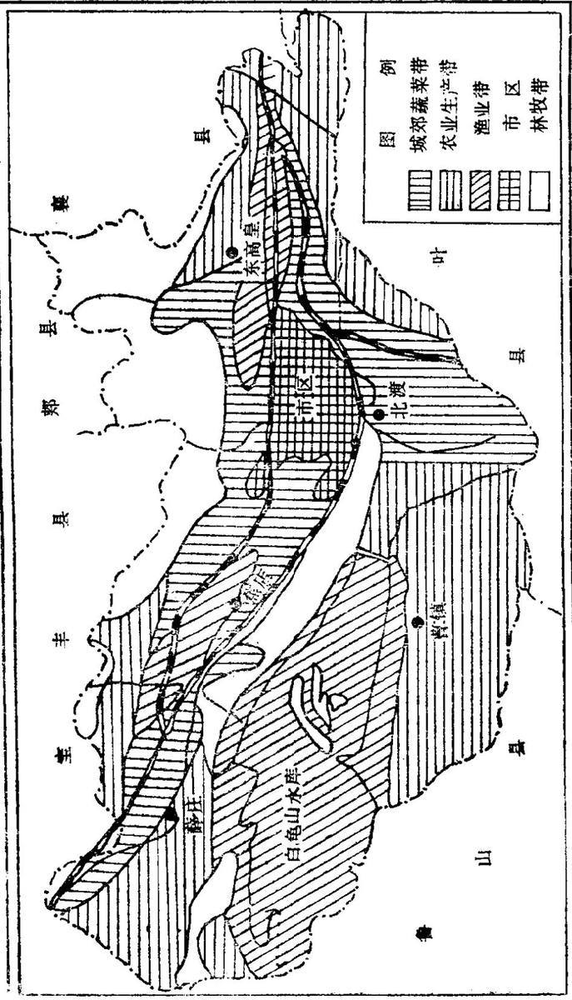  
-2

## 三、平顶山郊区应用实例

实例一：西高皇乡复垦菜地7.9hm²采取“以补代征”模式。

西高皇乡紧邻平顶山市，有7.9hm²亩蔬菜地因平顶山矿务局采煤而沉陷，平顶山市有些部门要求矿务局征用该地并再交纳蔬菜基地建设费60000元/hm²（可见除征地费外，仅蔬菜地建设费1项总计就达40多万元）。土地局根据国务院《土地复垦规定》，给矿务局下达了复垦这7.9hm²沉陷地的任务，矿务局除赔偿了复垦期间的农民经济损失以外，负担全部复垦工程费并承担了这7.9hm²蔬菜地的喷灌系统建设设备及工程费。这种补偿损失、支付复垦费而免征地的办法，使土地得到了恢复并较沉陷前更平整、设备更齐全，农民得到了实惠、企业也少支付了部分征地费。同时也增加了平顶山市的菜蓝子，这种“利国、利民、利企业”的“以补代征”模式，深得人心，不仅平顶山市已广为推广，也在安徽淮北等地得到了应用。

实例二：对辛南沉陷地复垦采用程序化管理。

辛南沉陷区位于平顶山市八矿采面上方，因多层开采形成深浅不一的大范围沉陷区。郊区土地局首先对其进行了待复垦土地现状调查，掌握了该区域土地沉陷范围、数量、质量等情况。在此基础上，郊区土地局组织专门力量制定了辛南沉陷区土地复垦规划，针对该沉陷区常年积水范围大，局部沉陷深度大（最深达2.0m）等特点，提出了以“一疏二平三改造”为主的综合治理方案，即首先采用疏通办法排除积水，使水位标高下降0.7m，从积水中解放25.6hm²被淹土地，同时排除另外17.2hm²土地被淹的危险；深水沉陷区采用泥浆泵高地取土挖鱼塘，垫高地面建造菜地、建畜禽养殖场，用煤矸石将深水处隔开建鱼塘等因地治宜、就地取材综合治理措施。

土地复垦规划制订出来后，又请各方面专家对该方案进行了可行性论证，确保了方案的科学合理性和现实可行性。

在规划方案实施过程中，郊区土地局深入复垦现场进行跟踪管理，及时给予多方面指导和监督检查，对不按规划要求和不符合质量标准的地方及时纠正，确保了复垦工程保质保量按时完成。

复垦工程竣工后，土地管理局及时组织有关部门依据“土地复垦检查验收技术标准”进行了验收。

由于土地管理部门对该沉陷区复垦工程采用全过程管理，对沉陷区现状了如指掌，复垦规划科学合理，施工过程中实行跟踪管理，严格按“土地复垦检查验收技术标准”进行验收，实践证明，该沉陷区土地复垦效果令人满意，现已复垦成耕地20余hm²(包括菜地），鱼塘7.6hm2，庄稼长势喜人，菜地、鱼塘效益可观，该沉陷区不久将变成平顶山市重要的副食品供应基地之一。

实例三：申楼村采用农民集资复垦模式。

申楼村因采煤造成大量耕地沉陷破坏，农民人均耕地水平急剧下降，村两委会针对农民惜土如金、迫切要求复垦土地的心情，采用农民集资、投工、投入机械的方式进行土地复垦。共集资35万元，组织8000名劳力，投工23200个，历时11个月，动用土方84730m³，开挖鱼塘7个，水面3.2hm²，改造沉陷地13.8hm²，年创经济效益14万元。

这一举措，不但大大提高了农民的生活水平，缓解了耕地紧张局面，而且大大加快了土地复垦进度，提高了区域环境质量，社会效益、经济效益和环境效益十分明显。

以上仅仅是平顶山市众多土地复垦实例中的几例，通过近几年的努力，现已复垦沉陷土地0.1万hm²，其中农用地0.07万hm²，菜地133.2hm²，鱼塘199.8hm²。从这些复垦的土地上为平顶山市每年提供粮食467.5万kg，鲜鱼150万kg，蔬菜1000万kg，为平顶山市的经济发展作出了巨大贡献，充分体现了土地复垦的优越性。

# 第三章 采煤沉陷地泥浆泵复垦技术研究

第一节引 言

在我国煤矿沉陷区的综合治理中，用水力挖塘机组进行挖深垫浅的复垦方法已在不少矿区如准北、徐州、平顶山等地得到应用，由于泥浆泵是以水力挖塘机组为核心，因此这种复垦方法称之为泥浆泵复垦法。迄今为止，由于人们常被泥浆泵复垦成本低、操作简单的表面假象所迷惑，忽略了对其操作工艺的优化、改进与完善，使得复垦后土壤条件较差，迟迟达不到目标产量，复垦效益较低，影响了该技术的推广。此外，泥浆泵复垦的成本与效益如何，也一直未得到深入研究。有鉴于煤矿沉陷区复垦的重要性和泥浆泵复垦技术缺乏研究的现实，本章从研究泥浆泵复垦的基本原理出发，总结使用泥浆泵复垦的工艺流程，评价复垦后的土壤生产力，对复垦后的土壤进行种植、养殖试验分析，在此基础上提出泥浆泵复垦的完整技术模式和新的工艺流程，并对复垦成本与效益的分析方法进行了探讨。

## 第二节 试验场概况与试验设计

## 一、试验场概况

试验场选在平顶山市效区东高皇乡辛南村31.3hm沉陷地，距市区9.24km。该沉陷区东邻许南公路和白灌区、北靠辛南村庄和平顶山八矿，南至东湛河，西邻铁路。

该区属于燥的大陆性气候，冬春于燥，降雨较少，雨量集中在夏秋之交，平均降雨量744.6mm，年际间变化在373.8mm\~1323.6mm。无霜期226天，属北温带季风型大陆性气候，该区主导风向西北和东北风。年平均气温+15℃，年均日照时数为2094h，元月份仅为135h，六月份达256h。

该沉陷区位于平顶山八矿已一采区西翼采空区上方，开采已15煤层，煤厚3.2m，垂深在325\~360m之间，表土层厚250～320m，最大下沉为2m左右，沉陷面积为31.3hm²亩。沉陷区杂草丛生，积水区的水质经化验无害，可以用来养鱼。

## 二、试验场设计

我们选择几种对照田作深入研究，在复垦后的耕地上进行种植试验，主要分析复垦后土壤特性，并在挖好的鱼塘中进行养殖试验。

1992年，我们在平顶山市辛南沉陷地已用泥浆泵复垦好的20hm2土地上进行取样分析，此外还用推土机复田0.2hm²以进行推土机和泥浆泵两种复垦技术对比试验，试验设计如图3-1所示。该试验场未作任何田间处理措施，选择了推土机复田、泥浆泵复垦田地（东、西两块），受沉陷影响的麦地和农田5个试验田进行取样分析，每个试验田取混合样，取样深度分别为0\~20cm，20\~40cm，40\~60cm。取样分析的主要土壤特性为：土壤剖面结构特征；土壤容重，土壤孔隙度，土壤含水量，土壤入渗特性，土壤有机质含量，土壤N、P、K含量。

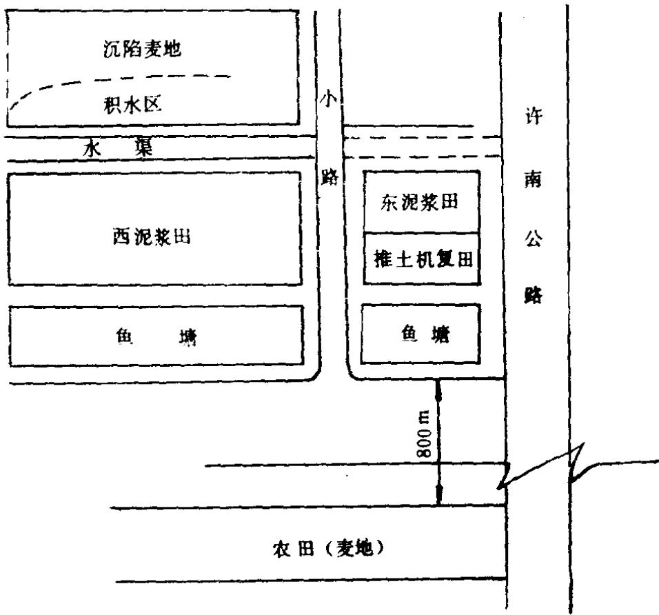  
图 3-1 试验设计示意图

第三节 泥浆泵复垦技术的工作原理与现行工艺流程

## 一、泥浆泵复垦的工作原理及应用条件

## 1.泥浆泵复垦的工作原理

造地复田往往需要挖土、装土、运土、卸土和平整土地五道工序。泥浆泵造地复田方法就是模拟自然界水流冲刷原理，把机电动力转化成水力而进行挖土、输土和填土作业，即由高压水泵产生的高压水，通过水枪喷出一股密实的高压高束水柱，将泥士割切、粉碎，使之湿化，崩解，形成泥浆和泥块的混合液，再由泥浆泵通过输送管压送到待复垦的土地上。

## 2.泥浆泵复垦的应用条件

当地下煤炭采出后，受采动的地表即向下沉陷，形成一个比采空区大得多的洼地，称之为地表移动盆地。在华东地区，沉陷的最大深度一般为1.5\~6.0m。我们将沉陷盆地分为两部分：深部和浅部，二者界线视具体地形及复垦要求而定。图3-2为采煤沉陷地表形态剖面图。

泥浆泵挖深垫浅复垦的目的是：在挖掘沉陷较深区域（称之为“挖深区”）土壤形成鱼塘的同时，用取出的土充填沉陷较浅的区域（称之为“垫浅区”）形成平整的农田，一举两得。因而，当满足以下条件时，泥浆泵复垦法即可使用：

(1）拟挖掘的沉陷深部的土方量足以充填沉陷浅部，并便复垦后的土地达到期望的高程。

(2)沉陷深部加深以后足以形成标准鱼塘。

(3）有足够的水源供泥浆泵水力挖掘土壤。

昂  
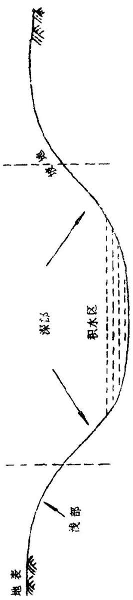

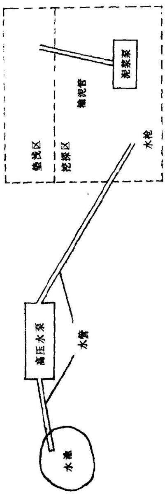  
梁垫3-33

（4）鱼塘进、排水条件便利。

## 二、现行泥浆泵复垦的工艺流程

目前，在一些矿山用泥浆泵进行的挖深垫浅复垦工程中，往往采用以下工艺流程。

（1）产生高压水：由高压水泵（一般为IS80-50-160或IS80-50-200型）将附近水池中的自由水转变成高压水，水速一般为50m³/h。

（2）冲土水枪挖土：高压水泵产生的高压水通过冲土水枪挖土，使土壤成为泥浆状。

（3）输送土：用泥浆泵吸取泥浆并通过输泥管将泥浆输送到待复垦的土地上。

（4）充填与沉淀：泥浆充填在待复田土地上，经自然沉淀形成复垦土壤。

（5）平整土地：待泥浆沉淀数月并适宜于平整工作进行时，用人工或推土机进行平整。现行泥浆泵复垦工艺如图3-3所示。

## 第四节 泥浆泵复垦的规划设计方法

泥浆泵复垦常形成鱼塘和耕地两部分，因此泥浆泵复垦规划设计的关键是确定复垦土地的鱼塘水面和耕地的比率，其主要步骤如下。

## 一、待复垦区原始资料的搜集

复垦区原始资料的收集是复垦方案设计的基础，收集的原始资料主要包括：

1）矿山企业生产现状，企业类型、规模、产品及产量，主要的开采方法，矿山的地理交通位置，隶属关系等。

2）矿山企业对土地的破坏现状与预测；采煤沉陷地现状，万吨煤沉陷率，积水率，积水深度，开采沉陷参数，采煤沉陷观测历史及资料，根据开采设计进行采煤沉陷预计并绘制成图。

3）待复垦地区的自然状况：自然地形地貌、气象特征、地震、地质、水文。土壤资料、名胜古迹及国家重要设施资料，土地利用状况，农业区划与国土规划情况，人口、耕地及社会经济环境等区域经济地理资料，其中水文资料包括地下水分布，水资源利用情况，洪水位资料，地方水利发展规划等。土地利用现状的调查应对当地的作物品种、生长状况，供求关系进行详细的分析统计。土壤资料包括土壤类别及分布情况，土壤各种理化性质及肥力的评价。原始资料在文字叙述的同时，应汇成表格，并绘制以下图件：

（1）矿区交通位置图1:10000～1:100000；（2）矿区区域地质图1:5000或1:10000；（3）矿区井上下对照图1:2000或1：5000；（4）采煤沉陷地现状图1:1000或1:2000；（5）土壤图及养分含量图1:500\~1:2000。

## 二、确定合理的耕地标高

泥浆泵复垦过程中，其耕地的合理标高的确定是非常重要的。确定的过高或过低对作物生长和水利灌溉均会造成不利的影响，同时对挖掘土方工程量都有一定的影响。其耕地的标高由沉陷地的临界深度和潜水高度、外河高度及5年一遇洪水位决定。可用下式表示：

$$
H _ { \mathfrak m \times \mathbb R } \geqslant h _ { \mathrm { k } } + \mathrm { M a x } \ \{ \ h _ { \mathfrak m \times \mathfrak m } , \ h _ { \mathfrak m ; \mathfrak m } , \ h _ { \mathfrak c \ast - \mathbb R \backslash \mathfrak l } \}\tag{3-1}
$$

式中 $H _ { ☉ \ * \ * k }$ ——复垦后的耕地标高；

Max{}——取最大者；

$h _ { \mathrm { \# \star \# } }$ ——潜水位标高；

$h _ { \# \# }$ ——外河水位标高；

h5年一週洪水——5年一遇洪水位标高；

$h _ { \mathrm { k } }$ ——临界深度，表示保证作物根系正常发育的最小根层厚度，它与土壤类型、作物的种类、气候、耕作方式、灌溉技术有关。

因此，复垦时需要考虑土壤类型、作物品种、恰当的耕作方式和灌溉措施。由于平顶山外河水位一般较低，不会构成沉陷区的积水，所以沉陷区的积水是由于潜水位影响造成的。例如：平顶山辛南沉陷地的潜水位标高为75m，考虑到 $h _ { \mathbf { k } }$ 的取值（一般取0.5\~3.0m)，这里我们取1.0m，则 $H _ { \ast \ast \ast }$ 为76m。

## 三、确定鱼塘和耕地的初步布局

根据沉陷地破坏现状，在现状图上确定鱼塘和耕地的初步布局，并进行平面布局设计。一般情况下，沉陷低洼的地方应考虑挖成鱼塘，沉陷地势较高的地方应当抬高形成耕地，并初步计算一下挖出的土方量与垫高的耕地所需的土方量，要求二者基本相当。

## 四、确定鱼塘的尺寸及深度

鱼塘尺寸的大小一般按长宽比5:3来确定，但有时也根据待挖鱼塘的地形来确定，因地制宜。辛南村鱼塘的长度为80m，宽度为50m。鱼塘的深度根据所养鱼的品种确定，其深度一般为2.5\~3.0m。

## 五、鱼塘水面与耕地比率的优化

复垦沉陷区鱼塘面积和耕地面积的比率，其优化原则见式$3 - 2$ o

$$
V _ { 1 } = A B + A B = V _ { 1 } = A B + A B = 9 0 0 0 0 0 0 ( c m )\tag{3-2}
$$

采用以下线性规划优化法对平顶山辛南沉陷地进行规划设计，设X， $X _ { \textrm { 2 } }$ 分别表示优化后的农业用地面积、鱼塘面积，各自的单位收益分别为4500元 $\sin \mu \eta \eta ^ { 2 }$ 和18000元 $/ \mathrm { h } \mathrm { m } ^ { 2 }$ 则：

## 1）目标函数：

投资收益Z最大 $\Re { \mathrm { 1 a x } \mathrm { . } Z } = . \mathrm { ~ i ~ } 5 0 0 X _ { \mathrm { ~ 1 ~ } } + 1 8 0 0 0 X$ 2

2）约束条件：

（1）面积约束。

$$
\textit { X } _ { 1 } + \textit { N } _ { 2 } { \leqslant } 3 1 . 3
$$

（2）自然条件约束。

$$
\begin{array} { l } { { X _ { 1 } \leqslant 2 3 . 3 } } \\ { { X _ { 2 } \leqslant 8 . 0 } } \end{array}
$$

最后，通过反复计算与调整（借助于计算机达到合理的水面与耕地的比例）使沉陷地最大效益地利用起来。经计算与调整，辛南沉陷区复垦的水面与耕地比为35%，即基塘比（耕地与水面比）为2.86。在实际施工后，基塘比调整为3.04，与理论计算差距较小。

## 第五节 泥浆泵复垦土壤的生产力评价

泥浆泵复垦后往往形成耕地和鱼塘，鱼塘的生产力主要取决于后期技术与管理，而复垦耕地的生产力则与复垦技术密切相关。由于复垦的目的在于恢复土壤的生产力。因而，复田土壤的生产力理所当然地成为评价复垦效果大小即复垦成败与否的客观标准。

## 一、土壤剖面与结构特征

经过在5个试验田挖掘剖面分析，农田与沉陷地均有明显的分层，表层有机质含量较高的上层土均在10cm左右，但沉陷麦地在40cm深度已见水。推土机复垦地及泥浆泵复垦的两个试验田无分层现象，均为深部翻上来的下层土，含粘粒高，含水分高，一般泥浆厚度60～80cm即可见至原表土，推土机复垦试验田覆土厚为80cm。

## 二、土壤容重

用环刀法取样测试容重，结果见表3-1，除推土机复田土地0\~20cm深度的容重大于1.65g/cm⁸外，其余均适宜或较适宜于作物生长，说明推土机复田易在表层产生压实。土壤容重在泥浆泵复垦土地和沉陷麦地的表土层中（0～20cm），均明显大于农田土壤，这主要是由于这些土地水分含量高，使粘粒成分易于板结，但这些土地的深部与农田土地无明显差异，所以泥浆泵复垦土壤容重不是作物生长的限制因素。

## 三、土壤的孔隙度

土壤容重是作物根系生长阻的和量度，但并不反映土壤孔隙度和裂隙的影响，因此土壤孔隙度是另一个重要的判断土壤生产力的参数，一般而言，该值在0.3\~0.6之间，从表3-1中的结果可以看出，泥浆泵复田土壤与农业土壤无明显差异，因此土壤孔隙度也是适宜农作物生长的。

## 四、土壤的含水量

水是农业的命脉，土壤中水分含量低将导致作物缺水，严重时会出现萎蔫现象，同时也影响养分的活性，不利于作物的生长。土壤中水分含量过大，也会使土壤透气性差，缺少作物生长的空气，使土壤中微生物活动及养分的释放受到严重阻碍，因此，土壤中水分过多或过少都是不利的。经测试5个试验田的土壤水分含量见表3-1，不难发现所有复垦土壤及沉陷麦地的含水量均大于或高于农业土壤，是农业土壤的1.5\~2.5倍，水分过多，对作物生长不利，沉陷麦地水分含量过大是由于地表沉陷，地下水位抬高。推土机复垦土壤及泥浆泵复垦土壤均是由于复垦过程中，将深部的含粘粒高的下层土翻上来，并携有大量的水分。这与复垦工艺紧密相关，符合实际，而复田后，排水系统又尚未健全，因而复垦过程中的水分难以及时排掉。

表 3-1 辛南沉陷地土壤物理特性分析结果
<table><tr><td rowspan=2 colspan=1>物理特性</td><td rowspan=2 colspan=1>试验日</td><td rowspan=1 colspan=4>深度（ cm）</td></tr><tr><td rowspan=1 colspan=1>10~20</td><td rowspan=1 colspan=1>20~40</td><td rowspan=1 colspan=1>40~60</td><td rowspan=1 colspan=1>60~80</td></tr><tr><td rowspan=3 colspan=1>土壤容重(g/cm⁸)</td><td rowspan=3 colspan=1>农田塌陷麦地西泥东泥推上机</td><td rowspan=3 colspan=1>1.161.481.331.321.72</td><td rowspan=2 colspan=1>1.551.581.471.44</td><td rowspan=1 colspan=1>1.56</td><td rowspan=3 colspan=1>1.491.571.08(原表土层)1.651.44</td></tr><tr><td rowspan=1 colspan=1>1.631.371.61</td></tr><tr><td rowspan=1 colspan=1>1.56</td><td rowspan=1 colspan=1>1.52</td></tr><tr><td rowspan=9 colspan=1>土壤孔隙度（%）土壤含水量(%)</td><td rowspan=5 colspan=1>农田塌陷麦地西泥东泥推上机</td><td rowspan=5 colspan=1>56.244.249.850.235.1</td><td rowspan=2 colspan=1>41.510.4</td><td rowspan=1 colspan=1>41.1</td><td rowspan=5 colspan=1>43.840.859.237.745.7</td></tr><tr><td rowspan=1 colspan=1>37.7</td></tr><tr><td rowspan=1 colspan=1>41.5</td><td rowspan=1 colspan=1>48.3</td></tr><tr><td rowspan=2 colspan=1>45.741.1</td><td rowspan=1 colspan=1>37.4</td></tr><tr><td rowspan=1 colspan=1>42.6</td></tr><tr><td rowspan=4 colspan=1>农田塌陷麦地西泥东泥推土机</td><td rowspan=3 colspan=1>13.828.026.3</td><td rowspan=1 colspan=1>1.1.0</td><td rowspan=1 colspan=1>15.5</td><td rowspan=3 colspan=1>14.32631.3</td></tr><tr><td rowspan=1 colspan=1>25.6</td><td rowspan=1 colspan=1>23.5</td></tr><tr><td rowspan=1 colspan=1>35.5</td><td rowspan=1 colspan=1>38 4</td></tr><tr><td rowspan=1 colspan=1>26.820.3</td><td rowspan=1 colspan=1>26.333.7</td><td rowspan=1 colspan=1>24.630.0</td><td rowspan=1 colspan=1>22.928.7</td></tr></table>

## 五、土壤人渗

入渗是土壤的水分特征之一，它决定自然降水和灌溉水进入土壤的数量。对于农业土壤，累计入渗量（I）与时间（t）的关系一般为 $I = a \bullet \downarrow ^ { \ b } ( a \bullet b$ 为常数），对其求导即得出入渗率$i \ = \ - { \frac { \operatorname { d } { \boldsymbol { I } } } { \operatorname { d } t } } = a b t ^ { \ b - 1 }$ 。我们自制了单圈入渗计在辛南沉陷地进行野外入渗测试（图3-4）。

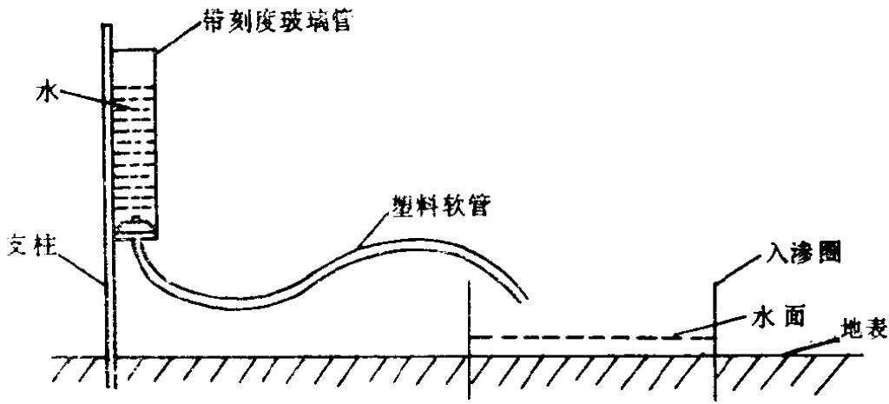  
图 3-1 自制单圈入渗示意图

根据试验结果，经室内计算，其入渗结果见表3-2。

表 3-2 辛南沉陷地人渗结果一览表
<table><tr><td>试验田</td><td>入渗规律  $( I = a t ^ { \flat } )$ </td><td>相关系数 (R)</td><td>入渗率  $_ \textrm { ( c m / s ) }$ </td><td>与农田入渗率的比值</td></tr><tr><td>农田</td><td> $I = 0 . 0 0 3 \mathrm { t } ^ { \circ \cdot \vec { \cdot } 3 \vec { \cdot } , \vec { \cdot } }$ </td><td>0.999</td><td>0.0035</td><td>1</td></tr><tr><td>沉陷麦地</td><td> $I = 0 , 0 3 8 1 \mathrm { t } ^ { 0 . 3 2 4 2 }$ </td><td>0.999</td><td>0.0077</td><td>2.2</td></tr><tr><td>西泥</td><td> $I = 0 . 3 0 5 { \mathrm { t } } ^ { 0 . 5 7 6 { \mathrm { . } } }$ </td><td>0.998</td><td>0.0006</td><td>0.17</td></tr><tr><td>东泥</td><td> $I = 0 . 0 4 1 5 \mathrm { t } ^ { 0 . \mathrm { \tiny { 6 2 7 } 1 } }$ </td><td>0.997</td><td>0.0013</td><td>0.37</td></tr><tr><td>推土机</td><td> $I = 0 . 0 8 9 5 \mathrm { t } ^ { 0 . 5 6 6 3 }$ </td><td>0.995</td><td>0.0002</td><td>0.06</td></tr></table>

从表3-2可以看出，沉陷麦地入渗最快，推土机复田土壤入渗最慢，泥浆泵复田土壤的入渗比农田土壤慢得多，仅为农田的1/3\~1/6。推土机复田土壤有压实现象，容重大且含水量高，因而入渗极慢，泥浆泵复田土壤主要由于水分含量过高，几乎达到饱和状态，所以十分慢，但比推土机复田土壤要快。沉陷麦地水分含量也高，理应入渗慢，但由于该地潜水位高，入渗水与潜水很快连通，导致入渗特别快，大大地快于农田土壤。入渗过快和过慢都容易造成土壤及养分的流失，不利于作物的生长。辛南沉陷地入渗对比曲线如图3-5所示。

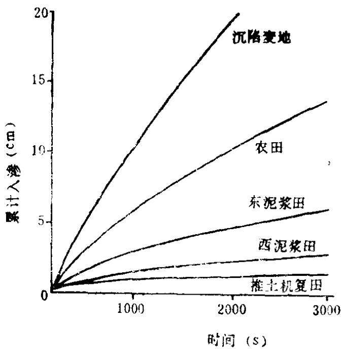  
图 3-5 辛南沉陷地入渗对比曲线图

## 六、有机质含量

有机质含量是土壤肥力的一个重要指标，其结果如图3-6所示，从图中可以看出，复垦土壤的有机质含量比农业土壤低得多，其中0\~20cm表土层有机质含量约为农田的1/3\~1/8，但复垦土壤深部（20～40cm）与其表层相比差异不大，有时还出现高于表层的现象，这与农业土壤有机质分布规律是完全不同的，这是由于复垦土壤混合造成的。沉陷麦地仅仅因下沉而土层未改变，所以有机质含量及分布规律与农业土壤一致。这一结果证明泥浆泵复垦土壤因下部生土翻上来并进行了混合，有机质含量较均匀，且十分低，因此，施以有机肥料是复垦土壤培肥措施的重要环节。

## 七、其它养分含量

N、P、K含量测试结果见表3-3，复垦土壤中的全氮、全磷、速效氮含量明显低于农业土壤和沉陷麦地，而速效钾含量比较接近，速效磷含量低于农业土壤，但差异不大，说明泥浆泵复垦土壤总体肥力较低，所以对泥浆泵复田土壤应采取培肥措施，尽快熟化土壤。

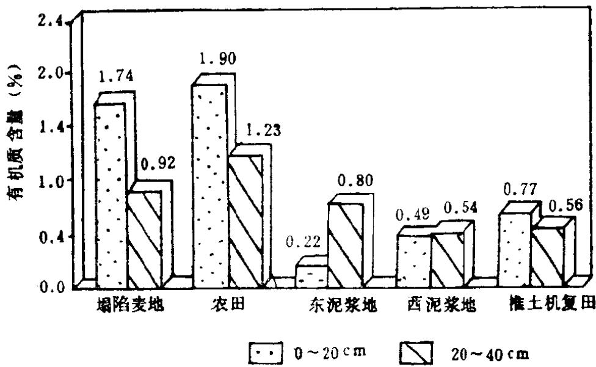  
图 3-6 辛南沉陷地土壤有机质含量图

表 3-3 试验田N、P、K分析结果
<table><tr><td rowspan=1 colspan=1>试验田</td><td rowspan=1 colspan=1>深度(cm)</td><td rowspan=1 colspan=1>全氮(%)</td><td rowspan=1 colspan=1>全磷(%)</td><td rowspan=1 colspan=1>速效氮(ppm)</td><td rowspan=1 colspan=1>速效磷(ppm)</td><td rowspan=1 colspan=1>速效钾(ppm)</td></tr><tr><td rowspan=1 colspan=1>农田</td><td rowspan=1 colspan=1>0~2020~40</td><td rowspan=1 colspan=1>0.1070.066</td><td rowspan=1 colspan=1>0.1670.130</td><td rowspan=1 colspan=1>8747</td><td rowspan=1 colspan=1>14.13.7</td><td rowspan=1 colspan=1>112.595</td></tr><tr><td rowspan=1 colspan=1>沉陷麦地</td><td rowspan=1 colspan=1>0~2020~40</td><td rowspan=1 colspan=1>0.1200.089</td><td rowspan=1 colspan=1>0.1270.118</td><td rowspan=1 colspan=1>8260</td><td rowspan=1 colspan=1>4.12.0</td><td rowspan=1 colspan=1>132.5125</td></tr><tr><td rowspan=1 colspan=1>西泥</td><td rowspan=1 colspan=1>0~2020~40</td><td rowspan=1 colspan=1>0.0420.042</td><td rowspan=1 colspan=1>0.0910.098</td><td rowspan=1 colspan=1>2527</td><td rowspan=1 colspan=1>2.71.4</td><td rowspan=1 colspan=1>97.595</td></tr><tr><td rowspan=1 colspan=1>东泥</td><td rowspan=1 colspan=1>0~2020~40</td><td rowspan=1 colspan=1>0.0280.053</td><td rowspan=1 colspan=1>0.1270.122</td><td rowspan=1 colspan=1>1035</td><td rowspan=1 colspan=1>3.31</td><td rowspan=1 colspan=1>7597.5</td></tr><tr><td rowspan=1 colspan=1>推土机</td><td rowspan=1 colspan=1>0~2020~40</td><td rowspan=1 colspan=1>0.0590.055</td><td rowspan=1 colspan=1>0.1070.103</td><td rowspan=1 colspan=1>2527</td><td rowspan=1 colspan=1>2.02.2</td><td rowspan=1 colspan=1>120132.5</td></tr></table>

## 第六节 泥浆泵复垦土地的试验研究

## 一、试验一（泥浆泵复垦地种植试验）

## 1. 试验设计

我们在平顶山郊区辛南、西高皇村等几个试验点，进行农作物试验，采用正常地与复垦后的土地进行比较，选择的种植品种

主要有小麦、玉米、黄豆、花生、芝麻、黄瓜等。

## 2.种植的投入及产出分析

复垦地主要种植的是小麦、玉米、花生、芝麻、黄豆、黄瓜等，其复垦后第一年（1994年）农作物的产量对比见表3-4。

表 3-4 复垦土地与农田的种植对比试验 单位：kg/km²
<table><tr><td rowspan=1 colspan=2>品种试验田</td><td rowspan=1 colspan=1>小麦</td><td rowspan=1 colspan=1>玉米</td><td rowspan=1 colspan=1>花生</td><td rowspan=1 colspan=1>芝麻</td><td rowspan=1 colspan=1>黄豆</td><td rowspan=1 colspan=1>黄瓜(露地)黄</td><td rowspan=1 colspan=1>瓜(大棚)</td><td rowspan=1 colspan=1>黄瓜(地膜)</td></tr><tr><td rowspan=1 colspan=2>复垦地</td><td rowspan=1 colspan=1>3750</td><td rowspan=1 colspan=1>4875</td><td rowspan=1 colspan=1>2250</td><td rowspan=1 colspan=1>937.5</td><td rowspan=1 colspan=1>2250</td><td rowspan=1 colspan=1>26250</td><td rowspan=1 colspan=1>56250</td><td rowspan=1 colspan=1>45000</td></tr><tr><td rowspan=1 colspan=2>农田</td><td rowspan=1 colspan=1>5250</td><td rowspan=1 colspan=1>6750</td><td rowspan=1 colspan=1>2625</td><td rowspan=1 colspan=1>1125</td><td rowspan=1 colspan=1>2625</td><td rowspan=1 colspan=1>37500</td><td rowspan=1 colspan=1>67500</td><td rowspan=1 colspan=1>52500</td></tr></table>

从表3-4可以看出，复垦后的土地第一年产量均达不到正常产量，约为正常产量的80%\~90%。这主要是因为，刚复垦后的土地一般是深部翻上来的生土，农作物的各种生存条件均达不到正常状况。但我们在其它实验中也发现对有些含粘粒相对少的复垦土地，种植红薯、花生等豆科类作物，可达到或超过正常农田产量。

## 二、试验二：池塘养鱼试验

## 1. 试验设计

复垦区水域主要养殖草鱼、花鲢、白鲢、鲫鱼、鲤鱼等，但不同的鱼种对鱼塘结构、水质、水生植物及喂养饲料有不同的要求。首先沉陷坑积水水源主要为地下水、天然降水、灌溉水等。所以水质不易控制，宜采用多种鱼立体养殖的方式进行，以达到肥水鱼和吃食鱼饲养过程中互补作用，同时改善水质。鱼塘高密度养鱼设计见表3-5。

## 2. 池塘养鱼技术

（1）合理地应用配合饲料。

首先因沉陷区开挖的鱼塘都是新塘，塘底淤泥少，水草以及贝壳类等天然食料更少，所以配合饲料的配方，应根据各食用鱼类对粗蛋白质的要求来制定。

表 3-5 辛南沉陷区鱼塘鱼种投放模式及规格单位：m
<table><tr><td>种 类</td><td>尾</td><td>kg</td><td>规格(g/尾)</td><td>成活率(%)</td></tr><tr><td rowspan="2">1冬龄鲢鱼</td><td>42000</td><td>210</td><td>50</td><td>95</td></tr><tr><td>1800</td><td>450</td><td>250</td><td>95</td></tr><tr><td rowspan="2">夏花鲢鱼</td><td>3750</td><td>1.5</td><td>0.4</td><td>90</td></tr><tr><td></td><td></td><td></td><td></td></tr><tr><td>2冬龄草鱼 1冬龄草鱼</td><td>1500</td><td>525</td><td>350</td><td>85</td></tr><tr><td rowspan="2">1冬龄鲤鱼</td><td>6000</td><td>120</td><td>20</td><td>70</td></tr><tr><td>1500</td><td>37.5</td><td>25</td><td>95</td></tr></table>

## （2）采用轮捕轮放。

池塘饲养，鱼种在一次放足的基础上，1年中分数批将达到食用规格的鱼捕出，同时补放一部分鱼种，这样可以使池塘饲养期间保持较合理的鱼量，避免由于鱼密度过大而影响生长。

## （3）水质控制。

水质控制主要是提高水中溶氧量，减少耗氧量和氨氮含量为中心的技术措施。池塘水透明度反映水的乳度，透明度过大，浮游生物少，水瘦；透明度过小又常常蓝藻过多，水中溶解氧低，水质变坏。全年透明度的控制应是两头小，中间大。

## （4）合理使用增氧机以防止浮头和泛塘。

当水中含氧量低于1mg/L时，就不能满足鱼类赖以生存的需要，轻则引起浮头，重则造成鱼类窒息死亡，浮于水面。增氧机的使用是增加水中溶解氧的主要措施。

## （5）建立和完善补、排系统。

在池塘相邻两塘埂上沿边用砖砌成小水沟，建立排水系统。

（6）除此以外还应加强鱼病防治，发现问题立即解决。

## 3. 试验结果与讨论

平顶山主要复垦区辛南、申楼、辛北的鱼塘的产量、产值见表3-6。

从表3-6中可以看出，池塘养鱼的产值高低与下列几个方面有关：（1）鱼种的选择；（2）掌握养鱼技术程度；（3）池

表3-6 平顶山主要复垦区鱼塘产量、产值  
产量：万kg 产值：万元
<table><tr><td rowspan="2">鱼种</td><td colspan="2">辛 南 4.7hm²鱼塘</td><td colspan="2">申 楼 5.3hm²鱼塘</td><td colspan="2">辛 北 2hm²鱼塘</td></tr><tr><td>产量</td><td>产值</td><td>产量</td><td>产值</td><td>产量</td><td>产值</td></tr><tr><td>草魚</td><td>0.6</td><td>3.6</td><td></td><td></td><td>0.21</td><td>1.44</td></tr><tr><td>鲢鱼</td><td>1.5</td><td>9</td><td>3.12</td><td>21.84</td><td>0.6</td><td>3.60</td></tr><tr><td>鲫鱼</td><td>0.6</td><td>3.6</td><td>0.52</td><td>3.64</td><td>0.024</td><td>1.44</td></tr><tr><td>鲤鱼</td><td>0.3</td><td>1.8</td><td>1.56</td><td>10.92</td><td>0.12</td><td>0.72</td></tr><tr><td>合计</td><td>2.46</td><td>18</td><td>5.2</td><td>36.4</td><td>0.96</td><td>7.21</td></tr></table>

塘养鱼管理的好坏。

## 三、试验三：甲鱼养殖

## 1. 试验设计

我们在平顶山矿务局十二矿沉陷地对甲鱼养殖进行试验。甲鱼俗称鳖，具有较高的营养价值，是高档的水产滋补珍品。甲鱼是变温动物，两栖性摄食生长的水温范围20\~33℃。15℃以下停止摄食，10\~12℃时钻入泥砂或石缝中冬眠。因而甲鱼需特种养殖，分为大塘养殖和温室养殖。我们进行的是温室养殖，采用恒温30度试验，以达到快速养殖甲鱼的目的。试验放养规格分为两种，一种为幼鳖，重50g到250g。另一种为成鳖，重250g以上。

## 2. 试验结果与讨论

## （1）规模与布局。

放养面积320m2，放养数量幼鳖为800只，成鳖150只。土建面积包括锅炉房40m²，办公室、仓库120m²，共480m²，土建总投资25万元。鳖生长周期16个月，每月净增重30g以上，目前平顶山市鳖的价格是750g以上的每500g210\~230元，预计二年内收回投资。

## （2）关键饲养技术。

进苗时间一般秋末冬初结冰期前或春后4月底，投喂甲鱼用配合颗粒饲料或相应适口饲料如鲜杂鱼、螺贝等。

## 四、试验四：养猪

## 1. 试验设计

在矿务局养殖厂和十二矿沉陷地，我们在复垦地上进行了养猪试验，猪种采用长白条和杜罗克。猪舍总面积0.5hm²，公猪与母猪比为1:20，成品猪的最佳出售重量为每只100kg。生长周期一般为4个月左右。

## 2. 结果与讨论

矿务局养殖厂和十二矿沉陷地上，其每年猪出栏头数为1000头，其产值与净收益见表3-7。

表 3-7 平顶山复垦地养猪产量及收益
<table><tr><td rowspan=2 colspan=1>地点</td><td rowspan=1 colspan=4></td></tr><tr><td rowspan=1 colspan=1>猪舍面积</td><td rowspan=1 colspan=1>产量（头/年）产</td><td rowspan=1 colspan=1>值(万元/年)净</td><td rowspan=1 colspan=1>收益（万元）</td></tr><tr><td rowspan=1 colspan=1>矿务局养殖厂</td><td rowspan=1 colspan=1>1666.75m²</td><td rowspan=1 colspan=1>1000</td><td rowspan=1 colspan=1>60</td><td rowspan=1 colspan=1>5</td></tr><tr><td rowspan=1 colspan=1>十二矿沉陷地</td><td rowspan=1 colspan=1>3333.5m²</td><td rowspan=1 colspan=1>1000</td><td rowspan=1 colspan=1>50</td><td rowspan=1 colspan=1>5</td></tr></table>

## 五、试验五：养鸡

在矿务局养殖厂，在复垦后的土地上建立约0.9hm²的鸡舍，每年产蛋鸡60万只，育成鸡6万只，种鸡2200只，商品鸡10万只，产值近300万元。并建立种鸡房，其公母比为1:30，建立起一条龙生产线，同时销售种鸡、种蛋、育成鸡及鲜蛋。其产量及效益见表3-8。

表 3-3 复垦地养鸡产量及效益
<table><tr><td rowspan=2 colspan=1>类           别</td><td rowspan=1 colspan=2></td></tr><tr><td rowspan=1 colspan=1>产量（万只/年）</td><td rowspan=1 colspan=1>产值（万元/年）</td></tr><tr><td rowspan=1 colspan=1>蛋           鸡</td><td rowspan=1 colspan=1>60</td><td rowspan=1 colspan=1>90</td></tr><tr><td rowspan=1 colspan=1>育  成   鸡</td><td rowspan=1 colspan=1>6</td><td rowspan=1 colspan=1>3</td></tr><tr><td rowspan=1 colspan=1>种           鸡</td><td rowspan=1 colspan=1>0.22</td><td rowspan=1 colspan=1>80（出售种蛋、雏鸡、种鸡）</td></tr><tr><td rowspan=1 colspan=1>商   品   鸡</td><td rowspan=1 colspan=1>10</td><td rowspan=1 colspan=1>120</td></tr></table>

## 六、试验六：在复垦区上建住宅小区

## 1. 试验设计

乐福小区为矿务局所建，距市区仅0.5km，其沉陷区原是二矿60\~70年的沉陷区，沉陷深度最深为4.0m，杂草丛生，荒滩湖泊。经唐山煤炭研究院取样论证，充填复垦后的沉陷地可盖6层以下楼房，局部地区可盖10层以下楼房。

## 2.小区设施及效益

现规划面积为22.25hm2，计划建60栋6层住宅楼，现已建成18栋，正在施工的10栋(6月份完工)，建筑面积为166000m²住宅，14000m²公共建筑。包括学校、医院、锅炉房。总投资1.1亿元，可以解决2200户人，近1万职工住房问题。

## 七、试验七：在复垦区上建公园

东湖公园位于平顶山市东部，总面积14.5hm2。这里原是杂草丛生常年积水的采空、沉陷区。在市政府、矿务局领导重视和有关单位支持下，在这里规划造园砌湖、建亭、造桥、植树、栽花，共投资90万元。如图3-7所示。该公园的建成为广大的职工的休息提供了良好的场所，园内建成的儿童乐园、旱冰场、花园、月季园、牡丹池、荷塘舞厅，棋牌桌橙、职工疗养等景点和娱乐场所，成为深受广大职工欢迎的乐园。

## 第七节 泥浆泵复垦与推土机复垦工艺对比试验

## 一、试验场地概述

我们在辛南沉陷地，选择一块地只用推土机进行复垦，面积0.2hm²，另一块地约6.7hm²只用泥浆泵复垦。复垦工作于1991年10月底完成，5个月后我们开始取样分析。

## 二、推土机复垦工作原理及技术工艺

推土机进行复垦工作原理：主要通过它的推斗把高的地区推平，或把低的区域土壤推到待复垦的地区，同时还可平整土地。其优点是挖掘和平整土地速度快、效率高，其使用条件是复垦的土地要求干燥，土壤内部结构松软，适合大面积复垦。其推土机

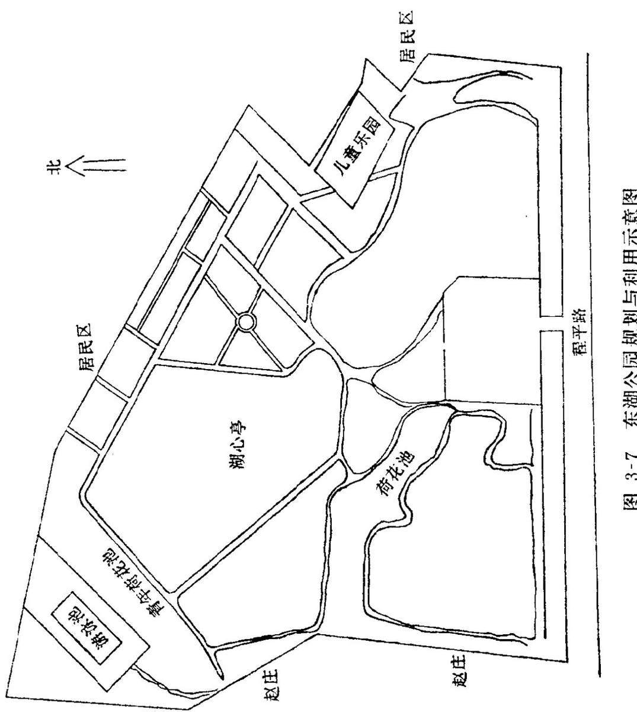  
图热杀

复田技术工艺如图3-8所示。

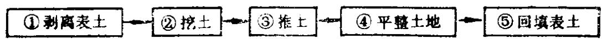  
图 3-8 推上机复田技术工艺流程

可以看出，推土机复田技术工艺简单，需要环节少，只需推土机即可进行。

## 三、两种复垦技术对比

以上讨论了辛南两种复垦方案情况，现将两种方案各种参数对照，见表3-9。

表 3-9 两种复田方案参数对比
<table><tr><td rowspan=1 colspan=1>复田方法</td><td rowspan=1 colspan=1>工作原理</td><td rowspan=1 colspan=1>适用条件强</td><td rowspan=1 colspan=1>度及工数复</td><td rowspan=1 colspan=1>田的效果</td><td rowspan=1 colspan=1>作业成本</td><td rowspan=1 colspan=1>其它因素</td></tr><tr><td rowspan=1 colspan=1>推土机(51.5kW)机</td><td rowspan=1 colspan=1>利用推土进行挖场土、输土和填土</td><td rowspan=1 colspan=1>要求作业大，复垦作地干燥、松软、水位不天能太高、运1输距离不易太长（10m以内）</td><td rowspan=1 colspan=1>可连续工，含石多的100m3；滩涂地，20m³/天；土壤500m³/天</td><td rowspan=1 colspan=1>复垦后土壤压实明显，不利于作物的生长，需要深耕</td><td rowspan=1 colspan=1>2.50元/m³</td><td rowspan=1 colspan=1>受天气、地形限制</td></tr><tr><td rowspan=1 colspan=1>泥浆泵</td><td rowspan=1 colspan=1>利用泥浆泵这一组机足械把机电动力能转换成水力来进行挖土、输土土和填土</td><td rowspan=1 colspan=1>要求有充的水源，运输距离上相对推土机长，要求含壤</td><td rowspan=1 colspan=1>不能连续工作，要求人的劳动强度大，65m/天</td><td rowspan=1 colspan=1>复垦的土壤含水分高，不利于沉淀</td><td rowspan=1 colspan=1>2.80元/m³</td><td rowspan=1 colspan=1>受天气、地形影响小</td></tr></table>

注：作业成本为1991年价格

从以上技术对比和第五节的土壤生产力评价中，我们可以得出以下结论：

1）泥浆泵复垦的工艺流程较推土机复垦的工艺流程更加合

理，可操作性强、复垦效益高。

2）泥浆泵复垦土壤和推土机复垦土壤的物理特性均较农业土壤差，但泥浆泵复垦土壤较推土机复垦土壤要优越。

3）从复垦工艺、复垦效果来看，泥浆泵复垦优于推土机复垦，是适宜我国推广的复垦技术，但如若表土的剥离用推土机来完成，其工效和复垦效果更佳，故我们建议今后大力推广“推土机+泥浆泵”复垦技术，即表土用推土机剥离，其余土层用泥浆泵挖掘。

## 第八节 泥浆泵复垦技术评价与新工艺的探讨

## 一、现行泥浆泵复垦技术存在的问题

经过以上分析，我们不难发现虽然泥浆复垦技术有设备简单、操作方便、工效高、成本低、施工不受天气影响等优点。但现行的工艺也导致了两大弊端：

1）复田土壤条件差：复垦土壤不仅贫瘠，而且土壤上下层混合，结构性差，土壤中水分含量过大，使复田土壤迟迟达不到目标产量。

2)沉淀时间长：因自然沉淀慢，复田土壤泥泞，使平整土地工序难以进行，致使工期推迟，严重影响复垦效率。

## 二、改进的泥浆泵复垦技术工艺

为了克服现行泥浆泵复垦工艺存在的弊端，我们提出了一个新颖的复垦工艺流程，即新的土壤重构方法，其改造的泥浆泵复垦工艺如图3-9所示。

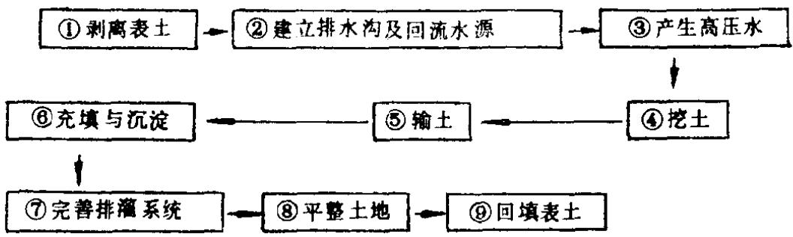  
图 3-9 改进的泥浆泵复田工艺流程

这一新的泥浆泵复田工艺流程中增加了①②⑦⑨四道工序，改进了第④⑥道工序的冲土和充填顺序，其余与原工艺一致。下面就改进和增加的几道工序加以说明：

1）增加剥离和回填待复垦区（即垫浅区）表土工序：表土往往是经过几十年、上百年熟化而形成的优质土。对于待复田的土地（垫浅区）在复垦前应尽可能地将表土层（一般10\~30cm厚）用推土机剥离并堆存起来，待泥浆泵复垦完毕后再回填到泥浆复垦的土地上，形成优质的熟化土层，以利于早日达到目标产量，在堆存表土时应注意采取水土保持和保肥措施，以防止表土贫化与损失。

2）建立排水沟和回流水沟：由于泥浆泵复垦的特点是水力挖土、水力输土，因而排水工作是影响沉淀速度和复垦工期的关键因素。所以，在复垦工作前可以仅仅建立与回流水沟相协调的一部分排水沟。回流水沟的设计完全取决于泥浆泵复垦工艺的需要，是在排水沟的基础上增加若干连通沟而形成的，其目的不仅仅是为了排水，更重要的是达到循环利用水资源和不污染其它水源的目的。总之，排水沟和回流水沟的建立可以及时将多余的水分排走，变过去的自然沉淀为人为加速沉淀，效益十分显著。

3）完善排灌系统：泥浆泵复田完毕后或接近完毕时，及时完善排灌系统，进一步排出复田土壤中多余的水分，使土地平整工序早日进行以达到尽快恢复垦土地生产力的目的。

4）冲土顺序和充填位置的优化：现行冲土工序和充填位置导致挖深区上下土层的混合或下层土覆盖在上层土上。“挖深区”由于积水或较湿不易象“垫浅区”一样剥离表土。因此宜采用与倒堆法露天开采复垦工艺类似的方法，使复田土壤的土层顺序保持基本不变。图3-10展示了新的冲土顺序和充填位置，即新的土壤重构方法，其方法是：

(1）把“挖深区”和“垫浅区”划分成若干块段（依地形和土方量划分），并在“垫浅区”剥离表土后对该区划分的块段边界设立小田埂以利于充填。

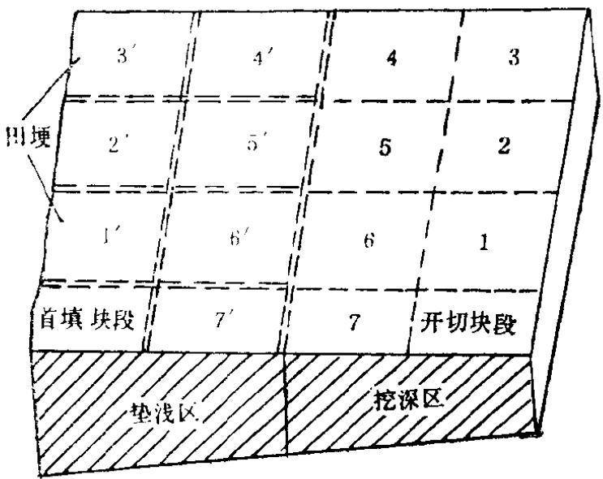  
图3-10 新的冲土顺序与充填位置示意图

（2）用泥浆泵挖掘“开切块段”，取出的土充填“首填块段”。这一步工作与原工艺一致，往往导致上下土层的混合，因此，“开切块段”和“首填块段”应尽量小。

（3）将“挖深区”的土层分为上层土（一般30\~50cm）和下层土（一般大于30cm或50cm），按以下的顺序进行挖掘与充填：首先将挖深区1块段的上层土覆盖在“首填块段”上，然后将1块段下层土充填在垫浅区1′块段上，然后将2块段的上层土覆盖在1'块段，使得1'块段的结构为“2块段上层土”+“1块段下层土”，如此类推，就可构造一个新土壤结构，可用下式表述：

$$
\begin{array} { r l } { \mathrm { i } ^ { \prime } \nleftrightarrow \sum \limits _ { k } \sum \limits _ { X = \pm \infty } ^ { n } \pm \frac { \sum \limits _ { i = 1 } ^ { n } \sum _ { k = 1 } ^ { n } \frac { 1 } { i ^ { 2 } } } { n ! } = } & { \mathrm { i } ^ { \infty } ( \mathrm { ~ i + \infty ~ } ) \neq \pm \frac { \sum \limits _ { k } \sum _ { X = \pm \infty } ^ { n } \sum \limits _ { k = 1 } ^ { \infty } \pm 2 } } \\ { + } &  \mathrm { i } ^ { \pm } \hbar \underset { X = \pm \infty } { \sum \limits _ { k } \sum \limits _ { k = 1 } ^ { n } \sum \limits _ { p } ^ { \infty } \frac { 1 } { i ^ { 2 } } } \end{array}\tag{3-3}
$$

$$
\# \neq \# , i = { \bf 1 } , 2 \cdots , \ n = \ - \ 1 ( \mathrm { \bf ~ n } \neq \hbar \llap / \hbar ) / \hbar \llap / \hbar \neq j \neq k \llap / \hbar \neq j \neq \hbar
$$

$$
\begin{array} { r } { n ^ { \prime } \pm \jmath _ { k } \sharp _ { k } ^ { n } \sharp _ { i } \sharp _ { i } ^ { \pm } \sharp _ { i } ^ { \pm } \sharp _ { i } ^ { \pm } \jmath = \begin{array} { l } { \mathfrak { u } \ : 1 \pm \jmath _ { k } \sharp _ { k - 1 } \mathopen { : } \mathclose \bgroup \left. \sharp _ { \infty } \pm \cdots \aftergroup \egroup \right. } \\ { \qquad \div \ : \mathfrak { u } \ : 1 \pm \jmath _ { k } \sharp _ { k - 1 } \mathopen { : } \mathclose \bgroup \left. \sharp _ { \infty } \pm \infty \aftergroup \egroup \right. } \end{array} , } \end{array}\tag{3-4}
$$

由此可见，“垫浅区”上新构造的土壤除“首填块段”以外，其余块段的土层顺序基本保持不变。当复垦土地上多余水分排走后，再回填原“垫浅区”的表土，这样所构的复垦土壤比原复田技术优越，并极有可能当年恢复原土壤生产力。

## 第九节 泥浆泵复垦完整技术模式的探讨

以上研究主要侧重于泥浆泵复垦工艺的研究，为了使其技术更完整，我们提出一个完整的泥浆泵复垦技术新模式，如图3-11所示。

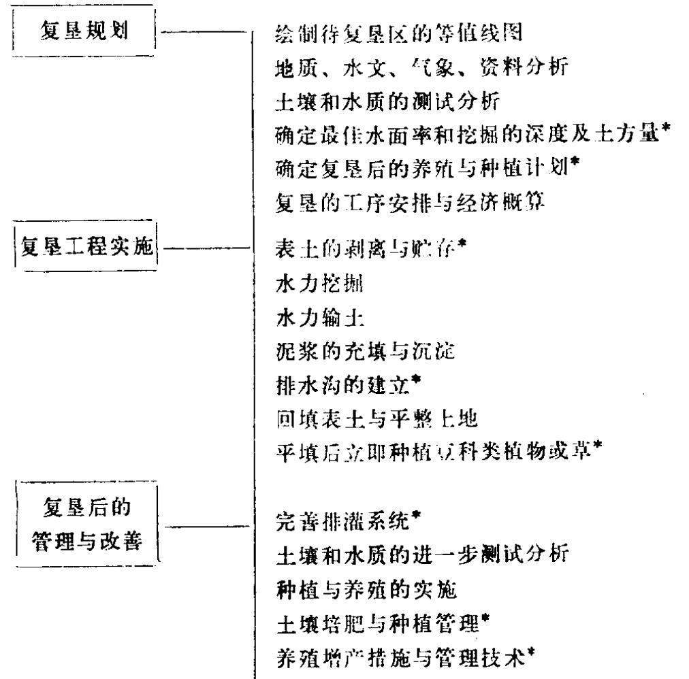  
\*为该工程阶段的关键工序

图 3-11 泥浆泵复垦技术新模式

泥浆泵复垦完整技术模式分为三个阶段即复垦规划、复垦工程实施和复垦后的管理与改善。在复垦规划阶段，应基于下沉盆地的等值线图和潜水位情况确定最佳水面率和应挖掘的深度并计算土方量；然后在进行土壤水质分析和市场调查的基础上确定复垦后的养殖与种植计划；最后进行复垦工序的优化与经济概算。在复垦工程实施阶段，应首先尽可能地剥离浅沉陷地和季节性积水区的表土，剥离厚度为30cm为宜，将表土堆存并种植草或豆科类作物，同时采取防止水土流失措施，这一项工作在我国常被忽略。在泥浆泵进行挖、输、填的过程中，应注意回流水沟的设计与安排，一旦复田工程完毕，立即挖掘排水沟，将复垦后泥浆土壤中多余水分排走，以便于回填表土和平整土地。当土地平整后，立即种植草或豆科类植物以培肥和防止泾流。复田后的管理与改善是提高复垦效益的关键，完善排灌系统是首要任务，然后才是按计划进行种植和养殖。种植离不开培肥与田间管理，养殖离不开科学的增产技术与饲养方法。只有每一步工作都较好地完成，才能使泥浆泵复垦产生高效益、也才能使这一技术具有生命力。

## 第十节 泥浆泵复垦工程的成本与效益分析

## 一、泥浆泵复垦工程成本与效益的理论分析

## 1.泥浆泵复垦工程的成本构成

土地复垦工程往往需要挖掘土方、装载土方、运输土方、卸土方和平整土地五个工序，因此，土地复垦工程的成本构成也理应是这五个方面，即成本 $C _ { \mathfrak { s } } = C _ { \sharp } + C _ { \mathfrak { s } } + C _ { \sharp } + C _ { \sharp } + C _ { \sharp } ,$ 。由于泥浆泵复垦是用泥浆泵这一台机械完成了挖、装、运、卸四道工序，所以，泥浆泵复垦的成本 $( \textsf { C } _ { 0 } )$ 构成就是泥浆泵完成这四道工序的成本（不妨称之为 $C _ { ☉ } )$ 与复垦后平整土地的成本 $( C _ { \cdot } )$ 之和，即 $\boldsymbol { C } _ { \mathfrak { o } } = \boldsymbol { C } _ { \mathfrak { o } } + \boldsymbol { C } _ { \mathfrak { s } _ { \mathtt { c } } }$ 一般情况下， $C _ { \mathfrak { d } } = 2 . 8 \sim 3 . 0$ 元 $/ \mathfrak { m } ^ { 3 } , C _ { \# }$ $= \textbf { 1 } \overline { { \mathcal { I } } } \overline { } { \times } / \mathrm { m } ^ { 3 }$ ，所以 $C _ { \mathfrak { d } }$ 可以取4元 $/ \mathrm { m } ^ { 3 }$

## 2.泥浆泵复垦工程的成本与效益的理论公式

我们假定所有土方均用泥浆泵完成，并设：耕地与水面比（即基塘比）为r，复垦单位面积 $( \mathrm { ~ \ 1 ~ h m ^ { 2 } ~ } )$ 耕地所需挖塘的面积为 $S ( \mathrm { \ h m } ^ { 2 } )$ ，则复垦总面积 $A = \ 1 \ + S = \ 1 \ + \frac { 1 } { r } = \frac { 1 + r } { r }$ 。再设复垦耕地充填厚度平均为h（单位为m)，单位土方的泥浆泵复成本 $C$ 。(单位为元 $/ \mathbf { m ^ { 3 } } \ .$ )，单位面积复垦成本为 $C$ (单位：$\overline { { \pi } } / \mathrm { h } \mathrm { m } ^ { 2 } :$ ，复垦效益为 $E \textsf { ( } \overrightarrow { \tau } \dot { { \boldsymbol { \mu } } } / \mathbf { h } \mathbf { m } ^ { \textit {  } } )$ ，复垦耕地的单位净效益为 $E _ { \textrm { 1 } } ( { \ } \overrightarrow { \pi } / { \textrm h m } ^ { \textrm { 2 } } )$ ，水面的单位净收益为 $E _ { \textrm { 2 } } ( \overrightarrow { \pi } / \hbar \boldsymbol { \mathrm { m } } ^ { \textrm { 2 } } )$ 0

则，恢复耕地的总土方量 $T$ 为：

$$
T = 1 0 0 0 0 / _ { l } \quad \quad , \mathrm { ~ m ~ } ^ { 3 }\tag{3-5}
$$

所以：

复垦成本

$$
\begin{array} { r l } {  { C = \mathrm {  ~ ( ~ } T \times C _ { \mathrm { ~ o ~ } } ) / \mathcal { A } } } \\ & { = \frac { \mathbf { 1 } 0 0 0 0 \times h \times C _ { \mathrm { ~ o ~ } } } { \displaystyle \frac { 1 + r } { r } } } \\ & { = \frac { \mathbf { 1 } 0 0 0 0 \times h \times C _ { \mathrm { ~ o ~ } } \times r } { \mathbf { 1 } + r } , ~ \overrightarrow { \pi } / \mathrm { h } m ^ { 2 } } \end{array}\tag{3-6}
$$

复垦效益

$$
\begin{array} { l } { E = \left( \begin{array} { l l } { \mathbf { 1 } \times E _ { 1 } + S \times E _ { 2 } } \end{array} \right) / A } \\ { = \displaystyle \frac { E _ { 1 } + \frac { 1 } { r } \times E _ { 2 } } { \mathbf { 1 } + \frac { 1 } { r } } } \\ { = \displaystyle \frac { E _ { 1 } \times r + E _ { 2 } } { 1 + r } , \qquad \vec { \pi } / \mathrm { h m } ^ { 2 } } \end{array}\tag{3-7}
$$

3.泥浆泵复垦的成本与效益分析

复垦成本的公式（3-6）可以简化为：

$$
C \ = { \frac { 1 0 0 0 0 \times \ h \times C \ _ { 0 } \times \ r } { 1 \ + \ r } } = { \frac { 1 0 0 0 0 \times \ h \times C \ _ { \circ } } { 1 \ + \ { \frac { 1 } { r } } } } = { \frac { K \times h } { 1 \ + \ { \frac { 1 } { r } } } }\tag{3-8}
$$

式中 K——在某一地区为一常数， $\ l \dot { K ^ { \prime } } = 1 0 0 0 0 \times { C _ { \circ } } = 1 0 0 0 0 \times { 4 }$ = 40000

当h一定时，复垦成本C与基塘比r成正比，即基塘比值越大，复垦耕地比重越大，成本越高，其关系如图3-12所示。

当r一定时，复垦成本C与复垦耕地的厚度h成正比，其关系如图3-13所示。

由于 $E _ { 2 }$ 往往大于 $E _ { 1 }$ 好几倍，从公式（3-7）可以看出复垦效益E与基塘比r成反比，基塘比越大，即恢复耕地比重越大，复垦的效益越低，其关系见图3-14。

## 二、泥浆泵复垦工程的成本与效益举例

上几节研究了平顶山东高皇乡辛南31.3hm²沉陷地的复垦，

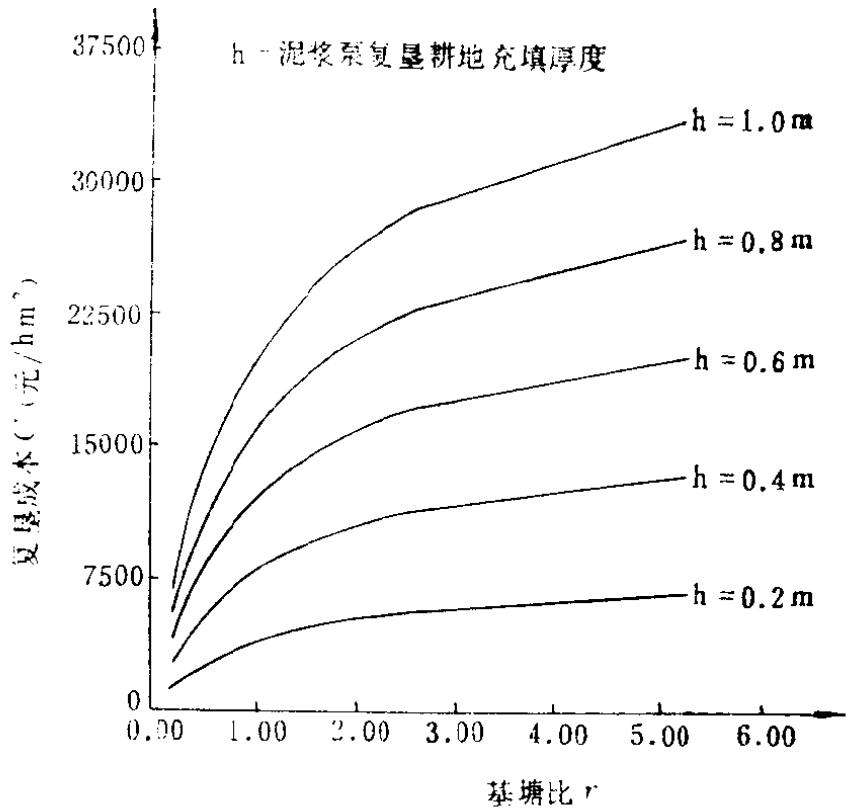  
图 3-12 泥浆泵复垦成本与基塘比的关系图

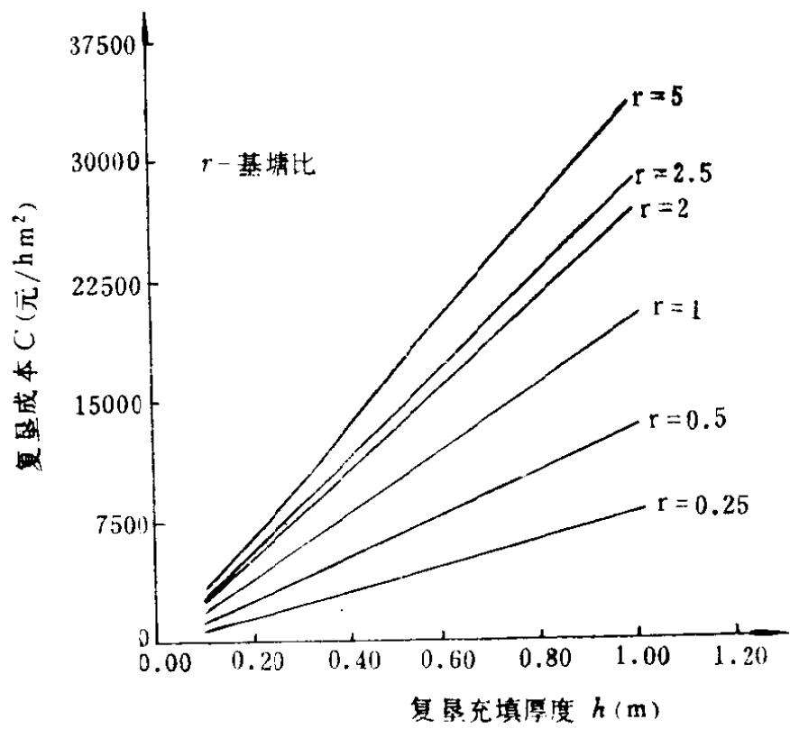  
图3-13 泥浆泵复垦成本与复垦耕地厚度的关系图

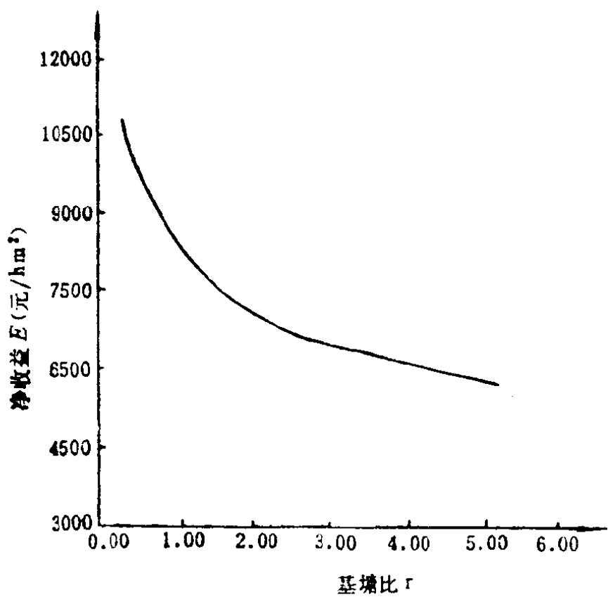  
图 3-14 净收益与基塘比关系图

其实际的基塘比值为3.04， $C _ { \mathfrak { o } }$ 为4元/ $' \mathrm { { m } } ^ { 3 }$ ，复垦耕地的厚度0.6\~0.8m（平均0.7m），耕地的单位收益为4500元 $/ \hbar \mathfrak { m } ^ { 2 }$ ，水面养鱼收益为18000元 $/ \ln \ m ^ { 2 }$ ，则：

$$
\begin{array} { r l } & { \bigoplus \bigoplus _ { \mathbb { X } } \bigoplus _ { \mathbb { X } } \bigwedge \bigwedge _ { \mathbb { X } } C = ( { \bf 1 0 0 0 0 } \times 0 . 7 \times \textnormal { \bf 4 } \times 3 . 0 4 { \bf \pi } ) / ( \textnormal {  { 1 } } + 3 . 0 4 { \bf \pi } ) } \\ & { \qquad = 2 { \bf 1 0 7 0 } . 5 \overrightarrow { \mathrm { \tiny { ~ \wedge ~ } } } / { \bf \hat { Z } } / \mathrm { h m ~ } ^ { 2 } \circ } \end{array}
$$

$$
\begin{array} { r l } & { \overleftrightarrow { \mathfrak { L } } \stackrel { \triangledown } { \ = } \overleftrightarrow { \mathfrak { X } } \overleftrightarrow { \mathfrak { X } } \stackrel { \triangledown } { \ = } E = \left( \begin{array} { l } { E _ { 1 } \times r + E _ { \mathrm { ~ 2 ~ } } ) / \left( \mathrm { ~  ~ 1 ~ } + r \mathrm { ~ } \right) } \\ { = \mathrm { ~ ( ~ 3 ~ . 0 4 ~ } \times 4 5 0 0 + 1 8 0 0 0 \mathrm { ~ ) ~ / ~ ( ~ 1 ~ } + 3 . 0 4 \mathrm { ~ ) ~ } } \end{array} \right. } \\ & { \ = 7 8 4 2 \overleftrightarrow { \mathfrak { X } } / \mathrm { h m ~ \mathrm { ~ ^ 2 ~ } \circ ~ } } \end{array}
$$

## 第四章 土壤生产力定量评价的数学模型及其应用

第一节 土壤生产力定量评价的目的和意义

土壤生产力评价是一个长期未解的课题，一直是农业专家关注的焦点之一。众所周知，复垦土壤生产力的优劣是评定复垦成败和衡量复垦效果高低的客观标准，也是农业土地分等定级和合理配置的重要依据，因此，为了合理配置沉陷地资源，有效地监督检查和验收复垦工程以及合理地量度复垦效果，开发一个土壤生产力定量评价模型是非常必要的，它将有助于沉陷地资源利用管理模式的实施，促进土地复垦走上正规化和程序化的轨道。

针对农业土壤，Huddleston提出了一个“土壤生产力评级（productivityrating）”的文献综述。他描绘了土壤生产力评价从早期使用土壤调查（soil survey)资料定性估计到近期数学定量化探讨的发展变化。到本世纪早期，随着第一个土壤调查（soil survey）资料的出现，定性地评价土壤生产力的方法也应运而生了。研究出的几种定性评价方法是基于对农业作物生长的适宜性，这些方法的主要缺陷是：许多土系缺少产量数据；产量的变化往往取决于作物的品种、田间管理措施、农民的技能、使用的设备和作物生长期间的降雨量。由于这些原因，对土壤生产力评价的研究逐渐下降，直到50年代被估计的产量所取代。

日前，土壤生产力常常地用最终的谷物产量来量度（现在的评价土壤生产力的标准），但该法的耗时、费力、受环境条件影响大且无法量度长远土壤生产力的缺陷，使人们越来越关心于直接用土壤特性来量度土壤生产力的新途径。但由于土壤特性与土壤生产力的关系还未得到很好地解决，因而建立合适的土壤生产力标准已被证明在技术上是困难的。尽管建立定量的评价土壤生产力标准是困难的，但农业专家往往有能力基于量度的土壤特性去预测或判断土壤生产力的优劣，因此，一个知识库或经验库是存在的。所以，这个问题可以通过多因素、“软”信息的知识或专家经验库来建立土壤特性与土壤生产力的关系，从而得到最终解决。模糊集理论正是一个处理模糊现象和将人类的经验转变为定量关系的一种有力的工具。本章试图基于模糊集理论和量度的土壤特性开发一个定量评价土壤生产力的新方法。

## 第二节 土壤生产力定量评价的数学模型——模糊PI模型

## 一、原有PI模型的描述

Neill提出了一个土壤生产力系数(ProductivityIndex，简写为PI）的模型。这种方法的假设前题是：一些土壤特性是影响作物生长和最终作物产量的主要因素。整个土壤剖面对作物生长的适应性（sufficiency）是每个土层土壤适应性条件的总和。每个土层土壤适应性为0\~1区间上的值，0表示最不适合，1表示最适宜条件。整个土壤剖面的PI用下述公式计算：

$$
P I = \sum _ { \bf i \nearrow 1 } ^ { m } { ( A _ { \bf i } \times B _ { \bf i } \times C _ { \bf i } \times \dot { W } L _ { \bf i } ) }\tag{4-1}
$$

式中 PI——土壤生产力系数；

$A _ { \mathrm { i } }$ —第i 土层潜在土壤持水量的适应性；

$B _ { \mathrm { i } }$ ——第i层土壤容重的适应性；

$C _ { \mathrm { i } }$ ——第i层pH的适应性；

$W L _ { \mathrm { i } }$ ——第i层的权重；

m———土层总数。

这一模型提出后，又先后被改进。但所有改进仅仅是土壤特性数目及内容选择不一，模型的形式仍与公式（4-1）一样。这种模型第一次产生了综合的定量指标来反映土壤特性对作物及其产量的影响，特别是提出适应性（sufficiency）的概念和0～1的量化具有十分重要的意义。但由于该模型没有考虑土壤特性之间的相对重要性，且最终结果是若于小于1的数的积，因而最终PI值变得很小，失去了适应性的含义，所以该模型缺少数学的严密性，仅仅是一种粗略的经验公式而已。

Macky提出了另一种方法评定复垦土壤的生产力。这种方法是一个定性的评价系统，与正在Alberta用于评定农业土壤生产力的加拿大土地清查系统(Canada Land InventorySystem）类似。该评定系统是基于气候、地貌和土壤因素，由七个等级和十一个亚等级所组成，每一等级对应一组所考虑因素的定性描述。因此，这种方法含有较多的描述性（定性）成份，且由于此系统考虑的因素十分宽广，造成了无法细致地考虑区域性土壤特性的影响。

## 二、模糊PI模型的开发

我们首先试图解决区域性的土壤生产力评价，即在该区域内，气候、田间管理、作物因素均假定一致，因而，土壤特性对产量的影响视为最主要的。基于此假设，用模糊集理论开发出一个评价土壤生产力的“模糊 $P I$ 模型”。

多层次模糊数学综合评判（决策）模型已被广泛应用。基本的单层次综合评判模型具有以下三个因素：

1）因素集： $U = \{ u _ { 1 } , u _ { 2 } \cdots , u _ { \mathrm { n } } \}$ 是影响最终结果的因素（如土壤特性）。其中U中存在模糊子集 $\boldsymbol { W } = \left. \boldsymbol { w } _ { 1 } , ~ \boldsymbol { w } _ { 2 } , ~ \cdots \boldsymbol { w } _ { \mathrm { n } } \right.$ ，称之为权重集。U与W一一对应。

2）评语集： $V = \{ v _ { \mathrm { ~ i ~ } } , ~ v _ { \mathrm { ~ 2 ~ } } , ~ \cdots v _ { \mathrm { ~ m ~ } } \}$ ，其中模糊子集 $\pmb { B } =$ $\{ b _ { \mathrm { ~ 1 ~ } } , \ b _ { \mathrm { ~ 2 ~ } } , \ \cdots b _ { \mathrm { ~ m } } \}$ 称之为结果集。对 $\pmb { v _ { \mathrm { i } } }$ 评语，对应一结果元素 $b _ { \mathrm { i } }$ o

3）单因素评价 $i$ 决策）集：定义为从U到 $\boldsymbol { V }$ 上的模糊映射， $R = \{ r _ { 1 1 } , ~ r _ { 1 2 } , \cdots , r _ { \mathrm { n m } } \}$ 。对每个 $u _ { \mathrm { i } }$ ，对应一个评价子集 $R _ { 1 } =$ $\{ r _ { \mathrm { 1 1 } } , ~ r _ { \mathrm { { i 2 } } } , ~ \cdots r _ { \mathrm { { i m } } } \}$ $r _ { \mathrm { i j } }$ 代表了 $u _ { \mathrm { i } }$ 对 $\pmb { v _ { \mathrm { j } } }$ 的隶属度，其值介于0和1之间。模糊数学中的隶属函数与Neill的 $p _ { I }$ 模型的适应函数（su-fficiency）一致，土壤特性对作物生长的适应程度即是模糊数

学中的隶属度。

基本的单层次模型为：

$$
B = W ( \odot R\tag{4-2}
$$

式中 为一种矩阵合成规则或称算子，如 $( \mathbf { \nabla } \times , \mathbf { \mu } + \mathbf { \mu } ) , ( \bigwedge , \bigvee )$ 等。当采用 $( \mathbf { \nabla } \times , \mathbf { \nabla } + \mathbf { \nabla } )$ 算子时，公式（4-2)则变为正常的矩阵运算：

$$
b _ { \mathrm { j } } = \sum _ { \mathrm { ~ i ~ } = 1 } ^ { n } w _ { \mathrm { i } } \bullet r _ { \mathrm { i } \mathrm { j } }\tag{4-3}
$$

根据评价土壤生产力的特点，新开发的模糊 $p _ { I }$ 模型为两层结构单评语模型。单评语为 $V = s$ 土壤 $\pm \pi$ 力好}，即土壤特性的综合特征最适宜于对作物生长。算子取 $( \mathbf { \nabla } \times , \mathbf { \nabla } + \mathbf { \nabla } )$ 。模型为：

$$
P I = \sum _ { \mathrm { i } \textrm { = 1 } } ^ { n } ( \ { \boldsymbol { w } } _ { \mathrm { i } } \bullet { \boldsymbol { r } } _ { \mathrm { i } } \ )\tag{4-1}
$$

式中 PI——土壤生产力系数；

n———土壤特性数目；

$\ w _ { \mathrm { i } }$ —第i个土壤特性的权重， $\sum \limits _ { i = 1 } ^ { n } w _ { i } = 1$

$r _ { \mathrm { i } }$ —第i个土壤特性在整个土壤断面上的加权平均适应程度。

$$
r _ { \mathrm { i } } = \sum _ { \mathrm { ~ j ~ = ~ 1 ~ } } ^ { L _ { \mathrm { ~ i ~ } } } ( \textit { R L } _ { \mathrm { i } \mathrm { j } } \cdot \textit { W L } _ { \mathrm { j } } )\tag{4-5}
$$

式中 $R L _ { i j } -$ 第i个土壤特性第j土壤层的适应程度；

$W L _ { \mathrm { j } }$ ——第j个土壤层的权重， $\sum _ { \mathrm { ~ j ~ } = 1 } ^ { L _ { \mathrm { ~ i ~ } } } W ~ L _ { \mathrm { { j } } } = 1$ en

$L _ { \mathrm { i } }$ ——第i个土壤特性的土壤层数。

建立合理的适应性函数（隶属函数）（ $R L _ { \mathrm { i j } } )$ 是成功地进行评价的关键。在每一土层中，每一土壤特性都对应一适应性函数(隶属函数）。Macky提出了几个土壤特性的适应性标准在表土和心土中的不同。尽管土壤特性的适应性函数（隶属函数）是随着土层的变化而变化，但由干邻近土层的变化不大，这种适应性函数的变化也不大。因此，本文的研究也忽略了这种土壤特性的适应性函数随着土深的变化而变化的影响，对每一土壤特性仅建立一个适应性函数。基于模糊数学中介绍的方法，作者建立了14个土壤特性的适应性函数（隶属函数）（见表4-1）。

对某一单因素的适应性（程度）计算， $R L _ { \mathrm { i j } }$ ，又有三种不同的实际情况，可以用以下方法处理：

（1）仅有一个样本点：

$$
R L _ { \mathrm { i j } } = \mu _ { \mathrm { i j } }\tag{4-6}
$$

式中 $\mu _ { \mathrm { i } , }$ ——第i土壤特性在第j土层的适应程度。

(2)样本为 $[ a , b ]$ 区间上的连续值，则：

$$
R L _ { \mathrm { i j } } = { \frac { 1 } { b } } { \displaystyle - { \frac { 1 } { a } } \ } \cdot { \int _ { a } ^ { b } } \mu ( u _ { \mathrm { i j } } ) \bullet d ( u _ { \mathrm { i j } } )\tag{4-7}
$$

（3）多个样本点：

$$
R L _ { \mathrm { i j } } = { \frac { 1 } { n n } } \sum _ { k = 1 } ^ { n n } c _ { \mathrm { k } } \mu ( u _ { \mathrm { i j } } ) _ { \mathrm { k } }\tag{4-8}
$$

式中 $\mu ( \boldsymbol { u } _ { \mathrm { i j } } ) _ { \mathrm { k } } \mathrel { \mathop { \sim } } i$ 土壤特性，第i土壤层，第k个样本的适应程度；

$c _ { \textbf { k } }$ ——第k个样本的权重；

nn——第i个土壤特性的总的样本点数。

模糊 $p _ { I }$ 模型不仅考虑了土壤特性的权重，而且考虑了土壤层的权重。土壤特性的权重是根据专家经验而确定。土壤层的权重是基于Horn开发的根活动区水的衰竭(water depletion)深度：

$$
{ \cal L } _ { \mathrm { D } } = 0 , { \bf 1 5 2 ^ { * } } \mathrm { l o g } [ ( R + R ^ { 2 } + 6 . 4 5 ) / ( D + D ^ { 2 } + 6 . 4 5 ) ] ^ { 1 / 2 }\tag{4-9}
$$

式中 $L _ { D }$ ——在深度D处衰竭水值；

$D$ 土深，cm；

$\mathcal { R }$ —总的根深，cm。

$L _ { \mathsf { D } }$ 在两个深度上的积分被认为反映了该深度区域上的土壤层权重。本文在用此法时，取总根深R为100cm。这种方法已被证明对于种的发芽和生长初期是十分有用的。

模糊 $p _ { I }$ 模型灵活性很大，土壤特性的数目、种类均可根据

<table><tr><td>土壤特性名称</td><td>土壤特性水平</td><td>适应性函数</td></tr><tr><td>土质 土壤容重D（g/cm³）：</td><td>壤土 粘壤土 砂土、粘土 Db≤1.30 1.30&lt;Db≤1.55</td><td>μ=0.90 μ= 0.60 μ=0.30 μ=1.00 μ=1.88-0.68×Db</td></tr><tr><td>穿透阻力PEN（MPa）：</td><td>1.55&lt;Db≤1.80 1.80≤Db PEN≤1.20 1.20&lt;PEN≤1.50</td><td>μ=5.98-3.32×Db μ=0.00 μ =1.00 µ = 1.6 - 0.5 ×PEN</td></tr><tr><td></td><td>1.50&lt;PEN≤2.50 2.50≤PEN 6.0≤1≤12.5</td><td>μ=2.125-0.85×PEN μ= 0.00</td></tr><tr><td>人渗率(cm/h)：</td><td>2.5≤i&lt;6.0 0.1&lt;i&lt;2.5 12.5&lt;i≤18 18&lt;i&lt;25.4 μ=1.716-0.067ò×i</td><td>μ = 1.00 μ=0.142+ 0.143×i μ=i/5 μ=2.14-0.09×i</td></tr></table>

<table><tr><td>土壤特性名称</td><td>土壤特性水平</td><td>适应性函数</td></tr><tr><td>潜在土壤持水量PAWC（%）：</td><td>PAWC&gt;20 PAWC≤20</td><td>μ = 1.00 μ=PAWC/20</td></tr><tr><td>导水率HC(cm/hr):</td><td>5.0≤HC≤0.5 0.5&lt;HC&lt;0.001 35&lt;HC&lt;5.0 HC≤0.001或HC≥35</td><td>μ=1.00 μ=(2.0040×HC−0.002)°42 μ= 7/6 -HC/30 μ= 0.0</td></tr><tr><td>大孔隙率MP（%）： pH,</td><td>MP≥10 1.0&lt;MP&lt;10 MP≤1.0 5.5≤pH≤7.5</td><td>μ=1.00 μ=0.111×MP-0.111 μ=0.00 μ=1.00</td></tr><tr><td></td><td>5.0&lt;pH&lt;5.5 2.9&lt;pH≤5.0 8.5&lt;pH&lt;7.5 9.0&lt;pH≤8.5 pH≤2.9或pH≥9.0</td><td>μ=0.12-0.16×pH μ=0.446×pH-1.31 µ=2.5-0.2×pH µ=14.4-1.6×pH</td></tr><tr><td>有机质OM（%）：</td><td>0M≥2 0.3&lt;0M&lt;2 OM≤0.3</td><td>μ= 0.00 μ=1.00 μ=(0.5882×OM-0.1765)°.3752 μ= 0.00</td></tr><tr><td>电导率EC(ds/m)：</td><td>EC≥16 2.0&lt;EC&lt;16 EC≤2.0</td><td>μ=0.00 μ=1.14-0.07×EC μ=1.00</td></tr><tr><td>潜在根介质深度RM（cm）：</td><td>RM≤5.00 5.00&lt;RM&lt;40.0 40.0≤RM</td><td>μ= 0.00 μ=0.0286×RM-0.144 μ=1.00</td></tr><tr><td>团粒稳定性AS（%）： (aggregate stahilily )</td><td>AS≤25.0 25.0&lt;AS&lt;50.0</td><td>μ= 0.00 μ = AS/25 - 1.0</td></tr><tr><td></td><td>50.0≤AS</td><td>μ=1.00</td></tr><tr><td>盐碱度（SAR）： (sodicily)</td><td>SAR≤10.0 4.0&lt;SAR&lt;10.0</td><td>μ=0.00 μ= 10/6-SAR/6</td></tr><tr><td>石粒含量SC（%体积）： ( stone content)</td><td>SAR≤4.0 SC≤3.0</td><td>μ=1.00 μ=1.00</td></tr></table>

评价区域的条件和评价目的而调整。每个土壤特性可以根据本身取样特点取不同深度的样，不必象原PI模型所要求的那样：所有土壤特性需以相同的土壤间距在土壤剖面中取样。

## 三、模糊PI模型与产量的关系及评价步骤

传统的方法比较产量，常用产量值本身。但由于各年气候不同，给不同年份产量对比带来不少困难。本文引入产量系数CYI概念可以解决传统方法之弊端，即CYI是当年谷物产量（CY）与该区域当年调整的目标产量 $( \angles { \mathcal { A } } T Y )$ 之比：

$$
C Y I = C Y / . A T Y\tag{4-10}
$$

式中 CYI——产量系数；

CY——当年产量值；

4TY——该区域当年调整的目标产量（由各省农业厅计算）。

CYI与 $P I$ 的关系可以用回归方法得出 $C Y I = f ~ ( ~ P I ~ )$ o 一般用一组或多组典型资料评价 $p _ { I }$ ，并比较预计CYI的误差。借助于这种方法，可以调整土壤特性和土壤层之间的权重，直到CYI与PI关系产生最小的CYI预计误差，且有最好回归关系方程。（此法类似于地质统计学中的交叉检验）。

模糊 $P I$ 模型的评价步骤是：

1）选择主要影响作物生长和产量的土壤特性， $L ^ { \tau }$ 0

2 ）建立适应性函数（sufficiency） $r _ { \mathrm { i j } }$ 0

3）确定初始土壤特性和土壤层的权重， ${ \boldsymbol { \varpi } } _ { \mathrm { i } }$ 和 $W L _ { \mathrm { i j } }$

4）输入原始土壤特性资料，用模糊 $p _ { I }$ 模型计算 $p _ { I }$ 0

5）计算CYI。

6 ）调整 $\varpi _ { \mathrm { i } }$ 和 $W L _ { \mathrm { i j } }$ ，并进行CYI与 $p _ { I }$ 的回归，直到预计的CYI与实际CYI平均误差最小。

## 第三节 模糊PI模型计算机软件的开发

我们用BASIC语言和人机对话软件开发了一个适宜于现代技术发展要求的、人机对话软件。该软件使用了多程序连接技术，使之带有若于程序包，易于修改和组合成新功能软件。该软件易于使用，不需要用户具备模糊集理论的知识。但对于“商业化”软件的要求，差距仍很大，作者正试图继续努力完善之，以便推广和应用。程序结构列于图4-1，该程序的主要特征是：

1）程序提供了人机对话的功能以便用户使用模糊PI模型。

2）本程序提供了14个主要的土壤特性的适应性函数，用户可以根据特定场的特点选择适宜于该场的PI模型。

3）本程序不仅可以给出各给定土深的每一土壤特性对作物生长的适应程度，而且可以给出每一土壤特性在整个土壤剖面的综合适应程度，因而产生了详尽的土壤条件的完整画面。

4）本程序提供一个综合的适应程度结果—PI。

5）本程序是用菜单操作的，主要有以下几个功能模块：调用（调用一个已存在的数据文件），建立（建立一个新数据文件），编辑（编辑一个已存在的数据文件），计算（启动PI模型），打印（打印结果和原始数据）。

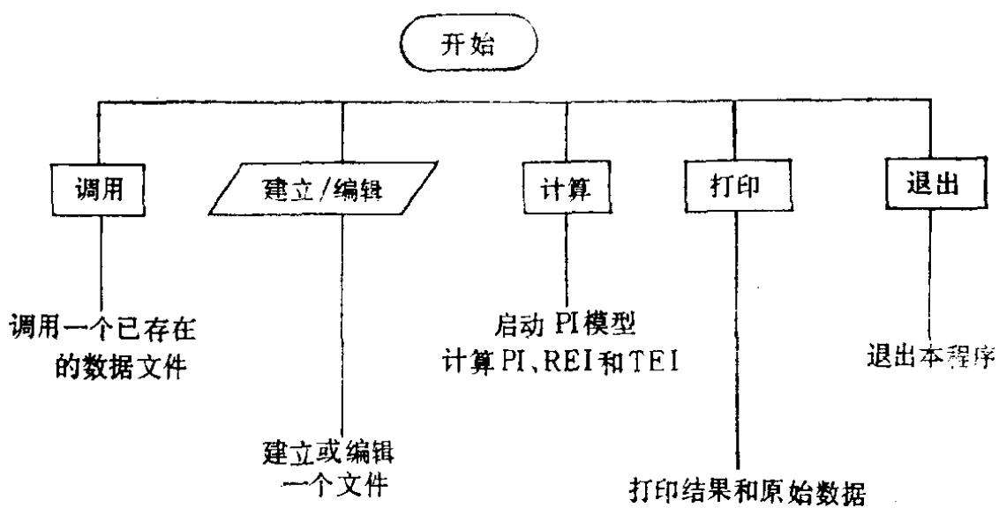  
图4-1 模糊PI模型计算机程序的结构图

## 第四节 土壤生产力定量评价数学模型的应用

## 一、试验场的选择及简介

试验场选在平顶山和沛县两个泥浆泵复垦土地，为了说明间题，每个试验地均选择邻近的农田作为对照。部分土壤及产量分析结果已列于第三章第三节。

## 二、评价的目的

评价泥浆泵复垦土地生产力及其与农田土地生产力的差异。

## 三、参数的选择及原始数据

我们选择土壤容量 $( ~ D _ { \mathfrak { b } } ~ )$ 、入渗率（i）和有机质（OM）三个特征参数作为评价土地生产力的参数，它们分别代表土壤的物理特性、水力特性和营养特性。其原始数据列于表4-2：

表4-2 平顶山、沛县三种参数的原始数据
<table><tr><td rowspan=2 colspan=1>土壤特性</td><td rowspan=2 colspan=1>试验场</td><td rowspan=2 colspan=1>试验田</td><td rowspan=1 colspan=1>深    度     (cm)</td></tr><tr><td rowspan=1 colspan=1>0~20     20~40     40~60     60~80</td></tr><tr><td rowspan=4 colspan=1>土壤容重(g/cm³)</td><td rowspan=2 colspan=1>平顶山</td><td rowspan=1 colspan=1>农田</td><td rowspan=1 colspan=1>1.16     1.55     1.56     1.49</td></tr><tr><td rowspan=1 colspan=1>复垦地</td><td rowspan=1 colspan=1>1.33     1.47     1.37     1.08</td></tr><tr><td rowspan=2 colspan=1>沛县</td><td rowspan=1 colspan=1>农田</td><td rowspan=1 colspan=1>1.32     1.64     1.42     1.42</td></tr><tr><td rowspan=1 colspan=1>复垦地</td><td rowspan=1 colspan=1>1.41     1.34     1.33     1.46</td></tr><tr><td rowspan=4 colspan=1>入渗率(cm/h)</td><td rowspan=2 colspan=1>平顶山</td><td rowspan=1 colspan=1>农田</td><td rowspan=1 colspan=1>11.8</td></tr><tr><td rowspan=1 colspan=1>复垦地</td><td rowspan=1 colspan=1>2.16</td></tr><tr><td rowspan=2 colspan=1>沛县</td><td rowspan=1 colspan=1>农田</td><td rowspan=1 colspan=1>3.6</td></tr><tr><td rowspan=1 colspan=1>复垦地</td><td rowspan=1 colspan=1>0.36</td></tr><tr><td rowspan=4 colspan=1>有机质(%)</td><td rowspan=2 colspan=1>平顶山</td><td rowspan=1 colspan=1>农田</td><td rowspan=1 colspan=1>1.9       1.23</td></tr><tr><td rowspan=1 colspan=1>复垦地</td><td rowspan=1 colspan=1>0.49     0.54</td></tr><tr><td rowspan=2 colspan=1>沛县</td><td rowspan=1 colspan=1>农田</td><td rowspan=1 colspan=1>1.62     0.51</td></tr><tr><td rowspan=1 colspan=1>复垦地</td><td rowspan=1 colspan=1>0.7       0.41</td></tr></table>

## 四、参数的适应性函数

由于土壤特性的适应性随着土壤层次的变异不太大，我们不妨假定土壤特性的本身的适应性与土壤深度无关。各个土壤特性的适应性函数如上节所述，现将本应用研究的三个参数的适应性函数列于如下：

1)土壤容重 $( \ D _ { \mathsf { b } } , \ \mathsf { g } / \mathsf { c } \ m ^ { \div } \ )$ 的适应性函数 $\mu ( \mathcal { D } _ { \mathfrak { d } } )$ ，其函数曲线如图4-2所示。

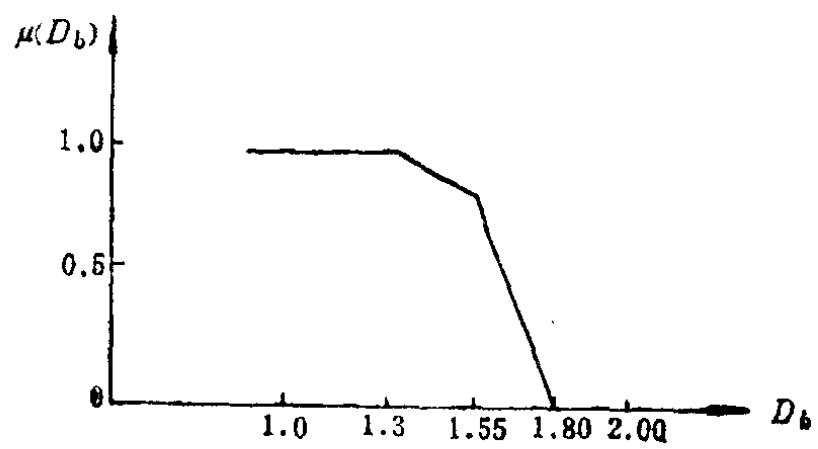  
图4-2土壤适应性函数曲线

$$
\begin{array} { r } { \mu ( D _ { \mathbf { b } } ) = \left| \begin{array} { l l } { - 1 } & { \quad D _ { \mathbf { b } } { \leqslant } \mathbf { 1 } . 3 0 } \\ { - \textbf { 1 } . 8 8 - 0 . 6 8 D _ { \mathbf { b } } \quad } & { \quad \mathbf { 1 } . 3 { \leqslant } D _ { \mathbf { b } } { \leqslant } \mathbf { 1 } . 5 5 } \\ { - \textbf { 5 } . 9 8 - 3 . 3 2 D _ { \mathbf { b } } \quad } & { \quad \mathbf { 1 } . 5 5 { < } D _ { \mathbf { b } } { \leqslant } \mathbf { 1 } . 8 0 } \\ { - \textbf { 0 } } & { \quad D _ { \mathbf { b } } { \geqslant } \mathbf { 1 } . 8 0 } \end{array} \right. } \end{array}\tag{4-11}
$$

2)入渗率（i，cm/h）的适应性函数μ(i)，其函数曲线如图4-3所示：

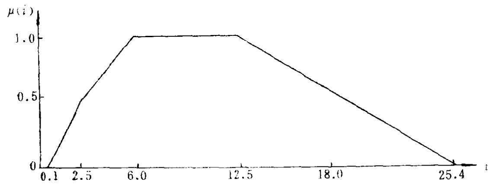  
图4-3 土壤入渗率适应性函数曲线

$$
\mu ( i ) = \left| \begin{array} { l l } { - 1 } & { \qquad 6 , 0 { \leqslant } i { \leqslant } 1 2 , 5 } \\ { - 0 , 1 4 2 + 0 , 1 4 3 i } & { \qquad 2 . 5 { \leqslant } i { \leqslant } 6 , 0 } \\ { - i / 5 } & { \qquad 0 . 1 { < } i { < } 2 . 5 } \\ { - 2 . 1 4 - 0 , 0 9 i } & { \qquad 1 2 . 5 { \leqslant } i { \leqslant } 1 8 } \\ { - 1 . 7 1 6 - 0 . 0 6 7 6 i } & { \qquad 1 8 { < } i { < } 2 5 . 4 } \\ { - 0 } & { \qquad i { \geqslant } 2 5 , 4 { \leqslant } 0 , 1 } \end{array} \right|\tag{4-12}
$$

3)有机质（OM，%）的适应性函数μ（OM），其函数曲线如图4-4所示：

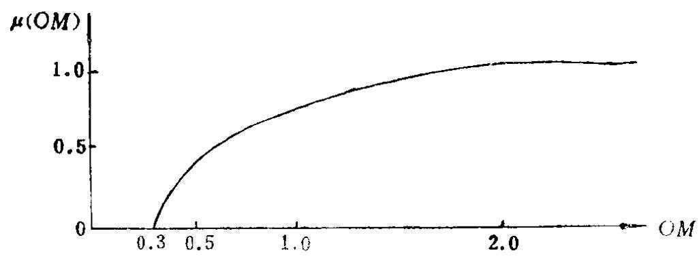  
图4-4 土壤有机质适应性函数曲线

$$
\mu ( O M ) = \left| \begin{array} { l l } { { - 1 } } & { { O M \geqslant 2 . , 0 } } \\ { { - ( \ L _ { 4 } . 5 8 8 2 \times O M - \ L _ { 1 } 1 7 6 5 ) ^ { \ L _ { 1 } . 3 7 6 2 } } } & { { 0 . 3 < O M < 2 } } \\ { { - \ L _ { 0 } } } & { { O M \leqslant 0 . 3 } } \end{array} \right.\tag{4-13}
$$

## 五、权重的选择

1）土壤特性权重 $( ~ W F )$ ：由于选取的三个土壤参数分别代表三种典型的土壤特性，对作物生长有同等重要的影响，因此，我们取近乎等权即 $\begin{array} { r } { W F = \ ( \ W _ { \mathrm { D b } } , \ W _ { \mathrm { i } } , \ W _ { \mathrm { O M } } ) = \ ( \ 0 \lrcorner 3 , } \end{array}$ 0.3,0.4)。

2）土壤层次的权重（WL）：根据上节中公式4-9推算可得：单土层的权重视为1（供入渗率评定用）；两土层的权重WF=（0.7，0.3）（供土壤有机质评定用）；四土层的权重为WL=（0.522，0.256，0.147，0.075）（供土壤容重评定用）。

## 六、评价

应用第二节开发的模型和第三节研制的计算机软件，将原始数据输入，即可得到评价结果，见表4-3。

## 七、讨论

1）从土壤生产力的评价结果（表4-3、图4-5）可以看出：复垦土壤生产力不及农业土壤，说明复垦土壤需要改良。从平顶山和沛县两个试验场比较，平顶山优于沛县。沛县土壤条件较差的主要原因是有机质含量较低和入渗特性较差，沛县农业土壤在20\~40cm土层中的土壤容重适应性差，说明压实问题严重，急需耕作以改良。

2）从土壤特性的适应性分析（图4-6）：复垦土地土壤容重特性的适应性均在0.90以上且略优于农业土地，说明泥浆泵复垦构造的十壤无压实问题存在，土壤强度适宜于作物根系生长。而入渗特性和有机质的适应性远远不如农业土壤，说明需要进行排灌系统建设以改良土壤水力特性，需要土壤培肥以增加土壤肥力。

3）用这一定量评价模型评价的最大特点是：不仅仅给出了土壤生产力PI的结果，而且给出了每一主要特性在各个土壤层中对作物生长的适应性。图4-7展示了土壤容重在不同土层中对作物生长的适应性，从中不难发现复垦土壤优于农业土壤，沛县农业土壤的20\~40cm土层中压实明显，不利于作物根系伸展。

总之，应用模糊PI定量评价土壤生产力，可以从量上评定土壤和分等定级农用土地，也可以评定复垦土地生产力以判定复垦的优劣和复垦效果高低，在发现不利于作物生长的因素方面更具有其独特的优势。所以该模型具有广泛的应用前景。

<table><tr><td>试验田</td><td>土壤特性</td><td>土壤特性在各土壤层中的适应性 0~20 20~40</td><td>40~60 60~80</td><td>土壤适应性</td><td>土壤生产力PI</td></tr><tr><td>平顶山</td><td>土壤容重（g/cm³）</td><td>0.826 1</td><td>0.801 0.867</td><td>0.916</td><td rowspan="3">0.916</td></tr><tr><td></td><td>入渗率(cm/h）</td><td>1</td><td></td><td>1</td></tr><tr><td>农 田</td><td>有机质（%）</td><td>0.977 0.797</td><td></td><td>0.923</td></tr><tr><td>平顶山</td><td>土壤容重（g/cm³）</td><td>0.9756 0.8804</td><td>0.9484 1</td><td>0.9191</td><td>0.609</td></tr><tr><td rowspan="2">复垦地</td><td>入渗率（cm/n）</td><td>0.432</td><td></td><td>0.432</td><td rowspan="2"></td></tr><tr><td>有机质（%）</td><td>0.4384 0.4784</td><td></td><td>0.4505</td></tr><tr><td>沛 县</td><td>土壤容重（g/cm³）</td><td>0.9824 0.5352</td><td>0.9144 0.9144</td><td>0.8528</td><td>0.761</td></tr><tr><td>农 田</td><td>入渗率(cm/h）</td><td>0.6568</td><td></td><td>0.6568</td><td></td></tr><tr><td></td><td>有机质（%）</td><td>0.9092</td><td>0.4553</td><td>0.773</td><td></td></tr><tr><td rowspan="2">沛 县</td><td>土壤容重（g/cm³）</td><td>0.9212</td><td>0.9756 0.8872 0.9688</td><td>0.9388</td><td rowspan="2">0.508</td></tr><tr><td>入渗率（cm/h）</td><td>0.072</td><td></td><td>0.072</td></tr><tr><td>复垦地</td><td>有机质（%）</td><td>0.5802</td><td>0.3569</td><td>0.5132</td><td></td></tr></table>

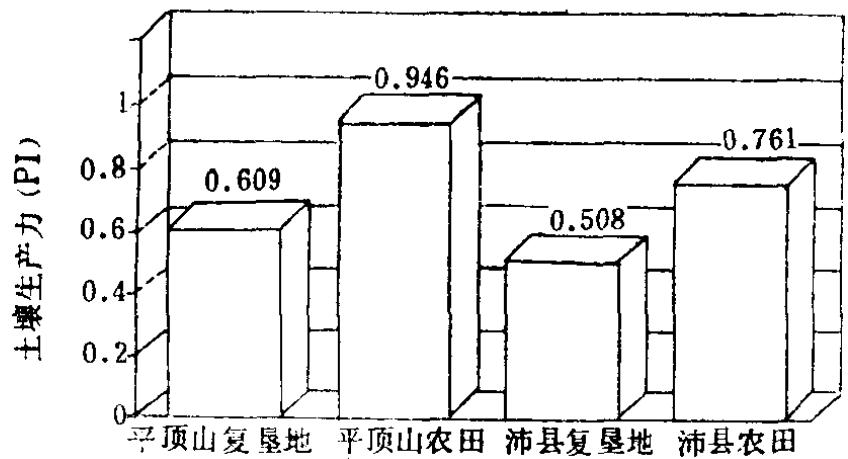

图 4-5 土壤生产力定量评价结果  
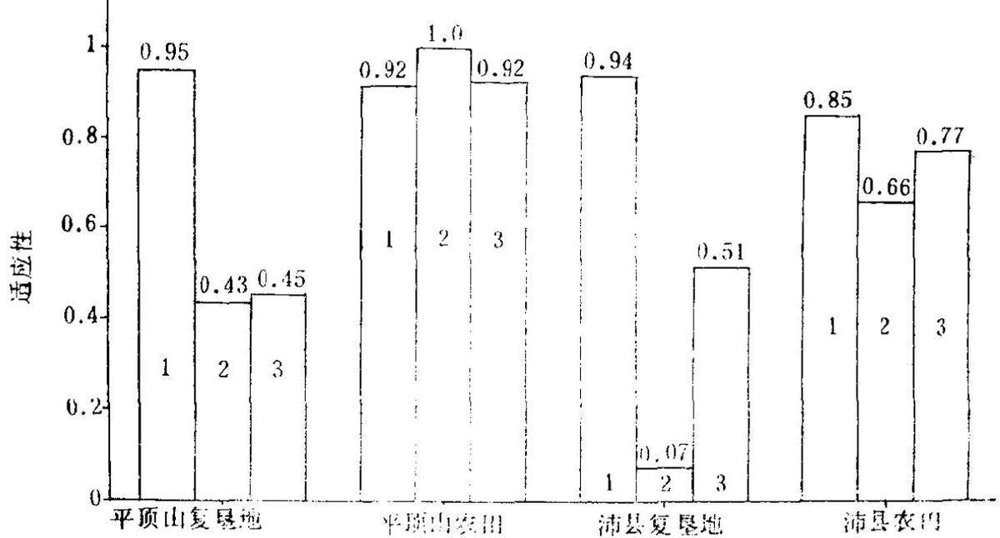  
图4-6 不同土壤特性对作物生长的适应性  
1—土壤容重；2—入渗率；3一有机质

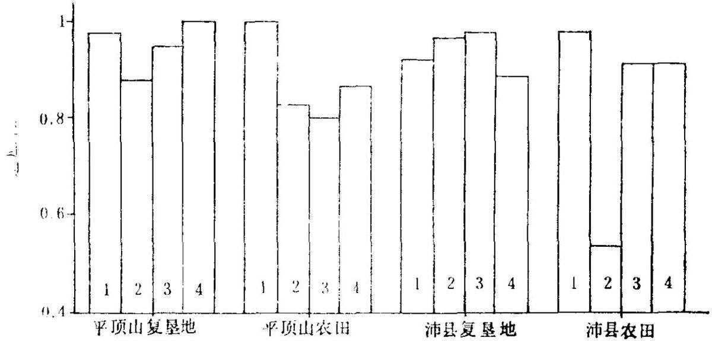  
图4-7 土壤容重在不同土层中对作物生长的适应性  
1-0\~20cm,2-20\~40cm;3-40\~60cm;4-60\~80cm

# 第五章 采煤沉陷地的生态

# 工程复垦

第一节 概 述

生态学（Ecology）一词，一般认为是德国动物学家E.Haeckle于1866年首先提出。Ecology由希腊文Oikos（家庭、住所）和logos（学说、逻辑）复合而成，从字意上讲，生态学就是研究生物与环境的科学。

进入本世纪以来，生态学作为一门近代科学得到了迅速发展，本世纪50年代后，生态学进入了生态系统研究阶段，生态学已打破动植物的界线，并超出生物学的研究领域，研究范围越来越广泛。它已经从生物科学的一个分支发展为一门紧密联系生物科学、环境科学和社会科学的包括许多分支科学的大科学，并以对生态系统的研究作为现代生态学发展的标志。国际著名生态学家E.P.Odum把生态学理解为研究生物系统（包括环境）或生态系统结构和功能的科学。

生态系统是指一定空间范围内生物与生物之间、生物与环境之间相互作用、相互影响所构成的综合体。是生命系统和环境系统在特定空间中的组合。任何生态系统都包括两个亚系统，即生命系统和环境系统。生命系统包括生产者、消费者和分解者（还原者）；环境系统包括能量因子和物质因子。我们把生态系统中这些各种成份在空间和时间上的相对有序稳定状态，叫做生态系统的结构。

生态系统的结构主要包括物种结构、时空结构和营养结构。所谓物种结构是指生态系统中不同物种、品种或种群类型以及它们之间的量比关系所构成的系统结构。时空结构是指生物各个种群在空间上和时间上的不同配置构成了生态系统形态结构及动态变化特点，一是水平分布上的镶嵌性；二是垂直分布上的成层性；三是在时间上发展演替的特征。所谓营养结构是指生态系统中生产者、消费者和分解者之间以食物营养为纽带所形成的食物链和食物网。进行生态工程复垦设计必须首先了解生态系统的结构特点。

工程是一个极为常见的术语，是指人类定向设计的、具有一定结构和产出目标的工艺系统。而生态工程是近十多年才出现的一门技术学科。所谓生态工程就是应用生态系统物种共生、物质循环再生和能量转化等原理，结合系统工程的优化方法设计的生产工艺系统。

生态工程复垦是根据生态学、生态经济学和系统工程原理及土地生态经济系统的基本属性和要求，将土地复垦工程技术和生态工程技术结合起来，对因挖损、塌陷、压占等造成破坏的土地，进行系统设计、整治和开发利用。其目的在于促进各生产要素的优化配置，实现物质、能量的多级分层利用，不断提高其循环转化效率和系统的生产力，获取较大的经济、生态和社会综合效益，走可持续发展的道路。对破坏土地，复垦为农业用途的区域，其生态工程复垦实质是发展生态农业，因此，这类复垦也可称之为生态农业复垦。

生态工程复垦与传统土地复垦的根本区别在于：不是单纯将土地复垦当作一个工程或工艺过程来研究，也不是将破坏土地仅仅恢复到可供利用的状态，而是将破坏土地所在区域视为一个以人为主体的自然一经济一社会的复合系统，依据生态学、生物学和系统工程学的理论，对破坏土地进行系统设计、综合整治和多层次开发利用，达到经济、社会和环境效益最优的可供利用的期望状态。因此，生态工程复垦是一种从整体上系统全面地综合开发复垦土地的技术或模式，它将系统和生态的观点与理论溶入复垦的设计、工程实施和复垦土地再利用的全过程。这种技术或模式不仅包括原有土地复垦的规划技术、土木工程整治技术和复垦土地的生物重建技术（生物工程复垦技术），而且在深度和广度上更加丰富。所以，目前有的学者提出的生态农业复垦、基塘复垦、综合利用、立体种养等复垦技术或模式，实质为生态工程复垦在特定区域或用途中的应用。由于生态工程复垦是一个系统开发利用的概念，决不可与某一上木工程复垦技术或某一生物复垦技术相提并论。

## 第二节 生态工程复垦的基本原理

生态工程复垦和其他工程一样，是一门技术性、实践性较强的应用学科，但它又有自己的显著特点。一是复垦区域生态的组分固定性较弱，且彼此之间相互牵制，难于分解；二是工艺的嵌合控制与输出目标的控制难度较大，机巧性强；三是生态工程复垦模式千变万化，具有较强的地域性和时间性。因此，了解生态工程复垦涉及的基本属性和基本方法就显得尤为重要。

## 一、生态位原理

生态位系指一种生物种群所要求的全部生活条件，由空间生态位、时间生态位、营养生态位等组成。生态位和生物种群一一对应。在达到演替顶级的自然生态系统中，全部的生态位都被各个种群所占据，环境的空间、时间、能量及物质都得到了充分的利用。因此，生态工程复垦可根据生态位原理，充分利用空间、时间及其他一切资源，在提高复垦土地经济效益的同时，改善矿区的生态环境。

## 二、群落生态原理

群落结构的特征主要表现在水平结构、垂直结构和时间结构三个方面。

由于土壤、水分、光照、微地形等环境因子在水平方向上的差异，使生物种类、数量和长势等发生相应的变化，使群落呈现水平结构特点。如果环境因子变化较大，可形成较明显的结构镶嵌块；而环境因子变化较缓时，群落在水平方向上呈过渡状。

按照群落水平结构的特点，一是在不同生境因地制宜选择最合适的作物；二是在同一生境内配置最佳密度，并通过栽培手段加以控制，以达到合理、有效的水平结构。

自然界的生物群落有明显的分层现象，即所谓的垂直结构。群落的成层性包括地上分层和地下分层。如森林群落就有乔木层、矮树层、灌木层和地被层等四层，而在地下根系分布也有深浅不一。相应地，动物在地上和地下也呈分层现象。除陆地外，水体生物群落的垂直分层也很明显。不同分布层的生物对环境条件的要求不同，它们往往具有互补性，以达到对资源，包括空间资源的充分利用。利用生物群落的垂直结构特点，结合生物相互作用原理，对于生态工程复垦的垂直设计极为有用。合理的生物群落垂直结构不但可以最大限度地利用有限资源，还可增强其对不良环境的抗逆能力。

随着环境条件的月周期、年周期或季节性变化，群落结构也显示出相应的时间序列。群落中生物的生长发育周期性变化，使得不同生物可以利用不同时段的自然条件，达到较大和较为稳定的物质生产力。

调节生物群落时间结构的主要方式是轮作、套作和轮养、套养，即种群的嵌套，其目的是充分利用不同季节或更长时段的光、温、水和土壤资源，延长资源利用转化过程，提高复垦土地生产力。

## 三、食物链原理

生态系统中能量流动的渠道主要是通过食物链进行的。所谓食物链是指生态系统中生物与生物之间通过取食与被取食关系所形成的链条。能量循着这一个个链环或营养级向下传递而实现流动。

生态系统的食物关系实际上是很复杂的，一种生物常以多种食物为食，而同一食物又被多种消费者取食，因之形成相互交错的多条食物链，形如网状，故称食物网。

依据能量流动和食物链原理进行食物链优化设计是生态工程复垦的重要内容，不但能实现能量的多级利用，使有机废物资源化，多生产动植物产品，把低价值产品，甚至是废物转化为高价值的产品，还可以减少辅助投入，改善生态环境。

## 四、生态系统的物质循环原理

生命的维持不但需要能量，而且需要各种物质，已查明生物生长发育中至少需要30\~40种元素。生物所需要的元素多以无机态存在于岩石、土壤、水和大气中，这些元素被植物吸收后在植物体内多结合成有机态，并通过食物链从一个营养级传递到下一个营养级，最后所有生物残体及废物被分解者生物分解，将这些元素释放到环境中，又可被植物重新吸收利用。这样，矿质养分在生态系统内被反复循环利用，从环境流入到生物，又从生物返回环境，这就是生态系统的物质循环。

物质循环是生态系统的主要功能之一。它是生物生产力形成的基础，也是能量的载体。物质循环使得环境中有限的营养物质反复利用而不致耗竭，保持了生态系统的持续性。

人类活动已强烈地改变了生态系统的物质循环。例如开采沉陷导致土壤养分流失，粗放的土地复垦措施损失了各种营养元素，发生养分亏缺，影响了物质循环的过程和速率，从而导致系统功能退化。

## 五、生物与环境的协同进化原理

生态系统中的生物不是孤立存在的，而是与其环境密切联系，相互作用，共存于统一体中。生物与环境间存在着复杂的物质、能量交换关系。一方面，生物为了生存与繁衍，必须不断从环境中摄取物质与能量；另一方面，在生物生命活动中也不断通过释放、排泄及残体归还给环境，使环境得到补偿。这样，环境影响生物，生物也影响环境，而受生物影响得到改变的环境反过来又影响生物，使两者处于不断地相互作用、协同进化的过程。

## 第三节 生态工程复垦设计

## 一、生态工程复垦的平面设计

生态工程复垦的平面设计就是在一定的复垦区域内，确定各种生物种群或生态类型以及各产业所占的比例和分布区域，以达到水平空间内各种资源的最佳利用（特别是土地资源的最佳利用），各生物种群及产业关系协调互补。

生态工程复垦的平面设计是生态工程复垦设计与调控的第一个层次，也是所有结构设计的基础。在生态工程复垦的平面设计中，应充分、合理利用复垦区域内的土地资源，根据复垦区域内土地资源特点和当地的自然、经济特征，因地制宜，在生物种群选择上要使农作物、林木、果树、牧草、畜禽、水产品充分配合协调。复垦区域生态系统是以人工建造的生物群落为主的生态系统。复垦土地的平面利用结构及生物种群的组成和匹配主要是由自然因素和社会因素决定的。自然因素包括气候、水文、土地破坏特征、地表移动规律等，它直接影响着土地的平面利用结构和生物种群的分布。此外，复垦区域生态系统是人工生态系统，是为人类生存服务的，所以它具有明显的社会性。如矿区农副产品需求、生态环境目标、价值规律及技术水平等等，都直接影响着生物种群的分布和土地的利用结构。因此，在生态工程复垦的平面设计中，应顺应复垦区域内自然资源的特点，综合控制和协调各自然因素和社会经济因素，建造成一个高效的复垦土地平面利用结构。此外，生态工程复垦的平面设计还需充分考虑复垦区域内地貌、土壤、植被、地质和水文等景观要素特点，建立异质的“镶块”式格局，使各组分间配比合理。不但要因地制宜发挥最大生产潜力，同时，又能确保较高的环境质量，建造一个美好、和谐、高效的矿区生态景观。复垦土地平面利用结构如图5-1所示。

生态工程复垦的平面设计流程如图5-2所示。

## 二、生态工程复垦的垂直设计

生态工程复垦的垂直设计就是利用生态位和生物共生原理，将生理上和生态适应性不同的生物群体组成合理的复合生产系统，使其对环境资源特别是空间的利用最充分、最合理。生态工程复垦的垂直空间结构具有比较突出的优势，首先，由于空间的多层次性，使资源利用更加充分，克服了常规农业的资源浪费象。其次，由于多层次的生物种群的合理组合，利用了生物间“互利共生”的关系，使其能获得较好的效益。

-  
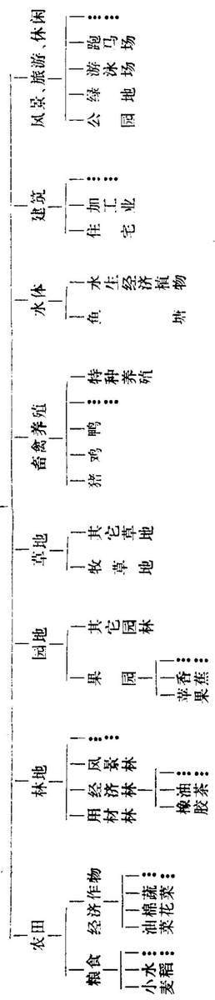

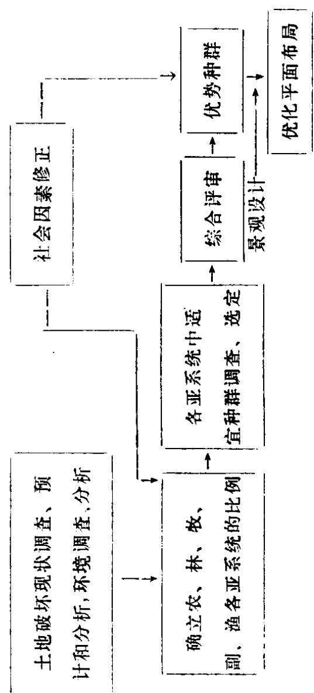

垂直结构分地上和地下两部分。地上垂直部分是指不同生物种群配置在不同的空间层次以及复合群体茎、枝、叶的分布。复合群体的垂直配置能最大限度地利用光、热、水、气等资源。多层分布的冠层可以使土壤少受或不受侵蚀，增强对不利气候的抗性和抑制杂草、病虫的危害。地下垂直结构是指复合群体根系在土壤中不同层次的分布。合理的种群配置能有效地利用不同层次的土壤水分和养分。

生态工程复垦的垂直设计，是一种不同种群合理组合、匹配，并进一步组成高效能复合群体的过程。复合群体类型具体可分为：植物与植物、植物与真菌、植物与动物、动物与动物等的配合方式与种群选择。根据生物的类型、生境差异和生物因子的数量等可将生态复垦垂直设计分为以下各种类型和模式。

## 1. 立体种植类型

1）农作物的间作、套作和轮作模式。如粮一棉；粮一油菜；粮一蔬菜等。

2）林产作物的立体种植模式。这种模式随着林木的种类不同而有不同的组合。

3）林粮间作立体种植模式。如桐粮间作、枣粮间作、果树蔬菜间作等。

4）林药间作立体种植模式。指林木、果树与药用栽培植物的空间组合。

此外还有林菌、粮菌间作模式或粮肥间作模式等等。

## 2. 立体养殖类型

指在一特定空间内养殖动物的层次配置，或一定时间内的生产有机配合。

1)陆地立体圈养模式。

为了充分利用空间、节约圈棚材料并利用废弃物而设计的一种空间共生立体养殖。如：蜂桶（上层）一鸡舍（中层）一猪圈（下层）一蚯蚓池（底层）或鸡舍（上层）一猪圈（下层）一鱼池（底层）等。

2 ）水体立体养殖模式。

这是为了充分利用水体空间和营养、溶解氧等而设计的一种空间配置方式，常见的组合有：

鲢鱼（上层）一草鱼（中层）一青鱼（下层）；

鸭（上层）一鱼（下层）一珠蚌（下层）；

鱼（上层）一鳖（下层）；

3.立体种养类型

指在一定空间内栽培植物和养殖动物按一定方式配置的生产结构。在生物之间，可形成一种简单的食物链，并且以生物之间的共生互利关系为特征。上层的植物为下层的动、植物提供了荫蔽的条件和适宜栖息的生存环境，下层放养的生物可清除作物群落下层的杂草和害虫，促进了上层植物的生长。同时，下层的植物或动物粪便给底层水体中的鱼类提供了饵料；而鱼类的活动又增加了水体溶解氧，可促进作物根部的通透性。该类型的主要模式有：

1）稻一萍一鱼。

2）稻一鸭一鱼。

3）林一畜一蚯蚓。

4）苇（以及其他沼生作物）一禽一鱼等。

## 三、生态工程复垦的食物链（网）设计

生物在长期演化和适应过程中，不仅建立了相互制约的食物链关系，而且还形成了独特的生活习性和分级利用自然界所提供的各种物质。正因如此，才使有限的空间养育着众多的生物种类，并保持相对稳定状态。研究设计合理的食物链结构，直接关系到复垦土地生产力的高低和经济效益的大小。

生态工程复垦的食物链设计主要应从食物链的“加环”与“解链”着手。所谓食物链的加环是在原有的食物链中加入新的营养级或扩大已有的环节，以扩大系统的经济效益，提高系统稳定性和抗逆能力。如在农业生产中增加畜牧业或引入腐食性动物等新的环节，将人们不能利用的有机物质（如作物秸杆、花粉、花蜜、桑叶等），通过多种生物途径转化为可供直接利用的农副产品。再如利用猪、鸡粪养蚯蚓或蝇蛆，再以蚯蚓、蝇蛆作高蛋白饲料养鸡、牛蛙、鳖等动物，进一步扩大生产环节的效益。

前面我们主要讲述了食物链的有利方面，但是由于食物链由低营养级到高营养级的发展过程中，有对吸收的物质起富集、放大作用，所以一旦有害物质进入食物链后就要影响农产品的质量以及人类的健康。特别是对于工矿废弃地来说，存在多种有害元素，在土地复垦中，如不采取措施，必将影响环境质量和人类的健康。因此，在生态工程复垦设计中还应阻断或尽量减少有害物质沿食物链的转移，特别是进入人体。此时，可设计一条解链食物链，使原来可能损害人类生命的食物链中断或转向，做到不进入人体。转向方法主要有三种：

一是把最终产品改变用途，使其离开进入人体的路线。如在含有害元素的复垦土地上种植粮食，再用粮食生产工业酒精。二是改变种群，使这种生物种群产品根本不进入人体，如种红麻，直接生产不进入人类食物链的纤维产品。三是加入新种群使有害物质降解，或对有害物质不吸收，不富集。

## 四、生态工程复垦的时间设计

生态工程复垦的时间设计就是根据各种资源的时间节律，设计出能有效利用资源的合理格局或功能节律，使资源转化率最高。

系统的时间设计主要包括两方面的内容，一是掌握当地各种作物种群对环境资源需求的变化规律，进行生态类型的合理匹配，穿插衔接，采取轮作、套种、合理茬口衔接等措施，使每个生态类型时间布置紧凑，使其对环境资源的需求尽量与环境资源变化曲线吻合，减少各生态类型种群交替的空隙，以延长资源的利用时间；二是通过环境控制延长资源的转化时间。如早熟品种的培育，辅助光照延长鸡的产卵期、温室蔬菜、温室（塑料大棚）养鱼（鳖）等。

## 五、生态工程复垦的总体设计及优化

复垦区域生态系统（或矿区生态系统）是一个复杂的大系统，各层次、组分之间存在着互为因果的协调关系。系统设计中不但有平面设计、垂直设计、也有时间和食物链设计，它们几部分之间要配合得十分合理，才能最大限度地发挥其总体功能（当然，在设计过程中，根据当地实际情况，也可以进行其中的一、二项设计）。这种多组成、多层次的设计，我们称之为生态工程复垦的总体设计。

1.生态工程复垦的总体设计。

生态工程复垦的总体设计一般是从宏观到微观的设计。设计顺序是从一个设计区的平面设计开始并按照平面、垂直、时间、食物链这种常规顺序进行。

在设计过程中，不断进行反馈，从而做到前后相互协调平衡，比如采煤沉陷区的复垦设计如图5-3所示。

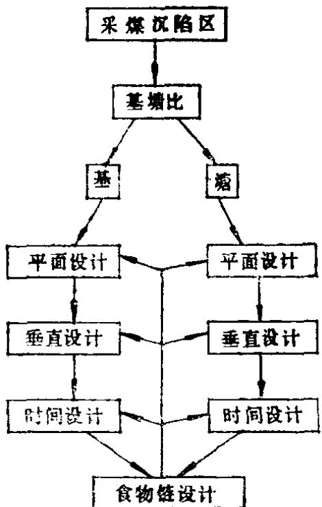  
图 5-3 采煤沉陷区生态工程复垦的总体设计

首先进行第一个层次的设计，根据沉陷区深度、面积、潜水位深度等情况，设计基塘平面上的结构比例，形成水陆交错的结构。然后在基面上设计种群的平面布局、立面布局、时间安排，同时也进行塘的垂直布局和时间安排。随后在各个单元中加入合适的食物链环节，形成一个完整的“基塘系统”设计，达到了以塘保基、以基保塘、水陆互补的格局。

2.系统总体结构的优化。

复垦区域生态系统是一个复杂的大系统。其总体结构的优化既包括农业生态系统的优化、技术系统的优化、经济系统的优化，包括农、林、牧、副、渔、工等各个产业的优化，还包括各个生产环节的优化。总体优化是上述各项优化的综合，而不是各部分优化结果的简单相加，因为在这个系统的总体中，每个要素都只是局部，局部功能最佳并不等于整体功能的最佳。因此，在系统的总体设计中，应从系统整体出发，使子系统与子系统之间有机联系，协调发展，从而达到整体功能最佳。系统整体功能最佳才是进行优化设计的目的和出发点，总体结构优化的基本程序和步骤为：

1）系统辨识。调查收集复垦区土地破坏情况及利用现状、自然条件、生态环境条件、市场及农业生产现状并根据煤层开采规划和地质采矿条件进行地表移动变形预计。

2）系统诊断。分析整理收集到的基础资料，对资源利用现状及历史进行分析和评价，并对未来的情况进行预测，对系统的增殖潜力和限制因子做出正确的估价。在此基础上对系统的发展目标及系统的开发方针作出初步设想。

3）进行系统设计。包括平面、立面、时间及食物链的设计；配套技术系统的设计；模型的构造及求解等过程。

4）系统评价和优选。根据计算结果，对比各设计方案的指标体系，综合评定各方案的优劣，选择社会、经济、生态效益俱佳的方案。

5）系统的运行及反馈。组织土地复垦工程实施及生态工程建设，并在建设过程中实行跟踪监测，及时掌握反馈信息。根据暴露的问题或薄弱环节，不断调整和随时充实设计内容，以保证系统健康、顺利的运行。

## 第四节 生态工程复垦实例

## 实例一：平顶山辛南村31.3hm²生态工程复垦

我们这里以平顶山矿务局辛南沉陷地为例来讨论其生态工程复垦设计。由于复垦地离平顶山八矿、辛南公路较近，所以在复垦地上主要是以“菜篮子”为主，即在复垦地上以种植蔬菜、养鱼、养猪、养鸡为主。在复垦总面积31.3hm²中，耕地面积18.6hm²，鱼塘面积7.7hm2，养猪面积1.4hm²，菜地面积2.7hm²。各项所占比例示意图如图5-4所示，图5-5为各项平面设计示意图。

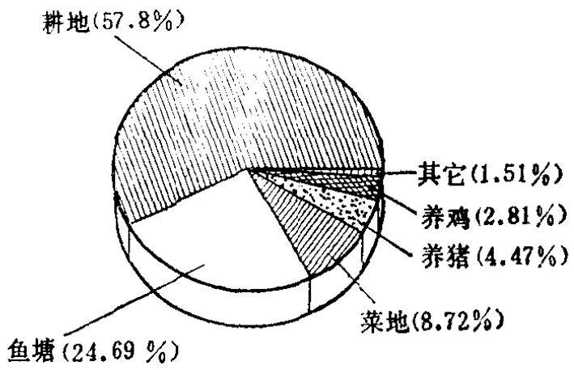  
图 5-4 辛南村复垦区各项所占比例示意图

在复垦的耕地中，主要种植蔬菜和农作物。种植的农作物主要有玉米、小麦等，在第三章已介绍，在此不再赘述；种植的蔬菜主要采用大棚、地膜、露地三种方式，根据各种蔬菜的时间节律，合理制定茬口衔接，即时间设计为：前茬芹菜、蒜苗；二茬黄瓜、蕃茄、茄子；三茬黄瓜、蕃茄、菜豆，其详细安排见表5-1。

为了充分利用水体空间和营养、溶解氧等而设计的一种空间配置方式，复垦区水域养殖，在时间上采用轮捕轮放，即鱼种在一次放足的基础上，1年中分数批达到食用规格的鱼捕出，同时再补放一部分鱼苗，这样可以使池塘饲养期间保持较合理的鱼量，避免由于鱼密度过大而影响生长；在垂直的空间上采用立体养殖，即采用如下形式：

鲢鱼（上层）一草鱼（中层）一鲫鱼（下层）

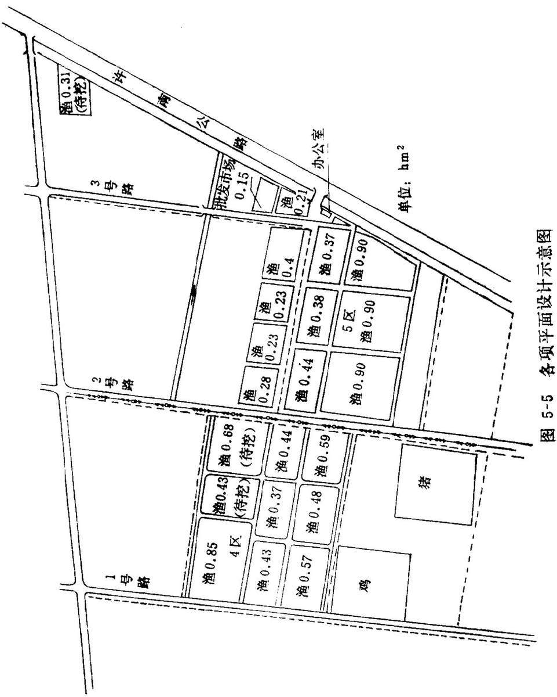

<table><tr><td rowspan=2 colspan=1>茬口</td><td rowspan=2 colspan=1>月旬品名</td><td rowspan=1 colspan=1>1</td><td rowspan=1 colspan=1>2</td><td rowspan=1 colspan=1>3</td><td rowspan=1 colspan=1>4</td><td rowspan=1 colspan=1>5</td><td rowspan=1 colspan=1>6</td><td rowspan=1 colspan=1>7</td><td rowspan=1 colspan=1>8</td><td rowspan=1 colspan=1>9</td><td rowspan=1 colspan=1>10</td><td rowspan=1 colspan=1>11</td><td rowspan=1 colspan=1>12</td><td rowspan=1 colspan=1></td></tr><tr><td rowspan=1 colspan=1>上中下</td><td rowspan=1 colspan=1>上中下</td><td rowspan=1 colspan=1>上中下</td><td rowspan=1 colspan=1>上中下</td><td rowspan=1 colspan=1>上中下</td><td rowspan=1 colspan=1>上中下</td><td rowspan=1 colspan=1>上中下</td><td rowspan=1 colspan=1>上中下</td><td rowspan=1 colspan=1>上中下上</td><td rowspan=1 colspan=1>中下</td><td rowspan=1 colspan=1>上中下</td><td rowspan=1 colspan=1>上中下</td><td></td></tr><tr><td rowspan=3 colspan=1>二茬</td><td rowspan=1 colspan=1>春黄瓜</td><td rowspan=1 colspan=1>0 □0一</td><td rowspan=1 colspan=1>00 □--1</td><td rowspan=1 colspan=1>っ- x =</td><td rowspan=1 colspan=1>へっっ△△△</td><td rowspan=1 colspan=1>っっっ△△Δ</td><td rowspan=1 colspan=1>ΔΔ△</td><td rowspan=1 colspan=1></td><td rowspan=1 colspan=1></td><td rowspan=1 colspan=1></td><td rowspan=1 colspan=1></td><td rowspan=1 colspan=1></td><td rowspan=1 colspan=1></td><td></td></tr><tr><td rowspan=1 colspan=1>春番茄</td><td rowspan=1 colspan=1>□ □□一</td><td rowspan=1 colspan=1>0口□111</td><td rowspan=1 colspan=1>っっっ×二二</td><td rowspan=1 colspan=1>3っ2二二二</td><td rowspan=1 colspan=1>っっっ=△△</td><td rowspan=1 colspan=1>△Δ</td><td rowspan=1 colspan=1></td><td rowspan=1 colspan=1></td><td rowspan=1 colspan=1></td><td rowspan=1 colspan=1></td><td rowspan=1 colspan=1></td><td rowspan=1 colspan=1>□口0一</td><td></td></tr><tr><td rowspan=1 colspan=1>春茄子</td><td rowspan=1 colspan=1>□ □ □F一</td><td rowspan=1 colspan=1>0 0 □1_1</td><td rowspan=1 colspan=1>α一×二</td><td rowspan=1 colspan=1>うっっ二二二</td><td rowspan=1 colspan=1>n=Δ△</td><td rowspan=1 colspan=1>△△△</td><td rowspan=1 colspan=1></td><td rowspan=1 colspan=1></td><td rowspan=1 colspan=1></td><td rowspan=1 colspan=1></td><td rowspan=1 colspan=1></td><td rowspan=1 colspan=1>口口□0 一-</td><td></td></tr><tr><td rowspan=3 colspan=1>三茬</td><td rowspan=1 colspan=1>秋黄瓜</td><td rowspan=1 colspan=1></td><td rowspan=1 colspan=1></td><td rowspan=1 colspan=1></td><td rowspan=1 colspan=1></td><td rowspan=1 colspan=1></td><td rowspan=1 colspan=1></td><td rowspan=1 colspan=1></td><td rowspan=1 colspan=1>O川</td><td rowspan=1 colspan=1>二=Δ</td><td rowspan=1 colspan=1>っっっ△△△</td><td rowspan=1 colspan=1>nΔ</td><td rowspan=1 colspan=1></td><td></td></tr><tr><td rowspan=1 colspan=1>秋番茄</td><td rowspan=1 colspan=1></td><td rowspan=1 colspan=1></td><td rowspan=1 colspan=1></td><td rowspan=1 colspan=1></td><td rowspan=1 colspan=1></td><td rowspan=1 colspan=1></td><td rowspan=1 colspan=1>0-</td><td rowspan=1 colspan=1>x 二 二</td><td rowspan=1 colspan=1>二二二</td><td rowspan=1 colspan=1>っっう=△△</td><td rowspan=1 colspan=1>3oΔ△</td><td rowspan=1 colspan=1></td><td></td></tr><tr><td rowspan=1 colspan=1>秋菜豆</td><td rowspan=1 colspan=1></td><td rowspan=1 colspan=1></td><td rowspan=1 colspan=1></td><td rowspan=1 colspan=1></td><td rowspan=1 colspan=1></td><td rowspan=1 colspan=1></td><td rowspan=1 colspan=1></td><td rowspan=1 colspan=1>○==</td><td rowspan=1 colspan=1>n二二二</td><td rowspan=1 colspan=1>っっ=△△</td><td rowspan=1 colspan=1>nΔ</td><td rowspan=1 colspan=1></td><td></td></tr><tr><td rowspan=2 colspan=1>一茬</td><td rowspan=1 colspan=1>冬芹菜</td><td rowspan=1 colspan=1>っっっ11 一</td><td rowspan=1 colspan=1>っっっ-ΔΔ</td><td rowspan=1 colspan=1>nΔ</td><td rowspan=1 colspan=1></td><td rowspan=1 colspan=1></td><td rowspan=1 colspan=1></td><td rowspan=1 colspan=1></td><td rowspan=1 colspan=1>o-</td><td rowspan=1 colspan=1>一-一</td><td rowspan=1 colspan=1>- × x</td><td rowspan=1 colspan=1>x x =</td><td rowspan=1 colspan=1>==</td><td></td></tr><tr><td rowspan=1 colspan=1>秋蒜苗</td><td rowspan=1 colspan=1>っっっ△△△</td><td rowspan=1 colspan=1>つっっ△△△</td><td rowspan=1 colspan=1>nΔ</td><td rowspan=1 colspan=1></td><td rowspan=1 colspan=1></td><td rowspan=1 colspan=1></td><td rowspan=1 colspan=1></td><td rowspan=1 colspan=1>0</td><td rowspan=1 colspan=1>二二二</td><td rowspan=1 colspan=1>nno二二二</td><td rowspan=1 colspan=1>000= = =</td><td rowspan=1 colspan=1>000二=Δ</td><td></td></tr><tr><td rowspan=1 colspan=15>○播种         育苗   ×定植     一生长期      △采收       大棚             口温室</td></tr></table>

根据其复垦区鱼塘养鱼的情况，一年的产量为2.196万kg，经济收益为18万元。

除上述以外，辛南复垦地养猪、养鸡数量及效益见表5-2。

表5-2辛南复垦地养猪、养鸡数量及效益
<table><tr><td></td><td rowspan=1 colspan=1>类           別</td><td rowspan=1 colspan=1> $\vec { \boldsymbol { \mathfrak { f } } } ^ { \mathbf { x } }$             量</td><td rowspan=1 colspan=1>产值（万元/年）</td></tr><tr><td></td><td rowspan=1 colspan=1>肉            鸡</td><td rowspan=1 colspan=1>3.6万只/年</td><td rowspan=1 colspan=1>25.2</td></tr><tr><td rowspan=1 colspan=2>猪</td><td rowspan=1 colspan=1>200头/年</td><td rowspan=1 colspan=1>20</td></tr></table>

由上可知，辛南村种、养业结合的食物链如图5-6所示。

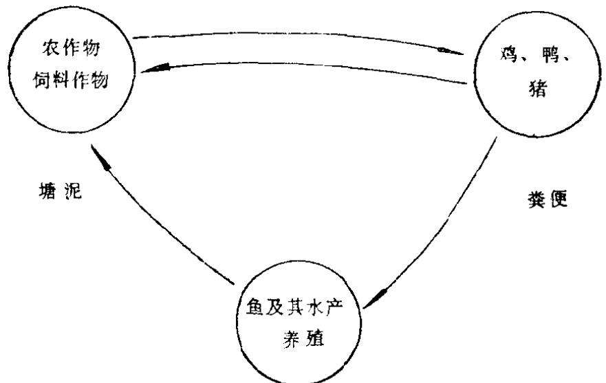  
图5-6辛南种、养业结合的物质循环利用图

实例二：平顶山矿务局综合养殖厂食物链设计

平顶山矿务局综合养殖场总面积6hm²，工程总投资700万元，1994年元月破土动工，目前已基本形成了种鸡饲养、孵化、育雏、育成蛋鸡生产线，并根据食物链建成生态型养猪场10个，养鱼塘1hm²，粪场 $0 . 3 3 \mathrm { h m } ^ { 2 }$ ，其综合养殖厂平面设计比例如图5-7所示，其平面布置如图5-8所示。

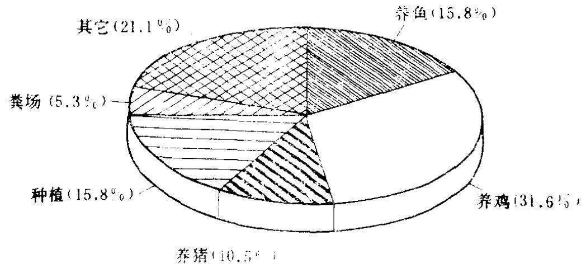  
图 5-7 平顶山综合养殖厂平面设计比例关系图

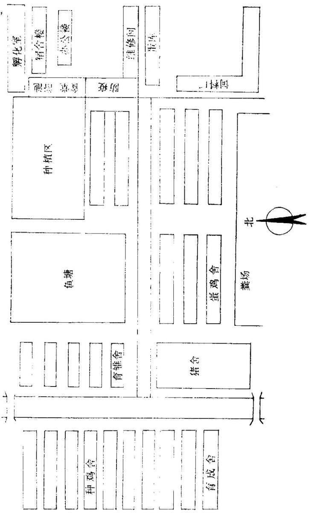  
8-

该场1995年全面投入生产，其养猪、养鱼的产量及效益见表5-3。

表5-3 平顶山矿务局综合养殖厂产量及效益
<table><tr><td rowspan=1 colspan=1>类   别</td><td rowspan=1 colspan=1> $j ^ { x }$      量</td><td rowspan=1 colspan=1>产值（万元/年）</td></tr><tr><td rowspan=1 colspan=1>蛋鸡</td><td rowspan=1 colspan=1>60万只/年</td><td rowspan=1 colspan=1>90</td></tr><tr><td rowspan=1 colspan=1>育成鸡</td><td rowspan=1 colspan=1>6万只/年</td><td rowspan=1 colspan=1>3</td></tr><tr><td rowspan=1 colspan=1>种鸡</td><td rowspan=1 colspan=1>2200只/年</td><td rowspan=1 colspan=1>80(出售种蛋、雏鸡、种鸡)</td></tr><tr><td rowspan=1 colspan=1>商品鸡</td><td rowspan=1 colspan=1>10万只/年</td><td rowspan=1 colspan=1>120</td></tr><tr><td rowspan=1 colspan=1>养猪</td><td rowspan=1 colspan=1>1000头/年</td><td rowspan=1 colspan=1>60</td></tr><tr><td rowspan=1 colspan=1>鱼</td><td rowspan=1 colspan=1>2万尾/年</td><td rowspan=1 colspan=1>6</td></tr></table>

养鸡采用笼式分层垂直养殖，其过程经育雏、育成期、产蛋期和产蛋末期，其产蛋母鸡饲喂152天即可产蛋，在产蛋高峰时，第二批雏鸡已开始育雏，同时产蛋末期的母鸡用来出售。为了解决禽畜养殖业饲料供应紧张和禽畜粪便污染的难题，采用如图

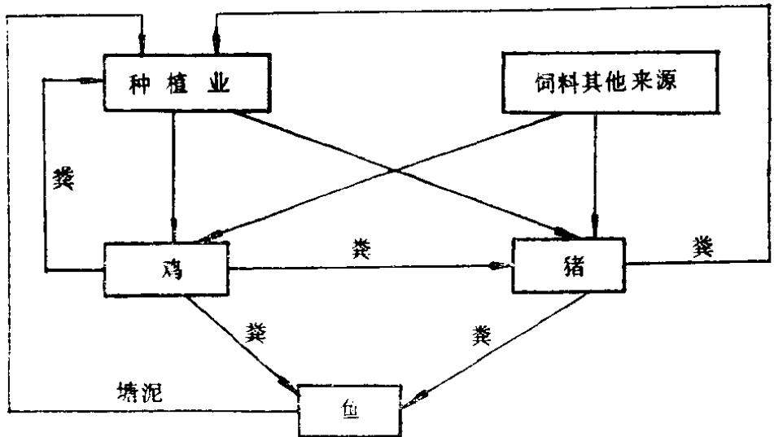  
图 5-9 平顶山矿务局综合养殖厂食物链设计

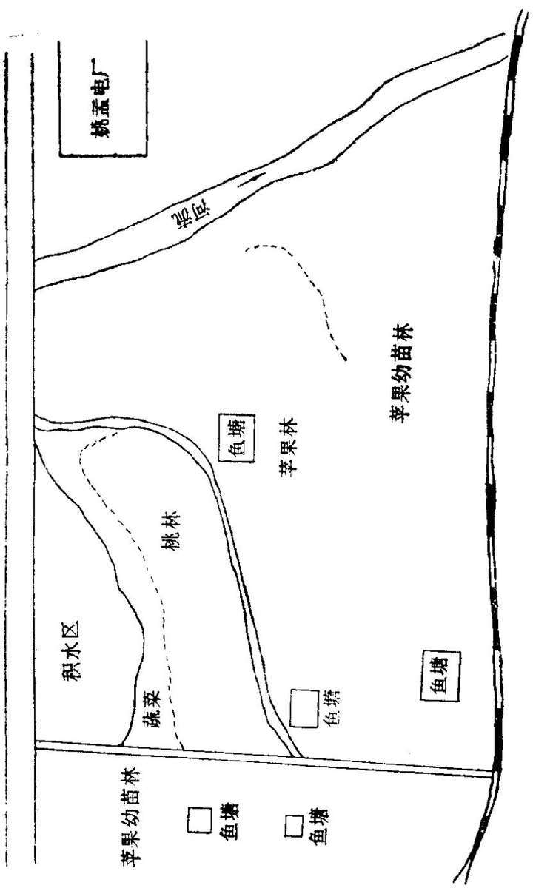  
5-10

5-9所示的食物链设计。

实例三：西高皇乡北村沉陷地立体种植

平顶山西高皇乡北村沉陷地面积33hm2，1991年开始复垦，1993、1994年两次复垦总投资53万元（含农民集资）。在此复垦地上采用农作物和果树的立体种植，栽种的果树有桃树、苹果树（其品种有香焦苹果、红富士、国光）；同时在果树中套种小麦、黄豆、花生、油菜。另外在复垦区还因地制宜地开挖一些鱼塘，其立体垂直种植布置图如图5-10所示，夏、秋、冬季节套种的品种见表5-4。

在复垦区种植果树、套种的农作物、鱼塘的数量及收益如表5-5。

表 5-4 西高皇乡北村沉陷地果树间套的品种
<table><tr><td rowspan=1 colspan=1>月                   份</td><td rowspan=1 colspan=1>套种的品种</td></tr><tr><td rowspan=1 colspan=1>7月.8月</td><td rowspan=1 colspan=1>种植白菜、黄豆、芝麻、花生、青菜</td></tr><tr><td rowspan=1 colspan=1>9月</td><td rowspan=1 colspan=1>种植萝卜、大白菜</td></tr><tr><td rowspan=1 colspan=1>10月</td><td rowspan=1 colspan=1>种植蒜苗、小麦、油菜</td></tr></table>

表5-5西高皇乡北村复垦的沉陷地种植果树、套种的农作物及鱼塘的数量与收益
<table><tr><td>类 别</td><td>面积  $( \mathrm {  ~ \ h m ~ } ^ { 2 } )$ </td><td> $J ^ { \mathrm { A } : } \cdot \Theta ( \mathrm { k } \mathbf { g } / \mathrm { h } \mathfrak { m } ^ { 2 } )$ </td><td>效益（万元）</td></tr><tr><td>桃树</td><td>8</td><td>7500</td><td>12</td></tr><tr><td>苹果树</td><td>18.3</td><td>6000</td><td>26.4</td></tr><tr><td>套种</td><td>25</td><td>3000</td><td>12</td></tr><tr><td>小麦</td><td></td><td></td><td></td></tr><tr><td>套种</td><td></td><td></td><td></td></tr><tr><td>花生</td><td>14.3</td><td>1500</td><td>6.45</td></tr><tr><td>黄豆</td><td>9</td><td>750</td><td>0.9</td></tr><tr><td>油菜</td><td>7.3</td><td>525</td><td>0.154</td></tr><tr><td>鱼塘</td><td>2.7</td><td>7500</td><td>14.5</td></tr></table>

## 第六章 结论与研究方向

## 一、主要结论

通过深入研究，在采煤沉陷土地的复垦管理技术、泥浆泵复垦技术、定量评价土壤生产力与复垦效果和生态工程复垦技术等方面取得了一定的突破。

1）提出了采煤沉陷地复垦的技术与管理相结合的土地复垦技术新体系，这是解决采煤沉陷地复垦的有效途径。

2）提出了采煤沉陷土地复垦的管理模式（技术）即：采煤沉陷土地资源的管理（配置）模式和开发复垦（利用）管理模式，为采煤沉陷土地资源的科学管理与开发复垦奠定了基础，对国家制定有关法规具有一定的参考价值。主要成果为：

（1）将采煤沉陷土地作为一种特殊的土地资源，揭示了其现状和合理配置与开发复垦的必要性。

（2）重新界定了采煤沉陷土地的征用标准，即以复垦后土地生产力作为界定标准。凡是能复垦成等于或大于原生产力的采煤沉陷土地均不必征地。

（3）提出了待沉陷土地资源配置的两种模式，即临时用地和实行国家征用，然后进入市场。

（4）对废弃和正在沉陷土地，提出以地换地、政府统一复垦后再配置、沉陷土地出让后复垦、股份制经营开发及农民集资复垦五种配置模式。

（5）用现代管理理论探讨了土地复垦管理的基本理论，提出了全过程管理的开发复垦管理模式，对土地复垦管理的科学化将起到十分重要的作用。

3）对广为使用的泥浆泵复垦技术进行系统研究，得出了一些理论和实践成果，并提出了泥浆泵复垦新工艺和完整技术

模式，主要成果是：

（1）深入研究了“泥浆泵复垦技术”的工作原理和现行工艺流程，提出其应用的条件。

（2）初步提出了“泥浆泵复垦”的规划原则与方法。

（3）通过野外和室内的土壤测试分析，揭示了泥浆泵复垦土壤的特征并找出了复垦土壤与农业土壤的差异，为复垦土地的种植模式优选和土壤改良方案的制定提供了依据。

（4）基于复垦土地的现状进行种植和养殖试验，初步得出了一个实用的泥浆泵复垦土地的种、养立体利用模式，同时也获得了较好的经济收益。

（5）首次对泥浆泵复垦和推土机复垦两种复垦技术进行对比试验研究，探讨了各自的优缺点，研究表明：泥浆泵复垦技术总体上优于推土机复垦。但如若在泥浆泵复垦的初期使用推土机复垦将大大提高工效，因此，本对比试验研究为推土机+泥浆泵复垦技术的推广应用奠定了理论基础和提供了有力的试验数据。目前这一技术已在研究者与淮北周口村的共同复垦实践中得到应用，效果很好。

(6）基于对泥浆泵复垦土壤条件的研究和现行泥浆泵复垦工艺流程的探讨，本研究认为：泥浆泵复垦土壤条件较差的主要原因是现行泥浆泵复垦工艺存在问题。为此，本研究根据土壤发生学原理提出了一个“泥浆泵复垦新工艺”，尽管这一新工艺尚待实践检验与完善，但本研究对“现行泥浆泵复垦技术”进行革新的思想与新工艺的构思，必将会促进泥浆泵复垦技术的革命。

（7）通过对土地复垦全过程的分析，本研究还提出了完整的泥浆泵复垦技术模式，明确提出了泥浆泵复垦在“土地复垦规划”、“土地复垦工程实施”和“复垦后的改善与管理”三个阶段的任务，使泥浆泵复垦由过去的纯工程技术问题发展为完整的土地复垦技术模式。

(8）提出了泥浆泵复垦的成本与效益分析的计算方法，并给出了实例。

（9）在获得以上理论成果的同时，本研究在平顶山市东高皇乡辛南村用泥浆泵复垦了31.3hm²土地，其中耕地20hm²，鱼塘7.6hm²，平均年净效益为5000元/hm²以上；在西高皇乡复垦菜地7.9hm²，年创经济效益6000元/hm²；在申楼村复垦17hm²沉陷地，年创经济效益14万元。同时还在复垦的土地上成功地进行了建筑和娱乐用地的试验，取得了可观的社会、环境和经济效益。

4）基于模糊数学理论，研制了一个定量评价土壤生产力的数学模型并成功地将其应用于泥浆泵复垦土壤生产力的评价之中，得出定量评价结果与种植试验的实际结果一致，说明模型可靠。这一定量评价模型不仅有利于定量评价土壤生产力、复垦效果，还可以作为进行农用地定级估价的有力工具，对采煤沉陷土地资源的合理配置和科学开发复垦有重要的指导作用，具有潜在的推广应用价值。

5）提出了采煤沉陷地生态工程复垦的概念，探讨了生态工程复垦原理和方法，并在实践中获得了初步成功。

## 二、进一步研究的方向

在以下几方面，有待进一步研究：

1）尽管泥浆泵复垦新工艺是符合土壤重构原理的，在露天煤矿已获得成功，但浆泵复垦新工艺还有待进一步实践和完善。

2）生态工程复垦是高效益的复垦技术，是一个长期的努力目标，较难很快取得广泛意义上的成功。

3）定量评价土壤生产力模型的进一步完善与推广应用。

## 附件一 土地复垦规定

（一九八八年十月二十一日国务院第二十二次常务会议通过，中华人民共和国国务院令[第19号]发布，自一九八九年一月一日起施行）。

第一条为加强土地复垦工作，合理利用土地，改善生态环境，制定本规定。

第二条本规定所称土地复垦，是指对在生产建设过程中，因挖损、塌陷、压占等造成破坏的土地，采取整治措施，使其恢复到可供利用状态的活动。

第三条本规定适用于因从事开采矿产资源、烧制砖瓦、燃煤发电等生产建设活动，造成土地破坏的企业和个人（以下简称企业和个人）。

第四条土地复垦，实行“谁破坏、谁复垦”的原则。

第五条土地复垦工作，任何部门、单位和个人不得阻扰。

第六条各级人民政府土地管理部门负责管理、监督检查本行政区域的土地复垦工作。

各级计划管理部门负责土地复垦的综合协调工作；各有关行业管理部门负责本行业土地复垦规划的制定与实施。

第七条土地复垦规划应当与土地利用总体规划相协调。

各有关行业管理部门在制定土地复垦规划时，应当根据经济合理的原则和自然条件以及土地破坏状态，确定复垦后的土地用途。在城市规划区内，复垦后的土地利用应当符合城市规划。

第八条 土地复垦应当与生产建设统一规划。有土地复垦任务的企业应当把土地复垦指标纳入生产建设计划，在征求当地土地管理部门的意见、并经行业管理部门批准后实施。

第九条 有上地复垦任务的建设项目，其可行性研究报告和设计任务书应当包括土地复垦的内容；设计文件应当有土地复垦的章节；工艺设计应当兼顾土地复垦的要求。

建设单位违反前款规定的，土地管理部门审批建设用地时不得批准。

第十条 土地复垦应当充分利用邻近企业的废弃物充填挖损区、塌陷区和地下采空区。

对利用废弃物进行土地复垦和在指定的土地复垦区倾倒废弃物时，拥有废弃物的一方和拥有土地复垦区的一方均不得向对方收取费用。

利用废弃物作为上地复垦充填物，应当防止造成新的污染。

第十一条复垦后的土地达到复垦标准，并经土地管理部门会同有关行业管理部门验收合格后，方可交付使用。

复垦标准由土地管理部门会同有关行业管理部门确定。

第十二条企业（不含乡村的集体企业和私营企业）在生产建设过程中破坏的集体所有土地，接下列情况分别处理：

（一）不能恢复原用途或者复垦后需要用于国家建设的，由国家征用；

（二）经复垦不能恢复原用途，但原集体经济组织愿意保留的，可以不实行国家征用；

(三）经复垦可以恢复原用途，但国家建设不需要的，不实行国家征用。

第十三条 在生产建设过程中破坏的土地，可以由企业和个人自行复垦，也可以由其他有条件的单位和个人承包复垦。

承包复垦土地，应当以合同形式确定承、发包双方的权利和义务。土地复垦费用，应当根据土地被破坏程度、复垦标准和复垦工程量合理确定。

第十四条 企业和个人对其破坏的其他单位使用的国有土地或者国家不征用的集体所有土地，除负责土地复垦外，还应当向遭受损失的单位支付土地损失补偿费。

土地损失补偿费，分为耕地的损失补偿费、林地的损失补偿费和其他土地的损失补偿费。耕地的损失补偿费，以实际造成减产以前三年平均年产量为计算标准，由企业和个人按照各年造成的实际损失逐年支付相应的损失补偿费；集体经济组织承包复垦其原有的土地，补偿年限应当按照合同规定的合理工期确定。其他土地的损失补偿费，参照上述原则确定。

地面附着物的损失补偿标准，由省、自治区、直辖市规定。

第十五条 土地损失补偿费的具体金额，由破坏土地的企业和个人与遇受损失的单位根据第十四条确定的原则商定；达不成协议的，由当地土地管理部门会同有关行业管理部门作出处理决定。

当事人对土地损失补偿费金额的处理决定不服的，可以在接到处理决定之日起十五日内，向人民法院起诉。

第十六条 基本建设过程中破坏的土地，土地复垦费用和土地损失补偿费从基本建设投资中列支。

生产过程中破坏的土地，土地复垦费用从企业更新改造资金和生产发展基金中列支；经复垦后直接用于基本建设的，土地复垦费用从该项基本建设投资中列支；由国家征用并能够以复垦后的收益形成偿付能力的，土地复垦费用还可以用集资或者向银行贷款的方式筹集。

生产过程中破坏的国家不征用的土地，土地损失补偿费可以列入或者分期列入生产成本。

第十七条 生产过程中破坏的国家征用的土地，企业用自有资金或者贷款进行复垦的，复垦后归该企业使用；根据规划设计企业不需要使用的土地或者未经当地土地管理部门同意，复垦后连续二年以上不使用的土地，由当地县级以上人民政府统筹安排使用。

企业采取承包或者集资方式进行复垦的，复垦后的土地使用权和收益分配，依照承包合同或者集资协议约定的期限和条件确定：因国家生产建设需要提前收回的，企业应当对承包合同或者集资协议的另一方当事人支付适当的补偿费。

生产过程中破坏的国家不征用的土地，复垦后仍归原集体经济组织使用。

第十八条 生产建设过程中破坏的国家征用的土地，经复垦后土地使用权依法变更的，必须依照国家有关规定办理过户登记手续。

第十九条 国家鼓励生产建设单位优先使用复垦后的土地。

复垦后的土地用于农、林、牧、渔业生产的，依照国家有关规定减免农业税；用于基本建设的，依照国家有关规定给予优惠。

第二十条 对不履行或者不按照规定要求履行土地复垦义务的企业和个人，由土地管理部门责令限期改正；逾期不改正的，由土地管理部门根据情节，处以每亩每年二百元至一千元的罚款。对逾期不改正的企业和个人，在其提出新的生产建设用地申请时，土地管理部门可以不予受理。

罚款从企业税后留利中支付，依照国家规定上交国库。

第二十一条 当事人对土地管理部门作出的罚款决定不服的，可以在接到罚款通知之日起十五日内，向作出罚款决定的土地管理部门的上一级机关申请复议；对复议决定不服的，可以在接到复议决定之日起十五日内向人民法院起诉。当事人也可以在接到罚款通知之日起十五日内，直接向人民法院起诉。当事人期满不申请复议也不向人民法院起诉又不执行罚款决定的，由作出罚款决定的土地管理部门申请人民法院强制执行。

第二十二条 扰乱、阻碍土地复垦工作或者破坏土地复垦工程设备，违反《中华人民共和国治安管理处罚条例》的，由当地公安机关给予治安管理处罚；构成犯罪的，由司法机关依法追究刑事责任。

第二十三条 负责土地复垦管理工作的国家工作人员玩忽职守、徇私舞弊的，由其所在单位或者上级主管机关给予行政处分；构成犯罪的，由司法机关依法追究刑事责任。

第二十四条各省、自治区、直辖市人民政府可以根据本规定，结合本地区的实际情况，制定实施办法。

第二十五条 本规定由国家土地管理局负责解释。

第二十六条 本规定自一九八九年一月一日起施行。

# 附件二 煤炭工业环境保护暂行管理办法

第一章 总 则

第一条为合理开发利用煤炭资源，防治环境污染和生态破坏，保障人体健康，促进煤炭工业健康发展，依据《中华人民共和国环境保护法》及有关法律、法规，制定本办法。

第二条 在煤炭工业发展中贯彻保护环境这一基本国策。坚持经济建设、城乡建设、环境建设同步规划、同步实施、同步发展的方针，坚持预防为主、防治结合、综合治理，谁污染、谁治理，谁开发、谁保护的原则。

第三条 煤炭工业环境保护的主要任务是：合理开发利用煤炭及与煤共生、伴生的矿产资源，依靠科学技术进步，推行清洁生产，防治矿区生态破坏和环境污染，发展洁净煤技术，提供清洁能源。

第四条 煤炭工业部环境保护部门负责对全国煤炭工业的环境保护工作实施监督检查和管理。

各级煤炭工业主管部门及企业、事业单位的环境保护部门负责对本地区、本单位的环境保护工作实施监督检查和管理。

煤炭企业环境保护工作接受地方人民政府环境保护部门的监督和检查。

第五条矿区发展应结合区域环境承载能力，确定开发强度，优化产业和产品结构，合理进行布局。

矿区污染防治应坚持由末端治理转变为生产全过程控制，由点源治理转变为分散治理和集中控制相结合、由浓度控制转变为浓度控制与总量控制相结合。

第六条煤炭工业环境保护目标、生态环境恢复和污染控制

措施应纳入发展计划，并组织实施。

第七条 矿区环境管理应根据区域环境容量和环境目标，规划矿区的污染综合防治及生态环境恢复方案，并配合地方人民政府环境保护部门制定区域环境综合整治规划。

第八条 矿区内的任何单位、个人享有在清洁环境中工作和生活的权力，有保护环境和国家资源的义务，有权检举、控告污染环境、破坏资源和生态，损害人民健康的行为。

## 第二章 环保工作职责

第九条煤炭工业环境保护工作实行分级监督检查和管理。

煤炭工业部和省、自治区、直辖市及地、市、重点产煤县煤炭工业主管部门根据需要设立环境保护工作机构。

## 第十条 煤炭工业部的环境保护职责

（1）贯彻执行国家有关环境保护的方针、政策和法律、法规；

（2）制定煤炭行业环境保护规章和标准；

（3）组织编制煤炭行业环境保护规划和环境保护产业发展规划，负责环境统计和环境状况报告的编制；

(4）提出煤炭行业环境保护科研发展规划和重大科研项目，组织或参与环境保护科研成果的鉴定和推广工作；

(5）监督、检查煤炭工业建设项目执行环境影响评价制度和“三同时”制度；

（6）指导、检查、监督煤炭行业生态环境恢复、环境污染治理工作，推广国内外清洁生产工艺、环境保护最佳实用技术和示范工程，组织环境保护技术培训和信息交流；

(7）监督煤炭行业的环境监测工作，掌握主要矿区环境质量状况及发展趋势。

第十一条 省、自治区、直辖市和地、市重点产煤县煤炭工业主管部门环境保护的职责：

（1）贯彻执行国家和上级机关及地方人民政府有关环境保

护的方针、政策和法律、法规；

（2）编制辖区内环境保护规划、环境保护产业发展规划及年度计划，确定保护和改善环境的目标和任务，并监督检查计划的实施；

(3）监督、检查辖区内建设项目执行环境影响评价制度和“三同时”制度；

（4）组织辖区内环境监测、污染源及生态环境状况调查工作，负责编制环境统计报表和环境状况报告；

（5）组织辖区内生态恢复和污染治理的示范工程，总结、推广典型经验和最佳实用技术，组织环境保护技术信息交流；

(6）开展环境保护宣传工作，组织环境保护专业人员的培训工作。

第十二条 煤炭企业、事业单位环境保护的职责：

（1）贯彻执行国家和上级有关部门及地方政府有关环境保护的方针、政策和法律、法规，制定本单位的环境保护管理制度，落实职能部门、车间的环境保护职责范围，并监督执行；

（2）编制本单位环境保护规划、环境保护产业发展规划和年度计划，将其纳入生产发展规划和计划中，并组织实施

（3）认真执行建设项目环境影响评价制度和“三同时”制度；

(4）组织环境监测及地表形变观测，分析掌握矿区生态破坏和环境污染趋势；

（5）保证环境保护设施的正常运行和维护，做好操作人员的业务培训工作；

（6）建立环境保护档案，进行环境统计工作，按照有关规定及时、准确地上报环境报表，定期提交环境质量报告书；

（7）负责接待群众来访，并协调解决本单位造成的环境污染（或生态破坏）纠纷，提出处理意见，并向有关部门报告；

（8）对职工进行经常性的环境保护教育，普及环境保护知识，提高环境保护意识。

## 第三章 建设项目环境管理

第十三条煤炭地质勘探单位在煤田勘探过程中，应调查、收集和监测有关环境背景资料和数据，并保护勘探区内生态环境。

第十四条煤炭工业新建、改建、扩建项目、技术改造项目、区域开发项目（以下简称建设项目），应在建设项目的可行性研究阶段提出环境影响报告书或环境影响报告表，经有关环境保护部门审批后，编制初步设计。

建设项目中防治污染及其它公害的设施，必须与主体工程同时设计、同时施工、同时投产。

煤炭企业扩建、改建或技术改造工程，应对原有污染源同时进行治理。

第十五条 煤炭工业建设项目预可行性研究（项目建议书）应根据建设项目的性质、规模和区域环境特点，简要说明建设项目投产后可能造成的环境影响，主要内容包括：

（1）所在地区的环境状况；

（2）可能造成的环境影响分析；

（3）当地环保部门的意见和要求；

（4）存在的问题。

## 第十六条 煤炭工业建设项目可行性研究报告应包含环境保护的专门论述，主要内容包括：

（1）建设地区的环境现状；

（2）主要污染源和主要污染物；

（3）资源开发可能引起的生态变化；

（4）采用的环境保护标准；

（5）控制污染和生态变化的初步方案；

（6）环境保护投资估算；

（7）环境影响评价的结论或环境影响分析；

（8）存在的问题及建议。

第十七条 煤炭工业建设项目环境影响评价执行国家持证评价制度。评价单位应熟悉煤炭工业的生产工艺、生态恢复和污染控制技术，按其证书等级承担相应的评价工作。

评价单位必须按照技术规范的要求，对建设项目可能造成的生态变化和环境污染进行预测评价，并规定相应的防治对策。

环境影响报告书或环境影响报告表经煤炭工业主管部门预审后，按规定程序报环境保护主管部门审批。

第十八条 矿区总体设计及各单项工程初步设计编制环境保护篇（章），应落实环境影响报告书或环境影响报告表及其审批意见中所确定的各项环境保护措施。

环境保护篇（章）由设计部门的环境保护专业编制，可单独或与设计文件成册报送有关部门，凡不按上述要求编制的，主管部门不予审批设计。

施工图设计按批准的初步设计文件及其环境保护篇（章）所确定的各种措施和要求进行。

第十九条设计单位在设计中应按环境功能的要求，采用清洁生产工艺和综合整治措施，做到合理开采资源，减轻对环境的影响。

第二十条煤炭工业建设项目的环境保护实施所需的投资、设备、材料与主体工程同时列入年度计划，不得以任何理由削减或挪用。

第二十一条 施工单位应保护施工场地周围的环境，保证建设项目环境保护设施的建筑安装质量。

施工单位在施工进度和竣工报告中对其施工情况应设专篇叙述。

项目竣工后，应修整和恢复在建设过程中受到破坏的环境。

第二十二条 建设单位在项目正式投产或使用前，应向原审批环境影响报告书的环境保护行政主管部门提交环境保护设施竣工验收报告，经验收合格后，方可投入生产或使用

## 第四章 矿区环境治理

第二十三条 煤炭企业应制订土地复垦规划，采取整治措施，对矿区煤炭开发中挖损、塌陷、压占等造成破坏的土地逐步进行整治，保护和恢复矿区生态环境。

第二十四条 有土地复垦任务的企业应当把土地复垦指标纳入生产建设计划，复垦后的土地应尽快利用。

充填复垦应尽可能利用煤研石及其它固体废物，利用中应防止造成新的污染。

第二十五条露天废弃坑、排土场、矸石山和其它破坏或占用的土地，逐步采取覆盖和绿化措施，防治扬尘、水土流失和泥石流等危害。

第二十六条 造成环境污染的企业、事业单位，必须查清污染源及污染状况，制定切实可行的治理计划，并逐步实施。

第二十七条 污染严重而又不具备治理条件的企业或生产装置，不得扩大生产能力，并有计划地实行关、停、并、转、迁。

第二十八条 矿区应加强用水管理，减少废水排放量。矿井排水应根据使用功能进行处理并加以利用。洗煤废水应实现闭路循环。外排的各类废水应进行有效的处理。

第二十九条 煤炭工业防治大气污染应采取以下措施：

（1）提高煤炭洗选比例，推厂型煤生产，采用先进的燃烧技术；

（2）改造或更新落后的锅炉和窑炉；

（3）治理矸石山的自燃和扬尘；

（4）在煤炭贮、装、运过程中逐步推行密闭式作业；

（5）矿区应逐步实行集中供热、热电联供；

（6）生活用能应逐步实现煤气化、瓦斯化及型煤化；

（7）煤炭开发中应注意防止煤层自燃，对自燃煤田采取措施进行治理。

第三十条 各类固体废物按规定进行处置并开展综合利用，

对含有可溶性毒物的废渣采取防止渗漏污染措施，严禁不加处置埋入地下或倾入水体。

矿井的矸石山应因地制宜、有计划地治理和利用。

大型矿区应逐步设立生活垃圾集中处理厂。

第三十一条经过治理、达到排放标准的污染源和熄灭火的矸石山必须加强管理，防止重新超标排放和复燃。

第三十二条防治污染、保护和改善生活环境的设施不得擅自拆除或闲置，确有必要拆除或者闲置的，必须征得所在地环境保护行政主管部门同意，并报煤炭行业环境保护主管部门备案。

第三十三条 矿区及企业绿化应统筹规划。充分利用一切空地、路旁、沟道及被破坏的土地，植树造林、栽花种草，净化和美化矿区环境。

第三十四条 企业环境污染治理和生态环境恢复资金应根据国家有关规定予以保证。

在实行征收矿山资源保护费、矿山环境综合整治费或自然资源保护费的地区，应与环境保护部门或当地人民政府协商，充分利用这部分资金进行矿区生态恢复和污染治理。

## 第五章科研与教育

第三十五条煤炭科研、设计院（所）和各类学校应根据各自特点，有重点地选择环境保护课题和技术开发项目。

各企业应根据实际情况组织有针对性的环境保护科研工作。

环境保护科研经费从生产费用中列支。

第三十六条凡属煤炭工业的科研项目，在研究新工艺、新设备、新技术的同时，必须研究相应的环境保护措施，达不到环境标准的，不得作为科研成果鉴定，不得推广使用。

第三十七条煤炭工业高等院校、管理干部学院和中等专业学校，应在有关课程中设环境保护的内容。有条件的院校可根据需要，培养煤炭工业环境保护管理、工程、科研、监测人才。

第三十八条 各有关单位应积极收集研究国内外煤炭工业环

境保护技术信息，加强国内外交流。

第三十九条 各级煤炭工业主管部门、企业、事业单位应将环境保护人员的业务技术培训工作，纳入本单位的长远规划及年度计划。

新建环境保护设施的管理、运行技术人员和操作工人，应进行专业培训，持证上岗。

## 第六章环境监测

第四十条 煤炭工业环境监测机构应分级设置。

煤炭部建立环境监测总站。

主要产煤省（区）建立环境监测中心站。

矿区建立环境监测站。

大、中型及污染较为严重的二级企业建立环境监测组（分站）。

第四十一条 环境监测总站和环境监测中心站负责煤炭环境监测的技术业务指导、培训、考核等工作。

第四十二条 煤炭企业环境监测站是企业负责环境监测工作的技术职能机构，主要职责和任务是：

（1）判断、监督本企业污染源（主要是工业污染源）的污染物排放和矿区环境质量是否符合国家及地方制定的标准，并进行排污申报；

（2）检验环境工程效果和运行状况；

（3）确定污染源的污染影响，研究其在时间和空间的分布规律及迁移、转化、发展的规律；

（4）研究导致环境质量变化的因素和规律，为保护人类健康，维持矿区生态平衡，保证与合理利用自然资源提出建议；

（5）编制环境监测报告和环境质量报告书；

（6）为全面实施定量化、目标化环境管理、制定环境规划提供依据。

第四十三条 各级煤炭环境监测站应按规定配备专业技术人

员和环境监测设备及仪器。

环境监测站的建筑、装备、车辆等均为环境监测专用资产，其他部门不得占用或挪用。

## 第七章奖励与惩罚

第四十四条凡从事环境保护监测、污染治理设施管理与操作的人员，应享受相应的岗位劳动保护待遇。

第四十五条 对于在环境保护工作中作出显著成绩的单位和个人，有下列情况之一者，由主管部门或企业按其贡献大小给予表彰或奖励。

(1）认真贯彻国家环境保护法律、法规、方针、政策，在环境管理、污染防治、综合利用、环境监测和宣传教育工作中成绩显著者；

（2）在环境管理、清洁生产、洁净煤技术、污染防治、生态整治、废物综合利用、环境监测、环境评价、环保仪器和设备开发等方面的研究中有发明创造或重大贡献者；

（3）对防止污染事故或对污染事故及时报告、检举揭发的有功人员。

第四十六条 对造成严重生态破坏和环境污染的单位或个人惩罚，国家法律、法规已有规定的，从其规定；法律、法规没有规定的，视情节轻重由上级主管部门给予警告、通报、罚款、责令赔偿损失或停产限期治理，并追究单位领导和肇事者的责任。

## 第八章 附 则

第四十七条各省、自治区、直辖市煤炭工业主管部门根据本办法制定实施细则。

第四十八条 本办法解释权属煤炭工业部。

第四十九条 本办法自颁发之日起执行。

## 参考文献

[1] Huddleston,J.H.1984,Development and use of soil productivity ratings in the United States.Geoderma 32:297-317.

[2] Fenton, T.1975.Use of soil productivity ratings in evaluating agricultural land. J. Soil Water Conservation 30: 237-240.

[3] Simonson, Roy W.1962.Soil classification in the United States.Soil Science 137(3535):1027-1034.

[4] Singer, M.J.1978.The USDA land capacility classification and storieindex:a comparison.J.Soil Water Conservation 33:470-473.

[ 5] Storie,R.Earl,1933,An index for rating the agricultural value of soils. Univ. California Agric.Exp. Stn.Bull.556.

[6] Neill, L.L.1979. An evaluation of soil productivity based on root growth and water depletion. M. S. Thesis.Univ.of Missouri.

[7] Kiniry, L. N., C.L,Scrivner, and M, E,Keener. 1983.A soil productivity index based upon predicted water depletion and root growth.Univ.of Missouri-Columbia, Coll.of Agr., Agr.Exp. Sta. Res. Bull.1051.

[8] Potter, K,N., F.S.Carter and E.C.Doli.1988,Physical properties of constructed and unconstructed soils.Soil Sci.Soc.Am.J.52:1435-1438.

[9 ] Plotkin, S.E.1985.Reclaiming prime farmlands and other high quality croplands after surface coal mining.Staff memorandum prcpared by the OTA Energy and Materials Program, Congress of the United States. Office of Technology A sscssπent. Washington, D.C.

[10] Latey, J.1985.Relationship between soil physical properties and crop production, In: Advances in soil science, Vol. 1, ed. B. A. Stewart, Springer-Verlag New York Inc.

[11] Zadeh, L. A. 1965. Fuzzy sets. Information and Control, Vol.8, 338-353.

[12] Pierce, F., W.E. Larson, Dowdy, and W. A. P. Graham.1983.Productivity of soils:Assessing longterm changes due to erosion.J.Soil and Water Cons. 38:39-44.

[13] Wollenhaupt, N.C.1985.Soil-water characteristics of constructed mine soils and associated undisturbed soils in southwestern North Dakota, Ph, D. Dissertation,North Dakota State University,Fargo, ND.186pp.

[14] Macyk, T.M. 1990. Evaluation of minesoil quality and capability in Alberta, Canada.Proceedings of the 1990 mining and reclamation conference and exhibition, Vol.I.West Virginia,April 23-26, 1990.

[15]王培庄，模糊集及其应用，上海科学技术出版社，1983.345PP。

[16] Horn, F. W. 1971. The prediction of amounts and depth distribution of water in a welldrained soil. M.S.Thesis.Univ.of Missouri-Columbia.

[17]胡振琪，露天煤矿复垦土壤物理特性的空间变异性。中国矿业大学学报，第21卷第4期31-37.1992。

[18]胡振琪，刘海滨，试论土地复垦学，中国土地科学，1993年N0.5。

[19] 胡振琪，高潜水位塌陷地泥浆泵造地复田技术模式研究.中国土地科学，1993.No.1。

[20]何国清、扬伦等.矿山开采沉陷学。中国矿业大学出版社，1991。

[21]胡振琪、陈龙乾，采煤塌陷区土地复垦管理新模式初探。中国上地科学，1994年.N0.1。

[22]孙沼先、李树志.我国煤矿土地复垦与塌陷区综合治理的技术途径.中国土地科学，1991年.N0.4。

[23]胡振琪，市场经济条件下煤矿塌陷土地资源的再配置，中国土地学会第四次学术会议论文集（王家梁主编），98一101，中国无锡，1994年11月2～5日.中国农业科学出版社。

[24] Zhenqi Hu, 1996. Subsidence land reclamation by use of a hydraulic dredge pump in Chinese coal mines.Mining Technology, 78(895 ): 79-81.1996,3.

[25]胡振琪，中国煤矿沉陷区泥浆泵复垦技术（英文），1994，国际露天采矿、复垦与环境杂志，1994.No.4 A,A Balkema出版社。

Document generated by Anna's Archive around 2023-2024 as part of the DuXiu collection   
(https://annas-blog.org/duxiu-exclusive.html).   
Images have been losslessly embedded. Information about the original file can be found in PDF attachments. Some stats (more in the   
PDF attachments):   
{   
"before\_pdg2pic\_conversion": {   
"filename": "MTA5ODA2NTguemlw".   
"filename\_decoded": "10980658.zip",   
"filesize": 7749612,   
"md5": "0d5a6ea73a77a74b07a8fc9a638ae8f8",   
"header\_md5": "de011f7a1f9e60b2ceb0023f553d441f",   
"sha1": "0f5e03903f9e07ed248021f8960f1c4c3598d6de",   
"sha256": "7d94a452895c5635004132a8a16d67e4c4b48dd42bfa4921d2d4a2cb4378dad8",   
"crc32": 2286476357,   
"zip\_password": "52gv",   
"uncompressed\_size": 7924390,   
"pdgdirname": "\u2593\u2554\u251c\u2551\u2502\u2534\u2567\u258c\u2561\u256a\u2561\u2500\u2550\u2534\u2561\u256a\u2   
56b\u2569\u2558\u2524\u2563\u2584\u2514\u03c6\u2559\u03b4\u2555\u2524\u2510\u2564\_10980658",   
"pdg\_main\_pages\_found": 120,   
"pdg\_main\_pages\_max": 120,   
"total\_pages": 128,   
"total\_pixels": 498137088   
},   
"after\_pdg2pic\_conversion": {   
"filename": "MTA5ODA2NTguemlw",   
"filename\_decoded": "10980658.zip",   
"filesize": 7710977,   
"md5": "e57eff5c97a8f174b2e760d4a88ba012",   
"header\_md5": "8e06bf00131d0c8c80baddf2e003e6c2",   
"sha1": "93a40a9995bdf5138e7ca99f4c8002c0c1356b2e".   
"sha256": "26f4cdb2534344b842fe0a4f7fc5e25f255d36424a34b645a0c6f3e8e114744f",   
"crc32": 513900720,   
"zip\_password": "",   
"uncompressed\_size": 7925593,   
"pdg\_dir\_name": "",   
"pdg\_main\_pages\_found": 120,   
"pdg\_main\_pages\_max": 120,   
"total\_pages": 127,   
"total\_pixels": 498137088   
},   
"pdf\_generation\_missing\_pages": false   
1