# ex05_刘宝元_土壤侵蚀预报模型

<!-- 由 MinerU 分片产物合并生成；共 2/2 片；源目录：md文件/ex05_刘宝元_土壤侵蚀预报模型/ -->

<!-- ===== 分片 p1-200（200页，源：ex05_刘宝元_土壤侵蚀预报模型（1-200页））===== -->

# 土壤侵蚀预报模型

刘宝元谢云张科利编著

SOILLOSS PREDICTION MODEL

中国科学技术出版社

责任编辑：陆宝英

许慧

封面设计：赵一东

责任校对：王勤杰

责任印制：安利平

ISBN 7-5046-3189-2

S·405 定价：25.00元

# 土壤侵蚀预报模型

刘宝元谢云张科利编著

中国科学技术出版社

·北京·

图书在版编目(CIP)数据

土壤侵蚀预报模型/刘宝元，谢云，张科利编著.一北京：中国科学技术出版社,2001.11

ISBN7-5046-3189-2

Ⅰ.土… Ⅱ.①刘….②谢….③张..Ⅲ.土壤侵蚀－预报\~模型-研究 V.S157

中国版本图书馆CIP数据核字(2001)第074156号

中国科学技术出版社出版

北京市海淀区中关村南大街16号邮政编码：100081

电话：62179148 62173865

新华书店北京发行所发行 各地新华书店经售

北京印刷学院实习工厂印刷

开本:850毫米×1168毫米 1/32 印张：8.25 字数：218千字

2001年11月第1版2001年11月第1次印刷

印数：1—2000册定价：25.00元

## 序

土壤侵蚀是导致人类赖以生存且日趋紧缺的土地资源退化和损失的主要原因，这种损失正在全球悄然进行。土壤的形成速度很慢，每12\~40年形成1mm厚的土层(Hudson,1995)。耕作土壤至少需要200mm厚土层，需要2400\~8000年才能形成。所以从人类历史的角度来看，土地资源一旦损失将永远失去。在短时间内，人们一般看不到土壤侵蚀的直接后果，然而它却以每年毫米或厘米级的速率将表层土壤剥蚀掉。因此，侵蚀过程就像“癌症”一样，早期在不知不觉中进行，往往不被人们察觉，只有到了晚期才会被发现，而且一旦发现，为时已晚。

土壤侵蚀下来的泥沙离开田面进入水路网，造成渠道、河湖淤塞，增加洪水隐患，污染水质，影响人民生活。随着经济的发展和人民生活水平的提高，人们更加关注土壤侵蚀导致的环境问题。由于受经济利益驱动和认识水平的限制，短期行为往往造成环境污染，而从长远来看，公众需要的是一个清洁的环境。泥沙是水体中的头号污染物，同时泥沙是许多化学污染物在环境中运移的主要载体。化学污染物附着在泥沙上进入河流、湖泊，导致水体严重污染。因此，土壤侵蚀不仅造成大量的水土资源流失，而且导致三方面环境危害：土地退化，洪水隐患，水质污染。

我国是世界，上土壤侵蚀最为严重的国家之一，并由此产生了一系列环境问题。长江的洪水灾害，黄河下游地上悬河对人民生命财产的威胁，东北黑土地的严重退化，无不与土壤侵蚀密切相关。一位美国总统曾经说过：谁要是管理不好土地就管理不好这个国家。中国古人亦云：能治山者能治天下。从某种意义上说，抑制和治理土壤侵蚀，是管理好土地的首要任务。为此，必须回答以下问题：土壤侵蚀正以什么样的速度进行？土地退化究竟有多严

重？泥沙危害有多大？目前的土地利用对土地有什么影响？如何管理我们的国土资源才能保证持续利用？各种水土保持措施的效果如何？为了回答这些问题，必须对国土资源进行优化管理，对全国范围的水土流失状况进行详细调查，弄清水土流失的严重程度和时空分布规律，为国家宏观决策和地方水土保持规划提供依据。

无论是土壤侵蚀防治还是国土资源管理，都需要有一个能早期诊断土壤侵蚀这一“疾病”的工具，以便为防治其发展提供依据。我们需要一种技术和科学，它能够评价土壤流失和泥沙输移量，确定最佳土地管理方案，避免土地退化。我们需要一种工具来调查土壤流失的规模和泥沙问题，更好地表述土壤侵蚀对环境和长期农业生产力的影响。这个技术工具就是土壤侵蚀模型。

美国早在1934年便开始进行土壤侵蚀的勘测和调查。该次调查的结果，导致美国土壤保护法的出台(1935年)，以后陆续进行的调查，为美国水土保持规划的制订提供了基本依据。1954年美国农业部在普度大学(PurdueUniversity)建立了国家数据中心，进行全国径流和土壤流失资料的汇总、整理和分析。1959年，通用土壤流失方程(USLE,Universal Soil Loss Equation)第一次在文献中出现(Wischmeier,1959)，1960年在国际土壤学大会上公布(Wischmeier和 Smith,1960),1965年以《农业手册(282号)》出版第一个官方版(Wischmeier和 Smith,1965)。1977年将水土资源及其相关的资源调查称为国家资源调查(National Resources In-ventory,Goebel,1997),并且首次运用 USLE 和风蚀方程，定量调查全国土壤侵蚀状况。从此以后，国家资源调查每5年进行一次。1978年第二版 USLE以《农业手册(537号)》发表(Wischmeier和Smith,1978),1997年又以《农业手册(703号)》发表USLE修订版RUSLE(Revised Universal Soil Loss Equation, Renard 等,1997),从研究方法上有了很大改进。美国最近一次的国家资源调查于1997年完成，使用的仍然是通用土壤流失方程USLE。进入20世纪80年代，土壤侵蚀的机理模型研究在世界范围内越来越受到重视。美国从1986年开始研究水蚀预报过程模型 WEPP(WaterErosion Prediction Project, Laflen等，1991),到1995年正式出版了官方版(USDA，1995)。但从研究现状看，仍处于试验和完善阶段，属于研究型模型。要真正代替USLE或RUSLE投入使用，可能还在10年以后。

中华人民共和国成立以来，我国在土地资源调查、水土流失调查，以及国土资源综合治理方面投人了大量的人力、物力和财力，并由国家和地方政府共同建立了许多水土保持试验站，获得了大量的第一手资料，并取得了很大的成就，同时也为我国水土保持方略的制订提供了依据。近年来，又用遥感手段对全国的水土流失现状进行了快速调查。然而到目前为止，我国进行的所有调查，基本上以宏观调查为主，这对认识大尺度水土流失规律和制订国家水土保持宏观决策十分必要，但所得结果不能定量给出土壤侵蚀和土地退化速度，因此不能直接用于指导土地生产力的保护和土地利用方式的调控。在土壤侵蚀模型研究领域，目前尚没有一个可供参考和使用的官方版土壤侵蚀模型。从目前来看，经验模型在较长一段时间内仍然是进行土壤侵蚀预报的主要技术工具。本书以美国修订版通用土壤流失方程RUSLE为主线，系统介绍了土壤侵蚀经验模型的研究进展、基础理论、基本方法和主要成果，为我国土壤侵蚀研究和高等学校的教学提供参考。

本书从1989年开始着手编辑，一度中断，1998年又重新开始整理编著。在编著过程中，得到中国科学院水土保持研究所唐克丽、田均良、王万忠、郑粉莉等老师和同志的大力支持，特此致谢。虽然书稿几经修改，但错误在所难免，希望读者提出宝贵意见。

本书主要执笔人：第一章，史培军；第二章，谢云;第三章，张科利：第四章，刘宝元：第五章，张岩;第六章，符素华、章文波、袁建平。

编 者

2001年7月于北京师范大学

## 内容提要

土壤侵蚀是世界范围的环境问题之一。严重的水土流失不仅破坏土地资源、淤塞江河而引起洪水灾害，而且还会污染水质，破坏水资源。土壤侵蚀预报模型是评价土壤流失状况及其对环境和农业生产力的影响，也是进行土地资源管理和农业生产管理的有效技术工具。本书主要论述了国内外土壤侵蚀预报模型的发展历史和基本构型，系统阐述了影响土壤侵蚀各个因子的计算方法，指出了我国土壤侵蚀预报模型发展的基本方向，以及构建我国土壤侵蚀预报模型时应注意的问题等。

本书可供综合性大学，师范院校，农业院校，林业院校以及相关研究单位从事地学、水土保持、土地利用、环境保护、水利工程等研究的科技人员参考，也可作为研究生或高年级本科生教材。

## 目 录

序  
第一章 引 言 …… (1)  
1.1 土壤侵蚀预报模型发展历史……… (1)  
1.2 容许土壤流失量…… (6)  
1.3 土壤流失方程…… (8)  
第二章 降雨侵蚀力因子(R) …… … (12)  
2.1 概述 …… (12)  
2.2 侵蚀性降雨标准 (14)  
2.3 降雨动能的计算… (18)  
2.4 降雨侵蚀力指标的确定与计算 ………(23)  
2.5 不同条件下降雨侵蚀力的修正 …… ……(33)  
2.6 降雨侵蚀力的时空分布规律……  
第三章 土壤可蚀性因子(K)  
3.1 土壤可蚀性研究进展 … ……(59)  
3.2 土壤可蚀性的评价指标 …… (66)  
3.3 土壤可蚀性因子的测定与计算…… ……(69)  
3.4 不同条件下土壤可蚀性的选值……(77)  
3.5 土壤可蚀性的季节变化 ……  
3.6 土壤可蚀性的研究展望…… …(88)  
第四章 坡长与坡度因子(LS)…… … (90)  
4.1 坡长因子(L) …… (100)  
4.2 坡度因子(S) … (102)  
4.3 坡度坡长因子组合(LS) …… … (103)  
4.4 土壤类型或覆盖沿坡的变化…… …(108)  
4.5 估算部分坡段 LS 值的可选方法 ………(109)  
4.6 容许土壤流失量与坡段侵蚀量的关系……(110)  
4.7 坡长的选择…… (111)  
第五章 作物覆盖与管理因子(C)………(114)  
5.1 作物覆盖和管理因子研究历史…………(114)  
5.2 覆盖与管理因子的计算……… (118)  
5.3 覆盖与管理因子有关参数的确定………(148)  
5.4一些特殊情况下覆盖与管理因子的计算…………(157)  
5.5 我国覆盖和管理因子研究现状与展望……………(158)  
第六章 土壤保持措施因子(P)……………………(163)  
6.1 等高耕作措施 P 因子值 …… ……(163)  
6.2 超过临界坡长等高耕作土壤流失量估算………(178)  
6.3 带状耕作 P 因子值 …… · (183)  
6.4 梯田 P 因子值 … (196)  
6.5 牧草地 P 因子 …… (200)  
附录A 单位换算…… (210)  
附录 B 符号说明 (213)  
参考文献………

## 第一章引言

## 1.1 土壤侵蚀预报模型发展历史

关于水土流失预报的研究，大约开始于20世纪30年代，这可以Cook(1936)等的工作为标志。在他开创性的研究中，列出了影响土壤侵蚀的3个主要因子：土壤对侵蚀的敏感性；降雨和径流的潜在侵蚀能力；植被覆盖对保护土壤的作用。几年以后，Zingg(1940)发表了计算田间土壤流失量的第一个数学方程式。该方程用数学方法描述了坡度和坡长在土壤侵蚀中的作用。其后，Smith(1941)进一步在该方程中增加了作物和水土保持措施因子，明确提出了年土壤流失极限值的概念，并用所建立的方程，绘制了适用于美国中西部地区的水土保持措施配置图。运用此图，就可以根据具体的土壤条件选择相应的水土保持措施。尽管在第二次世界大战期间，土壤侵蚀预报方法的研究工作仍一直在进行，但很多研究结果直到战争结束以后才得以发表。这一时期，Browning和他的助手们(1947)在Smith(1941)方程中增加了土壤可蚀性因子和作物管理因子，并且列出了不同土壤、不同作物轮作、不同坡长等因子的具体数值表。他们着重评价了在等高耕作、梯田和带状耕作等措施下，不同的土壤类型、坡度和种植制度下土壤侵蚀极限坡长的大小。Smith和Whitt(1947)提出了粘磐土田间土壤流失量估算方法，给出了不同坡面上等高耕作、带状耕作以及梯田情况下的土壤流失率，同时还给出了等高耕作下采用的坡长极限值和不同作物轮作时的相对侵蚀速率。Smith和Whitt(1948)还提出了一个“概念性”土壤流失计算方程： $A = C \cdot S \cdot L \cdot K \cdot P$ ,并将该方程推广应用于美国密苏里州的主要土壤类型。其中，C是粘磐土土壤条件下一定轮作制度、坡长、坡度和作物垄向条件下的多年平均土壤流失量。其他因子分别是：坡度(S)、坡长(L)、土壤可蚀性(K)和水土保持措施因子(P)，它们都是无量纲因子，用于计算其他条件下的土壤流失量。其中还详细讨论了P因子的取值问题。注意此处C因子与后来的通用土壤流失方程中的C因子意义不完全相同。前者代表特定条件下的土壤流失量，而后者则是一个无量纲订正参数。Smith和Whitt同时认为，需要引入降水因子才能使该方程应用于其他州。

随后，美国农业部土壤保持局认识到，土壤流失方程对于农业规划很有价值，于是成立了专门的研究小组，旨在研究适用于农业部十壤保持局所在地威斯康辛州Milwaukee地区的土壤流失预报方程，并最终提出了适宜于玉米种植带的土壤流失量与坡度关系的估算方法。为了使该方法应用于其他地区，1946年在俄亥俄州召开了由全美十壤侵蚀专家参加的学术研讨会。与会者回顾了全美的十壤侵蚀研究资料，重新估价了以前方程中使用的各个因子，决定新增加降水因子，最终形成了Musgrave方程，包括降水因子、受坡度和坡长影响的地表径流因子、土壤特性、植被覆盖影响因子(Musgrave,1947)。Loyd 和 Eley(1952)进一步绘制了Musgrave方程的图解图，并将美国东北部各州主要条件下的侵蚀影响数值制成表。1956年，Van Doren和 Bartelli提出了适用于伊利诺伊州土壤和作物条件的土壤侵蚀方程，用以估算年土壤流失量。该方程包含9个因子，其中一个因子是径流小区上实地测得的土壤流失量，然后利用以前使用的因子，以及前期侵蚀因子和管理水平因子，再将十壤流失调整到适合当地条件的水平。

鉴于州和地区级土壤侵蚀预报方程的应用成功，土壤保持决策者建议应全力研制全国性的土壤侵蚀预报方程。1954年，美国农业部农业研究局在印地安那州普度大学(Purdue University)建立了国家径流和土壤侵蚀数据中心。该中心负责选择、收集和汇总全美国所有能得到的径流和侵蚀小区资料，以进行更进一步的深入分析(Wischmeier，1955)。随后几年里，在全美49个地区开展了联邦和州的合作研究项目，为该中心提供了10000多个小区-年的径流和土壤流失基础资料，为建立国家级的土壤侵蚀预报方程，进行全面的总结和资料的统计分析。

1956年2月和6月在普度大学召开了由研究者和用户共同参加的联席会议。与会者努力协调已有土壤流失方程的不同之处，并将方程扩展至尚无暴雨侵蚀观测的地区，最终形成了包括7个因子的方程。这7个因子是：作物轮作、管理、坡度、坡长、保护措施、土壤可蚀性、前期侵蚀。研究提出，所有土壤的最大允许流失量为11.3t/(ha·a),但实际上许多土壤的最大允许流失量低于该值。与会者认为，尚无充分的资料判断是否应引入降雨因子。但此后，通过资料中心的分析，在落基山东部各州引入了降雨因子。随后的研究还表明，作物轮作和管理因子可以合并为一个因子(Wischmeier等，1958)。

根据资料中心收集的资料，1956年年会的研究结果，以及以后的分析研究，Wischmeier,Smith和其他学者研制出了通用土壤流失方程(USLE,Universal Soil Loss Equation),该模型发表在《农业手册（第 282号和 537号)》上（Wischmeier和 Smith，1965，1978)。USLE用6个因子的乘积形式量化了土壤侵蚀，这6个因子是：降雨侵蚀力、土壤可蚀性、坡长、坡度、覆盖和管理以及水土保持措施。

为土壤保持提供便利的工具，即利用简单的技术，预报某种条件下最可能的年平均土壤流失量，这就是USLE的设计思想。因此，建立方程时应遵循以下原则：①每一个因子能被一个变量表述：②每一个因子能根据所在地区的气象、土壤或侵蚀研究资料计算；③每一个因子应不依赖于某一特定的地理环境。USLE中的“通用”，意味着该预报模型不同于其雏形的区域预报模型。但使用USLE时也有限制条件：模型的应用条件必须可靠，而且能准确估计模型包括的各个因子(Wischmeier,1976)。

USIE克服了以往模型的许多不足。虽然它的形式与以前的模型相似，但在概念、因子关系、各土壤侵蚀因子的定义以及评价和计算方法等方面有明显不同。主要变化包括：①更彻底地将因子的相互作用分离开来，能够更准确地预报一个或几个因子的变化造成的结果：②提供了能准确估算各地降雨，及其有关的径流侵钟潜在能力的侵蚀指标：③无需参照共同的标准，可由研究资料直接估算和定量表述土壤可蚀性因子，即根据土壤普查资料，就能利用方程和诺谟图计算多种土壤的可蚀性因子；④采用了把作物和管理参数及其相互作用统一处理的方法；⑤在覆盖和管理因子中，综合考虑当地年降雨的分配模式，以及具体作物的种植条件(Wis-chmeier,1972)。

IJSIE中各因子与土壤流失量之间的数学关系用回归分析方法确定，坡长和坡度的作用、作物轮作、土壤和作物管理措施等是无量纲因子，表示为土壤流失增加或减少的百分比。通过乘积的形式，用4个无量纲因子，对有量纲的降雨侵蚀力和土壤可蚀性因子确定的土壤流失量进行修正。

1959\~1962年间.在一系列土壤侵蚀预报区域工作会议上，以及美国农业部特别报告中(美国农业部，1961)，都对USLE做了充分的介绍。通过美国土壤保持局(SCS,Soil Conservation Ser-vice)和其他机构几年的试验性使用，以及开发者和用户间的不断交流，对方程做了一些必要的改进，并增加了一些新的条件，最终形成的 USLE发表在《农业手册(282号)》上(Wischmeier和Smith,1965)。

1965年以来，随着越来越多的地区和机构开始使用USLE，方程的应用取得了很大进展，并有了很多的改进。这些改进包括：在给出了更多的土地利用、气候条件和管理措施下，各个影响因子值的估算方法，包括：农地和建设用地土壤可蚀性诺谟图，不规则坡面地形因子评价，草地和林地覆盖因子估算，耕作对覆盖和管理措施因子的影响作用，建设用地侵蚀量预报，夏威夷和美国本土西部各州土壤侵蚀力的估算，夏威夷州标准土壤可蚀性因子的测定等。这些改进发表在《农业手册(537号)》上(Wischmeier和Smith,1978)新版 USLE中。

从《农业手册(537号)》发表至今，新的研究和试验又使USLE得以改进，包括：侵蚀力等值线图扩展至美国西海岸，重新对某些特殊情况下的降雨侵蚀力计算方法进行了订正。如冻融作用的影响和洼地集水的影响；作物生长过程吸收土壤水分导致土壤固结对土壤可蚀性因子的影响；用次因子方法估算作物地、草地和扰动地的覆盖-管理因子;坡度和坡长因子采用新的公式计算，该公式反映了坡度、坡长和细沟侵蚀与细沟间侵蚀的比例;农地和草地保护措施的估算值。上述所有新的修订最终借助于计算机完成。这一新的改进，被称为修订通用土壤流失方程(RUSLE,RevisedUniversal Soil Loss Equation,Renard等，1997),各种修订过程体现在各个因子的计算中。

近年来，世界许多国家相继研制了自己的土壤侵蚀模型，尤其是基于土壤侵蚀机理过程的物理模型的出现，开辟了土壤侵蚀定量研究的新纪元。1986年美国农业部农业研究局、林业局、土壤保持局及内政部的土地管理局签署了为期10年的开发新一代土壤侵蚀模型的项目——水蚀预报项目（WEPP—WaterErosionPrediction Project,Laflen等，1991)。1987年完成了用户需求报告(Foster和Lane,1987),规定了WEPP的基本框架，它应具备3个版本：坡面版、流域版和网格版。1995年8月在依阿华州DesMoines 举行的 WEPP 和 WEPS(风蚀预报系统，Wind Erosion Pre-dictionSystem)学术讨论会上，发布了第一个官方正式版本《WEPP95》(USDA,1995)。该版完成了坡面版和流域版，但没有完成网格版。与此同时，澳大利亚Misra和Rose(1996)在Hairsine和 Rose(Hairsine 和 Rose, 1991; Hairsine 和 Rose, 1992a; Hairsine和Rose,1992b)坡面水流侵蚀理论以及降雨溅蚀理论的基础上，提出了次降雨侵蚀产沙物理模型 GUEST(Griffith University Ero-sion System Template)。英国、比利时、德国、意大利等国在欧盟的资助下,建立了欧洲土壤侵蚀模型 EUROSEM(the European SoilErosion Model,Morgan等，1998)，该模型是物理成因很强的次降雨分布式侵蚀模型。荷兰 De Roo 建立的 LISEM(Limburg SoilErosion Model)模型(De Roo 和 Wesseling，1995)能较好地模拟土壤侵蚀发生过程，并与GIS连接。

这些模型到目前为止多处于研究阶段，属于研究型模型，与实际应用有一定距离。本书将着重介绍实用性的土壤侵蚀预报模型。

## 1.2 容许土壤流失量

土壤流失方程的主要目的，是指导人们在土壤保持规划中做出科学决策。利用土壤流失方程，规划者能够预报任一地区不同组合条件下的年平均土壤侵蚀速率。这些条件包括：不同的种植制度，管理技术，水土保持措施等。容许土壤流失量(T)是指经济上仍能维持作物正常生产力前提下，所容许的土壤最大流失速率。该值既考虑了由于侵蚀导致的生产力的损失，同时也考虑了由母质形成土壤的速率，表土形成的作用，营养物质的损失和为补偿它们的花费，切沟侵蚀开始发生时的侵蚀速率，以及农民最可能实施的水土保持措施等。通过比较某地区土壤流失量预报值和容许土壤流失量的大小，规划在容许土壤流失量条件下应采取的水土保持措施。只要预报的侵蚀速率小于容许土壤流失速率，任何农、牧及其管理组合都可以被认为是取得了令人满意的水土保持效果。

美国规定各种+壤的容许土壤流失量为2.3\~11.3t/(ha·a)。这是由土壤学家、土壤保持学家、农学家、工程师、地质学家，以及参加1959\~1962年间6次区域工作会议的联邦和各州研究人员共同商议确定的。确定容许土壤流失量时考虑的因子有：土层厚度，土壤物理性状和影响根系发育的其他特征，切沟防治，田间泥沙问题，播种后种子的流失问题，土壤有机质减少，植物营养物质流失问题等。早期有关容许土壤流失量的研究很少(Schmidt等，1982;Johnson等，1987),在美国政府颁发了第95\~192公共法律条款和1977年水土资源保护条例(RCA)之后，将土壤侵蚀影响作物生产力的研究推向了深入。新的试验手段和计算机模型的发展，也进一步推进了容许土壤流失量的研究，并召开了题为“侵蚀和土壤生产力”(ASAE,1985)，“土壤侵蚀和作物生产力”(Follett和Stewart,1985)的两次专题讨论会。然而关于容许土壤流失量的研究，目前仍有许多问题尚未得到解决。

对于土层深厚、中等质地和中等透水性、适宜植物生长的土壤来说，容许土壤流失速率要大于根层浅或者表面砾石含量高的土壤。许多试验已表明，容许土壤流失量的概念是合理可行的，而且在一般情况下，足以维持一定的生产力水平。

确定土壤流失上限，还可以预防或减少因土壤流失造成的对其他地区水质的破坏。此时确定容许土壤流失量的原则，与为保护农地生产力确定容许土壤流失量的原则不同。在这种情况下，土层厚度与异地的泥沙控制无关。虽然可以确定相同的侵蚀速率极限，但进入河流的单位面积泥沙量仍可以在一定范围内变化。因为从坡面侵蚀下来的物质到达河道前，会在农田边界、沟道阶地、低洼地、平地或植被覆盖区等处发生沉积。在侵蚀源地附近地区沉积、而未进入河道的那部分泥沙，一般只会破坏农地，不会直接影响水质。

如果为维持农地生产力而确定的容许土壤流失量，不能满足保证水质的要求时，就应考虑其他因子的作用，确定新的容许土壤流失量。这些因子包括：侵蚀源地距河道的距离、泥沙搬运特性、泥沙成分、被保护水体的要求、输沙量变化的可能幅度(Stewart等，1975)。为使水质控制更为一致，确定产沙量极限要比降低坡地土壤流失极限的方法好，用这种方法选择田间作物体系的限制也更少。

## 1.3 土壤流失方程

某地区土壤侵蚀速率，是许多自然因素和管理因子综合作用的结果。对这些因子的每种条件都进行田间实际土壤流失观测，显然是不可能的。土壤流失方程的建立，能使水土保持规划者、环境学家和其他关心土壤侵蚀的人，将有限的土壤侵蚀资料，外推到目前研究中无土壤侵蚀资料的地区或条件。

土壤水蚀和沉积作用包括：土壤颗粒从土体表面分离，土壤颗粒的搬运和沉积(Foster，1982)等过程。侵蚀发生的主要动力是雨滴打击和地表水流的冲刷作用。在裸露地，虽然雨滴侵蚀产生了大量泥沙，但不易被发现。当集中水流在坡面形成细沟和切沟系统时，侵蚀才会被人们注意到。影响侵蚀的因子可以用下列方程表述(Renard 和 Foster,1983):

$$
E = f ( C , S , T , S S , M )\tag{1-1}
$$

式中.E是侵蚀，f是函数形式，C是气候因子，S是土壤特性，T是地形因子，SS是土壤表面条件，M是人类活动。注意，侵蚀与产沙量是不同的，它们之间无法替换。产沙量是指侵蚀后被搬运到流域内远离侵蚀区某一点的泥沙数量。在一个流域里，产沙量包括：由坡地、沟道侵蚀，以及重力崩塌等造成的总侵蚀量，减去侵蚀物质在到达流域研究点以前的沉积数量(见图1-1)。USLE和RUSLE只估算土壤侵蚀量，而不估算产沙量。

尽管USLE实质是由方程1-1表示的函数关系式（Wis-chmeier 和 Smith,1965,1978),但在 USLE 和 RUSLE 中,均采用下面形式计算坡地年平均土壤侵蚀量。

$$
\pmb { A } = \pmb { R } \cdot \pmb { K } \cdot \pmb { L } \cdot \pmb { S } \cdot \pmb { C } \cdot \pmb { P }\tag{1-2}
$$

式中，A是单位面积上时间和空间平均的土壤流失量，土壤流失量的单位取决于K和R的单位。实际应用时美制单位为 ton/(acre·a)[美吨/(英亩·年)]，国际制单位为t/(ha·a)[吨/(公顷·年)]。由于通用土壤流失方程是由美国开发研制的，因此至今许多文献中仍采用美制单位。Forster等(1981)进行了单位换算的研究(详见附录A)。R是降雨侵蚀力因子。它是降雨侵蚀力同时考虑融雪径流侵蚀作用，国际单位制为 $\mathbf { M J } \cdot \mathbf { m m } / ( \mathbf { h a } \cdot \mathbf { h } \cdot \mathbf { a } )$ [兆焦耳·毫米/(公顷·小时·年)]。K是土壤可蚀性因子。指在标准小区上测得的、某种给定土壤单位降雨侵蚀力的土壤流失速率。国际单位制为t·ha·h/(ha·MJ·mm)[吨·公顷·小时/(公顷·兆焦耳·毫米)]。标准小区定义为坡长的水平投影为22.1m，坡度为9%，无作物种植的连续光板耕作休闲地。L是坡长因子。指某一坡长的坡地产生的土壤流失量，与同样条件下22.1m坡长的坡地产生的土壤流失量之比。S是坡度因子。指某坡度的坡地产生的土壤流失量，与其他条件相同情况下、9%坡度的坡地产生的土壤流失量之比。C是覆盖-管理因子。指一定覆盖和管理水平下，某一区域土壤流失量，与该区域犁耕-连续休闲情况下土壤流失量之比。P是水土保持措施因子。指有水土保持措施时的土壤流失量，与直接沿坡地上下耕种时产生的土壤流失量之比。这些水土保持措施包括等高耕作，带状耕作和梯田等。

RUSLE是USLE经过改进，最近发展的经验土壤侵蚀预报模型(Renard等，1997)，用于预报长时间尺度、一定的种植和管理体系下、坡耕地径流所产生的多年平均土壤流失量(A)，也可预报草地土壤流失量。在美国，RUSLE将代替USLE用于农耕地、草地、林地和建设用地的土壤流失预报。

需要指出的是，坡地不同点的土壤流失量变化很大，RUSLE预报的土壤流失量A只是整个坡地的平均流失量，而且是长时期年平均土壤流失量。在坡长较长、坡度均一的坡面上，顶部土壤流失量大大低于坡面平均土壤流失量，底部土壤流失量最大。例如，一个坡长为110m而坡度一致的坡面，整个坡面平均土壤流失量为45.4t/ha,顶部12m长的坡面土壤流失量比平均流失量小15.9tha，底部12m长的坡面土壤流失量比平均流失量大65.8t/ha。如果坡度随坡长变化，则土壤流失量的变化会更大。这表明，即使忽略RUSLE未涉及的临时性切沟和其他侵蚀类型，整个田块的土壤流失量如果是“T”，则某些部分坡面的土壤流失量会达到或超过2T。这些高于平均值的侵蚀速率往往年复一年地发生在同一部位，最终，严重的侵蚀将会导致土地资源的破坏。

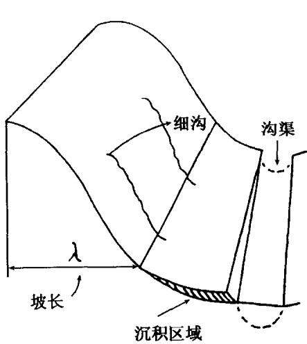  
图 1-1 RUSLE 用于细沟间和细沟侵蚀的地面剖面图  
λ是RUSLE定义的坡长(至沉积发生点)。产沙量是一段时间从沟道搬运的泥沙总和，如一次暴雨事件、一个月、作物某生长阶段或一年。

为了选择适宜的因子值，RUSLE要计算各种情况下的土壤流失量，包括复合作物系统，轮作中的一个作物年，或一个作物年内的不同作物生长阶段的平均土壤流失量。因暴雨的不同，侵蚀量也会变化很大。但随机波动的结果会随时间延长而趋近于平均值，与R 因子有关的暴雨年际变率，与C因子有关的季节变率均属此类因子。由于这些变量在短尺度上不可预报，目前土壤流失方程对于预报特殊事件的精度，远远小于长期平均值的预报精度。

USLE还可以用来估算森林破坏后的土壤流失

量，而RUSLE没有强调这方面的应用。这方面成果可参考Diss-meyer和Foster的研究(1980,1981)。最近的一些研究强调了将USLE技术应用于废弃矿山的复垦工程中(Barfield等，1988)。在这种情况下，压实作用对侵蚀过程的影响十分重要，应看作是计算C因子的一部分(第五章)。另外，扰动土坡度对侵蚀的影响，将在第四章作具体介绍(表4-3)，但比较起来，扰动土对侵蚀影响的研究较少。

## 第二章 降雨侵蚀力因子(R)

2.1 概述

雨滴击溅作用和因降雨产生的径流，是最主要的土壤侵蚀动力。降雨侵蚀力就反映了降雨的这种作用，它是指降雨引起土壤侵蚀的潜在能力，是降雨特性的函数(Hudson，1971)。如何度量降雨侵蚀力，许多学者对此进行了深入研究。

特大暴雨过后，坡面上出现大量的细沟，并在局部发生淤积，这一现象往往会给人一种印象：严重的水土流失只与少数几次特大暴雨有关，也就是说土壤侵蚀仅与大雨强有关系。然而，美国许多州试验站30多年的观测表明，情况并非如此（Wischmeier，1962)。实测资料显示，用于估算多年平均侵蚀量的降雨参数，必须将特大暴雨和多数中强度暴雨的累加效果同时考虑，既能反映雨滴打击作用，又能体现与降雨量密切相关的径流量及其强度。Ellison,Bisal,Rose和其他人的试验研究也表明，侵蚀力与能量有关，但这一结论必须在野外天然降雨造成的土壤流失观测中得到证实(Hudson,1971)。Wischmeier(1958)的工作证实了这一结论。他选择了美国35个水土保持试验站不同类型土壤的试验小区共8250个小区年资料(见表2-1),分析了单变量、复合变量等与土壤流失量的关系后发现，单用降雨动能(E)不能很好地描述侵蚀能力。一次长历时、小强度降雨的总动能可以与另一次短历时、大强度降雨的总动能相同。但由于两次降雨的雨强不同，侵蚀力会明显不同，而一次降雨过程中的最大30min雨强 $( I _ { 3 0 } )$ 能较好地反映这种差异。乘积 $E I _ { 3 0 }$ 反映了每次暴雨过程中，总降雨动能与最大雨强相互作用的统计规律。从动力过程看，该值描述了土壤颗粒被分离及其搬运过程的综合效应。因此估算土壤流失量的最好指标是一个复合参数：一次降雨总动能(E)与该次降雨的最大30min 雨强 $\left( I _ { 3 0 } \right)$ 的乘积，并将其称为降雨侵蚀力(Rainfall Erosivi-ty)，简称EI指数。E的单位为MJ/ha(兆焦耳/公顷)， $I _ { 3 0 }$ 的单位是mm/h(毫米/小时),EI的单位为 $\mathbf { M J } \cdot \mathbf { m m } / ( \mathbf { h a } \cdot \mathbf { h } )$ [兆焦耳·毫米/(公顷·小时)]。

表 2-1 不同变量对土壤流失量的决定系数(百分数)①
<table><tr><td rowspan="2">回归方程 中的变量</td><td colspan="4">土壤类型和分析时使用的降雨次数</td></tr><tr><td>Shelby (138)</td><td>Shelby Shelby (207) (207)</td><td>Marshall (131)</td><td>Fayette (144)</td></tr><tr><td>降雨量</td><td>73.0</td><td>68.3</td><td>64.6</td><td>38.7</td><td>42.2</td></tr><tr><td>降雨动能</td><td>81.7</td><td>78.2</td><td>73.9</td><td>54.9</td><td>61.6</td></tr><tr><td>最大15min 雨强</td><td>43.4</td><td>40.9</td><td>25.7</td><td>50.4</td><td>65.5</td></tr><tr><td>最大 30min 雨强</td><td>56.2</td><td>59.8</td><td>35.1</td><td>56.0</td><td>79.9</td></tr><tr><td>3个变量②</td><td>78.6</td><td>73.8</td><td>67.6</td><td>66.2</td><td>82.6</td></tr><tr><td> $E I _ { 3 0 }$ </td><td>89.2</td><td>81.7</td><td>75.6</td><td>70.7</td><td>88.0</td></tr><tr><td> $E I _ { 3 0 }$  与3个 变量③</td><td>92.1</td><td>85.8</td><td>80.2</td><td>78.6</td><td>88.3</td></tr></table>

①引自Wischmeier 和 Smith(1958)。  
②3个变量包括：降雨量，最大15min雨强，最大30min雨强。  
③3个变量包括:降雨动能，EI3，前期降雨指数，最后一次耕作以来的降雨总动能。 $E I _ { 3 0 }$

假定土壤侵蚀与EI指数是线性关系，便可以将每一次暴雨的EI值直接相加，给定时段内所有降雨的EI值之和，就是该时段的降雨侵蚀力。某一地区年EI的多年平均值便是该地区的年降雨侵蚀力。计算多年平均降雨侵蚀力时，资料的序列越长越好，尤其对降水量年际变化大的地区更应如此。

随后美国在用通用土壤流失方程USLE（Wischmeier和Smith,1965)进行土壤流失量预报时，用该指数反映降雨对土壤侵蚀的影响，并将其称为降雨因子(Rainfall Factor)。在 USLE 第二版中(Wischmeier 和 Smith,1978)，将其更名为降雨和径流因子(Rainfall and Runoff Factor)。1997年发表的修订版通用土壤流失方程 RUSLE(Revised Universal Soil Loss Equation，Renard 等，1997)中，将降雨和径流因子称为降雨-径流侵蚀力因子(Rainfall-Runoff Erosivity Factor)。名称的改变，实质反映了人们对降雨影响土壤侵蚀机理认识的不断深入。USLE第一版(1965)认为EI只是影响土壤侵蚀的降雨因子。USLE第二版(1978)认识到EI不仅反映降雨，而且也反映径流的作用。RUSLE(1997)则将EI理解为降雨和它产生的径流所具有的引起土壤侵蚀的潜在能力。

## 2.2 侵蚀性降雨标准

在所有的降雨事件中，只有部分降雨能够发生土壤侵蚀，这样在计算降雨侵蚀力 $E I _ { 3 0 }$ 时，如能把不发生侵蚀的降雨排除，则会大大减少工作量，同时可以提高降雨侵蚀力的计算精度。因此拟定一个标准，将发生侵蚀和不发生侵蚀的降雨区分开来，是分析降雨侵蚀力的一个重要前提，这个标准被称为侵蚀性降雨标准。

Wischmeier1962年系统分析了美国30年来45个研究站,23个州的小区观测资料发现，降雨造成的土壤侵蚀的年际变化很大。虽然大暴雨产生的土壤流失量占总侵蚀量的比例很大，但由于中小雨出现的频率很高，同时会产生一定的土壤流失量，它们所造成的土壤流失量的总和绝不能忽视。如Oklahoma3年降雨量占27年降雨总量的14%，但所产生的侵蚀量占27年总侵蚀量的51%；Virginia3年降雨量占17年降雨总量的18%，所产生的侵蚀量占

17年总量的81%。Oklahoma最大次暴雨侵蚀量为49772.4t/km²(1949 年);Iowa为8 295.4t/km²;Missouri 为8 519.6t/km²。在这些地区中，小于25.4mm的降雨造成的土壤流失量为总流失量的22%;25.4\~50.8mm的降雨造成的流失量占总流失量的47%；大于50.8mm的降雨造成的流失量占总流失量的31%。显然小雨侵蚀量不能忽略，对于雨强而言也存在类似情况。举例来说，2年一遇次暴雨的侵蚀量为3.6t,20年一遇次暴雨的侵蚀量为9.1\~12.7t。2年一遇暴雨的发生频率是20年一遇暴雨发生频率的10倍，所以2年一遇暴雨产生的总侵蚀量是20年一遇暴雨产生的总侵蚀量的3\~4倍，从这个意义上说，小雨造成的侵蚀不能忽略。另一方面，小降雨的次数非常庞大，而且其中的许多次降雨的确不能产生水土流失，因此很有必要将其从降雨侵蚀力的计算中剔除掉，否则，不仅增大了计算年或多年平均降雨侵蚀力的工作量，而且由于将不发生侵蚀的降雨加入进来，降低了降雨侵蚀力的计算精度。如黄土高原绥德韭园沟1954～1979年22年中(不包括1970\~1973年),共降雨1713次，降雨总量为11242mm。其中产生径流的降雨为119次，占总降雨次数的11%，产流降雨量为5104mm，占总降雨量的45%；晋西王家沟22年共降雨13530mm,产流降雨占总降雨量的34%(加荣生等，1992)。所以拟定侵蚀性降雨标准有三点重要意义：①大幅度减少资料整理和计算的工作量：②提高降雨侵蚀力的计算精度；③更好地了解不同地区降雨侵蚀特点。

USLE第二版(1978)计算降雨侵蚀力时，提出了侵蚀性降雨标准：一次降雨如果小于12.7mm，则将这次降雨从侵蚀力计算中剔除，但如果此次降雨在15min内降雨量超过6.4mm，则仍将这次降雨计算在内。同时还给出了划分次降雨的方法：如果降雨间歇时间不足6小时，则视为一次降雨过程；如果间歇时间超过6小时，则视为两次降雨过程。RUSLE(1997)沿用了USLE(1978)的侵蚀性降雨标准，但将次降雨的划分标准稍做调整：一次降雨虽然没有间歇，但如果6小时以上降雨量小于1.3mm，仍可将这次降雨分为两次降雨过程。观测分析表明，上述小雨造成的侵蚀通常很小，从总体上看，它们对于全年EI值的分布或全年土壤侵蚀的作用十分微弱(Renard,1997)。USLE(1978)和 RUSLE(1997)模型为绘制年降雨侵蚀力的多年平均等值线图，需要分析4000个站-年的降雨资料，侵蚀性降雨标准的提出，大大降低了计算的工作量和计算费用。

侵蚀性降雨标准实质反映的是降雨特征参数，它将发生侵蚀的降雨和不发生侵蚀的降雨事件区分开来，从这个意义上说，它与暴雨标准有一定的关联：即土壤侵蚀往往由暴雨造成。因此我国学者常将侵蚀性降雨标准与气象部门的暴雨标准进行对比分析。

我国气象上将日降雨量大于等于50mm的降雨称为暴雨。方正山(1958),刘尔铭(1982)分别拟定了暴雨标准，拟定这些标准时没有和土壤侵蚀直接联系，是单纯的降雨特征参数。张汉雄和王万忠(1982)在确定黄土高原暴雨标准时，将暴雨标准与土壤侵蚀联系起来。5min雨强的确定是以甘肃省西峰10°无覆盖小区产生径流为标准(3.9mm雨量或0.78mm/min雨强),1440min 则以55mm为标准，二者之间用椭圆和抛物线配线推求。王万忠(1984)明确提出侵蚀性降雨的概念，即发生侵蚀的降雨，同时提出了侵蚀性降雨的四个标准：①基本雨量标准:将侵蚀性降雨按雨量从大到小排序，顺序数与总次数之比为80%时对应的雨量；②一般雨量标准：将侵蚀性降雨按雨量从大到小排序，累积侵蚀量达到95%时对应的雨量：③瞬时雨率标准：将侵蚀性降雨按5、10、30、60min等不同时段最大雨强从大到小排序，顺序数达到总次数80%时对应的时段雨强：④暴雨标准：与一般雨量标准的计算方法相同.但将累积侵蚀量定为90%时对应的雨量，低于95%的一般雨量标准。周佩华、王占礼(1987)提出土壤侵蚀暴雨的概念，即能发生径流的降雨，并用人工降雨法将不同雨强降雨事件的起流历时和相应的雨强配线，求得暴雨标准。

从目前研究来看，侵蚀性降雨或暴雨标准的拟定指标有二种：一是雨量标准；二是雨强标准。从所使用的术语来看，包括暴雨(方正三，1958;刘尔铭，1982;张汉雄，1982)，侵蚀性降雨(王万忠，1984)，土壤侵蚀暴雨(周佩华、王占礼，1987;绥德水保站，1989)，侵蚀性降雨的暴雨(王万忠，1984)等。在进行标准的划分时，主要采用三种方法：第一种是纯粹的降雨指标；第二种是将降雨指标和水土流失联系起来；第三种是按水土流失大小设定标准。显然，从土壤侵蚀研究角度看，第三种方法拟定的标准更具有实用价值。

确定标准的目的是为了将一类事物与另一类事物区别开来，为了说明某些现象，或为某些应用目的服务。从这个意义上说，为了区分不同的降雨事件，可以有不同的标准，但必须赋予实际含义，为不同的应用服务。在通用土壤流失方程的降雨侵蚀力因子研究中，确定降雨标准的目的是为了区分发生侵蚀和不发生侵蚀的降雨，因此将其称为侵蚀性降雨标准。标准拟定后，对于减少降雨侵蚀力的计算量，提高计算精度具有重要意义。表2-2给出了我国黄土高原地区侵蚀性降雨标准的一些研究结果。

表2-2 黄土高原侵蚀性降雨标准(mm)研究结果比较
<table><tr><td>时间 5 10 15 20 30 40 50 60 90 120 240 720 1440 (min)</td></tr><tr><td>方正三 2.5 3.8 5.0 6.0 8.1 9.6 11 12 15 17 26 45 61 </td></tr><tr><td>徐在庸 3.0 4.0 6.5 8 13 25 一 一</td></tr><tr><td>刘尔铭 4.4 9.8 11 14 15 23 38 50</td></tr><tr><td>2.3 3.4 5.4 7.5 8.8 张汉雄 3.9 5.5 6.7 7.7 9.5 一 13 16 19 26 43 55</td></tr><tr><td>王万忠 5.8 7.1 8.0 一 9.7 1 12 15 21 35 50</td></tr><tr><td>周佩华 4.4 5.6 6.5 7.2 8.3 9.1 9.9 11 1 一 1 一</td></tr><tr><td>绥 德 3.4 4.0 4.3 4.7 5.2 25.5 5.9 6.1</td></tr><tr><td></td></tr></table>

## 2.3 降雨动能的计算

Ellison(1944)通过实验发现，溅蚀与雨滴大小、雨滴降落速度和雨强有关。Mihara(1951)和Free(1960)发现溅蚀直接与降雨动能有关。计算降雨侵蚀力EI值时，首先需要计算一次降雨的总动能，它是指一次降雨过程中所有雨滴具有的总能量。降雨能量大小与雨滴大小和雨滴终点速度的平方成正比。降雨动能难以直接测量，所以通过观测雨滴大小分布和雨滴终点速度进行计算得到。Wischmeier(1958)根据Laws(1941)发表的雨滴终点速度资料，以及Laws和Parsons(1943)分析的雨滴大小和雨强关系的资料，得出了每英寸降雨(即单位降雨)动能公式(Wischmeier和Smith,1958):

$$
e = 9 1 6 + 3 3 1 \mathrm { l o g } _ { 1 0 } i\tag{2-1}
$$

式中变量采用美制单位，e 是动能，单位为 ft·tonf/(acre·in);i 是 $e$ 降雨强度，单位为in/h。Wischmeier(1958)根据上述公式，将0.01\~9.9in/h范围的雨强，制成单位降雨动能表，使用时可直接查表。当雨强小于1inh时，每隔0.01inh列表，当雨强介于1\~9.9in/h时，每隔0.1in/h列表于2-3。

表 2-3 降雨动能[ft·tonf/(acre·in)]\*
<table><tr><td>雨强 in/h</td><td>0.01 0.02 0.03 0.04 0.05 0.06 0.07 0.08 366 375 384</td></tr><tr><td>0 0 30</td><td>318 328 337</td></tr><tr><td>0.1</td><td>347 356 445</td></tr><tr><td>40 411</td><td>420 428 437</td></tr><tr><td>48 493</td><td>453 461 501 508 516 523 530</td></tr><tr><td>0.2 0.3 55 565</td><td>537</td></tr><tr><td></td><td>579 585 592 598 604</td></tr><tr><td>572 0.4 62 629 635</td><td>611</td></tr><tr><td></td><td>641 646 652 658 663 669</td></tr><tr><td></td><td></td></tr></table>

<table><tr><td>雨强 in/h</td><td>0 0.01 0.02</td><td></td><td></td><td>0.03 0.04</td><td>0.05</td><td>0.06</td><td>0.07</td><td>0.08 0.09</td></tr><tr><td>0.5</td><td>68</td><td>685</td><td>690</td><td>695</td><td>700</td><td>705 710</td><td>715</td><td>720</td><td>725</td></tr><tr><td>0.6</td><td>73</td><td>734</td><td>739</td><td>743</td><td>748</td><td>752</td><td>757</td><td>761 765</td><td>770</td></tr><tr><td>0.7</td><td>77</td><td>778</td><td>782</td><td>786</td><td>790</td><td>794</td><td>798</td><td>801 805</td><td>809</td></tr><tr><td>0.8</td><td>81</td><td>816</td><td>820</td><td>823</td><td>827</td><td>830</td><td>834</td><td>837 840</td><td>843</td></tr><tr><td>0.9</td><td>84</td><td>850</td><td>853</td><td>856</td><td>859</td><td>862</td><td>865</td><td>868 871</td><td>874</td></tr><tr><td>1.0</td><td>87</td><td>903</td><td>927</td><td>947</td><td>956</td><td>981</td><td>995</td><td>100 101</td><td>102</td></tr><tr><td>2.0</td><td>10</td><td>104</td><td>105</td><td>105</td><td>106</td><td>106</td><td>107</td><td>107 107</td><td>107</td></tr><tr><td>3.0</td><td>10</td><td></td><td></td><td></td><td></td><td></td><td></td><td></td><td></td></tr></table>

\*引自Renard等(1997)。

1978年Wischmeier等将上式的取值上限作了规定，认为当降雨强度超过3in小h时，由于中值雨滴大小一般不会继续增大(Carter等，1974)，降雨动能趋于常数，并将原来雨强-降雨动能表的雨强范围改为0.01\~3.0in/h。USLE(1978)计算降雨动能采用下式：

$$
e = 9 1 6 + 3 3 1 \log _ { 1 0 } i \qquad \quad i \leqslant 3 \ \mathrm { i n } \Lambda\tag{2-2a}
$$

$$
e = 1 0 7 4  { \mathrm { ~ \textrm ~ { ~ ~ } ~ } }  { \mathrm { \Omega } } _ { i } > 3  { \mathrm { \ i n } }  { \mathrm { \Omega } } _ { \mathbf { h } }\tag{2-2b}
$$

Foster等(1981b)将上述公式换算为相应的国际单位制如下：

$$
e _ { \mathrm { m } } = 0 . 1 1 9 + 0 . 0 8 7 3 \mathrm { l o g } _ { 1 0 } ( i _ { \mathrm { m } } ) \qquad i \leqslant 7 6 \mathrm { m m } \Lambda\tag{2-3a}
$$

$$
e _ { \mathrm { m } } { = } 0 . 2 8 3 \qquad \quad \quad i > 7 6 \ \mathrm { m m } \Lambda\tag{2-3b}
$$

式中 $e _ { \mathrm { m } }$ 单位是 MJ/(ha·mm)。

其他学者也给出了不同地区、不同雨滴分布模式的动能计算方法。如 McGregor 和 Mutchler(1977)计算了密西西比州，Carter等(1974)计算了美国南方中部地区，Tracy等(1984)计算了亚利桑那州东南部地区，Rosewell(1983,1986)计算了澳大利亚的降雨

动能。

Brown 和 Foster(1987)使用了下列单位降雨动能关系式：

$$
e = e _ { \mathrm { m a x } } [ 1 - \alpha \cdot \mathrm { e x p } ( - b \cdot i ) ]\tag{2-4}
$$

式中 $e _ { \mathrm { m a x } }$ 是当雨强趋于无穷时的最大单位降雨动能，a和b是系数。

Kinnell(1981，1987)、Rosewell(1983，1986)、McGregor和Mutchler(1977)、Laws 和 Parsons(1943)等的工作表明，上述分布适用于他们所分析的各自资料，但这些应用均显示出系数a和b有不同程度的变化。Brown和Foster通过他们的分析，推荐用下列公式计算单位降雨动能：

$$
e _ { \mathrm { m } } { = } 0 . 2 9 [ 1 - 0 . 7 2 \mathrm { e x p } ( - 0 . 0 5 i _ { \mathrm { m } } ) ]\tag{2-5}
$$

式中 $e _ { \mathbf { m } }$ 单位是 MJ/(ha·mm)， $i _ { \mathfrak { m } }$ 单位是 mm/h。

USLE(1965,1978)和RUSLE(1997)计算降雨侵蚀力时，均采用了式2-1和2-2。但RUSLE(1997)建议最好采用新公式2-5。与原来公式相比，新公式有两点明显改进：①改变了原公式函数不连续和雨强大于某一临界值后，单位降雨动能恒为常数的不足。原公式在降雨强度76mmh处有一折点，大于该值后，计算结果恒为常数。新公式当降雨强度趋于无限时，单位降雨动能趋于常数(渐进线):②新公式计算结果恒为正值，物理意义明确。原公式在雨强小于0.05mm/h时，降雨动能为负值，显然不合理。两个公式计算结果的对比表明，降雨强度小于0.5mm/h时，新公式计算值大：降雨强度为0.5\~35mmh时，新公式计算值小；降雨强度大于35mm/h时，新公式计算值大。

表2-4和表2-5 分别是用新公式2-6和原公式2-2计算的一次降雨(1964年7月22日)的总动能，对同一场降雨来说，两个公式计算结果的差值小于1%。

表 2-4 用新公式 2-5 计算一次降雨动能 E 的实例\*
<table><tr><td colspan="3">降雨过程记录</td><td colspan="2">断点降雨记录</td><td colspan="2">降雨动能</td></tr><tr><td>时间</td><td>降雨量 (mm)</td><td>历时 (min)</td><td>降雨量 (mm)</td><td>雨强 (mm/h)</td><td>单位降雨动能降雨总动能 [MJ/(ha·mm)]</td><td>(MJ/ha)</td></tr><tr><td>18:15</td><td>0</td><td></td><td></td><td></td><td></td><td></td></tr><tr><td>18:19</td><td>8.9</td><td>4</td><td>8.9</td><td>133.4</td><td>0.29</td><td>2.58</td></tr><tr><td>18:22</td><td>11.9</td><td>3</td><td>3.0</td><td>61.0</td><td>0.28</td><td>0.85</td></tr><tr><td>18:27</td><td>25.4</td><td>5</td><td>13.5</td><td>161.5</td><td>0.29</td><td>3.90</td></tr><tr><td>18:30</td><td>41.1</td><td>3</td><td>15.7</td><td>315.0</td><td>0.29</td><td>4.57</td></tr><tr><td>18:45</td><td>52.3</td><td>15</td><td>11.2</td><td>44.7</td><td>0.27</td><td>2.99</td></tr><tr><td>总计</td><td></td><td>30</td><td>52.3</td><td></td><td></td><td>14.89</td></tr></table>

\*引自Renard等(1997)。

表 2-5 用原公式 2-3 计算一次降雨动能 E 的实例\*
<table><tr><td colspan="3">降雨过程记录</td><td colspan="2">断点降雨记录</td><td colspan="2">降雨动能</td></tr><tr><td>时间</td><td>降雨量 (mm)</td><td>历时 (min)</td><td>降雨量 (mm)</td><td>雨强 (mm/h)</td><td>单位降雨动能降雨总动能 [MJ/(ha·mm)]</td><td>(MJ/ha)</td></tr><tr><td>18:15</td><td>0</td><td></td><td></td><td></td><td></td><td></td></tr><tr><td>18:19</td><td>8.9</td><td>4</td><td>8.9</td><td>133.4</td><td>0.28</td><td>2.52</td></tr><tr><td>18:22</td><td>11.9</td><td>3</td><td>3.0</td><td>61.0</td><td>0.27</td><td>0.84</td></tr><tr><td>18:27</td><td>25.4</td><td>5</td><td>13.5</td><td>161.5</td><td>0.28</td><td>3.81</td></tr><tr><td>18:30</td><td>41.1</td><td>3</td><td>15.7</td><td>315.0</td><td>0.28</td><td>4.46</td></tr><tr><td>18:45</td><td>52.3</td><td>15</td><td>11.2</td><td>44.7</td><td>0.26</td><td>2.94</td></tr><tr><td>总计</td><td></td><td>30</td><td>52.3</td><td></td><td></td><td>14.56</td></tr></table>

\*引自Renard等(1997)。

刘素媛等(1988)利用辽西低山丘陵半干旱地区天然降雨雨滴观测资料(1983、1984和1986的50余份滴谱资料),得出了两种类型暴雨的降雨动能公式，但原文公式计算结果与图中曲线不符。据推算，指数为0.0751似乎偏小。

$$
1 5 2 5 2 5 6 1 5 2 5 \times 1 5 1 \div 1 5 1 = 2 5 . 3 5 4 1 0 . 0 7 5 1 , 1 7 6 \times 1 5 \times 3 \times 1 5 \times 1 \times 1 = 0 . 5 6 6 3\tag{2-6a}
$$

$$
\begin{array} { r } { \left| { \mathbb { E } \frac { \mathrm { { i } } t } { \mathrm { { H } } } \frac { { \mathrm { \# } } } { 2 } \frac { { \mathrm { \# } } } { 3 k } \mathrm { { \mathbb { R } } } } \right| { \mathbb { E } } [ { \mathrm { \# } } ] : E = 2 5 . 9 2 2 I ^ { 0 . 1 7 1 7 } , { \mathrm { \# } } { \mathrm { H } } \frac { \mathcal { X } } { 4 } \lesssim \frac { { \mathrm { \# } } } { 3 k } \mathrm { { \# } } \mathrm { { \mathcal { R } } } \ = \ 0 . 8 7 2 3 } \end{array}\tag{2-6b}
$$

式中降雨动能E单位为 $\mathbf { J } / ( \mathbf { m } ^ { 2 } { \cdot } \mathbf { m m } )$ ,雨强 I的单位是 mm/h。

黄炎和等(1992)根据1989\~1990年在福建省安溪官桥取得的58份滴谱资料分析，给出了闽东南地区雨强与动能的幂函数关系，又按雨型分别拟合了梅雨型和台风雷暴雨型的动能公式(式中各项意义与单位同上):

$$
\sharp \sharp \sharp \sharp \underline { { \varphi } } : \mathbb { E } = 4 0 . 9 I ^ { 0 . 3 1 } , \qquad \# \sharp \sharp \sharp \sharp \sharp \sharp \varphi \ : \mathbb { R } = \ 0 . 6 8 4\tag{2-7a}
$$

$$
\begin{array} { r } { \underset { \Theta } { \Longleftrightarrow } \mathbb { X } [ \underset { \mathbb { H } \neq 1 } { \neq } \frac { \underset { \mathbb { H } } { \neq } } { \neq } \mathbb { H } \mathbb { H } ] \underset { \mathbb { L } } { \underline { { \mathbb { H } } } } = 3 5 . 9 2 I ^ { 0 . 2 8 } , \ : \ : \# \mathbb { H } \neq \mathbb { H } \underset { \mathbb { H } } { \neq } \mathbb { H } \ : R = 0 . 5 9 0 } \end{array}\tag{2-7b}
$$

周伏建等(1995)进一步采集了1990\~1994年福建省闽东南、闽中和闽北地区的天然降雨资料，共获得119份滴谱。得出福建省降雨动能与雨强回归方程如下(式中各项意义与单位同上):

$$
E = 3 2 . 4 7 + 5 . 8 8 \mathrm { l n } I \qquad \ast \mathrm { H } \neq \ddagger \ddagger \ast \mathrm { \# } K = 0 . 9 0 8\tag{2-8a}
$$

$$
E = 3 4 . 3 2 I ^ { 0 . 2 7 } \qquad \star \boxed { { \bf d } \nearrow \nearrow \nearrow \& \ne } \& \ e = 0 . 9 0 6\tag{2-8b}
$$

两种函数形式的相关系数仅相差0.002，从统计角度看，均可用于估计降雨动能，然而拟合结果与实测值的对比分析表明，二者的拟合精度明显不同：幂函数拟合精度好于对数函数。在低雨强情况下，对数函数拟合误差高达52.7%；而幂函数最大拟合误差只有13.5%，故建议采用幂函数形式。

江忠善等(1983)选择黄土高原天水、绥德、西峰和离石4个站，利用色斑法收集了1979\~1981年天然降雨雨滴资料，分别用幂函数和对数函数形式拟合雨强与动能的关系，4个站拟合结果的一致性很好(见表2-6)。于是求出4个站平均的动能公式，同时将43次短阵型暴雨进行单独拟合。

表 2-6 黄土地区降雨动能公式[J $/ ( \mathrm { m } ^ { 2 } { \cdot } \mathrm { m m } )$
<table><tr><td>观测地点</td><td>观测次数</td><td>动能公式</td><td>相关系数</td></tr><tr><td>天水</td><td>162</td><td> $E = 2 8 , 2 0 I ^ { 0 . 2 9 }$ </td><td>0.866</td></tr><tr><td>西峰</td><td>188</td><td> $E = 2 7 . 1 5 + 1 2 . 1 0 \mathrm { l o g } _ { 1 0 } ( I )$   $E = 2 8 . 6 3 I ^ { 0 . 2 7 }$ </td><td>0.852 0.910</td></tr><tr><td></td><td></td><td> $E = 2 7 . 0 8 + 1 0 . 5 6 \mathrm { l o g } _ { 1 0 } ( I )$ </td><td>0.908</td></tr><tr><td rowspan="2">绥德</td><td>141</td><td> $E = 3 0 . 3 0 I ^ { 0 . 2 8 }$ </td><td>0.947</td></tr><tr><td></td><td> $E = 2 8 . 8 9 + 1 1 . 8 6 \log _ { 1 0 } ( I )$ </td><td>0.950</td></tr><tr><td>离石</td><td>54</td><td> $E = 3 0 . 4 0 I ^ { 0 . 2 9 }$ </td><td>0.909</td></tr><tr><td rowspan="2">绥德、离石</td><td></td><td> $E = 2 8 . 8 3 + 1 3 . 5 1 \log _ { 1 0 } ( I )$ </td><td>0.932</td></tr><tr><td>195</td><td> $E = 3 0 . 2 3 I ^ { 0 . 2 9 }$ </td><td>0.929</td></tr><tr><td></td><td></td><td> $E = 2 8 . 9 5 + 1 2 . 3 0 \mathrm { l o g } _ { 1 0 } ( I )$ </td><td>0.942</td></tr><tr><td rowspan="2">四站</td><td>545</td><td> $E = 2 9 , 6 4 I ^ { 0 . 2 9 }$ </td><td>0.915</td></tr><tr><td></td><td> $E = 2 7 . 8 3 + 1 1 . 5 5 \mathrm { l o g } _ { 1 0 } ( I )$ </td><td>0.914</td></tr><tr><td rowspan="2">四站*</td><td>43</td><td> $E = 3 3 , 8 8 { \cal I } ^ { 0 . 2 3 }$ </td><td></td></tr><tr><td></td><td> $E = 3 2 . 9 8 + 1 2 . 1 3 \mathrm { l o g } _ { 1 0 } ( I )$ </td><td>0.956 0.961</td></tr></table>

\*为阵雨。

## 2.4 降雨侵蚀力指标的确定与计算

## 2.4.1 降雨侵蚀力指标的确定

Wischmeier(1958)为了确定降雨侵蚀力指标，对以下变量与土壤流失量之间的决定系数进行了分析(见表2-1):①降雨量；②降雨动能；③最大15min雨强；④最大30min雨强；⑤降雨量、最大15和30min雨强建立的回归方程；⑥ $E I _ { 3 0 } ; \textcircled { 7 } E I _ { 3 0 }$ 、降雨动能、前期降雨量和上一次耕作活动结束以来的降雨总动能共4个变量的多元回归关系。结果表明， $E I _ { 3 0 }$ 可以解释土壤流失量变化的70.2%\~89.2%(决定系数 $R ^ { 2 } ,$ )，同时也是一个简单易操作的参数，于是将其作为通用土壤流失方程中降雨因子影响的定量指标。

$E I _ { 3 0 }$ 与降雨过程有关，考虑到我国地域辽阔，不同地区形成降雨的环流和天气系统差异很大，降雨过程有明显的地区差异。许多学者探讨了降雨侵蚀力指标。这些研究基本以 $E I _ { n } ( \mathbf { I } _ { n }$ 是最大n时段雨强)的组合形式为基础，结合实际径流观测资料，分析不同时段雨强与降雨动能的组合及其组合形式。从研究结果看，应用EI指数应注意两个问题：一是EI组合是否为线性；二是采用的时段雨强与地区降雨特征有密切关系。

王万忠(1983,1987)利用黄土高原子洲团山沟径流场1963\~1969年观测资料，讨论了降雨侵蚀力指标，发现与土壤流失量相关程度最高的 EI组合形式是 $E _ { 6 0 } I _ { 1 0 } ( E _ { 6 0 }$ 是最大60min降雨对应的降雨动能， $I _ { 1 0 }$ 是最大10min雨强),其次是 $E I _ { 1 0 }$ 。这与黄土高原地区的降雨特性有关。导致黄土高原地区土壤流失的降雨主要是短历时高强度降雨，即使历时较长，其雨量也往往集中在1h以内(1h降雨可占总降雨量的70%)。 $E _ { 6 0 }$ 剔除了低强度降雨动能， $I _ { 1 0 }$ 则反映了该地区主要降雨的雨强特点，因此 $E _ { 6 0 } I _ { 1 0 } \small { \setminus } E I _ { 1 0 }$ 与土壤侵蚀相关最好。

贾志军等(1987)利用晋西离石羊道沟1963\~1968年坡耕地观测资料，在采用江忠善降雨动能公式的基础上，确定最佳降雨侵蚀力指标为 $E I _ { 1 0 }$ ,并分析了降雨侵蚀力的季节和年际变化。

江忠善等(1988)根据甘肃省西峰观测资料，用自己建立的降雨动能计算公式(1983)，计算了EI值。经统计分析发现，土壤流失量与EI呈幂函数相关，而非线性相关。在EI组合中，各时段雨强与土壤流失量的相关性相差甚小，但考虑到如采用短时段雨强会使资料摘录困难，因此建议采用 $E I _ { 3 0 }$

吴素业(1992)用岳西水保站3号径流小区和4号径流小区1984\~1990年连续7年的观测资料(分别为32个样本),分析了安徽大别山区降雨侵蚀力的最佳组合形式，及其与土壤流失量的关系。分别用5min、10min、20min、30min和60min最大时段雨强与降雨动能组合，发现 $E I _ { 6 0 }$ 的相关程度最高(0.914)，其次是

$E I _ { 3 0 } ( 0 . 9 0 7 )$ ，二者在安徽大别山区均适用。此外还计算了最大60min降雨动能 $\left( E _ { 6 0 } \right)$ 与上述不同时段雨强的组合，发现相关程度不如总降雨动能与时段雨强的组合，其中相关程度最高的是$E _ { 6 0 } I _ { 6 0 } ( 0 . 9 0 0 )$ 。分析还表明，土壤侵蚀量与EI组合呈明显幂函数相关，而不是线性相关。各种组合的幂函数相关系数平均为0.777\~0.914,线性相关系数平均仅为0.428\~0.581，这表明用EI线性关系反映土壤流失有一定的疑问。

黄炎和等(1992)用闽东南安溪径流试验场土壤流失量资料，分析了土壤侵蚀与5min、10min、20min、30min、60min最大雨强，以及它们与降雨动能乘积的相关性。结果发现，土壤侵蚀与最大时段雨强的单因素相关是：5min最差，然后逐渐增大，60min最好。相关系数变化于0.764\~0.938之间。土壤侵蚀与EI组合的相关关系是： $E I _ { 1 0 }$ 最大,但总体相差不大(0.860\~0.907)，而且$I _ { 3 0 }$ 和 $I _ { 6 0 }$ 的单因素关系比 $E I _ { 3 0 }$ 和 $E I _ { 6 0 }$ 的组合关系还好。他们认为由于EI不同组合计算的绝对值相差甚大，不能确定降雨侵蚀力指标，所以用土壤侵蚀与时段雨强单因素相关性最大原则，确定$E I _ { 6 0 }$ 为降雨侵蚀力指标。这一结论与一般理解不相符合，因为既然选EI组合为侵蚀力指标，就应以EI组合与土壤侵蚀的相关性好坏为原则，选取最佳指标。

周伏建等(1995)进一步选用福建省的5个径流试验站观测资料，分析了适合全省的降雨侵蚀力指标，结果以 $E I _ { 6 0 }$ 最好。

张宪奎等(1992)用黑龙江克山县和宾县小区实测土壤流失资料和降雨资料，进行降雨侵蚀力与土壤流失量的相关分析，确定黑龙江省降雨侵蚀力的最佳指标。其中R指标形式分别采用10、20、30和60min时段的降雨动能En与不同时段最大雨强In组 $E _ { n }$ $I _ { n }$ 合，以及一次降雨总动能∑E与不同时段最大雨强 $I _ { n }$ 组合，共构成14个组合结构形式，相关分析的结果表明，适合全省的最佳R指标是 $E _ { 6 0 } I _ { 3 0 }$ ，而不是∑ $E I _ { 3 0 }$ o

陈法扬、王志明(1992)利用广东电白县小区观测资料，分别采用6种R指标形式计算了月降雨侵蚀力和年降雨侵蚀力。各种计算结果与实测土壤流失量的相关分析表明，在热带或亚热带地区，用通用指数(UI)、 $E I _ { 3 0 }$ 和KE>25作为 R指标比较适宜。其中研究月土壤侵蚀量与降雨因子关系时，采用UI指标为宜；研究年土壤侵蚀量与降雨因子关系时，采用 $E I _ { 3 0 }$ $K E > 2 5$ 指标为宜。

通用指数(UI)由保加利亚N.G.Onchev提出，用以表示降雨侵蚀因子：

$$
U I = P _ { i } / t _ { i }
$$

式中， $P _ { i }$ 是雨强大于8.7mm/h且雨量大于9.4mm的次降雨量(mm), $t _ { i }$ 是雨强大于8.7mm/h的降雨历时(min)。

$K E > 2 5$ 方法由英国学者N.W.Hudson在研究非洲土壤侵蚀时提出。Hudson的研究发现，Wischmeier提出的 $E I _ { 3 0 }$ 指标对于热带和亚热带地区不适用，故提出KE>25，它是指降雨强度大于25mm/h的降雨总动能，计算公式为：

$$
K E > 2 5 = 2 6 X _ { 3 } + 2 8 X _ { 4 } + 2 9 X _ { 5 }
$$

式中 $X _ { 3 } , X _ { 4 } , X _ { 5 }$ 分别是25\~50mm/h、50\~75mm/h、>75mm/h三个降雨强度等级对应的降雨量(mm)。

上述指标计算的均是次降雨侵蚀力，月降雨侵蚀力是指一个月内次降雨侵蚀力的累加，年降雨侵蚀力则是12个月降雨侵蚀力的累加。

王万忠(1996)通过分析我国各地区降雨侵蚀力的研究结果，计算了中国降雨侵蚀力，并绘制了降雨侵蚀力等值线图。一方面考虑到各组合指标与土壤流失量的相关系数差别不大，另一方面为了进行国际间对比，统一采用了 $E I _ { 3 0 }$ 作为计算中国降雨侵蚀力的指标。

上述不同地区的研究表明，降雨侵蚀力指标采用何种组合形式，似与所在地区的降雨特性有一定关系。我国黄土高原地区多短历时高强度降雨，宜采用短时段雨强，如10min或30min最大雨强；南方地区则多长历时中等强度降雨，宜采用长时段雨强，如30min或60min最大雨强。如取 $E I _ { 3 0 }$ 作为计算中国降雨侵蚀力的指标，引起的地区差异不会很大。

## 2.4.2 降雨侵蚀力的计算方法

美国在用通用土壤流失方程预报土壤流失量时，一直用 $E I _ { 3 0 }$ 作为降雨侵蚀力指标，我国研究者也采用类似的指标，因此将计算EI得到的降雨侵蚀力称为经典计算方法，而将用其他资料代替降雨动能计算降雨侵蚀力的方法称为简易方法。经典计算方法的具体步骤如下：

(1)计算单位降雨动能 $e _ { \mathbf { m } }$

降雨动能用自记雨量计资料计算：①首先按降雨强度的变化，将一次暴雨过程分为若干连续的、段内雨强相对一致的时段。每一时段的雨强称为断点雨强 $i _ { \mathbf { m } ^ { \mathsf { c } } }$ ②用2-9式分别计算每一时段的单位降雨动能 $e _ { \mathbf { m } }$

$$
e _ { \mathrm { m } } { = } 0 . 2 9 [ 1 - 0 . 7 2 \mathrm { e x p } ( - 0 . 0 5 i _ { \mathrm { m } } ) ]\tag{2-9}
$$

式中 $e _ { \mathbf { m } }$ 单位是 $\mathrm { M J / ( h a \cdot m m ) ( 1 M J = 1 0 ^ { 6 } J ) } , i _ { \mathrm { m } }$ 单位是 mm/h。

## (2)计算一次降雨总动能 $E$ o

一次降雨总动能是将各时段单位降雨动能与该时段雨量的乘积按时段进行累加(式2-10):

$$
E = \sum _ { r = 1 } ^ { n } ( e _ { r } \cdot P _ { r } )\tag{2-10}
$$

式中， $E$ 是一次降雨总动能，单位为 $\mathbf { M J } / \mathbf { h a } _ { \circ } \textit { \textbf { e } } _ { r }$ 是某时段单位降雨动能。 $P _ { r }$ 是对应时段雨量(mm)。 $\mathbf { \omega } _ { r } = 1 , 2 , \cdots$ , n 表示一次降雨过程按雨强分为n段。

## (3)计算降雨侵蚀力 $E I _ { 3 0 }$ o

次降雨侵蚀力的计算。

用式2-11,将一次降雨总动能乘以这次降雨的最大30min雨强，即得到一次降雨 $E I _ { 3 0 }$ 值。

$$
R = E \cdot I _ { 3 0 }\tag{2-11}
$$

式中，R是次降雨侵蚀力，单位 $\mathrm { { M J } \cdot \mathrm { { m m } / ( \mathrm { { h a } } \cdot \mathrm { { h } } ) } }$ 0 $I _ { 3 0 }$ 是最大30min雨强(mm/h)。

月、半月降雨侵蚀力的计算。

用式2-12可以计算任一时段的降雨侵蚀力，它是这个时段所有次降雨侵蚀力的和。如USLE(1965)计算了各月的 $E I _ { 3 0 }$ USLE(1978)和RUSLE(1997)计算了每半月的 $E I _ { 3 0 }$ ，从每月的第1天和第16天开始计。

$$
R \ = \ \sum _ { k \ = 1 } ^ { m } \big ( E I _ { 3 0 } \big ) _ { k }\tag{2-12}
$$

$k = 1 , 2 , \cdots , m$ 是计算时段内的暴雨次数，R是时段的降雨侵蚀力，单位是 $\mathrm { { M J } { \cdot } \mathrm { { m m } } / ( \mathrm { { h a } } { \cdot } \mathrm { { h } } ) }$ 。注意降雨侵蚀力的美制单位为100ft·tonf·in/(acre·h),其中100是因为计算结果的数量级比较大，为表述方便而将计算结果除以100。

年和多年平均年降雨侵蚀力的计算。

年降雨侵蚀力是将年内各次降雨侵蚀力按式2-12累加求得。多年平均年降雨侵蚀力是将每年的年降雨侵蚀力按年数求平均(式2-13),单位为 $\mathrm { M J } { \cdot } \mathrm { m m } / ( \mathrm { h a } { \cdot } \mathrm { h } { \cdot } \mathrm { a } )$ 。计算多年平均年降雨侵蚀力时，一般要求年数愈长愈好，尤其是降水量年际变化越大，选取的资料序列应该越长。

$$
\overline { { R } } \ = \ \frac { 1 } { N } \sum _ { j = 1 } ^ { N } \Big [ \sum _ { k = 1 } ^ { m } \big ( E I _ { 3 0 } \big ) _ { k } \Big ]\tag{2-13}
$$

式中 $j = 1 , 2 , \cdots , N$ 是计算平均值使用的年数， $\bar { R }$ 是多年平均年降雨侵蚀力。其他变量意义同式2-12。

注意在上述计算中，应根据当地侵蚀性降雨标准，只计算大于降雨标准的次降雨侵蚀力。如USLE(1965，1978)和 RUSLE(1997)只计算次降雨量大于12.7mm的侵蚀力。当次降雨量小于12.7mm时，除非15min雨量超过6.4mm，否则将其忽略不记。在进行降雨过程资料摘录时，如果6h以上降雨量小于1.3mm，则将一次降雨过程分为两次，降雨间歇时间小于6h，应作为一次降雨过程对待。

下面给出 RUSLE(1997)用自记雨量资料计算EI值的实例(见表2-7)。

表 2-7 计算一次降雨 $\mathbf { E I _ { 3 0 } }$ 的实例\*
<table><tr><td colspan="3">降雨过程记录</td><td colspan="2">断点降雨记录</td><td colspan="2">降雨动能</td></tr><tr><td>时间</td><td>降雨量 (mm)</td><td>历时 (min)</td><td>降雨量 (mm)</td><td>雨强 (mm/h)</td><td>单位降雨动能降雨总动能 [MJ/(ha·mm)]</td><td>(MJ/ha)</td></tr><tr><td>4:00</td><td>0.00</td><td></td><td></td><td></td><td></td><td></td></tr><tr><td>4:20</td><td>1.3</td><td>20</td><td>1.3</td><td>3.8</td><td>0.17</td><td>0.22</td></tr><tr><td>4:27</td><td>3.1</td><td>7</td><td>1.8</td><td>15.2</td><td>0.22</td><td>0.40</td></tr><tr><td>4:36</td><td>8.9</td><td>9</td><td>5.8</td><td>38.9</td><td>0.26</td><td>1.51</td></tr><tr><td>4:50</td><td>26.7</td><td>14</td><td>17.8</td><td>76.2</td><td>0.28</td><td>5.03</td></tr><tr><td>4:57</td><td>30.5</td><td>7</td><td>3.8</td><td>32.8</td><td>0.25</td><td>0.96</td></tr><tr><td>5:00</td><td>31.8</td><td>3</td><td>1.3</td><td>9.7</td><td>0.20</td><td>0.26</td></tr><tr><td>5:15</td><td>31.8</td><td>15</td><td>0.0</td><td>0.0</td><td>0.00</td><td>0.00</td></tr><tr><td>5:30</td><td>33.3</td><td>15</td><td>1.3</td><td>0.5</td><td>0.09</td><td>0.12</td></tr><tr><td>总计</td><td></td><td>90</td><td>33.0</td><td></td><td></td><td>8.48</td></tr><tr><td colspan="9">一次降雨 EI30 = 8.48MJ/ha×54.8mm/h = 464.7 MJ(mm/(ha·h)</td></tr></table>

\*引自 Renard 等(1997)。

据降雨动能计算公式2-3a和2-3b，得到每一降雨强度下，1mm降雨产生的能量。或者根据记录的降雨强度，从表2-3中读取能量值。一次暴雨产生的能量取决于这次暴雨过程所有的降雨，以及对应的各时段降雨强度。根据雨量自记纸上曲线(累计记录)角度的变化，确定不同的雨强段，读取每一段分割点对应的时间和降雨量，结果列于表2-7的前两列。每一段的末时(第二列)减去始时(第一列)，得到每一时段降雨历时，列于第三列；每一段末时降雨量减去始时降雨量，得到每一时段降雨量，列于第四列。每一时段雨强(第五列)是该时段降雨量(第四列)除以第三列的时段降雨历时，再乘以60。每一时段单位降雨动能(第六列)由第五列的雨强，或公式2-3a和2-3b算出。每一时段的降雨动能(第七列)由第四列值乘以第六列值得到，本次90min降雨总动能是8.48MJ/ha,连续30min的最大降雨量是 27.4mm，从4:27至4:57,于是 ${ { I } _ { 3 0 } } ^ { \prime }$ 值是27.4的2倍，即54.8mm/h。此次降雨EI值为 $8 . 4 8 \times 5 4 . 8 \ = \ 4 6 4 . 7 \mathrm { M J \cdot m m / ( h a \cdot h ) }$

## 2.4.3 降雨侵蚀力的简易计算方法

降雨侵蚀力简易计算方法是相对于降雨侵蚀力指标 $E I _ { 3 0 }$ 的经典计算方法而言。在经典计算中，必须用断点雨强计算降雨动能，工作量大，而且所需降雨过程资料的获得受到限制，因此提出降雨侵蚀力的简易计算方法，即用易于获得的降雨资料替代降雨动能的计算。如用一次降雨总量替代一次降雨总动能，或用2年一遇6h降雨量直接计算多年平均年降雨侵蚀力等。总之使资料的获得和计算过程更为简便。

USLE(1978)在将侵蚀力等值线图由东部各州延伸至西部各州时，采用了经验估算公式，用2年一遇6h降雨量表示的回归方程计算多年平均年降雨侵蚀力。估算公式如下：

$$
R = 0 . 0 0 4 2 P ^ { 2 . 1 7 }\tag{2-14}
$$

式中.R是多年平均降雨侵蚀力 $\left[ \mathbf { M J \cdot m m } / ( \mathbf { h a \cdot h \cdot a } ) \right]$ ,P是2年一遇6h降雨量(mm)(Wischmeier,1974)。位于美国普度大学美国农业部农业研究局所属国家土壤侵蚀研究实验室的调查表明，西部平原区各州和北方中部各州的侵蚀指数，与上式的计算结果很接近。RUSLE(1997)对西北小麦区和牧区多年平均年降雨侵蚀力进行修正时;提出了不同地区降雨侵蚀力的各种简易计算方法(详见2.5节)。Cooley等(1988)也试验了几种计算年平均 R值的方法，如用2年一遇、持续 $^ { 6 \mathrm { h } }$ 降水量。表2-8是用断点雨强资料计算的R值与用各种简易计算方法计算的R值进行对比。

王万忠(1995)在计算中国降雨侵蚀力时，选择全国9个代表站共935次 $E I _ { 3 0 }$ ,通过与 $P I _ { 3 0 }$ 的统计分析(P是次降雨量)，得出我国次降雨侵蚀力 $[ \mathbf { m } { \cdot } \mathbf { t } { \cdot } \mathbf { c m } / ( \mathrm { h a } { \cdot } \mathrm { h } )$ ]的简易计算式为：

$$
R \ = \ 1 . 7 0 ( P I _ { 3 0 } / 1 0 0 ) \ - 0 . 1 3 6 \qquad I _ { 3 0 } < 1 0 \mathrm { m m } \Lambda\tag{2-15a}
$$

$$
R ~ = ~ 2 . 3 5 ( P I _ { 3 0 } / 1 0 0 ) ~ - 0 . 5 2 3 ~ I _ { 3 0 } { \gtrsim } 1 0 \mathrm { m m } \Lambda\tag{2-15b}
$$

式中，P是次降雨量(mm)， $I _ { 3 0 }$ 是最大 30min雨强(mm/h)。年降雨侵蚀力 $[ \mathrm { { m } { \cdot } \mathrm { { t } { \cdot } \mathrm { { c m } } / ( \mathrm { { h a } { \cdot } \mathrm { { h } } { \cdot } \mathrm { { a } } ) } } }$ ]的简易计算式为：

$$
R \ : = \ : 1 . 6 7 ( P _ { \geqslant 1 0 } I _ { 6 0 } / 1 0 0 ) ^ { 0 . 9 5 3 }\tag{2-16a}
$$

$$
R = 0 . 2 7 2 ( P I _ { 6 0 } / 1 0 0 ) ^ { 1 . 2 0 5 }\tag{2-16b}
$$

式中， $P _ { \mathrm { \geqslant 1 0 } }$ 是次降雨量在10mm以上的年总量， $I _ { 6 0 }$ 是年最大60min雨强(mm/h),P是年降雨量(mm)。如果缺乏 $P _ { \mathrm { \geqslant } 1 0 }$ 资料，可采用2-18b式。

卜兆宏等(1992)用汛期降雨量和年最大30min雨强的组合，推算年降雨侵蚀力 $\left[ { \bf 1 0 0 } \mathrm { J } \cdot \mathrm { m m } / ( \mathrm { m } ^ { 2 } \cdot \mathrm { h } ) \right]$ 。公式如下：

$$
R = 2 . 1 7 9 P I _ { 3 0 B } - 3 . 2 6 8 I _ { 3 0 B }\tag{2-17}
$$

式中， $P$ 是汛期降雨量(mm)， $I _ { 3 0 \mathrm { B } }$ 是年最大 30min 雨强(mm/h)。

黄炎和(1992)、吴素业(1994)得出年降雨侵蚀力 $( \mathbf { M } \mathbf { \mathrm { / m } } ^ { 2 } )$ 的简易计算公式：

$$
R = \sum _ { 1 } ^ { 1 2 } a \cdot P _ { i } ^ { b }\tag{2-18}
$$

式中，a、b是回归系数和指数， $P _ { i }$ 是月降雨量(mm)。

周伏建等(1995)用线性回归形式，得出月降雨侵蚀力与月降雨量的回归方程，各月值的累加便是年降雨侵蚀力。

<table><tr><td>057</td><td>18</td><td>19</td><td>178.7</td><td>185.5</td><td>223.3</td><td>251.5</td><td>267.6</td><td>292.5</td><td>105.4</td><td>118.6</td><td>156.1</td><td>179.6</td></tr><tr><td>127</td><td>19</td><td>21</td><td>161.7</td><td>192.3</td><td>251.5</td><td>313.4</td><td>292.5</td><td>344.7</td><td>118.6</td><td>147.4</td><td>179.6</td><td>232.8</td></tr><tr><td>116</td><td>20</td><td>23</td><td>170.2</td><td>248.5</td><td>281.6</td><td>382.7</td><td>318.2</td><td>400.1</td><td>132.6</td><td>179.7</td><td>205.1</td><td>294.6</td></tr><tr><td>155</td><td>21</td><td>27</td><td>272.3</td><td>527.6</td><td>313.4</td><td>532.9</td><td>344.7</td><td>512.3</td><td>147.4</td><td>249.5</td><td>232.8</td><td>435.4</td></tr><tr><td>176</td><td>21</td><td>31</td><td>241.7</td><td>771.0</td><td>313.4</td><td>723.0</td><td>344.7</td><td>643.3</td><td>147.4</td><td>337.5</td><td>232.8</td><td>624.0</td></tr><tr><td>163</td><td>23</td><td>35</td><td>294.4</td><td>1009.3</td><td>382.7</td><td>944.7</td><td>400.1</td><td>785.2</td><td>179.7</td><td>439.9</td><td>294.6</td><td>855.4</td></tr></table>

<table><tr><td colspan="8">R 因子[MJ·mm/(ha·h·a)]</td></tr><tr><td rowspan="2">地点①</td><td>2年一遇6h 降雨量② (mm)</td><td>观测EI 值</td><td>0.42P2.17 Wischmeier (1974)③</td><td>2.47p1.62 Simanton 和 Renard(1982)</td><td>0.21P2.15 Cooley(1980)④</td><td></td><td>0.095P2.56 Cooley等 (1988)</td></tr><tr><td>夏季 全年</td><td>夏季 全年</td><td>夏季</td><td>全年 夏季</td><td>全年</td><td>夏季 全年</td><td>夏季 全年</td></tr></table>

综合以上分析不难看出，降雨侵蚀力简易计算方法可有多种选择。目前主要是用月降雨量、年降雨量、2年一遇 $^ \mathrm { 6 h }$ 降雨量估算降雨侵蚀力。它必然受区域降雨特征的影响，因此务必要弄清公式建立和使用的前提条件，慎重应用。

## 2.5 不同条件下降雨侵蚀力的修正

在上述计算中，没有考虑因融雪、冻土以及灌溉等产生的径流对土壤侵蚀的影响。由于在不同自然条件下，降雨影响土壤侵蚀的过程并不相同，因此从USLE(1978)到RUSLE(1997),分别对不同自然条件的降雨侵蚀力进行了修正。

## 2.5.1 缓坡积水修正

虽然RUSLE模型假定R因子与坡度无关，但实际上溅蚀仍与坡度有关：缓坡溅蚀很小。在平缓的地表，会产生地表积水，对雨滴的打击起到了缓冲作用，这种缓冲作用在平缓地表要比陡坡强。强度较大的降雨虽然对应高值R因子，但同时又会使地表积水深度增加，保护土壤免受雨滴打击影响(Mutchler，1970)，减小R值。为了考虑不同坡度地表积水对土壤保护作用的差异，需要对 R 因子进行如下订正(Mutchler 和 Murphree,1985):

$$
R _ { c } = f ( I , S ) = f ( R , S )\tag{2-19}
$$

式中， $R _ { c }$ 是降雨侵蚀力因子修正值，f是函数形式，I是降水强度，S是坡度，R是降雨侵蚀力。在平缓地表形成的积水层，使雨滴降落至地面后有一个缓冲作用，起着保护土壤的作用，因此 $R _ { c }$ 是一个介于0\~1之间的系数。

RUSLE假定10年一遇暴雨EI值既可代表比较典型的暴雨强度，也能体现地表积水状况，于是，用10年一遇EI值、径流指数(取常数CN=78)和曼宁公式计算径流深度比 y，然后将径流深度比代入公式 $R _ { c } = \exp ( - 0 . 4 9 \cdot [ y - 1 ] )$ 计算 $R _ { c }$ 。图 2-1 是不同坡度的计算结果。进一步的讨论见第六章。

修正后的R因子值（原R值乘以乘积因子）  
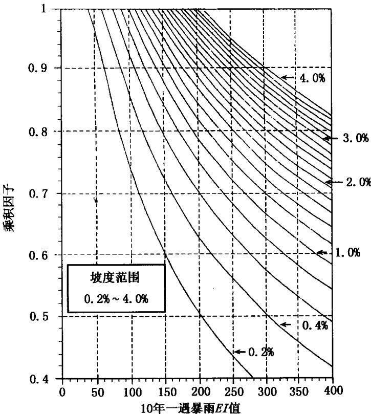  
图 2-1 缓坡 R 因子和洼地积水 R 因子修正  
将原R因子值乘以订正因子后，便得到洼地积水R因子修正值

## 2.5.2 土壤冻融与融雪作用修正

融雪、雪地上的降雨以及土壤表面融化等的作用，会使用E指数计算的降雨侵蚀力存在很大误差。在有上述作用影响的地区，实测土壤流失量要比用动能乘以30min最大雨强(EI)计算R值估计的土壤侵蚀量大许多，而且大量的土壤流失来自细沟侵蚀过程。因为当土壤表面融化、融雪或降雨作用于尚有部分冻结的土壤时，很容易发生细沟侵蚀。此外，初春有一个土壤侵蚀高峰期，这是因为整个冬季土壤表面结构被反复进行的冻融过程所破坏，土壤可蚀性不断增加。然而如按降雨量的线性关系计算该时期降雨侵蚀力，就未能考虑土壤侵蚀这一高峰期，因此，在这种情况下，需要对降雨侵蚀力因子进行修正。

USLE(1978)建立了多年平均年R值修正的经验公式：

$$
\widetilde { R } \ : = \ : R \ : + \ : 1 . 0 1 P _ { 1 2 - 3 }\tag{2-20}
$$

式中， $\bar { R }$ 是多年平均年降雨侵蚀力 $\left[ \mathbf { M J \cdot m m } / ( \mathbf { h a \cdot h \cdot a } ) \right]$ ,R 是多年平均年EI值 $\mathbf { \tilde { \Delta } } _ { \mathrm { M J } } \mathbf { \cdot } \mathbf { \vec { m } } \mathbf { m } / ( \mathbf { h } \mathbf { a } \cdot \mathbf { h } \cdot \mathbf { a } ) ] , P _ { 1 2 \sim 3 }$ 是前一年12月至下一年3月的降水量(mm)。

RUSLE(1997)为了更精确地预报上述情况下的侵蚀，不再采用上式进行修正，而是提出了降雨侵蚀力类比值(Equivelent RFactor)。即针对土壤冻融和融雪作用，建立新的降雨侵蚀力计算公式，称为降雨侵蚀力类比值，代替经典的EI值。计算公式根据实测资料，利用通用土壤流失方程建立：

$$
( R _ { \mathrm { e q } } ) _ { \mathrm { w r } } = \frac { A _ { \mathrm { w r } } } { K _ { \mathrm { w r } } ( L S ) _ { \mathrm { w r } } ( S L R ) _ { \mathrm { w r } } P _ { \mathrm { w r } } }\tag{2-21}
$$

式中， $( R _ { \mathrm { e q } } ) _ { \mathrm { w r } }$ 是冬季细沟侵蚀的R因子类比值， ${ \pmb A } _ { \mathbf { w } \mathbf { r } }$ 是冬季实测细沟侵蚀量， $K _ { \mathrm { w r } }$ 是冬季细沟土壤可蚀性因子值(估算)， $( L S ) _ { \bf w \bf r }$ 是坡长(L)与坡度(S)关系因子， $( S L R ) _ { \mathrm { w r } }$ 是冬季细沟土壤流失率(田间估算值)， $P _ { \mathrm { { w r } } }$ 是水土保持措施因子。

为了获得实际观测资料，在横穿华盛顿州东部和北爱达荷州，选一宽72\~80km的断面(Palouse断面)，每年在冬季侵蚀过程结束后测量细沟侵蚀量 $( A _ { \mathbf { w r } } )$ ，该项调查进行了10年。为使观测具有代表性而且便于理解，将该区域分为4个自然带。在俄勒冈州中北部地区的5个县，进行了为期5年同样的小规模观测，在爱达荷州东南部也进行了为期4年的观测，共计获得10个观测点细沟土壤侵蚀资料。

冬季土壤可蚀性大小应该用整个冬季K的平均值(第三章)。然而在RUSLE模型中，均采用的是全年平均可蚀性因子值 $K _ { \mathrm { a v } }$ 即用EI值为权重计算的年平均K值，而没有提供单独计算一年中某个季节K值的方法。因此在计算冬季细沟侵蚀的R因子类比值 $( R _ { \mathrm { e q } } ) _ { \mathrm { w r } }$ 时，也采用年平均 $K _ { \mathrm { a v } }$ 值代替冬季可蚀性因子值计算。

适用于西北小麦区和山区(第四章)的 LS 关系式用Palouse断面(华盛顿州东部和爱达荷州北部)观测数据推出，然后用下列LS 关系式计算 $( R _ { \mathrm { e q } } ) _ { \mathrm { w r } }$ :

$$
( L S ) _ { \mathrm { w r } } = ( \lambda / 7 2 . 6 ) ^ { 0 . 5 } ( 1 0 . 8 \mathrm { s i n } \theta + 0 . 0 3 ) \quad s < 9 \%\tag{2-22a}
$$

$$
( L S ) _ { \mathrm { w r } } = ( \lambda / 7 2 . 6 ) ^ { 0 . 5 } ( \sin \theta + 0 . 0 8 9 6 ) \qquad s \geqslant 9 \%\tag{2-22b}
$$

根据地块的汇水面积和坡度，就可计算所测坡段的 $\left( L S \right) _ { \mathbf { w } \tau }$ 值。土壤流失速率 $( S L R ) _ { \bf w \bf \mathrm { r } }$ 利用下列各因子计算：

(1)不同轮作条件下的前期土壤水分因子分别设为(第五章):冬小麦-马铃薯轮作：0.88，冬小麦-向日葵轮作：1.0，冬黑麦：0.5,冬小麦-春大麦轮作：0.72。

(2) 地表残茬的影响由残茬影响曲线计算：exp[-0.05·覆盖率(%)]

(3）地表植被覆盖影响=1-冠层覆盖度。地表植被覆盖一般小于10%，大多情况下小于5%。

(4)根据田间观测，地表粗糙度的影响为0.7\~1.2。大多情况下取1.1。

(5) 混合残茬作用公式为： $\mathbf { e x p ( - 0 . 0 0 0 4 5 \times }$ 单位面积浅层土中混合残茬量)，式中混合残茬量单位为kg/ha。假设浅层土中的混合残茬占未分解混合残茬的一半。

最后，土壤流失率 $( S L R ) _ { \mathrm { w r } }$ 用上述5个因子的乘积求得。

假定冬季水土保持措施因子一致，可将所有求得的坡段值再求平均，就得到每年每一地带或县的 $( R _ { \mathrm { e q } } ) _ { \mathrm { w r } }$ 值。每一地带 $( R _ { \mathrm { e q } } ) _ { \mathrm { w } \tau }$ 的平均值是由该地带逐年记录值求平均后得到。然后进一步计算$( R _ { \mathrm { e q } } ) _ { \mathrm { w r } }$ 与降水量的回归方程，以便应用于无土壤侵蚀观测资料的地区：

$$
( R _ { \mathbf { e q } } ) _ { \mathbf { w r } } = - \ 1 8 7 7 . 3 + 7 . 2 2 P \qquad r ^ { 2 } = 0 . 9 8\tag{2-23}
$$

式中，P是年降水量(mm)， $( R _ { \mathrm { e q } } ) _ { \mathrm { w r } }$ 是冬季降雨侵蚀力类比值$\left[ \mathbf { M } \mathbf { J } \cdot \mathbf { m } \mathbf { m } / ( \mathbf { h } \mathbf { a } \cdot \mathbf { h } ) \right] .$ b

以上求出的只是冬季发生细沟侵蚀的降雨侵蚀力类比值，还需进一步求出全年降雨侵蚀力类比值。然而根据观测资料，细沟与细沟间土壤流失量比值差异很大。例如俄勒冈州Pendleton附近哥伦比亚高原保护研究中心细沟侵蚀观测表明，土壤流失的95%来自细沟侵蚀，细沟间侵蚀只占5%。根据华盛顿州Pullman附近Pullman田间保护站(PCFS)观测点的经验估计，75%的土壤流失来自细沟侵蚀。该站近4年对连续休闲地的观测表明，85%\~90%的土壤流失量来自细沟侵蚀。由于在其他许多情况下(随不同措施变化).始终很难将细沟间土壤流失量与总土壤流失量区分开来，于是只好人为给出二者的比例：细沟土壤流失量占90%，细沟间土壤流失量占10%。如果按照该比例调整冬季细沟侵蚀降雨侵蚀力类比值 $( R _ { \mathrm { e q } } ) _ { \mathrm { w r } }$ .则整个冬季总降雨侵蚀力类比值$( R _ { \mathrm { e q } } ) _ { \mathrm { w t } }$ 可用下式计算：

$$
( R _ { \mathrm { e q } } ) _ { \mathrm { w t } } = ( R _ { \mathrm { e q } } ) _ { \mathrm { w r } } \cdot \frac { 1 0 0 } { 9 0 }\tag{2-24}
$$

除冬季以外，非冬季节土壤流失量也占一定比例，用两种不同的估计方法估计结果为：非冬季节土壤流失占全年 $R _ { \mathrm { e q } }$ 的 $5 \%$ 左右，这样，全年总土壤流失量用下式估算：

$$
R _ { \mathrm { e q } } = ( R _ { \mathrm { e q } } ) _ { \mathrm { w r } } \cdot \frac { 1 0 0 } { 9 0 } \cdot \frac { 1 0 0 } { 9 5 }\tag{2-25}
$$

最终得出计算全年降雨侵蚀力类比值的简易公式为：

$$
R _ { \mathrm { e q } } = - 2 1 9 5 . 6 + 8 . 4 5 P\tag{2-26}
$$

在降水量少的地区用下式计算 $R _ { \mathrm { e q } }$ 值：

$$
R _ { \mathrm { e q } } = 2 7 . 2 6 6 \mathrm { e x p } ( 0 . 0 0 9 5 P ) 1 9 1 \mathrm { m m } < P < 3 8 1 \mathrm { m m }\tag{2-27}
$$

该式只能用于降水量小于381mm的地区，式中降水量单位mm。

计算 $R _ { \mathrm { e q } } { \mathrm { ' } }$ 值在全年的分配也十分重要。非冬季节统一规定为4月1日至9月30日(该时期 $R _ { \mathrm { e q } }$ 是全年的5%)。冬季统一规定为10月1日至3月31日(该时期 $R _ { \mathrm { e q } }$ 是全年的95%)。根据PCFS土壤侵蚀历史资料，土壤侵蚀主要发生在1月下旬至2月上旬，之后侵蚀力逐渐减弱，至10月1日停止。其中在5月31日以前侵蚀力减弱速度较快。

Cooley等(1988)发现，在低海拔山谷地带，降雪对EI的贡献只占整个降水的很小一部分(占年降水量的4%)。而在高海拔地区，降雪的贡献要占全年降水量的大部分(高达71%)。因此在降雪比例大的地区计算EI值时，应采用全年降水量，而不是只用全年降雨量。据观察，海拔高度对夏季降雨EI值的影响相对较小。夏季暴雨主要是由气团上升运动产生，与锋面雨相比，降雨发生地区的随机性较强，而且影响范围也较小。在美国Reynolds Creek流域，用所有的暴雨计算EI值，而没有剔除小于12.7mm的降雨时，EI值增加了28%\~59%，但径流和侵蚀是否增加，尚无观测资料。因此，在山区或地形类似于美国西南爱达荷州的地区，必须小心选用降雨资料，因为降雪会影响计算结果。Cooley等(1988)观察到，当从全年降水中剔除降雪而只记录降雨时，降水次数会减小5%～34%:若不考虑降雪量，仅用夏季降雨量代替全年降水量计算R时，R值会减小4%\~42%。

以上分析表明，在降雪量占全年降水量一定比例的地区，是选择全年降水量资料.还是仅选用降雨量资料计算R值，应谨慎对待。目前尚无此方面定论的研究结果。

此外，由于风吹使积雪重新分布，降雪的自然升华，以及雪水含沙量较低等原因，给如何考虑冬季降雪对土壤侵蚀的影响带来了很大困难，目前尚无这方面的研究数据。RUSLE(1997)也没有考虑这一点。但在有冻融或融雪作用的地区，由于使用了降雨侵蚀力类比值 $R _ { \mathrm { e q } }$ ，实际已对冬季降雨侵蚀力进行了修正。

## 2.6 降雨侵蚀力的时空分布规律

在不同时间尺度和空间尺度上，R因子有明显的变化规律。通用土壤流失方程分别计算了每个月或每半个月的EI值，反映降雨侵蚀力的季节变化，同时还计算了不同暴雨发生频率或重现期的年降雨侵蚀力。

## 2.6.1 降雨侵蚀力的季节变化

为了计算季节或多年平均土壤可蚀性因子(K)和季节或多年平均地表覆盖-管理因子(C)，需要计算降雨侵蚀力(EI)的年内分布值。在RUSLE模型中，EI的时间分布用时段EI值占多年平均年EI值的百分比表示，时段步长计为15\~16天，分别始于每一个月的第1天和第16天。

RUSLE计算了全美国140个气候区的EI季节分布，包括美国本+的120个气候区(见图2-2)，夏威夷州的19个气候区和1个西北麦区和山区冻土气候区(见表2-9)。每一个气候区都有相应的气象台站资料，包括降雨、温度(月值)，无霜期和年R值。在140个气候区中，虽然每一个区内R值的时间分布相对一致，但降雨和温度等其他气候因子的时间分布并非一致，因此在用RUSLE提供的数据库估算某些受地形因素影响较大地区的土壤流失量时，会出现比较大的误差，此时应输入能够反映地形差异的一些数据，计算R值的时间分布。

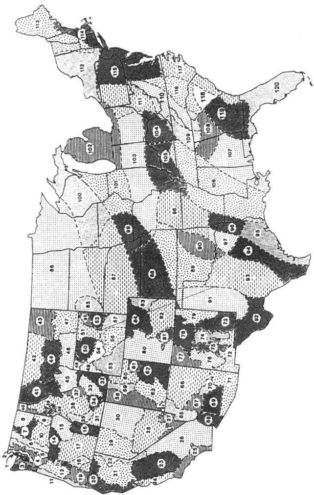

## 2.6.2 10 年一遇暴雨的降雨侵蚀力

在计算等高耕作P因子值时(第六章)，需要知道10年一遇暴雨EI值，用来评价水土保持P因子值的等高措施效果。这些值可以直接从 USLE（Wischmeier和 Smith，1978）表上查到。RUSLE(Renard等，1997)模型中,绘制了10年一遇降雨侵蚀力等值线图，某一地区10年一遇暴雨EI值可直接从图上的等直线内插得到，也可以从模型数据库获得。

## 2.6.3 降雨侵蚀力空间分布图

降雨侵蚀力相等点的连线，称为等侵蚀线(Isoerodent)，由等侵蚀线构成的等值线图称为降雨侵蚀力图(Isoerodent Map)。美国最早的侵蚀力图用了37个州2000个站点22年的降雨资料，计算每一次暴雨(指大于某一标准的降雨)的EI值，然后参考地形图和降雨强度-频率资料，绘制了等侵蚀线(见图2-3,Wis-chmeier和Smith,1965)。当时的侵蚀力图没有包括西部11个州，因为那里没有时间序列足够长的降雨记录，而且降雨的空间差异很大，难以用少量站点资料代表整个地区的情况。1976年利用简易计算方法(式2-14)，将侵蚀力等值线延伸到太平洋沿岸地区(Wischmeier和 Smith,1978)，使降雨侵蚀力图由原来的 37个州增加到48个州，以及夏威夷州所属的5个主要岛屿(Wischmeier和 Smith,1978)。

1997年RUSLE用新的方法计算了美国西部地区多年平均年降雨侵蚀力，并绘制了侵蚀力图。具体方法是，由俄勒冈(Oregon)大学、美国农业部土壤保持局(SCS)和农业研究局、美国国家气象局协作，首先选用735个站点15min等间隔和60min等间隔两种降雨自记资料，分别计算 $( E I ) _ { 1 5 }$ 和 $( E I ) _ { 6 0 }$ ，以及它们之间的回归关系，其中225个站点资料年限在12年以上。回归方程的决定系数超过0.8,回归系数b在不同气候区之间变化于1.08\~3.16。然

表 2-9 图 2-2 所示各气候  
(时段值与多年
<table><tr><td colspan="11"></td></tr><tr><td>EI 代号</td><td>1</td><td>2</td><td>3</td><td>4</td><td>5 6</td><td>7</td><td>8</td><td>9</td><td>10</td><td>11</td><td>时 间 12</td></tr><tr><td>1</td><td>0.0</td><td>4.3</td><td>8.3</td><td>12.8 17.3</td><td>21.6</td><td>25.1</td><td>28.0</td><td>30.9</td><td>34.9</td><td>39.1</td><td>42.6</td></tr><tr><td>2</td><td>0.0</td><td>4.3</td><td>8.3</td><td>12.8 17.3</td><td>21.6</td><td>25.1</td><td>28.0</td><td>30.9</td><td>34.9</td><td>39.1</td><td>42.6</td></tr><tr><td>3</td><td>0.0</td><td>7.4</td><td>13.8</td><td>20.9 26.5</td><td>31.8</td><td>35.3</td><td>38.5</td><td>40.2</td><td>41.6</td><td>42.5</td><td>43.6</td></tr><tr><td>4</td><td>0.0</td><td>3.9</td><td>7.9</td><td>12.6 17.4</td><td>21.6</td><td>25.2</td><td>28.7</td><td>31.9</td><td>35.1</td><td>38.2</td><td>42.0</td></tr><tr><td>5</td><td>0.0</td><td>2.3</td><td>3.6</td><td>4.7 6.0</td><td>7.7</td><td>10.7</td><td>13.9</td><td>17.8</td><td>21.2</td><td>24.5</td><td>28.1</td></tr><tr><td>6</td><td>0.0</td><td>0.0</td><td>0.0</td><td>0.5 2.0</td><td>4.1</td><td>8.1</td><td>12.6</td><td>17.6</td><td>21.6</td><td>25.5</td><td>29.6</td></tr><tr><td>7</td><td>0.0</td><td>0.0</td><td>0.0</td><td>0.0 0.0</td><td>1.2</td><td>4.9</td><td>8.5</td><td>13.9</td><td>19.0</td><td>26.1</td><td>35.4</td></tr><tr><td>8</td><td>0.0</td><td>0.0</td><td>0.0</td><td>0.0 0.0</td><td>0.9</td><td>3.6</td><td>7.8</td><td>15.0</td><td>20.2</td><td>27.4</td><td>38.1</td></tr><tr><td>9</td><td>0.0</td><td>0.8</td><td>3.1</td><td>4.7 7.4</td><td>11.7</td><td>17.8</td><td>22.5</td><td>27.0</td><td>31.4</td><td>36.0</td><td>41.6</td></tr><tr><td>10</td><td>0.0</td><td>0.3</td><td>0.5</td><td>0.9 2.0</td><td>4.3</td><td>9.2</td><td>13.1</td><td>18.0</td><td>22.7</td><td></td><td>29.2 39.5</td></tr><tr><td>11</td><td></td><td></td><td>11.3</td><td></td><td>33.2</td><td>37.4</td><td>440.7</td><td>42.5</td><td></td><td></td><td>45.4 46.5</td></tr><tr><td>12</td><td>0.0 0.0</td><td>5.4</td><td>7.8</td><td>18.8 14.0</td><td>26.3 21.1 27.4</td><td>31.5</td><td>35.0</td><td>37.3</td><td>44.3 39.8</td><td>41.9</td><td>44.3</td></tr><tr><td></td><td></td><td>3.5</td><td>0.0</td><td></td><td>7.2</td><td>16.7</td><td>19.7</td><td>24.0</td><td></td><td>42.5</td><td>55.0</td></tr><tr><td>13 14</td><td>0.0</td><td>0.0</td><td>1.8</td><td>1.8 6.9</td><td>11.9 16.5</td><td>26.6</td><td>29.9</td><td>32.0</td><td>31.2 35.4</td><td>40.2</td><td>45.1</td></tr><tr><td>15</td><td>0.0 0.0</td><td>0.7 0.0</td><td>0.0</td><td>3.3 0.5</td><td>2.0 4.4</td><td>8.7</td><td>12.0</td><td>16.6</td><td>21.4</td><td>29.7</td><td>44.5</td></tr><tr><td></td><td></td><td></td><td></td><td></td><td></td><td></td><td></td><td></td><td></td><td></td><td></td></tr><tr><td>16</td><td>0.0</td><td>0.0</td><td>0.0</td><td>0.5</td><td>2.0</td><td>5.5</td><td>12.3 16.2</td><td>20.9</td><td>26.4</td><td>35.2</td><td>48.1</td></tr><tr><td>17</td><td>0.0</td><td>0.0</td><td>0.0</td><td>0.7</td><td>2.8 6.1</td><td>10.7</td><td>12.9</td><td>16.1</td><td>21.9</td><td>32.8</td><td>45.9</td></tr><tr><td>18</td><td>0.0</td><td>0.0</td><td>0.0</td><td>0.6</td><td>2.5 6.2</td><td>12.4</td><td>16.4</td><td>20.2</td><td>23.9</td><td>29.3</td><td>37.7</td></tr><tr><td>19</td><td>0.0</td><td>1.0</td><td>2.6</td><td>7.4</td><td>16.4 23.5</td><td>28.0</td><td>31.0</td><td>33.5</td><td>37.0</td><td>41.7</td><td>48.1 48.2</td></tr><tr><td>20</td><td>0.0</td><td>9.8</td><td>18.5</td><td>25.4</td><td>30.2</td><td>35.6 38.9</td><td>41.5</td><td>42.9</td><td>44.0</td><td>45.2</td><td></td></tr><tr><td>21</td><td>0.0</td><td>7.5</td><td>13.6</td><td>18.1</td><td>21.1</td><td>24.4</td><td>27.0 29.4</td><td></td><td>31.7 34.6</td><td>37.3</td><td>39.6</td></tr><tr><td>22</td><td>0.0</td><td>1.2</td><td>1.6</td><td>1.6</td><td>1.6</td><td>1.6 1.6</td><td>2.2</td><td>3.9</td><td>4.6</td><td>6.4</td><td>14.2</td></tr><tr><td>23</td><td>0.0</td><td>7.9</td><td>15.0</td><td>20.9</td><td>25.7</td><td>31.1 35.7</td><td>40.2</td><td>43.2</td><td>46.2</td><td>47.7</td><td>48.8</td></tr><tr><td>24</td><td>0.0</td><td>12.2</td><td>23.6</td><td>33.039.7</td><td></td><td>47.1</td><td>51.7 55.9</td><td></td><td>57.7 58.6</td><td>58.9</td><td>59.1</td></tr><tr><td>25</td><td>0.0</td><td>9.8</td><td>20.8</td><td>30.2</td><td>37.6</td><td>45.8</td><td>50.6</td><td>54.4 56.0</td><td>56.8</td><td>57.1</td><td>57.1</td></tr></table>

区不同时段的 分布平均值的百分比)①②

<table><tr><td colspan="11"></td></tr><tr><td>段 13</td><td>14</td><td>15</td><td>16</td><td>17</td><td>18</td><td>19</td><td>20</td><td>21</td><td>22</td><td>23</td><td>24</td></tr><tr><td>45.4</td><td>48.2</td><td>50.8</td><td>53.0</td><td>56.0</td><td>60.8</td><td>66.8</td><td>71.0</td><td>75.7</td><td>82.0</td><td>89.1</td><td>95.2</td></tr><tr><td>45.4</td><td>48.2</td><td>50.8</td><td>53.0</td><td>56.0</td><td>60.8</td><td>66.8</td><td>71.0</td><td>75.7</td><td>82.0</td><td>89.1</td><td>95.2</td></tr><tr><td>44.5</td><td>45.1</td><td>45.7</td><td>46.4</td><td>47.7</td><td>49.4</td><td>52.8</td><td>57.0</td><td>64.5</td><td>73.1</td><td>83.3</td><td>92.3</td></tr><tr><td>44.9</td><td>46.7</td><td>48.2</td><td>50.1</td><td>53.1</td><td>56.6</td><td>62.2</td><td>67.9</td><td>75.2</td><td>83.5</td><td>90.5</td><td>96.0</td></tr><tr><td>31.1</td><td>33.1</td><td>35.3</td><td>38.2</td><td>43.2</td><td>48.7</td><td>57.3</td><td>67.8</td><td>7.9</td><td>86.0</td><td>91.3</td><td>96.9</td></tr><tr><td>34.5</td><td>40.0</td><td>45.7</td><td>50.7</td><td>55.6</td><td>60.2</td><td>66.5</td><td>75.5</td><td>85.6</td><td>95.9</td><td>99.5</td><td>99.9</td></tr><tr><td>43.9</td><td>48.8</td><td>53.9</td><td>64.5</td><td>73.4</td><td>77.5</td><td>80.4</td><td>84.8</td><td>89.9</td><td>96.6</td><td>99.2</td><td>99.7</td></tr><tr><td>49.8</td><td>57.9</td><td>65.0</td><td>75.6</td><td>82.7</td><td>86.8</td><td>89.4</td><td>93.4</td><td>96.3</td><td>99.1</td><td>100.01</td><td>100.0</td></tr><tr><td>46.4</td><td>50.1</td><td>53.4</td><td>57.4</td><td>61.7</td><td>64.9</td><td>69.7</td><td>79.0</td><td>89.6</td><td>97.4</td><td></td><td>100.0 100.0</td></tr><tr><td>46.3</td><td>48.8</td><td>51.1</td><td>57.2</td><td>64.4</td><td>67.7</td><td>71.1</td><td>77.2</td><td>85.1</td><td>92.5</td><td>96.5</td><td>99.0</td></tr><tr><td></td><td></td><td></td><td></td><td></td><td></td><td></td><td></td><td></td><td></td><td></td><td>94.8</td></tr><tr><td>47.1 45.6</td><td>47.4</td><td>47.8</td><td>48.3</td><td>49.4</td><td>50.7</td><td>53.6</td><td>57.5 62.3</td><td>65.5 69.3</td><td>76.2</td><td>87.4 91.5</td><td>96.7</td></tr><tr><td></td><td>46.3</td><td>46.8</td><td>47.9</td><td>50.0</td><td>52.9</td><td>57.9</td><td>76.1</td><td></td><td>81.3</td><td>98.2</td><td>99.6</td></tr><tr><td>60.0</td><td>60.8</td><td>61.2</td><td>62.6</td><td>65.3</td><td>67.6</td><td>71.6</td><td>81.9</td><td>83.1 86.4</td><td>93.3 93.6</td><td>97.7</td><td>99.3</td></tr><tr><td>51.9 56.0</td><td>61.1 60.8</td><td>67.5 63.9</td><td>70.7 69.1</td><td>72.8 74.5</td><td>75.4 79.1</td><td>78.6 83.1</td><td>87.0</td><td>90.9</td><td>96.6</td><td>99.1</td><td>99.8</td></tr><tr><td></td><td></td><td></td><td></td><td></td><td></td><td></td><td></td><td></td><td></td><td></td><td></td></tr><tr><td>58.1</td><td>63.1</td><td>66.5</td><td>71.9</td><td>77.0</td><td>81.6</td><td>85.1</td><td>88.4</td><td>91.5</td><td>96.3</td><td>98.7</td><td>99.6</td></tr><tr><td>55.5</td><td>60.3</td><td>64.0</td><td>71.2</td><td>7.2</td><td>80.3</td><td>83.1</td><td>87.7</td><td>92.6</td><td>97.2</td><td>99.1</td><td>99.8 100.0</td></tr><tr><td>45.6</td><td>49.8</td><td>53.3</td><td>58.4</td><td>64.3</td><td>69.0</td><td>75.0</td><td>86.6</td><td>93.9</td><td>96.6</td><td>98.0</td><td>98.7</td></tr><tr><td>51.1 50.8</td><td>52.0</td><td>52.5</td><td>53.6</td><td>55.7</td><td>57.6</td><td>61.1 60.1</td><td>65.8 63.2</td><td>74.7 69.6</td><td>88.0 76.7</td><td>95.8 85.4</td><td>92.4</td></tr><tr><td></td><td>51.7</td><td>52.5</td><td>54.6</td><td>57.4</td><td>58.5</td><td></td><td></td><td></td><td></td><td></td><td></td></tr><tr><td>41.6</td><td>43.4</td><td>45.4</td><td>48.1</td><td>51.3</td><td>53.3</td><td>56.6</td><td>62.4</td><td>72.4</td><td>81.3</td><td>88.9</td><td>94.7</td></tr><tr><td>32.8</td><td>47.2</td><td>58.8</td><td>69.1</td><td>76.0</td><td>82.0</td><td>87.1</td><td>96.7</td><td>99.9</td><td>99.9</td><td>99.9</td><td>99.9</td></tr><tr><td>49.4</td><td>49.9</td><td>50.7</td><td>51.8</td><td>54.1</td><td>57.7</td><td>62.8</td><td>65.9</td><td>70.1</td><td>77.3</td><td>86.8</td><td>93.5</td></tr><tr><td>59.1</td><td>59.2</td><td>59.2</td><td>59.3</td><td>59.5</td><td>60.0</td><td>61.4</td><td>63.0</td><td>66.5</td><td>71.8</td><td>81.3</td><td>89.6</td></tr><tr><td>57.2</td><td>57.6</td><td>58.5</td><td>59.8</td><td>62.2</td><td>65.3</td><td>67.5</td><td>68.2</td><td>69.4</td><td>74.8</td><td>86.6</td><td>93.0</td></tr><tr><td>EI 代号</td><td>1</td><td>2</td><td>3</td><td>4</td><td>5</td><td>6</td><td>7</td><td>8 9</td><td>10</td><td>时 11</td><td>间 12</td></tr><tr><td>26</td><td>0.0</td><td>2.0</td><td>5.4</td><td>9.8</td><td>15.6</td><td>21.5 24.7</td><td>26.6</td><td>27.4</td><td>28.0</td><td>28.7</td><td>29.8</td></tr><tr><td>27</td><td>0.0</td><td>0.0</td><td>0.0 1.0</td><td>4.0</td><td>5.9</td><td>8.0</td><td>11.1</td><td>13.0</td><td>14.0</td><td>14.6</td><td>15.3</td></tr><tr><td>28</td><td>0.0</td><td>0.0</td><td>0.0 0.0</td><td>0.2</td><td>0.5</td><td>1.5</td><td>3.3</td><td>7.2</td><td>11.9</td><td>17.7</td><td>21.4</td></tr><tr><td>29</td><td>0.0</td><td>0.6</td><td>0.7 0.7</td><td>0.7</td><td>1.5</td><td>3.9</td><td>6.0</td><td>10.5</td><td>17.9</td><td>28.8</td><td>36.6</td></tr><tr><td>30</td><td>0.0</td><td>0.0</td><td>0.0 0.0</td><td>0.0</td><td>0.2</td><td>0.8</td><td>2.8</td><td>7.9</td><td>14.2</td><td>24.7</td><td>35.6</td></tr><tr><td>31</td><td>0.0</td><td>0.0</td><td>0.0</td><td>0.0</td><td>0.0 0.2</td><td>1.0</td><td>3.5</td><td>9.9</td><td>15.7</td><td>26.4</td><td>47.2</td></tr><tr><td>32</td><td>0.0</td><td>0.1</td><td>0.1</td><td>0.1 0.1</td><td>0.6</td><td>2.2</td><td>4.3</td><td>9.0</td><td>14.2</td><td>23.3</td><td>34.6</td></tr><tr><td>33</td><td>0.0</td><td>0.0</td><td>0.0</td><td>0.0 0.0</td><td>0.6</td><td>2.3</td><td>4.2</td><td>8.8</td><td>16.1</td><td>30.0</td><td>46.9</td></tr><tr><td>34</td><td>0.0</td><td>0.0</td><td>0.0</td><td>0.0</td><td>0.0 1.8</td><td>7.3</td><td>10.7</td><td>15.5</td><td>2.0</td><td>29.9</td><td>35.9</td></tr><tr><td>35</td><td>0.0</td><td>0.0</td><td>0.0</td><td>0.0 0.0</td><td>2.5</td><td>10.2</td><td>15.9</td><td>22.2</td><td>27.9</td><td>34.7</td><td>43.9</td></tr><tr><td>36</td><td>0.0</td><td>0.0</td><td>0.0</td><td>0.0</td><td>0.0 0.9</td><td>3.4</td><td>6.7</td><td>12.7</td><td>18.5</td><td></td><td>26.6 36.3</td></tr><tr><td>37</td><td>0.0</td><td>0.0</td><td>0.0</td><td>0.0</td><td>0.0 0.0</td><td>0.0</td><td>1.0</td><td>3.9</td><td>9.1</td><td>19.1</td><td>26.7</td></tr><tr><td>38</td><td>0.0</td><td>0.0</td><td>0.0</td><td>1.1</td><td>4.3 7.2</td><td>11.0</td><td>13.9</td><td>17.9</td><td>22.3</td><td>30.3</td><td>43.1</td></tr><tr><td>39</td><td>0.0</td><td>0.0</td><td>0.0</td><td>0.0</td><td>0.0 1.6</td><td>6.5</td><td>11.0</td><td>17.8</td><td>24.7</td><td>33.1</td><td>42.8</td></tr><tr><td>40</td><td>0.0</td><td>0.0</td><td>0.0</td><td>0.0</td><td>0.0 1.5</td><td>6.2</td><td>10.1</td><td>16.3</td><td>23.3</td><td></td><td>3 32.5 42.2</td></tr><tr><td></td><td></td><td></td><td></td><td></td><td></td><td></td><td></td><td></td><td></td><td></td><td></td></tr><tr><td>41</td><td>0.0</td><td>0.1</td><td>0.2</td><td>0.2</td><td>0.2</td><td>0.2</td><td>0.2 0.4</td><td>1.1</td><td>6.8</td><td>22.9</td><td>40.1</td></tr><tr><td>42</td><td>0.0</td><td>0.0</td><td>0.0</td><td>0.0</td><td>0.0</td><td>0.0 0.0</td><td>0.2</td><td>0.9</td><td>5.2</td><td>17.3</td><td>33.8</td></tr><tr><td>43</td><td>0.0</td><td>0.0</td><td>0.0</td><td>0.0</td><td>0.0</td><td>0.0 0.0</td><td>0.1</td><td>0.4</td><td>2.7</td><td>9.5</td><td>21.9</td></tr><tr><td>44</td><td>0.0</td><td>1.7</td><td>2.3</td><td>2.4</td><td>2.4</td><td>2.4 2.4</td><td>2.7</td><td>3.5</td><td>7.6</td><td>18.5</td><td>34.3</td></tr><tr><td>45</td><td>0.0</td><td>0.2</td><td>0.2</td><td>0.3</td><td>0.3</td><td>0.4 0.6</td><td>0.8</td><td>1.4</td><td>3.7</td><td>10.2</td><td>22.6</td></tr><tr><td>46</td><td>0.0</td><td>0.0</td><td>0.0</td><td>0.0</td><td>0.0</td><td>0.0</td><td>0.0</td><td>0.6 2.6</td><td>7.5</td><td>19.6</td><td>32.9</td></tr><tr><td>47</td><td>0.0</td><td>0.0</td><td>0.0</td><td>0.0</td><td>0.0 0.0</td><td>0.0</td><td>0.4</td><td>1.6</td><td>5.8</td><td>17.0</td><td>33.0</td></tr><tr><td>48</td><td>0.0</td><td>0.0</td><td>0.0</td><td>0.0</td><td>0.0 0.0</td><td>0.0</td><td>0.0</td><td>0.0</td><td>2.0</td><td>8.1</td><td>15.4</td></tr><tr><td>49</td><td>0.0</td><td>0.0</td><td>0.0</td><td>0.0</td><td>0.0</td><td>0.0</td><td>0.0 0.7</td><td>2.7</td><td>8.3</td><td>20.0</td><td>27.5</td></tr><tr><td>50</td><td>0.0</td><td>0.0</td><td>0.0</td><td>0.0</td><td>0.0</td><td>0.1</td><td>0.4</td><td>2.4 8.2</td><td>13.7</td><td>23.8</td><td>38.8</td></tr><tr><td colspan="12" rowspan="1">段</td></tr><tr><td colspan="12" rowspan="1">13  14   15  16  17   18   19  20  21   22  23   24</td></tr><tr><td colspan="12" rowspan="1">32.536.644.955.465.772.677.884.489.593.996.598.4</td></tr><tr><td colspan="3" rowspan="1">17.023.239.1</td><td colspan="1" rowspan="1">60.0</td><td colspan="1" rowspan="1">76.3</td><td colspan="1" rowspan="1">86.1</td><td colspan="1" rowspan="1">89.7</td><td colspan="1" rowspan="1">90.4</td><td colspan="1" rowspan="1">90.9</td><td colspan="1" rowspan="1">93.1</td><td colspan="1" rowspan="1">96.6</td><td colspan="1" rowspan="1">99.1</td></tr><tr><td colspan="3" rowspan="1">27.037.151.4</td><td colspan="1" rowspan="1">62.3</td><td colspan="1" rowspan="1">70.6</td><td colspan="1" rowspan="1">78.8</td><td colspan="1" rowspan="1">84.6</td><td colspan="1" rowspan="1">90.6</td><td colspan="1" rowspan="1">94.4</td><td colspan="1" rowspan="1">97.9</td><td colspan="1" rowspan="1">99.3</td><td colspan="1" rowspan="1">100.0</td></tr><tr><td colspan="3" rowspan="1">43.851.559.3</td><td colspan="1" rowspan="1">68.0</td><td colspan="2" rowspan="1">74.880.3</td><td colspan="1" rowspan="1">84.3</td><td colspan="1" rowspan="1">88.8</td><td colspan="1" rowspan="1">92.7</td><td colspan="1" rowspan="1">98.0</td><td colspan="2" rowspan="1">99.899.9</td></tr><tr><td colspan="1" rowspan="1">45.4</td><td colspan="1" rowspan="1">52.2</td><td colspan="1" rowspan="1">58.7</td><td colspan="1" rowspan="1">68.5</td><td colspan="1" rowspan="1">77.6</td><td colspan="1" rowspan="1">84.5</td><td colspan="1" rowspan="1">88.9</td><td colspan="1" rowspan="1">93.7</td><td colspan="1" rowspan="1">96.2</td><td colspan="1" rowspan="1">97.6</td><td colspan="1" rowspan="1">98.3</td><td colspan="1" rowspan="3">99.6100.0</td></tr><tr><td colspan="1" rowspan="1"></td><td colspan="1" rowspan="1"></td><td colspan="1" rowspan="1"></td><td colspan="1" rowspan="1"></td><td colspan="1" rowspan="1"></td><td colspan="1" rowspan="1"></td><td colspan="1" rowspan="1"></td><td colspan="1" rowspan="1"></td><td colspan="1" rowspan="1"></td><td colspan="1" rowspan="1"></td><td colspan="1" rowspan="2">00.0</td></tr><tr><td colspan="1" rowspan="1">61.4</td><td colspan="1" rowspan="1">65.9</td><td colspan="1" rowspan="1">69.0</td><td colspan="1" rowspan="1">77.2</td><td colspan="1" rowspan="1">86.0</td><td colspan="1" rowspan="1">91.6</td><td colspan="1" rowspan="1">94.8</td><td colspan="1" rowspan="1">98.7</td><td colspan="1" rowspan="1">100.01</td><td colspan="1" rowspan="1">00.0 1</td></tr><tr><td colspan="1" rowspan="1">46.3</td><td colspan="1" rowspan="1">54.2</td><td colspan="1" rowspan="1">61.7</td><td colspan="1" rowspan="1">72.9</td><td colspan="1" rowspan="1">82.5</td><td colspan="1" rowspan="1">89.6·</td><td colspan="1" rowspan="1">93.7</td><td colspan="1" rowspan="1">98.2</td><td colspan="1" rowspan="1">99.7</td><td colspan="1" rowspan="1">99.9</td><td colspan="1" rowspan="1">99.9</td><td colspan="1" rowspan="1">99.9</td></tr><tr><td colspan="1" rowspan="1">57.9</td><td colspan="1" rowspan="1">62.8</td><td colspan="1" rowspan="1">66.2</td><td colspan="1" rowspan="1">72.1</td><td colspan="1" rowspan="1">79.1</td><td colspan="1" rowspan="1">85.9</td><td colspan="1" rowspan="1">91.1</td><td colspan="1" rowspan="1">97.0</td><td colspan="1" rowspan="1">98.9</td><td colspan="1" rowspan="1">98.9</td><td colspan="1" rowspan="1">98.9</td><td colspan="1" rowspan="1">98.9</td></tr><tr><td colspan="1" rowspan="1">42.0</td><td colspan="1" rowspan="1">48.5</td><td colspan="1" rowspan="1">56.9</td><td colspan="1" rowspan="1">67.0</td><td colspan="1" rowspan="1">76.9</td><td colspan="1" rowspan="1">85.8</td><td colspan="1" rowspan="1">91.2</td><td colspan="1" rowspan="1">95.7</td><td colspan="1" rowspan="1">97.8</td><td colspan="1" rowspan="1">99.6</td><td colspan="1" rowspan="1">100.0</td><td colspan="1" rowspan="1">100.0</td></tr><tr><td colspan="1" rowspan="1">51.9</td><td colspan="1" rowspan="1">56.9</td><td colspan="1" rowspan="1">61.3</td><td colspan="1" rowspan="1">67.3</td><td colspan="1" rowspan="1">73.9</td><td colspan="1" rowspan="1">80.1</td><td colspan="1" rowspan="1">85.1</td><td colspan="1" rowspan="1">89.6</td><td colspan="1" rowspan="1">93.2</td><td colspan="1" rowspan="1">98.2</td><td colspan="1" rowspan="1">99.8</td><td colspan="1" rowspan="1">99.8</td></tr><tr><td colspan="1" rowspan="1"></td><td colspan="1" rowspan="1"></td><td colspan="1" rowspan="1"></td><td colspan="1" rowspan="1"></td><td colspan="1" rowspan="1"></td><td colspan="1" rowspan="1"></td><td colspan="1" rowspan="1"></td><td colspan="1" rowspan="1"></td><td colspan="1" rowspan="1"></td><td colspan="1" rowspan="1"></td><td colspan="1" rowspan="1"></td><td colspan="1" rowspan="1"></td></tr><tr><td colspan="1" rowspan="1">46.0</td><td colspan="1" rowspan="1">53.5</td><td colspan="1" rowspan="1">60.2</td><td colspan="1" rowspan="1">68.3</td><td colspan="1" rowspan="1">75.8</td><td colspan="1" rowspan="1">82.6</td><td colspan="1" rowspan="1">88.3</td><td colspan="1" rowspan="1">96.3</td><td colspan="1" rowspan="1">99.3</td><td colspan="1" rowspan="1">99.9</td><td colspan="1" rowspan="1">100.0</td><td colspan="1" rowspan="1">100.0</td></tr><tr><td colspan="1" rowspan="1">36.3</td><td colspan="1" rowspan="1">47.9</td><td colspan="1" rowspan="1">61.4</td><td colspan="1" rowspan="1">75.1</td><td colspan="1" rowspan="1">84.5</td><td colspan="1" rowspan="1">92.3</td><td colspan="1" rowspan="1">96.0</td><td colspan="1" rowspan="1">99.1</td><td colspan="1" rowspan="1">100.0</td><td colspan="1" rowspan="1">100.0</td><td colspan="1" rowspan="1">100.0</td><td colspan="1" rowspan="1">100.0</td></tr><tr><td colspan="1" rowspan="1">55.1</td><td colspan="1" rowspan="1">61.3</td><td colspan="1" rowspan="1">65.7</td><td colspan="1" rowspan="1">72.1</td><td colspan="1" rowspan="1">77.9</td><td colspan="1" rowspan="1">82.6</td><td colspan="1" rowspan="1">86.3</td><td colspan="1" rowspan="1">90.3</td><td colspan="1" rowspan="1">93.8</td><td colspan="1" rowspan="1">98.4</td><td colspan="1" rowspan="1">100.0</td><td colspan="1" rowspan="1">100.0</td></tr><tr><td colspan="1" rowspan="1">50.3</td><td colspan="1" rowspan="1">54.9</td><td colspan="1" rowspan="1">59.7</td><td colspan="1" rowspan="1">68.9</td><td colspan="1" rowspan="1">78.1</td><td colspan="1" rowspan="1">83.6</td><td colspan="1" rowspan="1">87.5</td><td colspan="1" rowspan="1">93.0</td><td colspan="1" rowspan="1">96.5</td><td colspan="1" rowspan="1">99.2</td><td colspan="1" rowspan="1">100.</td><td colspan="1" rowspan="1">100.00</td></tr><tr><td colspan="1" rowspan="1">50.1</td><td colspan="1" rowspan="1">55.6</td><td colspan="1" rowspan="1">60.5</td><td colspan="1" rowspan="1">67.5</td><td colspan="1" rowspan="1">74.3</td><td colspan="1" rowspan="1">79.4</td><td colspan="1" rowspan="1">84.1</td><td colspan="1" rowspan="1">91.1</td><td colspan="1" rowspan="1">95.8</td><td colspan="1" rowspan="1">99.1</td><td colspan="1" rowspan="1">100.0</td><td colspan="1" rowspan="2">100.0</td></tr><tr><td colspan="1" rowspan="1"></td><td colspan="1" rowspan="1"></td><td colspan="1" rowspan="1"></td><td colspan="1" rowspan="1"></td><td colspan="1" rowspan="1"></td><td colspan="1" rowspan="1"></td><td colspan="1" rowspan="1"></td><td colspan="1" rowspan="1"></td><td colspan="1" rowspan="1"></td><td colspan="1" rowspan="1"></td><td colspan="1" rowspan="1"></td></tr><tr><td colspan="1" rowspan="1">54.9</td><td colspan="1" rowspan="1">63.8</td><td colspan="1" rowspan="1">70.7</td><td colspan="1" rowspan="1">81.5</td><td colspan="1" rowspan="1">89.8</td><td colspan="1" rowspan="1">96.3</td><td colspan="1" rowspan="1">98.7</td><td colspan="1" rowspan="1">99.2</td><td colspan="1" rowspan="1">99.3</td><td colspan="1" rowspan="1">99.4</td><td colspan="1" rowspan="1">99.4</td><td colspan="1" rowspan="1">99.7</td></tr><tr><td colspan="1" rowspan="1">53.2</td><td colspan="1" rowspan="1">66.5</td><td colspan="1" rowspan="1">75.8</td><td colspan="1" rowspan="1">87.6</td><td colspan="1" rowspan="1">93.7</td><td colspan="1" rowspan="1">97.5</td><td colspan="1" rowspan="1">99.0</td><td colspan="1" rowspan="1">99.7</td><td colspan="1" rowspan="1">100.0</td><td colspan="1" rowspan="1">100.0</td><td colspan="1" rowspan="1">100.0</td><td colspan="1" rowspan="1">100.0</td></tr><tr><td colspan="1" rowspan="1">42.7</td><td colspan="1" rowspan="1">58.6</td><td colspan="1" rowspan="1">71.1</td><td colspan="1" rowspan="1">84.6</td><td colspan="1" rowspan="1">91.9</td><td colspan="1" rowspan="1">97.1</td><td colspan="1" rowspan="1">99.0</td><td colspan="1" rowspan="1">99.8</td><td colspan="1" rowspan="1">100.0</td><td colspan="1" rowspan="1">100.0</td><td colspan="1" rowspan="1">100.0</td><td colspan="1" rowspan="1">100.0</td></tr><tr><td colspan="1" rowspan="1">52.5</td><td colspan="1" rowspan="1">64.0</td><td colspan="1" rowspan="1">72.3</td><td colspan="1" rowspan="1">83.3</td><td colspan="1" rowspan="1">90.0</td><td colspan="1" rowspan="1">95.1</td><td colspan="1" rowspan="1">97.3</td><td colspan="1" rowspan="1">98.5</td><td colspan="1" rowspan="1">98.9</td><td colspan="1" rowspan="1">98.9</td><td colspan="1" rowspan="1">98.9</td><td colspan="1" rowspan="1">99.2</td></tr><tr><td colspan="1" rowspan="1">41.8</td><td colspan="1" rowspan="1">54.0</td><td colspan="1" rowspan="1">64.5</td><td colspan="1" rowspan="1">78.7</td><td colspan="1" rowspan="1">88.4</td><td colspan="1" rowspan="1">96.0</td><td colspan="1" rowspan="1">98.7</td><td colspan="1" rowspan="1">99.4</td><td colspan="1" rowspan="1">99.7</td><td colspan="1" rowspan="1">99.7</td><td colspan="1" rowspan="1">99.8</td><td colspan="1" rowspan="1">99.9</td></tr><tr><td colspan="1" rowspan="1"></td><td colspan="1" rowspan="1"></td><td colspan="1" rowspan="1"></td><td colspan="1" rowspan="1"></td><td colspan="1" rowspan="1"></td><td colspan="1" rowspan="1"></td><td colspan="1" rowspan="1"></td><td colspan="1" rowspan="1"></td><td colspan="1" rowspan="2">100.0</td><td colspan="1" rowspan="2">100.0</td><td colspan="1" rowspan="2">100.0</td><td colspan="1" rowspan="2">100.0</td></tr><tr><td colspan="1" rowspan="1">48.9</td><td colspan="1" rowspan="1">63.0</td><td colspan="1" rowspan="1">73.5</td><td colspan="1" rowspan="1">83.3</td><td colspan="1" rowspan="1">89.5</td><td colspan="1" rowspan="1">95.6</td><td colspan="1" rowspan="1">98.3</td><td colspan="1" rowspan="1">99.6</td></tr><tr><td colspan="1" rowspan="1">52.5</td><td colspan="1" rowspan="1">66.4</td><td colspan="1" rowspan="1">75.7</td><td colspan="1" rowspan="1">85.5</td><td colspan="1" rowspan="1">91.3</td><td colspan="1" rowspan="1">96.5</td><td colspan="1" rowspan="1">98.8</td><td colspan="1" rowspan="1">100.0</td><td colspan="1" rowspan="1">100.0</td><td colspan="1" rowspan="1">100.0</td><td colspan="1" rowspan="1">100.0</td><td colspan="1" rowspan="1">100.0</td></tr><tr><td colspan="1" rowspan="1">27.8</td><td colspan="1" rowspan="1">40.7</td><td colspan="1" rowspan="1">52.6</td><td colspan="1" rowspan="1">61.1</td><td colspan="1" rowspan="1">69.3</td><td colspan="1" rowspan="1">82.6</td><td colspan="1" rowspan="1">92.0</td><td colspan="1" rowspan="1">98.0</td><td colspan="1" rowspan="1">100.0</td><td colspan="1" rowspan="1">100.0</td><td colspan="1" rowspan="1">100.0</td><td colspan="1" rowspan="1">100.0</td></tr><tr><td colspan="1" rowspan="1">35.6</td><td colspan="1" rowspan="1">44.6</td><td colspan="1" rowspan="1">46.0</td><td colspan="1" rowspan="1">70.2</td><td colspan="1" rowspan="1">81.3</td><td colspan="1" rowspan="1">89.2</td><td colspan="1" rowspan="1">93.6</td><td colspan="1" rowspan="1">98.5</td><td colspan="1" rowspan="1">100.0</td><td colspan="2" rowspan="1">100.0 100.0</td><td colspan="1" rowspan="2">100.0100.0 100.0 100.0</td></tr><tr><td colspan="1" rowspan="1">55.1</td><td colspan="1" rowspan="1">66.1</td><td colspan="1" rowspan="1">73.6</td><td colspan="2" rowspan="1">81.887.7</td><td colspan="1" rowspan="1">93.8</td><td colspan="1" rowspan="1">97.0</td><td colspan="1" rowspan="1">99.4</td><td colspan="1" rowspan="1">100.0</td><td></td><td></td></tr><tr><td colspan="11">EI</td></tr><tr><td>代号</td><td>1</td><td>2</td><td>3</td><td>4</td><td>5</td><td>6</td><td>7</td><td>8 9</td><td>10</td><td>11</td><td>时 间 12</td></tr><tr><td>51</td><td>0.0</td><td>0.0</td><td>0.0</td><td>0.0</td><td>0.0 0.3</td><td>1.0</td><td>3.1</td><td>8.7</td><td>18.8</td><td>38.8</td><td>49.6</td></tr><tr><td>52</td><td>0.0</td><td>0.0</td><td>0.0 0.0</td><td>0.0</td><td>0.0</td><td>0.0</td><td>0.6</td><td>2.5</td><td>6.8</td><td>17.5</td><td>29.8</td></tr><tr><td>53</td><td>0.0</td><td>0.0</td><td>0.0 0.0</td><td>0.0</td><td>0.0</td><td>0.0</td><td>0.8</td><td>3.0</td><td>9.5</td><td>24.2</td><td>35.3</td></tr><tr><td>54</td><td>0.0</td><td>0.0</td><td>0.0 0.0</td><td>0.0</td><td>0.2</td><td>0.7</td><td>2.4</td><td>7.2</td><td>14.7</td><td>27.2</td><td>37.2</td></tr><tr><td>55</td><td>0.0</td><td>0.0</td><td>0.0</td><td>0.0 0.0</td><td>0.0</td><td>0.0</td><td>1.3</td><td>5.4</td><td>13.3</td><td>25.5</td><td>31.6</td></tr><tr><td>56</td><td>0.0</td><td>0.0</td><td>0.0</td><td>0.0 0.0</td><td>0.0</td><td>0.0</td><td>1.3</td><td>5.1</td><td>11.4</td><td>22.3</td><td>29.5</td></tr><tr><td>57</td><td>0.0</td><td>0.0</td><td>0.0 0.0</td><td>0.0</td><td>0.0</td><td>0.1</td><td>1.0</td><td>3.5</td><td>9.2</td><td>21.5</td><td>31.0</td></tr><tr><td>58</td><td>0.0</td><td>0.0</td><td>0.0 0.0</td><td>0.0</td><td>0.2</td><td>0.9</td><td>2.9</td><td>8.0</td><td>13.2</td><td>21.0</td><td>29.1</td></tr><tr><td>59</td><td>0.0</td><td>0.0</td><td>0.0</td><td>0.0 0.0</td><td>0.0</td><td>0.0</td><td>2.2</td><td>8.9</td><td>15.6</td><td>24.2</td><td>31.1</td></tr><tr><td>60</td><td>0.0</td><td>0.0</td><td>0.0</td><td>0.0</td><td>0.0 0.0</td><td>0.0</td><td>0.4</td><td>1.5</td><td>4.0</td><td>9.5</td><td>13.3</td></tr><tr><td>61</td><td>0.0</td><td>0.0</td><td>0.0</td><td>0.0</td><td>0.0 0.0</td><td>0.0</td><td>1.3</td><td>5.0</td><td>8.5</td><td>15.5</td><td>29.8</td></tr><tr><td>62</td><td>0.0</td><td>0.0</td><td>0.0</td><td>0.1</td><td>0.3 0.8</td><td>2.1</td><td>3.6</td><td>6.5</td><td>9.7</td><td>13.7</td><td>16.5</td></tr><tr><td>63</td><td>0.0</td><td>0.0</td><td>0.0</td><td>0.0</td><td>0.0 0.0</td><td>0.0</td><td>0.9</td><td>3.7</td><td>7.8</td><td>13.3</td><td>15.8</td></tr><tr><td>64</td><td>0.0</td><td>0.0</td><td>0.0</td><td>0.7</td><td>2.8 7.4</td><td>12.4</td><td>14.4</td><td>15.6</td><td>17.3</td><td>19.4</td><td>21.0</td></tr><tr><td>65</td><td>0.0</td><td>3.6</td><td>7.0</td><td>9.6</td><td>11.4 13.0</td><td>14.4</td><td>16.3</td><td>17.7</td><td>18.4</td><td>19.3</td><td>20.5</td></tr><tr><td>66</td><td>0.0</td><td>0.0</td><td>0.0</td><td>0.0</td><td>0.0</td><td>0.1</td><td>0.5 1.1</td><td>2.2</td><td>3.6</td><td>6.0</td><td>7.6</td></tr><tr><td>67</td><td>0.0</td><td>0.0</td><td>0.0</td><td>0.0</td><td>0.0</td><td>0.1 0.4</td><td>0.9</td><td>1.6</td><td>1.9</td><td>2.4</td><td>5.0</td></tr><tr><td>68</td><td>0.0</td><td>2.3</td><td>4.5</td><td>7.8</td><td>10.4 12.0</td><td>13.3</td><td>16.3</td><td>17.7</td><td>18.1</td><td>18.2</td><td>18.3</td></tr><tr><td>69</td><td>0.0</td><td>2.0</td><td>3.7</td><td>5.7</td><td>7.8</td><td>10.5 12.4</td><td>13.7</td><td>14.3</td><td>14.7</td><td>15.1</td><td>15.7</td></tr><tr><td>70</td><td>0.0</td><td>0.5</td><td>0.7</td><td>1.0</td><td>1.3</td><td>1.7 2.2</td><td>2.8</td><td>3.4</td><td>3.9</td><td>4.7</td><td>5.4</td></tr><tr><td>71</td><td></td><td></td><td></td><td></td><td></td><td>2.8</td><td></td><td>4.0</td><td>4.5</td><td>5.6</td><td>6.5</td></tr><tr><td>72</td><td>0.0 0.0</td><td>0.7 0.0</td><td>1.2 0.0</td><td>1.6 0.0</td><td>2.1 0.0</td><td>3.3 0.0 0.1</td><td>3.6 0.2</td><td>0.7</td><td>0.8</td><td>1.3</td><td>3.5</td></tr><tr><td>73</td><td>0.0</td><td>0.0</td><td>0.1</td><td>0.1</td><td>0.2</td><td>0.2 0.3</td><td>0.6</td><td>1.3</td><td>4.1</td><td>11.5</td><td>18.1</td></tr><tr><td>74</td><td>0.0</td><td>0.0</td><td>0.0</td><td>0.0</td><td>0.0</td><td>0.1 0.2</td><td>0.5</td><td>1.2</td><td>2.7</td><td>6.4</td><td>10.2</td></tr><tr><td></td><td></td><td></td><td></td><td></td><td></td><td></td><td></td><td>3.0</td><td></td><td></td><td></td></tr><tr><td>75</td><td>0.0</td><td>0.1</td><td>0.1</td><td>0.1</td><td>0.2</td><td>0.5</td><td>1.3</td><td>1.9</td><td>4.1</td><td>6.6</td><td>10.0</td></tr></table>

<table><tr><td colspan="13">段</td></tr><tr><td>13</td><td>14</td><td>15</td><td>16</td><td>17</td><td>18</td><td>19</td><td>20</td><td>21</td><td>22</td><td>23</td><td colspan="2">24</td></tr><tr><td>60.4</td><td>70.2</td><td>77.0</td><td>84.0</td><td>88.8</td><td>93.8</td><td>96.6</td><td>99.1</td><td>100.0</td><td>100.0</td><td>100.0</td><td colspan="2">100.0</td></tr><tr><td>46.1</td><td>60.5</td><td>72.7</td><td>86.0</td><td>92.8</td><td>96.8</td><td>98.4</td><td>99.7</td><td>100.0</td><td>100.0</td><td>100.0</td><td colspan="2">100.0</td></tr><tr><td>48.0</td><td>63.1</td><td>76.1</td><td>87.7</td><td>93.5</td><td>97.2</td><td>98.6</td><td>99.5</td><td>99.8</td><td>99.9</td><td>100.0 100.0</td><td colspan="2"></td></tr><tr><td>47.3</td><td>58.8</td><td>67.6</td><td>74.0</td><td>79.2</td><td>86.7</td><td>92.6</td><td>97.9</td><td>99.8</td><td>99.9</td><td>100.0 100.0</td><td colspan="2"></td></tr><tr><td>38.8</td><td>52.5</td><td>66.8</td><td>75.5</td><td>81.2</td><td>87.9</td><td>92.8</td><td>98.3</td><td>100.0 100.0 100.0 100.0</td><td></td><td></td><td colspan="2"></td></tr><tr><td>38.5</td><td>51.1</td><td>65.2</td><td>77.8</td><td>85.6</td><td>91.7</td><td>95.0</td><td>98.7</td><td>100.0 100.0 100.0 100.0</td><td></td><td></td><td colspan="2"></td></tr><tr><td>43.5</td><td>60.4</td><td>75.1</td><td>86.1</td><td>91.6</td><td>96.2</td><td>98.1</td><td>99.4</td><td>99.9</td><td>99.9</td><td></td><td colspan="2">100.0 100.0</td></tr><tr><td>38.0</td><td>45.9</td><td>54.5</td><td>65.4</td><td>74.8</td><td>82.1</td><td>87.5</td><td>95.4</td><td>98.8</td><td>99.7</td><td></td><td colspan="2">100.0 100.0</td></tr><tr><td>38.3</td><td>46.0</td><td>54.9</td><td>64.2</td><td>73.2</td><td>81.9</td><td>88.5</td><td>95.7</td><td>98.6</td><td>99.4</td><td>99.7</td><td colspan="2">99.7</td></tr><tr><td>20.5</td><td>33.6</td><td>52.8</td><td>66.5</td><td>76.7</td><td>88.1</td><td>94.2</td><td>98.6</td><td>100.0 100.0 100.0 100.0</td><td></td><td></td><td colspan="2"></td></tr><tr><td>41.8</td><td>46.0</td><td>49.2</td><td>56.0</td><td>65.1</td><td>71.6</td><td>78.6</td><td>91.1</td><td>97.3</td><td>99.3</td><td></td><td colspan="2">100.0 100.0</td></tr><tr><td>20.8</td><td>27.3</td><td>40.1</td><td>56.9</td><td>72.6</td><td>83.4</td><td>89.4</td><td>95.5</td><td>98.1</td><td>99.6</td><td></td><td colspan="2">100.0 100.0</td></tr><tr><td>19.9</td><td>29.0</td><td>46.8</td><td>64.7</td><td>78.3</td><td>88.8</td><td>93.9</td><td>98.5</td><td>100.0</td><td></td><td></td><td colspan="2">100.0 100.0 100.0</td></tr><tr><td>24.4</td><td>32.3</td><td>48.0</td><td>61.4</td><td>72.1</td><td>81.9</td><td>87.0</td><td>90.1</td><td>92.4</td><td>98.1</td><td>100.0 100.0</td><td colspan="2"></td></tr><tr><td>23.6</td><td>32.0</td><td>50.0</td><td>66.2</td><td>77.2</td><td>85.4</td><td>88.8</td><td>90.4</td><td>91.3</td><td>92.7</td><td>94.8 97.0</td><td colspan="2"></td></tr><tr><td>11.1</td><td></td><td></td><td></td><td></td><td></td><td></td><td></td><td></td><td></td><td></td><td colspan="2">100.0 100.0</td></tr><tr><td>12.1</td><td>19.8 24.8</td><td>38.9</td><td>59.7</td><td>74.4</td><td>83.2 92.0</td><td>88.1 94.3</td><td>94.6 96.6</td><td>97.7 97.9</td><td>99.4 99.5</td><td>100.01</td><td colspan="2">100.0</td></tr><tr><td>18.4</td><td>19.9</td><td>48.3</td><td>73.6</td><td>86.5</td><td>69.4</td><td>78.6</td><td>85.7</td><td>89.2</td><td>91.9</td><td>93.9</td><td colspan="2">97.0</td></tr><tr><td>17.1</td><td>22.7</td><td>24.5 36.7</td><td>35.0 50.4</td><td>54.4</td><td>75.0</td><td>81.8</td><td>87.8</td><td>90.8</td><td>93.2</td><td>94.9</td><td colspan="2">97.5</td></tr><tr><td>7.4</td><td>15.7</td><td>36.5</td><td>55.8</td><td>63.6 70.3</td><td>80.9</td><td>86.4</td><td>90.9</td><td>93.4</td><td>96.4</td><td>98.1</td><td colspan="2">99.4</td></tr><tr><td></td><td></td><td></td><td></td><td></td><td></td><td></td><td></td><td></td><td></td><td></td><td colspan="2"></td></tr><tr><td>9.1 9.9</td><td>18.5</td><td>40.6</td><td>59.7</td><td>74.0</td><td>86.3</td><td>91.7</td><td>94.7</td><td>96.0</td><td>96.7</td><td>97.3 99.9</td><td colspan="2">98.8 100.0</td></tr><tr><td></td><td>24.7</td><td>51.4</td><td>71.5</td><td>83.6</td><td>93.8</td><td>97.7</td><td>99.2</td><td>99.8</td><td>99.9</td><td>99.8</td><td colspan="2">100.0</td></tr><tr><td>28.3</td><td>40.2</td><td>54.1</td><td>67.0</td><td>77.2</td><td>87.7</td><td>93.3</td><td>97.5</td><td>99.1</td><td>99.6</td><td>100.0</td><td colspan="2">100.0</td></tr><tr><td>18.4</td><td>31.0</td><td>50.7</td><td>68.7</td><td>81.2</td><td>91.6</td><td>96.1</td><td>98.4</td><td>99.2</td><td>99.8</td><td></td><td colspan="2"></td></tr><tr><td>17.6</td><td>28.3</td><td>44.7</td><td>59.4</td><td>71.6</td><td>83.9</td><td>90.3</td><td>94.7</td><td>96.7</td><td>98.8</td><td>99.6</td><td colspan="2">99.9</td></tr><tr><td>EI</td><td colspan="10"></td><td>时 间</td></tr><tr><td>代号</td><td>1</td><td>2</td><td>3</td><td>4</td><td>5</td><td>6</td><td>7</td><td>8</td><td>9</td><td>10</td><td>11</td><td>12</td></tr><tr><td>76</td><td>0.0</td><td>0.0</td><td>0.0</td><td>0.0</td><td>0.0</td><td>0.1</td><td>0.2</td><td>0.6</td><td>1.3</td><td>2.0</td><td>3.5</td><td>4.9</td></tr><tr><td>7</td><td>0.0</td><td>0.2</td><td>0.3</td><td>0.3</td><td>0.4</td><td>0.8</td><td>1.5</td><td>2.0</td><td>2.8</td><td>3.9</td><td>5.9</td><td>7.2</td></tr><tr><td>78</td><td>0.0</td><td>0.0</td><td>0.0</td><td>0.0</td><td>0.0</td><td>0.0</td><td>0.2</td><td>0.5</td><td>1.6</td><td>3.8</td><td>8.9</td><td>13.2</td></tr><tr><td>79</td><td>0.0</td><td>0.0</td><td>0.0</td><td>0.0</td><td>0.0</td><td>0.2</td><td>0.7</td><td>1.3</td><td>2.7</td><td>5.8</td><td>12.7</td><td>18.8</td></tr><tr><td>80</td><td>0.0</td><td>0.6</td><td>1.2</td><td>1.6</td><td>2.1</td><td>2.5</td><td>3.3</td><td>4.5</td><td>6.9</td><td>10.1</td><td>15.5</td><td>19.7</td></tr><tr><td>81</td><td>0.0</td><td>0.1</td><td>0.1</td><td>0.2</td><td>0.4</td><td>0.5</td><td>0.8</td><td>0.9</td><td>1.5</td><td>3.9</td><td>9.9</td><td>12.8</td></tr><tr><td>82</td><td>0.0</td><td>0.0</td><td>0.1</td><td>0.1</td><td>0.2</td><td>0.2</td><td>0.5</td><td>1.2</td><td>3.1</td><td>6.7</td><td>14.4</td><td>20.1</td></tr><tr><td>83</td><td>0.0</td><td>0.0</td><td>0.1</td><td>0.1</td><td>0.1</td><td>0.3</td><td>0.9</td><td>1.6</td><td>3.5</td><td>8.3</td><td>19.4</td><td>30.0</td></tr><tr><td>84</td><td>0.0</td><td>0.0</td><td>0.1</td><td>0.1</td><td>0.2</td><td>0.3</td><td>0.6</td><td>1.7</td><td>4.9</td><td>9.9</td><td>19.5</td><td>27.2</td></tr><tr><td>85</td><td>0.0</td><td>0.0</td><td>0.0</td><td>0.0</td><td>0.0</td><td>0.0</td><td>1.0</td><td>2.0</td><td>3.0</td><td>6.0</td><td>11.0</td><td>23.0</td></tr><tr><td>86</td><td>0.0</td><td>0.0</td><td>0.0</td><td>0.0</td><td>0.0</td><td>0.0</td><td>1.0</td><td>2.0</td><td>3.0</td><td>6.0</td><td>11.0</td><td>23.0</td></tr><tr><td>87</td><td>0.0</td><td>0.0</td><td>0.0</td><td>0.0</td><td>1.0</td><td>1.0</td><td>2.0</td><td>3.0</td><td>6.0</td><td>10.0</td><td>17.0</td><td>29.0</td></tr><tr><td>88</td><td>0.0</td><td>0.0</td><td>0.0</td><td>0.0</td><td>1.0</td><td>1.0</td><td>2.0</td><td>3.0</td><td>6.0</td><td>13.0</td><td>23.0</td><td>37.0</td></tr><tr><td>89</td><td>0.0</td><td>0.0</td><td>1.0</td><td>1.0</td><td>2.0</td><td>3.0</td><td>4.0</td><td>7.0</td><td>12.0</td><td>18.0</td><td>27.0</td><td>38.0</td></tr><tr><td>90</td><td>0.0</td><td>1.0</td><td>2.0</td><td>3.0</td><td>4.0</td><td>6.0</td><td>8.0</td><td>13.0</td><td>21.0</td><td>29.0</td><td>37.0</td><td>46.0</td></tr><tr><td>91</td><td>0.0</td><td>0.0</td><td>0.0</td><td>0.0</td><td>1.0</td><td>1.0</td><td>1.0</td><td>2.0</td><td>6.0</td><td>16.0</td><td>29.0</td><td>39.0</td></tr><tr><td>92</td><td>0.0</td><td>0.0</td><td>0.0</td><td>0.0</td><td>1.0</td><td>1.0</td><td>1.0</td><td>2.0</td><td>6.0</td><td>16.0</td><td>29.0</td><td>39.0</td></tr><tr><td>93</td><td>0.0</td><td>1.0</td><td>1.0</td><td>2.0</td><td>3.0</td><td>4.0</td><td>6.0</td><td>8.0</td><td>13.0</td><td>25.0</td><td>40.0</td><td>49.0</td></tr><tr><td>94</td><td>0.0</td><td>1.0</td><td>2.0</td><td>4.0</td><td>6.0</td><td>8.0</td><td>10.0</td><td>15.0</td><td>21.0</td><td>29.0</td><td>38.0</td><td>47.0</td></tr><tr><td>95</td><td>0.0</td><td>1.0</td><td>3.0</td><td>5.0</td><td>7.0</td><td>9.0</td><td>11.0</td><td>14.0</td><td>18.0</td><td>27.0</td><td>35.0</td><td>41.0</td></tr><tr><td>96</td><td>0.0</td><td>2.0</td><td>4.0</td><td></td><td>9.0</td><td>12.0</td><td>17.0</td><td>23.0</td><td>30.0</td><td>37.0</td><td>43.0</td><td>49.0</td></tr><tr><td>97</td><td>0.0</td><td>1.0</td><td>3.0</td><td>6.0 5.0</td><td>7.0</td><td>10.0</td><td>14.0</td><td>20.0</td><td>28.0</td><td>37.0</td><td>48.0</td><td>56.0</td></tr><tr><td>98</td><td>0.0</td><td>1.0</td><td>2.0</td><td>4.0</td><td>6.0</td><td>8.0</td><td>10.0</td><td>13.0</td><td>19.0</td><td>26.0</td><td>34.0</td><td>42.0</td></tr><tr><td>99</td><td>0.0</td><td>0.0</td><td>0.0</td><td>1.0</td><td>1.0</td><td>2.0</td><td>3.0</td><td>5.0</td><td>7.0</td><td>12.0</td><td>19.0</td><td>33.0</td></tr><tr><td>100</td><td>0.0</td><td>0.0</td><td>0.0</td><td>0.0</td><td>1.0</td><td>1.0</td><td>2.0</td><td>3.0</td><td>5.0</td><td>9.0</td><td>15.0</td><td>27.0</td></tr></table>

<table><tr><td rowspan=1 colspan=12>段</td></tr><tr><td rowspan=1 colspan=12>13  14  15  16  17  18  19  20  21  22  23  24</td></tr><tr><td rowspan=1 colspan=12>8.4 17.437.357.572.983.789.595.898.499.6100.0100.0</td></tr><tr><td rowspan=1 colspan=3>10.321.546.5</td><td rowspan=1 colspan=2>66.378.3</td><td rowspan=1 colspan=1>86.5</td><td rowspan=1 colspan=1>90.8</td><td rowspan=1 colspan=5>96.098.299.199.599.8</td></tr><tr><td rowspan=1 colspan=3>21.835.856.6</td><td rowspan=1 colspan=2>75.486.0</td><td rowspan=1 colspan=1>92.9</td><td rowspan=1 colspan=1>95.9</td><td rowspan=4 colspan=5>98.299.299.8100.01100.098.999.599.9100.0 100.098.799.399.9</td></tr><tr><td rowspan=1 colspan=1>28.8</td><td rowspan=1 colspan=1>41.6</td><td rowspan=1 colspan=1>58.4</td><td rowspan=1 colspan=2>75.786.5</td><td rowspan=1 colspan=1>94.2</td><td rowspan=1 colspan=1>97.3</td></tr><tr><td rowspan=1 colspan=1>26.6</td><td rowspan=1 colspan=1>36.4</td><td rowspan=1 colspan=1>51.7</td><td rowspan=1 colspan=2>67.579.4</td><td rowspan=1 colspan=1>88.8</td><td rowspan=1 colspan=1>93.2</td><td rowspan=1 colspan=4>96.1 97.3 98.2 98.7</td></tr><tr><td rowspan=1 colspan=1>18.2</td><td rowspan=1 colspan=1>30.7</td><td rowspan=1 colspan=1>54.1</td><td rowspan=1 colspan=1>77.1</td><td rowspan=1 colspan=1>89.0</td><td rowspan=1 colspan=1>94.9</td><td rowspan=1 colspan=1>97.2</td><td rowspan=1 colspan=1>98.7</td><td rowspan=1 colspan=1>99.3</td><td rowspan=1 colspan=1>99.6</td><td rowspan=1 colspan=1>99.7</td></tr><tr><td rowspan=1 colspan=1>29.8</td><td rowspan=1 colspan=1>44.5</td><td rowspan=1 colspan=1>64.2</td><td rowspan=1 colspan=1>83.1</td><td rowspan=1 colspan=1>92.2</td><td rowspan=1 colspan=1>96.4</td><td rowspan=1 colspan=1>98.1</td><td rowspan=1 colspan=1>99.3</td><td rowspan=1 colspan=1>99.7</td><td rowspan=1 colspan=1>99.8</td><td rowspan=1 colspan=1>99.8</td><td rowspan=1 colspan=1>99.9</td></tr><tr><td rowspan=1 colspan=1>44.0</td><td rowspan=1 colspan=1>59.2</td><td rowspan=1 colspan=1>72.4</td><td rowspan=1 colspan=1>84.6</td><td rowspan=1 colspan=1>91.2</td><td rowspan=1 colspan=1>96.5</td><td rowspan=1 colspan=1>98.6</td><td rowspan=1 colspan=1>99.5</td><td rowspan=1 colspan=1>99.8</td><td rowspan=1 colspan=1>99.9</td><td rowspan=1 colspan=1>100.0</td><td rowspan=1 colspan=1>100.01</td></tr><tr><td rowspan=1 colspan=1>38.3</td><td rowspan=1 colspan=1>52.8</td><td rowspan=1 colspan=1>68.8</td><td rowspan=1 colspan=1>83.9</td><td rowspan=1 colspan=1>91.6</td><td rowspan=1 colspan=1>96.4</td><td rowspan=1 colspan=1>98.2</td><td rowspan=1 colspan=1>99.2</td><td rowspan=1 colspan=1>99.6</td><td rowspan=1 colspan=1>99.8</td><td rowspan=1 colspan=1>99.8</td><td rowspan=1 colspan=1>99.9</td></tr><tr><td rowspan=1 colspan=1>36.0</td><td rowspan=1 colspan=1>49.0</td><td rowspan=1 colspan=1>63.0</td><td rowspan=1 colspan=1>77.0</td><td rowspan=1 colspan=1>90.0</td><td rowspan=1 colspan=1>95.0</td><td rowspan=1 colspan=1>98.0</td><td rowspan=1 colspan=1>99.0</td><td rowspan=1 colspan=1>100.0</td><td rowspan=3 colspan=1>100.0100.0</td><td rowspan=3 colspan=1>100.0100.0</td><td rowspan=4 colspan=1>100.0100.0100.0</td></tr><tr><td rowspan=1 colspan=1></td><td rowspan=1 colspan=1></td><td rowspan=1 colspan=1></td><td rowspan=1 colspan=1></td><td rowspan=1 colspan=1></td><td rowspan=1 colspan=1></td><td rowspan=2 colspan=1>98.0</td><td rowspan=2 colspan=1>99.0</td><td rowspan=2 colspan=1>100.0</td></tr><tr><td rowspan=1 colspan=1>36.0</td><td rowspan=1 colspan=1>49.0</td><td rowspan=1 colspan=1>63.0</td><td rowspan=1 colspan=1>77.0</td><td rowspan=1 colspan=1>90.0</td><td rowspan=1 colspan=1>95.0</td></tr><tr><td rowspan=1 colspan=1>43.0</td><td rowspan=1 colspan=1>55.0</td><td rowspan=1 colspan=1>67.0</td><td rowspan=1 colspan=1>7.0</td><td rowspan=1 colspan=1>85.0</td><td rowspan=1 colspan=1>91.0</td><td rowspan=1 colspan=1>96.0</td><td rowspan=1 colspan=1>98.0</td><td rowspan=1 colspan=1>99.0</td><td rowspan=1 colspan=1>100.</td><td rowspan=1 colspan=1>100.00</td></tr><tr><td rowspan=1 colspan=1>51.0</td><td rowspan=1 colspan=1>61.0</td><td rowspan=1 colspan=1>69.0</td><td rowspan=1 colspan=1>78.0</td><td rowspan=1 colspan=1>85.0</td><td rowspan=1 colspan=1>91.0</td><td rowspan=1 colspan=1>94.0</td><td rowspan=1 colspan=1>96.0</td><td rowspan=1 colspan=1>98.0</td><td rowspan=1 colspan=1>99.0</td><td rowspan=1 colspan=1>99.0</td><td rowspan=1 colspan=1>100.0</td></tr><tr><td rowspan=1 colspan=1>48.0</td><td rowspan=1 colspan=1>55.0</td><td rowspan=1 colspan=1>62.0</td><td rowspan=1 colspan=1>69.0</td><td rowspan=1 colspan=1>76.0</td><td rowspan=1 colspan=1>83.0</td><td rowspan=1 colspan=1>90.0</td><td rowspan=1 colspan=1>94.0</td><td rowspan=1 colspan=1>97.0</td><td rowspan=1 colspan=1>98.0</td><td rowspan=1 colspan=1>99.0</td><td rowspan=1 colspan=1>100.0</td></tr><tr><td rowspan=1 colspan=1>54.0</td><td rowspan=1 colspan=1>60.0</td><td rowspan=1 colspan=1>65.0</td><td rowspan=1 colspan=1>69.0</td><td rowspan=1 colspan=1>74.0</td><td rowspan=1 colspan=1>81.0</td><td rowspan=1 colspan=1>87.0</td><td rowspan=1 colspan=1>92.0</td><td rowspan=1 colspan=1>95.0</td><td rowspan=1 colspan=1>97.0</td><td rowspan=1 colspan=1>98.0</td><td rowspan=3 colspan=1>99.0100.0</td></tr><tr><td rowspan=1 colspan=1></td><td rowspan=1 colspan=1></td><td rowspan=1 colspan=1></td><td rowspan=1 colspan=1></td><td rowspan=1 colspan=1></td><td rowspan=1 colspan=1></td><td rowspan=1 colspan=1></td><td rowspan=1 colspan=1></td><td rowspan=1 colspan=1></td><td rowspan=1 colspan=1></td><td rowspan=1 colspan=1></td></tr><tr><td rowspan=1 colspan=1>46.0</td><td rowspan=1 colspan=1>53.0</td><td rowspan=1 colspan=1>60.0</td><td rowspan=1 colspan=1>67.0</td><td rowspan=1 colspan=1>74.0</td><td rowspan=1 colspan=1>81.0</td><td rowspan=1 colspan=1>88.0</td><td rowspan=1 colspan=1>95.0</td><td rowspan=1 colspan=1>99.9</td><td rowspan=1 colspan=1>99.0</td><td rowspan=1 colspan=1>100.0</td></tr><tr><td rowspan=1 colspan=1>46.0</td><td rowspan=1 colspan=1>53.0</td><td rowspan=1 colspan=1>60.0</td><td rowspan=1 colspan=1>67.0</td><td rowspan=1 colspan=1>74.0</td><td rowspan=1 colspan=1>81.0</td><td rowspan=1 colspan=1>88.0</td><td rowspan=1 colspan=1>95.0</td><td rowspan=1 colspan=1>99.9</td><td rowspan=1 colspan=1>99.0</td><td rowspan=1 colspan=1>100.0</td><td rowspan=1 colspan=1>100.0</td></tr><tr><td rowspan=1 colspan=1>56.0</td><td rowspan=1 colspan=1>62.0</td><td rowspan=1 colspan=1>67.0</td><td rowspan=1 colspan=1>72.0</td><td rowspan=1 colspan=1>76.0</td><td rowspan=1 colspan=1>80.0</td><td rowspan=1 colspan=1>85.0</td><td rowspan=1 colspan=1>91.0</td><td rowspan=1 colspan=1>97.0</td><td rowspan=1 colspan=1>98.0</td><td rowspan=1 colspan=1>99.0</td><td rowspan=1 colspan=1>99.0</td></tr><tr><td rowspan=1 colspan=1>53.0</td><td rowspan=1 colspan=1>57.0</td><td rowspan=1 colspan=1>61.0</td><td rowspan=1 colspan=1>65.0</td><td rowspan=1 colspan=1>70.0</td><td rowspan=1 colspan=1>76.0</td><td rowspan=1 colspan=1>83.0</td><td rowspan=1 colspan=1>88.0</td><td rowspan=1 colspan=1>91.0</td><td rowspan=1 colspan=1>94.0</td><td rowspan=1 colspan=1>96.0</td><td rowspan=1 colspan=1>98.0</td></tr><tr><td rowspan=1 colspan=1>46.0</td><td rowspan=1 colspan=1>51.0</td><td rowspan=1 colspan=1>57.0</td><td rowspan=1 colspan=1>62.0</td><td rowspan=1 colspan=1>68.0</td><td rowspan=1 colspan=1>73.0</td><td rowspan=1 colspan=1>79.0</td><td rowspan=1 colspan=1>84.0</td><td rowspan=3 colspan=1>89.086.0</td><td rowspan=3 colspan=1>93.090.0</td><td rowspan=3 colspan=2>96.098.094.097.0</td></tr><tr><td rowspan=2 colspan=1></td><td rowspan=1 colspan=1></td><td rowspan=1 colspan=1></td><td rowspan=1 colspan=1></td><td rowspan=1 colspan=1></td><td rowspan=1 colspan=1></td><td rowspan=1 colspan=1></td><td rowspan=1 colspan=1></td><td rowspan=2 colspan=1>82.0</td></tr><tr><td rowspan=1 colspan=1>54.0</td><td rowspan=1 colspan=1>58.0</td><td rowspan=1 colspan=1>62.0</td><td rowspan=1 colspan=1>66.0</td><td rowspan=1 colspan=1>70.0</td><td rowspan=1 colspan=1>74.0</td><td rowspan=1 colspan=1>78.0</td><td></td></tr><tr><td rowspan=1 colspan=1></td><td rowspan=1 colspan=1>61.0</td><td rowspan=1 colspan=1>64.0</td><td rowspan=1 colspan=1>68.0</td><td rowspan=1 colspan=1>72.0</td><td rowspan=1 colspan=1>77.0</td><td rowspan=1 colspan=1>81.0</td><td rowspan=1 colspan=1>86.0</td><td rowspan=1 colspan=1>89.0</td><td rowspan=1 colspan=1>92.0</td><td rowspan=1 colspan=1>95.0</td><td rowspan=1 colspan=1>98.099.0</td></tr><tr><td rowspan=1 colspan=1>50.0</td><td rowspan=1 colspan=1>58.0</td><td rowspan=1 colspan=1>63.0</td><td rowspan=1 colspan=1>68.0</td><td rowspan=1 colspan=1>74.0</td><td rowspan=1 colspan=1>79.0</td><td rowspan=1 colspan=1>84.0</td><td rowspan=1 colspan=1>89.0</td><td rowspan=1 colspan=1>93.0</td><td rowspan=1 colspan=1>95.0</td><td rowspan=1 colspan=2>97.099.0</td></tr><tr><td rowspan=1 colspan=1>48.0</td><td rowspan=1 colspan=1>57.0</td><td rowspan=1 colspan=1>65.0</td><td rowspan=1 colspan=1>72.0</td><td rowspan=1 colspan=1>82.0</td><td rowspan=1 colspan=1>88.0</td><td rowspan=1 colspan=1>93.0</td><td rowspan=1 colspan=1>96.0</td><td rowspan=1 colspan=1>98.0</td><td rowspan=1 colspan=1>99.0</td><td rowspan=1 colspan=2>100.0100.0</td></tr><tr><td rowspan=1 colspan=1>38.0</td><td rowspan=1 colspan=2>50.062.0</td><td rowspan=1 colspan=2>74.084.0</td><td rowspan=1 colspan=1>91.0</td><td rowspan=1 colspan=1>95.0</td><td rowspan=1 colspan=1>97.0</td><td rowspan=1 colspan=1>98.0</td><td rowspan=1 colspan=3>99.099.0100.0</td></tr></table>

<table><tr><td>EI</td></tr><tr><td></td><td></td><td>2</td><td>4</td><td></td><td>6</td><td>7</td><td>8</td><td>9</td><td>10</td><td>11</td><td>时 间 12</td></tr><tr><td>代号 101</td><td>1 0.0</td><td>0.0</td><td>3 0.0</td><td>1.0</td><td>5 2.0</td><td>3.0</td><td>4.0 6.0</td><td>9.0</td><td>14.0</td><td>20.0</td><td>28.0</td></tr><tr><td>102</td><td>0.0</td><td>0.0</td><td>1.0</td><td>2.0</td><td>3.0</td><td>4.0 6.0</td><td>8.0</td><td>11.0</td><td>15.0</td><td>22.0</td><td>31.0</td></tr><tr><td>103</td><td>0.0</td><td>1.0</td><td>2.0</td><td>3.0</td><td>4.0</td><td>6.0 8.0</td><td>10.0</td><td>14.0</td><td>18.0</td><td>25.0</td><td>34.0</td></tr><tr><td>104</td><td>0.0</td><td>2.0</td><td>3.0</td><td>5.0</td><td>7.0 10.0</td><td>13.0</td><td>16.0</td><td>19.0</td><td>23.0</td><td>27.0</td><td>34.0</td></tr><tr><td>105</td><td>0.0</td><td>1.0</td><td>3.0</td><td>6.0</td><td>9.0 12.0</td><td>16.0</td><td>21.0</td><td>26.0</td><td>31.0</td><td>37.0</td><td>43.0</td></tr><tr><td>106</td><td>0.0</td><td>3.0</td><td>6.0</td><td>9.0</td><td>13.0 17.0</td><td>21.0</td><td>27.0</td><td>33.0</td><td>38.0</td><td>44.0</td><td>49.0</td></tr><tr><td>107</td><td>0.0</td><td>3.0</td><td>5.0</td><td>7.0</td><td>10.0 14.0</td><td>18.0</td><td>23.0</td><td>27.0</td><td>31.0</td><td>35.0</td><td>39.0</td></tr><tr><td>108</td><td>0.0</td><td>3.0</td><td>6.0</td><td>9.0</td><td>12.0</td><td>16.0 20.0</td><td>24.0</td><td>28.0</td><td>33.0</td><td>38.0</td><td>43.0</td></tr><tr><td>109</td><td>0.0</td><td>3.0</td><td>6.0</td><td>10.0</td><td>13.0</td><td>16.0 19.0</td><td>23.0</td><td>26.0</td><td>29.0</td><td>33.0</td><td>39.0</td></tr><tr><td>110</td><td>0.0</td><td>1.0</td><td>3.0</td><td>5.0</td><td>7.0</td><td>9.0 12.0</td><td>15.0</td><td>18.0</td><td>21.0</td><td>25.0</td><td>29.0</td></tr><tr><td></td><td></td><td></td><td></td><td></td><td></td><td></td><td></td><td></td><td></td><td></td><td></td></tr><tr><td>111</td><td>0.0</td><td>1.0</td><td>2.0</td><td>3.0</td><td>4.0</td><td>5.0 6.0</td><td>8.0</td><td>11.0</td><td>15.0</td><td>20.0</td><td>28.0</td></tr><tr><td>112</td><td>0.0</td><td>0.0</td><td>0.0</td><td>1.0</td><td>2.0</td><td>3.0 4.0</td><td>5.0</td><td>7.0</td><td>12.0</td><td>17.0</td><td>24.0</td></tr><tr><td>113</td><td>0.0</td><td>1.0</td><td>2.0</td><td>3.0</td><td>4.0</td><td>5.0 6.0</td><td>8.0</td><td>10.0</td><td>13.0</td><td>17.0</td><td>22.0</td></tr><tr><td>114</td><td>0.0</td><td>1.0</td><td>2.0</td><td>4.0</td><td>6.0</td><td>8.0 11.0</td><td>13.0 8.0</td><td>15.0 10.0</td><td>18.0 14.0</td><td>21.0</td><td>26.0 26.0</td></tr><tr><td>115</td><td>0.0</td><td>1.0</td><td>2.0</td><td>3.0</td><td>4.0</td><td>5.0</td><td>6.0</td><td></td><td></td><td>19.0</td><td></td></tr><tr><td>116</td><td>0.0</td><td>1.0</td><td>3.0</td><td>5.0</td><td>7.0</td><td>9.0</td><td>12.0</td><td>15.0 18.0</td><td>21.0</td><td>25.0</td><td>29.0</td></tr><tr><td>117</td><td>0.0</td><td>1.0</td><td>2.0</td><td>3.0</td><td>4.0</td><td>5.0</td><td>7.0 9.0</td><td>11.0</td><td>14.0</td><td>17.0</td><td>22.0</td></tr><tr><td>118</td><td>0.0</td><td>1.0</td><td>2.0</td><td>3.0</td><td>5.0</td><td>7.0</td><td>10.0 14.0</td><td>18.0</td><td>2.0</td><td>27.0</td><td>32.0</td></tr><tr><td>119</td><td>0.0</td><td>2.0</td><td>4.0</td><td>6.0</td><td>8.0</td><td>12.0</td><td>16.0 20.0</td><td>25.0</td><td>30.0</td><td>35.0</td><td>41.0</td></tr><tr><td>120</td><td>0.0</td><td>1.0</td><td>2.0</td><td>4.0</td><td>6.0</td><td>7.0</td><td>9.0</td><td>12.0 15.0</td><td>18.0</td><td>23.0</td><td>031.0</td></tr><tr><td>121®</td><td>0.0</td><td>8.0</td><td>16.0</td><td>25.0</td><td>33.0</td><td>41.0</td><td>46.0</td><td>50.0 53.0</td><td>54.0</td><td>55.0</td><td>56.0</td></tr><tr><td>122</td><td>0.0</td><td>7.0</td><td>14.0</td><td>20.0</td><td>25.5</td><td>33.5</td><td>38.0 43.0</td><td>46.0</td><td>50.0</td><td>52.5</td><td>54.5</td></tr><tr><td>123</td><td>0.0</td><td>4.0</td><td>8.0</td><td>12.0</td><td>17.0</td><td>23.0 29.0</td><td>34.0</td><td>38.0</td><td>44.0</td><td>49.0</td><td>53.0</td></tr><tr><td>124</td><td>0.0</td><td>4.0</td><td>9.0</td><td>15.0</td><td>23.0</td><td>29.0</td><td>34.0</td><td>40.0 44.0</td><td>48.0</td><td>50.0</td><td>51.0</td></tr><tr><td>125</td><td>0.0</td><td>7.0</td><td>12.0</td><td>17.0</td><td>24.0</td><td>30.0</td><td>39.0</td><td>45.0</td><td>50.0 53.0</td><td>55.0</td><td>56.0</td></tr><tr><td colspan="11">段</td></tr><tr><td>13</td><td>14</td><td>15</td><td>16</td><td>17</td><td>18</td><td>19</td><td>20</td><td>21</td><td>2</td><td>23</td><td>24</td></tr><tr><td>39.0</td><td>52.0</td><td>63.0</td><td>72.0</td><td>80.0</td><td>87.0</td><td>91.0</td><td>94.0</td><td>97.0</td><td>98.0</td><td>99.0</td><td>100.0</td></tr><tr><td>40.0</td><td>49.0</td><td>59.0</td><td>69.0</td><td>78.0</td><td>85.0</td><td>91.0</td><td>94.0</td><td>96.0</td><td>98.0</td><td>99.0</td><td>100.0</td></tr><tr><td>45.0</td><td>56.0</td><td>64.0</td><td>72.0</td><td>79.0</td><td>84.0</td><td>89.0</td><td>92.0</td><td>95.0</td><td>97.0</td><td>98.0</td><td>99.0</td></tr><tr><td>44.0</td><td>54.0</td><td>63.0</td><td>72.0</td><td>80.0</td><td>85.0</td><td>89.0</td><td>91.0</td><td>93.0</td><td>95.0</td><td>96.0</td><td>98.0</td></tr><tr><td>50.0</td><td>57.0</td><td>64.0</td><td>71.0</td><td>77.0</td><td>81.0</td><td>85.0</td><td>88.0</td><td>91.0</td><td>93.0</td><td>95.0</td><td>97.0</td></tr><tr><td>55.0</td><td>61.0</td><td>67.0</td><td>71.0</td><td>75.0</td><td>78.2</td><td>81.0</td><td>84.0</td><td>86.0</td><td>90.0</td><td>94.0</td><td>97.0</td></tr><tr><td>45.0</td><td>53.0</td><td>60.0</td><td>67.0</td><td>74.0</td><td>80.0</td><td>84.0</td><td>86.0</td><td>88.0</td><td>90.0</td><td>93.0</td><td>95.0</td></tr><tr><td>50.0</td><td>59.0</td><td>69.0</td><td>75.0</td><td>80.0</td><td>84.0</td><td>87.0</td><td>90.0</td><td>92.0</td><td>94.0</td><td>96.0</td><td>98.0</td></tr><tr><td>47.0</td><td>58.0</td><td>68.0</td><td>75.0</td><td>80.0</td><td>83.0</td><td>86.0</td><td>88.0</td><td>90.0</td><td>92.0</td><td>95.0</td><td>97.0</td></tr><tr><td>36.0</td><td>45.0</td><td>56.0</td><td>68.0</td><td>77.0</td><td>83.0</td><td>88.0</td><td>91.0</td><td>93.0</td><td>95.0</td><td>97.0</td><td>99.0</td></tr><tr><td>41.0</td><td>54.0</td><td>65.0</td><td>74.0</td><td>82.0</td><td>87.0</td><td>92.0</td><td>94.0</td><td>96.0</td><td>97.0</td><td>98.0</td><td>99.0</td></tr><tr><td>33.0</td><td>42.0</td><td>55.0</td><td>67.0</td><td>76.0</td><td>83.0</td><td>89.0</td><td>92.0</td><td>94.0</td><td>96.0</td><td>98.0</td><td>99.0</td></tr><tr><td>31.0</td><td>42.0</td><td>52.0</td><td>60.0</td><td>68.0</td><td>75.0</td><td>80.0</td><td>85.0</td><td>89.0</td><td>92.0</td><td>96.0</td><td>98.0</td></tr><tr><td>32.0</td><td>38.0</td><td>46.0</td><td>55.0</td><td>64.0</td><td>71.0</td><td>77.0</td><td>81.0</td><td>85.0</td><td>89.0</td><td>93.0</td><td>97.0</td></tr><tr><td>34.0</td><td>45.0</td><td>56.0</td><td>66.0</td><td>76.0</td><td>82.0</td><td>86.0</td><td>90.0</td><td>93.0</td><td>95.0</td><td>97.0</td><td>99.0</td></tr><tr><td>36.0</td><td></td><td></td><td></td><td></td><td></td><td>88.0</td><td>91.0</td><td>93.0</td><td>95.0</td><td>97.0</td><td>99.0</td></tr><tr><td>31.0</td><td>45.0 42.0</td><td>56.0 54.0</td><td>68.0 65.0</td><td>77.0 74.0</td><td>83.0 83.0</td><td>89.0</td><td>92.0</td><td>95.0</td><td>97.0</td><td>98.0</td><td>99.0</td></tr><tr><td>37.0</td><td>46.0</td><td>58.0</td><td>69.0</td><td>80.0</td><td>89.0</td><td>93.0</td><td>94.0</td><td>95.0</td><td>96.0</td><td>97.0</td><td>97.0</td></tr><tr><td>47.0</td><td>56.0</td><td>67.0</td><td>75.0</td><td>81.0</td><td>85.0</td><td>87.0</td><td>89.0</td><td>91.0</td><td>93.0</td><td>95.0</td><td>97.0</td></tr><tr><td>40.0</td><td>48.0</td><td>57.0</td><td>63.0</td><td>72.0</td><td>78.0</td><td>88.0</td><td>92.0</td><td>96.0</td><td>97.0</td><td>98.0</td><td>99.0</td></tr><tr><td>56.5</td><td></td><td></td><td></td><td></td><td></td><td></td><td>63.0</td><td>66.5</td><td>72.0</td><td>80.0</td><td>90.0</td></tr><tr><td>56.0</td><td>57.0 58.0</td><td>57.8 59.0</td><td>58.0 60.0</td><td>58.8 61.5</td><td>60.0 63.0</td><td>61.0 65.0</td><td>68.0</td><td>72.0</td><td>79.0</td><td>86.0</td><td>93.0</td></tr><tr><td>56.0</td><td>59.0</td><td>62.0</td><td>65.0</td><td>69.0</td><td>72.0</td><td>75.0</td><td>79.0</td><td>83.0</td><td>88.0</td><td>93.0</td><td>96.0</td></tr><tr><td>52.0</td><td>53.0</td><td>55.0</td><td>57.0</td><td>60.0</td><td>62.0</td><td>64.0</td><td>67.0</td><td>72.0</td><td>80.0</td><td>88.0</td><td>95.0</td></tr><tr><td>57.0</td><td>58.0</td><td>59.0</td><td>61.0</td><td>62.0</td><td>63.0</td><td>64.0</td><td>66.0</td><td>70.0</td><td>77.0</td><td>84.0</td><td>92.0</td></tr></table>

<table><tr><td>EI</td><td></td><td>时 间</td></tr><tr><td>代号</td><td>1 2 3 4 5</td><td>6 7 8 9 10 11 12</td></tr><tr><td>126</td><td>0.0 9.0 16.0</td><td>23.0 30.0 37.0 43.0 47.0 50.0 52.0 54.0 55.0 15.0 22.0 28.0 33.0 38.0 42.0 46.0 50.0 52.0 53.0</td></tr><tr><td>127 128</td><td>0.0 8.0 0.0 8.0</td><td>15.0 22.0 29.0 34.0 40.0 45.0 48.0 51.0 54.0 57.0</td></tr><tr><td>129</td><td>0.0 9.0</td><td>16.0 22.0 27.0 32.0 37.0 41.0 45.0 48.0 51.0 53.0</td></tr><tr><td>130</td><td>0.0</td><td>10.0 20.0 28.0 35.0 41.0 46.0 49.0 51.0 53.0 55.0 56.0</td></tr><tr><td>131</td><td>0.0 8.0</td><td>15.0 22.0 28.0 33.0 38.0 41.0 44.0 47.0 49.0 51.0 18.0 25.0 29.0 33.0 36.0 39.0 41.0 42.0 44.0 45.0</td></tr><tr><td>132</td><td>0.0 10.0</td><td></td></tr><tr><td>133</td><td>0.0 8.0</td><td>16.0 24.0 32.0 40.0 46.0 51.0 54.0 56.0 57.0 58.0</td></tr><tr><td>134 </td><td>0.0 </td><td>12.0 22.0 31.0 39.0 45.0 49.0 52.0 54.0 55.0 56.0 56.0 15.0 22.0 33.0 37.0 43.0 49.0 53.0 55.0 57.0 58.0</td></tr><tr><td>135</td><td>0.0 7.0</td><td></td></tr><tr><td>136</td><td>0.0</td><td rowspan="2">11.0 21.0 29.0 37.0 44.0 50.0 55.0 57.0 59.0 60.0 60.0 60.0 61.0</td></tr><tr><td>137</td><td>0.0 10.0 18.0 25.0 30.0 39.0 46.0 51.0 54.0 57.0 58.0 59.0</td></tr><tr><td>138 </td><td>0.0 11.0 22.0 31.0 39.0 46.0 52.0 56.0 58.0 59.0 6</td></tr><tr><td></td><td>14.0 20.0 25.0 32.0 37.0 42.0 47.0 50.0 53.0 55.0</td></tr><tr><td>139 0.0 140③</td><td>8.0 0.0 13.0 28.0 43.0 56.0 65.0 69.0 69.4 69.7 70.1 70.4 70.8</td></tr></table>

①时间段从1月1日起，每个时间段为15\~16天。  
②121至139气候区是指夏威夷州的各站。  
③140气候区是华盛顿州,表示Pullman降雨侵蚀力当量值R的分布。

<table><tr><td>段</td></tr><tr><td>13 14 15 16 17 18 19 20 21</td></tr><tr><td>56.0 57.0 58.0 59.0 60.0 62.0 64.0 67.0 71.0</td></tr><tr><td>77.0 86.0 93.0 53.0 53.0 53.0 54.0 55.0 57.0 59.0 63.0 68.0 75.0 83.0 92.0</td></tr><tr><td>59.0 62.0 63.0 64.0 65.0 66.0 67.0 69.0 72.0 76.0 83.0 91.0</td></tr><tr><td>55.0 56.0 57.0 57.0 58.0 59.0 61.0 64.0 68.0 73.0 79.0 89.0</td></tr><tr><td>56.0 57.0 58.0 59.06 60.0 61.0 62.0 65.0 69.0 74.0 81.0 90.0</td></tr><tr><td></td></tr><tr><td>53.0 55.0 56.0 58.0 59.0 60.0 63.0 65.0 69.0 75.0 84.0 92.0 80.0 90.0</td></tr><tr><td>46.0 47.0 48.0 49.0 51.0 53.0 56.0 59.0 64.0 70.0 58.0 59.0 59.0 60.0 60.0 61.0 62.0 64.0 68.0 74.0</td></tr><tr><td>83.0 91.0 56.0 56.0 57.0 57.0 57.0 0 57.0 58.0 59.0 62.0 68.0 77.0 88.0</td></tr><tr><td>59.0 60.0 61.0 62.0 63.0 65.0 67.0 70.0 74.0 79.0 85.0</td></tr><tr><td>71.0 78.0 89.0 80.0 90.0</td></tr><tr><td>60.0 60.0 61.0 61.0 61.0 62.0 63.0 64.0 67.0</td></tr><tr><td>59.0 60.0 60.0 60.0 61.0 62.0 63.0 64.0 67.0 72.0 63.0 64.0 66.0 71.0 78.0</td></tr><tr><td>61.0 61.0 061.0 62.0 1 62.0 62.0 56.0 58.0 59.0 61.0 63.0 64.0 66.0 68.0 71.0 71.1 71.5 71.9 72.2 72.6 73.0 73.3 73.6 74.0 </td></tr></table>

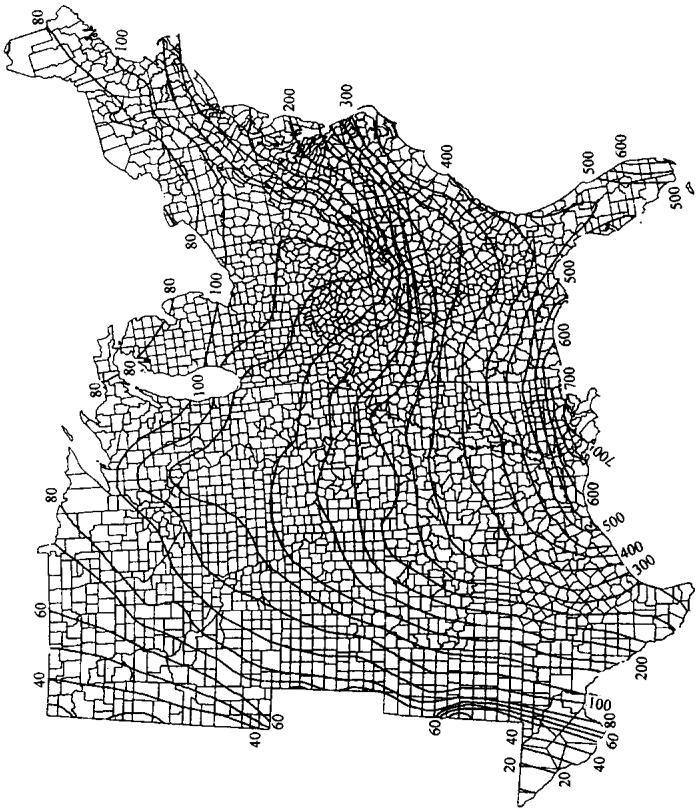  
图 )(a)(

后将仅有 60min 雨强的1 082 个站点 $( E I ) _ { 6 0 }$ 转换成 $( E I ) _ { 1 5 }$ ,其中790个站的观测资料在20年以上。最后用Weiss(1964)建立的断点雨强降雨侵蚀力 $E I _ { 3 0 }$ 与 $( E I ) _ { 1 5 }$ 的关系： $E I _ { 3 0 } = \ 1 . 0 6 6 7 ( E I ) _ { 1 5 }$ 求出多年平均年降雨侵蚀力。计算美国东部地区降雨侵蚀力时，只包括了次降雨量在12.7mm以上的降雨，而在西部地区则包括了所有的降雨。此外，将西部地区分为84个气候区，计算EI的季节分布，但在冬季以降雪为主的地区，没有计算冬季降雪月份的EI值。

西部地区降雨侵蚀力的具体计算公式如下：

$$
e _ { 1 5 } = 0 . 1 1 9 + 0 . 0 8 7 3 \mathrm { l o g } _ { 1 0 } I _ { 1 5 }\tag{2-28}
$$

$$
e _ { 6 0 } = 0 . 1 1 9 + 0 . 0 8 7 3 \mathrm { l o g } _ { 1 0 } I _ { 6 0 }\tag{2-29}
$$

$$
( E I ) _ { 1 5 } = ( \sum e _ { 1 5 } P _ { 1 5 } ) I _ { 3 0 }\tag{2-30}
$$

$$
( E I ) _ { 6 0 } = ( \sum e _ { 6 0 } P _ { 6 0 } ) I _ { 3 0 }\tag{2-31}
$$

$$
( E I ) _ { 1 5 } = b ( E I ) _ { 6 0 }\tag{2-32}
$$

$$
R \ : = \ : 1 . 0 6 6 7 ( E I ) _ { 1 5 }\tag{2-33}
$$

式中， $e _ { 1 5 } \setminus e _ { 6 0 }$ 是分别用15min、60min等间隔雨强计算的单位降雨动能， $P _ { 1 5 } \mathrm { , } P _ { 6 0 }$ 分别是各15min、60min间隔的总雨量。

降雨侵蚀力图反映了多年平均年降雨侵蚀力的空间分布特征。某一地区的多年平均年降雨侵蚀力可以直接从图上读取。如果所求站点位于相邻二条等侵蚀线之间，则可通过线性内插求得。

在应用侵蚀力图时，应注意以下两个问题：一是山区由于地形起伏大，受海拔高度影响，降雨侵蚀力会发生明显突变，因此在这些地区用内插方法求某一点R值时，精度一般较低。二是在以对流性降雨为主的地区，由于降雨局地性强，降雨空间变化大，仅用少数几个站点的降雨资料计算降雨侵蚀力不够充分。如美国亚利桑那州和新墨西哥州属西南雷暴气团控制区，利用该区降水量资料计算EI值，得到了有趣的结果：夏季EI值可占到全年总量

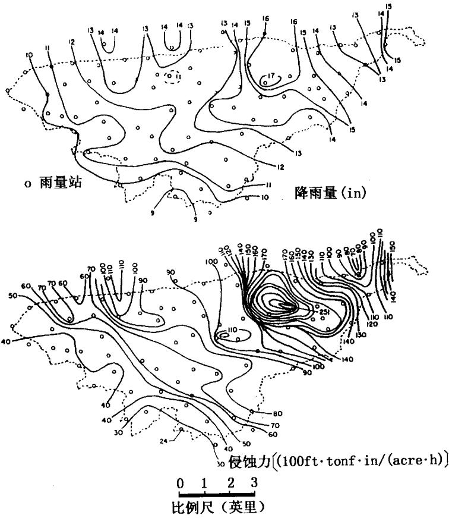  
图 2-4 Walnut Gulch 试验区 1964 年 7月 22 日一次暴雨分布(上图)及其降雨侵蚀力(下图)

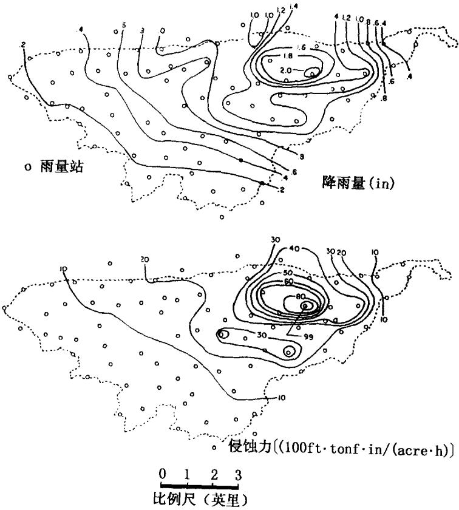  
图 2-5 Walnut Gulch 试验区 1964 年年降雨量(上图)和降雨侵蚀力(下图)

851\~1702MJ·mm/(ha·mm·a)的85%\~93%(Renard 和 Siman-ton,1975)。Renard 和 Simanton(1982)计算了亚利桑那州东南148.9km²的 Walnut Gulch 流域内，一次暴雨过程的 EI 值。

图2-4表示的是1964年7月22日一次暴雨过程，用100个雨量站资料绘制了等雨量线图，和相应的侵蚀力图。值得注意的是，等侵蚀线与等雨量线相关关系较小。在暴雨强度大的北部边缘地区，EI值接近100个单位，而在距此不远的地区(大约8km)，EI 值不到最大暴雨区EI值的 50%。

图2-5是年雨量图和年侵蚀力图，它是根据图2-4资料，同时考虑了当年的其他暴雨以后计算的。图2-4和图2-5降雨量变化大的地区，正是西南气团暴雨控制区。一般情况下，最大年降水量与最小年降水量的比值为1.9.最大R值与最小R值的比值为4.0。

这些例子表明，单独一个站点的降雨记录和据此计算的EI值，对于指示某一特定地点的土壤流失量是不够充分的，除非该点就是降水记录站点。

## 第三章 土壤可蚀性因子(K)

## 3.1 土壤可蚀性研究进展

分布于地表的土壤圈，不仅是侵蚀发生的场所，也是侵蚀泥沙的主要物质来源。因此，土壤本身的性质差异对侵蚀发生过程及其产沙量的多少有着极为重要的影响。关于土壤性质对侵蚀影响作用的评价研究，开始于20世纪30年代，当时对土壤性质与侵蚀的关系做了大量的研究。代表性的成果有，Bennet(1926)首次指出了土壤侵蚀程度随土壤的不同而变化，通过测定和比较土壤质地、土壤结构、土壤有机质含量及化学组成等土壤性质的影响程度以后，提出二氧化硅、氧化铝、氧化铁之比与土壤侵蚀之间存在明显相关性，可用土壤中硅铁铝含量的高低来推测土壤侵蚀深度。硅铁铝率大于2者，为脆性土，不易侵蚀；小于2者为粘性土，易侵蚀。Middleton(1930,1931)提出土壤浸湿热的大小与土壤侵蚀率的高低成正比。浸湿热是指土粒遇水后放出的热量。土粒表面愈大，放热愈多，土粒表面愈小，放热愈少。也就是粘质土易蚀，砂质土耐蚀。Middleton根据多种土壤性质分析，又提出用侵蚀率来判断土壤受蚀程度大小。所谓侵蚀率指分散率与胶体含量及水分当量和的比值。Bouyoucos(1935)提出土壤中砂粉粒含量与粘粒含量比率作为土壤性质对侵蚀影响作用评价的指标，并认为其值大小与土壤可蚀性成正比。Peel(1937)把土壤入渗率考虑在内，用小区资料分析了土壤物理性质对土壤侵蚀的影响，认为渗透速度(percolation rate)、悬浮率(suspension percentage)、分散率(disper-sion rate)是判断土壤可蚀性的较好指标。Anderson(1954)提出用团聚体表面率作为土壤可蚀性评价指标，团聚体表面率是等于大于0.05mm颗粒的表面积与团聚体含量之比。Woodburn(1956)用团聚体的稳定性和分散率作为土壤可蚀性指标，指出大于0.5mm的水稳性团粒含量与土壤溅蚀量具有良好的负相关关系。

上述研究工作，对土壤性质如何影响侵蚀以及影响程度等有了比较明确的认识。同时也对分析评价不同土壤的相对侵蚀强度，指导侵蚀防治政策的制订与实施等起了一定的作用。但是，这些研究成果的最大缺陷是不能进行侵蚀量预报。知道某一地区土壤侵蚀量的多少，不仅是认识侵蚀严重程度的基本前提，而且是侵蚀防治措施效果评价的客观依据，因此，在后来的有关评价土壤性质对侵蚀的研究中，提出了具有预报操作功能的土壤可蚀性因子概念。Olson和Wischmeier(1963)在分析了大量的小区观测资料后，通过对现有的许多指标进行比较和评价以后，认为用土壤侵蚀率不能反映土壤对侵蚀的敏感程度，因为它在不同质地的土壤上未表现出人们需要的一致性。他们从统计学角度考虑，巧妙地解决了不同立地条件下、不同年代观测资料的统一对比分析问题，提出了土壤可蚀性因子K值的概念、指标、及其计算方法，规定了适用于美国自然条件的标准小区，土壤可蚀性指标便是单位降雨侵蚀力在标准小区上造成的土壤流失量。有了这一指标值，就可以对不同地区、不同历史时期的观测资料进行统一比较和分析，为美国土壤侵蚀预报的开展，作出了重要的贡献。该指标最早应用于通用土壤流失方程USLE(1965)，作为评价土壤可蚀性的标准方法。但是，这一方法有一定的限制，因为只有在那些有详细观测资料的地区，才能获得土壤可蚀性大小的值。即必须首先测定并计算出降雨侵蚀力R和土壤流失量A后，才能计算土壤可蚀性。

在美国，许多地区没有土壤侵蚀量的观测。为了解决无资料地区十壤可蚀性因子的计算问题，必须建立利用常规土壤普查资料计算K值的关系模型，这样才更有实际应用价值。为此，Wis-chmeier等(1969)用5年时间分析计算了55种土壤的理化性质指标与可蚀性因子K值的关系。这些性质指标包括：土壤中砂分粘粒的含量、有机质含量、土壤pH值、土壤结构、土壤容重、孔隙度、土壤残留物、团聚体含量及其组合，提出了满足上述要求的估算模式。该计算方程包括24个变量。这些变量或者是土壤某一数值指标，或者是几种性质的组合指标，以及相应的地形条件指标值。运用这个关系式，解决了无小区观测资料地区的K值估算问题，从而促进了通用流失方程的推广运用。虽然用上述关系式可以初步解决许多地区以前无法实现的K值估算问题，但是，一个含有24个变量的关系式，不论在理解认识上，还是在实际应用中都存在着很大的不便。为了便于广大普通用户使用通用土壤流失方程，必须推导出既有一定估算精度，在形式上又简单明了的关系式。在这种思想指导下，Wischmeier等(1971)又对已提出使用的关系式进行简化，最后概括成5个主要影响土壤可蚀性因子K值的土壤性质数值指标，即土壤中粉砂和细砂含量，大于1mm的砂粒含量，有机质含量，土壤结构系数和土壤剖面渗透性等级。上述指标不仅形式简单，而且，这些参数都能通过常规实验手段测定或土壤剖面描述确定，可直接从土壤普查资料中获取。同时，为了用户使用更为方便，他们还把这一关系式绘制成有名的土壤可蚀性因子诺谟图(Nomograph),这一关系图被正式采用于1978年第二版通用土壤流失方程中。这样，通过对土壤可蚀性评价方法的不断改进与提高，大大推进了通用土壤流失方程的应用，使其渐渐成为进行水土保持规划必不可少的工具。

我国关于土壤性质与侵蚀关系的研究始于20世纪60年代。经过30多年的努力，在土壤对侵蚀的影响作用及其评价研究方面，积累了大量的研究成果。这些成果对认识不同地区的土壤侵蚀规律，制订水土保持措施起到了一定的促进作用。但是，与国外发达国家比较，我国的土壤可蚀性研究在某些方面走了一定的弯路。回顾总结我国的研究进程，认识其中所存在的问题，对提高我国的土壤可蚀性研究十分重要。

关于土壤对侵蚀过程以及侵蚀程度的影响作用，我国学者注重土壤抵抗径流冲刷作用的能力研究。朱显谟(1960)把土壤的抗侵蚀性能分为抗冲性和抗蚀性两个概念。土壤抗冲性是指土壤抵抗地面径流机械破坏和推移的能力。土壤抗蚀性则是泛指抵抗水的分散和悬移的能力。在这种概念支配下，在我国很长一段时间内的研究工作围绕这一框架进行。朱显谟等(1954)通过测定土壤膨胀系数及分散速度与侵蚀的关系，认为土体易分散性和抗蚀力与吸水后膨胀的大小有关，一般吸水后膨胀愈大者，愈易分散；膨胀较小者，不易分散，其流失量也较少。并指出土壤的透水性能也是影响土壤侵蚀的主要原因。朱显谟(1960)还用静水崩解法的结果，提出土体在静水中的崩解情况可以作为土壤抗冲性的主要指标之一。田积莹、黄义端(1964)对子午岭地区不同植被下8个土壤剖面土壤物理性质进行了研究，分析了土壤的团聚体总量、1\~10mm团聚体量、团聚状况、团聚度、团聚体分散度以及分散率和侵蚀率，认为这些物理性质可作为土壤抗侵蚀性能的指标。朱显谟(1960)认为水冲穴的深浅，在一定程度上可以反映出土体抵抗雨滴打击、地面径流的冲击等破坏作用的强弱。他曾于1955年在晋西地区采用CC索波列夫装置，分别用0.5和1个大气压的股水进行试验观测，所得结果大体与土体在静水中情况一致。唐克丽(1961)在俄罗斯期间曾研究了不同侵蚀度的生草灰化土与黑钙土团粒结构的变化状况及机理，指出不同侵蚀营力、不同土壤所表现的抗蚀性能与其结构有直接关系，不同利用、不同措施可提高或削弱十壤抗蚀性能。并在1964年从土壤物理，力学，化学，粘土矿物结构等内在性质，研究了土壤侵蚀的发生发展过程与抗蚀性能的机理。同时，还用人工降雨进行了不同耕作措施、人工结构地等对提高+壤抗蚀性能的田间试验研究，以及土壤水分状况对土壤抗蚀性能的影响。

关于土壤抗冲性的研究，主要通过径流冲刷实验来完成。蒋定生(1963)根据古萨克的装置，改进设计了原状土冲刷实验水槽。

该冲刷槽由流水槽、装样室、静水池、整流栅和自动供水桶等部分组成，土样大小为 $3 \mathrm { c m } \times \dot { 4 } \mathrm { c m } \times 2 0 \mathrm { c m }$ 。用该冲刷槽测定了黄土地区农、林、草地下的土壤抗冲性，并提出了抗冲力指标及其分级。认为用单位水量(在相同的坡度和流量下)所冲走土量(M)的多少可以作为评价土壤抗冲性的指标，并将土壤抵抗流水冲刷的能力分为4个等级。窦保璋(1978)用蒋定生设计的土壤冲刷槽，对黄绵土在不同利用条件下的土壤进行测定，与蒋定生得出类似的结论。并计算出各试样的抗冲强度和缓冲系数。抗冲强度规定为标准条件下(坡度20°，流量为1.0L/min)每冲走单位重量(1.0g)土壤所需要水的重量。缓冲系数是冲刷量与流量直线方程的斜率。并认为它们完全反映出不同土壤所具有的抵抗流水冲刷的能力，可以作为评价土壤抗冲能力的相对指标。黄义端(1981)认为在评价土壤抗蚀性和抗冲性方面，一般来说，土壤的分散率、侵蚀率、分散系数、团聚度等，均可反映土壤抵抗水的分散和悬浮能力，故可作为土壤抗冲性能的指标。土壤抗蚀性主要与土壤中的粘粒及有机质含量或胶体性质有关；土壤抗冲性则主要与土体的紧实度及植物根系的数量和固结情况有关。根据土粒在细小径流中分散悬浮情况和土体遇水崩解，土壤紧实度和植物根系固结情况，可将土壤抗蚀抗冲性能划分为极弱、弱、中、强、极强5个等级。史德明等(1983)测定了土壤抗蚀性和抗冲性，认为抗蚀性的大小可用土壤团聚体的分散性或水稳性指数(K)间接表示。抗冲性试验，是应用索波列夫抗冲仪进行，在一定的大气压力下，以0.7mm直径的水柱对土层进行冲击，使之产生水蚀穴，每10个水蚀穴深与宽乘积的平均值的倒数，即为该土层的抗冲指数，以此作为土壤抗冲性指标。余新晓等(1987)用 Subhash chandra等设计的可蚀性实验装置，测定了甘肃省泾川县官山林场不同地类土壤的侵蚀系数，并进行了有关物理、化学和力学性质的分析，认为影响土壤抗蚀性的因素主要是土壤物理(包括结构)特征。李建牢等(1987)用单个水滴打散0.7\~1.0cm土粒所需要水滴数作为指标，评价天水罗玉沟的土壤抗蚀性。具体方法是分选0.7\~1.0cm的土粒置于直径为10cm的金属网络圆盘上，用注入自来水的酸式滴定管击溅土粒(滴落高度15cm,水滴频率50滴/min),记录分散土粒所需的水滴数。并应用模糊贴近度方法进行土壤抗蚀性聚类分析，将罗玉沟流域土壤抗蚀性分为5类：强、较强、中、较弱、弱。李勇等(1990)用索波列夫抗冲仪，测定了黄土高原若干土壤剖面的土壤抗冲性，并分析了它与13个土壤物理性质的关系，得出决定土壤抗冲性的主导因素依次是粗粉粒、砂粒、土壤紧实度、水稳性团粒含量、土壤容重及土壤总孔隙度。李勇、吴钦孝等(1990)用蒋定生设计的抗冲槽法，测定了陕西宜川县人工油松林和部分草本植物下土壤的抗冲性。结果认为林草根系可以明显提高土壤的抗冲性能。这种作用随雨强的增大而减小。近年，蒋定生等(1995)又从泥沙启动时的受力平衡分析考虑，拟定了反映土壤抗冲性的新指标，其形式为：

$$
S _ { 0 } { = } 8 8 2 0 d C
$$

其中， $C = \frac { Q t } { w }$ .Q为冲走ω克土壤所用的水量，t为冲走 $\pmb { \omega }$ 克土壤所用的时间， $^ { d }$ 为土粒直径。并指出土壤可蚀性系数受土壤、地面坡度、降水特性以及生物作用等许多因素影响，是一个动态参数，不是恒定的常数，它是土壤的自然性质、地形、降水及水土保持活动的函数。正如作者所述，文中的土壤可蚀性指标实际上是一个综合指标，并不能完全反映土壤性质本身的差异对侵蚀的影响作用。因为土壤性质上的差异完全可能为其他因素的不同而掩盖。

以上各研究从不同方面探讨了土壤性质与侵蚀的相互关系，为认识理解十壤侵蚀规律、指导水土保持实践起到了很大的促进作用。但这些研究中所提的抗蚀性指标都没有与土壤侵蚀量联系起来，除了能说明不同土壤对侵蚀敏感程度的相对强弱外，均不能用于十壤侵蚀预报。而目，指标值的大小随试验设计的不同而有明显差异。比如抗冲槽在两个不同流量下可得出完全相反的结论。鉴于这些不足，从20世纪90年代开始，我国许多学者开始尝试将美国的通用土壤流失方程应用于中国，从而使土壤可蚀性研究取得了很大的发展。首先是周佩华等(1993)用山西水保站的小区观测资料，吴普特等(1993)用天水水保站的小区观测资料，研究了黄土的可蚀性问题(他们仍沿用土壤抗蚀性一词)。除此之外，其他许多研究基本上是按照美国通用土壤流失方程的思路进行。金争平等(1992)用皇甫川流域的小区观测资料，选择坡度为 $6 ^ { \circ }$ 的小区为标准小区，计算了黄土、栗钙土、风沙土等土类的可蚀性因子K值。史学正等(1997)用设在中科院红壤生态站的微小区试验(小区面积为 $1 2 \mathrm { m } ^ { 2 }$ )资料，计算了江西红壤区不同土壤类型的可蚀性因子的相对大小，并研究比较了小区实测值与诺谟图计算值的差异。张宪奎等(1992)用设在黑龙江克山县、宾县等地的小区资料，计算了东北白浆土、黑土和暗棕壤的可蚀性因子值。通过比较小区实测值与诺谟图查算值后指出，对所研究的土壤类型而言，诺谟图K值比实测值偏小30%左右。陈明华等(1995)用人工降雨试验，及天然对照小区的实测资料，在福建研究了红壤、紫色土、石灰土和黄壤的土壤可蚀性因子值。并提出了用土壤性质指标值计算K值的相关关系式。以上列出的主要研究工作表明，在我国的不同地区，进行了大量有关土壤可蚀性因子K值的研究，这些研究成果无疑促进了区域土壤侵蚀预报工作的开展。但是，上述工作中，大多未提及标准小区的问题。即使提到了，也并不是统一的标准。用不同规格小区资料不加订正地计算各种土壤的可蚀性因子值，计算结果不仅可信度差，而且无法进行相互比较。有些工作还存在对通用土壤流失方程理解不全面、甚至错误的现象，以及计算方法有误的情况，这大大影响了我国土壤可蚀性研究成果的应用价值。

在通用土壤流失方程被广泛使用的过程中，人们发现在一年或某一生长季里，随着农作物生长和土壤结构随时间的不断变化，K值大小会发生变化。只有把握这些变化规律，分析影响K值变化的主要因素，并建立其相互关系式，才能通过计算动态的K值，更精确地预报水土流失量。基于这种思想，修订通用土壤流失方程(RUSLE)对土壤可蚀性K因子进行了修订与改进。

RUSLE定义的土壤可蚀性虽也不十分完整，但却比较实用。认为土壤可蚀性反映了降雨、径流以及入渗等作用过程对土壤流失量综合影响的程度，通常被称作土壤可蚀性因子(K)。RUSLE中的土壤可蚀性因子(K)主要强调坡面降雨过程中，土壤基本性质对土壤流失量的影响。本章将概要介绍目前有关土壤可蚀性因子(K)的测定和预报方法，以及如何利用现有基本资料，预报无法直接测定的土壤可蚀性因子K值，还要讨论特殊条件地区，土壤可蚀性因子的评价问题：包括冻融作用发生地区土壤可蚀性因子的季节变化，含有岩石碎屑土壤的可蚀性因子计算问题。

## 3.2 土壤可蚀性的评价指标

土壤可蚀性是一种十分复杂的土壤特性。可蚀性反映土壤在雨滴击溅、径流冲刷或者两者共同作用下，被分散、搬运的难易程度。如果从侵蚀发生过程的基本原理考虑，土壤可蚀性应被看作是在单位外营力或侵蚀力作用下，土壤或其剖面发生变化的程度。

在上一节关于土壤可蚀性研究回顾中，可以看出，到目前为止，各国学者曾用很多指标来评价土壤性质对侵蚀作用的影响。但从侵蚀预报角度考虑，只有美国通用土壤流失方程的可蚀性因子K，我国学者周佩华等提出的抗冲性指标具有实用价值。为此.这里主要就这两种指标的定义及计算要求作一具体分析。

通用+壤流失方程将土壤可蚀性因子(K)定义为：标准小区上单位隆雨侵蚀力引起的十壤流失率，单位是t·ha·h/(ha·MJ·mm)[吨·公顷·小时/(公顷·兆焦耳·毫米)]。所谓标准小区，是指长为22.1m，坡度为9%，连续保持休闲状态，并且实施顺坡上下耕作的小区。小区宽度一般不小于1.8m。Smith于1961年曾提出了美国田间小区建立和维持的准则：除冬季发生严重风蚀的地区外，径流小区首先必须犁耕到正常耕作深度，且犁耕后立即耕耙两次以上。在冬季发生严重风蚀的地区，可在初春进行耕耙。而且犁耕应与每年连续种植农作物的对照小区同时进行。另外，在新一季作物种植进行中耕，或消除结皮影响时，要对小区进行中耕。必要时还要消除结皮的影响。如果耕作不能消灭杂草，还必须使用除草剂。犁耕和中耕都必须顺坡上下进行，但不能在过湿的土壤上进行。上述条件就是所谓标准小区的田间操作要求。

土壤可蚀性因子是指在长时段内，土壤及土壤剖面对降雨侵蚀力抗蚀程度的平均反映。实际上土壤可蚀性因子是一个综合参数，它的大小综合反映了通用土壤流失方程中规定的标准条件下，土壤和土壤剖面对各种侵蚀和水动力过程的平均敏感程度。这些过程包括雨滴打击和径流冲刷引起的土粒分散和迁移过程，因地形或耕作影响发生的局部沉积过程，以及降雨入渗过程。

土壤可蚀性因子(K)反映了土壤性质及土壤剖面特性对土壤流失量的影响。然而，它与其他影响侵蚀的因子之间存在相关关系。例如，Wischmeier和 Smith(1978)根据中质地、低团粒土壤地区的资料，得出传统的坡长和坡度与土壤侵蚀之间的关系。可以想象，如果将这些地形公式用于K值的计算，必然会把地形因子导致的误差代入K值计算中。

相同的问题也存在于降雨侵蚀力因子计算中。由于降雨过程中雨滴大小，以及向上飘风和向下飘风的影响，降雨动能会发生一定的变化。在降雨年内分配相对集中的地区，这种变化更为显著。由于计算降雨动能采用的是时段雨量，用时段降雨资料，由雨强能量关系计算自然小区的降雨动能时，会导致土壤可蚀性因子计算误差。土壤可蚀性K的季节值，可部分抵消因采用时段雨量计算降雨侵蚀力带来的误差。

十壤可蚀性因子与覆盖因子(C)的关系，主要归因于有机质含量或有机碳对土壤流失量的影响。土壤有机碳含量的多少，主要取决于地表及表层土中作物残留物、土肥施加及有机质的分解率等。截然区分在哪些地区应把地表残留物作为覆盖因子，在哪些地区又作为土壤可蚀性因子显然不可能。此外受其他环境因子(如温度，湿度等)的影响，有机质转化过程也会因自然地带不同而有很大差异。有关这方面的问题本章将不予以讨论。简单来说，诸如秸秆覆盖或机械碾压，表层土扰动及亚表层作物残留物等短期影响应归于C因子考虑，而诸如有机质分解引起的土性或土壤结构变化等的长期影响，应被看作是K值的变化，予以考虑。

我国学者近年来也尝试着用小区观测资料计算抗蚀性指标，表征土壤性质对侵蚀的影响作用。认为单位径流深所对应的土壤侵蚀模数是比较稳定的指标。周佩华等通过分析计算6个坡度级小区、12年间侵蚀率与径流量的资料，表明晋西黄土的抗蚀性指标值变化于0.023\~0.45之间，最大和最小值之间相差近20倍，并认为土壤可蚀性变化的主要原因是地面坡度和坡长。紧接着，吴普特(1993)又用天水站1945\~1957年35个小区1144场降雨径流观测资料，研究计算了黄土的可蚀性因子值大小。不同之处在于，他的研究是以次降雨径流深作为径流冲刷动力指标，而不用年均径流深或次降雨径流深的均值表示。土壤可蚀性具体的计算式为：

$$
K _ { w } = \frac { w } { A H }
$$

其中，A为小区面积，H为次降雨径流深， $\boldsymbol { \varpi }$ 为冲刷量。与周佩华等的结果相同，吴普特计算的 $K _ { w }$ 也在较大范围内变化。而且，在结果分析中也强调了坡度和土地利用方式对土壤可蚀性的影响。上述方法或许可以用来作为反映土壤可蚀性的数值指标，但也存在一些问题。第一，土壤可蚀性(或称其为抗冲性)作为一种反映土壤抵抗径流冲刷能力的数值指标，对具体一种土壤应该是一个相对稳定的数值，不应随其他条件的不同，在很大范围内变化。第二，上述可蚀性指标计算过程中，没有剔除其他因子对土壤侵蚀的影响作用。通过对文中的计算资料进行标准化处理，再分析文中的可蚀性因子变化就会发现，可蚀性因子反映的是坡度对土壤侵蚀量的影响，而不是土壤性质本身对土壤侵蚀的影响，这样也就失去了定义可蚀性因子的初衷。用这种指标反映土壤性质对侵蚀影响的强弱，必然会使土壤流失量预报产生很大的误差。因此，在进行我国土壤侵蚀预报时，选取土壤可蚀性因子K，作为评价土壤性状对侵蚀的影响指标，更为合理可行。

## 3.3 土壤可蚀性因子的测定与计算

确定土壤可蚀性因子的最好办法是在天然小区上直接测定。用模拟降雨确定土壤K值精度较差，通过相关方程计算K值的精度最差(Romekens,1985)。在这几种确定K值的方法中，都要求土壤、小区条件以及评价方法相匹配。附加这些要求的目的是为了减少土壤前期含水量、地表条件变化，以及降雨方式等因素对土壤可蚀性因子的影响。

用田间小区研究土壤K值时，必须有足够大且观测历时较长的数据库资料。目前有长期观测资料的研究不多。在美国东部地区，观测时段应不短于20\~22年左右(Wischmeier，1976)。但是，一般情况下考虑到经济和时间两方面原因，田间小区的长期观测难以维持。这就促进了模拟降雨试验研究的发展。但是，利用人工降雨方法无法满足地表保持足够长休闲状态的要求。表3-1列出了美国根据天然小区资料计算可蚀性因子的土壤种类。需要说明的是，这些小区的观测时段一般都不满足上述所提的20\~22年。而目，许多十壤的K值还是用长期作物地径流小区观测资料，通过覆盖因子C值的调整计算得到。

用田间小区研究土壤K值的第二个要求是，小区表面必须保持休闲状态，观测开始前和观测过程中要进行必要的地表土翻耕。

3..)/]①  +m )
<table><tr><td>土壤类型</td><td>地点</td><td>所属</td><td>时间 (年)</td><td>坡度 (%)</td><td>坡长 (m)</td><td>K</td></tr><tr><td>Bath 粉壤土</td><td>纽约 Arot,</td><td>典型脆磐淡色始成土</td><td>1938~1945</td><td>19</td><td>22.1</td><td>0.007</td></tr><tr><td>Ontario 壤土</td><td>纽约 Geneva</td><td>弱发育湿润淋溶土</td><td>1939~1946</td><td>8</td><td>22.1</td><td>0.036</td></tr><tr><td>Cecil 砂壤土</td><td>南科罗拉多 Clemson</td><td>典型弱发育湿润成土</td><td>1940~1942</td><td>7</td><td>55.1</td><td>0.037</td></tr><tr><td>Honeoye 粉壤土</td><td>纽约 Marcellus</td><td>弱发育湿润淋溶土</td><td>1939~1941</td><td>18</td><td>22.1</td><td>0.037</td></tr><tr><td>Hagerstown 粉粘壤土</td><td>宾西法尼亚州立大学</td><td>典型湿润淋溶土</td><td></td><td></td><td>一</td><td>0.041</td></tr><tr><td>Fayette 粉壤土</td><td>威斯康星 LaCrosse</td><td>典型湿润淋溶土</td><td>1933~1938</td><td>16</td><td>22.1</td><td>0.050</td></tr><tr><td>Dunkirk 粉壤土</td><td>纽约 Geneva</td><td>弱发育湿润淋溶土</td><td>1939~1946</td><td>5</td><td>22.1</td><td>0.091</td></tr><tr><td>Shelby 壤土</td><td>密苏利 Bethany</td><td>典型粘淀湿润软土</td><td>1931~1940</td><td>8</td><td>22.1</td><td>0.070</td></tr><tr><td>Loring 粉粘壤土</td><td>密西西比 Holly Springs</td><td>典型脆磐湿润淋溶土</td><td>1963~1968</td><td>5</td><td>22.1</td><td>0.065</td></tr><tr><td>Lexingtan 粉粘壤土</td><td>密西西比 Holly Springs</td><td>典型强发育湿润淋溶土</td><td>1963~1968</td><td>5</td><td>22.1</td><td>0.058</td></tr><tr><td>Marshall 粉壤土</td><td>印第安纳 Clarinda</td><td>典型弱发育潮湿软土</td><td>1933~1939</td><td>9</td><td>22.1</td><td>0.057</td></tr><tr><td>Tifton 壤砂土</td><td>乔治亚 Tifton</td><td>聚铁网纹的强发育老成土</td><td>1962~1966</td><td>3</td><td>25.3</td><td></td></tr><tr><td>Caribou 砾质壤土</td><td>缅因 Presque Isle</td><td>淋溶的弱发育正常灰土</td><td>1962~1969</td><td>8</td><td>22.1</td><td></td></tr><tr><td>Barnes 砾质壤土</td><td>明尼苏达 Morris</td><td>湿润的弱发育冷凉软土</td><td>1962~1970</td><td>6</td><td>22.1</td><td>0.030</td></tr><tr><td>Ida 粉壤土</td><td>印第安纳 Castana</td><td>典型湿润正常新成土</td><td>1960~1970</td><td>14</td><td>22.1</td><td>0.036</td></tr><tr><td>Kenyon 粉壤土</td><td>印第安纳 Independence</td><td>典型弱发育潮湿软土</td><td>1962~1967</td><td>4.5</td><td>22.1</td><td></td></tr><tr><td>Grundy 粉粘壤土</td><td>印第安纳 Beaconsfield</td><td>潮湿砂性的粘淀湿润软土</td><td>1960~1969</td><td>4.5</td><td>22.1</td><td></td></tr></table>

) 9),

这就要求在农作物收割之后，必须人工清除或通过自然风化去除地表残留物。关于小区必须维持的时间年限，应该根据当地的气候条件确定，但观测时间一般至少要维持两年。

用田间小区研究土壤K值的第三个要求是，小区土壤和地形条件的均一性，而且小区大小必须符合标准。地形均一是为了防止小区局部淤积或加速侵蚀的发生。选定有标准长度和坡度的小区计算K值，对防止因地形因子换算引起的误差十分重要。尽管有些土壤可能不会分布于坡度为9%的坡面上，但为了避免引起混乱，仍应坚持以9%的标准设置小区。实际上，9%的坡度并不是合理的标准，只是因为在早期的研究中，所设置的径流小区基本上都采用了这一平均坡度而已。同样，现在普遍采用的22.1m(72.6ft)的小区长度，是为计算方便、规定面积为40.5m²(百分之一英亩)、宽度为1.8m(6ft)时的计算结果。

用模拟降雨试验研究确定土壤可蚀性因子(K)值时，也要求在小区大小、坡面状况以及小区布设和维持等方面，与天然小区有同样的标准。然而一般情况下，由于从作物收获到下次播种之间的时间有限，模拟降雨试验不可能使地表残留物得到充分分解。因此在实施模拟试验时，翻耕地表之前要首先去除表面作物残留部分。关于作物残留部分对侵蚀的影响，可以通过C值体现。如果没有充分清除表面作物残留，或残留物未得到充分分解，或对覆盖因子C值进行不正确的调整，都会引起土壤可蚀性因子K值计算的误差。

用模拟降雨试验确定土壤可蚀性因子(K)值时遇到的第二个困难是，怎样加权处理不同土壤含水条件下得到的土壤流失资料。R omkens(1985)和 Barnett等(1965)认为，不同土壤含水条件下得到的K值，需要按照不同气候条件下径流和侵蚀发生的比例，通过加权平均确定该土壤年平均K值大小。

土壤可蚀性因子(K)值大小也可以通过土壤性质指标间的相关关系式确定。影响可蚀性因子大小的因素很多，如土壤理化性质、矿物组成特征等，而且这些因素还在不断发生变化。同时由于土壤在遭受侵蚀的过程中，常常是以几种不同的侵蚀方式同时发生，每一种侵蚀方式的强弱程度，又受不同的土壤特性决定。因此，仅用少数几种土壤特性来准确估算某种土壤的可蚀性因子几乎不可能。但还是有人进行了这方面的工作。表3-2列出了美国学者在这方面的主要研究结果。

目前用土壤可蚀性诺谟图确定K值大小，是应用最为广泛的一种方法。图3-1所示的诺谟图是由五种类型的土壤，及其修订的粉粒含量(0.002\~0.1mm),修订的砂粒含量(0.1\~2mm)，有机质含量(QM),土壤结构等级(s),以及土壤渗透性(p)等特性组成。土壤结构、渗透等级可以通过土壤调查手册(USDA，1951)获取。如果土壤中粉粒含量小于70%，也可用Wischmeier和 Smith提出的代数关系式3-1估算K值大小：

$$
K = [ 2 . 1 \times 1 0 ^ { - 4 } ( 1 2 - O M ) M ^ { 1 . 1 4 } + 3 . 2 5 ( s - 2 ) + 2 . 5 ( p - 3 ) ] / 1 0 0\tag{3-1}
$$

式中，M是优势粒径组成的乘积：(修订的粉粒含量或0.002\~0.1mm粒径)×(粉粒含量+砂粒含量)。K是单位降雨侵蚀力单位面积的土壤侵蚀量，为美制单位。将上式右边计算值乘以0.1317就变为国际单位制的可蚀性因子K值，单位为t·ha·h/(ha·MJ·mm)。

诺谟关系是根据美国中西部地区模拟降雨资料推导，试验大多(81%)是在中等质地十壤上进行，其中60%土类的团粒系数小于0.3(Mannering，1967)。因此，诺谟关系很适合应用于中西部地区低团粒、中等质地的土壤。有些研究试图把诺谟关系图应用于其他地区的土壤，但成功的例子不多。图3-2是用诺谟关系数据库资料和其他数据资料计算的K值与实测值的比较。在许多此类研究中，团粒含量或团聚体系数都是最重要的参数。有关土壤可蚀性因子与土壤性质间关系的详情，可参考原文或Romkens的综述文章(1985)。

(+)==(+0)=2
<table><tr><td>研究者①</td><td>土壤类数</td><td>试验次数</td><td>方程中变量数</td><td>相关系数</td><td>显著变量</td><td>土壤质地</td></tr><tr><td>1</td><td>17</td><td>34</td><td>8</td><td>0.87</td><td>坡度</td><td>砂土</td></tr><tr><td>2</td><td>55</td><td>24</td><td>24</td><td>0.98</td><td>粘土比/有机质含量</td><td>壤质壤土</td></tr><tr><td>3</td><td>13</td><td>10</td><td>5</td><td>0.9</td><td>Agg</td><td>壤土</td></tr><tr><td>4</td><td>55</td><td>NA®</td><td>5</td><td>NA</td><td>M</td><td>壤质壤土</td></tr><tr><td>5</td><td>7</td><td>35</td><td>2</td><td>0.95</td><td>M</td><td>粘土</td></tr><tr><td>6</td><td>10</td><td>20</td><td>5</td><td>0.97</td><td>0~0.25mm</td><td>粘土</td></tr></table>

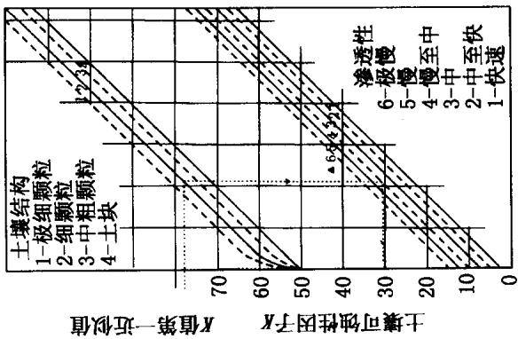  
1  
方专)和： 交(8)交() 维交(） 用

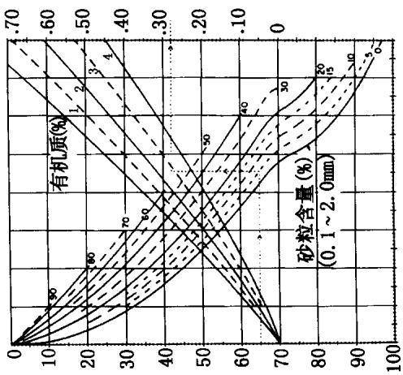  
)+

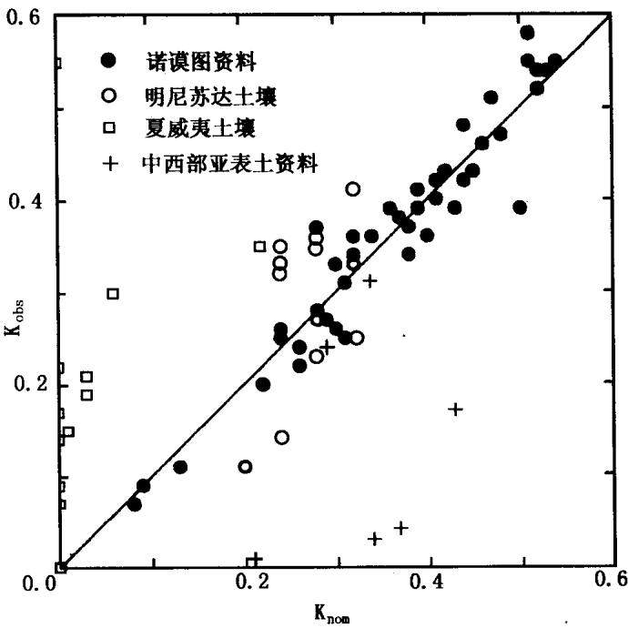  
图3-2 土壤可蚀性因子值与诺谟图估算值关系图  
图中●是 Wischmeier 资料，1971;是 Young and Mutchler资料，1977;是 E1- Swaify 和 Dangler 资料，1976；+是 R ömkens资料，1975。Knom 和 Kobs 的单位是 t·acre·h/(100 acre·ft·tonf·in)

美国典型土壤可蚀性因子与其影响因子间的相关关系方程概括见表3-2。由于影响可蚀性因子的变量之间也存在自相关关系，这会影响K值计算中各个变量重要性的权重。下式是根据美国夏威夷资料回归得到的计算火山灰土壤K值的回归方程：

$$
\begin{array} { c } { { K = - 0 . 0 3 9 7 0 + 0 . 0 0 3 1 1 x _ { 1 } + 0 . 0 0 0 4 3 x _ { 2 } + 0 . 0 0 1 8 5 x _ { 3 } } } \\ { { + 0 . 0 0 2 5 8 x _ { 4 } - 0 . 0 0 8 2 3 x _ { 5 } } } \end{array}\tag{3-2}
$$

式中，x，是大于0.250mm的非稳定团聚体的比例， $x _ { 1 }$ $x _ { 2 }$ 是修订的粉粒含量与修订的砂粒含量之积， $x _ { 3 }$ 是基础饱和度， $x _ { 4 }$ 是原土中粉粒含量， $x _ { 5 }$ 是修订的砂粒含量。该式只能用于与夏威夷火山灰土壤类似的土壤K值计算，尚无研究证明3-2式适用于所有热带火山灰土。

对分布在美国中西部地区北部的土壤，Young 和 Mutchler(1977)提出了如下关系式：

$$
\begin{array} { c } { K = \phantom { - } 0 . 2 0 4 + 0 . 3 8 5 x _ { 6 } - 0 . 0 1 3 x _ { 7 } + 0 . 2 4 7 x _ { 8 } + 0 . 0 0 3 x _ { 2 } } \\ { \phantom { - } - 0 . 0 0 5 x _ { 9 } \phantom { - } 3 } \end{array}\tag{3}
$$

式中， $x _ { 6 }$ 为团粒系数， $x _ { 7 }$ 是土壤中蒙脱石的含量， $x _ { 8 }$ 是深为50\~125mm土层的平均容重 $( \mathbf { g } / \mathrm { c m } ^ { 3 } ) , x _ { 9 }$ 是土壤分散率。用蒙脱石含量为变量，是因为粘土矿物对土壤团聚体特征和团聚体单粒化过程有重要影响，而团聚体单粒化可促进土粒的分散与迁移。

对于中西部有粘土底层的土壤，Römkens(1977)提出了以下关系式：

$$
K = 0 . 0 0 4 + 0 . 0 0 0 2 3 x _ { 1 0 } - 0 . 1 0 8 x _ { 1 1 }\tag{3-4}
$$

式中， $x _ { 1 0 }$ 是参数 M(Wischmeier,1971)， $x _ { 1 1 }$ 是土壤氧化物 $( \mathsf { A l } _ { 2 } \mathrm { O } _ { 3 }$ $\mathrm { F e } _ { 2 } \mathrm { O } _ { 3 } )$ 中可提取CDB(柠檬酸盐-硫酸盐-碳酸盐)的百分比。这个关系式表明了土壤中粒径在0.002\~0.1mm之间的颗粒含量对评价土壤可蚀性的重要性。鉴于试验土中CDB百分含量很低(不超过3.76%)，将其作为土壤可蚀性因子的预报因素，CDB的重要性应该是十分显著的。在强风化和高粘结土壤地区，式3-4未得到验证，使用前需要进行必要的修正。

近来，对用来计算K值的所有天然小区资料和模拟降雨资料(225种土壤)进行统一分析发现，从颗粒组成分类来看，考虑过土壤砾石(>2mm)的资料不足整个资料的10%。如果把这些土壤各粒径级的平均土壤可蚀性因子K值，与该组成范围的几何平均粒径进行相关分析，得到方程3-5：

$$
K = 7 . 5 9 4 \left\{ 0 . 0 0 3 4 + 0 . 0 4 0 5 \mathrm { e x p } \Big [ - \frac { 1 } { 2 } \Big ( \frac { \log ( D _ { g } ) + 1 . 6 5 9 } { 0 . 7 1 0 1 } \Big ) ^ { 2 } \Big ] \right\}\tag{3-5}
$$

$$
D _ { g } ( m m ) = \mathrm { e x p } ( 0 . 0 1 { \sum } f _ { i } \mathrm { l n } m _ { i } ) \qquad r ^ { 2 } = 0 . 9 8 3\tag{3-6}
$$

式中， $D _ { g }$ 是几何平均粒径， $f _ { i }$ 是原土中粒径组成百分比， $m _ { i }$ 是小于该粒径的算术平均值。对于美国138种土壤，也得出了类似的关系式：

$$
K = 7 . 5 9 4 \Big \{ 0 . 0 0 1 7 + 0 . 0 4 9 4 \mathrm { e x p } \Big [ - \frac { 1 } { 2 } \Big \cdot \Big ( \frac { \log ( D _ { g } ) + 1 . 6 7 5 } { 0 . 6 9 8 6 } \Big ) ^ { 2 } \Big ] \Big \}\tag{3-7}
$$

图3-3表明土壤可蚀性因子K值因土壤粒径不同而发生变化。关系式3-5和3-7适宜于计算资料不足、但知道不同分级系统下粒径组成的土壤的可蚀性因子值。方程3-5和3-7也可用于不能使用诺谟图计算土壤K值的情况，如质地良好且团聚体含量高的土壤。当然，由于方程式3-5和3-7只是基于有限数据资料得到的关系式，它们只能给出K值的大体估算，其精度要差于直接观测，也差于表3-2所列的土壤用回归方程计算的K值。

## 3.4 不同条件下土壤可蚀性的选值

估算多年平均土壤可蚀性因子K值的方法可有几种选择。对分布于温带地区的中质地、低团粒含量的土壤，诺谟关系图是最好的方法。对分布于热带地区的火山灰土壤来说，式3-2会更好一些。对含有2:1型晶架结构类粘土矿物的土壤，应该用式3-3和3-4计算K值。如果不属于上述任何一种情况，而且又没有足够的资料，建议选择式3-5或式3-7估算K值。

为了体现侵蚀过程的动力机制，近来发展了以侵蚀基本过程为依据的过程模型。该模型的出现有助于提高土壤侵蚀预报精度。然而，此类模型与旨在预报长期平均侵蚀量的RUSLE模型在原理和处理方法上都是不匹配的。本章对于通过建立土壤可蚀性与侵蚀过程的关系，改进利用土壤性质指标预报K值的问题未予涉及。

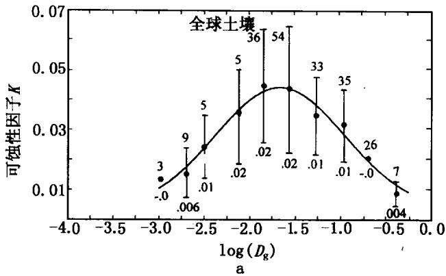

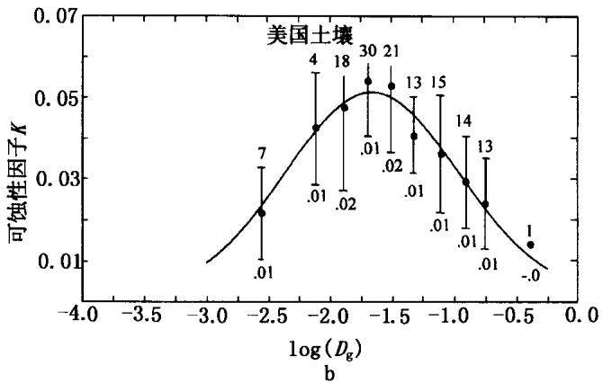  
图3-3 土壤可蚀性因子 K与几何平均粒径的关系  
图中数据为国际单位制。图3-3a使用了全球土壤资料，图3-3b中只是美国的资料。图中曲线是按正态分布计算的几何平均粒径级平均值。垂线表示每一几何平均粒径级减去或加上1时的标准变差。垂线上的数字表示每一几何平均粒径级上观测次数(上)及标准偏差(下)。

除了一般农地外，自然界中还有许多其他条件的地块。据美国自然资源保护局(NRCS)的土地调查资料，美国本土有15.6%的土壤含有砾石，或在其表面覆盖有碎石。这些覆盖在土表的碎石块可显著地减少降雨对土粒的分散作用。在粗质地土壤剖面中，碎石的存在可以明显地减少径流入渗作用。这些土壤可蚀性的计算不同于一般农地K值的计算方法。

为了反映上述作用，一种观点主张把土壤中砾石对土壤流失的影响作用单独归于覆盖因子 C 中评价(Box 和 Meyer，1984)。另一种观点主张把土壤中砾石对土壤流失的影响作用归入土壤可蚀性因子K中处理。表面碎石覆盖程度因土类，甚至地段不同会发生很大变化。一方面表面碎石覆盖与秸秆覆盖的作用一样，保护表土免遭雨滴打击。表面碎石也不会随径流汇于细沟，而是滞留于表面，这就形成像“盔甲”一样的保护层。另一方面在粗质地土壤剖面中，土壤砾石还会像地表残留物一样，通过减少土壤孔隙和土壤导水性，影响入渗和产流。同时，在进行土壤机械组成分析时，由于只考虑粒径小于2mm的颗粒部分，这就使在土壤可蚀性因子K的估算中，没有考虑大于2mm的砾石部分的影响。但实际上，大于2mm的砾石也是土壤粒径组成的一部分，在计算土壤可蚀性因子K时，必须充分考虑土壤砾石的影响效果。

土壤砾石的影响可分成两部分考虑：①土壤砾石覆盖于土壤表面，其作用就像作物覆盖层一样保护土壤免遭侵蚀，可在C值中考虑。②由于土壤砾石在粗质地土壤剖面中减少入渗，促进产流，增加土壤流失量。因此可以通过调整渗透等级，将其在可蚀性因子K值中考虑。同时需要注意的是，亚表层中砾石对侵蚀的影响作用，要小于表层土壤中砾石的作用，但在进行土壤碎石对入渗等级的影响描述时，未能考虑到这一变化。

因土壤砾石存在而引起土壤导水性的减少程度，可用《土壤调查手册(430号)》中的土壤导水性与人渗等级的关系来确定。考虑到手册中使用的图表和术语，需要作必要的调整和修改。Rawls(1982)提出了不同质地土壤入渗等级与饱和导水系数间的关系(见表3-3)。除土壤质地外，还有许多其他因子，如结构、矿物成分、结盘、钠离子含量以及含盐量等，都会影响土壤入渗强度，在此未予考虑。这一关系只是提供了土壤碎石影响土壤导水性，进而引起渗透等级变化的基本估算方法。

表 3-3 USDA 主要土类的土壤水力学特性
<table><tr><td>土壤质地</td><td>渗透性等级①</td><td>饱和导水系数  $( \mathbf { c m } \Lambda ) ^ { \odot }$ </td><td>土壤水力类型③</td></tr><tr><td>粉粘土，粘土</td><td>6</td><td>&lt;0.10</td><td>D</td></tr><tr><td>粉粘壤土，粘壤土</td><td>5</td><td>0.10~0.20</td><td>C~D</td></tr><tr><td>砂粘壤土，粘壤土</td><td>4</td><td>0.20~0.51</td><td>C</td></tr><tr><td>壤土，粉壤土④</td><td>3</td><td>0.51~2.03</td><td>B</td></tr><tr><td>壤砂土，砂壤土</td><td>2</td><td>2.03~6.10</td><td>A</td></tr><tr><td>砂土</td><td>1</td><td>&gt;6.10</td><td>A+</td></tr></table>

①图3-1中使用的渗透性等级见《国家土壤手册(第430号)》有关渗透性分级。  
② Rawls 等,1982。  
③ 见《国家工程手册》(USDA,1972)。  
④由于资料不足，粉砂质地被省略，但其渗透性应属于入渗3级。

Peck和Watson(未发表资料)从理论上推导了由于土壤剖面中粗砾含量增加，引起的饱和导水系数的减少率。后来，Dunn和Mehuys(1984)分别用卵石和玻璃球实验，验证了上述推论，并得到以下关系式：

$$
K _ { b } / K _ { f } = 2 ( 1 - R _ { v } ) / ( 2 + R _ { v } )\tag{3-8}
$$

式中， $K _ { b }$ 是含有碎石土壤的饱和导水系数， $K _ { f }$ 是小于2mm细粒部分的饱和导水率， $R _ { v }$ 是大于2mm的碎石部分的体积百分比。

Brakensiek等(1986)通过简化式3-8得出:含有碎石土壤的饱和导水率Kb，可以表示为Kf和大于2mm的碎石部分重量百分 $K _ { b }$ $K _ { f }$

比的比例式：

$$
K _ { b } / K _ { f } = ( 1 - R _ { w } )\tag{3-9}
$$

式中， $R _ { w }$ 是大于2mm碎石部分重量百分比。根据式3-9可知，已知土壤剖面中含有大于2mm碎石的重量百分比，即可导致同样百分比的土壤饱和导水系数减少。这样，相应的入渗等级变化便可由表3-3估算。例如，易于侵蚀的中质地土壤( $K = 0 . 5 0 )$ 中，碎石部分体积比为40%，可以导致入渗率降低一等，或者可使土壤可蚀性因子增加0.025个单位，土壤流失量增大5%。另一方面，40%的表面砾石覆盖可使土壤流失量减少大约65%。对可蚀性强的土壤( $K = 0 . 1 0 )$ 而言，40%的碎石成分可使土壤流失量增加25%。

## 3.5 土壤可蚀性的季节变化

由于土壤前期含水量、地表条件以及土壤性质的季节性变化，增加了K值估算的难度。但可以认为，上述各项在同一季节内不随时间变化，是一个常数，然后分季节计算K值，就可以减少土壤流失量的计算误差。基于这种考虑，美国Mutchler和 Carter(1983)，意大利Zanchi(1983)等计算了K的月平均值。他们各自独立地提出了下列形式的方程：

$$
K _ { r } = 1 + \alpha \cos ( b t - c )\tag{3-10}
$$

式中， $K _ { r }$ 是年平均值与季节值的比率，t是月平均温度，a、b、c是常数。美国EI·Swaify(1976)和日本细山田(1986)也提出了类似的思想，分干季和湿季分别处理K值。

K值季节性变化的主要原因有三方面：土壤冻融，土壤质地和土壤水的变化。其中，土壤冻融是最难评价的影响因子。目前的处理方法是把这三方面的影响统一包括在多年平均值中考虑。

冻融作用对土壤可蚀性因子的影响较大，但由于缺乏对冻融发生过程，以及在此过程中土壤性质随时间变化的充分认识，因此极大地限制了土壤可蚀性因子估算精度的进一步提高。已有的研究结果表明，冻融作用改变土壤性质，进而影响土壤可蚀性因子。这些性质包括土壤结构、土壤导水性、容重、团聚体水稳性、以及土壤强度等(Benoit,1973;Benoit,1986; Sillanpaa和Webber,1961;Formanek,1984;Van Klaveren,1987;Kok 和 McCool,1990)。研究还表明，土壤开始结冻时的含水量，冻融反复次数等显著影响春天解冻时土壤团聚体含量及其稳定性(Mostaghimi,1988)。一般而言，冻融作用反复进行的结果，会使土壤容重减小(Pall，1982)。低密度和高含水条件会使土壤表面更易遭受分散和输移。即使冻融层已经解冻，土壤密度的差异会继续存在。加上春雨的发生，结果使土壤可蚀性增强。

高土壤含水有可能导致坚固的、且常常是非透水的冻土层形成。土壤冻结时，可蚀性因子值最小。冻土层融化时，径流很小。并非大多数土壤都容易遭受冻融反复作用的影响，但在春天解冻时的二三天到一个月甚至更长的时间内，冻融作用是影响土壤可蚀性因子的主要因素。在这段时间内，虽然土壤表面已融化，但其下部仍有冰晶存在，这种结构必然会阻碍入渗和土壤水运动。总体而言，冻土层开始解冻时土壤可蚀性最大，之后随时间而逐渐减小(Formanek.1984)。一个地区冻融反复循环次数越多，土壤最大可蚀性持续的时间越长。因为在解冻发生阶段，土壤对融雪和降雨侵蚀都十分敏感，土壤流失也主要发生在这一阶段。冬季土壤温度徘徊在冰点附近的地区，整个冬天会发生多次冻融反复，因此这段时间内的侵蚀率也较高。Formanek等(1984)的研究结果表明.由干发生冻融作用，Palous垆姆土的表面抗剪强度可降低50%左右，从而导致细沟分散力大增。

在美国其他无冻土的地区，土壤可蚀性因子随作物生长而逐渐减小，到作物收获时达到最小。随后土壤可蚀性因子又逐渐增大，直到再次达到最大值。在许多地区，这种变化模式与降雨模式一致。尽管生长季的实际长度在温带地区会有变化，在美国，可蚀性因子最大值和最小值的变化周期取为6个月比较合理。在生长季或干湿期明显不是6个月的地区，可作适当调整。

对可蚀性因子有季节变化的土壤，修订K值的方法是：假定整个作物生长过程中，K值减少率呈指数衰减规律变化，同时K值减小率又随土壤类型、质地发生变化(Kirby和 Mehuys,1987)，土壤可蚀性因子与土壤质地的关系，可完全由土壤诺谟图确定(Wischmeier,1971)。如果最大土壤可蚀性值 $K _ { \mathbf { m a x } }$ 与由诺谟图确定的可蚀性因子 $K _ { \mathrm { n o m } }$ 的比率是一个常数， $K _ { \mathrm { m a x } }$ 的大小就成为土壤质地的关系式。

土壤可蚀性因子最大值 $K _ { \mathrm { m a x } }$ 与最小值 $K _ { \mathrm { m i n } }$ 之间的时间间隔，因土壤及地块位置不同会有所变化。资料表明，美国北部地区可蚀性因子最大值出现于解冻开始之时，之后逐渐减少，到解冻结束时达到最小值。可蚀性因子最大值出现的时间 $t _ { \mathrm { m a x } } .$ 从北到南逐渐提早发生，而最小值出现的时间 $t _ { \mathrm { m i n } }$ 从北到南逐渐推迟。在冬季有冻融作用发生的地区，一般都呈这种变化规律。在非冻融区或只有轻微冻融作用的地区，土壤可蚀性因子由小变大的时间一般与干湿季的变化一致，但很少有超过6个月的。

土壤可蚀性因子的变化范围与降雨发生时的土壤含水量有关。对于全年都很湿润的土壤，可蚀性因子的大小是年降雨量和降雨时间的函数。这样，在美国对大多数土壤而言，可用降雨侵蚀力R的大小和分布表示土壤可蚀性因子。在R值较小且月平均值变化较大的地区， $K _ { \mathrm { m a x } }$ 与 $K _ { \mathrm { m i n } }$ 之间的差值较大，大于0.92t·ha·$\mathbf { h } / ( \mathbf { h } \mathbf { a } \cdot \mathbf { M } \mathbf { J } \cdot \mathbf { m } \mathbf { m } )$ 。在R值较高且月平均值变化平缓的地区， $K _ { \operatorname* { m a x } }$ 与 $K _ { \mathrm { m i n } }$ 之间的差值较小，小于 $0 . 4 \mathrm { { t } ^ { \bullet } h a \bullet h / ( h a \cdot M J \cdot m m ) }$ 。在R值大于 $6 8 0 8 \mathrm { M J } \cdot \mathrm { m m } / ( \mathrm { h a } \cdot \mathrm { h } \cdot \mathrm { a } )$ 的地区，K值的变化趋于稳定。位于美国明尼苏达州 Morris 和 Holly Springs, 以及密西西比州等地的天然小区长期观测资料表明，在密西西比州北部地区， $K _ { \operatorname* { m a x } }$ 出现在十二月中旬， $K _ { \operatorname* { m a x } } / K _ { \operatorname* { m i n } }$ 约为3.7。而在明尼苏达州， $K _ { \mathrm { m a x } }$ 出现在四月中旬， $K _ { \operatorname* { m a x } } / K _ { \operatorname* { m i n } }$ 约为7.6。

用加拿大东部一个省和美国中西及东部地区7个州的观测资料，得到以下关系式：

第一类： $T _ { \mathrm { m a x } } { < } T _ { \mathrm { m i n } }$

如果 $t _ { \mathrm { m a x } } < t _ { i } < t _ { \mathrm { m i n } }$

$$
K _ { i } = K _ { \operatorname* { m a x } } ( K _ { \operatorname* { m i n } } / K _ { \operatorname* { m a x } } ) ^ { ( t _ { \mathrm { i } } - t _ { \operatorname* { m a x } } ) / \Delta t }\tag{3-11}
$$

式中， $K _ { i }$ 为任一时刻土壤可蚀性因子值， $K _ { \mathrm { m a x } }$ 和 $K _ { \mathrm { m i n } }$ 分别是可蚀性因子最大值和最小值。 $\Delta t$ 是非冻融季节或生长季长度。 $T _ { \mathbf { a v } }$ 是日平均气温。

如果 $t _ { i } < t _ { \operatorname* { m a x } }$ ,或 $t _ { i } > t _ { \operatorname* { m i n } }$ ，且 $T _ { \mathrm { a v } } { > } - 2 . 8 \mathrm { T }$

$$
K _ { i } = K _ { m i n } \mathrm { e x p } [ 0 . 0 0 9 ( t _ { i } - t _ { m i n } + 3 6 5 \delta ) ]\tag{3-12}
$$

当 $( t _ { i } - t _ { \operatorname* { m i n } } ) { \leqslant } 0 , \delta = 1$ ;当 $( t _ { i } - t _ { \operatorname* { m i n } } ) > 0 , \delta = 0$ ;当 $T _ { \mathrm { a v } } { \leqslant } - 2 . 8 \Phi$ 时， $K _ { i } = K _ { \operatorname* { m i n } } o$

第二类： $T _ { \mathrm { m a x } } { > } T _ { \mathrm { m i n } }$

如果 $t _ { \operatorname* { m a x } } > t _ { i } > t _ { \operatorname* { m i n } }$ ，且 $T _ { \mathrm { a v } } > - 2 . 8 \mathrm { \bar { C } }$

$$
K _ { i } = K _ { \mathrm { m i n } } { \mathrm { e x p } { [ 0 . 0 0 9 ( } t _ { i } - t _ { \mathrm { m i n } } ) { \mathrm { ~ } } ] }\tag{3-13}
$$

当 $T _ { \mathrm { a v } } { \leqslant } - 2 . 8$ C时， $K _ { i } = K _ { \operatorname* { m i n } }$ 0

如果 $t _ { i } > t _ { \operatorname* { m a x } }$ 或 $t _ { i } < t _ { \operatorname* { m i n } }$

$$
K _ { i } = K _ { \operatorname* { m a x } } ( K _ { \operatorname* { m i n } } / K _ { \operatorname* { m a x } } ) ^ { ( t _ { i } - t _ { \operatorname* { m i n } } + 3 6 5 \hat { \delta } ) / \Delta t }\tag{3-14}
$$

当 $( t _ { i } - t _ { \operatorname* { m i n } } ) \leqslant 0$ 时， $\delta = 1$ ;当 $( t _ { i } - t _ { \operatorname* { m i n } } ) > 0$ 时， $\delta = 0$ o

如果上述公式的计算值出现 $K _ { i } > K _ { \operatorname* { m a x } }$ 或 $K _ { i } < K _ { \operatorname* { m i n } }$ 的情况，取 $K _ { i } = K _ { \operatorname* { m a x } }$ 或 $K _ { i } = K _ { \operatorname* { m i n } }$ 0

根据美国北部4种土壤，南部4种土壤和中西部4种土壤的资料，在R值小于 $6 8 0 8 \mathrm { M J } \cdot \mathrm { m m } / ( \mathrm { h a } \cdot \mathrm { h } \cdot \mathrm { a } )$ 的地区，采用下式：

$$
K _ { \mathrm { m a x } } / K _ { \mathrm { m i n } } { = } 8 . 6 - 0 . 0 0 1 1 R\tag{3-15}
$$

$$
K _ { \mathrm { m a x } } / K _ { \mathrm { r o m } } { = } 3 . 0 \ - 0 . 0 0 0 3 R\tag{3-16}
$$

$$
K _ { \mathrm { m a x } } = 1 5 4 - 0 . 0 2 5 9 R
$$

如果 $t _ { \operatorname* { m a x } } < 0$ ,则取 $t _ { \mathrm { m a x } } = t _ { \mathrm { m a x } } + 3 6 5$ 。上述公式计算结果绘成与降雨侵蚀力R值的关系图，见图3-4。用这种方法得到的可蚀性因子的平均值 $K _ { \mathrm { a v } } .$ 与 $K _ { \mathrm { n o m } }$ 略有不同，它们之间的关系为：

$$
K _ { \mathrm { a v } } = 0 . 1 3 1 7 \sum ( E I _ { i } ) K _ { i } / 1 0 0\tag{3-18}
$$

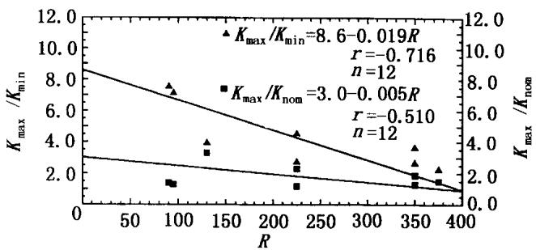

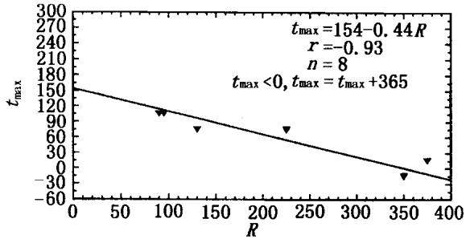  
图 3-4 $K _ { \mathrm { m a x } } / K _ { \mathrm { m i n } } , K _ { \mathrm { m a x } } / K _ { \mathrm { n o m } } .$ 及 $t _ { \mathrm { m a x } }$  
与降雨侵蚀因子R的关系  
图中 R 是美制单位

任何一个地区的年EI分布都可以通过降雨侵蚀图(图2-3)和表2-1查到。上述关系式是根据美国和加拿大中东部地区资料得出的，这些地区的等侵蚀线如第二章图2-3所示，彼此平行，数值大小符合精度要求。在美国西部地区，由于地形和海洋性气候影响，降雨随时间变化很大。这样，在西部许多农区，用雨量和雨强计算的降雨侵蚀力R小于中、东部地区。从季节变化看，中、东部地区K值的季节变化已经得到证实，但在西部地区，地形和山脉导致温度变化很大，生长季长度也随之发生变化。因此，关于西部地区降雨、气温以及生长季长度变化对K值季节变化的影响研究，还有待于进一步加强。目前的分析资料并未包括西部各州的可蚀性因子。不管是用诺谟图、土壤性质，还是式3-1计算土壤可蚀性因子K值,其结果将是:图3-5中间粗划线以西地区的K值，比过去的计算结果有所增大。

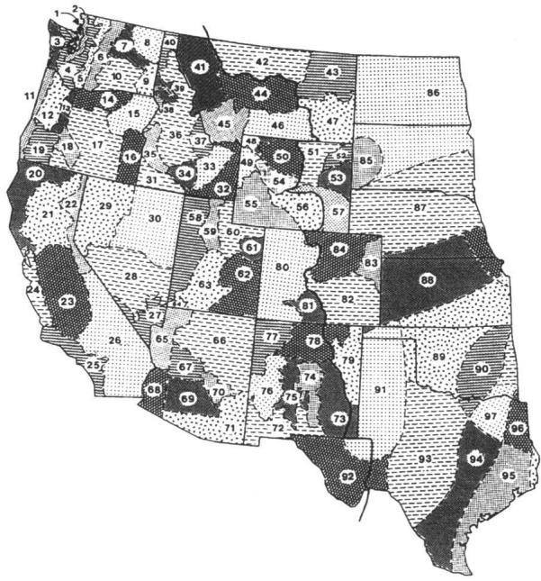  
图3-5 随时间变化的 K值适用范围示意图  
图中随时间变化的K值不能在中间粗划线以西地区使用

夏威夷火山灰土所在地区的观测资料表明，火山灰土壤K值的变化与上述讨论结果有所不同。因不受冻融作用影响，这些土壤K值的季节性变化不大。因此，有关热带地区火山灰土壤的可蚀性因子值，最好用土壤性质和式3-2计算。

下例中估算 $K _ { i }$ 和 $K _ { a \mathbf { v } }$ 值，所用资料来源于明尼苏达州中西部Morris 附近的 Barnes 垆姆土地区，年均 EI 为 $1 5 3 2 \mathrm { { M J } \cdot \mathrm { { m m } / ( \mathrm { { h a } } \cdot \mathrm { { \Omega } } } }$ $\mathbf { h } \cdot \mathbf { \vec { a } } ) , K _ { \mathrm { n o m . } }$ 为 $0 . 0 3 7 \mathrm { t \cdot h a \cdot h / ( h a \cdot M J \cdot m m ) }$ 。非冰冻期或者 $K _ { \mathrm { m a x } }$ 与$K _ { \mathrm { m i n } }$ 之间的时间间隔不足5个月，约140天左右(美国商业部，1968)。从图3-4中我们可以查到：

$$
\begin{array} { r l } & { t _ { \mathrm { m a x } } = 1 5 4 - 0 . 0 2 5 9 \times 1 5 3 2 = 1 1 4 \mathrm { d a y s } ( 4 / 2 4 ) } \\ & { t _ { \mathrm { m i n } } = 1 1 4 + 1 4 0 = 2 5 4 \mathrm { d a y s } ( 9 / 1 1 ) } \\ & { K _ { \mathrm { m a x } } / K _ { \mathrm { n e m } } = 3 . 0 0 - 0 . 0 0 0 3 \times 1 5 3 2 = 2 . 5 4 } \\ & { K _ { \mathrm { m a x } } = 2 . 5 4 \times 0 . 0 3 7 = 0 . 0 9 4 } \\ & { K _ { \mathrm { m a x } } / K _ { \mathrm { m i n } } = 8 . 6 0 - 0 . 0 0 1 1 \times 1 5 3 2 = 6 . 9 1 } \\ & { K _ { \mathrm { m i n } } = 0 . 0 9 4 / 6 . 9 1 = 0 . 0 1 4 } \end{array}
$$

从11月16日到3月15日，当 $T _ { \mathrm { a v } } { \leqslant } - 2 . 8 \Phi$ 时， $K _ { i } = 0 . 0 1 3 7 \mathrm { t } \cdot \mathrm { h a } \cdot$ $\mathbf { h } / ( \mathbf { h } \mathbf { a } \cdot \mathbf { M } \mathbf { J } \cdot \mathbf { m } \mathbf { m } )$ ；从3月16日到4月15日，9月1日到11月15 日，

$$
K _ { i } = 0 . 0 1 4 \mathrm { e x p } [ 0 . 0 0 9 ( t _ { i } - 2 5 4 + 3 6 5 \delta ) ]
$$

从4月15日到8月31日 $( { t _ { \operatorname* { m a x } } } < { t _ { i } } < { t _ { \operatorname* { m i n } } } )$

$$
K _ { i } = 0 . 0 9 4 ( 0 . 1 4 6 ) ^ { ( t _ { i } - 1 1 4 ) / 1 4 0 }
$$

这样，由图3-5可知，

$$
K _ { \mathrm { a v } } = \mathrm { { } } \sum ( E I _ { i } ) K _ { i } \langle 1 0 0 = 0 . 1 3 1 7 ( 2 8 . 5 0 7 / 1 0 0 ) = 0 . 0 3 8
$$

用上述方法计算的年平均K值在数值上接近于诺谟图解值，更真

实地反映了K值的季节变化。上述计算值0.038t·ha·h/(ha· MJ·mm),接近于此类土壤长期观测的计算值0.032t·ha·h/(ha· $\mathbf { M J } \cdot \mathbf { m m } )$

## 3.6 土壤可蚀性的研究展望

为了满足水土保持规划及其效益评价等生产活动的需要，必须加强土壤侵蚀预报研究，建立适合我国实际情况的土壤侵蚀预报模型。迄今为止，我国在土壤侵蚀机理方面的研究仍相对比较薄弱，因此，建立实用的经验模型仍将是我国土壤侵蚀预报工作的必由之路。分析比较当今已有的经验模型，以美国的通用土壤流失方程最具有代表性，而且应用范围最广。我国的经验模型也应参照这一模型开展工作。加强系统、规范的土壤可蚀性研究。

基于上述分析，我们初步认为，我国的土壤可蚀性研究工作应该这样开展:按照美国通用土壤流失方程中的基本概念，选定标准小区，研究天然小区单位降雨侵蚀力下，不同土壤的可蚀性值大小，确定一部分土壤的可蚀性指标值。再研究微型小区与标准小区之间的关系，比如 $1 \mathrm m ^ { 2 }$ 小区和标准小区所测土壤侵蚀量的相关性。如果相关性较好，便可用微型小区人工降雨试验，测定我国主要土类的可蚀性。如果微型小区与标准小区之间的相关性不好，再考虑用标准小区人工降雨试验测定与标准小区实测值进行比较。如果标准小区人工降雨试验还不够理想，就只用天然降雨测定。总之，在天然标准小区、天然微型小区、人工降雨标准小区、人工降雨微型小区四种方法中率定和优选其中之一，然后测定土壤可蚀性。在测定土壤可蚀性的同时，测定一些基本理化性质，寻求土壤理化性质与可蚀性之间的关系，建立实用的数学模型，以推求所有需要的土壤可蚀性，为土壤侵蚀预报服务。

半个世纪以来，我国在全国不同地区建立过许多野外观测小区，积累了丰富的观测资料。如何有效地把这些资料用于土壤侵蚀预报是首先需要探讨的课题。由于各地自然条件及土壤特性差异很大，没有统一标准，就不可能进行土壤可蚀性的直接比较。因此，首先应建立适合我国具体情况的计算标准，即标准小区的确定问题。根据规定的标准条件，布设一系列统一规范的标准小区，系统地研究天然小区单位降雨侵蚀力下的土壤可蚀性，确定一部分土壤的可蚀性指标值。

关于适用于我国的标准小区，以前曾有学者建议采用坡度为$\mathbf { 1 0 ^ { \circ } }$ ,长为20m，宽为5m的直型坡小区。考虑我国陡坡大面积开垦的具体事实，及现有小区的坡度范围，我们建议我国的标准小区以坡度为 $1 5 ^ { \circ }$ 、普通耕作条件下的裸露直型坡观测小区为宜。因为在目前我国现有的小区资料中，小区坡度一般变化于5°\~30°，15°正好是坡度范围的中间值。从高坡度和低坡度向其订正都不会引起很大的误差。而且，在以前的研究工作中，15°的小区也十分普遍，可以最大限度地利用原有资料。

由于受财力和人力的限制，无法大规模布设天然小区，研究各种土壤的可蚀性大小，所以还需要开展人工降雨试验研究，以弥补无天然观测小区资料地区的应用需要。由于人工模拟降雨机设计的侧重点不同，其性能会有很大的差异。选择什么样的模拟降雨机研究土壤可蚀性，也是目前亟待解决的问题。对于这个问题，其总体原则应该是，选择同一种适用于我国陡坡条件的降雨模拟机，在同样的试验设计条件下，从南到北对不同土壤类型的土壤可蚀性进行统一试验，通过建立与天然小区观测资料之间的关系，计算真正的土壤可蚀性值。

## 第四章 坡长与坡度因子(LS)

在RUSLE模型中，地形对土壤侵蚀的影响用坡长(L)和坡度(S)因子计算。侵蚀随坡长L的增加而增加。坡长定义为从地表径流源点到坡度减小直至有沉积出现地方之间的距离，或到一个明显的渠道之间的水平距离(Wischmeier和 Smith，1978)。表面径流一般在小于122m的坡长范围内集中，所以在很多情况下，坡长的应用极限是122m，除一些人为修成垄沟的农地外，很少出现坡长超过305m的情况。因此，RUSLE极少使用305m的坡长(坡长一般在野外直接测量)。如果是坡地，该长度需转换成水平距离。用等高线图确定的坡长一般太长，因为地形图上一般没有标明汇水渠道，而在RUSLE中，汇水渠道是表示坡长结束的地方。图4-1给出了一个典型的坡长实例。以下各节中将给出选择坡长的方法。坡度因子(S)反映坡度对侵蚀的影响。坡度用坡度仪或其他仪器在野外测量获得，也可以从地形图上估算。

坡长和坡度对片状侵蚀和细沟侵蚀都有非常重要的影响。这些影响分别用均一坡度的小区进行研究。在进行土壤侵蚀预报时，要同时估算L和S因子。从表4-1、表4-2、表4-3或表4-4可以获得均一坡的估算值。以下各节介绍上述4种表的制作，同时介绍如何将RUSLE用于非均一坡土壤侵蚀的预报。

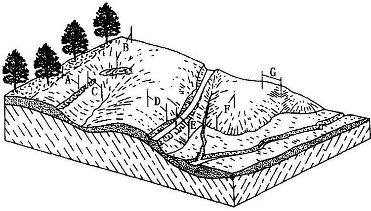  
图 4-1 典型的坡长

坡面A一如果坡上非扰动森林土不产生径流，坡的顶端从非扰动林地开始，向下一直到沟道。坡面B一如果图上所示的沟能汇集径流，则坡长从起点到沟渠。坡面C一坡长从沟渠到径流汇集处。坡面D—坡长从径流起始点到道路。坡面E一坡长从道路到沉积出现的平原。坡面F一坡长从丘鼻上径流发生点到沉积出现的冲积平原。坡面G坡长从径流起始点到径流集中处沉积出现的地方(Dissmever 和 Froster, 1980)

表 4-1 地形  
(适用于细沟侵蚀与细沟间
<table><tr><td rowspan="2">坡度 (%)</td><td colspan="5">水平投</td></tr><tr><td>&lt;0.9</td><td>1.8 2.7</td><td>3.7 4.6 7.6</td><td>15.2</td><td>22.9 30.5</td></tr><tr><td>0.2</td><td>0.05</td><td>0.05 0.05 0.05</td><td>0.05 0.05</td><td>0.05</td><td>0.05 0.05</td></tr><tr><td>0.5</td><td>0.08</td><td>0.08 0.08</td><td>0.08 0.08 0.08</td><td>0.08</td><td>0.08 0.09 0.14</td></tr><tr><td>1.0</td><td>0.12</td><td>0.12 0.12 0.12</td><td>0.12 0.13</td><td>0.13</td><td>0.14</td></tr><tr><td>2.0</td><td>0.20</td><td>0.20 0.20 0.20</td><td>0.20 0.21</td><td>0.23 0.25</td><td>0.26</td></tr><tr><td>3.0</td><td>0.26</td><td>0.26 0.26 0.26</td><td>0.26 0.29</td><td>0.33 0.36</td><td>0.38</td></tr><tr><td>4.0</td><td>0.33</td><td>0.33 0.33 0.33</td><td>0.33 0.36</td><td>0.43 0.46</td><td>0.50</td></tr><tr><td>5.0</td><td>0.38</td><td>0.38 0.38 0.38</td><td>0.38 0.44</td><td>0.52 0.57</td><td>0.62</td></tr><tr><td>6.0</td><td>0.44</td><td>0.44 0.44 0.44</td><td>0.44 0.50</td><td>0.61 0.68</td><td>0.74 0.99</td></tr><tr><td>8.0</td><td>0.54</td><td></td><td>0.54 0.64</td><td>0.79 0.90</td><td></td></tr><tr><td>10.0</td><td></td><td>0.54 0.54 0.54</td><td></td><td>1.03 1.19</td><td>1.31</td></tr><tr><td></td><td>0.60</td><td>0.63 0.65 0.66</td><td>0.68 0.81</td><td>1.31 1.52</td><td>1.69</td></tr><tr><td>12.0</td><td>0.61</td><td>0.70 0.75 0.80</td><td>0.83 1.01</td><td>1.85</td><td>2.08</td></tr><tr><td>14.0</td><td>0.63</td><td>0.76 0.85 0.92</td><td>0.98 1.20 1.58</td><td>2.18</td><td>2.46 3.22</td></tr><tr><td>16.0</td><td>0.65</td><td>0.82 0.94 1.04</td><td>1.12 1.38 1.85</td><td>2.84</td><td></td></tr><tr><td>20.0</td><td>0.68</td><td>0.93 1.11 1.26</td><td>1.39 1.74 2.37</td><td>3.00 3.63</td><td></td></tr><tr><td>25.0</td><td>0.73</td><td>1.05 1.30 1.51</td><td>1.70 2.17</td><td></td><td>4.16</td></tr><tr><td>30.0</td><td>0.77</td><td>1.16 1.48 1.75</td><td>2.00 2.57</td><td>3.60 4.40</td><td>5.06</td></tr><tr><td>40.0</td><td>0.85</td><td>1.36 1.79 2.17</td><td>2.53 3.30</td><td>4.73 5.84</td><td>6.78</td></tr><tr><td>50.0</td><td>0.91</td><td>1.52 2.06 2.54</td><td>3.00 3.95</td><td>5.74</td><td></td></tr><tr><td>60.0</td><td>0.97</td><td>1.67 2.29</td><td>2.86 3.41</td><td>4.52 6.63</td><td>7.14 8.33 8.29 9.72</td></tr></table>

\*诸如草地和其他有覆盖的紧实土壤，同时可用于细沟与细沟间侵蚀都明显的冻融土壤。

因子 LS 值  
侵蚀比率低的情形)\*
<table><tr><td colspan="8">影坡长(m)</td></tr><tr><td>46</td><td>61</td><td>76</td><td>91</td><td>122</td><td>183</td><td>244</td><td>305</td></tr><tr><td>0.05</td><td>0.05</td><td>0.05</td><td>0.05</td><td>0.05</td><td>0.05</td><td>0.05</td><td>0.05</td></tr><tr><td>0.09</td><td>0.09</td><td>0.09</td><td>0.09</td><td>0.09</td><td>0.09</td><td>0.09</td><td>0.09</td></tr><tr><td>0.15</td><td>0.15</td><td>0.15</td><td>0.15</td><td>0.16</td><td>0.16</td><td>0.17</td><td>0.17</td></tr><tr><td>0.27</td><td>0.28</td><td>0.29</td><td>0.30</td><td>0.31</td><td>0.33</td><td>0.34</td><td>0.35</td></tr><tr><td>0.40</td><td>0.43</td><td>0.44</td><td>0.46</td><td>0.48</td><td>0.52</td><td>0.55</td><td>0.57</td></tr><tr><td>0.54</td><td>0.58</td><td>0.61</td><td>0.63</td><td>0.67</td><td>0.74</td><td>0.78</td><td>0.82</td></tr><tr><td>0.68</td><td>0.73</td><td>0.78</td><td>0.81</td><td>0.87</td><td>0.97</td><td>1.04</td><td>1.10</td></tr><tr><td>0.83</td><td>0.90</td><td>0.95</td><td>1.00</td><td>1.08</td><td>1.21</td><td>1.31</td><td>1.40</td></tr><tr><td>1.12</td><td>1.23</td><td>1.32</td><td>1.40</td><td>1.53</td><td>1.74</td><td>1.91</td><td>2.05</td></tr><tr><td>1.51</td><td>1.67</td><td>1.80</td><td>1.92</td><td>2.13</td><td>2.45</td><td>2.71</td><td>2.93</td></tr><tr><td>1.97</td><td>2.20</td><td>2.39</td><td>2.56</td><td>2.85</td><td>3.32</td><td>3.70</td><td>4.02</td></tr><tr><td>2.44</td><td>2.73</td><td>2.99</td><td>3.21</td><td>3.60</td><td>4.23</td><td>4.74</td><td>5.18</td></tr><tr><td>2.91</td><td>3.28</td><td>3.60</td><td>3.88</td><td>4.37</td><td>5.17</td><td>5.82</td><td>6.39</td></tr><tr><td>3.85</td><td>4.38</td><td>4.83</td><td>5.24</td><td>5.95</td><td>7.13</td><td>8.10</td><td>8.94</td></tr><tr><td>5.03</td><td>5.76</td><td>6.39</td><td>6.96</td><td>7.97</td><td>9.65</td><td>11.04</td><td>12.26</td></tr><tr><td>6.18</td><td>7.11</td><td>7.94</td><td>8.68</td><td>9.99</td><td>12.19</td><td>14.04</td><td>15.66</td></tr><tr><td>8.37</td><td>9.71</td><td>10.91</td><td>11.99</td><td>13.92</td><td>17.19</td><td>19.96</td><td>22.41</td></tr><tr><td>10.37</td><td>12.11</td><td>13.65</td><td>15.06</td><td>17.59</td><td>21.88</td><td>25.55</td><td>28.82</td></tr><tr><td>12.16</td><td>14.26</td><td>16.13</td><td>17.84</td><td>20.92</td><td>26.17</td><td>30.68</td><td>34.71</td></tr></table>

表 4-2 地形  
(适用于细沟侵蚀与细沟间
<table><tr><td rowspan="2"></td><td rowspan="2"></td><td rowspan="2"></td><td rowspan="2"></td></tr><tr><td></td></tr><tr><td></td><td></td><td></td><td></td></tr><tr><td></td><td></td><td></td><td></td></tr><tr><td></td><td></td><td></td><td></td></tr><tr><td></td><td></td><td></td><td></td></tr><tr><td></td><td></td><td></td><td></td></tr><tr><td></td><td></td><td></td><td></td></tr><tr><td>5.0</td><td>0.30</td><td></td><td>0.58</td></tr><tr><td>6.0</td><td>0.34</td><td>0.30 0.30</td><td>0.30 0.30 0.37 0.49 0.69</td></tr><tr><td>8.0</td><td>0.42</td><td>0.34 0.34</td><td>0.34 0.34 0.43 0.58 0.53 0.74</td></tr><tr><td>10.0</td><td></td><td>0.42 0.42</td><td>0.42 0.42 0.91 0.51 0.52 0.67 0.97</td></tr><tr><td>12.0</td><td>0.46</td><td>0.48 0.50</td><td>1.19 41.23</td></tr><tr><td>14.0</td><td>0.47</td><td>0.53 0.58</td><td>0.61 0.64 0.84 1.53 1.86</td></tr><tr><td>16.0</td><td>0.48</td><td>0.58 0.65</td><td>0.70 0.75 1.00 1.48 0.79 0.85 1.15 1.73 2.20 </td></tr><tr><td>20.0</td><td>0.49</td><td>0.63 0.72</td><td>0.96 1.06 1.45 2.22 2.85 </td></tr><tr><td>25.0</td><td>0.52</td><td>0.71 0.85</td><td>1.16 1.30 1.81 2.82 3.65</td></tr><tr><td>30.0</td><td>0.56</td><td>0.80 1.00</td><td>1.34 1.53 2.15 3.39 4.42 </td></tr><tr><td>40.0</td><td>0.59</td><td>0.89 1.13 1.38</td><td>1.68 1.95 2.77 4.45 5.87</td></tr><tr><td></td><td>0.65</td><td>1.05 1.18 1.59</td><td>1.97 2.32 3.32 5.40 7.17 </td></tr><tr><td>50.0</td><td>0.71</td><td></td><td></td></tr><tr><td>60.0</td><td>0.76</td><td>1.30 1.78 2.23</td><td>2.65 3.81 6.24 8.33</td></tr></table>

\*诸如行播作物和其他少量或中等覆盖、紧实程度中等的土壤，不能用于冻融土壤。

因子 LS值  
侵蚀比率中等的情形)\*
<table><tr><td colspan="8">影坡长(m)</td></tr><tr><td>46</td><td>61</td><td>76</td><td>91</td><td>122</td><td>183</td><td>244</td><td>305</td></tr><tr><td>0.05</td><td>0.05</td><td>0.05</td><td>0.05</td><td>0.05</td><td>0.06</td><td>0.06</td><td>0.06</td></tr><tr><td>0.09</td><td>0.09</td><td>0.09</td><td>0.09</td><td>0.10</td><td>0.10</td><td>0.10</td><td>0.10</td></tr><tr><td>0.15</td><td>0.16</td><td>0.17</td><td>0.17</td><td>0.18</td><td>0.19</td><td>0.20</td><td>0.20</td></tr><tr><td>0.29</td><td>0.31</td><td>0.33</td><td>0.35</td><td>0.37</td><td>0.41</td><td>0.44</td><td>0.47</td></tr><tr><td>0.44</td><td>0.48</td><td>0.52</td><td>0.55</td><td>0.60</td><td>0.68</td><td>0.75</td><td>0.80</td></tr><tr><td>0.60</td><td>0.67</td><td>0.72</td><td>0.77</td><td>0.86</td><td>0.99</td><td>1.10</td><td>1.19</td></tr><tr><td>0.76</td><td>0.85</td><td>0.93</td><td>1.01</td><td>1.13</td><td>1.33</td><td>1.49</td><td>1.63</td></tr><tr><td>0.93</td><td>1.05</td><td>1.16</td><td>1.25</td><td>1.42</td><td>1.69</td><td>1.91</td><td>2.11</td></tr><tr><td>1.26</td><td>1.45</td><td>1.62</td><td>1.77</td><td>2.03</td><td>2.47</td><td>2.83</td><td>3.15</td></tr><tr><td>1.71</td><td>1.98</td><td>2.22</td><td>2.44</td><td>2.84</td><td>3.50</td><td>4.06</td><td>4.56</td></tr><tr><td>2.23</td><td>2.61</td><td>2.95</td><td>3.26</td><td>3.81</td><td>4.75</td><td>5.56</td><td>6.28</td></tr><tr><td>2.76</td><td>3.25</td><td>3.69</td><td>4.09</td><td>4.82</td><td>6.07</td><td>7.15</td><td>8.11</td></tr><tr><td>3.30</td><td>3.90</td><td>4.45</td><td>4.95</td><td>5.86</td><td>7.43</td><td>8.79</td><td>10.02</td></tr><tr><td>4.36</td><td>5.21</td><td>5.97</td><td>6.68</td><td>7.97</td><td>10.23</td><td>12.20</td><td>13.99</td></tr><tr><td>5.69</td><td>6.83</td><td>7.88</td><td>8.86</td><td>10.65</td><td>13.80</td><td>16.58</td><td>19.13</td></tr><tr><td>6.98</td><td>8.43</td><td>9.76</td><td>11.01</td><td>13.30</td><td>17.37</td><td>20.99</td><td>24.31</td></tr><tr><td>9.43</td><td>11.47</td><td>13.37</td><td>15.14</td><td>18.43</td><td>24.32</td><td>29.60</td><td>34.48</td></tr><tr><td>11.66</td><td>14.26</td><td>16.67</td><td>18.94</td><td>23.17</td><td>30.78</td><td>37.65</td><td>44.02</td></tr><tr><td>13.65</td><td>16.76</td><td>19.64</td><td>22.36</td><td>27.45</td><td>36.63</td><td>44.96</td><td>52.70</td></tr></table>

表 4-3 地形  
(适用于细沟侵蚀与细沟间
<table><tr><td></td><td></td></tr><tr><td></td><td></td></tr><tr><td></td><td></td></tr><tr><td></td><td></td></tr><tr><td></td><td></td></tr><tr><td></td><td></td></tr><tr><td></td><td></td></tr><tr><td></td><td></td></tr><tr><td></td><td></td></tr><tr><td></td><td></td></tr><tr><td>10.0</td><td></td></tr><tr><td>12.0</td><td>0.35 0.37 0.38 0.39 0.40</td></tr><tr><td>14.0</td><td>0.36 0.41 0.45 0.47 0.49</td></tr><tr><td>16.0</td><td>0.38 0.45 0.51 0.55 0.58 0.67</td></tr><tr><td>20.0</td><td>0.49 0.39 0.56 0.62 </td></tr><tr><td></td><td>0.56 0.41 0.67 0.76 0.841 </td></tr><tr><td>25.0</td><td>0.45 0.64 0.80 0.93 </td></tr><tr><td>30.0</td><td>1.04 0.48 0.72 0.911 1.08 </td></tr><tr><td>40.0 50.0</td><td>1.24 0.53 0.85 1.13 1.37 1.59 0.58 0.97 1.31 1.62 1.91</td></tr></table>

\*诸如新开发的建筑用地，其他很少覆盖或无覆盖的强扰动土壤，不能用于冻融土壤。

因子LS值  
侵蚀比率高的情形)\*
<table><tr><td colspan="8">影坡长(m)</td></tr><tr><td>46</td><td>61</td><td>76</td><td>91</td><td>122</td><td>183</td><td>244</td><td>305</td></tr><tr><td>0.05</td><td>0.06</td><td>0.06</td><td>0.06</td><td>0.06</td><td>0.06</td><td>0.06</td><td>0.06</td></tr><tr><td>0.09</td><td>0.10</td><td>0.10</td><td>0.10</td><td>0.11</td><td>0.12</td><td>0.12</td><td>0.13</td></tr><tr><td>0.17</td><td>0.18</td><td>0.19</td><td>0.20</td><td>0.22</td><td>0.24</td><td>0.26</td><td>0.27</td></tr><tr><td>0.33</td><td>0.37</td><td>0.40</td><td>0.43</td><td>0.48</td><td>0.56</td><td>0.63</td><td>0.69</td></tr><tr><td>0.50</td><td>0.57</td><td>0.64</td><td>0.69</td><td>0.80</td><td>0.96</td><td>1.10</td><td>1.23</td></tr><tr><td>0.68</td><td>0.79</td><td>0.89</td><td>0.98</td><td>1.14</td><td>1.42</td><td>1.65</td><td>1.86</td></tr><tr><td>0.86</td><td>1.02</td><td>1.16</td><td>1.28</td><td>1.51</td><td>1.91</td><td>2.25</td><td>2.55</td></tr><tr><td>1.05</td><td>1.25</td><td>1.43</td><td>1.60</td><td>1.90</td><td>2.43</td><td>2.89</td><td>3.30</td></tr><tr><td>1.43</td><td>1.72</td><td>1.99</td><td>2.24</td><td>2.70</td><td>3.52</td><td>4.24</td><td>4.91</td></tr><tr><td>1.92</td><td>2.34</td><td>2.72</td><td>3.09</td><td>3.75</td><td>4.95</td><td>6.03</td><td>7.02</td></tr><tr><td>2.51</td><td>3.07</td><td>3.60</td><td>4.09</td><td>5.01</td><td>6.67</td><td>8.17</td><td>9.57</td></tr><tr><td>3.09</td><td>3.81</td><td>4.48</td><td>5.11</td><td>6.30</td><td>8.45</td><td>10.40</td><td>12.23</td></tr><tr><td>3.68</td><td>4.56</td><td>5.37</td><td>6.15</td><td>7.60</td><td>10.26</td><td>12.69</td><td>14.96</td></tr><tr><td>4.85</td><td>6.04</td><td>7.16</td><td>8.23</td><td>10.24</td><td>13.94</td><td>17.35</td><td>20.57</td></tr><tr><td>6.30</td><td>7.88</td><td>9.38</td><td>10.81</td><td>13.53</td><td>18.57</td><td>23.24</td><td>27.66</td></tr><tr><td>7.70</td><td>9.67</td><td>11.55</td><td>13.35</td><td>16.77</td><td>23.14</td><td>29.07</td><td>34.71</td></tr><tr><td>10.35</td><td>13.07</td><td>15.67</td><td>18.17</td><td>22.95</td><td>31.89</td><td>40.29</td><td>48.29</td></tr><tr><td>12.75</td><td>16.16</td><td>19.42</td><td>22.57</td><td>28.60</td><td>39.95</td><td>50.63</td><td>60.84</td></tr><tr><td>14.89</td><td>18.92</td><td>22.78</td><td>26.51</td><td>33.67</td><td>47.18</td><td>59.93</td><td>72.15</td></tr></table>

表 4-4 冻融等情况下
<table><tr><td rowspan="2">坡度 (%)</td><td colspan="7">水平投</td></tr><tr><td>4.6</td><td>7.6</td><td>15.2</td><td>22.9</td><td>30.5</td><td>45.6</td><td>61.0</td></tr><tr><td>0.2</td><td>0.02</td><td>0.03</td><td>0.04</td><td>0.05</td><td>0.06</td><td>0.07</td><td>0.09</td></tr><tr><td>0.5</td><td>0.04</td><td>0.05</td><td>0.07</td><td>0.09</td><td>0.10</td><td>0.12</td><td>0.14</td></tr><tr><td>1.0</td><td>0.06</td><td>0.08</td><td>0.11</td><td>0.14</td><td>0.16</td><td>0.20</td><td>0.23</td></tr><tr><td>2.0</td><td>0.11</td><td>0.14</td><td>0.20</td><td>0.25</td><td>0.29</td><td>0.35</td><td>0.41</td></tr><tr><td>3.0</td><td>0.16</td><td>0.21</td><td>0.29</td><td>0.36</td><td>0.42</td><td>0.51</td><td>0.59</td></tr><tr><td>4.0</td><td>0.21</td><td>0.27</td><td>0.38</td><td>0.47</td><td>0.54</td><td>0.66</td><td>0.77</td></tr><tr><td>5.0</td><td>0.26</td><td>:0.33</td><td>0.47</td><td>0.58</td><td>0.67</td><td>0.82</td><td>0.94</td></tr><tr><td>6.0</td><td>0.31</td><td>0.40</td><td>0.56</td><td>0.69</td><td>0.79</td><td>0.97</td><td>1.12</td></tr><tr><td>8.0</td><td>0.41</td><td>0.52</td><td>0.74</td><td>0.91</td><td>1.05</td><td>1.28</td><td>1.48</td></tr><tr><td>10.0</td><td>0.48</td><td>0.62</td><td>0.88</td><td>1.08</td><td>1.25</td><td>1.53</td><td>1.77</td></tr><tr><td>12.0</td><td>0.54</td><td>0.70</td><td>0.98</td><td>1.21</td><td>1.39</td><td>1.71</td><td>1.97</td></tr><tr><td>14.0</td><td>0.59</td><td>0.76</td><td>1.08</td><td>1.32</td><td>1.53</td><td>1.87</td><td>2.16</td></tr><tr><td>16.0</td><td>0.64</td><td>0.82</td><td>1.17</td><td>1.43</td><td>1.65</td><td>2.02</td><td>2.33</td></tr><tr><td>20.0</td><td>0.73</td><td>0.94</td><td>1.33</td><td>1.63</td><td>1.88</td><td>2.30</td><td>2.66</td></tr><tr><td>25.0</td><td>0.83</td><td>1.07</td><td>1.51</td><td>1.85</td><td>2.13</td><td>2.61</td><td>3.02</td></tr><tr><td>30.0</td><td>0.91</td><td>1.18</td><td>1.67</td><td>2.05</td><td>2.36</td><td>2.89</td><td>3.34</td></tr><tr><td>40.0</td><td>1.07</td><td>1.38</td><td>1.95</td><td>2.39</td><td>2.75</td><td>3.37</td><td>3.90</td></tr><tr><td>50.0</td><td>1.19</td><td>1.54</td><td>2.18</td><td>2.67</td><td>3.08</td><td>3.77</td><td>4.35</td></tr><tr><td>60.0</td><td>1.30</td><td>1.67</td><td>2.37</td><td>2.90</td><td>3.35</td><td>4.10</td><td>4.74</td></tr></table>

\*适用干冻融土壤，以及大部分侵蚀是由地表径流引起的情形。

地形因子 LS 值\*
<table><tr><td colspan="6">影坡长(m)</td></tr><tr><td>76</td><td>91</td><td>122</td><td>183</td><td>244</td><td>305</td></tr><tr><td>0.10</td><td>0.10</td><td>0.12</td><td>0.15</td><td>0.17</td><td>0.19</td></tr><tr><td>0.16</td><td>0.17</td><td>0.20</td><td>0.24</td><td>0.28</td><td>0.31</td></tr><tr><td>0.26</td><td>0.28</td><td>0.32</td><td>0.40</td><td>0.46</td><td>0.51</td></tr><tr><td>0.46</td><td>0.50</td><td>0.58</td><td>0.71</td><td>0.82</td><td>0.91</td></tr><tr><td>0.66</td><td>0.72</td><td>0.83</td><td>1.02</td><td>1.17</td><td>1.31</td></tr><tr><td>0.86</td><td>0.94</td><td>1.08</td><td>1.33</td><td>1.53</td><td>1.71</td></tr><tr><td>1.06</td><td>1.16</td><td>1.34</td><td>1.64</td><td>1.89</td><td>2.11</td></tr><tr><td>1.26</td><td>1.38</td><td>1.59</td><td>1.95</td><td>2.25</td><td>2.51</td></tr><tr><td>1.65</td><td>1.81</td><td>2.09</td><td>2.56</td><td>2.96</td><td>3.31</td></tr><tr><td>1.98</td><td>2.16</td><td>2.50</td><td>3.06</td><td>3.54</td><td>3.95</td></tr><tr><td>2.20</td><td>2.41</td><td>2.78</td><td>3.41</td><td>3.94</td><td>4.40</td></tr><tr><td>2.41</td><td>2.64</td><td>3.05</td><td>3.74</td><td>4.31</td><td>4.82</td></tr><tr><td>2.61</td><td>2.86</td><td>3.30</td><td>4.04</td><td>4.67</td><td>5.22</td></tr><tr><td>2.97</td><td>3.25</td><td>3.76</td><td>4.60</td><td>5.31</td><td>5.94</td></tr><tr><td>3.37</td><td>3.69</td><td>4.27</td><td>5.23</td><td>6.03</td><td>6.75</td></tr><tr><td>3.73</td><td>4.09</td><td>4.72</td><td>5.78</td><td>6.68</td><td>7.47</td></tr><tr><td>4.36</td><td>4.77</td><td>5.51</td><td>6.75</td><td>7.79</td><td>8.71</td></tr><tr><td>4.87</td><td>5.33</td><td>6.16</td><td>7.54</td><td>8.71</td><td>9.74</td></tr><tr><td>5.30</td><td>5.80</td><td>6.70</td><td>8.20</td><td>9.47</td><td>10.59</td></tr></table>

## 4.1 坡长因子(L)

用于获得坡长因子(L)的小区资料表明，坡长为λ(m)坡地上的平均侵蚀量按如下公式变化：

$$
L = ( \lambda / 2 2 . 1 ) ^ { m }\tag{4-1}
$$

式中22.1是RUSIE采用的标准小区坡长(m), m是可变的坡长指数(Wischmeier和 Smith，1978),λ是水平投影坡长，而不是坡面长度。坡长指数m与细沟侵蚀(由水流引起)和细沟间侵蚀(主要由雨滴打击引起)的比率有关，由下式计算(Foster等，1977):

$$
{ m } = \beta / ( 1 + \beta )\tag{4-2}
$$

当土壤对细沟侵蚀和细沟间侵蚀的敏感性相同时，细沟侵蚀与细沟间侵蚀的比率 $\beta$ 由下式计算(McCool等，1989):

$$
\beta = ( \sin \theta / 0 . 0 8 9 6 ) / [ 3 . 0 ( \sin \theta ) ^ { 0 . 8 } + 0 . 5 6 ]\tag{4-3}
$$

式中θ是坡度，给定一个 $\beta$ 值，就可由式4-2计算坡长指数 $_ { \pmb { m } }$ o

表4-5中间一列是由公式4-3和4-2计算得出的。这些值代表了典型农田苗床期的情况。如果径流、土壤、覆盖和管理因子使土壤对细沟侵蚀有较高的敏感性时，坡长指数m应增大，如表4-5的右列所示。这种情况一般在新开陡坡地上出现。其m值的确定方法如下：先将典型农田苗床情况下的 $\beta$ 值(由4-3式计算)加倍，再用4-2式计算。相反，当条件更适合细沟间侵蚀而不适合细沟侵蚀时，应减小m值，如表4-5左列所示。牧草地的m值用低细沟与细沟间侵蚀比率β计算。先将公式4-3计算的β值减 $\beta$ $\beta$ 半，再用4-2式计算 m值。表4-5是基于McCool等人1989年的研究结果。

表4-5 不同坡度、细沟与细沟间侵蚀比率下的坡长指数(m)\*
<table><tr><td rowspan="2">坡度 (%)</td><td colspan="2">细沟与细沟间侵蚀之比</td></tr><tr><td>低 中</td><td>高</td></tr><tr><td>0.2</td><td>0.02</td><td>0.04 0.07</td></tr><tr><td>0.5</td><td>0.04</td><td>0.08 0.16</td></tr><tr><td>1.0</td><td>0.08</td><td>0.15 0.26</td></tr><tr><td>2.0</td><td>0.14</td><td>0.24 0.39</td></tr><tr><td>3.0</td><td>0.18</td><td>0.31 0.47</td></tr><tr><td>4.0</td><td>0.22</td><td>0.36 0.53</td></tr><tr><td>5.0</td><td>0.25</td><td>0.40 0.57</td></tr><tr><td>6.0</td><td>0.28</td><td>0.43 0.60</td></tr><tr><td>8.0</td><td>0.32</td><td>0.48 0.65</td></tr><tr><td>10.0</td><td>0.35</td><td>0.52 0.68</td></tr><tr><td>12.0</td><td>0.38</td><td>0.55 0.71</td></tr><tr><td>14.0</td><td>0.40</td><td>0.57 0.72</td></tr><tr><td>16.0</td><td>0.41</td><td>0.59 0.74</td></tr><tr><td>20.0</td><td>0.44</td><td>0.61 0.76</td></tr><tr><td>25.0</td><td>0.47</td><td>0.64 0.78</td></tr><tr><td>30.0</td><td>0.49</td><td>0.66 0.79</td></tr><tr><td>40.0</td><td>0.52</td><td>0.68 0.81</td></tr><tr><td>50.0</td><td>0.54</td><td>0.70 0.82</td></tr><tr><td>60.0</td><td>0.55</td><td>0.71 0.83</td></tr></table>

\*不能用于冻融土壤(McCool等，1989)。

当地垄之间的沟内低洼处有泥沙淤积时，土壤流失与坡长无关，此时坡长指数为零。第六章P因子介绍了如何处理该种情况。

对冻融耕作土壤来说，计算由地表径流引起的侵蚀时，坡长指数与表4-5中的值不同。如果冻融土壤上只有径流侵蚀发生(Mc-Cool等,1989,1993),坡长指数 m 取恒定值 0.5, LS 值由表4-4给出。如果冻融土壤同时出现降雨和径流侵蚀时，坡长指数用表4-5中的低细沟侵蚀与细沟间侵蚀比率下的m值。LS值由表4-1查得。

## 4.2 坡度因子(S)

土壤侵蚀随坡度的增加而增加，且增加速率加快。McCool等人1987年提出坡度因子(S)公式：

$$
S = 1 0 . 8 \mathrm { s i n } \theta + 0 . 0 3 \qquad \theta < 5 . 1 4 ^ { \circ } \cdot\tag{4-4}
$$

$$
S = 1 6 . 8 \mathrm { s i n } \theta - 0 . 5 0 \qquad \theta \geq 5 . 1 4 ^ { \circ }\tag{4-5}
$$

式4-5基于如下假设：径流量与坡度无关。坡度大于5.14°的试验资料已证明了这一点。坡度对径流量的影响在耕作土壤上差异很大。在草地和机械措施处理的土地上，一般假设坡度对径流没有影响，其影响在水土保持措施因子（P)中考虑。McIsaac等(1987a)研究了扰动土直到 $4 0 ^ { \circ }$ 坡度的试验资料。他们推荐了一个与4-4式和4-5 式类似的公式。sinθ的系数在 4-4 式和 4-5 式的范围内，因此可以认为，这些公式可用于扰动土壤。

式4-4和4-5不能用于坡长小于5m的短坡，这种短坡应该用下式计算(McCool等，1987):

$$
S = 3 . 0 ( \sin \theta ) ^ { 0 . 8 } + 0 . 5 6\tag{4-6}
$$

该式适用于坡角处能自由排水的情形。公式4-6给出的坡度因子假设：坡长小于5m时，细沟侵蚀不明显，细沟间侵蚀与坡长无关。所以式4-6不能用于有可能发生细沟侵蚀的坡面上。明显的细沟侵蚀一般发生在坡长超过5m的坡面上。但在少数对细沟侵蚀特别敏感的情况下，小于这一坡长范围也会出现细沟侵蚀。相反，当土壤固结、同时对径流的抵抗力比较强时，即使坡长较长也不出现细沟侵蚀，所以一般假设细沟侵蚀在大于5m坡长时才出现。

当近期被耕作的土壤融解时，其抗蚀性减弱，此时土壤侵蚀主

要由地表径流引起，用 McCool 等(1987,1993)的公式计算 S 值：

$$
S = 1 0 . 8 \mathrm { s i n } \theta + 0 . 0 3 \qquad \theta < 5 . 1 4 ^ { \circ }\tag{4-7}
$$

$$
S = ( \sin \theta \mathcal { A } 0 . 0 8 9 6 ) ^ { 0 . 6 } \qquad \theta \geqslant 5 . 1 4 ^ { \circ }\tag{4-8.}
$$

公式4-7 和式 4-8 用于制作表 4-4。

## 4.3 坡度坡长因子组合(LS)

RUSLE中L和S因子的组合表示给定坡长和坡度情况下的土壤流失量比率。即某种实际地形条件下的土壤流失量，与坡长22.1m、坡度5.14°、其他所有条件都一致时的土壤流失量的比率。本节将介绍不同地形条件下的土壤流失，包括直型坡，即坡度在整个坡面上都一致；不规则坡或不均一坡，包括凹型坡、凸型坡或复杂坡；以及特殊的分段坡。

## 4.3.1 直型坡的 LS 因子

表4-1、表4-2、表4-3和表4-4给出了直型坡的LS值。这些表可以应用于典型的RUSLE坡面，即坡度相当均一的坡面。其中表4-1主要应用于草地和牧场，这些地区细沟侵蚀与细沟间侵蚀的比率低。表4-2用于作物地，这些地区细沟侵蚀与细沟间侵蚀的比率居中。表4-3用于建筑地，该地区细沟与细沟间侵蚀的比率比较高，而且以细沟侵蚀为主。表4-4则用于冻融土壤，此时土壤侵蚀主要由径流引起。需要注意的是，表4-1、表4-2、表4-3和表4-4中的坡度均用百分比表示，但在坡度公式4-4、式4-5、式4-6、式4-7和式4-8 中必须代入角度进行计算。

在表 4-1、表 4-2 和表4-3 的计算中，当坡长大于等于 4.6m时，S值用公式4-4和公式4-5计算。当坡长为0.9\~4.6m，而坡度大于等于5.14°时，首先计算出0.9m处的LS值，然后用0.9m处的值和4.6m处的值对0.9\~4.6m之间的值进行插补。具体方法是:先用短坡长坡度公式4-6和坡长公式4-3、式4-2和式4-1，以坡长λ=4.6m算出0.9m处的L和S值。利用0.9m和4.6m两点LS值的对数值，和坡长0.9m和4.6m的对数值求直线方程，以此直线方程插补0.9m到4.6m之间的任何一个值。当坡长为0.9\~4.6m，而坡度小于5.14°时，坡度公式用4-4式。坡长公式用式4-3、式4-2和式4-1,并用恒定坡长值λ=4.6m计算L值。总之，RUSLE中的地形因子以4.6m和5.14°两个值，将坡面分为长坡、短坡、陡坡、缓坡四组。在坡长较长的两组中，坡度公式有2个:长缓坡公式(4-4)、长陡坡公式(4-5)。坡长用同一组公式(4-1，4-2,4-3)。短缓坡没有坡度公式，而用长缓坡坡度公式。短缓坡用恒定坡长4.6m，公式仍用4-1,4-2,4-3。在短陡坡上，0.9m处用4.6m坡长计算，然后用0.9m处和4.6m处的值求双对数直线方程，插补0.9\~4.6m之间的值。事实上，坡长小于4.6m时，没有考虑坡长对土壤侵蚀的影响。在短陡坡中，看上去LS值随坡长变化.但实际上0.9m处用了短坡长坡度公式，4.6m处用了长坡长坡度公式，因此0.9m处的LS值小于4.6m处。0.9\~4.6m之间的值是插补值。在短缓坡中，LS值不随坡度变化。

坡长为4.6\~304.6m时，表4-3给出了LS值的范围，远大于表4-1中的值。这表明，当细沟间的侵蚀与细沟侵蚀相比占主要地位时，L值的范围较小。用22.1m的坡长和5.14°的坡度作为标准条件，RUSLE在短坡长上的值看上去有些不合理，即可蚀性强的条件(见表4-3)小于可蚀性弱的条件(见表4-1)，但土壤流失总量的不同在K和C因子中反映。土壤流失量随坡长变化小时，具有较低的C因子值，小于0.15。土壤流失量随坡长变化大时，一般具有较大的C因子值。当坡长小于4.6m时，表4-4中没有I.S值。目前没有资料建立冻融土壤的短坡长公式。

## 4.3.2 不规则和分段坡

坡型既影响坡面的平均土壤流失量，也影响土壤流失量沿坡面的变化。例如，当平均坡度一致时，凸型坡的平均土壤流失量要比直型坡的流失量大出30%，坡面上最大侵蚀量的差异就更大。当平均坡度一致时，对于一个不发生沉积的凹型坡来说，其平均土壤流失量小于直型坡的土壤流失量。凹型坡上最大侵蚀量出现在沿坡向下的1/3处，这个侵蚀量几乎与直型坡上的最大侵蚀量相等。所以如果坡面明显不直，应考虑使用不规则坡型方法计算LS 值(Foster 和 Wischmeier,1974)。

如果将一个单位宽度的非直型坡分割成若干个各段特征接近的小段,第 i段的产沙量用下列公式计算(Foster 和 Wischmeier，1974):

$$
E _ { i } = R K _ { i } C _ { i } P _ { i } S _ { i } ( \lambda _ { i } ^ { m + 1 } - \lambda _ { i - 1 } ^ { m + 1 } ) / ( 2 2 . \mathbf { \dot { 1 } } ) ^ { m }\tag{4-9}
$$

式中， $E _ { i }$ 是从坡顶开始第i段的产沙量， $R$ 是降雨和径流因子， $K _ { i }$ 是第i段的土壤可蚀性， $C _ { i }$ 是第i段的覆盖和管理因子， $P _ { i }$ 是第i段的水土保持措施因子， $S _ { i }$ 是第i段的坡度因子， $\lambda _ { i }$ 是从坡顶到第i段底端的坡长。单位面积上的土壤流失量 $A _ { i }$ 等于该段单位宽度的产沙量除以该段坡长。

$$
A _ { i } = R K _ { i } C _ { i } P _ { i } S _ { i } ( \lambda _ { i } ^ { m + 1 } - \lambda _ { i - 1 } ^ { m + 1 } ) / ( \lambda _ { i } - \lambda _ { i - 1 } ) ( 2 2 . 1 ) ^ { m }\tag{4-10}
$$

式中， $S _ { i } \left( \lambda _ { i } ^ { m + 1 } - \lambda _ { i - 1 } ^ { m + 1 } \right) / ( \lambda _ { i } - \lambda _ { i - 1 } ) ( 2 2 . 1 ) ^ { m }$ 是该段的有效LS值。这个关系适用于所有符合RUSLE的任何坡面，各坡段可以是不等长的。下面用等坡长坡段举例说明这种方法的应用。坡段有效 LS 值为：

$$
\begin{array} { r l r } {  { L S _ { i } = S _ { i } \{ ( i x ) ^ { m + 1 } - [ ( i - 1 ) x ] ^ { m + 1 } \} / [ i x - ( i - 1 ) x ] ( 2 2 . 1 ) ^ { m } } } \\ & { } & { = S _ { i } x ^ { m } [ i ^ { m + 1 } - ( i - 1 ) ^ { m } ] / ( 2 2 . 1 ) ^ { m } \phantom { [ ( 2 2 . 1 ) ^ { m } ] } 4 . } \end{array}\tag{-11}
$$

式中 $L S _ { i }$ 是第i段的有效LS 值，x是第i段的坡长。任意一个坡段上单位面积土壤流失量 $A _ { i }$ 的计算公式为：

$$
A _ { i } = R K _ { i } C _ { i } P _ { i } S _ { i } \left\{ ( i x ) ^ { m + 1 } - \left[ ( i - 1 ) x \right] ^ { m + 1 } \right\} / ( 2 2 . 1 ) ^ { m } x\tag{4-12}
$$

由 $\cdot _ { n }$ 个坡段组成的直型坡单位面积上的总土壤流失量A为：

$$
A = R K C P S ( n x ) ^ { m } / ( 2 2 . 1 ) ^ { m }\tag{4-13}
$$

如果沿坡长RKCP值相同，则每一个坡段土壤流失量与全坡长土壤流失量的比率是：

$$
\begin{array} { l } { { A _ { i } / A = \{ ( i x ) ^ { m + 1 } - [ ( i - 1 ) x ] ^ { m + 1 } / ( 2 2 . 1 ) ^ { m } \} \cdot \{ ( 2 2 . 1 ) ^ { m } / ( n x ) ^ { m } \} } } \\ { { \ = \{ i ^ { m + 1 } - ( i - 1 ) ^ { m + 1 } ] / ( n ) ^ { m } \ } \ 4 . 1 \nonumber }  \end{array}
$$

表 4-6 给出了不同 m 值的 $A _ { i } / A$ o

最简单的不规则坡是土壤和覆盖沿坡面上下保持一致。应用不规则坡求LS值的方法是:将凸型坡、凹型坡和复杂坡划分成等长的坡段，并将各坡段从上到下依次排列，如表4-7所示。分段数量从实用角度考虑，分到各坡段被看作是直型坡即可。在很多情况下，三个分段就足够了，很少有多于5个的分段。

例如，表4-7的第一和第二列分别表示从坡上到坡下依次出现的坡段号和等段的坡度，然后从表4-1、表4-2、表4-3或表4-4中以整个坡面的坡长和各个分段的坡度，分别求出各坡段的LS值，列于表4-7的第三列。在这个例子中，假定细沟侵蚀与细沟间侵蚀的比例为中等，于是用表4-2中的LS值。每个坡段的土壤流失量与总流失量的比率从表4-6查得，并列入表47的第四列中，其m值用表45查得。查表时如果没有所需要的值，则用插补法。

如果是冻融十壤，m值取0.5。第五列是将第三列和第四列的值相乘后，再除以分段数。第五列的和是全坡面的LS值。每段的LS值是第三和第四列的乘积，列于第六列中。这个值将预报每一段的平均土壤流失量。在这个例子中，平均坡度为5.7°，坡长为122m。用于计算凸型坡平均土壤流失量的LS值为3.76，计算直型坡平均十壤流失量的LS值是2.84，凸型坡的土壤流失量比直型坡大32%。

表4-6 估算直形坡分段土壤流失量的土壤流失因子\*
<table><tr><td colspan="12">坡长指数(m)</td></tr><tr><td>坡段坡段 数目序号</td><td></td><td colspan="3">0.05</td><td rowspan="3">0.3</td><td rowspan="3">0.4</td><td rowspan="3">0.71</td><td rowspan="3">0.5 0.66</td><td rowspan="3">0.6</td><td rowspan="3">0.7 0.8 0.62 0.57</td></tr><tr><td>2</td><td>1</td><td>0.97</td><td>0.1 0.93</td><td>0.2 0.87</td><td>0.81 0.76</td></tr><tr><td>2</td><td>2</td><td>1.03</td><td>1.07 1.13</td><td>1.19</td><td>1.24 1.29</td></tr><tr><td>3</td><td>1</td><td>0.95</td><td>0.90</td><td>0.80</td><td>0.72</td><td>0.64</td><td>0.58</td><td>0.52</td><td>0.46 0.42</td></tr><tr><td>3</td><td>2</td><td>1.01</td><td>1.02</td><td>1.04</td><td>1.05</td><td>1.05</td><td>1.05</td><td>1.05</td><td>1.04 1.03</td></tr><tr><td>3</td><td>3</td><td>1.04</td><td>1.08</td><td>1.16</td><td>1.23</td><td>1.23</td><td>1.37</td><td>1.43 1.5</td><td>1.55</td></tr><tr><td>4</td><td></td><td>0.93</td><td>0.87</td><td>0.76</td><td>0.66</td><td>0.66</td><td>0.5</td><td>0.44 0.38</td><td>0.33</td></tr><tr><td>4</td><td>1 2</td><td>1.00</td><td>1.00</td><td>0.98</td><td>0.96</td><td>0.96</td><td>0.92</td><td>0.88</td><td>0.85 0.82</td></tr><tr><td>4</td><td>3</td><td>1.03</td><td>1.05</td><td>1.09</td><td>1.13</td><td>1.13</td><td>1.18</td><td>1.20</td><td>1.22 1.23</td></tr><tr><td>4</td><td>4</td><td>1.04</td><td>1.08</td><td>1.17</td><td>1.25</td><td>1.25</td><td>1.40</td><td>1.48</td><td>1.55 1.62</td></tr><tr><td></td><td></td><td></td><td></td><td></td><td></td><td></td><td></td><td></td><td></td></tr><tr><td>5</td><td>1</td><td>0.92</td><td>0.85</td><td>0.73</td><td>0.62</td><td>0.62</td><td>0.45</td><td>0.38</td><td>0.32 0.28</td></tr><tr><td>5</td><td>2</td><td>0.99</td><td>0.97</td><td>0.94</td><td>0.9</td><td>0.9</td><td>0.82</td><td>0.77</td><td>0.73 0.69</td></tr><tr><td>5</td><td>3</td><td>1.01</td><td>1.03</td><td>1.04</td><td>1.04</td><td>1.05</td><td>1.06</td><td>1.06</td><td>1.05 1.03</td></tr><tr><td>5</td><td>4</td><td>1.03</td><td>1.06</td><td>1.12</td><td>1.12</td><td>1.17</td><td>1.25</td><td>1.29</td><td>1.32 1.35</td></tr><tr><td>5</td><td>5</td><td>1.05</td><td>1.09</td><td>1.17</td><td>1.17</td><td>1.26</td><td>1.42</td><td>1.50</td><td>1.58 1.65</td></tr></table>

\*土壤流失因子 $\cdot = \left[ i ^ { m + 1 } - ( i - 1 ) ^ { m + 1 } \right] / n ^ { m }$ ,式中，i是坡段序号，m是坡长指数，n是坡段数。令土壤流失因子值等于分段数，由于四舍五人，用模型求得的值与表中的值可能略有差异。

该例中直型坡和凸型坡的最大土壤流失量都出现在坡的最底端。从表4-7可知，凸型坡最大的坡段LS值是7.58，直型坡的最大LS 值是 $2 . 8 4 \times 1 . 3 8 = 3 . 9 2$ 。其中1.38是 $\pmb { m } = \mathbf { 0 } . 5 2$ 时，从公式4-14或表4-6计算或查算得到。这表明凸型坡最下1/3段形成的+壤流失量是直型坡的近2倍。对于同样长的凹型坡来说，坡段恰好与凸型坡的坡段顺序相反，因此，坡段的LS值也恰巧与凸型坡各段LS值颠倒。凹型坡的LS值在表4-8中给出，第三列数字恰好与表4-7中第三列数字顺序颠倒。凹型坡加权平均LS值比相应的直型坡小15%。最大土壤流失量出现的坡段位于中段，可从第六列中坡段LS值看出。该坡段最大土壤侵蚀量是直型坡位于坡下端的最大土壤侵蚀量的76%。凹型坡平均土壤流失量是直型坡的85%。

表 4-7 122m 长凸形不规则坡农田地形因子计算方法示例
<table><tr><td>列1</td><td>列2</td><td>列3</td><td>列4</td><td>列5</td><td>列6</td></tr><tr><td>坡段</td><td>坡度 (%)</td><td>表4-2LS 值</td><td>表4-6 土壤流 失因子</td><td>3  $\textcircled { \pmb { \mathscr { P } } } | \textcircled { \mathbb { D } } \times { \pmb { 4 } }$  列/n</td><td>坡段LS值 3列×4列</td></tr><tr><td>1</td><td>5</td><td>1.13</td><td>0.64</td><td>0.24</td><td>0.72</td></tr><tr><td>2</td><td>10</td><td>2.84</td><td>1.05</td><td>0.99</td><td>2.98</td></tr><tr><td>3</td><td>15</td><td>5.34</td><td>1.42</td><td>2.53</td><td>7.58</td></tr></table>

① LS 总值为 3.76。

表 4-8 122m 长凹形不规则坡农田地形因子计算方法示例
<table><tr><td>列1</td><td>列2</td><td>列3</td><td>列4</td><td>列5</td><td>列6</td></tr><tr><td>坡段</td><td>坡度 (%)</td><td>表4-2LS 值</td><td>表4-6 土壤流 失因子</td><td>3  ${ \mathfrak { H } } { \mathfrak { D } } \times 4$  列/n</td><td>坡段 LS值 3列×4列</td></tr><tr><td>1</td><td>15</td><td>5.34</td><td>0.53</td><td>0.94</td><td>2.83</td></tr><tr><td>2</td><td>10</td><td>2.84</td><td>1.05</td><td>0.99</td><td>2.98</td></tr><tr><td>3</td><td>5</td><td>1.13</td><td>1.3</td><td>0.49</td><td>1.47</td></tr></table>

① LS 总值为 3.76。

## 4.4 土壤类型或覆盖沿坡的变化

不规则坡的评价过程包括土壤类型沿坡的变化。先将表4-7或表4-8第五列的值乘以相应的土壤可蚀性因子(K)，然后再求和，这个过程如表4-9所示。在这个例子中，使用表4-7的值，最后一个坡段+壤侵蚀量是第一个坡段侵蚀量的14倍。当土壤可蚀性因子(K)沿坡一致时.最后一个坡段土壤侵蚀量是第一个坡段侵蚀量的10倍。这个例子说明，在凸型坡上，如果易蚀性土壤分布在坡的下段，土壤侵蚀量会增加。将第六列求和便是凸型坡上的平均土壤流失量，它比直型坡 $K = 0 . 0 4 2 \mathrm { t } \cdot \mathrm { h a } \cdot \mathrm { h } / ( \mathrm { h a } \cdot \mathrm { M J } \cdot$ mm)时的土壤侵蚀量大45%。

表 4-9 122m坡长凸形坡农地不同坡段土壤可蚀性因子 K 的变化
<table><tr><td>列1 列2</td><td></td><td>列3</td><td>列4</td><td>列5</td><td>列6</td><td>列7</td></tr><tr><td>坡段</td><td>坡度 (%)</td><td>表42</td><td>表46土 LS 值 壤流失因子</td><td>土壤可蚀性K t·ha·h/ (ha·MJ·mm)</td><td>3列×4</td><td>坡段LS值3 列×5列/n列×4列×5列①</td></tr><tr><td>1</td><td>5</td><td>1.13</td><td>0.64</td><td>0.036</td><td>0.009</td><td>0.026</td></tr><tr><td>2</td><td>10</td><td>2.84</td><td>1.05</td><td>0.042</td><td>0.042</td><td>0.125</td></tr><tr><td>3</td><td>15</td><td>5.34</td><td>1.42</td><td>0.049</td><td>0.124</td><td>0.372</td></tr></table>

①KLS 总值为0.174 t·ha·h/(ha·MJ·mm)。

在一定条件下，上述方法可用于计算覆盖因子(C)和水土保持因子(P)沿坡不同的情况，但只能针对发生侵蚀的坡段而言，不适用于发生沉积的坡段。RUSLE不能估算沉积量。

每个坡段的土壤流失量都可以用如前所述的不规则坡方法估算。表4-7和4-8中的第六列是坡段LS值，这个值可以与相应的RKCP同时使用，估算某一坡段的平均土壤流失量。同样表4-9的第七列是KLS值，可与 RCP同时使用，估算某一坡段的平均土壤流失量。

## 4.5 估算部分坡段LS 值的可选方法

不规则坡方法的应用之一是估算每一坡段的土壤流失量，并与容许土壤流失量进行比较。前面介绍了如何用不规则方法估算沿坡上下每个坡段的平均土壤流失量。也可采用修正的方法。

在表4-7中，把凸型坡划分成等长的坡段。假如要估算第三段的土壤流失量，用该坡段的坡度值和整个坡面的坡长值，从表4-2中查出直型坡的 LS 值，该例中 LS 值是 5.34,将这个值与土壤流失因子1.42相乘，即表4-6的三段坡第三个坡段值，乘积是7.58,这就是用于计算该坡段土壤侵蚀的LS值。计算第二段的LS值，要先求出用该坡坡度值和从坡顶到该坡坡底的坡长值(0.81m)对应的LS 值，该例中LS值是2.29。第三段对其顶部的第二段没有任何影响。当计算第二段的侵蚀量时，问题变为求只有两段的坡面上第二段的土壤侵蚀量，这样土壤流失因子从表4-6的两段坡选，值为1.30。第二坡段的LS值为： $2 . 2 9 \times 1 . 3 0 =$ 2.98,该值与表4-7中得到的值一致。

## 4.6 容许土壤流失量与坡段侵蚀量的关系

土壤调查得出的容许土壤流失量是基于直型坡上的平均土壤流失量给出的(Schertz,1983)。即使在直型坡上，最底坡段的土壤流失可能比全坡面平均土壤流失量大70%之多。因此首先必须调整坡面平均容许土壤流失量，才能与不规则坡面上的土壤流失量进行比较。这种调整要注意坡面上的位置，具体计算方法是:将坡面平均容许土壤流失量乘以表4-6中的土壤流失因子。现举例说明。假定农田直型坡的 $R K C P = 2 . 2 4 \mathrm { { t } } / \mathrm { { h a } }$ ,容许土壤流失量(T)是 $4 . 4 8 \mathrm { t } / ( \mathrm { h a } { \cdot } \mathrm { a } )$ ,坡度是10%，坡长是122m。调整后的3个坡段的容许土壤流失量分别是：第一段 $4 . 4 8 \times 0 . 5 7 =$ $2 . 5 5 \mathrm { t } / ( \mathrm { h a } \cdot \mathrm { a } )$ ;第二段 $4 . 4 8 \times 1 . 0 5 = 4 . 7 0 \mathrm { { t } / ( h a \cdot a ) }$ ；第三段$4 . 4 8 \times 1 . 3 8 = 6 . 1 8 \mathrm { { t } / ( h a \cdot a ) }$ 。每段土壤流失调整参数由表4-5查得，10%处中等细沟与细沟间侵蚀比率m值为0.52。再从表4-6中选择合适的值，该例为插值。全坡面平均土壤流失量是(LS)(RKCP)或 $2 . 8 4 \times 2 . 2 4 = 6 . 3 6 \mathrm { t } / ( \mathrm { h } a \cdot a )$ 。若要计算土壤流失沿坡面的变化，则用这个值乘以表4-6中调整容许土壤流失量时所用的同一个十壤流失因子值，得到坡面上某一特定坡段的流失量，这

个乘积就是坡段1、2和3的侵蚀量3.63,6.68和8. $7 8 \mathrm { t } / ( \mathrm { h a } \cdot \mathrm { a } )$   
这些土壤流失量与坡面上的容许土壤流失量一致。

对于表4-7中凸型坡的坡段1、2和3，T的初始调整值为2.87、4.71和 $6 . 3 6 \mathrm { t } / ( \mathrm { h a } \cdot \mathrm { a } )$ ，全坡平均值则为 $4 . 6 4 \mathrm { t } / ( \mathrm { h a } \cdot \mathrm { a } )$ 。该值大于平均坡度相同的直型坡的容许土壤流失量。所以必须将各段的容许土壤流失量乘以 $4 . 4 8 / 4 . 6 4 = 0 . 9 6$ ，使得凸型坡上的容许土壤流失量等于 $4 . 4 8 \mathrm { t } / ( \mathrm { h a } { \cdot } \mathrm { a } )$ 。最终的容许土壤流失量调整值分别为2.76、4.55和 $6 . 1 4 \mathrm { t } / ( \mathrm { h a } \cdot \mathrm { a } )$ 。这说明上坡段的土壤流失量小于容许土壤流失量，而最后一个坡段的土壤流失量远大于容许土壤流失量。

对于表4-8中凹型坡的坡段1、2和3,最初调整后的容许土壤流失量 T值分别为2.38、4.71和 $5 . 8 3 \mathrm { t } / ( \mathrm { h a } \cdot \mathrm { a } )$ ，全坡平均值为$4 . 3 0 \mathrm { { t } / ( h \mathrm { { a } \cdot \mathrm { { a } ) } } }$ ，该值小于平均坡度相同的直型坡的容许土壤流失量。所以需将每个值乘以一个比例系数 $4 . 4 8 / 4 . 3 0 = 1 . 0 4$ ,这样使得全坡的平均容许土壤流失量为 $4 . 4 8 \mathrm { t } / ( \mathrm { h a } { \cdot } \mathrm { a } )$ 。最后的容许土壤流失量调整值为2.47、4.91和 $6 . 0 7 \mathrm { t } / ( \mathrm { h a } { \cdot } \mathrm { a } )$ 。三个坡段的土壤流失量为6.34、6.68和 $3 . 2 9 \mathrm { t } / ( \mathrm { h a } \cdot \mathrm { a } )$ 。显然凹型坡与凸型坡相反，上坡段的土壤流失量大于容许土壤流失量，需通过选择水土保持措施减少其流失量。

## 4.7 坡长的选择

坡长问题较其他各因子的问题多，而且坡长的调整多，不同用户选择的坡长差异也很大。图4-1说明了野外出现的主要情况。

实际上，径流的流线长和坡长是无穷多的。为了应用RUJSIE.必须分片计算土壤侵蚀量，然后求坡长不同的各片土壤流失量的平均值。有时选择一个特定点作为坡长选择的依据，坡长边线的确定，是从这点垂直于等高线沿坡向上到地表径流的起点。通常起点并非是丘陵顶点，而是沿丘陵脊的分水线(如图4-2所示)。坡长下边线的确定是垂直于等高线沿坡向下，直到沉积区或自然或人工修筑的水路为止。这些水路并不一定是侵蚀或切割的渠道。如果没有渠道，就比较难确定坡长的下边。另外一个有助于确定下边线的方法，是在有可能出现侵蚀渠道或切沟的地方。图4-2中的一个区就是上述有水路的情形。

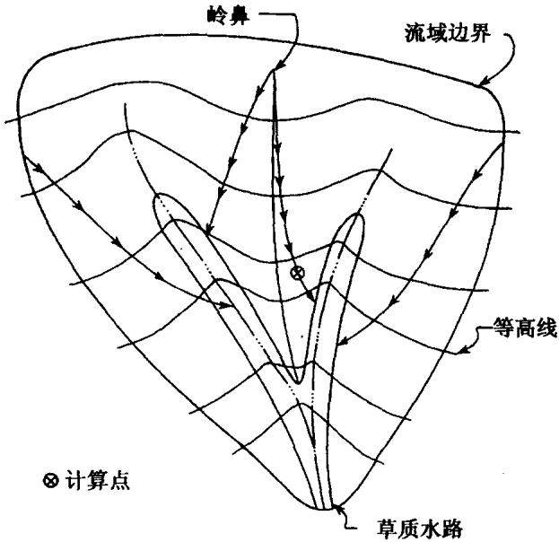  
图 4-2 RUSLE 坡长示例

坡面底边附近的坡度很平缓，有可能出现沉积。如果侵蚀和沉积速率都很低，近期又没有发生侵蚀，当坡度减小到5%时，就会出现沉积。但在沉积开始出现以下的坡面上，并不一定处处有沉积发生。当坡度以图4-3所示的方式减小时，沿坡向下，先是沉积，然后又出现侵蚀。要确定沉积结束的位置，按下列步骤进行：首先计算该坡下边缘的坡度与沉积开始发生处坡度的比值；然后用1.0减去该比值，再乘以沉积开始出现处到坡面结束处的距离；最后将这个乘积与沉积开始处的坡长相加。现举例说明。假设一个122m坡长的坡面，坡的结尾处坡度是2%。如果沉积在76m处开始，那里的坡度为5%，坡度的比值为0.40，沉积开始出现的地方到坡面结束处的距离是46m，则沉积结束的地方为:76+(1.0$- 0 . 4 ) \times 4 6 \ = 1 0 3 . 6 \mathrm { m }$ 。这种方法是 CREAMS 模型模拟的近似值，它适用于坡度逐渐变化的情况。如果坡度变化非常大，沉积有可能仅仅在6\~12m的范围内出现。

在上述情况中，假定水流是以均匀片状流的形式，流过沉积区和下坡侵蚀区或上坡相对平缓的坡面，计算土壤流失量时，必须考虑该点到径流起始点的距离。要计算平均土壤流失量，只考虑发生侵蚀的坡段，在这种情况下，RUSLE不能计算坡面产沙量。坡面上的分水渠应为坡长的结束点，在它的下边应该开始新的坡长计算。

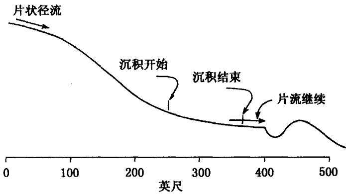  
图4-3 沉积在坡面上开始出现然后结束

## 第五章 作物覆盖与管理因子(C)

## 5.1 作物覆盖和管理因子研究历史

植被冠层和地表覆盖可以保护地表土壤免受雨滴直接打击，减弱径流冲刷作用，从而减少土壤侵蚀，因此，关于植被覆盖与土壤侵蚀的关系研究历来都很受重视。半个多世纪来，通过大量的野外试验观测和相关的试验分析，在植被冠层和地表覆盖抑制土壤侵蚀作用研究方面，积累了大量成果。这些研究成果对于指导水土保持发挥了积极的作用。

早在1936年，Cook就把植物覆盖作为土壤侵蚀的一个影响因素。1940年Zingg首次利用公式估算了田间土壤流失量，标志着土壤侵蚀研究走向定量化发展道路。作为影响土壤侵蚀的重要因素之一，Smith在1941年第一次把植被的影响作用引入土壤流失量估算方程。他在对植被作用的量化因子中，包括了天气、土壤、耕作制度等对土壤侵蚀的影响。此后，Browning于1947年在植被影响作用中引入了管理因子，使考虑的因素更为全面。到了20世纪 50年代初，Van Doron等人(1956)在量化植被的影响作用时，分别考虑了作物轮作因子和管理水平因子对土壤侵蚀的影响。有了以上这些工作基础，1956年在普度大学(Purdue University)召开的土壤侵蚀联合工作会议上，专家们提出了型如A=CMSLPKE的土壤流失方程，其中C是作物轮作因子，M是管理因子，S、L是坡度、坡长因子，P是水土保持措施因子，E是前期土壤侵蚀因子(Meyer,1984)。在最初的土壤流失方程中，将农作物的影响分为两部分分别考虑，但在随后的应用中发现，作物轮作因子和管理因子相互作用，无法截然分开，因此，Wischmeier和Smith(1960)建议把轮作因子和管理因子合并，于是在后来发展完善的通用土壤流失方程USE中，只用一个作物管理因子表征作物覆盖及田间管理活动对水土流失的影响。此后，随着通用土壤流失方程的应用和发展，对覆盖与管理因子的研究在不断发展和完善。

农地的耕作制度多种多样，任何一种耕作制度，作物轮作或连作顺序都可能不同，苗床和作物残体的管理方式也有差异，而作物冠层和残体对土壤的保护作用与管理水平有关，同时随时间变化。因此可以综合用作物管理因子定量评价作物及田间管理活动影响土壤侵蚀的总体效果。

在最初的通用土壤流失方程中，作物和管理因子被称为耕作管理因子(Cropping-management factor)，后来改称为覆盖和管理因子(Cover and management factor)。这表明对作物和管理因子认识的深入和应用范围的扩展。但其实质内容并没有发生变化，它是指一定条件下，耕作农地上土壤流失量与同等条件下适时翻耕的连续休闲对照地上的土壤流失量之比。它是一个无量纲数，其值变化于0\~1之间。它评价的是所有与覆盖和管理因子有关的变量对土壤侵蚀的综合作用，时间长度可以是一次降雨历时，一个农作期，一个作物年、一年或一个轮作期。作为对照的适时翻耕、连续休闲地块的土壤流失量用通用土壤流失方程中RKLS的乘积计算。实际上，耕作农地的土壤流失量通常小于该值，少多少取决于具体的作物覆盖、轮作顺序和管理措施等的综合作用，同时还取决于作物生长不同时期侵蚀性降雨状况。

上述观点从最早的 USLE(1965)到修订的 RUSLE(Renard等，1997)都是一致的，不同的是估算方法的差异。USLE第一版(1965)和第二版(1978)中，土壤流失比率的估算主要基于试验观测数据，而RUSLE则采用了与之完全不同的次因子法，反映出人们对于C因子影响因素的认识在不断深入。

在第一版 USLE(1965)中，主要考虑的 C 因子影响因素包括：作物覆盖、耕作历史、生产力水平、作物残体、轮作牧草和冬季覆盖物等，而且只限于定性说明这些因子的作用。1978年版USLE沿用了前一版估算C因子的方法，但同时提出了次因子的概念，认为C因子的每个影响因素都可以看作一个次因子，每个次因子数值等于有该次因子作用时产生的土壤流失量，与无该次因子作用时产生的土壤流失量之比，最终的C值是所有这些次因子值的乘积。此外，将作物残体、轮作期牧草和冬季覆盖物等的作用加以综合，统一描述为地上作物残体覆盖和壤中残余物的作用；生产力水平的影响由作物冠层覆盖度反映;还考虑了耕地方式的作用。这样，所考虑的主要次因子包括：植物冠层、地上作物残体覆盖、壤中残余物、耕地方式和土地利用的残余效应，并给出了用于估算植物冠层次因子和地上作物残体次因子的曲线图，以及某些条件下耕地方式和土地利用残余效应两个次因子的近似值，以便应用于没有观测数据的情形。

RUSLE 采用了 Laflen等(1985)和 Weltz 等(1987)修改的次因子法，不再使用基于观测数据列出的土壤流失比率表，而是估计各个次因子的数值，它们相乘后便是土壤流失比率。所考虑的五个次因子是：前期土地利用次因子(PLU)，冠层覆盖次因子(CC).地表覆盖次因子(SC),地表糙度次因子(SR)，土壤水分次因子(SM)。与第二版USLE不同的是，将壤中残余物和土地利用残余效应综合为前期土地利用次因子，耕作方式是影响地表糙度次因子的其中一个因素，此外还引入了土壤水分次因子。

随着对覆盖和管理因子研究和认识的不断深入，计算方法也在不断发展。主要表现在：①如何考虑C因子的季节变化；②如何计算C因子值。

覆盖和管理因子值不仅取决于作物覆盖、轮作和管理等因素的综合作用，还与作物不同生长时期侵蚀性降雨多少有关。所以，侵蚀性降雨的年内分布状况，成为影响覆盖和管理因子的一个重要因素。为了把覆盖和管理因子与侵蚀性降雨的年内分布状况结合起来考虑，必须把作物覆盖逐渐变化的一个作物生产周期划分为若干个时段，这样可以假定每个时段作物覆盖和管理对土壤侵蚀的影响基本不变，以获得各个时段的土壤流失比率。最后的C值按如下公式计算： $C = ( S L R _ { 1 } E I _ { 1 } + S L R _ { 2 } E I _ { 2 } + \cdots + S L R _ { n } E I _ { n } ) /$ $E I _ { t }$ ,其中 C 是年平均值或一个作物生长期的平均值， $S L R _ { i }$ 是第 $\textbf { \em i }$ 个时段的土壤流失比率， $E I _ { i }$ 是第i 时段的 EI(Erosion Index)值占全年EI值的百分比，n是时段数， $E I _ { t }$ 是所有时段EI百分比之和。

关于时段的选取，通用土壤流失方程USLE与修订版通用土壤流失方程RUSLE是不同的。在一二版USLE中，是将一个作物生长周期划分为几个农作期，并假设在每个农作期内，作物覆盖和管理对土壤侵蚀的影响基本一致。其中第一版是按照时间跨度划分了5个农作期，例如，苗床期和定苗期被定义为播种后第一个月和第二个月。第二版则依据植物冠层覆盖度划分了6个农作期，从准备苗床到作物覆盖度达到10%为苗床期；覆盖度在10%\~15%为定苗期。因为土壤肥力、行距、作物种植密度、生长条件等的差异，依据冠层覆盖度划分农作期与单纯用时间间隔划分农作期相比，可以提高土壤侵蚀预报精度。因为每个农作期的长短随作物、天气和管理措施不同而变化，是由当地自然和农业生产条件综合决定的。RUSLE则不再划分农作期，而是以15天为步长计算每半月土壤流失比率。确定计算土壤流失比率的时间步长有两条原则：一是在每半个月结束时，认为各种条件已发生实质性变化，因而应计算新的土壤流失比率值。二是田间活动和气候变化对土壤、植被、植物残体产生影响，需要计算新的土壤流失比率。

在计算土壤流失比率时，第一版USLE是以观测数据为基础，给出了主要农作物和耕作制度土壤流失比率表。根据当地实际生产条件，通过查表获得相应条件下的C值。第二版则在该表基础上增加了许多内容，如水土保持耕作法，因肥力提高、行距缩短、作物密度增加等引起的作物快速生长或发育完全的作物冠层产生的水保效益等。RUSLE则取消了土壤流失比率表，采用次因子法计算土壤流失比率。各因子的计算公式和估算方法将在以后部分详述。

总之，从第一版 USLE(1965)到第二版 USLE(1978)的十多年间，对覆盖管理因子的研究有了相当的发展，而从第二版USLE(1978)到RUSLE(1997)的十多年间，则经历了对覆盖与管理因子认识的飞跃。下面将具体介绍RUSLE覆盖与管理因子研究的最新结果及其计算方法。

## 5.2 覆盖与管理因子的计算

## 5.2.1 土壤流失比率季节变化对计算 C 值的影响

如前所述，评价覆盖和管理因子的关键，是合理计算有覆盖时土壤侵蚀量与标准对照区土壤侵蚀量的比值，但由于土地利用状况的差异，这一比值会有变化，需要用不同的方法处理。在草地和牧区相对稳定的地区，用于计算土壤流失比率 SLR(Soil LossRatio)的参数随时间变化很小，因而C值的变化不大。在这种情况下，可以用平均 SLR作为全年值，RUSLE提供了这一简化计算方法。但是要谨慎使用该方法，因为它不能反映一年内降雨侵蚀力的变化。

在农地和大多数人工草场中，由于具体管理措施的影响，或诸如冬枯春荣等自然周期的作用，作物和土壤参数随季节发生变化。这就要求一年或一个轮作期内，计算足够多次数的SLR，才能充分反映作物和土壤的变化。这一点非常重要，因为正如第二章讨论EI分布所示，降雨侵蚀力随时间变化。如果某个耕作和管理措施使土壤在降雨侵蚀力高的时段内易于受到侵蚀，那么计算出来的年平均土壤侵蚀量就相应较高，反之则少。USLE通过计算不同作物生长期的SLR，体现这种作用（Wischmeier和 Smith，

1978)。一般是以耕作、耕作后经过的时段、作物覆盖从形成至收获这三者之间的间隔为基础，计算不同时段的 SLR值。

根据 USLE的指导思想，RUSLE将计算 SLR 的时间步长定为半月，每半月计算一次SLR值，假设主要参数在这半月内保持不变。为了把一年正好分为24个时段，将每个月的前15天作为一个时间段，剩下的不管多少都作为另一个时段。这样时段长度最短的是2月份的下半月，13～14天；最长的是大月（一个月31天)的下半月，为16天。

如果在一个时段内进行了生产活动，则不能再假设各个参数在这半月内保持不变，必须把所在的半个月再分为两段计算两个SLR值。这些小的时段还可以因其他生产活动而分为更小的时段。所以，只要出现下面两种情形中的任何一种，都要重新计算SLR值。第一，在每半个月结束时，RUSLE的假设条件已发生实质性变化，因而要计算新的 SLR值。第二，由于田间活动和气候变化对土壤、植被、植物残体等的影响，导致SLR值变化。处理方法是:把要计算SLR值的整段时间划分为若干段，每个时段的开始和结束分别是田间活动或者每半个月的开始。这样，一个时段的长度可以从0天(两个事件发生在同一天)到最长的16天(如果一个月有31天，并且在后半个月内无田间生产活动)。长度为0的时段只用来表示田间活动的变化，无需计算相应的SLR值，因为没有与之相对应的EI值。

计算年平均 SLR 值，与计算随时间变化的 SLR 值方法相同，要求输入的参数也相同，只是采用的时间间隔不同。计算随时间变化的 SLR值时，得到的是每个时段中间那一天的 SLR值。然后用相应的EI百分比加权。计算年平均SLR值时，假定所有条件都不变，只需计算一次SLR值。

得到每个时段 SLR 值后，根据表2-9计算相应时段的 EI百分比 $E I _ { i }$ (相应时段EI值与多年平均年EI值的百分比)，然后将每个时段 SLR 值与相应时段EI 百分比 $E I _ { i }$ 相乘，求出乘积的累加值。然后计算所有时段(如一个作物生长季或一个轮作期)EI百分比 $E I _ { i }$ 之和 $E I _ { \ell }$ ,最后用累加值除以百分比之和 $E I _ { t }$ ,即得到整个时期C平均值。当计算时期取为年时，则是年平均值。具体计算公式如下：

$$
C = ( S L R _ { 1 } E I _ { 1 } + S L R _ { 2 } E I _ { 2 } + \cdots + S L R _ { n } E I _ { n } ) / E I _ { t }\tag{5-1}
$$

式中，C是年平均值或一个作物生长期的平均值，n是整个计算期的时段数。

## 5.2.2 气候变量半月值的计算

计算每半月SLR值，需要降雨量、平均气温和全年内每半月EI值。而大多数资料以月为单位记录整理，这就要求以月资料为基础，计算半月数据。下边介绍几种算法。已知 $M , M _ { - 1 }$ ，和$M _ { + 1 }$ 分别是某个变量所在月份、前一个月和后一个月的值，设该变量前半个月和后半个月的值分别为 $P _ { 1 }$ 和 $P _ { 2 }$

如果求温度变量：

$$
P _ { 1 } = 2 \cdot M \bigg ( { \frac { 0 . 7 5 ( M _ { - 1 } ) + 0 . 2 5 ( M _ { + 1 } ) } { ( M _ { - 1 } ) + ( M _ { + 1 } ) } } \bigg )\tag{5-2a}
$$

$$
P _ { 2 } = 2 \cdot M \bigg ( { \frac { 0 . 2 5 ( M _ { - 1 } ) + 0 . 7 5 ( M _ { + 1 } ) } { ( M _ { - 1 } ) + ( M _ { + 1 } ) } } \bigg )\tag{5-2b}
$$

上述公式计算结果应使两个时段的平均气温恰好等于月平均气温。

如果求降雨量：

$$
P _ { 1 } = M \Big ( \frac { 0 . 7 5 ( M _ { - 1 } ) + 0 . 2 5 ( M _ { + 1 } ) } { ( M _ { - 1 } ) + ( M _ { + 1 } ) } \Big )\tag{5-3a}
$$

$$
P _ { 2 } = M \Big ( \frac { 0 . 2 5 ( M _ { - 1 } ) + 0 . 7 5 ( M _ { + 1 } ) } { ( M _ { - 1 } ) + ( M _ { + 1 } ) } \Big )\tag{5-3b}
$$

上述公式计算结果应使两个时段的降雨量之和等于月降雨量。

## 5.2.3 土壤流失比率的计算

根据耕作和管理措施影响土壤流失的最新研究(Laflen等，1985)，土壤流失比率按以下方法计算：

$$
S L R = P L U \cdot C C \cdot S C \cdot S R \cdot S M\tag{5-4}
$$

式中，SLR是给定条件下的土壤流失比率，PLU是前期土地利用次因子，CC是冠层覆盖次因子，SC是地表覆盖次因子，SR是地表糙度次因子，SM是土壤水分次因子。当各种条件变化比较小时，如牧区、多年草场和草地，PLU、CC、SC和SR各次因子值可设定为年平均值，这时，只要把它们相乘就得到年平均C值。但如果存在季节变化，则需要计算不同时期的各个次因子值。

每个次因子中都包含影响土壤侵蚀的耕作和管理措施变量。式5-4中的各个次因子都代表了一个或多个变量的作用，这些变量包括：残体覆盖、冠层覆盖、冠层高度、地表糙度、地下生物量(植物根部和壤中植物残体)、前期耕作状况、土壤水分、以及它们随时间的变化等。

RUSLE提供的计算机模型包括几个数据库，用来定义或计算不同的参数。一个是作物数据库，是指水土保持规划中各种植被措施对土壤侵蚀影响的有关数据，它由用户提供，包括植被生长特性、植被所产生的残体数量、植物残体特性等。第二个数据库是用来存储用户提供的管理措施对土壤、植被和植物残体影响的数据，并用这些信息修正有关变量。如何用这些数据库计算次因子值将在下一部分详细介绍。表5-1\~5-7给出一些已公开发表的参数值，用以确定基本作物和管理措施参数。由于这些变量并非适合所有情况.有时需要进行相应调整，可使用5.3节介绍的方法进行调整。第三个数据库是气候数据库。它对计算C因子值有两个重要作用：一是在计算C因子值时，用数据库中的EI分布值对

SLR进行加权。二是在计算植物残体分解率时，用数据库中的气温和降雨资料计算分解速率。不能用气候数据修正植物生长特性，后者已包含在作物数据库中。除数据库外，RUSLE还包含对计算几个次因子都非常重要的模块，是以植物残体特性和气候因子为自变量计算植物残体分解率的函数。它以Stott等(1990)、Stott和Barrett(1991)等的研究为基础，采用一级速率方程：

$$
M _ { \mathrm { e } } = M _ { \mathrm { b } } \mathrm { e } \mathbf { x p } ( - \alpha \cdot D )\tag{5-5}
$$

式中， $M _ { \mathrm { e } }$ 是时段末的残体总量， $M _ { \mathrm { b } }$ 是时段初的残体总量，D是以天为计算单位的时段长度， $^ a$ 按如下公式计算：

$$
a = \phi \cdot \left[ \operatorname* { m i n } ( W , F ) \right]\tag{5-6}
$$

式中， $\boldsymbol { \phi }$ 是依赖于残体特性的系数，W和F是降雨和温度因子，min(W，F)表示取二者中的小值。RUSLE提供了一些作物的 $\pmb { \phi }$ 经验值。如果计算反映不同分解率的新的 $\pmb { \mathscr { P } }$ 值，可以通过试验获得，也可对已有的 $\boldsymbol { \mathscr { P } }$ 值进行修正，本章后面介绍了有关的修正方法。上式中的其他参数为：

$$
W = { \frac { R } { R _ { \circ } } }\tag{5-7}
$$

$$
F = \frac { 2 ( T _ { \mathrm { a } } + A ) ^ { 2 } \cdot ( T _ { \mathrm { o } } + A ) ^ { 2 } - ( T _ { \mathrm { a } } + A ) ^ { 4 } } { ( T _ { \mathrm { o } } + A ) ^ { 4 } }\tag{5-8}
$$

式中，R是半月降雨量， $\scriptstyle { R _ { \circ } }$ 是残体达到最优分解所要求的半月最小降雨量， $T _ { \mathfrak { a } }$ 是半月平均温度， $T _ { \circ }$ 是利于分解作用的最适温度，A是描述受温度影响的分解状态系数。上述与分解有关的常数界定如下： $R _ { \mathrm { o } } = 6 6 \mathrm { { m m } }$ $T _ { \circ } { } = 3 2 . 2 \mathrm { C }$ $A = 7 . 8 \mathrm { { C } }$ 。由这些参数值计算的分解率较好地反映了美国太平洋沿岸西北部，得克萨斯、印地安那、密西西比等地区的情况。表5-1还给出了相应作物的分解常数p值。目前，尚无充分资料可以区分地上和地下植物残体 $\pmb { \mathscr { P } }$ 分解率，所以表5-1的值对两者都适用。如果通过进一步试验，获得分别适用于地上和地下两种情况的 $\pmb { \hat { p } }$ 值，应改变表5-1中的值。

SLR是半月值，表示该时段内平均植物残体水平下的 SLR值。时段内平均植物残体水平定义如下：

$$
M _ { \mathrm { a } } = \left[ \frac { M _ { \mathrm { b } } } { \alpha \cdot D } \right] \left[ 1 - \exp ( - \alpha \cdot D ) \right]\tag{5-9}
$$

式中， $M _ { \mathrm { a } }$ 是时段内的残体平均重量，其他参数定义同上。注意D最多是16天.但如果这半个月被一次或几次生产活动分割，D则小于半个月。还要注意重量单位只要保持一致即可，无需特别指定。

RUSLE分别计算地表和进入土壤中的植物残体数量，并根据气候和植物残体特性分别模拟分解状况。其中地表植物残体状况由收割方式、植物枯萎状况和其他一些管理措施等决定，壤中残留物状况由耕作方式决定。

RUSLE在计算进入土壤的植物残体数量和其分解数量时，有以下三个假设条件：第一、无论田间耕作深度是多少，5cm以上土层内，植物残体与土壤不发生混合。第二，在耕作深度内，植物残体与土壤均匀混合。第三，无论地下植物残体的埋藏深度是多少，所有地下植物残体均以相同速率分解。

地表和混入土壤中的植物残体，对土壤侵蚀的抑制作用与土壤侵蚀过程有关。通常情况下，地表和混入土壤的植物残体，对细沟侵蚀比对细沟间侵蚀有更显著的抑制作用。易于发生细沟侵蚀的土壤包括天然结构不稳定的土壤，以及受到破坏而处于不稳定状态的土壤。而板结土壤或结构很好的土壤，细沟侵蚀量与细沟间侵蚀量的比率很小。

与大多数农作物相比，永久性草场和放牧区的冠层覆盖度、地表和壤中植物残体数量、根重等相对变化不大，尤其是在永久性草场或草地，情况更是如此，植物残体和根重变化量只占总量很小部分，因此在这些地区，将上述变量视为常数是合理的。假设没有植物残体的增加和分解过程，则用上述变量的年平均值计算SLR值。

①准垫类
<table><tr><td>作物</td><td>残体产 量比②</td><td>地面 P③</td><td>a④ ha/kg</td><td>覆盖度30%残体 重量(kg/ha⑤)</td><td>产量</td><td>行距 cm</td><td>作物密度 株数</td></tr><tr><td>苜蓿</td><td>0.15</td><td>0.020</td><td>0.000491</td><td>728</td><td>13(t/ha)</td><td>(条播)</td><td>180 000</td></tr><tr><td>雀麦草</td><td>0.15</td><td>0.017</td><td>0.000491</td><td>728</td><td>11(t/ha)</td><td>17.78（条播）</td><td>330 000</td></tr><tr><td>玉米</td><td>1.00</td><td>0.016</td><td>0.000339</td><td>1064</td><td>11331(1/ha)</td><td>76.2</td><td>25 000</td></tr><tr><td>棉花</td><td>1.00</td><td>0.015</td><td>0.000196</td><td>1792</td><td>1108(kg/ha)</td><td>96.52</td><td>35 000</td></tr><tr><td>燕麦</td><td>2.00</td><td>0.008</td><td>0.000527</td><td>672</td><td>5665(1/ha)</td><td>17.78（条播）</td><td>890 000</td></tr><tr><td>花生</td><td>1.30</td><td>0.015</td><td>0.000268</td><td>1344</td><td>2912(kg/ha)</td><td>91.44</td><td>558 000</td></tr><tr><td>黑麦</td><td>1.50</td><td>0.008</td><td>0.000491</td><td>728</td><td>2615(1/ha)</td><td>(条播)</td><td>890 000</td></tr><tr><td>高粱</td><td>1.00</td><td>0.016</td><td>0.000321</td><td>1120</td><td>5665(1/ha)</td><td>76.2</td><td>41 000</td></tr><tr><td>黃豆</td><td>1.50</td><td>0.025</td><td>0.000527</td><td>672</td><td>3051(1/ha)</td><td>76.2</td><td>110 000</td></tr><tr><td>向日葵</td><td>1.50</td><td>0.016</td><td>0.000214</td><td>1680</td><td>1232(kg/ha)</td><td>76.2</td><td>20 000</td></tr><tr><td>烟草</td><td>1.80</td><td>0.015</td><td>0.000321</td><td>1120</td><td>2464(kg/ha)</td><td>121.92</td><td>6 000</td></tr><tr><td>春小麦</td><td>1.30</td><td>0.008</td><td>0.000527</td><td>672</td><td>2615(1/ha)</td><td>17.78（条播）</td><td>890 000</td></tr></table>

和热系梁采垒质热用交获梁竹ey )() s()g()().(,)c①

此外，RUSLE可以根据一次耕作或其他田间活动，分段计算植物残体对土壤侵蚀的抑制作用，认为这种抑制作用呈指数规律递减，计算该递减值。

## 5.2.3.1 前期土地利用次因子(PLU)

前期土地利用次因子(PLU)反映：①混入土壤中的前期作物残体对土壤侵蚀的抑制作用；②前期耕作活动对土壤板结的作用。计算公式如下：

$$
P L U = C _ { \mathrm { f } } \cdot C _ { \mathrm { b } } \cdot \exp \{ 2 . 2 6 8 [ ( - C _ { \mathrm { u r } } \cdot B _ { \mathrm { u r } } ) + ( C _ { \mathrm { u s } } \cdot B _ { \mathrm { u s } } / C _ { \mathrm { f } ^ { \ast \ast } } ^ { C } ) ] \}\tag{5-10}
$$

式中，PLU是前期土地利用次因子(介于0和1之间)， $C _ { \mathrm { f } }$ 是土壤表面稳定性次因子， $C _ { \boldsymbol { \mathrm { b } } }$ 代表壤中残余物对土壤板结的作用， $B _ { \mathrm { u r } }$ 是土壤上层活根和死根的质量密度 $[ \mathbf { k g } / ( \mathrm { h a } \cdot \mathrm { c m } ) ] , B _ { \mathrm { u s } }$ 是混入土壤上层植物残体的质量密度 $[ { \bf k g } / ( \mathrm { h a } \cdot \mathrm { c m } ) ] , C _ { \mathrm { u f } }$ 代表土壤板结对壤中植物残体作用的影响， $C _ { \mathrm { u r } }$ 和 $C _ { \mathrm { w s } }$ 是指示壤中植物残体作用的校准系数。

$C _ { \mathrm { f } }$ 表示因耕作使土壤表面密度发生变化，从而对土壤侵蚀产生的影响。耕作活动可以破坏土壤团聚体，增大侵蚀的可能性。牧区和免耕制度下土壤侵蚀程度较轻的现象证实了该结论。根据Dissmeyer 和 Foster 的研究(1981),刚刚耕作的土壤 Cf值为1.0， $C _ { \mathrm { f } }$ 如果保持土壤不受干扰，这个值按指数规律递减，7年后降到0.45。田间活动对C；因子的影响取决于被扰动部分占地表的比 $C _ { \mathrm { f } }$ 例。例如，稳定性 $C _ { \mathrm { f } } { = } \ 0 . 6$ 的土壤表面，在播种时被扰动了30%，还有70%土壤的 $C _ { \mathrm { f } }$ 值为0.6,被扰动部分 $C _ { \ell } = \mathbf { 1 . 0 }$ ，因而就整体来说，应按下式计算：

$$
C _ { \mathrm { f } } = [ 7 0 \% \times 0 . 6 + 3 0 \% \times 1 . 0 ] / 1 0 0 \% = 0 . 7 2\tag{5-11}
$$

植物活根、死根和壤中植物残体对土壤侵蚀的影响作用体现在两方面：一是根部和作物残体可以直接抑制侵蚀。其途径是把土壤颗粒粘合在一起，阻碍土壤和水分运动；二是根部和植物残体不但能够产生胶结物，而且是土壤微生物的食物，微生物又可以产生有机胶结物，这些都能增加土壤的团聚性，从而降低其可蚀性。

接近地表的地下生物量(壤中植物残体和根系)对土壤侵蚀的抑制作用最为有效，用 $B _ { \mathrm { u } }$ 表示上层土壤的生物量密度[kg/(ha·cm)1,它是土壤上层活根和死根的质量密度 $B _ { \mathrm { u r } } \mathrm { [ k g / ( h a \cdot c m ) ] } ^ { - }$ ,与混入土壤上层植物残体的质量密度 $B _ { \mathrm { u s } } \mathrm { [ k g / ( h a \cdot c m ) }$ ]之和。计算生物量密度的土层深度由田间耕作方式决定。如果最近一次耕作活动扰动了100%地表，深度为15cm，则 $B _ { \mathrm { u } }$ 值就是15cm 以内的生物量密度。RUSLE假设植物残体至少在5cm以下的土层混合.5cm以上土壤表层没有植物残体混合，因此 $B _ { \mathrm { u } }$ 适用的最小深度是 5cm。

假设地表植物残体在耕作深度内与土壤均匀混合，则该深度内的根系也与它们相混合，这时需要输入10cm深度以内的根重。如果实际上10cm以下有根系存在，却因假设没有根系存在而未输入该深度以下的根重，就会使计算的植物残体密度小于真实情况。为此，RUSIE假设在10\~20cm深度，土壤所含根量等于0\~10cm土壤所含根量的80%。注意此时土壤层的划分既不是依据土壤特性，也不是依据土壤形态结构，而是根据根系的生长状况和土壤受扰动状况划分。

下面的例子可以清楚地理解变量 $B _ { \mathrm { u } }$ 和土壤层的概念。假设地表植物残体为 6720kg/ha,10cm以内土层含根量为1120kg/ha。由此可以得出 10cm 土层内 $B _ { \mathrm { u r } } = 1 1 2 0 / 1 0 = 1 1 2 \mathrm { k g / ( h a \cdot c m ) }$ 10\~20cm的生物量密度 $B _ { \mathrm { u r } }$ 是 $( 1 1 2 0 \times 0 . 8 ) / ( 2 0 - 1 0 ) = 9 0 \mathrm { k g } /$ $\left( \mathrm { { h a } { \cdot } \mathrm { { c m } } } \right)$ .因为没有地表植物残体埋在土壤中， $\mathbf { \nabla } _ { B _ { \mathrm { t s } } } = \mathbf { 0 } .$ 。假设一项田间活动扰动了整个地表，把植物残体的70%留在地表，耕作深度(也就是植物残体与土壤混合的深度)为15cm。这样土壤层就分为2层:第一层从地表到15cm;第二层从15cm到20cm。上层根量为 $[ 1 1 2 \times { \bf ( 1 0 - 0 ) } ] + [ 9 0 \times { \bf ( 1 5 - 1 0 ) } ] = 1 5 7 0 \mathrm { k g } / \mathrm { h a } , B _ { \mathrm { u r } } =$

$1 5 7 0 / 1 5 = 1 0 5 \mathrm { k } \dot { \bf g } / ( \mathrm { h a } \cdot \mathrm { c m } )$ ，下层根系密度为 $B _ { \mathrm { u r } } { = } 9 0 \mathrm { k g / ( h a ^ { \bullet } c m ) }$ o上层含有的植物残体为 $( 6 7 2 0 \times 0 . 3 ) = 2 0 1 6 \mathrm { { k g / h a } }$ ，地表所剩的植物残体是 $( 6 7 2 0 \times 0 . 7 ) = 4 7 0 4 \mathrm { { k g } / \mathrm { { h a } , \ } } \mathrm { { } } B _ { \mathrm { { u s } } } = 2 0 1 6 / 1 5 = 1 3 4 \mathrm { { k g } / }$ $\left( \mathbf { h a \cdot c m } \right)$ 。如果之后接着另一项田间活动扰动地表100%，使得75%的植物残体留在地表，耕作深度5cm，则把土壤分为3层：0\~5cm、5\~15cm、15\~20cm。上层根量为 $1 0 5 \times 5 = 5 2 5 \mathrm { { k g } / h a }$ ,壤中植物残体为 $( 1 3 4 \times 5 ) + ( 4 7 0 4 \times 0 . 2 5 ) = 1 8 4 6 \mathrm { { k g } } / \mathrm { { h a } } , B _ { \mathrm { { u r } } } = 5 2 5 / 5$ $= 1 0 5 \mathrm { k g } / ( \mathrm { h a } ^ { \bullet } \mathrm { c m } ) , B _ { \mathrm { u s } } = 1 8 4 6 / 5 = 3 6 9 \mathrm { k g } / ( \mathrm { h a } ^ { \bullet } \mathrm { c m } )$ 。5\~15cm 和15\~20cm土壤层的根系生物量密度 $B _ { \mathrm { u r } }$ 分别为105kg/(ha·cm)和$9 0 \mathbf { k g } / ( \mathbf { h a } \cdot \mathbf { c m } )$ ，壤中植物残体的生物量密度 $B _ { \mathrm { u s } }$ 分别为 134kg/(ha·cm)和 $0 \mathbf { k g } / ( \mathbf { h a } { \cdot } \mathbf { c m } )$ 。RUSLE监测每个土壤层的生物量，不断调整根量和壤中植物残体数量，以便计算增加和分解的数量。

如果一项田间活动没有扰动整个地块的全部表土，计算过程就会复杂一些，因为在整个地块上，植物残体与土壤的混合状况不均一，需要说明哪部分地块受到植物残体保护，哪一部分没有受到保护。在这种情况下，RUSLE计算三个 $B _ { \mathrm { u r } }$ 值：一是不考虑空间变化的综合 $B _ { \mathrm { u r } }$ ；二是因受到扰动而含有壤中植物残体那部分地块的 $B _ { \mathrm { u r } }$ ；三是没有受到扰动地块的 $B _ { \mathrm { u r } }$ 。用式5-10可计算后两种情况下的生物量密度，然后用两种地块所占百分比进行加权相加。把平均PLU值代回式5-10,计算出一个加权平均 $B _ { \mathrm { u r } }$ 值，再除以综合 $B _ { \mathrm { u r } }$ 值就得到一个调整系数。在下一次耕作活动之前，就用该系数调整综合 $B _ { \mathrm { u r } }$ 值(该值随植物残体分解和根系生长发生变化)。将 $B _ { \mathrm { u r } } .$ 代入式5-10之前，须乘以调整系数。由于只须计算综合 $B _ { \mathrm { u r } }$ 值，然后用调整系数解决空间变化问题，这就简化了两次田间活动之间的计算。根据这种方法，扰动100%地块的调整系数是1.0。用同样的方法可以计算 $B _ { \mathrm { u s } }$ o

下面举出一个计算调整系数的例子。假设一项田间活动扰动20%的表土，受扰动部分 $B _ { \mathrm { u r } } = \ 2 2 1 \ \mathrm { k g / ( h a \cdot c m ) }$ ，未受扰动部分$B _ { \mathrm { u r } } { = } ~ 9 0 ~ \mathrm { k g / ( h a \cdot c m ) }$ ,综合 $B _ { \mathrm { u r } } = \ 1 1 5 ~ \mathrm { k g / ( h a \cdot c m ) }$ 。如果分别将受扰动和未受扰动 $B _ { \mathrm { u r } }$ 值分两次代入式5-10,并假设式中 $C _ { \mathrm { u r } } =$ $0 . 0 0 3 1 7 5 ( \mathrm { h a } \cdot \mathrm { c m } ) / \mathrm { k g }$ ，则求得的加权平均PLU值为 $P L U ~ =$ $( 0 . 2 \times 0 . 4 9 7 ) + ( 0 . 8 \times 0 . 7 5 6 ) = 0 . 7 0$ 。将0.70代回式5-10，得到等价生物量密度 $B _ { \mathrm { u r } }$ 为 $1 1 1 \ \mathrm { k g / ( h a \cdot c m ) }$ ，则调整系数为$1 1 1 / 1 1 5 = \ 0 . 9 7$ ，表明植物残体与土壤均匀混合或不均匀混合对土壤侵蚀的抑制作用相差甚微。

系数 $C _ { \mathsf { b } } \sqrt { C } _ { \mathsf { u r } } \sqrt { C } _ { \mathsf { u s } }$ 和 $C _ { \mathrm { u f } }$ 描述了地下生物量抑制土壤侵蚀的相对作用。校准这些系数要用到 Van Liew和 Saxton(1983)提供的数据，《农业手册(537号)》(Wischmeier和 Smith,1978)表 5 和 5-D的数据，以及其他一系列免耕试验中获得的大量资料。分析的结果是： $C _ { \mathrm { b } } = \ \mathbf { 0 . 9 5 1 }$ $C _ { \mathrm { u r } } ~ { = } ~ 0 . 0 0 4 5 1 3 ~ ( \mathrm { h a \cdot { \ c m } ) / k g , ~ C _ { \mathrm { u s } } ~ = ~ }$ $0 . 0 0 0 9 4 3 4 ( \mathrm { h a } ^ { \bullet } \mathrm { c m } ) \lambda \mathrm { g } , C _ { \mathrm { u f } } = 0 . 5 _ { \mathrm { c } }$ 对于兼有降雨侵蚀和融雪侵蚀的冻融土壤而言，壤中植物残体的作用更明显， $C _ { \mathrm { u r } } \approx \ 0 . 0 0 9 0 2 6$ $( \mathrm { h a ^ { * } c m } ) \mathcal { A } _ { \mathrm { k g } } , C _ { \mathrm { u s } } ^ { \mathrm { } } = \ 0 . 0 0 1 8 8 7 \ ( \mathrm { h a ^ { * } c m } ) \mathcal { A } _ { \mathrm { k g } } , C _ { \mathrm { u f } } ^ { \mathrm { } } = \ 0 . 5 ,$

RUSLE根据地表植物残体数量，及其被后来耕作活动掩埋的状况，计算壤中植物残体数量。地下生物总量包括混入土壤中的植物残体(式5-10 中的 $B _ { { \mathrm { u s } } } )$ 、活根和死根总量(式5-10中的 $B _ { { \bf u r } } )$ 0有关模拟活根生长状况的方法在后面章节中介绍。当作物刈割后，活根量要加到根系残体中，根系残体的腐烂过程通过分解函数计算。此外，应把一部分腐烂的地表植物残体加到根系残体中，以体现地表植物残体对土壤有机质的影响。通过对免耕土壤侵蚀资料的分析，确定这部分比例为0.5。

土壤上层10cm以内的活根量一般可直接从RUSLE提供的数据得到，但实际应用时，这些数据最好由用户提供。表5-2给出了部分农作物在生长季不同时期的根量估计值，表5-3给出了饲草植物根量的建议值。另外假设：10\~20cm土层所含根量是10cm以内土层所含根量的80%。该假设表明，耕作活动使不同土壤层之间相互混合，因而导致根系重新分布。

由于无法直接获得牧区牧草的活根量，Weltz等人(1987)提

出了牧草根量估计值。实际地下根量的计算方法如下：

$$
B _ { \mathsf { b } } = B _ { \mathsf { a } } \cdot n _ { i }\tag{5-12}
$$

式中， $B _ { \mathfrak { a } }$ 是年平均生产潜力的总量(kg/ha)， $\pmb { n _ { i } }$ 是实际根量与年均生产潜力的比值。表5-4提供了美国西部牧区和东部草场多数牧草的 $\pmb { n _ { i } }$ 建议值，这样便可以用生产潜力方法估计 $B _ { \mathbf { a } } .$ 。此外，也可以参考美国自然资源保护局(NRCS)指导手册等提供的有关牧区牧草的资料。

给定时间内，农地地上和地下生物量取决于初始的植物残体数量、根量以及由于耕作活动而混入土壤中的植物残体比例，植物残体、根系的分解率等。如果无法得到收割时植物残体的初始值，可以用粮食产量乘以残体与产量的比率(表5-1)获得。表5-5给出了各种田间活动后，土壤表面植物残体的覆盖度。不同作物种类、作物生长速度、土壤和植物残体条件下，上述值会有很大差别。如果地表有一种以上作物覆盖，那么经过田间活动以后，每种作物都会有同样覆盖度的植物残体残留下来。

表5-2 行播作物和小粒谷物的根量、冠层覆盖度和雨滴降落高度建议值
<table><tr><td rowspan="2">播种后 天数</td><td colspan="4">10cm土壤层内根量(kg/ha)</td></tr><tr><td>玉米①</td><td>黄豆② 棉花③</td><td>冬季小 高粱④ 粒谷物⑤⑤</td><td>春季小 粒谷物⑤.⑦</td></tr><tr><td>15</td><td>56.0</td><td>22.4</td><td>33.6 56.0</td><td>33.6</td><td>112.0</td></tr><tr><td>30</td><td>201.6</td><td>56.0</td><td>67.2 201.6</td><td>134.4</td><td>336.0</td></tr><tr><td>45</td><td>392.0</td><td>100.8</td><td>100.8 392.0</td><td>336.0</td><td>560.0</td></tr><tr><td>60</td><td>593.6</td><td>201.6</td><td>201.6 593.6</td><td>358.4</td><td>784.0</td></tr><tr><td>75</td><td>940.8</td><td>403.2</td><td>347.2 896.0</td><td>358.4</td><td>1008.0</td></tr><tr><td>90</td><td>1187.2</td><td>403.2</td><td>403.2 1187.2</td><td>358.4</td><td></td></tr><tr><td>105</td><td>1187.2</td><td>403.2</td><td>403.2</td><td>358.4</td><td></td></tr><tr><td>120</td><td>1187.2</td><td>403.2</td><td>403.2</td><td>358.4</td><td></td></tr><tr><td>135</td><td>1187.2</td><td>403.2</td><td>403.2</td><td>358.4</td><td></td></tr><tr><td>150</td><td>1187.2</td><td></td><td></td><td>358.4</td><td></td></tr><tr><td rowspan="2">播种后</td><td colspan="5">10cm土壤层内根量(kg/ha)</td></tr><tr><td></td><td></td><td>玉米① 黄豆② 棉花③ 高粱④</td><td>冬季小 粒谷物⑤⑥</td><td>春季小 粒谷物⑤.①</td></tr><tr><td>天数 165</td><td>1187.2</td><td></td><td></td><td>358.4</td><td></td></tr><tr><td>180</td><td></td><td></td><td></td><td>380.8</td><td></td></tr><tr><td>195</td><td></td><td></td><td></td><td>448.0</td><td></td></tr><tr><td>210</td><td></td><td></td><td></td><td>739.2</td><td></td></tr><tr><td>225 240</td><td></td><td></td><td></td><td>1120.0 1344.0</td><td></td></tr><tr><td></td><td></td><td></td><td></td><td>冠层覆盖度(%)</td><td></td></tr><tr><td>播种后 天数</td><td>玉米</td><td>黄豆</td><td>棉花。高粱</td><td></td><td>冬季小粒谷物 春季小粒谷物</td></tr><tr><td>15</td><td>5</td><td>5</td><td>5 5</td><td>5</td><td>10</td></tr><tr><td>30</td><td>10</td><td>20</td><td>15 10</td><td>20</td><td>35</td></tr><tr><td>45</td><td>50</td><td>40</td><td>35 50</td><td>35</td><td>60</td></tr><tr><td>60</td><td>80</td><td>70</td><td>55 80</td><td>35</td><td>90</td></tr><tr><td>75</td><td>100</td><td>100</td><td>85 100</td><td>35</td><td>100</td></tr><tr><td>90</td><td>100</td><td>100</td><td>100 100</td><td>35</td><td></td></tr><tr><td>105</td><td>100</td><td>90</td><td>100</td><td>35</td><td></td></tr><tr><td>120</td><td>100</td><td>50</td><td>60</td><td>35</td><td></td></tr><tr><td>135</td><td>100</td><td>35</td><td>20</td><td>35</td><td></td></tr><tr><td>150</td><td>90</td><td></td><td></td><td>35</td><td></td></tr><tr><td>165</td><td>70</td><td></td><td></td><td>35</td><td></td></tr><tr><td>180</td><td></td><td></td><td></td><td>40</td><td></td></tr><tr><td>195</td><td></td><td></td><td></td><td>60</td><td></td></tr><tr><td>210</td><td></td><td></td><td></td><td>90</td><td></td></tr><tr><td>225</td><td></td><td></td><td></td><td>100</td><td></td></tr><tr><td>240</td><td></td><td></td><td></td><td>100</td><td></td></tr></table>

<table><tr><td rowspan="2">播种后</td><td colspan="6">冠层截留雨滴降落高度(m)</td></tr><tr><td>玉米</td><td>黄豆</td><td>棉花</td><td>高粱</td><td>冬季小粒谷物</td><td>春季小粒谷物</td></tr><tr><td>天数 15</td><td>0.030</td><td>0.030</td><td>0.030</td><td>0.030</td><td>0.030</td><td>0.030</td></tr><tr><td>30</td><td>0.152</td><td>0.061</td><td>0.061</td><td>0.152</td><td>0.061</td><td>0.091</td></tr><tr><td>45</td><td>0.305</td><td>0.152</td><td>0.152</td><td>0.305</td><td>0.061</td><td>0.244</td></tr><tr><td>60</td><td>0.518</td><td>0.305</td><td>0.305</td><td>0.457</td><td>0.061</td><td>0.396</td></tr><tr><td>75</td><td>0.762</td><td>0.396</td><td>0.427</td><td>0.610</td><td>0.061</td><td>0.457</td></tr><tr><td>90</td><td>0.914</td><td>0.488</td><td>0.549</td><td>0.671</td><td>0.061</td><td></td></tr><tr><td>105</td><td>0.914</td><td>0.488</td><td>0.549</td><td></td><td>0.061</td><td></td></tr><tr><td>120</td><td>0.914</td><td>0.488</td><td>0.549</td><td></td><td>0.061</td><td></td></tr><tr><td>135</td><td>0.914</td><td>0.488</td><td>0.549</td><td></td><td>0.061</td><td></td></tr><tr><td>150</td><td>0.914</td><td></td><td></td><td></td><td>0.061</td><td></td></tr><tr><td>165</td><td>0.914</td><td></td><td></td><td></td><td>0.061</td><td></td></tr><tr><td>180</td><td></td><td></td><td></td><td></td><td>0.152</td><td></td></tr><tr><td>195</td><td></td><td></td><td></td><td></td><td>0.305</td><td></td></tr><tr><td>210</td><td></td><td></td><td></td><td></td><td>0.396</td><td></td></tr><tr><td>225</td><td></td><td></td><td></td><td></td><td>0.457</td><td></td></tr><tr><td>240</td><td></td><td></td><td></td><td></td><td>0.457</td><td></td></tr></table>

①产量108841/ha,行距76.2cm,生长期120天，根据生长期长度的不同调整植被完全覆盖时间。②产量30481/ha,行距76.2cm。③皮棉产量 653061/ha,行距76.2cm。④产量56601/ha,行距76.2cm。适用于春、夏季降雨而冬季休眠的地区，⑤不适用于美国西北部小麦区和放牧区。可根据典型地区生长模式调整休眠期长度和休眠期作物生长情况。⑥产量39181/ha。⑦产量52241/ha。

表 5-3 饲草植物的建议值
<table><tr><td>植被</td><td>表层10cm 内根量 (kg/ha)</td><td>收获前期 冠层覆盖度 (%)</td><td>有效雨滴 降落高度 (m)</td><td>年均产量 (t/ha)</td></tr><tr><td>禾本科</td><td></td><td></td><td></td><td></td></tr><tr><td>美洲雀稗</td><td>2128</td><td>95</td><td>0.03</td><td>8.96</td></tr><tr><td>海岸带绊跟草</td><td>4368</td><td>100</td><td>0.06</td><td>17.92</td></tr><tr><td>普通绊跟草</td><td>2688</td><td>100</td><td>0.03</td><td>6.72</td></tr><tr><td>草地早熟禾</td><td>5376</td><td>100</td><td>0.03</td><td>6.72</td></tr><tr><td>光叶雀麦</td><td>5040</td><td>100</td><td>0.03</td><td>11.20</td></tr><tr><td>毛花雀麦</td><td>2800</td><td>100</td><td>0.03</td><td>6.72</td></tr><tr><td>高羊茅属植物</td><td>7840</td><td>100</td><td>0.03</td><td>11.20</td></tr><tr><td>鸡脚草</td><td>6608</td><td>100</td><td>0.03</td><td>11.20</td></tr><tr><td>梯牧草</td><td>3248</td><td>95</td><td>0.03</td><td>11.20</td></tr><tr><td>豆科</td><td></td><td></td><td></td><td></td></tr><tr><td>紫花苜蓿</td><td>3920</td><td>100</td><td>0.06</td><td>13.44</td></tr><tr><td>白三叶草</td><td>1568</td><td>100</td><td>0.06</td><td>6.72</td></tr><tr><td>红三叶草</td><td>2352</td><td>100</td><td>0.03</td><td>4.48</td></tr><tr><td>甜三叶草</td><td>1344</td><td>90</td><td>0.61</td><td>8.96</td></tr><tr><td>白三叶草</td><td>2128</td><td>100</td><td>0.03</td><td>4.48</td></tr><tr><td>截叶胡枝子</td><td>2128</td><td>100</td><td>0.15</td><td>6.72</td></tr><tr><td>车轴草 三叶草</td><td>2688</td><td>100</td><td>0.09</td><td>8.96</td></tr></table>

注：这些值适用于排水良好、持水力中高、非灌溉土壤上的成熟、单一植被，且只适合那些与该环境条件相适应的植被种类。除两年生植物外，多数饲料植物直到第二个生长期结束时，根系才能发育完全。在排水过强、土层浅，或生长季降雨量小于457mm的地区，表中所列根量应减少一半。数据来自 Bennett 和 Doss(1960), Denison 和 Perry(1990),Doss 等(1960),Holt 和 Fisher(1960),Kramer 和 Weaver(1936),Lamba等(1949),MacDonald(1946),以及 Pavlychenko(1942)。

<table><tr><td>植被类型</td><td colspan="2">10cm以内根量 与总根量之比 最佳估计值范围</td><td colspan="2">根量与地上 生物量之比 最佳估计值范围</td><td>有效根量与年均 潜力之比①(ni)</td></tr><tr><td>南部混合草原</td><td>0.50</td><td>NA®</td><td>4.0</td><td>NA</td><td>1.1</td></tr><tr><td></td><td></td><td>0.22~0.77</td><td>30.0</td><td>0.64~119.6</td><td>1.5</td></tr><tr><td>北部混合草原 高草草原</td><td>0.34 0.74</td><td>0.73~0.75</td><td>7.4</td><td>0.23~20.3</td><td>0.3</td></tr><tr><td>矮草草原</td><td>0.41</td><td>0.24~0.64</td><td>3.2</td><td>1.12~10.7</td><td>1.0</td></tr><tr><td>沙漠草地</td><td>0.60</td><td>0.36~0.73</td><td>3.4</td><td>2.0~4.9</td><td>2.7</td></tr><tr><td>东南部禾本科和非禾本科阔叶草原</td><td>0.40</td><td>0.23~0.68</td><td>0.7</td><td>0.4~1.5</td><td>5.6</td></tr><tr><td>北部沙漠灌丛</td><td>0.46</td><td>NA</td><td>5.0</td><td>4.09~11.0</td><td>3.25</td></tr><tr><td>与禾本科相间的沙地矮栎灌丛</td><td>0.45</td><td>0.20~0.70</td><td>5.5</td><td>3.44~18.6</td><td>0.9</td></tr><tr><td>南部沙漠灌丛</td><td>0.56</td><td>0.20~0.72</td><td>2.5</td><td>0.20~18.4</td><td>2.84</td></tr><tr><td>沙巴拉群落(北美夏旱灌木群落)</td><td>0.13③</td><td>0.08~0.30</td><td>0.8</td><td>0.30~1.9</td><td>6.5</td></tr><tr><td>加利福尼亚一年生草地</td><td>0.33</td><td>NA</td><td>3.0</td><td>NA</td><td>1.2</td></tr><tr><td>丛生草类草场</td><td>NA</td><td>NA</td><td>NA</td><td>NA</td><td>0.8</td></tr><tr><td>形成草根层的草场</td><td>NA</td><td>NA</td><td>NA</td><td>NA</td><td>1.3</td></tr><tr><td>杂草草场</td><td>NA</td><td>NA</td><td>NA</td><td>NA</td><td>0.5</td></tr></table>

表 5-5 主要农作物田间耕作活动的参数值
<table><tr><td>田间耕作活动①</td><td>(cm)</td><td>随机糙度②地面残体 混合深度⑤ 覆盖度③,④ (%)</td><td>(cm)</td><td>表土扰动 百分比(%)</td></tr><tr><td>无壁深耕犁，双翼锄草铲</td><td>3.05</td><td>70</td><td>15.24</td><td>100</td></tr><tr><td>无壁深耕犁，直点型</td><td>3.81</td><td>60</td><td>15.24</td><td>100</td></tr><tr><td>无壁深耕犁，曲铲</td><td>4.83</td><td>45</td><td>15.24</td><td>100</td></tr><tr><td>撒播中耕机</td><td>1.78</td><td>75</td><td>7.62</td><td>100</td></tr><tr><td>条播中耕机</td><td>1.78</td><td>80</td><td>5.08</td><td>85</td></tr><tr><td>垄作中耕机</td><td>1.78</td><td>40</td><td>5.08</td><td>90</td></tr><tr><td>单向圆盘犁</td><td>3.05</td><td>30</td><td>10.16</td><td>100</td></tr><tr><td>深耕圆盘犁</td><td>4.83</td><td>35</td><td>15.24</td><td>100</td></tr><tr><td>纵列式圆盘犁</td><td>2.03</td><td>50</td><td>10.16</td><td>100</td></tr><tr><td>双圆盘犁条播</td><td>1.02</td><td>90</td><td>5.08</td><td>85</td></tr><tr><td>深耕条播</td><td>1.27</td><td>70</td><td>7.62</td><td>90</td></tr><tr><td>免耕条播</td><td>1.02</td><td>80</td><td>5.08</td><td>60</td></tr><tr><td>条播，免耕草根层</td><td>0.76</td><td>90</td><td>5.08</td><td>20</td></tr><tr><td>施肥机，无水切割刀</td><td>1.52</td><td>80</td><td>5.08</td><td>15</td></tr><tr><td>钉耙</td><td>1.02</td><td>80</td><td>5.08</td><td>100</td></tr><tr><td>齿耙</td><td>1.02</td><td>85</td><td>5.08</td><td>100</td></tr><tr><td>沟播机</td><td>2.03</td><td>20</td><td>10.16</td><td>100</td></tr><tr><td>肥料注射器</td><td>3.81</td><td>50</td><td>15.24</td><td>40</td></tr><tr><td>有壁犁</td><td>4.83</td><td>5</td><td>20.32</td><td>100</td></tr><tr><td>残体细碎机</td><td>1.02</td><td>75</td><td>5.08</td><td>100</td></tr><tr><td>免耕播种机</td><td>1.02</td><td>85</td><td>5.08</td><td>15</td></tr><tr><td>条播播种机</td><td>1.02</td><td>90</td><td>5.08</td><td>15</td></tr><tr><td>杆式中耕锄草机</td><td>1.02</td><td>90</td><td>5.08</td><td>100</td></tr><tr><td>旋转锄</td><td>1.02</td><td>85</td><td>5.08</td><td>100</td></tr><tr><td>V型松土机</td><td>3.05</td><td>80</td><td>7.62</td><td>20</td></tr></table>

①参看美国农业工程师协会标准 414\~477。② Zobeck 和 Onstad(1987)。③ Stott和Barrett(1991)。④耕作前不易碎的残体覆盖度，易碎的残体覆盖度应稍低。⑤75%残体的掩埋深度。

## 5.2.3.2 冠层覆盖次因子(CC)

冠层覆盖次因子反映了植被冠层降低雨滴打击地面能量的作用。尽管被植被截留的大部分降雨最终还会落到地面，但所携带的能量要比未受到截留的降雨小得多。被截留的雨滴或碎裂为较小的雨滴，携带较少的能量，或沿叶缘滴落，或沿植物茎部流到地面。冠层覆盖的这种作用按下面方法计算评价：

$$
C C = 1 - F _ { \mathrm { c } } \cdot \exp ( - 0 . 3 2 8 \cdot H )\tag{5-13}
$$

式中，CC是冠层覆盖次因子，介于0\~1之间。 $F _ { \mathrm { c } }$ 是地表冠层覆盖度(小数值),H(m)是冠层截留后的雨滴降落高度。

Wischmeier和 Smith(1978)以图表形式给出了上述关系，图5-1表示几种高度的情况。假设被截留的降雨降落在冠层覆盖下的地面，被截留的雨滴从植物上降落的高度一律为H(m)，平均雨滴直径为 2.5mm。尽管 Quinn 和 Laflen(1983)发现茎流非常重要，而且雨滴大小与假设不同，但式5-13对玉米仍非常适用。其他研究者（Armstrong 和 Mitchell，1987，1988；Finney，1984；Haynes,1940)也注意到，不同作物产生的截流效果不同。各种作物的 $F _ { \mathrm { c } }$ 和H值应由用户设置，表5-2提供了一些建议值。

## 5.2.3.3 地表覆盖次因子(SC)

地表覆盖影响土壤侵蚀的途径有以下几方面：降低径流输沙能力(Foster,1982);导致低洼地泥沙沉积(laflen,1983);减少地表暴露面积。该因子是影响 SLR的最重要因子之一。地表覆盖包括作物残体覆盖、砾石，以及其他与土壤表面直接接触的不可蚀性物质(Simanton等，1984;Box,1981;Meyer等，1972)。地表覆盖对土壤侵蚀的作用由下式给出：

$$
S C = \exp \Bigl [ - \textit { b } \cdot S _ { \mathrm { p } } \cdot \Bigl ( \frac { 0 . 0 6 0 9 6 } { R _ { \mathrm { u } } } \Bigr ) ^ { 0 . 0 8 } \Bigr ]\tag{5-14}
$$

式中，SC是地表覆盖次因子， $S _ { \mathfrak { p } }$ 是地表覆盖百分比， $R _ { \mathrm { { u } } }$ 是式5-18定义的地表糙度(cm)，b是经验系数，表示地表覆盖减少土壤侵蚀的效果。Laflen 等(1980)、Laflen 和 Colvin(1981)发现行播作物b值在0.030\~0.070之间。Dickey等(1983)在谷物覆盖的人工模拟降水研究中发现，b值为0.024\~0.032之间。在美国西北小麦区和牧区，谷物覆盖的 b 值则大于 0.050。Simanton等(1984)在牧区地下生物量影响已经排除的条件下引入b值是0.039。图5-2 和 5-3 给出了几种 $R _ { \mathrm { { u } } }$ 和b值时式5-14所表达的关系。尽管经验资料表明b值的变化范围很大，但模型研究显示，如果侵蚀过程比较清楚的话，可以更为精确地选择b值。如当土壤侵蚀以细沟侵蚀为主时(灌溉引起的侵蚀、融雪侵蚀、或受到强扰动的土壤)，b值约为0.050。以细沟间侵蚀为主时，b值约为0.025。典型农地条件下，b值为0.035。牧区和永久性草场6值由建群植被类型决定。

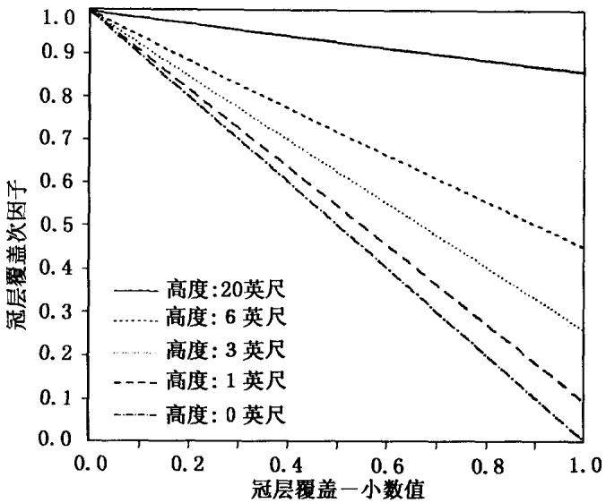  
图5-1 冠层覆盖和冠层高度对冠层覆盖次因子的影响

植物残体覆盖度可以通过Gregory(1982)建立的如下关系式，

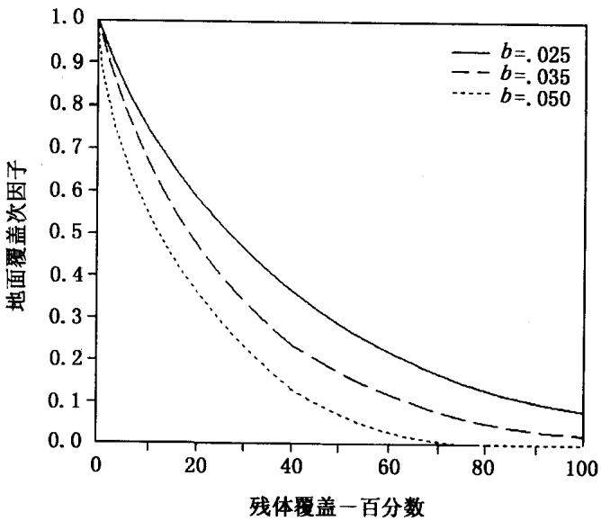  
图 5-2 光滑地表残体覆盖和 b 值对地表覆盖次因子的影响

由残体重量求得：

$$
S _ { \mathrm { p } } = \left[ 1 - \mathrm { e x p } ( - \textit { \alpha } \cdot B _ { \mathrm { s } } ) \right] \cdot 1 0 0\tag{5-15}
$$

式中，S。是残体覆盖百分比，α是残体覆盖面积与其质量之比 $S _ { \mathfrak { p } }$ $( \mathbf { h a } / \mathbf { k g } ) , B _ { s }$ 是地面作物残体干重(kg/ha)。表 5-1 给出了代表性$\pmb { \alpha }$ 值。图5-4是用式5-15得到的不同残体重量对应的残体覆盖度。如果有一种以上作物残体存在时，则计算总的地表覆盖度时，按以下方法修改式5-15：

$$
S _ { \mathrm { p } } = \left\{ 1 - \exp \bigl [ - \sum _ { i = 1 } ^ { N } ( \alpha _ { i } B _ { \mathrm { s } i } ) \bigr ] \right\} \cdot 1 0 0\tag{5-16}
$$

式中，N是作物残体种类， $\pmb { \alpha _ { i } }$ 是每种作物残体覆盖面积与其质量的比率。α值是通过输入与残体覆盖度有关的残体重量计算得到，包括覆盖度为30%、60%和90%时的残体重量。只要有其中

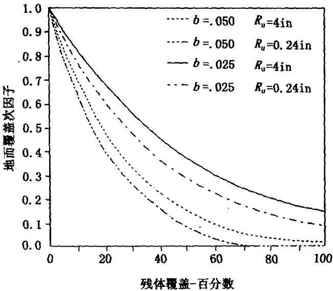  
图5-3 残体覆盖，b值和地表糙度对地表覆盖次因子的影响苗床条件下 $\scriptstyle { R _ { \mathrm { ~ u ~ } } }$ 的典型值是0.61cm。 $\scriptstyle { R _ { \mathrm { ~ u ~ } } }$ 为10cm时表示比最基本的耕作方式更粗糙

一个覆盖度的残体重量，就能够计算一个α值。如果输入一种以上覆盖度的残体重量，则计算每种覆盖度下的α值，然后求它们的平均值。

## 5.2.3.4 地表糙度次因子(SR)

研究表明，地表糙度因子可以直接影响土壤侵蚀(Cogo等1984).也可以通过影响植物残体而间接影响土壤侵蚀，从式5-14也可看出这一点。无论哪种情况，土壤侵蚀都是地表随机糙度的函数。地表随机糙度是指排除坡度、非随机耕作痕迹(如犁沟、交通痕迹、圆盘犁的痕迹)造成的地面变化后，地面高度的标准差(Allmaras等，1966)。粗糙地表的许多凹陷和凸起在降雨过程中可以减缓径流速度，引起泥沙沉积，从而导致粗糙地表土壤侵蚀率低于同等条件下光滑地表的侵蚀率。地表糙度的增加可以降低径流输沙力和流速，进而降低径流分离土壤颗粒的能力。

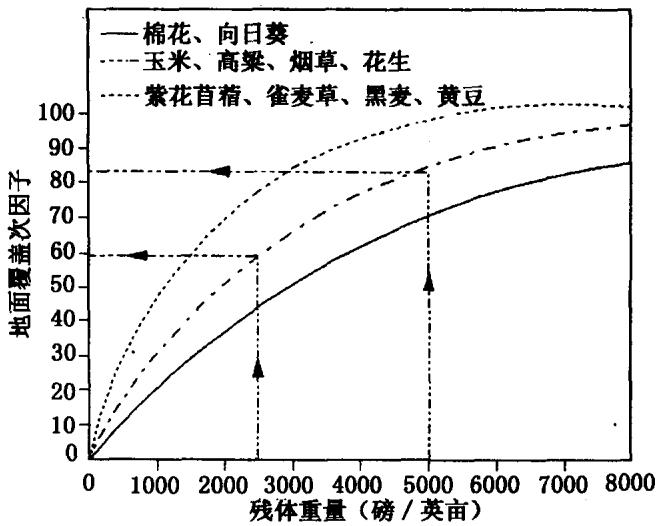  
图5-4 不同作物残体重量与残体覆盖百分比的关系  
例:带箭头的虚线表示重量转化为残体覆盖百分比的过程。玉米在收获时残体重量约为5000磅/英亩时，残体覆盖度为82%；重量约为2500磅/英亩时，残体覆盖度为57%。该例中，重量减少50%导致覆盖度  
减少25%

地表糙度和土壤的块状结构还影响雨滴打击导致的土壤表面紧实速度和程度。粗糙并具有典型块状结构的土壤，入渗率高；而细粒土壤通常表面比较光滑，很容易紧实，因而入渗率低(Sumner和 Stewart,1992)。

随机糙度的变化还与地表扰动程度和方式有关。表5-5给出了典型农地的随机糙度值，表5-6给出了牧区典型值。表中给出的这些数值可以用后面介绍的方法进行修正。某种田间活动产生的糙度值，可以随前期耕作、农具操作速度、以及田间条件不同而变化。

地表糙度对土壤侵蚀的影响可以由一个基准条件来定义：令暴露于中等降雨强度、无残体和其他覆盖的标准小区的SR值等于1,对应的随机糙度值为0.61cm。这样在随机糙度小的细粒土壤上的耕作方式会有一个大于1的SR值，例如用圆盘耙平整农地，或在干旱、休闲的壤土上重复耕作，都可能导致SR大于1。对于反复扰动所形成的粗糙表面(如连续放牧)，其糙度值应由其他值替代0.61。除了很破碎的情况外，一般假设田间活动造成的地表糙度会因雨滴打击作用而降低，即随着累计降雨量的增加，糙度趋于0.61cm。用Onstad（1984)等人建立的如下关系式，模拟上述地表糙度降低过程：

$$
D _ { \mathrm { r } } = \exp [ 1 / 2 ( - 0 . 1 4 \cdot P _ { \mathrm { t } } ) + 1 / 2 ( 0 . 0 1 2 \cdot E I _ { \mathrm { t } } ) ]\tag{5-17}
$$

式中， $D _ { \mathfrak { r } }$ 是无量刚糙度衰减系数， $\mathcal { P } _ { \mathrm { { t } } }$ 是最近一次田间活动完全扰动表土后的总降雨量(in),EI，是该次田间活动后的总 EI值(美制单位)。 $D _ { \tau }$ 的经验数值变化于0.0\~1.0之间，0.0是有大量降雨使地表完全光滑时的取值，1.0是没有降雨时的取值。

表 5-6 牧区各种条件下的糙度值
<table><tr><td>条件</td><td>随机糙度(cm)</td></tr><tr><td>加利福尼亚一年生草地</td><td>0.64</td></tr><tr><td>高草草原</td><td>0.76</td></tr><tr><td>割草草地或裸地</td><td>1.52</td></tr><tr><td>松柏混交林</td><td>1.52</td></tr><tr><td>开垦牧区</td><td>1.78</td></tr><tr><td>自然灌丛</td><td>2.03</td></tr><tr><td>条播放牧草地</td><td>2.03</td></tr><tr><td>矮草，沙地</td><td>2.03</td></tr><tr><td>裸露鱼鱗坑</td><td>2.54</td></tr><tr><td>混合草原</td><td>2.54</td></tr><tr><td>鱼鳞坑</td><td>2.79</td></tr><tr><td>北美艾灌丛</td><td>2.79</td></tr><tr><td>根系</td><td>3.30</td></tr></table>

如果初始糙度设为 $R _ { \mathrm { i } } ( \mathrm { c m } )$ ，则当前耕作活动前的糙度可以表示如下：

$$
R _ { \mathrm { u } } = 0 . 6 0 9 6 + \left[ D _ { \mathrm { r } } ( R _ { \mathrm { i } } - 0 . 6 0 9 6 ) \right]\tag{5-18}
$$

式中， $R _ { \mathbf { u } }$ 的单位是cm。由于许多田间活动只扰动一部分地面，因此 $R _ { \mathrm { { u } } }$ 值是指未被当前田间活动扰动的地表糙度。

研究表明，受田间活动影响的地表糙度是10cm土层内生物量的函数，关系式如下：

$$
R _ { \mathrm { a } } = 0 . 2 4 + ( R _ { \mathrm { t } } - 0 . 2 4 ) \left\{ 0 . 8 [ 1 - \exp ( - 0 . 0 0 1 2 B _ { \mathrm { u } } ) ] + 0 . 2 \right\}\tag{5-19}
$$

式中， $R _ { \mathfrak { a } }$ 是考虑10cm土层生物量影响调整后的糙度(in)， $R _ { \mathrm { t } }$ 是假设地下生物量丰富时(如高产玉米带地下生物量)的原始耕作糙度 $( \mathrm { i n } ) , B _ { \mathrm { u } }$ 是土壤上层总生物量 $\left[ { \bf l b } / ( \mathsf { a c r e } \cdot \mathsf { i n } ) \right]$ ，如式5-10定义：$B _ { \mathrm { u } } { = } B _ { \mathrm { u r } } { + } B _ { \mathrm { u s } }$ 。美国西北小麦区和牧区的研究表明，耕作糙度和地下生物量的相关性并不高(McCool的私人通信，1994)，因而不能用式5-19,此时，可简单地令 $R _ { \mathrm { a } } = R _ { \mathrm { t } }$

调整后的耕作糙度与未扰动部分的糙度按如下公式合并：

$$
R _ { \mathrm { n } } = R _ { \mathrm { a } } F _ { \mathrm { d } } + R _ { \mathrm { u } } F _ { \mathrm { u } }\tag{5-20}
$$

式中， $R _ { \mathfrak { n } }$ 是某次田间活动的最后糙度 $( \mathbf { c m } ) , R _ { a }$ 用式 5-19计算后须换算为 cm。 $F _ { \mathrm { d } }$ 和 $\boldsymbol { F } _ { \mathrm { u } }$ 分别是扰动地面和未扰动地面所占的比例，二者之和应等于1。

同样还必须调整衰减系数，以反映只有一部分地面受到扰动的情况，所用公式如下：

$$
D _ { \mathrm { e } } = D _ { \mathrm { r } } F _ { \mathrm { u } } + 1 . 0 F _ { \mathrm { d } }\tag{5-21}
$$

式中， $D _ { \mathrm { e } }$ 是等效糙度衰减系数(equivalent roughness decay coeffi-cient)。假设田间活动前后 $E I _ { \mathrm { t } } / P _ { \mathrm { t } }$ 不变，则与等效糙度衰减系数相应的 $P _ { \mathrm { ~ t ~ } }$ 和 $E I _ { \mathrm { t } }$ 值如下：

$$
\begin{array} { r l } & { P _ { \mathrm { t } } = - \ : 2 \cdot \ln ( D _ { \mathrm { e } } ) \bigg / \bigg [ 0 . 1 4 + 0 . 0 1 2 \bigg ( \frac { E I _ { \mathrm { t , b } } } { P _ { \mathrm { t , b } } } \bigg ) \bigg ] } \\ & { E I _ { \mathrm { t } } = E I _ { \mathrm { t , b } } \cdot P _ { \mathrm { t } } / P _ { \mathrm { t , b } } } \end{array}\tag{5-22}
$$

式中，下标b指某次田间活动前的值。这些等效衰减系数和相应的降雨量、EI值给出新的糙度衰减曲线：当降雨量 $( P _ { \mathrm { { t } } } )$ 无限大时，糙度值趋于 $\mathbf { 0 } ;$ 其初始值(初始糙度)则是当 $P _ { \mathrm { { t } } } = \mathbf { 0 }$ 时，即一次田间活动结束时的糙度值，该初始糙度按如下公式计算：

$$
R _ { \mathrm { i } } = \mathbf { 0 . 6 1 } + \frac { \left( R _ { \mathrm { n } } - \mathbf { 0 . 6 1 } \right) } { D _ { \mathrm { e } } }\tag{5-23}
$$

式中各项意义同前。

逐个计算轮作期每一个时段时，从耕作开始到该时段的总降雨量 $( P _ { \mathrm { t } } )$ 和 EI 值 $( E I _ { \mathrm { t } } )$ 不断增加，该时段的糙度衰减系数用式5-17计算，当前的地表糙度用式5-18计算。

地表随机糙度不仅受耕作形成的土块影响，而且也受植被的影响。如果一个地块清耕后，再无人类活动影响，将会发生两种情况：①田间糙度会如前面所定义的方式逐渐减小。②若干年后，植被将向顶极群落演替，此时的糙度主要受突出的根系，围绕植物根部或基岩等形成的土堆影响。

RUSLE假定，在土壤完全固结所需要的时段 $( t _ { \infty } )$ 内，因植被作用而导致的糙度变化呈S形增长曲线，从最小地表糙度 $( r _ { \mathrm { m i n } }$ 0.61cm)增加到土壤完全固结时的最大值 $( r _ { \operatorname* { m a x } } )$ 。在发生扰动后任意时刻 $( \pmb { t } _ { \mathrm { d } } )$ ,有以下关系式：

$$
r _ { \mathrm { n a t } } = r _ { \mathrm { m i n } } + \left[ \frac { r _ { \mathrm { m a x } } - r _ { \mathrm { m i n } } } { 1 + \exp { \frac { \left( 0 . 5 - \frac { t _ { \mathrm { d } } } { t _ { \mathrm { c o n } } } \right) } { 0 . 1 } } } \right]\tag{5-24}
$$

式中，r.是整个植被群落引起的糙度值(cm)。计算出任一时段 $r _ { \mathrm { n { a t } } }$ $r _ { \tt m a t }$ 值，与同一时段 $R _ { \mathrm { { u } } }$ 计算值对比，如果 $r _ { \mathrm { n a t } }$ 值大，就令 $R _ { \mathrm { u } }$ 等于

$r _ { \mathrm { n a t } }$ 。通常情况下，这种情况只发生在长时间内未受任何扰动的地块。

最终的地表糙度次因子按如下公式计算：

$$
S R = \exp [ - 0 . 2 6 ( R _ { \mathrm { u } } - 0 . 6 0 9 6 ) ]\tag{5-25}
$$

下面给出田间随机糙度的几种估算方法。

随机糙度是指无方向性的地表糙度，有时用土块大小反映(Allmaras等，1966;Romkens 和 Wang,1986),这种糙度常常由耕作活动引起，是计算土壤流失比率的重要因素之一。它与田间耕作时由垄沟产生的方向性糙度不同，后者是水土保持措施因子P的一部分。随机糙度是指由于耕作引起的地表高低起伏变化的标准差，它必须除去用统计方法计算的田间有方向性的糙度。随机糙度可用手动断面仪量取，也可用更复杂的仪器，如激光断面仪测定。目前尚无既经济又快捷的方法测定田间随机糙度，因此常用土块大小的平均值或变化范围估算，也可以用穿有珠子的测绳，根据大于某一给定体积的块体个数估算。总之，目前还没有可以为RUSLE或其他模型提供随机糙度值的比较成熟的技术。

一方面需要快速量测田间糙度，而另一方面又没有可利用的成熟技术，因此目前常采用田间拍摄进行目测判定的方法，估算田间随机糙度。在使用该方法时，必须对田间由细到粗的各种地表状况进行记录。下面给出一个估算的例子。

选择华盛顿州 Pullman附近 Palouse水土保持试验站小区，除在选择的小区上进行耕作外，还在9个小区所在地布设了各种不同的地表粗糙状况。用宽183cm、针距为1.3cm的手动断面仪测定糙度。同时，用35mm广角变焦镜头照相机拍摄以网格为背景的测针高低变化(McCool等，1981)。

用断面仪测定时，断面测定仪必须平行于垄沟方向，测定10行，无须测定所有行的高度起伏，因此测定的只是平行于垄沟方向的随机糙度。该方法不同于Allmaras等的方法，他们考虑了网格

中所有点的起伏。

将田间拍摄的20cm×30cm黑白放大照片进行数字化处理，量测测针的起伏变化。首先对每个测定断面的一组数值进行线性回归拟合，计算每个测定断面的标准偏差。然后对每个小区求算10个测面的平均值，就可以得到每个小区的平均标准差或随机糙度。为了提供站在距小区几米外观测者的视角照片，从空中倾斜拍摄了断面测定仪旁边1m×1m见方未扰动区域的照片，这些照片用于订正耕作方向。

观测结果表明，九个小区的随机糙度变化于0.58\~8.28cm，用它们进一步估算田间随机糙度。土壤流失率对随机糙度的敏感程度中等，如果实际糙度为0.64cm，而估算值为1.27cm,将会导致土壤流失率出现15%的计算误差。对数据进行分析发现，在每一个测定断面，随机糙度值与测针最高和最低读数的差值，即指针变化范围呈线性相关，随机糙度R，与指针起伏高差的线性回归方程见图5-5.决定系数为0.93。因此，随机糙度也可用垄沟最高点到最低点的距离进行估算。将田间测定的垄沟最高点到最低点的距离求平均，然后利用图5-5即可得到随机糙度R，值。

## 5.2.3.5 土壤水分次因子(SM)

前期十壤含水量通过影响入渗和径流进而影响土壤侵蚀。通常情况下，在连续翻耕的休闲小区，前期土壤水分作用比较明显，这可以从年内土壤可蚀性的变化得到反映。在美国本土大部分地区，春季和初夏为土壤侵蚀发生季节，作物也易受土壤侵蚀影响，此时十壤水分含量通常较高。耕作小区前期土壤水分与连续翻耕休闲小区的十壤水分基本一致，而土壤可蚀性因子是由连续翻耕休闲小区推算的。由于二者的一致性，在计算耕作小区土壤可蚀性因子时，无需调整土壤水分。

在美国西北小麦区和牧区的非灌溉区(Austin,1981)(包括俄勒冈州东部、华盛顿州东部和爱达何州)，作物生长期土壤含水量受作物轮作和管理制度影响。冬小麦一般在一茬冬小麦后，或一茬浅根作物后、或夏季休闲后播种。如果在整个轮作期有一整年休闲，前一年冬季储存的土壤水分就可以保存在土壤中，尤其在地表覆盖很好的情况下，更是如此。这包括两种情况：一是疏松的土壤和由杆式中耕锄草机留下的植物残体覆盖；二是在未翻耕的残茬上直接播种。这两种情况与连续耕作情形(在秋、冬季降雨之前，土壤含水量达到或低于凋萎湿度)形成鲜明的对比。McCool(1994)认为应该在西北麦区和牧区考虑土壤水分次因子(SM)的作用，它反映了秋季干旱和冬季土壤水分增加的状况。夏季土壤水分减少取决于根系深度和土层厚度，土壤水分的补给取决于降雨量和土层厚度。

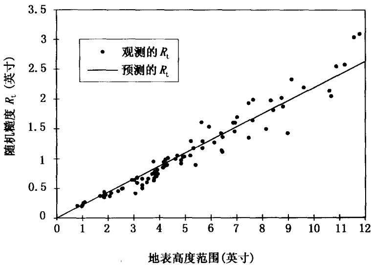  
图 5-5 随机糙度 $R _ { \mathrm { t } }$ 与地表起伏变化的关系

当土壤含水量达到田间持水量时，SM是1.0(如图5-6中的4月1日)，与连续休闲小区一致。当15cm以内土层含水量接近凋萎湿度时，SM值为0(如图5-6中的9月1日)。此时假设地表状况不影响入渗，则难以形成径流和发生侵蚀。SM从12月1日到3月31日的整个冬季不断增加。图5-7给出了补给速率。表5-7给出了典型农作物生长期内(4月1日到7月31日)土壤水分的下降速率。以上反映的是典型条件。如果应用于浅层土壤和其他条件时，需要进行订正。

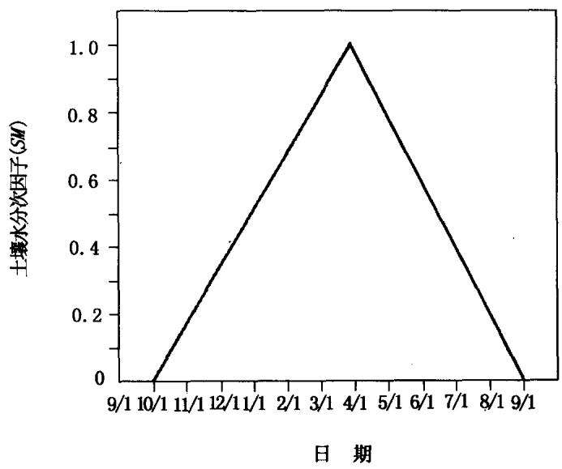  
图5-6 美国西北小麦区和牧区受土层水分补给和消耗影响，土壤水分次因子的最大变化范围

年降雨量 P(英寸)  
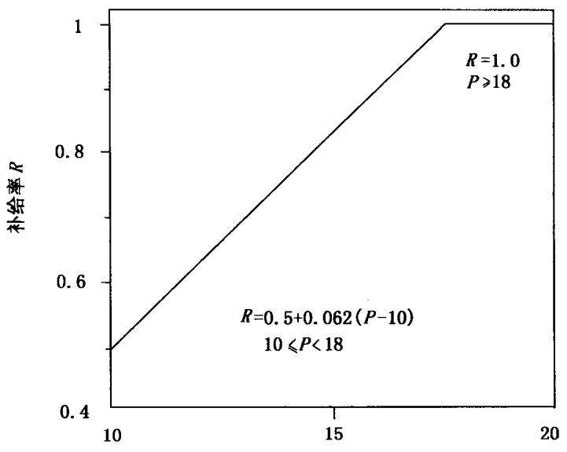  
图 5-7 土壤水分补给率  
与计算土壤水分次因子所用的年平均降雨量相同(美国西北小麦区和牧区)

表 5-7 生长期土壤水分消耗率\*
<table><tr><td>作物</td><td>消耗率</td></tr><tr><td>冬小麦和其他深根作物</td><td>1.00</td></tr><tr><td>春小麦和大麦</td><td>0.75</td></tr><tr><td>春播豌豆和小扁豆</td><td>0.67</td></tr><tr><td>浅根作物</td><td>0.50</td></tr><tr><td>夏季休闲</td><td>0.00</td></tr></table>

\*用于计算美国西北小麦区和牧区的土壤水分次因子。

## 5.3 覆盖与管理因子有关参数的确定

用RUSLE估算农地土壤流失量时，需要提供有关的参数，包括估算覆盖与管理因子所需的参数。为此RUSLE提供一些主要作物和耕作方式的参数作为“核心值”，以便模型的初始运行。用户可根据实际情况调整给定的参数值，以反映与“核心值”所代表条件不同的情形，也可自己建立表中没有给出的作物和耕作方式的参数值。调整或建立新参数值的方法一是查阅文献，二是与表中列出的作物和耕作方式参数值进行比较。下列各表是由美国农业部农业研究局(USDA-ARS)和自然资源保护局(NRCS)给出的，以便在全美国范围内应用RUSLE。表中数据的确定依据的是大量文献资料，并咨询了许多专家的意见。如果用户应用RUSLE时，得到的结果与实际不一致，首先要用“核心值”运行模型，检查运行结果，然后仔细评估对“核心值”的调整是否合理，以及RUSLE对每次调整的运行结果是否达到期望值。

## 5.3.1 调整主要作物参数值

如果作物种类列于RUSLE给出的作物表中(称为主要作物)，但作物产量与给出的主要作物产量不同，则需要调整表5-1和5-2中的作物参数值，调整内容包括：

## 5.3.1.1 植物残体与产量比率

在表5-8中列出的产量变化范围内，RUSLE采用恒定的植物残体产量比。如果实际作物产量超出了给定的产量范围，则残体产量比会随产量发生变化。通常情况下，产量超出给定的上限时，可以假设残体产量比不变，但是如果产量低于给定的下限时，随着产量的降低，残体产量比明显增加。如果在给定产量变化范围以外，设残体产量比是产量的函数，则选定的比值应与上限和下限处的比值匹配。表5-8给出了适用比较广泛的典型残体产量比值，它们随作物、区域和其他因子而变化，应用时可根据实际情况选定与表5-8不同的比值，但遵循的假设条件应一致：在表5-8给定的产量范围内，残体产量比值为常数。

表5-8 残体产量比及其对应的作物产量范围
<table><tr><td>作物</td><td>残体产量比</td><td>产量范围①</td></tr><tr><td>玉米</td><td>1.0</td><td>4358~13074 1/ha</td></tr><tr><td>黄豆</td><td>1.5</td><td>1307~39221/ha</td></tr><tr><td>棉花</td><td>4.5②</td><td>皮棉 336~1120kg/ha</td></tr><tr><td>高粱</td><td>1.0</td><td>3486~7844 1/ha</td></tr><tr><td>冬小麦</td><td>1.7</td><td>2179~5230 1/ha</td></tr><tr><td>春小麦</td><td>1.3</td><td>2179~5230 1/ha</td></tr><tr><td>春燕麦</td><td>2.0</td><td>2615~69731/ha</td></tr></table>

①如果产量小于所给范围的最小值，残体产量比应增加；如果残体产量比大于所给范围的最大值，残体产量比应减小。  
②所给值适用于秋季茬秆粉碎的情况，若春季茬杆粉碎时用3.0。

## 5.3.1.2 根量

假设根系生物量与地上生物量呈线性相关，于是可以用表5-9的乘数因子进行调整。如果产量在给定的变化范围内，且残体产量比是一常数，则可用根系生物量与产量的线性关系进行调整。调整方法是：首先根据地上生物量的比值确定乘数因子，然后用这个乘数因子乘以表中主要作物根系生物量，即得到给定作物的根量值，详见表5-10给出的计算过程。

## 5.3.1.3 植物冠层

冠层覆盖度(百分比)是根据所求作物地上生物量与表中所列主要作物地上生物量比值的平方根(0.5次方)进行调整，表5-9给出了乘数因子。如果得到的冠层覆盖度大于100%，则取为100%。如果产量在给定的变化范围内，且残体产量比为常数，则可用作物产量计算生物量比值，进而确定乘数因子。表中主要作物覆盖度乘以调整因子便得到新的冠层覆盖度，具体方法见表5-10。

## 5.3.1.4 有效雨滴降落高度

有效雨滴降落高度是根据所求作物地上生物量与表中主要作物地上生物量比值的0.2次方进行调整，表5-9给出了乘数因子。如果产量在给定的变化范围内，且残体产量比为常数，则可用作物产量计算生物量比值，进而确定乘数因子。表中主要作物有效雨滴降落高度乘以调整因子便得到新的有效雨滴降落高度，具体方法见表5-10。

表 5-9 根据“核心值”调整RUSLE给出的主要作物参数的乘数因子
<table><tr><td>给定作物与表中主要作 物成熟期生物量比</td><td>根量乘数 因子①</td><td>冠层覆盖度乘 数因子②</td><td>雨滴降落高度 乘数因子③</td></tr><tr><td>0.1</td><td>0.1</td><td>0.32</td><td>0.63</td></tr><tr><td>0.2</td><td>0.2</td><td>0.45</td><td>0.72</td></tr><tr><td>0.3</td><td>0.3</td><td>0.55</td><td>0.79</td></tr><tr><td>0.4</td><td>0.4</td><td>0.63</td><td>0.83</td></tr><tr><td>0.5</td><td>0.5</td><td>0.71</td><td>0.87</td></tr><tr><td>0.6</td><td>0.6</td><td>0.77</td><td>0.90</td></tr><tr><td>0.7</td><td>0.7</td><td>0.84</td><td>0.93</td></tr><tr><td>0.8</td><td>0.8</td><td>0.89</td><td>0.96</td></tr><tr><td>0.9</td><td>0.9</td><td>0.95</td><td>0.98</td></tr><tr><td>1.0④</td><td>1.0</td><td>1.00</td><td>1.00</td></tr><tr><td>1.1</td><td>1.1</td><td>1.05</td><td>1.02</td></tr><tr><td>1.2</td><td>1.2</td><td>1.10</td><td>1.04</td></tr><tr><td>1.3</td><td>1.3</td><td>1.14</td><td>1.05</td></tr><tr><td>1.4</td><td>1.4</td><td>1.18</td><td>1.07</td></tr><tr><td>1.5</td><td>1.5</td><td>1.22</td><td>1.08</td></tr><tr><td>1.6</td><td>1.6</td><td>1.26</td><td>1.10</td></tr><tr><td>1.7</td><td>1.7</td><td>1.30</td><td>1.11</td></tr><tr><td>1.8</td><td>1.8</td><td>1.34</td><td>1.12</td></tr><tr><td>1.9</td><td>1.9</td><td>1.38</td><td>1.14</td></tr><tr><td>2.0</td><td>2.0</td><td>1.41</td><td>1.15</td></tr></table>

①该因子用于调整根量 $\ d M = M _ { \mathrm { g } } / M _ { \mathrm { c } } ,$ 其中 $M _ { \mathbf { g } }$ 是给定作物地上生物量， $M _ { \mathrm { c } }$ 是表中主要作物地上生物量。②该因子用于调整冠层覆盖度 $= ( M _ { \mathrm { g } } / M _ { \mathrm { c } } ) ^ { 0 . 5 }$ 。③该因子用于调整有效雨滴降落高度 $= ( M _ { \mathrm { g } } / M _ { \mathrm { c } } ) ^ { 0 . 2 }$ 。④代表表中主要作物。

表5-10 根量、冠层覆盖度和雨滴降落高度调整举例
<table><tr><td rowspan="2">生长 天数</td><td colspan="2">根量调整  $( \mathbf { k g / h a } )$ </td><td colspan="2">冠层覆盖度调整(%)</td><td colspan="2">雨滴降落高度调整(m)</td></tr><tr><td>主要作物</td><td>给定作物</td><td>主要作物</td><td>给定作物</td><td>主要作物</td><td>给定作物</td></tr><tr><td>30</td><td>201.6</td><td>121.0</td><td>10</td><td>10</td><td>0.15</td><td>0.12</td></tr><tr><td>45</td><td>392.0</td><td>235.2</td><td>50</td><td>40</td><td>0.30</td><td>0.27</td></tr><tr><td>60</td><td>593.6</td><td>356.2</td><td>80</td><td>60</td><td>0.52</td><td>0.46</td></tr><tr><td>75</td><td>940.8</td><td>564.5</td><td>100</td><td>80</td><td>0.76</td><td>0.67</td></tr><tr><td>90</td><td>1187.2</td><td>712.3</td><td>100</td><td>80</td><td>0.91</td><td>0.82</td></tr><tr><td>150</td><td>1187.2</td><td>712.3</td><td>70</td><td>55</td><td>0.91</td><td>0.82</td></tr></table>

例子说明：主要作物是玉米，产量108951/ha；给定作物是玉米，产量65371/ha。成熟期给定作物与主要作物的生物量比为0.6。

## 5.3.1.5 生长期和休眠期长度

需要对作物(如玉米和大豆)生长期长度和作物(如冬小麦)休眠期长度进行调整。生长期长度调整是加上或减去作物开始凋落之前的日数，休眠期长度调整是加上或减去到休眠期时的日数。如在美国南部地区，整个休眠期内作物仍在缓慢生长，因此应对生长期长度“核心值”进行适当调整，以反映这种现象。

## 5.3.2 其他作物的参数取值

有些作物没有作为主要作物列出，此时可以用几种方法确定

这些作物的参数值，主要参数值包括：地上生物量，收获时的根量，冠层覆盖度，收获时的雨滴降落高度。下面给出几种估算方法：

## 5.3.2.1 查阅文献

第一种方法是从文献中选择已发表的参数值，为此需要收集尽可能多的资料，资料来源可以有很多种。在整个生长期内，地上生物量和根量的比值不是恒定不变的，为此，先选取成熟期时的根量作为起始点，然后选取整个生长期的值做一条与主要作物相似的S型曲线。最后选择一个残体产量比，该比值在50%以上的产量变化范围内都是常数。该方法同样可用于冠层覆盖度和有效雨滴降落高度的确定。

## 5.3.2.2 从 NRCS 获得数据

第二种方法是从美国农业部（USDA）自然资源保护局(NRCS)获得数据。NRCS已经建立了可直接应用或加以修改后应用的数据。

## 5.3.2.3 比较主要作物与其他作物的特性

第三种方法是将给定作物与与之相似的主要作物进行比较，调整参数，如比较花生与大豆。

## 5.3.3 地表覆盖度与生物量的关系

许多情况下地表覆盖状况是惟一重要的侵蚀影响因素，因此，对应的惟一重要的作物变量是播种期和收获期时的植物残体数量。表5-11列出了主要作物地表覆盖与生物量的关系值。当覆盖度大于90%时(如收获期)，地表覆盖度无法精确指示生物量，此时残体覆盖度与残体生物量的指数关系曲线对残体生物量的变化不敏感。如当覆盖度大于90%时，覆盖度可以变化很小，而残体数量可以变化很大，当覆盖度大于95%时更是如此。但是，当覆盖度在75%以下时，它可以很好地指示地表生物量。

表 5-11 主要作物覆盖度与生物量的关系
<table><tr><td colspan="2">不同残体覆盖度(%)时的残体数量(kg/ha)</td></tr><tr><td>作 物</td><td>30% 60% 90%</td></tr><tr><td>玉 米</td><td>1064 2688 6776</td></tr><tr><td>黄 豆 672</td><td>1792 1</td></tr><tr><td>棉花 1792</td><td>4648 一</td></tr><tr><td>高粱</td><td>1176 3024 7560</td></tr><tr><td>冬小麦 672</td><td>1736 4312</td></tr><tr><td>春燕麦 672</td><td>1736 4312</td></tr></table>

虽然地表覆盖度是惟一重要的侵蚀影响因子，但植物残体的减少是以残体的生物量为基础，覆盖度易于测量，覆盖物生物量则不易测量。测量覆盖物生物量时，需要把土壤颗粒仔细地清洗掉，把叶子和茎秆仔细复原。此外，收割后残体数量会迅速减少，这很难通过相应的覆盖度减少反映出来。因此容易导致估算误差。如果运行RUSLE时，输入了合适的收获期残体数量，但却给出错误的春耕前覆盖度输出值，则有二种可能性：一是计算残体减少的分解参数有误；二是残体覆盖度与残体数量的关系有误。如果模型在播种后输出的残体覆盖度计算值有误，但在播种期第一次翻耕前的计算值正确，则很有可能是耕作前植物残体数量输入或计算有误。如果模型在播种后输出的残留物数量计算值正确，但在生长期结束时的计算值错误，则说明分解参数有误。

值得注意的是，由于侵蚀对覆盖度非常敏感，务必要保证覆盖度赋值的合理性。需要调整覆盖度时，要仔细分析问题的原因，并确定调整方法，因为有时问题并非像表面所看到的那样。

## 5.3.4 残体分解参数

作物残体随时间减少的数量用温度和降水的函数计算，表5-12给出了分解系数值。

表 5-12 分解系数
<table><tr><td>作物</td><td>系数</td></tr><tr><td>苜蓿</td><td>0.020</td></tr><tr><td>草</td><td>0.017</td></tr><tr><td>玉米</td><td>0.016</td></tr><tr><td>棉花</td><td>0.015</td></tr><tr><td>花生</td><td>0.015</td></tr><tr><td>小粒谷物</td><td>0.008①</td></tr><tr><td>生长期割掉的小粒谷物覆盖</td><td>0.017</td></tr><tr><td>高粱</td><td>0.016</td></tr><tr><td>黄豆</td><td>0.025</td></tr><tr><td>向日葵</td><td>0.016</td></tr><tr><td>烟草</td><td>0.015</td></tr></table>

①美国西北小麦区和牧区用0.017。

考虑到农田其他因子如土壤有机质等会明显影响残体分解，在分解参数中应估算这些作用，因此确定分解参数必须基于田间观测数据，而不能通过室内分解实验进行。RUSLE用于估算残体分解参数的数据便是来自田间观测。

有关植物残体的分解状况，目前RUSLE尚有不足：一是由于没有单独计算土壤表面与地上生物量分离的直立茬秆部分的分解，这有可能过高估计直立茬秆部分的损失量。一般情况下，应采用不同的分解参数分别估算地上和地下生物量的分解。二是没有分别考虑不同器官如茎、叶、根等的分解速率不同，而是假定各部分以相同速率分解。三是没有考虑分解参数值在不同分解状态卜随时间的变化，如前期分解较快，后期分解较慢等。四是在考虑水分状况影响时，只采用了降雨资料，而实际上土壤水分对残体分解的影响更大。此外，温度和降雨的日变化也会对分解有影响，而为了计算方便，RUSLE将月值平滑分割为日值，这样对给定的作物，就需要根据气候区调整分解参数，如在美国西北小麦区和牧区，小麦的分解参数要比在美国其他地区大得多。但考虑到资料和研究成果的限制，目前使用的估算分解参数的方法仍不失为一种比较精确的计算方法。

## 5.3.5 主要作物生产方式参数调整

表5-5给出了许多农业生产所使用的农具对应的参数值。当表中给出的生产方式与具体应用的生产方式不符时，用以下方法进行调整。

## 5.3.5.1 混合深度

对于一种给定的农具，有一个混合深度值。以深耕犁为例，无论实际翻耕深度是多少，它的混合深度都是15cm。混合深度的选择依据表5-13。

## 5.3.5.2 糙度

某种耕作方式的糙度值可以按表5-14所示方法上下调整。例如，壁犁糙度的核心值是4.8cm，但如果在很粗糙的粘土上耙犁后，糙度调整为5.8cm，而在砂土上耙犁后，由于相对平整，糙度调整为3.8cm。RUSLE采用的糙度指数既反映地面凹凸的影响，也反映地表粉碎程度的影响。

## 5.3.5.3 残留物数量

由于地表覆盖对土壤侵蚀的影响很大，因此在确定一次田间活动以后留下的残留物数量时，一定要慎重。一般情况下，误差应小于10%，或5%，还要考虑到植物残体是否易碎。表5-5所指的都是不易碎的填物残体。最重要的是，还要考虑到植物残体数量和覆盖百分比是否指的是耕作活动遗留下来的，如果数据来自文献资料，更要注意这一点。

表 5-13 不同耕作方式的混合深度
<table><tr><td>耕作方式</td><td>混合深度 (cm)</td></tr><tr><td>翻耕土壤的耕作农具，如有壁犁</td><td>20</td></tr><tr><td>不翻耕土壤的耕作农具，如无壁深耕犁和重型圆盘犁</td><td>15</td></tr><tr><td>能将大量生物量翻入土壤的宽柄农具，如施肥器</td><td>15</td></tr><tr><td>有圆盘犁的耕地农具，如纵列圆盘犁</td><td>10</td></tr><tr><td>准备苗床和培垄农具，如双壁犁，起垄机和类似的农具(不 包括垄作中耕机)</td><td>10</td></tr><tr><td>能有效混合土壤的有柄农具，如田间中耕机</td><td>8</td></tr><tr><td>能轻微混合土壤的宽柄农具，如土壤深耕机和无水肥料刀 型施肥机</td><td>5</td></tr><tr><td>只扰动上层土壤的耕地农具和其他一些农具，植物残体只 停留在浅层土壤中，如耙，播种机，行中耕机，和其他混合 最少的农具</td><td>5</td></tr></table>

表5-14 地表更粗糙或更光滑时的随机糙度指数调整值 $\left( \mathrm { c m } \right)$
<table><tr><td>较光滑地表</td><td>核心糙度值</td><td>较粗糙地表</td></tr><tr><td>0.00</td><td>0.25</td><td>0.51</td></tr><tr><td>0.25</td><td>0.51</td><td>1.02</td></tr><tr><td>0.51</td><td>1.02</td><td>2.03</td></tr><tr><td>1.02</td><td>2.03</td><td>3.05</td></tr><tr><td>2.03</td><td>3.05</td><td>4.06</td></tr><tr><td>3.05</td><td>4.06</td><td>5.08</td></tr><tr><td>4.06</td><td>5.08</td><td>6.10</td></tr><tr><td>5.08</td><td>6.10</td><td>7.11</td></tr></table>

\*是指与核心值代表的地表状况相比较更为粗糙或更为光滑。方法：首先确定一个核心值。如果测点的地表状况比核心值所代表的地表光滑，则用较光滑地表一列数值，相反情况则用较粗糙地表一列数值。

## 5.3.6 其他耕作方式参数值的选择

如果实际采用的某种耕作方式的参数值没有列于核心值中，则可从NRCS建立的耕作方式参数值数据序列选择，由于这些值已经进行过验证，因此是一种很好的方法。另一种比较好的方法是查阅文献选取需要的数据。最后一种方法是将所需要的耕作方式与核心值所对应的耕作方式进行比较。如果采用后两种方法，必须遵循以下原则：确定混合深度时，应依据表5-13所列的耕作方式。确定糙度值时，基准的糙度值对应的是在中等质地土壤上实施高水平管理的耕作方式。

## 5.4 一些特殊情况下覆盖与管理因子的计算

在实际生产活动中，还有许多不同于农耕地的情况。计算这些地块上的覆盖管理因子C值时，与农耕地C值的计算方法有所不同。

## 5.4.1 一次性扰动和轮作条件下 C 值的计算

可将RUSLE用于两种不同条件下的土壤侵蚀预报。第一种是一次性扰动地区土壤流失量的计算。如建筑用地、牧区开发、人为干扰的林地等。在上述情况下，土壤、植被、植物残体系统受到剧烈扰动，但随后便趋于稳定。第二种是正常农作物轮作下的土壤流失量计算。此时，土壤、植被、植物残体系统以一年或几年为周期，受到重复扰动。例如：传统耕作方式下的玉米与黄豆轮作，几乎在每两年的同一时间，进行同样方式的田间活动(多在5月15 日播种玉米)。

在一次性扰动地区，为了合理应用RUSLE，必须对扰动后短期内所有重要的土壤、植被、植物残体参数予以确定。作物轮作区的情况相对要复杂一些，由于扰动不剧烈，而前期作物和田间管理措施的影响很重要，在这种情况下，最好将整个轮作期的C值重复计算三次，但只取第三次计算结果，这样便使假定的初始条件对SLR的影响最小，并使计算结果趋于稳定。

## 5.4.2 带状耕作、缓冲条带坡地的C 值计算

对于带状耕作或缓冲条带坡地的管理措施而言，植被和作物结构使SLR值不仅随时间变化，而且在坡地上随空间变化。例如，在玉米与草皮草地的带状耕作中，任何时段内每种作物都占了一半面积，此时对径流和泥沙沉积的影响虽然已在P因子中予以考虑，但没有反映出C因子中一些重要参数对土壤侵蚀的影响，如随机糙度、根量、地表残体覆盖、冠层覆盖等。为此必须分别计算每种条带的C值，再用各自条带所占面积比进行加权，估算出这种带状耕作措施下总的C值。如果每个条带都以同样的结构进行轮作，则只需计算一个C值即可。如果是缓冲区条带，先计算一个缓冲区条带C值，以及缓冲区条带之间的作物条带C值，再把每个C值用各自所占的坡地面积比加权平均，得到总体C值。

## 5.5 我国覆盖和管理因子研究现状与展望

我国目前关于覆盖和管理因子的研究，主要包括数值估算、影响因子分析，以及研究方法探讨等。

## 5.5.1 覆盖与管理因子估算值的研究

关于覆盖与管理因子影响土壤侵蚀的定量估算，目前多集中在估算几种主要植物的年平均C值，较少考虑不同耕作制度、种植方式等管理措施的影响。不同研究提出的估算值多是基于各自特定条件下的试验观测值，没有统一的标准或方法，更没有把降雨侵蚀力季节变化与植被对土壤的保护作用结合起来，因而难以在时间和空间上进行推广使用，无法直接应用于土壤侵蚀预报。

张宪奎等(1992)利用黑龙江4年小区试验资料，采用USLE的方法，计算了4种农地不同作物生育期的C值和年平均C值，取值为0.07\~0.33。林素兰(1997)等用小区观测资料，计算了辽北地区不同坡度下玉米、大豆轮作制的C值，其值变化于0.47\~0.53之间。于东生、史学正(1998)等采用人工降雨方法，依据USLE方法，通过测量和估计R、K、L、S、P各因子，求出了6种土地利用方式下的C值，其变化范围在0\~0.310之间。杨子生(1999)利用滇东北3年小区试验资料，同样依据USLE方法计算了4种农地不同作物生育期C值和年平均C值，变化于0.199\~0.352。金争平(1992)等用牧草小区径流观测资料得到C因子与覆盖度的关系式： $C = 0 . 9 9 2 \mathrm { e x p } ^ { - 0 . 0 3 4 4 v }$ ，v是植被覆盖度，并以此计算牧草地的C值，在此基础上通过修正得到牧草地、灌丛草地和适牧灌草地C值，再把农地小区与牧草小区侵蚀量加以比较，确定农地C值。江忠善(1996)等利用黄土高原6年小区试验资料，得出年平均农地植被影响系数C为0.61，并得到C与覆盖度之间的指数相关关系。其中，农地植被影响系数C是根据农作物小区和对照裸露小区的观测资料得到的，这实际与USLE中C因子的定义相当。

用实测资料估算C因子值，不仅需要多年小区试验资料，还要求统一的对照标准小区的土壤侵蚀观测数据。这方面数据的缺乏以及标准和方法的不统一，是上述实测资料估算C因子值存在差异、不能广泛应用的主要原因。

## 5.5.2 覆盖与管理因子影响因素的研究

根据通用土壤流失方程，影响C因子的主要因素有：植被地上部分、地上和地下植被残体、前期土地利用方式、耕作制度(包括轮作和耕地方式)以及土壤水分等。从1945年在甘肃省天水建立第一个水土保持试验站以来，我国在各地的试验站都陆续进行了不同影响因素的观测，总体来看，有关C因子对土壤流失影响因素的研究，主要集中在林草地覆盖度与土壤侵蚀之间的关系方面。包括：①不同植被类型、植被覆盖度下的土壤流失量，与农地或裸地土壤流失量相比，减少的百分比。侯喜禄等(1985)的研究表明，在土壤、降雨和坡度相同的条件下，柠条、洋槐、沙打旺、天然草地和农地相比，泥沙减少量分别为99%、98%\~99%、95%\~97%和63%。刘元保等(1990)的研究表明，植被和其他覆盖与裸露农地相比，可减少土壤侵蚀84%\~99%。蒋定生等(1992)分析安塞、离石和准格尔旗的观测资料发现，与坡耕地相比，覆盖度85%的沙棘林地减沙效率98%，覆盖度65%\~80%的刺槐和柠条林减沙效率为99%，覆盖度为60%\~70%的沙打旺人工草地减沙效率达92%。蔡庆和唐克丽(1992)的研究也表明，植被覆盖度每增加10%，十壤侵蚀量减少11.1%。②植被覆盖度与土壤侵蚀量之间的相关关系。如罗伟祥(1988)给出了冲刷量W与林草地覆盖度C之间的回归关系： $W = - 1 1 . 1 8 0 + 1 0 9 9 . 8 0 1 \times ( 1 / C )$ 。侯喜禄(1989)得出林地侵蚀量Y与林地覆盖度X之间的非线性关系：$Y = 1 0 3 7 7 \dots 8 9 - . 2 7 1 . 6 5 X + 1 . 7 8 X ^ { 2 }$ 。许多学者还认为，土壤侵蚀量与植被覆盖度之间存在着指数关系，例如石生新(1990)用人工降雨资料得到： $Q = 8 . 6 6 2 \mathrm { e x p } ^ { ( - 3 . 4 2 \alpha ) }$ ,其中 Q 是土壤侵蚀量，a 是植被盖度。金争平(1992)等得到： $A = 2 2 . 8 5 5 - 5 . 1 3 3 \mathrm { l n } v$ ,其中 A是十壤侵蚀量，γ是牧草覆盖度。余新晓(1997)等还给出了小流域森林植被覆盖度F与土壤侵蚀量 $M _ { s }$ 之间的幂函数关系： $M _ { \mathrm { s } } =$ $C ( 1 - F ) ^ { 0 . 5 7 7 4 }$ .其中C为常数。③防止土壤流失的有效植被盖度。罗伟祥(1990)认为，当容许的冲刷量为 $2 0 \mathrm { k g } / 1 0 0 \mathrm { m } ^ { 2 }$ 时，植被覆盖度临界值为35.3%。卞义宁(1998)等的研究认为，陇东黄土高原沟壑区水土保持林的有效覆盖度为43.6%。

在上述研究中，农地常常被作为对照条件，因此农地径流场的观测资料在我国相当可观，但有关农作物覆盖度与土壤侵蚀量的关系研究却较少。张兴昌、卢宗凡(1993)在安塞进行的作物试验研究表明，主要农作物5年平均侵蚀模数的排列顺序为：黑豆<春播荞麦<黄豆+黄芥<夏播荞麦<谷子<马铃薯<小麦<糜子<黄豆<水平沟<裸地。此外，卢宗凡等还进行了不同种植方式的试验研究。林素兰等(1997)利用11年观测资料，研究了辽北地区不同坡度农作物玉米、大豆轮作制的水土保持作用。

有关地表覆盖物(植物残体、及人工覆盖的麦草、木屑、砾石等)控制土壤侵蚀的研究，在我国还很少。吴钦孝等(1998)用人工降雨试验研究表明，枯枝落叶覆盖的土壤比裸地减少土壤冲刷量92.7%～98.7%。卢宗凡等(1988)研究了小麦不同耕作法的水土保持效益，认为平播+覆盖比平播减少侵蚀量27.1%。刘元保等(1990)利用人工降雨试验表明，裸露翻耕地+麦草覆盖比对照裸露翻耕地减少侵蚀量98.0%。

土壤中的植物根系对土壤侵蚀有影响，RUSLE将其作为前期土地利用次因子(PLU)的一部分进行估算。1990年以来，李勇等研究了林、草、灌根系对土壤抗冲性的强化效应。同时得出了植物细根随深度变化呈指数分布的规律，并对根系的减沙效应进行了研究，提出了不同雨强和坡度下，根系减沙效应系数特征值的概念，得出了一定雨强和坡度条件下，根系减沙效应与根密度(个/$1 0 0 \mathrm { c m } ^ { 2 } .$ 的关系方程。这些工作对于评价根系对C因子的影响很有价值。

## 5.5.3 覆盖与管理因子的研究方法

目前，我国研究覆盖与管理因子的方法主要有以下几种。

## 5.5.3.1 小区实测法

自1945年在甘肃省天水建立第一个水土保持试验站以来，我国已建立了一大批水土保持试验站，为实测法提供了非常有利的条件。目前的研究工作大多是基于野外实测法，其中最主要的是径流场法，即在形态相似、动力学相似、几何相似的原则下，布设试验小区或径流场，面积一般在 $1 0 0 \mathrm m ^ { 2 }$ 左右。二是标桩法，利用打入坡面的标桩测量年土壤流失厚度(卜兆宏、赵宏夫、刘绍清等，1993)。

## 5.5.3.2 人工降雨模拟试验

人工降雨模拟试验易于控制，耗时较短，近年来被较多采用。但模拟降雨试验有其局限性，特别是得出的数据并非等同于自然条件下的土壤侵蚀量，因此多用来进行不同条件下的比较研究(Lal.1988)。我国也有学者进行了人工降雨模拟试验研究，如刘元保等(1990)研究了坡耕地不同地表覆盖的水土流失，于东升等(1998)研究了不同土地利用方式下的C值。

## 5.5.3.3 遥感技术

遥感方法以其多时相、见效快等优势得到迅速应用，然而，所遇到的最大问题是如何获得精确植被现状遥感数据，从而获得比较精确的C因子和P因子图。有研究结果表明：应用遥感方法监测小流域土壤流失量，与实测值有91.3%的一致性；监测县级土壤流失总量，与实测值有95.6%的一致性(卜兆宏、赵宏夫、刘绍清等，1993)。

## 5.5.4 问题与前景

综观我国C因子的研究现状，与土壤侵蚀预报应用的要求尚有很大差距，主要表现在：①大部分研究工作处于试验数据分析阶段，还需深入系统的研究。②多数研究局限于特定的试验条件，没有建立相应的规范化标准进行订正或对照，因此不便进行大范围推广应用，也难以进行时间或空间的相互比较，从而缺乏像USLE那样通用的成果。③我国黄土高原地区特有的土壤性质，使得农作物耕作方式、管理方式以及土壤中作物残茬等，对土壤侵蚀的影响尤为重要，而我国在这些方面的研究较少，应深入开展这方面的研究。④有关林地影响土壤侵蚀的研究较多，草地次之，农地对于土壤侵蚀的影响研究不够。而坡耕地恰恰是造成我国水土流失严重的关键所在，同时，又不可能在短期内实现大面积退耕还林还草。因此加强农地水土流失的研究，迫在眉睫。

总之，关于覆盖与管理因子的研究，有大量而艰巨的工作摆在我国科研工作者面前。一方面应加强C因子及其影响因素的深入系统研究，另一方面，应对已有大量观测资料和研究成果进行系统分析，以得到我国主要农作区和耕作制度下的覆盖因子评价值，为建立我国自己的土壤侵蚀预报模型提供必要的基础。

## 第六章 土壤保持措施因子(P)

RUSLE中土壤保持措施因子P，是指特定保持措施下的土壤流失量与相应未实施保持措施的顺坡耕作地块的土壤流失量之比值。土壤保持措施主要通过改变地形和汇流方式减少径流量，降低径流速率等作用减轻土壤侵蚀(Renard和 Foster,1983)。农耕地的水土保持措施主要有：等高耕作，带状耕作，梯田以及排水措施等。旱地和牧草地的土壤保持措施，多是沿等高线或在其附近进行平翻耕作，增加土壤湿度，减少径流量，以达到保持土壤的目的。

RUSLE计算P因子时，没有考虑免耕措施和其他土壤保持耕作体系，也没有考虑轮作、施肥和作物残体的影响，因为这些因素已经在C因子中予以考虑。这里所论述的P因子值基本上都源于试验数据，有些数据是通过对过程模型(如CREAMS)的观察和试验分析加以补充的，RUSLE提供P因子值一般都精确到5%。

总的P值应等于各种措施P因子值之积。因为大多数情况下，土壤保持措施常常是几种措施结合实施，如等高耕作中往往包括带状耕作和梯田。

## 6.1 等高耕作措施 P 因子值

等高措施P因子值反映等高耕作措施对土壤流失的影响。如果径流侵蚀发生，网状的侵蚀沟道或细沟将沿径流深最大的方向发展。在相对光滑的土壤表层，自然的微地貌形态决定了水流汇集方式。当沿等高线耕作时，犁垄可部分或全部改变径流方向，汇流方式也随之变化。当犁沟比较深的时候，汇流就会滞留在犁沟里，这时，水流形式完全由犁痕深浅而定。与水直接顺坡向下流动相比，等高耕作的高犁垄使水顺着等高线流动，大大降低了水流速度，从而减小了水流对土体的分散作用和水流挟沙能力。当犁沟坡度非常小时，从犁垄侵蚀下来的泥沙大部分会淤积在犁沟里(Meyer和Harmon,1985)。然而，耕作很少能完全沿等高线方向进行，径流常常会在低凹处汇集，当水量增多漫过犁垄时，就会发生细沟侵蚀或集流冲刷。

在新开垦的耕地，常有这种情况发生(Hill等，1944)。VanDoren等(1950)的研究表明，等高耕作地块的径流量小于顺坡耕作地块的径流量，这是因为等高耕作减小了径流量和水流速度，使土壤侵蚀大大减少。

USLE等高P因子值(Wischmeier和 Smith,1978)与 Smith和 Whitt(1947,1948)用的 P值几乎完全一致。Smith和 Whitt 认为：当坡度为0时，因水流方向不确定，等高P因子值为1.0。在陡坡情况下，当坡度大于25%时，等高P因子值也为1.0，因为一般在这种情况下，15cm高的犁沟无法贮存径流。当坡度为2%，取 Van Doren等(1950)的小区研究结果0.6。当坡度为7%时，取Smith等(1945)的研究结果0.5。RUSLE等高 P因子值的确定主要来自两种途径：小区和小流域试验资料分析，土壤侵蚀理论模型计算。

## 6.1.1 资料分析

## 6.1.1.1 小区资料

为研究等高耕作对土壤侵蚀的影响，共收集了18个试验站的资料（见表6-1）。小区规模各异，宽1.8\~45.7m，长21.3\~

121.9m。其中，6个小区采用人工降雨，12个小区是天然径流小区。天然径流小区资料年限包括几天至10年不等。耕作和犁垄高度随不同试验资料变化。

等高耕作对径流和土壤侵蚀都有影响，但对土壤侵蚀的影响更大。RUSLE分别计算了记录时段内，某种耕作措施下，实施等高耕作时的径流和土壤流失量与相同耕作措施下实施顺坡耕作时产生的径流和土壤流失量之比。径流比值的计算结果如图6-1所示，土壤流失量比值的计算结果，即RUSLE中等高P因子值如图6-2所示。

等高耕作与顺坡耕作下的径流量之比  
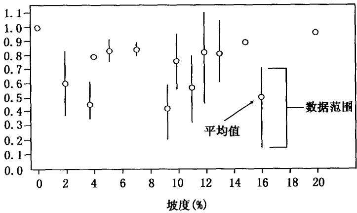  
图6-1 等高耕作对径流的影响

热关和系
<table><tr><td rowspan="2">研究 编号</td><td rowspan="2">研究地点</td><td rowspan="2">资料来源</td><td colspan="4">小区大小</td></tr><tr><td>长 (m)</td><td>宽 (m)</td><td>坡度 (%)</td><td>研究类型①</td></tr><tr><td>1</td><td>Auburn,亚拉巴马州</td><td>Disek 和 Yoder(1936)</td><td>15.2</td><td>4.6</td><td>0,5,10,15,20</td><td>Both</td></tr><tr><td>2</td><td>Urbana,伊利诺伊州</td><td>Van Doren 等(1950)</td><td>54.9</td><td>16.2</td><td>2</td><td>Nat</td></tr><tr><td>3</td><td>Temple,得克萨斯州</td><td>Hill 等(1944)</td><td>②</td><td>_②</td><td>3.5</td><td>Nat</td></tr><tr><td>4</td><td>McCredie,密苏里州</td><td>Jamison 等(1968)</td><td>128.0</td><td>31.7</td><td>3.5</td><td>Nat</td></tr><tr><td>5</td><td>Morris,明尼苏达州</td><td>Young 等(1964)</td><td>22.9</td><td>4.1</td><td>4, 7.5 , 10.5</td><td>Sim</td></tr><tr><td>6</td><td>Batesville,阿肯色州</td><td>Hood 和 Bartholomew(1956)</td><td>27.4</td><td>9.1</td><td>4</td><td>Nat</td></tr><tr><td>7</td><td>Central,伊利诺伊州</td><td>Mclsaac 等(1987)</td><td>10.7</td><td>3.0</td><td>5</td><td>Sim</td></tr><tr><td>8</td><td>Lincoln,内布拉斯加州</td><td>Jasa 等(1986)</td><td>10.7</td><td>3.0</td><td>5</td><td>Sim</td></tr><tr><td>9</td><td>Bethany,密苏里州</td><td>Smith 等(1945)</td><td>82.3</td><td>13.7</td><td>7</td><td>Nat</td></tr><tr><td>10</td><td>Guthrie,俄克拉何马州</td><td>Daniel 等(1943)</td><td>③</td><td>_③</td><td>7</td><td>Nat</td></tr></table>

<table><tr><td>11</td><td>Clarinda,衣阿华州</td><td>Browning 等(1948)</td><td>48.2</td><td>25.6</td><td>9</td><td>Nat</td></tr><tr><td>12</td><td>Auburn,亚拉巴马州</td><td>Nichols 和 Sexton(1932)</td><td>15.2</td><td>4.6</td><td>10,15</td><td>Sim</td></tr><tr><td>13</td><td>Concord,内布拉斯加州</td><td>Jasa 等(1986)</td><td>10.7</td><td>3.0</td><td>10</td><td>Sim</td></tr><tr><td>14</td><td>Arnot,纽约</td><td>Lamb 等(1944)</td><td>94.5</td><td>6.4</td><td>11</td><td>Nat</td></tr><tr><td>15</td><td>Sioux,衣阿华州</td><td>Moldenhauer 和 Wischmeier (1960)</td><td>221.3</td><td>3.0</td><td>12</td><td>Nat</td></tr><tr><td>16</td><td>Zanesville,俄亥俄州</td><td>Borst 等(1945)</td><td>221.3</td><td>1.8</td><td>13</td><td>Nat</td></tr><tr><td>17</td><td>Sussex,新泽西州</td><td>Knoblauch 和 Haysnes(1940)</td><td>21.3</td><td>4.1</td><td>16</td><td>Nat</td></tr><tr><td>18 ① Ne</td><td>Holly Springs,密西西比州</td><td>McGregor 等(1969)</td><td>21.3</td><td>45.7</td><td>4.2</td><td>Nat</td></tr></table>

和=== 和0热

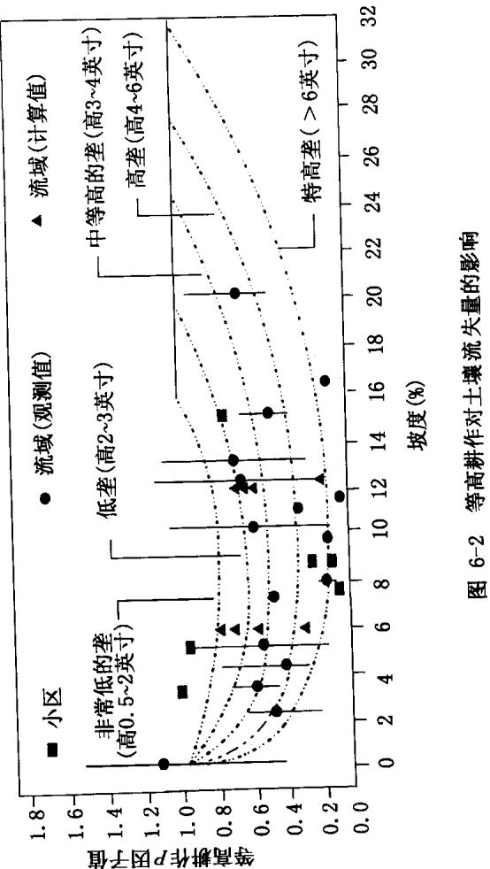

## 6.1.1.2 小流域资料

小流域资料包括面积0.06\~2ha的4个小流域的土壤流失资料(见表6-2)。经分析，点绘成图6-2。对多数流域来说，直接比较等高耕作和顺坡耕作对土壤侵蚀的影响很困难。例如在美国衣阿华州的Clarinda，作物轮作方式因流域而异(Browning等，1948)。在威斯康星州的LaCrosse,为了估算等高耕作P因子值，需要进行小区资料和流域资料的比较(Hays等，1949)。在密苏里州的Bethny(Smith等，1945)，非等高耕作流域出口处观测到大量切沟侵蚀产生的泥沙，然而RUSLE没有计算这部分侵蚀。此外，在Bethany等高耕作流域，由草皮覆盖的径流路径约占流域面积的20%，因此，该流域的产沙量很小。这样，用这两个流域总产沙量与侵蚀量之比作为等高P因子值，通常偏低。在得克萨斯州的Temple(Hill等，1944),不同耕作措施的流域面积通常不等。例如，顺坡耕作流域面积为0.06ha，而等高耕作流域面积为0.61ha。这种流域面积的差异，会导致径流、土壤侵蚀和产沙量的显著不同。因此，一定要对这些因素予以充分考虑。

表6-2 等高耕作对径流和土壤流失影响的流域研究数据汇总
<table><tr><td rowspan="2">研究 编号</td><td rowspan="2">研究地点</td><td rowspan="2">资料来源</td><td colspan="2">流域大小</td></tr><tr><td>面积 (ha)</td><td>平均坡度 (%)</td></tr><tr><td>1</td><td>Temple,得克萨斯州</td><td>Hill 等(1944)</td><td>0.06,0.61,0.89</td><td>3,5</td></tr><tr><td>2</td><td>Bethany,密苏里州</td><td>Smith 等(1945)</td><td>1.82~3.00</td><td>7</td></tr><tr><td>3</td><td>Clarinda,衣阿华</td><td>Browning 等(1948)</td><td>0.81~1.30</td><td>8</td></tr><tr><td>4</td><td>LaCrosse,威斯康星州</td><td>Hays 等(1949)</td><td>0.89</td><td>15</td></tr></table>

## 6.1.1.3 模型分析

CREAMS模型中的侵蚀子模型可用来计算流域侵蚀量和产沙量，它假定流域土壤对细沟和集中流侵蚀只有两种土壤易蚀性水平。假定流域是由两个形如平板的面共同构成的“V”字形状，中间是一个汇流沟道，两侧坡面上的径流视为一系列间距为

0.76m宽的犁沟中的水流。在CREAMS模型中，用径流汇入沟槽的先后次序表征全流域汇流过程，用面流微元代表沟边坡汇流过程。第一级水槽表示犁沟内水流，第二级水槽表示“V”型沟槽中的集中流。第二级水槽的最大长度为152m，在2个坡度较陡的流域，坡面顶部边缘到中间汇流沟道的宽度分别为12m和37m;在2个坡度较缓的流域，则分别为12m和61m。陡坡流域的坡面坡度为12%，中间“V”型沟道比降为6%;缓坡流域的坡面坡度为6%，中间“V”型沟道比降为4%。临界剪切力设为 $0 . 5 0 4 \mathrm { k g } / \mathrm { m } ^ { 2 }$ 时，表示刚刚进行第二次耕作后的田块，代表极易遭受流水侵蚀的条件(Foster等，1980)。临界剪切力设为 $1 . 0 0 8 ~ \mathrm { k g } / \mathrm { m } ^ { 2 }$ 时，表示第二次耕作后约一二个月的田块，代表在水流作用下，土壤易侵蚀性中等的条件(Foster等，1980)。

模型分析时的暴雨特性假定如下：降雨量64mm，径流量41mm,洪峰流量50.8mm/h，降雨侵蚀力EI为8.51MJ·mm/(ha·h)。降雨侵蚀力这一数值代表的是小区研究中所采用的典型人工模拟降雨(Meyer,1960)。虽然等高耕作影响径流量(如图6-1)，但CREAMS模型中的径流量不随流域状况变化，因此模型低估了等高耕作对侵蚀的影响。缓坡流域的犁沟坡度分别为0.5%，1%,2%和4%，陡坡流域的犁沟坡度为6%。随着犁沟坡度的增加，汇流沟道上游集水面积增加，而“V”型沟道长度减小。假定犁沟坡度为0.5%时，代表最好的等高耕作方式，计算结果绘于图6-2。

## 6.1.2 结果

图6-2中表示一些可在文献中得到的资料。如果RUSLE采用标准方法，即沿坡面方向取坡长和坡度计算等高耕作效益时，需考虑降雨侵蚀力，以及犁沟坡度。

## 6.1.2.1 犁垄高度对土壤侵蚀的影响

图6-2中描绘的5条曲线，分别代表5种犁垄高度特低垄、低垄、中垄、高垄和特高垄情况下，等高耕作措施对土壤侵蚀的影响：假定犁垄基本与等高线平行，径流可沿犁垄均匀溢出时。小区试验结果表明:高犁垄的水土保持效果最好(Borst等，1945;Molden-hauer 和 Wischmeier,1960)，低犁垄的水土保持效果最差(VanDoren等，1950)。陡坡情况下，图6-2所示曲线的右端点，则由坡度决定，在此种坡度下，典型的犁垄高度和行距无法贮存径流。

这些曲线可用方程描述如下：

$$
P _ { \mathrm { b } } = \alpha ( S _ { \mathrm { m } } - S _ { \mathrm { c } } ) ^ { \mathrm { b } } + P _ { \mathrm { m b } } \qquad S _ { \mathrm { c } } < S _ { \mathrm { m } }\tag{6-1}
$$

$$
P _ { \mathrm { b } } = c ( S _ { \mathrm { c } } - S _ { \mathrm { m } } ) ^ { \mathrm { d } } + P _ { \mathrm { m b } } \qquad \mathrm { S } _ { \mathrm { c } } \geq S _ { \mathrm { m } }\tag{6-2}
$$

$$
P _ { \mathrm { b } } = 1 . 0
$$

$$
S _ { \mathrm { c } } \geqslant S _ { \mathrm { e } }\tag{6-3}
$$

式中， $P _ { \mathrm { ~ b ~ } }$ 是等高耕作P因子基本值， $S _ { \mathbf { m } }$ 是等高耕作最有效时的坡度(表示为坡角的正弦值)， $S _ { \mathrm { c } }$ 是与 $P _ { \mathrm { ~ b ~ } }$ 相对应的坡度， $S _ { \mathrm { e } }$ 是临界坡度，超过该坡度时，等高耕作对水土保持无效， $P _ { \mathrm { m b } }$ 是基本条件下，对于给定犁垄高度的最小P值，a、b、c和 $^ d$ 是随犁垄高度变化的系数。

式 6-1 和6-2描绘的曲线表明，当坡度为 $S _ { \mathbf { m } }$ 时， $P _ { \boldsymbol { \mathbf { b } } }$ 值为 $P _ { \mathbf { m } }$ 坡度为 $\mathbf { 0 } _ { \circ }$ 坡度随犁垄高度变化如表6-3所示。此外，必须调整系数 a、b,使 $S _ { \mathsf { c } }$ 为0时,式6-1结果为1； $S _ { \mathrm { c } } { = } S _ { \mathrm { e } }$ 时，式6-2结果为1。为满足上述边界条件，系数 $a \setminus c$ 由以下两式确定：

$$
a \ = \ { \frac { 1 - P _ { \mathrm { { m } } } } { S _ { \mathrm { { m } } } ^ { b } } }\tag{6-4}
$$

$$
c = { \frac { 1 - P _ { \mathrm { m } } } { ( S _ { \mathrm { e } } - S _ { \mathrm { m } } ) ^ { d } } }\tag{6-5}
$$

参数b、 $^ { d }$ $S _ { \mathbf { m } }$ $S _ { \mathrm { e } }$ 的取值，是通过最佳拟合图6-2的数据率定的，它们与 $a \setminus c$ 值一起列于表6-3。而图6-2的数据是假定一种基本

条件：10年一遇暴雨的降雨侵蚀力(EI)为 $1 7 \mathrm { { M J } \cdot \mathrm { { m m } / ( \mathrm { { h a } \cdot \mathrm { { h } ) } } } }$ ,采用行播作物并进行清耕的农地，土壤的水文特性分组为C。

表 6-3 公式 6-1、6-2 计算等高耕作 P 因子的系数取值
<table><tr><td rowspan="2">垄梗高度</td><td colspan="7">系数</td></tr><tr><td>a</td><td>b</td><td>C</td><td>d</td><td> $S _ { \mathfrak { m } }$  (%)</td><td> $S _ { \mathrm { e b } }$  (%)</td><td> $P _ { \mathrm { m b } }$   $P _ { z }$ </td></tr><tr><td>特低*</td><td>24120</td><td>4</td><td>10.36</td><td>1.5</td><td>5</td><td>11</td><td>0.85 0.50</td></tr><tr><td>低</td><td>27201</td><td>4</td><td>13.31</td><td>1.5 6</td><td>15</td><td>0.65</td><td>0.3</td></tr><tr><td>中</td><td>23132</td><td>4</td><td>12.26</td><td>1.5</td><td>7 20</td><td>0.45</td><td>0.15</td></tr><tr><td>高</td><td>18051</td><td>4</td><td>10.24</td><td>1.5</td><td>8</td><td>26 0.27</td><td>0.08</td></tr><tr><td>特高</td><td>22255</td><td>4</td><td>6.83</td><td>1.5</td><td>8</td><td>36 0.1</td><td>0.05</td></tr></table>

\*见图6-2中定义的犁垄高度。

## 6.1.2.2 暴雨强度对土壤侵蚀的影响

田间研究资料表明，大暴雨时等高耕作措施的水保效益低于小暴雨(Moldenhauer和 Wischmeier,1960;Jasa等，1986)。水保效果的降低程度主要取决于径流量和洪峰流量。径流量直接与降雨量和降雨强度有关，后二者是RUSLE降雨侵蚀力 EI的主要变量。因此，当EI值大，下渗量少时，等高耕作P因子值接近于1(水保效果差)；当EI值小，下渗量多时，等高耕作P因子值小(水保效果好，Moldenhauer和 Wischmeier,1960)。等高耕作水保效果的降低，很可能由几场大暴雨引起(Hill等，1944;Jamison等，1968)。因此，如果要表示等高耕作水土保持效果的降低，用一次降雨的侵蚀力，如10年一遇降雨侵蚀力，比用多年平均年降雨侵蚀力更好。

图6-2中，得克萨斯州的Temple,10年一遇降雨侵蚀力(EI)最大值为 $2 8 . 1 \mathrm { { M J } \cdot \mathrm { { m m } / ( \mathrm { { h a } \cdot \mathrm { { h } ) } } } }$ ,等高耕作几乎无效果(Wischmeier和Smith,1978)。与此相反，纽约的 Arnot,10年一遇降雨侵蚀力(EI)值最小，为 $8 . 5 \mathrm { { M J } \cdot \mathrm { { m m } / ( \mathrm { { h a } \cdot \mathrm { { h } ) } } } }$ ，等高耕作的效果最好(Lamb等，1964)。在爱荷华州的Clarinda，10年一遇的降雨侵蚀力为$\mathbf { \hat { 1 } } 2 . 9 \mathbf { M } \mathbf { J } \cdot \mathbf { m m } / ( \mathbf { h a } \cdot \mathbf { h } )$ ，等高耕作 P 因子值较小(Moldenhauer和Wischmeier,1960)。阿肯色州的 Batesville降雨侵蚀力较大，为23.8MJ·mm/(ha·h)，常有犁垄塌陷现象发生，因而等高耕作P因子值也较大(Hood 和 Bartholomew,1956)。

利用所有资料的线性回归分析表明：等高耕作P因子值随10年一遇降雨侵蚀力值 $( E I ) _ { 1 0 }$ 的增大而增大；等高耕作P因子值随犁垄高度增加而减小(Moldenhauer 和 Wischeier,1960)。

RUSLE假定等高耕作效果随径流量变化，因此用径流量调整P因子值大小，以反映径流量不同导致的等高耕作效果的变化。径流量的不同往往是由位置、土壤、覆盖-管理条件等不同造成的，它是降雨量和下渗量的函数。径流量用美国自然资源保护局(NRCS)确定的径流曲线数法计算，其中用到的降雨量是由10年一遇降雨侵蚀力 $( E I ) _ { 1 0 }$ 估算的。10年一遇降雨侵蚀力 $( E I ) _ { 1 0 }$ 由RUSLE数据库提供，然后用下式转化为降雨量(Foster等，1980b):

$$
V _ { \mathrm { r } } = 2 0 . 9 1 6 [ ( E I ) _ { 1 0 } ] ^ { 0 . 6 6 2 }\tag{6-6}
$$

式中， $V ,$ 是降雨量(mm)。表6-4给出了农地7种类型作物覆盖管理措施。径流指数(或曲线数)用来计算每种情况下的径流量(见表6-5)。表6-6和表6-7分别给出了西北地区小麦地和牧草地的径流指数。

可以认为径流以两种方式影响等高耕作P因子值：一是P因子最小值直接随径流量变化；二是等高耕作的临界坡度(该坡度以上，等高耕作无效)直接与径流量有关。上述假设的基本依据是：等高耕作的有效性直接与径流作用于土壤的剪切力成正比，剪切力又与径流速度和坡度的1.167次方成正比(Foster等，1982)，径流速度与径流量成正比。因此，决定等高耕作效益发挥与否的临界坡度计算如下：

$$
S _ { \mathrm { e } } = S _ { \mathrm { e b } } \biggl ( \frac { 9 4 . 4 9 } { Q _ { \mathrm { k } } } \biggr ) ^ { 0 . 8 5 7 }\tag{6-7}
$$

式中， $S _ { \mathrm { e b } }$ 是基本条件下，给定犁垄高度的临界坡度，Q是给定土壤和作物管理措施下(用下标k表示)计算的径流量(mm),94.49是满足以下条件时计算得到的径流量(mm):10年一遇降雨侵蚀力为17.0MJ·mm/(ha·h),第6类植被管理条件，具有C类水文特征的土壤组。其中 $1 7 . 0 \mathrm { M J } \cdot \mathrm { m m } / ( \mathrm { h a } \cdot \mathrm { h } )$ 是美国东部有代表性的降雨侵蚀力，图6-2所示的等高试验数据大部分属C水文土壤组。最小P因子值 $P _ { \mathrm { ~ m ~ } }$ 由下式计算：

$$
P _ { \mathrm { m } } = P _ { \mathrm { m b } } \cdot \frac { Q _ { \mathrm { k } } } { 9 4 . 4 9 }\tag{6-8}
$$

式中， $P _ { \mathrm { m b } }$ 是基本条件下，某一犁垄高度的P因子最小值。式6-1、6-2和6-3给出了基本条件下P因子值的计算式。当地块条件与假设的基本条件不一致时，曲线会发生相应变化。可用以下方法分析这种变化：首先计算坡度。如果坡度小于 $S _ { \mathbf { m } }$ ,直接将实际坡度代入式6-1计算 $P _ { \mathrm { ~ b ~ } }$ ;如果坡度大于 $S _ { \mathbf { m } }$ ，式6-2用到的坡度应由下式计算：

$$
S _ { \mathrm { c } } = \frac { ( S - S _ { \mathrm { m } } ) ( S _ { \mathrm { e b } } - S _ { \mathrm { m } } ) } { ( S _ { \mathrm { e } } - S _ { \mathrm { m } } ) } + S _ { \mathrm { m } }\tag{6-9}
$$

然后用计算的 $P _ { \mathrm { ~ b ~ } }$ 值，代入式6-10：

$$
P = \mathbf { 1 } - { \frac { ( 1 - P _ { \mathrm { b } } ) ( 1 - P _ { \mathrm { m } } ) } { 1 - P _ { \mathrm { m b } } } }\tag{6-10}
$$

如果坡度超过6-7式计算的临界坡度 $S _ { e }$ ,则 $P = 1 . 0 _ { \circ }$ 如果式 6-10 计算的 P 值小于表 6-3 给出的 P因子绝对最小值 $P _ { z }$ ,则该犁垄高度下的绝对最小值 $P _ { \boldsymbol { \mathbf { b } } }$ 定为 $P$ o

表 6-4 RUSLE 计算 P 因子时采用的农田覆盖管理条件
<table><tr><td>条件分类</td><td>条件描述</td></tr><tr><td>C1. 人工草地(覆盖 非常浓密)</td><td>草浓密，径流量很小，大约是任何植被覆盖条件 下的最小值。当草被收割、打包时变为条件2</td></tr><tr><td>C2. 第一年草地，干 草(覆盖度适中)</td><td>干草是指即将收割前牧草与豆科的混合物，草地 是指第一年临近结束时长势良好的草。当草被 收割、打包时变为条件4</td></tr><tr><td>C3. 厚(密)覆盖或 粗糙或二者兼有</td><td>地表覆盖大约75%~95%。糙度与有壁犁在粘 重质地土壤上翻耕后的糙度类似，约18cm或更 大。植被水力糙度与尚未收割长势良好的豆类 农地相近</td></tr><tr><td>C4. 中等覆盖或 粗糙或二者兼有</td><td>地表覆盖大约40%～65%。糙度与有壁犁在中 等质地土壤上翻耕后的糙度类似，洼地深约 10~15cm。植被水力糙度与冬季小粒谷物完全成 熟期时类似</td></tr><tr><td>C5. 稍有覆盖或中 等糙度或二者兼有</td><td>地表覆盖大约10%~30%。地表糙度与有壁犁 在中等质地土壤上翻耕后，又用纵圆盘耙耙过第 一遍后的糙度类似，也与凿形犁在中等质地土 壤、且最适宜耕作的水分条件下翻耕后的糙度类 似。糙度约5~8cm。植被水力糙度与春季小粒 谷物在大约3/4成熟期时的糙度类似</td></tr><tr><td>C6. 无覆盖或最小 糙度或二者兼有</td><td>与条播农地播种以后遭受中等强度降雨后的糙 度十分相近。地表覆盖小于5%。糙度与良好播 种条件下的玉米地或大豆地糙度类似，地表比粉 质苗床播种期时的蔬菜地粗糙</td></tr><tr><td>C7. 清耕，平坦， 休闲</td><td>地表基本裸露，覆盖小于等于5%，有6个月或更 长时间内没有种植作物，因此前期耕作的残茬影 响基本消失。地表平坦，与遭受几次强降雨的粉 质苗床地的粗糙状况类似。这种条件大多是指 休闲地或蔬菜地</td></tr></table>

表 6-5 计算农地 P 因子值时估算径流所采用的径流指数
<table><tr><td rowspan="2">作物覆盖条件</td><td colspan="4">土壤水文组</td></tr><tr><td>A</td><td>B</td><td>C</td><td>D</td></tr><tr><td>C1</td><td>30</td><td>58</td><td>71</td><td>78</td></tr><tr><td>C2</td><td>46</td><td>66</td><td>78</td><td>83</td></tr><tr><td>C3</td><td>54</td><td>69</td><td>79</td><td>84</td></tr><tr><td>C4</td><td>55</td><td>72</td><td>81</td><td>85</td></tr><tr><td>C5</td><td>61</td><td>75</td><td>83</td><td>87</td></tr><tr><td>C6</td><td>64</td><td>78</td><td>85</td><td>88</td></tr><tr><td>C7</td><td>77</td><td>86</td><td>91</td><td>94</td></tr></table>

## 6.1.2.3 犁垄偏离等高线时等高耕作对土壤侵蚀的影响

仅仅利用等高耕作措施往往不能完全控制土壤侵蚀(Hill等，1944;Smith等，1945;Jamison等，1968)，因为径流会沿坡地上的犁沟向低洼处流动，使该处犁沟决口。为了使径流顺坡下泻而不发生侵蚀，需在决口可能发生的低洼部位设置草皮水道(Smith等，1945)。实施等高耕作后，形成于集流水路的侵蚀沟会沿坡向上延伸，但即使不采用等高耕作，集流水路处也会发生土壤侵蚀。CREAMS的分析结果表明：如果犁沟坡度较小，如0.5%或更小，则犁沟里的泥沙沉积量要大于集流水路上产生的泥沙量。当偏离等高线的犁沟坡度增加时，等高耕作的水土保持效益降低。CREAMS计算结果和试验资料表明，随着犁沟坡度的增加，等高耕作的水土保持效益迅速降低，该情况下的犁沟适于行播作物。图6-2所示的土壤流失包括了集流水道中约152m长沟道的集中流侵蚀。这些+壤流失量是用RUSLE的坡长和等高耕作因子估算的。之所以在P因子中包含由集中流造成的浅沟侵蚀，是因为用于绘制图6-2的流域资料包含浅沟侵蚀。

RUSLE用下式计算犁垄偏离等高线时的等高耕作P因子：

$$
P _ { \mathrm { g } } = P _ { \mathrm { o } } + \left( 1 - P _ { \mathrm { o } } \right) \left( \frac { S _ { \mathrm { f } } } { S _ { \mathrm { l } } } \right) ^ { \frac { 1 } { 2 } }\tag{6-11}
$$

：)8于艳采和交获潜热贯英梁采昂昂垫梁单

## 花护垒护昂居插

潜校热和

表 6-7 计算 P 因子径流值所用径流指数①
<table><tr><td rowspan="2">农田覆盖管理条件②</td><td colspan="3">土壤水文组</td></tr><tr><td>A</td><td>B C</td><td>D</td></tr><tr><td>C1</td><td>40</td><td>67 78</td><td>86</td></tr><tr><td>C2</td><td>65</td><td>84</td><td>88</td></tr><tr><td>C3</td><td>69</td><td>76 82 85</td><td>89</td></tr><tr><td>C4</td><td>75</td><td>92 92</td><td>92</td></tr><tr><td>C5</td><td>81</td><td>93 93</td><td>93</td></tr><tr><td>C6</td><td>85</td><td>94 94</td><td>94</td></tr><tr><td>C7</td><td>89</td><td>95 95</td><td>95</td></tr><tr><td>VR</td><td>30</td><td>58 71</td><td>78</td></tr></table>

①适用于西北麦区和牧区农地，由于土壤冻层使渗透性大大降低。  
②由表6-6定义。

式中， $P _ { \mathrm { ~ g ~ } }$ 是犁垄偏离等高线时的等高耕作P因子， $P _ { \mathrm { ~ o ~ } }$ 是等高耕作P因子(用式6-10计算)， $S _ { \mathrm { f } }$ 是犁沟坡度，用坡角的正弦表示， $S _ { 1 }$ 是坡面坡度，用坡角的正弦表示。该公式与Dissmeyer和 Foster(1980)在应用USLE计算扰动林地土壤侵蚀量时采用的关系式类似。McGregor等(1969)收集的数据，目前来看似乎是惟一可获得的能直接评价式6-11的田间数据资料。这些数据中的犁沟坡度变化于0.2%\~0.4%。McGregor等(1969)的研究结果表明：46m宽、5%坡度、犁沟偏离等高线方向时，P因子值为0.39;而犁沟完全沿等高线方向时，P因子值为0.10。假设沿等高线耕作的P因子值 $P _ { \mathrm { o } } = 0 . 1 0$ ,犁沟坡度为0.3%，则由式6-11计算的 $P _ { \mathrm { ~ g ~ } }$ 为0.32,略小于实测值0.39。

## 6.2 超过临界坡长等高耕作土壤流失量估算

## 6.2.1 临界坡长

当坡面很长时，等高耕作措施效果会降低。Wischmeir和

Smith(1978)给出了USLE中采用的临界坡长表，假定超过该坡长时，等高耕作措施效果大大降低。这些临界坡长值是坡度的函数，但如果地表残留物覆盖超过50%，则临界坡长增加。Foster等(1982)研究了地表残留物覆盖失去作用，从而发生严重土壤流失情况下的水力条件，他们的分析中同时考虑了水流剪切力对土壤和残留物的作用。当作用于残留物的剪切力超过某一临界值时，残留物就会移动。同理，当作用于土壤的剪切力超过某一临界值时，土壤就会遭受侵蚀。Foster等给出了计算覆盖层移动的公式，采用流量作为主要水力输入变量。RUSLE临界坡长便是采用Foster等(1982)计算覆盖层稳定性方程的简化形式。公式如下：

$$
\lambda _ { \mathrm { c } } = { \frac { 2 0 1 8 2 n _ { \mathrm { t } } ^ { 1 . 5 } } { s ^ { 1 . 1 6 6 7 } Q } }\tag{6-12}
$$

式中，λ。是临界坡长，n₁是曼宁系数，s是坡度，用坡角的正弦表 $\lambda _ { \mathrm { c } }$ $\pmb { n } _ { \uparrow }$ 示，Q是根据10年一遇暴雨EI计算的径流量，20182是下列假定条件下标定式6-12得到的参数：坡度为7%，临界坡长为61m，中等高度犁垄，行播疏植作物，C类水文特性土壤，10年一遇暴雨EI值为 $1 7 \mathrm { { M J } \cdot \mathrm { { m m } / ( \mathrm { { h a } \cdot \mathrm { { h } ) } } } }$ 。这一临界坡长值与Wischmeir和Smith(1978)所用的值相同。表6-8给出了曼宁系数n，值，这些 ${ \pmb n } _ { \pmb t }$ 值的选择是根据CREAM模型的建议(Foster等，1980a)和覆盖物移动的田间试验研究(Foster等，1982)。原来采用的临界坡长值是根据推断以及田间观测综合得到的（Wishchmeir和Smith，1978)。而用公式进行标定时，选择的标定条件应代表可以观测到的典型情况。针对一系列不同坡度用式6-12计算的临界坡长值列于表 6-9,与 Wishchmeir和 Smith(1978)的计算值一同列出，除坡度小于4%外，二者十分接近。RUSLE的最大临界坡长值为305m,针对其他不同条件的临界坡长值分别列于表6-10、6-11和6-12。

表 6-8 RUSLE 农地条件下采用的曼宁公式 ${ \pmb n } _ { \pmb t }$ 值
<table><tr><td>覆盖管理条件①</td><td>曼宁公式的  ${ \pmb n } _ { \uparrow }$  值</td></tr><tr><td>C1</td><td>0.2000</td></tr><tr><td>C2</td><td>0.110</td></tr><tr><td>C3</td><td>0.070</td></tr><tr><td>C4</td><td>0.040</td></tr><tr><td>C5</td><td>0.023</td></tr><tr><td>C6</td><td>0.014</td></tr><tr><td>C7</td><td>0.011</td></tr></table>

①表6-4中描述的覆盖管理条件。

表 6-9 式 6-12 计算的临界坡长和 Wischmeier 和Smith(1978)所用的临界坡长
<table><tr><td>坡度 (%)</td><td>公式  $6 { \cdot } 1 2 ^ { \textregistered }$  坡长 (m)</td><td>Wischmeier 和 Smith(1978) (m)</td></tr><tr><td>1.5</td><td>305</td><td>122</td></tr><tr><td>4.0</td><td>117</td><td>91</td></tr><tr><td>7.0</td><td>61</td><td>61</td></tr><tr><td>10.5</td><td>38</td><td>37</td></tr><tr><td>14.5</td><td>24</td><td>26</td></tr><tr><td>18.5</td><td>18</td><td>20</td></tr><tr><td>23.0</td><td>15</td><td>15</td></tr></table>

①中等垄梗高，土壤水文组C,C6覆盖管理条件(表6-4定义)，降雨侵蚀力17MJ·$\bf { m m } / ( \bf { h a } { \cdot h } )$ 0  
②资料来源：Wischmeier和 Smith(1978))。

表 6-10 不同降雨侵蚀力 $( E I ) _ { 1 0 }$ 和覆盖管理条件下的临界坡长 $( \mathrm { m } ) ^ { \mathrm { { ( \bar { 1 } } ) } }$
<table><tr><td rowspan="2">降雨侵蚀力  $( E I ) _ { 1 0 }$   $\mathbf { M J } \cdot \mathbf { m m } / ( \mathrm { h a } \cdot \mathrm { h } )$ </td><td colspan="7">覆盖管理条件  $\bullet$ </td></tr><tr><td>C1</td><td>C2</td><td>C3</td><td>C4</td><td>C5</td><td>C6</td><td>C7</td></tr><tr><td>1.7</td><td>305</td><td>305</td><td>305</td><td>305</td><td>305</td><td>305</td><td>284</td></tr><tr><td>4.3</td><td>305</td><td>305</td><td>305</td><td>305</td><td>305</td><td>251</td><td>106</td></tr><tr><td>8.5</td><td>305</td><td>305</td><td>305</td><td>305</td><td>270</td><td>118</td><td>56</td></tr><tr><td>17.0</td><td>305</td><td>305</td><td>305</td><td>305</td><td>136</td><td>61</td><td>32</td></tr><tr><td>34.0</td><td>305</td><td>305</td><td>305</td><td>176</td><td>74</td><td>34</td><td>19</td></tr></table>

①坡度7%，土壤水文组 $\mathbf { C } _ { \circ }$  
②覆盖管理条件按表6-4定义。

表 6-11 不同土壤水文组和降雨侵蚀力 $\left( { \bf E I } \right) _ { 1 0 }$ 的临界坡长 $( \mathbf { m } ) ^ { \textregistered }$
<table><tr><td rowspan="2">降雨侵蚀力  $( E I ) _ { 1 0 }$   $\mathbf { M J } \cdot \mathbf { m m } / ( \mathbf { h a } \cdot \mathbf { h } )$ </td><td colspan="4">土壤水文组</td></tr><tr><td>A</td><td>B</td><td>C</td><td>D</td></tr><tr><td>1.7</td><td>305</td><td>305</td><td>305</td><td>305</td></tr><tr><td>4.3</td><td>305</td><td>305</td><td>305</td><td>305</td></tr><tr><td>8.5</td><td>305</td><td>305</td><td>305</td><td>305</td></tr><tr><td>17.0</td><td>305</td><td>305</td><td>305</td><td>295</td></tr><tr><td>34.0</td><td>305</td><td>213</td><td>176</td><td>164</td></tr></table>

①坡度7%，覆盖管理条件 $\mathbf { C } \pmb { 4 } ,$

表 6-12 不同土壤水文组和降雨侵蚀力 $( E I ) _ { 1 0 }$ 的临界坡长 $( \mathbf { m } ) ^ { \textregistered }$
<table><tr><td rowspan="2">降雨侵蚀力  $( E I ) _ { 1 0 }$   $\mathbf { M J } \cdot \mathbf { m m } / ( \mathbf { h a } \cdot \mathbf { h } )$ </td><td colspan="4">土壤水文组</td></tr><tr><td>A</td><td>B</td><td>C</td><td>D</td></tr><tr><td>1.7</td><td>305</td><td>305</td><td>305</td><td>305</td></tr><tr><td>4.3</td><td>305</td><td>305</td><td>251</td><td>209</td></tr><tr><td>8.5</td><td>305</td><td>160</td><td>118</td><td>105</td></tr><tr><td>17.0</td><td>124</td><td>75</td><td>61</td><td>56</td></tr><tr><td>34.0</td><td>54</td><td>39</td><td>34</td><td>32</td></tr></table>

①坡度7%，覆盖管理条件C6。

## 6.2.2 超过临界坡长 P 因子值计算

当坡长超过临界坡长时，计算P因子值采用的是将RUSLE应用于不规则坡面时的方法(Foster 和 Wischmeier,1974)。公式的起始点就是将RUSLE应用在坡面上的点，公式如下：

$$
D = \left( m + 1 \right) R K S C P \left( x _ { * } \cdot \frac { \lambda } { 2 2 . 1 } \right) ^ { m }\tag{6-13}
$$

式中，D是某点x的土壤侵蚀率，m是坡长指数；R是降雨侵蚀力因子；K是土壤可蚀性因子； $S$ 是坡度因子；C是覆盖管理因子； $P$ 是等高耕作保持措施因子。标准化坡长x，是 $x / \lambda$ ,其中 x 是坡顶至点x处的斜坡长度;22.1是RUSLE标准小区长度(m)。所有因子值均适用于点x的条件，且只限于均匀坡。若要分析更为复杂的情况，则需要应用计算不规则坡的方法，此时，式6-13可变形为：

$$
D = ( m + 1 ) R K S C P \left( \frac { \lambda } { 2 2 . 1 } \right) ^ { m } ( x _ { * } ) ^ { m }\tag{6-14}
$$

式中， $\left( { \frac { \lambda } { 2 2 . 1 } } \right) ^ { m }$ 是 RUSLE 中的坡长因子。

假设将坡面分为上下二部分，点x。以上部分等高耕作措施可 $x _ { \mathfrak { c } }$ 有效控制土壤流失，以下部分则不能控制土壤流失，于是计算整个坡面土壤流失量G的公式如下：

$$
G = \int _ { 0 } ^ { x _ { c } } { D d x } + \int _ { x _ { c } } ^ { 1 } { D d x }\tag{6-15}
$$

将6-14代入式6-15得：

$$
G = ( m + 1 ) \lambda \biggl ( \frac { \lambda } { 2 2 . 1 3 } \biggr ) ^ { m } R K S C \biggl ( P \biggl [ \ L { x _ { * } ^ { m } } d x _ { * } \ L \biggr . + \biggl . \int \ L { x _ { * } ^ { m } } d x _ { * } \biggr . \biggr )\tag{6-16}
$$

坡面产沙量G除以坡长λ，便得到坡长λ坡面上，单位面积土壤流失量A，表示为：

$$
\begin{array} { r } { \begin{array} { r } { A = R K L S C ( \mathop { P _ { \mathrm { e f f } } } ) } \end{array} } \end{array}\tag{6-17}
$$

其中，

$$
P _ { \mathrm { e f f } } = \left[ 1 - x _ { \mathrm { c } } ^ { m + 1 } ( 1 - P ) \right]\tag{6-18}
$$

式中， $P _ { \mathrm { e f f } }$ 是计算坡长为λ的坡面平均土壤流失量的有效P因子，由式6-18计算。适用于不同坡的坡长指数，细沟和细沟间土壤侵蚀类型列于表4-5。

## 6.2.3 讨论

用表6-12的有效P因子值，可以估算坡长为λ的坡面平均土壤流失量。由干等高耕作已不能控制土壤流失，坡面下部的土壤流失量要比整个坡面平均土壤流失量大。当利用这种方法进行水十保持规划时，一定要考虑到是否允许坡面下部土壤流失量大于容许土壤流失量。第四章已讲述了如何用RUSLE分段计算坡面土壤流失量，以及如何调整分段土壤流失量，以便与RUSLE列出的容许土壤流失量进行比较。

## 6.3 带状耕作 P 因子值

带状耕作也是一种土壤保持措施。它是指将疏植作物，或近似按疏植作物处理的作物与密植植物，比如牧草和豆科作物，按带状相间种植。在西北麦区和牧草地，则用粗糙的耕作带代替密生植被带。通常进行有序的作物轮种，这样在轮种周期的某一时段内，每一带上都会有一种作物。为了与作物轮种相匹配，整个区域的条带带宽往往相同。当每条耕作带的顶部与等高线重合时，带状耕作的水土保持效益最好。

用干控制水蚀的带状耕作有许多种，可分为等高带状耕作、横坡带状耕作和条块种植。它们的共同点是轮种作物的带宽基本相等，不同点是各种措施犁垄与等高线的偏离度不同。所有这些保持措施，包括等高耕作措施，都会在一定程度上偏离等高线，因此它们的有效性都可用RUSLE的同一个公式计算。尽管它们的有效性随坡度有很大变化，但实际上反映的都是同一种土壤保持技术，没有本质上的差别，因此，统一用“横坡带状耕作”描述上面所提到的各种带状耕作土壤保持措施。

缓冲带是指横穿坡面种植的多年生植被，一般位于坡面顶部平缓地区。与横坡带状耕作一样，缓冲带可以与等高线重合，也可不重合。缓冲带上的植被以草本植物为主，而非轮种的农作物，它通常比毗邻的疏植作物带窄。缓冲带上的植物可以留种几年或永久留种。RUSLE可以计算缓冲带拦截泥沙、减少土壤侵蚀的有效性。

过滤带是位干斜坡底部的植被带，往往沿河道或水体周围分布。设置过滤带是为了减少进入水体的泥沙量。由于该措施不能拦截山坡上的土壤侵蚀产沙，因此这是一种水土保持效果最低的P因子。

无论是密生植被或是粗糙条带，都会使侵蚀产生的泥沙沉积，这一过程均在P因子值中考虑。沉积往往发生在坡面有作物种植的区域，从而对应一个较低的P值，表明土壤保持效果好。因此，在反映保持土地生产力时，横坡带状耕作的P值最低，缓冲带居中，过滤带最高。一般将过滤带P值设为1，因为对大部分农田而言，过滤带基本起不到水土保持作用。

带状耕作的主要优点是在带之间进行作物轮种，通过带之间的轮种，作物可从上一年种植的密值作物带或粗糙条带拦截的泥沙中吸收养分。带状耕作还可大大降低泥沙沿坡向下的移动速度。由于过滤带位于斜坡底部，因此它几乎不影响泥沙移动速度。一般来说，淤积的泥沙是否会有利于作物生长取决于淤积量和淤积位置。沉积在坡上部的泥沙比沉积在下部的泥沙，对作物生长更为有利。缓冲带拦截的泥沙往往滞留在很小范围内(如梯田)，因此所带来的效益不会像带状耕作那样明显。

当径流从一个作物带流入另一个作物带时，作物带大大降低了径流的泥沙输移能力，从而有效地减少了土壤流失。如有泥沙淤积，则说明径流挟沙力低于径流中的泥沙含量。若无泥沙淤积，则 $P = 1 . 0 ,$ 。下面举例说明如何给P赋值。

## 6.3.1 实例分析

例1:用牧草带分开的行播疏植作物带。

假设最上边带状耕作玉米，带内土壤侵蚀非常严重，作物带下部边缘的径流含沙量很高。牧草带较疏植作物带的水力阻力大，当水流进入草带后，水力阻力大大降低了水流挟沙力。如果牧草带上部边缘的水流挟沙力被减小到远远小于进入草带时的径流泥沙含量，则会有大量泥沙沉积，P值小于1。当径流流经很宽的牧草带时，不断地淤积，使得径流泥沙含量小于水流挟沙力，于是在草带的下部边缘，当水流即将流出草带时，会有侵蚀发生。疏生作物带可蚀性与密生植物带水流挟沙力的关系可用以下一个极端的例子说明：混凝土带被密生草带分开。假定最上部条带为混凝土，其上水流有非常大的水流挟沙力，但由于混凝土的不可蚀性，径流泥沙含量很低(接近于零)。即使混凝土下部的草带能大大减小水流挟沙力，也不会有泥沙淤积，因为水流挟沙力不会小于径流含沙量，因此P值取1.0。

例2:草带中散布免耕玉米地。

这比上例的混凝土-草带更接近实际情况。假设最上部条带是免耕玉米地，覆盖有厚层残留物，于是玉米地上几乎没有土壤侵蚀发生。当水流流到草带时，由于草带水力阻力仅略大于免耕玉米地水力阻力，水流挟沙力减少很小。而另一方面，由于免耕玉米地的土壤侵蚀量很小，径流含沙量便很低，因此，不会有沉积发生，因为草带的水流挟沙力不会减小到小于径流含沙量，因此， $P$ 值取为1.0。

总之，带状耕作、缓冲带和过滤带等水土保持措施的有效性，取决于侵蚀条带径流含沙量与较大水力阻力条带的水流挟沙力二者之间的相对大小。

## 6.3.2 带状耕作 P 因子值的发展过程

最早带状耕作P因子值的确定是通过文献研究得到，遗憾的是大多数有关这方面的试验研究集中在1930\~1960年间，因此无法包括现代水土保持耕作措施(Hill等，1944;Borst等，1945;Smith 等,1945; Hays 等，1949; Hood 和 Bartholomew,1956; Hays和Attoe,1957)。而且当时的作物产量大大低于现在的产量，冠层盖度和残留物数量也小于现在的状况。这样仅用已发表的试验数据，研究目前多种水土保持措施的P因子值远远不够。基于这种情况，根据侵蚀的基本概念，建立了一种简单的侵蚀-沉积模型，用于估计 RUSLE 带状耕作 P 因子值(Renard 和 Foster,1983;Flana-gan等，1989)。除建立模型外，还陆续建立了其他方法，如根据理论和侵蚀研究的试验数据，确定参数值，然后调整参数使模型计算值与有限的实测值相吻合。RUSLE给出了很多情况下，带状耕作、缓冲带以及过滤带P值计算的模型。它们可统一表示为带状耕作P因子，计算公式如下：

$$
P _ { \mathrm { s } } = { \frac { \left( g _ { \mathrm { p } } - B \right) } { g _ { \mathrm { p } } } }\tag{6-19}
$$

式中， $P _ { \mathrm { ~ s ~ } }$ 是带状耕作P值，g。是斜坡底部含沙量(当条带内无沉 $\mathbf { g _ { p } }$ 积时)，B是淤积贡献。表6-13列出了有关文献中带状耕作试验产沙量的观测值和模型计算值对比。

模型从坡顶至坡脚逐一计算了每一条带的侵蚀量、泥沙输移 量和沉积量，每一条带满足下列4个条件之一：①条带上处处有侵

蚀发生。②条带上处处有泥沙沉积。③条带上部有沉积发生，下部有侵蚀发生。④径流在条带内全部下渗，无径流或泥沙流出条带。

下面给出的每一案例研究，都是为了计算各条带内的沉积量$( M _ { i } )$ ，以及径流流出各条带时的含沙量 $\left( { { g } _ { i } } \right)$

例1:条带上处处有侵蚀发生。

在这种情况下，沿着条带的水流挟沙力增长速率一定要大于土壤颗粒分离速率。这时土壤侵蚀量用下式计算：

$$
D _ { n i } = \xi _ { i } \big ( x _ { i } ^ { n } - x _ { i - 1 } ^ { n } \big )\tag{6-20}
$$

式中， $\boldsymbol { \xi }$ 是侵蚀因子， $_ { x }$ 是坡顶至条带下部的相对距离(绝对距离/坡长),n是指数,设为1,下标i代表不同的条带。表6-14给出了 $\xi$ 值，沉积在条带下部的泥沙量由下式计算：

$$
g _ { i } = g _ { i - 1 } + D _ { \mathfrak { n } i }\tag{6-21}
$$

表6-13 带状耕作条件下的泥沙输移比(根据试验数据)
<table><tr><td rowspan="2">研究地点和资料来源</td><td rowspan="2">轮作</td><td colspan="2">泥沙输移比</td></tr><tr><td></td><td>观测值模型值</td></tr><tr><td>Bethany，密苏里，Smith 等(1945)</td><td>C-W-M</td><td>0.44</td><td>0.53</td></tr><tr><td>Aanesville,俄亥俄,Borst等(1945)</td><td>C-W-M</td><td>0.36</td><td>0.53</td></tr><tr><td>Owen,威斯康星，Hays 和 Attoe(1949)</td><td>C-W-M-M</td><td>0.42</td><td>0.48</td></tr><tr><td>LaCrosse,威斯康星,Hays等(1949)</td><td>C-W-M-M</td><td>0.55</td><td>0.48</td></tr><tr><td>Batesville,阿肯色，Hood 和 Bartholomew (1956)</td><td> $\mathbf { C } \mathrm { - } \mathbf { C _ { t } - O A }$ </td><td>0.80</td><td>0.68</td></tr><tr><td>Temple,得克萨斯（流域 1)，Hill等 (1944)</td><td>C-Ct-O</td><td>0.52</td><td>0.51</td></tr><tr><td>Temple,得克萨斯（流域1)，Hill等 (1944)</td><td> $\mathbf { C } - \mathbf { C _ { \tau } } - \mathbf { O }$ </td><td>0.30</td><td>0.51</td></tr></table>

C:玉米 $\mathrm { , C _ { t } } \mathrm { ; }$ 棉花，W：小麦，O:燕麦， $\mathcal { \Lambda }$ :燕麦/胡枝子，M:牧场。

式中， $g$ 是泥沙沉积量。所有情况下的指数n都设为1，是因为等高耕作是带状耕作的一个整体部分。当等高耕作能完全保持水土时，就不会有细沟侵蚀。等高耕作的保土效果在很大程度上是因为泥沙在耕作犁沟中的淤积。如果条带上覆盖物很密，侵蚀量就会很小，而且以细沟间侵蚀为主，而不是细沟侵蚀。在上述两种情况下，指数均接近于1(Renard和Foster,1983)。如果以细沟侵蚀为主，则指数约为1.5,RUSLE采用1,是因为式6-21给出的是净土壤侵蚀量指数。

表 6-14 用于条带 P因子的侵蚀和泥沙搬运
<table><tr><td colspan="2">覆盖管理条件①</td><td colspan="2">因子值</td><td rowspan="2">长度指数 (n)</td></tr><tr><td></td><td></td><td>侵蚀(ξ)</td><td>搬运(5)</td></tr><tr><td>C1</td><td>非常浓密覆盖</td><td>0.005</td><td>0.02</td><td>1.0</td></tr><tr><td>C2</td><td>浓密覆盖或极大糙度或二者兼有</td><td>0.02</td><td>0.05</td><td>1.0</td></tr><tr><td>C3</td><td>中等浓密覆盖</td><td>0.03</td><td>0.10</td><td>1.0</td></tr><tr><td>C4</td><td>中等覆盖或糙度或二者兼有</td><td>0.12</td><td>0.14</td><td>1.0</td></tr><tr><td>C5</td><td>稍有覆盖或中等糙度或二者兼有</td><td>0.25</td><td>0.25</td><td>1.0</td></tr><tr><td>C6</td><td>行播作物清耕，无覆盖或最小 糙度或二者兼有</td><td>0.50</td><td>0.50</td><td>1.0</td></tr><tr><td>C7</td><td>清耕，平坦，休闲</td><td>1.00</td><td>1.50</td><td>1.5</td></tr></table>

①覆盖管理条件定义在表6-4。

如果条带上土壤侵蚀速率大于水流挟沙力增加速率，就会发生局部淤积。例如泥沙淤积在耕作所留下的洼坑里。在这种情况下.可用Renard和Foster建立的泥沙淤积公式计算净土壤侵蚀量：

$$
D _ { \mathfrak { n } i } \ = \ \left\{ \frac { \notin d T _ { i } } { d x } + \mathfrak { E } _ { i } \right\} ( x _ { i } - x _ { i - 1 } )\tag{6-22}
$$

式中， $\phi = V _ { \mathrm { { f } } } / \sigma , V _ { \mathrm { { f } } }$ 是泥沙沉降速度， $\sigma$ 是超渗产流率(降雨强度-下渗率)， $\phi = 1 5 , \phi$ 随泥沙粒径和含沙量浓度而变，但

RUSLE 采用定值 φ = 15。6-22 式是由下式推得(Renard 和 Fos-ter,1983)。

$$
D = \bigg ( \frac { V _ { \mathrm { f } } } { q } \bigg ) \big ( \mathrm { \mathcal { T } } - g \big )\tag{6-23}
$$

式中，D是泥沙淤积速率， $q$ 是流量，T是水流挟沙力。

例2:条带上处处有泥沙淤积。

当条带顶部的水流挟沙力小于该处的泥沙沉积速率时，就会发生泥沙淤积。如果条带较窄或者条带内径流速度随距离增加而减小，也会导致整个条带内泥沙淤积。后一情形的发生，是因为条带淤积处的下渗速率大于其上部的下渗速率。6-23式用来计算条带泥沙淤积量，而流量 $q$ 则用下式计算：

$$
q = q _ { i - 1 } + \sigma _ { i } ( x - x _ { i - 1 } )\tag{6-24}
$$

RUSLE中超渗产流速率由某一给定条件下的径流量与清耕行播作物条件下的径流量比例计算，也用径流深表示。后者列于表6-4的条件 $6 _ { \mathfrak { c } }$ 径流量采用美国农业部自然资源保护局(NRCS)的径流曲线数法计算，径流指数见表6-5。当下渗速率大于降雨强度时，条带内径流速率减小。如果条带较宽，则径流在条带内消失。此时常规径流曲线数法视为无径流产生，因此，采用修正的公式，计算刚好产生径流的降雨量，修正公式如下：

$$
r = V _ { \mathrm { r } } - 0 . 2 \Big [ \Big ( \frac { 1 0 0 0 } { N } \Big ) - 1 0 \Big ]\tag{6-25}
$$

式中， $r$ 是超渗产流深度(in)， $V _ { r }$ 是降雨量，N是径流指数。水流挟沙力计算公式为：

$$
T = \zeta _ { q }\tag{6-26}
$$

式中， $\zeta$ 是水流挟沙力因子，它是一个相对值，根据CREAMS模型(Foster等，1980a)推荐采用的曼宁系数 $n _ { \mathrm { \Delta t } }$ 径流速度与曼宁系数$n _ { \mathrm { ~ i ~ } }$ ，的关系以及水流挟沙力与流速的3次方成正比(Foster和Mey-

er,1975)这三个条件来选择,其值见表6-12。由式6-24、6-25和 $^ { 6 \mathrm { - } }$ 27可计算出整个条带上各处的泥沙淤积量：

$$
\begin{array} { l } { { \displaystyle g _ { i } = \Big ( \frac { \phi d T _ { i } } { d x } + \pounds _ { i } \Big ) q _ { i } \big [ \sigma _ { i } ( 1 + \phi ) \big ] ^ { - 1 } } } \\ { { \displaystyle \quad + \left( \frac { q _ { i - 1 } } { q _ { i } } \right) ^ { \phi } \Big \{ g _ { i - 1 } - \Big ( \frac { \phi d T _ { i } } { d x } + \pounds _ { i } \Big ) q _ { i - 1 } \big [ \sigma _ { i } ( 1 + \phi ) \big ] ^ { - 1 } \Big \} } } \end{array}\tag{6-27}
$$

其中水流挟沙力随距离的变化可用下式计算，

$$
\frac { d T _ { i } } { d x } = \zeta _ { i } \sigma _ { i }\tag{6-28}
$$

条带上的泥沙淤积量为：

$$
M _ { i } = g _ { i } - g _ { i - 1 } + D _ { \mathrm { n } i }\tag{6-29}
$$

例3:条带上既有土壤侵蚀又有泥沙淤积。

如果条带上部径流含沙量大于水流挟沙力，就会在条带上部发生淤积。当条带较宽，目水流挟沙力增加速率 $\left( d T / d x \right)$ 大于土壤侵蚀速率时，淤积就会在条带内终止，终止处径流含沙量与水流挟沙力相等，此时径流流量 $( q _ { \mathrm { d e } } )$ 计算公式为：

$$
q _ { \mathrm { d e } } = \bigg ( \frac { \alpha _ { 2 } \not \circ \sigma _ { i } } { a _ { 1 } \sigma _ { i } + \not \in \xi _ { i } } \bigg ) ^ { \frac { 1 } { 1 + \beta } } ( q _ { i } ) ^ { \frac { \beta } { 1 + \beta } }\tag{6-30}
$$

$$
a _ { 1 } = \frac { \displaystyle \left( \frac { \phi d T _ { i } } { d x } + \xi _ { i } \right) } { \sigma _ { i } ( 1 + \phi ) }\tag{6-31}
$$

$$
a _ { 2 } = g _ { i - 1 } - a _ { 1 } q _ { i - 1 }\tag{6-32}
$$

泥沙淤积终止处点 $x _ { \mathrm { d e } }$ 的距离为：

$$
x _ { \mathrm { d e } } = \frac { q _ { \mathrm { d e } } - q _ { i - 1 } + \sigma _ { i } x _ { i - 1 } } { \sigma _ { i } }\tag{6-33}
$$

泥沙淤积终止处的含沙量为：

$$
g _ { \mathrm { d e } } ~ = ~ \zeta _ { i } q _ { \mathrm { d e } }\tag{6-34}
$$

<!-- ===== 分片 p201-264（64页，源：ex05_刘宝元_土壤侵蚀预报模型（201-264页））===== -->

若 $d T _ { i } / d x > \xi _ { i }$ ,则条带底部的含沙量为：

$$
g _ { i } = g _ { \mathrm { d e } } + \xi _ { i } \big ( x _ { i } ^ { n } - x _ { \mathrm { d e } } ^ { n } \big )\tag{6-35}
$$

若 $d T _ { i } / d x < \xi _ { i }$ ,则条带底部的含沙量为：

$$
g _ { i } = g _ { \mathrm { d e } } + \left[ \frac { \left( \frac { \phi d T _ { i } } { d x } + \pounds _ { i } \right) } { 1 + \phi } \right] \left( x _ { i } - x _ { \mathrm { d e } } \right)\tag{6-36}
$$

泥沙淤积量的计算式为：

$$
M _ { i } = g _ { i } - g _ { \mathrm { d e } } + \left[ \frac { \left( \frac { \phi d T _ { i } } { d x } + \frac { } { \xi _ { i } } \right) } { 1 + \phi } \right] \left( x _ { \mathrm { d e } } - x _ { i - 1 } \right)\tag{6-37}
$$

条带内既有侵蚀又有淤积的另一种情形是条带上部发生侵蚀，同时条带内也有局部淤积。当条带上部含沙量小于水流挟沙力，并且水流挟沙力增加速率小于土壤侵蚀速率时，即 $\frac { d T _ { i } } { d _ { x } } < \xi _ { i }$ 时，就会出现这种情况。局部淤积出现的地方是含沙量与水流挟沙力相等处，此时条带底部径流含沙量为：

$$
g _ { i } = g _ { \ r { \mathrm { d b } } } + \left[ \frac { \left( \frac { \phi d T _ { i } } { d x } + \frac { \ l } { \xi _ { i } } \right) } { 1 + \ l \phi } \right] \left( x _ { i } - x _ { \ r { \mathrm { d b } } } \right)\tag{6-38}
$$

式中， ${ \pmb g } _ { \mathbf { d b } }$ 是局部淤积开始时的含沙量， $x _ { \mathrm { d b } }$ 是局部淤积点的位置。若 $g _ { i } > g _ { \mathrm { d b } }$ ,则淤积量 $M = 0$ ;若 $g _ { i } < g _ { \mathrm { d b } }$ ,则 $M = g _ { \mathrm { d b } } - g _ { i }$ 0

例4:条带内径流全部下渗。

条带间的下渗能力相差很大，当条带下渗率很大时，来自上坡的径流会全部下渗，没有径流发生，也就不会有土壤流失。径流消失的位置可由式6-24和6-25式计算，泥沙淤积量等于径流携带的沙量，以及条带内由条带顶部至径流消失处之间产生的泥沙量之和。

## 6.3.3 带状耕作 P 因子值计算

带状耕作P因子值用下式计算：

$$
\begin{array} { r } { P _ { \mathrm { s } } = \frac { g _ { \mathrm { p } } - B } { g _ { \mathrm { p } } } } \end{array}\tag{6-39}
$$

式中， $P _ { \mathrm { ~ s ~ } }$ 是土壤保持规划P值， $g _ { \mathfrak { p } }$ 是条带内除了局部沉积外，无沉积时的可能产沙量。B是对土壤保持具有长期效益的泥沙淤积量，其表达式为：

$$
B = \sum _ { i = 1 } ^ { n } M _ { i } ( 1 - x _ { i - 1 } ^ { 1 . 5 } )\tag{6-40}
$$

式中，n是总条带数。可能产沙量 $( g _ { \mathsf { p } } )$ 用下式计算：

$$
g _ { \mathfrak { p } } = \sum _ { i = 1 } ^ { n } D _ { \mathfrak { n } i }\tag{6-41}
$$

式中，每一条带的 $D _ { \mathfrak { n } i }$ 由式 6-20 或 6-22 计算.

模型还可以计算坡地的泥沙输移比 $( P _ { \mathbf { y } } )$ ，其表达式如下：

$$
P _ { \mathrm { y } } = { \frac { g _ { \lambda } } { g _ { \mathrm { p } } } }\tag{6-42}
$$

式中，g、是坡脚处含沙量。表6-15列出了几种带状耕作系统的P $g _ { \lambda }$ 因子计算值。

总之，用上述公式和表6-14给出的参数值，可计算任何条带组合情况下，包括缓冲带和过滤带的P因子值和泥沙输移比，同时还可进一步推求年平均P因子值。根据美国东部地区行播作物春末夏初土壤侵蚀比较严重的情况，在计算上述参数时采用了加大权重的方法，因此表6-14代表了大多数这类状况，其他情况则可根据给定的时间和地表条件，从表6-14中选择相应的参数值。这一模型既可在一年内几次使用，以计算年平均P因子值，也可用以计算一个轮作期内的P因子值。

计算条带淤积量的公式中，没有考虑草带顶部的洼地淤积量。这部分淤积通过以下方法可部分地加以考虑：将洼地宽度加到草带宽度上。

表 6-15 各种带状耕作措施的泥沙输移和水土保持规划 P 因子值①
<table><tr><td>系统</td><td>泥沙输移比  $( P _ { \mathbf { y } } )$ </td><td>水土保持规划  $( P _ { \mathrm { { s } } } )$ </td></tr><tr><td> $\operatorname { R C } - \operatorname { W S G } - \operatorname { M 1 } - \operatorname { M 2 } ^ { \textcircled { 3 } }$ </td><td>0.53</td><td>0.78</td></tr><tr><td> $\operatorname { R C } - \operatorname { R C } - \operatorname { W S G } - \mathbf { M } 1 ^ { \textcircled { 4 } }$ </td><td>0.54</td><td>0.80</td></tr><tr><td> $\operatorname { R C - R C - W S G - M 1 - M 2 }$ </td><td>0.47</td><td>0.77</td></tr><tr><td> $\mathrm { R C } - \mathrm { S S G } - \mathrm { R C } - \mathrm { S S G }$ </td><td>0.75</td><td>0.91</td></tr><tr><td> $\mathrm { R C } - \mathrm { S S G } ^ { \textcircled { 5 } }$ </td><td>0.83</td><td>0.93</td></tr><tr><td> $\mathrm { R C } - \boldsymbol { \mathrm { W S G } } ^ { ( \widehat { \boldsymbol { \mathrm { 0 } } } ) }$ </td><td>0.71</td><td>0.86</td></tr><tr><td> $R C - M 1$ </td><td>0.58</td><td>0.78</td></tr><tr><td> $\operatorname { R C } - \mathbf { M } \mathbf { 1 } - \operatorname { R C } - \mathbf { M } \mathbf { 1 } ( { \mathfrak { H } } \mathbf { 1 } \not \cdot \mathbf { 1 } \not \cdot \mathbf { \hat { \Psi } } ) { \widehat { \boldsymbol { \mathscr { D } } } }$   $\mathrm { S S G - M 2 - S S G - M 2 ( \pounds ) } \supseteq 2 \mathrm { : : }$ </td><td>0.39 </td><td>0.69</td></tr><tr><td>M1-RC-M1-RC(第3年)</td><td></td><td></td></tr><tr><td></td><td></td><td></td></tr><tr><td> $\mathbf { M } 2 - \mathrm { S S G } - \mathbf { M } 2 - \mathrm { S G } ($  第4年)</td><td></td><td></td></tr><tr><td> $\operatorname { R C } - \operatorname { R C r t } - \operatorname { R C r t } - \mathbf { M } \mathbf { 1 }$ </td><td>0.65</td><td>0.84</td></tr><tr><td> $\mathrm { C n t } \cdot \mathrm { S B r t } - \mathrm { S B n t }$ </td><td>1.00</td><td>1.00</td></tr><tr><td> $\mathrm { C r t } - \mathrm { S B r t } - \mathrm { C r t } \cdots \mathrm { W S G r t }$ </td><td>0.89</td><td>0.96</td></tr><tr><td>0.5 过滤带⑧</td><td>0.06</td><td>0.51</td></tr><tr><td>0.1 过滤带⑨</td><td>0.24</td><td>0.91</td></tr><tr><td>缓冲带①</td><td>0.15</td><td>0.67</td></tr><tr><td>缓冲带① 缓冲带</td><td></td><td>0.71 0.75</td></tr></table>

①过滤带系统值主要是说明过滤带通常不是用于保护上坡的生产力损失。②RC：条播作物， ${ \bf W } { \bf S } { \bf G } ;$ 冬季小粒谷物，SSG:春季小粒谷物，M1：1年生牧草，M2:2年生牧草，C:玉米，SB:大豆，rt：少耕，nt:免耕。③Wischmeier和Smith(1978)， $P = 0 . 5 0 _ { \circ }$ ④ Wischmeier 和 Smith(1978), $P = 0 . 7 5 ,$ ⑤ Wischmeier 和Smith(1978), $P =$ 1.00。⑥Wischmeier 和 Smith(1978), $P = 1 . 0 0$ ，但他们说明冬季小粒谷物在一些情况下非常有效⑦以年进行轮作的条带位置，Y1是轮作年。⑧条播作物在坡的上半部，永久性草地过滤带在坡的下半部。⑨永久性草地过滤带在条播作物下方，坡上至坡下90%\~100%处。⑩永久性草地过滤带分别位于坡上至坡下40%\~50%和90%\~100%处，中间被条播作物分割。①永久性草地过滤带分别位于坡上至坡下35%\~40%和65%\~70%处，中间被条播作物分割。①永久性草地过滤带位于坡上至坡下40%\~50%处，两侧分别是条播作物。

带状耕作作为一种土壤保持措施，其效果主要体现在密植带或粗耕带上部的泥沙淤积。在传统带状耕作措施应用中，一般由坡下向坡顶采用同样宽的条带进行轮作，如玉米-小麦-1年生草本-2年生草本。在应用缓冲带时，多年生草本带的宽度要比作物带宽度窄得多。在轮作带状耕作中，疏植作物应种植在前一年泥沙淤积处。相反，窄的多年生植被带的作用是拦截泥沙，使泥沙仍留在坡上，但其效益往往是局部的。如果多年生植被带很窄，而且位于坡底，则其效益对整个坡面来说微乎其微。如果仅有一个比较窄的多年生植被带位于坡面较高处，则该植被带以上的坡段没有任何水土保持效益，其侵蚀速率与没有该条带时的速率相同，如同条带不存在。但是从长远看，该植被带降低了泥沙向坡下运移的速率。因此条带以下的坡面还是从中受益。

RUSLE计算P因子值和土壤流失量，是为了进行水土保持规划。在水土保持规划中，并非所有的效益都来自淤积。由式6-41计算的淤积量，其效益取决于淤积发生的位置：随着淤积位置由坡下向上，其淤积效益不断增加。相反，当条带位于坡角附近时，淤积效益便很小。这一原理与梯田P因子值的原理一致(Foster 和 Highfill,1983)。

RUSLE还可计算泥沙输移比，该因子与 RKLSC的乘积便是坡面产沙量。一般坡面产沙量小于用RUSLE计算的土壤流失量，因为RUSLE认为，整个坡面的土壤保持效益并非全部来自于泥沙淤积。

一般认为，带状耕作的有效性，在不超过细沟侵蚀临界坡长时，与条带宽度无关，但有关条带宽度作用的试验结果还有所不同。当条带很宽或坡长很长，以至于细沟侵蚀发生时，带状耕作就不能发挥其水保效益。由于问题的复杂性，目前尚无好的方法估算由干坡长很长而导致的P因子效益的降低值。进行水土保持规划时，将带状耕作的临界坡长设为等高耕作临界坡长的1.5倍。带状耕作的临界坡长与等高耕作的最大坡长有关，是因为等高耕作是带状耕作的一部分。当坡长超过临界坡长时，土壤流失量的计算方法与等高耕作的土壤流失量计算方法相同。

为了取得最大的水保效益，带状耕作的顶部一般与等高线重合。然而，条带有时也会偏离等高线，沿条带上部的边缘会有一个横向坡度出现，这时就很难估算这些条带的水保效果。在有茂密植被覆盖的顶部边缘，淤积的泥沙会形成土垄，使径流沿条带上部的边缘流动而不穿过条带。在犁耕的条带内，如果犁垄就在横坡上，径流会沿犁垄流动，不会流到条带上。其结果等同于偏离等高线的等高耕作措施。后者根据不同条带的面积比例加权计算C因子值。由这一方法计算的P因子值，反映的是带状耕作效益最差的情况。最大效益的估算则是用条带模型，选择可蚀性大于等高耕作的带状耕作方式，以反映偏离等高线时带状耕作效果的减少程度，这样总的P因子值包括两部分：一是偏离等高线耕作的P因子，另一个是调整后的条带耕作P因子。这种调整是由于偏离等高耕作后，到达密植作物带上的泥沙量增加了。

RUSLE带状耕作模型估算了条带引起的泥沙淤积量，用以反映影响泥沙输移和淤积的主要因子。尽管参数 $\phi = V _ { \mathrm { f } } / \sigma$ 表示的是泥沙特性的影响，但由于将其应用于所有情况，与典型的壤土相比，砂粒或粘粒含量较高的土壤实际淤积量，较RUSLE计算的淤积量大，泥沙输移比则比RUSLE计算结果偏小。而对粉粒含量较高的土壤来说，情况恰好相反。此外，坡上部耕作犁沟或种植条带形成的局部泥沙淤积，还会减小砂粒粒径，从而减少坡下部条带的泥沙淤积量。在估算穿过条带的泥沙量方面，CREAMS模型(Foster 等， $1 9 8 0 \mathrm { a } )$ 或 SEIMOT 模型 II(Wilson 等，1986)考虑的因素和条件要多于RUSLE模型。

## 6.3.4 融雪和冻融情况下农田带状耕作的 P 因子

如前所述，在有融雪和冻融作用的地区，农田径流和侵蚀过程与其他地区相比有很大差异。由于降雨或冻融土壤上的雪融化，该地区大多数土壤侵蚀发生在冬季。由于反复的冻融过程，这些土壤在几周内都很湿润，而且可蚀性很大。在接近地表附近有一个过渡冰冻层，使土壤的渗透性很小，一旦有降雨发生，就会产生很大的径流量和流速。正是基于这样一种情况，冬季，在这样一些地区(如美国西北小麦区和牧区)的农地应用RUSLE时，覆盖管理条件的定义，以及径流指数的取值与其他地区会有很大不同。其定义和冬季调整值分别列于表6-6和6-7。

用凿形犁、有壁犁等机械粗耕留有残茬和残留物的条带时，类似于用这些犁具翻耕土壤，大大增加土壤的渗透性。如果条带超过15m，产生于坡面上部的径流可以全部在条带内渗透，粗耕的条带内没有径流或泥沙产生。为保持这种高渗透率，应粗耕土壤，保留前期作物残留物。这种粗耕条带的渗透性要比永久草地条带渗透性大。粗耕条带上的覆盖和粗糙度在表6-6中用VR表示。假定粗耕条带在冬季与其他季节一致，表6-7给出了条带内冰冻层影响渗透性的径流指数值，表6-5则给出了不受冰冻层影响的径流指数值。

当坡面上部所有径流在条带内全部入渗时，必须考虑坡长的选取。可以用两种方法：第一种方法，也是最合适的方法，是采用整个坡的坡长，认为条带间的渗透完全一致，所有到达条带并沉积干此的泥沙在计算P因子时考虑。另一种方法是假设带状耕作系统的作用与梯田相同，坡长等于条带宽度，将其视为有封闭出口的梯田，计算P因子值。

## 6.4 梯田 P 因子值

梯田把长坡分成几个短坡，从而减少片蚀和细沟侵蚀。沉积在梯田的泥沙会使发生在梯田之间的侵蚀大部分淤积下来，尤其是当梯田水平，没有径流出口或梯田坡度很小时，情况更是如此。泥沙在田间淤积、并在很大范围内进行重新分配，从而减缓了因侵蚀导致的土壤退化。因此，与等高带状耕作相比，梯田的水土保持效果更好。如果能够合理地设计梯田和排水渠道，就可以使地表径流改变方向，而且以不发生侵蚀的速度流出田块，否则，在无梯田的地方，地表径流会沿天然水道流动，导致严重的土壤侵蚀。

## 6.4.1 梯田引起的泥沙淤积

梯田里泥沙淤积的数和位置，对确定P因子值，计算土壤流失量非常重要。如果没有泥沙淤积，也就没有营养物积累。即使来自梯田间的所有侵蚀都淤积下来，直接受益者仍是梯田，而梯田间的一些地区仍在退化。为保护土地资源进行的水土保持规划中，需要计算P因子，它是梯田之间距离的函数。当梯田之间距离小于34m时，则认为梯田对于保持土壤具有最大效益；当梯田之间的距离大于或等于91m，则认为没有水保效益；当梯田之间的距离在34\~91m之间时，认为水保效益逐渐减小，直至91m处，效益为0。在梯田之间的坡地，上段侵蚀，下段淤积，最终形成平缓坡面，可以在淤积型梯田上部被永久保存下来。如果是土层深厚的土壤，可以修筑永久性梯田，既快速减少因地形而导致的侵蚀，也易于耕作(Jacobson,1981)。

对坡式梯田上的海拔高度测定(Borst等，1945;Copley等，1944;Daniel等,1943;Pope等，1946;Smith等，1945)表明,8年以后，在梯田垄脊、渠道、前坡和后坡上，都有泥沙淤积。垄脊和后坡上的淤积物，来自于耕作和梯田的维护。在有封闭排水口和地下排水口的梯田中，泥沙主要堆积在径流入口处。

## 6.4.2 坡度的影响

20世纪30年代和40年代的梯田资料分析表明，淤积量随梯田坡度变化很大(Foster和Ferreira，1981)。对单一梯田流域，梯田坡度变化较大的几个地点，进行了8年产沙量的测量，结果表明，均一坡度梯田的产沙量随坡度呈指数关系增长：

$$
P _ { y } = \mathbf { 0 . 1 e x p } ( 2 . 4 s ) \qquad s < \mathbf { 0 . 9 \% }\tag{6-43}
$$

$$
P _ { \mathrm { y } } = 1 . 0 \qquad s \geqslant 0 . 9 \%\tag{6-44}
$$

式中， $P _ { \textrm { y } }$ 为泥沙输移因子，s为梯田坡度(%)。水土保持规划中的P因子计算公式为：

$$
P = 1 - B ( 1 - P _ { \mathrm { y } } )\tag{6-45}
$$

式中，B为泥沙淤积效益， $( 1 - P _ { \mathbf { y } } )$ 是泥沙淤积量，类似于带状耕作计算中的淤积量M。B值在表6-16中给出。

表 6-16 梯田淤积效益
<table><tr><td>梯田间距 效益B (m)</td></tr><tr><td>≤34</td></tr><tr><td>0.5 38 0.6</td></tr><tr><td>49 0.7</td></tr><tr><td>61 0.8</td></tr><tr><td>79 0.9</td></tr><tr><td>≥91 1.0</td></tr></table>

## 6.4.3 水土保持规划中的梯田 P 因子

水土保持规划中使用梯田P因子既要考虑淤积效益又要考虑泥沙淤积量。净十壤流失量是梯田之间的土壤流失量减去有利干保护十壤资源的泥沙淤积量。表6-17给出了水土保持规划中的梯田 P 因子值(Foster和 Highfill,1983),表 6-18 给出了估计梯田产沙量的参数值。用RUJSIE计算土壤流失量时，是将梯田P因子值乘以梯田间等高耕作P因子值和带状耕作P因子值。

表 6-17 水土保持规划的梯田 P 因子值①
<table><tr><td rowspan="2">水平梯田间隔 (m)</td><td colspan="3">梯田P因子</td></tr><tr><td rowspan="2">闭合出口②</td><td colspan="2">开放出口，坡度  $( \% ) ^ { \textregistered }$ </td></tr><tr><td></td><td>0.1~0.3 0.4~0.7</td><td>&gt;0.8</td></tr><tr><td>&lt;34</td><td>0.5</td><td>0.6 0.7</td><td>1.0</td></tr><tr><td>34~43</td><td>0.6</td><td>0.7 0.8</td><td>1.0</td></tr><tr><td>43~55</td><td>0.7</td><td>0.8 0.9</td><td>1.0</td></tr><tr><td>55~69</td><td>0.8</td><td>0.8 0.9</td><td>1.0</td></tr><tr><td>69~91</td><td>0.9</td><td>0.9 1.0</td><td>1.0</td></tr><tr><td>&gt;101</td><td>1.0</td><td>1.0 1.0</td><td>1.0</td></tr></table>

①用梯田之间区域的等高耕作、带状耕作或其他措施P因子值乘以表中值得到综合P因子值。②闭合出口的梯田P值也适用于有地下径流出口的梯田，或有开放出口的水平梯田。③渠道坡度在距梯田闭合出口最近的91m处测量，或无论坡有多长，在整个坡长的1/3处测量。

表 6-18 梯田泥沙输移次因子 $( P _ { \mathbf { y } } ) ^ { \textregistered }$
<table><tr><td>梯田坡度(%)</td><td>泥沙输移次因子</td></tr><tr><td>闭合出口</td><td> $0 . 0 5 ^ { \textregistered }$ </td></tr><tr><td>0(水平)</td><td>0.10</td></tr><tr><td>0.1</td><td>0.13</td></tr><tr><td>0.2</td><td>0.17</td></tr><tr><td>0.4</td><td>0.29</td></tr><tr><td>0.6</td><td>0.49</td></tr><tr><td>0.8</td><td>0.83</td></tr><tr><td>0.9</td><td>1.00</td></tr><tr><td> ${ > } 1 ^ { \mathfrak { G } }$ </td><td>1.00</td></tr></table>

①包括有地下径流出口的梯田。②资料来自Foster和Highfill(1983)。其他值出自公式 $P _ { \mathrm { y } } { = } 0 . 1 \mathrm { e x p } ( 2 . 6 4 g )$ ，g为梯田坡度(%)。③梯田渠道的潜在净侵蚀取决于水流的水文特性和渠道内的土壤可侵蚀性。如果有净侵蚀发生， $P _ { \mathbf { y } } { > } 1$  
资料来源：Foster 和 Highfill(1983)。

## 6.5 牧草地 P 因子

RUSLE中的水土保持措施因子P反映了工程措施如破皮、翻耕、等高开沟和链锁等对牧草地侵蚀的影响。表6-19、6-20、6-21列举了一些牧草地常用的工程措施。这些措施从几个不同方面影响土壤侵蚀，也包括去除地表覆盖，这也是影响草地土壤侵蚀最重要的因素，但RUSLE已在覆盖管理因子中考虑了该影响。P因子所描述的工程措施可以影响径流量、径流速度、径流方向以及径流侵蚀作用。

几乎每一种施加于牧草地上的工程措施，都由于扰动了其上的土壤而增加了土壤的渗透性，进而减少径流和侵蚀，但为保水而采取的压实和平整措施是一个例外。渗透性增加的程度与土壤性质有关。在美国西南部地区，粗质地土壤的渗透性增加很大，从而大量减少径流，而对于南达科他州的细质地土壤，渗透性增加很少，径流没有明显减少。事实上采取工程措施后，细质地结构土壤表面的结皮会导致土壤渗透性降低。表6-18、6-19、6-20给出了一般情况下的径流减少比率，更为精确的径流减少比率可根据当地具体的土壤水文特性计算。

等高垄沟措施会改变径流方向，将直接沿坡面向下的地表径流改为沿坡度较缓的垄沟流动。平缓的坡度大大降低了径流的侵蚀能力。如果破皮措施沿坡面的角度合适，会形成非常粗糙的表面，从而降低径流速度，减小侵蚀能力。随着土壤表面密实，洼地和犁沟等被淤积填满，工程措施的有效性就会随时间降低，有效性降低速率取决于气候、土壤、坡度和地表覆盖。表6-21列出了一般情况下工程措施有效时间的估算值，实际应用时，应根据当地条件进行调整。总体来说，P因子值在措施刚完成时最小，随后逐渐增大，因为措施的有效性会逐渐降低。

表6-19 工程措施对牧草地径流和侵蚀的影响
<table><tr><td rowspan="2">牧草地措施</td><td rowspan="2">资料来源</td><td colspan="3">实行措施后径流和 侵蚀的变化①</td></tr><tr><td>径流 (%)</td><td>侵蚀 (%)</td><td>年数</td></tr><tr><td>鱼鳞坑</td><td>Hickey 和 Dortignac(1963)</td><td>-18</td><td>-16</td><td>1</td></tr><tr><td rowspan="2">草地截水沟</td><td></td><td>-10</td><td>0</td><td>3</td></tr><tr><td>Hickey 和 Dortignac(1963)</td><td>-96</td><td>-85</td><td></td></tr><tr><td>有壁犁翻耕</td><td>Gifford 和 Skau(1967),</td><td>-85 +U</td><td>-31 0</td><td>3 1</td></tr><tr><td rowspan="2"></td><td>Blackburn 和 Skau(1974)</td><td>0</td><td>0</td><td>5</td></tr><tr><td>Branson 等(1966)</td><td>-U</td><td></td><td>1</td></tr><tr><td>等高开沟</td><td>Wein 和 West(1973)</td><td>-U</td><td>-U -U</td><td>10</td></tr><tr><td rowspan="2">翻耕压根</td><td>Simanton 等(1977)</td><td>+50</td><td>-54</td><td>1</td></tr><tr><td></td><td>-80</td><td>-45</td><td>4</td></tr><tr><td>机械压痕②</td><td>Walnut Gulch 实验流域 (未发表，1978)</td><td>0</td><td>-90</td><td>1</td></tr></table>

①与前期措施有关；(-)指下降，(+)指增加，U指不清楚。  
②资料来源：Simanton(个人通讯，1988)。

①热通潜液 6-0
<table><tr><td rowspan="11">B F TR R R C BR H FPT L 四</td><td>0 0 0 0 0 0 0 1 0 0 0 0 32</td><td>33333</td></tr><tr><td>10 0 1 0 1 0 0 0 3 1 131</td><td>3333 3</td></tr><tr><td>33131 1 1 1 1 02200</td><td>33333</td></tr><tr><td>10 0 1 1 1 1 22 0 1 10 0</td><td>2233 1</td></tr><tr><td>2112233 1 0 21 131</td><td>33233</td></tr><tr><td>33332122213211</td><td>12232</td></tr><tr><td>R 133311 10 10 1210</td><td>31323</td></tr><tr><td>PR 33223222312323</td><td>2233 3</td></tr><tr><td>212222213 1 1 122</td><td>11 1 3 2</td></tr><tr><td>1 1 1 1 0 1 1 0 0 1 1 1 22</td><td>333 33</td></tr><tr><td>32232232212221</td><td>1123 2</td></tr><tr><td>32231333022231</td><td>33233</td></tr><tr><td></td><td></td></tr><tr><td></td><td></td></tr><tr><td></td><td></td></tr><tr><td>梁 定 梁 果 透 漏 度 苗 蚀 层 幼 厦 项 土 加 加 联 质</td><td>争 象</td></tr></table>

<table><tr><td>3</td><td>2 2</td><td>28</td></tr><tr><td>0 0</td><td>1</td><td>28</td></tr><tr><td>3 3</td><td>3</td><td>43</td></tr><tr><td>1 1</td><td>3</td><td>27</td></tr><tr><td>1 0</td><td>1</td><td>39</td></tr><tr><td>3 2</td><td>2</td><td>46</td></tr><tr><td>0 3</td><td>1</td><td>34</td></tr><tr><td>0 3</td><td>2</td><td>51</td></tr><tr><td>3 2</td><td>1</td><td>38</td></tr><tr><td>0 3</td><td>3</td><td>34</td></tr><tr><td>3 1</td><td>1</td><td>43</td></tr><tr><td>3 3</td><td>3</td><td>53</td></tr><tr><td>天热 其</td><td></td><td>精</td></tr></table>

交：采杂乙:：：梁校准梁费：:梁花

<table><tr><td>工程措施</td><td>扰动程度</td><td>表面形态</td><td>作用时间 (a)</td><td>减少径流</td></tr><tr><td>牧草地点播</td><td>除犁沟外的最少耕作</td><td>低垄梗(&lt;5cm),小糙度</td><td>1~2</td><td>无到少量</td></tr><tr><td>等高：犁沟/鱼鳞坑</td><td>主要在20~30cm深耕作</td><td>高垄梗(15cm)</td><td>5~10</td><td>少量到很多</td></tr><tr><td>链锁</td><td>表面起伏多但浅</td><td>小到中等的随机糙度</td><td>3~5</td><td>少量到中等</td></tr><tr><td>机械压痕</td><td>大小适中的浅洼地</td><td>短渠道(102cm),小到中等糙度</td><td>2~3</td><td>少量到中等</td></tr><tr><td>圆盘犁，排水圆盘</td><td>主要在10~20cm深耕作</td><td>中垄梗(5~10cm)</td><td>3~4</td><td>少量到中等</td></tr><tr><td>草地截水沟，碎土，根翻</td><td>耕作最少但深，多超过20cm</td><td>轻微到非常粗糙，特别是直角时</td><td>4~7</td><td>中等到很多</td></tr></table>

## 6.5.1 工程措施对径流和地表糙度的影响

由干径流和地表糙度的影响都与坡度有关，在选择计算P因子值时要同时考虑渗透性增加和地表糙度的影响。随坡度增加，地表糙度减少，土壤流失的作用降低。RUSLE计算牧草地P因子时，考虑糙度、渗透和坡度的影响，采用如下公式：

$$
P = { \frac { D _ { y } } { D _ { e } } }\tag{6-46}
$$

式中，D、是坡地泥沙输移量，D。是坡面侵蚀产沙量。在P因子 $D _ { \mathbf { y } }$ $D _ { \mathrm { e } }$ 计算中，假设侵蚀产生的一部分泥沙由于地表糙度而淤积在低洼处，离开坡面的泥沙量 $( D _ { \mathrm { y } } )$ 用带状耕作P因子的沉积公式(Renard和 Foster,1983)计算：

$$
D _ { \mathrm { y } } = \left( \oint { \frac { \mathrm { d } T } { \mathrm { d } x } } + D _ { \mathrm { e } } \right) / ( 1 + \phi )\tag{6-47}
$$

式中，φ是描述泥沙是否易于沉积的参数，dT/dx是输沙能力随 $\phi$ 距离的变化。与带状耕作计算相同，φ值设为15。dT/dx用 $\phi$ WEEP模型(Foster等，1989)的输沙能力公式计算：

$$
{ \mathrm { d } } T / { \mathrm { d } } x = k _ { \mathrm { t } } \cdot s \cdot \sigma \cdot r _ { \mathrm { f } }\tag{6-48}
$$

式中，k，为输移系数，s为坡度正弦值，σ为超渗产流率(降雨减去 $k .$ $\sigma$ 入渗)，r为糙度因子。为使模型计算结果与试验数据(Meyer和 $r _ { \mathrm { f } }$ Harmon,1985)一致，且满足沉积是坡度的函数关系，系数k，设为 $k _ { \mathrm { t } }$ 33.28。超渗产流率根据下面方程计算：

$$
\sigma = 1 - f _ { \mathrm { r } }\tag{6-49}
$$

式中，f为径流减少系数，它在扰动开始时的初始值与0之间变 $f _ { \mathrm r }$ 动，扰动以后随时间延续至土壤固结，数值降为0。由下面公式 $\mathbf { 0 } ,$ 计算：

$$
f _ { \mathrm { r } } = f _ { \mathrm { r i } } c _ { \mathrm { d } }\tag{6-50}
$$

式中， $f _ { \mathrm { i } }$ 为初始径流减少值， $c _ { \textup d }$ 为土壤固结因子，由下面公式计算：

$$
c _ { \mathrm { d } } = \exp ( - \ d _ { \mathrm { t } } t _ { \mathrm { d } } )\tag{6-51}
$$

式中， $d _ { \mathrm { t } }$ 为衰减系数， $t _ { \mathrm { d } }$ 为土壤扰动后的历时(年)。假定固结从土壤扰动后立即开始，衰减系数由下式计算：

$$
d _ { \mathrm { t } } = - \ln ( 0 . 0 5 ) / t _ { \mathrm { c } }\tag{6-52}
$$

式中， $t _ { \textup { c } }$ 是因为土壤固结作用而使95%的扰动效果消失的历时(年)。

扰动开始时的径流减少量，用10年一遇次降雨侵蚀力和美国自然资源保护局(NRCS)提供的径流指数方法计算。径流指数是覆盖糙度的函数，列于表6-22，覆盖糙度条件列于表6-23。径流指数是一次暴雨过程中雨强分布的函数。雷暴型降雨的径流指数要大于长历时、中等雨强锋面降雨的径流指数。将10年一遇降雨侵蚀力 $( E I ) _ { 1 0 }$ 与年平均降雨量PR之比，作为决定径流曲线数的指数。当 $( E I ) _ { 1 0 } / P R > 3$ 时，采用雷暴型降雨为主地区的数值；当$( E I ) _ { 1 0 } / P R < 1$ 时，采用锋面降雨类型为主地区的数值；当$1 { < } E I _ { 1 0 } / P R { < } 3$ 时，进行线性插补。

糙度因子 $r _ { \mathrm { f } } ( \mathrm { c m } )$ 由下式计算：

$$
r _ { \mathrm { f } } = 1 . 7 5 5 \cdot r _ { \mathrm { i } } ^ { - 1 . 1 8 }\tag{6-53}
$$

式中，r;为糙度指数(cm)。与带状耕作6-26式中 $r _ { \mathrm { i } }$ $\zeta$ 的计算类似，给定系数0.23,指数-1.18,求出 rf值。 $r _ { \mathrm { f } }$ $r _ { \mathrm { ~ f ~ } }$ 值反映当前地表条件，由扰动以后当时的糙度和固结后的糙度内插确定，式6-50和6-51是内插公式。RUSLE应用于不同牧草地的糙度值列于表 $^ { 6 - }$ 23\~6-26。

除扰动影响以外，假定所有条件下的泥沙分离量相同，则分离

量由下式计算：

$$
D _ { \mathrm { e } } = D _ { \mathrm { b } } + ( 1 + D _ { \mathrm { b } } ) c _ { \mathrm { d } }\tag{6-54}
$$

式中， $D _ { \mathbf { b } }$ 是侵蚀量最小值。土壤受扰动后，侵蚀力大增，但随着土壤的固结，又会随时间减少。与C因子的计算相同， $D _ { \mathfrak { b } }$ 取值为0.45。

表6-22 牧草地覆盖糙度条件的定义
<table><tr><td>条件编号</td><td>描述</td></tr><tr><td>R1</td><td>非常粗糙;植被加砾石覆盖大于50%</td></tr><tr><td>R2</td><td>非常粗糙;植被加砾石覆盖小于50%</td></tr><tr><td>R3</td><td>粗糙;植被加砾石覆盖大于50%</td></tr><tr><td>R4</td><td>粗糙;植被加砾石覆盖小于50%</td></tr><tr><td>R5</td><td>中等粗糙；植被加砾石覆盖小于50%</td></tr><tr><td>R6</td><td>中等粗糙；人工植被;植被加砾石覆盖小于40%</td></tr><tr><td>R7</td><td>少量覆盖；植被加砾石覆盖小于25%</td></tr><tr><td>R8</td><td>少量覆盖；人工植被；植被加砾石覆盖小于30%</td></tr><tr><td>R9</td><td>平坦；人工植被;植被加砾石覆盖小于25%</td></tr></table>

表6-23 雷暴雨为主地区覆盖糙度条件受到扰动时的径流指数
<table><tr><td rowspan="2">覆盖糙度条件①</td><td colspan="3">土壤水文组</td><td rowspan="2">曼宁公式中的  ${ \pmb n } _ { \uparrow }$ </td><td rowspan="2">糙度指数 (cm)</td></tr><tr><td>A</td><td>B C</td><td>D</td></tr><tr><td>R1</td><td>47</td><td>50</td><td>53 56</td><td>0.10</td><td>5.08</td></tr><tr><td>R2</td><td>52</td><td>55</td><td>58 61</td><td>0.08</td><td>5.08</td></tr><tr><td>R3</td><td>57</td><td>60</td><td>63 66</td><td>0.07</td><td>3.56</td></tr><tr><td>R5</td><td>62</td><td>65</td><td>68 71</td><td>0.04</td><td>2.29</td></tr><tr><td>R7</td><td>67</td><td>70</td><td>73 76</td><td>0.023</td><td>1.27</td></tr></table>

① 表 6-22 定义。

表6-24 锋面降雨为主地区覆盖管理条件受到扰动时的径流指数
<table><tr><td rowspan="2">覆盖糙度条  $M ^ { \oplus \oplus }$ </td><td colspan="4">土壤水文组</td><td rowspan="2">曼宁公式中的 糙度指数 (cm)</td></tr><tr><td>A</td><td>B</td><td>C D</td><td> ${ \pmb n } _ { \pmb { \mathrm { t } } }$ </td></tr><tr><td>R1</td><td>32</td><td>35</td><td>38</td><td>41 0.20</td><td>5.08</td></tr><tr><td>R2</td><td>37</td><td>40</td><td>43 46</td><td>0.10</td><td>5.08</td></tr><tr><td>R3</td><td>42</td><td>45</td><td>48 51</td><td>0.07</td><td>3.56</td></tr><tr><td>R5</td><td>47</td><td>50</td><td>53 56</td><td>0.04</td><td>2.29</td></tr><tr><td>R7</td><td>52</td><td>55</td><td>58</td><td>61 0.023</td><td>1.27</td></tr></table>

①表6-22定义。

表6-25雷暴雨为主地区覆盖管理条件受到扰动后又固实的径流指数
<table><tr><td rowspan="2">覆盖糙度条件①</td><td colspan="3">土壤水文组</td><td rowspan="2">曼宁公式中的  $\pmb { n } _ { \uparrow }$ </td><td rowspan="2">糙度指数 (cm)</td></tr><tr><td>A</td><td>B C</td><td>D</td></tr><tr><td>R3</td><td>67</td><td>70 73</td><td>76</td><td>0.10</td><td>3.56</td></tr><tr><td>R4</td><td>72</td><td>75 78</td><td>81</td><td>0.08</td><td>3.56</td></tr><tr><td>R6</td><td>77</td><td>80 83</td><td>86</td><td>0.07</td><td>2.29</td></tr><tr><td>R8</td><td>82</td><td>85</td><td>88 90</td><td>0.04</td><td>1.27</td></tr><tr><td>R9</td><td>87</td><td>90 92</td><td>94</td><td>0.023</td><td>0.51</td></tr></table>

① 表 6-22 定义。

表6-26 锋面降雨为主地区覆盖管理条件受到扰动后又固实的径流指数
<table><tr><td rowspan="2">覆盖糙度条  $M ^ { ( 4 ) }$ </td><td colspan="4">土壤水文组</td><td rowspan="2">曼宁公式中的 糙度指数 (cm)</td></tr><tr><td>A B</td><td></td><td>C D</td><td> $\pmb { n } _ { \uparrow }$ </td></tr><tr><td>R3</td><td>47</td><td>50</td><td>53 56</td><td>0.10</td><td>3.56</td></tr><tr><td>R4</td><td>52</td><td>55</td><td>58 61</td><td>0.08</td><td>3.56</td></tr><tr><td>R6</td><td>57</td><td>60</td><td>63 66</td><td>0.07</td><td>2.29</td></tr><tr><td>R8</td><td>62</td><td>65</td><td>68 71</td><td>0.04</td><td>1.27</td></tr><tr><td>R9</td><td>67</td><td>70</td><td>73 76</td><td>0.023</td><td>0.51</td></tr></table>

① 表 6-22 定义。

## 6.5.2 改变径流方向的水保措施

许多水保措施应用于牧草地时都十分有效，如等高犁沟。因为它们改变了地表径流的方向，由沿坡面向下的流动改为沿坡地横向流动，从而降低径流侵蚀力。牧草地上实施的任何措施，只要有足够高的垄梗改变径流方向，就应在P因子计算中考虑其影响。

## 6.5.2.1 坡长和坡度的确定

理想状况下，垄梗之间犁沟的坡度应是平缓或近似平缓的，以便径流可以沿垄梗均匀漫过。等高垄梗的径流蓄存和渗透最大，径流和侵蚀最小。在这种情况下，P因子值由式6-1至6-10计算，其中的参数值由表6-23\~6-26给出，此时坡长是指沿坡直接向下垂直于等高线的长度。

等高耕作措施的有效性与降雨侵蚀力和工程措施减少的径流量有关，由于几场大的降雨就可以决定整个等高耕作的有效性，建议用10年一遇降雨侵蚀力 $E I _ { 1 0 }$ ，作为调整等高因子时考虑降雨侵蚀力影响的依据。等高耕作的有效性还与垄梗高度有关(如图6-2所示)。低垄梗(5\~8cm)是由典型牧草地条播机或轻圆盘留下的，中高度垄梗是带有转杆的农用凿型犁留下的，特高垄梗(>15cm)则是牧草地上典型的等高犁沟所致。在实际条件下，很难精确获得等高垄梗高度。当垄梗偏离等高线时，径流沿犁沟流向低洼地，随着水流汇集，低洼区常发生溃决，形成集中流侵蚀，于是，随着犁沟坡度的增加，等高耕作的有效性迅速降低。

计算牧草地等高耕作P因子时，考虑降雨侵蚀力的影响、渗透性的增加、垄梗高度以及沿垄梗的坡度，采用的公式与农耕地相同，其中的参数由表6-23\~6-26给出。

## 6.5.2.2 梯田、分流和风积土堆P值

坡面上的梯田和坡度平缓的分流渠道会拦截地表径流，使其在平缓渠道坡面上沿横坡流动。柴草和其他碎石砂粒有时会沿等高线堆积成土堆，成为链状障碍物的一部分，如果它们能拦截地表径流，或使径流绕坡流动，其效果也可看作是梯田。

梯田及其类似的水土保持措施通常使坡长变短，因此在梯田地应用RUSLE模型时，坡长是指坡上部梯田犁梗处或流域分水岭产生径流的地方，至梯田渠道径流边缘之间的距离。坡度s是指梯田之间坡段的平均坡度。上述方法仅适用于均一坡度的梯田。有时梯田所在坡面的坡度不一致，梯田间的距离很大，甚至能形成集中水流，此时，梯田对坡长的影响很小，坡度则按无梯田状况选取。

在十分平缓的坡面上，梯田、分流渠或土堆会形成大量沉积，沉积量是梯田之间侵蚀和沟渠坡度的函数。梯田出口处的产沙量计算如下：用RUSLE计算的梯田之间区域的土壤流失量，乘以表6-18中的泥沙输移比。

目前关于梯田的泥沙沉积到底能保持多少土地生产力仍存有争议，通常认为农地会有这样的效益，因为耕作使沉积的部分泥沙重新分布。而在牧草地，由于耕作很少，无法体现沉积效益。但如果在水土保持规划中认为它有效益，则采用表6-17建议的数值。

## 6.5.3 未扰动条带 P 值

有时邻近渠道的地方会留出未扰动条带，减少进入渠道的产沙量，减缓渠道的加速侵蚀。如果未扰动条带有深厚的地表覆盖，则当水流从扰动区域流经条带时，会发生泥沙沉积。这些措施在牧草地的有效性变化很大，应予以考虑，但RUSLE没有给出这种情况下的方法。

## 附录A 单位换算

通用土壤流失方程于20世纪60年代由美国农业部以《农业手册》形式发布，因此公式中的变量用的都是美制单位。Foster等(1981)将方程统一换算为国际制单位，从而大大促进了方程在世界范围内的推广使用。将每一个变量的美制单位分别进行换算十分繁琐，而且在实际应用中没有必要，因此他们将方程中的各个因子进行整体换算，各因子的量纲和单位列于表A-1中。

国际单位制中的农地土壤流失量用t/ha表示，降雨动能用MJ/ha，雨强单位用mm/h，得到的年EI值单位为MJ·mm/(ha·h·a)。K因子用t·ha·h/(ha·MJ·mm)表示,或单位降雨侵蚀力下的t/ha。应用RUSLE时，建议使用国际单位制，具体的换算方法见表 A-2。详细换算过程参见 Foster等人的研究工作(1981)。

()关
<table><tr><td>因子</td><td>符号</td><td>量纲</td><td>量纲符号</td><td>美制单位</td></tr><tr><td>降雨强度</td><td>I或i</td><td>长度/时间①</td><td>L/T</td><td>英寸/小时</td></tr><tr><td>单位降雨动能</td><td>e</td><td>长度·力/(面积·长度)</td><td>(LF)/(L2L)</td><td>英尺·吨力②/(英亩·英寸)</td></tr><tr><td>降雨侵蚀力</td><td>EI</td><td>长度·力·长度/(面积·时间)</td><td>(LFL)/(L²T)</td><td>百英尺·吨力·英寸③/(英亩·小时)</td></tr><tr><td>土壤流失量</td><td>A</td><td>质量/(面积·时间)</td><td>M/(L²T)</td><td>吨/(英亩·年)</td></tr><tr><td>年降雨侵蚀力</td><td>R</td><td>长度·力·长度/(面积·时间·时间)（FL)/(L²TT)</td><td></td><td>百英尺·吨力·英寸/(英亩·小时·年)</td></tr><tr><td>土壤可蚀性</td><td>K</td><td>质量·面积·时间/ (面积·长度·力·长度)</td><td>(ML²T)/(L²LFL)</td><td>吨·英亩·小时/ (百英亩·英尺·吨力·英寸)</td></tr><tr><td>坡长因子</td><td>L</td><td>(长度/长度)m</td><td>(L/L)m</td><td></td></tr><tr><td>坂度因子</td><td>S</td><td>无量纲</td><td></td><td></td></tr><tr><td>覆盖一管理因子</td><td>C</td><td>无量纲</td><td></td><td></td></tr><tr><td>水土保持措施因子</td><td>P</td><td>无量纲</td><td></td><td></td></tr><tr><td colspan="5">① F表示力；L表示长度；M表示质量；T表示时间；m表示0.2~0.5的指数。②吨力表示力的单位，吨表示质量单位。③“百”表示 数值是实际值的0.01倍。如R=125,其实际值为12500英尺·吨力·英寸/(英亩·小时·年)。④资料来源：Foster等，1981年</td></tr></table>

°1 0= :1×2= =1 .系  °.)/.   () ])英使系乘)梁()  
关
<table><tr><td>换算因子</td><td>美制单位</td><td>乘以系数</td><td>国际制单位</td><td>表示</td></tr><tr><td>降雨强度i或I</td><td>英寸/小时</td><td>25.4</td><td>毫米/小时</td><td>mm/h</td></tr><tr><td>单位降雨动能e</td><td>英尺·吨力/ (英亩·英寸)</td><td>2.638×10⁻4</td><td>兆焦耳/ (公顷·毫米)</td><td>MJ/(ha·mm)①</td></tr><tr><td>降雨总动能E</td><td>英尺·吨力/英亩</td><td>0.006701</td><td>兆焦耳/公顷</td><td>MJ/ha①</td></tr><tr><td>降雨侵蚀力 EI</td><td>英尺·吨力·英寸/ (英亩·小时)</td><td>0.1702</td><td>兆焦耳·毫米/ (公顷·小时)</td><td>MJ·mm/(ha·h)</td></tr><tr><td>降雨侵蚀力 EI</td><td>百英尺·吨力·英寸/ (英亩·小时)②</td><td>17.02</td><td>兆焦耳·毫米/ (公顷·小时)</td><td>MJ·mm/(ha·h)</td></tr><tr><td>年侵蚀力 R②</td><td>百英尺·吨力·英寸/ (英亩·小时·年)</td><td>17.02</td><td>兆焦耳·毫米/ (公顷·小时·年)</td><td>MJ·mm/(ha·h·a)</td></tr><tr><td>土壤可蚀性K③</td><td>吨·英亩·小时/ (百英亩·英尺·吨力·英寸)</td><td>0.1317</td><td>吨·公顷·小时/ (公顷·兆焦耳·毫米)</td><td>t·ha·h/(ha·MJ·mm)</td></tr><tr><td>土壤流失量A</td><td>吨/英亩</td><td>2.242</td><td>吨/公顷</td><td>t/ha</td></tr><tr><td>土壤流失量A</td><td>吨/英亩</td><td>0.2242</td><td>公斤/平方米</td><td>kg/m²</td></tr></table>

## 附录 B 符号说明

A 平均年土壤流失量， $\mathrm { \ t / ( h a ^ { \bullet } a ) }$

$A$ 用来描述与温度条件相关的植物残体分解类型的系数(℃)(第五章)

$A _ { \mathrm w \tau }$ 冬季由细沟引起的土壤流失， $\mathbf { \sigma } _ { \mathbf { t } } / ( \mathrm { h a } ^ { \bullet } \mathbf { a } )$

$^ a$ 单位降雨动能计算式中的系数(第二章)与地点有关的常数(第三章)与残余物特性和气候变量有关的系数(第五章)与等高耕作犁垄高度有关的系数(第六章)

$\alpha _ { 1 } , \alpha _ { 2 }$ 用于确定条带内沉积停止时流量速率的系数。

$B$ 有利于土壤资源长期维持的泥沙沉积量， $\mathbf { \alpha } _ { \mathbf { t } } / ( \mathbf { \hat { h } a } ^ { * } \mathbf { a } )$

$B _ { \mathfrak { a } }$ 地上生物量，kg/ha

$B _ { \mathrm { b } }$ 地下根系生物量， $\mathbf { k g } / \mathrm { h a }$

$B _ { \mathrm { s i } }$ 某种残余物重量， $\mathbf { k g } / \mathrm { h a }$

$B _ { s }$ 地表残余物重量， $\mathbf { k g / h a }$

$B _ { \mathrm { u r } }$ 土壤上层死根和活根的质量密度， $\mathbf { k g } / ( \mathrm { h a } \cdot \mathrm { c m } )$

$B _ { \mathrm { u s } }$ 土壤上层表面混合残余物质量密度， $\mathbf { k g } / ( \mathrm { h a } \cdot \mathrm { c m } )$

$^ { b }$ 单位降雨动能计算式中的系数(第二章)与地点有关的常数(第三章)描述地表覆盖作用的系数(无量纲)(第五章)与等高耕作犁垄高度有关的系数(第六章)

C 覆盖-管理因子(无量纲)

CC 植物冠层覆盖次因子(无量纲)

$C _ { \mathsf { B } }$ 描述土壤中总生物量抑制土壤侵蚀效果的系数(无量纲)

$C _ { \mathrm { f } }$ 地表土壤固结因子(无量纲)

C 与地点有关的常数(第三章)与等高耕作犁垄高度有关的系数(第六章)  
$c _ { \textup d }$ 与衰减参数和扰动时间有关的土壤固结因子(无量纲)  
$c _ { \mathrm { u f } }$ 反映土壤固结影响地表混合残余物作用的系数(无量纲)  
$c _ { \mathrm { u r } }$ 描述死根和活根重量对控制侵蚀效果的系数， $\mathbf { h a ^ { * } c m / k g }$   
$c _ { \mathrm { u s } }$ 描述表面混合残余物重量对抑制土壤侵蚀效果的系数，$\mathbf { h a } { \cdot } \mathbf { c m } { \cdot } \mathbf { k g }$   
D 时间长度(d)(第五章)如果大于0，则为某点侵蚀速率，质量单位/(面积单位·时间单位)如果小于0,则为沉积速率，质量单位/(面积单位·时间单位)  
$D _ { \mathrm { b } }$ 土壤颗粒开始固结以后，水流对土壤的分离作用因随时间减弱而达到的最小值相对于刚扰动时分离作用的比值(无量纲)。  
$D _ { \mathrm { e } }$ 等效糙度衰减系数(无量纲)(第五章)水流分离作用形成的坡面产沙量， $\mathbf { \sigma } _ { \mathbf { t } } / ( \mathrm { h a } ^ { \bullet } \mathsf { a } )$ (第六章)  
$D _ { \mathbf { g } }$ 平均几何粒径，mm  
$D _ { \mathfrak { n } }$ 净土壤侵蚀量， $\mathbf { \sigma } _ { \mathbf { t } } / ( \mathbf { h } \mathbf { a } ^ { \cdot } \mathbf { a } )$   
$D _ { \mathfrak { r } }$ 糙度衰减系数(无量纲)  
$D _ { \mathbf { y } }$ 坡面产沙量， $\mathbf { \sigma } _ { \mathbf { t } } / ( \mathbf { \hat { h } a } ^ { \bullet } \mathbf { a } )$   
$^ { d }$ 与等高耕作犁垄高度有关的系数(第六章)  
$d ,$ 衰减参数， $\displaystyle \boldsymbol { d } ^ { \scriptscriptstyle - 1 }$   
$E$ 降雨动能，MJ/ha  
EI 降雨侵蚀力， $\mathbf { M J } { \cdot } \mathbf { m m } / ( \mathrm { h a } { \cdot } \mathrm { h } )$ 也表示年平均降雨侵蚀力因子R的百分比  
$( E I ) _ { 1 0 }$ 10年一遇降雨侵蚀力， $\mathbf { M J } { \cdot } \mathbf { m m } / ( \mathbf { h a } { \cdot } \mathbf { h } )$   
$E I _ { 3 0 }$ 可与EI互换的降雨侵蚀力指标， $\mathbf { M J } { \cdot } \mathbf { m m } / ( \mathbf { h a } { \cdot } \mathbf { h } )$ 214$E I .$ 最近一次耕作活动以来的总降雨侵蚀力。  
对没有完全扰动地表的田间活动需要按比例调节该值$e$ 单位降雨动能(美制单位)， $\mathrm { f o o t \cdot t o n f / ( a c r e \cdot i n c h ) }$   
$e _ { \mathbf { m } }$ 单位降雨动能(国际单位制)， $\mathbf { M J / ( h a \cdot m m ) }$   
$e _ { \mathrm { m a x } }$ 雨强接近无限大时的最大单位降雨动能， $\mathbf { M J / ( h a \cdot m m ) }$ $F$ 与温度特征及按温度划分的植物残体分解类型有关的系数$F _ { \mathrm { c } }$ 地表被植物冠层覆盖的比例(无量纲)  
$F _ { \mathrm { d } }$ 一次田间活动所扰动土壤表面的比例  
$F _ { \mathrm { u } }$ 一次田间活动未扰动土壤表面的比例  
$f$ 函数  
$f _ { \mathrm { i } }$ 基本粒径的土壤颗粒所占的比例(%)  
$f _ { \mathrm r }$ 径流减少因子(无量纲)  
$f _ { \dot { \mathrm { n } } }$ 初始径流减少因子(无量纲)  
$G$ 某一长度坡面的土壤流失量， $\mathbf { \omega } _ { \mathbf { t } } / ( \mathbf { \omega } _ { \mathbf { m } } \cdot \mathbf { \omega } _ { \mathbf { a } } )$   
$^ { g }$ 输沙量， $\mathbf { \omega } _ { \mathbf { t } } / ( \mathbf { m } { \cdot } \hat { \mathbf { a } } )$   
${ \mathbf { g } } _ { \mathbf { d b } }$ 条带内泥沙沉积起始点的输沙量， $\mathbf { { \hat { \mu } } } _ { \mathbf { { \hat { \mu } } } } / ( \mathbf { m } ^ { \bullet } \mathbf { a } )$   
$g _ { \mathrm { d e } }$ 条带内泥沙沉积结束点的输沙量， $\mathbf { { t } / { \left( \mathbf { m } \cdot \mathbf { a } \right) } }$   
$g _ { \mathfrak { p } }$ 当条带内无沉积时，坡面终点的输沙量， $\bf { { t } / \bf { { m } ^ { * } \bf { { a } } ) } }$   
$g _ { \lambda }$ 坡面终点的输沙量， $\mathbf { \omega } _ { \mathbf { t } } / ( \mathbf { m } \cdot \mathbf { a } )$   
$H$ 雨滴打击作物冠层以后的降落高度，m  
$I$ 雨强，mm/h  
$I _ { 3 0 }$ 30分钟最大雨强， $\mathrm { \ m m / h }$   
$_ i$ 雨强(美制单位),inch/h  
下标，表示某一部分  
$i _ { \mathrm { m } }$ 雨强(国际单位制),mm/h  
$K$ 土壤可蚀性因子， $\mathrm { \ t \cdot h a \cdot h / ( h a \cdot M J \cdot m m ) }$   
$K _ { a v }$ 用EI加权平均得到的年均土壤可蚀性值， $\mathbf { t } { \cdot } \mathbf { h } \mathbf { a } { \cdot } \mathbf { h } { \mathrm { / ( } \mathbf { h } \mathbf { a } { \cdot } }$ $\mathbf { M J } \cdot \mathbf { m m } )$   
$K _ { \mathfrak { b } }$ 含砾石土壤的饱和水力传导率，mm/h  
$K _ { \mathrm { f } }$ 土壤中细粒部分 $( < 2 \mathrm { m m } )$ 的饱和水力传导率，mm/h  
$K _ { i }$ 任意时间 $t _ { \mathrm { i } }$ (按日历计算的天数)的土壤可蚀性因子，$\mathbf { t \cdot h a \cdot h } / ( \mathbf { h a \cdot M J \cdot } \mathbf { \mathrm { m m } } )$   
$K _ { \mathbf { m a x } }$ 某一给定土壤的最大可蚀性因子值， $\mathbf { t } \cdot \mathbf { h } \mathbf { a } \cdot \mathbf { h } / ( \mathbf { h } \mathbf { a } \cdot \mathbf { M } \mathbf { J } \cdot \mathbf { \Gamma }$ mm)  
$K _ { \mathrm { m i n } }$ 某一给定土壤的最小可蚀性因子值， $\mathrm { t } \cdot \mathrm { h a } \cdot \mathrm { h } / ( \mathrm { h a } \cdot \mathrm { M J } \cdot$ mm)  
$K _ { \mathrm { n o m } }$ 从诺谟图上确定的土壤可蚀性因子， $\mathbf { t } \cdot \mathbf { h } \mathbf { a } \cdot \mathbf { h } / ( \mathbf { h } \mathbf { a } \cdot \mathbf { M } \mathbf { J } \cdot \mathbf { \Gamma }$ mm)  
$K _ { \mathfrak { r } }$ 季(月)平均K因子与年均K因子的比率(无量纲)  
$K _ { \mathrm { w r } }$ 冬季细沟土壤可蚀性， $\mathbf { t \cdot h a \cdot h } / ( \mathbf { h a \cdot M J \cdot m m } )$   
$K _ { \mathrm { t } }$ 泥沙输移系数， $\mathbf { \omega } _ { \mathbf { t } } / ( \mathbf { m } { \cdot } \mathbf { a } )$   
L 坡长因子(无量纲)  
$( L S ) _ { \mathrm { w r } }$ 冬季细沟坡长和坡度关系(无量纲)  
M 土壤基本粒径含量比的乘积(无量纲)(第三章)某一条带内的泥沙沉积量， $\mathbf { \alpha } _ { \mathbf { t } } / ( \mathrm { h a } ^ { \bullet } \mathbf { a } )$ (第六章)  
$M _ { \mathrm { a } }$ 某一时间段内植物残体的平均重量，kg/ha  
$M _ { b }$ 某一时间段起始植物残体重量，kg/ha  
$M _ { \mathrm { e } }$ 某一时间段结束植物残体重量，kg/ha  
$_ m$ 坡长指数(无量纲)(第四、六章)  
${ \mathbf { } } m _ { i }$ 某一粒径以下的土壤颗粒的平均粒径，mm  
N 植物残体类型数(第五章)径流指标(无量纲)(第六章)  
n 坡面分段数(第四章)用于累加的时间段数(第五章)条带数(第六章)  
$\pmb { n } _ { i }$ 土壤中10cm内的根重与根重总量的比值(无量纲)  
${ \pmb n } _ { \mathrm { t } }$ 曼宁系数  
OM 有机质含量(%)  
P 水土保持因子(无量纲)  
PR 年降雨量，mm  
$P L U$ 前期土地利用次因子(无量纲)  
$P _ { \mathbf { b } }$ 等高耕作的标准P因子值(无量纲)  
$P _ { \mathrm { e f f } }$ 不规则坡面的有效P因子值(无量纲)  
$P _ { \mathrm { ~ g ~ } }$ 偏离等高线等高耕作的P因子值(无量纲)  
$P _ { \mathrm { ~ m ~ } }$ P因子最小值(无量纲)  
$P _ { \mathrm { m b } }$ 标准条件下给定垄高的最小P值(无量纲)  
$P _ { \mathrm { ~ o ~ } }$ 等高耕作的 P因子值(无量纲)  
$P _ { \textrm { s } }$ 带状耕作的P因子值(无量纲)  
$P _ { \mathrm { ~ t ~ } }$ 最近一次田间活动以来的总降雨量，mm  
$P _ { \mathrm { { w r } } }$ 冬季水土保持措施因子(无量纲)  
$P _ { \textrm { y } }$ 带状耕作或梯田条件下坡面泥沙输移比(无量纲)  
$P _ { 1 }$ 一个月上半月气候变量的计算值  
$P _ { 2 }$ 一个月下半月气候变量的计算值  
$\pmb { \mathscr { p } }$ 土壤渗透性代码(第三章)与植物残体有关的系数(第五章)  
Q EI值为10年一遇的暴雨时，产生的径流量，mm  
$\mathbf { Q } _ { \mathbf { k } }$ 下标k所指的土壤和覆盖-管理条件下计算的径流量，mm  
$q$ 单宽流量， $\mathbf { m } ^ { 3 } / ( \mathbf { s } { \cdot } \mathbf { m } )$   
$q _ { \mathrm { d e } }$ 当输沙量等于输沙力且条带内沉积停止时的单宽流量，$\mathbf { m } ^ { 3 } / ( \mathbf { s } { \cdot } \mathbf { m } )$   
R 年均降雨侵蚀力， $\mathbf { M J } \cdot \mathbf { m m } / ( \mathbf { h a } \cdot \mathbf { a } )$   
R 以15d为一时段的降雨量，mm  
$R _ { \mathfrak { a } }$ 经过生物量调整后的糙度，cm  
$R _ { \mathrm { c } }$ 降雨侵蚀力调整因子， $\mathbf { M J } { \cdot } \mathbf { m m } / ( \mathbf { h a } { \cdot } \mathbf { a } )$ (第二章)  
$R _ { \mathrm { e q } }$ 年均降雨侵蚀力类比值， $\mathbf { M J } { \cdot } \mathbf { m m } / ( \mathbf { h a } { \cdot } \mathbf { a } )$   
$( R _ { \mathrm { e q } } ) _ { \mathrm { w r } }$ 冬季细沟侵蚀的降雨侵蚀力类比值， $\mathbf { M J } \cdot \mathbf { m m } / ( \mathbf { h a } \cdot \mathbf { a } )$   
$( R _ { \mathrm { e q } } ) _ { \mathrm { w t } }$ 冬季降雨侵蚀力类比值总和， $\mathbf { M J } \cdot \mathbf { m m } / ( \mathrm { h a } \cdot \mathbf { a } )$   
$R _ { \mathrm { i } }$ 上一次田间活动后初始糙度的计算值，cm  
$r _ { \mathrm { m a x } }$ 在土壤完全重新固结后，由于膨大的根部，岩石和其他长期气候、植被群落的影响，造成的最大地表随机糙度，cm  
$r _ { \mathrm { m i n } }$ 由于降雨导致耕作土块破碎，从而达到的地表最小随机糙度，cm  
$r _ { \mathrm { n a t } }$ 计算所得当前随机糙度，生成机理同 $r _ { \mathrm { m a x } } , \mathrm { c m }$   
$R _ { \circ }$ 达到最优分解所要求的15d最小平均降雨量，mm  
$R _ { \mathfrak { n } }$ 某次田间活动后的净糙度，cm  
$R _ { \mathfrak { n } \mathfrak { p } }$ 上一次田间活动后的净糙度，cm  
$R _ { \mathrm { u } }$ 地面扰动前的糙度值，也是地面未扰动部分的糙度值，cm  
$R _ { \mathrm { { v } } }$ 大于2mm砾石体积含量(%)  
$R _ { \mathfrak { t } }$ 最近一次田间活动后的随机糙度，cm  
$R _ { \mathrm { { w } } }$ 大于2mm砾石的重量含量(%)  
$r$ 超渗产流降水深，mm  
$r _ { \mathrm { f } }$ 糙度因子  
$r _ { \mathrm { i } }$ 糙度指数  
S 坡度因子(无量纲)  
SC 地表覆盖次因子(无量纲)  
SLR 土壤流失比率(无量纲)  
$( S L R ) _ { \mathrm { w r } }$ 冬季细沟土壤流失比率(无量纲)  
SM 土壤水分次因子(无量纲)  
$S _ { \mathrm { p } }$ 地表覆盖比例(%)  
S 土壤结构代码(第三章)坡度(%)(第四、六章)

坡度(坡角的正弦值)(第六章)$S _ { \mathrm { c } }$ 对应于 $P _ { \mathrm { ~ b ~ } }$ 的坡度(坡角的正弦值)$S _ { \mathrm { e } }$ 坡度(坡角的正弦值)，该值以上等高耕作无效$S _ { \mathrm { e b } }$ 在给定垄高的标准条件下，使得等高耕作无效的坡度(坡角的正弦值)$S _ { f }$ 沿犁沟的坡度(坡角的正弦值)$S _ { \mathrm { l } }$ 土地坡度(坡角的正弦值)$S _ { \mathbf { m } }$ 等高耕作最有效的坡度(坡角的正弦值)$T$ 容许土壤流失量，t/ha径流输沙力， $\mathbf { { t } / ( \mathbf { m } \cdot \mathbf { h a } ) }$ $T _ { \mathfrak { a } }$ 以15d为一分解时段的平均温度℃$T _ { \mathbf { a v } }$ 日平均气温℃$T _ { \circ }$ 以15d为一分解时段的最优温度℃$\scriptstyle t$ 月平均温度℃$t _ { \textrm { c } }$ 因土壤固结而使扰动影响减少95%所需时间，a$t _ { \mathrm { c o n } }$ 扰动后土壤完全固结所需时间，a$t _ { \mathrm { d } }$ 土壤扰动后经过的时间，a$t _ { i }$ 时间(根据日历确定的天数)$t _ { \mathrm { m a x } }$ 一年中土壤可蚀性因子最大的时间(根据日历确定的天数)$t _ { \mathrm { m i n } }$ 一年中土壤可蚀性因子最小的时间(根据日历确定的天数)$u _ { \mathrm { ~ i ~ } }$ 根重与地上生物量的比值(无量纲)$V _ { \mathrm { f } }$ 泥沙沉降速率，mm/s$V _ { \mathrm { r } }$ 降雨量，mm$\mathbf { \Delta } \mathbf { W }$ 15d降雨量与最优残体分解所要求的最小15d降雨量的比值$_ { x }$ 每个坡面分段长度，m(第四章)

坡顶到条带底边的相对距离(绝对距离/坡长)(无量纲)(第六章)$x _ { \mathrm { c } }$ 坡面上假设等高耕作完全有效的距离，m$x _ { \mathrm { d e } }$ 条带内沉积停止的位置，m$x \ast$ 沿坡面的标准化距离(无量纲)$x _ { 1 }$ 小于0.25mm的不稳定团粒的比例(%)$x _ { 2 }$ 修订的粉粒(0.002\~0.1mm)含量和修订的砂粒(0.1\~2mm)含量的乘积$x _ { 3 }$ 基准饱和度(无量纲)$x _ { 4 }$ 粉粒(0.002\~0.05mm)含量(%)$x _ { 5 }$ 砂粒(0.1\~2mm)含量(%)$x _ { 6 }$ 团聚性指标(无量纲)$x _ { 7 }$ 土壤中蒙脱石含量(%)$_ { x _ { 8 } }$ 50\~125mm深土壤容重， $\mathbf { g } / \mathrm { c m } ^ { 3 }$ $x { \mathfrak { g } }$ 分散比率(无量纲)$x _ { 1 0 }$ 参数M(基本粒径成分的乘积)$x _ { 1 1 }$ 可提取的柠檬酸盐、硫酸盐和重碳酸盐与 $\mathbf { A l } _ { 2 } \mathbf { O } _ { 3 }$ 和 $\mathbf { F e _ { 2 } O _ { 3 } }$ 之和的比值(无量纲)$\pmb { \alpha }$ 植物残体覆盖地表面积与其重量之比， $\mathbf { h a } / \mathbf { k g }$ $\beta$ 细沟侵蚀和细沟间侵蚀之比(无量纲)$\Delta t$ 无霜期或生长期(天数)$\delta$ 值为0或1的常数$\boldsymbol { \zeta }$ 输沙力因子， $\mathbf { \omega } _ { \mathbf { t } } / ( \mathbf { m } { \cdot } \mathbf { \omega } _ { \mathbf { a } } )$ $\theta$ 坡角，角度$\lambda$ 坡长,m$\lambda _ { c }$ 临界坡长，m$\pmb { \xi }$ 侵蚀因子， $\mathbf { \sigma } _ { \mathbf { t } } / ( \mathbf { h } \mathbf { a } ^ { * } \mathbf { a } )$ $\pmb { \sigma }$ 超渗降雨速率，长度单位/时间单位$\phi$ 泥沙沉降速率与超渗产流速率的比值(无量纲)

## 参考文献

Alberts, E.E., M.A. Weltz, F. Ghidey. 1989. Plant growth component, ch. 8. In L.J. Lane, M.A. Nearing, eds., USDA-Water Erosion Prediction Project: Hillslope Profile Model Documentation, pp. 8.1\~8.38. NSERL Rep. No.2, USDA – ARS Nat. Soil Eros. Res. Lab., West Lafayette, Indiana

Allmaras, R.R., R.E. Burwell, W.E. Larson, et al. 1966. Total porosity and random roughness of the interrow zones influenced by tillage. U.S. Dep. Agric., Conserv. Res. Rep. 7

American Society of Agricultural Engineers (ASAE). 1985. Erosion and soil productivity. Amer. Soc. Agric. Engr. Publ. No.8\~85

Armstrong, C.L., J.K. Mitchell. 1987. Transformation of rainfall by plant canopy. Trans. ASAE 30:688\~696

Armstrong, C.L., J.K. Mitchell. 1988. Plant canopy characteristics and processes which affect transformation of rainfall properties. Trans. ASAE 31: 1400\~1409

Ateshian. J.K.H. 1974. Estimation of rainfall erosion index. J. lrrig. Drain. Div.. ASCE 100:293\~307

Austin, M.E. 1981. Land resource regions and major land resource areas of the United States. U.S. Dep. Agric., Agric. Handbook No. 296

Barfield, B.J., R.I. Barnhisel, M.C. Hirschi, et al. 1988.

Compaction effects on erosion of mine spoil and reconstructed topsoil. Trans. ASAE 31:447\~452

Barnett, A.P., J.S. Rogers. 1966. Soil physical properties related to runoff and erosion from artificial rainfall. Trans. ASAE 9:123\~125,128

Barnett, A.P., J.S. Rogers, J.H. Holladay, et al. 1965. Soil erodibility factors for selected soils in Georgia and South Carolina. Trans. ASAE 8:393\~395

Bengtson, R.L., G.Sabbage. 1988. USLE P-factors for subsurface drainage in a hot, humid climate. ASAE Paper 88 – 2122, Am. Soc. Agric. Eng., St. Joseph, Michigan

Bennett, O.L., B.D. Doss. 1960. Effect of soil moisture level on root distribution of cool – season forage species. Agron. J. 52: 204\~207

Benoit, G.R., S. Mostaghimi, R.A. Young, et al. 1986. Tillage – residue effects on snow cover, 'soil water, temperature, and frost. Trans. ASAE 29:473\~479

Benoit. G.R. 1973. Effect of freeze – thaw cycles on aggregate stability and hydraulic conductivity of three soil aggregate sizes. Soil Sci. Soc. Am. Proc. 37:3\~5

Bennett, H. H. 1926. Some comparisons of the properties of humid – tropical and humid – temperate American soils, with special reference to indicated relations between chemical composition and physical properties. Soil Sci, 21:349\~375

Blackburn, W.H., C.M. Skau. 1974. Infiltration rates and sediment production of selected plant communities in Nevada. J.

Range Manage. 27:476\~480

Borst, H.L., A.G. McCall, F.G. Bell. 1945. Investigations in erosion control and the reclamation of eroded land at the Northwest Appalachian Conservation Experiment Station, Zanesville, Ohio, 1934\~1942. U.S. Dep. Agric. Tech. Bull. 888

Box, J.E., Jr. 1981. The effects of surface slaty fragments on soil erosion by water. Soil Sci. Soc. Am. J. 45:111\~116

Box, J.E., Jr., L.D. Meyer. 1984. Adjustment of the Universal Soil Loss Equation for cropland soils containing coarse fragments. In Erosion and Productivity of Soils Containing Rock Fragments, pp. 23 \~90. Spec. Publ. No. 13. Soil Sci. Soc. Am. , Madison, Wisconsin

Bouyoucos, G.J. 1935. The clay ratio as a criterion of susceptibility of soils to erosion. Journal of the American Society of Agronomy,27:738\~741

Brakensiek, D.L., W.J. Rawls, G.R. Stephenson. 1986. Determining the saturated hydraulic conductivity of a soil containing rock fragments. Soil Sci. Soc. Am. J. 50:834\~835

Branson, F.A., R.F. Miller, I.S. McQueen. 1966. Contour furrowing. Pitting, and ripping on rangelands of the Western United States. J. Range Manage. 19:182\~190

Brown, L.C., G.R. Foster. 1987. Storm erosivity using idealized intensity distributions. Trans. ASAE 30:379\~386

Brown, C.B. 1943. The control of reservoir silting. U.S. Dep. Agric. Misc

Browning, F.M., R.A. Norton, A.G. McCall, et al. 1948.

Investigation in erosion control and the reclamation of land at the Missouri Valley Loess Conservation Experiment Station, Clarinda, Iowa, 193l\~1942.U.S. Dep. Agric. Tech. Bull. 959

Browning, G.M., C.L. Parish, J.A. Glass. 1947. A method for determining the use and limitation of rotation and conservation practices in control of soil erosion in Iowa. Soil Sci. Soc. Am. Proc. 23:249\~264

Carter, C.E., J.D. Greer, H.J. Braud, et al. 1974. Raindrop characteristics in South Central United States. Trans. ASAE 17：1033\~1037

Cogo, N.D., W.C. Moldenhauer, G.R. Foster. 1984. Soil loss reduction from conservation tillage practices. Soil Sci. Soc. Am. J. 48:368\~373

Cook, H.L. The nature and controlling variables of the water erosion process. Soil. Sci. Soc. Am. Proc, 1936, 1: 60\~64

Cooley, K.R. 1980. Erosivity values for individual design storms. J. lrrig. Drain. Div., ASCE 106:135\~145

Cooley, K.R., C.L. Hanson, C.W. Johnson. 1988. Precipitation erosivity index estimates in cold climates. Trans. ASAE 31:1445\~1450

Copley, T.L., L.A. Forrest, A.G. McCall, et al . 1944. Investigations in erosion control and the reclamation of eroded land of the Central Piedmont Conservation Experiment Station, Statesville, North Carolina, 1930\~1940. U.S. Dep. Agric. Tech. Bull. 873

Daniel, H.A., H.M. Elwell, M.B. Cox. 1943. Investiga-224

tions in erosion control and reclamation of eroded land at the Red Plains Conservation Experiment Station, Guthrie, Oklahoma, 1930\~1940. U.S. Dep. Agric. Tech. Bull. 837

Denison, R.F., H.D. Perry. 1990. Seasonal growth rate patterns for orchardgrass and tall fescue on the Appalachian Plateau. Agron. J. 82:869\~873

Dickey, E.C., C.R. Fenster, J.M. Laflen, et al. 1983. Effects of tillage on soil erosion in a wheat - fallow rotation. Trans. ASAE 26:814\~820

Diseker, E.G., R.E. Yoder. 1936. Sheet erosion studies on Cecil clay. Univ. Alabama Agric. Exp. Stn. Bull. 245

Dissmeyer, G.E., G.R. Foster. 1980. A guide for predicting sheet and rill erosion on forest land. U.S. Dep. Agric., Forest Serv. Tech. Publ. SA - TP - 11

Dissmeyer, G.E., G.R. Foster. 1981. Estimating the cover - management factor (C) in the universal soil loss equation for forest conditions. J.Soil Water Conserv. 36:235\~240

Doss, B.D., D.A. Ashley, O.L. Bennett. 1960. Effect of soil moisture regime on root distribution of warm season forage species. Agron. J. 52:569\~572

Dunn, A.J., G.R. Mehuys. 1984. Relationship between gravel content of soils and saturated hydraulic conductivity in laboratory tests. In Erosion and Productivity of Soils Containing Rock Fragments, pp. 55 \~ 63. Spec. Publ. No. 13, Soil Sci. Soc. Am. ,Madison, Wisconsin

Ei- Swaify, S.A., E.W. Dangler. 1976. Erodibilities of se-

Foster, G.R., L.D. Meyer. 1975. Mathematical simulation of upland erosion by fundamental erosion mechanics. In Present and

lected tropical soils in relation to structural and hydrologic parameters. In Soil Erosion: Prediction and Control, pp. 105\~114. Soil Conserv. Soc. Am., Ankeny, Iowa

Ellison, W. D. 1944. Studies of raindrop erosion. Agricultural Engineering,25:131\~136,181\~182

Finney, H.J. 1984. The effect of crop covers on rainfall characteristics splash detachment. J. Agric. Eng. Res. 29:337\~343

Flanagan, D.C., G.R. Foster, W.H. Neibling, et al. 1989. Simplified equations for filter strip design. Trans. ASAE 32: 2001\~2007

Follett, R.F., B.A. Stewart, eds. 1985. Soil erosion and crop productivity. Am. Soc. Agron., Crop Sci. Soc. Am., and Soil Sci. Soc. Am Madison, Wisconsin

Formanek, G.E., D.K. McCool, R.I. Papendick. 1984. Freeze - thaw and consolidation effects on strength of a wet silt loam. Trans.ASAE 27:1749\~1752

Formanek, G.E., E. Ross, J. Istok. 1987. Subsurface drainage for erosion reduction on croplands of northwestern Oregon. In Irrigation Systems for the 21st Century, Proc. Irrig. Drain. Div. Spec. Conf., pp. 25\~31. Am. Soc. Civil Eng., New York

Foster, G.R. 1982. Modeling the erosion process, ch. 8. In C.T. Haan, H.D. Johnson, D.L. Brakensiek, eds., Hydrologic Modeling of Small Watersheds. ASAE Monogr. No. 5., Am. Soc. Agric. Eng., St. Joseph,Michigan

Prospective Technology for Predicting Sediment Yields and Sources, pp. 190\~204. U.S. Dep. Agric. ARS-S-40

Foster, G.R., L.J. Lane. 1987. User requirements USDA-Water Erosion Prediction Project (WEPP). U.S. Dep. Agric. , Agric. Res. Serv. NSERL Rep. No.1, West Lafayette, Indiana

Foster, G.R., R.E. Highfill. 1983. Effect of terraces on soil loss: USLE P - factor values for terraces. J. Soil Water Conserv. 38:48\~51

Foster, G.R., V.A. Ferreira. 1981a. Deposition in uniform grade terrace channels. In Crop Production With Conservation in the 80's, pp. 185\~ 197. Am. Soc. Agric. Eng., St. Joseph, Michigan

Foster, G.R., W.H. Wischmeier. 1974. Evaluating irregular slopes for soil loss prediction. Trans. ASAE 17:305\~309.

Foster, G.R., C.B. Johnson, W.C. Moldenhauer. 1982. Hydraulic failure of unanchored cornstalk and wheat straw mulches for erosion control. Trans. ASAE 25:940\~947

Foster, G.R., D.K. McCool, K.G. Renard, et al. 198lb. Conversion of the universal soil loss equation to SI metric units. J. Soil Water Conserv. 36:355\~359

Foster, G.R., L.D. Meyer, C.A. Onstad. 1977. A runoff erosivity factor and variable slope length exponents for soil loss estimates. Trans. ASAE 20:683\~687

Foster, G.R., L.J. Lane, J.D. Nowlin. 1980a. A model to estimate sediment yield from field sized areas: Selection of parameter values. In CREAMS - A Field Scale Model for Chemicals, Runoff,

and Erosion From Agricultural Management Systems: Volume 2, User Manual, pp. 193\~ 281. U.S. Dep. Agric. Conserv. Res. Rep. 26

Foster, G.R., L.J. Lane, J.D. Nowlin, et al. 1980b. A model to estimate sediment yield from field sized areas: Development of model. In CREAMS - A Field Scale Model for Chemicals, Runoff, and Erosion From Agricultural Management Systems: Volume 1, Model Documentation, pp. 36\~ 64. U.S. Dep. Agric. Conserv. Res. Rep. 26

Foster, G.R., L.J. Lane, J.D. Nowlin, et al. 198la. Estimating erosion and sediment yield on field sized areas. Trans. ASAE 24:1253\~1262

Foster, G.R., L.J. Lane, M.A. Nearing, et al. 1989. Erosion component, ch. 10. In USDA – Water Erosion Prediction Project. Hillslope Profile Model Documentation, pp. 10.1\~ 10.12. NSERL Rep. No. 2, U.S. Dep. Agric., Agric. Res. Serv., Nat. Soil Eros. Res. Lab., West Lafayette, Indiana

Frazier, B.E., D.K. McCool, C.F. Engle. 1983. Soil erosion in the Palouse An aerial perspective. J. Soil Water Conserv. 38:70\~74

Free,G. R. 1960. Erosion characteristics of rainfall. Agricultural Engineering, 41(7):447\~449,455

Ghidey, F., J.M. Gregory, T.R. McCarty, et al . 1985. Residue decay evaluation and prediction. Trans. ASAE 28: 102\~ 105

Gifford, G.F. , C.M. Skau. 1967. Influence of various rangeland cultural treatments on runoff and sediment production from the

big sage type, Eastgate Basin, Nevada. In Proc. 3d Am. Water Resources Conf, pp. 137\~148. Am. Water Resour. Assoc

Gregory, J.M. 1982. Soil cover crop residue. Trans. ASAE 25:1333\~1337

Gregory, J.M., T.R. McCarty, F. Ghidey, et al. 1985. Derivation and evaluation of a residue decay equation. Trans. ASAE 28:98\~101,105

Gunn, R., G.D. Kinzer. 1949. Terminal velocity of fall for water droplets in stagnant air. J. Meteorol. 6:243\~248

Haynes, J.L. 1940. Ground rainfall under vegetative canopy of crops. J. Am. Soc. Agron. 32:176\~184

Hays, O.E., A.G. McCall, F.G. Bell. 1949. Investigations in erosion control and the reclamation of eroded land at the Upper Mississippi Valley Conservation Experiment Station near La Crosse, Wisconsin, 1933\~1943. U.S. Dep. Agric. Tech. Bull. 973

Hays, O.E., O.J. Attoe. 1957. Control of runoff and erosion on Almena silt loam in Wisconsin. U.S. Dep. Agric., Agric. Res. Serv. ARS 41 – 16

Hickey, W.C., Jr., E.J. Dortignac. 1963. An evaluation of soil ripping and soil pitting on runoff and erosion in the semiarid Southwest. In Int. Assoc. Sci. Hydrol. Publ. 65, pp. 22\~33

Hill, H.O., W.J. Peevy, A.G. McCall, et al. 1944. Investigations in erosion control and reclamation of eroded land at the Blackland Conservation Experiment Station, Temple, Texas, 1931\~1941. U.S. Dep. Agric. Tech. Bull. 859

Holt, E.C., F.L. Fisher. 1960. Root development of coastal

bermudagrass with high fertilization. Agron. J. 52:593\~595

Hood, G.W., R.P. Bartholomew. 1956. Soil and water conservation studies in the Ozark Highlands of Arkansas. Agric. Exp. Stn. , Univ. Arkansas Bull. 563

Horner, G.M., A.G. McCall, F.G. Bell. 1944. Investigations in erosion control and the reclamation of eroded land at the Palouse Conservation Experiment Station, Pullman, Washington, 1931\~1942. U.S. Dep. Agric., Soil Conserv. Serv. Tech. Bull. No. 860

Hosovamada, K. 1986. The effects of rainfall and soil properties on farmland conservation. Irrig. Eng. and Rural Planning Jpn. Soc. Irrig., Drainage, and Reclamation Eng. 9:5\~14

Jacobson, P. 1981. Terrace planning for runoff control for deep Loess soil. Trans. ASAE 24:699\~704

Jamison, V.C., D.D. Smith, J.F. Thornton. 1968. Soil and water research on a claypan soil. U.S. Dep. Agric. Tech. Bull. 1379

Jasa, P.J., E.C. Dickey, D.P. Shelton. 1986. Soil erosion from tillage and planting systems used in soybean residue: Part 2. Influences of row direction. Trans. ASAE 29:761\~766

Jennings, G.D., A.R. Jarrett. 1985. Laboratory evaluation of mulches in reducing erosion. Trans. ASAE 28:1466\~1470

Johnson, L.C. 1987. Soil loss tolerance: fact or myth? J. Soil and Water Conserv. 42: 155\~160

Kinnell, P.I.A. 1981. Rainfall kinetic energy relationships for soil loss prediction. Soil Sci. Soc. Am. J. 45:153\~155

Kinnell, P.I.A. 1987. Rainfall kinetic energy in eastern Australia. Intensity-kinetic energy relationships for Canberra, A.C.T. Aust. J. Soil Res.25: 547\~553

Kirby, P.C., G.R. Mehuys. 1987. Seasonal variation of soil erodibilities in southwestern Quebec. J. Soil Water Conserv. 42: 211\~215

Knisel, W.G., ed. 1980. CREAMS: A field scale model for chemicals, runoff, and erosion from agricultural management systems. U.S. Dep. Agric., Conserv. Res. Rep. No.26

Knoblauch, H.C., J.L. Haynes. 1940. The effect of contour cultivation on runoff Trans. AGU 21:499\~504

Kok, H., D.K. McCool. 1990. Quantifying freeze/thaw - induced variability of soil strength. Trans. ASAE 33:501\~506

Kramer, J., J.E. Weaver. 1936. Relative efficiency of roots and tops of plants in protecting the soil from erosion. Bull. No.12, Conserv. Dep. , Conserv. Survey Div., Univ. Nebraska

Laflen, J.M., W.J. Elliot, J.R. Simanton. 1991. WEPP Soil Erodibility Experiments for Rangeland and Cropland Soils. J. Soil and water Cons. 46(1)

Laflen, J.M. 1983. Tillage and residue effect on erosion from cropland. In D.A. DeCoursey, ed., Natural Resources Modeling Symposium, pp. 438 \~ 441. U.S. Dep. Agric, Agric. Res. Serv. , Pingree Park, Colorado

Laflen, J.M., T.S. Colvin. 1981. Effect of crop residues on soil loss from continuous row cropping. Trans. ASAE 24:605\~609

Laflen, J.M., G.R. Foster, C.A. Onstad. 1985. Simulation

of individual storm soil loss for modeling the impact of soil erosion on crop productivity. In S.A. El - Swaify, W.C. Moldenhauer, A. Lo, eds. , Soil Erosion and Conservation, pp. 285\~295. Soil Conserv. Soc. Am., Ankeny, Iowa

Laflen, J.M., H.P. Johnson, R.C. Reeve. 1972. Soil loss from tile outlet terraces. J. Soil Water Conserv. 27:74\~77

Laflen, J.M., W.C.·Moldenhauer. T.S. Colvin. 1980. Conservation tillage and soil erosion on continuously row – cropped land. In Crop Production With Conservation in the 80's, pp. 121\~133. Am. Soc. Agric. Eng., St. Joseph, Michigan

Lal, R. 1988. Soil Erosion Resezrch Methods. Soil and Water Conservation.

Lamb, J., Jr., J.S. Andrews, A.F. Gustafson. 1944. Experiment in the control of soil erosion in southern New York. Cornell Univ. Exp. Stn. Bull. 811, Ithaca, New York

Lamba, P.S., H.L. Algren, R.J. Muckenhirn. 1949. Root growth of alfalfa, medium red clover, bromegrass, and timothy under various soil conditions. Agron. J. 41:451\~458

Lane, L.J., M.A. Nearing, eds. 1989. USDA- Water Erosion Prediction Project: Hillslope Profile Version. NSERL Rep. No. 2, U.S. Dep. Agric., Agric. Res. Serv., West Lafayette, Indiana

Lane, L.J., ed. 1986. Erosion on rangelands: Emerging technology and data base. In Proc. Rainfall Simulator Workshop. Soc. Range Manage. , Denver, Colorado

Larson, W.E., R.F. Holt, C.W. Carlson. 1978. Residue for soil conservation, ch. 1. In W.R. Oschwald, M. Stelly, D.M.

Kral, et al. , eds. , Crop Residue Management Systems, pp. 1\~15. ASA Spec. Publ. No. 31, Am. Soc. Agron., Crop Sci. Soc. Am. , and Soil Sci. Soc. Am. Madison, Wisconsin

Laws, O.J. , D.A. Parsons. 1943. The relation of raindrop - size to intensity. Trans. AGU 24:452\~460

Laws,O.J. 1941. Measurement of fall velocity of water drops and rain drops. Trans. Aver. Geophys. Union, 22:709\~721

Lloyd, C.H. , G.W. Eley. 1952. Graphical solution of probable soil loss formula for Northeastern Region. J. Soil and Water Conserv. 7:189\~191

Lombardi, F. 1979. Universal soil loss equation (USLE), runoff erosivity factors, slope length exponent, and slope steepness exponent for individual storms. Purdue Univ. Dissertation

MacDonald, H.A. 1946. Birdsfoot trefoil (Lotus corniculatus L.): Its characteristics and potentialities as a forage legume. Cornell Univ. Agric. Exp. Stn. Memoir 261

Mannering, J. V. 1967. The relationships of some physical and chemical properties of soils to surface sealing. Purdue Univ. Dissertation

McCool, D.K., G.E. George, M. Freckleton, et al. 1993. Topographic effect of erosion from cropland in the Northwestern Wheat Region. Trans. ASAE 36:771\~775

McCol. D.K., G.R. Foster, C.K. Mutchler, et al. 1989. Revised slope length factor for the Universal Soil Loss Equation. Trans. ASAE 32:1571\~1576

McCool, D.K., L.C. Brown, G.R. Foster, et al. 1987. Re-

vised slope steepness factor for the Universal Soil Loss Equation. Trans. ASAE 30:1387\~1396

McCool, D.K., M.G. Dossett, S.J. Yecha. 1981. A portable rill meter for measuring field soil loss. In Erosion and Sediment Transport Measurement, Proc. Florence Symp., pp. 479 \~ 484. Int. Assoc. Hydrol. Sci. Publ. No. 133

McGregor, K.C., C.K. Mutchler. 1977. Status of the R factor in northern Mississippi. In Soil Erosion: Prediction and Control, pp. 135 \~ 142. Spec. Publ. No. 21, Soil Conserv. Soc. Am., Ankeny, Iowa

McGregor, K.C., J.D. Greer, G.E. Gurley, et al. 1969. Runoff and sediment production from north Mississippi Loessial soils. Mississippi Agric. Exp. Stn., Mississippi State College, Bull. 777

McIsaac, G.F., J.K. Mitchell, M.C. Hirschi. 1987a. Slope steepness effects on soil loss from disturbed lands. Trans. ASAE 30：1005\~1013

McIsaac, G.F., J.K. Mitchell, J.C. Siemens, et al. 1987b. Row cultivation effects on runoff, soil loss and corn yield. Trans. ASAE 30:125\~128,136

Meyer, L.D. 1984. Evolution of the universal soil loss equation. J. Soil and Water Conserv. 39:99\~104

Meyer, L.D., C. Harmon. 1985. Sediment losses from cropland furrows of different gradients. Trans. ASAE 28: 448 \~ 453, 461

Meyer, L.D., W.C. Moldenhauer. 1985. Soil erosion by 234

water. The research experience. Agric. Hist. 59:192\~204

Meyer, L.D., C.B. Johnson, G.R. Foster. 1972. Stone and woodchip mulches for erosion control on construction sites. J. Soil Water Conserv 27:264\~269

Middleton,H. E. 1930. Properties of soils which influence erosion. USDA Tech. Bull. 178

Middleton, H. E. , C. S. Slater, H. G. Byers. 1932. Physical and chemical characteristics of the soils from the erosion experimental stations. USDA Tech. ·Bull. 316

Mihara, Y. 1951. Raindrops and soil erosion. Bulletin of Natural Institute of Agricultural Science Series A– 1

Miller, F.T., R.L. Guthrie. 1984. Classification and distribution of soils containing rock fragments in the United States. In Erosion of Soils Containing Rock Fragments, pp. 1\~ 12. Spec. Publ. No. 13, Soil Sci. Soc. Am., Madison, Wisconsin

Miller, J.F., R.H. Frederick, R.J. Tracey. 1973. Precipitation – frequency atlas of the Western United States, vol. 1 – 9, NOAA Atlas 2. U.S. Dep. Commerce, Nat. Oceanic Atmos. Admin. , Silver Spring, Maryland

Moldenhauer, W.C., W.H. Wischmeier. 1960. Soil and water losses and infiltration rates on Ida silt loam as influenced by cropping systems, tillage practices and rainfall characteristics. Soil Sci. Soc. Am. J. 24:409\~413

Mostaghimi, S., R.A. Young, A.R. Wilts, et al. 1988. Effects of frost action on soil aggregate stability. Trans. ASAE 32: 435\~439

Musgrave, G.W. 1947. The quantitative evaluation of factors in water erosion: A first approximation. J. Soil Water Conserv. 2: 133\~138

Musgrave, G.W., R.A. Norton. 1937. Soil and water conservation investigations at the Soil Conservation Experiment Station Missouri Valley. Loess Region, Clarinda, Iowa, Progress Report, 1931\~1935. U.S. Dep. Agric. Tech. Bull. 558

Mutchler, C.K. 1970. Splash of a waterdrop at terminal velocity. Science 169:1311\~1312

Mutchler, C.K., C.E. Carter. 1983. Soil erodibility variation during the year. Trans. ASAE 26:1102\~1104,1108

Mutchler, C.K., C.F. Murphree, Jr. 1985. Experimentally derived modification of the USLE. In S.A. El-Swaify, W.C. Moldenhauer, A. Lo, eds., Soil Erosion and Conservation, pp. 523\~527. Soil Conserv. Soc. Am. , Ankeny, Iowa

Mutchler, C.K., C.E, Murphree, K.C. McGregor. 1982. Subfactor method for computing C — factors for continuous cotton. Trans. ASAE 25:327\~332

Mutchler, C.K., R.E. Burwell, L.C. Staples. 1976. Runoff and soil losses from Barnes soils in the Northwestern Corn Belt. U.S. Dep. Agric

National Research Council. 1975. Agricultural production efficiency. Commission on Natural Resources, Nat. Acad. Sci., Washington, DC

Neibling, W.H., E.E. Alberts. 1979. Composition and yield of soil particles transported through sod strips. ASAE Paper 79 -

2065, Am. Soc. Agric. Eng., St. Joseph, Michigan

Nichols, M.L., H.D. Sexton. 1932. A method of studying soil erosion. Agric. Eng. 13:101\~103

Olson, T.C., W.H. Wischmeier. 1963. Soil erodibility evaluations for soils on the runoff and erosion stations. Soil Sci. Soc. Am. Proc. 27:590\~592

Onstad, C.A., M.C. Wolfe, C.L. Larson, et al. 1984. Tilled soil subsidence during repeated wetting. Trans. ASAE 27: 733\~736

Pall, R., W.T. Dickenson, D. Green, et al. 1982. Impact of soil characteristics on soil erodibility. In Recent Developments in the Explanation and Prediction of Erosion and Sediment yield. Int. Assoc. Hydraul. Sci. Publ. 137

Pavlychenko. 1942. From A. Troughton, 1957. The underground organs of herbage grasses. Bull. No. 44, Commonwealth Bureau of Pasture and Field Crops, Aberystwyth, Wales

Peel, T. C. 1937. The relation of certain physical characteristics to the erodibility of soils. Soil Science Society Proceedings, 2:79\~84

Pope, J.B., J.C. Archer, P.R. Johnson, et al. 1946. Investigation in erosion control and reclamation of eroded sandy clay lands of Texas, Arkansas, and Louisiana at the Conservation Experiment Station, Tyler, Texas, 1931 \~1940. U.S. Dep. Agric. Tech. Bull. 916

Quinn, M.W., J.M. Laflen. 1983. Characteristics of raindrop through fall under corn canopy. Trans. ASAE 26:1445\~1450

R. 拉尔主编． 黄河水利委员会宣传出版中心译.1991. 土壤侵蚀研究方法.北京：科学出版社

Rawls, W.J., D.L. Brakensiek, K.E. Saxton. 1982. Estimation of soil water properties. Trans. ASAE 25:1316\~1320

Renard. K. G, G. R. Foster , G. A. Weeies ,et al. Predicting soil erosion by water. A guide to conservation planning with the revised universal soil loss equation (RUSLE). 1997 USDA. Agric. Handb. No. 703. U. S. Gov. Print. Office, Washington, DC

Renard, K.G., G.R. Foster. 1983. Soil conservation: Principles of erosion by water. In H.E. Dregne and W.O. Willis, eds., Dryland Agriculture, pp. 155\~ 176. Agronomy Monogr. 23, Am. Soc. Agron. , Crop Sci. Soc. Am. , and Soil Sci. Soc. Am. , Madison, Wisconsin

Renard, K.G., J.R. Simanton. 1975. Thunderstorm precipitation effects on the rainfall – erosion index of the universal soil loss equation. Hydrology and Water Resources in Arizona and the Southwest, No. 5, pp. 47\~55. Office of Arid Land Studies, Univ. Arizona, Tucson

Romkens, M.J.M. 1985. The soil erodibility factor: A perspective. In S.A. El- Swaify, W.C. Moldenhauer, A. Lo, eds., Soil Erosion and Conservation, pp. 445\~461. Soil Water Conserv. Soc. Am., Ankeny, Iowa

Romkens, M.J.M., J.Y. Wang. 1986. Effect of tillage on surface roughness. Trans. ASAE 29:429\~433

Romkens, M.J.M., C.B. Roth, D.W. Nelson. 1977. Erodibility of selected clay subsoils in relation to physical and chemical properties. Soil Sci. Soc. Am. J. 41:954\~960

Romkens, M.J.M., D.W. Nelson, C.B. Roth. 1975.Soil erosion on selected high clay subsoils. J. Soil and Water Conserv. 30：173\~176

Romkens, M.J.M., S.N. Prasad, J.W.A. Poesen. 1986. Soil erodibility and properties. In Proc. 13th Congr. Int. Soil Sci. Soc., Vol. 5, pp. 492\~504.Hamburg, Germany

Rosewell, C.J. 1983. Characteristics of high intensity rainfall. Univ. New England, Armidale, Australia. Master's thesis

Rosewell, C.J. 1986. Rainfall kinetic energy in Eastern Australia. J. Climate Applied Meteorol. 25:1695\~1701

Roth, C.B., A.W. Nelson, M.J.M. R ömkens.1974. Prediction of subsoil erodibility using chemical, mineralogical and physical parameters. U.S. Environ. Protection Agency EPA- 660/2 - 74 –043, Washington, DC

Schertz. D.L. 1983. The basis for soil loss tolerances. J. Soil and Water Conserv. 38:10\~14

Schmidt, B.L., R.R. Allmaras, J.V. Mannering, et al.1982. Determinants of soil loss tolerance. Am. Soc. Agron. Spec. Publ. No. 45, Madison, Wisconsin

Shirazi, M.A., L. Boersma. 1984. A unifying quantitative analysis of soil texture. Soil Sci. Soc. Am. J. 48:142\~147

Sillanpaa, N., L.R. Webber. 1961. Effect of freezing - thawing and wetting – drying cycles on soil aggregates. Can. J. Soil Sci. 41:82\~87

Simanton, J.R., K.G. Renard. 1982. The USLE rainfall factor for Southwestern U.S. Rangelands. In Proceedings of Work-

shop on Estimating Erosion and Sediment Yield on Rangelands, pp. 50\~62. U.S. Dep. Agric., Agric. Res. Serv., Agric. Rey. and Man. ARM-W-26

Simanton, J.R., C.W. Johnson, J.W. Nyhan. 1986. Rainfall simulation on rangeland erosion plots. In L.J. Lane, ed., Proc. Rainfall Simulator Workshop, pp. I 1\~17. Soc. Range Manage. , Denver

Simanton, J.R., E. Rawitz, E.D. Shirley. 1984. The effects of rock fragments on erosion of semiarid rangeland soils, ch. 7. In Erosion and Productivity of Soils Containing Rock Fragments, pp. 65\~72. SSSA Spec. Publ. 13, Soil Sci. Soc. Am. , Madison, Wisconsin

Simanton, J.R., H.B. Osborn, K.G. Renard. 1977. Effects of brush-to-grass conversion on the hydrology and erosion of a semiarid Southwestern rangeland watershed. Hydrol. Water Resources Assoc. , AZ Section-AZ Acad. Sci. , Hydrol. Sect. 7:249\~256

Skaggs, R.W., A. Nassehzadeh-Tabrizi, G.R. Foster. 1982. Subsurface drainage effects on erosion. J. Soil and Water Conserv.37:167\~172

Smith, D.D. 1941. Interpretation of soil conservation data for field use. Agric. Eng. 22: 173\~175

Smith, D.D., D. M. Whitt. 1947. Estimating soil losses from field areas of claypan soil. Soil Sci. Soc. Am. 12:485\~490

Smith, D.D., D.M. Whitt. 1948. Evaluating soil losses from field areas. Agric. Eng. 29:394\~398

Smith, D.D., W.H. Wischmeier. 1962. Rainfall erosion.

Adv. Agron. 14:109\~148

Smith, D.D., D.M. Whitt, A.W. Zingg, et al. 1945. Investigations in erosion control and reclamation of eroded Shelby and related soils at the Conservation Experiment Station, Bethany, Missouri, 1932\~1942. U.S. Dep. Agric. Tech. Bull. 883

Stewart, B.A., W.H. Wischmeier, D.A. Woolhiser, et al. 1975. Control of water pollution from cropland: Vol. 1, A manual for guideline development, Vol. 2, Anoverview. U.S. Dep. Agric., ARS-H-5-1, ARS-H-5-2

Stott, D.E. 1991. RESMAN: A tool for soil conservation education. J. Soil and Water Conserv. 46:332\~333

Stott, D.E., H.F. Stroo, L.F. Elliott, et al. 1990. Wheat residue loss in fields under no-till management. Soil Sci. Soc. Am. J.54:92\~98

Sumner, M.E., B.A. Stewart, eds. 1992. Soil crusting: Chemical and physical processes. Lewis Publishers, Boca Raton, Florida

Thomas, H., A.M. Grano. 1971. Agricultural land and water resource base and productivity, Pacific Northwest. U.S. Dep. Agric., Econ. Res. Serv., Nat. Res. Econ. Div., Corvallis, Oregon

Tracy, F.C., K.G. Renard, M.M. Fogel. 1984. Rainfall energy characteristics for southeastern Arizona. In J.A. Replogle, K.G. Renard, eds., Water Today and Tomorrow, pp. 449\~566. Proc. ASCE, Irrig. Drain. Div. Spec. Conf Flagstaff, Arizona

U.S. Department of Agriculture, Agricultural Research Ser-

vice. 1961 . A universal equation for predicting rainfall - erosion losses. ARS Spec. Rep. 22 – 66

U.S. Department of Agriculture, Soil Conservation Service. 1972. Nat. Eng. Handb., Sec. 4, Hydrology

U.S. Department of Agriculture, Soil Conservation Service. 1983. National Soils Handb. No. 430

U.S. Department of Agriculture, Soil Conservation Service. 1984. Users'guide for the CREAMS computer model, Washington Computer Center version. USDA - SCS Tech. Release 72

U.S. Department of Agriculture, Soil Conservation Service. 1991. Agricultural Waste Management Field Handbook Part 651

U.S. Department of Agriculture. 1951. Soil survey manual. Agric. Handb. No. 18

U.S. Department of Agriculture. 1990. Agricultural statistics. U.S. Gov. Printing Office, Washington, DC

U.S. Department of Commerce, Environmental Science Services Administration. 1968. Climatic atlas of the United States. Environ. Data Serv. , Washington, DC

U.S. Weather Bureau. 1958. Rainfall intensity-frequency regime. Tech. Paper No. 29, 5 parts, Washington, DC

Gussak, V.B. 1946. A device for the rapid determination of erodibility of soils and some results of its application. Abstract in soils and Fertilizers , 10.

Van Doren, C. A. , L.J. Bartelli. 1956. A method of forecasting soil losses. Agric. Eng. 37:335\~341

Van Doren, C.A., R.S. Stauffer, E.H. Kidder. 1950. Effect of contour farming on soil loss and runoff Soil Sci. Soc. Am. Proc. 15:413\~417

Van Klaveren, R.W. 1987. Hydraulic erosion resistance of thawing soil. Washington State Univ. Dissertation

Van Liew, M.W., K.E. Saxton. 1983. Slope steepness and incorporated residue effects on rill erosion. Trans. ASAE 26: 1738\~1743

Wein, R.W., N.E. West. 1973. Soil changes caused by erosion control treatment on a salt desert area. Soil Sci. Soc. Am. Proc. 37:98\~103

Weiss. L.L. 1964. Ratio of true to fixed-interval maximum rainfall. J. Hydraul. Div., ASCE 90(HYl):77\~82

Weltz, M.A., K.G. Renard, J.R. Simanton. 1987. Revised universal soil loss equation for western rangelands, pp.104\~ 111. In US/Mexico Symposium on Strategies for Classification and Management of Native Vegetation for Food Production in Arid Zones. U.S. Forest Serv. Gen. Tech. Rep. RM– 150

Wilson, B.N., B.J. Barfield, R.C. Warner. 1986. Simple models to evaluate non-point pollution sources and controls. In A. Giorgini , F. Zingales eds. , Agricultural Nonpoint Source Pollution: Model Selection and Application, pp. 231\~ 263. Elsevier, New York

Wischmeier, W. H. 1960 Cropping-management factor evaluations for a universal soil-loss equation. Soil Sci.Soc. Am. Proc, 24 : 322\~326

Wischmeier, W.H. 1955. Punched cards record runoff and soil-loss data. Agric. Eng. 36:664\~666

Wischmeier, W.H. 1959. A rainfall erosion index for a universal soil loss equation. Soil Sci. Soc. Am. Proc. 23:246\~249

Wischmeier, W.H. 1962. Storms and soil conservation. J. Soil and Water Conserv. 17:55\~59

Wischmeier, W.H. 1972. Upslope erosion analysis. In Environmental Impact on Rivers, pp. 15 –1 : 15 – 26. Water Resour. Publ., Ft. Collins, Colorado

Wischmeier, W.H. 1974. New developments in estimating water erosion. In Proc. 29th Annu. Meet. Soil Sci. Soc. Am., pp. 179\~186. Madison, Wisconsin

Wischmeier, W.H. 1975. Estimating the soil loss equations cover and management factor for undisturbed lands. In Present and Prospective Technology for Predicting Sediment Yields and Sources, pp. 118\~125. U.S. Dep. Agric., Agric. Res. Serv., ARS-S-40

Wischmeier, W.H. 1976. Use and misuse of the universal soil loss equation. J. Soil and Water Conserv. 31:5\~9

Wischmeier, W.H., D.D. Smith. 1958. Rainfall energy and its relationship to soil loss. Trans. AGU 39:285\~291

Wischmeier, W.H., D.D. Smith. 1965. Predicting rainfall - erosion losses from cropland east of the Rocky Mountains: Guide for selection of practices for soil and water conservation. U.S. Dep. Agric. , Agric. Handb. No. 282

Wischmeier, W.H., D.D. Smith. 1978. Predicting rainfall 244

erosion losses. A guide to conservation planning. U.S. Dep. Agric., Agric. Handb. No. 537

Wischmeier, W.H., J.V. Mannering. 1969. Relation of soil properties to its erodibility. Soil Sci. Soc. Am. Proc. 33:131\~137

Wischmeier, W.H., C.B. Johnson, B.V. Cross. 1971. A soil erodibility nomograph for farmland and construction sites. J. Soil and Water Conserv. 26:189\~193

Wischmeier, W.H., D.D. Smith, Uhland, R.E. 1958. Evaluation of factors in the soil loss equation. Agric. Eng. 39:458\~462,474

Young, R.A., C.K. Mutchler. 1977. Erodibility of some Minnesota soils. J. Soil and Water Conserv. 32:180\~182

Young, R.A., C.K. Mutchler, W.H. Wischmeier. 1964. Influençe of row direction and type of vegetal cover on the soil – loss relationship. Trans. ASAE 7:316\~317,320

Zanchi,C. 1983. Influenza dell'azione battente della pioggia e dei ruscellaniento nel processo erosivo e variazioni dell’ erodibilitta del suolo nei diversi periodi stagionali. Annali Istituto Sperimentale Studio e Difesa Suolo 14:347\~358. Florence, Italy (in Italian)

Zingg, A.W. 1940. Degree and length of land slope as it affects soil loss in runoff Agric. Eng. 21:59\~64

Zobeck, T.M., C.A. Onstad. 1987. Tillage and rainfall effects on random roughness: A review. Soil Tillage Res. 9:1\~20

卞义宁，吕晓霞．1998.陇东黄土高原沟壑区水保林有效覆盖率及其确定方法.中国水土保持，(3):9\~10

卜兆宏，孙金庄，周伏建，等．1997.水土流失定量遥感方法

及其应用的研究.土壤学报,34(3):235\~245

蔡庆，唐克丽．1992.植被对土壤侵蚀影响的动态分析.水土保持学报，(2)：47\~51

陈法扬，王志明．1992.通用土壤流失方程在小良水土保持试验站的应用.水土保持通报，12(1):23\~41

陈明华，周伏建，黄炎和，等．1995.土壤可蚀性因子的研究，水土保持学报,9(1):19\~24

窦葆璋，周佩华．1982.雨滴的观测和计算方法．水土保持通报,1:44\~47

范瑞瑜．1985. 黄河中游地区小流域土壤流失量计算方程的研究．中国水土保持，2:12\~17

方正山. 1958．黄河中游黄土高原梯田的调查研究(二、暴雨)，北京：科学出版社

侯喜禄，杜呈祥.1985.不同植被类型小区的径流泥沙观测分析.水土保持通报，5(6):35\~37

侯喜禄，梁一民，曹清玉．1991.黄土丘陵沟壑区主要水保林类型及草地水保效益研究．中国科学院水利部西北水土保持研究所集刊,14集:96\~103

黄河中游水土保持委员会．1965.1945\~1963年黄河中游水土保持径流测验资料(天水、西峰、绥德站径流场部分)

黄炎和，卢程隆，付勤，等．1993.闽东南土壤流失预报研究.水土保持学报，7(4):13\~18

黄炎和，卢程隆，郑添发，等，1992，闽东南降雨侵蚀力指标R 值的研究. 水土保持学报，6(4):1\~5

黄炎和，卢程隆，郑添发，等.1992．闽东南天然降雨雨滴特

征的研究．水土保持通报,12(3):29\~33

加生荣，徐雪良．1992. 黄丘(一)副区小流域降雨特性研究.见：黄丘(一)副区小流域产流产沙数学模型及应用研究．黄委会绥德水土保持科学试验站，16\~35

贾志军，王小平，李俊义.1987.晋西黄土丘陵沟壑区降雨侵蚀力指标R值的确定． 中国水土保持，6:18\~20

江忠善，贾志伟，刘志．1990.降雨和地形因素与坡地水土流失关系的研究． 黄土丘陵沟壑区水土保持型生态农业研究．天则出版社

江忠善，李秀英．1998.黄土高原土壤流失方程中降雨侵蚀力和地形因子的研究．中国科学院西北水土保持研究所集刊，第7集：40\~45

江忠善，王志强，刘志．1996.黄土丘陵区小流域土壤侵蚀空间变化定量研究. 土壤侵蚀与水土保持学报，2(1):1\~9

蒋定生．1978.黄土抗蚀性的研究．土壤通报，4:20\~23

蒋定生，江忠善，侯喜禄，等．1992．黄土高原丘陵区水土流失规律与水土保持措施优化配置研究． 水土保持学报，6(3):14\~17

蒋定生，李新华，范兴科，等．1995．论晋陕蒙接壤地区土壤的抗冲性与水土保持措施体系的配置．水土保持学报，9(1):1\~7

金争平，史培军.1992. 黄河皇甫川流域土壤侵蚀系统模型和治理模式．北京：海洋出版社

李建牢，刘世德.．1987.罗玉沟流域土壤抗蚀性分析.中国水土保持，11:34\~37

李勇，吴钦孝，朱显谟，等．1990.黄土高原植物根系提高土

壤抗冲性能的研究． 水土保持学报，4(1):1\~5

李勇，朱显谟，田积莹，等．1990．黄土高原土壤抗冲性机理初步研究.科学通报，5:390\~393

李勇，徐晓琴，朱显谟，等，1992．草类根系对土壤抗冲性的强化效应.科学通报,37(4):366\~369

李勇.朱显谟，田积莹，1991，黄土高原植物根系提高土壤抗冲性的有效性.科学通报,36(12):935\~938

林素兰，黄毅，聂振刚，等，1997.辽北低山丘陵区坡耕地土壤流失方程的建立. 土壤通报,28(6):251\~253

刘尔铭，1982. 黄河中游降水特性初步分析．水土保持通报，1:31\~34

刘素媛，聂振刚，1985.辽西低山丘陵半十旱地区大然降雨雨滴特性研究初报.中国水土保持，2:15\~17

刘向东，吴钦孝，赵鸿雁，1991，黄土丘陵区人工油松林和山杨林林冠截留作用的研究. 水土保持通报，11(2):4\~7

刘元保，唐克丽，查轩，等，1990.坡耕地不同地表覆盖的水土流失试验研究. 水土保持学报，4(1):25\~29

卢宗凡，苏敏，李够霞．1988．黄土丘陵区水土保持生物和耕作措施的研究. 水土保持学报,2(1):37\~48

罗伟祥，白立强，宋西德．1990.不同覆盖度林地和草地的径流量与冲刷量． 水土保持学报，4(1):30\~34

马志军.1989.应用卫星影象估算通用土壤流失方程各因子值方法的探讨.中国水土保持，3:21\~27

史德明，杨艳生，姚宗虞．1983．土壤侵蚀调查方法中的侵蚀试验研究和侵蚀量测定问题．中国水土保持，6

史学正，于东升，吕喜玺．1995.用人工模拟降雨仪研究我国亚热带土壤的可蚀性．水土保持学报，9(3):38\~421

唐克丽．1961.生草灰化土与黑钙土的团粒结构-抗蚀性能.全苏土壤侵蚀会议论文集

田积莹，黄义端．1964.子午岭连家砭地区土壤物理性质与土壤抗侵蚀性能指标的初步研究． 土壤学报，12(3):286\~296

王万忠.1984． 黄土地区降雨特性与土壤流失关系的研究：III-关于侵蚀性降雨标准的问题.水土保持通报，第2期：58\~62

王万忠，焦菊英，郝小品，等．1995．中国降雨侵蚀力R值的计算与分布(I). 水土保持学报,9(4):5\~18

王万忠，焦菊英，郝小品，等．1996．中国降雨侵蚀力R值的计算与分布(II). 土壤侵蚀与水土保持学报,2(1):29\~39

王万忠，焦菊英．1996.中国土壤侵蚀因子定量评价研究． 水土保持通报,16(5):1\~20

王万忠， 1987. 黄土地区降雨侵蚀力R指标的研究. 中国水土保持，12:34\~40

王万忠，1983.黄土地区降雨特性与土壤流失关系的研究：I-降雨侵蚀力指标R值的探讨. 水土保持通报，5:62\~64

吴普特，周佩华，郑世清．1993. 黄土丘陵沟壑区(III)土壤抗冲性研究. 水土保持学报，7(3):19\~25,36

吴钦孝，赵鸿雁，刘向东，等．1998．森林枯枝落叶层涵养水源保持水土的作用评价.土壤侵蚀与水土保持学报，4(2):23\~28

吴素业. 1994. 安徽大别山降雨侵蚀力简易算法与时空分布规律研究．中国水土保持，4:12\~13

吴素业． 1992. 安徽大别山区降雨侵蚀力指标的研究．中国

水土保持,2:32\~33

杨艳生，史德明．1982．关于土壤流失方程中K因子的探讨.中国水土保持，4:39\~44

杨玉盛．1992. 不同利用方式下紫色土可蚀性的研究． 水土保持学报,6(3):52\~58

杨子生，1999.滇东北山区坡耕地土壤侵蚀的作物经营因子. 山地学报，17(增):19\~21

于东升，史学正，吕喜玺.1998.低丘红壤区不同土地利用方式C值及可持续性评价，土壤侵蚀与水土保持学报，4(1):71\~76

余新晓.毕华兴，朱金兆，等，1997.黄土地区森林植被水土保持作用研究. 植物生态学报,21(5):433\~440

张汉雄，王万忠，1982，黄土高原的暴雨特性及分布规律．水土保持通报，1:35\~44

张宪奎，许靖华.卢秀琴，等.1992.黑龙江省土壤流失方程的研究. 水土保持通报，12(4):1\~18

张兴昌，卢宗凡.1993.农作物水土保持效益的数值化综合评价. 水土保持学报,7(2):51\~56

中国农业科学院土壤肥料研究所，中国农业土壤学编著委员会编．1962.中国农业土壤论文集.上海：上海科学技术出版社

周伏建，陈明华，林福兴，等．1995．福建省降雨侵蚀力指标R 值. 水土保持学报,9(1):13\~18

周佩华，王占礼． 1987.黄土高原土壤侵蚀暴雨标准．水土保持通报,7(1):38\~44

周佩华，武春龙. 1993. 黄土高原土壤抗冲性的试验研究方250

法探讨.水土保持学报，7(1):29\~34

朱显谟.1960.黄土地区植被因素对水土流失的影响.土壤学报,8(2):110\~121

朱显谟等.1954.泾河流域土壤侵蚀现象及其演变.土壤学报,2(4):209\~222

[日]友正达美，高木东，中尾诚司.1992.土壤流失量公式USLE中降雨因子的近似计算方法.中国水土保持，2:12\~16

## 后 记

本书以美国通用土壤流失方程为主线，系统总结了模型的研究成果和基本结构。一共包括三个模型，分别是落基山以东农田降雨侵蚀模型，降雨侵蚀预报模型和土壤水蚀预报模型。它们发表于农业手册第282号(1965),537号(1978)和703号(1997)。

感谢美国土壤保持局 G.A.Weesies 先生，美国国家土壤侵蚀实验室 Mark Nearing 博士和 Chi-hua Huang 博士提供有关资料，并鼓励翻译和使用相关资料。

本书是在国家自然科学基金委员会杰出青年基金项目(49725103)资助下完成的，感谢国家基金委的大力支持。

编 者

2001年7月于北京师范大学

封面  
书名  
版权  
前言  
目录  
第一章 引言  
1.1 土壤侵蚀预报模型发展历史  
1.2 容许土壤流失量  
1.3 土壤流失方程  
第二章 降雨侵蚀力因子(R)  
2.1 概述  
2.2 侵蚀性降雨标准  
2.3 降雨动能的计算  
2.4 降雨侵蚀力指标的确定与计算  
2.5 不同条件下降雨侵蚀力的修正  
2.6 降雨侵蚀力的时空分布规律  
第三章 土壤可蚀性因子（K)  
3.1 土壤可蚀性研究进展  
3.2 土壤可蚀性的评价指标  
3.3 土壤可蚀性因子的测定与计算  
3.4 不同条件下土壤可蚀性的选值  
3.5 土壤可蚀性的季节变化  
3.6 土壤可蚀性的研究展望  
第四章 坡长与坡度因子（LS）  
4.1 坡长因子（L）  
4.2 坡度因子（S）  
4.3 坡度坡长因子组合（LS）  
4.4 土壤类型或覆盖沿坡的变化  
4.5 估算部分坡段LS值的可选方法  
4.6 容许土壤流失量与坡段侵蚀量的关系  
4.7 坡长的选择  
第五章 作物覆盖与管理因子（C）  
5.1 作物覆盖和管理因子研究历史  
5.2 覆盖与管理因子的计算  
5.3 覆盖与管理因子有关参数的确定  
5.4 一些特殊情况下覆盖与管理因子的计算  
5.5 我国覆盖和管理因子研究现状与展望  
第六章 土壤保持措施因子(P)  
6.1 等高耕作措施P因子值  
6.2 超过临界坡长等高耕作土壤流失量估算  
6.3 带状耕作P因子值  
6.4 梯田P因子值  
6.5 牧草地P因子  
附录A 单位换算  
附录B 符号说明  
参考文献
