# ex06_唐克丽_中国水土保持

<!-- 由 MinerU 分片产物合并生成；共 5/5 片；源目录：md文件/ex06_唐克丽_中国水土保持/ -->

<!-- ===== 分片 p1-200（200页，源：ex06_唐克丽_中国水土保持（1-200页））===== -->

# 中国水土保持

唐克丽等/编著

## 内容简介

书为中国水土保持历史经验、现代主要进展和研究成果的汇总论述。全书分土壤侵蚀和水土保持两篇，每篇9章，共18章，资料丰富。

土壤侵蚀篇包括中国土壤侵蚀现状、土壤侵蚀影响因素、侵蚀类型及区域特征、土壤侵蚀与土地沙漠化、土壤侵蚀过程和环境演变、土壤侵蚀产沙与河流泥沙变化、土壤侵蚀产沙模型及土壤侵蚀研究方法等论述。

水土保持篇包括工程、农业和林草三大技术措施的原理和方法，水土保持区划与规划、流域和区域的水土保持重点工程、水土流失预防监督与管理、水土保持效益评价、水土保持生态环境建设和可持续发展及与防灾减灾相关联的论述。

本书可供水土保持、国土整治、资源、环境、水利、土壤、农业、林业、草牧业、有关的地学、生物学和社会科学等部门的管理人员、科技工作者及相关专业高等院校师生参考阅读。

ISBN.7-03-011789-1

定价：128.00元

  
国家自然科学基金委员会资助出版

  
中国科学院科学出版基金资助出版

# 中国水土保持

唐克丽等 编著

科學出版社

北 京

## 内容简介

本书为中国水土保持历史经验、现代主要进展和研究成果的汇总论述。全书分土壤侵蚀和水土保持两篇，每篇9章，共18章，资料丰富。

土壤侵蚀篇包括中国土壤侵蚀现状、土壤侵蚀影响因素、侵蚀类型及区域特征、土壤侵蚀与土地沙漠化、土壤侵蚀过程和环境演变、土壤侵蚀产沙与河流泥沙变化、土壤侵蚀产沙模型及土壤侵蚀研究方法等论述。

水土保持篇包括工程、农业和林草三大技术措施的原理和方法，水土保持区划与规划、流域和区域的水土保持重点工程、水土流失预防监督与管理、水土保持效益评价、水土保持生态环境建设和可持续发展及与防灾减灾相关联的论述。

本书可供水土保持、国土整治、资源、环境、水利、土壤、农业、林业、草牧业、有关的地学、生物学和社会科学等部门的管理人员、科技工作者及相关专业高等院校师生参考阅读。

图书在版编目(CIP)数据

中国水土保持/唐克丽等编著．一北京：科学出版社，2004

ISBN 7-03-011789-1

I. 中… Ⅱ. 唐… Ⅲ． 水土保持-研究-中国 Ⅳ.S157

中国版本图书馆 CIP数据核字(2003)第063294号

责任编辑：李锋霍春雁邱璐贾学文/责任校对：钟洋

排版制作：科学出版社编务公司/责任印制：安春生/封面设计：黄华斌

科学出版社出版

北京东黄城根北街16号

邮政编码:100717

http://www.sciencep.com

中国科学院印刷厂印刷

科学出版社发行 各地新华书店经销

2004年4月第一版

开本：787×1092 1/16

2004年4月第一次印刷

印张:54 插页：12

印数：1—2000

字数：1252000

定价：128.00元

(如有印装质量问题，我社负责调换(科印))

# 《中国水土保持》编委会

学术顾问（以姓氏笔画为序)

朱显谟 任美锷 刘东生 关君蔚 安芷生 孙鸿烈

杨振怀 陈宗兴 陈宜喻 施雅风 廖绵濬

## 主 编

唐克丽

## 副主编(以姓氏笔画为序)

史立人史德明 刘万铨刘秉正李玉山 陈广庭

## 编 委(以姓氏笔画为序)

王礼先王恒俊巨仁甘枝茂卢宗凡史立人

史志刚史德明刘震刘万铨刘秉正江忠善

李锐 李玉山吴钦孝邹厚远 宋桂琴张科利

张信宝张胜利张继宏张淑光陈广庭邵明安

唐克丽蒋定生景可傅伯杰焦居仁蔡强国

## 序

《中国水土保持》一书，经中国科学院、国家水利水保部门和有关科研教学单位众多科技工作者的辛勤努力，终于完稿付梓。这是对我国水土保持工作的一个重大贡献，对当前大力开展生态建设有着重要意义。我国有悠久的水土保持历史，特别是中华人民共和国成立以来，我国政府十分重视水土保持，将其纳入国民经济建设的轨道。通过广泛的、持久的水土保持实践和科研活动，走出了一条切合中国实际的水土保持路子，成绩斐然，世界瞩目。

我国水土保持取得今天的成就，在前进中走过了一条不断总结经验、不断改进提高的道路。20世纪50年代，国家在提出根治黄河水害和开发黄河水利的同时，提出了必须注意水土保持工作的重要指示，继之逐步推进了全国七大流域大规模的水土流失治理。在水土保持实施过程中，坚持以小流域为单元，山水田林路统一规划、综合治理；工程措施、林草生物措施、耕作农业技术措施相结合；重点地区治理和以点带面规模化治理相结合，在治理中研究和推广水土保持科学技术相结合的方针。这些措施大大提高了水土保持的质量和效益。进入80年代，在全国改革开放政策指引下，水土流失的治理也进行了不断深化改革。治理责任制的变革，开拓了水土保持投资机制的多元化，大大调动了群众治理的积极性，不仅加快了治理速度，而且带来了治理观念上的更新。水土保持作为山区发展的生命线愈来愈深入人心，水土流失的治理与治穷致富相结合，生态效益与经济效益相结合，促使水土保持再上新台阶，不仅改善了生态环境，而且促进了经济社会发展和人民生活水平的提高。长期困扰广大水土流失地区的群众温饱问题得到基本解决，并朝着小康方向和可持续发展目标进取和发展。1991年《中华人民共和国水土保持法》的颁布，使水土保持建设走上法制化轨道，巩固和发展了水土保持的成果。

近年来，中国经济建设进入一个新的发展时期，对水土保持和生态环境建设提出了更新的、更高的要求。国家加大了治理的投入力度，同时提高了治理的标准和要求，再次强调水土保持是国土整治、江河治理的根本，是国民经济和社会发展的基础，是必须长期坚持的一项基本国策。国家在西部大开发的战略决策和部署上，特别把水土保持生态环境建设作为西部大开发的切入点，其中又把长江上游和黄河上中游水土流失的治理和生态环境建设列为重点，并确定了“退耕还林（草）、封山绿化、以粮代赈、个体承包”的重大政策措施。一个新的水土保持生态环境建设高潮正在全国兴起。

我国水土保持工作任重而道远，一个以水土保持为中心，为期半个世纪的《全国生态环境建设规划（1999\~2050)》已纳入国民经济和社会发展规划。全国实施这项跨世纪的宏伟规划，既是中华民族发展史上的伟大壮举，也是中国以可持续发展为目标履行有关国际公约的实际行动，是对世界文明和进步的重要贡献。

《中国水土保持》专著就是在上述背景下完成的。它系统、全面地论述了我国水土保持的特色、经验和科技成果，对于当前全国正在蓬勃开展的生态建设和《全国生态环境建设规划》的实施，必将发挥重要的指导作用。

孙鸿烈

2003年8月10日

## 前 言

我国丘陵山地面积占陆地国土面积三分之二，气候变化多样，旱、洪交替频繁，加之耕垦历史悠久，土壤水蚀、风蚀十分强烈，包括了地球上形成的主要侵蚀类型。中国水土保持有着近五千年的历史，早在《史记》、《诗经》、《汉书》等古籍中就有水、土、草、木资源平衡之说，留下很多关于治水、治山、护林的智慧论述。北宋至明清以来，所提出的“治水先治源”、“汰沙澄源”论，清楚地表明了上游治水、治田、治沟与下游治河的关系。与此同时，先民创造的区田、梯田、引洪淤灌、陂塘坝堰蓄水、护林防沙等水土保持措施，构成了当今水土保持发展的基础，并对世界水土保持实践发挥着重要作用。

我国大规模水土保持工作是在1949年后开展的。20世纪50年代初，国家领导提出“要把黄河的事情办好”、“必须注意水土保持工作”，水土保持被纳入了国民经济建设的轨道。1991年颁布了《中华人民共和国水土保持法》。半个世纪以来，多次开展了大规模的水土保持综合考察，完成了一些重大区划和规划工作，健全了水土保持机构、定位试验研究和监测网络，所取得的一大批治理典型和学术成果为世界所瞩目。80年代以来，改革开放和经济发展为水土保持事业带来新的机遇和经济支撑；水土保持重点工程由典型小流域逐步扩展为数百、数千平方千米集生态、经济、社会效益为一体的规模化治理；三峡能源基地等大型工程建设对水土保持也提出了新的问题。国民经济的飞速发展，推动水土保持和生态环境建设进入紧迫的议事日程。1997年8月国家做出了关于治理水土流失、加强生态环境建设、再建一个山川秀美西北地区的重要决策，把水土保持工作提升到前所未有的重要位置。近年国家又编制了以治理水土流失为重点的《全国生态环境建设规划(1999\~2050)》，但我国尚缺少一部全面、系统论述我国水土保持经验、现代进展和成果的论著，赶不上形势发展的需要。我们基于近半个世纪以来从事土壤侵蚀和水土保持的科研积累，尤其通过与水土保持科研教学单位和地方水土保持部门的广泛合作，曾共同酝酿《中国水土保持》专著的编写。面临水土保持新的发展形势，在中国科学院、水利部直接指导及科学出版社和国家自然科学基金委员会的大力支持和资助下，1999年我们正式开始了《中国水土保持》专著的编写。

水土保持是一门综合性很强的学科，它涉及了许多行业和部门，要编写一本涉及全国范围并反映一定历史进程的水土保持专著，本身就是一项十分艰巨的系统工程。据此，以中国科学院、水利部暨西北农林科技大学水土保持研究所、黄土高原土壤侵蚀与旱地农业国家重点实验室为牵头单位，联合全国范围内有关水土保持部门和科研教学单位的专家教授组成的编委会为指导，并以编写者第一手成果和资料为基础，基本上以截至20世纪末为历史阶段，综合汇集全国水土保持主要成果资料，历时4年，完成了本书的编写。

世界上许多国家都存在强度不等的土壤侵蚀问题，其治理目标因自然和社会经济条件的差异各有所不同。我国是世界上水土流失和土地沙漠化比较严重的国家之一，由于江河上中游山区面积大，坡陡沟深，人均可耕地少；中下游河流泥沙含量大，洪水灾害多；

北部地区干旱、风蚀沙漠化问题又比较突出，所以在水土保持目标、技术体系、管理体制等方面，具有明显的自身要求、规律和特色。《中国水土保持》一书力求从我国实际出发，反映我国水土保持的发展历程和科技成果，同时也包含了某些不同的见解。全书分为土壤侵蚀和水土保持两大篇：第一篇土壤侵蚀，系统论述土壤侵蚀发生的因素、类型、过程、区域特征、侵蚀环境演变、侵蚀产沙和主要水系的河流泥沙状况；第二篇水土保持，主要论述水土保持工程、农业、林草措施及其效益评价，区划与规划、监督与管理，流域与区域的治理成效，以及水土保持与防灾减灾、可持续发展的关系。编写中注意两篇的呼应及科学性和实用性的结合；注意自然因素和人为因素的关系，以生态环境演变为主线，总结论述了从没有人类活动的地质时期到现代的自然侵蚀和人为加速侵蚀的转换和作用，尤其是人为活动对加剧侵蚀的影响，并论及水土保持生态环境建设可持续发展的对策和关键性的科学问题。在水土保持方面，有重点地介绍了全国“八大片”重点工程集约化、规模化治理的成效，生产体制与水土流失治理的关联，以及水土保持和扶贫开发与社会持续发展的关系。

参加《中国水土保持》专著编写的主要单位有：中国科学院、水利部暨西北农林科技大学水土保持研究所、黄土高原土壤侵蚀与旱地农业国家重点实验室、中国科学院南京土壤研究所、中国科学院地理科学与资源研究所、中国科学院寒区旱区环境与工程研究所、中国科学院成都山地灾害与环境研究所、水利部黄河水利委员会水利科学院、水利部黄河水利委员会黄河上中游管理局、水利部长江水利委员会水土保持局、西北农林科技大学、北京师范大学、陕西师范大学、沈阳农业大学、广东省水利科学研究所、吉林省水土保持研究所、安徽省水利厅。

各章编写人员分工如下(各章第一名为主笔，以下顺序基本按参加编写或提供资料的分量排名，括号内人员指该章的综合编辑)：第一章唐克丽、史德明(唐克丽)；第二章刘秉正、史德明、景可、张淑光、唐克丽(刘秉正、唐克丽)；第三章史德明、陈广庭、张信宝、刘秉正、甘枝茂、景可、张淑光、张科利、唐克丽(史德明、唐克丽)；第四章唐克丽、蔡强国、景可、张科利(唐克丽)；第五章陈广庭、刘秉正(陈广庭、唐克丽)；第六章唐克丽、陈广庭、景可、刘秉正、李凯荣、甘枝茂、史德明、史立人、朱宗恩、王恒俊、张淑光、史志刚、宋桂琴(唐克丽、刘秉正)；第七章唐克丽、史立人、景可、史德明、张胜利、王恒俊、朱宗恩、张淑光、史志刚(唐克丽、史德明)；第八章江忠善、蔡强国、陈广庭、张科利(江忠善、唐克丽)；第九章唐克丽、张信宝、陈广庭、史德明、蔡强国、史建学、李壁成(唐克丽)；第十章 唐克丽、巨仁(唐克丽)；第十一章 蒋定生、张继宏、史志刚(蒋定生、唐克丽)；第十二章卢宗凡、李玉山、廖允成、李军、张继宏、朱宗恩、蔡强国、史志刚(卢宗凡、唐克丽)；第十三章吴钦孝、朱宗恩、张继宏、李玉山(吴钦孝、唐克丽)；第十四章宋桂琴、全志杰、朱宗恩、张继宏(宋桂琴、唐克丽)；第十五章唐克丽、史立人、陈广庭、张淑光、李玉山、刘国斌、景可(唐克丽、李玉山)；第十六章李玉山、唐克丽、张胜利、史立人、张继宏(李玉山、唐克丽)；第十七章 刘万铨、唐克丽、李玉山(刘万铨、唐克丽)；第十八章 刘万铨、张胜利(刘万铨、唐克丽)；附录唐克丽、邹厚远、张膺(唐克丽)。本书编写过程中，张仲子、张卫参与了书稿部分章节的编辑、校对；史竹叶协助完成计算机编辑；贺秀斌、查小春协助完成部分编辑事务。

本书获中国科学院和国家自然科学基金委员会出版基金的资助；在编著过程中获中国科学院重点基金资助、西北农林科技大学陈宗兴校长基金资助、中国科学院西安分院安芷生院长基金资助。水利部水土保持司予以直接指导和专门的关注，并提供了大量宝贵的资料；尤其是前水土保持司司长郭廷辅和段巧甫以其毕生从事水土保持的经验和科学积累给予了精心的指导：全国七大流域和各省(区)、地、县的水土保持有关部门及社会各界均给予了多方的关心和支持。水土保持领域的上级领导和前辈学者对水土保持的指示、指导和精辟的学术见解，也使本书的编写受益匪浅。在此，谨代表本书编者对以上的支持和资助，表示最诚挚的谢意。本书为我国水土保持学术界首次较全面系统的出版物，是广大水土保持工作者集体智慧和劳动的结晶，但限于编者水平，就全面反映中国水土保持的区域性及其广度和深度，尚存在一定的局限性，疏漏和不足之处实难避免，真诚地希望读者给以批评、指正。

唐克丽

2003年3月

## 目 录

第章概论…… …3  
第一节土壤侵蚀的基本概念及研究范畴……3  
、土壌侵蚀基本概念……3  
二、土壌侵蚀相关术语………………………6  
第二节 中国土壤侵蚀概况及其特点……10  
一、中国环境背景与土壤侵蚀区域分布规律……10  
二、土壌侵蚀类型的复杂多样性……14  
三、生态破坏和坡耕地水土流失的严重性……16  
四、土壤侵蚀增加入河泥沙、加剧旱洪灾情的严重性……18  
第三节 中国土壤侵蚀现状、趋势及研究工作展望……19  
一、土壤侵蚀现状及趋势……… …………………………………………… 19  
二、中国土壌侵蚀研究的特点与展望……24  
参考文献…………………………………………27  
第二章 土壤侵蚀影响因素…………30  
第节自然因素…………………………………………………………………………30  
、地质因素…………………………………………………………………30  
二、地貌因素…………………………………32  
三、气候因素…………………………………………………41  
四、土壌与地面组成物质……………………46  
五、植被因素………………………60  
第二节 人为因素…… ………………………66  
一、人地系统失调引发的人为加速侵蚀……67  
二、过度开垦和“三料”需求矛盾加速土壤侵蚀……70  
三、城市、工矿建设引发的侵蚀问题…………72  
参考文献…………………77  
第三章土壤侵蚀类型……………80  
第一节 土壤侵蚀分类…………………80  
一、土壤侵蚀分类原则和系统……80  
二、不同侵蚀类型侵蚀强度的分级指标………82  
第二节 水力侵蚀……………………………………………………………………85  
、面蚀……………………………………………………………………85  
一、沟蚀和洞穴侵蚀…………………………89  
第三节风力侵蚀………95  
一、风力侵蚀与风沙运动………………………95  
二、风力侵蚀类型………………97  
三、影响风力侵蚀的因子………………………98  
第四节 重力侵蚀及其他侵蚀类型……100  
一、重力侵蚀的主要类型及其影响因素………100  
二、重力与水力复合侵蚀类型……104  
三、冻融侵蚀……………………………………………110  
参考文献…………………………………112  
第四章 土壤侵蚀过程和环境演变…… ………114  
第一节 第四纪地质时期的侵蚀过程与环境演变………114  
一、黄土的侵蚀面及沟谷的形成发育… …115  
二、侵蚀相对强烈期的层面及其生物气候环境……116  
三、近万年来的气候变化和自然侵蚀评价……118  
第二节 历史时期以来土壤侵蚀过程和环境演变……120  
一、人类活动、植被演变及加速侵蚀……… …………… 121  
二、历史时期以来黄土高原的自然灾害与人为加速侵蚀………122  
第三节 黄土高原坡耕地土壤侵蚀过程与环境演变……125  
、生态破坏与坡耕地土壤侵蚀……125  
二、现代坡耕地侵蚀方式及其侵蚀产沙……132  
三、坡耕地土壤侵蚀与土壤质量演变……137  
第四节 沟谷侵蚀、侵蚀地貌演化与环境演变…………144  
一、沟谷侵蚀与人为加速侵蚀……145  
二、沟谷侵蚀过程……………………………………………………………150  
三、侵蚀地貌的演化……………………157  
参考文献…… ……………………………………………159  
第五章 土壤风蚀与土地沙漠化………………162  
第一节 现代沙漠化过程…………………………………………………………162  
一、土壌粗化沙漠化过程…………………………………162  
二、土地的不均匀风蚀切割劣地的形成过程………170  
三、沙地(丘)活化过程……………………………………171  
四、沙漠扩张…… …174  
第二节 沙漠化发生的生态机理及沙漠化程度判断………175  
一、沙漠化发生的生态机理………… …………………………… 175  
二、沙漠化程度的判断……………………………………………………176  
第三节 沙漠化发展趋势……………………………179  
、近期+地沙漠化的发展……179  
二、近期沙漠化发展因素的分析……183  
参考文献…… …190  
第六章土壤侵蚀区域分异特征……191  
第一节概论…… …191  
第二节 水力侵蚀为主类型区……194  
、西北黄土高原…………………………………………194  
二、东北低山丘陵和漫岗丘陵区……………208  
三、北方山地丘陵区…………211  
四、南方山地丘陵区……213  
五、四川盆地及周围山地丘陵区…………217  
六、云贵高原区… …218  
第三节 风力侵蚀为主类型区……221  
一、西北干旱绿洲外围沙漠化地区…………224  
二、内蒙古及长城沿线半干旱草原沙漠化地区……226  
三、北方东部亚湿润风沙化地区……228  
四、青藏高原高寒风沙区的土地沙漠化……231  
五、南方湿润风沙化土地地区………234  
六、海岸风沙化地区……………235  
第四节 冻融侵蚀为主类型区………236  
、北方冻融侵蚀区………………236  
二、青藏高原冰川冻融侵蚀区………236  
参考文献…… …237  
第七章 中国主要水系土壤侵蚀与河流泥沙………239  
第一节 黄河流域的土壤侵蚀与径流、泥沙变化………240  
一、流域概况和侵蚀产沙的环境背景……240  
二、黄河流域的侵蚀产沙与泥沙输移特性……243  
三、黄河粗泥沙来源及泥沙输移……………248  
四、黄河泥沙量的变化与黄土高原大水大旱灾害的关联…………………255  
第二节 长江流域的土壤侵蚀与径流泥沙变化……261  
一、流域概况…… …………………………………………… 261  
二、流域土壤侵蚀特点和现状……262  
三、流域侵蚀产沙与河流泥沙输移……272  
四、长江洪水灾害与流域侵蚀产沙的危害……… …………………… 277  
第三节 松辽河流域及海河流域的土壤侵蚀与径流泥沙变化………………281  
一、松花江、辽河流域的土壤侵蚀与径流泥沙变化…………… ……………………………… 281  
二、海河流域的土壤侵蚀与径流泥沙变化…………… …………………………………… 287  
第四节 淮河流域和珠江流域的土壤侵蚀与径流泥沙变化………294  
一、淮河流域的土壤侵蚀与径流泥沙变化………294  
二、珠江流域的土壤侵蚀与径流泥沙变化……299  
参考文献…… ……………304  
第八章土壤侵蚀沙模型……307  
第节概论……………………………307  
一、土壤侵蚀产沙预报模型的类别……307  
二、我国土壤侵蚀产沙模型研究进展……307  
第二节降雨坡面土壤侵蚀模型……309  
、美国通用土壤流失方程……309  
二、我国坡面土壤侵蚀预报模型研究进展……310  
第三节流域侵蚀产沙预报模型……322  
、经验性模型…………………………………323  
二、物理概念性模型……329  
第四节土壤风蚀模型………………………333  
、风蚀方程和修正风蚀方程……334  
二、风蚀预报系统……………335  
三、我国风蚀模型……………335  
参考文献…………………………………………………………………337  
第九章土壤侵蚀研究方法………340  
第一节 3S 技术在土壤侵蚀研究中的应用 ……341  
一、遥感技术在土壤侵蚀研究中的应用………341  
二、RS、GIS 及 GPS 技术集成的土壤侵蚀研究……351  
第二节土壤侵蚀实验技术………356  
一、土壤侵蚀定位观测实验技术 ……………356  
二、土壤侵蚀模拟实验技术…………………………360  
三、土壤侵蚀专项试验研究的测定方法…………368  
第三节 土壤侵蚀137Cs 同位素示踪技术的研究 ……372  
一、137Cs 同位素示踪法的基本原理…………372  
二、样品采集和测试…… ……376  
三、[37Cs 法侵蚀泥沙研究进展……………………………………………………………377  
参考文献…… ………………………………………… 380  
第二篇 水土保持  
第十章概论…… ……387  
第一节 历史上的中国水土保持………387  
一、历史上水土保持思想理论和实践的形成……387  
二、历史上的水土保持措施………… ………………………………………390  
三、民国和20 世纪上半叶时期的水土保持 ………………392  
第二节现代水土保持进展………394  
一、水土保持的政府行为、组织领导机构和重大方针、政策……………394  
二、水土保持的方略、重大项目和进展……396  
三、水土保持措施的进展………………398  
四、水土保持科学技术和教育………………400  
五、水土保持发展的新时期和展望……………403  
参考文献…… ……408  
第十章 水土保持工程措施…………………410  
第一节 坡面治理工程措施…………410  
一、坡面治理工程措施规划布设的区域特征………410  
二、坡面梯化工程……… …411  
三、坡面田间工程……………………………………………………………………………432  
第二节 沟谷治理工程措施……434  
一、沟谷治理措施总体布局原则……………434  
二、沟头防护工程………………………………………………………………434  
三、谷坊…………………………………………………………………………437  
四、崩岗治理工程…………………………………………………………………438  
五、淤地坝…… …440  
第三节 小型蓄排引水工程…………453  
一、山塘…… ……453  
二、水窖………………………………………………………………………456  
三、引洪漫地……………………………………………………………………………464  
参考文献…… …470  
第十二章 水土保持农业技术措施……471  
第一节 水土保持耕作措施…………471  
一、水土保持耕作措施的由来和发展…………471  
二、水土保持耕作措施的主要类型及其效益……472  
第二节 水土保持改土培肥措施………489  
一、土壌侵蚀与土壌肥力退化…………………489  
二、坡耕地平衡施肥效应……………………………491  
三、新修梯田改土培肥措施……………………494  
第三节 旱作节水农业和集流农业技术……498  
一、旱作节水农业的意义……… …………498  
二、集流农业的由来和发展……499  
三、雨水汇集异地节灌型集流农业……501  
四、农田集雨就地补墒型………… ………………………………… 503  
五、集流农业与生物性节水、耕作、培肥措施的综合配置……507  
第四节 水土保持农林、农牧复合系统……512  
一、植物篱－农作系统………  
二、梯田地埂植物篱–农作系统……518  
三、林粮间套种复合衣林业……………523  
参考文献…… …………………… 524  
第十三章 水土保持林草植被措施……528  
第一节 林草植被措施在水土保持中的地位和作用……528  
一、水土流失和土地沙漠化地区生态环境的演变 ………528  
二、水土保持林草植被措施实施的几个关键问题……529  
三、林草植被保持水土的原理和功能………531  
第二节 水土保持林草植被的营造和经营…………539  
一、水土保持林草植被的营造………………539  
二、水土保持林草植被的经营…………546  
三、水土保持经济林(果)高效栽培技术和经营……550  
第三节 水土保持林草植被建设的布局和配置…………552  
一、水土保持林草植被建设的布局………552  
二、水土保持林草配置………………………………………………………………555  
第四节 重大水土保持林草植被建设工程项目……………566  
一、“三北”防护林体系建设工程………566  
二、长江中上游防护林体系建设工程……567  
三、沙棘生态经済林工程…………568  
四、沙坡头固沙林草建设工程…………571  
参考文献…… ………………………… 573  
第十四章 中国水土保持区划与规划…………576  
第一节 水土保持区划…………………………………………………………………576  
一、水土保持区划的依据、原则和方法、任务………576  
二、全国水土保持区划分级………………577  
三、全国水土保持二级区的水土保持方案………579  
四、省、自治区级及大江大河流域的水土保持区划………584  
第二节 水土保持规划…… ………………………………………………… 588  
一、水土保持规划的基本原则和类型……588  
二、水土保持规划的任务和内容 ………………590  
三、水土保持规划的方法与实施 ……592  
第三节 水土保持规划实例……………597  
一、黄土高原典型小流域的水土保持规划…………597  
二、黄土高原县级水土保持规划试验示范……599  
三、黄河流域全局性、支流或地区性水土保持规划……604  
四、全国水土保持规划和生态环境建设规划……609  
参考文献…… ……………………………………………… 613  
第十五章 流域、区域的水土保持重点工程 ……615  
第一节 以小流域为单元的水土保持重点工程……615  
一、基本概况… ………………………………………………………………… 615  
二、典型小流域综合治理模式和效益……617  
第二节 全国八片重点治理工程………635  
一、全国八片重点治理区一期工程的成效……635  
二、全国八片重点治理区二期工程进展……638  
三、全国八片各个治理区一、二期工程主要成效……640  
四、全国八片治理工程的发展过程和新目标……650  
第三节 长江上游等地区水土保持重点防治工程………655  
、长江上游水土保持重点防治工程…………655  
二、省级主办的流域、区域性水土保持重点防治工程……659  
三、国际合作和援助的区域性治理项目……663  
第四节 北方风蚀为主土地沙漠化地区的治理典型和治理模式…………665  
一、不同气候带风蚀沙漠化典型区整治模式……… …………… 665  
二、エ矿交通沙害治理模式………670  
参考文献…… …674  
第十六章 水土保持与可持续发展……………………676  
第一节 水土保持与粮食保障…………………………………………676  
、粮食需求与生态环境建设的关系………………677  
二、粮食生产力与农田地形和水分生态条件………683  
三、黄土高原水土流失区粮食生产潜力和前景………691  
四、实现粮食保障的技术途径与措施……697  
第二节 水土保持与生态环境建设……705  
一、水土保持进展及其薄弱环节问题………706  
二、水土保持生态环境建设的关键问题和新形势………709  
三、水土保持生态环境建设的进展、经验和存在问题……712  
四、水土保持生态环境建设若干关键性科学问题……714  
第三节 水土保持与水利工程建设及防灾减灾…………731  
一、黄河、长江大型水利枢纽工程与水土保持……731  
二、黄河、长江中小型水利工程建设和水土保持……735  
三、水利工程与水土保持工程的综合防治体系及防灾减灾………737  
第四节水土保持与工矿、交通、城镇建设……742  
一、问题的由来…………742  
二、大型煤田开发与水土保持……………743  
三、城镇建设与水土保持……………………………………748  
参考文献…… ……754  
第十七章 水土保持管理…………………759  
第一节水土流失预防和监督……759  
一、水土流失预防工作发展过程……759  
二、水土流失预防监督的三项建设 ………………760  
三、水土流失重点预防保护区和重点预防监督区……762  
第二节 水土流失治理项目的管理体系……766  
一、水土流失治理管理体系的发展过程…………766  
二、水土流失治理项目的运行和管理体系……767  
第三节 治理责任制的变革和水土保持新发展…………772  
一、治理责任制的变革…… ………… 772  
二、多元治理责任制的管理…………………………………773  
三、治理责任制和水土保持发展新形势………774  
参考文献…… …777  
第十八章水土保持效益…………779  
第节概述…………………………………………………………779  
一、水土保持效益研究和发展过程 …………………… 779  
二、水土保持措施效益的指标体系 ……………………………………………………… 780  
第二节 水土保持基础效益和生态效益的监测与计算……781  
、基础效益的监测…… ……………………………………… 781  
二、基础效益的计算………………………………………783  
三、水土保持生态效益的监测与计算………785  
第三节 水土保持经济效益的监测与计算………787  
一、水土保持经济效益的类别与监测……787  
二、直接经济效益中单项措施增产量与增产值的计算……788  
三、直接经济效益中产投比与回收年限的计算……791  
四、间接经济效益的计算……… ……………………………… 793  
第四节 水土保持社会效益的监测与计算………794  
一、水土保持促进社会进步和减轻自然灾害效益的计算………795  
二、水土保持减少河流泥沙效益计算……797  
第五节 黄河中游水土保持减水减沙作用分析评价………800  
一、水利水土保持措施减水减沙作用分析……801  
二、黄河中游水利水土保持措施减水减沙作用分析……803  
参考文献……………………………………811  
附录…… …………………………………813  
、法律、法规…………………………………813  
二、水土保持行政机构…………………………825  
三、水土保持科研教学机构………………827  
四、中国水土保持植物名录…………………833

## 第一篇

## 土壤侵蚀

## 第一章 概 论

## 第一节 土壤侵蚀的基本概念及研究范畴

土壤侵蚀是地球表面的一种自然现象，全球除永冻地区外，均发生不同程度的土壤侵蚀。人类社会出现后，土壤侵蚀成为自然和人为活动共同作用下的一种动态过程，构成了特殊的环境背景(或称之为侵蚀环境)，并已成为当今世界资源和环境问题的重点。土壤侵蚀的内涵随着科学研究的深入与发展得到不断的完善与丰富。由于各国的自然条件和土壤侵蚀发展演变过程的差异，各国学者对土壤侵蚀的理解及其含义的确定有所不同。

## 一、土壤侵蚀基本概念

## （一）国外土壤侵蚀概念的形成与发展[1\~12]

## 1. 原苏联

原苏联学者曾总结了土壤侵蚀研究的发展史及其内涵的确定。18世纪时，俄国科学家罗蒙诺索夫曾论及土壤侵蚀问题；19世纪时，以道库恰耶夫为首的一批土壤学家注意到土壤侵蚀对干旱及农业生产的影响，开展了土壤侵蚀调查研究及其防治试验。自20世纪50年代初，原苏联欧洲部分发生特大黑风暴后，土壤侵蚀及其防治问题的研究被提到重要议事日程，并有了较快的发展；开始了全苏范围的土壤侵蚀调查研究及防治措施的试验研究和推广；相继出版了《苏联欧洲部分的土壤侵蚀》、《土壤侵蚀及其防治》等论著和文集。当时土壤侵蚀的概念主要指水力、风力对土壤的破坏和运移过程。这里的土壤是以土壤发生学剖面为准，即因侵蚀土壤剖面的A、B、C发生层遭受不同程度的剥蚀，并以此作为评价土壤侵蚀强度的标准。该土壤侵蚀概念的确定与原苏联领土内的自然条件、耕垦活动及土壤侵蚀发展演变的特点密切相联，此类土壤称之为侵蚀土壤。因为当时原苏联的土地面积辽阔，大部分地区尚保存较完整的自然土壤剖面，发生侵蚀后的土壤与自然土壤剖面呈鲜明的对照，故突出了以土壤剖面遭受的侵蚀程度为主的研究对象。土壤侵蚀的防治以改良侵蚀土壤为主要目标，例如森林改良土壤措施、耕作改良土壤措施和水利改良土壤措施等。

原苏联有些学者从农林土地的土壤侵蚀延伸到侵蚀地貌形成和发展的研究，土壤侵蚀的含义就比较广泛，不限于对土壤剖面的侵蚀破坏，还包括对成土母质及地面基岩风化物等松散物质的剥蚀、磨蚀、吹蚀和冲蚀的破坏、搬运和沉积过程。

## 2. 美国

美国对土壤侵蚀的研究，其重点首先也是放在外营力对地表土壤层的侵蚀作用，其特色是以坡耕地为重点，着重干被侵蚀土壤的搬运和定量评价。1915年，美国林业局在犹他州布设了第一个野外小区，进行水土流失定量观测；1917年，米勒(Miller)在密苏里开展了野外小区的水土流失观测；贝纳特(Bennett)自20世纪20年代初开展了较为系统的水土流失定位观测研究，并成为美国土壤侵蚀学的奠基人。1934年，美国开垦地区发生黑风暴，席卷美洲大陆，千百年积累的肥沃表土层约3亿t丧失于旦夕，如此严重恶果引起美国政府的高度重视，当时在任的罗斯福总统确立了“不能管理土壤就不能管理好国家”的基本国策。据此，美国自1935年从中央到地方各州建立了土壤保持局，颁布了《土壤保持法》，长期坚持把土壤保持列为基本国策。这里的土壤主要指表层耕作土壤。自20世纪中后期，美国在开展土壤侵蚀预报方面的研究取得了突出的成就，建立了著名的通用土壤流失方程(USLE)，主要用于预报坡耕地的水土流失。该方程通过美国国内及世界上很多国家广泛的应用实践，得到不断的修正和完善，建立了修正通用土壤流失方程(RUSLE)。近年来，美国又根据土壤水蚀的物理过程进一步探求新的侵蚀预报模型(WEPP)，该模型包括坡耕地及流域范围内面蚀和沟蚀的物理过程及定量评价。显然，研究对象已由坡耕地扩展到流域范围，被侵蚀的物质已不限于地表耕层土壤，还包括流域范围内地面一切可蚀性物质。

美国农业部土壤保持局1971年解释土壤侵蚀为“水、风、冰或重力等营力对陆地表面的剥蚀，或者造成土壤、岩屑的分散与移动”。

## 3. 欧洲和亚洲

英国土壤侵蚀专家哈德逊(Hudson)在《土壤保持》(1995年版)一书中论述“土壤侵蚀本质上是一种夷平过程，使土壤和岩石颗粒在重力作用下发生转运、滚动或流失。风和水是使颗粒变松和破碎的主要营力”。

欧洲一些国家的土壤侵蚀问题主要是山区荒溪、沟谷发生的山洪、泥石流和滑坡灾害，说明被侵蚀的物质已不限于土壤层，其治理通常称之为荒溪治理。

日本地区多地震、台风和暴雨，其激发土壤侵蚀的方式多以山洪、崩塌、滑坡、泥石流灾害为主，其治理方针为“治山与治水”，可见土壤侵蚀的概念也属广义范畴。

由上可知，世界上很多国家土壤侵蚀的概念已不限于地表土壤层的侵蚀问题，包括对陆地表面基岩风化物及一切松散物质的侵蚀；其侵蚀营力也不限于水力，还包括风力、重力等；其侵蚀过程不仅包含了地面物质的就地剥蚀、搬运，还包含了被侵蚀物质的沉积过程，故土壤侵蚀的概念应是广义范畴。各国针对土壤侵蚀的防治，通常以土壤保持予以涵盖，其内容也不限于对土壤层的保持，包括滑坡、泥石流的整治。

## （二）中国土壤侵蚀概念的形成与发展

中国在公元前即已出现水土保持方面的记载，其反义词即水土流失。至今国内的一些文献中多见以水土流失或土壤侵蚀命题的论文；或以水土流失与水土保持两者相关命题的论文；或以水土流失作为土壤侵蚀的同义词。随着研究的深入与扩展，土壤侵蚀与水土流失两个名词的含义及研究范畴的差别愈益明显，有必要加以区分。

## 1. 土壤侵蚀与水土流失

水土流失通常是指水力作用下造成水、土资源的损耗，着重反映侵蚀的后果，主要指水与土的流失量。中国的土壤侵蚀问题与河流水系的治理密切相关，侵蚀地水土的流失与输移直接影响沟道、河流泥沙的变化及江、河、湖泊和水库运行的安全。首先是治黄问题，引起了对水土流失的重视[13,14]。1935年，中国著名的水利学家李仪祉在他拟定的《黄河治本计划概要叙目》中指出，“黄河下游的泥沙，主要来自上中游的水土流失，治黄要上中下游并重”；并提出了造林种草、修梯田、开沟洫等保持水土的措施。20世纪40年代，时任黄河水利委员会委员长的张含英通过黄河上中游的考察指出，“黄河下游水害之症结，在于泥沙，在于黄河上中游的水土流失”，并提出了“对流域以内土地之善用，农作法之改良，地形之改变及沟壑之控制”。水土流失直接关系到河流泥沙的来源和大江大河的治理，故水土流失的名词出现较早。水土流失又与水土保持相对应，故应用较普遍，某种程度上已把水土流失作为土壤侵蚀的同义词。《中国大百科全书·水利卷》中对水土流失的定义是：“在水力、重力、风力等外营力作用下，水土资源和土地生产力的破坏和损失，包括土地表层侵蚀及水土损失，亦称水土损失。土地表层侵蚀指在水力、风力、冻融、重力以及其他外营力作用下，土壤、土壤母质及岩屑、松散岩层被破坏、剥蚀、转运和沉积的过程。”[15]该水土流失的定义与土壤侵蚀定义基本类同[16]，但根据科学名词严格规范要求[17]，水土流失应指水力侵蚀作用下，水与土从原地的搬运和流失，着重侵蚀的后果，不能涵盖侵蚀类型、侵蚀过程、侵蚀与资源环境演变的关系等。例如，20世纪80年代后期进行的全国土壤侵蚀调查，包括了水蚀、风蚀和冻融侵蚀不同侵蚀类型的分布、侵蚀强度和潜在危险度的定性、定量评价等，如果以水土流失调查名词代替土壤侵蚀调查，则不能充分表达上述的研究范畴。因此，有必要区分土壤侵蚀与水土流失，前者含义较广泛，后者多用以评价土壤侵蚀后水与土的流失和损耗。

## 2. 中国土壤侵蚀概念的形成与研究范畴

中国土壤侵蚀专用名词的出现，尚无确切考证，但其形成和发展与中国的实际研究密切相关，同时也参考了美国、原苏联等一些学者的见解。20世纪30年代早期，中国和美国的土壤学家共同考察了中国土壤，并在论著中专门讨论了黄土高原、四川紫色土地区和华南红壤地区的土壤侵蚀问题，首次提出了片蚀、沟蚀、崩塌和陷穴等侵蚀种类[18]。20世纪40年代，我国土壤学家马溶之[19]、李连捷[20]和朱显谟[21]，先后进行了黄河中游、嘉陵江流域及江西地区的土壤侵蚀和水土保持的调查研究，明确提出了水力、风力和重力的侵蚀营力概念，划分了片蚀、沟蚀、陷穴、崩塌和土滑等侵蚀种类，并以侵蚀种类(类型)结合侵蚀强度首次编制了江西地区土壤侵蚀图。由此可见，中国土壤侵蚀的研究一开始并不限于土壤层，而是立足于本国实际，注意到在大面积厚层风化壳和黄土母质上发生的多种侵蚀类型。

自20世纪50年代到近期的90年代末，吸取了原苏联和西方英美等国家土壤侵蚀研究的成就和经验，尤其基于中国悠久的耕垦历史，以及自然土壤剖面多遭侵蚀流失的具体情况，土壤侵蚀的概念更有所拓展。自然地理学家黄秉维和土壤侵蚀专家朱显谟通过土壤侵蚀分类、分区的研究[22,23]，对土壤侵蚀的营力除水力、风力和重力等自然营力外，特别提出了土地利用和天然植被遭破坏的人为作用力对侵蚀的影响。

综合国内、外研究，广义的土壤侵蚀含义更具有实际意义。这里的土壤不仅指具有土壤剖面的地表土壤层，还包含土壤母质、岩石风化壳及其他地面可蚀性物质；这里的侵蚀包含剥蚀、吹蚀、磨蚀、冲蚀和溶蚀等；侵蚀营力包含水力、风力、重力及其与人为活动综合作用的侵蚀力，其中的水力侵蚀又包含降雨、径流、冰雪冻融侵蚀力，以及河流、海浪冲击堤岸的侵蚀力等。简而言之，土壤侵蚀是水力、风力、重力及其与人为活动的综合作用对土壤、地面组成物质的侵蚀破坏、分散、搬运和沉积的过程[14]。

土壤侵蚀是实施水土保持的基础，故本论著以土壤侵蚀和水土保持两大篇分述，两者相互呼应。基于中国土壤侵蚀发生发展过程特点及其研究进展，在明确土壤侵蚀内涵基础上，尚需进一步明确与之相关的若干术语及其基本概念，例如，自然侵蚀与人为加速侵蚀、土壤侵蚀强度与侵蚀程度、允许土壤侵蚀量与侵蚀潜在危险程度等[15]。

## 二、土壤侵蚀相关术语

## （一）自然侵蚀与人为加速侵蚀

黄土高原严重的土壤侵蚀及其输入黄河巨量泥沙的后果为世界所瞩目。一些研究者基于黄土高原特殊的地质、地貌、降雨及黄土特性等自然因素，提出黄土的侵蚀、搬运和沉积过程及黄河携带大量泥沙是一种自然环境地质现象[24]；或提出黄土高原现代侵蚀以自然侵蚀为主，约占总侵蚀量的70%[25]；有的研究者还提出历史上的黄土高原曾是草木丰茂、沟壑稀少的地区，人类破坏植被加速了土壤侵蚀[26]。以上不同见解又反映在黄土高原水土保持方针和治黄方针的争议上。因此，有必要再明确自然侵蚀和人为加速侵蚀的基本概念。

## 1. 自然侵蚀

自然侵蚀(natural erosion)是指地质时期所发生的侵蚀，又称地质侵蚀或常态侵蚀，它的发生发展完全取决于自然环境因素的变化，例如地质构造运动、地震、冰川及生物、气候变化等。自然侵蚀过程及其强弱变化呈明显的时空分异。新构造运动活跃和地震发生频繁地区，自然侵蚀相对强烈；干旱、半干旱时期的自然侵蚀强度显然大于植被丰茂的湿润时期。在地质时期，尽管没有人类对植被的破坏，自然植被不是一成不变的，随着气候的恶化和植被的自然稀疏和退化，自然侵蚀进程相应强化[14,27]。

黄土高原为我国新构造运动活跃地区之一，也是强烈地震活动频繁地区[28]。区内六盘山抬升量为20mm/a，该区域内河床下切速率为0.05\~0.24mm/a，致使发生侵蚀的地形能量增大，侵蚀因此加强。贺兰山—六盘山断裂的陇中地区，于公元876\~1979年共发生6级以上地震34次，每次破坏性地震一方面直接引发重力侵蚀；另一方面破坏黄土地层结构，间接加剧水力、重力侵蚀。1920年宁夏海原发生8.5级地震，震区的西吉县境内激发了650处滑坡和崩塌，突发性的自然灾害可激发突发性的自然侵蚀灾害。除突发性灾害外，总体来说，自然侵蚀是一个缓慢的渐变过程。例如，黄土剖面中出现的黄土-古土壤系列说明，在黄土沉积过程中不仅经历了多次干冷-暖湿的交替旋回过程，而且经历了半干旱的生物-气候过渡，自然侵蚀相对强烈期即发生在该过渡时期[29]。自然侵蚀的发生发展不仅受地质、地貌、气候因素的影响，而且包含了地面植被变化的综合影响。人类活动对侵蚀的影响主要表现在对地面自然植被的干扰和破坏。

## 2. 人为加速侵蚀

人类活动对自然生态平衡破坏而引发或激发的侵蚀，其侵蚀速率多为自然侵蚀的数十倍、数百倍以上，故称之为人为加速侵蚀(accelerated erosion by human's activity)。人类社会的出现，由狩猎、畜牧业进入到农业大发展，也就是自然生态平衡失调和人为加速侵蚀的发展过程[14,27]。

在现代侵蚀过程中，由于人类活动的巨大影响，自然因素对侵蚀的作用可发生很大的变化。从地质时期至今，地质构造运动、太阳黑子活动等一直在进行着，只有当自然生态平衡遭到人类破坏情况下，自然因素对侵蚀的作用才显示相对突出，但其性质已不属自然侵蚀，而是人为活动影响下的加速侵蚀。1935年美国发生的黑风暴和1950年原苏联欧洲部分发生的黑风暴，均是由于人为不合理耕垦所致，造成千百年积累的肥沃表土层毁于一旦，此为典型的人为加速侵蚀。

中国有着五千年的文明史和悠久的耕垦历史，绝大部分地区的自然植被均已遭到严重破坏，由此而发生的侵蚀，显然是人为加速侵蚀占主导地位。人为加速侵蚀不仅导致侵蚀量增多，并且使区域性、地带性景观发生根本性的变化。例如，我国南方亚热带的森林地区，由于滥垦、滥伐，不仅森林消失，而且因加速侵蚀导致的土层全部流失，基岩出露，境内出现了与生物气候带极不相称的石漠化景观。黄土高原北部干旱与半干旱地区，因滥垦、滥牧，致使土地沙漠化扩展，由典型的草原地带发展为荒漠化草原，甚至形成不可逆转的沙漠化侵蚀景观。

人为加速侵蚀不仅改变了本地区的生态景观，且危及江、河、湖泊的常态运行。为抵御黄土高原水土流失对黄河泥沙淤积的危害，人们不断加高加固黄河下游的堤防建设，堤防总长度累计2290.1km，下游临黄大堤全长1370.7km。黄河已不再是常态的自然水系，黄河下游河床已高出两岸地面4\~10m，形成了长800km的“人工悬河”。

综上所述，无论是自然侵蚀或是人为加速侵蚀均是大气圈、地圈和生物圈三者有机联系、综合作用的结果，人类活动介入生物圈后，明显改变了自然侵蚀的实质。人类不合理的耕垦、放牧对自然生态平衡的破坏是加速侵蚀的主导因素；近代城镇、工矿建设的发展，又引发了新的人为加速侵蚀。正确区分自然侵蚀与人为加速侵蚀，才能确定有效的治理方针。防治土壤侵蚀不仅要与恶劣的自然环境作斗争，而且要与落后的生产方式作斗争；还必须掌握自然科学和社会科学两个基本规律才能进行有效的防治。

## （二）土壤侵蚀强度与土壤侵蚀程度

## 1. 土壤侵蚀强度

土壤侵蚀强度(soil erosion intensity)用单位时间、单位面积上土壤侵蚀量的大小表示。通常表达土壤侵蚀强度的指标为土壤侵蚀模数M，即每年每平方千米的土壤侵蚀 $M _ { s }$ 量，其单位是 $V ( \mathbf { k m } ^ { 2 } \cdot \mathbf { a } )$ ；或以每年侵蚀掉土层的平均厚度Ds表示，单位为mm/a。中华 $D _ { \mathrm { s } }$

人民共和国水利部采用土壤侵蚀模数拟定了适于全国水蚀强度的分级标准，共分为6级：

<table><tr><td>分级</td><td>侵蚀模数/  $V ( \mathbf { k m } ^ { 2 } \cdot \mathbf { a } ) ]$ </td></tr><tr><td>I. 微度或无明显侵蚀</td><td>&lt; 200, 500,1 000</td></tr><tr><td>Ⅱ. 轻度侵蚀</td><td>(200, 500, 1 000)~2 500</td></tr><tr><td>Ⅲ. 中度侵蚀</td><td>2 500 ~5 000</td></tr><tr><td>IV. 强度侵蚀</td><td>5 000~8 000</td></tr><tr><td>V. 极强度侵蚀</td><td>8 000 ~15 000</td></tr><tr><td>VI. 剧烈侵蚀</td><td>&gt; 15 000</td></tr></table>

1984\~1989年中国水利部等单位完成的全国土壤侵蚀遥感调查制图，即采用了该土壤侵蚀强度6级分级标准，并统计得出全国轻度侵蚀以上的水蚀面积为179万km²。

土壤侵蚀强度及其分级标准是查明一个地区或一个国家土壤侵蚀现状及编制土壤侵蚀图的基本数据，也是制订水土资源合理利用和水土保持规划的重要科学依据。

## 2. 土壤侵蚀程度[20,30\~33]

反映土壤侵蚀过程中发展阶段的差异，称为侵蚀程度，从定量和定性两方面进行评定。通常以土壤侵蚀模数作为定量指标：定性指标多以未侵蚀的土壤剖面作比较，以土壤剖面各发生层被侵蚀的程度来表示。例如，土壤剖面的A层被侵蚀，其侵蚀程度为轻度至中度；B层被侵蚀，其侵蚀程度为中度至强度；待土壤母质层出露地表情况下，其侵蚀程度已达极限，为极强度至剧烈侵蚀。但侵蚀强度并不完全随侵蚀程度增强而递增。

当侵蚀程度达极限，地表出露基岩和风化壳情况下，地表物质的抗冲性可能强于原土壤层，侵蚀强度可能属轻度或中度，其整治对策已不能仅限于水与土不再流失的保持措施，而应着重于土地整治。此外，毁林毁草后新开垦的土地，其侵蚀强度与原有的林地、草地比较，侵蚀量剧增发生数量级的变化，但其侵蚀程度尚处于初期阶段，其整治对策应是立即控制水土流失，制止因侵蚀而造成土壤质量的继续恶化。黄土丘陵沟壑区为水土流失严重区，原地带性土壤剖面均已流失殆尽，黄土母质普遍出露地表，侵蚀程度较一致，因而土壤侵蚀模数成为评价土壤侵蚀现状及其发展趋势的主要指标。

为制订水土资源合理利用和水土保持规划，对一个地区或一个流域进行土壤侵蚀现状调查时，必须同时查明土壤侵蚀程度(soil erosion degree)和土壤侵蚀强度。土壤侵蚀程度还包含允许土壤流失量和土壤潜在危险性的含义。

## （三）允许土壤流失量与土壤侵蚀潜在危险程度

## 1. 允许土壤流失量

土壤侵蚀速率与成土速率相平衡，或长时期内保持土壤肥力和生产力不下降情况下的最大土壤流失量，称为允许土壤流失量(soil loss tolerance)，简称 T值，其单位同土壤侵蚀模数 $\left[ \pmb { V } ( \mathbf { k m } ^ { 2 } \cdot \mathbf { a } ) \right]$

成土过程是一个长期而缓慢的过程，难以直接量测。美国学者贝纳特根据成壤绝对年龄进行了推算。在无破坏的自然条件下，300\~1000年可形成2.5cm的土壤层，按土壤容重 $1 . 3 5 \mathrm { g } / \mathrm { c m } ^ { 3 }$ 计算，如维持侵蚀速率与成土速率相平衡，相当于每年流失土壤33.75\~

$1 1 2 . 5 t / ( \mathrm { k m } ^ { 2 } \cdot \mathrm { a } )$ 。在人为耕作条件下，同时推算得出，约30年可形成同样厚度的土层，维持侵蚀速率与成土速率平衡情况下，相当于年流失 $1 ~ 1 2 5 t ( \mathrm { k m } ^ { 2 } \cdot \mathrm { a } )$ 的土壤。据此，美国经广泛的调查研究确定农耕地的T值为 $1 \ 2 5 0 \mathrm { { t } } / ( \mathrm { { k m } } ^ { 2 } \cdot \mathrm { { a } } )$ ，牧地的T值为 $5 0 0 \mathrm { t } / ( \mathrm { k m } ^ { 2 } \cdot \mathrm { a } )$ 侵蚀程度愈严重的土壤，愈接近母岩的土壤，被确定的T值愈低；对尚保留深厚土层的土壤，确定的T值相对较高。我国南方丘陵山区多为石质山，土层发育浅薄，T值确定较低，为 $2 0 0 \sim 5 0 0 \mathrm { { t } } / ( \mathrm { { k m } } ^ { 2 } \cdot \mathrm { { a } } )$ ；黄土地区土层深厚，确定的T值相对较高，为 $\mid 0 0 0 \nu ( \mathbf { k m } ^ { 2 } \cdot \mathbf { a } )$ 左右。中国水利部据全国土壤侵蚀调查，确定不同地区分别以年土壤侵蚀模数小于200t/$( \mathbf { k m } ^ { 2 } \cdot \mathbf { a } )$ $5 0 0 V ( \mathbf { k m } ^ { 2 } \cdot \mathbf { a } )$ 和 $1 \ 0 0 0 \mathrm { { t } } / ( \mathrm { { k m } } ^ { 2 } \cdot \mathrm { { a } } )$ 为T值，在侵蚀强度分级中该T值属微度或无明显侵蚀。全国土壤侵蚀的面积以超越允许土壤流失量微度以上作为统计标准。

## 2. 土壤侵蚀潜在危险度[14.15,30,31]

地面自然生态平衡失调后可能出现的土壤侵蚀危险程度，称为土壤侵蚀潜在危险度(degree of soil erosion potential danger)。从狭义来理解，主要指有效土层厚度被完全侵蚀掉所需时间其危险程度的分级即以侵蚀地区有效土层厚度(mm)除以年侵蚀深度(mm/a)，得出抗侵蚀的年限。有效土层愈浅薄，抗侵蚀年限愈短暂，土壤侵蚀潜在危险度则愈大。由中国水利部主持的全国土壤侵蚀的遥感调查制图项目中，除编制土壤侵蚀强度分级图外，还编制了土壤侵蚀潜在危险程度分级图。该土壤潜在侵蚀危险程度分为5级：

<table><tr><td>分级</td><td>抗侵蚀年限/a</td></tr><tr><td>I. 无险型</td><td>&gt; 1 000</td></tr><tr><td>Ⅱ. 较险型</td><td>1 000 ~100</td></tr><tr><td>Ⅲ. 危险型</td><td>100~10</td></tr><tr><td>IV. 极险型</td><td>10~1</td></tr><tr><td>V. 毁坏型</td><td>&lt; 1</td></tr></table>

土壤侵蚀潜在危险度与允许土壤流失量两者相关性较密切。有效土层深厚地区，T值则较高，土壤侵蚀潜在危险度相对较低。确定土壤侵蚀潜在危险度不仅为了当前治理及制订长期治理规划的需要，更重要的是为了预防土壤侵蚀的发生发展。我国南方丘陵山区，其地带性生物气候属湿润型森林丰茂区，虽然地形陡峻，降雨量大，土层浅薄，但不易发生侵蚀；一旦森林被破坏，自然生态平衡失调，丰沛的降雨量就成为强大的侵蚀营力，土壤侵蚀急剧发展，有限的浅薄土层很快被侵蚀殆尽。例如，贵州省石灰岩地区的裸岩面积不断扩展；在四川、云南地区，不仅有限的土层快速流失，且激发滑坡、泥石流灾害[32]。因此，对这些亚热带森林地区必须严禁破坏植被。

基于对土壤侵蚀广义的理解，对土壤侵蚀潜在危险程度也不能仅限于对土层流失的评价，还应扩展到对沟蚀、崩塌、崩岗、滑坡、泥石流及土地沙漠化等侵蚀潜在危险度的评价。这方面的问题，将在土壤侵蚀类型、土壤侵蚀区域特征等章、节进行讨论。

这里还应强调指出，土层深厚地区的土壤侵蚀潜在危险度虽低于土层浅薄地区，允许土壤流失量也可宽限到 $1 \ 0 0 0 \mathrm { { t } } / ( \mathrm { { k m } } ^ { 2 } \cdot \mathrm { { a } } )$ ，但其大量的水土流失，尤其是细颗粒泥沙的输移直接危及下游水库及江河、湖泊运行的安全。例如，黄土高原的水土流失与黄河泥沙淤积及其激发的洪涝灾害密切相关。此外，具有厚层风化壳的花岗岩丘陵山区，一旦植被遭破坏，在暴雨袭击下，年土壤侵蚀模数可高达每平方千米数万吨。又如开发区深圳市的建设过程中，当基建用地扩展到低岗、丘陵地区时，由于未注意到该地区厚层花岗岩风化物失去植被后易蚀的潜在危险，未采取必要的水土保持措施，结果引发了土壤侵蚀模数达 $2 ~ \mathcal { F } \sim 8 ~ \mathcal { F } ~ \nu ( \mathbf { k m } ^ { 2 } \cdot \boldsymbol { a } )$ 的剧烈水土流失，导致深圳市内水库、河流大量泥沙急速淤积而暴发洪涝灾害[33]。

因此，土壤侵蚀潜在危险度的评价不仅考虑农林牧生产活动，还应重视工矿、城镇建设过程中可能引发的土壤侵蚀，通过侵蚀危险度的评价，加强预防、监督。

## 第二节 中国土壤侵蚀概况及其特点

## 一、中国环境背景与土壤侵蚀区域分布规律

中国地域辽阔，总土地面积约为960万km²，列世界第三位；丘陵、山地面积约占总土地面积的2/3。其地跨寒温带、温带、暖温带、亚热带、热带、赤道带及青藏高原，气候、地貌、土壤、植被及水文条件变化大，地带性分异明显。加之土地资源开发利用早，自然植被遭到严重破坏，土壤侵蚀发展较强烈，并与降雨、地形等环境因素相关联，呈一定的区域分布特征。

中国境内可见到北半球所有的自然植被和土壤类型，同时世界上的几种主要侵蚀类型在中国均能见到。

## （一）影响土壤侵蚀的环境因素

黄秉维编制的中国综合自然区划图(图版1)基本上阐明了土壤侵蚀的环境因素[36]该区划的原则是将全国陆地先按温度，次按干湿情况，最后按地形因素指标加以划分的。首先将青藏高原与相对较低地域分为两大区。相对较低地域约占陆地面积的3/4，划分为寒温带、中温带、暖温带、北亚热带、中亚热带、南亚热带、中热带、边沿热带和赤道热带共9个带。青藏高原因海拔高，有些地方温度比寒温带还低，列为高原寒带和高原亚寒带。此外，还划分了高原温带，其特点也是因海拔较高而气温较低，区别于地处海拔较低的温带。

相对较低地域划分的9个综合自然带中，除中温带部分地区及暖温带大部分地区为干旱、半于旱及亚湿润地区外，全属湿润地区，天然植被主要为森林。如果没有人为活动对天然植被的破坏，显然在湿润地区不发生侵蚀或侵蚀极轻微。即使在亚湿润和半干旱的地区，如果保留森林草原和灌丛草原的天然植被，大部分地区也不可能发生类似当今的强烈侵蚀。可见，中国现代土壤侵蚀的发展主要在于人为对天然植被的破坏。

当天然植被遭到人为破坏，自然生态平衡失调时，大陆性季风气候影响下的集中降雨以及丘陵山区陡峻的地形对侵蚀的作用则成为主导因素。原以森林植被为主的湿润地区，降雨成为主要侵蚀外营力；原以草原为主的干旱地区，风力成为主要侵蚀外营力。世界各国均以侵蚀外营力作为划分土壤侵蚀一级类型区的依据。

## （二）土壤侵蚀区域分布规律

## 1. 土壤侵蚀区域分布与自然区划

全球土壤侵蚀区域分布规律与生物气候带特征基本一致。土壤水蚀主要发生在气候湿润的森林和森林草原地带的丘陵山区；风蚀主要发生在气候干旱的草原和荒漠地带；冻融侵蚀发生在极地。全球侵蚀区域中，水蚀约占50%，风蚀占34%，冻融侵蚀占16%。按地理位置，在N50°\~S40°为发生水蚀的主要地区。全球的风蚀主要分布在年降水量为250mm以下的干旱草原和荒漠地区，如非洲的撒哈拉大沙漠和卡拉利沙漠，中亚及澳大利亚中部地区等[14,34]。

据中国年均降水量图(图版2)[37]，中国年降水量地域分布的总趋势是东南多雨、西北干旱。这主要是由于东南和西南季风从太平洋带来大量水汽影响的结果。中国400mm降水量等值线，从大兴安岭经内蒙古南部、河北、山西北部，穿过陕北、陇东，沿巴颜喀拉山和唐古拉山到喜马拉雅山，自东北斜贯西南，将中国内地分成东、西两部分。东部多为湿润区，自然景观以森林植被为主，自然植被遭破坏后，多发生水蚀；西部多为干旱区，自然景观为草原和荒漠，土壤侵蚀以风蚀为主。中国降水量最多的地区在台湾省基隆南侧的火烧寮，1906\~1944年间38年的年平均降水量高达6557.8mm。中国内地降水量最多的是广西临北部湾的东兴，为2823mm。

依据中国综合自然区划，水蚀发生的范围最广，包括原为森林、森林草原及灌从草原植被的湿润、亚湿润及半干旱地区，尤以年降水量为400\~600mm的黄土高原水蚀最为严重。中国的风蚀主要发生在年降水量在250mm以下的东北、西北及华北的于旱和极干旱地区，其中包括戈壁砾漠、沙漠和土地荒漠化地区；此外，还有沿海沙地。在青藏高原、新疆天山、祁连山西部及黑龙江流域的高寒山区，为冻融侵蚀区。年降水量为250\~400mm的地区为水蚀风蚀交错区，土壤侵蚀全年进行，夏秋多水蚀，冬春多风蚀。

## 2. 中国土壤侵蚀区域分布

中国土壤侵蚀区域分布规律，不仅依存于地质、地貌及生物-气候特征，在很大程度上还决定于人为活动的影响。例如，中国的黄河为世界上著名的高含沙河流，黄河的泥沙主要来自黄土高原的水土流失。黄土高原的水土流失虽起源于地质时期，但强度侵蚀的发展，起始于近千年(明、清)以来人类毁林毁草不合理的耕垦活动。在年降水量1000mm以上森林丰茂的亚热带丘陵山区，由于森林砍伐和陡坡耕垦，丰沛的降雨成为强大的侵蚀营力，土壤侵蚀急剧发展，以致在亚热带森林地区出现了寸草不生的石漠化景观。因此，土壤侵蚀区划必须依据自然因素和人为因素的综合影响[34]。

我国土壤侵蚀区划的研究始于20世纪50年代，以黄河中游黄土高原地区为主要对象。全国性的土壤侵蚀区划研究始于20世纪80年代，以辛树帜、蒋德麒为代表编制了中国水土流失类型分区图(图1-1)[33]。该分区图以侵蚀营力为一级分类原则，将全国划分为水蚀、风蚀、冻融侵蚀三大类型区；在水蚀区，根据自然条件和治理特点又划分为西北黄土高原、东北低山丘陵和漫岗丘陵、北方山地丘陵、南方山地丘陵、四川盆地和周围山地丘陵以及云贵高原共6个二级类型区。

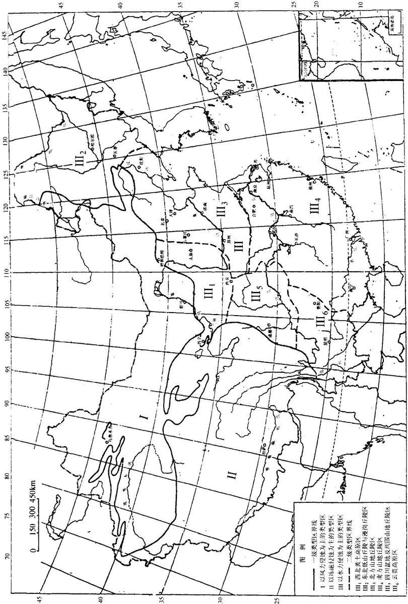  
采竹关梁

朱显谟、陈代中编制了1:12000 000中国土壤侵蚀类型及分区图(图版3)[38]。按侵蚀营力，全国可划分为三大土壤侵蚀区：东部流水侵蚀区、西北风力侵蚀区和青藏高原冻融及冰川侵蚀区。该三个侵蚀区的基本情况如下。

东部流水侵蚀区：包括大兴安岭一阴山一贺兰山一青藏高原东缘一线以东的地区。据20世纪50年代的调查统计，全国水蚀面积为150万 $\mathbf { k } \mathbf { m } ^ { 2 }$ ，其中黄土高原和华南山地丘陵为水蚀严重区。1992年国务院正式发布的全国土壤侵蚀遥感调查资料的水蚀面积为179万 ${ \mathrm { k m } } ^ { 2 }$ O

西北风力侵蚀区：位于大兴安岭一阴山一贺兰山—青藏高原北缘一线西北，地处欧亚大陆腹地，呈典型的大陆性气候，年降水量多在250mm以下，最少的地方仅有10mm，蒸发量可达1400\~3000mm，干燥度为 $2 \sim 8 _ { \circ }$ 因受西伯利亚高压中心的强烈影响，冬春风力强劲，每年5级以上大风日数多在100d以上，加之地面植被稀疏，风蚀风积作用强烈。

青藏高原冻融及冰川侵蚀区：包括西藏全部、青海南部及四川的甘孜、阿坝两州，平均海拔在4500m以上，土壤侵蚀营力以冻融和冰川作用为主。该地区基本上属于自然常态侵蚀，应着重生态环境保护。

## 3. 中国沙漠和沙漠化土地的分布

朱震达等对中国沙漠和沙漠化土地分布进行了研究，并编制了1:12000000的图件(图版4)[39]。据其研究，中国北方分布的沙漠、戈壁及沙漠化土地，面积共计149.6万 $\mathbf { k m } ^ { 2 } ( \mathbf { \Psi }$ 表1-1)。1992年国务院正式发布的全国土壤侵蚀遥感调查资料的风蚀面积为188万 $\mathbf { k } \mathbf { m } ^ { 2 }$ O

表1-1 中国沙漠、戈壁与沙漠化土地
<table><tr><td>类型</td><td>面积/万km²</td><td>占全国沙漠、戈壁及沙漠化土地面积/%</td></tr><tr><td>砂质荒漠(沙漠)</td><td>71.2</td><td>47.5</td></tr><tr><td>砾质荒漠(戈壁)</td><td>45.0</td><td>30.0</td></tr><tr><td>沙漠化土地</td><td>17.6</td><td>12.0</td></tr><tr><td>潜在沙漠化土地</td><td>15.8</td><td>10.5</td></tr></table>

总面积71.2万 $\mathbf { k m } ^ { 2 }$ 的砂质荒漠主要由新疆的塔克拉玛于沙漠、古尔班通古特沙漠、内蒙古的巴丹吉林沙漠和腾格里沙漠、黄河沿岸的乌兰布和沙漠和库布齐沙漠及长城沿线的毛乌素等大沙漠组成。这些沙漠及戈壁均分布在年降水量在200mm以下的干旱荒漠地带，多为无人类活动的风沙自然景观。对国民经济影响较大，并直接关系到人民生活环境的是土地沙漠化。

土地沙漠化为风蚀风沙地区的主要防治对象。由表1-1所示中国北方沙漠化土地及潜在沙漠化土地共33.4万km²。据20世纪50年代和70年代两期航片对照判读，沙漠化 $\mathbf { k } \mathbf { m } ^ { 2 }$ 土地从13.7万km²增加到17.6万km²，近25年增加了3.9万km²，平均每年扩大 $\mathbf { k } m ^ { 2 }$ $\mathbf { k } m ^ { 2 }$ $\mathbf { k } m ^ { 2 }$ $1 ~ 5 6 0 \mathrm { k m } ^ { 2 } \circ$ 中国沙漠化土地成因类型归纳于表1-2，过度的农业开垦、过度放牧及过度樵采为主要因素，占沙漠化土地面积的85.5%，如不采取措施，沙漠化将继续蔓延与发展。例如，科尔沁草原地区不同类型的沙漠化土地，已从50年代末期占土地面积的20%，增

加到70年代末期的53.8%。

表1-2 中国北方沙漠化成因类型
<table><tr><td>沙漠化土地成因类型</td><td>面积/万km²</td><td>占沙漠化土地面积/%</td></tr><tr><td>以过度农垦为主</td><td>4.47</td><td>25.4</td></tr><tr><td>以过度放牧为主</td><td>4.99</td><td>28.3</td></tr><tr><td>以过度樵采为主</td><td>5.60</td><td>31.8</td></tr><tr><td>工矿、城镇、交通建设处理不当</td><td>0.13</td><td>0.7</td></tr><tr><td>水资源利用不当</td><td>1.47</td><td>8.3</td></tr><tr><td>风力作用下沙丘前移为主</td><td>0.94</td><td>5.5</td></tr></table>

沙漠化土地分布的自然地带中，有约41%的沙漠化土地分布在大兴安岭西侧的半干旱地带，以农牧交错区沙漠化的发展及旱农区风沙危害为主；有32%的沙漠化土地分布在干草原及荒漠草原地带，以草场沙漠化过程加剧为主；有27%的沙漠化土地分布于西部干旱荒漠地带，以绿洲边缘沙丘前移及沙丘活化为主。

## 二、土壤侵蚀类型的复杂多样性

中国的地质地形条件比较复杂，从南到北的生物-气候条件变化多端，跨热带、亚热带、暖温带和寒温带，加之毁林毁草农垦历史悠久，土壤侵蚀发展严重，并几乎涵盖了全球的主要侵蚀类型。土壤侵蚀营力除水力、风力和冻融侵蚀力外，尚有重力。重力侵蚀常与水蚀或风蚀伴随发生，呈复合侵蚀类型和复合侵蚀区。例如，泥石流和崩岗多为水力和重力两种侵蚀营力作用下发生的特殊侵蚀类型。近年来，城镇、工矿建设飞速发展，由于对工程建设中引发的新的土壤侵蚀问题估计不足，加之预防监督管理不善，引发了新的人为侵蚀问题[14,15,34]。

## (一)水力侵蚀

水力侵蚀的形态主要分面蚀和沟蚀两大类。世界上各水蚀地区基本上均发生这两种侵蚀类型。由于各国自然环境和社会经济情况的差异，面蚀和沟蚀的发生发展过程和特点有所不同。在我国黄土高原，伴随面蚀、沟蚀常发生洞穴侵蚀。

## 1. 面蚀

面蚀可分为雨滴侵蚀(溅蚀)、片蚀和细沟侵蚀。细沟为薄层径流汇集成细小股流对地面的侵蚀，属线状或沟状侵蚀过程，与地面薄层水流均匀的面状侵蚀过程截然不同，故一些国家或我国的有些学者把细沟侵蚀归为沟蚀。另外，由于细沟侵蚀均发生在坡耕地，侵蚀深不超过耕层深，经犁耕后在地面不留痕迹，故归为面蚀，对此已基本得到共识。天然荒坡地上由于不合理放牧而造成斑块状的践踏痕迹，称为鳞片状侵蚀，也属面蚀[14,15]。

## 2. 沟蚀

中国陆地不仅丘陵、山地起伏，且沟谷发育活跃。以黄土高原为代表，在第四纪黄土沉积的同时，在古地貌基础上，形成发育了世界上罕见的沟谷纵横、地形起伏的特殊的梁昴状丘陵沟壑区。该区域沟谷密度可达3\~6km/km²(按1:50000地形图量测)，在土状堆积物上沟谷切割的最大深度可达100m以上。由于黄土高原侵蚀地貌的特殊性，我国学者黄秉维[22]、朱显谟[21]、罗来兴[40]、承继成[41]等，曾进行了大量沟蚀类型及分类系统的研究，基本上确定的沟蚀类型有：浅沟、切沟(包括悬沟)、冲沟、河沟。典型的沟道小流域即是以河沟为主系，由不同级别沟谷组成的水路网系统。

浅沟是发生在坡耕地上的一种特殊沟蚀类型，主要是人为不断耕作所致，在大于25°的陡坡耕地最发育，一般由细沟演化发展而成。浅沟下切深已超过耕层，浅沟横断面由于不断耕作成弧形扩展，直至妨碍耕作而不得不弃耕时，浅沟即发展成切沟。坡耕地上一旦发生浅沟，侵蚀量可增长1\~3倍；浅沟又是现代沟谷侵蚀发展的原由，并可引发崩塌等重力侵蚀。浅沟侵蚀是我国研究坡耕地土壤侵蚀过程和沟蚀发生发展过程中特殊而极为重要的研究领域[14,42]。

## 3. 洞穴侵蚀

洞穴侵蚀为深厚黄土沉积物上发育的一种特殊侵蚀类型。在有黄土或黄土状沉积物分布的美国中西部及新西兰等地，可见有洞穴侵蚀或称为漏斗状侵蚀。在中国的黄土高原洞穴侵蚀最为发育，分布也较广泛。洞穴侵蚀的主要类型有水刷窝、跌穴(漏斗状洞穴)、陷穴。洞穴侵蚀常与沟蚀伴随发生，可加速沟头前进和沟床下切[14,34]。

## (二)风力侵蚀

风力侵蚀是指地表砂粒类松散物质在风力作用下脱离地表的运移过程。风蚀类型可分为吹蚀和磨蚀，前者为单纯风力作用，后者为风沙流的侵蚀作用。在吹蚀和磨蚀作用下，地面松散颗粒的运动方式分为悬移、跃移和表层蠕移三种形式。地表或风沙堆积物，因吹蚀、磨蚀作用，相对细粒物质被运移后，出现地面粗化、荒漠化及蘑菇状风蚀地貌，后者往往又可激发崩塌等重力侵蚀[43]。在黄土高原北部长城沿线的水力、风力复合侵蚀区，风蚀可加剧沟蚀[34]。

## （三）重力侵蚀及重力、水力复合侵蚀[14,34]

重力侵蚀是指坡面土体、岩体在自身重力作用下向临空面发生的位移现象。重力侵蚀的主要侵蚀类型有泻溜、崩塌、滑坡；此外，以重力为主兼水力侵蚀的有崩岗和泥石流。

## 1. 滑坡

暴雨和地震可诱发或激发滑坡类重力侵蚀；大型、快速崩塌性滑坡可直接转化为泥石流。

突发性的大型滑坡可酿成严重灾害。1983年发生在甘肃省东乡县的洒勒山滑坡，不到 1min 的时间滑动体积约 5 000 万 $\mathbf { m } ^ { 3 }$ ，滑动距离750m，酿成掩埋房屋585间，死亡237人的重大灾害。四川省“81·8”洪灾中，有90个县发生滑坡6万余处，其中造成重大损失的有4.7万处。

## 2. 崩岗

崩岗是指岩体或土体在重力和水力综合作用下，向临空面突然崩落的现象。崩岗主要分布在我国南方的广东、福建、江西、湖南等地的厚层花岗岩风化物地区。沟谷的溯源侵蚀和沟床下切，可激发崩岗侵蚀的发生，崩岗侵蚀又加剧了沟岸的扩展和沟头前进。崩岗侵蚀模数为3万\~5万 $V ( \mathbf { k m } ^ { 2 } \cdot \mathbf { a } )$ ，高者可达10万 $V ( \mathbf { k m } ^ { 2 } \cdot \mathbf { a } )$ 以上，可淹没农田、淤塞水库；突发性崩岗可引发泥石流灾害，危及人民生命财产安全。

## 3. 泥石流

泥石流多发生在山区，尤以四川、云南、西藏、甘肃等地分布广泛，活动频繁。陡峻的地形、大量松散固体物质和水体的供给是形成泥石流的必要条件；人为不合理活动，如毁林开荒、工程建设不当等，引起暴发性水土流失，为诱发泥石流的重要因素。突发性的泥石流可酿成人民生命财产的巨大损失。例如，1981年8月发生特大暴雨洪水，成昆铁路的利子伊达沟，山洪暴发，形成强大泥石流，冲毁大渡河125m长的铁路大桥，造成行进的客车几节车厢被冲入大渡河、伤亡多人的重大交通事故。

我国台湾省地处西太平洋地震带，造山运动活跃，地震频繁。1907\~1964年的57年间，台湾省共发生有感地震15088次，平均每年地震达269次。脆弱的地质构造，加之台风、暴雨的影响，常造成山崩、泥石流灾害，占总土地面积70%的山坡地随处可见[44]。

冻融侵蚀虽然分布面积广，但多发生在人类活动很少的高寒山区，危害影响较小，尚未列入专门的研究和治理对象。

## 三、生态破坏和坡耕地水土流失的严重性

## （一）世界性毁林毁草不合理耕垦的加速侵蚀[27]

人类社会的出现也就是生态平衡失调和自然侵蚀转化成人为加速侵蚀的开始。毁林毁草不合理耕垦是世界性问题，是造成水土流失和土地沙漠化扩展的主要原因。

1934年美国发生了震惊世界的黑风暴，千百年来积累的肥沃表土层因侵蚀丧失于旦夕。其原因即是人为过度砍伐森林、不合理耕垦所致。于是确立了“不能管理土壤就不能管理国家”的方针，并于1935年建立了国家土壤保持局。

20世纪50年代初原苏联的欧洲部分也发生了黑风暴，其原因也在于自然生态平衡遭到了人为的破坏，这与动员100余万人开垦2180万hm²黑土地密切相关。 $\mathbf { h } \mathbf { m } ^ { 2 }$

在第二次世界大战期间，日本的森林破坏严重，暴雨洪水和土壤侵蚀加剧，1953年发生了明治以来的最大洪水，从而确立了“不能治山就不能治水”的方针。

非洲的总土地面积2982万km²，森林覆盖率仅7%，沙漠占40%；撒哈拉大沙漠每 $\mathbf { k m } ^ { 2 }$

年向南扩展1.5\~10km。近期肯尼亚的森林年砍伐率为1.5%，到2040年天然林将全部消失。亚洲80%的农地来自森林砍伐。

坡耕地水土流失是世界各国土壤侵蚀的主要问题，全世界因土壤侵蚀每年从耕地流失的土壤约250亿t。

## （二）中国生态破坏和坡耕地水土流失的严重性[27,34\~36]

中国有着五千年的文明史和悠久的耕垦史，人为加速侵蚀发展早，已在现代土壤侵蚀过程中占主导地位。

人口急剧增长和无序开垦是导致坡耕地扩展和人为加速侵蚀发展的主要原因。自1949\~1982年全国人口由54167.0万人增至100401.1万人，30余年间人口增长近1倍，至20世纪末已超过12亿人。每增加1人需新开垦耕地 $0 . 0 6 \sim 0 . 3 \mathrm { h m } ^ { 2 }$ ;在人少地多的丘陵山区，每增加1人毁林毁草开垦可能达 $1 \mathrm { { h m } } ^ { 2 }$ 以上。在全国范围，坡耕地的水土流失面积占耕地总面积的34.3%，在西南地区占52.53%，在黄土高原占71.3%；在水土流失严重的黄土丘陵区，坡耕地占耕地总面积的70%\~90%。

江西省的坡耕地由20世纪50年代的9.88万 $\mathbf { h } \mathbf { m } ^ { 2 }$ 增至80年代末的33.81万 $\mathbf { h } \mathbf { m } ^ { 2 }$ ，增加了2.4倍，其中25°以上的坡耕地由0.67万 $\mathbf { h } \mathbf { m } ^ { 2 }$ 增至7.14万 $\mathbf { h } \mathbf { m } ^ { 2 }$ ，增长了10倍。贵州省25°以上的坡耕地占全省耕地28.6%，其流失量占全省总流失量的77.9%。东北黑土区坡耕地占水土流失总面积的86%，每年流失表土1.5亿t。

据四川省遂宁水土保持试验站1985年的紫色土坡耕地径流小区观测资料，大于 $2 5 ^ { \circ }$ 坡耕地的侵蚀量为 $1 5 9 0 0 \mathrm { { \Omega } } \times \mathrm { { / k m } } ^ { 2 }$ ，比5°坡耕地的侵蚀量 $3 \ 7 0 5 \mathrm { t } / \mathrm { k m } ^ { 2 }$ 增加了3倍多。

黄土高原大于15°的坡耕地普遍发育了浅沟侵蚀，其侵蚀量为没有发生浅沟的坡耕地侵蚀量的2\~3倍。且坡耕地由梁昴坡面发展到谷坡 $2 5 ^ { \circ } \sim 3 5 ^ { \circ }$ 的陡坡耕地，促进了沟岸扩展和滑坡、崩塌等重力侵蚀，成为沟谷地产沙的重要来源。

全国大部分地区坡耕地的侵蚀量占总侵蚀量的50%\~60%。坡耕地侵蚀的治理，尤其是首先退耕大于 $2 5 ^ { \circ }$ 的坡耕地还林还草，应作为水土流失治理重点。

坡耕地扩展是以破坏林草植被为代价的。四川省的森林覆盖率在20世纪50年代初为20%，到80年代后期已降为12.5%。历史时期的黄土高原林草植被较丰茂，如果按现代自然植被的分布规律，即没有人类活动干扰而保持自然生态平衡条件下，大部分地区均不应发生当今如此强烈的侵蚀。当今黄土高原的森林覆盖率仅7%左右；占土地总面积约30%的草地中的60%已退化，土地沙漠化发展严重。

地处亚热带的南方丘陵山区，原以常绿阔叶林为主，因人为滥垦、滥伐、滥牧，不仅森林消失，而且土层全部流失，境内出现了与生物气候带相逆的石漠化景观。例如，地处亚热带的贵州省石灰岩地区，耕地土层多不足20cm，因坡耕地水土流失而导致石漠化的光板地，以每年11.5万 $\mathbf { h } \mathbf { m } ^ { 2 }$ 的速率递增。

坡耕地土壤侵蚀发展与生态系统破坏呈恶性循环，同时加剧了旱洪灾害发生的频率和灾情。

## 四、土壤侵蚀增加入河泥沙、加剧旱洪灾情的严重性

从历史记载至现代观测资料证明，黄河流域及长江流域发生的多次暴雨洪水灾害，虽起源于超常的降雨，但因土壤侵蚀输入江河湖库的大量泥沙是加剧灾情的重要根源。

## （一）黄河流域的土壤侵蚀与旱洪灾害

黄河多年平均年输沙量为16亿t，为世界所罕见。河流年均含沙量为 $3 6 \mathrm { k g } / \mathrm { m } ^ { 3 }$ ，为世界河流年均含沙量 $\mathbf { 0 . 3 5 k g / m ^ { 3 } }$ 的100倍。黄河的年输沙量约4亿t沉积在下游河床，黄河下游河床已高出地面4\~10m，成为世界著名的悬河。黄河泥沙是黄河水患的症结所在，黄河泥沙则源自黄土高原的水土流失。因此，中国土壤侵蚀的防治与治河紧密相关。历史上的黄河即为多沙多灾的河流，但随着人为活动对林草破坏的加剧，水土流失增强，旱、洪灾害也呈发展趋势。在7\~20世纪中，后7个世纪旱、洪灾害发生的频率为前7个世纪的3倍；黄河下游决、徙频率7世纪前每百年不足10次，到14世纪达67次，到19世纪增至172次。近半个世纪以来，因黄河大堤的加高加固，黄河下游的决、徙灾害虽已得到控制，但黄土高原的土壤侵蚀并未得到有效控制，黄河下游的河床仍在年年增高，黄河流域的旱、洪灾害仍潜伏很大的危险。

河道淤积使下游同流量水位愈来愈高，洪水下泄速度明显减缓。1996年8月，黄河花园口水文站出现7860m³/s中常洪峰流量，相应水位却达94.73m，超历史最高水位，比1958年2.23万m3/s的洪峰水位还高出 $0 . 9 1 \mathbf { m } ^ { [ 4 7 ] }$

## （二）长江流域的土壤侵蚀与旱洪灾害

长江流域的侵蚀强度及河流输沙量虽然低于黄河，但频发的暴雨洪水及其酿成的水土流失、滑坡、泥石流灾害，对人民生命财产和国民经济建设构成很大的威胁。据1985年统计，长江流域的水土流失面积56.2万km²，占流域总面积的31.2%，土壤侵蚀总量 $\mathbf { k m } ^ { 2 }$ 24亿t，其中长江上游侵蚀量为15.86亿t，占流域总量的67%。长江流域的泥沙输移比0.2\~0.3，年均入海沙量4.86亿t，主要来自宜昌以上的长江上游地区，宜昌站多年平均输沙量为5.3亿t[34]。

1998年长江特大洪水灾害的发生，除降雨因素外，因流域内长期土壤侵蚀而输入湖泊、水库的大量泥沙，加剧了灾情的发展。1998年长江洪峰流量低于1954年及历史最高记录，但洪水水位却高于以上记录，从而造成了更大的险情。长江的九江站最高水位达23.03m,比1954年高0.95m,超历史最高水位0.83m;信江梅港站1998年的洪峰流量12900m³/s，比1954年小700m³/s，水位却高出1.08m，造成了触目惊心的险情。这种超高水位起因于土壤侵蚀所造成的河床、湖泊泥沙的淤积。例如，20世纪50年代以来，洞庭湖年淤积泥沙1.45亿t，湖泊面积由 $4 ~ 3 5 0 \mathrm { k m } ^ { 2 }$ 缩小到目前的 $2 ~ 4 0 0 \mathrm { k m } ^ { 2 }$ ，蓄水调洪能力降低了40%。这些泥沙主要来自于上游的毁林和陡坡开垦而激发的水土流失及滑坡、泥石流灾害[48]。

近年来，黄河断流、长江洪水及松辽、海河、淮河等流域频繁的旱、洪灾害，使人们愈来愈深刻地认识到，治理水土流失，改善生态环境，是防灾减灾保证国民经济建设持续发展的根本。

## 第三节 中国土壤侵蚀现状、趋势及研究工作展望

## 一、土壤侵蚀现状及趋势

（一）世界土壤侵蚀形势

世界各国都存在程度不等的土壤侵蚀，有些地区和国家呈发展趋势。第二次世界大战结束以来，在全球的农垦区约有12亿 $\mathbf { h } \mathbf { m } ^ { 2 }$ 的土地遭受侵蚀，毁坏了10.5%的肥沃土地，相当于中国和印度国土面积的总和。地球上约35%的地区正处于沙漠化。爱护我们共同赖以生存的地球，已成为世界性的呼吁和公约[27]。

1992年在巴西里约热内卢举行的世界环境与发展大会指出，当前区域性和全球性重大环境问题有八项，即臭氧层破坏、全球气候变暖、酸雨范围扩大、淡水污染和短缺、森林资源锐减、野生动植物物种消失、水土流失和沙漠化扩展、有毒化学品和危险物扩展。这八大环境问题相互制约，相互促进。例如，森林资源的破坏可导致水土流失和土地荒漠化迅速发展，从而影响到水资源的短缺、沙尘暴的发生、空气中CO2含量的增多、生 $\mathbf { C O } _ { 2 }$ 物多样性的消失、生态系统恶化以及旱、洪灾害加剧等一系列问题，又反馈为土壤侵蚀的加剧和全球环境恶化。因此，防止土壤侵蚀和加强水土保持已成为很多国家的基本国策。

## （二）中国土壤侵蚀现状

## 1. 土壤侵蚀现状研究进展

土壤侵蚀现状是指最近期土壤侵蚀的状况，主要体现为两大指标：其一是土壤侵蚀强度，其二是土壤侵蚀面积。土壤侵蚀面积是在土壤侵蚀分类、分区和侵蚀强度分级的基础上进行统计量算取得的。我国土壤侵蚀现状的调查研究起自20世纪50年代，首先因国家编制治黄规划的需要，把查明土壤侵蚀现状，列为治黄规划中编制水土保持规划的重要基础。水利部和中国科学院先后组织多次黄河上中游的水土保持综合考察，涉及陕、甘、青、晋、宁、豫、内蒙古7个省(区)，总面积约58万 $\mathbf { k m } ^ { 2 }$ 2[17,18]。鉴于当时的条件有限，主要通过实地普查并结合典型流域、典型区域的详查，以气候、地形、植被、土壤和土地利用等因子的综合分析，进行了土壤侵蚀区划。在此基础上，当时统计估算的黄河上中游水土流失面积为43万km²(包括水蚀和风蚀)。此外，黄河流域自1919年起在干 $\mathbf { k } \mathbf { m } ^ { 2 }$ 支流已建设了一批水文站，观测河流泥沙的输移规律。通过河流输沙模数及泥沙输移比接近1的分析论证，为研究评价土壤侵蚀强度提供了定量依据。

从20世纪70\~80年代初，钱宁、龚时旸等在研究证实黄河下游河床淤积泥沙主要由 $> 0 . 0 5 \mathrm { m m }$ 粗颗粒组成的基础上，提出了水土流失的治理应以多沙粗泥沙产区为重点；

并证实泥沙主要产自沟谷，由此确定了以强化黄河上中游蓄水拦泥的坝库工程建设作为减少入黄泥沙的重要措施[49,50]。

20世纪80年代初，唐克丽等在重点考察杏子河流域(1486.1km²)土壤侵蚀的基础上，提出了毁林毁草不合理耕垦是现代加速侵蚀的主要原因，坡耕地水土流失量可占总流失量的60%左右。据此，强调了坡耕地应作为治理的重点[51]。

“七五”期间，国家把黄土高原的综合治理开发列入科技攻关项目，由中国科学院组织的黄土高原综合科学考察队对面积为62.4万km²的黄土高原地区(黄河上中游流域总面积58万 $\mathbf { k } \mathbf { m } ^ { 2 }$ 及其毗邻地区4万余 $\mathbf { k m } ^ { 2 }$ 的海河流域)进行了大规模的全面考察。由唐克丽、陈永宗主持完成的黄土高原地区土壤侵蚀区域特征及其治理途径的考察任务，主要依据土壤侵蚀营力、类型、强度、土地利用及治理途径在一定区域的相似性和区域间的差异性，进行土壤侵蚀分区。在通常划分的水蚀区和风蚀区的基础上，首次划分了水蚀风蚀交错区，并研究证实黄土高原的强烈侵蚀不是发生在降水量最多的地区，而是发生在年降水量为400mm左右的水蚀风蚀交错区，其中的晋陕蒙接壤区为强烈侵蚀中心，也是黄河下游河床粗泥沙的主要侵蚀产沙区，应作为治理的重中之重[52]。

长江的河流泥沙问题相对来说不如黄河的突出与紧迫，因此水土流失的考察和治理工作起步略晚。20世纪60年代初，根据长江流域全面规划的需要，由中国科学院水土保持研究所朱显谟主持，周佩华等人组织了长江流域水土保持综合考察队，进行了长江流域土壤侵蚀区划的考察研究。全程调查路线累计1万km余，面积约140万km²，最后完成了长江流域的土壤侵蚀区划图，并初步统计得出，全流域的水土流失面积约36万km²，约占流域总面积的20%；在水土流失面积中，坡耕地约占18%，经济林地约占4%，荒山荒地约占78%[53]。

以上的考察研究只是局限于某些地区或某些流域，从不同角度研究论证了土壤侵蚀的状况及其存在的主要问题，尚不能概括全国土壤侵蚀的面貌。自20世纪70年代后，一些大流域或一些省(区)开始应用航片、卫片进行土壤侵蚀状况的调查。由于缺乏统一的组织和技术规范，一直未能取得反映全国性土壤侵蚀状况的科学数据。1984\~1989年，全国农业区划委员会给水利部下达了应用遥感技术调查我国土壤侵蚀现状、编制全国土壤侵蚀图的任务。采用1985\~1986年时段的卫片经6年全国性有组织的全面调查研究，最终取得了统一规范下汇总的全国土壤侵蚀现状和土壤侵蚀潜在危险程度的科学数据。

## 2. 中国土壤侵蚀状况遥感调查

1992年国务院正式发布了我国土壤侵蚀遥感调查资料，全国水蚀面积179万km²，风蚀面积188万km²，两项合计367万km²，占国土总面积的38.2%。这是我国首次正式发布的土壤侵蚀状况的实际调查结果，也是我国首次应用遥感技术，在统一土壤侵蚀分区、分类、分级基础上，又经统一技术规范而取得的科学数据。以全国各省(区)、各流域编制的1:500000土壤侵蚀图为基础，分别量算了水力、风力、冻融3种侵蚀类型，微度、轻度、中度、强度、极强度、剧烈6种侵蚀强度，以及无险、较险、危险、极险和毁坏5种土壤侵蚀潜在危险程度各自所占的面积，再加以汇总而成①。

关于土壤侵蚀类型的分类及土壤侵蚀强度和潜在危险程度的分级，在本章的第一节和第二节中进行了基本论述，并将在以后的章、节中进行深入讨论。此次遥感调查按全国31个省(区)及松辽、海滦河、黄河、淮河、长江、珠江六大流域分别进行了不同侵蚀类型、不同侵蚀强度和不同危险程度的量算统计。以流域为单元的统计，包含了流域内有关省(区)①的分别统计;以各个省(区)为单元的统计，包含了境内有关流域的分别统计。最后进行了全国的统计、汇总，取得全国第一次土壤侵蚀遥感调查系列数据①。以下列举六大流域轻度以上水蚀、风蚀的面积(表1-3)。

表1-3 六大流域土壤水蚀、风蚀轻度以上面积统计(1992年)①  
(单位：万km²)
<table><tr><td rowspan="2">流域名称</td><td rowspan="2">流域面积</td><td colspan="2">水蚀</td><td colspan="2">风蚀</td><td colspan="2">水蚀+风蚀</td></tr><tr><td>面积</td><td>占流域面积/%</td><td>面积</td><td>占流域面积/%</td><td>面积</td><td>占流域面积/%</td></tr><tr><td>松辽</td><td>124.62</td><td>30.77</td><td>24.69</td><td>11.40</td><td>9.15</td><td>42.17</td><td>33.84</td></tr><tr><td>海滦河</td><td>31.89</td><td>10.39</td><td>32.61</td><td>1.53</td><td>4.79</td><td>11.92</td><td>37.40</td></tr><tr><td>黄河</td><td>79.02</td><td>34.71</td><td>43.93</td><td>11.78</td><td>14.91</td><td>46.69</td><td>58.84</td></tr><tr><td>淮河</td><td>26.68</td><td>5.60</td><td>21.00</td><td>0.34</td><td>1.27</td><td>5.94</td><td>22.27</td></tr><tr><td>长江</td><td>178.34</td><td>56.97</td><td>31.95</td><td>5.25</td><td>2.94</td><td>62.22</td><td>34.89</td></tr><tr><td>珠江</td><td>44.16</td><td>5.85</td><td>13.25</td><td></td><td></td><td>5.85</td><td>13.25</td></tr></table>

1995\~2000年，在水利部主持下，全国又进行了第二次土壤侵蚀遥感调查，采用1995\~1996年时段的TM卫片，两次间隔时间正好是10年。对比两次遥感调查资料(表1-4)，水蚀面积有明显减少，由179万 ${ \bf k m } ^ { 2 }$ 减为 165万 $\mathbf { k } \mathbf { m } ^ { 2 }$ ，其中强度以上水蚀面积由占水蚀总面积的 21.07%减为16.36%；风蚀面积由187.61万 $\mathbf { k m } ^ { 2 }$ 增加到191万 $\mathbf { k } \mathbf { m } ^ { 2 }$ 尤其是强度以上风蚀面积由占风蚀面积的34.98%增加到45.55%[63]。两次遥感调查资料将在本书第十六章表16-25进行详尽分析。

20世纪50年代初期，全国各省(区)和六大流域尚未建立统一的侵蚀类型和侵蚀强度的分类、分级的原则和系统，更缺乏定量数据积累，土壤侵蚀调查尚未在全国范围全面展开，主要通过典型区的调查研究进行量算和推算。50年代全国水土保持工作刚起步，尚未形成一定的治理面积，在调查统计水土流失面积时可忽略不计。80年代后期，全国水土流失治理面积总计58万km²，该面积在进行土壤侵蚀调查制图时，不一定能全部反映。其原因是40余年的治理多为分散的、典型小流域的治理，在1:500000的成像图件的规范图斑中很难全部显现进行量算统计，于是星星点点的治理成效仍被广大水土流失区所淹没。另一方面，能说明治理成效的造林种草面积，实际保存率低，又多为稀疏幼林，遥感解译仍属于轻度以上的侵蚀面积，显然赶不上破坏前林草地控制土壤侵蚀的效应。因此，80年代的土壤侵蚀遥感调查，基本反映了土壤侵蚀呈发展的趋势。不少地区因毁林毁草、陡坡开垦而扩展的侵蚀面积，已超过同期治理面积，且后者保持水土的效益远远赶不上开垦前的林草地。基于上述情况，遥感解译的结果必然呈现水土流失面积增加的趋势。

## （三）土壤侵蚀趋势及控制前景

## 1. 土壤侵蚀趋势

在全国第一次土壤侵蚀现状遥感调查的基础上，水利部水土保持司作了进一步的调查研究，在全国第六次全国水土保持工作会议上，在总结40余年已取得水土保持成绩的同时，指出了土壤侵蚀发展的严峻形势[57]。

几千年来，滥垦、滥伐、滥牧掠夺性的经营方式是我国水土流失加剧的根源，并延续至今。全国新增水土流失面积主要是1958年、1968年、1978年3个时期乱砍、滥伐、陡坡开荒、毁坏林木草原开荒造成的。据20世纪80年代统计，每年新增水土流失面积150万hm²，年均丧失耕地6.67万km²。90年代以来，毁林毁草开荒得到一定的遏制，年增水土流失面积已减少到100万hm²，水土流失治理度有明显进展，但流失的泥沙量却超过80年代。其主要原因为近年来在开矿、修路、城市基本建设过程中，因不注意水土保持而形成了新的人为加速侵蚀，致使大量弃土、弃渣输入河道，增加了河床泥沙淤积。

我国干旱、半干旱地区土地沙漠化面积呈明显发展趋势。从20世纪50\~70年代末期，我国干旱、半干旱地区沙漠化土地，平均每年扩展1560km²左右；80年代以来，沙漠化土地平均每年扩大2460km²。因土地沙漠化而激发的沙尘暴，不仅威胁当地的农林牧生产，而且已威逼邻近(包括北京市在内)的大城市[57]。

## 2. 土壤侵蚀形势的严峻性

随着土壤侵蚀的扩展，治理的难度将愈来愈大。过度耕垦使坡度愈来愈陡，土地愈益破碎、贫瘠；过度放牧，使草原趋向退化、沙化；土壤侵蚀环境更趋恶化，生态愈脆弱，抗御洪、旱灾害的能力愈薄弱，重建林草植被的难度也增大。加之在“全球变化”形势下，欧亚干旱大陆将更趋干旱[27]。据我们对黄土高原第四纪以来黄土沉积与成壤旋回过程的研究，近3000年来，黄土高原的气候开始转向干旱，并将愈来愈强烈。当前及今后开展的生态环境建设，必须重视该自然因素的变化[29,58,59]。此外，原可以调蓄洪水的湖泊及修建的坝库工程，因长期泥沙淤积，其功能已急剧下降，甚至潜伏溃决的危险。

自20世纪70年代以来，黄河的年均输沙量已由多年平均的16亿t减为13.4亿t(1970\~1979年)和7.05亿t(1980\~1989年)。输沙量减少的原因除连年降水量偏少外，黄河干支流建设的坝库工程也发挥了年均拦蓄3亿t泥沙的作用[54,58]。但必须警惕，再遇暴雨洪水，已严重淤积坝库工程将削减防洪的功能。实际上，黄河下游已屡屡出现洪水量不大、洪水水位明显增高的险情。1958年三门峡花园口最大洪峰流量22300m³/s，1982年和1996年相继出现洪峰流量15300m3/s和7600m³/s，但1982年的洪水水位高出1958年的1\~2m，1996年洪水水位却比1982年还高出0.74m[47,58]。

长江流域土壤侵蚀的发展更为强烈。据1958年的调查，长江流域的水土流失面积由

20世纪50年代的36.3万 $\mathbf { k m } ^ { 2 }$ 增至1985年的56.2万 $\mathrm { k m } ^ { 2 }$ ，且前期的土壤侵蚀主要发生在荒山、荒坡，后期主要发生在毁林地和陡坡开垦地。1981年8月长江.上游发生特大暴雨洪水，受灾严重区多为毁林地和坡耕地。四川省在该次洪灾中有667万 $\mathbf { h } \mathbf { m } ^ { 2 }$ 的坡耕地遭冲刷，总流失量达4.45亿t，其中大于15°坡耕地的土壤侵蚀模数达 $3 2 ~ 4 0 0 \mathrm { t } / ( \mathrm { k m } ^ { 2 } \cdot \mathrm { a } )$ 。陡坡耕地多为土层不足20cm的粗骨土，四川省简阳县在此次洪灾中约3万 $\mathbf { h m } ^ { 2 }$ 的陡坡耕地被冲刷成光板地。长江上中游的水土流失，致使洞庭湖因泥沙淤积已丧失调洪容积40%；长江上游的大、中型水库年淤积量1.5亿t，因泥沙淤积已损失的库容总计100亿 $\mathbf { m } ^ { 3 }$ 。因土壤侵蚀而造成的严重后果，明显加剧了“98”长江洪水的灾情[27,47,48,58]。

黄河、长江上中游流域的土壤侵蚀确已到了十分严峻而非治理不可的地步，否则下游将永无宁日，并直接影响国民经济建设的顺利进展和西部大开发战略的实施。

## 3. 土壤侵蚀控制前景

上述土壤侵蚀形势仍十分严峻，治理任务紧迫而艰巨，但控制前景是积极的。自20世纪90年代以来，国家对于土壤侵蚀的严重性及其治理的紧迫性，给予了充分足够的重视，采取了一系列重大举措，全国水蚀面积呈明显减少趋势。尤其是近年来，中央领导亲自实地考察，做出了把水土流失治理和生态环境建设紧密结合的重要指示，开创了水土保持的新局面。同时从制定相应政策和加大财力、物力的支持力度，给予保证。有关水土保持方面的问题，将在第二篇水土保持部分作专门论述，这里就控制土壤侵蚀态势，作简单引述。

(1）立法和政策。在1991年全国人大常委会通过的《中华人民共和国水土保持法》的基础上，补充发布了一些规定和条例，如水土保持法实施条例、矿区水土保持规定和条例、城市建设的水土保持规定和条例等。为了加快治理步伐，提高群众治理的积极性，在进一步明确个体承包责任制的基础上，试行了股份制、“四荒”拍卖制等；确定了“退耕还林(草)、绿化荒山、以粮代赈、个体承包”的政策，有效解决了林草建设与粮食作物的争地矛盾，促进了生态环境建设。

(2)大江大河治理的重大决策。以防灾减灾、开发黄河和长江水利的小浪底水库和长江三峡水利枢纽工程，于20世纪末正式启动。这两项举世瞩目的宏伟工程，将发挥防洪、发电、灌溉等一系列重大效益，从而把对流域土壤侵蚀的治理提到更为重要而紧迫的位置。1988年经国务院批准，将长江上游列为国家水土保持重点防治区，建立了长江上游水土保持重点防治工程(长治工程)，加大了治理经费的支持力度。在1989\~1997年不到10年的时间内，累计治理水土流失面积5.7万km²。照此进展预期长江上游共35.2 $\mathbf { k m } ^ { 2 }$ 万 ${ \bf k m } ^ { 2 }$ 的水土流失面积，可在约50年的时间内得到基本治理[48]。

(3)治理部署的新举措。由星星点点分散的小面积治理转向集中、连片大面积的集约化和规模化治理。1983年成立了全国八大片水土保持治理工程，由几个、几十个平方千米面积增加到数万平方千米的连片治理，包括无定河、皇甫川、三川河、定西县、贡水、永定河上游、大凌河中游和柳河上游，总面积 $9 9 \ 9 5 1 \mathrm { k m } ^ { 2 }$ ，其中水土流失面积$4 5 \ 6 1 1 \mathrm { k m } ^ { 2 }$ 。截止到1997年底，15年内土壤侵蚀治理取得突破性进展，治理进度达61%，年输沙量减少60%，并出现了全县性生态经济改观的兴国县、定西县[57,58]。集中连片大面积强化治理的举措正在全国范围逐步推行，例如“长治工程”，世界银行贷款项目延

河、佳卢河的全流域综合治理等。

(4)新起点、新目标规划的制订。1998年11月9日国务院正式批发了《全国生态环境建设规划》(国发[1998]36号)文件，这是我国首次将土壤侵蚀治理纳入生态环境建设的轨道。规划要求：到2010年，黄河长江上中游水土流失重点区及严重荒漠化地区的治理初见成效，遏制生态环境恶化势头；2011\~2030年，全国60%以上适宜治理的水土流失区得到不同程度整治，全国森林覆盖率达24%左右；2031\~2050年，全国适宜治理的水土流失区得到基本整治，全国基本建立可持续发展的良性生态系统。

以上列举的纲领和事例说明，土壤侵蚀的控制和生态系统的良性转化是可能的、可行的，展示了积极的、美好的前景。

## 二、中国土壤侵蚀研究的特点与展望

一个国家土壤侵蚀是加剧还是得到控制，不仅直接关系到农林牧生产，而且影响到资源利用与环境保护、防灾减灾，乃至社会的发展和进步。中国土壤侵蚀的研究是在密切联系生产实际问题中逐步深人和发展的；在与国际接轨过程中，突出了自身特点，发展了具有中国特色的土壤侵蚀学[34]。中国土壤侵蚀的研究领域比较宽广，以下重点阐述三个方面。

## （一）土壤侵蚀调查与基础性、关键性问题的研究

土壤侵蚀作为专门问题的研究，起始于追究河患，尤其是多沙多灾的黄河，带动了黄土高原水土流失的研究。自20世纪50年代以来，国家在编制大江大河治理规划或各个省(区)编制国土整治规划时，均把查明水土流失、编制水土保持规划作为其重要组成部分。通过承担土壤侵蚀调查国家任务，开展了土壤侵蚀分类、侵蚀强度分级和侵蚀区划等基础性、关键性问题的研究[57,60]。

## 1. 研究建立了土壤侵蚀分类原则和系统

基于中国土壤侵蚀类型的多样性和复杂性，在以侵蚀营力作为一级分类基础上，又划分了二级、三级的侵蚀类型。例如，水力侵蚀二级分类为面蚀和沟蚀；面蚀又可划分为溅蚀、片蚀和细沟侵蚀。

在中国可见到世界上普遍分布的各种水力、风力、重力及冻融侵蚀类型。中国的黄土高原因其独特的地貌和自然区域，除水蚀、风蚀侵蚀类型外，发育有特殊的滑坡、崩塌、洞穴、黄土柱、黄土墙等侵蚀类型、侵蚀形态；被千沟万壑切割发育的塬、梁、峁侵蚀地貌。此外，在南方丘陵山区还发育有水力、重力两种侵蚀营力交互作用而发生的特殊侵蚀类型，如崩岗、泥石流；在工矿、城镇建设过程中，因人为活动而引发新的人为水土流失和滑坡、泥石流的复合侵蚀类型等[34,60]。

土壤侵蚀类型的科学系统分类是查明土壤侵蚀状况和编制土壤侵蚀图的基础，中国丰富的土壤侵蚀类型对拓展世界该研究领域也是重要贡献。

## 2. 研究建立了土壤侵蚀区划的原则和系统

土壤侵蚀区划即依据土壤侵蚀类型、强度及其自然和社会经济影响因素，在一定区域的相似性和区域间的差异性进行的区域划分。中国自然和社会经济条件的复杂性，决定了侵蚀区划的重要性和必要性。

基于全国六大流域(松辽、海滦、黄河、淮河、长江、珠江)、各省(区)，乃至全国性水土流失治理和国土整治的需要，研究建立了不同尺度的土壤侵蚀分区原则和系统。例如，以侵蚀营力划分一级区，以地质、地貌、气候、土壤、植被和土地利用等综合因素划分二级区，或以侵蚀强度、土壤侵蚀潜在危险程度进行区域划分。

基于我国土壤侵蚀区域分异的某些特殊性，同时研究划分了复合侵蚀区。例如在黄土高原北部水蚀区和风蚀区的交接带，划分了水蚀、风蚀交错区，并研究证实该区为黄土高原强烈侵蚀区。水蚀风蚀交错区的划分为追溯黄河下游河床粗泥沙的来源及土地沙漠化的演变，提供了新的论证。加强对这两种营力交互作用形成的特殊侵蚀类型和侵蚀复合区域的研究，将丰富和发展土壤侵蚀区域研究领域，同时对指导生产治理有重要意义[22,23,34,61]。

## 3. 土壤侵蚀调查研究方法的进展

自20世纪50年代以来在实地考察研究的基础上，延伸开展了土壤侵蚀定量评价的定位观测研究，包括河流水文站的径流、泥沙的观测，以小流域为单元的径流、泥沙量观测，径流小区的径流泥沙量观测等。据统计，1919\~1984年，黄河流域共积累了6450个水文站年，461个小流域年和1413个径流小区的径流、泥沙观测资料。该丰富的数据库成为研究确立侵蚀强度分级标准和侵蚀分区的重要依据[62]。近年来，应用人工降雨试验研究，补充了某些观测数据资料的不足。

现代遥感技术的应用，明显提高了土壤侵蚀调查的进度和精度。20世纪80年代末和90年代末两次分别完成的全国土壤侵蚀遥感调查，就是以遥感调查结合以上野外考察和观测数据综合研究取得的成果。

随着国民经济建设的发展，土壤侵蚀调查研究除定期进行复查外，开展了动态监测研究，包括RS、GIS和GPS等先进技术的应用，为预防监督、治理效益评价、治理部署和投资决策，及时提供科学依据。中国的复杂地形和侵蚀类型的多样性，将促进3S调查研究方法的改进和创新。

## （二）土壤侵蚀过程及其机理的研究

土壤侵蚀过程的研究，基本上分两大方面：一是指宏观的地质时期、历史时期和近代、现代土壤侵蚀的过程及其与自然、人文环境演变的机理；其二主要是坡耕地土壤侵蚀过程及其机理的研究。

## 1. 地质时期和历史时期以来土壤侵蚀过程的研究

通过黄土高原古地貌演变及深厚的黄土层内古环境信息的研究，论证了自然侵蚀的发生演变过程。通过大量历史遗迹、历史资料的考证说明，随着人为活动对生态平衡破坏的加剧，土壤侵蚀由自然侵蚀演变为加速侵蚀，侵蚀速率增长了数百倍、数千倍以上。研究证明黄河泥沙起源于地质时期，自历史时期以来因人为加速侵蚀黄河泥沙呈增长趋势。当今我国绝大部分地区天然植被均遭破坏，人为加速侵蚀已占主导地位，不仅大幅度增加入河泥沙，而目因侵蚀造成的退化生态系统，已威胁到再生产，乃至人类的生存。侵蚀逆境主要表现为水、土资源的衰减，土壤质量下降，生物多样性消失，土地荒漠化扩展，洪旱灾害加剧等系列恶性循环[29,34,60]。因此，土壤侵蚀的研究不再限于水土流失对治河的影响，已扩展到侵蚀环境形成机制及其全面调控的研究，并延伸到全球变化领域，随之拓展了土壤侵蚀学与环境学的交叉这一新研究领域土壤侵蚀环境学60,61]。

## 2. 坡耕地土壤侵蚀过程及其机理的研究

毁林毁草开发丘陵山区是人为加速侵蚀的主要方式，世界上很多国家的土壤侵蚀主要发生在坡耕地，其流失总量达250亿 $\scriptstyle \mathbf { t } _ { \odot }$ 美国的通用土壤流失方程(USLE)，或修正通用土壤流失方程(RUSLE)，主要用于预报坡耕地的水土流失量。

中国坡耕地土壤侵蚀有其特殊的发展规律：坡度陡峻，地形破碎，从丘陵坡面延续发展到谷坡；地面组成物质由数十米的厚层黄土到土层不足20cm的粗骨土；侵蚀方式沿坡面自上而下呈发展趋势，由通常的溅蚀、片蚀、细沟侵蚀，演变发展成浅沟侵蚀，并激发或加剧沟谷侵蚀及滑坡、泥石流灾害。坡耕地侵蚀发生发展的物理过程及其动力机制是我国研究坡面侵蚀过程机理的重点，对确定退耕上限坡度，指导治理措施的配置，以及建立坡耕地土壤侵蚀预报模型，提供重要的理论依据。这方面的研究带动了土壤侵蚀学与环境流体力学的交叉土壤侵蚀力学的发展[34,60,61]，并正在研究建立适于我国的坡耕地水土流失预报方程。

## 3. 中国土壤侵蚀预报的研究

在参考美国通用土壤流失方程(USLE)的基础上，在东北黑土地区、黄土高原及南方丘陵山地，均分别研究了适合于本地区的各项参数的确定；并根据黄土丘陵区土壤侵蚀方式垂直分布的特点，进行了溅蚀、细沟侵蚀预报的探讨，均取得了一定的进展。当前随着坡耕地退耕还林还草和生态环境建设的大规模推进，土壤侵蚀预报应密切结合治理进展予以开拓。

## （三）土壤侵蚀与沟道河流泥沙输移及洪涝灾害关联的研究

我国黄河泥沙问题的研究居世界领先水平，相应发展了河流泥沙动力学。就沟道、河流泥沙输移规律，确定了重点治理的粗沙、多泥沙水系及加强蓄水、拦泥的工程措施，对加快削减黄河下游河床粗泥沙的淤积起重要作用。就河流泥沙的输移，进一步追溯流域的侵蚀产沙规律，包括侵蚀产沙的部位、侵蚀产沙地层和侵蚀产沙方式，对推进流域面上土壤侵蚀的治理，就地减少入河泥沙，将取得侵蚀环境整治与治河的双重效益[34.60]。通过侵蚀产沙与泥沙输移机制的研究，正在研究建立以流域为单元的水蚀预报方程。

黄河北干流的支流皇甫川、孤山川和窟野河的河流输沙模数达1万\~2.5万t/km²，已确定为重点治理的多泥沙、粗泥沙水系。鉴于地质、地形条件，如果仅依靠蓄水拦泥的水利工程，耗资大，收效不大。经调查流域的侵蚀产沙规律，查明以上3个水系属典型脆弱生态区，水蚀风蚀均十分强烈，产沙地层为风积沙，砂黄土及强烈风化的砂页岩，对指导流域治理和控制入河泥沙有重要意义。长江流域“98”暴雨、洪水灾情加剧的重要原因之一，在于长江上游的水土流失。洞庭湖泊每年接纳来自长江上游和“四水”的侵蚀泥沙量达1.5亿t。黄河的年输沙量多次达20亿\~30亿t的高峰，均源自于黄河中游发生特大的土壤侵蚀灾害[47,48,61]。

以土壤侵蚀学与水文学的渗透与交叉，研究侵蚀产沙与河流泥沙输移机制，有可能对治河及防灾减灾有突破性的推进作用，同时将带动一门新的交叉学科——侵蚀水文学的发展[34,60]。

展望未来，我国土壤侵蚀学的研究应立足本国的实际问题，吸取国外先进科学技术与发扬本身特色相结合，在生产治理和学术理论两方面将取得新的成就，为中国和世界防治土壤侵蚀和环境保护做出新贡献。

## 参考文献

1 Sobolief S S. Study on history of soil erosion and drought and their control in Russia. Agriculture of USSR, 1948, (3)

2 Sobolief S S. Soil erosion process and its control measures in the Europe of USSR. Report of Academia Science of USSR, 1948,I;1960,ⅡI

3 苏斯 NE. 土壤侵蚀及其防治．水利部专家工作室译．北京：水利出版社，1956

4 库兹敏科 AS. 土壤侵蚀的防止.中国科学院土壤研究所译.北京：科学出版社，1956

5 王礼先．水土保持学．北京：中国林业出版社，1995

6 Wischmeier W M, Smith D D. Predicting rainfall erosion losses from cropland, East of the Rocky Mountains Guide for selection of practices for soil and water conservation. USDA Agricultural Hand Book 282. Washington, D C, 1965

7 Wischmeier W H, Smith D D. Predicting rainfall erosion losses. USDA Agricultural Hand Book 537, Washington, D C, 1987

8 Foster G R, Meyer L D. Soil erosion and sedimentation by water—An overview. In: Pronceedings of a national symposium on soil erosion and sedimentation by water. ASAE Publications 4 \~ 77, 1977C, ASAE, st. Joseph, MI, 4908

9 Lal R. Soil erosion research methods. Soil and Water Conservation Society. Iowa: Ankeny, 1988

10 Hudson N H. 土壤保持．窦葆璋译．北京：科学出版社，1971

11 Kirkby N J, Morgan P R C. Soil erosion. London: John Wiley and Sons, 1980

12 Hudson N H. Soil conservation . London: Batsford, 1995

13 黄河水利委员会黄河志总编辑室．黄河大事记．见：黄河志．卷一.郑州：河南人民出版社，1989

14 黄河水利委员会黄河志总编辑室．黄河水土保持志．见：黄河志．卷八.郑州：河南人民出版社，1993

15 中国大百科全书水利卷编委会．水土保持分支条目．北京：中国大百科全书出版社，1992

16中国农业百科全书土壤卷编委会．土壤侵蚀与水土保持分支条目.北京：中国农业出版社，1996

17 全国科学技术名词审定委员会．土壤学名词．北京：科学出版社，1998

18 梭颇．中国之土壤概述. 土壤季刊，1941,1(2):4\~95

19 马溶之. 黄河中游之水土保持．土壤季刊，1946,5(1):1\~12

20 李连捷．嘉陵江流域之土壤侵蚀及防治问题.土壤季刊，1946,5(3):107\~112

21 朱显谟.江西土壤之侵蚀及其防治.土壤季刊，1947,6(3):87\~94

22黄秉维.编制黄河中游流域土壤侵蚀分区图的经验教训. 科学通报，1955，(12):15\~21

23 朱显谟．黄土区土壤侵蚀的分类．土壤学报，1956，4(2)：99\~114

24洪业汤，朴河春，姜洪波．黄河泥沙的环境地质特征.中国科学(B辑)，1990，(1)：1175\~1184

25陆中臣，袁宝印，励强，安塞县的侵蚀及地貌演化趋势预测．见：黄土高原遥感调查试验研究．北京：科学出版社，1988,202\~211

26史念海．黄土高原及其农林分布地区的变迁．历史地理，创刊号，1981，15\~35

27 唐克丽．土壤侵蚀环境演变与全球变化及防灾减灾的机制. 土壤与环境，1999，8(2)：81\~86

28景可． 黄土高原新构造运动对土壤侵蚀的影响．水土保持通报，1982,2(6):10\~14

29 唐克丽，张平仓，王斌科．土壤侵蚀与第四纪生态环境演变．第四纪研究，1991，(4)：300\~309

30 史德明．如何正确理解有关水土保持术语的讨论．土壤侵蚀与水土保持学报，1998，4(4):89\~91

31 中华人民共和国水利部水土保持司． 土壤侵蚀分类分级标准(SL 190-96). 北京：中国水利水电出版社，1997

32陈永宗，景可．黄土高原现代侵蚀与治理．北京：科学出版社，1988

33辛树帜，蒋德麒．中国水土保持概论．北京：农业出版社，1982

34 唐克丽. 中国土壤侵蚀与水土保持的特点及展望． 水土保持研究，1999，6(2)：2\~7

35 刘伟常．保持水土利国利民深圳市水土流失现状及防治对策．水土保持研究，1997，4(1)：2\~6

36黄秉维．中国综合自然区划图．见：国家环境保护局主持中国科学院长春地理研究所．中国自然保护地图集．北京：科学出版社，1989

37 朱瑞兆，张家诚，朱淑兰.中国年均降水量图．见：国家环境保护局主持中国科学院长春地理研究所．中国自然保护地图集．北京：科学出版社，1989

38朱显谟，陈代中．中国土壤侵蚀类型及分区图．见：国家环境保护局主持中国科学院长春地理研究所．中国自然保护地图集．北京：科学出版社，1989

39朱震达，冯毓荪．中国沙漠和沙漠化土地分布图．见：国家环境保护局主持中国科学院长春地理研究所．中国自然保护地图集．北京：科学出版社，1989

40罗来兴.划分晋西、陕北、陇东黄土区域沟间地与沟谷的地貌类型．地理学报，1956，22(3):201\~222

41承继成．坡地流水作用的分带性．见：地理学会1963年论文集．北京：科学出版社，1963

42 张科利，唐克丽．黄土高原坡面浅沟特征值的研究．水土保持学报，1991，5(2)：8\~13

43 朱震达，陈广庭等．中国土地沙质荒漠化．北京：科学出版社，1994

44唐克丽．台湾水土保持考察．水土保持通报，1994，14(3)：1\~7

45唐克丽，张平仓，刘元宝等．我国土壤侵蚀与自然灾害．见：中国土壤学会．中国土壤科学的现状与展望．南京：江苏科学技术出版社，1991

46 Tang Keli, Zhang Pingcang, Zhang Hanxiong et al. Soil erosion disasters on the Loess Plateau: its prevention and countermeasures. In: Geo-hazards and Their Mitigation. Beijing: Science Press, 1992

47黄自强．由长江1998大洪水，看水土保持治本作用.中国水土保持，1998，(12):2\~4

48 史立人. 水土保持是江河治理的根本——关于“98”长江洪水灾害的思考．中国水土保持，1998，(11):13\~16

49钱宁，龚时旸．黄河中游粗泥沙来源区来水来沙对黄河下游冲淤的影响．见：中国水利学会．第一次河流泥沙国际学术讨论会论文集．北京：水利出版社，1981

50龚时旸，熊贵枢．黄河泥沙来源与输移．见：中国水利学会．第一次河流泥沙国际学术讨论会论文集．北京：光华出版社，1985

51杨文治，唐克丽，邹厚远等．黄土高原杏子河流域自然资源与水土保持．西安：陕西科学技术出版社，1986

52 唐克丽，陈永宗．黄土高原地区土壤侵蚀区域特征及其治理途径．北京：中国科学技术出版社，1990

53长江流域水土保持综合考察队．长江流域土壤侵蚀区划报告．见：中国科学院西北水土保持研究所．中国科学院西北水土保持研究所集刊，第4集．西安：陕西科学技术出版社，1986

54唐克丽，熊贵枢等．黄河流域的侵蚀与径流泥沙变化.北京：中国科学技术出版社，1993

55余剑如，史立人，冯明权等．长江上游地面侵蚀与河流泥沙.水土保持通报，1991，11(1)：9\~7

56杜荣桓，史德明，袁建模等．长江三峡库区水土流失对生态与环境的影响．北京：科学出版社，1994

57 姜春云． 切实加大水土保持工作力度，为实施可持续发展战略做出新的贡献．中国水土保持，1997，(6):2\~8

58 郭廷辅．水土保持是江河防洪体系建设的重要组成部分.中国水土保持，1998，(11)：1\~4

59唐克丽，贺秀斌．黄土高原生态环境建设与侵蚀环境调控．见：中国科学技术协会、中国工程院、陕西省人民政府.

中国西部生态重建与经济协调发展学术研讨会论文集．成都：四川科学技术出版社，1999

60唐克丽，史德明，史学正.土壤侵蚀与水土保持研究的回顾与展望．西北农业学报，1995，4(增刊)：1\~8

61 唐克丽．开发西部切入点的研究—以黄土高原生态环境建设切入点为例.第四纪研究，2000，20(6)：504\~513

62刘宝元，唐克丽，焦菊英等．黄河水沙时空图谱.北京：科学出版社，1993

63焦居仁. 中国水土流失遥感成果与水保生态建设发展战略．中国水土保持，2002，(7):7\~8

## 第二章 土壤侵蚀影响因素

我国土壤侵蚀分布面积广、程度严重，究其原因与我国特定的自然和历史条件密切相关。我国的山地丘陵占国土总面积三分之二，地形起伏大；东部和南部受季风影响，降水集中，且多暴雨；西北部受干旱、半干旱气候控制，风沙面积大；西南部新构造运动强烈，断裂褶皱形成的破碎岩层多；黄河中游大面积深厚疏松的黄土层及南方山地丘陵花岗岩厚层风化物等自然条件为水蚀、风蚀和重力侵蚀创造了必要的外营力和物质基础。加之，我国农垦历史悠久，自然植被遭到严重破坏，尤其是数千年的封建统治和掠夺性的生产方式，均加剧了土壤侵蚀的发展。

因此，土壤侵蚀的发生发展主要受自然界和人为活动的影响和控制，通常将土壤侵蚀影响因素分为自然因素和人为因素两大类。自然因素主要包括地质、地貌、气候、植被和土壤及地面组成物质五个方面；人为因素是指人类在社会生产活动中对引发或加剧土壤侵蚀的影响，主要包括农林牧生产活动和城镇、工矿建设过程中对自然环境，乃至对土壤侵蚀的影响。以下将分别论述自然因素和人为因素对侵蚀的影响，同时包含了各个因素之间的相互关联。

## 第一节自然因素

地质、地貌、气候、植被、土壤均属自然界的环境因子，当进入到人类社会，自然生态平衡遭到破坏后，自然环境因子对侵蚀的影响和作用显然不同，如本书第一章中论述的自然侵蚀和人为加速侵蚀是两种截然不同的侵蚀过程。本章讨论的土壤侵蚀影响因素，主要指水力侵蚀。有关风力侵蚀影响因素结合风蚀类型在第三章论述。

## 一、地质因素

地质因素对侵蚀影响主要反映在地质构造背景、地层的结构和地质构造运动方面。这里主要讨论对侵蚀关系最密切的现代地质构造运动的影响，并分直接作用和间接作用两个方面。破坏性地震的作用属于直接影响，增大地形能量属于间接影响[1\~3]。

## （一）现代地质构造运动的直接作用

地震是现代构造运动的重要表现之一。强烈地震常诱发和复活大量的滑坡和崩塌。坡度愈陡，地震振幅愈大，破坏作用也愈强。据计算，地面坡度由10°增至45时，相对高差每增加15m，地震震动持续波则增加1.8倍，横波增加3.2倍。因而，坡度愈陡，相对高差愈大，组成物质愈松散，地震的破坏作用愈大。

黄土高原地势的相对高差多在200\~300m，梁峁坡的坡度陡峻，沟谷谷坡陡崖丛立，感受地震波的后果必然十分强烈。1920年12月16日，宁夏海原发生8.5级地震，同年12月25日泾源发生7级地震，地震波及范围很广。这两次地震使大面积黄土坡地发生滑坡和崩塌，仅宁夏西吉县境内，地震诱发的滑坡和崩塌多达650余处，分布范围1000km²余，尤其是西吉的夏家大路、兴平、蒙宜地区最多。夏家大路至兴平之间在65km²范围内，滑坡和崩塌的面积占总面积的48%，成为黄土高原滑坡崩塌最集中的地区。

我国是强烈地震多发区之一，尤其是在我国地形第二台阶区，更是地震多发区，地震主要诱发强烈的重力侵蚀。在我国南方尤其是西南地区，由地震诱发的滑坡、崩塌、崩岗等，为泥石流形成提供大量的固体物质。1973年云南省昭通地震和1999年台湾省地震震区内均发生了大量滑坡和泥石流。

## （二）现代地质构造运动的间接作用

## 1. 地壳抬升(或下降)引起侵蚀基准面变化

沟床下切深度、沟头前进速度和谷坡扩展速度等均与侵蚀基准面变化有关。表2-1表示不同纵比降沟道的沟头前进速度。从图2-1可看出，纵比降越大，沟头前进的速度越快；相反通过人为措施使沟道纵比降变小，沟道侵蚀将因此减弱。如宁夏清水河长山头水库，建库前纵比降为1.7%，库区范围沟谷下切，侵蚀十分活跃。建库后基准面抬高，纵比降变为0.25%，沟床下切减缓，谷坡侵蚀也变弱。无定河上游新桥水库兴建前，谷坡重力侵蚀活跃，建库后岸坡已经基本稳定。又如延安杏子河流域内1958\~1978年期间，受王瑶水库影响的沟道，其沟头前进速度约比未受水库影响的沟道平均慢1.02m。

表2-1 沟床纵比降与沟头前进速度的关系(延安杏子河流域)
<table><tr><td rowspan="2">沟道编号</td><td colspan="3">沟道长度/m</td><td rowspan="2">沟道纵比降/%</td><td rowspan="2">平均前进速度/(m/a)</td></tr><tr><td>1958年</td><td>1978年</td><td>差值</td></tr><tr><td>1</td><td>316.0</td><td>329.3</td><td>13.3</td><td>0.205</td><td>0.63</td></tr><tr><td>2</td><td>364.3</td><td>381.0</td><td>16.7</td><td>0.233</td><td>0.80</td></tr><tr><td>3</td><td>328.6</td><td>341.1</td><td>12.5</td><td>0.198</td><td>0.60</td></tr><tr><td>4</td><td>334.4</td><td>356.1</td><td>21.7</td><td>0.329</td><td>1.03</td></tr><tr><td>5</td><td>373.0</td><td>393.0</td><td>20.0</td><td>0.281</td><td>0.95</td></tr><tr><td>6</td><td>340.0</td><td>346.9</td><td>6.9</td><td>0.195</td><td>0.33</td></tr><tr><td>7</td><td>304.3</td><td>329.7</td><td>25.4</td><td>0.361</td><td>1.21</td></tr><tr><td>8</td><td>297.7</td><td>331.1</td><td>33.4</td><td>0.160</td><td>1.59</td></tr><tr><td>9</td><td>350.9</td><td>372.5</td><td>21.6</td><td>0.341</td><td>1.03</td></tr><tr><td>10</td><td>361.1</td><td>375.5</td><td>14.4</td><td>0.325</td><td>0.69</td></tr></table>

## 2. 第四纪新构造抬升对侵蚀的影响

第四纪以来，我国大部分地区，均表现为强烈的抬升，形成地势差。我国新构造运

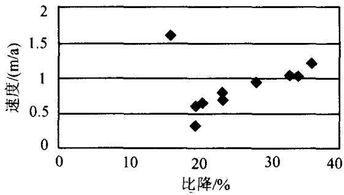  
图 2-1 延安杏子河流域沟床纵比降与沟头前进速度关系

动表现出明显的三次间歇性的抬升，这三次抬升总量各地表现不一，喜马拉雅山第四纪的抬升量达到3000\~4000m，而黄土高原第四纪的抬升量为100\~150m。现代地质构造运动在全国各地仍有不同的表现，多数地区表现为继承性特征，即原来上升区仍继续上升，原来相对下沉区仍表现为下沉。由于受地壳抬升运动影响，大部分沟谷及山区河流都处在下切之中，在西南地区和黄土高原表现尤为突出，几乎所有沟道和沟谷正处在明显的下切之中，并且由

于河床下切速度和沟谷下切速度的不协调，各类沟谷的纵比降远未达到均衡状态。地处华南的珠江流域亦为新构造运动上升区域，但各地上升的幅度不一，内部有相对的稳定区。例如，珠江三角洲至广州市区就是最大的稳定区，或坳陷区；流域内的山间盆地也是相对稳定区，这些区域在第四纪上升过程中，上升速度比邻近地区慢。尽管水土流失的分布受多种因素影响，但受新构造上升差异的影响仍然较明显，水土流失发生在新构造上升区域。例如，广东东部的河源郊区、和平县、龙川县、紫金县以及新丰县和惠东县，处在构造上升区域，水土流失严重，面积较大；相对稳定区内的东莞市东江三角洲附近、博罗县城附近和惠州惠城区，水土流失轻微；其他上升区域受岩性影响，流失程度介于前二者之间。

## 二、地貌因素

我国位于欧亚大陆面向太平洋的东斜面上，整个地势西部高、东部低，自西向东构成三级阶梯。我国土壤侵蚀格局受控于阶梯状的地貌特征。

第一级阶梯为青藏高原，平均海拔4600m，北为昆仑山和祁连山，东南为横断山脉的北部，西南为喜马拉雅山，其主峰珠穆朗玛峰为世界第一高峰，海拔8848m。高原腹部广泛分布着山原、台原、丘陵、盆地和大小湖泊。第二级阶梯位于大兴安岭一太行山一巫山一雪峰山一线以西，青藏高原以东及以北。阶梯内分布着高山、高原和盆地，阿尔泰山、天山、秦岭山脉及云贵高原、黄土高原和内蒙古高原等，海拔一般在3000m以下;准噶尔盆地、塔里木盆地和下切谷地海拔在1000m以下。第三级阶梯位于上述一线以东。阶梯内分布有江河平原、河谷盆地和低山丘陵。低山丘陵海拔大多低于500m，少数山岭超过1000m，丘陵分布相当广泛，平原和河谷多低于200m，黄淮海平原和长江中下游平原大部分在50m以下。

地貌因素对侵蚀影响的强弱，主要是通过坡度、坡长、沟壑密度、倾斜侵蚀面等对侵蚀产生作用。下面分述坡度、坡长等地貌因素对侵蚀的影响。

## (一)坡 度

## 1. 地面坡度与侵蚀强度

坡度是地貌形态特征的主要要素。地表径流产生的能量是径流质量和流速的函数，而径流量的大小和流速主要取决于径流深与地面坡度。因此，坡度直接影响径流的冲刷能力。津格[4]应用小区的模拟降雨和野外条件证实坡度每增加1倍，土壤流失量增加2.61\~2.80倍；斜坡水平长度每增加1倍，土壤流失量增加3.03倍，这个关系可表示为

$$
\cal A \ = \ \cal C S ^ { m } L ^ { n - 1 }\tag{2-1}
$$

式中，A为单宽山坡单位面积的平均土壤侵蚀量；C为变量常数；S为坡度；L为山坡水平长度(投影长度)；m，n分别为坡度指数和山坡水平长度指数，津格分别采用1.4和1.6。

刘善建分析了天水水保站径流小区资料认为[5]，坡度与冲刷呈指数相关，即坡度愈大，冲刷量愈高，当坡度增至15%以上时，冲刷量的增加更为显著；并求得农地上冲刷深度 d(mm)与坡度 S(%)的关系式为

$$
d = 0 . 0 1 2 S ^ { 1 . 4 } + 0 . 5 6\tag{2-2}
$$

陈永宗等应用陕西省子洲县团山沟的径流小区实测资料[3]，对不同坡度侵蚀量(M)与等宽流量 $( Q _ { \mathsf { e } } )$ 的关系(表2-2)及不同坡度坡面水流含沙量 $( \pmb { S } _ { \mathbf { w } } )$ 与最大 30min 雨强 $\left( { { I _ { 3 0 } } } \right)$ 的关系(表2-3)进行了统计分析。研究表明，侵蚀量随等宽流量增加而增大，它们之间呈直线相关；在同样最大30min雨强条件下，坡度愈大，坡面水流含沙量愈大。

表 2-2 不同坡度侵蚀量(M)与等宽流量 $( Q _ { e } )$ 的关系(子洲团山沟)
<table><tr><td>径流小区编号</td><td>坡度/(°)</td><td>坡长/m</td><td> $M - Q _ { e }$  关系</td><td>相关系数</td></tr><tr><td>1</td><td>9</td><td>20</td><td> $M = { \bf \Gamma } - { \bf 0 } . 1 2 7 + 6 . 4 4 1 Q _ { \mathrm { e } }$ </td><td>0.84</td></tr><tr><td>4</td><td>22</td><td>20</td><td> $M = \mathrm { ~ - ~ } 3 . 1 9 7 + 1 2 . 7 6 8 Q _ { \mathrm { e } }$ </td><td>0.93</td></tr><tr><td>5</td><td>31</td><td>20</td><td> $M = \mathrm { ~ - ~ } 3 . 6 3 9 + 1 6 . 6 2 2 Q _ { \mathrm { e } }$ </td><td>0.96</td></tr></table>

表 2-3 不同坡度水流含沙量 $( \pmb { S } _ { \pmb { \mu } } )$ 与最大 30min 雨强 $( { { I } _ { 3 0 } } )$ 的关系(子洲团山沟)
<table><tr><td>径流小区编号</td><td>坡度/(°)</td><td>坡长  $\mathbf { \nabla } / \mathbf { m }$ </td><td> $\pmb { S } _ { \mathbf { w } } \mathbf { - } I _ { 3 0 }$  关系</td><td>相关系数</td></tr><tr><td>1</td><td>9</td><td>20</td><td> $S _ { \mathrm { w } } = \mathrm { } - 9 . 3 8 + 1 0 . 6 3 I _ { 3 0 }$ </td><td>0.72</td></tr><tr><td>4</td><td>22</td><td>20</td><td> $S _ { \mathrm { w } } = 4 3 . 7 5 + 1 0 . 8 2 I _ { 3 0 }$ </td><td>0.73</td></tr><tr><td>5</td><td>31</td><td>20</td><td> $S _ { \mathrm { w } } = \mathrm { } - 9 . 3 8 + 1 0 . 6 3 I _ { 3 0 }$ </td><td>0.84</td></tr></table>

坡度对径流动力特征的影响，同时受降雨特性和土壤渗透能力的制约。江忠善等[6]在黄土高原安塞县进行5年的观测，按30min雨强分级研究坡度 S 与侵蚀量M 及径流深

H的关系(系数列表2-4)，得出下列幂函数关系式：

$$
M _ { \mathrm { s } } ~ = ~ A _ { 1 } S ^ { a _ { 1 } }\tag{2-3}
$$

$$
H \ = \ A _ { 2 } S ^ { a _ { 2 } }\tag{2-4}
$$

式中， $M _ { s }$ 为不同雨强下次平均侵蚀模数 $( \mathsf { \Omega } \mathsf { t } / \mathsf { k } \mathsf { m } ^ { 2 } )$ ；H为不同雨强下次平均径流深(mm);  
S 为地面坡度(°); $A _ { 1 } \setminus A _ { 2 }$ 为系数； $a _ { 1 }$ ${ \pmb a } _ { 2 }$ 为指数。

表2-4 不同 $\pmb { I } _ { 3 0 }$ 雨强条件下各坡度的次平均水土流失量的统计值
<table><tr><td>130/(mm/min)</td><td> $\mathbf { A } _ { 1 }$ </td><td> ${ \pmb a } _ { 1 }$ </td><td>R</td><td> $\pmb { A } _ { 2 }$ </td><td> ${ \pmb a } _ { 2 }$ </td><td>R</td></tr><tr><td>&lt;0.25</td><td>2.889</td><td>1.103</td><td>0.981**</td><td>1.526</td><td>-0.031</td><td>-0.336</td></tr><tr><td>0.25~0.50</td><td>24.141</td><td>1.056</td><td>0.998* *</td><td>1.231</td><td>0.339</td><td>0.863*</td></tr><tr><td>0.50~0.75</td><td>52.729</td><td>1.190</td><td>0.978* *</td><td>8.534</td><td>0.156</td><td>0.823*</td></tr><tr><td>&gt;0.75</td><td>151.988</td><td>1.385</td><td>0.993* *</td><td>31.999</td><td>0.089</td><td>0.980**</td></tr></table>

\*表示在 ${ \pmb \alpha } = { \bf 0 }$ 10水平上显著。  
\*\*表示在 $\alpha = 0 . 0 1$ 水平上显著。

考虑降雨侵蚀力( $E I _ { 3 0 } )$ 及坡度的组合与土壤侵蚀的关系，得出

$$
M _ { \mathrm { s } } = 0 . 0 3 0 ~ 1 9 S ^ { 1 . 1 8 7 2 } ( E I _ { 3 0 } ) ^ { 1 . 1 9 5 }\tag{2-5}
$$

对于某一特定地区，由于降水多年平均概率变异较小，因而，在年平均流失量与坡度的关系中，降雨因素影响甚小，仅表现为坡度的影响。

黄土丘陵区为[6]

$$
\overline { { M } } _ { \mathrm { s } } = 2 0 2 . 5 5 3 \ S ^ { 1 . 3 0 8 }\tag{2-6}
$$

$$
\overline { { { H } } } ~ = ~ 3 8 . 3 2 1 ~ S ^ { 0 . 1 1 7 }\tag{2-7}
$$

黄土高原区为[88]

$$
\overline { { M } } _ { \mathrm { s } } = 8 6 . 7 6 S ^ { 1 . 6 0 }\tag{2-8}
$$

$$
\overline { { M } } _ { \mathrm { w } } ~ = ~ 1 ~ 9 5 5 ~ { \cal S } ^ { 1 . 1 }\tag{2-9}
$$

甘枝茂、陈渭南 $\sharp _ { \vec { \tau } } [ 7 ]$ 在黄土高原用相对高差(H)求出与侵蚀的关系为

坡面

$$
\overline { { M } } _ { \mathrm { s } } = 9 5 H - 2 9 7 8 - 2 3\tag{2-10}
$$

全流域

$$
{ \overline { { M } } } _ { \mathrm { s } } = 3 0 4 6 . 5 + 7 3 . 2 3 H\tag{2-11}
$$

松辽流域山区丘陵面积占总面积的58%，其中山区占44%，丘陵区占14%。山区5°\~15°坡地面积占山区面积的37.6%，大于 $1 5 ^ { \circ } .$ 坡地的面积占37.2%；丘陵区5°\~15°坡地面积占丘陵区面积的47.2%，大于15°坡地面积占17%。

据辽宁省朝阳农业科学研究所观测，在其他条件相同情况下，径流和土壤冲刷量均

随着坡度增大而增加， $9 ^ { \circ \colon }$ 荒坡地比5°荒坡地径流量增加30.9%，冲刷量增加89.7%； $1 9 ^ { \circ }$   
的荒坡地为14°荒坡地产流量的1.8倍，冲刷量的8.0倍多。

## 2. 临界坡度与侵蚀强度

大量的研究资料表明，侵蚀量随坡度的增大而增加，但并非呈绝对正相关。当坡度达到一定值时，侵蚀量反而呈减小趋势，该定值坡度即侵蚀临界坡度。

陈永宗等[3]分析了黄土丘陵区绥德和离石水保站的径流小区试验资料(表2-5、表2-6)，在其他条件相似情况下， $0 ^ { \circ } \sim 2 5 ^ { \circ }$ 和 $8 ^ { \circ } \sim 2 8 ^ { \circ } .$ 坡地上的侵蚀量随坡度增大而增加，当坡度超过25°或28°时，侵蚀量呈减少趋势，因此，25°\~28°可视为该区的侵蚀临界坡度。蔡强国的分析资料(表2-7)表明，坡度愈大，坡面水流含沙量愈大，主要是细沟侵蚀量增大[89]。国外对侵蚀量与临界坡度的关系也有不同观点，该问题值得进一步研究。

表2-5 黄土高原坡度与径流深、侵蚀量的关系(绥德站)
<table><tr><td>坡度/(°)</td><td>8</td><td>14</td><td>21</td><td>28</td><td>34</td></tr><tr><td>径流深/mm</td><td>27.8</td><td>26.0</td><td>31.0</td><td>23.5</td><td>24.7</td></tr><tr><td>侵蚀量/(t/km²)</td><td>773.3</td><td>1906.3</td><td>3 689.3</td><td>5617.3</td><td>2 386.3</td></tr></table>

注：绥德水保站1958\~1960年平均观测资料。

表2-6 黄土高原坡度与径流深、侵蚀量的关系(离石站)
<table><tr><td>坡度/(°)</td><td>0</td><td>5</td><td>10</td><td>15</td><td>20</td><td>25</td><td>30</td></tr><tr><td>径流深/mm</td><td>16.7</td><td>5.2</td><td>4.8</td><td>29.0</td><td>38.4</td><td>25.8</td><td>22.8</td></tr><tr><td>侵蚀量  $^ { \prime } ( \pmb { \nu } \mathbf { k m } ^ { 2 } )$ </td><td>47.3</td><td>63.8</td><td>195.0</td><td>773.5</td><td>2 009.6</td><td>2 655.9</td><td>2 157.3</td></tr></table>

注：离石水保站1957年、1958年、1964年雨强大于10mm/h观测记录的年均值。

表 2-7 不同坡度坡面上水流含沙量 $( \boldsymbol { S } _ { \mathbf { w } } )$ 与最大 30min 雨强 $\left( { { I _ { 3 0 } } } \right)$ 的关系(子洲团山沟)
<table><tr><td>径流小区编号</td><td>坡度/(°)</td><td>坡长/m</td><td> $S _ { \mathrm { w } } { \mathrm { - } } I _ { 3 0 } \mathrm { : }$  关系</td><td>相关系数</td><td>样本数</td></tr><tr><td>1</td><td>9</td><td>20</td><td> $S _ { \mathrm { w } } = \mathrm { } - 9 . 3 8 + 1 0 . 6 3 I _ { 3 0 }$ </td><td>0.72</td><td>13</td></tr><tr><td>4</td><td>22</td><td>20</td><td> $S _ { \mathrm { w } } = 4 3 . 7 5 + 1 0 . 8 2 I _ { 3 0 }$ </td><td>0.73</td><td>24</td></tr><tr><td>5</td><td>31</td><td>20</td><td> $S _ { \mathrm { w } } = 2 7 . 2 2 + 1 6 . 9 7 I _ { 3 0 }$ </td><td>0.84</td><td>25</td></tr></table>

## (二)坡 长

## 1. 坡长对侵蚀的影响

坡长对侵蚀的影响呈现较为复杂的关系，主要随降雨径流状况而变化。华绍祖应用天水、绥德等地的径流测验资料求得侵蚀与坡长的关系为0.15\~0.5次幂成正比。陈永宗根据子洲团山沟3、2、4号径流小区试验资料(1963\~1967年)建立了各级坡长的侵蚀总量与径流量的经验关系(表2-8、图2-2)，它们之间是很好的线性相关。图2-2说明坡面越长，所拟合的直线斜率越大。其原因主要是坡长大，受雨面积大，随之增大水流流程，水流对坡面产生侵蚀的机会多，侵蚀量则大。在此基础上陈永宗建立了不同坡长的侵蚀总量与径流量呈正相关的关系式[3]。

表2-8 黄土丘陵区不同坡长的侵蚀总量、单位面积侵蚀量与径流量的关系
<table><tr><td>径流小区编号</td><td>坡长  $/ \mathbf { m }$ </td><td>坡度/(°)</td><td>坡向</td><td>经验关系</td><td>相关系数</td></tr><tr><td>3</td><td>60</td><td>22</td><td>北东</td><td> $S = \mathrm { ~ - ~ } 1 4 5 . 5 3 + 5 2 0 . 1 7 Q _ { \circ }$ </td><td>0.97</td></tr><tr><td>2</td><td>40</td><td>22</td><td>北东</td><td> $S = \mathrm { ~ - ~ } 1 1 8 . 4 8 + 4 8 4 . 9 9 Q _ { \mathrm { e } }$ </td><td>0.97</td></tr><tr><td>4</td><td>20</td><td>22</td><td>北东</td><td> $S = \mathrm { ~ - ~ } 8 8 . 2 1 9 + 3 6 8 . 9 3 Q _ { \mathrm { c } }$ </td><td>0.94</td></tr><tr><td>3</td><td>60</td><td>22</td><td>北东</td><td> $M = \mathrm { ~ - ~ } 1 . 9 1 6 + 5 . 7 8 7 Q _ { \mathrm { e } }$ </td><td>0.97</td></tr><tr><td>2</td><td>40</td><td>22</td><td>北东</td><td> $M = { } - 2 . 4 4 6 + 8 . 0 4 8 Q _ { c }$ </td><td>0.97</td></tr><tr><td>4</td><td>20</td><td>22</td><td>北东</td><td> $M = \mathrm { ~ - ~ } 3 . 1 9 7 + 1 2 . 2 6 8 Q _ { \mathrm { e } }$ </td><td>0.93</td></tr></table>

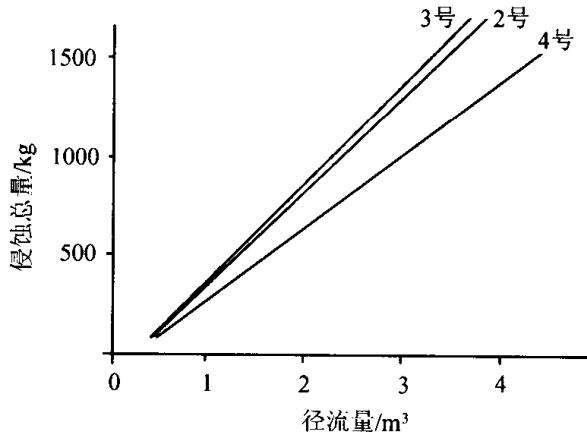  
图2-2 不同坡长的侵蚀总量与径流量的关系

由于坡长对地表径流的再分配，使得二者关系极为复杂。据江忠善6]在黄土丘陵区 $\vdots [ 6 ]$ 安塞县的研究证明，在特大暴雨及大暴雨情况下，坡长与径流量、冲刷量呈正相关；当降雨平均强度较小，或大强度降雨持续时间很短时，坡长与径流量、冲刷量有时呈正相关，有时呈反相关；当雨量小，且降雨强度不超过3\~15mm/h时，二者呈反相关。分析取得的相关系数列于表2-9。在黄土丘陵区，统计坡长L与侵蚀模数M和径流深H，回归 $M _ { s }$ 分析得

$$
M _ { \mathrm { s } } = A _ { 1 } L ^ { a _ { 1 } }\tag{2-12}
$$

$$
H \ : = \ : A _ { 2 } L ^ { a _ { 2 } }\tag{2-13}
$$

考虑到降雨侵蚀力及坡长的共同作用，得到黄土丘陵区两者的关系式为

$$
M _ { \mathrm { s } } = 0 . 0 1 3 8 L ^ { 0 . 3 2 6 } ( E I _ { 3 0 } ) ^ { 1 . 7 0 0 }\tag{2-14}
$$

据辽宁省朝阳农业科学研究所观测资料，在其他条件相同情况下，坡长20m比坡长12m的天然荒坡单位面积产流量增加43.7%，土壤侵蚀量增加约1.4倍。东北松辽流域，

漫岗丘陵的黑土区，坡度一般在 $3 ^ { \circ } \sim 8 ^ { \circ }$ ，大于 $1 5 ^ { \circ }$ 的坡地很少，但坡长较长，一般在800\~1500m，有的甚至更长，是该地区形成严重侵蚀的重要原因之一。

表 2-9 黄土丘陵区不同 $\pmb { I _ { 3 0 } }$ 雨强下次平均流失量与坡长的相关分析结果
<table><tr><td> $I _ { 3 0 } / ( \mathrm { m m / m i n } )$ </td><td> $\pmb { A } _ { 1 }$ </td><td> $\alpha _ { 1 }$ </td><td> $R$ </td><td> $\pmb { A } _ { 2 }$ </td><td> ${ \pmb a } _ { 2 }$ </td><td>R</td></tr><tr><td>&lt;0.25</td><td>46.45</td><td>-0.107</td><td>-0.550</td><td>4.14</td><td>-0.539</td><td>-0.998</td></tr><tr><td>0.25~0.50</td><td>169.19</td><td>0.337</td><td>0.769</td><td>4.43</td><td>0.299</td><td>-0.852</td></tr><tr><td>0.50~0.75</td><td>686.09</td><td>0.359</td><td>0.927</td><td>22.40</td><td>0.187</td><td>-0.760</td></tr><tr><td>&gt;0.75</td><td>3 642.41</td><td>0.414</td><td>0.997</td><td>36.67</td><td>0.049</td><td>-0.983</td></tr></table>

## 2. 坡度、坡长对侵蚀的综合影响

坡度和坡长对侵蚀的综合影响随降雨地区不同而变化。西北林学院在黄土高原南部淳化县进行了观测试验取得了类同的结果。以下列出黄土高原两个地区次降雨侵蚀量与坡度及坡长回归关系式：

安塞

$$
M \ = \ 0 . 0 1 3 \ 9 \ S ^ { 0 . 7 2 4 } L ^ { 0 . 1 9 9 } ( E I _ { 3 0 } ) ^ { 1 . 4 0 0 }\tag{2-15}
$$

淳化

$$
M \ = \ 2 4 . 5 2 3 \ S ^ { 1 . 3 3 4 } L ^ { 0 . 6 1 1 } ( \ E I _ { 3 0 } ) ^ { 0 . 3 3 7 }\tag{2-16}
$$

## 3. 侵蚀预报方程坡度、坡长 SL 因子求取

地形因子是水力侵蚀预报的重要参数，已有一些研究者进行了这方面的探讨。牟金泽等[8]以黄土区天水站资料，经回归分析得

$$
S L ~ = ~ 1 . 0 2 \Big ( { \frac { \lambda } { 2 0 } } \Big ) ^ { 0 . 2 } \Big ( { \frac { \alpha } { 5 . 0 7 } } \Big ) ^ { 1 . 3 }\tag{2-17}
$$

式中，λ 为坡长(m)；α 为坡度(°)。

江忠善等[9]取黄土高原坡长20m、宽5m、坡度10°为标准小区，得到 SL关系式为[35

$$
S L \ = \ 1 . 0 7 \bigg ( \frac { \lambda } { 2 0 } \bigg ) ^ { 0 . 2 8 } \bigg ( \frac { \alpha } { 1 0 ^ { \circ } } \bigg ) ^ { 1 . 4 5 }\tag{2-18}
$$

杨艳生[10]研究南方红壤地区的 SL，得

$$
\begin{array} { r c l } { { } } & { { } } & { { L = ~ h \cdot ( 1 - \cos \beta ) / 6 3 . 8 \mathrm { s i n } \beta } } \\ { { } } & { { } } & { { } } \\ { { } } & { { } } & { { S = 0 . 4 1 9 \times 1 . 1 ^ { \beta } } } \\ { { } } & { { } } & { { S L = 0 . 0 0 2 3 \times 1 . 1 ^ { \beta } \times h ( 1 - \cos \beta ) / \mathrm { s i n } \beta } } \end{array}\tag{2-19}
$$

式中，h为高差； $\beta$ 为平均坡度。

张宪奎等[11]得出东北黑土地区 SL 关系式为

$$
S L \ = \ \bigg ( \frac { \lambda } { 2 0 } \bigg ) ^ { 0 . 1 8 } \bigg ( \frac { \alpha _ { 1 } } { 8 . 7 5 } \bigg ) ^ { 1 . 3 }\tag{2-20}
$$

式中， $\alpha _ { 1 }$ 为坡度(%)。

黄炎和等[12]研究福建东南地区的 SL 关系式为

$$
S L = 0 . 0 8 \lambda ^ { 0 . 3 5 } \alpha ^ { 0 . 6 6 }\tag{2-21}
$$

## （三）坡形和坡向

坡形直接影响地面径流的分配和流速及其对地面物质的侵蚀强度；坡向是通过影响地面水热状况和植被的分布，从而影响土地利用类型和侵蚀强度。

## 1. 坡形

我国的土壤侵蚀多发生在丘陵区，丘陵斜坡坡形可分直形坡、凹形坡、凸形坡和复合形坡。不同坡形造成降雨径流的再分配，直接影响侵蚀方式和侵蚀强度。尤其在南方花岗岩丘陵区，影响切沟和崩岗的发育。

(1）直形坡。直形坡的坡度从上到下基本一致。坡面上产生的沟状侵蚀和股流与坡面走向一致，侵蚀沟的沟头，以溯源侵蚀方式向分水岭扩展。在黄土丘陵区坡面上可由栅状细沟发展成浅沟和切沟；在花岗岩丘陵区可由细沟直接发育形成切沟。

(2)凹形坡。凹形坡的上部为直形坡或凸形坡，向下坡度变缓，有明显的转折处。花岗岩丘陵区凹形坡坡顶一般为分水鞍，坡面的两侧为山脊，径流线呈扇形或树枝状汇集，形成集水洼地；坡面集水面积大，沟状水流沿坡面向下聚集，洼地底部径流汇合后冲刷最强烈，先形成小切沟，切沟沿坡面向上溯源侵蚀过程中发生分支，派生出数条支切沟，呈树枝状，不仅切沟沟壁产生侧蚀，而且支切沟之间的沟岸和沟头部位产生大面积的崩塌、滑塌等重力侵蚀，并形成崩岗。这种崩岗集水面积大，出口小，侵蚀范围达到分水鞍和两侧山脊时，整个凹形坡即侵蚀完毕。

(3)凸形坡。凸形坡的坡度自上而下逐渐增大，坡面上有较明显的转折处。据在广东龙川县东田镇叶塘花岗岩风化壳丘陵斜坡的实测资料，东坡的上部坡度为 $1 6 ^ { \circ }$ ，中部为29°，下部为33°;西坡的上部坡度为14°，中部为21°，下部为26°。东西坡均有明显的转折处，随坡度增大，坡面流速加大，坡面上形成放射状切沟侵蚀。坡面上部因失去下部的支撑而发生大规模的崩塌、滑塌，由此崩岗的发展十分迅速。

## 2. 坡向

坡向是指丘陵斜坡的朝向。根据太阳入射角，一般将北半球的S、SW、SE及W的坡向称阳坡，将N、NW、NE及E向坡称阴坡。阳坡获得的太阳辐射大于阴坡(图2-3)，二者的差异随纬度增高和坡度增大而增大。

表2-10列举出广东省五华县不同坡向地温的观测结果。同一土层深度，阳坡较阴坡的地温一般高 $2 \sim 3 \mathbb { C }$ 。广东省新丰县境内不同坡向降水量观测资料表明(表2-11)，阳坡的降水量大于阴坡，相差67\~367mm，一般为140mm左右。

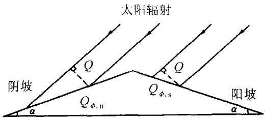  
图2-3阳坡、阴坡太阳辐射示意图  
$Q _ { \phi , \mathfrak { n } }$ 为阴坡辐射， $Q _ { \phi } .$ 为阳坡辐射

表2-10 广东省不同坡向坡面的地温观测结果  
(单位：℃)
<table><tr><td rowspan="2">地温观测深度/cm</td><td colspan="3">阳坡(30°)</td><td rowspan="2"></td><td colspan="2">阴坡(24°)</td></tr><tr><td>8:00</td><td>14:00</td><td>20:00</td><td>8:00 14:00</td><td>20:00</td></tr><tr><td>0</td><td>29.0</td><td>29.3</td><td>27.1</td><td>28.1</td><td>29.2</td><td>26.6</td></tr><tr><td>0~5</td><td>27.3</td><td>31.2</td><td>27.6</td><td>25.2</td><td>27.9</td><td>25.2</td></tr><tr><td>5~10</td><td>28.0</td><td>31.0</td><td>28.7</td><td>25.3</td><td>28.1</td><td>25.4</td></tr><tr><td>10~15</td><td>28.5</td><td>30.3</td><td>29.6</td><td>25.3</td><td>27.9</td><td>26.5</td></tr><tr><td>15~20</td><td>28.7</td><td>30.2</td><td>29.2</td><td>25.4</td><td>27.8</td><td>26.1</td></tr></table>

注：观测地点是广东省五华县新一乡黄狗坑；坡面为燕山期黑云母花岗岩风化壳光板地；观测时间是1989年8月28日，分别按8:00、14:00、20:00三个时间观测；观测人是谢明、何江华、谭军、薛永华、江泳涛。

表2-11 广东省新丰县东南坡和西北坡降雨量比较
<table><tr><td>坡向</td><td colspan="4">东南坡(阳坡)</td><td colspan="4">西北坡(阴坡)</td></tr><tr><td>地点</td><td>县城</td><td>石角</td><td>梅坑</td><td>小镇</td><td>马头附近</td><td>板岭附近</td><td>回龙</td><td>遥田</td></tr><tr><td>降雨量/mm</td><td>1 906.3</td><td>1 930.6</td><td>1 835.0</td><td>1 954.1</td><td>1 872.0</td><td>2 116.4</td><td>1 749.0</td><td>1 768.0</td></tr></table>

坡向对侵蚀的影响主要是水热条件和降雨量的差异造成植被生长状况和土地利用的不同，导致土壤侵蚀强度的不同。

南方花岗岩丘陵区的土壤侵蚀分布规律显示，阳坡的水土流失程度一般比阴坡严重，崩岗侵蚀分布较为明显。广东省水利科学研究所在龙川县东田镇叶塘区鱼湖山，井水坑小流域，测量了印支期花岗闪长岩(γ65′)风化壳缓丘上崩岗(或由数个崩岗组成的崩岗群)和大切沟发育的坡向。流域内崩岗(群)和大切沟共有67个(条)，再以10°方位角为单位绘制崩岗发育坡向玫瑰图(图2-4)，结果表明：南坡、西坡的崩岗(群)和大切沟的数目较多，西北坡、北坡和东北坡较少。若以方位角90°\~269°为南坡， $2 7 0 ^ { \circ } \sim 3 6 0 ^ { \circ } \mathrm { ~ , ~ } 0 ^ { \circ } \sim$ 89°为北坡，那么南坡的崩岗(群)和大切沟有50个(条)，占总数的74.6%，北坡有17个(条)，占25.4%[13]。

黄土高原西峰水土保持站的观测资料(1957\~1958年)表明：气温、地温和土壤蒸发都是阳坡大于阴坡；但相对湿度是阴坡大于阳坡，因土壤含水量高于阳坡。黄土高原的天然植被已遭破坏，侵蚀强度主要决定于土地利用情况。在相同的利用情况下，侵蚀强度主要决定于地面土壤水分状况和径流深。一般阴坡水分状况好，植被易恢复，或生长较茂密，侵蚀强度较阳坡轻微。据绥德水土保持站观测资料，迎风坡降雨量大于背风坡，

侵蚀量也是迎风坡大于背风坡。

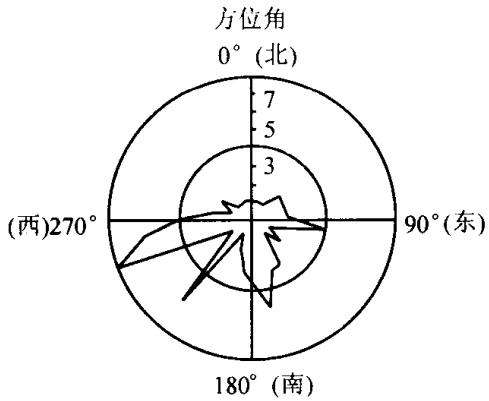  
图24 印支期花岗岩风化壳缓丘崩岗(群)和大切沟发育坡向玫瑰图  
(广东省龙川县车田镇叶塘)1、2…6崩岗(群)和大切沟数目

## （四）沟谷密度和侵蚀面

黄土高原的地貌特征是丘陵起伏、地面切割破碎、沟谷纵横，因此沟蚀强度大，且遭受侵蚀的面积愈大，不仅现代侵蚀强烈，且侵蚀潜在势能强。据此，甘枝茂[7]探讨了侵蚀面的问题，即一个地区每平方千米面积上能产生侵蚀的面积 $S _ { \mathsf { p } } ( \mathbf { k m } ^ { 2 } / \mathbf { k m } ^ { 2 } )$ ，其表达式为

$$
S _ { \mathrm { p } } = 2 D \cdot H \cdot d / { \sin \alpha }\tag{2-22}
$$

式中，D为沟谷密度 $( \mathbf { k m } / \mathbf { k m } ^ { 2 } )$ ；H为相对高度，或平均切割深度(m)；α为能够产生侵蚀的斜坡平均坡度(°)；d为土壤侵蚀面系数，主要取决于地面物质的抗蚀性、岩性和植被状况等。

侵蚀面 $S _ { \mathfrak { p } }$ 与侵蚀量 M的关系为

$$
M = 1 7 2 1 . 4 7 + 4 4 1 3 . 1 5 \ S _ { \mathrm { p } }\tag{2-23}
$$

或

$$
M = 2 7 . 5 4 S _ { \mathrm { p } } ^ { 1 . 2 7 }\tag{2-24}
$$

沟谷密度 D 与侵蚀量M的关系为

$$
M \ = \ 4 \ 3 1 3 . 9 7 8 \ 2 \ + \ 3 \ 8 8 9 . 4 7 5 \ 1 / D\tag{2-25}
$$

陈渭南[19]通过大量地形要素的分析，探讨了各个地形因子与侵蚀的关系。

相对高度(H)与沟谷密度(D)关系为

$$
D \ = \ 1 2 . 8 9 H ^ { \ 0 . 6 9 }\tag{2-26}
$$

坡度(A)与 D 的关系为

$$
\textit { D } = 0 . 3 4 7 { A } ^ { 0 . 7 8 8 }\tag{2-27}
$$

坡度(A)与 H关系为

$$
H = 0 . 0 1 4 A ^ { 0 . 8 5 }\tag{2-28}
$$

坡长(C)与 D 关系为

$$
D = - ~ 4 . 0 ~ \lg C - 2 . 1 3\tag{2-29}
$$

综上所述，地形因素对侵蚀的影响是复杂的，一方面受古地貌的控制，另一方面在人类活动影响下，地形因素因土地利用的不同，对侵蚀的作用可发生根本的变化。为林草植被覆盖的丘陵斜坡或沟谷地，显然地形因素对侵蚀的作用不明显；同样，降雨和风力等气候因素也因下垫面的变化，对侵蚀的作用可发生根本的变化。

## 三、气候因素

气候因素是影响土壤侵蚀的主要外营力。我国由东向西横跨60余个经度，由南向北纵贯50余个纬度，跨寒温带、暖温带、亚热带、热带、赤道带及青藏高原，区域变化大，大陆性季风气候显著，影响土壤侵蚀过程时空变化大。关于全国性气候特点与土壤侵蚀类型及其分布的关系，已在第一章做了概述，这里主要讨论降雨因素对土壤水蚀的影响(风蚀问题见第五章)。降雨是土壤侵蚀过程中起主导作用的一个气候因素，降雨对土壤侵蚀的影响决定于降雨径流侵蚀力。降雨侵蚀力是降雨量、降雨强度、雨型和雨滴动能的函数；发生径流情况下的降雨对侵蚀的作用，即是降雨径流侵蚀力。

## （一）降雨量、降雨强度和侵蚀

一般来说，年降水总量大，侵蚀总能量也大，侵蚀因而增强。但是年降雨量的区域分布和降雨量的年内分配及降雨强度，对侵蚀往往起主导作用。

## 1. 年降雨量区域分布和降雨量年内分配与土壤侵蚀

黄土高原年平均降水量在200\~650mm，但区域分布不均匀为其重要特点。由东南向西北，年降水量逐渐减少。在年降水量为400\~500mm等值线之间为土壤侵蚀最严重地区。就全球来看，年降水量为400\~500mm的半干旱地区，土壤侵蚀的发生发展也最为严重。黄土高原受季风气候影响大，降雨量的年内分配很不均匀，6\~9月份汛期降水量占年降水量的65%以上，径流量占年径流量的80%左右，侵蚀量则占年侵蚀量的83.8%。由此可见，黄土高原的土壤侵蚀主要发生在汛期，而且是少数几次大暴雨所引起的侵蚀可占全年总侵蚀量的90%以上。

长江流域为亚热带季风气候，年均降水量为1000mm左右，长江上游地区年降水量1000\~1200mm。在山区降水量随海拔增高而增大的趋势，在海拔2400\~3500m出现最大降水带，可达1800mm。5\~10月为汛期，主要降雨量集中于夏季7月、8月、9月三个月，可占全年总降水量的50%以上。汛期多暴雨，尤其在长江上游地区多激发强度侵蚀和滑坡、泥石流灾害。

## 2. 暴雨特点与土壤侵蚀

周佩华等[14]提出，在黄土高原，严重的土壤侵蚀主要由少数几次暴雨或大暴雨所引起，大多数降雨不产生径流。根据对天水水土保持站1945\~1975年的观测资料，31年内共降雨1226次，其中发生径流的降雨只有82次，占总降雨次数的6.7%，平均每年只有6.3次降雨引起侵蚀。又据延安、绥德、子洲等引起土壤侵蚀的210场暴雨资料的统计分析，较严重的土壤侵蚀一般由40\~60mm的日降雨所引起，故可确定日降雨 $\geqslant 5 0 \mathrm { m m }$ 作为黄土高原引起土壤侵蚀的指标[15]。

暴雨雨滴大，产流多，侵蚀能量大是导致严重土壤流失的主要动力。

在黄土高原产生土壤侵蚀的高强度降雨有三种类型：即由强对流条件引起的小范围、短历时高强度暴雨(A型)；由锋面及局部对流具雷暴性质的较大范围、中历时、中强度暴雨(B型)和由锋面引起的大范围、长历时、低强度暴雨(C型)。统计1955\~1986年黄土高原特大暴雨的极值为：10min——59.1mm、30min——107.3mm、60min—252.8mm、120min——300.0mm、360min——575.0mm、1440min——1400mm；暴雨中心有济源、太行山南麓、沁河中上游、秦岭北麓、渭北、北洛河中游、清河中上游、渭河上游、吉(县)龙(门)、延河清涧河、吕梁山两侧、晋中、无定河中上游、河曲神木、大青山南侧、贺兰山东侧等17个[16]。上述暴雨特征和分布与该区土壤侵蚀强度和主要产沙地区基本一致。1977年7月6日延河流域的日降水量达200mm以上，该日延河输沙量为多年年均输沙量的1.5倍。

## （二）可蚀性降雨、降雨侵蚀力与土壤侵蚀

## 1. 可蚀性降雨

是指能产生地表径流而引起土壤流失模数 $\geq 1 \ t / \mathrm { k m } ^ { 2 }$ 的降雨量。王万忠以产流降雨统计得出[17]，黄土高原引起土壤侵蚀的可蚀性降雨在坡耕地(20°)为8.1mm，提出可蚀降 $( 2 0 ^ { \circ } )$ 雨的临界雨量标准是10mm，其瞬时雨强需达到0.5mm/min，这与美国提出的12.7mm、日本的13.0mm相接近。黄土高原每年有可蚀降雨量138.6mm，占年总雨量的26.7%。其中北部稍少(140\~150mm)，南部稍多(150\~220mm)；可蚀性降雨年均北部5.2次，南部4.2次，占年降雨总次数的6.6%，与周佩华等的研究结果接近，说明黄土高原的土壤侵蚀是由数次可蚀性降雨引起的，具有北多南少的特点。

## 2. 降雨强度和雨滴动能

降雨强度愈大，雨滴动能愈大，地表产流量愈多，土壤侵蚀愈严重。因此，降雨强度、降雨能量与降雨侵蚀力是有机联系的。周佩华等[14]通过模拟试验，提出降雨雨滴动能 $E \big [ \mathbf { J } / ( \mathbf { m } ^ { 2 } \cdot \mathbf { m m } \big )$ ]与降雨强度I(mm/min)的相关方程为

$$
E = 2 3 . 4 9 I ^ { 0 . 2 7 }\tag{2-30}
$$

江忠善[18]、刘素媛[19]、周伏建[20]分别研究了西北黄土高原、东北辽西地区和南方福建地区天然降雨雨滴特性，以及暴雨雨强与雨滴动能的关系。他们将暴雨雨型分为两类：一类是来势猛、历时短、小范围的短阵型暴雨；另一类是大范围普通型的锋面暴雨。以雨滴动能(E)与两类暴雨雨型分别建立关系方程。

西北地区(陕北、晋西、陇东)为

短阵型

$$
E = 3 2 . 9 8 + 1 2 . 1 3 \mathrm { ~ l g ~ } I \overrightarrow { \mathfrak { H } } E = 3 3 . 8 8 \ I ^ { 0 . 2 3 }\tag{2-31}
$$

普通型

$$
E = 2 7 . 8 3 + 1 1 . 5 5 \mathrm { ~ l g ~ } I \overrightarrow { \mathfrak { H } } E = 2 9 . 6 4 I ^ { 0 . 2 9 }\tag{2-32}
$$

东北地区(辽西)为

短阵型

$$
E = 2 8 . 9 5 ~ I ^ { 0 . 0 7 5 }\tag{2-33}
$$

普通型

$$
E = 2 5 . 9 2 \ I ^ { 0 . 1 7 2 }\tag{2-34}
$$

南方地区(福建)为

$$
E \ = \ 3 4 . 3 2 \ I ^ { 0 . 2 7 }\tag{2-35}
$$

此外，杨艳生和郑振源[21]利用H.A. Elwell 提出的方法，计算了降雨雨能，并把我国分为多雨区(年降水量>1000mm)、中雨区(年降水量450\~1000mm)和少雨区(年降水量<450mm)，得出月雨量P与雨能E的关系式：

多雨区

$$
E _ { \mathrm { { H } } } = 1 5 . 2 9 2 P - 1 7 1 . 6 3 0  { \mathrm { ~ \textrm ~ { ~ ~ } ~ } }  { P \geq 1 8 \mathrm { m m } }\tag{2-36}
$$

中雨区

$$
E _ { \mathrm { { H } } } = 1 6 . 2 5 7 P - 2 8 0 . 3 4 6 \qquad P { \geq } 1 8 \mathrm { { m m } }\tag{2-37}
$$

少雨区

$$
E _ { \mathrm { { H } } } = 1 6 . 4 9 3 P - 1 0 7 . 6 7 6 \mathrm { ~  ~ { ~ \it ~ \it ~ \phi ~ } ~ } P \geq 1 8 \mathrm { m m }\tag{2-38}
$$

## 3. 降雨侵蚀力

降雨侵蚀力是雨滴动能和雨强两个特征值的乘积。自美国学者W.H.Wischmeier22]提出用降雨雨滴动能E与30min雨强I30的乘积EI30作为降雨侵蚀力(R)的指标后，已在 $I _ { 3 0 }$ $E I _ { 3 0 }$ 世界很多国家应用。我国的学者根据中国的具体情况进行了这方面的研究。

江忠善等[6]研究提出，在黄土高原 $E I _ { 3 0 }$ 仍是表征降雨侵蚀力较好的指标，之后为减少计算工作量又探讨了不同坡度下用 $P I _ { 3 0 } { ' }$ 代替 $E I _ { 3 0 }$ 具有较好的精度(表2-12)。

表 2-12 侵蚀量与复合因子 ${ \pmb { P } } { \pmb { I } } _ { 3 0 }$ 和 ${ \pmb { E I } } _ { 3 0 }$ 的相关分析结果的比较[6]
<table><tr><td rowspan="2">坡度/(°)</td><td colspan="3"> $M = A _ { 1 } ( \mathit { P I } _ { 3 0 } ) ^ { a } { } _ { 1 }$ </td><td colspan="3"> $M = A _ { 2 } \big ( E I _ { 3 0 } \big ) ^ { a _ { 2 } }$ </td></tr><tr><td> $\pmb { A } _ { 1 }$ </td><td> ${ \pmb a } _ { 1 }$ </td><td>R</td><td> $\pmb { A } _ { 2 }$ </td><td> ${ \pmb a } _ { 2 }$ </td><td>R</td></tr><tr><td>5</td><td>1.847 6</td><td>1.498 4</td><td>0.797</td><td>0.036 1</td><td>1.417 1</td><td>0.862</td></tr><tr><td>10</td><td>2.617 2</td><td>1.670 9</td><td>0.780</td><td>0.029 4</td><td>1.602 5</td><td>0.856</td></tr><tr><td>15</td><td>3.854 3</td><td>1.705 9</td><td>0.749</td><td>0.036 8</td><td>1.650 9</td><td>0.829</td></tr><tr><td>20</td><td>4.845 3</td><td>1.706 4</td><td>0.761</td><td>0.0511</td><td>1.629 5</td><td>0.831</td></tr><tr><td>25</td><td>5.019 8</td><td>1.773 4</td><td>0.748</td><td>0.042 5</td><td>1.702 2</td><td>0.822</td></tr><tr><td>28</td><td>6.457 9</td><td>1.687 8</td><td>0.745</td><td>0.075 1</td><td>1.593 5</td><td>0.814</td></tr></table>

一些研究者提出用 $E I _ { 1 0 }$ $P _ { 6 0 } I _ { 1 0 }$ 等计算R值。从应用出发，用实测资料得出适应不同

地区的年 R 值计算式(表 2-13)。

表 2-13 我国不同地区 R 值计算式
<table><tr><td>研究者</td><td>R计算式</td><td>适应地区</td></tr><tr><td>卜兆宏[23]</td><td> $R = 0 . 1 2 8 P _ { f } I _ { 3 0 B } - 0 . 1 9 2 1 I _ { 3 0 B }$ </td><td>南方花岗岩丘陵区</td></tr><tr><td>黄炎和[12]</td><td> $R \ = \ \sum _ { i \ = 1 } ^ { 1 2 } 0 . 1 9 9 P _ { i } ^ { 1 . 5 6 8 2 }$ </td><td>福建东南</td></tr><tr><td>周伏建[20]</td><td> $R \ = \ \sum _ { i \ = 1 } ^ { 1 2 } 0 . 1 7 9 P _ { i } ^ { 1 . 5 5 2 7 }$ </td><td>福建</td></tr><tr><td>吴素业[24]</td><td> $R \ = \ \sum _ { i \ = 1 } ^ { 1 2 } 0 . 0 1 2 5 \ P _ { i } ^ { 1 . 6 2 9 5 }$ </td><td>安徽大别山区</td></tr><tr><td>刘秉正[25]</td><td> $R = 1 0 5 . 4 4 \frac { ( P _ { 6 . 9 } ) ^ { 1 2 } } { P } - 1 0 4 . 9 6$ </td><td>陕西渭北</td></tr><tr><td>马志尊[26]</td><td> $R \ = \ 1 . 2 1 5 7 \sum \ 1 0 ^ { 1 . 5 } \bigg ( \ \mathrm { l g } P \ \frac { P _ { i } } { P } - 0 . 8 0 8 \bigg )$ </td><td>海河流域太行山区</td></tr><tr><td>孙保平[27]</td><td> $R = 1 . 7 7 ~ P _ { 5 \sim 1 0 } - 1 3 3 . 0 3$ </td><td>宁夏南部</td></tr><tr><td>王万忠[16]</td><td> $R = 0 . 0 0 9 ~ \overline { { P } } ^ { ~ 0 . 5 6 4 } \overline { { I } } _ { 6 0 } { } ^ { 1 . 1 5 5 } \overline { { I } } _ { 1 4 4 0 } ^ { ~ 0 . 5 6 0 }$ </td><td>全国</td></tr></table>

各地降雨侵蚀力指标R与土壤侵蚀模数M呈幂函数关系，通式为 $M _ { s }$

$$
M _ { \mathrm { s } } ~ = ~ a R ^ { b }\tag{2-39}
$$

## （三）我国主要地区降雨特点与土壤侵蚀

我国气候最显著的特征是大陆性季风气候，年内降雨量分布很不均匀，多集中在夏、秋两季。6\~10月为汛期，降水量占全年降水量的60%以上，多暴雨，常酿成水土流失与洪水灾害。

长江中下游的洪水灾害主要来自长江上游的暴雨洪水及其引发的水土流失灾害与泥沙的输移。

前文已论及黄土高原的土壤侵蚀主要是由年内几次大暴雨所引发。此外，在我国的热带、亚热带地区也是大陆性季风气候，6\~10月的降水量可占全年的60%\~70%，一日最大降水量可达100\~250mm，河流输沙量可占全年的70%\~90%，长江流域7\~9月的输沙量即占全年的70%以上。1935年长江中下游发生特大洪水灾害，1d最大降水量曾达600mm，3d降水量大于1000mm，造成洪水淹没农田及河流、湖泊、水库泥沙严重淤积。

东北松花江辽河流域地处温带、寒温带，大陆季风气候显著，区内降水分布很不均匀，70%以上的降水集中在6\~9月，其中7月、8月两月即占全年降水的50%以上，水蚀即集中于该季节。此外，融雪水侵蚀也占一定比例。

淮河流域的多年平均降水量800mm左右，年内、年际分布不均。6\~9月降水量占全年降水总量的60%以上，年际变化相差3\~5倍。干旱与暴雨洪水年际、年内交替出现。桐柏山区、伏牛山区的暴雨中心区，年降水量1000\~1500mm，径流深500\~900mm，这些地区为土壤侵蚀严重区，年均土壤侵蚀模数多在 $4 ~ 5 0 0 \sim 5 ~ 5 0 0 0 \times \mathrm { k m } ^ { 2 }$

东南沿海地区台风雨是降水主要来源之一。随着冷暖气团的消长强弱及台风登陆的多寡，降水量的年际变化很不稳定，部分地区多雨年与少雨年的降水量比值在2.0以上。年降水量大，暴雨多，降雨强度大，是造成土壤强烈侵蚀和触发崩岗的诱因。

## （四）特大暴雨洪水引发的土壤侵蚀与河流泥沙输移

所谓特大暴雨是指某一测站的日降雨量 $\geq 2 0 0 \mathrm { m m }$ ，或者两个站的雨量 $\geqslant 1 0 0 \mathrm { m m }$ 和某5个站的日雨 $\bigstar$ (其中必须要有一个站的雨 $\sum _ { \mathbf { E } } ^ { \mathbf { E } } \geqslant 1 0 0 \mathbf { m } \mathbf { m } )$ 。黄土高原是我国发生特大暴雨频率较高的地区之一，主要位于六盘山以东黄土高原的中部和北部地区，六盘山以西分布较少[3]。有关黄土高原暴雨侵蚀和河流泥沙输移的研究较多，资料累积较丰富[3,14-16,28,29]

据黄土高原代表性特大暴雨统计分析(表2-14)[28,29]，这些降雨的雨强很大，尤其是山西太原梅洞沟在5\~10min内降雨53.1mm，在全国均为罕见。强大的暴雨随之带来的洪水，致使侵蚀产沙量剧增。例如1960年7月4\~5日，陕西旬邑以职田镇为中心的一次暴雨量达298mm，历时约8h，其间26min降雨量为108mm。这次暴雨主要笼罩在泾河支流三水河流域，7月5日刘家河水文站实测输沙量为797.5万t，占当年输沙总量的95%以上。

表 2-14 黄土高原代表性特大暴雨(点雨量)统计
<table><tr><td>时间</td><td>地点</td><td>雨量/mm</td><td>历时/h</td><td>时间</td><td>地点</td><td>雨量/mm</td><td>历时/min</td></tr><tr><td>1977-08-01</td><td>内蒙古乌审旗移档</td><td>1400</td><td>10</td><td>1960-07-04</td><td>陕西旬邑职田</td><td>108.0</td><td>26</td></tr><tr><td>1970-08-10</td><td>山西霍县陶村堡</td><td>600</td><td>6</td><td>1978-07-09</td><td>陕西洛川</td><td>90.6</td><td>45</td></tr><tr><td>1969-08-21</td><td>山西夏县如意</td><td>400</td><td>3</td><td>1978-08-12</td><td>内蒙古头道拐</td><td>79.8</td><td>30</td></tr><tr><td>1977-06-17</td><td>山西静乐长平</td><td>300</td><td>1.5</td><td>1973-05-27</td><td>陕西周至黑峪口</td><td>59.6</td><td>20</td></tr><tr><td>1962-07-05</td><td>山西朔县大庄</td><td>250</td><td>2.5</td><td>1973-05-27</td><td>陕西周至黑峪口</td><td>59.3</td><td>15</td></tr><tr><td>1977-08-01</td><td>青海湟中湟水</td><td>200</td><td>1.5</td><td>1971-07-01</td><td>山西太原梅洞沟</td><td>53.1</td><td>10</td></tr><tr><td>1969-07-27</td><td>山西太原东庄</td><td>100</td><td>1.0</td><td>1971-07-01</td><td>山西太原梅洞沟</td><td>53.1</td><td>5</td></tr></table>

1977年7月和8月，黄土高原先后出现3次特大暴雨。7月4\~6日的暴雨中心位于安塞招安镇，降雨228mm，历时约30h。这次暴雨使延河发生罕见洪水灾害，7月6日延河甘谷驿水文站实测1d输沙量为9070万t，为多年平均年输沙量的1.5倍。8月4\~5日在晋中、陕北和晋西间发生两个暴雨中心。该年黄河三门峡出现高含沙量洪水，最高达$9 1 1 \mathrm { k g } / \mathrm { m } ^ { 3 }$ ，黄河干流输沙量高达24.59亿t。

1933年8月6\~10日，黄土高原出现特大暴雨，当时虽尚未建立完善的雨量观测点，但据调查统计暴雨中心发生在甘肃环县一带，雨量达300mm以上。由于这次暴雨笼罩面积大，持续时间长，使黄土高原发生强烈侵蚀，陕县水文站测得当年输沙量高达39.1亿t，黄河下游堤防决口50余处。

黄土高原发生大暴雨的周期约为10年一遇，发生特大暴雨洪水的周期约为30年一遇。随着黄河下游河床泥沙淤积的逐年抬高，近年来出现了洪水量不大而洪水水位明显抬高的险情，必须严密预警预防特大暴雨洪水再次酿成特大水土流失灾害[30,31]。

珠江流域日降雨量大于50mm的月份为8\~9个月，其日降雨量最多可达200\~300mm，甚至在400mm以上，汛期7\~9月 $\geqslant 8 0 \mathbf { m m }$ 日降雨量次数最多，是引起土壤侵蚀最严重时期。表2-15为广东省水文站全省187个站点在1964\~1980年间的短历时暴雨统计资料。

表2-15 广东省短历时暴雨
<table><tr><td rowspan="2">历时/min</td><td colspan="2">雨量/mm</td><td colspan="2">离势系数C、</td><td rowspan="2">10年一遇 雨强/mm</td></tr><tr><td>均值</td><td>级差</td><td>均值</td><td>级差</td></tr><tr><td>10</td><td>20~25</td><td>5</td><td>0.3~0.35</td><td>0.05</td><td>51.8</td></tr><tr><td>30</td><td>36.5</td><td></td><td></td><td></td><td>84.0</td></tr><tr><td>60</td><td>40~75</td><td>35</td><td>0.3~0.4</td><td>0.1</td><td>132.5</td></tr></table>

暴雨强度大是引起滑坡和崩岗侵蚀的重要原因。据广东省水文站资料，1979年6月粤东东溪口出现756.1mm/d和245.1mm/h的大暴雨;1975年5月白石门出现885.0mm/d的大暴雨；1982年5月11日清远县24h降雨641mm。这几次大暴雨均发生严重滑坡和崩塌，其中清远县占土地面积42%的花岗岩地区，崩岗面积达 $6 7 \mathrm { k m } ^ { 2 } .$ 。砂页岩地区形成顺层滑坡和大面积山体剥落现象。

此外，高温多雨使南方土壤和岩石风化层非常深厚，加之大暴雨常伴随强烈的台风，使土壤侵蚀发展愈益严重，常导致严重灾害。

气候因素中的风力是土壤风蚀的主要外营力，将在第五章土壤风蚀与土地沙漠化部分专门论述。此外，青藏高原等地区发生的冻融侵蚀，主要与当地高寒气候所引起的冰雪冻融密切关联。

## 四、土壤与地面组成物质

土壤与地面组成物质是侵蚀的对象，是决定侵蚀过程和侵蚀强度的内部因素，尤其是土壤的物理、力学特性直接影响水力和风力的侵蚀作用。土壤的抗侵蚀特性是影响土壤侵蚀的直接指标。关于土壤抗侵蚀特性国外的研究通称土壤可蚀性(soil erodibility)，土壤的可蚀性主要以土壤的颗粒组成、有机质含量及水稳性团粒结构的含量为指标。我国土壤侵蚀严重地区主要在黄土高原、西南和南方丘陵山区，出露地面的组成物质主要有厚层黄土沉积物、紫色页岩风化物和花岗岩风化物及其发育的黑垆土、搂土、紫色土、红壤等。这类土壤和地面组成物质在地表植被遭到破坏的情况下，土壤抗侵蚀特性很差，极易受水力、风力等外营力的侵蚀而被搬运。以下着重讨论我国分布面积最广、侵蚀最严重的黄土、紫色土、红壤及其母岩厚层风化物特性对侵蚀的影响。

## （一）黄土及黄土性土壤

黄土为第四纪以来的土状堆积物，以风成为主。中国是世界上黄土最为发育地区，分布面积广、厚度大，总面积约440680km²，厚度平均为100\~200m。黄河中游地区黄土覆盖的面积最广，厚度最大，黄土的最大厚度339m即出现在本区(兰州九州台)，形成了独特的黄土高原自然区域，面积约58万 $\mathbf { k } \mathbf { m } ^ { 2 }$ ，其中典型的黄土分布面积为 275 600km²，占全国黄土分布面积的72.36%。此外，在东北地区松辽平原的西南部、华北地区燕山南麓、太行山东麓的山前低丘及河谷平原见有黄土的分布；在河西走廊和新疆地区也有少量黄土的分布[32]。黄土高原的黄土多分布在年降水量600mm以下的干旱和半干旱地区，少部分在降水量为600mm以上的半湿润地区。地带性土壤类型主要有栗钙土、黑垆土、搂土(褐土)，属草原、森林草原、森林灌丛型植被景观。长期以来，由于不合理的砍伐、耕垦和放牧，自然植被多遭破坏，地带性土壤除在平整的塬区或低洼部位尚保留剖面外，多已流失殆尽，出露地面的为疏松深厚的黄土母质层。经耕种后的黄土母质称为黄土性土壤，即通称的黄绵土。裸露的黄土层及坡耕地的黄土性土壤均极易遭受侵蚀，以致土壤侵蚀发展十分严重，在原古地貌基础上，发展形成了地面切割破碎，千沟万壑的特殊侵蚀地貌。黄土的侵蚀产沙和搬运，也使黄河成为世界上含沙量最高的河流[29]。

## 1. 黄土特性对土壤侵蚀的影响

综合很多研究者的资料，黄土的颗粒组成、团粒结构、有机质含量、土壤入渗性能、土壤的崩解性和土壤抗冲性是影响土壤侵蚀最直接、最敏感的指标。

## 1）黄土的颗粒组成

第四纪研究工作者将广泛出露地表的黄土物质，依其沉积期的不同，划分为沉积于更新世晚期即马兰期的新黄土(Q)和沉积于早、中更新世的老黄土(Q和Q)[33]。坡面 $( Q _ { 3 } )$ $( \mathbf { Q } _ { 1 }$ $\mathbf { Q } )$ 和坡耕地的侵蚀主要发生在新黄土；沟谷侵蚀和重力侵蚀主要发生在老黄土或新、老黄土的交接面。黄土的颗粒组成有其一致性和区域分异的特点。颗粒组成的一致性表现为粉砂粒(0.01\~0.05mm)及细砂粒(0.25\~0.05mm)的含量较多，黏粒含量 $\left( \mathbf { \ < } 0 . 0 0 1 \mathbf { m m } \right)$ 较少。黄土的颗粒组成由西北向东南呈现由粗渐次变细的规律，可划分为砂黄土、黄土和黏黄土3个带(表2-16、图2-5)[32,33]。

据方正三等[34]研究测定，在梯田农耕地不发生径流情况下，轻质土壤渗透速度快，重质土壤渗透速度慢，土壤渗透率随砂粒(0.5\~0.05mm)含量的增多而增高。据黄河水利委员会绥德、西峰、天水3个试验站的观测，在其他条件基本相同情况下，每100mm径流量所产生的侵蚀量随大于0.05mm粒级含量的增加而增加(表2-17)。

不同颗粒组成的黄土微结构提供了土壤抗侵蚀性能的证示。砂黄土的微结构体以0.03\~0.05mm粗颗粒原生矿物为主。大于0.05mm颗粒较多，颗粒间呈松散状接触式胶结，缺乏黏粒胶结，故虽利于渗透，但结构结持力差而不稳定，易遭径流冲刷、流失[29]。

表 2-16 黄土不同地带颗粒组成  
(单位：%)
<table><tr><td rowspan="2">地名</td><td colspan="8">粒级/mm</td></tr><tr><td>1~0.25</td><td>0.25~0.05</td><td>0.05~0.01</td><td>0.01~0.005</td><td>0.005~0.001</td><td>&lt;0.001</td><td>&lt;0.01</td><td>黃土带</td></tr><tr><td>神木</td><td>0.3</td><td>57.6</td><td>30.3</td><td>3.9</td><td>2.6</td><td>7.4</td><td>13.9</td><td></td></tr><tr><td>榆林</td><td>0.3</td><td>57.8</td><td>24.5</td><td>6.6</td><td>1.2</td><td>8.1</td><td>15.9</td><td>砂</td></tr><tr><td>靖边</td><td>0.1</td><td>45.4</td><td>46.8</td><td>1.3</td><td>1.2</td><td>5.2</td><td>7.7</td><td>黄</td></tr><tr><td>保德</td><td>0.1</td><td>57.8</td><td>31.8</td><td>0.7</td><td>2.9</td><td>6.8</td><td>10.4</td><td>土</td></tr><tr><td>海原</td><td>0.1</td><td>36.9</td><td>37.1</td><td>4.8</td><td>6.2</td><td>14.9</td><td>25.9</td><td>带</td></tr><tr><td>绥德</td><td>0.3</td><td>31.8</td><td>52.7</td><td>3.5</td><td>5.8</td><td>6.0</td><td>15.0</td><td></td></tr><tr><td>西吉</td><td>0.1</td><td>24.2</td><td>40.9</td><td>7.7</td><td>12.7</td><td>14.5</td><td>34.9</td><td></td></tr><tr><td>兰州</td><td>0.1</td><td>18.6</td><td>55.2</td><td>8.2</td><td>6.3</td><td>11.6</td><td>26.1</td><td>黄</td></tr><tr><td>会宁</td><td>0.1</td><td>18.4</td><td>46.3</td><td>9.9</td><td>10.4</td><td>15.9</td><td>35.2</td><td></td></tr><tr><td>静宁</td><td>0.1</td><td>17.2</td><td>45.3</td><td>7.6</td><td>12.1</td><td>17.7</td><td>37.4</td><td>土</td></tr><tr><td>子长</td><td>0.1</td><td>18.9</td><td>58.8</td><td>6.2</td><td>5.0</td><td>11.0</td><td>22.2</td><td></td></tr><tr><td>延长</td><td>0.2</td><td>17.8</td><td>52.8</td><td>6.0</td><td>8.2</td><td>15.0</td><td>29.2</td><td>带</td></tr><tr><td>甘泉</td><td>0.3</td><td>10.7</td><td>58.0</td><td>7.0</td><td>8.0</td><td>15.5</td><td>31.0</td><td></td></tr><tr><td>临县</td><td>0.1</td><td>23.6</td><td>49.8</td><td>4.8</td><td>6.0</td><td>7.6</td><td>18.4</td><td></td></tr><tr><td>离石</td><td>0.1</td><td>14.5</td><td>62.8</td><td>5.0</td><td>6.5</td><td>13.3</td><td>24.8</td><td></td></tr><tr><td>中阳</td><td>0.1</td><td>13.1</td><td>59.7</td><td>11.0</td><td>5.4</td><td>12.8</td><td>29.2</td><td></td></tr><tr><td>天水</td><td>0.2</td><td>4.5</td><td>48.8</td><td>11.7</td><td>10.7</td><td>24.5</td><td>46.5</td><td>黏黃</td></tr><tr><td>武功</td><td>0.3</td><td>4.9</td><td>46.7</td><td>11.6</td><td>14.1</td><td>22.1</td><td>47.8</td><td>土带</td></tr></table>

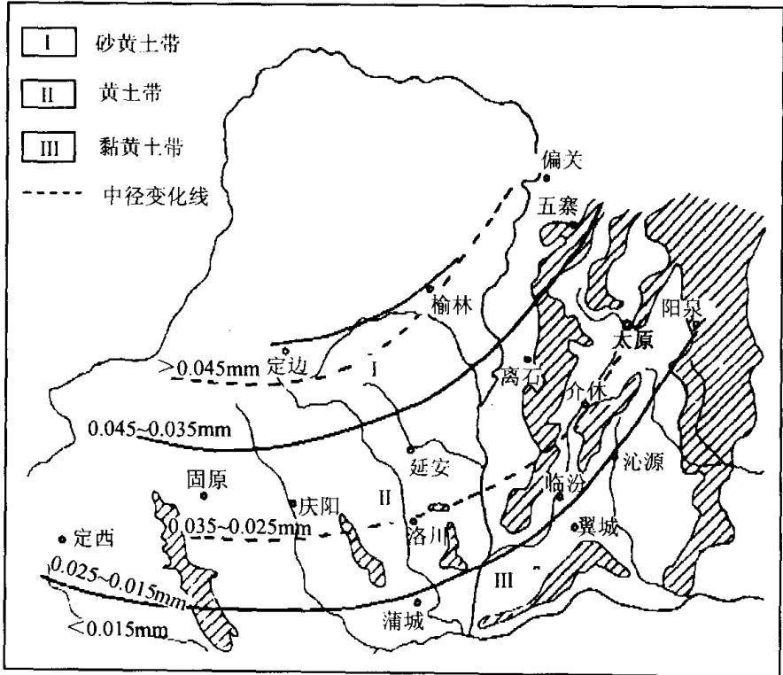  
图2-5 黄土高原新黄土颗粒组成分带及中径变化

表2-17 黄土的粒度组成与产沙量的关系
<table><tr><td>地名</td><td>坡度/(°) 坡长/m 利用</td><td></td><td></td><td>雨强/(mm/min) 粒级含量</td><td> $\left( > 0 . 0 5 \mathrm { m m } \right) / \%$ </td><td>侵蚀量/  $\mathbf { \lambda } _ { \mathbf { k } \mathbf { g } / ( \mathbf { h m } ^ { 2 } \cdot 1 0 0 \mathbf { m m } ) } ]$ </td></tr><tr><td>绥德</td><td>14.40</td><td>20</td><td>农地</td><td>1.10</td><td>34.75</td><td>69 533.3</td></tr><tr><td>西峰</td><td>17.31</td><td>16</td><td>农地</td><td>1.31</td><td>31.70</td><td>38 060.0</td></tr><tr><td>天水</td><td>17.56</td><td>20</td><td>农地</td><td>1.10</td><td>12.50</td><td>18 435.8</td></tr></table>

黄土的颗粒组成不仅对说明土壤的抗侵蚀特性有重要意义，同时为分析黄河泥沙来源提供了重要证示。钱宁、龚时旸等提出黄河下游河道淤积的泥沙主要由大于0.05mm的颗粒所组成，它们主要来自河口镇至无定河口的区间和白于山河源区，共约5万km2[35,36]。由图2-5可见，砂黄土带的黄土中值粒径为0.045mm，即黄河下游河床粗泥沙来源区，重点研究防治砂黄土带的侵蚀产沙，对减少黄河下游河道淤积将起重要作用。

## 2）土壤的渗透性

土壤的渗透性是指土壤在重力作用下接纳和透过水分的能力。地表径流是对土体侵蚀和搬运泥沙的主要动力。径流量的大小除受降雨特征和地形的影响外，土壤的渗透性能起重要的作用。土壤的渗透性能愈强，产流量愈小，侵蚀强度愈弱。土壤透水性强弱与土壤的颗粒组成、结构与孔隙状况密切有关。在结构良好而有大量非毛管孔隙的土壤中，透水性能强。在黄土地区土壤的渗透性与土地利用状况密切相关。据黄义端等测定(表2-18)林地的稳渗率最高，为农地的6.4倍；林地开垦后，稳渗率下降了60%，径流系数由1.1%增长到5.4%[37]。

表 2-18 不同土地利用土壤渗透性与径流
<table><tr><td>利用</td><td>土壤容重  $/ ( \mathfrak { g } / \mathfrak { c m } ^ { 3 } )$ </td><td>水稳性结构 含量/%</td><td>30min后渗水总量 /mm</td><td>稳渗速率 /(mm/min)</td><td>径流系数/%</td></tr><tr><td>林地</td><td>0.634</td><td>76.2</td><td>1 347</td><td>28.7</td><td>1.1</td></tr><tr><td>林地新开垦</td><td>0.804</td><td>69.4</td><td>990</td><td>17.4</td><td>5.4</td></tr><tr><td>马牙草草地</td><td>0.947</td><td>69.0</td><td>185</td><td>3.0</td><td>3.5</td></tr><tr><td>草地新开垦</td><td>0.942</td><td>55.4</td><td>822</td><td>18.7</td><td>5.1</td></tr><tr><td>一般农地</td><td>0.980</td><td>44.8</td><td>245</td><td>4.5</td><td>6.9</td></tr><tr><td>黄土母质</td><td>1.280</td><td>34.0</td><td>33</td><td>0.4</td><td></td></tr></table>

黄土高原的土壤类型和土地利用呈明显的地域性差异，土壤入渗性能也呈相应的变化，从而对土壤侵蚀的影响也不同。蒋定生等应用双环法研究测定了黄土高原不同地区土壤的稳渗率(图2-6)[38]。图中显示，土壤稳渗率极高区发生在黄龙山、子午岭等梢林区，稳渗率为5\~12mm/min;很高区出现在华家岭、董志塬等地，稳渗率为1.35\~3.50mm/min；较高区为延安、榆林等地，稳渗率为1.15\~1.30mm/min；长城沿线、泾渭台塬等地为一般区，稳渗率为0.5\~1.0mm/min，该区面积最广；稳渗率小于0.5mm/min为最低区，以陕西东部和豫西地区为代表。该土壤稳渗率区域分异略图对水土保持区

划、规划有重要参考价值。

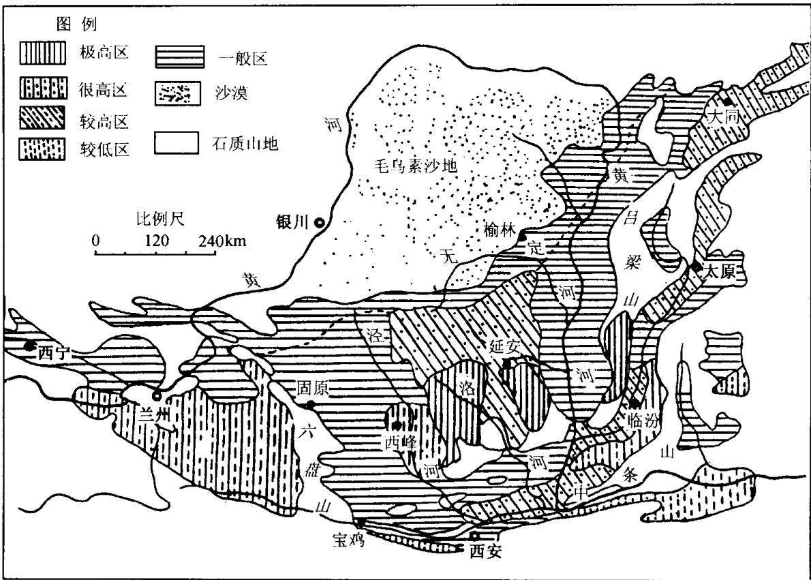

图2-6 黄土高原土壤入渗速率分区略图  
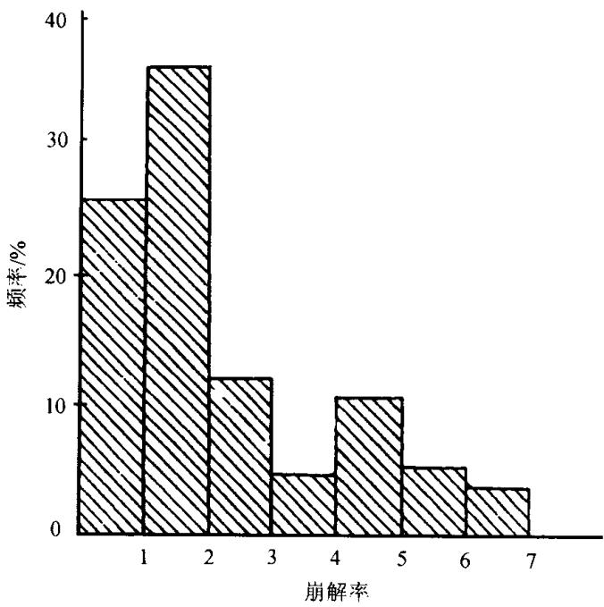  
图 2-7 黄土高原土壤崩解率频率

## 3）土壤的崩解性

土壤的崩解性是指一定体积的土体在静水中(淹没土体)发生吸水分散、崩裂成碎块和碎粒的现象。以土体完全崩解(呈不规则崩散体)所需时间确定土壤崩解性的强弱。据黄土高原地区130个代表性土样(4cm×4cm×4cm的原状土)的崩解测定29，砂黄土带属极易崩解，需0.5\~1min，黄土带需1\~2min，黏黄土带为1.5\~3min。以1min内土体全部崩解的作为崩解率为1的定值，其数值愈小，说明土壤的易崩解性能愈大。黄土高原地区130个代表土样的崩解率分析，崩解率在2以下者居优势，占总数的63.1%，其中崩解率在1以下者占总数的26.2%；崩解率大于3者占24.6%(图2-7)。崩解率与土壤的抗冲性密切相关，崩解率愈低，土壤抗冲性愈弱，愈易被径流冲蚀和搬运。林草地表层土壤的崩解率多在60以上，即土体在静水中历时60min以上都不发生崩解，其抗冲性也明显提高。

## 4）土壤的抗冲性

朱显谟根据黄土区土壤水蚀的特点提出土壤的抗侵蚀性能应区分为抗蚀性和抗冲性[39]。抗蚀性是指土壤抵御被流水分散和悬移的能力；抗冲性是指土壤抵御被径流冲刷和搬运的能力。鉴于黄土地区产流是以超渗径流为特点，朱显谟提出应重点研究土壤抗冲性。他曾采用5cm×5cm×5cm的原状土样在流水中冲刷，以土壤的冲失率作为评定土壤抗冲性的指标，其结果是农地土样在5min内全部冲完，天然次生林和草地土壤经流水1 h冲刷，其冲失率仅10%\~30%，主要是植物根系固结，提高了土壤抗冲能力。

蒋定生等依据原苏联古萨克冲刷槽的基本方法，设计了一种原状土冲刷水槽[40]，测定土壤抗冲性(详见土壤侵蚀研究方法)。他们用采样器采取田间的原状土(3cm×4cm×20cm)，在一定坡度情况下，人工放水冲刷土体。评价土壤抗冲性的指标：①单位水体对土壤的冲刷量M(g/L)；②土壤抗冲系数 C，即冲走1g 土壤所需的水量(L)和时间(s)，C的单位为L·s/g。

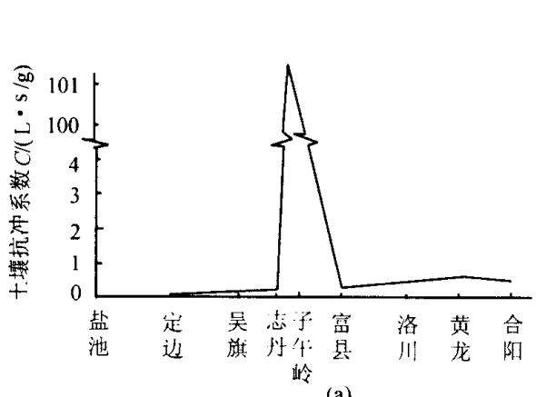  
(a)

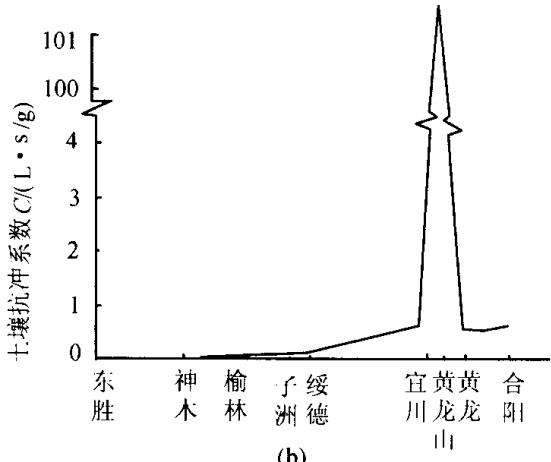  
(b)  
图2-8 黄土高原土壤抗冲性自西北至东南(a)和自北至南(b)的变化规律

蒋定生等研究测定了黄土高原不同土壤和不同利用情况的土壤抗冲系数的分布规律。研究得出，黄土高原的土壤抗冲性自西北至东南和自北至南(图2-8)呈明显的区域分异规律。按抗冲系数(C)划分为5个分区。Ⅰ区为子午岭、黄龙山、崂山次生梢林区黄绵土和黑壮土的土壤抗冲性极强区，抗冲系数均在98L·s/g以上；Ⅱ区为陇东、渭北、晋西残塬区黑垆土与搂土壤抗冲性较强区，土壤抗冲系数0.262\~1.412L·s/g;Ⅲ区为陇中、宁南丘陵区黄绵土与黄麻土等土壤抗冲性一般区，土壤抗冲系数0.026\~0.559L·s/g；IV区为晋西、陕北黄绵土壤抗冲性很弱区，土壤抗冲系数0.025\~0.108L·s/g；V区为宁、陕、内蒙古长城沿线沙黄土土壤抗冲性极弱区，土壤抗冲系数为0.010\~0.047L·s/g。以上结果表明，从黄土高原的地域自东南的黏黄土向西北的黄土、砂黄土带，土壤抗冲系数由强变弱；在同样土壤情况下，造林种草或恢复林草植被后，土壤抗冲性明显提高。

李勇等[42,43]研究了黄土区油松林根系与土壤抗冲性的关系，提出土壤抗冲性的强化值 $\Delta A S$ 与小于1mm根系密度 $( R _ { d } )$ 呈幂函数关系，即

$$
\Delta A S ~ = ~ a R _ { \mathrm { d } } ^ { b }\tag{2-40}
$$

式中，a、b参数与不同雨强有关。

李勇等研究得出，沙棘林不大于1mm根系密度随土壤剖面深度增加而急剧减少，土壤抗冲性也呈相应减少趋势；一般自40cm以下，土壤抗冲性即降为最低的恒定值。

刘秉正等[44]研究了黄土区沙棘林、柠条林和刺槐林地土壤的抗冲性，提出了主要是小于2mm毛根的影响，以网络土体、阻拦和黏结土粒不分散面发挥固土抗冲作用，并回归得出抗冲性指标 $M ( \{ \mathrm { g / L } \}$ 与毛根含量(x)呈双曲线的关系，表达式为

$$
M = a + { \frac { b } { x } }\tag{2-41}
$$

系数 a、b随树种变化。

刘国斌[45]研究了黄土区草地(茭蒿、铁杆蒿、长芒草、茵陈蒿、狗尾草、沙打旺等)土壤的抗冲性，得出用0.1\~0.4mm毛根长度(L)或毛根表面积(A)与抗冲性(S。)关系极 $( S _ { \mathbf { 0 } } )$ 好，其关系式为

$$
S _ { \circ } = 1 . 4 2 6 3 L _ { n } ( L ) - 8 . 9 7 4 9\tag{2-42}
$$

$$
S _ { \circ } = 0 . 7 3 0 3 A - 9 . 9 3 4 9\tag{2-43}
$$

周佩华等 $[ 4 6 ]$ 提出了野外实地布设微型径流小区 $( 0 . 8 \mathrm { m } \times 5 \mathrm { m } )$ ，进行人工放水的抗冲性测定，用单位面积单位径流深的冲刷量作为土壤抗冲性指标。如果径流小区面积为$A \left( \mathbf { m } ^ { 2 } \right)$ ，次暴雨径流深为 H(mm)，次暴雨冲刷量为 $W ( \mathbf { k g } )$ ，则该次试验的抗冲性指标$K _ { \mathrm { w } } [ \mathrm { k g } / ( \mathrm { m } ^ { 2 } \cdot \mathrm { m m } )$ ]以下式表示

$$
K _ { \mathrm { w } } = \frac { \mathbb { W } } { A \cdot H }\tag{2-44}
$$

式中，Kw的值愈大，说明土壤的抗冲性愈弱。研究结果表明，翻耕农地的Kw值为农作 $K _ { \mathrm { w } }$ $K _ { \mathrm { w } }$ 物地的1.32倍、人工草地的3.2倍、人工林地的10.5倍、荒坡地的33.5倍。

## 5）土壤的抗蚀性

土壤的抗蚀性主要取决于土体与水的亲和能力，亲和力愈大，土壤结构体愈易解体成悬移状颗粒。土壤抗蚀性愈弱，愈易被径流冲蚀和搬运，土壤抗蚀性和抗冲性二者有密切联系。土壤抗蚀性指标多采用土壤的颗粒组成、分散率、有机质含量、水稳性团粒

含量等表示，其中以有机质含量及水稳性团粒含量的指标最为敏感，二者呈显著相关。

黄义端等[37]研究取得土壤有机质含量x与大于0.25mm水稳性团粒含量的关系式为

$$
y = 0 . 4 2 + 1 ~ 4 1 6 x\tag{2-45}
$$

王佑民等测定了黄土区14个县77个剖面土样，得出大于0.25mm水稳性团粒含量x 与有机质的含量y 的关系式为

$$
y \ = \ 0 . 2 1 7 x ^ { 0 . 7 3 3 }\tag{2-46}
$$

在此基础上，提出了黄土高原土壤抗蚀性分级指标(表2-19)[47]。

表 2-19 黄土高原土壤抗蚀性分级指标
<table><tr><td>级别</td><td>&gt;0.25mm风干土水稳性团粒含量/%</td><td>有机质含量/(g/kg)</td></tr><tr><td>极弱</td><td>&lt;3</td><td>&lt;5</td></tr><tr><td>强</td><td>3~10</td><td>&gt;6</td></tr><tr><td>中</td><td>10~20</td><td>&gt; 10</td></tr><tr><td>较强</td><td>20~30</td><td>&gt; 20</td></tr><tr><td>强</td><td>30~50</td><td>&gt; 25</td></tr><tr><td>极强</td><td>&gt;50</td><td>&gt; 400</td></tr></table>

朱显谟[39]的研究指出，土壤分散系数一般随土壤有机质及黏粒含量增高而降低，团聚度随之增大。增加土壤有机质量是提高土壤抗蚀性的重要途径。

以上论述的黄土特性，再加之黄土地面坡度陡峻，黄土结构多垂直裂隙，以及新、老黄土地层和下伏三趾马红土层之间出现的不整合接触面，致使黄土地区崩塌、滑坡泻溜等重力侵蚀，沟蚀和洞穴侵蚀均十分活跃，且相互促进，形成发育了黄土高原特殊的侵蚀地貌。

南方和西南地区的土壤侵蚀多发生在山地丘陵，土壤多发育于基岩，土层较薄，土壤剖面厚度仅1m左右，由于长期的土壤侵蚀，土壤剖面多已流失，出露地表的为母质层及基岩风化物。分布面积最广，对土壤侵蚀影响较大的有花岗岩风化物、紫色页岩风化物、第四纪红黏土和石灰岩及其风化物等。此类风化物特性与黄土显然不同，但也极易遭受侵蚀。

## （二）花岗岩风化物

我国南方和西南丘陵山区广泛分布的花岗岩有燕山期花岗岩和印支期的花岗闪长岩。由于气温高、辐射热量大、雨量多，高温与多雨同季，岩石的物理风化、化学风化及生物活动过程均十分强烈。岩体中原生矿物以长石为主，占50%以上，风化较快，形成高岭土等黏土矿物。风化过程中钾、钠、钙、镁等元素最先大量淋失，二氧化硅自上而下迁移，铁、铝则富集，由此而形成富铝化风化物，由于风化程度和理化性质的差异，形成了垂直剖面分层比较明显的厚20\~80m的风化物。史德明等研究了花岗岩风化物的剖面特征及其物理化学性质[48]。该风化物除地表发育厚1\~2m的土壤剖面外，自上而下可分为红土层、砂土层、碎屑层和球状风化层(图2-9)。花岗岩风化物的颗粒组成和铁、铝氧化物的含量呈明显垂直分异特征(表2-20、表2-21)。剖面自上而下，黏粒含量和铁、铝氧化物呈减少趋势，砂粒和碎石砾含量和 $\mathrm { { S i O } } _ { 2 }$ 含量呈增加趋势。红土层表现为黏结力强，抗冲性也较强；砂土层和碎屑层表现为黏结力差，结构松散，抗冲性弱(表2-22)。

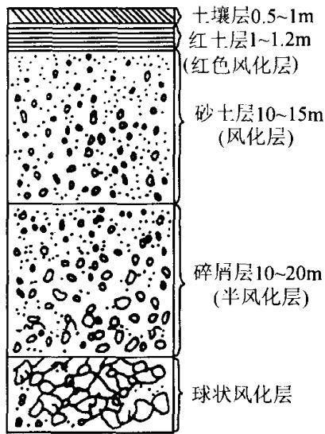  
图 2-9 花岗岩风化物剖面略图

表 2-20 不同地区花岗岩风化物的颗粒组成[48]  
(单位：%)
<table><tr><td colspan="2">地点</td><td rowspan="2">风化层</td><td rowspan="2">深度/m</td><td colspan="3">颗粒组成/mm</td></tr><tr><td></td><td></td><td>&gt;3 3~1</td><td>&lt;0.001</td></tr><tr><td></td><td></td><td>红土层</td><td>0~1.5</td><td>3.40 27.60</td><td>6.00</td><td>&lt;0.01 26.90</td></tr><tr><td>江</td><td>杨</td><td>砂土层(上)</td><td>1.5~5</td><td>3.90</td><td>23.00 2.70</td><td>19.20</td></tr><tr><td>西</td><td>村</td><td>砂土层(下)</td><td>5~15</td><td>4.70</td><td>19.70 1.70</td><td>16.40</td></tr><tr><td>兴 国</td><td></td><td>碎屑层</td><td>15~30</td><td>0.90</td><td>21.40 1.70</td><td>11.40</td></tr><tr><td>县</td><td>荷</td><td>红土层 砂土层</td><td>0~1</td><td>12.50</td><td>39.40 18.90</td><td>30.90</td></tr><tr><td rowspan="3"></td><td>岭</td><td></td><td>1~15</td><td>22.80 30.60</td><td>1.50</td><td>12.10</td></tr><tr><td>碎屑层</td><td></td><td>15~20</td><td>18.80</td><td>32.00 1.40</td><td>8.40</td></tr><tr><td>红土层</td><td>0~1</td><td>13.90</td><td>12.10</td><td>21.00</td><td>50.80</td></tr><tr><td rowspan="4">江 西 赣 县</td><td>江 背</td><td>砂土层</td><td>1~5</td><td>0.30</td><td>2.00</td><td>5.40 26.20</td></tr><tr><td></td><td>碎屑层</td><td>5~15</td><td>10.90</td><td>21.90</td><td>1.40 14.00</td></tr><tr><td>田</td><td>红土层</td><td>0~1.5</td><td>26.30</td><td>22.60 27.00</td><td>43.80</td></tr><tr><td>砂土层 村</td><td>1.5~10</td><td>22.80</td><td>12.60</td><td>2.50</td><td>18.90</td></tr><tr><td rowspan="4">广 东</td><td></td><td>碎屑层</td><td>10~25</td><td>19.10</td><td>12.40</td><td>3.50 16.60</td></tr><tr><td></td><td>表土层</td><td>0~1</td><td>7.52</td><td>15.38</td><td>34.64 62.19</td></tr><tr><td>五 红土层</td><td></td><td>1~15</td><td>12.31</td><td>17.80 23.94</td><td>51.76</td></tr><tr><td>华 砂土层</td><td></td><td>15~25</td><td>12.12</td><td>19.01 7.57</td><td>25.30</td></tr><tr><td></td><td>碎屑层</td><td></td><td>25 以下</td><td>27.76</td><td>21.25</td><td>2.25 28.83</td></tr></table>

表2-21 南方花岗岩风化层主要氧化物含量比较  
(单位：%)
<table><tr><td rowspan="2">层次</td><td colspan="3"> $\mathrm { \bf S i O _ { 2 } }$ </td><td colspan="3"> $\mathtt { F e } _ { 2 } \mathtt { O } _ { 3 }$ </td><td colspan="3"> $\mathbf { A } _ { 2 } \mathbf { O } _ { 3 }$ </td></tr><tr><td>兴国</td><td>德庆</td><td>电白</td><td>兴国</td><td>德庆</td><td>电白</td><td>兴国</td><td>德庆</td><td>电白</td></tr><tr><td>表层</td><td>54.54</td><td>53.20</td><td></td><td>4.72</td><td>5.23</td><td>一</td><td>28.06</td><td>27.26</td><td>一</td></tr><tr><td>红土层</td><td>59.82</td><td>53.27</td><td>53.00</td><td>5.11</td><td>5.61</td><td>4.58</td><td>25.01</td><td>27.97</td><td>31.52</td></tr><tr><td>砂土层</td><td>61.80</td><td>64.37</td><td>57.50</td><td>4.27</td><td>3.49</td><td>1.78</td><td>22.35</td><td>21.77</td><td>29.04</td></tr><tr><td>碎屑层</td><td>64.84</td><td>64.46</td><td>62.07</td><td>3.71</td><td>2.94</td><td>2.00</td><td>20.87</td><td>20.91</td><td>18.81</td></tr><tr><td>球状风化层</td><td></td><td>70.11</td><td>70.11</td><td>一</td><td>2.19</td><td>1.58</td><td></td><td>15.30</td><td>14.49</td></tr></table>

注：引自韩中元1990年资料。

表 2-22 南方花岗岩风化物抗侵蚀性能比较[48]
<table><tr><td>层次</td><td>深度/m</td><td>有机质 /(g/kg)</td><td>物理性黏粒 (&lt;0.01mm)/%</td><td>抗冲指数</td><td>水稳性 指数/%</td><td>崩解率/%</td><td>非毛管 孔隙/%</td><td>人渗率 /(mm/min)</td></tr><tr><td>土壤层</td><td>0~1</td><td>20~50</td><td>30~60</td><td>0.5~0.7</td><td>60~90</td><td>&lt; 10</td><td>22.4</td><td>3.4</td></tr><tr><td>红土层</td><td>1~2</td><td>&lt; 10</td><td>40~70</td><td>0.7~1.0</td><td>50~80</td><td>10~15</td><td>4.9</td><td>0.69</td></tr><tr><td>砂土层</td><td>2~20</td><td>3~5</td><td>11~20</td><td>0.22</td><td>5</td><td>100</td><td>9.8</td><td>1.8</td></tr><tr><td>碎屑层</td><td>20~30</td><td>&lt; 3</td><td>11~20</td><td>0.22</td><td>5</td><td>100</td><td>14.1</td><td>4.0</td></tr></table>

张淑光等[49]根据史德明等研究资料，将花岗岩红壤及其风化物的主要特征汇总于表2-23。

表 2-23 南方花岗岩红壤及其风化物的主要特征
<table><tr><td>土层</td><td>厚度/m</td><td>主要特征</td></tr><tr><td>土壤层</td><td>1-2</td><td>有完整的土壤剖面A、B层，根系多，表层有机质20~50g/kg，抗冲抗蚀性强，抗冲指 数和水稳性指数分别为0.5~0.7和60%~70%</td></tr><tr><td>红土层</td><td>2-5</td><td>红棕色，有机质小于10g/kg，砂质黏土，块状结构，透水性较差，抗冲指数和水稳性 指数分别为 0.7~1.0和 50%~80%，胀缩度 20% ~60%</td></tr><tr><td>砂土层</td><td>3~35</td><td>灰白或粉红带棕，虽然风化，但岩体矿物界线隐约可见，有机质，砂壤质，物理性黏 粒11%~20%，散粒状结构，疏松、透水性好，抗冲性、抗蚀性差，抗冲指数和水稳性</td></tr><tr><td>碎屑层</td><td>10~20</td><td>指数分别为 0.22和5%，胀缩度 20%~60% 保持花岗岩原生构造，以棱角状或角砾状的岩核、碎屑占优势，有机质小于0.3g/kg， 透水好，抗冲指数和水稳性指数分别为0.22和5%，胀缩度20%~26%</td></tr><tr><td>球状风化层</td><td>3~5</td><td>与花岗岩体颜色相似，矿物保持原来的结晶与结构，以物理风化为主，有较强抗冲力</td></tr></table>

注：由熊广政和冯敏1965年的资料、史德明1984年资料、吴克刚1989年资料综合而成。

以上分析研究表明，花岗岩风化物的抗侵蚀性能自上而下呈递减趋势，当土壤层和红土层被侵蚀后，向下切割至砂土层和碎屑层时，侵蚀速率明显加快，侵蚀量加大，常导致崩岗侵蚀的发生发展，土壤侵蚀模数急剧增加到数万吨以上。据广东龙川县崩岗点的研究测定，砂土层渗透系数最大为60mm/h，其他层次为25\~45mm/h;砂土层的毛管水、饱和水及田间持水量均明显大于其他3个层次(表2-24)。砂土层一旦吸水饱和，土体不稳定性增加，在重力作用下极易发生崩坍，为切沟侵蚀和崩岗沟岸扩展创造了条件[49,51]。

表2-24 广东龙川县车田镇叶塘水流域土壤水分性质
<table><tr><td>采样地点和土层</td><td>自然含水量/%</td><td>毛管含水量/%</td><td>饱和含水量/%</td><td>田间持水量/%</td><td>容重/(g/cm³)</td></tr><tr><td></td><td>土壤层</td><td>21.37 26.40</td><td>28.76</td><td>21.78</td><td>1.419</td></tr><tr><td>1-(7)</td><td>红土层</td><td>22.94</td><td>30.80</td><td>31.93 25.94</td><td>1.417</td></tr><tr><td>号崩岗</td><td>砂土层</td><td>20.51 38.31</td><td>39.76</td><td>30.34</td><td>1.241</td></tr><tr><td></td><td>碎屑层</td><td>16.55 25.68</td><td>26.76</td><td>20.18</td><td>1.490</td></tr><tr><td></td><td>土壤层</td><td>22.93</td><td>28.56</td><td>32.36 23.92</td><td>1.384</td></tr><tr><td>1-(18)</td><td>红土层</td><td>28.28</td><td>34.06</td><td>36.63 28.62</td><td>1.310</td></tr><tr><td>号崩岗</td><td>砂土层</td><td>24.03 36.60</td><td>37.56</td><td>29.66</td><td>1.300</td></tr><tr><td></td><td>碎屑层</td><td>16.60</td><td>21.98 20.39</td><td>18.03</td><td>1.610</td></tr></table>

## （三）紫色土、紫色泥页岩风化物以及其他地面组成物质的比较

## 1. 紫色土及紫色泥页岩风化物[50,51]

紫色土是由沉积岩发育的一种岩性土，其母质为紫色砂泥岩。紫色土分布于我国西南和南方丘陵山区，以四川盆地丘陵区和海拔800m以下的低山区分布最广。紫色岩，岩质松软，构造裂隙发育，在冷热和干湿变化条件下，物理风化强烈。土壤发育过程中，钙、钠、镁、钾等物质的淋失与不断风化补充新的盐基物质同步进行，因而它是富盐基性、养分储量丰富自然肥力高的土壤；另一方面由于紫色土多分布在丘陵山区，垦殖率高，土壤侵蚀严重，风化成壤与侵蚀过程交替进行，致使土壤属性处于近似岩性的幼年土，土壤的颗粒组成与母岩很接近，故紫色土是一种侵蚀型的高生产力岩性土。

四川盆地丘陵区有15.8万km²的紫色土，占全省总土地面积的28%，由于其易风化，自然肥力高，垦殖率高达45%，占全省耕地面积的68%，但多为坡耕地，其水土流失面积占丘陵区总土地面积的48.8%，年流失表土3.77亿t，占四川全省土壤侵蚀总量的36.7%。

紫色土及其母岩的颗粒组成很接近(表2-25)，以大于0.02mm的砂粒为主，土壤有机质含量低，仅10g/kg左右，土壤结构水稳性很差，大于0.25mm水稳性团粒含量一般低于20%，遇水极易分散、崩解，为易蚀性土壤。耕作层以下即母岩层，土壤渗透率很低，容蓄水量少，故径流系数高；并随土壤含水量的增大，入渗率下降，产流加快、加大。紫色土地区侵蚀产沙特征与黄土地区不同，侵蚀产沙物质以大于0.02mm的粗颗粒为主，泥沙输移比平均为0.25左右。

紫色土及其母岩紫色砂页岩在长江流域的三峡库区分布最为广泛，也为农耕地的主要集中地，是三峡库区水土流失严重区之一，土壤侵蚀方式以坡面侵蚀为主，并且有沟

蚀和重力侵蚀。

表 2-25 紫色土的颗粒组成[50]  
(单位：%)
<table><tr><td rowspan="2">母岩</td><td colspan="4">粒径/mm</td></tr><tr><td>2~0.2</td><td>0.2~0.02</td><td>0.02~0.002</td><td>&lt;0.002 2~0.02</td></tr><tr><td>夹关组</td><td>6.18</td><td>55.10</td><td>22.30</td><td>16.34 61.28</td></tr><tr><td>城墙岩群</td><td>1.47</td><td>37.50</td><td>39.22 21.81</td><td>38.97</td></tr><tr><td>蓬镇组</td><td>1.84</td><td>34.82</td><td>40.02</td><td>23.32 36.60</td></tr><tr><td>遂宁组</td><td>4.65</td><td>32.30</td><td>40.84 22.22</td><td>36.95</td></tr><tr><td>沙溪庙组</td><td>13.53</td><td>37.73</td><td>30.38</td><td>18.36 57.26</td></tr><tr><td>飞仙关组</td><td>44.81</td><td>21.17</td><td>21.16</td><td>12.86 65.98</td></tr></table>

## 2. 不同土壤与地面组成物质抗侵蚀特性的研究比较

四川资中县研究测定了不同土壤质地在各种坡度下的土壤侵蚀量(表2-26)，砂质土易遭受侵蚀，但随着坡度的增加，砂质土与黏粒含量较多的泥质土二者的侵蚀量渐趋接近。

表2-26 不同土壤质地在各种坡度下的侵蚀量(四川资中) (单位：m³/hm²)
<table><tr><td>土壤名称</td><td>坡度&lt; 10°</td><td>坡度为10°~20°</td><td>坡度&gt;20°</td></tr><tr><td>砂土</td><td>109.50</td><td>259.50</td><td>390.00</td></tr><tr><td>泥土</td><td>33.00</td><td>199.50</td><td>330.00</td></tr><tr><td>大泥土</td><td>25.50</td><td>100.05</td><td>259.50</td></tr><tr><td>黄泥土</td><td>6.00</td><td>25.50</td><td>66.00</td></tr></table>

注：摘自长江流域水土保持考察报告，1986。

史德明、杜榕桓等研究了三峡库区不同土壤的结构系数和水稳性指数[52,53]。土壤水稳性指数分级资料表明(表2-27)，指数大于80%的土壤有机质平均含量为29.3g/kg，指数小于50%的有机质平均含量为8.5g/kg，指数介于50%\~80%者，有机质平均含量约为11g/kg。土壤的结构系数(表2-28)则与土壤中的物理黏粒含量关系密切，结构系数高的土壤其中物理黏粒含量平均为44.5%，结构系数中等和低等的分别为32.3%和29.4%。结构系数与水稳性指数指示了土壤侵蚀的严重程度，库区内发生严重水土流失的下垫面，一般为结构系数和水稳性指数低值的紫色土和石灰土，应作为重点防治对象[86]。此外，又研究比较了不同土壤的渗透性能、抗蚀性和抗冲性。应用人工降雨测定结果进行的数值分析，确定了在花岗岩发育的红壤、紫色土和发育于第四纪红土的红壤的渗透性能，其各自的渗透时间(t)与径流系数(W)和渗透速率(ν)及渗透总量(M)的关

表 2-27 长江三峡库区土壤水稳性指数及分级
<table><tr><td rowspan="2">田间号</td><td rowspan="2">土壤</td><td rowspan="2">采土层次  $/ \mathrm { c m }$ </td><td colspan="2">水稳性指数及分级</td><td colspan="2">有机质</td><td rowspan="2"> $< 0 . 0 0 1 \mathrm { m m }$ </td><td rowspan="2"> $< 0 . 0 1 \mathrm { m m }$  /%</td></tr><tr><td>指数/%</td><td>分级</td><td>含量  $/ ( \ g / \mathbf { k } \mathbf { g } )$  平均  $/ ( \varrho / \mathbf { k } \varrho )$ </td><td> $7 \%$ </td></tr><tr><td> $\mathsf { S } \mathsf { F } _ { 7 }$ </td><td>黃壤</td><td>0~20</td><td>100</td><td></td><td>96.1</td><td></td><td>9.5</td><td>39.3</td></tr><tr><td> $\mathbf { S } \mathbf { F } _ { 1 }$ </td><td>紫色土</td><td>0~20</td><td>100</td><td></td><td>14.6</td><td></td><td>5.4</td><td>18.9</td></tr><tr><td> $\mathbb { S } \mathbb { F } _ { 3 }$ </td><td>黃壤</td><td>0~15</td><td>99.9</td><td></td><td>18.4</td><td></td><td>16.2</td><td>50.2</td></tr><tr><td> $\mathbf { F N _ { S } }$ </td><td>黄棕壤</td><td>20~50</td><td>98.3</td><td>高</td><td>18.7</td><td></td><td>10.5</td><td>27.7</td></tr><tr><td> $\pmb { \mathrm { S F } _ { 5 } }$ </td><td>黑色石灰土</td><td>0.~20</td><td>94.5</td><td>(&gt;80%)</td><td>44.1</td><td>29.3</td><td>40.0</td><td>70.0</td></tr><tr><td> $\mathbf { S } \mathbf { W } _ { 5 }$ </td><td>棕色石灰土</td><td>0~15</td><td>95</td><td></td><td>21.5</td><td></td><td>14.6</td><td>85.0</td></tr><tr><td> $\mathbf { S } \mathbf { F } _ { 7 }$ </td><td>黄壤</td><td>10~30</td><td>89.3</td><td></td><td>22.1</td><td></td><td>11.5</td><td>45.2</td></tr><tr><td> $\mathbf { S } \mathbf { F } _ { 2 }$ </td><td>紫色土</td><td>0~20</td><td>87.1</td><td></td><td>12.2</td><td></td><td>8.2</td><td>22.8</td></tr><tr><td> $\mathbb { S } \mathbb { F } _ { 8 }$ </td><td>紫色土</td><td>0~20</td><td>80.8</td><td></td><td>16.5</td><td></td><td>9.3</td><td>39.3</td></tr><tr><td> $\mathbf { S F _ { 1 0 } }$ </td><td>紫色土</td><td>0~20</td><td>79.4</td><td></td><td>8.6</td><td></td><td>5.8</td><td>27.8</td></tr><tr><td> $\mathbb { S } \mathbb { W } _ { 8 }$ </td><td>耕作石灰土</td><td>0~20</td><td>57.6</td><td>中</td><td>12.6</td><td>10.5</td><td>9.5</td><td>26.8</td></tr><tr><td> $\mathbb { S } \mathbb { F } _ { 2 }$ </td><td>棕色石灰土</td><td>0-20</td><td>52.7</td><td>(50%~80%)</td><td>10.1</td><td></td><td>12.2</td><td>43.6</td></tr><tr><td> $\mathbf { S } \mathbf { F } _ { 7 }$ </td><td>黃壤</td><td>30~60</td><td>49.3</td><td></td><td>13.5</td><td></td><td>11.6</td><td>45.3</td></tr><tr><td> $\mathbb { S } \mathbb { F } _ { 3 }$ </td><td>黃壤</td><td>15~35</td><td>33.9</td><td></td><td>7.4</td><td></td><td>20.6</td><td>56.5</td></tr><tr><td> $\mathbf { S } \mathbf { W } _ { S }$ </td><td>棕色石灰土</td><td>15~40</td><td>28.4</td><td>低</td><td>8.3</td><td>8.5</td><td>10.0</td><td>54.5</td></tr><tr><td> $\mathtt { S F } _ { 1 2 }$ </td><td>紫色土</td><td>0~20</td><td>14.4</td><td>(&lt;50%)</td><td>14.2</td><td></td><td>7.7</td><td>30.1</td></tr><tr><td> $\mathbf { S } \mathbf { W } _ { 3 }$ </td><td>石灰土</td><td>0~20</td><td>6.4</td><td></td><td>8.1</td><td></td><td>4.9</td><td>25.0</td></tr><tr><td> $\mathrm { { S F } } _ { 3 }$ </td><td>黃壤</td><td>35~60</td><td>5</td><td></td><td>4.3</td><td></td><td>10.2</td><td>38.8</td></tr></table>

表 2-28 长江三峡库区土壤结构系数分级
<table><tr><td rowspan="2">田间号 土壤名称</td><td rowspan="2"></td><td rowspan="2">采土厚度  $/ \mathrm { c m }$ </td><td colspan="2">结构系数及分级</td><td rowspan="2"> $< 0 . 0 1 \mathrm { m m } / \%$ </td><td rowspan="2"> $< 0 . 0 0 1 \mathrm { m m } \%$ </td><td rowspan="2">有机质  $/ ( \mathbf { g } / \mathbf { k g } )$ </td></tr><tr><td>系数/%</td><td>分级</td></tr><tr><td> $\mathbf { S } \mathbf { F } _ { 7 }$ </td><td>黃壤</td><td>30~60</td><td>94.8</td><td></td><td>45.3</td><td>11.6</td><td>13.5</td></tr><tr><td> $\tt S F _ { 7 }$ </td><td>黃壤</td><td>10~30</td><td>88.7</td><td></td><td>45.2</td><td>11.5</td><td>22.1</td></tr><tr><td> $\mathbf { F N } _ { 2 }$ </td><td>棕色石灰壤</td><td>0~20</td><td>81.1</td><td>高级</td><td>43.6</td><td>12.2</td><td>10.1</td></tr><tr><td> $\mathbb { S } \mathbb { F } _ { \mathbb { 7 } }$ </td><td>黃壤</td><td>0~10</td><td>80.0</td><td>(&gt;75%)</td><td>39.3</td><td>9.5</td><td>96.4</td></tr><tr><td> $\mathbf { F N } _ { 5 }$ </td><td>黃棕壤</td><td>20~50</td><td>78.1</td><td></td><td>27.7</td><td>10.5</td><td>18.7</td></tr><tr><td> $\mathtt { S F } _ { 5 }$ </td><td>黃壤</td><td>15~35</td><td>76.2</td><td></td><td>56.5</td><td>20.6</td><td>7.4</td></tr><tr><td> $S \mathbb { F } _ { 1 }$ </td><td>紫色土</td><td>0~20</td><td>75.9</td><td></td><td>18.8</td><td>5.4</td><td>14.8</td></tr><tr><td rowspan="2">田间号</td><td rowspan="2">土壤名称</td><td rowspan="2">采土厚度/cm</td><td colspan="2">结构系数及分级</td><td rowspan="2">&lt;0.01mm/%</td><td rowspan="2">&lt; 0.001mm/%</td><td rowspan="2">有机质  $/ ( \mathbf { g } / \mathbf { k } \mathbf { g } )$ </td></tr><tr><td>系数/%</td><td>分级</td></tr><tr><td> $\mathbf { S N _ { 5 } }$ </td><td>黄棕壤</td><td>0~20</td><td>73.2</td><td></td><td>26.3</td><td>9.7</td><td>20.1</td></tr><tr><td> $\mathbb { S } \mathbb { F } _ { 5 }$ </td><td>黑色石灰土</td><td>0~20</td><td>72.7</td><td></td><td>70.0</td><td>40.0</td><td>44.1</td></tr><tr><td> $\mathbf { S } \mathbf { F } _ { 3 }$ </td><td>黃壤</td><td>0~15</td><td>72.2</td><td>中级</td><td>50.2</td><td>16.2</td><td>18.4</td></tr><tr><td> $\mathbf { S N _ { 1 } }$ </td><td>紫色土</td><td>0~20</td><td>70.8</td><td>(50%~75%)</td><td>38.3</td><td>13.7</td><td>18.1</td></tr><tr><td> $\mathbf { S } \mathbf { F } _ { 3 }$ </td><td>黃壤</td><td>35~60</td><td>66.7</td><td></td><td>38.8</td><td>10.2</td><td>4.3</td></tr><tr><td> $\mathbf { S } \mathbf { W } _ { \mathbb { S } }$ </td><td>棕色石灰土</td><td>0~15</td><td>60.3</td><td></td><td>58.5</td><td>14.6</td><td>21.5</td></tr><tr><td> $\mathbf { S } \mathbf { F } _ { 1 2 }$ </td><td>紫色土</td><td>0~20</td><td>51.9</td><td></td><td>30.1</td><td>7.7</td><td>14.2</td></tr><tr><td> $\mathbb { S } \mathbb { F } _ { 8 }$ </td><td>紫色土</td><td>0~20</td><td>48.4</td><td>低级</td><td>39.3</td><td>9.3</td><td>16.5</td></tr><tr><td> $\mathtt { S F } _ { 1 0 }$ </td><td>紫色土</td><td>0~20</td><td>37.9</td><td>(&lt;50%)</td><td>27.8</td><td>5.8</td><td>8.6</td></tr><tr><td> $\mathbb { S } \mathbb { W } _ { 3 }$ </td><td>石灰土</td><td>0~20</td><td>32.7</td><td></td><td>25.0</td><td>4.9</td><td>8.1</td></tr></table>

系方程分别为

$$
t \ = \ { \cal A } { \cal W } ^ { B } , t \ = \ { \cal A } v ^ { - B }\tag{2-47}
$$

$$
t ~ = ~ A + B / M\tag{2-48}
$$

式中，A、B均为常数。

由抗冲指数和水稳性指数综合指标确定的土壤耐蚀冲性表明，发育于变质岩的红壤耐蚀冲性最强，而发育于花岗岩的红壤耐蚀冲性最小，紫色土和发育于第四纪红土的红壤的耐蚀冲性，则介于上述二者之间(表2-29)。

表2-29 红黄壤区不同土壤的抗冲指数、水稳性指数及耐蚀冲性比较
<table><tr><td rowspan="2">土壤</td><td colspan="3">抗冲指数</td><td colspan="2">水稳性指数</td><td rowspan="2">耐蚀冲性</td></tr><tr><td></td><td>范围</td><td>等级</td><td>范围/%</td><td>等级</td></tr><tr><td rowspan="3">发育于变质岩 的红壤及黃壤</td><td>A</td><td>0.7~0.5</td><td>中</td><td>50~90</td><td>高</td><td rowspan="3">强</td></tr><tr><td>B</td><td>&gt;0.7</td><td>大</td><td>50~90</td><td>高</td></tr><tr><td>C</td><td>&gt;0.7</td><td>大</td><td>10~50</td><td>中</td></tr><tr><td rowspan="3">发育于第四纪 红土的红壤</td><td>A</td><td>&gt;0.7</td><td>大</td><td>50~90</td><td>高</td><td rowspan="3">次强</td></tr><tr><td>B</td><td>&gt;0.7</td><td>大</td><td>10~50</td><td>中</td></tr><tr><td>C</td><td>0.5~0.7</td><td>中</td><td>5~10</td><td>低</td></tr><tr><td rowspan="3">紫色土</td><td>A</td><td>&lt;0.5</td><td>小</td><td>50~90</td><td>高</td><td rowspan="3">中</td></tr><tr><td>B</td><td>&lt;0.5</td><td>小</td><td>50~90</td><td>高</td></tr><tr><td>C</td><td>0.7~0.5</td><td>中</td><td>50~90</td><td>高</td></tr><tr><td rowspan="3">发育于花岗岩 的红壤</td><td>A</td><td>&lt;0.5</td><td>小</td><td>50~90</td><td>高</td><td rowspan="3">弱</td></tr><tr><td>B</td><td>0.7~0.5</td><td>中</td><td>10~50</td><td>中</td></tr><tr><td>C</td><td>&lt;0.5</td><td>小</td><td>5~10</td><td>低</td></tr></table>

## 五、植被因素

植被是陆地生态的主体，是控制或加速土壤侵蚀最敏感的因素。按温度、于湿度、地形因素等综合自然区域分异，黄秉维将中国的大陆自北而南划分为寒温带、中温带、暖温带、北亚热带、中亚热带、南亚热带、边沿热带、中热带和赤道热带，境内的青藏高原则划为高原寒带和高原亚寒带[54]。以上各地带如保持自然生态平衡，除暖温带和高寒带外，大部分地带基本上属湿润地区，以森林植被为主，土壤侵蚀属自然侵蚀，进展轻微。即使在半干旱、干旱地区，自然植被景观应是森林草原、灌丛草原或草原，自然侵蚀虽然较以上湿润型森林地区较为强烈，但灌丛草原类植被的地上部分及其根系对保护土壤防治水蚀、风蚀，仍能发挥积极的作用。因而，在同等降雨、地形、土壤条件下，地面的植被状况是制约土壤侵蚀的决定因素。早在20世纪50年代初期，黄秉维在编制黄河中游土壤侵蚀分区图时，以植被因素作为分区的前提，将有完密植被的地区划为侵蚀微弱地区；将缺乏完密植被的地区划为侵蚀地区，在此基础上，再按植被覆盖度、地形、气候、土壤、土地利用等因素，划为若干侵蚀区和副区[55]。

植被防治土壤侵蚀的作用主要表现在地上植株部分对降雨的截留作用；枯枝落叶层对降低径流流速、增强土壤入渗和减少径流量的作用；植被根系对固结土壤、增强土壤结构稳定性和提高土壤的抗蚀、抗冲性起重要作用。

## （一）森林冠层的作用

郁闭度大的林地具有复合冠层结构，包括乔木层、灌木层和草层，随各层层心高度不同，其削减降雨能量的作用不一。余新晓[56]进行了森林植被削减降雨侵蚀能量的数理分析，推导出林冠层削减降雨势能 $E _ { P i } \left( \mathbf { J } / \mathbf { m } ^ { 2 } \right)$ 与降雨量 P、雨强i及林分平均冠心高度$H _ { \mathbf { m } }$ 的关系式

$$
E _ { P i } \ = \ \rho a g H _ { \mathrm { m } } P ^ { b }\tag{2-49}
$$

式中， $\rho$ 为水的密度；8为重力加速度；a、b为待定参数。由式(2-49)得出，乔木林减弱的年总降雨势能为灌木林的2.6\~3.5倍；马尾松削减的总降雨势能略高于杉木林。

雷瑞德[57]的研究发现，当华山松林冠层下限高度超过7m及降雨量大于5mm情况下，冠层对降低降雨动能不明显，因出现林内雨滴中数直径大于大气降雨雨滴中数直径的现象。

刘向东[58]的研究提出，黄土高原森林植被因冠层截留降水和干流作用，削减降雨动能17%\~40%；灌木、草本冠层削减降雨动能44.4%。

据王正秋对黄龙山次生林区保持水土效益分析[59]，不同树种在不同雨量级情况下，树冠的截留率不同：雨量级在0.1\~5.0mm时，林冠的截留率25.4%\~41.9%；雨量级在40mm以上时，截留率3%\~22%。不同树种截留率由大变小依次为忍冬、油松、山杨和海棠。当油松郁闭度为60%、70%、90%时，截留率分别为19.9%、22.4%和25.0%。

吴钦孝等研究了黄土高原不同森林植被的林冠截留率(表2-30)60]，其中以云杉林和刺槐林的截留率最高，平均为15.0%\~38.6%。中国科学院地理研究所水文室研究各树种冠层的平均截留率为12.5%\~26.7%，与以上的研究结果接近。刘向东在六盘山区测得，乔木、灌木林截留的降水量占大气降水量的1.8%\~17.2%(表2-31)[58]。

表 2-30 黄土高原森林不同类型的林冠截留率[60]
<table><tr><td>森林类型</td><td>截留率/%</td><td>森林类型</td><td>截留率/%</td></tr><tr><td>云杉林</td><td>15.6~38.6</td><td>白桦林</td><td>23.1</td></tr><tr><td>油松林</td><td>19.4~26.7</td><td>辽东栎林</td><td>22.5</td></tr><tr><td>华北落叶松林</td><td>29.4</td><td>红桦林</td><td>25.0</td></tr><tr><td>山杨林</td><td>15.0~18.0</td><td>刺槐林</td><td>20.0~30.0</td></tr></table>

表2-31 黄土高原六盘山区林下灌木草本层的截留率[58]
<table><tr><td>森林类型</td><td>截留率/%</td><td>森林类型</td><td>截留率/%</td></tr><tr><td>华山松林</td><td>2.4</td><td>辽东栎林</td><td>4.5~16.0</td></tr><tr><td>山杨林</td><td>2.3~12.6</td><td>青杨林</td><td>1.7</td></tr><tr><td>白桦林</td><td>1.8~12.6</td><td>山柳林</td><td>12.6</td></tr><tr><td>红桦林</td><td>2.9</td><td>灌木林</td><td>10.7~17.2</td></tr></table>

刘秉正等在黄土高原南部的淳化县，实测了1981\~1985年7\~9月不同郁闭度下人工刺槐林的林冠截留量，计算出截留率。当郁闭度为0.3\~0.5时，平均截留量49.28mm，截留率8.36%;郁闭度0.5\~0.8，平均截留62.88mm，截留率10.67%;郁闭度大于0.8，平均截留量达94.12mm，截留率上升到15.96%，并得刺槐林截留量 $I _ { \mathrm { c } }$ 与郁闭度 C 及降雨量 P 的关系式[61]

$$
I _ { \mathrm { { c } } } = 0 . 0 7 8 P + 2 . 2 6 5 C - 0 . 7 9 3\tag{2-50}
$$

## （二）枯枝落叶层的截留量和持水量的作用

枯枝落叶层的吸收降水作用很大，其作用大小决定于降水性质、枯枝落叶层厚度、坡度等因素。邹厚远[62]在陕北黄龙山林区的研究测定，每公顷枯枝落叶层按饱和水量计，其吸水量：辽东栎林为 $1 3 7 . 1 \mathrm { m } ^ { 3 }$ ，油松林为 $7 2 . 7 \mathbf { m } ^ { 3 }$ ，人工油松林为 $8 2 . 7 \mathbf { m } ^ { 3 }$ ，山杨林为$9 0 . 5 \mathrm { m } ^ { 3 }$ ，白桦林为 $9 5 . 3 \mathrm { m } ^ { 3 } .$ 。灌丛草地因枯落物少，水分吸持量不高。刘秉正[61]进行了刺槐林水文效应研究，在刺槐林下实测了枯枝落叶物的持水量(表2-32)，一般随每平方米枯落物量的增加，平均持水量和平均持水率呈增加趋势；并得出刺槐林下凋落物持水量W与降雨量P、林冠郁闭度C、地面坡度t及凋落物量M的关系式

$$
W = 1 6 8 . 9 3 + 8 . 5 \mathrm { l n } P + { \frac { 5 6 . 4 4 } { \mathrm { l n } C } } - { \frac { 5 3 9 . 6 1 } { \mathrm { s i n } t } } + 3 . 3 1 M\tag{2-51}
$$

表 2-32 刺槐林地枯落物持水量测定结果[61]
<table><tr><td rowspan="3">郁闭度</td><td rowspan="3">枯落物量  $/ ( \mathbf { g } / \mathbf { m } ^ { 2 } )$ </td><td colspan="4">蓄水量  $/ (  { \mathbf { k } }  { \mathbf { g } } /  { \mathbf { m } } ^ { 2 } )$ </td><td rowspan="3">平均持水量 /(kg/m²)</td><td rowspan="3">平均持水 率/%</td><td rowspan="3">单位枯落物 的平均持水量  $/ [ \mathbf { k g } / ( \mathbf { k g } \cdot \mathbf { m } ^ { 2 } ) ]$ </td></tr><tr><td>1983年</td><td>1984年</td><td>1985年</td><td></td></tr><tr><td>坡度29°</td><td>坡度29°</td><td>坡度 20°</td><td>坡度35°</td></tr><tr><td rowspan="7">0.3~0.5</td><td>500.0</td><td>18.658</td><td>30.414</td><td>35.023</td><td>24.249</td><td>27.086</td><td>5.67</td><td>54.17</td></tr><tr><td>625.0</td><td>19.834</td><td>33.051</td><td>38.414</td><td>26.599</td><td>29.475</td><td>6.17</td><td>47.16</td></tr><tr><td>800.0</td><td>21.481</td><td>36.744</td><td>41.654</td><td>27.968</td><td>31.962</td><td>6.69</td><td>69.95</td></tr><tr><td>1000.0</td><td>23.364</td><td>44.964</td><td>46.641</td><td>36.600</td><td>44.079</td><td>9.22</td><td>35.26</td></tr><tr><td>1 250.0</td><td>38.717</td><td>46.239</td><td>53.529</td><td>37.829</td><td>44.079</td><td>9.22</td><td>35.10</td></tr><tr><td>1 500.0</td><td>58.068</td><td>52.514</td><td>57.478</td><td>42.537</td><td>52.649</td><td>11.01</td><td>35.10</td></tr><tr><td>500.0</td><td>18.743</td><td>27.779</td><td>31.781</td><td>28.616</td><td>26.730</td><td>5.59</td><td>53.46</td></tr><tr><td rowspan="5">0.5~0.8</td><td>625.0</td><td>20.704</td><td>29.863</td><td>34.346</td><td>29.498</td><td>26.603</td><td>5.98</td><td>45.77</td></tr><tr><td>800.0</td><td>23.449</td><td>32.780</td><td>37.703</td><td>30.026</td><td>30.990</td><td>6.48</td><td>38.74</td></tr><tr><td>1 000.0</td><td>26.587</td><td>36.114</td><td>42.158</td><td>32.351</td><td>37.254</td><td>11.43</td><td>37.25</td></tr><tr><td>1 250.0</td><td>46.510</td><td>40.282</td><td>47.589</td><td>35.448</td><td>41.518</td><td>12.74</td><td>33.21</td></tr><tr><td>1 500.0</td><td>54.432</td><td>48.449</td><td>51.996</td><td>34.605</td><td>43.301</td><td>13.29</td><td>28.87</td></tr><tr><td rowspan="5">&gt;0.8 1500.0</td><td>500.0</td><td>17.725</td><td>26.269</td><td>38.683</td><td>24.021</td><td>23.497</td><td>3.73</td><td>46.99</td></tr><tr><td>625.0</td><td>20.101</td><td>34.111</td><td>40.565</td><td>26.474</td><td>27.106</td><td>4.30</td><td>43.37</td></tr><tr><td>800.0</td><td>23.425</td><td>42.891</td><td>43.743</td><td>28.926</td><td>36.334</td><td>11.15</td><td>45.42</td></tr><tr><td>1000.0</td><td>29.327</td><td>48.639</td><td>47.097</td><td>35.886</td><td>36.511</td><td>11.21</td><td>36.51</td></tr><tr><td>1 250.0</td><td>41.980</td><td>58.324</td><td>48.546</td><td>37.361</td><td>42.954</td><td>13.18</td><td>34.36</td></tr><tr><td>降雨量/mm</td><td></td><td>56.832 637.890</td><td>68.009 622.620</td><td>55.575 325.800</td><td>43.933 325.800</td><td>49.754</td><td>15.27</td><td>33.17</td></tr></table>

吴钦孝 $\frac { \underset { \mathbf { A } } { } \varepsilon \mathbf { A } } { \underset { \mathbf { T } } { } } [ \ 6 \mathbf { 0 } ]$ 测定的油松枯落物持水量，随降雨量的增加，截留率呈减少趋势(表2-33);并系统总结了黄土高原植被的水文生态功能。在去除森林、灌木、草本冠层的截留量及枯枝落叶层的持水量外，林地内平均减少降水35%，为160\~230mm。枯落物降低径流流速△V(无枯枝落叶层与有枯枝落叶层径流速之差)的作用受枯落物的厚度I、 $\Delta V ^ { \prime }$ 地面坡度a和径流深度 $q$ 的影响，其关系式为

油松

$$
\Delta V = 1 7 . 2 a ^ { 0 . 3 6 5 } q ^ { 0 . 3 4 8 } I ^ { 0 . 0 5 }\tag{2-52}
$$

山杨

$$
\Delta V = 1 8 . 2 a ^ { 0 . 3 6 0 } q ^ { 0 . 3 6 5 } I ^ { 0 . 0 4 8 }\tag{2-53}
$$

表2-33 油松枯枝落叶层对不同降雨的截留量[60]
<table><tr><td>降雨量级  $/ \mathbf { m }$ </td><td>观测次数</td><td>截持量/mm</td><td>截留率/%</td></tr><tr><td> $5 . 1 \sim 1 0 . 0$ </td><td>4</td><td>1.7</td><td>28.7</td></tr><tr><td> $1 0 . 1 \sim 2 0 . 0 $ </td><td>7</td><td>2.1</td><td>17.4</td></tr><tr><td> $2 0 . 1 \sim 3 0 . 0 $ </td><td>2</td><td>2.4</td><td>10.0</td></tr><tr><td> $3 0 . 1 \sim 4 0 . 0 $ </td><td>4</td><td>2.6</td><td>7.6</td></tr><tr><td> $4 0 . 1 \sim 5 0 . 0 $ </td><td>5</td><td>2.8</td><td>6.7</td></tr><tr><td>50.1~60.0</td><td>3</td><td>2.6</td><td>4.9</td></tr></table>

## （三）植物根系提高土壤抗冲性的作用

植物根系盘绕固结土壤颗粒状况，对改善土壤结构和强化土壤的抗冲性起重要作用。李勇等以水流冲刷动能为基本原理，设计了原状土冲刷槽，采用控制一定流量的人工放水冲刷土体，以冲刷1g土所需时间(min或s)来表征土壤抗冲性的强弱。李勇、吴钦孝等[42,43,63]应用以上方法，研究测定了油松人工林、沙棘林及草本植物根系对提高土壤抗冲性的作用，研究提出，小于1mm的须根密度 $R _ { \mathrm { d } }$ 与土壤抗冲性强化值 $\Delta A S$ 呈极显著的幂函数关系式为

$$
\Delta A S = 0 . 0 2 4 R _ { \mathrm { d } } ^ { \ 1 . 4 4 3 } \qquad r = 0 . 9 7 4 8\tag{2-54}
$$

研究结果得出，油松林(20\~25龄)最低有效根 $\leqslant 1 \mathbf { m m }$ 的密度为每 $1 0 0 \mathrm { c m } ^ { 2 } 2 6 \sim 3 4$ 个，有效深度为70cm；沙棘林(8\~12龄)的有效根密度视坡度而异，在坡度 ${ \leqslant } 2 0 ^ { \circ }$ 和 $> 2 0 ^ { \circ }$ 情况下，分别为每 $1 0 0 \mathrm { c m } ^ { 2 } 6 0$ 个和118个，有效深度在上述两种坡度情况下，分别为30cm和20cm土层。图2-10与图2-11表明了在3种雨强和坡度为20°情况下，油松林根系和沙棘 $2 0 ^ { \circ }$ 林根系与抗冲性强化值的效应。

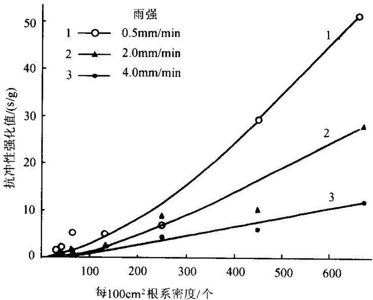  
图2-10 油松林根系与土壤抗冲性的效应曲线

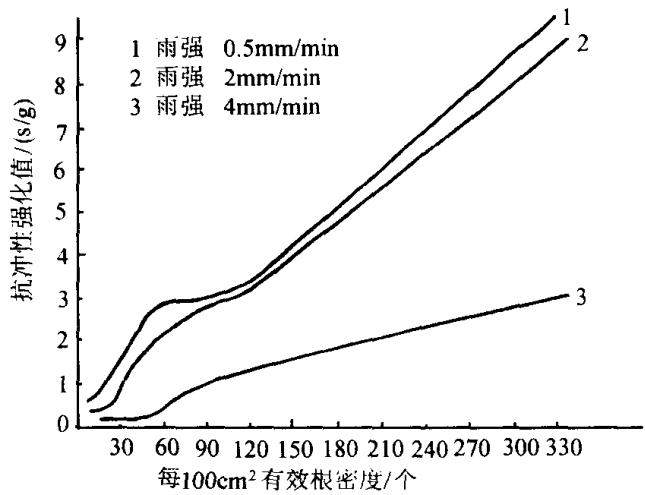  
图2-11 沙棘林根系与土壤抗冲性的效应曲线

与此同时，研究测定了白羊草、羊胡子草、黄营草、铁杆蒿等草本植物的根系对强化土壤抗冲性的作用。与无根系土壤作比较，以上各种草类根系明显提高了土壤抗冲性强化值ΔAS，依次分别提高了24.8\~33.58倍、24.04\~29.60倍、17.03\~19.34倍及15.03\~20.07倍。

## （四）植被调节径流、保持水土和削减洪峰的作用

## 1. 植被削减径流和土壤冲刷的作用

刘秉正据黄土高原安塞、长武、淳化、河曲、准格尔旗的试区(1968\~1990年)及宜川林区试验站(水土保持研究所)径流小区5m×20m的观测资料综合于表2-34，由表可见，天然次生林地、天然荒草地及人工造林种草地的保持水土作用均高于坡耕地，可削减径流 20.6%\~98.8%，减少土壤流失3.9%\~99.9%。

表2-34 黄土高原不同林、草植被下的径流模数与侵蚀模数[60]
<table><tr><td rowspan="2">类型</td><td rowspan="2">坡度/(°)</td><td rowspan="2">覆盖度  $7 \%$ </td><td colspan="2">径流模数</td><td colspan="2">侵蚀模数</td><td rowspan="2">资料来源</td></tr><tr><td> $\left[ \mathbf { m } ^ { 3 } / ( \mathbf { h m } ^ { 2 } \cdot \mathbf { a } ) \right]$ </td><td>与坡耕地比/%</td><td> $\left[ { \bf { \sigma } } \pmb { V } ( { \bf { k m } } ^ { 2 } \cdot { \bf { a } } ) \right]$ </td><td>与坡耕地比/%</td></tr><tr><td>油松人工林</td><td>20</td><td>70~80</td><td>24.3</td><td>11.9</td><td>2.0</td><td>0.1</td><td>宜川站</td></tr><tr><td>油松+沙棘林</td><td>27</td><td>50~70</td><td>43.1</td><td>21.0</td><td>703.9</td><td>73.3</td><td>安塞试区</td></tr><tr><td>1~8年生刺槐林</td><td>27</td><td>60~75</td><td>61.1</td><td>30.2</td><td>524.6</td><td>54.7</td><td>发塞试区</td></tr><tr><td>6~17年生刺槐林</td><td>27</td><td>50~60</td><td>18.5</td><td>9.1</td><td>27.8</td><td>2.9</td><td>安塞试区</td></tr><tr><td>刺槐成林</td><td>31~33</td><td>80</td><td>40.6</td><td>1.2</td><td>40.6</td><td>1.2</td><td>长武试区</td></tr><tr><td>水平阶刺槐成林</td><td></td><td></td><td>82.8</td><td>8.9</td><td>45.2</td><td>4.4</td><td>淳化试区</td></tr><tr><td>1~8年刺槐+紫穗槐</td><td>27</td><td>50~60</td><td>61.7</td><td>30.5</td><td>534.8</td><td>55.7</td><td>安塞试区</td></tr><tr><td>山杨林</td><td>18</td><td>75</td><td>16.2</td><td>30.2</td><td>3.9</td><td>11.4</td><td>宜川站</td></tr><tr><td>杨树+沙棘林</td><td>27</td><td>50~60</td><td>57.1</td><td>28.3</td><td>833.2</td><td>92.1</td><td>安塞试区</td></tr><tr><td rowspan="2">类型</td><td rowspan="2">坡度/(°)</td><td rowspan="2">覆盖度 /%</td><td colspan="2">径流模数</td><td colspan="2">侵蚀模数</td><td rowspan="2">资料来源</td></tr><tr><td> $\left[ \mathbf { m } ^ { 3 } / ( \mathbf { h m } ^ { 2 } \cdot \mathbf { a } ) \right]$ </td><td>与坡耕地比/%</td><td> $\left[ { \cal V } ( \mathbf { k m } ^ { 2 } \cdot \mathbf { a } ) \right]$ </td><td>与坡耕地比/%</td></tr><tr><td>串杨林</td><td>25</td><td>70</td><td>59.0</td><td>6.1</td><td>20.7</td><td>1.8</td><td>河曲试区</td></tr><tr><td>2~6年沙棘林</td><td>27</td><td>60~90</td><td>32.3</td><td>15.9</td><td>374.4</td><td>37.2</td><td>安塞试区</td></tr><tr><td>2~4年柠条林</td><td>27</td><td>20~50</td><td>118.1</td><td>58.4</td><td>1 922.8</td><td>96.1</td><td>安塞试区</td></tr><tr><td>柠条成林</td><td>27</td><td>50~60</td><td>21.8</td><td>8.9</td><td>3.9</td><td>0.4</td><td>安塞试区</td></tr><tr><td>柠条林</td><td>27</td><td>90</td><td>18.0</td><td>1.8</td><td>4.5</td><td>0.4</td><td>河曲试区</td></tr><tr><td>1~5年紫花苜蓿</td><td>27</td><td>60</td><td>141.5</td><td>79.4</td><td>1 892.2</td><td>54.3</td><td>安塞试区</td></tr><tr><td>紫花苜蓿</td><td>9</td><td>60</td><td>195.0</td><td>34.4</td><td>160.0</td><td>0.4</td><td>准旗试区</td></tr><tr><td>紫花苜蓿</td><td>17</td><td>50</td><td>198.0</td><td>59.2</td><td>240.0</td><td>10.9</td><td>准旗试区</td></tr><tr><td>2~8年沙打旺</td><td>27</td><td>50~90</td><td>53.3</td><td>29.3</td><td>76.8</td><td>2.2</td><td>安塞试区</td></tr><tr><td>沙打旺</td><td>7</td><td>40</td><td>193.0</td><td>59.0</td><td>150.0</td><td>11.4</td><td>准旗试区</td></tr><tr><td>无芒雀麦</td><td>7</td><td>40</td><td>171.0</td><td>52.0</td><td>140.0</td><td>10.6</td><td>准旗试区</td></tr><tr><td>天然草地</td><td>7</td><td>40</td><td>162.0</td><td>49.5</td><td>110.0</td><td>8.3</td><td>准旗试区</td></tr><tr><td>天然草地</td><td>30~31</td><td>85</td><td></td><td></td><td>56.7</td><td>1.7</td><td>长武试区</td></tr><tr><td>水平阶密草地</td><td>30</td><td></td><td>88.1</td><td>9.5</td><td>37.4</td><td>3.6</td><td>淳化试区</td></tr></table>

注：引自吴钦孝的《黄土高原植被建设与持续发展》。

刘秉正等研究了植被保土作用及作用系数[87]。在黄土高原南部作物植被作用系数多年平均值为0.31\~0.53，与USLE中的0.50\~0.70接近；人工林(刺槐)植被作用系数平均为0.40\~0.85，这与林下枯落物的保持和水平阶整地有关。

## 2. 植被调节径流、削减洪峰和侵蚀产沙的作用

刘昌明于1982年分析研究了黄土高原森林对年径流的影响，指出非林区流域年径流深较林区流域年径流深大1.7\~3.0倍，林区流域径流系数较非林区流域小40%\~60%。陕西省黄龙水土保持试验站进行了有林流域寺沟 $( 4 . 3 7 \mathrm { k m } ^ { 2 } )$ 与无林流域南沟(5.11km²)的对比观测。由表2-35可见，寺沟流域的最大流量较非治理南沟流域削减了5.7\~40倍，输沙量减少了98%\~99%，土壤侵蚀模数减少了50\~150倍。

子午岭林区随林地覆盖率的增加，减少径流泥沙效益随之增加。当林地覆盖率达30%时，削减洪量即达50%以上；当覆盖率达60%时，削减洪峰96%，削减洪量83%(表 2-36)[64]。

西峰水土保持科学试验站自1954年起在南小河沟内进行了林草治理沟(杨家沟0.87km²)与非治理沟(董庄沟 $1 . 1 5 \mathrm { k m } ^ { 2 } )$ 对比观测(表2-37)。治理沟洪量模数削减效益66.6%\~74.5%；侵蚀模数削减效益78.0%\~84.4%。1988年7月23日在南小河沟发生罕见暴雨，未治理的董庄沟出现最大含沙量 $1 ~ 0 0 0 \bf { k g / m } ^ { 3 }$ ，进行了林草治理的杨家沟减沙效益达93.6%。

表2-35 黄土高原有林、无林小流域流量与输沙量对比观测
<table><tr><td rowspan="2">流域名称</td><td rowspan="2">观测年份</td><td rowspan="2">降雨量 /mm</td><td rowspan="2">最大流量  $/ ( \mathbf { m } ^ { 3 } / \mathbf { s } )$ </td><td rowspan="2">输沙量/t</td><td rowspan="2">平均含沙量  $/ ( \log / \mathbf { m } ^ { 3 } )$ </td><td colspan="2">土壤侵蚀模数</td></tr><tr><td> $V ( \mathbf { k m } ^ { 2 } \cdot \mathbf { a } )$ </td><td>比值</td></tr><tr><td>寺沟(有林)</td><td>1964</td><td>328.3</td><td>0.224</td><td>73.6</td><td>19.5</td><td>16.8</td><td>1</td></tr><tr><td>南沟(无林)</td><td>1964</td><td>374.6</td><td>3.890</td><td>8 914.0</td><td>185.0</td><td>1 744.0</td><td>103.8</td></tr><tr><td>寺沟(有林)</td><td>1966</td><td>380.2</td><td>0.137</td><td>28.8</td><td>5.6</td><td>6.6</td><td>1</td></tr><tr><td>南沟(无林)</td><td>1966</td><td>369.1</td><td>5.540</td><td>5 270.0</td><td>183.0</td><td>1031.0</td><td>156.2</td></tr><tr><td>寺沟(有林)</td><td>1967</td><td>280.5</td><td>0.174</td><td>11.3</td><td>1.5</td><td>2.6</td><td>1</td></tr><tr><td>南沟(无林)</td><td>1967</td><td>290.2</td><td>0.982</td><td>670.0</td><td>82.4</td><td>131.0</td><td>50.4</td></tr></table>

注：引自黄龙山水文站资料。

表2-36 子午岭林区洪峰洪量与林地覆盖率的关系
<table><tr><td rowspan="2">林地覆盖率/%</td><td colspan="2">改正系数</td><td rowspan="2">林地覆盖率/%</td><td colspan="2">改正系数</td></tr><tr><td>洪峰</td><td>洪量</td><td>洪峰</td><td>洪量</td></tr><tr><td>0</td><td>1.0</td><td>1.0</td><td>40</td><td>0.17</td><td>0.30</td></tr><tr><td>10</td><td>0.69</td><td>0.74</td><td>50</td><td>0.09</td><td>0.22</td></tr><tr><td>20</td><td>0.46</td><td>0.55</td><td>60</td><td>0.04</td><td>0.17</td></tr><tr><td>30</td><td>0.29</td><td>0.41</td><td>70</td><td>0.02</td><td>0.12</td></tr></table>

表2-37 林草治理的杨家沟与非治理董庄沟削减洪水泥沙效益对比
<table><tr><td rowspan="2">洪峰发生时间</td><td colspan="3">洪量模数  $/ [ m ^ { 3 } / ( \mathbf { k m } ^ { 2 } \cdot \mathbf { a } ) ]$ </td><td rowspan="2">效益/%</td><td colspan="3">侵蚀模数/  $V ( \mathbf { k m } ^ { 2 } \cdot \mathbf { a } ) \stackrel { \cdot } { \scriptscriptstyle }$  一</td><td rowspan="2">效益/%</td></tr><tr><td>董庄沟</td><td>杨家沟</td><td>差值</td><td>董庄沟</td><td>杨家沟</td><td>差值</td></tr><tr><td>1980-08-02</td><td>9 100</td><td>5 366</td><td>3 734</td><td>41.0</td><td>6500</td><td>1 860</td><td>4 640</td><td>71.4</td></tr><tr><td>1958~1977年平均</td><td>4 080</td><td>1 040</td><td>3 040</td><td>74.5</td><td>1 869</td><td>291</td><td>1 578</td><td>84.4</td></tr><tr><td>1954~1980年平均</td><td>4 923</td><td>1 642</td><td>3 281</td><td>66.6</td><td>2 601</td><td>571</td><td>2 030</td><td>78.0</td></tr></table>

注：引自西峰水土保持科学试验站资料。

## 第二节人为因素

人类对自然植被的破坏是影响土壤侵蚀最主要的人为因素。人类社会的出现，首先以掠取自然界的生物资源为其生存的基本条件。从狩猎、游牧、刀耕火种到大规模开垦，均是以破坏自然植被为代价，导致自然生态平衡失调，自然侵蚀转化成为人为加速侵蚀。据联合国环境署(UNEP)和粮农组织(FAO)的调查研究，地球2/3的陆地曾被森林所覆盖，面积达76亿hm²，现在仅剩下26.4亿hm²；全世界因土壤侵蚀每年从耕地流失的 $\mathbf { h } \mathbf { m } ^ { 2 }$ $\mathbf { h } \mathbf { m } ^ { 2 }$ 土壤约250亿t，坡耕地土壤侵蚀为现代土壤侵蚀的主要方式。

中国有五千年的文明史和耕垦历史。由于人口增长迅速，加之长期封建统治，滥垦、滥伐、滥牧的生产方式导致生态环境严重破坏，土壤侵蚀急剧发展。近年来，城镇、工矿建设飞速发展，由于未及时采取相应的环境保护措施，从而引发新的水土流失问题。

## 一、人地系统失调引发的人为加速侵蚀

## （一）历史时期人口变迁与生态环境的演变

以黄土高原为例，据历史考证和现代植被地带的自然区域分异，大部分地区应是森林、森林草原及灌丛草原的植被景观，如果自然生态平衡未遭到人为破坏，土壤侵蚀应是常态侵蚀，很轻微。当今黄土高原光秃裸露、切割破碎的侵蚀地貌和严重的水土流失，其缘由是植被遭到人为破坏和不合理开垦。

黄河流域是中华民族的文化发祥地，黄土高原地区(黄土高原和阴山以南地区共62万km²)的人口在隋、唐盛期曾占全国人口的25%，如表2-38所示[65]，自汉代至明代的1500年期间，全国人口数量的变动范围为4000万\~6000万，而黄土高原的人口变动较大，由几百万到1500万。隋、唐时期是中国封建社会的鼎盛时期，当时处于全国政治、经济中心的黄土高原人口有了很大的发展。到了明代，黄土高原又是战乱和屯垦的中心，黄河干流及其支流成为人口集中区，同时带来生态环境的破坏、土壤侵蚀的急剧发展和黄河灾害频率的增多(表2-39)[66]。

表2-38 黄土高原地区历史人口简表[65]
<table><tr><td>时期</td><td>年代</td><td>全国人口/万人</td><td>黄土高原地区人口/万人</td><td>占全国人口/%</td></tr><tr><td>西汉</td><td>2</td><td>5 959.5</td><td>1128.5</td><td>19.6</td></tr><tr><td>隋</td><td>609</td><td>4601.9</td><td>1195.2</td><td>25.4</td></tr><tr><td>唐</td><td>742</td><td>5143.4</td><td>1015.2</td><td>19.9</td></tr><tr><td>北宋</td><td>1102</td><td>4 532.4</td><td>650.3</td><td>14.3</td></tr><tr><td>明</td><td>1457~1571</td><td>6259.5</td><td>1 515.7</td><td>24.2</td></tr><tr><td>清</td><td>1820</td><td>35 340.0</td><td>2995.6</td><td>8.4</td></tr><tr><td></td><td>1840</td><td>42 126.7</td><td>4 100.2</td><td>9.7</td></tr><tr><td>中华民国</td><td>1928</td><td>44 185.0</td><td>3 132.9</td><td>7.1</td></tr><tr><td>中华人民</td><td>1949</td><td>54 167.0</td><td>3 639.5</td><td>6.7</td></tr><tr><td>共和国</td><td>1982</td><td>100 402.1</td><td>7 811.3</td><td></td></tr><tr><td></td><td>1985</td><td></td><td>8139.2</td><td>7.8</td></tr></table>

表 2-39 黄河流域的土地利用方式和灾害频率[66]
<table><tr><td rowspan="2">年代</td><td rowspan="2">土地利用方式</td><td rowspan="2">植被变化</td><td colspan="2">洪旱</td><td colspan="2">决徙</td></tr><tr><td></td><td>次数 频率/百年</td><td>次数</td><td>频率/百年</td></tr><tr><td>1978BC</td><td>牧业</td><td>林草丰茂</td><td>一</td><td>一</td><td>8</td><td>0.4</td></tr><tr><td>229(BC) ~ 148(AD)</td><td>牧业转农业</td><td>森林破坏</td><td>29</td><td>13</td><td>13</td><td>5.5</td></tr><tr><td>148~609</td><td>牧业</td><td>植被恢复</td><td>9</td><td>1</td><td>8</td><td>1.2</td></tr><tr><td>609~1220</td><td>牧业转农业</td><td>林、草破坏</td><td>45</td><td>5.9</td><td>509</td><td>67.1</td></tr><tr><td>1368~1911</td><td>农业大发展</td><td>林、草严重破坏</td><td>116</td><td>21.4</td><td>934</td><td>172</td></tr><tr><td>1912~1936</td><td></td><td></td><td></td><td></td><td>103</td><td>439.2</td></tr></table>

由上表可知，人口增长必然带来农业大发展和林草植被遭破坏，黄河流域的洪、旱、决徙灾害频率也呈增长趋势。尤其自唐代以后，黄河下游灾害一直呈上升趋势，决徙频率由百年67.1次增至清代的172次，1912\~1936年期间相当于百年439.2次。

自1949年以来，全国人口和黄土高原地区人口均急剧增长，毁林、毁草、开垦发展十分严重，但黄河下游仍保持安流，这并不说明土壤侵蚀没有发展，主要是黄河下游堤防建设及黄河干支流坝库工程建设发挥了防御作用。

## （二）现代人口增长与毁林毁草环境恶化及垦殖率的增长

## 1. 黄土高原地区人口增长与毁林毁草垦殖率的增长[29,67]

1949年黄土高原地区总人口为3 639.5万人，占全国人口的6.7%，人口密度为58人/km²，略高于全国的人口密度(56人/km²)。1982年全国第三次人口普查时，黄土高原地区的人口达到7811.3万人。占全国总人口的比重上升到7.8%，人口密度增至125人/km²，比全国(大陆)105人/km²多20人。

据1953年人口普查数和1985年公安部门统计数据(表2-40)，黄土高原地区人口增长率为35.81%o;在黄土丘陵沟壑区的延安市，人口增长率为37.0%o;在子午岭林区的富县和甘泉县人口增长率达44.27%和65.23%o。这说明，因人口剧增大批人口迁入林区进行毁林开荒，导致子午岭林区每年约后退0.5km，其中富县境内的林线年均后退2.4km。据林区内合水县柳沟水文站的观测资料，1959\~1962年的平均最大流量61.6m³/s，平均含沙量59.6kg/m³；1969\~1971年的平均最大流量增至 $1 5 1 . 9 \mathrm { m } ^ { 3 } / \mathrm { s }$ ，平均含沙量增至$1 2 6 . 3 \mathrm { k g } / \mathrm { m } ^ { 3 }$ ，二者较10年前分别增加了1.5倍和2.1倍。

表240 黄土高原地区和典型县人口增长率
<table><tr><td>统计数据</td><td>黄土高原地区</td><td>延安市</td><td>富县</td><td>甘泉</td><td>海原县</td><td>泾源县</td></tr><tr><td>1953年普查数/万人</td><td>3 281.92</td><td>70.91</td><td>4.88</td><td>1.90</td><td>9.23</td><td>3.12</td></tr><tr><td>1985年公安部门统计数/万人</td><td>7 160.08</td><td>157.47</td><td>12.01</td><td>5.99</td><td>26.32</td><td>8.47</td></tr><tr><td>1953~1985年人口增长倍数</td><td>1.18</td><td>1.22</td><td>1.46</td><td>2.01</td><td>1.85</td><td>1.71</td></tr><tr><td>1953~1985年人口增长率/%</td><td>35.81</td><td>37.00</td><td>44.27</td><td>65.23</td><td>56.11</td><td>51.96</td></tr></table>

又如表2-41说明，一般人口密度愈大，土地垦殖率愈高。榆林市的一些县人口密度由 35 人/km²增至148.8人/km²，垦殖率相应由12.1%增至62.7%。 $/ \mathbf { k } \mathbf { m } ^ { 2 }$ $/ \mathbf { k m } ^ { 2 }$

表2-41 榆林市代表县1984年人口密度与垦殖率
<table><tr><td>人口密度与垦殖率</td><td>榆林</td><td>神木</td><td>横山</td><td>靖边</td><td>佳县</td><td>吴堡</td><td>米脂</td><td>绥德</td></tr><tr><td>人口密度/(人/km²)</td><td>44.5</td><td>35.0</td><td>54.9</td><td>39.7</td><td>100.9</td><td>157.9</td><td>144.3</td><td>148.8</td></tr><tr><td>垦殖率/%</td><td>12.1</td><td>16.5</td><td>25.1</td><td>34.5</td><td>34.4</td><td>37.9</td><td>44.9</td><td>62.7</td></tr></table>

## 2. 我国长江流域等地区人口增长与森林覆盖率的下降和垦殖率的增长[52,53,68,69]

江西省在20世纪50年代初全省人口1568万人，1991年增至3865万人，增加了

1.4倍；全省水土流失面积由50年代的110万hm²增至80年代末的383.5万hm²，增长 $\mathbf { h } \mathbf { m } ^ { 2 }$ $\mathbf { h } \mathbf { m } ^ { 2 }$ 了2.4倍。

四川省境内1949年后森林植被遭到严重破坏，20世纪70年代森林覆盖率与50年代相比明显下降(表2-42)，致使森林涵养水源和保持水土能力大为削弱，造成水土流失。

表 242 四川省境内森林覆盖率变化
<table><tr><td rowspan="2">流域</td><td colspan="2">森林覆盖率/%</td></tr><tr><td>20世纪50年代</td><td>20世纪70年代</td></tr><tr><td>嘉陵江</td><td>19.3</td><td>13.2</td></tr><tr><td>涪江</td><td>16.1</td><td>9.9</td></tr><tr><td>渠江</td><td>23.0</td><td>16.2</td></tr><tr><td>沱江</td><td>7.0</td><td>5.0</td></tr><tr><td>岷江</td><td>21.0</td><td>17.2</td></tr></table>

长江流域大部分地区的森林也处于过度砍伐的状况，目前全流域森林覆盖率只有20.3%。湖南省1957年森林蓄积量为2.83亿 $\mathbf { m } ^ { 3 }$ ，至1980年下降到1.6亿 $\mathbf { m } ^ { 3 } c$ 在长江中上游144个县属水土流失严重的少林县，其中14个县森林覆盖率只有9%，有5个县在5%以下。

自20世纪50年代以来，三峡库区毁林现象有增无减，据80年代中期统计，库区内10余个县的森林覆盖率呈下降趋势(表2-43)[53]。

表2-43 长江三峡区20世纪50年代和80年代森林覆盖率比较
<table><tr><td rowspan="2">地区</td><td colspan="2">覆盖率/%</td><td rowspan="2">地区</td><td colspan="2">覆盖率/%</td></tr><tr><td>50年代</td><td>80年代</td><td>50年代</td><td>80年代</td></tr><tr><td>长寿</td><td>18.5</td><td>7.50</td><td>云阳</td><td>一</td><td>8.91</td></tr><tr><td>涪江</td><td>一</td><td>11.53</td><td>奉节</td><td>32.3</td><td>15.7</td></tr><tr><td>丰都</td><td>23.7</td><td>12.95</td><td>巫山</td><td>23.6</td><td>11.7</td></tr><tr><td>石柱</td><td>23.3</td><td>10.97</td><td>巫溪</td><td>24.0</td><td>10.5</td></tr><tr><td>武隆</td><td>一</td><td>13.20</td><td>巴东</td><td>一</td><td>38.5</td></tr><tr><td>忠县</td><td>22.2</td><td>11.60</td><td>秭归</td><td>一</td><td>25.9</td></tr><tr><td>万县</td><td>20.2</td><td>10.20</td><td>兴山</td><td>一</td><td>34.0</td></tr><tr><td>开县</td><td>11.0</td><td>5.90</td><td>宜昌</td><td>一</td><td>36.0</td></tr></table>

地处寒温带和中温带的东北地区，大部分属湿润地区，森林资源丰富。1840年以来，封建统治和帝国主义的掠夺，森林资源遭破坏，损失很大。20世纪50年代初期，由于管理不善，曾多次出现盗伐、滥伐、毁林毁草开荒，致使森林又遭破坏。黑龙江省的森林面积由50年代的2000万 $\mathbf { h } \mathbf { m } ^ { 2 }$ 降至80年代的1600万 $\mathbf { h } \mathbf { m } ^ { 2 }$ ，减少了20%。在黑土区因毁林毁草开荒，坡耕地水土流失面积占流失总面积的86%。

## 二、过度开垦和“三料”需求矛盾加速土壤侵蚀

## （一）陡坡开垦影响土壤侵蚀的严重性

我国丘陵山区占总土地面积的2/3，人口增长迫使农民向丘陵山区要粮，毁林毁草开垦土地的坡度愈来愈陡，水土流失愈来愈严重，并引发和加剧了洪、旱灾害。

江西省的坡耕地由20世纪50年代的9.89万 $\mathrm { { h m } } ^ { 2 }$ 增至80年代末的33.81万 $\mathrm { h m } ^ { 2 }$ ，大于25°的坡耕地由0.6万 $\mathbf { h } \mathbf { m } ^ { 2 }$ 增至7.14万 $\mathbf { h } \mathbf { m } ^ { 2 }$ ，增长了10倍以上[70]。

贵州省大于25°的坡耕地占全省耕地的28.6%，其流失量占全省总流失量的77.9%。陡坡耕地多为土层很薄的含岩石碎块粗骨化土壤，由于强度侵蚀，表层土壤流失后，形成了石漠化光板地。全省因坡耕地形成石漠化的面积达133.3万 $\mathbf { h } \mathbf { m } ^ { 2 }$ ，每年以11.5万$\mathbf { h } \mathbf { m } ^ { 2 }$ 的速率在增长。由于丧失了生存的土地，当地农民被迫迁移[71]。

四川省大于 $2 5 ^ { \circ }$ 的陡坡耕地达66.7万 $\mathbf { h } \mathbf { m } ^ { 2 }$ ，多为毁林开荒所致。四川省的森林覆盖率由20世纪50年代的19%降至80年代的12%；水土流失面积由50年代的9.3万 $\mathbf { k m } ^ { 2 }$ 升至80年代的24.7万 $\mathbf { k m } ^ { 2 }$ ，占长江上游水土流失总面积的70.1%。1981年8月长江上游发生特大洪灾，四川省为重灾区，多发生在森林覆盖率小于10%的地区，尤其是坡耕地的灾情特别严重。在这次洪灾中，约670万 $\mathrm { h } m ^ { 2 }$ 的耕地遭冲刷，其中2.7万 $\mathrm { h m } ^ { 2 }$ 的耕地被冲成石漠化光板地。全省因坡耕地土壤侵蚀，粮食减产15亿kg，相当于750万人1年的口粮。因陡坡开垦激发了滑坡、泥石流灾害所造成的损失，更难以估算[72]。

黄土高原地区坡耕的面积占耕地总面积的50%以上，在黄土丘陵沟壑区的坡耕地占耕地总面积的 70%\~90%，其中大于 25°的陡坡耕地占15%\~20%（表 2-44)[29]。

表244 黄土丘陵沟壑区榆林和延安市坡耕地坡度分配率
<table><tr><td rowspan="2">地区名称</td><td rowspan="2">总耕地 /万 hm²</td><td rowspan="2">坡耕地 /万 hm²</td><td rowspan="2">坡耕地占 总耕地/%</td><td colspan="6">总耕地各级坡度分配</td></tr><tr><td></td><td> $< 1 0 ^ { \circ }$ </td><td> $1 0 ^ { \circ } \sim 2 5 ^ { \circ }$ </td><td></td><td> $> 2 5 ^ { \circ }$ </td><td></td></tr><tr><td>延安市</td><td>93.3</td><td>73.0</td><td>78.16</td><td> $\mathcal { F } \mathrm { \hbar } \mathbf { h m } ^ { 2 }$ </td><td>%</td><td>万hm²</td><td>%</td><td>万hm²</td><td>%</td></tr><tr><td></td><td></td><td></td><td></td><td>30.2</td><td>32.4</td><td>44.1</td><td>47.3</td><td>19.0</td><td>20.3</td></tr><tr><td>榆林市</td><td>123.2</td><td>106.4</td><td>86.32</td><td>50.0</td><td>40.6</td><td>54.0</td><td>43.7</td><td>19.2</td><td>15.7</td></tr></table>

注：据1981\~1982年水土保持区划和农业区划资料汇编。

地跨延安和榆林两市的杏子河流域(流域面积 $1 ~ 4 8 6 . 1 \mathrm { k m } ^ { 2 } )$ ，在20世纪50年代乔灌林地的覆盖率为8.42%，到1975年只剩下4.4%，同期建造的植被面积为破坏面积的28.01%，破坏为建造的3.57倍(表2-45)。毁林毁草的地块均已开垦为农地，由梁峁坡发展到谷坡，大于25°的陡坡占50%以上，其中的10%为大于35°的陡坡。据1982年的调查 $2 5 ^ { \circ } |$ 测算，坡耕地的侵蚀总量约占流域总侵蚀量的60%，其中2/3产自大于25°的陡坡耕地。 $2 5 ^ { \circ }$ 陡坡耕地侵蚀量加剧的主要原因在于侵蚀方式的改变。据调查研究和定位观测资料，当耕垦大于25°坡地情况下，坡面侵蚀由片蚀、细沟侵蚀发展到浅沟侵蚀；在典型小流域的 $2 5 ^ { \circ } \colon$ 梁峁坡部位，发生浅沟的侵蚀区可占坡面的72.20%\~78.48%，浅沟侵蚀量可占坡面总侵蚀量的70%以上(表2-45、表2-46)。浅沟为现代沟谷侵蚀的缘由，其侵蚀量的大小，不仅与坡度有关，而且决定于坡形及汇流量[73]。

表2-45 陕北杏子河典型小流域梁昴坡面(沟间地)不同侵蚀方式的分区(占沟间地面积的百分比)73
<table><tr><td rowspan="2">小流域名称</td><td rowspan="2">流域面积  $/ \mathrm { k m } ^ { 2 }$ </td><td rowspan="2">沟间地面积  $/ \mathbf { k m } ^ { 2 }$ </td><td rowspan="2">无明显~片蚀侵蚀</td><td rowspan="2">片蚀~细沟侵蚀 区/%</td><td rowspan="2">细沟~浅沟侵蚀 区/%</td></tr><tr><td>区/%</td></tr><tr><td>箭杆梁沟</td><td>4.790</td><td>2.486</td><td>18.39</td><td>7.84</td><td>73.77</td></tr><tr><td>大庄河沟</td><td>8.321</td><td>3.584</td><td>15.41</td><td>6.10</td><td>78.49</td></tr><tr><td>纸坊沟</td><td>8.268</td><td>3.703</td><td>24.24</td><td>3.56</td><td>72.20</td></tr></table>

表 2-46 陕北杏子河流域坡耕地细沟及浅沟侵蚀量[73]
<table><tr><td>土地利用</td><td>坡度/(°)</td><td>(细沟 +浅沟)侵蚀总量  $/ \{ V ( \mathbf { k m ^ { 2 } \cdot a } )$  门</td><td>浅沟侵蚀量*</td><td>浅沟占总侵蚀量比例/%</td></tr><tr><td>翻耕裸露</td><td>35</td><td>46 917</td><td>36 305</td><td>77.4</td></tr><tr><td>荞麦</td><td>30</td><td>36 380</td><td>15 400</td><td>42.3</td></tr><tr><td>谷子</td><td>28</td><td>55 197</td><td>37 341</td><td>67.7</td></tr><tr><td>亚麻</td><td>25</td><td>16 932</td><td>10 468</td><td>60.2</td></tr></table>

\*侵蚀量的单位用 $V ( \mathbf { k m } ^ { 2 } \cdot \mathbf { a } )$ 表示。

## (二)农村能源矛盾引发的土壤侵蚀

我国水土流失严重区植被破坏严重的另一重要原因是燃料缺乏，并影响到造林不见林，植被建造不见效的系列问题；在缺乏煤炭资源的南方地区尤为突出。据1980年调查，江西兴国县全县9万多农户平均缺柴4个半月，农村缺柴人口占全县总人口62.5%。为了解决生活必需的燃料，群众不得不上山砍树、割草用作燃料，致使山丘长期光秃裸露，水土流失愈来愈严重。1979年兴国县的砍伐量超过林木生长量2.32倍，全县砍伐木材12.8万 $\mathbf { m } ^ { 3 }$ ，其中用作燃料的9.9万 $\mathbf { m } ^ { 3 }$ ，占总采伐量的80.5%。按兴国县现有林地可供薪柴用量计算，再加上基建等其他农用材，每年需砍伐林地0.8万 $\sim 1 ~ \mathcal { F } ~ \mathfrak { h m } ^ { 2 }$ ，为同期造林面积的1.5\~1.8倍[52]。

宁夏自治区的西海固地区也因缺乏燃料而引起饲料肥料亏缺，生态环境愈益脆弱，水土流失愈益严重的恶性循环。据西吉县1981年调查和实测，全县65.9%的畜粪及24.6%的秸秆用作燃料被烧掉，也只能维持5个月燃料需求，其余7个月所需生活燃料靠上山割野草、铲草皮、挖草根勉强对付。如此掠夺性的破坏植被，破坏了生态，人民生活愈益贫困[29]。

自20世纪80年代后期，在燃料、肥料、饲料三缺的水土流失地区，以燃料为突破口，全面推进了水土保持。例如通过推行节柴灶，广种速生薪炭林，发展沼气池及调运煤炭等系列措施，取得了显著成效[74]。

据考察(1981\~1985年)黄土高原的草场1 920万 $\mathbf { h } \mathbf { m } ^ { 2 }$ ，其中重度和中度退化的占

68.8%。例如西吉县的草场，因过度放牧和铲草皮、挖草根用作燃料，草场严重退化，天然草场的产草量在30余年期间降低了1/3，每公顷产草量仅750\~1500kg，每养活1个羊单位需1.53hm²草场[75]。

自20世纪90年代以来，黄土高原的煤炭资源，有了较大规模的开采，再加上薪炭林的建造，对于严重缺乏燃料的宁夏西海固地区等，大大缓解了农村能源亏缺的系列矛盾，相应促进了农林牧生产。严重缺乏薪炭林的兴国县，经1983年以来近20年的重点治理，不仅解决了能源矛盾，且生态经济有了全面发展。

## 三、城市、工矿建设引发的侵蚀问题

人们在城镇、工矿建设过程中，因建设用地开发破坏了自然生态平衡，同时在建房、筑路、架桥、采矿过程中对开挖面及尾矿、弃土、弃渣处理不当情况下，引发了水蚀、风蚀及滑坡、泥石流灾害，乃至淤塞河道发生洪水灾害等。这类侵蚀与上述的农林牧生产活动中引发的侵蚀本质相同，都是人为因素影响下的加速侵蚀，其特点是在工程建设过程中引发的侵蚀问题。近年来，随着国民经济的飞速发展，这类侵蚀问题愈来愈突出。由于城镇、工矿建设区所处地理位置及自然、社会环境背景的不同，引发的侵蚀问题及严重程度不等，以下举例说明。

## （一）工矿建设引发的侵蚀问题

我国的水土流失多发生在丘陵山区，这些地区又多是各种矿产资源蕴藏丰富的地区。例如“七五”期间，据黄土高原矿产资源的考察，截止到1986年底，探明黄土高原地区储藏矿产77种，占全国(137种)的56.2%。其中占优势的有煤矿、铝土矿和稀土矿。煤矿已探明储量5354.06亿t，占全国总储量的63.3%；铝土矿储量9.15亿t，占全国总储量的57.7%；稀土矿储量占全国储量的95%以上[76]。这些矿产资源的开采，对发展国民经济建设和改变水土流失区面貌有重大的影响和作用。值得注意的是，由于在开采过程中忽视了环境保护和水土保持，引发了新的土壤侵蚀和环境问题，例如神府一东胜矿区[77-79]。

## 1. 神府一东胜矿区环境背景

神府一东胜矿区位于晋陕蒙接壤区能源基地的核心，其地理位置为长城沿线的水蚀风蚀交错的脆弱生态区。已探明含煤面积31171.97km²，探明储量2200亿t，占基地总量的78%，均属低灰、低硫、低磷、高发热量的优质动力煤。矿区的一、二期工程(1987\~1996年)年生产能力1000万\~3000万t，设计远期年开采能力达1亿t。

神府一东胜矿区的一、二期工程，不仅煤炭开采量带来了直接经济效益，而且带动了铁路、公路交通建设，带动了地方经济的发展和当地人民的脱贫致富，一个新兴的、现代化的工矿型城市正在风沙区边缘崛起。

由于矿区所处地理位置生态环境脆弱，水蚀风蚀严重，又为原“老、少、边”贫困地区，长期以来生产方式落后，社会经济基础薄弱，加之乡、村、个体户小煤窑无序开发，

(单位：万t)

开采初期全矿区统一规划、协调管理不足，引发了一系列新的环境问题。

## 2. 神府一东胜矿区引发的新的环境问题

该煤矿煤层埋藏浅，易露天开采，采剥比为1:6\~1:7。由于该矿区地处边远地区，矿区开采相应加强了铁路、公路、桥梁等基本建设，故引发的环境问题比较多。

(1）工程建设松散堆积物的危害。据神府一东胜矿区一、二期工程沿乌兰木伦河两岸约 $1 0 0 \mathrm { k m } ^ { 2 }$ 范围的考察研究[77]，如表2-47所示，工程建设中各类松散固体废弃物约1 391.77 万 $\mathbf { m } ^ { 3 }$ ，其中直接堆积于河道的361.55万 $\mathbf { m } ^ { 3 }$ ，高于河床 $1 \sim 7 \mathrm { m } _ { \circ }$ 矿区内的大柳塔公路大桥河床淤高1\~4m，影响行洪安全。原设计可通过100年一遇洪峰流量$( 1 1 7 0 0 \mathrm { m } ^ { 3 } / \mathrm { s } )$ ，现只能通过10年一遇洪峰流量 $( 7 ~ 1 6 6 \mathrm { m } ^ { 3 } / \mathrm { s } )$ ，该桥已被迫移址重建。

表247 神府一东胜矿区工程建设中废弃物数量及来源
<table><tr><td colspan="3">采  $\overrightarrow { A }$ </td><td rowspan="2">铁路</td><td rowspan="2">公路</td><td rowspan="2">采石</td><td rowspan="2">其他</td><td rowspan="2">总计</td></tr><tr><td>井采</td><td>露采</td><td>小计</td></tr><tr><td>368.46</td><td>811.35</td><td>1 179.81</td><td>78.98</td><td>31.03</td><td>157.36</td><td>26.20</td><td>1 473.38</td></tr></table>

(2)激发地面塌陷、地下水位下降及滑坡、泥石流灾害。在大柳塔区的双沟出现地裂缝，平均宽度0.25\~0.45m，间距0.5\~2.0m，最大沉陷达 $6 . 5 \mathrm { m } _ { \circ }$ 乡办的瓦罗煤矿地面出现裂缝和准滑坡，地下水渗漏，水井枯竭。在大柳塔矿区公路和铁路的两旁，一方面开挖面破坏了基岩稳定性；另一方面大量松散堆积物堆放在边坡或沟道内，均未采取任何固坡固沟的保护措施，在雨季往往诱发了滑坡，泥石流灾害的发生。例如在流域面积4.3km²的王渠沟内，由于任意采石和就地堆放弃石渣，发育形成了10条人为泥石流沟；大柳塔一店塔的40km范围内发育形成了40条人为泥石流沟；5年期间曾不同程度地发生过200余次泥石流下泻，冲毁农田、房屋、堵塞交通，清理时多被直接推入河道，又成为河道行洪的障碍物。

(3)水、土资源和植被遭到破坏或污染。神府一东胜煤田在河川两岸阶地埋藏浅、易开采；另一方面川道平坦宜于修建铁路、公路，其结果因以上工程建设损失水浇地348.3hm²；地面植被遭破坏，且大量土、煤渣和污水直接排入河道，既淤塞河道，又污染 $3 \mathrm { h m } ^ { 2 }$ 了水、土资源，并加剧了原水蚀风蚀的进展，原已十分脆弱的生态环境继续恶化。神府一东胜矿区在煤田开发和工程建设中所出现新的土壤侵蚀和环境问题，在其他矿区均不同程度地出现类似现象。

平朔安太堡露天煤矿位于山西省朔州市，占地面积 $1 8 . 8 5 \mathrm { k m } ^ { 2 }$ ，自1987年正式投产，年产量1500万t。据王治国等[80]的研究，开采过程中大量岩土剥离物堆放的场地，构成 $\scriptstyle \mathbf { t } _ { \circ }$ 了形态独特的侵蚀方式，称为岩土侵蚀。除普遍发生的面蚀、沟蚀外，还出现了黄土区少见的沉陷侵蚀、沙砾化面蚀、土沙流泻、坡面泥石流等侵蚀方式。排放场边坡多在 $3 0 ^ { \circ }$ 以上，滑坡侵蚀危害极大。1991年曾发生大型滑坡，造成平朔公路1000m堵塞，750m毁坏，排洪沟埋没600m，造成6人丧生，经济损失达1000多万元。

山东招远县罗山山脉的金矿开采，在 $9 0 \mathrm { k m } ^ { 2 }$ 范围内开挖矿口115个，仅1985年一次暴雨，全部矿口尾矿等排弃物下泄，使河床抬高0.7m，行洪能力减少65%[81]。江西省矿山的水土流失调查(1987年)，近10年来，全省采矿破坏植被和土地 $5 8 3 . 4 \mathrm { k m } ^ { 2 }$ ，弃土尾砂量6.12亿 $\mathbf { m } ^ { 3 }$ ，其中流失排入河道的 5800万 $\mathbf { m } ^ { 3 }$ ，使下游河床抬高2m多，危及公路和农田等[82]。

稀土矿的开采，一般需挖1300kg泥土，才能冶炼1kg稀土。江西、湖南等地因开采稀土矿，毁坏了大量土壤资源，又带来了严重的泥沙危害。

据黑龙江牡丹江市不完全统计，全市未经水土保持部门审批，无计划采煤、采金、采石、掘沙、基本建设等破坏水土保持的达350多处，面积计1600hm²。

总结以上矿区建设过程中引发的土壤侵蚀问题，主要是弃土、弃渣、尾矿砂等松散固体物的适宜处理，包括复垦等措施。应重视矿区开发前原土壤侵蚀环境的整治，以免加剧。近年来，神府一东胜矿区和安太堡矿区已取得以上土壤侵蚀问题防治的成效。

## （二）城市建设过程中的土壤侵蚀问题

城市水土保持是我国20世纪80年代以来提出的新问题。1996年在水利部主持下，在辽宁省大连市召开了首次全国城市水土保持工作会议。有的研究者提出，城市水土流失是近10余年来发生的新问题，是大规模土地开发和基本建设中出现的负面效应，以深圳市近年来出现的侵蚀问题为代表。实际上，城市化建设过程中引发的土壤侵蚀问题由来已久。我国丘陵山区面积占国土总面积的2/3，在这些地区城镇建设过程中，均不同程度地引发土壤侵蚀问题，只是建设速度远较现在缓慢，直接造成的经济损失不如现在突出，故未引起人们的重视。

城市土壤侵蚀是指城市建设过程中人为活动引发的土壤侵蚀。这里的人为活动包括建设用地开发、筑路、架桥、就地采取沙、石建筑材料、引水排水设施及城市垃圾处理等各项工程建设过程中由于处置不当而引发的面蚀、沟蚀、滑坡、泥石流及洪涝灾害等。城市建设的环境背景可归纳为两类：第一类地区为现代无明显侵蚀，但潜在侵蚀危险大，例如深圳市、珠海市；第二类地区为现代侵蚀和潜在侵蚀危险均很大，例如以上已阐述的在水蚀风蚀区建设的矿区和城镇，长江上游峡谷两岸的城镇建设如秭归县等也属此类型[79,85]。以下以深圳市为重点讨论城市建设过程中的土壤侵蚀问题[83,84]。

## 1. 深圳市环境背景与城市建设过程中的土壤侵蚀

## 1）环境背景

深圳市位于广东省南部沿海，全市陆地面积 $2 \ 0 2 0 \mathbf { k m } ^ { 2 }$ ，其中低山和丘陵占全市总面积的17.95%，低丘陵(海拔100\~150m)占31.94%，台地占22.35%，阶地和平原占27.21%(表2-48)。深圳市地处热带与亚热带交接的过渡地带，土地开发前，地面覆盖较茂密的次生林，部分为稀树、草灌，以自然侵蚀为主，侵蚀轻微。

表 2-48 深圳市地貌类型统计
<table><tr><td rowspan="2">全市土地 面积/km²</td><td colspan="2"></td><td colspan="3">各地貌类型所占比例/%</td><td></td></tr><tr><td>低山</td><td>丘陵</td><td>台地</td><td>阶地</td><td>平原</td><td>水域</td></tr><tr><td>2 020</td><td>4.82</td><td>44.07</td><td>22.35</td><td>5.09</td><td>22.12</td><td>1.55</td></tr></table>

深圳市原名宝安县，1980年时总人口31万人，自1984年开始建设特区(市内划出邻近香港的325.5km²)，截止到1994年底全市人口达335.5万人，增长了11倍。全市建成区面积255km²，推平待建区土地233.7km²。这部分闲置的待建土地由于未及时采取水土保持措施，近年来形成了新的水土流失严重区。

## 2)深圳市水土流失的特点和危害

深圳市房地产后期进入无序开发，由平原推向了原为林草覆盖的台地和丘陵，形成了大片由松散堆积物组成的待建平台。由于不符合城市总体规划要求，被令中断建设，大片闲置的由裸露松散堆积物形成的平台成为侵蚀产沙的主要对象，致使深圳市水土流失面积急剧上升。据1995年深圳市水土流失现状调查，全市水土流失面积184.99km²，其中开发区为148.68km²，占流失面积的80.37%，采石取土场的流失面积占8.32%，陡坡开垦种果占4.74%，保存植被的山丘区的水土流失面积占6.73%。以上人为因素影响的水土流失面积占93.27%，其中因工程建设引发的水土流失面积即占88.53%，在深圳市占主导地位。不仅流失面积大，而且侵蚀强度大。

土壤侵蚀主要发生在大面积的、由松散堆积物组成的待建台面。该台面堆积物的容重为1 $3 5 2 \mathbf { k g } / \mathbf { m } ^ { 3 }$ ，紧实度远远低于原为林草固结的地面，或建成区的地面，静水崩解只需2min。在遭受暴雨冲击下，发生超强度侵蚀。侵蚀部位发生在堆积坡和靠近堆积坡部位的台面，以沟蚀为主，大面积侵蚀模数达2万\~10万 $V ( \mathbf { k m } ^ { 2 } \cdot \mathbf { a } )$ 。灯蕊坑旁堆积面斜坡沟蚀的侵蚀模数达9.79万 $\mathbf { t } ^ { \prime } ( \mathbf { k m } ^ { 2 } \cdot \mathbf { a } )$ 。严重的水土流失致使水库、河道淤积，严重的淤积段可达1.25m/a，降低了河道防洪标准，致使深圳市于1992\~1995年洪水灾害频繁发生。

由表2-49所示，开发区水流含沙量是未开发区含沙量的62.3倍，这是在降雨量20\~30mm情况下的测定值。在暴雨情况下，曾测得布吉河水支流的含沙量为187kg/m³。

表2-49 深圳市开发区实测含沙量对比
<table><tr><td rowspan="2"></td><td colspan="2">沙湾简坑水</td><td colspan="2">布吉河水支流</td></tr><tr><td>开发区集水区</td><td>对比集水区</td><td>开发区集水区</td><td>对比集水区</td></tr><tr><td>集水区面积/km²</td><td>2.67</td><td>2.30</td><td>1.15</td><td>2.07</td></tr><tr><td>开发度/%</td><td>29.8</td><td>0.0</td><td>59.7</td><td>40.5</td></tr><tr><td>含沙量/(kg/m³)</td><td>27.89</td><td>0.448</td><td>20.75</td><td>0.96</td></tr></table>

注：引自1995年《深圳市城市水土保持规划》。

深圳市年均降水量1182.8mm，6\~9月多台风和暴雨，是造成裸露台面强烈侵蚀的主要营力。1994年全年降水2486.5mm,6\~9月占全年降水的83.5%，7月降水795mm，最大24h降水363.6mm。自1992\~1995年市内河流因暴雨发生严重淤积和洪水灾情。1993年市内被洪水围困21万人，受灾人口13万；1994年全市受灾7.8万人；1994年宝安区397户受浸，71家工厂受淹。3年内还同时发生房屋倒塌，交通受阻及山体滑坡人员伤亡等多起严重事件，共计损失人民币27亿元。尤其关系到深圳现代化城市的国际影响。本书第十六章第四节专门论述深圳市整治新的侵蚀环境的成效。

城镇、工矿工程建设过程中所出现的土壤侵蚀问题，是人为因素影响下特殊的侵蚀问题，危害严重，经济损失大。随着国民经济建设的飞速发展，该问题将愈来愈突出，应

列专项进行研究。

## 2. 城镇建设过程中引发普遍性的侵蚀问题

深圳市出现的问题已引起沿海开发区的警惕。珠海市开发区的建设虽未出现类似深圳市大面积闲置堆积平台的侵蚀，但采石场、采土场所激发的面蚀、沟蚀及滑塌等重力侵蚀的问题仍很严重，一面坡土石料的土壤侵蚀模数可达2万\~3万 $V ( \mathbf { k m } ^ { 2 } \cdot \mathbf { a } )$ ，无序开挖的土、石料场可达10万 $V ( \mathbf { k m } ^ { 2 } \cdot \mathbf { a } )$ 以上。

其他地区城镇建设过程中新的水土流失问题较普遍。对广东省12个城市面上调查资料表明，1986\~1995年，10年间新增水土流失面积 $4 7 5 \mathrm { k m } ^ { 2 }$ ，流失泥沙量5.28亿 $\mathbf { t } _ { \circ }$ 山东省7个城市，新增水土流失面积 $2 6 9 \mathrm { k m } ^ { 2 }$ ，流失泥沙69.4万 $\mathbf { t } _ { \circ }$ 重庆市仅面上近年建设项目占地 $7 2 . 4 \mathrm { k m } ^ { 2 }$ ，流失面积达 $3 1 . 7 9 \mathrm { k m } ^ { 2 }$ 。此外，辽宁、黑龙江、安徽、山西、陕西等省都有城市建设引发土壤侵蚀问题的报道。

黄土高原的城镇建设产生新的侵蚀也十分惊人。据系统调查，1985年黄土高原共有城镇898个，城市非农业人口为1152.26万人，至1994年建制市增加50%，达54个，人口增到1614.66万人，增加40.13%；城镇面积大增，有的增加了71.4%。如对延安市作典型剖析，因人为活动增加固体松散物1072.57万m³。这些堆积物一旦形成人为堆积地 $\mathbf { m } _ { \mathrm { ~ o ~ } } ^ { 3 }$ 貌，其侵蚀强度比荒坡地高出10.76\~12.23倍。

城市水土流失与城市水土保持二者既有相互对应的关联，还有各自的特点和内涵[85]。城市水土流失较确切而简明的含义可理解为：城市化建设过程中，人为活动引发的新的水土流失。这里的“引发”，包含形成、诱发、激发等多种含义。这里的人为活动是指工程建设中的活动，包括建设用地的开发、采石、建房、筑路、架桥、引水和排水设施和城市垃圾处理等，因不注意水土保持而引发的水蚀、风蚀、滑坡、泥石流及洪涝灾害等。城市水土保持的范畴更广泛，不仅针对城市化建设过程中发生新的水土流失，还应包括城市建设区及其周边地区原有的侵蚀环境的整治，例如，位于水蚀、风蚀交错区工矿型城市建设。

深圳、珠海等沿海地的城市建设，多首先在平原开展，原无明显侵蚀；随着建设用地向岗地和丘陵发展时，原覆盖茂密的林草植被遭破坏，加之无序开发，大面积松散土地裸露闲置，从而激发了剧烈的水土流失。因而这些地区的重点在于加强预防监督。城市建设的规划和实施与水土保持规划和实施同步进行。

长江上游和黄土高原地区的城镇建设，这类地区原有侵蚀环境即很恶劣，无论城镇和工矿建设均应把侵蚀环境的整治放在首位。选地要慎重，例如建于长江上游湖北省的秭归县城因滑坡灾害而三迁其城；历史上建于长城边的榆林城，因风沙袭击，曾三迁其城。此外，不仅要强化建设区的水土保持，而且要考虑周边地区的水土保持，以防治周边风沙袭击；上、中游洪水、泥沙、滑坡、泥石流灾害对下游城镇建设安全的威胁。

综上所述，要搞好矿区和城镇建设过程中的水土保持，不能只依靠水保部门，必须在当地政府统一领导下，由水利水保、国土、城建、交通、工矿、环保等部门联合规划、 $\pm \pi \pi$ 部署和实施。以预防监督为前提，以执法为基础，强化侵蚀环境背景整治及新的水土流失的防治。深圳市在发现建设过程中新的土壤侵蚀问题后，自1996年起，以水保部门为主，联合其他有关部门制订了治理规划，分工合作进行了部署和实施，至2000年已取得了明显的效益，从严重区已转化为治理的典型。

## 参考文献

1 中国科学院地质研究所．中国大地构造纲要．北京：科学出版社，1959

2 景可. 黄土高原新构造运动对土壤侵蚀的影响．水土保持通报，1982,2(6):10\~14

3 陈永宗，景可，蔡强国等．黄土高原现代侵蚀与治理．北京：科学出版社，1988

4 Zingg A W. Degree and length of land slope as it affects soil loss in runoff. Agri Eng, 1940, 21(2) :59 \~ 64

5 刘善建． 天水水土流失测验与分析. 科学通报，1953，(12)：59\~65

6 江忠善，贾志伟，刘志．降雨和地形因素与坡地水土流失关系的研究．见：黄土高原小流域综合治理与发展．北京：科学技术文献出版社，1992

7 甘枝茂．黄土高原侵蚀地貌与水土流失研究．西安：陕西人民出版社，1989

8 牟金泽，孟庆枚.降雨侵蚀土壤流失预报方程的初步研究．中国水土保持，1983，(6):23\~27

9 江忠善，李秀英．黄土高原土壤流失预报方程中降雨侵蚀力和地形因子的研究．见：中国科学院西北水土保持研究所集刊，第7集.西安：陕西科学技术出版社，1988

10 杨艳生． 论土壤侵蚀区域地形因子值的求取. 水土保持学报，1988，2(2):89\~96

11 张宪奎，许靖华，卢秀琴等．黑龙江省土壤流失方程的研究．水土保持通报，1992，12(4):1\~9

12 黄炎和等．闽东南降雨侵蚀力范. R 值的研究．水土保持学报，1992，6(4):1\~5

13 张淑光，钟朝章.广东省崩岗形成机理与类型．水土保持通报，1990，10(3):8\~16

14 周佩华，窦保璋，孙清芳．降雨能量的试验研究初报．水土保持通报，1981，1(1):51\~61

15 刘尔铭．黄河中游降水特征的初步分析.水土保持通报，1982，2(1):31\~34

16 王万忠．黄土高原降雨侵蚀产沙与黄河输沙．北京：科学出版社，1996

17 王万忠.中国降雨侵蚀力 R值的计算与分布． 土壤侵蚀与水土保持学报，1996，2(1):29\~39

18 江忠善等．黄土区天然降雨雨滴特性研究．中国水土保持，1983，(3)：32\~36

19 陈渭南.黄土梁昴地区影响黄土侵蚀的地貌条件分析． 地理科学，1988，8(4)

20周伏建，陈明华等．福建省天然降雨雨滴特征的研究.水土保持学报，1995，9(1):8\~12

21杨艳生，郑振源．中国土壤侵蚀及生产力研究．福州：东南大学出版社，1994

22 Wischmeier W H, Smith D D. Rainfall energy and its relatonship to soil loss. Transaction of American Geophysical Union, 1958, (39)

23 卜兆宏.降雨侵蚀力因子算法初步研究． 土壤学报，1992，29(4):408\~418

24 吴素业. 安徽大别山区降雨侵蚀力简化算法与时空分布规律．中国水土保持，1994，(4):12\~13

25 刘秉正.渭北地区 R 值分布．西北林学院学报，1993，(2):21\~29

26 马志尊．应用卫星影像估算通用流失方程各因子值方法探讨．中国水土保持，1989，(3):24\~27

27 孙保平．USLE在西吉黄土丘陵区的应用．中国科学院西北水土保持研究所集刊，1990，（12):50\~58

28 张汉雄，王万忠．黄土高原的暴雨特性及分布规律．水土保持通报，1982，2(1):35\~43

29中国科学院黄土高原综合科学考察队唐克丽，陈永宗等．黄土高原地区土壤侵蚀区域特征其治理途径．北京：中国科学技术出版社，1990

30 Tang Keli, Zhang Pingcang, Zhang Hanxiong et al. Soil erosion disasters on the Loess Plateau: its prevention and countermeasures. In: Geo-Hazards and Their Mitigation. Beijing, China: Science Press, 1992

31 唐克丽. 土壤侵蚀环境演变与全球变化及防灾减灾的机制. 土壤与环境，1999，8(2):81\~86

32 刘东生等.中国的黄土堆积．北京：科学出版社，1965

33 刘东生等．黄河中游黄土． 北京：科学出版社，1964

34方正三等．黄河中游黄土高原梯田的调查研究．北京：科学出版社，1958

35 钱宁等．黄河中游粗泥沙来源区对黄河下游冲淤影响.见：中国水利学会.第一次河流泥沙国际学术讨论会论文集．北京：光华出版社，1981

36 龚时旸等，黄河泥沙来源的输移．见：中国水利学会.第一次河流泥沙国际学术讨论会论文集，北京：光华出版社，1981

37 黄义端，田积莹，雍绍萍．土壤内在性质对侵蚀影响的研究．水土保持学报，1989，3(3):9\~11

38蒋定生，黄国俊．黄土高原入渗速率的研究.土壤学报，1986，23(4):299\~305

39 朱显谟．黄土高原水蚀的主要类型及有关因素．水土保持通报，1982，2(1):25\~30

40 蒋定生等．黄土高原水土流失严重地区土壤抗冲性的水平变化和垂直变化规律．水土保持学报，1995，9(2):1\~8

41 蒋定生等．黄土高原水土流失与治理模式．北京：水利水电出版社，1997

42李勇等．黄土高原植物根系提高土壤抗冲性能的研究.I:油松人工林根系对土壤抗冲性的增强效应．水土保持学报，1990，4(1):1\~5

43 李勇．沙棘林根系强化土壤抗冲性的研究．水土保持学报，1990，4(3):15\~20

44 刘秉正等．刺槐林地土壤抗冲性研究．林业科技通讯，1985，(4):23\~26

45 刘国斌.黄土高原土壤抗冲性研究及有关问题.水土保持研究，1997，(5):91\~101

46 周佩华，郑世清，吴普特等．黄土高原土壤抗冲性的试验研究．水土保持研究，1997，(5):47\~66

47王幼民，刘秉正．黄土高原防护林生态特征．北京：中国林业出版社，1994

48 史德明．南方花岗岩区的土壤侵蚀及其防治．水土保持学报，1991，5(3):63\~72

49张淑光等．东江流域防止水土流失措施与规划．见：广东省东江流域综合治理开发专题研究．北京：海洋出版社，1993

50中国科学院成都分院土壤研究室．中国紫色土.北京：科学出版社，1991

51广东省水利水电科学研究所等．北江上游水土流失与治理．水土保持研究，1997，(3):1\~78

52 史德明等．江西兴国县紫色土地区的土壤侵蚀及其防治问题.土壤学报，1965，13(2)：181\~193

53杜榕桓，史德明等．长江三峡库区水土流失对生态与环境影响．北京：科学出版社，1994

54黄秉维．中国综合自然区划图．见：国家环境保护局主持，中国科学院长春地理研究所主编．中国自然保护地图集．北京：科学出版社，1989

55黄秉维.编制黄河中游流域土壤侵蚀分区图的经验教训.科学通报，1955，(12):14\~21

56余新晓.森林植被减弱降雨侵蚀能量的数理分析.水土保持学报，1988，2(2):24\~30

57雷瑞德．华山森林冠层对降雨动能的影响.水土保持学报，1988，2(2):31\~39

58 刘向东．森林植被垂直截留作用与水土保持．水土保持研究，1994，(3):19\~24

59王正秋等．黄龙山次生林区保持水土效益分析．中国水土保持，1983，(4):54\~57

60吴钦孝，杨文治．黄土高原植被建设与持续发展．北京：科学出版社，1998

61 刘秉正等．刺槐林水文效应研究．林业科技通讯，1989，(6):14\~17

62 邹厚远. 陕北黄龙山植被保持水土研究．水土保持通报，1981，1(2):39\~41

63吴钦孝，李勇．黄土高原植物根系提高土壤抗冲性能的研究．Ⅱ:草本植物根系提高表层土壤抗冲刷力的试验分析.水土保持学报，1990，4(1):11\~16

64 李卓．浅谈林草固沟作用. 人民黄河，1983，(5)：44\~45

65陈松宝等．黄土高原地区人口问题．北京：中国经济出版社，1990

66黄委会黄河水利史述要编写组．黄河水利史述要．北京：水利出版社，1982

67唐克丽，熊贵枢等．黄河流域的侵蚀与径流泥沙变化．北京：中国科学技术出版社，1993

68 史德明． 长江流域水土流失与洪涝灾害的关系剖析.土壤侵蚀与水土保持学报，1999，5(1):1\~7

69 沈波，杨海军．松辽流域水土流失及其防治对策．水土保持通报，1993，13(2):28\~32

70陈家正.江西省的土壤侵蚀及防治对策．水土保持通报，1986，6(3):16\~21

71 林昌虎．贵州山区坡耕地的利用与保护．水土保持通报，1992，12(4):43\~47

72 田心元.四川省“81.7”洪灾的成因、危害及其防治．水土保持通报，1982，2(2):3\~10

73中国科学院西北水土保持研究所．黄土高原杏子河流域自然资源与水土保持．西安：陕西科学技术出版社，1986

74傅国儒，张金生．小流域综合治理新模式——猪沼果工程．中国水土保持，1998，(9):29\~30

75 中国科学院黄土高原综合科学考察队．黄土高原地区农林牧业综合发展与合理布局．北京：科学出版社，1991

76中国科学院黄土高原综合科学考察队.黄土高原地区工业发展与城市工矿区的合理布局.北京：科学出版社，1991

77李锐，唐克丽等．神府—东胜矿区一、二期工程环境效应考察．水土保持研究，1994，1(4):5\~17

78高学田，唐克丽等．神府—东胜矿区一、二期工程中新的人为加速侵蚀．水土保持研究，1994，1(4):23\~34

79唐克丽．煤炭开发与环境建设协调发展的初探．水土保持研究，1994，1(4):18\~22

80王治国，白申科等．黄土区大型露天矿排土场岩土侵蚀及其控制技术的研究.水土保持学报，1994，8(2):10\~17

81 赵清侠，赵建英等．罗山山脉挖金矿造成的水土流失灾难不能等闲视之．水土保持通报，1988，8(5):62\~64

82 张金山. 江西省矿山水土流失及其防治对策．水土保持通报，1991，11(2):39\~42

83 刘伟常．保持水土，利国利民：深圳市水土流失现状及防治对策．水土保持研究，1997，4(1):2\~6

84郝明龙，杨耕．城市水土保持规划项目的经济评价探讨.水土保持研究，1997，4(1):11\~15

85唐克丽．城市水土流失和城市水土保持．水土保持通报，1997，17(1):封里

86杨艳生，史德明．长江三峡土壤侵蚀环境．福州：东南大学出版社，1994

87刘秉正等．作物植被的保土作用及作用学报．水土保持研究，1989，6(2):32\~37

88刘秉正等.渭北高原水土流失降低土壤肥力与生产力的研究.见：黄土高原小流域综合治理与发展.北京：科学技术文献出版社，1992

89蔡强国，王贵平等．黄土高原小流域侵蚀产沙过程与模拟.北京：科学出版社，1998

## 第三章 土壤侵蚀类型

第一节 土壤侵蚀分类

土壤侵蚀系指土壤或其他地面组成物质在外营力作用下，被剥蚀、破坏、分散、分离、搬运和沉积的过程。在不同营力作用下，土壤侵蚀发生发展过程中所呈现的各种形式或形态，称为侵蚀类型。通过土壤侵蚀分类，目的在于认识掌握土壤侵蚀发生发展规律、地域分布特点及其危害，为防治措施的配置提供科学依据。

## 一、土壤侵蚀分类原则和系统

（一）土壤侵蚀分类原则

如前两章所述，现代土壤侵蚀是在自然因素和人为因素共同作用下的过程。鉴于中国地域广，地质、地貌、气候、土壤、植被变化多端，加之悠久的耕垦历史和社会经济的变化，形成和发展了多种多样的侵蚀类型。国内外学者在影响土壤侵蚀的诸多复杂因子中，以侵蚀外营力作为划分土壤侵蚀类型的依据。影响土壤侵蚀的外营力主要有水力、风力、重力及冻融侵蚀力，在其作用力下所发生的侵蚀类型即称为水力侵蚀(简称水蚀)、风力侵蚀(简称风蚀)、重力侵蚀及冻融侵蚀。这几种侵蚀类型在中国均有发生，且呈明显的地带性分布规律。

## （二）侵蚀类型的分类系统

我国关于侵蚀类型的研究起始于黄河中游的黄土高原。20世纪50年代初黄秉维、朱显谟等[1\~3]在考察研究黄土高原土壤侵蚀时提出，该范围内的侵蚀现象有片状侵蚀、细沟侵蚀、切沟侵蚀、崩塌侵蚀、洞穴侵蚀和泻溜侵蚀。在此基础上，对黄土区的侵蚀类型进行科学分类，提出了按侵蚀营力可划分为水蚀、风蚀和重力侵蚀三大类型。对于水蚀又进一步划分为片蚀和沟蚀两类。片蚀包括剖面片蚀、母质片蚀和鳞片状侵蚀；沟蚀按其发育发展过程划分为细沟侵蚀、浅沟侵蚀和切沟侵蚀。罗来兴[4]在研究黄土区侵蚀地貌类型时，划分了沟间地与沟谷地两大地貌类型；分别以沟间地和沟谷地为单元进一步研究划分了微型地貌，即水蚀作用下形成的各种侵蚀类型。这些类型包括细沟、浅沟、切沟、悬沟，以及流水潜蚀作用发生的洞穴侵蚀等[5,6]。在前人侵蚀分类基础上，各地区通过实践和补充研究[7\~11]，尤其通过对南方花岗岩丘陵区的崩岗侵蚀和我国东北、西北、北部(“三北”地区)风蚀的研究[12-15]，进一步揭示了我国土壤侵蚀类型的复杂性和多样性，经系统归纳与综合，我们初步建立了中国土壤侵蚀分类系统(表3-1)。有关不同侵蚀营力的详尽分类，我们在1996年中国农业出版社出版的《中国农业百科全书·土壤卷》的“土壤侵蚀与水土保持”分支条目中有系统论述16]。现结合该条目及前人的研究综述如下：该系统共分为四级类型，一级按侵蚀营力、二级按侵蚀方式或主体形态、三级按侵蚀方式的不同形态或性态、四级按侵蚀强度或侵蚀程度分类。

本分类系统包括了水力侵蚀、风力侵蚀、重力侵蚀、冻融侵蚀及复合侵蚀5个侵蚀类型。复合侵蚀系指两种或两种以上侵蚀营力共同作用下所形成的侵蚀类型，例如，水力作用下发生的泥石流常伴随滑坡侵蚀；岩体或土体的崩落与沟谷水力侵蚀伴随发生而形成崩岗；风力侵蚀形成的蘑菇状土体常促使崩落重力侵蚀的发生。水力、风力、冻融侵蚀的类型呈明显的地带性分布规律，重力侵蚀和泥石流主要分布在水蚀地区，区域分异不明显。

表3-1 中国土壤侵蚀分类系统
<table><tr><td>一级类型</td><td>二级类型</td><td>三级类型</td><td>四级类型</td></tr><tr><td rowspan="6">水力侵蚀 (水蚀) 风力侵蚀 (风蚀)</td><td>面状侵蚀 (面蚀)</td><td>雨滴侵蚀(溅蚀) 片蚀</td><td>以侵蚀量或侵蚀模数结合定性评价划分侵 蚀强度</td></tr><tr><td>沟状侵蚀 (沟蚀)</td><td>细沟侵蚀 浅沟侵蚀 切沟侵蚀 悬沟侵蚀</td><td>以侵蚀模数或沟谷密度结合沟谷发育演变 定性评价划分侵蚀强度</td></tr><tr><td>潜蚀 (洞穴侵蚀)</td><td>冲沟侵蚀 水刷窝 跌穴</td><td>以发育分布密度结合定性评价划分侵蚀强</td></tr><tr><td>吹蚀</td><td>陷穴</td><td>度</td></tr><tr><td>磨蚀</td><td>悬移(飘移) 蠕移</td><td>以风蚀量结合风蚀地面定性评价划分侵蚀</td></tr><tr><td></td><td>跃移</td><td>强度</td></tr><tr><td rowspan="5">重力侵蚀</td><td>泻溜</td><td></td><td></td></tr><tr><td rowspan="3">滑坡</td><td></td><td></td></tr><tr><td>浅层滑坡</td><td></td></tr><tr><td>中层滑坡</td><td>以分布密度、物质移动量或定性评价划分</td></tr><tr><td></td><td>厚层滑坡 岩体崩落</td><td>侵蚀强度</td></tr><tr><td rowspan="2">冻融侵蚀</td><td>崩塌(滑落)</td><td>土体崩落</td><td></td></tr><tr><td>冻融风化</td><td></td><td></td></tr><tr><td rowspan="2"></td><td>冻融泥流</td><td></td><td>以冻融侵蚀面积占总面积比例划分侵蚀强 度</td></tr><tr><td>泥石流</td><td>泥流、泥石流、水石流</td><td></td></tr><tr><td rowspan="2">复合侵蚀</td><td></td><td></td><td>按分布密度，物质移动量、发生频率结合定</td></tr><tr><td>崩岗</td><td>条形、瓢形、弧形</td><td>性评价划分侵蚀强度</td></tr></table>

近年来在城镇、交通、工矿建设中出现的新的侵蚀问题比较突出，有的建议划分新的侵蚀类型人为侵蚀。我们认为上述的5种侵蚀类型均包含有自然因素和人为因素的影响和作用，因工程建设引发新的侵蚀问题，主要也是人为活动的影响，从而加剧了所在地的水力侵蚀，或风力侵蚀，或重力侵蚀及其相应的侵蚀类型等。工程建设中人为侵蚀问题还包括了因人为不合理搬运、堆置弃土弃渣直接造成的侵蚀。例如，人为将弃土弃渣堆放沟坡、河岸、沟道而诱发的面蚀、沟蚀、崩塌、滑坡和泥石流：人为直接将弃土弃渣推入河道，增加了河流输移物质，威胁河流行洪安全等。随着城镇、工矿、交通建设的发展，此类侵蚀问题愈益突出，应予以专门的研究，但是否以人为侵蚀营力与其他水力、风力、重力等侵蚀营力等同而划分特殊的侵蚀类型，尚缺乏专门的研究，故暂不列入土壤侵蚀分类系统。然而对此类侵蚀的成因、危害及防治对策，将在本书的有关章节进行专门论述。此外，河岸侵蚀、海岸侵蚀、冰川侵蚀也属于水蚀和冻融侵蚀，由于这方面的研究报道较少，故暂不列入。

## 二、不同侵蚀类型侵蚀强度的分级指标

在侵蚀分类基础上进一步划分侵蚀强度是进行水土保持规划和布设治理措施的重要依据。水利部在统计分析大量实测资料并总结实施经验基础上，制定了《土壤侵蚀分类分级标准》[17]，已成为各地区侵蚀强度分级的主要依据，现简述如下。

## （一）水力侵蚀强度分级指标

水力侵蚀强度以每年每平方千米的侵蚀量，即侵蚀模数 $\left[ \pmb { V } ( \mathbf { k m } ^ { 2 } \cdot \mathbf { a } ) \right.$ 或年侵蚀深度(mm/a)表示。参照国内、外土壤侵蚀标准，共分为6级，在土壤允许侵蚀量(微度侵蚀)和全国最大侵蚀量(剧烈侵蚀)两个极值之间进行内插分级(表3-2)。允许土壤侵蚀量是区分不同侵蚀区域侵蚀强度的基础指标，在黄土高原区为 $1 0 0 0 \mathrm { { t } } / ( \mathrm { { k m } } ^ { 2 } \cdot \mathrm { { a } } )$ ;在南方红壤丘陵区和西南石山区为 $5 0 0 \mathrm { t } / ( \mathrm { k m } ^ { 2 } \cdot \mathrm { a } )$ ;在东北黑土区和北方土石山区为 $2 0 0 \mathcal { V } ( \mathbf { k m } ^ { 2 } \cdot \mathbf { a } )$ O

表3-2 中国水力侵蚀土壤侵蚀强度分级指标
<table><tr><td>级别</td><td>平均侵蚀模数  $/ [ V ( \mathbf { k m ^ { 2 } \cdot a } ) ]$ </td><td>平均侵蚀厚度  $/ ( \mathrm { m m } / \mathrm { a } )$ </td></tr><tr><td>微度</td><td>&lt; 200,500,1 000</td><td>&lt;0.15,0.37,0.74</td></tr><tr><td>轻度</td><td>200,500,1 000~2 500</td><td>0.15,0.37,0.74~1.9</td></tr><tr><td>中度</td><td>2 500~5 000</td><td>1.9~3.7</td></tr><tr><td>强度</td><td>5 000~8 000</td><td>3.7~5.9</td></tr><tr><td>极强度</td><td>8 000~15 000</td><td>5.9~11.1</td></tr><tr><td>剧烈</td><td>&gt; 15 000</td><td>&gt;11.1</td></tr></table>

注：本表侵蚀厚度系按土壤容重1.35g/cm³折算，各地可按当地土壤容重计算之。

## 1. 面蚀强度分级指标

面蚀是水力侵蚀过程的初始阶段，是最普遍的侵蚀现象，在坡耕地、稀疏林地、草地均可发生，因此面蚀的强度不仅与坡度，而且与植被的覆盖度有密切关系。面蚀强度分级指标示于表3-3。

表 3-3 面蚀分级指标
<table><tr><td rowspan="2">地类</td><td rowspan="2">林草覆盖度/%</td><td colspan="5">地面坡度/(°)</td></tr><tr><td>5~8</td><td>8~15</td><td>15~25</td><td>25~35</td><td>&gt;35</td></tr><tr><td rowspan="4">非耕地</td><td>60~75</td><td></td><td></td><td></td><td></td><td></td></tr><tr><td>45~60</td><td>轻度</td><td></td><td></td><td></td><td>强度</td></tr><tr><td>30~45</td><td></td><td></td><td>中度</td><td>强度</td><td>极强度</td></tr><tr><td>&lt; 30</td><td></td><td></td><td>强度</td><td>极强度</td><td>剧烈</td></tr><tr><td>坡耕地</td><td></td><td>轻度</td><td>中度</td><td></td><td></td><td></td></tr></table>

## 2. 沟蚀强度分级指标

沟谷侵蚀是水力侵蚀中地表径流以集中股流形式对土体进行冲刷的过程。侵蚀沟分布密度愈大，侵蚀量愈大；沟谷占坡面面积的比值愈大，沟谷侵蚀强度也愈大，故以沟谷密度和沟谷占坡面面积的百分比(地面割烈度)表示沟蚀强度的分级指标(表3-4)。

表 34 沟蚀强度分级指标
<table><tr><td>沟谷占坡面面积比/%</td><td>&lt; 10</td><td>10~25</td><td>25~35</td><td>35~50</td><td>&gt; 50</td></tr><tr><td>沟谷密度/(km/km²)</td><td>1~2</td><td>2~3</td><td>3~5</td><td>5~7</td><td>&gt;7</td></tr><tr><td>强度分级</td><td>轻度</td><td>中度</td><td>强度</td><td>极强度</td><td>剧烈</td></tr></table>

## （二）土壤风蚀强度分级指标

通常以风速≥5m/s作为起沙风速。年内出现起沙风速的天数，为影响风蚀强度的主要外营力；地面组成物质、颗粒的大小、风沙地貌形态及植被覆盖度状况同时制约风蚀强度。以地表形态、植被覆盖度与风蚀厚度及风蚀模数的相关性，确定风蚀强度分级指标(表3-5)。

表 3-5 风蚀强度分级指标
<table><tr><td>级别</td><td>床面形态(地表形态)</td><td>植被覆盖度/% (非流沙面积)</td><td>风蚀厚度 /(mm/a)</td><td>侵蚀模数 /[t/(km²·a)]</td></tr><tr><td>微度</td><td>固定沙丘，沙地和滩地</td><td>&gt;70</td><td>&lt;2</td><td>&lt;200</td></tr><tr><td>轻度</td><td>固定沙丘，半固定沙丘，沙地</td><td>70~50</td><td>2~10</td><td>200~2 500</td></tr><tr><td>中度</td><td>半固定沙丘，沙地</td><td>50~30</td><td>10~25</td><td>2 500 ~5 000</td></tr><tr><td>强度</td><td>半固定沙丘，流动沙丘，沙地</td><td>30~10</td><td>25~50</td><td>5 000~8000</td></tr><tr><td>极强度</td><td>流动沙丘，沙地</td><td>&lt; 10</td><td>50~100</td><td>8 000~15 000</td></tr><tr><td>剧烈</td><td>大片流动沙丘</td><td>&lt; 10</td><td>&gt; 100</td><td>&gt; 15 000</td></tr></table>

## （三）重力侵蚀和冻融侵蚀强度分级指标

重力侵蚀是坡面岩体、土体物质在重力作用下，失去平衡而产生位移的过程，如崩塌、崩岗、滑坡、泻溜等。重力侵蚀强度可按分布密度、发生频率及侵蚀产沙量作为分级指标。如表3-6以崩塌、滑坡、泻溜面积占坡面面积之比作为重力侵蚀强度分级指标。表3-7以冻融侵蚀面积占总面积之比(%)作为冻融侵蚀强度分级指标。

表3-6 重力侵蚀强度分级指标
<table><tr><td>崩塌、滑坡、泻溜面积占坡面面积比例/%</td><td>&lt; 10</td><td>10~15</td><td>15~20</td><td>20~30</td><td>&gt;30</td></tr><tr><td>强度分级</td><td>轻度</td><td>中度</td><td>强度</td><td>极强度</td><td>剧烈</td></tr></table>

表 3-7 冻融侵蚀强度分级指标
<table><tr><td>冻融侵蚀面积占总面积比例/%</td><td>&lt;5</td><td>5~10</td><td>10~15</td><td>15~20</td><td>20~30</td><td>&gt;30</td></tr><tr><td>强度分级</td><td>微度</td><td>轻度</td><td>中度</td><td>强度</td><td>极强度</td><td>剧烈</td></tr></table>

## （四）土壤侵蚀潜在危险程度指标

土壤侵蚀潜在危险系指有效土层厚度(mm)与年侵蚀深度(mm/a)的比值。有效土层愈薄，土壤侵蚀潜在危险性愈大，侵蚀极限年愈短。我国北方和南方的土石山区，有效土层厚度一般不足1m，甚至小于0.5m，有的地区因强度侵蚀土层全部流失出现石漠化的景观。表3-8提出了土壤侵蚀潜在危险程度分级。

表3-8 土壤侵蚀潜在危险程度分级
<table><tr><td>分级</td><td>侵蚀极限/a</td></tr><tr><td>I. 无险型</td><td>&gt;1000</td></tr><tr><td>Ⅱ. 较险型</td><td>1000~100</td></tr><tr><td>Ⅲ. 危险型</td><td>100~10</td></tr><tr><td>IV. 极险型</td><td>10~1</td></tr><tr><td>V. 毁坏型</td><td>&lt;1</td></tr></table>

## （五）不同侵蚀类型定性指标组合

在有些地区因条件所限，难以取得侵蚀模数或年侵蚀深度的定量观测资料，主要以定性指标进行综合评价，如植被覆盖度(表3-9)、面蚀、沟蚀、重力侵蚀的定性指标组合(表3-10)。

20世纪80年代后期水利部遥感技术应用中心等单位在编制全国土壤侵蚀现状图时，除采用各地的实测资料外，拟定了以上的定性指标，作为侵蚀强度分级依据。

表3-9 植被覆盖度分级指标(雨季前)
<table><tr><td>分级</td><td>覆盖度/%</td><td>分级</td><td>覆盖度/%</td></tr><tr><td>I. 高覆度</td><td>&gt;90</td><td>IV. 中低覆度</td><td>30~50</td></tr><tr><td>Ⅱ. 中高覆度</td><td>70~90</td><td>V. 低覆度</td><td>10~30</td></tr><tr><td>Ⅲ. 中覆度</td><td>50~70</td><td>VI. 裸地</td><td>&lt; 10</td></tr></table>

表 3-10 水蚀定性指标组合
<table><tr><td rowspan="2">级别</td><td>面蚀</td><td colspan="2">沟 蚀</td><td rowspan="2">重力侵蚀 滑坡崩塌面积占 坡面面积比例/%</td></tr><tr><td>坡耕地/(°)</td><td>切割密度/(km/km²)</td><td>侵蚀沟面积占 总坡面面积比例/%</td></tr><tr><td>I. 微度侵蚀</td><td>&lt;3</td><td></td><td></td><td></td></tr><tr><td>Ⅱ. 轻度侵蚀</td><td>3~5</td><td>&lt;1</td><td>&lt; 10</td><td>&lt; 10</td></tr><tr><td>Ⅲ. 中度侵蚀</td><td>5~8</td><td>1~2</td><td>10~15</td><td>10~25</td></tr><tr><td>IV. 强度侵蚀</td><td>8~15</td><td>2~3</td><td>15~20</td><td>25~35</td></tr><tr><td>V. 极强度侵蚀</td><td>15~25</td><td>3~5</td><td>20~30</td><td>35~50</td></tr><tr><td>VI. 剧烈侵蚀</td><td>&gt;25</td><td>&gt;5</td><td>&gt;30</td><td>&gt;50</td></tr></table>

## 第二节水力侵蚀

水力侵蚀系指地表土壤或地面组成物质在降水、径流作用下被剥蚀、冲蚀、剥离搬运和沉积的过程。全球侵蚀区域中，水蚀约占50%，风蚀占34%，冻融侵蚀占16%；水蚀主要发生在N50°\~S40°的湿润、半湿润与半干旱地区。中国的水蚀主要分布在N20°\~N50°的范围，尤以年降水量为400\~600mm的森林草原和灌丛草原地区水蚀比较严重，其中以黄土高原为代表[5,11]。

水力侵蚀的形态主要划分两大类，即面蚀和沟蚀，在世界各个水蚀地区基本上均能见到这两种侵蚀类型。由于各个国家自然条件和社会经济情况的差异，面蚀和沟蚀的发生发展过程及其特点有所不同。

世界上的主要水蚀类型在中国均能见到[16,18]，其中面蚀可分为雨滴侵蚀(溅蚀)、片蚀和细沟侵蚀；沟蚀又可分为浅沟、切沟、冲沟和河沟侵蚀。中国的丘陵山区占国土总面积的2/3，由于耕垦历史悠久，加之人口增长快速，耕地由平原向丘陵山区推进，耕种的坡度愈来愈陡，其结果在坡耕地上不仅细沟侵蚀强烈，且发育了特殊的浅沟类型。在黄土丘陵区沟谷密度达3\~6km/km²，不仅破坏了土地资源，而且这些沟道成为河流泥沙输移的渠道。此外，在黄土高原地区还发育有洞穴侵蚀，常与沟蚀伴随发生。

## 一、面 蚀

面蚀主要发生在坡耕地、稀疏牧草地和林地，是降水和径流对地表面相对均匀的侵蚀方式，包括雨滴侵蚀(溅蚀)、片蚀和细沟侵蚀。发生在坡耕地的细沟侵蚀，经耕作后

可以平复，在坡面上不留痕迹；在稀疏牧草地和林地的片蚀呈鳞片状，不留沟状侵蚀痕迹，故这两类侵蚀均归之为面蚀[16]。

## （一）雨滴侵蚀或溅蚀

雨滴侵蚀是水力侵蚀的初始阶段。雨滴降落时所产生的动能，直接打击地面，使土壤颗粒剥离、分散，当有的颗粒被击溅到空中而产生位移的现象，即为溅蚀[16,19]。马奇勒(C.A.Mutchler)研究了溅蚀过程中几个参数的变化及其相关性(图3-1)[20]。溅蚀发生在地面产流之前，溅蚀的同时破坏了土壤表面结构。雨滴击实土表溅散的细粒，堵塞土壤孔隙而导致地表形成结皮，从而阻滞降水人渗，促使形成地表径流[21]。此时的侵蚀过程由溅蚀而转为降雨径流侵蚀过程，土壤颗粒由局部的击溅位移而转为坡面薄层水流全面的悬移[19]。在黄土高原地区，富含粉砂颗粒的黄土，经雨滴打击，极易形成结皮，降低土壤入渗性能，立即形成超渗径流，加速面蚀与沟蚀的发生。黄土坡面上的溅蚀与面蚀、面蚀与沟蚀的发生发展均有着相互连接的动能过程[18]。

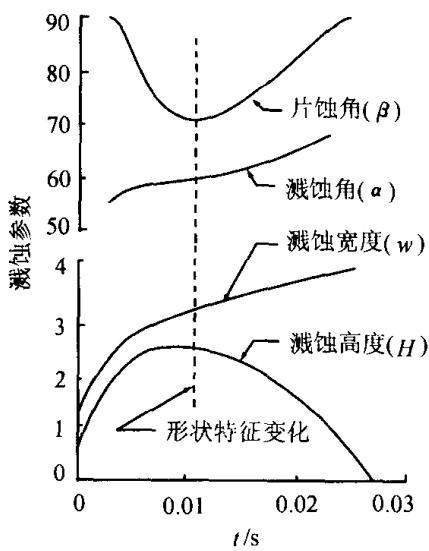  
图 3-1 溅蚀参数随打击时间变化

## 1. 雨滴动能和溅蚀量

雨滴动能是根据雨滴大小和雨滴降落速度进行间接计算获得[19,22]。20世纪40年代埃利森(W.D.Ellison)研究得出[23]，雨滴打击地表的溅蚀过程为1/70s，因雨滴打击发生土粒的位移，决定于雨滴动能、地面坡度和土壤抗剪强度。埃利森首先创制了测定溅蚀量的溅蚀杯。在此基础上摩尔根(R.C.Morgan)等[24,25]改进设计的双环溅蚀盘已成为测定溅蚀量的通用方法。美国的勃兰福德(J.M.Bradford)[26]提出了单个雨滴溅蚀量(S)与雨滴动能(E)及土壤抗剪强度(r)的关系式为

$$
S = 0 . 3 6 + 0 . 0 0 7 E / r\tag{3-1}
$$

## 2. 表土结皮与溅蚀

我国学者江忠善等的研究表明[21,27]，当坡度一定时，黄土地表结皮硬度（H，$\mathtt { k g / c m ^ { 2 } } )$ 随着降雨动能 $\mathbf { \Xi } ( E , \mathbf { J } / \mathbf { m } ^ { 2 } )$ 的增大而递增，其关系式为

$$
H ~ = ~ a E ^ { b }\tag{3-2}
$$

式中，a、b为待定系数和指数，表土结皮硬度与降雨动能呈非线性关系。

山西离石黄土表土结皮强度和溅蚀试验研究[28]反映了表土结皮的形成，使溅蚀分散量减少15%\~65%，此时土壤表面抗剪强度增加达11倍。随着表土结皮层的发育，导致土壤入渗能力减小，坡面径流增大，土壤侵蚀外营力由降雨侵蚀力转为降雨径流侵蚀力，同时地表径流在经受雨滴打击情况下，由层流变成紊流，加大了径流侵蚀力，雨滴侵蚀转向面蚀。

## 3. 降雨侵蚀力与溅蚀

降雨侵蚀力是雨滴动能和雨强两个特征值的乘积。美国学者魏斯奇迈尔(W．H.Wischmeier)等提出以雨滴动能(E)与最大 30min 雨强 $( I _ { 3 0 } )$ 的乘积( $E I _ { 3 0 } )$ 作为降雨侵蚀力指标[29]。窦葆璋等通过滤纸色斑法测定雨滴的大小，再应用修正的沙玉清公式和修正的牛顿公式，求得已知雨滴直径的降落速度以确定降雨侵蚀力[22]。据周佩华等测定[30]，在黄土区坡度为7%\~9%，降雨强度为0.87\~1.58mm/min情况下，雨滴侵蚀量达100\~$6 6 8 . 3 \mathrm { { t } } / \mathrm { { k m } } ^ { 2 }$ 。他们又用黄土进行了裸露土壤小区和同样小区覆盖沙网消除雨滴动能两种处理的对比试验，结果表明覆盖沙网小区的土壤流失量仅为裸露土壤小区的5%以下。据此，增加地面覆盖将能有效地削减或消除雨滴侵蚀。

$$
r = \lambda \sharp ^ { \mathrm { \tiny ~ \sharp ~ } } \sharp ^ { \mathrm { \tiny ~ \sharp ~ } } \sharp ^ { \mathrm { \tiny ~ \sharp ~ } , 1 6 }
$$

随着雨滴溅蚀及地表径流的产生，土壤颗粒被薄层水流均匀剥离和搬运的现象称为片蚀，土壤的流失以悬移方式为主，一般发生在坡度小于3°的缓坡耕地。

在某些稀疏的次生林地或荒坡草地，地面植被覆盖极差，加之不合理的放牧造成牲畜的过度践踏，在雨滴侵蚀和不连续薄层径流作用下，形成了斑块状的侵蚀，称为鳞片状侵蚀。

如果耕地和林草地上发生的片蚀继续发展，尤其遇暴雨冲击情况下，坡耕地片蚀过程很快由细沟侵蚀所代替，牧荒坡的鳞片状侵蚀也可演变成浅穴状或细沟状侵蚀。

## (三)细沟侵蚀

细沟侵蚀系指坡面薄层水流当汇集成线形小股水流对地面冲刷而形成的细小沟状侵蚀。细沟是发生在坡耕地上的初始沟，其纵剖面与斜坡一致，细沟横断面呈“U”形，深度不超过耕层，犁耕后可消灭其痕迹，故归为面蚀。细沟侵蚀是我国坡耕地上最常见的侵蚀类型，在黄土区、黑土区、紫色土区及南方的黄壤、红壤区，细沟侵蚀的发生发展规律基本类同，其专门的研究报道主要在黄土 $\bigstar ^ { ( 5 , 3 1 \sim 3 4 ] }$

## 1. 细沟的发育

据黄土丘陵区野外观和人工降雨试验[32.35,36]，坡面上降雨产流后，由于地面粗糙度和土壤抗侵蚀力不可能绝对的均匀性，地面开始出现微形小坑等微地貌差异。随着连续降雨径流的作用，水流剪切力超过土壤抗剪强度时，微形小坑成为侵蚀发展的突破口，起始形成集流小跌穴，此即细沟的雏形沟头。依溯源侵蚀规律，沟头向前推进，沟床下切，沟岸扩展，沟身延长，片蚀和小穴坑向线状侵蚀发展，径流愈益汇集成股状水流，流速增强，细沟侵蚀愈益发展。在同一坡面上可发育数条平行的细沟，称为栅状细沟，多见于直形坡；也可发生相邻细沟并吞而形成有主细沟发育类似树枝形细沟网，多见于凹形坡。据野外调查量测，细沟横断面呈槽形，一般宽5\~25cm，最宽不超过30cm(表3-11)，细沟深5\~15cm，最深不超过耕层20cm(表3-12)；细沟间距的分布以15\~95cm居多(表3-13)。综合当年降雨情况下，坡耕地细沟侵蚀的发育特征，平均宽、深、间距分别为12.6cm、7.9cm、87.4cm。

表3-11 黄土高原细沟的宽度分布
<table><tr><td>宽度/cm</td><td>0~5</td><td>5~10</td><td>10~15</td><td>15~20</td><td>20~25</td><td>25~30</td><td>&gt;30</td></tr><tr><td>出现细沟数/条</td><td>16</td><td>51</td><td>43</td><td>24</td><td>16</td><td>3</td><td>7</td></tr><tr><td>比例/%</td><td>10.0</td><td>31.8</td><td>26.9</td><td>15.0</td><td>10.0</td><td>1.9</td><td>4.4</td></tr></table>

表 3-12 黄土高原细沟的深度分布
<table><tr><td>深度/cm</td><td>2~5</td><td>5~10</td><td>10~15</td><td>15~20</td><td>20~25</td><td>25~30</td></tr><tr><td>出现细沟数/条</td><td>39</td><td>77</td><td>27</td><td>14</td><td>1</td><td>1</td></tr><tr><td>比例/%</td><td>24.5</td><td>48.5</td><td>17.0</td><td>8.8</td><td>06</td><td>0.6</td></tr></table>

表 3-13 黄土高原细沟的间距分布
<table><tr><td>间距/cm</td><td>15~35</td><td>35~55</td><td>55~75</td><td>75~95</td><td>95~115</td><td>115~135</td><td>135~155</td><td>&gt; 155</td></tr><tr><td>出现细沟数/条</td><td>22</td><td>41</td><td>27</td><td>21</td><td>10</td><td>10</td><td>5</td><td>17</td></tr><tr><td>比例/%</td><td>14.4</td><td>26.8</td><td>17.6</td><td>13.7</td><td>6.5</td><td>6.5</td><td>3.3</td><td>11.2</td></tr></table>

## 2. 细沟侵蚀的影响因素和细沟侵蚀量

野外调查和人工降雨试验研究表明，坡耕地上细沟侵蚀的强度受坡度的影响比较明显。朱显谟的研究表明，细沟的下切深度和宽度随坡度的增大而加大，而坡长的影响则不明显(图3-2)[5]。

1982年杏子河流城的调查研究表明，大于25°的陡坡耕地的细沟侵蚀量多达2万 $\scriptstyle { \mathsf { t h m } } ^ { 2 }$

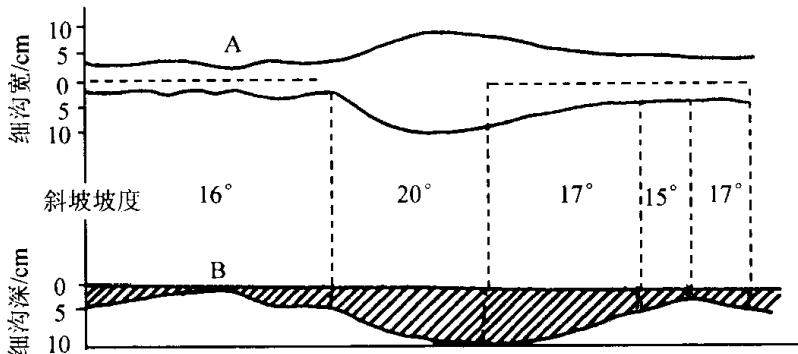  
图3-2隆德城西黄土梁坡坡度与细沟宽、深关系  
A. 细沟平面；B. 细沟下切深;0. 细沟起点

以上，其中位于大于 $3 5 ^ { \circ } { \mathrm { ; } }$ 谷坡耕地的细沟侵蚀量可达5万 $\scriptstyle { t k m ^ { 2 } }$ 以上[31,33]。人工降雨试验研究(表3-14)表明，随坡度加大，细沟侵蚀量呈明显增长趋势，其中 $2 0 ^ { \circ } .$ 为转折点。坡度(J)与细沟侵蚀量 $( G _ { \mathfrak { r } } )$ 的相关方程为

$$
G _ { \mathrm { r } } = 0 . 0 1 8 J ^ { 2 . 1 3 8 } r = 0 . 9 9 8\tag{3-3}
$$

经测量，细沟侵蚀量可占总侵蚀量的50%\~90%[35]。

表3-14 坡度与细沟侵蚀量人工降雨试验
<table><tr><td>坡度/(°)</td><td>径流发生时间/s</td><td>细沟侵蚀量/(kg/m²)</td><td>对比值</td></tr><tr><td>5</td><td>140</td><td>0.498</td><td>1.0</td></tr><tr><td>10</td><td>140</td><td>1.647</td><td>3.3</td></tr><tr><td>20</td><td>100</td><td>7.519</td><td>15.1</td></tr><tr><td>25</td><td>65</td><td>12.043</td><td>24.2</td></tr></table>

注：总降雨量 50mm，雨强为2mm/min左右。

黄土高原斜坡的坡形复杂，有直形、凸形和凹形之分，尤其随坡长而发生变化，因此坡形对细沟侵蚀的影响较坡长明显。据野外调查资料，不同坡形的细沟侵蚀量为凹形坡>直形坡>凸形坡；凹形坡的细沟呈树枝形分布，细沟侵蚀量可为直形坡和凸形坡的1\~3倍[35,36]。在同样的坡度、坡长、坡形和降雨情况下，荒坡草地或乔灌林地一般不发生细沟侵蚀，仅发生鳞片状侵蚀。

## 二、沟蚀和洞穴侵蚀

(一)浅沟侵蚀

浅沟侵蚀是坡耕地上形成发展的特殊侵蚀类型，多见于黄土丘陵区；在具有厚层紫色土和第四纪红黏土风化物地区也有发育。浅沟主要是人为不合理耕垦陡坡耕地逐步发育形成，它又是现代沟谷侵蚀发展的主要缘由。浅沟侵蚀发生发展规律的研究报道多见

于黄土高原地区[2,5,31,34,37,38]，未见国外这方面的研究报道。

## 1. 浅沟与浅沟侵蚀

浅沟为黄土高原梁昴坡上广为分布的一种沟状微地貌类型，尤其在大于15°的陡坡耕地较为发育。浅沟的横断面呈弧形，无明显的沟缘，沟床较宽平；纵断面与斜坡方向一致，形成纵向的浅洼地，全坡面呈现凸凹起伏的类似瓦背状微地貌16]。

浅沟一般由细沟发展演化而成。当细沟侵蚀下切深度超过耕层而切人犁底层后，耕作后地面留下顺坡浅槽形沟状痕迹，即为浅沟的初始阶段。当暴雨发生时，坡面径流沿浅沟槽汇集而形成强大冲刷力的股流，即发生沟床下切，沟岸扩展和沟头延伸的浅沟侵蚀。雨后在此浅沟侵蚀的基础上，经犁耕平复下切的沟床，浅沟横断面与沟床呈弧形扩展，可继续耕作但又为下一次浅沟侵蚀的发展创造了条件。因此，浅沟是上述侵蚀过程逐步形成的。浅沟的存在又促进浅沟侵蚀的发展；浅沟侵蚀又促进浅沟的发展演化，如此循环不已，直至浅沟发展为切沟，直接阻碍耕作而不得不弃耕。浅沟的沟尾往往是切沟发展的沟头，形成了坡面与沟谷的自然分界线，即沟缘线，或称谷缘线。因此，浅沟侵蚀是黄土高原现代沟谷侵蚀发生发展的重要根源[31,37,38]。

## 2. 浅沟侵蚀的影响因素和浅沟侵蚀量

据野外的考察研究，梁昴状的黄土丘陵沟壑区浅沟侵蚀最为活跃。该地区梁昴坡面坡度陡峻，垦殖指数高，浅沟分布密度大，反映了浅沟侵蚀强度大。浅沟侵蚀的发生发展又受坡度、坡长及汇水面积等因素的影响，现以黄土丘陵沟壑区的观测研究作简述[32,37]。

## 1）浅沟侵蚀的影响因素和特征值

延河支流的杏子河流域为典型的梁昴状黄土丘陵区，大于12°的坡面占总坡面的90%，其中大于25°的斜坡占50%左右，坡耕地占总耕地的90%左右。该区域浅沟侵蚀极为活跃，多见于 $1 5 ^ { \circ } \sim 3 0 ^ { \circ }$ 的陡坡耕地，尤以20°\~30°的坡耕地分布密度最大，多集中在斜坡的中下部，发生浅沟的部位可占沟间地总面积的70%\~90%[33]。据该区域的典型调查研究，浅沟的发育受临界坡度、临界坡长和临界汇水面积等综合因子的影响，其各个因子的数量指标，即反映了浅沟侵蚀规律的特征值[38]。

## 2）发生浅沟侵蚀的临界坡度

发生浅沟侵蚀的临界坡度系指坡面上出现浅沟的坡度转折点。据田间量测和统计分析，起始浅沟发生的部位集中在 $1 5 ^ { \circ } \sim 2 0 ^ { \circ }$ ,平均值为18.2°(表3-15)，此即发生浅沟的临界坡度。发生浅沟侵蚀频率最高的坡度为 $2 2 ^ { \circ } \sim 3 1 ^ { \circ }$ ,平均为 $2 6 ^ { \circ }$ ,出现频率75%(表3-16)。

表 3-15 发生浅沟侵蚀的临界坡度
<table><tr><td>临界坡度/(°)</td><td>&lt; 15</td><td>15~18</td><td>18~20</td><td>&gt; 20</td></tr><tr><td>出现条数/条</td><td>5</td><td>18</td><td>40</td><td>9</td></tr><tr><td>区间平均坡度/(°)</td><td>14</td><td>16.5</td><td>18.7</td><td>21.3</td></tr><tr><td>比例/%</td><td>6.94</td><td>25.00</td><td>55.60</td><td>12.46</td></tr></table>

表3-16 发生浅沟侵蚀的坡度频率
<table><tr><td>坡度分级/(°)</td><td>18~22</td><td>22~25</td><td>25~28</td><td>28~31</td><td>&gt;31</td></tr><tr><td>统计次数</td><td>15</td><td>23</td><td>28</td><td>23</td><td>10</td></tr><tr><td>比例/%</td><td>15.15</td><td>23.22</td><td>28.26</td><td>24.0</td><td>10.1</td></tr></table>

## 3）发生浅沟侵蚀的临界坡长和临界汇水面积

发生浅沟侵蚀的临界坡长是指浅沟沟头至分水岭的距离。由图3-3可看出，出现浅沟的临界坡长为20\~70m，平均为40m左右。发生浅沟侵蚀的临界汇水面积即临界坡长与浅沟集流面平均宽度的乘积，由图3-4可看出临界汇水面积 $3 0 0 \sim 1 ~ 2 0 0 \mathrm { m } ^ { 2 }$ ，以 $4 0 0 \sim 8 0 0 \mathrm { m } ^ { 2 }$ 居多，平均为 $6 5 7 . 2 \mathrm { m } ^ { 2 }$ 0

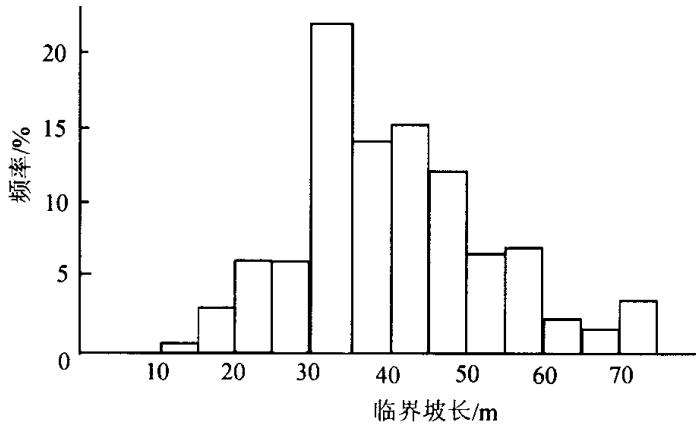

图 3-3 发生浅沟侵蚀临界坡长  
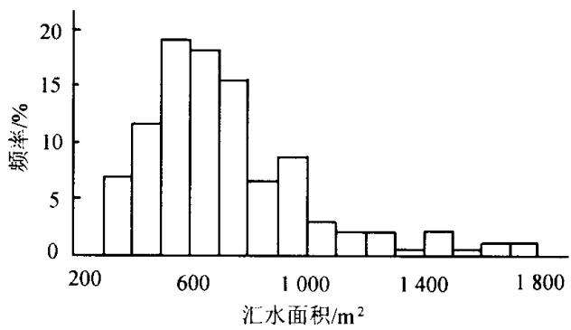  
图3-4 发生浅沟侵蚀的汇水面积

浅沟的分布密度以分布间距表示，是指两条平行浅沟沟底之间的距离。调查资料统计表明(表3-17)，浅沟间距由数米到30m，其中以15\~20m居多，平均为16.2m。浅沟的平均密度为 $2 9 . 7 7 \mathrm { k m } / \mathrm { k m } ^ { 2 }$

表 3-17 浅沟间距统计分析
<table><tr><td>分布间距/m</td><td>&lt; 10</td><td>10~15</td><td>15~20</td><td>20~25</td><td>25~30</td><td>&gt; 30</td></tr><tr><td>统计次数</td><td>7</td><td>64</td><td>107</td><td>15</td><td>6</td><td>1</td></tr><tr><td>比例/%</td><td>3.5</td><td>32</td><td>53.5</td><td>7.5</td><td>3</td><td>0.5</td></tr></table>

分析坡度(J)与浅沟侵蚀发生的临界坡长 $\left( { { X } _ { \mathfrak { t } } } \right)$ 、临界汇水面积 $( S _ { \mathrm { t } } )$ 以及浅沟分布间距 $D _ { \mathrm { t } } )$ 的关系，按二次曲线进行分析，得到以下方程式：

$$
~ ( D _ { \mathrm { t } } ) ~ = ~ 7 9 . 6 3 ~ { - 4 . 8 J + 0 . 0 9 J ^ { 2 } } ~ r ~ = { 0 . 9 1 9 } ~ 1\tag{3-4}
$$

$$
X _ { \mathrm { t } } = 1 6 9 . 7 - 9 . 9 8 J + 0 . 1 8 7 J ^ { 2 } r = 0 . 9 0 5 0\tag{3-5}
$$

$$
S _ { \mathrm { t } } = 2 ~ 9 7 4 - 1 7 5 . 3 8 J + 3 . 4 4 J ^ { 2 } r = 0 . 9 9 8\tag{3-6}
$$

对上述三个关系求极值，当平均坡度为26°时，浅沟侵蚀的分布间距、临界坡长和临界汇水面积值为极小，即坡度为 $2 6 ^ { \circ }$ 情况下，最易发生浅沟侵蚀。

通过浅沟分布密度和各个浅沟在当年降雨侵蚀后沟槽扩展的体积，可计算浅沟侵蚀量和浅沟侵蚀强度。据野外调查研究和定位观测，浅沟侵蚀量可占坡面总侵蚀量的30%\~80%;坡面上一旦发生浅沟侵蚀，侵蚀量可增长1\~3倍。浅沟侵蚀的发展导致切沟的出现，切沟的溯源侵蚀，不断蚕蚀坡面，土地资源因遭彻底破坏而不得不弃耕。

以上研究表明，陡坡开垦，尤其是开垦大于25°的陡坡，是导致浅沟侵蚀发生发展的主要原因；浅沟侵蚀又是造成坡面侵蚀量剧增和现代沟谷侵蚀发展的主导因素。强化浅沟侵蚀的治理，尤其是加速浅沟侵蚀区的退耕还林还草；在有条件的地区，如果以发生浅沟的临界坡度 $1 5 ^ { \circ } \sim 2 0 ^ { \circ }$ 作为退耕的上限坡度，将对控制水土流失和加快生态环境建设取得突破性进展。

阮伏水等研究了福建省花岗岩风化壳坡面上发育的浅沟侵蚀发现，该类浅沟主要发生在植被遭受破坏的林地，或覆盖率小于10%的幼林地，多为 $1 5 ^ { \circ } \sim 3 5 ^ { \circ }$ 的陡坡地；发生浅沟的坡面，侵蚀量可占总侵蚀量的54.54%[39]。

## （二）切沟、悬沟和冲沟侵蚀[4,5,9,16]

## 1. 切沟侵蚀

未经治理的细沟、浅沟、集流洼地、排水沟、道路或人畜活动留下的沟槽，在径流或集流冲刷下，沟床切入母质层或风化物底层，形成具有明显的沟头、沟缘、沟壁(坡)、沟底(床)和沟口的沟谷，即为切沟。发生在丘陵斜坡上的切沟多由浅沟侵蚀演化发展而成，其纵断面与斜坡尚保持一致，横断面已不能通过犁耕，沟床下切至少达1m以上，最深达数十米。切沟侵蚀的特点是沟头部分有一定高度的跌水，造成集流水对沟床的强力冲刷下切，沟岸坍塌扩展和沟头迅速向前推进，不断切割蚕食完整的坡面和耕地，形成了沟谷密布、支离破碎的侵蚀地貌。切沟侵蚀不仅破坏了土地资源，而且因沟谷侵蚀的加剧，大大增加了入河的泥沙。

据固原县1957年与1969年两期航片对比量测17条切沟的侵蚀发展情况，年平均沟头前进5.32m，其中王洼李寨科切沟年均沟头前进10m，草庙的赵新庄切沟年均沟头前进15.7m。仅此沟头前进的侵蚀就相当于年均损失耕地 $0 . 0 6 7 \sim 0 . 1 \mathrm { h m } ^ { 2 }$

## 2. 悬沟侵蚀

悬沟侵蚀是发生在陡峻谷坡上的切沟侵蚀，当丘陵坡面径流汇集到谷缘遇直立形沟

坡时，汇流骤然呈垂直下泻式冲刷陡壁而形成直立式的切沟侵蚀，称为悬沟侵蚀。此类侵蚀多发生在黄土区由垂直节理性较强的老黄土或古土壤组成的谷坡，悬沟底部因强力水流冲刷，常形成漏斗状或串珠状洞穴，洞穴侵蚀又促进悬沟侵蚀。

## 3. 冲沟侵蚀

冲沟一般由切沟侵蚀发展而来，其主要特点是沟床纵断面与所在坡面不一致，其规模已远大于切沟，宽深由数米至数十米，甚至百米以上。已切割分水岭的冲沟，发展形成处于沟间地的沟谷地，其沟谷长度可达数千米以上，其流域范围已形成沟道水路网系统，称为沟道小流域。

冲沟的发育可分为幼年期、中年期和老年期三个阶段。幼年期冲沟一般直接由坡面切沟发展而来，规模较小，横剖面呈“V”形，沟床与所在坡面不一致，多跌水，下切、侧蚀、溯源侵蚀比较强烈。中年期冲沟横剖面呈宽“V”形，纵剖面上部较陡，同幼年期下切和溯源侵蚀活跃，沟床下部呈弧形，以侧蚀为主，下切减缓。老年期冲沟除上游沟头部分溯源和下切侵蚀强烈外，中、下游沟床下切渐趋稳定，接近侵蚀基准面，纵比降减小。甘枝茂的调查研究表明，陕北、晋西的黄土丘陵沟壑区中年期冲沟比例较大，陇中、宁南的冲沟处于初期阶段较多。

切沟与冲沟侵蚀的发展，致使地面被切割成千沟万壑的破碎地貌，平均沟谷密度可达4\~6km/km²。其中有的是在古侵蚀地貌基础上演化发展而成，也有在现代坡面浅沟侵蚀基础上演化发展而成，尤其是后者应作为防治的重点。南方地区的崩岗侵蚀和泥石流的发生多与沟谷的水力侵蚀密切相关；黄土区的崩塌、滑坡等重力侵蚀也与沟谷侵蚀伴随发生发展。有关坡面侵蚀与沟谷侵蚀的发生发展及其演变规律将在第四章作专门讨论。

## (三)洞穴侵蚀

洞穴侵蚀为水蚀的一种特殊类型[12]；是地面径流或水流沿与土体垂直的裂隙、根孔、动物穴下渗时，发生水力潜蚀、冲刷、淘蚀等作用而形成各种各样的洞穴过程。洞穴侵蚀在美国中西部、新西兰等地可见到，而在中国的黄土高原分布最为广泛。洞穴侵蚀多发生在丘陵斜坡向谷坡过渡的边缘，或发生在切沟沟头跌水的下方。

## 1. 洞穴侵蚀的类型和成因

朱显谟对黄土区的洞穴侵蚀划分为水刷窝、跌穴和陷穴三类[6]。美国的洞穴侵蚀多发生在沟头部位，似漏斗状，称为漏斗穴状侵蚀[40]。王斌科等[16,41]通过对黄土高原较系统的野外调查研究，在前人基础上，就洞穴侵蚀发生的地形部位和形态上的差异作了进一步分类。

(1)水刷窝。水刷窝是洞穴侵蚀的一种过渡形态，常见于沟头、陡岸、沟谷陡壁、地坎和各种跌水面，由于地面集流冲蚀淘蚀以上各种部位而形成内凹半圆形的冲刷窝。它是沟头溯源侵蚀的主要方式，在水刷窝的下部即发展成跌穴。

(2)跌穴。跌穴可出现在沟头水刷窝下部，也可出现在沟床及其他陡崖下部，主要因大股集中水流强烈冲刷而形成竖井状或漏斗状圆形洞穴，直径2\~8m，深可由数米至10m余。切沟沟床的跌穴十分发育，出现在沟床的跌穴，在穴底如果沿沟床坡降出现横向穴道或出水口，易形成串珠状群体洞穴和地下泄水道。切沟部位跌穴和串珠洞穴的发育，大大加速了沟床下切和沟岸扩展。梁峁坡面陡坡耕地上发育的浅沟，其沟口的陡壁往往是坡面径流汇集形成跌水的源地，也是形成发育水刷窝和跌穴的重要因素；黄土的垂直节理性又为集流和跌水下泄入渗的冲刷和淘蚀创造了条件，加剧了洞穴侵蚀的发育。

(3)陷穴。陷穴多出现在地形相对平缓又有缓慢汇流相对低洼部位，如塬畔、台地和阶地地的边缘，以及相对平缓的谷缘。在这些部位的土层植物根孔、动物穴及垂直裂隙都比较发育，能容纳大量的汇流入渗，同时随下渗水流的增多，流水冲刷作用相应增强，待下渗水流达弱透水层时，发生侧渗和侧蚀作用，由于靠近崖壁、塬畔，冲蚀形成地下穴道的出水口，其穴道上部遭下渗水流冲蚀的土体全部塌落而形成洞穴，这类洞穴称为陷穴。其形状呈圆形竖井状、漏斗状、盆状、碟状，直径1\~5m，深由数米达20m余。在发育浅沟的斜坡上修建的梯田，原浅沟沟床多为填土部位，填土与浅沟沟底形成了不整合土层，在梯田地埂边缘易遭径流冲刷、并易发育形成陷穴。

## 2. 洞穴侵蚀的演化及其危害

深厚的黄土层为洞穴侵蚀发育的基础，其原因不仅在于土层的深厚，而是黄土的垂直节理性和黄土剖面结构性状的不均匀性，影响洞穴的发育。黄土的垂直节理性使土体易遭水力冲蚀而崩落、塌陷；经受不同沉积速率和不同土壤发育阶段的巨厚黄土剖面，呈现了土壤抗冲抗蚀性能及系列物理力学和物理化学性能的差异；透水层、弱透水层和不透水层的差异；加之人为不合理的土地利用所引发的面蚀、沟蚀等综合影响，致使洞穴侵蚀在黄土丘陵区特别发育，成为特殊的侵蚀地貌景观。

水刷窝多发生在沟头的悬崖陡壁，是促使沟头前进的主要方式；沿沟头陡壁下泄跌水沟头前进的下方，促使跌穴的形成和沟床下切，尤其在切沟或悬沟沟床的跌穴可形成串珠状洞穴群体。随着集水面积的扩大和跌水高度的增高，跌穴侵蚀愈益发育，切沟侵蚀发展愈益强烈。

跌穴和陷穴分布的地形部位受坡度的影响较大(图3-5)。跌穴主要发育于直形坡、浅沟或陡崖的下方、切沟和悬沟的沟床，坡度以35°\~45°居多。陷穴多发育于地形较缓的低洼部位，靠近塬畔、谷缘及阶地、梯田的边缘，坡度多在10°以下。跌穴和陷穴有时也可成群体发育，包括串洞形成的地下通道和天然桥(图3-6)。

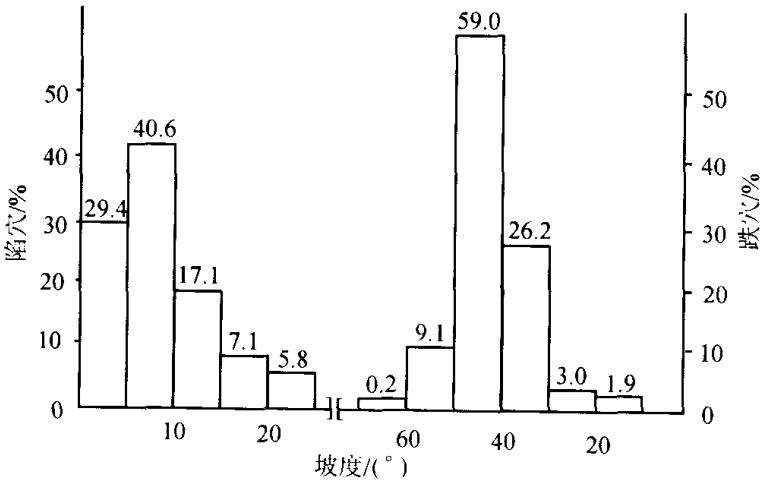  
图3-5 不同坡度部位的洞穴发育频率统计

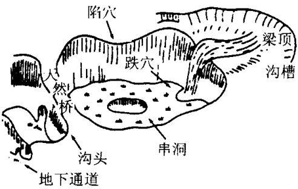  
图 3-6 沟头洞穴群体发育示意图

洞穴侵蚀的发展演化，必然导致沟蚀的加剧。例如，在陕西安塞县约1km²的沟道小流域内，80%的切沟沟床都发育跌穴和串珠状洞穴，总计约100多个，直径2\~10m，跌水高度由数米至30m。据澳大利亚学者的研究[40]，发生洞穴侵蚀的沟谷，沟头前进年均2.5m；不发生洞穴侵蚀情况下，沟头前进年均小于0.5m。据调查[41]，甘肃宁县马槽沟在一次暴雨中，因沟头上部出现洞穴和地下穴道，沟头一次向前推进了约40m。甘肃武山县一次暴雨后，在19.2hm²的水平梯田上形成陷穴193个，不仅毁坏了梯田，且陷穴侵蚀造成的侵蚀量达6300t/km²。此外，因洞穴侵蚀造成道路冲毁、居民窑洞塌陷的现象时有发生，甚至造成交通中断和人员伤亡。

控制坡面径流，加强沟头防护和治沟措施，提高修建梯田和道路的工程质量等，均可有效地防治洞穴侵蚀。

## 第三节风力侵蚀

土壤风蚀是运动的空气流与地表上的颗粒在界面上相互作用的一种动力过程。它包括将地表砂粒、岩屑、土壤物质吹起及搬运的吹蚀过程，以及风沙流对地表物的冲击及摩擦的磨蚀过程。本节在论述风力侵蚀类型时，结合讨论了影响风蚀的自然因素和人为因素[14,15]。

## 一、风力侵蚀与风沙运动

（一）砂粒的起动

关于土壤风蚀机理首先应研究砂粒受风力起动的机制，很多学者进行了研究，尚无一致的见解。刘贤万把目前提出的种种假说归结为压差起动说、风压起动说、冲击起动说、振动起动说、猝发起动说、斜面飞升说和湍流起动说七种[42]。无论什么原理导致砂粒开始起动，从静止状态进入运动状态，总之，气流作用于单颗砂粒的力主要有迎面阻力或拖曳力、上升力、冲击力和砂粒的重力[48]。

在风力作用下砂粒脱离地表进入气流的微观运动过程及其物理机制是相当复杂的。当平均风速约等于某一临界值时，个别突出的砂粒受湍流流速和压力脉动的影响，开始振动或前后摆动，但并不离开原来位置；当风速增大超过临界值之后，振动也随之加强，迎面阻力(拖曳力)和上升力相应增大，并足以克服重力的作用。

使地表砂粒开始脱离静止状态而进入运动的临界风速称为起动风速。一切超过起动风速的风，谓之起动风。关于砂粒的起动风速，拜格诺(R.A.Bagnold)提出了流动起动(fluid threshold)值和冲击起动(impact threshold)值的概念。所谓流动起动值，是指砂粒的运动完全出于风对沙面砂粒的直接推动作用，使砂粒开始起动的临界风速；若砂粒的运动主要是由于跃移砂粒的冲击作用，其起动的临界风速则称为冲击起动值。

## （二）砂粒运动的形式

一般把单体沙(土)颗粒运动的方式分为悬移、跃移和表层蠕移三种基本形式[14\~16]。

## 1. 悬移

砂土颗粒保持一定时间悬浮于空气中而不同地面接触，并以与气流相同的速度向前运动，称为悬移。呈悬移运动的砂土颗粒定义为悬移质。风砂土悬浮气流的向上脉动分速必须超过其沉降速度。一般说来，粒径小于0.1mm的砂粒在气流中的运动接近悬移状态。自由粒径小于0.05mm的粉砂和黏土颗粒，由于它们的体积细小，质量轻微，在空气中的自由沉速很小，一旦被风扬起则不易沉落，能够随气流悬移很长距离，有的甚至漂洋过海，运送到千里之外。例如，1934年美国发生黑风暴，约3亿t尘土运移了2400km的距离[44]。

## 2. 跃移

砂粒在受风力上扬作用脱离地表进入气流以后，就从气流中不断取得动量加速前进，并在砂粒自身重量作用下，以相对于水平线一个很小的锐角迅速下落。由于空气的密度比砂粒的密度要小得多，砂粒在运动过程中受到阻力较小，在落到沙面时仍然具有相当大的动量。因此，不但下落的砂粒本身有可能反弹起来，继续跳跃前进，并且由于它的冲击作用，还能使下落点周围的一部分砂粒飞溅起来进入跳跃，引起一连串连锁反应。砂粒如此作连续跳跃形式的运动，称为跃移。作跃移运动的风砂土颗粒粒径通常为0.1\~0.15mm。

## 3. 表层蠕移

砂粒沿地表面滚动或滑动，称为表层蠕移。作蠕移运动的砂颗粒叫做蠕移质。砂粒的表层蠕移和跃移的差别是渐变的，它们之间很难划一条确定的分界线。

沙面砂粒可以在风力的直接作用下发生蠕动。但是，因风压所不能直接移动的粗砂粒，主要靠比它们细得多的跃移砂粒的冲击作用获得能量，被推动向前蠕动。实验证明，以高速运动的砂粒，通过冲击方式，可以推动6倍于它的直径，或200倍于它的重量的粗砂粒。凡是粒径0.5\~2.0mm的砂粒，一般均属于表层蠕动的范畴。

在风沙运动中，以跃移运动为主要形式。气流搬运的砂粒总量中，跃移质约占3/4，蠕移质的约占1/4(表3-18)，悬移质的数量微乎其微，这也是风沙流和泥沙流的主要差别之一。

表3-18 不同风速下气流中跃移搬运和蠕移搬运的沙量[43]
<table><tr><td rowspan="2">风速(2m高处)/(m/s)</td><td rowspan="2">总输沙量/(g/min)</td><td colspan="2">蠕移</td><td colspan="2">跃移</td></tr><tr><td>沙量/(g/min)</td><td>百分比/%</td><td>沙量/(g/min)</td><td>百分比/%</td></tr><tr><td>5.0</td><td>0.78</td><td>0.24</td><td>31</td><td>0.54</td><td>69</td></tr><tr><td>6.0</td><td>1.39</td><td>0.31</td><td>22</td><td>1.08</td><td>78</td></tr><tr><td>7.0</td><td>2.83</td><td>0.59</td><td>23</td><td>1.94</td><td>77</td></tr><tr><td>8.0</td><td>4.05</td><td>0.82</td><td>20</td><td>3.23</td><td>80</td></tr><tr><td>9.0</td><td>6.19</td><td>1.15</td><td>19</td><td>5.04</td><td>81</td></tr><tr><td>10.0</td><td>9.42</td><td>1.86</td><td>19</td><td>7.56</td><td>81</td></tr><tr><td>平均</td><td>一</td><td>一</td><td>22</td><td>一</td><td>78</td></tr></table>

## 二、风力侵蚀类型

流体(包括水流和风)根据其运动学和动力学特性，存在两种基本的流态：一是平滑的成层的流动，所谓层流；二是无规则的或者有旋涡形式的运动，所谓湍流(或紊流、乱流)。一般出现风沙运动的都是湍流，层流只是在风速极端微弱时出现。

风和风沙对地表物质的风蚀作用分吹蚀和磨蚀两种侵蚀类型[14,15]。

## (一)吹 蚀

风吹经地表时，由于风的动压力作用，将地表的松散沉积物或基岩上的风化产物(沙物质)吹走，使地面遭到破坏，称为吹蚀作用。

## （二）磨

风挟带沙子贴地面运动时，风沙流中的砂粒可对地表物质进行冲击、摩擦，如果地表有裂隙等凹进之处，风沙甚至可以钻进去进行旋磨，风沙流的侵蚀作用称为磨蚀作用。磨蚀作用是风蚀过程的一个重要方面。磨蚀的强度取决于物质结构单元的机械稳定性(或者说抵抗机械力破坏的能力)，1995年切培尔(W. S. Chepil)得出这样的磨蚀方程式

$$
A ~ = ~ \mathbb { W } _ { \mathrm { r } } \bigg ( \frac { 2 5 } { u } \bigg ) ^ { 2 }\tag{3-7}
$$

式中，A为磨蚀系数；W为风速为μ的风吹刮作用下，单位重量的试件被磨损的土壤重 $W _ { \tau }$

量(g)；u为风速，以 mi/h计 $( 1 \mathbf { m } \mathbf { i } = 1 . 6 0 9 3 4 \mathbf { k m } )$ 0

土壤风蚀的风洞实验表明，同一风速下，风沙流与净风作用于同一种土壤引起的风蚀量差别很大，前者是后者的4\~5倍[45]。

## 三、影响风力侵蚀的因子

## （一）风速与风沙流输沙能力

一定的风速不但是砂粒获得动能进入运动状态的必要条件，风沙流的输沙能力也直接依赖其风速大小。一般输沙量随起沙风的增大呈几何级数增加(表3-18)。当有充足的沙源不断供应时，风沙流的所挟沙量与其瞬间风速决定的输沙能力平衡，这时风沙流是饱和的。因为自然界的风总是湍流(三维空间的涡动的时间上风速不稳定性)，故这种平衡是暂时的，不平衡是经常的。当挟沙量小于风的输沙能力时，风沙流处于不饱和状态，风沙流掠走地面物质(砂粒)，这就是地面的风蚀过程；当挟沙量大于风的输沙能力的瞬间，风沙流会卸载，多余的沙量沉积，产生堆积。人们在防沙治沙时已有意无意地在利用着风沙运动的这个原理。通过设置障碍，干扰风沙流，减小或加大风速，使风沙流所挟砂粒提前沉积或不停留地通过需保护的地段。

## （二）沙物质颗粒和结构

地面(沙)物质颗粒大小和结构是决定其被风蚀的另一重要因素。拜格诺(R.A.Bag-nold)根据流体在起动条件下，作用在砂粒上的迎面阻力(拖曳力)和重力的平衡，导出的砂粒开始移动的临界速度与粒径关系的表达式为

$$
u _ { \mathrm { \scriptsize ~ * ~ t ~ } } = \mathrm { \scriptsize ~ \cal { A } } \sqrt { \frac { \rho _ { \mathrm { s } } - \rho } { \rho } } g d
$$

式中， $u _ { \mathrm { ~ \star ~ t ~ . ~ } }$ 为临界摩阻速度(m/s)； $\rho _ { \mathfrak { s } }$ 为砂粒密度 $( { \bf g } / { \bf c m } ^ { 3 } )$ ；d 为砂粒的粒径(mm)；g 为重力加速度 $( \mathbf { m } / \mathbf { s } ^ { 2 } )$ ；A为经验系数。

公式表明，若设系数A是一个常数，则起动风速和砂粒粒径的平方根成正比，吴正和凌裕泉[43]在新疆布谷里沙漠地区，用染色沙进行试验观测，获得的砂粒粒径与起动风速的关系(表3-19)，与这一公式所表达的近似。起动风速最小的石英砂粒的临界粒径为0.08mm左右。对小于该粒径的石英砂粒，起沙风反而增大。极小砂粒不易起动的原因是颗粒之间微弱化学键的内聚力增加和持水力较大、地表粗糙度较小等原因造成的[46]。

砂粒在湿润情况下，能增加它的黏滞性，加强砂粒的团聚作用，因而湿砂粒的起动风速值加大(表3-20)。野外实地仔细观测可以发现，当沙(土)层含有较多的水分时，风先是吹干表层水分才蚀去表层沙(土)颗粒，这样延缓了风蚀的速率，减少了单位时间的风蚀量。

(单位：m/s)

表3-19 砂粒粒径与起动风速值(新疆莎车)
<table><tr><td>砂粒粒径/mm</td><td>起动风速  $( h = 2 \mathbf { m } ) / ( \mathbf { m } / \mathbf { s } )$ </td></tr><tr><td>0.10~0.25</td><td>4.0</td></tr><tr><td>0.25~0.50</td><td>5.6</td></tr><tr><td>0.50~1.00</td><td>6.7</td></tr><tr><td>&gt;1.00</td><td>7.1</td></tr></table>

表 3-20 砂粒含水率对起动风速的影响[43]
<table><tr><td rowspan="2">砂粒粒径/mm</td><td rowspan="2">干燥状态</td><td colspan="4">含水率/%</td></tr><tr><td>1</td><td>2</td><td>3</td><td>4</td></tr><tr><td>2.0~1.0</td><td>9.0</td><td>10.8</td><td>12.0</td><td>一</td><td>一</td></tr><tr><td>1.5~0.5</td><td>6.0</td><td>7.0</td><td>9.5</td><td>12.0</td><td>一</td></tr><tr><td>0.5~0.25</td><td>4.8</td><td>5.8</td><td>7.5</td><td>12.0</td><td>一</td></tr><tr><td>0.25~0.175</td><td>3.8</td><td>4.6</td><td>6.0</td><td>10.5</td><td>12.0</td></tr></table>

对土壤(土层)来说，其结构性则成为决定其抗御风蚀能力大小的决定因素。物理性黏粒组分高的土壤，无论是团粒结构，还是碎块状结构都是以土壤团聚体来抗御风蚀，风只能掠去表面结合不够紧密的单个颗粒。只有分选很好的砂粒才以单粒形式出现。形成土壤团聚体的基本条件是胶结物。通常，最重要的胶结物是风化过程中形成的黏粒和成土过程中所形成的腐殖质。在土地沙漠化过程中，黏粒的损失、土壤粗化和贫瘠化恰恰为土壤进一步遭受风蚀提供了前提，故土壤风蚀沙漠化是一个加速累进发展的过程。

切培尔经过多年观测和计算，把自然风干状态下的土壤颗粒、团粒或土块中，大于0.84mm的颗粒称为不可蚀因子[47]，用其含量来评价土壤在相同风力条件下的抗风蚀能力。多年的野外观测经验证明，不可蚀因子有明显的地域性。其与当地经常性的风力条件有关。如北京平原南部的不可蚀因子为大于0.8mm的颗粒[48]，内蒙古高原东南部风口地方大于1mm[49]。

## （三）下垫面性质和粗糙度

对风沙运动而言，能与大气层发生热量和水分交换，产生相互影响的表面称为下垫面或床面。下垫面性质主要为地面物质组成，如土壤、岩屑、风化壳、各种沉积物，并包括地面植被等覆盖状况。植被通过三种方式防止地面风蚀：①覆盖地面，隔离风和地面，不使其直接接触，免受风力作用；根系又能固结松散的土壤层，加大其抗风蚀能力。②分散地面以上一定高度内的风动量，从而减弱到达地表的风力作用。③拦截运动砂粒促进其沉积。

下垫面粗糙状况可以用地表粗糙度来评价。1941年拜格诺指出，对于裸露的平坦砂质地表而言，粗糙度约为地表砂粒粒径的1/30。最近董治宝的研究提出在有湍流产生时 $1 / 3 0 _ { \scriptscriptstyle \odot }$ (雷诺数大于3，一般实验和测试均在这种情况下进行)，粗糙度有随风力增大而减小的规律，并不固定为一个定值，这就是说，一般条件下，粗糙度随地面砂粒的粒径增大加大，随风速加大减小[50]。

植物对风沙活动的减弱作用，直接导致土壤风蚀量的减小。试验研究证明，随着植被覆盖度的增加，风砂土的风蚀量呈指数减少，当植被覆盖度达到30%，可以大幅度减弱风蚀；而植被覆盖度大于60%时，可以从根本上防止风沙活动的产生。

## （四）人为因素对风力侵蚀的影响

虽然风力侵蚀是风对地面作用的自然过程，但是人的活动通过改变地表性质、结构和干扰风的流场，形成湍流来促进或减缓风蚀过程。

最典型的例子是地面翻耕，破坏结构以后风蚀速率的增加。董治宝等[50,51]对人为地表结构破损与土壤风蚀关系的定量研究，得出结论：①各种地表结构破损率条件下，虽然未影响风蚀的动力学性质，但降低了原土壤的抗风蚀力。②风蚀率与地表结构破损率之间的二次幂函数关系表明，由各种形式的人类活动，尤其是土地开垦所导致的地表结构破坏具有激发和加速土壤风蚀的作用。③地表结构破坏引起的风蚀率增加过程的动态超稳定系统行为表明，风蚀与水蚀在某种程度上拥有相似的规律—“复杂响应”规律。这一规律是流体营力(流水、风)作用于地表形态演变的一种普遍规律，在草原地区，过度放牧，牲畜棚圈和饮水点附近，通过牲畜反复践踏，地面失去植被保护，地表结构同样出现“破损”。在内蒙古高原也常见居民点附近取土或挖筑路堑，干扰紧贴地面风的流场，风钻入人挖掘的坑穴或沟道，进行磨蚀，发展成为局地分布的风蚀劣地。这些研究均表明，在潜在土壤风蚀区域，尤其是广大干旱地区，根据地表结构破损程度的临界指标，适当限制人类活动，保护地表免遭破坏是防止土壤风蚀的有效途径之一。

## 第四节 重力侵蚀及其他侵蚀类型

## 一、重力侵蚀的主要类型及其影响因素

重力侵蚀(gravitational erosion)又称块体运动(mass movement)，系指坡面岩体、土体在重力作用下，失去平衡而发生位移的过程。国外学者曾进行了块体运动的系统分类(表3-21)[52]。

根据我国的具体情况，重力侵蚀主要划分为泻溜、滑坡、崩塌，以及重力为主兼水力侵蚀作用的崩岗、泥石流。

表 3-21 斜坡块体运动的分类(D.Varnes)
<table><tr><td rowspan="2">移动类型</td><td colspan="3">物质种类</td></tr><tr><td rowspan="2">基岩</td><td colspan="2">工程土</td></tr><tr><td></td><td>粗粒为主</td></tr><tr><td>崩落类</td><td>岩石崩落</td><td>碎屑崩落</td><td>细粒为主 土崩落</td></tr><tr><td>倒塌类</td><td>岩石倒塌</td><td>碎屑倒塌</td><td>土倒塌</td></tr></table>

<table><tr><td colspan="2">移动类型</td><td rowspan="2">基岩</td><td colspan="2">工程土</td></tr><tr><td></td><td></td><td>粗粒为主</td><td>细粒为主</td></tr><tr><td rowspan="3">滑动类</td><td>旋转滑动</td><td>几乎无单元体</td><td>岩石转动滑坡</td><td>碎屑转动滑坡 土转动滑坡</td></tr><tr><td></td><td>岩石块体滑坡</td><td>碎屑块体滑坡</td><td>土块体滑坡</td></tr><tr><td>平移滑动</td><td>许多单元体 岩石滑坡</td><td>碎屑滑坡</td><td>土滑坡</td></tr><tr><td colspan="2">侧向扩展类</td><td>岩石扩展</td><td>碎屑扩展</td><td>土扩展</td></tr><tr><td colspan="2">流动类</td><td>岩石流(深部蠕动)</td><td>泥石流</td><td>泥流</td></tr><tr><td colspan="2">复合移动类</td><td colspan="3">两个或两个以上主要移动类型的组合形式</td></tr></table>

## (一)泻 溜

裸露陡坡上的表层岩土，由于于湿冷热变化和冻融作用剥蚀成碎屑，碎屑在自重作用下顺坡向下的滚落现象称为泻溜。剥落碎屑的力学性质和原岩土有质的区别，类似于砂土，无凝聚力，内摩擦角37°左右。因此，泻溜一般发生在坡度大于45°的自然裸露陡坡，坡脚泻溜碎屑物质常形成坡度为37°左右的泻积坡。黏土和风化泥页岩最易发生泻溜。黄土丘陵区谷坡出露的第三纪上新世红黏土(三趾马红土)，多呈45°的裸露斜坡，泻溜现象发生频繁。暴雨时，泻溜坡的坡面上，常有泥流发生。泻溜相当于Varmes分类中的碎屑崩落和土崩落。泻溜侵蚀发生于全年，最活跃期是冬末初春解冻期、旱季、雨后天晴期，当时地表极易风化形成碎屑物质。一方面在自重作用下以泻溜形式下移；另一方面为雨季暴雨径流搬运准备了物质条件[11]。

## (二)滑坡

滑坡系指构成斜坡的岩土体在重力作用下，沿坡体内部的一个(或多个)软弱面(带)发生剪切而产生整体性下滑的现象，也即重力作用下的块体运动[11,16]。

## 1. 滑坡的分类

滑坡的类型由于分类的原则不同，其分类也多种多样，据我国滑坡分类系统的综合研究[55]归纳如下(表3-22)。

表 3-22 滑坡分类
<table><tr><td>分类依据</td><td>滑坡类型(别称)</td></tr><tr><td>滑体物质</td><td>岩层滑坡，半成岩地层滑坡，均质土滑坡，堆积土滑坡</td></tr><tr><td>滑体体积/m³</td><td>特大型(&gt;1000万)</td></tr><tr><td></td><td>大型(100万~1000万)</td></tr><tr><td></td><td>中型(10万~100万)</td></tr><tr><td rowspan="6">滑体厚度/m</td><td>小型(&lt;10万)</td></tr><tr><td>深层滑坡(&gt;50)</td></tr><tr><td>厚层滑坡(30~50)</td></tr><tr><td>中层滑坡(15~30)</td></tr><tr><td>浅层滑坡(5~15)</td></tr><tr><td>表层滑坡(&lt;5)</td></tr><tr><td>滑面成因</td><td>层面滑坡(顺层滑坡)，构造面滑坡，接触滑坡，同生面滑坡</td></tr><tr><td>滑面纵剖面形态</td><td>曲线形滑面滑坡，直线形滑面滑坡，折线性滑面滑坡</td></tr><tr><td>滑坡力学状态</td><td>牵引式滑坡(后退式)，推动式滑坡(推移式)</td></tr><tr><td>发生时代</td><td>古滑坡(人类历史以前形成的滑坡)，老滑坡(历史时期形成的滑坡)，新滑坡(现代</td></tr><tr><td>诱发因素</td><td>形成的滑坡) 暴雨滑坡，地震滑坡，融冻滑坡，液化滑坡，工程滑坡(渠道滑坡、公路滑坡、水</td></tr><tr><td>活动情况</td><td>库滑坡、矿山滑坡等) 已失稳滑移，正在变形，潜在危险滑坡</td></tr></table>

## 2. 滑坡的成因

滑坡是最常见的一种重力侵蚀类型，也是山区最常见的自然灾害之一。滑坡的形成条件主要有以下几点[53\~55]。

(1)地形。滑坡的发生需具有一定有效临空面的斜坡，即反映易发生滑坡的斜坡的坡度、坡高、坡向和坡形。通常易发生滑坡的斜坡坡度为25°\~45°，如受地震的影响，坡度为20°\~60°。发生滑坡的坡高与坡角呈负相关，据青海东部半成岩滑坡运动，当坡高大于200m时，滑程400\~800m;坡高400m时，滑程2000\~3000m。滑坡发生的几率阳坡大于阴坡，凸形坡大于直形坡和凹形坡。

(2）地质。地质构造活动强烈，地震频繁地区，多为滑坡发育集中场所；坡体内部的软弱结构面为滑坡发育的重要条件。发育滑坡的软弱结构面有：不同岩性的堆积层界面；覆盖层与岩层的界面；不同断层面、节理面、沉积边界面等。这些界面又是水文地质界面情况下最易发展为滑动面。水分渗入滑体，滑体增重，浸润滑动面，岩土强度降低，动静水压力增大，斜坡稳定性降低，利于滑坡发生。在地质时期形成的古滑坡基础上，极易发生现代滑坡。古滑坡岩土破碎，易于水分入渗，滑动后的岩土体强度急剧降低，可发生整体或局部滑坡复活。

(3)滑坡的诱发因素。诱发滑坡发生的自然因素主要是暴雨和地震[55,56]。暴雨，尤其是连续降水后的暴雨，地表水下渗和地下水的补给，往往诱发滑坡的发生。如1982年7月四川东部大暴雨诱发了3万余个滑坡。强烈的地震也往往诱发滑坡的发生，如1920年甘肃海源地震和1973年云南昭通地震震区范围内都发生了大量的滑坡。诱发滑坡发生的人为因素主要有植被破坏，不合理的沟道工程、坡地工程、渠道渗水，采石、采煤开

挖工程和地下采空等。

(4)滑坡的形成过程。滑坡的形成一般经过蠕动、滑动、剧滑三个发育阶段。不同滑坡完成以上三个阶段的时间差别很大，数天到数年不等，甚至只有几分钟。滑坡灾害有群发性、周期性和突发性。1983年3月4日17时46分发生于甘肃省东乡县洒勒山滑坡，不到1min的时间滑动体积约5 000万m3，滑动距离750m，范围约 $1 . 5 \mathrm { k m } ^ { 2 }$ ，掩埋房屋 585间，死亡237人。1991年9月云南昭通市在3min内发生1800万m的滑坡，滑动3000m，死亡216人。

一些高陡斜坡上发育的滑坡往往非常突然，具有明显的崩塌特征，成为崩塌性滑坡，崩塌性滑坡滑速可高达数十米每秒。大型高速崩塌性滑坡有时可直接转化为泥石流。如1965年云南禄劝普福沟崩塌性滑坡(4.5亿m³)，直接转化为巨大的泥石流，堵塞了金沙江[56]。

## （三）崩 塌

斜坡岩土的剪应力大于抗剪强度时，岩土在剪切破裂面上未发生明显位移，即向临空面突然倾倒、崩落岩土体碎裂、顺坡翻滚而下的现象称为崩塌。该崩塌现象相当于Varmes分类中的崩落和倒塌。按照物质组成，崩塌可分为岩质、土质和碎石土质；按照体积，可分为特大型(>1000万m³)、大型 $( 1 0 0 \mathrm { ~ \mathcal { F } ~ } \sim 1 \mathrm { ~ } 0 0 0 \mathrm { ~ \mathcal { F } ~ } \mathrm { m } ^ { 3 } )$ 、中型（10万\~100万m³)和小型 $( < 1 0 \mathcal { F } \mathrm { ~ m } ^ { 3 } )$ 。崩塌多发生于坡度大于60°的陡坡，软硬相间或裂隙发育的岩层，碎石土和垂直节理发育的黄土及黏土岩均是易于发生崩塌的岩土物质。

强烈的地震常可诱发崩塌的发生。1974年云南昭通大地震后，沿木杆河发生宽达1km的岩石大崩塌，体积达30万m³，下塌石方堆积高达10m，形如堤坝，堵塞木杆河，形成壅塞湖。台湾岛地处西太平洋地震带，造山运动活跃，地震频繁，加之暴雨、台风的影响，崩塌、滑坡、泥石流灾害频繁。黄土高原的崩塌尤为频繁。暴雨情况下，暴雨径流沿黄土垂直节理下渗和冲刷，崩塌活动极为强烈。泥页岩和砂岩互层的岩体，由于岩层的不整合和结构面风化与剪切力的差异，泥页岩碎屑剥落和砂岩岩体崩落交互促进发生频繁。人为不合理开挖山坡，破坏山坡、山脚的稳定性，常可激发崩塌。岩土体在自重作用下发生崩塌，暴雨则是重要激发因素。

## （四）泥 流

泥流系指具有明显流动特征的斜坡土体向下运移的现象，相当于Varnes分类中的缓慢运动的泥流。泥流体为富水的塑性土体，粉黏粒含量高，一般大于40%。厚度一般小于10m余，多发生在坡度10°\~20°的斜坡上。泥流是介于滑坡和泥石流之间的一种重力侵蚀现象，与滑坡的区别在于表面有明显的流动特征；与泥石流的区别在于大部分土体未饱和，运动速度缓慢，位移量一般为数厘米至数十米每年。虽然泥流表面有明显的流动特点，但位移仍以底部流动为主，滑动位移一般占总位移量的60%以上[57]。

## 二、重力与水力复合侵蚀类型

上述的重力侵蚀主要指泻溜、滑坡、崩塌，是在重力作用下的块体运动，水力则是触发因素。南方丘陵山区的崩岗也是岩土体的崩落，但常与沟蚀伴随发生。泥石流也是水土流失区常见的山区灾害，它是岩土体与水相混合的流体沿沟道的运动，我们将崩岗和泥石流这两种现象列为重力与水力的复合侵蚀类型。

## （一)崩 岗

崩岗系岩体或土体在重力和水力综合作用下，向临空面突然崩落的现象。“崩”系指崩塌类的侵蚀方式，“岗”是指崩塌所形成的地貌形态，故崩岗具有发生和形态的双重涵义。崩岗主要分布在我国南方的广东、福建、江西、湖南等地的厚层花岗岩风化物地区。此类风化物结构松散，结持力弱，尤其在陡峻斜坡、谷坡、陡崖部位，在暴雨径流作用下，土体吸水膨胀易失去平衡，向临空面倾斜而崩落。发生崩落的部位，由于地形、岩土性质的差异，可形成不同的崩岗形态。

沟谷的溯源侵蚀和沟床的下切，可激发崩岗侵蚀的发生，崩岗侵蚀又加剧了沟岸的扩展和沟头前进。崩岗侵蚀与沟谷侵蚀密切相连，故又称为“崩岗沟”[39]。崩岗侵蚀产沙量大，年侵蚀模数3万\~5万 $V ( \mathbf { k m } ^ { 2 } \cdot \mathbf { a } )$ ，高者达10万 $V ( \mathbf { k m } ^ { 2 } \cdot \mathbf { a } )$ ，可淹没农田，淤塞水库；突发性崩岗可危及人民生产安全，并可引发泥石流灾害。

## 1. 崩岗侵蚀发生的基本条件

崩岗侵蚀的发生需具有三个基本条件[10,12,13]，即疏松深厚的基岩风化物，地表径流、地下水和重力的综合作用以及地表植被的破坏。前两个条件为发生崩岗侵蚀的潜在因素，只有当保护地面的植被遭破坏后，潜在因素才显示其作用。

(1)疏松深厚的基岩风化物。崩岗主要发生在我国南方丘陵山区，植被已遭破坏，强烈的土壤侵蚀使土层全部流失，出露地面的组成物质为深厚的花岗岩风化物。在崩岗发展过程中，风化物愈厚，形成的陡壁愈高，愈易发生崩岗，规模也愈大。据调查研究，风化物厚度在20\~50m者，崩岗发生频率最高，10\~20m者次之，2\~10m者仅见少量，2m以下一般未见崩岗发生。

疏松、深厚的花岗岩风化物是花岗岩体经长期物理、化学风化及生物作用而形成，厚数十米。花岗岩主要矿物为长石，占50%以上，极易风化而形成高岭土类等黏土矿物；石英含量占30%\~40%，基本保持原晶体结构，构成风化体中的砂、砾等碎屑物质。花岗岩体具有较多的构造裂隙，为物理、化学风化创造了条件，故形成的风化物也较深厚，一般20m左右，最厚达80m。厚层花岗岩风化物根据其风化程度及理化性质的差异自上而下可分为红土层、砂土层、碎屑层和球状风化层，在红土层上部发育有1m左右的土壤层。本书的第二章已详述了风化物四个不同层次的抗侵蚀性能自上而下呈递减趋势。当土壤层和红土层被蚀去后，下伏松散的砂土层和碎屑层极易被下切和冲刷，导致崩岗侵蚀的发生，土壤侵蚀急剧发展。深厚的风化物为崩岗侵蚀提供了巨大的物质基础，暴雨

和径流为崩岗的发生提供了侵蚀动力。

(2)降雨径流、地下水和重力的综合作用。我国南方花岗岩地区年降水量大多在1000\~2000mm，且多暴雨；24h降雨量可达100\~300mm，甚至高达400mm以上，产流量也大，沿沟谷和陡壁流势能也大。当风化体含水量迅速增大、抗剪强度下降情况下，基于水流和重力的双重作用，极易触发崩岗侵蚀。地下水在崩岗侵蚀过程中起到了潜蚀、润滑推移和降低抗剪力的作用，是影响崩岗侵蚀的量变过程，发生崩塌的瞬间主要是重力引起的质变过程。广东清远县于1982年5月11日24h降雨量641mm，即发生崩岗面积达72km²。

(3)人为活动对地表植被的破坏。崩岗侵蚀的发展主要发生在近百余年来森林植被的破坏区。据广东德庆县志记载，1838\~1957年森林遭大规模的破坏，也是崩岗侵蚀的发展时期。据1957年调查，该县水土流失面积总计370km²，崩岗2300余处，每平方千米达61.6处。福建官桥地区森林植被的破坏和崩岗的发展有60\~100年历史，至今崩岗面积已占坡面面积的50%以上，严重崩岗侵蚀区崩岗的产沙量占总流失量的60%\~80%。

## 2. 崩岗侵蚀的类型

崩岗侵蚀因其发生的地形部位和岩土性质的差异，可形成不同的崩岗类型，有瓢形崩岗、条形崩岗、弧形崩岗(图3-7)[12,13]。

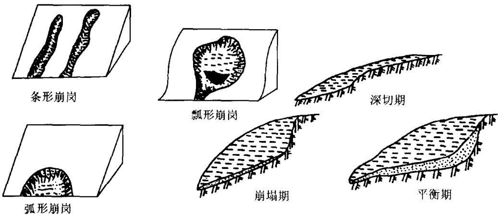  
图 3-7 崩岗类型示意图

(1)瓢形崩岗。主要发生在花岗岩风化物的凹形坡，形成肚大口小的瓢状。在凹形坡径流呈扇形汇集，在坡的中下部形成汇集点发生水蚀穴，随着径流的继续汇集和冲刷作用，水蚀穴发展成切沟，沟壁陡峻，但尚未发生重力崩塌作用，此为发生崩岗侵蚀的前期。随着径流下切作用的加大，两岸沟壁愈益增高，沟头前进加速，向凹形坡的中上部发展。此时，由于该部位风化物是由不少土层和碎屑层组成，疏松深厚，抗冲力弱，陡壁失衡，极易发生崩塌，随之径流冲刷和重力崩塌相互促进，形成了上部开阔的崩塌面；下部则因组成物质由红黏土组成，抗冲力强，崩塌进展缓慢，出口处形成了狭小的巷沟，从而形成瓢状崩岗。当该崩岗继续向两岸扩展和前进而逼近分水岭时，分水岭侧斜坡出现崩岗群或相邻崩岗的吞并；两侧斜坡崩岗相遇而切割分水岭情况下，崩岗侵蚀即趋于停滞，并形成了较为宽阔的崩岗场，常成为农林果的优良用地。

(2）条形崩岗。多发生在陡峻的直形坡，上下大致等宽，呈长条形，纵剖面与斜坡坡面一致，形成类似梳齿排列。相邻的条形崩岗可相互吞并而发展成大型条形崩岗。

(3)弧形崩岗。主要发生在河流或山圳(渠沟)的一侧，由于流水，尤其是曲流的淘冲作用所形成，故又称为曲流崩岗。其特点为没有对称的崩岗壁，只有单向坡，常伴随滑塌作用，具有一定的滑动面，纵断面呈弧形。

条形和弧形崩岗规模较小，且不多见；瓢形崩岗分布最广，也是崩岗侵蚀发展最严重的类型。

## (二) 泥 石 流

泥石流是岩土碎屑和水的固液两相混合呈饱和的、高浓度非均质流体沿侵蚀陡坡和陡峻沟床流动的现象。

泥石流的形成需具备三个基本条件：①大量松散固体物质的来源，其成分、数量和补给方式，决定着泥石流的性质、规模和危害程度；②强大和集中的水源，既是液相的构成部分，又是泥石流运动的动力条件，来源于雨水、冰雪融水或溃决水体；③高差大、坡度陡的地形条件[58]。

我国山地面积占国土总面积的2/3以上，泥石流分布广泛，活动频繁，以四川、云南、西藏、甘肃、陕西、辽宁等地泥石流最为活跃，灾害最严重。

## 1. 泥石流类型

泥石流类型[57,58]涉及泥石流的形成条件、物质组成、流体特征、规模、活动强度、危害性等，至今尚无统一的分类，以下列举常用的分类方法。

## 1）按泥石流流体性质的分类

按泥石流流体性质可分为黏性、亚黏性和稀性(表3-23)。泥石流与山洪均属流体范围，两者的主要区别是含固相物的浓度。山洪含固相物浓度很低，容重小于1.3g/cm³；泥石流属多相非均质体，固相物质含量高，可为直径小到0.001mm的黏粒、大到直径10m以上的岩块。

表 3-23 泥石流流体特征分类
<table><tr><td rowspan="2">流体类型</td><td colspan="2">容重/(g/cm³)</td><td rowspan="2">自由孔隙比</td><td rowspan="2">流体结构</td><td rowspan="2">流态</td><td rowspan="2">沉积物特征</td><td rowspan="2">流动特征</td></tr><tr><td>泥石流</td><td>黄土泥流</td></tr><tr><td>黏性</td><td>1.9~2.25</td><td>1.63~1.78</td><td>&lt;0.05</td><td>类一相体</td><td>层流</td><td>无分选，级配和原始 土体基本无区别</td><td>常呈阵性 流</td></tr><tr><td>亚黏性</td><td></td><td>1.69~1.9 1.50~1.63</td><td>0.05~0.37</td><td>过渡类型</td><td>弱紊动流</td><td>基本无分选，含土量 (黏土、细粉砂)低于</td><td>连续流</td></tr><tr><td>稀性</td><td></td><td>1.35~1.691.26~1.50 0.37~0.70</td><td></td><td>二相体</td><td>紊流</td><td>原始土体 分选比较明显，含土量连续流 大大低于原始土体</td><td></td></tr></table>

## 2）按泥石流发生频率的分类

根据泥石流发生频率，泥石流沟可分为高频率泥石流沟和低频率泥石流沟(表3-24)。

表3-24 高频率、低频率泥石流沟特征
<table><tr><td>泥石流 沟类型</td><td>暴发频率</td><td>固体物质 补给方式</td><td>流域特征</td><td>激发暴雨</td><td>堆积扇特征</td><td>泥石流规模</td></tr><tr><td>高频率</td><td>基本上 年年发</td><td>以坡面物质 补给为主</td><td>流域形态多为漏斗形， 流域内大型滑坡、崩 塌分布广，活动强烈</td><td>常年暴雨</td><td>堆积扇上每年都有泥流 沉积，堆积扇地面草木稀 疏，无多年乔木，沟道易</td><td>大、中、小 型均有</td></tr><tr><td>低频率</td><td>生 暴发周</td><td>以沟床物质 补给为主</td><td>流域形态多为长条形， 流域内山体稳定性和</td><td>大暴雨</td><td>变迁 堆积扇多已开辟为农田， 生长有乔木，无泥石流发</td><td>一旦发生， 规模较大</td></tr></table>

## 3）按泥石流规模的分类

根据流域面积、泥石流最大流量、一次固体物质最大冲出量，泥石流沟可分为大型、中型、小型(表3-25)。

表3-25大、中、小型泥石流沟指标
<table><tr><td>泥石流沟类型</td><td>流域面积/km²</td><td>一次固体物质最大冲出量/万m³</td><td>泥石流最大流量/(m³/s)</td></tr><tr><td>大</td><td>&gt; 10</td><td>10</td><td>100</td></tr><tr><td>中</td><td>2~10</td><td>1~10</td><td>10~100</td></tr><tr><td>小</td><td>&lt;2</td><td>&lt; 1</td><td>&lt; 10</td></tr></table>

此外，按泥石流流域的地貌形态分类，分为山坡型、沟谷型、河谷型泥石流；按泥石流组成物分类，分为泥流、泥石流和水石型泥石流；按泥石流形成成因中的动力条件分类，分为暴雨型、冰川融雪型、水体溃决型和混合型；按泥石流发育阶段分类，分为发展期、活跃期、衰退期和停歇期；按泥石流成因的属性分类，分为自然泥石流和人为泥石流；按泥石流的危害程度分类，分为轻度、中等、严重、极严重[58]。

## 2. 泥石流的形成条件和诱发因素

地形、松散固体物质和水体供给是泥石流形成必要条件，人为不合理活动，如毁林开荒、工程建设不当等，为诱发泥石流的重要因素[57\~59]。

## 1) 地形

坡面泥石流多发生在15°\~35°的中陡斜坡上。典型的高频率泥石流沟流域形态呈漏斗状。流域一般可划分为形成区(包括清水区)、流通区和堆积区[59](图3-8)。形成区内，滑坡崩塌活动强烈，是固体物质的主要补给区；流通区是泥石流流通的地段，沟谷两侧山体相对稳定，不是固体物质的主要补给区；堆积区，为泥石流流出山口后形成的堆积扇区。泥石流沟的流域面积一般小于 $5 0 \mathrm { k m } ^ { 2 }$ ，个别可达 $1 0 0 \mathrm { k m } ^ { 2 }$ 以上；流域相对高差一般大于300m。泥石流沟床比降为5%\~30%，以10%\~30%发生频率最高；堆积区沟床比降一般为3%\~5%。黄土泥流的沟谷沟床比降多小于5%，堆积区比降多小于2%。低频率的泥石流沟流域形态不一，多呈长条形，固体物质以沟床提供为主，形成区和流通区往往很难区分。

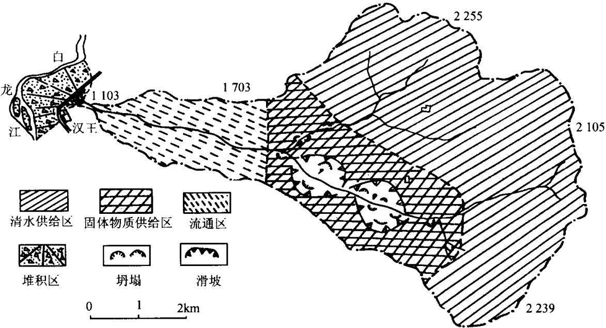  
图3-8 甘肃武都甘家沟流域略图

## 2）松散固体物质

强烈的新构造运动和地震活动，破坏了山体和岩体的稳定性，激发崩塌、滑坡为泥石流提供丰富的固体物质。此类物质含有一定粉黏颗粒的强烈破碎岩层和碎石土，黏粒含量3%\~10%，黏土矿物以蒙脱石和伊利石为主。水石流的原始土体粉黏粒含量极低。泥石流的原始土体的粉黏粒含量最多大于60%。高频率泥石流沟，流域内山体稳定性极差，大型滑坡、崩塌活动强烈。低频率泥石流沟，流域内稳定性尚好，多无大型滑坡、崩塌活动，但小型滑坡、崩塌时有发生，沟床内堆积有较厚的松散固体物质。地质条件控制着泥石流固体物质成分，提供的方式、速度和数量，影响泥石流的发育规律。

## 3）水体供给

我国泥石流以暴雨型泥石流最为常见，暴雨泥石流多由短历时的强大暴雨激发形成。泥石流的发生与前期降水量，尤其是与10min和1h雨强有十分密切的关系60](表3-26)。我国暴雨泥石流的分布和年降水量关系并不密切，年降水量大于250mm的地区几乎都有泥石流发生。其中泥石流分布密集、活动强烈的云南东川小江流域和甘肃武都白龙江流域，年降水量仅600\~700mm;而泥石流分布零星的东南、华南丘陵山地的年降水量多大于1200mm。显然，除干旱地区外，我国绝大部分地区的降水均能满足泥石流的形成，降水较少的半干旱、半湿润地区，岩石物理风化强烈，植被破坏后不易恢复，有利于泥石流的形成。降水丰沛的湿润地区，岩石物理风化轻微，植被较好，不易于泥石流的形成。

除暴雨外，其他水体的补给有冰雪融水、地下水和溃决水。我国西部高山区，冰雪消融往往激发泥石流的发生；堤坝溃决，沟道上游天然或人工坝体溃决，有时也激发泥石流发生。

表3-26 甘肃几次灾害性泥石流爆发时的降水量
<table><tr><td>沟名</td><td>地区</td><td>时间</td><td>泥石流性质</td><td>一次降雨量 /mm</td><td>降雨历时 /h</td><td>平均雨强 /(mm/h)</td><td>资料来源</td></tr><tr><td>文家沟</td><td>庄浪</td><td>1973-04-27</td><td>黏性泥石流</td><td>85.4</td><td>5</td><td>17.0</td><td>调查</td></tr><tr><td>洪水沟</td><td>兰州西固</td><td>1964-07-20</td><td>黏性泥流</td><td>150.0</td><td>4</td><td>37.5</td><td>铁道部第一设计院调查</td></tr><tr><td>罗玉沟</td><td>天水</td><td>1965-07-07</td><td>泥流</td><td>90.0</td><td>8</td><td>11.2</td><td>现场观测</td></tr><tr><td>大靖</td><td>古浪</td><td>1977-08-01</td><td>稀性泥石流</td><td>154.5</td><td>2.5</td><td>61.8</td><td>观测</td></tr><tr><td>化马</td><td>武都宕昌</td><td>1976-07-25</td><td>黏性泥石流</td><td>330.0</td><td>7</td><td>47.1</td><td>降水据甘肃气象局调查</td></tr><tr><td>拱北沟</td><td>兰州</td><td>1978-08-27</td><td>黏性泥石流</td><td>100.0</td><td>2</td><td>50.0</td><td>降水据兰州防洪</td></tr><tr><td>菜子沟</td><td>天水伯阳</td><td>1978-07-12</td><td>黏性泥流</td><td>105.0</td><td>2</td><td>52.5</td><td>指挥部提供 伯阳公社观测</td></tr></table>

泥石流暴发突然，历时短暂，一场泥石流过程从发生到结束一般不足1h，有时达数小时。泥石流流速从每秒数米到每秒近百米不等。砾石质沟床的泥石流沟，流速一般小于15m/s；基岩和密实土层沟床的泥石流沟，流速可大于15m/s，最高可达每秒近百米。这是由于前者沟床床面物质抗剪强度低，易于泥石流侵蚀消耗能量；后者沟床床面物质抗剪强度高，不易于泥石流侵蚀消耗能量的缘故。泥石流的流速还与沟床纵坡、泥深等有关。纵坡越陡，泥深越大，流速越高。泥石流流量往往大于一般山洪，如西藏波密古乡泥石流沟，流域面积29.1km²，1953年暴发的泥石流流量高达28600m3³/s[61]。黏粒含量高，黏度大的黏性泥石流常为阵性流，如云南东川蒋家沟泥石流[62]；黏粒含量低，黏度较低的黏性泥石流常为连续流，如云南盈江浑水沟泥石流[63]。

台湾地区因地质脆弱，地层活动频繁及高温、台风、暴雨等因素，山坡地泥石流灾害发生频繁，常与崩塌、滑坡(地滑)灾害伴随发生。谢豪荣、游繁结、何智武等就台湾山坡地崩塌、滑坡、泥石流的特性、分类、形成机制等进行了大量的研究，并就暴雨、台风激发的泥石流灾害问题研究了防治对策[72]。

## 4)人为因素

不合理的人类活动，植被破坏、陡坡开荒、工程建设处置不当(开矿、修路、挖渠等)，增加径流，破坏山体稳定，均可诱发泥石流发生，或加大泥石流规模，加快频率。岷江上游5县(汶川、黑水、理县、茂县、松潘)1940年森林覆盖率为30%，20世纪70年代末降至18.8%，1981年雨季就有129条沟暴发泥石流。黑水知木林区的小黑水与毛尔盖河下游许多沟谷发生暴雨泥石流，其中多数与流域内的过度砍伐而导致森林生态系统破坏有直接关系。云南东川泥石流的强烈活动显然是明、清以来用薪炭炼铜，大规模砍伐森林的结果[62]。

矿山建设和开采，开挖山体造成的边坡失稳和弃渣处置不当，往往诱发泥石流的发生。据不完全统计，全国23座露采矿山发生过泥石流(表3-27)[56]。

西南山区公路、铁路建设期及建成后，沿线泥石流活动往往趋于频繁，如川藏公路和成昆铁路。这往往与修建公路、铁路，开挖边坡引起山体失稳及森林砍伐有关。

表 3-27 矿山泥石流活动状况
<table><tr><td rowspan="2">项目</td><td rowspan="2">省份</td><td colspan="3">排土场所处沟谷或坡面状况</td><td rowspan="2">泥石流活动状况</td></tr><tr><td>沟(坡)名流域面积/km²沟床比降/%山坡坡度/(°)</td><td></td><td></td></tr><tr><td>泸沽铁矿</td><td></td><td>盐井沟</td><td>13.6</td><td>144</td><td>35</td></tr><tr><td></td><td>四</td><td>汉罗沟</td><td>13.6 144</td><td>35</td><td>多次暴发</td></tr><tr><td>攀枝花铁矿</td><td></td><td>无名沟</td><td></td><td></td><td></td></tr><tr><td>太和铁矿</td><td>川</td><td>泡石头沟</td><td>52</td><td>127 30</td><td></td></tr><tr><td>四川石棉矿</td><td></td><td>后沟</td><td>7.4</td><td>230 30~37</td><td>曾暴发过</td></tr><tr><td>新康石棉矿</td><td>省</td><td>大洪沟</td><td>61</td><td>140 30</td><td></td></tr><tr><td>四川蛇纹矿</td><td></td><td>胥家沟</td><td>2.05</td><td>266 30~45</td><td>多次暴发</td></tr><tr><td>汤丹矿</td><td></td><td>小菜园沟</td><td></td><td></td><td></td></tr><tr><td>因民矿</td><td>云</td><td>大水沟</td><td>47</td><td>111</td><td></td></tr><tr><td>落雪矿</td><td></td><td>大水沟</td><td>47</td><td>111</td><td></td></tr><tr><td>滥泥坪矿</td><td>南</td><td>黄水箐沟</td><td>91</td><td>50</td><td></td></tr><tr><td>狮山分矿</td><td>省</td><td></td><td>42</td><td>111</td><td></td></tr><tr><td>狮子山分矿</td><td></td><td>菜园河</td><td>16.2</td><td>81</td><td></td></tr><tr><td>昆阳磷矿</td><td></td><td>无名沟</td><td></td><td></td><td></td></tr><tr><td></td><td></td><td>歪山头</td><td>2.2</td><td>94 40~50</td><td>曾暴发过</td></tr><tr><td>云南锡业公司</td><td></td><td>火谷都</td><td></td><td></td><td></td></tr><tr><td>德兴铜矿</td><td>江</td><td>杨桃坞沟</td><td>2.73</td><td>40 约50</td><td>潜在威胁大</td></tr><tr><td>永平铜矿</td><td>西</td><td>大垄沟</td><td>0.6</td><td>137 60~70</td><td>曾暴发过，基本得到控制</td></tr><tr><td>铁坑铁矿</td><td>省</td><td>桂山山坡</td><td></td><td></td><td></td></tr><tr><td>云浮硫铁矿</td><td>广</td><td>三围水沟</td><td>0.2</td><td>145 30~40</td><td>曾暴发过，已得到控制</td></tr><tr><td>石禄铜矿</td><td>东</td><td>废石山坡</td><td></td><td></td><td></td></tr><tr><td>海南铁矿</td><td>省</td><td>有七条沟</td><td></td><td>约 150 30~40</td><td>多次暴发</td></tr><tr><td>铜录山铜矿</td><td>湖北省</td><td>废石山坡</td><td></td><td></td><td></td></tr><tr><td>潘洛铁矿</td><td>福建省</td><td>暂沟</td><td>0.4</td><td>340</td><td>35 曾暴发过</td></tr></table>

## 三、冻融侵蚀

冻融侵蚀是指多年冻土地区，土体或岩石风化体中的水分反复冻融而使土体和风化体不断冻胀、破裂、消融、流变而发生蠕动、移动的现象[16]

冻融侵蚀主要发生在高寒高山区，以中国西部的青藏高原、新疆天山等一些高山地区分布最多，黑龙江流域的大、小兴安岭也有分布，平均海拔多在4500m以上，以自然常态侵蚀为主。森林植被的破坏和工程建设等不同程度地加速冻融侵蚀。

## （一）冻融侵蚀的类型

冻融侵蚀按其冻融的作用和过程可分为冻融风化、冻融扰动、冻融泥流和冻融滑塌[16,64]

## 1. 冻融风化

岩土体孔隙和裂隙中充填的水分，随气温下降而发生冻结、膨胀，使周围岩土体破裂：随气温上升，冻体消融，水分再次填充。如此周而复始，岩土体风化崩解成微小颗粒，易被水力、风力搬运、移动，即冻融风化。

## 2. 冻融扰动

多发生于多年冻土区冻土上部的冻融活动层。冬季时，该活动层由地表向下冻结，底部因多年冻结的阻挡，水分不能下渗，所以使活动层下部未冻结的含水层因受冻胀挤压而引起塑性变形，产生了各种不规则微褶皱，即冻融扰动，可加剧冻融风化。

## 3. 冻融泥流

发生在斜坡上的一种冻融侵蚀现象。当冻土层上部解冻时，融水使岩土体表层细粒物质达到饱和状态，使该土层具有一定的塑性，在重力作用下，沿斜坡的冻融界面向下坡缓慢的移动，形成冻融泥流。

## 4. 冻融滑塌与塌陷

由于气候骤然变暖或人为活动的影响，多年冻土层中埋藏冰融化，造成上覆土层塌陷；或在坡面上，表层消融被水饱和的土层沿冻融界面向下滑动，又称为热融滑塌。例如，在林区人为破坏地表枯枝落叶物及青藏公路修建过程中易出现这种侵蚀现象。

## （二）冻融侵蚀的分布及危害

在全国土壤侵蚀遥感调查资料中，把冻融侵蚀作为与水力侵蚀、风力侵蚀并列的三大侵蚀类型，以多年冻土区为划分基础。全国冻融侵蚀的面积为125.4万km²，其中青海与西藏两省(区)的冻融侵蚀即占总面积的85.8%。朱显谟等在主编的中国土壤侵蚀类型及分区图中，把全国划分为三大侵蚀区，即东部流水侵蚀区、西北风力侵蚀区和青藏高原冻融及冰水侵蚀区。这里的冰水侵蚀是指区域内冰川移动时对地表产生巨大的刨蚀、搬运作用而形成各种特殊的冰蚀地貌和冰碛物，冰雪融水径流对地表的冲刷作用。

冻融侵蚀多分布在高原高寒山区，人类活动影响极小，它目前基本上属于自然常态侵蚀范畴。但在有些情况下，冻融侵蚀对人类社会仍能造成较大的危害。因冰川运动、冰雪融水和剧烈的冻融作用，可激发泥流、泥石流，造成淹埋农田、村庄，冲毁桥梁、道路，堵塞水库、江河等灾害，例如贡嘎山泥石流等[65\~67]

黄以职等研究了风蚀与冻融侵蚀的关系，坡面冻土层一旦被风沙覆盖，上部冻融层加深、融化水增多、待下渗至冻结面、沿斜坡流出，可导致上部沙层以坍塌形式呈溯源侵蚀而流失，坡面风积沙层自下而上年塌陷前进速率为1.3m/a左右[68]。

黑龙江省的克拜黑土区属东北漫岗丘陵水蚀、冻融侵蚀类型区，冻结期180d，沟壑冻融侵蚀较为严重。据克山实验站的观测研究，沟壑冻融侵蚀的特征可分为沟岸冻裂、沟岸融滑、沟坡融泻、沟壁融塌四种主要侵蚀类型。冻融侵蚀可使耕地中的沟壑每年扩张50\~100cm，沟壑冻融侵蚀是一种缓慢的过程，常与重力侵蚀交织在一起，它是重力作用的先决条件，而最初形态往往是重力侵蚀[69,70]。

## 参考文献

1 黄秉维.陕甘黄土区域土壤侵蚀的因素和方式. 科学通报，1953，(9):63\~75

2 朱显谟，张相麟，雷文进.泾河流域土壤侵蚀现象及其演变．土壤学报，1954，2(4):209\~222

3 朱显谟． 黄土区土壤侵蚀的分类. 土壤学报，1956，4(2):99\~114

4 罗来兴. 划分晋西、陕北、陇东黄土区域沟间地与沟谷地的地貌类型.地理学报，1956，22(3):201\~222

5 朱显谟. 黄土高原流水侵蚀的主要类型及有关因素. 水土保持通报，1981，(3):1\~9;1981，(4):13\~18;1982，(1):25\~30

6 朱显谟．黄土区的洞穴侵蚀．黄河建设，1958，(3):43\~44

7 史德明等． 土壤侵蚀调查方法的侵蚀分类和侵蚀制图问题．中国水土保持，1983，(5):33\~36

8 王礼先． 土壤侵蚀的分类与分级．中国水土保持，1984，(6):18\~22

9 甘枝茂.陕北黄土高原的土壤侵蚀类型． 人民黄河，1982，(2):43\~46

10 史德明． 南方花岗岩区的土壤侵蚀及其防治． 水土保持学报，1991，5(3):63\~72

11 中国科学院黄土高原综合科学考察队唐克丽，陈永宗等．黄土高原地区土壤侵蚀区域特征及其治理途径．北京：中国科学技术出版社，1991

12 史德明．我国热带、亚热带地区崩岗侵蚀之剖析．水土保持通报，1984，4(3):32\~37

13 张淑光，钟朝章.广东省崩岗形成机理与类型．水土保持通报，1990，10(3):8\~16

14 朱震达，刘恕．关于沙漠化的概念及其发展程度的判断.中国沙漠，1984，4(3):2\~8

15 朱震达，陈广庭等．中国土地沙质荒漠化.北京：科学出版社，1994

16中国农业百科全书·土壤卷．见：土壤侵蚀与水土保持分支条目．北京：中国农业出版社，1996

17 中华人民共和国水利部水土保持司. 土壤侵蚀分类分级标准(SL190-96). 北京：中国水利水电出版社，1997

18 唐克丽.中国土壤侵蚀与水土保持学的特点及展望． 水土保持研究，1999，6(2):2\~7

19 Hudson N H. 土壤保持. 窦葆璋译. 北京:科学出版社，1971

20 Mutchler C K, Young R A. Soil detachment by raindrops. In: Presemt and prospective technology for predicting sediment yields and sources. ARS-S-40, U S De Agric, Agric Res Serr, 113 \~ 117

21 刘志，江忠善．雨滴打击作用对黄土结皮影响的研究.水土保持通报，1988，8(1):62\~64

22 窦葆璋，周佩华．雨滴的观测和计算方法．水土保持通报，1982，2(1):44\~47

23 Ellison W D. Studies of raindrop erosion. Agri Eng, 1944, (25) : 131 \~ 136, 181 \~ 182

24 Morgan R C. Field studies of rainspeash erosion. Earth Surf Proc, 1978, (3) : 295 \~ 299

25 柯克比 MJ，摩尔根 R P C. 土壤侵蚀．王礼先等译.北京：中国水利电力出版社，1985

26 Bradford F A, Remley R, Ferris J E et al. Effect of soil surface sealing on splash from a single waterdrop. Soil Sci Soe Am J, 1986,(50):1547\~1552

27 江忠善．降雨因素和坡度对溅蚀影响研究．水土保持学报，1989，3(2):29\~35

28陆兆熊，蔡强国．黄土的结皮强度和溅蚀试验研究．见：晋西黄土高原侵蚀规律实验研究文集.北京：中国水利电力出版社，1990

29 Wischmeier W H, Smifh D D. Raintall energy and its relationship to soil loss. Transactions of American Geophysical Union, 1958, (39)

30 周佩华，窦葆璋．降雨能量的试验研究初报.水土保持通报，1981，1(1):51\~60

31 唐克丽，郑世清，席道勤等．杏子河流域坡耕地的水土流失及防治．水土保持通报，1983，3(5):43\~48

32 唐克丽，席道勤，郑世清等．杏子河流域的土壤侵蚀方式及其分布规律．水土保持通报，1984,4(5):10\~19

33 中国科学院西北水土保持研究所．杏子河流域的自然资源与水土保持．西安：陕西科学技术出版社，1986

34陈永宗，景可，蔡强国．黄土高原现代侵蚀与治理．北京：科学出版社，1988

35郑粉莉，唐克丽，周佩华．坡耕地细沟侵蚀影响因素研究．土壤学报，1989，26(2):109\~116

36刘元保，朱显谟，周佩华等．黄土高原坡面沟蚀的类型及其发生发展规律．见：中国科学院西北水土保持研究所集刊，第7集．西安：陕西科学技术出版社，1988

37承继成.坡地流水作用的分带性．见：中国地理学会．地理学会1963年论文集．北京：科学出版社，1963

38 张科利，唐克丽．黄土高原坡面浅沟特征值的研究．水土保持学报，1991，5(2):8\~13

39阮伏水，朱鹤建．福建省花岗岩地区土壤侵蚀与治理．北京：中国农业出版社，1997

40 Crouch R J. A role of tunnel in gully head progression . J Soil Cons NSW , 1983, 38(1) : 148 \~ 159

41 王斌科，朱显谟，唐克丽．黄土高原的洞穴侵蚀与防治．见：中国科学院西北水土保持研究所集刊，第7集．西安：陕西科学技术出版社，1989

42刘贤万.实验风沙物理与风沙工程学．北京：科学出版社，1987

43吴正，凌裕泉．风沙地貌学．北京：科学出版社，1987

44古迪．人类影响：在环境变化中人的作用．郑锡荣等译．北京：中国环境科学出版社，1989

45董光荣等．关于土壤风蚀风洞模拟实验的某些结果.科学通报，1987，32(4):297\~301

46董治宝． 风砂土水分抗风蚀性研究.水土保持通报，1996，16(2):17\~23

47 周恒．防风定沙．香港：黎明文化专业公司出版，1978

48陈广庭．北京的风沙及其治理．中国科学院沙漠研究所集刊，第四号．北京：科学出版社，1994

49 陈广庭. 内蒙古高原东南部现代沙漠化过程.中国沙漠，1991，11(2):11\~19

50董治宝等．关于人为地表结构破损与土壤风蚀关系的定量研究.科学通报，40(1):54\~57

51 董治宝，高尚玉，董光荣．土壤风蚀预报研究述评．中国沙漠，1999，19(4):312\~317

52 Robert L S, Raymond J K. Landslides analysis and control. Transportation Research Board Special Report, 1978, (176) : 234

53 Zhang X, Phillips C, Pearce A et al. Surface movement in an earthflow complex, Raukumara, New Zealand . Geomophology, 1991,(4):261\~272

54张信宝等．黄土高原重力侵蚀的地形与岩性组合因子分析．水土保持通报，1989，9(5):40\~44

55 乔建平. 滑坡减灾理论与实践．北京：科学出版社，1997

56国家防汛抗旱总指挥部办公室，中国科学院、水利部成都山地灾害与环境研究所．山洪、泥石流、滑坡灾害及防治.北京：科学出版社，1997

57长江流域水土保持技术手册编委会.长江流域水土保持技术手册．北京：中国水利水电出版社，1999

58李德基.泥石流减灾理论与实践．北京：科学出版社，1994

59中国科学院兰州冰川冻土沙漠研究所，甘肃省交通科学研究所．甘肃泥石流.北京：北京人民交通出版社，1982

60谭万沛等．暴雨泥石流滑坡的区域预测与预报．成都：四川科学技术出版社，1994

61中国科学院，水利部成都山地灾害研究所，西藏自治区交通厅科研所.西藏泥石流与环境．成都：成都科技大学出版社，1999

62 吴积善，康志成等．云南蒋家沟泥石流观测研究．北京：科学出版社，1990

63张信宝，刘江．云南大盈江流域泥石流．成都：成都地图出版社，1989

64 刘秉正，吴发启．土壤侵蚀．西安：陕西人民出版社，1997

65徐道明，冯倩华．冰川泥石流与冰湖溃决灾害研究．冰川冻土，1988，9(3)：284\~289

66 吕儒仁，高生淮．贡嘎山海螺沟冰川冰舌地段的泥石流．冰川冻土，1992，3(1)：73\~79

67 吕儒仁. 贡嘎山区一次特大泥石流．冰川冻土，1992，6(2)：174\~176

68 黄以职等．青藏高原冻土区沙漠化及其对环境影响．冰川冻土，1993，3(1)：52\~57

69陈书.克拜地区土体冻融作用与侵蚀沟发育特征浅析.中国水土保持，1989，(11)：21\~22

70刘绪军，景国臣，齐恒子．克拜黑土区沟壑冻融侵蚀主要形态特征初探．水土保持科技情报，1999，(1）:28\~30

71 Crouch R J. Arole of tunel in gully head progression. J Soil Cons NSW, 1983, 38(1) : 148 \~ 159

## 第四章 土壤侵蚀过程和环境演变

现代土壤侵蚀是自然因素和人为因素综合影响的过程。远在人类社会出现前，自然界已发生侵蚀，称为自然侵蚀。黄土高原的水土流失和黄河泥沙起源于地质时期。据此有人提出，没有人类对自然植被的破坏，在原始的自然植被生境中，土壤侵蚀已在发生发展。故人们在分析影响土壤侵蚀的因素时，多侧重于气候、地质、地貌的自然环境因素。

黄土与环境的研究指出[1]，自第四纪黄土沉积以来，经历了三个大的侵蚀旋回，近万年以来，已进入第四个侵蚀旋回。依据黄土-古土壤系列所反映的干冷与温湿气候的交替，确定降雨量增多的古土壤成壤期，为剥蚀与侵蚀相对强烈期。有的研究提出，自晚更新世以来的沟谷发育，以构造抬升起重要作用[2]。洪业汤等的研究明确提出，黄土的侵蚀、搬运和沉积过程基本上是一种自然环境地质现象；在黄土植被遭到人类活动破坏前，沟谷系统已在发育，不应把黄河看成是生态破坏的象征[3.4]。有的文献报道，沟谷侵蚀应作为自然侵蚀的佐证，并以黄土丘陵沟壑区陕北安塞县的沟谷侵蚀为例，提出现代侵蚀以自然侵蚀为主，占总侵蚀量的70%以上[5]。近期古土壤中有机碳同位素 $\delta ^ { 1 3 } \mathbf { C }$ 比值的分析资料证实，第四纪地质时期的黄土高原以草本植物为主，即使黄土高原南部塬面60万年以来的古土壤时期也以草灌植被为主6。历史地理学家史念海、朱士光通过大量历史考证，提出历史上的黄土高原曾是草木丰茂，沟壑稀少，不少地区覆盖有森林；当今植被稀少，水土流失严重的面貌主要是人为活动所造成[7,8]。地质学和历史地理学方面研究的分歧在于黄土高原有无森林植被，以及植被对侵蚀的影响和作用，从而关系到治理方针的某些争议。例如，强调降雨和构造抬升对侵蚀的作用，重视治沟的工程措施；强调人为活动破坏植被对侵蚀的作用，重视农林牧土地利用结构的调整。唐克丽等研究提出，地质时期黄土高原的强烈侵蚀发生在半干旱生态环境脆弱时期；现代土壤侵蚀以人为加速侵蚀占主导地位，生态环境演变是影响土壤侵蚀的主要因素[9\~11]。

沉积发育历时约240万年深厚的黄土剖面，记录了第四纪时期丰富的地学-生物学信息；位于黄河中游的黄土高原又是中华民族文化发祥地，记录了人类文化的发展历史。这两者得天独厚的优势，为研究土壤侵蚀过程，提供了自然环境和人文环境的重要信息。此外，近半个世纪来，黄河的治理及黄土高原的水土保持一直列为国家的重点，积累的资料比较丰富。本章以黄土高原为中心阐述讨论地质时期、历史时期，乃至现代土壤侵蚀的发生发展与环境演变的关系，有助于正确指导当前水土流失治理决策和措施的合理配置，对世界水土保持也是重大贡献。

## 第一节 第四纪地质时期的侵蚀过程与环境演变

我国黄土沉积的深厚及其分布面积的广阔为世界所瞩目，曾吸引了不少中、外学者的兴趣和关注。我国著名的地质学家刘东生先生，在高度综合国内外研究基础上，进行

了大量的考察研究，创造性地拓展了研究领域，奠定了闻名于世的中国黄土学[1,12,13]，以下列举有关黄土侵蚀的部分。

刘东生先生以著名的洛川黄土剖面为代表，在研究黄土沉积、成壤的基础上，分辨了黄土的剥蚀面和侵蚀面。

## 一、黄土的侵蚀面及沟谷的形成发育[1,12,13]

## （一）黄土-古土壤系列与侵蚀面

深厚的黄土剖面中出现10余层乃至30余层的黄土(L)-古土壤(S)系列，已研究确定为干冷与温湿气候的多次交替旋回，两者呈明显的分界。黄土-古土壤系列所反映的环境变化，可以与第四纪以来深海钻孔中氧同位素气候变化的模式及大陆上冰期-间冰期的模式相比较，有助于重建中国北方乃至北半球第四纪地质事件的历史。

相当于冰期的、干冷气候下的黄土沉积期不可能发生侵蚀，或侵蚀极轻微。相当于间冰期的、温湿气候条件的成壤时期，降水量增多，流水作用增强，土壤侵蚀相对强烈，古土壤层即为发生侵蚀的层面。

## （二）侵蚀面与沟谷系统的形成发育[1,12,13]

黄土剖面的底界，即黄土开始沉积与晚上新世红黏土的界线，恰好接近松山期和高斯期的分界，年龄大约距今240万年。每个时期的黄土堆积面基本与下伏地形一致。古地貌基岩地面平坦宽阔的地区，形成塬面。基岩面较低之处，形成发育沟谷系统。当今黄土高原塬、梁、峁地形及沟谷系统，即是在古地貌基础上，经黄土沉积、成壤和侵蚀的交替旋回，逐步形成的。

剖析洛河黄土层剖面图(参见文献[1])，剖面中第5层古土壤呈急剧倾斜，可达21°，最后第5层古土壤直接披盖在基岩面上，说明第5层古土壤堆积时期有一次较强的侵蚀。早期沟谷的形成，包括洛河及其一级支流的形成期，即在第5层古土壤时期。中期沟谷主要指洛河的二级支流，如黑木沟等。这期沟谷形成于第2层古土壤堆积之前。晚期沟谷的发育，表现为中期沟谷的进一步切割。沿中期沟谷谷坡，形成许多垂直于主沟的小冲沟，形成于马兰黄土堆积后期。最新沟谷是指历史时期发育的沟谷，以洛川县城西的冲沟为例，该冲沟从彩陶文化遗址(距今约5000年)切过，并延伸了大约50m，年均切割延伸约1cm。

## （三）黄土侵蚀面年代和土壤侵蚀发展史

刘东生先生研究了洛川地区黄土地层不同年龄的剥蚀面和侵蚀面：

(1)距今约240万年的午城黄土-红黏土的剥蚀面；

(2)距今约140万年前的午城黄土上部的剥蚀面；

(3)离石黄土上下部之间的剥蚀面，以第5层古土壤(S5)为代表，距今约50万年； $( { \sf S } _ { 5 } )$

(4) 第3层古土壤 $( \mathsf { \pmb { S } } _ { 3 } )$ 所反映的剥蚀面，距今33万年；

(5)马兰黄土-离石黄土的剥蚀面，以第1层古土壤 $( \mathsf { S } _ { 1 } )$ 为代表，距今约10万年。

黄土沉积以来的240万年，经历了4个大的侵蚀旋回，古土壤层面即为侵蚀层面。每一次黄土-古土壤系列的旋回，均反映了一个侵蚀的旋回。黄土-古土壤系列具有准8万年、准4万年和准2万年的周期，同时也反映了黄土剥蚀、侵蚀具有相同周期变化特点。

## 二、侵蚀相对强烈期的层面及其生物气候环境

## （一）古土壤的生物气候环境与侵蚀层面问题

唐克丽等在前人研究基础上，从黄土沉积、成壤过程的有机联系，探讨了地质时期发生侵蚀的层面及当时的生物气候环境。研究发现，地质时期的侵蚀发生在由黄土沉积转向红褐色古土壤层，或由红褐色古土壤层转向黄土沉积的过渡时期，即相当于现代半干旱的生物气候环境，侵蚀层面发生在原划定的黄土沉积(L)层内。其论证如下[10,11]：

以剖析洛川界子河淤沟沟口的黄土剖面为例。该剖面见有两层倾斜的红褐色古土壤条带 $( S _ { 3 } , S _ { 4 } )$ ，覆盖在早期黄土层 $( \log _ { 3 } , \log _ { 4 } )$ 的上部。按倾斜面约20m的范围内，每隔5m左右切取黄土-古土壤系列的垂直剖面(图4-1)，共3个剖面。由图4-1可见，古土壤层$( S _ { 3 } , S _ { 4 } )$ 的厚度变化不大，黄土层L₄变化很大，其底面与下部的古土壤层S几乎相接。 $\mathrm { L } _ { 4 }$ ${ \sf S } _ { 5 }$

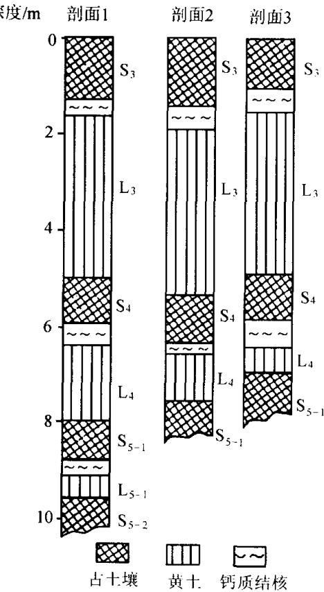  
图4-1 洛川界子河淤沟沟口黄土剖面

(单位：%)

说明侵蚀面发生在黄土层，而不是在古土壤层。

洛川剖面中不同时代黄土、古土壤层的 $\textcircled { 1 } ^ { 2 }$ 物及化学成分说明(表4-1)，古土壤层$( \mathsf { S } _ { 2 }$ 和 ${ \bf S } _ { 5 } )$ 中不稳定 $\textcircled { 1 }$ 物含量最低。稳定矿物、针铁矿及 $\mathrm { F e } _ { 2 } \mathrm { O } _ { 3 }$ 的含量显然高于其黄土母质层。又据位于洛川以南扶风黄土剖面的化学成分(表4-2)，古土壤层 $( \mathbb { S } _ { 4 } )$ 的 $\mathbf { A l } _ { 2 } \mathbf { O } _ { 3 }$ 和$\mathrm { F e } _ { 2 } \mathrm { O } _ { 3 }$ 的含量高于黄土层 $\left( \mathbf { L } _ { 4 } \right)$ 的含量，其硅铁铝率则低于黄土。又据土壤微结构的镜鉴，古土壤层的微结构体中见有光性定向黏粒，尤其在 S4和S5的微结构体内，具有呈流胶 ${ \pmb S } _ { 4 }$ ${ \bf S } _ { 5 }$ 状或螺纹状的红棕色胶膜，其特征与化学成分铁、铝氧化物的积聚基本一致[14]。这些成壤特征，使古土壤条带S3和S₄的剖面形态呈明显的红褐色，土壤黏化现象和铁、铝氧化 $\mathbb { S } _ { 3 }$ ${ \mathbb S } _ { 4 }$ 物积聚明显，呈棱柱状结构，土层中碳酸盐已被强烈淋溶，在剖面下部形成层理明显的灰白色钙积层，并有钙质结核的形成，与黄土沉积层(L)成明显的分界。

表4-1 洛川不同时代黄土、古土壤层矿物及化学成分[1]
<table><tr><td>土层</td><td>不稳定矿物</td><td>稳定矿物</td><td>伊利石</td><td>高岭石</td><td>针铁矿</td><td>CaO</td><td> ${ \bf K } _ { 2 } \mathbf { O }$ </td><td> $\mathrm { F e } _ { 2 } \mathrm { O } _ { 3 }$ </td></tr><tr><td>黑垆土</td><td>32.60</td><td>25.74</td><td>48.7</td><td>16.8</td><td>2.9</td><td>10.72</td><td>3.12</td><td>6.82</td></tr><tr><td>马兰黄土</td><td>39.53</td><td>26.54</td><td>45.6</td><td>14.8</td><td>2.7</td><td>13.15</td><td>2.90</td><td>6.62</td></tr><tr><td>离石黄土上部  $( \mathbb { S } _ { 2 } )$ </td><td>12.59</td><td>41.96</td><td>53.6</td><td>20.8</td><td>4.4</td><td>2.48</td><td>3.46</td><td>9.36</td></tr><tr><td>离石黄土上部  $( \mathbf { L } _ { 2 } )$ </td><td>23.24</td><td>31.23</td><td>55.7</td><td>13.0</td><td>3.1</td><td>7.28</td><td>3.14</td><td>7.77</td></tr><tr><td>离石黄土下部  $( \mathsf { \pmb { s } } _ { 2 } )$ </td><td>11.22</td><td>46.35</td><td>63.2</td><td>17.4</td><td>4.2</td><td>0.92</td><td>3.42</td><td>10.17</td></tr><tr><td>离石黄土下部  $( \log )$ </td><td>25.18</td><td>32.23</td><td>42.9</td><td>23.4</td><td>3.2</td><td>5.54</td><td>3.00</td><td>8.62</td></tr><tr><td>午城黄土</td><td>5.03</td><td>46.46</td><td>51.0</td><td>17.7</td><td>2.4</td><td>4.86</td><td>3.03</td><td>7.63</td></tr></table>

\* $L _ { 2 } .$ $\mathbf { L } _ { 5 }$ 分别为文献[1]中的 $\mathrm { L } _ { 3 } .$ $\bf { L } _ { 6 \mathrm { ~ o ~ } }$

表4-2 古土壤与黄土层中硅铁铝含量
<table><tr><td> $\pm \sharp$ </td><td> $\mathrm { S i O } _ { 2 }$ </td><td> $\mathbf { A l } _ { 2 } \mathbf { O } _ { 3 }$ </td><td> $\bf F e _ { 3 } O _ { 3 }$ </td><td> $\mathrm { S i O } _ { 2 } / \mathrm { F e } _ { 2 } \mathrm { O } _ { 3 }$ </td><td> $\mathbb { S } \mathrm { i O } _ { 2 } / \mathbb { A } \mathrm { i } _ { 2 } \mathrm { O } _ { 3 }$ </td><td> $\mathrm { S i O } _ { 2 } / \mathrm { R } _ { 2 } \mathrm { O } _ { 3 }$ </td></tr><tr><td> ${ \pmb S } _ { 4 }$ </td><td>48.14</td><td>23.72</td><td>11.73</td><td>10.91</td><td>3.44</td><td>2.62</td></tr><tr><td> $\mathbf { L } _ { 4 }$ </td><td>49.79</td><td>23.14</td><td>10.86</td><td>12.19</td><td>3.65</td><td>2.81</td></tr></table>

注：引自胡光荣分析结果。

以上矿物、化学成分及微结构的镜鉴说明，古土壤形成于温湿气候，化学风化和淋溶作用较强，土壤环境应是中性或微酸性。这一般是有森林植被介入情况下形成发育的森林型或森林草原型土壤，尽管雨量增多，但植被丰茂，为成壤相对强烈期，不可能同时为侵蚀相对强烈期。因此，相对强烈的土壤侵蚀不可能发生在古土壤层面。

## （二）黄土-古土壤系列过渡层的揭示和侵蚀层面问题

无论是古土壤或现代土壤，不同土类的区域分布规律与生物气候带特征基本一致。

据黄秉维的中国综合自然区划，除青藏高原外，全国共划分为寒温带、中温带、暖温带、北亚热带、中亚热带、南亚热带、中热带、边沿热带和赤道热带共九个带。随自然地带的演变、过渡，土壤类型也呈相应的变化。一般由湿润区经半湿润、半于旱区，进入干旱区，土壤类型也由热带、亚热带及部分暖温带森林型土壤而演变过渡为半干旱、干旱地区的森林草原、草原型及荒漠化土壤。在第四纪地质时期，从时间过程到空间的地域分布，一般不可能由干旱荒漠化景观突变为森林草原型景观；森林、森林草原景观也不可能突变成寸草不生、漫天尘暴的荒漠。黄土-古土壤系列中的古土壤层仅代表了湿润或半湿润生物气候条件下形成的土壤，由于森林植被的介入，土壤剖面形态发生显著变化而区别于原始黄土沉积物。半干旱的草原、灌丛草原植被和于旱的荒漠草原植被下，也能形成发育一定的土壤类型(表4-3)。

表 4-3 现代草原和荒漠型土壤的生物-气候特点[15]
<table><tr><td>土类</td><td>植被类型</td><td>年均温/℃</td><td>≥10℃积温</td><td>年降水量/mm</td><td>干燥度</td></tr><tr><td>栗钙土</td><td>干草原</td><td>3.3~5.5</td><td>1 700~3 000</td><td>240~450</td><td>1~2</td></tr><tr><td>灰钙土</td><td>荒漠草原</td><td>6~9</td><td>2 800 ~3 100</td><td>200(150)~300(350)</td><td>1.8~4</td></tr><tr><td>棕钙土</td><td>荒漠草原</td><td>2~7</td><td>2 200 ~3 000</td><td>100(150)~280</td><td>2~4</td></tr></table>

在干旱、半干旱生物气候环境下发育的土壤，土壤中可溶盐有不同程度的淋溶，土壤环境微碱性，腐殖质有一定积累，次生矿物化及化学风化作用很弱，当黑褐色的腐殖质分解后，土壤色泽和剖面形态与其母质黄土沉积物基本相同。在通常确定的黄土(L)-古土壤(S)系列中，黄土(L)层实际上经历了干旱、半干旱环境下的成壤过程;原确定的古土壤层(S)属于半湿润、湿润环境下的成壤过程。前者以草原植被为主，剖面形态未留下明显迹象；后者成壤过程有森林植被的介入，剖面黏化现象明显，呈红褐色。两者界限分明，造成了黄土-古土壤突变性转换的假象。因此，原确定的黄土-古土壤系列中的古土壤只能指呈红褐色的古壤层，因在黄土层(L)中也蕴藏了古土壤的成壤过程，其半干旱的生物、气候环境即自然侵蚀相对强烈期。

据黄土高原现代土壤侵蚀区域特征的考察研究[9]，黄土高原土壤侵蚀最严重地区不是在降水量最多的水蚀地区，而是发生在年降水量为400mm左右的水蚀风蚀地区，属半干旱的生态环境脆弱区，如表4-3中栗钙土的生物气候环境。地质时期侵蚀相对强烈期的生物气候环境即相当于现代半干旱的水蚀风蚀交错区。该时期气候变化剧烈，植被覆盖差，生态环境较为脆弱，水蚀风蚀均很强烈。由此可见，土壤侵蚀的强弱并不取决于降水量的多少，而是决定于生物-气候的综合影响。

黄土-红褐色古土壤系列通常研究证实为环境突变现象，从中揭示出其中半干旱的过渡性信息，从而找到侵蚀相对强烈的层面不是发生在古土壤(S)层，而是发生在黄土层(L)。该信息不仅对研究地质时期的侵蚀过程有重要意义，而且对分析第四纪以来生物-气候演变及其趋势，获得新的启示。

## 三、近万年来的气候变化和自然侵蚀评价

已有的研究说明，近万年来已进入第四个大的侵蚀旋回；代表温湿气候的黑垆土成壤期为侵蚀相对强烈期，距今7650年±275年，该层面确定为 $\mathbb { S } _ { 0 \mathfrak { c } }$ 根据以上的研究论证，它代表了温湿环境下的黑垆土成壤期。因同时为植被丰茂最佳期，不可能发生强烈的侵蚀。近万年来大的侵蚀旋回应发生在黑垆土成壤的前期。另一方面，最近期的侵蚀旋回应发生在黑垆土成壤以后新一轮的黄土沉积成壤过渡期，距今约3000年[11]。

为阐明近3000年来进入新一轮的黄土沉积期，有必要重新讨论全新世中、晚期代表地层 $( \mathbb { S } _ { 0 } )$ 黑垆土和搂土的发生学。黑垆土和搂土是朱显谟根据当地农民俗称而命名的两个土类，代表同一时期不同地带的古老耕种土壤。据朱显谟[15]的研究，黑垆土腐殖质层深厚，达1m左右，是在草原植被下发育的土壤；在其上部为厚30\~60cm的覆盖层，是长期耕种施加土粪的产物。楼土分布在黑垆土南部的陕西关中和山西西部汾渭谷地的阶地。搂土剖面也分两大层段，上部厚30\~60cm的覆盖层也是长期耕种施用土粪的产物，下部是旱生森林灌丛植被下发育的褐土型土壤。搂土与黑垆土均被确定为延续至今最后一次间冰期的土壤层，以 ${ \bf { S } } _ { 0 }$ 表示。

第四纪古土壤类型及其微形态特征的研究[16,17]，揭示了黑垆土和搂土属浅层埋藏古土壤的特征。以位于关中武功的搂土剖面 $( \mathbb { S } _ { 0 } )$ 为例，剖面中呈褐色的黏化层，通过微形态镜鉴，在摒除了次生碳酸盐现象后，检出了代表森林土壤发育特征的红棕色光性胶膜，据此确定该黏化层是以森林植被为主温湿气候条件下形成发育的棕壤型土壤。以洛川黄土剖面中的黑垆土层 $( \mathbb { S } _ { 0 } )$ 为例，该剖面中的腐殖质层，经摒除次生碳酸盐现象，微形态镜鉴发现有轻度黏化现象，确定为森林草原或草甸草原植被下发育的黑钙土型土壤。这两个剖面中两个土层的形成发育环境，显然均较现代温暖而湿润，应确定为古土壤层。当时地面植被丰茂，显然不可能发生强烈侵蚀。对古土壤层上部的覆盖层，经研究确定是新一轮的黄土沉积物和人为施加土粪的复合物。该覆盖层的年龄为距今2760±180年。这些研究证实与竺可桢的中国五千年来气候变迁的分析基本一致[18]。

竺可桢的研究指出，3000年前的年均温度高于现在的2℃左右，降雨量也明显多于现代；5000年前的黄河流域，相当于今日长江流域的北部。搂土剖面与黑垆土剖面中的古土壤成壤期，正发生于5000年前的温湿期；厚30\~60cm的覆盖层，正发生于近3000年来气候转向干冷化的过渡时期。近20年来，黄河流域降雨量偏少，断流频繁的现象；黄土高原上空、华北、内蒙古等地区沙尘暴频繁的现象，均可理解为地质时期气候趋向干旱和新一轮黄土沉积过程重现的一种方式。

据长城沿线水蚀风蚀交错区残留黑垆土剖面的考察研究，该剖面上部普遍见有厚30\~60cm的覆盖层。该地区历史上为游牧地区，现发展为农牧交错区，该覆盖层不可能是施加土粪的堆积物，基本上是新一轮的黄土沉积物。

唐克丽基于对搂土与黑垆土剖面特性的进一步揭示，又据竺可桢中国五千年来气候变化论证及近年来沙尘暴的频繁发生，提出有必要区分该土壤剖面两个时期的沉积、成壤过程。在已确定的S剖面中，将其上部的覆盖层划分为Lr(仍包含施加土粪的堆积 ${ \bf { S } } _ { 0 }$ $\mathbf { L } _ { x }$ 物)，已能确切表明，现代生物-气候环境已开始由温湿型向半干旱、干旱化过渡和发展，新一轮的黄土沉积已悄悄来临。当前黄土高原进入了新一轮沉积、成壤的过渡时期，黄土层正趋向不断增厚的过程，故以 $L _ { x }$ 表示[9,11,19]

综上所述，自第四纪地质时期直至现在，黄土的沉积、成壤和侵蚀过程一直在进行着，只是在时间上随生物-气候演变呈相对强弱的交替。在地质时期，尽管没有人类对植被的破坏，但自然植被不是一成不变的。随同气候变化而发生地面植被的自然稀疏和退化，改变了下垫面抵御降雨、径流和风力的侵蚀作用，直接影响土壤侵蚀的强弱。半十旱的生物-气候环境为自然侵蚀相对强烈期(图4-2)。忽略了与大气圈、地圈共存的生物圈对侵蚀的作用，对土壤侵蚀发生发展过程，有可能做出错误判断，并影响到治理决策。

<table><tr><td rowspan=1 colspan=1>黄土-古土壤系列</td><td rowspan=1 colspan=3>黄土层(L)</td><td rowspan=1 colspan=4>古土壤层(S)</td></tr><tr><td rowspan=1 colspan=1>土壤类型</td><td rowspan=1 colspan=1>荒漠上   棕钙土</td><td rowspan=1 colspan=2>灰钙土   栗钙土</td><td rowspan=1 colspan=2>黑垆土(S0)(黑钙土)</td><td rowspan=1 colspan=1>楼土(S0)(褐色土)</td><td rowspan=1 colspan=1>褐色土(S0)(棕壤)</td></tr><tr><td rowspan=1 colspan=1>年降水量/mm</td><td rowspan=1 colspan=1>100~250</td><td rowspan=1 colspan=2>200~300 250~450</td><td rowspan=1 colspan=2>400~600</td><td rowspan=1 colspan=1>500~700</td><td rowspan=1 colspan=1>600~800</td></tr><tr><td rowspan=1 colspan=1>植被</td><td rowspan=1 colspan=1>荒漠   荒漠草原</td><td rowspan=1 colspan=2>草原</td><td rowspan=1 colspan=2>草甸草原或灌丛草原</td><td rowspan=1 colspan=1>森林灌丛或森林草原</td><td rowspan=1 colspan=1>森林</td></tr><tr><td rowspan=1 colspan=1>沉积、成壤、侵蚀过程</td><td rowspan=1 colspan=1>沉积相对强烈</td><td rowspan=1 colspan=2>沉积、成壤和侵蚀过程交替进行</td><td rowspan=1 colspan=4>成壤相对强烈</td></tr><tr><td rowspan=1 colspan=1>自然侵蚀</td><td rowspan=1 colspan=1>风蚀相对强烈</td><td rowspan=1 colspan=2>水蚀、风蚀交替</td><td rowspan=1 colspan=4>极轻微水蚀</td></tr><tr><td rowspan=1 colspan=1>现代侵蚀</td><td rowspan=1 colspan=2>强度风蚀</td><td rowspan=1 colspan=2>强度水蚀-风蚀</td><td rowspan=1 colspan=2>轻度-强度水蚀</td><td rowspan=1 colspan=1>轻微水蚀</td></tr></table>

图4-2 黄土高原土壤侵蚀与第四纪生态环境演变示意图

图4-2示意了黄土(L)-古土壤(S)系列的旋回过程中经历了生物-气候环境的渐变性、过渡性，以及相应的不同土壤类型的形成发育。地质时期侵蚀相对强烈期，既不可能发生在干冷的黄土沉积期，也不可能发生在雨量丰沛、植被丰茂的温湿期，而是发生在半干旱过渡时期，侵蚀面发生在降雨量为250\~450mm的原划分的黄土沉积层内(L)。该时期的生物-气候环境和侵蚀规律的特点相当于现代黄土高原的水蚀风蚀交错地区，后者因人为活动的介入，侵蚀强度远远超过地质时期的自然侵蚀。

值得注意的是，在S层上部划分出L，揭示了近3000年来自然气候转向干旱的趋 ${ \bf { S } } _ { 0 }$ $\mathbf { L } _ { x }$ 势，植被也趋向旱生化，自然侵蚀也开始进入相对强烈期。近3000年来又是人类活动愈来愈强盛时期，自然侵蚀转化为人为加速侵蚀。在自然因素与人为因素叠加作用影响下，土壤侵蚀将愈益强烈，治理难度愈大。以下将从进入人类社会后历史时期以来土壤侵蚀的演变过程，进一步论述。

## 第二节 历史时期以来土壤侵蚀过程和环境演变

地质时期和历史时期的分界在于人类社会的出现。地质时期侵蚀过程的研究，其核心在于明确了与地圈、大气圈共存的生物圈对侵蚀的作用。生物圈的直接因子主要指地面自然植被及其共存的其他生物类群，其自然演进或退化，直接影响大气圈、地圈等营力对侵蚀的作用。例如太阳黑子活动自地质时期直到现代一直在进行着，只有当地面植被遭到破坏、自然生态平衡失调情况下，其产生的后果要严重得多。人类社会出现后的历史时期，人类活动介入了生物圈，对全球系统产生深刻的影响，致使自然侵蚀转化为加速侵蚀。

## 一、人类活动、植被演变及加速侵蚀

历史时期的土壤侵蚀主要通过遗址考察及大量古文献资料进行考证。从考证人类农林牧生产活动对自然植被的破坏及其引发和加剧的自然灾害，进行分析评价。这里主要引用《黄河水利史述要》[20]及历史地理学家史念海和朱士光等的研究成果[21,22]。

## （一）历史时期植被与地质时期植被的继承和变异

距今6000\~7000年的新石器时代为我国原始农业的开始。黄土高原新石器时代文化遗址分布极为丰富，已发现1600余处。出土了大量用于渔猎、农耕、纺织的工具及家畜骨骼，说明当时的原始农业很发达；同时也说明该地区生态环境优越，适合于先民的生存繁衍，为以后黄土高原处于经济、文化先进地位奠定了基础。

西安半坡村遗址(距今5600\~6080年)发掘出土的獐、竹鼠、貉等动物遗骸，说明当时的气候相当于现代长江流域北亚热带的温湿环境。距西安以西约100km的武功浅层埋藏古土壤(距今7000年)的研究，当时土壤的形成发育环境与半坡村遗址时代基本一致。据孙建中教授对此古土壤层的孢粉分析，在木本孢粉中除松属、栎属、桦属外，还见有亚热带的杉科、铁杉属和罗汉松属；草本孢粉中，除占优势的旱生型植物外，见有中生型及湿润型的草本和蕨类植物，如十字花科、茄科、水龙骨科和中华卷柏19]。黄土高原的南部，在第四纪地质时期不仅分布有暖温带的森林植被，而且还出现过亚热带的森林，这些森林植被一直延续到历史时期的仰韶文化时代。到西周初期，陕北的横山山脉及秃尾河的源头还有森林的记载。在此南部的丘陵山区，更有森林广为分布的记载。

新石器时代虽已开始了原始农业，但当时人口稀少，对侵蚀尚未产生明显的影响。到距今3000年的西周时期，我国进入铁器时代，加之人口增多，因发展农牧业对森林、草原的破坏日益增强，对加速土壤侵蚀的影响愈益明显。通常以西周时期作为自然侵蚀和人为加速侵蚀的分界；距今3000年又是自然生物-气候出现温湿型转向干冷化的趋势。自然因素和人为活动的叠加，更加剧了生态环境的破坏和土壤侵蚀的发展。

## （二）人口增长、农林牧生产活动与植被破坏

黄土高原在承袭地质时期最佳植被暖湿期(距今5000\~7000年)和丰富的文化遗址基础上，逐渐发展成中国的经济文化中心，其人口曾占全国的11%\~20%。朱士光根据有关历史文献资料，统计了西汉以来黄土高原人口的变化(表4-4)。其确定的黄土高原范围为青海日月山以东，山西太行山以西，晋陕长城以南，甘陕秦岭以北，面积44.91万km2[22]

表44 西汉以来黄土高原人口统计
<table><tr><td rowspan="2">时期(年代)</td><td rowspan="2">县数</td><td colspan="2">黄土高原</td><td colspan="2">河谷平原</td><td colspan="2">丘陵山原地区</td></tr><tr><td></td><td>人口数/万占全国人口/%</td><td></td><td></td><td>人口数/万 占黄土高原/% 人口数/万 占黄土高原/%</td><td></td></tr><tr><td>西汉(2年)</td><td>254</td><td>684</td><td>11.5</td><td>364</td><td>53.1</td><td>320</td><td>46.9</td></tr><tr><td>东汉(140年)</td><td>181</td><td>213</td><td>4.3</td><td>120</td><td>56.2</td><td>93</td><td>43.8</td></tr><tr><td>西晋(280年)</td><td>138</td><td>190</td><td>11.8</td><td>84</td><td>44.0</td><td>106</td><td>56.0</td></tr><tr><td>隋(609年)</td><td>211</td><td>956</td><td>20.8</td><td>374</td><td>39.1</td><td>582</td><td>60.9</td></tr><tr><td>唐(742年)</td><td>244</td><td>868</td><td>17.8</td><td>428</td><td>49.3</td><td>440</td><td>50.7</td></tr><tr><td>北宋(1102年)</td><td>204</td><td>642</td><td>14.3</td><td>228</td><td>35.5</td><td>414</td><td>64.5</td></tr><tr><td>金(1224~1234年)</td><td>499</td><td>920</td><td>12.1</td><td>266</td><td>28.9</td><td>654</td><td>71.1</td></tr><tr><td>明(1567~1572年)</td><td>194</td><td>527</td><td>8.3</td><td>174</td><td>33.0</td><td>353</td><td>67.0</td></tr><tr><td>清(1820年)</td><td>208</td><td>3 115</td><td>8.6</td><td>1 012</td><td>32.5</td><td>2 103</td><td>67.5</td></tr><tr><td>中华人民共和国(1979)</td><td>268</td><td>6302</td><td>6.4</td><td>2 618</td><td>41.5</td><td>3 684</td><td>58.5</td></tr></table>

清代以前人口统计不准确，表4-4中的数字仅代表各政权掌握的能征赋税的人口数字，但由表中可知基本规律。自西汉起，黄土高原的人口即达684万，当时平原地区人口多于丘陵山区。到隋时期，黄土高原人口大幅度增长，占全国人口的20%以上，丘陵区人口超过平原区，占60%以上，生产规模发展。由于以掠夺自然资源为主要手段，生态环境的破坏与生产规模成正比。到了清代，丘陵与平原区的人口均增长了近6倍，丘陵山区人口为平原山区的2倍。西周时期，黄土丘陵山区原为游牧地区，春秋时期农牧区的分区界限在河北昌黎经太原至陕西韩城县龙门。秦、西汉时期，今晋陕峡谷流域及泾、渭北洛河上游开垦为农业区。至隋唐时期，农牧分区界线推进到阴山一线。自此之后，陕北黄土高原由半农半牧区基本上变成一个农垦为主的地区，森林植被遭到严重破坏。

自东汉至西晋这一时期，因战乱频繁，黄土高原的人口明显减少，不少地区又恢复到以牧为主的生产活动，此时植被有所恢复，并表现为黄河下游的决、徙灾害明显减少，说明人为加速侵蚀得到一定控制。

## 二、历史时期以来黄土高原的自然灾害与人为加速侵蚀

黄土高原农业生产活动的不合理经营，造成了自然生态平衡的严重失调，加剧了自然灾害发生频率和灾情。据朱士光对陕西省气象局、气象台整编的气象资料(表45)[22]，显然自然灾害的发生频率与人口增长及农业生产活动呈正相关。公元1\~6世纪的新莽至隋时期，共发生较大旱灾8次，平均每百年仅1次；公元7世纪至20世纪前半叶共发生旱灾236次，平均每百年17次。因为，前一时期，人口较少，以游牧为主的生产活动植被未遭严重破坏，对调节生态气候环境有一定的作用，故灾害频率减少；后来，大规模的农业生产活动，尤其是以破坏林、草植被为代价的耕垦，生态环境愈益恶化，激发和加剧了水旱灾害，尤其在自然气候呈现干冷化趋势情况下，生态破坏致使旱灾频率的增长更明显。以下再以黄河流域的大水、大旱灾害及黄河下游溢、决、徙灾害进一步说明。

(单位：次)

表4-5 历史时期以来陕北水、旱灾害统计
<table><tr><td>世纪</td><td>前2</td><td></td><td>前1</td><td>1</td><td>2</td><td>3</td><td>4</td><td></td><td>5</td><td>6</td><td>7 </td><td>8</td><td>9</td><td>10 </td><td>11 </td><td>12 </td><td>13</td><td>14</td><td>15</td><td>16 </td><td>17</td><td>18 </td><td>19</td><td></td></tr><tr><td>旱灾</td><td>12</td><td>15</td><td></td><td></td><td></td><td></td><td>3</td><td></td><td>2</td><td>3</td><td>15</td><td>25</td><td>16 </td><td>7</td><td>15 </td><td>7 </td><td>8 </td><td>11 </td><td>35</td><td>26 </td><td>17</td><td>14 </td><td>19</td><td>21</td></tr><tr><td>水灾</td><td>1</td><td>1</td><td></td><td></td><td></td><td></td><td>1</td><td></td><td></td><td></td><td></td><td></td><td>1</td><td>2</td><td>1</td><td>1</td><td></td><td>1</td><td>6</td><td>5</td><td>5</td><td></td><td>11</td><td>7</td></tr></table>

表4-6说明，在14个世纪中黄河流域发生大水110次，平均每百年8.1次；大旱95次，平均百年7.0次。自明、清以来的16\~19世纪，大水、大旱达到每百年16次和14次。在此明、清时期，黄河下游的溢、决、徙灾害也达到高峰，共发生934次，平均每百年172次(表4-7)。明、清时期也正是屯垦、战乱、植被破坏大发展时期。人们在破坏自然的同时，也受到了自然的惩罚[20,23]。

表4-6 黄河流域大水、大旱灾害统计[20]  
(单位：次)
<table><tr><td>世纪</td><td>7</td><td>8</td><td>9</td><td>10</td><td>11</td><td>12</td><td>13</td><td>14</td><td>15</td><td>16</td><td>17</td><td>18</td><td>19</td><td>20</td><td>总计</td><td>平均</td></tr><tr><td>大水</td><td>9</td><td>4</td><td>3</td><td>6</td><td>2</td><td>0</td><td>2</td><td>9</td><td>8</td><td>11</td><td>15</td><td>13</td><td>25</td><td>3</td><td>110</td><td>8.1</td></tr><tr><td>大旱</td><td>4</td><td>2</td><td>0</td><td>5</td><td>4</td><td>2</td><td>2</td><td>9</td><td>5</td><td>17</td><td>22</td><td>7</td><td>11</td><td>5</td><td>95</td><td>7.0</td></tr></table>

光绪二年至四年(1876\~1878年)遍及中下游各省的大旱灾，死亡人数达1300余万。民国18年(1929年)大旱，流域各省挣扎在死亡线上的灾民达3400余万。1933年陕县水文站实测得出黄河最大洪峰流量2.2万m³/s，年输沙总量达39.1亿t，达历史以来最高记录。这一年的大洪水，使黄河南北两岸决口50余处，淹没冀、鲁、豫三省67县，受灾面积1.1万 ${ \bf k m } ^ { 2 }$ ，灾民364万人，死亡1.8万人。1938年蒋介石集团为了掩护其军队撤退，扒开花园口黄河大堤，使豫、皖、苏三省5万 $\mathbf { k } \mathbf { m } ^ { 2 }$ 余成为泽国，1200万人受灾，89万人死亡(表4-7)[20,22]。这些大旱、大水灾害及造成的黄河溢、决、徙灾害，固然降雨是主要因素，但其激发灾害的大小及危害程度与人为活动密切相关。

随着3000年来生物-气候环境的自然演变及人为加速侵蚀的发展，黄土高原的侵蚀地貌也发生很大的变化。据历史地理学家考证[21,22]，甘肃的董志塬，唐时名为彭塬，南北长42.5km，东西宽32km，现在的董志塬，南北长度变化不大，东西宽已减为18km，最窄处仅0.5km。历史时期以来，沟谷侵蚀也很活跃。据史念海对陕北明长城沿线沟道年均延伸速率的测算，定边县柳树涧南的东沟为9.25m，横山县二道昴的沟为6.79m。

陕北的无定河，旧名奢延水或朔方水，公元5世纪初曾称之清流，到唐代，因流域内植被破坏，多洪水，河流泥沙量增大，河道游荡不定，才改名为无定河。山西的汾河，唐时以“素汾”称颂，明代中叶以后，已称为“浊汾”。

历史时期以来，湖泊的消失及沙漠化的扩展愈来愈明显。在今固原附近，秦、西汉时曾记载面积约 $2 0 \mathrm { k m } ^ { 2 }$ 的渊池(湖泊)，到了唐代已缩减为 $3 \mathrm { k m } ^ { 2 }$ 左右，至今已全部消失。

据毛乌素、库布齐、乌兰布和沙漠腹地及其边缘古代遗址的研究，尤其是出现规模宏伟的汉城，说明当时生态环境比较优越。当今荒漠化的面貌，是距今3000年来，在自然气候干冷化趋势和人为不合理耕垦生态破坏共同作用的结果。

黄土高原地质时期和历史时期有无森林植被曾引起很大的争议。唐克丽的研究指出，黄土高原森林的分布在时间和空间上是不均衡的[11,19]。240万年以来形成的厚层黄土剖面，是经历了黄土沉积、成壤多次旋回堆积发育而成。每次旋回过程随历时长短及不同地理位置呈现不均衡的差异，森林的分布也不均衡。最新的研究证明9，代表干冷的黄土沉积层(L)，内伏半于旱信息；代表温湿的古土壤层(S)，内伏干旱、半干旱信息，因该古土壤层是在前期黄土沉积、成壤基础上延续性的发育。在叠加的、复合的信息中，分辨不同时期的信息，有助于对第四纪生物-气候环境演变做出确切的判断，从而关系到对历史时期环境演变的确切判析和评价。

表4-7 历代黄河下游溢、决、徙灾害统计[22]  
(单位：次)
<table><tr><td>时期(年代)</td><td>溢</td><td>決</td><td>徙</td><td>合计</td></tr><tr><td>夏(公元前22~前16世纪)</td><td>1</td><td></td><td></td><td>1</td></tr><tr><td>商(公元前16~前11世纪)</td><td>5</td><td></td><td></td><td>5</td></tr><tr><td>西周与春秋战国(公元前1070年～前221年)</td><td>1</td><td></td><td>1</td><td>2</td></tr><tr><td>秦(公元前221~前206年)</td><td>1</td><td></td><td></td><td>1</td></tr><tr><td>西汉(公元前206~8年)</td><td>3</td><td>7</td><td>2</td><td>12</td></tr><tr><td>新莽(公元前9~25年)</td><td></td><td></td><td>1</td><td>1</td></tr><tr><td>东汉(25~220年)</td><td>2</td><td></td><td></td><td>2</td></tr><tr><td>三国(220~265年)</td><td>1</td><td></td><td></td><td>1</td></tr><tr><td>西晋(265~316年)</td><td>1</td><td></td><td></td><td>1</td></tr><tr><td>东晋、十六国与南北朝(317~581年)</td><td>3</td><td></td><td></td><td>3</td></tr><tr><td>隋(581~618年)</td><td></td><td></td><td></td><td></td></tr><tr><td>唐(618~907年)</td><td>23</td><td>7</td><td>1</td><td>31</td></tr><tr><td>五代十国(907~960年)</td><td>6</td><td>28</td><td>1</td><td>35</td></tr><tr><td>北宋、南宋与金(960~1279年)</td><td>68</td><td>111</td><td>6</td><td>185</td></tr><tr><td>元(1279~1368年)</td><td>77</td><td>180</td><td>1</td><td>258</td></tr><tr><td>明(1368~1644年)</td><td>138</td><td>301</td><td>15</td><td>454</td></tr><tr><td>清(1644~1911年)</td><td>83</td><td>383</td><td>14</td><td>480</td></tr><tr><td>民国元年至25年(1912~1936年)</td><td>9</td><td>90</td><td>4</td><td>103</td></tr><tr><td>总计</td><td>422</td><td>1 107</td><td>46</td><td>1 575</td></tr></table>

据上所述，原确定的黄土沉积的干冷期，也可能出现过短暂的森林分布，在黄土高原北部呈非地带性，主要分布在局部湿润低洼的地形部位，且以灌丛为主；在黄土高原南部，可出现旱生型的森林灌丛。在温湿型的古土壤成壤期，在摒除了重叠的前期干旱、半干旱信息，尤其是旱生型孢子花粉的信息后，可确定为森林型或森林灌丛和森林草原型土壤，在时间、空间上呈现不同土壤类型的分异。

黄土高原历史时期早期的环境背景是地质时期全新世温湿气候的承袭，林草植被丰茂。之后，在全新世晚期3000年来自然生物-气候环境干冷趋势的背景下，叠加了人为活动对植被的破坏，自然侵蚀转化为人为加速侵蚀，侵蚀强度急剧增加，侵蚀与生态退化呈恶性循环，直至演变成当今与自然生物-气候地带性不一致的退化生态系统和恶劣的侵蚀环境。

## 第三节 黄土高原坡耕地土壤侵蚀过程与环境演变

## 一、生态破坏与坡耕地土壤侵蚀

历史时期土壤侵蚀的发展源自于人类毁林毁草耕垦的活动。随着人口的增长，耕垦的地区由平原向丘陵山区扩展，坡度愈来愈陡。在黄土丘陵区由梁峁坡面，发展到谷坡。坡耕地侵蚀已影响到沟谷侵蚀，并激发重力侵蚀。现代黄土高原的原生天然林均已消失，仅残留极少量的天然次生林，覆盖率不足7%。黄土高原呈现的光秃裸露的地面和千沟万壑的侵蚀地貌，尤其在汛期黄河干、支流出现的滚滚洪水泥沙的险恶形势，往往使人们慑于黄土高原特殊的地形、暴雨及黄土易蚀性等不可抗拒的自然威力。尤其是近半个世纪以来，黄土高原造林种草的效益不明显，更增加了人们对于黄土高原过去(地质时期和历史时期)有无森林植被及今后能否建造森林植被的质疑。

这里从毁林毁草坡耕地土壤侵蚀的发生发展，讨论生态系统退化与侵蚀环境形成的机制及其调控。

## （一）黄土高原生态破坏与黄河泥沙

黄河的年均输沙量长期以来多以16亿t表示，实际上自20世纪70年代以来已明显低于16亿t(表4-8)。黄河年输沙量减少的原因，一方面降雨量偏少；另一方面，自1970年以来大量坝库工程建设，发挥了年均拦蓄泥沙约3亿t的效益[10]。

表4-8 黄河年输沙量的变化
<table><tr><td>年份</td><td>年均输沙量/亿t</td><td>年份</td><td>年均输沙量/亿t</td></tr><tr><td>1920~1929</td><td>11.9</td><td>1960~1969</td><td>17.0</td></tr><tr><td>1930~1939</td><td>17.6</td><td>1970~1979</td><td>13.4</td></tr><tr><td>1940~1949</td><td>17.1</td><td>1980~1989</td><td>7.1</td></tr><tr><td>1950~1959</td><td>17.6</td><td>1970~1989</td><td>10.3</td></tr></table>

大量的研究表明，黄河泥沙主要来自黄河中游的河口镇至龙门区间和华县、河津、湫头以上的渭河、汾河、洛河、洛河支流，面积约26.6万km²，其输沙量占全河的90% $\mathbf { k m } ^ { 2 }$ 以上。在此范围内各支流输沙量不等，主要决定于林草植被的破坏情况和垦殖率。

在黄河泥沙主要来源区，选择了13个代表流域区间，应用航片、卫片统计了各个区间乔灌林地面积和覆盖率；以控制区间水文站的历年径流、泥沙现测资料，研究比较了各区间现存森林覆盖率与其产流产沙的关系，列于表 $_ { 4 - 9 } [ $ 10] C

表4-9 黄河流域代表性区间森林覆盖率和径流泥沙量[10  
(1960\~1984年的平均值)
<table><tr><td>区间水文站</td><td>控制面积/km²</td><td>森林覆盖率/%</td><td>径流/mm</td><td>输沙模数/  $V ( \mathbf { k m ^ { 2 } \cdot a } )$  </td></tr><tr><td>洪德</td><td>4 640</td><td>0</td><td>12.89</td><td>7 397.67</td></tr><tr><td>洪德一庆阳</td><td>1577</td><td>0</td><td>23.46</td><td>6 812.48</td></tr><tr><td>子长</td><td>913</td><td>0</td><td>43.35</td><td>10 585.17</td></tr><tr><td>悦乐</td><td>528</td><td>2.1</td><td>29.27</td><td>7 076.44</td></tr><tr><td>甘谷驿</td><td>5 891</td><td>13.0</td><td>37.17</td><td>7 844.59</td></tr><tr><td>刘家峡</td><td>7 325</td><td>18.3</td><td>33.19</td><td>9 976.51</td></tr><tr><td>交口河一张村驿</td><td>12 456</td><td>39.4</td><td>30.56</td><td>5 869.52</td></tr><tr><td>狱头</td><td>25 154</td><td>43.5</td><td>36.77</td><td>3 320.89</td></tr><tr><td>交口河</td><td>17 180</td><td>55.5</td><td>28.56</td><td>2 855.99</td></tr><tr><td>板桥</td><td>807</td><td>66.0</td><td>25.60</td><td>2 035.89</td></tr><tr><td>交口河一刘家河</td><td>9 855</td><td>82.5</td><td>25.12</td><td>147.50</td></tr><tr><td>临镇</td><td>1 121</td><td>94.4</td><td>21.18</td><td>463.90</td></tr><tr><td>张村驿</td><td>4 715</td><td>97.0</td><td>22.23</td><td>126.25</td></tr><tr><td>龙门至头拐间+ 湫头 + 张家山</td><td>197 662</td><td></td><td>41.04</td><td>5 450.04</td></tr><tr><td>河、龙、华、湫</td><td>667 946</td><td></td><td>61.88</td><td>2 079.12</td></tr></table>

森林覆盖率大于80%的情况下，输沙模数在 $5 0 0 \mathrm { { t } } / ( \mathrm { { k m } } ^ { 2 } \cdot \mathrm { { a } } )$ 以下，即在允许侵蚀量以下；森林覆盖率小于40%情况下，输沙模数多在 $5 ~ 0 0 0 \mathrm { t } / ( \mathrm { k m } ^ { 2 } \cdot \mathrm { a } )$ 以上；森林覆盖率为零时，输沙模数达 $1 0 \ 0 0 0 \mathrm { { t } } / ( \mathrm { { k m } } ^ { 2 } \cdot \mathrm { { a } } )$ 0

以上森林覆盖率的变化，多属人为破坏林草地开垦为农地的结果。在同样降雨和地形条件下，一旦地面植被遭到破坏，降雨、地形对侵蚀则起主要作用，侵蚀强度增长数十倍，甚至百倍、千倍以上。

根据黄土高原现代生物气候的水热状况，如果没有人类对植被的破坏，自然植被类型自南而北依次区划分为森林、森林草原、典型草原、荒漠草原和草原化荒漠五个地带。按地带分布的土壤类型，自南而北依次为褐色土(淋溶褐色土)、黑垆土(黑钙土)、栗钙土、灰钙土、棕钙土、荒漠土。如果没有人类对植被的破坏，大部分地区绝不可能发生当今如此强烈的侵蚀。在地质时期，森林地带的南部(关中及其以南地区)尚属亚热带森林及森林型土壤，其他各个植被类型带的界限也应再向北推移。

从新石器时代到历史时期各个封建王朝，人们从事以掠夺自然资源为主体的农林牧生产活动。黄土高原曾长期是全国政治，经济文化中心，也是农业生产先兴地区，并带来了一定的水利事业的发展和农民治山治水经验的积累。但战乱、屯垦迫使农民只能加紧对自然资源的掠夺，从事滥伐、滥垦、滥牧的原始粗放经营，甚至延续到20世纪。20世纪50年代黄秉维编制的“黄河中游流域土壤侵蚀区域图”，以有无完密植被作为划分有无侵蚀及侵蚀强度的主要依据。黄土丘陵沟壑区当时被划分为无完密植被的水土流失严重区，在此基础上，再按土地利用、垦殖率等划分五个副区。自80年代后期到90年代初期的“七五”、“八五”规划期间，黄土高原再次的考察发现，近40年来，因人为开荒扩种等活动，人为加速侵蚀发展，致使原土壤侵蚀分区发生变化[9]。

## （二）开荒扩种与人为加速侵蚀

开荒扩种和植被破坏是一个过程的两个方面，开荒面积的增加与人口增长趋势有共轭性。开荒的地形部位和区域分异随自然和社会经济条件而有所不同。

## 1. 开荒扩种与人口增长的时间变化

20世纪自50年代初期到80年代的开荒扩种地区，一是人口密度较大的丘陵沟壑区；另一是在原垦殖率较低的人少地多地区及林区。

表4-10列举了不同类型区人口增长与耕地扩展的特点。子洲人口密度较大，宜耕面积少，开荒幅度增长相对较小。定边县和安塞县原为垦殖率较低地区，宜垦面积较大，人口增长率和耕地增长率较高，每增1人新增开荒面积达1hm²以上。富县原为林区，人口增长最快，因毁林毁草开垦，境内的林线年均后退2.4km[9,24]。

表4-10 黄土高原典型县耕地扩展与人口增长
<table><tr><td>项目</td><td>神木</td><td>子洲</td><td>定边</td><td>安塞</td><td>延长</td><td>富县</td></tr><tr><td>1949年耕地/万hm²</td><td>11.54</td><td>6.17</td><td>6.00</td><td>2.83</td><td>3.31</td><td>1.12</td></tr><tr><td>1985年耕地/万  $\mathbf { h m } ^ { 2 }$ </td><td>12.43</td><td>11.47</td><td>23.00</td><td>10.89</td><td>8.24</td><td>4.00</td></tr><tr><td>耕地增长比值/%</td><td>0.21</td><td>1.74</td><td>3.81</td><td>3.84</td><td>2.57</td><td>3.75</td></tr><tr><td>人口年增长率  $7 \text{‰}$ </td><td>18.00</td><td>22.9</td><td>32.20</td><td>27.40</td><td>28.90</td><td>31.00</td></tr><tr><td>每增1人新增耕地  $\mathbf { \nabla } \mathcal { A } \mathbf { m } ^ { 2 }$ </td><td>0.01</td><td>0.40</td><td>1.06</td><td>1.05</td><td>0.63</td><td>0.23</td></tr></table>

各县开荒的高峰期主要出现在1959\~1962年的自然灾害严重的困难时期，以及70年代后期强调粮食生产时期。开荒季节都集中在夏收以后的秋闲时间，开荒地多为深翻，当年休闲适值雨季，新开垦地又多为陡坡，土壤侵蚀模数可高达2万\~5万t/km2[9,25]

## 2. 开荒扩种的空间分布特征

在黄土丘陵沟壑区，开荒扩种的地形部位一般由缓坡发展到陡坡，由梁峁坡地发展到谷坡。在林区的开垦，先由边缘开始，再逐渐向林区腹部发展。以林区和非林区的典型小流域实地调查及1958年和1986年两期航片的对照判读，其开荒的空间特征列于表 $\pmb { 4 - 1 1 } ^ { [ 9 , 2 6 ] }$

表4-11中所列的两条小流域均位于延河支流的西川河。刘桥沟人口密度大，为83人/km²，垦殖率高，梁峁坡面多被开垦，开荒扩种多集中在谷坡，坡度多大于25°，占开 $/ \mathrm { k m } ^ { 2 }$ 荒总面积的44%。新庄沟位于子午岭林区边缘，为新扩展的开垦区，人口密度18人/$\mathbf { k m } ^ { 2 }$ ，开荒扩种以梁昴坡面为主，坡度以缓坡为主，小于15°的占60%，大于25°的仅占8.7%，但人均开荒模数大于刘桥沟。从开荒部位的变化可见，黄土丘陵沟壑区现代沟谷侵蚀的发展还是源于开垦对植被的破坏。开垦愈剧烈，土壤侵蚀模数愈大。据控制流域的坝库淤积量测定，刘桥沟的土壤侵蚀模数为 $1 4 ~ 0 0 0 \mathrm { t } / ( \mathrm { k m } ^ { 2 } \cdot \mathrm { a } )$ ，新庄沟为1 $6 6 5 V ( { \bf { k } } { \bf { m } } ^ { 2 }$ a)。其原因是新庄沟垦殖率低，开垦坡度较缓；另一方面沟谷多未开垦，尚保留草灌植被，发挥了拦截泥沙的作用，进入坝库的泥沙相对减少(表4-12)。

表4-11 黄土丘陵区林区和非林区典型小流域开荒特征[26]
<table><tr><td rowspan="2">流域名称</td><td rowspan="2">植被 状况</td><td rowspan="2">流域面积  $/ \mathrm { k m } ^ { 2 }$ </td><td rowspan="2">地形部位</td><td colspan="2">耕地面积  $\scriptstyle { \mathfrak { k m } } ^ { 2 }$ </td><td rowspan="2">耕地增 长率*/%</td><td rowspan="2">开荒模数  $/ [ \mathbf { h m } ^ { 2 } / ( \mathbf { k m } ^ { 2 } \cdot \mathbf { a } ) ]$ </td></tr><tr><td>1958年</td><td>1986年</td></tr><tr><td>刘桥沟</td><td>非林区</td><td>22.36</td><td>沟间</td><td>925</td><td>1 116</td><td>20.6</td><td>0.29</td></tr><tr><td rowspan="5">新庄沟</td><td rowspan="5">林区 边缘</td><td></td><td>沟谷</td><td>140</td><td>306</td><td>118.6</td><td>0.29</td></tr><tr><td></td><td>小计</td><td>1 065</td><td>1 422</td><td>33.5</td><td>0.58</td></tr><tr><td>52.80</td><td>沟间</td><td>1 057</td><td>1 698</td><td>60.6</td><td>0.42</td></tr><tr><td></td><td>沟谷</td><td>135</td><td>151</td><td>11.9</td><td>0.01</td></tr><tr><td>小计</td><td></td><td>1192</td><td>1 849</td><td>55.1</td><td>0.43</td></tr></table>

\*耕地增长率为1986年与1958年耕地面积之差占1958年耕地面积的百分比。

表4-12 黄土丘陵区典型小流域新垦耕地的坡度组成[26]
<table><tr><td rowspan="2">流域名称</td><td rowspan="2">垦荒面积  $/  { \mathrm { h m } } ^ { 2 }$ </td><td colspan="2"> $< 5 ^ { \circ }$ </td><td colspan="2"> $5 ^ { \circ } \sim 1 5 ^ { \circ }$ </td><td colspan="2"> $1 5 ^ { \circ } \sim 2 5 ^ { \circ }$ </td><td colspan="2"> $> 2 5 ^ { \circ }$ </td><td rowspan="2">土壤侵蚀模数  $/ \{ V ( \mathbf { k m } ^ { 2 } \cdot \mathbf { a } ) \}$ </td></tr><tr><td>面积  $/ \mathrm { h m } ^ { 2 }$ </td><td>比例 /%</td><td>面积  $/ \mathrm { h m } ^ { 2 }$ </td><td>比例 /%</td><td>面积 /hm²</td><td>比例 /%</td><td>面积  $/ \mathrm { h m } ^ { 2 }$ </td><td>比例 1%</td></tr><tr><td>刘桥沟</td><td>3.57</td><td>0.10</td><td>2.9</td><td>0.59</td><td>16.5</td><td>1.31</td><td>36.5</td><td>1.57</td><td>44.1</td><td>14 000</td></tr><tr><td>新庄沟</td><td>6.57</td><td>1.39</td><td>21.2</td><td>2.55</td><td>38.7</td><td>2.06</td><td>31.4</td><td>0.57</td><td>8.7</td><td>1665</td></tr></table>

## （三）开荒扩种加速侵蚀的区域分异特征

鉴于自然和社会经济条件的不同，在黄土高原开荒扩种呈现明显的区域分异。以黄河中游河口镇一龙门区间约14.4万km²的水土流失严重区为对象，进行了重点区的野 $\mathbf { k } \mathbf { m } ^ { 2 }$ 外考察和社会经济状况调查，结合典型流域不同时期航片、卫片的对照判读，取得了区域分异基本资料。

河一龙区间人为开荒的区域分异大致可分为8个区[10]。以近40年开荒较严重的黄土丘陵沟壑区Ⅰ副区、Ⅱ副区及林区为例，说明开荒扩种的区域特征(表4-13)[10]。

表4-13中的分区Ⅲ2，20世纪50年代初期即属于垦殖率高的水土流失严重区，该分 $\mathrm { I I I } _ { 2 }$ 区在黄秉维的土壤侵蚀分区图中，划分为黄土丘陵沟壑区第Ⅰ副区，垦殖率为30%左右，到1984年已增加到40%以上，由于人多地少的矛盾较突出，开荒向谷坡陡坡扩展，新增耕地中，大于25°的陡坡占50%。近30年来，开荒扩种主要集中在原垦殖率低人少地多 $2 5 ^ { \circ } .$ 的黄土丘陵沟壑区第Ⅱ副区，例如，表中的IV₃和V₁分区；另一方面向林区扩展，例如 $\mathbf { { I V } } _ { 3 }$ $\mathbf { V } _ { 1 }$ 表中的VI1分区。志丹县在1949年尚保存次生林20.12万hm2，到1980年因毁林开荒降 $\mathbf { \nabla } \mathbf { \mathbf { U } } _ { 1 }$ $\scriptstyle \mathbf { h m } ^ { 2 , }$ 为6.4万hm²，减少了将近70%。延安临镇附近，20多年来林线后退 $\mathbf { h } \mathbf { m } ^ { 2 }$ $\textbf { \textit { T } } 2 0 \mathbf { k m } _ { \circ }$ 以1949与1984年两个时期比较，安塞、吴旗等地新增开荒面积远远大于原耕地面积，增长率分别达282%和332%，其中大于25°的陡坡耕地占新增耕地的44%[10]。这些地区因开荒增加的面积为同期造林种草面积的3\~4倍，破坏远远大于治理。临近黄河峡谷的佳县、吴堡，由于土地资源已达极限，30余年来以加强基本农田建设为主，有效地解决了人-地矛盾，但在80年代仅属少数典型事例。

表 4-13 河一龙区间开荒扩种的区域特征
<table><tr><td>分区 代码</td><td>代表县</td><td>地貌</td><td>年降水量人口密度人口增长率开荒耕地*人均增耕地 /mm</td><td> $/ ( \curlywedge / \mathrm { k m } ^ { 2 } )$ </td><td> $7 \text{‰}$ </td><td>增长率/%</td><td> $/ \mathrm { h m } ^ { 2 }$ </td><td>新增耕地** &gt; 25°/%</td></tr><tr><td> $\Pi _ { 2 }$ </td><td>神木、府谷等</td><td>盖砂黄土丘陵</td><td>441</td><td>40.3</td><td>15.0</td><td>82.0</td><td>0.33</td><td>8.9</td></tr><tr><td> $\Pi _ { 2 }$ </td><td>子洲、绥德等</td><td>黄土丘陵沟壑</td><td>480</td><td>100.5</td><td>22.6</td><td>61.9</td><td>0.30</td><td>50.0</td></tr><tr><td> $\mathbf { I V } _ { 3 }$ </td><td>吴旗、靖边等</td><td>片沙缓坡丘陵</td><td>495</td><td>28.0</td><td>27.3</td><td>332.1</td><td>1.45</td><td>20.5</td></tr><tr><td> $\mathbf { V } _ { 1 }$ </td><td>安塞、延安等</td><td>黄土丘陵沟壑</td><td>530</td><td>42.2</td><td>30.4</td><td>285.8</td><td>1.35</td><td>44.1</td></tr><tr><td> $\mathbf { \nabla } \mathbf { \mathbf { u } } _ { 1 }$ </td><td>富县、黄龙等</td><td>黄土丘陵沟壑</td><td>600</td><td>15.6</td><td>26.4</td><td>137.4</td><td>0.19</td><td>8.7</td></tr></table>

\* 1949\~1984年期间开荒净增耕地面积占1949年耕地面积基数的百分数。  
\*\* 每个分区第一个代表县新增耕地的坡度组成。

开荒扩种的另一特点是向林区侵犯。表4-13中 $\mathbf { \nabla } \mathbf { \mathbf { U } } _ { 1 }$ 分区的富县和甘泉，在20世纪50年代初期，基本上属于天然次生林区。1953\~1985年，富县的人口由4.88万人增加到12.01万人，甘泉县的人口由1.90万人增加到5.99万人，人口增长率分别为44.27%和66.23%o;富县境内的林线，因毁林开荒年均后退2.4km。

因毁林毁草而形成发展的人为加速侵蚀，经野外考察和估算，小于25°的坡耕地，一般土壤侵蚀模数0.5万\~1.5万 $V ( \mathbf { k m } ^ { 2 } \cdot \mathbf { a } )$ ；大于 $2 5 ^ { \circ }$ 的陡坡耕地，土壤侵蚀模数可达1.5万\~3万 $V ( \mathbf { k m } ^ { 2 } \cdot \mathbf { a } )$ ，甚至高达3万\~5万 $V ( \mathbf { k m } ^ { 2 } \cdot \mathbf { a } ) ^ { [ 1 0 , 2 6 ] }$ 0

有关坡耕地土壤侵蚀过程和定量评价，多限于水土流失严重区，尚缺乏林地开垦后与林地进行比较的人为加速侵蚀过程的研究。唐克丽等在子午岭天然次生林区设置的土壤侵蚀与生态环境演变观测场，对研究评价自然侵蚀与人为加速侵蚀的演变及其与生态环境的关联，提供了重要的科学资料[27]。

## （四）林地开垦加速侵蚀的过程与侵蚀评价

在自然生态平衡下的自然侵蚀，其侵蚀强度随同生物气候演变而发生相应的变化，这是在地质时期历史长河中相对漫长的过程。因人为活动破坏植被不合理的开垦，可在1年，甚至数月、数日内激发加速侵蚀，其侵蚀速率为自然侵蚀的数十倍，甚至百倍、千倍以上。设置在子午岭林区的土壤侵蚀研究观测场，充分说明了这个问题[27\~32]。

## 1. 林地与开垦地侵蚀量的比较

子午岭天然次生林区位于N33°50'\~36°50'， $\mathrm { E 1 0 7 ^ { \circ } 3 0 ^ { \prime } } \sim \mathrm { 1 0 9 ^ { \circ } 4 0 ^ { \prime } }$ ，包括甘肃的华池、合水、正宁、宁县及陕西的富县、黄陵、宜君、铜川、耀县和旬邑，共10个县，总面积2.3万 $\mathbf { k m } ^ { 2 } \circ$ 试验研究观测场设置在子午岭林区的富县任家台林场，洛河的三级支流瓦窑沟小流域，地理位置N3605'、E109°11′，地貌类型属梁状黄土丘陵沟壑，沟谷底部出现第三系三趾马红土和白垩系砂页岩。年均气温9℃，年降水量576.7mm，7月、8月、9月三个月降雨占全年降水的60%以上。区内林木郁闭度0.7以上，主要树种有山杨、白桦、辽东栎、榆树和杜梨等。林下草灌覆盖度达0.9以上，主要有黄刺玫、绣线菊、二色胡枝子、栒子木、山桃、四季青、白草、羽茅、铁杆蒿、野菊等。子午岭今日的梢林景观系1866年时因战乱、民族纠纷，人员逃亡，田地荒芜，经100余年的植被自然恢复达到了现在的面貌，同时代表了现代生物气候条件下的自然生态景观。根据区内残留窑洞统计，推算1866年前的人口密度曾达21.7\~25.3人/km²。又据坡面残留的地埂、浅沟分布密度，推算当时开垦的上限坡度已超过25°，垦殖率约为25%，相当于现在的延安市，原始土壤剖面已被侵蚀。现在的土壤是在以上自然植被恢复后发育的。100余年过程中，由黄土性母质发育成幼年森林草原型土壤。除土壤上部发育有厚约30cm的有机质层外，化学风化弱，无明显的淋溶层和淀积层。

在瓦窑沟小流域的梁坡和谷坡，以自然坡面为基础，布设了9组处理的大型径流场，取得了不同地形部位自然侵蚀与人为加速侵蚀速率的对照数据(表4-14)[28]

表4-14 瓦窑沟流域不同地形部位自然侵蚀与人为加速侵蚀
<table><tr><td>地形</td><td>小区号</td><td>土地利用 形式</td><td>观测年限</td><td>小区面积  $/ \mathbf { m } ^ { 2 }$ </td><td>径流模数 1  $\left[ \mathbf { m } ^ { 3 } / ( \mathbf { k m } ^ { 2 } \cdot \mathbf { a } ) \right]$ </td><td>侵蚀模数  $/ [ V ( \mathbf { k m } ^ { 2 } \cdot \mathbf { a } ) ]$ </td><td>侵蚀率 比值</td><td>观测 次数</td></tr><tr><td>梁坡</td><td>5</td><td>林地</td><td>1989~1991</td><td>965.8</td><td>215.26</td><td>1.29</td><td>1</td><td>22</td></tr><tr><td>坡度14°~32°</td><td>7</td><td>开垦农地</td><td>1990~1991</td><td>1144.3</td><td>32 335.16</td><td>9 703.70</td><td>7 522</td><td>22</td></tr><tr><td>坡长80~86m</td><td>6</td><td>开垦裸露</td><td>1990~1991</td><td>995.2</td><td>27 479.50</td><td>10 324.50</td><td>8 003</td><td>22</td></tr><tr><td>谷坡</td><td>1</td><td>林地</td><td>1989~1991</td><td>253.5</td><td>1 481.50</td><td>14.41</td><td>1</td><td>28</td></tr><tr><td>坡度37°~42°</td><td>8</td><td>开垦农地</td><td>1990~1991</td><td>460.5</td><td>3 910.59</td><td>13 179.35</td><td>914.6</td><td>24</td></tr><tr><td>坡长38~48m</td><td>2</td><td>开垦裸露</td><td>1990~1991</td><td>243.8</td><td>41 123.98</td><td>21 774.12</td><td>1511</td><td>24</td></tr><tr><td>梁坡+谷坡</td><td>4</td><td>林地</td><td>1989~1991</td><td>1 664.8</td><td>296.01</td><td>0.98</td><td>1</td><td>20</td></tr><tr><td>(梁坡14°~32°，</td><td>9</td><td>砍伐迹地</td><td>1990~1991</td><td>2 262.1</td><td>47.91</td><td>0.48</td><td>0.5</td><td>17</td></tr><tr><td>谷坡38°~42°)</td><td></td><td></td><td></td><td></td><td></td><td></td><td></td><td></td></tr><tr><td>坡长117~137m</td><td>3</td><td>开垦裸露</td><td>1990~1991</td><td>1 409.7</td><td>2 425.84</td><td>15 286.94</td><td>15 600</td><td>24</td></tr></table>

经100余年植被自然恢复后的林地侵蚀，代表了该地区无人为活动干扰的自然生态平衡下的自然侵蚀。林木砍伐后被开垦为农地，或开垦后休闲裸露，在同样地形降雨情况下，即形成加速侵蚀，其侵蚀速率为自然侵蚀的数百倍和数千倍。

谷坡地形陡峻，但在植被保护下，能有效控制侵蚀，一旦开垦后径流模数和侵蚀模数远远大于梁坡。由此可见，沟谷侵蚀的发生发展与人类活动破坏植被密切有关。

梁坡与谷坡被连续开垦情况下，随坡长和坡度的增加，谷坡的侵蚀模数明显高于开垦的梁坡。

林木被砍伐后，仍保留林下草灌和枯枝落叶层的情况下的砍伐迹地，侵蚀强度类同自然侵蚀，说明草灌植被，或加强地面覆盖也能消除降雨径流对地面土壤的直接冲刷，基本上可发挥与林地相同的保持水土作用。

## 2. 开垦地的加速侵蚀

林地开垦为农地，经连续10年的观测(表4-15)[29]，开垦地的加速侵蚀远远超过林地的自然侵蚀。1989\~1998年各年降水量和雨型不同，由此引起的径流模数和侵蚀模数不同，累计侵蚀深达100.81mm，年均侵蚀深为10mm。按单位降雨侵蚀力所引起的土壤侵蚀量，随开垦侵蚀年限增加呈明显增长趋势。开垦的前5年，单位降雨侵蚀力引起的侵蚀量平均为 $6 . 4 6 \mathcal { V } ( \mathrm { k m } ^ { 2 } \cdot \mathrm { a } )$ ，后5年达 $1 5 . 3 6 \mathrm { { t } / ( \mathrm { { k m } ^ { 2 } \cdot \mathrm { { a } ) } } }$ 。开垦第7年的侵蚀量为第1年的5倍，开垦第10年为第1年的14倍。侵蚀愈发展，土壤性质愈恶化，愈易遭受侵蚀，单位降雨侵蚀力引起的侵蚀模数愈大，如此恶性循环不已。由此启示，防治土壤侵蚀的措施，不能仅限于水和土的不再流失，还必须改善恶化的侵蚀土壤。

表 4-15 毁林开垦地加速侵蚀的发展趋势
<table><tr><td>观测年份</td><td>林地开垦 侵蚀年限</td><td>年侵蚀性 降雨量/mm</td><td>侵蚀模数  $/ [ V ( \mathbf { k m } ^ { 2 } \cdot \mathbf { a } ) ]$ </td><td> $\Sigma E I _ { 3 0 } *$ </td><td>侵蚀量**</td><td>侵蚀深  $/ ( \mathbf { m m } \mathbf { a } )$ </td><td>累计侵蚀深 /mm</td></tr><tr><td>1989</td><td>林地</td><td>231.6</td><td>2.20</td><td>1 068.3</td><td>0.002</td><td></td><td></td></tr><tr><td>1989</td><td>1</td><td>210.9</td><td>2 031.15</td><td>1 062.8</td><td>1.91</td><td>2.33</td><td>2.33</td></tr><tr><td>1990</td><td>2</td><td>316.4</td><td>11 064.10</td><td>1 773.4</td><td>6.24</td><td>12.43</td><td>14.76</td></tr><tr><td>1991</td><td>3</td><td>245.1</td><td>9 609.34</td><td>1 451.9</td><td>6.62</td><td>10.68</td><td>25.44</td></tr><tr><td>1992</td><td>4</td><td>170.3</td><td>7 380.18</td><td>301.2</td><td>8.51</td><td>8.11</td><td>33.55</td></tr><tr><td>1993</td><td>5</td><td>149.1</td><td>8 255.00</td><td>947.0</td><td>8.72</td><td>10.91</td><td>44.46</td></tr><tr><td>1994</td><td>6</td><td>182.1</td><td>18 674.00</td><td>2 093.8</td><td>8.92</td><td>19.87</td><td>64.33</td></tr><tr><td>1995</td><td>7</td><td>213.3</td><td>16 667.36</td><td>1 642.0</td><td>10.15</td><td>17.36</td><td>81.69</td></tr><tr><td>1996</td><td>8</td><td>183.9</td><td>10 237.53</td><td>835.7</td><td>12.25</td><td>10.45</td><td>92.14</td></tr><tr><td>1997</td><td>9</td><td>40.8</td><td>2 274.61</td><td>119.9</td><td>18.98</td><td>2.27</td><td>94.41</td></tr><tr><td>1998</td><td>10</td><td>90.8</td><td>6 657.31</td><td>250.9</td><td>26.53</td><td>6.40</td><td>100.81</td></tr></table>

\*∑ $E I _ { 3 0 }$ 为降雨侵蚀力，单位为 $\mathbf { J } / ( \mathbf { m } ^ { 2 } \cdot \mathbf { m m } ^ { \cdot } \mathbf { a } )$ 0  
\*\* 单位降雨侵蚀力引起的侵蚀量，单位为 $( \mathbf { t } \cdot \mathbf { k m } ^ { 2 } ) / ( \mathbf { J } \cdot \mathbf { m } ^ { 2 } \cdot \mathbf { m m } )$ 0

选择了观测站在不同年限但相同降雨情况下的径流小区观测资料(表 $4 - 1 6 ) ^ { [ 2 9 ] }$ ，同样证明了开垦地的耕种侵蚀年限愈长，侵蚀强度愈大，呈发展趋势。在同样的降雨量、雨强和地形部位，开垦7年的侵蚀模数为开垦2年的2.4倍。关于土壤侵蚀强度与土壤性质呈恶化循环趋势将在以下侵蚀环境部分专门讨论。

表4-16 不同年限开垦地的侵蚀量
<table><tr><td>观测日期</td><td>侵蚀年限/a</td><td>雨量/mm</td><td>平均雨量 /(mm/h)</td><td>30min 雨强  $/ ( \mathrm { { m m / m i n } } )$ </td><td>径流量  $/ ( \mathbf { m } ^ { 3 } / \mathbf { k m } ^ { 2 } )$ </td><td>侵蚀量  $/ ( V \mathbf { k m } ^ { 2 } )$ </td></tr><tr><td>1990-07-04</td><td>2</td><td>26.1</td><td>8.2</td><td>0.57</td><td>1 939.44</td><td>1 512.37</td></tr><tr><td>1995-07-14</td><td>7</td><td>26.9</td><td>7.7</td><td>0.53</td><td>4 593.55</td><td>3 597.50</td></tr></table>

## 二、现代坡耕地侵蚀方式及其侵蚀产沙

## （一）坡耕地侵蚀方式的垂直分布特点

黄土高原坡耕地面积约占总耕地面积的50%，在水土流失严重的黄土丘陵沟壑区，坡耕地可占总耕地面积的70%\~90%，其中大于25°的坡耕地占15%\~20%[9]。延河支流的杏子河流域为典型的梁峁状黄土丘陵沟壑区，据1982年的考察研究，坡耕占耕地总面积的90%，其中大于25°的陡坡耕地占50%以上。流域坡耕地侵蚀量可占河流总输沙量的60%，其绝大部分来自大于25°的陡坡耕地，尤其是开垦的谷坡耕地，侵蚀模数多达2万\~5万 $V ( \mathbf { k m } ^ { 2 } \cdot \mathbf { a } )$ ，还不包括因开垦谷坡而加速的沟谷侵蚀和激发的滑坡崩塌重力侵蚀的连锁反应[26,30]。坡耕地水土流失为现代土壤侵蚀治理的重点。

坡耕地土壤侵蚀发展的严重性在于侵蚀方式已由片状侵蚀发展为沟状侵蚀，以细沟和浅沟侵蚀为主要特征。开垦的坡度愈来愈陡，并由梁昴坡面扩展到谷坡，激发和加剧了沟谷侵蚀和重力侵蚀。自分水岭顶部顺坡向下，直至沟谷底部，土壤侵蚀方式呈明显的垂直分布规律。黄土丘陵区梁峁坡面的坡度自上而下呈递增趋势，侵蚀动能随之递增，土壤侵蚀方式呈溅蚀一片蚀—细沟—浅沟—切沟的垂直分带式演变(图4-3)[31]。

1. 片蚀带；2. 片蚀、细沟侵蚀带；3. 细沟、浅沟侵蚀带；4. 浅沟、细沟侵蚀带；5. 浅沟切沟侵蚀带  
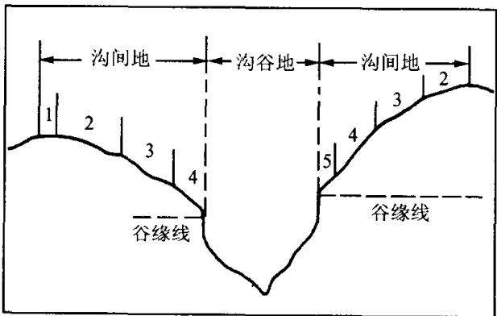  
图4-3 坡耕地土壤侵蚀方式垂直分布特征

表4-17为杏子河流域1982年野外考察结合航片判读在1:10000地形图上编制的资料。除基本农田和乔灌草地为轻度或无明显侵蚀外，其他均为坡耕地上发生的侵蚀类型，自分水岭向下至谷缘线的沟间地即梁峁坡面，土壤侵蚀方式由片蚀发展为细沟，由细沟再发展为浅沟和切沟侵蚀，侵蚀强度愈来愈大。片蚀和细沟侵蚀发生在梁峁坡面的上部，占坡耕地侵蚀面积不足10%。梁峁坡面的中下部，由细沟侵蚀发展为浅沟侵蚀，发生浅沟的面积平均占沟间地面积的78.64%。在梁峁坡下部的浅沟侵蚀区，坡度多在25°以上，见多处浅沟已发展成切沟，不能再进行耕作而不得不弃耕。浅沟沟尾与切沟沟头的交接处，成为沟间地与沟谷地的分界线，即统称的谷缘线或沟缘线。由此可见，现代切沟侵蚀与坡耕地侵蚀的发展密切相关(图4-3)[30,31]。

表4-17 杏子河流域典型小流域沟间地不同侵蚀方式分布面积[30]
<table><tr><td rowspan="2">流域 名称</td><td rowspan="2">流域面积  $\lambda \mathbf { m } ^ { 2 }$ </td><td rowspan="2">沟间地面积 /km²</td><td colspan="2">无明显侵蚀</td><td rowspan="2">鱗片状 侵蚀乔 灌草地</td><td rowspan="2">溅蚀和 片蚀</td><td rowspan="2">片蚀和 细沟侵蚀</td><td rowspan="2">强度细 沟侵蚀</td><td rowspan="2">细沟浅 沟侵蚀</td><td rowspan="2">浅沟细总浅沟 沟侵蚀 侵蚀带</td><td rowspan="2"></td></tr><tr><td>基本 农田</td><td>密丛乔 灌林地</td></tr><tr><td>箭干梁沟</td><td>4.790</td><td>2.486</td><td>6.93</td><td>5.35</td><td>5.55</td><td>0.56</td><td>7.32</td><td>0.52</td><td>50.11</td><td>23.66</td><td>73.77</td></tr><tr><td>城子沟</td><td>5.240</td><td>2.373</td><td>2.32</td><td>1.39</td><td>5.48</td><td>0</td><td>7.25</td><td>3.12</td><td>60.18</td><td>18.29</td><td>78.46</td></tr><tr><td>大庄河沟</td><td>1.581</td><td>0.895</td><td>1.34</td><td>0.34</td><td>0</td><td>0</td><td>8.04</td><td>0</td><td>71.29</td><td>18.99</td><td>90.28</td></tr><tr><td>寺沟</td><td>8.321</td><td>3.584</td><td>4.49</td><td>3.91</td><td>7.01</td><td>0</td><td>6.10</td><td>0</td><td>64.60</td><td>13.88</td><td>78.48</td></tr><tr><td>纸坊沟</td><td>8.286</td><td>3.703</td><td>3.70</td><td>10.15</td><td>9.96</td><td>0.43</td><td>3.56</td><td>0</td><td>56.65</td><td>15.55</td><td>72.20</td></tr><tr><td>平均</td><td>5.643</td><td>2.609</td><td>3.79</td><td>4.24</td><td>5.60</td><td>0.20</td><td>6.45</td><td>0.75</td><td>60.56</td><td>18.08</td><td>78.64</td></tr></table>

以杏子河流域为例，坡耕地土壤侵蚀方式呈垂直分布特点，与流域内坡度组成及其分布特征密切相连[30,32]。沟间地开垦为耕地的占80%\~90%，沟谷地开垦为耕地的占20%\~30%。表4-18说明，流域内沟间地小于12°的坡面仅占6.7%，多集中在梁坡面上部，这与坡耕地的片蚀细沟侵蚀的面积基本相符； $1 2 ^ { \circ } \sim 2 5 ^ { \circ }$ 占40.88%，多集中在梁坡面中部，为细沟和浅沟侵蚀发生区；25°以上52.44%，多集中在梁坡面下部，也是强度浅沟侵蚀发生区。谷坡的坡度多在25°以上，其中大于35°的占80%以上。谷坡开垦后的陡坡耕地，其侵蚀方式也以细沟和浅沟侵蚀为主，由于坡度多已超过25°，加之上部大面积梁昴坡面的汇流，加剧了谷坡侵蚀和沟床下切，并激发崩塌、滑坡侵蚀，增加了侵蚀产沙量和入河泥沙量。坡耕地不同侵蚀方式的侵蚀产沙量，主要通过野外考察、定位观测及人工降雨试验等，取得基本的定量评价。

表4-18 杏子河流域典型小流域沟间地与沟谷地各级坡度的比例[30] (单位：%)
<table><tr><td rowspan="2">流域名称</td><td rowspan="2">流域面积 的比例</td><td rowspan="2">沟间地占流域 面积的比例</td><td colspan="6">沟间地内各级坡度的比例</td><td colspan="2">沟谷地内坡度的比例</td></tr><tr><td>0°~5°</td><td>5°~12°</td><td>12°~25°</td><td>25°~35°</td><td>&gt; 35°</td><td>&gt;25°</td><td>&gt; 25°</td><td>&gt;35°</td></tr><tr><td>箭杆梁沟</td><td>4.79</td><td>51.89</td><td>0.57</td><td>8.10</td><td>39.83</td><td>36.67</td><td>14.82</td><td>51.49</td><td>93.80</td><td>83.46</td></tr><tr><td>城子沟</td><td>5.24</td><td>45.99</td><td>0</td><td>5.94</td><td>41.60</td><td>36.58</td><td>15.88</td><td>52.46</td><td>96.71</td><td></td></tr><tr><td>寺沟</td><td>1.58</td><td>56.67</td><td>1.34</td><td>4.47</td><td>39.89</td><td>37.76</td><td>16.54</td><td>54.30</td><td>94.75</td><td>66.62</td></tr><tr><td>大庄河沟</td><td>8.32</td><td>43.07</td><td>0.59</td><td>4.77</td><td>40.07</td><td>43.60</td><td>10.97</td><td>54.58</td><td>85.48</td><td>77.94</td></tr><tr><td>纸坊沟</td><td>8.29</td><td>44.69</td><td>1.19</td><td>6.56</td><td>43.04</td><td>38.35</td><td>10.86</td><td>49.21</td><td>82.65</td><td>74.69</td></tr><tr><td>平均</td><td>5.64</td><td>48.46</td><td>0.74</td><td>5.97</td><td>40.88</td><td>38.59</td><td>13.82</td><td>52.41</td><td>90.68</td><td>73.17</td></tr></table>

## （二）坡耕地不同侵蚀方式侵蚀量的测算和评价

## 1. 坡耕地雨滴侵蚀和表土结皮对侵蚀的影响

雨滴侵蚀和片蚀为坡耕地侵蚀方式的起始阶段，其侵蚀产沙量在坡耕地总侵蚀量中比值虽然很小，但却是土壤侵蚀发展的起始因素。因雨滴侵蚀形成的土壤结皮往往是削

减土壤入渗、加大径流侵蚀，促使细沟侵蚀发生的重要下垫面条件。陆兆雄、蔡强国的研究提出，因雨滴打击表土的可结皮性，是土壤可蚀性的一种度量，尤其是黄土的结皮性更为突出[33]。

溅蚀分散率与表土结皮强度有较好的相关性

$$
S \ = \ 1 . 7 6 4 + 1 . 4 7 2 / p ^ { 2 } - 1 6 . 3 6 / ( p ^ { 2 } ) ^ { 2 }
$$

式中，S为溅蚀分散率 $( \bf { g } / \bf { m i n } )$ ; $p ^ { 2 }$ 为土壤侵蚀强度指标。

据人工降雨溅蚀分散率的试验[33]，在试验开始阶段(15mm降雨)表土结皮不稳定，不断形成又不断被破坏；当降雨超过该临界值以后，表土结皮变得稳定。因表土结皮的形成，溅蚀分散率减少15%\~65%，随之土壤入渗减弱，径流量增大，促使片蚀和细沟侵蚀的发生。

蔡强国等引用陕北子洲径流站团山沟3号径流场的资料，分析评价表土结皮对坡耕地侵蚀产沙的作用[34]。当降雨前期已形成表土结皮情况下，产流量与径流系数增加13倍，产沙量与侵蚀模数增加了14倍(表4-19)。

表4-19 前期表土结皮对径流侵蚀产沙的影响[34]
<table><tr><td>降雨时间</td><td>降雨量 /mm</td><td>最大雨强 /(mm/min)/(mm/h)</td><td> $\scriptstyle { I _ { 1 0 } }$ </td><td> $I _ { 3 0 }$  /(mm/h)</td><td>径流量  $/ \mathbf { m } ^ { 3 }$ </td><td>径流系数 /%</td><td>产沙量  $/ \mathbf { k } \mathbf { g }$ </td><td>土壤侵蚀模数  $/ [ V ( \mathtt { h m } ^ { 2 } \cdot \mathtt { a } ) ]$ </td></tr><tr><td>1967-08-19</td><td>12.3</td><td>2.5</td><td>56.2</td><td>24.3</td><td>0.26</td><td>2.5</td><td>165</td><td>625</td></tr><tr><td>1967-08-22</td><td>12.3</td><td>2.1</td><td>31.2</td><td>18.7</td><td>3.50</td><td>31.7</td><td>2 480</td><td>709</td></tr></table>

当前期有表土结皮时，径流量的增加又为细沟的产生提供了水动力条件。团山沟3号径流场1963\~1967年的径流场资料说明4年中产流37次，发生的细沟侵蚀的19次，其中7次是在前期有表土结皮情况下发生的细沟侵蚀，细沟侵蚀可占坡耕地年侵蚀总量的68% \~90%。

## 2. 坡耕地细沟侵蚀和浅沟侵蚀的野外调查测算

发生在坡耕地上的侵蚀，国外的研究多侧重于细沟侵蚀，因开垦坡度多在10°以下，一般不发生浅沟侵蚀。美国坡耕地在大于8%的情况下即称为陡坡耕地。黄土丘陵区坡耕地的侵蚀，如前所述，不仅发生细沟侵蚀，而且形成发育了浅沟。尤其在大于25°的坡耕地，浅沟侵蚀占主导地位。在野外考察中，细沟和浅沟侵蚀量主要通过量算单位面积发生的细沟和浅沟的密度(km/km²)，及当年降雨后细沟和浅沟发展的长度及切割的深度和宽度。以当年细沟、浅沟切割的单位体积和土壤容重的乘积求得细沟和浅沟侵蚀量，测算方法虽然比较粗放，但能较实际地反映细沟和浅沟侵蚀量[24]。

杏子河流域为典型的梁昴状黄土丘陵沟壑区，坡耕地占耕地面积的70%\~90%，毁林毁草开垦已由梁昴坡面发展到谷坡，大于25°的陡坡耕地占50%以上，细沟侵蚀和浅沟侵蚀均十分强烈。

据1982年的野外调查测算(表4-20)[24,30]，该年坡耕地上的细沟、浅沟侵蚀量多在1万 $\scriptstyle { t k m ^ { 2 } }$ 以上，最高可达5万\~6万 $\nu \mathrm { k m } ^ { 2 }$ 。在同样降雨和土地利用情况下，细沟和浅沟侵蚀量主要决定于坡度、坡形及径流汇集量。浅沟多发生在梁昴坡中下部的凹形和凸凹形坡地，径流汇集量较大。浅沟的发生发展，又促使坡面向凹形发展，其结果形成凹凸起伏的瓦背状地形。发生浅沟的坡耕地，侵蚀量多在3万 $\sim 5 \ : \mathcal { F } \ : \nu \mathrm { k m } ^ { 2 }$ ，其中浅沟侵蚀量占60%\~85%。当年新开垦休闲地，尚未及发育浅沟，但侵蚀模数达55100\~$6 6 ~ 4 1 5 V ( \mathrm { k m } ^ { 2 } \cdot \mathrm { a } )$ ；相邻未开垦荒地，基本上未发生细沟侵蚀，两者强烈对比，更充分说明人为不合理活动，可使土壤侵蚀在开垦和不开垦的短暂间发生剧烈变化。

表4-20 杏子河流域坡耕地细沟和浅沟侵蚀量(1982 年)
<table><tr><td>量测日期地点(乡名）利用情况</td><td></td><td></td><td>地形部位</td><td>坡度/(°)</td><td>坡形</td><td>细沟侵蚀量 (A)/(t/km²)</td><td>浅沟侵蚀量 (B)/(t/km²)</td><td> $B / ( A + B ) / \%$ </td></tr><tr><td>08-20</td><td>五里湾</td><td>翻耕休闲</td><td>梁昴坡</td><td>20~30</td><td>直形</td><td>9 398</td><td></td><td></td></tr><tr><td>08-21</td><td>五里湾</td><td>翻耕休闲</td><td>梁昴坡</td><td>25~30</td><td>凸凹形</td><td>2 863</td><td>16 991</td><td>85.6</td></tr><tr><td>08-21</td><td>五里湾</td><td>新垦休闲</td><td>梁峁坡</td><td>35~40</td><td>直形</td><td>55 100</td><td></td><td></td></tr><tr><td>08-21</td><td>五里湾</td><td>黃</td><td>梁昴坡</td><td>35~40</td><td>凸凹</td><td>10 612</td><td>36 305</td><td>77.8</td></tr><tr><td>08-31</td><td>张渠</td><td>荞 麦</td><td>梁昴坡</td><td>25~30</td><td>直形</td><td>29 028</td><td></td><td></td></tr><tr><td>10-10</td><td>招安</td><td>麻</td><td>梁峁坡</td><td>25~40</td><td>微凸凹</td><td>6 464</td><td>10 468</td><td>61.8</td></tr><tr><td>08-27</td><td>张 渠</td><td>新垦休闲</td><td>谷 坡</td><td>35~40</td><td>凹形</td><td>66 415</td><td></td><td></td></tr><tr><td>08-27</td><td>张渠</td><td>荞麦</td><td>谷 坡</td><td>25~30</td><td>微凸凹</td><td>36 928</td><td></td><td></td></tr><tr><td>09-4</td><td>杏河</td><td>谷 子</td><td>谷 坡</td><td>28~35</td><td>凹形</td><td>17 856</td><td>37 341</td><td>67.7</td></tr><tr><td>08-21</td><td>五里湾</td><td>荞 麦</td><td>谷</td><td>坡 30~37</td><td>凹形</td><td>20 980</td><td>15 400</td><td>42.3</td></tr></table>

1985年郑粉莉在杏子河流域安塞县的野外调查测算(表4-21)[35]，取得了类同的结果。细沟和浅沟侵蚀量的比值为1:2\~8，浅沟侵蚀量占50%\~90%，平均为79.7%。

表4-21 安塞坡耕地细沟侵蚀与浅沟侵蚀的比较
<table><tr><td>坡度/(°)</td><td>作物</td><td>细沟侵蚀量  $( A ) / ( \log / \operatorname* { m } ^ { 2 } )$ </td><td>浅沟侵蚀量  $( B ) / ( \log / \operatorname* { m } ^ { 2 } )$ </td><td>A: B 比值</td><td> $B / ( A + B ) / \%$ </td></tr><tr><td>32</td><td>大豆</td><td>8.558</td><td>27.490</td><td>1:3.21</td><td>76.2</td></tr><tr><td>28</td><td>大豆</td><td>9.125</td><td>54.235</td><td>1:5.94</td><td>85.6</td></tr><tr><td>35</td><td>大豆</td><td>12.482</td><td>99.063</td><td>1:7.98</td><td>89.0</td></tr><tr><td>26</td><td>荞麦</td><td>12.740</td><td>27.316</td><td>1:2.15</td><td>68.1</td></tr></table>

注：1985年野外调查测算，降雨量56.0mm,30min雨强为0.85mm/min。

## 3. 坡耕地细沟侵蚀和浅沟侵蚀的定位和人工降雨观测

人工降雨试验可提供不同雨强、不同坡度情况下细沟侵蚀发生发展规律及其侵蚀量的评价。表4-22为人工降雨试验条件下细沟侵蚀与总侵蚀量的比较[35]。在同样降雨情况下，当坡度由20°增至25°时，侵蚀量增加了0.68\~2.82倍，细沟侵蚀量也呈相应增加。在同样坡度情况下，因雨强的增加，侵蚀量的增加更明显，为2\~5倍。

表4-23表明[36]，除5°坡度外，其他坡度均发生了细沟侵蚀，总侵蚀量和细沟侵蚀量均随坡度增加而增加，细沟侵蚀量占总侵蚀量的75%\~96%，平均为86.1%。细沟侵蚀量(S)与坡度(γ)呈正相关,其关系式 $S = 3 5 7 . 0 0 8 5 \gamma ^ { 0 }$ 9246，相关系数 $r = 0 . 9 9 0 .$

表4-22 细沟侵蚀量与总侵蚀量的比较
<table><tr><td>雨强  $/ ( \mathrm { { m m / m i n } } )$ </td><td>坡度/(°)</td><td>总侵蚀量  $/ ( \log / \operatorname* { m } ^ { 2 } )$ </td><td>增值</td><td>细沟侵蚀量  $/ ( \log / \mathbf { m } ^ { 2 } )$ </td><td>增值</td><td>细沟侵蚀 占总侵蚀量/%</td></tr><tr><td>1.45</td><td>20</td><td>1.737</td><td>1</td><td>1.647</td><td>1</td><td>92.1</td></tr><tr><td>1.45</td><td>25</td><td>6.632</td><td>3.82</td><td>5.522</td><td>3.35</td><td>83.2</td></tr><tr><td>2.40</td><td>20</td><td>10.760</td><td>1</td><td>5.518</td><td>1</td><td>51.3</td></tr><tr><td>2.40</td><td>25</td><td>18.015</td><td>1.68</td><td>11.962</td><td>2.16</td><td>66.4</td></tr></table>

注：采用侧喷式人工降雨装置，降雨小区1.5m×5m。

表4-23 不同坡度细沟侵蚀人工降雨试验
<table><tr><td>坡度/(°)</td><td>降雨量 /mm</td><td>降雨历时 /min</td><td>总侵蚀量  $/ ( t M n ^ { 2 } )$ </td><td>增值</td><td>细沟侵蚀量  $/ ( t / \mathbf { k m } ^ { 2 } )$ </td><td>增值</td><td>细沟侵蚀量 占总侵蚀量/%</td></tr><tr><td>5</td><td>49.8</td><td>30</td><td>2 438</td><td>1</td><td>0</td><td></td><td></td></tr><tr><td>10</td><td>47.5</td><td>30</td><td>3 026</td><td>1.24</td><td>2 914</td><td>1</td><td>96.3</td></tr><tr><td>15</td><td>48.9</td><td>30</td><td>5 821</td><td>2.39</td><td>4 371</td><td>1.5</td><td>75.1</td></tr><tr><td>20</td><td>49.2</td><td>30</td><td>7 686</td><td>3.15</td><td>6 021</td><td>2.1</td><td>78.3</td></tr><tr><td>25</td><td>47.1</td><td>30</td><td>7 911</td><td>3.24</td><td>7 364</td><td>2.5</td><td>93.1</td></tr><tr><td>30</td><td>49.6</td><td>30</td><td>8744</td><td>3.60</td><td>7 671</td><td>2.6</td><td>87.7</td></tr></table>

注：采用侧喷式人工降雨装置，降雨小区2m×7m。

黄土丘陵沟壑区坡耕地或沟间地侵蚀量的测算，通常以规则的直形坡径流小区的观测为依据，其侵蚀方式如以上人工降雨试验，在≥10° $\geqslant 1 0 ^ { \circ }$ 情况下，以细沟侵蚀为主。对于在坡面上发生的浅沟侵蚀多被忽略，其结果在以小流域为单元，评价坡、沟各自系统的侵蚀产沙量时，坡面侵蚀量估算值偏低，相应沟谷的侵蚀产沙量偏高，从而影响到治理方针和投资决策，其结果重治沟，轻治坡，致使毁林毁草陡坡开垦一度未能得到有力的遏制。

在野外调查的基础上，田间径流小区的定位观测进一步提供了坡耕地浅沟侵蚀的发生发展及其侵蚀强度的数据[31,32]。张科利以发生浅沟侵蚀的常见坡度(25°)为基础，在田间布设含有浅沟的自然坡面径流小区 $\mathrm { 1 0 m \times 7 8 m ) }$ )。据1987年降雨情况下的观测资料(表4-24)，全坡面自上而下可分为片蚀细沟侵蚀带，约在坡面上部的0\~10m处；在坡面的中下部均为发生细沟、浅沟侵蚀带。4次降雨资料的统计分析，土壤侵蚀主要发生在细沟、浅沟侵蚀带，侵蚀量平均占总侵蚀量的88.36%。在该侵蚀带又以浅沟侵蚀为主，占该带侵蚀总量的89.48%，占总侵蚀量的79.01%，故坡耕地的侵蚀量必须考虑浅沟侵蚀。以上浅沟侵蚀量相当于浅沟密度 $6 4 . 1 \mathrm { k m } / \mathrm { k m } ^ { 2 }$ 情况下的测值。黄土丘陵沟壑区浅沟平均密度 $2 9 . 7 7 \mathrm { k m } / \mathrm { k m } ^ { 2 }$ ，浅沟侵蚀占坡面总侵蚀量的35%左右。该数值可作为黄土丘陵沟壑区小流域坡沟侵蚀产沙量估算的校正值[31,32]。

表4-24 田间径流小区浅沟侵蚀量的观测数据
<table><tr><td rowspan="2">降雨 时间</td><td rowspan="2">降水量 /mm</td><td rowspan="2">最大 30min 雨强 /(mm/min)</td><td rowspan="2">全坡面 侵蚀量 (W)/kg</td><td colspan="2">片蚀、细沟侵 蚀带侵蚀量(A)</td><td colspan="2">细沟浅沟侵蚀 带侵蚀量(B)</td><td rowspan="2">浅沟侵蚀量(C) (C/W)/%</td></tr><tr><td>A/kg</td><td>(A/W)/%</td><td>B/kg (B/W)/%</td><td></td></tr><tr><td>06-06</td><td>14.6</td><td>0.346</td><td>1 031.50</td><td>68.32</td><td>6.62</td><td>963.18</td><td>93.38</td><td>893.80 86.60</td></tr><tr><td>07-17</td><td>10.7</td><td>0.396</td><td>1 148.87</td><td>46.48</td><td>4.05</td><td>1 102.40</td><td>95.95 892.40</td><td>77.67</td></tr><tr><td>08-19</td><td>10.0</td><td>0.910</td><td>3 233.94</td><td>357.90</td><td>11.07</td><td>2 876.04</td><td>88.93 2503.01</td><td>77.40</td></tr><tr><td>08-24</td><td>7.8</td><td>0.113</td><td>1.21</td><td>0.30</td><td>24.79</td><td>0.91</td><td>75.21 0.90</td><td>74.38</td></tr><tr><td>平均</td><td></td><td></td><td></td><td></td><td>11.64</td><td></td><td>88.36</td><td>79.01</td></tr></table>

杏子河流域土壤侵蚀考察中，基于坡耕地细沟侵蚀和浅沟侵蚀量的调查测算，又据流域内沟谷侵蚀产沙主要源于林草植被破坏和谷坡地的开垦及土壤侵蚀方式的垂直分布特征及不同坡度的垦殖率，推算得出坡耕地的侵蚀总量。按1982年坡面开垦指数0.9和谷坡开垦指数0.25统计推算，坡耕地总侵蚀量1295.5万t,占杏子河流域总输沙量2251万t的57.55%[30]，该数值尚不包括坡耕地侵蚀所激发的沟谷侵蚀和重力侵蚀。杏子河流域的地形、土地利用等基本上代表了黄土丘陵沟壑区。按照以上统计推算，坡耕地的侵蚀量可占河流总输沙量的50%\~60%。因此，对于河流泥沙来自坡或沟的问题，必须同时查明侵蚀产沙的原由及侵蚀产沙对生态环境的影响。

## 三、坡耕地土壤侵蚀与土壤质量演变

## （一）坡耕地土壤侵蚀与土壤养分流失

## 1. 坡耕地土壤侵蚀与黄河泥沙来源

黄土高原千沟万壑的侵蚀地貌与黄河的高含沙量，使人们注意到沟谷侵蚀对入黄泥沙的影响，就坡耕地侵蚀对入黄泥沙的影响则估计不足。从坡耕地的发展，又通过坡面径流小区的观测及坡耕地细沟、浅沟等侵蚀强度的测定，基本上获得了坡耕地侵蚀在黄河泥沙中所占地位的定量评论。通过研究比较黄河主要支流泥沙与侵蚀产沙源地耕层土壤中颗粒组成与养分含量的比较(表4-25、图4-4)，取得河流泥沙来源的初步概念[37]。

河流泥沙样品取自各河流汛期悬移质泥沙，土壤样品取自流域内坡耕地代表性耕层土样，进行了颗粒组成、全氮、碱解氮、有效磷和有效钾的测定。以泥沙中测定值与耕层土样中测定值之比为富集比，进行比较。富集比接近1或大于1的情况下，说明泥沙来自坡耕地为主；富集比小于1的情况下，说明泥沙来自沟谷部位的地层为主。

表4-25和图4-4说明，大部分黄河支流水系的小于0.01颗粒和氮、磷、钾养分都有富集现象，尤以三川河、汾河、渭河、延河较为明显。黄河干流下游三门峡测站的富集比多大于1,碱解氮1.52,有效态磷达3.89。泥沙和土壤中养分富集比的比较虽然不能做出确切的定量评价，但指示了坡耕地侵蚀产沙对增加入河泥沙的作用，这与以上研究的坡耕地入河泥沙占河流输沙量50%\~60%的估算值基本接近。

表 4-25 黄河主要支流泥沙(R)和土壤(S)中  
细颗粒和养分的富集比(R/S)[37]
<table><tr><td rowspan="2">流域名称</td><td colspan="2">颗粒组成</td><td rowspan="2">全氮</td><td rowspan="2">碱解氮</td><td rowspan="2">有效磷</td><td rowspan="2">有效钾</td></tr><tr><td>&gt;0.05/mm</td><td>&lt;0.01/mm</td></tr><tr><td>皇甫川</td><td>0.80</td><td>1.77</td><td>0.61</td><td>1.48</td><td>1.30</td><td>1.82</td></tr><tr><td>窟野河</td><td>1.71</td><td>0.41</td><td>0.58</td><td>2.59</td><td>3.25</td><td>1.24</td></tr><tr><td>大理河</td><td>0.49</td><td>1.55</td><td>0.76</td><td>1.36</td><td>2.17</td><td>1.22</td></tr><tr><td>三川河</td><td>0.23</td><td>1.28</td><td>1.24</td><td>2.46</td><td>0.99</td><td>0.99</td></tr><tr><td>清涧河</td><td>0.46</td><td>2.14</td><td>1.14</td><td>1.11</td><td>2.85</td><td>1.50</td></tr><tr><td>延河</td><td>0.88</td><td>1.06</td><td>0.75</td><td>0.93</td><td>4.47</td><td>0.96</td></tr><tr><td>洛河</td><td>0.55</td><td>0.60</td><td>0.36</td><td>0.69</td><td>3.17</td><td>0.69</td></tr><tr><td>渭河</td><td>2.39</td><td>0.96</td><td>0.75</td><td>0.97</td><td>3.40</td><td>0.83</td></tr><tr><td>黄河(三门峡)</td><td>0.72</td><td>0.72</td><td>0.82</td><td>1.52</td><td>3.89</td><td></td></tr></table>

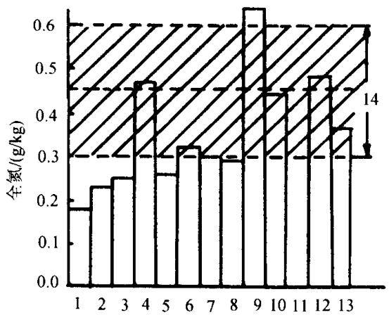

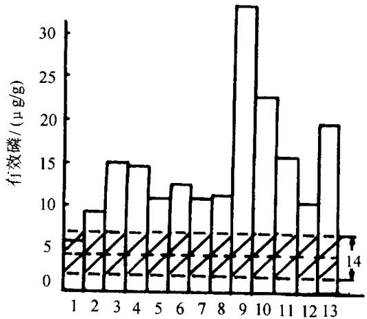  
图4-4 黄河及主要支流泥沙和土壤中全氮和有效磷含量比较  
1. 皇甫川；2. 窟野河；3. 佳芦河；4. 三川河；5. 大理河；6. 清涧河；7. 延河；8. 洛河；9. 汾河；10. 渭河；11. 黄河(龙门)；12. 黄河(潼关)；13. 黄河(三门峡)；14. 土壤中全氮含量，土壤中有效磷含量

## 2. 坡耕地土壤侵蚀与养分流失

河流泥沙中养分富集现象，也出现在坡耕地的流失泥沙中。刘秉正等通过在黄土高原南部淳化县设置的径流小区(5m×20m)，研究比较了泥沙和坡耕地耕层土壤中养分含量的变化(表4-26)[38]。坡耕地流失泥沙中有机质、全氮和碱解氮的比值显然大于1,依次为1.43、1.67和1.2。1987\~1993年，泥沙中有机质和全氮年均下降分别为0.083%和0.006%，坡耕地土壤养分随侵蚀时间的延续呈衰减趋势。综合观测结果，土壤养分流失量随坡度增大呈幂函数增大。径流中养分含量极微量，因此泥沙流失量是养分衰减的主要途径，以有机质和氮素的衰减最为明显。

表4-26 黄土高原南部坡耕地(6°)流失泥沙与耕层土壤养分的比较[38]
<table><tr><td rowspan="2">测定时间</td><td colspan="2">有机质/(g/kg)</td><td colspan="2">全氮/(g/kg)</td><td colspan="2">全磷/(g/kg)</td><td colspan="2">碱解氮/(mg/kg)</td><td colspan="2">速效磷/(mg/kg)</td></tr><tr><td>泥沙</td><td>土壤</td><td>泥沙</td><td>土壤</td><td>泥沙</td><td>土壤</td><td>泥沙</td><td>土壤</td><td>泥沙</td><td>土壤</td></tr><tr><td>1987-06</td><td>13.80</td><td>9.33</td><td>1.29</td><td>0.88</td><td>0.48</td><td>0.48</td><td></td><td></td><td></td><td></td></tr><tr><td>1989-06</td><td>14.10</td><td>9.84</td><td>1.41</td><td>0.71</td><td>0.93</td><td>0.93</td><td></td><td></td><td></td><td></td></tr><tr><td>1993-05</td><td>8.85</td><td>6.46</td><td>0.95</td><td>0.59</td><td>0.37</td><td>0.63</td><td>40.2</td><td>33.5</td><td>2.35</td><td>2.88</td></tr><tr><td>平均</td><td>12.25</td><td>8.54</td><td>1.22</td><td>0.73</td><td>0.59</td><td>0.59</td><td>40.2</td><td>33.5</td><td>2.35</td><td>2.88</td></tr></table>

王继增等应用径流小区(4m×15m)，观测研究了安塞黄土坡耕地水土流失与氮素流失规律(表4-27)[39]。

表4-27 不同利用径流小区泥沙中的氮素含量
<table><tr><td rowspan="2"></td><td rowspan="2">泥沙量  $/ ( \mathbb { k } \mathbb { g } / \mathbb { K } )$ </td><td rowspan="2">全氮含量  $/ ( \mathbf { g } / \mathbf { k } \mathbf { g } )$ </td><td rowspan="2">碱解氮含量  $/ ( \mathrm { m g / k g } )$ </td><td colspan="2">富集比</td><td colspan="3">汛期量占全年总量/%</td></tr><tr><td>全氮</td><td>碱解氮</td><td>泥沙</td><td>全氮</td><td>碱解氮</td></tr><tr><td>裸地</td><td>1 298</td><td>0.55</td><td>60.5</td><td>1.17</td><td>1.31</td><td>96.5</td><td>98.7</td><td>84.5</td></tr><tr><td>谷子</td><td>189</td><td>0.57</td><td>76.5</td><td>1.21</td><td>1.65</td><td>91.3</td><td>90.8</td><td>75.9</td></tr><tr><td>大豆</td><td>143</td><td>0.50</td><td>72.8</td><td>1.06</td><td>1.09</td><td>93.7</td><td>98.6</td><td>76.2</td></tr><tr><td>红豆草</td><td>106</td><td>0.48</td><td>64.8</td><td>1.02</td><td>1.04</td><td>91.2</td><td>93.2</td><td>78.3</td></tr></table>

注：1988年全年测定值和汛期8月1\~9日测定值；径流小区面积：4m×15m，坡度25°；耕层土壤中全氮含量0.47g/kg，碱解氮含量46.2mg/kg。

表4-27表明，不同土地利用情况下，降雨侵蚀后，全氮和碱解氮的富集比均大于1，碱解氮高于全氮。不同利用的坡耕地，侵蚀产沙均集中于汛期，仅8月1\~9日的泥沙冲刷量及全氮的流失量，占全年的90%以上；碱解氮的流失量占全年的75%以上。养分流失量与泥沙冲刷量呈极显著正相关。

彭琳等应用径流小区(5m×20m)和15N示踪技术，研究了黄绵土坡耕地(25°)降雨侵蚀后碱解氮的富集比(表4-28)[40]。研究结果表明，不同土地利用情况下，碱解氮的富集比均大于1，以谷子地的富集比最高，这与谷子地的施肥水平高于大豆地有关。随降雨量的变化，碱解氮富集比有明显差异。降雨量小，富集比大；降雨量大，富集比小，这主要与泥沙的颗粒组成有关。降雨量大的情况下，侵蚀产沙强度大，推移质相对增多；降雨量小，侵蚀产沙强度相对较弱，以悬移质为主。养分的流失过程中主要随细颗粒悬移质富集，多沙粗砂区泥沙的养分富集一般低于细砂产沙区[37]。

表4-28 不同降雨情况下泥沙与土壤中氮素富集比
<table><tr><td rowspan="2">观测日期</td><td rowspan="2">降雨量 /mm</td><td rowspan="2">降雨 级别</td><td colspan="3">碱解氮富集比</td><td colspan="3">不同降雨碱解氮富集比</td></tr><tr><td>裸露</td><td>谷子</td><td>大豆</td><td>裸露</td><td>谷子</td><td>大豆</td></tr><tr><td>1995-06-26</td><td>48.0</td><td>大雨</td><td>1.247</td><td>1.632</td><td>1.474</td><td>1.185</td><td>1.351</td><td>1.297</td></tr><tr><td>1995-07-31</td><td>20.0</td><td>中雨</td><td>1.578</td><td>1.909</td><td>1.794</td><td>1.500</td><td>1.581</td><td>1.579</td></tr><tr><td>1995-08-05</td><td>69.7</td><td>暴雨</td><td>1.052</td><td>1.208</td><td>1.136</td><td>1.000</td><td>1.000</td><td>1.000</td></tr></table>

坡耕地土壤侵蚀在流失大量表土的同时，土壤中养分急剧衰减，土壤肥力愈益贫瘠，每公顷粮食产量仅750\~1000kg。长期以来，在黄土高原形成了愈垦愈穷，愈穷愈垦，生态环境愈益退化的恶性循环。据彭琳、余存祖对黄土高原水土流失区1000余个耕层土样(0\~20cm)的分析测定，强度侵蚀土壤的有效养分含量多已下降了50%左右，多已接近黄土母质层(表4-29)[40,41]。

表4-29 黄土高原侵蚀与未侵蚀土壤养分含量比较
<table><tr><td>养分</td><td>土壤</td><td>样品数 1个</td><td>平均含量 /(14g/g)</td><td>比例 /%</td><td>养分</td><td>土壤</td><td>样品数 1个</td><td>平均含量  $/ ( \mu _ { \mathbf { g } } / \mathbf { g } )$ </td><td>比例 /%</td></tr><tr><td>有机质</td><td>强度侵蚀</td><td>170</td><td>4.49</td><td>48.5</td><td>有效磷</td><td>强度侵蚀</td><td>87</td><td>0.14</td><td>50.0</td></tr><tr><td rowspan="5">全氮</td><td>轻度侵蚀</td><td>214</td><td>8.68</td><td>93.8</td><td></td><td>轻度侵蚀</td><td>57</td><td>0.21</td><td>68.3</td></tr><tr><td>未侵蚀</td><td>396</td><td>9.25</td><td>100</td><td></td><td>未侵蚀</td><td>183</td><td>0.26</td><td>100</td></tr><tr><td>强度侵蚀</td><td>684</td><td>0.42</td><td>54.6</td><td>有效锰</td><td>强度侵蚀</td><td>15</td><td>6.10</td><td>63.5</td></tr><tr><td>轻度侵蚀</td><td>127</td><td>0.68</td><td>88.3</td><td></td><td>轻度侵蚀</td><td>50</td><td>9.00</td><td>93.8</td></tr><tr><td>未侵蚀</td><td>195</td><td>0.77</td><td>100</td><td></td><td>未侵蚀</td><td>163</td><td>9.60</td><td>100</td></tr><tr><td rowspan="3">全磷</td><td>强度侵蚀</td><td>158</td><td>1.29</td><td>84.9</td><td>有效铜</td><td>强度侵蚀</td><td>129</td><td>0.66</td><td>70.2</td></tr><tr><td>轻度侵蚀</td><td>190</td><td>1.39</td><td>91.5</td><td></td><td>轻度侵蚀</td><td>104</td><td>0.86</td><td>91.5</td></tr><tr><td>未侵蚀</td><td>393</td><td>1.52</td><td>100</td><td></td><td>未侵蚀</td><td>135</td><td>0.27</td><td>100</td></tr><tr><td rowspan="2">全钾</td><td>强度侵蚀</td><td>18</td><td>14.39</td><td>71.4</td><td>有效铁</td><td>强度侵蚀</td><td>116</td><td>3.70</td><td>66.1</td></tr><tr><td>轻度侵蚀</td><td>55</td><td>17.66</td><td>87.6</td><td></td><td>轻度侵蚀</td><td>81</td><td>4.50</td><td>80.4</td></tr><tr><td rowspan="4">有效磷</td><td>未侵蚀</td><td>187</td><td>20.15</td><td>100</td><td></td><td>未侵蚀</td><td>181</td><td>5.60</td><td>100</td></tr><tr><td>强度侵蚀</td><td>252</td><td>4.0</td><td>47.1</td><td>稀土元素</td><td>强度侵蚀</td><td>5</td><td>190.80</td><td>88.8</td></tr><tr><td>轻度侵蚀</td><td>110</td><td>5.9</td><td>69.4</td><td>总量</td><td>轻度侵蚀</td><td>6</td><td>206.40</td><td>96.1</td></tr><tr><td>未侵蚀</td><td>295</td><td>8.5</td><td>100</td><td></td><td>未侵蚀</td><td>12</td><td>214.80</td><td>100</td></tr></table>

## （二）林地开垦加速侵蚀与侵蚀环境的形成

黄土高原水土流失是黄河泥沙症结所在。鉴于治黄的紧迫性，长期以来水土流失规律的研究多着重于查明水土流失量及其对入黄泥沙的影响。设置在黄河流域各支流的水文站及大量典型沟道小流域在沟口设置的把口站，其目的在于测算径流量和泥沙量。水土保持措施的主要目标在于如何加快减少入黄泥沙量，因此，以蓄水拦沙治沟为主的工程措施，曾占主要地位。造林种草虽然也作为水土保持的三大措施之一，在水土流失区普遍推行，但收效不大。

截止到1989年底，黄河流域累计治理面积13.37万km²，其中梯田2.09万km²,坝地 $\mathbf { k } \mathbf { m } ^ { 2 }$ $\mathbf { k } \mathbf { m } ^ { 2 }$ $0 . 2 8 \mathcal { F } \mathrm { ~ k m } ^ { 2 }$ ,造林种草 $9 . 3 ~ \mathcal { F } ~ \mathrm { k m } ^ { 2 }$ (按保存率30%计，实际面积为2.7万km²)，修建百万立 $\mathbf { k } \mathbf { m } ^ { 2 } )$ 方米以上水库600余座。按各项水保措施效益分析，20世纪70年代和80年代年均减少入黄泥沙量3亿t左右，其中坝库工程的效益占90%，林草措施的效益不足5%。基于近40年来造林种草收效甚微的现状，有关水土保持和治黄部门及学术界，对黄土高原植被恢复和重建的问题出现了争议，长期以来不能取得较一致的认识，其原因之一是缺乏深入的科学研究。

自1997年以来，党和国家领导及政府部门把黄土高原生态环境建设列为重要议事日程，并就落实政策、制订规划、加强投入等方面均有了实质性进展。“退耕还林(草)，封山绿化，以粮代赈，个体承包”的政策，首先解决了造林种草与种植粮食作物的争地矛盾，造林种草有了突破性的进展。另一方面，生产治理形势的发展，对科学技术提出了更高的要求，即如何加快恢复和重建植被，如何提高存活率，如何保证可持续发展等问题。其核心问题是，因土壤侵蚀造成生态系统已严重恶化情况下，植被的恢复和重建必须与侵蚀环境的整治和调控协调相结合，尤其在黄土高原半干旱地区，这个问题更为突出。

已建立的黄土丘陵子午岭林区土壤侵蚀与生态环境演变观测场，不仅提供了林地开垦人为加速侵蚀的定量数据；而且通过模拟林地开垦后的人为加速侵蚀过程，揭示了土壤侵蚀与生态环境演变的机理，明确提出现代侵蚀过程以人为加速侵蚀占主导地位的论断，提出了水土流失区植被的恢复和重建应遵循植被的自然演替规律，并应结合现有侵蚀环境的整治和调控[27,28,42]。史衍玺在他的博士论文①中，专门讨论了林地开垦人为加速侵蚀过程中，土壤质量下降对侵蚀逆境形成和发展的影响。他以土壤抗侵蚀功能、土壤促进和维持植物生长功能、土壤促进和维持人体与动物健康的功能及土壤保护环境质量等四大功能，筛选出开垦侵蚀影响下最为敏感的6项土壤质量指标：有机质、全氮、碱解氮、速效磷、有效锌及大于0.25mm水稳性团粒含量。

唐克丽、史衍玺等通过林地开垦人为加速侵蚀与土壤质量演变机理的研究，进一步明确开垦侵蚀地的植被恢复和重建应与侵蚀环境的整治相结合[27,42,43]。

表4-30 林地与不同年限开垦侵蚀农地(坡度20°\~25°)土壤质量主要指标的变化
<table><tr><td>土地 利用</td><td>土层或 开垦年限</td><td>土层深度 /cm</td><td>有机质 /(g/kg)</td><td>全氮</td><td>碱解氮 /(g/kg)/(mg/kg)</td><td>速效磷</td><td>有效锌 ) /(mg/kg) /(mg/kg)</td><td>&gt;0.25mm 水稳性团粒/%</td></tr><tr><td rowspan="6">林地</td><td>A</td><td>0~20</td><td>27.2</td><td>1.32</td><td>140.4</td><td>8.37</td><td>1.050</td><td>61.5</td></tr><tr><td>A/B</td><td>20~40</td><td>11.7</td><td>0.68</td><td>43.5</td><td>6.71</td><td>0.572</td><td>31.6</td></tr><tr><td>B</td><td>40~60</td><td>6.3</td><td>0.47</td><td>34.3</td><td>4.31</td><td>0.323</td><td></td></tr><tr><td>B/C</td><td>60~80</td><td>5.4</td><td>0.41</td><td>29.1</td><td>3.69</td><td>0.265</td><td></td></tr><tr><td>C</td><td>80~100</td><td>4.2</td><td>0.36</td><td>22.9</td><td>2.77</td><td>0.230</td><td></td></tr><tr><td>6年</td><td>0~20</td><td>17.6</td><td>0.94</td><td>87.6</td><td>7.25</td><td>0.782</td><td>41.7</td></tr><tr><td rowspan="2">农地</td><td></td><td>20~40</td><td>9.2</td><td>0.58</td><td>37.2</td><td>5.24</td><td>0.435</td><td>28.3</td></tr><tr><td>10年</td><td>0~20</td><td>12.3</td><td>0.78</td><td>60.8</td><td>6.72</td><td>0.752</td><td>38.4</td></tr><tr><td rowspan="2">农地</td><td></td><td>20~40</td><td>7.0</td><td>0.54</td><td>35.0</td><td>5.24</td><td>0.386</td><td>22.8</td></tr><tr><td>20年</td><td>0~20</td><td>5.5</td><td>0.42</td><td>34.7</td><td>4.90</td><td>0.423</td><td>18.6</td></tr><tr><td rowspan="2">农地</td><td></td><td>20~40</td><td>5.0</td><td>0.40</td><td>26.8</td><td>4.62</td><td>0.402</td><td>14.2</td></tr><tr><td>30年</td><td>0~20</td><td>5.8</td><td>0.42</td><td>32.5</td><td>5.50</td><td>0.405</td><td>17.8</td></tr><tr><td rowspan="2"></td><td></td><td>20~40</td><td>4.9</td><td>0.37</td><td>27.5</td><td>5.24</td><td>0.372</td><td></td></tr><tr><td></td><td></td><td></td><td></td><td></td><td></td><td></td><td>16.1</td></tr></table>

## 1. 不同开垦侵蚀年限土壤物理、化学性状的演变

以林地作对照，毁林开垦后土壤侵蚀模数增长数百倍，甚至千倍以上，随之土壤质量下降，又反馈为侵蚀强度的增长。表4-30列举了林地土壤剖面不同发生层及不同开垦侵蚀年限土壤质量指标的变化。随开垦侵蚀年限的增长，表征土壤质量的主要指标值，呈减少趋势[42]。

表4-30说明，开垦侵蚀6年后的农地，表层土壤的养分和大于0.25mm的水稳性团粒含量，降低了约30%，以碱解氮的含量下降最明显，近38%。开垦侵蚀10年的农地，6项质量指标值下降近50%，已接近林地的A/B层。开垦侵蚀20年以上的农地，表层土壤中有效养分的含量仅及林地表层的20%\~30%，均已接近母质层(C)。影响人体健康的有效锌含量下降了60%，达最低值。

再以直接指示土壤中有效养分的含量进行比较。开垦侵蚀20年农地表层土壤的全氮、碱解氮的含量较原林地损失了68%\~75%；有机磷的损失率比较明显，达69.3%；全磷和全钾的损失率不明显，但速效磷和速效钾养分的损失达40%\~55%(表4-31)。

表4-31 林地与开垦侵蚀20年农地土壤中氮、磷、钾含量比较
<table><tr><td>项目</td><td>全氮  $\mathbf { \nabla } / ( \mathbf { g } / \mathbf { k g } )$ </td><td>碱解氮  $/ ( \mathbf { m g } / \mathbf { k g } )$ </td><td>全磷  $/ ( \mathbf { g } / \mathbf { k g } )$ </td><td>有机磷  $/ ( \mathbf { m g } / \mathbf { k g } )$ </td><td>速效磷  $/ ( \mathrm { m g / k g } )$ </td><td>全钾  $/ ( \mathbf { g } / \mathbf { k } \mathbf { g } )$ </td><td>速效钾  $/ ( \mathbf { m g } / \mathbf { k g } )$ </td></tr><tr><td>林地</td><td>1.32</td><td>140.4</td><td>0.712</td><td>187.0</td><td>8.37</td><td>19.82</td><td>163.5</td></tr><tr><td>开垦20年农地</td><td>0.42</td><td>34.7</td><td>0.581</td><td>57.5</td><td>4.90</td><td>18.39</td><td>72.5</td></tr><tr><td>农地减少量</td><td>0.90</td><td>105.7</td><td>0.131</td><td>129.5</td><td>3.47</td><td>1.43</td><td>91.0</td></tr><tr><td>农地减损率/%</td><td>68.2</td><td>75.3</td><td>18.4</td><td>69.3</td><td>41.50</td><td>7.20</td><td>55.7</td></tr></table>

注：林地与农地的坡度均为25°，土样为 $0 \sim 2 0 \mathrm { c m } _ { c }$

随着开垦侵蚀年限的增长，以年均侵蚀深10mm计算，20年后，原林地土壤的腐殖质层(A)多已流失殆尽，表层土壤逐渐被结构差、养分低的母质层所代替，并影响到土壤的持水性能(表4-32)。

表4-32 不同开垦侵蚀年限土壤有效水状况
<table><tr><td>开垦年限</td><td>田间持水量/%</td><td>凋萎湿度/%</td><td>有效水范围/%</td></tr><tr><td>6</td><td>21.44</td><td>9.96</td><td>11.48</td></tr><tr><td>10</td><td>20.73</td><td>11.04</td><td>9.69</td></tr><tr><td>20</td><td>19.26</td><td>9.64</td><td>9.62</td></tr><tr><td>林地</td><td>24.94</td><td>10.79</td><td>14.15</td></tr></table>

开垦侵蚀10年以上的农地，田间持水量较林地减少了13%，有效水范围减少了约4.5%，土壤的蓄水抗旱能力显然下降。以上系列土壤理、化性质的退化，也必然影响到土壤微生物区系的衰退，并引起土壤养分转化与循环的系列逆向反应。

## 2. 不同开垦侵蚀年限土壤生物学特性的变化

林地与开垦侵蚀农地的表层土壤微生物类群数量分析表明(图4-5)[43]，随年限的增长，十壤侵蚀程度增加，细菌、放线菌和真菌的数量呈明显减少趋势。开垦侵蚀20年的农地，表土层中细菌、放线菌、真菌的数量分别减少了79.0%、67.6%、83.5%，减少率以真菌>细菌>放线菌。

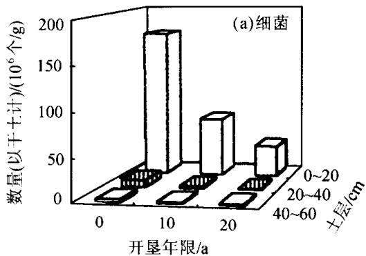

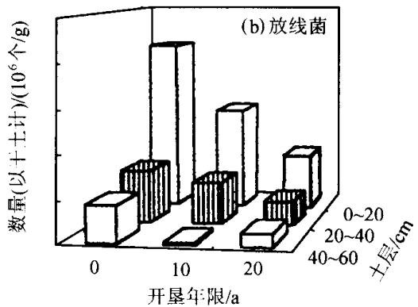

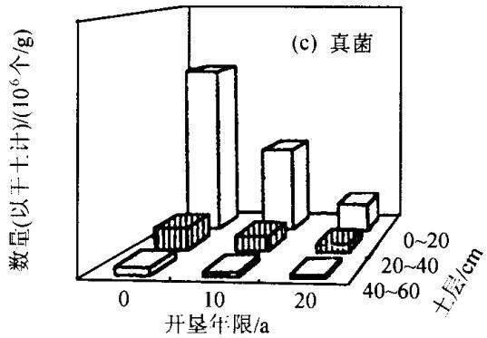  
图4-5 林地与开垦侵蚀农地土壤剖面微生物类群的变化

林地开垦后，加之侵蚀速率增大，原以生物积累为特征的成土过程，逆转为耗散性过程。随着土壤中有机质及有机磷含量的迅速下降，纤维素分解细菌与磷细菌的数量相应急剧减少。参与土壤物质循环的土壤酶活性明显下降。与林地土壤比，开垦侵蚀30年的农地，蔗糖酶、碱性磷酸酶、蛋白酶的活性分别下降了75.5%、73.5%和65.7%。

林地开垦后的人为加速侵蚀，不仅使土壤侵蚀强度发生剧烈的变化，并因自然生态平衡的失调，引起了系列土壤质量下降的连锁反应。土壤中微生物类群的数量、土壤酶活性与土壤有机质、全氮、碱解氮、有机磷、速效磷呈极显著正相关，并影响到土壤整体的水、肥、气热状况。

## 3. 不同侵蚀程度土壤侵蚀过程的人工降雨试验

随开垦侵蚀年限的增长，土壤质量呈下降趋势；土壤质量的下降，又促进了土壤侵蚀速率，两者互为因果，呈恶性循环。在林区布设的不同侵蚀程度土层的人工降雨试验(表4-33、表4-34)，进一步阐明了人为加速侵蚀与土壤质量演变机理。

表4-33 不同侵蚀程度土壤侵蚀过程的人工降雨试验
<table><tr><td>开垦土层 (发生层)/cm</td><td>径流量 /mm</td><td>稳渗率 /(mm/min)</td><td>侵蚀量  $/ ( \log / \mathbf { m } ^ { 2 } )$ </td><td>侵蚀量 比值</td><td>有机质  $/ ( \mathbf { g } / \mathbf { k g } )$ </td><td>水稳性 团粒/%</td><td>容重  $/ ( \mathbf { g } / \mathbf { c m } ^ { 3 } )$ </td><td>非毛管 孔隙/%</td></tr><tr><td>0~20(A)</td><td>29.5</td><td>0.74</td><td>2.036</td><td>1.00</td><td>26.6</td><td>63.1</td><td>0.92</td><td>12.6</td></tr><tr><td>20~40(A/B)</td><td>40.1</td><td>0.52</td><td>4.108</td><td>2.02</td><td>10.8</td><td>34.5</td><td>1.12</td><td>9.3</td></tr><tr><td>40~60(B)</td><td>45.1</td><td>0.22</td><td>5.553</td><td>2.73</td><td>6.1</td><td>16.9</td><td>1.25</td><td>6.2</td></tr><tr><td>60~80(C)</td><td>47.7</td><td>0.15</td><td>6.360</td><td>3.12</td><td>3.8</td><td>12.6</td><td>1.30</td><td>5.2</td></tr></table>

注：侧喷式人工降雨装置，一次降雨量60mm，雨强2.0mm/min，径流小区1.5m×5m,坡度25°。

表4-34 不同侵蚀程度土壤侵蚀过程的养分富集比
<table><tr><td rowspan="2">开垦土层 (发生层)/cm</td><td colspan="2">全氮  $Y ( \mathbf { g } / \mathbf { k } \mathbf { g } )$ </td><td rowspan="2">全氮 富集比</td><td colspan="2">碱解氮  $/ ( m g / \mathbf { k g } )$ </td><td rowspan="2">碱解氮 富集比</td><td colspan="2">速效磷  $/ ( \arg / \mathbf { k g } )$ </td><td rowspan="2">速效氮 富集比</td></tr><tr><td>泥沙</td><td>土壤</td><td>泥沙</td><td>土壤</td><td>泥沙</td><td>土壤</td></tr><tr><td>0~20(A)</td><td>1.43</td><td>1.35</td><td>1.06</td><td>147.0</td><td>118.2</td><td>1.24</td><td>9.93</td><td>8.24</td><td>1.20</td></tr><tr><td>20~40(A/B)</td><td>0.69</td><td>0.63</td><td>1.09</td><td>63.2</td><td>52.4</td><td>1.21</td><td>6.75</td><td>6.46</td><td>1.05</td></tr><tr><td>40~60(B)</td><td>0.46</td><td>0.44</td><td>1.05</td><td>31.3</td><td>28.7</td><td>1.09</td><td>4.68</td><td>4.48</td><td>1.04</td></tr><tr><td>60~80(C)</td><td>0.36</td><td>0.33</td><td>1.09</td><td>17.8</td><td>18.5</td><td>0.96</td><td>2.92</td><td>3.02</td><td>0.97</td></tr></table>

注：侧喷式人工降雨装置，一次降雨量60mm，雨强2.0mm/min，径流小区1.5m×5m，坡度25°。

当开垦侵蚀土层由A进入到B层和C层时，侵蚀量的比值由1增加到2.73\~3.12。侵蚀量的增加与表征土壤抗侵蚀功能敏感性指标的稳渗率、水稳性团粒含量、容重、非毛管孔隙及有机质含量均迅速下降，呈极显著相关。当侵蚀程度达母质层时，由于其本身有效养分含量很低，随同水土流失，全氮、碱解氮和有效磷的损失量不及表层土，泥沙中养分富集比小于1。该研究结果对评价河流泥沙来源有重要意义。

不同开垦侵蚀年限土壤质量的测定评价说明，人为加速侵蚀量是增加入河泥沙的重要来源。研究掌握土壤侵蚀过程与土壤质量演变的机理，在于明确土壤侵蚀的治理，不仅在于防治水与土的不再流失，必须重视其形成的侵蚀后果—侵蚀环境的全面整治。

## 第四节 沟谷侵蚀、侵蚀地貌演化与环境演变

黄土高原千沟万壑的侵蚀地貌是构成黄土高原严重水土流失的基本环境背景。沟谷既是侵蚀产沙的重要部位，也是输入黄河泥沙的主要渠道。沟谷系统是影响土壤侵蚀的重要地形因素。在现代侵蚀过程中，沟谷侵蚀在承袭古地貌和新构造运动影响基础上，同时接受人为活动的影响作用。沟谷部位植被的破坏或重建，或坝库工程的建设，将改变沟谷发育及侵蚀地貌演化过程。

## 一、沟谷侵蚀与人为加速侵蚀

## （一）沟谷侵蚀与植被的机制

## 1. 林草植被的恢复与坡、沟侵蚀的演变

黄土高原子午岭林区提供了沟谷侵蚀与林草植被机制的典型实例[27,28,45]。黄土高原子午岭林区跨陕、甘两省，总面积2.3万km²，地貌类型为梁状黄土丘陵沟壑，海拔高程920\~1683m，相对高差100\~200m，沟谷切割深。地面物质以黄土沉积物为主，沟谷底部出现三趾马红土和白垩系地层。区内林木郁闭度达0.7以上，主要树种有山杨、白桦、辽东栎；林下草灌覆盖度达0.9以上。本区地处新构造运动强烈抬升区，滑坡面出露频繁，沟谷密度达4.5km/km²，但被林草植被覆盖和固定情况下，沟蚀和重力侵蚀已得到控制。林草植被一旦被破坏，土壤侵蚀急剧发展，尤其是沟谷侵蚀成为产流产沙的主要来源。林区内葫芦河流域的林草覆盖率达90%以上，输沙模数与含沙量仅为东川河(林草覆盖率9.79%)的2%左右(表4-35)。

表4-35 子午岭林区林地覆盖率与土壤侵蚀量的变化
<table><tr><td>区域</td><td>面积/km²</td><td>林地面积 /km²</td><td>比例 /%</td><td>径流量/mm</td><td>输沙模数 /[c(km²·a)]</td><td>比例 1%</td><td>含沙量 /(kg/m³)</td></tr><tr><td>洪德控制区</td><td>4 640</td><td>0</td><td>0</td><td>14.70</td><td>8 668.4</td><td></td><td>589.69</td></tr><tr><td>洪德至庆阳间</td><td>5 963</td><td>0</td><td>0</td><td>23.40</td><td>7 583.6</td><td>100</td><td>319.81</td></tr><tr><td>东川</td><td>3 063</td><td>300</td><td>9.79</td><td>29.70</td><td>6 763.6</td><td>90.38</td><td>227.73</td></tr><tr><td>合水川</td><td>807</td><td>527.13</td><td>65.32</td><td>21.30</td><td>2 399.0</td><td>32.06</td><td>112.63</td></tr><tr><td>葫芦河</td><td>4715</td><td>4 615</td><td>97.88</td><td>25.60</td><td>133.8</td><td>1.79</td><td>5.23</td></tr></table>

注：林地面积为1975年卫片资料;径流泥沙为各区域水文站1959\~1978年平均值。

子午岭林区是1866年人口迁移他乡后经100余年逐渐自然恢复而形成，代表了现代自然生态平衡下的次生梢林景观和现代自然侵蚀。1866年前该地区人口密度曾达到21.7\~25.3人/km²，垦殖指数25%，接近于现在林区周围的开垦区。根据浅沟的分布密度，说明大于25°以上的陡坡已遭到开垦，滑坡等重力侵蚀曾相当活跃。该林区说明，在开垦地一旦植被恢复即能有效控制土壤侵蚀[28]。

根据林区不同地形部位土壤剖面特征，在原土壤冲刷最强烈的浅沟、沟谷部位，土壤剖面发育最为深厚；在原地形比较平缓、侵蚀相对轻微的梁顶部位，土壤剖面发育程度最差(表4-36)。由此证明，一旦停止开垦撂荒，影响土壤侵蚀最敏感的因子，已不是地形，而是植被恢复的速率和程度。浅沟和沟谷部位水分条件较好，植被首先恢复并发挥了控制侵蚀和拦蓄上坡来水来沙的作用。当浅沟上部坡面植被未完全恢复、土壤侵蚀仍在进行情况下，已恢复植被的浅沟沟槽成为拦蓄泥沙的淤积层，沟床较植被恢复前增加了20\~80cm(图 4-6)[32]。

表4-36 不同地形部位土壤剖面特征
<table><tr><td rowspan="2">地形</td><td rowspan="2">部位 /(°)</td><td colspan="5">土壤剖面各个发生层深度  $\dot { } / { \bf c m }$ </td><td rowspan="2">有机质  $/ ( \mathbf { g } / \mathbf { k g } )$ </td><td colspan="2">团粒  $7 \%$ </td><td rowspan="2">速效磷  $/ ( \mathbf { m g } / \mathbf { k g } )$ </td></tr><tr><td> $\mathbf { A } _ { 0 }$ </td><td> $\mathbf { A } _ { 1 }$ </td><td>A/B</td><td>B/C</td><td>C</td><td></td></tr><tr><td>梁顶</td><td>7</td><td>0</td><td>0~5</td><td>5~25</td><td>25~50</td><td></td><td>50~150</td><td>48.97</td><td>69.55</td><td>12.65</td></tr><tr><td>浅沟沟槽</td><td>27</td><td>0~1.5</td><td>1.5~13</td><td>13~72</td><td>72~105</td><td>105~150</td><td></td><td>53.77</td><td>73.84</td><td>12.58</td></tr><tr><td>谷坡</td><td>33</td><td>0~2.5</td><td>2.5~20</td><td>20~90</td><td>90~135</td><td></td><td>135~180</td><td>81.33</td><td>69.25</td><td>36.63</td></tr></table>

注：表中有机质、团粒(>0.25mm水稳性团粒)、速效磷含量均指A层。

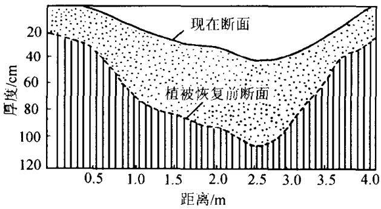  
图 4-6 浅沟淤积断面图

从不同地形部位土壤剖面发育的厚度可见，植被的恢复先由水分条件较好的低洼部位沟谷与浅沟的沟槽开始，再发展到梁昴坡和顶部，沟谷侵蚀首先得到控制。当气候转向干旱恶化时，自然植被的退化和侵蚀的发展，显然是由土壤水分条件最差的地方开始。人们的毁林开荒活动，通常由梁峁坡面再发展到沟谷[26]。从时间上，沟谷侵蚀的发展在坡面侵蚀之后。一旦沟谷的植被遭破坏，因径流的汇集和动能的增大，土壤侵蚀急剧发展，沟谷成为侵蚀产沙的主要源地。

## 2. 沟谷侵蚀的动态变化与植被覆盖率

沟谷密度与地面割裂度通常作为沟谷侵蚀的主要指标。沟谷密度是指每平方千米范围内沟道的总长度，单位为km/km²;地面割裂度是指单位土地面积内沟谷所占面积的比例(%)。沟谷密度与地面割裂度反映了一定时间和空间范围内沟谷侵蚀的状态和结果，属于相对静态指标。实际上沟谷侵蚀发展的趋势和强度与上述指标不一定吻合[30]。

唐克丽等在杏子河流域土壤侵蚀规律的考察研究中，在杏子河流域1486km²范围的上、中、下游，选取了典型小流域进行沟谷密度与其沟谷稳定性的重点调查研究。以野外调查和航片判读为基础，在1:10000地形图上，测算统计了沟谷密度、地面割裂度和有效植被面积(覆盖率大于60%的乔灌林地)。以沟谷部位有效植被面积状况，确定沟谷侵蚀的发展趋势。有效植被面积>60%的，作为沟谷侵蚀不发展稳定指标；有效植被面积40%\~60%的为半稳定沟谷；有效植被面积<40%情况下，沟谷侵蚀属活跃阶段(表4-37)[30,45]。

早在20世纪50年代，黄秉维即以有无完密植被作为侵蚀强度分区的主要依据。近半个世纪来，大量径流观测站及河流水文站观测资料，野外考察及航片、卫片的判读等均证实，在同样降雨、地形条件下，植被覆盖状况对侵蚀起重要作用。杏子河流域的考察进一步证实，沟谷侵蚀的强度多决定于植被的固沟作用(表4-37)。位于杏子河上游的箭杆梁沟，就沟谷的发育阶段或植被覆盖率情况，沟谷侵蚀均处于活跃阶段，沟谷密度虽相对较低，但沟蚀呈发展趋势。位于中游的城子沟，其沟谷密度最大，但有效植被覆盖率高，稳定和半稳定的沟谷占50%以上，如继续加强植被保护和建设，沟蚀将得到有效控制。另一方面，沟谷密度大，潜在危险性也大，一旦植被全遭破坏，将发生强烈侵蚀。位于杏子河下游的纸坊沟，与上游沟道相比，其沟谷发育阶段已趋于稳定和半稳定状态，如加强植被保护和建设，沟谷侵蚀将取得有效的控制。

表 4-37 杏子河流域沟谷密度与沟谷侵蚀趋势(1982 年)
<table><tr><td rowspan="2">干流 位置</td><td rowspan="2">小流域 名称</td><td rowspan="2">主沟道长 /km</td><td rowspan="2">流域面积  $/  { \mathbf { k m } } ^ { 2 }$ </td><td rowspan="2">沟谷面积  $\wedge \mathrm { { e m } } ^ { 2 }$ </td><td rowspan="2">地面割 裂度/%</td><td rowspan="2">沟道密度 /(km/km²)</td><td colspan="3">沟谷侵蚀状态占沟谷面积/%</td></tr><tr><td>稳定</td><td>半稳定</td><td>活跃</td></tr><tr><td>上游</td><td>箭杆梁沟</td><td>4.07</td><td>4.790</td><td>2.304</td><td>48.1</td><td>5.13</td><td>1.52</td><td>11.80</td><td>86.68</td></tr><tr><td>中游</td><td>城子沟</td><td>5.39</td><td>5.240</td><td>2.867</td><td>54.7</td><td>6.91</td><td>16.74</td><td>33.31</td><td>49.95</td></tr><tr><td>下游</td><td>杨渠</td><td>5.80</td><td>9.258</td><td>5.189</td><td>56.0</td><td>5.50</td><td>1.98</td><td>36.37</td><td>61.65</td></tr><tr><td></td><td>米台沟</td><td>4.60</td><td>4.950</td><td>2.768</td><td>56.4</td><td>5.61</td><td>0.35</td><td>10.15</td><td>89.50</td></tr><tr><td></td><td>寺沟</td><td>2.57</td><td>1.581</td><td>0.686</td><td>43.3</td><td>6.59</td><td>0</td><td>15.45</td><td>84.55</td></tr><tr><td></td><td>纸坊沟</td><td>6.95</td><td>8.290</td><td>4.583</td><td>55.3</td><td>5.63</td><td>5.28</td><td>31.7</td><td>63.02</td></tr></table>

## （二）沟谷侵蚀与坡面侵蚀的关联

当坡耕地由缓坡发展到陡坡，由梁昴坡发展到谷坡的情况下，人们开始注意到开垦谷坡后土壤侵蚀量剧增的原因，不仅在于谷坡的坡陡，多大于25°，甚至35°；而且谷坡因承受上部梁昴坡面的来水来沙，加剧了谷坡的冲刷。山西省水土保持研究所在20世纪60年代即布设了梁峁坡面、谷坡及梁峁坡+谷坡径流小区的观测试验，研究比较在有无上坡来水来沙影响下，谷坡侵蚀强度的变化[47]。唐克丽等在子午岭林区布设径流小区试验时，特进行了梁坡开垦、谷坡开垦及全坡面开垦(梁坡+谷坡)情况下，侵蚀量变化的研究，目的在于探讨坡、沟系统侵蚀机制及治坡与治沟的方略[27]。以上两个站的研究资料汇总于表4-38。

表4-38 黄土丘陵区梁坡与谷坡侵蚀产沙机制
<table><tr><td>地点</td><td>梁坡(a)</td><td>谷坡(b)</td><td>梁坡+谷坡  $\left( \mathsf { a } + \mathsf { b } _ { 1 } \right)$ </td><td>谷坡  $( b _ { 1 } )$ </td><td> $\mathbf { b } _ { 1 } : \mathbf { b }$ </td><td>观测年限</td></tr><tr><td>山西省水土保持站</td><td>3 874.9</td><td>10 397.4</td><td>13 836.4</td><td>30 000.0</td><td>2.89</td><td>1963~1968</td></tr><tr><td>子午岭观测站</td><td>10 324.5</td><td>25 286.9</td><td>15 286.9</td><td>39 193.4</td><td>1.80</td><td>1989~1991</td></tr></table>

$$
V ( \mathbf { k } \mathbf { m } ^ { 2 } \cdot \mathbf { a } )
$$

表4-38中，梁坡(a)和谷坡(b)为就地降雨径流侵蚀力影响下的土壤侵蚀模数，梁坡+谷坡的全坡面径流小区，包含了就地降雨径流侵蚀的梁坡(a)，再加上接受梁坡(a)径流冲刷的谷坡(b₁)。据各自梁坡和谷坡的面积和侵蚀模数计算得出，承受上坡来水来沙汇 $\left( \mathbf { b } _ { 1 } \right)$

合侵蚀力的谷坡 $\left( \mathbf { b } _ { 1 } \right)$ 的侵蚀模数显然高于无上坡来水来沙就地侵蚀的谷坡(b)，其增值分别为1:2.89和1:1.80。上坡来水来沙对谷坡侵蚀的增值，因梁坡与谷坡的面积和坡度的大小的比值而不同。山西水保站梁坡(a)与谷坡 $\left( \mathfrak { b } _ { \mathrm { l } } \right)$ 的面积比值为1.68:1,子午岭试验站的a与 $\boldsymbol { \mathsf { b } } _ { 1 }$ 的面积比为2.4:1，即侵蚀模数较大的谷坡面积愈大，则全坡面中谷坡侵蚀增值相对愈大。

水保站梁坡的侵蚀量占全坡面总侵蚀量的17.83%，因承受上坡来水来沙的侵蚀作用，谷坡侵蚀因此的增量占总侵蚀量的53.5%。据此，如果控制坡面侵蚀，就地拦蓄径流泥沙，即可减少总侵蚀量的71.5%。子午岭观测站布设的试验，梁坡面积为谷坡面积的2.3倍，梁坡侵蚀量占总侵蚀量的47.6%，谷坡部位因上坡来水来沙影响增加的侵蚀量，占总侵蚀量的10.5%，因而控制坡面侵蚀可减少总侵蚀量的58.1%。

坡沟侵蚀的机制说明，加强坡面治理同时能取得削减沟谷侵蚀的效益，除控制坡面侵蚀外，同时可削减沟蚀量的20%\~60%。

## （三）坡沟系统侵蚀链动力机制

梁昴坡面被开垦后，土壤侵蚀方式呈明显的垂直分布规律，自分水岭向下至谷缘线依次为溅蚀、片蚀一细沟侵蚀一浅沟侵蚀，直至突破谷缘线发展为切沟侵蚀。土壤侵蚀方式的垂直分布特征表达了土壤侵蚀过程静态的空间分异格局。该空间分异特征是因各个侵蚀方式相互联接的动力促进演化的结果，呈链状的加速连锁反应。据此唐克丽提出了坡沟系统土壤侵蚀链的概念，使土壤侵蚀的研究由静态转为动态，以深入揭示坡、沟系统侵蚀方式演变的动力机制和能量转换，进一步阐明其侵蚀机制。雷阿林在他的博士论文①中，即以土壤侵蚀链的概念，通过人工降雨土壤侵蚀模拟实验，揭示了不同土壤侵蚀 $\cdot \textcircled{ 1}$ 方式的水力学特征及其相互关联的动力学过程，从坡沟系统侵蚀的动态机制，为坡沟治理方略提供了重要的科学依据。

## 1. 坡、沟系统侵蚀链的模拟实验

以黄土丘陵沟壑区梁峁坡面与谷坡相连的土壤侵蚀方式垂直分布的空间构架为模型，设计了包含梁坡与谷坡的连续坡面，水平投影长14m，宽2.5m，自上而下共分为4个坡段，坡度和坡长依次为 $5 ^ { \circ } ( 2 \mathbf { m } )$ $1 5 ^ { \circ } ( 4 \mathrm { m } )$ 、 $2 5 ^ { \circ } ( 4 \mathrm { m } )$ 、 $3 5 ^ { \circ } ( 4 \mathbf { m } )$ ，分别代表了溅蚀、片蚀一细沟一细沟与浅沟一切沟、重力侵蚀的垂直分异格局(图4-7)。模型土样取自杨陵地区的黄土母质，5种坡度分别以单坡段(无上坡来水)及组合坡段(承受上坡来水)，选取三种雨强:29.7mm/h、90.2mm/h、153.7mm/h进行了人工降雨试验，取得了不同侵蚀方式的水力学特征及其转化的动力学机制[49,50]①

## 2. 侵蚀链不同侵蚀方式水力学特征

根据实验结果，确定雷诺数(Re)为判定各种侵蚀方式出现的主定指标，过水断面单位 $( \varepsilon , \mathbf { c m } )$ 为其辅助指标。弗罗德数有较大的离散性，未确定为指标。然细沟、浅沟的弗

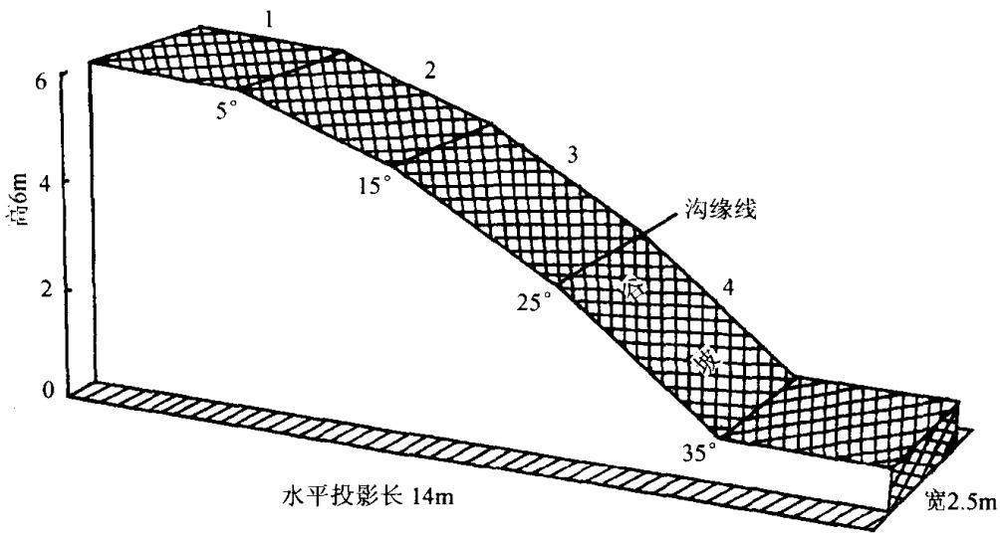  
图47 坡、沟系统侵蚀链模型示意图

罗德数均大于1，全部处于急流范围，为造成侵蚀的主要原因(表4-39)。

表4-39 人工降雨不同侵蚀方式的水力学特征
<table><tr><td>侵蚀方式</td><td>分布部位</td><td>主定指标</td><td>辅助指标/cm</td><td>水流流态</td></tr><tr><td>片蚀</td><td>坡面上部</td><td>≥3</td><td>≥0.015</td><td>急层流</td></tr><tr><td>细沟</td><td>坡面中部</td><td>≥1 486</td><td>≥1.387</td><td>急过渡流</td></tr><tr><td>浅沟</td><td>坡面下部</td><td>≥7 000</td><td>≥4.800</td><td>急紊流</td></tr><tr><td>切沟</td><td>谷坡</td><td>≥10 000</td><td>≥6.400</td><td>急紊流</td></tr></table>

表4-39说明各侵蚀方式对应的水流流态分别为：片层-急层流，细沟-急过渡流，浅沟、切沟-急紊流。水流流态对侵蚀的影响逐级升高。

## 3. 侵蚀链不同侵蚀方式动力学参数

通过大型土槽(图4-7)的人工降雨实验，测定了发生在各个坡段土壤侵蚀方式的主要动力学参数(表4-40)。

表4-40 人工降雨侵蚀链不同侵蚀方式动力学参数及含沙量
<table><tr><td>坡段</td><td>坡度 1(°)</td><td>侵蚀方式</td><td>汇集面积  $/ \mathbf { m } ^ { 2 }$ </td><td>流速 /(m/s)</td><td>流量  $/ ( 1 0 ^ { - 4 } \ : \mathbf { m } ^ { 3 } / \ : \mathbf { s } )$ </td><td>水力半径  $/ 1 0 ^ { - 3 } \mathbf { m }$ </td><td>含沙量  $/ ( \mathbf { k g } / \mathbf { m } ^ { 3 } )$ </td><td>含沙量 比值</td></tr><tr><td>1</td><td>5</td><td>溅蚀、片蚀</td><td>1.50</td><td>0.090</td><td>0.198</td><td>0.22</td><td>43.47</td><td>1</td></tr><tr><td>2</td><td>15</td><td>细沟、片蚀</td><td>8.93</td><td>0.441</td><td>0.500</td><td>3.23</td><td>159.41</td><td>3.7</td></tr><tr><td>3</td><td>25</td><td>浅沟、细沟</td><td>20.70</td><td>0.893</td><td>2.932</td><td>8.00</td><td>306.28</td><td>7.0</td></tr><tr><td>4</td><td>35</td><td>切沟、崩塌</td><td>24.13</td><td>1.000</td><td>4.342</td><td>14.00</td><td>491.22</td><td>11.3</td></tr></table>

注：室内人工降雨实验，雨强90.2mm/h,降雨量60mm。

表441 人工降雨侵蚀链不同侵蚀方式连锁增沙效应
<table><tr><td>坡段</td><td>坡度 1(°)</td><td>侵蚀 方式</td><td>无上坡来水 产沙量(A)/kg</td><td>有上坡来水 产沙量(B)/kg</td><td>增沙量 (B-A)/kg</td><td>增沙占总输沙量 [(B-A)/B]/%</td><td>增沙值 B/A</td></tr><tr><td>1</td><td>5</td><td>片蚀</td><td>28.85</td><td></td><td></td><td></td><td></td></tr><tr><td>2</td><td>15</td><td>细沟</td><td>80.58</td><td>207.48</td><td>126.90</td><td>61.1</td><td>2.57</td></tr><tr><td>3</td><td>25</td><td>浅沟</td><td>107.70</td><td>439.70</td><td>332.00</td><td>77.0</td><td>4.07</td></tr><tr><td>4</td><td>35</td><td>切沟</td><td>141.36</td><td>687.05</td><td>545.69</td><td>79.4</td><td>4.90</td></tr></table>

注：人工降雨实验，雨强90.2mm/h,降雨量60.1mm。

随着坡度自上而下的增加，动力和能量递增，随之侵蚀方式由片蚀发展为细沟和浅沟侵蚀，沟状侵蚀的形成和发展又加速了径流的汇集和动能的加大，侵蚀量呈数倍增长。由片蚀转为细沟侵蚀后，流速加大了3.9倍，水力半径增加了15倍，含沙量增值为1:3.7。在发生浅沟侵蚀情况下，流速、水力半径及含沙量均较细沟侵蚀又增加了近1\~1.5倍。由浅沟发展为切沟情况下，在坡度 $2 5 ^ { \circ } \sim 3 5 ^ { \circ }$ 的转折点，发生崩塌等重力侵蚀，侵蚀量骤然增加，与发生浅沟侵蚀的坡段相比，含沙量的比值为1:1.61，与片蚀坡段相比为1:11.3。

根据野外观测结果(表4-38)，在同样人工降雨情况下，研究比较各坡段有无上坡来水量对其侵蚀产沙的影响。在控制第1坡段产流产沙情况下，第2坡段的侵蚀量可减少61.1%；在第3、第4坡段，当控制其各自上坡的来水来沙的情况下，侵蚀量可减少77.0%\~79.4%，与野外观测基本接近。

坡、沟系统侵蚀过程中，不同侵蚀方式呈链状的发展过程中，水力学和动力学的特征呈显著正相关。控制上坡来水来沙，切断链式连锁反应，对削减梁昴坡和谷坡的侵蚀，取得极显著效应。基于不同侵蚀方式转化的动力学机制，提出了以发生浅沟侵蚀的临界坡度15°\~20°，作为黄土丘陵区退耕的上限坡度[31]。根据不同坡度、坡长及不同侵蚀方式的动力学依据，对进行治坡与治沟水土保持措施规划和布设，有重大的实际指导意义。

## 二、沟谷侵蚀过程

## （一）黄土高原沟谷的基本情况

黄土高原地面切割破碎，地貌单元基本上分为沟间地与沟谷地两大单元。沟间地指丘陵坡面，在高原沟壑区指沟谷间的塬面和坡面。沟间地的侵蚀方式有：溅蚀、片蚀(包括鳞片状侵蚀)、细沟侵蚀和浅沟侵蚀，这一类侵蚀不影响耕作。当由浅沟发展为切沟，已不能再耕作，归为沟谷系统。切沟沟头与丘陵坡面下部浅沟的沟口(沟尾)相连接，形成沟头跌水，将丘陵坡面尾部切割成锯齿状，形成坡与沟明显的分界，即沟缘线(谷缘线)。沟缘线以下属沟谷系统，包括切沟、冲沟、坳沟(干沟)与河谷，联合组成沟谷地。

## 1. 沟谷地侵蚀组合类型

陈永宗等将沟谷地众多复杂的侵蚀方式归纳为以下几个主要组合类型[48]。

(1）急斜的水力冲刷谷坡。多发生在坡积黄土，坡度小于35°，为切沟发育初期。

(2)陡斜的水力冲刷谷坡。坡度介于35°\~45°，坡面物质以坡积黄土和离石黄土为主，已发育形成切沟。

(3)切沟陡壁式谷坡。发生在谷缘线处陡崖，形成切沟沟头，其继续溯源延伸，不断吞蚀坡面。切沟两侧坡面发生崩塌，沟床下切形成冲蚀穴。

(4)切沟-悬沟陡壁式谷坡。谷坡上部坡度在45°左右，由马兰黄土和离石黄土组成，发育切沟；下部多为45°\~60°的陡坡，以离石黄土或午城黄土为主，发育悬沟。

(5)悬沟陡壁式沟谷。坡面水流直接冲刷谷坡陡壁，形成悬沟，伴有崩塌、剥落侵蚀。

(6)滑塌坡和滑坡。由滑坡或滑塌作用而形成滑坡面的谷坡，下方有滑塌地。滑坡面与塌地开垦后，以坡耕地侵蚀方式为主，伴有崩塌、洞穴和沟蚀。

(7)泻溜坡。出现三趾马红土的谷坡，坡度多在45°左右，发生泻溜侵蚀。

(8)崩塌坡。多沿沟壁垂直裂隙的临空面发生崩塌。

(9)崩塌-泻溜坡。因谷坡的组成物质不同，形成上部为崩塌坡，下部三趾红土出露处，发生泻溜。

(10)残留的古代沟谷谷坡。多见于土坳沟沟头上方，谷坡为陡崖，发育有切沟和悬沟。

(11）基岩崩塌碎屑坡。基岩露头较高的谷坡，由节理发育明显的块状砂岩和泥页岩互层组成，岩体风化、崩塌强烈。

(12)塌积堆积坡和沟台地。多见于河沟沟床的阶地(沟台地)及谷坡。河沟沟床冲刷兼谷坡陡壁的崩塌和沟蚀。

(13)侵蚀沟槽。暴雨洪水对沟床的冲刷，形成多级跌水；沟壁发生滑塌、崩塌侵蚀。

(14)人工改造坡。因谷坡改造利用而修建的水平沟、水平阶、鱼鳞坑等工程；人工采土、石的开挖面及矿坑等。

## 2. 黄土高原沟谷发育与沟谷密度

黄河以输沙量大、含沙量高闻名于世，黄河泥沙的来源集中在中游地区。黄河中游产沙区由于长期遭受强烈侵蚀，目前大部分地区是光山秃岭，沟壑纵横，地面支离破碎。景可的研究表明，据统计沟长大于1km的沟道有320 480条，其中1\~5km的为271 100条，6\~10km的为47000条，11\~50km的为2300条，大于50km为180条，0.5\~1.0km为42132条，小于0.5km的沟道不知其数，多到难以统计。在1:50000子州县地形图上统计表明，长度大于0.3km的沟道每平方千米就有21条，可见黄河中游由于侵蚀所形成的各种不同等级的沟道总数在一般地形图上无法做到精确统计。

地表沟谷的发育程度可以用沟谷密度表示。沟谷密度是单位面积上的沟道长度，以km/km²表示。沟谷密度与河网密度不完全相同，前者总括全部间歇性水道长度与总面积相比，不包括长流水的河道；后者是指所有长流水河道的长度与面积之比。如果计算所有沟道和河道的长度所求得的密度，称为水系密度，或者称为切割密度。沟谷密度是表示区域地貌形态特征的最重要指标之一，反映一个地区地面的完整性。沟谷密度是气候、地形、岩性、植被等因素综合影响的反映。我国各地沟谷密度值相差很大，但黄土高

原沟谷密度居于全国之首，见表4-42。

表4-42 黄土高原与我国其他地区水系密度(或沟道密度)比较
<table><tr><td>区域</td><td>水系密度/(km/km²)</td><td>资料来源</td></tr><tr><td>大兴安岭</td><td>0.6~1.4</td><td>据陈永宗(1980)</td></tr><tr><td>青藏高原</td><td>0.13~0.5</td><td>据李炳元、邹治遂(1981)</td></tr><tr><td>江西南部</td><td>3.7~5.0</td><td>据史德明等(1982)</td></tr><tr><td>台湾岛</td><td>1~5</td><td>据张瑞津(1975)</td></tr><tr><td>黄土高原</td><td>4~6</td><td>据景可(1983)</td></tr></table>

注：引自文献[48]的表6-14。

在以往有关的文献中，常见到黄土高原的同一地区有几个不同的沟谷密度数字，这种情况在其他非黄土地区也曾见到。其原因有二：一是量算使用的地形图比例尺不一样；二是把多长的沟道作为量计的沟道，至今尚无统一标准。正因为如此，即使同一个量计者在同一地区量计也会得到不同的结果(表4-43)。

表4-43 杏子河流域不同量计方法的沟谷密度比较
<table><tr><td rowspan="2">流域名称</td><td colspan="5">1:50 000</td><td colspan="3">1:10 000</td></tr><tr><td>流域面积</td><td colspan="2">沟道长度/km</td><td colspan="2">沟谷密度/(km/km²)</td><td colspan="3">流域面积 沟道长度(A)</td></tr><tr><td></td><td>/km²</td><td>A</td><td>B</td><td>A</td><td>B</td><td>/km²</td><td>/km</td><td>/(km/km²)</td></tr><tr><td>纸坊沟</td><td>8.223</td><td>27.18</td><td>28.23</td><td>3.31</td><td>3.43</td><td>8.108</td><td>66.06</td><td>8.15</td></tr><tr><td>谢屯沟</td><td>74.763</td><td>191.145</td><td>246.05</td><td>2.56</td><td>3.29</td><td>73.839</td><td>665.16</td><td>9.01</td></tr><tr><td>长尾河</td><td>247.290</td><td>638.760</td><td>879.51</td><td>2.58</td><td>3.56</td><td>246.754</td><td>1 920.84</td><td>7.78</td></tr><tr><td>李嘴子沟</td><td>9.498</td><td>24.90</td><td>34.15</td><td>2.62</td><td>3.60</td><td>9.493</td><td>62.23</td><td>6.56</td></tr><tr><td>阳砭沟</td><td>44.715</td><td>107.570</td><td>158.57</td><td>2.41</td><td>3.55</td><td>44.739</td><td>298.77</td><td>6.68</td></tr><tr><td>寺儿台沟</td><td>12.105</td><td>34.15</td><td>43.80</td><td>2.82</td><td>3.62</td><td>12.776</td><td>87.63</td><td>6.86</td></tr><tr><td>老庄沟</td><td>74.553</td><td>209.310</td><td>275.26</td><td>2.81</td><td>3.69</td><td>74.674</td><td>478.62</td><td>6.41</td></tr><tr><td>李塌沟</td><td>10.515</td><td>37.92</td><td>50.07</td><td>2.70</td><td>3.57</td><td>14.063</td><td>143.67</td><td>10.22</td></tr></table>

为了取得统一标准，景可研究了量计方法。在1:50000地形图上选取长度大于150m,即在地形图上长度大于3mm的沟道，量计方法是在各幅地形图左下角取面积为50km²的范围作为样方，量计样方内所有长度大于150m的沟道，求出样方的沟谷密度，据此编绘了黄河中游沟谷密度图(图4-8)。

由图4-8可知，六盘山为沟谷密度区域差异的自然分界线。六盘山以东的沟谷密度普遍大于以西的地区；六盘山以南地区沟谷密度多在3.0km/km²，以北则逐渐增大到$5 . 0 \mathrm { k m } / \mathrm { k m } ^ { 2 }$ ,最大值达 $6 . 0 \mathrm { k m } / \mathrm { k m } ^ { 2 }$ ;晋陕间黄河峡谷两岸的沟谷密度最大，多在6.0km/km²以上。

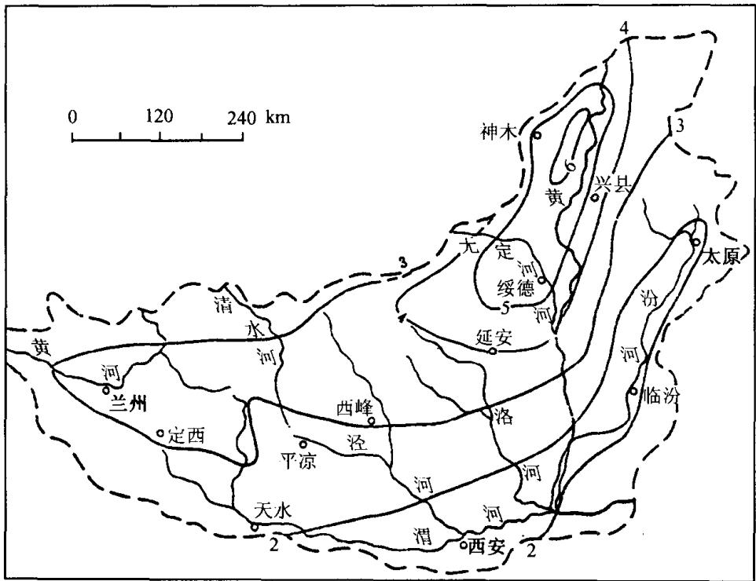  
图 4-8 黄土高原沟谷密度等值线图(单位：km/km²)

## （二）沟谷的侵蚀方式

任何沟谷的侵蚀方式有沟床下切、谷坡扩展和沟头前进三大部分，现分述如下。

## 1. 沟床下切

在侵蚀沟谷中，由于受水流最小消能原理支配，任何一条沟道的沟床纵剖面都不可能是一条平滑的曲线，而必然是一条起伏不平的阶梯状曲线。阶梯状纵剖面存在的事实说明，从沟头至沟口沟床下切的速度是不均匀的，在此阶较陡段冲刷强，比降平缓段冲刷较弱，甚至形成高差不大的跌水。黄土区沟谷的跌水有两类：一类是由沟床下切侵蚀过程中水流动力沿程强弱交替变化造成的，其高差一般不超过1\~2m;另一类是受地壳间歇抬升或岩性变化影响造成的，其高差一般都比较大，可以达到2\~3m，甚至10m余。前一类跌水的分布位置具有随机性；后一类跌水则具有一定规律可循。例如，延河支流杏子河流域内有三级因构造活动造成的石质跌水;跌水形成以后，沟床下切过程则是以跌水不断后退为特点，跌水的后退速度视沟床的岩性和水量大小而异。切入三趾马红黏土和中生代基岩中的沟床，跌水后退速度缓慢；发育在土状堆积物中的沟床，跌水后退速度较快。

## 2. 谷坡的扩展

沟床不断下切和侧蚀，谷坡(沟坡)的相对平衡受到破坏，发生谷坡扩展。谷坡扩展的动力有流水侵蚀和重力侵蚀两种，流水侵蚀中有切沟和冲沟侵蚀及潜蚀。就潜蚀与沟蚀对谷坡扩展影响程度相比较，切沟和悬沟是导致谷坡迅速扩展的最重要的水力侵蚀方式。

谷坡扩展的速度视谷缘线以上梁昴坡面特征和径流量大小而变，如果梁昴坡的坡长大，坡度也大，坡面上无植被保护，径流量较大，则谷坡扩展较快；反之，谷坡扩展较慢。据1958年与1978年两次航片资料比较，杏子河流域由流水侵蚀引起谷坡扩展的速度平均每年为0.84m，最快的为1.64m;同一条沟的上游段和下游段比较，前者比后者快1倍。重力侵蚀是造成谷坡迅速扩展的最重要方式。一次滑塌或崩塌可以使谷坡扩展数米至数十米。泻溜为谷坡侵蚀的一种方式，每次泻溜侵蚀的量虽然不大，但由于大面积地、持续不断地进行，其后果仍然是十分严重，尤其是皇甫川、窟野河流域最显著。重力侵蚀的强度有明显区域差异，在同一条沟道流域内的不同地段也有差异。一般是在黄土塬区和黄土丘陵地区，重力侵蚀导致谷坡扩展速度大于黄土丘陵区；流域上游和中游快于下游，冲沟沟谷大于坳沟，坳沟又大于河沟。

## 3. 沟头前进

沟头前进是黄土高原目前最活跃的沟谷侵蚀方式，流水侵蚀和由此引起的滑塌、崩塌以及先是潜蚀尔后崩塌，是沟头前进的主要方式。通过滑塌和崩塌前进的沟头，多见于黄土丘陵地区和具有古代残留沟谷的沟谷中。由潜蚀导致快速前进的沟头在陇东和陇中的坪地、阶地分布区常见，在洛川塬和董志塬以及其他塬地也比较普遍。沟头前进速度，一方面取决于沟头上方坡面来水状况，另一方面又受沟头地形影响。如果沟头上方坡面来水量不大，沟头处又没有较大陡崖，往往形成楔形沟头，前进速度较缓。如果沟头上方坡面来水量较大，沟头处形成跌水，使陡崖迅速崩塌后退，在陡崖下方冲蚀成潭穴，使沟头作弧形扩展前进。道路冲刷是引起塬面沟蚀发展的重要因素。沟头多与塬面的村庄道路相连，因塬面道路通常是塬面的排水通道，水量较大，促使沟头迅速前进，前进路线基本上与道路延伸方向一致。黄土高原各地的沟头前进速度是不一样的，环县城东塬的一个沟头，1933年一次暴雨前进80m;无定河的支流沙河流域沟头每年平均前进3\~5m，洛川黑木沟沟头平均每年向塬区推进1.75m。杏子河流域1958\~1978年上游流域沟头前进速度为2.47\~3.67m，中游流域为1.27\~2.67m，下游流域为0.65\~3.01m(表4-44)。

表 4-44 杏子河流域沟头前进速度[48]
<table><tr><td rowspan="2">河段</td><td rowspan="2">量测编号</td><td colspan="2">沟道长度/m</td><td rowspan="2">差值/m</td><td rowspan="2">年平均增长量/m</td></tr><tr><td>1958年</td><td>1978年</td></tr><tr><td>上游</td><td>1</td><td>297.7</td><td>371.1</td><td>73.4</td><td>3.67</td></tr><tr><td rowspan="7">中游</td><td>2</td><td>476.3</td><td>538.8</td><td>62.5</td><td>3.13</td></tr><tr><td>3</td><td>361.8</td><td>411.1</td><td>49.3</td><td>2.47</td></tr><tr><td>4</td><td>512.9</td><td>575.1</td><td>62.2</td><td>3.11</td></tr><tr><td>1</td><td>513.5</td><td>563.9</td><td>50.4</td><td>2.52</td></tr><tr><td>2</td><td>410.8</td><td>464.1</td><td>53.3</td><td>2.67</td></tr><tr><td>3</td><td>304.3</td><td>329.7</td><td>25.4</td><td>1.27</td></tr><tr><td>4</td><td>388.0</td><td>433.8</td><td>45.8</td><td>2.29</td></tr><tr><td rowspan="4">下游</td><td>1</td><td>259.2</td><td>319.4</td><td>60.2</td><td>3.67</td></tr><tr><td>2</td><td>306.0</td><td>319.0</td><td>13.0</td><td>3.13</td></tr><tr><td>3</td><td>572.4</td><td>598.8</td><td>26.4</td><td>2.47</td></tr><tr><td>4</td><td>504.0</td><td>524.0</td><td>20.0</td><td>3.11</td></tr></table>

上述沟谷侵蚀三种方式的速度，相互之间有着紧密的联系，尤其是在黄土高原表现格外明显，其中沟谷的下切强度往往决定了沟坡扩展和沟头前进。在黄土高原由于沟床的下切、沟坡的扩展和沟头的前进，使得沟间地的面积日益缩小，沟谷面积不断地扩大。陇东董志塬唐代后期南北长42km，东西宽约30km，现在南北长度大体如旧，东西宽仅18km，最窄处不过0.5km，宁夏固原县1957\~1979年沟谷面积每年扩展 $0 . 4 \mathrm { k m } ^ { 2 }$ O

## （三）侵蚀强度与沟谷密度的关系

沟谷是侵蚀之结果，又是加速侵蚀的原因之一。沟谷密度既反映某一地的沟谷发育程度，也表示出侵蚀面积的大小。根据黄土高原不同地貌单元典型小流域大比例尺图上量计的沟谷密度和沟谷面积的百分比之间的关系可以用下式表示

$$
y = 8 . 6 7 7 + 4 . 3 0 9 x r = 0 . 8 5 2
$$

式中，y是沟壑面积百分比；x是沟谷密度。方程反映沟谷密度越大，各种方式的侵蚀几率就越高，侵蚀强度就可能越大。为了进一步论述沟谷密度与侵蚀强度之间的关系，选择了黄土高原不同流域类型，量计沟谷密度，并统计了相应流域的输沙量。根据年输沙量计算出流域的年平均侵蚀强度，进行了相关分析，沟谷密度与侵蚀强度的关系式

$$
M _ { \mathrm { s } } = - \ : 5 \ : 0 6 4 \ : + \ : 3 \ : 9 3 0 \ : \ : D _ { \mathrm { d } } \qquad r \ : = \ : 0 . 6 9 2 \ : 5
$$

式中， $M _ { s }$ 为侵蚀强度(或侵蚀模数) $\left[ { \cal V } ( \mathrm { \bf k m } ^ { 2 } \cdot \mathrm { \bf a } ) \right] ; D _ { \mathrm { d } }$ 为沟谷密度 $( \mathbf { k m } / \mathbf { k m } ^ { 2 } )$ ；r 为相关系数。式中反映了侵蚀强度随沟谷密度增大而增加的特点，两者存在良好的关系(表4-45)。方程式相关系数不是很高，间接说明影响侵蚀强弱的因素是很复杂的，沟谷密度仅是其中原因之一。

表 4-45 黄土高原沟谷密度与侵蚀强度的关系[45]
<table><tr><td>流域名称</td><td>测站 侵蚀强度</td><td> $\left[ { \ V \left( { \bf k m } ^ { 2 } \cdot { \bf a } \right) } \right]$  沟谷密度/(km/km²)</td></tr><tr><td>纳林沙</td><td>沙圪堵 16 726.0</td><td>4.8</td></tr><tr><td>孤山川</td><td>高石崖 21 281.9</td><td>5.2</td></tr><tr><td>朱家川</td><td>后会村 6 791.1</td><td>4.2</td></tr><tr><td>岚漪河</td><td>裴家川 6 338.9</td><td>4.6</td></tr><tr><td>窟野河</td><td>温家川 38 732.0</td><td>5.2</td></tr><tr><td>三川河</td><td>后大成 6775.7</td><td>4.0</td></tr><tr><td>大理河</td><td>青阳岔 11 193.0</td><td>3.2</td></tr><tr><td>岔巴沟</td><td>曹坪 14 844.9</td><td>4.6</td></tr><tr><td>大理河</td><td>绥德 11 470.4</td><td>4.5</td></tr><tr><td>延 河</td><td>延安 8 611.6</td><td>3.2</td></tr><tr><td>延 河</td><td>甘谷驿 10 007.9</td><td>2.5</td></tr></table>

<table><tr><td>流域名称</td><td>测站</td><td>侵蚀强度  $/ [ V ( \mathbf { k m } ^ { 2 } \cdot \mathbf { a } ) ]$ </td><td>沟谷密度/(km/km²)</td></tr><tr><td>葫芦河</td><td>秦安</td><td>6 882.7</td><td>2.4</td></tr><tr><td>渭河</td><td>天水</td><td>4 506.7</td><td>2.1</td></tr><tr><td>环江</td><td>洪德</td><td>11 483.0</td><td>3.8</td></tr><tr><td>西川</td><td>庆阳(西)</td><td>7 860.1</td><td>3.6</td></tr><tr><td>合水</td><td>板桥</td><td>4002.0</td><td>2.3</td></tr><tr><td>冶峪河</td><td>淳化</td><td>1 919.0</td><td>1.7</td></tr><tr><td>漆水河</td><td>耀县</td><td>2 271.0</td><td>1.8</td></tr><tr><td>祖厉河</td><td>靖远</td><td>5 840.0</td><td>3.6</td></tr><tr><td>清水河</td><td>折死沟</td><td>7 588.0</td><td>3.5</td></tr></table>

黄土高原侵蚀泥沙主要来自沟谷还是来自沟间，至今仍有不同的认识。所谓沟谷侵蚀是指沟缘线以下部分的侵蚀，沟缘线以上部分为沟间侵蚀。实际问题并非如此简单，因为沟缘线是很难准确地划分的，况且有些沟头已经溯源至沟间地，使问题复杂化，所以这里所说的沟缘线实际上是一条大致的分界线。根据山西羊道沟观测资料，沟谷地的产沙与产流比，分别为80.4%和67.0%；西峰南小河沟塬面径流占 86.2%，而泥沙占 32.6%。子洲沟谷地的产沙量占55.6%。

## （四）沟谷侵蚀量

黄河中游是一个强烈侵蚀产沙区，中游的泥沙主要来自沟谷(包括因谷坡开垦增加的沟谷泥沙)，这已成为共识。但来自沟谷的泥沙占总量的比例，认识还不完全一致。通常以小流域为单元把口站的总输沙量减去沟间地坡面侵蚀的总量，即为该流域沟谷侵蚀的总量，其结果约60%以上的泥沙来自沟谷。也有人认为不完全如此，不同黄土地貌类型沟间沟谷的产沙比例不完全相同。通过小流域闷葫芦淤地坝库的淤积泥沙的系统剖面采集 $^ { 1 3 7 } \mathrm { C s }$ 样测定，再以该淤地坝的沟间地坡面 $^ { 1 3 7 } \mathrm { C s }$ 样的测定，获得洪水沉积旋回的平均 $^ { 1 3 7 } \mathrm { C s }$ 含量和坡地的平均 $^ { 1 3 7 } \mathrm { C s }$ 含量比较，然后求得沟间地与沟谷地相对来沙量(表4-46)。4条小流域的沟谷地的相对来沙量介于67%和87%[52]。

表4-46 子长县等小流域的沟谷侵蚀特征值
<table><tr><td>项目</td><td>榆林马家沟</td><td>子长赵家沟</td><td>吉县丘家沟</td><td>天水桥子西沟</td></tr><tr><td>流域面积  $/ \mathbf { k m } ^ { 2 }$ </td><td>0.84</td><td>2.63</td><td>1.70</td><td>1.09</td></tr><tr><td>沟谷地面积比例/%</td><td>33</td><td>47</td><td>49</td><td>9</td></tr><tr><td>沟谷地相对来沙量/%</td><td>67</td><td>74</td><td>80</td><td>87</td></tr><tr><td>沟谷侵蚀模数/  $V ( \mathbf { k m ^ { 2 } \cdot a } ) ]$ </td><td>30 568</td><td>21 118</td><td>9 750</td><td>830 000</td></tr></table>

根据河流悬移质泥沙的 $^ { 1 3 7 } \mathrm { C s }$ 含量(以放射性活度计)和流域内沟间地、沟谷地产出泥沙的 $^ { 1 3 7 } \mathrm { C s }$ 含量，求算了黄河(河龙区间)、秃尾河、清涧河、汾河等4条大、中河的沟谷地相对产沙量，并根据河流的年输沙量和输沙模数，计算了流域的沟谷地年产沙量和侵蚀模数(表4-47)。

表4-47 黄河干流、主要支流沟谷地相对产沙量和年输沙量[52]
<table><tr><td>流域 名称</td><td>流域面积  $/ \mathbf { k m } ^ { 2 }$ </td><td>悬移质泥沙  $^ { 1 3 7 } \mathbf { C } \mathbf { s }$  平均含量/  $( \bf { B q } / \bf { k g } )$ </td><td>沟谷地相对 产沙量/%</td><td>流域年输 沙量/亿t</td><td>沟谷地年 输沙量/亿t</td></tr><tr><td>黄河(河龙区间)</td><td>129 654</td><td>0.76</td><td>78</td><td>9.08</td><td>7.08</td></tr><tr><td>秃尾河</td><td>3 253</td><td>0.48</td><td>86</td><td>0.25</td><td>0.21</td></tr><tr><td>清涧河</td><td>3 468</td><td>0.55</td><td>84</td><td>0.49</td><td>0.41</td></tr><tr><td>汾河</td><td>38 728</td><td>1.09</td><td>68</td><td>0.32</td><td>0.22</td></tr></table>

根据河流悬移质泥沙和小流域淤地坝泥沙的 $^ { 1 3 7 } \mathrm { C s }$ 含量的区域差异，结合侵蚀环境的特征分析，黄河中游地区沟谷地相对产沙量的区域分布特点如下[52]。

(1)中游地区西北部黄河支流源头地区和东南部分渭河谷地相对产沙量为低值区，小于70%；这之间的中部地区大于70%，其中黄河晋陕峡谷段沿岸地区和洛川、西峰等完整塬区大于85%。

(2) 黄河晋陕峡谷段沿岸沟谷地相对产沙量由上游向下游递增的趋势，上游小于70%，中游70%\~85%，下游大于85%。

(3)六盘山以西梁峁区，虽然沟谷地面积比例小，一般不足流域面积的30%，但由于沟床比降大，大沟道两侧谷坡重力侵蚀强烈，沟谷地相对产沙量一般大于70%。

## 三、侵蚀地貌的演化

据景可、陈永宗等的研究[48,52,53]，陆地地貌形态类型成因是极其丰富多样的，但其中最为普遍的是沉积地貌和侵蚀地貌，这是陆地地貌的格架。这两种地貌多数能够截然分开，有时随着时间推移和塑造地形的动力转化，前期是堆积地貌，后期是侵蚀地貌。侵蚀地貌与堆积地貌的营力也有同时存在，但这两种作用力的对比关系不完全协调，存在彼此强弱变化，如黄土高原不同类型的黄土地貌就是一例。多数地貌的发育与演化是极其缓慢的过程，而黄土高原侵蚀地貌的发育却相对快速。下文以黄土高原为例阐述其过程。

## （一）黄土高原古地貌

黄土高原有连片的、厚层的黄土将下伏地形面全部掩盖；被掩盖的下伏地形的特点各家有着不同的看法。根据野外调查和前人资料分析，本区黄土下伏地形可概括为起伏山地、丘陵和倾斜单斜式平原与宽阔谷地，现分述如下：

## 1. 构造山地

黄土高原在黄土堆积前，不仅四周为山系所环绕，而其区域内分布众多的前第四纪古隆起，如北部的阴山、南部的秦岭、东部的吕梁山、西部的六盘山。自第三纪以来，这些山脉对本区地貌发育乃至整个自然环境起着很大的影响。这些山系自第四纪以来一直表现为侵蚀剥蚀，后期也未被黄土所覆盖。值得提出的是西北部的偏关、清水河、神池、五寨一带石灰岩中山，第四纪期间这些石灰岩山地之间的喀斯特洼地地形中堆积了第四纪黄土，形成了中山与黄土梁的组合形态。

## 2. 波状起伏的丘陵地形

此类地形主要分布在盆地的周围，是现在黄土梁峁地形和土石丘陵地形的基础，古地形的物质基础是中生代的砂岩、页岩以及新生代的三趾马红黏土所构成。这些丘陵大部分被后期的厚层黄土覆盖，古地面的相对高度50\~60m，也有100\~200m的，两丘之间一般已形成宽谷地(古谷地)。这些谷地在第四纪都堆积了较厚的黄土堆积物，在现代沟头溯源侵蚀未到达部位，保留较厚的沉积层。

## 3. 起伏和缓的准平原

此类古地形主要分布在六盘山和吕梁山之间，渭河北山以北及延安以南的地区，是侏罗、白垩纪形成的盆地，即陕北盆地。上新世盆地中堆积了厚约60m的红黏土，使盆地中的地形更趋平缓。陇东泾河流域的董志塬、洛河流域的洛川塬等黄土的下伏地形地面平坦，一般倾角3°左右，为一开阔的起伏和缓的准平原地形，其相对高度可达100m左右。

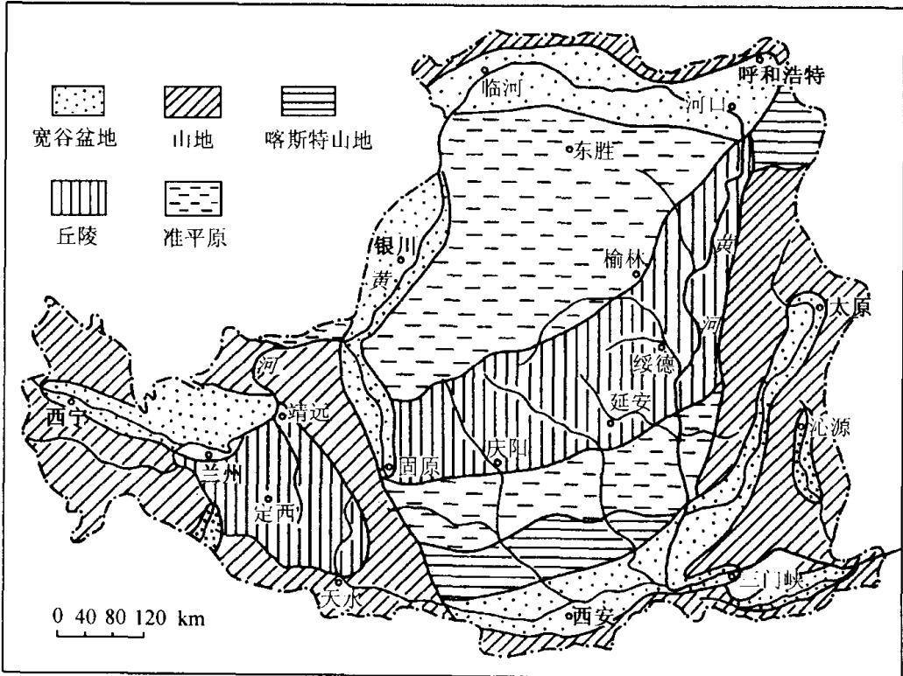  
图 4-9 黄河中游古地貌类型图

## 4. 河谷平原地形

现在的一些河谷，如黄河的河套谷地、宁夏的清水河谷地、兰州谷地、湟水河谷地、洮河谷地、汾渭谷地等原来都是湖盆的一部分。第四纪的不同时段这些盆地贯通，湖水外泄，形成统一的黄河水系。在这些谷地里现在都发育了数级阶地，都有较厚的第四纪堆积物，是现代台塬的主要分布地。

上述黄河中游不同古地貌类型的区域分布可概括如图4-9。

## （二）黄土地貌的形成与演化

以风力搬运的黄色粉砂沉积物称之为黄土，其他营力搬运的黄色粉砂土通常视为次生黄土(又称黄土状岩石)。黄河中游是我国乃至世界黄土分布最集中的地区，黄土分布面积达275600km²，占全国黄土总面积的72.36%[1]。黄土的分布北起沙漠南缘沿长城一带，南达秦岭北坡；东西界以太行山与贺兰山为界，起自东部的山前丘陵平原及西北内陆盆地区断续连接。黄土是以高空粉尘形式降落的堆积物，从空间条件看，粉尘降落的区域决定高空的气流状态，一旦粉尘在某一区域降落，理论上受尘区域地面上粉尘的数量应该是均等的，尘埃的粒级应该是相近的。但现实地面上黄土厚度与特性差异很大，如黄河中游南北、东西方向都存在差异，这些差异除了受到生物气候的影响外，更重要的是受到古地貌形态的影响。上述四种古地貌类型中黄土的成因类型、沉积厚度、黄土的粒配结构，以及后期黄土地貌的演化都不尽相同。黄土高原的山地地貌单元，理论上也应该有黄土堆积，但现在山地在一定高度上则无黄土堆积。这是由于缺少黄土的堆积条件，表现为基岩山地。波状起伏的丘陵以及准平原的古地貌单元，相对高差小，地形起伏平缓，又处于盆地地形的中部，具备良好的堆积条件，因而堆积了巨厚的黄土。黄河中游的古河谷平原，第四纪时期不仅有不同期的高空粉尘堆积，而且还有河流相的物质堆积与侵蚀。由于上述特性的差异，四类古地貌后期演化过程和结果都不尽相同，但地貌演化可概括为以下过程：

(1)构造山地→黄土堆积与侵蚀→基岩山地与黄土台地。

(2)波状起伏的丘陵→黄土堆积→黄土塬梁→黄土梁昴。

(3)起伏和缓的准平原→黄土堆积→黄土塬→黄土梁塬。

(4) 河谷平原→黄土堆积→黄土台地。

## 参考文献

地质、全球变化，第三集．北京：科学出版社，1992

7 史念海．历史时期黄河中游的森林．见：河山集·二集．北京：生活·图书·新知三联书店，1981

8 朱士光.评历史时期黄土高原森林问题的学术讨论．见：中国历史地理论丛(第三辑). 西安：陕西人民出版社，1988

9 唐克丽，陈永宗等．黄土高原地区土壤侵蚀区域特征及其治理途径．北京：中国科学技术出版社，1990

10唐克丽，熊贵枢等．黄河流域的侵蚀与径流泥沙变化.北京：中国科学技术出版社，1993

11 唐克丽，张平仓，王斌科．土壤侵蚀与第四纪生态环境演变．第四纪研究，1991，(4)：300\~309

12 刘东生等．黄河中游黄土.北京：科学出版社，1964

13 刘东生等．中国的黄土堆积.北京：科学出版社，1965

14 唐克丽，蔡庆．黄土高原土壤侵蚀过程和生态环境演变的关系．见：左大康等．黄河流域环境演变与水沙运行规律研究文集，第一集．北京：地质出版社，1991

15 中国科学院南京土壤研究所.中国土壤．北京：科学出版社，1978

16 唐克丽．古土壤的类型及其微形态特征的鉴别. 土壤通报，1981，(3)：22\~26

17 唐克丽．武功黄土层中埋藏古土壤微形态及其发生学．科学通报，1981，(3)：177\~179

18 竺可桢．中国近五千年来气候变迁的初步研究．中国科学，1973，(2)：168\~189

19唐克丽．贺秀斌．黄土剖面发育及黄土柱成因新解初报．见：邵明安等．黄土高原土壤侵蚀与旱地农业.西安：陕西科学技术出版社，1999

20水利部黄委会黄河水利史述要编写组．黄河水利史述要．北京：水利出版社，1982

21史念海，曹尔琴，朱士光.黄土高原森林与草原的变迁．西安：陕西人民出版社，1985

22朱士光．黄土高原地区环境变迁及其治理．郑州：黄河水利出版社，1999

23黄委会黄河志总编辑室．黄河流域总述.郑州：河南人民出版社，1998

24 唐克丽，孙清芳等．杏子河流域坡耕地水土流失及其防止.水土保持通报，1983，3(5):43\~48

25 王斌科，唐克丽．黄土高原区开荒扩种时间变化的研究．水土保持学报，1992，6(2)：63\~67

26 王斌科，唐克丽．黄土高原人为开荒及其对加速侵蚀的影响．水土保持通报，1991，11(5)：54\~60

27中国科学院水利部西北水土保持研究所唐克丽等.土壤侵蚀与生态环境演变研究论文集．见：中国科学院水利部西北水土保持研究所集刊，第17集．西安：陕西科学技术出版社，1993

28唐克丽，张科利，郑粉莉等．子午岭林区自然侵蚀和人为加速侵蚀剖析．见：中国科学院水利部西北水土保持研究所集刊，第17集．西安：陕西科学技术出版社，1993

29查小春，唐克丽．黄土丘陵林区开垦地土壤侵蚀强度时间变化研究．水土保持通报，2000，20(2)：5\~7

30中国科学院西北水土保持研究所，黄土高原杏子河流域自然资源与水土保持．西安：陕西科学技术出版社，1986

31 唐克丽，张科利，雷阿林．黄土丘陵区退耕上限坡度的研究论证.科学通报，1998，43(5)：200\~203

32张科利，唐克丽．黄土高原坡面浅沟特征值的研究．水土保持学报，1991，5(2)：8\~13

33陆兆熊，蔡强国．黄土的表土结皮强度和溅蚀试验研究．见：晋西黄土高原土壤侵蚀规律实验研究文集，北京：中国水利电力出版社，1990

34蔡强国，吴淑安，陈浩等．坡耕地表土结皮时对降雨径流和侵蚀产沙过程的影响．见：晋西黄土高原土壤侵蚀规律实验研究文集．北京：中国水利电力出版社，1990

35 郑粉莉．黄土高原坡耕地的细沟侵蚀及其防治途径．见：中国科学院水利部西北水土保持研究所集刊，第7集．西安：陕西科学技术出版社，1988

36贾志军，李俊义，王小平．地面坡度对坡耕地土壤侵蚀的影响．见：晋西黄土高原土壤侵蚀规律实验研究文集．北京：中国水利电力出版社，1990

37 Tang Keli, Zhang Zhongzi, Kong Xiaoling. A study of soil loss and soil degradation on the Loess Plateau in China. In: Soil Sicence Society of China. Current Progress in Soil Research in P R C. China: Jiangsu Science and Technology Publishing House, 1986

38 刘秉正，李光录，吴发启等．黄土高原南部土壤养分流失规律．水土保持学报，1995，9(2)：77\~86

39王继增，彭琳，余存祖.侵蚀条件下黄绵土氮素流失规律的研究．见：中国科学院水利部西北水土保持研究所集刊，第12集．西安：陕西科学技术出版社，1990

40 彭琳，王继增，余存祖.侵蚀旱作土壤氮素吸收利用与淋溶流失．土壤侵蚀与水土保持学报，1996，2(2)：9\~16

41杨文治，余存祖．黄土高原区域治理与评价．北京：科学出版社，1992

42唐克丽，贺秀斌．黄土高原生态环境建设与侵蚀环境调控．见：中国科学技术协会、中国工程院、陕西省人民政府.

中国西部生态重建与经济协调发展学术研讨会论文集．成都：四川科学技术出版社，1999

43 史衍玺，唐克丽．林地开垦加速侵蚀下土壤养分退化的研究．土壤侵蚀与水土保持学报，1996，4(2)：26\~33

44 史衍玺，唐克丽．人为加速侵蚀下土壤质量生物学特性变化． 土壤侵蚀与水土保持学报，1998，6(1)：28\~33

45 唐克丽，席道勒，孙清芳等．杏子河流域的土壤侵蚀方式及其分布规律．水土保持通报，1984，4(5)：10\~19

46焦菊英，刘元保，唐克丽．人为活动对子午岭林区和非林区径流泥沙的影响．见：中国科学院水利部西北水土保持研究所集刊，第17集．西安：陕西科学技术出版社，1998

47 曾伯庆．晋西黄土丘陵沟壑区水土流失规律及治理途径．人民黄河，1980，(2):20\~24

48陈永宗，景可，蔡强国．黄土高原现代侵蚀与治理.北京：科学出版社，1988

49 雷阿林，唐克丽.土壤侵蚀模型实验的原型选定问题.水土保持学报，1995，9(3):60\~65

50 雷阿林，史衍玺，唐克丽． 土壤侵蚀模拟实验中的土壤相似性问题．科学通报，1996，41(19):1801\~1804

51 雷阿林，唐克丽．黄土坡面细沟侵蚀的动力条件．土壤侵蚀与水土保持学报，1998，4(3)：39\~43

52 景可，卢金发，梁季阳等．黄河中游侵蚀环境特征和变化趋势．郑州：黄河水利出版社，1997

53 景可，陈永宗，李凤新．黄河泥沙与环境．北京：科学出版社，1993

## 第五章 土壤风蚀与土地沙漠化

本书所讨论的土地沙漠化是指在自然和人为的双重因素影响下，非沙漠干旱、半干旱地区土地遭受风蚀，出现风沙过程，包括砾质化、沙化、生产力退化和劣地（雅丹）景观发展的环境退化，也可以称作砂质荒漠化1]。它与《联合国关于在发生严重干旱和/或荒漠化的国家特别是非洲防治沙漠化的公约》（简称《国际防治荒漠化公约》）里所指的荒漠化（desertification）“包括气候变异和人类活动在内的种种因素造成的干旱、半干旱和干燥亚湿润地区的土地退化[2]”不同；后者除风蚀土地沙漠化外，还包括水蚀、水渍化及次生盐渍化所引起的土地退化。

土壤风蚀是土地沙漠化的原因，土地沙漠化是土壤风蚀的结果，二者为因果关系。但不是凡有风蚀发生就是沙漠化土地，这里还有个度的问题，从而关系到判定沙漠化的标准。

我国地处东亚季风气候区或受东亚季风影响的大陆性气候地区，夏秋季节多暴雨，水土流失严重；冬春季多风，土壤风蚀严重。因此，在时间上水蚀、风蚀有着主次作用交替，在空间上存在着水蚀和风蚀复合地带。

## 第一节 现代沙漠化过程

影响土壤风蚀与土地沙漠化的自然因素主要有两个，一是频繁的、超过临界起沙风速 $( \geqslant 5 \mathbf { m } / \mathbf { s } )$ 的风力条件及其与干旱季节在时间配置上的一致性；二是以物理性砂粒为主的地面组成物质的松散性，为沙漠化的发生发展提供了物质基础；降水不足和变率大、生态环境脆弱及人为不合理经济活动等可加剧土壤风蚀与土地沙漠化。

## 一、土壤粗化沙漠化过程

退化草原和草原开垦为农田以后的沙漠化过程基本是土壤遭受风蚀，被分选粗化，沙化或砾质化的过程。

## （一）裸露土层风蚀粗化过程

风蚀为风力作用下地表物质的损失过程，它是风沙活动和土地沙漠化过程的开始。风蚀粗化，指的是土地受到风蚀后表层土壤结构破坏，细粒物质受风力搬运而损失，粗粒物质相对增多，土壤性能变差，肥力损失，地力衰退，导致整个生态系统退化并出现风沙微地貌的过程。

## 1. 土壤风蚀粗化的一般过程

自然环境，包括风力大小和土壤水分状况，决定风能够带动，并在风的经常吹刮下可能损失的土壤颗粒大小。W． Chepil在研究美国西部大平原土壤风蚀问题时，经过大量观测和试验把粒径≥0.84mm的砂粒称为不可蚀因子。我们在研究北京风沙时引入了“不易蚀因子”的概念。由于一地的风力状况不是恒定不变的，风吹蚀的土壤颗粒不但随地点，而且随当地的环境条件在不断变化，“不可蚀”给人以固定的概念，故使用不易蚀因子表示地区性环境条件下，经常不能吹蚀的土壤颗粒。并推算出北京平原土壤不易蚀因子为 ${ \geqslant } 0 . 8 0 \mathbf { m } \mathbf { m } ^ { [ 3 ] }$ 。而在进行内蒙古高原风蚀沙漠化过程研究时，利用表层粗化土样和下层未经扰动土样，用两种颗粒百分累积曲线重叠求交会点的方法，求出内蒙古高原风蚀沙漠化地区土地平均的不易蚀因子为直径≥1.0mm的颗粒[4]。在风口处，尤其是在一些风蚀槽谷中这个数字要大一些，在背风处又要小得多。

对某一具体地点来说，土壤受到风蚀时，损失的是易蚀部分，但对于一个大的区域来说，损失的主要还是飘移质的粉尘（粒径<0.05mm)，因为只有这一部分才随气流飘扬出区外。这样，土壤经过风蚀，按颗粒分成三部分：第一部分是粉尘（直径<0.05mm)。粉尘随着气流升空，由于其下沉速度小于一般气流的向上脉动分速，并随气流以悬移的方法运移，可能带出区外沉积到较远的地方形成现代条件下的黄土沉积(“雨土”)。第二部分为易蚀的细粒部分（直径0.05\~0.08mm或0.10mm)。虽然也脱离原来沉积的地面，但只能产生滚动和跃移，朝下风向不远的地方运移，还可能随季节风向变化在不大的范围内作往复运动，就地沉积成为覆沙。覆沙积累形成片状流沙、波状沙地，直至演化出各种形态的沙地。第三部分为粗颗粒（即不易蚀因子）。地面受风的吹蚀，细物质损失，粗颗粒相对积累，地面粗化（表5-1）。

表 5-1 沙漠化地区土壤粒度变化  
(单位：%)
<table><tr><td rowspan="2">采样地点</td><td rowspan="2">深度 /cm</td><td colspan="7">粒径/mm</td></tr><tr><td>1~0.25</td><td>0.25~0.05</td><td>0.05~0.01</td><td></td><td>0.01~0.005 0.005~0.001</td><td>&lt;0.001</td><td>&gt;0.05</td></tr><tr><td>盐池</td><td>0~10</td><td>2.97</td><td>92.15</td><td>3.56</td><td>0.47</td><td>0.07</td><td></td><td>95.12</td></tr><tr><td>(杨柳堡)</td><td>10~30</td><td>1.39</td><td>90.76</td><td>4.76</td><td>0.43</td><td>0.88</td><td>1.80</td><td>92.05</td></tr><tr><td></td><td>30~48</td><td>11.49</td><td>64.49</td><td>16.39</td><td>1.18</td><td>3.40</td><td>3.44</td><td>75.59</td></tr><tr><td>盐池</td><td>0~12</td><td>7.39</td><td>72.17</td><td>12.22</td><td>1.04</td><td>2.68</td><td>4.50</td><td>74.56</td></tr><tr><td>(李毛庄)</td><td>12~28</td><td>0.55</td><td>21.18</td><td>38.10</td><td>9.59</td><td>13.47</td><td>17.11</td><td>21.70</td></tr><tr><td>盐池</td><td>0~15</td><td>4.33</td><td>80.58</td><td>10.24</td><td>0.78</td><td>0.81</td><td>3.26</td><td>84.91</td></tr><tr><td>(四墩子)</td><td>15~50</td><td>6.47</td><td>68.31</td><td>14.38</td><td>2.66</td><td>1.98</td><td>6.20</td><td>74.78</td></tr><tr><td>鄂旗</td><td>0~16</td><td>11.47</td><td>83.29</td><td>2.80</td><td>0.77</td><td>0.60</td><td>1.39</td><td>94.46</td></tr><tr><td>(公卡汉)</td><td>16~60</td><td>10.63</td><td>63.02</td><td>12.56</td><td>2.13</td><td>4.28</td><td>7.38</td><td>73.60</td></tr><tr><td>奈曼</td><td>0~250</td><td>0</td><td>85.09</td><td>10.23</td><td>0.17</td><td>0.57</td><td>3.94</td><td>85.09</td></tr><tr><td>(青龙山)</td><td>&gt; 250</td><td>0</td><td>56.78</td><td>0.55</td><td>1.28</td><td>2.31</td><td>9.08</td><td>56.70</td></tr><tr><td>白音</td><td>0~25</td><td>0.86</td><td>59.10</td><td>26.28</td><td>0.29</td><td>2.89</td><td>10.18</td><td>59.96</td></tr><tr><td>(昌汗)</td><td>25~50</td><td>0.59</td><td>51.39</td><td>29.73</td><td>2.94</td><td>1.53</td><td>13.82</td><td>51.98</td></tr><tr><td>白音 汗) (昌</td><td>0~15</td><td>14.54</td><td>84.20</td><td>0.41</td><td>0.21</td><td>0.35</td><td>0.29</td><td>98.74</td></tr></table>

## 2. 残坡积高平原地区地表砾质化

我国的沙漠(地)大多分布在新生代盆地的中心，是在盆地河湖沉积砂层的基础上发育起来的，盆地外缘有粗骨质的冲洪积、坡积和残坡积的砾石、砂和细土，组成广袤的山前洪积平原或波状残坡积平原，这些混杂堆积物表层经过风蚀粗化，砾石和粗砂集中于地表，最后出现近似于“戈壁”的表面层(图5-1)。

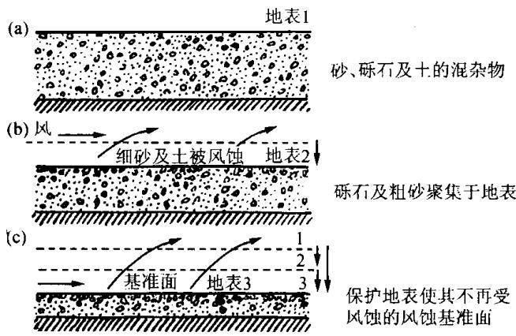  
图 5-1 风蚀过程中地表物质变化图

现代砾质化最甚的地区在内蒙古高原。在这里坦荡的高原面上分布着厚度不大的残积坡积物，这是一种砾碎石、砂和砂质土的混杂堆积物。砾碎石在未经风蚀的土层中分布比较均匀，经过风的长时间吹蚀，粉尘以飘尘形式被带到区外；中细砂(在风力强大的地方包括粗砂)大部分以跃移方式沉积到背风坡或洼地，砾碎石的相对含量增加，粗糙度也随之加大，当表层砾碎石多到一定量时即达到了相对稳定状态，地表呈现近似砾石戈壁的形态，并成为保护下部土层不再受风蚀的保护层(表5-2)。在草场和荒芜地上，砾碎石层只是形成贴地面的一个薄层，厚度在5cm之内，砾石间的粗砂层中仍有植物生长，这就是通常所说的戈壁草原。在内蒙古高原中北部的达茂旗、四子王旗一带优势植物为戈壁针茅(Stipa tianshanica var. gobica)、短花针茅(S. breviflora)、蓍状亚菊(Ajania ackilloies)、冷蒿(Artemisia frigida)、无芒隐子草(Cleistogenes sogonica)及葱类，草群覆盖度 22% \~ 33%，叶层高只有7cm，生殖枝可以高到19cm，平均每年每公顷产鲜草仅有804kg。这样的草场每2hm²才能养1只羊。

草原开垦为农地以后，不断翻耕，使地表常保持疏松状态，加速了土壤的风蚀粗化进程。农垦地粗化层一般厚度为15\~20cm。上述内蒙古中部草原垦区砾碎石和粗砂的含量随垦殖时间延伸比例加大，直到石块多到无法耕种而被迫弃耕后，表层的砾质化更迅速发展，然后达到不易遭风蚀的相对稳定。在弃耕地里，砂砾石相对集中层的厚度可达15\~20cm。

随着砾质化的发展，土壤迅速贫瘠化。从河北省坝上地区和内蒙古乌兰察布盟南部农垦区土壤取样分析结果看，新垦地土壤有机质在40\~20g/kg，经过5\~10年的反复耕种风蚀，成为粗化耕地以后，有机质含量下降到22\~12g/kg；到砾质化弃耕阶段，土壤有机质普遍下降到1%以下，最低值为0.75%。作物产量下降更加明显，在河北坝上地区和内蒙古乌兰察布盟后山地区南部农耕区，开垦初期旱田春小麦或莜麦的单产量为2250\~1875kg/hm²，演变成粗化耕地后，10\~20年收成即下降一半。自20世纪50年代以来，尽管在农业技术上有改进，例如改变不施肥的习惯，先从马铃薯施碳氨做起，逐渐发展到对小麦施少量化肥，但产量却一直徘徊在525\~750kg/hm²的水平，歉收年仅能保住籽种，往往只有 230\~400kg/hm²。

表 5-2 内蒙古高原商都县西井子乡北部土壤粗化情况  
(单位：%)
<table><tr><td rowspan="2">取样点 地貌部位</td><td rowspan="2">地表层 官感位*</td><td rowspan="2"></td><td colspan="8">粒径/mm</td></tr><tr><td>砾石</td><td>粗</td><td>砂</td><td>中砂</td><td>细砂</td><td>粉</td><td>砂</td><td>粉尘</td></tr><tr><td></td><td></td><td></td><td>&gt;2</td><td>2~1</td><td>1~0.5</td><td>0.5~0.25</td><td>0.25~0.1</td><td>0.1~0.05</td><td>0.05~0.01</td><td>&lt;0.01</td></tr><tr><td rowspan="3">梁顶耕地 背风坡耕</td><td>中度</td><td>A</td><td>5.8</td><td>2.7</td><td>10.0</td><td>27.2</td><td>32.8</td><td>12.9</td><td>8.6</td><td>一</td></tr><tr><td>粗化</td><td>B</td><td>11.7</td><td>2.8</td><td>10.0</td><td>18.7</td><td>30.4</td><td>16.4</td><td>10.0</td><td>一</td></tr><tr><td>中度</td><td>A</td><td>12.4</td><td>3.1</td><td>45.7</td><td>25.0</td><td>10.3</td><td>3.5</td><td>一</td><td>一</td></tr><tr><td>地</td><td>粗化</td><td>B</td><td>13.5</td><td>4.3</td><td>12.2</td><td>20.0</td><td>30.0</td><td>13.0</td><td>7.0</td><td>一</td></tr><tr><td>缓梁顶部</td><td>强度</td><td>A</td><td>3.5</td><td>8.0</td><td>11.1</td><td>26.7</td><td>44.2</td><td>6.5</td><td>一</td><td>一</td></tr><tr><td>耕地</td><td>粗化</td><td>B</td><td>0.7</td><td>0.7</td><td>17.2</td><td>51.8</td><td>22.3</td><td>7.3</td><td>一</td><td>一</td></tr><tr><td>梁顶北部</td><td>严重</td><td>A</td><td>13.2</td><td>1.8</td><td>39.0</td><td>29.0</td><td>12.0</td><td>5.0</td><td>一</td><td>一</td></tr><tr><td>长期耕地</td><td>粗化</td><td>B</td><td>2.8</td><td>1.2</td><td>11.0</td><td>24.5</td><td>43.1</td><td>9.8</td><td>4.0</td><td>3.6</td></tr><tr><td>梁顶弃耕 地</td><td>严重</td><td>A</td><td>8.0</td><td>4.0</td><td>18.6</td><td>43.1</td><td>18.8</td><td>7.5</td><td>一</td><td>一</td></tr><tr><td></td><td>粗化</td><td>B</td><td>一</td><td>一</td><td>10.0</td><td>17.5</td><td>22.5</td><td>23.0</td><td>10.75</td><td>16.25</td></tr><tr><td>梁地迎风 坡</td><td>中度 粗化</td><td>A</td><td>38.6</td><td>8.7</td><td>10.9</td><td>11.3</td><td>16.5</td><td>7.5</td><td>6.5</td><td>一</td></tr><tr><td></td><td></td><td>B</td><td>11.6</td><td>3.4</td><td>9.0</td><td>20.0</td><td>29.0</td><td>17.6</td><td>5.4</td><td>4.0</td></tr><tr><td>小丘顺风 坡</td><td>轻度 粗化</td><td>A</td><td>10.5</td><td>5.0</td><td>6.0</td><td>16.7</td><td>34.0</td><td>17.8</td><td>10.0</td><td>一</td></tr><tr><td>洼地中间</td><td></td><td>B</td><td>10.1</td><td>7.1</td><td>8.0</td><td>22.2</td><td>21.1</td><td>18.8</td><td>8.4</td><td>4.3</td></tr><tr><td>耕地边</td><td>轻度 粗化</td><td>A</td><td>7.6</td><td>6.7</td><td>27.0</td><td>39.1</td><td>12.6</td><td>7.0</td><td>一</td><td>一</td></tr><tr><td>洼地缓顺</td><td></td><td>B</td><td>一</td><td>一</td><td>6.0</td><td>18.0</td><td>13.0</td><td>32.0</td><td>17.0</td><td>14.0</td></tr><tr><td>风坡</td><td>轻度 粗化</td><td>A</td><td>7.1</td><td>4.4</td><td>17.7</td><td>26.3</td><td>32.7</td><td>9.0</td><td>2.8</td><td>一</td></tr><tr><td>盆地中心</td><td>强烈</td><td>B</td><td>6.4</td><td>3.2</td><td>17.4</td><td>25.4</td><td>32.2</td><td>12.1</td><td>3.3</td><td>一</td></tr><tr><td>耕地</td><td>粗化</td><td>A B</td><td>23.3</td><td>2.0</td><td>14.7</td><td>37.7</td><td>15.3</td><td>7.0</td><td>一</td><td>一</td></tr><tr><td>盆地中心</td><td>强烈</td><td>A</td><td>3.8</td><td>1.2</td><td>7.0</td><td>14.2</td><td>13.8</td><td>36.0</td><td>24.0</td><td>一</td></tr><tr><td>耕地</td><td>粗化</td><td></td><td>7.6</td><td>3.9</td><td>49.9</td><td>23.6</td><td>9.5</td><td>5.5</td><td>一</td><td>一</td></tr><tr><td></td><td></td><td>B</td><td>7.0</td><td>5.2</td><td>14.8</td><td>21.3</td><td>39.5</td><td>7.4</td><td>2.2</td><td>2.6</td></tr></table>

\*层位 A代表表层(地表 20cm);B 代表下层(20\~40cm深度)。

在内蒙古乌兰察布盟后山地区，农垦地较细的粉尘飘向远方，细砂聚于下风向灌丛，形成灌丛沙堆，耕垦地土层逐年减薄，形成人工洼地，而田埂却不断加积(包括杂草的固集沙和人工的砂石堆积，与田地形成相对立的发展)，在一些地方田埂可高出耕地1\~1.5m。用粗化层与原状样不易蚀因子类比法计算，乌兰察布盟后山强烈风蚀耕地的年风蚀深度不超过3cm，一般在1\~2cm。一般耕地开垦30\~50年后，地表即已完全砾质化，不得不弃耕。据乌兰察布盟有关部门统计，在沙漠化严重发展的七旗县每年弃耕地有4.67万hm2。

## 3. 砂黄土地区地表流沙化

我国干旱、半干旱区沙漠或沙地南侧都有黄土地带，如毛乌素沙地南侧有陕北黄土高原：河北省坝上和内蒙古乌兰察布盟以南为晋北黄土高原；科尔沁沙地南侧的冀辽山地山前黄土台地。黄土高原北部由砂质黄土组成，统称为砂黄土，大于0.05mm粒径的细砂含量多在30%以上(表5-3)。表层土壤小于0.05mm的粉砂和黏粒因风蚀不断损失，形成极薄(厚2\~3cm)的粗化层，大于0.05mm的颗粒可以占到一半以上，局部地区出现流沙覆盖，当地群众称作沙盖黄土。根据张继贤等[5]观察研究，砂质黄土首先经过水蚀一搬运一沉积的浮选，使局部地段出现了细砂含量占优势的比例组合(表5-4)，当细砂含量大于60%，再经过风力侵蚀分选，就出现流沙，砂粒含量可以达到75%\~95%，出现片状流沙、波状沙地覆盖地面的景观。但是，流沙如前所述，只是出现在局部地段，在沙漠与黄土的过渡地区流沙覆盖较多；多分布在长城沿线一带；科尔沁沙地南侧覆砂黄土地的界线很明显，分布在养畜牧河以南的黄土台地上。

表 5-3 黄土高原北部砂黄土的粒度成分

(单位：%)

<table><tr><td rowspan="2">采样地点</td><td colspan="7">粒径/mm</td></tr><tr><td>1~0.25</td><td>0.25~0.05</td><td>0.05~0.01</td><td>0.01~0.005</td><td>0.005~0.001</td><td>&lt;0.001</td><td>&gt;0.05</td></tr><tr><td>宁夏同心</td><td>0</td><td>28.18</td><td>56.78</td><td>5.50</td><td>5.50</td><td>4.04</td><td>28.18</td></tr><tr><td>宁夏海源</td><td>0</td><td>43.67</td><td>53.04</td><td>3.69</td><td>3.47</td><td>4.92</td><td>44.88</td></tr><tr><td>宁夏盐池</td><td>0</td><td>38.80</td><td>52.88</td><td>3.61</td><td>1.24</td><td>3.97</td><td>38.80</td></tr><tr><td>甘肃环县</td><td>0</td><td>32.20</td><td>55.80</td><td>3.10</td><td>4.40</td><td>4.50</td><td>32.20</td></tr><tr><td>陕西靖边</td><td>0</td><td>43.24</td><td>49.52</td><td>2.19</td><td>1.85</td><td>3.20</td><td>43.24</td></tr><tr><td>陕西横山</td><td>0</td><td>33.39</td><td>55.69</td><td>3.27</td><td>2.84</td><td>4.81</td><td>33.39</td></tr><tr><td>陕西榆林</td><td>0</td><td>46.43</td><td>47.88</td><td>1,51</td><td>1.71</td><td>2.47</td><td>46.43</td></tr><tr><td>陕西府谷</td><td>0</td><td>24.36</td><td>59.90</td><td>4.03</td><td>4.02</td><td>7.69</td><td>24.36</td></tr><tr><td>陕西米脂</td><td>0</td><td>25.77</td><td>58.07</td><td>5.05</td><td>3.79</td><td>7.32</td><td>25.77</td></tr><tr><td>陕西佳县</td><td>0</td><td>31.33</td><td>58.80</td><td>4.51</td><td>2.35</td><td>3.01</td><td>31.33</td></tr><tr><td>山西保德</td><td>0</td><td>59.50</td><td>24.40</td><td>0.55</td><td>10.41</td><td>5.50</td><td>59.60</td></tr><tr><td>山西兴县</td><td>0</td><td>34.25</td><td>42.15</td><td>7.60</td><td>11.79</td><td>4.21</td><td>34.25</td></tr></table>

在砂黄土的耕地里，因人为的不断耕作扰动，粗化层的厚度与耕作层一致。一般深达15\~20cm。又因为耕作扰动只是在风季出现季节性的薄层片状流沙，或称片沙，除非弃耕，一般不形成大片的流沙覆盖，而风蚀的结果主要表现在土壤层的减薄、土壤颗粒粗化和土壤肥力的损失方面(表5-5)，为典型的粗化过程。

表 5-4 黄土丘陵出现流沙地段的下伏黄土的粒度  
(单位：%)
<table><tr><td rowspan="2">采样地点</td><td colspan="7">粒径/mm</td></tr><tr><td>1~0.25</td><td>0.25~0.05</td><td>0.05~0.01</td><td>0.01~0.005</td><td>0.005~0.001</td><td>&lt; 0.001</td><td>&gt;0.05</td></tr><tr><td>盐池麻黄山</td><td>0</td><td>82.11</td><td>13.44</td><td>0.42</td><td>1.58</td><td>2.55</td><td>82.11</td></tr><tr><td>同心予旺</td><td>0</td><td>68.68</td><td>25.88</td><td>0.87</td><td>1.72</td><td>2.85</td><td>68.68</td></tr><tr><td>米脂碾磨沟</td><td>0</td><td>58.29</td><td>35.78</td><td>1.23</td><td>1.51</td><td>3.19</td><td>58.28</td></tr><tr><td>榆林青云山</td><td>1.77</td><td>65.04</td><td>30.58</td><td>1.96</td><td>2.87</td><td>7.78</td><td>66.81</td></tr><tr><td>府谷石岩塔</td><td>27.48</td><td>51.20</td><td>15.63</td><td>1.26</td><td>1.88</td><td>2.55</td><td>78.68</td></tr><tr><td>神木窑镇</td><td>2.56</td><td>76.66</td><td>10.52</td><td>1.72</td><td>2.41</td><td>6.13</td><td>79.22</td></tr><tr><td>横山韩岔</td><td>0</td><td>74.37</td><td>21.30</td><td>1.13</td><td>1.16</td><td>2.04</td><td>74.37</td></tr><tr><td>內蒙古奈曼旗</td><td>2.59</td><td>77.01</td><td>9.72</td><td>1.26</td><td>1.42</td><td>8.00</td><td>79.60</td></tr></table>

表 5-5 砂黄土地区粗化耕地土壤颗粒组成的变化  
(单位：%)
<table><tr><td rowspan="2">采样地点</td><td rowspan="2">深度/cm</td><td colspan="7">粒径/mm</td></tr><tr><td>1~0.25</td><td>0.25~0.05</td><td>0.05~0.01</td><td>0.01~0.005</td><td>0.005~0.001</td><td>&lt; 0.001</td><td>&gt;0.05</td></tr><tr><td rowspan="2">盐池</td><td>0~15</td><td>0.39</td><td>61.93</td><td>26.21</td><td>1.97</td><td>3.30</td><td>6.20</td><td>62.32</td></tr><tr><td>15~35</td><td>0</td><td>28.29</td><td>53.64</td><td>3.24</td><td>4.91</td><td>9.92</td><td>26.25</td></tr><tr><td rowspan="2">同心</td><td>0~15</td><td>0</td><td>46.34</td><td>37.85</td><td>4.26</td><td>5.99</td><td>5.56</td><td>46.34</td></tr><tr><td>15~35</td><td>0</td><td>24.97</td><td>53.15</td><td>5.27</td><td>7.94</td><td>8.67</td><td>24.97</td></tr><tr><td rowspan="2">海源</td><td>0~10</td><td>0</td><td>28.39</td><td>53.92</td><td>7.61</td><td>4.19</td><td>6.29</td><td>28.39</td></tr><tr><td>10~30</td><td>0</td><td>26.89</td><td>53.90</td><td>7.45</td><td>4.92</td><td>6.84</td><td>26.89</td></tr><tr><td rowspan="2">鄂托克旗</td><td>0~14</td><td>27.39</td><td>62.69</td><td>6.90</td><td>1.40</td><td>0.27</td><td>1.33</td><td>90.08</td></tr><tr><td>14~30</td><td>30.37</td><td>30.84</td><td>12.66</td><td>1.24</td><td>1.91</td><td>2.98</td><td>60.21</td></tr></table>

## （二）灌丛草原沙漠化过程

## 1. 灌丛沙堆的形成

北方农牧交错区的自然景观为疏林草原、干草原和荒漠草原，当草场过度放牧后，牧草退化，一般出现硬质灌木。在风力强劲、有风沙活动的环境里，灌丛对风沙起阻挡作用，风沙流中及滚动跃移的砂粒停积于灌丛周围，形成小型沙堆，再逐渐发展成为沙包，呈现类似于固定沙丘的景观；当灌丛因某种原因死亡，灌丛沙堆就变成坡状沙地。

灌丛沙堆的俯视形态有盾状、穹状、条状及复合型。灌丛沙堆的形成有三个条件：①有适宜的风力。这种风力足以使地面起沙产生风沙流，又不至于过大而超过灌丛的阻沙能力；若风力强度超过灌丛的固沙能力时，就不可能出现堆积形态。对产生灌丛沙堆的风力强度的上限值，现在尚无人予以测定；而其下限值大致等于起沙风值，在地面组成物以细砂为主的地区约为5m/s，粉细砂为主的地区为4m/s，已经粗化的砂砾质地表起沙风速可达7m/s以上。总之，砂粒的起动风速与粒径有关，吴正等6在新疆布古里沙漠地区用染色砂进行多次试验观察获得的依赖关系如表5-6所示。②有一定的沙源。出现灌丛沙堆的首要条件是夹沙气流即风沙流，这就要求有一定的沙源供应，但现代出现灌丛沙漠化的地区又都是砂物质不十分充足的地方，即处在各沙地的外围、干旱区山前冲洪积扇中前部等地。③植被因素。灌丛沙堆的形成过程，植被的覆盖率起重要作用。当植被覆盖率足以阻止风蚀，灌丛沙堆的形成过程也就终止。总之，灌丛沙堆的形成过程中，风力强度、沙源和植被(灌木)都要适量，不足或过量都不会产生灌丛沙堆。

表 5-6 砂粒粒径与起动风速值(新疆莎车)
<table><tr><td>砂粒粒径/mm</td><td>起动风速(h=2m)/(m/s)</td></tr><tr><td>0.10~0.25</td><td>4.0</td></tr><tr><td>0.25~0.50</td><td>5.6</td></tr><tr><td>0.5~1.00</td><td>6.7</td></tr><tr><td>&gt;1.00</td><td>7.1</td></tr></table>

## 2. 灌丛和灌丛沙堆种类

在北方各植被类型带的各种硬质灌木或半灌木都能形成灌丛沙堆。但由于灌丛本身的性状和生境条件，灌丛的规模差异很大。在半干旱地区最常见的是锦鸡儿(Caraganasinica)灌丛沙堆，又以小叶锦鸡儿(C. microphylla)分布范围最广,几乎遍及整个半干旱草原带；西部又常见狭叶锦鸡儿(C. stenophylla)和藏青锦鸡儿(C. tibetica)。常见的锦鸡儿沙堆高1m左右，直径1.5\~2.0m,沙源丰富的地方高可达1.5m。在干旱地区的典型荒漠化砂砾质草原上常见规模较小的红砂(Reamuria soongorica)、猫头刺(Oxytropis aciphylla)灌丛，直径一般都不足1m，高20\~30cm,沙堆被矮小的红砂、猫头刺等郁闭。在干旱荒漠化砂质草原上常见白刺(Nitraria tangutorum)沙包和柽柳(Tamarix chinensis，俗称红柳)沙包，都是规模较大的灌丛沙堆。前者直径大的可达3m，高度超过1m，高者达1.5m，白刺根系发达，生长力旺盛，但春季萌发晚，枝条又较稀疏，固沙作用较弱，故白刺沙包沙地春季呈现半流动景象；另一个特点是白刺沙包分布地区的砂土较细，多属粉砂级，碱性较强，因此多为湖盆洼地。红柳沙包在干旱区河流冲积平原上最为常见，密集的红柳沙包组成了固定或半固定的沙漠景观，直径可达数米或数十米，巨型者高也可达10m。沙包上枯枝落叶富集。在半固定沙漠或半流动沙漠，高大的包体对夹沙气流具有阻挡作用，在沙丘周围形成环状或半环状流动沙丘。

在水分条件较好的湖盆或沟谷洼地也常出现芨芨草(Achnathenrum splendens)草丛沙堆。芨芨草耐盐碱，但需要一定的水分条件。在这种潮湿地区风沙流含沙量少，故芨芨草沙包的规模不可能很大，一般直径在几十厘米，高的也不过50cm左右。

在干旱荒漠化草原上也常见驼绒藜(Ceratoides latens)灌丛沙堆。驼绒藜耐沙埋，沙埋部分枝条上很快生长萌发根和萌发枝，灌丛高大茂密，阻沙作用强，在沙源供应丰富的条件下形成密集的、规模较大的灌丛沙包群，呈现固定坡状沙地景观，大者直径3m，高0.7\~1.8m。驼绒藜茎叶蛋白质含量高，可替代精饲料。在人们经常活动的地区驼绒藜已经绝迹，现仅分布在人们有意保护的草库伦内，如内蒙古达茂旗北部的红旗牧场，但也因保护不力，濒临死亡。

## 3. 灌丛沙堆的发展演化

经过野外观察和风洞实验，灌从沙堆形态形成、演变过程可分为沙条、沙嘴、沙堆和沙包四个阶段(图5-2)。(①沙条阶段。灌丛顺风向形成长宽比数十倍的沙脊条。沙条主要

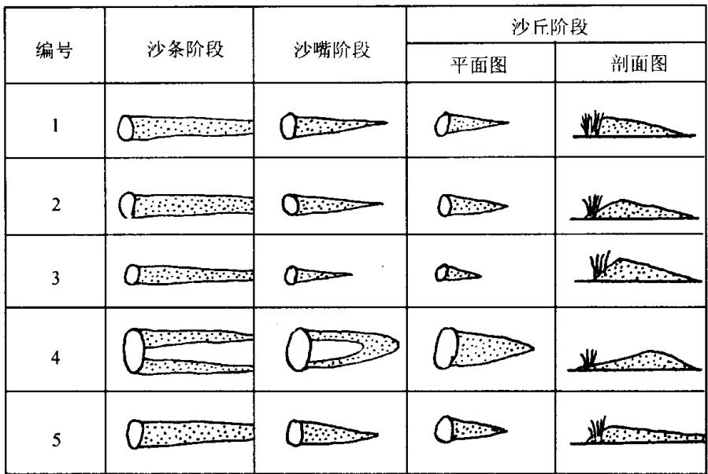  
图5-2 风洞实验灌丛沙堆形成过程示意图

由粒度较细的悬移物质组成，较宽的灌丛还能形成双沙条。随着砂粒的堆积，沙条阶段很快消失。由于过程暂短，在野外又少见稳定的单向风，故在野外很难观察到这一阶段的存在。②沙嘴阶段。为长度缩短了的沙条，平面形态呈以灌丛直径为底的等腰三角形，长宽比1:5\~1:10,双沙条尾部开始合拢，沙脊线呈套索状，沙嘴继续缩短，就具有沙堆的雏形。在野外，春季有比较固定单一风向的地方，可以看到这种幼年形态的小型沙堆。在干旱草原区，一般高不超过35cm，最宽处不足50\~60cm，长度可达3\~4m。③沙堆阶段。沙嘴下风向延伸部分不断缩短，高度不断增长，最终因风沙流流场形成大头朝主风向一侧的卵形，剖面形态为流线型，长宽比小于2。④沙包阶段。沙包的形态与沙堆变化不大，惟由于沙堆积蓄水分，植物繁殖布满了整个沙丘，也使沙包不断增高、加大，最终成为成熟的小型沙丘(沙包)形态。但是灌丛沙包个体的发展不是无穷尽的，其极限形体大小与生境(如沙源丰富程度、水分条件、风力大小和灌丛植物种类)有很大关系，并且表现出很强的地带性。前已述及的半干旱砂质草原的锦鸡儿沙包可增大到1.5m高，直径达3m多，但干旱地带荒漠化砂砾质草原上红砂、毛头刺沙包高度仅20\~30cm，直径不超过1m。沙堆一旦达到极限高度，就进入一种相对平衡状态。这时灌丛沙堆个体不再增大，达到形态完善演化的沙堆阶段，即迎风坡侵蚀，坡形长缓；背风坡堆积，形成短而陡的、纵向剖面相似于新月形沙丘的形态，即为沙堆的最后阶段。

## 4. 层理和粒度变化

通过自然出露的灌从沙包剖面，可以看出其层理的特征。①层理为倾斜层理，基本上以沙丘顶部为中心，分别向迎风坡和背风坡方向倾斜。②层理的倾角逐渐变化，自灌丛沙包底部到顶部，倾角渐大，底部倾角7°\~9°，最上层则可达18°\~22°。③层理按其沉积韵律、倾角差异可分为若干沉积组，在每一沉积组内又可分出许多纹理层。这些纹理层的倾角比较一致，表明灌丛沙包发育过程曾经历不同尺度的环境变化，尤其是气候的周期性变化。

灌丛沙包不同部位的砂土粒度特征比较一致。其正态-概率曲线显示出典型的风成砂特征。在粒度组成中以跃移砂为主(直径0.05\~0.5mm)，但也有一定的变化规律。①迎风坡的跃移砂组成量显然大于背风坡，背风坡的悬移砂含量显然增多。在正态-概率曲线上也有明显的反映。②沙丘中部的粒度一般较粗，这是较稳定的沙包表层成土作用较强，而使砂土颗粒变细所致。

在草原南部地带，土地开垦为旱作农田后，农田里常有开垦时存留的残留灌丛沙包，因为周围有疏松的耕地床面供应砂物质，灌丛发育很快，个体庞大，农田灌丛沙包的高度为一般草原灌丛沙包的2\~2.5倍。在耕地下风向的草地上更是出现密集的灌丛沙堆群。

## 二、土地的不均匀风蚀切割——劣地的形成过程

这种过程发育在沙漠外围沟谷或湖泊洼地局部地段。地层比较均匀，以小于细砂粒级的粉细砂、亚砂土成分为主，甚至有一定量的黏粒。土地受风蚀的不均匀切割出现小型陡壁，进一步使风产生涡流，切割更加不均匀，土地逐渐出现风蚀残墩、风蚀残柱，地形破碎，呈现类似“雅丹”地貌的劣地景观。

“雅丹”(yardang)来源于维吾尔语，原意为“陡壁的小丘”。19世纪末和20世纪初，一些欧洲地理学家到我国新疆罗布泊地区考察，见到大面积陡壁的土丘和吹蚀沟相间地貌形态，斯文·赫定(S.Hedin)在其文章中首先采用了“雅丹”这个词，以后逐渐被地学界所接受和采用。罗布泊东侧是“雅丹”一词的来源地，青海柴达木盆地西缘这种地貌也很发育。我国北方现代沙漠化发展区域的风蚀残墩和残柱等主要零散分布在草原沙地周围，尤以浑善达克沙地外围和乌珠穆沁沙地南侧较集中，但规模都有限，发展成为完整的如鲸背状雅丹者比较少见，可以说大部分只具有“雅丹”的雏形。又鉴于“雅丹”定义的不清和被人的滥用，我们在这里未采用“雅丹”一词，而只用风蚀劣地来称呼我们所指的这种具有小型陡壁的风蚀残墩和残柱，以及附近的风蚀坑等风蚀地貌群体。

野外观察风蚀残墩、残柱，上面往往出现多层不甚明显的黑钙土-栗钙土型古土壤层。土层呈垂直节理和大孔隙发育，有时还可以发现根孔和充填根孔的白色碳酸盐假菌丝体。由此表明，这些土层沉积的环境与现代相似，为干草原和灌丛草原环境，多为风成沉积。草原上须根系草类的繁衍和水分下渗及地下水毛管作用使土层黄土化，垂直节理和大孔隙发育也是小型陡壁-残墩、残柱形态出现的必要条件。

风蚀劣地按其出现的地形部位可分为以下类型。①洼地型。分布于较宽阔的山间洼地中，由湖沼相一风积相地层组成，地层呈潜育化特征，水平层理较明显，风蚀残墩呈台阶状，类似于新疆的“白龙堆”地形。可见于河北省康保县八段地农场附近和内蒙古化德县良种场西部。②浅沟谷洼地型。多分布在丘间缓起伏平原的中部，细土沉积物以风成沉积物为主，黄土化过程发生后，土层垂直节理发育。往往在两个支谷交汇处，气流容易形成涡流，对地面产生不均匀风蚀切割，形成劣地。风蚀台、墩的周壁沿垂直节理发育，陡峭近垂直，个别地方形成真正的鲸背状，但多见四周都陡峭者，陡壁下可见风蚀沟。在乌珠穆沁沙地南侧塔林敖包至巴彦乌拉浩特镇一般常见这种类型劣地发育。在化德县达盖滩、七号和商都县黑砂土村南也有分布。③山麓型。分布于丘陵山地迎风坡，组成物质以坡积物为主，风蚀台、墩一般高度1\~1.5m，也见高达2m者，陡壁下部夹有碎石，陡壁上平行斜坡的古土壤层很明显。在化德县公腊胡同、二道河一带可以看到这种类型的劣地。

风力侵蚀又以风沙流的磨蚀作用最为重要。有些劣地的开始形成，又有其他外营力的作用，使地面出现了小型陡坎，风沙流产生涡流，涡流进一步对地面产生不均匀切割，才使劣地得以发展。在我国东部草原地区的劣地形成中也有不少与流水的最初切割有关，尤其是宽浅沟谷洼地型。人们取土挖沙、修筑路堑等不规范活动有时直接破坏地面，为劣地的发展提供了前提。在浑善达克沙地以南的半农半牧区，许多村庄附近都有小片劣地地形，多数是村民盖房取土以后风力塑造而成的。

综上劣地的成因，可以分为单一风力作用型、流水-风力型、人工-风力型和混合作用型四种。当前应特别重视人类活动在现代沙漠化过程中的作用，尤其在草原地区开垦以后，耕地土壤风蚀已经完全进入了一个受人力支配的新阶段。

## 三、沙地(丘)活化过程

这里指地质历史时期形成，并且已经固定的沙漠，当植被遭到破坏以后，沙地(丘)重新流动的过程。我国北方有许多第四纪沉积盆地，有的沉积盆地是从第三纪或更久远的历史时期继承下来的，大都沉积了巨厚的沙层，在末次冰期大都成为流动沙漠。全新世初期气候条件变得相对湿润，大范围流沙固定。其后在人类历史时期，由于人为活动的加剧，诸如:农业开垦；牲畜过度采食、践踏；林木被砍伐、樵采破坏或改变水系等自然条件，使植被覆盖不足以保护地面时，沙地、沙丘开始活化流动，最初为斑点状，逐渐连片，成为大片流沙。在我国北方东部，尤其是科尔沁沙地、浑善达克沙地、呼伦贝尔沙地等的沙丘剖面中可以看到3\~6层古土壤层，说明沙地(或者局部)曾出现过多次固定和活化的反复，其原因归咎于气候条件的波动和人为活动。对于现代沙漠化过程来说，主要是人类活动造成的，所以沙地(丘)活化过程主要发生在农地周围的砂质农田、居民点、牲畜饮水点附近和交通沿线。

## (一）沙地(丘)活化过程中地貌形态的变化

沙地(丘)活化过程中形成的风沙地貌形态严格地受原始形态的制约，但又绝非原来流动沙丘地貌的再现，大多有了新的形态特征，抛物线沙丘就是沙丘活化过程中产生的典型的新沙丘形态。在东部沙地如浑善达克沙地东部、乌珠穆沁沙地、呼伦贝尔沙地、松嫩沙地，常见抛物线沙丘，这是一种缺口向着风向的反新月形沙丘。由于整个沙地呈现半固定的状态，迎风坡受风的吹蚀，出现“破口”以后逐渐发展成为风蚀坑，吹蚀的流沙掺入气流，越过丘顶以后堆积在背风坡。背风坡新堆积沙体和风蚀坑以外的地方植被葱郁，整个沙地流沙的比例较小，仍属半固定阶段。随着风蚀坑的发展，抛物线顶点不断后退，沙丘逐渐呈“U”形，最终顶点可能被蚀穿，形成两列纵向沙垄(图5-3)。在我国东部的沙地中很多固定沙丘也呈现抛物线形，说明抛物线沙丘的沙漠化发展过程，可能随着自然条件的变化和人为因素压力的减缓而在某一阶段上发生逆转。

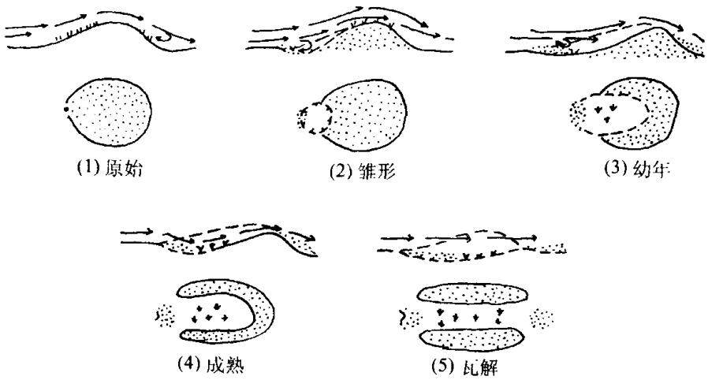  
图5-3 抛物线沙丘的形成与发展示意图

## （二）植被的变化

植被的退化和植被覆盖度的减少既是沙漠化-沙丘活化的结果，又是沙丘活化的原因，还成为沙漠化的最明显标志。沙丘活化过程中植被种群的变化也很明显。以处于温带半干旱区疏林草原的科尔沁地区为例，在固定沙丘阶段，乔木有蒙古黄榆(Ulmusmacrocarpa var. mongolica)、白榆(U. pumila)、元宝枫(Acer truncatum);灌木有山楂(Cra-iaegus pinnatfica)、山杏(Prunus sibirica)、胡枝子(Lespedeza bicolor)、鼠李(Rhamnus dahuri-ca)等；半灌木有铁杆蒿(Artemisia gmelinii)、麻黄(Ephedra sinica)、欧李(Prunus humilis)、山竹子(Hedysarum frnticosnm)、冷蒿(Artemisia frlgida);草本植物有羊草(Leymus chinen-sis)、黄蒿（Artemisia capillaris)、野古草（Arundinella hirta)、糙隐子草（Cleistogenes sguar-rosa)、鹅绒委陵菜(Potentilla anserina)、野苜蓿(Medicago falcata)等。植物种类多，生长良好，灌木和草本层植物多数可为牲畜食用，乔木层盖度约为0.3，灌木层盖度约为0.4，半灌木和草本层可达0.7\~0.8,平均高度50\~60cm,生物量(鲜重)3750\~4500kg/hm²。到了半固定阶段，植被类型以半灌木、多年生禾草和蒿草为优势种，一般已无乔木层，主要植物有冷蒿、黄蒿、差巴嘎蒿(Artemisia halodendron)、铁杆蒿、大籽蒿(A. sievereiana)、羊草、白草(Pennisetum fiaccidum)、山竹子、尖叶胡枝子(Lespedeza hedysaroides)、分叉寥(Poly-gonum divaricatum)等群落，草灌盖度为 30%\~40%，草本层平均高 40\~50cm,生物量(鲜重)约3000kg/hm²。随着沙漠化的进一步发展，整个沙漠化地区进入半流动状态，此时植物种的分布与前者差别不大，但数量相差悬殊。植被以黄蒿、差巴嘎蒿和一二年生植物如狗尾草(Setaria viridis)、棉蓬(Corispermum declinatnm)、尖头叶黎(Chenopodium acuminatnm)、苍耳(Xanthinm sibiricum)等为代表种。到了流沙阶段，沙丘上已无稳定的植被，只有丘间洼地和背风处有沙米(Agriophyllum squarrosum)等植物零星分布[15]。通过上述例证的分析得出，在沙丘活化过程中植被的演替趋势是：①群落结构由复杂到简单，层次逐渐减少；②植株逐渐低矮、稀疏，干物质积累少，生物量越来越少；③植物品质由优到劣，主要表现在禾本科和豆科可食性草类的比例减少。

## （三）土壤的变化

沙丘活化过程是从已经固定的沙丘重新受到风蚀开始的，原来沙丘固定阶段形成的土壤腐殖质层不断被风吹蚀，整个土层因风的分选，质地相对粗化(表5-7)，随同细小颗粒的吹失把营养成分(有机质、全量养分、微量元素)损失，导致土壤的贫瘠化(表5-8、表5-9)。其趋势是粒度组成愈来愈粗，养分含量趋于下降。

表5-7 不同类型沙漠化土地表层(0\~10cm)砂粒含量的变化(内蒙古科尔沁沙地)
<table><tr><td>沙漠化土地类型(沙丘活化阶段)</td><td>砂粒(1~0.05mm)含量/%</td></tr><tr><td>固定沙地</td><td>79~89</td></tr><tr><td>半固定沙地</td><td>71~93</td></tr><tr><td>半流动沙地</td><td>93~98</td></tr><tr><td>流动沙地</td><td>98~99</td></tr></table>

表 5-8 不同类型沙漠化土地表层(0\~30cm)有机质与养分含量(内蒙古科尔沁沙地)
<table><tr><td rowspan="2">沙漠化土地类型 (活化沙丘阶段)</td><td rowspan="2">有机质/%</td><td colspan="3">养分含量/%</td></tr><tr><td>全N</td><td> $\mathbf { P } _ { 2 } \mathbf { O } _ { 5 }$ </td><td> ${ \bf K } _ { 2 } \mathrm { O }$ </td></tr><tr><td>固定沙地</td><td>0.975</td><td>0.043</td><td>0.033</td><td>2.9</td></tr><tr><td>半固定沙地</td><td>0.359</td><td>0.014</td><td>0.014</td><td>3.01</td></tr><tr><td>半流动沙地</td><td>0.267</td><td>0.015</td><td>0.015</td><td>3.23</td></tr><tr><td>流动沙地</td><td>0.065</td><td>0.008</td><td>0.008</td><td>2.77</td></tr></table>

表 5-9 不同类型沙漠化土地微量元素含量变化(内蒙古科尔沁沙地)
<table><tr><td rowspan="2">类型</td><td rowspan="2">深度 /cm</td><td colspan="7">微量元素含量  $/ ( \mu _ { \mathbf { g } } / \mathbf { g } )$ </td></tr><tr><td>Ti</td><td>Mn</td><td>V</td><td> $\mathbf { \sigma } _ { \mathbf { C u } }$ </td><td>Ni</td><td> $\mathbf { \alpha } _ { \mathbf { C o } }$ </td><td> ${ \bf Z } { \bar { \bf n } }$ </td></tr><tr><td>固定沙地</td><td>0~10</td><td>582</td><td>126</td><td>10</td><td>19</td><td>7</td><td>8</td><td>47</td></tr><tr><td rowspan="2">半固定沙地</td><td>10~25</td><td>382</td><td>124</td><td>7</td><td>14</td><td>5</td><td>7</td><td>49</td></tr><tr><td>0~20</td><td>410</td><td>103</td><td>8</td><td>15</td><td>5</td><td>7</td><td>50</td></tr><tr><td rowspan="2"></td><td>20~40</td><td>380</td><td>112</td><td>7</td><td>23</td><td>8</td><td>8</td><td>51</td></tr><tr><td>0~10</td><td>191</td><td>55</td><td>3</td><td>16</td><td>7</td><td>3</td><td>54</td></tr><tr><td>流动沙地</td><td>30~40</td><td>277</td><td>59</td><td>3</td><td>14</td><td>6</td><td>2</td><td>60</td></tr></table>

## （四）风沙活动的变化

根据野外观测，不同发展程度的沙漠化土地，在同样风力作用下，由于下垫面的性质不同，其风沙活动强度差异很大。由固定沙地至流动沙地，因植被覆盖度的差异而使地面粗糙度相差几个数量级，因而其临界起沙风速也就大不相同。流动沙地自由沙面的起沙风速大约为5m/s(2m高处)，具零星浅风蚀洼地及薄层覆沙的基本固定草灌丛沙地的起沙风速约8m/s,完全固定的灌丛沙地在常见风速下(野外观测到的最大风速18.3m/s)不起沙；在具备起沙条件的同样风力作用下，其输沙强度相差达两个数量级(表5-10)[8]。

表 5-10 不同固定程度的沙丘地表风沙活动对比(科左后旗，1983 年 4\~5月)
<table><tr><td>地表类型</td><td>粗糙度</td><td>输沙量 Q2与 风速ν统计回归</td><td>相关系数</td><td>0.01 水平检验</td></tr><tr><td>流动沙丘</td><td>1.100×10-3</td><td> $\mathcal { Q } _ { z } = 1 . 1 5 \times 1 0 ^ { - 4 } v ^ { 4 . 7 3 }$ </td><td>0.93</td><td>0.83</td></tr><tr><td>半流动沙丘</td><td>2.850×10⁻1</td><td> $Q _ { z } = 1 . 1 0 \times 1 0 ^ { - 5 } \nu ^ { 3 . 6 4 }$ </td><td>0.87</td><td>0.74</td></tr><tr><td>半固定沙丘</td><td>1.600</td><td> $Q _ { z } = 1 . 7 8 \times 1 0 ^ { - 4 } \nu ^ { 3 . 5 6 }$ </td><td>0.88</td><td>0.71</td></tr><tr><td>具零星浅风蚀坑薄覆沙的 固定沙地</td><td>2.330</td><td> $Q _ { z } = 1 . 7 0 \times 1 0 ^ { - 6 } \nu ^ { 4 . 5 7 }$ </td><td>0.83</td><td>0.77</td></tr></table>

流动沙地不仅比固定沙地在起沙条件下输沙强度大，而且风沙活动机会也多，亦即风沙活动出现的时间要长得多。因此，仅就风力作用，沙丘活化各阶段发展速率不等。

## 四、沙漠扩张

原非沙漠的沙漠外围地区被从沙漠吹出的沙子所掩埋成为流沙覆盖的地区，这是最早被人们所认识的沙漠化类型。但是这类沙漠化类型所涉及的范围不多，许多地方现代沙漠的范围尚未超出地质历史上沙漠的最大规模，在这些地方沙漠的“扩张”是通过沙丘活化来完成的。只有西部沙漠，如塔克拉玛于沙漠南缘、甘肃河西走廊存在着这种沙漠化类型。在这些地方往往是流沙与农田直接接壤，风沙流是沙丘前移的基本方式，风沙流不但导致沙丘的前移，还袭击庄稼，危害农作物；居民点也受到流沙压埋的威胁；沙漠化土地地貌景观呈现吹扬灌丛沙堆与新月形沙丘、沙丘链相间的特征。

从沙漠化发展的结果——出现的顶极景观1]来划分沙漠化，可以划分出：①砂质沙漠化，顶极景观为密集的流动沙丘；②砾质化，顶极景观为风蚀戈壁；③劣地化，顶极景观为类似雅丹的风蚀劣地。

# 第二节 沙漠化发生的生态机理及沙漠化程度判断

## 一、沙漠化发生的生态机理

水分缺乏及水分状况的不稳定限制了有机体的生长繁衍，这是沙漠化地区环境的明显特点之一。由松散沙性物质构成的下垫面是地表的原生脆弱性，属于沙漠化产生的内因，频繁强劲的大风是沙漠化产生的外因，内因和外因构成了潜在的环境不稳定因子的复合体。该复合体又存在于水分匮乏和不稳定的环境中，从而构成叠加的不稳定增值效应。沙漠化的根本原因就在于人类对自然环境施加的压力超过了它自身的弹性限度，使其产生了塑性形变。

我国沙漠地区多发生在干旱、半干旱的脆弱生态环境区。不合理的放牧和耕垦是促进沙漠化的主导因子。例如，在此类地区天然草场的超载放牧，往往引起草场退化。草场退化过程通常是从植株数量减少、高度降低、覆盖度变小开始，发展到优良牧草数量减少、盖度再下降、适口性差的草类甚至毒草占明显优势，导致建群种的改变。如果上述草场退化发生在砂质草原上，植物覆盖度减小便会使砂质地表裸露，风力作用下形成风沙源，从而演变出特殊的环境退化形式沙漠化过程。因此，从生态学角度来看，沙漠化过程便是生态系统劣化过程的延伸和发展。其主要表现为以下方面。①由于风蚀使土壤库存的供给植物与生态系统的有机质和营养元素散失，造成本生态系统内物质代谢循环的失调，随着沙漠化的进一步发展，风蚀量的加大，物质损失逐年增多，生态系统基本代谢功能愈来愈失调。例如，内蒙古四子王旗巨巾号乡砂质草场经开垦35年后，因风蚀每公顷损失表土6000m³，平均每年每公顷损失有机质4065kg，黏粒近45t。②由于牲畜过量啃食或人类其他生产活动的干扰，超出了植物可能繁衍更新的阈限，从而造成生态系统结构的破坏。由此可见，生态系统发生结构上和功能上的劣化过程，直到生态系统平衡完全失调、崩溃，这便是沙漠化过程的生态学机理[9]。

沙漠化过程中，风是塑造地表形态的外动力，地面植物群落的组成和盖度又可制约或促进风蚀地表形态的变化。沙漠化过程中地表形态特征以及相应变化的植被，都具有阶段的特点，这是我们划分和判断沙漠化程度的基本依据。可见，沙漠化过程具有自身演变规律。从生态学角度认识沙漠化过程的规律，便是其生态学属性，基本上包含两个内容，一是沙漠化过程的反馈性；二是沙漠化的自我恢复能力。

## （一）沙漠化过程反馈性的生态学属性

当沙漠化过程开始后，风力吹蚀砂质地表(当风速大于等于起沙风速时)，砂粒脱离地表进入气流，形成风沙流。由于气流内砂粒的存在，风沙流对砂质地表破口的吹蚀，成为“磨蚀”(风沙流与砂质地表形成固体之间的摩擦侵蚀)形式进行。这种摩蚀力较单纯的气流吹蚀力约高出几十倍至几百倍(砂粒密度为空气的2000倍，砂粒运动速度一般较气流速度小约一个数量级，据此推算含沙气流的作用力约为单纯气流的几十至几百倍)。于是，在沙漠化过程中产生了风一风沙流一风沙流加重吹蚀的反馈过程。沙漠化过程一旦发生，即有风沙流出现，而一旦产生风沙流，其破坏过程、破坏速度就日益累进，土地沙漠化程度随之急剧发展。

沙漠化过程的反馈特征还反映在沙漠化成因的发展中。因人口剧增而导致不合理耕垦及过度放牧，加剧了土地沙漠化过程及土地生产力下降，又反馈为过度耕垦与放牧的扩大化，如此恶性循环不已。

在草原地带，历史上也有一些区域出现过沙漠化，甚至出现过同一区域沙漠化与逆转的反复过程，如科尔沁草原。但在当时历史条件下，人口压力小，当一方土地发生沙漠化和生产力下降时，人们即将舍垦(牧)放荒，转而开发新的处女地，即轮垦(牧)轮荒。被放荒的土地逐渐自行恢复，沙漠化过程逐渐减弱。历史上沙漠化易发生地区曾经盛行过游农、游牧制度，正是沙漠化过程负反馈作用的结果。

深入分析沙漠化进程的反馈作用，不仅使我们认识到沙漠化过程一经发生就具有自行扩展的特性，而更重要的是使人们在生产开发活动中懂得利用实践效果反馈的意义，促使沙漠化逆转。

## （二）沙漠化逆转的自我恢复能力

沙漠化逆转自我恢复能力的大小，取决于沙漠化过程的演化阶段和程度，也取决于沙漠化过程的自然条件，即地带的脆弱性。例如，科尔沁草原东部和南部、榆林风沙区东部的年降水量都在300\~400mm，地表有斑点状分布的流沙及灌丛沙堆，沙漠化逆转时间为5\~7年；年降水量200\~300mm的鄂尔多斯西部，沙丘密集，逆转时间在10年以上。而降水不足200mm的绿洲边缘地区，一旦沙漠化过程产生，流沙化以后，如果不靠人工的灌溉扶持，靠自身是很难逆转的。

沙漠化过程逆转的自我恢复属性是因生态系统具有的弹性所决定。认识并掌握这一属性，对于防治沙漠化有重要意义。在沙漠化发生初期，或在自然条件相对优越的地区，利用沙漠化自我逆转的属性，采取封育的办法控制人为(牲畜)的干扰，是有效果的。因此，治理沙漠化应当从沙漠化程度较轻的地区和初期阶段开始，以便收到事半功倍的效果。

## 二、沙漠化程度的判断

沙漠化程度是沙漠化发生地区环境退化程度的客观反映。我们强调指出，沙漠化是以出现风沙活动为主要特征的砂质荒漠化过程，故判断其程度则是以地表出现风沙活动及其造成的风蚀、片状流沙、吹扬灌丛沙堆、砾质化地表以及流动沙丘所占该地区面积的比例和年扩展速率等，作为判断一个地区土地沙漠化程度大小的基本特征。其次是从生态学角度，如利用植被覆盖度和植物组成成分的变化、土壤质地与肥力的变化、水分条件的变化、特别生产潜力的变化等，把整个环境发生的变化密切联系在一起，才能做出全面的判断[10]。

## （一）利用地理景观及土地沙漠化的发展判断沙漠化程度

沙漠化研究的目的，一方面是为了整治已经发生的沙漠化土地，另一方面也是预防具有潜在沙漠化危险的地区向着沙漠化方向发展。沙漠化防治的重要参数是沙漠化危机的评价，“沙漠化危机”与人为活动开发过程中超过生态系统的负荷能力(如人、畜压力)强弱有关，也受降水变率大小影响，从其发展角度可以采用以下指标：①沙漠化土地每年扩张率大小。可以利用不同时期卫片或航片计量分析所得的数值计算年增长率，用年增长率大小判断发展程度。②以沙漠化土地景观中最显著的特征——流沙所占该地区面积的大小作为可利用土地资源丧失的一个主要指标。③沙漠化土地景观的形态组合特征及配置、比例。

根据以上分类原则，以往的文献中一直把沙漠化分为潜在的、正在发展中的、强烈发展中的和严重的四级(表5-11)。这种划分给人以沙漠化发展动态的概念，指出“沙漠化危机”程度，以引起人们对沙漠化警觉。

表 5-11 沙漠化发展程度指征
<table><tr><td>沙漠化程度</td><td>年扩大面积占 该区面积/%</td><td>流沙面积占该 区面积/%</td><td>形态组合特征</td></tr><tr><td>潜在沙漠化土地</td><td>&lt;0.25</td><td>&lt;5</td><td>大部分土地尚未出现沙漠化，偶见有流沙斑点</td></tr><tr><td>正在发展中的沙漠化土地</td><td>0.26~1.0</td><td>6-25</td><td>片状流沙，吹扬灌丛沙堆及风蚀相结合</td></tr><tr><td>强烈发展中的沙漠化土地</td><td>1.1~2.0</td><td>26~50</td><td>流沙大面积的分布，灌丛沙堆密集，吹扬强烈</td></tr><tr><td>严重沙漠化土地</td><td>&gt;2.1</td><td>&gt;50</td><td>密集的流动沙丘占绝对优势</td></tr></table>

## （二）从生态学角度判断沙漠化程度

在沙漠化过程中，随着沙漠化程度的发展，土地滋生潜力、生物生产量(含植物结构及覆盖度的变化)以及生态系统能量转化效率，都有较明显的变化。利用这些变化可以半定量地描述沙漠化的发展程度，在程度划分中一般作为辅助指征(表5-12)。

表 5-12 沙漠化程度的生态学指征
<table><tr><td>沙漠化程度类型</td><td>植被覆盖度/%</td><td>土地滋生潜力/%</td><td>农田系统的 能量产投比/%</td><td>生物生产量 /[t/(hm²·a)]</td></tr><tr><td>潜在</td><td>&gt;60</td><td>&gt; 80</td><td>80以上</td><td>3~4.5</td></tr><tr><td>正在发展中</td><td>59~30</td><td>79~50</td><td>79~60</td><td>2.9~1.5</td></tr><tr><td>强烈发展中</td><td>29~10</td><td>49~20</td><td>59~30</td><td>1.4~1.0</td></tr><tr><td>严重</td><td>9~0</td><td>19~0</td><td>29~0</td><td>0.9~0</td></tr></table>

表5-12中植被覆盖度按投影估算，并以当地原生景观的植被覆盖度为100%。土地滋生潜力，利用水分效率(或蒸腾系数)推算出本区单位面积的可能生产量，并以其为100%计。我国于草原农牧交错地区旱作农田推算的可能产量为 $1 . 5 \sim 2 . 0 \mathrm { { t / h m } } ^ { 2 } .$ 。农田系统的能量产投比将耕种收获全过程花费的各种有机能和无机能总合与产出能之比求得。我国干草原农牧交错区旱作农田的能量产投比值约为2.0,则此地区能量产投比的100%的就是2.011]。生物生产量是根据我国农牧交错地区估算的，它是生物的全员生产量，仅仅计算草场上牲畜的可食部分，可能要小一个档次，在旱作农田里，不但要计算作物的收获，还要计算秸秆、茎叶等部分。

从生态学角度划分沙漠化程度，抓住了沙漠化是土地生产力退化过程这个实质，是比较科学的。但是要在大范围内运用生态学的划分，必须建立完整的监测系统，做长期的大量的细致工作，仅凭借个别点或个别年份的资料，难免有偶然性。在目前的条件下完整的监测还难以开展，故也只能作为辅助指征，在有条件的地方，对利用其他指征所作的程度判断加以验证。

## （三）景观特征发展阶段的划分

在野外实地调查或利用航片、卫片作图时，利用沙漠化土地表现出的景观特征信息来判断沙漠化程度是最常用的方法。这实际是沙漠化瞬间程度的判断，要想得到发展趋势的结论，必须要有两个以上瞬时状况的对比。

在景观表征判断时，首先要判定沙漠化过程的开始，其次判明沙漠化的“顶极”景观。在明确了开端和结尾以后，就可以综合它变化过程的形态指证，从而划分发展阶段。沙漠化是土壤风蚀的结果，但有风蚀的地方不一定全划归沙漠化地区。判断一个地区沙漠化过程是否已经开始，主要依据地表形态出现了变化。由于沙漠化类型不一，其发展的“顶极”景观也不相同，必须区别类型从而确认沙漠化的程度。程度的命名一般按轻度、中度和严重三级判断。在进行实地调查时，除了调查上述的土地滋生潜力、农田系统的能量产投比、生物生产量外，主要还是依靠地面植被覆盖度、植被种群类型、微地貌形态等地理景观的直观信息。

综合通过遥感手段和地面实地调查，区别各种程度的沙漠化土地主要标志综合于表5-13中。经过地面调查作图或两期航(卫)片的对比，我们才能对其发展程度应用沙漠化的年增长率做具体划分(表5-14)。沙漠化的年增长率用以下公式算出[10]：

$$
R = ( \sqrt [ \eta ] { Q _ { 2 } / Q _ { 1 } } - 1 ) \times 1 0 0 \%
$$

式中，R为某一地区沙漠化的年增长率；n为测算相隔年限；Q1为测算起始年沙漠化土地 $Q _ { 1 }$ 面积(或面积比)；Q2为测算终结年沙漠化土地面积(或面积比)。 $Q _ { 2 }$

表 5-13 各种程度的沙漠化现状景观综合标志
<table><tr><td>土地沙漠化程度</td><td>综合地理景观标志</td></tr><tr><td>轻度沙漠化</td><td>固定沙丘迎风坡出现风蚀坑，背风坡有流沙堆积；植被覆盖度30%~60%；流沙斑点状出现，面 积5%~25%； 出现大小不等的灌丛沙堆，灌丛生长茂密；</td></tr><tr><td>中度沙漠化</td><td>地面显现薄层覆沙或砂石裸露； 春季耕城有明显的风蚀痕迹，城间有积沙，土壤腐殖层风蚀损失不超过50%，产量为开垦初期的 50% ~80%; 在细土深厚地方出现风蚀坑，但其中仍有一定植被覆盖，坑边沿尚无明显的陡坎 固定沙丘显现明显的风蚀坡和落沙坡分异；植被覆盖度10%~30%；流沙面积25%~50%； 灌丛有叶期仍不能覆盖整个沙堆，灌丛沙堆迎风坡显现流沙； 黄土地区出现小片流沙，地面布满粗砂砾石，但仍有稀疏的植被生长，草群覆盖度10%~30%；</td></tr><tr><td>严重沙漠化</td><td>耕地明显风蚀低下，土壤腐殖层被风蚀厚度超过50%；产量降为开垦初期的50%以下； 风蚀坑大部分裸露，地面出现明显的小型陡坎 砂质沙漠化地区整个呈现流动沙地状态，流沙面积超过50%，植被零星分布，覆盖度小于10%； 砾质化地区呈现不毛的戈壁状，植被覆盖度小于10%，砾质化耕地弃耕； 腐殖层几乎全部被风吹蚀，出露钙积层或土壤母质层，因收获不抵籽种，大部分弃耕； 地面出现风蚀残墩、残柱等</td></tr></table>

表 5-14 沙漠化发展程度的划分
<table><tr><td>沙漠化发展程度</td><td>沙漠化年增长率/%</td></tr><tr><td>正在逆转的沙漠化土地</td><td>负值</td></tr><tr><td>比较稳定的沙漠化</td><td>&lt;0.25</td></tr><tr><td>正在发展的沙漠化土地</td><td>≥0.25</td></tr><tr><td>一般发展的</td><td>0.25~3</td></tr><tr><td>强烈发展的</td><td>&gt;3</td></tr></table>

## 第三节 沙漠化发展趋势

## 一、近期土地沙漠化的发展

## （一）土地沙漠化的历史演变

早期沙漠化发展主要制约于自然因素。随着历史的发展，人类活动愈来愈强烈地干预自然界的演变，植被的变化首当其冲。历史时期，人类活动干扰自然因素，一些人为因素又是自然因素所促成的。王恩涌注意到公元4世纪、12世纪、17世纪这几个干冷时期与我国北方少数民族南侵相吻合①，草原的干旱、寒、风沙活动猖獗，生活环境的恶化是他们向南寻求发展的动力。现代沙漠化的发展则主要是人为活动引起的。

竺可桢根据文史资料的记载，总结出我国近3000年的气候变化经历了四次温暖和四次寒冷，沙尘暴频发、沙漠化全面发展的时期都与气候寒冷时期有较好的吻合。一个地方沙漠化的记录又与当地土地的开发有关。公元398年，鲜卑族在平城(今大同市)建立了北魏政权，开发附近土地，经济得到发展，不久(公元440年)永定河的泥沙增加，沿河有了风沙活动的记载。明清时期我国北方处在冰后期的小冰期，17世纪是近500年最寒冷的一个世纪。期间，明王朝都城北迁以后，华北地区的经济得到发展，从山西等地大规模向京师地区移民屯田，山林滥砍滥伐严重，生态环境遭到严重破坏，有关风沙活动的记载连年出现，旱灾不断，沙漠化灾害严重。所以有关学者①认为，明王朝灭亡于北方生态环境的破坏，不无道理。清康熙中期后，朝廷采取鼓励农民屯田，在东北关外也逐渐放宽了对“垦荒”的限制。雍正以后，又实行了增加人口不加赋税的政策，全国的人口6000万左右，到1764年(乾隆二十九年)突破2亿，1819年(嘉庆二十四年)突破3亿，1849年(道光二十九年)达到41298万。光绪年间又实行了垦荒屯边政策，放荒招垦，人口向北方干旱半干旱区域迁移发展，过去被看做蛮荒的草原被大片开垦，沙漠化发展。1840年鸦片战争后，帝国主义的军事侵略和封建主义的层层盘剥，军阀混战，天灾人祸，中原地区民不聊生，再次出现“走西口”的高潮。砂质土地的大规模开垦使沙漠化处于持续严重发展时期。

## （二）近半个世纪土地沙漠化发展态势[13]

土地沙漠化是世界性的问题。目前地球上已受到沙漠化和预计会受到沙漠化灾害影响的地区面积共有4560.8万km²，占全球土地面积的35%，其中极端干旱沙漠占17%，沙 $\mathbf { k } \mathbf { m } ^ { 2 }$ 漠化程度高的占43%，沙漠化程度中等的占4%。按地域分布，沙漠及沙漠化土地占其各自总土地面积的统计数字来看，在非洲占55%，在北美和中美洲占19%，在南美洲占10%，在亚洲占34%，在大洋洲占75%，在欧洲占2%。半个世纪以来，非洲的撒哈拉沙漠南缘边界在1958\~1975年间南移了 $1 0 0 \mathbf { k m } _ { \circ }$ 世界上每年平均有5万\~7万km²的土地沙 $\mathrm { k m } ^ { 2 }$ 漠化，到20世纪末全世界将损失可耕地1/3的面积。

我国沙漠化土地主要分布在北方于旱、半干旱及毗邻亚湿润地区，东起黑龙江，西至新疆，断续延伸长达5500km，涉及辽宁、吉林、黑龙江、河北、山西、内蒙古、陕西、宁夏、甘肃、青海和新疆11个省或自治区，共212个旗县(图5-4),以及西藏自治区。

## 1.20世纪50年代至70年代中期的土地沙漠化发展态势

据20世纪50年代与70年代中两期航片对比分析，沙漠化土地由33.2万km²增加到 $\mathbf { k } \mathbf { m } ^ { 2 }$ 37.1万km2,25年增加了3.9万km²，平均每年扩大 ${ \bf k m } ^ { 2 }$ $\mathbf { k m } ^ { 2 }$ $1 ~ 5 6 0 \mathrm { k m } ^ { 2 } .$ 。这一时期沙漠化主要表现为潜在沙漠化地区，因人为活动干扰而活化发展。

(1)在邻近砂质荒漠边缘的地区，在风力作用下沙丘顺主风向前移，使原非沙丘的地区出现沙丘的景观。

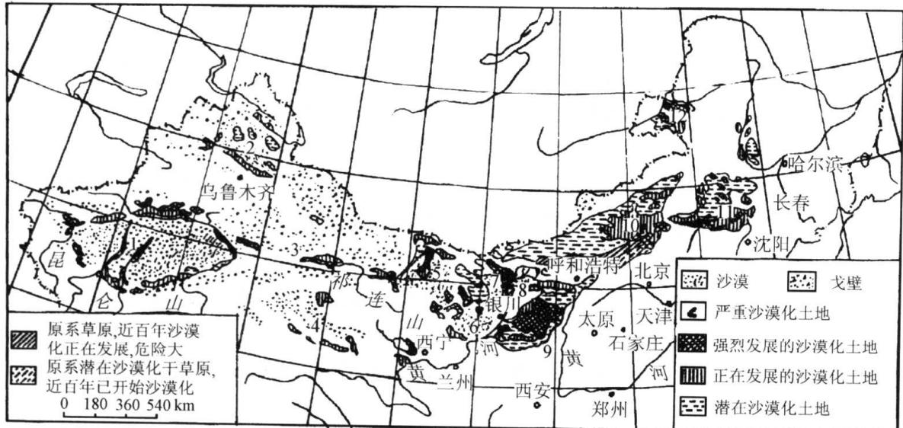  
图5-4 中国北方沙漠及沙漠化土地分布略图[1]  
1. 塔克拉玛干沙漠;2.古尔班通古特沙漠;3.库木塔格沙漠;4.柴达木盆地沙漠;5. 巴丹吉林沙漠；  
6. 腾格里沙漠；7.乌兰布和沙漠;8.库布齐沙漠；9.毛乌素沙地；  
10.浑善达克沙地;11.科尔沁沙地；12.呼伦贝尔沙地

(2)在一些固定及半固定沙丘(沙地)的地区，因开垦、过度采樵和放牧，向流沙化方向发展和加剧。

(3)在历史时期尚未受人为活动干扰的波状砂质草原，由于过度农垦，出现风蚀、地表粗化、灌丛沙堆及片状流沙的发育。

(4)在牧区草原表现为以井泉放牧点为中心呈环状分布的沙漠化点逐渐增多，同时出现因机动车辆任意行驶所形成道路沙漠化的发展。

## 2.20世纪70年代中期至80年代中后期土地沙漠化发展态势

这一时期内我国北方沙漠化土地发展到39.6万km²，比12年前增加了2.48万km²， $\mathrm { k m } ^ { 2 }$ $\mathrm { k m } ^ { 2 }$ 平均每年增长 $2 \ 1 0 3 . 2 \mathrm { k m } ^ { 2 }$ ,年发展速率为1.47%。

土地沙漠化迅速发展的地区主要是农牧交错带，例如，河北省坝上6县、内蒙古乌兰察布盟后山7旗(县)和锡林郭勒盟浑善达克沙地以南的5旗(县)。这些地区每年平均增加风蚀耕地3.872万hm²,砾质化草场4.47万hm²。沙漠化正处在发展中的阶段，主要表 $\mathrm { h m } ^ { 2 }$ $\mathrm { h m } ^ { 2 }$ 现为：①以轻度沙漠化土地为主，到1987年轻度沙漠化面积占沙漠化土地76.5%；②农牧交错地区草原南部，开垦为旱作农田后，引起的草地退化和沙漠化。此外，其余地区的沙漠化比较稳定，速率维持在每年0.2%以下的基本稳定区域有4.53万km²,约占全国沙漠 $\mathrm { k m } ^ { 2 }$ 化地区的12%。

在毛乌素沙地南部、呼伦贝尔沙地南部、科尔沁沙地中部等一些沙漠化土地经治理发生逆转的面积 $2 \ 2 5 0 \mathrm { k m } ^ { 2 }$ ，占到20世纪70年代全国沙漠化土地的1.6%。治理面积不大，但可证明沙漠化是可以防治的，及早治理农牧交错地区沙漠化土地易取得成效。

## 3.20世纪末土地沙漠化发展形势

据20世纪90年代末的监测分析，若不采取有力措施制止沙漠化的发展，按目前的发展速度，到公元2000年，我国北方的沙漠化土地将达到42.7万km²，平均每年增加 $\mathrm { k m } ^ { 2 }$ $2 \ 3 8 4 \mathrm { k m } ^ { 2 }$ 。尤其是中度和严重沙漠化土地会加剧，分别可占到40.3%和4.57%。朱震达在生态脆弱的河北北部丰宁县及内蒙古多伦等地进行了土地沙漠化的动态监测[14]。该地区自70年代至80年代初，土地沙漠化占该地区面积由3.6%发展到7.7%；据1982年和1993年两期卫片对比分析和地面研究，近10年来，该地区土地沙漠化面积从 $5 5 4 \mathrm { k m } ^ { 2 }$ 扩大到 $1 \ 1 3 2 \mathrm { k m } ^ { 2 }$ .即由占土地面积的7.7%增加到15.8%;其中旱作农田沙漠化面积从 $1 7 1 \mathrm { k m } ^ { 2 }$ 扩大到 $3 4 9 \mathrm { k m } ^ { 2 }$ ,牧地草场沙漠化面积从 $2 3 1 \mathrm { k m } ^ { 2 }$ 扩大到 $4 0 3 \mathrm { k m } ^ { 2 }$ ,坡地开垦及樵采引起的土地沙漠化从 $1 5 2 \mathrm { k m } ^ { 2 }$ 扩大到 $3 8 0 \mathrm { k m } ^ { 2 } ( $ 图5-5)。上述增长率为75%\~150%，说明人为活动在土地沙漠化过程中的重要作用。

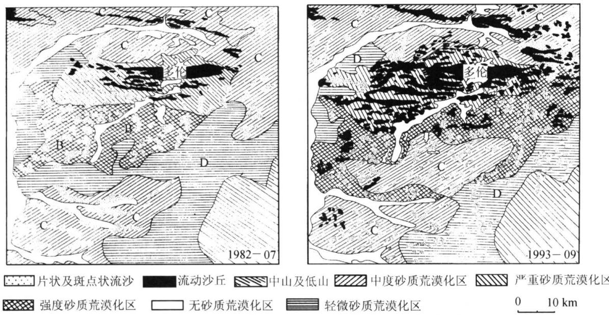  
图5-5近10年来丰宁北部、多伦南部土地砂质荒漠化发展趋势对比

综合以上的观测研究，20世纪末全国土地沙漠化发展有以下几个特点。(①沙漠化发展的速率持续，每年扩展面积 $2 \ 1 0 0 \sim 2 \ 5 0 0 \mathrm { k m } ^ { 2 }$ 。②近几年沙漠化的迅速发展集中于西部干旱区和农牧交错区，例如，甘肃河西走廊和内蒙古鄂济纳旗；青海共和、柴达木、青海湖盆地；南疆塔里木河下游。③东部农牧交错区轻度沙漠化土地的治理有进展，如科尔沁草原退耕还牧，坝上高原和乌盟后山地区退耕种草(锦鸡儿灌从)等，但严重沙漠化土地有扩大(表5-15)。④从90年代初期开始，沙漠化的突发性进程(突发性灾害—沙尘暴)进入一个频发期。这是70\~80年代农牧交错区土地沙漠化的反映。北京地区沙尘暴的沙源主要来自内蒙古高原，草原过牧和草原南部的垦殖使土地沙漠化强烈发展，是北京出现沙尘的根源。尤其是从新疆北部到河西走廊的沙尘暴发生的频率和强度也有所增强，这主要是土地开发引起的。

<!-- ===== 分片 p201-400（200页，源：ex06_唐克丽_中国水土保持（201-400页））===== -->

表 5-15 赤峰市北部主要沙漠化旗近期沙漠化发展状况
<table><tr><td rowspan="3">旗名</td><td rowspan="2" colspan="3">沙漠化土地面积的发展</td><td colspan="6">其中</td></tr><tr><td colspan="2">严重沙漠化</td><td colspan="2">中度沙漠化</td><td colspan="2">轻度沙漠化</td></tr><tr><td>年份</td><td>面积 /km²</td><td>两年比较 增大(+),减少(-)</td><td>面积 /km²</td><td>两年比较 增大(+),减少(-)</td><td>面积 /km²</td><td>两年比较</td><td>面积 /km²</td><td>两年比较</td></tr><tr><td rowspan="3">巴林左旗</td><td>1978</td><td>139.7</td><td></td><td></td><td></td><td>11.60</td><td>增大(+),减少(-)</td><td>128.17</td><td>增大(+),减小(-</td></tr><tr><td>1987</td><td>226.10</td><td>+86.33</td><td></td><td></td><td>21.02</td><td>+9.42</td><td>205.08</td><td>+76.91</td></tr><tr><td>1978</td><td>2 264.64</td><td></td><td>109.91</td><td></td><td>425.53</td><td></td><td></td><td></td></tr><tr><td rowspan="2">巴林右旗</td><td>1987</td><td>1974.00</td><td>-290.64</td><td>269.63</td><td>+ 159.72</td><td>551.03</td><td>+ 125.5</td><td>1 729.20 1153.34</td><td>-575.86</td></tr><tr><td></td><td>4 920.83</td><td></td><td></td><td></td><td></td><td></td><td></td><td></td></tr><tr><td rowspan="2">翁牛特旗</td><td>1978 1987</td><td>4 555.10</td><td>-365.73</td><td>1296.63 1924.47</td><td>+628.30</td><td>2 292.55 1 076.69</td><td></td><td>1 332.11</td><td></td></tr><tr><td></td><td></td><td></td><td></td><td></td><td></td><td>-1215.86</td><td>1553.94</td><td>+221.83</td></tr><tr><td rowspan="2">敖汉旗</td><td>1978</td><td>1100.75 1 060.23</td><td></td><td>212.01</td><td></td><td>400.98</td><td></td><td>487.76</td><td></td></tr><tr><td>1987</td><td></td><td>-40.52</td><td>342.74</td><td>+ 130.73</td><td>189.88</td><td>-211.10</td><td>527.61</td><td>+39.85</td></tr><tr><td rowspan="2">阿鲁科尔沁旗</td><td>1978 1987</td><td>2 285.54</td><td></td><td>62.75</td><td></td><td>930.42</td><td></td><td>1 292.37</td><td></td></tr><tr><td></td><td>3 139.72</td><td>+854.18</td><td>573.71</td><td>+510.96</td><td>618.28</td><td>-312.14</td><td>1 947.73</td><td>+655.36</td></tr></table>

注：以1978年为本底值，1987年较1978年增加(+)或减少(-)的面积。

## 二、近期沙漠化发展因素的分析

沙漠化是自然和人为双重因素交互作用的结果，并且主要取决于不同干旱区域自然条件的特殊性和人类经济活动的特点。自20世纪50年代后，人为强烈的经济活动对加剧土地沙漠化起主导作用；另一方面，当造成沙漠化的人为因素和自然因素在时间上和空间上相吻合时，经常构成危险的态势。

## （一）沙漠化发展的气候因素

干旱化是沙漠化发展的主要特征。1990年年底由国家科委组织编写的《中国科学技术蓝皮书·气候》[12]明确地指出了我国北方近年干旱化的趋势。列举了西北地区干旱化的证据有：①干旱出现的频率显著增加；②湖泊水位下降，面积缩小，甚至干涸；③河川径流量减少；④冰川后退，变薄，雪线上升；⑤沙漠和沙漠化土地面积明显扩展；⑥指示性植被的衰退死亡等。在论及近年华北的干旱特点时又指出，这一地区降水量愈来愈集中在夏季，年际变率加大，干旱发生也愈来愈频繁。

我国西北深居内陆，加之青藏高原的隆起阻挡了西南湿润季风气流的北进，切断了主要水汽来源，并且使西北地区成为持久存在的下沉气流区。经查对半干旱地区15个台站的年降水情况，,20世纪70年代中期以后(1975\~1989年)15年的平均降水量与有气象记录以来的年均降水量基本接近的较多，也不乏略微增多的例子，但总平衡下来减少的站稍多一些。减少的站以通辽、丰宁和多伦为代表，减少的幅度为8%\~13%。其中又以通辽站最为典型，50\~80年代年降水量曲线一直下滑。化德县虽然这15年降水平均值与前22年基本平衡，但从1980年起连续干旱，到1989年的10年里，平均降水量比多年平均降水量少28.74mm。但是从各站年降水量资料看，变化的幅度都不算太大，未超过历史时期的波动。我国干旱区干旱化有如下表现。

## 1. 气候转暖趋势

由于气候渐暖，尤其持续出现的暖冬，使实际蒸发量加大，按最大可能蒸发量计算的干燥度指数加大。英国East Anglia大学气候研究组对世界大陆和海洋气象站(至1987年)调查分析的结果，20世纪70年代中期以后，气候急剧变暖，多数科学家把这种变暖归结为大气中 $\mathbf { C O } _ { 2 }$ 浓度的增加所产生的温室效应。在我国也有类似的情况，北京市1981\~1986年的平均气温比70年代10年的平均气温增加了1℃，大多数地区升温值在0.3\~$0 . 5 \mathrm { ‰}$ ，这就意味着年大于10℃的活动积温增加 $3 0 \sim 6 0  { \mathrm { ~ Q ~ } }$ ，在周期降水量不变的情况下，干燥度增加 $0 . 5 \sim 1 . 2 $

## 2.年降水分布不均，有效降水减少

年降水量分布更加不平衡，春旱时间加长，春旱连接夏旱的现象增多。半干旱地区干旱为主要矛盾，加之降水季节的不平衡，春旱的频率在55%以上，初夏干旱的频率也在50%以上。这几年干旱时间有加长的趋势，1985年10月16日至1986年2月14日乌审旗122d连续无雨；多伦(1984年)、林西(1985年)、科左后旗(1989年)、乌兰浩特(1982年)、通辽(1985年)、巴林右旗(1984年)都出现了年内连续3个月以上无有效降水的现象。兰州地区自1998年10月至1999年4月连续6个月无有效降水。御道口、商都、达茂旗、四子王旗、海拉尔则多次出现迟至5月仍未见有效降水的记录。此时土壤水分的蒸发量已经较高，致使土壤水分亏损，土地干旱，墒情低下，牧区牧草不能返青，农区不能播种，也使土壤极易遭受风蚀，产生沙漠化。

## 3.地下水位下降，湖泊退缩、干涸

以内蒙古东部地区哲里木盟科尔沁沙地为例，20世纪60年代境内有大小湖泊600余处，常见积水的有400余处，积水面积 $2 9 0 \mathrm { k m } ^ { 2 }$ 余，蓄水约 $3 \ : \mathrm { ‰ }$ ，多数集中在科左后旗地区；而1984年科左后旗水利资源调查时，全旗总计湖泊仅325个，其中常年有水的湖泊仅剩143个，水域面积只有67km²，其余皆成为时令湖。利用近期资源卫星照片判读，这一地 $6 7 \mathrm { k m } ^ { 2 }$ 区已无常年有水的湖泊。在河北省坝上地区也有类似的情景发生，一些很有名的湖淖都已干涸，如棺材山淖尔、黄盖淖尔、张飞淖尔，甚至位于冀蒙两省区交界处的大型湖泊安固里淖也只有雨后才有少量积水。湖泊干涸或退缩以后留下的大片湖滩，在风的作用下亦迅速沙漠化。降水补给不足与超采，造成地下水位的持续下降。例如70年代到80年代初期，西辽河平原地下水位普遍下降0.5m左右，并形成了以通辽市电厂为中心、水位埋深10.30m(1983年枯水期)的下降漏斗区。在河北省沽源县黄盖淖尔乡地下水位埋深从$2 \sim 3 \mathrm { m }$ 下降至7\~8m，大片杨树防护林干梢死亡。

## 4. 大风频繁

我国北方沙漠化地区风力都较强，全年平均风速为3.3\~3.5m/s,大部分地区超过临界起沙风速 $\mathbf { \beta } ( \geqslant 5 \mathbf { m } / \mathbf { s } )$ 的大风频繁，每年出现的日数为200\~300d,其中8级以上大风年出

现的日数为20\~80d，而且多集中在降水稀少的春季干旱季节，于是促进了干旱砂质表层的风蚀及沙漠化的发展。

我国北方大部分地区20世纪60年代中期为大风频繁、年平均风速较高的盛风期；70年代初期逐步衰弱；70年代中后期又进入盛风期，到末期开始减弱；90年代初开始，大范围再次进入大风频繁的盛风期。风力发展的状况不利于沙漠化的稳定和逆转。

## （二）沙漠化发展的人为因素

## 1. 人口迅速增加，对土地压力不断加大

我国北方沙漠化地区的开发历史较晚，自19世纪末期才从东南部向西北部逐渐推进，乌盟后山地区直到20世纪30\~40年代才进入移民拓荒的高潮期。50\~70年代又经历几次拓荒高潮。这些拓荒高潮时期，迅速增长的人口主要来自相邻地区的大量移民，其年增长率曾达到25%。\~30%。例如，乌盟后山7个风蚀沙漠化旗(县)的农业人口1949年为51.55万，到1985年已达到125.8万人。又如察右后旗红格尔图乡的武家村、乔家村、四号地等3个村的方圆50km²范围内，1934年初开垦时仅有十几户人家，60口人，到1987年人口增加到1270人。现在北方沙漠化严重发展的草原南部农耕地区人口密度已达到30\~86人/km²，尤其河北省坝上和乌盟后山(乌兰察布草原)南部农区，人口密度超过了60人/km²。

进入20世纪80年代以后沙漠化地区很少再有移民进入，并且有一些人出外做工，使人口出现了反向流动。但是由于人口底数大，人口增加仍未得到控制，尤其是在农牧交错区的汉族和少数民族杂居的地区。据1990年人口普查公布的数字，我国北方沙漠化严重的几个省区人口的自然增长率都较高。1982\~1990年，内蒙古自治区人口年自然增长率为14.33%o，与全国总计自然增长率(14.70%o)的水平相当，其中蒙古族的自然增长率达43.6%o。宁夏的人口自然增长率达19.49%o,为全国第一位，新疆18.28%o,陕西17%o,甘肃16.93%o,均高于经济发达地区(自然增长率10%\~12%o)。另据内蒙古统计局的资料，半农半牧区人口自然增长率普遍高于农业地区，牧业地区又高于半农半牧区。

1990年人口普查结果表明，北方沙漠化严重发展的地区不仅人口增长迅速，且素质差，文化都比较落后。文盲半文盲人口比重甘肃省达27.93%，陕西17.62%，宁夏22.06%，内蒙古15.39%。内蒙古化德县13.6万人中，文盲半文盲占了39.63%，小学文化程度者占39.74%。该县文盲半文盲在妇女中更为普遍。沙漠化地区的自然条件恶劣、经济基础差、生产落后，1989年内蒙古自治区的人均收入列全国末位(957.1元)。宁夏、甘肃、陕西、新疆也都在后列。在农牧交错区的75个县中由中央专款扶持的贫困县有16个，省(区)利用中央专款和地方筹款扶持的贫困有45个，合计占81.3%。

沙漠化区域地广人稀，农业生产广种薄牧，增加产量全靠扩大耕垦面积。而每个劳力所要耕种的土地达2\~3hm²，农业生产方式落后，仍然沿用牛犁镰割，劳动生产率低下，既收获少又要投入大量劳动力。据刘恕计算，沙漠化农田的产投比仅为1.08，低于全国水平近60%(表5-16、表5-17)[11]。这种落后的生产力水平、传统的手工劳动对劳动力有较多的要求，人们自然选择多生子女。人口剧增及落后的经济文化，必然促使滥垦、滥牧和土地沙漠化的发展，如此呈恶性循环。

表 5-16 不同程度沙化农田的能产投比值
<table><tr><td rowspan="2">调查地点</td><td rowspan="2">沙漠化程度</td><td rowspan="2">产出实物能 /(MJ/hm²)</td><td colspan="3">投入能/(MJ/hm²)</td><td rowspan="2">能转化效率 能产投比值</td></tr><tr><td>无机能</td><td>有机能</td><td>合计</td></tr><tr><td>太仆寺旗下皮坊子</td><td>轻微风蚀耕地占 10%</td><td>95.85</td><td>2.37</td><td>49.68</td><td>52.06</td><td>1.84</td></tr><tr><td>太仆寺旗沙沟乡</td><td>风蚀耕地占 20%</td><td>46.61</td><td>2.04</td><td>31.43</td><td>33.47</td><td>1.39</td></tr><tr><td>商都县西井子乡</td><td>风蚀耕地占 26%</td><td>43.29</td><td>1.90</td><td>31.82</td><td>33.72</td><td>1.28</td></tr><tr><td>正镶白旗星耀乡</td><td>沙化耕地超过 30%</td><td>61.99</td><td>2.43</td><td>49.13</td><td>51.55</td><td>1.20</td></tr><tr><td>多伦县太仓乡</td><td>沙化耕地占 60%</td><td>42.48</td><td>0.70</td><td>53.02</td><td>53.73</td><td>0.79</td></tr><tr><td>太仆寺旗红山乡</td><td>沙化耕地占60%以上</td><td>26.10</td><td>4.27</td><td>37.32</td><td>41.59</td><td>0.63</td></tr><tr><td>克什克腾旗三义乡</td><td>耕地全部沙化</td><td>17.81</td><td>2.71</td><td>38.18</td><td>40.89</td><td>0.44</td></tr></table>

表 5-17 沙漠化农田生态系统与其他农田生态系统能产投比
<table><tr><td>地区</td><td>全国 平均值</td><td>东北 平原区</td><td>亚热带 丘陵山区</td><td>黄土 高原区</td><td>内蒙古及 长城沿线区</td><td>沙漠化 旱作农田区</td></tr><tr><td>能产投比值</td><td>2.66</td><td>3.89</td><td>2.26</td><td>1.96</td><td>1.92</td><td>1.08</td></tr></table>

## 2. 对土地资源的不合理使用——滥垦和过牧

对生态脆弱地区—干草原地区不加保护措施的滥垦必然带来沙漠化的强烈发展，不少地区的垦殖指数已接近极限值。例如商都县北部的部分村庄，1980年的耕地比1950年增加了3.5\~15.75倍，年增长率达8%以上，耕地已达到总土地面积的95%，除了村舍和道路、墓地之外，再无可以开垦的土地；其余如太平堡、一卜树等村虽然总土地面积很大，但多为石质山岭，实际也已无地可耕。整个干草原南带(河北坝上、锡林郭勒盟南5旗和乌盟后山南部)耕地已占到总土地面积的60%以上。内蒙古传统牧区乌兰察布草原达茂旗南部缓坡草场几乎全部垦为耕地，农区总计垦殖率达45%，最高(如腮忽洞乡)达64%。近十余年来，对干草原南部扩展耕地有所控制，但有的地区仍有发展。河北省张家口地区1985年组织的土地资源调查，在坝上地区四县查出耕地比1980年统计数多出22.4万hm²,平均增长47.9%，最多的康保县增加土地7.76万hm²,较原统计耕地数增加62.6%；内蒙古乌兰察布盟在1986年土壤普查时获得的耕地数比原统计数字多出66.1万hm²，确定的耕地面积为原统计数字的151%。过去耕地多，休闲地也多，在草原南部旱作半农半牧区有耕二播一的习惯。近年由于人口发展和一部分耕地因严重沙漠化被迫弃耕，致使实际播种面积扩大，休耕地减少，这是近年耕地发展的主要形式。

牧业和半农半牧地区牲畜发展过快，草场超载、草原退化迅速，其原因有：①耕地的发展挤占了牧场，使草场面积缩小；②牲畜头数增加，占有草场数相对减少。由于自然因素以及上述两项因素引起草场退化，产草量下降，载畜能力减低，引起草原沙漠化的强烈发展(图 5-6)。

畜产品价格的提高，刺激了畜牧业的发展，超载过牧现象更为严重。以乌盟后山沙漠化七旗县为例，超载率为47.3%。北部牧区砂质草场超载导致固定半固定沙地的活化。

草场超载退化和草原沙漠化是一对矛盾，草场超载必然引起草场退化(图5-7)，砂质草场的退化又必然导致沙漠化发展。以赤峰市北部巴林左旗、巴林右旗、翁牛特旗、敖汉旗、阿鲁科尔沁旗5旗为例，该5旗拥有359.5万hm²草场，加上秸秆等农林副产品饲料， $\mathrm { { h m } } ^ { 2 }$ 丰年、平年和歉年的暖季理论载畜量分别为576.2万羊单位、460.9万羊单位和345万羊单位，冷季理论载畜量分别为528.3万羊单位、420.4万羊单位和312.6万羊单位。以1985年为例，平年各旗超载15%\~72%，歉年超载76%\~131%，即使是丰年也超载4%以上，冷季有的旗县超载可达83.19%(阿鲁科尔沁旗)。故5旗退化草场达275万hm²，为天 $\mathrm { h m } ^ { 2 }$ 然草场面积的76.45%。这5旗在科尔沁沙地的西部，经用1978年和1987年两期航卫片作图量算，9年内沙漠化土地增加了 $2 4 3 . 6 \mathrm { k m } ^ { 2 }$ ;严重沙漠化的流沙面积从占沙漠化土地的15.7%发展到占28.4%。中度沙漠化土地因治理而减少，严重沙漠化和轻度沙漠化土地增加，显现了边治理边发展的草原沙漠化的特点。

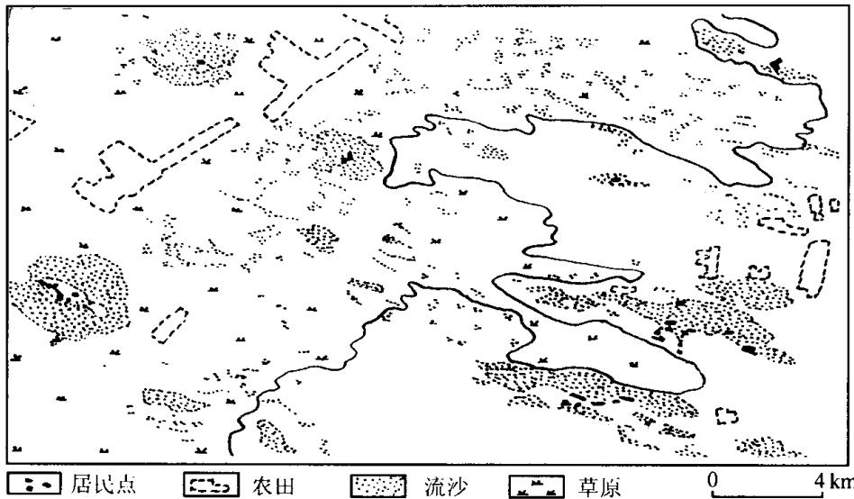  
图5-6 科尔沁沙地北部牧区草地流沙以放牧点  
或居民点为中心的发展[14]

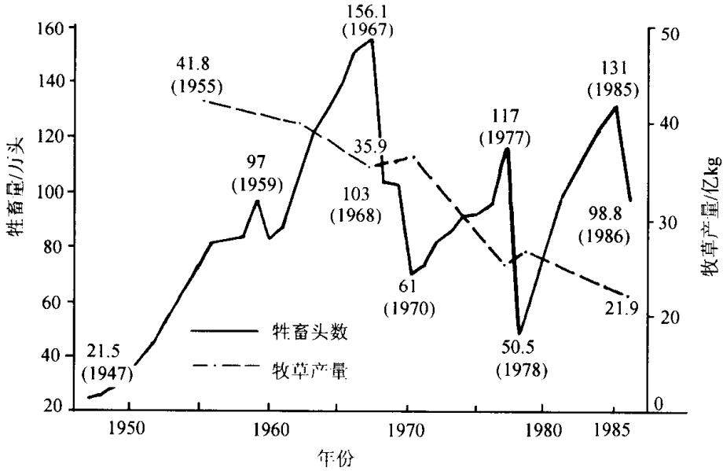  
图 5-7 西乌珠穆沁旗牲畜增减和草原生产力  
(产草量)退化的对应发展

## 3. 落后的生产经营方式

在农牧交错区，土地开垦后风蚀加重，加之粗放的生产方式使土壤养分得不到补充，土壤的迅速贫瘠化反过来又加速了沙漠化的发展。土地沙漠化和贫瘠化相互反馈，生态环境愈益恶化，农业生产力低而不稳。作物每公顷产量长期徘徊在750kg左右的水平，遇到干旱年份下降到几十千克，甚至颗粒不收。进入20世纪80年代以后，生产体制进行了改革，但生产经营方式仍然粗放落后，广种薄收。例如，在乌盟后山地区，机械化程度很低，1985年机耕率为11.2%，机播率仅2.5%；每年施用农家肥和化肥的面积分别不足播种面积的1/3。施肥地施用粪肥 $1 5 \ : 0 0 0 \mathrm { k g } / \mathrm { h m } ^ { 2 }$ 左右，化肥 $6 0 \mathrm { k g / h m } ^ { 2 }$ 左右，而且多施用于马铃薯的底肥，一般麦田(小麦、莜麦)很少施用肥料，压青地大致保持占总耕地面积的1/3，一般均只能休闲一年，收效甚微。

在牧区也存在着类似的问题。据1986年统计，在可利用草场中人工草场占1.2%，人工抚育草场占1.1%，天然放牧草场占97.7%。加之超载过牧，又未解决牲畜饮水等水利建设问题，沙漠化严重发展。

## 4.水资源调配和利用不当引起的沙漠化

干旱半干旱地区沙漠化的原因首先在于其生态环境非常脆弱，人为因素则往往是诱发和推动因素。例如，近10年北方的于旱化，其原因当推降雨的减少，但对一个地方来说水资源的利用不当，地表水在上游被劫夺和对地下水的超采又可能成为主因。这方面科尔沁草原地区西辽河的断流、地下水的超采下降和大批湖泊淖尔的于涸或缩小为最有力的例证，致使土地旱象加重，裸露或半裸露的沙地面积增大，潜在沙漠化的土地面积迅速增大，孕育着沙漠化再度发展的危险。

在西北干旱地区水资源更为宝贵。河流上下游调配的不合理及生态平衡的破坏，均会导致沙漠的发展。例如，石羊河流域源流区原有的森林20世纪60年代以来连遭4次大的破坏，13%草甸草原因开荒而遭毁坏，河水年径流总量80年代比50年代减少约18.8%；上游无节制的开发，又超标灌溉，导致进入下游径流量每况愈下，如民勤县有2.52万hm²耕地缺水弃耕，撂荒沙化(为现存耕地的61.67%)。

一些跨省区的河流上下游存在的问题更加严重，如弱水上游因为有甘肃高台、临泽等县拦截用水，使下游内蒙古自治区额济纳旗地表水和地下水源严重不足，沙漠化迅速发展。在监测的1.62万km²范围内，沙漠化土地从1975年的0.34万km²扩大到1986年的 $\mathbf { k } \mathbf { m } ^ { 2 }$ 近0.60万km²，平均每年增加 $2 2 5 \mathrm { k m } ^ { 2 }$ ，年增长率为6.7%。在热量不足的河流上游，利用前些年毁草、毁林所开土地搞丰产，消耗有限的地表水资源，而荒废下游的土地，造成沙漠化发展，对这种不合理现象必须予以制止，应加强河流上下游水资源合理利用的宏观调控。

## （三）沙漠化形势预测

我们基于以下几点预测进入21世纪后全局性沙漠化的发展形势：①大多数学者认为，在一段时期内，气候的冷暖、干湿只有小的波动，不会发生大的变化；②在人为因素的加深影响下，北方干旱化只会加深，而不会有缓解；③从中央到地方都已意识到沙漠化的威胁，防治沙漠化已提到重要议事日程。

我国北方，尤其西北地区是沙漠化发展的重灾区。1997年，江泽民同志提出：再造一个山川秀美的西北地区。1999年后半年，朱镕基同志视察西北5省区，对西北地区退耕还林(草)，进行生态建设，做了具体指示。现在一个以生态建设和基础设施建设为龙头的西北大开发战略工程已经全面展开，预计沙漠化蔓延的势头会得到抑制。但是，沙漠化是多年生态环境不平衡的产物，它对环境改变的反应也有一个滞后期，故在一段时期内，沙漠化尚难完全控制。

在一段时期内，全国沙漠化发展的形势：①已发生沙漠化的面积在近期会比较稳定；②强烈沙漠化土地(流沙面积)继续扩展，因为治理接近流沙化的土地难度很大，人们总是从轻度沙漠化土地治理开始；③潜在沙漠化土地扩大，干旱化使河水断流、湖盆干涸、地下水位下降，使沙漠化的潜在危险加大。

近期要着重注意的地区有以下几个。①青海共和、柴达木、青海湖盆地。这些地区的草原砂质荒漠化因开垦干旱化草原所引起，青海湖水位以每年0.22m的速度下降，湖水面积缩小，退水区域全部变为沙漠(图5-8)。1999年黄河上游出现断流，说明区域性的干旱已经发展到相当危险的程度，必然引起与之相应的环境变化和沙漠化灾害的蔓延。②甘肃河西走廊和内蒙古鄂济纳旗和南疆塔里木河下游。这些地区严重的沙漠化形势是河水断流、地下水位下降造成的。在河西由于干旱化的发展，产流区生态环境遭受破坏，近30年源于祁连山区的河流水量减少了50%\~70%；有的部门倡导农业向上游推进，以致下游断流，超采地下水，生态环境严重恶化，沙漠化严重发展是必然的。③在塔里木河下游河水断流，天然胡杨林大片死亡，生态环境继续恶化，沙漠化严重威胁。

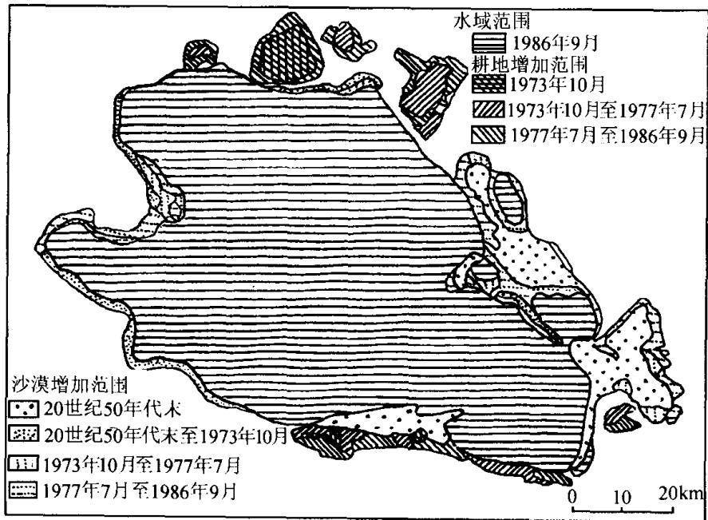  
图5-8 青海湖滨沙漠化土地面积的扩展

当前中央和地方各级政府已经注意到这些问题，尤其在西部大开发的大好形势下，土地沙漠化的防治也将进入新阶段。开发西部，生态先行，一个宏伟的、全面整治土地沙漠化的规划及前景即将展现。

## 参考文献

1 朱震达，陈广庭等.中国土地砂质荒漠化.北京：科学出版社，1994

2 联合国关于在发生严重干旱和/或沙漠化的国家特别是在非洲防治沙漠化的公约.北京：中国林业出版社，1994

3 陈广庭等.北京的风沙及其整治.见：中国科学院兰州沙漠研究所集刊，第四号.北京：科学出版社，1994

4 陈广庭.内蒙高原东南部现代沙漠化过程.中国沙漠，1991,11(2):12\~14

5 张继贤.地表物质组成与土地沙漠化.中国沙漠，1982,2(1):35\~42

6 吴正.风沙地貌学.北京:科学出版社，1987

7 哈里默夫，费兹尔 MF.中央亚细亚的八种雅丹地貌类型.中国沙漠，1990,10(1):1\~10

8 邹本功，陈广庭等.科尔沁草原的沙漠化及其治理.见：中国科学院兰州沙漠研究所集刊，第四号.北京：科学出版社,1994

9 刘恕.试论沙漠化过程及其防治措施的生物学基础.中国沙漠，1985,6(1):6\~12

10 朱震达，刘恕.关于沙漠化的概念及其发展程度的判断.中国沙漠，1984,4(3):2\~8

11 刘恕.对沙漠化农田能转化效率及潜力的分析.中国沙漠，1983,3(4):23\~24

12 国家科学技术委员会.中国科学技术蓝皮书，第5号气候.北京：科学技术文献出版社，1990

13 朱震达.我国的沙漠化灾害及其防治对策.见：中国自然灾害灾情分析与减灾对策.武汉：湖北科学技术出版社，1992

14 朱震达.最近十年来中国北方农牧交错地区土地砂质荒漠化发展趋势的一例.中国沙漠，1994,14(4):1\~7

15 朱震达.中国北方沙漠化现状及发展趋势.中国沙漠，1985,5(3):3\~10

# 第六章 土壤侵蚀区域分异特征

第一节 概

我国位于欧亚大陆面向太平洋的东斜面上，山地丘陵面积约占2/3。整个地势自西向东分为三个大的阶梯，土壤侵蚀区域的分布受控于阶梯状的地貌特征。

第一个阶梯为青藏高原，海拔在4000m以上，是世界上最大的高原。高原四周被高山围绕，北为昆仑山和祁连山，西南为喜马拉雅山，东南为横断山脉的北部。喜马拉雅山的主峰珠穆朗玛峰为世界第一高峰，海拔8848m。高原腹部广泛分布着山原、台原、丘陵、盆地和大小湖泊。第二阶梯位于大兴安岭一太行山一巫山一雪峰山一线以西，青藏高原以东及以北。阶梯内分布着高山、高原和盆地，如阿尔泰山、天山和秦岭山脉及云贵高原、黄土高原和内蒙古高原等，海拔一般在1000m以上；准噶尔盆地、塔里木盆地和下切谷地，海拔在1000m以下。第三阶梯位于上述一线以东。阶梯内分布有江河平原、河谷盆地和低山丘陵。低山丘陵海拔大多低于500m，少数山岭超过千米，丘陵分布相当广泛，平原和河谷多低于200m，黄淮海平原和长江中下游平原大部分在50m以下1]。

我国地势的这一特点，为各种类型的侵蚀构成了广泛错综的倾斜面。由于各地的自然条件和人为活动不同，形成了具有不同特点的土壤侵蚀类型区域。根据土壤侵蚀营力、类型、强度及自然和社会经济影响因素在一定区域内的相似性和区域间的差异性进行区域划分，即土壤侵蚀区划，或称之土壤侵蚀分区。我国土壤侵蚀分区工作始于20世纪50年代初期，主要因编制黄河治理规划中水土保持部分的需要。1955年黄秉维编制了“黄河中游流域土壤侵蚀区域图”，按三级分区划分类、区、副区。一级分区以有无完密植被划分两大类型区；二级分区按两大类型区划分区域：有完密植被类型区划分高地草原、石质山岭林区和黄土丘陵林区三个区域，无完密植被类型区按地质、地形划分黄土丘陵区等七个区域；三级分区按区域内的地形、土地利用等差异划分副区，黄土丘陵区即划分了五个副区。该分区图因简明又突出重点，得到广泛承认，且沿用至今(图6-1)[2]。1956年朱显谟专门研究论述了土壤侵蚀区划原则，提出了5级分区制：地带、区带、复区、区和分区，为全国性和区域性的土壤侵蚀区划奠定了基础[3]。

以土壤侵蚀营力和生物气候带划分土壤侵蚀地带为基础，根据我国的地貌特点和自然界某一外营力(如水力、风力等)在较大区域起主导作用的原则，辛树帜、蒋德麒将全国分为三大土壤侵蚀类型区，即水力侵蚀为主的类型区、风力侵蚀为主的类型区和冻融侵蚀为主的类型区[4]。新疆、甘肃河西走廊、青海柴达木盆地，以及宁夏、陕北、内蒙古、东北西部等地的风沙区，是风力侵蚀为主的类型区。青藏高原和新疆、甘肃、四川、云南等地分布有现代冰川，高原、高山，是冻融侵蚀为主的另一侵蚀类型区。其余的所有山地丘陵地区，则是以水力侵蚀为主的类型区。水力侵蚀类型区大体分布在我国大兴安岭一阴山一贺兰山一青藏高原东缘一线以东的地区，包括西北黄土高原、东北低山丘陵和漫岗丘陵、北方山地丘陵、南方山地丘陵、四川盆地及周围山地丘陵和云贵高原六个二级类型区。水利部

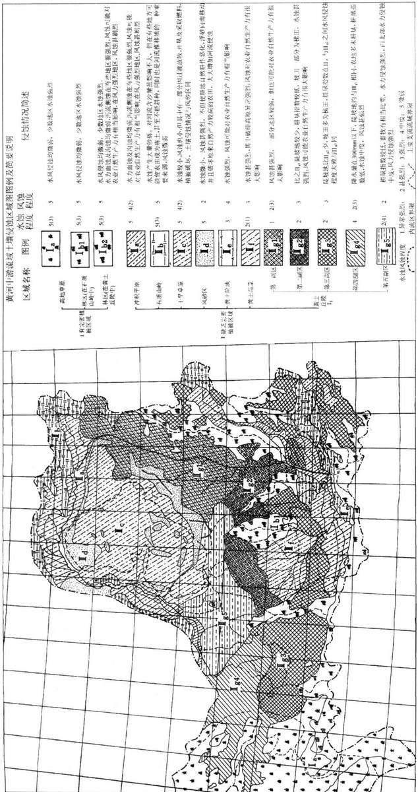

1997年发表的《土壤侵蚀分类分级标准》中全国土壤侵蚀类型区划，即是依据辛树帜等编制的土壤侵蚀类型分区标准5]。1998年国务院正式批发的《全国生态环境建设规划》，也是以该土壤侵蚀类型分区为基础。以下即以辛树帜等及水利部确定的全国土壤侵蚀区划划分的二级分区为基础(表6-1，参见图1-3)，分述土壤侵蚀区域特征。“七五”期间，国家特设立了科技攻关项目，对黄土高原地区进行了资源、环境和社会经济情况的全面考察研究，取得了丰富的科学资料，故本章以黄土高原为重点论述土壤侵蚀区域特征。

表 6-1 全国土壤侵蚀类型区划简表
<table><tr><td>一级类型区</td><td>二级类型区</td><td></td><td>区划范围及特点</td></tr><tr><td>类型区</td><td></td><td>Ⅰ 水力侵蚀为主 I₁西北黄土高原区</td><td>西界青海日月山，西北为贺兰山，北为阴山，东为太行山，南为秦岭， 地处黄河中游。区内丘陵起伏，沟谷密度大，黄土层深厚，水蚀为 主，兼风蚀、重力侵蚀。植被破坏，陡坡开垦严重，侵蚀模数多在 5000~10000t/(km²·a),甚至高达20000t/(km²·a)以上。黄河的高</td></tr><tr><td></td><td></td><td>I₂东北低山丘陵 和漫岗丘陵区</td><td>含沙量主要来自黄土高原的水土流失 南界为吉林省南部，东西北三面为大小兴安岭和长白山所围绕。以 低丘、岗地黑土区坡耕地侵蚀为主，兼有沟蚀、风蚀和融雪侵蚀</td></tr><tr><td></td><td></td><td></td><td></td></tr><tr><td></td><td></td><td>I₃北方山地丘陵区</td><td>东北漫岗丘陵以南，黄土高原以东，淮河以北，包括东北南部及冀、 晋、内蒙、豫、鲁等山地、丘陵。植被覆盖差、土层浅薄，随同水土、砂 石侵蚀，易患及海河、淮河的安危</td></tr><tr><td></td><td></td><td>I₄南方山地丘陵区</td><td>以大别山为北屏，巴山、巫山为西障，西南以云贵高原为界，东南直 抵海域并包括台湾、海南岛及南海诸岛。年降水量多在1000~ 2000mm，多暴雨，以紫色砂页岩及厚层花岗岩风化物上发生的面 蚀、沟蚀为主，兼崩岗</td></tr><tr><td></td><td></td><td>I₅四川盆地及周围 山地丘陵区</td><td>北与黄土高原接界，南与红壤丘陵区相接。年降水量1000mm左 右，土壤侵蚀发生在紫色砂页岩及花岗岩风化物，土少石多，陡坡耕 垦，面蚀、沟蚀兼崩岗、滑坡、泥石流分布广泛，是长江上游泥沙主要 来源区</td></tr><tr><td>风力侵蚀为</td><td></td><td>I6云贵高原</td><td>包括云南、贵州及湖南、广西的高原、山地、丘陵。热带雨林也在本 区。滑坡、泥石流活动频繁，贵州石灰岩山地陡坡开垦形成的石漠 化景观较突出</td></tr><tr><td></td><td>主类型区</td><td>Ⅱ₁三北戈壁沙漠及 土地沙漠化风蚀 区</td><td>主要分布于西北、华北及东北的西部，包括新疆、青、甘、陕、宁、内蒙 古部分地区。年均降水量100~300mm，多大风、沙尘暴。除腾格里 等大沙漠外，因受人为不合理耕垦及过牧影响的沙漠化土地为本区 防治的重点</td></tr><tr><td>Ⅲ</td><td>冻融侵蚀为主</td><td>Ⅱ₂沿河环湖滨海平 原风沙区 Ⅲ₁北方冻融侵蚀区</td><td>主要分布在山东黄泛平原、鄱阳湖滨湖沙丘及福建、海南滨海区，影 响到土地荒漠化的扩展 主要分布在东北大兴安岭山地及新疆的天山山地，属多年冻土区</td></tr><tr><td>类型区</td><td></td><td>冻融侵蚀区</td><td>Ⅲ₂青藏高原冰川、分布在青藏高原。冰川、冻融侵蚀为主，局部有冰川、泥石流发生</td></tr></table>

按照表6-1中以水力侵蚀为主的一级类型区所划分的六个二级类型区分别简述，其

中以黄土高原为重点作较详细的论述。

## 第二节 水力侵蚀为主类型区

## 一、西北黄土高原

黄土高原位于黄河上中游地区，其范围指太行山以西、贺兰山以东、秦岭以北、长城以南，总面积约48万 ${ \bf k m } ^ { 2 }$ 。1986\~1990年的国家“七五”计划期间，将黄土高原的综合治理与开发列入国家科技攻关项目，考虑到国土整治和治黄全面性的需要，将其北界扩展到阴山以南，包括黄土高原北部的毗邻地区，总面积约62.4万 $\mathbf { k m } ^ { 2 }$ ，称之黄土高原地区。其中约56万 $\mathbf { k m } ^ { 2 }$ 分布在黄河上中游的龙羊峡至桃花峪，其余6万 $\mathbf { k m } ^ { 2 }$ 分布在毗邻的海河流域。地理位置N33°43′\~41°16′、E100°54′\~114°33′，跨陕、甘、青、晋、宁、豫、内蒙古7个省、区，辖286个县(镇)，总人口8100万(1985年)。依据土壤侵蚀影响因子、侵蚀类型和强度呈现区域的分异，黄土高原地区的土壤侵蚀区划可分为地区、区和亚区的三级系统。已获得的研究成果全面论述了黄土高原地区土壤侵蚀区域特征及其治理途径[6]，现综述如下。

## （一）侵蚀环境背景及其区域特征

## 1. 自然环境及其区域特征

## 1）地质、地貌

黄土高原地区的地质构造，大致以六盘山至青铜峡一线为界，东西分异明显，西部属西域陆块，东部为华北陆块。本区为新构造运动活跃地区，六盘山以西地区的抬升量普遍大于以东地区。据1934\~1955年陇海铁路水准测量资料，甘肃陇西县等地上升了约0.66m,六盘山以东的潼关县抬升量约0.304m。新构造运动使侵蚀能量增大，侵蚀因此加强。

黄土高原地区新构造运动可分为五个区，除黄土高原周围山地属强上升区外，分三个次强上升区：即白于山—东胜一带，陇中盆地天水一带和子午岭地区(图6-2)[6]。

子午岭地区因保存较完密的植被，侵蚀不明显。可见，植被在一定程度上能减缓新构造运动的侵蚀能量。

黄土高原地区又是我国强烈地震活动频繁地区，因而激发强烈的重力侵蚀。1920年12月16日宁夏海原发生8.5级地震，仅西吉县境内诱发了650处滑坡和崩塌。

黄土高原其巨厚的黄土沉积物及其塬、梁、峁和沟谷纵横的地貌类型，系在第四纪前古地貌基础上发育形成的。在历时240万年的黄土沉积、成壤、侵蚀的旋回过程中，在倾斜低洼处以沟蚀为主，形成发展了沟谷，至今形成了被沟谷切割的高原沟壑区和梁昴丘陵沟壑区，沟谷密度多在3\~5km/km²(图4-8)。黄土台塬及丘陵地区的海拔高程多在500\~1500m,周围土石山地海拔高程2000\~3000m。黄土覆盖厚度一般50\~100m,较厚处100\~200m,沉积最深厚处达336m，见于兰州九州台。

黄土高原地区现保存较完整的塬面尚有甘肃陇东的董志塬、陕北的洛川塬及陕西的长武塬，塬面尚保存较完整的黑垆土剖面，丘陵区的黑垆土剖面多已流失殆尽。本区不仅沟谷密度大，其切割的面积，通称地面割裂度，可占流域面积的40%以上。地面坡度陡峻又为本区地形的特点，除塬面、河谷阶地、堌地等地区地面坡度小于5°以外，大部分地区的坡度多大于5°，且以10°\~20°占多数，梁昴坡面大于25°的坡地可占10%\~20%，谷坡则以大于35°占多数。这些陡坡地如果被林、草植被所覆盖，一般不发生侵蚀或侵蚀轻微，一日被滥垦、滥伐、滥牧即转化为强烈的人为加速侵蚀，陡坡地形即成为影响侵蚀的主要因素。

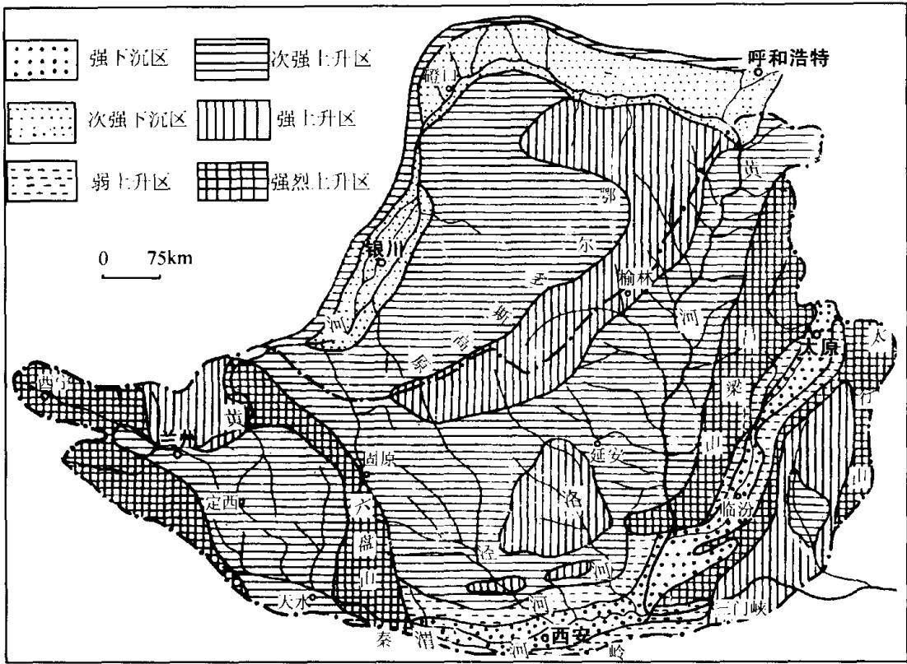  
图6-2 黄土高原地区新构造运动分区图[6]

黄土高原北部长城沿线一带为风沙地貌与流水侵蚀地貌交错分布，水蚀风蚀全年交替进行，水、风两相侵蚀垒加，且相互促进，故侵蚀模数特大。侵蚀产沙的地面物质主要由砂黄土、古代风积沙、现代片沙、中生代风化剥蚀强烈的砂页岩(俗称砥砂岩)所组成。该地区不仅侵蚀强烈，而且是黄河下游河床粗泥沙的主要来源区，形成了特殊的侵蚀类型区—水蚀风蚀交错区，也是黄土高原的治理重点区。

## 2) 气候

本区属大陆性季风气候区，年均降水量200\~700mm，由东南向西北递减，以400\~500mm的降雨量分布较广，该雨量分布区也是黄土高原土壤侵蚀最严重地区。长城沿线以北，包括陇中北部、宁陕北部、鄂尔多斯高原、河套及银川平原地区，年降水量多在400mm 以下，以风力侵蚀为主(图 6-3)[6]

年降水量分配不均匀，多集中在6\~9月汛期，可占全年降水量的60%以上，且多暴雨。暴雨笼罩面积大，为5万\~15万 $\mathbf { k m } ^ { 2 }$ ，日最大降雨量100\~150mm，侵蚀输沙多集中在暴雨季节。例如，1977年黄土高原延河流域发生特大暴雨，7月4\~6日的暴雨中心安塞招安乡降雨228mm，历时30h。7月6日实测延河甘谷驿水文站1d输沙量为9070万t,为多年平均年输沙量的1.5倍。

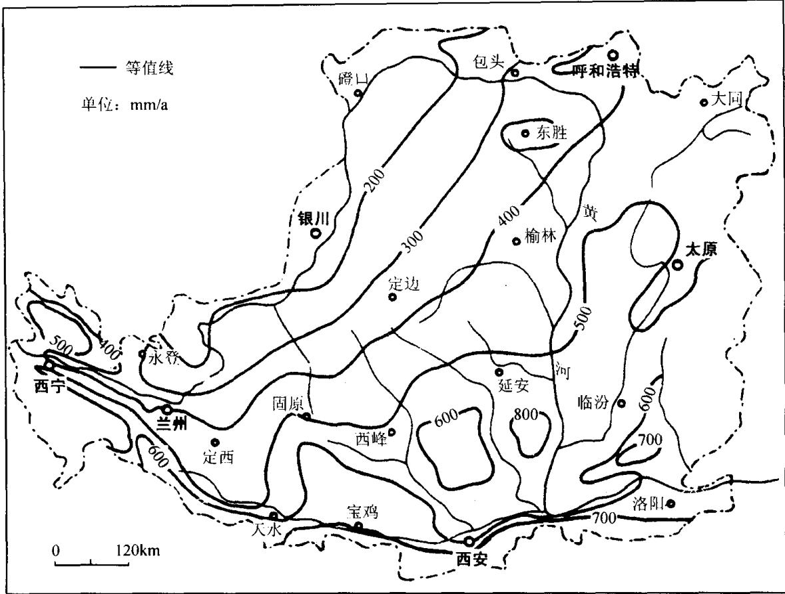  
图6-3 黄土高原多年平均年降水量等值线图[6]

土壤风蚀的强弱主要决定于风力的大小和地面组成物质的结构状况。黄土高原地区年均大风(≥8级风，风速17.2m/s)日数，由北向南递减。黄土高原地区北部的鄂尔多斯高原中部一带大风日大于40d，北部阴山山脉和长城沿线的大风日20\~40d，中部年大风日数10\~20d，南部多少于10d。出现沙尘暴的日数往往与大风日数及风蚀的强弱相对应。

## 3）土壤侵蚀区域分异和植被地带性及土壤类型

王义凤等研究了黄土高原地区植被地带性分异规律，依据本地区生物-气候特征的植被类型，结合考虑土壤特征，将黄土高原地区划分为五个植被地带(图6-4)[7]，自南而北依次描述如下。

Ⅰ.暖温性森林地带。属温暖半湿润区，干燥度1.3\~1.5,生物气温12\~13℃，年均 降水量550\~650mm,山区达700\~800mm。地带性土壤为褐色土。

Ⅱ．暖温性森林草原地带。温暖的半湿润-半干旱区，干燥度1.4\~1.8,生物气温 9\~10℃，年均降水量450\~550mm。地带性土壤为黑垆土。

Ⅲ．暖温性典型草原地带。温暖半干旱区，干燥度1.8\~2.2,生物气温8\~9℃，年均 降水量300\~400mm。地带性土壤为轻黑垆土和淡栗钙土。

Ⅳ.暖温性荒漠草原地带。温暖半干旱-干旱区，干燥度2.4\~3.5,生物气温8\~

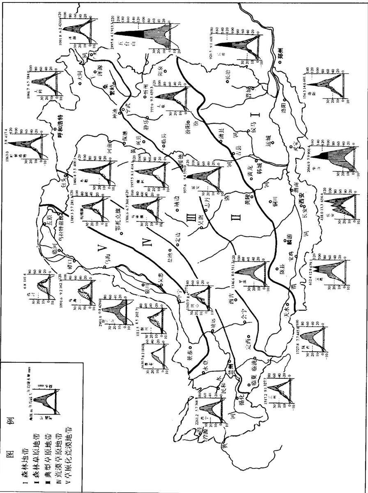

9℃，年均降水量200\~300mm。地带性土壤为灰钙土、棕钙土。

V.暖温性草原化荒漠地带。暖温干旱区，干燥度大于4.0,生物气温9\~10℃，年均降水量200mm以下。地带性土壤为漠钙土。

在黄土高原如果保留以上天然植被，大部分地区均不会发生类同当今的强烈侵蚀。由于人类活动对林草植被的破坏，残留的森林覆盖率仅为7.5%，且多分布在秦岭、子午岭、黄龙山、太行山等小部分林区，广大黄土高原则为童山秃岭。因地面植被的破坏和人为加速侵蚀的发展，地带性土壤除在残塬区尚保留完整的土壤剖面外，大部分地区多已流失，露出地表的多为疏松易蚀的黄土母质。

植被是影响土壤侵蚀的重要因素，其破坏或建设是加速或控制土壤侵蚀极为敏感的因子。黄土高原植被地带性分布规律为黄土高原地区植被的恢复或重建，提供了重要的依据。同时必须注意，因植被破坏、侵蚀加剧而造成恶化的生态环境，对原有植被的恢复或重建有一定的制约，应掌握植被建设与侵蚀环境相应的整治和调控[8]。

## 2. 人文环境与土壤侵蚀区域分异

人-地系统矛盾的发展和统一乃是土壤侵蚀分区的重要基础。其主要矛盾表现为原宜林区、宜牧区，因人口急剧发展而不合理开垦为农地；宜牧区多超载过牧，致使水土流失严重、土地荒漠化扩展，其发展过程和严重程度，直接影响土壤侵蚀区域分异特征。例如20世纪50年代初期水土流失严重的黄土丘陵沟壑区的绥德、米脂县，基于人多地少矛盾突出，加强了梯田、坝库工程建设，侵蚀产沙控制明显；同期安塞、志丹等地区原为人口较少垦殖率相对较低地区，随人口增长而大肆垦荒，破坏林草地，侵蚀急剧发展，致使侵蚀类型和侵蚀强度均发生明显的区域分异[6]。此外，人为不合理开矿、修路等工程建设破坏了地面稳定性，往往激发新的人为加速侵蚀而形成了特殊的侵蚀区域，例如神府一东胜矿区[9]。

## （二）侵蚀类型和侵蚀强度的区域分异特征

自然环境和人文环境的区域分异影响到土壤侵蚀类型和侵蚀强度的分区。

## 1. 土壤侵蚀类型和侵蚀方式分布规律

张宗祜等依据侵蚀营力进行了黄土高原地区侵蚀类型的一级分类：水力侵蚀、重力侵蚀、风力侵蚀、风力-水力侵蚀、冻融侵蚀及人为侵蚀共6个一级类型区；在一级分类基础上，按基本地貌类型和侵蚀方式划分二级类型，共19个二级类型区6]。该侵蚀类型的区域分布特征重点反映了地质环境，尤其是地貌环境的影响，同时表征了非地带性重力侵蚀的方式。不同侵蚀方式的组合，以后者为主，前者为兼有的侵蚀方式。例如，水力侵蚀的二级类型区黄土梁峁沟谷面蚀-沟蚀区，即在长城沿线一带，以沟蚀为主，兼有面蚀，并出现风蚀及崩塌、滑坡等重力侵蚀[6]。

土壤侵蚀方式与侵蚀类型的含义有所不同，后者表征了相对静态的侵蚀现状，前者表征了相对动态的侵蚀过程。例如，黄土丘陵沟壑区土壤侵蚀特征为坡面侵蚀与沟谷侵蚀均十分严重，当沟谷密度很大，沟谷侵蚀类型占优势情况下，但现代侵蚀过程以梁峁坡及谷坡开垦的面蚀为主要侵蚀方式时，则确定为沟蚀-面蚀。

关于黄土高原地区土壤侵蚀方式问题，甘枝茂进行了专门的研究，在以侵蚀营力为一级分类基础上，划分了16个侵蚀方式亚类。在侵蚀方式地带性分布规律的基础上，研究了土壤侵蚀方式垂直分布规律(图6-5)6]。

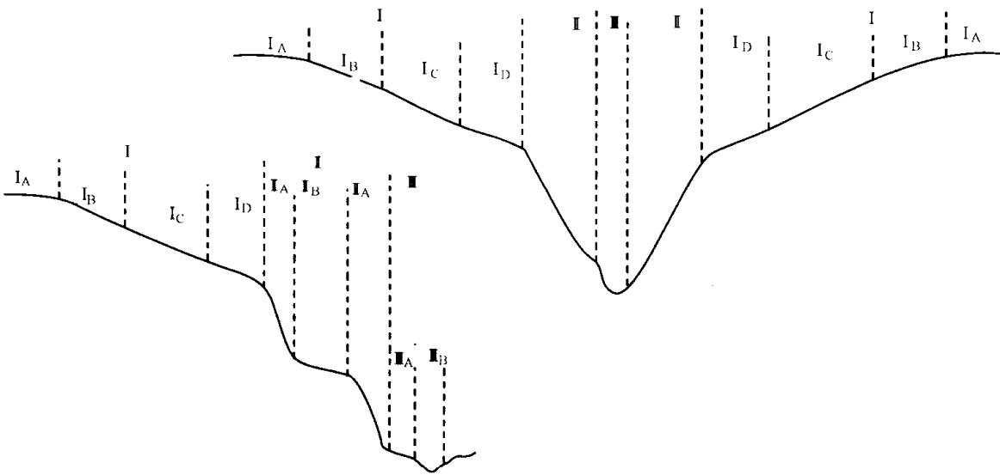  
图6-5 黄土梁昴丘陵沟壑区土壤侵蚀方式的垂直分带模式[6]

Ⅰ. 沟间地水力(或风力)侵蚀带； IA. 沟间地顶面溅蚀(或风蚀)亚带；  
IB. 梁昴坡上段细沟片蚀(或风蚀)亚带； Ic. 梁昴坡中段浅沟侵蚀(或风蚀)亚带；  
Ip. 梁峁坡下段浅沟、切沟侵蚀及潜蚀亚带。Ⅱ. 沟谷坡重力、水力侵蚀带；  
ⅡA. 沟谷坡重力崩塌、泻溜、滑坡侵蚀亚带；ⅡB. 沟谷坡水力侵蚀带。  
Ⅲ.沟谷底水力冲蚀、潜蚀亚带； ⅢA. 沟谷底水力下切侵蚀亚带；  
ⅢB.沟床水力冲蚀、潜蚀亚带

## 2. 重力侵蚀的区域特征

土壤侵蚀营力按水力、风力及冻融侵蚀营力具有明显的地带性，重力也是黄土高原土壤侵蚀的主要营力，但其地带性不明显。在以上各个侵蚀营力的地带均有重力侵蚀的分布。据张信宝6的研究，重力侵蚀的发生和强度，主要取决于地形、坡面物质组成、气候和植被4个因子。人类活动主要通过植被的破坏与恢复，来影响重力侵蚀的发生和强度。重力侵蚀尚无建立定量评价指标，主要以上述4个因子定性判断重力侵蚀相对强度。当黄土高原地区天然植被多遭破坏情况下，重力侵蚀的发生主要取决于地形和坡面组成物质，可以地形因子值 $L \cdot H ^ { 2 }$ 和斜坡岩性组合表示重力侵蚀强度(表6-2)。

根据以上4个因子对重力侵蚀地域上影响的差异，编制了黄土高原地区重力侵蚀强度分布略图(图6-6)。

轻度重力侵蚀。除沟岸发生小型滑坡、崩塌外，一般地面稳定性好，基本无重力侵蚀。多见于植被覆盖较好的黄土丘陵、基岩山地，或河谷平原和风沙区。

表 6-2 不同岩性组合重力侵蚀强度的地形因子值[6]
<table><tr><td>斜坡岩性组合</td><td>剧烈</td><td>极强度</td><td>强度</td><td>中度或轻度</td></tr><tr><td>黄土或黄土+砒砂岩</td><td>&gt;0.8</td><td>0.8~0.4</td><td>0.4~0.2</td><td>0.2以下</td></tr><tr><td>黄土+半坚硬岩类</td><td>&gt;1.0</td><td>1.0~0.6</td><td>0.6~0.3</td><td>0.3以下</td></tr><tr><td>黃土+紧硬岩类</td><td>&gt;1.6</td><td>1.6~0.8</td><td>0.8~0.4</td><td>0.4以下</td></tr></table>

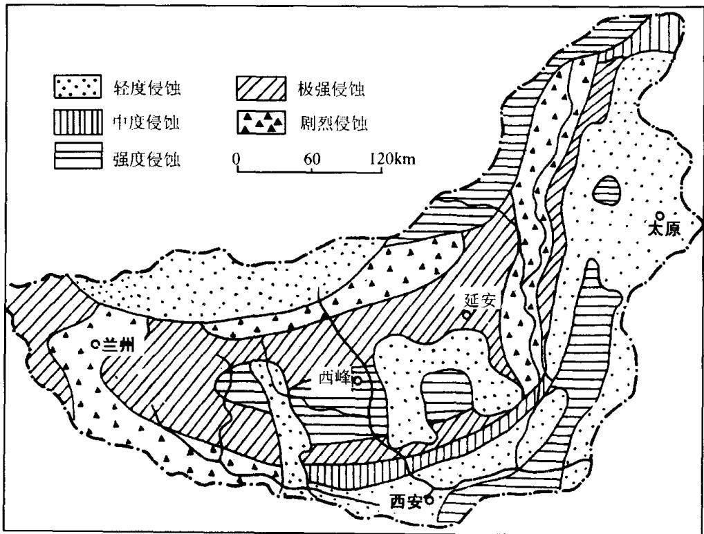  
图 6-6 黄土高原地区重力侵蚀强度分布略图[6]

中度重力侵蚀。土质山坡和土质沟岸有少量滑坡、崩塌，个别基岩山坡有滑坡、崩塌、泻溜现象。多见于晋东南土石山地和晋北高原。

强度重力侵蚀。谷坡稳定性较差，部分黄土谷坡和少量基岩山坡发育了滑坡、崩塌、泻溜，土质沟岸滑坡、崩塌严重。主要地域在六盘山以东的台塬区，六盘山以西西吉一带黄土高原，白于山北坡等地。

极强度重力侵蚀。谷坡稳定性差，大部分黄土谷坡土质沟岸和基岩山坡滑坡、崩塌严重。主要地域为六盘山以东和以西的大部分梁昴状黄土丘陵区。

剧烈重力侵蚀。谷坡稳定性极差，绝大部分黄土谷坡和基岩山坡滑坡、崩塌、泻溜侵蚀严重。主要地域为六盘山以东的晋陕黄河峡谷段，白于山黄土山地和六盘山以西的湟水峡谷等地。

## 3. 土壤侵蚀强度区域特征

土壤侵蚀强度是指单位时间(a)单位面积 $( \mathbf { k m } ^ { 2 } )$ 地面物质被外营力破坏和移动的量，亦称为土壤侵蚀模数，其单位通常用 $V ( \mathbf { k m } ^ { 2 } \cdot \mathbf { a } )$ 表示。陈永宗、景可等根据流域侵蚀产沙量与河流断面输沙量的关系，即输移比接近1的基本原则，依据黄河流域设立的大批水文站测得的河流输沙量代表侵蚀产沙量，编制了黄土高原地区土壤侵蚀强度区域图（图6-7)。图中所示侵蚀强度共分了8级，这是在水利部颁布的侵蚀强度六级分级基础上，缩小了级差，以利于检验水土保持措施的效果。

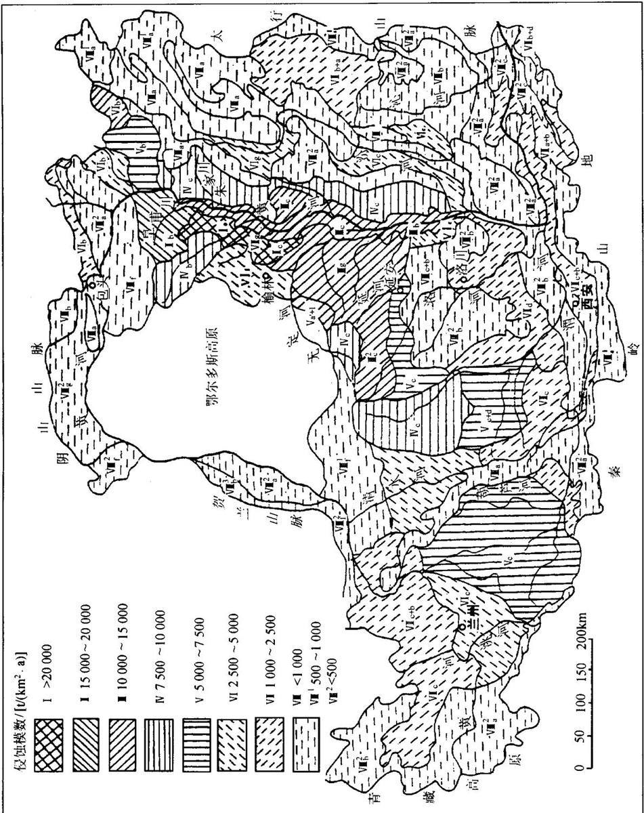

由图6-7可以看出，六盘山和吕梁山是黄土高原侵蚀强度区域差异的主要界线。六盘山以西和吕梁山以东的绝大部分地区，侵蚀模数都在 $5 ~ 0 0 0 0 \times ( \mathbf { k m } ^ { 2 } \cdot \mathbf { a } )$ 以内；庆阳一延安一离石一线以北至长城沿线侵蚀模数都在 $5 ~ 0 0 0 \mathrm { t } / ( \mathrm { k m } ^ { 2 } \cdot \mathrm { a } )$ 以上，尤其是皇甫川、窟野河、孤山川等流域，是黄土高原强烈侵蚀的中心，侵蚀模数最高可达 $2 0 ~ 0 0 0 \mathrm { t } / ( \mathrm { k m } ^ { 2 } \cdot \mathrm { a } )$ 以上；自山西河曲，南抵龙门，沿黄河晋陕峡谷两岸为呈南北向的强烈侵蚀带，侵蚀模数为$1 0 0 0 0 \sim 1 5 0 0 0 V ( \mathrm { k m } ^ { 2 } \cdot \mathrm { a } )$

## （三）黄土高原地区土壤侵蚀分区

## 1. 早期黄土高原的土壤侵蚀分区

在全国范围内，黄土高原土壤侵蚀区划工作开展较早。20世纪50年代初，国家把“根治黄河水害，开发黄河水利”列为国民经济建设重要组成部分，制订治理黄河规划及相应的水土保持规划提到了重要议事日程。国家水利部门和中国科学院根据以上任务需要，相继组织了多次大规模考察，土壤侵蚀区划工作相应有了启动和发展。黄秉维、朱显谟专家就土壤侵蚀区划原则和系统，进行了大量开拓性工作，为现代土壤侵蚀区划奠定了重要基础[2,3]。

20世纪50年代初，黄秉维编制的“黄河中游流域土壤侵蚀区域图”按三级划分为类、区、副区(详见图6-1)。该分区图突出了重点且又简明，得到了广泛的应用。其不足之处因限于当时的条件，土壤侵蚀实测数据很少，水土保持措施也仅仅是开始；其他自然和社经因素研究薄弱，到80年代，该区划有必要进一步修改和补充。

## 2. 黄土高原地区土壤侵蚀分区的新进展

自20世纪50年代初到国家的“七五”计划(1986\~1990年),30余年来，国民经济建设的发展，广大地区水土保持的进展和经验，黄河流域大批水文站积累的大量观测数据，对重新划分和确定土壤侵蚀分区，具有十分重要的科学和实际意义。

基于以上环境背景、侵蚀类型和强度等大量考察研究资料，并根据黄土高原地区综合治理与开发全面发展的需要，土壤侵蚀分区的原则，不仅要反映土壤侵蚀区域分异规律，为自然区划提供科学依据，并直接为水土保持区划、规划服务；同时应考虑到区域治理和区域资源开发的相互依存性，环境治理和城镇工矿建设的相互依存性以及水蚀与风蚀地带的过渡性等。

唐克丽等，基于长期野外考察的积累，在通常水力侵蚀和风力侵蚀地带性分异基础上，发现水力侵蚀和风力侵蚀交错带的土壤侵蚀特殊规律及其在黄土高原地区综合治理开发中的重要意义，从而确定了该地带作为重点考察，在通常以侵蚀营力划分风蚀区和水蚀区的基础上，划分了水蚀风蚀复合侵蚀区。黄义端、张平仓具体完成了黄土高原地区土壤侵蚀分区三级系统：地区、区、亚区。依据土壤侵蚀营力、地貌、类型、强度、发展趋势及治理途径在一定区域内的相似性和区域间的差异性，一般采用二级分区；对某些范围较大的侵蚀区，按侵蚀类型的组合不同，再续分第三级区(亚区)(表6-3、图6-8)。

表 6-3 黄土高原地区土壤侵蚀区划[6]
<table><tr><td>一级区(地区)</td><td>二级区(区)</td><td>三级区(亚区)</td></tr><tr><td rowspan="6">区</td><td>I 鄂尔多斯高原风蚀地 I贺兰山微度风蚀区</td><td></td></tr><tr><td>I₂银川河套平原轻度风蚀区</td><td></td></tr><tr><td>I₃阴山南麓中度风蚀区</td><td></td></tr><tr><td>I₄腾格里沙漠南缘强度风蚀区</td><td></td></tr><tr><td>I5河东沙地极强度风蚀区</td><td></td></tr><tr><td>1  $[ \mathbf { \nabla _ { \pmb { \sigma } } } _ { \pmb { \sigma } } ] _ { \pmb { \sigma } }$  毛  $\varrho$  素库布齐沙漠剧烈风蚀区</td><td></td></tr><tr><td rowspan="6">Ⅱ黄土高原北部风蚀水蚀 地区</td><td>Ⅱ，晋北盆地轻度风蚀轻度水蚀区</td><td> $\iint _ { 2 \mathbf { a } , \mathbf { \partial } }$  大坂山拉鸡山亚区</td></tr><tr><td>Ⅱ₂青东山地盆谷轻度风蚀轻度水蚀区</td><td> $\mathbb { I } _ { 2 \flat }$  黄湟谷地亚区</td></tr><tr><td>Ⅱ₃陇中宁南低山宽谷丘陵中度风蚀轻度水蚀区</td><td> $H _ { 4 a } \mathcal { F } \mathfrak { F }$  县亚区</td></tr><tr><td>Ⅱ4陇东宁南低山丘陵微度风蚀强度水蚀区</td><td>Ⅱ  $_ { 4 \mathrm { b } } \mathrm { \dot { l } }$  两西亚区</td></tr><tr><td> $\mathbb { I } _ { s }$  晋西北缓丘中度风蚀强度水蚀区</td><td> $\mathbb { I } _ { 6 a }$  白于山亚区</td></tr><tr><td>Ⅱ₆陕北黄土丘陵中度风蚀极强度水蚀区</td><td>Ⅱ6b绥米亚区</td></tr><tr><td rowspan="8">Ⅲ黄土高原南部水蚀地区</td><td>Ⅱ，陕晋蒙沙化黄土丘陵强度风蚀剧烈水蚀区</td><td></td></tr><tr><td>Ⅲ₁秦(北坡)、陇山地微度水蚀区</td><td> $^ { 1 \ast }$  、陇山亚区</td></tr><tr><td>Ⅲ₂子午岭黄龙山微度水蚀区</td><td>I  $1 6 \div$  秦岭北坡亚区</td></tr><tr><td>Ⅲ₃汾渭谷地微度水蚀区</td><td></td></tr><tr><td>Ⅲ₄太行山地轻度水蚀区</td><td></td></tr><tr><td>Ⅲ₅吕梁山地轻度水蚀区</td><td></td></tr><tr><td>三  $\lvert _ { \pmb { \delta } } \rvert$  晋东南盆谷丘陵轻度水蚀区</td><td></td></tr><tr><td>Ⅲ豫西黄土台塬低山轻度水蚀区</td><td></td></tr><tr><td></td><td>Ⅲ8晋中盆谷丘陵中度水蚀区</td><td></td></tr><tr><td></td><td>Ⅲ9陇西土石丘陵低山中度水蚀区</td><td></td></tr><tr><td>IⅢI  $1 0 ^ { 1 0 1 }$ </td><td>西黄土丘陵强度水蚀区</td><td>Ⅲ  $1 2 \mathbf { a } ^ { \mathrm { i } }$  柳林延川亚区</td></tr><tr><td> $\mathbb { I } \mathbb { I } _ { 1 1 }$ </td><td>陕甘黄土塬地强度水蚀区</td><td>m  $1 2 \mathfrak { b }$  吉县宜川亚区</td></tr><tr><td>Ⅱ</td><td> $^ { 1 2 }$  陕北晋西黄土丘陵残塬极强度水蚀区</td><td></td></tr></table>

## 3. 黄土高原地区土壤侵蚀分区概述

以下主要以表6-3中的3个一级区分别进行概述[6]。

## 1)鄂尔多斯高原风蚀地区(I)

本地区属于长城沿线以北的鄂尔多斯高原，东以和林格尔、东胜、榆林一线为界，西至贺兰山，北达阴山山脉。包括毛乌素、库布齐沙漠及河东沙地、银川河套平原及相邻的部分山地。境内沙漠景观特色显著，气候干旱，蒸发强烈，降水量多在300mm以下。年均$\geqslant 8$ 级的大风日多在20d以上，有的达40d以上；年沙尘暴日数多在10d以上，局部地区可高达27d。植被以荒漠草原为主，土地经营以畜牧业为主，超载过牧现象严重，草原退化，风蚀和土地沙漠化扩展。

根据风蚀强度和特点，本地区可分为6个侵蚀区。

<table><tr><td>图 例 一——范围线地区线</td></tr><tr><td>———区界——-业区界 10 40 80 120km</td></tr></table>

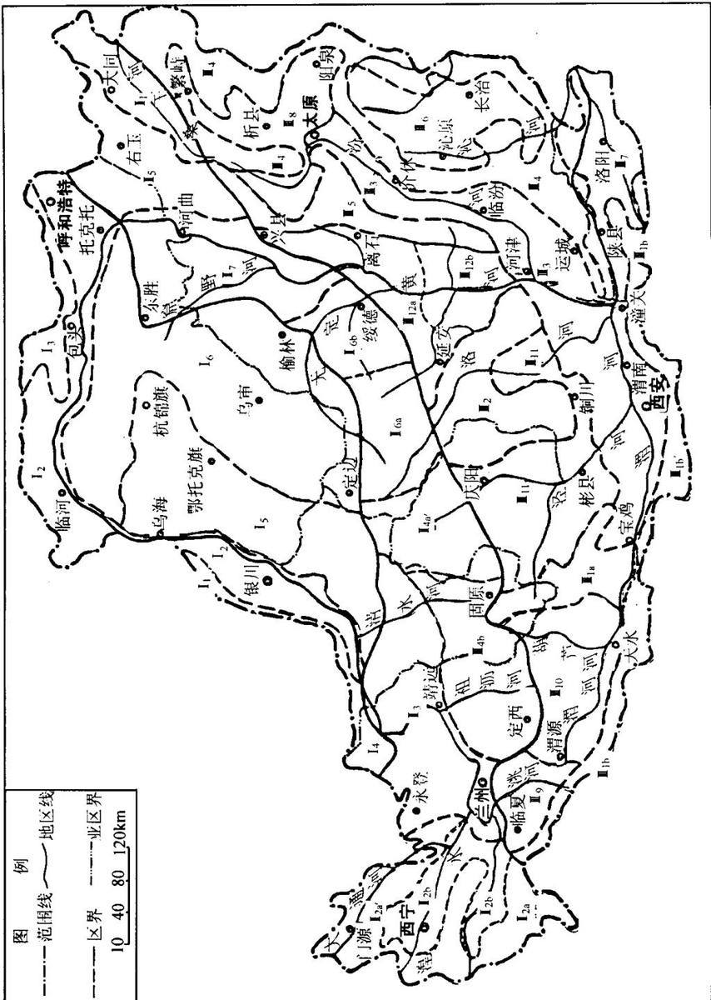  
8-9

$\mathrm { ~ I ~ } _ { 4 } , \mathrm { ~ I ~ } _ { 6 }$ 两个二级区为强度至剧烈风蚀区，地处腾格里大沙漠边缘和毛乌素、库布齐沙漠及其边缘地区，大片流沙地和沙丘分布，部分地区沙漠化仍在发展，固定沙丘大量活化，沙漠化向东南推进。区域内沙坡头固沙植物网格化种植的成功，推动了本区沙漠化的治理。发挥沿黄平川地及开发地下水资源的优势，发展灌溉农果业的集约化经营为本区特点，推动防风固沙林带、草带的建立及天然草场的改良。

$\mathrm { ~ I ~ } _ { 1 } , \mathrm { ~ I ~ } _ { 2 } , \mathrm { ~ I ~ } _ { 3 }$ 为轻度至中度风蚀区，邻近贺兰山、阴山的山前丘陵、盆地，以及银川河套平原风蚀不强烈，以加强防护为主；封山育林育草；充分发挥河套平原灌区优势，推动大农业的可持续发展。

本区的河东沙地极强度风蚀区 $( \mathrm { ~ I ~ } _ { 5 } )$ ，以畜牧业为主，但因人口增长，开垦过牧严重，草场退化，土地沙漠化扩展明显，风蚀强烈。加强草场的保护和改良，制止土地沙漠化为当务之急。

2）黄土高原北部风蚀水蚀交错地区(Ⅱ)

本地区大致位于神池、灵武、兴县、绥德、庆阳、固原、定西、东乡一线以北，长城沿线以南地区。流水侵蚀地貌与片沙覆盖风蚀地貌交错分布，主要地貌类型为片沙覆盖的黄土梁昴丘陵，产沙地层有风积沙、砂黄土、强烈风化剥蚀的砂页岩。本地区属半干旱草原地带，植被稀疏，天然草场多沙化、退化。年降水量250\~450mm,降雨集中且多暴雨，夏秋多水蚀，冬春多风蚀，全年 $\geqslant 8$ 级大风日数5\~20d,局部地区可达27d;沙暴日数年均4d以上，有些地区可达 $1 5 \mathrm { d _ { o } }$ 本地区全年水蚀风蚀交替进行，生态环境脆弱，为黄土高原强烈侵蚀地区，也是黄河下游河床粗泥沙的主要来源区。

本地区划分为7个区和6个亚区。该地区分异特点基本上分为三类，第一类兼风蚀和水蚀地区，但强度均不大，基本上属轻度至中度；第二类为邻近水蚀地区的边缘，以强度水蚀为主，兼有较明显的风蚀；第三类兼强度的风蚀和水蚀。

第一类二级分区指晋北盆地 ${ \bigl ( } \prod _ { 1 } { \bigr ) }$ 和青东山地盆谷 ${ \bf \Xi } ( \mathbb { I } _ { 2 } )$ 的轻度风蚀和轻度水蚀区，以及陇中宁南低山宽谷丘陵中度风蚀轻度水蚀区 $\left( \mathbb { I } _ { 3 } \right)$

前两个类型区(Ⅱ，和Ⅱ₂)多盆地、宽谷平原，或土石山区。年降水量300\~400mm，干 ${ \left( \prod _ { 1 } \right. }$ $\mathbb { I } _ { 2 } )$ 旱多风。耕地多分布在平川、盆谷，地势平缓；水蚀轻微，有些地区还有一定的灌溉条件；保留有一定的天然草场，阴坡尚有成片森林。青东山地盆谷区因地形和侵蚀方式又可分为两个亚区：即黄湟盆谷亚区，以农地面蚀为主，兼有沟蚀和重力侵蚀，属治理重点；另一个为大坂山拉鸡山亚区，以农地面蚀和冻融侵蚀为主，侵蚀轻微。后一个陇中宁南低山宽谷丘陵类型区，包括兰州、白银、皋兰、永登、永靖、靖远、景泰、同心、海源等县(市)的全部或一部，年降水量多在300mm以下，多大风，干旱比较突出，植被以草灌为主，覆盖率很低。治理措施以抗旱为中心，加强草灌建设和防护。

第二类二级分区包括陇中南低山丘陵残塬微度风蚀强度水蚀区 $( \mathbb { I } _ { 4 } )$ 、晋西北缓丘宽谷中度风蚀、强度水蚀区 $( \mathbb { I } _ { 5 } )$ 和陕北黄土丘陵中度风蚀极强度水蚀区 ${ ( \mathbb { I } _ { 6 } ) }$ 0

这一类分区的强度水蚀主要表现为毁林毁草不合理耕垦梁昴坡面而引发的坡耕地侵蚀及涧地、埫地的沟谷侵蚀和谷坡的重力侵蚀，侵蚀模数多在 $5 ~ 0 0 0 \sim 1 0 ~ 0 0 0 { \mathrm { t } } / ( \mathrm { k m } ^ { 2 } \cdot { \mathrm { a } } )$ 0“三料”俱缺又是导致植被破坏、加剧水蚀风蚀的重要原因。例如，Ⅱ₄区划分的两西亚区 $\mathbb { I } _ { 4 }$ $( \mathbb { I } _ { 4 6 } )$ ，不仅燃料、肥料、饲料俱缺，且粮食和人畜饮水困难，生活极为贫困。Ⅱ₆区划分的 $\mathbb { I } _ { 6 }$ 白于山亚区 $( \mathbb { I } _ { 6 \mathrm { a } } )$ 为无定河、洛河、延河的河源区，除坡耕地侵蚀外，沟蚀、重力侵蚀活跃，风蚀相对较强烈，地面常见有风积沙，侵蚀模数可达 $1 0 ~ 0 0 0 \sim 1 5 ~ 0 0 0 \mathrm { { t / ( k m ^ { 2 } \cdot a ) } }$ ，应强化坡耕地治理兼坝库工程建设的沟谷治理。

第三类二级分区为晋陕蒙沙化黄土丘陵强度风蚀剧烈水蚀区(Ⅱ)。

本类型区地处黄河北干流晋陕峡谷两岸及长城沿线，包括神木、府谷、佳县、河曲、保德、偏关、兴县、准格尔、东胜、清水河等县(旗)的全部或一部。地貌类型以沙化或片沙覆盖的黄土丘陵为主，地处黄土高原和鄂尔多斯高原的过渡带；干旱、半干旱生物气候过渡带；水蚀和风蚀、农业和牧业的交错地带；气候变化剧烈，为典型的生态环境脆弱带。年均降水量400mm左右，年际年内分配极不均匀，多大风、沙尘暴，干旱、洪水、冰雹灾害频繁；全年土壤侵蚀活跃，冬春风蚀、剥蚀强烈，夏秋多为强度水蚀，水、风两相侵蚀不仅叠加，且交互促进，侵蚀量累积增多，侵蚀模数多在 $1 5 ~ 0 0 0 \sim 2 0 ~ 0 0 0 \mathrm { { t / ( k m ^ { 2 } \cdot a ) } }$ (表6-4);强度风蚀地区风蚀模数可达 $7 ~ 5 0 0 \mathrm { { t } / ( \mathrm { { k m } ^ { 2 } \cdot \mathrm { { a } ) } } }$ 以上。据综合因子分析，本区为黄土高原强烈侵蚀中心。黄土高原全地区内最大河流输沙模数[ $6 6 4 0 0 \mathcal { V } ( \mathrm { k m } ^ { 2 } \cdot \mathrm { a } )$ ,1977年，孤山川]和最大河流含沙量(1 $7 0 0 \mathbf { k g } / \mathbf { m } ^ { 3 }$ ，1958年，窟野河)均出现在本区。1958年和1977年，黄河的年输沙量分别达29.9亿t和24.43亿t,为多年平均值16亿t的186.88%和152.69%。同期，窟野河的输沙量分别为多年平均值的310.43%和361.73%，孤山川则为94.74%和339.68%。可见本区为黄河泥沙的主要来源区，且为粗泥沙产区。区域内产沙地层主要由砂黄土、风积沙、厚层强烈风化剥蚀的砂页岩所组成，大于0.05mm的颗粒占 $5 0 \% \sim 7 0 \%$ O

表 6-4 晋陕蒙接壤区主要县(旗)气候特征[10]
<table><tr><td>县(旗)名</td><td>年均 气温 1℃</td><td>极端 温差 /℃</td><td>年均 降水量 /mm</td><td>6~9月 降水量 /%</td><td>年最大 降水量 /mm</td><td>年最小 降水量 /mm</td><td>大风 日数 /d</td><td>沙暴 日数 /d</td><td>侵蚀 模数  $/ [ V ( \mathbf { k m } ^ { 2 } \cdot \mathbf { a } ) ]$ </td></tr><tr><td>府谷</td><td>9.1</td><td>62.9</td><td>460.1</td><td>76.9</td><td>849.6</td><td>199.6</td><td>29.4</td><td>4.2</td><td>25 000</td></tr><tr><td>神木</td><td>8.5</td><td>67.0</td><td>441.2</td><td>77.1</td><td>819.1</td><td>108.6</td><td>16.2</td><td>10.7</td><td>15 200</td></tr><tr><td>河曲</td><td>7.1</td><td>63.8</td><td>407.5</td><td>82.6</td><td>715.3</td><td>211.4</td><td>87.2</td><td>0.4</td><td>19 800</td></tr><tr><td>准格尔</td><td>7.2</td><td>69.2</td><td>401.5</td><td>77.5</td><td>636.2</td><td>160.8</td><td>24.6</td><td>15.2</td><td>19 000</td></tr></table>

本区历史时期主要为牧区，草灌植被较丰茂，人口增长随之带来的不合理的农垦和过度放牧，致使过渡地带的脆弱性更为突出，生态环境恶化发展迅速。据对照1958年和1977年的航片，土地沙化由西北向东南推进了 $3 \sim 1 0 \mathrm { k m } _ { \odot }$ 0

本区蕴藏有丰富的煤炭资源，包括河东、神府、东胜三大煤田，蕴藏量列全国之首，21世纪将建成为我国能源重化工基地。

晋陕蒙接壤区强烈的水蚀、风蚀不仅是入黄泥沙的重要来源区，而且也是该区农林牧生产和煤田开发的重要限制因素，已被列为黄土高原治理开发的重中之重的特殊区域。该区自1987年正式启动的煤田开发工程，带来了工矿、城镇人口的发展和铁路、公路交通的建设，也必然对当地的环境整治和农副产品提出新的需求。这些新形势有助于水土保持上新台阶，加快水蚀、风蚀的整治和生态环境建设。另外，在煤田开发中引发新的水土流失和环境恶化问题，已引起注意[9,10]。

## 3）黄土高原南部水蚀地区(Ⅲ)

本地区北接风蚀、水蚀交错地区，南界秦岭北坡，地貌类型复杂，有黄土丘陵、黄土塬、河谷平原、土石丘陵与山地，年降水量 $5 0 0 \sim 7 0 0 \mathrm { m m }$ ，气候温暖、湿润，属森林、森林草原景观。保留植被的山地、台塬及平川地区水蚀轻微，盆谷、土石丘陵和低山为中度水蚀，黄土丘陵区水蚀最为严重。全地区共划分12个侵蚀类型区和4个亚区。按地形、植被、土地利用及侵蚀强度可归为四大类[6]。

第一类为植被较好的山地和梢林区，水蚀轻微，共包括了秦陇山地微度水蚀区 $\left( \mathbb { I } _ { 1 } \right)$ 子午岭黄龙山微度水蚀区 $( \mathbb { I } _ { 2 } )$ 、太行山地轻度水蚀区 $\left( \mathbb { I } \mathbb { I } _ { 4 } \right)$ 和吕梁山地轻度水蚀区 $( \mathbb { I l } _ { 5 } )$

此类地区以石质山地为主，部分为黄土丘陵低山区。雨量充沛，年降水量600\~700mm，气候温湿，多保留有天然次生林或森林灌丛茂密的植被，水蚀轻微，水蚀模数多在$1 \ 0 0 0 t / ( \mathbf { k m } ^ { 2 } \cdot \mathbf { a } )$ 以下。随着人口增长向林区的迁移，森林植被遭到严重破坏，加上陡坡开垦，人为加速侵蚀发展，山洪、泥石流也时有发生。尤其是子午岭黄土丘陵梢林区，毁林毁草开垦发展严重，30余年来林区后退了20km，平均每年后退0.5km，土壤侵蚀急剧发展。据林区内合水县柳沟水文站1959\~1962年的观测资料，平均最大流量 $6 1 . 6 \mathrm { m } ^ { 3 } / \mathrm { s }$ ，平均含沙量 $5 9 . 6 { \bf k g } / { \bf m } ^ { 3 }$ ;1969\~1971年平均最大流量增加到 $1 5 1 . 9 \mathbf { m } ^ { 3 } / \mathbf { s }$ ,比10年前增大1.5倍，含沙量增加到 $1 2 6 . 3 \mathbf { k g } / \mathbf { m } ^ { 3 }$ ,为10年前的2.1倍[11]。

对以上山地森林区和黄土丘陵次生梢林区在于加强现有植被管护，严禁毁林开荒，实行封山育林，对残败梢林进行抚育改造。

第二类型区以地形平缓的台塬、平原、川地为主的轻微水蚀区，包括汾渭谷地微度水蚀 $\bigstar ( \mathbb { I } _ { 3 } )$ 、晋东南盆谷丘陵轻度水蚀区 $( \mathbb { I } _ { 6 } )$ 和豫西黄土台塬低山轻度水蚀区 $( \mathbb { I } _ { 7 } )$ O

此类区域的特点主要是农地多分布在平缓的川地或塬面，有的地区设有灌溉工程，侵蚀轻微。台塬边坡及破碎台塬沟谷的侵蚀仍比较严重，局部丘陵地保存的少量灌丛林地遭破坏后，侵蚀有所发展。必须加强现有台塬土地平整和灌溉工程，发挥土地生产潜力；同时加强保塬固沟的生物措施和工程措施。

第三类型区为盆谷、丘陵中度水蚀区，包括晋中盆谷丘陵中度水蚀区 ${ \bigl ( } \prod _ { 8 } \bigr )$ 和陇西土石丘陵低山中度水蚀区 $( \mathbb { I } _ { 9 } )$

此类区域的农地多分布在台塬、平川或缓坡丘陵，侵蚀相对不很严重，破碎塬区时有发生沟蚀、重力侵蚀。侵蚀模数多在 $2 ~ 5 0 0 \mathrm { { t } / ( \mathrm { { k m } ^ { 2 } \cdot \mathrm { { a } ) } } }$ 以上，其中陇西土石丘陵区侵蚀模数可达 $5 ~ 0 0 0 \mathrm { t } / ( \mathrm { k m } ^ { 2 } \cdot \mathrm { a } )$ 。治理重点应加强基本农田建设，沟谷侵蚀和重力侵蚀活跃区应加强封山育林和草、灌等植被建设。

第四类型区属梁昴状黄土丘陵沟壑和高原沟壑强度水蚀区，包括陇西黄土丘陵强度水蚀区 $( \mathbb { I } _ { 1 0 } )$ 、陕甘黄土塬地强度水蚀区 $\left( \mathbb { I } _ { 1 1 } \right)$ 和陕北晋西黄土丘陵残塬极强度水蚀区${ \bigl ( } \prod _ { 1 2 } \bigr )$

此类地区毁林毁草开垦较严重，植被稀少，以坡耕地侵蚀为主；沟谷密度$3 \sim 5 \mathrm { k m } / \mathrm { k m } ^ { 2 }$ ，沟蚀明显，多滑坡、崩塌、泻溜等重力侵蚀，尤在破碎塬沟壑区较严重。侵蚀模数多在 $5 ~ 0 0 0 \sim 1 0 ~ 0 0 0 { \mathrm { t } } / ( { \bf k m } ^ { 2 } \cdot { \mathrm { a } } )$ ，少部分地区超过 $1 0 \ 0 0 0 \mathrm { t } / ( \mathrm { k m } ^ { 2 } \cdot \mathrm { a } )$ 。治理措施以陡坡退耕还林还草为重点，加强塬面平整和坡改梯基本农田建设，保塬固沟；沟壑治理以坝库工程建设与林草植被建设相结合，发展林、果等经济植物，提高生态经济效益。区域内的洛川塬及长武塬的沟坡开发，发展苹果、梨等经济林木，已形成规模化和产业化的经营。

## 4. 黄土高原地区土壤侵蚀区域特征综述

黄土高原地区土壤侵蚀区域特征说明，按地质地貌，六盘山和吕梁山是侵蚀强度的自然分界线，六盘山以西和吕梁山以东的绝大部分地区侵蚀强度多在 $5 ~ 0 0 0 t / ( \mathrm { k m } ^ { 2 } \cdot \mathrm { a } )$ 以下；两山之间，除台塬、河谷平原及保存植被较好的山地和子午岭地区侵蚀轻微外，其他地区侵蚀模数多大于 $5 0 0 0 \mathrm { t } / ( \mathrm { k m } ^ { 2 } \cdot \mathrm { a } )$ ，尤其是长城沿线的皇甫川、窟野河、孤山川等流域的侵蚀模数达 $1 0 0 0 0 \sim 2 0 0 0 0 \mathrm { { t / ( k m ^ { 2 } \cdot a ) } }$ ，为黄土高原强烈侵蚀区，多发生在水蚀、风蚀交错区。按侵蚀营力，强度侵蚀发生在降水量为400mm左右的水蚀、风蚀交错区，尤以晋陕蒙接壤区为强烈侵蚀的中心。依据3个土壤侵蚀地区各个侵蚀类型区侵蚀强度的分异，综合于表6-5。

表6-5 黄土高原地区侵蚀营力类型区的侵蚀强度分异
<table><tr><td>侵蚀营力及侵蚀强度分区</td><td>面积/万km²</td><td>占总面积/%</td></tr><tr><td>风蚀</td><td>15.65</td><td>25.08</td></tr><tr><td>风蚀水蚀</td><td>17.82</td><td>28.56</td></tr><tr><td> $> 5 \ 0 0 0 \mathcal { V } ( \mathrm { k m } ^ { 2 } \cdot \mathrm { a } )$ </td><td>10.57</td><td>16.94</td></tr><tr><td> $> 1 0 \ 0 0 0 \mathcal { V } ( \mathrm { k m } ^ { 2 } \cdot \mathrm { a } )$ </td><td>4.84</td><td>7.71</td></tr><tr><td>水蚀</td><td>28.93</td><td>46.36</td></tr><tr><td> $> 5 \ 0 0 0 \mathcal { V } ( \mathrm { k m } ^ { 2 } \cdot \mathrm { a } )$ </td><td>8.32</td><td>13.35</td></tr><tr><td> $> 1 0 0 0 0 \mathcal { V } ( \mathrm { k m } ^ { 2 } \cdot \mathrm { a } )$ </td><td>2.75</td><td>4.41</td></tr><tr><td>总计</td><td>62.40</td><td>100</td></tr></table>

由表6-5可知，水蚀地区在全区所占面积最大，为46.36%，其中侵蚀模数 $> 5 \ 0 0 0 \ \nu$ $( \mathbf { k } \mathbf { m } ^ { 2 } \cdot \mathbf { a } )$ 的地区占全区13.35%；风蚀水蚀地区则占全区面积的16.94%，且其中近50%的面积侵蚀模数 $> 1 0 \ 0 0 0 \mathcal { V } ( \mathrm { k m } ^ { 2 } \cdot \mathrm { a } )$ ，占全区面积的7.71%；在水蚀地区侵蚀模数 $> 1 0 \ 0 0 0 \ V$ $( \mathbf { k } \mathbf { m } ^ { 2 } \cdot \mathbf { a } )$ 的面积仅占全区面积的 $4 . 4 1 \% ^ { [ 1 0 ] }$ 0

因此，强烈侵蚀不一定发生在降水量最多地区，而决定于生物-气候的综合影响。在同等降水量和地质地形条件下，人类活动对植被的破坏和不合理的耕垦对加剧侵蚀起主导作用。以自然和社会经济综合因素划分的土壤侵蚀分区，对治理具有重要的实际意义，也是制定水土保持区划、规划的重要基础。

## 二、东北低山丘陵和漫岗丘陵区

此类型区南界为吉林省南部，西、北、东三面为大、小兴安岭和长白山所围绕。在此范围内，除了三江平原及大、小兴安岭林区外，其余地方都有不同程度的土壤侵蚀(表6-1，$\mathbf { I } _ { 2 } )$ 。这一类型区按地貌和侵蚀类型又可分大兴安岭、小兴安岭、低山丘陵和漫岗丘陵4个区[4]。

## （一）大兴安岭区

大兴安岭区地质构造上属新华夏系第三隆起带，大部分由火成岩构成。地势西部和西北部高，东部和南部低，海拔300\~1400m。山地起伏和缓，大部分为低山丘陵和宽阔谷地。本区属寒温带气候，夏季短暂，冬季漫长而寒冷。据调查，黑龙江省大兴安岭区总面积8.47万 $\mathbf { k } \mathbf { m } ^ { 2 }$ ,有发生土壤侵蚀潜在危险的土地面积7.28万 $\mathbf { k m } ^ { 2 }$ ;已发生土壤侵蚀面积2.53万 $\mathrm { \ k m } ^ { 2 }$ ，占总面积的29.9%，其中强度侵蚀面积 $3 7 9 \mathrm { k m } ^ { 2 }$ ，中度侵蚀面积 $5 8 3 ~ \mathrm { k m } ^ { 2 }$ ,轻度侵蚀面积 $2 4 ~ 3 7 0 \mathrm { k m } ^ { 2 }$ ,分别占已侵蚀面积1.5%、2.3%和96.2%，主要侵蚀形式有砂砾化面蚀、细沟和沟状侵蚀、河沟侵蚀、崩塌、泻溜、冻融侵蚀等。

不合理的森林采伐和森林大火，加剧了侵蚀的发展和洪涝灾害。据当地资料记载，1955\~1986年的32年间，仅发生过8次灾害性较小的洪水，而从1987年的“5 $. 6 "$ 森林大火到1991年的5年中就发生了3次灾害性较大的洪水。尤其是1991年的特大洪水为历史罕见，塔河全城被淹，13万人受灾，直接经济损失5.1亿元。全区因土壤侵蚀造成砂石裸露的火烧迹地、采伐迹地、疏林地和坡耕地面积 $3 7 9 \mathrm { k m } ^ { 2 }$ ，陡峭地带有泥石流发生。此外，河岸崩塌和坡耕地土壤砂砾化严重，坡耕地土壤侵蚀模数为 $5 \ 0 0 0 \sim 8 \ 0 0 0 \mathrm { { t } } / ( \mathrm { { k m } } ^ { 2 } \cdot \mathrm { { a } } )$ ,严重地区达 $9 0 0 0 \mathrm { { t } } / ( \mathrm { { k m } } ^ { 2 } \cdot \mathrm { { a } } )$ 以 $\mathrm { E } ^ { [ 1 2 \sim 1 4 ] }$

## （二）小兴安岭区

小兴安岭地区位于黑龙江省北部，总面积11.5万km²，东南-西北走向，海拔250\~ $\mathbf { k m } ^ { 2 }$ 1 000m,山体广阔，坡度平缓，低山丘陵占85.3%，山前台地占12%，河谷冲积平原占2.7%。多年平均降水量523mm，森林覆盖率较高，但因山地丘陵多，土壤侵蚀潜在危险程度很大，洪涝灾害频繁。以伊春林区为例，20世纪80年代以来就发生水灾6次，直接经济损失4亿余元。

据1985年调查，小兴安岭区土壤侵蚀面积为248.09万hm²，占本区总面积的 $\mathbf { h } \mathbf { m } ^ { 2 }$ 21.55%，其中耕地土壤侵蚀面积125.09万hm²,荒地侵蚀面积2.11万hm²,林地侵蚀面积 $\mathbf { h m } ^ { 2 }$ $\mathrm { h m } ^ { 2 }$ 120.89万hm²。土壤侵蚀在坡耕地以细沟侵蚀为主，植被稀少的荒地以鳞片状侵蚀为主， $\mathbf { h } \mathbf { m } ^ { 2 }$ 林木采伐区集材道以沟蚀为主，河沟沿岸崩塌严重 $[ 1 3 \sim 1 5 ]$ 0

大、小兴安岭区是东北地区重要木材基地，森林资源丰富，应予以重点保护，严禁乱伐，防止火灾发生和林区作业道造成的沟蚀，建立系统的监护网络。

## (三）低山丘陵区

分布在吉林省东部和中部，小兴安岭南部的汤旺河流域，完达山西侧的倭肯河上游、牡丹江流域、张广才岭西部的蚂蚁河、阿什河、拉林河等流域。海拔高度为 $2 0 0 \sim 1 ~ 5 0 0 \mathrm { m } _ { \circ }$ 低山区，主要由花岗岩及局部火山岩和砂页岩组成，山体浑圆，山顶宽阔微平，发育有风化壳和腐殖质层土壤，丘陵区由变质岩和第三纪红砂砾岩组成，覆盖层较厚。这一带开发时间较长，加之坡耕地较多，10°以上的坡地都有开垦，垦殖率达20%。另一方面，这个地区 $1 0 ^ { \circ } L \mathcal { L }$ 天然次生林较多，植被覆盖率较高，当前基本还是轻度和中度的面蚀，局部地方沟蚀较严重。牡丹江地区，原来的山地暗棕色森林土厚度在50cm以上，腐殖质含量可达 $5 0 \mathbf { g } / \mathbf { k g }$ 经过侵蚀以后，表土年流失厚度5mm，年流失量为 $3 ~ 0 0 0 \sim 5 ~ 0 0 0 ~ \mathrm { t } / \mathrm { k m } ^ { 2 }$ 。以吉林市所属各县为例，土壤侵蚀明显地区占总面积42.5%，耕地侵蚀面积占耕地总面积23.2%。据吉林省辽源水土保持站1962年观测资料，7°坡耕地每年土壤流失量为 $3 \ 3 0 0 t / \mathrm { k m } ^ { 2 }$ ; 12°坡耕地为 $4 ~ 5 5 0 \mathrm { { t } } / \mathrm { { k m } } ^ { 2 }$ 。这一地区降水量大，一旦植被被破坏，就会产生严重后果。吉林省桦甸市1992和1994年都发生过泥石流。东辽河上游的辽源市1994年7月9日到8月16日连续发生3次大洪水，洪水漫过东辽河大堤，工厂、机关、学校和大量农田被淹，洪水过后淤泥厚达 $2 0 \sim 4 0 \mathrm { c m } _ { \mathrm { o } }$ 直接经济损失9.5亿元[16,17]。

辽西低山丘陵区降水量少，柞蚕业发展迅速，造成大面积柞蚕场退化和沙化，是辽河流域水土流失比较严重地区。

## (四)漫岗丘陵

漫岗丘陵区为小兴安岭山前冲积洪积台地，具有较缓的波状起伏地形。海拔一般为$1 8 0 \sim 3 0 0 \mathrm { m } _ { \odot }$ 相对高差为10\~40m，丘陵与山地界线明显。这一带原来是繁茂的草甸草原，由于近五六十年来的开垦，垦殖系数已达0.7以上，水土流失面积加大，分布于20余个县，是我国东北黑土侵蚀有代表性的类型区。以嫩江支流乌裕尔河、雅鲁河和松花江的支流呼兰河等流域土壤侵蚀较为严重，如克山、拜泉、克东、望奎、北安、依安、海伦、龙江等面积分布较广。据统计，克山、克东县土壤侵蚀面积占耕地面积的40%，望奎县占47%，拜泉县占56%，龙江县占80%。克山县开垦以来，黑土层厚度由原来的1\~2m减至$0 . 2 \sim 0 . 3 \mathrm { m } _ { \odot }$

黑土漫岗丘陵，坡度一般在7°以下，并以小于2\~4°的面积居多。但坡面较长，多为1000\~2000m,最长达4000m,汇水面积很大，往往使流量和流速增大，从而增强了径流的冲刷能力。黑土的耕作层总孔隙率为60%，入渗速率表层0\~20cm为96mm/h。多年来在旧耕作法的影响下，在固定的耕作层以下形成一个厚为5\~6cm的犁底层，容重$1 . 5 \sim 1 . 6 { \mathrm { g } } / { \mathrm { c m } } ^ { 3 }$ ,入渗速率 $2 . 5 \sim 8 . 6 \mathrm { m m / h _ { c } }$ 黑土的心土层及母质层，多为黄土性黏土；入渗缓漫，表土含水量接近饱和时，易发生面蚀和沟蚀。加之这里冬季长而寒冷，有保持半年的冻土层，深2m左右，在土层中形成隔水层。因此，春季的融雪及夏季大量的雨水，一时来不及下渗，则往往在坡面上形成强大的地表径流，从而引起土壤流失，土层滑塌。黑土漫岗丘陵地区的降水均集中在夏季，且多暴雨，最大日降水量为120\~160mm，有的可达200mm;最大降水强度为1.6mm/min。这种降水特性也助长了黑土地区的土壤侵蚀。

土壤侵蚀方式主要有面蚀、沟蚀和风蚀。每年因面蚀流失的表土厚度0.5\~1.0cm，年侵蚀模数 $6 0 0 0 \sim 1 0 0 0 0 \mathrm { t } / ( \mathrm { k m } ^ { 2 } \cdot \mathrm { a } )$ 。沟蚀的发展，随开垦时间早晚，一般是南部侵蚀沟多于北部。沟道密度一般为 $0 . 5 \sim 1 . 2 \mathrm { k m } / \mathrm { k m } ^ { 2 }$ ,最大可达 $1 . 6 1 \mathrm { k m } / \mathrm { k m } ^ { 2 }$ 。沟头前进的速度，年平均为1m左右，最快的可达 $4 \sim 5 m _ { \odot }$ 。据黑龙江省1980年的调查统计，全省大型侵蚀沟14.4万条，吞蚀良田约10万 $\mathbf { h m } ^ { 2 } \colon$ 丘陵漫岗区每 $1 . 6 \ : \mathrm { h m } ^ { 2 }$ 耕地就有一条侵蚀沟。拜泉县新生乡永胜村，40年间坡耕地因侵蚀沟的发展，耕地由 $1 \ 1 0 0 \mathrm { h m } ^ { 2 }$ 减为 $6 0 0 \ \mathrm { h m } ^ { 2 }$ ,约 45%的耕地因沟谷切割而弃耕。

春季干旱多风，常引起严重的风蚀，一次大风可吹失表土 $1 \sim 2 \mathrm { c m } _ { \mathrm { \Omega } }$

由于长期土壤侵蚀的影响，黑土层逐渐变薄，有的地方已露出了心土，出现了黑黄土、黄黑土、“破皮黄”等肥力较低的土壤。恶化的土壤理化性状又促使土壤侵蚀的进一步的发展，直至弃耕、撩荒。例如，克山县古北乡东风村因土壤侵蚀发展而弃耕、撩荒地达

$6 0 \mathrm { h m } ^ { 2 }$ ,平均每年弃耕 $6 \sim 7 \mathrm { h m } ^ { 2 }$

东北黑土区为防治土壤侵蚀的重点，地形多为漫川、漫岗和台地低丘，主要指松嫩平原的东部和北部，其范围北起黑龙江省的嫩江和北安，南至吉林省的四平，西到大兴安岭山地边缘，东达黑龙江省的铁力市和宾县，包括32个县(市、区)，形成了一条完整的黑土带。区域内耕殖率达60%\~70%，土壤侵蚀以坡耕地为主，坡耕地土壤侵蚀面积占总侵蚀面积的 86%。

黑土区总人口1818万人，其中农业人口1224万人。农业人口人均耕地 $0 . 4 5 \mathrm { h m } ^ { 2 }$ ,为我国重要商品粮生产基地之一。因土壤侵蚀，黑土肥力严重下降，土地退化，直接影响粮食产量。据黑龙江省克山水土保持试验站的观测，开垦 $8 0 \sim 1 0 0$ 年的黑土地，黑土层被剥蚀掉2/3左右，残留黑土层约20cm，年侵蚀模数 $5 ~ 0 0 0 \sim 6 ~ 0 0 0 \mathrm { t } / ( \mathrm { k m } ^ { 2 } \cdot \mathrm { a } )$ ,共计 $1 5 5 ~ \mathrm { \textmu m } ^ { 2 }$ 占总侵蚀坡耕地387万 $\mathbf { h } \mathbf { m } ^ { 2 }$ 的40%；开垦60\~70年的，残留黑土层约30cm，占侵蚀坡耕地的40%；开垦30\~40年的，残留黑土层40cm，占侵蚀坡耕地的20%。该区坡耕地每年流失表土约1.53亿t,按表土含有机质30g/kg、全氮 $2 \tt g / \tt k g$ 、全磷1.5g/kg计，相当于每年流失有机质458万 t,流失全氮 30.5万 t,流失全磷 22.9万 t,折合尿素约 66.29万 t,过磷酸钙127.26万t,相当于年损失7亿元人民币。因坡耕地侵蚀沟发展，每年损失耕地约合1.32万 $\mathbf { h } \mathbf { m } ^ { 2 }$ 耕地，相当于每年损失粮食14.14亿kg。

因土壤侵蚀造成生态环境恶化、旱、洪灾害加剧的现象愈益严重。坡耕地的治理是黑土区土壤侵蚀治理的重点，对于小于15°的坡耕地应修建水平梯田，大于15°的退耕还林还草，并加强防护林建设。

## 三、北方山地丘陵区

此区指东北漫岗丘陵以南，黄土高原以东，淮河以北，包括东北南部、冀、晋、豫、鲁、内蒙古等省(自治区)范围内发生侵蚀的山地和丘陵，本区地形具有两个特点[4]。

第一，山地丘陵以居高临下之势环抱平原。例如，华北平原周围，北有燕山，西接太行山，南有秦岭余脉呈一弧形，屏障着这一大平原；又如辽东、辽西山地亦从东、西两边俯瞰着辽河平原。

第二，高山一低山一丘陵(垄岗)一谷地(盆地)—平原呈梯级状分布。例如，冀北围场、丰宁山区海拔为1500m左右，承德、青龙低山区降至1000m左右，遵化、迁安丘陵、谷地区再降为500m以下。又如豫西北太行山区，主要地貌类型有中山、低山、丘陵和山间盆地，中山海拔一般为1000\~1500m，低山、丘陵为400\~800m,林县盆地为300m左右。

以上两个分布特点说明，山地、丘陵土壤侵蚀发生的水土流失和泥石流，易使江河、湖泊淤积壅塞，呈现与平原河流水患之间的密切关系。太行山区水土流失与海河平原水患，辽东、辽西山地与辽河平原水患，豫西山区的水土流失与淮河平原水患均密切相关。

鉴于本区石质山地、土石山地及黄土丘陵多种侵蚀地貌、侵蚀方式及侵蚀产沙物质的差异，本区具有北方土石山地和黄土高原双重土壤侵蚀特征。据此，基本上可分为3个类型区[4]。

## （一）黄土覆盖的低山、丘陵区

在本区浅山下部和丘陵的上部广泛覆盖有黄土。例如辽河平原两侧的低丘和山前平原，河北燕山与太行山，豫西的低山和丘陵都覆盖有黄土。辽东和山东半岛的若干谷地内，还有残存的黄土分布。

此类地区的侵蚀类型与黄土高原地区类似，黄土厚度多为数米，最厚不超过20m。年均降水量400\~500mm，以坡耕地侵蚀为主，有面蚀、沟蚀，土壤侵蚀模数为4 $0 0 0 \mathcal { V } ( \mathbf { k m } ^ { 2 } \cdot \mathbf { a } )$ 左右。侵蚀产沙多集中在6\~9月汛期，以7月、8月最为强烈。黄土高原发生的滑坡、崩塌等重力侵蚀在本区也能见到。

## (二）石质和土石山地、丘陵区[4,19\~21]

中山和浅山基岩山地，或薄层粗骨土覆盖的土石山地和丘陵，以砂页岩、石灰岩为主，地面多出露强烈风化剥蚀的碎屑石砾，坡度陡峻，土层浅薄，植被遭破坏的情况下，一旦发生暴雨，形成各种形式强烈的水蚀，乃至灾害性的泥石流。北京西山及其附近的南口、斋堂、香山、妙峰山、延庆等地，均发生过灾害性泥石流。区内滦河沿线各地均发现有古代泥石流痕迹。1958\~1971年间，分别在滦平、兴隆和青龙等地发生过4次较大规模的泥石流。大量泥石流下泄淤积河道，承德市武烈河河床普遍淤高1\~3m，使泄洪能力降低1/3；滦河河床平均每年抬高0.1\~0.3m,大大降低了河道的防洪能力[19]。

此类型区降水量和土壤侵蚀强度的情况：河北围场、丰宁一带山地，年降水量400\~500mm,山区地面坡度多在30°以上，植被覆盖度50%\~70%，年侵蚀模数800\~1300$V ( \mathbf { k m } ^ { 2 } \cdot \mathbf { a } )$ ;浅山区地面坡度 $2 0 ^ { \circ } \sim 3 0 ^ { \circ }$ ,植被覆盖度 30%\~50%,年侵蚀模数1500\~1800$V ( \mathbf { k m } ^ { 2 } \cdot \mathbf { a } )$ 。太行山地区中山、低山、丘陵与盆地、谷地相交错，为海河水系中绝大部分支流的发源地，降水自南至北渐增，由500\~600mm到700\~1000mm,80%以上雨水集中在6\~9月，多暴雨。海拔800m以下的土石山区，人为破坏活动严重，几乎成荒山秃岭，常激发洪水和泥石流灾害，为太行山土壤侵蚀最严重区。海拔800m以上的深山区，植被覆盖较好，人为活动较少，侵蚀轻微。这类地区应加强以林业为主的封山育林措施，结合工程措施，加强人工造林，乔、灌、草合理配置，提高植被覆盖率，增强涵养水源和保持水土的功能。

豫西熊耳、伏牛山区是淮河水系的源头，部分地面由于林木保护不好，发生土壤侵蚀，年侵蚀模数 $1 \ 3 0 0 \mathrm { t } / ( \mathrm { k m } ^ { 2 } \cdot \mathrm { a } )$ 。嵩山低山、丘陵区，除局部山谷内有少量的次生林外，广大的山区都是草坡或岩石裸露的荒山，土壤侵蚀严重。

## （三）坝上高原强度风蚀区[4,19\~22]

区内滦河上游的围场坝上地区，20世纪50年代初期还是丰美草原，至今除保留的林场外，大部分地区均发生了强烈风蚀，严重沙化面积达 $3 5 0 \mathrm { k m } ^ { 2 }$ ，在最严重的御道口多有$1 0 0 \mathbf { m } ^ { 2 }$ 以上的沙包、沙坑达950个，沙化面积达 $6 7 \mathrm { k m } ^ { 2 }$

自20世纪50年代初到20世纪末，坝上人口增加了1倍多，草场由86万 $\mathbf { h } \mathbf { m } ^ { 2 }$ 减少到51万 $\mathbf { h } \mathbf { m } ^ { 2 }$ ;耕地由 40万 $\mathbf { h } \mathbf { m } ^ { 2 }$ 增加到70万 $\mathbf { h } \mathbf { m } ^ { 2 }$ ，草场过牧超载1倍多，草场严重退化、沙化，致使沙尘暴频率增加，并影响到北京、天津周边地区。丰宁县坝上的各类自然灾害，由60年代每年3\~5次增加到70年代的8次；无霜期由94d减少到80d,大风日数增加40%。

围场坝上地区近30年来，在植被连续破坏的情况下，沙漠化开始蔓延，沙漠化面积已扩展到占全县沙化总面积的36.4%。此类地区必须制止过牧、过垦，加强植树种草及防风固沙的措施。

## 四、南方山地丘陵区

此类型区大致以大别山为北屏，巴山、巫山为西障，西南以云贵高原为界，东南直抵海域，包括台湾岛、海南岛及南海诸岛。土壤侵蚀主要集中在长江和珠江中游，以及东南沿海各河流的中、上游山地丘陵和台湾山地丘陵。

南方山地丘陵区温暖多雨，属典型的亚热带，地带性土壤以红壤为主，植被丰茂。年降水量1000\~2000mm,且多暴雨，最大日雨量超过150mm,1h最大雨量超过30mm。地面径流量较大，年径流深在500mm以上，径流系数为40%\~70%。本区大部分地区天然植被已遭破坏，陡坡开垦严重，土壤剖面多已流失殆尽，出露地面的多为基岩母质的厚层风化物，极易遭侵蚀，在强大的降雨径流冲刷作用下，土壤侵蚀发展强烈。由于本区地面组成物质的不同，在降雨侵蚀作用下，土壤侵蚀过程和侵蚀方式有明显的差异。依据辛树帜等的全国水土流失分区及长江流域土壤侵蚀区划报告，按地面组成物质的侵蚀类型和侵蚀地貌的区域分异，分别阐述其区域特征[4.23]。

## （一）不同地面组成物质丘陵区的侵蚀分异

## 1. 厚层花岗岩风化物丘陵侵蚀区

在江西、广东、福建、湖南、湖北、浙江等省均有厚层花岗岩风化物分布，是我国东南地区具有代表性的侵蚀类型。花岗岩上发育的红壤流失后，出露地表的厚层风化物一般分为三层：上部为红土层，中部为砂粒层，底部为碎石层(参见图2-9)。红土层由黏粒含量较多透水性差的土体组成，小于0.001mm的黏粒含量在20%以上，降雨后极易形成径流冲刷;砂粒层和碎屑层的土体结构松散，小于0.001mm黏粒含量在5%以下，水稳性和抗冲性指数很低，暴雨季节沟蚀、崩岗侵蚀活跃，切割成支离破碎的劣地，或呈现寸草不生的白沙岗(参见表2-20、表2-22)。被冲走的碎粒和黏土往往运移至下游淹埋良田、淤积河床[24]。

花岗岩区为南方侵蚀最严重地区，遭受侵蚀的面积为花岗岩区总面积的82.44%。20世纪80年代初，江西兴国县境内花岗岩侵蚀区占全县总面积的44.6%；境内的平江，承受花岗岩区的泥沙、碎石输移物质，年平均淤积速率4\~7cm，河床高出地面1m以上。福建惠安县花岗岩山地的侵蚀面积占全县山地侵蚀面积的91%，县内形成大面积切沟与崩岗密布的侵蚀劣地。

花岗岩丘陵山地侵蚀严重区，年均土壤侵蚀模数可达 $8 ~ 0 0 0 \sim 1 5 ~ 0 0 0 \mathrm { { t } } ( \mathrm { { k m } } ^ { 2 } \cdot \mathrm { { a } } )$ ，一次大型崩岗侵蚀，年土壤侵蚀模数每平方千米可达数万吨。福建西部(汀江上游)和南部(包括沿海台地地区)、江西东部(赣江、姚江以东)、湖南中部和东部、广东东部五华县及西部德庆县一带均为花岗岩丘陵侵蚀区[25,30]。

## 2. 紫色土及紫色砂页岩风化物丘陵侵蚀区

本区主要分布于广东、广西、江西、湖南、福建、安徽、浙江等地。此类丘陵地区，垦殖率高，植被稀少，地形破碎。土壤剖面已流失，出露地表的多为薄层风化碎屑物，其底部紫色砂页岩结构紧密透水性很差。因此，大雨或暴雨后迅速形成冲刷力很强的大量地表径流，面蚀与沟蚀常同步发生。侵蚀严重地段，沟谷密度达 $4 \sim 5 \mathrm { k m } / \mathrm { k m } ^ { 2 }$ ，土壤侵蚀模数可达$2 0 \ 0 0 0 \mathrm { { t } } / ( \mathrm { { k m } } ^ { 2 } \cdot \mathrm { { a } } )$ 以上。

本区另一侵蚀特点为基岩风化剥蚀过程与流失过程交替进行。紫色砂页岩质地黏重，呈暗紫色，膨胀系数6%\~7.8%，物理风化作用强，岩体表面易碎裂剥蚀，为侵蚀流失提供了大量松散物质。风化一层，流失一层；流失一层，又风化一层，如此交替进行，土壤侵蚀愈来愈强烈[26]。

## 3. 第四纪红黏土侵蚀区

在江西、浙江、福建、湖南、安徽、广东、海南等省均有分布，多集中在河谷两侧的阶地，或盆地的内侧边缘，宽度不超过2km，土层厚度一般为2m左右。地形为起伏不大的丘陵岗地，相对高差10\~20m，岗顶平宽。第四纪红黏土中小于0.001mm黏粒含量占30%\~50%，发育的土壤及其母质的土体都很黏重，固结紧密，渗透性极差。降雨后极易产生大量地表径流，但因土体的黏重和抗冲性较强，坡耕地以片蚀、细沟侵蚀为主，部分荒地分布鳞片状侵蚀，有的地区见有切沟侵蚀，不易发生崩岗侵蚀。

本地区侵蚀强度较花岗岩风化物和紫色砂页岩相对较轻，年侵蚀模数一般在5000t/$( \mathbf { k } \mathbf { m } ^ { 2 } \cdot \mathbf { a } )$ 以下。红黏土裸地在干湿、冷热交替作用下，易发生干裂和泻溜侵蚀；在严重地段，出现与亚热带区极不相称的童山秃岭、“红色沙漠”的劣地景观[4]。

## （二）南方山地丘陵的代表性侵蚀区

## 1. 大别山山地丘陵区

此为南方山地丘陵区中长江以北的安徽、湖北交界处。以山地为主，海拔1500\~2000m，相对高差约500m，丘陵区海拔多在500m以下，相对高差多在100m以下。地面破碎，坡度陡峻，主要基岩有片麻岩、花岗岩、片岩等，风化强烈，风化层厚度可达20\~30m，风化物多为粗砂，片蚀、沟蚀都很强烈。本区属于典型亚热带北缘，逐步向暖温带过渡的地区，年降水量1200\~1600mm，西部年降水量不足1000mm,6\~8月占全年降水量的45%\~50%,1d最大降水量可达100mm,3d最大降水量可达345\~500mm。当山区林草植被遭破坏或被开垦情况下，易形成强烈的冲刷，局部发生崩塌、滑坡、泥石流[4,23]。

本区原均为森林区，植物资源很丰富。现除高山区尚保存部分松、杉、栎等森林外，低山丘陵区因人口增长，毁林开荒十分严重，仅在皖西大别山区水土流失面积已达$7 4 6 0 \mathrm { k m } ^ { 2 }$ ，占总面积的53.3%。水土流失导致洪旱灾害加剧，岳西县1934\~1964年出现旱灾8次，洪灾8次：1965\~1983年出现旱灾17次，洪灾11次。区内有的河床已高出地面3\~4m，成为有害的悬河。岳西县毛尖山水库1961年运用以来，入库泥沙淤积严重，到1980年已占死库容的86.1%。高山地区加强现有森林植被的保护，次生林加强改造，水土保持林结合经济林。桐柏、大别山区的低山丘陵区，农业人口650万人，耕地面积51万$\mathrm { h m } ^ { 2 }$ ,应加强梯田建设，结合林粮、粮药间作，陡坡退耕，控制水土流失与改善生态环境相结合[27]。

## 2. 湘赣丘陵区

本区包括赣中和湘中丘陵区。在湖南有衡阳、长沙、邵阳、安化、平江、祁阳和衡南等地：在江西有清江、高安、新喻、临川、进贤、余江、乐丰、吉安、泰和、弋阳、上饶等地。地形以丘陵为主，相对高差50\~100m，坡度 $1 0 ^ { \circ } \sim 2 0 ^ { \circ }$ ，丘陵间谷地开阔，为主要农业用地。地面侵蚀物质以发育在第四纪红黏土、紫色砂页岩及花岗岩的红壤、紫色土及其风化物为主。此区人为活动频繁，植被破坏严重，土壤侵蚀发展强烈。农地以片蚀、细沟侵蚀为主，被砍伐的稀疏林地和荒地以强度鳞片状侵蚀为主，部分地区沟蚀强烈，并见有崩岗的发生。此类地区以植被建设为主，封山育林、造林和发展经济林果相结合，或发展林粮间作的复合农林业[23,28]。

## 3. 赣南山地丘陵区

本区位于赣江上游，包括赣州、兴国、南康、信丰、安远、会昌、雩都、宁都、广昌等地的一部或大部。地形复杂，包括丘陵、盆地和断续山地，侵蚀严重。花岗岩侵蚀区面积最大，侵蚀也最为强烈。其次为发生在紫色砂页岩风化物和第四纪红黏土上的侵蚀，以面蚀和沟蚀为主，荒山、幼林地为剧烈鳞片状侵蚀，崩岗、露岩也较常见。部分地区沟道纵横，地形破碎。一般土壤侵蚀模数为 $3 ~ 0 0 0 \sim 8 ~ 0 0 0 \mathrm { t } / ( \mathrm { k m } ^ { 2 } \cdot a )$ ，最严重的可达 $1 3 ~ 5 0 0 \mathrm { t / ( k m } ^ { 2 } \cdot \mathrm { a } )$ 0近年来，矿山无序开发导致新的水土流失比较严重。

自1983年以来，以兴国县为重点的水土流失综合治理取得了显著的成效。对大面积荒山实施飞播结合人工补植的封山育林，对侵蚀严重地区采用梯田、台地、沟壕等工程措施结合人工栽培经济林、果，使荒山秃岭得到了明显改观，并增加了群众收入[28,29]。

## 4. 福建、广东东部沿海山地丘陵区

本区属中亚热带常绿阔叶林和南亚热带季雨林，由于植被破坏严重，山地丘陵基岩裸露，土壤侵蚀以发生在厚层花岗岩风化物的面蚀、沟蚀为主，侵蚀特征类同于赣南丘陵区。

据1999年遥感调查，福建省土壤侵蚀总面积 $1 4 \ 9 6 2 . 2 \ \mathrm { k m } ^ { 2 }$ ，占全省土地总面积的12.3%，其中水蚀占侵蚀总面积的98.1%，多发生花岗岩和紫色岩的山地丘陵。发生在25°以上陡坡的土壤侵蚀占侵蚀总面积的48.1%，发生在 $1 0 ^ { \circ } \sim 2 5 ^ { \circ } .$ 坡地的土壤侵蚀面积占40.1%。侵蚀方式以面蚀、沟蚀为主，兼崩岗侵蚀。福建省的崩岗主要分布在植被破坏严重、相对高度在20\~200m的花岗岩丘陵盆谷地，风化壳厚度较大，多分布在长汀、安溪、诏安一带。多年坡地土壤侵蚀治理的经验总结得出“乔灌草综合治理”、“变水土流失区为经济作物区”及“坡地农林复合系统”等模式[30,31]。

广东省花岗岩崩岗侵蚀严重区与植被破坏密切相关，多发生在花岗岩风化物厚度在

20m以上的地区。德庆县平均每平方千米有崩岗38个，五华县崩岗面积占总流失面积的30%左右，崩岗年侵蚀模数一般为1万\~1.5万 $V ( \mathbf { k m } ^ { 2 } \cdot \mathbf { a } )$ ,局部严重区可达8万\~10万t/$( \mathbf { k } \mathbf { m } ^ { 2 } \cdot \mathbf { a } )$ 。采用整地和排蓄水工程措施与乔灌草相结合的植被建造措施，对控制崩岗侵蚀取得显著成效[24]。

## 5. 台湾山地丘陵区

我国台湾岛地处福建省以东，中间隔以台湾海峡。脆弱的地质构造、陡峭的地形及年内多台风、暴雨的袭击，是本区土壤侵蚀及山崩、滑坡、泥石流灾害频繁的重要自然因素；另一方面山坡地不合理的开发利用是导致侵蚀急剧发展的主要原因[32,33]。

(1）台湾岛的自然因素与土壤侵蚀。台湾岛地处西太平洋地震带，造山运动活跃，地震频繁。地层多断裂、破碎，主要有砂岩、页岩、砂页岩、板岩及砾岩等，在外力作用下，极易遭受侵蚀和搬运。1907\~1964年的57年间，台湾岛共发生有感地震15088次，年均265次，加之台风、暴雨的影响，常造成崩塌、泥石流和山洪等灾害。

区内中央山脉呈南北走向，最高峰玉山，海拔为3997m，将全岛分割成东西两部分，西斜面宽而略平，东斜面地形陡峻。地貌类型可分为中央山系、海岸山脉大山区、丘陵地带、台地、平原和谷地。台湾土地面积359.6万hm²，海拔在100m以下以平原为主的土地 $\mathbf { h } \mathbf { m } ^ { 2 }$ 约108万hm²，占总面积约30%;其余约70%251.6万hm²的土地中，海拔高于1000m的高 $\mathbf { h } \mathbf { m } ^ { 2 }$ $\mathbf { h m } ^ { 2 }$ 山占33%，以林地为主；海拔100\~1000m的丘陵山坡为农林边际地，坡度多在10°以上，其中大于21°的占总土地面积的53%。陡峻的地形是影响侵蚀的重要因素。

本区属南亚热带气候，高温多雨，年均气温20℃，年均降水量2500mm,山区降水量高达3000\~5000mm,年降雨分配不均匀，多集中在6\~8月，该时期又为台风季节，1d最大 ${ \boldsymbol { 6 } } \sim { \boldsymbol { 8 } }$ 降水量可达1600mm(宜兰新蔡地区)，最大1h雨量可达170mm(苗粟大湖)。在台风兼暴雨袭击下，常酿成特大山洪、山崩及泥石流灾害。例如1973年发生的“娜拉”台风灾害、1996年的“贺伯”台风灾害等，均造成生命财产的重大损失。

鉴于台湾地区崩塌、地滑(滑坡)、泥石流灾害的严重性，谢豪荣等进行了专门分类系统的研究，并取得了以集水区为单元综合治理防灾减灾的效益。

岛内有河流151条，干流长度多在50km以下，流域面积多小于 $5 0 0 \mathrm { k m } ^ { 2 }$ ，然河床比降大，多在1:45以上，水流湍急，洪枯悬殊。浊水溪每平方千米产生的洪水量为黄河和长江的100倍以上，由于流域内山高坡陡，地层脆弱，加之丘陵山坡的人为不合理开发利用，浊水溪的年输沙模数达 $2 5 6 7 0 \mathrm { t } / ( \mathrm { k m } ^ { 2 } \cdot \mathrm { a } )$

区内山地丘陵的土壤有灰化性土壤、黄壤、红壤，平原为冲积土。这些土壤有机质含量低 $( 1 0 \sim 2 8 \mathrm { g / k g } )$ 结构差，在植被破坏情况下，极易遭受侵蚀。

(2)人为活动对土壤侵蚀的影响。台湾岛原为森林茂密的南亚热带，除特大地震等灾害外，一般土壤侵蚀轻微。1950\~1970年为换取外汇森林遭严重破坏;因人口快速增长农地向山坡地发展。1960年时台湾总人口1080万人，每公顷耕地负担13.7人；1992年时人口增长近1倍，达2075万人，每公顷耕地需负担22.5人。加之城镇交通的发展，平原耕地日益减少，迫使农民向山坡地发展，耕垦坡度愈来愈陡，竟达 $3 0 ^ { \circ } \sim 4 0 ^ { \circ }$ 。此外，山坡地道路、城镇建设及矿山的不合理开采等，均激发了新的土壤侵蚀及崩塌、泥石流灾害。

(3)水土保持。台湾岛现阶段水土保持的重点为：山坡地保育利用与管理；治山防灾，包括崩塌、滑坡、泥石流灾害的预警和防治，特大台风暴雨洪水灾害的预警和防治；集水区(以流域为单元)的森林经营和植被建设，水资源保护及水库、河道泥沙的整治等。尤其是廖绵濬博士创造的山边沟结合植被覆盖的山坡地保育利用综合措施成效显著。

## 五、四川盆地及周围山地丘陵区

四川盆地大致为北以广元，南以叙永，西以雅安，东以奉节为4个顶点连成的一个菱形地区内。盆地西部为成都平原，其余为丘陵。盆地四周为大凉山、大巴山、巫山、大娄山等山脉所围绕。本区位于长江上游，包括四川省的绝大部分(这里的四川省尚包括现新建的重庆直辖市)；此外，甘肃南部、陕西南部及湖北西部山区与本区山体相连，特点相似，故也纳入本区。以表6-1、图1-3及长江流域土壤侵蚀区划报告为基础，并结合近期土地利用和土壤侵蚀状况，阐述以下重点地区土壤侵蚀区域特征[4,5,23,34]。

## （一）盆地及盆周区土壤侵蚀区域特征

本区平坝仅占7%，丘陵约占52%，低山约占41%。水土流失主要集中在丘陵区和低山坡面。岩层主要由侏罗系和白垩系紫色砂岩、泥页岩组成，其风化物及幼年紫色土为地面主要侵蚀物质，其侵蚀特性与南方山地丘陵区的紫色砂页岩风化物类同。四川省在20世纪50年代初植被覆盖率为20%，其中川西地区达40%。到80年代后期，全省平均植被覆盖率降为12.5%，其中山原5%，高山峡谷14.1%，川西南23.3%，盆地边缘16.2%，盆地内仅8%。阿坝藏族自治州的森林覆盖率由32%下降到14.4%。随同森林破坏，垦殖率增长，盆地丘陵山区坡耕地侵蚀成为主要侵蚀方式。

四川全省在20世纪50年代初的土壤侵蚀面积为9.1万 $\mathbf { k m } ^ { 2 } { \mathrm { ~ , ~ } }$ 。80年代后期，据全国土壤侵蚀遥感调查资料，全省轻度侵蚀以上面积为24.88万km²，占全省总土地面积的 $\mathbf { k } \mathbf { m } ^ { 2 }$ 43.98%，其中水蚀轻度以上面积18.42万km²，占侵蚀总面积的74.04%。按平均侵蚀模 $\mathbf { k } \mathbf { m } ^ { 2 }$ 数，东部大于西部，盆地腹心大于其他地区，以盆中丘陵区的遂宁市为冠，侵蚀模数$9 ~ 8 3 1 t ( \mathrm { k m } ^ { 2 } \cdot \mathrm { a } )$ ;内江市稍次为 $8 ~ 4 4 2 \mathcal { V } ( \mathbf { k m } ^ { 2 } \cdot \mathbf { a } )$ ，均为极强度侵蚀。重庆、自贡、泸州、德阳、锦阳、南充、乐山、宜宾、达县等10个市为强度侵蚀区，土壤侵蚀模数多在 $5 ~ 0 0 0 t / ( \mathrm { k m } ^ { 2 }$ ·a)以上。广元、涪陵、万县、雅安、甘孜、阿坝等市(州)为中度侵蚀区。攀枝花和凉山彝族自治州为轻度侵蚀区。本区年降水量为1000mm左右，多集中在夏季6\~9月，多暴雨。 $6 \sim 9$ 据盆地丘陵区资阳县资料，1957\~1985年年均降水965.8mm,7月、8月占43%，日最大降水263mm,1h最大降水93mm,10min最大降水30.3mm;径流量、输沙量与降水年内分配基本一致。琼江流域7\~9月的降水量、径流量和输沙量分别占全年的49.5%、56.08%和90.33%。

根据自然分区土壤侵蚀的特点，本区的水土保持分别按5个区进行布局和配置，即四川盆地、盆周山地区、川西南山地区、川西高山峡谷区和川西北高原区。前2个区为强度和极强度侵蚀区，以坡耕地治理为重点，结合工程措施和植被建设。后3个区以封山育林，调整农林牧结构，加强植被建设为主，结合工程措施，防治滑坡、崩塌、泥石流灾害①。

## （二）四川盆地丘陵山区坡耕地土壤侵蚀的严重性

本区近30余年来土壤侵蚀面积的扩展和土壤侵蚀强度的增强，主要原因在于森林砍伐及毁林毁草开垦。据赵燮京等34研究，四川省丘陵区的垦殖率为40%，个别达70%；坡耕地占旱地的68.13%，坡耕地的流失量占总流失量的60%以上。琼江流域 $5 ^ { \circ }$ 以上旱坡地占流域面积的34.45%，流失量则占流域流失总量的64.5%；简阳县坡耕地占全县总土地面积的24.5%，流失量却占全县总量的90.97%。遂宁县坡耕地面积占耕地总面积的70%，该县成为四川省侵蚀最严重区。据遂宁县水保站的观测资料，在其他条件相同情况下， $5 ^ { \circ } , 1 0 ^ { \circ } , 1 5 ^ { \circ } , 2 0 ^ { \circ } , 2 5 ^ { \circ }$ 的坡耕地年侵蚀模数分别为 $7 1 0 \mathrm { { \sc / ( k m ^ { 2 } \cdot a ) } } , 6 ~ 8 7 0 \mathrm { { \ t / ( k m ^ { 2 } \cdot a ) } }$ 、9$2 7 0 \mathsf { t } / ( \mathsf { k m } ^ { 2 } \cdot \mathsf { a } ) \mathsf { \Omega } , 1 2 9 5 0 \mathsf { t } / ( \mathsf { k m } ^ { 2 } \cdot \mathsf { a } )$ 和 $1 4 ~ 8 2 0 \mathrm { t } / ( \mathrm { k m } ^ { 2 } \cdot \mathrm { a } )$ 。表土层(20cm)被冲走的时间依次为$3 1 7 \mathrm { a } , 3 3 \mathrm { a } , 2 4 \mathrm { a } , 1 7 \mathrm { a } , 1 5 \mathrm { a } _ { \odot }$

据四川省水利厅水土保持办公室调查资料(1988年①)，四川全省共计旱地约333万$\mathbf { h } \mathbf { m } ^ { 2 }$ ,其中大于5°的坡地约占75%，坡地中 $5 ^ { \circ } \sim 1 0 ^ { \circ }$ 占11.4%，大于 $1 0 ^ { \circ }$ 占 63%,大于 $2 5 ^ { \circ }$ 占25%。1981年7\~8月，四川省遭特大暴雨洪水灾害，约80万 $\mathrm { h m } ^ { 2 }$ 坡耕地遭冲刷，其中严重毁坏的约15万 $\mathbf { h } \mathbf { m } ^ { 2 }$ ,约有3万 $\mathbf { h } \mathbf { m } ^ { 2 }$ 被冲成光板地。在这次洪灾中， $1 5 ^ { \circ }$ 以上坡耕地侵蚀模数达3万 $V ( \mathbf { k m } ^ { 2 } \cdot \mathbf { a } )$ 以上，为多年平均值的3倍。坡地的冲刷又造成了下游农田遭淹没绝收。这次灾情说明，凡森林破坏和陡坡开垦严重地区，也是灾情最严重地区[35,36]。

四川省人口占全国人口的10%，耕地面积只占全国耕地的6.7%；丘陵区又以坡耕地为主，且肥力愈益贫瘠，土层也愈来愈薄。滥垦、滥伐、滥牧导致生态平衡的严重失调，又是激发本区滑坡、泥石流灾害及干旱、洪涝灾害愈益频繁、强烈的重要原因。本区的治理对减少长江上游泥沙输移、保护三峡工程具有重要地位。

## 六、云贵高原区

本区包括云南、贵州及湖南西部、广西西部的高原、山地和丘陵。西藏南部雅鲁藏布江河谷中、下游山区的自然状况和土壤侵蚀特点与本区相近，也包括在本区。

## （一）土壤侵蚀区域特征

本区河流主要有长江上游的金沙江、雅砻江、乌江等支流，部分为珠江支流。河流水系处于剧烈下切阶段，形成高山、陡坡、深沟，地貌类型主要为高原、山地和丘陵。海拔高程1000\~2000m,部分山脉高达3000\~4000m。地质构造运动强烈，主要基岩地层有石灰岩及风化强烈的砂页岩、玄武岩、片麻岩。本区属亚热带东南季风气候区，年均气温$1 3 \sim 1 6 \mathrm { { \Phi } }$ ，年均降水量1000\~1300mm，年际、年内分配不均匀,5\~9月占全年降水量的80%左右，且多暴雨;部分地区年均降水量不足800mm。植被类型属亚热带常绿阔叶林、针阔混交林和亚热带森林。本区虽然地形陡峻，地面组成物质以风化强烈的碎屑岩石组成，但在自然生态平衡情况下，保持森林天然植被，一般不发生侵蚀。一旦森林被砍伐，陡坡地被开垦，在暴雨袭击下，薄层粗骨土及碎屑风化物极易遭侵蚀，甚至可造成毁坏型寸草不生的裸岩地区。依据表6-1并参考长江流域土壤侵蚀区划报告及近40年的土地利用情况和部分遥感调查资料，其代表性的类型区如下[4,23,37,38]。

## 1. 滇南、黔北、黔中轻度至中度侵蚀区

本区内云南南部的西双版纳热带雨林区，属西南季风区，1949年时森林覆盖率为62%，土壤以红壤、砖红壤为主，基本上不发生侵蚀。随着人口增加、森林砍伐及不合理的耕垦，土壤侵蚀发展。据观测，农耕地的土壤流失量为热带雨林的1303倍。建有台地的橡胶林地在中雨情况下径流量低于热带雨林；在大雨和暴雨情况下，显然热带雨林保持水土的功能最强[39]。

黔北、黔中处于云贵高原梯级状大斜坡带，贵州省长江流域的主要部分，高原、丘陵地貌为主，兼有河谷、盆地。平均海拔1000m左右，最高峰近2000m。地层以石灰岩分布最为广泛，此外兼有砂页岩。年均气温14\~18℃，年降水量1200\~1400mm。森林植被较好，覆盖率多在20%左右，也有大于20%的，为云贵高原土壤侵蚀较轻的地区。农田以水稻田为主，部分分布在丘陵山坡地，由于垦殖率低，尚未引起强度侵蚀。森林遭破坏的山地，鳞片状侵蚀比较严重，甚至有沟蚀的发生。此类地区应加强封山育林，禁止砍伐、破坏，治理坡耕地，保护坡麓农田，防止被冲刷、淤埋。

## 2. 金沙江两岸和黔西强度侵蚀区

该区域包括金沙江两岸云南境内和贵州西部毕节地区。区内构造运动强烈，岩石破碎，风化作用强，出露地层有砂岩、灰岩和玄武岩，地貌类型以山地、丘陵为主，坡度陡峻。年降水量为900mm左右，集中在5\~10月。在毁林开垦情况下，除坝子(区)耕地外，山丘耕地面积占耕地总面积的60%\~70%。土壤侵蚀发展强烈，滑坡、崩塌等重力侵蚀也极为发育。以金沙江下游的迪庆藏族自治州和东川市相比，地貌、地质结构和年降水量相似，但迪庆藏族自治州人口密度18人/km²，森林覆盖率36.8%，水土流失面积占总面积 $/ \mathbf { k } \mathbf { m } ^ { 2 }$ 20.91%，且属轻度侵蚀；而东川市人口密度113人/km²，森林覆盖率仅4.8%，水土流失面 $/ \mathrm { k m } ^ { 2 }$ 积占总面积68.54%,且多为强度侵蚀[37,41]。

贵州西部山区主要指乌江上游的毕节地区和六盘水市，其70%属长江水系，30%为珠江水系，是云南高原向贵州高原过渡的大斜坡地带。地貌以高中山为主，山大坡陡，河流湍急，比降大(1.9%\~12%)，为土壤侵蚀发生发展的重要自然条件。年均降水量1100\~1300mm,5\~9月降水占全年降水的80%以上。森林覆盖率由20世纪50年代初的15%到1975年已降为5.4%，平均垦殖率为43.1%，其中80%为坡耕地，耕殖率有高达80%的。据六盘水市统计，耕地中 $1 0 ^ { \circ } \sim 2 5 ^ { \circ }$ 的占 46.7%,大于 $2 5 ^ { \circ }$ 的占15.8%。有的地区开垦坡度达50°，土层浅薄，多为松散的碎石粗骨土，强烈侵蚀致使岩石裸露。六盘水市5 $5 0 ^ { \circ }$ 年增加裸石面积1.3万 $\mathrm { { h m } } ^ { 2 }$ ,年增加 $2 \ 6 0 0 \mathrm { h m } ^ { 2 \left[ 4 0 , 4 1 \right] }$

强烈的构造运动和松散地层的自然条件，加之植被破坏和陡坡耕垦，本区滑坡、泥石流灾害发生趋于强化。

## （二）云贵高原土壤侵蚀的特点

云贵高原因特殊的地质、地貌及人为不合理耕垦，土壤侵蚀的特点主要表现在陡坡开垦的严重性、喀斯特山区土壤侵蚀的特殊性及滑坡、泥石流灾害的高发生频率。

## 1. 陡坡开垦的严重性

贵州全省总土地面积17.6万 $\mathrm { k m } ^ { 2 }$ ,其中山地面积占全省土地面积的 87%，河谷坝地不足 $3 \% _ { \textmd { c } }$ 全省耕地490.4万 $\mathbf { h } \mathbf { m } ^ { 2 }$ ,人均耕地约 $0 . 1 5 \mathrm { h m } ^ { 2 }$ ,耕地中60%以上为坡耕地，占旱耕地的87.5%，且坡耕地有40%分布在大于25°的陡坡(表 $6 { - } 6 ) ^ { [ 4 2 ] }$

表 6-6 贵州省坡耕地坡度等级
<table><tr><td>坡度/(°)</td><td>坡耕地面积/万hm²</td><td>占旱耕地面积/%</td></tr><tr><td>&lt;5</td><td>43</td><td>12.5</td></tr><tr><td>5~25</td><td>145.3</td><td>47.3</td></tr><tr><td>25~35</td><td>101.3</td><td>30.2</td></tr><tr><td>&gt;35</td><td>33.5</td><td>10.0</td></tr></table>

坡耕地不仅坡度陡，且土层薄，一般不足50cm，甚至不足15cm，故土壤侵蚀潜在危险性大。贵州省土壤侵蚀潜在危险度较险以上的面积占危险度面积的70%，其中危险度以上的面积占 48.87%。

## 2. 喀斯特山区土壤侵蚀的特点

喀斯特山区土壤侵蚀分布于云贵高原及广西地区，区内植被覆盖差，土层薄，水土流失严重，呈石漠化发展趋势。据柴宗新的研究[43]，广西喀斯特土壤侵蚀区面积 $6 9 \ 7 4 2 \mathrm { k m } ^ { 2 }$ 占喀斯特山区的90%，年均侵蚀模数 $2 5 6 \mathrm { t } / ( \mathrm { k m } ^ { 2 } \cdot \mathrm { a } )$ ，属强度侵蚀；土壤侵蚀潜在危险度属毁坏型的面积达 $1 8 \ 3 6 1 \mathrm { k m } ^ { 2 }$ ，占喀斯特山区面积的24%。

据陈晓平的研究[44]，以滇东南西畴西部峰丛为例，喀斯特山区土壤侵蚀强度以中度和强度侵蚀为主，土壤侵蚀模数分别为 $2 3 0 \sim 4 6 0 \mathrm { t } / ( \mathrm { k m } ^ { 2 } \cdot \mathrm { a } )$ 和 $4 6 0 \sim 7 0 0 ~ \mathrm { { } } V ( \mathrm { { k m } } ^ { 2 } \cdot \mathrm { { a } } )$ 。土壤侵蚀方式以面蚀为主，并见有沟蚀、石隙刷蚀和潜蚀。 $> 3 5 ^ { \circ }$ 的山坡坡度为发生侵蚀的主要坡地，可占总数的82.75%，土层平均厚度 $3 0 \sim 1 5 0 \mathrm { c m } _ { \circ }$ 森林覆盖率30年内由30%减至4.07%。区内人口密度大，达180.5人/km²，毁林开荒，陡坡耕垦十分严重，生态恶化，导 $/ { \bf k m } ^ { 2 }$ 致土壤侵蚀急剧发展。

贵州省喀斯特面积为13万km²，占全省总土地面积的73%。土壤侵蚀特点是向石漠 $\mathbf { k m } ^ { 2 }$ 化发展，现石漠化面积已高达1.2万km²，占贵州全省土地面积的7%。贵州山区的泥石 $\mathbf { k m } ^ { 2 }$ 流多发生在石灰岩与砂页岩、玄武岩的接合部。提高土地生产力，加速喀斯特山区的生态环境建设是改造该区土地贫瘠、防止石漠化的主要途径[45]。

## 3. 泥石流发生的高频率

云南境内地质构造断裂带在地表呈带状，风化壳深厚，滑坡、崩塌等重力侵蚀发育，松散碎屑物质特别丰富，为泥石流提供了物质来源。著名小江流域的深大断裂带从云南巧家县城附近起始，沿金沙江和小江流域一直延伸至云南宜良县境。沿岸断裂破碎带宽1500\~2000m，大中型泥石流沟8条；中段东川市小江干流沿岸泥石流沟107条，分布密度1.2条/km；还有规模大、频率高、危害严重的泥石流沟，如蒋家沟、老干沟、小白泥沟等。云南北部龙川江两岸分布131条泥石流沟[46]。

新构造运动及地震灾害是泥石流发生的自然环境背景，森林的破坏，不合理耕垦，导致土壤侵蚀和旱、洪灾情的加剧，在一定程度上激发了泥石流。小江两岸的泥石流沟由20世纪50年代的38条发展到80年代的107条；1971\~1978年共发生泥石流173次，1979\~1985年共发生泥石流313次，而且规模愈来愈大。蒋家沟的侵蚀模数达8.49万\~12.7万 $\mathbf { m } ^ { 3 } / ( \mathbf { k } \mathbf { m } ^ { 2 } { \cdot } \mathbf { a } )$ ，与滑坡、崩塌重力侵蚀及陡坡耕地的剧烈侵蚀密切相关[37,46]。

## 第三节 风力侵蚀为主类型区

我国是世界上风力侵蚀和土地沙漠化危害严重的国家之一。据林业局防治荒漠化办公室统计，全国沙漠、戈壁及沙漠化土地的面积约为160.7万km²[48]。有地质历史上形成的沙漠58.1万km²、砾质戈壁57.0万km²、风蚀地(雅丹)2.9万km²,共118万km²;此外， $\mathbf { k } \mathbf { m } ^ { 2 }$ $\mathbf { k } \mathbf { m } ^ { 2 }$ $\mathbf { k } \mathbf { m } ^ { 2 }$ $\mathbf { k } \mathbf { m } ^ { 2 }$ 有历史时期形成的沙漠化土地(即分布在我国东部的沙地)10.3万km²[49]、现代沙漠化土地32.4万 ${ \bf k m } ^ { 2 }$ ,共42.7万 $\mathbf { k } \mathbf { m } ^ { 2 }$ O

需要说明以下几点。①由于对沙漠化概念、范畴理解不同，各部门所公布的沙漠化土地面积差异很大。第四纪地质研究者认为沙漠即是沙漠化土地[50,51]，因此，把包括风蚀形成的沙漠化土地及沙漠、戈壁在内的160.7万km²均算作沙漠化土地。另一部分学者 ${ \bf k m } ^ { 2 }$ 认为，只有在人为和自然双重因素下形成的土地退化，才可以称作荒漠化土地[52,53]，并强调国际荒漠化公约把荒漠化的区域限定在年降水量与潜在蒸发散之比在0.05\~0.65的干旱、半干旱和亚湿润地区，中国沙漠化土地包括历史上形成的沙漠化土地和现代沙漠化土地两部分42.7万km²。这一观点体现在国务院发布的《21世纪议程》中[54]。②我国东 $\mathbf { k } \mathbf { m } ^ { 2 }$ 部为季风型气候，在土壤侵蚀因素方面，水蚀和风蚀在时间上存在着交替性和空间上区域的复合性。该复合区正是农牧交错生态环境脆弱区，也是土地荒漠化的重灾区。最典型的例证是榆林长城以南、白于山以北地区；科尔沁沙地南部冀辽山地北侧的黄土台地。统计数字中也有重复，据前中国科学院兰州沙漠所20世纪80年代中后期统计，农牧交错带有沙漠化土地12万km²,并预测公元2000年前后达到19万km²。③1992年与2002年水 $\mathbf { k } \mathbf { m } ^ { 2 }$ $\mathbf { k } \mathbf { m } ^ { 2 }$ 利局先后两次发布的全国土壤侵蚀遥感调查资料，全国风蚀面积分别为188万km²和191 $\mathbf { k } \mathbf { m } ^ { 2 }$ 万km²，其中均包括了沙漠、戈壁、沙漠化土地及遭受强烈风蚀尚未形成沙漠化的土地。 $\mathbf { k } \mathbf { m } ^ { 2 }$

沙漠化土地主要分布在北方干旱、半干旱及毗邻的亚湿润地区的新疆、甘肃、青海、宁夏、陕西、内蒙古、山西、河北、辽宁、吉林、黑龙江11个省、区和西藏自治区(参见图5-4)。

我国20世纪50\~70年代每年新增沙漠化土地1560km2[50];70年代中期至80年代中后期每年新增2100km2[55];据林业局防治荒漠化办公室公布的数字，近期沙漠化发展的速度为每年2460km2[48]。1949年以来，因沙漠化损失耕地267万hm²,每年造成约100亿 $\mathbf { h } \mathbf { m } ^ { 2 }$ 元经济损失。全国60%贫困县在沙漠化地区，受灾人口1.7亿，占全国人口的14.9%。朱 $60 \%$ 震达等根据生物气候带沙漠化土地分布的特点作为一级分区(大区)指标；以沙漠化发展程度(潜在的、正在发展、强烈发展)作为二级分区(区域)指标，将我国北方风蚀沙漠化地区划分为3个大区,26个小区(图6-9,表6-7)[47]。

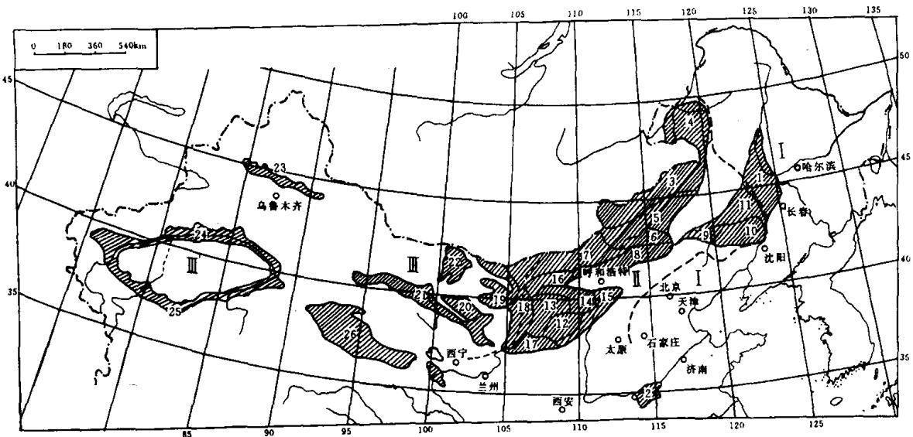  
图6-9 中国北方沙漠及沙漠化土地分布略图  
I.半湿润地带沙漠化土地零星风蚀区；Ⅱ.半于旱草原地带及荒漠草原地带风蚀沙漠化发展区；  
Ⅲ.干旱荒漠地带流沙入侵及固定半固定沙丘风蚀活化区

表 6-7 中国北方地区风蚀沙漠化分区[47]
<table><tr><td rowspan="2">大区</td><td>区域</td><td></td></tr><tr><td>沙漠化程度</td><td>区域名称</td></tr><tr><td>Ⅰ 半湿润地带沙漠化土地零星风蚀 区</td><td>风蚀沙漠化正在发展</td><td>(1)嫩江下游及吉林西部区 (2)黄河下游故道沿岸区</td></tr><tr><td rowspan="2">Ⅱ 半干旱草原地带及荒漠草原地带 风蚀沙漠化发展区</td><td>潜在风蚀沙漠化</td><td>(3) 内蒙古东北区 (4) 乌兰察布北部区 (5) 呼伦贝尔区</td></tr><tr><td>风蚀沙漠化正在发展</td><td>(6) 锡林郭勒区 (7) 乌盟后山及察哈尔中部区 (8) 科尔沁北部区 (9) 鄂尔多斯中部西部区 (10) 长城沿线区</td></tr><tr><td rowspan="2"></td><td>风蚀沙漠化强烈发展</td><td>(11) 浑善达格区 (12) 科尔沁东部区 (13) 鄂尔多斯北部区</td></tr><tr><td>严重风蚀沙漠化</td><td>(14) 后套西部区 (15) 宁夏东南区 (16) 科尔沁西部区 (17) 鄂尔多斯南部区</td></tr><tr><td rowspan="2">大区</td><td colspan="2">区 域</td></tr><tr><td>沙漠化程度</td><td>区域名称</td></tr><tr><td rowspan="3">Ⅱ干旱荒漠地带流沙入侵及固定沙 丘风蚀活化区</td><td>潜在风蚀沙漠化</td><td>(18) 巴音诺尔公区 (19) 阿拉善西南区</td></tr><tr><td>风蚀沙漠化正在发展</td><td>(20) 阿拉善东部区 (21) 弱水下游区 (22) 准噶尔盆地南部区</td></tr><tr><td>风蚀沙漠化强烈发展</td><td>(23) 河西走廊区 (24) 塔里木河中下游区 (25) 柴达木盆地区</td></tr><tr><td rowspan="2"></td><td>严重风蚀沙漠化</td><td>(26)塔里木盆地南部区</td></tr><tr><td></td><td></td></tr></table>

注：上述分区中未包括干旱荒漠地带一些沙漠化零星分布的地区。

朱震达、陈广庭依据全国沙漠、戈壁及土地沙漠化的区域性特点，共划分了6个类型分区：西北干旱绿洲外围沙漠化地区，内蒙古及长城沿线半干旱草原沙漠化地区，北方东部半湿润风沙化地区，青藏高原高寒土地沙漠化地区，南方湿润风沙化土地地区及海岸土地风沙化地区(图 6-10)[55]。

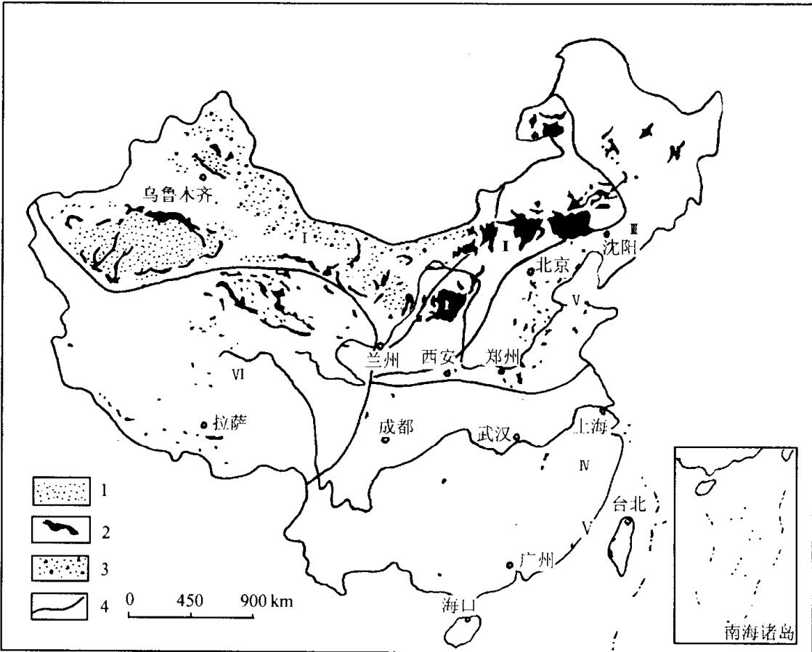  
图6-10 中国沙漠化土地类型分区示意图  
1. 沙漠;2. 沙漠化风沙化土地;3. 戈壁;4. 区分界线  
I.西北干旱绿洲外围沙漠化地区；Ⅱ.内蒙古及长城沿线半干旱草原沙漠化地区；  
Ⅲ.北方东部半湿润风沙化地区；Ⅳ.南方湿润风沙化土地地区；  
V. 海岸土地风沙化地区；VI. 青藏高原高寒土地沙漠化地区

## 一、西北干旱绿洲外围沙漠化地区

参照自然区划和农业区划，本区大致为干燥度3.5界限以西的地区，主要地理单元为内蒙古高原西部、后套平原一宁夏银川平原和贺兰山一乌鞘岭以西的西北干旱区，包括新疆、甘肃、内蒙古、宁夏省(自治区)的95个县(旗)。

## （一）干旱区土地沙漠化的特点

## 1. 集中了我国90 %的沙漠、戈壁

包括塔克拉玛干、古尔班通古特、库姆塔格、巴丹吉林、腾格里、乌兰布和沙漠和库布齐沙漠的西部及广袤的戈壁。土地沙漠化都是围绕着绿洲或沙漠内部河流下游及水资源缺乏的地区发展的[55]。

## 2. 吹扬灌丛沙堆与新月形沙丘、沙丘链相间的地貌特征

塔克拉玛干沙漠南缘皮山、墨玉、策勒、洛浦、于田、民丰等绿洲的北部是典型例子。风沙地貌形态以新月形沙丘链为主，灌丛沙堆仅斑点状散布其间。

## 3. 降水稀少，蒸发强烈，水资源耗竭

干燥度指数在4以上，有的地方竟达84.7。水系的变迁、灌溉水源的减少是土地沙漠化的主要原因，其次才是绿洲边缘的过度樵采和放牧。历史上塔克拉玛干沙漠中楼兰、尼雅古城的荒废，内蒙古额济纳旗弱水下游黑城的废弃，都与水系的变迁有关。近期据1975年和1986年航片对比分析，在弱水下游的1.62万 $\mathbf { k } \mathbf { m } ^ { 2 }$ 范围内，沙漠化土地从1975年的3400km²(占21.5%),扩大到1986年的 $6 0 0 0 \mathrm { k m } ^ { 2 } \cdot$ (占36.8%)，平均每年增加225km²，年增长速率6.47%。迅速沙漠化的原因是弱水上游甘肃高台、临泽县拦截用水，使处在下游的额济纳旗地表水断流、地下水补给严重不足造成的。

区域性的干旱化和上游大量用水造成的塔里木河断流，使下游3.76万 $\mathbf { h } \mathbf { m } ^ { 2 }$ 天然胡杨林死亡，土地沙漠化[57]。在河西走廊地区的金塔县鸳鸯池灌区，对地下水的超采，使埋深大于 5m 的地区 1969\~1979 年扩大了 $5 1 \mathrm { k m } ^ { 2 }$ ；1980年8月调查，沙枣园干海子一带6250hm²2天然胡杨林死亡率达38%，植被覆盖度从20世纪50年代的70%\~80%,退化为现在的10%\~15%，以风蚀劣地和片状流沙为特征的土地沙漠化严重发展[58,59]。

## （二）沙漠化土地的扩展

## 1. 流动沙丘的自然进展

流动沙丘前移入侵的自然进展是本区独具特色的沙漠化扩展过程。这种类型的沙漠化土地虽不占主导地位，但直接威胁着绿洲农田、牧场、水利和交通设施的安全和人民生活。对比古代和现代绿洲分布，总体上，绿洲在向昆仑山前退缩(图6-11)。甘肃省河西走廊邻近库姆塔格、巴丹吉林、腾格里三大沙漠，风沙线总长1720km，近40年来已建起

  
图 6-11 塔里木盆地绿洲分布[57]  
1. 楼兰；2.米兰古城;3.瓦古峡古城;4.古且末；5. 铁英古城;6.达乌孜勒克古城；7.安迪尔古城；8.尼雅；9. 喀拉墩；10.马坚里克；11.丹丹乌里克；12. 黑哈斯古城；13. 哈得里克古城；14.旧达摩玛沟；15. 乌曾塔堤；16. 卡纳沁古城；17.买力克阿瓦堤;18.约特干；19.阿克斯比勒;20. 热瓦克;21.麻扎塔格古城;22.藏桂古城；23.古皮山;24.拉依普;25.达曼城;26.托乎沙赖;27.喀拉玉尔滚;28.大望库木;29.通古孜巴什；30.穷沁;31.黑木沁;32.于什甲堤;33.皮加克;34.黑太克尔;35.着果特;36.野云沟;37.营盘

1204km防风固沙林，但风沙线仍依年3\~5m南移，民勤湖区、武威东沙窝、玉门、金塔等地沙漠年前移8\~10m。1949年以来，沙漠前缘的绿洲农田，因流沙埋压和风沙危害严重弃耕12.7万 $\mathrm { h m } ^ { 2 }$ O

## 2.盐渍化对绿洲的侵袭

绿洲靠灌溉支撑，绿洲的下段都有次生盐渍化问题。沙漠化和盐渍化共生，沙丘和盐渍土相间分布成了干旱区的一大特色，例如银(川)北平原和河套平原。

## (三）沙漠、戈壁区的危害

## 1.沙尘暴灾害

沙漠、戈壁和沙漠化土地是产生沙尘暴的物质基础，我国沙尘暴运行路线有两条，其形成中心都在西北干旱区，也首先强烈危害本区域。

历史上留下不少有关沙尘暴的记载。1952年以来，西北地区先后出现强和特强沙尘暴48次，造成人员伤亡的11次。20世纪90年代，我国北方又进入沙尘暴相对活跃时期，并多次出现影响长江流域的特强沙尘暴(俗称黑风暴)。

1993年5月5日黑风暴席卷了甘肃河西走廊、内蒙古阿拉善盟和宁夏银川平原，持续近5h。毁坏房屋4412间；死亡85人，伤264人，失踪31人;死亡和丢失大小牲畜12万头(只);许多地表被刮去10\~30cm,沙漠边缘的沙丘前移1\~8m,每平方千米降落尘埃

161\~256t;农作物受灾面积达37.4万 $\mathrm { h m } ^ { 2 }$ ,其中绝产或严重减产的近30%，受灾果树1.64万hm²，兰新铁路干线运输中断31h，乌吉线中断4d。这次黑风暴造成的直接经济损失达5.4亿元，是近年灾情最严重的一次沙尘暴，被称作“5.5”黑风暴[60]。

## 2. 风沙流危害

风沙流不仅导致沙丘前进，且风蚀危害农田。敦煌县在1955\~1984年的30年内因风沙流侵蚀农田，受灾农田2万hm²，粮食减产1万kg，棉花减产1.5万kg。 $\mathbf { h } \mathbf { m } ^ { 2 }$

西北干旱区的工矿、交通线经常受到风沙危害。截止到1980年底，我国通过沙区的铁路有1000km余，沙害线段200余处，约800km[61],除京通线为外，包兰、干武、乌吉、兰新、兰青线都在西北干旱区。乌(达)吉(兰太)运盐铁路专用线1967年建成通车，全长131.7km,沙害段长达89.7km。自1970年起风沙灾害愈来愈严重，至1982年，造成火车脱轨22次，1982年5月一个月即达4次，沙埋厚度达1.7m,沙埋1m以上的段落长达2km，严重影响行车安全和生产建设[62]。公路的沙害也主要是风沙流所挟带的大量砂粒堆积在路面上，形成路障。20世纪70年代末期修筑的南疆105国道东段沙害严重，风蚀季节常需人力排沙才能通行。

## 二、内蒙古及长城沿线半干旱草原沙漠化地区

北起呼伦贝尔草原，东界大致沿大兴安岭南下，包括了岭东侧的科尔沁沙地，然后沿冀辽山地、大马群山(燕山山脉)、长城、黄河(晋陕间)南下，再沿白于山西延，包括甘肃省环县北部，西接西北干旱区。范围大致相当于全国农业区划的内蒙古及长城沿线区，主要环境景观为半干旱草原和农牧业交错地带。为了地理单元的完整性，本区也包括了部分降水量400\~500mm的亚湿润地区。行政归属涉及内蒙古、辽宁、吉林、河北、山西、陕西、宁夏和甘肃省(区)的93个县(旗)和市[49,55,56]。

## （一）半干旱草原沙漠化地区的特点

本区处在中纬度温带半干旱气候区，又是东亚季风与于旱大陆性气候的过渡地带，自然植被为草原环境(包括森林草原、干草原及部分荒漠草原);地貌单元恰处于我国第二地形阶梯的边缘地区，地理环境及土地利用决定了本区的沙漠化有以下特点。

## 1. 农牧交错带的特点

半干旱区农牧交错带是我国最典型的土地沙漠化区域，也是沙漠化正在强烈发展的地区。20世纪80年代末有沙漠化土地12.19万km²2，占全国沙漠化土地的36.5%。70年 ${ \bf k m } ^ { 2 }$ 代中期到80年代中期，仅这一地区每年就有17.5万hm²(约折合 $\mathrm { h m } ^ { 2 }$ $1 \ 7 4 7 \mathrm { k m } ^ { 2 } )$ 土地遭风蚀，沦为沙漠化土地。

## 2. 沙漠化的发展与地区性干旱

本区处东南季风的尾端，年际年内降水分配很不均匀，春旱突出而严重，为导致沙漠

化发展的主要季节。

## 3. 半干旱区沙漠化过程及成因的复杂性

本区地质基础既有在晚第四纪沉积盆地基础上形成的古老沙地，又有整个第四纪长期处在干燥剥蚀环境下的高原(图6-12)，也有砂质黄土组成的丘陵和台地。在土地利用上，既有草原农牧业，也有雨养农业。因此，沙丘活化过程、风蚀粗化过程在这里都有特殊的表现。

  
图6-12 内蒙古高原东南部地貌景观

## （二）人为活动对半干旱草原沙漠化的影响

## 1. 土地不合理利用对沙漠化发展的影响

半干旱地区的年降水量250\~400mm，依靠天然降水可以维持草类或耐旱灌木的正常生长，宜畜牧业。草场开垦为农地后，如果结合防风蚀措施，正常年份雨养农业也能维持一定产量，尚不致引起沙漠化。对草原无限制和不采取保护措施的耕垦，草场的超载放牧，对植被的滥伐樵采和对沙区能源无保护措施的开采等，都能引起沙漠化的强烈发展。

## 2. 沙尘暴频率的增加

本区地处风沙地貌与黄土地貌的过渡带，地面物质多为风积沙和砂黄土，加之农垦活动频繁，在大风季节，常引发强烈的沙尘暴，其强度和频率甚至超过草原荒漠区，说明人类活动的强烈影响。沙尘暴的沙尘物质不但源于风暴中心(沙漠、戈壁)，也有一部分来源于半干旱区沙漠化土地。

春季产生于这一地区的风沙随着气流向东南推进，袭扰邻近的北京、天津、沈阳、太原、西安等大城市。影响这些城市的交通和正常生活，所以应引起特别的重视。

## 3. 土地沙漠化的历史变迁

半干旱草原地区原是我国肃镇、匈奴、鲜卑、东胡、回纥、契丹、蒙古等古今游牧民族发祥、生息繁衍之地。历经民族争斗及土地利用方式的变更，土地沙漠化也历经了发展和逆转的变迁。据历史资料，在科尔沁草原沙丘，公元9世纪契丹族在这里建立政权后，掠迫汉民来这里垦殖，土地开始沙漠化。到金、元统治时期，政治和经济中心南移，土地利用方式恢复牧业，土地沙漠化自然逆转。近代清王朝开放柳条边，关内农民大量涌入开荒，使土地沙漠化再次迅猛发展。浑善达克沙地(图6-13)有3层古土壤，经14C分析测年，形成时期约相当于距今7000年、3500年和1000年，其形成原因，除气候变迁自然因素外，土地利用农、牧业的交互发展，促使沙地、沙丘出现活化和固定的转换[55,56]。

  
固定梁窝状沙丘半固定蜂窝状沙丘新月形沙丘及沙丘链  
图 6-13 浑善达克沙地

## 4. 半干旱农牧交错区土地沙漠化治理前景

半于旱农牧交错区易于发生土地沙漠化的脆弱性必须引起重视；另外，如果加以合理规划农牧业，充分利用降水资源，土地沙漠化可以得到一定的控制和逆转。例如科尔沁草原中部、毛乌素沙地中南部及西南部的治理，均已取得一定成效。如不及时控制，当前还处于轻度沙化的地区，将迅速发展成不可逆转的恶化境地。

## 三、北方东部亚湿润风沙化地区

本区干、湿季节明显，夏秋降雨集中，以水蚀为主；冬春多大风，地面植被稀少，为典型的风、水两相侵蚀的复合区域。在强度风蚀作用下，地面出现类似沙漠化地区的沙堆、沙丘起伏景观，称为土地风沙化[63]。

亚湿润地区的土地风沙化和风沙灾害与干旱、半干旱地区的土地沙漠化有明显的不同。

## （一）分布的特点

## 1. 分布地域

土地风沙化集中在各河流泛滥平原和三角洲，仅黄河下游古三角洲泛滥平原就有80余个风沙县(图6-14).其余比较集中的有永定河、潮白河山前洪积平原、滦河三角洲与下游谷地，以及松花江、嫩江平原。

  
图6-14 黄河故道和遗留的风沙化土地

## 2. 分布形态与成因

出现在河流中下游或三角洲平原的土地风沙化(图6-15)，其形成与河流改道、决口泛滥直接有关。风沙地貌由河流自然沙堤、决口沙坝，经长期风蚀而形成；又因水分条件较好，规模分布较小，其形态结构较为平缓，多有一定的植被覆盖。例如，片状流沙、辫状或灌丛沙堆，饼状沙丘和岗状沙丘，因有植被覆盖，基本固定，仅在裸露沙丘顶部，在冬春风蚀季节出现流动“沙帽”，呈现新月形沙丘雏形。

  
图 6-15 滦河三角洲的风沙化土地

## （二）风沙危害和土地利用

## 1. 风沙危害的季节性

在华北平原，降水量多集中在6\~9月，占全年降水量的80%以上，自10月至翌年的5月，降水量在20%以下，又多为无效降水、地表干旱现象。3\~5月为大风季节，在作物处于幼苗阶段和土壤干旱情况下，同期即为强烈风蚀季节，发生扬沙、风沙流，地面出现吹蚀、片状流沙、砂质岗丘顶部呈现沙波纹的风蚀景观，局地类同半干旱地区风沙景观。夏秋季节除个别裸露的沙岗外，地面多被植被覆盖。宏观景观表现为绿色原野出现斑点状风沙景观，未引起全局的环境退化，显然不同于半干旱区同期的景观[56]。

## 2. 农地土壤风蚀及风沙化土地和盐渍化土地的交错分布

亚湿润地区农垦活动强盛，砂质土多被开垦，风蚀季节，农地为主要受害地区，或种苗受吹毁，或垄沟洼地出现积沙而掩埋种苗。

据考察，山东省冲积平原的沙区面积 $1 2 \ 2 8 4 . 2 7 \mathrm { k m } ^ { 2 }$ ,现受风沙威胁的风沙化土地面积$5 7 8 3 . 5 7 \mathrm { k m } ^ { 2 }$ ,其中各类沙荒地750km²，而受不同程度风蚀威胁的砂质耕地 $4 ~ 3 0 0 \mathsf { k m } ^ { 2 }$ ,占风沙化土地面积的74%[64]。

在分布有湖泊和洼地的沙区，往往出现风沙地貌和湖泊交错分布的景观。湖泊和洼地边缘干枯部位出现盐渍化土地，并进一步转化为新的风砂土。

## 3. 治理前景

半湿润风沙化地区，生态环境既有脆弱易于风沙化的一面，另一方面其水热条件相对优于干旱、半干旱区，易于治理逆转。应首先控制现有风沙化土地的扩展，加强集约化农业耕作体系，向高效生态经济方向发展。

## 四、青藏高原高寒风沙区的土地沙漠化

青藏高原主体海拔在4000m以上，整个高原兀立在大气层中，耸立于西风环流带上。因地势高耸，主要受大陆性气候的影响，尤其是漫长的冬半年干季(11月到次年4月)盛行长期固定的偏西风，寒冷、干燥、风大、光照强、降水少。昼夜温差大，使寒冻物理风化作用强烈，产生了大量岩屑，包括大量细颗粒物质，为风沙作用提供了充足的物质基础。因此，整个高原布满了类似戈壁的风蚀砂砾石滩地，沟谷和湖泊洼地则有风积沙组成各种风成地貌。风沙和土地沙漠化灾害十分严重。

风沙灾害最严重的地区有3处：青海省柴达木、青海湖和共和盆地，雅鲁藏布江河谷，和藏西一些短的西向河谷。

## （一）青海省柴达木、青海湖和共和盆地的风沙和土地沙漠化

青海省沙漠面积4.75万 $\mathbf { k } m ^ { 2 }$ (不包括戈壁 4.82 万 $\mathbf { k } m ^ { 2 } )$ ，占全省总土地面积的6.45%。其中风蚀作用形成的各种风蚀地面积2.16万 ${ \bf k m } ^ { 2 }$ ,风积沙漠面积近2.60万 $\mathbf { k m } ^ { 2 }$ 分别占45.38%和54.62%。沙漠集中分布于N35°30′\~39°、E90°30′\~10105'之间，也即青海省北部的柴达木、青海湖和共和盆地中(图6-16)。西起柴达木盆地西端的茫崖镇以西30km，东至共和盆地木格滩的黄沙头，东西长约1000km，南北宽300km，呈西宽东窄状。N35°30′以南则零星分布。

风蚀地面积大，分布比较集中，几乎全部在柴达木盆地。其中90.4%的面积分布在E95°以西的盆地中心地带，9.4%的面积分布在德令哈以南的盆地东端[65]。

风积沙漠类型多，分布规律性强。流动沙丘以高大沙山、沙丘为主，形式有新月形沙丘及沙丘链、格状沙丘、金字塔沙丘、复合型新月形沙丘链、平沙地。

青海湖和共和盆地年降水量170\~430mm，水源较充足。沙区周围是大面积天然草场，有少量疏林地。尤以N35°30′以南雨量充沛，高寒冷湿，沙漠零星分布，面积小，且多为固定、半固定沙丘，分布于河流两岸和湖盆[66]。人口增长、开垦沙地、围湖造田、过度放牧和樵采是沙漠化最主要的人为因素。如贵南木格滩仅1977\~1986年因开垦造成风蚀地，面积增加 $1 3 3 . 0 5 \mathrm { k m } ^ { 2 }$ ;青海湖湖滨沙漠化土地面积以每年 $6 { \mathrm { k m } } ^ { 2 }$ 的速度增加，固定、半固定沙丘以每年 $1 . 4 8 \mathrm { k m } ^ { 2 }$ 的速度活化[65]。同时，气候变迁和人类对环境的破坏，造成雪水、河水对青海湖等湖泊入湖补给的减少，致使湖水退缩，湖滩迅速沙漠化。40年来青海湖水位下降4.21m，水域缩小了近1/10,年均缩小面积 $1 2 . 4 6 \ \mathrm { k m } ^ { 2 }$ 。现在水位仍以每年10.53cm的速度下降，湖体分割，岛陆相连，昔日闻名的鸟岛已与陆地相连了。

  
图6-16 青海省共和盆地的沙漠化土地

## （二）以雅鲁藏布江河谷为代表的青藏高原河谷、湖盆洼地风沙与土地沙漠化

西藏高原上有喜马拉雅、冈底斯、念青唐古拉、唐古拉、昆仑、可可西里等大致东西走向的山脉，山脉之间夹有盆地，有的发育有河流，有的布满大大小小的湖泊。这些与高空西风环流一致的谷盆则成为风沙活动的场所。

雅鲁藏布江沿藏南谷地从西向东流淌，仲巴县以上的上游部分称马泉河，局部河段还保有河谷湖泊性质，谷地中串连着一系列更宽坦的盆地，宽可达10\~20km。马泉河现代流水偏向谷地南侧，北侧除宽广的河漫滩外，平原上还叠置着山麓洪积扇，平原外缘有山前丘陵，就在这些地貌部位，尤其是广坦的河谷平原上，风沙作用强烈，形成连续的沙漠化土地；仲巴至林芝以东的1000km余为雅鲁藏布江的中游段，近垂向汇入不少的大支流，如年楚河、拉萨河、尼羊河等。河谷形态为宽谷和峡谷相间，以宽谷为主，宽谷段宽1\~2km，乃至10km余。主要有仲巴、加加、日喀则-大竹卡、山南-泽当和米林-派区宽谷。河流从峡谷进入宽谷时水流分叉扩散，构成辫状水系，在这种宽谷段(图6-17)，尤其较大支流汇口段广阔的河滩、河谷平原和河岸阶地上，往往有风沙活动，形成沙漠化土地。在年楚河下游谷地和拉萨河下游平原有一些孤立的流动沙丘和半固定沙丘及更多的山坡、山拗覆沙[67]。

经普查，雅鲁藏布江河谷有沙漠化土地1930km2[68]，有以下特点。①分布形式上，沙漠化土地多为斑块状分布，总体上构成沿河谷呈不连续的带状。分布规模既分散又集中。②河谷风沙堆积面积19.25万hm²，地貌类型多达19个，由于谷底和谷坡两类运动床面的形态、坡度、结构和外营力等的差异，发育在其上的风沙地貌形态多样。③雅鲁藏布江流域盛行高原季风。夏秋半年(6\~10月)为暖性低压控制，西南季风由东向西逆江而上，为“雨季”，土壤侵蚀以水蚀为主：冬春季风大、多风且持续时间长，为风蚀季节。据统计，河谷区最大风速可达32.5m/s,月平均最高风速4.7m/s,年最多大风日数172d。以日喀则为例，全年大风日数32.5d,冬春半年(11月至次年5月)占83.7%；全年 $\geqslant 5 \mathsf { m } / \mathsf { s }$ 起沙风历时754.2h，冬半年占90.4%。④雅鲁藏布江流域是西藏经济最繁荣、人口最稠密的地区，自20世纪50年代末至今人口增长了1倍以上，目前人口已占西藏的47.4%。随着人口压力的增大，河谷土地过度开发利用，主要是过牧，其次是滥伐和滥垦，使地表原生植被和土层结构遭到破坏，先是草牧场退化，随之风沙侵袭、吞噬平原，山坡与冲积扇上的农田、公路和其他建筑设施，拉萨机场也经常受到风沙的侵袭。

  
图6-17 雅鲁藏布江米林山南等宽谷风沙地貌综合剖面[68]  
1. 现代河床相沉积;2. 河漫滩相沉积;3. 阶地河流相沉积;4. 洪积相沉积;5. 基岩;6. 谷地沙丘;7.谷坡爬升沙丘(片)

## （三）藏西河谷的风沙灾害

在西藏的西端有森格藏布(印度河上源)、朗钦藏布等及其支流从东向西流入克什米尔或印度，这些西行的河流谷地成为西风的风廊，风大而干燥、寒冷，物理风化、风蚀都很强烈。在山前形成了砂砾质丘陵，河谷底部有风蚀加工过的冲洪积戈壁，风成沙丘零星地分布在风力稍小的部位。以下以阿里地区行署所在地噶尔县狮泉河镇为例，说明这一地区风沙危害状况和狮泉河镇的风沙危害特点。

狮泉河源于冈底斯山主峰冈仁布齐北麓。谷底海拔4240\~4255m，周围剥蚀石质山地海拔高度一般在4700m以上，真正的风积沙丘仅零星分布在高河漫滩、河流阶地和部分丘陵坡上。风成沙丘面积虽小且零星，但风力作用于砂质地表所引起的土壤风蚀、风沙流、坡地片状流沙沉积(积沙)、沙丘前移和粉尘吹扬(沙尘暴)等风沙活动都十分强烈，风沙活动的特点如下。

## 1. 空间分布特点

大部分地区以风蚀，尤其是风沙流过程为主，零星沙丘灌丛被砍伐后活化前移。整个谷地的风蚀、风沙流和沙丘前移过程中被风力扬卷起来的粉尘和极细砂随风飞扬，沙尘暴

过程波及整个盆地。

## 2. 时间分布特点

风沙活动的强弱有明显的季节和日变化。6\~9月暖季出现较少，月平均0.6\~1.1d;冷季(10月至次年5月)明显增多，5月最多，月平均达1.8\~2.8d。日变化是上午出现的概率少，强度小；午后，尤其是14\~20时频率多，强度也大。

风沙活动各个过程在时间上是依次发生的，在空间上又是同时并存的。风蚀、风沙流、风沙沉积、沙丘前移和沙尘暴等过程，都是构成风沙活动统一过程的各个环节。

## 3. 恶劣的自然条件是风沙活动形成和发展的主导因素，人为因素加重了风沙灾害

20世纪50\~60年代，镇址和附近河谷生长大片密集的、高达4\~5m的秀丽水柏枝灌丛林，60代建镇，行署、县城搬来以后，薪柴依靠砍伐灌丛解决，原来预计可利用50\~100年的灌丛林，到70年代中期的10余年间已所剩无几。此外，人们挖取戈壁砾石作建筑材料，破坏了地表的平衡状态。这些都使风沙灾害猖獗，风沙流逼近城镇[69]。

青藏高原上一些被高大山脉包围的山间盆地也有强烈的风沙活动。例如位于鸦格-库木库里盆地以东的一片沙漠面积 $2 ~ 5 5 6 \mathrm { k m } ^ { 2 }$ ，称库木库里沙漠，这里的沙漠分布在海拔4000m以上，最高海拔5000m,是世界上已知分布位置最高的沙漠和流动沙丘[70]。不但沙丘类型和形态齐全，而且风蚀地貌，如风城、雅丹、石格子窗等都非常典型，尚有待深入研究。

## 五、南方湿润风沙化土地地区

本区主要分布在秦岭、淮河以南，青藏高原以东地区。全年降水量在800mm以上，干燥度 ${ \leqslant } 0 . 9 9 \mathrm { _ { \circ } }$ 降水量虽多，但分配不均匀，干、湿季节鲜明。暴雨季节流水侵蚀携带到河流的砂质物质沉积于河谷或湖滨下游三角洲，干季则出现风沙吹扬及地面形成波状起伏风沙地貌。故本区风沙化土地以沿河环湖滨为特点，分布零星，面积不大，呈斑点状散布在湖滨地段，例如湖南省洞庭湖江滨、湖北省青山镇江滨、江西省九江梅家洲江边、鄱阳湖湖滨等地(图6-18)。此外，四川省岷江、大渡河、雅砻江和金沙江干热河谷也出现风沙灾害，偶见有雏形沙垄、沙丘地貌。

  
平地缓丘与平地相间的景观山地  
图 6-18 鄱阳湖畔沙丘分布[63]

本区风沙化土地除范围不大、分布零星外，在时间上季节性更明显。雨季水土流失输入河流淤积的泥沙，干季成为风沙活动的物质基础。砂粒物质颗粒粗、分选性好，起沙风速高。例如，江西省新建县厚田乡的沙颗粒平均粒径为0.85mm，起沙风速为8.0m/s。另一个特点是风沙发展历史短，主要原因是上游地区砍伐森林，加剧水土流失，导致河流泥沙增多，下游河床湖滨泥沙堆积而成为风沙灾害源地。由于本区水热资源丰富，通过上、中、下游统一整治管理，小片风沙地能得到有效控制。

## 六、海岸风沙化地区

我国大陆海岸线总长18000km余，其中砂质海岸近3000km，风沙灾害频繁，出现沙丘的砂质海岸线长约585km，风沙区面积 $1 \ 7 5 5 \mathrm { k m } ^ { 2 }$ 。沿海各省海岸有风沙问题的：辽宁65km,河北75km，山东95km，福建90km，台湾50km,广东100km，,海南50km。其成因与海滨的海成阶地或海成沙堤(沙洲)的砂质沉积物受风力吹扬有关(图6-19)。

  
6-19 渤海湾西岸黄金海岸新开口以南海岸沙丘形态[63]

海岸风沙的分布有三个特点。①分布范围广而规模小，且分布零散。②地形部位呈多样性，有覆盖在砂质海岸平原(滨海沙堤、峡湾沙堤、湾口沙坝、河口沙嘴、连岛沙洲等)上的，也有被覆于临海基岩丘陵台地上的。分布高度低者仅高出海面数米，高者可达数十至近百米。③分布的位置大部分是在河流入海口旁侧，与河流泥沙搬运到河口，再由波浪和海流作用推回到海岸有关。这些海岸沉积砂即海滨风沙的物质基础(图6-20)。

海岸带冬季干燥多风，但夏季炎热多雨，持续时间较长，故风沙活动较北方为弱而短暂。

现代海岸风沙（沙丘）012km  
  
丘陵平原砂质海滩淤泥  
图6-20 闽南长乐文武沙一江田克明楼沿海风沙分布

## 第四节 冻融侵蚀为主类型区

冻融侵蚀主要发生在人类活动影响很小的青藏高原地区，包括西藏全部、青海南部及四川的甘孜、阿坝两州；此外，在东北大兴安岭和新疆的天山山地也有小面积分布。按照全国土壤侵蚀类型区划(表6-1)，该类型区可分为北方冻融侵蚀区和青藏高原冰川冻融侵蚀区。依据全国第一次土壤侵蚀遥感调查资料，全国冻融侵蚀的面积125.41万 ${ \bf k m } ^ { 2 }$ ，占全国土地总面积的13.15%。在冻融侵蚀面积中，西藏92.16万 $\mathbf { k m } ^ { 2 }$ ，占76.5%；青海 15.14万 $\mathbf { k } \mathbf { m } ^ { 2 }$ ，占21.0%;其余约18.11万 $\mathbf { k } \mathbf { m } ^ { 2 }$ 的冻融侵蚀面积分布在内蒙古、黑龙江、甘肃、新疆等地。

## 一、北方冻融侵蚀区

主要分布在东北大兴安岭山地和新疆的天山山地，属多年冻土区。冻融侵蚀的发生主要受气候季节变化，土体或岩体因冷暖、干湿交替而反复冻结、融化。在重力或其他外力作用下，沿冻融界面发生滑动、崩落的现象，也可促使沟蚀的延伸和扩展。因冻融侵蚀而激发的滑坡、泥石流，有时可造成淹埋农田、村庄，冲毁道路、桥梁及堵塞江河等灾害。

## 二、青藏高原冰川冻融侵蚀区

朱显谟、陈代中在编绘的中国土壤侵蚀类型及分区图中，对本区侵蚀特点作了说明。该区主要分布在雪线以上，平均海拔4500m以上，冰川活动十分活跃。青藏高原是世界上中低纬度地区最大的冰川作用中心。中国现代冰川面积约5.64万 $\mathbf { k m } ^ { 2 }$ ,其中 90%分布于青藏高原及其边缘山地，几乎全部呈山地冰川出现。巨大的冰川由于受重力和消融作用的影响，冰川体沿山谷冰床作缓慢的塑性流动和滑动，对地表产生巨大的刨蚀、搬运作用，形成各种特殊的冰蚀地貌和冰碛物。此外，冰雪融水也会对地表造成强烈的冲刷。这种冰水侵蚀作用在雪线附近尤为活跃(参见图1-3)。

## 参考文献

1 中国科学院中国自然地理编辑委员会．中国自然地理、地貌．北京：科学出版社，1981

2 黄秉维．编制黄河中游流域土壤侵蚀分区图的经验教训. 科学通报，1955,(12):15\~21

3 朱显谟． 黄土区土壤侵蚀的分类. 土壤学报，1956，4(2)：99\~114

4 辛树帜，蒋德麒．中国水土保持概论．北京：农业出版社，1982

5 中华人民共和国水利部水土保持司． 土壤侵蚀分类分级标准(SL190—96). 北京：中国水利水电出版社，1997

6 中国科学院黄土高原综合科学考察队唐克丽，陈永宗等．黄土高原地区土壤侵蚀区域特征及其治理途径．北京：中国科学技术出版社，1990

7 中国科学院黄土高原综合科学考察队王义凤等．黄土高原地区植被资源及其合理利用．北京：中国科学技术出版社，1991

8 唐克丽，贺秀斌．黄土高原生态环境建设与侵蚀环境调控.见：中国科学技术学会，中国工程院，陕西省人民政府编.中国西部生态重建与经济协调发展学术研讨会论文集．成都：四川科学技术出版社，1999

9 李锐，唐克丽等．神府一东胜矿区一、二期工程环境效应考察．水土保持研究，1994，1(4)：5\~17

10 唐克丽，侯庆春等．黄土高原水蚀风蚀交错带和神木试区的环境背景及整治方向．见：中国科学院西北水土保持研究所集刊，第18集.西安：陕西科学技术出版社，1993

11 米登山，蒋定生等．近万年子午岭森林破坏情况及其影响．水土保持通报，1982，2(5)：49\~52

12 刘运河，陈礼耕等．大兴安岭地区的水土流失及其防治．中国水土保持，1992，10:1\~3

13 沈波，杨海军． 松辽流域水土流失及其防治对策.水土保持通报，1993，13(2)：28\~32

14 赵树久，李胜利，王克文．黑龙江省水土流失现状及其防治对策探讨.水土保持通报，1992，12(3)：58\~62

15 刘运河，应杰等.小兴安岭地区的水土流失及其防治．中国水土保持，1995，3:10\~13

16 朱宗恩，全江.吉林省水土流失现状及其防治对策．水土保持通报，1992，12(4)：33\~37

17 李明. 松花江流域土壤侵蚀现状及其防治对策． 水土保持通报，1992，12(5)：29\~33

18 于丹，沈波，谢军．东北黑土区水土流失危害及其防治途径．水土保持通报，1992，12(2)：25\~34

19 宋秀清．滦河流域水土流失及其防治对策．水土保持通报，1993，13(1)：60\~63

20 杜春利.河北省太行山区水土流失及其防治对策．中国水土保持，1995，9:5\~7

21 张建国，李友仁，赵惠君．山西省海河流域土壤侵蚀的基本规律．水土保持通报，1991，11(5)：17\~25

22 马为民，侯秀瑞．河北省风蚀沙化与防治．水土保持通报，2001，21(2)：52\~54

23 长江流域水土保持综合考察队.长江流域土壤侵蚀区划报告.见：中国科学院西北水土保持研究所集刊，第4集.西安：陕西科学技术出版社，1986

24 史德明．我国南方花岗岩区水土流失、水土保持与生态系统．中国水土保持，1985，(12)：6\~10

25 史德明. 南方花岗岩区的土壤侵蚀及其防治． 水土保持学报，1991，5(3)：63\~72

26 中国科学院成都分院土壤研究室．中国紫色土. 北京：科学出版社，1991

27 史志刚． 土壤侵蚀区域分异特征及治理模式研究． 水土保持研究，1996，3(4)：9\~11

28 肖荣沽．江西省水土流失现状及其防治对策．水土保持通报，1994，14(3)：39\~43

29 叶玉忠．力创新世纪赣南水土保持工作新局面．中国水土保持，2001，(9)：8\~10

30阮伏水，朱鹤健等．福建省花岗岩地区土壤侵蚀与治理．北京：中国农业出版社，1997

31 周伏建． 福建省土壤侵蚀与综合治理．水土保持通报，2000，20(4)：56\~59

32 唐克丽． 台湾水土保持考察.水土保持通报，1994，14(3)：1\~7

33《中国台湾水利》编委会．中国台湾水利.北京：中国水利水电出版社，2000

34 赵燮京，马世华，贾纯等，坡耕地治理是四川省丘陵区防治水土流失的根本途径．水土保持通报，1990，10(1):25\~29

35田心元，四川“81·7”洪灾的成因、危害及其防治，水土保持通报，1982，2(2)：3\~10

36四川省农业厅．治理坡耕地，控制水土流失，促进农业生产．水土保持通报，1982，2(2)：46\~50

37 陈循谦. 长江上游(云南境内)的土壤侵蚀．水土保持学报，1990，4(3)：71\~79

38 朱安国．水土流失与水土保持．贵阳：贵州人民出版社，1986

39 张一平，张惠映，马友鑫等，西双版纳热带地区不同植被覆盖地域径流特征．土壤侵蚀与水土保持学报，1997，3(4):25\~30

40 朱安国． 贵州西部山区土壤侵蚀研究． 水土保持通报，1990，10(3)：1\~7

41 佘剑如，刘载生．长江上游的水土流失与河流泥沙．水土保持学报，1988，2(1)：1\~15

42 林昌虎．贵州山区坡耕地的利用与保护.水土保持通报，1992，12(4)：43\~47

43 柴宗新．试论广西岩溶区土壤侵蚀.山地研究，1989，7(4)：255\~260

44 陈晓平．喀斯特山区环境土壤侵蚀特性的分析研究. 土壤侵蚀与水土保持学报，1997，3(4)：31\~36

45 林昌虎，朱安国. 贵州喀斯特山区土壤侵蚀与防治.水土保持研究，1999，6(2)：109\~113

46 李德基．泥石流减灾理论与实践．北京：科学出版社，1997

47 朱震达，刘恕．中国北方地区沙漠化过程及其治理区划．北京：中国林业出版社，1981

48 CCICCD. China country paper to combat desertification . Beijing: China Forestry Pubiishing House, 1996

49 朱震达，吴正，刘恕．中国沙漠概论(修订版).北京：科学出版社，1980

50 董光荣，申建友，金炯.我国土地沙漠化的分布与危害.干旱区资源与环境，1998,3(4)：33\~42

51 董光荣等.我国荒漠化现状、成因与防治对策.中国沙漠，1999，19(4)：318\~332

52 朱震达. 中国沙漠化研究的进展.中国沙漠，1989，9(1):1\~13

53 王涛，赵哈林，肖红浪.中国沙漠化研究的进展.中国沙漠，1999，19(4)：301\~311

54 国家计划委员会和国家科学技术委员会组织52个部委公众团体和300多名专家.中国21世纪议程．北京：科学出版社，1994

55 朱震达，陈广庭．中国土地砂质荒漠化.北京：科学出版社，1994

56 朱震达，刘恕.中国沙漠化及其治理.北京：科学出版社，1989

57 樊自立.新疆土地开发对生态与环境的影响及对策研究．北京：气象出版社，1996

58 何世水，葛生年．金塔鸳鸯池灌区地下水动态演变及其对环境的影响．中国沙漠，1986，6(3)：32\~50

59 陈荷生．西北干旱区水资源开发引起环境变化的认识. 中国沙漠，1987，7(2)：2\~10

60 夏训诚，杨根生．黑风暴．北京：科学出版社，1995

61 赵性存.中国沙漠地区铁路的修筑.中国沙漠，1982，2(1)：35\~40

62 中国科学院兰州沙漠所额济纳旗考察队.乌兰布和沙漠西南铁路沿线沙害的防治.中国沙漠，1983，3(2)：30\~35

63 朱震达. 湿润及半湿润地带的土地风沙化问题. 中国沙漠，1986，6(4)：1\~12

64 陈广庭等．山东省黄河冲积平原风沙化土地的研究．中国沙漠，1989，9(1)：19\~32

65 李成尊，孙勃，陆锦华．青海省沙漠现状及形成与发展趋势．中国沙漠，1990，10(4)：38\~45

66 徐叔鹰，徐德馥，石生仁. 青海共和盆地的风沙堆积.中国沙漠，1982，2(3)：1\~8

67 杨逸畴．雅鲁藏布江河谷风沙地貌的初步观察．中国沙漠，1984，4(3)：12\~13

68 李森等．雅鲁藏布江河谷风沙地貌．中国沙漠，1997，17(4):342\~350

69 金炯等． 阿里地区狮泉河镇风沙危害与整治规划. 中国沙漠，1991，11(3)：20\~26

70 赵子允.东昆仑山区风沙地貌特征．中国沙漠，1985，5(2)：35\~38

## 第七章 中国主要水系土壤侵蚀与河流泥沙

中国拥有众多的水系，流域面积在10万 $\mathbf { k } \mathbf { m } ^ { 2 }$ 以上的大江大河有12条：长江、黑龙江、塔里木河、黄河、松花江、珠江、海河、淮河、雅鲁藏布江、辽河、澜沧江、怒江。其中一些江河的含沙量比较高，源自于流域内的土壤侵蚀。因此，中国土壤侵蚀的研究及其防治问题，不仅依据自然和人文环境的区域特征，并且以水系为单元，治江治河工程与水土保持工程同步进行。水利部门选择了土壤侵蚀比较严重，且治河任务比较艰巨的七大流域(表7-1)进行了系统规划，设置了长江、黄河、松辽、海滦河、淮河、珠江6个水利委员会，分别管理其流域范围内的江河治理开发和水土保持。

表 7-1 中国七大江河的流域特征[1]
<table><tr><td>流域名称</td><td>干流长 /km</td><td>流域面积  $/ \mathbf { k m } ^ { 2 }$ </td><td>年降水量 /mm</td><td>年降水总量  $/ 1  { \mathbb { Z } }  { \mathbf { m } } ^ { 3 }$ </td><td>年均径流量 /亿m³</td></tr><tr><td>黄河</td><td>5464</td><td>794 712</td><td>464.4</td><td>3 691</td><td>658</td></tr><tr><td>长江</td><td>6300</td><td>1 808 500</td><td>1070.5</td><td>19 360</td><td>9513</td></tr><tr><td>松花江</td><td>2 308</td><td>557 180</td><td>526.8</td><td>2 935</td><td>762</td></tr><tr><td>辽河</td><td>1 390</td><td>228 960</td><td>472.6</td><td>1 082</td><td>148</td></tr><tr><td>海滦河</td><td>1 967</td><td>318 161</td><td>742.9</td><td>1774</td><td>288</td></tr><tr><td>淮河</td><td>1 000</td><td>269 283</td><td>888.7</td><td>2 390</td><td>622</td></tr><tr><td>珠江</td><td>2 214</td><td>453 690</td><td>1 469.3</td><td>6 528</td><td>3 338</td></tr></table>

黄河的年均输沙量和含沙量最高，居世界首位(表7-2)。历史上黄河频发的河患，源自于高含沙量，年均含沙量分别为美国密西西比河及密苏里河的68倍和12倍，为巴西亚马孙河的738倍。我国长江的悬移质输沙量虽然不是很高，但流域内因土壤侵蚀和滑坡、泥石流灾害，仍是危及长江洪水灾害的重大隐患。本章以黄河、长江为重点，论述七大江河流域的土壤侵蚀与径流、泥沙变化。

表7-2 中国长江、黄河与世界部分大河流的泥沙特征[1]
<table><tr><td>河名</td><td>国名</td><td>站名</td><td>流域面积  $/ \mathcal { F }  { \mathrm { \mathbf { k m } } ^ { 2 } }$ </td><td>年均径流量  $/ \smash { \mathcal { A } \tan ^ { 3 } }$ </td><td>/亿t</td><td>年均输沙量年均输沙模数年均含沙量 /t  $/ ( \mathbf { k m } ^ { 2 } \cdot \mathbf { a } ) \overset { - } { \underset { - } { \operatorname { \mathbf { k m } } ^ { 2 } } } .$ </td><td>1  $/ ( \log / \mathbf { m } ^ { 3 } )$ </td></tr><tr><td>黄河</td><td>中国</td><td>龙、华、湫、河*</td><td>68.8</td><td>543</td><td>16.1</td><td>2 290</td><td>36.9</td></tr><tr><td>长江</td><td>中国</td><td>宜昌</td><td>100.6</td><td>4 468</td><td>5.14</td><td>512</td><td>1.18</td></tr><tr><td></td><td>布拉马普特拉河印度、孟加拉国</td><td>杜拉巴特</td><td>53.7</td><td>6 140</td><td>7.35</td><td>1 370</td><td>1.16</td></tr><tr><td>印度河</td><td>巴基斯坦</td><td>卡拉巴格</td><td>30.5</td><td>1 100</td><td>6.80</td><td>2 230</td><td>6.18</td></tr><tr><td>恒河</td><td>印度、孟加拉国</td><td>尔丁吉桥</td><td>97.6</td><td>3 680</td><td>4.80</td><td>492</td><td>1.31</td></tr><tr><td>亚马孙河</td><td>巴西</td><td></td><td>615</td><td>69 300</td><td>3.62</td><td>59</td><td>0.05</td></tr><tr><td>密西西比河</td><td>美国</td><td></td><td>322</td><td>5 800</td><td>3.12</td><td>97</td><td>0.54</td></tr><tr><td>伊洛瓦底江</td><td>缅甸</td><td></td><td>40.9</td><td>4 860</td><td>3.00</td><td>730</td><td>0.62</td></tr><tr><td>密苏里河</td><td>美国</td><td>赫尔曼</td><td>137</td><td>715</td><td>2.18</td><td>159</td><td>3.05</td></tr><tr><td>科罗拉多河</td><td>美国</td><td>大峡</td><td>35.7</td><td>156</td><td>1.81</td><td>507</td><td>11.6</td></tr><tr><td>尼罗河</td><td>埃及</td><td>开罗</td><td>290</td><td>840</td><td>1.11</td><td>1150</td><td>1.32</td></tr></table>

\*指黄河干流龙门、渭河华县、洛河湫头、汾河河津四站的总和。

# 第一节 黄河流域的土壤侵蚀与径流、泥沙变化

# 一、流域概况和侵蚀产沙的环境背景

(一)流域概况

黄河是中国的第二大河，位于N3202'\~40°28'、E95°58'\~116°45′。发源于青海省巴颜喀拉山北麓、海拔4500m的约古宗列盆地，自西向东流经青海、四川、甘肃、宁夏、内蒙古、山西、陕西、河南和山东9省(自治区)，于山东垦利县(东营市)注入渤海，全长5 464km,流域面积79.5万 km²(含内流区面积4.2万km²)(图7-1)。

  
图 7-1 黄河流域地貌分布略图

黄河流域自然资源丰富，生产潜力巨大。它是中华民族文化发祥地，历史上曾是中国政治、经济、文化中心。黄河的高含沙量及其频发的自然灾害，有其自然的演变过程，也有人为活动的作用。不少研究者对黄河流域的环境演变及其对侵蚀产沙的影响作了大量的研究，近期取得了一些新的进展[2\~4]，即为本节论述的主要基础。

黄河流域地势西高东低，受控于大地构造所形成的三大阶梯地形。大致在龙羊峡以上为青藏高原，海拔高程多在4000m以上为第一阶梯，其北面为昆仑山脉，南面为巴颜喀拉山脉，与长江水系分野。黄河迂迴山原之间，沿岸高山峡谷为未经开发地区，植被覆盖度高、土壤侵蚀微弱。黄河从龙羊峡至孟津为第二阶梯，即为中外驰名的黄土高原和鄂尔多斯高原，海拔多数在1000\~2000m。在二级台阶的地形除一些山地(如吕梁山、六盘山、拉脊山等山地)突兀在黄土高原之中外，其余为不同厚度黄土覆盖的黄土地貌，地表破碎，切割强烈。黄河两岸支流众多，河谷形态宽窄相间。鄂尔多斯高原西、北、东三面为黄河所环绕，为近似方形的台状剥蚀高原，地面受强烈的风蚀作用，形成风沙地貌。黄河出孟津以后，荡漾在第三阶梯—华北平原上，海拔多在100m以下。现代黄河是突兀在华北平原上的脊棱，成为淮河与海河的分水岭。华北平原地貌的基本格局是由孟津(桃花峪)呈弧形向外推进的环状地形结构，即由上至下分别是冲积扇平原、冲积平原、三角洲平原。由于历史上黄河的决溢与改道，在平原上形成众多类型的微地貌形态。

黄河上、中、下游的界线受三大阶梯地形的制约。地貌学家将黄河的上、中游界线划在青藏高原与黄土高原交界的龙羊峡；根据河流泥沙水文特性，黄河上、中游的界线定在河口镇(托克托)，因黄河泥沙的90%来自河口镇以下。黄河中、下游的界线比较一致，定在孟津。

为有助于研究黄河流域侵蚀产沙和泥沙输移规律，黄河上、中、下游的界线以综合考虑地貌和水文泥沙的特征。黄河从约古宗列盆地起至玛多为河源区，河长270km，集水面积20 930km²；自玛多起至内蒙古托克托的河口镇为上游，河长3191.3km，集水面积346968km²;河口镇至河南郑州的桃花峪为中游，河长1234.6km,集水面积361238km²;桃花峪至山东省垦利的海口为下游，河长767.7km，集水面积22407km²。景可提出黄河上、中游的界线应在龙羊峡(表7-3)，中、下游界线应在小浪底。

表 7-3 黄河龙羊峡上下河段自然要素比较[3]
<table><tr><td>河段</td><td>河谷 形态</td><td>河床纵比 降/%0</td><td>年径流量 /亿m³</td><td>年输沙量 /亿t</td><td>含沙量 /(kg/m³)</td><td>沟谷密度 /(km/km²)</td><td>侵蚀模数 /[t/(km²·a)]</td><td>河床 类型</td></tr><tr><td>龙羊峡以上 峡谷为主</td><td></td><td>14.0</td><td>196.9 (唐乃亥)</td><td>0.101</td><td>0.513</td><td>&lt;3.0</td><td>83</td><td>顺直 微弯</td></tr><tr><td>龙羊峡以下 宽窄相间</td><td></td><td>11.0</td><td>346.0 (兰州)</td><td>1.19</td><td>5.48</td><td>&gt;3.0</td><td>534</td><td>顺直 分叉</td></tr></table>

黄河由河源至海口落差为4480m，比降8.2%o。河流纵剖面形态为上游陡、下游缓，出现多处阶梯状的陡折，成为世界河流坡降较大、输沙能力较强的河流。

## （二）流域侵蚀产沙的环境背景

## 1. 自然环境

黄河处于我国中纬度地带，其中的上、中游处于我国西北半干旱地区，属大陆性季风气候，气候干燥、寒冷，冬季较长，多风沙，夏季短促、凉爽，最低气温在1月，最高气温在7月。下游地处暖温带半湿润季风气候，冬季寒冷、雨雪少，春季干旱、多风沙，夏季多雨水。黄河流域年均降水量467mm，但空间分布很不均匀，基本上自东南向西北呈递减趋势。下游郑州年均降水量668mm，中游延安550mm，上游内蒙古磴口为144mm。降水时间分布特点为年际变化大，年内降水高度集中，7\~9月约占全年降水量70%，该季节的侵蚀产沙和输移量约占全年的80%以上。集中降水的汛期多暴雨，全年85%的泥沙都来自汛期的几场暴雨。

降水时空分布的不均匀性和流域地貌形态的差异性，形成流域特殊的水沙关系水沙异源。黄河下游的水量主要来自河口镇以上，通过河口镇的水量占花园口的53.4%，而泥沙则不到三门峡总量的10%。中游的河口镇至龙门区间流域面积11万km²，占全流域面积的18%左右，水量仅占15%，但产沙量却占56%。由上所述，黄河水量主要来自兰州以上流域，而泥沙主要来自中游河口镇至龙门区间水土流失严重的黄土高原(黄土高原的侵蚀环境和特点见本书第六章)，从而形成黄河的水沙异源。黄河水少沙多的特点，促使下游河道淤积严重。黄河下游花园口站多年平均径流量480.6亿m³，其水量为长江的1/20;多年平均输沙量为16亿t,为长江的3倍；多年平均含沙量36.9kg/m³，为长江的30倍。黄河的这种水沙特性显然与中游黄土高原脆弱的自然环境及人类活动影响密切相关。黄土高原的土壤侵蚀起源于地质时期的自然侵蚀，人类社会出现后，在自然侵蚀基础上叠加了人为加速侵蚀，并随着人口剧增、生产活动扩展和自然生态平衡的失调，人为加速侵蚀逐渐占主导地位(参见第四章土壤侵蚀过程和环境演变)。因侵蚀的加剧，黄河的泥沙问题愈来愈突出，即本节讨论的重点。

## 2. 流域的人文环境

据地质历史考证，黄河是一条相对年轻的河流。距今115万年的早更新世，流域内只有一些互不连通的湖盆，各自形成独立的内陆水系。随着西部高原的抬升，河流侵蚀、袭夺，历经105万年的中更新世，各湖盆间逐渐连通，构成黄河水系的雏形。到距今10万年至1万年的晚更新世，黄河才逐步演变成从河源到入海口上下贯通的大河[5]。

黄河流域在距今50万\~60万年前就有人类活动。黄土剖面中中更新世发育的三层古土壤(红三条)，证明距今约50万年期间黄土高原为暖湿型以森林植被为主的生态环境，适宜于原始人类生存。黄土高原和黄河冲积平原深厚疏松的土质，易于垦殖，适于原始农业的发展。“大荔人”、“丁村人”、“河套人”等在流域内生息繁衍。旧石器时代的河套文化遗址，新石器时代的仰韶文化相继马家窑文化、大汶口文化、龙山文化直至距今5000\~6000年前的西安半坡村等大量文化遗址遍布大河上下，展现了中国文明的发展及当时优越的生态环境[4,5]。近3000年来流域内自然气候开始出现干冷趋势，同时也是人类垦殖活动逐渐强化发展过程。自然和人为因素的叠加，致使黄土高原土壤侵蚀愈益发展，黄河泥沙量逐渐增多，随之黄河决、溢灾害频率增加(参见本书第四章第二节)。

西周与春秋战国时期(公元前1070\~前221年)，黄河下游散流多股入海，所携带泥沙散积在华北冲积平原，河床淤高较缓慢，决口改道不多。西汉以后(公元前206\~24年)，黄土高原侵蚀加速，黄河泥沙增多，黄河下游决、溢频率增多，河床淤积抬高开始成为“悬河”。史书记载东汉公元69年“王景治河”，黄河下游开始了较大规模的修筑堤防工程。并自东汉至隋代的600年间，黄土高原改农为牧，土壤侵蚀减缓，黄河基本保持安流。自唐代(618\~907年)以后，直至明清，黄土高原的人口呈不断增加趋势，屯垦不断扩展，林草植被破坏严重，土壤侵蚀急剧发展，大量泥沙进入黄河，使黄河下游河床一再淤积抬高，决、溢灾害发生愈益频繁，最高时百年172次[6,7]。

严重的土壤侵蚀，不仅增加了入黄泥沙，加剧了洪涝灾害，并且也加剧了旱灾。1877年(光绪三年)，沿黄河各省发生特大旱灾，河南待赈饥民5600万人，山西省饥民入册4500万人，全流域死亡1300余万人。1843年黄河流域发生特大暴雨洪水，据历史资料及洪水痕迹推算，陕县洪水最大洪峰达36000m³/s，是近千年来最大洪水，皖北、豫东28州、县遭淹。1928\~1929年黄河流域连续大旱，陕县水文站实测年径流量只有200.9亿 $\mathbf { m } ^ { 3 }$ ,为实测以来的最低值。大部分地区从春至夏滴雨未降，受旱饥民树皮、草根都被食尽。1933年黄河中游普降大雨，陕县洪峰流量实测22000m³/s，黄河下游漫溢31处，决口73处，共104处，受灾县30个，受灾人口273万人。该年黄河输沙量39.1亿t,创历史以来最高记录[8]。

长期以来，由于泥沙大量淤积，黄河下游河床已成为闻名于世的“地上悬河”。目前黄河滩面高出新乡市地面20m，高出开封市地面 $1 3 \mathbf { m } _ { \circ }$ 近半个世纪以来，由于政府十分重视黄河的治理开发，黄河才能一直保持安流，现黄河堤防总长度8858km，这是举世瞩目的巨大成就。自1950年以来，临黄大堤先后进行了三次全面加高加固。下游两岸临黄大堤全长1397.37km，堤身一般加高 $2 \sim 6 \mathrm { m } _ { \odot }$ 。现有堤防能保持防御20世纪以来的最大洪水，花园口站22000m³/s的洪水标准。此外，大型水利工程建设、黄河中游黄土高原坝库骨于工程等水利水保工程建设，均对黄河的安流做出了重要贡献。黄河已由自然水系发展演变成人为控制的河流。但必须看到由于黄河下游河床不断的淤积抬高，近年来，多次出现洪水流量不大、洪水水位抬高的险情，黄河上中游的水土保持和下游的防洪任务仍十分艰巨。全面系统研究掌握黄河全流域的侵蚀产沙及泥沙输移规律，是确保黄河安流和全面开发的关键所在。

## 二、黄河流域的侵蚀产沙与泥沙输移特性

黄河泥沙是治黄的症结所在。黄河泥沙来源于黄土高原水土流失，控制黄土高原水土流失，减少入黄泥沙为长期以来治黄的基本方针。人们从黄河下游修建防洪拦蓄的水库工程及防洪大堤和河道整治工程等建设，有效地防止了下游决、溢等洪涝灾害；另一方面，进一步加强了上中游拦洪蓄泥的水利水保工程，有效地减少了入黄泥沙量。近30余年来通过黄土高原侵蚀产沙与泥沙输移特性的研究，不仅进一步明确了黄河泥沙来源的重点治理区域，同时明确了从根本上控制侵蚀产沙、减少入黄泥沙的方向和途径，使水土保持和治黄均有了很大的进展。

## （一）黄河上、中、下游河段水沙特性

黄河水沙的基本特性有两个方面：水少沙多、含沙量高和水沙异源、分布不均匀(表7-4)。黄河上、中、下游的水沙特性表现有所不同，主要决定于流域侵蚀产沙的特性[3,4]。

## 1. 黄河上游河段水沙特性

主要表现为：水多、沙少，地区分布不均匀；水沙年际变化大、年内分配不均匀；洪峰低，峰形矮胖；冬季封河时间长。

由表7-4可知，上游的年水量占全河的55.9%，年沙量占全河的8.7%。表7-5说明，上游水量主要来自兰州以上，由于植被覆盖较好，湖泊沼泽多，自然调蓄能力较好。洪水表现洪峰低，历时长，峰形矮胖。水沙年内分配主要集中在汛期，尤以沙量年内分配更为集中，6\~9月汛期的沙量占全年的90%左右。兰州至头道拐因地区干旱，加之沿途灌溉耗水量大，年水量减少，年沙量则沿程增加。上游封冻开河时，大量冰水积聚推向下游，易形成冰凌洪峰，有时可漫溢成灾。

表 7-4 黄河干流水沙特性[4]
<table><tr><td rowspan="2">站名或区间名</td><td colspan="2">控制面积</td><td colspan="2">天然年水量</td><td colspan="2">实测年沙量</td><td rowspan="2">说明</td></tr><tr><td> $ { \mathbf { k } } m ^ { 2 }$ </td><td>占全河的 比例/%</td><td> $\wp \mathbf { m } ^ { 3 }$ </td><td>占全河的 比例/%</td><td>亿t</td><td>占三门峡+ 黑石关+小 董的比例/%</td></tr><tr><td>河口镇(上游)</td><td>385 966</td><td>51.3</td><td>312.6</td><td>55.9</td><td>1.42</td><td>8.7</td><td></td></tr><tr><td>河口镇至花园口(中游)</td><td>344 070</td><td>45.7</td><td>246.6</td><td>44.1</td><td></td><td></td><td></td></tr><tr><td>河口镇至龙门</td><td>111 586</td><td>14.8</td><td>72.5</td><td>13.0</td><td>9.08</td><td>55.7</td><td></td></tr><tr><td>龙门至三门峡</td><td>190 869</td><td>25.4</td><td>113.3</td><td>20.3</td><td>5.54</td><td>34.0</td><td>为泾、洛、渭、汾河</td></tr><tr><td>三门峡至花园口</td><td>41 615</td><td>5.5</td><td>60.8</td><td>10.9</td><td>0.32</td><td>2.0</td><td>为伊洛、沁河</td></tr><tr><td>花园口</td><td>730 036</td><td>97.0</td><td>559.2</td><td>96.4</td><td>16.30</td><td>100</td><td>为三门峡+黑石关 +小董</td></tr><tr><td>花园口至河口</td><td>22 407</td><td>3.0</td><td>21.0</td><td>3.6</td><td></td><td></td><td></td></tr></table>

表 7-5 黄河上游实测年水沙量统计表[4]
<table><tr><td rowspan="2">站名</td><td rowspan="2">控制面积  $/ \mathbf { k m } ^ { 2 }$ </td><td rowspan="2">时段</td><td colspan="3">水量/亿  $\mathbf { m } ^ { 3 }$ </td><td colspan="3">沙量/亿t</td></tr><tr><td>汛期</td><td>非汛期</td><td>全年</td><td>汛期</td><td>非汛期</td><td>全年</td></tr><tr><td>唐乃亥</td><td>121 972</td><td>1934-07~1990-10</td><td>127.56</td><td>83.58</td><td>211.14</td><td>0.086</td><td>0.028</td><td>0.114</td></tr><tr><td>贵德</td><td>133 650</td><td>1934-07~1990-10</td><td>131.42</td><td>87.90</td><td>219.32</td><td>0.157</td><td>0.061</td><td>0.218</td></tr><tr><td>循化</td><td>145 459</td><td>1934-07~1990-10</td><td>137.87</td><td>93.50</td><td>231.37</td><td>0.314</td><td>0.087</td><td>0.401</td></tr><tr><td>兰 州</td><td>222 551</td><td>1934-07~1990-10</td><td>191.74</td><td>141.34</td><td>336.08</td><td>0.775</td><td>0.163</td><td>0.938</td></tr><tr><td>头道拐</td><td>367 898</td><td>1934-07~1990-10</td><td>150.98</td><td>105.24</td><td>258.22</td><td>1.158</td><td>0.288</td><td>1.466</td></tr></table>

## 2. 黄河中游河段水沙特性

主要表现为水少、沙多、含沙量高；水沙异源，地区分配不均匀；水沙年际变化大，年内分配不均匀；洪峰高，峰形瘦高，水沙峰一致，沙量高度集中。

表7-4说明，黄河中游的河口镇至龙门区间，年水量占全河的13.0%，年沙量占全河的55.7%，达9.08亿[4]。景可等研究指出，该区间的晋陕峡谷两岸，尤其是峡谷西岸的皇甫川、孤山川、窟野河等黄河支流，侵蚀产沙季节更为集中，年输沙模数多在15000t/$( \tan ^ { 2 } \cdot { \mathsf { a } } )$ 以上，7\~9月汛期输沙量可占全年的90%以上；最大5d输沙量可占全年的32.2%\~63.2%；最大1d输沙量可占全年的10.6%\~61.2%(表7-6)[3]。据典型小流域观测一次特大暴雨的输沙量可占全年的66.3%\~82.3%(表7-7)[9]。

表 7-6 黄河中游晋陕峡谷主要支流输沙特征[3]
<table><tr><td rowspan="2">流域</td><td rowspan="2">测站</td><td rowspan="2">年输 沙量 /亿t</td><td colspan="2">汛期输沙量</td><td colspan="2">最大 5d 输沙量</td><td colspan="2">最大 1d输沙量</td></tr><tr><td>亿t</td><td>占全年 比例/%</td><td>亿t</td><td>占全年 比例/%</td><td>亿t</td><td>占全年 比例/%</td></tr><tr><td>无定河</td><td>绥德</td><td>1.920</td><td>1.822</td><td>94.9</td><td>0.644</td><td>33.5</td><td>0.203</td><td>10.6</td></tr><tr><td>孤山川</td><td>高石崖</td><td>0.355</td><td>0.365</td><td>99.4</td><td>0.161</td><td>45.2</td><td>0.116</td><td>32.6</td></tr><tr><td>皇甫川</td><td>皇甫川</td><td>0.591</td><td>0.575</td><td>97.2</td><td>0.190</td><td>32.2</td><td>0.181</td><td>30.7</td></tr><tr><td>窟野河</td><td>温家川</td><td>2.880</td><td>2.862</td><td>99.4</td><td>1.823</td><td>63.2</td><td>1.763</td><td>61.2</td></tr><tr><td>秃尾河</td><td>高家川</td><td>0.278</td><td>0.256</td><td>87.2</td><td>0.096</td><td>32.1</td><td>0.045</td><td>15.2</td></tr><tr><td>延河</td><td>甘谷驿</td><td>0.468</td><td>0.443</td><td>94.5</td><td>0.246</td><td>52.5</td><td>0.135</td><td>28.7</td></tr></table>

表 7-7 黄河干流典型小流域一次特大暴雨输沙量[9]
<table><tr><td rowspan="2">流域名称</td><td rowspan="2">暴雨中 心雨量 /mm</td><td rowspan="2">时间</td><td rowspan="2">降雨 历时/h</td><td colspan="2">洪水量</td><td colspan="2">泥沙量</td></tr><tr><td> $\mathbf { m } ^ { 3 } / \mathbf { k m } ^ { 2 }$ </td><td>占全年 比例/%</td><td> $\scriptstyle { \pmb { \iota } } \ k \mathbf { m } ^ { 2 }$ </td><td>占全年 比例/%</td></tr><tr><td>绥德韭园沟</td><td>45.1</td><td>1956-08-08</td><td>2.5</td><td>17 890</td><td>48.7</td><td>4 668</td><td>70.0</td></tr><tr><td>天水吕二沟</td><td>74.3</td><td>1962-07-26</td><td>20.75</td><td>8 934</td><td>62.5</td><td>2 416</td><td>62.3</td></tr><tr><td>西峰董庄沟</td><td>99.7</td><td>1960-08-1~ 2</td><td>20.95</td><td>7 065</td><td>56.5</td><td>3 105</td><td>66.3</td></tr></table>

注：测站设在流域沟口。

黄河下游陕县多年平均洪峰流量主要来自河口镇至吴堡区间，洪水暴涨暴落，水峰沙峰一致。由表7-8来看，龙门测得的15d洪量约为头道拐的1.5倍，但沙量为22.5倍[4]。

表 7-8 黄河中游洪水要素[4]
<table><tr><td>站名</td><td>流域面积/km²</td><td>洪峰流量  $/ ( \mathbf { m } ^ { 3 } / \mathbf { s } )$ </td><td>15d 流量/亿  $\mathbf { m } ^ { 3 }$ </td><td>15d 沙量/亿t</td></tr><tr><td>头道拐</td><td>367 898</td><td>2 120</td><td>23.44</td><td>0.21</td></tr><tr><td>吴堡</td><td>433 514</td><td>12 280</td><td>30.43</td><td>2.74</td></tr><tr><td>龙门</td><td>497 552</td><td>12 890</td><td>35.00</td><td>4.73</td></tr><tr><td>陕县</td><td>688 421</td><td>10 370</td><td>45.50</td><td></td></tr><tr><td>华县</td><td>106 498</td><td>2 300</td><td>8.90</td><td></td></tr></table>

## 3. 黄河下游河段水沙特性

主要表现为水沙来自上、中游，洪水组合类型不同。下游桃花峪以下为长约767.3km的地上悬河，水沙主要来自上、中游。据下游的测站，自三门峡至河口，年水量占全河的14.5%，年沙量仅占全河的2.0%(表7-4)。洪水主要来自上、中游，也有出现以三门峡以下来水为主的下洪水，也有出现三门峡以上、以下同时来水的洪水，如表7-9所示[4]。

1843年、1933年三门峡相应洪峰流量为花园口的91%\~93%，其特点洪峰高、洪量大、含沙量高。1843年推测最大洪峰达 $3 6 \ 0 0 0 \mathrm { m } ^ { 3 } / \mathrm { s } , 1 9 3 3$ 年最大洪峰流量实测 $2 4 ~ 4 0 0 \mathrm { m } ^ { 3 } / \varepsilon$ ,输沙量达39.1亿 $\mathbf { t } _ { \mathrm { o } }$ 1958年、1982年三门峡至花园口间的洪峰流量占花园口的67%\~71%，洪峰高，来势猛，含沙量较低，但对下游防洪威胁严重。1954年、1957年三门峡上、下游同时出现较大洪水各约占50%，其特点洪峰较低，历时较长，对黄河下游防洪仍有相当程度的威胁[4]。

表 7-9 花园口洪峰流量和洪量来源组成
<table><tr><td rowspan="2">年份</td><td colspan="2">洪峰流量  $/ ( \mathbf { m } ^ { 3 } / \mathbf { s } )$ </td><td colspan="4">5d 洪量/亿  $\mathbf { m } ^ { 3 }$ </td><td colspan="3">来水量占花园口洪量/%</td></tr><tr><td>花园口</td><td>三门峡</td><td>花园口</td><td>三门峡</td><td>小浪底</td><td>小浪底至 花园口</td><td>三门峡</td><td>小浪底</td><td>小浪底至 花园口</td></tr><tr><td>1843</td><td>33 000</td><td>30 800</td><td>90.0</td><td>84.0</td><td></td><td></td><td>93.3</td><td></td><td></td></tr><tr><td>1933</td><td>24 400</td><td>18 500</td><td>59.6</td><td>51.8</td><td>53.2</td><td>6.4</td><td>86.9</td><td>89.3</td><td>10.7</td></tr><tr><td>1958</td><td>22 300</td><td>6400</td><td>57.0</td><td>25.7</td><td>33.4</td><td>23.6</td><td>45.1</td><td>58.6</td><td>41.4</td></tr><tr><td>1982</td><td>15 300</td><td>5 800</td><td>42.6</td><td>15.7</td><td>20.1</td><td>22.5</td><td>36.4</td><td>47.1</td><td>52.9</td></tr><tr><td>1954</td><td>15 000</td><td>4 800</td><td>38.5</td><td>15.8</td><td>19.1</td><td>19.4</td><td>41.0</td><td>49.7</td><td>50.3</td></tr><tr><td>1957</td><td>13 000</td><td>6 310</td><td>35.5</td><td>22.2</td><td>22.1</td><td>13.4</td><td>62.5</td><td>62.3</td><td>37.7</td></tr></table>

## （二）黄河流域的侵蚀产沙特性与泥沙输移

据上所述，黄河泥沙主要来自黄河上、中游，黄土高原的水土流失是其症结所在。除加强拦蓄和下游防洪河堤的工程建设外，还必须研究查明泥沙来源地侵蚀产沙的特性及防治对策，以能从根本上削减人黄泥沙。有关侵蚀发生发展规律等基本问题已在前几章进行了论述，本章着重以流域为单元，讨论侵蚀产沙的特性与泥沙输移的机制。

侵蚀产沙特性主要指侵蚀产沙地层、侵蚀产沙的地形部位和侵蚀产沙方式。侵蚀与侵蚀产沙的区别在于后者因侵蚀搬运而输入河流的部分，即称之为泥沙。降水量大小及其强度固然是影响黄河泥沙输移及输沙量的主要激发因素，但侵蚀地的下垫面状况起一定的制约作用，甚至决定性的作用。植被覆盖茂密的黄土丘陵区，尽管黄土层深厚，地形陡峻，但在大暴雨袭击下，一般不发生侵蚀或侵蚀甚弱，对黄河泥沙贡献甚微[10]。例如，1977年黄河中游发生特大暴雨洪水，该年黄河输沙模数达24.4亿 $V ( \mathbf { k m } ^ { 2 } \cdot \mathbf { a } )$ ,淤积在下游河床的泥沙达10亿t。中游侵蚀产沙强烈地区出现在延河、无定河、孤山川、窟野河及皇甫川等流域，河流输沙模数达 $1 0 0 0 0 \sim 3 0 0 0 0 \mathrm { { t / ( k m ^ { 2 } \cdot a ) } }$ ;其邻近的子午岭林区输沙模数仅$1 ~ 0 0 0 \sim 3 ~ 0 0 0 ( { t r k m ^ { 2 } \cdot a } )$ ，二者相差10倍(图7-2)[11]。

以上侵蚀产沙强烈地区的林草植被多遭到严重破坏，加之滥垦、滥牧，生态环境极为脆弱，在此情况下降雨和地形因素对侵蚀起主要作用。另一方面出露地面的组成物质多为易遭受水蚀、风蚀的黄土、风积沙及风化剥蚀强烈的砂页岩，颗粒组成中大于0.05mm的粗颗粒含量较多(表7-10、表7-11)，因而这一年下游河床淤积量增多，约占总输沙量的44%。这一年的侵蚀产沙不仅发生在梁峁坡面，面且发生在沟谷部位；侵蚀方式包括面蚀、沟蚀及沟岸崩塌等重力侵蚀。例如，孤山川在这一年的河流输沙模数达66000t$( \tan ^ { 2 } \cdot \mathsf { a } )$ ，主要在该河流的上、中游发生暴雨洪水导致强烈的沟蚀和崩塌并激发连锁性的垮坝，致使河流泥沙量骤然增多[10]。

  
图7-2 1977年黄河中游输沙模数等值线图

因此，要减少黄河的泥沙量，首先应查明泥沙来源地侵蚀产沙的原因、侵蚀产沙的特性及沟道、河流、泥沙输移的机制[10]。黄土高原千沟万壑的侵蚀地貌，其出露地面的地层复杂多样，从震旦纪到第四纪，几乎每个地质时代的地层都有出露。分布广泛、易遭侵蚀的主要地层为第四纪黄土，其他有第四纪风积沙、第三纪红黏土、中生代砂岩、泥页岩和砂页岩互层。第四纪黄土特性在时、空分布上呈现明显的差异，其抗冲抗蚀性能也不同。例如自黄土高原南部到北部可分为黏黄土、黄土和砂黄土三个带(参见表2-17、图2-5)，不同时代呈现的黄土-古土壤序列，其沉积、成壤过程不同，则出露地面后的抗侵蚀性也明显不同(参见图4-1)。

侵蚀产沙的地形部位，包括塬、梁、峁的地貌类型及不同坡度、坡长的梁峁坡、谷坡及不同发育阶段的沟谷类型(参见第三章)。

侵蚀产沙方式主要指侵蚀过程中的不同侵蚀类型，可概括为风蚀、面蚀、沟蚀、洞穴侵蚀、重力侵蚀及风蚀与水蚀、泥石流等复合侵蚀(参见第三章)。

从黄河泥沙输移及缓解下游河床淤积的严重性为出发点，一些研究者以查明下游河床淤积泥沙的来源为重点，提出了下游河床淤积物“粗泥沙”的概念和以产粗泥沙区为治理重点的战略方案，使黄河治理和水土保持有了突破性进展[12]。

表7-10 黄河中游不同产沙地层的颗粒组成  
(单位：%)
<table><tr><td colspan="10"></td></tr><tr><td>流域名称取样地点产沙地层</td><td></td><td></td><td>1~0.25</td><td>0.25~ 0.05</td><td>0.05~ 0.01</td><td>粒径/mm 0.01~ 0.005</td><td>0.005~ 0.001</td><td>&lt;0.001</td><td>&lt;0.01</td><td>&gt;0.05</td></tr><tr><td>延河</td><td>延</td><td>安</td><td>黄绵土</td><td></td><td>20.88</td><td>55.67</td><td>5.57</td><td>8.59 9.90</td><td>23.25</td><td>20.88</td></tr><tr><td>大理河</td><td>子</td><td>洲</td><td>砂黄土</td><td>0.15 25.63</td><td>57.73</td><td>2.52</td><td>5.04</td><td>8.92</td><td>16.48</td><td>25.78</td></tr><tr><td>无定河</td><td>榆林</td><td></td><td>砂黄土</td><td>0.84 42.40</td><td>36.50</td><td>2.67</td><td>4.70</td><td>12.90</td><td>20.27</td><td>43.24</td></tr><tr><td>无定河</td><td>靖</td><td>边</td><td>老黄土</td><td>8.43</td><td>49.31</td><td>7.25</td><td>5.22</td><td>11.18</td><td>23.65</td><td>8.43</td></tr><tr><td>窟野河</td><td>神木</td><td></td><td>砂黄土</td><td>0.38</td><td>49.70 33.49</td><td>2.70</td><td>6.29</td><td>7.44</td><td>16.43</td><td>50.08</td></tr><tr><td>窟野河</td><td>府</td><td>谷</td><td>风化砂岩</td><td>47.19</td><td>32.54 9.68</td><td>0.39</td><td>4.14</td><td>5.97</td><td>10.30</td><td>79.73</td></tr><tr><td>窟野河</td><td>府</td><td>谷</td><td>风化泥页岩</td><td>1.48</td><td>4.45 13.05</td><td>20.52</td><td>30.03</td><td>21.52</td><td>81.07</td><td>5.93</td></tr><tr><td>皇甫川</td><td>准格尔</td><td></td><td>风化砂岩</td><td>26.96</td><td>58.77 6.20</td><td>0</td><td>1.65</td><td>6.41</td><td>8.06</td><td>85.73</td></tr><tr><td>皇甫川</td><td>准格尔</td><td></td><td>流动风沙</td><td>3.52</td><td>88.82 1.67</td><td>0</td><td>0.41</td><td>5.57</td><td>5.98</td><td>92.07</td></tr><tr><td>渭 河</td><td>天水</td><td></td><td>黏黃土</td><td>0.25</td><td>3.28</td><td>48.07</td><td>11.78</td><td>9.34</td><td>27.69 48.81</td><td>3.53</td></tr></table>

表 7-11 黄河及主要支流悬移质泥沙的颗粒组成  
(单位：%)
<table><tr><td rowspan="2">流域名称</td><td rowspan="2">取样 水文站</td><td colspan="2"></td><td colspan="2">粒径/mm</td><td colspan="3"></td></tr><tr><td>1~0.25</td><td>0.25~ 0.05</td><td>0.05~ 0.01</td><td>0.01~ 0.005</td><td>0.005~ 0.001</td><td>&lt; 0.001</td><td>&lt; 0.01 &gt;0.05</td></tr><tr><td>渭河</td><td>咸阳</td><td>0.36</td><td>8.11</td><td>44.86</td><td>10.98</td><td>14.14</td><td>21.57</td><td>46.69</td><td>8.47</td></tr><tr><td>延 河</td><td>甘谷驿</td><td>3.36</td><td>15.16</td><td>56.93</td><td>6.19</td><td>4.94</td><td>13.43</td><td>24.54</td><td>18.52</td></tr><tr><td>无定河</td><td>绥德</td><td>0.29</td><td>12.34</td><td>61.78</td><td>6.29</td><td>4.84</td><td>14.47</td><td>25.60</td><td>12.63</td></tr><tr><td>窟野河</td><td>温家川</td><td>34.19</td><td>51.70</td><td>7.34</td><td>0.34</td><td>4.05</td><td>2.37</td><td>6.76</td><td>85.89</td></tr><tr><td>皇甫川</td><td>皇甫川</td><td>10.56</td><td>31.76</td><td>24.64</td><td>4.36</td><td>9.98</td><td>18.72</td><td>33.03</td><td>42.33</td></tr><tr><td>黄河</td><td>三门峡</td><td>0</td><td>20.43</td><td>62.09</td><td>2.96</td><td>2.46</td><td>12.06</td><td>17.48</td><td>20.53</td></tr><tr><td>黄河</td><td>三门峡 (坝库淤积泥沙)</td><td>0.25</td><td>71.61</td><td>19.19</td><td>1.24</td><td>3.19</td><td>4.43</td><td>8.86</td><td>71.86</td></tr></table>

## 三、黄河粗泥沙来源及泥沙输移

## （一）黄河粗泥沙问题的提出

黄河粗泥沙的问题首先是由已故泥沙专家钱宁教授提出的[12]。在他的研究中发现黄河下游河床的淤积主要由大于0.05mm的颗粒所组成，对于该粒径的泥沙命名为粗颗粒泥沙，简称粗泥沙。据其黄河下游1950\~1960年10年期间平均来沙、排沙及河道淤积情况的分析，进入下游的泥沙平均为17.95亿t,经利津排出的沙量13.22亿t,占来沙量的73.7%;淤积在下游河道中的泥沙为 3.87亿 t,约占来沙量的 $1 / 4 _ { \mathrm { o } }$ 在床沙质中大于0.05mm的粗颗粒只有44%可以输送到利津以下，而大部分都淤积在河道，此为威胁黄河下游河道的关键所在。因此钱宁提出，就减少下游河道淤积来说，主要应控制大于0.05mm的粗颗粒泥沙，探索这些粗泥沙的来源对确定黄河中游治理的重点有重要作用。该论点被视为黄河泥沙研究上的一项重大突破。

在确定黄河下游河床主要由大于0.05mm粗颗粒泥沙组成的基础上，钱宁进一步研究探讨了黄河中游粗泥沙来源区。通过编制黄河中游粗泥沙输沙模数图(图7-3),结合黄河流域来水来沙情况分析，全流域区分为以下三个大区[12]。

  
图 7-3 黄河中游粗泥沙输沙模数等值线图[12]

(1）多沙粗沙来源区。河口镇至龙门区间，马莲河和北洛河。

(2)多沙细沙来源区。除去马莲河以外的泾河支流、渭河上游及汾河。

(3)少沙来源区。河口镇以上，渭河南山支流，伊洛河和沁河。

研究分析实测资料表明，凡是泥沙组成较粗的地区，水流中所能达到的含沙量比较大，多超过 $1 ~ 0 0 0 \bf { k g / m } ^ { 3 }$ ，最大时可达到 $1 ~ 6 0 0 \mathrm { k g } / \mathrm { m } ^ { 3 }$ 。高含沙量对水流的黏滞性产生了显著的影响，大大减少了粗颗粒泥沙在水流中的沉速，从而提高了水流挟带粗颗粒的能力。又据分析研究下游六种组合的洪水对黄河下游河道的影响，结果表明，黄河下游的严重淤积主要是粗泥沙来源区的洪水所造成，集中治理这个地区，对减少黄河下游的淤积具有重要意义。

在钱宁研究的启示下，景可(1986,1989,1993)、陈永宗(1989)、熊贵枢(1993)，张胜利(1998)等，就粗泥沙来源、侵蚀产沙机理、粗沙区范围、粗沙区治理及水沙变化趋势等开展了进一步的研究，并取得一些新进展。

## （二）粗泥沙来源粗沙区和产粗沙量

陈永宗以粗泥沙模数和来沙系数作为划分粗沙区的依据14]，景可提出以悬移质泥沙中大于0.05mm含量占总量的25%以上及粗沙输沙模数大于 $1 3 0 0 \mathrm { { \cdot } } / ( \mathrm { { k m } } ^ { 2 } { \cdot } \mathrm { { a } } )$ ，作为划分粗沙区的依据，在此基础上编制了黄河中游粗泥沙模数分布图(图7-4)[13,14]。研究结果表明，粗沙区大致集中在河口镇至龙门区间的晋陕峡谷两岸流域，特别是右岸；其次是洛河和泾河支流马莲河的上游，总面积约12.9万 $\mathbf { k } \mathbf { m } ^ { 2 }$ ;多沙粗沙区主要集中在皇甫川、窟野河等流域。

  
图 7-4 黄河中游粗泥沙模数分布图[13,14]

张胜利以分析总结近期黄河水沙变化研究成果为基础，研究了黄河中游多沙粗沙区的水沙变化及发展趋势[15];根据黄河干支流泥沙颗粒特征值的统计分析，确定粗泥沙来源的地区分布，分别列于表7-12、表7-13。

表 7-12 黄河流域各站泥沙特征值统计表[15]
<table><tr><td rowspan="2">水系</td><td rowspan="2">站名</td><td rowspan="2">时段</td><td rowspan="2">多年平均 输沙量 /亿t</td><td colspan="3">≥某粒径级粗泥沙量/万t</td><td rowspan="2">中数粒径 /mm</td><td rowspan="2">平均粒径 /mm</td></tr><tr><td>0.025mm</td><td>0.05mm</td><td>0.10mm</td></tr><tr><td>黄河</td><td>头道拐</td><td>1958~1995</td><td>11 593</td><td>4 493</td><td>1 984</td><td>449</td><td>0.017</td><td>0.028</td></tr><tr><td>黄河</td><td>吴堡</td><td>1958~1995</td><td>51 216</td><td>26 872</td><td>15 359</td><td>4 698</td><td>0.028</td><td>0.044</td></tr><tr><td>黄河</td><td>龙门</td><td>1956~1995</td><td>81 300</td><td>44 235</td><td>22 066</td><td>5 766</td><td>0.028</td><td>0.042</td></tr><tr><td>黄河</td><td>三门峡</td><td>1954~1995</td><td>122 200</td><td>55 945</td><td>24 519</td><td>4 536</td><td>0.022</td><td>0.031</td></tr><tr><td>黃河</td><td>小浪底</td><td>1961~1995</td><td>105 500</td><td>46 385</td><td>19 824</td><td>3 530</td><td>0.021</td><td>0.030</td></tr><tr><td>黄河</td><td>花园口</td><td>1954~1995</td><td>108 200</td><td>45 819</td><td>19 615</td><td>3 041</td><td>0.019</td><td>0.028</td></tr><tr><td>黄河</td><td>利津</td><td>1957~1995</td><td>82 400</td><td>32 747</td><td>12 011</td><td>559</td><td>0.017</td><td>0.024</td></tr><tr><td>皇甫川</td><td>皇甫</td><td>1966~1995</td><td>4 842</td><td>2 973</td><td>227</td><td>1506</td><td>0.050</td><td>0.135</td></tr><tr><td>孤山川</td><td>高石崖</td><td>1966~1995</td><td>2 197</td><td>1 240</td><td>784</td><td>296</td><td>0.033</td><td>0.058</td></tr><tr><td>岚漪河</td><td>裴家川</td><td>1966~1995</td><td>1 221</td><td>666</td><td>366</td><td>187</td><td>0.030</td><td>0.047</td></tr><tr><td>窟野河</td><td>王道恒塔</td><td>1966~1995</td><td>2754</td><td>1 874</td><td>1527</td><td>1042</td><td>0.089</td><td>0.155</td></tr><tr><td>窟野河</td><td>温家川</td><td>1958~1995</td><td>10 860</td><td>6 915</td><td>5 259</td><td>3 324</td><td>0.061</td><td>0.126</td></tr><tr><td>秃尾河</td><td>高家川</td><td>1965~1995</td><td>1 844</td><td>1 358</td><td>997</td><td>512</td><td>0.062</td><td>0.115</td></tr><tr><td>佳芦河</td><td>申家湾</td><td>1966~1995</td><td>1 356</td><td>850</td><td>548</td><td>245</td><td>0.046</td><td>0.101</td></tr><tr><td>湫水河</td><td>林家坪</td><td>1966~1995</td><td>1 900</td><td>913</td><td>428</td><td>76.7</td><td>0.023</td><td>0.039</td></tr><tr><td>三川河</td><td>后大成</td><td>1963~1995</td><td>1 892</td><td>851</td><td>350</td><td>50.6</td><td>0.021</td><td>0.031</td></tr><tr><td>无定河</td><td>赵石窑</td><td>1969~1990</td><td>1 147</td><td>832</td><td>483</td><td>82.9</td><td>0.042</td><td>0.051</td></tr><tr><td>大理河</td><td>绥 德</td><td>1966~1990</td><td>3 701</td><td>2 376</td><td>1110</td><td>209</td><td>0.033</td><td>0.047</td></tr><tr><td>无定河</td><td>白家川</td><td>1962~1995</td><td>11 368</td><td>7 095</td><td>3 661</td><td>857</td><td>0.034</td><td>0.05</td></tr><tr><td>岔巴沟</td><td>曹坪</td><td>1970~1995</td><td>145</td><td>83.6</td><td>39.1</td><td>5.1</td><td>0.030</td><td>0.039</td></tr><tr><td>清涧河</td><td>延川</td><td>1964~1995</td><td>3565</td><td>1 949</td><td>830</td><td>117</td><td>0.028</td><td>0.037</td></tr><tr><td>昕水河</td><td>大宁</td><td>1965~1995</td><td>1 430</td><td>567</td><td>210</td><td>32.8</td><td>0.018</td><td>0.027</td></tr><tr><td>延河</td><td>甘谷驿</td><td>1963~1995</td><td>4 905</td><td>2 802</td><td>1 337</td><td>343.5</td><td>0.030</td><td>0.046</td></tr><tr><td>汾河</td><td>河津</td><td>1957~1995</td><td>1 947</td><td>648.7</td><td>254.4</td><td>39.3</td><td>0.014</td><td>0.023</td></tr><tr><td>渭河</td><td>咸阳</td><td>1954~1995</td><td>13 404</td><td>3 841</td><td>1284</td><td>408</td><td>0.012</td><td>0.024</td></tr><tr><td>渭河</td><td>华县</td><td>1956~1995</td><td>36 286</td><td>13 233</td><td>4 075</td><td>714</td><td>0.016</td><td>0.025</td></tr><tr><td>泾河</td><td>张家山</td><td>1964~1988</td><td>24 925</td><td>11 234</td><td>3 897</td><td>769</td><td>0.021</td><td>0.028</td></tr><tr><td>泾 河</td><td>洪德</td><td>1966~1995</td><td>3 700</td><td>2 207</td><td>917</td><td>85</td><td>0.031</td><td>0.041</td></tr><tr><td>泾 河</td><td>雨落坪</td><td>1957~1995</td><td>12 575</td><td>6 298</td><td>2 274</td><td>262</td><td>0.025</td><td>0.042</td></tr><tr><td>北洛河</td><td>交口河</td><td>1970~1988</td><td>6 491</td><td>3713</td><td>1 466</td><td>189</td><td>0.028</td><td>0.043</td></tr><tr><td>北洛河</td><td>袱头</td><td>1963~1988</td><td>8 613</td><td>4 654</td><td>1 628</td><td>197</td><td>0.026</td><td>0.032</td></tr><tr><td>洛河</td><td>黑石关</td><td>1956~1995</td><td>1329</td><td>316</td><td>131</td><td>35.2</td><td>0.009</td><td>0.019</td></tr><tr><td>伊河</td><td>龙门镇</td><td>1957~1995</td><td>221</td><td>55.8</td><td>23.5</td><td>5.98</td><td>0.011</td><td>0.021</td></tr><tr><td>沁河</td><td>五龙口</td><td>1962~1995</td><td>472</td><td>115</td><td>51.7</td><td>16.8</td><td>0.008</td><td>0.021</td></tr></table>

注：引自黄河水沙变化基金会，黄河水沙变化研究论文集，1993；黄河水利科学研究院、黄委会水文局，黄河水沙特性变化综合分析，1998。

由表7-12可看出，黄河干流泥沙除河龙区间来沙颗粒较粗外，干流其他河段泥沙颗粒较细，多年平均中数粒径在0.017\~0.022mm，而河龙区间干流多年平均中数粒径在0.024\~0.028mm。黄河支流以皇甫川、窟野河、秃尾河来沙最粗，多年平均中数粒径在

0.05mm以上；其次是佳芦河、孤山川、岚漪河、无定河、延水、清涧河、泾河洪德以上，多年平均中数粒径在0.03\~0.049mm;湫水河、三川河、汾河兰林以上、泾河洪德至张家山区间、北洛河等，多年平均中数粒径在0.02\~0.03mm。

为分析粗泥沙来源地区分布，选择1957\~1990年实测系列，并以龙门、华县、河津、洑头四站作为粗泥沙来源控制站，统计得到黄河粗泥沙来源地区分布(表7-13)。河口镇以上，粗泥沙来量较少，仅占四站粗泥沙总量的7%；龙门以下的泾、渭、洛、汾粗泥沙来量也较少，占四站粗泥沙总量的20%。黄河粗泥沙主要集中来自河口镇至龙门区间，占四站粗泥沙总量的73%，其中河口镇一吴堡，土壤侵蚀强烈，产粗沙量最多，占四站粗泥沙总量的49%，是黄河最主要的粗泥沙来源区[15]。

表 7-13 黄河粗泥沙来源地区分布(1957\~1990 年)
<table><tr><td>分布地区</td><td>河口镇以上</td><td>河口镇一吴堡</td><td>吴堡一龙门</td><td>泾、渭、洛、汾</td><td>龙、华、河、湫四站</td></tr><tr><td>粗泥沙/亿t</td><td>0.23</td><td>1.49</td><td>0.75</td><td>0.61</td><td>3.08</td></tr><tr><td>占四站粗泥沙比例/%</td><td>7</td><td>49</td><td>24</td><td>20</td><td>100</td></tr></table>

## （三）泥沙输移比和多沙粗沙区对下游淤积的影响

## 1. 泥沙输移比

## 1）泥沙输移比的提出和定义

泥沙输移比(d)通常指流域某一断面实测的输沙量(r)与断面以上全流域侵蚀产沙 $( d _ { \mathrm { r } } )$ 量(T)之比，其表达式为

$$
d _ { \mathrm { r } } = r / T
$$

式中， $d _ { \mathrm { r } }$ 为无量纲；r 与 T的单位均为t或 $\scriptstyle { \mathsf { t } } / \ker ^ { 2 }$ O

为评估黄土高原侵蚀产沙对黄河下游河道的影响，明确水土保持与治黄的关系，龚时旸、熊贵枢开创了泥沙输移比的研究[16]。他们以黄河中游黄土丘陵沟壑区为对象，从沟道小流域的干、支、毛沟，到黄河一级支流的二、三级支流及其流入的沟道小流域，再以河口镇至龙门的黄河干流，逐级分析比较了多年平均输沙模数的变化及其相互关联。研究结果表明，从小流域坡面和各级沟道冲刷下来的泥沙都可以经过各级支流输送到黄河干流，即这一地区的泥沙输移比接近1。之后，对黄土高原侵蚀产沙量的评价，基本上以沟 $1 \phantom { . }$ 道、河流观测的输沙量或输沙模数表示。

景可根据黄河流域自然条件的复杂性，研究提出了确定泥沙输移比的三个先决条件：泥沙的粒级小于1mm;两个水文系列的时间范围；中小流域或者地貌发育阶段相似的流域。在此基础上，景可对泥沙输移比的定义进行了补充，即确定为一定时间和空间范围内，流域某个断面输出小于某一粒级的泥沙量与断面以上侵蚀量中同粒级沙量之比。在此基础上，景可等又进一步研究了泥沙输移的影响因素和区域分异规律[3,17]。

## 2）泥沙输移的影响因素

主要决定于黄土高原侵蚀产沙过程中的地质地貌、地面组成物质、径流及人类活动四个方面的因素。黄土高原是新构造抬升区，流域高差大，沟坡坡度及沟床纵比降大，输沙量含沙能力强。黄土高原地面组成物质主要是黄土和风化剥蚀的砂岩、页岩，颗粒组成相对较细，易被径流输送，加之降雨、径流量和能量高度集中，更有利于沟道、河流的逐级输沙，故泥沙输移比接近1。另外，黄土高原近40余年来的水利水保建设，尤其是坝库工程对泥沙的拦蓄，直接影响到泥沙输移比的变化。

## 3）泥沙输移比的区域分异

主要根据沟谷、河床的特点，黄土高原泥沙输移比区分为二级，即Ⅰ级输移比 $\geqslant 0 . 9 5$ Ⅱ级输移比<0.95(表7-14)[3,17]。在不考虑坝库等拦蓄泥沙的因素外，黄河中游黄土高原大部分地区的泥沙输移比属于Ⅰ级，Ⅱ级区多位于河流的尾部，例如泾河、洛河上游地段为Ⅰ级区，河流入渭河前部分河段有沉积。

表 7-14 黄土高原泥沙输移比分级指标
<table><tr><td>河床或沟谷 堆积特点</td><td>大断面冲 淤情况</td><td>河谷或沟谷</td><td>横断面</td><td>河(沟)谷</td><td>沟谷两侧</td></tr><tr><td></td><td></td><td>纵比降/%0</td><td>形态</td><td>堆积形态</td><td>堆积形态</td></tr><tr><td>Ⅰ砂砾质或基岩河床</td><td>冲刷</td><td>≥0.95</td><td>窄深</td><td>无堆积形态</td><td>无成型堆积形态</td></tr><tr><td>Ⅱ砾质或泥质堆积河床</td><td>淤积</td><td>&lt;0.95</td><td>宽浅</td><td>有河床地貌形态</td><td>沟口有堆积形态</td></tr></table>

总之，黄土高原特殊的侵蚀地貌、严重的水土流失，致使黄河成为世界上含沙量最高的河流，每年大量泥沙输入下游，特别是大于0.05mm粗颗粒泥沙促使下游河床不断淤积抬高，严重威胁着黄淮海平原的安全。

## 2. 多沙粗沙区粗颗粒泥沙产沙分异

张胜利等研究了多沙粗沙区河龙区间产沙输沙规律，选取了12条支流，分析统计了20世纪60\~80年代不同粒径的泥沙产沙情况，并与龙门输沙情况进行比较，得出了各支流各年代不同粒径产沙量与龙门站的比值(表7-15)①。由表7-15可知，12条支流测站控制的总面积占龙门以上面积的13.79%，输沙量则占龙门以上的60%左右；大于0.05mm的粗颗粒泥沙则占70%以上。其中窟野河、皇甫川、无定河三条支流对黄河粗泥沙的贡献最大，这三条支流占龙门以上面积的8.35%，3个年代平均值的输沙量占龙门站的33.43%,0.05mm的粗泥沙则占54.07%。皇甫川与窟野河尤为产粗泥沙最严重区，测站控制面积仅占龙门的2.38%。3个年代粗泥沙量平均值为龙门的37.24%，尤以80年代为甚，占44.66%，对下游河床淤积威胁最大。

由此可知，多沙粗沙来源区与黄土高原土壤侵蚀强度的区域特征基本一致。黄土高原强烈侵蚀中心出现在水蚀风蚀交错区的晋陕蒙接壤区，该区域内的主要水系即皇甫川与窟野河，被列为水土流失治理的重中之重区域。这两条流域的输沙量和粗泥沙含量在20世纪70年代和80年代都明显高于60年代，在此期间均发生了较大的暴雨洪水灾害；

另一方面该区域近期曾出现的煤田无序开发，增加了新的入黄粗泥沙量。另外值得注意的是，多沙粗泥沙产沙区多为自然条件恶劣、生态环境脆弱区，治理任务更为艰巨[10,15]。

表7-15 河龙区间主要支流产沙与龙门站比值  
(单位：%)
<table><tr><td rowspan="2">河流</td><td rowspan="2">测站</td><td rowspan="2">占龙门以 上面积 的比例</td><td colspan="3">全沙</td><td colspan="3">0.025~0.05mm</td><td colspan="3">&gt;0.05mm</td></tr><tr><td>60年代</td><td>70年代</td><td>80年代</td><td>60年代</td><td>70年代</td><td>80年代</td><td>60年代</td><td>70年代80年代</td><td></td></tr><tr><td>皇甫川</td><td>皇甫</td><td>0.64</td><td>4.46</td><td>7.19</td><td>9.12</td><td>3.12</td><td>3.95</td><td>5.08</td><td>6.19</td><td>13.68</td><td>17.10</td></tr><tr><td>窟野河</td><td>温家川</td><td>1.74</td><td>10.47</td><td>16.11</td><td>14.27</td><td>5.53</td><td>9.63</td><td>8.16</td><td>17.30</td><td>29.90</td><td>27.56</td></tr><tr><td>孤山川</td><td>高石崖</td><td>0.25</td><td>2.21</td><td>3.42</td><td>2.72</td><td>1.57</td><td>2.76</td><td>2.13</td><td>2.25</td><td>5.40</td><td>3.70</td></tr><tr><td>秃尾河</td><td>高家川</td><td>0.65</td><td>2.30</td><td>2.70</td><td>2.12</td><td>1.20</td><td>2.01</td><td>1.71</td><td>4.95</td><td>5.34</td><td>4.34</td></tr><tr><td>佳芦河</td><td>申家湾</td><td>0.23</td><td>2.27</td><td>2.06</td><td>0.98</td><td>1.33</td><td>1.69</td><td>0.89</td><td>4.53</td><td>3.31</td><td>1.44</td></tr><tr><td>岚漪河</td><td>裴家川</td><td>0.43</td><td>1.51</td><td>0.91</td><td>1.87</td><td>1.34</td><td>0.79</td><td>1.86</td><td>1.22</td><td>1.20</td><td>2.11</td></tr><tr><td>湫水河</td><td>林家坪</td><td>0.38</td><td>2.89</td><td>2.64</td><td>1.98</td><td>2.70</td><td>2.55</td><td>1.94</td><td>2.66</td><td>2.48</td><td>1.57</td></tr><tr><td>无定河</td><td>白家川</td><td>5.97</td><td>16.49</td><td>13.36</td><td>11.22</td><td>18.31</td><td>13.94</td><td>13.66</td><td>18.82</td><td>18.05</td><td>13.61</td></tr><tr><td>清涧河</td><td>延川</td><td>0.70</td><td>3.79</td><td>4.92</td><td>3.08</td><td>4.30</td><td>5.62</td><td>3.87</td><td>3.56</td><td>4.97</td><td>2.42</td></tr><tr><td>延河</td><td>甘谷驿</td><td>1.18</td><td>3.51</td><td>5.39</td><td>6.79</td><td>5.84</td><td>5.78</td><td>8.46</td><td>5.73</td><td>6.11</td><td>6.43</td></tr><tr><td>三川河</td><td>后大成</td><td>0.83</td><td>3.00</td><td>2.11</td><td>2.05</td><td>2.92</td><td>2.13</td><td>2.14</td><td>2.00</td><td>1.64</td><td>1.38</td></tr><tr><td>昕水河</td><td>大宁</td><td>0.80</td><td>2.27</td><td>2.15</td><td>1.58</td><td>2.40</td><td>1.96</td><td>1.54</td><td>0.98</td><td>1.35</td><td>0.90</td></tr><tr><td colspan="2">12 条支流</td><td>13.79</td><td>57.16</td><td>62.96</td><td>57.79</td><td>48.61</td><td>55.25</td><td>54.40</td><td>67.42</td><td>84.39</td><td>71.25</td></tr></table>

## 3. 多沙粗沙区产沙量对下游淤积的影响

统计分析1965\~1974年和1975\~1985年两时段粗沙区产沙量和下游淤积的关系[3]见表7-16。比较前后两个时段，全沙淤积量分别占产沙量的65.0%和61.2%，粗沙淤积

表 7-16 多沙粗沙区产沙量与下游淤积的关系[3]
<table><tr><td colspan="2">时段</td><td rowspan="2">项目</td><td colspan="2">吴堡+川口+杨家坪小浪底-利津淤积 量/(亿t/a)</td><td rowspan="2">淤积量占 产沙量/%</td></tr><tr><td colspan="2"></td><td>+交口/(亿t/a) 8.321</td></tr><tr><td rowspan="2">1965~1974</td><td>产沙量</td><td>全沙 粗沙</td><td>4.283</td><td></td></tr><tr><td>淤积量</td><td>全沙 粗沙</td><td>5.41 2.835</td><td>65.0 66.2</td></tr><tr><td rowspan="3">1975~1983</td><td>产沙量</td><td>全沙 粗沙</td><td>4.723</td><td></td></tr><tr><td>淤积量</td><td>全沙</td><td>2.036</td><td>2.89 61.2</td></tr><tr><td></td><td>粗沙 总量</td><td>1.55 3.598</td><td>76.1</td></tr><tr><td rowspan="2">两个时段差值</td><td>全沙</td><td>减沙值/%</td><td>43.24</td><td>2.52 70.1 46.58</td></tr><tr><td>粗沙</td><td>总量 减沙值/%</td><td>2.247 1.286 52.46 45.4</td><td>57.3</td></tr></table>

量分别占产粗沙量的66.2%和76.1%。比较前后两个时段产沙量和淤积量的变化，当全沙产沙量减少43.24%情况下，淤积量减少46.58%;粗沙产沙量减少52.46%情况下，粗沙淤积量减少45.4%。由此可见，改变下游河道淤积的关键，在于如何减少多沙粗沙产沙区的侵蚀产沙量。在黄河上、中游以多沙粗沙区为重点，采取就地制止侵蚀产沙的水土保持措施与拦蓄为主的坝库工程措施相结合的系统工程，将取得减少入黄泥沙、改善下游河床淤积的显著效果，同时黄河上、中、下游的生态经济环境，也将获得全面的改善与发展2\~4]。

## 四、黄河泥沙量的变化与黄土高原大水大旱灾害的关联

（一）黄河干流输沙量的变化

据长系列观测资料分析，黄河输沙量的年际变化主要决定于黄河中游水土流失的强度，后者又与该地区发生的干旱、暴雨洪水灾害，基本呈同步反应。“七五”期间分析统计的1919\~1984年的观测资料[10],60余年间黄河输沙量年际变化大，高、低峰值交替频繁，峰值尖瘦(图7-5)。年输沙量与年降水量的相关性不明显，与径流量的变化较一致。说明侵蚀随雨强、产流的变化较明显，特别是暴雨的影响较大，一次暴雨侵蚀量可占总侵蚀量的50%\~70%。大理河石湾站1971年7月 23日一次暴雨历时 6h25min，降水量212.2mm，为当年降水量的43.5%,产沙量则为当年总量的88%。

  
图7-5 黄河干流降水量、径流量和输沙量的年际变化

由图7-5可知，黄河年输沙量最高值达39.1亿t，出现在1933年；黄河年输沙量最低值出现在1965年，仅4.13亿t。1965年黄土高原大面积地区发生百年一遇的大旱，全年降水量低于200mm;尤其在河口镇至龙门区间榆林市的年降水量159.6mm,农田几乎全部绝收。继之1966年、1967年，黄河又连续两年输沙量接近30亿t的高峰值，泥沙仍主要来自河口镇至龙门区间。如此旱、洪交替的急骤变化，气候固然是主要因素，但长期以来因人为不合理耕垦活动而导致生态环境的恶化，大大加剧了旱、洪灾情和黄河泥沙量的急剧变化。

表7-17说明，就60年长系列观测资料，黄河的年均输沙量基本上徘徊在16亿t左右，年均含沙量37.8kg/m3。1930\~1969年的近40年间年均输沙量达17亿t,20世纪20年代和80年代(1980\~1984年)年均输沙量分别为11.8亿t和10.3亿t。图7-6表明了基本一致的规律，黄河年均输沙量的高峰值出现在30年代和60年代，低值出现在20年代和80年代，显示了特大洪、旱灾害约30年和60年的周期。

表 7-17 黄河干流不同年代系列输沙量的变化[10]
<table><tr><td>年代系列</td><td>年均径流量 /亿  $\mathbf { m } ^ { 3 }$ </td><td>年均输沙量 /亿t</td><td>年均含沙量  $/ ( \mathbf { k g } / \mathbf { m } ^ { 3 } )$ </td><td>年代系列</td><td>年均径流量  $/ \ d { \mathbb { Z } } \ m ^ { 3 }$ </td><td>年均输沙量 /亿t</td><td>年均含沙量  $/ ( \mathbb { k } \mathbb { g } / \mathbb { m } ^ { 3 } )$ </td></tr><tr><td>1920~1929</td><td>351.8</td><td>11.8</td><td>35.3</td><td>1970~1979</td><td>360.5</td><td>13.5</td><td>37.5</td></tr><tr><td>1930~1939</td><td>442.5</td><td>17.6</td><td>39.8</td><td>1980~1984</td><td>348.1</td><td>10.3</td><td>33.2</td></tr><tr><td>1940~1949</td><td>483.8</td><td>17.1</td><td>35.4</td><td>1920~1949</td><td>426.1</td><td>15.5</td><td>36.9</td></tr><tr><td>1950~1959</td><td>432.1</td><td>17.6</td><td>39.1</td><td>1950~1979</td><td>408.3</td><td>16.1</td><td>38.7</td></tr><tr><td>1960~1969</td><td>433.0</td><td>17.1</td><td>39.5</td><td>1920~1979</td><td>417.3</td><td>15.8</td><td>37.8</td></tr></table>

  
图7-6 黄河干流降水量、径流量和输沙量每5年的滑动平均值

自20世纪70年代以来，黄河流域的支流及沟道大力开展了坝库骨于工程建设，发挥了年均拦蓄泥沙约3亿t的效益；在此期间降水量偏少，未发生较大面积的暴雨，故侵蚀产沙量相对减少。但仍然应警惕约30年和60年周期一遇的特大暴雨洪水和于旱的再现，如果不强化土壤侵蚀的控制，灾情有可能加剧。原有坝库拦沙的有效库容正在逐年缩减，下游河床淤积仍在逐年增高，下游防洪形势仍十分严峻。例如，1958年花园口站曾通过22300m³/s的洪峰，20年后的1979年，花园口洪峰流量仅 $6 8 0 0 \mathrm { m } ^ { 3 } / \mathrm { s }$ ,但在下游100km河段的水位，超1958年洪水水位的10\~60cm,造成了险情。

## （二）黄土高原灾害性水土流失与黄河险情

黄河下游发生的特大洪涝灾害源自于黄土高原发生灾害性水土流失。黄河输沙量的年际变化说明，按10年一个周期，年超过16亿t的输沙量可出现3\~5次；其中，暴雨强度

大、笼罩范围广，年输沙量达30亿t左右的，约30年出现一个周期，例如，1933年出现年输沙量39.1亿t,1964年、1966年、1967年年输沙量均为30亿t左右。以下列举有历史记载或水文站观测记录的灾害性水土流失[8,10]。

## 1.1843年暴雨洪水灾害

据历史考察记载，该年陕县发生最大洪峰流量达3.6万 $\mathbf { m } ^ { 3 } / \mathbf { s }$ ，至今仍为历史最高记录，源自于黄河中游河口镇至龙门区间发生特大暴雨洪水，暴雨中心在皇甫川、窟野河一带及泾河、洛河上游。洪水下泄，自潼关以下直至河南、安徽境内，数处漫溢、决口，受灾面积约4万 $\mathbf { k } \mathbf { m } ^ { 2 }$

## 2.1933年暴雨洪水灾害

该年8月黄河中游普降大雨，暴雨中心的环县降水量300mm，安塞、清涧降水量200\~300mm,100mm降水量笼罩面积11万km²,此次雨量大、面积广，故侵蚀产沙量特强。陕 $\mathbf { k } \mathbf { m } ^ { 2 }$ 县实测最大洪峰流量2.2万 $\mathbf { m } ^ { 3 } / \mathbf { s }$ ,最大12d输沙量21.1亿 t,年输沙总量39.1亿 t,创历史以来最高记录。洪水到达下游，两岸堤防决、溢60余处，30个县遭淹没，面积 $6 5 9 2 \mathrm { k m } ^ { 2 }$ ,受灾人口273万人。

## 3.1977年暴雨洪水灾害

这次暴雨发生在黄河中游的河龙区间，暴雨中心在延河、无定河、孤山川等流域。河龙区间输沙总量达15.92亿t,较多年平均值8亿t增加了1倍，占该年黄河总输沙量24.43亿t的65.17%。由于泥沙主要来自多沙粗沙区，河流输沙模数多在2万\~3万 $V ( \mathbf { k m } ^ { 2 } \cdot \mathbf { a } )$ ,下游河床淤积量也骤然增多，达10.2亿t,为多年平均量的2.5倍(图7-2、图7-7)[11]。

  
图7-7 1977年黄河干流区间来沙占中上游总泥沙量的比例[11]

（1）延河流域的特大灾害。1977年7月5\~6日，延河流域内雨量大于100mm的面积达 $3 \ 5 8 0 \mathrm { k m } ^ { 2 }$ ,暴雨中心的安塞县9h点雨量310mm,24h雨量400mm,甘谷驿站测得最大洪峰 $9 0 5 0 \mathrm { m } ^ { 3 } / \mathrm { s }$ ,为多年平均的7.7倍，洪水输沙量达1.2亿 t，占全年输沙量1.4亿t的86%，为多年年均输沙量0.4875亿t的2.5倍。延安市遭水淹，农田 $4 \ 7 0 0 \mathrm { { h m } ^ { 2 } }$ 遭淹没，损失粮食1000万kg，直接经济损失2700多万元。

（2）无定河流域的特大灾害。重灾区发生在无定河下游。1977年8月5\~6日，无定河白家川至川口雨量在200mm以上，形成特大洪水，洪峰流量 $9 ~ 3 0 0 \mathrm { m } ^ { 3 } / \mathrm { s }$ ，水位比设站以来的最高水位还高出4.77m。位于下游的绥德韭园沟，在 $7 0 \mathrm { k m } ^ { 2 }$ 余的流域范围内，侵蚀产沙总量774.2万t,侵蚀模数高达10.9万 $V ( \mathbf { k m } ^ { 2 } \cdot \mathbf { a } )$ ,最高含沙量为 $1 \ 1 0 0 \mathrm { k g } / \mathrm { k m } ^ { 2 }$ 。在此灾害中，冲毁坝库243座，占坝库总数的73%，冲走坝地大于73%，其泥沙总量567万t,占流域总量的73.25%，为23年来拦蓄泥沙总量1355.1万t的 41.99%。

(3)孤山川流域的特大灾害。1977年8月1\~2日暴雨中心发生在孤山川的中上游，被洪水冲垮的坝库500多座，占已有坝库的80%以上。暴雨洪水加上垮坝流量，在高石崖出现了10300m³/s的特大洪水，该年输沙量达0.839亿t,为多年平均值的3.2倍，同时出现了世界罕见的输沙模数 $6 6 ~ 4 0 0 \mathrm { { t } } / ( \mathrm { { k m } } ^ { 2 } \cdot \mathrm { { a } } )$ 。特别是孤山川洪水进入黄河后，使黄河受到严重顶托，致使府谷站断面水位抬高1.9m，回水范围达6km。

1977年8月在内蒙古乌审旗发生11h降雨1400mm的世界特大暴雨，由于发生在沙漠地区，未发生洪水灾害。

上述资料说明，黄河泥沙量的变化决定于中游水土流失；特大暴雨再加上生态脆弱、侵蚀严重的下垫面，乃是激发水土流失灾害和黄河泥沙剧增的基本因素。例如，1977年同属暴雨区的子午岭林区，侵蚀模数仅为 $1 ~ 0 0 0 \sim 3 ~ 0 0 0 \mathrm { t } / ( \mathrm { k m } ^ { 2 } \cdot \mathrm { a } )$ 。甘肃西峰水土保持试验站，据1966\~1972年林区和非林区的观测资料，森林拦蓄暴雨径流平均达70%，最高达90%;削弱洪峰流量在60%以上，拦沙效益达90%以上。

自20世纪70年代以来，黄河泥沙有减少趋势，主要是水利水保工程发挥了拦泥的效益。据熊贵枢等[2,10]的计算资料，70\~80年代坝库拦泥效益约为3亿t。截止到80年代后期，坝库的有效库容已占30%\~50%，如果不再增建，到2030年，坝库的拦沙效益将减为1亿t余。在降水量偏少，且没有发生大面积暴雨洪水情况下，坝库的拦泥效益为3亿t左右[18]。近十年来，黄河的输沙量虽然明显下降，但考虑到降雨因素和坝库拦蓄的泥沙量，侵蚀产沙总量仍可以达到16亿t左右。因此，要从根本上减少入黄泥沙，消除黄河隐患，还必须强化水土流失区侵蚀环境的全面整治，包括农业技术措施、植树种草的生物措施与坝库工程措施的综合治理，全面改善黄土高原生态环境，不仅有利于防治暴雨洪水引发的水土流失灾害，同时也增强抵御干旱灾害。

## （三）黄河流域干旱灾害及黄河断流问题

## 1. 黄河流域的大旱灾害

黄河流域的洪涝与干旱灾害常伴随发生，是一个问题的两个方面。黄河流域暴雨洪水灾害带来黄河的高含沙量以及对黄河下游的威胁，已引起人们的关注。另外，黄河流域频繁发生的大旱，虽然不直接构成对黄河泥沙的影响，甚至输沙量达最低值，但仍是治黄的重大问题。例如，1965年黄河中游发生百年一遇大旱，黄河的年输沙量仅4.13亿t;但随之1966年和1967年又发生暴雨洪水，黄河年输沙量近30亿t,严重威胁下游安危。图7-5显示了年际洪枯悬殊，洪、旱灾害频繁交替的态势，均源自于黄土高原脆弱生态环境所引发的水土流失及旱情，两者相互促进。

黄河流域近500年来的旱涝变化曲线(图7-8)[4]，表明有6个相对旱期(1480\~1530年、1570\~1640年、1690\~1700年、1780\~1790年、1860\~1870年和1910\~1930年)，以及6个相对湿期（1540\~1560年、1650\~1680年、1710\~1770年、1800\~1850年、1870\~1900年和1940\~1970年)。就全流域而言，出现大旱的频率较大涝为多。在近500年内，17世纪和19世纪为两个相对寒冷时期，往往大旱和大涝出现的频率较大。

  
图 7-8 黄河流域近 500年来旱涝变化曲线

陕北丘陵区干旱灾害频率增多，1629\~1940年的321年间，共发生旱灾131次，平均每2.5年1次。1950年以来，平均每2年1次。据陕县水文站记载自1922\~1932年，黄河出现连续11年的枯水期，其中1927\~1929年为连续三年大旱，尤以1928年为甚，该年黄河的年输沙量仅4.88亿t。在连续枯水期后，1933年黄河流域又暴发了特大洪水灾害，黄河年输沙量39.1亿t,为1928年的8倍。

历史时期黄河流域的大旱年多为黄河干流发生断流年[19]。近年来，黄河干流多次发生断流问题，虽然降水量偏少是原因之一，但主要原因并引起人们密切关注的是黄河水资源的利用与前景问题。这里主要讨论黄河断流与黄河泥沙变化及防灾减灾问题。

## 2. 黄河流域气候变化、黄河断流及下游河床淤积

## 1）黄河断流及其成因分析

据张汝翼等研究，历史上，黄河于支流都发生过断流，多为持续枯水年、大旱年。例如，明末崇祯年间(公元1636年，1638\~1640年)，黄河流域大旱，黄河干支流发生4次断流，尤以1640年为重。据史籍记载：“全陕大旱饥，人民十死八九。河南35州县旱，豫西、豫北特大旱，黄河涸”。清代发生过5次支流断流的记载。民国年间有2次支流断流的记载。按统计分析，古代黄河干流断流约数百年发生1次，支流断流约数十年1次。总体来

说，当时记载很不完善[19]。

针对20世纪90年代黄河频繁发生的断流问题，黄河水利委员会专门组织了“黄河下游断流成因分析及对策研究”。据1972\~1996年的统计分析，25年内利津站发生断流的有19年，共50次,682d,其中70年代86d,80年代105d,90年代(1991\~1996年)为491d。其根本原因是黄河水资源有限，开发利用程度又较高，并缺少必要的工程调控措施。另外，上下游用水浪费和水资源缺乏统一有效的管理，加之近年来流域气候偏旱，形成了黄河断流愈演愈烈的局面。黄河下游1972\~1996年因断流和供水不足，造成工农业(含油田)累计经济损失约为268亿元，其中农田受旱累计面积469万 $\mathbf { h } \mathbf { m } ^ { 2 }$ ,减产粮食98.6亿kg。断流期间，河道下泄泥沙淤积在主河槽，进一步降低了河道排洪输沙能力，使下游防洪形势更加恶化;河床及河道两侧生态系统和环境进一步恶化[20,21]。以下着重讨论断流与黄河泥沙问题。

## 2）降水量、径流量变化、黄河断流及其对黄河泥沙的影响

自20世纪70年代以来，黄河输沙量呈明显减少的趋势，70年代年均输沙量13.4亿t,80年代年均输沙量7.05亿t。在此期间水利水保措施减沙效益较明显，年均减沙量为3亿\~4亿t;此外，在此期间降水量偏少也是原因之一[2,18]。在气候偏旱、黄河断流期间，黄河年输沙量虽然明显减少，但同时减少了下游每年200亿m³排沙的河川径流，降低了 $\mathbf { m } ^ { 3 }$ 河道行洪输沙能力，下游防洪形势愈加严峻。由表7-18可知，以90年代(1990\~1995年)与50年代比较，上、中、下游的降水量减少了50\~60mm,径流量减少了40亿\~300亿m³。 $\mathbf { m } ^ { 3 } .$ 在此期间全流域工农业耗水量由50年代占全河的122.3亿m增加到90年代的299.6亿 $\mathbf { m } ^ { 3 }$ $\mathbf { m } ^ { 3 }$ ,后者是前者的2.4倍；90年代与1949年耗水量74亿m³相比，前者是后者的4倍 $\mathbf { m } ^ { 3 }$ 多[20]

表7-18 黄河流域降水量、径流量、耗水量的变化[20]
<table><tr><td rowspan="2">年代</td><td colspan="2">兰州</td><td colspan="2">河口镇</td><td colspan="2">花园口</td><td colspan="2">利津</td><td rowspan="2">耗水量 /亿  $\mathfrak { m } ^ { 3 }$ </td></tr><tr><td>降水量 /mm</td><td>径流量 /亿m³</td><td>降水量 /mm</td><td>径流量  $/ 1 Z \mathrm { m } ^ { 3 }$ </td><td>降水量 /mm</td><td>径流量 /亿m³</td><td>降水量 /mm</td><td>径流量 /亿m³</td></tr><tr><td>50年代 90年代</td><td>415.9</td><td>317.4</td><td>311.0</td><td>243.7</td><td>449.8</td><td>482.5</td><td>684.3</td><td>480.6</td><td>122.3</td></tr><tr><td>1990~1995年）</td><td>357.8</td><td>278.8</td><td>248.8</td><td>174.3</td><td>388.0</td><td>288.0</td><td>635.1</td><td>176.5</td><td>299.6</td></tr><tr><td>差值</td><td>-58.1</td><td>-38.6</td><td>-62.2</td><td>-69.4</td><td>-61.8</td><td>-94.5</td><td>-49.2</td><td>-304.1</td><td>+177.3</td></tr></table>

由于进入下游的水量急剧减少，黄河下游汛期水少沙多的矛盾更加突出，河道主槽淤积十分严重。据统计，1985年11月至1940年10月的9年间，黄河下游高村以上河段年平均淤积量为1.59亿t,其中主槽淤积量1.28亿t,占 80%；高村至艾山和艾山至利津河段年平均淤积量为0.25亿t和0.34亿t,其中主槽淤积量各为0.24亿t和0.33亿t,几乎全部淤积在主槽内。汛期来水的大幅度减少，河川径流冲刷河道排沙入海大幅度下降，河床高程有所抬升，尤其是影响的主要部位在较窄的深槽部分，更不利于防洪[20]。1958年三门峡至花园口的最大洪峰流量 $2 2 \ 3 0 0 \mathrm { m } ^ { 3 } ,$ s;1982年花园口的洪峰流量为 $1 5 ~ 3 0 0 \mathrm { m } ^ { 3 } / \mathrm { s }$ ,比1958年少 $7 \ : 0 0 0 \ : \mathrm { m } ^ { 3 } / \mathrm { s }$ ,但洪水水位高出1\~2m;1996年花园口仅出现流量 $7 ~ 6 0 0 \mathrm { m } ^ { 3 } / \mathrm { s }$ ,比

1982年还少 $7 7 0 0 \mathrm { m } ^ { 3 } / \mathrm { s }$ ,洪水水位还高出0.74m，增加了防洪险情。

根据黄河断流的成因，其主要对策应是开源、节流和加强全流域水资源的综合管理。加强黄土高原水土保持，特别以多沙粗沙区为重点，控制土壤侵蚀产沙量和入黄泥沙量，将可大大削减下游每年用于输沙的约200亿 $\mathbf { m } ^ { 3 }$ 的水量，此为增加可用水量的重要部分，也是减轻下游河床淤积、防洪减灾的根本大计21]。

## 第二节 长江流域的土壤侵蚀与径流泥沙变化

## 一、流域概况

（一）自然与社经概况[22,23]

长江是我国最大的河流，流域面积居世界第三位。长江发源于青藏高原唐古拉山脉主峰，自西向东流经青、藏、川、滇、渝、鄂、湘、赣、皖、苏、沪等11个省(自治区、直辖市)，支流延展于甘、陕、黔、豫、浙、桂、闽、粤等8个省(自治区)。全长6300km，流域面积180万$\mathbf { k } \mathbf { m } ^ { 2 }$ ，占全国总面积的18.8%。流域范围，西以芒康山、云岭与澜沧江水系为界；北隔巴颜喀拉山、秦岭、大别山与黄、淮水系相望；东临东海；南以南岭、武夷山、天目山与珠江、闽、浙诸水系相邻。宜昌以上为上游，宜昌至湖口为中游，湖口以下为下游。

流域大部分地区处于中纬度亚热带季风区，雨量充沛，热量丰富，年均气温 $6 \sim 2 0  { \mathcal { \mathrm { C } } }$ 年均降水量1100mm,5\~10月为汛期，主要降水量集中于夏季。水资源丰富，多年平均入海量1万亿 $\mathbf { m } ^ { 3 }$ ,为黄河的20倍。

流域内地貌类型多样，高原、山地和丘陵盆地占84.7%，平原占11.3%，水面占4%。地势西高东低，形成三级阶梯。第一级阶梯由青南、川西高原和横断山高山峡谷区组成，一般海拔3500\~5000m。二级阶梯为秦巴山地、四川盆地和鄂黔山地，一般海拔500\~2000m。三级阶梯由淮阳山地、江南丘陵和长江中下游平原组成，一般海拔100m以下。流域内各个时代地层都有发育，山地以古老的变质岩分布最广，丘陵盆地大部分为陆相沉积的紫色页岩、砂岩、砾岩，花岗岩有广泛出露。长江中下游平原主要为第四纪沉积物，边缘丘陵区为第三纪红色岩系。基岩性质对成壤影响很大，主要土壤为红壤、黄壤、黄褐土、棕壤、紫色土、水稻土等。

长江水系发育，由数以千计的支流组成。宜昌以上的上游，长约4500km，控制流域面积100万km²，水量主要源于高原融雪、降雨，主要支流有雅砻江、岷江、沱江、嘉陵江和 $\mathbf { k } \mathbf { m } ^ { 2 }$ 乌江。宜昌至湖口的中游长938km，流域面积约68万km²，其中枝城至城陵矶河段称荆 $\mathbf { k } \mathbf { m } ^ { 2 }$ 江。主要支流有清江、汉江，洞庭湖水系的湘、资、沅、澧四水，鄱阳湖水系的赣、抚、信、饶、修五水。湖口以下至长江口为下游，长835km，流域面积13万km²，主要支流巢湖水系、青 $\mathbf { k } \mathbf { m } ^ { 2 }$ 弋江、水阳江水系和太湖水系。

长江流域内总人口、耕地各约占全国的 35%，工农业总产值占全国的40%\~50%。矿产资源丰富，钒、铁、磷的储量约占全国的80%以上。水生生物资源及陆生动植物资源均十分丰富，淡水水产品占全国60%以上。

长江水能蕴藏量达2.68亿kW以上，可开发的水能资源1.97亿kW，年发电量1万亿

kW·h，占全国可能开发水力资源总量的53.4%。

## （二）长江流域土壤侵蚀与环境背景

长江流域地理条件优越，自然资源丰富，开发潜力很大，在我国国民经济和社会发展中具有重要战略地位。长江流域是中国文化发祥地之一，亚热带暖湿气候本是森林植被丰茂地区，在自然状态下，一般不会发生强烈的侵蚀。长江是一条雨洪河流，洪水基本上都由暴雨形成。暴雨集中在5\~10月，占全年雨量的70%\~80%。长江流域除金沙江中上段，雅砻江、岷江上游基本无暴雨外，其余150万km²广大地区均有暴雨出现。

全流域内除西部青藏高原和横断山脉的高寒地区，人烟稀少而基本保持自然侵蚀状态，以冻融侵蚀为主，其余广大地区人为加速侵蚀均有不同程度的发展。长江流域的新构造运动在宜昌以上地区以缓慢上升为主，河流下切与溯源侵蚀强烈；宜昌以下部分地区仍继续沉降，部分山区表现相对上升，所以侵蚀与堆积作用都很强烈。当人为活动破坏森林植被和不合理耕垦情况下，自然生态平衡严重失调，陡峻的山地、丘陵，裸露的强烈风化剥蚀的地层，加之暴雨的袭击，土壤侵蚀急剧发展，并激发滑坡、泥石流灾害。水土流失导致江、河、湖泊的泥沙淤积，又进一步加剧了暴雨洪水灾害，两者呈恶性循环[23]①。

20世纪50年代初长江流域的水土流失面积为36.3万 $\mathbf { k m } ^ { 2 }$ ，占流域总面积的 20.2%；80年代中期，水土流失面积达56.2万 $\mathbf { k } \mathbf { m } ^ { 2 }$ ，占流域总面积的31.2%，年土壤侵蚀量达22.4亿t,宜昌站多年平均输沙量5.3亿t。

1998年长江发生特大洪水，主要是洪水水位超常抬高。1998年8月18日监利最高水位38.31m，比1954年最高水位高出1.75m，而最大流量却比1954年少1.44万 $\mathbf { m } ^ { 3 } / \mathbf { s }$ ;洞庭湖的出口站城陵矶最大流量比1954年少7700m³/s，而水位却比1954年高出1.49m。洪水水位超常抬高的险情源自于河床、湖床因泥沙淤积增加而抬高，泥沙则来自于水土流失。因此，水土保持应作为长江防灾减灾的根本大计，查明水土流失源地侵蚀产沙的原因及泥沙输移过程，则是确定治理对策和措施的重要科学依据[24,25]。

## 二、流域土壤侵蚀特点和现状

（一）土壤侵蚀特点

长江流域面积广，自然条件复杂，人口密度大，人为活动强烈，侵蚀发展过程具有侵蚀类型复杂多样，侵蚀面积大，水土资源损耗严重，侵蚀推移物质多，泥沙输移比小及上游侵蚀严重、中下游土层薄，洪涝灾害危害大等特点。

## 1. 侵蚀类型的复杂多样性

全流域以水力侵蚀为主，兼有风力侵蚀、冻融侵蚀、冰川侵蚀、重力侵蚀及岩溶、崩岗、泥石流复合侵蚀。水力侵蚀包括面蚀(溅蚀、片蚀、细沟侵蚀)、沟蚀(浅沟、切沟和冲沟侵蚀)和河岸侵蚀。面蚀和沟蚀主要发生在坡耕地和荒山、荒坡及疏林、幼林地。发生在厚层花岗岩风化物上沟蚀兼重力侵蚀的崩岗侵蚀，在流域内有广泛分布，侵蚀模数每年每平方千米可达数万吨，甚至更高。

风力侵蚀、冻融侵蚀和冰川侵蚀主要见于江源地区的青藏高原和高寒山区。见有风力与冻融作用及重力与冻融作用的复合侵蚀。

以滑坡为主的重力侵蚀及重力与水力复合侵蚀所产生的泥石流多发生在上游山区，尤以青南、川西高原向秦巴山地、四川盆地和云贵高原过渡地区最为活跃。据不完全统计，长江上游地区共有滑坡15万多处，中强度泥石流分布面积达10万 $\mathbf { k } \mathbf { m } ^ { 2 }$ 余，有200多个城镇受到滑坡泥石流的威胁。滑坡泥石流输移物质以岩体及其碎屑风化物等粗颗粒物质为主，多沉积在山前、坡麓，输入河流的泥沙量仅占小部分[23,26,27]。

## 2. 坡耕地强烈侵蚀及土地资源破坏的严重性

据20世纪80年代调查，全流域有坡耕地1067万 $\mathbf { h } \mathbf { m } ^ { 2 }$ ，荒山、荒坡和幼林、疏林地2 833 万 $\mathbf { h } \mathbf { m } ^ { 2 }$ ,均为长江流域侵蚀产沙的重要来源地。年均土壤侵蚀模数由每平方千米数百吨、数千吨乃至万吨以上。长江流域多数山丘地区地形陡峻、坡度多在 $2 5 ^ { \circ }$ 以上；土层薄，一般厚度不足1m，土层厚度少于50cm的占多数。在暴雨袭击下，表层土快速流失，土壤退化，肥力急剧下降，土壤砂砾化严重；甚至发生土层全部流失，基岩出露，形成寸草不生的光板地，土地资源遭彻底破坏而不可逆转。贵州毕节地区耕层小于15cm的坡耕地已占总耕地面积的 49.3%，裸岩和砂砾化面积已达15.04万 $\mathbf { h } \mathbf { m } ^ { 2 }$ ,平均每年以1333\~2000hm²的速率递增。因土地资源的丧失，当地居民被迫迁移[27,28]①。

长江流域的土壤侵蚀模数及河流悬移质输沙模数虽明显低于黄河流域，但土层薄，土壤侵蚀潜在危险性大，且往往导致土地资源丧失而不可逆转。沟谷打坝拦蓄泥沙和造田在黄土高原既是治沟和减少入黄泥沙的重要措施，并又是建设稳产高产基本农田的重要途径。坝地的产量为梯田的2\~3倍，为坡耕地的5\~10倍。长江流域则不同，因侵蚀产沙和泥石流灾害，常淹没下游肥沃农田，或形成大量“落河田”，产量急剧下降。长江流域人口密度大，人均耕地一般为 $0 . 0 6 7 \sim 0 . 1 3 4 \mathrm { h m } ^ { 2 }$ ,甚至在 $0 . 0 6 7 \mathrm { h m } ^ { 2 }$ 以下，土地承载压力大。例如，三峡库区人口密度为278人/km²，四川盆地有些县人口密度高达800人/km²，因土 $/ \mathrm { k m } ^ { 2 }$ $/ \mathrm { k m } ^ { 2 }$ 壤侵蚀而造成土地资源丧失的危险性大，更应引起十分重视[26,28]。

## 3. 泥沙输移比小，上游堆积量大

长江流域的水土流失具有流失物质粗，输移比小，上中游堆积量大，滑坡、泥石流灾害严重等特点，与黄土高原有明显的区别。长江流域地面组成物质除西汉水小面积黄土区的流失物质颗粒较细外，一般流失物质，以石砾和粗砂颗粒为主。境内分布的红壤、黄壤、棕壤、紫色土等都发育于基岩，土壤剖面多已流失，残留土层不足1m，多小于50cm，土层流失后出露地表的基岩风化物以石砾、粗砂为主，成为侵蚀产沙的主要物质。花岗岩风化物中大于1mm的石砾占31.4%\~52.8%,砂粒占43.9%\~74.6%,小于0.01mm物理性黏粒含量一般在20%以下。滑坡、泥石流输移物质的颗粒更粗，例如，小江大桥河及白龙江柳湾沟泥石流浆体中大于1mm的粗粒物质分别占 67.68%和51.5%[28]。

据流域内16条典型流域(流域面积1075\~8931km²)的分析，由于流域特性的差异及地质、地貌、人类活动的影响，泥沙输移比在0.07\~0.66,平均为0.23左右，与黄河流域泥沙输移比接近1相差甚大，大部分侵蚀产沙物质都堆积在上游坡麓或河谷，甚至酿成农田、村庄、房屋、公路、桥梁被冲毁、淹埋及人员伤亡的灾害[27,28]。

## 4. 山区开发建设造成的人为水土流失严重

长江流域不少工矿、城镇都建设在山区，因交通、建筑、水电、及工矿业的工程建设，增加了大量新的人为侵蚀，大量弃土、弃渣直接输入河道。据不完全统计，20世纪90年代全流域每年因工程建设造成新的水土流失面积约 $1 \ 2 0 0 \mathrm { k m } ^ { 2 }$ ，强度大，危害严重。历史上建于山地的湖北秭归县城，因滑坡灾害曾数次迁移，现县址仍处滑坡危险带；近年修建的秭归—兴山、卜庄河一—文化乡和风吹垭—茅坪三条公路，总长70.8km，就地倾倒沟道、河流的弃渣达468.4万m³。陇南徽县、成县境内的场坝铅锌矿，20余年倾倒的弃渣达 $\mathbf { m } ^ { 3 }$ 1亿m³余。西部大开发战略的实施中，必须预防长江流域山地开发建设过程中新的人为 $\mathbf { m } ^ { 3 }$ 水土流失[26,27]。

## （二）长江流域土壤侵蚀现状

## 1. 流域土壤侵蚀的分布和侵蚀量

长江流域的土壤侵蚀主要分布在中上游地区，并以上游为主。据1985年调查统计，全流域土壤侵蚀达56.2万km²，占流域总面积的31.2%，年侵蚀总量达22.4亿t。由表7- $\mathbf { k m } ^ { 2 }$ $\mathbf { t } _ { \circ }$ 19可见，轻度和中度土壤侵蚀面积占流域总侵蚀面积的71.2%，其土壤侵蚀量占流域土壤侵蚀总量的40.4%;强度和强度以上的土壤侵蚀面积占总侵蚀面积的28.8%，土壤侵蚀量占侵蚀总量的 59.6%。

表 7-19 长江流域土壤侵蚀面积与侵蚀量(1985 年)
<table><tr><td rowspan="2">土壤侵蚀强度</td><td rowspan="2">侵蚀模数  $/ [ V ( \mathbf { k m } ^ { 2 } \cdot \mathbf { a } ) ]$ </td><td colspan="2">土壤侵蚀面积</td><td colspan="2">年土壤侵蚀量</td></tr><tr><td> $\mathcal { F } \ : \mathrm { k m } ^ { 2 }$ </td><td>%</td><td>亿t</td><td>%</td></tr><tr><td>轻度</td><td>500 ~2 500</td><td>21.03</td><td>37.4</td><td>2.47</td><td>11.0</td></tr><tr><td>中度</td><td>2 500~5 000</td><td>18.96</td><td>33.8</td><td>6.58</td><td>29.4</td></tr><tr><td>強强度</td><td>5 000~8 000</td><td>10.27</td><td>18.3</td><td>6.52</td><td>29.1</td></tr><tr><td>极强度</td><td>8 000~ 13 500</td><td>4.08</td><td>7.2</td><td>4.17</td><td>18.6</td></tr><tr><td>剧烈</td><td>&gt; 13 500</td><td>1.86</td><td>3.3</td><td>2.65</td><td>11.9</td></tr><tr><td>合计</td><td>平均 3 980</td><td>56.20</td><td>100.0</td><td>22.39</td><td>100.0</td></tr></table>

按流域水系统计(表7-20)，金沙江和嘉陵江流域的土壤侵蚀面积和年土壤侵蚀量最高，分别占流域总侵蚀面积56.2万km² $\mathbf { k m } ^ { 2 }$ 的24.1%和16.5%，占流域总侵蚀量 22.4亿t的

20.8%和17.0%。土壤侵蚀面积占集水面积的比重，以沱江最大，嘉陵江次之，分别为  
58.4%和57.8%；侵蚀面积占集水面积30%以上的有汉江、岷江和清江。

表 7-20 长江流域各大水系土壤侵蚀面积与侵蚀量(1985 年)
<table><tr><td>水系</td><td>集水面积/km²</td><td>土壤侵蚀面积/km²</td><td>占集水面积/%</td><td>年土壤侵蚀量/万t</td></tr><tr><td>金沙江</td><td>500 000</td><td>135 416</td><td>27.1</td><td>46 629</td></tr><tr><td>岷江</td><td>133 000</td><td>49 171</td><td>37.0</td><td>19 417</td></tr><tr><td>沱江</td><td>27 860</td><td>16 274</td><td>58.4</td><td>8 116</td></tr><tr><td>嘉陵江</td><td>160 000</td><td>92 475</td><td>57.8</td><td>38 036</td></tr><tr><td>乌江</td><td>71 824</td><td>14 595</td><td>20.3</td><td>8110</td></tr><tr><td>赤水河</td><td>13 087</td><td>3 856</td><td>29.5</td><td>2 132</td></tr><tr><td>清江</td><td>16 700</td><td>5 570</td><td>33.4</td><td></td></tr><tr><td>汉江</td><td>156 030</td><td>65 495</td><td>42.0</td><td></td></tr><tr><td>洞庭湖水系</td><td>258 223</td><td>52 253</td><td>20.2</td><td></td></tr><tr><td>鄱阳湖水系</td><td>161 960</td><td>34 267</td><td>21.2</td><td></td></tr></table>

注：乌江与赤水河未统计四川省部分。

据水利部1990年遥感调查资料①，长江全流域轻度以上的水蚀面积为56.97万 $\mathbf { k } m ^ { 2 }$ 与1985年调查的56.2万 $\mathbf { k } \mathbf { m } ^ { 2 }$ 接近。该遥感资料中，长江全流域划分的轻、中、强、极强和剧烈的5级侵蚀强度的各个侵蚀面积依次为23.15万km²、18.91万km²、11.4万km²、3.15 $\mathbf { k } \mathbf { m } ^ { 2 }$ $\mathbf { k } m ^ { 2 }$ $\mathbf { k } \mathbf { m } ^ { 2 }$ 万 $\mathbf { k } \mathbf { m } ^ { 2 }$ 和0.37万 $\mathrm { \bf k m } ^ { 2 }$ ，与1985年的调查结果(表7-19)基本接近。

## 2. 流域的土壤侵蚀分区②

长江流域的土壤侵蚀主要集中在上游地区的金沙江下游，嘉陵江、沱江流域，乌江上游及川东、鄂西的三峡库区，土壤侵蚀面积35.2万km²，占全流域土壤侵蚀面积56.2万 ${ \bf k m } ^ { 2 }$ $\mathbf { k m } ^ { 2 }$ 的62.6%。在中游地区，土壤侵蚀的分布地区为秦巴山地的汉江上游，湘鄂山地的沅江中游，澧水、清江中上游，江南红色丘陵区的湘江、资水中游和赣江中上游，以及大别山南麓的巴、浠、蕲、皖诸水中上游。

依据流域的地质、地貌、植被、气候、土壤等自然条件和人类活动所造成的土壤侵蚀现状，全流域分为微度(Ⅰ)、轻度(Ⅱ)、中度(Ⅲ)和强度(Ⅳ)4类地区，微度侵蚀区的侵蚀模数 $< 5 0 0 \mathrm { { t } } / ( \mathrm { { k m } } ^ { 2 } \cdot \mathrm { { a } } )$ ,其余3类的土壤侵蚀模数分级标准参见表7-19;每类地区主要参照地质、地貌条件，分为若干亚区[29]。

## Ⅰ 微度侵蚀区

包括青藏高原、横断山脉、成都平原、南阳盆地以及长江中下游平原5个亚区，面积约67.23万km²,其中土壤侵蚀面积11.21万 km²，占本区面积的16.7%。 $\mathbf { k } \mathbf { m } ^ { 2 }$ $\mathbf { k } \mathbf { m } ^ { 2 }$

I，青藏高原亚区。主要为长江河源高山高原地带，包括青海南部、四川西北部和甘肃南部之一部分。区内气候高寒，地势平缓，降雨不多，人烟稀少，水土流失以自然侵蚀为主。总土地面积31.63万 $\mathbf { k } \mathbf { m } ^ { 2 }$ ，土壤侵蚀面积3.74万 $\mathbf { k m } ^ { 2 } 。$

$\mathrm { ~ I ~ } _ { 2 }$ 横断山脉亚区。包括金沙江及雅砻江、大渡河中上游高山峡谷地带，山脉、河流多作南北走向。区内地质构造复杂，地震频繁，易导致滑坡、泥石流活动。由于植被尚好，人类活动影响相对较小，故水土流失尚较轻微，但潜在危险不可忽视。总土地面积14.25万 $\mathbf { k } \mathbf { m } ^ { 2 }$ ,土壤侵蚀面积6.20万 $\mathbf { k } \mathbf { m } ^ { 2 }$ O

${ \mathrm { ~ I ~ } } _ { 3 }$ 成都平原亚区。包括成都附近的岷江、沱江平原及其北部的涪江平原，南部的青衣江、大渡河下游平原，地势平坦，面积1.54万 ${ \bf k m } ^ { 2 }$ O

I₄ 南阳盆地亚区。包括唐白河流域中下游及湖北部分河谷平原地区，丘陵岗地坡度平缓。面积2.28万 $\mathbf { k } \mathbf { m } ^ { 2 }$ ,其中土壤侵蚀面积0.58万 $\mathbf { k m } ^ { 2 }$

I5长江中下游平原亚区。为大面积冲积、湖积平原，其间残存少量低山、丘陵，面积17.53万 $\mathbf { k } \mathbf { m } ^ { 2 }$ ,其中土壤侵蚀面积约0.69万 $\mathrm { k m } ^ { 2 }$ 0

## Ⅱ轻度侵蚀区

包括四川盆周东北、西北山地，乌江中下游、綦江上游山地丘陵，南岭、武夷山低山丘陵，赣东、皖南丘陵山地4个亚区，总面积32.64万 $\mathrm { k m } ^ { 2 }$ ,土壤侵蚀面积6.57万 $\mathbf { k } \mathbf { m } ^ { 2 }$ o

Ⅱ：四川盆周东北、西北山地亚区。包括渠江与涪江上游、岷江中游与大渡河下游、青衣江等地。地质构造复杂，降雨集中，低山下部地带多已垦殖，耕作粗放，局部有滑坡、泥石流发育。本区面积10.20万 ${ \bf k m } ^ { 2 }$ ,其中土壤侵蚀面积3.09万 $\mathbf { k } \mathbf { m } ^ { 2 }$ 0

$\mathbb { I } _ { 2 }$ 乌江中下游、綦江上游山地丘陵亚区。面积9.28万 ${ \bf k m } ^ { 2 }$ ,土壤侵蚀面积1.39万$\mathbf { k } \mathbf { m } ^ { 2 }$ ，主要发生在紫色砂页岩坡耕地上。

$\mathbb { I } _ { 3 }$ 南岭、武夷山低山丘陵亚区。位于资水、湘江、赣江、抚河、信江上游。植被较好，坡耕地比重不大，水土流失多发生于荒坡，不合理垦复的油茶、油桐等经济林地和疏幼林地。总面积7.90万 $\mathbf { k } \mathbf { m } ^ { 2 }$ ,土壤侵蚀面积1.40万 $\mathbf { k m } ^ { 2 }$

$\mathbb { I } _ { 4 }$ 赣东、皖南丘陵山地亚区。包括江西的信江、饶河，安徽的青弋江、水阳江等地，总面积5.26万 $\mathbf { k } \mathbf { m } ^ { 2 }$ 。植被较好，局部地区因过量砍伐、采樵导致土壤侵蚀，面积0.69万$\mathbf { k } \mathbf { m } ^ { 2 }$ 0

## Ⅲ中度侵蚀区

包括 10 个亚区，总面积 68.93万 $\mathbf { k m } ^ { 2 }$ ，土壤侵蚀面积 31.50万 $\mathrm { k m } ^ { 2 }$ ，占总面积的45.7%。

$\mathbb { I } _ { 1 }$ 四川盆地丘陵亚区。地形以丘陵为主，紫色砂页岩广泛分布，人口密集，垦殖率高，坡耕地多。面积9.94万 $\mathbf { k m } ^ { 2 }$ ,土壤侵蚀面积5.92万 ${ \bf k m } ^ { 2 }$ O

$\mathbb { I } _ { 2 }$ 川东、鄂西三峡亚区。河谷深切，岩石以紫色砂页岩和石灰岩为主，坡耕地广泛分布，滑坡、崩塌发育。面积5.34万 $\mathbf { k } \mathbf { m } ^ { 2 }$ ,土壤侵蚀面积3.71万 $\mathbf { k } \mathbf { m } ^ { 2 }$ O

$\mathbb { I I } _ { 3 }$ 四川盆周南部山地亚区。包括赤水河、永宁河与綦江等支流中下游，属低山丘陵地貌。低山地区植被破坏较甚，坡耕地亦较多，丘陵地区坡耕地土壤侵蚀严重。面积3.09万 ${ \bf k m } ^ { 2 }$ ,土壤侵蚀面积1.82万 $\mathrm { k m } ^ { 2 }$ O

$\mathbb { I } _ { 4 }$ 滇东、黔西高原中山亚区。包括金沙江支流牛栏江、横江和乌江上游地区，地貌上处于云贵高原向东部低山丘陵过渡的地带。裸岩出露面积大，陡坡垦荒严重。面积

5.94万 $\mathbf { k m } ^ { 2 }$ ，土壤侵蚀面积3.15万 $\mathbf { k m } ^ { 2 } .$

$\mathbb { I } _ { s }$ 秦巴山地亚区。位于汉江上游，地貌类型以中山为主，间有盆地丘陵。面积7.06万 $\mathbf { k } \mathbf { m } ^ { 2 }$ ,土壤侵蚀面积3.93万 $\mathbf { k m } ^ { 2 } { \mathrm { . } }$

Ⅲ₆鄂西北丘陵山地亚区。包括武当山、大洪山、荆山一带，浅山丘陵与平原接壤地带植被破坏较严重，垦殖率约15%，其中坡耕地约占一半。面积5.64万 $\mathrm { k m } ^ { 2 }$ ,土壤侵蚀面积2.04万 $\mathbf { k } \mathbf { m } ^ { 2 }$ O

$\mathbb { I } _ { 7 }$ 湘西武陵山地亚区。位于沅江、澧水中上游，地势起伏，岩溶发育，大部分地区植被较好，但一些地区长期乱砍滥伐、陡坡开荒以及经济林地的不合理垦复，造成严重土壤侵蚀。面积11.51万 $\mathrm { k m } ^ { 2 }$ ,土壤侵蚀面积3.84万 ${ \bf k m } ^ { 2 }$ O

Ⅲ8淮阳丘陵山地亚区。包括桐柏山、大别山南麓的山地丘陵。地表出露岩石以花岗岩、片麻岩为主，风化物多为粗砂，植被破坏后土壤侵蚀严重。面积3.97万 ${ \bf k m } ^ { 2 }$ ,土壤侵蚀面积1.58万 $\mathbf { k m } ^ { 2 }$ O

Ⅲ，湘赣丘陵亚区。包括湘中和赣中南红壤丘陵地区。红壤抗蚀性弱，遇水易分散、悬移，土壤侵蚀多发生于丘陵荒坡。面积13.09万 $\mathbf { k } \mathbf { m } ^ { 2 }$ ，土壤侵蚀面积4.69万 $\mathbf { k m } ^ { 2 }$ O

$\mathbb { I } _ { 1 0 }$ 赣北、鄂南低山丘陵亚区。包括幕阜山、九岭山及其周边丘陵地带，土壤侵蚀地类以荒山荒坡和疏幼林地为主。面积3.35万 $\mathbf { k } \mathbf { m } ^ { 2 }$ ,土壤侵蚀面积0.82万 $\mathbf { k } \mathbf { m } ^ { 2 }$

## 强度侵蚀区

本区地质构造复杂，岩层破碎，沟蚀、重力侵蚀普遍，滑坡、泥石流活动频繁，区内局部地区呈极强度侵蚀。总面积11.20万 $\mathbf { k } \mathbf { m } ^ { 2 }$ ,土壤侵蚀面积5.90万 $\mathbf { k } \mathbf { m } ^ { 2 }$ ，包括以下2个亚区。

$\mathrm { ~ \textit ~ { ~ N ~ } ~ } _ { 1 }$ 西汉水、白龙江中下游土石山亚区。位于甘肃南部。除西汉水上游黄土广泛分布外，其余多为土石山区。坡耕地分布广泛，流失严重，为悬移质泥沙重要产区；泥石流暴发常酿成重大灾害。面积4.58万 $\mathbf { k m } ^ { 2 }$ ,土壤侵蚀面积2.43万 $\mathbf { k } \mathbf { m } ^ { 2 }$ 0

$\mathrm { { I V } } _ { 2 }$ 金沙江下游中山峡谷亚区。地跨川、滇两省。河谷深切，坡耕地与荒山荒坡普遍，滑坡、泥石流发育，是长江流域重点产沙区之一。面积6.62万 ${ \bf k m } ^ { 2 }$ ，土壤侵蚀面积3.47万 $\mathbf { k m } ^ { 2 }$ O

## （三）长江上游和三峡库区的土壤侵蚀现状

基于长江治理开发规划和三峡工程建设的需要，进一步开展了长江上游和三峡库区的侵蚀产沙及泥沙输移的研究[26\~32]。

## 1. 长江上游的土壤侵蚀[26\~29]。

宜昌以上的长江上游地区，流经青、藏、川、甘、滇、黔、陕、鄂及重庆9个省(自治区、直辖市)，干流全长4511km,流域面积100.6万km²。上游干流在青海境内称通天河，玉树 $\mathbf { k m } ^ { 2 } { \mathrm { ~ c ~ } }$ 至宜宾称金沙江，宜宾以下始称长江。主要一级支流有雅砻江、岷江、沱江、嘉陵江、乌江等。

长江上游地区地跨我国大陆一、二级阶梯，地势起伏大。宜昌出口处海拔130m，四川西部最高山峰贡山海拔7556m。四川盆地底部海拔200\~500m;云贵高原海拔1000\~

2500m。上游地区内，山地高原占总面积的84%，丘陵占11%，平原占5%。

本区气候属青藏高寒区和亚热带季风湿润区。暴雨带和暴雨中心一般分布于中山地带，四川盆地的峨眉山和龙门山前北川一带是上游地区最大的暴雨中心，年均降水量超过2500mm。长江中下游洪水主要来自长江上游的暴雨洪水，洪水峰高量大。例如，1870年洪峰流量高达105 000m3/s,洞庭湖遭毁灭性灾害[26]

长江上游的地质、地貌、生物、土壤及气候是土壤侵蚀发生发展的自然环境背景；人口急剧增长和不合理的经济活动大大加速了土壤侵蚀的发展，区内面蚀、沟蚀及滑坡、泥石流灾害均十分活跃。贵州省毕节地区威宁、赫章、毕节、大方4县，1949年130.42万人，1986年增加到285.89万人，增加了1.2倍；同期耕地由46.8万hm²增加到70.8万hm²,增 $\mathbf { h } \mathbf { m } ^ { 2 }$ $\mathbf { h } \mathbf { m } ^ { 2 }$ 加了51%;增加的耕地中坡耕地占67.4%，其中35°以上的坡耕地占6.31%，耕种上限坡度达45°。据不完全统计，20世纪80年代长江上游的森林覆盖率较50年代减少了50%； $4 5 ^ { \circ } ,$ 四川省森林覆盖率由20%降为12%，约有111个县的森林覆盖率仅8%，约20个县的森林覆盖率不足1%。据1982年长江流域重点县的调查①，琼江流域8个县的土壤侵蚀面积较50年代平均扩大了40.4%，湖南桑植县则增加了2.65倍。

据1985年长江水土保持局的调查，长江上游土壤侵蚀面积35.2万km²，占全流域土 ${ \bf k m } ^ { 2 }$ 壤侵蚀面积的62.6%。上游地面固体物质年均侵蚀量15.68亿t,水土流失区的年均土壤侵蚀量14.1亿t，占全流域土壤侵蚀总量22.4亿t的62.9%。金沙江和嘉陵江流域年均土壤侵蚀量分别占上游的33.2%和27.1%。按省计算，四川省年侵蚀量10.27亿t，占上游总侵蚀量的70%。宜昌站年均输沙量5.3亿t,其中来自金沙江的占46%，来自嘉陵江的占27%，两条流域共占70%。金沙江和嘉陵江为长江上游的主要侵蚀产沙区，也是悬移质泥沙量的主要来源区，应为重点治理区，在三峡库区建设中占有重要地位。

## 2. 三峡库区的土壤侵蚀

## 1）三峡工程概况

三峡工程是长江综合治理的关键性工程措施，具有巨大防洪、发电、航运等综合效益的大型水利枢纽工程。水库泥沙问题是该项工程的关键问题，其核心是要查明库区及库区上游地面的侵蚀产沙过程。水利部门和中国科学院相继组织了这方面的考察研究，为三峡库区的治理和保护提供了重要的科学依据[30,31]

三峡大坝建于湖北省宜昌县三斗坪镇，距其下游已建成的葛洲坝水利枢纽约40km，距长江河口1829km，距长江源头4471km。三峡库区东起湖北宜昌，西讫四川江津，面积5.4万km²,坝址控制长江上游面积100万 $\mathbf { k } \mathbf { m } ^ { 2 }$ $\mathbf { k } \mathbf { m } ^ { 2 }$ O

三峡大坝全长1983m,坝顶海拔185m,正常蓄水位175m,汛期20年一遇洪水末端抵重庆市巴县弹子田，距坝址580km。三峡坝址处，多年平均径流量为4510亿m³，水库总 $\mathbf { m } ^ { 3 }$ 库容393亿m³,其中防洪库容221.5亿m³,调节库容165亿 $\mathbf { m } ^ { 3 }$ $\mathbf { m } ^ { 3 }$ $\mathbf { m } ^ { 3 }$ O

三峡工程主要效益为防洪、发电和改善航运。防洪标准由现在的不足10年一遇，提高到100\~1000年一遇的特大洪水。发电装机容量达1820万kW,为世界第一，超过20世纪30年代修建的美国胡佛大坝(310万kW)，及正在建设的巴西伊泰普大坝(1260万kW)。年发电量846.8亿kW·h，主要向华中、华东和川东地区供电。水库回水可改善航道600km。万吨级船队可直达重庆港，年单向水运通过能力可由目前的1000万t提高到5 000 万 t,运输成本可降低 35% \~37%。

三峡库区内森林破坏和陡坡垦殖十分严重，土壤侵蚀和滑坡泥石流灾害强烈，不仅直接影响当地人民生活和社会经济的发展，而且威胁三峡工程的安全运行。防治土壤侵蚀，减少入库泥沙是解决以上问题的关键。

## 2）库区土壤侵蚀

库区5.4万km²的范围内，山地占74%，丘陵占21.7%，平原仅占4.3%。唐代以前，山地、丘陵多被茂密的森林所覆盖，基本山川秀美。唐代以后，特别自明清以后，森林破坏，陡坡垦殖有增无减，侵蚀泥沙的危害日益增强。唐代河道平均18年溃决1次，宋元代增至5\~6年1次，到民国期间，不到2年溃决1次。自1949年以后的40余年来，库区人口急剧增长，平均为314人/km²，长江沿岸人口密集区达600人/km²。在此期间森林破坏了将近一半，森林覆盖率平均为10%左右。四川东部的森林覆盖率由20%下降到6%\~11%，沿江两岸仅残留5%\~7%。由于山多人多，陡坡开垦愈益发展，大于25°的陡坡耕地占33%。据考察研究(1984\~1987年)，库区内轻度以上土壤侵蚀面积占库区总面积的82.5%,年侵蚀总量1.57亿t,入库泥沙量0.41亿t(表7-21)[31,32]。

表 7-21 长江三峡库区不同土地利用的年侵蚀量与入库泥沙量[31]
<table><tr><td rowspan="2">土地利用</td><td rowspan="2">面积 /km²</td><td rowspan="2">占库区总 面积/%</td><td rowspan="2">平均侵蚀模数  $/ [ V ( \mathbf { k m } ^ { 2 } \cdot \mathbf { a } ) ]$ </td><td rowspan="2">年侵蚀量 /万t</td><td rowspan="2">占年总侵 蚀量/%</td><td rowspan="2">输移比</td><td rowspan="2">年入库泥沙 量/万t</td><td rowspan="2">占年入库 泥沙量/%</td></tr><tr><td></td></tr><tr><td>林地*</td><td>1.30</td><td>23.2</td><td>750</td><td>975</td><td>6.19</td><td>0.25</td><td>243.75</td><td>5.95</td></tr><tr><td>灌丛**</td><td>1.13</td><td>20.4</td><td>1 500</td><td>1695</td><td>10.76</td><td>0.30</td><td>508.50</td><td>12.42</td></tr><tr><td>草地</td><td>1.21</td><td>21.6</td><td>3 000</td><td>3 630</td><td>23.05</td><td>0.40</td><td>1 452.00</td><td>35.46</td></tr><tr><td>农地</td><td>1.26</td><td>22.5</td><td>7 500</td><td>9 450</td><td>60.00</td><td>0.20</td><td>1890.00</td><td>46.16</td></tr><tr><td>水田</td><td>0.61</td><td>11.0</td><td></td><td></td><td></td><td></td><td></td><td></td></tr><tr><td>水面</td><td>0.07</td><td>1.3</td><td></td><td></td><td></td><td></td><td></td><td></td></tr><tr><td>合计</td><td>5.58</td><td>100.0</td><td></td><td>15 750</td><td>100.00</td><td>平均0.287 5</td><td>4 094.25</td><td>99.99</td></tr></table>

\*包括林地和50%林灌草地中的林地。  
\*\*包括灌草地和50%林灌草地中的灌丛地。

由表7-22可知，林地、灌丛、草地和农地的侵蚀面积基本接近，占总面积的20%\~23%，但年侵蚀量相差甚大,分别占库区总侵蚀量的6.19%、10.76%、23.05%和60.00%。林、灌、草地上发生强度及其以上的侵蚀面积仅占总面积的2.7%\~9.6%；农地上则达到18.8%，年均侵蚀模数为 $7 ~ 5 0 0 \mathrm { { t } } / \mathrm { { k m } } ^ { 2 }$ 。植被覆盖度在90%以上的林地基本不发生侵蚀，发生侵蚀的林地为疏林地或幼林地。长江三峡库区不同土壤侵蚀程度的分布示于图7-9[31]。库区内随植被的破坏，生态环境已呈明显退化现象，其趋势为林地→灌丛地→草地→农地→裸地，农地为侵蚀产沙的主要源地。恢复和重建林草植被，加强坡耕地治理，应作为削减或防治库区侵蚀产沙的重要措施。

表7-22 长江三峡库区各类土地利用不同侵蚀程度的面积及比例[31]
<table><tr><td>土地利用</td><td>侵蚀强度*</td><td>代号</td><td>面积/万 km²</td><td>占总面积/%</td></tr><tr><td rowspan="6">林地</td><td>无明显侵蚀</td><td>00</td><td>2 874.20</td><td>5.2</td></tr><tr><td>轻度侵蚀</td><td>10</td><td>734.30</td><td>1.3</td></tr><tr><td></td><td>11</td><td>5 459.50</td><td>9.7</td></tr><tr><td>中度侵蚀</td><td>Ⅱ0</td><td>395.60</td><td>0.7</td></tr><tr><td></td><td>Ⅱ1</td><td>1 993.40</td><td>3.6</td></tr><tr><td>强度侵蚀</td><td>1</td><td>1 160.25</td><td>2.1</td></tr><tr><td></td><td>剧烈侵蚀</td><td>N1</td><td>336.10</td><td>0.6</td></tr><tr><td>小计</td><td></td><td></td><td>13 000</td><td>23.2</td></tr><tr><td rowspan="7">灌丛地</td><td>轻度侵蚀</td><td>I1</td><td>5 459.50</td><td>9.7</td></tr><tr><td>中度侵蚀</td><td>1</td><td>1993.42</td><td>3.6</td></tr><tr><td></td><td>Ⅱ2</td><td>139.00</td><td>2.5</td></tr><tr><td>强度侵蚀</td><td>Ⅲ1</td><td>1 160.26</td><td>2.1</td></tr><tr><td></td><td>Ⅲ2</td><td>455.60</td><td>0.8</td></tr><tr><td>极强度侵蚀</td><td>IN2</td><td>612.10</td><td>1.1</td></tr><tr><td>剧烈侵蚀</td><td>V1</td><td>336.10</td><td>0.6</td></tr><tr><td>小计</td><td></td><td></td><td></td><td></td></tr><tr><td rowspan="5">草地</td><td>轻度侵蚀</td><td>I2</td><td>11 399.98</td><td>20.4</td></tr><tr><td>中度侵蚀</td><td>Ⅱ2</td><td>2 506.39 4 233.01</td><td>4.5 7.5</td></tr><tr><td>强度侵蚀</td><td>3</td><td>2 117.00</td><td>3.8</td></tr><tr><td>极强度侵蚀</td><td>IN3</td><td>2 394.99</td><td>4.3</td></tr><tr><td>剧烈侵蚀</td><td>V3</td><td></td><td></td></tr><tr><td>小计</td><td></td><td></td><td>835.46</td><td>1.5</td></tr><tr><td rowspan="9">农地</td><td rowspan="2">轻度侵蚀</td><td>I4</td><td>12 068.85</td><td>21.6</td></tr><tr><td>I5</td><td>59.9</td><td>0.1</td></tr><tr><td>中度侵蚀</td><td>14</td><td>654.1</td><td>1.2</td></tr><tr><td>强度侵蚀</td><td>Ⅲ4</td><td>1345.7</td><td>2.4</td></tr><tr><td></td><td>Ⅲ4</td><td>1 636.4 69.7</td><td>2.8 0.1</td></tr><tr><td>极强度侵蚀</td><td>N4</td><td>3 341.0</td><td>6.0</td></tr><tr><td></td><td>N5</td><td>551.5</td><td>1.0</td></tr><tr><td>剧烈侵蚀</td><td>V4</td><td>503.5</td><td>0.9</td></tr><tr><td></td><td>V5</td><td>4 456</td><td>8.0</td></tr><tr><td>小计</td><td></td><td></td><td>12 617.80</td><td>22.5</td></tr><tr><td>水田</td><td>堆积</td><td>VI6</td><td>6 127.00</td><td>11.0</td></tr><tr><td>水面</td><td></td><td></td><td>720.04</td><td>1.3</td></tr><tr><td>总计</td><td></td><td></td><td>55 951.67</td><td>100.0</td></tr></table>

\*侵蚀强度分级参见表7-19，无明显侵蚀指侵蚀模数<500t/(km²·a)，主要指有多层植被覆盖的山丘区。

<table><tr><td colspan="2"></td></tr><tr><td></td><td>图例 0 无明显侵蚀 Ⅰ 轻度侵蚀 【中度侵蚀 较强侵蚀 Ⅳ 强度侵蚀 V剧烈侵蚀</td></tr></table>

采采安形垫用捷梁校

## 3）库区的滑坡、泥石流灾害

自三斗坪—重庆市近600km长的长江河谷两岸，已查明有滑坡、崩塌214个，占据面积 $5 0 \mathrm { k m } ^ { 2 }$ 余，总体积约达13.5亿 $\mathbf { m } ^ { 3 } ( \mathbf { \Sigma }$ 表7-23)。由表可知，1000万 $\mathbf { m } ^ { 3 }$ 以上的滑坡32个，体积达11.1亿 $\mathbf { m } ^ { 3 }$ ，占滑坡总体积的83.77%。大型和特大型滑坡分布于万县至秭归间的沿江地带，对水库影响较大。例如，1986年发生的秭归县新滩大滑坡，一次滑塌量3000万 $\mathbf { m } ^ { 3 }$ ,堵塞江面 $1 / 3 ^ { [ 3 1 ] }$

表 7-23 长江三峡库区滑坡、崩塌规模分级统计[31]
<table><tr><td rowspan="2">类型</td><td rowspan="2">单位</td><td colspan="7">规模/万  $\mathfrak { m } ^ { 3 }$ </td><td rowspan="2">累积</td></tr><tr><td> $\leqslant 5 0$ </td><td>&gt;50 &lt; 100</td><td>100~500</td><td>&gt; 500 &lt; 1 000</td><td>1000~ 3 000</td><td>&gt; 3 000 &lt; 5 000</td><td>≥5 000</td></tr><tr><td rowspan="2">崩塌</td><td>个</td><td>31</td><td>7</td><td>5</td><td>0</td><td>3</td><td>0</td><td>1</td><td>47</td></tr><tr><td>体积/万  $\mathbf { m } ^ { 3 }$ </td><td>290.50</td><td>492</td><td>1 250</td><td>0</td><td>3 700</td><td>0</td><td>6000</td><td>1.17亿³</td></tr><tr><td rowspan="2">滑坡</td><td>个</td><td>93</td><td>13</td><td>21</td><td>8</td><td>20</td><td>5</td><td>7</td><td>167</td></tr><tr><td>体积/万31138.20</td><td></td><td>893</td><td>4330</td><td>5 950</td><td>38 150</td><td>21 500</td><td>51 500</td><td>12.35亿m³</td></tr></table>

已查明库区内泥石流沟271条，集中分布在巴东、巫山、奉节、云阳等县长约200km的沿江地段，占沿江泥石流总数的94%(表7-24)。大型活跃性泥石流沟与大型滑坡的分布有一定的吻合性。据记载，库区内虽未发生大规模灾害性泥石流，但多属间歇型暴发，仍给库区的耕地、房舍、人畜安全带来一定的威胁[31]。

表 7-24 长江三峡库区泥石流分布情况[31]
<table><tr><td rowspan="2">河段</td><td rowspan="2">分段</td><td rowspan="2">长度 /km</td><td colspan="3">泥石流沟数量/条</td><td colspan="3">占比例/%</td><td rowspan="2">危害评价</td></tr><tr><td>干流内</td><td>支流内</td><td>总数</td><td>干流内</td><td>支流内</td><td>总数</td></tr><tr><td>三斗坪一秭归</td><td>第一段</td><td>60.4</td><td>5</td><td>5</td><td>10</td><td>5</td><td>3</td><td>4</td><td>轻度危害段</td></tr><tr><td>巴东一云阳</td><td>第二段</td><td>204.4</td><td>93</td><td>149</td><td>242</td><td>94</td><td>86</td><td>89</td><td>严重危害段</td></tr><tr><td>万县一重庆</td><td>第三段</td><td>337.8</td><td>1</td><td>18</td><td>19</td><td>1</td><td>11</td><td>7</td><td>轻度危害段</td></tr></table>

## 三、流域侵蚀产沙与河流泥沙输移①

## （一）泥沙输移比与河流泥沙数量

## 1. 侵蚀产沙与泥沙输移比

长江以及主要支流的泥沙输移以悬移质为主，推移质年输沙量占年输沙总量的比例，在宜昌为1.5%左右，至汉口为0.8%，到大通仅占0.2%，即向下游呈递减的趋势。长江上游通过宜昌站的输沙量多年平均值为5.3亿t,河口控制站大通为4.72亿t,虽然远低于黄河的悬移质输沙量，在世界大河中仍居第四位。

宜昌站的输沙量主要来自金沙江和嘉陵江，这两条流域占输沙总量的70%。金沙江和嘉陵江的干流及其支流泥沙输移比不等，原因在于地质、地貌因素差异及侵蚀强度的不同(表7-25)[33]。

由表7-25可见，金沙江下游干流渡口至屏山段的泥沙输移比0.61为最大，小江流域输移比0.15为最小。小江流域为泥石流高发区，其固体物质主要为大于1mm的粗颗粒泥沙和石砾。嘉陵江西汉水输移比最大，因地面组成物质为黄土。

表 7-25 长江上游典型流域泥沙输移比[33]
<table><tr><td>流域</td><td>河名</td><td>流域面积/km²</td><td>侵蚀量/万t</td><td>输移量/万t</td><td>输移比</td></tr><tr><td>金沙江</td><td>干流渡口至屏山段</td><td>71 165</td><td>27 216</td><td>16 470</td><td>0.61</td></tr><tr><td></td><td>龙川江小黄瓜园以上</td><td>5 560</td><td>1 172</td><td>405</td><td>0.35</td></tr><tr><td></td><td>小江</td><td>3 047</td><td>4000</td><td>610</td><td>0.15</td></tr><tr><td></td><td>牛栏江大沙店以上</td><td>10 870</td><td>2 441</td><td>1170</td><td>0.48</td></tr><tr><td></td><td>昭觉河昭觉以上</td><td>650</td><td>238</td><td>100</td><td>0.42</td></tr><tr><td></td><td>黑水河宁南以上</td><td>3 074</td><td>1 237</td><td>357</td><td>0.29</td></tr><tr><td rowspan="5">嘉陵江</td><td>参鱼河会东以上</td><td>779</td><td>262</td><td>64.3</td><td>0.25</td></tr><tr><td>横江</td><td>14 781</td><td>3 804</td><td>1 360</td><td>0.36</td></tr><tr><td>西汉水谭家坝以上</td><td>9 538</td><td>3 862</td><td>2 370</td><td>0.61</td></tr><tr><td>白龙江碧口以上(蓄水前)</td><td>26 086</td><td>7 270</td><td>2 390</td><td>0.33</td></tr><tr><td>白龙江碧口以上(蓄水后)</td><td></td><td></td><td>1 020</td><td>0.14</td></tr></table>

泥沙输移比与地面侵蚀强度、侵蚀量的相关性较好(表7-26)[27]。微度和轻度侵蚀区泥沙输移比为0.16\~0.33,中度侵蚀区为0.35\~0.45,强度侵蚀区为 $0 . 3 3 \sim 0 . 6 6 _ { \circ }$ 泥沙输移比最高值0.66出现在西汉水黄土覆盖区。流域内因库、塘水利水保等措施拦蓄泥沙的效益，泥沙输移比将明显减少。例如，琼江流域内因工程等拦蓄作用，泥沙输移比由0.36降为0.06[27]。

表 7-26 长江上游不同侵蚀区侵蚀量与河流输沙量[27]
<table><tr><td colspan="2">侵蚀强度</td><td>不同侵蚀强度区域</td><td>地面侵蚀量 /亿t</td><td>输移比</td><td>河流输沙 量/亿t</td><td>输沙量调整值  $\mathbf { \Gamma } / \mathbf { \Gamma } \mathcal { Q } \mathbf { \Lambda } _ { \mathbf { t } }$ </td><td>输移比 调整值</td></tr><tr><td>Ⅰ微度</td><td colspan="2">青藏高原、高峡谷、平原区</td><td>2.054</td><td>0.15</td><td>0.308</td><td>0.337</td><td>0.16</td></tr><tr><td>Ⅱ轻度</td><td colspan="2">ⅡI  ${ \underline { { \mathbf { m } } } } .$  川盆地东北、西北部山区</td><td>1.348</td><td>0.15</td><td>0.202</td><td>0.221</td><td>0.16</td></tr><tr><td rowspan="3">Ⅲ中度</td><td> $\mathbb { I } _ { \mathfrak { d } } \xrightarrow { \sharp }$  江中下游、綦江上游山地丘陵</td><td>0.742</td><td>0.30</td><td>0.223</td><td></td><td>0.244</td><td>0.33</td></tr><tr><td>Ⅲ  $\bullet ^ { \sharp , \sharp , }$  川盆地丘陵区</td><td>3.372</td><td>0.41</td><td>1.383</td><td>1.513</td><td></td><td>0.45</td></tr><tr><td> $\mathbb { I I } _ { \flat } \flat \mathsf { I I }$  东鄂西三峡地区</td><td>1.526</td><td>0.32</td><td>0.488</td><td>0.534</td><td></td><td>0.35</td></tr><tr><td rowspan="5">Ⅳ强度</td><td>Ⅲ  $\mathsf { c } ^ { \{ \sharp \} }$  川盆地南部山区</td><td>1.001</td><td>0.32</td><td></td><td>0.320</td><td>0.350</td><td>0.44</td></tr><tr><td> $\mathbb { I } _ { \mathsf { d } }$  滇东黔西高原山地</td><td></td><td>1.800</td><td>0.40</td><td>0.720</td><td>0.788</td><td>0.44</td></tr><tr><td> $\mathbb { N } _ { \mathfrak { a l } }$  西汉水黄土区</td><td></td><td>0.160</td><td>0.66</td><td>0.106</td><td>0.106</td><td>0.66</td></tr><tr><td> $\mathbb { N } _ { a } \mathbb { H } \mathbb { H } \mathbb { H } \mathbb { F } \mathbb { H } \mathbb { H } \mathbb { F } \mathbb { H } \mathbb { H } \mathbb { E }$ </td><td>1.541</td><td>0.28</td><td>0.432</td><td></td><td>0.505</td><td>0.33</td></tr><tr><td> $\mathrm { { N } } _ { \parallel }$  金沙江下游高山峡谷区</td><td>2.134</td><td>0.31</td><td>0.662</td><td>0.746</td><td></td><td></td></tr><tr><td colspan="2"></td><td>合计</td><td>15.63</td><td></td><td>4.844</td><td>5.344</td><td>0.35</td></tr></table>

## 2. 流域悬移质泥沙输移及含沙量变化的特性

长江的洪枯季节明显，汛期集中于5\~10月。悬移质输沙量的年内分配大体与径流过程相对应，但因产沙与暴雨的关系较之径流与暴雨的关系更密切，故输沙量的年内分配较径流更为集中。如宜昌和大通站多年平均汛期(5\~10月)的径流量分别占其年径流总量的79.5%、71.7%，而同期输沙量则分别占其年输沙总量的96.0%和87.7%。上游的沙量集中程度通常高于中下游，丰沙年份的集中程度通常高于一般年份。输沙量最大的月份，除洞庭湖、鄱阳湖水系一般出现于5月、6月，金沙江流域一般出现于8月以外，干支流其他测站大多出现在7月。

长江的多年平均含沙量在渡口为 $0 . 7 5 4 \mathrm { k g } / \mathrm { m } ^ { 3 }$ ，向下沿程增加，至金沙江出口控制站屏山达 $\mathbf { 1 . 6 9 k g / m ^ { 3 } }$ 。此后由于含沙量较低的岷江、沱江等支流的稀释，干流含沙量沿程降低，至朱沱降至 $1 . 1 7 \mathrm { k g } / \mathrm { m } ^ { 3 }$ 。到寸滩因含沙量较高的嘉陵江注入，干流含沙量回升到$1 . 3 3 \mathrm { k g } / \mathrm { m } ^ { 3 }$ 。寸滩以下含沙量基本呈沿程减小趋势，至宜昌为 $1 . 2 1 \mathrm { k g } / \mathrm { m } ^ { 3 }$ 。进入中下游含沙量沿程降低幅度更大，至汉口为 $0 . 6 1 1 \mathbf { k g } / \mathbf { m } ^ { 3 }$ ,大通为 $0 . 5 3 0 \mathbf { k g } / \mathbf { m } ^ { 3 }$ ，仅及屏山站的1/3左右。

长江的悬移质泥沙以粉砂和极细砂粒级为主，泥沙粒径有沿程变细的趋势。金沙江来沙较粗，屏山站多年平均悬移质泥沙D50为0.045mm，至宜昌减小为0.029mm，至大通 $D _ { 5 0 }$ 为0.26mm。泥沙粒径的沿程细化，主要表现为大于0.1mm的中细砂粒级含量减少，而小于0.01mm的细粉砂和黏粒含量沿程增加。

## （二）泥沙来源与沿程输移

长江干、支流主要控制站的多年平均水沙特征值如表7-27所示，可见悬移质泥沙大多来自上游地区。上游控制站宜昌多年平均年径流量4400亿m³，不到大通的1/2,但年 $\mathbf { m } ^ { 3 }$ 均输沙量达5.30亿t,高于中下游测站。1954年，宜昌站输沙量达到7.54亿t,为历年实测最大值。

上游的泥沙又主要来自金沙江，金沙江多年平均悬移质年输沙量2.40亿t，占上游来沙总量的45.3%；嘉陵江次之，占27.4%；以下依次为岷江、乌江和沱江。因此，上游各年输沙量的大小，主要取决于金沙江、嘉陵江的来沙数量及其组合状况。在某些年份，两者之和可达宜昌来沙总量的90%左右，其他支流影响不大。据实测资料统计，金沙江年输沙量占宜昌站的百分数历年变化于26.8%(1975年)\~76.1%(1957年);嘉陵江汇入的沙量占宜昌站的百分数历年变化于8.1%(1986年)\~48.9%(1981年),在1954\~1986年的33年中，嘉陵江有6年沙量超过金沙江而居第一位。

上游悬移质泥沙的沿程补给具有明显的地域性，主要来自高产沙地带。如金沙江与大渡河上中游的来沙甚少，至下游骤然剧增。金沙江在雅砻江汇入后，年输沙量7670万t;雅袭江口以下，由于下游两岸区间短小支流的汇入，输沙量显著增加，到屏山时达2.4亿t。金沙江下游渡口一屏山区间(不包括雅砻江流域)集水面积仅7.1万km²，占屏山站 $\mathbf { k } \mathbf { m } ^ { 2 }$ 集水面积的14.7%，但区间来沙占屏山站年输沙总量的68.0%。金沙江支流雅砻江，在其雅江以下的集水面积仅为雅砻江流域面积的39%，但补给沙量是雅砻江年输沙量的

88.7%。岷江支流大渡河，在石棉以下的集水面积仅及大渡河流域面积的25.9%，而来沙量为大渡河年输沙量的63.3%。嘉陵江的泥沙主要产于其上游地带，如略阳以上集水面积1.9万 $\mathbf { k m } ^ { 2 }$ ,仅为嘉陵江出口控制站北碚的12.3%，但来沙量占北碚站的23.4%。

表7-27 长江干、支流主要控制站多年平均水沙特征值
<table><tr><td colspan="2">河流</td><td rowspan="2">测站</td><td rowspan="2">集水面积/km²</td><td rowspan="2">年径流量 /m³</td><td rowspan="2">年输沙量 /万t</td><td rowspan="2">平均含沙量 /(kg/m³)</td></tr><tr><td>干流</td><td>支流</td></tr><tr><td>金沙江</td><td></td><td>渡口</td><td>284 540</td><td>524</td><td>3 950</td><td>0.754</td></tr><tr><td rowspan="3">金沙江</td><td>雅碧江</td><td>小得石+湾滩</td><td>129 294</td><td>564</td><td>3 720</td><td>0.660</td></tr><tr><td></td><td>屏山</td><td>485 099</td><td>1 420</td><td>24000</td><td>1.69</td></tr><tr><td>岷江</td><td>高场</td><td>135 378</td><td>876</td><td>5 020</td><td>0.573</td></tr><tr><td rowspan="2">长江</td><td>沱江</td><td>李家湾</td><td>23 283</td><td>127</td><td>1 300</td><td>1.03</td></tr><tr><td></td><td>朱沱</td><td>694 725</td><td>2 660</td><td>31 000</td><td>1.17</td></tr><tr><td rowspan="2">长江</td><td>嘉陵江</td><td>北碚</td><td>156 142</td><td>709</td><td>14 500</td><td>2.05</td></tr><tr><td></td><td>寸滩</td><td>866 559</td><td>3 500</td><td>46 500</td><td>1.33</td></tr><tr><td></td><td>乌江</td><td>武滩</td><td>83 035</td><td>501</td><td>3 280</td><td>0.656</td></tr><tr><td>长江.</td><td></td><td>万县</td><td>974 881</td><td>4 030</td><td>49 200</td><td>1.22</td></tr><tr><td>长江</td><td></td><td>宜昌</td><td>1 005 501</td><td>4 400</td><td>53 000</td><td>1.21</td></tr><tr><td></td><td>清江</td><td>长阳</td><td>15 300</td><td>136</td><td>1 020</td><td>0.744</td></tr><tr><td></td><td>湘江</td><td>湘潭</td><td>81 638</td><td>645</td><td>1160</td><td>0.180</td></tr><tr><td></td><td>资水</td><td>桃江</td><td>26 704</td><td>227</td><td>260</td><td>0.115</td></tr><tr><td></td><td>沅水</td><td>桃源</td><td>85 223</td><td>657</td><td>1 440</td><td>0.219</td></tr><tr><td></td><td>汉江</td><td>皇庄 建库前</td><td>142 056</td><td>531</td><td>12 400</td><td>2.33</td></tr><tr><td></td><td></td><td>皇庄 建库后</td><td></td><td>502</td><td>3 010</td><td>0.600</td></tr><tr><td>长江</td><td></td><td>汉口</td><td>1 488 036</td><td>7 120</td><td>43 400</td><td>0.611</td></tr><tr><td></td><td>赣江</td><td>外洲</td><td>80 948</td><td>658</td><td>1 150</td><td>0.175</td></tr><tr><td>长江</td><td></td><td>大通</td><td>1 705 383</td><td>8 910</td><td>47 200</td><td>0.530</td></tr></table>

在长江中下游，先后有清江、洞庭湖水系、汉江和鄱阳湖水系等支流水系汇入。宜昌以下，清江平均每年汇入泥沙1020万t。在荆江河段，长江通过松滋口、藕池口和太平口三口分流入洞庭湖。据1956\~1984年统计，平均每年分流入湖的泥沙达1.55亿t,加上湘、资、沅、澧四水每年入湖泥沙0.339亿t，合计年入湖泥沙达1.89亿t左右。其中每年约有1.40亿t泥沙淤积于洞庭湖中，其余0.49亿t通过城陵矶归入长江。泥沙淤积加之盲目围垦，导致洞庭湖逐年萎缩。而在荆江河段，由于分流作用，长江年输沙量沿程减少。20世纪60年代后期以来，随着荆江两处人工截弯工程的实施和一次自然截弯的发生，荆江上段的汛期洪水位有所降低，河道泄量增加，分流进入洞庭湖水沙数量明显减少，使得湖区淤积相应有所减少。据实测资料分析计算，截弯前(1956\~1967年)洞庭湖平均年淤积量约1.67亿t,而截弯后(1973\~1984年)洞庭湖平均年淤积量已减少到1.2亿t。

汉江在丹江口水库兴建之前，是来沙较多的一条支流。下游皇庄站多年平均年输沙量达1.24亿t,在各大支流中仅次于嘉陵江，多年平均含沙量达 $2 . 3 3 \mathrm { k g } / \mathrm { m } ^ { 3 }$ ,为诸大支流之冠。其泥沙主要来自丹江口以上的上游地区。1967年丹江口水库蓄水运用后，上游来沙均被丹江口水库拦截，汉江泥沙锐减，1968\~1984年皇庄站多年平均年输沙量仅为3010万t。鄱阳湖水系来沙以赣江为多，赣、信、抚、饶、修诸支流的年入湖沙量约1850万 $\mathbf { t } _ { \circ }$ t,加上平均每年汛期长江倒灌入湖的泥沙112万t,经鄱阳湖淤积后，每年约有1050万t通过湖口汇入长江。

由于中下游各支流水系的汇入，到入海控制站大通，长江的水量较宜昌增加了1倍以上，但因部分泥沙在湖泊、水库淤积下来，故入海沙量反而低于宜昌。

## （三）流域悬移质输沙模数分布

输沙模数作为流域产沙强度的指标，反映了一定时段内单位流域面积向河流输送的泥沙数量。长江流域多年平均悬移质输沙模数为 $2 7 7 V ( \mathbf { k m } ^ { 2 } \cdot \mathbf { a } )$ ，宜昌以上的上游地区较高，平均为 $5 2 7 V ( \mathbf { k m } ^ { 2 } \cdot \mathbf { a } )$

根据全流域300多个系列较长、代表性较好的测站实测泥沙资料绘制的长江流域悬移质输沙模数等值线图表明，由于区域侵蚀产沙条件的差异，流域各地输沙模数差别悬殊，从小于 $1 0 0 \mathrm { { \pm } } / ( \mathrm { { k m } } ^ { 2 } \cdot \mathrm { { a } } )$ 到大于 $3 0 0 0 t / ( \mathrm { k m } ^ { 2 } \cdot \mathrm { a } )$ 不等。在流域西部，地处青南、川西高原的江源地区，金沙江、雅砻江与大渡河上游，以及流域东部的中下游平原地区，河流悬移质输沙模数多低于 $1 0 0 \sim 2 0 0 \mathrm { { t } } / ( \mathrm { { k m } } ^ { 2 } \cdot \mathrm { { a } } )$ 。如江源地区通天河直门达水文站以上的悬移质输沙模数仅 $6 8 V ( \mathrm { k m } ^ { 2 } \cdot \mathrm { a } )$ ，直门达至金沙江巴塘站的悬移质输沙模数仅 $7 9 \mathrm { { t } } / ( \mathrm { { k m } } ^ { 2 } \cdot \mathrm { { a } } )$ 。悬移质输沙模数大于 $2 0 0 \mathrm { { \pm } } / ( \mathrm { { k m } } ^ { 2 } \cdot \mathrm { { a } } )$ 的等值线集中分布的地区，西起陇南山地—四川盆地西缘山地—金沙江下游河谷一带，东至秦巴山地、巫山山脉和武陵山脉东缘，即大体处于我国第一、二级阶梯过渡带至第二、三级阶梯过渡带之间的地区。特别是在第一、二级阶梯过渡带，自陇南山地、四川盆地西缘山地、至金沙江下游河谷一带，呈北北东一南南西向断续分布着一条高产沙地带，输沙模数多在 $1 ~ 0 0 0 \mathrm { t } / ( \mathrm { k m } ^ { 2 } \cdot \mathrm { a } )$ 以上，局部达 $3 ~ 0 0 0 \mathrm { { t } / ( \mathrm { { k m } ^ { 2 } \cdot \mathrm { { a } ) } } }$ 以上。由此向东，至秦巴山地、巫山山脉和武陵山脉东缘，即第二级地形阶梯的大部分地区，输沙模数多在 $2 0 0 \sim 1 ~ 0 0 0 \mathrm { { t } } / ( \mathrm { { k m } } ^ { 2 } \cdot \mathrm { { a } } )$ ,局部高于 $1 ~ 0 0 0 \mathrm { t } / ( \mathrm { k m } ^ { 2 } \cdot \mathrm { a } )$ 。河流泥沙的沿程补给状况与土壤侵蚀的分布大体吻合，主要产沙区多为土壤侵蚀严重地区。

根据流域输沙模数分级量算(表7-28)，结果表明，全流域悬移质输沙模数小于200t/$( \mathbf { k } \mathbf { m } ^ { 2 } \cdot \mathbf { a } )$ 的地区占 55.8%， $2 0 0 \sim 5 0 0 \mathrm { { t } } / ( \mathrm { { k m } } ^ { 2 } \cdot \mathrm { { a } } )$ 的地区占 $2 4 . 6 \% , 5 0 0 \sim 1 ~ 0 0 0 \mathrm { t / ( k m ^ { 2 } \cdot a ) }$ 的地区占 15.0%，大于 $1 0 0 0 \nu ( \mathbf { k m } ^ { 2 } \cdot \mathbf { a } )$ 的地区占4.6%。悬移质输沙模数大于 $5 0 0 t / ( \mathrm { k m } ^ { 2 } \cdot \mathrm { a } )$ 的面积在上游达26.7万km²，而中下游仅 $\mathbf { k m } ^ { 2 }$ $8 . 6 \mathrm { k m } ^ { 2 }$

表7-28 长江流域悬移质输沙模数分布
<table><tr><td rowspan="2">输沙模数  $/ [ V ( \mathbf { k m ^ { 2 } \cdot a } ) ]$ </td><td colspan="3">面积/万km²</td><td rowspan="2">占流域面积 比例/%</td><td rowspan="2">主要分布地区</td></tr><tr><td>上游</td><td>中下游</td><td>小计</td></tr><tr><td>&lt; 100</td><td>30.4</td><td>28.8</td><td>59.2</td><td>32.9</td><td>江源地区，金沙江、雅袭江、与大渡河上游，乌江上 游，长江中下游平原</td></tr><tr><td>100~200</td><td>13.5</td><td>27.7</td><td>41.2</td><td>22.9</td><td>金沙江中上游，雅砻江、大渡河中游，湘江与资水中 上游，鄱阳湖水系上游</td></tr><tr><td>200~500</td><td>29.9</td><td>14.4</td><td>44.3</td><td>24.6</td><td>岷江、沱江、嘉陵江中下游及上游部分地区，綦江、赤 水河下游，乌江下游，汉江上游部分地区，唐白河，大 别山南麓诸水系中上游，沅水中游，澧水上游，赣江 与修水上游</td></tr><tr><td>500~1 000</td><td>19.0</td><td>8.1</td><td>27.1</td><td>15.0</td><td>雅砻江下游，横江，乌江上游，赤水河中上游，渠江上 游，长江干流三峡区间，清江，汉江上游的大部分</td></tr><tr><td>1 000~2 000</td><td>4.0</td><td>0.5</td><td>4.5</td><td>2.5</td><td>嘉陵江上游部分地区，涪江及渠江上游部分地区，大 渡河下游，青衣江上游，金沙江下游干流区间</td></tr><tr><td>2 000 ~3 000</td><td>3.0</td><td></td><td>3.0</td><td>1.7</td><td>金沙江下游干流区间，嘉陵江上游支流白龙江中游、 西汉水中上游</td></tr><tr><td>&gt; 3 000</td><td>0.7</td><td></td><td>0.7</td><td>0.4</td><td>金沙江下游干流区间部分地区，西汉水上游</td></tr></table>

## 四、长江洪水灾害与流域侵蚀产沙的危害

长江流域的洪水主要由暴雨形成。全流域除金沙江、雅袭江上游海拔3000m以上约40万 $\mathbf { k } \mathbf { m } ^ { 2 }$ 地区无暴雨外，其余地区均可能出现暴雨。自有历史记载以来，长江中下游地 "4区洪涝灾害频繁发生，且随着自然和社会的演变和发展，尤其是人类活动对生态的破坏，水土流失导致江湖水系泥沙淤积，致使灾害和灾情不断加重[22]，该问题在长江的1998洪水中表现更为突出。

## （一）长江中下游的洪涝灾害[22,34]

据历史记载，自公元前185年至1911年的近2100年中，长江中下游曾发生洪灾214次，平均10年1次。1911\~1949年，发生较大水灾7次，平均5\~6年1次。其中荆江大堤自明代至1949年约600年中，有91年发生干堤溃决;20世纪90年代的1991年、1996年和1998年发生了3次严重洪涝灾害。

1931年、1935年两次大洪水，长江中下游淹没农田分别达340万hm²和151万 $\mathbf { h } \mathbf { m } ^ { 2 }$ $\mathbf { h } \mathbf { m } ^ { 2 }$ 因灾死亡人数分别达14.5万和14.2万，1931年洪灾致汉口市被淹约3个月。

1954年长江发生20世纪以来最大洪水，洪峰、洪量远大于1931年，武汉市在上游地区大量分洪决口后的最高洪水位仍超过1931年洪水位1.45m。经政府组织广大军民抗洪，保住了荆江大堤、武汉市大堤的安全，灾情远小于1931年，但仍造成了较大的损失。中下游分洪和溃口总水量达1023亿m³，淹没农田317万hm2,受灾人口1888万人，因灾 $\mathbf { m } ^ { 3 }$ $\mathbf { h } \mathbf { m } ^ { 2 }$ 死亡3万余人，京广铁路有100d不能正常通行，水灾的直接损失达100亿元以上。

1998年长江又发生了一次自1954年以来全流域性的一次大洪水。这次洪峰、洪量低于1954年，但洪水水位高于1954年，险情也大于1954年。其原因除全流域普降暴雨，由上中游向中下游移动而酿成干支流洪水遭遇，洪峰叠加的险情因素外，长江流域森林植被的破坏，陡坡垦殖率的增长，生态环境的恶化以及侵蚀产沙量不断增长而导致河湖泥沙淤积床面不断增高的严重形势，以致加剧了洪水灾害和灾情，损失加重。

## （二）土壤侵蚀产沙危害与长江洪涝灾害

以1998年长江洪水为例，这一年除汉口外，长江宜昌以下各站水位都超过历史最高水位，超警戒水位，防洪形势极为严峻。监利站8月18日最高水位38.31m，比1954年最高水位36.56m高出1.75m,而最大流量比1954年少1.44万m³/s。城陵矶最大流量3.68万m³/s,比1954年的最大流量4.45万 $\mathbf { m } ^ { 3 } / \mathbf { s }$ 少7700m³/s,洪水水位达35.94m，比1954年的34.45m还高出1.49m。这种洪水水位超常抬高的现象，主要原因在于土壤侵蚀产沙加剧，进入江湖的泥沙量日渐增多，河床抬高，湖泊萎缩，洪水蓄调能力降低，以致频频出现洪水水位超警戒水位的险情[24,25]。有关土壤侵蚀产沙加剧的基本情况及其对洪灾的影响，已在前面部分进行了论述，这里着重讨论侵蚀产沙对河、湖、水库淤积的影响。

## 1. 侵蚀产沙输移对河、湖、泥沙淤积的影响

长江流域的土壤侵蚀面积由20世纪50年代初的36.3万 $\mathbf { k } \mathbf { m } ^ { 2 }$ 增加到80年代中期的56.2万km²；年均侵蚀量达22.4亿t。随着水土流失的发展，淤积在中下游河道和湖泊的 ${ \bf k m } ^ { 2 }$ 泥沙增多，调蓄洪水能力下降，洪水灾害加剧[25]。

## 1）长江干支流河道泥沙淤积

据长江水利委员会水文局资料，长江中下游河道多年来基本处于冲淤相对平衡状态，但局部河段淤积仍相当严重。干流城陵矶至汉口长约235.6km的河段，1966\~1986年河床淤积总量达2.0亿m³，河床平均淤高0.43m,年均抬高2.1cm。原本防洪艰巨的河段， $\mathbf { m } ^ { 3 }$ 致使形势更为严峻。

甘肃武都白龙江，1957\~1984年河床累计淤高3.32m,年均抬高12.3cm,致使同流量水位普遍抬高2.5m左右，对武都城区安全构成很大威胁。湖南长度大于5km的河流5431条，70%的河流河床淤积抬高，中、小河流的河床淤积厚度在1m以上；湘、资、沅、澧四水干流河床普遍淤高0.6m。1996年，沅水流域出现20\~30年一遇洪水，但出现历史最高洪水位。江西赣江上游的各主要支流，河床普遍淤高0.5\~2.1m，下游尾闾淤高1m，水位即相应抬高[25]。

长江干支流河道淤积不仅加重了洪害灾情，且影响航运。四川省20世纪50年代初期有通航河流91条，到1983年通航河流仅56条，航程由1.6万km降为0.8万km。湖南省内历史上最高通航里程1.5万km,到70年代末已减少约5000km。江西省1957\~1978年全省航道里程缩短977km。

## 2）洞庭湖与鄱阳湖的泥沙淤积

1949年长江中下游共有湖泊面积约 $2 5 \ 8 2 8 \mathrm { { k m } } ^ { 2 }$ ，至 1977 年仅存 $1 0 \ 4 7 3 \mathrm { k m } ^ { 2 }$ ，减少

59.5%。素有“千湖之称”的湖北省，20世纪50年代初有大小湖泊1066个，到80年代只剩309个，湖面缩减了 $3 / 4 _ { \odot }$

据1925\~1978年已积累的71个观测站共892个站年的泥沙资料，多年平均入洞庭湖泥沙量2.05亿t,年均淤积量1.52亿t,年均减少湖泊容积10亿 $\mathfrak { m } ^ { 3 [ 3 5 ] }$ 0

1991年长江上游乌江流域和中下游出现大面积暴雨， $" 9 \cdot 1 7 "$ 暴雨 500mm 总降水量笼罩范围达9万 $\mathbf { k } \mathbf { m } ^ { 2 }$ ,城陵矶出现最高水位33.52m，最大洪峰流量3.03万 $\mathbf { m } ^ { 3 } / \mathsf { s } _ { \mathsf { o } }$ 长江中下游洪涝灾害面积超过1954年，全流域受灾耕地约1000万 $\mathrm { h m } ^ { 2 }$ ,成灾耕地558万 $\mathbf { h m } ^ { 2 [ 2 2 ] }$ 0

由表7-29可知，洞庭湖的全盛时期(1825年)面积曾达 $6 \ 0 0 0 { \mathrm { k m } } ^ { 2 }$ ,到1949 年减少到$4 ~ 3 5 0 \mathrm { k m } ^ { 2 }$ ,容积293亿 $\mathbf { m } ^ { 3 }$ ;到1978年面积减少到 $2 \ 6 9 1 \mathrm { k m } ^ { 2 }$ ,容积减少到186亿 $\mathbf { m } ^ { 3 [ 3 6 ] }$ 0

洞庭湖泥沙来自长江的有1.65亿t，来自湘、资、沅、澧四水及洞庭湖水系的有0.4059亿t。侵蚀产沙方式为来自坡耕地、疏、幼林地的面蚀、沟蚀；推移质主要来自滑坡、 $\mathbf { t } _ { \circ }$ 泥石流及工矿、城镇工程建设中弃土弃渣新的人为水土流失。

表 7-29 洞庭湖湖泊面积、容积变化[33]
<table><tr><td rowspan="2">年份</td><td rowspan="2">相隔年限</td><td colspan="3">面积  $/  { \mathbf { k } }  { \mathbf { m } } ^ { 2 }$ </td><td colspan="3">容积/亿  $\mathbf { m } ^ { 3 }$ </td></tr><tr><td>当年面积</td><td>相隔年间 共减少面积</td><td>年均减 少面积</td><td>当年容积</td><td>相隔年间 共减少容积</td><td>年均减 少容积</td></tr><tr><td>1825</td><td></td><td>6 000</td><td></td><td></td><td></td><td></td><td></td></tr><tr><td rowspan="2">1896</td><td>71</td><td></td><td>600</td><td>8.5</td><td></td><td></td><td></td></tr><tr><td>36</td><td>5 400</td><td>700</td><td>19.4</td><td></td><td></td><td></td></tr><tr><td rowspan="2">1932</td><td></td><td>4 700</td><td></td><td></td><td></td><td></td><td></td></tr><tr><td>17</td><td></td><td>350</td><td>20.6</td><td></td><td></td><td></td></tr><tr><td rowspan="2">1949</td><td></td><td>4 350</td><td></td><td></td><td>293</td><td></td><td></td></tr><tr><td>5</td><td></td><td>435</td><td>87.0</td><td></td><td>25</td><td>5.0</td></tr><tr><td rowspan="2">1954</td><td></td><td>3 915</td><td></td><td></td><td>268</td><td></td><td></td></tr><tr><td>4</td><td></td><td>774</td><td>193.5</td><td></td><td>40</td><td>10.0</td></tr><tr><td rowspan="2">1958</td><td></td><td>3 141</td><td></td><td></td><td>228</td><td></td><td></td></tr><tr><td>13</td><td></td><td>321</td><td>24.7</td><td></td><td>34</td><td>2.6</td></tr><tr><td rowspan="2">1971</td><td></td><td>2 820</td><td></td><td></td><td>220</td><td></td><td></td></tr><tr><td>7</td><td></td><td>129</td><td>18.4</td><td></td><td>8</td><td>4.9</td></tr><tr><td>1978</td><td></td><td>2 691</td><td></td><td></td><td>186</td><td></td><td></td></tr></table>

鄱阳湖每年泥沙淤积1200万m³余，湖面由20世纪50年代的 $\mathbf { m } ^ { 3 }$ $5 \ : 0 0 0 \mathrm { k m } ^ { 2 }$ 余减少到现在的3 ${ \bf 9 0 0 k m ^ { 2 } }$ 余；容积也由317亿m³减少到260亿m³,其中因泥沙淤积达6\~8亿m³，导 $\mathbf { m } ^ { 3 }$ $\mathbf { m } ^ { 3 }$ $6 \sim 8$ $\mathbf { m } ^ { 3 }$ 致鄱阳湖对长江和赣、信、抚、饶、修五水调蓄洪水的能力逐年下降。据1950\~1996年47年间的统计资料，鄱阳湖湖口水位超出吴松高程(22m)的年份前23年共4次，每5.8年1次；后24年共10次，每2.4年1次；其中90年代的前6年出现5次，每1.2年1次。1998年不少河段出现“小流量，高水位，多险情”，甚至发生圩堤溃决。信江流域80年代初期水土流失面积42.3万km²,1996年增加到45.2万km²，且中强度以上的流失面积由50%增 $\mathbf { k } \mathbf { m } ^ { 2 }$ ${ \bf k m } ^ { 2 }$ 加到73.5%。1998年信江最大一次洪峰梅港站实测洪峰流量1.29万m³/s，比1955年最 $\mathbf { m } ^ { 3 } / \mathbf { s }$ 大洪峰流量少 $7 0 0 \mathrm { m } ^ { 3 } / \mathrm { s }$ ，水位却比1955年高出1.08m，信江两岸圩堤大部分漫顶溃决，损失十分严重[37]。

## 2. 侵蚀产沙泥沙输移对水库、塘堰设施的影响 $| \mathbb { D }$

长江流域共有大、中、小型水库5万余座，总库容1200亿 $\mathbf { m } ^ { 3 }$ ,因泥沙淤积已损失库容12亿 $\mathbf { m } ^ { 3 } \circ$ 长江上游各类水利工程淤积量3.6亿t，仅四川省每年淤积库容达1亿 $\mathbf { m } ^ { 3 } .$ 。据在长江上游的典型调查，各类水库的平均年淤积率为0.68%，年淤积量1.4万 $\mathbf { m } ^ { 3 }$ ;各类塘堰的年均淤积率1.93%，年淤积泥沙0.60亿 $\mathbf { m } ^ { 3 }$ 。白龙江下游的碧口水电站1975年11月建成蓄水，至1987年泥沙淤积占总库容的33.6%。大渡河龚嘴电站1971\~1987年累计淤积泥沙1.75亿 $\mathbf { m } ^ { 3 }$ ，占总库容的61.6%。贵州省咸宁县冲子河水库1978年建成，至1984年淤积泥沙已占总库容的69.3%，年淤积率达9.9%。湖南全省258座中型水库，30%淤积严重，13座大型水库，5座淤积严重，损失库容1.5亿 $\mathbf { m } ^ { 3 }$ 以上。江西赣县1958\~1980年所建43座小(二)型水库，淤积泥沙平均占总库容的24%，其中9座淤满失效。水库调蓄洪水能力的下降，增强了河流洪水的压力[25]。

## 3. 土壤水库库容的缩减与洪水量增加的叠加效应

土壤侵蚀加剧导致土壤有效土层厚度的削减，致使土壤蓄水能力和蓄水量大幅度下降。按土壤容重 $1 . 3 t / \mathrm { m } ^ { 3 }$ ，土壤含水量 25% 计算， $1 \mathrm { k m } ^ { 2 }$ 范围内 1m 厚土层可蓄水$3 2 5 \ : 0 0 0 \mathrm { m } ^ { 3 }$ 。在降水量<300mm时，0.5\~1m土层可蓄存全部降水而不产流；当土层厚度降为0.25m时，降水量200mm时，即产生径流。按长江上游地区年土壤侵蚀15.8亿t计，相当于流失11.6亿m³体积的土壤，20\~30年内累计土壤水库库容可达150亿\~200亿 $\mathbf { m } ^ { 3 }$ ${ \mathfrak { m } } ^ { 3 }$ 余，接近三峡工程防洪库容(221.5亿m³)。流域内因土壤侵蚀土层不断变薄，土壤水库库 $\mathbf { m } ^ { 3 } )$ 容不断削减。例如四川省乐山县全县土层厚度<50cm的占全县侵蚀面积的40%，土层厚度 50\~100cm的占 55%，> 100cm的仅占 5%。大部分陡坡地土层均在 5cm 以下，甚至出现砾质化和石漠化景象，土壤水库库容丧失殆尽，出现洪水量叠加效应。四川省的水灾和旱灾20世纪50年代分别为4次和2次，70年代则均增加为8次[38]。三峡库区范围内侵蚀退化土壤的面积占库区总面积的93.7%；其中，中度侵蚀退化，土层厚度<50cm的占70.1%，<25cm的约占30%，土层厚度小于10cm，呈砾石化的侵蚀退化土壤约占2%，计1$0 5 8 . 3 \mathrm { k m } ^ { 2 [ 3 1 ] }$ o

制止土壤侵蚀，改造大面积侵蚀退化土壤，提高其蓄水容量，发挥土壤水库效应，既是防洪也是抗旱的重要措施。由此可见，治水必须与治山相结合，防洪减灾的治河工程必须与流域水土保持相结合。恢复和重建森林植被，改善生态环境，无疑是增强就地入渗拦蓄、削减洪峰的基本性措施。

鉴于长江上游土壤侵蚀的严重性和三峡工程建设的急需，1989年经国务院批准，特建立了长江上游水土流失重点防治工程，涉及长江上游的金沙江下游及毕节地区、陇南及陕南地区、嘉陵江中下游和三峡库区四大片，土地总面积30.4万km²，水土流失面积 $\mathbf { k m } ^ { 2 }$ 17.05万km²，将分期分批进行综合治理开发，并将取得治理水土流失、提高农林牧生产、 ${ \bf k m } ^ { 2 }$ 改善生态环境、增加群众收入及防灾减灾的综合效益。

## 第三节 松辽河流域及海河流域的土壤侵蚀与径流泥沙变化

## 一、松花江、辽河流域的土壤侵蚀与径流泥沙变化

松花江和辽河属于我国七大江河。作为水土保持流域治理，松花江和辽河流域列为统一单元，简称松辽流域。松辽流域地处我国东北地区中部，位于 $\mathrm { N } 4 0 ^ { \circ } 3 0 ^ { \prime } \sim 5 1 ^ { \circ } 3 8 ^ { \prime }$ $\begin{array} { r } { \mathrm { E } 1 1 6 ^ { \circ } 5 4 ^ { \prime } \sim 1 3 2 ^ { \circ } 3 1 ^ { \prime } } \end{array}$ ，西以大兴安岭分水岭为界，东抵长白山分水岭，北以小兴安岭分水岭为界，南至黄海和渤海，呈三面环山，一面靠海。总土地面积77.64万 $\mathbf { k } \mathbf { m } ^ { 2 }$ ，占东北地区总土地面积124.1万 $\mathbf { k } \mathbf { m } ^ { 2 }$ 的63%。

## (一)流域概况

松花江发源于大兴安岭的伊勒呼里山和长白山主峰白头山天池，流经内蒙古、吉林、和黑龙江省(区),在同江注入黑龙江。全长2309km，流域面积 55.68万 $\mathbf { k } \mathbf { m } ^ { 2 }$ 。松花江上游分两支，其一是发源于大兴安岭由北向南流的嫩江；其二是发源于长白山由南向北流的第二松花江，两支在三岔河汇合后称松花江。

辽河发源于河北省的七老图山脉的光头山，流经河北、内蒙古、吉林和辽宁省、区，全长1345km,流域面积21.96万 $\mathbf { k } \mathbf { m } ^ { 2 }$ 。辽河上游为老哈河，向北流至海流图纳入西拉木伦河后称西辽河，并折向东流经郑家屯改向南流，于福德店纳东辽河，始称辽河；向西南流至六间房分成两股，分别经盘山和营口入渤海。

## 1. 自然概况

松辽流域的基本轮廓是西、北、东三面环山，依次为辽西山地、大兴安岭、小兴安岭、张广才岭和长白山系；山谷相间，海拔200\~2000m。中南部形成宽阔的辽河平原、松嫩平原、东北部为三江平原，地面海拔 $3 0 \sim 4 5 0 \mathrm { m } _ { \circ }$ 山地与丘陵之间过渡地带为低山丘陵区；丘陵与平原之间的过渡地带为漫川漫岗区。西辽河平原还有风沙坨甸区。流域内山区面积34.18万 km²，占流域总面积的 44.2%;丘陵区面积9.28万 km²，占流域总面积的 12.0%； $\mathbf { k } \mathbf { m } ^ { 2 }$ $\mathbf { k m } ^ { 2 }$ 漫川漫岗区面积11.78万km²，占流域总面积的15.2%;风沙坨甸区面积15.96万km²，占 $\mathbf { k } \mathbf { m } ^ { 2 }$ $\mathbf { k m } ^ { 2 }$ 流域总面积的20.7%;平原区面积6.04万km²，占流域总面积的7.8%。 $\mathbf { k m } ^ { 2 }$

山地以酸性岩、变质岩和沉积岩为主，丘陵区以砂页岩为主。广大丘陵、山地为各种岩石的风化残积物和坡积物所组成，在植被遭到破坏情况下，水土流失十分严重。辽西丘陵和松辽分水岭西部地区见有黄土分布，多为侵蚀严重地区。松嫩平原和辽河平原的西部有大面积风砂土分布。

松辽流域地处温带、寒温带大陆季风气候区，冬季严寒而漫长，夏季炎热多暴雨，年内温差变化较大。多年平均气温由南向北递减，辽河流域 $4 \sim 9 \mathrm { { C } }$ ,松花江流域 $1 \sim 5 \mathrm { { \sf C } }$ ;极端最高气温45℃(抚顺1940年),极端最低气温-47℃(嫩江1951年)。 $4 5 ^ { \prime }$ $\geq 1 0 ^ { \looparrowright }$ 的积温北部为 $2 4 0 0 \sim 3 0 0 0 ^ { \circ } { \mathrm { C } }$ ,南部为 $2 8 0 0 \sim 3 0 0 0 ^ { \circ } { \mathrm { C } }$ 。无霜期北部110\~150d,南部 $1 5 0 \sim 1 8 0  { \mathrm { d } } _ { \circ }$ 多年平均降水量300\~950mm,时空分布不均匀，东部山区为700\~950mm,其中长白山主峰白头山地区可达1000mm以上，三江平原500\~600mm，松嫩平原的西部和西辽河平原区仅为300\~400mm。降水多集中7月、8月，约占全年降水的50%，6\~9月汛期占全年降水的70%以上，多暴雨。

平均风速在沿海地区、平原地区和呼伦贝尔高原地区较大，一般为3\~5m/s;山区较小,2\~3m/s。年内最大风速多出现在3\~5月，一般最大风速20\~25m/s,最大瞬时风速可达40m/s以上。流域西部，尤在西辽河平原及呼伦贝尔高原地区，风沙地貌十分发育，风蚀作用强烈。

松辽流域的植被，从地带性及分区特点来看，可分为：温带呼伦贝尔高原大针茅草原区；寒温带大兴安岭山地兴安落叶松林区；温带东部山地红松阔叶混交林区；暖温带辽宁丘陵山地油松—柞林区；温带中部东北大平原草甸草草原和草原区[39]。

## 2. 流域社会经济概况

松辽流域包括辽宁、吉林、黑龙江三省的绝大部分地区和内蒙古自治区的呼伦贝尔市、兴安盟、通辽市和赤峰市。据1990年各省区统计，总人口7517万人，人口密度97人/$\mathbf { k } \mathbf { m } ^ { 2 }$ ;其中农业人口4842万人,人口密度63人/km²。总人口人均土地约1hm²,农业人口 $/ \mathrm { k m } ^ { 2 }$ $1 \mathrm { h m } ^ { 2 }$ 人均土地1.6hm²。流域内自然资源很丰富，土地、水资源、森林资源均较丰富，此外煤炭、铁、石油、天然气、铅、锌、金及菱镁矿等矿产资源均较丰富。区内的长白山、大兴安岭、小兴安岭林区是我国主要木材产区，主要树种有红松、云杉等；果树类有苹果、梨、桃、杏等，尤以盛产苹果为著名。

## （二）流域环境演变与土壤侵蚀

## 1. 流域环境演变与人为加速侵蚀的发展

松辽流域广阔的森林资源发挥了涵养水源、调节生态平衡和防灾减灾的重要功能，对保护松嫩平原和三江平原的工农业生产也有着重要的影响。随着森林资源的过度采伐及不合理的毁林开垦，生态平衡失调，土壤侵蚀日益发展，洪、旱灾害也愈加剧。

我国东北地区三省丰富的森林资源闻名于世，在经历了沙俄、日本帝国主义及封建军阀的掠夺破坏后，到20世纪50年代初期尚保存森林面积4734万hm²，林木蓄积量约40 $\mathbf { h } \mathbf { m } ^ { 2 }$ 亿m³。自50年代以来，由于过度采伐及毁林开荒，森林资源的消耗量已大于生长量。松 $\mathbf { m } ^ { 3 } .$ 辽河流域的森林面积由50年代的2000万hm²下降到80年代的1600万hm2,牡丹江市 $\mathbf { h m } ^ { 2 }$ $\mathbf { h m } ^ { 2 }$ 林缘后退20\~30km;土壤侵蚀面积相应增加，洪涝灾害频率也随之增多。例如，伊春林业管理局自50年代开发以来，年均消耗林木资源930万m³，为年均生长量420万m³的2倍 $\mathfrak { m } ^ { 3 }$ $\mathbf { m } ^ { 3 }$ 多；林木资源总蓄积由开发初期的4.2亿m³减少到2.26亿m³。三江平原经开发后，其中 $\mathbf { m } ^ { 3 }$ $\mathbf { m } ^ { 3 }$ 岗地丘陵的植被均遭破坏。粮食产区耕垦指数达0.5\~0.7。大量草场因超载放牧和开荒种地，导致风蚀加剧。完达山下的宝清县1969\~1978年仅10年间森林面积减少6.4万$\mathbf { h } \mathbf { m } ^ { 2 }$ ，占原有森林面积的44.9%，致使挠力河上游水土流失严重，河水含沙量60\~70年代增加了1倍，1981年遭洪水灾害，淹没农田6.4万hm²，全县粮食减产85%[40]。 $\mathrm { { h m } } ^ { 2 }$

## 2. 流域土壤侵蚀状况

据1986年应用遥感技术对土壤侵蚀现状的调查，松辽流域轻度以上土壤侵蚀面积总计28.16万 $\mathbf { k } \mathbf { m } ^ { 2 }$ ，占全流域总面积的 36.5%，其中水蚀面积20.72万 $\mathbf { k m } ^ { 2 }$ ，占侵蚀总面积的73.6%;风蚀面积6.68万 $\mathbf { k m } ^ { 2 }$ ,占侵蚀总面积的23.7%;冻融侵蚀面积0.76万 ${ \bf k m } ^ { 2 }$ ,占侵蚀总面积的2.7%(表7-30)。松花江流域以水蚀为主，占侵蚀总面积的84.5%；在水蚀面积中，中度以上侵蚀面积占38.7%。辽河流域的水蚀面积占总侵蚀面积的59.2%，其中中度以上侵蚀面积占46.0%；且风蚀面积较大，占总侵蚀面积的40.8%。

表 7-30 松辽流域的土壤侵蚀状况[39]
<table><tr><td rowspan="2">流域</td><td rowspan="2">侵蚀类型</td><td colspan="2">总计</td><td colspan="2">轻度</td><td colspan="2">中度</td><td colspan="2">强度</td><td colspan="2">极强度</td></tr><tr><td>面积</td><td>%</td><td>面积</td><td>%</td><td>面积</td><td>%</td><td>面积</td><td>%</td><td>面积</td><td>%</td></tr><tr><td rowspan="4">松花江 (流域面积 55.6万km²)</td><td>水蚀</td><td>13.54</td><td>84.5</td><td>8.31</td><td>61.3</td><td>4.19</td><td>31.0</td><td>0.94</td><td>7.0</td><td>0.10</td><td>0.7</td></tr><tr><td>风蚀</td><td>1.73</td><td>10.8</td><td>0.66</td><td>38.0</td><td>1.03</td><td>59.7</td><td>0.04</td><td>2.3</td><td></td><td></td></tr><tr><td>冻融</td><td>0.76</td><td>4.7</td><td>0.76</td><td>100.0</td><td></td><td></td><td></td><td></td><td></td><td></td></tr><tr><td>小计</td><td>16.03</td><td>100</td><td>9.73</td><td>60.7</td><td>5.22</td><td>32.5</td><td>0.98</td><td>6.1</td><td>0.10</td><td>0.7</td></tr><tr><td rowspan="3">辽河 (流域面积 21.96万km²)</td><td>水蚀</td><td>7.18</td><td>59.2</td><td>3.88</td><td>54.0</td><td>2.17</td><td>30.2</td><td>0.87</td><td>12.1</td><td>0.26</td><td>3.6</td></tr><tr><td>风蚀</td><td>4.95</td><td>40.98</td><td>1.60</td><td>32.3</td><td>1.94</td><td>39.2</td><td>1.03</td><td>20.7</td><td>0.38</td><td>7.8</td></tr><tr><td>小计</td><td>12.13</td><td>100</td><td>5.48</td><td>45.1</td><td>4.11</td><td>33.8</td><td>1.90</td><td>15.6</td><td>0.64</td><td>5.5</td></tr><tr><td rowspan="4">松辽 (流域面积 77.56万 km²)</td><td>水蚀</td><td>20.72</td><td>73.6</td><td>12.19</td><td>59.0</td><td>6.36</td><td>30.1</td><td>1.81</td><td>8.7</td><td>0.36</td><td>1.7</td></tr><tr><td>风蚀</td><td>6.68</td><td>23.7</td><td>2.26</td><td>33.8</td><td>2.97</td><td>44.4</td><td>1.07</td><td>16.0</td><td>0.38</td><td>5.7</td></tr><tr><td>冻融</td><td>0.76</td><td>2.7</td><td>0.76</td><td>100.0</td><td></td><td></td><td></td><td></td><td></td><td></td></tr><tr><td>合计</td><td>28.16</td><td>100</td><td>15.21</td><td>54.2</td><td>9.33</td><td>33.1</td><td>2.88</td><td>10.1</td><td>0.74</td><td>2.6</td></tr></table>

注：面积单位为万km²；百分比指占本流域不同侵蚀类型总面积的百分数。 $\mathbf { k m } ^ { 2 }$

按地貌类型划分，山区侵蚀面积12.63万km²，占总侵蚀面积的44.8%；丘陵区 $\mathbf { k } \mathbf { m } ^ { 2 }$ 3.97万 km²，占14%;漫川漫岗区4.47万km²，占16%;风沙坨甸区5.90万 km²，占21%； $\mathbf { k } \mathbf { m } ^ { 2 }$ $\mathbf { k } \mathbf { m } ^ { 2 }$ $\mathbf { k m } ^ { 2 }$ 平原区侵蚀面积1.19万 $\mathbf { k } \mathbf { m } ^ { 2 }$ ,占总侵蚀面积的4.2%。

## 3. 流域土壤侵蚀特点

流域内丘陵山区占总面积的56.2%，其中大于15°的坡地面积占36.45%。森林覆盖 $1 5 ^ { \circ }$ 率山区为57%，丘陵区40.6%。漫川漫岗区虽坡度不大，但坡长多在数百米以上，最长可达千米以上；区内多为黑土区，垦殖率高，植被覆盖率仅17.6%，为土壤侵蚀发展最为严重地区。风沙坨甸区风蚀作用十分活跃，植被覆盖率仅6%。山地土层较薄，一般仅20\~30cm;黑土区土层虽较厚，但有效土层因侵蚀而急剧下降。流域内在上述情况下，加之降雨集中，多暴雨，土壤侵蚀发展迅速，尤以坡耕地为甚，土壤侵蚀潜在危险度增加。松辽流域较险型以上的面积占总面积的61%[39]。

无论按松花江和辽河流域的调查统计，或按流域内的黑龙江省、吉林省和辽宁省的调查统计，强度和极强度侵蚀都发生在毁林毁草的坡耕地。侵蚀方式由面蚀而发展为沟蚀，侵蚀后果由土壤肥力退化直至土地资源的耗竭。

松花江流域黑龙江省黑土区坡耕地强度土壤侵蚀模数达 $4 \ 0 0 0 \sim 8 \ 0 0 0 \mathrm { { t } } / ( \mathrm { { k m } } ^ { 2 } \cdot \mathrm { { a } } )$ ,由坡面侵蚀而发展为沟谷侵蚀。据克山等11个县的调查统计，20余年间，坡耕地上形成发展侵蚀沟2.4万余条，减少耕地近7万 $\mathbf { h } \mathbf { m } ^ { 2 }$ 。黑龙江省坡耕地年均流失氮、磷 $1 8 0 \sim 2 4 0 \mathrm { k g / }$ $\mathbf { h } \mathbf { m } ^ { 2 }$ ,钾素 $2 0 0 \sim 3 9 0 \mathrm { k g / h m } ^ { 2 }$ ;因养分流失，年减产粮食 $3 0 0 \sim 6 0 0 \mathrm { k g / h m } ^ { 2 \left[ 4 1 , 4 2 \right] }$ 。吉林全省土壤侵蚀面积 $3 9 ~ 8 8 1 . 8 \mathrm { k m } ^ { 2 }$ ，占全省总土地面积的20.88%，全省侵蚀总量1.3亿t以上。坡耕地约 $8 0 0 \mathrm { k m } ^ { 2 }$ ，占侵蚀总面积的 20.5%；坡耕地年流失总量 2 800 万 t, 占流失总量的21.5%[43]

辽宁省轻度以上[土壤侵蚀模数 $> 5 0 0 \mathcal { V } ( \mathbf { k m } ^ { 2 } \cdot \mathbf { a } ) ^ { \cdot }$ 土壤侵蚀面积(1986年遥感调查)为$5 1 ~ 1 6 1 . 0 \mathrm { k m } ^ { 2 }$ ，占全省总面积的35.1%，其中水蚀类型 $4 9 \ : 0 9 8 . 1 \mathrm { k m } ^ { 2 }$ ,占侵蚀面积的95.96%;风力侵蚀类型 $2 \ : 0 6 2 . 9 \mathrm { k m } ^ { 2 }$ ，占4.04 %。全省年土壤流失量1.18亿t,相当于4.07万 $\mathbf { h } \mathbf { m } ^ { 2 }$ 耕地的20cm耕层土壤流失，年平均土壤侵蚀模数为 $1 \ 3 5 6 \ell ( \mathrm { k m } ^ { 2 } \cdot \mathrm { a } )$ 。辽宁全省有坡耕地130.87万hm2,其中水土流失面积108.69万hm²，占全省耕地面积的30%，占全省水土流 $\mathbf { h } \mathbf { m } ^ { 2 }$ $\mathbf { h } \mathbf { m } ^ { 2 }$ 失面积的11.3%，年土壤流失量占全省流失量的15.8%，辽西为强度侵蚀区。坡耕地的土壤侵蚀模数辽南为 $2 \ 1 2 0 \mathrm { t } / ( \mathrm { k m } ^ { 2 } \cdot \mathrm { a } )$ ,辽东为 $2 \ 4 1 8 \mathrm { { t / ( k m ^ { 2 } \cdot a ) } }$ ,辽西为 $3 \ 1 9 4 \ \ V ( \mathbf { k m } ^ { 2 } \cdot \mathbf { a } )$ 辽西朝阳市坡耕地占总耕地的 62.5%，阜新县为55.2%;坡耕地最大侵蚀模达9 000t/$( \mathbf { k } \mathbf { m } ^ { 2 } \cdot \mathbf { a } )$ 。坡耕地土壤侵蚀使有效土层减薄，肥力急剧下降。全省坡耕地年土壤流失2756.8万t,相当于流失有机质27.6万t、有效氮275.7t、有效磷137.9t,相当于 $3 \ 1 5 1 . 3 \mathrm { h m } ^ { 2 }$ 耕地的施肥水平。辽宁省极强度侵蚀区主要发生在水力、风力复合侵蚀区，包括建平、阜新、朝阳及北票市的部分或大部分地区，坡耕地面蚀严重，且沟蚀活跃；植被稀疏，草场退化，林木生长缓慢[44,45]。

## （三）流域侵蚀产沙与河流径流、泥沙变化及洪涝灾害

## 1. 流域侵蚀与河流泥沙量的变化

1986年松辽流域土壤侵蚀遥感调查结果表明，松辽流域土壤侵蚀面积28.16万 $\mathbf { k m } ^ { 2 }$ 较20世纪50年代初期增加0.8倍，其中松花江流域由8.82万km²增加到16.03万 $\mathbf { k } \mathbf { m } ^ { 2 }$ $\mathbf { k } \mathbf { m } ^ { 2 }$ 增加0.82倍；辽河流域由6.81万 $\mathbf { k } \mathbf { m } ^ { 2 }$ 增加到12.13万km²，增加0.78倍。河流输沙模数 $\mathbf { k m } ^ { 2 }$ 也呈明显增长趋势，水库淤积严重。

据辽河的洋河(邢家窝堡)观测，20世纪50年代初的平均输沙模数为 $1 1 8 \pmb { V } ( \mathbf { k m } ^ { 2 } \cdot \mathbf { a } )$ 1954\~1969年为 $1 3 7 V ( \mathrm { k m } ^ { 2 } \cdot \mathrm { a } )$ ；抚顺站1962\~1969年的输沙模数为 $4 1 . 7 \mathrm { { t / } ( \mathrm { { k m } ^ { 2 } \cdot \mathrm { { a } ) } } }$ 1962\~1979年上升为 $5 2 . 8 V ( \mathbf { k m } ^ { 2 } \cdot \mathbf { a } )$ ；本溪太子河站1954\~1969年输沙模数为105$V ( \mathbf { k m } ^ { 2 } \cdot \mathbf { a } )$ ,到1979年上升为 $1 2 2 \mathrm { t } / ( \mathrm { k m } ^ { 2 } \cdot \mathrm { a } ) ^ { [ 4 5 ] }$ o

辽河支流柳河泥沙淤积严重①。柳河是辽河右岸的一条多泥沙支流，全长297km，流经内蒙古奈曼旗、库伦旗，辽宁省阜新县、彭武县等。流域面积 $\mathfrak { s } 7 2 5 \mathrm { k m } ^ { 2 }$ ,流域内闹德海水库以上面积 $4 ~ 3 1 7 \mathrm { k m } ^ { 2 }$ ,其中土壤侵蚀面积 $3 \ 8 0 5 \mathrm { k m } ^ { 2 }$ ，约占90%，为水蚀风蚀复合区。据观测，柳河闹德海水库以上地区年径流量3.24亿 $\mathbf { m } ^ { 3 }$ ,年输沙量2 058万 t,平均侵蚀模数$5 ~ 0 0 0 \sim 1 0 ~ 0 0 0 { \ t } / ( \mathrm { k m } ^ { 2 } \cdot a )$ 。流域内风沙地貌和流水侵蚀地貌交错分布，沟壑密度达3km/$\mathbf { k } \mathbf { m } ^ { 2 }$ 。汛期径流量占年径流量的91.5%，汛期多年平均含沙量 $1 0 1 \mathrm { k g } / \mathrm { m } ^ { 3 }$ 。从全流域洪水泥沙来看，泥沙主要来自内蒙古区段，洪水则主要来自辽宁区段。每年来自内蒙古地区的泥沙有一半淤积在柳河下游，一半流入辽河，导致河床不断抬高，形成了地上悬河。到1982年，柳河河床已高出彰武县城地面1m，高出新民县城地面8m，致使柳河、辽河的泄洪能力大为降低，洪灾加重。

水土流失导致水库淤积严重，削减了调节洪峰流量的效应。据辽宁省朝阳市调查统计，1959\~1986年，全市大、中、小型水库200座，淤积量4766.7万 $\mathbf { m } ^ { 3 }$ 。其中1座大型水库淤积量为1 040万 $\mathbf { m } ^ { 3 }$ ,6座中型水库淤积量1 508.8万 $\mathbf { m } ^ { 3 }$ ,49座小(一)水库淤积量为1 774万 $\mathbf { m } ^ { 3 }$ ,144座小(二)水库淤积量为447.3万 $\mathbf { m } ^ { 3 }$ 。建平县白山水库20世纪60年代建成后的20年间，淤积泥沙1230万 $\mathbf { m } ^ { 3 }$ ,损失库容71%。闹德海水库库容1.93亿 $\mathbf { m } ^ { 3 }$ ,现已淤积5740万 $\mathbf { m } ^ { 3 }$ 。内蒙古赤峰市自50年代以来，共建大、中、小型水库83座，因淤积不能正常运行或报废的达58座。西辽河上的红山大型水库，1960年建成以来，共淤积泥沙6 070 万 $\mathbf { m } ^ { 3 }$ ,相当于损失一座中型水库[46]。

## 2. 松辽流域的侵蚀产沙与洪涝灾害

松辽流域因森林过度采伐和毁林毁草开荒，土壤侵蚀发展，增加了入库、入河的泥沙量，致使洪涝灾害愈益严重，尤以1985年和1998年两次的洪涝灾害最为明显。

## 1)1985 年松辽流域的洪涝灾害

1985年汛期松辽流域发生大面积持续性、高强度集中降雨，为历史上罕见，致使江河、水库水位猛涨，洪水险情迭出；特别在台风、暴雨交加情况下，加剧了灾情；吉林省、黑龙江省和辽宁省均遭受重大损失，并危及哈尔滨市、伊春市，灾害的严重性为历史上所罕见。

吉林省6\~9月全省降水量581mm，为30年一遇，约有16个县市18h降水量超过50mm,江河、水库水位均超历史水文记录，有的水文站出现50年和70年一遇的洪峰流量。全省洪涝耕地面积240万hm²，其中成灾174万hm²;江河堤防决口969处，长203km； $\mathbf { h } \mathbf { m } ^ { 2 }$ $\mathbf { h } \mathbf { m } ^ { 2 }$ 其他倒塌房屋、冲毁水利工程设施均造成巨大经济损失[47]。

黑龙江省在这次暴雨洪水灾害中，不少地区出现山洪暴发，中小河流泛滥，水利工程遭严重冲毁。松花江干流哈尔滨以下沿江所有县(市)都超过警戒水位。全省受灾严重的有绥化地区、松花江地区和伊春市。洪水进入伊春市，受灾户和受灾人分别占全市的39.6%和36.7%，并造成倒塌房屋、交通受阻、工商部门受淹、停产等，人民和国家财产的损失达5300多万元。哈尔滨地区境内12条河流出槽，松花江哈尔滨水位出现超警戒水位51cm，市区及县、乡均遭受不同程度的洪涝灾害，损失严重[48]。

辽宁省在这次暴雨洪灾中，辽河连续出现4次洪峰，险象环生；河滩地的民堤、套堤被冲溃或决口，下游盘锦市大面积农田被淹，居民、工厂、油井均受损。全省受灾农田162.4万hm²，占总耕地面积44%，全省减产粮食500万t以上；再包括其他工农业受损，直接经 $\mathbf { h } \mathbf { m } ^ { 2 }$ 济损失超过47亿元[46]。

总结以上洪涝灾害的经验教训，除降雨特殊的自然因素外，在加强预防、消除隐患方面不力；水利工程标准低、质量差，防洪抗灾能力差；忽视水土保持，森林破坏，生态环境恶化加剧了洪涝灾情。

辽河的支流柳河，由于大面积水土流失，每年有1000万t余泥沙淤积到辽河段，致使辽河的行洪能力由20世纪50年代的5000m³/s(20年一遇)降低到3000m³/s(5年一遇)，1985年汛期只有2000m3/s(3年一遇)即全线告急。因此，要整治辽河，必须根治柳河，强化水土保持则是治河的根本[46]。

吉林省东南部的长白山区在1985年的暴雨洪水中，水利水保工程设施遭严重冲毁，其重要原因在于森林植被遭严重破坏。长白山区原为森林资源丰富地区，20世纪50年代的森林覆盖率为83%，到80年代已下降到68.3%。区内坡地毁林开荒4.3万hm²，滥砍滥伐又未及时更新的面积7.5万 hm²，风沙地1100hm²，新增水土流失面积12万 hm²，加重了洪涝灾情[49]。

黑龙江省东南部的张广才一老爷岭林区属低山丘陵，坡陡沟深，森林一旦被破坏开垦，水土流失发展严重。全区已开垦坡耕地49.3万hm²，占全区耕地面积的40%，1985年连续3次台风暴雨袭击下，造成水土流失灾害，区内鸡西市梨树镇，山坡全部毁林开荒，致使流域内穆棱河的河床抬高1.8m，使原来的堤防失去作用。1967年兴建的宁安县兴华水库，由于库区上游森林全被砍伐，到1985年有效库容已全被淤满。改造坡耕地和改善生态环境应是本区治理的重点[50]。

哈尔滨市由于特殊的地理位置，历史上曾发生多次洪涝灾害。自20世纪50年代以来，加强了水利和水土保持建设，但在1985年仍酿成了严重灾情。其原因：堤防、水库防洪工程标准低，险段、病库维修不及时；抢占河滩地设障开垦和基本建设，缩小了行洪断面，加重了灾情；水土流失面积增加，治理标准低，赶不上破坏。1985年洪灾中，一些地区的梯田、沟道工程、塘坝及林地均遭冲毁。阿城县1963\~1981年，天然林由8.3万hm²减少到2.5万hm²；水土流失面积占总面积的42%,5°以上坡耕地流失面积8.8万hm²，占耕地面积的70%。哈尔滨全市尚有15°以上坡耕地1万hm²，其中25°以上坡耕地超过2000hm2[51]。

根据1985年暴雨洪水灾害的教训，必须贯彻防治结合，综合治理，严禁破坏森林植被，提高水利工程设施的标准和质量，强化水土保持，改善生态环境，减少入库和入江河的泥沙，可全面提高抗洪防灾能力，减轻灾情。1998年松花江、嫩江再次出现特大洪水，进一步证实了以上经验教训的重要意义，尤其指明了水土保持是防洪减灾之本。

## 2)1998 年松嫩流域洪水灾害

1998年汛期，嫩江中上游地区相继发生长历时、大强度降雨，全流域平均降雨502.6mm，是常年同期的2倍多，嫩江干流出现3次较大洪峰，雅鲁河等支流曾出现千年一遇的洪峰。据统计，松嫩流域受灾人口1575万人，倒塌房屋115万间，农作物受灾面积456万hm²,减产粮食767万t,直接经济损失达333亿元[52]。

这次降雨的频率10年一遇，但发生了百年不遇的洪水。分析这次洪灾的原因，一是自然因素，厄尔尼诺、拉尼纳现象引起的大面积持续降雨而引发罕见洪水；另一个原因是干支流的防洪体系不完善，而最根本的原因是上中游的植被破坏严重，大面积坡耕地水土流失，导致水库、河道、泥沙淤积，调蓄及泄洪能力降低，加重了洪水灾害。

松花江流域黑土区开垦指数达0.8;大、小兴安岭南麓的林缘较20世纪50年代初期后退了100km余；水土流失面积由50年代初的8.82万 $\mathrm { k m } ^ { 2 }$ 增加到1986年的16.03万$\mathbf { k m } ^ { 2 } 。$ 60年代松嫩黑土区水土流失面积199.2万 $\mathrm { k m } ^ { 2 }$ ,其中耕地流失面积 164.4万 ${ \bf k m } ^ { 2 }$ 到了80年代水土流失面积增加到 $4 6 1 . 7 ~ \mathcal { F } ~ \mathrm { \mathbf { k m } } ^ { 2 }$ ，其中耕地流失面积421.8万 $\mathbf { k } \mathbf { m } ^ { 2 }$ ，占91.1%。从耕地和荒坡地流失水量30亿 $\mathbf { m } ^ { 3 }$ 余，流失土壤1.6亿 $\mathbf { t } _ { \circ }$ 在松嫩平原，1966\~1980年间新开荒地165万 $\mathbf { h } \mathbf { m } ^ { 2 }$ ，占全区现有耕地的29.1%。据黑龙江省西部14个县的统计,1956年有草原面积293万 $\mathrm { { h m } } ^ { 2 }$ ,到1998年只剩下173万 $\mathbf { h } \mathbf { m } ^ { 2 }$ 。森林覆盖率的下降，草原面积的锐减，坡耕地面积的剧增为 $" 9 8 "$ 洪灾加剧的深层原因[52,53]。

黑龙江省宾县有8条河流汇入松花江支流，经30余年的无序开发，森林覆盖率由51%下降到27.6%，林缘后退20km;25°以上坡耕地黑土层流失殆尽，8°以上坡耕地黑土层下降约30cm，全县年均流失土层500万 $\mathbf { m } ^ { 3 }$ 。1994年遇一次暴雨135.4mm,全县62.4%农田受灾，8条河流加宽 $5 0 \sim 1 0 0 \mathrm { m } _ { \circ }$ 之后，加强了小流域综合治理，1998年遇类同暴雨，98.4%的径流被水土保持工程拦蓄，未发生洪灾。黑龙江省的拜泉县自20世纪80年代后期开展综合治理后，在1998年经受了百年不遇大水的考验，与相邻未治理的地区形成鲜明对照[52]。

辽河支流的柳河流域，原为辽河干流泥沙的主要来源地，也是辽河防洪的症结所在，自1985年发生洪灾后，纳入全国重点治理区，采取了小流域综合治理措施，水土流失面积治理度达64%。1994年7月13日柳河流域在日降水量255.7mm百年一遇情况下，洪峰流量降到20年一遇，径流系数减少到0.2，输沙量减少80%。由此可见，通过水土保持综合治理，“98”暴雨洪水所形成的灾情是可以削减的[24,52]。

## 二、海河流域的土壤侵蚀与径流泥沙变化①

海河流域或称海滦河流域，包括海河、滦河、徒骇河、马颊河等水系，位于 $N 3 5 ^ { \circ } \sim 4 3 ^ { \circ }$ E112°\~120°。西起太行山，东临渤海，南界黄河，北依内蒙古高原。全长1090km，流经京、津、冀、晋、鲁、豫、内蒙古、辽8个省(自治区、直辖市)。总面积31.78万km²，其中山区 $\mathbf { k m } ^ { 2 }$ 面积18.94万km²，占总面积的59.6%。轻度以上土壤侵蚀面积11.06万km²(据水利部 $\mathbf { k } \mathbf { m } ^ { 2 }$ $\mathrm { k m } ^ { 2 }$ 遥感技术应用中心，1985年全国遥感调查资料，1990)，占山区总面积的58.4%。

## （一）流域环境背景与土壤侵蚀概况

## 1. 环境背景

海河流域的地貌单元有山地、丘陵、河谷、盆地；山地和丘陵组成的山区主要由燕山、太行山两大山脉组成。石质和土石质山地主要分布在燕山北部和太行山西部，海拔一般在1000m左右，相对高差200\~800m，最高的五台山高程达3058m，岩层有砂页岩、石灰岩、花岗岩、玄武岩等。丘陵主要分布在燕山南麓及太行山东麓，海拔100\~500m，土质和土石质丘陵，地面组成物质以石灰岩、砂页岩、碎屑岩及黄土所组成。土质、土石质及石质山地丘陵(统称山区)分别占山区面积的28.39%、35.85%和33.85%(表7-31)。土质山地丘陵区主要分布在永定河，也是海河流域的土壤侵蚀严重区。

表 7-31 海河流域山区不同岩性的面积  
(单位：km²)
<table><tr><td rowspan="3">河系</td><td rowspan="3">山区 面积</td><td colspan="2">石质</td><td colspan="2">土石质</td><td colspan="2">土质</td><td colspan="2">砂砾质</td><td rowspan="3">水体 面积</td></tr><tr><td>面积</td><td>占山区面积 的比例/%</td><td>面积</td><td>占山区面积 的比例/%</td><td>面积</td><td>占山区面积 的比例/%</td><td>面积</td><td>占山区面积 的比例/%</td></tr><tr><td>滦河</td><td>46 990</td><td>19 726.84</td><td>41.98</td><td>17 679.21</td><td>37.62</td><td>9 203.73</td><td>19.59</td><td>94.36</td><td>0.20</td><td>285.86</td></tr><tr><td>北三河</td><td>22 115</td><td>10 039.01</td><td>45.40</td><td>8 634.03</td><td>39.04</td><td>3 101.24</td><td>14.02</td><td>126.05</td><td>0.57</td><td>214.67</td></tr><tr><td>永定河</td><td>45 063</td><td>9 558.05</td><td>21.21</td><td>12 579.50</td><td>27.92</td><td>21673.04</td><td>48.09</td><td>760.49</td><td>1.69</td><td>461.92</td></tr><tr><td>大清河</td><td>18 659</td><td>7 341.87</td><td>39.35</td><td>8 868.50</td><td>47.53</td><td>2 215.02</td><td>11.87</td><td>70.49</td><td>0.38</td><td>163.12</td></tr><tr><td>子牙河</td><td>31 126</td><td>8 792.28</td><td>28.25</td><td>12 113.97</td><td>38.92</td><td>8 960.13</td><td>28.78</td><td>1 051.11</td><td>3.38</td><td>208.51</td></tr><tr><td>漳卫河</td><td>25 436</td><td>8 646.79</td><td>33.99</td><td>8 028.97</td><td>31.57</td><td>8 605.87</td><td>33.83</td><td>11.74</td><td>0.05</td><td>142.63</td></tr><tr><td>合 计</td><td>189 389</td><td>64 104.84</td><td>33.85</td><td>67 904.18</td><td>35.85</td><td>53 759.03</td><td>28.39</td><td>2114.24</td><td>1.12</td><td>1506.71</td></tr></table>

海河流域属暖温带大陆季风气候，年均降水量400\~800mm，年际、年内变化大。丰水年降水量可达枯水年的9.4倍；年内降雨集中在6\~9月，占全年的80%以上，其中7月、8月可占全年的60%\~70%，且多暴雨。年内暴雨量可占全年的40%\~50%。径流和泥沙输移集中在汛期，尤其集中在几场暴雨，可占全年的90%以上。1963年8月海河流域出现了著名的“63.8”特大暴雨，河北省完县司仑12h降雨575.0mm,河北省内丘县獐么12h降雨678.0mm,7d降雨2050.0mm。该年暴雨酿成了特大洪水灾害。

海河流域的自然植被多遭破坏，部分山地保留少量的天然次生林，山丘地带森林破坏后恢复的植被以灌丛草原为主，草场因超载过牧退化严重。现代土壤侵蚀的发生发展主要与植被的破坏、不合理耕垦和放牧密切相关，以水蚀为主，平原区土地沙漠化有所扩展。此外，开矿、修路等工程建设中，由于不注意水土保持，形成了新的水土流失，大量弃土、弃渣就地输入沟道、河流，增加了河流泥沙。

## 2. 土壤侵蚀现状

海河流域的土壤侵蚀主要发生在山区，尤以土石山区和黄土丘陵区侵蚀强度大[54]。据20世纪80年代全国第一次的土壤侵蚀遥感调查资料，全流域轻度以上[土壤侵蚀模数$> 5 0 0 t / ( \mathbf { k m } ^ { 2 } \cdot \mathbf { a } )$ ]土壤侵蚀面积11.06万km²。由表7-32可知，按流域内各水系土壤侵蚀 $\mathbf { k m } ^ { 2 }$ 状况，以滦河、永定河的土壤侵蚀面积最大，分别占山区总面积的64.4%和60.0%；占土壤侵蚀总面积分别为27.3%和23.7%。滦河和永定河水系的面积占海河流域总面积的31.9%，但土壤侵蚀面积占侵蚀总面积的51.0%，且侵蚀强度也大于其他水系；漳卫河的侵蚀面积占山区总面积的61.0%，且侵蚀强度大，其中强度以上占其侵蚀总面积的40.5%(表7-33)。

海河流域的侵蚀类型以水蚀为主，包括面蚀和沟蚀。鳞片状面蚀主要发生在土石山区的荒坡、疏林地及退化草场；土石山区和黄土丘陵区的坡耕地以细沟侵蚀为主，见有浅沟和切沟侵蚀。黄土丘陵区的重力侵蚀方式类同于黄河中游的黄土高原地区，见有泻溜、滑坡、崩塌等重力侵蚀。在土石山区见有岩石碎屑风化物的泻溜和崩落，在山洪暴发情况下，常发生泥石流。风力侵蚀也较为强烈，除丘陵区外，平原区风蚀和土地沙漠化也较严重，主要分布在漳河、卫河、滦河及黑龙港河河道两岸及河滩地。滦河上游的围场坝上地区，近30年来由于植被遭连续破坏，土壤风蚀加剧，丰宁县扩展的土地沙漠化面积占全县沙化面积的36.4%，频繁发生的沙尘暴危及北京市。

表7-32 海河流域各水系山区面积和土壤侵蚀面积  
(单位：km²)
<table><tr><td rowspan="2">水系</td><td rowspan="2">流域面积</td><td rowspan="2">山区面积</td><td colspan="2">土壤侵蚀面积</td></tr><tr><td>面积</td><td>占山区面积的比例/% 占侵蚀总面积的比例/%</td></tr><tr><td>滦河</td><td>54 400</td><td>46 990</td><td>30 293</td><td>64.4 27.3</td></tr><tr><td>北三河</td><td>35 808</td><td>22 115</td><td>11 891</td><td>53.8 10.9</td></tr><tr><td>永定河</td><td>47 016</td><td>45 063</td><td>26 261</td><td>60.0 23.7</td></tr><tr><td>大清河</td><td>43 060</td><td>18 659</td><td>9 627</td><td>51.5 8.7</td></tr><tr><td>子牙河</td><td>46 868</td><td>31 126</td><td>16 904</td><td>54.3 15.3</td></tr><tr><td>漳卫河</td><td>37 584</td><td>25 436</td><td>15 629</td><td>61.0 14.1</td></tr><tr><td>黑龙港</td><td>22 211</td><td></td><td></td><td></td></tr><tr><td>徒骇、马颊</td><td>28 740</td><td></td><td></td><td></td></tr><tr><td>海河干流</td><td>2 066</td><td></td><td></td><td></td></tr><tr><td>全流域</td><td>317 753</td><td>189 389</td><td>110 605</td><td>58.4 100</td></tr></table>

海河流域的主要支流六大水系中(表7-33)，以黄土沉积物为主的土质丘陵区侵蚀最为严重，永定河水系及漳卫河水系流域范围内，均有黄土分布，垦殖率高，多大于15°的陡 $1 5 ^ { \circ }$ 坡，坡耕地的土壤侵蚀模数可达 $5 \ 0 0 0 \sim 6 \ 0 0 0 \mathrm { { t } } / ( \mathrm { { k m } } ^ { 2 } \cdot \mathrm { { a } } )$ ，加之滑坡、崩塌等重力侵蚀，侵蚀产沙量大于其他类型区。

表 7-33 海河流域各水系土壤侵蚀强度分级面积
<table><tr><td rowspan="2">水系</td><td rowspan="2">侵蚀 总面积  $/ \mathbf { k m } ^ { 2 }$ </td><td colspan="2">轻度侵蚀面积</td><td colspan="2">中度侵蚀面积</td><td colspan="2">强度侵蚀面积</td><td colspan="2">极强度侵蚀面积</td></tr><tr><td>面积  $/ \mathbf { k m } ^ { 2 }$ </td><td>占侵蚀总 面积的 比例/%</td><td>面积  $/ \mathbf { k m } ^ { 2 }$ </td><td>占侵蚀总 面积的 比例/%</td><td>面积  $/ \mathbf { k m } ^ { 2 }$ </td><td>占侵蚀总 面积的 比例/%</td><td>面积  $/ \mathrm { k m } ^ { 2 }$ </td><td>占侵蚀总 面积的 比例/%</td></tr><tr><td>滦河</td><td>30 293</td><td>14 220.0</td><td>46.9</td><td>13 204.6</td><td>43.6</td><td>2 514.9</td><td>8.3</td><td>353.5</td><td>1.2</td></tr><tr><td>北三河</td><td>11 891</td><td>5 851.1</td><td>49.2</td><td>4 435.1</td><td>37.3</td><td>1 604.4</td><td>13.5</td><td></td><td></td></tr><tr><td>永定河</td><td>26 261</td><td>11 389.2</td><td>43.4</td><td>4 591.2</td><td>17.5</td><td>8 135.7</td><td>30.9</td><td>141.4</td><td>8.2</td></tr><tr><td>大清河</td><td>9 627</td><td>3 083.4</td><td>32.0</td><td>5 813.9</td><td>60.4</td><td>729.7</td><td>7.6</td><td></td><td></td></tr><tr><td>子牙河</td><td>16 904</td><td>6 626.3</td><td>39.2</td><td>6 243.9</td><td>26.9</td><td>4 033.7</td><td>23.9</td><td></td><td></td></tr><tr><td>漳卫河</td><td>15 629</td><td>4 960.2</td><td>31.7</td><td>4 333.9</td><td>27.7</td><td>4 881.9</td><td>31.2</td><td>453.7</td><td>9.3</td></tr><tr><td>合计</td><td>110 605</td><td>46 130.9</td><td>41.7</td><td>38 625.7</td><td>34.9</td><td>21 900.3</td><td>19.8</td><td>948.6</td><td>3.6</td></tr></table>

注：侵蚀总面积指4级侵蚀强度面积的总和。

## （二）土壤侵蚀的特点及危害

海河流域地貌类型和地面组成物质的复杂性，多暴雨的集中性降雨和干旱大风的交替，加之人为不合理活动对水土资源的破坏，土壤侵蚀具有类型多、强度大、危害严重的特点，并影响到下游城市和工农业生产。

## 1. 具有北方土石山地和黄土高原双重土壤侵蚀特点

土石山区土层薄，以粗骨土为主，地面多岩石碎屑，约50%的土层厚度不足 $5 0 \mathrm { c m _ { c } }$ 在暴雨径流冲刷下，泥、石俱下，易激发泥石流，不仅土层流失殆尽，且淤塞河道，淹埋农田。1958年河北滦平、兴隆两县因暴雨被山洪、泥石流冲毁的耕地1.5万hm²，占两县耕地的 $\mathbf { h } \mathbf { m } ^ { 2 }$ 42.6%[54]。黄土丘陵区的土壤侵蚀则具有侵蚀模数大、径流中含沙量高的特点，故河流具悬移质和推移质均高的特点。

## 2. 侵蚀产沙时间集中，暴雨洪水灾害增加

年际、年内降雨变化大，年最大24h暴雨的变差系数(C、值)可达到0.6\~0.8;单站年 $( C _ { \bf v }$ 最大24h暴雨的最大、最小比值为8\~23;因此，产流产沙多集中在汛期，尤其是1\~2场的暴雨。据中国科学院水土保持所在燕山东麓三地沟小流域观测资料，1992年降水量608.4mm，仅7月25日和9月6日两场暴雨形成的径流量和土壤流失量分别占全年的93.4%和91.1%。1963年8月海河流域发生特大暴雨，河北獐洛测站12h降雨678.0mm，7d降雨2050.0mm,创我国大陆最高记录。该年洪水淹埋农田410万hm²,减产粮食30亿 $\mathbf { h } \mathbf { m } ^ { 2 }$ kg，倒塌房屋1450余万间，冲毁铁路75km，直接经济损失60余亿元。1994年7月、8月流域内普降暴雨，面积大，灾情更严重。受灾县、市120余个，受灾人口1100万人，死亡143人,农田受灾面积600万hm²,其中绝收167万hm²，直接经济损失90余亿元。 $\mathbf { h } \mathbf { m } ^ { 2 }$ $\mathrm { h m } ^ { 2 }$

## 3. 风蚀发展，干旱风沙灾害面积扩大，灾情加剧

20世纪50年代累计农田受旱面积为1054万hm²,70年代农田受旱面积累计1770 $\mathbf { h } \mathbf { m } ^ { 2 }$ 万hm²，且干旱影响到城市和工业用水。自70年代以来，天津、北京、秦皇岛、沧州、邯郸、 $\mathbf { h } \mathbf { m } ^ { 2 }$ 德州、大同等城市生活用水都出现紧张现象。

坝上高原20世纪50\~70年代，8级以上大风日数增加4%，沙暴天数增加9%，旱灾增加30%，旱洪交替趋于频繁。据围场水文站观测，伊逊河枯水流量60年代较70年代大5.6倍，70年代枯水季节出现断流现象，为历史少见。据1959\~1980年31年的观测资料，滦河水系春夏连枯年份占45.1%，海河水系占54.8%，两水系同时发生春夏连枯年份占38.7%。另外，汛期河水暴涨暴落趋势加剧。在丰宁、围场接坝地区，风蚀土地沙漠化面积不断扩展，平均每年向坝下推进 $9 \sim 2 9 \mathrm { m } _ { \odot }$ 1。与此同时，川平地遭洪水冲毁严重。近40年来，被洪水冲毁的围场县罗字6号村川平地占全部川平地的67%。丰宁县坝上的各类自然灾害由60年代的每年3\~5次，增加到70年代的8次；无霜期由94d减少到80d,大风日数增加 40%。

## 4.水库河道泥沙淤积，降低蓄水防洪效益

海河流域建有具观测资料的24座大型水库，总淤积量17.07亿 $\mathbf { m } ^ { 3 }$ ，占24座水库总库容的10.5%。关河水库已淤积总库容的46.8%；官厅水库已淤积泥沙6.19亿 $\mathbf { m } ^ { 3 }$ ,损失有效库容28%;庙宫水库自1960年运行至1986年，最大淤积厚度已达22.6m，相当于最大坝高的51%，占兴利水库库容的60%。承德县东山嘴水库，总库容100万 $\mathbf { m } ^ { 3 }$ ，总投资67.38万元，建成运行两年后即被淤平报废。

河道因泥沙的输入淤积，河床逐年抬高。滦河全流域的大部分中小河流河床年均抬高0.1\~0.3m:伊逊河主河床(围场镇段)平均抬高近2m:承德市武烈河河床已普遍淤高1$\sim 3 \mathbf { m }$ ,使泄洪能力降低1/3。

## （三）海河流域的径流泥沙变化和趋势

## 1. 海河流域径流量的变化

据1956\~1984年系列观测资料，海河流域多年平均年径流量为264亿 $\mathbf { m } ^ { 3 }$ ，其中山区197亿 $\mathbf { m } ^ { 3 }$ ,平原 $^ { 6 7 }$ 亿 $\mathbf { m } ^ { 3 }$ o

海河流域的径流量与降水量基本一致，降水高值带，相应为径流深高值带。如表7-34所示，沿燕山、太行山、中条山迎风坡的河流，如冀东沿海诸河、蓟运河、大清河、滏阳河及卫河等，为多年平均降水高值带，年均降水量多在600\~700mm，与之相应形成径流量大于150mm的径流高值带。沿高值带向西北、东南两侧渐次减少，处于背风区的大同盆地、忻定盆地、坝上地区及中部平原，年均降水量多在550mm左右，年均径流量小于50mm，其余多数地区的年均降水量多在530\~580mm,年均径流量为50\~100mm。

径流系数受降水量和下垫面的双重影响。一般是降水量大而集中，土薄石多，植被覆盖差地区径流系数高。石质山区、降水量与径流量均为高值，径流系数较大为0.2\~0.3。径流系数区域分布总的趋势是石质山区>土石山区>黄土丘陵区>平原区。暴雨中心年均径流系数可超过0.4,尤其是暴雨时期的径流系数可大于0.5。

## 2. 海河流域输沙量的变化

海河流域的年均降水量547.8mm，年径流深82.9mm,年蒸发量464.9mm,年径流系数0.15(表7-34)。产流与产沙，径流量与输沙量有一定的相关性，但下垫面的状况有时对侵蚀产沙起重要的影响和作用，从而影响到河流的输沙量。

海河流域的年均输沙量1.72亿t，其中年输沙量最大的是永定河，其次为滹沱河、漳河、滦河。海河流域的年均输沙模数 $9 0 8 t / ( \mathrm { k m } ^ { 2 } \cdot \mathrm { a } )$ ，年均含沙量 $9 . 0 2 \mathrm { k g } / \mathrm { m } ^ { 3 }$ ;其中输沙模数与含沙量最高的是永定河，分别为 $1 ~ 7 8 6 V ( \mathrm { k m } ^ { 2 } \cdot \mathrm { a } )$ 和 $5 1 . 6 \mathbf { k g } / \mathbf { m } ^ { 3 }$ ，其次为漳河、滹沱河、滦河(表7-35)。

表7-34 海河流域分水系年降水量、年径流量、年蒸发量统计(1956\~1984年)
<table><tr><td colspan="4">分区</td><td>流域面积  $/  { \mathbf { k } }  { \mathbf { m } } ^ { 2 }$ </td><td>年降水量 /mm</td><td>年径流量 /mm</td><td>年蒸发量 /mm</td><td>年径流 系数</td></tr><tr><td rowspan="5">滦河及冀东沿海</td><td rowspan="4">山 区</td><td colspan="2">滦河</td><td>44 070</td><td>531.0</td><td>100.4</td><td>430.6</td><td>0.19</td></tr><tr><td colspan="2">冀东沿海诸河</td><td>3 050</td><td>694.4</td><td>182.0</td><td>512.4</td><td>0.26</td></tr><tr><td colspan="2">小计</td><td>47 120</td><td>541.6</td><td>105.6</td><td>436.0</td><td>0.19</td></tr><tr><td colspan="2">平原</td><td>7 410</td><td>620.8</td><td>71.1</td><td>549.7</td><td>0.11</td></tr><tr><td colspan="3">合计</td><td>54 530</td><td>552.4</td><td>101.0</td><td>451.4</td><td>0.18</td></tr><tr><td rowspan="13">海河水系</td><td rowspan="8">海河北系</td><td rowspan="5">山 区</td><td>潮白河</td><td>16 476</td><td>526.4</td><td>100.3</td><td>426.1</td><td>0.19</td></tr><tr><td>蓟运河</td><td>4 232</td><td>736.3</td><td>225.2</td><td>511.1</td><td>0.31</td></tr><tr><td>北运河</td><td>1 000</td><td>606.0</td><td>149.0</td><td>457.0</td><td>0.26</td></tr><tr><td>永定河</td><td>45 179</td><td>428.6</td><td>44.9</td><td>383.7</td><td>0.10</td></tr><tr><td>小计</td><td>66 887</td><td>474.8</td><td>71.5</td><td>403.3</td><td>0.15</td></tr><tr><td colspan="2">平原</td><td>16 232</td><td>603.0</td><td>86.6</td><td>516.4</td><td>0.14</td></tr><tr><td colspan="2">合计</td><td>83 119</td><td>499.8</td><td>74.5</td><td>425.3</td><td>0.15</td></tr><tr><td rowspan="8">海河南系 区</td><td rowspan="8">山</td><td>大清河北支</td><td>7 266</td><td>599.1</td><td>160.9</td><td>438.2</td><td>0.27</td></tr><tr><td>大清河南支</td><td>11 541</td><td>590.2</td><td>163.6</td><td>426.6</td><td>0.28</td></tr><tr><td>滹沱河</td><td>23 491</td><td>527.4</td><td>98.1</td><td>429.3</td><td>0.19</td></tr><tr><td>滏阳河</td><td></td><td>7 452 620.6</td><td>171.0</td><td>449.6</td><td>0.28</td></tr><tr><td>漳河</td><td>18 284</td><td>581.3</td><td>100.0</td><td>481.3</td><td>0.17</td></tr><tr><td>卫河</td><td>7 454</td><td>670.2</td><td>194.5</td><td>475.7</td><td>0.29</td></tr><tr><td>小计</td><td>75 488</td><td>580.3</td><td>131.3</td><td>449.0</td><td>0.23</td></tr><tr><td>平原</td><td>73 181</td><td>549.4</td><td>44.5</td><td>504.9</td><td>0.08</td></tr><tr><td colspan="2"></td><td>合计</td><td>148 669</td><td>565.1</td><td>88.6</td><td>476.5</td><td></td><td>0.16</td></tr><tr><td colspan="2"></td><td colspan="2">山区</td><td>142 375</td><td>530.7</td><td>103.2</td><td>427.5</td><td>0.19</td></tr><tr><td colspan="2">海河水系</td><td colspan="2">平原</td><td>89 413</td><td>559.2</td><td>52.1</td><td>507.1</td><td>0.093</td></tr><tr><td colspan="2">徒骇、马颊河</td><td colspan="2"></td><td>31 843</td><td>584.1</td><td>47.9</td><td>536.2</td><td>0.082</td></tr><tr><td rowspan="4" colspan="2">海河流域</td><td colspan="2">山区 平原</td><td>189 495</td><td>533.4</td><td>103.8</td><td>429.6</td><td>0.19</td></tr><tr><td colspan="2"></td><td>128 666</td><td>568.9</td><td>52.2</td><td>516.7</td><td>0.092</td></tr><tr><td colspan="2">小计(平均)</td><td>318 161</td><td>547.8</td><td>82.9</td><td>464.9</td><td>0.15</td></tr></table>

表7-35 海河流域主要水系悬移质输沙量
<table><tr><td rowspan="2">河系</td><td colspan="2">输沙量</td><td rowspan="2">输沙模数  $/ [ V ( \mathbf { k m } ^ { 2 } \cdot \mathbf { a } ) ]$ </td><td rowspan="2">含沙量  $/ ( \mathbf { k g } / \mathbf { m } ^ { 3 } )$ </td><td rowspan="2">观测站</td></tr><tr><td>万t</td><td>%</td></tr><tr><td>滦河</td><td>1960</td><td>11.4</td><td>445</td><td>4.12</td><td>滦县</td></tr><tr><td>冀东沿海</td><td>53.1</td><td>0.3</td><td>174</td><td>0.88</td><td>小陈庄峪门口、石佛口、陡河</td></tr><tr><td rowspan="2">河系</td><td colspan="2">输沙量</td><td rowspan="2">输沙模数  $/ [ V ( \mathbf { k m } ^ { 2 } \cdot \mathbf { a } ) ]$ </td><td rowspan="2">含沙量  $/ ( \log / \mathbf { m } ^ { 3 } )$ </td><td rowspan="2">观测站</td></tr><tr><td>万t</td><td>%</td></tr><tr><td>蓟运河</td><td>64.2</td><td>0.4</td><td>152</td><td>0.60</td><td>泥河</td></tr><tr><td>潮白河</td><td>675</td><td>3.9</td><td>410</td><td>4.27</td><td>苏庄</td></tr><tr><td>北运河</td><td>11.7</td><td>0.1</td><td>117</td><td>0.72</td><td>土门楼</td></tr><tr><td>永定河</td><td>8 070</td><td>46.8</td><td>1 786</td><td>51.6</td><td>官厅</td></tr><tr><td>大清河</td><td>975</td><td>5.7</td><td>518</td><td>2.86</td><td>张坊、王快、西大洋等10站</td></tr><tr><td>滹沱河</td><td>2 480</td><td>14.4</td><td>1 056</td><td>9.58</td><td>黃壁庄</td></tr><tr><td>滏阳河</td><td>428</td><td>2.5</td><td>574</td><td>3.06</td><td>东武仕、临洛关、朱庄等6站</td></tr><tr><td>漳河</td><td>2 240</td><td>13.0</td><td>1 225</td><td>12.9</td><td>观台</td></tr><tr><td>卫河</td><td>257</td><td>1.5</td><td>345</td><td>1.64</td><td>新村、峪河</td></tr><tr><td>合计</td><td>17 214</td><td>100</td><td>908</td><td>9.02</td><td></td></tr></table>

## 3. 海河流域侵蚀与径流泥沙变化趋势

永定河和滦河为海河水系中最大的两个支流，流域面积多在4.5万km²左右，基本代 $\mathbf { k } \mathbf { m } ^ { 2 }$ 表了海河流域侵蚀产沙和径流泥沙变化的主要类型区。永定河流域面积最大，不仅输沙量最大，且含沙量最高，为土壤侵蚀最严重地区。永定河流域通常指官厅水库以上的上游地区，包括河北、山西、北京和内蒙古35个县或旗、市、区。主要地貌类型有石质中山区、土石低山区、黄土丘陵沟壑区、河川盆地区，海拔 $4 5 0 \sim 2 ~ 8 8 0 \mathrm { m } _ { \odot }$ 年均气温 $4 \sim 8  { \mathbb { C } }$ ,无霜期110\~150d;年均降水量380\~460mm,6\~9月降水占全年的75%以上。多大风，年内最大风速 $2 4 \mathrm { m } / \mathrm { s } _ { \circ }$ 流域内水蚀、风蚀及重力侵蚀均十分活跃，黄土丘陵沟壑区为侵蚀最严重区，沟壑密度大，平均 $3 \sim 4 \mathrm { k m } / \mathrm { k m } ^ { 2 }$ ，沟蚀活跃。区内植被稀疏，分布着半旱生森林灌丛和旱生灌丛草原，植被覆盖率21.5%。流域内轻度以上侵蚀面积 $2 6 \ 2 6 1 \mathrm { k m } ^ { 2 }$ ，占流域面积45 063km²的58.3%，其中强度以上侵蚀面积占侵蚀总面积的41%。鉴于永定河流域严重的土壤侵蚀，造成官厅水库泥沙严重淤积，制约当地的生产和经济发展，并影响到北京的供水和防洪安全，1983年国家将永定河上游列为国家水土保持重点治理区。据张家口试验站实测，经1983\~1997年15年的持续综合治理，累计流入官厅水库的泥沙为5691万t,年均379万t,比70年代的年均1270万t减少了70.2%。据怀来县气象部门观测，1997年平均大风日数比开展治理前减少16d,减少率41.4%。其他在建设水平梯田、保证粮食生产及发展农、林、牧工副业生产方面及改善生态环境方面，均取得了明显的效益①。

滦河流域总面积44 $0 7 0 \mathrm { k m } ^ { 2 }$ 。滦河是引滦入津、入唐的重要水源地。1983年引滦工程通水后，到1989年向天津供水35.2亿m3，向唐山供水 $\mathbf { m } ^ { 3 }$ $7 5 \ : \mathrm { f } Z \ : \mathrm { m } ^ { 3 }$ ,引滦供水实现总产值804亿元，为下游工农业生产起到了重要作用。但流域内水蚀风蚀强烈，坝上高原以风蚀为主，坝下山区水蚀严重，个别地区常伴随泥石流发生。每年约有1300万m³泥沙、流入潘 $\mathbf { m } ^ { 3 }$ 家口水库，影响水库寿命、下游河道淤积及供水。生态环境的恶化、强烈风蚀及沙尘暴也影响到城镇。因此，滦河流域的治理提到了重要议事日程，主攻坡耕地，强化基本农田和植被建设，以及结合水利工程的综合治理，将日益取得明显的成效[55]。

海河流域的径流、泥沙20世纪50\~80年代呈减少趋势。据统计，该流域50年代的年均径流总量374.8亿 $\mathbf { m } ^ { 3 } , 6 0$ 年代为286.7亿 $\mathbf { m } ^ { 3 }$ ,70年代为257.4亿 $\mathbf { m } ^ { 3 }$ ,80年代为143.0亿 $\mathbf { m } ^ { 3 }$ 。与此同时，泥沙量也有所减少。据承德地区水土保持所的调查统计①，滦河水系于50年代的年均输沙量3380万t,输沙模数 $1 \ 0 0 3 t / ( \mathbf { k m } ^ { 2 } \cdot \mathbf { a } )$ ;60年代年均输沙量减为1078万t,输沙模数为 $3 1 9 . 7 \ell \ell \mathrm { k m } ^ { 2 } \cdot \mathrm { a } )$ ;70年代年均输沙量降为783万t,输沙模数为 $2 3 3 \mathrm { t } / \mathrm { ( k m } ^ { 2 }$ $\mathbf { \sigma } \cdot \mathbf { { \vec { a } } } )$ 。河流年均含沙量自50年代、60年代到70年代分别为 $9 . 1 9 \mathrm { k g / m } ^ { 3 } , 5 . 2 0 \mathrm { k g / m } ^ { 3 }$ 和$3 . 4 2 \mathrm { k g } / \mathrm { m } ^ { 3 }$ 。河流径流量与泥沙呈减少的趋势，一方面是降水量呈偏少的趋势；另一方面如引滦入津工程等地表水资源的开发及水库的拦蓄起重要作用。滦河流域内有大型水库1座，中型水库5座，小水库和塘坝387座，总蓄水能力3.2亿 $\mathbf { m } ^ { 3 }$ ，到80年代末，已淤积泥沙1亿m3，损失库容31.2%。从滦河流域整体来看，80年代的径流量比60年代减少 $\mathbf { m } ^ { 3 }$ 37%，含沙量增加25%，土壤侵蚀尚未得到有效控制；水库、河道和泥沙淤积将直接影响防洪能力，必须引起重视。

## 第四节 淮河流域和珠江流域的土壤侵蚀与径流泥沙变化

## 一、淮河流域的土壤侵蚀与径流泥沙变化②

淮河流域地处我国东部，位于N30°55′\~36°32'、E112°\~121°40'。西起伏牛山，东临黄海，南以大别山、桐柏山脉为界，与长江流域接壤，北以黄河南大堤和沂蒙山与黄河分界。河流全长1000km，面积26.98万km²，涉及河南、安徽、江苏、山东、湖北五省39个地市， $\mathbf { k m } ^ { 2 }$ 184个县市。流域内丘陵山区面积占1/3,平原占2/3。全流域水土流失面积7.4万 $\mathbf { k } \mathbf { m } ^ { 2 }$ 山丘区水土流失面积5.9万 $\mathbf { k m } ^  2 [ $ [56]。

## （一）流域概况与土壤侵蚀环境背景

## 1. 自然环境与土壤侵蚀

淮河流域处于我国地形三大阶梯的第三阶梯。全流域自西向东倾斜，西南部伏牛、桐柏、大别山区一带，海拔400\~800m，伏牛山区的石人山是流域最高峰，海拔2153m;沂蒙山区300\~500m;江淮丘陵、淮海丘陵100\~200m;平原多在100m以下，江苏沿海仅2\~10m。山地丘陵主要由花岗岩、片麻岩组成，岩碎屑、石砾风化层深厚，土层薄，坡度陡，耕垦后土壤侵蚀严重；遇暴雨易激发滑塌、泥石流。

淮河流域地处我国南北气候过渡带，淮河以南为北亚热带，以北为暖温带，为半湿润季风气候区。年均气温11\~16℃，温差大，绝对最高温42℃，最低温- $2 0 \mathrm { ‰}$ ；年均湿度65%\~80%。多年平均降水量873mm，年际变化相差3\~5倍，年内分配不均，约60%集中在6\~9月。年径流量621亿m³，径流系数0.26,年均径流深230mm。丘陵山区降水量较平原多，年降水量800\~1500mm，且多暴雨。平原的降水量东南部比西北部大，从1000mm递减到600mm。大别山、伏牛山、沂蒙山都有暴雨中心，6\~9月汛期的降雨可占全年的 64%\~ 79%；一次最大降水量可达 209.7\~353.4mm,24h 最大降水量 199.3\~343.3mm(表7-36)。鲁山县坪沟暴雨中心年均暴雨5次，每次达95mm左右；1982年7月底，日降水量达500mm，不仅发生特大水土流失，且激发较大规模泥石流。

表 7-36 淮河流域主要测站降水特征
<table><tr><td rowspan="2">测站</td><td rowspan="2">/mm</td><td rowspan="2">年降水量 6~9月降水量 /mm</td><td rowspan="2">年暴雨量 /mm</td><td colspan="3">最大降水量极值/mm</td><td rowspan="2">资料统计年限</td></tr><tr><td>1次</td><td>lh</td><td>24h</td></tr><tr><td>临沂</td><td>853</td><td>670</td><td>658</td><td>232</td><td>72.5</td><td>251.7</td><td>30</td></tr><tr><td>金寨</td><td>1368</td><td>856*</td><td></td><td>209.7</td><td>62.2</td><td>199.3</td><td>31</td></tr><tr><td>旰眙</td><td>985.3</td><td>624</td><td>696.8</td><td>322.3</td><td>114.6</td><td>242.3</td><td>29</td></tr><tr><td>鲁山</td><td>852.6</td><td>542</td><td>215.1</td><td>353.4</td><td>107</td><td>343.3</td><td>37</td></tr></table>

注：24h降水量大于50mm为暴雨，年暴雨之和为年暴雨量。  
\*指5\~9月的降水量。

## 2. 人为活动与土壤侵蚀

淮河流域为半湿润气候，宜林木生长，林草丰茂。由于垦伐历史悠久，天然植被多遭破坏。早在3000年前，历史上已有砍伐林木、破坏森林的记载，到2000年前伏牛山已成光山秃岭。据20世纪80年代初的统计，淮河流域的森林覆盖率为15%，且大部分为幼林、疏林、灌木林，保水保土效益低。另一方面，荒山、荒坡及垦伐的坡耕地、坡式梯田合计233万hm²。金寨县50\~70年代曾大规模地乱砍滥伐，森林面积减少46%，蓄积量减少68.4%。河南省潢川1957年尚有林地 $1 1 \ 8 0 0 \mathrm { h m } ^ { 2 }$ ，到1959年因滥砍滥伐只剩下87hm²，减少了99.6%。按土地利用，淮河流域的土壤侵蚀主要发生在坡耕地、超载滥牧用地，其次是管理不善的山地经济林地、疏林幼林地和基建工矿、道路用地。

## （二）土壤侵蚀概况

## 1. 土壤侵蚀和土地利用

据20世纪80年代初的调查统计，淮河流域以水蚀为主，主要发生在丘陵山区垦伐的坡耕地、幼林地、疏林地及过度放牧的荒山荒坡地。以坡面鳞片状侵蚀和细沟侵蚀为主，坡耕地侵蚀深年均3.5mm，荒山荒坡牧地年均侵蚀深2.6mm,林地为1.8mm，全流域年均侵蚀深2.6mm(表7-37)。流域内多为土石山区，土层薄，因侵蚀地面出露岩石碎屑和砂砾不为少见，甚至土层全部流失成裸岩，而不得不弃耕，全流域已达15.5万hm²。此外，流域内黄泛区和平原砂土区约有 $1 5 \ : 0 0 0 \mathrm { k m } ^ { 2 }$ 遭受水蚀、风蚀及洪涝盐碱的危害。

表7-37 淮河流域丘陵山区不同土地利用的侵蚀状况
<table><tr><td rowspan="2">土地利用</td><td colspan="2">侵蚀面积</td><td rowspan="2">侵蚀深度 /mm</td><td colspan="2">侵蚀量</td></tr><tr><td>万hm²</td><td>占侵蚀总 面积的比例/%</td><td>万t</td><td>占侵蚀总 面积的比例/%</td></tr><tr><td>农业用地</td><td>147</td><td>25.0</td><td>3.5</td><td>7 700</td><td>33.5</td></tr><tr><td>荒山牧坡</td><td>200</td><td>34.1</td><td>2.6</td><td>7 800</td><td>33.9</td></tr><tr><td>幼林、疏林地</td><td>133</td><td>22.7</td><td>1.8</td><td>3 600</td><td>15.7</td></tr><tr><td>道路、工矿基建工地</td><td>67</td><td>11.4</td><td>3.3</td><td>3 300</td><td>14.3</td></tr><tr><td>其他</td><td>40</td><td>6.8</td><td>1.0</td><td>600</td><td>2.6</td></tr><tr><td>合计</td><td>587</td><td>100</td><td>2.6</td><td>23 000</td><td>100</td></tr></table>

## 2. 土壤侵蚀强度分布

由表7-38可知，流域内所涉及的山东、河南、江苏、安徽及湖北(仅1989年的统计)省区域内各级侵蚀强度的面积表明，各省均以轻度和中度侵蚀为主，强度以上的侵蚀面积占总侵蚀面积的40%以下。1985年和1989年两期调查的流域总侵蚀面积很接近，为5.9万km²左右，占流域总面积的22.11%;1989年强度以上侵蚀面积占总侵蚀面积的15.86%，较1985年的31.3%减少了一半。一方面两期的遥感调查在侵蚀分级和判读技术等方面不一定完全相同；另一方面说明尽管侵蚀面积变化不大，但土壤侵蚀强度有减少趋势。据流域内不同侵蚀强度的侵蚀模数测算，丘陵山区总侵蚀量2.32亿t,其中轻度侵蚀0.27亿 t,中度侵蚀0.53亿 t,强度侵蚀0.70亿 t,极强度侵蚀1.5亿 t。平原砂土区侵蚀量约0.3亿t,全流域总计2.62亿 t。

表 7-38 淮河流域侵蚀强度分级面积  
(单位：km²)
<table><tr><td rowspan="2">省名</td><td rowspan="2">面积</td><td rowspan="2">境内流域 统计 年份</td><td colspan="2">轻度</td><td colspan="2">中度</td><td colspan="2">强度</td><td colspan="2">极强度</td><td rowspan="2">4级 合计</td></tr><tr><td>面积</td><td>比例 1%</td><td>面积</td><td>比例 /%</td><td>面积</td><td>比例 /%</td><td>面积</td><td>比例 /% 面积</td></tr><tr><td>山东</td><td>49 376.89</td><td>1985</td><td>6 700</td><td>30.5</td><td>6500</td><td>20.5</td><td>4700</td><td>21.4</td><td>4100</td><td>18.6</td><td>22 000</td></tr><tr><td rowspan="2">河南</td><td></td><td>1990</td><td>9 514.54</td><td>45.5</td><td>7 824.47</td><td>37.3</td><td>3 042.20</td><td>14.5</td><td>54 750</td><td>2.7</td><td>20 928.71</td></tr><tr><td>86 607.70</td><td>1985</td><td>7500</td><td>34.6</td><td>7 200</td><td>33.2</td><td>5 300.</td><td>24.4</td><td>1700</td><td>7.8</td><td>27 000</td></tr><tr><td rowspan="2">江苏</td><td></td><td>1990</td><td>10 370.23</td><td>39.6</td><td>11 089.17</td><td>42.4</td><td>4 038.23</td><td>15.2</td><td>665.47</td><td>2.8</td><td>26 163.1</td></tr><tr><td>63 245.501985</td><td></td><td>2 700</td><td>56.8</td><td>1300</td><td>25.5</td><td>600</td><td>11.8</td><td>300</td><td>5.9</td><td>5100</td></tr><tr><td rowspan="2">安徽</td><td></td><td>1990</td><td>2 936.82</td><td>61.6</td><td>1 283.56</td><td>26.9</td><td>416.41</td><td>8.7</td><td>129.62</td><td>2.8</td><td>4 766.41</td></tr><tr><td>66 186.58 1985</td><td></td><td>5 700</td><td>55.9</td><td>2 700</td><td>26.4</td><td>1100</td><td>10.8</td><td>700</td><td>6.9</td><td>10 200</td></tr><tr><td rowspan="2">湖北</td><td>1 372.79</td><td>1990 1985</td><td>4 980.45</td><td>78.2</td><td>1 221.89</td><td>19.2</td><td>170.06</td><td>2.7</td><td></td><td></td><td>6 372.4</td></tr><tr><td></td><td>1990</td><td>341.35</td><td>28.8</td><td>424.03</td><td>35.7</td><td>421.46</td><td>35.5</td><td></td><td></td><td></td></tr><tr><td></td><td>全流域 266 788.96 1985 22 800</td><td></td><td></td><td>38.7</td><td>17 700</td><td>30.0</td><td>11 700</td><td>19.7</td><td>6800</td><td>11.6</td><td>1 186.84 59 000</td></tr><tr><td rowspan="2"></td><td></td><td>1990</td><td>28 143.39</td><td>47.4</td><td>21 843.12</td><td>36.8</td><td>8 088.36</td><td>13.6</td><td>1342.59</td><td>2.3</td><td></td></tr><tr><td></td><td></td><td></td><td></td><td></td><td></td><td></td><td></td><td></td><td></td><td>59 417.46</td></tr></table>

注：(1)统计年份1985指淮河水利委员会于1981\~1985年进行的淮河流域水土保持规划(1986\~2000)报告中的土壤侵蚀遥感调查资料；1990指水利部遥感技术应用中心发布的第一次全国土壤侵蚀遥感统计表。  
(2) 1985年时未统计湖北省。  
(3)不同侵蚀分级面积的比例是指各自面积占4级侵蚀强度合计面积的比例。

流域内较险以上土壤侵蚀面积4.38万 $\mathbf { k m } ^ { 2 }$ 占流域侵蚀潜在危险总面积的16.43%，其中微度以上的占57.3%。此为土层薄，多岩屑碎块粗骨土，侵蚀潜在危险度大的特点。

## 3. 淮河流域土壤侵蚀分区

依据流域内土壤侵蚀特点及治理上的同异性，划分为沂蒙山区、伏牛山区、桐柏大别山区、江淮丘陵区、淮海丘陵区和平原区。

(1)沂蒙山区。涉及临沂、日照、枣庄、淄博5个地市，16个县市。总面积30395km²，为石质和土石低山丘陵区。该区为淮河流域侵蚀最严重区，主要发生在坡耕地、坡式梯田、荒坡和植被稀释的林地，面蚀、沟蚀为主。应以坡改梯基本农田建设，修建蓄水工程和营造水土保持林和经济林为主。

(2)伏牛山区。涉及洛阳、平顶山、许昌、驻马店、南阳5个地市，18个县市。总面积19247km²。石质山区，山高坡陡植被破坏严重；豫西黄土丘陵面蚀、沟蚀严重。应以封山育林、促陡坡退耕还林、发展经济林为主。

（3）桐柏、大别山区。涉及信阳、南阳、六安3个地市及湖北局部地区，共13个县市。总面积24128km²，属北亚热带。中低山石质山区侵蚀轻微；土石低山丘陵区，陡坡毁林开荒严重，面蚀、沟蚀为主，局部崩塌，泥石流时有发生。建设基本农田，发展林粮间作，促陡坡退耕还林，改善库区生态环境为主。

(4)江淮丘陵区。涉及合肥、蚌埠、淮南、滁州、扬州、淮阴、宿迁、南京8个市，17个县市。总面积10678km²。坡度缓，植被率低，侵蚀分布面积广，治理较薄弱。以靠近大中城市优势，发展水土保持综合经营。

(5)淮海丘陵区。涉及徐州、连云港、宿州、淮北4个市，15个县市。总面积8267km²，属沂蒙山的残延带，孤丘零星分布。坡耕地面积大，部分石灰岩裸岩面积大，矿区弃土弃渣、新的水土流失问题较突出。

(6)黄淮平原区。西至京广铁路，东临黄海，南北处黄淮之间，总面积10.29万km²，为淮河流域主要粮、棉、油产区。水蚀风蚀复合区，兼涝洼盐碱，应以建设防护林，发展经济林果，整治土地，建设高效益农业和综合经营为主。

## （三）流域侵蚀产沙与河流径流、泥沙变化及洪旱灾害

淮河流域大部分为土石低山丘陵区，土层薄，多为粗骨土，因土壤侵蚀导致土层减薄，肥力下降，甚至成为不得不弃耕的裸岩光板地，丧失土地资源的问题较突出，另一方面流失下泄的土石淹埋冲毁下游农田，水库、河道淤积十分严重，加剧了洪旱灾害和灾情。

## 1. 土壤侵蚀退化、石化，毁坏土地资源

全流域因滥垦、滥伐，粗放经营管理的坡耕地、疏林地和牧荒地共200万hm²，轻度以上侵蚀面积5.9万 ${ \bf k m } ^ { 2 }$ ;全流域土壤侵蚀量2.62亿t,土壤侵蚀仍在进行和发展。据山东省泗水县调查，全县土层厚度60cm以下的粗骨土面积 $3 7 \ 0 0 0 \mathrm { h m } ^ { 2 }$ ，占可利用面积的43.3%；已冲成不可利用的裸岩面积 $6 \ 7 0 0 \mathrm { h m } ^ { 2 }$ ，占可利用面积的7.7%。信阳地区30多年来，因土壤侵蚀年均水冲沙压农田 $1 6 \ 3 0 0 \mathrm { h m } ^ { 2 }$ ,减产1900万kg;因沙化裸岩废弃的农田$2 \ 0 0 0 \mathrm { h m } ^ { 2 }$ ,粮食损失1 500万 $\mathbf { k g } _ { \parallel }$ 。全流域每年遭水冲沙压农田5.34万 $\mathbf { h } \mathbf { m } ^ { 2 }$ ,形成落河田2万 $\mathrm { { h m } } ^ { 2 }$ ,减产粮食约2.0亿kg。

## 2. 塘坝、水库严重淤积，影响工程效益

据流域内库容在0.6亿\~2.6亿 $\mathbf { m } ^ { 3 }$ 的14座大型水库的调查，年均淤积量占库容的0.04%\~1.20%，平均为0.48%。流域内以沂蒙山区和伏牛山区的水库淤积最为严重，年均淤积量占库容的0.3%\~0.1%。石梁河水库于1963年运行，到1979年淤积量已占库容的20.4%，年均淤积量占库容的1.2%。薄山水库1954年运行，库容2.77亿m³，集水面 $\mathbf { m } ^ { 3 }$ 积 $5 8 0 \mathrm { k m } ^ { 2 }$ ,到1979年年均淤积量占库容的0.18%，但1975年1年的淤积量即占库容的1.9%，相当于25年的总淤积量。这类特大暴雨洪水情况下，水库突发性的超常淤积，其危险性很大，应引起特别注意。安徽省金寨县已有30万\~70万m³的5座水库全部淤平。 $\mathbf { m } ^ { 3 }$ 山东省淮河流域有塘坝、水库10973座，总库容59.1亿m³，已淤积泥沙5亿m³，损失库容 $\mathbf { m } ^ { 3 }$ $\mathbf { m } ^ { 3 }$ 8.5%，已使6.67万hm²水浇地用水困难。湖北省南湾水库集水面积1 $\mathbf { h } \mathbf { m } ^ { 2 }$ $1 0 0 \mathrm { k m } ^ { 2 }$ ,库容5.58亿m³，由于水库上游加强了植树造林防护及水土保持综合治理，水库1955年建成后，到 $\mathbf { m } ^ { 3 }$ 1975年年均淤积量仅占库容的0.04%。水库泥沙淤积相应加重了河道泥沙淤积，不仅降低了工程效益，且削减了防洪减灾的能力和作用。

## 3. 河床淤积增加，洪、旱灾害加剧

流域内大部分丘陵山区土层薄，流失的物质中多砂石，细颗粒泥沙少，多就地沉积在沟道、河道和塘坝，使河道抬高拓宽。河道中下游比降小，因此输移比很小，进入下游的泥沙仅为侵蚀量的5%\~10%。从水文测站看、输沙量和输沙模数不算很高，但从上游山沟河道看，侵蚀问题大(表7-39)。

表7-39 淮河流域主要水系悬移质输沙量、含沙量
<table><tr><td>河名</td><td>测站</td><td>流域面积  $/ \mathrm { k m } ^ { 2 }$ </td><td>年均输 沙量/万t</td><td>最大年输 沙量/万t</td><td>沙量/万t</td><td>最小年输 输沙模数/[t 含沙量  $/ ( \mathbf { k m } ^ { 2 } \cdot \mathbf { a } ) ]$ </td><td> $/ ( \mathrm { k g } / \mathrm { m } ^ { 3 } )$ </td><td>资料年限</td></tr><tr><td>淮河</td><td>蚌埠</td><td></td><td>117 000</td><td>1 482 2 680</td><td>26.30</td><td>120</td><td>0.465</td><td>1952~1973</td></tr><tr><td>淮河</td><td>息县</td><td>10 190</td><td></td><td>397 1 500</td><td>5.83</td><td>397</td><td>0.76</td><td>1951~1970</td></tr><tr><td>颖河</td><td>告城</td><td></td><td>627</td><td>40 786</td><td>4.50</td><td>642</td><td>4.69</td><td>1955~1983</td></tr><tr><td>北汝河</td><td>紫罗山</td><td></td><td>1 800</td><td>335 1 320</td><td>10.40</td><td>1 862</td><td>4.36</td><td>1957~1982</td></tr><tr><td>甘江河</td><td>官寨</td><td></td><td>1 030</td><td>101</td><td>225 2.91</td><td>983</td><td>2.84</td><td>1957~1970</td></tr><tr><td>东渭河</td><td>白连崖</td><td></td><td>734</td><td>28</td><td>227 0.77</td><td>384</td><td>0.51</td><td>1964~1979</td></tr><tr><td>沂河</td><td>临沂</td><td></td><td>5 912</td><td>305</td><td>1 050 39.10</td><td>587</td><td>1.10</td><td>1963~1980</td></tr><tr><td>沭河</td><td>莒县</td><td></td><td>547</td><td>43</td><td>123 1.75</td><td>786</td><td>1.16</td><td>1961~1980</td></tr><tr><td>大沙河</td><td>峰城</td><td></td><td>400</td><td>26</td><td>107 1.91</td><td>657</td><td></td><td>1966~1980</td></tr></table>

淮河水系的年均输沙模数除北汝河达1 $8 6 2 \mathrm { t } / ( \mathrm { k m } ^ { 2 } \cdot \mathrm { a } )$ 以外，多在 $1 ~ 0 0 0 \mathrm { t } / ( \mathrm { k m } ^ { 2 } \cdot \mathrm { a } )$ 以下。但就地砂石的堆积，影响河道行洪安全。20世纪50年代初，颍河上游为砂质河床，故名“沙河”。自60年代以来，由于侵蚀造成的石砾搬运堆积，沙河支流荡泽河已淤高2m多，河道由200\~300m拓宽到600\~700m,沿岸农田被砂石淹埋而弃耕。北汝河汝阳大桥于1964年兴建，设计泄洪量 $5 ~ 0 0 0 \mathrm { m } ^ { 3 } ,$ s,1982年汛期实测，泄洪量只剩 $2 ~ 8 0 0 \mathrm { m } ^ { 3 } / \mathrm { s }$ ,减少了44%。沂河临沂至沂水长100km，1953年还能通航，现河道淤高约2m，桥成了路，已不能通航。许多大型水库上游的河道，由于水库淤积，库水顶托，入库河道都有大量淤积，影响防洪排涝。

沂蒙山区和伏牛山区为侵蚀严重区，暴雨常伴随山洪、泥石流暴发，加剧了灾情。临沂地区30余年来，由于山洪危害，使堤防决口2.6万处，冲毁民房100余万间，农田受灾面积200万hm²余，伤亡近万人。1956年，鲁山县二郎庙发生泥石流，夷平一个山村，全村 $\mathbf { h } \mathbf { m } ^ { 2 }$ 80多人无一幸免，农田丧失殆尽。金寨县1954年遇特大洪水，减产粮食1115t;1980年又遇山洪，但洪水小于1954年，灾情却增大，减产粮食27000t,为1954年的24倍。

毁林毁草，陡坡开垦，形成脆弱的生态环境，不仅增强了水土流失与洪涝灾害，同时旱情加剧，河流径流量与输沙量洪枯悬殊。据霍山县水文站1963\~1984年的资料，平均洪峰量以10%的速率逐年递增，平均枯水量也以10%的速率逐年递减。霍山县1471\~1950年的480年间，发生特大洪涝灾害26次，年均0.05次；特大旱灾20次，年均0.04次。1954\~1980年的27年间，霍山县发生特大洪涝3次，年均0.11次；发生特大旱灾2次，年均0.07次。1951\~1980年间，沭河日平均最大洪水量与平均最小流量之比为3432:1,沂河则为 $1 9 5 3 { : } 1 _ { \mathfrak { c } }$ 。表7-39表明，沂河的最大与最小输沙量之比为27:1,沭河为70:1;颍河与北汝河的最大与最小输沙量之比分别为174:1和127:1。

“75.8”特大暴雨洪水酿成特大灾难的后果，也应从水土流失的危害中吸取教训。板桥水库上游山林面积占8%，“75.8”大水入库洪峰达 $1 3 \ 0 0 0 \mathrm { m } ^ { 3 } / \mathrm { s }$ ，洪峰模数为 $1 6 . 6 \mathrm { m } ^ { 3 } /$ $\left( \mathsf { s } \cdot \mathsf { k m } ^ { 2 } \right)$ 。以上所述的南湾水库(库容55800万m³)，由于水库上游强化了植树造林等水土 $\mathbf { m } ^ { 3 } )$ 保持综合治理，30余年来，最大入库流量 $5 5 0 0 \mathrm { m } ^ { 3 } / \mathrm { s }$ ，最大洪峰模数为 $5 . 5 \mathbf { m } ^ { 3 } / ( \mathbf { s } \cdot \mathbf { k } \mathbf { m } ^ { 2 } )$ ,仅为板桥水库的1/3。如果强化板桥水库上游的水土保持，对抵御和削减“75.8”的洪水可起 $1 / 3 _ { \mathrm c }$ 到相当重要的作用。

严重的水土流失给根治淮河带来很大的难度，自1993年起，国家治淮项目中，将安徽省的金寨县、霍山县、河南省的新县、鲁山县和山东省的费县五县列为淮河流域水土保持重点治理开发县，为淮河流域的全面规划治理提供试点。

## 二、珠江流域的土壤侵蚀与径流泥沙变化

珠江由西江、北江、东江和三角洲网河组成。整个流域位于北回归线两侧的亚热带地区，跨越滇、黔、桂、粤、湘、赣6省(自治区)。流域面积 $4 5 3 \ 6 9 0 \mathrm { k m } ^ { 2 }$ ,其中二级支流左江的上游在越南境内为 $1 1 \ 5 9 0 \mathrm { k m } ^ { 2 }$ ，占全流域面积的2.56%；中国境内珠江流域面积为442100$\mathbf { k } \mathbf { m } ^ { 2 }$ O

## （一）流域概况与土壤侵蚀环境背景

## 1. 流域概况

珠江流域内各水系及境内省(区)分布的面积如表7-40所示。珠江4个水系中，西江是主干流，发源于云南省曲靖市境内的雄山，经南盘江、红水河等支流至广东省三水县思贤窖与九江相通流入三角洲网河，经珠海市至企人石流入南海，全长2214km，思贤窖以上流域面积 $3 5 3 ~ 1 2 0 \mathrm { k m } ^ { 2 }$ ，占珠江流域面积的77.83%。

表 7-40 珠江流域各水系各区域面积  
(单位：km²)
<table><tr><td>区域</td><td>西江</td><td>北江</td><td>东江</td><td>三角洲</td><td>合计</td><td>占全流域/%</td></tr><tr><td>云南</td><td>59 380</td><td></td><td></td><td></td><td>59 380</td><td>13.09</td></tr><tr><td>贵州</td><td>80 360</td><td></td><td></td><td></td><td>60 360</td><td>13.30</td></tr><tr><td>广西</td><td>202 410</td><td>30</td><td></td><td></td><td>202 440</td><td>44.62</td></tr><tr><td>广东</td><td>17 960</td><td>42 930</td><td>23 540</td><td>26 820</td><td>111 250</td><td>24.52</td></tr><tr><td>湖南</td><td>1 420</td><td>3 690</td><td>3 500</td><td></td><td>5 110</td><td>1.13</td></tr><tr><td>江西</td><td></td><td>60</td><td></td><td></td><td>3 560</td><td>0.78</td></tr><tr><td>越南境内</td><td>11 590</td><td></td><td></td><td></td><td>31 590</td><td>2.56</td></tr><tr><td>合计</td><td>353 120</td><td>46 710</td><td>27 040</td><td>26 820</td><td>453 690</td><td>100</td></tr><tr><td>占全流域比例/%</td><td>77.83</td><td>10.30</td><td>5.96</td><td>5.91</td><td>100</td><td></td></tr></table>

注:摘自1984年的水利电力部、珠江流域水土流失重点县调查综合报告。

北江发源于江西省信丰县的大茅坑山，上游称浈江，至广东省韶关市与发源于湖南的武江汇合后始称北江，经南水、翁江等支流至思贤窖与西江相通。思贤窖以上河长468km,流域面积 $4 6 7 1 0 \mathrm { k m } ^ { 2 }$ ，占珠江流域总面积10.3%。

东江发源于江西省寻乌县的桠髻钵山，上游称寻乌水，至广东省龙川县合河坝会贝岭水后称东江，经纳利江等支流至东莞市石龙镇流入三角洲网河。石龙以上河长520km，流域面积 $2 7 ~ 0 4 0 \mathrm { k m } ^ { 2 }$ ，占珠江流域总面积的5.96%。

珠江三角洲由思贤窖以下的西、北江三角洲和石龙以下的东江三角洲以及流溪河、深圳河等河流及香港九龙、澳门等地组成，面积 $2 6 8 2 0 \mathrm { k m } ^ { 2 }$ ，占珠江流域面积的5.91%。其中网河区面积9 $7 5 0 \mathrm { k m } ^ { 2 }$ ,河道总长1600km。

## 2. 土壤侵蚀与自然及社会背景

（1）地质、地貌。流域内以高原、山地丘陵和盆地为主，新构造运动活跃。流域的上游为云贵高原，位于西江支流的南、北盘江流域，基岩多为砂页岩和灰岩。这里山高坡陡，土层薄，陡坡开垦严重，坡面以面蚀、沟蚀为主，兼有崩塌、泥石流，为珠江流域水土流失的策源地。中游以广西盆地的岩溶区为主体，部分有砂页岩和花岗岩分布，土壤侵蚀相对轻微，但土层薄，常导致裸岩面而丧失土地资源，土壤侵蚀潜在危险性大。流域下游主要由最低一级平面构成的缓丘和三角洲平原。缓丘海拔200\~300m，相对高度60\~100m。地面组成物质主要有燕山期和印支期花岗岩及其风化壳，部分为紫色砂页岩，主要分布在北江和东江的广东省境内，包括湖南、江西的小部分。高温湿热气候致使基岩物理风化和化学风化作用强烈，形成易蚀性厚层风化物。土壤侵蚀以面蚀、沟蚀及崩岗为主，尤其是重力和水力复合侵蚀的崩岗，为本区土壤侵蚀特点，土壤侵蚀模数可高达数万吨以上[57]。

(2)气候因素。珠江流域处于亚热带和热带北沿，气候特点为高温多雨，热量丰富。年均气温20℃左右，海南岛南端高达 $2 5 \mathrm { ‰ }$ 以上。年均降水量1200\~2000mm，空间和时间分布不均匀。年降水量一般沿海多于内陆，山地多于平原。莲花山、大罗山为暴雨中心年均降水量可达2200mm以上，滇东南的蒙白县年均降水量最小为720mm。降雨持续时间长，年雨日140d以上，夏季雨量占年雨量的44%，且多暴雨。日降水量多超过50mm，不少地区超过100mm，有些地区超过300mm。北江流域的广东英德—清远的暴雨中心，其24h的降水量曾达到600\~700mm，常造成崩岗、洪涝灾害[58]。

(3)植被演变与人为活动。珠江流域属亚热带地区，高温多雨，水热条件好，植被丰茂，以亚热带常绿阔叶林为代表，局部分布常绿季雨林。植物种类丰富，主要以樟科、壳斗科、桃金娘科、山茶科、大戟科、兰科等17个种属为主。天然植被破坏后，次生林有马尾松、杉木林及针阔混交林、竹林等。常绿阔叶林破坏后，形成疏林灌丛草被次生植被类型，主要有芒萁或禾本科类植物，散生常绿灌木和马尾松。次生型植被生长差，覆盖率低，仍发生轻度至中度侵蚀。

据历史记载，珠江流域原系岭南土著和中原南移先民聚居繁衍之地。初期人口数量远小于环境容量，据和平县水利志记载，明末清初时东江上游地区层林密布，当时水质较清，通航顺畅。随着人口增长和对植被破坏垦殖的加剧，人为加速侵蚀发展，河床淤积，通航阻断。据古寨县志记载，原来古寨镇址高出水面5m，1940\~1985年的45年间，古寨镇河床抬高了3m，原通航河流多已断航。东江流域惠州地区人口1989年较1949年增长108%。东江中上游因植被破坏和过度开垦，表土层流失殆尽而出现底部红色风化壳，呈现寸草不生的红色荒漠或光板地。

## （二）土壤侵蚀现状和侵蚀特点

据全国第一次土壤侵蚀遥感调查(表7-41)，珠江流域内轻度以上侵蚀面积5.85万$\mathbf { k } \mathbf { m } ^ { 2 }$ ，占全流总面积的13.25%。流域内贵州和云南省的土壤侵蚀面积最大，分别占各自境内面积的30.68%和39.92%，两省合计占流域内总侵蚀面积的72.13%。广东、广西两省轻度以上侵蚀面积分别占各自境内面积的4.62%和4.48%，两省合计占流域总侵蚀面积的24.45%，但广西、广东两省强度以上侵蚀面积较大，分别占各自境内总侵蚀面积的16.19%和26.61%。

土壤侵蚀的特点是侵蚀潜在危险程度大，以云南省所占面积最大，但达极险以上程度的以广西、贵州两省为最甚，尤其在土层极薄的碳酸钙岩溶区，因不合理耕垦而成为裸岩区。贵州省普安县平均每年有 $2 0 9 \mathrm { h m } ^ { 2 }$ 的坡耕地因土壤流失而变成石山。流域内坡耕地面积 $4 3 \ 3 7 6 . 0 7 \mathrm { k m } ^ { 2 }$ ，占流域总侵蚀面积的74.01%，主要集中在云南、贵州两省及广西的西北部，是流域内水土流失的主要策源地。

表7-41 珠江流域土壤侵蚀强度分级面积  
(单位：万km²)
<table><tr><td>省 (自治区)域面积</td><td>境内流</td><td></td><td>轻度以上</td><td></td><td>轻度</td><td></td><td>中度</td><td></td><td>强度</td><td></td><td>极强度</td><td></td><td></td><td>剧烈</td></tr><tr><td></td><td></td><td></td><td>面积</td><td>%</td><td>面积</td><td>%</td><td>面积</td><td>%</td><td>面积</td><td>%</td><td>面积</td><td>%</td><td>面积</td><td>%</td></tr><tr><td>贵 广</td><td>州 西</td><td>6.04</td><td>1.85</td><td>30.7</td><td>1.04</td><td>56.1</td><td>0.64</td><td>34.8</td><td>0.16</td><td>8.8</td><td>0.01</td><td>0.3</td><td></td><td></td></tr><tr><td>广</td><td>东</td><td>20.24</td><td>0.94</td><td>4.6</td><td>0.54</td><td>57.8</td><td>0.25</td><td>26.4</td><td>0.10</td><td>10.7</td><td>0.02</td><td>2.3</td><td>0.03</td><td>3.2</td></tr><tr><td>云</td><td>南</td><td>11.08 5.94</td><td>0.50 2.37</td><td>4.5 39.9</td><td>0.23 1.44</td><td>46.4 60.8</td><td>0.13 0.89</td><td>26.7 37.5</td><td>0.07 0.03</td><td>14.6</td><td>0.04</td><td>8.9</td><td>0.02</td><td>3.5</td></tr><tr><td>湖</td><td>南</td><td>0.51</td><td>0.17</td><td>34.1</td><td>0.03</td><td>18.4</td><td>0.12</td><td>71.3</td><td>0.0018</td><td>1.4 1.0</td><td>0.01 0.02</td><td>0.3</td><td></td><td></td></tr><tr><td>江西</td><td></td><td>0.36</td><td>0.03</td><td>7.3</td><td>0.0044</td><td>16.8</td><td>0.01</td><td>28.9</td><td>0.01</td><td>38.0</td><td></td><td>9.3 10.8</td><td></td><td>5.5</td></tr><tr><td>全流域</td><td></td><td>44.17</td><td>5.85</td><td>13.3</td><td>3.29</td><td>56.2</td><td>2.04</td><td>34.9</td><td>0.38</td><td></td><td>0.0028</td><td></td><td>0.0014</td><td></td></tr><tr><td></td><td></td><td></td><td></td><td></td><td></td><td></td><td></td><td></td><td></td><td>6.5</td><td>0.10</td><td>1.7</td><td>0.04</td><td>0.8</td></tr></table>

注：资料来自水利部遥感技术应用中心，1990年全国土壤侵蚀遥感调查统计表。轻度以上面积是指包括轻度及其以上的总土壤侵蚀面积；自轻度至剧烈各省或全流域各级侵蚀面积的比例是指各级面积占各省或全流域总侵蚀面积的比例；全流域面积为44.17万km²。

珠江水系的南、北盘江流域为侵蚀面积最大、强度最高地区。贵州省南、北盘江流域侵蚀面积为 $1 4 ~ 7 1 5 . 0 7 \mathrm { k m } ^ { 2 }$ ，占流域面积的51.4%；流域年侵蚀总量 7451.51万t,侵蚀面积的平均侵蚀模数为 $5 0 6 3 . 9 V ( \mathrm { k m } ^ { 2 } { \cdot } \mathrm { a } )$ 。强烈侵蚀主要发生在大于 $1 5 ^ { \circ } \sim 2 5 ^ { \circ }$ 的坡耕地，坡耕地侵蚀量占流域总侵蚀量的85.34%。流域内 20世纪 50年代初有林地面积占 22.4%\~34.1%，到1985年只剩下7.51%[60]。这些地区又位于珠江上游地区，不仅影响当地农林牧生产，且危及中下游的坝库、堤岸等水利设施。

土壤侵蚀另一特点是泥沙输移比小。据遥感调查推算，珠江流域的土壤侵蚀总量为2.26亿t,流域多年平均悬移质输沙量为8872万t,泥沙输移比为0.39,远小于黄河流域接近1的泥沙输移比。广东泥沙输移比0.36，广西为0.41，花岗岩崩岗侵蚀区小流域的泥沙输移比为0.1\~0.2,但崩岗的侵蚀模数可达数万吨，甚至10万t以上，并淹埋当地农田、淤塞水库、塘坝，激发洪涝灾害[59]。

## （三）土壤侵蚀与河流径流、泥沙变化及洪旱灾害

珠江流域的土壤侵蚀以西江流域分布面积最广，土壤侵蚀面积 $5 3 ~ 3 2 7 . 3 9 \mathrm { k m } ^ { 2 }$ ,占流域土壤侵蚀总面积的 93.44%;北江 $1 \ 3 2 0 . 1 3 \mathrm { k m } ^ { 2 }$ ，占2.13%；东江 $2 \ 0 1 2 . 1 3 \mathrm { k m } ^ { 2 }$ ，占3.5%；三角洲 $4 1 2 . 5 3 \mathrm { k m } ^ { 2 }$ ，占0.72%[59]。广东省珠江流域内土壤侵蚀分布范围不大，但极强度以上侵蚀面积占珠江流域同级侵蚀面积的43.26%。

## 1. 北盘江流域的侵蚀产沙和泥沙输移

北盘江流域为珠江上游西江的支流，河长449km，流域面积 $2 6 ~ 5 5 7 \mathrm { k m } ^ { 2 }$ ，其中山地丘陵面积占98%。据北盘江流域内土城、大渡口和草坪头水文站的多年观测资料，河流年均悬移质输沙模数分别为 $1 \ 2 8 6 \mathrm { { t } } / ( \mathrm { { k m } } ^ { 2 } { \cdot } { \mathrm { a } } ) \ldots 1 \ 3 7 3 \mathrm { { t } } / ( \mathrm { { k m } } ^ { 2 } { \cdot } { \mathrm { a } } )$ 和 $1 \ 0 2 7 \ V ( \mathbf { k m } ^ { 2 } \cdot \mathbf { a } )$ ，居珠江水系悬移质输沙模数之冠，也是珠江流域内侵蚀面积最大及侵蚀强度最高的地区。年降水量、径流量和悬移质输沙模数之间的相关性显著；洪峰流量多为悬移质泥沙输移的高值流量[60]

## 2. 东江和北江流域河流悬移质输沙量

东江流域的年输沙量年际变化较大，据龙川站和博罗站的观测资料，最大年和最小年相差15.4倍和17.8倍(表7-42)。最大月输沙量出现在5月，可占年均输沙量的29.7%(龙川站)和26.77%(博罗站);5\~6月的输沙量可占全年的45%(表7-43)。暴雨洪水多出现在5月、6月。例如流域内和平县，1966年6月山洪暴发，全县形成崩岗1083处，淹埋农田 $9 5 0 \mathrm { h m } ^ { 2 [ 6 1 , 6 2 ] }$ 0

表 7-42 东江流域悬移质输沙量年变化
<table><tr><td rowspan="2">站名</td><td rowspan="2">集水面积  $/ \mathrm { k m } ^ { 2 }$ </td><td rowspan="2">统计年代</td><td colspan="3">年输沙量/万t</td><td colspan="3">变化程度</td></tr><tr><td>平均</td><td>最大年</td><td>最小年</td><td>最大年/ 最小年</td><td>最大年 /平均</td><td>最小年 /平均</td></tr><tr><td>龙川 博罗</td><td>7 699 25 325</td><td>1955~1989 1954~1989</td><td>168.6 185.6</td><td>391(1983年) 580(1959年)</td><td>25.4(1963年) 32.5(1963年)</td><td>15.4 17.8</td><td>2.30 2.03</td><td>0.15 0.11</td></tr></table>

表7-43 东江流域悬移质输沙量月变化
<table><tr><td rowspan="2">站名</td><td rowspan="2">统计年代</td><td rowspan="2"></td><td rowspan="2">年均输沙 /万t</td><td colspan="2">输沙量/万t</td><td colspan="2">输沙量变化特征</td></tr><tr><td></td><td>最大月(5月) 最小月(1月)</td><td>5~6月占 全年比例/%</td><td>最大月/最小月</td></tr><tr><td>龙川</td><td></td><td>1984~1989</td><td>139.4</td><td>41.5</td><td>1.0</td><td>45.5</td><td>41.5</td></tr><tr><td>博罗</td><td></td><td>1984~1989</td><td>215.9</td><td>57.8</td><td>1.2</td><td>45.8</td><td>48.2</td></tr></table>

东江流域的广东省境内包括河源市、惠州市、东莞市、深圳市，土壤侵蚀面积占流域总土地面积的4.7%，面积虽不大，但侵蚀强度大，并直接影响到开发区深圳市及大亚湾经济开发区的水资源和土地资源的利用和生态系统[62,63]。

北江中上游的水系中以浈水小古录站测得的含沙量和侵蚀模数最高，其侵蚀产沙区的地面组成物质为紫色砂页岩风化物(表7-44)。总体来说，其侵蚀模数和含沙量均低于韩江，后者的年均含沙量为 $0 . 8 8 \mathbf { k g } / \mathbf { m } ^ { 3 }$ ，主要是北江上游的南岭森林覆盖率较大，人口密度也较低。

表7-44 北江中上游各水系输沙量、含沙量及侵蚀量[64]
<table><tr><td rowspan="2">水系</td><td rowspan="2">观测站</td><td rowspan="2">输沙量 /万t</td><td rowspan="2">含沙量  $/ ( \mathbb { k } \mathbb { g } / \mathbb { m } ^ { 3 } )$ </td><td colspan="2">侵蚀模数/  $\left( { t / \left( { \bf { k } } { \bf { m } } ^ { 2 } \cdot { \bf { a } } \right) } \right]$ </td></tr><tr><td>实测值*</td><td>核算值**</td></tr><tr><td>祯水</td><td>小古录</td><td>47.5</td><td>0.331</td><td>252</td><td>1 145.5</td></tr><tr><td>武水</td><td>黎市</td><td>95.7</td><td>0.162</td><td>137</td><td>622.7</td></tr><tr><td>翁水</td><td>典岗</td><td>68.0</td><td>0.134</td><td>143</td><td>650.0</td></tr><tr><td>连江</td><td>高道</td><td>148.0</td><td>0.156</td><td>164</td><td>745.5</td></tr><tr><td>北江</td><td>马径察</td><td>224.0</td><td>0.146</td><td>129</td><td>586.4</td></tr><tr><td>北江</td><td>横石</td><td>470.0</td><td>0.138</td><td>138</td><td>627.3</td></tr></table>

\*实测水库淤积量按水库集水面积计算的侵蚀模数。  
\*\*按输移比0.22校算实测值所得侵蚀模数。

## 3.土壤侵蚀对水库、河道淤积及洪旱灾害的影响

（1）森林破坏对水资源涵养的影响。广西地区由于水源涵养林遭破坏，1983年363条河流中，枯水期流量基本不变的94条，减少1/3流量的146条，减少流量一半以上的102条，断流的21条。南雄县1952\~1979年，在降水量无明显变化的趋势下，蒸发量出现逐年增大趋势，并影响到人畜用水。南雄全县1亿 $\mathbf { m } ^ { 3 }$ 蓄水库容，引水量由11.6m³/s减为8.6m³/s，影响到农田灌溉。六盘水市尚有近40万人饮水困难；黔西南布依族苗族自治州有近100万人40万头牲畜饮水有困难[59,64]。

(2) 水库、河道淤积严重，灾害频繁[61,64]。广西百色东河水库1958年建成，上游森林破坏后，到1978年水土流失入库泥沙1181万 $\mathbf { m } ^ { 3 }$ ，占有效库容的32%。南盘江流域的云南陆良县响水坝水库建成20多年淤积泥沙712万 $\mathbf { m } ^ { 3 }$ ，占有效库容的36%。北盘江流域的贵州贞丰县管路水库，库容63万 $\mathbf { m } ^ { 3 }$ ,1964年建成，到1976年即被淤满报废。普安县白水冲水库库容136万 $\mathbf { m } ^ { 3 }$ ，1959年建成，运行28年后全部淤满报废。

东江干流河段1970\~1985年，河床淤高0.99m;东江各级支流河床淤积较干流严重，有些河床淤高了3m以上。北江上游浈水小古录站测得五六十年代平均输沙量38.66万t,80年代年均输沙量64.36万t,增加了67%。浈江全长123km,30多年平均淤高2.2m;南雄县浈江江口一段，1950\~1980年淤高4.1m,年均淤高12.8cm。

因河床淤高，河水暴涨暴落，汛期流量剧增，枯水期流量剧减，大大缩短了航程。1956\~1964年广西全区通航里程9513.7km,到1979年通航里程减为5677.5km,平均每年减少255.7km。北江通航里程由50年代初期的828.6km到80年代减为364km,缩减了50%以上。

水库、河道的泥沙淤积，降低了蓄水灌溉和防洪效益，加剧了洪旱灾情。六盘水市1985年6月降暴雨，激发泥石流，农田受灾3.3万hm²，其中绝收1万hm²余，被毁而难以 $\mathbf { h } \mathbf { m } ^ { 2 }$ $\mathbf { h } \mathbf { m } ^ { 2 }$ 恢复的0.26万hm²;倒塌房屋4152间，死亡62人，伤42人。 $\mathbf { h } \mathbf { m } ^ { 2 }$

珠江流域的韩江和北江上游经列为水土流失重点治理后，取得了增强就地降水入渗、涵养水源、减少径流、削弱土壤侵蚀产沙及缓洪减灾等综合效益[57,64]。

## 参考文献

1 水利电力部.中国水资源评价．北京：水利电力出版社，1987

2 唐克丽，熊贵枢等．黄河流域的侵蚀与径流泥沙变化．北京：中国科学技术出版社，1993

3 景可，陈永宗，李凤新．黄河泥沙与环境．北京：科学出版社，1993

4 叶青超，吴祥定，唐克丽等．黄河流域环境演变与水沙运行规律研究．济南：山东科学技术出版社，1994

5 黄河水利委员会黄河志总编辑室．黄河流域总述．郑州：河南人民出版社，1998

6 水利部黄委会黄河水利史述要编写组．黄河水利史述要．北京：水利出版社，1982

7 朱士光． 黄土高原地区变迁及其治理．郑州：黄河水利出版社，1999

8 黄河水利委员会黄河志总编辑室．黄河大事记．郑州：河南人民出版社，1989

9 陈永宗，景可，蔡强国．黄土高原现代侵蚀与治理．北京：科学出版社，1988

10中国科学院黄土高原科学综合考察队唐克丽，陈永宗等．黄土高原地区土壤侵蚀区域特征及其治理途径．北京：中国科学技术出版社，1990

11刘宝元，唐克丽，焦菊英等．黄河水沙时空图谱．北京：科学出版社，1993

12钱宁，王可钦，闫林德等．黄河中游粗泥沙来源区来水来沙对黄河下游冲淤的影响.见：中国水利学会．第一次河流泥沙国际学术讨论会论文集．北京：水利出版社，1981

13景可等．黄河中游粗砂区的范围、面积、数量及基岩产沙.科学通报，1986，12

14陈永宗等.黄河粗泥沙来源及近期变化．见：黄河粗泥沙来源及侵蚀产沙机理研究文集．北京：气象出版社，1989

15张胜利，李倬，赵文林等．黄河中游多沙粗砂区水沙变化原因及发展趋势．郑州：黄河水利出版社，1998

16龚时旸，熊贵枢．黄河泥沙的来源与输移.见：中国水利学会．第一次河流泥沙国际学术讨论会论文集．北京：水利出版社，1981

17景可．黄土高原泥沙输移比研究.见：黄河粗泥沙来源及侵蚀产沙机理研究文集．北京：气象出版社，1989

18 徐明权，杨小庆.浅谈黄河水沙变化研究成果．土壤侵蚀与水土保持学报，1998，4(3)：19\~25

19张汝翼，杨旭临．黄河断流的历史回顾与简析．人民黄河，1998，20(10)：38\~40

20 黄河断流成因分析及对策研究组． 黄河下游断流及对策研究. 人民黄河，1997，19(10)：1\~9

21 徐乾清．关于黄河下游断流的几点看法．人民黄河，1997,19(10):45\~47

22水利部长江水利委员会．1992年治江年鉴．武汉：长江水利委员会长江年鉴社，1993

23长江流域水土保持综合考察队．长江流域土壤侵蚀区划报告．见：中国科学院西北水土保持研究所集刊，第4集.西安：陕西科学技术出版社，1986

24 郭廷辅．水土保持是江河防洪体系建设的重要组成部分. 中国水土保持，1998，(11)：1\~4

25 史立人. 水土保持是江河治理的根本. 中国水土保持，1998，(11)：13\~16

26 余剑如，刘载生． 长江上游的水土流失与河流泥沙．水土保持学报，1988，2(1)：1\~15

27余剑如，史立人，冯明汉等．长江上游的地面侵蚀与河流泥沙.见：水利部长江水利委员会水文测验研究所.三峡水库来水来沙条件分析研究论文集．武汉：湖北科学技术出版社，1991

28 史德明． 长江流域水土流失及其防治. 长江流域资源与环境，1992，1(1)：62\~70

29 史立人. 长江流域水土流失特征、防治对策及实施成效．人民长江，1998，29(1):41\~43

30水利部长江水利委员会水文测验所．三峡水库来水来沙条件分析研究论文集．武汉：湖北科学技术出版社，1991

31杜榕桓，史德明，袁建模等．长江三峡库区水土流失对生态与环境的影响．北京：科学出版社，1994

32杨艳生，史德明．长江三峡区土壤侵蚀研究．南京：东南大学出版，1994

33张平，刘毅．地表物质的搬运及输移比.见：水利部长江水利委员会水文测验研究所．三峡水库来水来沙条件分析研究论文集．武汉：湖北科学技术出版社，1991

34刘毅，张平．重点产沙区地表侵蚀与河流输沙系统．见：水利部长江水利委员会水文测验研究所．三峡水库来水来沙条件分析研究论文集，武汉：湖北科学技术出版社，1991

35王铁生．洞庭湖水系河流泥沙量的初步研究．水土保持通报，1982，2(4)：48\~56

36 熊继恩，燕中炎．洞庭湖在呼救：洞庭湖水患成因及防治对策的探讨. 水土保持通报，1992，12(2)：35\~42

37傅国儒．防洪减灾，勿忘水保．中国水土保持，1998，（11)，39\~40

38 史德明. 长江流域水土流失与洪涝灾害关系分析． 土壤侵蚀与水土保持学报，1999，5(1)：1\~7

39沈波，杨海军．松辽流域水土流失及其防治对策．水土保持通报，1993，13(2)：28\~32

40 陶炎． 森林破坏—水土流失—东北洪灾． 水土保持通报，1986，6(2)：17\~21

41 李明.松花江流域土壤侵蚀现状及防治对策．水土保持通报，1992，12(5)：29\~33

42 赵树久，李胜利，王克文． 黑龙江省水土流失现状及其防治对策．水土保持通报，1992，12(3)：58\~62

43 朱宗恩，全红．吉林省水土流失现状及其防治对策．水土保持通报，1992，12(4)：33\~37

44 王振颖，寿祝邦．辽宁省应用遥感技术土壤侵蚀普查的研究．水土保持研究，1997,4(4)：2\~22

45王振颖，寿祝邦.辽宁土壤侵蚀状况分区与防治重点．水土保持研究，1997,4(4)：32\~39

46于文波.人为破坏加重了辽宁省的旱涝灾害.水土保持通报，1986，6(2)：22\~25

47 吉林省防汛指挥部． 做好防汛准备，加强防汛领导．水土保持通报，1986，6(2)：12\~14

48黑龙江省水利厅.战胜历史洪水修复水毁工程.水土保持通报，1986，6(2)：15\~16

49韩文林. 长白山区水土保持工程水毁的教训.水土保持通报，1986，6(2)：41\~45

50 刘运河，赵树久，张广才.老爷岭林区的水土流失和水土保持．水土保持通报，1986，6(2)：46\~48

51宁天堂．哈尔滨市1985年水灾的教训与今后防洪治涝的对策.水土保持通报，1986，6(2)：26\~36

52巫明强，沈波．水土保持是防洪减灾之本——松嫩流域“98”洪水与水土保持关系调查．中国水土保持，1998，(11):10\~12

53李世泉，刘顺宗，潘庆宾．论水土保持工程在大江大河防洪减灾中的地位与作用．中国水土保持，2000，（1)：17\~19

54 杨晓勇，马志尊．海河流域土石山区治理途径及效益．中国水土保持，1993，(6)：4\~7

55 宋秀清．滦河流域水土流失及其防治对策．水土保持通报，1993，13(1)：60\~63

56胡续礼，周虹．浅析淮河流域水土保持方略．中国水土保持，1988，(10)：8\~10

57张淑光等．东江流域防止水土流失措施与规划．见：广东省东江流域综合治理开发专题研究．北京：海洋出版社，1993

58 鹿世瑾．华南气候．北京：气象出版社，1990

59 张凤洲．珠江流域水土流失治理重点和基本对策．水土保持通报，1990，10(3)：25\~29

60 安和平，周家雄．贵州南北盘江流域土壤侵蚀现状及防治对策．水土保持学报，1994，8(3)：36\~45

61 水利部珠江水利委员会《珠江志》编辑委员会．珠江志．广州：广东科技出版社，1993

62廖安中，张淑光，邓岗等．东江流域水土流失区水土资源评价．水土保持研究，1997，4(3)：78\~89

63廖安中，张淑光，邓岗等．东江流域水土流失区生态系统研究．水土保持研究，1997，4(3)：90\~101

64广东省水利水电科学研究所，广东省水利厅水保农业处. 北江上游水土流失与治理．水土保持研究，1997，4(3)：1\~77

# 第八章 土壤侵蚀产沙模型

第一节 概 论

土壤侵蚀预报模型现阶段的研究主要为水蚀和风蚀两个领域。根据中国的情况，水土流失直接影响到河流泥沙及大江大河的治理。因此，土壤侵蚀预报的研究在于预测预报土壤侵蚀流失量，并进一步研究预测泥沙输移量对入河泥沙的影响，故确定为土壤侵蚀产沙预报模型。水蚀地区坡面和流域侵蚀产沙预报模型统称为降雨土壤侵蚀产沙模型，简称土壤侵蚀产沙模型。该模型是对地表土壤侵蚀和泥沙输移现象的概化和近似表达，通常采用数学方式来表示。

## 一、土壤侵蚀产沙预报模型的类别

现已研制开发的侵蚀产沙模型，可以归纳为经验性模型和物理概念性模型两大类。经验性模型是从侵蚀产沙的基本成因出发，依据实际观测资料，采用数理统计分析的方法，建立坡面或流域侵蚀产沙量与其主要影响因素之间的经验关系式。例如，美国建立的通用土壤流失方程USLE、RUSLE等。就目前的认识水平和发展现状来看，现有的称之为理论模型多属于概念性模型的范畴。此类模型是以侵蚀产沙的基本物理过程为基础，通过对复杂的侵蚀产沙现象和过程的概化和近似，建立模型的整体结构和微观结构，并用实际观测资料来优选和决定模型中的参数。例如，美国联合世界有关学术界正在建立的WEEP模型。这样，人们就可以利用模型对土壤侵蚀和泥沙输移进行近似的模拟，它既可以用于研究揭示侵蚀产沙过程的发生、发展规律，又可以根据已知或设计的降雨和下垫面条件来预报侵蚀产沙量。因此，土壤侵蚀产沙模型的研究建立，对于推动土壤侵蚀学科的发展，以及对于水土保持规划、水土资源开发利用及环境保护与管理都具有重要的理论和实际意义。有关土壤风蚀预报模型尚是我国研究的薄弱领域，仅作简单介绍。

## 二、我国土壤侵蚀产沙模型研究进展

我国的土壤侵蚀产沙模型研究是从20世纪50年代开始的，首先是在黄土高原地区起步，并以该地区研究为主而发展起来的。早期建立的土壤侵蚀和产沙模型大都是经验性的，其中50\~60年代初建立的经验模型仅限于进行坡耕地侵蚀量计算。例如，1953年刘善建[1]根据天水水土保持科学试验站的小区观测资料，首次提出了计算农地年侵蚀量的经验公式;60年代初，张存福利用绥德、天水、西峰三个水土保持科学试验站的小区观测资料，建立了坡面一次降雨侵蚀的经验方程，并在分析计算中首次使用了电子计算机。从70年代，美国通用土壤流失方程引进我国以后，一些研究者陆续以通用土壤流失方程为原型，根据各自不同研究地区的实际情况进行相应的修正，建立了若干个地区性降雨土壤流失预报方程[2\~8]。在流域模型研究方面，首先开始研究的仍是经验模型，先后提出了一些各具特色的流域侵蚀产沙模型。例如，20世纪70年代末，江忠善等[8]根据陕北、晋西、陇东南黄土丘陵区沟道小流域的水文泥沙观测资料，建立了包括洪水径流量、地形坡度、土质和植被等因素影响的未治理小流域一次降雨产沙量的预报模型；同时，牟金泽等[9]根据陕北子洲岔巴沟流域的观测资料，建立了小流域一次洪水和全年的产沙量预报模型。后来，尹国康等[10]根据陕西省黄土高原等地区的小流域观测资料，建立了以年径流模数和流域下垫面综合特性指标为参数的小流域年产沙量的预报公式。进入80年代以后，建立的经验性流域模型，由小流域向区域扩展，有的除了预报流域产沙量以外，还对输沙量过程进行预报；有的在遥感和地理信息系统技术支持下建立侵蚀产沙模型。例如，牟金泽等[11]采用子洲径流实验站蛇家沟的实测资料进行分析，建立了一次洪水输沙总量与一次洪水径流量的经验关系和泥沙单位线，用来预报流域产沙过程；马蔼乃等[12]利用建立的土壤侵蚀地理遥感信息模型，进行了内蒙古柳河地区土壤侵蚀的定量分析。

从20世纪80年代中期以来，我国以侵蚀产沙物理过程为基础的概念性模型也得到了一定的进展，建立了若干个流域侵蚀产沙的模拟模型。这类模型除了有较强的物理过程基础外，它们中的多数可以用来模拟预报流域侵蚀产沙的时空变化，属于分布型流域模型类型。它是当前侵蚀产沙模型研究的发展趋势。此类模型中的代表性研究成果有：王星宇[13]针对黄土丘陵区小流域侵蚀地貌的特点，把主沟道两岸由梁昴坡和沟谷坡组成的单元小流域概化为犹如一本打开的书本，并从动力学的角度出发，利用推移质和悬移质输沙公式，建立了一个估算小流域产沙量的模型；汤立群、陈国祥等[14,15]根据流域径流形成和侵蚀产沙的机理，应用水文学和泥沙运动力学的基本理论，建立了物理成因较强的小流域产沙动力学模型;陈国祥等[15]也从侵蚀力学和泥沙运动力学的基本理论出发，结合水文学、气象学、土壤学和地貌学的原理，导出了适用于中、小流域的暴雨产沙模型。需要指出的是，近些年来对流域侵蚀产沙的经验、半经验模型的研究，由不考虑空间变化的集总型模型扩展到能反映空间变化的分布型模型，致使建立的经验模型，在反映流域侵蚀产沙发生的空间分布方面有了进展。例如，江忠善等[16,17]利用安塞水土保持综合试验站的试验观测资料进行分析，建立了一个由沟间地单元地块子模型和沟谷地单元地块子模型两部分组成的小流域次降雨的地块侵蚀产沙模型，并在建模中首次考虑了梁峁坡浅沟侵蚀的作用和计算。蔡强国等[18]基于小流域侵蚀产沙过程的分带性规律，利用观测和试验资料分析建立的经验关系，建立了包括有一定物理基础的坡面子模型、经验统计的沟坡子模型及沟道子模型三部分组成的小流域侵蚀产沙过程模型。上述两个分布型流域地块模型，均是设计在地理信息系统技术支持下进行运算。这使得小流域侵蚀产沙空间变化这一重要问题的定量模拟研究得到了发展。

迄今，我国的土壤侵蚀产沙模型研究已经走过了将近50年的历程，尤其是近20多年来进展较快，研制开发了一批富有中国特色的坡面和流域侵蚀产沙模型，并在水土保持和水、土资源开发利用中发挥了一定的作用。在已经建立的侵蚀产沙模型中，经验模型的研究起步较早，数量较多，覆盖范围也比较广，并在所代表的地区得到了一定应用。此类模型通常是根据实际资料通过统计相关分析的方法建立起来的，其结构简单、直观，考虑因素比较全面，使用方便，并在制定公式时所采用的资料范围内有足够的计算精度。但它们缺乏充分的物理基础，外延效果较差，地域性较强。近年来发展起来的侵蚀与产沙物理过程模拟模型，具有较强的理论基础，外延精度较高，并可以模拟侵蚀产沙的时空变化。但是，此类模型在推导过程中，往往对实际的侵蚀产沙过程作了过多的简化和抽象化的处理，以致影响了模型的计算精度，限制了模型的应用范围。例如，此类模型多数只能模拟坡面溅蚀、片蚀和细沟侵蚀产沙过程，而对包括浅沟、切沟、冲沟的各级沟道侵蚀，特别是重力侵蚀及坡面和沟道中泥沙的沉积和再搬运过程予以忽视，或仅作简化处理。同时，它在移用于不同地区进行侵蚀产沙预报时，需先对模型中的若干率定参数进行必要的调整，往往难以确定。因此，就目前的研究水平来看，经验模型仍然是用于计算侵蚀产沙的主要方法，但物理过程模拟模型具有很大的发展潜力和应用前景，应当重点加强研究，使之逐步完善，达到推广应用。同时，经验模型发展到现阶段也需要不断地改进和提高。例如，在建模方面，除进行统计回归分析外，还应根据试验观测资料分析各种因素对侵蚀产沙的影响机制，加深对基本物理规律的认识，促使模型建立能尽量地反映侵蚀产沙的基本过程。在采集侵蚀产沙影响因素方面，将模型与信息技术结合起来，应用遥感(RS)、地理信息系统(GIS)和全球定位系统(GPS)的新技术采集信息，并在3S技术支持下开发和应用土壤侵蚀产沙模型，为现代侵蚀产沙定量评价研究的一个重要途径。

## 第二节 降雨坡面土壤侵蚀模型

世界上以降雨为侵蚀营力的水蚀占重要地位。分布面积广泛的陆地坡面，特别是坡耕地，不仅是降雨径流和侵蚀产沙的主要来源地，而且因其严重的水土流失又导致土壤肥力退化，土地生产力降低。因此，人们长期以来就把坡面水土流失的试验研究和治理列为水土保持工作的重点。我国初期坡面土壤侵蚀预报模型研究始于20世纪50年代，特别是在80年代以来有了较大的发展，迄今已经建立了一些各具特色的坡面侵蚀模型。其中，有关理论性概念模型将在流域模型中予以涉及，本节不再单独阐述。在经验模型方面研究较多，其中主要研究是以美国通用土壤流失方程（universal soil loss equation，USLE)[19,20]为基础，结合各地资料进行相应的修正和应用性研究，建立了多种形式的坡面土壤侵蚀模型。

## 一、美国通用土壤流失方程

通用土壤流失方程USLE是美国自20世纪50年代起在多年试验研究的基础上建立的。自50年代后期由Wischmeier等根据美国洛基山以东地区的大量径流小区观测资料进行统计分析和系统研究而建立的，主要用于预报降雨侵蚀力作用下农耕坡地的年土壤流失量。方程的基本形式为

$$
A = R K L S C P\tag{8-1}
$$

式中，A为土壤流失量；R为降雨侵蚀力指标，或称降雨侵蚀力因子；K为土壤可蚀性因子；L 为坡长因子；S 为坡度因子；C 为覆盖与管理因子；P 为水土保持措施因子。

通用土壤流失方程完整的形式，于1965年发表在美国农业部《农业手册》282号[19]；

该版本经修改后于1978年发表在《农业手册》537号[20]，并推广应用，以作为估算田间年平均土壤流失量和进行坡地水土保持规划设计的指南。1985年以后，美国又开展了修正通用土壤流失方程 RUSLE(revised universal soil loss equation)的研究，于 1993年发展为软件系统。修正的RUSLE考虑的因素更加全面，例如充分考虑了降雨和土壤的时空差异性和缓坡积水的影响等[21]。目前，世界上许多国家，包括日本和澳大利亚等国也都相继以通用土壤流失方程为基本形式，根据本国的气候、土壤及经营管理等具体情况进行相应的修正，建立了适合于各自国家或地区性的土壤流失预报方程。

## 二、我国坡面土壤侵蚀预报模型研究进展

20世纪80年代以来，我国一些研究者也陆续以美国通用土壤流失方程为原型，利用各地区的观测资料，研究确定出该方程中诸个因子的求算方法和数值关系，从而建立了适合于各自研究地区的降雨土壤流失预报方程[2\~8]。本节主要介绍我国以通用土壤流失方程为基础，进行主要因子定量评价及其修正，进而构建中国降雨土壤流失预报方程的基本框架，其主要研究进展如下。

## (一）降雨侵蚀力因子(R)

降雨侵蚀力是降雨引起土壤侵蚀的潜在能力，它是降雨物理性质的函数。国内外研究表明，坡面土壤流失量与由降雨能量E及其降雨某一时段最大降雨强度I，的乘积 $I _ { t }$ $E I _ { t }$ 有着密切的关系。这一指标既考虑了降雨动能和最大降雨强度的交互效应，又考虑了降雨动能与径流强度的复合侵蚀效应。自从美国学者 Wischmeier等[22]提出El30指标法并 $E I _ { 3 0 }$ 将其用于通用土壤流失方程以来，随着通用土壤流失方程在世界各国的推广应用，对R值的研究愈来愈为人们所重视。目前，国内外已涌现出不少有关该指标的修正法和简易计算方法。国外研究主要修正降雨动能E中单位雨量动能的侵蚀起始雨强，如英国学者Hudson在南非的研究[23]和美国《农业手册》537号[20]。国内研究既修正最大时段雨强，又修正雨量动能。以下为我国研究进展。

## 1. 降雨侵蚀力指标在我国的修正与确定

我国关于降雨侵蚀力指标的研究，首先是在黄土高原地区进行的，在研究初期曾有不同的认识和结论。王万忠[24]用陕西子洲径流站和绥德水土保持站的小区观测资料，以$E I _ { t }$ 的组合结构形式为基础，由采用5\~60min的不同时段最大雨强 $I _ { 5 \setminus I _ { 1 0 \setminus I } } I _ { 1 5 \setminus I _ { 2 0 \setminus I _ { 3 0 } } }$ $I _ { 4 0 } \setminus I _ { 6 0 }$ 分别与降雨动能E组合计算的R值。经与土壤流失量的相关性分析，提出将I30修 $I _ { 3 0 }$ 正为I10，以∑EI10或E60110作为R的指标。随后，贾志军[25]根据山西离石水土保持站小 $\boldsymbol { I } _ { 1 0 }$ $\Sigma E I _ { 1 0 } .$ $E _ { 6 0 } I _ { 1 0 }$ 区观测资料的分析也得出同样的结论。但是，江忠善等[3,26]根据陇东西峰水土保持站和陕北安塞水土保持站小区观测资料，以5\~60min不同时段最大雨强和降雨能量组合的$E I _ { t }$ 值，分析其与土壤流失量之间相关系数的变化规律，得出30min内的不同时段最大雨强的组合参数的相关性都较高，它们之间的差异甚小，一般小于5%。他们指出，按照最优相关系数来选择10min最大雨强，或15min最大雨强计算，一方面它既不能提高计算精度，另一方面却增加了从通常采用的自记雨量记录纸上(约2.5mm一分格代表10min时间)摘录资料所带来的人为操作误差，反而影响了使用计算精度。因此，认为在黄土高原地区采用 ${ { I } _ { 3 0 } }$ 计算表征降雨侵蚀力的 $E I _ { 3 0 }$ 指标仍是目前适宜的经验指标。

此后，有关降雨侵力指标的选择研究，由黄土高原扩展到我国其他地区。一些研究者通过各地小区资料的统计分析，以 $E I _ { t }$ 基本组合结构形式为基础，提出了各地区的R指标，如表8-1所示。

表 8-1 我国不同地区的降雨侵蚀力指标研究结果
<table><tr><td>地区</td><td>小区所在地</td><td>土壤</td><td>所用 R 指标</td><td>研究者</td></tr><tr><td>东北</td><td>黑龙江宾县和克山</td><td>黑土</td><td> $E _ { 6 0 } I _ { 3 0 }$ </td><td>张宪奎</td></tr><tr><td>黄土</td><td>陕西子洲和绥德</td><td>黄绵土</td><td> $\stackrel { \triangledown } { \scriptscriptstyle \sum } E I _ { 1 0 } \vec { \underline { { \uplus } } } \hat { \pmb { \chi } } _ { \mathrm { \bf ~ } } E _ { 6 0 } I _ { 1 0 }$ </td><td>王万忠</td></tr><tr><td>高原</td><td>山西离石</td><td>黄绵土</td><td> $\scriptstyle \sum E I _ { 1 0 }$ </td><td>贾志军</td></tr><tr><td rowspan="3">华东</td><td>甘肃西峰和陕西安</td><td>黄绵土</td><td> $\stackrel { \triangledown } { \boldsymbol { \Sigma } } \bar { E } \bar { I } _ { 3 0 }$ </td><td>江忠善等</td></tr><tr><td>安徽岳西</td><td>红壤</td><td> $\stackrel { \triangledown } { \scriptscriptstyle \sum } E I _ { 6 0 } \stackrel { \triangledown } { \scriptscriptstyle \Xi } \stackrel { \Bumpeq } { \scriptscriptstyle \sum } 2 . 4 5 5 E _ { 6 0 } I _ { 6 0 }$ </td><td>吴素业</td></tr><tr><td>福建安溪和南安</td><td>红壤</td><td> $\Sigma E I _ { 6 0 }$ </td><td>周伏建等</td></tr><tr><td>西南</td><td>云南昭通和东川</td><td>黃壤</td><td> $E _ { 6 0 } I _ { 3 0 }$ </td><td>杨子生</td></tr></table>

注： $E _ { 6 0 } , E$ 单位为 $\mathbf { J } / \mathbf { m } ^ { 2 } ;$ $I _ { 1 0 }$ $I _ { 3 0 }$ ${ \cal I } _ { 6 0 }$ 单位为 $\mathbf { c m } / \mathbf { h } _ { 3 }$

在自然界，并非所有的降雨都能引起土壤流失。也就是说，土壤流失总是由于某一临界点以上的降雨强度或降水量所引起的。因而究竟选用多大的次降水量作为侵蚀性降水量起始标准，是涉及降雨侵蚀力指标计算的另一个重要问题。在这方面，通常是根据天然降雨侵蚀小区和人工降雨小区试验资料的统计而获得。通常侵蚀性降雨是参照允许土壤流失量的概念与标准来确定。在我国各地区的土壤侵蚀评价中，一般采用允许土壤流失量可占农地小区总流失量的5%以下。也就是说，拟定的侵蚀性降雨所引起的土壤流失量应占总流失量的95%。现将我国一些学者提出的不同地区的侵蚀性降雨标准值综合于表8-2。

表 8-2 我国不同地区的侵蚀性降雨标准
<table><tr><td rowspan="2">地区</td><td rowspan="2">小区所在地</td><td rowspan="2">土壤</td><td colspan="3">降雨标准</td><td rowspan="2">研究者</td></tr><tr><td> $P _ { \xi }$ </td><td> $P _ { 1 0 }$ </td><td> $P _ { 3 0 }$ </td></tr><tr><td>东北</td><td>黑龙江宾县</td><td>黑土</td><td>9.8</td><td>2.0</td><td>3.8</td><td>张宪奎[27]</td></tr><tr><td>西北</td><td>陕西子洲</td><td>黄绵土</td><td>9.9</td><td>5.2</td><td>7.2</td><td>王万忠[24]</td></tr><tr><td></td><td>陕西子洲和安塞</td><td>黄绵土</td><td>10.0</td><td></td><td>7.5</td><td>江忠善等[3,26]</td></tr><tr><td></td><td>陕西子洲</td><td>黄绵土</td><td>9.6</td><td></td><td>7.1</td><td>刘宝  $\mathcal { \vec { X } } ^ { \{ 3 4 \} }$ </td></tr><tr><td>华南</td><td>广东电白</td><td>红壤</td><td>9.4</td><td></td><td></td><td>陈法杨等[3]</td></tr><tr><td>西南</td><td>四川资阳</td><td>紫色土</td><td>8.9</td><td></td><td>10.7</td><td>张奇[30]</td></tr><tr><td></td><td>贵州毕节</td><td>紫色土</td><td></td><td>7.0</td><td></td><td>林昌虎[30]</td></tr><tr><td></td><td>云南昭通</td><td>黃壤</td><td>9.2</td><td></td><td>4.0</td><td>杨子生[7]</td></tr></table>

注： $P _ { \mathcal { U } }$ 为次降雨量(mm)， $P _ { 1 0 }$ 和 $P _ { 3 0 }$ 分别为10rin和 30min的降雨量(mm)。

由表8-2中可看出，不同地区研究所得到的侵蚀性次降雨临界雨量标准值在8.9\~10mm。显然，各地区的取值十分相近。

目前，我国普遍采用的侵蚀性降雨临界次雨量的指标为10mm。根据在黄土高原农地的研究[3,26]，如果仍采用美国通用土壤流失方程中的规定，取次雨量大于12.7mm的降雨作为计算年和多年平均降雨侵蚀力指标的有效侵蚀性雨量标准，是有些偏高的。

以上所述降雨侵蚀力指标的研究，是针对建立一个地区性降雨土壤流失方程而进行的。我国地域辽阔，各地降雨与自然条件差异很大，为了确定一个能够在我国不同地区普遍适用的R指标，王万忠等[32]根据各地已有的工作基础，在全国选择了有代表性的10个站点径流小区资料，以∑ $E I _ { t }$ 和 $E _ { 6 0 } I _ { t }$ 两种组合结构形式作为R指标的分析依据，进行了不同组合结构R因子与土壤流失量关系的相关性分析(表8-3)。结果表明，在西北黄土高原，采用∑ $E I _ { 3 0 }$ 较该地区选用指标 $E _ { 6 0 } I _ { 1 0 }$ 和∑ $E I _ { 1 0 }$ 的预报效果相对降低 10%和 6%(3 站平均)；在东北和南方地区，用∑ $E I _ { 3 0 }$ 和 $\Sigma E I _ { 6 0 }$ 的预报效果差异不大。同样，在 $E I _ { t }$ 结构中，从东北和西北两地区来看，用E60较∑E的预报效果相对提高5%\~20%，在南方红壤地区 $E _ { 6 0 } .$ 用E60较∑E的预报效果稍差一些，相对降低5%\~10%。综上分析，选用∑EI30指标作为 $E _ { 6 0 }$ $E I _ { 3 0 } \mathrm { : }$ 降雨侵蚀力的统一评价指标，基本兼顾了我国绝大多数地区的降雨特性，而且预报效果相对较好。但宜采用大于或等于10mm的次雨量，作为有效侵蚀性雨量来计算∑El30值比 $E I _ { 3 0 }$ 较适合。

表8-3 我国各地降雨侵蚀力复合指标与土壤流失量的相关系数
<table><tr><td rowspan="3">小区所在地 土壤</td><td rowspan="3"></td><td colspan="8">复合结构形式</td><td rowspan="3">样本 数n</td></tr><tr><td colspan="4"> $\because E I _ { t }$ </td><td colspan="4"> $E _ { 6 0 } I _ { t }$ </td></tr><tr><td> $I _ { 5 }$ </td><td> $\pmb { I } _ { 1 0 }$ </td><td> $\pmb { I _ { 1 5 } }$ </td><td> $I _ { 3 0 }$ </td><td> $I _ { 6 0 }$ </td><td> $I _ { 1 0 }$ </td><td> $I _ { 3 0 }$ </td><td> $I _ { 6 0 }$ </td></tr><tr><td>黑龙江宾县白浆土</td><td></td><td>0.653</td><td>0.674</td><td>0.661</td><td>0.656</td><td>0.772</td><td>0.818</td><td>0.781</td><td>0.647</td><td>67</td></tr><tr><td>黑龙江克山</td><td>黑 土</td><td>0.706</td><td>0.739</td><td>0.743</td><td>0.721</td><td>0.811</td><td>0.852</td><td>0.754</td><td>0.730</td><td>28</td></tr><tr><td>陕西子州</td><td>黄绵土</td><td>0.899</td><td>0.900</td><td>0.877</td><td>0.812</td><td>0.756</td><td>0.913</td><td>0.854</td><td>0.821</td><td>36</td></tr><tr><td>陕西绥德</td><td>黄绵土</td><td>0.806</td><td>0.826</td><td>0.824</td><td>0.792</td><td>0.701</td><td>0.885</td><td>0.876</td><td>0.871</td><td>29</td></tr><tr><td>陕西绥德</td><td>黄绵土</td><td>0.841</td><td>0.886</td><td>0.885</td><td>0.858</td><td>0.747</td><td>0.953</td><td>0.951</td><td>0.935</td><td>29</td></tr><tr><td>安徽岳西</td><td>红 壤</td><td>0.711</td><td>0.735</td><td>0.741</td><td>0.876</td><td>0.888</td><td>0.791</td><td>0.841</td><td>0.868</td><td>21</td></tr><tr><td>安徽岳西</td><td>红 壤</td><td>0.843</td><td>0.857</td><td>0.861</td><td>0.938</td><td>0.940</td><td>0.889</td><td>0.917</td><td>0.932</td><td>32</td></tr><tr><td>广东电白</td><td>红 壤</td><td></td><td>0.946</td><td></td><td>0.937</td><td>0.916</td><td></td><td></td><td></td><td>32</td></tr><tr><td>福建安溪</td><td>红壤</td><td>0.897</td><td>0.907</td><td>0.884</td><td>0.885</td><td>0.886</td><td></td><td></td><td></td><td>47</td></tr><tr><td>福建南安</td><td>红壤</td><td>0.898</td><td>0.900</td><td>0.917</td><td>0.923</td><td>0.929</td><td></td><td></td><td></td><td>44</td></tr></table>

## 2. 我国降雨侵蚀力等值线图编制及其分布特征

王万忠等[33]根据我国各地的降雨资料，采用次雨量 $\geqslant 1 0 \mathrm { m m }$ 的降雨作为有效侵蚀性降雨， $V \lambda \sum E I _ { 3 0 }$ 为降雨侵蚀力指标，在全国各个大区中选择了12个代表性测站的313个站年降雨观测资料，计算出的各年降雨侵蚀力指标，在此基础上进行统计分析，建立了代表我国估算某年降雨侵蚀力指标值的关系式

$$
R _ { \mathrm { c } } = 1 . 6 7 ( { P _ { \mathrm { c } } } { \ I _ { 6 0 } } / { 1 0 0 } ) ^ { 0 . 9 5 3 }\tag{8-2}
$$

式中， $R _ { \mathrm { c } }$ 为某年降雨侵蚀力 $\left[ \mathbf { m } { \cdot } \mathbf { t } { \cdot } \mathbf { c m } / ( \mathbf { h m } ^ { 2 } { \cdot } \mathbf { h } { \cdot } \mathbf { a } ) \right]$ j $P _ { \mathrm { ~ c ~ } }$ 为次雨量 $\geqslant 1 0 \mathrm { m m }$ 的年雨量(mm);  
$I _ { 6 0 }$ 为最大 60min 降雨量(mm/h)。

然后，根据全国125个重点站的历年雨量资料，由式(8-2)计算得出各站的年平均R值，列入表8-4。再根据表8-4中的数据，绘制了全国年平均降雨侵蚀力R值等值线图(图8-1)。由图8-1可看出，我国 R值的空间分布有以下几个特征[33]。①年平均 R值的大小分布和年平均雨量线一致，呈明显的从东南向西北递减；R值的递减程度明显大于年雨量。全国年平均R值的最大值在广东省的广州、湛江、海口一带(在1000左右)，年平均 R值的最小值在新疆的哈密(只有1.1)。②按照降雨侵蚀力等值线的变化，全国可以分为4个大区，一是等值线400以上的东南部地区，其走向和年平均雨量1000mm等值线基本一致，这部分地区包括江苏、安徽、湖北、湖南、广东、广西、福建、台湾、江西、浙江等省区，以及云南与贵州的东部地区；二是等值线100\~400的中部地区，其西北界走向和年平均雨量500mm等值线基本一致，这部分地区主要包括东北、华北、西南以及西北东部的部分地区；三是等值线25\~100的中西部过渡地区，其走向和年平均雨量300mm等值线基本一致，这部分地区主要包括内蒙古、黄土高原西部、青海、西藏及川西地区；四是小于25的西部新青地区，主要是新疆和青海的海西地区。③尽管R值分布的趋势与雨量分布基本相同，但R值的大小还受雨强的影响。例如，西安的年平均雨量为582.9mm，大于延安的年平均雨量558.0mm，但延安的 R值为149.8,远大于西安的98.2。④在暴雨多发地区，一般 R 值较同类地区偏大 20% \~40%。

表 8-4 我国主要站的年平均雨量 P 和年平均降雨侵蚀力 R 值[32,33]
<table><tr><td>站名</td><td>P</td><td>R</td><td>站名</td><td>P</td><td>R</td><td>站名</td><td>P</td><td>R</td><td>站名</td><td>P</td><td>R</td></tr><tr><td>哈尔滨</td><td>527.3</td><td>162.1</td><td>隰县</td><td>566.2</td><td>141.5</td><td>西昌</td><td>981.3</td><td>262.4</td><td>南昌</td><td>1546.2</td><td>665.1</td></tr><tr><td>牡丹江</td><td>535.4</td><td>113.5</td><td>河曲</td><td>425.4</td><td>94.9</td><td>涪陵</td><td>1 080.0</td><td>326.4</td><td>赣州</td><td>1449.1</td><td>521.7</td></tr><tr><td>齐齐哈尔</td><td>422.5</td><td>104.4</td><td>横山</td><td>390.0</td><td>103.9</td><td>广元</td><td>1 011.4</td><td>395.5</td><td>吉安</td><td>1 485.4</td><td>614.8</td></tr><tr><td>嫩江</td><td>472.7</td><td>99.2</td><td>延安</td><td>568.0</td><td>149.8</td><td>万县</td><td>1 224.0</td><td>457.0</td><td>福州</td><td>1 346.3</td><td>501.8</td></tr><tr><td>伊春</td><td>641.8</td><td>178.4</td><td>西安</td><td>582.9</td><td>98.2</td><td>酉阳</td><td>1 370.1</td><td>458.3</td><td>南平</td><td>1 658.0</td><td>597.6</td></tr><tr><td>塔河</td><td>478.0</td><td>75.8</td><td>汉中</td><td>894.7</td><td>223.1</td><td>昆明</td><td>1 012.5</td><td>284.7</td><td>长汀</td><td>1 726.9</td><td>624.9</td></tr><tr><td>长春</td><td>587.9</td><td>230.4</td><td>安康</td><td>815.6</td><td>206.7</td><td>腾冲</td><td>1450.4</td><td>276.2</td><td>厦门</td><td>1 173.9</td><td>530.1</td></tr><tr><td>延吉</td><td>503.6</td><td>103.2</td><td>宝鸡</td><td>732.8</td><td>148.3</td><td>临沧</td><td>1 168.7</td><td>239.1</td><td>衙州</td><td>1 609.9</td><td>513.8</td></tr><tr><td>白城</td><td>407.8</td><td>140.0</td><td>固原</td><td>477.9</td><td>72.5</td><td>思茅</td><td>1 542.7</td><td>510.9</td><td>杭州</td><td>1 369.2</td><td>494.4</td></tr><tr><td>通化</td><td>869.0</td><td>236.5</td><td>银川</td><td>206.4</td><td>27.1</td><td>丽江</td><td>936.1</td><td>181.1</td><td>合肥</td><td>996.9</td><td>455.7</td></tr><tr><td>沈阳</td><td>709.1</td><td>216.5</td><td>盐池</td><td>302.2</td><td>50.9</td><td>大理</td><td>1064.5</td><td>277.2</td><td>安庆</td><td>1 385.2</td><td>655.9</td></tr><tr><td>大连</td><td>638.4</td><td>271.4</td><td>中宁</td><td>222.9</td><td>41.8</td><td>贡山</td><td>1 681.1</td><td>155.0</td><td>蚌埠</td><td>885.6</td><td>420.4</td></tr><tr><td>丹东</td><td>1 020.0</td><td>539.4</td><td>兰州</td><td>315.5</td><td>35.7</td><td>贵阳</td><td>1 155.6</td><td>352.9</td><td>阜阳</td><td>893.0</td><td>399.0</td></tr><tr><td>朝阳</td><td>463.2</td><td>173.9</td><td>环县</td><td>401.6</td><td>59.9</td><td>威宁</td><td>948.2</td><td>277.2</td><td>徐州</td><td>832.5</td><td>472.6</td></tr><tr><td>呼市</td><td>441.3</td><td>90.5</td><td>岷县</td><td>580.5</td><td>75.5</td><td>毕节</td><td>937.3</td><td>282.9</td><td>南京</td><td>1 031.4</td><td>424.3</td></tr><tr><td>锡林浩特</td><td>276.5</td><td>38.1</td><td>天水</td><td>543.9</td><td>80.3</td><td>桐梓</td><td>1 065.7</td><td>412.0</td><td>上海</td><td>1114.5</td><td>369.9</td></tr><tr><td>海拉尔</td><td>346.2</td><td>58.5</td><td>武都</td><td>482.9</td><td>78.5</td><td>南宁</td><td>1 303.7</td><td>715.4</td><td>济南</td><td>670.5</td><td>355.1</td></tr><tr><td>二连浩特</td><td>140.4</td><td>15.9</td><td>酒泉</td><td>87.8</td><td>6.7</td><td>百色</td><td>1 096.9</td><td>590.2</td><td>青岛</td><td>764.1</td><td>369.1</td></tr><tr><td>巴林左旗</td><td>377.3</td><td>93.0</td><td>武威</td><td>160.1</td><td>11.8</td><td>梧州</td><td>1511.4</td><td>776.8</td><td>烟台</td><td>703.4</td><td>373.0</td></tr><tr><td>东胜</td><td>392.7</td><td>87.5</td><td>张掖</td><td>124.3</td><td>5.7</td><td>桂林</td><td>1844.3</td><td>926.6</td><td>德州</td><td>588.0</td><td>367.8</td></tr><tr><td>北京</td><td>609.0</td><td>327.0</td><td>华家岭</td><td>523.0</td><td>73.3</td><td>河池</td><td>1469.1</td><td>631.0</td><td>临沂</td><td>888.0</td><td>479.3</td></tr><tr><td>承德</td><td>551.7</td><td>152.9</td><td>西宁</td><td>365.4</td><td>31.1</td><td>广州</td><td>1700.9</td><td>1 006.8</td><td>郑州</td><td>663.5</td><td>300.2</td></tr><tr><td>天津</td><td>568.0</td><td>319.4</td><td>大柴旦</td><td>89.5</td><td>4.4</td><td>湛江</td><td>1614.11 297.5</td><td></td><td>安阳</td><td>599.4</td><td>348.7</td></tr><tr><td>荆州</td><td>1 085.5</td><td>442.6</td><td>哈密</td><td>34.5</td><td>1.1</td><td>海口</td><td>1654.5</td><td>1 191.9</td><td>南阳</td><td>780.8</td><td>435.7</td></tr><tr><td>保定</td><td>548.0</td><td>257.7</td><td>乌鲁木齐</td><td>235.4</td><td>9.8</td><td>梅州</td><td>1566.4</td><td>681.3</td><td>信阳</td><td>1 128.0</td><td>586.9</td></tr><tr><td>石家庄</td><td>537.3</td><td>245.2</td><td>伊宁</td><td>252.5</td><td>13.3</td><td>汕头</td><td>1541.0</td><td>899.9</td><td>武汉</td><td>1 215.5</td><td>558.5</td></tr><tr><td>围场</td><td>442.5</td><td>92.4</td><td>拉萨</td><td>424.1</td><td>39.0</td><td>长沙</td><td>1415.3</td><td>442.9</td><td>宜昌</td><td>1161.3</td><td>576.0</td></tr><tr><td>大同</td><td>384.8</td><td>71.8</td><td>昌都</td><td>462.4</td><td>25.8</td><td>芷江</td><td>1266.0</td><td>513.2</td><td>龙州</td><td>1 319.6</td><td>609.7</td></tr><tr><td>太原</td><td>457.4</td><td>106.8</td><td>成都</td><td>940.6</td><td>422.9</td><td>郴州</td><td>1475.7</td><td>479.1</td><td>恩施</td><td>1443.5</td><td>588.6</td></tr><tr><td>运城</td><td>547.9</td><td>191.2</td><td>达县</td><td>1 247.2</td><td>480.6</td><td>邵阳</td><td>1296.6</td><td>438.1</td><td>沪西</td><td>969.8</td><td>355.5</td></tr><tr><td>长治</td><td>618.9</td><td>245.1</td><td>甘孜</td><td>638.0</td><td>37.5</td><td>常德</td><td>1298.6</td><td>518.1</td><td>南通</td><td>1063.2</td><td>466.7</td></tr><tr><td>宜宾</td><td>1 167.2</td><td>617.7</td><td></td><td></td><td></td><td></td><td></td><td></td><td></td><td></td><td></td></tr></table>

注：年平均雨量 P单位为mm;年平均降雨侵蚀力 R 单位为[ $\bf { m } { \cdot } \bf { t } { \cdot } \ c m / ( \bf { h m } ^ { 2 } { \cdot } \bf { h } { \cdot } \bf { a } ) \tilde { \Sigma } .$

  
图：][. )..:] 8

## （二）地形坡度坡长因子(LS)

在通用土壤流失方程中，地形坡度和坡长的影响因子分别以S和L表示，然而，往往把它们作为一个独立的地形因子LS来估算。坡度因子S是指在其他条件相同的情况下，任意坡度下的单位面积土壤流失量与标准小区坡度下单位面积土壤流失量之比值。同样，坡长因子L也是指在其他条件相同的情况下，任意坡长的单位面积土壤流失量与标准坡长单位面积土壤流失量之比值。于是，标准径流小区是确定通用土壤流失方程中LS的估算方法和数值关系的分析基础。在研究建立我国降雨土壤流失方程时，首先，必须确定适合我国具体情况的标准小区选用规格。

## 1. 标准小区的选择

在通用土壤流失方程中，美国规定的标准小区为坡度9%，坡长22.13m，小区宽2m，且连续保持顺坡耕作呈清耕裸露休闲状态。同时又具体规定：小区耕作处理首先必须犁耕到正常耕作深度，犁耕后即实施耕耙整平，犁耕的次数与日期应与对照区保持一致；必要时还应破除结皮，如果耕作不能消灭杂草时，还必须使用除草剂。上述标准小区规格尺寸的选用，这是因为美国农地多为缓坡耕地，并且过去在美国所做的侵蚀试验测量多数是在这样的坡度和坡长条件下进行的。我国多丘陵山地，地形坡度陡峻是我国土壤侵蚀环境的一个重要特点，陡坡垦殖活动不仅增大了水土流失的面积，而且由于坡度变陡，土壤侵蚀强度也随之急剧增加。在这种陡坡侵蚀地形环境下，显然不能直接引用通用土壤流失方程中美国所规定的标准小区条件，必须建立适合于我国土壤侵蚀预报研究的标准小区。

关于我国标准小区的规格问题，从现已建立的几个不同地区的降雨土壤流失方程来看，各个研究者对标准坡长的选择规格趋于统一，均采用20m作为标准小区坡长，而采用的标准坡度值则不一致。主要有两种选用标准：一种是直接引用或者采用近似美国规定的标准坡度(表8-5)，其选用值为 $5 ^ { \circ } \sim 6 ^ { \circ }$ ，主要为了便于和国外的相应成果进行比较；另一种是江忠善[3在黄土高原降雨土壤流失预报方程研究中，从我国，尤其是黄土高原陡坡种植的实际情况，以及基于全国采用统一标准的观点，建议采用坡度为 $1 0 ^ { \circ }$ 、坡长为20m(投影长度)、宽为5m的清耕裸露休闲地作为标准小区。最近，刘宝元等[34]又在上述基础上，进一步考虑到我国陡坡大面积开垦的具体情况和现有试验小区坡度分布的范围，建议我国的统一标准小区最好选用15°坡度、20m坡长、5m宽的清耕休闲地。小区每年按传统方式准备成苗床，并按当地习惯适时中耕保持没有明显的杂草生长(覆盖度以不超过5%为宜)。总之，确定符合国情的标准小区概念，一方面可以对我国不同地区现有的小区观测资料进行统一分析整理，系统规范地研究我国土壤流失预报方程中的地形坡度坡长因子；另一方面也可以指导今后野外试验的规范化布设，为开展侵蚀预报研究奠定基础。

表 8-5 我国不同学者对地形因子 LS 的研究结果
<table><tr><td rowspan="2">研究者</td><td rowspan="2">公式</td><td rowspan="2">地区或站</td><td colspan="2">备注</td></tr><tr><td>坡长小区</td><td>坡度小区</td></tr><tr><td>牟金泽[2</td><td> $L S = ( \lambda / 2 0 ) ^ { 0 . 2 0 } ( \theta / 5 . 0 7 ) ^ { 1 . 3 }$ </td><td>甘肃天水站</td><td> $9 . 5 ^ { \circ } , 1 0 \sim 4 0 \mathrm { m } ,$  农地</td><td> $4 ^ { \circ } \sim 1 8 ^ { \circ } , 2 0 \mathrm { m }$  农地</td></tr><tr><td>江忠善[3]</td><td> $L S = ( \lambda / 2 0 ) ^ { 0 . 2 8 } ( \theta / 1 0 ) ^ { 1 . 4 5 }$ </td><td>天水、绥德、子洲站</td><td> $9 . 5 ^ { \circ } \sim 2 2 ^ { \circ } , 1 0 \sim 6 0 \mathrm { m } .$  农地</td><td> $5 ^ { \circ } \sim 2 8 . 7 ^ { \circ } , 2 0 \mathrm { m } ,$  农地</td></tr><tr><td>张宪奎[5]</td><td> $L S = ( \lambda / 2 0 ) ^ { 0 . 1 8 } ( { \cal S } _ { \mathrm { o } } / 8 . 7 5 ) ^ { 1 . 3 }$ </td><td>黑龙江宾县和克 山站</td><td>20~30m</td><td> $2 ^ { \circ } \sim 1 2 ^ { \circ } .$  农地</td></tr><tr><td>江忠善[35]</td><td> $L S = ( \lambda / 2 0 ) ^ { 0 . 4 } ( \theta / 1 0 ) ^ { 1 . 3 }$ </td><td>陕西安塞站</td><td> $3 0 ^ { \circ } , 1 0 \sim 4 0 \mathrm { m } ,$  裸露休闲地</td><td> $5 ^ { \circ } \sim 2 8 ^ { \circ } , 2 0 \mathrm { m } ,$  裸露休闲地</td></tr><tr><td>金争平[4]</td><td> $L S = ( \lambda / 2 0 ) ^ { 0 . 3 } ( \theta / 6 ) ^ { 1 . 6 }$ </td><td>内蒙古皇甫川站</td><td>坡长指数为引用值</td><td> $6 ^ { \circ } \sim 5 7 ^ { \circ }$  修正为裸地</td></tr><tr><td>赵晓光[36]</td><td> $L S = ( \lambda / 2 0 ) ^ { 0 . 1 4 } (  { S _ { \mathrm { o } } } / 9 ) ^ { 1 . 2 }$ </td><td>陕西淳化</td><td> $9 \% , 2 0 \sim 6 0 \mathrm { m } ,$  农地</td><td> $4 ^ { \circ } \sim 2 5 ^ { \circ } , 2 0 \mathrm { m } .$  农地</td></tr><tr><td>杨子生[7]</td><td> $L S \approx ( \lambda / 2 0 ) ^ { 0 . 2 4 } ( \theta / 5 ) ^ { 1 . 3 2 }$ </td><td>云南东北部</td><td> $1 5 ^ { \circ } , 5 \sim 3 5 \mathrm { m } ,$ </td><td>裸露休闲地 5°~45°，裸露休闲地</td></tr></table>

注：λ为坡长(m);θ为坡度(°)， $S _ { \mathfrak { o } }$ 为坡度(%)。

上述标准小区规格的提出，主要是以我国地形坡陡的具体条件为依据。如果选择过小或过大的坡度作为标准小区坡度，都会因坡度订正倍数太大而带来较大的误差。因此，根据我国地形条件和现有小区试验坡度的具体实际，选择坡度变化范围内的相对中间值10°或15°作为土壤侵蚀研究中的标准小区坡度是合理的。

## 2. 地形坡长和坡度因子 LS 的修正研究

我国对通用土壤流失方程中的地形因子研究较多。多数研究者通过试验资料的统计分析，得出了地形坡度、坡长LS因子分别与坡度和坡长之间呈幂函数的关系。由于各地试验条件的不同，所得方程幂指数的数值大小也不一样，已报道的研究结果列于表8-5。其中福建地形因子研究成果[6]，因采用的小区坡长、植被与观测方法(径流小区和测桩法)有较大的不同未列入表中。

由表8-5可看出，在以年平均为时间尺度计算条件下，各研究者所获得的地形因子LS计算公式的坡长和坡度指数分别在一定范围内变化，并有一定的规律可循。

在坡长因子方面，坡长指数变化范围较大，为0.14\~0.4,并存在坡长指数随坡度增加而增大的变化趋势。具体表现为：在缓坡(小于15°)条件下，坡长指数m值为0.15\~0.20;在较陡坡 $1 5 ^ { \circ } \sim 2 5 ^ { \circ }$ 时，m值为0.25\~0.30;在特陡坡30°时，m值则为0.40。上述结果与美国通用土壤流失方程中的坡长指数随着坡度增加而增大的结论是一致的，但是，我国试验得到的坡长指数，普遍低于在相同坡度级条件下美国采用的数值[20]。

综合目前国内有关坡长因子与坡度关系的研究结果，我国降雨土壤流失预报方程中坡长指数m的暂行推荐值可选定为：当坡度 $> 2 5 ^ { \circ }$ ,但 $< 3 5 ^ { \circ }$ 时， $m = 0 . 4 \AA$ 当坡度 $\leqslant 2 5 ^ { \circ }$ 但 $> 1 5 ^ { \circ }$ 时， $m = 0 . 3 ;$ 当坡度 $\leqslant 1 5 ^ { \circ }$ ,但 $> 5 \%$ 时， $m = 0 . 2$ 当坡度 $\leqslant 5 ^ { \circ }$ 时， $\pmb { m } = 0 . 1 5 ,$ 0

坡度是影响土壤侵蚀的最主要地形因子。由表8-5看出，各地坡度因子方程的坡度幂指数的数值也不一样，变化范围为1.2\~1.6次方，主要集中在1.3\~1.45,这说明我国试验所得坡度指数的变化范围较小。此结果与美国早期土壤侵蚀研究者 $\mathrm { Z i n g g } ^ { [ 3 7 ] }$ 所获得的坡度指数1.4次方，以及 Musgrave[38]的1.35次方是十分相近的，但与美国通用土壤流失方程(《农业手册》,537号，1978年)中推荐采用的坡度因子计算式[20]

$$
S = 6 5 . 4 \mathrm { s i n } ^ { 2 } \theta + 4 . 5 6 \mathrm { s i n } \theta + 0 . 0 6 5 4\tag{8-3}
$$

有较大的差异。例如，在式(8-3)中，当取用的坡度θ为 $5 ^ { \circ } \sim 2 5 ^ { \circ }$ 这一范围，每间隔5°的坡度值代入所算得的S值，经用幂函数方程拟合，其坡度指数值则为1.65；再如，当取 $1 ^ { \circ } \sim 1 5 ^ { \circ }$ 范围时，坡度指数降为1.28。在这方面，刘宝元等[39]采用我国天水、安塞和绥德三个水土保持试验站天然径流小区观测资料，并以9%坡度为标准小区坡度，经分析得到下列坡度因子S 与坡度θ的关系式

$$
S = 2 1 . 9 1 \ \mathrm { s i n } \theta - 0 . 9 6\tag{8-4}
$$

  
图 8-2 坡度因子与坡度的关系

再将式(8-4)与通用土壤流失方程和修正通用土壤流失方程[21,40]中坡度因子S计算式进行比较分析(图8-2).发现在小于25%坡度的缓坡条件下，我国黄土高原三个站资料得到的坡度因子S的数值与美国USLE中采用的坡度因子S值基本上一致；而在大于25%坡度的陡坡条件下，两者相差较大，且随着坡度的增加相差愈大。这时，USLE中采用的坡度因子值是显著偏高的。另一方面，由式(8-4)计算得的坡度因子值却又比RUSLE中用的数值偏大些。

需要指出的是，美国通用土壤流失方程中的坡度因子S计算关系式，是以3%\~18%缓坡条件下天然径流小区观测资料而建立的。因此，在陡坡条件下，采用式(8-3)进行外延的可信度必然难以保证。在我国，试验坡度的范围多在10°以上，大量的水土流失观测数据，来自15°以上的陡坡。这为建立适合我国陡坡条件下的地形因子修正方程提供了分析基础。但从建立地形因子方程的需求来看，有些用来分析的资料还不够理想。例如，根据内蒙古皇甫川水土保持站资料而建立的地形坡度因子关系式[5]，就是采用了资料年限短而不同期，以及有的经过植被修正与土质不同的小区资料建立的。它在我国现有地区性坡度因子方程中，属于坡度指数较高的一个方程，其原因还有待于进一步研究。

## （三）土壤可蚀性因子(K)

## 1. 土壤可蚀性的研究

土壤可蚀性的研究主要用以评价土壤性质与土壤侵蚀的关系，始于20世纪20年代，在Hudson的土壤保持论著中有较系统的论述[42]，如Bennet、Middleton、Bowyoucous、Peel[43]、Anderson、Woodburn等。先后通过土壤物理化学性质对土壤侵蚀作用的评价研究，相继提出的土壤可蚀性的指标有硅铁铝率、侵蚀率(分散率/胶体含量+水分当量)、土壤黏粒率、团聚体表面率、大于0.5mm水稳性团粒含量等。此外，Gussak[44]用自己设计的冲刷槽，以冲刷量作为评价土壤可蚀性的指标。我国的田积莹等[50]，参考了Middleton的研究成果，研究了子午岭地区土壤物理性质与侵蚀的关系，提出了团聚体、分散率、侵蚀率可作为土壤抗侵蚀性能的指标。我国著名土壤侵蚀学家朱显谟明确提出土壤抗侵蚀性能分为抗冲性和抗蚀性两个概念，并强调抗冲性为主要指标，蒋定生[51]、窦葆璋[52]、黄义端[53]、史德明[54]、李勇[56]等，先后采用了不同的方法研究了土壤抗冲性及其指标的确定，并强调了林草植被下植物根系对提高土壤抗冲性的重要作用。

以上土壤抗蚀、抗冲性的研究重点在于阐明土壤性质对土壤侵蚀的影响，在本论著第一篇第二章土壤侵蚀影响因素中有较详细的论述，但未直接涉及土壤侵蚀量规范化的定量指标，尚不能作为土壤侵蚀预报的一个参数值。美国Wischmeier在土壤流失预报方程中土壤可蚀性因子K值的确定，是用单位降雨侵蚀力在标准小区上引起的侵蚀量为指标来评价土壤可蚀性。以下着重讨论土壤侵蚀预报中土壤可蚀性因子K值的确定。

## 2. 土壤可蚀性因子 K 值的研究

美国通用流失方程中土壤可蚀性 K值的确定：Wischmeier[46]等在前人有关土壤性质与土壤侵蚀关系研究的基础上，并通过标准径流小区单位降雨侵蚀力作用下侵蚀量的测定，分析了55种土壤的理化性质指标与土壤可蚀性因子K值的关系，提出了包括24个变量的土壤K值的估算模式。通过分析土壤可蚀性K值与土壤性质的关系，筛选得出土壤粉粒(0.05\~0.002mm)与极细砂(0.05\~0.1mm)含量、土壤砂粒(0.1\~2.0mm)含量、有机质含量(%)、土壤团聚体及土壤入渗性能5个关键指标。依据该指标的关系式绘制成土壤可蚀性因子诺谟图(soil erodibility nomography)，从诺谟图查取 K 值(图8-3)[20]。

  
图 8-3 美国土壤可蚀性因子 K值的诺谟图

## 3. 中国土壤可蚀性因子 K 值的研究

我国一些研究者以美国通用土壤流失方程为基本思路进行土壤侵蚀预报研究时，进行了当地土壤可蚀性因子K值的研究。牟金泽等[2]用天水站的小区观测资料，以5.07°的小区为标准小区，计算了中壤土和轻黏土的可蚀性因子K值的大小。金争平等[4]用皇甫川水土保持站的小区观测资料，选择坡度为6°的小区为标准小区，计算了黄土、栗钙土、风砂土等土类的可蚀性因子K值的大小。史学正等[60]用设在中国科学院红壤生态站的微小区试验(小区面积为12m²)资料计算了江西红壤区不同土壤类型的可蚀性因子的相对大小，并研究比较小区实测值与诺谟图计算值的大小差异。张宪奎等[5]用设在黑龙江克山县、宾县等地的小区资料计算了东北白浆土、黑土和暗棕壤的可蚀性因子值。通过比较小区实测值与诺谟图查算值后指出，对所研究的土壤类型而言，查诺谟图所得的K值要比实测值偏小30%左右。陈明华等[61]用人工降雨试验及天然对照小区的实测资料，在福建研究了红壤、紫色土、石灰土和黄壤的土壤可蚀性因子值，并总结提出了用土壤性质指标值计算K值大小的相关关系式。卜兆宏等以土壤普查图件和剖面理化分析的成果资料为基础，在进行土壤流失量遥感监测的研究中，用公式计算结合查图表法，编制了河北张家口地区的土壤可蚀性K值图[62]。此外，还有林素兰等[63]和杨子生[7]的研究。以上所有研究的结果及其实验条件和所用单位列于表8-6,可供今后研究土壤流失预报K值的参考使用。需要说明的是，由于各研究者对土壤可蚀性的定义、研究条件及所用的单位不尽相同，不能用来全面地评价比较不同土壤的可蚀性强弱。但这些研究工作的积累，为以后进一步的统一规范研究打下了一定的基础。

表 8-6 我国学者对土壤可蚀性因子 K 值的研究
<table><tr><td>研究者</td><td>地点</td><td>土壤</td><td>所用指标 可蚀性 K值</td><td></td><td>单位</td><td>备注</td></tr><tr><td rowspan="3">牟金泽</td><td>甘肃</td><td>中壤土</td><td>USLE指标</td><td>0.24</td><td>美制单位</td><td>标准小区坡度为5.07°</td></tr><tr><td>天水</td><td>轻黏土</td><td>USLE指标</td><td>0.17</td><td>t·m²·h/(100hm²·J·cm)</td><td></td></tr><tr><td></td><td>黃土</td><td>USLE 指标</td><td>0.02</td><td></td><td></td></tr><tr><td rowspan="3">金争平</td><td>内蒙古</td><td>砒砂岩</td><td>USLE 指标</td><td>0.03</td><td>国际单位</td><td>标准小区坡度6°</td></tr><tr><td>皇甫川</td><td>砂质黄土</td><td>USLE指标</td><td>0.015</td><td>t·hm²·h/(hm²·MJ·mm)</td><td></td></tr><tr><td></td><td>风砂土</td><td>USLE指标</td><td>0.0075</td><td></td><td></td></tr><tr><td rowspan="3">张宪奎</td><td>黑龙江</td><td>黑土</td><td>USLE 指标</td><td>0.26</td><td>t/hm²</td><td></td></tr><tr><td>克山县</td><td>暗棕壤</td><td>USLE指标</td><td>0.28</td><td>t/hm²</td><td>R = E60130</td></tr><tr><td>宾县</td><td>白浆土</td><td>USLE 指标</td><td>0.31</td><td>t/hm2</td><td>标准小区坡度为9%</td></tr><tr><td rowspan="5">史学正</td><td></td><td>红色土</td><td>USLE 指标</td><td>0.104</td><td></td><td></td></tr><tr><td>中科院</td><td>黏淀红壤</td><td>USLE指标</td><td>0.25</td><td>采用绝对值与英制单位一致</td><td></td></tr><tr><td>江西</td><td>普通红壤</td><td>USLE 指标</td><td>0.335</td><td>的单位(乘系数)</td><td>实验小区</td></tr><tr><td>红壤站</td><td>紫色土</td><td>USLE 指标</td><td>0.44</td><td>0.132t·h/(MJ·mm)</td><td>面积12m²</td></tr><tr><td></td><td>准红壤</td><td>USLE 指标</td><td>0.256</td><td></td><td></td></tr><tr><td>陈明华</td><td>福建</td><td>红壤</td><td>USLE 指标</td><td>0.271</td><td>美制单位</td><td>标准小区坡度为10°</td></tr><tr><td rowspan="3">杨子生</td><td>云南</td><td>黃壤</td><td>USLE 指标</td><td>0.301</td><td>t/hm²</td><td></td></tr><tr><td>滇东北</td><td>紫色土</td><td>USLE 指标</td><td>0.410</td><td>t/hm²</td><td>R = E60I30</td></tr><tr><td></td><td>红壤</td><td>USLE 指标</td><td>0.360</td><td>t/hm²</td><td>标准小区坡度为5°</td></tr><tr><td rowspan="3">卜兆宏</td><td></td><td>黏土</td><td>USLE 指标</td><td>0.21</td><td></td><td></td></tr><tr><td>河北</td><td>粉砂土</td><td>USLE 指标</td><td>0.60</td><td>美制单位</td><td>只考虑土壤质地和有机质</td></tr><tr><td></td><td>砂土</td><td>USLE指标</td><td>0.05</td><td></td><td></td></tr><tr><td rowspan="3">林素兰</td><td>辽宁</td><td>黄土状</td><td>6°</td><td>0.36</td><td></td><td></td></tr><tr><td>北部</td><td>棕壤</td><td>10°</td><td>0.37</td><td>未列出</td><td>诺谟公式计算法</td></tr><tr><td></td><td></td><td>15°</td><td>0.38</td><td></td><td></td></tr></table>

注：国际单位(SI)×7.59=美制单位(US)。

## (四)覆盖与管理因子(C)

## 1. 美国通用流失方程中的覆盖与管理因子

覆盖与管理因子是通用土壤流失方程中控制土壤流失强度的一个重要影响因素，在USLE模型诸因子中变化幅度最大，可相差2\~3个数量级，成为USLE中定量计算难度较大的一个因子。

C因子在1965年版的 USLE方程中称为种植管理因子[19](cropping-management fac-tor)，自1978 年版的 USLE后改称为覆盖与管理因子[20](cover and management factor)，两者的内容基本相同，但后者强调了作物残茬覆盖措施对改变土壤侵蚀的影响。指一定条件下有作物牧草、植被覆盖和实施残茬覆盖等田间管理土地上的土壤流失量，与同等条件下实施清耕的连续休闲地土壤流失量的比值，为无量纲数。

作物地C值大小不仅取决于作物覆盖、冠层变化、残茬覆盖及轮作等管理因素的综合作用，还取决于作物不同生长期侵蚀性降雨的多寡，特别是在作物覆盖与田间管理措施所提供的水土保持作用最差时段内侵蚀性降雨的数量。所以，侵蚀性降雨在某地的年内分布状况则成为影响C值变化的重要因素。

另一方面，为了把覆盖和管理各因素与侵蚀性降雨的年内分布状况综合起来考虑，必须把作物冠层覆盖渐变的一个作物生长周期划分为若干个时段，以便假定每个时段的作物覆盖和管理对土壤侵蚀的影响是基本不变的，在此基础上再去获取各时段的土壤流失率。最后，C值按如下公式计算

$$
C = \Big ( \sum _ { i = 1 } ^ { n } \mathbf { S L R } _ { i } \times E I _ { i } \Big ) / E I _ { t }\tag{8-5}
$$

式中，C为覆盖与管理因子年平均值或一个作物生长期的平均值；SLR，为i个时段的土 $\mathrm { S L R } _ { i }$ 壤流失率， $\mathrm { S L R } _ { i } = L _ { i } / W _ { i }$ ,其中 $L _ { i }$ 为i时段内覆盖和(或)管理措施的农地土壤流失量， $W _ { i }$ 为相应时段内标准休闲对照地土壤流失量；EI;为第i时段的降雨侵蚀力指标(EI)值占全 $E I _ { i }$ 年 EI值的百分比；n为时段数； $E I _ { t }$ 为全年所有时段EI百分比之和。

## 2. 我国 C 因子研究现状

我国现有地区性土壤流失方程研究中，多限于估算几种植被类型的年平均C值，很少考虑农地不同耕作制度的影响，而且不同研究者提出的评价值都只是在特定条件下的观测值，没有统一的衡量标准，更没有把降雨侵蚀力因子与植被对减少土壤侵蚀的保护作用结合起来考虑，因而不具备时间和空间上的推广应用价值。同时，由于资料和研究条件的限制，所求的C值大多不能直接用于土壤侵蚀预报。

自然小区实测法和人工模拟降雨试验法是研究覆盖和管理因子对侵蚀影响的主要两种方法。近年来，还有采用遥感技术对C因子值进行了研究[64,65]。于东升等[66]采用人工模拟降雨方法，通过实测和估算R、K、L、S、P各因子，再由USLE方程求出江西省低山丘陵红壤区6种不同土地利用方式(花生油菜、稀疏草地、胡枝子、象草、幼年橘园、茶园)的C值，其变化范围0\~0.31;林素兰等[63]使用11年的径流小区观测资料，估算出辽北低山丘陵黑土区坡耕地不同坡度条件下玉米、大豆轮作制的C值，其值变化于0.47\~0.53;金争平等[4]用内蒙古皇甫川站牧草径流小区观测资料得到C因子与植被覆盖度的关系式： $C = 0 . 9 9 2 \mathrm { e } ^ { - 0 . 0 3 4 4 V }$ ，并计算出牧草地的C值，在此基础上通过修正得到灌丛草地及适牧灌草地的C值，再把农地小区与牧草小区侵蚀量加以比较，从而确定出农地的C值；刘秉正用淳化小区观测资料得到各月的C值，并总结出 $C = 0 . 7 7 9 + 0 . 5 9 5 \mathrm { l g } V$ 的关系式[78]。

在现有研究文献中，也有仿照USLE估算C值的方法。江忠善等[16,17]在研究沟间地土壤侵蚀模型时，按照农作物和林草地小区与对照裸露小区的观测资料求算农地和林草地植被影响系数。杨子生[7]应用3年实测资料，估算了滇东北山区坡耕地玉米、马铃薯、黄豆及玉米黄豆间作的年均C值，分别为0.35、0.37、0.36、0.20。黄炎和等[67用闽东南安溪官桥径流实验场连续8年观测资料估算出茶园、大豆、印度尼西亚绿豆轮作的C值，分别为0.40和0.41。张宪奎等[5]对黑龙江省克山县连续4年21个径流观测区试验资料分析后，得出不同作物玉米、高粱、谷子、大豆及小麦在各个生长期的C值和年平均C值。但是上述研究中标准小区不统一，造成各地同一种作物C值研究结果难以进行比较。此外，由于许多径流观测区缺乏对照标准小区土壤流失量实测数据资料，从而为精确估算C值带来了很大难度。

## （五）水土保持措施因子(P)

我国水土流失区曾布设了大量径流小区，用以观测水土保持措施对减少侵蚀量的影响，如梯田、等高耕种、等高沟垄种植、草粮带状间作等。但各地布设小区的标准及观测方法不一，尚未进行全面的统计分析，未取得可用于侵蚀量预报的P值；然不能忽视已积累的大量数据的价值。

总之，我国对C、P因子的研究与国际研究进展尚存在一定差距。首先，大部分研究工作还处于试验数据分析阶段，缺乏统一规范和定量指标的确定，尚难以在侵蚀预报中发挥作用。大量的研究都是在几种植物小区观测试验数据的基础上加以简单分析，所得结论雷同，而对其变化过程机理的深入研究却很少。其次，多数研究局限于特定条件，不能在大范围推广使用，也就是说缺乏像USLE那样通用的成果，而且存在不少欠缺的问题。我国黄土高原特有的土壤侵蚀问题、耕作方式及作物残茬覆盖等对土壤侵蚀的影响尤为重要，这方面更需要进行深入研究。此外，对于农作物，特别是不同生长阶段作物冠层变化的水土保持作用研究不够，而农地恰恰是造成我国严重水土流失的关键所在。

今后在C、P因子的研究方面，一方面应对已有的大量观测数据和研究成果系统分析；另一方面补充布设有关的试验处理，建立C、P因子值，编制全国主要水蚀区降雨侵蚀力与作物不同生长期关系图表，为建立我国的土壤侵蚀预报模型提供依据。

## 第三节 流域侵蚀产沙预报模型

我国的水土流失治理中，小流域既是一个完整、独立的侵蚀-产沙-输移系统，又是水土保持措施综合配置的基本单元。20世纪70年代末就开展了小流域侵蚀产沙预报模型的研究，经过20多年来的发展，现已建立了一批各具特色的流域侵蚀产沙模型，多数为小流域模型。黄土高原是我国水土流失最严重的区域，直接影响入黄泥沙，长期以来是国家的重点治理地区，有较好的试验研究基础，所以，现有的流域模型大都是在黄土高原地区建立的。以下从经验性模型和物理概念性模型的两个方面，选择其中具有代表性的并有一定适用性的主要流域侵蚀产沙模型分述之。

## 一、经验性模型

## (一）江忠善模型

## 1. 表达式

江忠善等8]根据陕北、晋西、陇东南黄土丘陵沟壑区10条典型沟道小流域(0.18\~$1 8 7 \mathrm { k m } ^ { 2 } )$ 的实测资料，在分析了影响流域产沙的降雨径流、地形、土质、植被因素以及产沙特征的基础上，选取洪水径流模数、流域平均坡度、黄土中砂粒粉粒含量比例和植被作用系数作为产沙量预报的指标。经多元回归计算得出未治理小流域的次暴雨洪水产沙量预报模型为

$$
M _ { s } = 0 . 3 7 M ^ { 1 . 1 5 } J K P\tag{8-6}
$$

式中， $M _ { s }$ 为一次暴雨的流域产沙模数 $( { \mathfrak { r } } ( \mathbf { k m } ^ { 2 } )$ ;M为一次暴雨的洪量模数 $( \mathbf { m } ^ { 3 } / \mathbf { k m } ^ { 2 } )$ ; J 为流域平均坡度，以比值计；K为土壤可蚀性因子，以黄土中砂粒和粉粒占总量比例表示可蚀性指标，以小数计；P为与流域植被度有关的植被作用系数。

## 2. 模型中各参数的确定

## 1）一次暴雨洪水径流总量的确定

黄土区小流域洪水多由大雨或暴雨形成，一般以单峰洪水过程形式出现，故一次洪水总量与其相应的洪峰流量之间存在着密切的关系。根据汇流理论，反映不同流域汇流特性的峰量关系主要是与影响汇流历时的流域长度L和沟道比降 $J _ { \circ }$ 有关，即是流域地理特征 $L / J _ { \circ } ^ { 1 / 3 }$ 值的函数。根据陕北绥德水土保持站和子洲径流实验站所属10个小流域实测资料的相关分析，得出一次洪水径流总量公式为

$$
W = 0 . 0 5 4 ( L / J _ { \mathrm { { o } } } ^ { 1 / 3 } ) ^ { 0 . 5 8 } Q ^ { 0 . 8 6 }\tag{8-7}
$$

式中，W为一次暴雨洪水径流总量 $( \mathcal { F } \mathrm { ~ m } ^ { 3 } )$ ;Q 为洪峰流量 $( \mathbf { m } ^ { 3 } / \mathbf { s } )$ ;L 为流域长度(km); $J _ { \mathrm { o } }$   
为流域主沟道平均比降，以比值计。

有了洪水总量W，即可算出洪量模数M值。从水土保持工程设计出发，建模者给出了不同频率洪峰流量模数和洪峰流量的计算式。

不同频率下设计洪峰流量模数的计算公式为

$$
q _ { \mathrm { p } } = C { \frac { J _ { \mathrm { o } } ^ { 0 . 3 7 } A ^ { 0 . 2 2 } } { L ^ { 1 . 1 } } }\tag{8-8}
$$

不同频率下设计洪峰流量的计算公式为

$$
Q _ { \mathsf { p } } = C { \frac { J _ { \circ } ^ { 0 . 3 7 } A ^ { 1 . 2 2 } } { L ^ { 1 . 1 } } }\tag{8-9}
$$

以上两式中， $q _ { \mathfrak { p } }$ 为设计洪峰流量模数 $[ { \bf m } ^ { 3 } / ( { \bf s } \cdot { \bf k m } ^ { 2 } ) ] ; Q _ { \tt p }$ 为设计洪峰流量 $( { \mathfrak { m } } ^ { 3 } / { \mathfrak { s } } ) { \mathfrak { s } } A$ 为流域面积 $( \mathrm { k m } ^ { 2 } )$ ；C为与重现期N有关的参数， $N = 1 0 \mathrm { a } , C = 2 2 0 ; N = 2 0 \mathrm { a } , C = 2 9 0 ; N = 5 0 \mathrm { a } , C$

=420。

## 2）流域平均坡度

其值可依据地形图量测数据，用下式计算

$$
J = \frac { \Delta H ( 0 . 5 L _ { 0 } + L _ { 1 } + L _ { 2 } + \cdots + L _ { n - 1 } + 0 . 5 L _ { n } } { A }\tag{8-10}
$$

式中 $, \Delta H$ 为相邻两等高线间等高距(m); $L _ { 0 } , L _ { 1 } , L _ { 2 } \cdots L _ { n }$ 为各条等高线长度(km)。

## 3）植被作用系数

植被作用系数是指有植被覆盖与裸露对照径流小区侵蚀量的比值。根据天水水土保持科学试验站的农地小区资料绘成图8-4，可供应用参考。

  
图8-4 农地植被度与植被作用系数的关系

## （二）牟金泽模型[9]

## 1. 表达式

牟金泽等9根据黄土丘陵沟壑区陕北子洲岔巴沟流域的实测资料，以洪量模数、洪峰 $: [ 9 ]$ 模数、年径流模数、主沟道平均比降、流域长度为指标，经回归计算得出小流域一次洪水和全年的产沙量预报模型。

次洪水产沙量计算公式为

$$
M _ { \mathrm { s } } = 0 . 2 5 ( M + q _ { \mathrm { p } } ) ^ { 1 . 0 7 } J _ { \mathrm { o } } ^ { 0 . 2 } L ^ { 0 . 4 }\tag{8-11}
$$

年产沙量计算公式为

$$
M _ { s \circ } = 0 . 0 9 5 M _ { \circ } ^ { 2 . 0 } J _ { \circ } ^ { 0 . 2 8 } L ^ { 0 . 2 5 }\tag{8-12}
$$

以上两式中， $M _ { s }$ 为一次洪水流域产沙模数 $( \scriptstyle { t } / \ker ^ { 2 } )$ ;M为一次洪水洪量模数 $( \mathbf { m } ^ { 3 } / \mathbf { k m } ^ { 2 } ) ; q _ { \mathrm { p } }$ 为洪峰模数 $[ \mathbf { m } ^ { 3 } / ( \mathbf { s } \cdot \mathbf { k m } ^ { 2 } ) ] ; M _ { \mathrm { s o } }$ 为年产沙模数(万 $\scriptstyle { \mathcal { V } } \mathbf { k m } ^ { 2 } )$ $M _ { \mathrm { o } }$ 为年径流模数 $( \mathcal { F } \thinspace \mathbf { m } ^ { 3 } / \mathbf { k m } ^ { 2 } )$ i$\scriptstyle J _ { \mathbf { o } }$ 为流域主沟道平均比降 $( \% o ) : L$ 为流域长度(km)。

## 2. 模型中参数的确定

同样，从水土保持工程设计出发，对于次洪水产沙量计算公式中的参数，可按下列方法来确定。

(1）设计洪峰模数，由下式计算

$$
q _ { \mathrm { p } } = C { \frac { J _ { \circ } ^ { 1 / 3 } A ^ { 0 . 1 8 } } { L } }\tag{8-13}
$$

式中， $J _ { \circ \setminus L }$ 意义同上；A 为流域面积 $( \mathbf { k m } ^ { 2 } )$ ；C 为与重现期N有关的参数， $N = 1 0 \mathbf { a } , C =$ $1 7 9 \times 1 0 ^ { 3 } ; N = 2 0 { \mathrm { a } } , C = 2 6 2 \times 1 0 ^ { 3 } ; N = 5 0 { \mathrm { a } } , C = 3 7 5 \times 1 0 ^ { 3 }$

(2) 设计洪量模数，由下式计算

$$
M = 0 . 2 6 q _ { \mathrm { p } } \bigg ( \frac { L } { J _ { \circ } ^ { 1 / 3 } } \bigg ) ^ { 0 . 5 4 }\tag{8-14}
$$

(3) 流域长度，由下式计算

$$
\textstyle L = 1 . 5 8 A ^ { 0 . 5 }\tag{8-15}
$$

(4) 主沟道平均比降，由下式计算

$$
J _ { \circ } = 0 . 6 1 A ^ { - 0 . 4 2 }\tag{8-16}
$$

## （三）尹国康模型

## 1. 表达式

尹国康等[10]根据晋、陕、甘黄土丘陵区58个小流域 $( 0 . 1 9 3 \sim 3 2 9 \mathrm { k m } ^ { 2 } )$ 的观测和调查资料，以径流模数、流域长度、流域沟壑密度、流域高差比、地面沟壑切割深度、流域植被覆盖度与治理度、地面岩土抗蚀性因素等作为影响流域产沙的主要指标选取对象，通过分析筛选和回归计算得出小流域年产沙模型为

$$
M _ { \mathrm { s a } } / M _ { \mathrm { w a } } = 3 1 . 8 3 I ^ { 0 . 8 3 }\tag{8-17}
$$

式中， $M _ { \mathrm { s a } }$ 为年产沙模数 $( \ d \mathcal { V } \ d \mathbf { k } \ m ^ { 2 } ) ; M _ { \mathrm { w a } }$ 为年径流模数 $( \mathbf { m } ^ { 3 } / \mathbf { k } \mathbf { m } ^ { 2 } )$ ;I 为流域地表综合特性指标。

## 2. 1 的确定

通过对58个小流域下垫面因素的主要指标进行筛选回归，得到流域地表综合特性指标表达式为

$$
I = R _ { \mathrm { h } } ^ { 0 . 6 } \ D _ { \mathrm { h } } ^ { 0 . 2 } \ R _ { \mathrm { p } } ^ { - 0 . 8 } \ R _ { s } ^ { - 3 . 5 }\tag{8-18}
$$

式中， $R _ { \mathrm { h } }$ 为流域高差比(%)； $D _ { \mathfrak { h } }$ 为地面崎岖度，D为沟壑密度 $( \mathbf { k m } / \mathbf { k m } ^ { 2 } )$ , h 为沟壑切割深度(m): $R _ { \mathfrak { p } }$ 为流域治理度，即有治理措施部分的有效面积与流域总面积之比 $( \% ) { \ : } ; R _ { \mathrm { s } }$ 为地面组成物质的抗蚀性因素，取值范围见表8-7。

表8-7 地表组成物质抗蚀性指标相对值
<table><tr><td>物质</td><td>抗蚀性指标  $R _ { \mathrm { s } }$ </td><td>物质</td><td>抗蚀性指标  $\pmb { R _ { s } }$ </td></tr><tr><td>现代冲积土</td><td>0.5~1</td><td>≥90</td><td>3~4</td></tr><tr><td>马兰黄土</td><td>1~2</td><td>90~80 80~70</td><td>4~5 5~6</td></tr><tr><td>离石黄土</td><td>1.5~2.5</td><td>70~60 残积坡积物 60~50</td><td>6~7 7~8</td></tr><tr><td>午城黄土</td><td>2~3</td><td>(粒径&lt; 2mm 50~40 颗粒含量%)</td><td>8~9</td></tr><tr><td>保德红土</td><td>3~5</td><td>40~30 30~20</td><td>9~10 10~11</td></tr><tr><td>残积坡积物</td><td>3~15</td><td>20~10 &lt; 10</td><td>11~12 12~15</td></tr></table>

## （四）小流域地块侵蚀产沙模型

江忠善等[16.17]针对黄土丘陵区小流域侵蚀产沙的基本特征，以及沟蚀严重的特点，将小流域的沟间地和沟谷地两个地貌单元区别对待，依据实际观测小区资料分析建立的经验关系，以计算沟间地和沟谷地单元地块土壤侵蚀产沙量为基础，分别建立了推算小流域次降雨侵蚀产沙量的计算模型。因此，它被称之小流域地块侵蚀产沙模型。

## 1. 沟间地土壤侵蚀产沙模型

在黄土丘陵区，梁昴坡地通常绝大部分开垦为农地，仅有极少量人工草灌地。当以休闲裸露农地作为基准状态，经对安塞站1985\~1991年7年的不同坡度与坡长裸露农地径流小区观测资料的多元统计分析，计算得出次降雨情况下，裸露农地基准状态的坡面土壤侵蚀模型：

$$
M _ { \circ } = 5 . 0 9 7 P ^ { 0 . 9 9 9 } I _ { 3 0 } ^ { 2 . 6 3 7 } S ^ { 0 . 8 8 0 } L ^ { 0 . 2 8 6 }\tag{8-19}
$$

式中， $M _ { \mathfrak { o } }$ 为裸露农地基准状态下的次降雨侵蚀模数 $\left( { \mathsf { t } } / { \mathsf { k } } { \mathsf { m } } ^ { 2 } \right)$ ; P 为次降雨量(mm); $I _ { 3 0 }$ 为次降雨最大 30min 雨强(mm/min); S 为地面坡度(°); L 为坡长(m)。

上述模型是在包括了溅蚀、片蚀和细沟侵蚀的裸地基准状况下得出，如果在坡面上发育浅沟，且有植被和水保措施，则实际计算沟间地坡面土壤侵蚀的模型应为

$$
M _ { \mathrm { s } } = M _ { \mathrm { o } } H C \eta\tag{8-20}
$$

式中， $M _ { s }$ 为坡面实际侵蚀模数 $\left[ \pmb { V } ( \mathbf { k m } ^ { 2 } \cdot \mathbf { a } ) \right]$ ；H为浅沟侵蚀系数，无量纲；C为植被影响系数，无量纲；η为水土保持措施影响系数，无量纲，当无措施时，系数为1.0。

现将式(8-20)中的各个参数的确定方法分述如下。

## 1）浅沟侵蚀系数H的确定

浅沟侵蚀是梁峁坡地中、下部坡耕地侵蚀的重要方式之一。在陕北沙黄土区浅沟集中发生在 $2 0 ^ { \circ } \sim 3 5 ^ { \circ }$ ，下限临界坡度为 $1 5 ^ { \circ }$ ,即小于 $1 5 ^ { \circ } .$ 坡面基本无浅沟发生，该系数为 $1 . 0 \mathrm { _ { \circ } }$ 在大于 $1 5 ^ { \circ }$ 的坡耕地上H的确定，分两步进行：第一步，将对比观测区 $( 3 0 ^ { \circ } )$ 的观测资料分析，建立有浅沟坡面的降雨侵蚀方程除以无浅沟坡面的降雨侵蚀方程，得到下列对比观测区 $H _ { \mathfrak { o } }$ 的计算式

$$
H _ { \mathrm { o } } = 1 . 0 0 3 ( P I _ { 3 0 } ) ^ { 0 . 1 0 3 }\tag{8-21}
$$

第二步，假设浅沟侵蚀系数随坡度变化呈线性关系，侵蚀主要受降雨因素和地面坡度的影响，推求大于临界坡度 $s _ { \mathrm { c } }$ 的任何坡度 S下的浅沟侵蚀系数估算公式

$$
H = 1 + \left( \frac { S - S _ { \mathrm { c } } } { S _ { \mathrm { o } } - S _ { \mathrm { c } } } \right) \left[ 1 . 0 0 3 ( \ : P I _ { 3 0 } ) ^ { 0 . 1 0 3 } - 1 \right]\tag{8-22}
$$

因为，浅沟坡面试验的坡度 $S _ { \circ } = 3 0 ^ { \circ }$ ，为定值，并取浅沟发育临界坡度 $S _ { \mathrm { c } } = 1 5 ^ { \circ }$ ,将 $S _ { \mathbf { o } }$ $s _ { \mathrm { c } }$ 值代入式(8-22),则得

$$
H = 1 + \left( \frac { S - 1 5 } { 1 5 } \right) [ 1 . 0 0 3 ( \ : P I _ { 3 0 } ) ^ { 0 . 1 0 3 } - 1 ]\tag{8-23}
$$

## 2）植被影响系数C 的确定

地面植被一般可以分为林地、草地和农作物地三种类型。就同一类植被而言，影响植被保土效益大小的因素主要是植被覆盖度。植被影响系数C定义为草地、林地和作物农地侵蚀模数分别与对照裸露地侵蚀模数的之比，又可相应地称为草、林、农地土壤流失系数，其值的大小介于 ${ \bf 0 } \sim 1$ 。经过对安塞站试验资料统计分析分别得出人工草地和林地的影响系数关系式

人工草地

$$
\left\{ \begin{array} { l } { { \underline { { { \stackrel { \mathrm { a i f } } } { = } } } ~ V \ll 5 \% \mathbb { H } \mathbb { H } , C _ { \sharp } = 1 . 0 } } \\ { { \underline { { { \stackrel { \mathrm { a i f } } } { = } } } ~ V > 5 \% \mathbb { H } \mathbb { H } , C _ { \sharp } = \mathrm { e } ^ { - 0 . 0 4 1 8 ( \ V - 5 ) } } } \end{array} \right.\tag{8-24}
$$

人工林地

$$
\left\{ \begin{array} { l } { { \stackrel { \scriptscriptstyle { \mathrm { L } } } { \scriptscriptstyle { \exists } } } V \leqslant 5 \% \mathbb { H } \mathbb { \Psi } , C _ { \mathbb { H } } = 1 . 0 } \\ { { \stackrel { \scriptscriptstyle { \mathrm { L } } } { \scriptscriptstyle { \exists } } } V > 5 \% \mathbb { H } \mathbb { H } , C _ { \mathbb { H } } = { \mathrm { e } } ^ { - 0 . 0 0 8 5 ( V - 5 ) 1 . 5 } } \end{array} \right.\tag{8-25}
$$

式中，V为植被覆盖度(%);e为自然对数底数。

农作物地的 C 值见表 8-8。

表 8-8 农作物地 C 值随月变化
<table><tr><td>月份</td><td>4</td><td>5</td><td>6</td><td>7</td><td>8</td><td>9</td><td>10</td><td>全年</td></tr><tr><td>C值</td><td>1.00</td><td>0.88</td><td>0.67</td><td>0.60</td><td>0.58</td><td>0.62</td><td>0.76</td><td>0.61</td></tr></table>

## 3）水土保持措施影响系数η的确定

由各水保措施的减沙效益比值换算成土壤流失系数η的数值列于表8-9。

表 8-9 水土保持措施η值
<table><tr><td>措施</td><td>η值</td><td>措施</td><td>η值</td></tr><tr><td>水平梯田</td><td>0.02~0.05</td><td>沟垄种植</td><td>0.6</td></tr><tr><td>坡式梯田</td><td>0.5</td><td>草粮带状间作</td><td>0.4~0.5</td></tr><tr><td>水平沟种植</td><td>0.55</td><td>草灌带状间作</td><td>0.2~0.4</td></tr></table>

## 2. 沟谷地土壤侵蚀产沙模型

在黄土丘陵区，沟谷地一般为放牧天然荒坡，也见有开垦为农地的；在有水土流失治理的情况下，沟坡上有一些人工林草地。沟谷地上的土壤侵蚀方式复杂多样，除了沟坡地具有某些沟间地的侵蚀特征外，主要为沟蚀，其次是重力侵蚀。但就其侵蚀产沙而言，重力侵蚀产沙是与水力因素分不开的。根据已有的资料研究表明，沟谷地的土壤侵蚀与沟间地的来水来沙有着密切的关系[68]。基于这个原因，以沟间地的土壤侵蚀产沙模型为基础，以反映坡、沟侵蚀关系的沟坡沟蚀(含重力侵蚀)系数等因素加以修正来推算沟谷地的侵蚀产沙量。

在确定沟谷地侵蚀产沙量估算模型的沟蚀系数参数方面，主要是以陕北子洲站团山沟7号全山坡和3号梁昴坡大型自然坡面径流场的观测资料为分析的依据。首先确定在试验场特定条件下的沟坡沟蚀系数的关系式，然后，假定沟蚀系数在其本身为1时的基准坡度S.和7号径流场的沟坡平均坡度42°之间是随着坡度的大小按线性关系变化或外 $s _ { \tt c g }$ $4 2 ^ { \circ }$ 延。据此，考虑坡度变化的影响，估算黄土沟坡地块沟蚀系数G的表达式为

$$
G = 1 + \left( \frac { S - S _ { \mathrm { c g } } } { 4 2 - S _ { \mathrm { c g } } } \right) \left[ 1 . 1 3 7 ( \ : P I _ { 3 0 } ) ^ { 0 . 1 4 0 } - 1 \ : \right]\tag{8-26}
$$

上述中，沟坡基准坡度S被定义为在相同的降雨条件下，计算单元流域梁峁坡的平 $S _ { \tt c g }$ 均侵蚀模数与沟坡地块的侵蚀模数相等时(其沟蚀系数为1)的相应沟坡坡度。根据这个定义，目前暂参照计算单元流域梁昴坡的平均坡度加以确定。

为了进一步考虑流域下垫面因素空间变化对土壤侵蚀的影响，以自然水系支毛沟流域为主要控制，将沟道小流域划分为若干个自然集水区计算单元。在每个计算单元中，沟坡的网格单元地块侵蚀量计算的表达式为

$$
M _ { \mathrm { g } } = \biggl ( \frac { 1 } { n } \sum _ { i = 1 } ^ { n } M _ { \mathrm { s } i } \biggr ) G C _ { \mathrm { g } } K\tag{8-27}
$$

式中，M。为某一个计算单元的沟坡网格单元侵蚀模数 $M _ { \mathrm { g } }$ $\left[ { \pmb V } ( \mathbf { k m } ^ { 2 } \cdot \mathbf { a } ) \right]$ ; $M _ { s i }$ 为该计算单元的沟间地第i个网格的侵蚀模数 $\cdot V ( \mathbf { k m } ^ { 2 } \cdot \mathbf { a } ) ]$ ，由式(8-20)计算，对于治理标准高的地块按治理前的计算值代入；G为沟蚀系数，无量纲，由式(8-26)来确定；C。为沟坡植被影响修正 $C _ { \mathrm { g } }$ 系数，天然荒坡为1，而对于人工林地和封育草地则参照沟间地林草地的计算方法和扣除荒坡植被现状覆盖度基数的影响加以确定；K为土壤类型修正系数，无量纲，对于黄土为1;n为该计算单元的沟间地网格地块总个数。

## 二、物理概念性模型

自20世纪80年代以来，小流域侵蚀产沙的物理概念性模型得到较快发展，例如，CREAMS 模型、ANSWERS 模型、MMF模型、MULTSED 模型、KYERMO 模型等[69]。我国在这方面的研究也取得了一定进展，代表性的模型有汤立群、谢树楠模型及蔡强国等小流域侵蚀产沙过程模型。

## （一）汤立群模型

汤立群模型[14,15]于20世纪80年代中期由汤立群、陈国祥等提出，以后经过不断的补充修改，逐渐发展为一个较为完整的黄土丘陵区小流域侵蚀产沙动力学模型。

该模型按自然水系将计算流域划分为若干单元流域，每个单元流域被概化为一本打开的“书”。又根据流域侵蚀产沙的垂直分带规律，将每个单元流域进一步划分为梁昴坡、沟谷坡和沟槽3个侵蚀产沙区。

整个模型由径流模型和侵蚀产沙模型两部分组成。径流模型是把各单元流域分成透水面积和不透水面积两种，在不透水面积上，降雨扣除蒸发即得径流；在透水面积上，通过模拟蒸发和下渗等降雨损失，计算径流，两者相加即为总径流。各单元的坡面汇流及主沟道汇流用运动波方程组来模拟，并用四点隐式差分格式进行数值求解，得到单元流域或全流域出口的水文过程。

侵蚀产沙模型由梁昴坡、沟谷坡及沟槽3个子模型组成。采用下列各式分别计算各自的土壤侵蚀率。

梁峁坡侵蚀率 $E _ { \mathrm { r } }$ 的计算公式为

$$
E _ { \mathrm { r } } = A _ { \mathrm { r } } b _ { \mathrm { r } } { \frac { \gamma _ { \mathrm { m } } } { \gamma _ { \mathrm { s } } - \gamma _ { \mathrm { m } } } } { \big ( } \tau _ { \mathrm { o } } - \tau _ { \mathrm { ~ c } } ^ { \prime } { \big ) } V\tag{8-28}
$$

沟谷坡侵蚀率 $E _ { \mathrm { g } }$ 的计算公式为

$$
E _ { \mathrm { g } } = A _ { \mathrm { g } } b _ { \mathrm { g } } \frac { \gamma _ { \mathrm { m } } } { \gamma _ { \mathrm { s } } - \gamma _ { \mathrm { m } } } ( \tau _ { \mathrm { o } } - \tau _ { \mathrm { ~ c ~ } } ^ { \prime } ) V\tag{8-29}
$$

沟槽侵蚀率 $E _ { \mathrm { c } }$ 的计算公式为

$$
E _ { \mathrm { c } } = B _ { \mathrm { c } } \frac { \sqrt { \ \gamma _ { \mathrm { m } } g } } { \gamma _ { \mathrm { s } } - \gamma _ { \mathrm { m } } } \tau _ { \mathrm { 0 } } ^ { 3 / 2 } V\tag{8-30}
$$

式中， $A _ { \mathrm { r } } \setminus A _ { \mathrm { g } } \setminus B _ { \mathrm { c } }$ 为系数； $b _ { \textup r } , b _ { \textup { g } }$ 分别为梁昴坡和沟谷坡宽度； $\gamma _ { \mathfrak { m } } , \gamma _ { \mathfrak { s } }$ 分别为浑水容重和泥沙密实干容重； $_ g$ 为重力加速度； $\tau _ { \mathfrak { o } } , V$ 分别为各区坡面或沟槽水流的切应力和平均速度；$\pmb { \tau } _ { c } ^ { \prime }$ 为斜坡上泥沙起动切应力。

由此可得到单元流域土壤侵蚀率 $E _ { \mathrm { T } }$ 为

$$
E _ { \mathrm { T } } = 2 \big ( E _ { \mathrm { r } } + E _ { \mathrm { g } } \big ) + E _ { \mathrm { c } }\tag{8-31}
$$

本模型研究的流域尺度属小流域，假定泥沙输移比为1.0。这样，流域出口断面的产沙量可由各单元土壤侵蚀量错开若干个传播时段叠加求得。

## （二）谢树楠模型

20世纪90年代初，清华大学谢树楠等[15]研制了一个主要应用于黄土丘陵沟壑区中、小流域的暴雨侵蚀产沙模拟模型。该模型根据研究流域的地质、地貌特性，按自然水系将其分为若干个区，每个区又分成多个基本计算单元，假定泥沙输移比为1，则全流域产沙量只要把所有的单元产沙量累加即可。

该模型由侵蚀产流模型与产沙侵蚀模型两部分组成。产流模型用径流系数法。考虑它受降雨量、降雨强度和前期雨量的影响，通过资料分析得到

$$
\left\{ \begin{array} { l l } { { f = 0 . 0 0 2 \ 6 9 3 P ^ { 0 . 3 8 1 } I ^ { 0 . 9 0 2 } } } & { { I > 1 0 \mathrm { m m } \mathrm { \backslash } } } \\ { { } } & { { } } \\ { { f = 0 . 0 0 0 \ 6 0 1 \ 7 P ^ { 0 . 9 0 5 } I ^ { 1 . 4 4 } P _ { \mathrm { a } } ^ { 0 . 1 4 4 } } } & { { I \ < 1 0 \mathrm { m m } \mathrm { \backslash } } } \end{array} \right.\tag{8-32}
$$

式中，f为径流系数；P为时段降雨量；I为降雨强度； $P _ { \textrm { a } }$ 为前期影响雨量。

产沙模型是根据水流连续方程、运动方程、泥沙连续方程和挟沙力公式联立求解，再用流域下垫面地面物质组成条件和地面侵蚀状况等有关的因子加以修正，导得流域侵蚀产沙量计算公式。

坡面侵蚀产沙计算式为

$$
W _ { \mathrm { s b } } = 0 . 8 2 3 ~ 7 S _ { \mathrm { B b } } C _ { \mathrm { A } } C _ { \mathrm { E } } ( f I ) ^ { 1 . 6 7 6 } L ^ { 0 . 1 7 6 } S _ { \mathrm { o b } } ^ { 1 . 2 7 2 } D _ { 5 0 } ^ { - 0 . 6 5 8 }\tag{8-33}
$$

沟道侵蚀产沙计算式为

$$
W _ { \mathrm { s g } } = 0 . 8 2 3 \ 7 S _ { \mathrm { B g } } C _ { \mathrm { A } } C _ { \mathrm { E } } ( f I ) ^ { 1 . 6 7 6 } L ^ { 0 . 1 7 6 } S _ { \mathrm { o g } } ^ { 1 . 2 7 2 } D _ { 5 0 } ^ { - 0 . 6 5 8 }\tag{8-34}
$$

时段侵蚀产沙量为

$$
W _ { s i } = \left. W _ { s g i } + W _ { s b i } \right.\tag{8-35}
$$

单元面积次暴雨侵蚀总产沙量为

$$
W _ { s } \ : = \ : \Big ( \sum _ { i \ : = 1 } ^ { n } W _ { s i } \Delta t _ { i } \Big ) \Delta t\tag{8-36}
$$

以上各式中，Wsb为坡面侵蚀产沙量；Ws为沟道侵蚀产沙量；W为时段暴雨侵蚀产沙量； $W _ { \mathrm { s b } }$ $W _ { \mathrm { s g } }$ $W _ { s i }$ $W _ { s }$ 为次暴雨侵蚀总产沙量；CA为地表裸露率；CE为侵蚀因子；D50为土壤颗粒中值粒径； $C _ { \mathbf { A } }$ $C _ { \mathrm { E } }$ $D _ { 5 0 }$ L为单元坡面长度；So为坡面平均比降；S。为沟道平均比降；SBb为某一土壤类型坡面所 $s _ { \infty }$ $S _ { \mathrm { o g } }$ $S _ { \mathbf { B } \mathbf { b } }$ 占比例；SBe为某一土壤类型沟道所占比例；△t为计算时段长；A为单元面积；f、I意义同 $S _ { \mathbf { B g } }$ $\Delta t _ { i }$ 前。

## （三）小流域侵蚀产沙过程模型

蔡强国等[18,69]以晋西离石羊道沟小流域为对象，依据流域侵蚀产沙的垂直分带规律，建立了一个由坡面、沟坡和沟道三个子模型组成的小流域侵蚀产沙过程模型。在建模过程中考虑了各坡段单元之间的联系，因此，可谓小流域侵蚀产沙过程模型。

## 1. 坡面子模型

根据坡面土壤侵蚀基本原理将坡面降雨径流侵蚀分为两种情况，一是无细沟侵蚀发生的溅蚀；二是有细沟发生的侵蚀。因此，坡面模型的可供水流输送的供沙量由溅蚀分散量和细沟侵蚀量两部分组成。利用供沙量与水流输沙能力的对比关系来确定坡面实际土壤流失量。它们的计算按下述方法进行。

次降雨坡面溅蚀分散量计算式为

$$
D _ { \mathsf { b } } = 0 . 0 1 5 J ( E _ { \mathsf { k } } I \lambda ) \mathsf { e } ^ { ( 2 . 6 8 \sin \theta - 0 . 4 8 C _ { \mathsf { v } } ) }\tag{8-37}
$$

式中， $D _ { \mathfrak { b } }$ 为坡面溅蚀分散量 $( \mathbf { k g } / \mathbf { m } ^ { 2 } )$ ；J为前期表土结皮因子，当前期无表土结皮时为1;$E _ { \mathbf { k } }$ 为降雨动能 $( \mathbf { J } / \mathbf { m } ^ { 2 } )$ ,可依据 $E = 2 8 . 8 3 + 1 3 . 5 1 \mathrm { l g } I$ 计算，I为降雨强度(mm/min);λ为以标准锥体贯入测量得出的土壤抗剪切强度(kPa)， $\lambda = a \mathfrak { e } ^ { - \mathfrak { b } \mathbf { M } \mathfrak { c } }$ ,经验系数a、b，由地表土壤容重而定， $M _ { \mathsf { c } }$ 为土壤含水量(%);θ为坡度(°)； $C _ { \mathbf { V } }$ 为植被覆盖度(%)。

坡面细沟侵蚀量计算式为

$$
D _ { \textup r } { = } 1 . 7 6 6 \times 1 0 ^ { - 7 } E _ { \textup { r } } ^ { 4 . 8 } \lambda ^ { - 0 . 5 }\tag{8-38}
$$

式中， $D _ { \mathbf { r } }$ 为细沟侵蚀模数 $( \mathbf { k g } / \mathbf { m } ^ { 2 } )$ ; $E _ { \mathrm { r } }$ 为细沟水流侵蚀力 $( \mathbf { N } / \mathbf { m } ^ { 2 } )$ ，可依据 $E _ { \mathrm { w } } = 0 . 0 0 1 \rho _ { \mathrm { g } }$ HAsinθ 计算，其中 $\rho$ 为水的密度 $( 1 0 0 0 \mathrm { k g / m } ^ { 3 } )$ ，g 为重力加速度，H为平均径流深(mm),A为单宽汇流面积 $( \mathbf { m } ^ { 2 } ) ; \theta , \lambda$ 意义同前。

坡面水流输沙能力制约坡段侵蚀产沙量，经对野外模拟降雨实测资料进行分析，得到下列估算水流输沙能力 $T _ { \mathrm { c } } ( \mathrm { k g } / \mathrm { m } ^ { 2 } )$ 的方程

$$
T _ { \mathrm { c } } = 0 . 0 0 8 ~ 1 E _ { \mathrm { r } } ^ { 1 . 5 5 }\tag{8-39}
$$

这样，在没有细沟产生的情况下，比较降雨径流分散量 $D _ { \mathfrak { d } }$ 与水流输沙能力 $T _ { \mathrm { c } }$ 的关系，坡面实际土壤流失量 $S ( \mathbf { k g } / \mathbf { m } ^ { 2 } )$ 为

$$
\left\{ \begin{array} { l l } { S = D _ { \mathsf { b } } } & { \quad D _ { \mathsf { b } } \leqslant T _ { \mathsf { c } } } \\ { S = T _ { \mathsf { c } } } & { \quad D _ { \mathsf { b } } > T _ { \mathsf { c } } } \end{array} \right.\tag{8-40}
$$

当有细沟侵蚀发生时，坡面实际土壤流失量为

$$
\left\{ \begin{array} { l l } { S = D _ { \mathsf { b } } + D _ { \mathsf { r } } \qquad } & { D _ { \mathsf { b } } + D _ { \mathsf { r } } { \leqslant } T _ { \mathsf { c } } } \\ { S = T _ { \mathsf { c } } \qquad } & { D _ { \mathsf { b } } + D _ { \mathsf { r } } \phantom { \leqslant } T _ { \mathsf { c } } } \end{array} \right.\tag{8-41}
$$

## 2. 沟坡子模型

根据沟坡不同部位的不同侵蚀过程和特征，将沟坡子模型又分为四个部分：黄土沟坡的水流侵蚀、活跃沟壁的重力侵蚀、沟头部分的洞穴侵蚀和红土沟坡的泻溜侵蚀。经对山西离石水土保持站沟坡自然试验小区的观测资料进行回归分析，得到下列四种地类的水沙关系表达式。

黄土沟坡侵蚀量计算公式为

$$
S _ { \mathrm { d } } = 5 1 1 \ldots 0 7 Q _ { \mathrm { d } } ^ { 0 . 8 6 5 } S _ { \mathrm { c } } ^ { 0 . 1 1 4 }\tag{8-42}
$$

红土沟坡的泻溜侵蚀量计算式为

$$
S _ { \mathrm { g } } = 3 4 9 . 3 2 P _ { \mathrm { a } } ^ { - 0 . 6 3 1 } I _ { 3 0 } ^ { 0 . 3 6 7 } Q _ { \mathrm { g } } ^ { 1 . 0 5 4 }\tag{8-43}
$$

黄土沟壁的重力侵蚀产沙量计算式为

$$
S _ { \mathrm { h } } = 2 ~ 2 8 4 . 7 Q _ { \mathrm { h } } ^ { 0 . 8 1 1 }\tag{8-44}
$$

沟头洞穴侵蚀量计算式为

$$
S _ { \mathrm { f } } = 3 8 6 . 3 3 Q _ { \mathrm { f } } ^ { 1 . 0 4 }\tag{8-45}
$$

以上各式中， $S _ { \mathrm { d } } , S _ { \mathrm { g } } , S _ { \hbar } , S _ { \mathrm { f } }$ 分别为黄土沟坡、红土沟坡、黄土沟壁、洞穴的侵蚀量 $( \scriptstyle { t } / \ker ^ { 2 } )$ ;$Q _ { \mathsf { d } } \setminus Q _ { \mathsf { g } } \setminus Q _ { \mathsf { h } } \setminus Q _ { \mathsf { f } }$ 分别为黄土沟坡、红土沟坡、黄土沟壁和沟头部分的径流深(mm)； $S _ { \mathfrak { c } }$ 为上部梁昴坡面来沙量 $( \scriptstyle { t } / \tan ^ { 2 } )$ i $I _ { 3 0 }$ 为最大 30min 降雨强度(mm/h)； $P _ { \mathbf { a } }$ 为前 9d 累积降雨量(mm)。显然，上述沟坡四种地类侵蚀产沙量计算式中均未考虑地形坡度和植被因子，影响了公式的外推移用。

## 3. 沟道子模型

沟道的侵蚀可用泥沙输移比表示。这里泥沙输移比是指流域输沙量与流域内土壤侵蚀量之比，用SDR表示。影响羊道沟小流域泥沙输移比的降雨因子有：前期影响降水量$\left( { \cal P } _ { \sf a } , { \sf m m } \right)$ 、降雨历时(T,min)、平均雨强(I,mm/min)、大于0.15mm/min 雨强的降雨能量$E _ { \mathrm { a } }$ 与次降雨总能量E的比值 $\left( E _ { \mathrm { a } } / E \right)$ 、无量纲雨型因子等降雨因子，将这些因子进行相关分析拟合，优化得到下列计算 SDR表达式

$$
\mathrm { S D R } = 0 . 7 3 8 P _ { \mathrm { ~ a ~ } } ^ { 0 . 0 6 5 } T ^ { - 0 . 2 2 5 } I ^ { 0 . 6 6 } ( E _ { \mathrm { a } } / E ) ^ { 0 . 0 9 1 }\tag{8-46}
$$

这样，就可以由土壤流失量-泥沙输移比法推求得在沟道水流输送泥沙过程中发生的冲刷或淤积变化，以及流域产沙量。

## （四）流域不同侵蚀类型土壤侵蚀遥感信息模型

马蔼乃在参考美国通用流失方程的基础上，使用影像方法处理数据，研究探讨建立流域内不同侵蚀类型的土壤侵蚀遥感信息模型[70]。该模型包括了坡面水土流失、坡面沟谷侵蚀、坡面重力侵蚀、坡面冻融侵蚀、泥石流的侵蚀、风沙流的侵蚀、风水蚀过渡带的侵蚀，

共7个模型，这里着重介绍前两个模型，有关风蚀模型在第四节介绍。

## 1. 坡面水土流失预报模型 $\left( E _ { 1 } \right)$

$$
E _ { 1 } = a _ { \mathrm { o } } \bigg ( \frac { I - I _ { \mathrm { o } } } { I _ { \mathrm { o } } } \bigg ) ^ { a _ { 1 } } ( \mathrm { s i n } 2 \alpha ) ^ { a _ { 2 } } h \cdot \bigg ( \frac { D } { d } \bigg ) ^ { a _ { 3 } } \mathrm { e x p } [ a _ { 4 } \mathrm { N D V I } ]\tag{8-47}
$$

式中， $E _ { 1 }$ 为坡面土壤侵蚀强度 $\left( \mathrm { m m } / \mathrm { a } \right) ; I - I _ { \mathrm { o } } / I _ { \mathrm { o } }$ 为无量纲降水因子团，即降水强度减去不产生侵蚀的降水强度(临界降水强度)除以不产生侵蚀的降水强度(临界降水强度);$\sin 2 \alpha$ 为坡度无量纲因子；h为坡面径流即强度(mm/a);D/d 为土层厚度除以颗粒粒径的无量纲因子团;NDVI是遥感影像上的“绿度”， $\mathrm { N D V I } = I R - R / I R + R$ ，即近红外线波段减红波段除以近红外线波段加红波段。实测上述无量纲因子团的物理量，就可以反求$a _ { 0 } \ 、 a _ { 1 } \ 、 a _ { 2 } 、 a _ { 3 } \ 、 a _ { 4 }$ (分别为地理系数与地理指数)。由于使用影像方法处理数据，因此所有的因子团都是图像，包括系数与指数也都是图像。以美国的通用流失方程 $A = R K L S C P$ (8-1)与这里的方程(8-47)作比较，其不同之处是前者是线性方程，后者是非线性方程；前者考虑了大气圈、土圈、地形圈、人类圈的因子，后者考虑了大气圈、土圈、地形圈、生物圈的因子，人类圈因子是通过土圈、地形圈和生物圈起作用的。

## 2. 坡面沟谷侵蚀模型 $\left( E _ { 2 } \right)$

$$
E _ { 2 } = a _ { 0 } \Big ( \frac { d } { h } \Big ) ^ { a _ { 1 } } \Big ( \frac { \nu ^ { 3 } } { g h \omega } \Big ) ^ { a _ { 2 } } ( D B ) ^ { a _ { 3 } } \sqrt { \ g h J }\tag{8-48}
$$

式中，D为沟谷密度；B 为沟谷宽度；h为水深；ν为流速；J为比降；d为颗粒粒径；ω为 $; \omega$ 颗粒沉速； $g$ 为重力加速度。

实测上述物理量，求出地理参数，就可推求坡面沟谷侵蚀强度。这里的沟谷侵蚀包括发生在梁昴坡面与谷坡的沟谷侵蚀。

## 第四节 土壤风蚀模型

建立风蚀预报模型的基本原理是用定量函数表达土壤风蚀过程中诸影响因子的作用及定量关系。根据目前研究成果，风蚀模型可分为物理模型、经验模型和理论模型3类[71]。物理模型需表达土壤风蚀中的各种物理过程，大都含有一些经验系数。但是，描述各种下垫面条件下气流作用的物理特征目前仍是科学界难以解决的问题。经验模型的边界条件仅限于建模时的一系列实验条件，同时需要严格控制的实验来确定基本参数。理论模型具有较为广泛的适应性，但取决于模型所采用的理论与假设的正确性。例如，桑伦森(Sorensen)提出的分析模型应用了颗粒运动轨迹、气流调整以及颗粒-床面(下垫面)碰撞等方面的理论。

截止到目前所提出各种模型无一被公认或实际应用。其原因在于，经验模型缺乏可靠的理论与物理过程基础，而理论模型缺乏实验与实地观测的佐证，物理模型缺乏对风沙物理过程各环节的清晰掌握[71]。以下列举国际和国内有关风蚀模型初步研究进展，供参考。

## 一、风蚀方程和修正风蚀方程

(一）风蚀方程

伍德拉夫(Woodruff)和西多威(Siddoway)于1965年提出了名为“风蚀方程”(WEQ)的预报模型72]。该模型在30多年中被应用并同时不断修订。它是美国农业部科学家多年研究土壤风蚀机理的成果，目的在于确定各种风蚀因子在土壤风蚀中的影响作用，进而提出风蚀防治措施。该模型假定土壤风蚀过程类似于沿山坡而下的雪崩与碎屑物。WEQ是第一个用于估算田间年风蚀量的模型，其中包含气候因子、土壤可蚀性、土壤表面粗糙度、田块长度以及作物残留物5组11个变量。其中土壤可蚀性与气候因子是最重要的因变量。WEQ基于风洞实验及有限的野外风蚀观测，WEQ用式(8-49)表示

$$
E = f (  { I } , K , D , L , V )\tag{8-49}
$$

式中，E为年风蚀量 $( \mathrm { t } \mathrm { a c r e } , 1 \ \mathrm { a c r e } = 4 \ 0 4 6 . 8 6 \mathrm { m } ^ { 2 } )$ ; f 为土壤可蚀性(t/acre); K 为土壤糙度因子；C 为气候因 $\mp ; L$ 为田块裸露长度 $\left( \mathbf { f } \mathbf { t } , \ \mathbf { f } \mathbf { t } = 3 0 . 4 8 \mathbf { c m } \right)$ ； V 为植被因子。

通过计算机求解，WEQ不仅可以预测年平均风蚀量，而且可以将潜在风蚀量控制于允许侵蚀量的范围所必须的条件与防治措施。

不少科学家对WEQ作了诸多的修正。例如，斯基德莫尔(Skidmore)首先认为WEQ中的气候因子不能应用于高降水量和低降水量地区，并提出了新的气候因子；气候因子牵扯到时间尺度，经过无数修正，这一问题仍未得到满意的解决，正如邦迪(Bondy)等指出的“实验数据表明，土壤风蚀方程尚不能应用于小于1年的时间尺度[73]”。

WEQ是建立在有限的野外观测基础上的风蚀预报模型，为以后的风蚀预报研究提供了思路，通过应用发现其局限性。主要表现在：①WEQ是建立在堪萨斯加尔登城(GardenCity，Kansas)的气候条件基础上的，应用于别的地区，气候因子的变化，使计算结果误差很大。②WEQ将各个因子视为彼此独立的，没有考虑因子之间的复杂关系，因子之间的总体效应均用乘积方式表达，由此夸大了某些因子的作用。③WEQ建立时采用的田块有限，当田块增大到数百米或更长时就不适应。④WEQ是一个纯经验模型，与微观的风蚀机制脱节，得不到风蚀基础理论的支持。

## （二）修正风蚀方程

随着风蚀观测仪器的发展，WEQ愈加显示出局限性。为及时利用新技术，学者们建议修正WEQ,形成修正风蚀方程(RWEQ)。RWEQ的目的是应用简单的模型变量输入方式来计算农田风蚀量。

RWEQ充分考虑了气候、土壤、植物、田块、耕作以及灌溉等因子，通过式(8-50)和式(8-51)来预测风蚀量。

$$
Q _ { x } = Q _ { \mathrm { { m a x } } } [ \mathbf { \epsilon } 1 - \mathbf { e } ^ { - \mathbf { \omega } \left( \frac { x } { s } \right) ^ { 2 } } ]\tag{8-50}
$$

$$
Q _ { \mathrm { m a x } } = 1 0 7 . 8 ( { \mathbf { W } } { \mathbf { F } } \times { \mathbf { E } } { \mathbf { F } } \times { \mathbf { S } } { \mathbf { C } } { \mathbf { F } } \times K \times { \mathbf { C } } { \mathbf { O G } } )\tag{8-51}
$$

式中， $Q _ { x }$ 为在田块长度X处的风蚀量 $( \log / \mathbf { m } ) ; Q _ { \mathrm { { m a x } } }$ 为风力的最大输沙能力(kg/m);X为地块长度；S为正坡向负坡的转折点；WF为气候因子;EF为土壤可蚀性成分；SCF为土壤结皮因子；K为土壤粗糙度；COG为植被因子，包括平铺作物残留物、直立作物残留及植物冠层。

RWEQ借助计算机语言求解，界面以视窗形式实现人机对话，便于操作。40多个地区的预测结果表明，只要有理想的气候、土壤、作物和农田管理输入数据，应用RWEQ可以取得比较精确的预报结果。但RWEQ并未摆脱WEQ的思想束缚，各变量的综合作用仍用乘积形式表达，像WEQ一样，是依据美国大平原地区的实际条件建立起来的，缺乏理论和物理过程基础。

## 二、风蚀预报系统

进入20世纪90年代以来，针对风蚀方程的局限性，美国农业部组织一批科学家综合风蚀科学、数据库以及计算机来推进土壤风蚀预报技术，经过修正风蚀方程(RWEQ)的过渡，最终形成风蚀预报系统(WEPS)，以取代风蚀方程[74]。WEPS的目标不仅是主要针对农田，而且兼顾草原地区，适用于不同的时间尺度序列。

WEPS引入子模型的概念，以模块的形式组成，包括主程序、用户界面输入部分7个子模型及其有关的数据库以及输出控制部分。7个子模型分别为侵蚀、气候、作物生长与分解、土壤、水文以及耕作子模型。作物生长与分解、土壤、水文以及耕作子模型的功能在于预测决定土壤可蚀性的暂时性、土壤与植被特征及其对气候子模型输入的响应。最后，当风速大于侵蚀临界时，用侵蚀模型来计算土壤流失或堆积。

气候子模型产生驱动作物生长与分解、水文、土壤以及侵蚀子模型所必须的变量，包括降雨强度、降雨量、降雨持续时间、最高和最低气温、太阳辐射、露点、最大日风速等。

作为生长与分解子模型包括有关各种作物的生长、叶-茎关系、分解和收获等方面的信息。土壤子模型包括预测暂时性土壤特性的固有土壤性质。水文子模型的功能是模拟土壤能量和水分平衡、冻融循环和冻解深度。耕作子模型评价耕作对暂时性土壤特性及地表形态的影响，进而评价其对水文、土壤、作物及分解子模型的影响。侵蚀子模型的作用是，计算所预报区域的临界摩阻风速和摩阻风速。

WEPS是目前土壤风蚀预报模型中最完整、手段最先进者，全面总结了前人的研究成果，用最新的计算机技术求解，建模过程工作量繁杂，目前仍处于试验与完善阶段。

## 三、我国风蚀模型

中国目前的土壤风蚀十分严重，西北和华北地区近年出现的“沙尘暴”不亚于20世纪30年代席卷北美、50年代席卷中亚的黑风暴[75]。60年代风沙物理与沙漠环境风洞建成以后，在砂粒运动轨迹、农田防护林效益等方面做了不少工作，也利用风洞实验室进行了不同地域、不同地面结构的土壤风蚀量测定，但风蚀预报研究仅处于起步。

## 1. 董治宝风蚀量统计模型

1998年，董治宝发表了陕北神木六道沟小流域风蚀量统计模型76]，是目前国内惟一一次风蚀量建模探索。六道沟流域面积 $6 . 8 9 \mathrm { k m } ^ { 2 }$ ，处在水蚀风蚀交错带，风蚀与水蚀互为促进。春季是主要风蚀季节，春季的风蚀使部分地表松散物质运移沉积于沟谷，为夏秋季的水蚀泥沙输移提供物质；夏秋季的水蚀破坏地表结构，形成局部破口，为次年春季风蚀创造了有利的条件。在此类风水两相侵蚀区，控制土壤侵蚀时必须同时兼顾两种侵蚀方式[77]。

估算风蚀流失量所采用的时间尺度为1年，空间尺度为整个小流域。经过对风洞实验函数 $( f )$ 、野外瞬时点风蚀流失通量函数(f)的分析计算，时间尺度和空间尺度的分析，确立了六道沟风蚀流失量模型，即

$$
\begin{array} { r l } { Q \ } & { = \displaystyle \int _ { r } \displaystyle \int _ { x } \displaystyle \int _ { y } \displaystyle \left. 3 . 9 0 ( 1 . 0 4 1 3 + 0 . 0 4 4 1 \theta + 0 . 0 0 2 1 \theta ^ { 2 } - 0 . 0 0 0 1 \theta ^ { 3 } ) \right. } \\ { \displaystyle } & { \quad \cdot \left. \left[ \boldsymbol { v } ^ { 2 } ( 8 . 2 \times 1 0 ^ { - 5 } ) ^ { V _ { \mathrm { e x } } } S _ { \mathrm { D R } } ^ { 2 } / ( { H } ^ { 8 } d ^ { 2 } F ) _ { x , y , \iota } \right] \right. \mathrm { d } x \cdot \mathrm { d } y \cdot \mathrm { d } t } \end{array}\tag{8-52}
$$

式中，Q 为风蚀流失量(t)；ν 为风速(m/s);H 为空气相对湿度(%)；F 为土体硬度(N/$\mathsf { c m } ^ { 2 } ) : \theta$ 为坡度(°); $V _ { \mathrm { C R } }$ 为植被覆盖度 $( \mathcal { I } _ { 0 } ) ; S _ { \mathrm { D R } }$ 为人为地表结构破损率； $\pmb { d }$ 为颗粒平均粒径 $( \mathbf { m m } ) ; x , y , z$ 为距参照点距离(km);t 为时间 $\bf ( s )$ C

经计算，六道沟流域年风蚀量13003.3t,风蚀模数为 $1 ~ 8 8 7 . 2 7 \ell ( \mathrm { k m } ^ { 2 } \cdot \mathrm { a } )$ 。主要集中在春季，占年风蚀量的99.8%以上，其中又主要集中于4\~5月，占年风蚀量的99.30%；风蚀量占土壤侵蚀总量的7.55%，风蚀量与水蚀量之比为 $1 : 1 2 . 2 5 ^ { [ 7 6 ] }$

## 2. 马蔼乃风蚀遥感信息模型

马蔼乃提出的风沙流的侵蚀模型[70]，是结合了影像法处理数据，其模型

$$
E _ { \mathrm { w } } = b _ { 0 } \bigg ( \frac { \nu - \nu _ { \mathrm { 0 } } } { \nu _ { \mathrm { 0 } } } \bigg ) ^ { b _ { 1 } } \bigg ( \frac { L } { l } \bigg ) ^ { b _ { 2 } } \cdot \bigg ( \frac { D } { d } \bigg ) ^ { b _ { 3 } } \mathrm { e x p } [ b _ { 4 } \mathrm { N D W I } ] \sqrt { g \Delta }\tag{8-53}
$$

式中，ν为常向风风速； $\nu _ { \mathrm { { o } } } = 4 \mathrm { { m } / s }$ 为起沙风速；L为盛行风的吹程；l为沙丘脊的长度；d为砂粒粒径；D为能够被风沙流作用的沙层厚度;NDVI意义同前(8-47)式，代表植被度；g为重力加速度；△为沙丘起伏高度，即地面的粗糙度。实测上述各物理量，就可反求 $\Delta$ $b _ { 0 } \ 、 b _ { 1 } 、 b _ { 2 } 、 b _ { 3 } 、 b _ { 4 } 、$

将其与美国通用风蚀方程 $E _ { \mathrm { { w } } } = I K C f ( L ) f ( \ V )$ 进行比较，两式考虑因子基本类似，只是前者为非线性，后者为线性。

马蔼乃将水蚀模型(8-47)与风蚀模型(8-53)两个式合并，得出水蚀风蚀复合侵蚀模型 $\left( E _ { \mathrm { l } } + E _ { \mathrm { w } } \right)$

$$
\begin{array} { c } { { E _ { 1 } + E _ { \mathrm { w } } = \displaystyle \left[ \begin{array} { c } { { a _ { 0 } \bigg ( \displaystyle \frac { I - I _ { 0 } } { I _ { \mathrm { o } } } \bigg ) ^ { a _ { 1 } } ( \sin 2 \alpha ) ^ { a _ { 2 } } h + b _ { 0 } \bigg ( \displaystyle \frac { \nu - \nu _ { 0 } } { \nu _ { 0 } } \bigg ) ^ { b _ { 1 } } \bigg ( \displaystyle \frac { L } { l } \bigg ) ^ { b _ { 2 } } \sqrt { g \Delta } } } \right]} \\ { { \cdot \bigg ( \displaystyle \frac { D } { d } \bigg ) ^ { a _ { 3 } + b _ { 3 } } \cdot \exp [ \big ( a _ { 4 } + b _ { 4 } \big ) \mathrm { N D V I } ] } } } \end{array}    \end{array}\tag{8-54}
$$

求解该式需要一个模糊方程作为条件方程，即

$$
f ( E _ { 1 } , E _ { \mathrm { w } } ) = a _ { 0 } \bigg ( \frac { I - I _ { \circ } } { I _ { \circ } } \bigg ) ^ { a _ { 1 } } ( \mathrm { s i n } 2 \alpha ) ^ { a _ { 2 } } h + b _ { 0 } \bigg ( \frac { \nu - \nu _ { 0 } } { \nu _ { \mathrm { o } } } \bigg ) ^ { b _ { 1 } } \bigg ( \frac { L } { l } \bigg ) ^ { b _ { 2 } } \sqrt { g \Delta }\tag{8-55}
$$

式(8-55)表明风蚀与水蚀的隶属度。

## 参考文献

1 刘善建. 天水水土流失测验的初步分析. 科学通报，1953，(12):59\~65

2 牟金泽，孟庆枚.降雨侵蚀土壤流失预报方程的初步研究．中国水土保持，1983，(6)：23\~27

3 江忠善，李秀英．黄土高原土壤流失预报方程中降雨侵蚀力和地形因子的研究.见：中国科学院西北水土保持研究所集刊.第7集.西安：陕西科学技术出版社，1988

4 金争平，史培军．黄河皇甫川流域土壤侵蚀系统模型和治理模式．北京：海洋出版社，1992

5 张宪奎，许靖华，卢秀琴等．黑龙江省土壤流失方程的研究．水土保持通报，1992，12(4)：1\~9

6 周伏建，陈明华，黄炎和等．福建省土壤流失预报研究．水土保持学报，1995，9(1)：25\~36

7 杨子生． 滇东北山区坡耕地土壤流失方程研究．水土保持通报，1999，19(1)：1\~9

8 江忠善，宋文经．黄河中游黄土丘陵沟壑区小流域产沙量计算．见：中国水利学会．第一次河流泥沙国际学术讨论会论文集．北京：光华出版社，1980

9 牟金泽，熊贵枢.陕北小流域产沙量预报及水土保持措施拦沙计算．见：中国水利学会．第一次河流泥沙国际学术讨论会论文集．北京：光华出版社，1980

10 尹国康，陈钦峦．黄土高原小流域特性指标与产沙统计模式. 地理学报，1989，44(1):32\~45

11 牟金泽，孟庆枚.陕北部分中小流域输沙量计算．人民黄河，1983，(4):35\~37

12 马蔼乃，张延龙，刘庆生. 柳河地区土壤侵蚀定量分析．中国水土保持，1990，(1):39\~40

13 王星宇．黄土地区流域产沙数学模型． 泥沙研究，1987，(3):55\~61

14 汤立群，陈国祥，蔡名扬．黄土丘陵区小流域产沙数学模型．河海大学学报，1990，18(6)：10\~16

15 陈国祥，谢树楠，汤立群．黄土高原地区流域侵蚀产沙模型研究．见：黄土高原水土保持．郑州：黄河水利出版社，1996

16江忠善，王志强，刘志．应用地理信息系统评价黄土丘陵区小流域土壤侵蚀的研究．见：第二届全国泥沙基本理论研究学术讨论会论文集．北京：中国建材工业出版社，1995

17 江忠善，王志强，刘志．黄土丘陵区小流域土壤侵蚀空间变化定量研究．土壤侵蚀与水土保持学报，1996，2(1)：1\~9

18 蔡强国，陆兆熊，王贵平. 黄土丘陵沟壑区典型小流域侵蚀产沙过程模型．地理学报，1996，51(2)：108\~116

19 Wischmeier W H, Smith D D. Predicting rainfall erosion losses from cropland east of the Rocky Mountains. Agriculture Handbook 282. U. S. Department of Agriculture, Washington, DC, 1965

20 Wischmeier W H, Smith D D. Predicting rainfall erosion losses a guide to conservation planning. Agriculture Handbook 537. U.S. Department of Agriculture, Washington, D C, 1978

21 Renard K G, Foster G R, Weesies G A et al. Predicting soil erosion by water. A guide to conservation planning with the revised universal soil loss equation (RUSLE) .U S Dep Agric, Agric Handb, No. 703,1993

22 Wischmeier W H, Smith D D. Rainfall energy and its relationship to soil loss. Transactions, American Geophysical Union,

1958,39：285\~291

23 Hudson N W. The influence of rainfall on the mechanics of soil erosion with particular reference to northern Rhodesia. M S thesis. University of Cape Town, South Africa. 1965

24 王万忠．黄土地区降雨特性与土壤流失关系的研究Ⅰ，Ⅱ.水土保持通报，1983，(4):7\~13;1984，(2):58\~63

25 贾志军等.晋西黄土丘陵区降雨侵蚀力 R指标的确定． 中国水土保持，1987，(6):18\~20

26 江忠善，刘志.降雨因素和坡度对溅蚀影响的研究．水土保持学报，1989，3(2)：29\~35

27 张宪奎．黑龙江省土壤流失预报方程中 R指标的研究．水土保持科学理论与实践．北京：中国林业出版社，1992

28 吴素业. 安徽大别山区降雨侵蚀力指标的研究.中国水土保持，1994，(4):12\~13

29 周伏建，陈明华等．福建省降雨侵蚀力指标 R值.水土保持学报，1995，9(1)：13\~18

30 王万忠，焦菊英．中国的土壤侵蚀因子定量评价研究．水土保持通报，1996，16(5)：1\~20

31 陈法扬，王志明．小良水土保持试验站降雨侵蚀动能研究．水土保持通报，1992，12(1)：42\~51

32 王万忠，焦菊英等．中国降雨侵蚀 R 值的计算与分布(I). 水土保持学报，1995，9(4)：5\~18

33 王万忠，焦菊英等．中国降雨侵蚀 R值的计算与分布(Ⅱ). 土壤侵蚀与水土保持学报，1996，2(1)：29\~39

34 刘宝元，张科利，焦菊英．土壤可蚀性及其在侵蚀预报中的应用．自然资源学报，1999，14(4)：345\~350

35江忠善，贾志伟，刘志．降雨和地形因素与坡地水土流失关系的研究．见：黄土高原小流域综合治理与发展．北京：科学技术文献出版社，1992

36 Zhao XG, Wu FQ, Liu BZh. Analysis of runoff and soil loss on the gentle fallow slope land in gully region of loess plateau. Proceedings of International Symposium of Floods and Droughts. 1999, 10: 733 \~ 739

37 Zingg A W. Degree and length of land slope as it affects soil loss in nunoff. Agricultural Engineering, 1940, 21(2) : 59 \~ 64

38 Musgrave G W. The quantitative evaluation of factors in water erosion -A first approximation. J Soil and Water Cons, 1947, 2 (3):133\~170

39 Liu B Y, Nearing M A, Risse L M. Slope gradient effects on soil loss for steep slopes. Transactions of the ASAE, 1994, 37 (6):1835\~1840

40 McCool D K, Brown L C, Foster G R et al. Revised slope steepness factor for the Universal Soil Loss Equation. Transactions of the ASAE, 1987, 30(5): 1387 \~ 1396

41 Bennet H H. Some comparisons of the properties of humid-tropical and humid-temperate American soils, with special reference to indicated relations between chemical composition and physical properties. Soil Sci, 1926, 21: 349 \~ 375

42 哈德逊 N W. 土壤保持、窦葆璋译．北京：科学出版社，1976

43 Peel T C. The relation of certain physical characteristics to the erodibility of soils. Soil Sci, 1937, 2: 79 \~ 84

44 Gussak V B. A device for the rapid determination of erodibility of soils and some results of its application. Abstract in Soils and Fertilizers, 1946

45 Olson T C, Wischmeier W H. Soil erodibility evaluations for soils on the runoff and erosion stations . Soil Science Society of American Proceedings, 1963, 27(5): 590\~592

46 Wischmeier W H, Mannering J V. Relation of soil properties to its erodibility . Soil Science Society of American Proceedings, 1969,33

47 Wischmeier W H, Johnson C B, Cross B V. A soil erodibility nomograph for farmland and construction sites. Journal for Soil and Water Conservation, 1971, 26

48 蒋德麒，朱显谟．水土保持．见：中国农业科学院土壤肥料研究所，中国农业土壤学编著委员会编.中国农业土壤论文集．上海：上海科学技术出版社，1962

49 朱显谟．黄土地区植被因素对水土流失的影响. 土壤学报，1960，8(2)：110\~121

50 田积莹，黄义端.子午岭连家砭地区土壤物理性质与土壤抗侵蚀性能指标的初步研究．土壤学报，1964，12(3)：286\~296

51 蒋定生．黄土抗蚀性的研究. 土壤通报，1978，(4)：20\~23

52 窦葆璋．土地利用方式对黄绵土抗冲性的影响.见：陕西省土壤学会.陕西省土壤学会1978年学术年会论文集.西安：陕西农业出版社，1978

53 黄义端．我国几类主要地面物质抗侵蚀性能初步研究．中国水土保持，1980，(1)

54 史德明，杨艳生，姚宗虞，土壤侵蚀调查方法中的侵蚀试验研究和侵蚀量测定问题.中国水土保持，1983，(6)：21\~22

55 李建牢，刘世德．罗玉沟流域土壤抗蚀性分析.中国水土保持，1987，(11)：34\~37

56 李勇，吴钦孝，朱显谟等．黄土高原植物根系提高土壤抗冲性能的研究．水土保持学报，1990，4(1)：1\~5

57 蒋定生，李新华，范兴科等．论晋陕蒙接壤地区土壤抗冲性与水土保持措施体系的配置．水土保持学报，1995，9(1):1\~7

58 周佩华，武春龙．黄土高原土壤抗冲性的试验研究方法探讨．水土保持学报，1993，7(1)：29\~34

59 吴普特，周佩华，郑世清．黄土丘陵沟壑区Ⅲ：土壤抗冲性研究．水土保持学报，1993，7(3)：19\~26

60 史学正，于东升，吕喜玺.用人工模拟降雨仪研究我国亚热带土壤的可蚀性.水土保持学报，1995,9(3):399\~405

61陈明华，周伏建，黄炎和等．土壤可蚀性因子的研究.水土保持学报，1995，9(1)：19\~24

62 卜兆宏，李金英．土壤可蚀性 K值图编制方法的初步研究．遥感技术与应用，1994，9(4)：22\~27

63 林素兰，黄毅，聂振刚等．辽北低山丘陵区坡耕地水土流失方程的建立.土壤通报，1997，28(6)：251\~253

64 马志尊．应用卫星影像估算通用土壤流失方程各因子值方法的探讨.中国水土保持，1989，(3)：24\~27

65卜兆宏，赵宏夫，刘绍清等．用于土壤流失量遥感监测的植被因子算式的初步研究．遥感技术与应用，1993，8(4): 16\~22

66 于东升，史学正，吕喜玺．低丘红壤区不同土地利用方式C值及可持续性评价．土壤侵蚀与水土保持学报，1998，4(1):71\~76

67 黄炎和，卢程隆，付勤等．闽东南土壤流失预报研究．水土保持学报，1993，7(4)：13\~18

68 陈浩．降雨特征和上坡来水对产沙的综合影响． 水土保持学报，1992，6(2):17\~23

69蔡强国，王贵平，陈永宗．黄土高原小流域侵蚀产沙过程与模拟.北京：科学出版社，1998

70 马蔼乃.地理科学与地理信息科学论．武汉：武汉出版社，2000

71 董治宝，高尚玉，董光荣．土壤风蚀预报研究述评，中国沙漠，1999,19(4)：312\~317

72 Woodruff N P, Siddoway F H. A wind erosion eguation . Soil Science Society of America Proceedings, 1965, 29: 602 \~ 608

73 Bondy E L, Lyles, Hayes W A. Computing soil erosion by periods using wind energy distribution. Journal of Soil and Water Conservation, 1980, 35(4):173\~176

74 Hagen L J. A wind erosion prediction system to meet theusers need . Journal of Soil and Water Conservation, 1991, 46(2) : 107\~111

75 杨根生，拓万泉．中国西北地区强沙尘暴灾害及防治．科学(上海)，1998，50(6):32\~35

76 董治宝.建立小流域风蚀量统计模型初探．水土保持通报，1998，18(5)：55\~62

77唐克丽，侯庆春，王斌科等．黄土高原水蚀风蚀交错带和神木试区的环境背景及整治方向．见：中国科学院水利部西北水土保持研究所集刊，第18集.西安：陕西科学技术出版社，1993

78 刘秉正，刘世海，郑随定.作物植被的保土作用及作用系数.水土保持研究，1999,6(2):32\~36

## 第九章 土壤侵蚀研究方法

自20世纪初以来，人们为了研究掌握土壤侵蚀发生发展规律，曾研究探讨了一系列研究方法。20年代初金陵大学美籍教授罗德民(W.C. Lowdermilk)曾在山西沁源等地首次建立了径流小区，研究观测不同森林植被和无植被地水土流失量的变化1。之后，40年代初在甘肃天水等水土保持试验站，相继建立了径流观测小区，直至现在全国主要水土流失区均以径流小区作为观测水土流失规律的重要手段，并且为土壤侵蚀的定量评价和预报，提供了重要的科学数据。自40年代起，首先在黄土高原地区开展了野外调查和编制侵蚀图的研究，以后江西等南方丘陵地区也相继开展了野外调查。新中国成立后，自50年代起，因国民经济建设的需要，把治黄任务列为国家重要议程后，在黄河流域的黄土高原地区开展了大规模的土壤侵蚀野外考察研究，积累了大量的第一手考察资料，编制了系列图件，直到现在仍被广泛应用[2]。其中，比较突出的有黄秉维编制的黄河中游流域土壤侵蚀分区图[3]；辛树帜、蒋德麒编制的中国水土流失类型分区图[4]；朱显谟等研究确定的黄土区土壤侵蚀分类及编制的中国土壤侵蚀类型图[5,6]等一系列开创性的工作，为以后区域性和全国性的土壤侵蚀调查研究奠定了重要的基础。

自20世纪70年代起国外遥感技术引进我国，于“七五”期间在土壤侵蚀方面得到较广泛的应用研究，使土壤侵蚀的研究进入到一个新的阶段。从野外考察进入到与航天航空影像的目视解译相结合，不仅提高了效率，而且使一般的目测估算，进入到定性定量评价，特别是取得了全国性土壤侵蚀遥感调查资料。遥感技术(RS)与地理信息系统(GIS)的结合，使土壤侵蚀的研究进入到水土流失动态监测和侵蚀预报的研究领域。近年来，全球定位系统(GPS)的技术发展，进一步展示了研究土壤侵蚀微观动态过程的前景。

鉴于中国土壤侵蚀的特殊性，土壤侵蚀专家前辈朱显谟提出了划分土壤抗冲性和土壤抗蚀性的见解[5]，不少研究者相应开展了土壤坑冲性测定方法的研究。基于土壤侵蚀规律研究的野外调查和定位观测方法的某些局限性，朱显谟首先提出了开展野外人工降雨和室内模拟实验技术的研究设想；与此同时，中国科学院兰州沙漠研究所开展了研究风蚀规律的风洞模拟实验研究。20世纪70年代后期，美国通用土壤流失方程(USLE)介绍到中国后，如何研究适合中国的土壤侵蚀预报方程，成为土壤侵蚀学界的一个热点。随之提出了确定土壤侵蚀因子参数的研究方法，并开展了应用同位素示踪技术测定侵蚀量的研究。

以上所列的一些研究方法，随着研究工作的扩展，得到了不断的改进和提高，同时又推动了土壤侵蚀和水土保持工作的进展。本章选择其中已得到较广泛应用并已取得成效的，或展示了具有发展前景的某些方法和技术，进行简介。主要有三个方面：遥感技术的应用研究，土壤侵蚀实验技术及同位素示踪技术的应用研究。

## 第一节 3S技术在土壤侵蚀研究中的应用

3S 技术是指遥感(remote sensing,RS)、地理信息系统(geographical information system，GIS)和全球定位系统(global position system,GPS)。三者各自独立，又紧密联系可集成一体化的技术系统。20世纪80年代时期，在土壤侵蚀调查研究中，遥感技术应用很为广泛；近年来RS与GIS相结合，使常规的土壤侵蚀调查，进一步发挥监测、预报和规划的能力。GPS的高精度定位技术，在大地测量和精密工程测量等方面已获得成功的经验，同时也展示了GPS与RS、GIS相结合进一步研究监测土壤侵蚀类型如片蚀、沟蚀及滑坡、泥石流动态过程的前景[7,8]。

## 一、遥感技术在土壤侵蚀研究中的应用

遥感技术是指利用运载工具上的仪器，从远处收集地球表面目标物的电磁波信息以识别其性质的技术。现代遥感技术系统是多平台、多波段、多层次的立体化观测系统，并向系统分析和动态监测发展。多波段的范围，除可见光(0.43\~0.76μm)外，还有红外遥感(0.76\~1000μm)和微波遥感(0.8\~30cm)。不同地物具有不同的光谱曲线(图9-1)[9],并在航天、航空不同信息源呈现不同的影像色调(表9-1)[9]。通过目标物信息源影像的目视解译，结合野外调查判定土壤侵蚀类型。遥感技术在土壤侵蚀研究中的应用，首先用于大、中、小比例尺区域或流域的土壤侵蚀现状的调查制图，应用较广泛并取得显著成果的，主要结合了国家科技攻关项目和生产治理部门的需要。

  
图 9-1 不同地物的光谱曲线[9]

表9-1 不同地物在不同波段反射率及其影像色调[9]
<table><tr><td rowspan="2"></td><td rowspan="2">地物</td><td colspan="4">波长/μm</td><td rowspan="2">影像特征</td></tr><tr><td>450</td><td>550</td><td>650</td><td>750</td></tr><tr><td>植物</td><td>松树(成林)</td><td>4</td><td>8</td><td>6</td><td>39</td><td>红色</td></tr><tr><td rowspan="10">水体</td><td>松树(幼林)</td><td>5</td><td>12</td><td>9</td><td>41</td><td>红色</td></tr><tr><td>油菜(花前期)</td><td>11</td><td>24</td><td>13</td><td>82</td><td>鲜红色</td></tr><tr><td>油菜(花期)</td><td>8</td><td>24</td><td>18</td><td>65</td><td>浅红色</td></tr><tr><td>小麦</td><td>5</td><td>13</td><td>6</td><td>61</td><td>红色</td></tr><tr><td>枯草地</td><td>13</td><td>21</td><td>29</td><td>43</td><td>黃橙色</td></tr><tr><td>浮萍(紫红)</td><td>7</td><td>8</td><td>21</td><td>37</td><td>橙色</td></tr><tr><td>水库(清、深)</td><td>8</td><td>9</td><td>4</td><td>2</td><td>蓝黑色</td></tr><tr><td>池塘(清)</td><td>13</td><td>13</td><td>10</td><td>4</td><td>蓝青色</td></tr><tr><td>池塘(混)</td><td>10</td><td>13</td><td>13</td><td>7</td><td>青色</td></tr><tr><td>水泥路</td><td>30</td><td>41</td><td>46</td><td>48</td><td>白色</td></tr><tr><td rowspan="4"></td><td>碎石路</td><td>22</td><td>34</td><td>41</td><td>42</td><td>白色</td></tr><tr><td>煤渣路</td><td>12</td><td>16</td><td>16</td><td>17</td><td>深灰色</td></tr><tr><td>黄土路</td><td>18</td><td>34</td><td>57</td><td>63</td><td>浅黄色</td></tr><tr><td>沥青路</td><td>13</td><td>16</td><td>17</td><td>18</td><td>灰色</td></tr></table>

## （一）黄土高原中、小尺度土壤侵蚀遥感调查制图

“七五”期间，遥感技术首次被列为国家科技项目，并根据国家科技攻关项目“黄土高原综合治理开发”的需要，以黄土高原为重点区域，开展了区域和小流域的土壤侵蚀遥感调查。完成了1:500000黄土高原地区土壤侵蚀遥感调查图[10]；陕北地区及安塞县1:50000土壤侵蚀类型遥感调查图[11,12]及1:10000黄土高原试验示范小流域的土壤侵蚀和土地利用图件[13]。这些遥感调查研究成果，为黄土高原地区、县级及小流域的土地合理利用和水土保持规划，提供了重要的科学依据。现以安塞县的县级及小流域土壤侵蚀类型遥感制图为例简述[12]。

## 1. 安塞县土壤侵蚀类型遥感制图

安塞县位于陕北，属典型的黄土丘陵沟壑区，处于N36°30′45″\~37°19′31”、E108°51′44″\~109°26′18″，总土地面积2951.34km²。年均气温8.6℃，年均降水量505.3mm（1970\~1983年)，无霜期157d。姜永清等完成了安塞县土壤侵蚀类型遥感制图[11,12]

## 1）信息源的选择

采用了陆地卫星TM影像和彩色红外航空像片为信息源。信息获取的时间为1986年11月的1:65000彩红外航空像片和1987年8月的1:75000彩红外航空像片；我国卫

星地面站于1986年8月和1987年5月两次接收的1:100000TM影像。野外调查结合TM及彩红外航片影像的目视解译判读，有时也采用SPOT卫星资料补充，经过多次信息源的对比编制图件，成图比例尺为1:50000。

## 2）土壤侵蚀分类系统和判读标志

参考前人土壤侵蚀类型的分类系统和土壤侵蚀强度分级标准，确定土壤侵蚀类型分为鳞片状侵蚀、面蚀(包括细沟侵蚀)、浅沟侵蚀、切沟侵蚀、梯坝地和川台地的无明显侵蚀及滑坡；侵蚀强度分为轻度、中度、强度和剧烈四级。

(1)鳞片状侵蚀。主要发生在林、草地，其侵蚀强度由植被覆盖度判断，植被覆盖度愈高，影像呈现的红色愈鲜明，共分为4级（表9-2)。

表9-2 鳞片状侵蚀侵蚀强度与植被覆盖度、影像的关系
<table><tr><td>侵蚀强度</td><td>植被覆盖度/%</td><td>影像特征</td></tr><tr><td>轻度</td><td>70~90</td><td>红色或褐色</td></tr><tr><td>中度</td><td>50~70</td><td>棕色或黄色</td></tr><tr><td>强度</td><td>30~50</td><td>浅黄或草绿色</td></tr><tr><td>剧烈</td><td>&lt;30</td><td>绿色或暗灰色</td></tr></table>

(2)面蚀。主要指发生在坡耕地上的侵蚀，包括溅蚀、片蚀和细沟侵蚀；影像呈浅色或白色，与沟谷地或林草地呈明显的反差。以地面坡度判断侵蚀强度，可结合地形图的坡度量测进行判断（表9-3）。

表9-3 面蚀侵蚀强度与坡度、影像的关系
<table><tr><td>侵蚀强度</td><td>坡度/°</td><td>影像特征</td></tr><tr><td>轻度</td><td>&lt;5</td><td>色均匀、斑块较大</td></tr><tr><td>中度</td><td>5~15</td><td>多发生在梁峁坡上部，浅色</td></tr><tr><td>强度</td><td>15~25</td><td>多发生在梁峁坡中部，浅色</td></tr><tr><td>剧烈</td><td>&gt; 25</td><td>多发生在切沟两侧，窄条状，浅色</td></tr></table>

(3)浅沟侵蚀。在安塞县梁昴坡中下部坡耕地上分布较广的沟状侵蚀，坡度多大于15°。浅沟和浅沟间地块反差鲜明，纵剖面影像呈黑色线条，呈栅状或树枝形排列。以横断面每100m分布的浅沟条数，或每平方千米浅沟分布的总长度表示，即浅沟分布密度确定浅沟侵蚀的强度(条数/100m或 $\mathbf { k m } / \mathbf { k m } ^ { 2 } )$ (表9-4)。

表 9-4 浅沟侵蚀侵蚀强度与浅沟密度的关系
<table><tr><td>侵蚀强度</td><td>浅沟密度/(km/km²)</td></tr><tr><td>轻度</td><td>1~2</td></tr><tr><td>中度</td><td>3~4</td></tr><tr><td>强度</td><td>5~6</td></tr><tr><td>剧烈</td><td>7以上</td></tr></table>

（4）切沟侵蚀。通常以沟谷密度 $( \mathbf { k m } / \mathbf { k m } ^ { 2 } )$ 表示沟蚀强度；但同时应考虑沟谷植被覆盖度状况(同鳞片状侵蚀强度分级)，判断沟蚀现状的强度。影像中根据反差及植被覆盖显色的差异判断。

梯田、坝地、川地等地形平坦，无明显侵蚀。无作物覆盖时色浅，生长作物时呈红色，边缘清晰。滑坡面多分布在谷缘，呈深色半圆弧状。

以上侵蚀分类和影像判断特征，可作为大比例尺小流域土壤侵蚀类型图编制的参考，信息源宜采用1:10000的彩红外航空像片。

## 2. 小流域土壤侵蚀遥感制图与土壤流失定量评价

李锐、李壁成以安塞纸坊沟小流域 $( 8 . 2 7 \mathrm { k m } ^ { 2 } )$ 为典型，以1987年和1990年彩红外航空像片为信息源，以1987年测制的1:5000地形图为底图，编制了土壤侵蚀强度分布图。按不同强度图斑测算的面积与侵蚀强度加权计算，得出该小流域的土壤侵蚀模数，已由“七五”前(1985年以前)的1.4万 $V ( \mathbf { k m } ^ { 2 } \cdot \mathbf { a } )$ ，到1990年减为 $6 ~ 5 4 6 . 7 \mathrm { { t } } / ( \mathrm { { k m } } ^ { 2 } { \cdot } \mathrm { { a } } )$ (表9-5)。该数值与地面水文实测法 $6 \ 3 5 5 . 1 \mathrm { { t } } \ V ( \mathrm { { k m } } ^ { 2 } \cdot \mathrm { { a } } )$ 很接近，相差为2.93%，与水土保持计算法 $5 8 4 6 \nu ( \mathrm { k m } ^ { 2 } \cdot \mathrm { a } )$ 相比，相差12%。但遥感制图法定量定位地显示了土壤侵蚀强度的类型和强度，为小流域水土保持综合治理规划提供了具有重要应用价值的科学依据。此外，应用该流域已有的遥感信息源：1958年、1975年、1978年的黑白航空像片及1986年、1987年、1990年的彩红外像片，已测得土壤侵蚀与治理进展的动态变化。[13,14]

表 9-5 纸坊沟小流域土壤侵蚀强度[14]
<table><tr><td colspan="2">侵蚀强度</td><td rowspan="2">面积/hm²</td><td rowspan="2">占流域总面积比例/%</td><td rowspan="2">权重侵蚀模数  $/ [ V ( \mathbf { k m } ^ { 2 } \cdot \mathbf { a } ) ]$ </td></tr><tr><td>级别</td><td>侵蚀模数/  $\cdot V ( \mathbf { k m } ^ { 2 } \cdot \mathbf { a } ) ]$ </td></tr><tr><td>Ⅰ微度</td><td>&lt; 1 000</td><td>252.60</td><td>30.53</td><td>152.6</td></tr><tr><td>Ⅱ轻度</td><td>1 000~2 500</td><td>78.70</td><td>9.51</td><td>166.2</td></tr><tr><td>Ⅲ中度</td><td>2 500 ~5 000</td><td>185.16</td><td>22.38</td><td>839.2</td></tr><tr><td>IV强度</td><td>5 000~10 000</td><td>141.57</td><td>17.11</td><td>1 283.2</td></tr><tr><td>V极强度</td><td>10 000 ~20 000</td><td>112.14</td><td>13.55</td><td>2 032.5</td></tr><tr><td>VI剧烈</td><td>&gt; 20 000</td><td>57.21</td><td>6.91</td><td>2 073.0</td></tr><tr><td>合计</td><td></td><td>827.40</td><td>100</td><td>6 546.7</td></tr></table>

## （二）南方丘陵山区土壤侵蚀遥感调查制图

我国南方丘陵山区成土母质复杂，土壤类型多样，在侵蚀影响下，发生不同侵蚀程度的土壤，物理、化学性质发生很大的变化，从而呈现差别较大的光谱特性。图9-2显示了出露地表的不同基岩风化物的反射光谱，其反射率为花岗岩白爆砂(石英、长石砂粒为主的砂土层)>红黏土>紫色土。发育在花岗岩上的红壤，土壤光谱的反射率随侵蚀强度的增强而增大，主要受土壤有机质、颗粒组成及二氧化物、三氧化物含量的影响(图9-3)[15]。

  
图9-2 不同基岩风化物反射光谱

  
图9-3 不同侵蚀强度红壤的反射光谱

江西省在完成全国第一次土壤侵蚀遥感调查后(1984\~1988年)，于1996\~1997年又进行了第二次调查，现以此为例简述。信息源以采用陆地卫星1:250000TM3、TM4、TM5影像为主，结合黑白和彩红外航片解译，成图比例尺为1:500000[16,17]。

## 1. 侵蚀类型解译

在野外调查和重点区域考察基础上，建立侵蚀类型和侵蚀强度分级影像判读标志。根据当地情况，侵蚀类型分为片蚀、浅沟侵蚀、切沟侵蚀、崩岗侵蚀、滑坡与泥石流。各个侵蚀类型几何形态的影像特征基本与黄土高原相同，但呈现的色调略有不同。

(1)片蚀。花岗岩区裸露地表，黑白航片影像一般浅淡、呈灰白色；在红黏土区彩红外影像呈黄白色。

(2)浅沟侵蚀。几何形态鲜明，呈栅状、放射状、扇形或网脉状排列。

(3)切沟侵蚀。几何形态鲜明，花岗岩区阳坡切沟发育较多；紫色土区沟谷短小，纵横交错，较难分辨。

(4)崩岗侵蚀。花岗岩区多形成高大陡峭崩岗壁，几何形态鲜明。以判读崩岗分布密度，区分侵蚀强度。

(5)滑坡和泥石流。滑坡具有明显的弧形后壁及滑塌体几何形态。泥石流形成的砾石堆和沟道轨迹，具明显的几何形态。

## 2. 土壤侵蚀强度解译综合指标

主要以植被结构(详见全国分级指标)、植被覆盖度、坡度、土壤剖面侵蚀程度、土壤侵蚀模数等综合指标为基础，影像特征判读结合观测数据资料的综合分析(表9-6)，最后编制1:500000江西省土壤侵蚀遥感图件。

表 9-6 江西省土壤侵蚀遥感调查综合指标
<table><tr><td>侵蚀强度 /[t/(km²·a)]</td><td>植被覆盖度/%</td><td>坡度/(°)</td><td>土壤剖面 侵蚀程度</td><td>影像特征</td></tr><tr><td>微度侵蚀 (&lt; 500)</td><td>&gt;75</td><td>&gt;5</td><td>剖面基本完整</td><td>中山-低山，变质岩为主；阳 坡呈深红、亮或浅黄红色， 阴坡黄褐色；连片状</td></tr><tr><td>轻度侵蚀 (500 ~ 2 500)</td><td>60~75</td><td>5~8</td><td>A层部分流失</td><td>低山，变质岩-花岗岩为主； 色调较上浅淡，红色、亮黄、 淡黄色；块状分布</td></tr><tr><td>中度侵蚀 (2 500 ~5 000)</td><td>45~60</td><td>8~15</td><td>A层大部分流失，B层 部分出露</td><td>高山-低丘，石灰岩-紫色页 岩-花岗岩为主；色调较上略 浅，浅红、黄色；团块状</td></tr><tr><td>强度侵蚀 (5 000~8 000)</td><td>30~45</td><td>15~25</td><td>B层大部分出露</td><td>低丘-高岗，花岗岩-紫色页岩 为主；红色或黄色中夹白、 灰绿、灰白色；团块状</td></tr><tr><td>极强度侵蚀 (8 000~ 15 000)</td><td>10~30</td><td>25~35</td><td>B层残留、风化层部分 出露</td><td>丘陵-岗地，第四纪红黏土-花 岗岩为主；青绿或青白色； 团块状</td></tr><tr><td>剧烈侵蚀 &gt; 15 000</td><td>0~10</td><td>&gt;35</td><td>风化层全部出露</td><td>裸土-裸岩，红砂岩-第四纪红 黏土。深青、暗青色；团块</td></tr><tr><td>堆积地类</td><td></td><td>主要包括水田、河滩、水面等</td><td></td><td>状 水田有水稻呈红色调，无水 稻为灰色、白色；水面为蓝 色；河滩为白色</td></tr></table>

注：极强度多分布于强度侵蚀区域；剧烈侵蚀分布于极强度侵蚀区域之中。

以1996\~1997年的调查资料与1984\~1988年的全国第一次土壤侵蚀遥感调查资料进行比较(表9-7)，土壤侵蚀面积呈明显减少趋势，减幅为23.69%；总流失量的减幅为2.43%。

表 9-7 江西省 1996 与 1988 年土壤侵蚀面积和侵蚀量比较
<table><tr><td rowspan="2">地区</td><td colspan="3">土壤侵蚀面积/万hm²</td><td colspan="3">土壤侵蚀量/万t</td></tr><tr><td>1988年</td><td>1996年</td><td>增减/%</td><td>1988年</td><td>1996年</td><td>增减/%</td></tr><tr><td>全省</td><td>461.53</td><td>352.21</td><td>-23.69</td><td>15 407.70</td><td>15 033.39</td><td>-2.43</td></tr><tr><td>赣州市</td><td>119.95</td><td>93.78</td><td>-21.82</td><td>4591.30</td><td>4 546.42</td><td>-0.98</td></tr><tr><td>吉安市</td><td>52.65</td><td>48.74</td><td>-26.11</td><td>2 502.58</td><td>1 949.39</td><td>- 22.10</td></tr><tr><td>抚州市</td><td>50.55</td><td>49.20</td><td>-2.66</td><td>1637.02</td><td>2 252.41</td><td>+37.59</td></tr><tr><td>上饶市</td><td>53.80</td><td>48.69</td><td>-9.50</td><td>1 551.78</td><td>2162.91</td><td>+39.38</td></tr><tr><td>宜春市</td><td>63.10</td><td>31.32</td><td>-50.37</td><td>1926.70</td><td>1 085.53</td><td>-43.66</td></tr><tr><td>九江市</td><td>50.61</td><td>43.85</td><td>- 13.35</td><td>1 563.27</td><td>1525.70</td><td>-2.40</td></tr><tr><td>南昌市</td><td>20.04</td><td>14.56</td><td>-27.33</td><td>483.57</td><td>603.75</td><td>+24.85</td></tr><tr><td>景德镇市</td><td>9.58</td><td>3.94</td><td>-58.89</td><td>148.56</td><td>178.87</td><td>+20.40</td></tr><tr><td>鹰潭市</td><td>13.19</td><td>9.06</td><td>-31.29</td><td>522.77</td><td>477.55</td><td>-8.65</td></tr><tr><td>新余市</td><td>9.45</td><td>3.18</td><td>-66.40</td><td>350.12</td><td>107.60</td><td>-69.27</td></tr><tr><td>萍乡市</td><td>5.27</td><td>5.88</td><td>+11.51</td><td>130.04</td><td>143.26</td><td>+10.17</td></tr></table>

## （三）风蚀沙漠化遥感技术的应用[8,20]

## 1. 沙漠化影像解译要素

在风蚀、风积作用下形成沙漠化地物类型中，长石、石英类矿物及岩屑、晶屑成分所占比例大小，是决定该类型地物光谱反射率的基础。由长石、石英为主组成的砂质地物在波长0.52\~2.4μm波段上，可产生30%\~50%的高反射率，在航空和TM影像上表现明亮的、浅一级色调信息，与其他地物，如植被、基岩山地呈明显的对比。通过实地考察结合影像解译，确定如沙漠化土地的色调；地物标志组合特征，如新月形沙丘、沙丘链、平沙地、风蚀劣地及沙丘、沙地与植被的组合等。

风蚀、土地沙漠化季节鲜明，最好选择不同季节的航片、卫片进行对比分析。

## 2. 沙漠化土地遥感调查的图像处理

(1)野外沙漠化土地波谱测试。通过麦田、平沙地、流动沙丘的测试，可见流动沙丘光谱反射率最强，与麦田有明显差别(表9-8)。由计算得出农田与沙丘在不同坡段上的反射率差值在1.3\~1.57倍。美国英吉尔峡谷地区的主要地物光谱反射率图表明，沙漠的反射率与山地和水存在明显的光谱差异(图9-4)。

表9-8 北京大兴地区沙漠化和非沙漠化土地反射率差值
<table><tr><td>土地类型</td><td>MSS4</td><td>MSS5</td><td>MSS6</td><td>MSS7</td></tr><tr><td>农田</td><td>0.011~0.016</td><td>0.017~0.021</td><td>0.020~0.024</td><td>0.068~0.084</td></tr><tr><td>砂质地</td><td>0.016~0.019</td><td>0.023~0.026</td><td>0.026~0.013</td><td>0.085~0.100</td></tr><tr><td>沙丘</td><td>0.022~0.023</td><td>0.028~0.031</td><td>0.030~0.034</td><td>0.100~0.110</td></tr></table>

  
图9-4 主要地物光谱反射率示意图

(2)图像预处理。沙漠土地的影像亮度高、地物层次比较单一，通过反差增强处理和彩色密度分割，可取得亮度、色彩和层次丰富的影像特征。

(3)信息提取处理。对图像进行比值处理，提取最佳信息。例如图9-5显示，当采用TM5/TMB或TM5/TM2时，沙漠和其他地类信息将得到增强，而水田、农田信息将被减缩。此外，可合成处理假彩色图像，利用多波段图像进行分类处理，不同时期差值图像处理等，不仅提高沙漠化土地程度的判别，并可对沙漠化的动态变化进行定量分析。

  
TM1、TM2、TM3、TM4、TM 5、TM 6、TM7 …TM(t)  
图 9-5 TM1、TM2、TM3、TM4、TM5、TM6、TM7 波段光谱响应特性

## 3. 沙漠化土地遥感调查

据两期航片的对照分析、估算，20世纪50\~70年代，我国北方沙漠化土地，从原来的 33.2 万 $\scriptstyle \mathbf { k m } ^ { 2 }$ 增至 37.1 万 $\scriptstyle \mathbf { k m } ^ { 2 }$ ，近25年来增加了3.9万 $\mathbf { k } m ^ { 2 }$ ，平均每年扩大$1 ~ 5 6 0 \mathrm { k m } ^ { 2 }$ ；自70年代中期至80年代中后期，沙漠化土地已发展到39.6万 ${ \bf k m } ^ { 2 }$ ，平均每年增长 $2 ~ 1 0 3 . 2 \mathrm { k m } ^ { 2 } \circ$ 自90年代以来，土地沙漠化年扩展达 $2 ~ 4 6 0 \mathrm { k m } ^ { 2 }$ ，并继续呈增长形势。

## （四）全国第一次土壤侵蚀遥感调查和制图

1984\~1989年由全国农业区划委员会下达，并由水利部遥感技术应用中心主持了一

项任务：应用遥感技术调查我国土壤侵蚀现状，编制全国土壤侵蚀图。这是首次应用遥感技术进行大规模全国性土壤侵蚀的调查[21]①。

## 1. 土壤侵蚀遥感调查的设计方案

制定统一的土壤侵蚀分区、分类、分级的技术标准。

(1)土壤侵蚀分区。以长江、黄河、松辽、海(滦)、淮河、珠江六大流域分区；以省(直辖市、自治区)行政区分区；以侵蚀类型分区。

(2)土壤侵蚀分类。以侵蚀外营力为依据，将全国土壤侵蚀分为三大类：水力侵蚀、 风力侵蚀和冻融侵蚀。

(3)分级。土壤侵蚀强度分级指标如表9-9所示，以侵蚀模数或年侵蚀深表示定量指标；面蚀、沟蚀、重力侵蚀以定性指标表示。影响土壤侵蚀的植被结构和植被覆盖度分级指标如表9-10所示。

表 9-9 土壤侵蚀强度分级指标
<table><tr><td rowspan="2">级别</td><td colspan="2">定量指标</td><td colspan="4">定性指标组合</td></tr><tr><td>侵蚀模数  $/ [ V ( \mathbf { k m } ^ { 2 } \cdot \mathbf { a } ) ]$ </td><td>侵蚀深/(mm/a)</td><td>面蚀(坡耕地)</td><td>沟蚀</td><td></td><td>重力侵蚀</td></tr><tr><td>I微度侵蚀</td><td>&lt; 200,500,</td><td>&lt;0.16,0.4,</td><td>坡度/(°)</td><td>沟谷密度 /(km/km²)</td><td>GA/SA* /%</td><td>LA/SA** /%</td></tr><tr><td>Ⅱ轻度侵蚀</td><td>1000 (200,500,</td><td>0.8 (0.16,0.4,</td><td>&lt; 3 3~5</td><td></td><td></td><td></td></tr><tr><td>Ⅲ中度侵蚀</td><td>1 000) ~ 2 500</td><td>0.8)~2</td><td></td><td>&lt; 1</td><td>&lt; 10</td><td>&lt; 10</td></tr><tr><td>IV强度侵蚀</td><td>2 500 ~5 000</td><td>2~4</td><td>5~8</td><td>1~2</td><td>10~15</td><td>10~25</td></tr><tr><td></td><td>5 000~8 000</td><td>4~6</td><td>8~15</td><td>2~3</td><td>15~20</td><td>25~35</td></tr><tr><td>V极强度侵蚀</td><td>8 000~15 000</td><td>6~12</td><td>15~25</td><td>3~5</td><td>20~30</td><td>35~50</td></tr><tr><td>VI剧烈侵蚀</td><td>&gt; 15 000</td><td>&gt; 12</td><td>&gt; 25</td><td>&gt;5</td><td>&gt;30</td><td>&gt; 50</td></tr></table>

\*侵蚀沟面积占总坡面面积的百分比。  
\*\*滑坡、崩塌面积占坡面面积的百分比。

土壤侵蚀潜在危险度以土壤抗蚀年限(a)表示，即有效土层厚度(mm)除以年侵蚀深度(mm/a)，共分为5级。即：①无险型——大于1000a；②较险型—1000\~100a；③危险型——100\~10a；④极险型——10\~1a；⑤毁坏型———小于1a。

地形因子按绝对高程4000m、1000m左右及海平面作为三级侵蚀基准；按相对高程(m)分为6级：<50，50\~200，200\~500，500\~1000，1000\~1500，>1500。

表 9-10 植被结构和植被覆盖度分级
<table><tr><td colspan="3">植被结构</td><td colspan="2">植被覆盖度</td></tr><tr><td>分级</td><td>自然植被</td><td>人工作物</td><td>分级</td><td>覆盖度/%</td></tr><tr><td>Ⅰ高结构</td><td>乔灌草三层结构</td><td></td><td>I高覆度</td><td>&gt;90</td></tr><tr><td>Ⅱ中高结构</td><td>乔草、灌草二层结构</td><td>橡胶林、油茶、桑园</td><td>Ⅱ中高覆度</td><td>70~90</td></tr><tr><td>Ⅲ中结构</td><td>草(密集)一层结构</td><td>牧草</td><td>Ⅲ中覆度</td><td>50~70</td></tr><tr><td>IV 中低结构</td><td>疏灌草、疏草等</td><td>水田</td><td>IV中低覆度</td><td>30~50</td></tr><tr><td>V低结构</td><td>疏乔草等</td><td>果园、旱地</td><td>V低覆度</td><td>10~30</td></tr><tr><td>VI裸地</td><td>裸地</td><td>荒地</td><td>VI裸地</td><td>&lt; 10</td></tr></table>

土质类型按颗粒粒径分为6级：黏壤土、粉砂土、砂壤土、砂砾土、砾石土和基岩。

土壤风蚀、重力侵蚀和冻融侵蚀的分类和强度分级，参见表3-8、表3-9、表3-10。

## 2. 土壤侵蚀遥感调查方法

(1）信息源。采用陆地卫星MSS和TM影像（1985\~1986年)，选用的比例尺有1:250000、1:500000、1:1000000；同时收集不同比例尺黑白航片和彩红外航片。

(2)收集有关的资料和图件。包括不同比例尺的地形图、地质、地貌、气象、植被、土壤、森林、草场、沙漠及水文泥沙等图件及文字资料。

(3) 土壤侵蚀目视解译如图9-6所示。

  
图 9-6 土壤侵蚀目视解译流程框图[21]

(4)侵蚀量的获取。利用坝库多年泥沙淤积资料；水保试验站和水文站径流小区、小流域多年径流、泥沙观测资料；野外调查资料等。确定潜在危险度的土层厚度，利用

全国土壤普查资料或实地观测。

## 3. 成图和建立信息系统

采用双指标多因子综合系列成图。双指标指土壤侵蚀强度与抗侵蚀年限；多因子包括侵蚀类型、土质类型、地形因子和植被覆盖度。最后完成了全国各省(市、区)和六大流域1:500000的土壤侵蚀图、1:2000000全国土壤侵蚀图和1:4000000全国土壤侵蚀区划图，建立了多层次数据库的全国水土保持信息系统。经归纳，全国第一次土壤侵蚀遥感调查汇总如表9-11。

表 9-11 全国第一次土壤侵蚀遥感调查汇总表  
(单位：万km²)
<table><tr><td rowspan="2">侵蚀强度</td><td colspan="2">水蚀</td><td colspan="2">风蚀</td><td colspan="2">冻融</td><td colspan="2">三类侵蚀合计</td></tr><tr><td>面积</td><td>%</td><td>面积</td><td>%</td><td>面积</td><td>%</td><td>面积</td><td>%</td></tr><tr><td>轻度侵蚀</td><td>91.91</td><td>51.23</td><td>94.11</td><td>50.16</td><td>68.01</td><td>54.23</td><td>254.03</td><td>51.59</td></tr><tr><td>中度侵蚀</td><td>49.78</td><td>27.74</td><td>27.87</td><td>14.86</td><td>57.40</td><td>45.77</td><td>135.05</td><td>27.42</td></tr><tr><td>强度侵蚀</td><td>24.46</td><td>13.36</td><td>23.17</td><td>12.35</td><td></td><td></td><td>47.62</td><td>9.67</td></tr><tr><td>极强度侵蚀</td><td>9.14</td><td>5.08</td><td>16.62</td><td>8.86</td><td></td><td></td><td>25.76</td><td>5.23</td></tr><tr><td>剧烈侵蚀</td><td>4.12</td><td>2.30</td><td>25.84</td><td>13.77</td><td></td><td></td><td>29.96</td><td>6.08</td></tr><tr><td>轻度及其以 上总数</td><td>179.41</td><td>100.0</td><td>187.61</td><td>100.0</td><td>125.41</td><td>100.0</td><td>492.44</td><td>100.0</td></tr><tr><td>强度及其以 上总数</td><td>37.72</td><td>20.74</td><td>65.63</td><td>34.98</td><td></td><td></td><td>103.35</td><td>28.16</td></tr></table>

注：%指各自侵蚀面积占轻度及其以上侵蚀强度总面积的比例。  
引自全国土壤侵蚀遥感调查统计表，水利部遥感技术应用中心印，1990。

轻度以上的水蚀总面积179.4万 $\mathbf { k m } ^ { 2 }$ ，风蚀面积187.6万 $\mathbf { k } \mathbf { m } ^ { 2 }$ ，冻融侵蚀面积125.4万km²；其中水蚀与风蚀共计367万km²，占国土总面积的38.23%。强度以上的水蚀面 $\mathbf { k } \mathbf { m } ^ { 2 }$ $\mathbf { k } \mathbf { m } ^ { 2 }$ 积37.72万km²，应作为治理的重点；强度以上风蚀面积虽然很大，但治理重点应集中 $\mathbf { k } \mathbf { m } ^ { 2 }$ 在水蚀风蚀交错地区，多为沙尘暴来源区。今后在编制全国土壤侵蚀图时，应进一步研究划分水蚀风蚀复合区或交错区。

## 二、RS、GIS 及 GPS 技术集成的土壤侵蚀研究

地理信息系统简称GIS，在中国也称资源与环境信息系统(REIS)。是在计算机软硬设备支持下，对有关空间数据按地理量标或空间位置进行预处理、输入、存贮、查询检索、运算、显示、更新和提供应用的技术系统。在第二次全国土壤侵蚀调查时，在应用TM影像判读基础上，配合应用了GIS 软件，提高了速度和精度[22,23]。卜兆宏等以RS与GIS相结合，研究得出水土流失定量遥感法，并已取得明显的应用成效[24]。通过这些研究，进一步提出了开展GPS动态监测土壤侵蚀过程及3S集成的必要性。

## （一）第二次全国土壤侵蚀遥感调查

第一次调查较第一次的调查在技术方法上有所改进和提高，进行时间为1997\~2001年，信息源为1995\~1996年的TM影像，利用GIS软件，由目视解译改为采用人机交互判读方式，以全数字化方式进行图形编辑(图9-7)。要求各省上交的数字化土壤侵蚀图必须是 GIS 软件 ARC/INFO 的 coverage格式。工作底图为1：100 000，判读正确率>90%，定位偏差<0.6，成图最小图斑 $\geq 1 . 8 \mathrm { m m } \times 1 . 8 \mathrm { m m } ;$ 采用《土壤侵蚀分类分级标准》判别侵蚀类型和强度[22,23]。第二次调查工作已在2001年基本完成，最终数据于2002年正式发表。

贵州省在全国第二次土壤侵蚀遥感调查中，已取得了土壤侵蚀强度空间分布的变化。以第一次采用的TM信息源(1987年)和第二次1997年TM信息源为基础的调查结果对比，全省侵蚀面积由占总土地面积的43.54%，下降为41.62%，其中以强度和极强度侵蚀面积下降显著(表9-12)[25]。

  
图9-7 第二次全国土壤侵蚀遥感调查流程图

表9-12 贵州省1987年和1997年两次土壤侵蚀占土地面积比例的遥感调查对比（单位：%）
<table><tr><td>年份</td><td>总侵蚀</td><td>轻度</td><td>中度</td><td>强度</td><td>极强度</td><td>剧烈</td></tr><tr><td>1987</td><td>43.52</td><td>21.52</td><td>11.74</td><td>8.49</td><td>1.77</td><td>0</td></tr><tr><td>1997</td><td>41.62</td><td>23.54</td><td>12.72</td><td>4.57</td><td>0.79</td><td>0</td></tr></table>

## （二）水土流失定量遥感法

中国科学院土壤研究所卜兆宏等研究员自20世纪90年代初与山东、福建、江西等省级水保办和水保试验站，开展了水土流失定量遥感法的研究。到90年代末该方法已在以上三省的省(约8.05万km²)、地(约2万km²)、县(约 $2 \ 0 0 0 \mathrm { k m } ^ { 2 } )$ 和小流域(7.8\~50km²)各级开展了不同规模的应用，取得明显的成效，其精确度可达到与水文站的测试值基本一致(83%)的可比值[24]。

## 1. 水土流失定量遥感方法的原理和组成

水土流失定量遥感法是基于RS与GIS相结合而建立的一种新的方法。它利用现势性强的卫星遥感数据和地形、土壤、土地利用等图件及降雨资料，通过其软硬件系统作业，实现数字化、矢栅双向转化与数字地形模型(DEM)配准后，按其流失量监测模型运算出遥感像元(而不是图斑)为基础的流失量图和区域流失总量；然后按水利部颁发的有关水土流失监测规程，实现“流失量→侵蚀强度级”(不是人为先定级后反算)，上机制出流失现状图；再按其防治强度模型及时运算出防治强度预报图，即流失治理规划图；最后将监测与预报结果建立水土流失管理信息数据库。因此，水土流失定量遥感方法由其年流失量监测模型、防治强度预报模型、模型各因子算式算法及其软件组成。根据该方法研究要求，卜兆宏等在参照美国通用土壤流失方程(USLE)的基础上，专门进行了降雨侵蚀力 R因子、植被因子C及GIS 像元地形因子算法的研究[26\~29]。

## 2. 水土流失量遥感监测模型的因子算式

(1)降雨侵蚀力因子 R的算法。根据美国的通用土壤流失方程A = RKLSCP，对其中的 R 因子( ${ \bf \Delta } [ E I _ { 3 0 } ]$ 进行了各种算法的研究比较，以每种算法(i)的 $R _ { i }$ 值代入 USLE，算得的流失量监测值A；与实测值A作比较，以精度相对较高的R值作为选用的标准。经 $\pmb { A } _ { i }$ $R _ { i }$ 不同R算法在山东、福建、河北、四川、安徽等地的应用与选用结果，得出R值的新算法，其平均精度值为82.7%。对于R值的单位以沿用美制习用单位 $\left[ \mathsf { s h t } / ( \mathsf { a c } \cdot \mathsf { a } ) \right]$ 为宜，如果转变为我国习用单位 $V ( \mathbf { k m } ^ { 2 } \cdot \mathbf { a } )$ ，只需乘一转换系数(f)224.2即可，即$A = f R K L S G P , f = 2 2 4 . 2 ^ { [ 2 7 ] }$

(2)植被因子的算式。在USLE方程中；C值与植被覆盖度成反比，当裸露地植被覆盖度为0时，C值为0.45。利用 $C = A / ( 2 2 4 . 2 R K S L )$ 反算C值。经以反算C值与实测流失量验证，应用植被因子算式监测流失量的精度为77.4%\~82.1%，多数在80%以上[28]。

(3) GIS像元地形因子的算法。该算法由像元坡度因子S和像元地形因子Li算式 $S _ { i }$ $L _ { i }$ 组成[29]。依据像元中心水流方向的规律，提出像元坡度新算法；再依据不同坡度径流小区的实测流失资料，分别建立匀质土和非匀质土的S算式。

坡长有实际坡长和像元坡长之区别。实际坡长是指从地表径流开始产生的起点至坡度降低到开始出现沉积处，或者径流进入界限分明的沟渠那一点的斜坡距离。像元坡长是指地表径流产生的起点至该像元下边缘与上边缘斜坡距离之差。以USLE坡长因子算

式为基础，建立像元坡长因子算式。

像元地形因子 $L _ { i } S _ { i }$ 的应用。首先收集常规必须的地形、土壤、降雨、土地利用、水保措施等资料、图件，及遥感数据磁带的处理，编制USLE因子图。为编制像元地形因子 $( L _ { i } S _ { i } )$ 图，需地形图数字化。数字化方法有格网点读数法、手持光标跟踪法和光学扫描法。地形图数字化后，经软件内插运算，生成数字高程模型。将像元坡度、坡长因子算式编制像元地形因子 $S _ { i } , \ L _ { i }$ 的算法软件，输入DEM数据后，运行该算法软件，即可输出像元地形因子 $S _ { i }$ 图和 $L _ { i }$ 图，或 $S _ { i } L _ { i }$ 乘积图。将数字化后的 $R _ { i } , ~ K _ { i }$ 因子图和 $C _ { i }$ $P _ { i }$ 因子图，分别与 $S _ { i }$ 和 $L _ { i }$ 图，或 $S _ { i } L _ { i }$ 因子积图配准，将六大因子图按像元连乘后，再乘224.2，即可获得像元流失量 $A _ { i }$ 监测图[29]。

## （三）3S集成技术在土壤侵蚀研究中的应用及发展前景

## 1. 地理信息系统与数字高程模型的集成

傅伯杰等[30]在IDRISI地理信息系统支持下，通过建立数字高程模型(DEM)，进一步研究了土壤侵蚀类型和过程。应用TOSCA软件数字化输入小流域(陕西米脂泉家沟，5.19km²)1:10000地形等高线图，产生矢量数据文件。应用数据结构转换模型将矢量文件转换为栅格文件。以DEM为基础，计算每一栅格的坡度和坡向，计算派生出坡度图和坡向图；结合土地利用图等相关资料，用地理信息系统进行综合分析，研究得出小流域不同地形部位、不同坡度土壤侵蚀类型和侵蚀强度的垂直分布规律(图9-8)。

李壁成等开发了4D技术及编制三维动态透视景观图在土壤侵蚀和水土保持中的应用研究[14,31,32]。

  
图 9-8 土壤侵蚀类型垂直分布图[30]

## 2. 4D 技术的应用研究

闫慧敏、李壁成开发了4D技术的应用研究。4D技术是指DEM(数字高程模型)、DOQ(数字正射影像图)、DRG(数字栅格图)、DLG/DTI(数字专题图)，是当代遥感与GIS技术结合生成的数字化产品基本模式。4D技术在水土流失动态监测中应用的技术流程如图9-9。RS、GPS及时或周期性地提供地表信息，生成DOQ并更新DRG、DLG，能及时发现土壤侵蚀变化、土地利用变化等，为土壤侵蚀预测和流域治理决策提供实时性强、精度高的科学依据(图9-9)[14,31]。

  
图9-9 4D技术在水土流失动态监测中应用的技术流程

## 3. 三维动态透视景观图的编制

李世华、李壁成等主要通过GPS测量和DTM和正射影像制作，探讨了三维动态透视景观图的制作(图9-10)。初步完成的安塞、固原、长武三个试区的三维透视景观图，直观性强，地学信息丰富、数字化程度高，在应用于土壤侵蚀和水土保持动态监测方面，可提高研究和管理水平[14,32]。

## 4. 水土流失定量遥感方法的 3S 集成技术

卜兆宏通过RS与GIS的结合所取得的水土流失定量遥感方法，在推广应用中发现精度问题有所欠缺。通过RS、GIS与GPS的集成，更新了GIS的能力，监测精度可超过90%，该方法正在近期太湖流域的水土流失定量遥感监测任务中应用[24]。此外，利用GPS自动化程度高和全天候观测的特点，通过3S技术集成，研制新的软件，动态监测洪涝灾害与侵蚀过程；沙尘暴与土地沙漠化过程应是今后发展的前景。

  
图9-10 三维动态透视景观图制作技术路线

## 第二节 土壤侵蚀实验技术

土壤侵蚀实验技术主要指研究观测土壤侵蚀过程、土壤侵蚀定量评价的技术和方法，基本上包括三个方面：土壤侵蚀野外定位观测实验技术，土壤侵蚀模拟实验技术和土壤侵蚀的专项试验测定方法。

## 一、土壤侵蚀定位观测实验技术

土壤侵蚀的发生、发展和演变过程，是自然因素和人为因素综合影响作用的结果，因此必须在野外和田间进行观测研究。除上述的野外调查制图和3S技术的应用外，在野外设置试验场进行实地观测是必要的基本设施，其中设置径流小区和以沟道小流域为单元进行侵蚀过程、径流泥沙量的观测为主要手段。

美国通用土壤流失方程的建立[33]，即基于来自美国24个州、50个地区共计1万多个径流小区和流域年的观测数据，经统计分析得出了USLE，其中包括部分人工降雨条件下径流小区观测资料。美国用于建立USLE的标准径流小区规定为坡度9%，宽度2m，坡长22.13m，以翻耕裸露休闲为对照。

我国自1919年开始在黄河干、支流建立水文站；1942年在天水水土保持试验站开始径流小区的土壤侵蚀定位观测；自20世纪50年代起逐步建立了以沟道小流域为单元的侵蚀产沙动态监测。“七五”期间，刘宝元等系统整理了黄河流域历年(截止到1984年)的定位观测资料，包括6450个水文站年、461个小流域和1413个小区年的观测资料，建立了数据库，编制了黄河水沙时空图谱，为系统研究黄河流域土壤侵蚀产沙规律和建立适于我国的土壤侵蚀预报模型，奠定了重要的基础[34]。

## （一）径流小区实验布设与观测

## 1. 径流小区试验场的选择与布设

径流小区试验场的布设一般需进行流域水土流失规律及防治措施单因子的研究。场地宜宽，每个处理能布设1\~2个重复，以选择代表自然状态的坡面为宜，略加平整即可。

(1）标准小区的布设。常规面积为5m×20m，顺坡呈直形坡状态。小区边界墙一般用水泥板制成，高出地面15\~20cm，入土深30\~50cm。小区下端设置集水槽，其断面设计以能通过小区最大来水来沙量；集水槽下部修建蓄水池，即径流泥沙沉积池；或设计一定容积的分水箱与集水槽相连接。距边界墙四周边缘约0.5m处，修建保护带或排水沟。

(2)不同坡长径流小区的观测。黄土丘陵沟壑区的梁峁坡面的土壤侵蚀类型呈明显的垂直分带性规律[35,36]。不少研究者[37\~40]根据片蚀、细沟侵蚀、浅沟侵蚀和沟谷侵蚀发生的侵蚀部位，分别布设了上坡(片蚀、细沟)、下坡(发生浅沟侵蚀)和谷坡的径流小区；或以不同坡长(20m、40m、60m等)布设径流小区，定量化研究了不同侵蚀带的土壤侵蚀；上坡来水来沙对下坡侵蚀产沙的影响；梁昴坡面侵蚀产沙对谷坡侵蚀产沙的影响，特别研究证示了控制坡面产流产沙可削减沟谷侵蚀量1\~2倍。以上的径流小区，除坡长变化外，其宽度均按标准小区布设。

(3)自然坡面径流小区的布设。标准小区多为直形坡，在黄土丘陵沟壑区，即使在大于25°坡度情况下的裸露坡面，加之有限的20m坡长，一般只发生细沟侵蚀，其侵蚀量远小于实际梁昴坡面上大于25°陡坡地的侵蚀量。因为在梁峁坡面的耕地上，在大于15°\~20°情况下，即发生浅沟侵蚀。当发生浅沟侵蚀时，坡面总侵蚀量即可增加2\~3倍，且在梁峁坡上发生浅沟的面积可占坡面总面积的70%左右[41,42]。据此，张科利特在25°的坡耕地上，以浅沟的集水面积为单元，布设了面积为10m×78m的大型自然坡面径流小区，经1987年汛期的观测，浅沟侵蚀量可占坡面总侵蚀量的79.01%[43,44]。包含浅沟侵蚀的自然坡面径流小区的观测，弥补了标准小区的不足，对重新评价黄土丘陵沟壑区坡、沟侵蚀量及治坡与治沟的决策有重要意义。基于以上的研究，唐克丽等在子午岭林区以浅沟集水面为单元，布设了大型自然坡面径流小区观测场，追溯林地与林地开垦；梁昴坡开垦与谷坡开垦情况下土壤侵蚀发生发展的规律[45]。

(4)黄土丘陵沟壑区林区径流小区的布设。试验场设在子午岭天然次生林区洛河的三级支流—瓦窑沟小流域。该地区森林植被恢复前已遭强烈侵蚀，开垦地浅沟侵蚀发育活跃；另一方面植被恢复后已形成林木生长繁茂、林灌单层状结构明显的地面，如果仅以100m²标准小区布设，远不能反映实际生态环境和侵蚀。基于以上原因，在林区共设计9组处理的大型径流场：①梁坡林地；②梁坡林地开垦农地；③梁坡开垦休闲裸露；④谷坡林地；⑤谷坡开垦农地；⑥谷坡开垦休闲裸露；⑦梁坡+谷坡林地；⑧梁坡+谷坡林木砍伐迹地；⑨梁坡+谷坡开垦裸露休闲。径流场面积为250\~2200m²；此外补充了两个面积为100m²的标准径流小区作对比观测[46]。

按照1d最大降雨量为50mm情况下，计算不同面积径流场的产流、产沙量修建蓄水池，或设计集水箱的容积及分水箱的分水孔数(1/9\~1/11)和分水孔径[46]。

以上小区的布设不仅进行了林地不同开垦年限侵蚀量变化的监测；同时取得了坡面开垦后的产流产沙对谷坡侵蚀的影响，对评价林地保持水土效益及坡、沟开垦的侵蚀机制，取得了宝贵的资料。

因此，根据试验研究的需要，在布设标准径流小区的基础上，可补充必要的大型径流场，或自然坡面径流场的布设。

## 2. 径流小区观测项目[40,46,47]

(1）基本观测项目。降雨过程中的土壤侵蚀产沙量的测定，包括降雨量、降雨强度、径流量、侵蚀产沙量、含沙量及降雨前后土壤水分剖面变化。按次降雨、日降雨、汛期及全年进行小区产流、产沙量的动态监测。下垫面土壤性质及土地利用状况的测定，包括土壤抗冲、抗蚀性，作物或林草植被的覆盖度、冠层截留量及根系的固土效益等。

(2)选择性观测项目。降雨后细沟侵蚀和浅沟侵蚀量的测算；为进行土壤侵蚀对水、土资源影响的评价，降雨试验前后采集土样，采集径流、泥沙样，以备物理、化学、生物特性的测定；降雨再分配和水分循环，气温、土壤蒸发、土壤湿度、风速、风向、大气相湿度等小气候变化监测。

## （二）沟道小流域侵蚀产沙实验布设和观测

结合沟道小流域综合治理，除布设径流小区外，同时在流域出口处布设控制断面，进行径流量和泥沙量的观测，或设置地貌形态相似的治理沟与非治理沟的对比观测。

## （三）滑坡、泥石流的观测、预报和预警

滑坡、泥石流为突发性的水土流失灾害，尤其在长江上游地区发生频繁，常危及人身安全和酿成重大经济损失，加强预报、预警十分重要，其关键在于掌握形成发展的规律，加强监测是基础[48]。

## 1. 滑坡的监测、预报和预警

(1)监测项目和监测方法。通过影响滑坡活动的环境因子和滑坡形变的监测，包括降水量、裂缝、位移、地表水、地下水和其他形变迹象等，掌握滑坡特征和变形趋势，为预报预警提供科学依据。监测手段以常规法和专业监测仪器设备相结合。

(2)滑坡的预报和预警。预报实行点(监测预警点)面(看守点)结合，专业点与群策群防相结合。对已研究判断近期可能发生滑坡灾害点，重点布设仪器和专人监测。

## 2. 泥石流的监测、预报和预警

(1）在调查研究的基础上，确定不同危险度的泥石流区。在危险区设立雨量观测站点，掌握当地发生泥石流的临界雨量，及时发生预警预报信号。

(2)设置泥石流沟控制断面，进行泥位、流速、冲淤的常规观测和仪器监测，及时发出警报。降雨分析为常用法，例如高频泥石流沟的发生与当地常年洪水暴雨量相当；低频率泥石流沟的发生，多与大暴雨或特大暴雨相关。

## （四）野外风蚀观测[49,50]

## 1. 起沙风速和输沙率的观测

(1)起沙风速。地面砂粒由静止状态进入运动状态时的临界风速，称之起沙风速；即使地面砂粒开始运动的瞬间风速。测定时使用瞬时风速表或1min平均风速表，风杆高度2m，风杆距测沙点为2m，观测时连续不断读取瞬时风速。

(2) 输沙率的观测。输沙率也称沙通量，即单位宽度(m)、一定时段内(min、h、a)风沙流通过的砂粒量 $\left( \mathbf { t } , \mathbf { m } ^ { 3 } \right)$ 。年单位输沙量采用 $\textbf { t } ( \mathbf { m } ^ { 3 } ) / ( \mathbf { k } \mathbf { m } ^ { 2 } \cdot \mathbf { a } )$ 。观测时用阶梯式积沙仪，如查轩近期在神木六道沟小流域研制的积沙仪，观测高度可分层，最高80cm，并且积沙仪可以随风转动，使仪器进沙口始终垂直风向[51]。

## 2. 地面粗糙度、风蚀、风积量和沙丘移动监测

(1）地面粗糙度是表征下垫面粗糙程度的一个量。对于裸露沙丘(地)来说，代表近地面平均风速为零处的高度。它是在推导风的对数定律时，作为下界面条件引入的，常用Z0表示，沙面越起伏，Z0越大。当沙面有一定植被或人工设置的障碍时，粗糙度表 $Z _ { 0 }$ $Z _ { 0 }$ 征的是与大气接触的植被、覆盖物顶部的崎岖情况。这时平均风速为零的高度应是粗糙度和一个与植被或其他覆盖物高度有关的订正值(D)之和。沙区天然植被不高，D可以近似零看待，计算获得的风速为零的高度，即粗糙度(图9-11)。在风蚀和土地沙漠化研究中，粗糙度不但用来计算风速廓线，还用来评价地面抗风蚀能力，尤其可用来评价固沙工程。

  
图 9-11 粗糙度的概念

(2)风蚀、风积量和沙丘移动监测。沙丘通过迎风坡的风蚀和砂粒在背风坡堆积，实现沙丘移动。常规的测定方法，在风蚀和风积部位布置测扦，通过量测测扦高度计算风蚀或风积量；或在典型区设置固定桩定量测量或测绘；或应用野外风洞装置进行测定。对于风蚀、风积变化和沙丘移动，应用全球定位系统(GPS)可取得精确而快速的定时测算。

## 二、土壤侵蚀模拟实验技术

土壤侵蚀模拟实验技术主要指用于研究降雨侵蚀的人工降雨装置。野外径流小区是研究土壤侵蚀过程的基本手段，但一般需经历较长时期的野外观测，才能取得必需的分析数据。据甘肃天水水土保持试验站的观测资料统计，1945\~1957年的13年内共降雨1266次，其中发生径流的降雨只有82次，占总降雨次数的6.7%。山西省王家沟流域，年均降水量500mm，1955\~1981年的年均产流降雨量为220mm，其中3年基本未产流。应用人工模拟降雨装置，则能加快研究进程，缩短研究周期，在较短时间内能获得需要的规律性资料。

美国早在20世纪30年代开展了野外人工模拟降雨试验，50年代后有了较快的发展，在野外设置的径流小区所进行的人工降雨试验，为USLE方程的建立补充了大量数据。我国基于黄土高原土壤侵蚀的严重性，中国科学院水土保持研究所自60年代开始了人工降雨装置的研制，首先由牟金泽等研究制成了由不同直径出流孔板为喷头的侧喷式人工降雨初型装置。在此基础上，陈文亮等通过不断改进和完善，于80年代初正式推出了适于我国应用的侧喷式野外人工降雨装置[52]。之后，全国不少地区以此装置为原型，进行了局部改装，均成功地开展了试验。例如，黄河水利委员会水土保持试验站和黑龙江省水土保持试验站开展了野外移动式人工模拟降雨试验；中国科学院地理研究所在引进了上述侧喷式人工降雨装置后，经改装成为适于野外大面积试验场地应用的组合式侧喷人工降雨装置，成功地进行了400多次的人工降雨模拟试验。此外，中国科学院地理研究所从加拿大引进的下喷式模拟降雨装置，在野外也成功地进行了大量不同因素影响下侵蚀过程的研究，并在湖北、广东等其他地区得到较为广泛的应用[40]。基于侧喷式降雨装置座架高，受风的影响较大，中国科学院水土保持研究所陈文亮等在参考美国野外下喷式人工降雨装置的基础上，于90年代又成功地推出了SR型组合式野外人工模拟降雨装置。

随着研究的不断拓展和深入，在大量实践基础上，中国科学院水土保持研究所在研制野外人工降雨模拟装置的同时，为弥补野外试验的某些不足，自20世纪60年代初即设计建立了室内人工降雨土壤侵蚀模拟试验厅初型；经不断改进，于90年代初在国家重点实验室支撑下，建成了国内规模最大的人工降雨土壤侵蚀模拟实验大厅。中国科学院地理研究所、西安理工大学和北京林业大学水土保持学院等，于60\~80年代也先后设计建立了较小规模的土壤侵蚀人工降雨模拟实验室，这些设施为进一步探讨土壤侵蚀规律及水土保持措施科学设计，创建了先进的技术设备条件。以下就野外人工降雨装置和土壤侵蚀模拟实验人工降雨大厅作重点简介。

## （一）野外人工降雨装置

## 1. 组合侧喷式野外人工模拟降雨装置

(1)喷头。喷头由喷头体、出流孔板、碎流挡板及其支架、螺钉等构件组成(图

9-12)。侧喷式降雨的原理，为水流经过供水接管射流到喷头孔板，由孔板的锥形面和锥顶上的集流孔进行集流。集流形成水柱，水柱射向碎流挡板，再经挡板被分散，形成近似扇形碎流面喷射、散落形成降雨。孔板是一个锥顶角为156°的锥形面板，锥顶角上有出流孔，孔径有∮5、φ7、φ9、φ11、φ13、φ15共6种规格。6种规格孔板的不同组合，在同一压力下，可以模拟41种不同雨强的降雨。降雨强度可控制在0.5\~3.0mm/min；野外试验时宜采用φ9、∮11、φ13和φ15的喷头，雨强控制和均匀度较好；雨滴中数直径和动能可达到天然降雨的70%以上。

  
图 9-12 喷头

  
图 9-13 降雨座架

(2)降雨装置座架。该座架高2m，底面为三角支撑，中心距为0.6m，喷头供水接管6m，可调高度1.2m（图9-13)。喷头合计高度为8\~9.2m，加上喷头喷高1\~1.5m，实际降雨高度超过10m。供水接管采用轻型铝合金管，长度2m左右，可连接成所需长度。

(3)供水系统。该系统由供水车(消防车)和分水箱组成(图9-14)。由供水车开启水泵，通过100mm吸水管将池塘、水库的水吸入消防车的水罐，运往试验区。由供水车开启水泵，将水通过65mm的出水管压入分水箱，再通过分水箱上装的三组阀门控制，用25mm的胶皮软管与喷头供水接管相连接，给降雨喷头供水。

侧喷式降雨装置[52]供水可控压力为 $0 . 5 \sim 1 . 5 \mathrm { k g / c m } ^ { 2 }$ ，降雨高度8\~10m，可满足95%以上雨滴降落接近天然雨滴的终点速度，降雨有效面积为 $2 \mathbf { m } \times 7 \mathbf { m } _ { \mathrm { { c } } }$ 可进行单组或两组对喷，对喷时形成重叠降雨区，降雨面积随之变化。该装置的

  
图 9-14 供水系统

主要优点是简便易于装卸和运输；尤其是雨滴大小和降雨强度的变化与天然降雨接近；不因压力和雨强增大而改变雨滴直径，最大雨滴直径5mm。其缺点是在野外试验时受风的干扰较大，必要时可配置相应的防风篷。

## 2. 竖管下喷式模拟降雨机

中国科学院地理研究所从加拿大引进的竖管式降雨装置与上类同，但喷头不同。该装置采用美国 SPRACO锥形喷头，下喷式模拟降雨机[40]由一套4.57m高的单独直立竖管、90cm长的延伸管，连接在延伸管末端的喷嘴向下喷出，可在相对较低的降落高度下模拟出天然降雨(图9-15)。试验结果表明，当试验水压67kPa时，降雨均匀系数为0.897，此时单个降雨机产生0.7mm/min的雨强，两组降雨机对喷的降雨强度为1.2mm/min。

  
图 9-15 下喷式模拟降雨机示意图

以上两种降雨装置都得到较广泛的应用，且在应用中各地区根据具体情况均有一定的改进。

## 3. SR 型野外人工模拟降雨装置

SR型野外人工模拟降雨装置[53]是一种多喷头、多单元组合式的往返摆动间歇降雨装置。这是在综合参考前人研究成果基础上[54,55]，自行研制的一套简易式装置，由降雨喷头、降雨座架、驱动机构、动力系统及供水系统共五个部分组成。

(1)降雨喷头。采用美国的V-80100扁平型喷头，出水孔径6.4mm，设计的喷水量随压力而变。在压力(kg/cm²)0.5、1、2、3、4、5情况下，流量(L/min)依次为18、23、32、39、45、50。每个单元降雨装置由2个喷头组成。

(2)降雨座架。该座架由支架、变角度接板和梁架等部分组成。梁架长5m，宽$1 \mathbf { m } _ { \circ }$ 喷头，驱动机构，供水，排水管等安装在此梁架上(图9-16)。降雨座架为框架式结构，采用组合式装置，使用轻型铝合金材料。每个单元约重50kg，桁架 $\mathbf { i m } \times 5 \mathbf { m }$ ，高2.2m，支架间距离分别为3m和2.2m，1个单元有效降雨面积 $2 \mathrm { m } \times 5 \mathrm { m } _ { \mathrm { o } }$ 支架与梁架连接处，安装变角度接板，安置时可调整在0°\~25°的坡地上工作。

(3)驱动机构。包括电动马达、马达箱、传动连杆、行走轨道等部分组成(图9-17)。传动连杆的转动轴柄转动半径10cm，与摆杆连接，摆杆摆动角81°。摆杆的另一端与行走拉杆连接，行走拉杆往返距离14cm。

  
图 9-16 管道回路布设  
1. 座架；2. 回水管；3. 水槽；4. 喷头(1)；5. 水管；6. 拦水槽；7. 喷头(2)；8. 摆动水管；9. 供水管；10. 回水漏斗

(4)动力系统。主要包括发电机组(单相交流同步发电)，直流稳压电流以及线路设备。

(5)供水系统。根据野外条件，可用消防车供水箱运输供水；靠近塘坝、河、沟，采用水泵供水；或临时修建引水蓄水系统。根据设计喷头摆动宽度是2.4m，去除20%的无效降水，则有效降雨小区的宽度为2m。照此计算，每个单元(2m×5m)按雨强每小时240mm，则每小时的用水量为2.88m³。4个单元组合总有效面积 $\left[ 4 \times \left( 2 \mathbf { m } \times 5 \mathbf { m } \right) \right]$ 1,即在小区宽2m基础上，试验坡长可达20m，每小时总用水量为11.52m³。

  
图 9-17 传动系统  
1. 座架；2、3. 拉杆；4. 水槽座架；5. 传动马达；6. 马达座架；7. 传动连杆；8. 行走轮架；9. 摆动杆；10. 换向传动连杆

降雨分布的均匀性及雨滴降落终点速度与天然降雨的相似性，是人工降雨装置模拟的关键。据美国学者的研究，天然降雨雨滴大小的分布为0.25\~6mm，其相应的终点速度为1.0\~9.2m/s。SR型人工降雨装置的降雨高度2.4m，防风效果优于降雨高度为10m的侧喷式装置。在供水压力为 $0 . 2 \sim 2 \mathrm { k g } / \mathrm { c m } ^ { 2 }$ 、降雨强度为1\~2.5mm/min时，雨滴直径0.1\~3mm，少数达4mm，雨滴中数直径为天然降雨的80%，基本上能获得相应的终点速度。SR型人工降雨装置为组装式，降雨有效面积可控范围由2m×5m\~2m×20m，由轻型材料组成，易于安装、拆卸，运输方便，适于野外工作。

## （二）土壤侵蚀模拟实验人工降雨大厅

野外人工降雨模拟试验解决了受天然降雨年际丰歉分配不均、数据积累慢、试验周期长的限制和缺点。但在野外，由于水电交通等因素的限制及数据采集的粗放，对深入探讨土壤侵蚀演变过程、微观变化尚存在较大的困难。中国科学院水土保持研究所基于长期野外实践经验，并参考了日本筑坡防灾中心人工降雨大厅的设计方案，研究设计了适于中国模式的土壤侵蚀模拟实验人工降雨大厅[56]①。1992年竣工，1993年投人试验研究，运行至今已取得一些重要的科学数据。该实验大厅为黄土高原土壤侵蚀与旱地农业国家重点实验室的主体实验基本建设，由实验室主设计，西安交通大学合作完成了控制室的计算机控制系统。

## 1. 降雨大厅的规模和降雨区布设

降雨大厅为单跨度、单层高建筑，长48m、宽27m、高23m，总面积 $1 \ : 2 9 6 m ^ { 2 }$ 。全厅分为三个降雨区，分别采用下喷式和侧喷式降雨装置。靠大厅一边高7m处，建有降雨控制室(图9-18)。

  
图9-18 人工降雨大厅规模和降雨分区示意图

(1)下喷区。下喷Ⅰ区和下喷Ⅱ区各布设64个降雨点，每个降雨点安装4个直径大小不同的喷头组成喷头组，喷头直径分别为1.9mm、2.5mm、3.6mm、4.4mm。I、

Ⅱ两个降雨区共安装了512个喷头。有效降雨区总面积为32.5m×24m可以作为一个降雨区运行，也可分为16.25m×24m两个降雨区分别运行，视模型的规模而定。降雨高度16m，可控制雨强15\~250mm/h。

(2)侧喷区。侧喷式降雨区即采用野外侧喷式人工降雨装置的喷头，分别按2个降雨区安装2个喷头组合。侧喷式喷头安装高度离地面14.5m，再加上喷头高1.5m，降雨高度总计16m。2个降雨区各由两组喷头对喷，其有效降雨区面积(对喷结合区)各为$2 \mathbf { m } \times 7 \mathbf { m } _ { \odot }$

## 2. 降雨装置和供水系统

降雨装置由喷头和供水管网系统组成；试验时通过控制室计算机自动调控喷头及其连接的管网系统，达到所需雨强、雨量、降雨的时间及降雨区。

(1)喷头。下喷式采用旋转喷射式喷头(原产美国)，其喷水原理是具有一定压力的水流进入喷头之后，推动喷头内部一个螺旋形的叶片转动，最后以120°的角度喷出。降雨强度由喷头孔径(mm)大小控制，孔径愈大，降雨强度愈大(表9-13)。侧喷式喷头已在侧喷式人工降雨装置部分做了介绍，在降雨大厅每个雨区采用两组组合式喷头对喷。每组喷头由4个喷头组成，孔径分别为7mm、11mm、13mm、15mm。可进行单个喷头降雨，也可进行不同组合的降雨，可获得15个组合的降雨，其雨强的率定如表9-14。

表 9-13 下喷式喷头降雨强度率定
<table><tr><td>喷头孔径/mm</td><td>降雨强度/(mm/min)</td></tr><tr><td>1.9</td><td>0.18~0.57</td></tr><tr><td>2.5</td><td>0.37~0.88</td></tr><tr><td>3.6</td><td>0.75~1.92</td></tr><tr><td>4.4</td><td>1.17~2.50</td></tr></table>

表 9-14 侧喷式喷头降雨强度率定
<table><tr><td>喷头孔径/mm</td><td>降雨强度/(mm/min)</td><td>平均压力/(kg/cm²)</td></tr><tr><td>7</td><td>0.96</td><td>2.07~2.80</td></tr><tr><td>11</td><td>1.01</td><td>2.50~2.60</td></tr><tr><td>13</td><td>1.38</td><td>2.30</td></tr><tr><td>15</td><td>1.43</td><td>2.57~2.60</td></tr></table>

(2)供水系统。每个喷头均连接管网系统供水，即由总管、干管、支管组成的管网系统。下喷区的128个喷头，各自均连接固定的管网系统，通过操纵管网系统，以控制降雨量和降雨区。为保持试验时雨强的平稳，由特设的蓄水池和泵房供水。蓄水池长13.6m、宽6.8m、深3.5m，可蓄水300t。

## 3. 土壤侵蚀模拟实验的下垫面装置及测试项目

(1)下垫面装置。人工降雨大厅的降雨特征值(雨强、雨滴大小及组成、雨滴动能、雨量、雨型等)通过喷头的选择、喷头安置高度(雨滴降落终点速度)及供水系统压力的控制等，基本与天然降雨相似，并已进行了论证[57]。进行实验的下垫面通常采用人工修建并调控一定坡度的砖砌水泥槽或金属板制作的固定钢槽或活动钢槽，在槽内填充从野外运回的自然土，模拟坡面或沟谷侵蚀进行实验。由于实验任务主要面向黄土高原，土壤侵蚀多发生在黄土母质，故采集黄土母质，再按耕层或底土层容重填入槽内，实验土样与自然状态的土样可达到基本相似[58]。由于降雨动能模拟为天然状态，在此前提下，下垫面的几何相似基本上只能控制为1:1。在模拟天然降雨状态下，进行流域或地貌的缩微试验显然不符合科学规律。但是为了降低动能消耗和工作量，正开展缩微坡面侵蚀试验相似性的研究。在降雨大厅内，固定的下垫面装置，通常只能模拟裸露地面的侵蚀过程。移动式的钢槽可使室内与野外相结合进行实验，裸露坡面可与作物、草灌植被覆盖的坡面进行对比实验。移动并活动式的钢槽，不仅可以增加下垫面植被与耕作处理，而且可进行不同坡度的变坡实验。以上一些问题正是人工降雨大厅土壤侵蚀模拟实验的研究课题，已取得一定进展。

(2)人工降雨土壤侵蚀模拟实验的测试项目。人工降雨特征的计算机自动化控制已得到基本解决，为了保证数据的确切、可靠，有必要在实验正式开始前进行雨强和雨滴动能的率定，这方面已有公认的测定方法[59]。土壤侵蚀模拟试验过程中流量、流速，尤其是径流、土壤入渗、土壤侵蚀产沙量。全过程的自动化动态监测正在研制中，尚未取得成熟的办法，多采用常规的取样容积法，或取样重量法的测定。

## 4. 人工降雨土壤侵蚀模拟实验例示

人工降雨土壤侵蚀模拟实验大厅自1993年运行后，已先后开展了溅蚀、片蚀、细沟侵蚀等实验研究。唐克丽等在30余年野外科研实践积累基础上，根据野外梁昴坡面与谷坡土壤侵蚀类型垂直分布规律，以及梁昴坡与谷坡开垦后侵蚀强度的分异特征，为进一步探求土壤侵蚀防治措施科学配置的依据，在降雨大厅开展了坡沟系统侵蚀链动力机制的模拟实验研究。主要由雷阿林通过完成他的博士论文①进行了实验研究。以黄土丘陵沟壑区小流域沟间地与沟谷地地貌特征为原型[60]，设计了宽2.5m、水平投影长14m、分设4个变坡坡段相连的坡沟(沟坡)系统模型(参见图4-7)。实验过程进行了降雨相似性和土壤相似性的论证[57,58]，系统研究了不同坡段片蚀、细沟、浅沟和切沟侵蚀的发生发展过程和水力学特征；不同侵蚀方式自上而下呈链状垒加型加速侵蚀的动力学参数[61]①。由此得出，切断链式连锁加速侵蚀的动能，对削减梁昴坡和谷坡侵蚀可取得明显减少效益。基于野外大量的考察研究和走位观测研究，再辅之人工降雨土壤侵蚀过程机理的模拟实验，唐克丽等提出了以发生浅沟的临界坡度15°\~20°，作为黄土丘陵区退耕上限坡度的科学论证[44]；并科学论证了坡改梯基本农田建设宜控制在小于15°的坡上进行；对于15°\~20°的坡耕地，可大力提倡发展农牧、农林复合型坡地生态农业；对陡坡耕地的概念可由大于25°改为15°\~20°，应坚决退耕还林还草[62,83]。

## (三)土壤侵蚀风蚀风洞模拟实验

土壤风蚀中风沙观测一般采取传统的野外实验技术，近半个多世纪以来进展不大；之后通过高速摄影有时能捕捉到风沙流动态的瞬间变化[63,64]。为了深入探讨土壤风蚀和土地沙漠化的物理过程，中国科学院兰州沙漠研究所继朱震达、吴正等野外观测研究基础上，参考国外的实验先进技术，自20世纪60年代起探讨土壤风蚀的风洞模拟实验研究。该所于70\~80年代相继建立了风沙环境风洞实验室，并自行设计建造了一座中型野外土壤风蚀风洞装置，就实验土壤风蚀学方面取得了很大进展，把传统的地学、风沙地貌学与流体力学结合起来，把现象的观测研究与风蚀风沙发生发展的实质结合起来，使土壤风蚀问题的研究，提高到一个新的水平。刘万贤就以上问题，在系统总结国内、外及其本人实验研究成果基础上，完成了实验风沙物理与风沙工程学的论著[65]，这里主要就其中论及的风洞模拟实验技术及某些研究进展作一简介。

## 1. 实验室风沙环境风洞装置

该风洞装置是一个直流闭口吹气式木质结构低速风洞。实验段长16.23m，断面(宽×高)1.0m×0.6m。其中部设有直径1.0m的转盘一个，尾部设有(长×宽×深)$3 . 0 \mathrm { m } \times 0 . 8 \mathrm { m } \times 0 . 1 5 \mathrm { m }$ 的沙槽一个。转盘可作360°转动。沙槽下设有进行升力、阻力和俯仰力矩测定的三分水天平1台。实验段后是扩压口，它是具有8°扩散角、三维扩散和长度3m风洞的最后一段，外面即与沉沙间相连。因此，部分实验，如涉及坡度地形等，就在此进行。风洞的指示风速，一般采用实验段进口轴线处风速，风速范围1.5\~40m/s，连续可调[65]

## 2. 土壤风蚀的实验室风洞实验

风洞实验[65]基本上从20世纪70年代开始，先后进行了净风和风沙流风蚀作用的比较；沙纹形成的实验研究；不同粒径风沙的起动风速；沙丘运动的实验研究及草方格、栅栏工程、下导风工程等室内、外风洞模拟实验等。

一般风沙工程模型均放在风洞中后部。工程积沙效益实验就在洞底进行，供沙采用在洞底铺沙或利用洞顶供沙器供沙，并以风沙流的形式作用到工程上。然后在规定的时距后降速拍摄和手工测定积沙范围和厚度分布，有时再收集各部分积沙分别进行称重。风沙工程的烟流绕流实验，在烟风洞中进行。烟风洞是一直流吸气式二元低速低紊流的木质结构风洞。实验段尺寸(长×高×宽)为 $1 . 5 \mathrm { m } \times 1 . 0 \mathrm { m } \times 0 . 0 5 \mathrm { m } _ { \odot }$ 实验时，一般采用人工地板，二元设置于距洞底0.2m左右的高度，实验风速为1\~2m/s。

(1）净气流和风沙流的作用。董光荣等通过净风流和挟沙风流对风蚀影响的风洞模拟实验，研究得出：挟沙风流(风沙流)比净气流(净风)风蚀量大5倍(粉砂质壤土)和5倍(固定风砂土)以上；土壤风蚀量与指示风速值近似成3次方关系；植被和粗颗粒物质具有较强的抗风蚀能力；翻耕和牧畜过分践踏能大大提高风蚀量[66]

(2)沙纹形成发展的实验研究。选取了单一均质沙和混合沙进行沙纹形成的风洞实验。实验证明，风或沙纹是在运动气体与地表蠕动固体颗粒群体之间，由于相对运动，在其交界面发生相干扰而形成的沉积波的直接作用下形成的。吹蚀沙纹是以沉积波的形成和发展为条件，沉积波又以地表颗粒的大小、深厚和组成，以及风力大小为前提。颗粒细小、沙层深厚，有利于气流作用、固体颗粒拟流体的形成和沉积波的发展；而颗粒的密度和质量分布，又直接影响沉积波的作用结果。从沙纹移动速度与粒径的关系可见，细砂沙纹比粗砂沙纹移动要快些。由表9-15可见，均质沙沙面的起始风速在砂粒较细时(<0.25mm)随粒径增加而减小，相对较粗粒径(>0.25mm)的砂粒，随粒径增大而快速增大。但混合沙面的起始风速随中值粒径的增加而增大。

表 9-15 各种沙样的起始风速
<table><tr><td>沙样/mm 起始风速 /(m/s)</td><td>&lt; 0.05 6.4</td><td>0.05~0.1 4.9</td><td>0.1~0.15 6.3</td><td>0.15~0.2 6.0</td><td>0.2~0.25 4.4</td><td>0.25~0.3</td><td></td><td>0.3~0.3550.355~0.5</td></tr><tr><td>沙样/mm</td><td>0.5~1.0</td><td>1.0~2.0</td><td>金塔沙</td><td>沙坡头黄沙沙坡头红沙</td><td></td><td>4.8 策勒沙</td><td>7.1</td><td>7.9 普通尾矿沙 &lt; 0.25 尾矿沙</td></tr><tr><td>起始风速 /(m/s)</td><td>7.6</td><td>11.5</td><td>6.1</td><td>4.9</td><td>5.6</td><td>4.8</td><td>5.1</td><td>4.7</td></tr><tr><td></td><td></td><td></td><td></td><td></td><td></td><td></td><td></td><td></td></tr></table>

(3）金字塔沙纹的风洞模拟实验。屈建军在敦煌莫高窟进行了金字塔沙丘形成机制的野外观测和金字塔沙纹形成的室内风洞模拟实验研究[67,68]。研究结果表明，莫高窟顶金字塔沙丘的三条棱，分别位于NW、NE和S三个方向，主棱与主风NE一致。风洞实验表明，在3个风力大小相近、风向距约120°的多向风的作用下，可形成金字塔形沙纹，则金字塔沙丘也可能有相似的形成过程。

(4)典型风沙工程的风洞实验研究。刘万贤等应用风沙环境风洞和烟风洞，结合野外观测验证进行了草方格和黏土沙障工程；栅栏、林带和林网工程；下导风工程；羽毛排工程；输沙桥工程和输导沙断面工程的实验研究，取得了各类工程防治风沙的作用、效益及其原理，对工程设计提供了理论依据。例如对于草方格的设置，出露的草头由10cm增高到15\~20cm，草方格规格由1m×1m改为（1.5\~3m）×（1.5\~3m)，可明显降低成本和提高效益。对栅栏工程的布设，提出了最佳疏透度为0.5的指标。

## 三、土壤侵蚀专项试验研究的测定方法

土壤侵蚀的定位观测和模拟实验都必须结合进行相关项目的测定，在本章径流小区的观测项目中已作了简介。这里着重介绍专项试验测定方法，例如雨滴特征、坡面径流流速、土壤抗冲性的测定等。

## （一）雨滴特征和流速的测定

## 1. 雨滴特征的观测

观测雨滴大小及其分布是研究测算降雨动能和计算降雨参数的依据，此为进行降雨侵蚀试验(包括天然降雨和人工降雨)必须测定的基本数据。常用的有滤纸色斑法，其操作方法是通过雨滴取样器(图9-19)，收集降落在涂有染料的滤纸上的雨滴色斑，通过测算雨滴直径，再计算降雨动能[59]，其程序如下：

  
图 9-19 雨滴取样器示意图

(1)制备涂料滤纸。取1:10的曙红与滑石粉混合研磨的粉末，均匀地撒在普通圆形中速定性滤纸 $\big ( \phi = 1 5 0 \mathrm { m m } \big )$ ，用毛刷或棉球涂匀粉末备用。

(2)雨滴取样器的制备。此为带有活动孔盖的“U”形木盒，如图9-19所示。取样器的盖用薄木板制成，盖的中央有一个与滤纸相同直径的圆孔，可来回抽动。取样器底盒呈“U”形，边高50mm。

(3)取样。将已制备的涂料滤纸固定在“U”形底盒中部，推动孔盖遮住滤纸。降雨时，左手执盒，右手将孔盖回拉，当圆孔经过滤纸，雨滴就落在涂料滤纸上，形成大小不同雨滴色斑，然后取出备用；再重复搁放滤纸测定。将滤纸编号，记录取样时间、地点、雨强等。

(4)率定。雨滴在滤纸上所形成色斑的直径与雨滴直径的关系受滤纸的性能和滤纸厚度的影响。经利用人为控制的不同水滴直径和水滴色斑直径进行率定，求得d（雨滴直径)和D(雨滴色斑直径)的经验公式为 $d = 0 . 3 5 6 D ^ { 0 . 7 1 2 }$ ，相关系数 $r = 0 . 9 9 8 7$ 0

(5)测量与计算。根据雨滴取样滤纸上的色斑图谱，量出每个色斑的直径，并分别统计出各种直径雨滴的个数；根据公式 $d = 0 . 3 5 6 D ^ { 0 . 7 1 2 }$ ，由色斑直径D算出雨滴直径d；由雨滴直径d求出雨滴质量m(mg)；雨滴降落速度用修正的沙玉清公式(当 $d <$ 1.9mm)，或修正的牛顿公式(当 $d \geqslant 1 . 9 \mathrm { m m } )$ ；以公式 $E = \frac { 1 } { 2 } \cdot m \nu ^ { 2 }$ 计算降雨动能，由总雨滴质量和总雨滴动能，换算为每平方米面积上1mm降雨的动能。

## 2. 坡面径流流速的测定

在野外径流小区或室内人工降雨进行坡面侵蚀实验时，研究坡面产流及水流流速是最基本而又重要的问题，通常采用颜料示踪和盐液示踪两种方法。颜料示踪可采用高锰酸钾溶液，用滴管滴入坡面水流或细沟水流，同时计时，目测水流至确定测点或终点的流速。盐液示踪法一般采用20%NaCl溶液计时滴入坡面水流或细沟流，待通过测定点导电率计的记录，即可确定盐液通过一定距离的流速。

蔡强国等在室内、外模拟降雨实验时，进行了盐液示踪和颜料示踪两种方法测流速的比较。研究结果表明，对于测定最大流速来说，这两种测定方法的结果比较接近；盐液示踪法对确定细沟水流或一般坡面线流的平均流速，优于颜料示踪法[40]。

## （二）土壤崩解和土壤抗冲性的测定

影响土壤侵蚀的物理、化学和力学性质一般在土壤理化性质测定法和土力学、土工试验测定方法中都有介绍。在土壤侵蚀研究中土壤的崩解性能和土壤抗冲性能，有其专门的测定方法。

## 1. 土壤崩解的测定

土壤崩解是研究土壤抗冲抗蚀性能的一个重要指标。其含义是指土壤(土块)在静水中土壤结构分散、破裂、崩塌的现象。以测定单位土块在水中完全崩解所需的时间，或以测定单位时间土块在水中的崩解量，作为鉴定土壤崩解性能的定量指标。通常在水中易崩解分散的土块或土体，易遭径流冲刷、搬运。蒋定生[69]和马绍嘉[70]分别设计了崩解仪，可供测定土壤崩解性能的参考。

## 1）蒋定生等设计的崩解仪

此崩解仪用来测定单位时间内土块在静水内所崩解的体积(图9-20)[69]。该仪器装置由玻璃缸、浮筒、网板三部分组成。玻璃缸直径不小于30cm，缸高约40cm，内盛清水。浮筒直径5.7cm，高22cm，筒上有1\~100的等距刻度。网板为金属织物，孔径$1 \mathrm { c m } \times 1 \mathrm { c m }$ ，悬挂在浮筒下端。测定时将试样(5cm×5cm×5cm的土块)放在网板上，读出试样浸入水中时的浮筒起始读数t0；待土样完全崩解或浸水后第30分钟的浮筒读数 $t _ { 0 } { \mathrm { : } }$ $t _ { 1 }$ ；t为土样完全崩解时的时间，或第30分钟的时间；a为体积换算系数， $a = 1 . 2 7 6$ 由此计算土壤崩解速率ν $( \mathsf { c m } ^ { 3 } / \mathsf { m i n } )$ 。其公式为

$$
\nu = a \ \frac { t _ { 0 } - t _ { 1 } } { t }
$$

  
图9-20 土壤崩解测定装置  
1. 玻璃缸；2. 浮筒；  
3. 试样；4. 网板

  
图 9-21 土壤崩解仪

## 2）马绍嘉等设计的土壤崩解仪

此土壤崩解仪也是测定土壤崩解速度的，指单位时间内土壤在静水中的崩解量(图9-21)[70]。该仪器由浮筒、位移传感器、玻璃水缸及铜纱网组成。测定时，取直径为10cm，厚2\~2.5cm体积(V)已称重的风干土样 $( \mathbf { g } )$ ，放在1cm见方的铜纱网上，放入水缸中，记下初始读数，浮筒瞬间下沉后再记下读数。浮筒上的读数表示土壤在静水中崩解时，每一瞬间变化的土体质量和同一时刻变化的土体所排开水的质量(即土体所受浮力)之差。设V为土的总体积 $( \mathsf { c m } ^ { 3 } )$ ； $V _ { 1 }$ 为土的固体颗粒的实际体积 $( \mathsf { c m } ^ { 3 } )$ ; $V _ { 2 }$ 为土的孔隙部分体积 $( \mathsf { c m } ^ { 3 } )$ ；g为土块的总质量 $( \mathbf { g } )$ ; $g _ { \mathfrak { s } }$ 为土的固体颗粒的实际质量 $( \mathbf { g } )$ ; ${ \pmb g } _ { \bf w }$ 为水的质量(g)； $D _ { \mathfrak { s } }$ 为土的密度 $( { \bf g } / { \bf c m } ^ { 3 } )$ ; $D _ { \mathbf { w } }$ 为水的密度 $( { \bf g } / { \bf c m } ^ { 3 } )$ ；Q为土样所受浮力$( \mathbf { g } )$ $g _ { 3 }$ 为浮筒排开水的质量 $( \mathbf { g } )$ ，即

$$
g _ { 3 } = g _ { \mathrm { s } } - Q = \left( D _ { \mathrm { s } } - D _ { \mathrm { w } } \right) V _ { 1 }
$$

根据两读数可以求得

$$
\begin{array} { r l } & { V _ { 2 } = V - V _ { 1 } } \\ & { } \\ & { V _ { 1 } = g _ { 3 } / D _ { s } - D _ { \mathrm { w } } } \\ & { } \\ & { g _ { \mathrm { s } } = V _ { 1 } \cdot D _ { \mathrm { s } } = g _ { 3 } \cdot D _ { \mathrm { s } } / D _ { \mathrm { s } } - D _ { \mathrm { w } } } \\ & { } \\ & { D _ { \mathrm { w } } = 1 } \end{array}
$$

得出

$$
g _ { \mathrm { s } } = \frac { D _ { \mathrm { s } } g _ { 3 } } { D _ { \mathrm { s } } - 1 }
$$

土壤崩解仪位移传感器的读数，显示了每一瞬时土样在铜纱网上剩余的重量，每一瞬时土壤的崩解量等于试块的总质量减去位移传感器的读数。作者以经过溅蚀试验后溅蚀盘中的土块进行的崩解试验。

## 2. 土壤抗冲性的测定和装置

土壤抗冲性是指土壤抵抗径流冲刷破坏的能力。鉴于黄土的特性，降雨后黄土丘陵斜坡产生的径流多为超渗径流，因此，径流冲刷对土壤侵蚀起主要作用。据此朱显谟提出，应把土壤抗冲性作为研究土壤侵蚀过程和机理的重要指标。蒋定生自20世纪60年代以来即开始了土壤抗冲性的研究，同时不断改进和完善了土壤抗冲性的测定装置（图9-22)[69]

实验时，首先将土样(3cm×4cm×20cm)放入装样室中，土样上盖一滤纸，用吸管吸水将土样慢慢湿润 $1 \sim 2 ~ \mathrm { \ m i n } _ { \circ }$ 将水槽调整到所需要的坡度，然后调节所需的流量进行模拟径流冲刷，作4\~5个重复。每次冲刷前后，土样进行称重，并测定土壤水分，以便计算被冲走的土量。冲刷结束后，记录冲刷的时间和水量。抗冲性的评价可采用三种指标：①单位水体对土壤的冲刷量 $M \left( \bf g / L \right)$ ；②每平方米面积上所需的冲刷力 $( \mathbf { N } / \mathbf { m } ^ { 2 } )$ ;

  
图9-22 土壤抗冲性测定装置  
1. 放水桶架；2. 标尺；3. 玻璃管；4. 盛水桶；5. 放水管；6. 静水室；7. 原状土冲刷水槽；  
8. 装样室9. 垫木；10. 坡度架；11. 采土器；12. 蝶蛟；13. 整流栅

③土壤抗冲系数C，即冲走1g土壤所需的水量和时间 $( \mathbf { L } \bullet \mathbf { s } / \mathbf { g } )$ o

李勇等设计的抗冲装置，以上述装置为基础，在加大取样器尺寸、减除边界影响及保持水压稳定方面(双桶二级供水)进行了改进。用冲1g土所需时间 $( \mathbf { \_ } / \mathbf { \_ } )$ 表征土壤抗冲性强弱的指标。该指标引入了时间参数，使土壤抗冲性具有动力学性质[71]。

周佩华等以径流小区次降雨的观测资料为基础，用径流小区面积 $\textbf { \em A } ( \mathbf { m } ^ { 2 } )$ ，次降雨径流深 R(mm)及次降雨相对应的径流小区冲刷量 $W \left( \mathbf { k g } \right)$ ，计算得出土壤抗冲性指标值 $K _ { \mathrm { w } } \ \left[ \mathrm { k g } / ( \mathrm { m } ^ { 2 } { \cdot } \mathrm { m m } ) \right] .$ ，即 $K _ { \mathrm { w } } = W / A \cdot R _ { \mathrm { \circ } } ~ K _ { \mathrm { w } }$ 值愈大，抗冲性愈弱[72]。

## 第三节 土壤侵蚀 $^ { 1 3 7 } \mathrm { C s }$ 同位素示踪技术的研究

同位素示踪技术在土壤侵蚀研究中的应用始于20世纪60年代原子爆炸的产物。自70年代起以137Cs示踪技术应用研究较为活跃。此外，也有采用7Be、210Pb、226Ra、单核素或多核素示踪技术研究侵蚀过程、河流泥沙的沉积或来源等。210Pb是自然环境中存在的天然放射性核素，半衰期为22.3a，主要用于沉积速率的测定。7Be是宇宙线与大气层作用产生并降落到地面的短寿命核素，半衰期为53.3d，具有季节性环境微粒迁移的示踪价值。用7Be和137Cs复合可确定和预测集水区的泥沙来源，或探讨侵蚀过程的机制。也 $^ { 1 3 7 } \mathrm { C s }$ 有利用137Cs、210Pb和226Ra三种核元素描述河流泥沙来源。此外，有采用稀土元素REE示踪技术，定量化研究土壤侵蚀过程的空间变化等[73\~75]。

这里主要介绍在国内应用研究较广泛，并已取得成果的137Cs $^ { 1 3 7 } \mathrm { C s }$ 同位素示踪技术在土壤侵蚀产沙中的应用研究。张信宝以其第一手研究成果为主综述如 $F ^ { [ 7 6 \sim 8 2 ] }$

## 一、 ${ \bf 1 3 7 } _ { \bf C s }$ 同位素示踪法的基本原理

## (一) $^ { 1 3 7 } \mathrm { C s }$ 的环境背景和分布特征

## 1. $\mathbf { \Delta } ^ { \mathbf { 1 3 7 } } \mathbf { C 5 }$ 的环境背景

$^ { 1 3 7 } \mathrm { C s }$ 同位素的半衰期30.1a，由于半衰期短，地壳中基本不存在天然的137Cs，地球 $^ { 1 3 7 } \mathrm { C s }$ 表层环境中的 $^ { 1 3 7 } C \mathbf { s }$ ，主要来源于20世纪 $5 0 \sim 7 0 $ 年代期间的大气核试验。大气层中核试验产生的 $^ { 1 3 7 } \mathrm { C s }$ 核尘埃可分为粗尘埃 $\langle > 1 \mu \mathfrak { m } \rangle$ 和细尘埃 $( < 1 \mu \mathbf { m } )$ 。粗尘埃很快沉降到核试验邻近区域，细尘埃降落到地表可长达 $2 \sim 3 \mathrm { a }$ ，主要随降水降落到地表，可被土壤颗粒吸附，一般赋存于0\~18cm深的表土层。 $^ { 1 3 7 } \mathrm { C s }$ 的迁移主要随被吸附的土壤颗粒运移，因此是侵蚀泥沙研究中很有价值的人工环境核同位素。

## 2. ${ \bf \delta u } _ { \bf G s }$ 沉降的分布特征

(1) $^ { 1 3 7 } \mathrm { C s }$ 沉降量的时间分布。据北半球典型站英国的测定， $^ { 1 3 7 } \mathrm { C s }$ 核尘埃的沉降主要发生于 $1 9 5 4 \sim 1 9 7 0$ 年，其中1963年沉降量最大（以放射性活度计）， $\textbf { 1 } 5 0 0 \mathbf { 8  q } / \mathbf { m } ^ { 2 }$ ; 1970年后极微，年沉降量小于 $1 0 0 \mathbf { B } \mathbf { q } / \mathbf { m } ^ { 2 }$ ；1986年的 $^ { 1 3 7 } \mathrm { C s }$ 沉降量骤增，高达 $7 0 0 \mathrm { B q } / \mathrm { m } ^ { 2 }$ ，此因西欧受原苏联切尔诺贝利核事故的影响(图 $9 \mathrm { - } 2 3 ) ^ { [ 7 6 ] }$

  
图 9-23 20 世纪 50 年代以来 $^ { 1 3 7 } \mathrm { C s }$ 年沉降量的变化

(2) $^ { 1 3 7 } C s$ 沉降量的全球空间分布。全球 $^ { 1 3 7 } C s$ 累计沉降量(1996年水平，经过衰减效正)的空间分布大致如下：北半球137Cs累计沉降量大于南半球，前者多大于 $^ { 1 3 7 } \mathrm { C s }$ $8 0 0 \mathbf { B } \mathbf { q } / \mathbf { m } ^ { 2 }$ 后者多小于 $8 0 0 \mathbf { B } \mathbf { q } / \mathbf { m } ^ { 2 }$ $\mathrm { N } 4 0 ^ { \circ } \sim 5 0 ^ { \circ }$ 是 $^ { 1 3 7 } \mathrm { C s }$ 累计沉降量高值区，为 $1 \ 6 0 0 \sim 3 \ 2 0 0$ (或>$3 \ 2 0 0 ) \mathbf { B } \mathbf { q } / \mathbf { m } ^ { 2 }$ ，显然是由于核试验主要集中在美国和原苏联地区。137Cs $^ { 1 3 7 } \mathrm { C s }$ 累计沉降量大于$2 4 0 0 \mathbf { B } \mathbf { q } / \mathbf { m } ^ { 2 }$ 的区域，主要分布于欧洲西部、北美东部和北美西海岸地区，显然是这两

个地区降水量较多的缘故。

(3) 中国 $^ { 1 3 7 } \mathrm { C s }$ 本底值的分布情况。张信宝等自1989年以来，开展了黄河中游、长江上游等地区侵蚀泥沙的 $^ { 1 3 7 } \mathrm { C s }$ 法研究，每一研究区均采集了无侵蚀、堆积土壤剖面的$^ { 1 3 7 } \mathrm { C s }$ 本底值样品，基本代表了 $^ { 1 3 7 } \mathrm { C s }$ 累计沉降量(1998年水平)。黄河中游地区的 $^ { 1 3 7 } \mathbf { C s }$ 本底值介于 $1 \ 4 7 0 . 6 \sim 2 \ 4 4 0 . 0 8 \mathrm { q / m ^ { 2 } }$ ，呈西北向东南增加的趋势，与降水量变化的趋势一致。长江上游地区的 $^ { 1 3 7 } C s$ 本底值差异较大，为 $6 2 0 . 9 \sim 3 ~ 3 9 4 . 5 \mathrm { B q / m } _ { \circ } ^ { 2 } \ ^ { 1 3 7 } \mathrm { C s }$ 本底值总的变化趋势是北高南低，纬度较高的甘肃天水嘉陵区 $\left( { \bf N } 3 4 ^ { \circ } 3 0 ^ { \prime } \right)$ 为 $2 \ 5 7 3 . 2 \mathrm { B q } / \mathrm { m } ^ { 2 }$ ；云南彝良 $( \mathbf { N } 2 7 \% 2 0 ^ { \prime } )$ 为 $\textbf { l } 5 1 0 . 4 \mathbf { B q } / \mathbf { m } ^ { 2 } .$ 西南季风区的 $^ { 1 3 7 } \mathrm { C s }$ 本底值较低，云南元谋(金沙江河谷)为 $6 2 0 . 9 \mathrm { B q } / \mathrm { m } ^ { 2 }$ ，这与水汽主要来源于低纬度地区有关。四川西部泸定贡噶山区 $^ { 1 3 7 } \mathrm { C s }$ 本底值最高为 $3 ~ 3 9 4 . 5 \mathrm { B q } / \mathrm { m } ^ { 2 }$ ，这可能与该区降水较多有关。

## (二) $^ { 1 3 7 } \mathrm { C s }$ 示踪法测算土壤侵蚀量的基本原理和计算方法

## 1. $\mathbf { \mu } ^ { \mathbf { 1 3 7 } } \mathbf { C s }$ 法测算土壤侵蚀量的基本原理

(1) $^ { 1 3 7 } C \mathbf { s }$ 在地表环境中的迁移。图9-24表明，土壤颗粒吸附的 $^ { 1 3 7 } C \mathbf { s }$ 尘埃，通过暴雨随同径流泥沙迁移到坡面下方，或进入河、湖、水库而沉积。


图 9-24 地表环境中 $^ { 1 3 7 } \mathrm { C s }$ 尘埃的迁移  
  
图 9-25 本底值与侵蚀土壤剖面的 $^ { 1 3 7 } \mathrm { C s }$ 分布  
a. 本底值；b. 侵蚀农耕地

(2) $^ { 1 3 7 } \mathrm { C s }$ 测算土壤侵蚀量的基本原理。某一土壤剖面的 $^ { 1 3 7 } \mathrm { C s }$ 面积浓度低于或高于

当地 $^ { 1 3 7 } \mathrm { C s }$ 本底值，则表明该土壤剖面发生侵蚀或堆积。对照本底值就可以定性或定量地计算该处土壤的流失量或堆积量。图9-25中本底值土壤剖面与侵蚀土壤剖面 $^ { 1 3 7 } \mathrm { C s }$ 面积分布浓度的差异很鲜明。

## 2. $\mathbf { \Delta } \mathbf { w } _ { \mathbf { C s } }$ 法侵蚀量计算

## 1) $^ { 1 3 7 } \mathrm { C s }$ 法农耕地侵蚀量计算

美国、英国、加拿大、澳大利亚的科学家根据侵蚀地与非侵蚀地 $^ { 1 3 7 } \mathrm { C s }$ 的面积浓度，先后曾研究建立了经验公式或理论公式，根据 $^ { 1 3 7 } \mathrm { C s }$ 的流失量计算侵蚀地的土壤流失量[76]。20世纪80年代以来，一些学者应用比例公式求算农耕地的侵蚀量

$$
\boldsymbol h \ = \ H \boldsymbol X / \chi _ { 0 }\tag{9-1}
$$

式中， $\pmb { h }$ 为1954年以来土壤流失总厚度(cm)；X为侵蚀土壤剖面的 $^ { 1 3 7 } \mathrm { C s }$ 面积浓度 $( \mathbf { B q } /$ $\mathbf { m } ^ { 2 } )$ ; $X _ { 0 }$ 为 $^ { 1 3 7 } \mathrm { C s }$ 本底值 $( \mathbf { B q } / \mathbf { m } ^ { 2 } )$ ；H为犁耕层深度 $\left( \mathsf { c m } \right)$ o

张信宝等在前人研究基础上，提出了 $^ { 1 3 7 } \mathrm { C s }$ 法测定农耕地侵蚀量的简化理论公$\pm ( \mathcal { T } , 7 8 ]$

$$
X \ = \ X _ { 0 } \ ( 1 \ - \ \Delta H / H ) ^ { \ \bar { N } - 1 9 6 3 }\tag{9-2}
$$

式中， $X$ 为 $^ { 1 3 7 } \mathrm { C s }$ 面积浓度 $( \mathbf { B q } / \mathbf { m } ^ { 2 } )$ ； $X _ { 0 }$ 为 $^ { 1 3 7 } \mathrm { C s }$ 本底值 $( \mathbf { B q } / \mathbf { m } ^ { 2 } )$ ；H为犁耕层深度； $\Delta H$   
为年土壤流失厚度(cm)；N为取样年份。

1993年张信宝等根据犁耕作用对 $^ { 1 3 7 } \mathrm { C s }$ 法测算农耕地土壤侵蚀量的影响，提出了计算地块平均侵蚀量的泥沙平衡法公式

$$
X _ { 0 } \mathrm { ~ - ~ } \sum X _ { n } \ = \ 1 \ 0 0 0 R C\tag{9-3}
$$

式中， $X _ { 0 }$ 为 $^ { 1 3 7 } \mathrm { C s }$ 本底值 $\left( \mathbf { B q } / \mathbf { m } ^ { 2 } \right)$ ; ∑ $X _ { n }$ 为地块的 $^ { 1 3 7 } \mathrm { C s }$ 平均面积浓度 $( \mathbf { B q } / \mathbf { m } ^ { 2 } )$ ；R为1954年以来的总侵蚀量(t)；C为1954年以来地块流失泥沙的平均 $^ { 1 3 7 } \mathrm { C s }$ 浓度(可用坡脚土壤剖面沉积泥沙的 $^ { 1 3 7 } \mathrm { C s }$ 平均浓度代替)。

## 2）流域泥沙来源的计算原理和公式

张信宝等研究提出，根据输出流域的河流泥沙的 $^ { 1 3 7 } \mathrm { C s }$ 含量和不同源地来沙的 $^ { 1 3 7 } \mathrm { C s }$ 含量的对比，分析求算不同源地的相对来沙量。下式为两个来源地来沙的计算公式

$$
\begin{array} { l } { { C _ { \mathrm { d } } ~ = ~ C _ { \mathrm { a } } \cdot F _ { \mathrm { a } } + C _ { \mathrm { b } } \cdot F _ { \mathrm { b } } } } \\ { { \ } } \\ { { F _ { \mathrm { a } } + F _ { \mathrm { b } } ~ { = } ~ 1 } } \end{array}\tag{9-4}
$$

式中， $C _ { \dot { \mathbf { d } } }$ 为流域输出泥沙 $^ { 1 3 7 } \mathrm { C s }$ 含量 $( \bf { B q } / \bf { k g } )$ ； $C _ { a }$ 为源地a来沙的 $^ { 1 3 7 } \mathrm { C s }$ 含量 $( \bf { \delta B q } / \bf { k g } )$

$C _ { \mathfrak { d } }$ 为源地 b来沙的 $^ { 1 3 7 } \mathrm { C s }$ 含量(Bq/kg)； $F _ { \mathbf { a } }$ 为源地 a的相对来沙量(%)； $F _ { \flat }$ 为源地 b 的相对来沙量(%)。

流域输出泥沙量也可采用坝库淤积量。式（9-4）适用于小于1mm的悬移质泥沙，同时应进行泥沙颗粒分析。

## 二、样品采集和测试

## 样品采集

## 1. 土壤样品的采集

$^ { 1 3 7 } \mathbf { C } s$ 法研究土壤侵蚀量需采集土壤剖面样品。首先在研究地块采用网格法或地形剖面线法(图9-26)。取样深度以超过可能含137Cs土层的深度，无堆积发生的土壤剖面，取样总深度35\~40cm，采用间隔3\~5cm的分层采样，每个样品重量约400\~500g。可采用特制的由2个半圆筒组成的取样筒，直径为10cm。打入土层拔出后放于地面，揭开半圆筒按分层分割土柱装入土样袋。也可采用长20cm、宽10cm、高2\~3cm的矩形框，逐层打人土层取样。

  
图 9-26 研究地块取样点的布设  
(a) 网格法；(b) 地形剖面线法

## 2. 泥沙来源样品的采集

(1)泥沙来源地侵蚀土壤的采集。取0\~5cm表层土样品，每个典型地块不少于3个重复。

(2)塘、坝、库淤积泥沙样的采集。挖淤积层土壤剖面，划分洪水沉积旋回分层取样。采用以上取样筒或矩形框逐层采样。

(3)小流域出口处，或河流水系设有采集悬移质泥沙样品的测站或水文站，每次洪水采集悬移质泥沙，重复样次以泥沙样总量不少于250g为宜。悬移质含沙量低的地区，可采集塘、坝、库、河滩地的淤积泥沙。

## 3. 样品处理与测试[76,77]

已采集的样品，风干、去除大石块、草根，研磨、过筛(1mm)、备用。

用γ能谱仪测定备用土样的 $^ { 1 3 7 } \mathrm { C s }$ 含量，探头采用高纯锗探头。137Cs含量根据

661.6keV的γ射线全峰面积计算。样品测试量一般不少于380g，测试时间3万s，重复测定误差 ${ \leqslant } 6$ %。样品量不足380g时，应增加量测时间，保证精度，但样品量不得少于$2 5 0 { \bf g } ,$

## 三、 ${ \bf \delta } ^ { 1 3 7 } \bf { C s }$ 法侵蚀泥沙研究进展

张信宝等先后在黄河中游黄土高原地区及长江上游地区，开展了 $^ { 1 3 7 } \mathrm { C s }$ 法测定农耕地和非农耕地侵蚀量及小流域泥沙来源的研究；并探讨了黄河中游河龙区间主要水系的洪水相对来沙量，积累了丰富的科学资料，对水土保持和治河决策有重要参考价值。以下列举简述。

## （一）黄河中游黄土高原地区 $^ { 1 3 7 } \mathrm { C s }$ 法侵蚀泥沙的研究

## 1. 农耕地的侵蚀量

表9-16汇总了黄土高原典型地区农耕地土壤侵蚀速率的 $^ { 1 3 7 } \mathrm { C s }$ 法计算值，应用前述的式(9-2)和式(9-3)求得。由表9-16可见， $^ { 1 3 7 } \mathrm { C s }$ 法随坡长的增加侵蚀速率的变化不完全呈正相关[78\~80]。

表 9-16 黄土高原农耕地土壤侵蚀速率的137Cs 法计算值
<table><tr><td>取样点</td><td>地形部位</td><td>坡长/m</td><td>坡度/(°)</td><td> $^ { 1 3 7 } \mathrm { C s }$  本底值/  $\left( \mathbf { B q } / \mathbf { m } ^ { 2 } \right)$ </td><td>平均137Cs面 积浓度  $\prime ( \tt { B q } /$   $\mathbf { m } ^ { 2 } )$ </td><td> $^ { 1 3 7 } { \mathrm { C s } }$  法土壤侵蚀速率  $/ [ V ( \mathbf { k m } ^ { 2 } \cdot \mathbf { a } ) ]$ </td></tr><tr><td rowspan="2">山西离石</td><td></td><td></td><td>10 20</td><td rowspan="2">2 008.7</td><td>1 347.0</td><td>2 954</td></tr><tr><td></td><td></td><td></td><td>742.0</td><td>6 981</td></tr><tr><td rowspan="2">陕西安塞</td><td>昴顶</td><td>15.97</td><td>30 3.68</td><td></td><td>1 105.8 1 553.6</td><td>4 231 3 260</td></tr><tr><td>峁坡</td><td>72.85</td><td>12.73</td><td>2 540.3</td><td>940.7</td><td>5 207</td></tr><tr><td rowspan="3">陕西子长</td><td>昴顶</td><td>24.0</td><td>9.79</td><td></td><td>1248.2</td><td>4158</td></tr><tr><td>昴坡</td><td>70.0</td><td>18.31</td><td>2 540</td><td>561.7</td><td>8 584</td></tr><tr><td>谷坡</td><td>23.0</td><td>35.5</td><td></td><td>443.1</td><td>15 851</td></tr><tr><td>陕西绥德</td><td>昴坡</td><td>80</td><td>24.0</td><td>1 739</td><td>1 046</td><td>4 040</td></tr><tr><td>甘肃天水</td><td>沟间坡地</td><td>34.0</td><td>13.5</td><td>2 238</td><td>925.2</td><td>2 953</td></tr><tr><td>甘肃西峰</td><td>沟间坡地</td><td>45</td><td>5.7</td><td>2 600</td><td>2 108</td><td>1 200</td></tr></table>

## 2. 非农耕地的侵蚀量

由表9-17可知，不同坡度、坡长的林地和草地的侵蚀速率基本接近，一旦开垦为裸露状态时，侵蚀速率可增长数倍至20倍。

表 9-17 黄土高原非农耕地的 $\mathbf { \Delta } ^ { \mathbf { { u } } } \mathbf { C } \mathbf { \Delta }$ 法侵蚀速率计算值
<table><tr><td>取样位置</td><td>土地类型</td><td>坡长 /m</td><td>坡度 1(°)</td><td> $^ { 1 3 7 } \mathrm { C s }$  本底值  $/ ( \mathbf { B } \mathbf { q } / \mathbf { m } ^ { 2 } )$ </td><td>平均  $^ { 1 3 7 } \mathrm { C s }$  面 积浓度  $/ ( \mathbf { B q } / \mathbf { m } ^ { 2 } )$ </td><td>侵蚀速率  $/ [ V ( \mathbf { k m ^ { 2 } \cdot a } ) ]$ </td></tr><tr><td>甘肃西峰</td><td>草地</td><td>96.3</td><td>38.8</td><td></td><td>2 000</td><td>237</td></tr><tr><td rowspan="4"></td><td></td><td>75.0</td><td>31.8</td><td></td><td>2 150</td><td>159</td></tr><tr><td></td><td>36.5</td><td>33.6</td><td>2 600.0</td><td>1 950</td><td>243</td></tr><tr><td>林地</td><td>28.5</td><td>34.8</td><td></td><td>1770</td><td>328</td></tr><tr><td></td><td>29.0</td><td>43.5</td><td></td><td>2 140</td><td>163</td></tr><tr><td rowspan="3">陕西洛川</td><td>裸地</td><td>30.0</td><td>45.0</td><td></td><td>60</td><td>3 276</td></tr><tr><td>老谷坡草地</td><td></td><td>20.0</td><td>2 276.0</td><td>1187</td><td>1400</td></tr><tr><td>新谷坡草地</td><td></td><td>37.0</td><td></td><td>127</td><td>5 700</td></tr><tr><td>山西离石</td><td>沟谷裸坡</td><td></td><td>45.0</td><td>2 008.7</td><td>&lt; 34</td><td>&gt; 8 000</td></tr></table>

## 3. 小流域相对来沙量

表9-18研究表明，黄土丘陵沟壑区沟间地来沙量23%\~26%，沟谷地来沙量74%\~77% [81]

表9-18 丘陵沟壑区小流域沟间地、沟谷地相对来沙量 $\mathbf { \Delta _ { \alpha } ^ { \mathbf { u s } } d c _ { s } }$ 法研究成果
<table><tr><td>流域 名称</td><td>流域面  $\mathbb { A } / \mathrm { k m } ^ { 2 }$ </td><td>沟间地 面积比 例/%</td><td>沟谷地 面积比 例/%</td><td>沟间地  $\vec { \jmath } ^ { \pm } \tilde { \mathcal { Y } } ^ { 1 3 7 } \mathbf { C s }$  平均含量  $/ ( \mathbf { B q } / \mathbf { k g } )$ </td><td>沟谷地  $\vec { \jmath } ^ { \pm } \dot { \psi } ! \dot { \bf 3 } 7 \mathrm { C s }$  平均含量积年份  $/ ( \mathbf { B q } / \mathbf { k g } )$ </td><td>坝库淤</td><td>坝库淤 积泥沙  $^ { 1 3 7 } \mathrm { C s }$  平 均含量/</td><td>沟间地 相对来 沙量/%</td><td>沟谷地相 对来沙量 /%</td></tr><tr><td>陕西子长</td><td>3.86</td><td>53</td><td>47</td><td>3.83</td><td>0.02</td><td>1993</td><td> $( \bf { B q } / \bf { k g } )$  0.91</td><td>23</td><td>77</td></tr><tr><td>赵家沟</td><td>2.03</td><td>53</td><td>47</td><td>5.83</td><td>0.02</td><td>1973~ 1977</td><td>1.36</td><td>26</td><td>74</td></tr><tr><td>山西离石 羊道沟</td><td>0.206</td><td>50</td><td>50</td><td>3.37</td><td>0.00</td><td>1987</td><td>0.80</td><td>26</td><td>74</td></tr></table>

## 4. 黄河中游河龙区间干流及若干支流的洪水泥沙含量[82]

委托黄河水利委员会有关水文站按时取悬移质泥沙样，以代表当年大、中、小洪水过程的分别各取一次样，每次5个重复，共15个沙样求其平均值。由表9-19可见，洪水泥沙平均137Cs含量主要与来沙地的土壤颗粒组成有关，多沙粗沙区的秃尾河及吴堡 $^ { 1 3 7 } \mathrm { C s }$ 测站其含量显然低于龙门及河津测站。

表 9-19 大中河流洪水泥沙137Cs 含量
<table><tr><td>河流及站名</td><td>控制面积/km²</td><td>洪水年份</td><td>洪水泥沙平均  $^ { 1 3 7 } \mathrm { C s }$  含量  $/ ( \mathbf { B q } / \mathbf { k g } )$ </td></tr><tr><td>黄河(吴堡)</td><td>433 514</td><td>1993</td><td>0.40</td></tr><tr><td>黄河(龙门)</td><td>497 552</td><td>1993</td><td>1.14</td></tr><tr><td>秃尾河(高家堡)</td><td>2 095</td><td>1994</td><td>0.75</td></tr><tr><td>秃尾河(高家川)</td><td>3 253</td><td>1994</td><td>0.48</td></tr><tr><td>清涧河(子长)</td><td>913</td><td>1993</td><td>0.74</td></tr><tr><td>清涧河(延川)</td><td>3 468</td><td>1993</td><td>0.55</td></tr><tr><td>汾河(河津)</td><td>38 728</td><td>1993</td><td>1.09</td></tr></table>

## （二）长江上游地区 $^ { 1 3 7 } \mathrm { C s }$ 法侵蚀泥沙的研究

## 1. 农耕地侵蚀 $\pmb { \mathrm { i } } ^ { \pmb { \mathrm { s } } \eta } \mathbf { C } \mathbf { s }$ 法研究

长江上游的农耕地与黄土高原的主要差别在于土层薄，砾石含量高，多为砾石与土混合的粗骨土或砾质土；另一方面降水量大、径流系数较高，泥沙输移比较小，为$0 . 2 \sim 0 . 3 _ { \circ }$ 用 $^ { 1 3 7 } \mathrm { C s }$ 本底值求得的农耕地侵蚀量偏大，故采用 $^ { 1 3 7 } \mathrm { C s }$ 有效本底值。 $^ { 1 3 7 } \mathrm { C s }$ 有效本底值 $X _ { e }$ 是指参与犁耕和侵蚀复合过程的 $^ { 1 3 7 } \mathrm { C s }$ 本底值 $( \mathbf { B q } / \mathbf { m } ^ { 2 } )$ ，由 $^ { 1 3 7 } \mathrm { C s }$ 本底值 $X _ { 0 }$ $( \mathbf { B q } / \mathbf { m } ^ { 2 } )$ 和核爆期间 $^ { 1 3 7 } \mathrm { C s }$ 表面富集引起的 $^ { 1 3 7 } \mathrm { C s }$ 流失系数计算得出，其公式为

$$
X _ { \mathrm { e } } ~ = ~ X _ { 0 } ( 1 - T )\tag{9-5}
$$

表9-20说明，紫色土、黄壤和黄绵土的侵蚀模数大于砾质土，主要受土壤质地和抗蚀性的影响。

表 9-20 长江上游 $\mathbf { \Delta } \cdot \mathbf { s } \pi _ { \mathbf { C s } }$ 面积浓度、平均侵蚀模数
<table><tr><td>取样点</td><td>年降 水量 /mm</td><td>坡长  $/ \mathbf { m }$ </td><td>坡度 1(°)</td><td>土壤</td><td> $^ { 1 3 7 } \mathrm { C s }$  本 底值  $/ ( \mathbb { B } \mathbb { q } / \mathbb { m } ^ { 2 } )$ </td><td> $^ { 1 3 7 } \mathrm { C s }$  有效 本底值  $/ ( \mathbf { B q } / \mathbf { m } ^ { 2 } )$ </td><td colspan="2"> $^ { 1 3 7 } \mathrm { C s }$  面积浓度 变化幅度</td><td> $/ ( \mathrm { B q } / \mathrm { m } ^ { 2 } )$  平均侵蚀 模数 平均值  $/ [ V ( \mathbf { k m ^ { 2 } \cdot a } ) ]$ </td></tr><tr><td>云南牟定</td><td>850.6</td><td>13</td><td>20</td><td>紫色土</td><td>919.8</td><td>643.9</td><td colspan="2">88.0~ 204.9 488.0</td><td>6 271</td></tr><tr><td>云南彝良</td><td>917</td><td>21</td><td>25</td><td>紫色土</td><td>1510.4</td><td>1 057.3</td><td colspan="2">84.8~ 3261 632</td><td>8 543</td></tr><tr><td>云南元谋</td><td>613.8</td><td>25 70</td><td>15 5</td><td>燥红土</td><td>620.9</td><td>558.8 558.8</td><td colspan="2">210.1~ 773.1 364.9 338.0~ 425.3</td><td>2 740 1405</td></tr><tr><td rowspan="2">取样点</td><td rowspan="2">年降 水量 /mm</td><td rowspan="2">坡长 /m</td><td rowspan="2">坡度 1(°)</td><td rowspan="2">土壤</td><td rowspan="2"> $^ { 1 3 7 } \mathrm { C s }$  本 底值  $/ ( \mathbf { B q } / \mathbf { m } ^ { 2 } )$  1</td><td rowspan="2"> $^ { 1 3 7 } \mathrm { C s }$  有效 本底值  $\prime ( \mathbf { B q } / \mathbf { m } ^ { 2 } )$ </td><td colspan="2"> $^ { 1 3 7 } \mathrm { C s }$  面积浓度  $\scriptstyle ( \mathbf { B q } / \mathbf { m } ^ { 2 } )$ </td><td rowspan="2">平均侵蚀 模数  $/ [ V ( \mathbf { k m } ^ { 2 } \cdot \mathbf { a } ) ]$ </td></tr><tr><td>变化幅度 平均值</td></tr><tr><td>四川泸定</td><td>1100</td><td>60</td><td>34</td><td>砾石土</td><td>3 607.7</td><td>2 373.9</td><td>500.9~ 2 759.2</td><td>1 388.5</td><td>4 914</td></tr><tr><td>湖北秭归</td><td>1 048</td><td>29</td><td>31</td><td>黏黃壤</td><td>2 377.2</td><td>1664.0</td><td>160.1~ 2 906.5</td><td>1 340.7</td><td>2 059</td></tr><tr><td>重庆开县</td><td>1 200</td><td>10</td><td>25</td><td>紫色土</td><td>1 924.6</td><td>1 347.2</td><td>125.0~ 927.6</td><td>382.5</td><td>9 452</td></tr><tr><td>四川南充</td><td>1000</td><td>9 24.7</td><td>5 14</td><td>紫色土</td><td>2 035.8</td><td>1 730.4 1 425.1</td><td>312.0~ 2 286.4 439.5~ 693.4</td><td>1443.4 528.2</td><td>758 6 780</td></tr><tr><td>陕西镇巴</td><td>1 250</td><td>27 54</td><td>10 34</td><td>黃壤 砾石土</td><td>2 375.0</td><td>1662.5 1900.0</td><td>86.8~ 1119.8 863.5~</td><td>513.9 1 801.1</td><td>7 467 985</td></tr><tr><td>甘肃天水</td><td>605.7</td><td>20</td><td>19.3</td><td>黄绵土</td><td>2 573.2</td><td>2 573.2</td><td>3 035.7 111.0~ 2 606.5</td><td>885.9</td><td>4 598</td></tr></table>

## 2. 小流域泥沙来源的137Cs 法研究

以云南牟定庆丰小流域为例。该流域面积 $5 9 . 4 \mathrm { k m } ^ { 2 }$ ，1989年列为“长治”工程重点治理小流域。到1996年，流域内坡耕地多已得到基本治理，再加上原有占总面积39.4%林地的封育和新建的水保林果等，全流域治理保存面积占总面积的72%，侵蚀泥沙主要来自侵蚀劣地、沟岸垮塌和道路建设中新的侵蚀产沙（表9-21)。

表 9-21 庆丰小流域主要类型土地表层和水库淤积的137Cs含量
<table><tr><td rowspan="2">土地类型和水库淤积</td><td colspan="2"> $^ { 1 3 7 } \mathrm { C s }$  含量  $/ ( \mathbf { B q } / \mathbf { k g } )$ </td></tr><tr><td>变化幅度</td><td>平均值</td></tr><tr><td>林地</td><td>3.46~30.52</td><td>7.75</td></tr><tr><td>草地</td><td>2.38~4.17</td><td>3.05</td></tr><tr><td>坡耕地</td><td>0.84~2.13</td><td>1.13</td></tr><tr><td>侵蚀劣地和滑坡堆积物</td><td>0~0.24</td><td>0.04</td></tr><tr><td>库尾淤积</td><td>0.1~1.04</td><td>0.58</td></tr></table>

## 参考文献

3 黄秉维．编制黄河中游流域土壤侵蚀分区图的经验教训. 科学通报，1955，(12)：15\~21

4 辛树帜，蒋德麒．中国水土保持概论．北京：农业出版社，1982

5 朱显谟．黄土高原水蚀的主要类型及有关因素．水土保持通报，1981，1(3)：1\~9；1981，1(4)：13\~18；1982，2(1):25\~30;1982,2(3):40\~44

6 朱显谟，陈代中．中国土壤侵蚀类型及分区图．见：国家环境保持局主持，中国科学院长春地理研究所．中国自然保护地图集．北京：科学出版社，1989

7 李壁成，焦锋．遥感技术发展新动态在土壤侵蚀监测中应用的探讨．水土保持通报，1995，15(2)：44\~48

8 李锐，杨勤科，张晓萍等．水土流失动态监测与评价研究．见：李锐等．区域水土流失快速调查与管理信息系统研究．郑州：黄河水利出版社，2000

9 张淑英．遥感技术在水土保持工作中的应用.北京：中国水利水电出版社，1997

10 1:50万黄土高原地区资源与环境遥感系列图编委会.黄土高原地区资源与环境遥感调查与系列制图研究．北京：地震出版社，1991

11 中国科学院自然资源综考会，中国科学院遥感应用所等．黄土高原遥感调查试验研究．北京：科学出版社，1988

12 中国科学院遥感应用研究所，中国科学院西北水土保持研究所.陕北黄土高原地区遥感应用研究．北京：科学出版社，1991

13 李锐．试区航空遥感监测试验研究．见：杨文治等．黄土高原区域治理与评价.北京：科学出版社，1992

14 李壁成．小流域水土流失与综合治理遥感监测．北京：科学出版社，1995

15 史德明，石晓石，李德成等．应用遥感技术监测土壤侵蚀动态的研究．土壤学报，1996，33(1)：48\~58

16 卜兆宏，孙金庄等．水土流失定量遥感方法及其应用的研究．土壤学报，1997，34(3)：236\~242

17 李德成，史德明.应用卫星遥感技术监测兴国县水土流失动态演变．中国水土保持，1997，(2)：29\~32

18 朱震达，冯毓荪．中国沙漠和沙漠化土地分布图．见：国家环境保护局主持，中国科学院长春地理研究所．中国自然保护地图集．北京：科学出版社，1989

19 朱震达，陈广庭等．中国土地沙漠化.北京：科学出版社，1994

20 姜春云. 切实加大水土保持工作力度，为实施可持续发展战略做出新的贡献．中国水土保持，1997，(6)：2\~8

21 马蔼乃. 地理科学与地理科学信息论.武汉：武汉出版社，2000

22 曾大林，李智广.第二次全国土壤侵蚀遥感调查工作的做法与思考．中国水土保持，2000，(1)：28\~31

23 李智广. 全国土壤侵蚀遥感调查数据质量保证体系．水土保持通报，2001，21(2)：63\~66

24 卜兆宏，刘复新，何龙华等．水土流失定量遥感方法应用与研究的新进展．见：李锐等．区域水土流失快速调查与管理信息系统研究论文集．郑州：黄河水利出版社，2000

25 周忠发，安裕伦．贵州省水土流失遥感现状调查及空间变化分析．水土保持通报，2000，20(6)：23\~25

26 卜兆宏，席承藩，李士鸿等．水土流失量遥感监测的研究设想与初步进展．遥感技术动态，1990，(4)：31\~36

27 卜兆宏，宫世俊，阮伏水等．降雨侵蚀力因子的算法及其在土壤流失量监测中的选用．遥感技术与应用，1992，7(3):1\~9

28卜兆宏，赵岩尺，刘绍清等．用于土壤流失量遥感监测的植被因子算式的初步研究．遥感技术与应用，1993，8(4): 16\~22

29 卜兆宏，唐万龙，潘贤章．土壤流失量遥感监测中GIS像元地形因子算法的研究．土壤学报，1994，31(3)：322\~329

30 傅伯杰，汪西林． DEM在研究黄土丘陵沟壑区土壤侵蚀类型和过程中的应用． 水土保持学报，1994，8(3)：17\~21

31 闫慧敏，李壁成.4D技术在流域管理中的应用研究初报． 水土保持通报，1999，19(3)：40\~43

32 李立华，李壁成，闫慧敏.三维动态透视景观图在水土保持中的应用.农业工程学报，2000，(16)：76\~77

33 Wischmeier W H, Smith D D. Predicting rainfall erosion losses a guide to conservation planning. Agriculture Handbook 537, U. S. Department of Agriculture, Washington, D. C, 1978

34 刘宝元，唐克丽，焦菊英等．黄河水沙时空图谱．北京：科学出版社，1993

35 承继成.关于坡地剥蚀过程的分带问题．见：中国地理学会．1963年全国地貌学术讨论会论文汇编．北京：科学出版社

36 陈永宗．黄河中游黄土丘陵区坡地的侵蚀发育．地理集刊，第10号．北京：科学出版社，1976

37 曾伯庆．小流域水土流失规律研究站网布设及计算方法．山西水土保持，1982，(1)：63\~65

38 徐雪良．韭园沟流域沟间地、沟谷地来水来沙量的研究．中国水土保持，1987，(8):23\~26

39 蔡强国，马绍嘉等．黄土坡耕地坡长对径流侵蚀产沙影响的模拟试验研究．见：永定河张家口市水土流失规律与坡地改良利用．北京：环境科学出版社，1995

40 蔡强国，王贵平，陈永宗等．黄土高原小流域侵蚀产沙过程与模拟．北京：科学出版社，1998

41 唐克丽，郑世清，孙清芳等．杏子河流域坡耕地水土流失及其防止．水土保持通报，1983，3(5)：43\~48

42 唐克丽，席道勤，孙清芳等．杏子河流域的土壤侵蚀方式及其分布规律．水土保持通报，1984，4(5)：10\~19

43 张科利，唐克丽．黄土高原坡面浅沟特征值的研究.水土保持学报，1991，5(2)：8\~13

44 唐克丽，张科利，雷阿林．黄土丘陵区退耕上限坡度的研究论证．科学通报，1998，43(5)：200\~203

45 唐克丽，张科利，郑粉莉等．子午岭林区自然侵蚀和人为加速侵蚀剖析．见：中国科学院水利部西北水土保持研究所集刊，第17集．西安：陕西科学技术出版社，1993

46 唐克丽，郑粉莉，张科利等．子午岭林区土壤侵蚀与生态环境关系的研究内容和方法，见：中国科学院水利部西北水土保持研究所集刊，第17集．西安：陕西科学技术出版社，1993

47 张阳生．水土保持径流实验．西安：西北大学出版社，1988

48 《长江流域水土保持技术手册》编辑委员会．长江流域水土保持技术手册．北京：中国水利水电出版社，1999

49 拜格诺 R A. 风沙和荒漠沙丘物理学． 钱宁译． 北京：科学出版社，1959

50 吴正．风沙地貌学．北京：科学出版社，1987

51 查轩. 一种新型自动万向集沙仪．水土保持通报，1997，17(6)：6

52 陈文亮.组合侧喷式野外人工模拟降雨装置．水土保持通报，1984，4(5)：43\~48

53 陈文亮，唐克丽.SR型野外人工降雨模拟装置.水土保持研究，2000，7(4)：106\~110

54 范正成，谢宏元.田间人工降雨机之回顾、研究及比较．中华水土保持学报，1991，22（1)：9\~20

55 Fan J C, Lovell C W. Measurement of erosion on highway slopes. 4th Symposium Environmental Concerns in Right-of-way Management, Union Station Oct. 1987, 25 \~ 28, 427 \~ 435

56 周佩华，张学栋，唐克丽．黄土高原土壤侵蚀与旱地农业国家重点实验室土壤侵蚀模拟实验大厅降雨装置．水土保持通报，2000，20(4)：27\~30

57 雷阿林，唐克丽，张学栋．土壤侵蚀模型实验中的降雨相似及其实现．科学通报，1995，40(21):2004\~2006

58 雷阿林，史衍玺，唐克丽．土壤侵蚀模型实验中的土壤相似性问题．科学通报，1996，41(19)：1801\~1804

59 窦葆璋，周佩华．雨滴的观测和计算方法.水土保持通报，1982，2(1)：44\~47

60 雷阿林，唐克丽.土壤侵蚀模型实验的原型选定问题．水土保持学报，1995，9(3)：60\~65

61 雷阿林，唐克丽．黄土坡面细沟侵蚀的动力条件.土壤侵蚀与水土保持学报，1998，4(3)：39\~43

62 唐克丽，贺秀斌．黄土高原生态环境建设与侵蚀环境调控．见：中国科学技术学会，中国工程学院，陕西省人民政府．中国西部生态重建与经济协调发展学术研讨会论文集．成都：四川科学技术出版社，1999

63 凌裕泉，吴正.风沙运动的动态摄影实验．地理学报，1980，35(2)：174\~181

64 贺大良，高有广.砂粒跃移运动的高速摄影研究.中国沙漠，1988，8(1)

65 刘贤万.实验风沙物理与风沙工程学．北京：科学出版社，1995

66 董光荣等．关于土壤风蚀风洞模拟实验的某些结果.科学通报，1987，32(4)：297\~301

67 屈建军等．金字塔沙丘形成机制的初步观测研究．中国沙漠，1992，12(4)：20\~28

68 屈建军等．金字塔沙纹的风洞模拟实验研究.科学通报，1992，37(20)：1870\~1872

69 蒋定生等．黄土高原水土流失与治理模式．北京：中国水利水电出版社，1997

70 马绍嘉，吴淑安，土壤崩解仪．见：永定河上游张家口市水土流失规律与坡地改良利用论文集．北京：环境科学出版社，1995

71 李勇，吴钦孝．黄土高原植物根系提高土壤抗冲性能的研究．水土保持学报，1990，4(1)：1\~5

72 周佩华，吴普特．黄土高原土壤抗冲性的试验方法探讨.水土保持学报，1993，7(1)：29\~34

73 Rictchie J C, MeHenry J R. Fallout 137Cs a tool in conservation research. J Soil and Water Conservation, 1975, (30): 228\~286

<!-- ===== 分片 p401-600（200页，源：ex06_唐克丽_中国水土保持（401-600页））===== -->

74 宋炜，刘普灵，郑良勇.核素示踪在土壤侵蚀研究中的应用.水土保持研究，2002，9(1)：17\~21

75 田均良，周佩华，刘普灵等．土壤侵蚀REE示踪法研究初报．水土保持学报，1992，6(4)：21\~27

76 Walling D E, Quing T A. Use of 137Cs as a tracer of erosion and sediment. Handbook for the application of fh 137Cs technique. Department of Geography, University of Exter, 1993

77 张信宝，李少龙，王成华.137Cs法测算梁峁坡农耕地土壤侵蚀量初探．水土保持通报，1988，8(5)：18\~22

78 张信宝，Higgitt D L，Walling D E. 137Cs 法测算黄土高原土壤侵蚀速率的初步研究． 地球化学，1991，(3)：212\~218

79 张信宝，Quine T A. 犁耕作用对137Cs法测算农耕地土壤侵蚀量的影响.科学通报，1993，38(22)：2072\~2076

80 张信宝，文安邦，Quine T A. 长坡农地侵蚀与坡长的关系——以黄土峁坡农地为例. 中国水土保持，1998，(1):17\~18, 25

81 张信宝，李少龙，赵庆昌．黄土高原小流域泥沙来源的137Cs法研究．科学通报，1989，(3)：210\~213

82 景可，卢金发，梁季阳等．黄河中游侵蚀环境特征和变化趋势．郑州：黄河水利出版社，1997

83 唐克丽．开发西部切入点的研究—以黄土高原生态环境建设切入点为例． 第四纪研究，2000，20(6)：504\~513

## 第二篇水土保持

## 第十章 概 论

中国水土保持发展历史悠久。早在远古时代，黄河流域就有“平治水土”之说。距今约3000年前的西周时期一直到明清时代，先后有保护水土草木及其整治的文献记载。当今我国及世界上有关水土保持的理论和实践，多为我国历史上成就的延续和发展。本章将追溯简述中国水土保持的发展史，以总结经验，展望将来。

## 第一节 历史上的中国水土保持

## 一、历史上水土保持思想理论和实践的形成

(一)远古到宋代

## 1. “平治水土”和“沟洫治黄”

中国远古史按《史记》自黄帝(距今4600\~5000年)开始；按《尚书》自尧(距今4200\~4700年)开始。我国江河洪水的治理源自于《尚书》中“水、木、金、火、土”五行之说和大禹“平治水土”之传说。《尚书》中箕子说：“我闻在昔鲧陲(堵塞)洪水，汩陈(胡乱处理)五行，帝(尧)乃震怒。”其意指鲧只知“壅防百川”造成严重后果；伯禹能正确处理水土关系，制服洪水[1,2]。在《禹贡》、《史记·五帝本记》中对大禹治田与治河相结合的成就做了总结：“惟禹之功为大，披九山，通九泽，决九河，定九州，各以职来贡，不失其宜”，对后世的治理江河与水土保持启迪和影响极大[3]。

《诗经》中“原隰既平，泉流既清”的诗句即平治水土的反映。诗句中广平的土地称原，下湿的土地称隰，经过治理的水流称清，经过治理的土地称平。即以平原和下湿地为主，平整土地，防止冲刷，减少河川水流泥沙量而变清。说明当时已注意到水土流失问题和水土保持工作[3,4]。

《汉书·沟洫志》记载了西汉时(公元前6\~1年)贾让治黄的主张“多穿漕渠，使民溉田，分杀水怒，兴利除害，民虽劳不疲”。这是对远古禹“尽力于沟洫”的重振和发扬。古代的沟洫治理是指在耕地四周修治排水沟渠，这些沟道由近及远，由小而大，最后流入江河[4,5]。这种沟洫治理自西周一直到明清时期，在水土保持和治黄的理论和实践方面均有了丰富和发展。

## 2. 水、土、草、木资源的保护和平衡及土地合理利用之说

先秦古籍《诗经》、《逸周书》、《孟子》等都有倡导保护森林的记载。早在3000年前西周时期就设有保护薮泽的官吏，称之山虞、泽虞，或统称虞师。薮泽指沼泽，泽无水称薮，为百物生长繁殖的场所。《逸周书》载：“禹之禁，春三月，山林不登斧，以成草木之长。”孟子向梁惠王提出：“斧斤以时入山林，材木不可胜用也。”秦始皇统一中国后，曾颁布“一山泽”、“无伐草木”的法令[3,4]。

《国语·鲁语》中记：周灵王二十二年前(公元前550年)，周都的穀、洛两水斗，快把王宫冲毁，灵王想雍土防止。太子晋说：“古之长民者，不堕(毁)山，不崇(垫高)薮，不防(堵塞)川，不窦(决口)泽。夫山，土之聚也；薮，物(草木)之归也；川，气之导也；泽，水之钟也。”这一番话不仅继承了大禹治水的综合观念，并形成我国古代水、土、草、木资源平衡之说。《礼记·郊特牲》记载腊祭的祝词为“土反其宅(返回到安定状态)，水归其壑，草木归其泽”。辛树帜认为，该祝词反映了水、土、草、木资源平衡和水土保持的观念[3]。

## （二）北宋至明清时期

自北宋以来，黄河的决溢灾害有明显增长趋势(表10-1)，其主要原因是人口增长，毁林毁草的垦殖活动加剧，加之战乱、屯垦，人为加速侵蚀发展，黄土高原水土流失和入黄泥沙剧增所造成[5,6]。

表 10-1 西汉以后黄河主要决溢统计[6]
<table><tr><td>时期（年代）</td><td>决溢年数</td><td>次数/（次/百年）</td></tr><tr><td>西汉、东汉(公元前206~220年)</td><td>15</td><td>3.5</td></tr><tr><td>魏晋南北朝(220~581年)</td><td>9</td><td>2.4</td></tr><tr><td>隋唐五代(581~960年)</td><td>39</td><td>10.3</td></tr><tr><td>北宋(960~1127年)</td><td>66</td><td>39.5</td></tr><tr><td>金元(1127~1368年)</td><td>55</td><td>22.8</td></tr><tr><td>明代(1368~1644年)</td><td>112</td><td>40.6</td></tr><tr><td>清初至道光(1644~1850年)</td><td>67</td><td>32.5</td></tr><tr><td>近代(1851~1938年)</td><td>50</td><td>57.5</td></tr></table>

北宋和明清时期黄河下游决溢灾害，几乎达每两年发生一次。同时人们对防御自然灾害、治水与治田、治河与水土保持的关系等问题有了新的认识，从观念和理论有了新的提高，以下例举明代的周用、徐贞明、徐光启和清代的胡定等为代表的理论[4\~7]。

## 1. 治河、垦田与沟洫治河论

明嘉靖二十二年(1543年)周用负责治黄，他在上奏《理河事宜疏》中提出：“治河、垦田、事实相因，水不治则田不可治，田治则水当益治，事相表里”，即治河必须与治田(垦田)相结合，这里治田是指在田间修沟洫。周用又说：“夫天下之水，莫大于河，天下有沟洫，天下皆容水之地，黄河何所不容”；“天下皆修沟洫，天下皆治水之人”；“使天下人人治田，则人人治河”；据此即能平治河患“一举而兴天下之大利，平天下之大患”。周用的主张明确了治河与广大流域面上水土保持相结合的观念，由单治河转向田面沟洫蓄水与治河相结合，田治则水当益治。

## 2. “治水先治源”论

周用的观念和主张得到了同时代徐贞明和徐光启的认同，他们进一步论述了沟洫变水害为水利的思想。徐贞明认为：“水聚之则害，而散之则利；弃之利害，而用之则利”；提出“治水先治源”的论述，“水利之法，当先于水之源，源分则流微而易御，田渐成则水渐杂，水无泛滥之虞，田无冲激之患矣”。这些观念和说法，即把上游的治水、治田与下游的治河相结合。

徐光启对北方利用水资源修水田做了修正，“北方之可为水田者少，可为旱田者多”，所以不能“只言水田而不言旱田”，他编写了《旱田用水疏》，提出开沟渠、建堰坝、筑池塘、修梯田等“田水之源”的一套办法，丰富了“治水先治源”的理论。

## 3. “汰沙澄源”论

“沟洫治河”论和“治水先治源”论，论述了黄河中游治田和水土保持对减缓下游洪水和河患的辩证关系。清乾隆八年(1743年)，陕西道监察御史胡定上奏乾隆皇帝的《胡定条奏河防事宜》中说：“黄河之沙，多出自三门峡以上及山西中条山一带破涧中，请令地方官于涧口筑坝堰，水发，沙滞涧中，渐为平壤，可种秋麦。”胡定所指黄河的来沙区与今所指黄河中游为主要侵蚀产沙区基本一致，其“汰沙澄源”论即指在黄河上中游支流的沟壑中筑坝淤地，拦截泥沙不使泥沙输入黄河，又使沟壑变为农田利用。

## 4. 森林抑流固沙论

关于保护森林之说，先秦《诗经》、《逸周书》等已有记载；森林抑流固沙、保持水土的理论可见于南宋魏岘的《四明它山水利备览》和清代梅伯言的《书棚民事》[4,6,8]。魏岘在其文中说：“四明水陆之胜，万山胜秀，昔时巨木高森；沿溪平地竹木蔚然茂密，虽遇暴水湍激，砂土为木根盘结，沙下不多，所淤亦少，闿(开)淘良易。近年以来木植(材)价穹(高)，斧斤相寻，靡山不童；而平地竹木亦为之一空。大水之时，既无林木少抑奔喘之势，又无包缆以固砂土之(基)，致使浮沙随流而下，淤塞溪流，至高四五丈。”此文分析论证了根系固结砂土防止冲刷的作用，一旦森林植被破坏，土壤易遭冲蚀，大量泥沙下泄，淤塞江河。梅伯言通过实地考察，向农民请教，得知“未开之山，土坚石固，草树茂密，腐叶积数年可二三寸，每天雨，从树至叶(腐叶层)，从叶至土石，历石罅滴沥成泉，其下水也缓，又水下而土不随其下；水缓，故低田受之不为灾，而半月不雨，高田尤受其浸溉。今以斤斧童其山，而双锄犁疏其土，一雨未毕，砂石随下，奔流注壑涧中，皆填淤不可贮水，毕至洼地中乃止，及洼田竭，而山田之水无继者”。梅伯言通过调查，一方面系统论述了森林冠层、枯枝落叶层抵御暴雨洪水的作用；另一方面又论述了森林破坏后，对加速土壤侵蚀，冲淤沟道、淹没下游农田并加剧旱灾的机理。以上论述为现代强化植被建设，改善生态环境和减少入河泥沙的理论和实践，奠定了基础。

## 二、历史上的水土保持措施

关于历史上的水土保持措施主要从耕作措施、工程措施和林草措施三方面进行简介[3-5,8]。

## (一)耕作措施

## 1. 删田法

这是我国劳动人民最早创造的水土保持耕作法。从甲骨文“剛”字分析，剛田法在四千多年前的后稷就开始采用。有关记载见于《吕氏春秋·任地·辨土》、《汉书》等古籍。据《汉书》的说法，剛田法是用两耜合并在一起等高开沟，宽深各1尺(30cm)，此沟即称删。剛和亩(古代1亩长600尺，宽1尺)，每亩有了删，庄稼种在删中。《任地》篇中，把剛田法进一步发展为高低畦种植法，即高畦(亩)和低畦(剛)相间排列。旱地只种低畦，利于蓄水保墒；下湿地只种高畦，利于排涝和洗盐碱。

现代的沟垄种植法、水平沟种植法多为删田法的承袭和发展。

## 2. 区田法

区田法相传是商代伊尹创造，最早的记载见于西汉的《氾胜之书》。书中记载：“汤有旱灾，伊尹作区田，教民粪种，负水浇稼。”区田法的优点是：集中施肥和灌水，保持水土；不一定要好地，凡丘陵、土岗、山坡都可修造；省工，易管理；改广种薄收为集中优化耕作，产量高，利于促进退耕。现代应用的“掏钵种”、“坑田”、“聚肥改土耕作法”等，均源于区田法。

## （二）工程措施

## 1. 梯田

我国南方丘陵山区修造水平梯田种植水稻必须与兴建蓄水灌溉的陂塘相结合，故这类水稻梯田称之陂田。陂田一词最早出现在《史记》与《汉书》，陂田是指由陂塘供水的稻田，丘陵山区的稻田必须修成台阶式梯田，才能进行灌溉种稻。陂田建设首先以适应宜于修建陂塘的低丘、山麓或山谷的缓坡。随着耕垦由缓坡向偏远荒山、高山发展，开始出现高山梯田，首见于南宋初。范成大所著《骖鸾录》（1172年)的记载：“仰山(今江西宜春县山名)，缘山腹乔松之磴甚危；岭阪上皆禾田，层层而上至顶，名梯田。”

黄土高原丘陵区旱梯田的出现也较早，至今还能找到有600余年历史的老梯田。坡改梯高效农业的基本农田建设已成为推进广大水土流失区治理的突破口。

## 2. 引洪漫地

引用高含沙洪水淤灌劣地，是变害为利，改造荒滩、盐碱地为良田，提高土地利用率的群众创造。陕西省富平县赵老峪的引洪漫地，据考证起源于秦国，距今已有2000

余年。陕北定边县八里河的引洪漫地，始于清道光二十三年(1843年)，到清末已变荒滩为良田，共淤成1.26万亩 $( 8 4 0 \mathrm { h m } ^ { 2 } )$ 。内蒙古境内大黑河修建引洪渠，在清代的200余年内，引洪漫地数万亩。

## 3. 淤地坝

筑坝淤地是黄河流域群众具有独创性的水土保持措施。据考证山西禹山等地打坝淤地可追溯到明代，山西省汾西县筑坝淤地有400年历史，民间传说：“修坝如修仑，澄泥如存粮。”清乾隆朝代胡定提出的“汰沙澄源”治黄方案，即来自于农民打坝淤地的经验。据20世纪50年代调查，山西省柳林县贾家塬百亩大坝已有120年历史；陕西省清涧县辛关村坝地有190余年历史。

近半个世纪以来，尤其是20世纪70年代后期，筑坝淤地在黄土高原广大地区推广应用，并在筑坝的设计、技术等方面有了发展，已成为黄河流域建设高效农业基本农田和减少入黄泥沙的一项重要措施。

## 4. 陂塘

陂塘的兴建和利用早在《禹贡》和《诗经》中已有记述。《禹贡》中记有“九泽既陂”。早期的陂塘是围绕泽修建堤坝而形成的大型蓄水灌田设施。如公元前6世纪楚相孙叔敖在今淮河流域引淠水作成历史上有名的芍陂，用以种稻。西汉时在全国各地兴建陂塘，除大型者由官府主办外，在丘陵山区农民利用溪谷流水蓄为陂池者不可胜计。1964年和1965年，先后在陕西汉中县两座东汉墓葬中，出土有山间陂池及陂池稻田陶质模型各1具。

农家陂塘修建的方法，在宋、元以来的农书中，述之甚详。北宋曾有记述，地势高的山田，应依照地形，选择径流汇集的地方，根据用水量的多少，修建不同容量的陂塘。值得提及的是明人徐光启在《农政全书·旱田用水疏》中讲述了防止池塘渗漏的三种方法：第一筑土，即“杵筑其底”；第二推泥，“以椎椎底作孔，胶泥实之”；第三涂塘底，“以石砂瓦屑和石灰为剂，涂池塘之底及四旁，而筑之平之，如是者三，令涓滴不漏”。这些办法在民间流传至今。当今在南方丘陵山区修建的陂塘，在黄土高原修建的涝池、旱井(水窖)及甘肃省创建的“121”工程，均为古代修建陂塘的延续和发展。

## （三）封山育林和造林种草

## 1. 封山育林

起始于西周；秦国正式颁布“一山泽”、“无伐草木”封山育林的法令。秦以后的历代封建王朝，大都颁行过“禁山泽”的法令。

## 2. 植树造林

在丘陵山区发展经济林木，荒山、荒坡、荒地造林种草。战国时《管子》中记有以一国的山、泽中草木生长情况，判断其贫富，如“行其山泽，观其桑麻，计其六畜之产，而贫富之国可知”。西汉《史记·货殖列传》中讲述“安邑(山西中条山区)千树枣；

燕(河北燕山)、秦(陕西秦岭)千树栗：蜀、汉(汉中)、江陵(鄂西)千树橘；齐、鲁千亩桑麻……此其人皆与千户侯等”。《逸周书·三十九》中讲述了不宜种植五谷的地方，应栽植林木，“坡沟、道路、藂苴(草丛地)、丘陵不可树谷者，树以材木……”古代人民已重视到土地合理利用，造林种草合理布局，并作为增加经济收入的来源。

## 3. 陂塘、坝堰、堤岸营造防护林

早在2000多年前《管子·度地》中述及工程与生物相结合的护堤措施：“(水)大者为之堤，(水)小者为之防，夹水四道(水两面修堤防)，禾稼不伤，岁埤增之(年年培土护堤)，树以荆棘(堤防种灌木)，以固其土，杂之以柏杨(混交乔木)，以备决水。”魏岘在其所著《四明它山水利备览》中述及水利工程结合生物措施的优点：“植榉柳之属，令其根盘错据，岁久沙积，林木茂盛，其堤愈固，必成高举，可以永久。”明刘天和以“告示”形式，向沿黄河群众授予护堤的“治河六柳”：一曰卧柳，二曰低柳，三曰编柳，四曰深柳，五曰漫柳，六曰高柳。其中述及“漫柳”为采用密植低小柽柳数十层，随淤随长，数年之后，自成巨堤。当今的“柳谷坊”、“柳篱挂淤”等均系“漫柳”的承袭和发展。

此外，历史上还有草障和种草拦泥的经验。北宋沈括在其所著《梦溪笔谈·权智》中述及在浅水中栽两行草成墙，逐年墙间淤土，取其土修堤，解决了水上筑堤修道的用土问题，解除了苏州至昆山当地群众涉水行走的烦恼。利用这种办法，可将浅滩改造成稻田，称之为“涂田”。

## 三、民国和20世纪上半叶时期的水土保持

民国时期，战事连绵，政局动荡，民不聊生。毁林毁草陡坡开荒愈益严重，土壤侵蚀加剧。该时期担任治河要职的李仪祉、张含英等著名水利学家，明确提出黄河河患的症结在于泥沙，泥沙则源于黄河上中游的水土流失；主张把黄河上中游的水土保持纳入治黄方略。

## （一）水土保持与治黄的观点和方略

## 1. 李仪祉、张含英的观点和方略[5,6]

民国时期于1933年正式成立黄河水利委员会。1933\~1935年任黄河水利委员会委员长的李仪祉，亲赴黄河上、中、下游查勘，提出治黄要上、中、下游并重。他在《黄河治本计划概要叙目》中指出：古人治河存在的问题是“由于河之洪流未能节制，含沙未能减少，犹之病者，标病虽去，本病未除，故难以其后不为患”；进而在《治黄意见》中明确指出：“河患症结所在之大病，是在于沙，洪水不减，沙患不除，则河恐无治理之日。”他提出要加强黄河上中游的水土保持，主要从三方面进行：荒山荒坡造林种草，防止冲刷；坡耕地修阶田，开沟洫，截留田间雨水；沟中修坝堰、谷坊，在溪沟中截留雨水，制止沟壑发展，变荒沟为良田。

张含英于1942年任黄河水利委员会委员长，他也亲赴黄河上中游考察，撰写了《黄河流域之土壤及其冲刷》、《黄土高原和水土保持》、《黄河治理纲要》等著作。他指出：“黄河下游水害之症结，在干泥沙、在于黄河上中游的水土流失”；并指出“泥沙的主要来源为晋陕区、泾渭区及晋豫区”。对黄土高原水土保持张含英提出了一整套治理措施，包括“对流域内地之善用(农、林、草地)，农作法之改良(等高耕作轮作等)，地形之改变(阶田等)及沟壑之控制”；充分肯定了水土保持的减沙和缓洪作用。

## 2. 土壤学界在水土保持方面的研究和见解[10,11]

1936年美国土壤学家梭颇教授与中国土壤学家共同考察撰写了《中国之土壤》，书中包括了南方丘陵山区和黄土高原土壤侵蚀和水土保持。之后，中国土壤学家相继开展了土壤侵蚀与水土保持的调查和试验研究。1938年土壤学家侯光炯在土壤特刊上发表了《测定土壤保水率及侵蚀率之捷法》。黄瑞采自1941年开始了土壤冲蚀箱具模拟试验，1948年在土壤学会会志创刊号发表了《雨量坡度及作物对于四川紫棕土之抗蚀试验》。李连捷、马溶之和朱显谟先后在土壤季刊上发表了《嘉陵江流域之土壤侵蚀及其防治问题》、《黄河中游之水土保持》和《江西土壤之侵蚀及其防治》。他们的主要论点在于阐述河流泥沙源于流域的土壤侵蚀，应根据不同侵蚀类型制定水土保持措施。

## 3. 外国专家罗德民等的观点和意见[5,12]

1922\~1927年美籍教授罗德民(W.C.Lowdermiek)在金陵大学任教期间，在山西沁源、宁武东寨、山东青岛林场设置径流小区，观测不同森林植被和植被破坏的山坡水土流失量的变化，此为我国水土保持试验工作之始。罗德民在此期间提出了“人为加速侵蚀”的概念。1942\~1943年罗德民第二次来华，考察陕、甘、青等水土保持，在《西北水土保持考察报告》中指出：“土壤冲刷之结果，足以破坏耕地，提高河道泥沙，增加治河困难，更以地肥流失，耕作为艰，生产减低”，造成“河流泛滥”，影响“国家安宁”。他主张“依地分类，实施水土保持，控制土壤冲刷，减少入河泥沙”。他将黄河中游分为12个区域；建议在全国建立5个水土保持实验区，从实验、示范入手。

以美国水利专家组成的治黄顾问团在1947年提出的《治理黄河初步报告书》中提出，“水土保持狭义言之，指的是梯田耕作以免层冲，陡坡种草植树以御侵蚀，沟壑建坝以防崩溃”。时任我国政府公共工程委员会顾问的柯登提出了治黄思想11条，其中有1条指出：“下游河槽之淤淀，为引发破坏性洪水的原因。水土保持为防治洪水的惟一永久对策，且为不断增加其他利益的惟一方法。”

## （二）水土保持工作

## 1. 组织机构和水土保持实验站的建立

1933年正式成立黄河水利委员会，下设林垦组，1940年设置林垦设计委员会，其主要任务为专管水土保持工作。该委员会继罗德民1922年设置径流实验小区，于1941年在甘肃省天水市建立陇南水土保持实验区；在陕西省长安县终南山的荆峪沟高桥设立关中水土保持实验区(这两个实验区于1946年撤销)。1942年8月农林部在天水建立水土保持实验区，一直到新中国成立归属黄河水利委员会[5]。

1940年，中央农业实验所协助四川省在内江、灌县设立水土保持工作站，进行坡地保水保土试验；福建省在长江设立河田水土保持试验区，试验保土植物、防护堤坝和梯田等措施。同年，黄河水利委员会林垦设计委员会与金陵大学等在四川成都召开了一次防止土壤冲刷的科学研究会[13]。

1942年建立兰州水土保持实验区，东起枣树沟，西至金城关，北至山巅，南至北麓，长5km，宽0.75km，区内开展造林等水土保持措施实验[12]。

## 2. 水土保持措施[5]

1922年李仪祉所著《黄河之根本法商榷》，把田间修沟洫作为黄河减少水沙的三种办法之一。20世纪40年代张含英也主张用沟洫法以清泥沙之来源。之后，在沟洫基础上，发展沟洫梯田、沟埂梯田和水平梯田。40年代天水水土保持实验区在总结群众“拥堆子”和“串堆子”的经验并加以改进，发展为垄作区田，又称沟垄种植。

1942年天水水土保持实验区建立了牧草原种圃，引进牧草和饲料作物539种，选育出二年生白花草木栖，在小面积引用推广，1949年得到大面积推广应用。天水实验区在沟壑造林、河滩造林、柳篱挂淤等方面也取得较好效果。1944年该实验区在大柳树沟进行了修建石谷坊、柳谷坊的试验，20世纪50年代也得到了推广应用。1945年在西安市郊荆峪沟流域的支沟，修建了黄河流域第一座“官办”淤地坝，控制流域面积2.6km²，土方量2万m³。

## 第二节 现代水土保持进展

本节以海峡两岸的大陆地区为主，综述自1949年以来近半个世纪中国水土保持的沿革、成效及展望。

## 一、水土保持的政府行为、组织领导机构和重大方针、政策

（一）20世纪50\~70年代的重大事件[5,11,13]

1949年，国家对水土保持工作十分重视，立即将它纳入了国民经济建设的轨道。1950年毛泽东同志视察黄河，提出了“要把黄河的事情办好”；继之又提出“必须注意水土保持工作”；同期黄河水利委员会重建，王化云任主任。1952年政务院发出了《关于发动群众继续开展防旱抗旱运动，并大力推行水土保持工作的指示》。1955年全国人民代表大会第二次会议通过《根治黄河水害和开发黄河水利的综合规划》，从而对水土保持工作提出了全面规划的要求。1957年国务院正式成立国家水土保持委员会，陈正人任主任；同年国务院发布了《中华人民共和国水土保持暂行纲要二十一条》。

20世纪50年代，在国务院水土保持委员会主持下，召开了三次全国水土保持工作会议。1955年和1957年召开的第一次和第二次会议，国家领导人和水利部领导邓子恢、傅作义及朱德、谭震林相继主持了这两次会议。会议上，对水土保持方针、政策、规划、组织机构、科学研究等做出了重要指示，并采取了一些重大举措。例如，水土保持任务比较繁重的省均成立水土保持委员会，其中陕西、山西、甘肃三省建立了水土保持局。

第二次全国水土保持工作会议上提出的水土保持方针是：“预防与治理兼顾，治理与养护并重；在依靠群众发展生产的基础上，实行全面规划，因地制宜，集中治理，连续治理，综合治理，坡沟兼治，治坡为主。”该方针对当今总结近半个世纪水土保持正反两方面的经验有重要指导意义。

1958年召开了第三次全国水土保持工作会议，距第二次会议相隔仅8个月。在当时“大跃进”影响下，会议对黄河流域水土保持进度提出“三年突击，两年扫尾，五年基本控制”的过高要求。

1961年在台湾省的农林厅建立了山地农牧局，主管全省的水土保持；1989年在省农林厅成立水土保持局，下设6个工程所，分别管辖全省6个区的水土保持。

在20世纪60\~70年代，由于“文化大革命”的干扰、影响，国家水土保持委员会和水土保持工作一度处于不稳定和基本停顿状态。

1978年贯彻党的十一届三中全会精神，把工作重点转移到经济建设上来，从中央到地方的水土保持工作进入历史性转折时期。1979年，水利部恢复农田水利局，下设水土保持处，主管全国的水土保持工作；尤其进入20世纪80年代后，全国水土保持开始了新的发展历程。

## （二）20世纪80年代至跨入21世纪水土保持发展的新时期

## 1. 加强了组织领导和水土保持法规

为加强全国水土保持工作的领导，1982年5月，国务院确定成立全国水土保持工作协调小组，由国家计委、国家经委、水电部、农牧渔业部、林业部、财政部、国家土地管理局和中国科学院组成，由水电部钱正英任组长。同年6月30日国务院发布《水土保持工作条例》；1991年6月29日七届全国人大常委会第二十次会议通过《中华人民共和国水土保持法》；1993年8月1日国务院发布《中华人民共和国水土保持法实施条例》。针对晋陕蒙地区煤田开发中出现新的水土流失问题，国务院及时颁发了《开发建设晋陕蒙接壤地区水土保持规定》[11,13]。为保证《水土保持法》的实施，全国29个省、自治区、直辖市依法颁布实施水土保持法的具体办法。全国31个省、自治区、直辖市的150多个地、市和1500多个县、市、区建立了水土保持监督执法机构，共有专职及兼职执法人员6.4万人[14]。

## 2. 深化改革，建立多种形式的治理责任制

在全国改革开放政策指引下，水土流失的治理也进行了不断深化改革。自20世纪80年代起，逐步建立了“户包”责任制，并在全国推行。90年代初，通过总结山西吕梁地区推出的拍卖“四荒”(荒山、荒沟、荒丘、荒滩)的治理经验，得到中央的肯定，很快在全国范围内推广。随着社会主义市场经济的发展，又出现了租赁、股份合作的形式。以户包为核心及拍卖“四荒”等多种形式的治理责任制，现已正式纳入水土保持法，确定“谁承包、谁治理、谁受益”，大大调动了群众治理的积极性，不仅加快了治

理进展，且带来了治理观念上的更新[13,15]。

多种形式的治理责任制，改变了国家出钱、农民治理的单一模式，开拓了水土保持投资机制的多元化。群众治理由被动转为主动，把治理水土流失与治穷致富相结合，治理与开发相结合，生态效益与经济效益相结合，促进水土保持走向可持续发展道路。截止到20世纪末，全国累计有878万户农民、城市职工、企业家等购买、承包、租赁、股份合作开发“四荒”资源0.24亿hm²，已初步治理0.13亿hm²，仅“九五”期间累计投资40余亿元[16]。

## 3. 水土保持发展的新理念、新目标

随着“人口、资源、环境”问题愈来愈受到世界的关注，并随着我国国民经济的发展，水土流失和土地沙漠化问题也愈来愈受到我国领导的重视和关注，水土保持被确立为一项必须长期坚持的基本国策。1997年8月5日江泽民同志在姜春云同志《关于陕北地区治理水土流失建设生态农业的调查报告》上的批示中对水土流失问题指出：“历史上遗留下来的这种恶劣的生态环境，要靠我们发挥社会主义制度的优越性，发扬艰苦创业精神，齐心协力地大抓植树造林，绿化荒漠，建设生态农业，去加以根本的改观。经过一代一代人长期地持续地奋斗，再造一个山川秀美的西北地区，应该是可以实现的”。李鹏同志根据江泽民同志的“再造一个山川秀美的西北地区”的指示精神，于同年8月12日批示，要求有关部门提出一个治理黄土高原水土流失的工程规划，“争取十五年初见成效，三十年大见成效，为根治黄河做出应有的贡献”。

朱镕基同志于1999年8月考察陕西省治理水土流失和黄河防汛工作时指出，要认真贯彻落实江泽民同志“再造一个山川秀美的西北地区”的批示。朱镕基指出要做好黄河上中游地区的水土保持工作，改善生态环境，重要的是解放思想、调整思路。他强调，治理水土流失，要采取“退耕还林(草)、封山绿化、以粮代赈、个体承包”的政策措施。

以上领导的重要指示，使水土保持工作转入一个新的发展时期。尤其在即将跨人21世纪之际，1999年国家把西部大开发作为一项重大战略任务，提到了重要议事日程。明确提出要把生态环境的保护和建设作为实施西部大开发的切入点；要高度重视长江和黄河上中游的水土保持和生态环境治理。为保证水土保持生态环境建设的顺利进展，一个以50年为宏伟目标的全国生态环境建设规划已经国务院正式批发(国发[1998]36号)，水土保持成为生态环境建设的重要组成部分。该规划确定，在50年的时期内，全国适宜治理的水土流失区基本整治，全国建立起基本适应可持续发展的良性生态系统；全国大部分地区基本实现山川秀美[17]。

## 二、水土保持的方略、重大项目和进展

## （一）全国水土流失治理进展

水利部陈雷同志于2002年5月在北京召开的第12届国际水土保持大会的报告中提及，截止到20世纪末，近50年来，全国累计治理水土流失面积86万km²，其中修建基本农田 1 300 万 $\mathrm { h m } ^ { 2 }$ ，营造水土保持林4300万 $\mathrm { h m } ^ { 2 }$ ，经济林和果树林470万 $\mathbf { h } \mathbf { m } ^ { 2 }$ ，种草430万 $\mathrm { h m } ^ { 2 }$ ，建成数百万座小型水利水保工程。黄河中游地区经过多年的连续治理，每年减少入黄泥沙3亿t。水土流失区群众的温饱问题基本解决，生态效益和经济效益均比较显著[17]。

## （二）水土保持方略和重大项目

## 1. 以小流域为单元的全面规划、综合治理

小流域单元一般指流域面积在 $5 \sim 3 0 \mathrm { k m } ^ { 2 }$ 的集水区，最大不超过 $5 0 \mathrm { k m } ^ { 2 }$ ，也有2\~$4 \mathrm { k m } ^ { 2 }$ 更小的流域。

以流域为单元的综合治理起始于20世纪50年代，到1980年正式试点、推广和全面发展。到20世纪末，全国已开展治理的小流域1万余条，已竣工验收的3000余条。在治理中，以小流域为单元，实行山、水、田、林、路的全面规划，综合治理；对工程措施、农业技术措施和林草措施进行优化配置，形成综合防治体系。以可持续发展为目标，治理与开发相结合，治理与治穷致富相结合；突出生态效益，重视经济效益和社会效益[17]。

## 2. 七大江河的水土保持重点治理工程

中国的水土保持与治江治河有着紧密的联系，尤以黄河、长江、松花江、辽河、海河、淮河和珠江七大流域的水土流失比较严重，直接影响江河河床泥沙淤积及河患。自1983年开始建立了七大流域水土保持重点工程体系，先后在25片水土流失严重地区的50万km²余范围内开展了以小流域为单元的规模化治理。1983\~1995年为一、二期工 $\mathbf { k } \mathbf { m } ^ { 2 }$ 程，中央投入4.4亿元，地方投入0.88亿元，农民投劳折资21.12亿元，共完成综合治理面积 $3 3 \ \mathrm { \ 1 9 6 k m } ^ { 2 } .$ 1996年进入三期治理工程，探索市场经济条件下的水土保持工程[18,19]。

## 3. 全国八大片治理工程

1982年召开了第四次全国水土保持工作会议，会上确定的水土保持方针为“普遍宣传、坚决保护、重点治理”。会议确定并经国务院批准建立全国八大片重点治理地区，包括无定河、皇甫川、三川河、永定河(官厅水库以上)、柳河(闹德海以上)、葛洲坝库区、定西县、兴国县，总面积 $7 9 7 1 9 \mathrm { k m } ^ { 2 }$ ，其中水土流失面积 $6 3 \ 0 4 2 \mathrm { k m } ^ { 2 }$ 。对确定的重点治理范围，进行集中连片的集约化、规模化治理，为全国建立高标准、高质量、高效益的示范工程。财政部每年拨专项资金3000万元。一期工程(1983\~1992年)已正式验收，年治理进度6.01%；二期工程即将完成[20,21]。

## 4. 长江上游水土保持重点防治工程(简称长治工程)

长江中下游的洪涝灾害多源自于长江上游的暴雨洪水和水土流失；又鉴于三峡工程建设的需要，1988年经国务院批准设立长江上游水土保持重点防治工程。自1989年开始，选定水土流失严重的金沙江下游和毕节地区、陇南及陕南地区、嘉陵江中下游地区、三峡库区等四片为首批重点防治区，总面积30.4万 $\mathbf { k } \mathbf { m } ^ { 2 }$ ，其中水土流失面积17万$\mathbf { k m } ^ { 2 } 。$ 一期工程(1989\~1995年)成效显著，农业人均产粮由373kg增加到441kg，人均收入由249元增加到532元，林草覆盖率由22.8%提高到41.12%，提高了人口环境容量，每平方千米增加容量29人。进一步目标为强化生态意识，坚持综合，加快农田建设和退耕还林草[22.23]。

## 5. “三北”防护林带防风治沙工程

“三北”防护林体系为我国防风固沙最宏伟工程，有“绿色长城”之称。东起黑龙江宾县，西至新疆乌孜别里山口，东西长约7000km，南北宽400\~1700km，包括东北、华北、西北(简称“三北”)12个省(市)，466个县，总面积395万km²。该区域沙漠化土地百年来扩展了5万km²余，也是黄河粗泥沙重要来源地。一期工程(1978\~1985年)建设范围包括12个省(市)的396个县，总面积347万km²；二期工程(1986\~1996年)建设范围增至466个县，面积增至395万km²。一期工程造林606万hm²，保护农田800万hm²，森林覆盖率由3.8%提高到5.9%，水蚀风蚀均有所减轻；二期工程造林增至1851万 $\mathbf { h } \mathbf { m } ^ { 2 }$ ，森林覆盖率由 5.9%提高到8.7%[24,25]。

## 三、水土保持措施的进展

## （一）水土保持措施的演化与发展

古代水土保持措施主要从初期的一些思想观念和农民的实践经验逐步形成的，例如沟洫、删田、区田水土保持耕作措施；陂塘、陂田、梯田和汰沙淤地等小型水利工程和农田建设；封禁护林和营造经济林果以及林草与工程相结合的拦泥护堤、护沟等措施。以上措施多各司其职，尚未形成统一体系。近百年来“治水与治源”、“治河与治田”思想和实践的发展；尤其是近半个世纪以来以小流域为单元的综合治理，逐步形成水土保持耕作、工程和生物三大措施。随着生产发展的需要，以保水保土为主要目标的三大措施，逐渐渗透了资源合理利用以及寓开发于治理之中的新思路，水土保持措施的内涵有了新的发展，形成了由水土保持农业技术措施、水土保持工程措施和水土保持林草植被措施组合的水土保持三大措施系统工程。

## （二）水土保持三大措施的发展

## 1. 水土保持农业技术措施

现代水土保持农业技术措施是由水土保持耕作措施演化发展而来。20世纪50年代主要针对坡耕地水土流失而采取的保水保土耕作栽培措施，例如由删田、区田演化发展而来的等高耕作、沟垄种植、垄作区田、草粮带状间作、轮作等。

鉴于坡耕地水土流失不仅增加入河泥沙，且导致土壤退化、干旱缺水、土地生产力下降及生态环境恶化等系列后果；另一方面随着坡改梯田和建设高效基本农田的需要，新修梯田生土熟化及改土培肥措施提到重要位置，水土保持耕作措施有了新的发展。例如水土保持耕作与改土培肥相结合的蓄水聚肥改土耕作法；新修梯田快速熟化培肥的措施；水土保持耕作与充分利用降水资源相结合的集流节水农业技术；水土保持耕作与改善生态环境相结合的坡地农林(果)、农牧复合型生态农业技术，以及建设高效基本农田的平衡施肥、地膜覆盖等综合农业技术。到20世纪90年代，我国水土保持耕作措施已形成发展为融水土保持耕作与提高水、土资源生产力和建设可持续发展农业为一体的系统工程，故由耕作措施改称为水土保持农业技术措施更为确切。

## 2. 水土保持工程措施

现代水土保持工程措施系由历史上的陂田、陂塘、谷坊、引洪漫地等演化发展而来，由坡面治理工程、沟谷治理工程和小型蓄排水工程而组成的水土保持工程体系。

坡面治理工程以建设梯田为主体，包括坡面水平沟和山边沟等田间工程；按梯田种类划分有水平梯田、隔坡梯田、坡式梯田；按地埂种类有土埂梯田、石坎梯田之分。梯田的规划、道路布设及梯田的修建方法(人工或机修)也有不断的改进和创新。

沟谷治理工程可细分为沟头防护工程、谷坊、小型水库、淤地坝、治沟骨干工程和崩岗治理工程。

小型蓄排引水工程主要指防止坡面水土流失而修建的截水沟、排水沟、沉沙池和山塘等蓄水池；收集雨水资源修于庭院、路旁的水窖(旱井)、涝池及引洪漫地和引水拉沙造田工程等。基于黄土高原干旱缺水的问题愈来愈突出，并已影响到人畜饮水问题，甘肃省在总结群众经验水窖的基础上，创造了“121”工程。该“工程”不仅在甘肃省，且在山西、内蒙古、宁夏和陕西省都得到了因地制宜的推广应用及相应的补充和发展，例如，利用旱井蓄水点浇抗旱保苗的技术、微管技术及果园的滴管技术等。

具有2000余年引洪漫地的群众经验，已形成从选址、引洪方式、漫淤方式、配套工程设施到洪漫地利用管护的整套工程体系。

## 3. 水土保持林草植被措施

人类社会的出现，首先是以掠夺自然资源维护其生存。从狩猎、刀耕火种到毁林、毁草的伐木、耕垦、放牧等农牧业生产的大发展。从古代到现代人们已从破坏自然资源而得到的惩罚中吸取了教训，愈来愈深刻地认识到恢复或重建林草植被的必要性和重要性，于是在水土保持工作中形成和发展了与工程措施相对应的生物措施。初期生物措施的含义主要指还林还牧，但以生物概括仍不够确切，在生产实践中往往出现林草措施、或植被措施、或林草植被措施等多种名称，不够统一。这里提出林草植被措施，在于和工程措施农业技术措施相对应，既体现了恢复或重建林草植被，维护生态平衡；同时又包含了发展畜牧业、经济林果业等林草资源的合理利用和开发。

长期以来，在已有农户聚居的地区，退耕还林(草)是一项很复杂、很艰巨的任务。既要保证当地农户温饱的粮田；同时要解决群众的经济收入问题。已有的经验表明，以坡改梯建设高效基本农田为突破口，提高单产，可促进陡坡退耕还林还草。国家通过粮食的宏观调控，提出的“退耕还林(草)，封山绿化，以粮代赈，个体承包”的政策，从解决吃粮问题的矛盾入手，将大大加快坡改梯基本农田建设和退耕还林(草)的步伐，包括或人工造林种草，或结合人工修复实施大面积封山绿化。另外，群众已探索出一些寓开发于治理之中的措施，解决了林草措施生态效益和经济效益的协调问题。

例如，退耕还林(草)与改良天然草场或建立人工草场相结合，并相应发展舍饲或轮封轮牧的畜牧业；退耕还林(草)与适地发展经济林、果和庭园经济相结合。自20世纪80年代以来，在一些原水土流失严重光秃裸露的丘陵山区，不仅建成了一片高效基本农田，同时建成了一片规模化的生态林基地；或苹果、柑橘、核桃基地；或桑树、杜仲、沙棘、龙须草等工业、医药的原料生产基地；甚至围绕栽桑、栽沙棘，建立起缫丝厂、饮料厂等商品生产基地。粮食保障、改善生态与增加群众收入得到了有机的统一。

因此，水土保持林草植被措施，不同于一般林区、牧区或果园区的植被建设，应以保持水土、改善生态环境为前提，同时适地适时兼顾发展经济林(果)、草和林草资源的合理利用，增加群众的收入。

## 四、水土保持科学技术和教育

## （一）水土保持科研、教学机构的设立

20世纪50年代初期，全国仅剩下两处水土保持试验站。近半个世纪以来，已建立中央、省、地、县各级的水土保持试验站、所共计近百个。中央级的已建有中国科学院、水利部双重领导的水土保持研究所；隶属大流域和省（区）级主管部门及水土保持科研机构有18处（详见附录）。

有关大专院校水土保持专业的设置，在20世纪50年代初几乎为空白。1958年在原北京林学院首次设置了水土保持专业，在此基础上于1980年设立水土保持系，1992年设立水土保持学院。截止到1998年7月已培养水土保持本科生1443人，硕士生76人，博士生46人。自1983年后，西北林学院、南昌水利水电高等专科学校、内蒙古林学院、西北农业大学、山西农业大学、内蒙古农牧学院、沈阳农业大学、福建林学院等相继设立了水土保持专业，培养了一批专科生、本科生；有的院校还培养了硕士生和博士生；中国科学院水利部水土保持研究所，中国科学院地理研究所、沙漠研究所、土壤研究所等相继建立了招收有关水土保持学科的硕士点和博士点[10,13]。

水土保持前辈周恒教授原任职于黄河水利委员会，1948年任教于台湾省农学院即开设水土保持课程；1953年在他创导下台湾省举办了第一期水土保持学习班，为期六周，当时的学员现今多已成为水土保持著名教授或担任水土保持重要职务。1964年周恒教授于台中中兴大学创建水土保持系暨水土保持研究所；1975年成立研究生硕士班；1989年成立研究生博士班。台湾大学、逢甲大学等均设有水土保持课程。台湾的农、林、牧、园艺试验所等设立有水土保持方面的试验研究站[53,54]。

大专院校、试验站和科研所培养的一批专门人才，成为推动各地区、各部门水土保持科学技术进步和生产治理发展的重要力量。

此外，国家农、林部门、国土整治部门、环保部门，大专院校的农学、林学、土壤学、自然地理学、资源与环境学等专业，中国科学院的地理研究所、土壤研究所、植物研究所、自然资源综考会及社会科学院等，均积极承担或参与水土保持方面的科技攻关、应用性和基础性的研究，做出了重要贡献。

水土保持是广泛涉及自然科学和社会科学多学科领域、综合性很强的系统工程学；也是一项公益性很强的环境保护科学，必然也必须引起全社会的关注。

## （二）水土保持科研成果和科学技术进步

20世纪50年代以来，水土保持的科研主要紧密围绕国家任务和生产治理的需要，可分为基础性、综合性的研究和关键性科学技术的应用研究两个方面。

## 1. 基础性、综合性的研究

(1）水土保持规划与土壤侵蚀基础性研究。结合国家制定大江大河治理和国土整治规划，相应开展水土保持区划、规划的研究。根据规划要求，开展了全国性、区域性土壤侵蚀调查研究和基础图件编制的大量基础性和综合性的研究。例如，研究拟定了土壤侵蚀分类、强度分级和土壤侵蚀区划的原则和系统，其中于20世纪50年代朱显谟进行的黄土区土壤侵蚀的分类，黄秉维编制的黄河中游土壤侵蚀分区图，为引用至今的基本科学依据[26,27]。水利部水土保持司依据专家的研究及多年来实践经验，拟定发布了《土壤侵蚀分类分级标准》，作为指导全国各地区土壤侵蚀区划和制定水土保持规划的科学准则。1986年和1996年在水利部统一领导下进行的两次全国性土壤侵蚀遥感调查，以上述土壤侵蚀分类分级标准为遥感调查的重要科学依据。

(2)区域性和全国性土壤侵蚀与水土保持综合考察研究。自20世纪50年代，根据国家编制治黄规划的需要，水利部和中国科学院先后主持由多部门、多学科组成的考察队，进行黄河中游的水土保持综合考察研究，涉及陕、甘、青、晋、宁、豫、内蒙古7个省(自治区)，总面积约58万km²，首次完成了考察区域自然、农业、经济和水土保持区划、规划等详尽的科学报告和系列图件。60年代初，根据长江流域全面规划的需要，由中国科学院西北水土保持研究所主持进行了长江流域水土保持综合考察，调查路线累计1万km²余，范围约140万km²。“七五”期间，黄土高原综合治理被列入国家科技攻关项目，再次由中国科学院主持组织了多部门参加的大规模综合考察研究，范围达62.4万km²，考察内容除自然、社经、农林牧、土壤侵蚀与水土保持外，还包括工矿、交通等，使黄土高原以水土保持为中心的综合治理开发与全社会的工矿、交通等建设和经济发展结合起来。20世纪50\~80年代，由水利部主持，全国相继开展了七大流域和省(区)的土壤侵蚀和水土保持基本情况的考察研究。在此基础上，先后完成了两次(1986\~1989年，1996\~1999年)全国土壤侵蚀遥感调查研究，查明全国轻度以上水蚀风蚀面积80年代为367万km2，90年代为356万km2。与80年代比较，90年代水蚀面积 $\mathbf { k m } ^ { 2 } .$ 减少了14万km²，风蚀面积增加了3万km²，说明水土保持的任务仍十分艰巨，尤其防治风蚀问题更为突出[5,11\~13]。

(3）水土流失规律和水土保持措施效益定位观测基础性的研究。我国自1919年开始在黄河干支流建立水文站，1942年在天水水土保持试验站建立径流小区定位观测站；自20世纪50年代起在重点水土流失区，逐步建立以沟道小流域为单元试验站，进行水土流失规律和水土保持措施效益的定位观测研究。已积累了大量基础性科学资料，其中尤以黄河流域的观测研究较为系统而完善。截至1984年，黄河流域已累计6450个水文站年，461个小流域年和1413个小区年的观测资料，已建立了数据库，并编制了黄河水沙时空图谱，为建立我国土壤侵蚀预报模型和编制水土保持规划，奠定了重要基础[5.28]

(4)以小流域为单元的综合治理试验研究。以小流域为单元的综合治理试点起始于20世纪50年代，如陕北绥德的韭园沟。自80年代在全国范围内开展了重点治理区小流域的试点工作。“七五”期间，在国家科技攻关黄土高原综合治理项目中，专列了以小流域为单元的综合治理试验研究。在陕、甘、晋、宁、内蒙古五省(自治区)，选择典型代表区设立了11个试验示范区。该项目由中国科学院主持，水土保持研究所牵头，联合农、林、水、高教部门等联合攻关，总结得出系列小流域综合治理试验研究成果；进一步验证和丰富了“以肥调水”、“平衡施肥”提高单产的科学理论和朱显谟提出的水土保持“28字方略”“全部降水就地入渗拦蓄，米粮上塬下川，林果下沟上岔，草灌上坡下坬”。进一步提高了以小流域为单元综合治理的科学水平，促进了试验、示范、推广的一体化，我国水土保持科研首次获国家科技进步一等奖[30,31]。

## 2. 水土保持措施应用性研究和科学技术的进步

(1）水土保持工程技术的研究。坡改梯基本农田建设和打坝淤地的推广应用，促使有关科学技术的进步。在黄土高原取得了机械化修梯田、水坠法筑坝技术、定向爆破筑坝技术的研究成功，使梯田和淤地坝的建设有了突破性进展[5]。水力治沙造田技术使沙漠的改造和沙区农业可持续发展展示了新的前景[32]。黄土高原道路规划布设和防冲技术的研究成功，有效地防止了道路侵蚀，尤其是为丘陵山区的开发，铺设了农林牧产品进入市场经济、治穷致富的通道，推进了广大水土流失区小流域山水田林路的全面规划和综合治理[13,33]。

实践证明，淤地坝是治沟和减少入黄泥沙快速有效的措施。近年来，对已建有小型成群淤地坝的沟道小流域，进行了坝系相对稳定的研究。就坝系的工程安全、坝系的保收条件、坝地面积与流域面积的比值、达到相对稳定的建坝高度和形成年限等，提出了科学依据，保证了坝系工程质量和坝系工程建设的发展。据调查，陕北绥德的坝地面积占耕地面积的4.8%，粮食产量则占总产量的30%，且为旱涝保收的高效农业[34]。

(2)水土保持农业技术的研究。围绕建设基本农田和高效可持续发展农业，相继开展了新修梯田快速熟化改土培肥技术、“以肥调水”平衡施肥技术、旱作节水农业技术、聚水微灌技术、地膜覆盖技术及农林、农牧复合生态农业技术等研究。研究成果使水土流失区的农业生产有了突破性的进展。梯田单产为坡耕地的2\~3倍；坝地单产为坡耕地的4\~8倍，且提高了防灾减灾的效能。甘肃省雨水资源高效利用的“121”工程的研究成功，解决了人畜饮水困难“老大难”的问题，其推广应用缓解了广大黄土高原干旱缺水的主要矛盾。甘肃省定西县通过“121”工程，每公顷增产粮食915kg，增产幅度56.94%[35\~37]。陕西长武王东沟试区，通过“以肥调水”为中心的综合农业技术措施，粮食单产由“六五”期间的平均2475kg/hm²，提高到“七五”期间的4000kg/hm²，增产幅度61.4%，创旱塬区历史最高记录[38]。

(3)水土保持林草措施技术的研究。全国主要类型区的水土保持研究所、试验站多进行了适地乔、灌、草良种引进繁殖和选育的试验研究，有的建立了草圃、树木圃，促进了大面积的造林种草。例如，黄土高原的油松、刺槐、沙棘、柠条、沙打旺、草木栖、紫花苜蓿；长江流域的马尾松、湿地松、紫穗槐、胡枝子、黄花苜蓿；以及用于加固地埂、堤岸的龙须草、香根草、百喜草等，均通过选种、引种、栽植试验，已在大面积推广应用。

在造林技术上，在干旱缺水地区，开展了造林整地保水、集水技术和经济林业的研究，提高了造林成活率，保证了林木生长。飞播造林种草的试验成功，推动了黄土高原和南方丘陵山区大片荒山、荒坡的绿化。

台湾廖绵濬博士成功创造了山坡地修建山边沟结合种草和残茬覆盖的山坡地果园，以及山坡地多用小机械作业技术，获大面积推广效益，在国际上的影响也很大[55]。

结合植被建设开展了水土保持经济林果的栽种和林草资源合理利用的研究。例如，利用黄土高原丰富的光热资源和强烈的温差，已取得大面积栽植优质苹果的成功。截止到1979年底，陕西省发展苹果的面积达50.2万hm²，总产量达296万t，已成为农民致富的重要收入来源，并形成省级拳头产品[39]。通过沙棘引种选种、良种培育、繁殖、栽种技术及综合开发利用等上百个科研项目的研究，在半干旱地区沙棘种植面积快速增长，15年内(1985\~1999年)全国沙棘面积由不足33万hm²增加到133万hm²，在保持水土、防治土地荒漠化和改善生态环境方面，发挥了显著的作用；同时在开发沙棘产品：药品、保健品、食品、化妆品等方面取得成功，沙棘产业正在形成和发展，并已成为水土流失贫困山区新的经济增长点[40]。

## 五、水土保持发展的新时期和展望

## （一）水土保持生态环境建设名词的出现

自1997年江泽民同志做出“再造一个山川秀美的西北地区”批示后，水土保持纳入了生态环境建设的轨道。1998年国务院批发的“全国生态环境建设规划”即是以水土保持为中心为期50年的长远规划。1999年国家领导把生态环境的保护和建设作为实施西部大开发的切入点，其中又以长江上游和黄河上中游水土流失的治理和林草植被建设为重点。朱镕基强调指出：“如果不加紧加快实施在西部地区恢复林草植被、治理水土流失，那么长江和黄河日渐淤积，洪水灾害不可能得到根治，广大中下游流域将永无宁日”。据此，生态环境治理成为水土保持不可分割的组成部分，与当代世界关注的焦点“资源、环境的可持续发展问题”直接接轨，说明我国水土保持已进入一个新的发展时期。

## （二）水土保持生态环境建设的新举措

为了加快水土保持生态环境建设步伐，国家特别确定了“退耕还林(草)，封山绿化，以粮代赈，个体承包”的政策措施。该“十六个字措施”正切中了水土流失的要害，并解决了长期以来因粮食问题制约林草植被建设的主要矛盾[41]。

毁林毁草陡坡开垦是水土流失区加速侵蚀的主要原因，也是增加入河泥沙和加剧洪涝灾害的重要祸根。陡坡退耕和加强林草植被建设一直作为水土保持的一项重要内容，并列入水土保持法。由于粮食短缺问题在水土流失区较为突出，造林种草与种植粮食作物的争地矛盾得不到合理解决，林草植被建设长期以来贯彻不力，成为薄弱环节。

通过以小流域为单元的综合治理，在重点治理区，已探索总结得出一条有效途径，即以坡改梯基本农田建设和提高单产为突破口，促陡坡退耕还林草。但是在黄土高原广大地区要实现人均0.2hm²的保粮基本农田，一般需20年左右的时间；在土少石多的山区人均修建 $0 . 1 3 \mathrm { h m } ^ { 2 }$ 的石坎梯田，也需20年左右的时间[42]。

1985\~1990年，我国政府曾通过世界粮食计划署无偿援助小麦，推进基本农田建设和退耕还林还草。例如，杏子河流域在接受5803万kg(其中退耕地补偿570万kg)粮食援助后，在不到3年的时间内，完成治理水土流失面积 $1 2 5 . 8 \mathrm { k m } ^ { 2 }$ ，其中新修梯田1 133hm2,植树造林 $9 0 0 0 \mathrm { h m } ^ { 2 }$ ，种草 $2 \ 1 3 3 \mathrm { h m } ^ { 2 }$ ，为该地区进一步治理打下了基础，起到了典型示范作用。然而，当时在广大地区通过援助粮食促进退耕还林(草)尚难以实施[5]。

近年来，我国因农村政策的成功及科学技术进步等多种积极因素的推动，全国粮食供应充裕，库存多，通过宏观调控，以粮代赈的政策措施，可推动广大水土流失区退耕还林(草)。自1998年实施以来，已取得一定的成效；同时，在实践过程中正不断总结经验，改进提高。

## （三）水土保持生态环境建设新举措实施的成效

## 1. 国家强化投入、政策落实、突出重点、逐步推进

国家加大了投入力度，提高了治理标准。“九五”期间国家投入较“八五”有大幅度提高。以长江上游、黄河上中游为重点，中央投入水土保持专项资金41.8亿元，投入地方财政专项资金和其他配套资金40亿元。每平方千米治理补助标准，从1.5万元增加到6万\~10万元。全国治理进展由年3万\~4万km²增加到年5万km² $\mathbf { k } \mathbf { m } ^ { 2 }$ $\mathbf { k } \mathbf { m } ^ { 2 }$ (1998\~2000年)[16]。

国家确定的退耕还林工程，其补偿办法：每亩退耕地每年补助粮食，长江上游地区150kg，黄河上中游地区100kg;国家一次性每亩提供种、苗补助50元，每年每亩补助20元管护费(5\~8年)。把植树种草和管护任务长期承包到户到人，30年不变。

根据全面规划，分步实施，先行试点，稳步推进的原则，1999年国家下达退耕实施方案，确定长江上游、黄河上中游13个省、区、市的174个县为试点县。针对西部地区造林成活率和保存率低的问题，相应开展基础性、应用性研究及科技攻关。

## 2. 退耕还林(草)水土保持生态环境建设进展

据有关新闻发布资料，退耕还林(草)工程自1999年启动以来的近3年内，政府已累计投资210多亿元，完成退耕还林120万hm²余，宜林荒山荒地造林超过100万 $\mathrm { h m } ^ { 2 }$ $\mathbf { h m } ^ { 2 }$ 余。有的试点地区创造了一些好的经验。

郭廷辅等通过对陕西、甘肃两省水土保持生态建设的调查研究，总结了成效和经验[43,44]。截至2000年6月甘肃全省完成退耕还林还草面积5.33万hm2。针对该地区干 $\tan ^ { 2 } .$ 旱缺水对植被建设的制约，以发展草灌为主，并结合水土保持径流聚集工程，提高了成活率和保证了正常生长。陕西省的退耕还林(草)于1999年完成 $2 8 3 ~ 8 6 6 . 7 \mathrm { h m } ^ { 2 }$ ，2000年完成 $7 4 \ 0 0 0 \mathrm { h m } ^ { 2 }$ ，国家投资共97585万元。在实施中，以草灌为主，草灌乔结合；水土保持生态林与经济林果相结合；种草与发展畜牧业相结合，改粗放型放牧为轮封轮牧或舍饲。

焦居仁和张邦平等调查总结了陕西吴旗县和内蒙古乌兰察布盟的退耕还林(草)的成效和经验[45,46]。吴旗县在1998年时全县耕地面积12.4万 $\mathbf { h } \mathbf { m } ^ { 2 }$ ，农业人均 $1 . 0 7 \mathrm { h m } ^ { 2 } .$ 在贯彻实施退耕还林(草)工程时，全县除保留2万 $\mathrm { { h m } } ^ { 2 }$ 耕地，以保证人均建设0.167hm²高效农田外，其余的10.4万 $\mathbf { h } \mathbf { m } ^ { 2 }$ 坡耕地在1999年冬至2000年春的一季内一步退耕到位。吴旗县年均降水量为400mm左右，确立草灌为主方针。退耕地以种植耐旱优良草灌乔，如紫花苜蓿、柠条、沙棘、山杏、山桃等。在改善生态环境前提下，利用草资源发展舍饲养羊并配合种植经济林果，增加群众的收入。现吴旗县由封禁封牧、消灭山羊发展为舍饲养羊；全县有59%的农户舍饲小尾寒羊，总计8.32万只。乌兰察布盟创造了“进一退二还三”的经验，即建设 $1 \mathrm { h m } ^ { 2 }$ 高标准农田，退 $2 \mathrm { h m } ^ { 2 }$ 陡、旱、薄坡耕地，还林还草还牧。自1994年实施以来，累计退耕造林种草60万 $\mathbf { h } \mathbf { m } ^ { 2 }$ ，农林牧生产得到全面协调发展，牲畜饲养量增加67.7%，人均纯收入由1994年的745元增加到2000年的2003元。

## (四)新目标的全国生态环境建设规划

## 1. 规划的分期实施目标

1998年11月7日国务院正式批准发布了《全国生态环境建设规划》（国发1998]36号)。这是我国首次将水土保持规划融入生态环境建设规划，也是首次制订历时最长达半个世纪最宏伟的规划(1999\~2050年)。这是根据江泽民、李鹏、朱镕基等同志的指示，由国家计委组织有关部门制订的规划，经国务院常务会议讨论通过，已纳入国民经济和社会发展计划。全面实施这项跨世纪的宏伟规划，既是中华民族发展史上的伟大壮举，也是以可持续发展为目标履行有关国际公约的实际行动，是对世界文明和进步的重要贡献。国务院正式通知要求各省、自治区、直辖市人民政府，国务院各部委因地制宜地制订本地区的生态环境建设规划。

规划分近期、中期和远期三个阶段的分期目标和任务。现据规划及近期水利部副部长陈雷的中国水土保持报告[16,17]，简述如下。

(1）近期目标(1999\~2010年)。控制人为因素产生的新的水土流失，遏制荒漠化和生态环境恶化的趋势。新增治理水土流失面积55万hm²，治理荒漠化土地面积2200万 $\mathrm { h m } ^ { 2 }$ $\mathbf { h } \mathbf { m } ^ { 2 }$ ，森林覆盖率达17%，大江大河减少泥沙10%(南方)至20%(北方)。长江上游、黄河上中游及荒漠化地区的重点治理区初见成效。在全国水土流失区基本建立预防监督体系和动态监测网络。

(2)中期目标(2011\~2030年)。全国60%以上适宜治理的水土流失地区得到不同程度的整治。长江上游、黄河上中游重点治理区大见成效，治理荒漠化土地面积4000万$\mathbf { h } \mathbf { m } ^ { 2 }$ ，全国森林覆盖率达20%以上，生态系统转向良性循环。大江大河减少泥沙20%(南方)至30%(北方)。全国建立起健全的水土流失预防监督和动态监测网络。

(3）远期目标(2031\~2050年)。全国适宜治理的水土流失地区基本得到整治，土地沙漠化基本控制。坡耕地基本实现梯田化，宜林地全部绿化，森林覆盖率基本稳定在26%以上，“三化”草地得到恢复。全国建立起基本适应可持续发展的良性生态系统。

根据全国生态环境建设规划的要求，黄河流域把水土保持与治黄紧密结合起来，提出了分步实施的目标：2001\~2010年，基本控制人为因素产生的水土流失，新增治理面积12.5万hm²，水利水保措施年均减少入黄泥沙约5亿t；2011\~2030年，新增治理面积24.2万hm²，水利水保措施年均减少入黄泥沙8亿t，生态系统明显改善；2031\~2050年，水土流失区基本治理，生态系统进入良性循环，年均稳定减少入黄泥沙8亿t[47]。

## 2. 实施规划的关键性科学技术问题

自1997年中央领导对水土保持生态环境建设做出系列重要指示以来，中国水土保持迎来了空前新的发展时期。国家强化资金的投入及制定的一系列新的政策，对保证规划的实施起到了决定性的作用。另一方面规划的实施不仅政策性很强，而且是集社会科学和自然科学为一体的庞大的系统工程。在执行过程中还必须边实施、边总结经验，及时研究解决新情况、新问题。

基于近半个世纪以来水土保持经验的初步总结及近年来贯彻实施退耕还林(草)的成效，主要讨论以下几个问题。

(1)退耕还林(草)与粮食保障的可持续发展问题。在全国库存粮食富裕情况下，通过宏观调控以粮食换林草，确实大大推进了水土流失区造林种草的生态环境建设。以可持续发展为目标及已有的经验和先例说明，大部分水土流失区农户通过修建人均约0.2hm²高效农田(人多地少的南方地区人均0.067hm²)可解决粮食自给。在黄土高原大部分地区，以大于15°的坡耕地作为退耕上限坡度[48]，可满足基本农田建设的要求。当前大部分水土流失区基本农田建设已有一定基础，以粮代赈还林(草)如与建设高效基本农田同步进行，有利于林草植被建设的可持续发展。丘陵山区农户的粮食自给有利于备战、备荒和防灾减灾。

(2)退耕还林(草)应与侵蚀环境调控相结合。当今水土流失区的坡耕地，虽然历史上曾是茂密的森林或草原，由于经历了长期掠夺性的开垦，随同大量水土流失形成了恶化的生态系统，我们称之侵蚀环境(详见本书第一篇第四章)。在此基础上退耕后不可能立即恢复或重建原有的林草植被。植被的自然恢复尚需经历草、灌、乔的演替过程；人工建造林草植被，必须与侵蚀环境的整治和调控相结合，水量平衡为主要矛盾。遵循林草植被与其生存环境协调发展的规律，选择适地适时的先锋性与后续性树、草种。需要研究掌握林草生长与地圈、大气圈的能流和物质循环的动态平衡规律，才能保证植被的可持续发展[49,50]。年降水量400\~450mm以上的地区，自然封育恢复植被是最为简便有效的途径，与此同时，封禁区土地利用的调整和生态户的迁移又是很复杂的系统工程。在环境极为恶劣地区，可采取自然封育与强化整地改土等人为修复工程相结合。

(3）林草植被建设与水利水保工程协调发展问题。干旱缺水是水土流失区普遍存在的问题，是植被建设中最主要的限制因素，尤其在干旱、半干旱的黄土高原地区更为突出。即使在降水量较多的南方丘陵山区，由于年际年内降水分配不均，丰枯悬殊，干旱与洪涝灾害常交替频繁发生。因此，水土流失区在以植被建设为主改造生态环境的同时，必须重视水资源的供需问题，要加强蓄、排、引等小型水利水保工程设施，调节洪、旱与丰、枯的不均衡。“121”蓄水工程、陂塘、蓄水池、集流微灌技术、旱作节水农业、坝系农业及小型水库建设等，均是生态环境建设系统工程的重要组成部分，也是今后仍须拓展研究的关键问题。

(4）林草植被建设应以生态效益为主，同时应重视或兼顾经济效益，尤其在人口密度大的地区更为重要。例如，草、灌植被建设与发展轮封轮牧和舍饲畜牧业相结合；封育保护已有林区和营造生态林保护区与发展生态优势的经济林果相结合；林草资源的合理开发利用与发展产品深加工相结合。在开发水土保持农林牧产品时，按市场经济规律，及时调整经济林、果等产品。在贯彻实施退耕还林(草)时，使农民由依靠国家以粮代赈的被动参与，逐渐变成建设和保护美丽家园的自觉行动，由温饱型走上自力更生可持续发展致富的道路。

(5)改造大自然与建设现代化新农村一体化的系统工程。历史上遗留下来的愈垦愈穷、愈穷愈垦掠夺式的生产方式，造成了一些水土流失区群众居住分散和居住条件十分恶劣的状况。例如，尚有独家独户居住在远离人群的偏僻山区；有的在已开垦形成石漠化地区，仍在寸土争粮，无法迁移；有的尚居住在随时可发生滑坡、泥石流的危险地段，有些地区已造成人员伤亡的惨痛教训。分散的居住和耕垦，既影响当前集中连片的林草植被建设，也不利于现代化农村的建设。生态移民和农户、村庄的合理规划及布局提到了重要议事日程。应进一步开展以小流域为单元，或以乡为单位的山、水、田、林、路、村的全面规划，综合治理。

(6)加强全社会的关注及多部门、多学科的交融与合作。水土保持是一项综合性很强的系统工程，包括政府行为的政策、法令，并涉及国务院各部、委的职能。另一方面，直接关系到世界人口、资源和环境可持续发展的国际公约和行动纲领，必须全社会给予高度的关注并付诸行动。

当前国家提出的退耕还林(草)措施，是一项政策性和科学性很强的举措，在执行过程中要掌握自然和社会科学两个规律。必须加强调查研究，分别情况，制订规划，通过试点，逐步推进，分期分批实施。例如，山西省根据全省陡坡退耕还林(草)任务不大(约15万hm²)，而把重点放在400万hm²的“四荒”地及沿黄3.13万km²多沙粗沙区治理，采取林草植被建设与水土保持“拦、蓄、灌、盖”相结合的综合治理，并创造了治理与开发相结合的模式，例如水土保持柠条林建设一养羊一肉食品和纤维板加工[43]。江西省贡水流域创造了猪一沼一果生态农业模式，提高了水土保持生态经济双重效益[51]。陕北吴旗县仅1个季度即夺得10万hm²坡耕地全部退耕种植草灌，发挥了保持水土和防风固沙作用，同时促进了舍饲养羊畜牧业[52]。另一方面，有的地区存在盲目推行造林，造成重大损失。陕西延安宝塔区2000年春，陡坡地退耕后一次栽植上百公顷大扁杏，因干旱缺水未成活，仅苗木费损失55万元。陕西清涧县1999年栽植油松40多万株，存活仅100株[44]。不科学的林草植被建设也可能引起生态平衡的失调，甚至生态危机。

因此，当前以造林种草为主体的生态环境建设，既要考虑各地区不同的自然条件和社会经济基础，同时要认真掌握林、草植被建设的科学规律和科学技术。要发挥多部门合作、多学科联合攻关，同时加强统一领导和管理。

中央领导对水土保持生态环境建设的重视及批准发布的一系列重要指示，已成为各部委的行动纲领。自1998年以来，先后由部委下达的有关专项任务和专项经费有十余项：全国生态环境建设示范县项目、全国保护母亲河行动重点项目、国家生态建设工程、天然林资源保护工程、退耕还林工程、水土保持生态环境建设“十百千”示范工程、“三北”防护林建设工程、长江中下游地区防护林建设工程、环北京地区防沙治沙工程、野生动植物保护及自然保护区建设工程、重点地区速生丰产用材林基地建设工程、国债水保项目、水利基金投资项目以及国家扶贫、以工代赈等项目。

从以上名目繁多的各种项目的设立来看，水土保持生态环境建设确实已成为全社会关注的重大项目，经费充足，渠道多源。大批宝贵资金来源于广大人民辛勤劳动的创造，纳税人的贡献，必须十分珍惜。承担以上任何项目的部门，要加强责任心，要充分认识到我国水土保持生态环境建设的紧迫性，防灾减灾乃至生死存亡抗洪决斗的渴求，以及资源、环境可持续发展目标的现实性和艰巨性。任何资金的浪费、挪用、或不合理的调配所带来的损失，尤其是丧失关键时机的损失是无法估量的，甚至是无可弥补的。建议国家加强统一领导和法制管理，防止多头管理、各自为政。

## 参考文献

1 《辞源》修订本．见：甲骨文词条；济水词条；瓠子词条．北京：商务印书馆，1979

2 范文澜．中国通史简编（修订本). 北京：人民出版社，1962

3 辛树帜．禹贡新解．北京：农业出版社，1964

4 辛树帜，蒋德麒等．中国水土保持概论，北京：农业出版社，1982

5 黄河水利委员会，黄河中游治理局．黄河水土保持志．见：黄河志，卷八．郑州：河南人民出版社，1993

6 黄河水利史述要编写组．黄河水利史述要．北京：水利出版社，1982

7 张芳． 明清时期有关水土保持治理黄河的理论．中国水土保持，1998，(1)：41\~42

8 唐启宇． 历代屯垦研究(下). 重庆：正中书局，1945

9 王越．我国水土保持的历史沿革与发展对策．中国水土保持，2001，(11)：5\~7

10 唐克丽，史德明，史学正．土壤侵蚀与水土保持研究的回顾与展望．见：中国土壤学会.中国土壤学在前进．北京：中国农业科技出版社，1995

11土壤侵蚀与土壤保持专业委员会，唐克丽，史德明等．土壤侵蚀与水土保持学科发展和国民经济建设．见：中国土壤学会.中国土壤学在前进．北京：中国农业科技出版社，1995

12 黄河水利委员会黄河志总编辑室．黄河大事记．见：黄河志，卷一．郑州：河南人民出版社，1989

13 郭廷辅．水土保持的发展与展望． 北京：中国水利水电出版社，1997

14 陈雷．依法防治水土流失，促进经济社会可持续发展．中国水土保持，2001，(10)：5\~6

15 焦居仁等，山川秀美铸辉煌．郑州：黄河水利出版社，1999

16 陈雷．抓住机遇，开拓创新，全面推进水土保持生态建设．中国水土保持，2001，(8)：4\~6

17 陈雷．中国的水土保持.中国水土保持，2002，(7)：4\~6

18 钮茂生．全国七大流域水土保持工程重点治理成效显著．中国水土保持，1996，(11)：3\~4

19 朱登铨．加强组织领导以优异成绩迎接第二期重点治理工程竣工验收.中国水土保持，1996，(11)：4\~10

20 鲁胜力. 全国八片重点治理的巨大成就．中国水土保持，1997，(12)：6\~7

21 焦居仁. 深化改革，积极探索，推动八片治理工程向新的目标迈进.中国水土保持，2001，(8)：14\~15

22 长江上游水土保持委员会办公室.“长治工程”的建设成就与经验．见：长江上游水土保持重点防治工程论文集．北京：中国水利水电出版社，1997

23 史立人．总结提高，再创“长治”工程新辉煌．中国水土保持，2000，(8)：12\~13

24 林业部三北防护林建设局．中国三北防护林体系建设．北京：中国林业出版社，1992

25郭升，王岩，张军.“三北”防护林体系工程建设图.见：国家环保局主持，中国科学院长春地理研究所．中国自然保护地图集．北京：科学出版社，1989

26 朱显谟．黄土区土壤侵蚀的分类． 土壤学报，1956，4(2)：99\~114

27 黄秉维. 编制黄河中游土壤侵蚀分区图的经验教训.科学通报，1955，(12)：15\~21

28 刘宝元，唐克丽，焦菊英等．黄河水沙时空图谱．北京：科学出版社，1993

29 长江流域水土保持综合考察队.长江流域土壤侵蚀区划报告，见：中国科学院水利部西北水土保持研究所集刊第4集．西安：陕西科学技术出版社，1996

30 李玉山. 黄土高原在国民经济发展中的新地位. 中国科学院院刊，1996，(2)：118\~121

31 李玉山. 黄土高原治理的基本经验． 土壤侵蚀与水土保持学报，1999，(2)

32 水利部水土保持司，蒋定生等．水力治沙造田与沙区农业可持续发展．北京：中国水利水电出版社，1998

33 郑世清．黄土高原沟壑区沟坡道路修筑技术及其防蚀体系．水土保持通报，1997，（12)

34 孟庆枚等．黄土高原水土保持．郑州：黄河水利出版社，1996

35 赵松岭.集水农业引论．西安：陕西科学技术出版社，1996

36 郑宝宿．甘肃省雨水资源化利用与旱地农业发展．中国水土保持，1997，(9)：1\~18

37 甘肃省定西地区水土保持科学研究所．定西地区重点治理小流域抗旱减灾成效分析．中国水土保持，1999，6(1):53\~56

38 李玉山，苏陕民．长武王东沟高效生态经济系统综合研究论文集．北京：科学技术文献出版社，1991

39 王寿森．继往开来 建设陕西秀美山川.中国水土保持，2001，(8)：12\~23

40 邰源临．搞好沙棘开发，促进水土保持生态建设．中国水土保持，2000，(1)：7\~10

41 唐克丽.开发西部切入点的研究.第四纪研究，2000，20(6)：504\~513

42 唐克丽.退耕还林还牧与保障食物安全的协调发展问题.中国水土保持，2000，(8)：35\~37

43 郭廷辅，段巧甫，马劭烈等．关于甘肃省水土保持生态建设情况的调研报告．中国水土保持，2000，(11)：8\~10

44 郭廷辅，段巧甫，王正秋等.陕西省水土保持生态环境建设调研报告．中国水土保持，2001，(9)：10\~13

45 焦居仁，蒲朝勇，王保安等．吴旗县水土保持生态建设调查报告．中国水土保持，2001，(11)：10\~12

46 张邦平，张从明，苏仲仁等．对吴旗县、乌兰察布盟水保生态建设新思路的调查．中国水土保持，2001，(11)：13\~15

47 李国英．调整思路，开展黄河水土保持生态建设与保护的新局面．中国水土保持，2001，(8)：7\~8

48 唐克丽，张科利，雷阿林．黄土丘陵区退耕上限坡度的研究论证．科学通报，1998，43(5)：200\~203

49 唐克丽等．土壤侵蚀与生态环境演变研究论文集．见：中国科学院水利部西北水土保持研究所集刊，第17集.西安：陕西科学技术出版社，1993

50 唐克丽，贺秀斌．黄土高原生态环境建设与侵蚀环境调控，见：中国科协、中国工程院、陕西省人民政府．中国西部生态重建与经济协调发展学术研讨会论文集．成都：四川科学技术出版社，1999

51 李仰斌.山西省水土保持生态环境建设面临的问题与对策．中国水土保持，2000，(9)：4\~6

52 叶玉忠． 力创新世纪赣南水土保持工作新局面．中国水土保持，2001，(9)：8\~9

53 唐克丽．台湾水土保持考察．水土保持通报，1994，14(3)：1\~7

54 中国台湾水利编委会．中国台湾水利．北京：中国水利水电出版社，2000

55 廖绵濬．台湾水土保持论丛．台北：淑馨出版社，1990

## 第十一章 水土保持工程措施

水土保持工程措施主要为防治水土流失、蓄水保土和充分利用水土资源而修建的工程设施。它是水土保持综合治理措施的组成部分，与水土保持农业技术措施、水土保持林草措施互相配合实施。水土保持工程措施主要由三个部分组成，即坡面治理工程措施，沟谷治理工程措施和小型蓄排引水工程措施。

## 第一节 坡面治理工程措施

坡面治理工程措施的主要目的是：消除或减缓地面坡度，截短径流流线，削减径流冲刷动力，强化降水就地入渗与拦蓄、保持水土，改善坡耕地生产条件，为作物的稳产、高产和生态环境建设创造条件。

坡面治理工程措施的设计与配置受气象(降水、日照时数、风、空气湿度、温度)、土壤物理性状(质地、容重、入渗速率等)、地形地貌、建筑材料、灌溉条件(水资源储量开发利用潜力)、种植作物和人口密度等因素的影响，因此，坡面治理工程措施的类型，有明显的区域特征，其实施首先应按区域特点做好规划与布设。

## 一、坡面治理工程措施规划布设的区域特征

我国幅员辽阔，地域间水土流失程度、年降水量、土壤性状、地形地貌、人口密度和植被覆盖度等因素千差万别。我国劳动人民在同水土流失作斗争中积累的经验表明，坡地梯化具有很好的水土保持效益。迄今为止，在坡地上修筑梯田，仍是我国第一位的水土保持措施。梯田有水平梯田、隔坡梯田和坡式梯田之分，我国各地在梯田类型选择和断面设计上要考虑降水量和土壤性状两个特点。

## （一）降水量的空间分布特征

我国降水受季风、洋流的影响，在空间分布上，从南至北和自东至西有着很大的差异(表11-1)。我国1000mm等雨量线的北界，大体循江苏射阳、建湖、金湖，经安徽嘉山、淮南市，溯淮河经河南的信阳地区(淮滨及息县除外)、南阳地区的桐柏、罗山，再沿鄂豫陕交界、川陕交界、川陇交界、川青交界和川藏交界、滇藏交界线。该线以南，多年平均降水量大于1000mm，水量丰沛，主要为稻作梯田区；该线以北和以西，多年平均降水量小于1000mm，大多为旱作梯田区，稻作梯田仅有零星分布。在稻作梯田区，由于降水丰沛以及水稻喜水的生理特性，因而梯田在断面设计上，要考虑合理的排蓄，即不仅要考虑拦蓄降水，而且要考虑排除超标准的多余降水，以及在踩田和晒田时的排水。而在旱作梯田区，由于降水量少，在梯田断面设计时，要考虑对降水的就地入

渗拦蓄，不设排水。

表 11-1 我国降水的空间分布特征  
(单位：mm)
<table><tr><td rowspan="2">地名</td><td rowspan="2">降水量</td><td rowspan="2">北→南</td><td colspan="2">东</td><td colspan="2">西 →</td></tr><tr><td>地名</td><td>降水量</td><td>地名</td><td>降水量</td></tr><tr><td>集宁</td><td></td><td>351.0</td><td>临沂</td><td>865.1</td><td>上海</td><td>1 141.9</td></tr><tr><td>大同</td><td></td><td>384.0</td><td>徐州</td><td>799.8</td><td>芜湖</td><td>1183.4</td></tr><tr><td>忻州</td><td></td><td>433.3</td><td>郑州</td><td>640.9</td><td>汉口</td><td>1 242.2</td></tr><tr><td>太原</td><td></td><td>459.5</td><td>洛阳</td><td>601.1</td><td>宜昌</td><td>1 135.6</td></tr><tr><td>长治</td><td></td><td>618.9</td><td>三门峡</td><td>554.9</td><td>万县</td><td>1156.2</td></tr><tr><td>郑 州</td><td></td><td>640.9</td><td>潼关</td><td>623.8</td><td>重庆</td><td>1 027.3</td></tr><tr><td>许昌</td><td></td><td>728.3</td><td>西安</td><td>583.2</td><td>雅安</td><td>1 708.4</td></tr><tr><td>确山</td><td></td><td>946.7</td><td>宝鸡</td><td>679.1</td><td>昌都</td><td>477.2</td></tr><tr><td>信阳</td><td></td><td>1109.1</td><td>天水</td><td>538.4</td><td>米林</td><td>522.5</td></tr><tr><td>鸡公山</td><td></td><td>1 346.9</td><td>兰州</td><td>331.0</td><td>拉萨</td><td></td></tr><tr><td>汉口</td><td></td><td>1 242.2</td><td>西宁</td><td>357.1</td><td>仁布</td><td>452.5</td></tr><tr><td>长 沙</td><td></td><td>1 373.0</td><td>格尔木</td><td>108.2</td><td></td><td>476.7</td></tr><tr><td>韶关</td><td></td><td>1 520.7</td><td>和田</td><td>69.6</td><td></td><td></td></tr><tr><td>广 州</td><td></td><td>1681.1</td><td>喀什</td><td>63.0</td><td></td><td></td></tr></table>

## （二）土壤类型和土壤物理性状的明显差异

我国土壤的地带分异十分明显。《中国土壤》一书将我国土壤带划分为3个序列，15个土壤带[1\~4]。在东部季风区(包括富铝土区域和硅铝土区域)内从南到北可分为下列土壤带：砖红壤带、赤红壤带、红壤、黄壤带、黄棕壤带、棕壤、褐土带、暗棕壤、黑土、黑钙土带及漂灰土带。上述11个土壤带的土壤质地列于表11-2中。一般来说，南方土壤质地比较黏重，北方土壤质地较轻。有关研究表明[5]，土壤凝聚力随土壤中黏粒含量的增加而增大，从而导致土壤抗剪强度的增大。设计梯田断面时，在重黏土、中黏土、轻黏土、重壤土和中壤土地区，梯田埂边坡可大于80°，有时甚至可以设计成90°，梯埂高度可以大于3m；而在轻壤土、砂壤土和黑砂土地区，土壤抗剪强度小，梯埂边坡设计应平缓，一般在55°\~75°，梯埂高度不宜超过3m。

## 二、坡面梯化工程

坡面梯化工程的种类很多。从田面平整程度来划分，有水平梯田、隔坡梯田、坡式梯田、软埝(埝地)；从田埂建筑材料来分，有土埂梯田、石埂梯田和生物埂梯田；从种植利用类型来分，有水稻梯田、旱作梯田、经济作物梯田等。这里主要讨论以田面平整程度来划分的水平梯田、隔坡梯田和坡式梯田，其中水平梯田以田埂建筑材料又可分土

(：)

<table><tr><td rowspan="2">土 壤</td><td rowspan="2">采样 地点</td><td rowspan="2">采样深度/cm</td><td colspan="4">不同粒径石砾含量/mm</td><td colspan="6"></td></tr><tr><td>10~5</td><td>5~3</td><td></td><td>3~1</td><td></td><td></td><td>不同粒径土壤颗粒含量/mm</td><td></td><td></td><td>质地</td></tr><tr><td rowspan="5">砖 红 壤</td><td rowspan="5">海南岛</td><td></td><td></td><td></td><td></td><td>1~0.25</td><td>0.25~0.05 1~0.01</td><td>0.05~0.01</td><td>0.01~0.005 0.005~0.001 0.01~0.001</td><td>&lt; 0.001</td><td>&lt;0.01</td><td></td></tr><tr><td>0~30</td><td></td><td></td><td></td><td></td><td>12.55</td><td></td><td>24.35</td><td>63.1</td><td></td><td></td></tr><tr><td>30~50</td><td></td><td></td><td></td><td></td><td>7.50</td><td></td><td>14.40</td><td></td><td>87.45</td><td>重黏土</td></tr><tr><td>50~80</td><td></td><td></td><td></td><td></td><td>5.60</td><td></td><td></td><td>78.0</td><td>92.40</td><td>重黏土</td></tr><tr><td>80~100</td><td></td><td></td><td></td><td></td><td>5.50</td><td></td><td>15.50 17.00</td><td>78.7 77.5</td><td>94.20</td><td>重黏土</td></tr><tr><td rowspan="5">红 壤 兴义</td><td rowspan="5">贵州</td><td>2~14</td><td></td><td></td><td></td><td>0.5</td><td>25.8</td><td>22.8</td><td>9.0 13.0</td><td>28.9</td><td>94.50</td><td>重黏土</td></tr><tr><td>30~40</td><td></td><td></td><td></td><td>0.4</td><td>25.9</td><td>21.3</td><td>4.96 11.6</td><td>35.9</td><td>50.9</td><td>重壤土</td></tr><tr><td>45~55</td><td></td><td></td><td></td><td>0.4</td><td>26.3</td><td>21.0</td><td></td><td></td><td>52.4</td><td>重壤土</td></tr><tr><td>70~80</td><td></td><td></td><td></td><td>0.5</td><td>25.6</td><td>22.1</td><td>5.7 11.6 4.8</td><td>35.0</td><td>52.3</td><td>重壤土</td></tr><tr><td>120~130</td><td></td><td></td><td></td><td>0.4</td><td>29.2</td><td>21.5</td><td>12.1</td><td>34.9</td><td>51.8</td><td>重壤土</td></tr><tr><td rowspan="3">黄 壤</td><td rowspan="3">贵州 仁怀</td><td>0~20</td><td>22.4</td><td></td><td></td><td>0.7</td><td>9.7</td><td></td><td>5.8 10.7</td><td>32.4</td><td>48.9</td><td>重壤土</td></tr><tr><td>22~35</td><td>2.4</td><td></td><td>0.5</td><td>0.7</td><td>11.3</td><td>46.0 48.2</td><td>13.5</td><td>15.4</td><td>14.7</td><td>43.6</td><td>中壤土</td></tr><tr><td>70~80</td><td>15.8</td><td></td><td></td><td>0.7</td><td>17.6</td><td></td><td>14.6</td><td>13.2</td><td>11.5</td><td>39.3</td><td>中壤土</td></tr><tr><td rowspan="3">钙质 紫色 土</td><td rowspan="3">贵州 习水</td><td>0~10</td><td>13.2</td><td>0.4</td><td>0.9</td><td>22.9</td><td>12.9</td><td>43.5</td><td>12.9</td><td>14.5</td><td>10.8</td><td>38.2</td><td>中壤土</td></tr><tr><td>20~30</td><td>8.1</td><td>8.1</td><td>2.4</td><td></td><td>16.9</td><td>26.0</td><td>11.9</td><td>16.2</td><td>9.2</td><td>37.3</td><td>中壤土</td></tr><tr><td>50~60</td><td>6.5</td><td>6.5</td><td>3.7</td><td>13.6 15.4</td><td>9.6</td><td>27.1</td><td>13.1</td><td>17.4</td><td>9.5</td><td>40.0</td><td>中壤土</td></tr><tr><td rowspan="5">黄棕壤</td><td rowspan="5">江苏 南京</td><td></td><td></td><td></td><td></td><td></td><td>1~0.05</td><td>28.0</td><td>14.4</td><td>18.3</td><td>10.6</td><td>43.3</td><td>中壤土</td></tr><tr><td>0~10</td><td></td><td></td><td></td><td></td><td>34.4</td><td>29.32</td><td>5.71</td><td>28.33</td><td>11.85</td><td></td><td></td></tr><tr><td>13~29</td><td></td><td></td><td></td><td></td><td>55.6</td><td>22.58</td><td>4.02</td><td>4.58</td><td>13.17</td><td>45.89</td><td>重壤土</td></tr><tr><td>35~51</td><td></td><td></td><td></td><td></td><td>61.5</td><td>17.24</td><td>4.46</td><td>4.63</td><td>13.18</td><td>21.77 22.27</td><td>轻壤土</td></tr><tr><td>55~74</td><td></td><td></td><td></td><td></td><td></td><td>56.8 22.55</td><td>4.00</td><td>4.80</td><td>3.16</td><td>11.96</td><td>轻壤土 砂壤土</td></tr><tr><td rowspan="8">楼 土</td><td rowspan="5">陕西 杨凌</td><td>0~20</td><td></td><td></td><td></td><td>0.7</td><td>4.7</td><td>38.0</td><td>13.8</td><td>16.9</td><td>25.9</td><td>56.6</td><td>重壤土</td></tr><tr><td>20~50</td><td></td><td></td><td></td><td></td><td>0.2</td><td>4.7</td><td>40.5 14.0</td><td>14.7</td><td>25.9</td><td>54.6</td><td></td></tr><tr><td>50~105</td><td></td><td></td><td></td><td>0.0</td><td>3.0</td><td>34.1</td><td>12.6</td><td>13.3</td><td>37.0</td><td>62.9</td><td>重壤土 轻壤土</td></tr><tr><td>105~130</td><td></td><td></td><td></td><td></td><td>0.0</td><td>4.2</td><td>40.7</td><td>12.2 10.1</td><td>32.8</td><td>55.1</td><td></td></tr><tr><td>130~190</td><td></td><td></td><td></td><td>1.4</td><td>6.4</td><td>40.9</td><td>14.1</td><td>12.4</td><td>24.8</td><td>51.3</td><td>重壤土</td></tr><tr><td>190以下</td><td></td><td></td><td></td><td></td><td>1.6</td><td>5.6</td><td>41.1</td><td></td><td></td><td></td><td>重壤土</td></tr><tr><td colspan="8"></td><td></td><td>13.5</td><td>12.6</td><td>25.6</td><td>51.7</td><td>重壤土</td></tr><tr><td rowspan="2">土 壤</td><td rowspan="2">采样 地点</td><td rowspan="2">采样深度/cm</td><td colspan="4">不同粒径石砾含量/mm</td><td colspan="6">不同粒径土壤颗粒含量/mm</td><td rowspan="2">质地</td></tr><tr><td>10~5</td><td>5~3</td><td>3~1</td><td>1~0.25</td><td>0.25~0.05</td><td>0.05~0.01</td><td>0.01~0.005 0.005~0.001</td><td></td><td>&lt;0.001</td><td>&lt;0.01</td></tr><tr><td rowspan="8">垆 陕西 土 洛川</td><td rowspan="8"></td><td>0~10</td><td></td><td></td><td></td><td>0.2</td><td>6.2</td><td>55.3</td><td>10.7</td><td>11.7</td><td>16.0</td><td>38.4</td><td>中壤土</td></tr><tr><td>10~17</td><td></td><td></td><td></td><td>0.1</td><td>8.8</td><td>56.9</td><td>10.5</td><td>7.8</td><td>15.9</td><td>34.2</td><td>中壤土</td></tr><tr><td>17~31</td><td></td><td></td><td></td><td>0.1</td><td>9.1</td><td>58.2</td><td>8.5</td><td>10.9</td><td>13.1</td><td>32.6</td><td>中壤土</td></tr><tr><td>31~52</td><td></td><td></td><td></td><td>0.0</td><td>7.1</td><td>56.5</td><td>9.6</td><td>9.3</td><td>17.5</td><td>36.4</td><td>中壤土</td></tr><tr><td>52~100</td><td></td><td></td><td></td><td>0.0</td><td>4.8</td><td>45.9</td><td>11.1</td><td>14.1</td><td>24.1</td><td>49.3</td><td>重壤土</td></tr><tr><td>100~150</td><td></td><td></td><td></td><td>0.0</td><td>7.3</td><td>49.3</td><td>11.4</td><td>12.5</td><td>19.5</td><td>43.4</td><td>中壤土</td></tr><tr><td>150~240</td><td></td><td></td><td></td><td>0.0</td><td>5.7</td><td>61.0</td><td>9.9</td><td>9.2</td><td>14.2</td><td>33.3</td><td>中壤土</td></tr><tr><td>240~290</td><td></td><td></td><td></td><td>0.1</td><td>7.8</td><td>59.6</td><td>10.4</td><td>6.6</td><td>15.5</td><td>32.5</td><td>中壤土</td></tr><tr><td rowspan="2">黄 绵</td><td>陕西</td><td>0~12</td><td></td><td></td><td></td><td>0.3</td><td>18.3</td><td>58.2</td><td>5.2</td><td>6.7</td><td>11.3</td><td>23.2</td><td>轻壤土</td></tr><tr><td>安塞</td><td>12~35</td><td></td><td></td><td></td><td>0.1</td><td>14.7</td><td>64.2</td><td>4.8</td><td>3.4</td><td>12.8</td><td>21.0</td><td>轻壤土</td></tr><tr><td rowspan="2">土</td><td></td><td>35~100</td><td></td><td></td><td></td><td>0.1</td><td>16.2</td><td>63.6</td><td>4.4</td><td>4.1</td><td>11.6</td><td>20.0</td><td>轻壤土</td></tr><tr><td></td><td>0~38</td><td></td><td></td><td></td><td>20.6</td><td>34.9</td><td>24.3</td><td>2.8</td><td>4.7</td><td>12.7</td><td>20.2</td><td>轻壤土</td></tr><tr><td rowspan="3">栗钙 土</td><td>内蒙古 东胜</td><td>38~60</td><td></td><td></td><td>6.1</td><td>28.7</td><td>41.8</td><td>10.1</td><td>2.5</td><td>4.4</td><td>12.5</td><td>19.4</td><td>沙壤土</td></tr><tr><td></td><td>60~96 96以下</td><td></td><td></td><td></td><td>23.2 16.8</td><td>40.9 44.9</td><td>11.2</td><td>4.2 4.5</td><td>6.9</td><td>13.6</td><td>24.7</td><td>轻壤土</td></tr><tr><td></td><td></td><td></td><td></td><td></td><td></td><td></td><td>13.7</td><td></td><td>5.5</td><td>14.6</td><td>24.6</td><td>轻壤土</td></tr><tr><td rowspan="7">黑 土</td><td rowspan="5">黑龙江 海伦</td><td>0~14</td><td></td><td></td><td></td><td>0.6</td><td>2.7</td><td>39.4</td><td>15.0</td><td>15.9</td><td>26.4</td><td>57.3</td><td>重壤土</td></tr><tr><td>14~29</td><td></td><td></td><td></td><td>1.2</td><td>9.0</td><td>31.4</td><td>14.4</td><td>14.0</td><td>30.0</td><td>58.4</td><td>重壤土</td></tr><tr><td>36~65</td><td></td><td></td><td></td><td>1.2</td><td>一</td><td>35.8</td><td>11.0</td><td>12.0</td><td>40.0</td><td>63.0</td><td>轻黏土</td></tr><tr><td>65~91</td><td></td><td></td><td></td><td>0.8</td><td>2.8</td><td>34.4</td><td>8.0</td><td>14.0</td><td>40.0</td><td>62.0</td><td>轻黏土</td></tr><tr><td>91~130</td><td></td><td></td><td></td><td>0.7</td><td>一</td><td>33.3</td><td>12.4</td><td>12.6</td><td>41.0</td><td>66.0</td><td>轻黏土</td></tr><tr><td>130~180</td><td></td><td></td><td></td><td>0.4</td><td>一</td><td>34.0</td><td>11.4</td><td>16.2</td><td>38.0</td><td>65.6</td><td>轻黏土</td></tr><tr><td rowspan="5">风 沙 土</td><td rowspan="5">陕西 榆林</td><td>0~10</td><td></td><td></td><td></td><td></td><td>40.56</td><td>11.30</td><td></td><td>6.40</td><td>0.17</td><td>16.29</td><td>砂壤土</td></tr><tr><td>10~24</td><td></td><td></td><td></td><td>31.85 44.03</td><td>41.20</td><td>3.13</td><td>0.72 0.32</td><td>4.74</td><td>6.58</td><td></td><td></td></tr><tr><td>24~50</td><td></td><td></td><td></td><td>22.56</td><td>57.98</td><td>8.70</td><td>0.12</td><td>3.81</td><td>6.82</td><td>11.64</td><td>砂壤土</td></tr><tr><td></td><td></td><td></td><td></td><td>53.17</td><td>36.01</td><td>1.76</td><td>1.68</td><td></td><td></td><td>10.75</td><td>砂壤土</td></tr><tr><td>50~90 90~100</td><td></td><td></td><td></td><td>58.88</td><td>30.51</td><td>2.96</td><td>1.08</td><td>2.16 2.16</td><td>5.21 4.41</td><td>9.06 7.65</td><td>紫砂土 紫砂土</td></tr></table>

埂梯田和石埂梯田两大类。

## (一)水平梯田

梯田是我国劳动人民智慧的结晶。把坡地修成水平梯田对控制水土流失和发展山区农业生产起到了重要作用。

我国梯田建设历史悠久。相传3000年前，长江流域就有水稻梯田；2000年前，黄河流域有了旱作梯田。见诸文字的如南宋诗人范成大(1126\~1193年)在其所著《骖鸾录》中就有记载：“出庙三十里，至仰山，缘山腹乔松之磴其危，岭坂之上皆禾田，层层而上至顶，名梯田。”

我国现有梯田2000万hm²余，在治理水土流失的各项措施中居首位。水平梯田的规划布设要处理好三个问题，即合理配置其位置，选择适宜的田面宽度，合理规划梯田道路。这三个问题随田埂的建筑材料处理有所不同，以下按土埂水平梯田和石埂水平梯田分别论述。

## 1. 土埂水平梯田

黄土高原水平梯田的修建多为就地取材，以黄土修筑地埂，并积累有丰富的科研资料和经验。以下主要论述黄土高原地区土埂水平梯田的布设、修筑及相应道路的规划布设。

## 1）水平梯田的布设

修筑水平梯田的目的：一是拦蓄降水，控制水土流失；二是为了改善农业生产条件。在农业生产条件中，光、温、空气湿度、风速等小气候要素是很重要一个方面。丘陵山区沟道纵横，地形起伏，坡向不一，因而从山顶到沟底不同部位的小气候要素也有很大差异。表11-3列举了黄土高原定西地区水土保持试验站在安家沟流域的观测资料。由此可以看出，不同地形部位地面性质的差异引起了小气候资源的再分配，这种差异显著地表现在风速和相对湿度两个因素上，其余各小气候因素在各地形部位上无显著差异。因此，在小流域综合治理过程中确定农、林、牧用地布局时，要充分注意这两个因素的差异对农、林、牧业生产的影响，尤其是风速对植物生长的影响。

实验表明，微风条件下可增大叶表面的水分梯度，使植物蒸腾强度增大；而强风会导致大多数植物气孔关闭，光合作用不能正常进行，从而使植物的生长速率减慢。因而，在山顶和阳坡配置乔木则很不适宜。风对农作物及牧草的影响虽然不及对高大乔木那样强烈，但也还是很明显的。由表11-4所列资料可以看出，无论是梯田还是坡耕地，阴坡还是阳坡，农作物的产量均是坡面上部低于中部，中部低于坡麓，坡麓又低于(阶地)平川地。减产幅度阳坡高于阴坡。造成这种现象的原因，除了受降水在坡面上的再分配规律影响而外，小气候因子也起了很大作用。基于上述原因，水平梯田以布设在沟缘线以上的坡中部和坡下部较为合适。

<table><tr><td rowspan="2">小气候要素</td><td rowspan="2">观测部位</td><td colspan="7">月份</td><td rowspan="2">合计 11</td><td rowspan="2"></td><td rowspan="2">平均</td></tr><tr><td>4</td><td>5</td><td>6</td><td>7</td><td>8</td><td>9</td><td>10</td></tr><tr><td>太阳辐射</td><td>梁顶</td><td></td><td>66.15</td><td>66.99</td><td>64.48</td><td>63.64</td><td>46.89</td><td>37.68</td><td></td><td>345.83</td><td></td></tr><tr><td rowspan="4">/(kJ/cm²)</td><td>阳坡</td><td></td><td>64.73</td><td>64.48</td><td>62.43</td><td>62.38</td><td>51.75</td><td>44.34</td><td></td><td>350.11</td><td></td></tr><tr><td>阴坡</td><td></td><td>61.09</td><td>65.86</td><td>62.43</td><td>59.12</td><td>59.12</td><td>26.67</td><td></td><td>334.29</td><td></td></tr><tr><td>沟底</td><td></td><td></td><td></td><td></td><td></td><td></td><td></td><td></td><td></td><td></td></tr><tr><td>梁顶</td><td>7.48</td><td>12.36</td><td>14.22</td><td>16.97</td><td>16.95</td><td>11.70</td><td>6.44</td><td>1.86</td><td></td><td>11.00</td></tr><tr><td rowspan="5">气温 1℃</td><td>阳坡</td><td>8.61</td><td>13.34</td><td>15.32</td><td>18.26</td><td>17.96</td><td>12.07</td><td>7.03</td><td>1.52</td><td></td><td>11.76</td></tr><tr><td>阴坡</td><td>8.51</td><td>13.46</td><td>15.57</td><td>15.57</td><td>17.95</td><td>12.37</td><td>6.78</td><td>1.48</td><td></td><td>11.46</td></tr><tr><td>沟底</td><td>9.02</td><td>14.49</td><td>16.57</td><td>16.57</td><td>18.19</td><td>12.78</td><td>7.80</td><td>1.81</td><td></td><td>12.42</td></tr><tr><td>梁顶</td><td>57.05</td><td>64.15</td><td>70.15</td><td>71.83</td><td>71.98</td><td>71.99</td><td>74.38</td><td>63.29</td><td></td><td>68.10</td></tr><tr><td>阳坡</td><td>55.95</td><td>60.58</td><td>68.73</td><td>69.69</td><td>69.88</td><td>72.28</td><td>71.61</td><td>64.83</td><td></td><td>66.82</td></tr><tr><td rowspan="4">1% 风速</td><td>阴坡</td><td>59.48</td><td>62.11</td><td>70.03</td><td>69.25</td><td>71.67</td><td>74.45</td><td>73.15</td><td>64.54</td><td></td><td>68.09</td></tr><tr><td>沟底</td><td>62.02</td><td>65.15</td><td>71.28</td><td>72.62</td><td>74.45</td><td>77.61</td><td>79.75</td><td>73.00</td><td></td><td>71.99</td></tr><tr><td>梁顶</td><td>4.14</td><td>3.72</td><td>3.26</td><td>3.10</td><td>3.05</td><td>3.04</td><td>2.69</td><td>3.01</td><td></td><td>3.25</td></tr><tr><td>阳坡</td><td>1.57</td><td>1.60</td><td>1.18</td><td>0.95</td><td>1.20</td><td>1.12</td><td>1.09</td><td>0.95</td><td></td><td>1.21</td></tr><tr><td rowspan="5">/(m/s) 5cm 深地温 /℃</td><td>阴坡</td><td>1.31</td><td>1.12</td><td>0.82</td><td>0.72</td><td>0.73</td><td>0.59</td><td>0.58</td><td>0.69</td><td></td><td>0.82</td></tr><tr><td>沟底</td><td>1.10</td><td>0.94</td><td>0.80</td><td>0.72</td><td>0.69</td><td>0.55</td><td>0.57</td><td>0.62</td><td></td><td>0.75</td></tr><tr><td>梁顶</td><td>7.95</td><td>13.20</td><td>15.84</td><td>18.57</td><td>18.68</td><td>13.73</td><td>7.98</td><td>2.14</td><td></td><td>12.27</td></tr><tr><td>阳坡</td><td>8.84</td><td>14.95</td><td>16.97</td><td>19.34</td><td>19.20</td><td>14.05</td><td>8.47</td><td>1.85</td><td></td><td>12.96</td></tr><tr><td>阴坡</td><td>9.23</td><td>14.80</td><td>17.59</td><td>20.00</td><td>18.91</td><td>13.93</td><td>7.77</td><td>1.06</td><td></td><td>12.91</td></tr><tr><td rowspan="4">10cm 深地温 /℃</td><td>沟底</td><td>9.85</td><td>15.80</td><td>19.00</td><td>20.70</td><td>20.35</td><td>14.92</td><td>9.00</td><td>2.33</td><td></td><td>13.99</td></tr><tr><td>梁顶</td><td>8.04</td><td>13.13</td><td>15.88</td><td>18.51</td><td>18.49</td><td>13.98</td><td>8.34</td><td>2.35</td><td></td><td>12.34</td></tr><tr><td>阳坡</td><td>9.17</td><td>14.43</td><td>16.95</td><td>19.26</td><td>19.12</td><td>14.16</td><td>8.87</td><td>2.41</td><td></td><td>13.05</td></tr><tr><td>阴坡</td><td>9.03</td><td>14.94</td><td>17.43</td><td>18.86</td><td>18.23</td><td>14.20</td><td>8.38</td><td>1.36</td><td></td><td>13.05</td></tr><tr><td rowspan="4">20cm 深地温 /℃</td><td>沟底</td><td>9.85</td><td>15.52</td><td>18.61</td><td>20.43</td><td>20.24</td><td>15.28</td><td>9.29</td><td>2.63</td><td></td><td>13.98</td></tr><tr><td>梁顶</td><td>7.39</td><td>12.85</td><td>15.56</td><td>18.20</td><td>18.43</td><td>14.24</td><td>8.88</td><td>2.96</td><td></td><td>12.31</td></tr><tr><td>阳坡</td><td>8.58</td><td>14.02</td><td>16.62</td><td>18.81</td><td>19.14</td><td>15.50</td><td>9.54</td><td>3.19</td><td></td><td>13.05</td></tr><tr><td>阴坡</td><td>7.86</td><td>14.13</td><td>16.75</td><td>19.23</td><td>19.27</td><td>14.84</td><td>9.33</td><td>2.35</td><td></td><td>12.97</td></tr><tr><td rowspan="2"></td><td>沟底</td><td>9.51</td><td>14.91</td><td>17.83</td><td>19.88</td><td>19.97</td><td>15.29</td><td>9.91</td><td>3.67</td><td></td><td>13.87</td></tr><tr><td></td><td></td><td></td><td></td><td></td><td></td><td></td><td></td><td></td><td></td><td></td></tr></table>

表 11-4 不同农田类型粮食产量调查(1984\~1987 年)  
(单位：kg/hm²)
<table><tr><td rowspan="2">坡向</td><td colspan="3">梯田</td><td colspan="3">坡地</td></tr><tr><td>坡顶部</td><td>坡中部</td><td>坡麓</td><td>坡顶部</td><td>坡中部</td><td>坡麓</td></tr><tr><td>阴坡</td><td>1402.5</td><td>1546.5</td><td>1 957.5</td><td>1 080.0</td><td>1 242.0</td><td>2 056.5</td></tr><tr><td>阳坡</td><td>781.5</td><td>1 762.5</td><td>2 146.5</td><td>1 036.5</td><td>1 392.0</td><td>1 489.5</td></tr><tr><td>旱川地（阶地）</td><td></td><td></td><td>3 357.0</td><td></td><td></td><td></td></tr></table>

水是制约农作物生长和生态环境建设的重要因素。有关研究表明，当雨水降落在倾斜的坡面上后，在重力作用下，水循两个通道向坡下运动。一个通道为地表径流，另股通道为土壤中的壤中流。其结果，相同土层深度内的储水量从山顶至坡脚渐次增大(表11-5)。

表11-5 安塞县纸坊沟老林塌东向坡面上3m土层内土壤水分储量之比较
<table><tr><td rowspan="2">观测日期</td><td rowspan="2">观测项目</td><td colspan="4">沿坡部位</td></tr><tr><td>山顶</td><td>坡上部</td><td>坡中部</td><td>坡麓</td></tr><tr><td>1988-04-29</td><td>贮水量/mm</td><td>368.0</td><td>372.0</td><td>347.2</td><td>539.7</td></tr><tr><td rowspan="3">1988-11-03</td><td>与山顶相比/%</td><td>100.0</td><td>101.1</td><td>94.0</td><td>146.7</td></tr><tr><td>贮水量/mm</td><td>433.0</td><td>506.1</td><td>588.3</td><td>567.2</td></tr><tr><td>与山顶相比/%</td><td>100.0</td><td>116.9</td><td>136.0</td><td>131.0</td></tr></table>

表11-6是蒋定生等在延安燕儿沟全坡面上的观测结果[5]。由表11-6可看出，从山顶至沟底，土壤水分同样存在渐次增多的规律。因此，今后黄土高原在修梯田时，应将其配置在塌地和坡下部缓坡地上。这类土地上土壤水分储量较多，水肥条件好，耕种管理方便，能获得较好产量。梁峁顶部坡度虽较平缓，易修建水平梯田，但风速大，水分状况差，不宜配置。

在南方丘陵山地稻作梯田区，梯田宜布设在灌排条件较好的山冲和缓坡上，山坡上的梯田，其田面高程一般要低于水源进水口高程，这样可以进行自流灌溉。

表 11-6 延安燕儿沟不同地形部位土壤水分储量(4m土层内)的变化
<table><tr><td rowspan="2">观测项目</td><td rowspan="2">山顶 疏林地</td><td colspan="2">陡昴坡</td><td rowspan="2">坡中部坡 式梯田</td><td rowspan="2">坡麓缓坡 水平梯田</td><td rowspan="2">坡麓塌地</td><td rowspan="2">沟内坝地</td></tr><tr><td>鱼鱗坑</td><td>水平沟</td></tr><tr><td>贮水量/mm</td><td>586.6</td><td>583.3</td><td>557.5</td><td>721.7</td><td>752.0</td><td>882.0</td><td>1420.9</td></tr><tr><td>与山顶疏林地 比较/%</td><td>100.0</td><td>99.4</td><td>95.0</td><td>123.0</td><td>128.2</td><td>150.4</td><td>242.2</td></tr></table>

## 2）水平梯田适宜的田面宽度

水平梯田的宽度[6]是梯田各断面要素中最重要的因素，其选择应该满足修筑工程量小、梯埂占地少、稳定性好、耕作方便，有利于作物生长、能加快水土流失治理速度诸方面的要求。

$$
H \ = \ l \sin \alpha\tag{11-1}
$$

$$
\begin{array} { r } { b \ = \ H \mathrm { c o t } \beta } \end{array}\tag{11-2}
$$

$$
B ~ = ~ H ( \cot \alpha ~ - \cot \beta )\tag{11-3}
$$

  
图 11-1 水平梯田断面图

如果梯田断面是半挖半填时，则有

$$
V = { \frac { 1 } { 8 } } B ^ { 2 } ( \mathrm { c o t } \alpha \textrm { -- } \mathrm { c o t } \beta ) ^ { - 1 }\tag{11-4}
$$

式中， $\pmb { \alpha }$ 为原地面坡度； $\beta$ 为梯埂侧坡；H为梯埂高度；b为梯埂水平投影的宽度；l为斜坡的长度；B为梯田田面宽度；V为单位梯田长度上挖方部分的体积。

由上述诸式可知，当地面坡度已定和梯埂侧坡已知时，梯田田面宽度B是梯埂高度H的函数；挖方工程量V与田面宽度的二次方成正比。可见，梯田断面各要素中，田面宽度是主要矛盾。

由于梯田宽度是地面坡度的函数，坡度越陡，宽度越窄；坡度越缓，宽度越大。而在某一固定坡度下，田坡宽度越大，梯埂越高，耕地损失愈多，修筑费工。宽度越窄，梯埂占地亦会随之增多，也不便耕种，修筑虽然省工些，但不一定经济。可以认为田面宽度B是占地损失F的函数。若假定 $B = f ~ \left( ~ F \right)$ 是一元单峰函数，则可根据“优选法”的原理，找出这个函数的近似最小值，选出比较合理的田面宽度B来。蒋定生曾采用“优选法”以占地损失用工单位递增率、埂高等因素作为选择田面宽度的依据，探讨了不同坡度下梯田田面的最优宽度尺寸。其数学表达式为

$$
B \ = \ - \ 9 . 5 \mathrm { l g } a \ + \ 1 8 . 4 5\tag{11-5}
$$

近年，随着农业机械化水平的提高，采用推土机修梯田已在黄土高原普遍推广，但也出现一些问题，就是不顾当地的土壤力学性质，一味追求田面宽度，结果梯田越修越宽，梯埂过高，稳定性差，机修费用高达400\~600元，甚至1000元。

根据黄土的力学性质(表11-7)，已算出黄土高原晋西、陕北、宁南和陇东修筑水平梯田时适宜的梯埂侧坡 $\beta$ 值如表11-8。由表可知，根据黄土的力学性质以及少占耕地的原则，梯埂高度最好控制在3m以内。

水平梯田的田面宽度与土壤水分变化。水分是作物生长的基本生态条件，由于土壤结构、容重等土壤物理性质的不同，在天气干旱和多雨湿润情况下，梯田各部位的水分蒸发及入渗速率不同，土壤含水量也是变化的。

表 11-7 黄土高原的土质要素(击实 10 次)
<table><tr><td>地区</td><td>夯实程度</td><td>干容重  $/ ( \smash { t / m ^ { 3 } } )$ </td><td>内摩擦角/（°)</td><td>凝聚力  $/ ( t \cdot \mathbf { m } ^ { 2 } )$ </td></tr><tr><td>陕北</td><td>较坚实</td><td>1.40</td><td>26</td><td>0.41</td></tr><tr><td>晋西</td><td>较坚实</td><td>1.40</td><td>28</td><td>0.40</td></tr><tr><td>陇中</td><td>较坚实</td><td>1.40</td><td>24</td><td>0.40</td></tr><tr><td>宁南</td><td>较坚实</td><td>1.40</td><td>28</td><td>0.38</td></tr></table>

表 11-8 不同梯埂高度时相应的梯埂侧坡β的计算值
<table><tr><td rowspan="2">地区</td><td rowspan="2">梯埂高度  $/ \mathbf { m }$ </td><td rowspan="2"> $N = { \frac { c } { r H } }$ </td><td colspan="2"> $K _ { s } = 1 . 1$ </td><td rowspan="2"> $\beta / ( ^ { \circ } )$ </td></tr><tr><td> $\varphi$ </td><td> $N$ </td></tr><tr><td rowspan="7">晋西</td><td>1.0</td><td>0.29</td><td></td><td>0.26</td><td></td></tr><tr><td>1.5</td><td>0.19</td><td></td><td>0.17</td><td></td></tr><tr><td>2.0</td><td>0.15</td><td></td><td>0.14</td><td>82</td></tr><tr><td>2.5</td><td>0.12</td><td>25°30'</td><td>0.11</td><td>73</td></tr><tr><td>3.0</td><td>0.10</td><td></td><td>0.09</td><td>65</td></tr><tr><td>3.5</td><td>0.08</td><td></td><td>0.07</td><td>57</td></tr><tr><td>4.0</td><td>0.07</td><td></td><td>0.06</td><td>53</td></tr><tr><td rowspan="6">陕北</td><td>1.0</td><td>0.29</td><td></td><td>0.26</td><td></td></tr><tr><td>1.5</td><td>0.19</td><td></td><td>0.17</td><td></td></tr><tr><td>2.0</td><td>0.15</td><td> $2 3 \textdegree$ </td><td>0.14</td><td>81</td></tr><tr><td>2.5</td><td>0.12</td><td></td><td>0.11</td><td>72</td></tr><tr><td>3.0</td><td>0.10</td><td></td><td>0.09</td><td>63</td></tr><tr><td>3.5</td><td>0.08</td><td></td><td>0.07</td><td>55</td></tr><tr><td rowspan="8">陇东</td><td>4.0</td><td>0.07</td><td></td><td>0.09</td><td>51</td></tr><tr><td>1.0</td><td>0.29</td><td></td><td>0.26</td><td></td></tr><tr><td>1.5 2.0</td><td>0.19</td><td></td><td>0.17</td><td></td></tr><tr><td>2.5</td><td>0.15 0.12</td><td>2200</td><td>0.14</td><td>78</td></tr><tr><td>3.0</td><td></td><td></td><td>0.11</td><td>70</td></tr><tr><td>3.5</td><td>0.10 0.08</td><td></td><td>0.09</td><td>63</td></tr><tr><td>4.0</td><td>0.07</td><td></td><td>0.07 0.06</td><td>54</td></tr><tr><td></td><td></td><td></td><td></td><td></td><td>50</td></tr><tr><td rowspan="2">地区</td><td rowspan="2">梯埂高度 /m</td><td rowspan="2"> $N = { \frac { c } { r H } }$ </td><td colspan="2"> $K _ { s } = 1 . 1$ </td><td colspan="2" rowspan="2">β/(°)</td></tr><tr><td>φ</td><td colspan="2">N</td></tr><tr><td rowspan="7">宁南</td><td>1.0</td><td>0.27</td><td></td><td>0.25</td><td colspan="2"></td></tr><tr><td>1.5</td><td>0.18</td><td></td><td>0.16</td><td colspan="2"></td></tr><tr><td>2.0</td><td>0.14</td><td></td><td>0.13</td><td colspan="2">80</td></tr><tr><td>2.5</td><td>0.11</td><td>25°30'</td><td>0.10</td><td colspan="2">73</td></tr><tr><td>3.0</td><td>0.9</td><td></td><td>0.08</td><td colspan="2">64</td></tr><tr><td>3.5</td><td>0.08</td><td></td><td>0.07</td><td colspan="2">58</td></tr><tr><td>4.0</td><td>0.07</td><td></td><td>0.06</td><td colspan="2">54</td></tr></table>

根据干旱年份对晋西和陕北地区不同宽度梯田作物生长情况的考察[7]，由于梯埂和田面的立体蒸发效应，在梯田外侧靠近边埂的某一范围之内，作物生长因水分亏缺而受到抑制，这就是群众所说的“胁边”现象。“胁边”宽度b与梯田宽度B的比值n（百分数)随田面宽度的增大而递减，呈双曲线变化(图11-2)。由图可以看出，当田面宽度超过14m时，n值趋于稳定，变化甚微；当田面宽度小于8m时，n值变化剧烈。因此，就作物的生长环境而言，8\~14m可看做是梯田宽度较适宜的区间。建议黄土高原人工修梯田时宽度不要超过8m（当地面坡度大于15°时)，而机修梯田的宽度最好控制在14m以内。

  
图11-2 梯田内作物因立体蒸发作用而使生长  
受到影响的范围随田面宽度变化的曲线

我国南方的稻作梯田，其形成年代久远。梯田的宽度差异很大，其决定因素主要是地面坡度。一般而言，位于山冲和河流、河溪两侧的梯田，由于地势平坦，梯田田面较宽。而位于山坡上的梯田，由于地面坡度陡峻，梯田宽度狭窄，3\~4m者也随处可见，凡牛和犁具在转弯时能顺利通过即可。

## 3）水平梯田的道路规划

坡地梯田化后，地形有了很大改变，原可任意通行的坡地，为台台梯田所分割，人、畜、机械不能随意往来，须另行规划道路。考虑到机械化作业，梯田道路的设置尤为重要。梯田道路布设要解决好三个问题，即道路布设的位置、每条道路控制梯田的长度(或称道路网密度)及道路的防蚀。

(1）道路布设的位置。道路布设位置的选择，以考虑如何布置道路可使运输的“吨千米数”最小。

梯田道路可划分为两级，即通往作业区的干线道路和每个田块内的耕作道路。前者是人畜通行、物质运输、农机具往返的主要通道，路面要宽坦平直，转弯半径小；后者对路面宽度、坡度要求较低，人畜和农机具能够通行即可。

在黄土丘陵沟壑区，常根据居民点和山坡基本农田的分布情况，选择几条较大的支毛沟，将干线道路布置在沟道一侧，顺沟而上，路面宽度4\~5m，横断面呈弓形，以利于分散径流，防止路面冲刷。道路靠崖一侧，要挖排水沟。

丘陵沟壑区的田间道路形式，有“S”形和“Z”形两种。在接近梁峁顶部、沟掌坬地、长梁的两端等地形部位，道路常修成“S”形，这样可使道路始终控制在最合适的位置，运输“吨千米数”少，其缺点是急转弯多。而在长梁的两侧、沟间地等地形部位上，道路可规划成“Z”形，这种道路坡度平缓，急转弯也少。

在黄土高原沟壑区，塬面多为条田，水平梯田主要集中在沟坡上。修好沟坡道路，是改善沟坡土地生产条件、提高土地生产力的先决条件。沟坡道路的特点是垂直向下，通向塬边及沟坡。其干线道路常以塬面村庄为起点，以流域分水线为基线，直达塬边控制全流域。至于支线，则是在干线适当位置，选择一点为起点，向下通过沟坡高阶地和低阶地间，控制全流域。

(2）道路网的密度。修筑道路主要是为了改善梯化坡地农田的生产条件，使耕种通行方便。在小流域综合治理与开发中，流域单位面积布设道路的长度是很重要的指标。道路网密度大，交通虽然方便，但投资大，也占用耕地；道路网密度过小，尽管投资小，占用耕地减少，但通行不便，起不到改善生产条件的作用，不利于土地资源的开发利用。因此，小流域道路密度指标的确定，是一个系统工程问题，它受到小流域治理程度、地形条件、人口密度、土地质量、经济发展水平、村庄分布、基本农田与村庄的距离等诸多因素的制约。

陕西米脂县后印斗村，位于黄土高原丘陵沟壑区第一副区，土壤侵蚀严重，人口密度168人/km²。该村在小流域治理过程中，每条梯田道路所控制梯田的长度最多不超过150m，这时道路占地为6.1%，耕种运输甚为方便。

表11-9列举了黄土高原沟壑区部分治理小流域的道路网密度情况。长武县王东沟小流域，经过“七五”、“八五”期间的连续治理，道路网密度已达4.55km/km²，基本上能满足各土地生产单元对交通的要求。在南方稻作梯田区，由于用做支线道路使用的田塍密如蛛网，因而其干、支线道路网密度已超过5km/km²。

表11-9 黄土高原沟壑区部分治理小流域道路网密度统计
<table><tr><td>项目</td><td>乾县枣子沟</td><td>淳化泥河沟</td><td>长武王东沟</td></tr><tr><td>流域面积/km²</td><td>10.40</td><td>9.17</td><td>8.30</td></tr><tr><td>人口密度/(人/km²)</td><td>229</td><td>270</td><td>224</td></tr><tr><td>干道密度/(km/km²)</td><td>1.52</td><td>0.24</td><td></td></tr><tr><td>干线与支线网密度/(km/km²)</td><td>2.54</td><td>2.09</td><td>4.55</td></tr></table>

(3)道路的防蚀设计。千年古道变成沟。梯田道路如果不采取防蚀措施，就会由于道路硬地面的集雨汇流作用，导致严重冲刷。譬如黄土高原沟壑区的王东沟流域，一场暴雨道路的冲刷量高达 $4 4 . 9 4 \sim 6 3 . 4 9 \mathrm { k g / m } ^ { 2 }$ ，相当于4.494万\~6.349万 $\scriptstyle { t \min } ^ { 2 }$ (表11-10)，十分惊人。因此对梯田道路必须搞好防蚀设计。

表 11-10 王东沟流域沟坡道路侵蚀监测
<table><tr><td>监测 路段</td><td>监测 地点</td><td>累计坡 长/m</td><td>累计面 积/m²</td><td>平均比 降/%</td><td>降雨日期 (年-月-日)</td><td>降水总 量/mm</td></tr><tr><td>非</td><td>马家山</td><td>360.5</td><td>1 081.5</td><td>8.0</td><td>1987-07-03</td><td>89.0</td></tr><tr><td>治</td><td>泡桐山</td><td>152.0</td><td>575.4</td><td>8.0</td><td>1988-07-24</td><td>74.6</td></tr><tr><td>理</td><td>泡桐山</td><td>90.0</td><td>419.8</td><td>9.0</td><td>1988-08-17</td><td>65.5</td></tr><tr><td>路</td><td>大沟</td><td>168.0</td><td>840.0</td><td>9.0</td><td>1982-08-11</td><td>85.9</td></tr><tr><td>段</td><td>白草坡</td><td>400.0</td><td>1800.0</td><td>7.0</td><td>1988-07-24</td><td>74.6</td></tr><tr><td>治</td><td>马家山</td><td>360.5</td><td>901.3</td><td>8.0</td><td>1989-07-18</td><td>68.2</td></tr><tr><td>理</td><td>白草坡</td><td>400.0</td><td>1800.0</td><td>7.0</td><td>1991-05-24</td><td>40.5</td></tr><tr><td>路</td><td>白草坡</td><td>400.0</td><td>1 800.0</td><td>7.0</td><td>1992-08-01</td><td>85.9</td></tr><tr><td>段</td><td>大沟</td><td>350.0</td><td>1 750.0</td><td>7.5</td><td>1992-08-11</td><td>85.9</td></tr><tr><td colspan="5">平均雨强 监测路段／（mm/h）</td><td></td><td>侵蚀量 /(kg/m²)</td></tr><tr><td>非</td><td>44.5</td><td>10min 120.0</td><td>30min</td><td>60min 一</td><td></td><td>61.50</td></tr><tr><td>治</td><td>19.13</td><td></td><td>57.6</td><td>48.3</td><td>一 42.6</td><td>57.48</td></tr><tr><td>理</td><td>6.72</td><td></td><td>20.4</td><td>12.9</td><td></td><td></td></tr><tr><td>路</td><td>27.92</td><td></td><td>46.2</td><td></td><td>12.0</td><td>44.94</td></tr><tr><td>段</td><td>19.13</td><td></td><td>57.6</td><td>32.8 48.3</td><td>31.3</td><td>63.49</td></tr><tr><td>治</td><td>45.47</td><td></td><td>240.0</td><td></td><td>42.6</td><td>46.97</td></tr><tr><td>理</td><td>3.52</td><td></td><td>16.2</td><td>一</td><td>一</td><td>3.44</td></tr><tr><td>路</td><td></td><td></td><td>46.2</td><td>11.0</td><td>9.3</td><td>1.43</td></tr><tr><td></td><td>27.92</td><td></td><td></td><td>32.8</td><td>31.3</td><td>3.37</td></tr><tr><td>段</td><td>27.92</td><td></td><td>46.2</td><td>32.8</td><td>31.3</td><td>10.20</td></tr></table>

黄土丘陵沟壑区梯田内的支线道路目前有两种结构形式，即剪刀形和鱼弯形(图11-


  
图 11-3 梯田道路结构形式  
(a)剪刀形；(b)鱼弯形

3）。剪刀形道路的首端直插梯田内部，从而造成两点不足之处：第一，由于道路伸进梯田，切断了犁路，耕地时牛或机械不能直接越过道路，形成短行犁路，妨碍耕作；第二，田间雨水顺道路下流，冲刷道路。鱼弯形道路路体布设在梯田埂线外侧，且略高于田面，可消除剪刀形道路弊端。

黄土高原梯田干线道路，由于路面宽阔，来水量大，防蚀措施的设计应遵循“全部降水就地入渗拦蓄”方略。在实践中，把这一方略演化为道路防蚀技术体系的“十字方针”，即“上拦、下护、路蓄、合理引排”。上拦，即在道路上方坡面修建水平梯田工程，拦蓄降水就地入渗，不使径流下坡进路；下护，即在路的另一侧坡面上，栽植灌木和草皮，防止道路散水冲刷道路边坡；路蓄，是在道路内侧崖畔，掏挖蓄水窖，将道路硬地面上产生的径流导入水窖蓄存，浇灌农田；合理引排，是指在适当地方，将拦蓄的道路径流引入梯田灌溉，转害为利。

根据上述“十字方针”，沟坡道路防蚀技术措施可归纳为：①坡上坡下农田梯田化；②拱形路面分散径流，防止径流集中冲刷。路坡草皮灌木化，保护路坡不受冲刷；③道路内侧开挖竹节形蓄水排水沟，崖畔挖蓄水窖，分段拦蓄道路自产径流。

  
图 11-4 道路防蚀措施配置设计(单位：m)

上述三项防蚀技术措施，相辅相成，构成了道路防蚀工程体系，其配置设计如图11-4。

该种道路防蚀措施设计，在减轻道路冲刷方面有明显效应，但路面冲刷仍时有发生。为此，在台湾省和陕北正在推广一种生物防蚀路面，即在路面上种植草被(如百喜草、披肩草、达乌里胡枝子、冰草等)覆盖路面，削减降雨和径流对路面的冲刷，防蚀效果显著。

在南方丘陵山区，也有采用在路面铺砌石板的方法，以防止道路侵蚀。

## 2. 石埂(坎)水平梯田

长江流域及其以南地区，多为土石山区或石质山区，坡耕地土层中多夹石砾、石块。修筑梯田时就地取材多修筑石坎梯田，同时也清理了土层中的石块。石坎梯田的稳定性和抗冲性较强，且占耕地少。鉴于南方大部分地区降水量多，且多暴雨，在修建梯田时不仅要考虑地埂的稳定性，同时要考虑梯田的排水设施。现根据《长江流域水土保持技术手册》（1999)[10]及水利部水土保持司发布的《梯田修建技术的规范》，论述南方地区石坎梯田的规划布设和修筑。

## 1）梯田规划布设

根据合理用水土资源的要求，选择坡度较缓，土质较好，距村庄近，水源及交通条件方便，有利于机械化和水利化的地方，以水系、道路为骨架建设具有一定规模、集中连片的梯田(图11-5)。

  
图11-5 成片梯田区水系、道路布设示意图

如图所示，根据地块面积、用途、降雨和原有水源条件，在坡面的横向和纵向规划设计水系、道路工程。分层布设沿山沟、排洪沟、引水沟，沟中及梯田边沟、背沟出水处分段设沉沙池、水窖；纵向沟与横向沟交汇处规划布设蓄水池，蓄水池的进水口前配置沉沙池，纵向沟坡度大或转弯处建消力坑。道路通常沿山麓、分水鞍、山冲沟渠岸边或山冲一侧布置，是通往田间耕作和运输的主要通道。支线由田塍或田埂与干线联通，支线宽一般0.6\~1.0m。

## 2）石坎梯田断面设计和修建

修筑石坎的材料可分为条石、块石、卵石、片石、土石混合。地面出露砂页岩且土层薄的地方，宜选毛条石筑坎，开采石料场建蓄水池。石灰岩、花岗岩等不便开成料石的，宜选修块石地坎。靠近河谷或沉积带卵石分布广的，宜修筑卵石田坎。千枚岩、片麻岩等区域宜修筑片石田坎。土层较厚的地区可修建下段为石切石，上段为土的土石混合坎，可发展地埂经济林、草。

石坎梯田在设计田面宽时，一定要考虑坡地土层的厚度。修平后，梯田表层一般至少要有0.3m厚土层。梯田宽度按下列公式计算：

$$
B = 2 \times ( T - h ) \times \mathrm { c o t } \theta\tag{11-6}
$$

式中，B 为田面净宽(m)；T为原坡地土层厚度(m)；h为修平后控方处后缘保留的土层厚度(m)；θ为地面坡度。

选定田面坡度，按下式计算田坎高度：

$$
H = B / { \cot \theta } - { \cot \alpha }\tag{11-7}
$$

式中，H为田坎高(m)；B为田面宽度(m)；θ为地面坡度(°)；α为田坎坡度(°)。

田坎高再加上田埂(或称蓄水埂)高，即为埂坎高。石坎梯田断面设计规格如表11-11。石坎外坡坡度一般为1:0.75；内坡接近垂直，顶宽0.4\~0.5m。石坎梯田修筑时，在“下控上填”与“上控下填”修平田面过程中，将夹在土内的石块、石砾收集分层堆放在石坎后，形成一个三角形断面对石坎的“支撑”（图11-6)。

表 11-11 石坎梯田规格参考
<table><tr><td>原地面坡度/(°)</td><td>田面宽度/m</td><td>田坎高度/cm</td><td>田坎侧坡/(°)</td><td>土石方量/(m³/hm²)</td></tr><tr><td>10</td><td>10~12</td><td>1.9~2.2</td><td>75</td><td>2 370~2 745</td></tr><tr><td>10</td><td>10~12</td><td>1.8~2.1</td><td>85</td><td>2 250~2 625</td></tr><tr><td>15</td><td>8~10</td><td>2.3~2.9</td><td>75</td><td>2 880 ~ 3 630</td></tr><tr><td>15</td><td>8~10</td><td>2.2~2.7</td><td>85</td><td>2 745~3 375</td></tr><tr><td>20</td><td>6~8</td><td>2.4~3.2</td><td>75</td><td>3 000~4 005</td></tr><tr><td>20</td><td>6~8</td><td>2.3~3.0</td><td>85</td><td>2 880~3 750</td></tr><tr><td>25</td><td>4~6</td><td>2.1~3.2</td><td>75</td><td>2 625~4 005</td></tr><tr><td>25</td><td>4~6</td><td>1.9~2.9</td><td>85</td><td>2 370~3 630</td></tr></table>

  
图11-6 石坎梯田断面示意图

## （二）隔坡梯田

## 1. 隔坡梯田的优点

隔坡梯田是根据拦蓄利用径流的要求，在一个坡面上修建的每一台水平梯田，其上方都留出一定面积的原坡面不修，坡面产生的径流拦蓄于下方的水平田面上。这种平、坡相间的复式梯田布置形式，叫做隔坡梯田(图11-7)。隔坡梯田因其修建省工，既防治水土流失，又能集中有效利用降水资源，在地多人少、干旱缺水地区适宜推广应用。其主要优点有以下几点。

  
图 11-7 隔坡梯田断面图

## 1）修筑省工

据尹传逊等人的试验[8,9]，一般修建每公顷连台水平梯田需用工727个，而修建每公顷隔坡梯田用工仅150\~255个。隔坡梯田即在每台水平梯田中间，间隔一定宽度的自然坡面，其中水平梯田面(简称平段)与间隔的自然坡面(坡段)占地之比称为平坡比。按平坡比1:1修建的隔坡梯田，则 $1 \mathrm { { h m } } ^ { 2 }$ 的水平面就能拦蓄2hm²坡地的径流泥沙，即控制1hm²水土流失面积的用工量比修建连台水平梯田的用工节省60%以上。

## 2）利于实施径流农业，防旱、抗旱

隔坡梯田的水平田面部分除承纳自身的雨水之外，还能拦蓄上方坡地的来水和泥沙，增加土壤水分、养分。根据延安水土保持研究所1981年的调查，隔坡梯田的拦泥效益在94.1%以上。径流小区试验观测结果表明，1983年汛期的降水量为642.4mm，坡耕地小区产流6次，总径流量53.2mm，总冲刷量高达 $1 9 \ 6 6 0 . 3 \mathrm { { t / k m } } ^ { 2 }$ ，而平坡比为1:1、1:2和1:3的隔坡梯田的产流和产沙量分别为4.4mm、4.52mm、12.05mm和19t/$\mathbf { k m } ^ { 2 }$ $1 1 5 t / \mathrm { k m } ^ { 2 }$ $5 . 5 t / { \mathrm { k m } } ^ { 2 }$ ，径流量减少了77.3%\~91.7%，冲刷量减少了97.4%\~99.9%(表11-12)。

表 11-12 隔坡梯田水土保持的效益
<table><tr><td rowspan="2">处理</td><td rowspan="2">汛期 降雨量/mm</td><td rowspan="2">产流雨量 /mm</td><td rowspan="2">产流 次数</td><td colspan="2">径流量</td><td colspan="2">冲刷量</td><td colspan="2">效益</td></tr><tr><td>mm</td><td>%</td><td> $\scriptstyle { t k m ^ { 2 } }$ </td><td>%</td><td>减少径流/%减少泥沙/%</td><td></td></tr><tr><td>坡耕地</td><td>642.4</td><td>283.5</td><td>6</td><td>53.2</td><td>100</td><td>19 660</td><td>100</td><td></td><td></td></tr><tr><td>平坡比1:1</td><td>642.4</td><td>283.5</td><td>2</td><td>4.4</td><td>8.3</td><td>19</td><td>0.1</td><td>91.7</td><td>99.9</td></tr><tr><td>平坡比1:2</td><td>642.4</td><td>283.5</td><td>3</td><td>4.52</td><td>8.5</td><td>115</td><td>0.6</td><td>91.5</td><td>99.4</td></tr><tr><td>平坡比1:3</td><td>642.4</td><td>283.5</td><td>4</td><td>12.05</td><td>22.7</td><td>515</td><td>2.6</td><td>77.3</td><td>97.4</td></tr></table>

注：引自尹传逊等人1983年的观测资料。

隔坡梯田水平田面部分由于拦蓄了上坡来水，土壤水分有较大增加。根据尹传逊连续3年在5\~10月逐旬测定结果，水平田面1m深土层内的土壤水分含量比坡地增加了3.3% \~12.2%。

高晓玲等的试验结果(表11-13)表明[11]，隔坡梯田水平田面内侧2m土层内的水分储量比坡段部分要高出70\~299mm。图11-8绘制了平坡比为1:1\~1:5隔坡梯田的土壤水分状况。斜坡段土地利用方式比较类似(水平沟种草和密丛草地)的5块水平田面，在2m深土层内水分储量变化很大。平坡比为1:1的小区，由于坡段来水较少，梯田内侧水分增长幅度(与坡段相比)较小；平坡比为1:1.8的小区，梯田内侧水分增长幅度较大，比坡段水分储量高出154mm；平坡比为1:3的小区，由于坡段较长，坡度又陡(30°)，梯田内侧部位的水分增量最大，比坡段多蓄水299mm；平坡比为1:4.2和1:5的小区，由于坡段来水大，整个梯田面的水分增长都比较均匀。可见，隔坡梯田由于雨水的相对富集叠加，是一种典型的径流农业模式，把集流抗旱和水土保持很好地结合起来。

由于隔坡梯田对降水的相对富集，改善了农业的生产条件，其水平田面部分的作物(糜、谷)单产比一般坡地能增加22%\~111%。兰州水土保持试验站杨光琦的观测表明，平坡比为1:3的隔坡梯田水平田面部分的小麦产量比连台水平梯田增产13.3%\~106.4%，比坡耕地增产91.9%\~133.3%。尤其在降水量偏少、干旱缺水的年份，坡耕地减产50%以上，甚至绝收，但隔坡梯田因集流抗旱，仍能保持常年产量。


  
图11-8 不同平坡比下隔坡梯田横断面上土壤的水分状况

表11-13 隔坡梯田水平田面及坡段部分 2m土层内水分储量之比较
<table><tr><td rowspan="2">区号</td><td rowspan="2"></td><td rowspan="2">平坡比 坡度/(°)</td><td rowspan="2">坡段种植方式</td><td colspan="3">水平田面水分/mm</td><td rowspan="2">坡段水分/mm</td></tr><tr><td>内侧</td><td>中部</td><td>外侧</td></tr><tr><td>1</td><td>1:4.2</td><td>26</td><td>草、粮等高带状间作</td><td>390</td><td>377</td><td>380</td><td>283</td></tr><tr><td>2</td><td>1:4.2</td><td>26</td><td>水平沟种草</td><td>427</td><td>421</td><td>420</td><td>296</td></tr><tr><td>3</td><td>1:4.2</td><td>14</td><td>草、粮等高带状间作</td><td>434</td><td>447</td><td>374</td><td>275</td></tr><tr><td>4</td><td>1:4.2</td><td>14</td><td>水平沟种草</td><td>460</td><td>490</td><td>453</td><td>283</td></tr><tr><td>5</td><td>1:1.8</td><td>26</td><td>草、粮等高带状间作</td><td>420</td><td>398</td><td>342</td><td>281</td></tr><tr><td>6</td><td>1:1.8</td><td>26</td><td>水平沟种草</td><td>429</td><td>358</td><td>341</td><td>275</td></tr><tr><td>7</td><td>1:1.8</td><td>14</td><td>草、粮等高带状间作</td><td>421</td><td>411</td><td>419</td><td>325</td></tr><tr><td>8</td><td>1:1.8</td><td>14</td><td>水平沟种草</td><td>425</td><td>419</td><td>360</td><td>339</td></tr><tr><td>9</td><td>1:5</td><td>20</td><td>密丛草地</td><td>405</td><td>404</td><td>386</td><td>297</td></tr><tr><td>10</td><td>1:1</td><td>20</td><td>密丛草地</td><td>354</td><td>401</td><td>392</td><td>260</td></tr><tr><td>11</td><td>1:3</td><td>30</td><td>密丛草地</td><td>526</td><td>491</td><td>365</td><td>227</td></tr><tr><td>12</td><td>1:3</td><td>12</td><td>密丛草地</td><td>453</td><td>464</td><td>428</td><td>273</td></tr><tr><td>13</td><td>1:3</td><td>20</td><td>绝对休闲地</td><td>389</td><td>421</td><td>461</td><td>367</td></tr><tr><td>14</td><td>1:3</td><td>20</td><td>水平阶种草</td><td>424</td><td>438</td><td>438</td><td>356</td></tr><tr><td>15</td><td>1:3</td><td>20</td><td>密丛草地</td><td>366</td><td>389</td><td>402</td><td>289</td></tr><tr><td>16</td><td>1:3</td><td>20</td><td>密丛草地</td><td>390</td><td>428</td><td>396</td><td>291</td></tr><tr><td>17</td><td>1:3</td><td>20</td><td>密丛草地</td><td>440</td><td>436</td><td>409</td><td>346</td></tr><tr><td>18</td><td>1:3</td><td>20</td><td>密丛草地</td><td>473</td><td>443</td><td>446</td><td>289</td></tr><tr><td>19</td><td>1:3</td><td>20</td><td>密丛草地</td><td>410</td><td>420</td><td>395</td><td>315</td></tr><tr><td>20</td><td>1:3</td><td>20</td><td>密丛草地</td><td>435</td><td>482</td><td>475</td><td>322</td></tr><tr><td>21</td><td>1:3</td><td>20</td><td>密丛草地</td><td>383</td><td>327</td><td>294</td><td>293</td></tr><tr><td>22</td><td>1:3</td><td>20</td><td>密丛草地</td><td>413</td><td>433</td><td>430</td><td>271</td></tr><tr><td>23</td><td>1:3</td><td>20</td><td>密丛草地</td><td>381</td><td>360</td><td>336</td><td>311</td></tr></table>

注：观测日期为1982年8月23日。

## 2. 隔坡梯田的优化设计

隔坡梯田自20世纪60年代初期在黄土高原出现至今，虽说已有30余年的历史，但推广面积不大，仅在山西、陕西、甘肃等省有零星分布，其规模远不及水平梯田。究其原因，鉴于粮食保证不稳定，农民轻易不敢将部分坡耕地让出来造林种草，且隔坡梯田耕种不便。另一方面是隔坡梯田在设计上还有一些问题没有解决。例如，如何合理确定平坡比；如何配套利用坡段，以达到最佳生态效益和经济效益；在这两个问题中，平坡比的选定是隔坡梯田设计中的主要矛盾。

1）以水沙平衡基本原理设计隔坡梯田断面

（1）隔坡梯田坡段部分产水、产沙量的估算。由图11-8可知，隔坡梯田的平段部分不仅要承纳本田块的全部降雨，而且还要接纳上方坡段的径流和泥沙，做到全部入渗拦蓄。因此，坡段的产水、产沙量是设计隔坡梯田断面的重要依据。

通过分析绥德韭园沟和延安大砭沟一些径流小区的资料，可按两种情况来估算坡段产流、产沙量：第一种情况是考虑隔坡梯田的坡段部分用作人工草地，选择陡坡32°\~36.5°和坡长为10\~28m的径流小区；第二种情况是考虑坡段部分仍旧是农耕地，选择坡度为 $1 8 ^ { \circ } \sim 2 1 . 5 ^ { \circ }$ 和坡长为20m左右的径流小区，分别以实测的径流泥沙资料做相关分析，推求产流量和产沙量。

在下垫面(土壤、地形、利用方式)相似的情况下，径流量主要决定于降水量和降雨强度。后者因缺乏自记雨量资料，可以通过进行降水量与径流量之间的相关分析来求出两者之间的关系式为

$$
\lambda \{ \stackrel { A  } { \mathcal { G } } - \hbar \hbar \lceil \operatorname* { H } \rceil \rceil \rceil \rceil \llangle \stackrel {  } { \Theta } \} \Omega _ { j } = 0 . 8 5 + 0 . 1 0 P _ { 0 } \qquad r = 0 . 8 2 3 0\tag{11-8}
$$

$$
\begin{array} { r l r l r } { \mathbb { X } \mathbb { Y } \xrightarrow { \mathbb { A } \mathbb { F } } \mathbb { X } \mathbb { H } \mathbb { H } \mathbb { H } \mathbb { H } \mathbb { H } \mathbb { H } \xrightarrow { \mathbb { A } \mathbb { S } } \mathbb { X } } & { { } \ R _ { j } = 0 . 7 5 + 0 . 2 4 P _ { 0 } } & { } & { { } \ r = 0 . 7 6 6 \ 7 } \end{array}\tag{11-9}
$$

式中，P。为降水量(mm)；Ri为第j次降雨径流量(mm)。通过对冲刷量与径流量的相 $P _ { 0 }$ $R _ { j }$ $j$ 关分析，得到二者之间的关系式为

$$
\begin{array} { r l r l } { \vec { x } \ddag \frac { \partial \vec { x } } { \partial \theta } - \Re \# \neq \vec { \pi } \lVert \boldsymbol { \mathcal { H } } \rVert \mathbb { H } ^ { 1 / \lVert \pm } \rVert \overline { { \vec { \Theta } } } \langle \boldsymbol { \mathcal { D } } \boldsymbol { u } } & { { } \boldsymbol { h } = 0 . 6 0 + 0 . 1 0 R _ { j } \quad } & { } & { { } \boldsymbol { r } = 0 . 8 4 7 \ 5 } \end{array}\tag{11-10}
$$

$$
\begin{array} { r } { \begin{array} { r l } { \chi \dag \frac { A _ { 0 } } { A _ { j } } \ddag \frac { - \pi } { 2 } \ddag \left. \mathcal { H } \right. \mathcal { H } \dag \frac { \rvert + \pi } { 2 } \ddag \mathcal { D } _ { \mathrm { L } } ^ { \mathrm { t } } } & { { } \ h = 0 . 0 8 5 R _ { j } ^ { 1 . 0 5 5 } \qquad r = 0 . 8 3 2 \ 6 } \end{array} } \end{array}\tag{11-11}
$$

式中，h为土壤冲刷深度(mm)。

根据上述关系推算出黄土丘陵区第一副区和第二副区(陕北部分)不同频率下一次降雨的最大产流量和全年最大可能冲刷深度（表11-14)。冲刷深度是按全年雨季降水450mm的情况计算的。

表11-14 陕北黄土丘陵区不同频率下一次降雨最大净径流量与全年最大冲刷深度
<table><tr><td>处理</td><td>频率/%</td><td>一次最大净 径流量/mm</td><td>频率/%</td><td>一次最大净径 流量/mm</td><td>年最大冲刷 深度/mm</td></tr><tr><td>第一种情况</td><td>10</td><td>9.5</td><td>5</td><td>15</td><td>5.5</td></tr><tr><td>第二种情况</td><td>10</td><td>21.0</td><td>5</td><td>28</td><td>12.0</td></tr></table>

(2)隔坡梯田平坡比的确定。平坡比的确定与梯田平段部分蓄水埂的高度、一次最大降水量、径流量、年最大冲刷深度、设计年限和梯田施工质量等多种因素有关。如果施工质量高，管理养护好，在一次降雨100\~150mm的情况下，完全可以做到水不出田。平坡比依下式计算

$$
m _ { 0 } = \frac { B } { l } = \frac { n ^ { \prime } h } { a - a _ { 0 } }\tag{11-12}
$$

式中，m0为隔坡梯田的平坡比；B为隔坡梯田平段的宽度(m)；l为隔坡梯田坡段的长 $m _ { 0 }$

度(m)； $n ^ { \prime }$ 为隔坡梯田的设计年限；a为平段蓄水埂的有效拦蓄高度(cm)； $a _ { 0 }$ 为安全超高，取5cm；h为年最大冲刷深度(cm)。

例如，今有隔坡梯田平段蓄水埂的有效拦蓄高度为30cm设计年限为10a，可根据表11-14的资料求平坡比，即

$$
x + \frac { x + 1 } { x + 1 } -- \frac { 1 } { x + 1 } \pm \frac { 1 } { x + 1 } \vert \vert \mathcal { H } \vert \vert \mathcal { H } \vert \vert \overset { \neq } { \vert } \mathcal { D } \mathcal { L } \quad m = \frac { 1 0 \times 0 . 5 5 } { 3 0 - 5 } = \frac { 1 } { 3 . 9 }
$$

$$
x + \sum \limits _ { i = 1 } ^ { n + \infty } - x + 1 + \tan x - 1 1 7 + 1 1 7 + \tan x - 1 . 2 = \frac { 1 } { 1 . 8 }
$$

建议采用的陕北黄土丘陵区隔坡梯田断面规格列于表11-15。

表11-15 陕北黄土丘陵区隔坡梯田断面规格参考值
<table><tr><td></td><td colspan="4">第一种情况</td><td colspan="4">第二种情况</td></tr><tr><td>地面坡度/(°)水平梯田</td><td>面宽/m</td><td>隔坡长度 /m</td><td>平坡比</td><td>蓄水埂高 度/m</td><td>水平梯田 面宽/m</td><td>隔坡长度 /m</td><td>平坡比</td><td>蓄水埂高 度/m</td></tr><tr><td>5</td><td>18.0</td><td>54.0</td><td>1:3</td><td>0.30</td><td>18.0</td><td>27.0</td><td>1:1.5</td><td>0.30</td></tr><tr><td>10</td><td>12.0</td><td>36.0</td><td>1:3</td><td>0.30</td><td>12.0</td><td>18.0</td><td>1:1.5</td><td>0.30</td></tr><tr><td>15</td><td>8.5</td><td>25.5</td><td>1:3</td><td>0.30</td><td>8.5</td><td>12.8</td><td>1:1.5</td><td>0.30</td></tr><tr><td>20</td><td>6.5</td><td>16.3</td><td>1:2.5</td><td>0.30</td><td>6.5</td><td>6.5</td><td>1:1</td><td>0.30</td></tr><tr><td>25</td><td>5.0</td><td>12.5</td><td>1:2.5</td><td>0.30</td><td>5.0</td><td>5.0</td><td>1:1</td><td>0.30</td></tr></table>

## 2）以农业系统工程设计隔坡梯田断面

高晓玲等曾在中国科学院安塞水土保持综合试验站进行隔坡梯田优化设计试验研究。试验采用了二次正交旋转回归组合试验设计方法。

二次正交旋转回归组合试验设计是一种优化设计，它既保留有回归分析建立数学模型的优点，而且布设的试验具有正交性、旋转性和组合性。采用这一方法编制的试验方案既能获得充分的信息，又能大大减少试验次数。试验研究了影响隔坡梯田优化设计的三个主要因素—地面坡度、平坡比和坡段土地利用方式在不同组合下对隔坡梯田产量、水分增量、平段拦沙量的影响。每个因素均考察5个水平。试验方案参阅前表11-13。

控制水土流失增加作物产量(包括增加土壤水分储量)应是隔坡梯田的主要目标函数。从这一角度出发，通过对试验资料的分析和模型寻优计算表明，在黄土高原丘陵沟壑区第二副区修筑梯田时，平坡比宜为1:2\~1:3，而坡段的土地利用方式可考虑水平阶种草、水平沟种草、密丛草地或草粮等高带状间作来选配，这也为发展舍饲畜牧业创造了条件，建立农牧复合生态系统。对长城沿线的干旱、半干旱长梁缓坡类型区，平坡比可大于1:3。

## （三）坡式梯田(地埂)

坡式梯田，是在较为平缓的坡地上沿等高线构筑挡水拦泥土埂，埂间仍维持原有坡面不动，借雨水冲刷和逐年耕翻，使埂间坡面渐渐变平，最终成为水平梯田。

坡式梯田断面如图11-9所示。地埂拦蓄量可按最大一次暴雨径流深、年最大冲刷深与多年平均冲刷深度之和进行计算。地埂间距可按水平梯田宽度设计。地埂培修好后应逐年加高，一般每三年加高一次。

  
图11-9 地埂断面及拦蓄容积

地埂内侧高度依下式计算：

$$
H _ { 1 } ~ = ~ h + \Delta h\tag{11-13}
$$

式中，h为地埂最大拦蓄高度(m)；△h为地埂安全超高，比值可取为0.5m。 $\Delta h$

埂间坡面产流量依下式计算：

$$
Q \ = \ B \left( h _ { 1 } \ + \ h _ { 2 } \right) \ + \ V _ { 0 }\tag{11-14}
$$

式中，B为地埂水平间距(m)；h1为最大一次暴雨径流深(mm)，可根据各地最大一次 $h _ { \mathfrak { I } }$ 暴雨量推算，或查有关手册；h2为最大冲刷深度(mm)；V为3年耕作翻入埂内的土方 $h _ { 2 }$ $V _ { 0 }$ 量 $( \mathbf { m } ^ { 3 } / \mathbf { m } )$ 0

最大冲刷深度h2可按年最大冲刷深h大与多年平均冲刷深h平之2倍计算，即 $h _ { 2 }$ $h _ { \star }$ $h _ { ☉ }$

$$
h _ { 2 } = h _ { \mathscr { K } } + 2 h _ { \mathscr { K } }\tag{11-15}
$$

年最大冲刷深因自然条件(地面坡度、土质、降雨等)之不同，各地有所差别，应通过实验调查确定，如陕北榆林市设计时采用 $h _ { \star } = 1 0 \mathrm { m m }$ ；对黄土高原各地区全年泥沙的最大冲刷深度可按表11-16采用；对山西省年最大冲刷深可参阅表11-17采用。

黄土高原坡式梯田断面规格可参阅表11-18选用。根据实践结果，坡式梯田宜在坡度 $\leqslant 1 0 ^ { \circ }$ 的坡面修建，同时应考虑机械化耕种的方便。在大于10°的坡面，遇暴雨常造成严重冲蚀。自20世纪90年代后期机修梯田开始在黄土高原等地的缓坡地 $\left( > 1 5 ^ { \circ } \right)$ 推广应用，群众已采用一次性修平代替了坡式梯田12]。

表11-16 黄土高原各地区全年泥沙的最大冲刷深度  
(单位：mm)
<table><tr><td rowspan="2">地区</td><td colspan="4">地面坡度/(°)</td></tr><tr><td>5</td><td>10</td><td>15 20</td><td>25</td></tr><tr><td>陇东南区及陕北区</td><td>3</td><td>4</td><td>5</td><td>6 7</td></tr><tr><td>晋陕北部区及晋陕最北区</td><td>5</td><td>7</td><td>10 13</td><td>15</td></tr></table>

表11-17 田面坡度与径流深度、冲刷深度、耕作土方量关系
<table><tr><td>田面 坡度/(°)</td><td>最大一次暴雨径流 深度/mm</td><td>年最大冲刷 深度/mm</td><td>多年平均冲 刷深度/mm</td><td>3年冲刷深 度/mm</td><td>每年耕作下翻 土方量/(m³/m)土方量/(m³/m)</td><td>3年耕作下翻</td></tr><tr><td>3</td><td>20</td><td>0.4</td><td>0.3</td><td>1.0</td><td>0.03</td><td>0.09</td></tr><tr><td>5</td><td>24</td><td>0.5</td><td>1.0</td><td>2.5</td><td>0.04</td><td>0.12</td></tr><tr><td>10</td><td>35</td><td>3.0</td><td>2.0</td><td>7.0</td><td>0.04</td><td>0.12</td></tr><tr><td>15</td><td>40</td><td>5.0</td><td>3.0</td><td>11.0</td><td>0.05</td><td>0.15</td></tr><tr><td>20</td><td>46</td><td>7.0</td><td>4.0</td><td>15.0</td><td>0.06</td><td>0.18</td></tr></table>

表 11-18 黄土高原坡式梯田规格参考
<table><tr><td rowspan="2">田面 坡度/(°)</td><td rowspan="2">梯田间 距/m</td><td colspan="2">埂高/m</td><td colspan="2">侧坡</td><td rowspan="2">底宽/m</td></tr><tr><td>内</td><td>外</td><td>内</td><td>外</td></tr><tr><td>3</td><td>40</td><td>0.30</td><td>0.47</td><td>1:0</td><td>1:0.2</td><td>3.4</td></tr><tr><td>5</td><td>20</td><td>0.31</td><td>0.48</td><td>1:5</td><td>1:0.2</td><td>1.9</td></tr><tr><td>10</td><td>15</td><td>0.43</td><td>0.73</td><td>1:3</td><td>1:0.2</td><td>1.7</td></tr><tr><td>15</td><td>10</td><td>0.56</td><td>0.92</td><td>1:2</td><td>1:0.2</td><td>1.5</td></tr><tr><td>20</td><td>8</td><td>0.66</td><td>1.02</td><td>1:1</td><td>1:0.2</td><td>1.1</td></tr><tr><td rowspan="2">田面坡度/（°）</td><td>每0.067hm²</td><td>每米筑埂</td><td></td><td>每0.067hm²筑</td><td>每米梯田土方/m³</td><td></td></tr><tr><td>埂长/m</td><td>土方/m³</td><td></td><td>埂土方/m³</td><td>水平时</td><td>3°时</td></tr><tr><td>3</td><td>16.7</td><td>0.80</td><td></td><td>13</td><td>9.8</td><td></td></tr><tr><td>5</td><td>33.4</td><td>0.50</td><td></td><td>17</td><td>4.4</td><td>1.5</td></tr><tr><td>10</td><td>44.5</td><td>0.67</td><td></td><td>30</td><td>5.1</td><td>3.6</td></tr><tr><td>15</td><td>66.7</td><td>0.72</td><td></td><td>48</td><td>3.7</td><td>2.7</td></tr><tr><td>20</td><td>83.4</td><td>0.61</td><td></td><td>51</td><td>3.1</td><td>2.7</td></tr></table>

## 三、坡面田间工程

(一) 山 边沟

在坡面上沿等高线方向，每隔适当距离修筑的浅三角形沟，即山边沟。山边沟原是美国施行的一种坡面水土保持措施，1956年廖绵濬将此措施引入台湾省，并进行改良[13]。将原梯形断面，即边坡为1:0.5、底宽为0.3m、水深为0.2m的断面(图11-10)改为边坡为1:1(或0.5:1)、底宽为1.5m(或2.0m)、水深为0.15m的内斜宽底断面(图11-11)。

  
图 11-10 山边沟梯形断面

  
图11-11 改良后的山边沟断面

改良后的山边沟既可人工构筑，也利于机械施工，并可兼作田间作业的道路，供小型运输机械通行。该山边沟断面稳定，渗透性能好，如结合种草覆盖(在台湾省以种植百喜草为主)，防冲蚀能力几乎达100%。山边沟在20%的坡地实施后，可增植甘蔗1200株、菠萝2700株。在台湾省山边沟已成为坡地现代化农业建设的主要措施，近年来在内地福建地区，已初步试验成功。

## 1. 山边沟设计计算依据

流速

$$
U = { \frac { 1 } { n } } R ^ { 2 / 3 } S ^ { 1 / 2 }\tag{11-16}
$$

沟底及两侧糙率

沟的纵坡

$$
\begin{array} { c } { n = 0 . 0 2 8 } \\ { S = 1 / 1 0 0 } \end{array}
$$

沟的断面：宽底形(图11-10及图11-11)。

## 2. 山边沟间距确定

山边沟间距依下式计算：

$$
L _ { \mathrm { v } } \ = \ \frac { S + b } { 1 0 } ; L _ { \mathrm { h } } \ = \ \frac { L _ { \mathrm { v } } } { S } \times 1 0 0 = \ \frac { S + b } { S } \times 1 0\tag{11-17}
$$

式中，S为坡度(%)； $L _ { \mathrm { v } }$ 为垂直距高； $L _ { \mathrm { h } }$ 为水平距离；b为水平沟底宽。

缓坡地(坡度<20%)宜采用沟底2.0m的宽型；坡度>20%的陡坡地宜采用沟底宽1.5m的窄形山边沟。

坡面山边沟设施还应配合有关措施，例如坡面等高耕作、地面种植覆盖型作物或草类、地面残茬覆盖、山边沟种草、安全排水系统等，与裸露坡耕地对照，其保持水土效益达98%\~100%[13]

## （二）竹节形水平沟

竹节形水平沟是指在坡面上沿等高线开挖蓄水水平沟，沟内每隔一定距离培筑横向挡水土堤，水平沟截成竹节样的长方形蓄水坑，分段拦蓄雨水和坡面径流，在平面上看，又酷似隔坡如剖开的楠竹，在纵断面上看，又酷似隔坡梯田(图11-12)。竹节形水平沟是干旱、半干旱丘陵山区一种很重要的造林整地工程措施。


  
图 11-12 竹节形水平沟图示  
(a)平面图；(b) 纵断面图

黄土高原和长江上游长期以来由于过度开垦，生态脆弱，水土流失严重。1999年，国家提出了“退耕还林(草)，封山绿化，个体承包，以粮代赈”的治理方针，竹节形水平沟已被选作一项主要的造林整地工程措施。

竹节形水平沟，由于其上方坡段要退耕种草或栽植林灌，径流将大为削减，因而水平沟的蓄水容积 $Q$ 可按拦蓄10年一遇的3h暴雨标准来设计，即

$$
Q \ = \ F ( h \ - \ f ) \ + \ L B h \alpha \ + \ U _ { 1 } \ + \ F h _ { 0 }\tag{11-18}
$$

式中，F为每个竹节的承雨面积(m²)；h为10年一遇3h暴雨量(mm)；f为竹节形水平 $F$ $( \mathbf { m } ^ { 2 } )$ 沟内土壤入渗水量(mm)；L为二水平沟间的斜坡长度(m)；B为竹节的宽度(m)；α为

径流系数； $U _ { 1 }$ 为水平沟每竹节宽度坡面上3年累计冲刷下来的土量 $( \mathbf { m } ^ { 3 } )$ ; $h _ { 0 }$ 为水平沟蓄水埂安全超高(m)。

黄土高原多年平均降水量介于200\~700mm，针叶阔叶林带多分布在年降水550mm以上地区，为了避免在林下土壤中形成永久性干土层，应合理选定造林密度，因此二水平沟间的斜坡长度L应根据考察或试验来确定[14]。

## 第二节 沟谷治理工程措施

以防止沟谷侵蚀的工程治理措施，其目的在于：保护沟头，制止沟道溯源侵蚀；防止沟岸崩塌扩张；抬高沟道侵蚀基准面，制止沟床下切。针对这一目的，设计的沟谷治理工程措施种类有：沟头防护工程、沟坡整地造林工程、谷坊、崩岗治理、淤地坝和小水库等。本节主要论述沟头防护工程、谷坊、崩岗治理和淤地坝。

## 一、沟谷治理措施总体布局原则

## 1. 以小流域为单元全面规划的原则

沟谷治理工程应以小流域为单元进行全面规划，从沟头到沟口，从沟坡到沟底，从支毛沟到干沟，从上游到下游，依沟道网体系全面地布设各类综合治理措施。例如，沟头修筑沟头防护工程，沟坡整地造林种草，沟底修谷坊、淤地坝(或拦沙坝)、蓄水池、小水库等，建成完整的沟谷网蓄水拦泥防御体系，沟谷治理与合理开发利用沟道水土资源协调发展。

## 2. 坡沟兼治原则

在沟头以上集水区内应布设梯田、造林、种草、小型蓄水工程等综合措施，节节拦蓄雨水和径流，控制水土流失，削减乃至消除对沟道的侵蚀动力。

## 3. 水资源合理利用的原则

水土流失区水资源的保护与合理利用至关重要。在设计沟道坝系工程时要注意对泉水和潜水的保护和利用。应规划好蓄水池的位置，在坝内布设排渗廊道，泉水和潜水引入蓄水池，既可防止坝地土壤次生盐渍化，也可用于灌溉，变旱坝地为水坝地。也可在沟中适当位置，修筑截渗廊道，引水灌溉沟台地或山坡地。

## 二、沟头防护工程

沟头防护工程是为了制止沟头前进，在沟头修建的一种排(蓄)坡面径流的工程措施。沟头防护工程分蓄水型和排水型两类，以蓄水型为主。

## （一）蓄水式沟头防护工程

## 1. 埂墙涝池式

在道路绕过沟头的地方，可修成埂墙涝池式(图11-13)或埂沟林带涝池式(图11-14)防护工程，在高原沟壑区采用较多。埂墙高度1m左右。为了行人、车辆和牲畜的安全及阻止水流下沟，围绕沟头筑墙或开沟筑埂，沟内植树，同时在其上游适当地点，开挖涝池，拦蓄来水。涝池容积按拦蓄10年一遇24h暴雨来水量计算。

  
图 11-13 埂墙涝池式沟头  
防护工程布置

  
图11-14 埂沟林带涝池式沟头防护工程布置(单位：m)

## 2. 围埂林带式

在集流面积不大、沟头上部形状为扇形、坡度比较均匀的农田边沿，可采用围埂林带式。其工程措施是：①围绕沟头修筑围埂一道，埂高1.0\~1.5m，长度视沟头具体状况而定，并每隔20m修一横向土堤，阻止洪水在围埂内侧向流动；②围埂与沟缘线之间的破碎地带种植灌木；围埂内侧种植10m宽左右的乔灌混交林(图11-15)；③坡面构筑田间工程，使坡面降水就地入渗拦蓄。

  
图 11-15 围埂林带式沟头防护

## 3. 多级坝埂式

黄土高原沟壑区和阶地区，沟头上多接胡同，若胡同内无居民，则分段修筑坝埂，俗称蓄水堰或胡同坝，坝埂高度与两岸地面等高，以利道路通行，胡同内可植果木(图11-16)。

  
图11-16 多级坝埂式沟头防护(甘肃省董志塬石家堡)

## 4. 沟埂片林式

在集流面积不大、沟床下切不甚严重的宽梁缓坡丘陵区，在沟头开沟筑埂拦截径流下沟，沟坡及沟头成片营造灌木林(如沙棘、柠条、沙柳等)。这种沟头防护工程措施在内蒙古的伊克昭盟黄土丘陵披砂石区被广泛应用。

## （二）排水型沟头防护工程

在沟头以上来水量较大，或者是沟头溯源侵蚀对村镇、交通要道以及其他重要设施威胁较大，同时又没有修建蓄水式沟头防护工程的地方，可设计排水式沟头防护工程。排水式沟头防护措施有悬臂式和陡坡式两种。悬臂式排水沟头防护宜修建在沟壁直立、来水量较小、跌差较高的地方(图11-17)。

  
图11-17 悬臂式排水型沟头防护断面

## 三、谷 坊

谷坊是修建于沟谷底部用以固定沟床、稳定沟坡、制止沟蚀的工程，又名闸山沟、砂土坝、垒坝阶、浮沙凼等。

## (一)谷坊类型

根据谷坊的建筑材料可分为土谷坊、石谷坊和植物谷坊类型。土谷坊由填土夯实筑成，适宜于土质丘陵区；石谷坊由桨砌或干砌块石建成，适宜于石质山区或土石山区；植物谷坊多由柳桩打入沟底，枝梢编蓠，内填块石而成，通称柳谷坊(图11-18、图11-19)[15]。土、石谷坊拦蓄泥沙淤地后，可用于栽种果木或经济作物；柳谷坊则逐渐发展为成片的沟底林。


图 11-18 柳谷坊示意图  
  
图 11-19 柳谷坊剖面示意图

## （二）谷坊的布设

谷坊的布设要解决好谷坊的高度和间距两个问题。

## 1. 谷坊高度的确定

一般谷坊最大高度均在5m以下，常见者为1\~3m，设计时视建筑材料的不同可参照下列情况而定。

干砌石谷坊：1.5m左右；浆砌石谷坊：3.5m左右；土谷坊：3\~5m；柳谷坊：1.0m左右。宜在流域面积 $1 \mathrm { k m } ^ { 2 }$ 以下的沟道采用。

具体一条沟道中，每座谷坊设计的高度，这要根据沟道地形、沟床的宽窄、径流泥沙量的大小和谷坊类型经综合比较，择优选定。

## 2. 谷坊间距的确定

一般而言，谷坊在规划布设时遵守“顶底相照”的原则，即下一个谷坊的顶部与上一个谷坊的底部齐平。谷坊的布设间距也可以下列公式计算而定。

(1) 对沟床比降较均匀一致的沟道，公式为

$$
L \ = \ { \frac { h } { i } }\tag{11-19}
$$

式中，L为两谷坊之间的间距；h为谷坊有效拦泥高度；i为沟床比降。

(2)对沟床比降较大的沟道，为减少谷坊座数，可容许两谷坊淤积后有一定坡度$i - i _ { \mathrm { c } }$ ,此时谷坊间距L可依下式确定

$$
L = { \frac { h } { i - i _ { \mathrm { c } } } }\tag{11-20}
$$

式中，i。为淤积后比降，根据淤积物颗粒组成，按经验选择；粗砂兼有卵石时 $i _ { \mathrm { c } }$ $i _ { \mathrm { c } } =$ 0.02;黏土为0.01；黏壤土为0.008；砂土为0.05。

## 四、崩岗治理工程

崩岗是我国南方风化花岗岩地区侵蚀沟发展的一种特殊形式。其治理布局原则与侵蚀沟治理基本雷同[10]。

## （一）崩岗区治理规划

崩岗治理工程的基本原则是将每一个崩口视为一个集水区(小流域)的单元，按“上

拦、下堵、中间削坡绿化”进行全面系统的综合治理，大体由四部分构成。

## 1. 崩岗口以上集水区

在此部分进行拦蓄雨水，减少地表径流的综合治理。同时，在水流进入崩口处布设截水沟(又称为天沟)或竹节水平沟，拦截坡面径流进入崩口。

## 2. 崩口底部

在此部分修建谷坊群，巩固侵蚀基准点，防止崩口内被侵蚀物体继续失去平衡下滑。

## 3. 崩壁两岸

在此修建宽1m左右的水平小台阶，造林种草，巩固崩壁。

## 4. 崩岗区下游

在下游邻近出口处，修建拦沙坝，拦蓄崩岗下泄的泥沙，以防止淤埋下游农田。

## （二）崩岗治理工程的设计

## 1. 截水沟

按5年一遇24h暴雨设计，沿等高线布设在崩口顶部外沿5m左右，长度10\~20m，分为蓄水型、排水型或半蓄半排型。

## 2. 崩壁小台阶

一般宽0.5\~1.0m，高0.8\~1.0m，外坡视土质紧实度按1:0.5\~1.0，阶面呈 $5 ^ { \circ } \sim$ 10°反坡；或在台阶内侧修建0.2m×0.3m的蓄水沟。

## 3. 谷坊

谷坊拦沙容量(V)按10年一遇24h暴雨设计，其计算公式为

$$
V = F M _ { \mathrm { s } } \gamma
$$

式中，F 为谷坊集水面积(hm²)； $M _ { s }$ 为土壤侵蚀模数 $\left[ \mathbf { m } ^ { 3 } / ( \mathbf { h m } ^ { 2 } { \cdot } \mathbf { a } ) \right]$ ；y 为设计淤满年限(a)。

按修建材料可分为土谷坊、石谷坊和植物谷坊。自上而下修建分段控制。

## 4. 拦沙坝

防御标准按20年一遇24h暴雨设计，一般坝高3\~8m，按小水库要求设计。

## 5. 林草工程

按沟头布设防护林，沟内布设水土保持林和经济林果；或按乔、灌、草的配置进行

设计布设。

## 五、淤地坝

淤地坝，是指在沟壑中筑坝拦泥，巩固并抬高侵蚀基准面，减轻沟蚀，减少入河泥沙，变害为利，充分利用水沙资源的一项水土保持治沟工程措施。淤地坝是我国黄土高原独特的一项治理措施，由于淤成的坝地水肥条件优越，已成为黄土高原建设稳产高产基本农田的一项重要内容。

## （一）淤地坝发展概况

黄土高原最早的淤地坝，不是人工修筑，而是天然塌方形成[15]。明隆庆三年(1569年)，陕西省子洲县裴家湾乡王家圪洞(黄土坬)，由于山体滑坡，堵塞沟道，形成天然聚湫，坝高62m，淤地 $5 0 \mathrm { h m } ^ { 2 }$ 余，集水面积2.72km²，坝地年年丰收，每公顷产量3750kg。人工修筑淤地坝，据史料记载，始于山西省汾西县，距今已有400余年的历史，至1949年，该县已变成坝地数十公顷。山西离石、柳林，陕西佳县、米脂、清涧等地都保存有百余年历史的坝地。

民国时期，著名水利学家李仪祉于1927年提出了在沟中筑坝淤地、防止沟道扩张、减少入黄泥沙的技术方案，作为治黄方略的一个重要组成部分。1945年由国家投资，黄河水利委员会关中水土保持试验区在西安市郊荆峪沟流域的支沟上修建留淤土坝1座，控制流域面积 $2 . 6 ~ \mathrm { { k m } } ^ { 2 }$ ，土方量2万 $\mathbf { m } ^ { 3 }$ ，这是黄土高原上第一座“官办”淤地坝。

1949年以来，在总结历史经验的基础上，把筑坝淤地作为黄河流域水土保持一项重要措施，积极试验推广，取得了巨大成绩。据黄河水利委员会农业水利局统计，截止到1991年底，黄河流域8省(区)共建有淤地坝10万余座，淤地面积29.941万hm²。其 $\mathrm { h m } ^ { 2 }$ 中，青海0.159万hm²，甘肃2.353万hm²，宁夏4.094万hm²，内蒙古3.189万hm²，陕 $\mathbf { h } \mathbf { m } ^ { 2 }$ $\mathbf { h } \mathbf { m } ^ { 2 }$ $\mathbf { h } \mathbf { m } ^ { 2 }$ $\mathbf { h } \mathbf { m } ^ { 2 }$ 西5.855万 $\mathbf { h } \mathbf { m } ^ { 2 }$ ，山西8.889万 $\mathbf { h } \mathbf { m } ^ { 2 }$ ，河南2.842万 $\mathbf { h } \mathbf { m } ^ { 2 }$ ，山东2.56万 $\mathbf { h } \mathbf { m } ^ { 2 }$ 。从类型区来看，根据有关上报资料统计，1985年各类型区坝地面积占黄土高原坝地总面积的比例分别为：黄土丘陵沟壑区占45.4%，黄土高原沟壑区占4.5%，黄土阶地区占16.6%， $\bigstar$ 土石山区占24.5%，干旱草原区占4.8%，冲积平原区、风沙区和林区共占4.1%。

## （二）淤地坝的拦泥和增产效益

## 1. 拦蓄泥沙

据黄河水利委员会水文局调查统计，1970\~1984年期间，黄河中游地区的淤地坝共拦泥29.3亿t，年平均拦沙量为1.95亿t，占水土保持工程总减沙量3.36亿t的58%。调查统计表明，淤地坝每淤成1hm²坝地，拦泥量介于1.668万\~7.284万t之间， $1 \mathrm { { h m } } ^ { 2 }$ 拦泥量的多寡随水土流失严重程度而异。如汾河流域汾西县对1.02万座淤地坝(坝高5\~10m)统计，平均每公顷坝地拦泥1.668万t。山西省三川河流域，水土流失严重，每 $\mathbf { t } _ { \circ }$ 淤成1hm²坝地拦泥4.5万t。截至1981年底，无定河流域的淤地坝共拦泥11.73亿m3， $1 \mathrm { h m } ^ { 2 }$ $\mathbf { t } _ { \circ }$ $\mathfrak { m } ^ { 3 }$ 其中1971\~1980年，10年平均每年减沙1.58亿t，占流域产沙量的62.7%。据该流域境内的绥德、子洲、靖边和横山4县的1019座淤地坝调查统计，平均每淤成 $1 \mathrm { { h m } } ^ { 2 }$ 坝地拦泥5.94万 $\mathbf { t } _ { \odot }$ 水土流失最为严重的皇甫川流域，每公顷坝地拦泥7.284万t。

淤地坝抬高了侵蚀基准面，控制了沟床下切和沟岸扩展，据西峰水土保持站观测，南小河沟修建淤地坝后，20年来因崩塌等重力侵蚀的控制，减少了沟蚀量16.2%。

## 2. 增地增粮，抗旱保收

1964年黄河水利委员会对陕西省榆林市6个县9条沟道23座淤地坝统计，扣除淹埋原有耕地，筑坝淤地后沟中净增耕地 $2 3 3 . 3 3 \mathrm { h m } ^ { 2 }$ ，占坝地总面积的63.2%。坝地是径流冲刷坡面表层土壤淤积而成，淤积物中含有大量的牲畜粪便、腐殖质和有机无机肥料，因此，坝地一般土质肥沃，水分条件良好，作物产量高。陕北、晋西群众说：“修坝如修仓，澄泥如存粮”，“家有三亩坝，天旱也不怕”。根据对陕西省米脂、绥德、子洲、横山等县典型流域调查统计，坝地面积占粮田面积的8.3%，而坝地生产的粮食却占总产量的23.5%。宁夏海原县关庄沟小流域，1982年坝地种植面积占总耕地面积的17%，坝地产量占总产量的39%。内蒙古准格尔旗红台子村，1970年和1974年坝地面积分别占粮田面积的8.4%和11.0%，而坝地产粮分别占粮食总产50%和57%。山西省汾西县康和村，1978年坝地面积占耕地面积的22%，而坝地粮食产量则占粮食总产量的75%，该年全村人均粮食达515kg。

由于坝地的高产稳产，保证了粮食供应，从而促进了土地合理利用与结构的调整，加快了小流域综合治理进度。陕西省延安碾庄沟流域，1956\~1980年共建成坝地$1 1 0 . 1 3 \mathrm { h m } ^ { 2 }$ ，1982年坝地产粮57.9万kg，平均单产 $\mathbf { 5 } ~ 2 5 0 \mathbf { k g } / \mathbf { h m } ^ { 2 }$ ，促进了陡坡地退耕。1982年与1970年相比，耕地面积由 $3 ~ 0 6 6 . 7 \mathrm { h m } ^ { 2 }$ 减至 $\mathrm { ~ 1 ~ } 8 6 6 . 7 \mathrm { h m } ^ { 2 }$ ；人均耕地由 $1 . 2 \mathrm { h m } ^ { 2 }$ 减为 $0 . 5 3 \mathrm { h m } ^ { 2 }$ ；而粮食产量却由 75万 kg 上升到177万 kg；人均占有粮食由260kg 上升到${ \bar { \mathbf { 5 0 0 k g } } } ;$ ；坝地耕种面积占总耕地面积的5.8%，坝地产粮占总产量的32%；平均利用$1 \mathrm { h m } ^ { 2 }$ 坝地可退耕 $1 1 \mathrm { h m } ^ { 2 }$ 坡地，促进了农、林、牧、副业的综合发展。该流域1972年仅有林地 $1 2 4 . 9 3 \mathrm { h m } ^ { 2 }$ ，人均 $0 . 0 3 9 \mathrm { h m } ^ { 2 }$ ，草地 $4 7 . 9 3 \mathrm { h m } ^ { 2 }$ ，人均 $0 . 0 1 7 \mathrm { h m } ^ { 2 }$ ；到1982年，林地增至 $1 \ 8 0 0 \mathrm { h m } ^ { 2 }$ ，人均 $0 . 0 5 1 \mathrm { h m } ^ { 2 }$ ，草地达到 $4 8 4 . 2 7 \mathrm { h m } ^ { 2 }$ ，人均 $0 . 1 3 3 \mathrm { h m } ^ { 2 }$ O

## （三）淤地坝规划布设

## 1. 淤地坝工程规划原则

(1)以小流域为单元，从支沟到主沟，从上游到下游，根据不同沟段的地形和比降，选择比较开阔、适宜筑坝(口小肚大)的沟段，全面系统地布设大、中、小型淤地坝，同时在适当位置布设小水库和治沟骨干坝。规划时，下坝淤泥面末端应与上坝坝址有10\~20m的距离，以避免上坝渗水造成下坝土地盐渍化。

(2）根据集水面积上土壤侵蚀量大小，确定各坝的拦泥坝高、拦泥库容、淤平年限、修建顺序。应淤平第一座，再修第二座，尽快获得种植效益。避免上下几座同时施工，泥沙来源分散，延长淤平种地收益时间，并增加坝内蓄水渡汛危险。

(3) 集水面积较大 $( 5 \mathrm { k m } ^ { 2 }$ 以上)，且沟中有常流水的，淤地坝一般需同时布设溢洪道和泄水洞，“三大件”齐全(图11-20)[15]。集水面积较小 $( 1 \mathrm { k m } ^ { 2 }$ 以下)，沟道无常流水的，修建淤地坝可只设简易溢洪道，不设泄水洞；有常流水的，修建的淤地坝只设泄水洞，不设溢洪道，但需经水文演算，加大泄水洞尺寸，排除洪水，确保大坝安全。

  
图11-20 淤地坝“三大件”示意图[15]

(4)对已淤平种植的坝地，应规划坝地防洪、保收、防碱治碱工程措施，保证坝地高产稳产。

## 2. 设计洪水标准与淤积年限

洪水标准的选定对淤地坝的安全运行至关重要。洪水标准过高，会造成投资浪费；标准偏低，抵御洪水能力差，常造成溃坝，淹没农田，使坝地作物减产甚至绝收。在坝系中，若一坝溃决，将形成连锁反应，使下游各坝相继溃决，损失巨大。

在20世纪80年代以前，黄土高原所建淤地坝设计洪水标准偏低，垮坝随处可见，多年淤积的泥沙常常一水漂。根据各地的经验教训，我国在1996年颁布的《水土保持综合治理技术规范——沟壑治理技术》(GB/T16453·3-1996)中，对淤地坝的设计洪水标准规定如表11-19。

表 11-19 淤地坝设计洪水标准与淤积年限
<table><tr><td rowspan="2">项目</td><td colspan="2"></td><td colspan="2">淤地坝类型</td></tr><tr><td>小型</td><td>中型</td><td>大(二)型</td><td>大(一)型</td></tr><tr><td>库容/万  $\mathbf { m } ^ { 3 }$ </td><td>&lt; 10</td><td>10~&lt;50</td><td>50~ &lt; 100</td><td>100~&lt;500</td></tr><tr><td rowspan="2">设计 洪水重现间隔年限/a 校核</td><td>10~20</td><td>20~30</td><td>30~50</td><td>30~100</td></tr><tr><td>30</td><td>50</td><td>50~100</td><td>100~300</td></tr><tr><td>淤积年限  $\mathbf { \nabla } / \mathbf { a }$ </td><td>5</td><td>5~10</td><td>10~20</td><td>20~30</td></tr></table>

注：大型淤地坝下游如有重要经济建设、交通干线或居民密集区，应根据实际情况，适当提高设计洪水标准。

设计洪水标准确定之后，便可通过水文计算，确定相应频率下的洪峰流量Qp、洪水总 $Q _ { \ P }$ $W _ { \ P }$ 及洪水过程线，进而确定滞洪库容及泄水建筑物的设计流量。

## 3. 布坝密度

适宜的布坝密度，是坝地防洪保收的重要条件之一。布坝密度可通过坝地面积与流域面积之比来反映。该值愈大，说明该流域布坝密度大。坝地面积大，拦洪能力强，防洪保收率高；反之，说明该流域内布坝密度低，坝地面积小，拦洪能力小，防洪保收率低。表11-20列举了晋西、陕北几条治理较好流域的布坝情况。据考察，这些流域已基本实现水沙平衡，达到坝地保收，其坝地面积与流域面积之比多在1/11\~1/20。因此，在黄土高原的丘陵沟壑区第一副区，坝地面积与流域面积之比宜控制在1/20左右，这时沟道的布坝密度大体为2.30\~3.5座/km²。

表11-20晋西、陕北小流域的布坝密度
<table><tr><td>地区</td><td colspan="2">流域</td><td>流域面积 /km²</td><td>坝数 /座</td><td>布坝密度 /(座/km²)</td><td>坝地面积 /hm²</td><td>坝地面积与流 域面积之比</td></tr><tr><td></td><td>汾西县康和沟流域</td><td rowspan="9"></td><td>河子沟 0.551 寨沟 0.175</td><td>9 3</td><td>16.33 17.14</td><td></td><td>4.267 0.667</td><td>1:12.8 1:25.0</td></tr><tr><td></td><td></td><td>南阳河 0.675</td><td>11</td><td>16.30</td><td>6.400</td><td>1:10.5</td></tr><tr><td>山</td><td>井沟 石泊沟</td><td>0.283</td><td>9</td><td>31.80</td><td>2.600</td><td>1:10.9</td></tr><tr><td></td><td>解角沟</td><td>0.166 0.147</td><td>3</td><td>18.07</td><td>0.933</td><td>1:18.4</td></tr><tr><td>西</td><td>罗罗沟</td><td>0.092</td><td>2 4</td><td>13.61</td><td>0.667</td><td>1:21.0</td></tr><tr><td></td><td>炭窖沟</td><td>2.768</td><td>44</td><td>43.48 15.90</td><td>1.133</td><td>1:8.4</td></tr><tr><td rowspan="3">省</td><td>独堆沟</td><td>0.454</td><td>21</td><td>46.26</td><td>20.867 3.533</td><td>1:13.3 1:13.0</td></tr><tr><td>支沟小计</td><td>5.329</td><td>106</td><td>19.89</td><td>41.067</td><td>1:12.98</td></tr><tr><td>全流域 汾西白家河</td><td>48.800</td><td></td><td></td><td>434.733</td><td>1:11.23</td></tr><tr><td colspan="2">陕西省 米脂对岔沟(远景)</td><td>离石王家沟 离石王家沟(远景) 绥德王茂沟 米脂对岔沟</td><td>13.340 9.100 9.100 5.970 4.600</td><td>179 21 21 20</td><td>13.42 2.31 2.31 3.35</td><td>109.853 35.730 46.933 28.52</td><td>1:12.14 1:25.50 1:19.39 1:20.93</td></tr></table>

## 4. 建坝顺序

坝系规划完成后，流域内建坝顺序要有一个系统的考虑。如果先在沟口筑坝，尽管淤积年限短，能很快受益，但洪水威胁大；如果先在上游筑坝，顺序往沟口推进，下游坝系泥沙来源减少，淤积年限长，投资回收年限长。因此，建坝顺序的安排是一个系统工程问题，要综合考虑。

(1）对于集水面积在1km²以下的小支沟，淤地坝修建的顺序是：先在沟口或下游选择合适坝址，修建第一座坝。待其淤平种地时，再修其上游的第二座坝。在第二座坝拦泥淤地过程中，可保护第一座坝安全生产。当第二座坝淤平种地时，再修其上游的第三座坝，如此依次向上游推进，直到把全沟修完。与此同时，山上的治坡工程也要同时进行，以减轻沟道洪水泥沙压力，确保坝地生产安全。

(2) 对集水面积为 $3 \sim 5 \mathrm { k m } ^ { 2 }$ 或是更大的支沟，淤地坝修建的顺序是：一般应从上游向中、下游次第修坝，其坝高、库容等技术指标，应依次逐渐增大。也可在中游和下游同时各修一座中型淤地坝，待其淤平后再逐步向上游推进筑坝。并在上、中游适当位置选一坝址，作为标准较高的治沟骨于工程，以保证坝地安全生产。

(3) 对集水面积为 $1 0 \sim 2 0 \mathrm { k m } ^ { 2 }$ 的主沟，淤地坝的修建顺序是：一般应在其上游和两岸支沟各坝建成后，再建中、下游的淤地坝(一般为大型)，以减轻中、下游坝的洪水、泥沙负担，降低工程造价。

在沟中有常流水或泉水集中露头处，应选择适当位置，修建小水库、蓄水池，可供人畜饮水，或浇灌坝地。同时，应在其上部修淤地坝或治沟骨干工程，暴雨时拦蓄洪水。泥沙沉淀后，泄放清水入水库存蓄利用，以延长水库寿命，提高水库利用率。

## （四）淤地坝合理利用及生产潜力的发挥

坝地淤平以后，为了合理利用、充分发挥坝地的生产潜力，必须解决好三个问题：合理规划洪水出路，提高坝地防洪保收率；防止坝地土壤次生盐渍化；充分利用沟壑中有限水资源，变旱坝地为水坝地。

## 1. 提高坝地防洪保收率的途径

在淤地坝建设中，整个工程的防洪设施包括工程的防洪能力(即洪水设计标准)和坝地淤成后坝地生产的防洪能力两大部分。工程防洪能力本章前面已有专门论述，而坝地生产的防洪能力，则是随着大规模坝地的形成和利用新问题提出来的，目前尚处在探讨研究中。不少地区在坝地淤成后，由于上游洪水泥沙未能有效控制，坝地作物遭淹，保收率不高，甚至淤地坝遭到不同程度毁坏。对这些问题，我们从坝地作物生长情况、排洪设施及坝系规划布设等方面论述。

## 1）坝地作物防洪保收指标体系

主要从坝地作物防洪保收关键期及作物耐淹水深及耐淹天数进行讨论。

(1）坝地作物的保收关键期。在很大程度上取决于降雨的时间分布、强度及作物的生长发育阶段。水文部门曾将“日降雨 $\geqslant 5 0 \mathrm { m m }$ 和 1h 降雨 $> 1 6 \mathrm { m m } ^ { \prime \prime }$ 称为暴雨。按此标准，郭文元等曾对山西省汾西县1972\~1986年5\~9月的降水资料进行统计，在151次降雨中，共发生暴雨21次，其中7\~8月所占比例最大(表11-21)，而此时特别是7月正值坝地玉米、高粱等作物生长发育的旺盛时期(表11-22)。可见晋西地区，7月上中旬是坝地作物易受洪水淹没的危险期，也是坝地能否保收的关键期，但其他地区也不尽相同。据表11-23的统计资料可以看出，晋陕黄河峡谷丘陵区(或丘一区)，7月上中旬应是坝地作物防洪保收关键期；陕甘宁丘陵沟壑区(或丘二区)，暴雨多发期在7月中下旬至8月上中旬，因此，本区坝地作物防洪保收关键期定在7月中、下旬较为合适；宁南陇中地区，暴雨多集中在7月下旬至8月上中旬，且作物生长发育阶段也要比前两个类型区晚15\~20d，因此，本区坝地作物防洪保收关键期定在7月下旬至8月上旬较为适宜。

表 11-21 汾西县 1972\~1986 年暴雨情况统计
<table><tr><td rowspan="3">项目</td><td rowspan="3">总次 数 5月</td><td rowspan="3"></td><td colspan="3"></td><td colspan="4">暴雨总次数的月分配</td><td colspan="3"></td></tr><tr><td rowspan="2"></td><td colspan="3">6月</td><td colspan="3">7月</td><td colspan="3">8月</td></tr><tr><td>上旬</td><td>中旬</td><td>下旬</td><td>上旬</td><td>中旬</td><td>下旬</td><td>上旬 中旬</td><td>下旬</td><td>9月</td></tr><tr><td>日降雨≥ 50mm</td><td>16</td><td>2</td><td>1</td><td></td><td></td><td>1</td><td>3</td><td>3</td><td></td><td>1</td><td>2</td><td>3</td></tr><tr><td>1h降雨&gt; 16mm</td><td>5</td><td></td><td></td><td></td><td>1</td><td></td><td></td><td>1</td><td>1</td><td>2</td><td></td><td></td></tr><tr><td>合计</td><td>21</td><td>2</td><td>1</td><td></td><td>1</td><td>1</td><td>3</td><td>4</td><td>1</td><td>3</td><td>2</td><td>3</td></tr><tr><td>占总数的 比例/%</td><td></td><td>9.5</td><td></td><td>9.5</td><td></td><td></td><td>38.1</td><td></td><td></td><td>28.6</td><td></td><td>14.3</td></tr></table>

表11-22 玉米、高粱生长发育观测结果
<table><tr><td rowspan="2">观测年份</td><td rowspan="2">作物</td><td colspan="4">不同时期株高/cm</td></tr><tr><td>7月1日</td><td>7月10日</td><td>7月20日</td><td>7月25日</td></tr><tr><td rowspan="2">1992</td><td>玉米</td><td>111.5</td><td>134.4</td><td>188.2</td><td>201.6</td></tr><tr><td>高粱</td><td>62.7</td><td>90.3</td><td>122.1</td><td>一</td></tr><tr><td rowspan="2">1993</td><td>玉米</td><td>73.6</td><td>112.8</td><td>169.7</td><td>231.1</td></tr><tr><td>高粱</td><td>40.8</td><td>60.2</td><td>97.8</td><td>115.4</td></tr><tr><td rowspan="2">平均</td><td>玉米</td><td>92.6</td><td>123.6</td><td>179.0</td><td>216.4</td></tr><tr><td>高粱</td><td>51.8</td><td>75.3</td><td>110.0</td><td>115.4</td></tr></table>

注：据卫元太等在离石王家沟的观测资料；1993年前期干旱，作物生长较慢。

表 11-23 黄土丘陵沟壑区日降水量≥50mm情况统计
<table><tr><td rowspan="5">类型区</td><td rowspan="5">县名</td><td rowspan="5">统计年份</td><td rowspan="5">总 次</td><td colspan="11">暴雨总次数的月分配</td></tr><tr><td></td><td></td><td>6月</td><td></td><td></td><td>7月</td><td></td><td></td><td></td><td>8月</td><td></td><td></td></tr><tr><td>数</td><td>5月</td><td>上 旬</td><td>中 旬</td><td>下 旬</td><td>上</td><td>中</td><td></td><td>下</td><td>上</td><td>中</td><td>下</td><td>9月</td></tr><tr><td></td><td></td><td></td><td></td><td></td><td></td><td>旬</td><td>旬</td><td></td><td>旬</td><td>旬</td><td>旬</td><td>旬</td></tr><tr><td rowspan="5">晋陕黄河峡 谷丘陵区</td><td>兴县</td><td>1955~1980</td><td>14</td><td></td><td></td><td>1</td><td></td><td>2</td><td></td><td>6</td><td>2</td><td>2</td><td>1</td><td></td></tr><tr><td>临县</td><td>1957~1980</td><td>28 16</td><td>1</td><td></td><td></td><td></td><td>5 1</td><td>3 4</td><td>6 3</td><td>4 2</td><td>4 1</td><td>2</td><td>3 2</td></tr><tr><td>离石 神木</td><td>1957~1980 1957~1980</td><td>18</td><td></td><td></td><td></td><td>1</td><td></td><td>3</td><td>3</td><td>5</td><td>3</td><td>3 2</td><td>1</td></tr><tr><td>绥德</td><td>1953~1980</td><td>12</td><td>1</td><td></td><td></td><td></td><td>2</td><td>1</td><td>1</td><td>2</td><td></td><td>2</td><td>3</td></tr><tr><td>清涧</td><td>1957~1980</td><td>16</td><td></td><td></td><td></td><td></td><td>4</td><td>2</td><td>4</td><td></td><td>2</td><td>2 1</td><td>1</td></tr><tr><td colspan="2">本区总次数累计月分配/%</td><td></td><td>104</td><td>1.92</td><td></td><td>1.92</td><td></td><td>48.08</td><td></td><td></td><td></td><td>38.46</td><td></td><td>9.62</td></tr></table>

<table><tr><td rowspan="3">类型区</td><td rowspan="3">县名</td><td rowspan="3">统计年份</td><td rowspan="3">总 次 数</td><td colspan="10">暴雨总次数的月分配</td></tr><tr><td rowspan="2">5月</td><td colspan="5">6月</td><td rowspan="2">7月</td><td colspan="5">8月</td></tr><tr><td>上</td><td>中</td><td>下</td><td>上</td><td>中</td><td>下</td><td></td><td>上</td><td>中 下</td><td>9月</td></tr><tr><td></td><td>延安</td><td></td><td></td><td></td><td>旬</td><td>旬</td><td>旬</td><td>旬</td><td>旬</td><td>旬</td><td>旬</td><td>旬</td><td>旬</td><td></td></tr><tr><td rowspan="4">陕甘宁 丘陵区</td><td>吴旗</td><td>1951~1980 1957~1980</td><td>22 11</td><td>1 1</td><td></td><td>2</td><td>3</td><td>3</td><td></td><td>3</td><td>2</td><td>3</td><td>1</td><td>4</td></tr><tr><td>固原</td><td>1957~1980</td><td>13</td><td></td><td></td><td></td><td>1</td><td></td><td></td><td>4</td><td></td><td>4</td><td></td><td>1</td></tr><tr><td>庆阳</td><td>1971~1980</td><td>7</td><td></td><td></td><td></td><td></td><td>1</td><td>2</td><td>2</td><td>1</td><td>5</td><td>1</td><td>1</td></tr><tr><td>本区总次数累计月分配/%</td><td></td><td>53</td><td>3.77</td><td></td><td>3.77</td><td></td><td>1 43.40</td><td>1</td><td>2</td><td></td><td>1</td><td>2</td><td></td></tr><tr><td rowspan="9">宁南陇中 丘陵区</td><td>西吉</td><td>1957~1980</td><td>5</td><td></td><td></td><td></td><td></td><td></td><td></td><td>1</td><td></td><td>37.74</td><td></td><td>11.32</td></tr><tr><td>秦安</td><td>1971~1980</td><td>4</td><td>1</td><td></td><td></td><td>1</td><td></td><td></td><td>1</td><td>1 1</td><td>1</td><td>2</td><td></td></tr><tr><td>定西</td><td>1971~1980</td><td>2</td><td></td><td></td><td></td><td></td><td>1</td><td></td><td></td><td></td><td></td><td>1</td><td></td></tr><tr><td>通渭</td><td>1971~1980</td><td>3</td><td></td><td></td><td></td><td></td><td></td><td></td><td>1</td><td>1</td><td>1</td><td></td><td></td></tr><tr><td>会宁</td><td>1971~1980</td><td>2</td><td></td><td></td><td></td><td></td><td></td><td>1</td><td></td><td></td><td></td><td></td><td></td></tr><tr><td>庄浪</td><td>1971~1980</td><td>2</td><td></td><td></td><td></td><td></td><td></td><td></td><td>1</td><td></td><td>1</td><td>1</td><td></td></tr><tr><td>甘谷</td><td>1971~1980</td><td>3</td><td></td><td></td><td></td><td></td><td>1</td><td></td><td></td><td></td><td></td><td>1</td><td></td></tr><tr><td>本区总次数累计月分配/%</td><td></td><td>21</td><td>4.76</td><td></td><td>4.76</td><td></td><td>38.10</td><td></td><td></td><td></td><td>52.38</td><td></td><td></td></tr><tr><td colspan="2"></td><td></td><td></td><td></td><td></td><td></td><td></td><td></td><td></td><td></td><td></td><td></td><td></td></tr></table>

(2) 作物耐淹水深及耐淹天数。卫元太等对坝地的试验表明[16]，高粱的耐淹性较玉米强。在同一淹水深度下，淹水时间越长，减产幅度越大；在不同淹水深度下，淹水浅的减产率小，淹水深的减产率大；人造洪水与天然洪水相比，尽管天然洪水淹水水位处在不断下降状态，但由于其泥沙中的黏粒含量较人造洪水高2倍，土壤通透性差，因而呈现天然洪水区的减产率大于人造洪水区的趋势(表11-24)。

表 11-24 淹水对作物产量的影响
<table><tr><td rowspan="2">试验处理</td><td rowspan="2">淹水深/cm</td><td rowspan="2">淹水历时/h</td><td colspan="2">同一淹水深度不同淹水历时之减产率/%</td><td colspan="2">较对照区的减产率/%</td></tr><tr><td>玉米</td><td>高粱</td><td>玉米</td><td>高粱</td></tr><tr><td rowspan="8">清水淹没区</td><td>80</td><td>360</td><td>36.30</td><td>1.74</td><td>36.73</td><td>19.10</td></tr><tr><td>80</td><td>168</td><td>17.17</td><td>-14.00</td><td>17.73</td><td>5.96</td></tr><tr><td>80</td><td>120</td><td>0</td><td>0</td><td>0.69</td><td>17.51</td></tr><tr><td>40</td><td>360</td><td>5.55</td><td>6.87</td><td>16.28</td><td>1.34</td></tr><tr><td>40</td><td>168</td><td>-0.30</td><td>0.32</td><td>11.08</td><td>-5.59</td></tr><tr><td>40</td><td>120</td><td>0</td><td>0</td><td>11.36</td><td>-5.93</td></tr><tr><td>0(对照)</td><td>0</td><td></td><td></td><td>0</td><td></td></tr><tr><td>80</td><td>120</td><td>0</td><td></td><td></td><td>0</td></tr><tr><td rowspan="4">人造洪水 淹没区</td><td>80</td><td>168</td><td></td><td></td><td>6.20</td><td></td></tr><tr><td>40</td><td>120</td><td>3.48 0</td><td></td><td>9.46</td><td></td></tr><tr><td>40</td><td>168</td><td>2.45</td><td></td><td>6.69 8.97</td><td></td></tr><tr><td>80</td><td>360</td><td>5.22</td><td></td><td>11.09</td><td></td></tr><tr><td rowspan="5">天然洪水 淹没区</td><td>40~0</td><td>63</td><td>0</td><td></td><td>1.14</td><td></td></tr><tr><td>40~0</td><td>88</td><td>8.42</td><td></td><td>9.46</td><td></td></tr><tr><td>80~36.2</td><td>120</td><td>0</td><td></td><td>2.61</td><td></td></tr><tr><td>80~31.5</td><td>168</td><td>7.54</td><td></td><td>9.95</td><td></td></tr><tr><td>0（对照）</td><td>0</td><td>0</td><td></td><td>0</td><td></td></tr></table>

注：据卫元太等试验资料；天然洪水淹没区水位处随时下降状态。

根据对隰县、永和等地无排洪设施的坝地作物受淹减产情况调查表明(表11-25)，在天然洪水淹水深度为35\~70cm、淹水历时5\~10d的情况下，玉米较正常坝地减产10%\~20%，与以上试验结果基本接近。

表 11-25 坝地作物受淹减产情况调查
<table><tr><td>调查户 姓名</td><td>调查地点</td><td>淹水始期 (年-月-日)</td><td>淹水历 时/d</td><td>最大水 深/cm</td><td>受淹面 积/hm²</td><td>作物</td><td>产量 /kg</td><td>减产率/%</td></tr><tr><td rowspan="2">李根生</td><td>隰县后焉乡河 沟村2号坝地</td><td>1993-08-10</td><td>10</td><td></td><td>0.33</td><td>玉米</td><td>3600</td><td>20</td></tr><tr><td>永和县城关镇 自家腰坝前部</td><td>1992-08-10</td><td>80</td><td>100</td><td>1.53</td><td>玉米</td><td></td><td>90</td></tr><tr><td rowspan="2">药候清</td><td>永和县城关镇 自家腰坝中部</td><td>1992-08-10</td><td>60</td><td>70</td><td>1.60</td><td>玉米</td><td></td><td>40</td></tr><tr><td>永和县城关镇 自家腰坝尾部</td><td>1992-08-10</td><td>40</td><td>40</td><td>1.53</td><td>玉米</td><td></td><td>10</td></tr><tr><td rowspan="2">李年振</td><td>永和县坡头乡白 家崖1号坝地</td><td>1992-08-10</td><td>5</td><td>35</td><td>2.00</td><td>玉米</td><td></td><td>10</td></tr><tr><td>永和县坡头乡白 家崖1号坝地</td><td>1993-07-12</td><td>13</td><td>75</td><td>3.80</td><td>玉米</td><td></td><td>30</td></tr></table>

注：据卫元太等在隰县、永和等地调查资料。

据此，结合7月上中旬坝地作物的生长高度，建议淹水深度60cm、淹水时间70d作为坝地作物防洪保收的临界值，依此来设计坝地排洪设施的断面尺寸。

参照有关灾害成灾标准，山西省水土保持所提议将坝地防洪保收的标准暂定为：坝地淹水后，作物产量与正常年产量相比，减产小于30%者为保收，减产30%\~50%为基本保收，超过50%者则为不保收。

## 2）排洪渠洪水设计标准

在坝地一侧开挖排洪渠，是坝地防洪保收的前提。在坝地面积一定的情况下，洪水设计标准不同，则坝地的防洪保收能力也不一样。

郭文元等[16]采用水量平衡法，假定坝地一侧排洪，一侧承纳集流面积一半的来洪，以坝地淹水深度>60cm为不保收， $\leqslant 6 0 \mathrm { c m }$ 为保收。则由计算结果可知，在20年一遇洪水情况下，该流域全部坝地保收率可达100%；在50年一遇洪水情况下，其保收率为98.33%。因此，坝地排洪渠可按20年一遇的洪水标准设计，以50年一遇的洪水标准进行校核。这一洪水标准与淤地坝防洪能力大体一致。

在田间管理水平相同的情况下，坝地效益应与作物保收率呈正相关；在不同频率洪水条件下，其保收程度亦不相同。据此，可将坝地效益的高低与洪水频率建立起关系曲线。同理，排洪渠断面尺寸的大小(按洪水频率确定)与工程造价有关，两者可建立起关系曲线。在坝地所控的集流面积一定的情况下，坝地效益与洪水频率关系曲线和洪水频率与工程造价关系曲线的交点，应是既能满足坝地预期效益的要求，又能满足排洪渠工程造价低廉的要求。此点所对应的洪水频率，即为排洪渠工程的最优洪水设计标准(图11-21)。

  
图11-21 坝地排洪渠设计标准分析图(据许国平等资料)

排洪渠设计标准的高低，与某坝地面积对其集水面积的比值有关。随着该值的增大，排洪渠的设计标准降低，修排洪渠所需的投资也随之减少；反之，随着这一比值的减小，排洪渠的设计标准及其修建投资将增大。据此，许国平等对山西吕梁地区目前坝系比较完整、坝地面积又比较多的几条流域进行分析计算，提出坝地排洪渠的设计标准，选取20年一遇洪水较为合适。

坝地面积与其控制区集水面积之比，也是判定该坝地是否保收的一项重要指标。当该比值小于1/50时，说明这一流域建坝较少，该坝地属于初步利用阶段，防洪保收能力低。当比值达到1/30\~1/50时，可认为属于基本保收阶段。当比值上升到大于1/20时，基本上可实现水沙平衡，达到坝地作物保收。表11-26列举了山西汾西县康和沟流域坝地情况的调查统计结果，可以看出该流域坝地面积与集水面积之比值介于1/26.2\~1/8.1之间，坝地达到了保收阶段。表11-27列举了山西吕梁地区坝系比较完整、生产运行情况较好的小流域的坝地面积与集水面积的比值，其值介于1/12.1\~1/25.5，均进入保收阶段。还可以看出，为了提高坝地防洪保收率，单位坝地面积上排洪渠的长度介于131\~258.9m，其平均值在210m左右。

表11-26 康和沟流域坝地防洪能力分析结果
<table><tr><td colspan="10">洪水频</td></tr><tr><td>率/%</td><td>河子沟</td><td>寨沟</td><td>南阳沟</td><td>井沟</td><td>各流域坝地可能淹水深度/m 石泊沟</td><td>解角沟</td><td>罗罗沟</td><td>炭窖沟</td><td>独堆沟</td><td>全流域</td></tr><tr><td>0.5</td><td>0.50</td><td>0.99</td><td>0.42</td><td>0.43</td><td>0.67</td><td>0.82</td><td>0.33</td><td>0.52</td><td>0.50</td><td>0.44</td></tr><tr><td>1</td><td>0.41</td><td>0.81</td><td>0.34</td><td>0.35</td><td>0.56</td><td>0.67</td><td>0.27</td><td>0.42</td><td>0.41</td><td>0.36</td></tr><tr><td>2</td><td>0.32</td><td>0.63</td><td>0.27</td><td>0.27</td><td>0.43</td><td>0.52</td><td>0.21</td><td>0.33</td><td>0.32</td><td>0.28</td></tr><tr><td>3</td><td>0.24</td><td>0.51</td><td>0.21</td><td>0.22</td><td>0.35</td><td>0.42</td><td>0.18</td><td>0.27</td><td>0.26</td><td>0.23</td></tr><tr><td>5</td><td>0.19</td><td>0.40</td><td>0.17</td><td>0.18</td><td>0.28</td><td>0.34</td><td>0.15</td><td>0.22</td><td>0.21</td><td>0.18</td></tr><tr><td>10</td><td>0.13</td><td>0.27</td><td>0.12</td><td>0.12</td><td>0.19</td><td>0.22</td><td>0.09</td><td>0.14</td><td>0.14</td><td>0.12</td></tr><tr><td>20</td><td>0.06</td><td>0.16</td><td>0.07</td><td>0.07</td><td>0.12</td><td>0.13</td><td>0.05</td><td>0.09</td><td>0.08</td><td>0.07</td></tr><tr><td>50</td><td>0.03</td><td>0.06</td><td>0.02</td><td>0.02</td><td>0.04</td><td>0.04</td><td>0.02</td><td>0.03</td><td>0.03</td><td>0.02</td></tr></table>

表11-27 山西吕梁地区部分治理小流域坝地面积与集水区面积比值
<table><tr><td>县名</td><td>流域名称</td><td>集水区面 积/hm²</td><td>坝地面 积/km²</td><td>坝地面积与 集水区面积比</td><td>排洪渠长/m</td><td>每公顷坝 地渠长/m</td></tr><tr><td rowspan="3">离石</td><td>王家沟</td><td>9.10</td><td>35.73</td><td>1:25.47</td><td></td><td></td></tr><tr><td>窑沟</td><td>0.77</td><td>4.40</td><td>1:17.50</td><td>857.00</td><td>194.80</td></tr><tr><td>高家沟</td><td>14.10</td><td>56.50</td><td>1:25.96</td><td></td><td></td></tr><tr><td>柳林</td><td>杨家峪</td><td>16.78</td><td>82.66</td><td>1:20.30</td><td></td><td></td></tr><tr><td rowspan="2">汾西</td><td>白家沟</td><td>13.34</td><td>109.85</td><td>1:12.14</td><td>27 520.00</td><td>250.50</td></tr><tr><td>马沟</td><td>5.72</td><td>35.07</td><td>1:16.13</td><td>4 600.00</td><td>131.20</td></tr><tr><td></td><td>康和沟</td><td>48.80</td><td>434.73</td><td>1:11.23</td><td>112 550.00</td><td>258.90</td></tr><tr><td>永和</td><td>后河沟</td><td>14.25</td><td>68.67</td><td>1:20.75</td><td></td><td></td></tr></table>

注：据许国平等调查统计资料。

## 3）坝系合理规划与布设

随着淤地坝的增多，坝地的防洪保收问题愈来愈突出。从1961年起，黄河水利委员会绥德水土保持科学试验站，通过在坝地较多的王茂沟流域的坝地防洪保收试验研究，提出了“因地制宜，全面规划，小多成群，大小结合，蓄种相间，轮蓄轮种，计划淤排”的坝系规划原则。在坝系布设上提出“全面利用，以排为主”和“蓄种相间，蓄排结合”两种模式。在建坝顺序上，提出“支毛沟由下到上，干沟由上到下或上下结合”的顺序。

进入20世纪70年代以后，水坠法筑坝技术的应用推广，淤地坝建设迅速发展，进入到一个新阶段，淤地坝的坝系布设又发展成多种形式，主要有以下几种[14]。

(1）骨干工程控制，水沙资源综合利用。这种坝系布设的特点是，在沟道已建成若干座淤地坝的基础上，根据沟道情况，在适当位置，选择坝址条件较好的地方修建骨于坝，控制全流域洪水，保证在设计暴雨下，坝系中其他坝地能安全生产，发挥蓄、滞、渗、排的综合作用。按骨于坝在坝系中所处的位置可分成三种形式：①骨干坝位于沟口。一般布设在控制面积 $1 \mathrm { k m } ^ { 2 }$ 以下无常流水沟道中。开始时按自下而上的顺序建坝，当沟内各坝全部建成后，将沟口的坝加高作为拦洪骨于坝，并设置泄水涵洞。一般暴雨情况下，沟内每座小坝从上到下通过坝地一侧的排洪渠和溢洪道，将多余洪水排到沟口骨干坝拦蓄，保证各个小坝坝地免遭水毁，并可控制泥沙不向下泄。②骨干坝位于沟道中部。在集水面积为 $3 \sim 5 \mathrm { k m } ^ { 2 }$ 的沟道内，其中下游一般有常流水，首先在沟口修一座“三大件”（土坝、溢洪道、泄水洞)齐全的淤地坝；同时在干、支沟内，根据规划修筑其余小型淤地坝。当各坝淤满后，在没有长流水的沟段以上修筑拦洪骨干坝，控制上、中游洪水，并设置泄水涵洞。在上述两坝之间挖排洪渠，排泄洪水，以保证各坝安全生产。同时在骨干坝下游，利用沟中常流水修建蓄水池或小水库蓄水养鱼，或提水灌溉。骨干坝上游的干沟和各支沟，依次筑坝淤地，排泄的洪水由骨干坝拦蓄。陕西省绥德王茂沟坝系工程即属这种模式。③骨干坝布设在沟道上游，控制洪水危害，坝下游采取筑小淤地坝或劈崖填沟造地，并在有水源的地方，建池(库)蓄水，发展灌溉，做到水沙资源全面利用。

(2)上坝拦洪，下坝生产。这种方式用于流域面积小，坡面治理较好，洪水来源少的沟道。建坝顺序自下而上，当下坝淤满能生产利用后，在其上游再建新坝拦洪淤地，由沟口到沟掌逐步形成坝系，并始终保持一个具有一定库容的拦洪坝，以确保下坝安全生产。

(3)轮蓄轮种，蓄种灌结合。这种方式适用于流域面积较小的干沟，或流域面积较大、洪水来源多的沟道。先同时建几座坝，分段拦洪淤地。待淤满可利用时，又分别在各坝上游建新的拦洪坝，形成隔坝拦蓄，蓄水可灌溉下游坝地。待上坝淤满种植，由滞洪拦洪转为生产坝，再把下坝加高，变生产坝为拦洪坝。这样交替加高，轮蓄轮种，可满足防洪、拦泥、生产三结合的需要。绥德王茂沟流域坝系工程即采用这种运行模式。

(4）支沟滞洪，干沟生产。在已形成坝系的沟道内，干沟坝以生产为主，支沟坝以滞洪为主，控制洪水，保证干沟坝安全生产。为了提高干沟坝的防洪保收能力，还应在一侧开挖排洪渠，宣泄多余洪水。

## 4）排洪渠布设与施工

无论采用哪种坝系规划模式，都要在生产坝的一侧开挖排洪渠，这是坝地安全生产的关键。

(1)排洪渠布设于坝地一侧。其渠首应与上坝的涵洞出口(或溢洪道出口)相接，渠尾则与本坝的溢洪道或放水建筑物相接。对已淤平的淤地坝，渠尾应与溢洪道相接。对尚未淤平的淤地坝，渠尾则应与放水建筑物相接。

(2)可利用位于坝地一侧的自然山坡作为坝地排洪渠的一侧渠堤，另一侧渠堤则需回填修筑。回填修筑的渠堤必须分层夯实，夯实后回填土的干容重不得低于 $1 . 5 \mathrm { g } / \mathrm { c m } ^ { 3 }$ 堤顶宽度一般采用0.8\~1.0m，内外侧边坡采用1:1.5。渠底纵向坡与坝地比降(垂直于坝轴线方向)相一致，一般为 $1 / 5 0 \sim 1 / 1 0 0 _ { \odot }$ 。为保护坝地不被洪水冲刷崩塌，排洪渠宜用块石或混凝土衬砌，至少应种植草皮防冲。

(3)坝地排洪渠上应设置引洪口和退水口。引洪口和退水口应采用水泥砂浆的砖石结构，砌体标号不得低于80号，并要求砂浆饱满，填缝密实。引洪口和退水闸上应预设闸槽和闸板，控制洪水引入和排出。砌体和土堤应结合紧密。

(4）排洪渠上引洪口和退水口的数量视坝地面积的大小而定。当坝地面积不大时，可设置引洪口和退水口各一个；当坝地较长或面积较大时，为避免坝前积水过深，可在坝地内修筑1\~2条大体平行于坝轴线方向的格坝，将坝地分割成几段，每段坝地应设置引洪口和退水口各一个。

(5）引洪口和退水口的断面尺寸，根据设计的引洪流量和泄量确定。引洪流量的设计以能满足引洪漫地的要求为依据；退水口泄量的设计以在5\~7d内(或更短)能排完坝地内的渍水为限。

(6)格坝断面尺寸可采用顶宽1\~1.5m，内外侧边坡均不陡于1:1.5，坝高1\~1.2m，并要求分层填筑夯实，干容重不低于1.5g/cm³。格坝间距视坝地的纵坡面定，一般以200m左右为宜。

(7)对位于两大支沟汇流处的坝地，可布置“Y”字形排洪渠，支叉沿支沟山坡开挖，渠尾接本坝溢洪道。

(8)完整坝系中坝地排洪渠设计应考虑上游坝的下泄洪水，计算方法与坝地调洪演算相同。

## 5）强化管理

管护是坝系工程正常运行的保证。一些地区采取以小流域为单元，实行乡、村委会、村民小组和承包户为主要形式的四级管理制度。在一个流域内，如属一个乡镇管辖，则各村委会之间有关坝地管护方面的问题由乡镇负责协调；如属两个以上乡镇管辖，则由县业务部门出面协调。坚持谁治理，谁受益，谁管护的原则。根据受益大小由承包户投入一定数量的义务工，用来维护工程和加高坝体，并以合同形式固定下来，由乡水管站和村民委员会共同监督，定期进行检查，并建立奖惩制度。对管理好的承包户进行表彰奖励，对只注重收益而不进行工程维护的承包户，村委会有权终止其承包合同。

山西省汾西县曾明文规定，承包户在自己承包的流域内新造的沟坝地，10年内不计产量，不交征购粮，不缴纳农业税。1984年又规定：恢复和新建的沟坝地，谁建谁有，20年不定产，不计征购，不纳农业税，承包期可定为50\~100年。总之，由于工程效益高，管理制度健全，责、权、利分明，维修工程和加高坝体已成为承包户的自觉行动。这对坝地防洪保收和加快水土流失的治理具有重要作用。

## 2. 防止坝地次生盐渍化

据黄河水利委员会1982年调查，陕北、晋西有的地方，坝地中有1/3\~1/2的面积发生盐渍化而不能利用。1975年，根据对陕西省横山、子洲、米脂和绥德4县19处淤地坝的调查统计，坝地盐渍化的面积占总淤地面的30.7%。延安、榆林两个地区，1976年底有坝地3.53万hm²，因盐渍化和积水沼泽化，可利用的仅2.33万hm²，每年少收粮食近0.5亿kg。造成坝地盐渍化的原因，主要是在常流水的沟道中筑坝时，未处理好沟中泉水的出路，淤成坝地后，泉水被压埋在淤泥下，使地下水位抬高，土壤和泉水中的盐分随毛细管上升地面，而造成坝地土壤盐渍化。

因此，防止坝地土壤盐渍化的技术关键，是在规划坝系工程时留好地下水的排泄出路。处理这一问题，群众积累有两条行之有效的经验。第一，开挖排水渠（可与排洪渠结合），排走地下水：第二，地下暗洞排水。结合筑坝，在沟底砌一拱形排水廊道，将地下水排至规划位置(如蓄水池或水库)，供人畜饮用或浇灌坝地。这些措施对防止坝地土壤次生盐渍化效果显著。

## 3. 合理利用沟壑水资源

将沟道中宝贵的常流水加以集蓄利用，浇灌坝地，变旱坝地为水坝地，是建设坝地“两高一优”农业的重要措施。

（1）池-廊道集流排灌系统。该系统由蓄水池和坝地地下排水廊道组成。蓄水池一方面集蓄地面径流，一方面积存地下排水廊道流来的沟道常流水，然后自流或扬水浇灌坝地。这种坝系规划布设模式有三大优点：①能高效利用地面和地下径流；②排水治碱，防止坝地土壤次生盐渍化；③排除坝内地下积水，降低坝体浸润线高度，可保证坝体安全。陕西省米脂县对岔沟流域即采用了这种治理模式。该流域面积4.6km²，沟道常流水0.002m³/s。从1973年开始建设坝系，到1985年共筑坝16座，可淤地22.67hm²，已淤18.67hm²。先后在主沟上游和较大支沟建成两座骨干坝(只设泄水涵洞，未设溢洪道)，控制上游洪水泥沙，骨干坝下游修建3个蓄水池，承接骨于坝下泄和渗出的清水，并在沟道下游箍地下排水廊道，洞顶采取劈山填沟造地方法，扩大坝地面积，形成坝、井、池、廊紧密结合，并使防洪治碱，蓄水灌溉，洪水、泥沙、清水都得到合理利用(图11-22)。

  
图11-22 对岔沟流域坝系布设示意图

(2）上坝蓄洪拦泥，下库蓄清灌溉。为预防洪水泥沙淤积水库，在沟中修小水库后，紧接着就在其上游再修一座蓄洪拦泥坝。汛期暴雨时，沟中洪水被上坝拦蓄，澄清后将清水放到下边水库蓄存，泥沙则淤在上坝。上坝淤满后，可作坝地使用，或继续加高拦洪。此时在上坝上游，支沟中大量修建淤地坝，加强坡面治理，减少泥沙来源。陕西省榆林市昂沟流域即属这种用水用沙模式。该沟流域面积328km²，共有支沟36条，主沟道较开阔，沟床稳定，两岸有沟台地，为高产灌溉农田。群众在两岸较大支沟中先后修建小型水库21座，每座水库上游紧接着又建一座拦洪淤地坝，在拦洪坝上游，又按照规划修小型淤地坝和坡面治理。这样，保证了小水库的蓄水库容，发展了自流灌溉，增淤的坝地又增产了粮食。

(3)修池圈井，变旱坝地为水坝地。在有泉水和常流水的沟道中，可在泉眼露头处圈井，保护泉井；在常流水汇集处，修建蓄水池，聚集来水，既可解决人畜饮用，又可灌溉坝地和防止坝地土壤次生盐渍化。

## 第三节 小型蓄排引水工程

小型蓄排引水工程主要指：防治坡面水土流失的截水沟、排水沟、沉沙池和山塘等蓄水池；修建于庭院、路旁、沟底的水窖(旱井)、涝池以及山丘间泉水利用的小型蓄引工程，以及引洪漫地工程等。本节主要对山塘、水窖和引洪漫地等小型蓄水引水工程的规划设计加以论述。

## 一、山 塘

山塘，是一种容积较大的蓄水池，多见于我国南方丘陵山地的稻作梯田区。南方丘陵山区，在没有常流溪(河)水可供灌溉的山坡、山冲栽种水稻时，主要靠山塘蓄水来灌溉。山塘常傍山腰(或山麓)修筑，或在分水鞍、居民点附近以及山冲中央平地开挖而成。

## （一）山塘位置的选择

第一，选择有较大集流面积和径流汇集的地方。如两山丘相接的山槽(集流槽)下部、居民点附近和山冲的中央。

第二，选在黏结性强、透水速率微弱的土质基础上。

第三，傍山麓开挖的山塘，应避开滑坡体。

第四，山塘的位置，一般高过最高一台梯田的田面，以便能放水自流灌溉；每座山塘设溢洪道，以便暴雨时能排泄超标准洪水。

第五，山塘的集流面上，保存完密的植被，以涵养水源，防止山坡上冲刷下来的泥土淤塞山塘蓄水容积。

第六，山塘尽量能与一些较大的引水灌溉渠系串联，构成类似长藤结瓜式农田灌溉网络，平时引渠水回灌山塘，以提高山塘的灌溉保证率。

## (二)山塘设计

山塘一般由塘基(相当于水库大坝)、塘坊(放水洞)和溢洪道三部分组成。山塘的设计也就是对这三部分技术参数的确定。

## 1. 洪水总量确定

汇入山塘的洪水可分为三种情况。

(1)建于山腰、山麓的山塘。洪水主要来自山丘坡面。洪水总量(W)依下式计算：

$$
W \ : = \ : 1 0 0 0 K R F\tag{11-21}
$$

式中，W为洪水总量 $( \mathbf { m } ^ { 3 } )$ ；K为径流系数；R为设计频率下的暴雨量(mm)；F为山塘集水面积 $( \mathbf { k } \mathbf { m } ^ { 2 } )$ 0

(2)建于居民点附近的山塘。洪水主要来自屋顶的产流和庭院、道路等硬地面的产流。洪水总量(W)依下式计算：

$$
W = 0 . 0 0 1 R \big ( \beta _ { 1 } F _ { 1 } + \beta _ { 2 } F _ { 2 } \big )\tag{11-22}
$$

式中， $\beta _ { 1 }$ 为屋顶瓦面产流效率(%)； $\beta _ { 2 }$ 为集流区内禾场(晒谷场)、庭院、道路等硬地面产流效率(%)； $F _ { 1 }$ 为屋顶面积 $( \mathbf { m } ^ { 2 } )$ $F _ { 2 }$ 为禾场、庭院、道路等硬地面面积 $( \mathbf { m } ^ { 2 } )$ O

(3)建于山冲中间的山塘。这类山塘承纳的洪水由三部分组成；上游山塘下泄的洪水，附近山坡来水，集流区内稻田超标准排水。洪水总量(W)依下式计算：

$$
\begin{array} { r l } {  W = } & { { } \Longrightarrow  W _ { 0 } + 1 0 0 0 K R F + 1 0 \big [ \big ( h _ { 0 } +  R \big ) - h \big ] F _ { 3 } } \end{array}\tag{11-23}
$$

式中， $W _ { 0 }$ 为上游山塘泄洪量 $( \mathbf { m } ^ { 3 } )$ ；h为稻田最大许可蓄水深度(mm)； $h _ { 0 }$ 为暴雨前稻田存水深度(mm)； ${ { F } _ { 3 } }$ 为集水区内稻田面积 $( \mathsf { h m } ^ { 2 } )$ o

## 2. 山塘蓄水容积计算

山塘蓄水容积V一般由三部分组成：垫底容积Vo，主要是为了养鱼的需要，这一 $V _ { 0 }$ 容积常依照不同的情况而定，在塘中埋一木桩，当山塘水位降至木桩露出水面时即停止放水(车水)。也有山塘不设垫底容积，水放干见底为止。垫底容积相对应的水位为死水位。

有效容积(或称兴利容积)V1，位于死水位以上、设计水位以下的容积。滞洪容积 $V _ { 1 }$ (或称调洪容积)V2，位于设计水位以上、校核洪水位以下的容积。因此，山塘蓄水容 $V _ { 2 }$ 积依下式表示：

$$
V ~ = ~ V _ { 0 } + { V } _ { 1 } + { V } _ { 2 }\tag{11-24}
$$

山塘有效容积V1的确定分为两种情况：第一种情况，当来水量受到限制时，则以 $V _ { 1 }$

来水量多少定库容，即

$$
V _ { 1 } ~ = ~ \mathbb { W }\tag{11-25}
$$

修建于居民点附近、山冲中央的山塘即为此种情况。

第二种情况，当山塘集流面积较大，来水量较为丰富，可采用受益面积内稻田连续干旱天数(一般为30\~50d)的耗水总量来确定，即

$$
V _ { 1 } ~ = ~ 1 0 n m F _ { 0 }\tag{11-26}
$$

式中，n为连续干旱天数，可根据当地气象观测资料作频率分析确定，一般可取为30\~ $\pmb { n }$ 50d；m为受旱期日耗水强度，该值应根据灌溉试验站观测资料或用彭曼公式计算得到(mm/d); $F _ { 0 }$ 为山塘受益区灌溉面积 $( \mathbf { h } \mathbf { m } ^ { 2 } )$ 。

计算分析后，如果 $V _ { 1 }$ 小于来水量，则可扩大灌溉面积；如果 $V _ { 1 }$ 大于来水量，则要缩小水稻种植面积，调整种植结构，改为旱作，或者推行节水灌溉，节约灌溉用水量。

在知道山塘的有效容积以后，即可设计塘基高度(坝高)。

## 3. 山塘溢洪道设计

随山塘所处不同位置，溢洪道的设计有明渠式、堰流式和跌水式等，其水力计算与一般坝工相同，此处不再论述。

## 4. 塘坊(泄水洞)设计

塘坊为山塘放水灌田的过水建筑物，其断面为长方形、拱形或圆形，埋于塘基之内。塘坊迎水坡一侧修有直径1.5m左右的平台(又称车部)，专为安置龙骨水车或水泵之用，当山塘水位低于塘坊进水口底面高程时，塘水不能自行流出，需改用提水工具取水。

为了自流灌溉，建于山腰、山麓、分水鞍等地势较高的山塘，有时还布设有高位、中位和低位三个塘坊。当山塘水位处于高位塘坊以上时，这时位于高位塘坊水平线以下的稻田均可自流灌溉。当山塘水位位于高位塘坊和中位塘坊之间时，这时位于中位塘坊出水口水平线以下的稻田可以自流灌溉，而其上的稻田则只能靠提水灌溉。因此，山塘塘坊布设的位置，以大多数稻田均能自流灌溉为最佳。

位于山冲中央的山塘，多为平地深挖而成，自流灌溉能力低，一般只设高位塘坊。

过去，农业机械化水平低，塘坊的过水断面以能通过一架龙骨水车的提水量即可。现今，农田灌溉提水多采用柴配或电配移动式水泵，塘坊过水断面可按每小时通过$1 5 \mathrm { m } ^ { 3 }$ 水量来设计。

## (三)山塘维修

山塘维修有两方面内容：塘基防渗处理和山塘清淤。

## 1. 塘基防渗

每年春初雨季来临之前，塘基迎水坡面要用塘杵(类似北方的杵子，重量较轻，柄长，木质)密密杵实一遍，压实裂缝，防止塘基漏水。如果在塘基底部，由于清基不彻底，留下隐患，日久漏水；或者是塘基被水蛇、蟮鱼、鳖等动物穿洞螫居，造成大股漏水时，这时要在漏水处塘基迎水坡一侧将塘基劈开，找到洞穴，排除隐患，然后分层铺土，层层夯实，补好塘基。

## 2. 山塘清淤

山塘利用若干年后，由于淤泥沉积，有效容积减小，则需清淤。清淤一般在冬末春初枯水时期进行，挖出的塘泥可作肥料。

## 二、水 窖

水窖，也称旱井，是干旱半干旱地区群众创造的一种集蓄雨水的设施。随着水资源供需矛盾的日益尖锐，世界各国均十分重视对雨水资源的集蓄利用。Th.M.Boers等人从农业生产的角度将雨水集流定义为：“为在干旱和半干旱地区发展农业而导引、收集、蓄存和保护地表径流的一种方法。”[17]水窖在黄河流域历史悠久，主要用于解决人畜饮水。据宁夏《平原县志》记载，同心县预旺乡在元代以前就有水窖。据调查，甘肃省境内有明代时期的水窖，距今360多年。甘肃省西峰市温泉乡、环县城关乡和陕西省靖边县三岔渠乡等地保存有清道光至同治(1821\~1874年)的水窖，距今100余年。

近几十年来，水窖已突破解决饮水的传统模式，向“窖灌农业”模式的深度发展。例如干旱关键时刻，用窖水点浇抢播；通过集蓄雨水，开发窖水微灌，发展果树，促进了农果业生产的发展，出现了“千年旱塬疑无路，窖灌农业又一春”的大好局面。

20世纪90年代后期，黄土高原已建有水窖250余万眼，主要分布在山西右玉一陕西靖边、定边一宁夏同心一甘肃定西、兰州一线附近的干旱及苦水地区；其次分布在山西乡宁一陕西洛川一甘肃西峰、平凉一线附近地下水埋藏较深的黄土高原沟壑区及阶地区。

近年来，水窖这一古老的集雨利用技术，不仅在黄土高原的干旱、半干旱地区有很大发展，在山东、四川、贵州等省一些干旱缺水山区，也正在大建水窖，导引山涧泉水和集蓄雨水，以解决人畜饮用和抗旱补灌问题。水窖的发展，引起了生产发展的连锁反应，促进了当地农村经济的发展和人民生活的改善。

## （一）水窖的配置模式

水窖一般布设在村旁、路旁，有足够地表径流来源的地方。近期在场、庭院，乃至梁峁顶部人为建造集流硬地面，布设水窖以集蓄降雨径流[18]。

## 1. 昴顶集蓄配置模式

黄土高原的梁端丘陵沟壑区，除有限的降水资源外，没有任何灌溉条件。针对这一具体情况，榆林市水利水土保持局在本市的余兴庄乡实施了“昴顶集蓄式”（俗称昴顶光头式)水窖配置模式。这种模式，首先选择离村庄较近，基本农田和经济作物比较集中的山峁，将山顶推平，然后挖窖体，用块石或青砖圈砌蓄水窖，窖体呈“十”字形，圆拱直墙式断面，矢高1m，墙为24墙砖砌，水泥沙浆抹面防渗，窖的容积为300\~800m³。地坪形状随地形而异，一般为圆形和长方形，四周向中心倾斜，以利雨水汇集。汇集的雨水经两级沉沙池过滤，清水流入窑窖储存，供人畜饮水和灌溉之用。

集雨地坪如果采用混凝土防渗材料，集雨效率高。据观测，一般≥5mm一次的降水即可产流并集蓄。据统计，在陕西省的黄土丘陵沟壑区和高原沟壑区，多年平均≤5mm的降水量占年降水量的14.6%\~21.7%，大多在16%左右(表11-28)，因此100m²混凝土地坪在平水年每年可收集雨水26.7\~51.3m³。

表 11-28 陕西省黄土高原多年平均≥5mm年降水总量统计
<table><tr><td>县名</td><td>多年平均降 水总量/mm</td><td>多年平均≤5mm 降水量/mm</td><td>多年平均≥5mm 降水量/mm</td><td>≤5mm降水量占 总降水量比例/%</td><td>每100m²混凝 土地坪可汇集雨水/m³*</td></tr><tr><td>榆林市</td><td>415.6</td><td>73.6</td><td>341.8</td><td>17.8</td><td>34.2</td></tr><tr><td>府谷</td><td>442.3</td><td>70.7</td><td>371.4</td><td>16.0</td><td>37.1</td></tr><tr><td>神木</td><td>458.6</td><td>76.9</td><td>381.7</td><td>16.8</td><td>38.2</td></tr><tr><td>靖边</td><td>389.2</td><td>69.7</td><td>319.5</td><td>17.9</td><td>32.0</td></tr><tr><td>横山</td><td>409.5</td><td>73.1</td><td>336.4</td><td>21.7</td><td>33.6</td></tr><tr><td>绥德</td><td>491.2</td><td>82.1</td><td>409.1</td><td>16.7</td><td>40.9</td></tr><tr><td>定边</td><td>335.9</td><td>67.3</td><td>268.6</td><td>20.0</td><td>26.7</td></tr><tr><td>清涧</td><td>479.2</td><td>85.0</td><td>394.2</td><td>17.7</td><td>39.4</td></tr><tr><td>子长</td><td>517.9</td><td>79.9</td><td>438.0</td><td>15.4</td><td>43.8</td></tr><tr><td>吴旗</td><td>497.2</td><td>94.6</td><td>402.6</td><td>19.0</td><td>40.3</td></tr><tr><td>志丹</td><td>524.7</td><td>86.9</td><td>437.8</td><td>16.6</td><td>43.8</td></tr><tr><td>延安</td><td>557.2</td><td>81.1</td><td>476.2</td><td>14.6</td><td>47.6</td></tr><tr><td>洛川</td><td>615.2</td><td>102.6</td><td>512.9</td><td>16.6</td><td>51.3</td></tr><tr><td>长武</td><td>569.2</td><td>96.2</td><td>473.4</td><td>16.9</td><td>47.3</td></tr><tr><td>淳化</td><td>593.5</td><td>103.1</td><td>490.4</td><td>17.4</td><td>49.0</td></tr><tr><td>富平</td><td>542.5</td><td>86.9</td><td>455.6</td><td>16.0</td><td>45.6</td></tr><tr><td>合阳</td><td>553.6</td><td>85.3</td><td>468.5</td><td>15.4</td><td>46.9</td></tr></table>

\*取径流系数为0.90。

这种窑窖配置模式与水土保持措施相互结合，从而在丘陵沟壑区出现了一种新型的水土资源开发与环境保护相协调的沟坡水土保持措施立体配置模式。群众生动地总结为：“山顶水窖戴帽，山坡果树梯田缠腰，沟沿草灌(林)锁边，沟坡乔灌护坡，沟底打坝(含各类谷坊)固沟。”通过节节拦蓄降水，全面防止水土流失，为改善生态环境和农林牧生产综合发展创造了条件。

## 2. 路旁葡萄串式配置模式

所谓葡萄串式水窖配置，是指沿硬质路面(或弱透水土、石子路面)两侧农田中各农户分别开挖的水窖(瓶窖或长方体水窖)，收集路面径流(图11-23)。这是近年在黄土高原出现最多的主要用于灌溉的一种水窖配置模式。

  
图11-23 路旁葡萄串式水窖配置模式

## 3. 场、院、洼地单点式配置模式

水窖单点式配置模式，是指在居民点的庭院内、打谷场边、山坡集水洼地等地方开挖水窖，以收集屋面及来自这些地面的降雨径流，供人畜饮用或为庭院经济(果园、大棚蔬菜)、农田、植树造林提供灌溉水源。

黄土高原这种水窖配置模式分布最广，历史最为悠久。这种配置模式中的水窖以瓶颈状居多，根据当地的土质和施工经验，也有挖成枣核形、灯泡形和圆柱形的。水窖的容积多在 $2 0 \mathrm m ^ { 3 }$ 左右。

根据甘肃省定西县多年平均降水量为425.1mm，容积为 $2 0 \mathrm m ^ { 3 }$ 的水窖，一年可蓄水2.5次，亦即一年可蓄水50m³。因此，在干旱和半干旱地区兴修水窖，不仅解决了人畜 $5 0 \mathrm { m } ^ { 3 }$ 饮水，且为农田抗旱提供了宝贵的水源。定西县高泉村农民李鹏，利用庭院硬地面集聚雨水，1991年修建薄壁水泥水窖2眼，容积30m3，每年积蓄径流 $3 0 \mathrm { m } ^ { 3 }$ $8 0 \mathrm m ^ { 3 }$ ，对300余株梨树进行灌溉，1992年收入2000余元，1993年收入2500元，最大的梨果单重0.7kg，品质优良，零售价高出当地市场价格20%\~30%。

## （二）集水面防渗处理技术

从降水到形成径流被集蓄利用，是一个相当复杂的过程。影响产流的因素可归纳为两大类：一是集水区的下垫面因素和前期土壤湿润情况，如集水区的面积、地形、土壤

物理性质(结构容重、透水性等)、植被情况等；二是气候因素，主要是降雨情况，如降水量、降雨强度、雨型、降雨历时、降雨时间和空间分布、集水区的蒸发情况等。气候是不可控因素，而第一类因素通过人为努力是可控的。

集流场下垫面处理的方法可归结为三类方法：物理方法，化学材料和工程材料处理方法三大类。

## 1. 物理方法

这类方法主要是借机械将地面平整压实，减少土壤透水性。这类方法花费较少，但集水效率低。

## 2. 化学材料处理方法

近20年来，很多化学材料被用于集水区的表面处理，如石蜡、钠盐、沥青、硅酮、有机硅和土壤稳定剂及防蚀剂等，但多处于试验阶段。

## 3. 工程材料方法

20世纪50\~60年代，混凝土板、水泥土板、塑料薄膜、橡胶块等曾相继被用来集水，其集水效率都较高。例如，混凝土板的集水效率达60%\~80%；塑料薄膜、橡胶块可达90%以上，但塑料薄膜易遭风吹而破坏。

甘肃省水利科学研究所通过野外自然降雨观察和人工模拟降雨试验，已得到不同处理的集水面集流效率（表11-29)。但试验未论及坡度、雨强、雨型诸因素对集流效率的影响。近年来，由国家借贷或支持材料，以及群众投劳情况下，以混凝土为材料建设的庭院集流场，在甘肃省有突破性发展。尤其在定西地区以高泉村农民经验推广的“121”工程，即1户建2眼水窖1个集流场，已取得集雨抗旱，发展节水灌溉等综合效益。群众已自觉推广，并有所发展，每户年集蓄雨水径流80\~100m³。

表 11-29 不同处理的集水面集流效率表
<table><tr><td>集流面</td><td>集流效率</td><td>造价/(元/m²)</td><td>使用年限/a</td><td>运行费占造价比例/%</td><td>使用期造价与 运行费之和/元</td></tr><tr><td>机瓦</td><td>0.90</td><td>3.98</td><td>25</td><td>2</td><td>5.97</td></tr><tr><td>水泥瓦</td><td>0.90</td><td>4.96</td><td>25</td><td>2</td><td>7.44</td></tr><tr><td>混凝土</td><td>0.95</td><td>4.82</td><td>20</td><td>3</td><td>7.71</td></tr><tr><td>小青瓦</td><td>0.75</td><td>3.00</td><td>20</td><td>3</td><td>4.80</td></tr><tr><td>水泥土</td><td>0.85</td><td>3.64</td><td>15</td><td>4</td><td>5.82</td></tr><tr><td>土路面</td><td>0.30</td><td></td><td></td><td></td><td></td></tr><tr><td>黄土夯实</td><td>0.65</td><td>0.25</td><td>4</td><td>20</td><td>0.45</td></tr><tr><td>塑膜覆砂</td><td>0.80</td><td>1.94</td><td>10</td><td>8</td><td>3.49</td></tr><tr><td>三七灰土</td><td>0.60</td><td>3.08</td><td>8</td><td>15</td><td>6.78</td></tr><tr><td>原坡面</td><td>0.40</td><td></td><td></td><td></td><td></td></tr></table>

## （三）雨水蓄存技术

## 1. 水窖的结构形式

水窖是蓄存雨水的主要设施。黄河流域的水窖有井式水窖和窑式水窖两种。一般来水量不大的庭院或道路旁，修井式水窖，单窖容量20\~50m³，群众多采用井窖。

## 1） 井窖

井窖分窖体和地面建筑物两大部分（图11-24)。窖体由窖筒、旱窖(不蓄水)和水窖(蓄水部分)三部分组成。窖筒直径0.6\~0.7m，深1.5\~2m；旱窖与窖筒相连向下，深

  
图 11-24 水窖结构示意图

2\~3m，呈喇叭状扩展到水窖面，直径3\~4m；水窖深3\~5m，向下直径逐步缩小，底部直径2\~3m。地面建筑由窖口、沉沙池、进水管三部分组成。窖口直径0.6\~0.7m，用砖或石砌成，高出地面0.3\~0.5m；沉沙池设于来水方向，距窖口4\~6m，呈矩形，长：宽：深为2:1:1\~3:2：1.5m；进水管直径0.2\~0.3m，从地表向下与旱窖相连。

窖型有锅式和缸式、瓮式、酒瓶式和灯泡式等种；土质差时采用缸扣缸式、喇叭式和枣核式。其主要结构尺寸如表11-30。

## 2) 窑窖

窑窖与井窖相比，容量较大，技术简单，施工容易，出土方便，开挖较快，还可自流引水，取水方便。窑窖横断面状似窑洞(图11-25)，主要部分有窑门、窑顶、水窖、沉沙池等。窖顶一般矢跨比为1:2，跨度3\~4m，矢高1.5\~2.5m，窑长8\~13m，蓄水部分为上宽下窄的梯形槽，边坡横竖比为8:1，深3\~4.5m，底宽1.5\~4.5m。

表 11-30 井窖结构尺寸
<table><tr><td rowspan="2">窖型</td><td rowspan="2">分布地区</td><td colspan="2">窖筒</td><td rowspan="2">旱窖深/m</td><td colspan="2">水窖</td><td rowspan="2">窖底直径/m</td></tr><tr><td>直径/m</td><td>深/m</td><td>扣带直径/m</td><td>深/m</td></tr><tr><td>缸扣缸式</td><td>陇中 渭北塬区</td><td>0.6~0.7 0.7~1.0</td><td>1~2 2.0~2.4</td><td>2~3 1.7~2.3</td><td>3~4 4~4.7</td><td>3~4 4~6</td><td>约2 1~2</td></tr><tr><td>锅扣缸式</td><td>陕北、陇东 渭北塬区</td><td>0.6~0.7 0.7~1.0</td><td>2~3 2~3</td><td>1~1.5 1.5~3.0</td><td>3~4 4~5.3</td><td>3~4 4~6</td><td>约2 1.5~2.0</td></tr><tr><td>酒瓶式</td><td>陕西吴堡县 渭北塬区</td><td>0.6~0.7 0.7~1.0</td><td>2~3 2~3</td><td>2.3</td><td>4.3~4.7</td><td>4~6 4.3~5.0</td><td>2~3 4.3~4.7</td></tr><tr><td>瓮式</td><td colspan="3">豫西</td><td></td><td></td><td></td><td></td></tr><tr><td>枣核式</td><td colspan="3">豫北济源</td><td></td><td></td><td></td><td></td></tr></table>

四川北部山区(如巴中县)，水窖(亦称微水池)为开敞式圆筒形，砖砌，水泥抹面防渗。水窖容积 $5 0 \sim 1 0 0 \mathrm { m } ^ { 3 }$ ，池中养鱼，水面养鸭，立体利用。

  
图 11-25 窑窖结构示意图  
(a)陇中崖坎式纵断面；(b)陇东深侧式纵断面

## 2. 水窖容积的计算

对于井窖，可按下式估算：

$$
V = { \frac { h } { 3 } } { \bigl ( } S _ { \mathrm { D } } + S _ { 0 } + { \sqrt { S _ { \mathrm { D } } S _ { 0 } } } { \bigr ) }\tag{11-27}
$$

式中，h为井内最大蓄水深度(m)； $S _ { D }$ 为井底面积 $( \mathbf { m } ^ { 2 } )$ ； $S _ { 0 }$ 为井窖蓄水深度处的水面面积(m²)。

对于窑窖，可按下式估算其容积：

$$
V = 0 . 5 ( b _ { \mathrm { 1 } } + b _ { 0 } ) h l\tag{11-28}
$$

式中， $b _ { 1 }$ 为窑窖蓄水面宽度(m)； $b _ { 0 }$ 为窑窖顶宽(m)；h 为窑窖蓄水深度(m)；l 为窑窖长度(m)。

## 3. 窖体开挖

水窖开挖由人工进行。挖至蓄水部分边挖窖边挖扣带和玛眼。扣带沿水窖最高处环绕窖壁一周，口宽8cm，深15cm，以15°角向下倾斜。玛眼间距20cm，“品”字形布置，口径8cm，深15cm，微向下斜。以便塞入胶泥，钉窖防渗。崖坎窑窖开挖，先刷齐崖面，再挖宽、高各1.5\~2m，深2m的窑门；窑门开好后，即向内挖窖，先挖窖顶，再挖窖身。

## 4. 窖壁防渗处理

水窖防渗，群众多作胶泥捶，也有少数采用三合土或水泥抹面。

(1)胶泥捶。防渗材料主要为红胶土，掺和部分黄土。1958年黄河水利委员会水利科学研究所试验，防渗材料的颗粒组成要求砂粒、粉粒、黏粒的比例1:2:1较好。掺料拌好后，加水浸泡透，搅拌均匀，洒水将窖壁湿润，开始用胶泥塞进玛眼钉窖。窖钉好后及时捶打，共捶20遍左右，干容重达 $1 . 7 \mathrm { g } / \mathrm { c m } ^ { 3 }$ ；捶成后的厚度，上、中、下和底部依次为2cm、3cm、4cm、5cm。最后，倒几担水并加盖，保持窖内潮润，防止干裂。

甘肃省西峰市温泉乡边家沟圈有一水窖，在胶泥中嵌入生铁块，已有100余年历史，至今仍完好。该省皋兰、会宁等县群众挖窖遇到局部松散土质时，在每个玛眼中打入重30g左右的铧铁块，在窖壁有小裂缝时用铁钉钉在裂缝两端，巩固窖壁，防渗效果很好。为了便于泥窖、捶窖，陕西省澄城县群众利用悬空框架施工，甘肃省定西地区水土保持部门用角钢焊接成施工框架，供群众使用，提高了工效。

(2)三合土或两合土抹面。河南省济源县群众用白灰、细砂、红胶土三合土作防渗材料，体积比4:2:1。陕西省渭北地区群众用白灰、细砂、胶土三合土，体积比1:1:3。山西省离石、柳林等县用白灰、胶土两合土作防渗材料，体积比为8:2\~2:8，分层变化，共抹7层。1958年在柳林县贾家塬调查，这种二八来回兑灰比例法作防渗层，几十年的水窖仍然十分牢固。

(3)水泥抹面。所用材料白灰砂浆体积比1:1.5\~1:2，水泥砂浆体积比1:2\~1:2.5。先用白灰砂浆打底，接着用水泥砂浆抹面，再用水泥浆漫一层，漫至窖口，以增加有效容量。

## 5. 水窖管护

在暴雨情况下放水进窖时，应控制水位不超过窖内最高限，以避免窖壁泡塌；当天旱时，窖内存水不能用完，待水深至0.3m时，即停止取水，以免胶泥干裂，造成渗漏，甚至塌毁；平时窖水口加盖上锁，保证安全卫生；经常检查水窖各个部位，如有破损及时修补。

## （四）窖水高效利用技术

与河流、湖泊、水库等水体相比，水窖储存的雨水极为有限，如用于灌溉，必须采用微灌(如滴灌、渗灌、微喷灌、穴灌、水肥穴灌等)技术，在作物需水关键期(如果树的开花座果期、果实膨大期、作物播种保苗期、拔节期、抽穗期等)实行微量、低定额灌溉补水。

## 1. 自压微灌

自压微灌是利用地形落差压力，通过管道将窖水输送至田间进行灌溉，不需外加动力(电、柴油机、汽油机)，管理运行方便。

自压微灌是靠地形落差获得势能，因此在选择窖址时，其放水口应高于被灌田块适当位置，这一高差的大小随灌水器的种类不同而异。表11-31列举国内几种常用的微灌灌水器的最低工作水头与技术参数，以供设计水窖时参考。微灌的灌水定额，对果树一般为 $2 2 5 \mathrm { m } ^ { 3 } / \mathrm { h m } ^ { 2 }$ ，对粮食作物可采用 $3 7 5 \sim 4 5 0 \mathrm { m } ^ { 3 } / \mathrm { h m } ^ { 2 }$ ，或者更低。

表11-31 几种常见的微灌灌水器技术参数
<table><tr><td>技术参数</td><td>内镶式 滴灌带</td><td>WP2 微喷头 (双向喷水)</td><td>Rain Tape TPC 滴灌带 (美国)</td><td>Rain Bug Em- M10 滴头(美 国)</td><td>重力式滴水 器EIN-TAL (以色列)</td><td>多孔管软管 微灌带(日 本)</td><td>渗灌带 ($20)</td></tr><tr><td>最低工作水 头(米水柱)</td><td>5</td><td>5</td><td>2</td><td>5</td><td>0.2</td><td>5</td><td>2</td></tr><tr><td>出水量 /(L/h)</td><td>2.3</td><td>31.0</td><td>0.70</td><td>3.04</td><td>0.12</td><td>14.7</td><td>4.881</td></tr></table>

## 2. 外动力加压微灌

当水窖最低蓄水位低于或平行被灌田块的地面时，这时必须通过机械设备将窖水抽出加压，而后输送至各灌水器以维持其在设计工作压力下正常出流。

外动力驱动设备有电动机(二相和三相电源)、柴油机、汽油机和手压泵等。与之相匹配的水泵有潜水泵、离心泵、自吸离心泵等。当前，适合于窖水微灌的加压机泵列于表11-32。外动力加压微灌压力可以自由选择，因而其灌水器除了采用滴灌系统外，还可采用雾喷、微喷(美国雨鸟公司SP系列喷洒器、SW200型系列喷洒器等)，以缩短灌水时间，调节空气湿度，改善作物生态环境。

表 11-32 外动力微灌加压机泵技术参数
<table><tr><td>机组型号</td><td>动力源</td><td>动力机功率/kW</td><td>水泵出水量/(m³/h)</td><td>扬程/m</td></tr><tr><td>QDX3-25</td><td>单相电动机</td><td>0.75</td><td>3</td><td>25</td></tr><tr><td>QDX2-30</td><td>单相电动机</td><td>0.75</td><td>2</td><td>30</td></tr><tr><td>QDX3-20</td><td>单相电动机</td><td>0.55</td><td>3</td><td>20</td></tr><tr><td>QD1.5-37.5/3-0.75</td><td>单相电动机</td><td>0.75</td><td>1.5</td><td>37.5</td></tr><tr><td>QD2-35/2-0.75</td><td>单相电动机</td><td>0.75</td><td>2</td><td>35</td></tr><tr><td>QD6-18-0.75</td><td>单相电动机</td><td>0.75</td><td>6</td><td>18</td></tr><tr><td>IDBZ-45</td><td>单相电动机</td><td>0.75</td><td>3</td><td>45</td></tr><tr><td>IDBZ-35</td><td>单相电动机</td><td>0.75</td><td>2.4</td><td>35</td></tr><tr><td>QS15-50/3-4B</td><td>三相电动机</td><td>3</td><td>15</td><td>50</td></tr><tr><td>OY8.4-40/22</td><td>三相电动机</td><td>2.2</td><td>8.4</td><td>40</td></tr><tr><td>OY8.4-50-3</td><td>三相电动机</td><td>3</td><td>8.4</td><td>50</td></tr><tr><td>QX25</td><td>三相电动机</td><td>1.1</td><td>6</td><td>25</td></tr><tr><td>QX30</td><td>三相电动机</td><td>2.2</td><td>12</td><td>30</td></tr><tr><td>ZP-3F-1</td><td>165F 柴油机</td><td>2.2</td><td>14</td><td>35</td></tr><tr><td>4CP-Y</td><td>170F 柴油机</td><td>3</td><td>15</td><td>35</td></tr><tr><td>汽油机组</td><td>1E40F 汽油机</td><td>1.18</td><td>15</td><td>12</td></tr><tr><td>SB1086</td><td>高压手动泵</td><td></td><td>1.5</td><td>15</td></tr></table>

## 3. 坑灌

先在果树周围修圆形土堰，然后从水窖输水干管(自压或机压输水)上接上活动支管，灌水者手持支管逐坑浇灌果树。这种灌水方式可省去田间管网，降低系统造价。在无自压或机压取水的情况下，也可人工取水、运水进行坑灌。

## 4. 水肥穴灌

水肥穴灌是适用于果树的节水灌溉技术。根据果树的年龄，在树冠周围，呈环状挖1\~3个坑，坑内施肥，填塞杂草绿肥，将水倒入坑中，坑上部覆盖塑料薄膜。保证果树生长发育过程中必须的有效养分和水分(图11-26)。

  
图 11-26 果树水肥穴灌图示  
1. 滴水器；2. 水肥穴施坑；3. 杂草肥料；4. 滴灌管

水肥穴灌坑的直径在25cm左右，坑的深度50\~60cm，坑的数量随果树和长势而异。一般而言，幼龄果树挖1个坑即可；处于盛果期的果树，每棵可挖2\~3个坑。坑的位置每年异地重挖一次，轮流调换。灌水时，水源可自水窖输水干管上接出进行滴灌，或者将水运进果园，逐穴灌溉。

## 三、引洪漫地

引洪漫地是变水害为水利的一项水土保持措施。在发生暴雨时利用挟带大量泥沙的坡洪、路洪、沟洪漫灌农田或贫瘠荒滩，既改良了土壤，扩大了耕地，提高了产量，同时又削减了洪水泥沙的危害。该项措施主要适合于北方干旱和半干旱地区。

## （一）引洪漫地发展简况[19]

引洪漫地始于战国时期的黄河流域，距今已近2400年的历史，是群众宝贵经验的总结。陕西省富平县赵老峪引洪漫地即起源于该时期，到清代末年，已逐渐发展成完整的洪漫渠系，陕西省的赵老峪与定边八里河、礼泉赵镇、泾阳治峪河合称陕西四大古老引洪淤灌区。

自20世纪50年代起，引洪漫地发展迅速。据1964年不完全统计，黄河中上游7省(区)引洪漫地17.8万hm²，其中甘肃9万hm²，内蒙古4.4万hm²，山西2.4万hm²，宁 $\mathbf { h } \mathbf { m } ^ { 2 }$ $\mathrm { h m } ^ { 2 }$ $\mathbf { h } \mathbf { m } ^ { 2 }$ $\mathbf { h } \mathbf { m } ^ { 2 }$ 夏0.97万hm²，陕西0.91万hm²，河南0.08万hm²，青海0.04万 $\mathbf { h } \mathbf { m } ^ { 2 }$ $\mathbf { h } \mathbf { m } ^ { 2 }$ $\mathbf { h m } ^ { 2 }$ $\mathbf { h m } ^ { 2 } .$

引洪漫地也是治理涧地的一项独特的水土保特措施，而且成为山地区综合利用水、土、肥资源建设稳产、高产农田的一种模式。20世纪50年代，靖边县龙州乡龙州村就在沟道上游打坝建造引洪漫地工程。截止到1982年，靖边全县引洪漫地1947hm²，占全县垌地面积的11.2%；到1992年底，引洪漫地累计达 $7 ~ 5 6 7 \mathrm { h m } ^ { 2 }$ ，占全县涧地面积的 43.5%。

## （二）引洪漫地模式[12,15]

## 1. 引洪漫地类型

引洪漫地按洪水来源可分为河洪、坡洪、沟洪和路洪四类：①引河道洪水漫地；②引山坡洪水漫地；③引沟道洪水漫淤；④引村庄场院、道路径流漫地。近年来，利用灌溉渠道引洪和抽洪淤灌，是引洪漫地措施的新发展。

## 2. 引洪方式

(1)傍山开渠引洪。这种方式适用于三面环山的垌地，坡面完整，坡脚平直，且来洪分散，可就地拦蓄的地区。其方法是：在山、结合部修引洪渠，开设引洪口，引洪入垌漫淤(图11-27)。

(2)侧坡开渠引洪。这种方式适用于涧地面积较大，垌坡面来洪量少，需导引侧坡径流的地方。其方法是：在山坡修建截水渠，将洪水导人引洪渠漫淤涧地(图11-28)。


  
图 11-27 傍山开渠引洪漫地  
图 11-28 侧坡开渠引洪漫地

(3)沟渠建坝引洪。这种方式适用于已切割的破涧地，背靠梁昴高山，山垌之间有较大的深沟、深渠，来洪量多。其引洪方法是：在沟道上游选择适当的地方，修建引洪主坝。并在支沟上打小淤地坝，以提高洪水水位导入主坝，作为引洪洪源。当主坝淤泥面比下游榈地高出时，开挖引洪渠，将洪水引入垌地漫灌(图11-29)。这样即使荒沟变成良田，垌滩沙地淤漫成好地，又可防洪拦泥，防止沟头前进，固沟保垌。靖边龙州村采用这种方法，1956年开始在沟道上游打淤地坝，1965年开始引洪入垌漫淤，到1992年各坝淤地33.3hm²，已利用 $2 6 . 7 \mathrm { h m } ^ { 2 }$ ，引洪漫淤433.3hm²。

(4)逐坝引洪漫淤。主要是在集流面积较小、洪水不大、容易控制的地方采用。就是自上而下地依次放洪淤漫，上一坝地淤灌好后，再开口引下一坝地淤漫(图11-30)，依次递推。

  
图11-29 沟渠建坝引洪漫地

  
图 11-30 逐坝引洪漫淤

## 3. 漫淤方式

(1）串联式。在集流面积小、来洪量少且工程种类为拦洪坝或来水渠，可采用这种方式。其方法是：自上而下放洪漫淤，上一块地漫好后，通过开水口再漫淤下一田块，即上一台的出水口为下一台的进水口(图11-30)。

(2)分枝式。在引洪渠上开设多处引洪口，分别在各田块漫淤(图11-27)。

(3)混合式。当流域面积较大、来洪量较多时，可将“串联式”、“分枝式”联合运用。这时拦洪坝、截水渠、引洪渠、排洪渠构成引洪工程，充分利用水沙资源进行漫淤。为避免过大洪水危害，要设排洪渠，宣泄多余洪水(图11-31)。

  
图 11-31 混合式引洪漫地

## 4. 洪水选择及漫淤时间和厚度

(1)洪水选择。流域内土质不同，洪水挟带的成分也不相同。因此，漫淤前对所要漫淤地块的土质和洪源地的土质都必须进行合理选择。如漫淤沙地，可选择带有黏性土质的洪水；漫淤黏土地，就要引含黄土、沙性土多的洪水；这样可同时改良土壤，提高土地生产力。

(2)漫淤时间及厚度。引洪漫地必须根据改土计划，耕作倒茬和作物种植季节，掌握好引洪漫淤时间。如果仅是改良土壤，不种作物，只要有洪水即可漫淤；如果是农作物田块，就要掌握好引漫的时间和农作物苗高及适应性，否则会造成农作物被淹死。一般在农作物播种前不宜引漫过量、落淤过厚，以免延误播种期。

漫淤厚度决定于土地利用、土质、作物生长等条件。漫淤盐碱地、沙地、河滩地等非农耕地可以厚些，以0.3\~1.0m为宜。漫淤农田其厚度应以不影响农作物生长为宜(表11-33)。

表11-33 不同作物在生长期的漫淤时间及厚度
<table><tr><td rowspan="2">作物</td><td rowspan="2">播种期</td><td rowspan="2">收获期</td><td colspan="4">可漫淤时间及厚度</td></tr><tr><td>6月</td><td>7月</td><td>8月</td><td>9月</td></tr><tr><td>糜 子</td><td>4月下旬</td><td>9月中旬</td><td></td><td>中</td><td></td><td></td></tr><tr><td>谷 子</td><td>4月下旬</td><td>9月下旬</td><td></td><td>中</td><td>浅</td><td></td></tr><tr><td>麻 子</td><td>4月上旬</td><td>9月下旬</td><td>浅</td><td>中</td><td>深</td><td>浅</td></tr><tr><td>玉 米</td><td>4月上旬</td><td>9月下旬</td><td></td><td>中</td><td></td><td></td></tr><tr><td>荞 麦</td><td>6月上旬</td><td>9月中旬</td><td>浅</td><td>浅</td><td></td><td></td></tr><tr><td>黑豆</td><td>4月中旬</td><td>9月下旬</td><td></td><td>浅</td><td></td><td></td></tr><tr><td>向日葵</td><td>4月下旬</td><td>9月中旬</td><td></td><td>中</td><td></td><td></td></tr></table>

注：浅漫淤水深15cm左右，中漫25cm左右，深漫50cm左右。

## （三）引洪漫淤工程设施[12]

## 1. 渠首工程

渠首工程是指引洪土坝、引洪闸。应选择泄洪稳定、引洪地势较窄和无崩塌的地方；要有良好的导洪性能，引洪口底要高于洪漫区地面；工程结构简单，造价低，管理方便；距洪漫区近。渠首工程设计可参见各地小型水利工程手册。

## 2. 引洪渠

引洪渠是引洪工程的重要组成部分，它直接影响着引洪量的多少、工程量的大小和渠道的安全运用。根据洪水来势猛、历时短、含沙量大、淤积快的特点，要求引洪渠在短时内把大量洪水安全迅速地输送到田间。因此，渠系应具有级数少、长度短、坡度陡、宽而浅的特点。渠长一般小于1000m，分1\~2级固定渠道(干渠、支渠)，渠底比降1/200\~1/300，断面形状为梯形，具体尺寸视上游集水面积、洪峰流量计算确定。

(1)引洪流量的估算。当洪漫区总面积及每条干渠淤漫面积确定后，即可根据洪漫区所需洪量、淤漫深度和洪水情况设计合适的引洪流量。干渠设计引洪流量可依下式估算：

$$
Q _ { \mathrm { h } } = { \frac { F h \times 6 6 7 } { t \eta \times 3 6 0 0 } } \times 2 = 0 . 3 7 0 6 { \frac { F h } { t \eta } }\tag{11-29}
$$

式中， $Q _ { h }$ 为引洪流量 $( \mathbf { m } ^ { 3 } / \mathbf { s } )$ ；t为漫淤时间，等于引水渠口多年平均一次洪水的持续时间；η为渠系有效利用系数，干渠采用0.5\~0.7，支渠采用0.6\~0.8；F为漫淤面积$( \mathbf { h } \mathbf { m } ^ { 2 } )$ ；h为漫淤洪水深度(m)。

如果洪漫面积大、洪水来量小，需要分几次才能全部漫淤一遍，这时渠道设计引洪

流量就相应地减小，一般可以按一次洪水可淤漫最大面积作为公式中的漫淤面积。

(2)渠道横断面的确定。在渠道引洪流量和纵坡确定后，即可按明渠恒定均匀流公式确定渠道断面：

$$
Q _ { \mathrm { h } } ~ { = } ~ { \omega C ~ \sqrt { R i } }\tag{11-30}
$$

式中， $\omega$ 为渠道过水断面 $( \mathbf { m } ^ { 2 } )$ ，对梯形断面 $\omega = \mathbf { \omega } ( \mathbf { \textit { b } } + m \mathbf { \textit { h } } ) \mathbf { \textit { h } }$ ，h为渠道水深(m)，m为渠道边坡，按1:1\~1:0.5采用；C为谢才系数，按 $C = \frac { 1 } { n } R ^ { 1 / 6 }$ 计算，n为渠道糙率，洪水渠按0.0250.030采用；R 为渠道水力半径(m)；i为渠道纵坡。

为保证引洪时渠道不致发生淤积，依上式计算的渠道断面还应进行不淤流速校核：

$$
v _ { 2 } = 0 . 6 4 5 \sqrt { \ K R }\tag{11-31}
$$

式中，v2为渠道的不淤流速(m/s)；K为系数，淤积物多为重砂时取2，粗砂取1.5， $\nu _ { 2 }$ 中砂取1.25，细砂或粗淤泥取1，细淤泥取0.7，极细淤泥取0.5。

在陕北一带的洪漫区可参考黄土丘陵区小流域10年一遇洪水分析资料(表11-34)，根据来洪面积大小所产生的洪峰流量，用上式计算引洪渠断面。

表 11-34 黄土丘陵区小流域 10 年一遇洪水分析资料
<table><tr><td>来洪面积  $/ \mathrm { k m } ^ { 2 }$ </td><td>洪峰流量  $\bf { / ( m ^ { 3 } / s ) }$ </td><td>来洪面积  $/ \mathbf { k m } ^ { 2 }$ </td><td>洪峰流量  $/ ( \mathbf { m } ^ { 3 } / \mathbf { s } )$ </td><td>来洪面积/km²</td><td>洪峰流量  $/ ( \mathfrak { m } ^ { 3 } / \mathfrak { s } )$ </td></tr><tr><td>0.5</td><td>27.5</td><td>5.5</td><td>84.0</td><td>12</td><td>120.5</td></tr><tr><td>1.0</td><td>38.3</td><td>6.0</td><td>87.4</td><td>14</td><td>129.6</td></tr><tr><td>1.5</td><td>46.1</td><td>6.5</td><td>90.8</td><td>16</td><td>137.9</td></tr><tr><td>2.0</td><td>52.8</td><td>7.0</td><td>93.9</td><td>18</td><td>145.5</td></tr><tr><td>2.5</td><td>58.2</td><td>7.5</td><td>96.9</td><td>20</td><td>153.1</td></tr><tr><td>3.0</td><td>63.3</td><td>8.0</td><td>99.9</td><td>22</td><td>160.0</td></tr><tr><td>3.5</td><td>68.1</td><td>8.5</td><td>103.0</td><td>26</td><td>172.5</td></tr><tr><td>4.0</td><td>72.5</td><td>9.0</td><td>106.0</td><td>30</td><td>184.7</td></tr><tr><td>4.5</td><td>76.5</td><td>9.5</td><td>108.0</td><td>36</td><td>201.0</td></tr><tr><td>5.0</td><td>80.4</td><td>10.0</td><td>111.0</td><td>40</td><td>211.5</td></tr></table>

## 3. 田间工程

支渠以下的田间工程，也是引洪漫地工程的重要组成部分。田块的大小、形状、布局和围埂的标准质量，进出水口的设置要经济合理，既要考虑洪漫要求，又要满足耕作方便。

(1)田块布设。田块应因地制宜进行布设。一般田块长边大致平行于地面等高线，短边垂直于等高线。短边长度取决于地形坡度，坡度越大，短边越短，反之则长。田块

的短边长度可依下式计算：

$$
B ~ = ~ { \frac { h _ { 2 } - h _ { 1 } } { i } } ~ = ~ { \frac { \Delta h } { i } }\tag{11-32}
$$

式中，B为田块短边长度(m)： $h _ { 1 }$ 为田块上游边计划漫淤水深(m)； $h _ { 2 }$ 为田块下游边计划漫淤水深(m)； $\Delta h$ 为田地块上、下游边计划漫淤水深差或地面高差(m)；i为地面比降。长边可用下式计算：

$$
l = { \frac { 6 6 7 A } { B } }\tag{11-33}
$$

式中，l为田间长边长度（m)；A为田块面积 $( \mathbf { h } \mathbf { m } ^ { 2 } )$ ；B为田块短边长度（m）。

(2)田块的大小。田块大小应适中。过大，田块高差大，洪水落淤不匀，费水费时；过小，地埂密，工程量大，漫淤过程紧张。田块大小应根据引洪量和机耕要求因地制宜来确定。一般涧地为 $4 \sim 1 0 \mathrm { h m } ^ { 2 }$ ，黄土丘陵区为 $0 . 6 7 \sim 2 . 6 7 \mathrm { h m } ^ { 2 }$

(3)田块围埂(堰)。用于拦蓄洪水，漫淤耕地。修筑时必须分层夯实，等高水平，防止洪水翻顶冲垮，并要在汛前竣工。围埂规格可视具体情况而定。一般埂高1.0\~1.5m，顶宽0.3\~0.5m，边坡1:0.5；较大围埂高2.0m，底宽5.5m，顶宽1.5m，边坡1:1。

## （四）引洪漫地效益[12,15]

## 1. 增水增肥，提高产量

引洪漫地季节正是秋作物生长需求水分、养分时期，洪漫地增产率多在100%以上。陕西省礼泉县洪漫地25cm深土壤水分较未漫地高19%\~26%，有效氮增加83%，有效磷增加77.8%，有效钾增加200%。赵老峪洪水挟带的每吨泥沙中含有机质20kg，硝态氮10.4g、有效钾 27.4g、有效磷36.8g，每公顷增产2250\~3225kg，增产率100%\~358%。

## 2. 改造荒滩为良田

陕西省引洛灌区1969年开始引洪淤地压碱，1980年有 $1 \ 3 0 0 \mathrm { { h m } } ^ { 2 }$ 碱地得到改良。内蒙古八大“孔兑”1980年统计，引洪淤沙荒及河滩造地共 $1 1 \ 0 0 0 \mathrm { h m } ^ { 2 }$ ，改良盐渍土$4 \ : 0 0 0 \mathrm { b m } ^ { 2 }$

## 3. 减少河流泥沙量

赵老峪流域面积 $1 5 9 . 7 \mathrm { k m } ^ { 2 }$ ，年洪水总量约2000万 $\mathbf { m } ^ { 3 }$ ，泥沙总量30万\~60万t，由于引洪漫地，洪水泥沙全部拦蓄在9.5km河段及附近的农地。内蒙古大黑河流域面积$1 7 7 0 0 \mathrm { k m } ^ { 2 }$ ，年径流量9470万 $\mathbf { m } ^ { 3 }$ ，年输沙量516万t，1951年来逐步改建扩建灌渠，发展淤灌，1968年以来大部分洪水泥沙未进入黄河。

## 参考文献

1 熊毅，李庆逵．中国土壤，第2版．北京：科学出版社，1987

2 贵州省农业厅，中国科学院南京土壤研究所．贵州土壤．贵阳：贵州人民出版社，1980

3 熊毅，席承藩．华北平原土原．北京：科学出版社，1956

4 王恒俊，张淑光．黄土高原地区土壤资源及其合理利用．北京：中国科学技术出版社，1991

5 蒋定生．黄土高原水土流失与治理模式．北京：中国水利水电出版社，1997

6 蒋定生． 试论黄土高原梯田断面设计． 水土保持学报，1987，1(2)：28\~36

7 蒋定生．三川河和无定河流域的基本农田建社述评．水土保持学报，1989，3(4)：61\~66

8 尹传逊等. 隔坡梯田效益研究. 中国水土保持，1984，(6)：16\~17

9 杨光琦.隔坡梯田的试验研究. 中国水土保持，1984，(6)：12\~15

10 《长江流域水土保持技术手册》编辑委员会．长江流域水土保持技术手册．北京：中国水利水电出版社，1999

11 高晓玲，蒋定生.隔坡梯田优化设计试验研究．水土保持研究，1994，1(1)：89\~98

12 崔云鹏，蒋定生．水土保持工程学．西安：陕西人民出版社，1998

13 廖绵濬．台湾水土保持论丛，增订5版．台北：中华水土保持学会，台湾省山地农牧局编印，1989

14 蒋定生.黄土高原坡地竹节形水平沟的设计.水土保持学报，2000，14(2)：79\~83

15 黄河水利委员会黄河中游治理局．黄河水土保持志．见：黄河志，卷八. 郑州：河南人民出版社，1993

16 杨才敏．晋西黄土丘陵沟壑区水土流失综合治理开发研究．北京：中国科学技术出版社，1995

17 Boers T M, Ben-Asher J. A reviews of rainwater harvesting. Agricultural Water Management, 1982, 5

18 蒋定生．论窑灌农业中水窖的配置模式与窖水高效利用技术．自然资源学报，2000，15(2)

## 第十二章 水土保持农业技术措施

中国的水土保持措施传统上由工程措施、耕作措施和生物措施三大部分组成，统称水土保持三大措施。水土保持工程措施已在第十一章进行了全面论述，本章讨论的水土保持农业技术措施是由耕作措施发展而来的。

水土保持耕作措施原主要针对坡耕地水土流失所采用的保水保土耕作栽培措施，例如等高耕作、垄作区田、草粮带状间作、轮作等[1\~3]。鉴于坡耕地的水土流失不仅增加入河泥沙，且导致土壤退化、土地生产力下降及生态环境恶化等系列后果，尤其是干旱缺水也是影响水土流失区农业生产的重要限制因素。因此，在实施坡改梯基本农田建设和在坡地实施保水、保土耕作措施基础上，必须强化侵蚀土壤的改土培肥，把提高水土资源生产力和建设生态农业作为统一目标来考虑，于是水土保持耕作措施有了新的发展。例如，新修梯田的生土熟化，水土保持耕作与改土培肥相结合的蓄水聚肥改土耕作法，水土保持耕作与充分利用降水资源相结合的集流节水农业技术，水土保持耕作与改善生态环境相结合的坡地农林(果)、农牧复合型生态农业等。现代化农业的发展，使水土保持耕作措施不断赋予新的内容。例如，在美国大面积推广施行的残茬覆盖水土保持耕作技术，即是在田间进行机械化收割玉米的同时，将玉米秸秆粉碎覆盖地面，或部分翻入土中，从而取得了保水保土与改良土壤及提高生产力的双重效益[1.2]。

到20世纪90年代，我国的水土保持耕作措施已发展成为融水土保持耕作与提高水、土资源生产力和建设可持续发展农业为一体的体系，并建立了一批示范工程。原狭义的保水保土耕作措施已不能涵盖其内容和实质，故确定为水土保持农业技术措施[4]。该措施主要包括四个方面：水土保持耕作措施，水土保持改土培肥措施，水土保持集流节水农业技术措施及水土保持坡地农林(果)、农牧复合系统，现分别论述如下。

## 第一节 水土保持耕作措施

## 一、水土保持耕作措施的由来和发展

（一）水土保持耕作措施的由来

水土保持耕作措施主要用于治理坡耕地的水土流失。中国丘陵山区占国土总面积的2/3，由于农垦历史悠久，加之人口发展迅速，农耕地由平原向丘陵山区扩展，自然植被遭破坏，坡耕地愈来愈发展，水土流失也渐趋严重。同时，劳动人民在生产实际中逐步探索出与水土流失斗争的办法。例如，圳田、区田即是中国人民最早创造的水土保持耕作法。据史书记载，圳田法始于四千年前的后稷时代。该法是用两耦合并在一起，在耕地上开沟，沟宽及沟深各约30cm，即称之圳，庄稼种在圳中。西汉时期的《氾胜之书》和南北朝时期的《齐民要术》，均有了水土保持区田法的记载。其做法在坡地上自下而上每隔50cm，挖长、宽、深各50cm的坑，即为区田。以生土作垱，表土集中在坑内，庄稼种在坑中。现代国内、外采用的沟垄种植、掏钵种植、坑田法、丰产沟等水土保持耕作措施即圳田、区田的演变发展[2,4]。

## （二）水土保持耕作措施的主要类型

基于坡耕地水土流失发生发展的成因，水土保持耕作措施可分为三类[3,4]。一类为改变微地形，增加地面粗糙度，强化降水就地入渗拦蓄、削减或制止径流冲刷土体的保水保土耕作法，例如，等高耕作、沟垄种植等。第二类为调整地面植被结构，以增加地面植被覆盖为主或改善地面抗冲抗蚀性能的保护性水土保持种植措施，例如，多种作物的间作套种、草田带状间轮作及免耕覆盖等。在一类与二类水保耕作的基础上，我们总结得出第三类，即由第一类与第二类相结合，或再加上改土培肥的复合式耕作措施，例如，蓄水聚肥改土耕作法、等高垄作与免耕覆盖相结合的聚土免耕垄沟种植制等。

## （三）水土保持耕作措施在当前及今后发展的意义

我国基于水土保持工作40余年经验，总结得出以坡改梯基本农田建设作为我国整治坡耕地水土流失的主要方向，并以此作为保证粮食需求，促进陡坡退耕还林还草的突破口。与此同时，仍不能忽略大面积坡耕地实施水土保持耕作法的治理。

在水土流失区，由于长期以来滥垦、滥伐、滥牧广种薄收落后的耕作方法，人均坡耕地在0.5\~1hm²，甚至再增加坡耕地，仍不能满足粮食的需求。为保证粮食供应，在黄土高原水土流失区需人均基本农田0.133\~0.20hm2，在长江上游地区需人均0.066\~$0 . 1 3 3 \mathrm { h m } ^ { 2 }$ 。如果按人工修建，需20年左右，甚至更长的年限才能达标。在山高坡陡土层薄的地区，修建0.066hm²的梯田，需耗费100个以上的劳动日。当基本农田建设尚未达标，粮食生产在一定程度上还必须依靠坡耕地情况下，在坡耕地实施简易省工、经济有效的水土保持耕作，或发展农林(果)、农牧复合式坡地生态农业，既能有效地控制水土流失，保证了一定的粮食生产，同时又增加了生态和经济效益[5]。以上实施效益在我国南、北方的一些水土流失区已得到了证实，将在以下举例论述。

水土保持耕作措施不仅可作为水土流失区坡改梯基本农田建设和促进坡地退耕还林还草过渡性的措施，而且对今后发展机械化现代农业有重要价值。例如，我国台湾省的坡地果园已不再施行不利于机械化栽培管理和机械化运输的水平梯田或水平阶的修建，实施了修建山边沟与草被覆盖结合的坡地机械化水保耕作栽培措施，提高了生态经济效益[6]。美国在大面积缓坡耕地上实施的机械化沟垄种植和免耕、残茬覆盖等水土保持耕作技术，均取得了保水、保土、省工而又经济的明显效益。我国东北的漫岗低丘地区及其他的缓坡地区(宜坡度<10°)，发展机械化水保耕作措施，具有广阔的前景。

## 二、水土保持耕作措施的主要类型及其效益

水土保持耕作措施的主要类型有三种：保护型耕作法，保护型种植法和复式水土保

持耕作法。

## （一）保护型耕作法

以改变小地形、强化降水就地入渗拦蓄、削减径流冲刷动能为基本原理的耕作法，主要包括等高耕作、水平沟、垄作区田、格网式耕作等。

## 1. 等高耕作法

等高耕作法是沿坡地等高线进行的耕作方法，也称横坡耕作法(图12-1)。它是改变传统性顺坡耕作最基本、最简易的水土保持耕作法，也是衍生和发展其他水土保持耕作法的基础。在我国的南方地区，由于雨量大，且土质黏重，耕作方向宜与等高线呈1%\~2%的比降，以适应排水，并防止冲刷[3]。四川省内江、资阳等县，从20世纪50年代开始，大力推广改顺坡耕作为横坡耕作，土壤冲刷减少30%，坡地上的玉米、甘薯、甘蔗等作物产量提高10%\~15%。美国许多研究资料表明，等高耕作比顺坡上下耕作，水蚀减少25%\~78%，平均增产玉米10%、小麦29%、大豆11%、高粱28%[7]。

  
图12-1 改顺坡耕作为等高耕作示意图  
(a) 顺坡耕作；（b)等高耕作

等高耕作所要求的坡度与坡长，随土壤特性(疏松土壤坡长可长些)、作物类型(保护性能好的作物坡长可长些)、地区的降雨特点(暴雨强度小的地区可长些)而变化。美国研究了不同坡度等高耕作的最大坡长（表12-1)[7]。

表 12-1 等高耕作的坡长限制
<table><tr><td>土地坡度/(°)</td><td>最大坡长/m</td></tr><tr><td>1~2</td><td>120</td></tr><tr><td>3~5</td><td>90</td></tr><tr><td>6~8</td><td>60</td></tr><tr><td>9~12</td><td>35</td></tr><tr><td>13~16</td><td>25</td></tr><tr><td>17~20</td><td>18</td></tr><tr><td>21~25</td><td>15</td></tr></table>

东北地区传统的耕作方式为垄作，据黑龙江省北安县水土保持站和辽宁省沈阳市苏家屯区水土保持站观测资料，坡地采取等高垄作后，径流量减少54%\~80%，冲刷量减少 75%\~90%(表12-2)。

表 12-2 等高垄作的水土保持效益
<table><tr><td rowspan="2">地点</td><td rowspan="2">坡度/(°)</td><td colspan="2">较顺坡垄作减少的比例/%</td></tr><tr><td>径流量</td><td>冲刷量</td></tr><tr><td rowspan="2">黑龙江北安</td><td>3</td><td>60~80</td><td>75~90</td></tr><tr><td>4</td><td>75</td><td>83</td></tr><tr><td rowspan="2">沈阳苏家屯</td><td>9</td><td>54</td><td>89.4</td></tr><tr><td>15</td><td>28.3</td><td>89.1</td></tr></table>

但是，等高耕作一般适应小于10°的缓坡地，随着坡度增加，它的作用降低(表12-3)[8]。通过大量的实践，人们在等高耕作的基础上，创造了沟垄种植，包括水平沟、垄作区田、格网式垄作等多种形式。

表 12-3 顺坡耕作与横坡耕作土壤侵蚀量对比[8]
<table><tr><td>出流雨量/mm 坡度/(°)</td><td></td><td>耕作措施</td><td>细沟密度/(m/m²)</td><td>土壤侵蚀量/(kg/hm²)</td><td>顺坡侵蚀量与 横坡侵蚀量的比值</td></tr><tr><td rowspan="4">152.2</td><td>10~13</td><td>顺坡耕作</td><td>1.84</td><td>35 025</td><td>1</td></tr><tr><td>10~13</td><td>横坡耕作</td><td>1.20</td><td>4 200</td><td>0.12</td></tr><tr><td>20</td><td>横坡耕作</td><td>0.57</td><td>12 045</td><td>0.34</td></tr><tr><td>35~38</td><td>横坡耕作</td><td>2.80</td><td>45 090</td><td>1.28</td></tr></table>

## 2. 沟垄耕作法

这是在等高耕作基础上改进的一种耕作措施，即在坡面上沿等高线开犁，形成较大的沟和垄，在沟内和垄上种植作物。此为更有效地控制水土流失的一类耕作方法。可用于10°\~20°坡地(图12-2)。因沟垄耕作改变了坡地小地形，每条沟垄都发挥就地拦蓄水土的作用，同时增加了降水入渗。

  
图 12-2 沟垄耕作法

黄土高原陕西、山西等地区推行的水平沟种植法、沟垄种植法、丰产沟种植法，东北地区推行的等高垄作、垄作区田及四川省推行的格网耕作法等，均属于沟垄耕作法的

基本范畴。

## 1）水平沟

适用于黄土高原的梁、峁坡面、塌地、弯地，坡度以不超过20°为宜。在坡耕地上沿等高线用套二犁开沟播种，开沟深度在地面以下17cm，沟垄高差以播种盖土后均达10cm，沟距60cm为宜，将种子播在沟底或垄的下半坡。

20世纪70年代黄土高原的延安市，大面积推广了水平沟种植法，坡地谷子的增产量最高可由1 500kg/hm²增加到 $3 ~ 0 0 0 \mathrm { k g } / \mathrm { h m } ^ { 2 }$ ；大面积增产一般可达30%以上[2]。据延安市水土保持科研所尹传逊等设置的径流小区观测资料表明，与普通种植作比较，水平沟种植可减少径流 25.1%\~75.6%，平均 29.0%；减少冲刷量75.0%\~87.8%，平均76.7%；粮食增产15%\~132.4%，平均61.2%(表12-4)[9]。就延安市自70年代起推广的水平沟种植约10万hm²，平均每年增产的粮食可达3000万kg。

表 12-4 坡耕地(23°)水平沟种植与普通种植效益比较[9]
<table><tr><td rowspan="2">耕作 措施</td><td rowspan="2">作物 种类</td><td rowspan="2">试验 年度</td><td rowspan="2">年降水量 /mm</td><td colspan="2">径流量</td><td colspan="2">冲刷量</td><td rowspan="2">产量效益 对比/%</td></tr><tr><td>m³/km²</td><td>对比/%</td><td>t/km²</td><td>对比/%</td></tr><tr><td rowspan="5">普一 通对 种照 植一</td><td>黄豆</td><td>1988</td><td>672.3</td><td>65 720</td><td>100</td><td>8753.3</td><td>100</td><td>100</td></tr><tr><td>谷子</td><td>1989</td><td>429.2</td><td>820</td><td>100</td><td>5.1</td><td>100</td><td>100</td></tr><tr><td>糜子</td><td>1990</td><td>636.8</td><td>46 100</td><td>100</td><td>4040.0</td><td>100</td><td>100</td></tr><tr><td>谷子</td><td>1991</td><td>458.3</td><td>14 136</td><td>100</td><td>3 337.5</td><td>100</td><td>100</td></tr><tr><td></td><td>平均</td><td>510.6</td><td>31 694</td><td>100</td><td>4 034.0</td><td>100</td><td>100</td></tr><tr><td>水</td><td>黄豆</td><td>1988</td><td>672.3</td><td>49 200</td><td>74.9</td><td>2 228.4</td><td>25.5</td><td>115.0</td></tr><tr><td>平</td><td>谷子</td><td>1989</td><td>429.2</td><td>200</td><td>24.4</td><td>0.6</td><td>12.2</td><td>162.2</td></tr><tr><td>沟</td><td>糜子</td><td>1990</td><td>636.8</td><td>30 732</td><td>66.7</td><td>1 010.0</td><td>25.0</td><td>135.4</td></tr><tr><td>种</td><td>谷子</td><td>1991</td><td>458.3</td><td>9 936</td><td>31.3</td><td>514.3</td><td>12.7</td><td>232.4</td></tr><tr><td>植</td><td></td><td>平均</td><td>510.6</td><td>22 517</td><td>71.0</td><td>933.3</td><td>23.3</td><td>161.3</td></tr></table>

坡地水平沟在川、台、原上的应用，称之沟垄种植法。其原理与水平沟相似，其特点是沟深垄高而宽，多用以种植春播玉米、高粱等，也可种植马铃薯(双行播种)和谷子、春小麦(宽幅播种)。通常是在秋耕保墒的基础上，次年春季于播种前适时深耕起垄、机耕起垄开沟深达20\~25cm，畜耕起垄开沟深20cm左右。而后将农家肥和化肥施入沟中，再顺沟浅犁一次，使土肥相融，随后在沟中深播浅盖土，随之顺行镇压，并注意保留沟垄。作物间苗、定苗后随即浅锄，中耕破垄；作物拔节后用畜力深中耕，结合培土“倒壕换垄”，沟垄位置互换。在降水量大的情况下，垄可以拦截雨水阻止径流，沟中存水，而垄台内作物的主要根系则免遭涝害。在排水不良的沟坝地和涝洼地，为了防止田间积水，开沟起垄后则应在垄上播种，且不进行沟垄位置互换，这样既可提高地温，又能排涝防淤。据延安市农机站调查研究[2]，川台地沟垄种植玉米较传统耕作法增产1 200\~2 000kg/hm²。

在东北地区，坡耕地采用深松耕不翻土法、“三耙一松”少耕法及沟垄种植法，对防止风蚀有明显效益。高出地面的垄体降低风速，垄间沟以拦截风沙颗粒，以垄高

10cm，垄底宽40cm，高宽比1:4，垂直于风向，防风效果最好。

## 2) 垄作区田

黑龙江省在等高垄作基础上，改为垄作区田，明显提高了蓄水保土及其增产效益。在传统的垄作基础上，按一定距离在垄沟内修筑小土垱，成为区田，可分散径流，增强降雨入渗。黑龙江省水土保持科学研究所研究得出最佳土垱间距L(cm)的数学关系式为

$$
L = 1 6 5 . 4 9 \theta ^ { - 0 . 4 7 }
$$

式中，θ为垄向坡度(表12-5)。据此得出，坡耕地采用垄向坡度在 $6 ^ { \circ }$ 以下的垄作区田，可以就地拦蓄 10 年一遇(P = 10%)历时 30min 的降雨量 37.0mm[10]。

表 12-5 垄作区田土垱间距最佳值的承雨能力（下限）
<table><tr><td>垄向坡度/(°)</td><td>土垱距最佳值/cm</td><td>蓄水容积/cm³</td><td>集水面积/cm²</td><td>拦蓄降水量/mm</td></tr><tr><td>2</td><td>119</td><td>38 851</td><td>8330</td><td>46.6</td></tr><tr><td>3</td><td>99</td><td>29 353</td><td>6 930</td><td>42.3</td></tr><tr><td>4</td><td>86</td><td>23 720</td><td>6 020</td><td>39.4</td></tr><tr><td>5</td><td>78</td><td>20 044</td><td>5 460</td><td>36.7</td></tr><tr><td>6</td><td>71</td><td>17 074</td><td>4 970</td><td>34.4</td></tr></table>

黑龙江省水土保持科学研究所与东北农业大学合作研究了垄作区田中土垱的最佳间距和最大间距(表12-6)[11]。据黑龙江省石人沟小流域的观测，4°坡耕地以最佳间距处理的小区，土壤含水量较非垄作区田平均增加5.3%；2°坡耕地小区的土壤含水量增加了18.7%。黑龙江省水土保持科学研究所应用天然降雨和人工降雨进行了垄作区田最佳土垱间距保持水土效益的观测，并对生产示范区的增产效益进了调查研究。其结果，以垄作区田与传统垄作进行对比，在2°、4°、6°的玉米试区径流量比对照区减少 $6 ^ { \circ }$ 35.6%\~79.8%，冲刷量减少64.9%\~99.1%；在大豆试区的径流量比对照区减少84.9%\~100%，冲刷量减少81.7%\~100%。进行垄作区田的玉米产量较对照区增产4.5%\~24.5%，大豆增产17.0%\~22.0%。大豆与玉米的净增产值每公顷可达171.5\~1099.05元[10,11]

表 12-6 垄作区田土垱最佳间距和最大间距
<table><tr><td>坡度/(°)</td><td>最佳间距/m</td><td>最大间距/m</td><td>坡度/(°)</td><td>最佳间距/m</td><td>最大间距/m</td></tr><tr><td>1</td><td>1.9</td><td>7.4</td><td>6</td><td>0.8</td><td>1.2</td></tr><tr><td>2</td><td>1.3</td><td>3.7</td><td>7</td><td>0.7</td><td>1.1</td></tr><tr><td>3</td><td>1.1</td><td>2.5</td><td>8</td><td>0.6</td><td>0.9</td></tr><tr><td>4</td><td>0.9</td><td>1.8</td><td>10</td><td>0.6</td><td>0.7</td></tr><tr><td>5</td><td>0.8</td><td>1.5</td><td>15</td><td>0.4</td><td>0.5</td></tr></table>

黑龙江省有坡耕地433万hm²，占总耕地面积50%，改传统垄作为垄作区田种植 $\mathbf { h } \mathbf { m } ^ { 2 }$ 法，投资少，方法简便，水土保持效益显著，增产也较明显，对加快东北地区大面积缓坡耕地的治理，具有广阔的发展前景。

## 3）格网式垄作

川中丘陵紫色土地区的坡耕地，在等高垄作的基础上，创造了格网式垄作制，其基本原理类同于北方的垄作区田，只是在操作和作物布局上有所不同。一般采用小麦一玉米一甘薯相配套的种植模式，其具体做法是小麦和玉米顺坡开厢种植，厢宽2m左右；小麦收后与玉米呈垂直起垄，形成封闭垄沟结构，垄上栽培甘薯12]。据四川省农业科学院土壤肥料研究所的径流小区野外观测研究，以横坡垄作与顺坡垄进行比较，径流深减少57%，土壤侵蚀量减少67.7%；以格网式垄作与横坡垄作进行比较，格网式垄作径流深减少67.0%，土壤侵蚀量减少68%，平均土壤侵蚀模数为200t/km²以下，说明土壤侵蚀已得到有效控制。格网式垄作的粮食产量较横坡垄作平均增产4.0%，甘薯可增产15%左右。格网式垄作再加玉米秸秆覆盖的方法，其减少径流量和土壤侵蚀量的效益与非覆盖的格网式垄作基本相同，但因覆盖甘薯可增产30%左右(表12-7)[12,13]。

表 12-7 不同耕作措施保持水土及增产效益(1992\~1993 年)
<table><tr><td rowspan="2">处理</td><td colspan="2">年均土壤侵蚀量</td><td colspan="2">年均地表径流量</td><td colspan="2">年均粮食产量</td></tr><tr><td>侵蚀量/(t/km²)</td><td>与对照相比</td><td>径流深/mm</td><td>与对照相比</td><td>产量/(kg/hm²) 与对照相比</td><td></td></tr><tr><td>横坡垄作(对照)</td><td>5.46</td><td>1.00</td><td>37.08</td><td>1.00</td><td>8 805</td><td>1.00</td></tr><tr><td>格网式垄作</td><td>1.72</td><td>0.32</td><td>12.20</td><td>0.33</td><td>9 153</td><td>1.04</td></tr><tr><td>格网式垄作覆盖</td><td>1.45</td><td>0.27</td><td>13.86</td><td>0.37</td><td>9 480</td><td>1.08</td></tr><tr><td>顺坡垄作</td><td>16.88</td><td>3.09</td><td>86.30</td><td>2.33</td><td></td><td></td></tr></table>

注：径流小区面积5m×20m，坡度为8°；年均粮食产量为小麦、玉米和甘薯产量之和，甘薯折原粮为5:1。

## （二）保护型种植法

以自然植被防止土壤侵蚀的原理为基础，通过调整作物结构，增加地面植被覆盖空间和时间延续性的水土保持种植法，例如，间作套种、草粮带状间作、草田轮作、少耕和免耕、秸秆地面覆盖和地膜覆盖等。以增加地面覆盖为主的保护型种植法与等高耕作(垄作)的水土保持耕作法相结合，可充分发挥制止或削弱水力和风力对地面的侵蚀作用。

## 1. 间作套种

间作是指在同一地块，成行或成带(厢式)间隔种植两种或两种以上发育期相近的作物。

套种是指在前茬作物的发育后期，于其行间播种或栽植后茬作物的种植方式。

间作套种作物的选择，应具备生态群落和生长环境的相互协调和互补，例如，高秆与低秆作物、深根与浅根作物、早熟与晚熟作物、密生与疏生作物、喜光与喜阴作物，以及禾本科与豆科作物的优化组合与合理配置，尤其在雨季时，作物生长最为繁茂，覆盖率达75%以上，以能取得最大的水土保持效益[3,14]。

在黄土高原及东北等北方地区，间作套种多以等高条状布设；在南方地区实施水土保持耕作时还应考虑必要的排水，多以厢式(长方形带式)结合排水沟(厢沟)布设，如

图12-3与图12-4的间作、套种示意图[14]。

  
图 12-3 间作示意图

  
图 12-4 套种示意图

美国在坡耕地上实施了中耕作物玉米与密生型大豆的间作套种，同时实施等高沟垄种植或再结合玉米秸秆覆盖，有效地控制了侵蚀[7]。

黑龙江地区在中耕作物玉米行间增种豆科绿肥覆盖作物箭舌豌豆，于第二次中耕时翻压，有效地增加了地面覆盖度，并改良了土壤，与单种玉米比较，减少径流量23.8%，减少土壤侵蚀量38.3%。

尹传逊等在黄土高原延安上砭沟流域进行了间作套种径流小区(5m×20m)的观测研究，结果表明(表12-8)[9]，水平沟种植黄豆和水平沟玉米套种黄豆比平作黄豆径流减少依次为48.82%和55.71%，冲刷量减少依次为97.17%和96.67%，即间作套种的侵蚀已得到控制，且入渗降水量有明显的提高。

表 12-8 水平沟套种拦蓄效益对比[9]
<table><tr><td>项目</td><td>水平沟黄豆与玉米</td><td>水平沟黄豆</td><td>平作黄豆</td></tr><tr><td>坡度/(°)</td><td>20</td><td>20</td><td>20</td></tr><tr><td>生育期降水量/mm</td><td>635.3</td><td>635.3</td><td>625.3</td></tr><tr><td>产流雨量/mm</td><td>241.8</td><td>241.8</td><td>241.8</td></tr><tr><td>平均径流/(m³/km²)</td><td>22 500</td><td>26 000</td><td>50 800</td></tr><tr><td>径流对比/%</td><td>44.29</td><td>51.18</td><td>100</td></tr><tr><td>冲刷量/(m³/km²)</td><td>216.6</td><td>201.7</td><td>7 141.8</td></tr><tr><td>冲刷量对比/%</td><td>3.03</td><td>2.83</td><td>100</td></tr></table>

## 2. 等高带状间作和轮作

## 1）等高带状间作

等高带状间作就是横着坡向，将坡耕地划成若干条带，种植不同作物，又称等高条带种植。主要是多年生牧草和作物的草粮带状间作，也包括中耕疏生型作物和密生型谷类、豆类作物的带状间作。这样，在空间上构成带状间作，在时间上作物与牧草轮换种植，可避免农田裸露，又组成草田轮作。可减缓径流，拦蓄疏生作物带冲下来的水土；同时，豆科作物与牧草也利于改良土壤结构，提高土壤肥力和蓄水保土能力，并通过逐年耕作，促进坡地向梯田转化。

甘肃省环县、镇原等地带状种植历史悠久，经验丰富。在10°\~20°的坡耕地上，每隔10\~20m，沿等高线种一条苜蓿带，带宽1\~2m（最宽3.5m)，把坡地划分成几个坡段，形成生物带坡式梯田，起到截短坡长、减轻冲刷和缓流落淤的作用。通过每年的向下翻土耕作，草带上部逐渐抬高，下部逐渐降低，使坡面的坡度逐渐减缓，原来没有台阶的坡面，逐渐形成1\~1.5m高的台阶。草带的间距随坡度增大而缩窄。这种办法既保持水土，为坡地变梯田创造了条件，又能解决牲畜饲料。如果把草带的宽度加大到与作物带相同，并按轮作区种植，实行轮作，就形成草田带状轮作。

在东北辽西北部人口密度低的半干旱地区，草粮带状间作是合理利用土地、协调农牧关系的一项重要措施。据阜新市水土保持试验站测试，实行草粮带状间作比大田单作减少径流量77.8%，减少土壤冲刷量91.6%，粮食增产24.8%。在年降水量400\~500mm、坡度15°以下丘陵区，草粮种植比例以采用3:7或3:8为宜。

设计等高带状种植的最重要因素之一是带的宽度。为了避免过多的径流和侵蚀的发生，中耕作物带的宽应受到限制，密生型作物带宽度，以能拦截容纳来自上部条带的径流泥沙。美国根据不同地形，推荐的带宽示于表12-9[7]。在机械化田间作业下选择带的宽度时，还要求带的宽度应是中耕作物所使用的作业机械工作宽幅的整倍数。假如播种、中耕和收获使用的是行距0.75m的6行作业行，带宽就必须是4.5m的整倍数。

表 12-9 美国推荐的等高带状种植带的宽度[7]
<table><tr><td>坡度/(°)</td><td>饲料作物带最小宽度/m</td><td>中耕作物带最大宽度/m</td></tr><tr><td>2</td><td>8</td><td>40</td></tr><tr><td>5</td><td>10</td><td>25</td></tr><tr><td>8</td><td>12</td><td>20</td></tr><tr><td>12</td><td>15</td><td>15</td></tr><tr><td>18</td><td>30</td><td>88</td></tr></table>

## 2）轮作和草粮带状间作轮作

轮作主要指作物与牧草的轮作，或称之草田轮作。将地面划分成若干面积基本相同的小区，进行作物和牧草的轮作。在坡地轮作小区的布设采用等高草粮带状轮作的方式，或称之草粮带状间轮作。该种植方式可在大于20°的陡坡地实施，不仅保证地面有良好的植被覆盖，以发挥拦蓄降水、径流和制止侵蚀的作用，而且具有改良土壤和提高

作物产量的效益[4]。

中国科学院、水利部水土保持研究所卢宗凡等在黄土高原陕北地区的安塞丘陵坡地，进行了6年(1983\~1988年)草、粮带状间轮作试验[15,16]。共设置了11组处理，进行径流小区野外定位观测。小区的面积为5m×20m，坡度为30°。处理中作物与草成带状间作轮作，带宽为3m。其处理设置：①对照(裸露地)；②沙打旺；③紫花苜蓿；④草木樨；⑤沙打旺+谷子间轮作；⑥紫花苜蓿+谷子间轮作；⑦苜蓿+洋芋间轮作；⑧草木樨+谷子间轮作；⑨水平沟谷子；⑩普种谷子；①普种洋芋。

据6年的观测资料分析，与裸露地作对照，4种处理的粮草带状间轮作，平均径流量减少了14.5%，侵蚀量减少了72.87%；与传统单种作物比较，草粮带状间作轮作的径流量略有增加，侵蚀量减少了10%以上。在大于25°的陡坡上采用草、粮带状间作轮作，在提高保持水土效益基础上，既解决了一部分粮食问题，还解决了部分牧草饲料，通过草粮轮作也能逐步取得改土效益。该办法对于地少人多，又多陡坡土壤贫瘠地区，可作为促进陡坡退耕还林还草的过渡性措施。

黄河水利委员会天水水土保持试验站，把当地的传统轮作(扁豆→休闲→冬小麦→谷子)改为草田轮作(扁豆+草木樨→草木樨→冬小麦→谷子)，第一年地表径流减少58%，土壤侵蚀量减少73.8%；第二年径流减少78.2%，土壤侵蚀量减少84.4%[7]。

## 3）旱塬地的轮作及其效应

黄土高原的大部分地区年降水量在300\~500mm，属半干旱或偏旱的半干旱地区，除水土流失外，干旱缺水是限制农林牧生产的另一重要因素。在旱塬地通过合理轮作，可提高有限降水的利用率和作物产量。

周会成等在年均降水量为350\~400mm的残塬区海原县进行了合理轮作农田水分效应的试验研究[17]。结果表明，1988\~1990年，小麦一豆一谷子轮作比连作3年小麦总增产687kg/hm²，增产幅度为36.4%\~37.2%，水分利用率比连作提高0.054kg/mm；洋芋一糜子—豆轮作比连作3年小麦总增产2071kg/hm²，增产幅度100%，水分利用率比连作增加0.161kg/mm。

刘忠民等在年均降水量为487mm的宁南丘陵区的残塬，进行了粮豆、草粮及作物连作的试验研究(1985\~1990年)。结果表明[18]，春豌豆—春小麦—春小麦一糜子的粮豆轮作能比较好地调节土壤水分，轮作期内的农田水分基本保持平衡状态，水分利用效率0.32\~0.34kg/mm，有效水利用率52%\~68.1%，说明还有生产潜力。以草木樨代替豆类作物的轮作方式，水分利用效率0.22\~0.34kg/mm，有效水利用率61%\~77%，接近极限值，故这种轮作方式在半干旱区不是太合适。

以苜蓿代替草木樨的草粮轮作，土壤深层水分消耗特大。2\~3年生苜蓿的根系伸展到4m深土层，4年生苜蓿达6m深土层，5年生苜蓿根系可达8\~10m深土层，该深层土壤水分的含量已接近凋萎湿度。此时0\~100cm土层的含水量因当年降水量得到一定的补偿，土壤含水量可达14%\~17%，能适合于耐旱作物种植。建议轮作方式为：苜蓿5\~6年→谷子(糜子)→春小麦→春小麦→粮豆轮作。

春小麦连作的土壤水分状况，主要受春小麦收获后空闲期降水量的影响，丰水年才能得以恢复，不能取得以上轮作方式的不同作物互相调节土壤水分的作用，势必造成春小麦减产，故不宜提倡春小麦连作。

## 3. 少耕、免耕和覆盖

少耕是指传统耕作基础上，尽量减少整地次数和减少土层翻动的少耕技术。

免耕是指作物播种前不单独进行耕作，直接在前茬地上播种，在作物生育期间不使用农机具进行中耕松土的耕作方法。

免耕和少耕均为避免或减少农机具耕作对土壤结构的破坏，同时与覆盖相结合保留前作的残茬，或以残茬覆盖地面，对保护土壤防治水蚀、风蚀具有良好的作用，故属于保护型耕作措施。对于覆盖措施，除采用作物秸秆覆盖外，中国还保留了古老的砂田覆盖，发展了地膜覆盖。

## 1）少耕、免耕和残茬覆盖

免耕在中国的农耕史上出现较早，例如古老的砂田覆盖沿用至今；华北地区在茬地上直接播种玉米、大豆；南方水稻区在水稻收割后直接播种小麦，都是免耕作业法，有较早的历史。

20世纪40年代美国实行多种农具进入田间，之后，发现农机具耕作对土壤结构破坏等不利影响，提出了少耕、免耕法的研究。60年代时，美国的免耕技术得到广泛的应用。到70年代，美国已有1802.5万hm²的土地采用了免耕法，1.3亿hm²土地采用少耕法。美国威斯康星州研究[7]，在6°坡地上用切碎的玉米秸秆覆盖地面，第二年可减少土壤侵蚀77%。秸秆覆盖为机械化操作，在联合收割机上安装秸秆切碎机和撒播机，在收割的同时把作物秸秆切碎，撒在地面，用农机具进行耕作。每公顷秸秆残茬覆盖量3360\~6720kg。据美国统计，免耕可提高劳动生产率3倍多，减少燃料消耗的2/3[19]。

中国现代少耕、免耕法的研究和应用始于20世纪70年代，至90年代初推广面积已达1234万hm²。1991年召开了全国性的免耕、少耕和覆盖农业的学术会议，就该农业体系在防止水蚀、风蚀，提高谷物产量，改善土壤物理、化学性质，改善土壤微生物和土壤养分状况及调节土壤生态系统等方面的研究成果，进行了广泛的交流[20]。

土壤学家侯光炯教授在总结中国农耕史的基础上，提出了中国式的水土保持自然免耕法。侯教授带领的研究组在四川长宁县进行了旱作稻田与等高沟垄耕作相结合的自然免耕法的试验研究，不仅取得防止水蚀风蚀和地表蒸发的作用，而且还收到免灌高产的效果[21,22]。在免耕操作中，首先将田面作成等高沟垄，并使田面处于全面覆盖(残茬、麦壳、糠壳类覆盖)状况，即垄作覆盖，之后在作物生育期实行长期免耕。1985\~1988年3年的田间试验表明，采用旱地免耕加覆盖的方法栽种水稻，从插秧到收割，未进行灌溉，垄部土壤始终湿润松软，每公顷水稻产量3年来均达到了5250\~6750kg的高产水平。由此说明，该综合性免耕技术不仅有效地防治了水蚀、风蚀，而且还取得免灌高产的效益。该试验还证明，由于免耕充分发挥了土壤毛管水的均匀湿润及土温均匀的调节，形成了稳定的水热条件，从而提高了有机肥的增产潜力，相对降低了化肥的肥效。据此，施用有机无机复合肥取得明显的增产效益，较单施用化肥的同一处理，每公顷增产975kg，增产率15%以上。

黑龙江省水土保持研究所与国营农场等生产单位共同进行了坡耕地深松耕和三耙一松少耕法的试验，对防治土壤侵蚀、协调土壤水分和提高作物产量，均起到了显著作用[23,24]。

深松耕即将耕层由传统耕作法的20cm加深到27\~30cm，且不翻土。据黑龙江省呼兰农场观测，在2°\~3°的坡耕地上，深松区比对照区的径流减少12.3%\~25%，冲刷量减少5.35%\~43.3%。又据黑龙江查哈阳农场试验站调查，在7级大风过后，深松区表土风蚀极轻微，平翻起垄区表土风蚀量达255t/hm²。

“三耙一松”少耕法是指耙大豆茬平播小麦；耙小麦茬种油菜，或耙小麦茬起垄翌年种甜菜和玉米；耙油菜、甜菜和玉米茬起垄种大豆。耙茬深度在14\~18cm，大豆和玉米期垄沟深松，深度20cm以上，甜菜用深松杆齿收获，深度在20\~25cm，试验结果表明三耙一深的渗透系数为1.27mm/min，平耕法仅0.43mm/min。在3.6°的黑土坡耕地，三耙一松试区3年总风蚀和总水蚀量分别比平耕法减少71.1%和93.6%[25]。以上代替翻耕的深松、耙茬的少耕法在东北黑土地区的缓坡耕地，已得到广泛应用。

陕西省渭北高原在5°\~25°的坡耕地进行了少耕残茬覆盖法试验(表12-10)[26]。其具体做法是，7月份冬麦收获后耕翻，即将麦草覆盖地面；待播种后，仍使田面全部为麦草覆盖；直至收获不再耕作。结果表明，少耕残茬覆盖法的入渗率增加了72%\~101%，土壤流失量减少了46%\~91%，径流量减少了40%\~80%，小麦产量增加了13.1%\~23.5%，其中5°的缓坡耕地效益较明显。

表12-10 麦茬覆盖少耕法保持水土的效益
<table><tr><td rowspan="3">残茬覆盖 量/(kg/hm²)</td><td colspan="6">5°坡耕地</td><td colspan="6">25°坡耕地</td></tr><tr><td colspan="2">入渗</td><td colspan="2">土壤流失量</td><td colspan="2">径流量</td><td colspan="2">人渗</td><td colspan="2">土壤流失量</td><td colspan="2">径流量</td></tr><tr><td>mm</td><td>%</td><td>t/hm²</td><td>%</td><td>mm</td><td>%</td><td>mm</td><td>%</td><td>t/hm²</td><td>%</td><td>mm</td><td>%</td></tr><tr><td>0</td><td>67.1</td><td>100</td><td>2.24</td><td>100</td><td>118.8</td><td>100</td><td>60</td><td>100</td><td>7.62</td><td>100</td><td>137.3</td><td>100</td></tr><tr><td>3 000</td><td>125.0</td><td>186.2</td><td>0.30</td><td>13.4</td><td>39.0</td><td>32.8</td><td>103.3</td><td>172.3</td><td>4.11</td><td>53.9</td><td>81.5</td><td>59.4</td></tr><tr><td>6000</td><td>135.0</td><td>201.0</td><td>0.26</td><td>11.6</td><td>23.3</td><td>23.3</td><td>105.5 175.8</td><td></td><td>0.71</td><td>9.3</td><td>42.8</td><td>31.2</td></tr></table>

## 2)砂石覆盖

砂石覆盖俗称砂田、石田，是我国西北地区农民长期以来与干旱、侵蚀做斗争的创造，也是我国古老的免耕法。主要分布在我国气候干旱、蒸发强烈、风蚀严重、水源紧缺的西北半干旱向干旱过渡地区。砂田具有独特功能，它既没有现代免耕法用秸秆覆盖造成的土温低、病虫害多的缺陷，也没有化学覆盖那种作用时间短、通透不良、成本高的不足。砂石间空隙大，有很好的渗水作用，具保护土壤，滞阻水分蒸发的作用，日蒸发量比裸地减少达70%以上。而且多吸收太阳辐射，增温快，温差大，促进作物快长早发，有利于作物中蛋白质和果品中糖分含量的提高，增产幅度大，也是防治土壤水蚀、风蚀的有效措施。

砂石覆盖是以砂或石砾覆盖于农田地表，新砂田多年不再进行耕犁，有一套分石播种的栽培方法。种粮种瓜，皆能在干旱地区得到相对稳定的收成。此法盛行于黄土高原甘肃省兰州地区。

砂田根据灌溉条件，可分为水砂田和旱砂田两大类。根据砂石性状，可分为卵石砂田、破石砂田及绵砂砂田，其中以卵石砂田质量最高，光滑不板结，保墒性能强，需砂数量少，耕作管理方便。根据使用寿命，可分为新砂田、中砂田和老砂田。一般旱砂田少于20年为新砂田，20\~40年为中砂田，40年以上为老砂田。水砂田由于砂土易混合，砂田老化快，一般3\~4年为新砂田，5\~6年为中砂田，7年以上为老砂田。

砂田的质量主要决定于铺砂的技术，以下为铺砂的步骤。（①选地。一般应选择土壤肥沃，地形平坦的土地。②精耕细作。平耕土地，将选取好的地先进行平整，然后耕翻耙耱，使土壤松碎绵软，再压实。③施肥。土地整平压实后，即可将肥料撒在土壤表面，不与土壤混合。一般每公顷可施基肥3.75万\~7.50万kg，要求一次性施足，主要施人粪、羊粪、灰粪、炕土等。④压砂。施肥后即可进行压砂，压砂时间最好在冬季土壤结冻以后。因为土壤表层冻结，可避免压砂时压坏土壤，造成砂土混合。铺砂要求厚薄均匀一致，厚度一般15cm左右，每公顷砂田约砂石200万kg。

砂田的耕作管理比较简单，其特点是既要为作物的生长创造良好的条件，又要尽量防止砂土混合、砂田老化，主要包括以下四个方面。①松砂。一般在作物收获后、播种前进行松砂耕作，特别是旱砂田在大雨暴雨后，要用秒耧纵横松动砂层，破除板结，便于接纳雨水，减少蒸发，增强防旱抗旱能力。但要注意松砂时耧铲不得入土，只能在砂层中进行；否则，反会造成砂土混合。②播种。砂田播种多采用耧播或隔行垄种。大田作物一般采用耧播，如小麦、谷、糜等。播种时用秒耧将砂层秒开，种子播在砂层与土壤交界处。经济作物、瓜类，蔬菜等，多采用穴播，扒开砂层，挖穴，将种子放入土内，然后覆土盖平，拍实，穴周围用卵石封严，等到出芽时再将上面卵石揭开。③施肥。旱砂田一般多不施肥，水砂田以及种植经济作物、瓜类的砂田，需年年施肥。施肥的方法有穴施和条施两种。穴施是根据播种穴的位置，扒开砂层，用手铲将肥料翻入土中，然后耙平拍实，覆盖砂石；条施时先将砂层扒开66.6cm左右的行，扫净细砂，将肥料均匀施入行内，用锨翻入土内16.5\~19.8cm，然后将土耙平压实，再将砂层覆盖于原处。基肥一般秋施较好，有利于肥料分解及保墒。④灌水。水砂田灌水切勿用洪水，最好用清水，否则会缩短砂田寿命，使砂田过早老化[101]

## 3）地膜覆盖种植法

利用塑料薄膜覆盖农田地面的栽培技术，称之地膜覆盖种植法，简称地膜覆盖。农田通过地膜覆盖主要能防止土壤水分蒸发，提高土壤水分的保存率和利用率；另一方面能提高地温，促进生长发育。日本是世界上研究应用地膜覆盖的最早国家之一，从20世纪50年代初就开始在蔬菜、花生、烟草等作物上应用；美国、原苏联、以色列等国家相继将地膜应用于棉花、蔬菜、烟草等作物。

我国地膜覆盖的应用虽起步较晚，始于20世纪70年代后期，但覆盖面积已占居世界首位，尤其在北方旱作农业区，地膜覆盖不仅应用于蔬菜、瓜果等经济作物，而且玉米、小麦的地膜覆盖面积有了快速发展。到1994年全国地膜玉米已扩大到110万 $\mathrm { h m } ^ { 2 }$ 地膜小麦由1996年全国的4万 $\mathbf { h } \mathbf { m } ^ { 2 }$ ，到1998年猛增到56.7万 $\mathbf { h } \mathbf { m } ^ { 2 }$ ，其中甘肃省16.3万$\mathbf { h } \mathbf { m } ^ { 2 }$ ，山西省32.5万 $\mathrm { { h m } } ^ { 2 }$ 。在水土流失区地膜覆盖主要应用于旱作农业，例如地膜玉米和地膜小麦发挥了明显的抗旱保墒作用，取得了大幅度增产的效益；近年来，地膜谷子也开始应用，取得了类同的增产效益[27\~30]

陕西省靖边县年均降水量350mm，无霜期115d，在旱坡地上试种地膜玉米后，平均单产由每公顷不到1000kg增长到了 $2 \ 9 2 5 \mathrm { k g } / \mathrm { h m } ^ { 2 }$ ；榆林市建立的600万 $\mathbf { h } \mathbf { m } ^ { 2 }$ 的地膜玉米样板田，每公顷产量达 $1 7 \ 4 8 8 \ldots 5 \mathrm { k g } / \mathrm { h m } ^ { 2 }$

地膜玉米使玉米生育期缩短18\~5d，使玉米适宜区域北移扩展。山西省农业科学院旱地农业研究中心地膜小麦的试验表明，土壤水分蒸发减少，植株蒸腾速率增强；地膜穴播的水分利用率较无地膜覆盖的提高了67.1%，小麦增产为24.7%28]。

甘肃省农业科学院旱地农业研究所系统研究了旱地冬小麦周年地膜覆盖栽培的增产机理[29]。研究结果表明，减少了土壤水分无效蒸发，未覆盖的对照区土壤水分无效蒸发占总降雨的45%，周年地膜覆盖的则占年度总降雨的2%；提高了蒸腾耗水比例和光合速率，表层5cm土层≥0℃地积温增加10.5%，幼穗分化提前2\~3d。在等量施肥条件下，地膜覆盖较露地增产21.6%\~45.0%，并随施肥增高而增大。在中肥、高肥、超高肥处理情况下，地膜小麦较露地小麦(1995\~1996年)两年平均增产依次为63.1%、103.1%、110.2%。在底墒充足条件下，地膜小麦增产效益更明显。

甘肃省农业科学院粮食作物研究所在年降水量为400mm左右的定西地区进行了地膜谷子的试验示范(1990\~1995年)。1992年在遭受干旱和早霜不利条件下，地膜谷子的产量仍达5140.5 kg/hm²，较露地谷子增产率达64.4%；1995年在遭受70年罕见的严重干旱后，一般旱地作物几乎绝收，地膜谷子平均产量仍达4776kg/hm2[30]。

在黄土高原旱坡地上结合沟垄耕作法，实施膜垄沟种，使降雨时雨水集中渗入沟内，阻止径流的形成，保水保土增产效果显著(表12-11)[31]。

表 12-11 旱地小麦全生育期起垄覆膜沟播聚水保墒增产效果[31]
<table><tr><td>处理</td><td>幼苗期0~ 50cm土层 贮水量/mm</td><td>拔节期0~ 50cm 土层贮 水量/mm</td><td>收获期0~ 20cm土层贮水 量/mm</td><td>小麦产量/(kg/ hm²)</td><td>水分生产率/[kg/ (mm·hm²)]</td></tr><tr><td>平作不覆盖（对照）</td><td>118.0</td><td>114.1</td><td>253.1</td><td>5 983.5</td><td>14.1</td></tr><tr><td>全生育期起 垄覆膜沟播</td><td>132.1</td><td>124.5</td><td>276.7</td><td>8 154.0</td><td>20.3</td></tr><tr><td>较对照增加/%</td><td>11.9</td><td>9.1</td><td>9.3</td><td>36.3</td><td>44.0</td></tr></table>

注：乾县，1996\~1997年小麦生产年度。

地膜覆盖作为防止土壤水分蒸发，提高土壤水分利用率的有效措施，已在全国广泛被采用。在黄土高原半干旱地区，地膜覆盖除发挥保持水土、抗旱保墒作用外，还是增加地温、促进苗期发育的一个重要措施。但是必须指出，不是在任何情况下地膜覆盖都能带来增产效益。李凤民的春小麦地膜覆盖试验研究指出，播前土壤水分状况欠佳，又被作物大量利用，加之作物生长后期降水量不足情况下，均可导致减产和水分利用率下降[32]。

采用地膜覆盖栽培应注意几个问题：由于地膜覆盖能加速土壤中营养物质的分解转化，促进作物生育，提高产量，因而消耗地力较多，故必须配合增施有机无机肥料，以防生长后期养分供应失衡和肥力下降。目前，降解膜尚未取代普通膜(非降解膜)的条件下，年复一年地使用普通膜，其残片残留田间会造成土壤“白色污染”，混入土中的地膜残片势必影响土壤通透性，严重阻碍作物出苗和根系生长，成为农田新的污染物质，故在每次地膜用完后应及时清除田间残膜。今后应注重研制高光效、易降解的地膜，为其大面积推广应用扫清障碍。任何新技术的应用，必须重视短期快速效益与可持续发展

相结合。

## （三）复式水土保持耕作法

这是前两类保护型耕作法和保护型种植法的组合及发展。例如，前已论及侯光炯先生提出的中国式的水土保持自然免耕法，即包含有保护型沟垄种植、免耕覆盖及科学施肥等多项内容[21]。此外，黄土高原延安市进行的水平沟留茬倒垄种植法[9]；山西省吕梁地区广为推行的蓄水聚肥改土耕作法[33.34]；四川紫色土丘陵地区进行的聚土免耕立体种植制等[39]，均属于复式耕作法。这类耕作法把水土保持耕作与抗旱保墒、改土培肥进行了有机结合，取得了保持水土与增产的持续效应。

## 1. 水平沟留茬倒垄复式耕作法

黄土高原延安市自20世纪80年代以来，水平沟与沟垄种植法得到大面积的推广应用，水土保持效益较明显。近年来，延安市水土保持研究所在水平沟基础上又进行了留茬倒垄复式耕作法的试验示范。该耕作法经受了暴雨考验，显示了优越性。如表12-12列举了1990年7月31日一次降雨40.3mm、雨强21.2mm/h情况下不同措施效益的对比[9]。

表 12-12 1990 年一次暴雨不同耕作措施效益对比
<table><tr><td rowspan="2">耕作措施</td><td colspan="2">径流量</td><td colspan="2">土壤流失量</td></tr><tr><td>m3/km²</td><td>%</td><td>t/km²</td><td>%</td></tr><tr><td>一般种植(对照)</td><td>22 790</td><td>100</td><td>522</td><td>100</td></tr><tr><td>水平沟</td><td>23 990</td><td>105.3</td><td>340</td><td>65.1</td></tr><tr><td>水平沟覆草</td><td>24 790</td><td>108.8</td><td>404</td><td>77.4</td></tr><tr><td>水平沟留茬倒垄</td><td>19 190</td><td>84.2</td><td>212</td><td>40.6</td></tr><tr><td>留茬免耕种植</td><td>25 590</td><td>112.3</td><td>302</td><td>57.9</td></tr><tr><td>粮草带状间作</td><td>21 190</td><td>93.0</td><td>383</td><td>73.4</td></tr><tr><td>粮灌带状间作</td><td>19 590</td><td>86.0</td><td>333</td><td>63.8</td></tr></table>

注：径流小区5m×20m，坡度23°。

由表12-12可知，水平沟留荏倒垄种植水土保持效益最明显，径流量减少16%，冲刷量减少近60%。又以1990年作物播种前与作物收获后0\~30cm土壤养分比较，全氮增加 0.05g/kg，全磷增加 0.04g/kg，有机质增加0.7g/kg。

据1988\~1991年不同措施增产效益的比较，以谷子、黄豆两种作物为例，水平沟种植法与一般种植法比较，谷子增产效益12%\~132.4%，黄豆为15.3%\~76.8%；水平沟+青草覆盖(作物定留后用青草覆盖地面，草长20\~40cm，草量3kg/m²)，谷子和黄豆的产量在原水平沟基础上，可再增产10%以上；水平沟留茬倒垄种植，谷子与黄豆的产量较水平沟种植增产效益分别为9%\~25%，25%\~34%。

## 2. 蓄水聚肥改土耕作法

蓄水聚肥改土耕作是山西省水土保持科学研究所在总结群众坑田、沟垄种植经验基础上，延伸和发展的新耕作法。针对当地水土流失、干旱缺水和土地贫瘠缺肥的三个主要矛盾，通过改变微地形，集保土蓄水，聚肥改土为一体解决了三个矛盾，从而取得明显的增产效益，较常规耕作法增产40%\~100%，故群众称之丰产沟法，已在山西省吕梁地区大面积推行[33,34]。

## 1）丰产沟作业

丰产沟的作业可分为人工、人畜结合和机械三种方法。基本操作为去掉一份表土待用，生土部位挖深坑，取生土培垄，集两份表土填于原一份面积的沟内，即成蓄水聚肥新型的沟垄相间复式耕作体系。人工的具体操作程序如图12-5所示[34]。①修地埂。距地边 30cm 处取 30cm宽表土层(深15cm)翻到地块内侧[图 12-5(a)]，在此生土层下挖取深20cm土层加高边埂，形成第一条种植沟[图12-5(b)]。②聚肥种植沟。将第一条种植沟底部深翻约15cm[图12-5(c)]，将沟内侧2倍30cm宽、深15cm的表土填入沟内，即完成积聚30cm厚肥沃表土，再加上深翻15cm松土共约45cm的松土层[图12-5(d)]。③培生土垄。将取走表土宽30cm的地面松翻约15cm深，然后取另一侧30cm宽、深15cm的生土，翻到外侧深松的生土上，形成第·道生土垄[图12-5(e)]，垄的内、外两侧拍实。取生土后的沟内再深翻[图12-5(f)]，再回填上部60cm宽的表土，完成第二条种植沟(图12-5)，依次类推①。种植沟内表土集中，土壤肥沃，又有利于蓄水和集中施肥，适宜种植玉米、谷子等作物。生土垄上宜种植大豆及豆科绿肥作物，既利于土壤改良，也利于保护土壤免遭降雨径流冲刷。

  
图 12-5 丰产沟人工作业示意图

人、畜配合作业是以山地犁深翻、开沟、结合人工辅助填表土、培生土垄。在坡地自下而上逐级完成。机械化作业采用大型LF-450型耕作机，在前一次作业留下的深沟，由前翻土器和后翻土器将深15cm、宽约60cm的表土翻入沟内，然后用松土铲深松已经剥离表土部分右侧30cm宽的生土，深松深度15cm；随后起土筑埂器将已剥离表土部分右侧30cm生土，以深度15cm翻到右侧深松过的生土上面，形成高出地面12cm以上的生土埂；在挖走生土的地方形成一条深宽各30cm左右的沟，由第二深松铲将沟底生土再深松15cm，即回到前一次作业深沟的程序，依次类推。

史观义等根据多年试验研究，提出丰产沟的最佳耕幅为80cm，沟垄比为46cm×34cm，有利于机械化耕作，能获得最优土地利用率，有利于“生土垄”改造与培肥，并可采用80cm宽的地膜覆盖，建立稳产高产基本农田[35]。

## 2）丰产沟的水土保持和增产效益

史观义于1981\~1982年在中阳县设立了 $1 6 ^ { \circ } .$ 与21°两种坡度。常规与丰产沟两种耕作法的田间径流小区观测。丰产沟1981年种植玉米，1982年种植高粱，生土垄上两年均种植黄豆，观测结果如表12-13所示[34]。在两种降雨和两种坡度情况下，丰产沟均表现了明显的水土保持效益，控制径流量90%\~100%，控制土壤侵蚀量99.8%\~100%；同时增产效益为28.1%\~79.6%。

表 12-13 丰产沟(蓄水聚肥)耕作法保持水土效益[34]
<table><tr><td rowspan="2">观测 产流雨 年份 量/mm</td><td rowspan="2"></td><td colspan="2"> $1 6 ^ { \circ }$ </td><td colspan="5">21º</td></tr><tr><td>径流量/(m³/hm²)</td><td></td><td>土壤流失量/  $( \pmb { V } \mathbf { h m } ^ { 2 } )$ </td><td></td><td>径流量/(m³/hm²)</td><td>土壤流失量/（t/hm²）</td><td></td></tr><tr><td>1981</td><td></td><td>常规耕作</td><td>丰产沟</td><td>常规耕作</td><td>丰产沟 常规耕作</td><td>丰产沟</td><td>常规耕作</td><td>丰产沟</td></tr><tr><td></td><td>267.0</td><td>694.8</td><td>0</td><td>149.7 0</td><td>868.5</td><td>65.1</td><td>156.9</td><td>7.5</td></tr><tr><td>1982</td><td>63.7</td><td>274.7</td><td>0</td><td>103.9</td><td>0 330.5</td><td>34.6</td><td>134.1</td><td>0.2</td></tr></table>

丰产沟发挥了多种功能，除有效控制水土流失和增产外，提高了降水资源的利用，提高了土壤肥力，加快了生土熟化。据山西省水土保持科学研究所对1978\~1984年4年实施测定，每毫米降水产玉米0.57\~0.9kg，较常规耕作每毫米降水产玉米0.25\~0.35kg增加了1\~2.5倍；与常规耕作比较，种植沟内0\~30cm土层的土壤有机质增加3.4g/kg，全氮增加0.2g/kg，速效磷增加2.24mg/kg。生土垄经3\~4年种植豆科作物或绿肥，土壤物理性状得到明显改善，有机质含量增加 $1 \sim 3 \mathrm { g } / \mathrm { k g } ^ { \left[ 3 3 \right] }$ 0

## 3）丰产沟覆盖技术

丰产沟经不同覆盖技术的试验研究得出，“垄盖膜”或“全盖垄半盖沟”和“垄盖膜沟内盖秸秆”的方式较好。垄盖的地膜最好把覆盖面延长到沟的两侧，只留下沟的中部15\~20cm宽裸露，以利于垄上集流的降水入渗，同时也减少裸露蒸发的地面面积。如果单纯在沟内覆盖地膜，效果很不稳定，一遇干旱，可出现减产趋势。如1987年伏旱严重的情况下，丰产沟不覆盖处理区玉米产量4017kg/hm²，高粱产量 $4 ~ 9 8 5 \mathrm { k g } / \mathrm { h m } ^ { 2 }$ 而单纯沟内盖膜处理区玉米单产为 $2 \ : 2 0 5 \mathrm { k g } / \mathrm { h m } ^ { 2 }$ ，高粱单产为 $2 \ 9 4 5 \mathrm { k g } / \mathrm { h m } ^ { 2 }$ ，减产率分别为45.1%和40.9%。而垄盖膜处理区玉米产量为6 960kg/hm²，高粱产量为7305kg/hm²,分别增产73.3%和46.5%。大春作物垄盖膜时间最好在早春地表4\~5cm解冻时，即强烈蒸发来临之前，以防止春墒散失。如春季挖丰产沟，则应随挖随盖，以免失墒。“垄盖膜半盖沟”的种植方法如图12-6所示，与未盖膜的丰产沟作比较，玉米增产65.8%，高粱增产42.9%[36]。

  
图12-6 丰产沟“垄盖膜半盖沟”种植方法示意图

## 3. 聚土改土垄作和聚土免耕措施

聚土改土垄作和聚土免耕种植是在南方紫色土丘陵区试验推行的新型复式水土保持耕作制。南方紫色土集中分布在亚热带四川盆地丘陵区，南方各省也有零星分布。紫色土是一种特殊土壤，其成土过程以风化过程为主，而非以生物过程为主。是一种风化速度很快，风化度低，且风化产物即可种植作物的岩性土壤。四川农民在增厚土层时，往往深翻紫色风化岩经过一年日晒雨淋后即可种植作物。因此，紫色土多碎屑，粗骨性强，土质松散，分布地形多属丘陵，垦殖系数高达45%以上，遂成为我国一种主要侵蚀型土壤，其侵蚀强度之大仅次于黄土高原的黄土。紫色土的侵蚀主要发生在农耕地。四川南充地区农耕地48万hm²，占侵蚀总面积的63%，但侵蚀量占有72.8%。侵蚀模数达 $5 ~ 8 9 7 V ( \mathbf { k m } ^ { 2 } \cdot \mathbf { a } )$ ，比非耕地多出57%。由于紫色土农耕地水土流失严重，耕层熟土处在不断更新之中，延缓了有机质积累的培肥进程，有机质平均含量为13.6g/kg左右[37,38]

聚土改土垄作技术是根据紫色土农田肥力特征提出的[37,39]。紫色土农田耕层浅，易风化，聚土成垄以增加熟土层厚度，同时垄温较高，利于养分活化。沟内深翻施肥，甚至采用深凿方法以促进紫色土风化和熟化。每年垄沟互换，以达到全面改良农田土壤之目的。采用聚土改土垄作技术，可减少土壤侵蚀量45%\~49%，减少径流量33.0%\~46.7%，增加粮食产量14%\~17%。

聚土改土垄作技术的要点是聚土成垄与沟内深翻并举和垄沟互换。垄高30\~40cm，做成弧形表面；沟内深翻40cm，而且要勤翻动，加速熟化。垄沟皆种植作物，垄上宜种矮秆、怕渍作物，如麦、棉、花生、甘薯等；沟内种植高秆、喜湿作物，如玉米、油菜等。开厢宽度(垄沟总宽)视下季作物布局和改土年限而定。种植方式为麦一玉米—红薯三熟制的坡耕地，2m对开，沟垄比为1:1，1\~2年沟垄互换，2年改成。种植方式为麦一瓜一豆(花生)的坡耕地，3\~4m开厢(耕幅)，沟垄比1:(2\~3)，每年沟垄互换，3年改土完成。

中国科学院成都土壤研究室针对紫色土丘陵区坡耕地干、蚀、薄、瘦特点，以及紫色土母质矿质养分丰富、容易风化黏土化(形成小于0.005mm黏粒过程)的特性，研究出聚土免耕耕作制[37]。具体技术方法大体与聚土改土垄作技术类似，其最大特点是垄厢实行免耕。结合轮作连续种植3\~5年后沟垄互换，达到全面增肥熟化。据两年定位测定，聚土免耕耕作制的水土保持效果良好，减少径流量44.7%\~46.7%，减少土壤侵蚀量40.9%\~55.3%，两年平均侵蚀模数由 $6 ~ 4 9 6 \mathrm { t } / ( \mathrm { k m } ^ { 2 } \cdot \mathrm { a } )$ 降至 $3 \ 3 2 3 t / ( \mathrm { k m } ^ { 2 } \cdot \mathrm { a } )$ 。聚土免耕耕作改变了表土形状，加厚了活土层。这种改变改善了土壤热量状况，具有稍多的日均温、较小的日土温变幅和较浅的土温衰减深度，这对于早春作物生长带来好处。聚土免耕种植体系是一种具有广泛推广前景的水土保持耕作技术。

## 第二节 水土保持改土培肥措施

通过坡改梯基本农田建设和水土保持耕作法改造坡耕地，目的在于使跑水、跑土、跑肥的“三跑田”改变为保水、保土、保肥的“三保田”。但这类“三保田”因长期水土流失而造成肥力瘠薄的侵蚀土壤，如不强化改土培肥，作物产量极低，甚至难以维持正常的农业生产。前面论及的有些耕作、轮作制已融合了改土培肥措施，例如草粮带状间作、轮作，蓄水聚肥改土耕作制等。这类措施主要通过牧草、绿肥及集中表土以取得土壤肥力的培育和合理利用。输入型的培肥措施可加快侵蚀土壤的改良及其生产力的提高，例如，侵蚀土壤的平衡施肥、新修梯田的生土熟化等。本节着重讨论输入型培肥措施。

## 一、土壤侵蚀与土壤肥力退化

## （一）黄土高原侵蚀土壤的肥力状况

## 1. 侵蚀土壤的养分背景值

黄土高原地带性的土壤为黑垆土与搂土，现仅在平原、残塬地区保留完整的土壤剖面，在黄土丘陵区仅在低凹部位具有残余剖面，大部分地区均已流失殆尽，出露地面的为遭受严重侵蚀的黄绵土，即耕种黄土性母质，代表了黄土高原广大水土流失区的土壤现状。据罗贤安等对黄土高原85个黄绵土样品(0\~30cm)的分析，土壤有机质含量以分布在 $2 \sim 4 \mathrm { g / k g }$ 范围的频率最多，平均值为4.26g/kg；微度侵蚀的黑垆土与搂土表土层(0\~30cm)的有机质含量分别为8.19g/kg和8.63g/kg，为侵蚀土壤黄绵土的1倍[40]。罗贤安的取样为0\~20cm的耕层再加上耕层以下10cm犁底层的混合样 $( 0 \sim 3 0 \mathrm { c m } )$ 的分析结果，故有机质含量偏低。

彭琳等对黄土高原的黑垆土、搂土及黄绵土表层土样(0\~20cm)进行了全氮含量$( \mathbf { g } / \mathbf { k } \mathbf { g } )$ 的测定比较，各个土壤的分析样品均达100个以上。经统计分析，黄绵土全氮含量变幅为 $0 . 1 0 \sim 0 . 8 9 \mathrm { g / k g }$ ，平均值为0.42g/kg，0\~20cm土层内氮素贮量 $9 4 6 . 2 \mathrm { k g } / \mathrm { h m } ^ { 2 }$ i黑垆土全氮含量变幅0.40\~1.24g/kg，平均值 0.68g/kg，0\~20cm 土层氮素贮量$1 ~ 6 8 6 . 7 \mathrm { k g / h m } ^ { 2 }$ ;搂土全氮含量变幅 $0 . 4 4 \sim 1 . 2 8 \mathrm { g / k g }$ ，平均值0.77g/kg，0\~20cm土层氮素贮量 $\mathbf { 1 } ~ 9 2 4 . 5 \mathrm { k g / h m } ^ { 2 }$ 。黑垆土与搂土氮素的贮量为黄绵土的2倍左右(表 $1 2 - 1 4 ) ^ { [ 4 1 ] }$

表 12-14 黄土高原耕种侵蚀土壤全氮含量
<table><tr><td rowspan="2">土壤</td><td rowspan="2">土样数</td><td colspan="2">土壤全氮含量/(g/kg)</td><td rowspan="2">0~20cm土层氮素贮量/(kg/hm²)</td></tr><tr><td>变幅</td><td>平均值</td></tr><tr><td>风砂土</td><td>35</td><td>0.01~0.36</td><td>0.10</td><td>290.2</td></tr><tr><td>黄绵土</td><td>684</td><td>0.01~0.89</td><td>0.42</td><td>946.2</td></tr><tr><td>黑垆土</td><td>127</td><td>0.40~1.24</td><td>0.68</td><td>1 686.7</td></tr><tr><td>搂土</td><td>195</td><td>0.44~1.28</td><td>0.77</td><td>1924.5</td></tr></table>

据李鼎新等对黄土高原地区土壤中(0\~20cm)全磷 $\left( \mathsf { P } _ { 2 } \mathsf { O } _ { 5 } , \mathsf { g } / \mathsf { k g } \right)$ 和有效磷(mg/kg)的测定，经100余个土样的统计分析，以侵蚀严重的黄绵土与黑垆土、搂土作比较，3种土壤全磷的含量基本接近，其平均值依次为1.28、1.35、1.45；3种土壤有效磷的含量差值较大，依次为2.6、5.2、10.1。土壤中有效磷含量度 $< 3 . 0 \mathrm { m g / k g }$ 情况下，为极度贫磷[42]。

综上所述，侵蚀严重的黄绵土，土壤中有机质、全氮及有效磷的含量均为极度贫乏，粮食产量长期徘徊在 $7 5 0 \mathrm { k g } / \mathrm { h m } ^ { 2 }$ 左右。如不加强输入型培肥措施，单依靠保持水土不再流失，仍难恢复土地生产力，更难抵御自然灾害。

## 2. 坡耕地水土流失与土壤退化

据延安市水土保持站的观测资料，1984\~1991年的8年中，坡耕地因水土流失，土壤中有机质含量从7.8g/kg降至7.0g/kg，全氮从0.556g/kg降至0.500g/kg，碱解氮从54mg/kg 降至 34mg/kg，速效磷从 10mg/kg 降至 $5 \mathrm { m g / k g ^ { [ 4 3 ] } }$ 。据中国科学院水利部水土保持研究所在安塞县的试验，坡耕地侵蚀土壤在不施肥情况下，粮食产量呈逐年下降趋势。以谷子为例，1983年为1 $1 9 1 \mathrm { k g } / \mathrm { h m } ^ { 2 }$ ，1985年为 $9 0 9 \mathrm { k g } / \mathrm { h m } ^ { 2 }$ ，1987年为 $4 2 0 \mathrm { k g } / \mathrm { h m } ^ { 2 }$ 1989年为 $3 3 6 \mathrm { k g } / \mathrm { h m } ^ { 2 }$ ，1991年为309kg/hm²[44.45]。只有输出而没有输入的土壤肥力的耗竭，是坡耕地作物产量逐年下降的主要原因。

## （二）南方山地丘陵侵蚀土壤的肥力状况

## 1. 三峡库区坡耕地土壤的退化

以长江三峡库区紫色土的坡耕地为例，由于严重的水土流失，表层土壤已接近或相当于紫色页岩风化物，土壤中氮、磷 $\left( \mathbf { P } _ { 2 } \mathbf { O } _ { 5 } \right)$ 、钾 $\left( \mathbf { { K } } _ { 2 } \mathbf { { O } } \right)$ 养分的含量急剧下降，与轻度侵蚀土壤相比，相差5\~6倍(表12-15)[46]。

表 12-15 三峡库区侵蚀土壤养分含量
<table><tr><td>项目</td><td>有机质  $/ ( \mathbf { g } / \mathbf { k g } )$ </td><td>全氮  $/ ( \mathsf { g / k g } )$ </td><td>速效氮  $/ ( \mathrm { m g / k g } )$ </td><td>全磷  $/ ( \mathbf { g } / \mathbf { k g } )$ </td><td>速效磷  $/ ( \mathrm { m g / k g } )$ </td><td>全钾  $/ ( \mathbf { g } / \mathbf { k g } )$ </td><td>速效钾  $/ ( \mathbf { m g } / \mathbf { k g } )$ </td></tr><tr><td>轻度侵蚀土壤</td><td>&gt;5</td><td>0.02</td><td>2.0</td><td>&gt;0.01</td><td>0.26</td><td>0.47</td><td>3.0</td></tr><tr><td>严重侵蚀土壤</td><td>&lt;1</td><td>0.004</td><td>0.3</td><td>0.002</td><td>痕迹</td><td>&lt;0.1</td><td>&lt;0.5</td></tr><tr><td>轻度与严重比值</td><td>约10</td><td>≥5</td><td>&gt;6</td><td>&gt;5</td><td></td><td>&gt;5</td><td>&gt;6</td></tr></table>

三峡库区水、热资源丰富，年均降水量1000\~1200mm，80%的雨水分布在作物生

长季节的5\~10月；年均辐射能为 $3 4 7 \mathrm { k J } / \mathrm { c m } ^ { 2 }$ 。如若降水和光合有效辐射能被充分利用，加之紫色土易风化改良，释放养分快，作物产量有很大的潜势。实施坡耕地水土保持的同时，加强改土培肥，将是提高该地区土地生产力的关键性措施。

## 2. 南方花岗岩区侵蚀区土壤的退化

我国南方花岗岩区土壤侵蚀严重，当厚层花岗岩风化壳因侵蚀而出露红色黏土层时，侵蚀类型以面蚀、细沟侵蚀为主，侵蚀强度属轻度至中度；当侵蚀至下部松散砂土层和碎屑层时，侵蚀强度剧增，出现崩岗等重力侵蚀。土壤中养分除含钾量较高外，其他养分基本上随侵蚀强度的增加，呈明显下降趋势(表12-16)[46]。花岗岩区侵蚀土壤的治理主要通过重建植被结合施肥。

表 12-16 花岗岩风化物侵蚀土壤的养分状况
<table><tr><td>土壤类型</td><td>土层 /cm</td><td>有机质  $/ ( \mathbf { g } / \mathbf { k g } )$ </td><td>全氮  $/ ( \varrho / \mathbf { k } \underline { { \varrho } } )$ </td><td>全磷  $/ ( \mathbf { g } / \mathbf { k g } )$ </td><td>水解氮  $\diagup ( 1 0 ^ { - 2 } \mathbf { g } / \mathbf { k g } )$ </td><td>速效钾  $\mathrm { / ( 1 0 ^ { 2 } m g / k g ) }$ </td><td>交换量  $\mathrm { / ( 1 0 ^ { - 2 } g / k g ) }$ </td></tr><tr><td>无明显侵蚀土壤</td><td>0~25</td><td>36.8</td><td>1.19</td><td>0.61</td><td>1.22</td><td>9.20</td><td>13.19</td></tr><tr><td>轻度至中度侵蚀 红土层土壤</td><td>0~20</td><td>3.3</td><td>0.12</td><td>0.17</td><td>0.24</td><td>4.25</td><td>8.34</td></tr><tr><td>强度侵蚀砂土碎 屑层土壤</td><td>0~20</td><td>1.8</td><td>0.04</td><td>0.52</td><td>0.14</td><td>6.70</td><td>5.34</td></tr></table>

## 二、坡耕地平衡施肥效应

侵蚀土壤低下的土壤养分状况说明，在实施水土保持措施的同时，必须结合进行输入型培肥。

## （一）黄土丘陵区坡耕地平衡施肥效应

中国科学院水利部水土保持研究所在黄土丘陵区安塞县(安塞试区)进行了旱地(梯田与坡耕地)平衡施肥试验。试区年均降水量530mm，平均气温9.3℃，无霜期157\~194d，土壤为侵蚀黄绵土，坡耕地的坡度为19°。土壤养分的背景值为：有机质4.69g/kg，全氮0.4g/kg，全磷0.59g/kg，碱解氮34.2mg/kg，速效磷2.1mg/kg。黄土丘陵区土壤含钾量丰富，不存在缺钾问题。施肥试验着重氮、磷、有机肥(M)及三者的不同配合。每公顷施有机肥7500kg，尿素114kg，三料作物磷素57kg。轮作方式：谷子→荞麦→谷子→糜子[44,45]。

## 1. 坡耕地不同配肥方式的长期施肥效益

以安塞试区侵蚀黄绵土的坡耕地(坡度19°)为研究对象，设计了7种配肥处理，1983\~1994年进行了12年长期施肥试验，现选用轮作中谷子年份的施肥效应进行分析(表12-17)[48]。与不施肥的作对照(CK)，不同施肥处理的谷子产量均高于对照1983年的增产率为11%\~100%，以MNP组合增产效益最高；NP组合较单施氮、磷为佳，增加效益46%\~57%。不施肥的谷子产量呈逐年下降趋势；任何施肥处理的第一年增产效益最大，之后的施肥增产效益有逐年下降趋势，其中NP组合和MNP组合的增产效益变动不大，而与对照差距增大。试验进行的第11年(1993年)，NP组合与MNP组合的产量与对照产量的比值，依次为3.6:1\~6.0:1。在每年同样施肥条件下，谷物产量的年际波动原因，一方面受土壤肥力水平的影响；另一方面受降雨对坡耕地水土流失及土壤水分状况的制约，包括土壤养分随水土流失的携出及养分利用受土壤水分的制约等。以下就坡耕地养分循环及平衡施肥做进一步讨论。

表 12-17 坡耕地长期施肥情况下谷子产量的动态变化
<table><tr><td>施肥年份</td><td>CK</td><td>P</td><td>N</td><td>NP</td><td>M</td><td>MN</td><td>MNP</td></tr><tr><td>1983</td><td>1 191</td><td>1 317</td><td>1416</td><td>2 067</td><td>1 416</td><td>2 121</td><td>2 491.5</td></tr><tr><td>1985</td><td>909</td><td>1 008</td><td>802.5</td><td>1 623</td><td>1164</td><td>1 560</td><td>2146.5</td></tr><tr><td>1987</td><td>390</td><td>960</td><td>360</td><td>1110</td><td>772.5</td><td>1042.5</td><td>1 308</td></tr><tr><td>1989</td><td>336</td><td>454.5</td><td>357</td><td>904.5</td><td>523.5</td><td>1 374</td><td>1662</td></tr><tr><td>1991</td><td>309</td><td>541.5</td><td>358.5</td><td>1 105.5</td><td>204</td><td>1 311</td><td>1699.5</td></tr><tr><td>1993</td><td>294</td><td>510</td><td>340.5</td><td>1 060.5</td><td>660</td><td>1335</td><td>1800</td></tr></table>

## 2. 坡耕地养分循环平衡

坡耕地的养分平衡为输入和输出量的平衡，输入量有降水、施肥、种子；输出量有作物地上部携出量、氮素的挥发和反硝化损失、径流和泥沙的携出量。研究土壤养分输入输出的养分循环平衡，是指导平衡施肥的依据。

郑剑英等研究结果表明(表12-18)[45]，在坡耕地养分循环的通道中，径流和泥沙的携出量不容忽视，在MNP、MN、NP3个处理中，泥沙携出量占总输出量的11%，相当于作物地上部携出量的27.0%左右；在不施肥情况下，泥沙携出量占总输出量的44.9%，相当于作物地上部携出量的84.8%。平衡施肥情况下，作物产量有所提高，相应泥沙携出的养分量也减少，发挥了一定的水土保持效益，但土壤中磷素贮量降低了。因此，为取得施肥的最佳效应，坡耕地施肥必须结合水土保持耕作法。试验中还表明，梯田进行平衡施肥，其效果显然大于坡耕地。

## （二）紫色土丘陵区坡耕地平衡施肥效应

四川省农业科学院土壤肥料研究所张建华等在川中紫色土丘陵区的坡耕地(坡度14°)，布设了径流小区(5m×20m)进行平衡施肥对水土保持和作物产量影响的观测试验。据1996\~1999年的4年观测研究的平均值(表12-19)[13]，增施N+P肥或N+P+K肥均能大幅度提高农作物产量；减少径流量50%左右，减少泥沙量70%左右。如果平衡施肥结合水土保持耕作措施，定能取得更大的水土保持和增产效益。例如处理中N+2P+2K的减少径流、泥沙的效益并不优于N+P+K，甚至产量还略有降低；但是1999年在N+2P+2K的基础上再增加了秸秆覆盖处理，其减少径流、泥沙的效益较单一N+P+K的施肥处理，分别提高了42%和46%，粮食产量还提高了 $5 1 6 \mathrm { k g } / \mathrm { h m } ^ { 2 }$ 。因此，坡耕地改土培肥措施宜与水土保持耕作措施结合进行，以能充分发挥肥料的效益，并防止养分流失。

<table><tr><td colspan="10"></td><td colspan="3">[单位：kg/(hm²·a)]</td></tr><tr><td rowspan="2">处理</td><td rowspan="2">养分</td><td colspan="3">输人量</td><td rowspan="2">合计</td><td colspan="4">坡耕地不同施肥处理的养分平衡[45] 输出量</td><td rowspan="2">合计</td><td colspan="2">盈亏</td></tr><tr><td>有机肥</td><td>化肥</td><td>种子</td><td>地上部 携出量</td><td>氮的挥发 及反硝 化损失</td><td>泥沙 携出 量</td><td>径流 携出 量</td><td>年平均</td><td>谷子玉 米8年 累计</td></tr><tr><td rowspan="2">MNP</td><td>N</td><td>22.2</td><td>52.35</td><td>0.54</td><td>78.72</td><td>31.95</td><td>26.90</td><td>7.85</td><td>0.45</td><td>67.22</td><td>11.51</td><td>92.04</td></tr><tr><td>P2O{5</td><td>16.8</td><td>24.70</td><td>0.20</td><td>42.06</td><td>11.61</td><td></td><td>24.03</td><td>0.06</td><td>34.95</td><td>6.36</td><td>50.88</td></tr><tr><td rowspan="2">MN</td><td>N</td><td>22.2</td><td>52.35</td><td>0.57</td><td>78.72</td><td>27.57</td><td>34.77</td><td>8.00</td><td>0.45</td><td>25.78</td><td>7.94</td><td>63.48</td></tr><tr><td>P2O{5</td><td>16.8</td><td></td><td>0.20</td><td>17.35</td><td>6.68</td><td></td><td>24.05</td><td>0.06</td><td>30.78</td><td>-13.43</td><td>-107.40</td></tr><tr><td rowspan="2">M</td><td>N</td><td>22.2</td><td></td><td>0.57</td><td>26.37</td><td>15.67</td><td></td><td>7.58</td><td>0.45</td><td>23.60</td><td>2.78</td><td>22.20</td></tr><tr><td>P2O{5</td><td>16.8</td><td></td><td>0.20</td><td>17.35</td><td>6.02</td><td></td><td>24.03</td><td>0.06</td><td>30.11</td><td>-12.75</td><td>102.00</td></tr><tr><td>NP</td><td>N</td><td></td><td>52.35</td><td>0.57</td><td>56.52</td><td>28.55</td><td>31.88</td><td>7.85</td><td>0.45</td><td>68.15</td><td>- 12.20</td><td>-97.56</td></tr><tr><td></td><td>P2O{5</td><td></td><td>24.70</td><td>0.20</td><td>25.26</td><td>8.03</td><td></td><td>24.03</td><td>0.06</td><td>32.12</td><td>-6.86</td><td>-54.54</td></tr><tr><td rowspan="2">CK</td><td>N</td><td></td><td></td><td>0.57</td><td>4.17</td><td>13.40</td><td></td><td>7.58</td><td>0.45</td><td>22.67</td><td>-15.50</td><td>-123.96</td></tr><tr><td>P2O_{}</td><td></td><td></td><td>0.20</td><td>0.56</td><td>2.93</td><td></td><td>31.38</td><td></td><td>0.06</td><td>34.37</td><td>-33.81</td></tr></table>

表12-19 坡耕地平衡施肥对水土流失和作物产量的影响
<table><tr><td></td><td>项目</td><td>不施肥</td><td> $\mathbf { P } + \mathbf { K }$ </td><td> $\aleph + \aleph$ </td><td> $\mathbf { N } + \mathbf { P }$ </td><td> $\mathsf { N } + \mathsf { P } + \mathsf { K }$ </td><td> $\mathbf { K } + 2 \mathbf { P } + 2 \mathbf { K }$ </td></tr><tr><td>1999年</td><td>径流深/mm</td><td>97.8</td><td>94.9</td><td>78.3</td><td>88.0</td><td>86.3</td><td>44.94</td></tr><tr><td></td><td>泥沙/(t/km²)</td><td>7.6</td><td>6.1</td><td>4.1</td><td>4.3</td><td>4.6</td><td>1.14</td></tr><tr><td></td><td>作物产量/(kg/hm²)</td><td>1 384</td><td>15.66</td><td>50.74</td><td>78.49</td><td>8 595</td><td>9111⁴</td></tr><tr><td>1996~1999年</td><td>径流深/mm</td><td>140.7</td><td>121.2</td><td>76.9</td><td>71.2</td><td>65.3</td><td>58.4</td></tr><tr><td>4年观测</td><td>泥沙/(t/km²)</td><td>43.4</td><td>34.1</td><td>16.8</td><td>12.7</td><td>12.2</td><td>13.0</td></tr><tr><td>平均值</td><td>作物产量/(kg/hm²)</td><td>128.3</td><td>1 464</td><td>6 038</td><td>7 465</td><td>8 413</td><td>8 391</td></tr></table>

注：△表示覆盖；N为纯氮 $3 0 5 \mathrm { k g / h m } ^ { 2 } ;$ P为 $\mathsf { P } _ { 2 } \mathsf { O } _ { 5 } 2 0 2 \mathsf { k g } / \mathsf { h m } ^ { 2 }$ K为 $\mathbf { K } _ { 2 } \mathbf { O } \ 1 7 5 \mathbf { k g } / \mathbf { h m } ^ { 2 }$ ；作物为小麦、玉米和甘薯，甘薯折原粮5:1；坡度 $1 4 \%$

## 三、新修梯田改土培肥措施

## （一）新修梯田的土壤肥力特点

黄土高原坡耕地修建水平梯田，耕层表土多不予保留，特别是机械化修梯田，地面表层几乎全为生土覆盖。在内侧挖方部位，坚硬母质露于地表，肥力急剧下降。新修梯田(1\~4年)存在如下不利于作物产量提高的因素。

## 1. 土壤肥力下降

山西离石水土保持研究所的研究表明，新修梯田由于表土深埋，生土裸露，表层0\~30cm土壤有机质、全氮、碱解氮的含量很低，分别为3.1g/kg、0.3g/kg、155mg/kg，依次比坡耕地减少29.5%、30.2%、23.2%[49]。甘肃定西新修梯田0\~30cm土层，全氮降低10%，碱解氮降低6.3%，速效磷降低21.5%，速效钾下降10.5%，有机质下降12.1%[50]

## 2. 土壤水分亏缺，土壤物理性状变劣

由于修建梯田过程中，土体受到翻动和转移，土壤水分损失。甘肃定西新修梯田0\~30cm土层含水量为31.6mm，而坡地则为41.6mm。在未降大雨之前，山西新修梯田0\~40cm土层土壤水分明显低于原坡地，6月底前土壤含水率平均为11.1%，比坡耕地降低了1.1个百分点。同时，由于田坎侧面蒸发，土壤水分散失加快。新修梯田受到机械碾压，田面土壤紧实，耕层土壤容重增大，孔隙度和入渗速率减少，内侧挖方更甚。

## 3. 土壤微生物量减少

在梯田修筑过程中，由于地表富含微生物的原耕层熟土深埋，0\~20cm土层内的真菌、细菌等微生物量显著减少，直接影响有机质养分的分解和释放。

采取有效措施改土培肥，使新修梯田当年不减产，或比坡地略增产，是梯田建设技术中的重要环节。

## （二）新修梯田改土培肥措施

## 1. 深耕松土

新修梯田耕层土壤生土裸露，切土部位土壤紧实，立即采用人工或机具深耕20\~30cm，耙耱2\~3遍，使土壤疏松，促进生土熟化。

## 2. 增施有机肥料

据陈乃政等对晋西黄土高原新修梯田增施有机肥对作物产量影响的调查结果表明[51,52]，马铃薯、谷子、高粱、玉米在新修梯田施用有机肥28.5t/hm²情况下，产量可达3000kg/hm²；在同样施肥量情况下，糜子、莜麦的产量为 $1 ~ 4 2 5 \mathrm { k g } / \mathrm { h m } ^ { 2 }$ ，已达到或高于坡地产量。新修梯田施用有机肥的肥效以马铃薯最好，其次为谷子、高粱、玉米，糜子和莜麦的肥效较低(表12-20)。在每公顷施用有机肥75t范围内，作物产量随施肥量增加而提高，一般以37.5t/hm²施用量较为经济合理。

表12-20 新修梯田不同作物有机肥施用量与产量
<table><tr><td rowspan="2">作物</td><td colspan="4">有机肥施用量  $/ ( \nu \mathbf { h m } ^ { 2 } )$ </td><td rowspan="2">3年平均产量 /(kg/hm²)</td><td rowspan="2">每 100kg肥料产量/kg</td></tr><tr><td>1987年</td><td>1988年</td><td>1989年</td><td>平均</td></tr><tr><td>马铃薯</td><td>28.7</td><td>18.8</td><td>24.2</td><td>23.9</td><td>3 345.0</td><td>13.9</td></tr><tr><td>谷子</td><td>30.8</td><td>26.2</td><td>30.0</td><td>29.0</td><td>2 674.0</td><td>9.3</td></tr><tr><td>高粱</td><td>一</td><td>26.2</td><td>45.0</td><td>35.6</td><td>3 240.0</td><td>9.1</td></tr><tr><td>玉 米</td><td>一</td><td>一</td><td>45.0</td><td>45.0</td><td>2 760.0</td><td>6.1</td></tr><tr><td>糜子</td><td>26.0</td><td>一</td><td>32.3</td><td>29.2</td><td>1 648.5</td><td>5.6</td></tr><tr><td>莜麦</td><td>一</td><td></td><td>22.5</td><td>22.5</td><td>1 185.0</td><td>5.3</td></tr><tr><td>平均</td><td></td><td>28.2</td><td>26.6</td><td>33.2 29.3</td><td></td><td>2 476.5 8.4</td></tr></table>

注：马铃薯每5kg折粮食1kg。

## 3. 有机肥配合增施化肥

黄土高原新修梯田土壤更具有岩性土特征，肥力极低。在有机肥施用基础上，配合增施氮肥和磷肥，培肥和增产效果更好。据王晓泉等有机肥配施化肥试验表明[50]，土壤有机质增加了20.2%\~21.2%，水解氮增加了18.3%\~22.3%，阳离子代换量提高了33.3%。每公顷施 $\mathbf { P } _ { 2 } \mathbf { O } _ { 5 }$ 150kg，土壤速效磷由6mg/kg增至18.4mg/kg。在另一个综合措施培肥试验中，由于施用了各种肥料，平均提高率为全氮29.1%，全磷24.2%，有机质23.0%，水解氮20.6%，速效磷25%，速效钾50.4%，阳离子代换量16.7%，脲酶113.6%(表12-21)。配合施用有机无机肥料，可达到显著增产效果。表12-22指出，单施氮肥仅增产6.6%，而氮肥配合土粪增产89.5%，氮磷化肥配合土粪增产148.6%。土粪与磷肥在新修梯田上增产效果高于其他农田。研究表明，单施氮素化肥效果不好，除水解氮有明显增加外，其他养分和有机质没有增加，增产效应也不明显，4年平均增产6.6%，低于有机肥和磷肥效果。因此，施磷肥和土粪是新修梯田培肥的重要措施[50]。

表 12-21 施肥对土壤养分的影响(1988\~1990 年平均)[50]
<table><tr><td>试验 名称</td><td>处理</td><td>全氮  $/ ( \varrho / \mathbf { k } \varrho )$ </td><td>全磷  $\left( \mathbf { P } _ { 2 } \mathbf { O } _ { 5 } \right)$   $\mathbf { \nabla } / ( \mathbf { g } / \mathbf { k g } )$ </td><td>有机质  $/ ( \mathbf { g } / \mathbf { k } \mathbf { g } )$ </td><td>水解氮  $/ ( \mathrm { m g / k g } )$ </td><td>速效磷  $/ ( \mathbf { m g } / \mathbf { k g } )$ </td><td>速效钾  $/ ( m g / 1 6 \mathbf { g } )$ </td></tr><tr><td>有机</td><td>无肥对照</td><td>0.96</td><td>1.33</td><td>11.4</td><td>54.6</td><td>6.0</td><td>145</td></tr><tr><td>配合</td><td>氮</td><td>0.85</td><td>1.31</td><td>11.98</td><td>64.7</td><td>5.9</td><td>141</td></tr><tr><td>无机</td><td>氮+土粪</td><td>0.99</td><td>1.36</td><td>13.7</td><td>64.6</td><td>7.3</td><td>155</td></tr><tr><td>试验</td><td>土粪+氮+磷</td><td>1.03</td><td>1.43</td><td>13.82</td><td>66.8</td><td>18.4</td><td>152</td></tr><tr><td></td><td>无肥对照</td><td>0.98</td><td>1.22</td><td>14.59</td><td>60.2</td><td>13.0</td><td>120</td></tr><tr><td>综合</td><td>土粪</td><td>1.16</td><td>1.37</td><td>15.13</td><td>67.5</td><td>13.5</td><td>138</td></tr><tr><td>措施</td><td>土粪+磷矿粉</td><td>1.20</td><td>1.55</td><td>15.9</td><td>69.3</td><td>15.3</td><td>152</td></tr><tr><td>培肥</td><td>处理3+秸秆</td><td>1.20</td><td>1.58</td><td>16.16</td><td>71.7</td><td>14.7</td><td>198</td></tr><tr><td>试验</td><td>处理4+草灰</td><td>1.19</td><td>1.54</td><td>15.64</td><td>68.3</td><td>15.3</td><td>210</td></tr><tr><td></td><td>处理5+绿肥</td><td>1.37</td><td>1.66</td><td>15.43</td><td>77.7</td><td>19.0</td><td>223</td></tr></table>

表 12-22 施肥对小麦产量的影响[50]  
(单位：kg/hm²)
<table><tr><td>试验 名称</td><td>处理</td><td>1988年</td><td>1989年</td><td>1990年</td><td>1991年</td><td>平均</td><td>产量 百分比</td></tr><tr><td>有机</td><td>无肥对照</td><td>1417.5</td><td>667.5</td><td>1 725.0</td><td>2 197.5</td><td>1 804.5</td><td>100</td></tr><tr><td>配合</td><td>氮75</td><td>1 584.0</td><td>652.5</td><td>1 500.0</td><td>2 404.5</td><td>1804.5</td><td>106.6</td></tr><tr><td>无机</td><td>氮+土粪60000</td><td>2 580.0</td><td>1 509.0</td><td>3 471.0</td><td>3 620.0</td><td>1923.0</td><td>189.5</td></tr><tr><td>试验</td><td>土粪+氮+磷150</td><td>4 594.5</td><td>2 602.5</td><td>4 722.0</td><td>4134.0</td><td>3 418.5</td><td>248.6</td></tr><tr><td></td><td>无肥对照</td><td>3 055.5</td><td>1 975.0</td><td>3400.0</td><td>2 497.0</td><td>4 485.0</td><td>100</td></tr><tr><td>综合</td><td>土粪45000</td><td>3 177.0</td><td>2 175.0</td><td>4 050.0</td><td>2 664.0</td><td>2 728.5</td><td>112.0</td></tr><tr><td>措施</td><td>土粪+磷矿粉2 250</td><td>3 447.0</td><td>2 202.0</td><td>4 401.0</td><td>2 823.0</td><td>3 054.0</td><td>118.0</td></tr><tr><td>培肥</td><td>处理3+秸秆6000</td><td>3 789.0</td><td>2 355.0</td><td>5 050.5</td><td>2 958.0</td><td>3 538.5</td><td>129.7</td></tr><tr><td>试验</td><td>处理4+草灰7500</td><td>3 700.0</td><td>2 434.5</td><td>4 965.0</td><td>3 102.0</td><td>3 550.5</td><td>130.2</td></tr><tr><td></td><td>处理5+绿肥 22 500</td><td>3 796.5</td><td>2 724.0</td><td>5 283.0</td><td>3 378.0</td><td>3 795.0</td><td>139.1</td></tr></table>

此外，黄土高原的群众有在新修梯田增施黑矾 $\left( \mathrm { F e S O _ { 4 } } \right)$ 加速生土熟化的经验。经多年试验研究，以有机肥结合施用黑矾效果明显[51]。新修梯田施用有机肥 $1 5 t / \mathrm { h m } ^ { 2 }$ ，同时结合施用黑矾 $2 2 5 \sim 7 5 0 \mathrm { k g } / \mathrm { h m } ^ { 2 }$ ，可有效地起到改土培肥作用，与不施用黑矾的对照相比，冬小麦、谷子、高粱等可增产10%\~20%；马铃薯可增产26.6%\~81.6%。

黑矾改土培肥和增产的原理，在于富含 $\mathrm { C a C O } _ { 3 }$ 、pH8的黄土，经加入 $\mathrm { F e S O _ { 4 } }$ 后，反应释放出 $\mathbf { C O } _ { 2 }$ ，可疏松土壤、降低容重、促进土壤熟化，并能增加铁、锌等微量元素，土壤有机质含量也有所增加(表12-23)。

表 12-23 黄土高原新修梯田切土部位(0\~20cm)施用黑矾的改土效益[51]
<table><tr><td>处理</td><td>土壤容重  $/ ( \mathsf { g } / \mathsf { c m } ^ { 3 } )$ </td><td>土壤孔隙 度/%</td><td>&gt;0.25mm 水稳 性团聚体/%</td><td>有机质  $/ ( \mathbf { g } / \mathbf { k } \mathbf { g } )$ </td><td> $\mathbf { F e } / ( \mathbf { m g } / \mathbf { k g } )$ </td><td> $\bf { Z n } / ( \bf { m g / k g } )$ </td></tr><tr><td>施黑矾</td><td>1.176</td><td>52.92</td><td>26.02</td><td>6.95</td><td>8.26</td><td>0.62</td></tr><tr><td>CK</td><td>1.264</td><td>51.09</td><td>12.18</td><td>6.77</td><td>5.16</td><td>0.55</td></tr></table>

## 4. 选择适宜的先锋作物

黄土高原新修梯田多为生土，土壤物理性状差，肥力瘠薄，宜选择适应性强的作物为先锋作物。据群众经验和大量的试验研究表明，新修梯田的先锋作物以马铃薯为最好，其次为小麦、谷子、糜子、扁豆和荞麦。在水分条件好、肥料充足的梯田上也可种植高粱和玉米。当前新修梯田首先种植马铃薯已得到普遍推广[52\~54]。

段建南等在晋西北河曲县砖窑沟进行了新修梯田种植马铃薯配套措施较优组合的试验研究[53]。设计了正交旋转组合试验，共设36个小区，小区面积 $4 \mathrm { m } \times 6 \mathrm { m } ,$ 。小区为新修梯田，母质性黄土，轻壤，肥力低下，土壤中有机质含量 $2 . 7 \sim 3 . 0 9 / \mathrm { k g }$ ，全氮0.31\~0.43g/kg，水解氮95.9mg/kg，全磷 $0 . 5 \mathrm { g / k g }$ ，速效磷 $4 . 5 \sim 6 . 3 \mathrm { m g / k g }$ 试验中选择了氮肥、磷肥、有机肥及种植密度与马铃薯产量关系的因子分析，供试肥料：氮肥用尿素、磷肥用过磷酸钙；有机肥选用圈肥，含氮4.11g/kg，含全磷2.46g/kg。研究结果表明，新修梯田种植马铃薯欲获高产，其配套措施的较优组合是：施纯氮 $1 2 0 \sim 1 8 0 \mathrm { k g } / \mathrm { h m } ^ { 2 }$ ,施磷 $\mathbf { < 9 0 k g / h m } ^ { 2 }$ ，施有机肥 $3 9 \sim 6 0 \mathrm { t } / \mathrm { h m } ^ { 2 }$ ，播种密度3.5万\~4.2万株 $/ \mathrm { h m } ^ { 2 }$ ，当年可获得马铃薯1.5万\~2.4万 $\mathbf { k g } / \mathbf { h m } ^ { 2 }$ 的高产。

坡改梯的基本农田建设已成为我国治理坡耕地水土流失和建设可持续农业的突破口，尤其是黄土高原机修梯田的发展，大大推动了梯田的建设进程，同时也促进了陡坡退耕还林还草的生态环境建设。黄土高原不少地区因坡改梯的建设，人均基本农田已达到 $0 . 0 6 6 \sim 0 . 1 3 2 \mathrm { h m } ^ { 2 }$ ，接近人均基本农田 $0 . 1 3 2 \sim 0 . 1 9 8 \mathrm { { h m } } ^ { 2 }$ 的达标要求，并已出现了全县梯田化的庄浪县，人均基本农田0.198hm²。长江上游水土保持重点防治工程经1989\~1994年在重点治理区17.05万km²范围内的治理，6年间坡改梯面积 $\mathbf { k } m ^ { 2 }$ $2 4 . 9 3 \mathrm { h m } ^ { 2 }$ ，农业人均基本农田近 $0 . 0 6 6 \mathrm { h m } ^ { 2 }$ ，人均产粮达到441kg，并促进了陡坡退耕还林还草，经济果林有了较大发展，大批农户解决了温饱问题，并开始走上致富道路。但同时必须看到，在治理区要发展可持续农业，任务还是很艰巨的。在推行坡改梯基本农田建设和水土保持耕作措施时，必须加强各项改土培肥措施，保证可持续农业养分循环的平衡。在水土流失区，不仅要通过水土保持解决农业生产的粮食供应问题，还必须与恢复植被、改善生态环境相结合，才能有效地防灾、减灾。近半个世纪以来，水土流失区深受暴雨洪水及干旱双重灾害的垄击，发展可持续农业尚无保障。因此，本章节把建设水土保持生态农业的抗旱节水农业及发展复合农林业的生态农业，做专门介绍。

## 第三节 旱作节水农业和集流农业技术

旱作农业也称为雨养农业，主要指无水利灌溉设施，仅依靠天然降雨而从事的农业生产。旱作节水农业是指利用有限降水资源以达到高效利用的旱作农业。此为北方旱作农业新的发展，不同于一般意义上的农田节水灌溉农业。本节即以集流农业为主体，讨论旱作节水农业。

## 一、旱作节水农业的意义

我国水资源总量28000亿m³，居世界第6位；人均水资源占有量仅为2300m3，不足世界人均占有量的1/4，已列为世界第109位。水资源不仅绝对量不足，且分布很不均匀(表 12-24)[55]。

表12-24 中国水资源、土地、人口及耕地分布对比[55]
<table><tr><td rowspan="2">地区</td><td colspan="4">占全国比例/%</td></tr><tr><td>水资源总量</td><td>土地面积</td><td>人口</td><td>耕地</td></tr><tr><td>全国总计</td><td>100.0</td><td>100.0</td><td>100.0</td><td>100.0</td></tr><tr><td>南方地区</td><td>81.0</td><td>36.4</td><td>51.7</td><td>35.9</td></tr><tr><td>长江</td><td>34.2</td><td>18.9</td><td>34.8</td><td>24.0</td></tr><tr><td>华南诸河</td><td>16.8</td><td>6.1</td><td>11.0</td><td>6.8</td></tr><tr><td>东南诸河</td><td>9.2</td><td>2.5</td><td>7.4</td><td>3.4</td></tr><tr><td>西南诸河</td><td>20.8</td><td>8.9</td><td>1.5</td><td>1.7</td></tr><tr><td>北方地区</td><td>19.0</td><td>63.6</td><td>45.3</td><td>64.1</td></tr><tr><td>东北地区</td><td>6.9</td><td>13.1</td><td>9.8</td><td>19.8</td></tr><tr><td>西北(内陆河)地区</td><td>4.6</td><td>35.4</td><td>2.1</td><td>5.8</td></tr><tr><td>黄淮海地区</td><td>7.5</td><td>15.1</td><td>33.4</td><td>38.5</td></tr><tr><td>海河流域片</td><td>1.5</td><td>3.3</td><td>9.8</td><td>10.9</td></tr><tr><td>淮河流域及山东半岛片</td><td>2.4</td><td>3.5</td><td>15.4</td><td>15.4</td></tr><tr><td>黄河流域片</td><td>2.6</td><td>8.3</td><td>8.2</td><td>12.7</td></tr></table>

表12-24说明，土地面积、人口、耕地分别占全国63.6%、45.3%和64.1%的北方地区，拥有的水资源总量仅占全国的19%，人均占有量仅936m³。而土地面积、人口和耕地面积分别占全国34.4%、51.7%和35.9%的南方地区，其拥有的水资源总量占全国的81%。南、北地区水资源的供需矛盾十分突出，国家为此做出了“南水北调”的重大战略决策，这是一项巨大的系统工程，其实施还必须与水资源的保护和节约利用紧密

配合，且后者为根本大计。

我国北方的干旱缺水问题似乎愈来愈严重。我国农村约有8000万人吃水困难。我国600多个城市中有300多个城市存在缺水问题，其中严重缺水城市110多个。20世纪80年代以来，全球气候呈变暖趋势，我国北方干旱加剧，农业受灾面积显著增加。20世纪50年代，农业受旱面积平均 $1 \ 1 3 0 \ \mathcal { F } \ \mathrm { h m } ^ { 2 }$ ，80年代增至2333万 $\mathrm { h m } ^ { 2 }$ ，90年代已扩大到2 670万 $\mathbf { h } \mathbf { m } ^ { 2 } .$ 。每年因缺水而影响国民经济增长达1200亿元。

据预测，到21世纪20年代，我国人均水资源占有量将降至 $1 \ 8 0 0 \mathrm { m } ^ { 3 }$ ；另一方面届时为保证粮食生产，还需增加灌溉面积，将由现在的0.5亿 $\mathbf { h } \mathbf { m } ^ { 2 }$ 增至0.6亿 $\mathbf { h } \mathbf { m } ^ { 2 }$ ，农田灌溉需水量将增加到5200亿 $\mathbf { m } ^ { 3 }$ ，平水年份将缺水330亿 $\mathbf { m } ^ { 3 }$ 。问题在于，一方面水资源紧缺；另一方面水资源的利用浪费现象十分严重。采取各种节水措施，将是有效解决缺水问题的重要环节。

我国农业用水占总用水量的80%，主要用于灌溉，但用水浪费严重。我国灌溉面积由20世纪50年代初的0.16亿 $\mathbf { h } \mathbf { m } ^ { 2 }$ ，发展到现在已达0.5亿 $\mathbf { h } \mathbf { m } ^ { 2 }$ ，但水的利用系数一般不到0.4，与发达国家相比要低 $0 . 2 \sim 0 . 4 _ { \circ }$ 国际上先进节水技术每立方米水生产粮食2.32kg，而我国不足1kg。就以上所述，灌区的节水潜力很大。如果通过节水措施使水的利用系数仅提高10个百分点，全国至少可以节水300亿 $\mathbf { m } ^ { 3 }$ 。因此，在灌区必须大力推行节水灌溉，努力提高每立方米灌水的生产力。

在半干旱缺水地区，主要是提高降水资源利用率和提高每毫米降水生产潜力的问题，即发展旱作节水农业。我国北方地区自然降水利用率还不到18%，旱区每毫米降水每公顷生产粮食仅4.5kg，而一些水资源开发程度高的地区，每毫米降水每公顷生产粮食可达15kg。如果通过旱作农业，使每毫米降水每公顷产粮提高1.5kg，全国近6670万 $\mathbf { h } \mathbf { m } ^ { 2 }$ 旱地，按每公顷增产375kg计算，总计可增产粮食250亿kg。

1999年农业部专门召开了全国旱作农业现场会，考察了黄土高原陕西、甘肃发展旱作节水农业的典型，进一步明确发展旱作节水农业的重要性和紧迫性。农业部编制的《旱作节水农业建设规划》，拟在2010年前建成600个国家级示范基地，通过综合运用农艺、生物、农机等措施，重点实施“改土深耕营造土壤水库，覆盖加保护性耕作保水，建设集雨工程蓄水，田间配套设施节水”为建设内容的“一土三水”工程，争取每毫米降水每公顷产粮达到9.0kg以上。

水土流失区的旱作节水农业的内容较广泛，包括“坡改梯”的基本农田建设，草粮带状间作、轮作的保土保墒和改土培肥措施，水平沟、丰产沟等水土保持耕作与改土培肥、保墒相结合的措施，秸秆覆盖和地膜覆盖的保土保墒技术，以及近年来发展的集蓄雨水径流的集流农业技术。前几种旱作节水农业技术已在水土保持耕作法中做了简述，以下着重讨论以雨水资源化为目标的集流农业技术。

## 二、集流农业的由来和发展

集流农业也称集水农业是指旱作农业区为充分利用降水资源，应用雨水径流的蓄集工程，以改善农用植物水分条件，增加经济产量的农业。它具有汇集、储存和利用三个环节，有效解决了干旱、半干旱地区降水和需水在时、空上的矛盾，并大大提高了每毫

米降水的利用率。该措施简单易行，投入低，符合我国实际情况，已在广大地区推广应用，取得显著效益。

## （一）集流农业的由来

在我国半干旱半湿润易旱地区，由于干旱的威胁，自古以来就有收集雨水径流，提供生活生产之需的集流应用技术。水窖，又称旱井，即是群众集水的典型创造。黄土高原半于旱地区，地下水或缺乏储存，或水位深达百米而没有开采能力，于是群众创造了集流水窖，来存储院落、道路产生的径流，以供生产生活之需。水窖内大肚形窖壁表面用黏性土夯实，以防储水渗漏。水窖的修建已在前一章水土保持工程措施中论及。所储之水可供常年生活用水，也可用于春旱时点浇保苗，有效克服关键农时缺水之害。古代没有能力促成径流形成，但积累了利用天然径流发展农业的实例和经验。其科技成就确实令人惊叹，“引浑灌淤造田”即是一例。早在2300年前的战国时代，秦国已在陕西渭北台塬富平县北山顺阳河上游，从赵老峪引水土流失形成的浑水，于下游灌淤造田，把茫茫旱塬变成沃野粮仓。历史上先民们利用地形和天然径流，造田浇禾，创集流农业之先河，此一源远流长的农业技术和经验至今都有很大的借鉴意义[26]。

## （二）集流农业的发展

当代集流农业的提出，是困于旱地雨养农业生产力的局限性。旱作农业区年降水量多在350\~450mm，有限的降水在年内、年际时空分布又很不均匀，6\~9月降雨可占全年降雨的70%以上，径流损失很大。作物需水的春播时期，又多为干旱季节，影响播种出苗。20世纪80年代来，甘肃省科技工作者鉴于长期深受干旱缺水的困扰，详尽分析了甘肃黄土高原降水量400\~450mm半干旱地区旱作农业的历史和现状，认为旱作农业四大技术，即基本农田建设、耕作蓄水保墒、优化增肥技术、优良品种引育都已发展到相当水平，但旱地粮食产量仍摆动在1500\~3000kg/hm²水平，干旱年份甚至降至1000kg/hm²以下。在肥料增施到一定水平之后，作物供水量不足成为产量稳定提高的主要限制因素。在当前常规技术条件下，农田水量平衡的支出项结构为：径流<10%，其余90%渗入土体中的水，蒸腾和蒸发约各占一半，即水分未参与生物产量循环的无效总损失量占一半以上。集流农业的目标即是采用径流汇集技术和农田薄膜等覆盖技术，把水分无效损失量减到最低，尽量增加参与生物水分循环的水分，达到增产日的，所以也称为集水农业。

集流农业是我国社会经济发展到更高阶段的产物。工业提供了水泥、塑膜等工业产品，支撑了集流农业的规模化发展。20世纪90年代以来，集流工程和规模化农田覆盖工程开展了大规模的试验研究和生产示范，实践中并把二者结合起来，形成了覆盖集流技术体系，使旱作农业的生产力有可能提高到一个新的阶段。

## （三）集流农业的两种类型

根据雨水收集和利用方式，集流农业可分为两种类型。一种是雨水汇集异地节灌型；一种是农田集雨就地补墒型。前者需要一定面积的专设的雨水径流发生场地、专设的有相当容积的储水设施，储存水需经过提取、运输实现异地利用，利用方式是补水灌溉；后者则利用小地形或微地形形成的短程径流或微程径流，就地入渗并蓄积于农田土体即土壤水库中，就地被植物根系吸收利用。因此，第一种类型还需要修建产流和存储径流的田间水土工程；第二种类型不需要修建专门的雨水存储设施，可纳入水土保持农业栽培技术体系之中，方法易行，且效果显著。

## 三、雨水汇集异地节灌型集流农业

我国半干旱地区，古代就有利用防渗水窖储存道路、庭院雨水径流，以供人畜饮水所需的经验和技术。但以规模性工程、现代节灌系统和成套技术体系为特征的集流农业，是以甘肃省自20世纪80年代后期开始研究，自90年代初广为推行的“121”工程开始的[59\~61]。

## （一）“121”工程集流农业

“121”工程的含义是指每个农户建一个雨水集流场，修两眼水窖，发展一块庭院经济。在年降水量350\~450mm地区，一般5口之家的农户修建100\~200m²的集流场，修建20m³的水窖两眼，即可解决人畜饮水的需要，并可发展0.067hm²的庭院经济，或用以解决作物关键需水期的补充水源。这是一个由集水系统、蓄水系统和取水利用系统三个部分组成的系统工程[61,62]。

## 1. 雨水集流系统

主要是集流场地的选择和集流面的硬化处理。一般选择在农户的场、院，面积50\~200m²不等。集流面的硬化处理有塑料棚膜覆盖、混凝土处理、混合土夯实、原土夯实等。据甘肃定西水土保持科学研究所的研究，集流面以混凝土为最佳，集流效率达70%以上。

## 2. 蓄水系统

即集流水的贮存系统。临近集水面修建1\~2个水窖，容积为20\~40m³，通过集水渠汇入窖内。修建的水窖可分为红胶泥水窖和混凝土薄壳水窖两种。经保水性能的测定，红胶泥水窖年均损失9.35m³，保存率为75.4%；混凝土薄壳水窖年均损失1.08m³，保存率为97.1%，故蓄水系统以混凝土薄壳水窖为宜[63]。

## 3. 取水利用系统

除取水供人畜饮水之需外，用于作物或果树、蔬菜的补灌。利用贮存窖水灌溉，有效解决了降水与作物需水不同步的矛盾。应用窖水灌溉的方式有：人工提级或安装手压泵进行人工穴灌，潜水泵提水直接利用高差进行管灌、渗灌或滴灌。为利用窖水进行补灌，相应设置配套的移动式滴管设施及行走式节水灌溉机具，大大提高了灌溉水的利用

率和经济效益。

(1)移动式滴灌设施。以宁夏南部山区实施水窖节水灌溉工程为例[64]。有电源的地方采用两相潜水泵、干管和滴灌毛管全移动模式，每套设备控制4眼窖灌溉 $0 . 5 3 \mathrm { h m } ^ { 2 }$ 地。设计作物日耗水强度3.0mm/d，滴灌作物根部土壤湿润比80%，灌水均匀度80%，灌溉水利用系数0.95，滴头(发丝管)直径为1.2mm，滴头出水量4L/h，潜水电泵功率0.75kW，扬程15m，流量 $3 m ^ { 3 } / \hbar$ ，干管长 $5 0 \sim 6 0 \mathrm { m }$ ，直径16mm，每根毛管上装100个滴头，滴头间距0.3m。

没有电源的地方，采用手动泵、干管和滴灌毛管全移动模式，每套设备控制两眼窖，灌溉 $0 . 2 7 \mathrm { h m } ^ { 2 }$ 土地。干管长20\~30m，直径40mm，带2\~3根毛管。如果控制一眼窖，贮水量为 $2 0 \sim 3 0 \mathrm { m } ^ { 3 }$ ，灌溉 $0 . 0 6 7 \mathrm { h m } ^ { 2 }$ ，再适当设置干管长度及滴灌毛管装置。

(2)行走式节水灌溉机具。这是利用窖水进行田间补灌而研制成功的新机具，以小马力拖拉机为动力，配备简单的贮运浇水装置和作业机具，在田间运作方便，可分段、定时、定量浇水。该机具曾在甘肃16个县示范推广面积 $3 ~ 9 3 3 . 3 \mathrm { h m } ^ { 2 } \circ$ 通过机具施水播种用水量 $2 2 . 5 \sim 4 5 \mathrm { t } / \mathrm { h m } ^ { 2 }$ ，如靠一般浇水播种，需用水 $3 0 0 \sim 4 5 0 \mathrm { { t / h m } } ^ { 2 }$ ；用行走式机具苗期补灌用水 $1 5 0 \sim 3 0 0 t / \mathrm { h m } ^ { 2 }$ ；按传统的大水漫灌，每公顷用水 $1 ~ 5 0 0 { \mathrm { t } } / { \mathrm { h m } } ^ { 2 }$ 。行走式机具节水5\~10倍，作业效率是人畜力的10倍。平均增产 $3 7 5 \mathrm { k g } / \mathrm { h m } ^ { 2 }$ ，增产幅度20%[65]。

## （二）“121”工程集流农业的试验示范和效益

“121”工程为甘肃省先导的集流农业技术，在陕西、宁夏、内蒙古等地区也得到了因地制宜的推广应用，到20世纪末共新增水窖100余万眼，已形成具有一定区域特色的旱地节水农业模式。

甘肃省为干旱及水土流失均十分严重的地区，年均降水量302mm，人均占有水量$1 ~ 5 0 0 \mathrm { m } ^ { 3 }$ ，为全国人均水量的60%。地处黄土高原丘陵沟壑区的陇中干旱区，人均水量只有 $2 6 0 \mathrm { m } ^ { 3 }$ n³，不仅农业生产水资源严重不足，人畜饮水也相当困难。省内面积约14万$\mathbf { h } \mathbf { m } ^ { 2 }$ 的旱农区，年均降水量330mm，年均降水总量410亿m³。降水的年际、年内分配很 $\mathbf { m } ^ { 3 }$ 不均匀，7\~9月降水占全年总量的55%\~60%，5\~6月作物生长需水季节，降水只占19%\~24%。目前全年410亿m³的降水真正能被控制利用的径流仅5%，作物直接利用 $\mathbf { m } ^ { 3 }$ 的10%，其余约85%的雨水资源被消耗于蒸发和渗漏。由于该区土地面积是耕地面积的4.5倍，降水总量大，通过产流面和拦蓄面的合理配置，通过雨水集蓄，解决雨水资源供需的时间差，从而“121”雨水集流工程，得到了不断的丰富和发展。自1995年甘肃省政府在省内旱农区组织实施“121”工程以来，已解决25万户农民的生活用水和户均约 $0 . 0 6 7 \mathrm { h m } ^ { 2 }$ 庭院经济用水[61,62]。

定西县1997\~1998年推广行走式节水灌溉技术试验示范面积1433万hm²，节水效 $\mathrm { h m } ^ { 2 }$ 率达60%\~90%，减少灌溉用工90%以上，并取得了增产经济效益[63]。与示范前三年(1994\~1996年)作比较，每公顷增产粮食915kg，增产幅度56.94%，人均纯收入由示范前的550元提高到1998年的950元。定西县安家沟流域农户安据国，于1985\~1989年采用贮水窖对庭院果园进行滴灌，在1995年特旱年份果园产果量较对照增加2.13倍，产值增加7.33倍。总结当地果园滴灌和农地补灌的产投比为 $3 { : } 1 \sim 8 { : } 1 _ { \mathrm { { c } } }$ “121”工程不仅解决了生活用水和农用水的困难，且庭院经济增加了农民的收入。

宁夏南部山区是全国最缺水的贫困地区之一，平均年降水量380mm，单位国土水资源量2.54万 $\mathbf { m } ^ { 3 } / \mathbf { k m } ^ { 2 }$ ，约为全国均值的8.6%。实施集雨窖水节灌技术与地膜覆盖种植技术相结合后，水的利用率达95%以上，玉米增产幅度41%。据宁南地区固原、海原的试验，1995\~1997年3年窖水滴灌结合地膜覆盖，玉米产量达 $6 ~ 9 0 0 \mathrm { k g } / \mathrm { h m } ^ { 2 }$ ，比对照净增产 $3 ~ 6 0 0 \mathrm { k g } / \mathrm { h m } ^ { 2 }$ ，净增产值3900元/hm²[64]。

## 四、农田集雨就地补墒型

黄土高原耕垦指数变动在20%\~40%，多数情况下，人均耕地 $0 . 2 \sim 0 . 4 \mathrm { h m } ^ { 2 } .$ 。径流汇集和储存，需要一定的投资和设施，适于用于小面积产值和利润较高的经济作物，如蔬菜、花卉等。对于大面积的粮食作物，由于受到专设集流面积和投资的限制而较难大面积推广，必须另辟蹊径。

## （一）集雨就地补墒技术原理[66]

通行的旱作农业技术，通过修建梯田可以防止径流流失，通过施肥可以提高用水效率，但解决旱作农田水分物理蒸发无效损失问题，几乎没有良策。传统的耕耱耙压耕作保墒措施，对于农田墒情调节具有一定作用。但对于提高土层蓄水绝对量，增加作物供水量，解决旱地作物需水差额，效果甚微。各地大量试验研究结果表明，冬麦区夏闲期和春麦区夏末至春季休闲期，蓄墒效率低于同期降雨的40%；也就是说，即使通过各项耕作保墒措施，很难阻止60%以上的同期降雨通过土壤蒸发而损失，其量可以达到150\~200mm。考虑到夏收作物生长期降水量只能满足需水量的30%\~60%，所以，通过集雨补墒措施，大幅度提高休闲期降雨蓄墒率，降低生长期土壤蒸发量，有可能使旱作产量大幅度甚至成倍提高。许多科教单位研究出各种覆盖微集流栽培方法，有效地解决了提高土壤蓄墒率和抑制土壤蒸发的难题。

提高蓄墒率，抑制土壤蒸发需要满足两个条件。一个是尽量增加雨水入渗深度，一个是尽量削弱地表土壤水热交换强度。因为土壤蒸发和水面蒸发不同，水面蒸发单纯决定于气候蒸发力，土壤蒸发则决定于气候蒸发力和水分所处土层深度位置。土壤水直接气化的蒸发面位置位于地表下5\~7cm深度。蒸发面以下的土壤水必须上移至蒸发面才能气化蒸发。位置愈深的水分需要移动愈长的距离，需要愈大的驱动力，即需要足够的土壤湿润度和水势梯度才能到达蒸发面，所以位置愈深的水分愈容易保存。黄土高原土壤蒸发规律研究表明，土壤物理蒸发影响深度可达3m，但不同深度水分的移动和蒸发强度截然不同。一般来说，蒸发面附近的强烈蒸发层不超过20cm深。其下至60cm或100cm以下为中度蒸发层，水分蒸发损失量不超过土壤田间持水量的25%。60cm和100cm以下为轻度蒸发层，水分蒸发损失量不超过土壤田间持水量的10%。就是说，耕层以下有75%和90%的土壤水可以被相对稳定地保存下来。当蒸发面土水势因反复降雨过程不断消长的情况下，水分上移过程还会发生相应的减缓，蒸发失水量相应减少。覆盖是削弱地表热量交换过程的最易行措施，尤其是秸秆覆盖。增加降雨入渗深度的惟一办法是增加单位面积的来水量，历史上实行的隔坡梯田和现在试验成功的覆盖微集流方法都基于这一道理。

## （二）覆垄微集流栽培技术

覆垄微集流栽培技术[67]是农田集流就地补墒型的主要代表方法。根据覆垄时期可分为生长期覆垄栽培法和全年覆垄栽培法两种。前者适用于生长与雨季同步的秋收作物如玉米，后者适用于生长与雨季不同步的夏收作物如冬小麦。因为夏收作物雨季正处于休闲期，这期间降水量约占全年的60%，达150\~300mm，而传统栽培法蓄墒率只有降水量的25%\~40%。而夏闲期蓄墒量在作物产量形成中与生长期降水量几乎具有同等地位，所以必须提高夏闲期雨水的蓄墒率，采用全年雨水集流措施。

覆垄微集流技术要求改作物平作栽培为垄作栽培。在缓坡地形农田上，起垄需沿等高线方向，垄高要考虑径流产量。垄与沟的间距因作物而异。对中耕作物而言，根据种植行距来定。如玉米地垄底宽与沟宽可分别采用60cm，如采用宽窄行栽培，垄底宽可大于沟宽。对密播作物而言，要从土地利用率和生物边际效应来综合考虑。

## 1. 冬小麦夏闲期覆垄微集流技术

我国冬小麦生长在旱季，即从9月至翌年6月。这一时期降水量占全年降水量60%，因而雨季蓄墒量对来年小麦供水和产量具有极重要作用。在覆盖农业试验初期，只注意到生育期进行覆盖的增温保墒作用，忽略了非生育期雨季的微集流措施对土壤深层的补墒作用，以致生产实践中出现了因深层储水(底墒)不足而导致减产的现象。夏闲期覆垄微集流技术成功地解决了这一问题。具体实施方法如下：小麦收获后于7月初深耕并精细整地后起垄覆膜以利产流，沟内覆盖麦草以利入渗和保墒。垄宽与沟宽因生态气候区和播种方法而异。如半湿润地区可按垄宽、沟宽各60cm间距起垄，垄高15cm，垄上覆盖地膜，沟内覆盖麦草300kg/hm²。也有实行宽垄窄沟以增加集水面的做法。当垄沟不完全水平时，为防止降水在沟内流动，也可每隔2\~3m修一横垱。当小麦生长期地面不进行覆盖实行常规平作栽培时，于播种前耧去麦草，去膜平沟，结合浅耕施足肥料，然后整平地面，用条播机播种。

## 2. 全年覆垄微集流技术

此一技术在夏闲期间垄沟覆盖集雨方法与前述相同，但全生育期继续保持垄沟微地形和膜草覆盖，所以施肥和播种方法与前述不同。第一，需将所需肥料的1/3在夏闲期初起垄前既要施于垄下，其余2/3肥料于播种前施于浅耕整平的沟内。第二，在半湿润地区采用垄、沟宽各为60cm规格时，沟底地面整平后用条播机播种4行小麦。垄上地膜不揭，用双行穴播机播种2行小麦，共播6行小麦，平均行距20cm；在半干旱地区膜宽和膜间宽度可采用各为30cm，在膜侧各种小麦1行，平均行距30cm。这种种植密度可以达到土地利用率和播种机具配套的原则。如实行宽垄窄沟栽培法，只能于膜之上播种，其缺点一是垄顶为弧面，播种深度难以一致；二是膜下表层土壤较干燥，水分生境不如沟内，增产效益将会降低。

## 3. 覆垄微集流技术的水分效应

据王虎全等研究，夏闲期采用覆垄微集流措施，可以加深降雨入渗深度；增加土壤水库储水量，尤其是深层土壤储水量，增加小麦供水量，因而大幅度提高了小麦产量。表12-25表明，平作对照夏闲期降雨入渗深度只有120cm，夏闲期覆垄微集流的两个处理加深到200cm。重要的是120cm以下土壤深层储水是难以上移蒸发而成为作物的稳定水源，2m土层储水量夏闲期覆垄处理较平作对照高出115mm，等于每公顷增加1150m³水量，相当于两次常规灌水定额。雨季蓄墒率也由30.1%提高到63.7%[67]。

表 12-25 夏闲期覆垄微集流蓄水保墒效果
<table><tr><td rowspan="2">土层深 度/cm</td><td rowspan="2">夏闲 期初</td><td colspan="3">夏闲期末土壤湿度（重量比）/%</td><td rowspan="2">夏闲 期初</td><td colspan="3">夏闲期末储水量/mm</td></tr><tr><td>平作对照</td><td>夏闲期覆垄*</td><td>全年覆笙**</td><td>平作对照</td><td>夏闲期覆垄* 全年覆垄**</td><td></td></tr><tr><td>0~20</td><td>16.0</td><td>18.0</td><td>21.4</td><td>21.3</td><td>41.6</td><td>46.8</td><td>55.6</td><td>55.1</td></tr><tr><td>20~40</td><td>16.7</td><td>19.0</td><td>21.3</td><td>21.1</td><td>45.2</td><td>51.4</td><td>57.5</td><td>57.0</td></tr><tr><td>40~60</td><td>15.8</td><td>19.9</td><td>20.0</td><td>20.3</td><td>44.6</td><td>55.7</td><td>56.0</td><td>56.8</td></tr><tr><td>60~80</td><td>14.1</td><td>20.9</td><td>21.0</td><td>20.9</td><td>39.5</td><td>58.5</td><td>58.8</td><td>58.5</td></tr><tr><td>80~100</td><td>10.1</td><td>19.3</td><td>20.8</td><td>20.8</td><td>28.4</td><td>54.1</td><td>57.2</td><td>58.2</td></tr><tr><td>100~120</td><td>9.6</td><td>17.6</td><td>20.4</td><td>20.4</td><td>26.9</td><td>49.3</td><td>57.1</td><td>57.1</td></tr><tr><td>120~140</td><td>10.1</td><td>14.8</td><td>20.6</td><td>20.7</td><td>28.3</td><td>41.4</td><td>57.7</td><td>57.3</td></tr><tr><td>140~160</td><td>10.7</td><td>10.2</td><td>20.0</td><td>20.0</td><td>29.9</td><td>28.5</td><td>56.0</td><td>56.0</td></tr><tr><td>160~180</td><td>10.3</td><td>10.4</td><td>20.1</td><td>20.0</td><td>28.8</td><td>29.2</td><td>56.3</td><td>56.0</td></tr><tr><td>180~200</td><td>11.6</td><td>12.4</td><td>18.7</td><td>18.8</td><td>33.5</td><td>34.7</td><td>52.3</td><td>52.6</td></tr><tr><td>平均</td><td>12.5</td><td>16.3</td><td>20.4</td><td>20.5</td><td></td><td></td><td></td><td></td></tr><tr><td>合计</td><td></td><td></td><td></td><td></td><td>346.7</td><td>449.6</td><td>564.5</td><td>564.9</td></tr></table>

\*该处理于夏闲期垄覆地膜，沟覆麦草，生长期常规平作。  
\*\*该处理于夏闲期垄覆地膜，沟覆麦草，生长期继续保持垄沟覆盖。

王勇等在甘肃镇原地区的试验也得到了类似的结果(表12-26)[68]。覆垄微集流区和平作区 2m 土层土壤湿度在 1996 年和 1997年分别由 14.5%和 10.6%增至 17.8%和13.8%，蓄墒效率分别由33.4%和39.3%增至73.0%和76.4%，提高了1倍左右。

表12-26 夏闲期覆垄微集流区与平作区蓄水保墒效果
<table><tr><td rowspan="2">年份</td><td rowspan="2">夏闲期降水量/mm</td><td colspan="3">2m土层土壤湿度（重量比）/%</td><td colspan="2">蓄墒效率/%</td></tr><tr><td rowspan="2">夏闲期初</td><td colspan="2">夏闲期末</td><td rowspan="2">平作</td><td rowspan="2">集流</td></tr><tr><td></td><td>平作</td><td>集流</td></tr><tr><td>1996</td><td>228</td><td>11.4</td><td>14.5</td><td>17.8</td><td>33.4</td><td>73.0</td></tr><tr><td>1997</td><td>221</td><td>7.3</td><td>10.6</td><td>13.8</td><td>39.3</td><td>76.4</td></tr></table>

## 4. 全年覆垄微集流栽培的增产和水分利用效应

夏闲期实行集流蓄墒，由于增加了供水量，改善了底墒条件，无论生长期继续保持垄沟覆盖栽培或改为常规平作栽培，都表现出明显的单株生长优势和整体增产效应。与全年平作相比，夏闲期实施集流蓄墒的两个处理区，单株成穗多0.5个，每公顷穗数多100万\~129万，冬前期、拔节期、灌浆期之单株干重分别较平作高29.2%、57.7%和5.1%。表12-27所列产量、水分生产率和利润指标资料表明，三种栽培方法中，全年集流垄沟覆盖方法最佳，单纯夏闲期集流处理次之。尽管后2个处理因产量增高导致耗水量高出平作104.2mm和77.0mm，但收获期土壤剩余储水量仍较平作稍多，增加的耗水量全部来自夏闲期的集流蓄墒量。指出这一点具有非常重要的意义，因为不进行夏闲期集流蓄墒，仅在生长期进行地膜覆盖的小麦栽培方法，在增加作物供水和增产效果上，表现很大不同。王勇等[68]所作的试验表明，同为生长期地膜小麦栽培方法，1996年实施夏闲期集流蓄墒处理与同期晒垡麦田相比较，播种期土壤增加储水80mm，产量增加993kg/hm²，增产20.3%。应该指出，夏闲期集流蓄墒的增产效果与水文年份关系重大。平水年和偏旱年份，增产效果显著大于丰水年份。

表12-27 不同栽培方式的产量、水分利用和产投比平衡比较
<table><tr><td rowspan="2">栽培方式</td><td rowspan="2">小区产量</td><td colspan="3">耗水量组成/mm</td><td rowspan="2">水分生产率 /[kg/(mm·hm²)]</td><td colspan="3">产投平衡/元</td></tr><tr><td>/(kg/hm²)生育期降水 土壤供水</td><td></td><td>耗水量</td><td>产值</td><td>成本</td><td>利润</td></tr><tr><td>常规平作</td><td>5 983.5</td><td>229.7</td><td>186.7</td><td>416.4</td><td>14.4</td><td>8 975.3</td><td>3 483.7</td><td>5 491.6</td></tr><tr><td>夏闲期集流 生长期平作</td><td>7 693.4</td><td>229.7</td><td>292.9</td><td>522.6</td><td>14.7</td><td>11 537.3</td><td>4 924.5</td><td>6 612.8</td></tr><tr><td>全年集流 垄沟覆盖</td><td>8403.0</td><td>229.7</td><td>263.7</td><td>493.4</td><td>17.0</td><td>12 604.5</td><td>5 074.5</td><td>7 530.0</td></tr></table>

## （三）隔坡梯田集流技术

隔坡梯田是一项古老的农业技术，既防治水土流失，又发挥集流蓄水抗旱作用。其实质是把若干单位面积上接受的降水，集中到一个单位面积上的利用，即坡面的雨水径流进入梯田和梯田面上雨水两者叠加利用，造成梯田土壤水分优势，以满足梯田作物或林果类生长发育，取得增产稳产的效益。其方法是在坡耕地上每隔一定坡距修建一台水平梯田，组成坡梯相间的梯田系统。

以坡面集水面积决定坡面与梯田的间距。坡面集水面积的设计，需根据当地自然降水量与主栽作物需水量满足程度，确定农田水分亏缺状况，然后以亏缺水分的补充量决定坡面的集水面积。

陕西省气象科学研究所和陕西省气象局研究了黄土高原不同气候区隔坡水平梯田设计标准及其集水机制[69]。首先提出了不同气候区的坡地产流量(表12-28)，以半干旱偏旱区坡地产流量最少，年均14mm；半湿润区产流量最多，年均87\~100mm；各气候区在3°\~15°坡度内差异不大。从不同气候区域主栽作物需水量出发，计算出坡地集水面积与梯田面积比例(表12-29)。半干旱偏旱区坡地集水面与梯田集水面的比例最大，为11:1\~18:1，半干旱区和半湿润偏旱区为8:1\~11:1，半湿润区为3:1\~4:1。为便于水保、便于灌溉、便于机耕，提出了不同坡度和地埂高度下的梯田面的宽度。3°\~5°的坡度，取地埂2.0m时，田面宽度可达 $2 0 \sim 3 5 \mathrm { m } ; ~ 1 0 ^ { \circ } \sim 1 5 ^ { \circ }$ 的坡度，取地埂高3.0m时，田面宽度可达7.5\~13.2m。

表 12-28 不同气候区坡地产流量
<table><tr><td rowspan="2">气候区</td><td rowspan="2">中雨以上 雨量/mm</td><td rowspan="2">坡地径流 系数</td><td colspan="4">中雨以上雨量的产流量/mm</td></tr><tr><td>3°</td><td>5°</td><td>10°</td><td>15°</td></tr><tr><td>半干旱偏旱区</td><td>200.0</td><td>0.07</td><td>14.0</td><td>13.9</td><td>14.0</td><td>13.5</td></tr><tr><td>半干旱区</td><td>300.0</td><td>0.10~0.15</td><td>30.0~40.8</td><td>39.8~44.3</td><td>25.9~44.3</td><td>29.2~43.5</td></tr><tr><td>半湿润偏旱区</td><td>350.0~400.0</td><td>0.10</td><td>35.0~40.0</td><td>35.0~40.0</td><td>35.0~39.0</td><td>34.0~39.0</td></tr><tr><td>半湿润区</td><td>450.0~500.0</td><td>0.20</td><td>90.0~100.0</td><td>90.0~100.0</td><td>89.0~99.0</td><td>87.0~97.0</td></tr></table>

表12-29 不同气候区农田水分亏缺和集水面大小
<table><tr><td>气候区</td><td>主栽作物</td><td>气候缺水量/mm</td><td>农田水分亏缺量/mm</td><td>集水面比例倍数</td></tr><tr><td></td><td>半干旱偏旱区春谷、部分春小麦 (一熟区)</td><td>500~700</td><td>150~250</td><td>11~18</td></tr><tr><td>半干旱区</td><td>春玉米或冬小麦 (一熟区)</td><td>400~500</td><td>250~340</td><td>8~11</td></tr><tr><td>半湿润偏旱区</td><td>冬小麦+夏玉米 (二年三熟区)</td><td>200~400</td><td>340~450</td><td>9~11</td></tr><tr><td>半湿润区 (一年二熟或二年三熟区)</td><td>冬小麦+夏玉米</td><td>100~200</td><td>250~340</td><td>3~4</td></tr></table>

隔坡梯田是坡耕地水土流失治理事半功倍的有效措施，但要被习惯于广种薄收的农民所接受，还是一个很艰难的任务。如在坡面上采取铺设地膜，可促使部分降水集流量，集中贮存于下部梯田被充分利用。基于建设生态农业的需要，隔坡梯田，可设计集流与农林、农牧相结合的种植方式。

## 五、集流农业与生物性节水、耕作、培肥措施的综合配置

集流(集水)农业是旱作节水农业的一部分，就“节水”广泛的含义，应指整个农业发展生产过程中，提高水分的利用效率(WUE)。水土流失区粗放的农业生产作业，包括作物品种的老化，不合理的耕作、轮作制，不施肥或少施肥掠夺性的土地经营等，均影响到有限水资源的利用和农业产出。当把有限的降水资源蓄贮，进行因时、因地利用时，再配置优良抗旱品种，科学调整作物合理布局与合理轮作，实施改土培肥，“以肥调水”等措施，将进一步开发水资源生产潜力，在同等供水条件下，可获得更多的农业产出。以下列举已取得成效的若干措施，有的已和集流农业技术综合配置进行，取得效益；有的还必须加强综合配置的试验研究。

## （一）选择耐旱与丰产性能好的优良作物种和品种

选择耐旱、优良的作物种和品种，是以生物机能提高水分利用效率(WUE)的重要途径，即生物性节水措施。在作物种间，WUE差异很大，相差达2\~5倍(表12-30)[70]；不同品种的WUE差异较小，但有的也很显著(表12-31)[71]。如苜蓿是水分利用效率最高作物，其次有豆类、水稻等。玉米不同品种间的产量和WUE相差20%以上，谷子不同品种间的产量和WUE可相差6倍。可见，调整作物布局选择优良抗旱品种为节水农业的重要环节。

表 12-30 一些盆栽植物蒸腾效率(PE)的差异[70]
<table><tr><td colspan="2"> $\mathbf { C _ { 4 } }$  植物</td><td colspan="2">其他C4 植物</td><td colspan="2"> ${ \bf C } _ { 3 }$  植物</td><td colspan="2">其他  $\mathbf { C } _ { 3 }$  植物</td></tr><tr><td>谷类</td><td>2.63~3.88</td><td>其他  $\Sigma _ { 4 }$  植物</td><td>2.41~3.85</td><td>谷类</td><td>1.47~2.20</td><td>其他 C3 植物</td><td>1.09~2.65</td></tr><tr><td>谷子</td><td>2.72~3.88</td><td></td><td></td><td>小麦</td><td>1.93~2.20</td><td>苜蓿</td><td>1.09~1.60</td></tr><tr><td>高粱</td><td>2.63~3.65</td><td></td><td></td><td>燕麦</td><td>1.66~1.89</td><td>豆类</td><td>1.33~1.76</td></tr><tr><td>玉米</td><td>2.67~3.34</td><td></td><td></td><td>水稻</td><td>1.47</td><td>甜菜</td><td>2.65</td></tr><tr><td>其他禾本科</td><td>2.96~3.85</td><td></td><td></td><td>其他禾本科</td><td>0.97~1.58</td><td>原产植物</td><td>0.88~1.73</td></tr></table>

表 12-31 不同作物品种的产量及水分利用效率[71]
<table><tr><td rowspan="2">项目</td><td colspan="6">玉米</td></tr><tr><td></td><td>农大60</td><td>中单120</td><td>吉单118</td><td>烟单</td><td>中单2号 中单14</td></tr><tr><td></td><td> $\nVDash$  量/(g/m²)</td><td>1090</td><td>1070</td><td>999</td><td>979</td><td>946</td><td>914</td></tr><tr><td rowspan="2">项目</td><td>WUE/[g/(mm·m²)] 3.23</td><td></td><td>3.17</td><td>2.94</td><td>2.90</td><td>2.81</td><td>2.71</td></tr><tr><td></td><td></td><td></td><td>谷子</td><td></td><td></td><td></td></tr><tr><td></td><td></td><td>8031-61</td><td>泌州黄</td><td>晋汾</td><td>晋谷</td><td> $\mathrm { P } _ { 6 }$ </td><td>405M</td></tr><tr><td></td><td>产量/(g/m²)</td><td>260</td><td>235</td><td>195</td><td>151</td><td>77</td><td>40</td></tr><tr><td></td><td>WUE/[g/(mm·m²)] 0.8</td><td></td><td>0.72</td><td>0.60</td><td>0.47</td><td>0.23</td><td>0.12</td></tr></table>

## （二）调整作物布局与合理轮作

西北农林科技大学研究了宁夏南部山区作物布局与水分利用效率的优化模式，提出压夏扩秋，压粮扩经，水旱地都要种苜蓿的种植业结构方案。夏秋粮比由原来的6:4调整为4:6，粮经饲比由原来的8:1:1调整为6:2:2，其结果成效显著，总产增加8.6%，经济效益提高44.9%[71]。

四川中部丘陵地区针对伏旱严重情况，以水分利用效率高的“小麦-玉米-甘薯”早三熟代替了“水三双”（双季稻三熟制），保证了粮食增产、稳产，提高了农业的整体效益。

宁夏南部的半干旱的海原县，根据浅根作物谷子利用0\~80cm土层的水分，小麦、马铃薯深根作物可利用土壤水分到2m土层以上，因此，依不同作物空间耗水量的差异建立轮作制度，达到充分合理利用水分。半干旱区陕西澄城县的试验表明，平水年时，轮作(冬小麦一谷子—豌豆—冬小麦)比连作(冬小麦一冬小麦—冬小麦)多蓄墒16.4\~$3 1 . 2 \mathrm { m m } ^ { [ 7 1 ] }$

## （三）增施肥料，以肥调水的旱作农业

## 1. 土壤水库及以肥调水的旱作农业

黄土高原半干旱及半湿润偏干旱区降水量不足，加之年内分配不均，是造成本地区干旱缺水的直接原因；另一方面土壤瘠薄对形成低产和加重旱情的影响亦不可低估。大量的试验研究表明，在水分条件一定时，加强培肥地力是提高旱地水分利用效率和产量的重要措施。

李玉山通过黄土高原土壤水分规律的研究，提出了黄土高原深层贮水的特点及“土壤水库”的功能[72]。多孔隙深厚的黄土层，为深层贮存降水创造了有利条件，有效水层可达2\~3m。黄土的持水孔隙占土体约30%，按作物利用层2m深计算，每公顷土壤可蓄存8250\~9000mm水分。一个有6万\~7万hm²耕地的县，相当于拥有总蓄水量 $\mathrm { h m } ^ { 2 }$ 3.6亿\~4亿m³的几个中型以上的水库。土壤水库效应可使年降水和季节间不均匀降水 $\mathbf { m } ^ { 3 }$ 形成的旱情显著缓解。而传统的低培肥水平，作物生长发育低下，不能吸取土壤深层贮水，只能维持低产出的水平。

中国科学院水利部水土保持研究所在陕西长武县王东沟的试验示范区，应用“土壤水库”效应的基本原理，采用了增施肥料“以肥调水”的技术，使粮食生产获得重大突破，同时也找出了一条充分利用降水资源，提高土壤水利用率的有效途径[73,74]。

## 2. “以肥调水”的技术措施及其效益

王东沟试验示范区位于黄土高原南部的高原沟壑区，总土地面积 $6 . 3 \mathrm { k m } ^ { 2 }$ ，塬面和沟壑区分别占土地面积的35%和65%。农田主要分布在塬面，面积约 $2 7 0 \mathrm { h m } ^ { 2 }$ ，为传统的旱作农业区。年均降水量584mm，平均气温9.1℃，塬面≥10℃积温 $\geqslant 1 0 ^ { 9 }$ $3 0 2 9 \mathrm { ‰}$ ，无霜期170d，热量供作物一年一熟有余，复种指数116%。主要作物有冬麦、春玉米，粮食产量长期徘徊在 $1 ~ 0 0 0 \sim 1 ~ 5 0 0 \mathrm { k g / h m } ^ { 2 } .$ 。“六五”期间粮食产量基数为 $1 \ 4 7 5 \mathrm { k g } / \mathrm { h m } ^ { 2 }$ ，“七五”期间，通过“以肥调水”增施肥料及选用优良品种等综合措施，粮食产量获得重大突破。1986\~1990年平均粮食产量达 $4 ~ 0 0 0 \mathrm { k g / h m } ^ { 2 }$ ，其中1988\~1990年的粮食产量平均近$5 \ : 0 0 0 \mathrm { k g / h m } ^ { 2 }$ ，创造了旱塬区历史最高记录，年均增长61.4%，其中1989年和1990年平均增长率超过 100%(表 $1 2 . 3 2 ) ^ { [ 7 3 , 7 4 ] }$ 0

表12-32“以肥调水”为中心的技术措施对产量的影响
<table><tr><td rowspan="2">项目</td><td rowspan="2">“六五” 基数</td><td colspan="6">“七五”</td><td rowspan="2">1988~1990年 平均</td></tr><tr><td>1986年</td><td>1987年</td><td>1988年</td><td>1989年</td><td>1990年</td><td>平均</td></tr><tr><td>粮食单产/(kg/hm²)</td><td>2 475</td><td>2 730</td><td>2 625</td><td>4 110</td><td>5265</td><td>5 250</td><td>4 000</td><td>4 927.5</td></tr><tr><td>增长/%</td><td>100</td><td>10.4</td><td>6.2</td><td>66.7</td><td>112.5</td><td>111.9</td><td>61.4</td><td>98.8</td></tr></table>

增施肥料的原则主要在原贫施化肥基础上充分挖掘和利用农家有机肥，大幅度增施化肥，调整氮、磷比。

试区属于地少人多地区，人均粮田面积在“六五”期间为 $0 . 1 5 7 \mathrm { h m } ^ { 2 }$ ，到“七五”期间，因人口增长已下降为人均0.155hm²。小麦、玉米连作成为主要种植方式，豆科苜蓿草地仅占耕地的3%，养殖业受粮食制约发展缓慢，因此农家有机肥供应有限。长期以来每公顷施农家有机肥为3.5万\~4万 $\mathbf { k g } / \mathrm { h m } ^ { 2 }$ ，含氮、磷总量为0.3%，施化肥量水平极低，每公顷折纯氮54kg，纯磷13.5kg，氮磷比为1:0.26，养分严重亏缺。30余年来年均产粮食徘徊在 $1 \ 0 0 0 \mathbf { k g } / \mathbf { h m } ^ { 2 }$ 左右。20世纪80年代农村政策及相应技术措施的改革，使“六五”期间粮食产量达到了历史最高水平，达 $2 ~ 0 0 0 \mathrm { k g } / \mathrm { h m } ^ { 2 }$ 以上。“七五”期间由于掌握了“以肥调水”科学规律，充分挖掘农家有机肥潜力，每公顷施用量达3万\~7万kg，化肥施用量逐年增加，含纯氮54\~180kg，氮磷比调整为1:0.54（表12-33)[73,74]，粮食产量如前所述，取得了重大突破(表12-33)[73]。

表 12-33 各年作物施肥量变化

(单位:kg/hm²)

<table><tr><td rowspan="2">作物</td><td rowspan="2">年份</td><td rowspan="2">农家有机肥</td><td colspan="5">化肥</td></tr><tr><td>N</td><td>P_2O{5</td><td>标肥</td><td>N:P2O{5</td><td>增长/%</td></tr><tr><td></td><td>低肥</td><td>1986</td><td>31 365</td><td>54</td><td>18</td><td>382</td><td>1:0.33</td><td></td></tr><tr><td>小</td><td>中肥</td><td>1987</td><td>33 840</td><td>69</td><td>24</td><td>490</td><td>1:0.35</td><td>28.2</td></tr><tr><td>麦</td><td>高肥</td><td>1988</td><td>33 210</td><td>93</td><td>34</td><td>676</td><td>1:0.37</td><td>76.9</td></tr><tr><td rowspan="3">玉</td><td></td><td>1989</td><td>34 770</td><td>102</td><td>55</td><td>852</td><td>1:0.54</td><td>122.8</td></tr><tr><td>中肥</td><td>1986</td><td>45 900</td><td>74</td><td>5</td><td>387</td><td>1:0.16</td><td></td></tr><tr><td></td><td>1987</td><td>50 850</td><td>88</td><td>21</td><td>565</td><td>1:0.24</td><td>46.1</td></tr><tr><td>米</td><td>高肥</td><td>1988</td><td>69 225</td><td>106</td><td>20</td><td>658</td><td>1:0.18</td><td>70.2</td></tr><tr><td></td><td></td><td>1989</td><td>64 905</td><td>180</td><td>81</td><td>1 398</td><td>1:0.45</td><td>261.2</td></tr></table>

## 3. 增施肥料对增加土壤贮水利用量及提高水分利用率的效应

以上试验直接反映了增施肥料对增产的效益，其间接作用在于增加了作物对土壤深层贮水的利用量。“七五”期间年均降水量低于“六五”期间的降水量，年均减少了68mm(表12-34)。由此可见，降水量对产量不完全是决定性因素，“七五”期间粮食产量取得突破性增长，则在于通过增施肥料，提高了对土壤深层储水的利用量(表12-35)，提高了单位耗水量的生产效率(表12-36)。

表12-35中的土壤贮水量指3m深土层的水量(mm)；表12-36中所指的高肥、中肥、低肥水平，参见表12-33的逐年施肥量变化。表12-35说明，充分供肥处理每年多利用土壤储水54.2\~115.7mm，平均79.6mm，增肥可增加对土壤深层储水的利用强度。又据1986\~1989年的实测(表12-36)，高肥条件下小麦水分生产率为0.76kg/mm，较低肥条件下提高101%；高肥条件下玉米为1.09kg/mm，较中肥条件下提高37%。增施肥料既增加了水分利用量，又提高了水分利用率，两者产生了叠加效应，促使作物产量大幅度增长。

表12-34“六五”与“七五”期间年降水量  
(单位：mm)
<table><tr><td>“六五”</td><td>年份</td><td>1981</td><td>1982</td><td>1983</td><td>1984</td><td>1985</td><td>平均</td></tr><tr><td rowspan="3">“七五”</td><td>降水量</td><td>637.3</td><td>490.3</td><td>822.2</td><td>703.8</td><td>536.5</td><td>638.0</td></tr><tr><td>年份</td><td>1986</td><td>1987</td><td>1988</td><td>1989</td><td>1990</td><td>平均</td></tr><tr><td>降水量</td><td>448.6</td><td>548.6</td><td>734.3</td><td>559.3</td><td>560.0</td><td>570.2</td></tr></table>

表 12-35 不同施肥水平对土壤储水利用量的差别[73]  
(单位：mm)
<table><tr><td>处理</td><td>1986年</td><td>1987年</td><td>1988年</td><td>1989年</td><td>平均</td></tr><tr><td>充分供肥</td><td>128.1</td><td>85.8</td><td>83.6</td><td>293.8</td><td>147.8</td></tr><tr><td>缺肥</td><td>73.9</td><td>8.0</td><td>12.8</td><td>178.1</td><td>68.2</td></tr><tr><td>相差</td><td>54.2</td><td>77.8</td><td>70.8</td><td>115.7</td><td>79.6</td></tr></table>

注：测定计算土层深度是3m。

表 12-36 施肥对提高水分生产率的作用  
(单位：kg/mm)
<table><tr><td>作物与施肥</td><td>1986年</td><td>1987年</td><td>1988年</td><td>1989年</td><td>平均</td><td>比值</td></tr><tr><td rowspan="3">高肥 小 麦</td><td>0.76</td><td>0.81</td><td>0.80</td><td>0.67</td><td>0.76</td><td>2.02</td></tr><tr><td>中肥</td><td>0.60</td><td>0.30</td><td>0.57 0.54</td><td>0.57</td><td>1.51</td></tr><tr><td>低肥</td><td>0.36 0.37</td><td>0.26</td><td>0.49</td><td>0.37</td><td>1.00</td></tr><tr><td>玉</td><td>高肥</td><td>1.24</td><td>0.91</td><td>1.32 0.88</td><td>1.09</td><td>1.37</td></tr><tr><td>米</td><td>中肥</td><td>0.85</td><td>0.72</td><td>1.36 0.75</td><td>0.79</td><td>1.00</td></tr></table>

长武王东沟试区，根据不同地类、地力水平，求得小麦、玉米旱作节水农业的优化施肥模式。小麦每公顷施用农家有机肥3万\~4万 $ { \mathbf { k } } \mathbf { g } /  { \mathrm { h m } } ^ { 2 }$ ，氮素施用量 $\scriptstyle 1 2 1 \log / \mathrm { h m } ^ { 2 }$ ，磷素105kg/hm²，氮磷比1:0.86，平均产量报酬率10.7。玉米农家有机肥施用量5万\~7万kg/hm²，氮素施用量154.5kg/hm²，磷素 $7 2 \mathrm { k g } / \mathrm { h m } ^ { 2 }$ ，氮磷比1:0.46，平均产量报酬率10.4[73,74]

土壤贫瘠、肥力低下是黄土高原水土流失区存在的普遍问题。因此，在防止水土流失、抵御干旱缺水的同时，通过改土培肥能提高土壤水分利用量和利用效率，应与集流农业等旱作节水农业措施结合进行，以取得更大的生态经济效益。

## 4. 抗旱化学制剂的应用及调控生物性节水

近年来，旱地作物生产和水分利用的化学控制技术研究进展较快，各种化学制剂有100余种，主要用于调控生物性节水，基本上分为四类。①植物生长调节剂。包括

ABA、CCC、Bq、抗赤霉素、多效唑、整形素等，其主要功能为关闭气孔、减少蒸腾失水、增强根系吸水和调节植物水平衡。②无机化合物。矿质营养元素氮、磷、钾、钙等不仅是作物的营养物质，还具有调节气孔运动、降低植株蒸腾、调节作物水分利用的功能。③有机小分子类。主要有：PMA、二硝基酚、甲草胺、腐殖酸类、黄腐酸、多聚丙烯酸等，具有关闭气孔、减少蒸腾、提高于旱条件下作物成苗率的作用。④有机高分子类。主要有：聚丙烯、聚苯乙烯、聚乙烯、天然橡胶、杜仲胶、高分子吸水性树脂等。利用高分子在叶面形成薄膜，阻止水分蒸腾；施于土壤以增强土壤的水稳性、减少蒸发、改善土壤渗水性等，起到抗旱增产作用[75]。

中国科学院水利部水土保持研究所进行了赤霉素和氯化钙药剂小麦种子处理的成苗率大田试验。在133hm²示范区中多点测定结果表明，应用氯化钙加赤霉素混合处理效果最好，田间出苗率较对照提高10%\~20%，增产幅度为8%\~15%，部分田块可达20%。使用植物生长调节剂促进小麦根系扩展，促进对土壤深层贮水的利用，也是抗旱增产的有效措施。已有研究表明，在干旱条件下用CCC(2-氯乙基三甲基氯化铵或称矮壮素)可明显增加小麦根系的总长和根系的干重，增强根系的吸水能力和土壤水分利用率[75]。

中国农业大学于1994年采用抗旱剂“旱地龙”（黄腐酸加2%的有效磷)处理旱地春小麦，其结果水分利用效率较对照提高22.9%，增产30%[76]。

化学制剂的种子处理或叶面喷洒为促进生物性节水的一种措施。石元春提出应广泛开拓生物节水的新途径，提高作物自身的水分利用，以取得节水新的突破。例如，应用分子生物学和生物新技术培育优良抗旱品种，作物WUE的分子遗传改良，作物对干旱的生理响应与调节，根—土微生态学及其调节[77]。

综上所述，旱作节水农业具有丰富的内涵，是一项综合性很强的系统工程，具有广阔的开发前景。在传统旱作节水农业基础上，加强现代化、集约化经营；工程型集水、蓄水、用水技术与生物性节水技术相结合；集流节水技术与改土培肥技术相结合；现代地膜覆盖、化学制剂技术与传统的耕作栽培、选种育作及间作轮作相结合，以取得生态经济的高效益。

## 第四节 水土保持农林、农牧复合系统

农林、农牧复合系统或称为复合农林业、复合农牧业，是指同一土地单元内，将木本植物或牧草类植物与农作物在时间和空间上的有机结合，具有生产和保护双重功能的生态系统。我国地理学家黄秉维先生自20世纪80年代以来就呼吁在中国推广应用农林业(agroforestry)，认为这是一项解决我国农耕地减少，保证农业可持续发展，防治水土流失的重要技术措施。联合国粮农组织(FAO)、联合国教科文组织(UNESCO)、世界银行等国际组织将复合农林业作为保证发展中国家农业持续发展的主要技术措施而大力推行[78]

复合农林业、复合农牧业是构成水土保持农业技术措施的重要组成部分，主要指坡地上农林、农牧在时间、空间上的有机配置，集防治水土流失、粮食生产、生态环境的保护和建设，以及发展经济多功能效益为一体的综合生态系统。在坡地实施的农林、农牧复合系统有多种模式。在本章第一节水土保持耕作法中论及的草粮带状间作、轮作也属于农牧复合系统，在发挥水土保持功能的同时，保证了一定的粮食生产，改善了土壤肥力，还提供了发展畜牧业必须的饲草。这里讨论的农林、农牧复合系统主要有植物篱-农作系统，地埂植物篱(生物地埂)-农作系统及经济林与农作的间作系统，讨论技术措施及其生态效益和经济效益[78,79]。有关小流域综合治理中农、林、牧土地结构的调整和农林牧系统优化模式，将在以后流域综合治理的章节中进行讨论。

## 一、植物篱-农作系统

该模式是在坡地上沿等高线一定间距种植速生、萌生力强的多年生灌木或灌化乔木或乔灌与草本植物混种一行或多行的植物篱，也称为活篱笆。两排植物篱之间为布置农作物的耕作带，形成了复合农林业。

植物篱是非州和东南亚传统农业社会景观的一个组成部分，用于农户边界或牲畜围栏。我国自古以来也常把“绿篱”作为园林美化之用，或作围栏。近年来在热带、亚热带发展中国家就复合农林业进行了专门的研究，植物篱有了较广泛的推广、应用。我国随着森林资源逐渐枯竭、生态环境退化、人口资源矛盾的加剧，开始注意和重视植物篱在土地利用和生态保护中特有的作用。Guido Kuchelmeister所著《植物篱——适用于发展中国家资源贫乏地区农民》一书，自1992年经黄河水利委员会水土保持办公室引进我国，对植物篱起到很好的推动作用。在黄秉维先生的倡导和指导下，自20世纪90年代起中国科学院地理研究所先后与华中农业大学、张家口水土保持试验站等单位开展了植物篱等复合农林业的试验研究，取得了重要科研成果，并对指导生产发挥了重要作用[78,79]。以下列举我国湿润、半湿润地区及半干旱地区适用的几种植物篱-农作系统模式。

## （一）湿润区坡地植物篱-农作系统

该模式是中国科学院地理研究所与华中农业大学合作进行的试验研究。试验区布设在长江上游三峡库区秭归县王家桥小流域，地处中、北亚热带湿润地区。年均降水量1013.1mm，年均气温16.7℃，土壤为紫色土。库区坡耕地占耕地面积的78.7%，年均土壤流失量 $3 \ 1 0 0 t / \mathrm { k m } ^ { 2 }$ 。坡耕地水土流失是三峡库区土壤侵蚀的主要问题，采用坡地植物篱-农作系统是控制坡耕地土壤侵蚀的重要方式之一。该措施既适应了土地资源紧缺情况下，保证了粮食生产；同时又增加了植被覆盖，改善了生态环境[78,80]。

## 1. 植物篱的布设

共设置了新银合欢、香根草、桑、黄荆四组植物篱，分别种植在25°紫色土坡耕地，以单行布设，篱带间距2.8\~6m，带间种植农作物冬小麦、黄豆，进行正常的耕作(图12-7)。四组植物篱再加上一组不设植物篱的常规坡耕地为对照，分别设置2m×10m的径流小区，进行天然降雨和模拟降雨条件下的径流量和土壤流失量的观测研究[79,80]

  
图12-7 植物篱带间坡形示意图

## 2. 植物篱控制土壤侵蚀效益分析

模拟降雨实验(设置雨强1.4mm/min)表明，定植半年的各组植物篱(间距2.8m，坡度25°)，在大暴雨情况下，均显示了明显的拦截泥沙效益，达96%\~99.9%，其中以香根草和黄荆的拦泥效益最好(表12-37)。

表 12-37 等高植物篱控制土壤侵蚀的效益[80]
<table><tr><td rowspan="2">小区</td><td rowspan="2">雨强 /(mm/min)</td><td rowspan="2">雨量/mm</td><td rowspan="2">带间覆盖 度/%</td><td colspan="2">侵蚀量</td><td colspan="2">&lt;0.02mm 流失量</td></tr><tr><td>t/km²</td><td>%</td><td>t/km²</td><td>%</td></tr><tr><td>新银合欢植物篱</td><td>1.46</td><td>82.98</td><td>35</td><td>375.0</td><td>3.8</td><td>321.6</td><td>4.5</td></tr><tr><td>香根草植物篱</td><td>1.39</td><td>71.50</td><td>20</td><td>22.0</td><td>0.2</td><td></td><td></td></tr><tr><td>桑植物篱</td><td>1.51</td><td>78.04</td><td>45</td><td>63.0</td><td>0.6</td><td>60.0</td><td>0.8</td></tr><tr><td>黃荊植物篱</td><td>1.66</td><td>96.98</td><td>70</td><td>16.0</td><td>0.1</td><td></td><td></td></tr><tr><td>对照坡耕地</td><td>1.46</td><td>77.08</td><td>20</td><td>9 853.0</td><td>100</td><td>7 159.2</td><td>100</td></tr></table>

据天然降雨和人工降雨试验观测，植物篱带间表土养分主要随小于0.02mm土壤细粒流失时被携带而流失。当带间发生溅蚀或片蚀时，小于0.02mm土壤细粒的侵蚀率仅4.5%；植物篱带间距为6m时，发生细沟侵蚀，此时小于0.02mm细颗粒流失骤增。在坡度25°情况下，带间距应小于细沟发生的临界坡长(5.9m)[80]。

又据植物篱-农作系统土壤养分过程的实验研究，与对照作比较，表土有机质和有效磷增加，土壤孔隙度、土壤容重和饱和导水率等物理性状也有明显改善[81]。

## （二）半干旱区坡地植物篱-农作系统

半干旱区坡地植物篱-农作系统可以黄土高原陕北靖边、定边地区的模式为代表[82]。此外，中国农业大学、中国科学院地理研究所及张家口水土保持试验站合作进行了坡地不同植物篱笆水土保持的比较研究[83]。

## 1. 黄土高原坡地等高灌木带植物篱-农作系统[82]

在黄土高原以等高灌木带设置的植物篱，主要选取耐干旱的沙柳、紫穗槐、沙棘、柠条等灌木。在坡耕地上每隔20\~40m的间距，沿等高线栽植2\~3行上述一类的灌木，形成生长茂密的灌木丛带，农田布设在灌木带之间，得到灌木带拦截径流、泥沙和防风固沙的保护作用。

早在20世纪30年代，陕北靖边县山区农民，为防止风沙侵袭，即在地块四周栽植灌木以保护农田。60年代初靖边水土保持站曾提出发展坡地生物埂保持水土的措施。1983年陕北无定河流域在纳入全国水土保持重点治理区后，在大力推行坡改梯基本农田建设的同时，对大面积坡耕地实施等高灌木带一农作系统，取得了减轻水蚀、风蚀，改良土壤的作用，增产效果显著，已被证明是加速坡耕地治理的一项有效措施，正继续向大面积坡耕地推广应用。

## 1）灌木带的布设

等高灌木带的布设如图12-8所示。灌木带分主带和副带。主带沿等高线布设，副带垂直于主带，形成长方形灌丛网格。主带的间距视坡耕地的坡度而定。经试验实践确定的合理间距为：地面坡度 $5 ^ { \circ } \sim 1 0 ^ { \circ }$ ，带间距为 $3 5 \sim 4 0 \mathrm { m } ; ~ 1 0 ^ { \circ } \sim 1 5 ^ { \circ }$ ，带间距30\~35m；$1 5 ^ { \circ } \sim 2 0 ^ { \circ }$ ，带间距为 $2 5 \sim 3 0 \mathrm { m } ; ~ 2 0 ^ { \circ } \sim 2 5 ^ { \circ }$ ，带间距为20\~25m；25°以上，带间距为15\~20m。副带间距一般为80\~120m。灌木带宽2.5\~3m，形成外高里低、倾斜度2°\~3°的反坡水平阶，坎高0.5\~1.0m。每带栽植2\~3行灌木，株行距1m×1m或0.5m×$1 . 5 \mathrm { m } _ { \circ }$ 树种宜选择耐干旱和瘠薄、生长迅速、根蘖性强，枝叶茂密且有一定经济价值。当地常采用的灌木有沙柳、乌柳、紫穗槐、沙棘、柠条等。

  
图 12-8 坡地等高灌木带布设示意图（单位：m）

## 2）等高灌木带-农作系统的效益

灌木带之间宽20\~40m的坡耕地按常规种植作物，经逐年自上而下翻土耕种以及灌木带基部和前缘风积、淤积的泥沙，坡地的坡度逐渐变缓；加之灌木枯枝落叶逐年翻入土中，土壤肥力提高，促进了增产。

灌木带可控制土壤侵蚀的坡地面积为1:4\~5，因防止水蚀风蚀的作用及土壤肥力的提高，粮食产量大幅度增长。靖边小沙昴村经长期采用沙柳灌木带保护耕地每公顷产量由300kg提高到1200kg。灌木带每3年平茬一次，老条作燃柴，嫩条供编织，既解决了燃料，又提高群众的经济收入，户均增收达300余元。

## 2. 半干旱区坡地植物篱品种的试验研究

半干旱坡地植物篱主要用于水土保持和防风固沙，为适应土地资源的开发和持续利用，北京农业大学、中国科学院地理研究所与张家口水土保持试验站合作进行了不同乔、灌、草组合的植物篱试验研究。试验区设在永定河上游马家沟小流域，年均气温7.5℃，年均降水量380\~450mm，6\~8月占全年降水量的70%。土壤有机质含量9.3g/kg。共选用了具有一定经济价值的8种植物：小冠花（Coronilla varia）、马兰(Irislecten var. chinensis)、接骨木（Sambucus williamsii)、文冠果（Xanthocerassarbifolia)、紫穗槐（Amorpha fratiicosa）、沙棘（Hippophae rhamnoides）、榆（Uemuspumila）、刺槐（Robinia pseudoacacia），其中草本 2 种、灌木4 种、乔木 2 种，按乔灌草、灌灌草、灌灌灌，三行为一个组合，共设计了12个排列组合的植物篱，按等高水平阶(宽1.2m)布设在试验区，坡度为 $1 5 ^ { \circ } \sim 2 3 ^ { \circ }$ 。每一植物篱条带的株距0.2\~0.8m，条带的间距分别为10m、15m、20m、25m。1991年移植，1992\~1993年进行了植物篱生长状况的系统观测、植物篱带间作物产量的测定，并利用天然和人工降雨测定了水土保持效益。

试验结果表明，作为半干旱区的植物篱，以刺槐、紫穗槐、沙棘和接骨木较适宜。这类植物耐旱耐瘠薄，速生耐砍伐，基部萌枝量大，根系与带间作物对抗不明显，并具有一定的经济价值。榆和文冠果则不适宜用于该地区的植物篱。同时也提出了不少问题，需进一步试验探讨，如不同植物种植密度与水分平衡，植物篱条带间距与作物带的水量平衡及产量问题等[83]。

## （三）干旱、半干旱水蚀风蚀交错区林网田-农林复合系统

黄土高原北部长城沿线地区为典型的水蚀风蚀交错区，生态环境脆弱，草场退化，农田受水蚀、风蚀危害，产量低下。护田林网的建设为农田生产创造了良好的生态条件，具有防风固沙、保持水土、调节气温、提高空气和土壤湿度等作用，既保障了农田生产，又增加了林业的经济收入。

我国内蒙古准格尔旗在20世纪50年代就有建设柠条林网田的经验。据中国科学院水利部水土保持研究所1965年的考察研究，柠条林网的建设，使风沙沿林带边缘堆积，农田呈四周高、中间低的盆形，有利于降水的集蓄、改善农田水分状况，作物产量明显提高，一般增产8.8%\~45.2%。陕西榆林市已营造护田林网1.05万km²，林网造林面 ${ \bf k m } ^ { 2 }$ 积 $8 \mathrm { ~ 0 0 0 h m } ^ { 2 }$ ，保护农田9.3万hm²。林网内农田粮食增产幅度平均为20%，全区林网田 $\mathbf { h } \mathbf { m } ^ { 2 }$ 增产粮食4320万kg。林网内立木蓄积量340万m³，价值3.4亿元(每立方米木材按100 $\mathbf { k g } .$ $\mathbf { m } ^ { 3 }$ 元计)。

## 1. 长城沿线林网田的规划设计与效益

## 1）林网田的规划设计

护田林网可分为乔木林网和灌木林网两类。乔木林网多营造在河谷川地、风沙区滩地和丘陵缓坡地，多为透风结构，树种有北京杨、小叶杨和柳树等。灌木林网多营造在丘陵坡地，为紧密结构或疏透风结构，树种有沙柳和柠条。

林带的走向直接影响林带的防护作用。主林带与主要害风向垂直时，防风距离最大。长城沿线地区营造的农田防护林，在川水地的主林带一般由3\~5行组成，宽6\~9m，副林带由2\~3行组成，宽4\~6m；在风沙滩地的主林带由5\~6行组成，宽8\~11m，副林带由3\~4行组成，宽6\~8m；坡地上的灌木林网，主、副林带一般营造2\~4行，宽3\~5m。

林带与林带间的距离，应根据林带的宽度、林带的结构、地形和地面组成物质性质及害风程度等确定。长城沿线风蚀严重，以小网格较好，设计规格如表12-38所示。对于丘陵缓坡地的灌木林网，主林带间距可按成林高度1.5m的16倍设计。

表 12-38 长城沿线地区林网选用规格[84]
<table><tr><td rowspan="2">林网类型</td><td colspan="2">主林带宽度</td><td rowspan="2">主林带间距/m</td><td rowspan="2">副林带间距/m</td></tr><tr><td>行数</td><td>宽度/m</td></tr><tr><td>川地乔木林网</td><td>3~5</td><td>6~10</td><td>200~240</td><td>400</td></tr><tr><td>风沙滩地乔木林网</td><td>4~6</td><td>7~11</td><td>150~180</td><td>250~400</td></tr><tr><td>丘陵缓坡地乔木林网</td><td>5~6</td><td>8~12</td><td>140~160</td><td>200~300</td></tr><tr><td>丘陵坡地灌木林网</td><td>2~4</td><td>3~5</td><td>25~30</td><td>50~100</td></tr></table>

## 2）林网田效益评价

(1）防风固沙效益。林带的防风作用最为明显，无论是乔木林带或灌木林带，在林带高度的20倍范围之内，与对照点(旷地)风速相比，分别降低20%\~25%。如以防风效能25%为有效防护限，则乔木林带的有效防风范围为17.5\~20倍林带高度；不透风灌木林带有效防风范围为16.5倍林带高度，密透风灌木林带为20倍林带高度。

林带的防沙保土作用随季节有所不同。据右玉水土保持站对盆儿洼的观测研究，7\~8月为雨季，风速达到9.1m/s情况下，林网内外均未形成风沙。6月收割和9月秋耕季节，在风速7.9m/s情况下，网内各测点比对照的集沙量减少12%\~57%，平均为40%。冬、春季节，多大风，地面覆盖较差，但网内7倍林带高度以远的地方集沙量比对照减少 22%\~28%。

靖边蓆麻湾小沙昴村在丘陵坡地营造的沙柳林网，1958年营造的沙柳林网，近30年内林带周围地面已淤高3.5\~3.8m，年淤高约13cm，坡地已渐成坡式梯田。

(2)改良农田小气候。网格内农田耕层地温略有提高，提早了谷子出苗期1\~2d。林网田夏季水面蒸发量在林带高度10倍处较旷地低19.3%；秋末冬初林网田土壤蒸发量在林带高度10倍处较旷地减少54.6%。呈盆形洼地的林网田的中心处，0\~150cm土层的储水量为241.9mm，较旷地同样土层的储水量141.5mm高出100mm。

(3)林网田作物产量。据蒋定生等考察研究汇总的资料，林网田内作物产量可比对照增加8.8%\~45.2%；在防护最佳地段，产量可增加55%\~60.3%；在水利条件较好的地方，产量可成倍增加[84]。

## 2. 内蒙古伊克昭盟柠条林网田的布设与效益[85]

内蒙古伊克昭盟位于N37°35′\~40°51′，E106°42′\~111°27′。年均气温6\~9℃，年均降水量东部300\~400mm，西部150\~200mm，7\~9月降水占全年总降水的65%。全年8级以上大风日40d左右，中度和强度的土地沙化面积占50%，水蚀为主兼风蚀的面积也占总面积的50%左右。农田常遭风沙掩埋，土地沙漠化尚在扩展。在坡地或平沙地布设柠条林网，对防风、固沙和保持水土具有明显的作用，作物产量提高显著。

柠条为多年生落叶灌木，适应性强，耐旱，耐瘠薄，抗沙埋。一年生柠条地上部分高约21cm，主根深60cm，3\~4年生主根深可达2.4m。柠条可随沙堆抬高而不断生长发新枝。柠条营养丰富，常年可放牧。

柠条林网由主、副林带交组成长方形网格，沿等高线为长边，即主林带；垂直于等高线的为短边，即副林带。林带宽1\~3m，带内种植柠条2\~4行，林带间距最小3\~6m，最宽可达100m。带间网格内为农田或牧地。

柠条林带防风效能一般在30\~40倍林带平均高的距离内，风速小于3m/s时，防风效能可达70m。流沙多在迎面林缘被阻，带间的径流量和侵蚀量多被林带控制，明显低于空旷地。林带内土壤有机质和全氮含量分别比对照空旷地增加0.13%和0.3%；林网田5\~20cm土层的温度较空旷地提高0.8\~1.26℃。林网田作物增产显著，糜子增产63%，黄糜子增产64%，麦子增产63%。干物质含量、千粒重都有所提高。

拧条林网布设简单易行，防风固沙，保持水土效益明显，可大面积建立农林、农牧复合生态基地，为提高水蚀风蚀交错区生态经济效益的有力措施。

## 二、梯田地埂植物篱-农作系统

此为梯田农作与地埂植物相结合的复合农林业，主要利用梯田地埂(地坎)栽种灌木、经济林果和草本植物。该措施通过植物根系固结土壤以加强梯田地埂的稳固性；提高土地利用率，发展地埂经济；同时增加植被覆盖率，改善生态环境。在我国南、北方地区广泛采用的地埂植物有：紫穗槐、柠条、杜仲、杏、桑、花椒、泡桐、黄花菜、龙须草等。以下重点介绍在半干旱地区推广应用的地埂紫穗槐植物篱和地埂柠条植物篱；在长江上游地区以复合农林业为基础所发展的地坎(地埂)经济。

## （一）半干旱地区梯田地埂植物-农作系统

## 1. 地埂紫穗槐-农作系统

紫穗槐(Amorpha fruiticosa)为速生灌木，耐干旱、耐瘠薄、适应性强，根系发达，具有固氮作用。枝叶营养丰富，为优良饲草，同时作为绿肥改良土壤效果显著。植后3\~4年就可全覆盖地面，发挥固土护埂的水土保持效益。

张家口市水土保持试验站自1983年以来即在怀安县等地开展了地埂紫穗槐的试验示范，十几年来已在大面积地区推广应用，全县栽植紫穗槐已达5904.4万株，建成紫穗槐植物梗7.5万条，总长1493.5万m，折合纯面积5933hm²，在水土流失区形成

19133hm²的防护屏障。并就地埂紫穗槐的栽植管理及其生态、经济效益，进行了科学总结，对进一步指导生产治理具有重要的意义[86\~88]。

## 1）地埂紫穗槐的栽植管理

张家口市水土保持试验站在永定河上游的怀安县，通过试验示范已在大面积梯田地埂和坡式梯田地埂栽植紫穗槐获得成功。怀安县地处冀西北丘陵区，年均降水量在400mm左右，6\~9月占全年降水量的65%，境内于旱及水土流失均十分严重。县内坡耕地占耕地总面积的60%，在修建水平梯田和坡式梯田基础上，在地埂栽植紫穗槐。采用穴栽法，按1m的穴距，在地埂内侧的中上部挖取约30cm见方的穴坑，每穴栽种2\~3株苗。以秋后封冻前栽植，第二年就可平茬利用，留茬高2\~3cm。3年生紫穗槐每丛可分蘖20多根枝条，株高1.5\~2m，丛幅1.5m，即可郁闭成荫，覆盖全部地埂。5年生紫穗槐可形成1.5cm以上的枯枝落叶层。

## 2）地埂紫穗槐的效益

3年生的地埂紫穗槐篱即能发挥蓄水保土效益。据资料分析，紫穗槐地埂与裸埂对比，径流量减少52.11%\~95.05%，侵蚀量减少93.3%\~99.76%；4年生紫穗槐地埂土壤中有机质、速效氮、磷、钾的含量均高于裸埂的土壤，依次增长率为40%、23%、33%、26%；土壤的渗透性等物理性状也有明显改善。

紫穗槐嫩枝、叶的养分含量较高，粗蛋白及氮、磷、钾的含量相当甚至略高于紫花苜蓿，为优质饲料；如用于压青或沤制绿肥，肥效胜于农家肥，两者同等施肥量情况下，前者施绿肥的产量可提高1倍。

除以上生态、间接经济效益外，紫穗槐割条发展编织，或提供为造纸(报纸)原料，可带来直接的经济收入。据调查，3\~4年生紫穗槐每公顷平均可割条5000\~6000kg，有的可达1万kg以上。怀安县每年可产紫穗槐条1194万kg，农民可增加经济收入310.5万元，已成为全县农村经济的一大支柱产业。

## 2. 地埂柠条-农作系统

## 1）地埂柠条的栽种管理

此为张家口市水土保持试验站在尚义县试验示范推行的梯田地埂植物篱[89,90]。在梯田或坡式梯田地埂上挖穴点种柠条，穴位在埂顶中央，长、宽各为15cm，深3\~5cm，穴距为0.5\~1m，每穴撒种子25\~50粒，将挖出的湿土覆上，厚度2\~3cm，稍加镇压，再盖薄层干土以保墒，一般6\~10d可出苗。春、夏两季均可播种，以雨季最佳。1年生柠条株高约36cm，5年生的柠条主枝生长100cm余，每丛分蘖30多条，冠幅约115cm，郁闭成萌，覆盖全部地埂。3\~5年生柠条开始平茬，留茬高度距地面2\~3cm。

## 2）地埂柠条效益分析

柠条的生态效益已在前一部分伊克昭盟推行的拧条林带、柠条林网-农作系统进行了论述。这里讨论的地埂柠条具有相同的固土防蚀(水蚀和风蚀)和改良土壤的作用；提高了土地利用率，具有提供饲料、燃料及割条供造纸、编织的直接经济价值。自1986年以来的近10年内，尚义县共建成梯田地埂柠条合计面积约0.1万hm²，占总耕地面积的3.4%。每公顷梯田地埂3年生柠条种子和枝条的总产值为1248元[89]。

另一方面梯田植物地埂无论是地埂柠条或地埂紫穗槐均有一定的胁地影响，即影响梯田的农作物产量，减产最高为10%，主要是土壤水分的失调，在干旱少雨的年份较突出。但就地埂柠条或地埂紫穗槐的产出值要高于梯田作物产量的减少值，尤其是植物地埂改善了生态环境，有效解决了燃料、饲料、肥料欠缺的矛盾，促进了生态经济的良性循环，已远远超过了小面积的胁地效应[90]。然而在半干旱地区大面积推行梯田植物地埂时，还必须进一步开展适时适地的植物品种、栽植管理其生态、经济效益的试验研究，以保证农业的可持续发展。

## 3. 地埂经济植物品种配置及效益分析

张家口市水土保持试验站在成功推行梯田地埂紫穗槐和地埂柠条的基础上，为进一步挖掘地埂经济潜力，开展了不同地埂经济植物的试验研究。于1995\~1997年试验站分别在浅山丘陵区的尚义县和黄土丘陵区的怀安县，布设了杏树、海棠、紫穗槐、柠条和黄花5个品种的地埂植物，并与裸露地埂进行了生态经济效益对比试验研究。试验结果表明，杏树、海棠、紫穗槐、柠条和黄花5个品种，植后2\~3年即可全部覆盖地表，防治冲刷、蓄水保土效益明显。据5\~10年生地埂植物胁地的调查，除黄花外，其他4个品种对梯田作物产量均产生一定影响(表12-39)[91]。然而，地埂植物的产值却远远超过胁地的减少值(表12-40)。

表 12-39 地埂植物胁地情况调查[91]
<table><tr><td>项目</td><td>杏树</td><td>海棠</td><td>紫穗槐</td><td>柠条</td><td>黄花</td></tr><tr><td>影响耕地产量/(kg/hm²)</td><td>150</td><td>135</td><td>45</td><td>100</td><td>0</td></tr><tr><td>影响耕地收入/(元/hm²)</td><td>300</td><td>270</td><td>150</td><td>240</td><td>0</td></tr></table>

表 12-40 地埂植物产值统计(按 10 年效益估算)[91]
<table><tr><td>项目</td><td>杏树</td><td>海棠</td><td>紫穗槐</td><td>柠条</td><td>黄花</td></tr><tr><td>年均投入</td><td>435</td><td>435</td><td>45</td><td>24</td><td>201</td></tr><tr><td>年均产值</td><td>4 320</td><td>3 600</td><td>1 290</td><td>519</td><td>1500</td></tr><tr><td>年均净收入</td><td>3 885</td><td>3 165</td><td>1251</td><td>495</td><td>1299</td></tr></table>

梯田地埂植物因地埂的利用，提高了土地利用率10%，提高了林草覆盖率，有效地发挥了保持水土的效益，改善了生态环境，增加了经济收入，除胁地减产值外，每公顷年增收250\~3500元。5个品种中，柠条的经济收入最低，但其适应性最强，抗水蚀、风蚀和干旱，可布设在最低劣的地形部位；地埂杏树3年生显示全面的生态效益，第5年以后直接经济效益逐年增长，按10年纯收益累计，每公顷年均纯收益为3885元。

地埂黄花菜具有投入少、见效最快的优点。春季4月栽苗，生长期为6个月，恰好在雨季覆盖地面。以在埂顶和埂坡同时栽植，覆盖护土收效最快，经济收入最大。按规格 $0 . 3 \mathrm { m } \times 0 . 3 \mathrm { m } \times 0 . 3 \mathrm { m }$ 挖穴，穴距0.5m，进行挖穴栽苗。第一年即可采集，地埂黄花菜一年生收入54元/hm²，2年生554.4元/hm²，3年生可达1792.8元/hm²，该产值可稳定保持3\~4年。之后，应重新移植。地埂黄花菜不胁地，收效快，为半干旱区适应

发展的生物地埂[92]。

## （二）湿润地区梯田地埂经济植物

长江上游山地丘陵占95%，平原仅占5%。人口密度远大于黄土高原，毁林开垦山丘坡地发展十分严重，坡耕地水土流失量占总流失量的60%以上。以坡改梯大力发展基本农田促陡坡退耕还林已成为长江上游治理水土流失的突破口。在人均基本农田达到0.67hm²情况下，人均占有粮食可保证350\~400kg，才初步解决温饱问题。但有限的土地资源仍难以使当地农民摆脱贫困的面貌，故挖掘占土地面积10%\~20%地埂的利用，提到了重要位置。值得注意的是在长江三峡库区在紫色泥页岩风化物及花岗岩风化物上修建的梯田地埂很不稳定，风化剥蚀很强烈，尤其在暴雨冲击下，梯田地埂极易发生崩解、滑塌。在总结群众经验基础上，取得了植物护埂的明显效益，并逐步发展形成了生态型的地埂经济，提高了山区的环境容量，开拓了群众致富的途径93]。

## 1. 长江上游三峡库区梯田地埂经济植物

选择速生、萌发力强、具有庞大根系网络固结土壤的经济植物，栽种在地埂，在1\~3年内即能有效地防止地埂的崩解、滑塌，并获得可观的经济收入，又改善了农田生态环境。在三峡库区的秭归县，已取得成功经验的护埂经济植物有紫穗槐、龙须草(Eulaliopsis binata)、矮化桑(Maurs alba L.)、茶、黄花菜等，均适宜于紫色泥页岩和花岗岩风化物的地埂。秭归县已作出规划，大力发展矮化桑、茶树的地埂经济植物[93]。

## 2. 长江上游嘉陵江流域梯田地埂经济植物

长江上游嘉陵江流域的镇安县和略阳县人多地少，耕地多为陡坡耕地。镇安县坡度大于25°的耕地占耕地的60%以上，石多土少，土地资源十分贫乏。在修筑石坎水平梯田的同时，大力开发地坎经济，发展立体种植模式，提高土地利用率，获得生态经济双重效益，在该地区具有更重要的实际意义。

镇安县在0.83万hm²梯田的4万km长的地埂上栽桑2600多万株，发展养蚕业。1993年依靠地埂栽桑、养蚕，全年产茧量50万kg，年收入700多万元，年收入超千元的户达到2500户。略阳县在梯田地埂上栽植杜仲、桑等经济林木近200万株，护地埂2182km，占地埂总长度70%。全县已建成规模化杜仲基地7处，栽杜仲530万株；建成蚕桑基地6处，栽桑9123万株。长江流域年均降水量在1000mm以上，年均气温6\~20℃，雨量充沛，热量丰富，发展梯田地埂经济林木的复合农林业有广阔的发展前景[94]。

## （三）梯田地埂植物的发展现状和前景

利用梯田地埂栽植具有护埂并经济效益兼优的植物，是基本农田建设与植被建设有机组合的又一优化模式。既保证了粮食生产，又改善了生态环境，同时开辟了群众致富又一新途径。我国劳动人民创造的地埂植物经验已有百年以上的历史，但仅限于自发的、零星的种植，例如陕西省韩城市的地埂花椒等。20世纪后半叶，国家在重视群众经验科学总结的基础上，有计划地组织和推动了群众集体和个体户发展梯田地埂经济，水利部水土保持司对此进行了调查总结，展望了梯田地埂经济的发展前景，以下列举说明[95]。

## 1. 梯田地埂植物发展现状列举

据20世纪90年代初的调查，全国各地的梯田地埂利用已创造了生态、经济双重效益的一些实例。陕西省韩城市在总长度2.7万km的梯田地埂全部栽花椒，一方面发挥了护埂保土作用，并相当于增加了1.5万 $\mathbf { h m } ^ { 2 }$ 余的植被，使覆盖率提高了9%；同时开发了土地利用率，增加了经济收入。韩城市1988年共产花椒93.5万 $\mathbf { k g }$ ，经济收入总计2000多万元，人均收入700元，户均收入超万元的近百户。在陕西省除韩城市外不少地区的地埂经济植物已形成规模化，并向产业化方向发展。长武县1991年即发展地埂花椒 $1 \ 1 3 3 \mathrm { h m } ^ { 2 }$ ；陕南的镇安县基本实现地埂桑树化，县上办起了缫丝厂；略阳县实现地埂桑树和杜仲化，创全国最大杜仲基地；山阳县地埂龙须草面积达1.65万 $\mathbf { h } \mathbf { m } ^ { 2 }$ ，年产草1.24万t，加工产品远销国内外；渭北地区的柿树护埂、泡桐护埂等均有大规模的发展。黄土高原半干旱地区的紫穗槐、柠条、红柳、苜蓿、黄花菜地埂等均具有一定的规模。此外，山东沂源县的地埂桑，平邑、沂水等县的两花(黄花、金银花)、两条(白蜡条、紫穗槐)地埂，四川省合川县的地埂桑，黑龙江省绥化县的苕条(胡枝子)地埂，江苏省铜山县和玫瑰花地埂等，均具有各自地域特色，并已形成规模化生产。地埂经济植物创造了立体开发新模式，解决了粮食生产与还林还草的争地矛盾，改善了生态环境，增加了收入。贫困山区的裸露侵蚀地貌，变成了层层梯田与绿色林、草、果木带相互辉映、可持续发展的生态农业面貌。

## 2. 梯田地埂植物发展前景

据全国生态环境建设规划①，截止到1997年底，全国已建成基本农田1067万hm²，其 $\mathrm { { h m } } ^ { 2 }$ 中梯田约800万hm²,到2010年新增坡改梯约670万hm2,共计1470万hm2。坡耕地修成 $\mathbf { h } \mathbf { m } ^ { 2 }$ $\mathrm { { h m } } ^ { 2 }$ $\mathbf { h } \mathbf { m } ^ { 2 }$ 梯田，一般地埂占地10%\~15%，按平均占地12%计算，到2010年，仅梯田地埂面积共计176.4万hm²。按前述实例，全部地埂因地制宜种植经济植物，可以增加650万\~1300万 $\mathbf { h } \mathbf { m } ^ { 2 }$ 人口的环境容量(按人均 $0 . 0 6 7 \sim 0 . 1 3 4 \mathrm { h m } ^ { 2 }$ 计算)。与此同时，还完成了1470万 $\mathbf { h } \mathbf { m } ^ { 2 }$ 梯田面积的生态环境改善，既保证了粮食需求，又促进了生态环境建设，经济收入成数倍增长。

梯田地埂植物在一定程度上对梯田粮食作物有胁地影响，从占地面积上，可影响粮食减产10%\~20%。据韩城市花椒地埂的测算[96]，单位面积经济收入远远超过单位面积粮食减产值，增值达40倍以上。另一方面花椒地埂的收入促进了农田的投入，再加上花椒地埂的生态环境效应，有利于可持续农业的发展。全国梯田地埂经济植物的发展，为保证粮食生产与生态环境建设同步发展的优化组合，将展示生态经济的良性循环效应。

## 三、林粮间套种复合农林业

此为传统的复合农林业，沿等高线布设经济乔木或果树带，带间种植农作物；或加大经济乔木和果树的株、行距，在其空间套种作物。

## （一）半干旱地区林粮间套种的复合农林业

王佑民等研究总结了黄土高原沟壑区混农林业(即复合农林业)的结构及其防护效益，提出了带状林、间作林、片状经济林、星散林、村庄林、复合林6种结构。通过对其防护效益的研究得出，当林木覆盖度达到10%\~20%，林木分布度为0.3\~0.5时，防风效益可达20%以上，粮食增产效益可超过5%。在以上6种复合农林业的结构中，以间作林和片状经济林为典型的水土保持复合农林业[97]。

该地区推行的间作林，主要沿每一级梯田的地埂配置1行泡桐，株距4\~5m；或配置1行花椒，株距2m，形成农桐、农椒间作的复合农林业系统。

该地区堆行的片状经济林以苹果、柿、梨、桃、核桃、葡萄等经济林木为主，每公顷栽种300\~1500余株不等，幼林期间作小麦或其他农作物，成林后间种绿肥、牧草等。当林木覆盖率>25%时对农作物有胁地作用，必将造成小麦减产，然而土地产值明显增加。根据当地粮食需求和生态环境建设，来调整作物布局和经济林木的结构和株、行距。

## （二）湿润地区的复合农林业

南方丘陵山区的林粮间种复合农林业，分为幼林内间作和成林内间作。间作期不等，用材林内间作2\~5年，经济林内间作期可长一些；也有长期间作的，例如桐(油桐)粮、栗(板栗)粮间作。用于林粮间作的树种主要有：杉木、柳杉、湿地松、火炬松、杨树、油桐、枣树、板栗、杏树、柿树、乌桕、杜仲、棕榈、桑树、荔枝及柑橘等。用于林粮间作的主要粮食作物有：小麦、大麦、玉米、旱稻、谷子、高粱、红薯、马铃薯、花生、油菜、大豆、蚕豆、豌豆等。尤其是间作大豆，对维护地力和促进林木生长有积极意义[98]。

湖北省低丘11种农林复合模式的试验示范研究表明，以楠竹、杉木混交林下间作豆类综合效益最好，以下依次为林下间作豆类，松下间作茶叶、玉米，板栗间作枸杞和豆类，茶叶间作玉米，柑橘间作玉米、豆类等模式[99]。

王治国等[100]通过试验研究和调查总结，提出了四川省川中丘陵区适宜的经济林、粮间套种植模式。通过坡地上(坡度 $1 0 ^ { \circ } \sim 2 0 ^ { \circ } )$ 桃粮、橘粮、柚粮、桑粮4种间套种植试区与纯粮种植区实测结果的对照分析，经济林粮间套种动态投资回收年限平均为3年左右，年均净效益为18048元/hm²，为纯粮区的516.9%；年均减少径流量81.1%，减少土壤流失量86.7%；土壤有机质、碱解氮、有效磷、有效钾的含量依次增长了49.6%、13.1%、114.2%和63.6%[101]。

以上林粮间套种植模式的提出，是通过对川中丘陵区人口与粮食供需平衡的预测，在保证2024年满足最高人口年粮食需求基础上，提出了约有15%的旱耕地可进行林粮间套种植。用于间套种的粮食作物主要有小麦、玉米、红薯、花生等。按川中丘陵区15%旱耕地(85.48万 $\mathbf { h } \mathbf { m } ^ { 2 } )$ 全面实施上述林粮间套种每年能蓄水0.54万 $\mathbf { m } ^ { 3 }$ ，年减少径流量16.64亿 $\mathbf { m } ^ { 3 }$ ，年减少表土流失量0.75亿t，每年可增加直接经济收入154.3亿元。

综上所述，坡地实施植物篱的林(草)粮间作系统、梯田和坡式梯田地埂实施植物地埂(生物地埂)以及实施林粮间作套种复合农林业，在布设合理、植物品种配置适宜及科学管理情况下，既保证一定的粮食生产，又能取得不同程度保持水土、改善生态环境和直接增加经济收入的效益。尤其对于生态环境严重恶化的水土流失区，复合农林业是保证生态农业可持续发展快速有效的措施，具有广阔的发展前景。同时必须注意，在大力推行复合农林业各种模式时，应重视因地制宜，及时发现正、反两方面的问题，及时研究解决，不断提高措施的科学性和有效性，不断丰富和发展水土保持生态农业技术措施的内容和领域。

## 参考文献

1 杨春峰．西北耕作制度．北京：中国农业出版社，1996

2 卢宗凡，苏敏.水土保持耕作措施述评.水土保持通报，1983，3(6)：86\~93

3 水利部水土保持司．中华人民共和国国家标准：水土保持综合治理技术规范，第一部分坡耕地治理技术.国家技术监督局发布，1996

4 朱祖祥等．中国农业百科全书．土壤卷．北京：中国农业出版社，1996

5 唐克丽.退耕还林还牧与保障食物安全.科学新闻周刊，1999，(18)：12

6 廖绵濬．台湾水土保持方法的演进．中华农学会报新96期，1976（见：中华水土保持学会.台湾水土保持论丛.1989)

7 杨春峰． 耕作学(西北本). 银川：宁夏人民出版社，1986

8 刘巽浩，牟正国．中国耕作制度．北京：中国农业出版社，1993

9 尹传逊；尹贻亮．坡耕地蓄水保土耕作技术措施的探讨．水土保持通报，1992，12(6)：40\~49

10 尹家峰，邓有江，田质荣．垄作区田在黑龙江省坡耕地上应用研究．中国水土保持，1994，(5)：23\~25

11 杨爱民等． 坡耕地垄作区田水土保持效益的研究. 水土保持学报，1994，8(3)：52\~58

12 杨文元，李大祥．格网式垄作及其效益研究.中国水土保持，1995，(2)：25\~28

13 张建华，赵燮京，林超文等．川中丘陵坡耕地水土保持与农业生产发展．水土保持学报，2001，15(1)：81\~84

14 长江流域水土保持技术手册编委会．长江流域水土保持技术手册．北京：中国水利水电出版社，1999

15 卢宗凡，苏敏，张俊峰等．黄土丘陵区水土保持生物和耕作措施的研究．水土保持学报，1988，2(1)：37\~48

16 卢宗凡.中国黄土高原生态农业．西安：陕西科学技术出版社，1997

17 周会成，韩仕峰．半干旱偏旱地区合理轮作农田水分效应的研究.水土保持通报，1990，10(6)：54\~57

18 刘忠民．宁南黄土丘陵区不同轮作方式农田水分平衡研究．水土保持通报，1992，12(6)：21\~25

19 李文祥.必须把推广免耕法作为水土保持战略对策．水土保持通报，1988，8(5)：5\~7

20 熊凡，徐凤来，童风等．四川丘陵旱坡地多熟作物覆盖少耕技术研究．见：中国耕作制度研究会．全国少耕免耕和覆盖技术研究论文集.北京：中国科学技术出版社，1991

21 侯光炯．论中国式的水土保持自然免耕法． 水土保持学报，1987，1(1)：4\~14

22 侯光炯，张绪林．论覆盖和等高垄作相结合，收到水土保持和免灌高产效益．水土保持学报，1988，2(4)：21\~26

23 石可鸣，石长金．水土保持耕作法的研究．见：黑龙江省水土保持研究所．黑龙江省水土保持研究所水土保持科技资料汇编．牡丹江，1984

24 柳洪学，张宝奇．关于阜新地区坡耕地水土流失耕作法的初步探讨．见：中国农学会.全国水土保持耕作学术讨论会资料汇编，1983

25 石长金.黑土坡耕地防蚀培肥耕作制度研究.中国水土保持，1995，(9)：44\~46

26黄成付，席明河.陕西渭北旱塬坡耕地麦秸残茬覆盖少耕法的试验研究．见：中国耕作制度研究会．全国少耕、免耕和覆盖技术研究论文集.北京：中国科学技术出版社，1991

27 史志诚.陕西省玉米、小麦地膜覆盖栽培技术的应用与推广.西北农业大学学报，1998，26(6)：75\~79

28 黄明镜，晋凡生等．地膜覆盖条件下旱地冬小麦的耗水特征.干旱地区农业研究，1999，17(2)：20\~23

29 樊延录，王勇等．旱地冬小麦周年地膜覆盖栽培的增产机理及关键技术研究．干旱地区农业研究，1999，17(2): 1\~7

30 吴国忠．谷子地膜覆盖栽培的增产作用及发展趋势．甘肃农业科技，1999，(2)：30\~31

31 王虎全，韩思明．旱地小麦起垄覆膜沟播技术增产机理研究．西北农业大学学报，1998，（增刊)：199\~203

32 李凤民，鄢珣，王俊等，地膜覆盖导致春小麦产量下降的机理．中国农业科学，2001，34(3)：330\~333

33 张沁文，王文德．水土保持耕作措施的新发展．中国水土保持．1984，(9)：21\~25

34 史观义，杨才敏．蓄水聚肥耕作法的水土保持效益观测研究，中国水土保持，1984，(9)：26\~27

35 史观义等．丰产沟耕作法最佳耕幅确定的研究报告．山西水土保持科技，1992，(3)：16\~17

36 史观义等．丰产沟覆盖效应及其最佳覆盖技术研究初级．中国水土保持，1993，（10)：27\~31

37 中国科学院成都分院土壤研究室．中国紫色土.北京：科学出版社，1991

38 全国农牧渔业丰收计划办公室．节水灌溉和旱作农业技术.北京：经济科学出版社，1996

39 彭世琪．四川省坡耕地的一种聚土改土垄作栽培技术．中国水土保持，1990，(9)：32\~33

40 罗贤安，贺菊稚．从黄土地区几种土壤有机质含量的统计分析评价土壤侵蚀的危害．水土保持通报，1982，2(1): 20\~23

41 彭琳，彭祥林．黄土地区土壤氮素含量与提高途径．水土保持通报，1982，2(4)：30\~35

42 李鼎新，汪美玲，徐建荣．水土流失造成的土壤肥力退化及其逆转途径．水土保持通报，1988，8(3)：46\~54

43 张兴昌，卢宗凡. 陕北黄土丘陵坡耕地土壤肥力退化原因及防治对策．水土保持研究，1996，3(2)：2\~6

44 赵更生，兰晓泉，郑剑英等．黄土丘陵区旱地肥料效应与合理施肥．见：中国科学院水利部西北水土保持研究所集刊，第10集．西安：陕西科学技术出版社，1989

45 郑剑英，赵更生，吴瑞俊．黄土丘陵壑区旱地肥料效应与养分循环平衡特征．水土保持研究，1996，3(2)：7\~12

46 杨艳生，史德明，吕喜玺．长江三峡区土壤退化的研究.水土保持学报，1991，5(3)：53\~62

47 万勇善，史德明，席承藩．南方花岗岩侵蚀区土壤的退化．水土保持学报，1991，5(3)：80\~87

48 郑剑英，吴瑞俊，翟连宁． 坡耕地长期施肥对作物产量及吸收N、P量的影响．水土保持研究，1996，3(2)：13\~17

49 曲继宗，陈乃政．新修梯田增肥增产措施.山西水土保持科技，1991，(3)：39\~40

50 王晓泉，高世铭．新修梯田培肥增产技术研究与示范、中国水土保持，1992，(2)：40\~42

51 陈乃政，曲继宗等．新修梯田施黑矾改土增产机理探讨．中国水土保持，1990，(7)：24\~27

52 陈乃政，曲继宗等.三川河流域新修梯田增产效益与技术措施调查.中国水土保持，1993，(7)：29\~39

53 段建南，李栓杯，王改兰等．新修梯田培肥增产配套措施模型研究．见：中国科学院水利部西北水土保持研究所集刊，第10集．西安：陕西科学技术出版社，1989

54 宁建国，张富．半干旱区的新修梯田作物选择与轮作制度．中国水土保持，1992，(2)：40\~42

55 孙领，沈煜清，石玉林等．中国农业自然资源与区域发展．南京：江苏科学技术出版社，1994

56 张苏林．旱作农业 + 节水农业——21世纪干旱地区农业发展的道路．中国水土保持，1999，(6)：25\~27

57 谢建华.全面推进旱作节水农业的发展——农业部全国旱作节水农业现场会.中国农技推广，1999，(6)：25\~27

58 贾恒义.中国古代引浑灌淤初步探讨．农业考古，1984，(1)：96\~100

59 赵松岭．集水农业引论．西安：陕西科学技术出版社，1996

60 王可勤等．国内外农林业集水技术的研究进展．干旱地区农业研究，1996，14(4)：109\~117

61 郑宝宿．甘肃省雨水资源化利用与旱地农业发展．中国水土保持，1997，(9)：1\~18

62 王建，朱兴平．半干旱区降水资源高效利用技术研究．中国水土保持，1996，(7)：32\~35

63 张富．集流节灌是雨养农业持续发展的主要支柱.中国水土保持，1997，(2)：32\~35

64 赵东辉，罗键恩．宁南山区水窖节水灌溉技术应用．中国农村水利水电，1999，(5)：13\~14

65 康清华. 甘肃机械化旱作节水农业工程技术的措施和效果.农村牧区机械化，1999，(2)：8\~9

66 李玉山. 土壤水分状况与作物生长. 土壤学报，1962(3):289\~304

67 王虎全等．渭北旱塬冬小麦全程微型聚雨覆盖高产栽培增产机理研究．干旱地区农业研究，2000，(1)：48\~53

68 王勇等.旱塬冬小麦全年覆膜穴栽培技术研究.干旱地区农业研究，1999，17(1):13\~19

69叶殿秀，肖永全，雷治平．黄土高原不同气候区的隔坡水平梯田集水机制及技术研究，干旱地区农业研究，1999,17(2)：122\~126

70 徐萌，山仑．黄土高原地区农用水资源及其合理利用．自然资源，1992，(3)：38\~42

71 信乃铨，王立祥．中国北方旱区农业.南京：江苏科学技术出版社，1998

72 李玉山. 土壤水库的功能和作用. 水土保持通报，1983，3(5)：27\~30

73 李玉山，苏陕民．长武王东沟小流域高效生态经济系统建立技术综合研究．见：李玉山，苏陕民．长武王东沟高效生态经济系统综合研究文集．北京：科学技术文献出版社，1991

74 李玉山，郑吉文．黄土高原沟壑区旱作粮食短期内大幅度增产的理论和技术．见：李玉山，苏陕民．长武王东沟高效生态经济系统综合研究文集．北京：科学技术文献出版社，1991

75 山仑，陈国良．黄土高原旱地农业的理论与实践．北京：科学出版社，1993

76 冷石林，韩仕峰，王立祥等．中国北方旱地作物节水增产理论与技术．北京：中国农业科学出版社，1996

77 石元春．开拓中的蹊径，生物性节水.科技导报，1999，(10)：3\~5

78 蔡强国，吴淑安，张光远．农业可持续发展的一项重要技术措施．见：蔡强国等．冀西北黄土丘陵区复合农林业与水土保持综合技术研究.北京：中国环境科学出版社，1998

79 许峰，蔡强国，吴淑安．坡地资源利用保护中的复合农林业．见：蔡强国等．冀西北黄土丘陵区复合农林业与水土保持综合技术研究．北京：中国环境科学出版社，1998

80许峰，蔡强国，吴淑安等．坡地等高植物篱带间距对表土养分流失影响．土壤侵蚀与水土保持学报，1999，5(2):23\~29

81 许峰，蔡强国，吴淑安等．坡地农林复合系统土壤养分时间过程初步研究．土壤侵蚀与水土保持学报，2000，14(3): 46\~51

82王正秋.等高灌木带是坡耕地治理的重要技术措施．见：中国科学院地理研究所等．永定河上游张家口市水土流失规律与坡地改良利用．北京：中国环境科学出版社，1995

83 邵小明，赵英，刘雪华．半干旱区植物活篱笆初步研究．见：中国科学院地理研究所等．永定河上游张家口市水土流失规律与坡地改良利用.北京：中国环境科学出版社，1995

84 蒋定生，黄国俊，刘梅．林网田——长城沿线地区的基本农田建设模式．见：中国科学院水利部西北水土保持研究所集刊，第16集．西安：陕西科学技术出版社，1992

85 李毓祥，韩学仕．柠条植物带的效益分析.见：中国科学院地理研究所等．永定河上游张家口市水土流失规律与坡地改良利用．北京：中国环境科学出版社，1995

86 李素梅，耿荣海等．地埂紫穗槐植物篱的调查研究．见：蔡强国等．冀西北黄土丘陵区复合农林业与水土保持综合技术研究．北京：中国环境科学出版社，1987

87 朱大发，张进善．紫穗槐栽植管理技术及效益初报．见：蔡强国等．冀西北黄土丘陵区复合农林业与水土保持综合技术研究.北京：中国环境科学出版社，1998

88 孙国亮，刘雁声，张进善．地埂植物篱—紫穗槐．见：中国科学院地理研究所等．永定河上游张家口市水土流失规律与坡地改良利用.北京：中国环境科学出版社，1995

89 耿荣海，王忠科等．地埂柠条种植管理技术及效益分析．见：蔡强国等．冀西北黄土丘陵区复合农林业与水土保持综合技术研究．北京：中国环境科学出版社，1998

90 王树清．地埂柠条种植管理技术及效益分析，见：蔡强国等．冀西北黄土丘陵区复合农林业与水土保持综合技术研究．北京：中国环境科学出版社，1998

91王忠科，孙国亮等，地埂杏树的试验观测及效益分析.见：中国科学院地理研究所等．永定河上游张家口市水土流失规律与坡地改良利用．北京：中国环境科学出版社，1995

93 蔡强国，张光远等．长江三峡库区梯田稳定性分析与对策．地理研究，1997，16(1)：45\~51

94 王正秋.陕西省长江流域的坡耕地治理与开发．见：长江上游水土保持委员会办公室，长江水利委员会水土保持局．长江上游水土保持重点防治工程科学研究论文集．北京：中国水利水电出版社，1997

95 郭延辅．地埂经济大有可为．中国水土保持，1992，(4)：11\~12

96 向立. 韩城市花椒护埂调查研究．中国水土保持，1991，(11)：15\~18

97 王佑民，王忠林．黄土高原沟壑区混农林的结构及其防护效益研究．水土保持学报，1992，6(4)：54\~59

98 黄文丁，章熙谷，唐荣南．中国复合农业．南京：江苏科学技术出版社，1993

99 於凤安等．湖北省低丘农林复合经营模式的初步评价．应用生态学报，1998，(4)：376\~378

100 王治国，王建，王蓉．经济林粮间套种植模式与效益．中国水土保持，1997，（7)：27\~28

101 中国大百科全书出版社编辑部．中国大百科全书．农业卷．北京，上海：大百科全书出版社，1990

## 第十三章 水土保持林草植被措施

水土保持林草植被措施习惯上常称为生物措施，这主要相对工程措施而言；也有称为植被措施。生物和植被的含义都比较广泛，针对水土保持措施而言，尚不够确切。这里的水土保持林草植被措施，针对林草植被遭破坏的水土流失区或土地荒漠化地区，通过封禁自然恢复或人工造林种草的措施，以增加地面植被覆盖、防止水蚀风蚀和改善生态环境为主要目标，并与改善农业生产条件结合，兼顾林草资源合理开发利用的生态工程。它与水土保持工程措施、水土保持农业技术措施构成水土保持三大措施的系统工程。

水土保持林草植被措施是协调人与自然和谐，实现资源、环境可持续发展的关键性措施，也是我国大江大河治理和防灾减灾的根本性措施之一。

## 第一节 林草植被措施在水土保持中的地位和作用

## 一、水土流失和土地沙漠化地区生态环境的演变

根据水热条件和地貌类型的变化，中国境内几乎可以见到北半球所有的植被类型。在东部季风区主要分布着森林植被，从北向南依次分布着寒温带针叶林、温带针阔混交林、暖温带落叶阔叶林、亚热带常绿阔叶林、热带季雨林及雨林。西部内陆区主要分布着草原和荒漠植被类型。西藏高原则分布着各类高寒植被类型(图13-1)1]。

  
图 13-1 中国植被分布区示意

人类社会的出现，致使天然植被发生了巨大的变化。随着人口增长和农林牧生产活动的发展，以农作物为主的人工植被代替了部分天然植被，同时滥垦、滥伐、滥牧的落后生产方式，不仅使林草植被遭到严重破坏，而且导致土壤侵蚀的急剧发展，洪、旱灾害发生频率的增加和灾情的加剧。

黄河流域为中华民族文化发祥地，最早为中国的政治、经济、文化中心，农业垦殖发展较早，林草植被的破坏和土壤侵蚀发展也较严重。历史上的黄土高原承袭了地质时期全新世中期的最佳暖湿期(距今5000\~7000年)，林草植被丰茂。竺可桢的研究指出，距今3000年以来，自然气候呈冷干化趋势[2]。该时期也是人类活动开始转向强盛时期。自新石器时期到公元前的自然环境演变和人类活动对林草植被的破坏，尚未影响自然生态平衡的明显失调。直到隋唐时期(公元609\~1220年)，黄土高原的人口已剧增到占全国人口的25%左右，农业生产大发展，同时带来了林草植被的大破坏和黄河决、徙灾害频率的剧增[3,4]。

长江流域一带宋代以前森林植被尚未遭到明显破坏，据考证，东汉时四川森林覆盖率达60%\~70%，唐代四川盆地森林覆盖率在35%，盆周山地则在70%\~80%；三峡地区的垦殖指数仅3.4%，人口密度5.1人 $/ \mathrm { k m } ^ { 2 }$ 。自宋至明代，鼓励屯垦，加之出现人口南迁，以及大片伐木建宫、造船的兴起，森林开始大面积破坏，尤其山丘区开发扩展，水土流失也开始明显有所发展[1.5]。

清代以来，进入全国性毁林毁草土壤侵蚀加剧时期。明末清初全国人口尚为6000万人左右，到清代中后期已猛增至4亿人左右。三峡地区人口达160万左右，人口密度38.2人km²，为唐代的7倍。北方人口大批南移，包括进入云南、贵州、广东、广西及海南岛一带，亚热带和热带雨林遭到破坏。东北地区大批汉民移入，尤其是俄、日帝国主义的掠夺，致使东北三省大片原始森林破坏惨重。南方大片丰茂的原始森林遭破坏，致使植被丰茂的亚热带地区，出现了水土流失严重、童山秃岭，甚至石漠化的景观。在西北地区，垦殖和放牧向草原地带纵深发展，导致草场退化和土地沙漠化的扩展[1.5]。

中国现有森林覆盖率仅12.7%，现有草地3.19亿hm²，其中退化和沙化草地占 $\mathbf { h } \mathbf { m } ^ { 2 }$ $3 0 \% ^ { [ 1 ] }$ 。据全国第二次土壤侵蚀遥感调查（1995\~1996年时段的TM卫片），全国水蚀面积165万 $\mathbf { k } m ^ { 2 }$ ，风蚀面积191万 $\mathbf { k } \mathbf { m } ^ { 2 }$ ，共计356万 $\mathbf { k } \mathbf { m } ^ { 2 }$ ，占国土总面积的 37.08%[6]。水蚀风蚀强烈地区，多为林草植被破坏严重地区。

20世纪90年代以来，频繁发生的于旱、洪涝灾害和沙尘暴，均与植被破坏和水蚀风蚀的发展密切有关。在跨入21世纪的历史时期，国家做出了西部大开发的战略部署，同时把水土保持生态环境建设作为西部大开发的切入点。在此新形势下，进一步确定了水土保持林草植被措施的重要地位和作用。

## 二、水土保持林草植被措施实施的几个关键问题

人口增长是耕地扩展的起因，耕地的增加是以破坏自然植被为代价。据联合国环境规划署(UNEP)和粮农组织(FAO)调查，地球2/3的陆地曾被森林所覆盖，其面积达76亿hm²,现在仅剩下26.4亿hm²；亚洲农地的80%来自森林。中国有着五千年的文明 $\mathbf { h } \mathbf { m } ^ { 2 }$ $\mathrm { h m } ^ { 2 }$ 史和悠久的耕垦史，大面积的植被破坏与人口快速增长、耕垦的发展有着密切的联系。

通过封禁自然恢复植被，或封禁加人工修复，或人工造林种草重建植被，均是改善生态环境、防止土壤侵蚀的有效措施。但是当自然景观变成人类居住环境，人口密度每平方千米由数人达数百人，且人地矛盾和生态环境恶化日益尖锐情况下，实施水土保持林草植被措施及其可持续发展，需要解决以下几个关键问题。

## （一）林草植被建设和农林牧用地优化结构问题

除人类已无法生存的土地沙漠化、岩漠化地区，必须实施人口生态迁移外，林草植被建设应根据当地人口、自然和社会经济基础，从调整农林牧用地结构入手。例如，在人多地少地区，首先对大于25°的陡坡耕地必须退耕还林(草)，同时通过建设高效基本农田及利用以粮代赈或其他贷款等资助的机遇，进一步扩大退耕还林(草)。在人少地多地区，以发展集约化高效农业和规模化林草建设为目标，调整农林牧用地优化结构；乃至包括少数农户的生态搬迁，进行山、水、田、林、路、村的全面规划，实施连片的大面积林草植被建设。可以封山绿化为主结合人工修复，或进行人工建造。

## （二）林草植被建设的生态效益和经济效益问题

水土流失区林草植被建设最紧迫的任务在于遏制生态环境恶化的趋势，以建设生态保护林为主，以速生型林木为首选对象。对于人口已相当密集，且群众缺乏增收来源的水土流失区，林草措施宜与合理开发利用林草资源相结合。例如，种植沙棘、柠条林与发展畜牧业、商品生产和沙棘果实加工、枝条加工业(纤维板)相结合；建设生态林与发展桑树、杜仲、苹果、柑橘等经济林果相结合。并通过“四荒”拍卖、租赁、股份制等多种形式，林草植被建设由小片的承包，发展为规模化的商品生产基地。

## （三）林草植被建设的关键科学技术问题

## 1. 适地适树适草

在掌握植物地带性分布规律的基础上，确定林、草的合理布局；根据立地条件，选择适宜当地的树、草种及其结构和配置。以乡土树、草种为主，同时引进优良的树、草种，通过试验，逐步推广。应注意速生先锋树、草种与后续树、草种适时的配置。

## 2. 立地条件的整治

陡坡耕垦地区，历史上虽曾是茂密的森林或灌丛草原，但由于长期耕垦和掠夺性的经营，造成土地资源遭切割破坏，土壤质量急剧下降，包括肥力退化和抗旱蓄水能力下降，生物多样性消失等系列恶化的生态系统。即使在降水量达600mm的森林地带，退耕后不一定能立即恢复或建造原有的森林植被。封禁封育后尚需经过一定阶段的草、灌，再逐渐演替成乔木林。跨陕甘两省的子午岭林区，植被的自然恢复首先出现在水分条件较好的低洼地或沟谷部位7]。在干旱、半干旱的黄土高原地区，林草植被建设必须与恶化生态系统的整治相结合，其中水分条件是首要限制因素。人工建造林草植被应与保水、蓄水、引水的整地工程相结合，例如水平沟、水平阶、隔坡水平阶或窄条梯田，旱井、蓄水池及滴灌、微灌等集流蓄水、引水工程。南方石质丘陵山区土壤问题较突出，苗木的栽种常配以营养钵(杯)等。

## 3. 以小流域为单元林草措施的合理配置

小流域为单元其地形、坡度、水热状况的复杂性，决定了水土保持林草措施配置的多样性。例如，群众经验：“沟、坡、峁，乔、灌、草”；土壤侵蚀专家朱显谟院士提出的水土保持“28字方针”：“强化降水就地入渗拦蓄，米粮下川上塬、林果下沟上岔、草灌上坡下坬”[8]，均说明了切合流域特点水土保持林草措施与工程、农业技术措施结合的科学配置。在一些人少地多地区，除平川地、坝地外，可以小流域为单元，实施全面封禁恢复林草植被。

## 三、林草植被保持水土的原理和功能

## （一）植被保持水土的原理

植被，尤其是森林植被，一般可以分为三个层次，即冠层、地被物层和根系-土壤层，它们是保持水土的主要作用层，是植被保持水土的机制所在。

## 1. 冠层

冠层的作用主要表现在截蓄降水和削弱雨滴能量。降水截留量视植被类型及其郁闭度、降水量和降水强度而不同，占总降水量12%\~35%(表13-1)[9]。冠层对降水的截蓄，一方面减少了林内的降水数量，防止了暴雨对地表的直接打击；另一方面也改变了降水的再分配。截留的降水，部分消耗于蒸发，部分沿茎干流入土壤。降雨雨滴通过冠层时，受枝叶撞击、分散和聚积，改变了原有的雨滴谱，使雨滴直径增大。当冠丛低矮时，雨滴动能比空旷地小35%；而在冠高7\~8m的乔木林下，因雨滴质量显著增加而下落终速降幅不大，其动能反比空旷地大3\~4倍[10,11]；但林下的地被物层可削减雨滴对地面的直接打击。

表 13-1 我国主要森林生态系统林冠截留量和截留率[9]
<table><tr><td>森林生态系统</td><td>代表类型</td><td>林分郁 闭度</td><td>平均降水 量/mm</td><td>平均截留 量/mm</td><td>截留率 /%</td></tr><tr><td>寒温带、温带山地落叶针叶林</td><td>落叶松林</td><td>0.4~0.7</td><td>751.1</td><td>142.2</td><td>18.9</td></tr><tr><td>寒温带、温带山地常绿针叶林</td><td>油松、樟子松、云杉林</td><td>0.5~0.9</td><td>640.0</td><td>134.0</td><td>20.9</td></tr><tr><td>温带山地落叶与常绿针叶林</td><td>桦、椴、栎、槭与红松林</td><td>0.7~0.8</td><td>696.0</td><td>202.8</td><td>29.1</td></tr><tr><td>温带、亚热带山地落叶阔叶林</td><td>栎、杨、桦、椴等混交林</td><td>0.7~0.9</td><td>853.3</td><td>146.3</td><td>17.1</td></tr><tr><td>亚热带西部高山常绿针叶林</td><td>高山松、冷杉林</td><td>0.7~0.8</td><td>1 230.4</td><td>425.3</td><td>34.6</td></tr><tr><td>亚热带山地常绿阔叶林</td><td>米椎、罗浮栲、木荷等</td><td>0.8~0.9</td><td>1749.0</td><td>271.5</td><td>15.5</td></tr><tr><td>亚热带、热带东部山地常绿针叶林</td><td>混交林 杉木、马尾松、柳杉、金 钱松林</td><td>0.6~0.9</td><td>1 366.5</td><td>263.1</td><td>19.3</td></tr><tr><td>亚热带、热带西南部高山常绿针叶林</td><td>云南松、华山松林</td><td>0.6~1.0</td><td>925.9</td><td>150.5</td><td>16.3</td></tr><tr><td>热带半落叶季雨林</td><td></td><td>0.7~0.9</td><td>1 826.2</td><td>529.5</td><td>29.0</td></tr><tr><td>热带山地雨林</td><td></td><td>0.8~0.9</td><td>2 608.0</td><td>626.7</td><td>24.0</td></tr></table>

## 2. 地被物层

地被物层包括林冠下草被活地被物层和由枯枝落叶组成的死地被物层，或称为枯落物层。其作用有截蓄降水、滞缓地表径流、抑制土壤蒸发、消除土壤溅蚀、增强土壤抗冲性五种。

枯落物层因其饱和持水量相当于自身重量的1.8\~3.5倍，其降水截蓄量可占同期降水量的7%\~12%(表13-2)[12]。当地表径流形成在地被物层中流动时，其流速因受阻而明显减缓。图13-2表明在黄土高原常见坡度25°条件下，油松不同枯落物层厚度在不同径流深度下，均能显著减缓径流速度，滞后产流时间，径流在枯落物层中的流速仅为空旷地流速的1/10\~1/15。流速的减缓促进了降水入渗，地表径流减少。据1990\~1996年观测，有枯落物层林地与无枯落物层林地相比，径流量减少了83.9%。据周鸿岐报道，在坡度为15°的辽西山地油松、阔叶树混交林下，3cm厚枯落物层中的径流速度仅相当于空旷地的9.6%。

表13-2 不同森林类型枯落物层对降水的截蓄作用
<table><tr><td rowspan="2">地区</td><td rowspan="2">森林类型</td><td rowspan="2">厚度 /cm</td><td rowspan="2">蓄积量 /(t/hm²)</td><td rowspan="2">1%</td><td rowspan="2">饱和持水率 饱和持水量 降水截留率* /(t/hm²)</td><td rowspan="2">1%</td><td rowspan="2">备注</td></tr><tr><td></td></tr><tr><td>小兴安岭</td><td>天然白桦林</td><td>5</td><td>15.0</td><td>225.0</td><td>33.8</td><td>9.0</td><td>刘世荣[9]</td></tr><tr><td>黄土丘陵区</td><td>人工油松林</td><td>3~4</td><td>17.5</td><td>223.0</td><td>39.0</td><td>10.2</td><td>吴饮孝[16]</td></tr><tr><td rowspan="3">秦岭</td><td>人工刺槐林</td><td></td><td>12.5</td><td>333.0</td><td>41.6</td><td>11.7</td><td>王佑民[21]</td></tr><tr><td>天然华山松林</td><td></td><td>25.8</td><td>314.8</td><td>81.2</td><td>11.3</td><td>雷瑞德[10]</td></tr><tr><td>天然油松林</td><td></td><td>22.9</td><td>248.8</td><td>57.0</td><td>12.7</td><td></td></tr><tr><td rowspan="4">六盘山</td><td>天然锐齿栎林</td><td></td><td>18.6</td><td>213.2</td><td>58.3</td><td>11.0</td><td></td></tr><tr><td>天然山杨林</td><td>4</td><td>16.5</td><td>238.2</td><td>39.3</td><td>5.6</td><td>刘向东[12]</td></tr><tr><td>天然白桦林</td><td>3~4</td><td>14.9</td><td>328.3</td><td>48.9</td><td>9.6</td><td></td></tr><tr><td>天然辽东栎林</td><td>4~5</td><td>13.8</td><td>312.8</td><td>43.2</td><td>7.2</td><td></td></tr><tr><td></td><td>人工落叶松林</td><td>3</td><td>22.3</td><td>351.0</td><td>78.3</td><td>13.1</td><td></td></tr></table>

\*除黄土区油松林为全年测定外，其余为生长季测定。

林地的枯落物层一般可减少蒸发量约1/4，增加了林地对水分的利用，并保护地面免遭降雨径流的直接侵蚀[13]。旱地农业的覆盖技术即基于该原理。

雨滴打击地表所引起的土壤破坏和迁移现象是土壤侵蚀的重要形式。森林防止雨滴击溅侵蚀的根本机制在于枯落物层对地表的覆盖。在黄龙山林区的测定结果表明，林地溅蚀量随枯落物厚度的变化如图13-3所示。当山杨枯落物层厚0.5cm和1.0cm时，溅蚀量分别减少76.4%和97.5%；在油松枯落物层厚1.0cm和1.5cm时，溅蚀量分别减少79.6%和94.0%。当枯落物层厚2.0cm时，则两林下均无溅蚀发生[14]。

  
图13-2 油松枯落物层滞缓径流速度的效应

  
图13-3 林下溅蚀量随枯落物层厚度的变化

枯落物层自身抵抗水流冲刷和改良土壤结构的功能，增强了林地土壤的抗冲力。据采用冲刷槽法[15]测定，在坡度为25°、冲刷流量为黄土高原常见暴雨雨强在标准小区(20m×5m)内产生的最大流量4L/min条件下，对覆盖有不同枯落物层厚度的土壤抗冲试验结果(表13-3)表明，覆盖有1cm厚枯落物时可减少土壤冲刷量47.1%\~89.8%，覆盖2cm时即可基本或完全防止冲刷发生，其增强土壤抗冲的效应显著。

表13-3 枯落物层减少表土冲刷的效应  
(单位：%)
<table><tr><td rowspan="2"></td><td rowspan="2">枯落物种类</td><td colspan="5">枯落物层厚度/cm</td></tr><tr><td>0</td><td>1</td><td>2</td><td>3</td><td>4</td></tr><tr><td>人工油松林</td><td>土壤冲刷量/(g/200cm²)</td><td>27.5</td><td>2.8</td><td>0</td><td>0</td><td>0</td></tr><tr><td>天然山杨林</td><td>土壤冲刷量/(g/200cm²)</td><td>100.0 37.0</td><td>10.2 6.2</td><td>0 0</td><td>0 0</td><td>0 0</td></tr><tr><td></td><td></td><td>100.0</td><td>16.8</td><td>0</td><td>0</td><td>0</td></tr><tr><td>人工刺槐林</td><td>土壤冲刷量/(g/200cm²)</td><td>171.6</td><td>90.8</td><td>28.7</td><td>10.2</td><td>0</td></tr><tr><td rowspan="2">天然沙棘林</td><td rowspan="2">土壤冲刷量/(g/200cm²)</td><td>100.0</td><td>52.9</td><td>16.7</td><td>5.9</td><td>0</td></tr><tr><td>168.4</td><td>72.6</td><td>5.5</td><td>0</td><td>0</td></tr><tr><td></td><td></td><td>100.0</td><td>43.1</td><td>3.3</td><td>0</td><td>0</td></tr></table>

注：冲刷历时15min。

据1988\~1996年连续径流小区的观测（表13-4)，与农地作比较，林地减少径流量88%，减少泥沙量达99%以上；林木被砍伐后地面尚保留枯落物且根系-土层未遭到干扰破坏情况下，其减流减沙效益几乎与林地相同；一旦去掉枯落物后，径流量是原林地的5.8倍，泥沙量则为28倍。林地开垦为农地后，侵蚀产沙量为原林地的千倍以上[16]。

表 13-4 测松林不同处理产沙量比较(1988\~1996 年)
<table><tr><td rowspan="2">径流 小区 观测</td><td rowspan="2">汛期 降水量 /mm</td><td colspan="2">农地</td><td colspan="2">采伐地</td><td colspan="2">林地去枯落物</td><td colspan="2">林地</td></tr><tr><td>径流 /mm</td><td>泥沙 /[t/(km²·a)]</td><td>径流 /mm</td><td>泥沙 /[t/(km²·a)]</td><td>径流 /mm</td><td>泥沙 /[t(km²·a)]</td><td>径流 /mm</td><td>泥沙 /[t/(km²·a)]</td></tr><tr><td>9年 平均值</td><td>345.6</td><td>16.30</td><td>2 213.94</td><td>2.07</td><td>4.28</td><td>11.54</td><td>44.27</td><td>2.0</td><td>1.60</td></tr><tr><td>相当 农地/%</td><td></td><td>100</td><td>100</td><td>12.7</td><td>0.2</td><td>70.8</td><td>2.0</td><td>12.3</td><td>0.10</td></tr></table>

## 3. 根系-土壤层

根系-土壤层的作用主要表现在提高土壤的渗透性和贮水量，增强根系对土壤的固持。

土壤的渗透性是植被各种有益水文生态功能(入渗、减流)的基础。据东北东部、六盘山和祁连山不同地类的土壤稳渗率测定，一般为乔木林>灌木林>草地，且针阔混交林优于单纯阔叶林(表13-5)。土壤非毛管孔隙度和有效贮水量也有类似顺序[17\~19]，表明了林草，尤其是森林植被因土壤改良而迅速增强的水分调节作用。

植被对土壤的固持作用，来自于根系在土体中穿插、缠绕、网络、固结，增强了土体抵抗风力吹蚀、流水冲刷和重力侵蚀的能力，从而增强了土壤的抗冲、抗蚀和抗剪强度。其固持力强弱与土壤结构、根量和根抗拉力的大小有关。目前，这方面的研究工作多集中在土层深厚的黄土地区。

表 13-5 不同地类 0\~60cm 土层渗透性和有效贮水量
<table><tr><td>地区</td><td>地类</td><td>土壤容重/(g/cm³)稳渗率*/(mm/min)</td><td></td><td>非毛管孔隙度/%</td><td>有效贮水量/(t/hm²)</td></tr><tr><td rowspan="4">东北 东部</td><td>针阔混交林</td><td></td><td>3.33~3.98</td><td>9.57~11.35</td><td>574.2~681.0</td></tr><tr><td>阔叶次生林</td><td></td><td>2.45~3.50</td><td>6.34~12.72</td><td>380.4~763.2</td></tr><tr><td>灌丛</td><td></td><td>3.04</td><td>7.46</td><td>447.6</td></tr><tr><td>草地</td><td></td><td>2.19</td><td>5.34</td><td>320.4</td></tr><tr><td rowspan="4">六盘山</td><td>阔叶次生林</td><td>1.00~1.29</td><td>13.34~18.27</td><td>5.76~8.79</td><td>345.6~527.4</td></tr><tr><td>人工针叶林</td><td>1.03~1.13</td><td>11.07~18.61</td><td>9.21~10.67</td><td>552.6~640.2</td></tr><tr><td>灌丛</td><td>1.14</td><td>8.76</td><td>9.13</td><td>547.8</td></tr><tr><td>草地</td><td>1.18</td><td>5.59</td><td>6.77</td><td>406.2</td></tr><tr><td rowspan="3">祁连山</td><td>针叶林</td><td>0.66~0.96</td><td>1.57~26.43</td><td>13.83~23.30</td><td>82.97~139.81</td></tr><tr><td>灌丛</td><td>0.90</td><td>1.10</td><td>14.33</td><td>85.96</td></tr><tr><td>草地</td><td>1.29</td><td>0.95</td><td>11.37</td><td>68.23</td></tr></table>

\*六盘山各地类为土层0\~10cm的稳渗率。

李勇等研究表明，根系提高土壤的抗冲效应主要由小于1mm的毛根密度决定。在雨强0.5mm/min条件下，表层土壤(0\~20cm)抗冲性的强化值，油松林地比黄土母质和农地提高25\~50s/g，沙棘林地提高 $3 _ { \cdot } \sim 8 \mathrm { s } / \mathrm { g } ^ { [ 2 0 ] }$ 。王佑民等的研究表明，刺槐林和草地的有机质和水稳性团粒的含量，分别比农地高2.0倍、1.1倍和1.4倍、2.0倍，土壤分散率和侵蚀率则分别小5.9%、6.5%和10.4%、7.3%。又据延安梁峁坡面刺槐纯林和刺槐与柠条混交林土壤性质的比较(表13-6)，混交林土层0\~30cm的水稳性团粒和有机质的含量分别高于刺槐纯林24%和30%；分散率和分散系数混交林较纯林分别低6.8%和 12.4%[21]。

表13-6 刺槐纯林与刺槐、柠条混交林土壤性质比较
<table><tr><td rowspan="2">土壤性质</td><td rowspan="2">林分类型</td><td colspan="2">土层深度/cm</td></tr><tr><td>0~30 30~60</td><td>60~100</td></tr><tr><td>有机质/(g/kg)</td><td>纯林</td><td>5.41</td><td>3.48</td></tr><tr><td rowspan="3">水稳性团粒/%</td><td>混交林</td><td>7.07</td><td>4.96</td></tr><tr><td>纯林</td><td>10.63</td><td>8.12 5.75</td></tr><tr><td>混交林</td><td>13.19</td><td>7.06</td></tr><tr><td rowspan="2">分散率/%</td><td>纯林</td><td>83.39</td><td>9.89 89.18 91.45</td></tr><tr><td>混交林</td><td>77.88</td><td>84.70 90.50</td></tr><tr><td rowspan="2">分散系数/%</td><td>纯林</td><td>68.72</td><td>72.20 72.31</td></tr><tr><td>混交林</td><td>60.17</td><td>70.32 70.93</td></tr></table>

根系对土体抗剪强度的影响，主要决定于土壤中根表面积和根抗拉力的大小，前者增加根与土体间的摩擦力，后者增加根系抗拉断力，而使根表面与土体间产生摩擦阻力得到充分发挥，从而对土体产生较大的固持力，增加斜坡稳定性。据杨维西等的研究，不同树草种根系的抗拉力值不同，黄土高原9个水土保持树种直径1cm根的抗拉力平均为156kg。其中以白榆为最大，达281.8kg；杜梨最小，为95.8kg。在较深厚的黄土状土层中，因乔灌木根系的机械固持作用，抗剪强度可提高2倍多[22]。

## （二）林草植被保持水土的功能

## 1. 林草植被保持水土功能的基本特征

为了正确分析和评价植被保持水土的功能，首先有必要就其基本特征作一简述。

(1）时间性。植被保持水土的功能，是随着植被的生长不断变化的，从时间上把握和分析十分重要。

(2)空间性。植被是由分布在一定空间位置的树草种群体所构成。因此，应研究植被不同配置方式及其空间结构，逐层分析它的水土保持功能。

(3）滞后性。植被保持水土功能和水文生态作用的发挥，往往不在降水的高峰期，而出现在峰后。这种效应的滞后性，在植被配置和建设工程设计中应予超前考虑。

(4)复杂性。一是条件的复杂，即影响植被保持水土功能的因子很多，在自然界不可能找到完全相同的两个林草群落，也没有完全一致的作用因子。二是计量的复杂，像林草措施的生态、社会效益，尚未找到一种为社会各界普遍接受的计量方法。

(5)并存性。任何一个林草生态系统，在其建成之后，就同时存在生态、经济、社会三大功能和效益，它们相互兼容，但又各具特点。

## 2. 林草植被保持水土的功能

## 1）坡面植被的水土保持功能

根据在全国各地区各种坡面不同植被类型内设置的大量径流小区的观测资料，林草植被的水土保持作用一般可以减少地表径流量50%以上，减少土壤冲刷量90%以上。据对长江三峡地区杉木和马尾松成林的测定，与荒山相比，可减少地表径流91.7%和88.0%，减少泥沙97.8%和86.9%[23]。对黄土高原刺槐、柠条成林和沙打旺草地的连续观测，与荒坡相比，其径流量分别减少90.8%、91.1%和77.9%，泥沙量减少97.1%、99.6%和93.3%，效果均十分显著[24]。目前，分布在各地的试验站仍在继续积累这方面资料，以期建立植被保持水土的预报模型。

## 2）流域植被的水土保持功能

流域是产水产沙的基本单元，因此，流域植被的水文水保作用具有更大的生产实际意义。但由于地形和下垫面变化多样，流域植被水土保持功能的发挥也比单个群落要复杂得多。关于流域植被与产水产沙的关系，据刘昌明在黄土高原林区对不同大小流域观测资料的统计分析，森林的减水(地表水)效应与森林覆盖率呈线性关系，当森林覆盖率为100%时，大中流域森林的减水效应均可达到约90%，可削减洪峰流量70%\~95%。森林的减沙效应随森林覆盖率的增加而增长，两者呈指数关系，其对含沙率的减少要比

对地表径流率的减少更为显著[25]。

据子午岭林区有林和无林流域水文站径流、泥沙的观测资料(1959\~1978年)，森林减少径流的作用不明显，对输沙量和含沙量的减少极为显著，含沙量和输沙量分别减少了98.36%和98.24%(表13-7)[26]。

表13-7 子午岭林区和邻近无林流域径流、泥沙变化
<table><tr><td>流域 (区域)</td><td>面积  $/ \mathrm { { k m } } ^ { 2 }$ </td><td>林地面积  $/ \mathbf { k m } ^ { 2 }$ </td><td>森林覆盖率 1%</td><td>径流深 /mm</td><td>含沙量  $/ ( \mathrm { { k g } } / \mathrm { { m } } ^ { 3 } )$ </td><td>输沙模数</td><td></td></tr><tr><td>洪德至庆阳</td><td>5 963</td><td>0</td><td>0</td><td>23.40</td><td>319.81</td><td> $V ( \mathbf { k m ^ { 2 } \cdot a } )$  7583.6</td><td>%</td></tr><tr><td>东川</td><td>3 063</td><td>300.0</td><td>9.79</td><td>29.70</td><td>227.73</td><td>6763.6</td><td>100 90.38</td></tr><tr><td>合水川</td><td>807</td><td>527.13</td><td>65.32</td><td>21.30</td><td>112.63</td><td>2399.0</td><td>32.06</td></tr><tr><td>葫芦河</td><td>4715</td><td>4615.0</td><td>97.88</td><td>25.60</td><td>5.23</td><td>133.8</td><td>1.79</td></tr><tr><td></td><td></td><td></td><td></td><td></td><td></td><td></td><td></td></tr></table>

黄河水利委员会西峰水保站自20世纪50年代起进行了林区和非林区小流域径流泥沙观测。以林区王家河流域(流域面积 $4 7 . 0 8 \mathrm { k m } ^ { 2 }$ ,森林覆盖率90%)与无林的党家川流域(流域面积 $4 5 . 7 0 \mathrm { k m } ^ { 2 }$ ，森林覆盖率为0)作对比。在1962年的相似雨情下，有林流域的王家河，其洪峰过程为缓起缓落，呈低宽形；无林流域党家川河洪峰暴涨暴落，呈尖瘦形(图13-4)。1962年7月、8月、9月汛期观测资料得出，有林小流域拦蓄洪水效益56%\~89%。一次洪水情况下，与无林党家川流域进行比较，王家河的拦沙效益达99%\~100%(表 13-8)[27]。


  
图13-4 王家河(林区)、党家川(非林区)洪峰过程线

表13-8 有林和无林流域一次洪水拦泥效益
<table><tr><td>日期</td><td></td><td>流域</td><td>雨量 /mm</td><td>降雨历时 /h</td><td>径流深 /mm</td><td>最大流量 模数  $/ [ \mathbf { L } / ( \mathsf { s } \cdot \mathbf { k m } ^ { 2 } ) ]$ </td><td>输沙模数  $/ ( \mathbf { k g } / \mathbf { k m } ^ { 2 } )$ </td><td>最大测点 含沙量 /(kg/m³)</td><td>平均 含沙量 /(kg/m³)</td><td>拦泥 效益</td></tr><tr><td>1962-07-</td><td>王家河</td><td></td><td>56.0</td><td>36.17</td><td>0.234</td><td>2.75</td><td>0</td><td>0</td><td>0</td><td>/% 100</td></tr><tr><td>26~27</td><td>党家川</td><td></td><td>56.9</td><td>18.93</td><td>0.321</td><td>11.96</td><td>13.60</td><td>62.0</td><td>41.7</td><td></td></tr><tr><td>1962-09-</td><td>王家河</td><td></td><td>119.6</td><td>131.33</td><td>0.777</td><td>4.85</td><td>0.71</td><td>0.59</td><td>0.08</td><td>99.88</td></tr><tr><td>22~23</td><td>党家川</td><td></td><td>106.8</td><td>114.08</td><td>1.605</td><td>67.50</td><td>371.80</td><td>367.40</td><td>231.60</td><td></td></tr><tr><td>1962-10-</td><td>王家河</td><td></td><td>28.7</td><td>76.67</td><td>0.199</td><td>4.85</td><td>0</td><td>0</td><td>0</td><td>100</td></tr><tr><td>08~13</td><td>党家川</td><td></td><td>28.6</td><td>50.4</td><td>0.246</td><td>6.86</td><td>2.69</td><td>12.80</td><td>10.84</td><td></td></tr></table>

流域植被对河川径流量的影响，目前尚存在不同见解。多数研究结果认为，森林覆盖率的减少会不同程度地增加年径流量，但长江的一些流域则测出相反结果。其原因分析为与所在地区的气候，尤其是降水和气温，以及下垫面岩性不同有关。但无论属哪种类型，流域森林对降水季节调节作用的认识是一致的。如张广才岭和祁连山地区，森林覆盖率较高的流域，其河川径流季节分配更为均匀(表13-9)[28,29]。

表 13-9 森林对河川径流季节分配的影响
<table><tr><td rowspan="2">地区</td><td rowspan="2">河流 名称</td><td rowspan="2">集水 面积 /km²</td><td rowspan="2">森林 覆盖率 /%</td><td colspan="2">春季</td><td colspan="2">夏秋季</td><td colspan="2">冬季</td><td colspan="2">全年</td></tr><tr><td>径流深 /mm</td><td>比例/%</td><td>径流深 /mm</td><td>比例/%</td><td>径流深 /mm</td><td>比例/%</td><td>径流深 /mm</td><td>比例/%</td></tr><tr><td>张广才岭</td><td>阿什河</td><td>183</td><td>50</td><td>61.5</td><td>28.5</td><td>152.6</td><td>70.6</td><td>1.9</td><td>0.9</td><td>216.0</td><td>100.0</td></tr><tr><td></td><td>横道河</td><td>145</td><td>80</td><td>121.1</td><td>31.9</td><td>251.4</td><td>66.2</td><td>7.1</td><td>1.9</td><td>379.6</td><td>100.0</td></tr><tr><td>祁连山</td><td>寺大隆河</td><td>109.7</td><td>32.0</td><td>62.0</td><td>10.1</td><td>515.0</td><td>83.9</td><td>36.5</td><td>6.0</td><td>613.5</td><td>100.0</td></tr><tr><td></td><td>天涝池河</td><td>12.8</td><td>65.9</td><td>62.5</td><td>12.7</td><td>351.6</td><td>71.4</td><td>78.1</td><td>15.9</td><td>492.2</td><td>100.0</td></tr></table>

注：据曹艳杰、傅辉恩等资料整理。

## （三）植被保持水土的条件

林草植被必须具有良好的群落结构和一定的面积规模(覆盖率)，才能实现保持水土、涵养水源的作用。

## 1. 良好的群落结构

群落结构包括郁闭度、枯落物层厚度和根密度。从防止水土流失角度来讲，60%的盖度可称之为“水上保持有效覆盖率”[30]。林地枯落物层对防止山地侵蚀，具有头等重要的意义。1cm厚枯落物层覆盖地表，可减少土壤侵蚀量80%[31]。植物根系可以提高土壤抗冲性，根分布密度(个/cm²)与土壤抗冲性呈幂函数关系。不同树草种有不同的最低有效根(≤1mm)密度，油松为26\~34个 $/ \mathrm { c m } ^ { 2 }$ ，沙棘为60\~118个 $/ \mathrm { c m } ^ { 2 }$ 。各主要天然草地根系可提高表层土壤的抗冲力15\~20倍[32]。

## 2. 不同地区林草植被覆盖率

为实现流域植被保持水土的功能，其值因功能目标不同从30%到70%不等。最近，我们研究了黄土高原水土流失区的有效森林覆盖率。根据土壤允许流失量和森林覆盖率与土壤流失量之间的定量关系，对黄土高原不同地貌区，按照主要功能目标要求，研究并确定了适宜林草覆盖面积。丘陵区以保持水土为主，森林覆盖率应保持在44%；山区兼有涵养水源要求，覆盖率应保持在60%以上；对于川、台、塬区和风沙区则主要从农田防护和防风固沙角度考虑，覆盖率应分别保持在10%和40%。与此同时，还考虑了经济需求，计算了保证木材、薪炭和林果产品需求所必需的森林面积，考虑了林木再生产过程本身所包含的森林生态、社会功能，计算得到黄土高原水土流失区适宜的森林覆盖率为40%。这是一个用最少的林地面积，实现区域生态平衡，保持水土和林产品持续、稳定发展的指标。但考虑到黄土高原现有林地面积和宜林地面积仅占总土地面积的30%，尚有10%的森林覆盖应通过陡坡耕地退耕还林还草解决。草场的水土保持功能与林地相比约低1/2，因此，为达到相当于40%的森林覆盖效应，林草植被的覆盖率应保持在60%左右。这也是该地区林草业发展规模的最低标准，可以作为林草业生产和发展的宏观决策依据。

## 第二节 水土保持林草植被的营造和经营

我国是一个水土流失严重、植被覆盖率很低的国家。新中国成立以来，通过人工造林种草、飞播造林种草和封山育林育草等方式，尤其是展开了三北防护林等若干宏伟造林工程，在水土保持林草植被建设方面取得明显进展，同时在营造和经营方面，建立了系统工程。本节分水土保持林草的营造、水土保持林草的经营及水土保持经济林果高效生产技术三个部分。

## 一、水土保持林草植被的营造

水土保持林草植被的营造按人工造林种草、飞播造林种草和封山育林育草三方面简介。

## （一）人工造林种草

## 1. 树草种选择

选择适宜的树草种是造林种草取得成效的基础。由于林木生长周期长，影响范围广，尤其需要遵循适地适树的原则。以保持水土为具体目标，按如下原则选择适宜树、草种：①主侧根系发达，能网络和固结土壤；②枝叶繁茂，能形成松软的枯枝落叶层；③耐干旱、瘠薄，具有对不利条件较强的适应性，包括在沟道和河滩对水湿和盐碱的适应；④生长迅速、稳定，易于繁殖，经济价值较高。

按多年生产实践经验，考虑营造水土保持林草的生态经济效益，列举黄河中游和长江中上游主要适生树种草种示于表13-10[33,34]。表13-10所列各主要树草种，虽均适于在水土流失区种植，但在不同地区和不同条件下，其作用和价值不同。例如沙棘被我国水土保持界所重视，因为它耐寒、耐碱、耐旱、耐瘠薄、耐水湿，适应性广，抗逆性强，无论荒山、陡坡、沟底、河滩皆能生长，且根系发达，生长迅速，繁殖容易，萌蘖力强，是防冲、固岸、护坡、保沟的优良水土保持树种。它的果实、种子、枝叶等在医药、保健、食品、化妆品领域所展示的巨大前景，以及根系的改土作用等，进一步提高了其经济和社会效益，因而成为黄河上中游乃至整个三北地区的优选树种。

表13-10 黄河中游和长江中上游主要适生树草种一览表
<table><tr><td>地区</td><td>乔木树种</td><td>灌木树种</td><td>草本植物</td><td></td></tr><tr><td>黄 河 中 游</td><td>油松、侧柏、华北落叶松、樟子松、 刺槐、杨、白榆、旱柳、辽东栎、臭 椿、槭、白蜡、泡桐、苦棟、楸、山杏、 杏、苹果、梨、核桃、柿、桑、枣、板 栗、花椒等 日本落叶松、巴山松、马尾松、黄山</td><td rowspan="2">柠条、紫穗槐、沙棘、沙柳、山桃、柽 柳、文冠果、杞柳、胡枝子、花棒、踏 郎、连翘、沙拐枣、马桑、荆条、榛 子、狼牙刺、枸杞等 胡枝子、紫穗槐、马桑、黄栌、黄檗、</td><td>苜蓿、草木樨、红豆草、沙打旺、 小冠花、无芒雀麦、披碱草、老芒 麦、燕麦、野豌豆、黄芪、冰草、苦 参、马兰、芨芨草、芦苇等</td><td rowspan="2">白三叶草、红三叶草、紫花苜蓿、 黄花苜蓿、黄花草木樨、紫云英、 大绿豆、大翼豆、多花黑麦草、多 年生黑麦草、苇状羊茅、狼尾草、</td></tr><tr><td>长</td><td>松、云南松、华山松、湿地松、火炬 松、柏木、杉木、水杉、四川红杉、柳 杉、杨、枫杨、栎、垂柳、麻柳、樟、桤 木、刺槐、国槐、楸、红桦、光皮桦、 香椿、水青、黑荆、苦棟、棟、山毛 榉、泡桐、木荷、栲、大叶桉、栓皮 栎、麻栎、山苍子、连香树、黄连木、 枫香、棕榈、黄柏槭、奈李、白蜡、杜 仲、厚朴、油桐、乌桕、桑、皂荚、银</td><td>化香、黄荆、槲栎、麻栎、火炬树、康 定木兰、铁仔、山桃、茅栗、川榛、苦 参、金丝桃、刺梨、荆条、蔓荆、蔷 薇、山茱萸、油茶、茶等</td></tr></table>

马尾松耐干旱瘠薄，适应性强，即使在裸露岩石的石缝中也能生长，是我国南方重要的荒山造林树种。因根系深入土石层，且具“飞籽成林”的特性，在长江中游地区得到广泛种植，成为当地治理水土流失的先锋树种。其木材可用于建筑、枕木、矿柱、家具、造纸，树干可供采脂，可为地区发展和群众生产生活提供一定的经济收益。

## 2. 整地方法

整地是营造水土保持林草前的一道重要工序，其主要作用在于改善立地条件和种床苗床水热条件，保证和提高种子出苗率和幼苗成活率，促进植株生长。在干旱、半干旱水土流失地区，保水、蓄水整地工作尤为重要。

整地的方法[34,35]一般分为全面整地和局部整地两种。为了减少对土地的干扰，山区和丘陵地区多采用局部整地。目前生产中常用的方法有：①穴状整地；②鱼鳞坑整地；③水平沟整地；④水平阶整地；⑤反坡梯田整地等。整地应提前一年或半年进行，以使土壤充分熟化和蓄水。

（1）穴状整地。穴状整地多在我国南方降水量较大，红壤、赤红壤的水土流失地区广泛采用：在北方于旱地区则适于水土流失较轻、土壤水分较好的坡地。按穴的大小，它可分为小坑穴和大坑穴两种。小坑穴穴径40\~50cm，深40cm左右，一般用于小苗栽植：大坑穴穴径和深度各1m左右，多用于深根和经济树种营造。该整地方法省工简便，但在水土流失严重地区，保持水土效能较差，种苗易受淤泥淹埋。

(2)鱼鳞坑整地。鱼鳞坑整地适于地形复杂或比较破碎的陡坡、沟坡和侵蚀劣地以及黄土丘陵地区的梁峁坡，它可以拦阻一定的径流。其方法是沿等高线挖近似半月形的坑穴。坑的大小视地形和树种而变化。大鱼鳞坑一般长径1.0\~1.5m，短径0.5\~1.0m，坑距2\~3m；小鱼鳞坑长径0.7m，短径0.5m。坑面水平或稍向内倾斜，呈“品”字形排列。外沿培埂，树植于埂内侧下缘(图13-5)。在土层薄的石质山区，可就地利用乱石块垒砌成月牙形石埂，经一个汛期淤积泥沙后，再栽植林木。

  
图 13-5 鱼鳞坑断面示意图  
a. 原坡面；b. 坑壁；c. 坑底；d. 土埂；e. 坑体

(3)水平沟整地。水平沟整地适于相对完整、坡度较大的山坡，它的作用是拦阻坡面径流和泥沙。其方法是沿等高线开口，挖成梯形断面，上口宽0.6\~1.0m，沟底宽0.3m，沟深0.4\~0.6m；外侧斜坡70°，植树斜坡35°，其上种植乔木或灌木，沟长5\~10m，沟间距2.0\~3.0m，按“品”字形排列(图13-6)。据黄河水利委员会天水水土保持试验站资料，宽30cm、深40cm、沟间距3.0m的水平沟，即可拦蓄全部径流，并保证安全。该整地方法由于动土量大，比较费工，多用于土层较为深厚的坡地。

(4)水平阶整地。水平阶整地适于坡度较小的山坡，其方法是沿等高线修筑成外高、内低的台阶，阶面稍向内倾斜。其宽度因坡度而异，一般0.5\~1.0m;阶长无一定标准，视地形而定，外沿可培埂或不培埂。树草种植于外沿(图13-7)。该整地方法较简便省工。

(5)反坡梯田整地。反坡梯田整地适于坡度较小的山坡，其修筑方法与水平阶基本相似。台面向内倾斜，视山坡坡度不同，倾斜度3°\~15°不等。梯田面宽1\~3m，埂外坡和内侧坡约60(图13-8)。该整地方法水土保持效益良好，在干旱水土流失地区得到普遍应用，但整地时动土量多，用工量大。近几年来，各地创造了一些机械修筑反坡梯田的方法，收到了较好的效果。

  
图 13-6 水平沟断面图  
a. 原坡面；b. 内侧坡；c. 沟底；d. 沟埂

  
图 13-7 水平阶断面图  
a. 原坡面；b. 内侧坡；c. 阶面；d. 阶埂

  
图 13-8 反坡梯田断面图  
a. 原坡面；b. 内侧坡；c. 反坡面；d. 梯田埂

除上述几种主要整地方法外，在生产实际中，还有一些根据当地条件经过改进的整地方法，如竹节水平沟整地(参见图11-12)。它一般适用于南方坡度25°以上的地段。整地时，将水平沟分段，形成类似竹节，在每段沟内起40cm高、60cm宽的土墩，在土墩上植树，以防淤埋[36]。又如抽槽整地，又称撩壕整地，适用于坡陡、土薄、蓄水能力差的水土流失严重地段。整地时，由坡下部向上部沿等高线开挖水平槽，槽宽0.6m，深0.5\~0.6m，两槽上下相距2.5\~4.0m。造林回填后构成台阶状地形[23]。径流林业一般适用于北方干旱地区，整地时，除修建反坡窄带梯田外，在其上方还设置面积不等的集流坡面，起到降水叠加利用作用[37]。也有因地制宜，根据地形地貌和立地特点，将上述两种整地方法结合起来使用，来提高效率和蓄水功能。如反坡梯田与穴状整地结合，水平沟与鱼鳞坑整地结合、水平沟与穴状整地结合等。

据黄土区陕西省彬县水土保持站对4种造林整地方法的测定，其蓄水拦沙效果以水平沟最佳，坑穴较差。整地对刺槐的成活率和生长的影响见表13-11[38]。

表13-11 不同整地方法的蓄水拦沙效益及其对刺槐成活和生长的影响
<table><tr><td rowspan="2">整地方法</td><td colspan="2">蓄水量</td><td colspan="2">拦沙量</td><td colspan="3">刺槐生长情况</td></tr><tr><td>m³/hm²</td><td>%</td><td>t/hm²</td><td>%</td><td>成活率/%</td><td>树高/cm</td><td>地径/cm</td></tr><tr><td>水平沟</td><td>101.85</td><td>640.6</td><td>44.37</td><td>896.4</td><td>91.9</td><td>99.7</td><td>0.59</td></tr><tr><td>鱼鳞坑</td><td>81.00</td><td>509.4</td><td>24.75</td><td>500.0</td><td>87.5</td><td>87.3</td><td>0.55</td></tr><tr><td>水平阶</td><td>40.95</td><td>257.5</td><td>13.05</td><td>263.6</td><td>91.7</td><td>71.9</td><td>0.37</td></tr><tr><td>坑穴</td><td>15.90</td><td>100.0</td><td>4.95</td><td>100.0</td><td>87.0</td><td>32.4</td><td>0.21</td></tr></table>

## 3. 营造方法

人工营造水土保持林草的方法有直播、植苗、分殖三种[33,34,38]。

（1）直播。直播是用种子直接播种的一种比较省工、简便的方法。对一些发芽迅速的小粒种子或发芽时需水较少的种子，如大多数草种和柠条、紫穗槐等灌木种，以及一些发芽时间较长、需经冬藏的大粒种子，如核桃、栎类、油桐等乔木种子，直播较适宜。播种前，种子进行消毒、浸种、催芽和拌种处理。其播种方法分撒播、穴播、条播，时间分春季、秋季、雨季。南方直播以早春抢墒播种较好；北方于旱的水土流失地区，除大粒种子外，雨季播种效果较好。立地条件宜选择阴坡、半阴坡、土层较厚、土壤水分良好、不易遭暴雨冲失或风的吹失。

(2)植苗。植苗是把育好的苗木栽植在造林地上的一种方法。育苗栽植可采用旱地育苗、容器育苗、塑膜大棚育苗、地膜覆盖育苗、组织培养育苗等方法。植苗造林不仅可提高成活率，而且有利于加快成材。对萌蘖力强的树种，如刺槐、杨树等可采用截干植苗，操作时防止失水干梢，截干高度一般在原根颈以上3cm处截断。针叶树多采用1年生或2年生壮苗，阔叶树多采用1年生壮苗栽植。植苗造林通常在春季或秋季进行，栽植深度以超过原根系5\~10cm为准。

(3)分殖。分殖是将植物的某一部分营养器官，如用树木枝条直接栽植。分殖方法

有插条、埋(压)条、分根、分蘖等多种，时间一般在春季或秋季。

## （二）飞播造林种草

飞播造林种草是利用飞机于飞行中撒播种子的一种速度快、省劳力、效率高的营造植被方法，适于在地广人稀或交通不便、有大面积荒山的地区进行。由于飞播后种子裸露地表，选择适宜树、草种和适宜播期成为保证飞播取得成效的关键。飞播造林种草在我国消灭荒山荒沙、治理水土流失、增加生态经济效益、改变贫困山区面貌等方面，已做出了重要的贡献。

## 1. 适宜树、草种选择

与人工造林种草相比较，飞播的种子撒播于地表，受曝晒、表土干燥胁迫，处在不利的发芽条件之下，同时飞播面积通常较大，只能考虑较大范围内立地条件的适宜性，无法满足飞播种子对立地条件的全面要求，所以选择适宜飞播树草种则显得异常重要。选择飞播树草种应注意选择适应性好的乡土树草种，或已引种成功的植物种；在生物学特性上应选择中小粒种子、耐地表高温和曝晒、发芽需水量少、发芽扎根快、胚根向地性强、幼苗耐旱、耐寒的树草种，才能取得较好的飞播效果。

在适于飞播的前提下，进一步选择那些保持水土效益高的植物种。

自1956年在广东开始飞播造林以来，40年间全国已飞播面积1500万hm²，约占同期人工造林面积的1/5，分布在25个省、市、自治区。据统计，全国各地已取得较好飞播效果的树、草种列于表13-12。

表13-12 我国不同地区的主要飞播树、草种
<table><tr><td>气候区</td><td>主要地区</td><td>降水量/mm</td><td>主要树、草种</td><td>次要或混播树、草种</td></tr><tr><td>半干旱区</td><td>陕北、陇南、宁南黄土区、青东北山 地、鄂尔多斯高原、毛乌素沙地</td><td>250~550</td><td>踏郎、沙打旺</td><td>沙蒿、花棒、沙棘、柠条、兴 安胡枝子</td></tr><tr><td>半湿润区</td><td>陕北高原、冀西、冀北山地、豫西山 地、陇南山地</td><td>550~800</td><td>油松</td><td>侧柏、沙棘</td></tr><tr><td rowspan="3">湿润区</td><td>闽山地、南岭山地、粤桂沿海丘陵 山地、贵州高原、海南岛山地</td><td>&gt; 800</td><td>马尾松</td><td>木荷、漆树、枫香、白三叶</td></tr><tr><td>秦巴山地、川东北山地、鄂西山地</td><td>&gt; 800</td><td>华山松、油松</td><td>漆树</td></tr><tr><td>川西南山地、滇东高原</td><td>&gt; 800</td><td>云南松</td><td>高山松、思茅松</td></tr></table>

注：王兆凤资料整理。

## 2. 适宜播期确定

选择播期，实质上就是选择能使飞播获得良好效果的适宜气候条件。主要是根据历年气候变化规律，选择当地能满足飞播种子发芽出苗所需要的降水过程(降水量和降水日数)，并使出土幼苗安全越冬的适宜时期。具体年度的具体适播时间，需根据当年降

水分布状况确定。同时，考虑天气条件有利于飞行作业和飞行安全。据多年飞播实践，我国各地的气候特点和适宜播期列于表13-13。

表13-13 我国不同地区的气候特点与适宜飞播期
<table><tr><td>播期</td><td>地 区</td><td>气候特点</td></tr><tr><td>冬季(12~2月)</td><td>南岭山脉以南、粤桂沿海丘陵山地 以北</td><td>夏长无冬，高温多雨，霜雪稀少，夏秋之交多台风暴 雨，播期多在春节前后</td></tr><tr><td>春季(3~5月)</td><td>南岭山脉以北、秦岭淮河以南</td><td>东部春季多雨，春末夏初气候温暖，热闷多雨，播期多 在3~4月；西部春雨较少，4月后雨量、雨时增加，播 期多在5月前后</td></tr><tr><td>夏季(6~8月)</td><td>辽西山地、冀西北山地、鄂尔多斯 高原、黄土高原、陇南山地</td><td>夏季降水集中，气候温暖，播期多选在雨季初始的6~ 7月中旬</td></tr><tr><td>秋季(8~9月)</td><td>四川东部</td><td>夏季酷热，伏旱严重，秋季多雨，冬季气候较暖，播期 多在8月下旬至9月中旬</td></tr></table>

注：飞机播种造林手册，1985，资料整理。

除选择适宜树、草种和适宜播期外，根据不同地区的气候条件、播区地貌地形特点和种子特性，确定适宜播量和播带宽度，也是保证和提高飞播效果的重要因素。

## （三）封山育林育草

封山育林育草是把有条件自然封育恢复林、草的荒山、荒沙，通过一定时间的封禁，排除人为干扰，利用植物天然下种，或辅以人工修复促进，使植被在现有气候和土壤条件下发生演变，并逐渐得以恢复形成自然群落的一种行之有效的方法，其恢复的速度和程度主要取决于自然植被破坏的时间和程度及侵蚀环境现状。封山育林育草简便易行，且省工省费，因而历来受到重视。据史料记载，早在我国西周时期，这种方法就已被采用。1949年后，在第一届林业工作会议上，曾讨论了封山育林措施，并在当时国务院关于《全国林业工作的批示》中做出明确规定。如今，它已在生产实践中得到广泛应用。封山育林育草在南方降水丰沛地区，一般都能取得良好的效果。如在广东一些大面积面状流失的山头地段，常保存有马尾松母树和一定数量的幼树，再加上人工补植或飞播造林，经封山育林，加强管护，则植被很快便可恢复，并朝发挥水土保持功能的良性演替方向发展[39]。北方干旱地区，如条件选择得当，同样可以取得较好的效果。据在宁夏盐池县调查，黄土地区封育3\~5年后，植被可初步得到恢复，封育6\~8年后盖度明显增大，植物种类增加，产草量提高0.1\~1.0倍。该县二道河林场的一片流动沙丘，封育5年后，生长起以油蒿为主的多种群落，覆盖度达50%，并在地表形成结皮，使原先的流动沙地变成了固定沙地[33]。

实行封山育林育草，除通过立法和行政手段，进行广泛深入宣传教育，建立相应的管护机构和组织外，还应加强科学管理和引进先进的技术和方法，其内容包括以下几方面。

（1）封育前做好调查和长远规划。由于林业生产周期性长，森林各种有益功能的发挥需要有一定的时间。根据当地自然条件，制订好长远规划，实行以长期为主，长短结合，防止片面追求短期效益，是封育成败的关键。

(2）封育时按照“封育结合，以育为主”的方针，做好森林和草地的培育工作。适时采取轮封和人工更新等措施，使其尽快成林成草，发挥防护效益和经济效益。只封不育，难收实效。

(3）封育后建立科学档案，把封育前的自然、社会经济条件，制订的年度计划和长远规划，以及历年封育措施和效果等，及时记入档案，以供查阅和总结经验，促进林草业生产和科研事业的发展。依法行使预防监督，对破坏禁区的案例及时查处。

## 二、水土保持林草植被的经营

（一）草地经营和改良

加强对人工草地和天然草场的经营管理，有计划地进行合理利用和积极改良，是草地持续发展的重要措施[38,40]。草地退化是我国目前草场建设中存在的首要问题，北方传统放牧区最为严重，如黄土高原天然草地有95%以上面积存在不同程度的退化。造成草地退化的主要原因是长期超载和过度放牧。超载和过牧破坏了草地植物正常的生长过程和环境，引起植被组成恶化和生命力减弱，导致草地生产力下降，侵蚀加剧。加强经营管理的主要措施有以下几方面。

## 1. 补播改良

通过人工播种或飞机播种来改良退化草地，建立适应性强、能自然更新，且耐放牧的草地。生产中用于补播的植物种有无芒雀麦、老芒麦、披碱草等禾木科牧草，三叶草、柠条、胡枝子等豆科牧草和灌木，以及鸢尾科的马蔺等。补播可以是单播，也可以混播，播后逐步建立起永久或半永久草地。如在原长芒草为主的退化草地上补播柠条、无芒雀麦等灌草种，将其改良为柠条(无芒雀麦)+长芒草草地。改良后的草地，由于土壤性质和肥力得到改善，不仅产量有了大幅度提高，而且由于优良豆科、禾本科饲用植物比重的加大，还从根本上改善了草地品质，除用作放牧外，在燃料短缺的山区，还可提供部分薪材，因而易于被群众接受。

## 2. 带状更新

在退化严重的天然草地或在生长一定时期后开始衰退的人工草地，实行更新不失为一种有效的措施。对于丘陵地区，为控制水土流失，可采取带状更新，即在草坡上，沿水平方向划出更新草带，带宽3\~5m，带距则视更新年限而定。更新带上进行浅耕整地，播种适宜草种子，新草带形成后，再更新老草带，如此轮番更新。

## 3. 轮封轮牧

轮封一般以天然地形为界限，划定季节牧场，有计划地进行轮封和轮牧。通常将远

山、高山、阴山划为夏秋牧场，近山、低山、阳山为冬春牧场，以利于放牧和牧草生长。轮牧是将牧场按面积、产草量和家畜的种类和数量，划分若干小区，轮流放牧，以实现草场均衡利用，有利于牧草的再生。

## 4. 封育草场

封育草场是对植被稀疏的草场实行定期封育，依靠适地植物本身的繁殖能力，使草场生产力得到比较迅速的恢复和提高，待牧草生长繁茂时，再行开放利用。内蒙古牧区采取建立“草库伦”的办法，把草场围栏封禁起来，待牧草生长到秋季再进行刈割利用，既防止了草地过牧退化，又避免了牲畜在冬春季节因饲草不足而乏瘦死亡。邹厚远等在宁夏云雾山自然保护区，采取合理限牧措施，即每年从10月至次年5月实行定期封禁，6\~9月定期放牧，可有效保护牧草更新芽的形成及其分蘖数量，使草地生产、家畜放牧利用和草地保护三者得到协调发展[40]。

## 5. 草田轮作

采用豆科牧草与农作物倒茬轮作，是合理利用土地、用地养地相结合、农业牧业相结合、省工省肥、保持水土的有效措施。草田轮作的组合和方式因不同区域的不同生态条件而异。丘陵区多配合坡面工程和农业技术措施，如草田轮作与等高带状间作结合，在轮作区兴修梯田、营造护牧林等。草田轮作中常用的牧草种有苜蓿、草木樨、毛苕子、箭舌豌豆、野豌豆、沙打旺、红豆草等。

除上述各项草地改良和建设措施外，还有对风沙区下湿滩地草场，在出现涝碱现象时进行排涝除碱；在盖沙丘陵草场，结合水土保持和治沙，营造以柠条、紫穗槐为主的灌木放牧林，以及清除有毒有害草类等。

## （二）幼林抚育和低效林改造

水土保持林幼林的抚育不同于一般的幼林抚育，在幼林时期通常不进行修剪，以使其尽早郁闭。种植1\~2年内分次进行间苗，每穴保留2\~3株健壮苗木。松类树木种植3\~5年定株；栎类宜在4\~5年定株。林地内除主林木坑穴内结合松土进行除草外，其余林间杂草灌木，不予刈除，也不松土；坑穴内松土除草工作应在雨后进行，同时整修坍塌和淤满的造林整地工程；严禁在幼林内搜集枯枝落叶，进行放牧、砍柴以及其他可能引起水土流失的经营活动。

低效林是指水土保持、水源涵养效益低下的林分，其特征为个体低矮，枝叶细少，生长缓慢，发育不良，林下土壤渗透系数小，非毛管孔隙少等。纯林、混交林，萌生林、实生林等均有低效林发生。在全国各地如辽宁、河北、山东、山西、陕西、甘肃、宁夏、青海、安徽、江西、贵州、四川、广东等地均有不同程度的存在，有些地区被当地群众称之为“小老树”[33]。

低效林的类型较多，在南方亚热带地区主要有杉木和马尾松，它们虽然属速生树种，但在不少地方，7\~8年生长高度不超过4m，停止生长者也不在少数。北方干旱地区以杨(小叶杨居多)、榆、刺槐等为主，种植10\~20年，即使并不过密，树高也只有

3\~4m，梢枯皮黑，停止生长[34]。除此之外，许多其他树种，如柏木、栎树、桦树、山杨、柳树等也有低效林类型存在。

形成低效林的原因较多。从自然因素分析，特殊的岩性和土壤及地貌条件是形成低效林的基础，水肥不足是发展高效林业的重要限制因素。从经营活动分析，未及时抚育，反复砍伐，多代萌生等，也是造成林分生长衰退的重要因素。如南方多种以飞播或撒播起源和栽植过密的人工针叶林，因未及时抚育采伐，大部分处于严重胁迫状态，自然整枝到顶，树冠极小，整个林分濒于毁灭的边缘。

根据低效林的不同成因，应采取不同的改造措施，现分述如下。

## 1. 选择合理经营方向

林业生产由于受自然环境，尤其是植被地带性分布的制约，并非各地都宜于建造乔木林、用材林。应根据实际情况，选择正确的经营方向，发展与自然和社会条件相适应的林种[41]。

## 2. 开展集流整地

在水土流失严重的半干旱地区，干旱缺水是形成低效林的主要原因。汇集径流，充分利用有限降水资源，是改造低效林的重要措施。一般地表径流量可占年降水量的5%\~15%，汇集径流不仅能增加林地供水，而且可利用地表径流中的养分，增加林地肥力。目前甘肃、宁夏等地推广的窑窖灌溉，山西、河北等地推广的径流林业，均是汇集雨水资源利用的好方式。整地也是改善林地局部小生境、增加林地供水的有效手段，其中以反坡梯田效果最好。据测定，其土壤含水量可比鱼鳞坑高约60%[35]。

## 3. 培肥林地土壤

据侯庆春等对山西右玉和甘肃华家岭等地小叶杨林的调查测定，一些低效林分往往出现在土壤含水量并不低，但肥力很低或土壤肥力不均衡的地块。实行施肥后，小叶杨林的生长得到了明显改善，株高生长提高了50%\~150%，胸径生长提高100%\~200%[33]。除此之外，也可以采取生物措施来培肥土壤。如合理配置树种，建立混交林分，实行林草间作，提高土壤肥力；保护林地枯枝落叶层，改善土壤理化性质，促进和增加水分入渗等。后者在当前一些水土流失地区也许更具现实意义。

## 4. 实行树种更新

对于一些树种选择不当，或由于多代萌蘖导致林木退化和病虫危害严重而无改造价值的林分，应在不影响水土保持的前提下，采用隔带或隔行，进行树种更新。用抗逆性强的适生树种，彻底改变现有林分的结构和组成。目前，有不少地区采用这种方法改造低效林，如山西省金沙滩林场用樟子松替代群众杨，甘肃华家岭林场用云杉替代小叶杨，都取得了成功。改造后的林带长势良好，形成的针阔混交林明显地提高了生态和经济效益。

## 5. 适时平茬复壮

对具有顽强萌蘖能力，但因人畜破坏而形成的低效林，平茬复壮是常采用的一种方法，多用于柠条、沙柳、紫穗槐等灌木树种和刺槐、杨树、旱柳等乔木树种构成的低效林分。据宁南山区试验结果，平茬的季节和周期随树种和气候条件而异。平茬后植株的分枝数和根颈处的不定芽数增加2倍和6倍，覆盖地面。平茬复壮后的林分，不仅生物产量提高约60%，而且明显增强了水土保持效益[42]。

## 6. 加强抚育管理

对于因经营不善而形成的低效林，必须下大功夫进行抚育管理。对密度较大、树冠较小的林分，应及时进行间伐补植；对树种结构单一、保存较差的林分，应进行补植套种，形成混交林，并保护林地枯枝落叶；因多代萌生造成心腐严重的林分，应进行卫生伐或更新采伐；因被牲畜啃食、践踏严重的林分，应采取相应措施控制放牧等。例如马尾松为水土保持先锋树种，在长江流域广泛分布，但林下灌、草稀少，面蚀严重，甚至发生沟蚀。在陡坡地栽种时，宜沿山坡等高开挖竹节水平沟，沟宽0.5m，沟深0.4m，底宽0.3\~0.4m，沟埂顶宽0.3m；沟内每隔3m修一高0.3m的横垱，沟埂种植胡枝子等灌木，外坡种草，沟内栽树。对生长差的疏林地，在林间空地和株间整地，补植生长快的阔叶乔木树种(栎树、荷树等)、灌木和草，由纯林变混交林，变单层覆盖为多层覆盖[34]。

## （三）林农复合植被的经营

林农复合植被是指林农紧密结合构成的复合生态系统，也称为混农林业。它可以充分利用光、热、水、土、生物等资源的生产潜力，提高资源利用率和土地生产率，以获得单位面积更大的生态、经济和社会效益。林农复合植被的建造，使传统的防护林概念，从生态领域发展到现代生态经济领域的新阶段。

林农复合植被类型较多，在配置上多与农作物密切结合，并同道路、排灌、渠系、地形地势等协调，形成带状、网状、块状、行状、片状及散状等多种形式。

林农复合植被按其配置特点可分为以下主要类型：地埂林——沿农田地埂栽植；间作林——与农作物相间种植；林带林网——沿田块四周栽植；混农林综合植被—由以上两种或多种类型组合而成。

对林农复合植被的经营，应着力于提高林分的防护效益，重视生态和经济的协调发展。为此，应根据生态系统原理，利用环境资源的异质性，选择适宜的生物组分，并确定合理的种间配置格局。如在小麦梯埂上栽植怪柳、花椒，由于其主根延伸极深，但根幅不大，根系不与作物争夺浅层土壤中的水分和养分，故不会影响作物生长，而其落叶及其所阻拦的细土堆积林下，还可起到改良土壤、保持水土的作用。怪柳要适时平茬，促进复壮。

选择生态、经济效益高、开发前景好的组合种群，合理调控生物种群的时空分布结构，也是林农复合植被的重要经营内容。如我国北方山西、河南、陕西、甘肃等省的桐粮间作和枣粮间作模式，可以有效降低风速(31%\~33%)，调节空气温度，提高空气湿度(2.5%\~5.7%)，降低地面蒸发，增加土壤含水量(9.0%)，使作物(小麦)产量提高7.4%\~9.5%[43]。我国南方广东、江西、湖南等省的林-果-渔，果-猪-沼等复合经营模式，利用林、果的生态作用和经济效益，对当地治理水土流失、增加收益方面，发挥了重要的作用[44]。

## 三、水土保持经济林(果)高效栽培技术和经营

## (一）黄土高原和长江上中游发展经济林(果)的自然条件

黄土高原虽因长期水土流失形成了贫瘠的土地和千沟万壑破碎的地貌，但是该地区具备发展苹果、梨、枣、葡萄等经济果木的自然条件。本区气候属暖温带落叶阔叶林带和温带草原带，气候由半湿润向半干旱、干旱过渡；年均降水量350\~650mm，7\~9月占全年降水量的60%左右。大部分地区海拔高程 $8 0 0 \sim 1 ~ 2 0 0 \mathrm { m } ;$ 年均气温 $7 . 5 \sim 1 0 \mathcal { \mathrm { T } }$ ，7月平均气温22\~24℃，绝对最低气温 $\mathbf { - \theta 1 6 \widetilde { \mathbf { \Lambda } } - \theta 2 8 9 }$ ；日较差10\~14℃， $\geqslant 1 0 ^ { \looparrowright }$ 积温2300\~4000℃，多在3000℃以上；无霜期150\~200d，干燥度 $1 . 5 \sim 3 . 0 _ { \circ }$ 年日照时数2400h以上，年总太阳辐射50亿\~60亿 $\mathbf { J } / \mathbf { m } ^ { 2 }$ ；黄土层深厚，物理性质良好。这样的自然条件能满足多种经济林(果)生长发育需求，其中海拔较高、日照时间长、太阳辐射强、温差大，对果实的着色和糖分积累有利，且病虫害少、污染轻，为发展高产、优质、高效果品，提供了良好的环境。例如渭北高原的苹果、晋陕黄河沿岸的红枣，均已形成规模化生产，畅销国内、外市场。

长江流域大部分地区处于中纬度亚热带季风区，雨量充沛，热量丰富，年均气温$6 \sim 2 0  { \mathrm { \Omega } }$ ，年均降水量1100mm,5\~10月为汛期，占全年降水量的70%以上。水资源丰富，多年平均入海量1万亿 $\mathbf { m } ^ { 3 }$ ，为黄河的20倍。流域内高原、山丘、盆地占84.7%，平原占11.3%，水面占4%。长江上游高原、山丘占95%，平原占5%。山丘地可发展的经济林(果)种类较多，尤以柑橘为盛，茶、桑、杜仲为分布广泛的经济林木[33,34]。

## (二）经济林(果)高效生产技术[33,34]

## 1. 选用名、优、特新品种

根据当地不同的生态条件，选用名、优、特新品种；及时掌握市场经济规律，调整适销的种类和品种。例如，黄土高原引进的日本红富士苹果，长江上中游地区引进的美国脐橙，都在大面积推广；另一方面，适宜当地条件且耐储藏的陕西秦冠苹果等也受到欢迎。在黄土高原地区要注意选用抗寒品种及防寒措施。

## 2. 采用高标准无病毒苗木

苗木首要标准是品种纯正优良，嫁接愈合良好，无病毒，生长健壮，主干直立，有一定高度和干粗。外地调入的苗木，必须认真考证，可先行假植，锻炼其适应性。可利用组织培养等高新技术，加快无病毒苗木的培育。

## 3. 工程整地、沟穴栽植

山坡地建果园，宜选择向阳背风、有灌溉水源和交通方便的坡面，修建反坡水平梯田或水平阶。苗木一般以春栽为主，前一年秋末冬初沿等高线挖深、宽各1m的壕沟。开挖的表土、心土分开堆放，沟内由下向上先覆20cm草，后覆20cm生土，再分别将20cm熟土和20cm的农家肥与化肥混合搅拌均匀填入，最上层再覆20cm生土，在封冻前灌一次透水。坑内土和肥经过一冬的熟化，翌年春用于栽植。

栽植时，使根颈(嫁接口)露出地面，将树苗周围筑起1m直径内低、外高树盘。栽后及时灌水、覆土或覆膜保墒。

在半干旱的黄土高原地区，由于年降水量不足，灌溉补水条件有限，掌握适宜密度很重要。在陕西渭北高原苹果栽植采用中密度(840\~1200株/hm²)，或采用矮化砧和短枝型品种。

## 4. 施肥和灌溉等果园管理

施肥和灌溉是果园管理的基本。在黄土高原供水问题较突出，在长江中游地区培肥改土问题较突出。

长江上中游地区的果园一般每年施1次基肥和3次追肥；掌握适时排、灌。黄土高原地区重点为节水灌溉，以窑窖集流蓄水为水源，应用微喷灌(滴灌)、渗灌、穴贮覆膜灌溉进行补灌。用滴灌补灌，每公顷产量较不补灌的对照增加5400kg，每公顷产值增加9 000余元，灌溉水量较传统的漫灌节水79%\~85%，较普通喷灌节水58%[45]。

此外，果园覆草、行间种植绿肥作物或地膜覆盖都能起到保持水土、蓄水保墒和改良土壤的作用。在黄土高原采用地膜覆盖果树树盘可以起到增温保墒的作用，可提高果树栽植成活率，促进果树生长发育，提早结果。

防治病虫害是果园管理自始至终的重点，自选种、苗木培育到生长全过程都应高度重视。采用套袋、覆反光薄膜和植物生长调节剂等，在一定程度上也能提高果实品质和产量[46]。

《长江流域水土保持技术手册》[34]对当地发展较广的几种经济林果如柑橘、苹果、梨、板栗、茶树、花椒、杜仲的栽植管理，进行了专门的介绍。

## （三）水土保持经济林、果的发展和经营

在黄土高原水土保持经济林(果)的发展，已由一家一户的庭园经济与建设规模化商品生产基地相结合。干旱缺水的甘肃、宁夏，通过“121”工程，每家农户建立了$0 . 0 6 7 \mathrm { h m } ^ { 2 }$ 滴灌式果园。黄土高原以其优厚的光、热资源，已建成以渭北高塬为重点区域的苹果基地，晋陕黄河沿岸红枣基地，黄土丘陵区仁用杏基地，泾河、无定河、清涧河沿岸梨基地，陇山、桥山、黄龙山、吕梁山等山区核桃基地，韩城、方山为中心的花椒基地以及宁南地区长达100km余的枸杞生产带等。均发挥了明显的生态、经济双重效益[33]。

“九五”期间，在渭北旱塬发展苹果41.37万 $\mathbf { h } \mathbf { m } ^ { 2 }$ ，年产量400万t；在黄河沿岸发展红枣7.07万 $\mathbf { h } \mathbf { m } ^ { 2 }$ ，年产枣5.24万t；发展花椒6.78万 $\mathrm { { h m } } ^ { 2 }$ ，年产干椒1.17万t。韩城全县种植花椒3万 $\mathbf { h } \mathbf { m } ^ { 2 }$ 余，年花椒收入1.45亿元，农民人均500元。长城沿线风沙区已建成6.7万 $\mathbf { h } \mathbf { m } ^ { 2 }$ 沙柳基地，解决了燃料问题，并开发了柳条编织等副业[47]。

山西省偏关县柠条林发展到4万hm²，人均0.4hm²，形成了柠条-养羊-肉食品和纤维板加工的水土保持生产链。全县林牧业收入占农村经济总收入的50%，且解决了6000农户的缺燃问题[48]。

“三北”地区大面积沙棘造林，不仅促进了“三北”防护林建设，有效发挥了防风固沙、保持水土的作用，而且开发了沙棘资源高效利用的经济效益(详见本章第四节沙棘生态经济林工程)。

嘉陵江流域的略阳、宁强、镇巴、镇安等县，通过基本农田建设退耕还林还草，大力发展杜仲、桑、茶、核桃、板栗、龙须草等经济林草，促进了当地经济振兴，创建了农民致富之路。略阳县于1989\~1994年在16条小流域栽杜仲5000万株、栽桑5277万株，全县杜仲产值1675万元，缫丝厂年产值1300万元。镇安县在总长4万km的田坎上栽桑2600多万株，走出了一条“修地、栽桑、养蚕、缫丝加工”的水土保持开发之路[49]。

江西省通过水土流失治理，信丰县发展脐橙1万hm²，年产量1.1亿kg，年产值达2.08亿元。奉新县开发猕猴桃年产量达1500万kg，产值达亿元。于都县通过猪-沼-果工程，已形成脐橙、柿、青梅、三华李四大果业基地。赣州地区以开发脐橙为主的水土保持经济果业，全区达2万hm²，盛果期总产值可达8.7亿元[50]。

## 第三节 水土保持林草植被建设的布局和配置

## 一、水土保持林草植被建设的布局

水土保持林草建设的布局首先应遵循两个基本规律，一是植被地带性分布规律(图13-1)[1]；二是人类活动影响下的社会经济规律。这两个基本规律都因土壤侵蚀的发生发展而呈现一定的变化，从而呈现区域分异(详见本书第一篇第六章)，这是进行水土保持林草建设布局的直接依据。

中国植被地带性分布规律说明[51]，从北向南，由寒温带、温带、暖温带直至亚热带和热带雨林区域，都以森林植被为主；即使在温带草原和温带荒漠区域内，局部山地垂直带上仍见有森林分布；青藏高原局部地区也有针、阔林的分布，甚至见有亚热带常绿阔叶林。人类活动对森林植被的破坏，致使全国森林覆盖率急剧下降，据近期考察覆盖率仅为12.7%。且因毁林毁草不合理耕垦，导致土壤侵蚀加剧和生态环境的恶化，已直接影响到原有植被的恢复和重建，以反映自然、社会经济和土壤侵蚀现状而编制的土壤侵蚀区划随之诞生。

主持全国水土保持的水利部在编制《全国水土保持建设规划》（1998\~2050)时，以全国土壤侵蚀分区为基础进行水土保持规划(全国土壤侵蚀分区详见本书第一篇第六章)。这里着重讨论各侵蚀分区水土保持林草建设的布局，依次为东北黑土漫岗区、黄土高原区、南方红壤丘陵区、北方土石山区、南方石质山区、风力侵蚀为主地区及沿海区，共7个分区①。

## 1. 东北黑土漫岗区

(1）区域特征。该区主要分布在松花江中上游，是大兴安岭向平原过渡的山前波状起伏台地，也是我国主要的商品粮生产基地之一。坡耕地侵蚀较突出，许多地方已由面蚀发展到沟蚀。上游林区也因森林大量采伐，干旱、洪涝灾害频繁发生。此外，本区还有一定程度的风蚀。

(2)林草布局。本区水土保持应以治理漫岗坡耕地为主，相应治理侵蚀沟和风蚀。为此，在林草布局上应沿坡耕地等高线布设灌木带或草带，形成坡式梯田的地埂林(草);对“V”形沟壑，修筑柳谷坊，种植以杨、柳为主的沟坡水保林；对“U”形沟道，布设防冲林。封禁保护天然林、天然草地；对采伐迹地以营造水源涵养林为主。风蚀地区布设农田林网和防风固沙林，保护和改良天然草场。

## 2. 黄土高原区

(1)区域特征。该区分布在黄河上中游，地貌以黄土丘陵沟壑为主。植被覆盖率低，森林覆盖率仅7%左右。毁林毁草陡坡开垦较为突出，面蚀、沟蚀都很严重，崩塌、滑坡等重力侵蚀活跃。生态环境恶化，植被建设任务繁重[52]。

(2)林草布局。本区对防治面蚀和沟蚀同等重要。应以修建梯田为主的基本农田建设为核心，调整土地利用结构，促进陡坡退耕还林还草，实行草、灌、乔结合，以小流域为单元的综合治理。在干旱和半干旱地区的水土保持林，以灌木为主。发展以苹果为主的包括梨、枣、杏等经济林。沟道实施柳谷坊、淤地坝和沟坡水保林、沟底防冲林相结合的综合治理。在砒砂岩地区，大力发展以沙棘为主的水土保持林。在水蚀风蚀交错区，应强化以草灌为主的防风固沙和保持水土的植被建设。由于本区土壤蓄水库容大，降水量少，坡面径流有可能做到全部拦蓄。

## 3. 南方红壤丘陵区

(1)区域特征。红壤丘陵主要分布在长江上中游和珠江中下游闽、浙、赣、粤、海、台等省(区)，是我国水蚀分布范围最广的地区，包括部分紫色土丘陵区。土壤侵蚀类型除一般面蚀、沟蚀外，还有崩岗侵蚀，其侵蚀模数可达5万 $V ( \mathbf { k m } ^ { 2 } \cdot \mathbf { a } )$ 以上。本区水热资源丰富，属亚热带常绿阔叶林区域，由于人口密度大，垦殖发展迅速，林草植被破坏严重，甚至有的地区出现光秃裸露的红色沙漠(花岗岩风化物)。

（2）林草布局。本区雨量大，径流系数和径流量都很大，水土保持措施应采取蓄排结合的原则。充分利用南方优越的水热条件，加大封山育林和退耕还林的力度，结合发展经济林果和薪炭林，重建林草植被，较快提高植被覆盖率。坡耕地治理以修建梯田为主，提高单产，促退耕还林；或发展农林复合系统。侵蚀沟和崩岗的治理，采用工程和林草相结合的措施。在侵蚀沟沟头和崩岗的崩口以上修造截水沟埂，营造防护林；沟坡和崩壁种植防护林草；沟底和崩口底部修建石谷坊或柳谷坊。

## 4. 北方土石山区

(1)区域特征。该区主要分布于松辽、海河、淮河、黄河等四大流域。土层浅薄，

土质松散，且夹杂石砾，在山高坡陡地区，暴雨后常出现突发性山洪和泥石流。

(2）林草布局。大力营造各种防护林(草)和用材林，改造残次林和疏林，修建各类蓄水保土工程，积极发展经济林果和多种经营。对陡坡耕地实行退耕造林种草，缓坡地整修水平梯田，合理利用沟滩造田。在比降大、下切活跃的支毛沟上修建石谷坊，巩固沟床。京、津、冀山区可在支毛沟修建坝阶，建成基本农田和果园。

## 5. 南方石质山区

(1)区域特征。该区主要分布在长江上游和珠江上游的川、滇、黔、桂4省(自治区)，以及陕、甘2省南部。区内降水充沛，山多山高平坝少，土壤资源稀缺；其中黔、桂2省（区）石灰岩山区坡耕地因水土流失“石化”面积发展很快，直接威胁群众生存。滇、川2省的滑坡和泥石流，对沟口和下游危害剧烈。

(2）林草布局。本区水土保持工作应以小流域和山系综合治理为中心，恢复和扩大林草植被。实行天然林保护工程，支持重点林区的结构调整，从采伐转向营林管护。利用本区雨量多、气温高的优势，对遭到破坏的林草地，实行封育，恢复天然植被，控制水土流失。坚决执行25°以上的陡坡耕地退耕还林(果)还草，配合坡面截水沟、蓄水池等小型排蓄工程，制止土壤侵蚀，保护耕地土层。绿化山区，发展适合当地商品价值高的经济植物。合理开发利用水土资源，采用工程与林草措施相结合，加强泥石流沟的治理，制止“石化”和滑坡、泥石流的发生。在“石化”严重地区，林草植被建设与生态移民相结合。

## 6. 风力侵蚀为主地区

(1）区域特征。该区以东北西部、华北北部和西北大部的干旱风力侵蚀为主地区。区内风沙面积大，多为沙漠和戈壁，适宜治理的荒漠化面积约31万km²。自然条件恶劣，草地“三化”(退化、沙化、碱化)严重，生态环境十分脆弱。部分地区土地沙漠化呈扩展趋势。

(2）林草布局。区内水土保持工作重点应强化林草植被建设，控制土地沙漠化扩大趋势。以“三北”风沙线为主干，以大中城市、厂矿、工程项目周围为重点，结合兴修水利设施，采取植物固沙、沙障固沙等措施，大力开展以植被建设为重点的治沙工程。在沙荒地营造大面积防风固沙林；在湖盆滩地建造绿洲或农田防护林和护牧林；一些立地条件较好或有灌溉条件的地段可发展用材林，也可适当发展薪炭林；积极经营河谷杨树林，以防护河岸，供应部分当地用材；与水资源平衡调节管理相结合，保护胡杨林。东北西部风沙区大力营造农田防护林，实行乔、灌、草结合[53,54]。

分布在内蒙古、新疆、青海、四川的草原区，尚有可利用草场约30万km²，应以 $\mathbf { k } \mathbf { m } ^ { 2 }$ 保护现有草地植被为重点，加强改良，提高载畜能力。推行先进放牧技术，建设“草库伦”，提高畜牧业水平[55]。

## 7. 沿海区

(1）区域特征。该区北起辽宁，南至广西，包括共10个省(自治区、直辖市)的沿海地区。近40年来，虽已营造海岸林带8000km，并以此为依托，一面伸入内陆，发展农田林网，绿化荒山；一面拓展外海，绿化海岛。由于该区地处海陆交替、气候突变地带，台风、海啸、干旱、洪涝、水土流失等自然灾害频繁，土壤盐碱化，沙化明显，且边治理边破坏现象亦常有发生，给当地工农业生产造成危害。

(2)林草布局。本区水土保持工作应以保护现有海岸林带为中心，大力开展人工造林种草，修筑、巩固海堤，建设、保护沿海生态环境。在起伏不平的沙滩和沙丘，以及易受风蚀和沙化的地带，营造防风固沙林。在沿海山地丘陵土壤干旱瘠薄、林木稀疏、风蚀和水蚀危害严重的地区，营造水土保持型防护林。盐碱滩地和涝洼湿地，土壤黏硬，杂草丛生，营造沿海防护林难度较大，应在造林前先行挖排水，或采取沟洫台田措施，并选种耐盐碱的树草种。对靠近海岸地区已垦殖的农田，结合农林间作营造农田林网。

## 二、水土保持林草配置

林草配置是指按照防护和经济目标，根据气候、地形等土地条件，选择适宜树草种，进行合理的空间配置，以实现最大限度的水土保持效果和水土资源的合理利用，并获得较大的经济效益。基本上以不同区域不同地貌单元，或小流域为单元不同地形部位的乔、灌、草合理配置。配置原则要求在统筹规划、合理布局和综合治理的基础上，遵循因地制宜、因害设防和生态与经济统一的原则。以下就不同类型区分述水土保持林草的分区配置。

## （一）水土保持林草分区配置

## 1. 黄土丘陵区水土保持林、草配置体系[35,37,38,52]

## 1）梁峁顶防护林、草

“梁”和“昴”是黄土丘陵沟壑区的主要地貌类型，梁顶和峁顶水蚀比较轻微，但气温变化剧烈，风蚀严重，土壤于旱瘠薄，除部分宽缓的梁峁顶部可作为农田外，一般均应配置防护林。梁峁顶部的林草、防护带，起到削减风害、防止水蚀风蚀，并起到改善农业生产条件的作用。

梁峁顶防护林、草的布设，应根据梁昴顶形状、宽窄和土地利用状况来决定。顶部平缓，宽10\~30m，土壤侵蚀轻微的梁昴顶部多为农田，围农田边缘营造防护林为防止风害，保护农田。这里防护林多配置在农田边缘四周凸形斜坡坡度开始变陡的地方。对顶部尖削，面积狭小，宽度在10m以下，风蚀强烈水蚀也比较严重的梁昴，其顶部通常作为长期草地。梁昴顶部风力大，于旱缺水，如进行植树造林，在树种选择上应注意选择抗风、耐干旱瘠薄的深根性乔灌树种，同时注意风口位置及迎、背风坡向的差异。防护林可采用疏透结构，乔灌行间混交，沿等高线布设；或全部列为封育草场或人工刈草场。适于梁峁顶部的树草种主要有山杏、白榆、小叶杨、刺槐、柠条、紫穗槐、沙打旺等。

## 2）梁昴坡水保林、草

梁昴坡面一般坡度较大 $( 1 5 ^ { \circ } \sim 3 5 ^ { \circ } )$ ，侵蚀强烈，但土层深厚，多被开垦为农田，是退耕还林还草的主要对象。梁昴坡营造水保林、草多以带状或块状形式配置，水平梯田建设

或坡度较缓的农田可采用镶嵌方式排列，具体位置根据斜坡断面形式和坡度差异来决定。梁昴坡水保林应等高布设，与整地工程设施相结合，可采用单一乔木或灌木树种，以乔灌混交型为最佳。根据当地畜牧业发展情况，大于25°陡坡可以建设草、灌草场。

## 3）梯田埂坎防护林

坡地水平梯田化是黄土高原治理的主要措施，但梯田埂坎占地较多，一般为10%\~25%，最高可达35%。且由于地坎边坡陡峻，每遇暴雨，多遭冲刷，甚至造成坍塌。为稳定、固定埂坎，保护梯田安全，并为充分利用埂坎发展多种经营创造条件，可在梯田埂坎配置适宜林、草，起防护作用，兼发展地埂经济，增加收入。

营造梯田埂坎林，可结合培筑地坎，采用插条、压条等方法，既节省劳力，效果也好。对不能进行插条和压条的树种，则可采用植苗或直播造林。为此应特别注意选择树种，要以遮荫小、串根少、林冠一般不高出田面2m的直根系灌木或小乔木为主，并采用矮林经营方式，以减少对作物的胁地和对地埂的机械破坏。适于埂坎的树、草种有柽柳、紫穗槐、胡枝子、柠条、文冠果、枣、柿、桑、花椒、黄花菜、金银花等。

## 4）沟边防护林

因梁峁坡过度开垦，坡面径流下泄入沟，危及沟边地带，加剧沟蚀，激发崩塌等重力侵蚀。营造沟边防护林可分散、滞缓径流，固定沟岸，保护坡、塬农田。

沟边防护林布设的位置和宽度，应根据集水面积大小、侵蚀沟沟坡陡缓、沟岸稳定程度以及土地利用情况来确定。集水面积小、沟坡不太陡、沟岸比较稳定的，沿沟边线配置的林带宽度一般3\~5m；集水面积大、沟坡陡峭、沟岸不稳定的，则林带宽度加大至5\~10m。

营造沟边防护林带，应选择抗冲性强、固土作用大的深根性速生树种，如柠条、沙棘、紫穗槐等；条件好的地方可选用桑、山楂、枣、梨、杏、文冠果，枸杞等。林带上缘如接近耕地，应配置1\~2行深根性带刺灌木，以防树木根系蔓延和牲畜毁坏林带。

## 5）沟头防护林

侵蚀沟头为坡、塬径流汇集入沟最为集中的地段，多形成跌水，强烈的水力冲刷和崩塌、洞穴侵蚀，使沟头不断前进，沟床不断下切。为固定沟头制止溯源侵蚀，应配合沟头防护工程，营造沟头防护林。

沟头上部的沟掌地为沟头侵蚀最活跃地方。布设沟头防护林应与沟掌底流水线垂直，并沿沟掌坡等高线进行。沟头防护林带的宽度，主要根据沟掌地面积、径流量和侵蚀程度等确定。当沟掌地面积小，坡度陡，径流量大，侵蚀严重，沟头前进快，或土壤特别干燥瘠薄，不宜农作时，可全面造林；当沟掌地面积较大，坡度缓，径流量较小，侵蚀不十分严重，但沟头仍不稳定时，林带宽度可按沟深1/3\~1/2设计；如果沟头两侧及其上部的斜坡为耕地时，林带宽度为10\~20m。有时沟头上部防护林带需配置拦截径流的工程措施。

营造沟头防护林，应注意选择根蘖性强的固土抗冲速生树种，其中乔木主要有青杨、河北杨、旱柳、刺槐、白榆等，灌木主要有柽柳、沙棘、杞柳、紫穗槐、柠条等，经济树种有梨、苹果、枣、桑等。

## 6) 沟坡水保林(草)

沟坡在黄土丘陵区位于谷缘线以下，在高原沟壑区位于现代沟谷以下，是坡度最陡的地形位置，多在30°以上。在开垦为农地的情况下，土壤侵蚀模数可达3万\~5万$V ( \mathbf { k m } ^ { 2 } \cdot \mathbf { a } )$ ，并激发崩塌、滑坡、泻溜侵蚀，促进切沟和冲沟侵蚀的发展。这类坡耕地必须坚决退耕还林还草。

布设沟坡水保林(草)，要考虑沟坡坡度。坡度25°以下但离村远和坡度26°\~45°的沟坡，应结合水平沟、水平阶或竹节水平沟等整地工程，可全面或带状造林。坡度在46°以上可先行封育，待恢复天然草灌后，再行造林。

营造沟坡水保林(草)，应注意坡向，选择根系发达、萌蘖力强、枝叶茂密、固土作用大的速生树种。阳坡可种植喜光、耐于旱瘠薄的刺槐、臭椿、白榆、柠条、紫穗槐等，阴坡可栽植青杨、河北杨、小叶杨、胡枝子、沙棘、榛子等。此外，也可以选择一些针叶树种，如阳坡、半阳坡的侧柏，阴坡、半阴坡的油松，以及混种草木樨、芨芨草等保土草本植物。目前沟坡种植最多的树种是柠条和沙棘。

## 7)沟底防冲林

为防止沟底下切，沟壁扩张，拦淤泥沙，并进一步利用沟床土地，可配合淤地坝、谷坊等工程措施，营造沟底防冲林。

布设沟底防冲林应在实施集水区坡面生物工程措施基础上进行。根据沟谷类型、地形部位和侵蚀程度，在比降小、水流缓或无常流水、冲刷下切不很严重的支毛沟沟底，可进行栅状造林、块状造林或全面造林。在比降大、水流急、冲刷下切严重的沟底，必须结合工程措施(谷坊)造林。常见的谷坊种类有土谷坊、石谷坊，生物谷坊等。生物谷坊主要是柳桩谷坊，其优点是随淤随长，功能长久。

由于沟底地势低洼，径流集中，洪水流量大，营造沟底防冲林应注意选择耐积水、抗冲、根蘖性强的速生树种，如旱柳、青杨、小叶杨、钻天杨、箭杆杨、杞柳、沙棘、乌柳、柽柳以及草本香蒲、芭茅、芦苇等，不积水地方可栽植刺槐。

## 8）水库防护林

该地区水库之库岸土体一般为黄土，质地疏松易于崩塌。营造水库防护林，目的在拦截周围入库泥沙，削弱风浪对库岸的冲掏、延长水库使用年限。

水库防护林包括库岸林和挂淤林两部分。库岸林配置在库岸下部易遭冲蚀破坏的地带，从常水位开始向上布设。林带宽度依库岸部位、浸水深度、冲刷程度和水库上游情况而定，一般为10\~20m。在坡度缓、浸水浅、冲蚀不严重的库岸地带，可采用乔灌草结合的紧密型林带，这种林带由乔灌带和草灌带上、下两部分组成，多沿岸边呈连续或不连续带状分布。营造草灌带应注意选择抗冲、耐水浸的灌木和草本植物，如芦苇、芭茅、杞柳、乌柳、黄花柳等。在草灌带以上配置乔灌带，主要树种有旱柳、垂柳、青杨、小叶杨、箭杆杨、河北杨、柽柳、刺槐、沙柳等，实行条、带状混交。在岸坡陡、浸水深、冲刷严重地带，可结合工程措施，全部栽植灌木，或待水库建成3\~4年已形成稳定的岸滩后造林。

挂淤林配置在常水水道两侧缓坡滩地，目的是截留来自河沟集水区的径流泥沙，固定沟床，防止冲刷。挂淤林一般采用紧密结构，带宽和长度视集水区和滩地面积及来水量而定。在集水区面积小、滩地狭窄、来水量不大的河沟里，可营造数条灌木带，带宽5\~10m，带间可布设2\~5m宽的草带；在集水区面积大、滩地阔宽、来水量大的河沟里，可营造乔灌带状混交林，带宽10\~15m。在冲刷下切严重的进水沟道里，可先修谷

坊工程，并于谷坊间营造挂淤林。

## 2. 南方山地丘陵区水土保持林(草)配置体系[23,36,39,56,57]

## 1)山脊分水岭防护林(草)

山脊分水岭一般比较高寒、风大、土壤瘠薄。在较大河流一、二级支流源头和两岸山地第一层山脊以内应布设水源涵养林，以含蓄降水，在起点控制径流产生，削弱风、寒等不良气候因子的影响。在主要山脊分水岭两侧及险坡配置水土保持林，以减缓地表径流，控制水土流失。营造山脊分水岭防护林实行乔、灌、草结合，选择耐旱、抗风、根系发达、保土能力强的深根性树种，如马尾松、湿地松、巴山松、栎类、刺槐、合欢、木荷、山毛豆、胡枝子、芒箕等，林带宽度可依山脊分水岭宽度、风害和侵蚀程度而定。

## 2) 坡地水保林(草)

营造坡地水保林(草)，一般均辅以相应的工程措施。对坡度25°以上的陡坡，可采用环山沟和竹节水平沟整地，或开挖深营养穴，修建鱼鳞坑等。沟内栽种阔叶树，沟埂外坡种植针叶乔木和灌木。对坡度15°\~25°的斜坡，可采用水平梯田、反坡梯田整地，沿等高线布设林带，其面积占集水区耕地面积的10%\~20%。林带实行乔、灌、草混交和针阔混交。坡度在15°以下时，可挖种植壕，发展经济林和果、茶，并套种绿肥。在石质山地或土层浅薄的坡面，可围筑鱼鳞坑或坑穴，营造灌木林，或与草带交替配置。有岩石裸露的地方可选用葛藤等藤本植物覆盖地面。

在中度流失区，可采用飞播马尾松或人工撒播马尾松、枫香、木荷及其他草种。适于坡地的植物种除上面提到的以外，乔木树种还有巴山松、湿地松、日本落叶松、柏树、刺槐、杉木、隆缘桉、台湾相思、大叶相思等；灌木树种有山毛豆、胡枝子、多花木兰、黄枝子、黄荆、新银合欢等；果树有桃、李、枇杷、板栗、杨梅、柑橘、枣等；经济林木有油茶、油桐、茶、山苍子等；草类有马唐、糠稷、雀稗、狗尾草、草木樨、龙须草、百喜草、芒箕、田菁等。

台湾山坡地多建设成果园，为便于山地机械操作和运输，不进行水平沟或梯田的工程整地，采用山边沟结合百喜草覆盖，有效防止了坡地土壤侵蚀，且提高了果园管理的效益[57]。

## 3）梯田地坎林

梯田地坎一般占山地农田面积的15%\~20%，造林既可保护地坎侧坡不受崩塌，又能增加群众收益。以栽植冠幅窄、水平根系不过于发达的深根性树种，例如桑、枣、茶、紫穗槐、胡枝子等。

## 4) 侵蚀沟防护林(草)

侵蚀沟由沟沿和进水洼地、沟顶和沟底以及沟坡、沟岸所组成。侵蚀沟的林草配置，主要包含沟岸防护林(草)、沟坡水保林(草)及包含谷坊坝体的沟底防冲林(草)。

(1)沟岸防护林(草)。通常布设在沟缘2\~3m，以及与沟缘相连接的进水洼地和沟头，目的在于固定沟岸，滞缓地表径流，防止溯源侵蚀。营造沟岸防护林可采用乔灌混交，以选择萌蘖性较强的树种，如杨、柳、紫穗槐、白蜡条、胡枝子等。

(2)沟坡水保林(草)。沟坡在侵蚀沟面积中占70%\~80%，营造沟坡水保林为阻止沟岸扩张。沟坡造林要根据坡度和地形部位综合考虑，坡度在30°以下时可以封育为主，结合营造带状林；对40°以上的陡坡，可先行封坡育灌育草，而后工程整地造林。治理沟坡，应本着先易后难的原则，从阴坡到阳坡，从下坡到上坡，逐步拓展，并选择根蘖性强、易于串根蔓延的树种或藤本植物，如栎类、枫香、杨、柳、夹竹桃、金合欢、龙须草、芒箕、葛藤等，也可选择松、柏、杉等针叶树种和竹类等。若沟坡还在崩塌，则造林应结合固坡工程进行。

(3)沟底防冲林(草)。结合固沟、拦沙工程，如修建谷坊(柳谷坊、柳土谷坊)和拦沙坝，配套营造沟底(包括沟口)防冲林。适于沟内种植的树草种有黄檀、台湾相思、苦楝、新银合欢、胡枝子、夹竹桃、木豆、黄荆、草木樨、猪屎豆、田菁、芒箕等。谷坊外坡宜用带状灌、草混交，内坡可用草、灌、乔混交，坝顶宜种草。谷坊淤地和沟口拦沙坝淤地可种植竹子、苦棟等经济植物。

## 5）水库防护林

营造水库防护林是保护水库、池塘免遭泥沙淤塞和风浪冲淘的有效措施，包括库岸林和挂淤林。

（1）库岸林。一般设在常水位以上，采用抗冲和耐积水的柳树、芦苇、霸王草等。在高水位以上可营造乔灌混交林，以巩固库岸。在岸坡下部和河流出口滩地宜选用杨、柳、水杉、池杉、枫杨、白蜡条、紫穗槐等耐积水树种。水库边岸上，立地条件较好，可营造速生优质的杉木、马尾松、刺槐、杨树等。岸边周围，地形平缓，可因地制宜发展经济林，如油茶、油桐等。

(2）挂淤林。设置在入库径流和泥沙的主要沟道内。在沟道中结合修筑谷坊，营造挂淤林。沟道上部集水区应划为保护区，实行封山育林。防冲挂淤林以柳树为主，密植成片，并与水流方向垂直。从水库的回水线开始，在进水沟内种植护草。芦苇根茎有从低处向高地萌蘖扩展的特性，能适应沟床的淤积变化，是沟道挂淤过滤的良好植物。

## 6) 崩岗防护林(草)

崩岗是岩体或土体在重力和水力作用下，向临空面突然崩落的一种特殊侵蚀沟，主要发生在深厚的花岗岩风化物，是红壤丘陵地区水土流失最严重的一种侵蚀类型。它发展速度快、产沙量大、危害程度严重、治理难度大。据广东、江西、广西、福建等地的经验，整治崩岗可采取“上拦、下堵、中间削坡绿化”工程措施与林草措施相结合的办法。即在离崩口上缘3\~4m处开挖排水天沟，引走坡面径流，停止崩口发展；崩谷内修建谷坊或拦沙坝，蓄水拦沙，防止沟道下切扩张；崩壁削坡修成台阶，并随工程修建及时在崩岗内外实行全面绿化(图13-9)。整治崩岗最有效的造林方法是采用容器育苗，挖穴栽植，如有条件可进行施肥。根据崩岗的特殊地形，也可以将肥土调成浆，混合树草种子，制成泥丸，开穴直播。芒箕对自然稳定崩岗的作用很大，可通过移植草皮使之蔓延生长，逐步使崩岗固定下来。适于崩岗边缘和崩壁台阶造林的主要树草种有马尾松、湿地松、隆缘桉、台湾相思、绢毛相思、杉、木荷、竹、紫陵、麻栎、山毛豆、山苍子、芒箕、橡草、黑沙草、糖蜜草、粽叶芦、葛藤等[58]。

## 3. 石质和土石山区防护林体系

该区特点是山高坡陡，土层瘠薄，一些地区岩石裸露，土壤含蓄水分能力低下，每逢

  
图 13-9 崩岗治理和林草配置示意图

暴雨，常引发山洪、泥石流，对山下平原造成很大危害。这里以秦岭防护林体系为例[59]。

秦岭是长江和黄河两大水系的分水岭，地处汉江水系、嘉陵江水系和南洛河水系的上游源头。秦岭山区山大沟深，由于植被遭到破坏，基岩风化强烈，水土流失严重，加之河流比降大，水流湍急，每逢山洪暴发，便冲毁良田，淤塞河道。主要应加强天然林的封育保护，结合飞播和人工栽植修复植被。

## 1）高山水源涵养林

海拔1800m以上至主脊线范围为秦岭高山区，约占总面积的20%。区内山势陡峻，谷峰相间，流水切割强烈，气候冷凉湿润，人口稀少，森林覆盖率在80%以上，但由于不合理采伐，留下许多高山草灌，很难恢复原有植被。

该区属河流源头，应配置水源涵养林。营造水源涵养林可采取封山育林和飞播造林的办法，主要飞播树种有华山松和漆树。对现有森林应加强管护，实行合理间伐，发展中药材；加强自然保护区建设，保护珍贵的野生动植物资源。适于高山区生长的主要树种有桦树、冷杉、云杉、华山松、落叶松和漆树等。

## 2）中山防护林

海拔800\~1800m为秦岭中山区，占总面积的70%以上。与高山区相比，区内气候温和湿润，坡度较平缓，土壤熟化程度较好，肥力较高，人口也相对集中，因此植被破坏较重。由于其面积广大，地形多样，水土保持林可分为沟头和梁顶水源涵养林及坡地水保林两类。

中山区的沟头和梁顶也是河流(包括众多支流)及集水区之源头所在，但由于中山区人口密度较大，森林破坏严重，涵养水源和调节径流作用严重受损。据水文资料，20世纪70年代以后，秦岭北坡100余条河溪中，有80%出现了间歇性的断流，给西安市和平原地区的工农业生产及居民生活用水造成了极大困难。因此，在沟头上游和山梁顶部应重点配置水源涵养林，主要通过封山育林和飞播造林，建设以栎类、油松为主的针阔混交林，以发挥蓄水理水功能。

中山区山坡地带是林场集中分布区，在1958\~1965年间，曾进行重点开发和集中采伐，森林面积减少了1/3，侵蚀模数增加了72.9%，水土流失面积不断扩大，仅西安市到20世纪80年代初就增加了近 $1 0 0 0 { \mathrm { k m } } ^ { 2 }$ 。本区立地条件较好，应列为重点水土保持林营造区。其中阴坡和半阴坡可发展水保用材林，阳坡和半阳坡主要发展水土保持林，居民点附近以薪炭林和经济林为主。适于该地区营造水保、用材林的主要树种为油松和栎类(锐齿栎、槲栎、栓皮栎)，薪炭林以刺槐为主，灌木以乌桑为主，经济林以柿、核桃、板栗、油桐等为主。

## 3）低山水保用材林

海拔800m以下的范围为秦岭低山区，也是它的山麓地带。这里地势相对平缓，立地条件较好，人口较集中。北坡原为侧柏分布带，由于长期不合理采樵，现林相残败，生长不良，低矮多枝，呈块状分布，水土流失严重；南坡主要生长麻栎、马尾松，并散生青冈栎、杉、油桐等，多呈片状分布，农田、荒山交互其中。为调节径流、保护坡面、恢复地力，并提供部分经济用材，对低山区应采用人工造林，配置水保用材林，同时在退耕地和“四旁”空隙地积极营造经济林和速生用材林，居民点附近发展薪炭林。适于该地区造林的主要树种有油松、马尾松、侧柏、杉、栎、杨、刺槐、油桐、核桃、板栗、柿、桑、茶、柑橘等。

## 4. 云贵高原南、北盘江防护林体系[60]

云贵高原包括云南省东部、贵州全省、广西西北部及川、湘、鄂边境，海拔1000\~2000m，受金沙江、元江、南盘江、北盘江、乌江、沅江及柳江等河流切割，地形较破碎。石灰岩地形广泛分布。东部贵州高原地形崎岖，多山地峡谷，今取其有代表性的南北盘江流域为例作一说明。

南、北盘江为珠江水系的西江上游，流域总面积8.3万 $\mathbf { k } \mathbf { m } ^ { 2 }$ ，两岸山势陡峭，河谷深切，切割深度一般在500\~700m，部分地区达1000m以上，是贵州输沙量最大的河流，也是该省最为贫困的地区之一。生态环境的脆弱和经济的落后，都说明了建设防护林体系的迫切性和艰巨性。

## 1）山脊、源头水源涵养林

当地由于植被减少，水源得不到涵养，流域内大部分地区冬春干旱严重，许多地方泉、井干涸，仅黔西南就有50万人饮水困难，严重影响人民的生活和生产。在江河分水岭具有明显走向的大山脊和在南、北盘江干支流源头集水区，分别划出150\~200m和500m(干流)至300m(支流)布设水源涵养林，以含蓄水源和防止溯源侵蚀。

## 2）坡面水土保持林

在山脊分水岭及其两侧坡面100\~200m范围内，为减缓地表径流，防止水土流失，应布设以水土保持为中心的多种防护林。在分水岭两边各20\~50m范围内，配置防风固土林，以减缓风速。在陡坡配置水土保持林，缓坡布设水保改土林，防止土壤侵蚀。山麓和坡脚由于土壤水肥条件较好，可选择优良速生树种和经济林木，营造带状拦沙护坡林。在丘陵台地建造防风林，用以保持土壤，减缓风速，保护其下部农田和旱地。旱地的田边、梯田的地埂、地坎面积可占旱地总面积的30%，布设地埂、地坎经济林，既是护埂防冲措施，又是发展地埂(坎)经济，增加收入的来源。

## 3）侵蚀沟防护林

在沟头边沿上方20\~50m范围内，常与拦山沟工程措施配套，布设沟头涵水固土林，以控制沟头前进，并有含蓄水源之功效。在沟底与谷坊工程配合，设置条带状“生

物篱”防冲林，以缓冲流水下切的侵蚀力，并拦截泥沙。

## 4）水库防护林

据统计，该地区被泥沙淤积的水库有54座，其中已有6座被淤满报废。在湖泊和水库最高水位线以上，以环库临水坡面的水脊为界，以及大型水库沿岸，布设水源涵养林，以改善水文状况，拦截泥沙。在入库河道漫滩上配置护滩固沙林，以清淤控滩，延长水库寿命。

## 5）岩溶山地防蚀林

在喀斯特山区的岩溶丘陵地区，防止“石漠化”是我国生态建设中的一个重大问题。通过封山育林或人工造林，布设岩溶丘陵防蚀林至关重要。在半石山山地，尤以北盘江的花江大峡谷为典型，在岩石缝中石旮旯农地上，营造诸如银杏、杜仲、刺槐等生态经济型水土保持林，使石山的植被建设与开发相结合，达到保持水土、控制“石漠化”，增加农民收入的多重效果。在岩溶洼地、消水洞周围，选择灌木或耐淹乔木，配置拦洪滤沙林，以防洼地被水冲沙壅，消水洞水流不畅而形成涝灾。

## 5. 风沙区林草配置体系[53\~55]

## 1）流动和半流动沙丘防风固沙林

利用林草植被治理流动沙丘，可采用“封、固、阻”的办法。在具备自然恢复条件的地方，实行封沙育林育草，恢复天然植被；在无植被覆盖的流动沙地，营造防风固沙林，将沙丘包围；并结合林带建设，建立人工沙障，阻止沙丘移动。

对半流动沙丘，可利用风沙流动薄弱间隙，如在沙丘背风坡坡脚，用高栽子苗木造林不怕流沙埋压；在迎风坡1/2以下部位种植沙蒿，减少流沙向前运动。在沙丘间洼地，用短栽子苗木造林，流沙活动前苗木已成活，可以逐渐拉平沙丘。适宜沙漠生长的植物有沙蒿、沙柳、柠条、沙枣、木蓼、花棒、梭梭、乌柳、柽柳等。

## 2）沙区农田防护林

在地下水埋藏较浅的沙区，建立与主风方向垂直的防风护田林带、林网或成片造林。林带采用窄林带小网格配置，主副带宽8\~12m，带中乔木2\~4行，两侧各栽一行灌木，主间距250\~300m，副间距400\~1000m，网格面积7\~20hm²，林带结构以稀疏型、疏透型为宜。

## 3）沙漠绿洲固沙阻沙林体系

流沙前沿阻沙带：在流沙风口地带，为阻滞沙源设置工程防护措施，如设立防风栅栏，栽高立式或半隐蔽式机械沙障，或铺黏土和卵石压沙，为生物防护措施创造条件。

沙漠边缘防蚀固沙草灌带：这里接壤沙漠，地表疏散，风蚀风积现象严重，为防止就地起沙和减少地表风速，阻截外来流沙侵蚀绿洲，在沙漠边缘建立较宽的抗风沙、耐干旱、耐沙埋的绿色草灌带。

绿洲外围防风阻沙林带：在绿洲边缘地带营造防风阻沙林带，进一步削减越过绿色 草灌带的风沙流速度，阻挡沉降越带砂粒；防风阻沙林带由乔、灌木组成，呈单带或双 带，直接保护绿洲。

## 4）绿洲内农田林网

农田林网的配置、结构、规格大体与一般农田林网相同。适宜沙区的主要树种有银

白杨、新疆杨、钻天杨、北京杨、合作杨、欧美杨、沙兰杨、油松、旱柳、榆、樟子松、沙枣、紫穗槐、柽柳等。

## 6. 沿海区林草配置[61]

沿海地区多自然灾害，尤以台风为甚。各地根据地质和立地条件，与修建海堤相结合，营造不同宽度的防护林带，以保护海岸和沿海农田。营造沿海防护林应以防治风害为主，其林带方向和结构，一般多与主要害风方向垂直，采用疏透结构和窄林带、小网格布局，并注意选择抗风、耐盐碱、能在流沙地生长及有改良土壤特性的乡土乔灌木树种。北方沿海一带有刺槐、小叶杨、黑松、樟子松、紫穗槐等；浙江沿海一带有木麻黄、苦楝、白榆、乌桕、刺槐、紫穗槐等；广东沿海一带有水松、落雨松、木麻黄、苦楝、香石榴、竹类等。

## 1）江苏泥质海岸防护林体系

包括海堤防护林、荒滩护滩林、沿海农田防护林网三部分。

海堤防护林。海堤是海岸防护工程的重要组成部分，海堤配置防护林带以保障海堤的安全。其适宜的树种主要有刺槐、水杉、柳杉等，林下植被有白茅、麦冬、燕麦、艾类等；幼林地可间作黄豆、花生和油菜。

荒滩护滩林。海堤内荒滩地配置护滩林，可防止径流冲蚀、海堤坍塌。适宜的树种主要有刺槐、紫穗槐、水杉、淡竹、I-69杨、杜仲等。

沿海农田防护林网。建设农田防护林网为防止沿海台风时农田袭击的主要措施。林网网格一般为200m×240m，其中东林带可建造12行水杉，疏透度0.25；南林带5行水杉，疏透度0.5；西林带1行苦棟和1行柿树，疏透度0.55；北林带20行水杉，疏透度0.20。网格内布设3条条田沟，沟距60m，沟宽2\~6m，沟两侧各栽一行柿树，疏透度0.50。

## 2）辽宁砂质海岸防护林体系

包括沿海基干防护林带和农田防护林网。

沿砂质海岸布设基干防护林带。据辽宁绥中县经验，带宽150\~200m，长10km，林带为紧密型，靠海一边配置油松纯林，靠农田一边配置刺槐纯林，中间部分为油松和刺槐混交林。大连市甘井子区的实践表明，海防林呈东西走向，带宽16m，采用黑松与侧柏混交。有些地段可采用臭椿，株行距1.0m×1.5m，带宽60m。

农田防护林网。基干防护林带内，农田上配置防护林网，网格大小为400m×400m， 主要树种有杨树、柳树、榆树等。

## （二）小流域综合治理的林草措施优化配置模式

多年的实践经验表明，以小流域为单元的综合治理与开发，已成为我国水土保持卓有成效的基本模式。水土保持林草植被建设为小流域综合治理的中心。通过不断的实践，已创建了一批林草措施优化配置的模式，并取得了较高的生态、经济双重效益。

## 1. 陕西安塞县纸坊沟小流域圈状结构和梯层结构模式

该小流域代表典型的黄土丘陵沟壑区，流域面积8.26km²。水土保持林草措施配置以降水就地入渗拦蓄和合理利用土地为主导思想。具体配置方式分平面水平配置和坡面立体配置两个层面。

平面水平配置。建立以居民点为中心的近、中、远植被结构的配置模式。近村居民点地区，施肥和管理方便，主要配置苹果、梨、葡萄、仁用杏、枣等庭园生态经济林，以美化环境，提高农民经济收入。中村地区多为农耕地，推广苜蓿、草木樨等草粮等高带状间作，并结合坡改梯配置梯埂地坎经济林草，以蓄水保埂，并增加收入。远村地区退耕还林还草，配置以沙棘、柠条、山桃、沙打旺、草木樨等草灌为主的水保“三料”林，形成对中村和近村地区的生态屏障，建设饲料和燃料林基地。

坡面立体配置。根据水、肥、光、温等自然资源在梁峁坡面上垂直分布的分异，建立梯层结构的配置模式。山顶采取水平阶隔坡种植，配置沙打旺等多年生草带，以保持水土，并为发展畜牧业提供部分饲料。梁昴坡上部修筑水平梯田，配置苹果、仁用杏等经济林，以增加农民的收入；坡下部兴修农用水平梯田，配置梯埂地坎林，以保护基本农田。坡麓配置杨树、刺槐、沙棘等乔灌混交林。支毛沟兴修柳谷坊，种植杨、柳等乔木林，以控制沟道下切和沟岸扩张。对这种梯层结构的配置模式，群众形象地称为“山顶戴帽子(草灌)，坡上挂果子(经济林)，山腰系带子(基本农田)，山下穿裙子(乔木林)和沟里穿靴子(谷坊和淤地坝)”[62]。

## 2. 陕西长武县王东沟小流域沟坡开发模式

该小流域是黄土高原沟壑区的典型代表，流域面积 $8 . 3 \mathrm { k m } ^ { 2 }$ ，地貌分为塬面、沟坡(古代沟谷中的梁顶与梁坡)和沟谷三个层次，各占流域面积的35%、36%和29%，是林草植被配置的规划基础。

塬面为粮食生产基地和居民集中地，综合治理目标是保塬固沟和提高粮食生产力，配置农田林网、庭园经济林和沟头防护林为主要内容。沟坡是侵蚀产沙的主要来源地，主要利用方式有低产农田、撂荒地和疏林三种，分布在梁顶(坡度 $3 ^ { \circ } \sim 5 ^ { \circ } )$ 、梁坡(25°左右)和沟头陡坡(大于30°)三类地形上。根据小流域人口密度大、农业结构单一，以及梁顶和梁坡地形完整等特点，沟坡治理目标定位在充分开发性治理，实施退耕还果，大部沟坡土地通过梯田和台田建设，建成了大规模基地性苹果园；沟头陡坡则全部实行工程造林。下层长达5km的“V”字形沟谷，坡度多在30°以上，交通不便，历来不为农业所利用，通过造林和封育，全部建成为刺槐水土保持林，由于水分条件较好，使之成为高覆盖度的茂密群落。

上述以塬面农田林网、沟坡苹果经济林、沟谷水土保持林为主要内容的植被结构，使王东沟小流域水土保持综合治理成功地发展为开发性治理，把生态治理和提高经济效益密切结合起来。在退耕还果、还林的同时，尽管农田面积有所减少，但粮食总产量仍不断提高，同时促成农业结构多元化，果业成为新兴主导产业，收入占农民人均纯收入的40%以上。农民收入大幅度提高，而且增强了农民收入的稳定性。在水土保持效益方面，多年来，土壤侵蚀模数保持在 $8 0 0 \mathrm { { t } } / ( \mathrm { { k m } } ^ { 2 } \cdot \mathrm { { a } ) }$ 以 $T ^ { [ 6 3 ] }$ O

## 3. 江西兴国县塘背河小流域山地丘陵立体开发模式

该小流域位于红壤丘陵强烈水蚀区，流域面积 $1 6 . 3 8 \mathrm { k m } ^ { 2 } \mathrm { ~ c ~ }$ 流域内丘陵山地占

70.5%，其中80%以上为强度至剧烈水蚀，大部分山丘植被稀疏，土层薄，童山秃岭也极为常见。自20世纪80年代初列为重点治理小流域后，取得了重大成效，在林草措施配置方面，取得了成功的经验。以小流域为单元分山顶岭脊、坡面、沟道和崩岗四个层面布设的林草措施配置立体模式。

山顶岭脊干旱瘠薄，原有植被覆盖度不足10%，主要配置以马尾松为主的乔灌混交林；坡面以修筑竹节水平沟为主，间以少量反坡台地整地，每段竹节沟内栽种阔叶树1\~2株，沟埂外坡种植马尾松、胡枝子、多花木兰、狗尾草、芒等乔灌草种，实行单行带状混交；反坡台地外坡以灌木带状混交为主，台地内可视土质情况，或营造草灌乔混交水土保持林，或开挖种植壕，种植柑橘、板栗、茶等经济林木，并套种绿肥。造林技术上因土层瘠薄采用客土法、施磷肥。沟道配置柳谷坊。崩岗顶部挖排水沟，排水沟上下各建3\~5m高密度的草灌带，草灌带以上按正常的坡面造林要求，种植草灌乔混交水土保持林；崩岗底部用竹(篁竹、万竹、芦竹、小山竹)、乔(杉、松、桉、栎)、灌(胡枝子、多花木兰)、草(芭茅、葛藤)混交造林；崩壁种草，组成多层次、高密度的防护林体系[36]。

## 4. 广东梅县荷泗小流域、五华县乌陂河小流域果园主导型立体模式

这两个小流域位于南亚热带红壤丘陵强度水蚀区。乌陂河小流域面积23.23km²，20世纪50年代初，水土流失面积15.2km²。经连续40年以林草植被建设为中心的综合治理，基本完成水土流失治理任务，林草植被覆盖率由15%提高到80%。

水土保持林草措施以建立小流域为单元的垂直分异配置的立体模式从上到下分六个立体建设带。

丘陵山地上部营造水土保持林，起屏障作用，主要种植马尾松、湿地松、台湾相思和大叶相思等耐于旱瘠薄的树种，并与胡枝子、糖蜜草等灌草种实行混交。丘陵山地中部根据生态小环境，因地制宜营造水土保持林、经济林和薪炭林。除上述树种外，适宜栽种的植物种还有木荷、黧蒴栲、樟树、桉树、南岭黄檀、余甘子、黑荆、柱花草等。丘陵山地下部实行多种经营，综合开发，主要种植荔枝、黄皮、沙田柚、三华李等果树，间种花生、大豆、牧草；建立庭园经济，促进种植、养殖和沼气业发展。山脚坡积旱地多种瓜菜，进行商品生产。河谷低洼地挖塘筑基，塘基种植果树、牧草，塘内养鱼。沿岸沙滩地发展香蕉、果蔗、柑橘、西瓜等多种果树。

在生产实践中，这种立体结构的林草配置，或以果树、牧草(或蔬菜、豆类)为主体，上层种植多年生高干、深根的荔枝、黄皮、沙田柚等，中层套种低干果树，以三华李为多，下层套种牧草、蔬菜或豆类，做到长短结合，以短养长；或以林为主，根据各地段的自然条件，营造防护林、用材林、经济林和果林，长远生态效益和近期经济效益相结合[64,65]

## 5. 湖北秭归县王家桥小流域、宜昌县端坊溪小流域农林复合经营模式

这两个小流域位于川鄂山地的三峡库区，水土保持林草措施配置贯彻调整土地利用结构，大力发展经济林，实行综合治理的主导思想，具体方式分山顶、山坡、沟道三个层次。

山顶和陡坡地实行封禁，进行补植和工程造林，以水土保持林为主，优选树种有马尾松、油松、刺槐、杉木等。陡坡农田退耕还林还草，坡改梯的基本农田，营造埂坎防护林，以经济林为主，构成点、片、带、网相结合，林、田相间的农林复合生态经济系统。适宜的经济林种有柑橘、茶、脐橙、板栗、桑等。山下平川地主要发展水稻，沟道修建水库、水池养鱼，配合谷坊进行植树。

通过以上优化配置，流域内基本实现“四化”，即耕地梯田化，柑橘园田化，水利灌溉化，荒山全绿化，土壤侵蚀模数由治理前的3 $0 0 0 \mathrm { { \Delta } } V ( \mathrm { { k m } } ^ { 2 } \cdot \mathrm { { a } ) }$ 下降到 $8 0 0 \mathcal { V } ( \mathbf { k m } ^ { 2 } \cdot \mathbf { a } )$ 群众生活获得显著的改善[23]。

## 第四节 重大水土保持林草植被建设工程项目

上述水土保持林草的分区布局和配置体现了按地区特点，因地制宜，因害设防进行防护林建设的基本原则，它符合全国林业生态建设总体布局的要求。根据国民经济发展和生态环境建设的需要，我国政府开展了大规模的水土保持林草植被建设工程，如“三北”防护林体系建设工程、长江中上游防护林体系建设工程、沙棘生态林建设工程、沙坡头固沙林草建设工程、沿海防护林体系建设工程、太行山及平原绿化工程和治沙工程。这些林草生态建设工程项目以其宏伟的规模和创新的布设及实施，令世界瞩目，已在促进国民经济发展和改善生态环境方面发挥了巨大的效益。

下面仅对前四项建设工程作简要的介绍。

## 一、“三北”防护林体系建设工程

（一)范 围

“三北”防护林体系建设工程为我国水土保持、防风固沙最宏伟的生态建设工程。其范围东起黑龙江省宾县，西至新疆乌孜别克山口，东西长约7000km，南北宽400\~1700km，包括东北、西北、华北(简称“三北”)的新疆、甘肃、青海、宁夏、陕西、山西、内蒙古、河北、北京，辽宁、吉林、黑龙江等12个省(自治区、直辖市)共466个县，总面积395万km²。故又有“绿色万里长城”之称。在此范围内，在保护好原有森林、草原植被的基础上，采取人工造林、飞播造林、封山封沙育林育草等方法，有计划有步骤地营造防风固沙林、水土保持林、农田防护林、牧场防护林、水源涵养林以及薪炭林、经济林、用材林，逐步形成乔、灌、草相结合，林带、林网、片林相结合，多林种合理配置，农林牧协调发展的防护林体系，增加森林覆盖率，建设良性生态环境。第一期工程(1978\~1985年)建设范围包括12个省(自治区、直辖市)的396个县，总面积347万km²；二期工程(1986\~1996年)建设范围增至466个县，面积增至395万 $\mathrm { k m } ^ { 2 \ : [ 6 6 , 6 7 ] }$ O

## （二）任务和成就

## 1. 一期工程

一期工程根据因地制宜、因害设防、由近及远、有重点、有阵地前进的原则，重点在广大农区、水土流失严重地区和风沙危害地区，营造农田防护林、水土保持林和防风固沙林。同时在农村能源短缺地区和立地条件适宜地区，营造薪炭林、用材林和经济林。具体任务是，在保护好现有植被的基础上，8年内造林593万 $\mathbf { h } \mathbf { m } ^ { 2 }$ ，其中农田防护林占12.8%，防风固沙林占23.2%，水土保持林占55.3%，其他林占8.7%。一期工程实际完成造林共605.5万 $\mathrm { h m } ^ { 2 }$ ，森林覆盖率由3.8%提高到5.9%。部分地区的风沙危害有所减轻，水土流失得到不同程度的控制，800万 $\mathrm { h m } ^ { 2 }$ 农田得到林网保护，一些地区燃料、肥料、饲料俱缺状况有所改善。

黑龙江和吉林西部农业区，宁夏的黄灌区，甘肃河西走廊和新疆和田一带，已建成数县连片的农田防护林体系，开始发挥改善小气候、促进农业增产和增加群众收入等多种效益。山西西山地区的森林覆盖率由8.3%提高到21.9%，控制水土流失面积由14.7%增加到34.0%。该省右玉县8年完成造林面积6.17万 $\mathbf { h } \mathbf { m } ^ { 2 }$ ，比1972年前造林面积总和还多62%。陕西榆林市北部完成的造林面积比前29年造林面积总和增加2倍多，已营造林带、林网、片林相结合的防风固沙林66.7万 $\mathbf { h } \mathbf { m } ^ { 2 }$ ，固定了61%的流动沙地，保护了18.3万 $\mathbf { h } \mathbf { m } ^ { 2 }$ 的农田，并新辟农田3.5万 $\mathbf { h } \mathbf { m } ^ { 2 }$ ，恢复草场6.7万 $\mathrm { h m } ^ { 2 }$ ，结束了沙进人退的历史，开始了人进沙退的新时期。宁夏西吉县通过造林种草和多种能源互补等措施，解决了燃料奇缺问题。内蒙古清水河县种植锦鸡儿等灌木7 $6 0 0 \mathrm { h m } ^ { 2 }$ ，1980年和1981年连续大旱，虽然百草枯萎，但灌丛长势较好，仍可放牧，保住了23万头牲畜。

## 2. 二期工程

二期工程的任务是管理、抚育好现有林、草植被，巩固一期工程成果，提高造林质量。二期工程计划人工造林636.7万 $\mathbf { h } \mathbf { m } ^ { 2 }$ ，飞播造林17.1万 $\mathrm { h m } ^ { 2 }$ ，封山封沙育林草154.5万hm²。其建设重点地区和重点项目有北京市周围(京、津、唐)的绿化，毛乌素沙 $\mathbf { h m } ^ { 2 } .$ 地和科尔沁沙地的防风固沙林，北京一包头一兰州铁路沿线防护林和黄河中游沿岸防护林五大骨干工程及商品生产基地。

目前，一、二期工程已经完成，共造林 $1 \ 8 5 1 \ \mathcal { F } \ \mathrm { h m } ^ { 2 }$ ，森林覆盖率由5.9%提高到7.7%。1100万 $\mathbf { h } \mathbf { m } ^ { 2 }$ 余农田得到林网保护，893万 $\mathrm { h m } ^ { 2 }$ 草场得到恢复，产草量增加 20%以上，“三北”地区三分之一县的农业生产环境得到一定改善。

## 二、长江中上游防护林体系建设工程

长江中上游防护林体系建设是为改善长江流域日益恶化的生态环境而进行的一项重大工程，1988\~2000年为其第一期工程。该工程以恢复和扩大森林植被，实现生态环境良性循环为核心，以发挥森林生态、经济效益为重点，以利于农业生产的发展和山区人民的脱贫致富[68,69]。

## （一）工程建设原则

(1)统一领导，全面规划，分期分区，突出重点。以流域水系为治理单元，由点到面逐步展开。

(2)从实际出发，因地制宜，因害设防。以林草措施为主，实行林草、工程与改革不合理的耕作制相结合的治理方针，重点发展水源涵养林和水土保持林；重视薪炭林、经济林、用材林建设。

(3)投入少、见效快、收益大。在规划上实行点、带、片结合；在林分结构上实行乔、灌、草结合，针阔树种合理配置；发挥森林防护功能和提供林特产品能力，把防护林建设与山区人民脱贫致富相结合；在经营方式上，实行造、封、管结合，国家、集体、个人一起上，以加快进度，降低造价。

(4)保护为主，合理开发利用。

（5）重视科学技术，特别是防护林体系建设的配套实用技术。

## （二）一期工程(1988\~2000年)目标与任务

## 1. 总体布局

治理重点放在长江中上游水土流失严重、森林覆盖率低的地区。一期工程划为6个区144个县，即西部高原金沙江流域20个县；黔西山地乌江流域10个县；四川盆地嘉陵江流域60个县；秦巴山地汉水流域11个县；川鄂山地长江干流18个县；湘赣丘陵“两湖”水系25个县。

## 2. 建设规模

总体建设规模为742.5万 hm²，其中宜林荒山造林533.8万hm²，退耕还林40.8万 $\mathrm { h m } ^ { 2 }$ $\mathbf { h } \mathbf { m } ^ { 2 }$ $\mathbf { h } \mathbf { m } ^ { 2 }$ ，其他造林(包括铁路、公路和库区造林)7.7万hm²。净增森林覆盖率21.8%，使森 $\mathbf { h } \mathbf { m } ^ { 2 }$ 林覆盖率从19.9%提高到41.7%。

## 3. 造林技术

(1）林种比例。对现有林种进行调正，突出改造和发展水土保持林和水源涵养林，相应压缩用材林比重，薪炭林、经济林则保持一定发展比例。一期工程实现后，防护林比重将由 14.2%上升为 35.9%，用材林由 62.4%降至37.0%；经济林由16.0%调整到15.4%；薪炭林由7.1%升至11.3%；特种用途林由0.3%升至0.4%。规划营造水土保持林244.7万hm²，水源涵养林120.6万 hm²，护岸林18.7万hm²，护路林 6.6万 $\mathbf { h } \mathbf { m } ^ { 2 }$ $\mathrm { h m } ^ { 2 }$ $\mathbf { h } \mathbf { m } ^ { 2 }$ $\mathrm { h m } ^ { 2 }$ 农田防护林0.13万 $\mathbf { h } \mathbf { m } ^ { 2 }$

(2)造林方式与进展。根据造、封、管结合和投资少、见效快的原则，按照不同林种、树种和立地条件，因地制宜地确定不同造林方式。计划人工造林595万hm²，包括 $\mathrm { h m } ^ { 2 }$ 植苗造林483.4万hm²，直播造林104.6万hm²，飞播造林7.0万hm²，低效林改造32.9 $\mathbf { h } \mathbf { m } ^ { 2 }$ $\mathbf { h } \mathbf { m } ^ { 2 }$ $\mathbf { h } \mathbf { m } ^ { 2 }$ 万hm²，封山育林114.6万hm²。据统计，截止到1994年底，工程实施7年，已实际累 $\mathbf { h } \mathbf { m } ^ { 2 }$ $\mathbf { h } \mathbf { m } ^ { 2 }$ 计造林 546万hm²，达到一期工程总体建设规模的73.5%。 $\mathbf { h } \mathbf { m } ^ { 2 }$

## 三、沙棘生态经济林工程

沙棘为“三北”防护林体系的主要组成部分。由于其特殊的耐干旱、贫瘠的生态性能兼资源开发利用广阔的经济效益，1985年水利部提出以开发沙棘资源作为治理黄河、黄土高原，加快“三北”地区植被建设的突破口。15年来，平均每年种植6.67万hm²，到2000年全国沙棘资源总面积达133.33万 $\mathrm { { h m } } ^ { 2 }$ ，形成了集中连片、规模化的建设，以及向沙棘产业发展的综合开发利用的生态经济工程[70\~74]。

## （一）沙棘的生态学特性

沙棘(Hippophae rhamnoides)属胡颓子科（Elueognaceae)。沙棘属又可分为若干种与亚种，中国沙棘在我国“三北”地区引种栽培最广。

沙棘为落叶直立灌木或小乔木，高2\~8m，具刺。当年生枝条较坚挺，老枝灰黑色。叶对生或近对生，柄长1.5\~3mm，叶上面中肋凹陷较浅而窄，叶背鳞片白色或少有锈色鳞片。单性花，雌雄异株，雄花先开，雄花呈四棱状塔形，雌花芽“十”字形。果实橙红色、类型多，近圆形或长矩圆形，长5\~12mm。种子倒卵形或椭圆形，骨质，表明光泽。

沙棘宜中性、微碱性土壤，具抗寒耐热、抗旱耐瘠薄、适应性强、生长快的特点。宜于海拔400\~3100(\~3700)m的山坡、谷地、河岸或干涸河床，在黄土高原尤为普遍。年降水量以不少于400mm为佳，一般在阴坡、半阴坡和谷坡生长为佳。

沙棘根系发达，灌丛茂密，2\~3年后开始萌糵串根，每年向周围扩展1\~3m，可产生10余株幼苗，故是保持水土、拦截泥沙快速有效的植物。沙棘是固氮植物，改土效果良好。沙棘籽叶含粗蛋白、氨基酸、钙、磷及维生素C、E、A，嫩枝叶饲养价值高，枝条可作燃料，果实和籽种开发利用价值高，已开发沙棘饮料、果酱、药用物、化妆品等几十种产品。

## （二）沙棘种植和管护的几个关键问题

## 1. 适地适树问题

适地适树主要指造林地的生态承载能力与栽培对象的要求相适应，在此基础上寻求最佳效益。立地条件较差、降水量偏低(400mm左右，或更低)又缺乏灌水条件，应营造以保持水土、防风固沙为主要目标的沙棘生态林为主，以中国沙棘品种为宜。降水量在450mm以上，或有精耕细作灌溉条件的，可选用光、热、温条件适当的经济性无刺型大果高产沙棘，如俄罗斯的无刺大果沙棘良种。在栽种时，还应考虑同一纬度不同海拔，同一地区不同地形部位、阴坡、阳坡差异的调控。

## 2. 适宜种植季节和适宜密度

掌握适宜的种植季节和密度能够保证苗木成活和正常生长所需的土壤水分。一是春季“顶凌造林”，在土壤即将化冻时，再加上冰雪融化水，土壤水分含量最高，抢墒顶凌种植最佳；二是秋季造林，造林前一般掌握初夏整地集雨，效果更好。边整地、边栽植，密度1800\~2250株/hm²，株行距为2m×3m为宜。栽植后应加强管护，防止牲畜破坏；及时补植，保证成活率达80%以上；有条件地区给予一定的浇灌。

## （三）沙棘生态经济林建设成效

## 1. 规模化与产业化的发展趋势

沙棘主要分布在欧亚大陆，中国天然沙棘林分布面积在世界占首位，其次为原苏联。中国自1985年开始大力发展人工沙棘林，到2000年，15年来共种植约100万 $\mathrm { h m } ^ { 2 }$ 再加上天然沙棘林，总面积133.33万 $\mathbf { h } \mathbf { m } ^ { 2 }$ ，分布在东北、西北、华北和西南地区的19个省市。沙棘种植由零散、小片发展到成片规模化的基地建设。面积在1.33万 $\mathbf { h } \mathbf { m } ^ { 2 }$ (20万亩)以上的基地县有20多个，辽宁省建平县有人工沙棘林面积6.67万 $\mathrm { { h m } } ^ { 2 }$ (100万亩)；陕西吴旗县有人工沙棘林4.67万 $\mathbf { h } \mathbf { m } ^ { 2 }$ ；内蒙古准格尔旗有人工沙棘林3.33万$\mathbf { h } \mathbf { m } ^ { 2 }$ ，其中砒砂岩区沙棘造林2.9万 $\mathbf { h m } ^ { 2 } { \mathrm { ~ } }$

以沙棘为先锋树种，进行大面积、规模化的营造，已成为“三北”地区加快植被建设的突破口，有效地发挥了保持水土、防风固沙、改善生态环境的作用。应用沙棘设计的沙棘柔性坝，拦截沟道泥沙效果十分明显。沙棘柔性坝与沟道骨干工程、石谷坊等相配合，有利于合理安排拦泥蓄水和利用沟谷水源。

## 2. 沙棘林生态效益

山西右玉县苍头河、李洪河、马营河两岸营造沙棘林2 $6 6 7 \mathrm { h m } ^ { 2 }$ ,减少水土流失量近200万t。准格尔旗德胜西乡黑毛沟种植沙棘7年后，植被覆盖度达61%，年侵蚀模数 $\mathbf { t } _ { \odot }$ 由4万 ${ \bf { \Omega } } ^ { \prime } { \bf { k } } { \bf { m } } ^ { 2 }$ 减为0.5万 $\scriptstyle { \mathcal { V } } \mathbf { k m } ^ { 2 }$

辽宁省建平县黑水的大营子流域人工沙棘林(1\~7龄)比荒山年均减少径流量64.9%，年均减少泥沙量89.1%(表13-14)。

表13-14 建平县大营子流域沙棘林蓄水保土效益
<table><tr><td rowspan="2">年份</td><td colspan="3">径流量/(m³/km²)</td><td colspan="3">泥沙量/(t/km²)</td></tr><tr><td>荒山</td><td>沙棘林</td><td>减少的比例/%</td><td>荒山</td><td>沙棘林</td><td>减少的比例/%</td></tr><tr><td>1982</td><td>3 034.5</td><td>915.0</td><td>69.85</td><td>5.25</td><td>1.05</td><td>80.00</td></tr><tr><td>1983</td><td>23 082.0</td><td>8 674.5</td><td>62.42</td><td>2 058.60</td><td>249.60</td><td>87.88</td></tr><tr><td>1984</td><td>21 610.5</td><td>13 207.5</td><td>38.88</td><td>904.63</td><td>71.55</td><td>92.10</td></tr><tr><td>1985</td><td>9 244.5</td><td>4 683.0</td><td>49.34</td><td>84.90</td><td>25.80</td><td>69.61</td></tr><tr><td>1986</td><td>20 380.5</td><td>3 951.0</td><td>80.61</td><td>110.85</td><td>13.20</td><td>88.09</td></tr><tr><td>1987</td><td>6 492.0</td><td>0.0</td><td>100.00</td><td>34.80</td><td>0.0</td><td>100.00</td></tr><tr><td>1988</td><td>10 805.4</td><td>1 800.9</td><td>83.33</td><td>124.50</td><td>1.79</td><td>98.55</td></tr><tr><td>合计</td><td>96 649.5</td><td>33 231.9</td><td>64.90</td><td>3323.55</td><td>363.00</td><td>89.08</td></tr><tr><td>平均</td><td>13 521.3</td><td>4 747.4</td><td>64.90</td><td>474.79</td><td>51.86</td><td>89.08</td></tr></table>

辽宁省朝阳市气象研究所测试了沙棘林降低风速的效应(表13-15)。河滩沙棘、杨树混交林距地面0\~50cm处的风速，较纯杨树林减小风速62.5%\~70.6%；坡地的风速则平均减小61.0%。

表 13-15 沙棘、杨树混交林距地面不同高度风速情况

(单位：m/s)

<table><tr><td rowspan="2">地点</td><td rowspan="2">处理</td><td colspan="5">距地面高度/cm</td><td rowspan="2">平均</td></tr><tr><td>10</td><td>20</td><td>30</td><td>40</td><td>50</td></tr><tr><td>八家河滩</td><td>杨树纯林</td><td>1.5</td><td>1.6</td><td>1.7</td><td>1.7</td><td>1.8</td><td>1.7</td></tr><tr><td rowspan="5">马空楼坡地</td><td>沙棘、杨混交林</td><td>0.3</td><td>0.6</td><td>0.5</td><td>0.6</td><td>0.7</td><td>0.5</td></tr><tr><td>差值</td><td>1.2</td><td>1.0</td><td>1.2</td><td>1.1</td><td>1.1</td><td>1.2</td></tr><tr><td>杨树纯林</td><td>2.0</td><td>2.5</td><td>2.6</td><td>0.9</td><td>1.0</td><td>1.8</td></tr><tr><td>沙棘、杨混交林</td><td>0.5</td><td>0.9</td><td>0.7</td><td>0.8</td><td>0.7</td><td>0.7</td></tr><tr><td>差值</td><td>1.5</td><td>1.6</td><td>1.9</td><td>0.1</td><td>0.3</td><td>1.1</td></tr></table>

沙棘林对改良土壤的理化性状方面，显示明显的效益。与荒地作比较，0\~20cm土层的含水量增加82.5%，有机质含量增加38.2%，全氮增加49.2%，速效氮增加50.9%。

## 3. 沙棘资源利用的效益

沙棘资源的开发利用已由小型加工厂发展为产业化的饮料、食品、保健品、药品、化妆品、饲料、色素等8类、200多个品种。全国已建各类沙棘加工厂200余家，年产值已达3亿多元。山西右玉县建成了国内沙棘品种资源库和良种繁育基地。辽宁建平县建成一条年加工沙棘果5000t的生产线，生产规模居全国前列。建平县沙棘产业年创造价值已达1000万元。

## 四、沙坡头固沙林草建设工程

沙坡头固沙林草生态工程是我国解决沙漠地区铁路建设中风沙危害的重大突破。沙坡头为包兰铁路线(包头一兰州)的一个小站。包兰线是连接我国华北和西北的大动脉。自银川一兰州一段，六次穿越腾格里沙漠，其中自宁夏回族自治区境内的迎水桥至孟家湾一带一般长达16km，流动沙丘起伏最大，尤其是沙坡头地段全为最大的格状新月形沙丘。为了解决铁路建设中的沙害问题，1956年中国科学院兰州沙漠研究所建立了沙坡头科学研究站。经过30多年的试验研究，有效地控制了铁路沙害，并在试验站周围创建了一片新的绿洲[75]。

## （一）沙坡头自然概况

沙坡头位于N37°27′40"、E104°57'06"，地处腾格里沙漠南缘，流沙迫近黄河北岸。

沙坡头地区深居内陆，在气候上具有寒冷、干燥、多风的特征。年平均气温9.7℃，绝对最高气温38.1℃，绝对最低温度为-25.1℃，年较差63.2℃。沙面最高温度可达74℃(1957年8月16日)。年均降水量185.6mm，于旱年(1957年)仅88.3mm，7\~9月占全年降水的60%以上。年蒸发量3000mm以上，为降水的15倍。相对湿度平均40%，最小不到10%。本区起沙风速5m/s，每年平均200d，310\~330次；年均风速2.8m/s，最高达11级，风向以西北风为主。

该区铁路通过的两侧均为格状新月形沙丘，高度由数米至数十米，植被覆盖度不足5%，呈裸露流动状态。地下水埋藏很深，在数十米以下。沙丘砂粒粒径以细砂(0.25\~0.05mm)为主，占99.7%。沙层内稳定的含水量为2%\~3%。

## （二）铁路两侧流沙带固、阻结合的防护林体系

## 1. 阻沙带

在防护带的前沿，利用树枝、高粱秆等做成高度1.0\~1.5m、孔隙度40%的高立式栅栏沙障。沙障阻截流沙，阻沙率为90%，两年内积沙宽度相当于沙堤高度的18\~20倍；输入沙量为6.2m³/(m·a)，积沙高度1.1m，有效发挥了保护内侧固沙带的作用。

## 2. 固沙带

(1）无灌溉条件下的人工植被固沙带。采用1m×1m的麦草方格沙障，其优点为对降水下渗影响不大，冬季还能积雪，有助于沙地水分的补给，有利于方格内固沙植物的成活生长。

适宜的固沙植物有花棒、柠条、小叶锦鸡儿、乔木状沙拐枣，头状沙拐枣、黄柳、油蒿等。

(2)灌溉条件下的造林固沙带。沙坡头濒临黄河，经引黄灌溉的沙地，沙地的物理、化学性质明显改善，促进了成活率(80%以上)和生长。适宜灌溉造林的树种有刺槐、沙枣、小叶杨、二白杨、新疆杨、花棒、柠条、黄柳、沙柳、紫穗槐，其当年成活率都在80%以上。

上述防护林体系建设10\~15年后，人工植被覆盖率达30%\~40%，地面粗糙度较流沙提高了900倍，相对降低了风速45%，流沙地面因尘埃微粒和枯枝落叶的沉积，在水热和微生物作用下，沙面形成了表土结皮层或地衣、苔藓类生物结皮，加强了流沙的固定作用。

## （三）流沙地的农、林、果园的建设

在沙坡头研究站周围的流沙地，经平沙改土、引黄灌溉、营造防护林等措施，建立了沙生植物引种圃及果园，如苹果、梨、葡萄、枣、桃等，建立了沙地改良及高效利用的样板。

以上水土保持林草建设工程项目均已取得重大进展和明显的成效。但在实施过程中，出现不少的问题，有的已通过总结经验教训，得到一定的克服；有的尚须做进一步的研究总结。例如工程质量的保证和苗木的成活率；林草生长可持续发展的抚育管护问题；适宜树草种的优选及合理配置问题；适宜密度和水量平衡问题；速生及后续树、草的更替和演化。在加强造林种草技术指导的同时，应重视基本性、规律性问题的研究，尤其是林、草生长与生存环境的水量平衡问题，能流与物质循环的动态平衡，植被恢复或重建改造小气候及防灾减灾效益的评价等。

## 参考文献

1 赵士洞，高瑞平，陶炎．中国植被的历史变迁及未来发展趋势，见：中国的全球变化预研究．北京：地震出版社，1992

2 竺可桢．中国近五千年来气候变迁的初步研究．中国科学，1973，(2)：168\~189

3 史念海．黄土高原森林与草原的变迁．西安：陕西人民出版社，1985

4 水利部黄委会《黄河水利史述要》编写组．黄河水利史述要．北京：水利出版社，1982

5 史立人. 长江流域水土流失历史发展过程的初步探讨．水土保持通报，2002，22(5):1\~4

6 焦居仁. 中国水土流失遥感成果与水土保持生态建设发展战略．中国水土保持，2002，(11)：7\~8

7 唐克丽等．土壤侵蚀与生态环境演变研究论文集．见：中国科学院水利部西北水土保持研究所集刊，第17集，西安：陕西科学技术出版社，1993

8 朱显谟．试论黄土地区水土保持战略问题．水土保持通报，1984，(1):15\~18

9 刘世荣，温远光.中国森林生态系统水文生态功能规律．北京：中国林业出版社，1996

10 雷瑞德．华山松林冠层对降雨动能的影响．水土保持学报，1988，2(2)：31\~39

11 赵鸿雁等．人工油松林和天然山杨林林内降雨动能的初步研究．见：中国科学院水利部西北水土保持研究所集刊，第14集．西安：陕西科学技术出版社，1991

12 刘向东等．六盘山林区森林树冠截留，枯枝落叶层和土壤水文性质的研究，林业科学，1989，25(3)：220\~227

13 赵鸿雁等． 森林枯枝落叶层抑制土壤蒸发的研究. 西北林学院学报，1992，7(2)：14\~20

14 韩 冰等． 林地枯枝落叶层对溅蚀影响的研究. 防护林科技，1994，19(2)

15 汪有科等．林地枯落物抗冲机理研究．水土保持学报，1993，7(1)：75\~80

16 吴钦孝，赵鸿雁，刘向东等．森林枯枝落叶层涵养水源保持水土的作用评价．水土保持学报，1998，4(2)：23\~28

17 李春阳，周晓峰．东北东部森林水文效应的研究．见：森林生态系统定位研究，第一集．哈尔滨：东北林业大学出版社，1991

18 刘向东，吴钦孝，苏宁虎等．六盘山水源林的涵养效益．见：六盘山自然保护区科学考察．银川：宁夏人民出版社，1989

19 车克钧等．祁连山北坡森林涵养水源机理的研究．见：中国森林生态系统定位研究．哈尔滨：东北林业大学出版社，1994

20 李勇，吴钦孝等．黄土高原植物根系提高土壤抗冲性能研究．水土保持学报．1990,4(1)：1\~5,4(3)：15\~20

21 王佑民，刘秉正等．黄土高原防护林生态特征．北京：中国林业出版社，1994

22 杨维西等．黄土高原九个水土保持树种根的抗拉力. 中国水土保持．1988，(9)：47\~49

23 杨大三著．鄂西三峡库区防护林研究．武汉：湖北科学技术出版社，1996

24 侯喜禄等.陕西黄土区不同森林类型水土保持效益的研究．西北林学院学报，1994，9(2)：20\~24

25 刘昌明等．森林拦蓄洪水的作用——以黄土高原林区为例．见：全国森林水文学术讨论会论文集．北京：测绘出版社，1989

26 焦菊英，刘元保，唐克丽．人为活动对子午岭林区和非林区径流泥沙的影响．见：中国科学院水利部西北水土保持研究所集刊，第17集．西安：陕西科学技术出版社，1993

27 唐克丽，熊贵枢等．黄河流域的侵蚀与径流泥沙变化.北京：中国科学技术出版社，1993

28 曹艳杰等．松花江流域森林对河川径流的影响，见：森林生态系统定位研究，第一集．哈尔滨：东北林业大学出版社，1991

29 傅辉恩等．东祁连山西段(北坡)森林涵养水源作用的初步研究. 兰州大学学报(自然科学版)，1990，26(专集)

67 郭升，王岩，张军.“三北”防护林体系工程建设图．见；国家环境保护局主持，中国科学院长春地理研究所．中国自然保护地图集．北京：科学出版社，1989

30 张光辉等.植被覆盖度对水土保持功效影响的研究综述．水土保持研究，1996，3(2)：104\~110

31 吴钦孝等．森林枯枝落叶层涵养水源保持水土的作用评价．土壤侵蚀与水土保持学报，1998，4(2)：23\~28

32 吴钦孝等． 草本植物根系提高表层土壤抗冲力的试验分析. 水土保持学报，1990，4(1)：11\~16

33吴钦孝，杨文治．黄土高原植被建设与持续发展．北京：科学出版社，1998

34《长江流域水土保持技术手册》编辑委员会．长江流域水土保持技术手册．北京：中国水利水电出版社，1999

35 邹年根，罗伟祥．黄土高原造林学．北京：中国林业出版社，1997

36 周昌涵．我国南方典型水土流失的防治对策．武汉：华中理工大学出版社，1998

37 高志义等．水土保持林业措施．见：水土保持学．北京：中国林业出版社，1995

38 陕西省水土保持局，西北水土保持生物土壤研究所．水土保持林草措施．北京：农业出版社，1979

39 徐燕千.广东森林.广州：广东科技出版社，1990

40 邹厚远等．黄土高原草地生产持续发展研究． 水土保持研究，1994，(3)：61\~64

41 中华人民共和国林业部林业区划办公室．中国林业区划．北京：中国林业出版社，1987

42 吴钦孝等．水土流失地区提高“三料”灌木林生产力的技术措施．水土保持通报，1986，6(1)：34\~37

43 王忠林.渭北旱塬林农复合植被类型生态和经济效益调查研究．水土保持研究，1994，(3)：36\~42

44 李文华，赖世登．中国农林复合经营．北京：科学出版社，1994

45 张克俊等．果园滴灌节水增产．西北园艺，1995，(4)：37

46 朱健.经济林基地技术手册．西安：陕西科学技术出版社，1990

47 王寿森．继往开来 建设陕西秀美山川. 中国水土保持，2001，(8):12\~13

48 高文艺.狠抓生态环境建设 再造偏关秀美山川. 中国水土保持，2000，(9):27\~28

49 王正秋．陕西省长江流域的坡耕地治理与开发．见：长江上游水土保持委员会办公室，长江水利委员会水土保持

50 刘政民. 依法防治 注重效益 全面推进江西水土保持生态建设．中国水土保持，2001，(10)：18\~20

51 中国植被编辑委员会.中国植被.北京：科学出版社，1980

52 唐克丽，陈永宗等．黄土高原地区土壤侵蚀区域特征及其治理途径．北京：中国科学技术出版社，1990

53 赵宗哲．农业防护林学．北京：中国林业出版社，1993

54 治沙造林学编委会．治沙造林学．北京：中国林业出版社，1984

55 新疆农科院造林治沙所．新疆防护林体系的建设．乌鲁木齐：新疆人民出版社，1980

56 钟祥浩等．长江中下游江岸带防护林建设研究．成都：成都科技大学出版社，1998

57 廖绵濬．台湾水土保持论丛．台北：淑磬出版社，1990

58 钟继洪，唐淑英，谭军．南方山区花岗岩风化壳崩岗侵蚀及其防治对策．水土保持通报，1991，11(4)：25\~28

59 张仰渠．陕西森林．西安：陕西科学技术出版社，1989

60 安科平等.流域生态经济与防护林体系建设(贵州南北盘江流域). 贵阳：贵州民族出版社，1994

61江苏林业科学研究所、中国科学院应用生态研究所．沿海防护林体系气候、土壤及护堤效应研究．见：全国林业气象学术会议论文．南京：江苏科学技术出版社，1997

62 中国科学院水利部西北水土保持研究所．黄土高原小流域综合治理与发展．北京：科学技术文献出版社，1992

63 李玉山，苏陕民．长武王东沟高效生态经济系统综合研究文集．北京：科学技术文献出版社，1991

64 刘雪理，叶嘉茜．梅县果园开发主导型生态链的形成作用和稳定性分析.中国水土保持，1991，(4)：48\~50

65 广东省五华县水保办，水保站．乌陂河小流域水土保持效益分析．水土保持通报，1993，13(2)：50\~54

66 林业部三北防护林建设局．中国三北防护林体系建设．北京：中国林业出版社，1992

68 王礼先.长江中上游水土保持及环境保护.北京：中国林业出版社，1995

69 沈国舫等．长江中上游防护林建设论文集．北京：中国林业出版社，1991

70 邰源临．搞好沙棘开发 促进水土保持生态建设.中国水土保持，2000，(1)：7\~10

71 邰源临.搞好沙棘开发 促进三北地区水土保持生态建设．沙棘，2000，13(1)：10\~14

72 徐双民．砒砂岩区沙棘种植季节选择的探讨. 沙棘，1991，12(3)：20\~21

73 毕慈芬．砒砂岩地区沟道植物“柔性坝”拦沙试验．中国水土保持，2002，(5)：18\~19

74赵荣慧．半干旱地区造林学．北京：北京农业大学出版社，1995

75 朱震达，王康富，彭期龙．沙坡头地区沙漠治理典型图及说明．见；国家环境保护局主持，中国科学院长春地理研究所．中国自然保护地图集．北京：科学出版社，1989

# 第十四章 中国水土保持区划与规划

第一节 水土保持区划

水土保持区划是在自然区划、土壤侵蚀区划的基础上，并根据社会经济条件和水土保持现状区域的相同性和分异性，提出区域水土保持的方向、任务和措施的部署。以可持续发展为目标，使区域土壤侵蚀得到有效控制，水、土资源得到充分合理利用，以期获得生态效益、经济效益和社会效益。水土保持区划是制订水土保持规划的基础。

## 一、水土保持区划的依据、原则和方法、任务

（一）水土保持区划依据和原则

## 1. 水土保持区划的空间尺度

根据国民经济建设、国土整治、自然区划、大江大河治理区划、土壤侵蚀区划和农业区划的要求，制订不同区域、范围的水土保持区划。区划的尺度分级一般有全国性、大江大河流域区划及省(区)、地(盟)、县(旗)各级水土保持区划。一般小流域不需要进行水土保持区划。

## 2. 水土保持区划的依据和原则

进行区域或流域的水土保持区划时，必须在查明并拥有区域自然、土壤侵蚀、社会经济的资料、图件(航片、卫片)的基础上进行；以自然规律和经济规律为指导。尤其应重视人口密度、土地利用结构、粮食供需、人民生活水平、防灾减灾要求及区域城镇工矿交通建设发展趋势等。例如，地处偏僻的贫困山区和邻近城镇人口密度大的水土流失区，显然属不同类型的水土保持区。流域上、中游暴雨洪水和滑坡、泥石流灾害的多发区和下游河床淤积、洪水淹没区，其水土保持的方向、任务显然各具特点；长江上游地区和长江中游的洞庭湖区显然分属不同的水土保持区。

## （二）水土保持区划的方法

## 1. 水土保持区划的任务和要求

水土保持区划是为水土保持规划、分类、分区指导治理水土流失提供科学依据。水土保持区划人员在掌握现代遥感技术基础上，必须深入实际，调查研究地区土壤侵蚀特点、治理的确切现状、群众水土保持经验、区域经济现状和发展趋势及存在问题。在全面正确分析处理和协调自然资源、社会经济等因素基础上，确定水土保持类型区的划分。因此，水土保持区划工作自始至终应贯彻科学性、实践性和系统性。

## 2. 水土保持区划的方法

(1）准备工作。①组建区划工作组，应包括有地方政府和业务部门领导参加的有关农、林、牧、水、土壤和土壤侵蚀、国土整治或土地规划等方面专业人员组成的综合小组。②收集有关自然、社经、农林牧等方面的有关资料、图件、航片、卫片及已有的工作报告、成果等。③编制工作计划，确定调查重点或典型；编制经费预算，培训区划人员。

(2)实地调查与室内整编。当地如果已具有自然区划和土壤侵蚀区划的资料和图件，可着重水土保持现代和社会经济的调查；否则在按工作组专业人员分工合作完成任务的基础上，最后进行汇总、编制水土保持区划报告和有关图件[1\~4]

## 二、全国水土保持区划分级

全国性水土保持区划的一级、二级分区基本上以辛树帜、蒋德麒编制的中国水土流失类型分区图为依据[5](详见本书第一篇第六章)。在此二级类型区的基础上，按照主要地貌单元、侵蚀类型和侵蚀强度、土地利用结构和生产发展方向、水土保持方略和措施配置及人文因素等，划分了43个水土保持类型区[6\~9]。

## （一）全国水土保持区划的一级分区[5]

按侵蚀营力，全国水土保持区划分为3个一级分区(区)。

(1) 水力侵蚀为主的水土保持区(I)。

(2) 风力侵蚀为主的水土保持区(Ⅱ)。

(3) 冻融侵蚀为主的水土保持区(Ⅲ)。

## （二）全国水土保持区划的二级分区[5,8]

主要在一级分区基础上，根据影响水土流失的自然因素的特点，按区域性地貌单元的分异性划分二级分区(地区)。

## 1. 水力侵蚀为主的水土保持一级区(I)基础上的二级分区(地区)

(1) 东北低山丘陵和漫岗丘陵水土保持地区(I-1);

(2) 北方土石山地丘陵水土保持地区(I-2);

(3) 西北黄土高原水土保持地区(I-3);

(4) 南方山地丘陵水土保持地区(I-4);

(5) 四川盆地及周围山地丘陵水土保持地区(I-5);

(6) 云贵高原水土保持地区(I-6)。

## 2. 风力侵蚀为主的水土保持一级区(Ⅱ)基础上的二级分区(地区)

(1) 内蒙古及长城沿线水土保持地区(Ⅱ-1);

(2)新(新疆)甘(甘肃)蒙(内蒙古)水土保持地区(Ⅱ-2)。

## 3. 冻融侵蚀为主的水土保持一级区(II)的二级分区(地区)

冻融侵蚀为主的水土保持一级区即二级分区：青藏高原冻融侵蚀地区(Ⅲ-1)。

## （三）全国水土保持区划的三级分区(类型区)

在二级分区的水土保持地区基础上，按主要地貌单元、侵蚀类型和侵蚀强度、土地利用、社会经济状况等制定水土保持方略、措施配置而划分的水土保持类型区。共划分43个水土保持类型区，其区划方案[5,8\~10]：

水力侵蚀为主水土保持区

I-1 东北低山丘陵和漫岗丘陵水土保持地区  
I-1-1 大兴安岭北部山地轻度水蚀水土保持类型区  
I-1-2 小兴安岭长白山轻度水蚀水土保持类型区  
I-1-3 松嫩-三江平原轻度-微度水蚀水土保持类型区  
I-1-4 辽吉漫岗丘陵强度-中度水蚀水土保持类型区  
I-2 北方土石山地丘陵水土保持地区  
I-2-1 燕山太行山中度-轻度水蚀水土保持类型区  
I-2-2 辽东低山丘陵中度-强度水蚀水土保持类型区  
I-2-3 胶东丘陵中度-强度水蚀水土保持类型区  
I-2-4 华北平原轻度-微度水蚀水土保持类型区  
I-3 西北黄土高原水土保持地区  
I-3-1 陕晋蒙沙化黄土丘陵强度风蚀剧烈水蚀水土保持类型区  
I-3-2 北部黄土丘陵沟壑剧烈水蚀水土保持类型区  
I-3-3 中部黄土丘陵残塬沟壑极强度水蚀水土保持类型区  
I-3-4 南部黄土塬沟壑强度水蚀水土保持类型区  
I-3-5 陇秦晋山地轻度水蚀水土保持类型区  
I-3-6 汾渭平原微度水蚀水土保持类型区  
I-4 南方山地丘陵水土保持地区  
I-4-1 长江中下游平原丘陵轻度-微度水蚀水土保持类型区  
I-4-2 淮阳山地中度-轻度水蚀水土保持类型区  
I-4-3 江南-浙闽丘陵强度-中度水蚀水土保持类型区  
I-4-4 桂北低山丘陵强度-中度水蚀水土保持类型区  
I-4-5 南岭山地轻度-中度水蚀水土保持类型区  
I-4-6 粤西桂南低山丘陵中度-强度水蚀水土保持类型区  
I-4-7 琼雷及南海诸岛轻度-中度水蚀水土保持类型区  
I-4-8 台湾山地丘陵强度-中度水蚀水土保持类型区  
I-5 四川盆地及其周围山地丘陵水土保持地区  
I-5-1 秦岭大巴山轻度-中度水蚀水土保持类型区  
I-5-2 四川盆地微度水蚀水土保持类型区  
I-5-3 川鄂湘黔边境山地轻度-中度水蚀水土保持类型区  
I-6 云贵高原水土保持地区  
I-6-1 云贵高原山地轻度-中度水蚀水土保持类型区  
I-6-2 德宏-红河州南部中山宽谷丘陵强度-中度水蚀水土保持类型区  
I-6-3 西双版纳河谷盆地中度-轻度水蚀水土保持类型区  
I-6-4 云南东川泥石流侵蚀水土保持类型区  
I-6-5 云贵西北部岩溶侵蚀水土保持类型区  
Ⅱ 风力侵蚀为主水土保持区  
II-1 内蒙古及长城沿线水土保持地区  
II-1-1 黄河河套平原轻度风蚀水土保持类型区  
ⅡI-1-2 阴山山地强度风蚀水土保持类型区  
II-1-3 锡林郭勒高原中度风蚀水土保持类型区  
II-1-4 鄂尔多斯东部沙地剧烈风蚀水土保持类型区  
II-2 新甘蒙水土保持地区  
II-2-1 阿尔泰山山地中度水蚀水土保持类型区  
II-2-2 新甘蒙荒漠戈壁剧烈风蚀水土保持类型区  
II-2-3 南疆盆地绿洲中度风蚀水土保持类型区  
ⅡI-2-4 河西走廊倾斜平原强度风蚀水土保持类型区  
ⅢII 冻融侵蚀为主水土保持区  
IⅢI-1 青藏高原冻融侵蚀水土保持地区  
III-1-1 昆仑山-阿里山地高寒极强度融冻侵蚀水土保持类型区  
Ⅲ-1-2 藏北-羌塘高原高寒强度融冻侵蚀水土保持类型区  
Ⅲ-1-3 藏南山地高寒中度融冻侵蚀水土保持类型区  
ⅢI-1-4 藏东-川西切割山地轻度融冻侵蚀水土保持类型区  
ⅢII-1-5 喜马拉雅山南翼山地微度融冻侵蚀水土保持类型区

## 三、全国水土保持二级区的水土保持方案

以下分述全国共9个水土保持二级分区的水土保持方案[5,8\~11]。有关各个二级分区的土壤侵蚀概况，参见本书第一篇第六章。

## 1. 东北低山丘陵和漫岗丘陵水土保持地区(1-1)

本区自然资源丰富，开发潜力很大，土地资源、森林资源、石油矿产资源在全国均占有重要地位。松嫩平原、三江平原是全国重要的商品粮基地，大、小兴安岭和长白山地是我国重要的林业基地，森林蓄积量居全国首位，石油产量占全国1/2左右。本区现有耕地占土地总面积的26%，人均耕地为全国平均水平的2倍左右，是我国人口少、耕地多的地区。可利用土地相对数量大，后备资源较多，具有发展农、林、牧、副、渔业的良好自然条件。但是，本区土地资源的优势未充分发挥，土地生产率不高，土地利用也不够合理，在开发利用土地资源过程中，掠夺式经营，忽视治理和保护及预防措施，生态环境遭到破坏。在山地林区，由于乱砍滥伐，盲目毁林开荒，陡坡种植，水土流失日趋加重。本区草原，由于多年来过度放牧、毁草开荒，以草作燃料，管理粗放，草原“三化”现象日趋严重。松嫩平原草原“三化”面积已发展到200万hm²，单位产草量由 $3 ~ 0 0 0 \mathrm { k g } / \mathrm { h m } ^ { 2 }$ 减至 $7 5 0 \mathrm { k g } / \mathrm { h m } ^ { 2 }$ ，下降了3/4。仅黑龙江省1980年比新中国成立初草原减少了240万hm²，苇塘减少了13.3万hm²。由于草场面积不断缩小，草原生态环境日趋明显恶化。

本区的建设方针是搞好商品粮基地建设，但不能孤立地只抓粮食生产，而必须立足于改善农业生态环境，坚持治理、开发利用与保护相结合，坚持经济效益、生态效益、社会效益的统一，抓好田、林、草、水、能五大支柱，因地制宜搞好土地利用规划，采取综合治理措施，建立多层次、多功能的复合生态结构；发展商品生产，繁荣农村经济。本区水土保持以治理坡耕地为主，相应地治理侵蚀沟和风蚀。主要采取以下措施：缓坡耕地上修筑水平梯田，或改顺坡作垄为等高作垄；在侵蚀沟头以上修防护工程，制止沟头前进；风沙的治理主要是营造农田防护林网和防风固沙林等。

## 2. 北方土石山地丘陵水土保持地区(I-2)

本区地形特点是山地丘陵以居高临下之势环抱平原、山地、丘陵的水土流失与河流平原的水患呈密切关系。土地面积3/4以上是海拔高程不及100m的广阔平原，是全国最大的冲积平原，土层深厚。本区属我国古文化中心，农业历史悠久，土地开垦程度之高冠于全国，平原上大部分地区垦殖指数高达60%以上，山东丘陵也达40%以上，耕地占全国耕地总面积1/5以上，总耕地2240万hm²，人均耕地约0.122hm²。本区是我国重要的粮、棉、油、烟产区，但目前产量水平在全国仅属中等，产量低而不稳的面积还很大。林牧业非常薄弱，森林覆盖率仅7%\~8%左右。对本区大农业生产影响最大的不利因素是水土流失与旱涝碱灾害，水土流失多发生在石质丘陵山区，土层薄，坡度陡峻；部分为黄土丘陵区，侵蚀类型同黄土高原地区。

本区应坚持用地与养地相结合，培养地力，改进耕作制度，努力提高平原的土地生产力；大力发展畜牧、林业和副业，改善农业生产结构，普遍种植农田防护林、四旁植树及利用河滩荒地造林，形成农田林网为主体的平原绿化体系，建立新的农田生态系统。丘陵山区在积极保护现有林草植被的前提下，进行综合治理，采取生物措施、工程措施、耕种措施相结合，25°以上坡耕地坚决退耕造林种草，制止陡坡开荒，积极发展培育经济林草，发展水土保持商品经济。

## 3. 黄土高原水土保持地区(I-3)

本区虽然土地资源丰富，但水土流失、干旱、风沙等自然灾害严重，加之人类对土地不合理的利用，尤其是由于人口增长，导致毁林毁草、滥垦陡坡、广种薄收的单一粮食经营，带来极为严重的恶果。严重的水土流失，导致地力迅速减退，产量愈低，形成了“越垦越穷、越穷越垦”“四料”具缺的恶性循环。致使本区是全国水土流失最严重的地区，不仅破坏了区内农林牧经济结构，也是粮食短缺、农民收入最低的贫困地区之一[10,11]。

本区水土保持以就地蓄水保土、减轻土壤侵蚀为主要目标。在此基础上，第一要促进群众解决温饱、脱贫致富，获得经济效益；第二要制止恶性循环，强化林草植被建设，建成农林牧业协调发展、可持续发展的生产基地，提高抗御自然灾害(尤其是干旱)的能力，获得生态效益；第三要为当地黄河支流和黄河干流下游减少泥沙，获得社会效益。三个效益是不可分割的整体，实施中应贯彻“预防为主”的精神。应采取的主要措施有以下几点。①抓住一个关键。修好种好基本农田，用少种、高产、多收的办法解决粮食短缺问题，促进陡坡退耕，造林种草，扭转恶性循环，改变黄土高原面貌。②实现两项调整。一是调整土地利用结构，其方向是压缩农地(退耕陡坡还林还草)，改造荒地(造林育林，种草育草)，增加林地和草地。调整后黄土高原土地利用的远景设想是农地占25%，林地和牧地各占30%左右，其他用地占15%。根据不同自然、社会经济条件，可从宏观上把黄土高原大致分为林牧为主、农业为主、农林牧并举等三大土地利用类型。二是调整农村产业结构，改单一农业(粮食)经营为农林牧副业综合经营，全面发展。③以小流域为单元综合治理基础上，强化三项建设。一是建设基本农田(梯田、坝地、小片水地)；二是增加林草植被，封山绿化和退耕还林还草；三是在水土流失严重的多沙粗沙丘陵沟壑区修建治沟骨干工程。④搞好四项措施。一是防止人类活动(开荒、开矿、修路等)破坏土地，增加新的水土流失；二是加强水土保持产品转化为商品，提高农民群众的收入；三是在日前尚未修成水平梯田的坡耕地上，25°以上陡坡耕地坚决退耕还林还草，缓坡耕地积极采取蓄水、保土、减蚀的耕作措施；四是因地制宜地修建水窖、涝池、谷坊、沟头防护等小型集雨、集流拦蓄工程，解决人畜饮水困难，制止沟头前进与沟床下切。⑤着重抓好重点防护区和重点监督区。重点防护区如子午岭林区和六盘山林区，制定切实的保护措施，逐级落实任务，加强预防管理，制止人为破坏，确保不再有毁林事件发生。重点监督区如晋陕蒙接壤地区的煤田开发区，区内各地(盟)、县(旗、市)应健全监督机构，充实监督人员，建立监测站网，对开矿、修路等工程项目，要求有关生产建设单位制订水土保持规划，与主体工程同步实施，各级水保部门依法进行监督[10,11]。

## 4. 南方山地丘陵水土保持地区(I-4)

本区气候温暖湿润，雨量充沛，水热条件优越，土地类型多种多样，利于农林业综合发展。本区地域广，人口多，工农业生产发达，农业经营比较集约；粮食生产、经济作物、经济林产、淡水鱼产等在全国均有突出的重要地位。但是，本区的土地和水域利用不尽合理，重视水田，轻视旱地，甚至出现破坏山地和水域的倾向。在土地利用和改良中存在许多问题，其中最突出的是重用轻保和重用轻养，尤其是广大的宜林宜牧的丘陵山地被乱垦滥伐，植被遭到破坏，加剧了水土流失。

本区应改变过去重农轻林，实行农林并重，或以建设防护林和发展经济林果为主。大力改良利用红壤丘陵，在开发利用红壤资源的同时，必须注意对自然资源及整个环境的保护，努力提高良田单产，加快林业建设。在治理上，应从科学合理利用山丘土壤资源为出发点，以小流域为单元，山、水、田、林、路全面规划，综合治理。在防治措施上，必须以生物措施为主，生物措施与工程措施相结合；片蚀、沟蚀、岗崩侵蚀和山上、山下全面治理；大力保护和恢复森林植被；合理垦殖，治理坡耕地；根据侵蚀程度

分类治理。

## 5. 四川盆地及其周围山地丘陵水土保持地区(I-5)

本区的四川盆地地势低缓，以丘陵为主，丘、坝、山兼备的地貌类型，气候条件优越，对农林牧副业综合发展十分有利。北部的秦巴山地则山多坡陡，平地狭窄，山地面积占土地面积90%以上，发展林牧副业条件优越。但过去不重视农、林、牧、副、渔全面发展，片面强调粮食生产，盲目扩大耕地面积，加之人口膨胀，人多地少的矛盾十分突出。森林、草坡毁坏严重，且耕作方式粗放，习惯于顺坡耕种。坡耕地约占耕地的40%，其中坡度大于10°的约占60%，大于25°的占25%，甚至有高达50°的“挂牌地”。这些坡耕地都是“内无背沟、外无边埂”的跑土、跑水、跑肥的“三跑田”，水土流失特别严重。

针对上述问题，今后必须在全面规划、综合治理的原则下，采取工程措施与生物措施相结合、坡面治理与沟道治理相结合、田间工程与蓄水保土耕作措施相结合等方针与途径，以达到充分合理利用自然资源，防灾减灾，保护良好的生态环境。因此，首先要大力开展基本农田建设，加强水利设施。其次，要积极开展植树造林，发展果树。对大于25°的坡耕地坚决实行退耕还林还草，加快恢复植被。再则，要合理地利用土地，进一步调整生产结构和布局，建立合理的耕作制度。

## 6. 云贵高原地区(I-6)

本区以高原为主体，各种地貌类型交错或叠加分布，地形十分复杂。气候类型复杂多样，光热资源丰足，垂直变化明显。山多平地少，宜林地广阔，气候、土壤条件对发展林牧副业非常有利，农林牧生产亦有一定的基础。本区原森林覆盖率较高，木材蓄积量较大，在全国占有极重要地位。但自清初以来，对森林不断破坏，至今未能得到制止。由于落后的刀耕火种、毁林开荒、烧山打猎、滥砍乱伐、火灾等原因，致使云南省平均每年森林资源净减约1000万m³，土壤侵蚀愈益严重。森林严重破坏带来生态环境恶化，不少热带雨林、季雨林被灌丛藤本类群落所代替，大量野芭蕉林、稀树草坡、飞芨草和紫泽兰等有害群落出现和不断扩展；不少动植物种遭到灭绝，造成无法弥补的生物多样性的消失；气候亦发生显著变化，自然灾害增多，不利热带、亚热带植被的恢复，也不利于发展热带、亚热带作物。土壤侵蚀、水土流失亦日趋严重。

本区应合理开发利用森林资源、草场资源以及气候资源和水资源，根据自然规律实行大农业立体布局，综合发展多种经济。为了防止水土流失及泥石流发生，应坚决制止破坏现有森林，改善和保护生态环境，同时大力营造水土保持林和水源涵养林，绿化荒山荒坡。水土流失严重的岩漠化地区，应进行生态移民宏观调控，严格封禁绿化。为此各级政府应确定各地防护林的合理比例，划定自然保护区、自然保护点或禁伐区，实行封山禁伐。本区因自然环境比较复杂，在营造防护林时应坚持因地制宜。

本区水资源丰富，但目前对水资源利用尚缺乏全面规划，水利建设还存在较大的盲目性。今后应因地制宜合理安排，降水量偏少和水量短缺的高原与坝子地区以蓄灌为主；降水丰沛的横断山地和川西南山地应以引灌为主，蓄提为辅；而喀斯特湖盆一般以蓄灌为主，提引为辅；但东南部降水量较丰富的喀斯特地区可以引灌为主，蓄提为辅；

<!-- ===== 分片 p601-800（200页，源：ex06_唐克丽_中国水土保持（601-800页））===== -->

此外，湖泊周围以提灌为主。

## 7. 内蒙古及长城沿线地区(ⅡI-1)

本区自然条件主要特点是降水量少、水资源短缺，干旱、风沙灾害较严重。但土地资源丰富，尤以辽阔广大的草场资源在全国占有重要地位。然而，目前本区草地存在的普遍现象是草场退化加速，草群变矮，密度变稀，种群组成简单化，不良牧草比重增加，自然生产力下降。区内鄂尔多斯高原草场退化最为严重，而退化最严重的是伊克昭盟，其退化草场面积(包括沙化)占该盟草场面积的48.87%，其中严重退化的草场占38.7%(包括严重沙化)。其次是乌兰察布盟、赤峰市、哲里木盟与锡林郭勒盟。长城沿线的不合理耕垦和超载放牧，导致草场退化和土地沙漠化日趋严重，尤以盐池县境内更加突出。由于大面积草场退化，使草场资源的生产力受到极大影响，这已成为本区畜牧业发展面临的严重问题，同时造成土地沙漠化的不断扩展。

本区必须坚持以水、土资源为中心，以封禁恢复和建设草场为重点调整农业生产结构。首先要根据自然条件特点，因地制宜地调整农林牧业土地利用比例，并针对其生态特点及开发利用类型，调整各业的内部结构，确定适度利用的指标，以恢复生态平衡。对于已经沙漠化的土地，应积极采取措施予以防治和改造。其主要措施是：封育沙化弃耕地和退化草场，保护现有植被；扩大林、牧比重，建立护田林网、片林与人工饲草基地相结合的稳定生态系统，扩大地表绿色覆被面积，削弱风沙危害；在丘间水分条件较好部位可适当营造片林，沙丘上结合固沙工程措施栽培固沙植被；具有引水条件的流沙地可退耕还牧、还林；科学合理地配置各项措施，促使沙漠化的逆转。

## 8. 新甘蒙地区(ⅡI-2)

本区面积广阔，资源丰富，具有发展农、林、牧业的自然条件，但水分不足，蒸发严重，风沙危害大。荒漠的生态系统是脆弱和易于破坏的。以往在不合理的利用下，因盲目开垦、过度放牧、滥伐森林等原因，致使土地荒芜，草场退化，引起沙漠化的扩展。加之水资源利用不合理，导致区域内地下水位下降，生态平衡失调；上游大量引水，往往引起下游沙化。使风沙危害越来越严重，许多地方形成“沙进人退”的局面。弱水下游的古居延城、黑城、塔里木盆地，南部的尼雅、喀拉屯、罗布泊附近的楼兰等遗址，都是历史时期沙漠化扩展的例证。

位于本区荒漠地带的沙漠化土地，如果不加人工促进辅助修复措施，自然恢复的可能性很小，尤其是当流动沙丘密集分布以后，自然逆转的可能性更小。只有在人们通过经济力量、技术手段加以调整干预，才能得到沙漠化逆转的效应。而这类地带沙漠化土地的逆转措施，应着眼于水土资源的合理利用，自然封禁封育与人工修复相结合。栽植固沙植物，人工固定沙丘，建立绿洲防护体系，以防止沙漠化的进一步发展。其根本途径是以流域作为生态单元进行全面规划，合理利用水土资源，以保持一个流域内上中游与下游之间的相对平衡，避免因上中下游资源利用不当所造成的沙漠化。同时，以绿洲为中心建立完整的防护体系，这个体系包括：绿洲外围的封沙育草带与沙丘上设置和丘间栽植灌木片林相结合；绿洲边缘乔灌结合的防沙林带与绿洲内部的护田林网相结合。采用这些措施的目的是解决沙漠中沙丘前移入侵所造成的沙漠化和绿洲边缘固定沙丘植

被破坏所造成的沙丘活化。

## 9. 青藏高原冻融侵蚀地区(Ⅲ-1)

本区草场广阔，天然草场约1.3亿 $\mathbf { h } \mathbf { m } ^ { 2 }$ ，占全区土地总面积60%。草场的地域分异明显，其中高原东部和东南部半湿润地区以草甸为主，优良牧场占优势，适口性好，营养价值高。在西北部干旱和半干旱地区属草原和荒漠草原，低劣等草场比重较大，产草量较低。草场资源利用中存在的主要问题是：盲目滥垦草场，经营粗放，生产水平低，超载过牧，鼠虫害严重，草场退化。

本区的生产发展方向是以牧为主，大力建设全国性的牧业和林业基地。为了充分合理开发利用本区的草场资源，防止草场退化，提高草场生产量和牲畜商品率，其主要途径和措施是：①加强草场的建设和经营管理，兴修水利，发展草原灌溉，加强草场的基本建设，消灭虫害，有计划地封育草场，划分季节牧场，合理轮牧；②开发利用新的草场，发展人工饲草饲料生产；③调整畜群结构，改良牲畜品种，以提高草场利用效率。

冻融侵蚀区多为人为活动稀少地区，应重点防治冻融侵蚀及其引发的滑坡、泥石流灾害对公路交通等基本建设的影响。

## 四、省、自治区级及大江大河流域的水土保持区划

省(自治区)级及大江大河流域的水土保持区划既是全国性水土保持区划的基础，也是其重要组成部分，常与综合农业区划同步进行。以下列举辽宁、吉林、黑龙江三省和松花江、辽河流域的水土保持区划①。

## （一）省级水土保持区划

省级和大江大河流域的水土保持区划即以土壤侵蚀区划为基础，确定区域的治理方向、水土保持的方略和布局。

## 1. 辽宁省土壤侵蚀和水土保持分区

辽宁省土壤侵蚀一级分区可分为水力侵蚀、水力风力侵蚀和风力侵蚀3个区，其中水力侵蚀又分为3个二级分区，共5个二级分区(表14-1)。

(1)辽东南低山丘陵轻、中度水蚀区(I-1)。多为石质或土石质低山丘陵，林草植被覆盖度较好，多在50%以上，也有达70%\~90%。应以保护现有森林植被为重点，加强抚育管理；对已破坏地区强化补植，封山育林育草；尤其对毁坏林草垦殖的坡耕地，应建设水平梯田或退耕还林还草。

(2)中部平原轻度水蚀区(I-2)。为优势农业经济区，保护和营造平原边缘丘陵地带的林草植被，防止水土流失对平原的危害。

表14-1 辽宁省土壤侵蚀分区
<table><tr><td colspan="2">一级分区</td><td rowspan="2">分布 范围</td><td rowspan="2">面积 /km²</td><td colspan="2">二级分区</td><td rowspan="2"></td><td rowspan="2">面积 /km²</td><td colspan="2">分区指标 年均降水</td></tr><tr><td>代号 名称</td><td></td><td>代号</td><td>分布范围</td><td>地貌类型</td></tr><tr><td rowspan="2">1</td><td>水 力 侵</td><td>辽宁东 西两厢</td><td></td><td>I-1</td><td>名称 辽东南低 山丘陵轻、 中度水蚀 区</td><td>长大铁路以东 辽东半岛</td><td>68 025.5</td><td>低山(辽 东半岛丘 陵）</td><td>量/mm &gt; 800</td></tr><tr><td>蚀 区</td><td>和中部 平原</td><td>132 204.67</td><td>I-2 I-3</td><td>中部平原 轻度水蚀 区 西部丘陵</td><td>长大铁路以西 哈尔套、黑山、 锦县一线以东 冲积平原 努鲁儿虎山东</td><td>35 339.17</td><td>平原和 波状平 原</td><td>600~800</td></tr><tr><td></td><td>水力</td><td>建平、</td><td></td><td></td><td>强度水蚀 区</td><td>麓，医巫闾山以 西朝阳锦州丘 陵</td><td>28 840.00 丘陵</td><td></td><td>&lt; 600</td></tr><tr><td>ⅡI</td><td>风力 侵蚀 区</td><td>北票、 阜新北 部</td><td>11 153.33</td><td>I-1</td><td>西北风蚀 水蚀区</td><td>建平、北票、阜 新与内蒙古接 壤的丘陵沙地</td><td>11153.33 丘陵</td><td></td><td>&lt;600</td></tr><tr><td>Ⅲ</td><td>风力 侵蚀 区</td><td></td><td>2 386.67</td><td>Ⅲ-1</td><td>辽北沙丘 风蚀区</td><td>彰武、康平两县 境内</td><td>2 386.67</td><td>沙丘覆 盖的冲 积平原</td><td>&lt; 600</td></tr></table>

注：土壤侵蚀模数 $\left[ \ V ( \mathbf { k m ^ { 2 } \cdot a } ) \right]$ ]:轻度<500，中度500\~2500，强度2500\~5000，极强度5000\~8000，剧烈8 000\~15 000。

(3)辽西丘陵强度水蚀区(I-3)。为植被覆盖率低(多不足30%)，坡耕地土壤侵蚀较突出。应加强耕地基本农田建设和陡坡退耕还林还草；封山育林和造林种草相结合，适地发展果树和沙棘等经济林。

(4)辽西北水蚀风蚀区(Ⅱ-1)。为冬春风沙侵袭、夏秋暴雨侵蚀区。以调整农、林、牧用地结构为中心，建设高效基本农田与退耕建设林业防护和草场相结合，发展畜牧业。

(5)辽北沙丘风蚀区(Ⅲ-1)。多为流动和半固定沙丘区。本区属“三北”防护林工程建设区。加强农田防护林和防风固沙林建设，改良和建设天然草场或人工草场，实施轮封轮牧。

## 2. 吉林省土壤侵蚀和水土保持分区

吉林省土壤侵蚀以水蚀为主，西部平原为风蚀区。全省划分4个二级分区：东部长白山水源保护区，中东部低山水蚀区，中部丘陵水蚀区和西部平原风沙区。

(1）东部长白山水源保护区。本区位于全省江河流域的上游，森林覆盖率高，水资

源丰富。水土保持主攻方向为保护和抚育现有森林植被，控制不合理采伐。

(2)中东部低山水蚀区。本区为长白山至松辽平原的过渡带，人为活动频繁，土壤侵蚀面积约占该区总面积的35%，其中荒山荒坡约占67%，坡耕地占24%；局部有小片风沙地。应加强坡耕地治理，控制沟蚀发展；荒山荒坡采取工程与林草措施相结合的综合治理；风沙地以沙棘、沙蒿为主营造防风固沙林草带。

(3)中部丘陵水蚀区。本区地貌为漫岗丘陵，坡耕地水土流失为主，占流失总面积的30%左右，且沟蚀发展活跃；荒山荒坡占流失总面积的41%。以流域为单元，强化坡耕地治理，荒山荒坡封育结合人工造林种草，开发经济林草。

(4)西部平原风沙区。本区风蚀面积约占土地总面积的24%，广泛分布流动和半固定沙丘。以营造防风固沙林和农田防护林为主，加强沙化、退化草场改良或重建，轮封轮牧与发展舍饲牧业相结合。

## 3. 黑龙江省土壤侵蚀和水土保持分区

全省分5个区，中部漫川漫岗区的土壤侵蚀最严重，为重点治理区（表14-2)。

表 14-2 黑龙江省水土保持分区指标
<table><tr><td>区代号 名称</td><td>I 北部大、小兴</td><td>Ⅱ</td><td>II</td><td>V</td><td>V</td></tr><tr><td></td><td>安岭森林石质 山地防治区</td><td>东部森林石质 低山丘陵防治 区</td><td>中部漫川漫岗 治理区</td><td>三江平原局部 风水蚀治理区</td><td>西部风沙治理区</td></tr><tr><td>面积/km² 主要土壤</td><td>26 717.50 山地暗棕壤、 棕色针叶林土</td><td>14 632.50 山地暗棕壤、 白浆土、草甸</td><td>11 355.60 黑土、山地暗 棕壤</td><td>8972.00 草甸土、黑土、 草甸沼泽土、</td><td>8 647.95 盐渍化土、草甸 黑钙土、风砂土</td></tr><tr><td>侵蚀类型</td><td>水蚀沟蚀</td><td>土 水蚀</td><td>水蚀、沟蚀、风蚀</td><td>白浆土 风蚀、水蚀</td><td>风蚀</td></tr><tr><td>年侵蚀深/cm</td><td>0.1~0.25</td><td>0.2~0.7</td><td>0.5~0.8</td><td>0.1~0.5</td><td>0.5~0.7</td></tr><tr><td>土壤侵蚀模数/ [t/(km²·a)]</td><td>1 000 ~ 2 500</td><td>2 000~7 000</td><td>5 000 ~8 000</td><td></td><td></td></tr><tr><td>沟壑密度</td><td></td><td></td><td></td><td>1 000~5 000</td><td>5 000~7 000</td></tr><tr><td>/(km/km²)</td><td>0.1~0.4</td><td>0.15~0.5</td><td>0.3~0.6</td><td>0.01~0.05</td><td>0.15</td></tr><tr><td>侵蚀广度/%</td><td>2.85</td><td>12.18</td><td>23.35</td><td>13.90</td><td>12.05</td></tr><tr><td>主攻方向</td><td>以防为主，封</td><td>综合防治坡耕</td><td>沟坡兼治综合</td><td>防治耕地风蚀</td><td>防治耕地风沙和</td></tr><tr><td>主要防治措施</td><td>育结合</td><td>地和荒山</td><td>治理坡耕地</td><td>和水蚀</td><td>改良草原</td></tr><tr><td></td><td>合理采伐，防</td><td>防止乱砍滥</td><td></td><td></td><td></td></tr><tr><td></td><td>止滥伐，封山</td><td></td><td>改垄，梯田，治</td><td>防止毁林、毁</td><td>造林种草，建草</td></tr><tr><td></td><td>育林，迹地更</td><td>垦，封山育林，</td><td>沟工程，造林</td><td>草开荒，造林</td><td>库伦，少耕和改</td></tr><tr><td></td><td></td><td>营造水土保持</td><td>种牧草，深松</td><td>种植牧草，秸</td><td>良土壤</td></tr><tr><td></td><td>新和合理集运</td><td>林，改垄，修梯</td><td>少耕，增肥改</td><td>秆还田，深松</td><td></td></tr><tr><td>开荒</td><td>材方式，合理</td><td>田，治沟</td><td>土</td><td>少耕</td><td></td></tr></table>

## （二）松花江、辽河流域土壤侵蚀和水土保持分区

流域共分为中低山水土流失预防保护区、丘陵水土流失治理区、漫川漫岗治理区、风沙坨甸治理区和平原区，共5个分区。流域内以水蚀为主，占侵蚀面积的75%，风蚀占22%，冻融侵蚀占3%。各分区中以丘陵区和漫川漫岗区的土壤侵蚀最为严重，其主要原因为毁林毁草及不合理耕垦，坡耕地及其引发的沟蚀和荒山荒坡为治理重点区。

## 1. 中低山水土流失预防保护区

本区分为两个部分，第一部分是大、小兴安岭和长白山林区和辽宁东部的中低山区，森林覆盖率在60%\~70%，是松辽流域重要的林业基地，也是东北和全国的重要木材产地之一，一般水土流失较轻，侵蚀强度多属于微度侵蚀和轻度侵蚀。对这部分区域以管护为主，对森林采伐要严格按国家规定，采伐迹地要及时更新。第二部分是指辽西低山丘陵区、吉林和黑龙江部分低山区，森林覆盖率仅在30%左右，水土流失严重，一般均属强度侵蚀。对此区在加强管护的同时，积极进行治理。25°以上的陡坡耕地退耕还林；对其他坡耕地修建水平梯田或设置沟埂结合植物串带；对荒坡营造水土保持林。辽南的低山丘陵区适地结合发展果树，建立松辽流域的苹果基地。沟壑治理一般以植物封沟为主，结合工程措施。形成山顶、坡面、沟道综合性的群体防护体系。

## 2. 丘陵水土流失治理区

松辽流域的丘陵区是以农业为主，农、林、牧协同发展的地区。本区坡耕地较多，一般5°\~15°的坡耕地侵蚀模数均在 $4 0 0 0 \sim 6 0 0 0 \mathrm { { t } / ( \mathrm { { k m } ^ { 2 } \cdot \mathrm { { a } ) } } }$ ，水土流失严重。丘陵区比中低山区的人口密度大，侵蚀模数高达 $6 ~ 0 0 0 \sim 1 0 ~ 0 0 0 \mathrm { t } / ( \mathrm { k m } ^ { 2 } \cdot \mathrm { a } )$ 。毁林毁草垦殖严重，土壤条件好的商品粮基地县，坡耕地均修成水平梯田；荒山荒坡造林种草，增加地面植被。在治理的过程中，尽力解决群众近、中期收益问题。沟壑治理适当修建一些沟道骨干工程，结合植物封沟；对原有林地、草地要加强管护。

## 3. 漫川漫岗治理区

本区基本属于东北黑土区，是东北地区主要产粮区之一。垦耕指数高(许多地方高达0.6\~0.7)，林草覆被率低，加之漫岗区坡长比较长，坡耕地的侵蚀模数在3000\~$5 0 0 0 \mathrm { { t } } / ( \mathrm { { k m } } ^ { 2 } \cdot \mathrm { { a } } )$ 。本区的治理重点为坡耕地，建设基本农田，提高粮食单产，搞好商品粮基地建设。同时搞好荒坡水土保持林的营造和农田防护林的布设，提高林地覆盖率：结合建设人工草场，发展畜牧业，增加群众近期收益，同时为基本农田提供农家肥料。适地发展经济林，解决群众的近、中期收益问题。对冲沟的治理，以植物封沟为主，结合工程措施。

## 4. 风沙坨甸治理区

本区风大，干旱，林草覆盖率低，风沙灾害严重，是松辽流域主要的风蚀区。本区

应以防护为重点，以草、灌为主，乔、灌、草结合，建设防风固沙林和农田防护林，建设优良草地，保护基本农田。

## 5. 平原区

本区是松辽流域商品粮基地县所占比重较大的区域。因此，在治理中应强化水利建设，防洪排涝，发展水田，建设高效农田；同时加强农田防护林和草场建设，改善农业生产条件和生态环境，促进各业发展。

## 第二节 水土保持规划

水土保持规划是指一定地区范围内，为了防治土壤侵蚀、合理开发利用并保护水土资源、改善生态环境、促进农林牧生产和地区经济发展，根据土壤侵蚀状况、自然和社会经济条件，按特定时段或规定期限而制订的水土保持综合治理开发总体部署和分段、分期的实施安排。

## 一、水土保持规划的基本原则和类型

经过近半个世纪的实践，总结得出一套编制水土保持规划的经验和规范[1,2,12,13]。

## （一）水土保持规划的基本原则

(1)切实掌握规划范围内自然条件、社会经济状况、水土流失特点，严格按照自然规律和社会经济规律进行编制。

(2)在一定的区域范围内，以小流域为基本单元进行水土流失综合治理和山水田林路的全面规划。必要时应包括农户和村庄的合理布局与规划，以有利于集约化、规模化的治理，并防止暴雨洪水和滑坡泥石流灾害对农户和村庄的袭击。

(3）水土保持措施的合理布局和综合配置，工程措施、林草措施和农业技术三大措施的有机结合。修建基本农田与改土培肥建设高效农田相结合；治坡与治沟相结合；坝库工程与小型蓄、排、引水、灌溉工程相结合；封山育林育草与人工造林种草相结合。突出生态效益，重视经济效益和社会效益。

(4)技术上可行性。各项治理措施应符合规范的设计要求，明确完成规划各项指标和任务的技术可行性与可操作性。

(5）规划的期限。以小流域为单元的规划期限，一般以5年为一期，按年度安排实施方案。大面积省(区)和大江大河流域的规划，根据全国性规划要求，通常编制的年限为10\~20年，甚至长达半个世纪的长期规划；在此基础上，分别再制订短期、中期、长远规划；分别确定治理指标和实施安排。

(6)经济上的合理性。严格计算完成规划指标、任务所需的经费、劳力、物资的投入，提出分期实施方案，预测投产比和实施后的效益。

## （二）水土保持规划的类型

水十保持规划按规划单元范围大小，可分为大面积区域性规划及以小流域为单元的小面积规划；按规划任务的性质和要求，可分为指令性、纲领性规划及专项性规划。

## 1. 大面积流域性、区域性规划

以大江大河主要水系或其支流为单元：以主要侵蚀营力的区域为单元；或以省、地、县为单元进行的区域性水土保持规划。这一般是宏观控制性规划，为政府或业务领导部门的宏观决策提供依据。通过宏观考察，在土壤侵蚀和水土保持区划基础上，根据国民经济发展要求和业务领导部门(水利部)以及所属政府部门的要求，按各个类型区自然、社会经济情况，分别确定一定时期内当地生产发展方向、治理措施布局、治理目标、治理进度及治理效益，制订各区主要建设项目，提出分期实施方案。例如，以黄河、长江、海河、淮河、珠江、松辽河和太湖七大江河水系为单元的水土保持规划；根据全国“八片”重点治理区项目的要求，以七大水系主要支流如无定河、永定河、柳河等为单元的水土保持规划；以主要水蚀、风蚀类型区如黄土高原、云贵高原、“三北”地区为单元的水土保持规划；以全国各省、自治区、直辖市为单元的水土保持规划，以及以全国“八片”重点治理区项目要求而编制的江西省兴国县、甘肃省定西县的县级水土保持规划等。

## 2. 以小流域为单元的小面积水土保持规划

一般规划面积为5\~30km²，最大不超过 $1 0 0 \mathrm { k m } ^ { 2 }$ 。通常是在区域性规划指导下，选择典型小流域，在研究掌握小流域自然、社会经济和土壤侵蚀强度现状及编制有关图件基础上，以水土资源合理利用、农林牧生产用地优化结构、各项水土保持措施科学配置为核心，进行全面规划、综合治理。编制小流域水土保持规划图，成图比例尺一般不小于1:10000，应是各项措施落实到地块的实施性规划。规划中应具体安排各项治理工作所需的劳力、物资、经费和进度，提出分期实施方案、预期目标和效益。在编制规划时，同时布设治理前后水土保持效益监测。20世纪50年代初，首先在黄土高原布设了以小流域为单元的试验示范区，创建了典型小流域的综合治理，例如，陕西绥德韭园沟和米脂高西沟、甘肃西峰南小河沟和天水吕二沟、山西离石王家沟；同时开展了以小流域为单元的水土保持规划，作为治理的依据。自80年代起在全国范围内开展了重点治理区小流域的试点工作，到20世纪末，全国共计1万条试点小流域，按水土保持规划，已完成验收的计3000条。

## 3. 指导性和指令性规划

以小流域为单元的水土保持规划属措施到位的实施性规划；以大流域、省、地、县等为单元的区域性水土保持规划，属方向、目标明确，治理项目和治理进度安排有序的宏观控制性规划。此外，还有指导性和指令性水土保持规划。

20世纪80年代国家计划委员会、水利部下达由黄河水利委员会黄河上中游管理局主持编制“黄河中游黄土高原地区水土保持专项治理规划”，该规划于1988年完成。该规划主要为国家制订重大方针政策提供科学依据，并为指导黄河中游七省区水土保持工作的纲领性规划，各省(区)据此落实各项指标任务。高层次水土保持规划对其下一级行政单元确定的指标任务，均属指令性规划。

## 4. 专项性水土保持规划

除以地区或流域为单元进行水土保持规划外，尚需根据一些特殊的重大任务和重大问题编制专项性规划。例如，对于煤田、矿山的开发和城镇建设，以针对预防和制止新的人为水土流失问题需编制的水土保持规划；例如，结合神府-东胜矿区的工程建设规划，同步进行的水土保持规划。深圳市继20世纪90年代初期因城市建设中引发新的水土流失问题，编制了以强化治理为主体并包括城市绿化、美化的深圳市水土保持规划(1996\~2010年)。

国际援助项目的专项水土保持规划。此类规划方向任务和目标比较明确，有完成任务的确切期限和指标，属措施到位的实施性规划；同时在资金、劳力、物资等方面的分配和预期效益有精确的估算。例如，1987\~1992年首次引进世界银行贷款建立的甘肃定西县关川河流域(面积1980.51km²)水土保持综合治理项目；1994\~2001年的黄土高原水土保持世行贷款项目(延河、佳卢河、马莲河、昕水河和内蒙古东胜市)，均根据水土保持工程建设项目编制了详尽的实施性水土保持规划。

## 二、水土保持规划的任务和内容

水土保持规划的内容主要根据规划地区自然与社经条件、土壤侵蚀特点综合考虑确定，其进展和指标与全社会的发展呈同步响应。例如，粮食短缺是我国水土流失区长期以来的主要矛盾，因此20世纪后半叶的水土保持规划多着重农林牧土地结构的调整和提高单产的基本农田建设。随着国民经济的发展，农村政策的成功和科技进步，粮食生产有了突破性的发展。尤其自20世纪的90年代后期，全国粮食供应平衡有余，通过宏观调控，对支援水土流失区陡坡退耕还林还草创造了有利条件。加之大江大河因水土流失而加剧的洪、旱灾害，致使水土保持生态环境建设提到了更为重要而紧迫的地位。为强化水土流失和土地沙漠化地区的生态环境建设，朱镕基提出了“封山绿化，退耕还林(草)，以粮代赈，个体承包”的水土保持政策措施，并已成为编制水土保持规划方向性的重点内容。因此，各地区的水土保持规划，应在完成基本内容的基础上，根据各区域、各流域的特点和形势发展，突出重点和特色，其任务和基本内容如下[1,12.13]。

## （一）水土保持规划的任务

水土流失区共同的问题是土壤侵蚀严重，生态环境恶化；广种薄收，农业生产落后；粮食短缺，人民生活贫困。规划的首期任务是遏制土壤侵蚀发展和生态环境恶化的趋势，解决温饱问题；在此基础上，确定控制土壤、改善生态环境和提高人民生活水平的目标和指标，以及实施方案和措施。规划的最终任务是以可持续发展为目标，水土保持与生态环境建设密切结合，以生态效益为主，并重视经济效益和社会效益。治理与开发相结合，开拓与市场经济接轨的水土保持商品化生产；开拓群众生活奔小康的途径，加快步入全国人民的平均生活水平。

## （二）水土保持规划的顺序和基本内容

## 1. 查明家底，建立数据库

制订规划前，首先进行综合考察，航片、卫片判读与实地考察相结合，包括地质地貌、气候水文、土壤植被等自然因素；人口、劳动力、土地利用、生产生活等社会经济因素；土壤侵蚀的现状(类型、强度、分布)和成因及水土保持现状等。在考察基础上编制报告、各项专业图件和建立数据库，使水土保持规划建立在可靠的科学基础上。对煤田、矿山开发区的综合考察宜与煤田、矿山开发工程项目的考察同步进行。

## 2. 土壤侵蚀和水土保持区划

在掌握基础资料的基础上，确定土壤侵蚀和水土保持区划，提出分区治理方向、水土保持方略和方案。在城镇、工矿、道路建设地区，水土保持区划应同时考虑工程建设中对原地林草植被破坏、弃土弃渣排放等可能引发新的土壤侵蚀，新增水土流失对增加入河泥沙和加剧洪涝、滑坡、泥石流灾害的影响。区域的全面规划与典型地区或小流域的重点规划相结合。

以小流域为单元的水土保持规划依据所在区域的水土保持区划为基础，但较大的流域单元 $( 1 0 \sim 1 0 0 \mathrm { k m } ^ { 2 } )$ ，必要时可按流域上、中、下游自然和社会经济的差别，进行分区规划。

## 3. 土地利用规划

已故水土保持专家蒋德麒先生曾提出，水土保持规划基本上是土地利用规划和水土保持措施合理配置的综合体系。土地利用规划是水土保持规划必要的内容和基础。

土地利用规划是在查明土地利用现状的基础上，对农林牧用地现状及存在问题进行分析评价，进行土地分级。根据人口发展、农林牧副渔生产规划制订土地利用规划，按规划范围编制不同尺度和不同级别的土地利用规划图。以小流域为单元的土地利用规划应落实到地块。

## 4. 水土保持措施规划

水土保持的土地利用和农林牧副业的生产与水土保持措施的布局和配置应是统一体，彼此相互依存，相互补充。应贯彻全面规划、综合治理的原则，水土保持农业技术措施、工程措施与林草措施综合配置的综合效益。例如，以提高粮食生产为主要目标的农业，应与坡改梯田和沟谷打坝淤地的水土保持基本农田建设相辅相成；以治沟为主拦蓄泥沙的骨干工程建设与水土资源合理利用的效益相一致；水土保持林草措施的配置和进展与陡坡退耕还林还草的进展及农牧业生产发展相互制约、相互促进。在制订水土保持林草建设规划中，应注意防护性林草与建设当地必需的薪炭林、经济林果和发展畜牧业的草场相结合，以增加水土流失区群众收入的来源。

## 5. 水土保持规划的技术经济指标和效益分析

采用统计分析与成因分析相结合的方法，分析概算各类措施的投入、产出指标，进度指标与投入的劳力分析和劳力平衡计算。劳力平衡计算是将每年可能投入的劳力与实际需要的劳力进行比较，以此调整每年进度指标。

水土保持效益分析包括生态效益、经济效益和社会效益，按有关规定进行计算分析(详见本书第二篇第十八章)。对规划中各个阶段或各个年度完成的各项指标进行分别概算分析，包括总产值及农、林、牧、副等各项产值所占的比重，人均收入的变化等。同时分析概算应包括水土流失治理与农村经济、文化、教育、卫生的变化及其与全社会文明、进步、经济发展的接轨。

水土保持规划内容的深度和广度视各个区域的特征及任务要求而有所不同。在人多地少水土流失严重地区，除强化建设高效农业外，可按上一级政府部门统筹兼顾的政策，制订必要的生态移民的规划；在地表破碎、沟壑密度大的水土流失严重区，可强化以治沟工程为主的坝系农业建设；工矿建设区以加强预防监督和保护水土资源的规划为重点，制订土地复垦规划。临近城镇的水土保持规划，可增加肉蛋奶、瓜果蔬菜的商品性生产和绿化、美好环境建设的规划，水土保持与建设旅游、休闲场所相结合。

## 三、水土保持规划的方法与实施

水土保持规划的方法主要指工作方法和新技术的应用。水土保持规划的实施包括领导和监督机构、技术培训及实施的方式等[12\~15]。

## （一）水土保持规划的工作方法

## 1. 建立领导、科技人员和群众三结合的班子

建立“三结合”的领导班子，是为了使规划工作能更切合当地人民的利益和需要，更有利于组织和推动规划的制订和实施。

## 2. 全面普查和典型重点调查相结合

进行区域全面考察的同时，确定重点调查的典型流域和试点示范区，以点逐步推进大面积水土保持的实施。例如，各地区在贯彻实施“封山绿化，退耕还林(草)，以粮代赈，个体承包”的生态环境建设中，首先是制订全面规划，在工作程序或是实施的具体技术措施方面，均宜通过试点积累经验，再逐步推进。例如，封禁和退耕地的确定，退耕后林草的布局和乔、灌草的配置，粮食换取林草补偿粮食和金额的办法等。

## 3. 个别与全局、当前与长远的协调

在人少地多地区需要进行集中连片封山育林规划时，对于封育范围内分布的小片零星农田，甚至梯田也必须服从全局确定为退耕对象；也可能涉及生态移民。在此情况下，应落实相应的补偿政策，或调整其他适宜地块，或补偿相应的粮食和款项。

水土保持规划的期限一般不少于5年；多追随国家5年一个阶段的国民经济建设计划。根据任务和资金达标的情况和要求，起止年限不一定与国民经济计划同步，但也确定分期实施的规划。例如，全国八片重点治理区的水土保持规划分一期治理工程(1983\~1992年)和二期治理工程(1993\~2002年)。每一期工程又按5年时段确定分期目标。以典型小流域为单元的水土保持规划，自20世纪50年代为初试阶段，自80年代以来已在全国七大流域范围广泛开展，一般通过20年的连续治理可达到生态经济双重效益的良性循环。无论是小流域或大流域，一般均应从遏止生态环境恶化和改变贫困面貌解决当前急需问题入手，而以可持续发展为目标。在半干旱地区林草植被建设，不仅应考虑快速恢复或人工建造植被的措施，如选择速生树、草种，强化施肥、灌水促进苗木成活率，以能快速增加植被覆盖率；同时应考虑成龄林的抚育和水量平衡问题，林地的间伐更新和相应的后续树种；防护林与经济林果的调配问题，在中长期规划中应予以明确。

## （二）水土保持规划的技术方法

实地综合考察以及对规划地区自然和社会经济资料的综合分析评价是进行水土保持规划的基本技术方法，立足于规划制订中人的实践经验和科学分析的水平和能力。现代科学技术的发展，尤其是计算机、航片、卫片等空间信息技术及线性规划法的应用，提高了规划的速度、深度和精度。

## 1. 空间信息技术的应用(技术方法参见本书第一篇第九章)

（1）遥感技术的应用。自20世纪80年代以来，先后应用遥感技术，以1985\~1986年和1995\~1996年两个时段TM卫片(RS)为主，完成了两次全国土壤侵蚀遥感调查，为制订全国性、七大流域及各省(区、市)的水土保持区划提供了重要基础。

(2)地理信息系统(GIS)的应用。第二次土壤侵蚀遥感调查中采用RS与地理信息系统(GIS)相结合的方法，通过人机对话，取得了流失量-侵蚀强度的定量评价，为编制水土保持规划、治理效益的动态监测及建立水土保持管理信息系统，均拓展了新的技术系统。

(3)数字高程模型(DTM)的应用。以小流域为单元的水土保持规划，通过建立数字高程模型，或与GIS系统结合建立的多维数字化图像，可提供不同坡度、坡向土壤侵蚀垂直分布和土地利用变化信息，为土地利用规划和水土保持措施配置，提供实时性强、高精度科学依据。

(4）水土保持动态监测系统和管理信息系统的建立。用于水土保持规划设计和规划实施过程中的管理和效益的分析评价。对获得的、广泛而丰富的空间信息，进行科学化、模式化处理，建立若干子系统：数据管理子系统、图件管理子系统、专家智能系统、水土保持规划设计子系统、水土保持规划管理和效益的监测系统[7.14\~16]。

## 2. 水土保持规划系统工程的应用

## 1）水土流失治理模式和规划的系统工程论

水土保持规划中要解决的中心问题是农林牧用地的合理配置。黄土丘陵沟壑区和高原沟壑区以小流域为单元的规划，人们经历了由综合治理到综合治理开发的认识过程，先后建立了梁昴坡(塬坡)、沟谷坡和沟道三道防线的治理模式；或梁昴顶(塬)、梁昴坡(塬坡)、沟谷边(沟缘线)、沟谷坡、沟道的五道防线的治理模式，形成了农林牧不同土地利用和农业技术措施、林草措施、坝库工程不同措施镶嵌式优化配置的模式，实行了定性、定量、定位、定序的多功能目标。以小流域为单元的水土保持规划，已不再限于经验性，引进了系统论和计算机技术，开展了线性规划和多目标规划的应用研究[17]。

## 2）线性规划法

以小流域的生态经济理论和系统工程线性规划理论相结合，采用层次分析法进行系统诊断，采用LP模型，优化土地资源的组合方式和水土保持措施体系配置。LP模型如下式

目标函数

$$
\displaystyle \operatorname* { m a x } _ { j \mathrm { ~ } j \mathrm { ~ } j } f ( \boldsymbol { x } ) = \sum _ { j \mathrm { ~ } 1 } ^ { n } c _ { j } x _ { j }
$$

约束条件

$$
\left\{ \begin{array} { l l } { \displaystyle \sum _ { j = 1 } ^ { n } a _ { i j } x _ { j } = b _ { j } ( i = 1 , 2 , \cdots , m ) } \\ { \quad } \\ { x _ { j } \geqslant 0 ( j = 1 , 2 , \cdots , n ) } \end{array} \right.
$$

式中，n为决策变量个数；x；为决策变量；a为常量系数，指生产单位数量产品所需 $x _ { j }$ $a _ { i j }$ 某种生产要素投入量；c为效益系数，即第j种产品的单位效益；b为限制常量，指 $c _ { j }$ $b _ { j }$ 某种生产要素的限制量。

黄河水利委员会黄河上中游管理局在神府一东胜矿区运用线性规划法进行了活鸡兔矿点群流域水土保持规划。选择保土量最大为系统目标，不同土地利用方式为决策变量，以技术、经济、资源等因素为约束条件，建立LP系统模型。其优点为借助计算机进行，速度快、计算结果可靠、精度高；使规划方法从定性到定量，由有限几组方案的对比，发展为数学模型的寻优求解，提高了规划成果的精度。其缺点为LP模型是静态模型，对小流域生态经济动态系统似有局限性，不能体现非线性关系。如沟道工程体系的坝高与库容、坝高与淤地面积存在非线性关系，只能实行单目标优化，不能体现小流域多功能系统的特点。因此，线性规划主要适用坡面较单一的水土保持规划。

## 3）多目标规划法

基于小流域生态经济系统多功能、多效益的特点，在定量化基础上实行水土保持规划多目标优化。

孙立达等在宁夏西吉县黄家二岔小流域建立了该流域的多目标规划数学模型，对优化后的农林牧结构进行了动态性和稳定性分析。多目标规划法的优点体现了小流域生态经济系统的多重功能，更切合小流域系统的实际进行状态；其缺点仍难解决小流域系统

的非线性问题。

秦向阳等曾运用非线性规划进行了坝系优化规划的研究，用拦泥坝高反映布坝密度的优化，用建坝年限反映建坝顺序及间隔年限的优化，解决了坝系的优化规划问题。但建立小流域非线性规划模型仍难解决。

## （三）水土保持规划的拓展及存在问题

水土保持规划是进行水土流失综合防治的科学依据和前提，是基于水土保持基本理论，融自然科学和社会科学为一体，兼决策、实施、管理的系统论学科。我国农垦历史悠久，植被破坏严重，人为加速侵蚀问题比较突出，其危害不仅影响当地的农业生产和人民生活，且危及大江大河运行安全及大范围洪、旱灾害发生频率和灾情的加剧，已直接影响到国民经济生产的稳定和发展。例如，“98三江洪水”和惊心动魄的全民抗洪斗争；连年来黄河发生断流及不少地区频频发生严酷的旱情，无不与水土流失和土地沙漠化密切相关。加之，资源和环境的可持续发展问题已列为全世界关注的大事，基于中国国情，水土流失是中国头号环境问题，水土保持已列为基本国策。基于上述原因及国民经济发展的新形势，水土保持规划必须有所拓展，同时应加快解决规划工作中存在的一些具体问题。周世波、田颖超等曾进行了有关探讨[18,19]，我们据此并结合国家提出的生态环境建设的要求，补充归纳为以下几个问题。

## 1. 突出生态效益和可持续发展为目标

国家通过全国粮食平衡有余的宏观调控，确定“十六字政策措施”，作为推进水土流失区退耕还林还草、加快生态环境建设和防灾减灾的重大战略决策。因而水土保持规划在全面、综合基础上，应突出生态效益；在强调加速林草植被建设的同时，不能忽略可持续发展的目标。例如，速生树、草种与适地、适时后续树草种的配置；林草植被建设与蓄水拦泥坝库工程协调发展问题；以粮代赈促退耕还林还草和促基本农田建设粮食自给的协调发展问题；防护型生态林与经济林(果)的协调发展问题；改善天然草场和建设人工草场与畜牧业的协调发展问题等，均应纳入水土保持规划。

## 2. 城镇、工矿建设区水土保持规划的特点

水土保持规划与城镇、工矿建设规划同步进行，并应由当地政府和有关业务领导部门协同进行，相互监督依法执行。对于建设区必须占用的农田、林草地，消耗的水资源及工程建设中弃土、弃渣的堆放和废弃地的复垦等，均须做出定量化的测算和水土保持建设规划。尤其对于原水蚀风蚀较严重的城镇、工矿建设区，例如，神府-东胜矿区，不仅要预防原侵蚀环境的恶化及新的水土流失问题；同时要在水土保持规划中强化绿化、美化的园林规划。对于滑坡、泥石流灾害的频发区，城镇、工矿建设区的选址和农户住房及村庄的布设均应纳入水土保持规划，以免遭突发性灾害的摧毁或淹埋。

## 3. 强化水资源保护利用的规划

水土保持规划及其效益计算多侧重于保土及泥沙的拦蓄效益，而对于“水”的问题重视不够。大量事实证明，严重的水土流失多发生在半于旱地区，此类地区雨量不多，为400\~500mm，但多暴雨，洪、旱灾害交替频繁。一方面水土流失严重；另一方面于旱缺水又比较突出，成为该地区旱作农业生产和林草植被建设的主要限制因素，并影响到人畜饮水的困难。由甘肃省首先开发的雨水资源集蓄利用的“121”工程，使广大半干旱地区找到了缓解水资源短缺的途径，但这方面的问题仍十分严峻。水土流失和土地沙漠化地区的城镇、工矿建设，更增强了水资源的供需矛盾。故在水土保持规划中应强化水资源开发利用的内容，详细测算农业用水、城市用水、工业用水、生活用水的水量；水土保持保蓄水量及林草植被建设的水量平衡问题。

水土流失区的非点源污染及城镇、工矿建设可能引发的水质污染，均直接影响有限水资源的利用，水土保持规划中须拓展水资源质量的评价及合理开发利用的内容。

## 4. 水土保持规划中有待改进和拓展的其他问题

近半个世纪以来，全国、各大流域、各省(自治区、直辖市)、地（市)、县及大批小流域，进行了多次不同层次的水土保持规划，通过实践检验，取得了不少宝贵的经验，同时也总结得出一些有待改进和拓展的问题。

(1）制订较强操作性的《水土保持规划规范》。其内容可包括不同类型区、不同尺度水土保持类型分区原则；自然和社会经济状况基础数据图件、表格的统一规范；不同尺度宏观决策性规划和小流域实施性规划的技术标准；投入产出概算定额及水土保持效益分析界定范围等。

(2)水土保持规划与大江大河治理开发规划的衔接。小流域治理开发与大江大河治理开发的衔接及其防灾减灾作用评价；林草措施与工程措施合理配置的防灾减灾作用评价，例如水库布设与上游水土保持控制侵蚀产沙的规范、淤地坝建设的防洪标准等。

(3）水土保持产品基地建设及市场经济接轨问题。利用水土流失区土地、土壤和水热资源的优势，发展融开发于治理的经济林、果园建设。例如，黄土高原的苹果基地、红枣基地，长江流域的柑橘、桑、茶、杜仲等生产基地，均已成为当地脱贫致富，增加收入的重要来源。有的地区由于缺乏市场经济信息，或未开展相应的深加工，造成产品滞销、积压的重大经济损失。水土保持规划中在确定发展农林牧产品时，应与市场经济接轨，疏通产供销渠道。

（4）水土保持规划新形势与新问题。水土流失和土地沙漠化严重区的封禁封育和生态移民问题，例如，南方山地丘陵的石漠化地区、北方草原退化沙化地区、围湖造田破坏江河运行地区等，均应考虑生态移民。此外，在封禁封育丘陵山区的野生动植物资源的保护问题；集约化、规模化生产与农村剩余劳动力转移问题；水土保持社会效益的预算、计算及收益地区、部门对水土保持投入的分担问题；水土流失和土地沙漠化地区开辟特殊景观旅游地区；临近城镇水土流失区开展治理与建设绿化、美化旅游休闲场所相结合，治理与建立环境保护科普教育基地相结合等形式，均应纳入水土保持规划的新内容。

# 第三节 水土保持规划实例

## 一、黄土高原典型小流域的水土保持规划

（一）小流域概况

以黄土高原沟壑区陕西省长武县王东沟小流域为例，介绍以小流域为单元水土保持规划的编制，评价说明实施效益。

王东沟小流域位于陕西省长武县西部，与甘肃泾川县接壤，地貌类型属高原沟壑区，小地貌可分为塬、梁、沟谷三种类型，其面积比为35:36:29。流域面积8.3km²，人口密度273人/km²，垦殖指数达45%，农林牧业生产用地占土地总面积的80%以上，但直至“六五”期末，农村经济仍很落后。

“七五”期间，王东沟流域列入国家科技攻关项目“黄土高原综合治理试验区”，经5年的综合治理(1986\~1990年)，取得了显著的生态经济效益。“八五”期间，该试区继续纳入国家科技攻关项目。在此基础上，进行“八五”（1991\~1995年)的水土保持规划(图14-1)，进一步实施土地利用优化组合，融合水土保持措施为一体，进行了高层次的与经济发展相结合的综合治理，初步建立了高效生态经济系统[20,21]。

## （二）“八五”水土保持规划的特点

## 1. 保持人均粮食和人均耕地面积的相对稳定

由于人口增长，王东沟流域的人均耕地面积呈减少趋势，通过水土保持综合治理，人均粮食有增加。“六五”期间人均粮田0.157hm²，粮食单产2 $4 7 8 ~ \mathrm { k g } / \mathrm { h m } ^ { 2 }$ ，人均粮食389kg。“七五”期间，通过土地利用优化调整，人均粮田 $0 . 1 1 5 \mathrm { h m } ^ { 2 }$ ，粮食单产达4000kg/hm²；在人口增加、人均粮田减少26.8%情况下，人均粮食仍有增加，达449.5kg。王东沟流域在保证年人均粮食400kg情况下，可保证粮食丰、歉年的协调平衡。“八五”期间，在人口增长(自然增长率1.25%)情况下，通过调整田埂、道路、护田林带等不合理占地面积，解决了人地矛盾，人均粮田仍稳定在 $0 . 1 1 5 \mathrm { h m } ^ { 2 }$ ，人均粮食规划为400kg。

## 2. 开发塬坡、梁坡、发展果园

王东沟小流域的土质和光热资源适于苹果、梨、桃、柿、枣等果树生长，“七五”期间已在塬坡、梁坡开发以苹果为主的果园 $5 7 . 6 \mathrm { h m } ^ { 2 }$ ，成为增加当地群众收入的主要来源；“八五”期间规划果园发展到96hm²。

## 3. 加强现有乔木林的抚育、更新

截止到1990年底，王东沟流域共有林地 $2 1 8 \mathrm { h m } ^ { 2 }$ ，主要分布在陡峻沟坡，以刺槐林为主，其中郁闭度差、生长迟缓的疏林和幼林约占40%，覆盖率低。“八五”期间林地建设规划重点为已有林地的抚育、补植和改造更新。

  
图14-1 长武王东沟综合治理与土地利用规划图

## 4. 稳定塬面村庄，兴建沟坡村庄

王东沟流域的村庄多集中在塬面耕地的主要生产区，交通也比较方便。随着沟坡开发和道路建设，开始出现在梁坡、沟坡建新庄，一方面控制了有限塬面农田的侵占；另一方面也有利于沟坡生产用地的经营和管理。

## （三）规划实施效益

表14-3综合了“七五”和“八五”水土保持规划主要指标实施情况，与“六五”作比较，取得了明显的成效。“七五”期间通过国家科技攻关项目，粮食生产创历史最高记录。五年平均粮食单产4000kg/hm²，较“六五”基数增长61.42%；在人均粮田减少情况下，人均粮食449kg，较“六五”人均增加 $\Upsilon ~ 6 0 \mathbf { k } \mathbf { g } _ { \circ }$ “八五”期间遇连年干旱，其中1995年遭百年一遇大旱，粮食单产仍达到3 $7 5 0 \mathrm { k g } / \mathrm { h m } ^ { 2 } .$ 。人均纯收入因沟坡开发建果园有了快速增长，“七五”期间人均380元，“八五”期间人均达1313元。林木覆盖率由18.2%增长到32%和40%，土壤侵蚀模数由1 $8 6 0 \mathrm { { t } / ( k m ^ { 2 } \cdot a ) }$ 降为 $6 8 8 \ : V ( \mathrm { k m } ^ { 2 } \cdot \mathrm { a } )$ 。经10年的连续治理，王东沟小流域已由贫困型的水土流失区，初步建成优化的生态经济系统，并正继续挖掘潜力，以高效的、可持续发展为目标进行治理开发。

表 14-3 王东沟流域规划与实施情况
<table><tr><td rowspan="2">项目</td><td rowspan="2">“六五”基础</td><td colspan="2">“七五”</td><td colspan="2">“八五”</td></tr><tr><td>规划</td><td>实施</td><td>规划</td><td>实施</td></tr><tr><td>人均粮田/hm²</td><td>0.157</td><td>0.115</td><td>0.115</td><td>0.115</td><td>0.115</td></tr><tr><td>人均粮/kg</td><td>389</td><td>400</td><td>449</td><td>400</td><td>360</td></tr><tr><td>粮单产/(kg/hm²)</td><td>2 478</td><td>3 450</td><td>4000</td><td>4 000</td><td>3 750</td></tr><tr><td>农业总产值/万元</td><td>77</td><td>170</td><td>193</td><td>500</td><td>512</td></tr><tr><td>人均纯收入/元</td><td>157</td><td>350</td><td>380</td><td>1000</td><td>1 313</td></tr><tr><td>产投比</td><td></td><td>2.8:1</td><td>2.8:1</td><td>3.0:1</td><td>3.2:1</td></tr><tr><td>农:林(果):牧 用地结构</td><td>1:0.6:0.3</td><td>1:1:0.2</td><td>1:1:0.2</td><td>1:1.5:0.1</td><td>1:1.6:0.1</td></tr><tr><td>林木覆盖率/%</td><td>18.2</td><td>30</td><td>32</td><td>38</td><td>40</td></tr><tr><td>侵蚀模数/[t/(km²·a)]</td><td>1 860</td><td>&lt; 1 000</td><td>895</td><td>700</td><td>688</td></tr></table>

## 二、黄土高原县级水土保持规划试验示范

以陕西省长武县为样板，由陕西省水土保持规划研究所、黄河上中游治理局规划处及长武县水利水土保持局共同编制了“八五”水土保持规划(1991\~1995年)，其目的在于提高水土流失综合治理水平，提高土地生产力，为全县经济发展创造条件，同时为黄土高原沟壑区县级水土保持规划及治理开发做出示范。

长武县位于陕西省中部西缘，与甘肃省宁县、泾川县及灵台县接壤，南北长27.2km，东西宽22.1km，总土地面积 $5 1 5 . 9 \mathrm { k m } ^ { 2 } ,$ 。地貌属高原沟壑区，由塬、坡、沟三种地貌类型构成，三者比例为1:3.1:0.4。长期的水力和重力侵蚀，造成塬面破碎，坡陡沟深，沟壑纵横，土壤侵蚀模数仅次于丘陵沟壑区。该县水土流失规律是，径流主要来自塬面，泥沙主要来自沟坡。以流域为单元，径流的67%来自塬面，33%来自沟坡；泥沙31.9%产自塬面，68.9%产自沟坡。

## （一）水土流失综合治理防护体系配置模式和结构模式

## 1. 配置模式

依据上述水土流失规律，遵从因害设防、因地制宜、除害兴利的原则，以本县鸦儿沟流域防护体系配置方式为基本模式，吸取王东沟和中原沟最近治理研究成果和经验，制订出长武县水土保持综合治理防护体系配置模式（图14-2)；各地貌单元配置的水土保持措施如表14-3所示。

  
图 14-2 水土保持综合治理防护体系配置模式

长武全县水土保持综合治理开发的主要方向基本按照图14-2和表14-4配置模式，适地适时拾遗补缺，逐步完善水土流失综合治理防护体系。

## 2. 结构模式

依据本规划的性质、研究示范与推广一体，制订出长武县水土保持综合治理开发系统工程结构模式(图14-3)。模式由3个地理单元，10个工程项目，31个具体措施构成。其主要任务是把塬和川建成高产粮油基地，把沟坡建成高质量的林木果基地，把沟谷建成高效水沙拦蓄基地，从而形成稳定高效的水土保持生态经济系统和高标准的水土保持综合治理防护体系。以水土保持综合治理开发系统工程模式为基础，编制长武县水土保持规划和实施进度。

  
图垫采

表144 长武县各地貌单元水土保持措施配置
<table><tr><td rowspan="2">地貌部位</td><td rowspan="2">利用现状</td><td rowspan="2">水土流失类型</td><td colspan="2">土地利用规划</td><td rowspan="2">水土保持工程 措施规划</td><td rowspan="2">水土保持生物 措施规划</td></tr><tr><td>规划利用 方向</td><td>对水土保持 的要求</td></tr><tr><td>塬塬面</td><td>旱地</td><td>面蚀及道路、胡同 侵蚀</td><td>基本农田</td><td>保护塬面、防风 抗旱</td><td>水平埝地、涝 池、水窖</td><td>农田防护林</td></tr><tr><td>塬边</td><td>旱地</td><td>面蚀及潜蚀、崩塌</td><td>基本农田、 经济林</td><td>防止沟道扩张、沟边埂、土谷 防风抗旱</td><td>坊、水平埝地</td><td>塬边防护林</td></tr><tr><td>塬嘴</td><td>旱地</td><td>沟蚀、崩元塌</td><td>基本农田、 草地</td><td>防止沟道扩张、 防风抗旱、防止 沟道扩张、防崩 塌</td><td>沟边跌水、沟边 埂</td><td>塬边防护林</td></tr><tr><td>坡</td><td>坡梁、峁、旱地、荒面蚀 地</td><td>面蚀</td><td>农田经济 林</td><td>防止面蚀、防旱 防止面蚀</td><td>水平梯田</td><td>梯田埂坎、防 护林、梁昴防 护林或经济</td></tr><tr><td>沟掌</td><td>荒地</td><td>沟蚀</td><td>林地</td><td>防止沟岸扩张</td><td>鱼鳞坑、水平沟</td><td>林 沟坡防护林、</td></tr><tr><td>沟坡</td><td>旱地</td><td>沟蚀、重力侵蚀</td><td>林地</td><td>防止沟头溯源</td><td>水平防护沟、水</td><td>人工草地 沟坡防护林</td></tr><tr><td>沟主沟道</td><td>荒地</td><td>重力侵蚀、沟蚀</td><td>水面</td><td>侵蚀 提高侵蚀基点、水库</td><td>平梯田</td><td>上游造林种</td></tr><tr><td>土沟床</td><td>荒地</td><td>沟蚀、冲蚀</td><td>芦苇固沟、 林地、坝地</td><td>防洪防冲 防冲、防止沟床</td><td>提高侵蚀基点、淤地坝、土谷坊</td><td>草、水库防护 林 柳谷坊</td></tr><tr><td>石沟床</td><td>荒地</td><td>冲蚀</td><td>林地</td><td>下切 防止冲沟侵蚀、谷坊 防洪</td><td></td><td>造林种草</td></tr></table>

## （二）水土保持(1991\~1995年)规划和实施进度

规划分两个阶段，1991\~1993年为第一阶段，1994\~1995年为第二阶段。

## 1. 第一阶段

规划到1993年，新增梯田2 $4 7 3 \mathrm { h m } ^ { 2 }$ ，累计达8 $0 2 3 \mathrm { h m } ^ { 2 }$ ；新增条埝地 ${ \mathsf { 5 1 5 h m } } ^ { 2 }$ ，累计达到 $1 0 \ 0 2 2 \mathrm { h m } ^ { 2 }$ ；旧庄基复垦 $4 0 0 \mathrm { h m } ^ { 2 }$ ；总计新增基本农田 $3 \ 3 8 8 \mathrm { h m } ^ { 2 }$ ，累计达到 $1 8 \ 0 4 6 \mathrm { h m } ^ { 2 }$ 。新增苹果 $2 \ 0 0 0 \mathrm { h m } ^ { 2 }$ ，枣 $9 5 4 \mathrm { h m } ^ { 2 }$ ，柿子 $8 6 7 \mathrm { h m } ^ { 2 }$ ，杂果 $1 \ 1 3 3 \mathrm { h m } ^ { 2 }$ ，累计分别达到 $2 \ 9 9 3 \mathrm { h m } ^ { 2 }$ 1

$1 \ 0 9 3 \mathrm { h m } ^ { 2 }$ 、1 $4 8 6 \mathrm { h m } ^ { 2 }$ 、1 $6 5 6 \mathrm { h m } ^ { 2 }$ ；总计新增经济林4 ${ \mathsf { 9 5 4 h m } } ^ { 2 }$ ，经济林累计达到7 $2 2 8 \mathrm { h m } ^ { 2 } .$ 。新增针叶林 $6 6 7 \mathrm { h m } ^ { 2 }$ ，阔叶林 $7 6 5 \mathrm { h m } ^ { 2 }$ ，累计分别达到 $6 7 0 \mathrm { h m } ^ { 2 }$ 和 $1 2 \ 1 2 3 \mathrm { h m } ^ { 2 }$ ；总计新增林地$1 \ 4 3 2 \mathrm { h m } ^ { 2 }$ ，累计达到 $1 2 7 9 4 \mathrm { h m } ^ { 2 }$ 。新增改良草地1 $3 3 0 \mathrm { h m } ^ { 2 }$ ，人工草地 $8 0 0 \mathrm { h m } ^ { 2 }$ ，累计分别达到$1 \ 3 3 3 \mathrm { h m } ^ { 2 }$ 和 $9 1 2 \mathrm { h m } ^ { 2 }$ 。新增沟边防护林632.4km，累计达到766.9km；新增农田防护林67km，累计达到755km；新增生物护埂35878.59km，累计达到47987.26km；低产林改造$2 ~ 6 6 7 \mathrm { h m } ^ { 2 }$ 。新修道路181.75km。新增淤地坝61座，淤地 $2 4 \mathrm { h m } ^ { 2 }$ ，累计达到183座，淤地$4 8 \mathrm { h m } ^ { 2 } .$ 。新增谷坊270座，涝池27个，水窖3891个，累计分别达到359座、355个、4878个。

## 2. 第二阶段

1991\~1993年总新增治理面积11 ${ \mathsf { 9 0 4 h m } } ^ { 2 }$ ，1993年末治理总面积达到 $4 0 3 . 1 3 \mathrm { k m } ^ { 2 }$ ，治理程度达到74.4%。

规划1994\~1995年，新增旧庄基地复垦 $4 0 0 \mathrm { b m } ^ { 2 }$ ；新增苹果 $1 \ 5 4 2 \mathrm { h m } ^ { 2 }$ ：新增针叶林$2 \ : 6 7 7 \mathrm { h m } ^ { 2 }$ ；新增沟边防护林132.4km；新增农田防护林30km；新增地产林改造 $6 6 7 6 \mathrm { h m } ^ { 2 }$ 新增淤地坝100座，淤地 $4 0 \mathrm { h m } ^ { 2 }$ ；新增谷坊1000座，涝池80个，水窖919个，改造旧式台田2 $8 7 8 \mathrm { h m } ^ { 2 }$

1994\~1995年新增治理面积共4 $6 0 9 \mathrm { h m } ^ { 2 }$

## （三）规划实施后效益估算

## 1. 直接经济效益

按照规划指标，到1995年底，全县累计治理面积 $4 6 4 . 2 2 \mathrm { k m } ^ { 2 }$ ，其中新增治理面积$1 6 5 . 1 3 \mathrm { k m } ^ { 2 }$ 。基本农田面积增加3 $7 8 8 \mathrm { h m } ^ { 2 }$ ，人均达到 $0 . 1 2 7 \mathrm { h m } ^ { 2 }$ 。基本农田面积的增加，改善了农业的基本条件，使农作物单产及粮食总产得到提高，为坡耕地退耕还林还草打下了基础。林牧业占地面积增加，促进了林牧业及其相配套的加工业副业的发展。到1995年，粮食平均单产达到 $3 5 7 7 \mathrm { k g } / \mathrm { h m } ^ { 2 }$ ，较1990年增长16.6%，人均占有粮食502kg，基本解决了全县粮食问题。

1995年全县农村社会总产值将达到2.3130亿元(潜在产值)，较1990年增长94%；人均年产值1498.1元，较治理前增长85%。土地利用率达到82%，较治理前增长21.5%，平均土地生产力为5196元/hm²，比治理前增加2190元；农村劳动力日产值由 $/ \mathrm { { h m } } ^ { 2 }$ 治理前的6元提高到11元，人均纯收入1993年达到500元，1995年达到700元。

## 2. 生态效益

随着沟道和坡面治理措施的实施，有效发挥了控制土壤侵蚀和拦泥蓄水作用，侵蚀模数比20世纪50年代减少73.9%，并改善了土壤的水肥条件，提高了土地生产力。规划实施后林草覆盖率达到46.7%，新建农田防护林网785km，明显改善小气候环境。基本农田建设促进了陡坡退耕还林还草，使原来农林牧业争地的矛盾转化为互相促进、协调发展的关系。

## 3. 社会效益

规划实施后使土地利用结构更加合理，由原来种植业畸重的农林牧用地结构(1:0.5:0.004)，调整为各业均衡发展，改善了生态环境。水土保持措施减少了地表径流，最大限度地减免了洪涝灾害，保护了村庄的道路、良田乃至人民生命财产安全。提高群众生活水平后，有条件发展教育，提高科学文化技术水平，将促进科学种田、发展经济，将形成全社会生态、经济、文明、进步的良性循环。

## 三、黄河流域全局性、支流或地区性水土保持规划

黄河流域的水土保持规划主要以黄河上中游黄土高原地区为范围进行，在全国开展较早，且种类和次数较多，包括全国性的、支流或地区性的不同尺度、不同任务要求的多种水土保持规划。以下先作概述，然后以近期世行贷款项目延河和佳芦河的水土保持规划项目为实例作简介。

## （一）黄河上中游地区水土保持规划[1,2]

## 1. 全局性规划

鉴于黄河流域在国民经济建设中的重要地位，加之黄河上中游黄土高原地区严重的水土流失为重大制约因素，国家对治黄和黄土高原的水土保持十分重视，经国家批复的水土保持规划有三次。1954年国家计委直接领导组织编制《黄河综合利用规划技术经济报告》，同时把编制《水土保持规划》作为该“报告”的重要组成部分。规划的主要目标一是减少入黄泥沙；二是充分利用水土资源发展生产。当时的规划制订由苏联专家指导，注意到水土流失的综合治理，水土保持措施统称为农业技术、农业改良土壤、森林改良土壤和水利改良土壤，以及修建坝库等综合技术措施。水土保持规划第一期实施阶段为1955\~1967年，当时预算国家投资共约14亿元；其效益预计当地农业产量将增加1倍，进入三门峡水库的泥沙将减少50%。1955年7月，第一届全国人民代表大会第二次会议通过的《关于根治黄河水害和开发黄河水利的综合规划的决议》，即纳入了上述的水土保持规划。由于种种原因和新的情况，该规划未能全部实施，但为以后的规划，奠定了基础。

1983年3月，国家计委向全国水土保持工作协调小组发出《关于请组织编制西北黄土高原专项治理规划的通知》。根据这一通知精神，在全国水土保持工作协调小组钱正英组长主持下，开展了有组织、有步骤的规划工作。由国务院农、林、水三部和黄土高原7省(自治区)组成规划领导小组，由黄河中游治理局主管负责，建立了黄河流域省、地、县三级规划领导小组和规划工作组，参加的人员共约5000人。规划工作自1983年12月正式开始，1985年初各省在地、盟、州、市规划的基础上，完成了省（自治区)级规划，1985年11月完成《黄河流域黄土高原地区水土保持专项治理规划》初稿。自1986年开始，历经长达4年的反复讨论、修改、审议，直到1990年11月，该规划经国家计委报请国务院同意，对规划作了批复，指出“黄土高原地区水土流失的防治，要以发展生产，改变贫困面貌，改善生态环境和减少入黄泥沙为目标”。规划的期限为1985\~2000年，实施规划的基本对策是加强基本农田建设，促陡坡退耕还林还草；调整农林牧土地利用和产业结构，加快水土保持产品转化为商品，增加群众收入；确定河口镇到龙门区间13万 $\mathbf { k m } ^ { 2 }$ 的多沙粗沙区为重点区，窟野河、秃尾河、孤山川、延河、县川河为重点治理支流，国家投资的治沟骨干工程列为重点项目。

1990年11月，国家计委下达编制《全国水土保持规划纲要》的任务，要求在全国30个省(自治区、直辖市)和长江、黄河、珠江、海河、淮河、松辽流域水土保持规划基础上进行。黄河流域的水土保持规划是在以上1990年10月国家正式批准的《黄河流域黄土高原地区水土保持专项治理规划》的基础上，进行适当修改和补充完成的，于1991年上报；同年完成《全国水土保持规划纲要》，规划期限为1991\~2000年。1992年5月在全国水土保持工作会议上确定该纲要作为全国水土保持工作的实施纲领。《全国水土保持规划纲要》中明确黄河流域、长江流域和各个大型水利水电工程上游为全国水土保持重点，要求黄河流域每年新增治理保存面积1万km²。

## 2. 黄河上中游地区性和支流规划

根据全国性和黄河流域全局性水土保持规划要求，先后编制了重点地区和重点治理流域的水土保持规划：黄河中游42个重点县水土保持规划；山西省汾河水库上游水土保持规划；神府煤田水土保持规划；黄河流域多沙粗沙区(主要范围河口镇至龙门区间和泾、北洛、渭河上游，水土流失面积15.6万km²)治理规划；无定河、三川河、皇甫川 $\mathbf { k m } ^ { 2 } )$ 规划；关川河规划；大汶河规划；窟野河、秃尾河、孤山川规划；县川河规划。

以上黄河流域全局性和地区性、支流的水土保持规划均紧密围绕当时全国和黄河流域经济建设的需要，尤其体现在解决粮食短缺、减少入黄泥沙及防治洪涝灾害的紧迫需要。自20世纪80年代以来，规划中强化了改善当地生态环境、提高人民生活水平、治理与开发相结合、生态效益与经济效益相结合的方略与措施。

不同时期、不同地区和范围编制的水土保持规划，对推动水土保持和农林牧生产及防灾减灾方面，发挥了重要的作用，但也存在一些有待改进的问题。有的规划虽经正式批准，但不能贯彻始终；有的规划缺乏确实的基础资料，家底不清，不切合实际，或指标过高完不成；有的指标实施措施不落实，规划实施的监督管理制度不严，上报完成的指标和成绩与实际有距离。此外，不同阶段制订规划的指导思想和目标不够到位，有时还出现较大的争议，影响规划的编制和实施。

通过边规划、边实施、边总结经验，在规划制订的工作方法、规划的实施方面，取得了技术经济指标的确定以及新技术的应用，都有很大的改进和提高。例如，经国务院批准于1983年设立的全国八大片重点治理工程和1988年设立的长江上游水土保持重点防治工程，通过制订严密的水土保持实施规划，均获得重大进展和效益。1987年获得世界银行贷款援助的定西县关川河流域水土保持综合治理工程项目，贷款700万美元；项目规划面积 $1 \ 9 8 0 . 5 \mathrm { k m } ^ { 2 }$ ，编制了详尽的总体规划，包括技术经济指标的确定、实施措施、施工与管理和质量效益监测实施等。通过6年的实施(1987\~1992年)，该项目获得很大成功。世界银行官员多次到项目现场检查，对于项目的成就给予高度评价。

20世纪90年代初，我国又获得黄土高原水土保持世行贷款新项目，规模更大，项目区包括陕西延河和佳卢河流域、甘肃省马莲河流域、山西昕水河流域和内蒙古东胜市。项目总面积15.559km²，其中水土流失面积 $1 3 \ 9 9 0 \mathrm { k m } ^ { 2 }$ 。世行贷款1.5亿美元，占总投资的60.3%，项目实施期1994\~2001年。要求新增治理面积54.66万hm²，治理程度由21.3%提高到60.4%[22]。以下以陕西省延河流域项目规划为例作简介。

## （二）延河流域世界银行贷款项目水土保持规划

陕西省世界银行贷款项目包括延河流域和佳芦河流域，统一编写了水土保持规划可行性研究报告，执行期8年(1994\~2001年)。可行性研究报告通过了世行组织的专家考察团评审。自1994年10月开始运行，到1997年底完成第一期，已通过世行官员和专家组的评审，评价很高，认为立项正确、目标明确、措施可行、工作扎实细致，已顺利进入第二期实施阶段(1998\~2001年)。项目的水土保持规划主要分基本情况、目标和措施布局、项目的组织机构和管理、实施计划与投资估算及综合评价五大部分。该项目可行性报告共包括七章，再加上图件、表格共46万字的篇幅①，以下重点介绍项目可行性报告中延河流域项目水土保持规划的概况。

## 1. 延河项目基本情况

陕西省项目区域选择的延河、佳芦河均系黄河一级支流。两条流域规划项目区总面积3834km²，其中延河区设在延河流域的中心带，面积 $3 ~ 0 3 4 \mathrm { k m } ^ { 2 }$ ，占延河流域面积7 725km²的 43.23%，占项目区面积的79.13%。

(1)自然和社会经济概况。延河项目区属典型的黄土丘陵沟壑区，沟谷密度3\~5km/km²。气候属中温带半干旱季风区。多年平均降水量520mm，6\~9月占全年降水量的70%以上，且多暴雨。年均气温9℃， $\geqslant 1 0 ^ { \ P } C$ 积温3300℃以上，无霜期144\~200d。区内植被类型属温带森林灌丛草原，由于过度垦殖，天然植被多遭破坏，人工林(果)草地约占土地总面积16.3%，农地占28.77%。坡耕地占农地的70%以上，其中大于25°的陡坡耕地占23%，此为本区水土流失的重要原因之一。

延河项目区人口密度71人/km²，人均土地1.57hm²。土地利用不合理，农地面积大，单产低，坡耕地粮食单产仅350\~600kg/hm²。坡改梯后单产可达2 $0 0 0 \mathrm { k g / h m } ^ { 2 }$ ,水地、坝地单产可达3500\~6 000kg/km²。

(2)项目区水土流失治理和生产发展的主要问题。区内治理一直把粮食问题放在首位，但基本农田建设进展缓慢，坡耕地粮食产量低而不稳，粮食自给长期未得到根本解决。林草植被建设未予足够重视，科技资金投入不足，管护差，生态经济效益都很差。治沟的坝库工程建设也因标准低、质量差和忽视管护，每遇暴雨、洪水易遭冲刷，甚至溃、垮。

区内干旱、洪涝灾害频繁。延河甘谷驿以上流域面积 $5 ~ 8 9 1 \mathrm { k m } ^ { 2 }$ ，年平均输沙量6 638万t，年均输沙模数1.13万 $t / \mathrm { k m } ^ { 2 } ,$ 。1977年延河流域遭特大暴雨袭击，该年输沙量

达1.4亿t，为多年平均的2.1倍。

## 2. 水土保持规划简介

以土地利用结构调整和水土保持综合治理为中心，以生态经济良性循环为目标，通过项目8年实施(1994年10月至2002年末)，要求水土流失得到明显控制，生态环境得到一定改善，农林牧生产综合发展，农民生活由温饱型向小康过渡。规划中的现状以截至1992年底的统计数据为基础，规划的指标是以期末达到的数据为准。

## 1）土地利用结构调整及其经济结构的相应变化

土地利用结构的调整在于调整农林牧用地比例，到期末农业用地由占总土地的28.67%降为25.7%；林、牧、果用地规划由占土地的16.3%增至52.73%(表14-5)。随着土地利用结构的变化，农业经济结构由以农业为主占总产值的46.2%，改变为林牧果为主占总产值的59.83%(表14-6)。由于规划中不仅强化了资金投入，且加强了科技投入，包括技术培训、新技术推广应用等，在农业用地面积减少情况下，粮食总产、单产及产值均有增长。

表 14-5 土地利用结构变化  
(单位：hm²)
<table><tr><td>时间</td><td>指标</td><td>农业</td><td>林业</td><td>牧业</td><td>果园</td><td>水域</td><td>未利用地</td><td>其他</td><td>合计</td></tr><tr><td rowspan="2">现 状</td><td>面积 占总面积</td><td>87 000</td><td>41440</td><td>1000</td><td>7000</td><td>1000</td><td>128 560</td><td>37 400</td><td>303 400</td></tr><tr><td>比例/%</td><td>28.67</td><td>13.66</td><td>0.33</td><td>2.31</td><td>0.33</td><td>42.37</td><td>12.33</td><td>100.0</td></tr><tr><td>规</td><td>面积 占总面积</td><td>77 960</td><td>95 060</td><td>50 700</td><td>14 200</td><td>1100</td><td>26 380</td><td>38 000</td><td>303 400</td></tr><tr><td>划</td><td>比例/%</td><td>25.70</td><td>31.33</td><td>16.72</td><td>4.68</td><td>0.36</td><td>8.69</td><td>12.52</td><td>100.0</td></tr></table>

表 14-6 农业经济结构
<table><tr><td>时间</td><td>指标</td><td>农业</td><td>林业</td><td>牧业</td><td>副业</td><td>渔业</td><td>果园</td><td>合计</td></tr><tr><td rowspan="4">现 状</td><td>产值/万元</td><td>12 035.9</td><td>1612.3</td><td>7 387.3</td><td>940.0</td><td>39.3</td><td>4 044.0</td><td>26 059.0</td></tr><tr><td>占总产值比例/%</td><td>46.20</td><td>6.20</td><td>28.30</td><td>3.60</td><td>0.20</td><td>15.50</td><td>100.0</td></tr><tr><td>人均产值/(元/人)</td><td>622.3</td><td>83.4</td><td>382.0</td><td>48.6</td><td>2.0</td><td>209.1</td><td>1 347.4</td></tr><tr><td>产值/万元</td><td>16 212.4</td><td>2 560.2</td><td>8 420.8</td><td>1 531.8</td><td>45.8</td><td>15 720.0</td><td>44 473.0</td></tr><tr><td>规 划</td><td>占总产值比例/%</td><td>36.63</td><td>5.74</td><td>18.84</td><td>3.43</td><td>0.11</td><td>35.25</td><td>100.0</td></tr><tr><td></td><td>人均产值/(元/人)</td><td>667.4</td><td>118.1</td><td>395.5</td><td>72.0</td><td>1.9</td><td>770.4</td><td>2 025.1</td></tr></table>

## 2）水土保持措施和技术经济指标

调整土地利用结构和水土保持措施的布局和合理配置协调进行，从而取得保持水土的生态效益和发展生产的经济效益的同步协调发展。

表14-7说明，坡改梯田基本农田建设增加了1.42倍，人均基本农田由0.104hm²增至 $0 . 1 9 4 \mathrm { h m } ^ { 2 }$ ；促退耕坡耕地 $3 0 \ 3 2 7 \mathrm { h m } ^ { 2 }$ 还林还草，再加上荒山、荒坡造林，乔灌、草面积新增 $5 3 ~ 6 2 0 \mathrm { h m } ^ { 2 }$ 。在总耕地面积减少近1万hm²情况下，粮食总产增加56.9%，粮食单 $\mathbf { h } \mathbf { m } ^ { 2 }$ 产由 $9 7 2 \mathbf { k g } / \mathbf { h m } ^ { 2 }$ 增至 $1 \ 5 7 5 \mathrm { k g } / \mathrm { h m } ^ { 2 }$ ，人均产粮由381kg增至543kg。各项措施的产值都有明显的增加，尤其是果园的产量由人均170kg增至620kg，产值由人均209.1 元增至770.4元。总产值由人均1347.4元增至2025.1元，人均纯收入由335元增至759元。林草覆盖率由16.29%增至51.57%。各项水土保持治理面积由占流失总面积的18.19%增至63.63%。新增各项措施，如表14-8所示，其实施后保土减沙效益年均1417.5万t，年均拦蓄流量3158.1万t，将有效削减洪、旱灾害。

表14-7 各业、各措施技术指标
<table><tr><td colspan="2">指标</td><td>现状</td><td>规划</td></tr><tr><td colspan="2">农业 坡耕地  $/ \mathrm { h m } ^ { 2 }$  基本农田</td><td>67 000</td><td>36 673</td></tr><tr><td colspan="2"></td><td></td><td></td></tr><tr><td rowspan="9"></td><td>梯田/hm²</td><td>13 800</td><td>33 526</td></tr><tr><td>水地/hm²</td><td>2 200</td><td>2 800</td></tr><tr><td>坝地  $/ \mathrm { { h m } } ^ { 2 }$ </td><td>4000</td><td>4 960</td></tr><tr><td>小计/hm²</td><td>20 000</td><td>41 287</td></tr><tr><td>小计/hm²</td><td>87 000</td><td>77 960</td></tr><tr><td>林果业 乔木林</td><td> $\mathbf { \nabla } / \mathbf { h m } ^ { 2 }$  35 440</td><td>49 360</td></tr><tr><td>灌木林</td><td> $/ \mathrm { { h m } } ^ { 2 }$  4000</td><td>43 700</td></tr><tr><td>经济林</td><td> $/ \mathrm { { h m } } ^ { 2 }$  2 000</td><td>2 000</td></tr><tr><td>小计/hm²</td><td>41 440</td><td>95 060</td></tr><tr><td rowspan="4">牧业</td><td></td><td></td><td>14 200</td></tr><tr><td>果园  $\mathbf { \Omega } / \mathbf { h m } ^ { 2 }$  人工草地/hm²</td><td>7 000</td><td></td></tr><tr><td>养殖数量/万羊单位</td><td>1000 42.18</td><td>50 700</td></tr><tr><td></td><td></td><td>47.14</td></tr><tr><td rowspan="2">工程</td><td>淤地坝/座</td><td>2 254</td><td>3 254</td></tr><tr><td>骨干坝/座</td><td>5</td><td>70</td></tr></table>

根据以上规划的技术经济指标，通过4年的实施，截止到1997年底，延河流域项目已完成和超额完成期限内规划的各项指标[22]。且在实施过程中，通过林种配置及造林丰产技术的试验示范，已建成高质量、高标准样板示范林6片(近 $3 0 0 \mathrm { h m } ^ { 2 } )$ ，成活率和保存率均在85%以上；牧草试验课题先后引进优良牧草品种50多个，初步选出5\~6个 $5 \sim 6$ 适宜在陕北地区发展的品种，如新疆大叶苜蓿已组织大面积推广。世行贷款仪实施1年，延安市已涌现出100个百亩 $( 6 . 6 7 \mathrm { h m } ^ { 2 } )$ 的苹果种植大户，促使区内15个贫困镇全部脱贫[23]。

表 14-8 各业主要经济指标和产值
<table><tr><td>指标</td><td>现状 规划</td></tr><tr><td>粮食 总量/t</td><td>73 667 115 616</td></tr><tr><td>人均/kg</td><td>380.9 543.0</td></tr><tr><td>材积量 总量/万m³</td><td>126.2 158.4</td></tr><tr><td>人均/m³</td><td>6.68 7.75</td></tr><tr><td>柴积量 总量/万t</td><td>1.41 7.77</td></tr><tr><td>人均/kg</td><td>70 380</td></tr><tr><td>鲜果 总量/万t</td><td>3.14 12.61</td></tr><tr><td>人均/kg</td><td>170 620</td></tr><tr><td>产肉 总量/t</td><td>5 553.1 6 632.86</td></tr><tr><td>人均/kg</td><td>29.41 32.45</td></tr><tr><td>干草 总量/t</td><td>3 566.5 171 205.0</td></tr><tr><td>(人工草) 人均/kg</td><td>20 840</td></tr><tr><td>产值 总产值/万元</td><td>26 059 44 473</td></tr><tr><td>人均/元</td><td>1347.4 2 025.1</td></tr><tr><td>人均纯收入/元</td><td>335 759</td></tr></table>

4年实践说明，世行贷款延安项目的水土保持规划既体现了先进性，同时又切实可行。对于保证水土保持规划实施的组织管理方面也积累了一定的经验。例如，建立省、地、县各级领导小组、监测评价站、网，确立重点监测评价点和地块，以保质保量完成任务和进行生态效益、经济效益和社会效益的评价；组织各级培训班，培训内容包括监评人员业务技术培训，各项水保措施关键技术和新技术培训，计算机技术和计划管理、财务管理等。通过各种媒体加强宣传、教育，邀请领导、专家及时性地视察指导，组织群众性的参观学习，促进项目建设，推动以点带面的示范推广作用。

## 四、全国水土保持规划和生态环境建设规划

根据大江大河的治理、国土整治和国民经济发展不同阶段的要求，在国家计委部署下，曾进行了多次全国性的水土保持规划。其中，主要的规划有国务院批复的《全国水土保持规划纲要1991\~2000年》、1994年国家计委组织编制的《全国生态建设计划水土保持专项规划1991\~2050年》。在以上两个规划基础上，根据中央领导江泽民同志和李鹏同志于1997年8月就治理水土流失、改善生态环境的重要批示，水土保持业务领导部门水利部水土保持司，对原规划进行修改、补充和完善，于1998年完成跨世纪的《全国水土保持建设规划1998\~2050年》。该规划又作为中心内容融入《全国生态环境建设规划1998\~2050年》，于1998年11月7日国务院以国发[1998]361号文件正式批复下达。这是我国首次将水土保持规划融入生态环境建设规划，也是历时最长、最宏伟的规划，已纳入国民经济和社会发展计划；该规划也是履行有关国际公约的实际行动和对世界文明做出的重要贡献。

国务院正式通知各省、自治区、直辖市人民政府，国务院各部委、各直属机构，按照此规划结合本地区的具体情况，因地制宜地制订本地区的生态环境建设规划，发挥社会主义制度的优越性，发扬艰苦奋斗的创业精神，为改善生态环境，建设祖国秀美山川，做出更大贡献。

以下简介《全国生态环境建设规划》，主要突出其中的水土保持内容[24,25]。

## （一）规划的指导思想和目标

## 1. 指导思想和总目标

全国生态环境建设规划主要针对陆地生态环境建设方面的一些重要问题，以确定指导思想和目标。其主要问题包括：天然林草等自然资源保护、植树种草、水土保持、防治荒漠化、草原建设、生态农业等。

规划的指导思想是从我国国情出发，遵循自然规律和经济规律，围绕我国生态环境面临的突出矛盾和问题，以改善生态环境、提高人民生活质量、实现可持续发展为目标，以科技为先导，以重点地区治理开发为突破口，把生态环境建设与经济发展紧密结合起来，处理好长远与当前、全局与局部的关系，促进生态效益、经济效益与社会效益的协调统一。

规划的总体目标是：用大约50年左右的时间，动员和组织全国人民，依靠科学技术，加强对现有天然林及野生动植物资源的保护，大力开展植树种草，治理水土流失，防治荒漠化，建设生态农业，改善生产和生活条件，加强综合治理力度，完成一批对改善全国生态环境有重要影响的工程，扭转生态环境恶化的势头。力争到21世纪中叶，使全国适宜治理的水土流失地区基本得到整治，适宜绿化的土地植树种草，“三化”（退化、沙化和碱化)草地基本得到恢复，建立起比较完善的生态环境预防监测和保护体系，大部分地区生态环境明显改善。

## 2. 分期实施的目标和任务

跨越半个世纪的生态环境建设分近期、中期和远期三个阶段进行规划。

(1）近期目标和任务(1998\~2010年)。坚决控制住人为因素产生新的水土流失，基本遏制荒漠化的发展。生态环境特别恶劣的黄河、长江上中游水土流失重点区以及严重荒漠化地区的治理初见成效。年治理水土流失面积5万km²，到2010年，新增治理水土 $\mathbf { k } \mathbf { m } ^ { 2 }$ 流失面积55万km²。治理荒漠化土地面积2200万hm²，森林覆盖率达17%(按郁闭度大 $\mathbf { k m } ^ { 2 }$ $\mathbf { h } \mathbf { m } ^ { 2 }$ 于0.2计算)，林网化农田达到5900万hm²,新增人工种草2000万hm²，生态农业进入稳 $\mathrm { h m } ^ { 2 }$ $\mathbf { h } \mathbf { m } ^ { 2 }$ 定发展阶段，大江大河减少泥沙10%(南方）\~20%(北方)。在全国水土流失区基本建立水土流失预防监督体系和水土流失监测网络，水土保持法律法规进一步完善。

(2)中期目标和任务(2011\~2030年)。全国60%以上适宜治理的水土流失地区得到不同程度的整治，全面制止各种人为造成的新的水土流失。黄河长江上中游等重点治理区大见成效，生态环境开始走上良性循环；治理荒漠化土地面积4000万 $\mathrm { { h m } } ^ { 2 }$ ，全国森林覆盖率达20%以上。大江大河减少泥沙20%(南方)\~30%(北方)。在全国全面建立起健全的水土流失预防监督体系和动态监测网络，水土保持法律法规形成完整的体系。

(3)长期目标和任务(2031\~2050年)。全国建立起基本适应可持续发展的良性生态系统。适宜治理的水土流失区基本得到整治，水土流失和沙漠化基本得到控制，森林覆盖率稳定在26%以上。坡耕地基本实现梯田化，宜林地全部绿化，“三化”草地得到恢复。全国生态环境有很大的改观。

## （二）规划的区域布局和重点地区及重点工程

## 1. 区域布局

在全国土壤侵蚀类型区划基础上，即划分了3个一级侵蚀类型区：水力、风力、冻融侵蚀类型；划分9个二级类型区：西北黄土高原区、东北黑土漫岗区、南方红壤丘陵区、北方土石山区、四川盆地及周围山地丘陵、云贵高原南方石质山区、三北风沙区、平原风沙区和青藏高原冻融侵蚀区(详见本书第一篇第六章)。按以下8个类型区域分别进行规划和布局：①黄河上中游地区；②长江上中游地区；③“三北”风沙综合防治区；④南方红壤丘陵区；⑤北方土石山区；⑥东北黑土漫岗区；⑦青藏高原冻融区；⑧草原区。

## 2. 规划的重点地区和重点工程

以水土流失和土地沙漠化最为严重，生态环境极为脆弱，防灾减灾任务紧迫，又对改善全国生态环境有广泛影响的黄河上中游地区、长江上中游地区、风沙区和草原区列为重点治理区。

根据中央领导对水土流失区的治理15年初见成效、30年大见效的要求，黄土高原的治理进展应由规划的基数年均治理6000km²增至1.25万km²；长江上游由1.25万 ${ \bf k m } ^ { 2 }$ $\mathrm { k m } ^ { 2 }$ 增至1.44万km²；同时加大投入力度。随着国民经济发展和国家财力的增强，以及农 $\mathbf { k m } ^ { 2 }$ 民、集体和社会各界的重视和参与，加之治理的难度愈来愈大，每平方千米综合治理投入的强度约50万元，规划的实施可取得预期的成效。列举以下重点区治理规划进展。

(1）黄河上中游地区。以坡耕地改造和沟道治理为基础，草灌先行或以草灌为主，加强林草植被的建设，减少入黄河的泥沙量。以黄土高原地区为重点，优先建设天然林保护工程、水土流失综合治理工程、重点水土流失区林业与草地治理工程、节水灌溉工程、以旱作农业为主的生态农业建设工程等。2001\~2010年，基本控制人为因素产生的水土流失，年均治理进度由0.6万km²增至1.25万km²，新增治理面积12.5万km²，水 $\mathbf { k m } ^ { 2 }$ ${ \bf k m } ^ { 2 }$ $\mathrm { k m } ^ { 2 }$ 利水保措施年均减少入黄泥沙约5亿t；2011\~2030年，新增治理面积24.2万km²，水 $\mathrm { k m } ^ { 2 }$ 利水保措施年均减少入黄泥沙8亿t，生态系统明显改善；2031\~2050年，水土流失区基本治理，生态系统进入良性循环，年均稳定减少入黄泥沙8亿t[26]。

(2)长江上中游地区。把保障长江安全至关重要的嘉陵江流域、云南金沙江流域、洞庭湖区、鄱阳湖区、川西地区和三峡库区列为重点地区，加强生态环境建设；在坡改梯基本农田建设、小型水利建设和自然资源保护方面取得显著成效。建成一批旱作农业、生态农业、农村能源、农业资源可持续利用工程以及沃土示范工程。到2010年累计治理水土流失面积16万km²，完成造林面积1500万 ${ \bf k m } ^ { 2 }$

(3)风沙区。把荒漠化最严重的半干旱农牧交错带列为重点地区，遏制荒漠化扩大势头。生态环境建设与提高农牧业生产水平相结合，优先建设“三北”防护林工程、防治荒漠化工程、水土流失综合治理工程、生态农业建设工程等。到2010年，综合治理风沙面积9万km²，建设农田防护林160万km²。

(4)草原区。采取人工种草、飞播种草、围栏封育等工程措施与生物措施相结合的办法，变草地粗放经营为集约化经营，提高牧业生产水平，实现草场永续利用、草地畜牧业可持续发展。优先建设内蒙古呼伦贝尔、锡林郭勒、鄂尔多斯，青海环湖、青南，甘肃甘南，四川甘孜、阿坝，新疆天山等重点地区的“三化”草地治理工程、草地鼠虫害防治工程等。到2010年，人工种草和改良草场面积累计2670万 $\mathrm { k m } ^ { 2 }$ ，建设高标准围栏草场 800万 km2。

除以上重点地区布设重点工程外，同时布设了全面性的五个重点工程：七大流域综合防治工程，七大流域外内蒙古、西藏、新疆、南方崩岗地区的水土保持工程，预防监督与监测网络工程，科技示范工程和贫困地区坡改梯工程。

建立了七大流域“十百千全国治理水土流失改善生态环境示范工程”，这是由主管水土保持的水利部确立的以点推动面、领导与群众紧密结合的实施工程。即各地采取10个示范城市与省级领导、100个示范县(市)与地市领导、1000条示范小流域与县(市)领导挂钩的办法，落实领导责任制，签订目标责任书，作为政绩考核的主要内容，并保证地方各级地区匹配资金按时足额到位，精心组织，要求高起点、高标准、高质量、高效益完成任务，带动全国水土流失治理开发工作的深入开展。“十、百、千示范工程”按流域的部署如表14-9所示。

表 149“十百千示范工程”的重点部署
<table><tr><td>流域</td><td>黄河</td><td>长江</td><td>松辽</td><td>海河</td><td>淮河</td><td>珠江</td><td>太湖</td><td>合计</td></tr><tr><td>开发建设区(城市)</td><td>2</td><td>3</td><td>1</td><td></td><td>1</td><td>2</td><td>1</td><td>10</td></tr><tr><td>治理开发示范县</td><td>25</td><td>28</td><td>15</td><td>10</td><td>10</td><td>6</td><td>6</td><td>100</td></tr></table>

## （三）规划实施要点

## 1. 统一思想认识，加强组织领导

充分认识水土保持生态环境建设是江河治理、防灾减灾的根本大计，是我国一项基本国策的深刻意义。各地在全国生态环境建设规划指导下，因地制宜地制订本地区的规划，作为当地经济和社会发展规划的重要组成部分，建立层层责任制，一任接一任，一代接一代，贯彻到底。

水土保持生态环境建设是一项跨地区、跨部门、跨行业、跨学科、跨世纪的综合性系统工程，由国家计委会同有关部门建立全国生态环境建设部际联席会议制度，加强领导，协调行动。

## 2. 加强法制建设，严格项目管理的检查监督制度

加强法制宣传，规划的实施应与执行相关法律、法规结合和统一。建立健全稳定的投入保障机制，强化规划实施中项目经费和各种工程项目完成质量的法律监督。

## 3. 深化改革，发挥政策威力

继续深化改革，发挥拍卖“四荒”、股份合作、租赁、承包等新机制在水土流失治理和开发中的作用，广泛调动各种参与队伍的积极因素，包括农民、工人、干部、下岗职工、机关、团体、企事业单位和个体户等。

## 4. 强化科技投入，推动治理进展和可持续发展

认真进行水土保持成功经验和失败教训的科学总结，推广已有的科研成果和先进技术。结合本国实际引用国外先进经验和技术，继续深入研究和开发新的科学技术。例如干旱、半干旱地区植树种草生态环境建设的可持续发展，及其与水量平衡等基础理论和科学技术问题；引进和选育优良树、草种问题；水土保持产品商品化与市场经济接轨问题等。采取多种形式，培养各类水土保持人才，提高参与者全民素质，推动规划高质量、高效益的实施。

## 参考文献

1 水利电力部农村水利水保司．水土保持技术规范．北京：水利电力出版社，1988

2 黄河水利委员会黄河中游治理局．黄河水土保持志．郑州：河南人民出版社，1993

3 李锐，宋桂琴，刘静等．遥感图像空间特征的机助处理．水土保持研究，1994，1（1)：21\~24

4 李领涛，巨仁，宋桂琴．土地资源制图中航片与地形图的判读—土地资源及生产力研究文集．北京：科技文献出版社，1991

5 辛树帜，蒋德麒．中国水土保持概论．北京：农业出版社，1982

6 全志杰，唐德瑞，王迪海等．黄河中游地区防护林体系水土保持功能遥感分区研究．见；唐德瑞．黄河中游防护林体系建设与水土保持.西安：西北大学出版社，2000

7 宋桂琴，李锐，江忠善等．黄土高原综合治理试验示范区专题地图集．北京：测绘出版社，1991

8 中国科学院《中国自然地理》编辑委员会．中国自然地理·总论．北京：科学出版社，1985

9 全国农业区划委员会《中国综合农业区划》编写组．中国综合农业区划.北京：农业出版社，1981

10 宋桂琴，全志杰．黄土高原土地资源研究的理论与实践．北京：中国水利水电出版社，1996

11 唐克丽，陈永宗等．黄土高原土壤侵蚀区域特征及其治理途径．北京：中国科学技术出版社，1990

12 巨仁，宋桂琴，李锐．水土保持规划治理的回顾与展望．水土保持通报，1996，16(1)：3\~10

13 杨勤科，李锐．我国水土保持宏观规划初探．水土保持通报，1996，16(1)：11\~14

14 杨勤科，宋桂琴．地块图的编制与讨论．水土保持通报，1993，13(1)：19\~21

15 杨文治，余存祖．黄土高原区域治理与评价．北京：科学出版社，1992

16 刘静．数字地形模型(DTM)在水土保持中的应用. 见：中国科学院水利部西北水土保持研究所集刊，第16集.西安：陕西科学技术出版社，1992

17 李靖，秦向阳，柳林旺.国内小流域综合治理规划方法刍议．水土保持通报，1995，15（2)：8\~11

18 周世波．论水土保持规划的拓展与方法体系．水土保持通报，1996，16(1)：15\~17

19 田颖超．关于制订水土保持规划技术标准的探讨. 水土保持通报，1996，16(1)：32\~35

20 李玉山，苏陕民．长武王东沟高效生态经济系统综合研究文集．北京：科学技术文献出版社，1991

21 宋桂琴，巨仁，李领涛．浅谈王东试区“八五”土地利用规划．水土保持通报，1993，13(5)：9\~12

22 雷震宇，孙太旻．利用世行贷款推动黄土高原水土保持工作．中国水土保持，1998，(6)：3\~5

23 刘德久，余建民．世行贷款治理延河、佳芦河流域工程纪行．中国水土保持，1996，(7)：54\~56

24 焦居仁，郭索彦，王文善．做好跨世纪水土保持规划工作．中国水土保持，1998，(5)：10\~13

25 焦居仁，郭索彦．整治国土 治理江河 全力推进水土保持生态环境建设．中国水土保持，1998，(10)：6\~8

26 刘正杰．黄河流域水土保持工作的特点与展望．中国水土保持，2001，(12)：6\~7

## 第十五章 流域、区域的水土保持重点工程

本章着重讨论以全国七大江河为体系的小流域为单元的重点治理工程、全国八大片重点治理工程和长江上游水土保持重点防治工程。通过分析不同地区、不同尺度重点治理工程的实施进展和成效，检阅我国水土保持近半个世纪来的发展历程，包括不同时期水土保持方针、政策，水土流失规律和水土保持措施的科学配置，水土保持技术进展，水土保持生产治理方式的改革，水土保持与当地农林牧生产的发展，以及水土保持在大江河治理与国民经济发展中的重要地位和作用。

## 第一节 以小流域为单元的水土保持重点工程

## 一、基本概况

中国的水土保持与治江治河有着紧密的联系。江河河床泥沙淤积及其引发的河患，源自于流域内的水土流失。以小流域为单元集水区的水土流失，是输入江河泥沙的一级渠道。因此，大江大河的治理还必须立足于各个水系以小流域为单元的水土流失综合治理。

小流域的概念一般指流域面积在 $5 \sim 3 0 \mathrm { k m } ^ { 2 }$ 的集水区，最大不超过100km²，此外也包括小于 $5 \mathrm { k m } ^ { 2 }$ 的集水区。

我国以小流域为单元的水土保持综合治理基本上始于20世纪50年代初期，主要由当时建立的水土保持综合试验站为起点，发展为以小流域为单元的水土保持综合治理试验示范研究。鉴于黄河泥沙问题的严重性，在黄河流域首先开展了小流域综合治理试验[1]。早在40年代，设在黄土高原的天水水土保持试验站在大柳树沟初步开展了小流域综合治理试验；50年代初，最早在黄河中游相继建立了以小流域为基础的水土保持试验站，如甘肃天水吕二沟、甘肃西峰南小河沟、陕西绥德韭园沟、辛店沟。这些试验站率先开展了以小流域为单元的水土流失规律观测研究，不同水土保持措施配置和效益的试验研究。之后，各地区建立的水土保持试验站(所)，基本上参照以上的模式，进行了小流域综合治理试验。例如，继以上黄河流域的三个试验站，全国不少地区均相继建立了开展小流域综合治理试验的水土保持试验站(所)，主要有山西离石县王家沟、内蒙古自治区准格尔旗五分地沟、陕西省延安市上砭沟、甘肃定西县安家沟、广东五华县乌陂河小流域、江西兴国县塘背河小流域等。

在水土保持试验站(所)的示范和推动下，自1980年全面开展了以小流域为单元综合治理的正式试点、推广和全面发展。到20世纪末，全国已开展治理的小流域1万余条，已竣工验收的3000余条，以点连片，形成大范围的水土保持综合防护体系[2]。20世纪80年代前期小流域综合治理以保水保土为主要目标，实施水土保持三大措施的合理布局和配置，以达到层层设防、节节拦蓄、控制水土流失的目的；以国家、集体投资与群众投劳为主，集体经营为管理方式。80年代中、后期，在明确个体承包责任制基础上，随着商品生产和市场经济的发展，开始重视小流域综合治理与开发相结合，治理与治穷致富相结合，逐步与市场经济接轨[3,4]

“七五”期间(1986\~1990年)，国家在黄土高原不同类型区的5个省(自治区)内，设立了11个以小流域为单元的试验示范区(表15-1)，列为国家科技攻关项目，组织了庞大的队伍进行联合攻关，重点研究解决水土流失、干旱、生态经济恶性循环三大问题。通过5年综合治理科技攻关，11个试区以基本农田建设提高单产为突破口，平均粮食单产由1696kg/hm²增至2 875.5kg/hm²；人均粮食由不足400kg增至616kg。经过10年治理，林草地覆盖率达到50%左右，水土流失量控制达75%\~90%；在发展以苹果为主的经济林果方面，取得突破性进展，生态经济面貌得到根本性改观[5]。该项目通过科技攻关，建立了黄土高原治理开发的示范区，展示了重塑黄土高原美好的前景，并把水土保持的科学研究推向一个新的水平，研究成果获国家科技进步一等奖。

表15-1 国家“七五”科技攻关项目黄土高原以小流域为单元的11个试验示范区
<table><tr><td>试区名称</td><td>所属 省(区)</td><td>所属流域(黄 河一级支流）</td><td>地理位置</td><td>海拔高 程/m</td><td>流域面 积/km²</td><td>年均降 水量/mm</td><td>年均气 温/℃</td><td>无霜 期/d</td></tr><tr><td>准格尔五分地沟内蒙古</td><td></td><td>皇甫川支流</td><td>N39°43&#x27;~39°46&#x27; E11107′~11109&#x27;</td><td>1095~ 1 225</td><td>7.70</td><td>422</td><td>5.8</td><td>120~ 150</td></tr><tr><td>河曲砖窑沟</td><td>山西</td><td>黄河一级支流</td><td>N39°11~39°13&#x27; E111°12&#x27; ~ 111°19&#x27;</td><td>850~ 1 230</td><td>28.53</td><td>440~ 460</td><td>8.8</td><td>156</td></tr><tr><td>离石王家沟</td><td>山西</td><td>三川河支流</td><td>N37°32~37°34&#x27; E11108&#x27;~ 111°12&#x27;</td><td>1000~ 1320</td><td>9.10</td><td>510</td><td>9.0</td><td>150~ 170</td></tr><tr><td>米脂泉家沟</td><td>陕西</td><td>无定河支流</td><td>N37°46&#x27;~37°47&#x27; E110°14′~ 110°17&#x27;</td><td>960~ 1150</td><td>5.62</td><td>422</td><td>8.4</td><td>162</td></tr><tr><td>安塞纸坊沟</td><td>陕西</td><td>延河支流</td><td>N36°41~36°49&#x27; E109°13′~ 10921&#x27;</td><td>1 013~ 1 431</td><td>8.27</td><td>510</td><td>8.8</td><td>159</td></tr><tr><td>固原上黄村</td><td>宁夏</td><td>泾河支流</td><td>N35°59&#x27;~3603&#x27; E10626&#x27;~106°30&#x27;</td><td>1500~ 1900</td><td>15.17</td><td>472</td><td>7.0</td><td>152</td></tr><tr><td>西吉黄家二岔</td><td>宁夏</td><td>葫芦河支流</td><td>N35°17&#x27;~ 35°58&#x27; E10529&#x27;~105°31&#x27;</td><td>1860~ 2 135</td><td>5.70</td><td>402</td><td>5.8</td><td>121</td></tr><tr><td>定西高泉沟</td><td>甘肃</td><td>祖厉河支流</td><td>N3521~3526&#x27; E104°31~104°32&#x27;</td><td>1 930~ 2 500</td><td>9.20</td><td>415</td><td>6.3</td><td>140</td></tr><tr><td>长武王东沟</td><td>陕西</td><td>泾河支流</td><td>N35°12′~35°16&#x27; E107°40&#x27; ~ 107°42&#x27;</td><td>950~ 1 226</td><td>8.30</td><td>578</td><td>9.1</td><td>171</td></tr><tr><td>淳化泥河沟</td><td>陕西</td><td>泾河支流</td><td>N34°45&#x27;~34°50&#x27; E108°38&#x27;~108°39&#x27;</td><td>750~ 1 075</td><td>9.17</td><td>600</td><td>9.8</td><td>183</td></tr><tr><td>乾县枣子沟</td><td>陕西</td><td>渭河支流</td><td>N34°37′~34°39&#x27; E10806&#x27;~10807&#x27;</td><td>750~ 1 055</td><td>8.50</td><td>590</td><td>10.8</td><td>210</td></tr></table>

近年内出现城郊型小流域综合治理与建设旅游休闲场所相结合的新模式。遥感技术和计算机技术的发展，推动了小流域综合治理效益的动态监测。以下列举不同类型区小流域综合治理模式。

## 二、典型小流域综合治理模式和效益

以下列举不同地区典型小流域治理模式：黄土丘陵沟壑区陕北地区的绥德韭园沟、米脂高西沟和安塞纸坊沟小流域三种不同治理模式；黄土高原沟壑区陕西长武王东沟；长城沿线水蚀风蚀交错区神木六道沟；广东五华县乌陂河小流域及江西兴国县塘背河小流域的治理模式。

## （一）以坝系建设为中心的陕北绥德韭园沟、王茂沟小流域的综合防治模式

## 1. 流域概况

韭园沟为黄河支流无定河中游的一级支流，地貌类型多属黄土丘陵沟壑区第一副区。韭园沟流域面积 $7 0 . 7 ~ \mathrm { k m } ^ { 2 }$ ，海拔高程820\~1100m，年均降水量500mm左右。流域内大小沟道337条，沟壑密度 $5 . 3 4 \mathrm { k m } / \mathrm { k m } ^ { 2 }$ ，沟壑面积占43.3%，地面坡度 $\geqslant 2 5 ^ { \circ }$ 的占60%。年径流模数 $2 4 ~ 3 0 0 \mathrm { m } ^ { 3 } / \mathrm { k m } ^ { 2 }$ ，平均土壤侵蚀模数 $1 8 \ 1 2 0 t / \mathrm { k m } ^ { 2 }$ 。人口密度150人 $/ \mathrm { k m } ^ { 2 }$ 耕垦指数60%以上。治理前平均单产 $3 0 0 \sim 3 7 5 \mathrm { k g } / \mathrm { h m } ^ { 2 }$ ，人均占有粮 $1 6 5 \mathbf { k g } ^ { [ 1 ] }$

王茂沟为韭园沟中游左岸的一条支沟，流域面积 $5 . 9 7 \mathrm { k m } ^ { 2 }$ ，地貌类型属昴状丘陵区。地理位置N37°35′08″、 $\mathbf { E } 1 1 0 ^ { \circ } 2 1 ^ { \prime } 2 2 ^ { \prime \prime }$ ；海拔高程 $9 4 0 \sim 1 ~ 1 7 5 \mathrm { m }$ ,年均降水量513.1mm，年均气温 $8 \mathrm { { ‰} }$ ，年日照时数 $2 6 1 5 \mathrm { h } , \geqslant 1 0 \mathrm { \mathcal { C } }$ 积温3499℃，无霜期 $1 7 0 \mathrm { d } _ { \mathrm { o } }$ 沟壑密度4.3$\mathbf { k m } / \mathbf { k m } ^ { 2 }$ ,年均土壤侵蚀模数18 ${ 0 0 0 t / \mathrm { k m } ^ { 2 } } .$ 总人口865人，人口密度144.9人 $/ \mathrm { k m } ^ { 2 }$ (1992年底统计数)，人均土地 $0 . 6 9 3 \mathrm { h m } ^ { 2 }$ ，人均耕地 $0 . 2 1 \mathrm { h m } ^ { 2 [ 3 , 6 ] }$ 0

## 2. 治理模式

韭园沟于1953年即列入黄河中游的重点治理小流域，并延续至今。“八五”国家科技攻关项目设立的《黄河中游多沙粗沙区快速治理模式研究及试点》课题，把韭园沟支沟王茂沟小流域列为该课题的一个试点。

韭园沟及其支沟王茂沟为典型的黄土丘陵沟壑区，属多沙粗沙水土流失严重区域，根据多年的治理实践，形成了以坝系建设为中心的三道防线综合防治模式[6,7]。

(1)三道防线。指梁峁坡防线、沟谷坡防线和沟道防线。梁峁坡防线指分水岭和昴边线(谷缘线)之间的地段，其25°以下的地段修水平梯田，作为粮食生产和发展经济林 $2 5 ^ { \circ }$ 果；25°以上的坡耕地退耕，主要作为人工种草的饲草基地。沟谷坡指峁边线和沟坡坡麓地段，坡度多大于25°，通过修水平沟、水平阶、反坡梯田、鱼鳞坑等整地工程，营造乔灌林木。沟道防线以修筑坝系工程为主，此为韭园沟主要水土保持工程建设。

(2)韭园沟坝系工程建设。截止到1994年底，韭园沟全流域共建有淤地坝263座，布坝密度为3.72座 $/ \mathrm { k m } ^ { 2 }$ ，总库容 $2 9 4 7 . 5 \sqrt { { \mathrm { ~ g ~ } } } \mathrm { m } ^ { 3 }$ ，可淤地 $3 1 2 . 0 4 \mathrm { h m } ^ { 2 }$ (图15-1)。各类坝在

不同沟道分布的情况示于表 $1 5 { - } 2 ^ { [ 7 ] }$ O

  
图 15-1 韭园沟流域坝系布设

表 15-2 韭园沟流域不同沟道中淤地坝统计[7]  
(单位：座)
<table><tr><td>沟道级别</td><td>骨干坝</td><td>大型坝</td><td>中型坝</td><td>小型坝</td><td>合计</td><td>比率/%</td></tr><tr><td>I</td><td></td><td></td><td>19</td><td>133</td><td>152</td><td>58</td></tr><tr><td>Ⅱ</td><td></td><td></td><td>12</td><td>72</td><td>84</td><td>32</td></tr><tr><td>Ⅲ</td><td>10</td><td>2</td><td>8</td><td>2</td><td>22</td><td>8</td></tr><tr><td>IV</td><td>4</td><td></td><td>1</td><td></td><td>5</td><td>2</td></tr><tr><td>合计</td><td>14</td><td>2</td><td>40</td><td>207</td><td>263</td><td>100</td></tr></table>

(3)王茂沟小流域以坝系建设为中心的综合治理。截止到1992年底，在流域面积$5 . 9 7 \mathrm { k m } ^ { 2 }$ 的王茂沟流域内共建淤地坝20座，其中骨干坝1座、中型坝5座、小型坝14座，建成坝地 $2 8 \mathrm { h m } ^ { 2 }$ ，每平方千米流域面积有坝地 $4 . 6 9 \mathrm { h m } ^ { 2 }$ ；建设水平梯田 $1 1 2 . 4 7 \mathrm { h m } ^ { 2 }$ 人均基本农田 $0 . 1 6 2 \mathrm { h m } ^ { 2 }$ ，人工造林 $3 0 9 . 1 \mathrm { h m } ^ { 2 }$ ，其中乔木林 $6 4 \mathrm { h m } ^ { 2 }$ ，灌木林 $2 0 1 . 1 3 \mathrm { h m } ^ { 2 }$ 经济林 $4 3 . 9 3 \mathrm { h m } ^ { 2 }$ ；林草地占土地总面积的58.5%，其中人工种草 $4 0 \mathrm { h m } ^ { 2 }$ 。总治理面积

$4 8 9 . 5 3 \mathrm { h m } ^ { 2 }$ ，治理程度达82%。

## 3. 治理效益评价

王茂沟小流域坡耕地产量为 $6 7 5 \mathrm { k g } / \mathrm { h m } ^ { 2 }$ ，水平梯田产量为 $2 \ : 2 5 0 \mathrm { k g } / \mathrm { { h m } } ^ { 2 }$ ，坝地的产量达5 $\mathrm { \Omega } 2 5 0 \mathrm { k g } / \mathrm { { h m } } ^ { 2 }$ ，坝地产量为水平梯田的2.3倍，为坡耕地的7.7倍。仅坝地产量可使人均占有粮食150kg。以1992年与1985年相比，1992年粮食播种面积所占比例由90%降为86.5%，人均粮食由 363.9kg增加为 431.4kg；人均产值由 323.85元增加为 951.45元。王茂沟小流域的温饱问题已解决，并正向小康发展。水土流失已得到基本控制，年输沙量由2.15万t降为0.296万t，减沙效益86.2%；年径流量由8.61万 $\mathbf { m } ^ { 3 }$ 减为1.24万 $\mathbf { m } ^ { 3 }$ ，蓄水效益85.6%[6]。

## （二）坡沟兼治，治坡为主的陕北米脂高西沟综合治理模式

## 1. 基本概况

高西沟与王茂沟同为无定河的二级支沟，其地貌类型相似，属峁状丘陵区，主要是由群众自力更生、历经40余年的综合治理典型。流域面积 $4 . 0 \mathrm { k m } ^ { 2 }$ ，沟壑密度$5 . 5 \mathrm { k m } / \mathrm { k m } ^ { 2 }$ ,沟壑面积占土地总面积的45%。年均降水量448mm，为干旱和暴雨的多发区。20世纪50年代中期，高西沟全村280人，耕种着 $2 0 0 \mathrm { h m } ^ { 2 }$ 坡耕地，人均坡耕地$0 . 7 1 \mathrm { h m } ^ { 2 }$ ，每公顷产粮375\~450kg，年人均粮食 $3 0 0 \sim 3 5 0 \mathrm { k g }$ ，年人均收入50\~60元。

自1958年高西沟开始有计划地进行水土保持生态环境治理，到20世纪70年代末，坡面与沟道已基本得到全面治理，治理度达到69.1%，已基本达到泥不下坡、水不出沟的效益，且经受了1977年特大暴雨的考验。当时全村人口已增加到400人，在将近70%的坡耕地退耕还林还草情况下，年人均粮食增至500kg，年人均收入超过200元，比当地一般农村年人均收入提高2\~3倍。到2001年，高西沟已从一个水土流失严重的穷山恶水的丘陵山区，建成一个环境基本秀美、生活奔小康的新农村[8]。

中国科学院地理与资源研究所的景可研究员经2002年9月的实地考察总结得出，高西沟在30余年的时间内取得如此明显的成绩，一靠自力更生、艰苦奋斗的精神；二是通过实践得出的以治坡为主，坡沟兼治的水土保持生态环境建设的成功模式。

## 2. 高西沟的治理模式和效益

高西沟自1951年开始水土流失治理，当时以治沟打坝开始，于该年上半年建成2座淤地坝，当年汛期就被冲垮了1座。自1958年开始坡沟兼治的规模化治理，首先在缓坡地修建水平梯田 $4 . 5 3 \mathrm { h m } ^ { 2 }$ ，到1963年增至 $1 6 . 6 7 \mathrm { h m } ^ { 2 }$ ，到1977年增至 $5 0 . 6 7 \mathrm { h m } ^ { 2 }$ ，梯田密度为 $1 2 . 6 7 \mathrm { h m } ^ { 2 } / \mathrm { k m } ^ { 2 }$ 2。在此期间，陡坡耕地和沟谷陡坡平整造林种草；沟道内建设淤地坝和埝窝工程，共建成淤地坝9座，打埝窝44个，布坝密度2.25座/km²，淤成坝 $/ \mathrm { k m } ^ { 2 }$ 地 $1 6 . 6 7 \mathrm { h m } ^ { 2 } .$ 。同期，干沟修建小水库1座，将 $2 . 6 7 \mathrm { h m } ^ { 2 }$ 位置较低的梯田变成水浇地。到1978年底，高西沟村人均拥有坝地 $0 . 0 4 2 \mathrm { h m } ^ { 2 }$ ，水浇地 $0 . 0 0 7 \mathrm { h m } ^ { 2 }$ ，梯田 $0 . 1 2 \mathrm { h m } ^ { 2 }$ ，共计旱涝保收基本农田 $0 . 1 6 9 \mathrm { h m } ^ { 2 }$ 。高西沟的坡沟兼治、治坡为主的综合治理模式经受了1977年的特大暴雨灾害。

1977年8月无定河发生特大暴雨，白家川至川口为暴雨中心，1日降水量在200mm以上。位于无定河下游的韭园沟在这次暴雨中，冲毁坝库243座，占总坝库333座的73%；冲走坝地51.5hm²，占已有坝地总面积的27%。由于流域内发生连续垮坝，加大了洪水量和流量，泥沙量急剧增加，输沙模数高达10.9万（km²·a)，最大含沙量1100kg/m³。该年同为暴雨中心的高西沟，距韭园沟40\~50km，沟道淤地坝未发生垮坝事件，显示了坡沟兼治的明显效益。不少地区淤地坝的建设主要靠流域侵蚀泥沙的自然淤积，由于单纯追求快速淤地的效益，对坡面来沙任其发展不进行同步治理，其结果一旦遇暴雨洪水，发生连续垮坝的危险，且淤成的坝地易发生盐碱化现象。高西沟建设淤地坝采用自然拦沙和人工堆土相结合，既加速了淤地，又不致因地下水位的抬高而形成盐碱化。

在治沟和治坡上采用工程措施与林草生物措施有机结合的方法。在梁峁缓坡地采用修建水平梯田的工程措施外，退耕地的还林还草，首先也要进行整地工程，改造立地条件，增加雨水资源的利用；或修建水平梯田(主要用作经济林)，或修建窄条梯田、水平阶等。沟谷坡地除大于70°的极陡坡，经整地后栽种圆柏、侧柏和油松等耐旱树种，保存率较高①。

## 3. 高西沟治理模式的几点启示

景可研究员通过科学分析高西沟的治理成绩和经验，提出以下几点启示。

(1)坡沟兼治、治坡为主是符合黄土丘陵沟壑区基本水土流失规律的有效治理模式，对长期争议的治坡、治沟问题，以实例做出了回答。

(2)自力更生和国家投资的关系问题。高西沟30余年治理获得的硕果，完全依靠自力更生，未获得任何其他的资助。当今国家在粮食和财力宏观调控的有利条件下，通过粮食赈济和资助，其治理步伐和效果，理应超过高西沟，但要预防出现单纯依赖国家的等靠思想和被动局面。高西沟调动群众积极性的自力更生的精神，和在治理上尊重客观规律的求实、创新精神，值得推崇和发扬。

(3)水土保持生态环境建设和生态、经济效益再上新台阶问题。高西沟自20世纪70年代基本完成治理任务以来，在基本农田粮食增产、林草管护、发展经济林和畜牧业等方面，有了进一步的开拓和发展。到2001年，流域治理程度达到81.6%，林草覆盖率达44%，人均经济林0.12hm²，人均占有粮食592kg，人均0.59只羊，年人均收入1500元，尤其是提高了抗灾的能力。1997\~2001年连续遭5年大旱，全县粮食减产70%\~80%，人均占有粮食降为120\~150kg，人均收入500\~646元。而同期高西沟人均粮食383kg，人均收入是全县的2\~3倍。根据全县四个“1”工程规划的要求：人均1亩(0.067hm²)水(坝)地、1亩经济林、1亩优质草、2只羊(出栏1只)，高西沟除尚缺额0.5亩水地和0.4只羊外，4个“1”工程可完全实现或超额。届时，高西沟的生态系统可基本进入良性循环，但经济效益不能得到较大幅度的提高，人均收入不会超过2000元，和全国现在人均2630元尚有相当距离。

高西沟的事例说明，在黄土高原半干旱的自然生态环境较脆弱地区，经40余年努力，可取得控制土壤侵蚀、改善生态环境的明显效益，群众生活也可得到较大改善，但要达到全国人均水平尚有较大难度，尤其在人均1hm²的有限土地资源情况下，应寻找新的经济增长点，这也是水土流失区普遍存在的重大难题，有待国家组织攻关。

## （三）以水土保持生态农业建设为中心的陕北安塞纸坊沟小流域综合治理模式

## 1. 基本概况

纸坊沟小流域地处陕北安塞县境内。地理位置N36°41′40″\~36°49′30"、E109°13′33"\~10921'33"，海拔1013\~1431m。属典型的梁昴状黄土丘陵沟壑区，是延河支流杏子河下游的一级支沟，面积8.27km²。其中梁昴地占35%，沟坡地占61.5%，沟谷地占3.54%。沟壑密度5.63km/km²，地面割裂度63.2%。流域内地带性土壤黑垆土由于长期侵蚀已流失，目前主要为在黄土母质上发育的幼年土，通称黄绵土。土壤质地均匀，颗粒组成以粉砂粒为主，耕层有机质含量5.3\~7.7g/kg，氮磷俱缺。

流域在气候上处于暖温带半干旱区。年日照时数2300\~2400h，≥10℃积温3733.5℃,年均降水量510mm，年水面蒸发量1486.7mm，干燥度指数K=1.48，无霜期160d左右。降雨年内分布不均，7\~9月降水量占全年降水量的61.1%，多为侵蚀性暴雨。流域在植被区划上属森林草原区，保留的天然植被主要为半旱生草灌类。治理前流域内植被稀少，开垦指数极高，水土流失严重，年平均土壤侵蚀模数达14000$V ( \mathbf { k m } ^ { 2 } \cdot \mathbf { a } )$

纸坊沟小流域包括2个行政村、3个自然村。现有人口96户，467人。人均占有土地1.78hm²。由于该流域在黄土高原同类型区具有典型代表性，1973年中国科学院水利部西北水土保持研究所在这里开始建立野外基点，进行水土流失治理试验研究，并从1986年起，连续作为国家“七五”、“八五”、“九五”和“十五”科技攻关项目示范区，进行了水土保持生态农业建设试验示范。经过20余年的试验研究，示范区提出了水土保持型生态农业的理论和技术体系，并成功恢复了退化生态系统，建立了纸坊沟小流域实体模型，成为同类地区水土保持与生态建设的典范。2002年被国家科技部列为国家级水土保持试验示范基地。现任试区负责人刘国斌研究员在前人工作基础上，进行了以下的简要总结。

## 2. 水土保持型生态农业建设的理论和主要措施

(1）水土保持型生态农业的理论和模式。根据黄土丘陵沟壑区生态系统严重退化的特征，经长期试验研究，提出了水土保持型生态农业的理论和技术体系[9]。即以强化降水就地入渗防治水土流失为中心，以土地和水资源合理利用为前提，建立了以恢复植被、建设基本农田、发展经济林和养殖业为主导的水土保持型生态农业的指导思想和模式；提出了水土流失区建设水土保持型生态农业三阶段的实践和理论。第一，生态系统起始恢复阶段：通过生物措施和工程措施增加地面覆盖度和减少形成径流的立地条件，需10\~15年；第二，生态系统稳定发展阶段：创造条件，进一步协调系统内部的关系，促进系统稳定发展，防止可能引起系统衰退条件的产生，需5\~10年；第三，生态系统良性循环发展阶段：是水土保持型生态农业的高级阶段，农业生态系统和农业经济系统达到有机统一，已具备改造、利用、保护土地资源的能力，需5\~10年。

(2)建设水土保持型生态农业的四项主导措施。①恢复植被。水土保持林草工程建设，以防护(防止水土流失)和解决农村生物能源(烧柴)为主，不宜提倡建设用材林基地，坚持灌木为主，实行灌、乔结合；对于人工草地建设，可以梁峁顶部作为基地，提倡在25°以上的山坡耕地，全面实行草粮带状间轮作。②建设基本农田。在坡耕地修建水平梯田、隔坡梯田等基本农田，以此为突破口，促进流域综合治理。以此强化降水就地入渗，防止水土流失和干旱，为作物稳产高产创造良好条件；而且也是大面积退耕建设植被的保证。约50%的资金用于基本农田建设。③发展经济林。是提高这一地区经济效益的突破口，适地适时发展经济林；无灌溉条件的山地果园，不宜采用密植栽培和矮化栽培。④发展养殖业。是繁荣该地区经济、增加群众收入的主要产业。

## 3. 治理建设效益及流域生态系统健康诊断

经过近20年水土保持生态建设，纸坊沟流域生态环境得到显著改善。林草植被覆盖率已达57%以上，在人口持续增加的情况下，人均粮食、经济收入仍得到提高，土壤侵蚀模数降低到2 $0 0 0 \mathrm { { t } } / ( \mathrm { { k m } } ^ { 2 } \cdot \mathrm { { a } } )$ )左右。退化生态系统得到初步重建(表15-3)。研究确定以林草覆盖度、人均基本农田实现率、土壤抗冲性、土壤有机质含量、农业产投比、粮食单产潜势实现率、人均纯收入、系统抗逆力、综合治理减沙效率、工副业总收入共10个指标，通过层次分析法计算流域生态系统健康指数。结果表明，在持续的水土保持型生态农业建设过程中，安塞纸坊沟流域生态经济健康指数呈逐步增长趋势，从1985年的0.178到1990年增长为0.377，1999年达到0.707（图15-2)。说明黄土高原退化生态系统经过20年集中连续治理，可以基本恢复，进入良性循环。水土保持型生态农业建设不仅使整个生态系统初级生产量和生态稳定性大大提高，且显著改善了流域生态系统生物多样性，植物种类由原来的40科126种增至45科151种，鸟类增加了5种。 $\frac { \mathbb { P } } { \mathbb { J } }$

  
图15-2 纸坊沟小流域生态经济系统健康指数动态

表15-3 纸坊沟小流域综合治理效益动态变化
<table><tr><td>年份</td><td>土地利用结构 农:林：草</td><td>土壤侵蚀模数  $/ [ V ( \mathbf { k m } ^ { 2 } \cdot \mathbf { a } ) ]$ </td><td>粮食单产  $/ (  { \mathbf { k g } } /  { \mathbf { h m } } ^ { 2 } )$ </td><td>人均基本农田  $/ ( \mathbf { h m } ^ { 2 } / \lambda )$ </td><td>人均收入 /(元/人)</td></tr><tr><td>1975</td><td>1:0.1:0.1</td><td>14 000</td><td>450</td><td>0.053</td><td>一</td></tr><tr><td>1985</td><td>1:0.5:0.7</td><td>12 500</td><td>510</td><td>0.12</td><td>222</td></tr><tr><td>1986~1990</td><td>1:0.9:1.2</td><td>6 355</td><td>1 350</td><td>0.13</td><td>486</td></tr><tr><td>1991~1995</td><td>1:1.7:2.1</td><td>2 593</td><td>1 485</td><td>0.16</td><td>1100</td></tr><tr><td>1996~2000</td><td>1:4:4.7</td><td>2 201</td><td>2 370</td><td>0.14</td><td>1 746</td></tr></table>

## （四）长武王东沟小流域生态、经济效益同步发展的治理开发模式

王东沟小流域是国家“七五”科技攻关设立的黄土高原综合治理试验区之一，经过15年连续治理开发，在取得显著生态效益的同时，农村经济有较大发展，农民生活面貌有较大改观。其主要经验是坚持生态、经济效益同步发展，实施的整治措施同时具有保持水土和提高土地生产力的双重功能；通过调整农村产业结构和提高土地产出率，农民收入稳定增加并改善了生态环境[5,10,11]。

## 1. 基本情况

王东沟小流域位于陕西省长武县西12km的陕、甘分界处， $\mathrm { N } 3 5 ^ { \circ } 1 2 ^ { \prime } \sim 3 5 ^ { \circ } 1 6 ^ { \prime }$ E107°40'\~107°42',海拔946\~1225m，属黄土高原南部半湿润地区，具高塬沟壑区典型地貌。王东沟是泾河二级支流，注入黑河。小流域总面积 $8 . 3 \mathrm { k m } ^ { 2 }$ ，地貌分塬面和沟壑两大单元，分别占35%和65%。沟壑分为梁(沟间地)和沟谷两个亚单元，各占35.6%和29.4%。从生产利用上，可划分为塬、梁、沟三类地形，分布在上、中、下三个层面上，约各占小流域面积1/3，此种地貌特征成为水土保持与土地利用规划的基本依据。王东沟小流域年均气温9.1℃，极端最低温度 $2 4 . 9 \mathrm { { T } }$ ，极端最高温度36.9℃，≥10℃积温3029℃，无霜期171d，热量供一年一熟有余。年均降水量578mm，>640mm丰水年占33.3%，>800mm大丰水年为十年一遇，深层土壤水分亏缺借此得以恢复补充。长武县是黄土高原100个水土流失重点县之一，经过治理，全县土壤侵蚀模数已从20世纪50年代初期的 $6 5 0 0 \mathrm { { \ : } } V ( \mathrm { { k m } } ^ { 2 } \cdot \mathrm { { a } } )$ 至20世纪80年代中期降至2 $5 0 0 \mathrm { { t } } / ( \mathrm { { k m } } ^ { 2 } { \cdot } \mathrm { { a } } )$ 。1986年王东沟小流域土壤侵蚀模数为 $1 ~ 8 6 0 \mathrm { t } / ( \mathrm { k m } ^ { 2 } \cdot \mathrm { a } )$ O

王东沟试验区历史上是典型传统农业区，直至20世纪80年代初，种植业收入还占农民总收入75%\~80%，林、果、牧收入合计不足10%，工匠劳务为主的副业收入占10%\~15%。改革开放后至1986年，除劳务收入所占比例显著增加外，土地利用结构无明显变化，人均收入只有230.5元。人均粮田由1971年前的 $0 . 2 7 \mathrm { h m } ^ { 2 }$ 到1986年降为$0 . 1 3 \mathrm { h m } ^ { 2 }$ ，人口增加是主要原因。人-地-粮矛盾的尖锐化，要求大幅度提高单产水平，从而进一步开发现有土地资源。

## 2. 水土流失治理开发模式和基本经验

20世纪80年代中期，农业生产尽管依然以粮食生产为主，但农村致富的期望呼唤农业结构改革，发展商品经济，水土保持要朝治理开发双目标方向发展。根据王东沟水、热和土地条件，有可能通过大幅度提高土地生产力来致富农村，使农民自觉爱护土地，搞好水土保持。在这里，沟壑治理是水土保持重点，苹果产业建设是促进水土保持，提高土地产出，发展农村经济的突破口。“七五”规划(1986\~1990年)提出了“提高塬面产出，开发低产沟坡”的治理方针，“八五”、“九五”明确了“建成农、果、副三元经济结构”为发展目标。实践证明，以上治理方针和目标是符合当时农村社会经济发展阶段，并行之有效的。

## 1）提高塬面基本农田产出

农田均为旱作农田，主要集中在塬面，占总农田面积的90.8%，小部分分布在梁坡梯田。利用塬面平整的林网农田，通过更新品种、优化施肥和保墒耕作三项措施，在不改变现有农田种植结构和实现现行农业技术措施优化条件下，经过2\~3年，粮食单产接近旱作农田潜势水平，为坡地退耕建设果树产业创造条件。本区“六五”期间粮食生产水平为2 $2 5 0 \sim 2 ~ 7 0 0 \mathrm { k g / h m } ^ { 2 }$ ，“七五”达到了规划设计目标，1988\~1990年粮食单产三年平均已达到4 927.5kg/hm²（表15-4)。

表15-4 王东沟试区“七五”粮食产量增长情况
<table><tr><td>项目</td><td>“六五”基数 1986年</td><td></td><td>1987年</td><td>1988年</td><td>1989年</td><td>1990年</td><td>平均</td><td>1988~ 1990年 平均</td></tr><tr><td>人均粮田/hm²</td><td>0.157</td><td>0.127</td><td>0.123</td><td>0.113</td><td>0.106</td><td>0.105</td><td>0.115</td><td>0.108</td></tr><tr><td>粮食单产/(kg/hm²)</td><td>2 478.0</td><td>2 734.5</td><td>2 631.0</td><td>4117.5</td><td>5 265.0</td><td>5 250.0</td><td>3 999.0</td><td>4 927.5</td></tr><tr><td>增长/%</td><td>100</td><td>110.4</td><td>106.2</td><td>166.7</td><td>212.5</td><td>211.9</td><td>161.4</td><td>198.8</td></tr><tr><td>人均粮食/kg</td><td>389.0</td><td>347.4</td><td>322.9</td><td>462.6</td><td>564.3</td><td>550.2</td><td>449.5</td><td>525.7</td></tr><tr><td>增长/%</td><td>100</td><td>-10.7</td><td>-17.1</td><td>18.9</td><td>45.1</td><td>41.4</td><td>18.6</td><td>35.1</td></tr></table>

在旱作农业条件下，基于黄土深层贮水、土壤水库功能的科学规律，通过“以肥调水”为中心的综合农业技术，创造了小麦最高产量 $4 ~ 5 0 0 \mathrm { k g } / \mathrm { h m } ^ { 2 }$ ；每毫米降水创小麦产量0.76kg，玉米产量1.09kg，取得了半湿润区雨养农业单位耗水量国内外罕见的最高生产效率的记录。小麦和玉米种植业产投比为3.68，“七五”粮食单产的突破性进展，为有限土地资源的开发利用创造了有利条件，并提高了抗御自然灾害的能力。

“八五”遇百年一遇大旱，5年平均单产降低到3750kg/hm²；“九五”干旱，灾情略有缓解，平均单产达 $4 ~ 5 6 0 \mathrm { k g / h m } ^ { 2 }$ ，但仍高于邻近地区。

## 2）沟坡治理开发模型

王东沟沟坡面积6.07km²，占流域总面积的73.2%。“六五”期间，沟坡地种植粮食和经济作物的占沟坡总面积的17.3%；种植水土保持刺槐林的占24.87%，其余的多为大于25°的荒芜陡坡或陡崖。由于沟坡地带交通不便，居住分散，耕作粗放，多属低产田和低产林分。“七五”期间通过沟坡治理开发五项子工程的实施：①道路建设工程；②低产田改造与丰产工程；③人畜饮水工程；④果园建设工程；⑤林业生产工程；沟坡面貌发生了根本性的变化，成为王东沟发展生产、增加群众收入的主要基地。

沟坡机动道路建设成为沟坡低产土地开发的突破口，“七五”建成14.3km/km²，“八五”延长到21.7km，道路密度达到了4km/km²，解决了农用物资和农副产品的运输和流通难题，又促进了沟坡开发和商品化生产，其中以果树产业建设有了突破性发展。王东沟创建的沟坡道路建设，有效解决了黄土区道路建设防冲蚀等系列难题，研究提出了系列技术指标，对扩大黄土高原地区小流域坡、沟地形的道路建设起到了示范推广作用，进一步明确了道路建设在小流域全面规划中的重要地位。以小流域为单元的山、水、田、林、路的全面规划，成为水土保持的基本内容。

王东沟试区建立之初，果树面积仅占试区总面积1.5%，果业收入仅占总收入的1.3%。根据本地区为苹果适生区的生态学原则，1986\~1995年，果树面积由12.3hm²发展到117.7hm²，占试区总面积的14.2%，增长了将近10倍。到2000年果业收入占总收入的25%\~30%，较“六五”增长了20余倍，已成为王东沟的主导产业。

沟坡的低产刺槐林分，经采用研究成功的“皆伐萌蘖更新”技术的改造，及加强抚育和人工建造，林木覆盖率由1986年的19.1%增至1990年的33.2%，再加上果园面积，1994年林木覆盖率达到43.3%的目标值。

## 3）王东沟小流域土地利用变化

通过以提高土地生产力为中心的塬面农田和沟坡地的治理开发，实现了土地利用结构和农村产业的变革和生态、经济同步发展的目标。表15-5说明，耕地由32.9%降为27.7%，牧地(含草地)由13.6%降至2.4%，林地由17.6增至29.8%，果园由1.5%增至14.4%，增长幅率近10倍。

表 15-5 王东沟小流域土地利用变化
<table><tr><td>项目</td><td>1986年</td><td>1990年</td><td>1995年 2000年</td></tr><tr><td>耕地面积/hm²</td><td>272.7</td><td>263.9 228.9</td><td>229.8</td></tr><tr><td>占总面积/%</td><td>32.9</td><td>31.8 27.6</td><td>27.7</td></tr><tr><td>果园面积/hm²</td><td>12.3</td><td>57.6 117.7</td><td>119.3</td></tr><tr><td>占总面积/%</td><td>1.5</td><td>6.9 14.2</td><td>14.4</td></tr><tr><td>林地面积/hm²</td><td>144.7</td><td>218.2 246.9</td><td>246.9</td></tr><tr><td>占总面积/%</td><td>17.6</td><td>26.3 29.8</td><td>29.8</td></tr><tr><td>牧地面积/hm²</td><td>113.0</td><td>38.5 20.3</td><td>19.7</td></tr><tr><td>占总面积/%</td><td>13.6</td><td>4.6</td><td>2.5 2.4</td></tr></table>

## 3. 确立农果副三元产业结构

王东沟小流域现处地理位置缺乏乡村工业的区位与人文、技术条件，农村致富只能从特色农业和农村副业两方面找出路。为此，选择苹果产业和劳务服务及劳务输出，与种植业一起，形成农果副三元结构，作为进一步发展农村经济的框架。

(1）粮食定位。鉴于本区人口密度高(273人/hm²)，耕地资源少(0.109hm²/人)，以及有限土地发展果业的需要，粮食定位在自给与市场调节并存，人均粮田0.067\~$0 . 0 8 \mathrm { h m } ^ { 2 }$ ，人均产粮300\~350kg。

(2)果业定位。1995年已完成人均 $0 . 0 5 \mathrm { h m } ^ { 2 }$ 的果园规模，今后3\~5年内重点提高果品质量与商品价值，达到人均果品年纯收入1000\~1500元。

(3)副业定位。包括养殖业、村办工业和劳务输出。通过农果副三元产业结构的调整，种植业和养殖业的收入分别下降了24.6%和5.2%；果业和副业收入分别增长了19.0%和9.5%；农业总收入则翻了三番，经济效益有了突破性进展。生态效益也发生了根本性的变化，林木(果)植被覆盖率由1986年的19.1%增至43.4%；土壤侵蚀模数由 $1 ~ 8 6 0 \mathrm { { t } } / ( \mathrm { { k m } } ^ { 2 } \cdot \mathrm { { a } } )$ 减至允许侵蚀量的 $5 0 4 . 9 V ( \mathrm { k m } ^ { 2 } \cdot \mathrm { a } )$ (表 15-6)。

表15-6 王东沟小流域试验区产业结构和生态、经济效益的变化
<table><tr><td rowspan="2">项目</td><td colspan="2">1986~1990年</td><td rowspan="2">1991~1995年</td><td rowspan="2">1996~2000年</td></tr><tr><td>前2年</td><td>后3年</td></tr><tr><td>农业总收入/万元</td><td>79.5</td><td>151.0</td><td>296.1</td><td>645.7</td></tr><tr><td>种植业/%</td><td>47.2</td><td>55.0</td><td>33.2</td><td>22.6</td></tr><tr><td>果业/%</td><td>6.9</td><td>5.6</td><td>29.7</td><td>25.9</td></tr><tr><td>副业/%</td><td>34.6</td><td>29.6</td><td>30.5</td><td>44.1</td></tr><tr><td>养殖业/%</td><td>11.3</td><td>9.7</td><td>6.4</td><td>6.1</td></tr><tr><td>侵蚀模数/[t/(km²·a)]</td><td>1 860.0</td><td>1 063.0</td><td>546.7</td><td>504.9</td></tr></table>

## （五）以防治水蚀风蚀复合侵蚀为中心的神木六道沟小流域环境整治模式

神木六道沟小流域为“八五”国家科技攻关项目“生态环境综合整治和恢复技术(85-910)”设立的研究课题之一，为首次在水蚀风蚀交错区设立的试点小流域。通过5年攻关，首次研究揭示了该区水蚀、风蚀叠加型和交互促进的特殊侵蚀规律，针对该水、风两相复合侵蚀的规律，研究探讨了水土保持生态环境建设措施，并取得了一些试验示范的成效。该小流域地处黄河多沙粗沙来源区，又处陕晋蒙煤田开发区中心地带，其治理对治黄、沙尘暴的防治和煤田的环境整治均有重大实际意义和战略意义，对探讨土壤侵蚀学科新的领域有重要学术价值[6,12,13]

## 1. 基本概况

六道沟小流域位于陕北神木县城以西14km，地理位置 ${ \bf N } 3 8 ^ { \circ } 4 6 ^ { \prime } \sim 3 8 ^ { \circ } 5 1 ^ { \prime } , { \bf E } 1 1 0 ^ { \circ } 2 1 ^ { \prime } .$ 11023'，海拔1081.0\~1273.9m，流域面积 $6 . 8 9 \mathrm { k m } ^ { 2 }$ ，自南而北流入窟野河一级支流三道河。地貌类型属片沙覆盖的黄土丘陵，北依长城，地处毛乌苏沙漠边缘，属水蚀风蚀交错带；土地利用上属农牧交错带。年均气温8.4℃，极端最低、最高温差 $6 7 9 , \ \geqslant 1 0 ^ { 9 \mathrm { C } }$ 积温3232℃。年均降水量437.4mm，6\~9月占全年降水量的77%\~82%，洪、枯悬殊。年均大风日数16.2d，最多44d；年均沙尘暴11.5d，最多22d；干旱洪涝灾害频繁。植被类型为干旱灌丛草原，残存天然草场多已沙化退化。人口密度85人 $/ \mathrm { k m } ^ { 2 }$ (1994年)。农业生产以种植业为主，主要作物为玉米和糜谷，粮食单产水地 $6 \mathrm { \ 7 0 5 k g / h m } ^ { 2 }$ ，旱地 873$\mathbf { k g } / \mathrm { h m } ^ { 2 }$

## 2. 水蚀风蚀基本规律及防治对策

通过定位观测研究，揭示了六道沟流域的风蚀峰期为4月，占全年风蚀量的69.4%(图15-3)；坡面水蚀量以8月份最高，占全年总量的72%（图15-4)。年均风蚀模数$1 ~ 8 8 7 . 2 7 \mathrm { t } / \mathrm { k m } ^ { 2 }$ ，流域年均侵蚀模数15 $0 4 0 \mathrm { { t } } / \mathrm { { k m } } ^ { 2 }$ (包括春季堆积在沟道的风蚀量，但尚未包括修路、煤炭开采形成新的侵蚀量)。水蚀量和风蚀量在年内的分配如图15-5所示。

  
图15-3 有效风速与风蚀强度频率年内变化

  
图15-4 坡面降雨量、径流量、侵蚀量逐月分配比例

  
图15-5水蚀量、风蚀量年内分配

本区水蚀风蚀规律的研究表明，其防治部署，在时间上，以汛期的8月份和春季的4月为重中之重；在空间上，以迎风坡兼剧烈水蚀的地块为重中之重。

## 3. 防治水蚀风蚀综合治理模式

六道沟试点小流域的劣势为气候恶劣、生态环境脆弱、水蚀风蚀强烈；但优势为土地资源丰富，人均土地1.16hm²；流域内已建水库拦蓄水资源储量总计19.58万 $\mathbf { m } ^ { 3 }$ ，已建成水浇地29.32hm²。“八五”期间试点小流域初期治理模式，以水土资源平衡和优化利用为重点，以开发基本农田生产潜力为突破口，依据水蚀风蚀时、空规律，强化林草植被建设，提高生态、经济效益。综合治理模式由两项子工程组成。

(1）提高水土资源生产力的技术体系。在保证人均占有粮食500kg前提下，调整土地利用结构，通过有限水资源平衡高效利用及系列改土培肥、优化引种栽培技术，提高用水率31.0%\~43.0%，扩大水浇地 $1 3 \mathrm { h m } ^ { 2 }$ ，由人均 $0 . 0 4 \mathrm { h m } ^ { 2 }$ 增至 $0 . 0 6 \mathrm { h m } ^ { 2 }$ 。水浇地由单一玉米种植开展了春小麦栽种、果农复合经营和粮食作物与经济作物的复合经营，获得大幅度增产、增值效益。经测算农业系统总产值由1990年的26万元，到1995年增至67.19万元；农业系统商品率由9%提高到16.6%。

以上均属当地开创性的试验研究，起到了显著的示范推广作用，受到了当地领导重视和群众的欢迎。例如本区试种春小麦的成功，推动了矿区将发展万亩以上春小麦基地；节水灌溉技术的试验成功，将大力推进矿区急需的瓜、果等农副产品的生产。

(2)强化林草植被建设的技术体系。六道沟小流域自1956年开始进行了一些分散的、单项的治理；1980年后进入有计划的综合治理。截止到1990年底，据统计曾开展人工造林 $5 6 0 \mathrm { h m } ^ { 2 }$ ，人工种草 $7 1 \mathrm { h m } ^ { 2 }$ ，两项合计 $6 3 1 \mathrm { h m } ^ { 2 }$ ，占流域总面积的92%。通过1991年实际调查，实有人工林 $1 7 6 \mathrm { h m } ^ { 2 }$ ，保存率31.4%；实有人工草地 $5 0 \mathrm { h m } ^ { 2 }$ ，保存率70.4%。在保存的林地面积中，人工乔木林地占18.8%，林龄多在10年以上，多为覆盖率 ${ \leqslant } 0 . 3$ 的衰败林；其余81.2%为林龄10年以上的柠条灌木林，其中覆盖率 ${ \geqslant } 0 . 6$ 的有效面积占15.56%；保存的人工草地中已衰败退化的占35.37%。流域内实际有效的人工林草地面积仅占流域面积的7.94%，占栽种统计面积的8.7%。

神木六道沟小流域人工造林种草的状况，基本上代表了大部分黄土高原地区20世纪90年代以前林草措施的实施状况，年年累加的造林种草统计面积几乎覆盖甚至个别超过全流域面积，实际保存面积仅占统计面积的30%左右，实际有效的面积仅占统计面积的10%左右。

“八五”期间，对大面积退化和衰败的灌木林地和人工草地采取了平茬复壮、翻耕、增施肥料等措施，但生物产量提高有限，仅30%左右，并未根本解决问题。据土壤水分的测定，10年生以上乔、灌、草地3m深土层的水分均接近凋萎湿度，生长已趋不可逆衰败阶段，必须进行更新改造。干旱缺水是本地区造林种草的主要矛盾。通过集流蓄水造林工程(径流林业)；翻耕休闲(1\~2年)恢复土壤水分后，栽种一年生农作物或二年生草木樨；选择耐干旱、瘠薄的乔、灌、草品种，掌握适宜配置和密度；并通过流沙坡方格沙障适宜密度(0.4%)及死被沙障与生物沙障配置的试验研究，对于半干旱水蚀风蚀交错区林草植被建设取得一些成功经验和新的认识。初步得出，选择耐干旱、防风固沙效益好速生型的草、灌为第一阶段；下一阶段以水量平衡为主导，进行乔、灌、草在时间、空间结构(包括种类、密度等)的调整和合理配置，以保证植被的可持续发展。

## 4. 水蚀风蚀交错区小流域综合治理评价和展望

水蚀风蚀交错区为黄土高原治理的薄弱地区，科学研究基本是空白。六道沟小流域“八五”期间的试验示范研究仅属起步。虽然取得水浇地、梯田、旱坡地全面增产效益，人均占有粮食由390kg提高到508.4kg；通过土地结构调整，人均农业纯收人由350元提高到822.7元；取得节水灌溉、春小麦丰产栽培、发展果园等系列成功经验，并首次初步揭示了水蚀、风蚀规律；但是还有不少问题需进一步研究解决，尤以兼防治水蚀风蚀双重效益的林草植被建设及其可持续发展问题最为突出。

六道沟小流域地处神府-东胜煤田区，其独特的优势为流域内都建有村办小煤窑，人年均纯收入达1000元，可占总收入的50%以上，但工副业和农业劳动力矛盾突出。该流域粮食问题的解决应以自给和市场调剂相结合，部分或大部分水浇地、坝地，可按市场经济为导向，发展瓜、果、蔬菜和经济作物。本区大面积梁坡地坡度多小于15°，由于多为砂质土，不易修建高质量梯田，产投比极低，宜发展为轮封轮牧的人工草场，或水土保持草粮带状间作、轮作；研发坡地小型农机具，发展机械化作业。这样既保持水土，又可节省劳力，同时发展畜牧业适应市场肉类供应的需要。村办小煤窑的收入可支持农业机械化建设。六道沟小流域以其独特的优势，今后可朝建设亦工亦农、或工农分工、或以工支农的现代化新农村的方向发展。

地处黄河多沙粗沙来源区的六道沟小流域的试验示范研究，对晋陕蒙接壤区广大煤田开发区的环境整治和减少入黄泥沙具有典型的指导意义；另外，我国近年来土地沙漠化的不断扩展，华北上空和威逼首都北京多次沙尘暴的肆虐，正是水蚀风蚀交错带侵蚀发展危害的后果。该类型的小流域综合治理开发必须继续强化，也正是西部大开发生态环境建设的重点区。

## (六）广东五华乌陂河小流域优化生态经济综合治理模式

## 1. 基本概况

广东省东北部的韩江上游地区，为全省，也是我国南方红壤丘陵区有代表性的水土流失严重区，土壤为赤红壤。1952年五华县水土保持试验站选定韩江上游支流乌陂河小流域进行水土流失综合治理试验，40余年来取得显著成效，生态、经济得到明显改善。森林覆盖率由1952年的8%提高到1989年的67%，土壤侵蚀模数由1953年的10$5 4 3 \mathrm { t } / ( \mathrm { k m } ^ { 2 } \cdot \mathrm { a } )$ 降至1990年的 $5 ~ 4 8 4 . 3 V ( \mathrm { k m } ^ { 2 } \cdot \mathrm { a } )$ 。年粮食产量由1952年的 $2 ~ 8 5 0 \mathrm { k g } / \mathrm { h m } ^ { 2 }$ 提高到1989年的 $1 3 \ 4 2 5 \mathrm { k g } / \mathrm { h m } ^ { 2 }$ ；人均收入由1981年的58.2元提高到1990年的805.3元。乌陂河小流域为我国南方丘陵区最早创建的先进典型流域。

乌陂河小流域地处 $\mathrm { N } 2 4 ^ { \circ } 0 2 ^ { \prime } \sim 2 4 ^ { \circ } 0 7 ^ { \prime }$ $\mathrm { E } 1 1 5 ^ { \circ } 3 8 ^ { \prime } \sim 1 1 5 ^ { \circ } 4 2 ^ { \prime }$ 的南亚热带，面积$2 3 . 2 3 \mathrm { k m } ^ { 2 } ,$ 。据20世纪50年代初期资料，水土流失面积 $1 5 . 2 \mathrm { k m } ^ { 2 }$ ，占流域总面积的65.4%，占丘陵山地面积 $1 8 \mathrm { k m } ^ { 2 }$ 的84.4%。水土流失面积中，面蚀 $4 . 2 4 \mathrm { k m } ^ { 2 }$ ，沟蚀$5 . 0 6 { \bf k m } ^ { 2 }$ ，崩岗侵蚀 $5 . 9 \mathrm { k m } ^ { 2 } .$ 。本区年均气温 $2 0 . 5 \hat { \mathrm { C } } , \geq 1 0 \hat { \mathrm { C } }$ 积温在 $7 ~ 0 0 0 \mathrm { { T } }$ 以上，地表温度最高达58℃。多年平均降水量1442.8mm,5\~9月占全年降水总量70%以上，日降水 ${ 5 8 } \mathrm { ‰ }$ 量超过50mm的平均每年达10次之多。据1961\~1983年降水资料，十年一遇的年降水量可达1650.7mm，十年一遇24h最大水量315.4mm。

## 2. 治理模式

（1）20世纪50年代以治沟和治理崩岗侵蚀的工程措施为主。

(2)20世纪60年代为工程与林草生物措施相结合的坡沟兼治工程。

(3)20世纪70\~80年代，开展以流域为单元的统一规划与综合治理，水利水保工程与大面积林草建设相结合。尤其自80年代以来，重视了治理与开发相结合，生态效益与经济效益相结合的林草措施，获得了生态、经济的双重效益。

## 3. 治理进展和成果

自20世纪50年代到1990年，乌陂河小流域完成治理面积 $1 2 . 8 2 \mathrm { k m } ^ { 2 }$ ，占水土流失面积的84.3%，基本完成治理任务。工程措施方面，完成修筑拦沙坝46座、谷坊980座，调整了排灌系统，建立了基本农田和进行了改土培肥提高单产措施。林草措施方面，自分水岭、丘陵山地坡面直到坡麓、河谷低洼地，建立了林、果、草和瓜、菜、作物的适地立体配置。累计完成林草措施面积 $1 \ 5 1 8 \mathrm { h m } ^ { 2 }$ ，其中防护林 $3 4 1 . 5 \mathrm { h m } ^ { 2 }$ 、薪炭林$2 7 3 . 2 \mathrm { h m } ^ { 2 }$ 、经济林 $6 8 . 3 \mathrm { h m } ^ { 2 }$ 、果树 $5 5 \mathrm { h m } ^ { 2 }$ 、种草 $2 4 0 \mathrm { h m } ^ { 2 }$ ，封山育林 $5 4 0 \mathrm { h m } ^ { 2 }$

乌陂河小流域综合治理模式，已在五华县水土流失区得到推广应用。中央和省、地各级领导及国际有关专家实地考察后均给予高度评价。

## 4. 治理的生态效应

(1)减少了汛期流量，调节了洪水，降低了洪峰流量，减少了输沙量。乌陂河1984\~1990年径流泥沙特征表明，治理6年后，径流系数由0.81减为0.69；年输沙模数由 1984 年的 $4 4 7 2 \mathrm { t } / \mathrm { k m } ^ { 2 }$ 减为6年后平均值的 $2 \ 4 6 1 \mathrm { t } / \mathrm { k m } ^ { 2 }$ ，减少44.96%，1990年则减少77.7%。植被覆盖度达到50%时，就有明显的保土效果，当植被覆盖度达80%时，已能有效地控制土壤侵蚀(表15-7)。

表15-7 不同植被覆盖度径流、泥沙量对比
<table><tr><td rowspan="2">项目</td><td rowspan="2">光山</td><td colspan="3">植被覆盖度/%</td></tr><tr><td>50</td><td>60</td><td>80</td></tr><tr><td>年产流雨量/mm</td><td>434.7</td><td>434.7</td><td>434.7</td><td>434.7</td></tr><tr><td>年径流量/(万m³/km²)</td><td>17.93</td><td>15.33</td><td>14.39</td><td>12.64</td></tr><tr><td>年土壤流失量/(t/km²)</td><td>6 262.2</td><td>1199.2</td><td>1 016.4</td><td>268.0</td></tr><tr><td>第一次最大流失量  $/ ( t M n ^ { 2 } )$ </td><td>1 868.0</td><td>566.0</td><td>312.3</td><td>116.5</td></tr></table>

(2)防止土壤侵蚀，改善了土壤性状。比较治理前后表层的土壤理化性状(表15-8)，孔隙度增加13.8%，有机质和全氮分别增加了12倍和14倍，磷、钾含量分别也有所增加。

表 15-8 治理前后土壤理化性状比较
<table><tr><td>地类</td><td>土层/cm</td><td>孔隙度/%</td><td>有机质  $/ ( \mathbf { g } / \mathbf { k g } )$ </td><td>全氮  $\prime ( \underline { { \mathbf { \Pi } } } _ { \mathcal { \mathbf { g } } } / \mathbf { k } \underline { { \mathbf { \pi } } } )$ </td><td> $\mathrm { P } _ { 2 } \mathrm { O } _ { 5 } / ( \mathrm { m g } / \mathrm { k g } )$ </td><td> $\mathbf { K } _ { 2 } \mathbf { O } / ( \mathbf { m g } / \mathbf { k g } )$ </td></tr><tr><td>光板地</td><td>0~6</td><td>50.8</td><td>2.29</td><td>0.052</td><td>0.86</td><td>17.75</td></tr><tr><td>(治理前)</td><td>6~33</td><td>47.7</td><td>2.00</td><td>0.035</td><td>0.86</td><td>12.67</td></tr><tr><td></td><td>33~50</td><td>55.1</td><td>1.24</td><td>0.032</td><td>0.86</td><td>16.56</td></tr><tr><td>林草地</td><td>0~22</td><td>57.8</td><td>27.27</td><td>0.720</td><td>1.02</td><td>28.03</td></tr><tr><td>(治理后)</td><td>22~43</td><td>55.4</td><td>13.06</td><td>0.400</td><td>0.86</td><td>17.77</td></tr><tr><td></td><td>43~60</td><td>51.1</td><td>8.75</td><td>0.320</td><td>0.86</td><td>17.74</td></tr></table>

(3)调节改善了小气候。以改善地表温度最为显著，据1988年6月12日14时测定，光板地为58℃，林草地为36℃；光板地最高可达 $7 0 \%$ 。同年6月份测定土层深5cm、10cm和30cm处的温度，光板地依次为38℃、35.5℃和31.3℃，林草地依次为31.2℃、29.7℃和27.9℃；1988年7月18日测定，光秃山区相对湿度78.6%，林草区89.0%。

(4）拦蓄了泥沙，改变河床淤积。据调查实测，乌陂河小流域1981\~1990年，工程和林草措施综合治理每年拦蓄泥沙量12.74万t，年均土壤侵蚀模数 $5 ~ 4 8 4 . 3 V \mathrm { k m } ^ { 2 }$ ，较治理前1953年的 $1 0 \ 5 4 3 \mathrm { { t / k m ^ { 3 } } }$ 降低了约42%。乌陂河河床由淤积变为冲刷、下切，平均下切0.2\~1.2m，最深处达2.95m。因河床下切，增加了河流泄洪能力，减少了洪水威胁，增加了灌溉水源，并改变了沿河两岸落河田的渍涝低产状况，增强了防洪抗旱能力。乌陂河流域已基本达到天旱地不旱，暴雨不成灾，生态系统开始向良性转化。

## 5. 治理的经济效益

通过种植生态经济林，发展了商品经济。流域内种植的沙田柚、荔枝、龙眼、黄皮、柿子、柑橙等果品年产值达8万元。因变河床淤积为下切，使河流两岸落河田变成了高产的爽水田，水稻产量由3000\~4500kg/hm²提高到7 $5 0 0 \sim 1 2 ~ 0 0 0 \mathrm { k g / h m } ^ { 2 }$ 。工农业总产值由1981年的182.6万元提高到1990年的865.5万元，增长了3.7倍，人均年收入由1981年的58.2元增长到1990年的805.3元，增长了约13倍[14\~16]。

## （七）以林草植被建设为中心的江西兴国塘背(河)小流域综合治理模式

江西兴国塘背小流域作为亚热带花岗岩强烈水土流失区的典型代表，于1980年列为治理试点，由长江流域规划办(长办)协同省、地、县各级政府和水土保持委员会(水保办)共同主持领导，并成立了塘背小流域治理组织，开展了为期5年(1980年12月\~1985年7月)的综合治理区。1983年兴国全县列为全国八大片重点治理区，塘背小流域延续进行试点治理。其治理成效不仅对推动兴国全县，而且对省、内外的水土保持发挥了影响重大的试验、示范、推广作用[17]①。

## 1. 基本概况

塘背小流域位于兴国县西南13km处，为赣江上游贡水的二级支流，地理位置N26°13′\~26°16′15″、E115°14′\~115°18′20″，海拔150\~300m，相对高差50\~100m。流域面积16.38km²，地貌类型属中低丘。流域内丘陵山地 $\textbf { 1 } 1 5 4 . 7 \mathrm { h m } ^ { 2 }$ ，占流域面积70.5%，均属水土流失区，其中强度和剧烈侵蚀占82.4%，土壤侵蚀模数多在1.35万t/(km·a)以上。表层红壤多已流失，出露地表的多为数米至数十米的厚层花岗岩风化物，植被生长稀疏，大部分地区呈现寸草不生的红色(红黏土风化物)或白色(石英砂粒)的光山秃岭，有“红色沙漠”之称。本区属亚热带季风气候，年均气温19℃，≥10℃积温6 037.2℃,无霜期284d。年均降水量1371.9mm，最多达2061.9mm，最少为793.6mm;3\~6月占年降水量的58.8%，年内伏旱、秋旱严重。

治理前(1979年)流域内3193人，人口密度195人/km²；人均粮食192.5kg，人均纯收入41元，属特困区。

流域内因水土流失严重，塘背水库建成15年后，有效库容因泥沙淤积，损失库容54%；塘背河干流河床普遍抬高，每年泥沙压毁农田约 $1 0 \mathrm { h m } ^ { 2 }$ 。肥料奇缺为突出矛盾，掠夺性的采取薪柴与植被破坏呈恶性循环；恶劣的生态环境和瘠薄的土层又制约了林草生长。

## 2. 治理模式和治理成果

1980年初制订了综合治理规划(1980\~1995年)，确定以林草植被建设治理大面积山地为中心，强化农村能源建设，结合调整农业生产结构和水利设施建设，实施山、

水、田、林、路的全面规划，综合治理。

治理任务分设五个子项目工程：治山、水利、交通、农村能源和种植业；开展了相应的气候、径流泥沙等治理效益观测和引种育苗试验。

(1)治山。累计完成坡面修建反坡台地(梯田)和开挖竹节水平沟等工程治理面积$8 6 8 . 7 \mathrm { h m } ^ { 2 }$ ，用于植树造林。造林保存面积 $8 3 3 . 3 \mathrm { h m } ^ { 2 }$ ，以防护性林草植被为主，结合种植油茶、柑橘等经济林 $9 5 \mathrm { h m } ^ { 2 }$

(2)水利。加固了两座水库大坝，开挖引水隧洞124m，延长灌渠1500m；浆砌渡 槽9处，河岸护堤4处。

(3)交通。整修乡村公路8km，新修乡村公路4.5km，浆砌石拱桥3座。

(4)农村能源。兴建沼气池208个，建省柴灶555户，占总农户94.7%；建煤灶480个，占总农户81.9%。营造薪炭林，到1984年已可解决全流域半年的烧柴。

(5)种植业。旱地改水田5.7hm²，扩大二季稻面积17.9hm²，增加了 $1 6 . 8 \mathrm { h m } ^ { 2 }$ 的旱、涝保收农田，扩大了经济作物甘蔗种植面积。

## 3. 治理经验

塘背小流域经15年综合治理取得了明显的生态、经济效益。由特贫困区走上了温饱型，尤其是光秃裸露的穷山恶水面貌得到根本改观，真正为亚热带花岗岩严重水土流失区建立了治理样板。其主要经验有以下几点。

(1)整地工程与林草植被建设相结合，强化山坡地治理。在大于25°坡地修建竹节水平沟，在15°\~25°的坡面修筑反坡台地；林草措施以选用乡土树草种为主，如马尾松、木荷、胡枝子、芭茅等，引进优良草种，如马唐、雀稗等。草、灌先行，流域内1\~2年地面已被草灌覆盖，3\~5年内形成乔、灌、草复层结构。

(2）解决燃料奇缺为突破口，促植被建设和封山育林。通过建立沼气池、普及节柴灶、煤灶和大力种植速生薪炭林，有效解决了农村能源矛盾，林草植被建设得到了巩固和发展。

(3)治山与治水相结合，农、林、牧、副相互促进。在山坡地进行林草植被建设的同时，改善水利设施，调整土地利用和农业生产结构，提高了农田产量，增强了防御洪、旱、灾害的能力。

## 4. 治理效益

据塘背小流域综合治理小组、试验站及长办、地、县水保办的调查总结及小流域试验 站的观测资料，治理后获得明显的生态效益，农业产值和人均收入都有明显增长[18,19]。

## 1）生态效益

以治理前后1980年和1985年作比较，流域内强度和剧烈侵蚀，由占总面积的82.3%降为7.2%(表15-9)；植被覆盖率由10%增加到35%的情况下，土壤侵蚀模数由$5 5 3 4 \ : \mathcal { V } ( \mathrm { k m } ^ { 2 } \cdot \mathrm { a } )$ 降为 $9 3 0 \mathrm { { t } } / ( \mathrm { { k m } } ^ { 2 } \cdot \mathrm { { a } } )$ ，不到原来的1/5（表15-10)。

地表温度因地面植被的恢复而发生明显的变化。据1989年7月的测定，治理后郁闭度达0.3的林地，最高温度40.6℃，相对湿度92.5%；未治理的退化马尾松林地，郁闭度为0.1，地面最高温度达63.1℃，相对湿度为75.5%。

表 15-9 土壤侵蚀面积变化(1980\~1985 年）
<table><tr><td rowspan="2">土壤侵蚀强度</td><td colspan="2">1980年</td><td colspan="2">1985年</td></tr><tr><td>面积/hm²</td><td>比例/%</td><td>面积/hm²</td><td>比例/%</td></tr><tr><td>无明显</td><td>1.4</td><td>0.12</td><td>94.1</td><td>8.1</td></tr><tr><td>轻度</td><td>119.9</td><td>10.38</td><td>867.1</td><td>75.1</td></tr><tr><td>中度</td><td>82.1</td><td>7.11</td><td>110.9</td><td>9.6</td></tr><tr><td>强度</td><td>181.2</td><td>15.70</td><td>24.3</td><td>2.1</td></tr><tr><td>剧烈</td><td>770.0</td><td>66.60</td><td>58.3</td><td>5.1</td></tr><tr><td>合计</td><td>1 154.7</td><td>100</td><td>1154.7</td><td>100</td></tr></table>

表 15-10 植被覆盖率与土壤侵蚀模数的变化
<table><tr><td>年份</td><td>小区号</td><td>年降水量/mm</td><td>侵蚀模数/  $\cdot V ( \mathbf { k m } ^ { 2 } \cdot \mathbf { a } ) .$ </td><td>_ 植被覆盖率/%</td></tr><tr><td>1980</td><td>I</td><td>1 268.3</td><td>5534</td><td>10</td></tr><tr><td>1983</td><td>日</td><td>1 303.9</td><td>3 600</td><td>15</td></tr><tr><td>1984</td><td>Ⅲ</td><td>1 261.2</td><td>2 841</td><td>25</td></tr><tr><td>1985</td><td>IV</td><td>1 141.1</td><td>930</td><td>35</td></tr></table>

治理后小流域的径流泥沙发生很大的变化。如表15-11所示，在一次降水量和雨强基本相同情况下，因治理面积增加和有效性的增大，最大洪峰流量削减了74%，悬移质输沙量减少了20%。塘背水库运行15年内，年均淤积泥沙4万m3，治理后5年内 $\mathbf { m } ^ { 3 }$ (1980\~1985年)减为2.26万m³；再连续治理的后4年内(1985\~1989年)，年均淤积减 $\mathbf { m } ^ { 3 }$ 为0.66万m³。塘背河河床治理前的15年内，年均抬高0.99m；再连续治理后的5年内 $\mathbf { m } ^ { 3 } 。$ 河床由淤积转为下切，年均下降最大值为0.75m(表15-12)。

表 15-11 小流域洪水与输沙量变化
<table><tr><td>日期</td><td>降水量 /mm</td><td>雨强  $/ ( \mathrm { { m m / m i n } } )$ </td><td>最大洪峰流量  $/ ( \mathbf { m } ^ { 3 } / \mathbf { s } )$ </td><td>平均流量  $/ ( \mathbf { m } ^ { 3 } / \mathbf { s } )$ </td><td>输沙量 /t</td><td>治理面积  $/ \mathrm { { h m } } ^ { 2 }$ </td></tr><tr><td>1983-04-16</td><td>55.4</td><td>0.054</td><td>15.7</td><td>1.451</td><td>488</td><td>565.9</td></tr><tr><td>1985-04-10</td><td>54.6</td><td>0.047</td><td>4.1</td><td>0.645</td><td>388</td><td>868.7</td></tr></table>

表 15-12 塘背 s 水库和河道泥沙淤积情况
<table><tr><td rowspan="2">日期</td><td colspan="2">库内淤泥沙/万  $\mathfrak { m } ^ { 3 }$ </td><td colspan="2">河道淤泥沙/万  $\mathbf { m } ^ { 3 }$ </td></tr><tr><td>总量</td><td>年均</td><td>总量</td><td>年均</td></tr><tr><td>1966~1980-07</td><td>60.07</td><td>4.04</td><td>14.84</td><td>0.99</td></tr><tr><td>1980-08~1985-06</td><td>11.32</td><td>2.26</td><td>-4.16</td><td>-0.83</td></tr><tr><td>1985-07~1986-12</td><td>0.687</td><td>0.487</td><td>0.197</td><td>0.139</td></tr><tr><td>1987</td><td>0.785</td><td>0.785</td><td>-0.065</td><td>-0.065</td></tr><tr><td>1988-01~1989-06</td><td>1.157</td><td>0.816</td><td>0.389</td><td>0.274</td></tr></table>

治理5年后，全流域的植被覆盖率由10%提高到25%，到1989年提高到53.5%，林草面积占山地流失面积的96%，水土流失得到有效控制。

## 2)经济效益

1980\~1988年流域综合治理总投资187万元，其中国家59万元，群众投劳折款128万元。农、林、牧、副、渔总收入由1979年的2.27万元增加到1988年的16.33万元，增长 6.2 倍。年人均产粮由 281.2kg增至 363.3kg；人均粮食由 196.3kg 增至 274.3kg。年人均纯收入由1979年的43.06元到1985年增至129.24元，到1988年底增至277.82元。

## 第二节 全国八片重点治理工程

自1980年来，全国开展了以小流域为单元的重点治理，涌现了不少先进典型，对推动面上的治理，发挥了试验、示范、推广作用。由于我国水土流失面积大，治理任务十分艰巨，加之国民经济建设和防灾减灾的紧迫需要，1982年的全国第四次全国水土保持会议确定，在普遍推动基础上，进一步有重点地抓好集中连片规模化治理、连续治理，以小流域为单元推动中尺度和大尺度的水土保持综合治理。经国务院批准，黄河流域的无定河、三川河、皇甫川、甘肃省定西县、海河流域的永定河上游、辽河流域的柳河上游、长江流域的湖北省葛洲坝库区和江西省兴国县等八片水土流失严重地区，列为国家重点治理区，由财政部每年安排3000万元专项资金，于1983\~1992年实施治理一期工程，由水利部主持完成。

截止到20世纪末，一期工程(1983\~1992年)和二期工程第一阶段(1993\~1997年)均已竣工验收。实践证明，通过以小流域为单元的重点治理推动了规模化、集约化的治理，提高了生态经济效益，增强了防灾减产的环境容量和对社会效益的深远影响。现二期工程第二阶段(1998\~2002年)已竣工。这里以一期工程和二期工程的竣工验收报告为基础，简要介绍已竣工阶段的治理成效和治理经验的科学总结①②。

## 一、全国八片重点治理区一期工程的成效

八片重点治理地区总土地面积79 $7 1 9 \mathrm { k m } ^ { 2 }$ ,其中水土流失面积 $\sqrt [ 1 6 3 ] { 0 4 2 } \mathrm { k m } ^ { 2 }$ ,截止到1982年底，初步治理面积 $\mathbf { 9 ~ 3 9 1 k m ^ { 2 } }$ 。第一期治理工程为1983\~1992年，10年来，八片地区完成综合治理面积 $1 9 \ 9 2 5 \ \mathrm { k m } ^ { 2 }$ ，至1992年底，累计治理面积 $2 9 \ 3 1 6 \mathrm { k m } ^ { 2 }$ ，水土流失治理程度达46.5%；水土流失面积占总土地面积由 1982年底的 79.1%减至1992年底的42.3%。八片区内经验收的重点治理小流域共890条，总土地面积 $\mathsf { \Omega } ! 2 1 \ 8 9 6 . 6 \mathrm { k m } ^ { 2 }$ ,其中水土流失面积18 $7 6 5 . 1 \mathrm { k m } ^ { 2 }$ ,10年治理 $1 1 \ 3 8 3 . 1 \mathrm { k m } ^ { 2 }$ ，累计 $1 4 ~ 7 5 6 . 1 \mathrm { k m } ^ { 2 }$ ,治理程度达到78.64%，10年治理年均进度为 6.0%(表15-13)。

通过10年治理取得：①水土流失基本控制，生态环境改善；②土地利用结构优化调整；③生产条件的改善和提高；④农村产业结构调整；⑤经济状况的全面改观；⑥提高了人口环境容量和防灾减灾能力等六个方面的显著成效。

表 15-13 八片区重点治理小流域治理情况
<table><tr><td rowspan="2">治理区</td><td rowspan="2">小流域 /条</td><td rowspan="2">总土地 面积 /km²</td><td rowspan="2">水土流 失面积 /km²</td><td colspan="3">综合治理面积/km²</td><td rowspan="2">治理 程度 1%</td><td rowspan="2">10年治 理进度 /%</td></tr><tr><td>1982年 基数</td><td>10年 治理</td><td>到1992年 累计</td></tr><tr><td>全国八片</td><td>890</td><td>21 896.6</td><td>18 765.1</td><td>3 371.4</td><td>11 383.1</td><td>14 756.1</td><td>78.64</td><td>6.01</td></tr><tr><td>无定河</td><td>176</td><td>9 522.2</td><td>8 567.5</td><td>2 016.8</td><td>4 742.1</td><td>6760.5</td><td>78.91</td><td>5.54</td></tr><tr><td>皇甫川</td><td>46</td><td>1 183.9</td><td>1 183.9</td><td>127.5</td><td>736.2</td><td>863.7</td><td>72.95</td><td>6.22</td></tr><tr><td>三川河</td><td>71</td><td>1188.5</td><td>1 018.0</td><td>181.8</td><td>565.5</td><td>747.3</td><td>73.40</td><td>5.56</td></tr><tr><td>定西县</td><td>46</td><td>1 836.5</td><td>1 836.5</td><td>397.4</td><td>905.8</td><td>1 303.2</td><td>70.96</td><td>4.93</td></tr><tr><td>柳河上游</td><td>96</td><td>2 394.6</td><td>1 813.0</td><td>401.2</td><td>1 377.5</td><td>1 778.7</td><td>98.10</td><td>6.32</td></tr><tr><td>永定河上游</td><td>176</td><td>3 576.9</td><td>2 816.8</td><td>138.4</td><td>1 768.6</td><td>1 906.9</td><td>67.70</td><td>6.28</td></tr><tr><td>葛洲坝库区</td><td>255</td><td>1121.1</td><td>916.2</td><td>108.3</td><td>802.1</td><td>910.5</td><td>99.37</td><td>8.76</td></tr><tr><td>兴国县</td><td>24</td><td>1073.0</td><td>613.2</td><td></td><td>485.3</td><td>485.3</td><td>79.14</td><td>7.91</td></tr></table>

## （一）水土流失基本控制、生态环境改善

八片重点治理小流域通过10年治理，发挥了就地拦蓄径流泥沙效益，共减少入黄泥沙6.4亿t。无定河流域20世纪70年代以前，年均输入黄河泥沙2.17亿t；80年代以来，扣除降雨因素，入黄泥沙降低为0.97亿t。据柳河流域石门子水文站测定，治理前上游地区年均输入柳河泥沙771万t，治理后降为251万t。

八片重点治理小流域的植被覆盖率平均提高41个百分点，累计达到51.4%。无定河流域原有57.3万km²流动沙区，经以柠条灌木林为主营造防风固沙林，已有70%的流沙地得到固定和半固定。沙区植被由1.8%增至38.8%，沙尘暴日数由20世纪50年代的 66d减为24d；空气相对湿度增加 5.16%。

## （二）土地利用结构优化调整

通过基本农田建设促陡坡退耕还林还草，土地利用结构得到优化调整，坡耕地、荒地面积下降，林地、草地比例上升(表15-14)；土地结构的调整，促使土地产出率与商品率明显增长。无定河流域十年期间，退耕陡坡栽植经济林果22013hm²，人均经济林果 $0 . 0 3 7 \mathrm { h m } ^ { 2 }$ ，再加上其他产品的增加，土地商品率较1982年翻了近两番。

表 15-14 八片重点治理小流域总土地利用结构变化  
(单位：%)
<table><tr><td>对比年份</td><td>农地</td><td>林地</td><td>草地</td><td>荒地</td><td>非生产用地</td><td>土地利用率</td></tr><tr><td>1982</td><td>31.1</td><td>14.1</td><td>3.2</td><td>38.9</td><td>12.7</td><td>61.1</td></tr><tr><td>1992</td><td>24.8</td><td>44.5</td><td>9.8</td><td>7.6</td><td>12.3</td><td>92.4</td></tr></table>

## （三）生产条件的改善和提高

加强了坡地改梯田和坝地的基本农田建设。八片地区新修基本农田20万 $\mathbf { h } \mathbf { m } ^ { 2 }$ ，其中新发展的水地、坝地和淤灌地3.3万 $\mathbf { h } \mathbf { m } ^ { 2 }$ ，占16.7%。由于基本农田实施了农业增产的综合科学技术，有利于抵御旱、洪灾害，粮食单产提高了1\~5倍。在人口增长，人均耕地减少情况下，治理区不仅解决了温饱问题，人均粮食有增加，且人均纯收入也有明显提高。

在建设基本农田的同时，加强了坝库工程及旱井、涝池、截流沟等小型蓄水拦泥设施的建设，解决了人畜饮水困难，提高了基本农田的防洪抗旱能力。1991年和1992年，三川河流域遭受特大旱灾，未治理区坡耕地几乎绝收，治理区基本农田仍保持稳产，人均粮食仍达500kg。

## （四）合理调整了农村产业结构

在耕地减少，提高粮食单产基础上，大力发展经济作物和经济林果。八片重点治理小流域的产业结构调整中，农业产值比例有所下降，林业比例增长明显。在农业总产值增长233.9%形势下，林、牧、副业增长极为明显，增长了近3\~5倍，农业产值增长相对较低，符合于水土流失区农村经济发展方向(表15-15)。三川河流域在保证粮食供需平衡情况下，大力植树种草，发展商品性林果生产和畜牧业。发展红枣、核桃、水果的经济林1.75万hm²，为治理前30余年总和的5倍。在农业总产值中，林牧业产值由 $\mathbf { h } \mathbf { m } ^ { 2 }$ 1982年的13%升至20.4%，其中肉、蛋、奶产值增长177%，木材蓄积量较治理的前十年增长1倍。

表 15-15 八片重点治理小流域各业产值的变化

(单位：万元)

<table><tr><td>项目</td><td>农业总产值</td><td>农业</td><td>林业</td><td>牧业</td><td>副业</td><td>其他</td><td>人均产值/元</td></tr><tr><td>1982年</td><td>44 453.1</td><td>24 942.2</td><td>5 620.9</td><td>6 416.9</td><td>2 450.5</td><td>5 022.6</td><td>229</td></tr><tr><td>各产值比例/%</td><td>100</td><td>56.1</td><td>12.6</td><td>14.4</td><td>5.5</td><td>11.4</td><td></td></tr><tr><td>1992年</td><td>148 453.9</td><td>63 805.7</td><td>30 954.8</td><td>22 373.9</td><td>12 114.9</td><td>19 204.6</td><td>671</td></tr><tr><td>各产值比例/%</td><td>100</td><td>42.9</td><td>20.9</td><td>15.1</td><td>8.2</td><td>12.9</td><td></td></tr><tr><td>10年产值增长/%</td><td>233.9</td><td>155.8</td><td>450.7</td><td>248.7</td><td>394.4</td><td>282.4</td><td>193.0</td></tr></table>

## （五）经济状况的全面改观

八片重点治理小流域1982 年的农业用地为 68.05 万 $\mathbf { h } \mathbf { m } ^ { 2 }$ ，1992 年调整为 54.32万 $\mathbf { h } \mathbf { m } ^ { 2 }$ ,减少了将近20%，但粮食总产增长将近1倍。主要因新增基本农田20万hm²，人均新增 $0 . 0 6 7 \mathrm { h m } ^ { 2 }$ ；基本农田占农田的60%，产量却占总产量的80%\~90%。人均产粮达673kg，增长66.34%；年人均收入499元，增长了2.4倍(表15-16)。

表 15-16 八片重点治理小流域粮食和人均收入
<table><tr><td>对比年份</td><td>粮食总产/万kg</td><td>粮食单产/(kg/hm²)</td><td>人均粮食/kg</td><td>人均收入/元</td></tr><tr><td>1982</td><td>77 814</td><td>1 138.5</td><td>401</td><td>145</td></tr><tr><td>1992</td><td>148 773</td><td>2 680.5</td><td>673</td><td>499</td></tr><tr><td>10年增值/%</td><td>91.2</td><td>135.4</td><td>66.3</td><td>244.1</td></tr></table>

通过10年治理，八片重点治理小流域有100余万人口解决了温饱问题；部分农户达到年户均收入过万元，年人均纯收入达1000\~2000元奔小康水平。

通过治理，在解决温饱基础上，改善群众综合生活质量。定西县素有“陇中苦、甲天下”之称，10年来打水窖2.36万眼，修淤地坝13座，小型库坝34座，总库容1800万m³，解决了7.52万人的饮水问题，相应家畜饮水问题也得以解决。同时，新修乡村公路、生产道路共计1374.5km，架设10kV农田线路793km，使80%以上的山村、70%以上的农户通电。

## （六）提高了人口环境容量

八片重点治理小流域内10年人口增加27.29万，每平方千米增加12人，人均粮食和收入都大幅度增加。今后坚持计划生育和持续治理，将逐渐解决人口与生态平衡的矛盾。

通过10年治理完成的11383.1km²的土地，每年可增加拦蓄降水10亿m³。基本农田因这些水资源的补充和保障，可增产近5亿kg粮食；除农田用水外，其余水资源按人均年耗水 $1 2 0 \mathrm m ^ { 3 }$ 计(包括畜用)，可解决40余万人口的用水问题，解决了水土流失区干旱缺水最大的矛盾。

按增产的粮食和蓄积的水资源，每平方千米人口环境容量可增加12人左右。

## 二、全国八片重点治理区二期工程进展

## （一）八片重点治理区二期工程的目标和要求

在总结一期工程(1983\~1992年)基础上，持续开展了二期工程(1993\~2002年)，二期工程第一阶段(1993\~1997年)已竣工验收。

二期工程是在一期工程基础上进行，其特点：提出了高起点、高标准、高效益的要求；加强了规模化的治理，治理和开发相结合的经济效益；进一步深化改革，采用多种治理开发形式；进一步增强科技含量，提高治理质量和效益；加强预防监督和执法，巩固治理成果。

## （二）二期工程第一阶段治理成效

八片二期工程第一阶段项目区面积25555.7km²，水土流失面积 $\{ 1 8 \ 3 1 7 . 8 \ \mathrm { k m } ^ { 2 }$ ，总人口291.05万人，其中农业人口285.78万人。综合治理任务为 $1 2 \ 6 6 7 \mathrm { k m } ^ { 2 }$ ,开展967条小流域治理。5年来（1993\~1997年)，已竣工验收812条小流域，共治理水土流失面积$1 3 \ 1 3 9 . 3 \mathrm { k m } ^ { 2 }$ .占计划任务的105%，年治理面积较一期工程增加了31.9%；综合治理程度达70%以上，年治理进度7.17%，较一期工程提高了1.17个百分点；综合治理措施保存率在80%以上。各项措施进展如表15-17所示。通过水土保持措施，农、林、牧用地和产业结构更趋于合理。以1992年和1997年作比较，在人口增加1.84%的情况下，总耕地面积减少了12.96%，基本农田增加了78.5%，林地增加了1.08倍，草地面积增加了1.5倍。各业产值都有明显的增长，二期工程5年期限的增长率接近第一期工程的10年增长率(表15-18)。人均粮食由463kg增至701kg；人均收入由477元增至1538元，增长了2.2倍(表15-19)。

表 15-17 八片二期工程第一阶段治理成果
<table><tr><td rowspan="2">综合治 理面积  $/ \mathbf { k m } ^ { 2 }$ </td><td>基本农田/万hm²</td><td rowspan="2">水保林  $/ \mathcal { F }  { \mathrm { \mathtt { h m } } } ^ { 2 }$ </td><td rowspan="2">经果林  $/ \mathcal { F }  { \mathrm { \ h m } } ^ { 2 }$ </td><td rowspan="2">种草  $/ \mathcal { F } \mathrm { \ h m } ^ { 2 }$ </td><td rowspan="2">谷坊 /座</td><td rowspan="2">淤地坝 /座</td><td rowspan="2">其他*  $/ \overline { { \mathcal { H } } } \mathrm { ~ h m } ^ { 2 }$ </td><td rowspan="2">工程量  $/ \overrightarrow { J } \textrm { m } ^ { 3 }$ </td></tr><tr><td>合计 水平梯田</td></tr><tr><td>13 139.0</td><td>20.02 18.39</td><td>64.21</td><td>16.02</td><td>9.51</td><td>83 116</td><td>1 033</td><td>21.63</td><td>65 482.3</td></tr></table>

\*其他指封禁治理和保土耕作措施。

表15-18 八片一期工程和二期工程产值增长变化
<table><tr><td>对比年份</td><td>农业</td><td>林业</td><td>牧业</td><td>工副业</td><td>其他</td><td>总产值</td></tr><tr><td>1992</td><td>131 574.3</td><td>13 446.1</td><td>47 776.7</td><td>82 581.6</td><td>49 278.5</td><td>324 657.3</td></tr><tr><td>1997</td><td>307 450.3</td><td>62 419.8</td><td>147 759.5</td><td>186 111.8</td><td>124 404.6</td><td>828 146.0</td></tr><tr><td>产值增长(二期)/%</td><td>133.6</td><td>364.2</td><td>209.3</td><td>125.4</td><td>152.5</td><td>155.0</td></tr><tr><td>产值增长(一期)/%</td><td>155.8</td><td>450.7</td><td>248.7</td><td>394.4</td><td>282.4</td><td>233.9</td></tr></table>

表15-19 八片二期工程粮食和收入情况
<table><tr><td>对比年份</td><td>粮食总产/万kg</td><td>粮食单  $\cdot \mathbf { j } ^ { \mathbf { x } } / ( \mathbf { k g } / \mathbf { h m } ^ { 2 } )$ </td><td>人均粮食  $/ \mathbf { k } \mathbf { g }$ </td><td>人均收入/元</td></tr><tr><td>1992</td><td>132 270.1</td><td>1 884.0</td><td>463.0</td><td>477.0</td></tr><tr><td>1997</td><td>204 037.3</td><td>3 318.0</td><td>701.0</td><td>1 538.0</td></tr><tr><td>5年增值/%</td><td>54.2</td><td>76.1</td><td>51.4</td><td>222.4</td></tr><tr><td>10年增值/%</td><td>91.2</td><td>135.4</td><td>66.3</td><td>244.1</td></tr></table>

二期工程起点较高，年治理任务较一期工程更繁重，但治理进度和治理效益均高于一期工程。尤其是成片的规模化治理有发展，效益高，起到了更好的示范推广作用，并为发展集约经营打下了基础。例如，无定河流域建起了50个 $6 6 7 \mathrm { h m } ^ { 2 }$ (万亩)规模的治理开发典型；定西县5年来建成面积为 $6 6 7 \mathrm { h m } ^ { 2 }$ 的连片水保林带3处，规模为 $6 6 . 7 \mathrm { h m } ^ { 2 }$ (千亩)的林带40处；辽宁大凌河流域进行规模化集中连片的梯田建设， $\mathrm { i } 0 0 \mathrm { h m } ^ { 2 }$ 以上的连片梯田有75处，其中 $6 6 7 \mathrm { h m } ^ { 2 }$ 以上的有1处。这些规模化的治理，有利于林带的经营管理，有利于发展现代化、机械化梯田农业。三川河流域普遍采用了集流整地的径流林业措施，提高了造林质量。无定河流域和永定河上游通过综合治理，取得了蓄水减蚀、拦泥的显著效益，经一、二期工程15年的治理，无定河流域年减沙9198.64万t，较治理前的2.17亿t，减少了42.3%；永定河上游年进入官厅水库的泥沙由20世纪70年代的1270万t,减为379万t，减少了70.2%。

八片地区的贫困人口经二期工程，由87.07万人减少到20.97万人，减少了76%；定西县则由15200人减为1600人，减少了约90%。

## 三、全国八片各个治理区一、二期工程主要成效

以下按八个片一期工程(1983\~1992年)和二期工程一阶段(1993\~1997年)的治理特点和成效分别简述①[20\~22]

## （一）无定河流域一、二期工程

无定河流域发源于陕西省白于山区，全长491km，流域面积 $3 0 \ 2 6 0 \mathrm { k m } ^ { 2 }$ ，在陕西省境内涉及12个县，面积 $2 1 \ 6 1 5 . 1 \mathrm { k m } ^ { 2 }$ ；在内蒙古自治区涉及乌审旗1个旗，面积$8 \ 1 5 5 \mathrm { k m } ^ { 2 } .$ 。流域内年均降水量350\~500mm，7\~9月降水量占全年的65%，多年平均径流量14.1亿m³，年输入黄河泥沙2.17亿t。一期治理工程开展176条小流域综合治理， $\mathbf { m } ^ { 3 }$ $\mathbf { t } _ { \circ }$ 完成治理面积 $5 ~ 4 4 9 . 2 \mathrm { k m } ^ { 2 }$ ，净增粮食1.66亿kg，人均产粮净增193kg，总产值净增2.45亿元，人均纯收入净增269元。

## 1. 一期治理工程的特点和成效

治理特点以坡改梯基本农田建设为重点，结合修建淤地坝和风沙区的引水拉沙造田，大力进行水土保持和防风固沙的林草植被建设，注重发展经济林果。以1982年和1992年作比较，人均基本农田在陕西省境内的重点治理区由人均 $0 . 0 8 5 \mathrm { h m } ^ { 2 }$ 增至$0 . 1 8 7 \mathrm { h m } ^ { 2 }$ ；在内蒙古境内的乌审旗重点治理区由人均 $0 . 1 0 7 \mathrm { h m } ^ { 2 }$ 增至 $0 . 2 2 \mathrm { h m } ^ { 2 }$ 。人均占有粮食在陕西省区由 311.7kg增至496kg；在乌审旗区内由 355kg增至 $1 \ 1 1 5 \mathrm { k g } .$ 。基本农田的增产促进了陡坡退耕还林还草和风沙区的植被建设，同时发展经济林果。无定河流域

重点区的林草覆盖率由 15.6%增至52.7%。

区内经济效益明显，农林牧业产值均有提高。陕西省区内农业总产值增长1.98倍，人均纯收入由173元增至426元，贫困户下降了97.6%。乌审旗区农业总产值增长2.24倍，尤其是农牧业产值增长了4.68倍；人均纯收入由151元增至756元，贫困户下降了95.6%。

重点治理区10年综合治理取得了明显的蓄水保土和防风固沙效益，共减沙6.4亿t,重点治理小流域不再向下游输送泥沙；风沙区内约40万 $\mathbf { h } \mathbf { m } ^ { 2 }$ 的流沙地得到固定或半固定，沙区的植被覆盖率由1.8%增至38.8%。

## 2. 二期一阶段治理工程的特点和成效

该工程实施重点治理小流域263条，水土流失面积 $6 \ 6 1 0 . 2 \mathrm { k m } ^ { 2 }$ ，完成治理面积$3 ~ 3 3 5 . 2 \mathrm { k m } ^ { 2 } .$ 。其治理的主要特点是：①以基本农田和经济林建设为重点。人均基本农田由 $0 . 0 8 9 \mathrm { h m } ^ { 2 }$ 增至 $0 . 1 7 6 \mathrm { h m } ^ { 2 }$ ，人均粮食由296.6kg增至589.1kg，不仅解决温饱，且成为粮食生产基地；发展经济林果 $2 3 \ 2 7 3 \mathrm { h m } ^ { 2 }$ ，人均 $0 . 0 5 9 \mathrm { h m } ^ { 2 }$ ，为增收的主要来源，林业产值增长率为456.2%；人均纯收入由345.9元增加到1308.2元，增长了2.78倍。②突出规模化的治理开发。建成了红枣、苹果、酥梨、沙棘等生产基地，从子长到榆林市建成南北长300km余、东西宽10km的红枣林带，总面积4.8万hm²，相继建立了初加工、 $\mathbf { h } \mathbf { m } ^ { 2 }$ 深加工企业，商品率达95%，年产值达1.6亿元。陕西省建立起两个样板县，50个万亩以上规模化治理开发典型。③雨水资源集蓄高效利用。建设旱井39906眼，年蓄水279万m³，解决了8.72万人畜饮水，发展庭院经济 $\mathbf { m } ^ { 3 }$ $8 6 0 \mathrm { h m } ^ { 2 }$ ，年增收1400万元。④深化改革，强化预防监督。积极推行户、联户承包、股份合作制和拍卖“四荒”，群众投资投劳折合5.87亿元，提高了群众管护的积极性；并建立健全预防监督体系，巩固了治理成果。

在以上突出重点的综合治理开发基础上，陕西治理区土壤侵蚀模数由11360$V ( \mathbf { k m } ^ { 2 } \cdot \mathbf { a } )$ 降为 $4 9 1 2 t / ( \mathrm { k m } ^ { 2 } \cdot \mathrm { a } )$ ；拦泥沙效益达56.8%，蓄水效益22.5%；乌审旗治理区植被覆盖率由14.6%增至68.7%，土地沙漠化明显逆转。

## （二）皇甫川流域一、二期工程

皇甫川流域位于鄂尔多斯高原东部，是黄河右岸的一级支流，流域面积 $3 ~ 3 0 4 ~ \mathrm { k m } ^ { 2 }$ 其中水土流失面积(包括水蚀风蚀) $3 ~ 2 1 5 . 2 \mathrm { k m } ^ { 2 }$ ，属水蚀风蚀交错区。流域内地貌类型有：①黄土丘陵沟壑区，面积约 $1 \ 7 0 0 \mathrm { k m } ^ { 2 }$ ，沟壑面积占30%\~60%；②沙化丘陵沟壑区，面积约 $6 0 0 \mathrm { k m } ^ { 2 }$ 2，沟壑面积占10%\~30%；③砒砂岩(强烈风化的中生代砂岩和砂页岩互层)丘陵沟壑区，面积 $9 0 0 \mathrm { k m } ^ { 2 }$ ，其中沟壑面积占40%\~70%。砥砂岩区为黄土高原治理难度最大的地区。

本区干旱少雨，风大，多沙尘暴，年均降水量400mm左右，多为暴雨，6\~9月降雨可占全年的80%。植被稀少，生态环境脆弱，自然灾害频繁，水蚀、风蚀、重力侵蚀均十分活跃，为多沙粗沙产区。全流域年均侵蚀模数1.88万 $\mathbf { \Omega } ^ { \mathsf { t } / \mathsf { k m } ^ { 2 } }$ ，年均输沙量0.6亿t，平均含沙量 $3 1 5 \mathrm { k g } / \mathrm { m } ^ { 3 }$ ，最大含沙量达 $1 ~ 4 5 0 \mathrm { k g } / \mathrm { m } ^ { 3 }$

流域辖内蒙古和陕西两省区的3个旗(县)20个乡镇，总人口8.6万，人口密度35人 $/ \mathrm { k m } ^ { 2 }$ 。1982年前，粮食单产不足 $6 0 0 \mathrm { k g / h m } ^ { 2 }$ ，人均粮食259kg，人均收入134\~167元，贫困人口占总人口的42.9%，是国家级贫困旗(县)。

## 1. 一期治理工程的特点和成效

一期治理工程开展46条小流域综合治理，完成治理面积 $7 3 6 . 1 9 \mathrm { k m } ^ { 2 }$ 。治理特点以解决本区温饱问题促脱贫致富为重点，加强林草植被建设，遏制生态环境恶化。10年内完成治理面积 $7 3 6 . 1 9 \mathrm { k m } ^ { 2 }$ ，占项目区水土流失面积 $1 \ 1 8 3 . 9 \mathrm { k m } ^ { 2 }$ 的62.18%，年均治理进度5.7%。治理措施中，基本农田 $4 \ 6 8 0 \mathrm { { h m } } ^ { 2 }$ (水平梯田 $2 \ 6 7 3 \mathrm { h m } ^ { 2 }$ ,沟 $\pm \iiint \pm \mathbf { \mathrm { i } } \oplus \mathbf { \mathrm { q } } 3 \mathbf { \mathrm { h m } } ^ { 2 }$ ,小片水地$6 8 7 \mathrm { h m } ^ { 2 }$ ,引洪淤地 $3 2 7 \mathrm { h m } ^ { 2 } )$ ，水土保持林4.76万 $\mathbf { h } \mathbf { m } ^ { 2 }$ (其中经济林 $2 \ 0 9 3 \mathsf { h m } ^ { 2 } )$ ，种草2.09万hm²，库坝工程145座。人均基本农田达 $\mathbf { h } \mathbf { m } ^ { 2 }$ $0 . 1 2 \mathrm { h m } ^ { 2 }$ ，粮食单产增至 $2 \ 1 3 0 \mathrm { k g } / \mathrm { h m } ^ { 2 }$ ，人均粮食稳定在 $4 0 0 \bf k g$ 以上。土地利用结构优化，各业产值大幅度增长。林地面积由占总土地面积的7.78%增至50.3%，林业产值相应增长7.5倍；坡草地由1.2%增至19.8%，荒地由9.3%降为3.3%；人均收入由134\~167元提高到557元。46条小流域的贫困户由5421户减少到471户，脱贫率91.3%。准格尔旗川掌沟流域(面积 $1 4 7 \mathrm { k m } ^ { 2 } )$ 通过10年治理，人均基本农田从无到 $0 . 1 4 \mathrm { h m } ^ { 2 }$ ，人均耕地由 $0 . 5 3 \mathrm { h m } ^ { 2 }$ 降为 $0 . 2 8 \mathrm { h m } ^ { 2 }$ ，陡坡地退耕还林还草 $3 4 7 \mathrm { h m } ^ { 2 }$ 2。人均产粮由247kg增至456kg。因植被建设林业产值增长8.5倍，牧业产值增长1.7倍，年人均收入由65元增至850元。生态、经济效益同步发展。

## 2. 二期一阶段治理工程的特点和成效

该期工程为起点高，治理进度大，经济发展显著，主要是基本农田和经济林果建设有大幅度增长。共开展32条小流域综合治理，治理面积 $3 7 5 . 5 \mathrm { k m } ^ { 2 }$ ，综合治理程度达到77.5%，年治理进度12.9%，为一期工程的1倍。在治理面积中，新增基本农田$2 \ 7 0 1 . 0 9 \mathrm { h m } ^ { 2 } ( $ (水平梯田 $1 ~ 7 5 7 . 3 2 \mathrm { h m } ^ { 2 }$ ，川台地 $8 8 . 6 6 \mathrm { h m } ^ { 2 }$ ，沟坝地 $1 9 3 . 3 3 \mathrm { h m } ^ { 2 }$ ，小片水地$6 6 1 . 7 6 \mathrm { h m } ^ { 2 } )$ ，水土保持林 $1 9 \ 4 6 0 . 9 5 \mathrm { h m } ^ { 2 }$ ，经济林 $2 \ 0 4 2 . 0 8 \mathrm { h m } ^ { 2 }$ ，种草 $1 2 ~ 1 5 2 . 8 4 \mathrm { h m } ^ { 2 }$ ，坝库及其他工程1545座。林草面积占宜林宜草地75.27%，林草覆盖率由治理前的11.03%提高到60.01%。

土地利用结构的合理调整与水保措施的合理配置，带来了农林牧各业产值的大幅度增长。农、林、牧、工副业和其他产业的增长率分别为3.2倍、17倍、3倍、4.5倍和7.8倍，以上总产值增长7倍。人均基本农田由 $0 . 0 5 7 \mathrm { h m } ^ { 2 }$ 增至 $0 . 1 9 \mathrm { h m } ^ { 2 }$ ，年人均粮食由259kg增至890kg；年人均收入由134\~267元提高到1527\~1774元，增长了将近10倍；贫困人口由10939人降至1551人，脱贫率85.8%。治理区内几乎寸草不生的砒砂岩地区，取得营造沙棘林成功，既改造了恶劣的生态环境，同时开发了沙棘果实等加工应用的经济效益。

## （三）三川河流域一、二期工程

三川河位于晋西吕梁山脉中部西侧，为黄河中游左岸一级支流。流域面积$4 \ 1 6 1 \mathrm { k m } ^ { 2 }$ ，包括方山、离石、中阳、柳林四个县大部分，共47个乡镇，流域内水土流失面积2 $7 6 7 . 2 \mathrm { k m } ^ { 2 }$ 。流域内海拔1200m以上的土石山区占61%，1200m以下的黄土丘陵沟壑区占39%。年均降水量500mm左右，70%集中在7\~9月，多暴雨，春旱、伏旱严重。年均土壤侵蚀模数7 $0 2 4 t / \mathrm { k m } ^ { 2 }$ ,黄土丘陵沟壑区高达1.5万 $\scriptstyle { t k m ^ { 2 } }$ 。1982年前的30余年间，年均治理面积1 $4 1 3 \mathrm { h m } ^ { 2 }$ ,年治理进度0.5%。农业用地占流域总面积29.8%，年人均粮食276kg，年人均收入69元，为国家级贫困县。

## 1. 一期治理工程的特点和成效

该工程选择71条重点治理小流域，10年内完成治理面积7.47万 $\mathbf { h } \mathbf { m } ^ { 2 }$ ，其中基本农田2.34万 $\mathbf { h } \mathbf { m } ^ { 2 }$ ，水土保持林草4.07万 $\mathbf { h } \mathbf { m } ^ { 2 }$ ，经济林果1.07万 $\mathbf { h } \mathbf { m } ^ { 2 }$ ，治理度达73.4%，年进度为6.4%，较1982年前30年的年均进度提高了12倍。

治理的主要特点以基本农田建设为重点，全面推进水土保持林、草植被建设和坝库工程建设，发展经济林果，提高经济效益。流域内人均基本农田由 $0 . 0 7 6 \mathrm { h m } ^ { 2 }$ 增至$0 . 1 6 5 \mathrm { h m } ^ { 2 }$ ，人均粮食基本稳定在500kg。红枣、苹果、核桃等经济林有大发展，重点小流域人均经济林 $0 . 0 9 \mathrm { h m } ^ { 2 }$ 。农业总产值增加3.64倍，人均纯收入由69元增至339元，增长了5倍。全流域年输沙量减少52.23%。

## 2. 二期一阶段治理工程的特点和成效

该工程选择123条重点治理小流域，面积1 $7 6 9 \mathrm { k m } ^ { 2 }$ ，其中水土流失面积1 $4 1 0 . 1 3 \mathrm { k m } ^ { 2 }$ 治理特点以基本农田建设和大力推进经济林果建设为重点。5年内完成治理面积7.5万 $\mathbf { h } \mathbf { m } ^ { 2 }$ ,年治理进度达13.3%，较一期工程提高7个百分点。其中，基本农田3.08万$\mathbf { h } \mathbf { m } ^ { 2 }$ ，人均 $0 . 1 4 7 \mathrm { h m } ^ { 2 }$ ；经济林果2.01万 $\mathrm { { h m } } ^ { 2 }$ ，人均 $0 . 0 9 \mathrm { h m } ^ { 2 }$ 。粮食单产由 $9 4 8 \mathrm { k g } / \mathrm { h m } ^ { 2 }$ 增至$2 \ 4 1 0 . 5 \mathrm { k g } / \mathrm { h m } ^ { 2 }$ ，人均粮食由 238kg增至 $4 6 2 \mathbf { k g } _ { \odot }$ 二期一阶段工程不仅进度快，而且治理质量高于一期工程。例如基本农田建设集中连片，高标准机修梯田占基本农田的60%以上；林草措施普遍推行蓄水保土工程整地和径流林业整地，林木成活率都在80%以上。经济林以集中连片朝规模化方向发展，已建成 $6 6 . 7 \mathrm { h m } ^ { 2 }$ (千亩)经济林片6处， $6 \sim 3 0 \mathrm { h m } ^ { 2 }$ 经济林片114处。林草面积占宜林宜草面积81.8%，林草覆盖率达48.7%。流域的蓄水效益达54.2%，拦沙效益达72.1%。三川河流域内4县以拍卖“四荒”完成的治理面积占同期重点治理面积的30.6%，也是加快治理进度、调动群众治理积极性的重要方面[22]。

## （四）定西县一、二期治理工程

定西县位于甘肃省中部，属黄土丘陵沟壑区。全县面积 $3 6 3 8 . 7 \mathrm { k m } ^ { 2 }$ ,辖24个乡，2个镇。地处中纬度干旱、半干旱地区，植被类型以旱生和中生草本植物为主。年均降水量425mm，秋季多暴雨，水土流失与干旱灾害均十分严重。年均土壤侵蚀模数$5 6 4 0 \mathrm { t } / \mathrm { k m } ^ { 2 } ( 1 9 8 2$ 年)。土地贫瘠，农业产量低下，人民生活贫困，粮食、燃料、肥料、饲料、人畜饮水“五料”俱缺。治理前，年人均粮食269kg，年人均收入仅28元，为国家级贫困县，素有“十年九旱”、“苦甲天下”之称，故全县列入全国八片重点治理区之

## 1. 一期治理工程的特点和成效

一期工程选择46条小流域进行治理，该项目区面积1 $8 3 6 . 5 \mathrm { k m } ^ { 2 }$ ，到1992年底10年新增治理面积 $9 0 6 { \mathrm { k m } } ^ { 2 }$ ，年均治理进度4.9%；累计完成1 $3 3 3 . 7 2 \mathrm { k m } ^ { 2 }$ ，治理度达73.4%。在此期间定西县的关川河流域(流域面积 $1 \ 9 8 0 . 5 1 \mathrm { k m } ^ { 2 } )$ 列为世界银行贷款水土保持工程项目（1987\~1992年)，流域内水土流失面积1 $\mid 3 2 6 . 5 1 \mathrm { k m } ^ { 2 }$ ，到1992年新增治理面积$8 5 6 \mathrm { k m } ^ { 2 }$ ，占流失面积的64.5%，年治理进度10.8%；人均产粮由291kg增至364kg；人均收入由223元增至505元。关川河流域内的官兴岔和花岔小流域治理的成效更为引人瞩目，中央领导、国内、外专家及世行官员，均先后到现场参观指导，给予高度评价，并成为推动黄土高原广大地区水土保持的先进典型[23]。

定西县一期工程治理的特点在于突出坡改梯和淤地坝的基本农田建设及防旱抗旱、雨水资源的高效利用，提高了粮食单产，解决了“五料”俱缺的老大难问题，促进了陡坡耕地还林还草的植被建设，提高了生态经济效益。以1982年和1992年作比较，全县梯坝地累计6.2万 $\mathbf { h } \mathbf { m } ^ { 2 }$ ，人均基本农田由 $0 . 1 0 6 \mathrm { h m } ^ { 2 }$ 增至 $0 . 1 6 9 \mathrm { h m } ^ { 2 }$ ，人均产粮由 134.5kg增至312kg；坡耕地面积由9.37万 $\mathbf { h } \mathbf { m } ^ { 2 }$ 减至5.35万 $\mathbf { h } \mathbf { m } ^ { 2 }$ ，减少了42%；林牧业用地面积由 $3 4 9 . 2 \mathrm { k m } ^ { 2 }$ 增至 $1 \ 4 9 2 \mathrm { k m } ^ { 2 }$ ，由占全县土地总面积的9.6%增至41%；全县总收入由1484.72万元增至27733.49万元，增长17.7倍；人均纯收入由28元增至480元，增长近16倍。

通过荒山荒坡和退耕坡地种植速生薪炭林、草，有效解决了燃料奇缺的矛盾，同时保护了植被建设。由定西县首先推行的“121”集雨蓄水节灌工程，不仅有效解决了当地长期人畜饮水困难的大问题，而且在甘肃全省和黄土高原地区得到大面积推广应用。

## 2. 二期一阶段治理工程的特点和成效

二期一阶段工程开展45条小流域综合治理，完成治理面积 $5 3 2 . 5 8 \mathrm { k m } ^ { 2 }$ ，治理程度由34.1%提高到72.2%，年均治理进度达14.4%。在总结一期工程经验基础上，二期工程一阶段(1993\~1997年)以建立高效集约农业为目标，建立高标准较大规模连片的基本农田、林带和牧业基地。根据当地气候和立地条件，确定“四大工程”项目：梯田建设、地膜粮作、集雨节灌、洋芋工程，突出规模经济。已建成 $3 3 . 3 \mathrm { h m } ^ { 2 }$ (500亩以上)连片梯田2处， $6 . 7 \mathrm { h m } ^ { 2 }$ (百亩)以上连片梯田237处。到1997年底，人均基本农田达 $0 . 3 2 \mathrm { h m } ^ { 2 }$ 建成“121”等集雨灌溉工程4713处，基本农田中利用地膜覆盖人均 $0 . 0 6 7 \mathrm { h m } ^ { 2 }$ ，人均经济作物洋芋 $0 . 0 6 7 \mathrm { h m } ^ { 2 }$ ，利用集雨灌溉工程发展补灌面积 $6 6 6 . 7 \mathrm { h m } ^ { 2 }$ 。5年来已建成$6 6 6 . 7 \mathrm { h m } ^ { 2 }$ (万亩)规模的水保林带3处， $6 6 . 7 \mathrm { h m } ^ { 2 }$ (千亩)的林带40处；发展杏、花椒、苹果等经济林人均近 $0 . 0 6 7 \mathrm { h m } ^ { 2 }$ 。通过以上措施，在一定程度上保证了治理与生产的可持续发展，巩固了治理成果，提高了抗灾能力和经济效益。林草覆盖率由11.8%提高到37.5%；人均产粮由349kg提高到492kg；人均纯收入由344元提高到988元，98%的农户脱贫。定西县贫困、恶劣的生态经济面貌得到根本的改观。

## （五）永定河上游一、二期治理工程

永定河上游跨越北京市、河北省、山西省和内蒙古自治区，总面积 $4 5 \ 5 8 5 \mathrm { k m } ^ { 2 }$ ，由洋河、桑干河和妫水河三大支流汇流而成。主要地貌类型有石质中山区、土石低山区、丘陵沟壑区、河川盆地区等。地处中温带半干旱向干旱区过渡的生物气候带，大陆性季风气候。年均降水量380\~460mm，多集中6\~9月，占全年降水量的75%以上。春季多干旱大风，年均风速3.1m/s，最大风速24m/s，多出现沙尘暴。残留的天然植被，从山地到丘陵盆地，分布着半旱生森林灌丛、旱生灌丛和少部分草原植被类型，覆盖稀疏。

区内水蚀、风蚀都很严重。永定河上游水土流失面积28563km²（1982年)，占总面积的62.7%；年均土壤侵蚀模数3260t/km²，其中年均土壤侵蚀模数7500t/km²的地区占水土流失总面积的40.4%。强度的水土流失造成官厅水库的严重淤积，生态环境日益恶化，不仅制约当地的经济发展，且影响首都的环境、供水和防洪安全，更体现了治理的紧迫性。

## 1. 一期治理工程的特点和成效

一期工程开展重点治理的小流域176条，总面积3576.89km²，其中水土流失面积2816.75km²，占78.7%。其治理特点是在以小流域为单元进行综合治理的基础上，强化了基本农田和林草植被建设。以1992年与1982年作比较，人均基本农田由0.047hm²增至0.177hm²，增加2.8倍；人均产粮由353kg增至556kg；林草地由占总土地面积的13%增至46.5%，尤其是经济林果增长了16倍(表15-20)。治理与开发相结合的土地利用结构的调整，带来了农、林(果)、牧业产值的全面增长，总产值增长了173.6%；林果业产值增长了近6倍；人均纯收入由174元增至570元，增长了2倍多(表15-21)。林草地的发展主要通过退耕还林还草和开发荒坡，特别注意到选用耐于旱的树草种及草灌为主的部署，提高了保存率和生长发育；例如仁用杏、山楂、柠条、紫穗槐、沙打旺等大面积的推广，取得了生态、经济的双重效益。

表 15-20 永定河上游一期工程农业生产情况
<table><tr><td>对比 年份</td><td>总人口 /万人</td><td>坡耕地  $/ \mathcal { F }  { \mathrm { \mathbf { h m } } ^ { 2 } }$ </td><td>基本农田  $/ \mathcal { F }  { \mathrm { h m } } ^ { 2 }$ </td><td>人均基本 农田/hm²</td><td>粮食总产 /万kg</td><td>粮食单产 /(kg/hm²)</td><td>人均产粮 /kg</td><td>经济林果  $/ \overline { { J } } \ \mathbf { h m } ^ { 2 }$ </td></tr><tr><td>1982</td><td>41.8</td><td>9.08</td><td>1.98</td><td>0.047</td><td>14 771</td><td>1 270.5</td><td>353</td><td>0.098</td></tr><tr><td>1992</td><td>43.4</td><td>2.98</td><td>7.68</td><td>0.177</td><td>24 145</td><td>2 206.5</td><td>556</td><td>1.70</td></tr><tr><td>增减/%</td><td>+3.8</td><td>-67.2</td><td>287.9</td><td></td><td>+63.5</td><td>+73.6</td><td>+57.4</td><td>+ 1 634.7</td></tr></table>

表 15-21 永定河上游一期工程各业产值
<table><tr><td>对比 年份</td><td>总产值</td><td>农业</td><td>林果业</td><td>牧业</td><td>其他</td><td>人均收入/元</td><td>单位面积产出 /(万元/km²)</td></tr><tr><td>1982</td><td>12 744.8</td><td>7 595.4</td><td>737.3</td><td>1 494.1</td><td>2 918.0</td><td>174</td><td>3.56</td></tr><tr><td>1992</td><td>34 873.2</td><td>16 417.3</td><td>5 131.0</td><td>4440.7</td><td>8 879.3</td><td>570</td><td>9.75</td></tr><tr><td>增长/%</td><td>173.6</td><td>116.1</td><td>595.9</td><td>197.2</td><td>204.3</td><td>227.6</td><td>173.9</td></tr></table>

## 2. 二期一阶段治理工程的特点和成效

开展综合治理小流域283条，总面积7 $9 9 0 . 1 4 \mathrm { k m } ^ { 2 }$ ,其中水土流失面积4928.65km²,5年内共治理3 $6 6 3 . 3 7 \mathrm { k m } ^ { 2 }$ ，治理度达74.32%，年治理进度为14.9%。其特点是不仅加快了治理进度，而且注重了规模化的治理和效益，即从山顶到沟底层层设防、节节拦蓄的工程与林草措施相结合的总体防护效益。例如数条小流域连成一体，治理区内已形成$6 6 6 . 7 \mathrm { h m } ^ { 2 }$ (万亩)的综合治理片 52 处， $5 ~ 0 0 0 \sim ~ 1 0 ~ 0 0 0 \mathrm { h m } ^ { 2 }$ 的大片7处。阳高县建成$6 6 6 . 7 \mathrm { h m } ^ { 2 }$ 京杏基地，年产果品1000万kg，办起了家庭杏脯加工厂，年增值千万元；重点治理区内年人均粮食由 485kg 提高到 $6 3 9 \mathbf { k g }$ ，年人均收入由569元增至1613元。河北怀来县桑野园乡建成近千公顷葡萄基地，1995年总产值达3960万元，仅此项人均年收入达1700余元。

经一、二期连续15年治理，年均进入官厅水库的泥沙由1270万t减至379万t，减少了70.2%；治理区土地蓄水率明显增加，大风日和风速明显降低。

## （六）柳河上游一、二期治理工程

柳河为辽河右岸的一条支流，流域面积 $5 \ 7 2 5 \mathrm { k m } ^ { 2 }$ 。柳河流域闹德海水库以上为柳河上游，面积4 $3 1 7 \mathrm { k m } ^ { 2 }$ 2，辖内蒙古自治区和辽宁省4个旗(县)，人口密度 $4 0 \sim 5 7$ 人 $/ \mathrm { k m } ^ { 2 }$ 柳河上游地貌类型为石质浅山区、黄土丘陵沟壑区、沙化漫岗区和沙丘坨甸区。年降水量400\~600mm，集中在7月、8月；年径流量3.24亿m3，年输沙量2058万t，进入柳 $\mathbf { m } ^ { 3 }$ 河下游和辽河的各占50%。泥沙主要来自内蒙古区的库伦旗，占总量的75%；区内土层薄，植被稀疏，水蚀风蚀均十分严重，侵蚀总面积 $3 \ : 2 4 7 \mathrm { k m } ^ { 2 }$ ，占上游面积75%，土壤侵蚀模数多在 $5 ~ 0 0 0 \sim 1 0 ~ 0 0 0 { \mathrm { t } } / ( \mathrm { k m } ^ { 2 } \cdot { \mathrm { a } } )$ )。柳河下游河床因泥沙淤积已高出当地新民县城地面8m，加剧了洪水灾害。

治理前，区内生态环境恶劣，农业生产水平低下，粮食单产 $7 5 0 \mathrm { k g } / \mathrm { h m } ^ { 2 }$ ，人均粮食200kg余，人均收入百元左右。就解决水蚀、风蚀灾害和农民温饱问题，为该区治理最紧迫的任务。

## 1. 一期治理工程的特点和成效

开展重点治理小流域105条，总土地面积 $2 \ 5 4 2 . 1 5 \mathrm { k m } ^ { 2 }$ ，其中水蚀风蚀面积$2 ~ 1 8 0 . 1 6 \mathrm { k m } ^ { 2 }$ ，占柳河上游水蚀风蚀面积的67.2%。10年内完成治理面积1 $\scriptstyle 4 0 2 \mathbf { k m } ^ { 2 }$ ，治理度达64.3%，年治理进度7.6%。治理面积中，基本农田3.26万hm²，林草面积8.34 $\mathrm { h m } ^ { 2 }$ 万hm²，经济林果 0.134万hm²，分别占治理面积的 23.0%、59.5%、1.0%。重点治理 $\mathbf { h } \mathbf { m } ^ { 2 }$ $\mathrm { h m } ^ { 2 }$ 区大批陡坡耕地退耕还林还草情况下，治理10年后，人均粮食由245kg增至943kg，由吃返销粮变为交售商品粮。辽宁省彰武县的粮食单产由 $1 2 0 7 . 5 \mathrm { k g } / \mathrm { h m } ^ { 2 }$ 提高到$4 . 6 2 0 \mathrm { k g / h m } ^ { 2 }$ ；人均粮食由237kg提高到1291kg。经济作物、经济林果和草场畜牧业有了明显发展，促进了商品生产，人均收入由百元上下提高到500元以上，库伦旗人均收入由121元增至578元；辽宁彰武县由人均145元提高到531元。风沙区林带、林网的建设，保护了农田免受风沙灾害，使风蚀面积由1.39万 $\mathbf { h } \mathbf { m } ^ { 2 }$ 减至0.41万 $\mathrm { h m } ^ { 2 }$ ，减少了70%。

治理的主要特点是在加强基本农田和林草植被建设基础上，扩种经济作物和经济林果，农林牧业产值均有明显的增长。

## 2. 二期一阶段治理工程的特点和成效

二期一阶段治理工程在柳河流域库伦旗区内进行。库伦旗内柳河流域面积$2 ~ 8 6 0 \mathrm { k m } ^ { 2 }$ ，其中水土流失面积 $\cdot 2 ~ 3 0 3 . 1 \mathrm { k m } ^ { 2 }$ ，一期工程完成了 $8 4 4 \mathrm { k m } ^ { 2 }$ ，尚有 $1 \ 4 5 9 . 1 \mathrm { k m } ^ { 2 }$ 需治理。二期一阶段在库伦旗开展综合治理小流域27条和2个水土保持示范基地。5年内共完成治理面积 $5 6 4 . 5 3 \mathrm { k m } ^ { 2 }$ ，其中梯田 1.46 万 $\mathbf { h } \mathbf { m } ^ { 2 }$ ，沟坝地和小片水地共0.153万 $\mathbf { h } \mathbf { m } ^ { 2 }$ ，防护林 2.06 万 hm2，经济林 0.564万 $\mathbf { h } \mathbf { m } ^ { 2 }$ ，饲草饲料地和牧场改造1.42万hm²，水保示范基地两处，面积 $1 2 6 . 7 \mathrm { h m } ^ { 2 }$ ；修建小型水库5座，塘坝9座，谷坊1 855座。

二期工程治理的特点是注重了治理质量和治理水平的提高，生态效益和经济效益的结合及规模化治理的扩展，为集约化经营和可持续发展奠定了基础。5年内，坡改梯和沟坝地建设占总耕地92.7%，人均基本农田达 $0 . 4 4 \mathrm { h m } ^ { 2 }$ ，粮食单产由 900kg/hm²提高到$\mathsf { 5 5 1 7 k g / h m } ^ { 2 }$ ，增长了5.1倍，粮食总产增长了2.2倍，人均粮食由871kg增至2621kg，增长了2倍。基本农田除种植粮食作物外，发展大葱、黄晒烟等经济作物和大扁杏、白苏子经济林；林草地建设与发展沙棘及畜牧业相结合。农、林、牧业产值均有大幅度增长，其增长率依次为3.8倍、16.1倍和9.3倍。人均纯收入由243元提高到1298元，增长了4.3倍。

治理区内林草覆盖率由15%提高到60%。据调查测算，各项水保措施的蓄水效率达87.2%，保土效率达82.5%。1994年7月13日柳河流域普降暴雨，日降水量为百年一遇，由于连续15年的治理，洪峰洪量不足20年一遇标准；反之，1963年该区发生日降水量150mm的20年一遇标准，洪峰、洪量均超过百年一遇标准。柳河上游各项水土保持措施发挥的减沙作用，其直接经济效益5.71亿元，相当于10年间国家向柳河上游投资总和的21.5倍[24]。

## （七）葛洲坝库区和大凌河中游一、二期治理工程

葛洲坝库区位于湖北省宜昌市长江三峡出口处，总长143km，涉及湖北省宜昌、秭归、巴东三县，流域面积 $9 7 0 \mathrm { k m } ^ { 2 } .$ 。库区范围山高谷深，坡度陡峻，相对高差900\~1400m，大于25°陡坡占总土地面积的50%以上，大于25°陡坡耕地占耕地总面积的42.9%；土层薄，一般小于30cm，水土流失和滑坡、泥石流灾害均十分严重，土地呈石漠化趋势。群众生活贫困，温饱问题尚未解决，且大量泥沙直接输入葛洲坝水库，对水库危害极大。1983年列为全国八片重点治理工程，经10年治理，基本完成了任务。自1993年起将大凌河中游列为八片二期一阶段治理工程。

## 1. 葛洲坝一期治理工程的特点和成效

葛洲坝库区一期工程重点治理区共涉及宜昌、秭归、巴东三县的20个乡镇，255个村，总土地面积 $1 \ 1 2 1 . 1 \mathrm { k m } ^ { 2 }$ ，其中水土流失面积 $9 1 6 . 2 \mathrm { k m } ^ { 2 }$ 。1982年时总人口21.88万人，人均耕地 $0 . 0 9 6 \mathrm { h m } ^ { 2 }$ ，其中坡耕地占81.5%，人均粮食270kg，人均收入152元。自1983年起开展255条小流域综合治理，完成治理面积 $8 4 0 . 5 \mathrm { k m } ^ { 2 }$ ，治理度达91.7%，年治理进度9.2%。治理面积中，基本农田0.65万 $\mathbf { h } \mathbf { m } ^ { 2 }$ ，造林种草6.16万 $\mathbf { h } \mathbf { m } ^ { 2 }$ ，发展经济林果1.33万 $\mathbf { h } \mathbf { m } ^ { 2 }$ ，治沟工程3.36万处。经10年治理，已建成高水平的样板，宜林荒山全部营造水保林，耕地梯田化，经济林得到大发展。

在治理中以坡改梯基本农田建设为突破口，并采用石埂、土埂、生物地埂等办法，解决该区陡坡地整修梯田的难题，达到耕地梯田化，人均基本农田由 $0 . 0 3 2 \mathrm { h m } ^ { 2 }$ 增至$0 . 0 5 4 \mathrm { h m } ^ { 2 }$ ，解决了粮食自给问题。本区气候暖湿有利于恢复林草植被，以种植薪炭林、推行节柴灶、烧煤灶解决燃料缺乏的最大制约因素，推进了林草植被建设和封育，林草植被覆盖率由26.2%增至62%。通过陡坡地整治和开发荒山荒坡，发展柑橘、茶叶等经济果木，较快地提高了群众的收入。如表15-22所示，各业产值均有大幅度增长，单位面积产值增长了4.5倍，提高了人口环境容量；年人均纯收入由152元增至737元，增长了3.8倍，随着经济林、果生长发展，经济效益将继续增长。

表 15-22 各业产值和人均收入增长变化
<table><tr><td rowspan="2">对比 年份</td><td rowspan="2">总产值 /万元</td><td rowspan="2">农业 /万元</td><td rowspan="2">牧业 /万元</td><td rowspan="2">林业 /万元</td><td rowspan="2">经济林 /万元</td><td rowspan="2">加工等 其他 /万元</td><td rowspan="2">单位 面积 产出 /(万元  $/  { \mathbf { k } }  { \mathbf { m } } ^ { 2 } )$ </td><td rowspan="2">/hm²</td><td rowspan="2">人均 经济 林果 /hm²</td><td rowspan="2">人均 人均 粮食 收人 /kg /元</td></tr><tr><td>人均 基本 农田</td></tr><tr><td>1982</td><td>3 325.6</td><td>1563.9</td><td>411.9</td><td>144.1</td><td>411.7</td><td>794.2</td><td>2.97</td><td>0.032</td><td>0.008</td><td>269.7 152</td></tr><tr><td>1992</td><td>18 241.5</td><td>5 544.1</td><td>4 223.8</td><td>561.9</td><td>2 289.7</td><td>5 622.0</td><td>16.27</td><td>0.054 0.06</td><td>342.2</td><td>737</td></tr><tr><td>增长率/%</td><td>448.5</td><td>254.5</td><td>925.4</td><td>289.9</td><td>456.2</td><td>607.9</td><td>447.8</td><td>69</td><td>650 27</td><td>384.9</td></tr></table>

## 2. 大凌河中游二期治理工程一阶段的特点和成效

本区首次列入二期工程。大凌河为多泥沙河流，全长398km，流域面积 $\Omega 3 ~ 2 6 0 \mathrm { k m } ^ { 2 }$ 涉及辽宁省和内蒙古自治区15个县(市、区)。列入重点治理区的大凌河中游，流域面积$1 0 \ 7 5 7 \mathrm { k m } ^ { 2 }$ ,其中水土流失面 $\Re { \mathrm { \ : 8 \ : 0 0 5 k m } ^ { 2 } }$ 。列入二期工程一阶段重点治理的小流域69条，总面积3 $7 7 5 . 0 \mathrm { { k m } } ^ { 2 }$ ，水土流失面积2 $2 6 6 . 4 \mathrm { k m } ^ { 2 }$ 。其治理特点是在加强保持水土、改善生态环境主要目标基础上，注重规模化治理，突出经济效益。5年内共完成水土流失治理面积 $6 7 5 . 3 \mathrm { k m } ^ { 2 }$ ，其中新增基本农田1.4万/hm²，人均基本农田由 $/ \mathrm { { h m } } ^ { 2 }$ $0 . 0 9 \mathrm { h m } ^ { 2 }$ 增至 $0 . 1 3 1 \mathrm { h m } ^ { 2 }$ •林地面积由9.04万hm²增至13.05万hm²，新增4万hm²，其中经济林1.74万hm²，占 $\mathbf { h } \mathbf { m } ^ { 2 }$ $\mathbf { h } \mathbf { m } ^ { 2 }$ $\mathbf { h } \mathbf { m } ^ { 2 }$ $\mathbf { h } \mathbf { m } ^ { 2 }$ 43.5%；草地面积由1.08万hm²增至1.61万hm²，新增 0.53万hm²；林草覆盖率由 $\mathbf { h } \mathbf { m } ^ { 2 }$ $\mathbf { h } \mathbf { m } ^ { 2 }$ $\mathbf { h } \mathbf { m } ^ { 2 }$

15.5%提高到49.8%。其他修建谷坊1.93万座。治理区内形成规模化的 $3 0 0 \sim 7 0 0 \mathrm { { h m } } ^ { 2 }$ 的治理片13 处， $2 0 0 \sim 3 0 0 \mathrm { h m } ^ { 2 }$ 的26处， $1 0 0 \sim 2 0 0 \mathrm { h m } ^ { 2 }$ 的36处。

基本农田建设不仅使粮食产量大幅度增长，且用以发展大葱、白苏子等经济作物，已成为农民增加收入的主要来源；建成查、枣、苹果经济林基地1.67万 $\mathbf { h m } ^ { 2 }$ ，人均$0 . 0 6 7 \mathrm { h m } ^ { 2 }$ ，重点治理区人均粮食由1035.1kg增至1596.5kg；人均收入由432.7元提高到1583.8元，增长了2.7倍。

因综合治理，有效控制了土壤侵蚀，增强了涵养水源和抗旱能力。北票市林草覆盖率由36%提高到62%，年均土壤侵蚀模数由3500t/km²降至 $6 4 4 \mathrm { r } / \mathrm { k m } ^ { 2 }$ ，解决了长期以来人畜饮水的困难，干涸的小河道出现了常流水。

就大凌河中游重点治理区尚有水土流失面积 $1 \ 5 8 8 . 9 \mathrm { k m } ^ { 2 }$ ，亟待治理，将列入二期工程第二阶段进行。

## （八）兴国县和贡水流域一、二期工程

兴国县属江西省赣州地区，位于赣江上游贡水流域。全县总土地面积 $3 \cdot 2 1 5 \mathrm { k m } ^ { 2 }$ ,其中水土流失面积1 $8 9 9 \mathrm { k m } ^ { 2 }$ ，占59%。兴国县长期以来(20世纪50\~70年代)为水土流失极为严重的国家级贫困县，自1983年列入全国八片重点治理区一期工程，10年来经综合治理，穷山恶水的水土流失面貌得到根本的改观，人民生活水平显著提高。在进入第二期工程时，由兴国县扩展为贡水流域，包括兴国、于都、宁都、瑞金、会昌、石城6个县，同时兴国县治理的经验和成效得到了巩固与发展。

## 1. 兴国县一期工程的特点和成效

兴国县属中亚热带季风湿润区，年均气温 $1 8 . 9 \mathrm { ‰}$ ，年均降水量1538.7mm。长期以来由于不合理的砍伐林木和垦殖，林草植被多遭破坏，土壤剖面流失，出露地表的多为花岗岩和紫色泥页岩风化物，因强度侵蚀甚至出现寸草不生的光板地，呈现水土流失一生态环境恶化一生活贫困的恶性循环。

第一期治理工程全县治理水土流失面积1 $0 6 9 . 7 8 \mathrm { k m } ^ { 2 }$ ，其中包括列为重点治理的24条小流域的治理面积 $4 8 5 . 2 \mathbf { k m } ^ { 2 }$ ；年均治理进度6.7%。重点小流域年均治理进度9.89%，治理度达70%\~100%。在治理的面积中，飞播和人工营造水土保持林13.23万 $\mathrm { h m } ^ { 2 }$ ，种草0.425万hm²，经济林果由0.023万hm²增至0.223万hm²，增长了近10倍。坡面林草 $\mathbf { h } \mathbf { m } ^ { 2 }$ $\mathbf { h } \mathbf { m } ^ { 2 }$ $\mathbf { h } \mathbf { m } ^ { 2 }$ 植被建设与开挖竹节水平沟相结合；坡面整治与沟道整治相结合，修建拦沙坝1169座，水库3座，进行了开挖山塘、水陂、渠道、修建公路等基本建设及推广沼气池、节柴灶等生活设施。

通过综合治理，取得了生态经济的明显效益。人均产粮由277.4kg增至333.2kg;人均纯收入由121元增至557元；全县原有4.85万特困户，99%解决了温饱问题；并解决了11.48万人和1.61万头家畜的饮水问题。因燃料问题的解决，林草植被建设得以巩固和发展。全县林地面积由3.4万hm²增至14.4万hm²，增长了3倍；山地林草覆盖 $\mathbf { h } \mathbf { m } ^ { 2 }$ $\mathbf { h } \mathbf { m } ^ { 2 }$ 率由28.75%提高到58%。穷山恶水面貌彻底改观，且调节了径流，改变了河床淤积状况。24条小流域的河床由治理前每年抬高 $4 \sim 7 \mathrm { c m }$ ，变为年下降 $5 \sim 9 \mathrm { c m }$ ，抗旱防洪涝的

能力显著提高。

兴国县通过一期工程累计治理面积 $1 \ 3 7 4 . 8 \mathrm { k m } ^ { 2 }$ ，其治理经验和成效为剩余的$5 2 4 . 2 \mathrm { k m } ^ { 2 }$ 水土流失面积，以及急需治理的类似地区的贡水流域，提供了示范样板。

## 2. 贡水流域二期工程一阶段治理特点和成效

进入国家八片重点治理区二期工程的贡水流域，是在兴国县基础上再扩展了于都、宁都、瑞金、会昌、石城共6个县，总面积 $1 6 9 3 1 . 8 1 \mathrm { k m } ^ { 2 }$ 。确定123条小流域总面积3379.96km²为项目治理区，其中水土流失面积1 $7 7 8 \mathrm { k m } ^ { 2 }$ 。经5年治理项目区水土流失面积减至 $9 7 8 . 2 \mathrm { k m } ^ { 2 }$ ，减少了45%。年土壤流失量由924.64万t减至324.92万t，减少了64.8%。治理区的河床普遍下降，兴国县经一、二期治理，全县各水系河床平均下降0.26m，竣工小流域河床平均下降0.5m。

二期一阶段重点治理的主要特点和成效：①明确小流域开发性治理，大力发展小流域经济与县经济接轨。例如，于都县经5年综合治理形成了三大水土保持产业基地，即8000hm²的脐橙、温柑基地，4000hm²落叶果基地，水土保持基地产品的原料加工基地，形成了县的支柱产业。②实施猪-沼-果(蔗、鱼、菜)工程。猪-沼-果工程是江西省根据其自然、社会经济状况，经长期探索、实践得出的小流域综合治理促进生态农业建设的新模式。通过兴国县等典型示范，在江西全省已发展沼气池40万个，其赣州地区就有20余万个，促进了种植业和养殖业的发展，林草植被建设也得到了巩固和发展[25]。项目区共建沼气7万座，总容量50万m³，为建设生态农业奠定了基础。项目区新增林果面积2.01万hm²，年土地产出率由1992年的2430元/hm²提高到1997年的11379元/hm²， $\mathbf { h } \mathbf { m } ^ { 2 }$ 增长率为368%。③开发性治理吸引社会水土保持。于都县拥有投资开发水土保持果业等大户137户，一次性投资20万\~200万元。④经济增长，群众增收。项目区内工农业总产值由1992年的5.77亿元增至1997年的30.94亿元，增长率436%；人均纯收入由544元增至1794元，增长率229.5%，人均粮食由326kg增至392kg。项目区内贫困人口由19.11万人降至5.4万人，脱贫率71.74%。⑤项目区水旱灾害频率下降了45%，成灾面积减少了50%。尤其以相邻的治理与未治理小流域进行对比，减灾效益十分显著。

## 四、全国八片治理工程的发展过程和新目标

全国八片重点治理及其治理目标的确定，不仅决定于该治理区的自然和社会经济条件及水土流失的程度，而且与全社会的经济发展密切有关，其治理进展又对社会发展产生深刻影响。“八片”治理的进展和经验代表了全国水土保持的基本方向。

## (一）一期工程(1983\~1992年)重点治理区和治理目标的确定

## 1. 各片治理区的确定

全国八片治理区多为具有代表类型的水土流失严重区。位于黄土高原的无定河、皇甫川和三川河为多沙粗沙产区，其治理不仅对于改变当地生态经济面貌有重大作用，且对减少入黄泥沙有其紧迫意义。定西县和兴国县为各自代表黄土高原和南方丘陵山区自然条件极为恶劣、人民生活极为贫困的典型水土流失严重区。永定河上游、柳河上游、葛洲坝库区三片的重点治理区，不仅存在严重的水土流失问题，而且因其对官厅水库、葛洲坝水库泥沙淤积及柳河下游河床抬高的危害，而提到重要议事日程。因此，各片在贯彻以小流域为单元综合治理的基础上，其侧重点各有所不同。

## 2. 治理的目标和重点

20世纪80年代初期，全国共有592个贫困县，其中530个在水土流失区，粮食短缺，生活贫困是最突出的矛盾；当时全国的粮食问题也未得到足够的保障，国家尚难进行宏观调控。列入全国八片重点治理的43个县，均为贫困县，水土流失区越垦越穷、越穷越垦的恶性循环一时难以遏制。因此，以坡改梯基本农田建设为突破口，提高粮食单产，首先解决粮食自给问题，成为八片综合治理共同的首要问题。实践证明，在黄土高原等半干旱地区人均基本农田 $0 . 1 5 \sim 0 . 2 \mathrm { h m } ^ { 2 }$ ，在南方湿润的丘陵山区人均基本农田$0 . 1 0 \sim 0 . 1 7 \mathrm { h m } ^ { 2 }$ 情况下，是可以解决粮食自给的基本问题。八片重点治理区通过一期工程，人均基本农田已达到以上要求，首先解决了人均产粮食 $\mathbf { 4 0 0 k g }$ 左右的温饱问题。在此基础上，以基本农田建设促陡坡退耕还林还草，进行土地利用结构的调整，开展以小流域为单元的工程措施与林草措施相结合的综合治理，融开发于治理之中，促农林牧生产的综合发展，此为八片重点治理区一期工程共同的目标和任务。并根据各片各自的特点有所侧重，例如，兴国县开展了坡面整地工程与造林种草相结合的大面积植被建设，发展猪-沼-果生态农业，有效改变了原光山秃岭的面貌；无定河流域强化了淤地坝的建设，10年内共修建淤地坝1832座，可淤地0.423万hm²，已淤成0.283万hm²，既增加 $\mathbf { h } \mathbf { m } ^ { 2 }$ $\mathrm { h m } ^ { 2 }$ 了基本农田，并有效地减少了入黄泥沙。

一期工程取得了减少土壤侵蚀、增强径流泥沙的拦蓄、改善生态环境和改善人民生活的基本效益。年人均纯收入由贫困线的100\~200元增至400\~500元，贫困人口的脱贫率在80%\~90%。当时已注意到治理与开发相结合，增强水土保持的经济效益问题，尚处于起步阶段。

## （二）二期工程重点治理区的目标和任务

二期工程的开始已进入20世纪90年代初，全国步入改革开放和国民经济发展新阶段，水土流失治理方式由户包、联户承包发展为股份制和拍卖“四荒”，进一步调动了群众搞水土保持的自觉性和积极性；防护性的水土保持也开始走上了与市场经济接轨的商品性生产。该时期的水土保持仍以基本农田建设为基点，但同时提出了高起点、高标准、高质量和强化规模化及重视经济效益的要求。

## 1. 二期工程一阶段的资金与科技的投入

八片重点治理工程平均每平方千米的治理经费在一期工程一般为10万元/km $/ \mathrm { k m } ^ { 2 }$ 左右，有的仅为6万\~7万元/km²；八片二期一阶段工程治理经费平均为17.42万元 $/ \mathrm { k m } ^ { 2 }$ $/ { \bf k m } ^ { 2 }$ 最低7.57万 $\widehat { \pi } / \mathrm { k m } ^ { 2 }$ 2，最高达25万元/km²。国家、地方、群众投入的比例平均分别为 $/ \mathrm { k m } ^ { 2 }$ 11.59%、8.11%、80.30%，其中有的流域群众自筹金额已不限于投劳的折款，通过拍卖“四荒”和股份制，群众开始自筹金额投入治理。三川河群众除投劳折款外，自筹金额占总金额的15.82%，超过国家和地方的投入额度(表15-23)。

表 15-23 八片的投资额及单位面积治理经费
<table><tr><td>项目</td><td>无定河</td><td>皇甫川</td><td>三川河</td><td>定西</td><td>永定河</td><td>柳河</td><td>大凌河</td><td>贡水</td></tr><tr><td>国家/万元</td><td>5 922.31</td><td>770.00</td><td>1 848.00</td><td>455.00</td><td>5 458.50</td><td>929.50</td><td>1221.50</td><td>2 060.0</td></tr><tr><td>比例/%</td><td>8.51</td><td>21.33</td><td>6.29</td><td>6.51</td><td>16.90</td><td>19.26</td><td>9.04</td><td>4.90</td></tr><tr><td>地方/万元</td><td>1799.70</td><td>67.85</td><td>1 930.97</td><td>1 432.11</td><td>3 897.16</td><td>496.86</td><td>558.60</td><td>2 869.22</td></tr><tr><td>比例/%</td><td>2.59</td><td>1.88</td><td>6.57</td><td>20.49</td><td>12.08</td><td>10.30</td><td>4.13</td><td>6.83</td></tr><tr><td>群众*/万元</td><td>61 897.50</td><td>2 772.59</td><td>23 602.20</td><td>5 101.36</td><td>22 898.32</td><td>3 399.06</td><td>11 734.0</td><td>37 107.82</td></tr><tr><td>比例/%</td><td>88.90</td><td>76.79</td><td>87.14</td><td>74.60</td><td>71.02</td><td>70.44</td><td>86.83</td><td>88.27</td></tr><tr><td>三项合计/万元</td><td>69 619.50</td><td>3 610.44</td><td>29 381.19</td><td>6 988.47</td><td>32 253.98</td><td>4 825.36</td><td>13 514.0</td><td>42 037.04</td></tr><tr><td>治理面积/km²</td><td>3 335.52</td><td>375.49</td><td>1 169.8</td><td>281.39</td><td>3 663.37</td><td>637.38</td><td>777.09</td><td>1 668.29</td></tr><tr><td>单位投资/(万元/km²)</td><td>20.90</td><td>9.60</td><td>25.10</td><td>24.84</td><td>8.80</td><td>7.57</td><td>17.39</td><td>25.19</td></tr></table>

\*群众投资包括自筹金额和投劳折款。

## 2. 二期治理工程一阶段各业产值和经济效益

以小流域为单元的综合治理与开发相结合的高标准要求。各个片寓开发于治理之中，相继建立了连片的成千上万亩，乃至十万亩以上的沙棘林带、红枣林带、脐橙、苹果基地，粮食作物基地和经济作物基地；有的建立了村办、乡办的加工业，走出山区，走向市场，改变了自给自足封闭式的小农经济；农、林、牧、工副业产值均有大幅度的增长，增长率达数倍，甚至十几倍；年人均纯收入多已突破千元。尤以柳河流域的产值增长最明显，林业产值增长16倍，总产值增长近5倍，人均纯收入增长4倍，且生态环境改善明显，防洪减灾能力大大增强(表15-24)。

## （三）八片重点治理工程再上新台阶问题[26,27]

## 1. 新形势下的八片二期二阶段治理工程

八片重点治理工程现已进入第二期第二阶段(1998\~2002年)，这是在全国水土保持生态环境建设进入新阶段形势下开展的又一期新工程。在此时期1997年8月5日江泽民就姜春云的《关于陕北地区治理水土流失建设生态农业的调查报告》做了重要批示，他指出“历史遗留下来的这种恶劣的生态环境，要靠我们发挥社会主义制度的优越性，发扬艰苦创业的精神，齐心协力地大抓植树造林，绿化荒漠，建设生态农业去加以根本的改观。经过一代一代人的长期地、持续地奋斗，再造一个山川秀美的西北地区，应该是可以实现的”。李鹏根据江泽民的“再造一个山川秀美的西北地区”的指示精神，于同年8月12日批示，要求有关部门提出一个治理黄土高原水土流失的工程规划，“争取十五年初见成效，三十年大见成效，为根治黄河做出应有的贡献”。1999年国家把西部大开发作为一项重大战略任务，提到了重要议事日程，明确提出要把生态环境的保护和建设作为实施西部大开发的切入点。朱镕基同志于1999年8月考察陕西省治理水土流失和黄河防汛工作时指出，搞好水土保持，加强生态环境建设，是中华民族生存与发展的长远大计，要搞好这项工作重要的是要解放思想、调整思路；他提出当前全国粮食平衡有余，通过宏观调控，加大水土流失治理的力度，提出了“退耕还林(草)，封山绿化，以粮代赈，个体承包”的政策措施。

一
<table><tr><td rowspan="2">流域</td><td rowspan="2">对比 年份</td><td rowspan="2">总产值 /万元</td><td colspan="3">各业产值/万元</td><td rowspan="2"></td><td rowspan="2">人均基本 农田/hm²</td><td rowspan="2">粮食总产 /万t</td><td rowspan="2">粮食单产 /(kg/hm²)</td><td rowspan="2">人均粮食 /kg</td><td rowspan="2">人均收入 /元</td><td rowspan="2">贫困人口 人</td></tr><tr><td>农业</td><td>林业</td><td>牧业 工副业等</td></tr><tr><td rowspan="3">八片总值和均值</td><td>1992</td><td>275 378.7</td><td>131 574.3</td><td>13 446.1</td><td>47 776.7</td><td>131 733.3</td><td>0.077</td><td>132.27</td><td>1 897.9</td><td>482.5</td><td>476.9</td><td>870 744</td></tr><tr><td>1997</td><td>827 677.1</td><td>307 450.3</td><td>62 419.8</td><td>147 759.5</td><td>310 047.5</td><td>0.134</td><td>204.04</td><td>3 770.6</td><td>960.2</td><td>1 537.6</td><td>209 720</td></tr><tr><td>增减/%</td><td>200.6</td><td>133.7</td><td>364.2</td><td>209.3</td><td>135.4</td><td>74.0</td><td>54.30</td><td>98.7</td><td>99.0</td><td>222.4</td><td>-75.9</td></tr><tr><td rowspan="3">无定河</td><td>1992</td><td>24 374.2</td><td>14 803.8</td><td>3 399.0</td><td>2 938.9</td><td>3 232.5</td><td>0.089</td><td>13.76</td><td>738.0</td><td>297</td><td>345.9</td><td>198 677</td></tr><tr><td>1997</td><td>92 042.6</td><td>43 443.1</td><td>18 906.4</td><td>10 489.7</td><td>19 203.4</td><td>0.176</td><td>28.72</td><td>1 896.0</td><td>589</td><td>1308.2</td><td>50 617</td></tr><tr><td>增减/%</td><td>277.6</td><td>193.5</td><td>456.2</td><td>256.9</td><td>494.1</td><td>97.8</td><td>108.70</td><td>156.9</td><td>98.6</td><td>278.2</td><td>-74.5</td></tr><tr><td rowspan="3">皇甫川</td><td>1992</td><td>891.2</td><td>430.2</td><td>138.1</td><td>291.3</td><td>31.6</td><td>0.054</td><td>0.481</td><td>579.0</td><td>259.0</td><td>200.8</td><td>10 939</td></tr><tr><td>1997</td><td>5 914.8</td><td>1 806.2</td><td>2 484.9</td><td>1171.6</td><td>452.1</td><td>0.205</td><td>1.736</td><td>3 250.5</td><td>890.3</td><td>1 650.5</td><td>1551</td></tr><tr><td>增减/%</td><td>563.7</td><td>319.9</td><td>1 699.3</td><td>302.2</td><td>1330.7</td><td>279.6</td><td>260.90</td><td>461.4</td><td>243.7</td><td>722.0</td><td>-85.8</td></tr><tr><td>三三河</td><td>1992</td><td>10 078.7</td><td>5 374.5</td><td>915.2</td><td>1184.4</td><td>2 604.6</td><td>0.058</td><td>4.91</td><td>948.0</td><td>238</td><td>339.0</td><td>183 951</td></tr><tr><td rowspan="3"></td><td>1997</td><td>30 040.3</td><td>13 006.1</td><td>4 078.5</td><td>3 612.0</td><td>9 343.7</td><td>0.145</td><td>9.91</td><td>2 410.5</td><td>462</td><td>955.0</td><td>58 368</td></tr><tr><td>增减/%</td><td>198.1</td><td>142.0</td><td>345.6</td><td>205.0</td><td>258.7</td><td>150</td><td>101.80</td><td>154.3</td><td>94.1</td><td>181.7</td><td>-68.3</td></tr><tr><td>1992</td><td>3544.9</td><td>1 831.5</td><td>170.5</td><td>628.7</td><td>914.2</td><td>0.211</td><td>2.65</td><td>720.0</td><td>349</td><td>344</td><td>15 200</td></tr><tr><td>定西</td><td>1997</td><td>11 194.5</td><td>5 611.5</td><td>1 291.2</td><td>1828.1</td><td>2 463.7</td><td>0.288</td><td>3.93</td><td>1 455.0</td><td>492</td><td>988</td><td>1 600</td></tr><tr><td></td><td>增减/%</td><td>215.8</td><td>206.4</td><td>657.3</td><td>190.8</td><td>169.5</td><td>36.5</td><td>48.30</td><td>102.1</td><td>41.0</td><td>187.2</td><td>-89.5</td></tr></table>

<table><tr><td rowspan="2">流域</td><td rowspan="2">对比 年份</td><td rowspan="2">总产值 /万元</td><td colspan="3">各业产值/万元</td><td rowspan="2"></td><td rowspan="2">人均基本 农田/hm²</td><td rowspan="2">粮食总产 /万1</td><td rowspan="2">粮食单产 /(kg/hm²)</td><td rowspan="2">人均粮食 /kg</td><td rowspan="2">人均收入 /元</td><td rowspan="2">贫困人口 1人</td></tr><tr><td>农业</td><td>林业</td><td>牧业 工副业等</td></tr><tr><td></td><td>1992</td><td>163 229.4</td><td>50 574.2</td><td>4 722.0</td><td>15 278.0</td><td>92 655.2</td><td>0.078</td><td>43.30</td><td>1 852.5</td><td>485.0</td><td>569.3</td><td>246 086</td></tr><tr><td rowspan="2">永定河</td><td>1997</td><td>378 489.7</td><td>125 753.7</td><td>19 692.1</td><td>57 340.1</td><td>175 703.8</td><td>0.156</td><td>57.80</td><td>2 640.0</td><td>638.9</td><td>1 613.2</td><td>40 721</td></tr><tr><td>增减/%</td><td>131.9</td><td>148.7</td><td>317.0</td><td>275.3</td><td>89.6</td><td>100</td><td>33.50</td><td>42.5</td><td>31.7</td><td>183.4</td><td>-83.5</td></tr><tr><td></td><td>1992</td><td>1340.2</td><td>1 084.0</td><td>40.0</td><td>125.4</td><td>90.8</td><td></td><td>2.99</td><td>900</td><td>871</td><td>243</td><td>14 925</td></tr><tr><td>柳河</td><td>1997</td><td>7 940.8</td><td>5 250.7</td><td>684.2</td><td>1 295.1</td><td>710.8</td><td>0.44</td><td>9.55</td><td>5517</td><td>2 621</td><td>1298</td><td>58</td></tr><tr><td></td><td>增减/%</td><td>492.5</td><td>384.4</td><td>1610.5</td><td>933.3</td><td>682.8</td><td></td><td>219.6</td><td>513.0</td><td>200.9</td><td>434.2</td><td>-99.6</td></tr><tr><td rowspan="3">大凌河</td><td>1992</td><td>63 357.2</td><td>30 681</td><td>988.2</td><td>13 963.3</td><td>17 724.7</td><td>0.094</td><td>39.59</td><td>3 699</td><td>1 035</td><td>432.7</td><td>9 846</td></tr><tr><td>1997</td><td>127 309.4</td><td>48 389.8</td><td>4 467.1</td><td>21 522.4</td><td>52 930.1</td><td>0.129</td><td>61.73</td><td>5 905</td><td>1596</td><td>1 583.8</td><td>2 824</td></tr><tr><td>增减/%</td><td>100.9</td><td>57.7</td><td>352.0</td><td>54.1</td><td>198.6</td><td>37.2</td><td>55.9</td><td>59.7</td><td>54.2</td><td></td><td></td></tr><tr><td></td><td>1992</td><td>57 714.6</td><td>26 795.1</td><td>3 073.1</td><td>13 366.7</td><td>14 479.7</td><td>0.052</td><td>24.54</td><td>5746.5</td><td>326.1</td><td>266.0 544.5</td><td>-71.3 191 120</td></tr><tr><td>贡水</td><td>1997</td><td>174 444.4</td><td>64 189.2</td><td>10 815.4</td><td>50 499.9</td><td>48 939.9</td><td>0.052</td><td>30.62</td><td>7 090.5</td><td>392.1</td><td>1 794.3</td><td>54 001</td></tr><tr><td></td><td>增减/%</td><td>202.3</td><td>139.6</td><td></td><td>277.8</td><td></td><td></td><td></td><td></td><td></td><td></td><td></td></tr><tr><td></td><td></td><td></td><td></td><td>251.9</td><td></td><td>238.0</td><td>一</td><td>24.8</td><td>23.4</td><td>20.2</td><td>229.5</td><td>-71.7</td></tr></table>

水土保持工作在历史上任何一个时期都没有像现在这样受到国家领导和政府的如此重视，并从政策措施上予以落实。作为国家级八片水土流失治理工程迎来了新的机遇和挑战。

## 2. 八片治理工程再上新台阶

八片二期二阶段工程从1998年实施以来，国家下达的投资力度明显加大，到2000年下达投资额1.5亿元，治理任务5053km²。18年来，该项目共完成水土流失治理面积3.72万km²，改善了治理区的生态环境和群众生活，促进了当地社会经济的发展。原泥沙淤积严重、潜在危险大的永定河官厅水库，年入库泥沙量由889万t减至311万t。

根据全国水土保持发展新形势及八片重点治理工程近20年实践经验，主持该项目的水利部门提出，三期工程应在原规划基础上进行调整，应以建设高标准、高质量、高效益的精品工程为目标，以能对全国水土保持生态环境建设起到示范推动作用。其重点应调整结构，加大林草措施的比重，大面积实施退耕还林还草和荒山荒坡的封育绿化。应重视干旱、半干旱区林草植被建设与工程措施及小型水利设施的配套问题；加大科技推广力度、强化科技投入、及时研究解决治理中的关键性科学技术问题，例如，干旱、半干旱区乔、灌、草的配置，植被快速建设与可持续发展问题；深化管理体制和投资机制的改革，例如，拍卖“四荒”、项目招标、组织水土保持专业队和管护队等，提高群众积极性和工程质量；落实“预防为主，保护优先”的方针，妥善解决治理区大环境生态防护效益与群众利益的协调发展问题等。

## 第三节 长江上游等地区水土保持重点防治工程

规模化的流域性或区域性综合治理的水土保持重点防治工程，除全国八大片外，在水蚀为主的地区，国家级的尚有长江上游水土保持重点防治工程；其他有省级主办的如韩江上游水土保持重点防治工程；通过国际合作的受援项目和世行贷款项目等。

## 一、长江上游水土保持重点防治工程

## (一)立项背景

长江为我国第一大江河，流域面积180万km²，其国民经济总产值占全国的40%，在全国占有重要地位。由于流域内土地资源开发利用的不合理，土壤侵蚀十分严重，全流域水土流失面积56.2万km²，土壤侵蚀总量24亿t。长江流域多暴雨洪水，长江中下游洪水灾害多来自长江上游，峰高量大。长江上游总面积为100.5万km²，山地丘陵占95%，土壤侵蚀严重，滑坡、泥石流灾害发生频繁。水土流失面积35.2万km²，占全流域水土流失面积的62.6%；土壤侵蚀总量约15.86亿t，占流域总量的67%。上游宜昌站年均输沙量5.3亿t，其中金沙江约占46%，嘉陵江占27%。

长江三峡水利枢纽工程的建设在于发挥防洪、发电和改善航运等综合效益。三峡库区范围5.4万km²，防洪标准由现在的不足十年一遇，提高到100\~1000年一遇的特大洪水；发电装机容量达1820万kW,为世界第一。

长江上游和三峡库区严重的水土流失和滑坡、泥石流灾害，直接威胁当地人民生命、财产安全和社会经济的发展，并影响到三峡工程的安全运行。1988年经国务院批准，将长江上游列为国家水土保持重点防治区，成立了由长江上游六省一市级领导组成的水土保持委员会和水土保持办公室，组织领导设立了长江上游水土保持重点防治工程(简称“长治”工程)，自1989年开始全面实施。长江上游水土保持委员会就一期工程(1989\~1994年)执行情况，进行了以下全面总结[28]。

## （二）“长治”工程概况

“长治”工程首批重点防治区选定水土流失严重的金沙江下游及毕节地区、陇南及陕南地区、嘉陵江中下游地区、三峡库区等四片为首批重点防治区。该区总面积30.4万km²，涉及川、滇、黔、甘、陕、鄂六省及重庆市共152个县(市、区)；其中嘉陵江流域16.08万km²，金沙江下游及毕节地区11.88万km²，三峡库区2.44万km²。

防治区属亚热带季风气候，年均降水量800\~1100mm，5\~10月降水占全年的70%\~90%，多数地区有暴雨。地貌主要由山地、高原、丘陵组成，金沙江下游河谷深切，地震强烈，是我国滑坡、泥石流灾害地区之一。四片防治区水土流失面积17万km²，占土地总面积的56.09%；年土壤侵蚀总量7.73亿t，年均土壤侵蚀模数4530t/km²，以水蚀为主，其次为重力侵蚀和泥石流。土层浅薄贫瘠，一般不足1m，有的土层仅30\~50cm，且多为基岩风化物，多砂砾。

四片区内人口密度大，据1988年统计平均人口密度215人/km²，嘉陵江中下游达600人/km²。农业总产值204.98亿元，人均农业纯收入249元；粮食总产2218.3万t，平均单产3705kg/hm²,农业人均产粮373kg。粮食短缺和毁林毁草陡坡开垦的问题十分突出。

## （三）“长治”工程首期治理成效

“长治”工程首期项目执行期为1989\~1994年，在以上四片防治区的78个县共795条小流内实施，土地总面积61 651.94km²，人口 205 049万人，其中农业人口1791.35万人。

“长治”工程遵循“以防为主，防治结合；因地制宜，综合治理；重点突破，积极推进”的方针，6年来，以坡改梯基本农田建设为突破口，在改善农业生产条件、提高单产基础上，调整土地利用结构，促陡坡退耕还林还草，农、林、牧、副各业产值均有大幅度增长，水土流失得到有效控制，生态环境有了明显的改善；同时发展了农村经济，提高了农民的收入(表15-25)。其主要成效和基本经验如下。

表 15-25“长治”工程进展成效
<table><tr><td>对比 年份</td><td>土地结构调整 农：林：牧：荒：其他</td><td>总产值 /亿元</td><td>人均基本 农田/hm²</td><td>粮食总产 /万t</td><td>粮食单产 /(kg/hm²)</td><td>人均产粮 /kg</td><td>人均收入 /元</td></tr><tr><td>1988</td><td>4.1:2.9:0.3:1.8:0.9</td><td>86.65</td><td>0.02</td><td>650.84</td><td>2 595</td><td>373</td><td>249</td></tr><tr><td>1994</td><td>3.5:4.6:0.6:0.4:0.9</td><td>177.42</td><td>0.067</td><td>789.43</td><td>3 660</td><td>441</td><td>532</td></tr></table>

## 1. 坡改梯基本农田建设与农、林、牧、副业的协调发展

6年间(1989\~1994年)共坡改梯24.9万 $\mathrm { h m } ^ { 2 }$ ，人均基本农田 $0 . 0 6 7 \mathrm { h m } ^ { 2 }$ ;同时坡耕地由164.3万hm²减至104.5万 $\mathbf { h m } ^ { 2 }$ ,减少36.6%；大于 $2 5 ^ { \circ }$ 陡坡耕地还林还草的幅度达77.0%。粮食总产增加21.3%，粮食单产增加42%；农业人均产粮由373kg增至441kg。农林牧用地结构发生了相应的变化，农地下降，林地和牧地分别增长63%和100%，荒山荒坡基本消除。以1994年与治理前相比，各业产值均有大幅度增长，农、林、牧和工副业(包括其他)产值的增长率分别为71.29%、138.34%、70.19%、106.17%[29]

## 2. 治理与开发相结合，生态效益与经济效益相结合

利用本区丰富的水热资源，加强林草植被建设与发展名、优、特产品相结合。区内6年来共发展经济林果31.57万 $\mathbf { h m } ^ { 2 }$ ，较治理前增长3.7倍。农业总产值增长102.38%，人均收入由249元增至532元。

嘉陵江流域防治区的略阳、宁强、凤县、镇巴四县的39条重点治理小流域，已形成杜仲、蚕桑、茶叶、板栗、花椒、苹果等经济林果基地。防治区苹果单产值由24万元提高到345.8万元；略阳县1994年已拥有近5000万株杜仲，年创产值5000万元，成为全国最大杜仲生产基地。略阳县地坎栽桑达4320万株，群众养蚕年收入109万元。

工程与生物措施相结合，营造防护林和经济林果与蓄水保土的整地工程相结合；未修建梯田的坡耕地则采用水土保持耕作法及地坎种树种草的林粮间作法，均发挥了明显的保持水土效益。6年来，共完成治理水土流失面积 $3 6 1 1 . 4 7 \mathrm { k m } ^ { 2 }$ ，水土流失面积由占总面积的64.89%，降为36.25%，其中强度以上的面积由18193.58km²减至4380.16km²，减少了92%。林草覆盖率由治理前的22.82%提高到41.12%。每年减少土壤侵蚀量11 586.6万 t,拦蓄地表径流量 77.89 亿 m3[30,31]。

据嘉陵江39条小流域的调查测算，治理后强度以上的水土流失面积由占流失总面积的 40.3%降为 10.7%(表 15-26)[32]。

表 15-26 嘉陵江 39 条小流域水土流失面积的变化
<table><tr><td rowspan="2">对比 年份</td><td colspan="2">水土流失总面积</td><td colspan="5">各级侵蚀强度占流失总面积比例/%</td><td rowspan="2">侵蚀量  $/ ( \mathcal { F } \pmb { V } \mathbf { a } )$ </td><td rowspan="2">植被覆 盖率/% </td></tr><tr><td> $\mathbf { k m } ^ { 2 }$ </td><td>占流域面积 比例/%</td><td>轻度</td><td>中度</td><td>强度</td><td>极强</td><td>剧烈</td></tr><tr><td>1988</td><td>737.4</td><td>57.9</td><td>32.7</td><td>27.0</td><td>25.4</td><td>10.8</td><td>4.1</td><td>414.2</td><td>62.6</td></tr><tr><td>1994</td><td>289.6</td><td>22.8</td><td>52.5</td><td>36.3</td><td>7.6</td><td>2.7</td><td>0.4</td><td>107.0</td><td>85.3</td></tr></table>

增强了防灾减灾的效应，增加了环境容量。防治区于1994年遭遇百年一遇大旱，镇巴全县减产60%，重点治理区夏粮比1993年还增产5%以上，秋粮与往年持平。按增产的粮食，治理区每平方千米可增加环境人口容量30人。甘肃陇南地区贫困人口由66%减至24%。四川省境内贫困户由15%降至5%。

## 3. 提高科技含量，实行科学治理

为保证“长治”工程的实施并提高治理水平，在确定“长治”工程项目的同时，制订了“八五”科研计划。紧密结合治理开发的需要，开展了不同类型区的水土流失规律、小流域治理模式的研究，水土保持技术和新技术的应用研究及滑坡、泥石流预警等60个课题的研究。

通过对长江上游水土流失规律的研究，得出水土流失主要来自坡耕地、荒山荒坡和疏残幼林地的结论，从而使“长治”工程在实施决策中提出了“以坡耕地改造为突破口，促陡坡退耕还林还草，以开发利用荒山荒坡、注重经济效益为中心”的正确决策，推动了全面的水土保持综合治理。

初步建立了不同类型分别侧重点的小流域治理模式，例如，因地制宜侧重或突出防护林建设的、基本农田建设的、工程建设的或经济林果建设的各具特色的治理模式，及有关水土保持技术的应用等，正发挥愈来愈明显的成效和示范推广作用。

滑坡、泥石流预警技术的研究，取得了秭归县鸡鸣寺滑坡预报成功，直接达到了减灾目的；总结了滑坡、泥石流监测、预警及分析方法、管理方面的经验，及时为政府决策、群测群防提供科学依据[33]。

## （四）“长治”工程的可持续发展

## 1. “长治”工程的成效和再上新台阶

“长治”首期工程自1989年延续到“八五”期末，年治理水土流失面积由$3 \ 0 0 0 \mathrm { k m } ^ { 2 }$ 余，增至 $6 0 0 0 \mathrm { k m } ^ { 2 }$ 余，国家每年投资从4000万元增至1.13亿元。累计治理水土流失面积3.9万km²，改造坡耕地、兴建基本农田29.8万hm²，累计增产粮食180万\~ $\mathbf { k m } ^ { 2 }$ $\mathrm { h m } ^ { 2 }$ 200万t。发展经济果木林38.7万hm²，创产值21.8亿元，每年还将以5亿\~10亿元的 $\mathbf { t } _ { \circ }$ $\mathbf { h } \mathbf { m } ^ { 2 }$ 幅度递增。营造水土保持林122.6万hm²，种草18.9万hm²，封禁治理109.7万hm²， $\mathbf { h } \mathbf { m } ^ { 2 }$ $\mathrm { { h m } } ^ { 2 }$ $\mathbf { h } \mathbf { m } ^ { 2 }$ 推行保土耕作措施92.1万hm²。鉴于长江上游地区人多地少，人均基本农田仅 $\mathbf { h } \mathbf { m } ^ { 2 }$ $0 . 0 6 7 \mathrm { h m } ^ { 2 }$ 左右，故以发展地埂(坎)经济林的生态农业为主，粮食生产与改善生态环境、提高土地生产力相结合。“长治”工程形成了治理开发和预防保护有机结合的整体，建立了不同类型的治理模式及各具特色的小流域经济群体。

“长治”工程为国家基本建设项目，其重大意义不仅在于保证国民经济发展、三峡工程的顺利运行和加快脱贫致富步伐的需要；且因土层的不断流失，既是加剧洪旱灾害的根源之一，又是造成土地荒漠化、石漠化威胁到人们生存的基本条件，故带有抢救性的紧急举措，必须力促再上新台阶①。

“九五”目标提出每年治理进展1万 $\mathbf { k m } ^ { 2 }$ ，重点治理县扩大到107个，到2000年累计完成治理面积8.99万km2①。

## 2.“长治”工程的新发展、新形势、新思路

1998年党中央、国务院做出了西部大开发的战略部署，明确提出要把水土保持生态环境建设作为实施西部大开发的切入点，并把长江上中游列为重点治理区。据史立人的报告，“长治”工程范围由上游地区4片逐步扩大到中游地区的汉江上游，洞庭湖、鄱阳湖水系和大别山南麓，重点防治县已扩展到193个。自“九五”以来，年治理进展已达1万 $\mathbf { k } \mathbf { m } ^ { 2 }$ 以上。截止到2001年底，“长治”工程已累计治理水土流失面积7.23万km²，包括改造坡耕地、兴修基本农田58.28万 $\mathbf { h } \mathbf { m } ^ { 2 }$ ，营造水土保持林203.83万 $\mathbf { h } \mathbf { m } ^ { 2 }$ ，栽植经济林果83.64万hm²，种草30.55万hm²，封禁治理210.99万hm²，保土耕作135.59 $\mathbf { h } \mathbf { m } ^ { 2 }$ $\mathrm { h m } ^ { 2 }$ 万hm²。此外，兴建了大批小型水利水土保持工程；建立泥石流预警系统66个站点，群策群防试点县18个，监控面积约11.3万km²。1989\~2001年，国家累计投入“长治”工程资金达17.78亿元。

近年来，水土保持生态环境建设出现了多渠道投入、多部门组织实施、水利部门主管和社会共同参与的新局面。据此新形势，长江上游水土保持委员会和水土保持局提出了水土保持的新思路：①在指导思想上确立保护和改善生态环境放在首位，树立“生态优先”的观念，同时坚持以经济效益为杠杆，把水土保持与群众脱贫致富和地方经济发展紧密结合；②工作重点为加大林草植被建设力度，加快陡坡耕地退耕还林还草步伐；③在防治布局上，合理划分重点预防保护区、重点监督区和重点治理区，实施分区防治战略；④治理措施配置上，进一步调整优化，坚持综合治理；⑤行政管理上，加强宏观管理和综合协调，不断探索和完善全社会搞水土保持的新机制[34,35]。

## 二、省级主办的流域、区域性水土保持重点防治工程

## ——以韩江上游水土流失治理为例

全国七大流域和各省(区)根据当地社会经济发展，确定了由流域或省(区)主办的水土保持重点工程。以下列举广东省主持完成的韩江上游水土保持工程，该项目(1986\~1988年)由广东省政府资助治理经费组织领导完成，成效显著，并对推动全省水土保持发挥了示范推广作用。广东省水土保持协调组办公室、广东省水利水电科学研究所和梅州市水土保持办公室对韩江上游水流失和治理效益进行了全面总结[36]。

## （一）韩江上游水土保持工程项目概况

## 1. 项目的由来

韩江发源于广东省紫金县乌突山七星栋和闽西龙岩地区长汀县，在汕头市注入南海。地理位置N23°23′\~24°56′、E115°19′\~116°56′。流域面积 $3 0 \ 1 1 2 \mathrm { k m } ^ { 2 }$ ，河长470km，辖河源市两个县、梅州市8个县(区)、汕头市4个县(区)、汕头特区和福建省龙岩地区的一些县(区)。韩江流域位于华南要冲，粤东门户，汕头港成为对外通商口岸，已有120余年历史。汕头经济特区与世界80余个国家和地区有贸易往来，出口贸易额在20世纪80年代居全国第六位，关税收入居全国第五位。但是韩江上游严重的水土流失，使下游河床淤高1m余，个别地段已形成地上河，洪涝灾害频繁，威胁着下游安全和经济发展，从而韩江上游水土流失的治理被提到重要议事日程。1985年广东省人大六届三次会议通过《韩江上游严重水土流失区整治和开发利用》议案，由广东省政府拨一定治理经费，领导实施。通过3年整治，取得显著的生态经济效益、社会效益，影响深远。

## 2. 韩江上游基本概况

韩江上游多为山地丘陵，坡度陡峻，地面物质以厚层花岗岩风化物为主。地处中亚热带南缘，植被为常绿阔叶林。年均降水量1400\~1800mm,4\~9月占全年降雨总量的75%，多台风暴雨。流域内自然植被多遭破坏，致使陡峻的地形、强烈的暴雨及松散的风化物成为加速侵蚀的主要因素。

韩江上游包括河源市紫金、龙川2县和梅州市8个县(区)面积 $1 7 \ 5 5 7 \mathrm { k m } ^ { 2 }$ ，土壤侵蚀面积2 $9 0 7 . 8 \mathrm { { k m } } ^ { 2 }$ ，占上游总面积16.5%。土壤侵蚀特点以坡面面蚀为主，占侵蚀总面积的66.4%，沟蚀占23.4%，崩岗侵蚀占9.6%，其侵蚀量分别占总侵蚀量的26%、35.8%和38.2%。面蚀侵蚀量虽然低于崩岗侵蚀，但造成大面积土层愈益减薄，肥力瘠薄，土地生产力下降，甚至演变成寸草不生的光板地。广东省内列入全国贫困县的4个县都分布在韩江上游。大部分地区植被呈逆向演替：亚热带常绿阔叶林一针阔叶混交林一针叶林一稀疏马尾松灌丛草坡一亚热带草坡一光板地。沟蚀和崩岗侵蚀为河流泥沙主要来源，加剧了河床淤积和洪涝灾害。

集中性的降雨，致使汛期侵蚀产沙量占全年的87%\~94%，常酿成洪涝灾害。1986年梅州市3个县暴雨成灾，60%耕地的农作物受淹，因灾死亡153人，受伤1622人。梅州市内大小河流379条，河床分别淤高0.5\~2.9m，每年淤高2\~10cm。因河道淤积，梅州市通航里程由783.6km缩成340.5km，缩减56.5%。韩江下游河床年均淤高3cm左右，河床已高出两岸平原，威胁下游经济发展和人民生命的安全。

## 3. 韩江上游水土流失综合治理成果

根据广东省人大六届三次会议通过的《议案》，省政府决定1986\~1995年，每年由省财政厅拨专款800万元，连续10年完成二江(韩江、北江)3 $7 7 3 \mathbf { k m } ^ { 2 } \mathbf { \overrightarrow { \Gamma } }$ 重水土流失区的整治。各县、市分别制订了10年规划。首期工程从1985年冬至1988年底，开展了234条小流域的综合治理，基本完成88条，累计完成治理面积1 $5 2 7 . 5 2 \mathrm { k m } ^ { 2 }$ ,崩岗 $1 9 0 . 8 6 \mathrm { k m } ^ { 2 }$ 共24092处，为过去30年治理总和的1.75倍。治理面积中，修水平梯田 $1 0 7 . 3 \mathrm { h m } ^ { 2 }$ ，封山育林16.6万 $\mathbf { h } \mathbf { m } ^ { 2 }$ ，营造水保林5.5万 $\mathbf { h } \mathbf { m } ^ { 2 }$ ，薪炭林3.96万 $\mathbf { h } \mathbf { m } ^ { 2 }$ ，种草0.44万 $\mathrm { h m } ^ { 2 }$ ，种果1.67万 $\mathbf { h } \mathbf { m } ^ { 2 } { \boldsymbol { \mathbf { \ell } } }$ 林草覆盖率从36.1%提高到44.08%。工程措施中筑谷坊24092座，拦沙坝1447座，开挖水平沟199.43万m。

表 15-27 梅州市治理前后各业产值变化
<table><tr><td>对比年份</td><td>种植业</td><td>林果业</td><td>牧业</td><td>副业</td><td>渔业</td><td>粮食/万t</td></tr><tr><td>1986</td><td>48 368</td><td>4 845</td><td>17 027</td><td>3 843</td><td>1 526</td><td>570.29</td></tr><tr><td>1988</td><td>52 699</td><td>9 817</td><td>20 109</td><td>9 597</td><td>5 206</td><td>603.16</td></tr><tr><td>增长/%</td><td>-9.0</td><td>102.6</td><td>18.1</td><td>149.7</td><td>44.6</td><td>5.8</td></tr></table>

(单位：万元)  
注：各产值按1980年不变价计。

水土保持各项措施治理与农、林、果、牧土地利用结构合理调整相结合，提高了各业产值和人均收入，贫困区解决了温饱问题。粮食产量增长5.8%，林果业和牧业分别增长102.6%和149.7%。全国贫困县之一的五华县以1985年与1988年作比较，农、林、果、牧、副、渔总产值的增长率，按典型乡镇统计为173.8%，按典型小流域统计增长率为145.3%；人均收入增长率77.9%\~125.9%。梅县脱贫户和人数（年人均收入500\~1000元)占97%以上。

## 4. 韩江上游水土流失综合治理效益分析

(1）防治土壤侵蚀和拦蓄径流、泥沙效益。通过工程措施和林草措施相结合的3年治理，输入韩江下游的泥沙量减少。如表15-28所示，1956\~1985年年均输入沙量505.4万t，1986\~1988年为424.0万 $V  { \mathbf { k } }  { \mathbf { m } } ^ { 2 } .$ 据实地调查测算，韩江上游的河床由淤积变为下切，乌陂河、石马河、松源河等河床普遍下降0.25\~0.97m，增强了河流泄洪能力。

表 15-28 梅江横山水文站输沙情况
<table><tr><td>年份</td><td>年均输沙率  $\boldsymbol { \prime } ( \mathbf { k g } / \mathbf { s } )$ </td><td>年均输沙量/万t</td><td>年均侵蚀模数  $/ [ V ( \mathbf { k m } ^ { 2 } \cdot \mathbf { a } ) ]$ </td></tr><tr><td>1956~1965</td><td>149.4</td><td>440.3</td><td>348.8</td></tr><tr><td>1966~1975</td><td>158.7</td><td>500.8</td><td>396.7</td></tr><tr><td>1976~1985</td><td>182.3</td><td>575.1</td><td>455.6</td></tr><tr><td>1986~1988</td><td>134.2</td><td>424.0</td><td>335.7</td></tr></table>

据兴宁水土保持站径流小区的观测，裸露地当年种植糖蜜草后，地面覆盖度可达90%，土壤侵蚀模数达允许侵蚀量，含沙量较裸地减少了98%。多年种植的马尾松，由于林下缺乏草灌植被，覆盖度仅30%，其减沙效益与裸露地比较为58.17%，糖蜜草为99%(表15-29)。据此，草灌为主或乔、灌、草合理配置为加速水土流失治理的优化方略。

表15-29 不同植被防治土壤侵蚀效益的径流小区观测
<table><tr><td>植被种类</td><td>降水量 /mm</td><td>径流量  $/ \mathbf { m } ^ { 3 }$ </td><td>径流系数 /%</td><td>径流模数  $/ ( \mathbf { m } ^ { 3 } / \mathbf { k m } ^ { 2 } )$ </td><td>土壤流失量 /kg</td><td>侵蚀模数  $/ [ V ( \mathbf { k m } ^ { 2 } \cdot \mathbf { a } ) ]$ </td><td>含沙量  $/ ( \mathbf { k g } / \mathbf { m } ^ { 3 } )$ </td></tr><tr><td>糖蜜草</td><td>326.6</td><td>4.51</td><td>0.46</td><td>150 415</td><td>3.6</td><td>128.9</td><td>0.80</td></tr><tr><td>马尾松</td><td>326.6</td><td>5.59</td><td>0.57</td><td>186 175</td><td>195.6</td><td>6 983.9</td><td>34.98</td></tr><tr><td>裸露地</td><td>326.6</td><td>5.78</td><td>0.59</td><td>192 760</td><td>467.5</td><td>16 697.0</td><td>80.89</td></tr></table>

(2)改善立地气候和提高林草植被覆盖率的相互效益。本区优势为水热资源丰富，年积温7768.1℃，大多数植物四季生长发育良好；但劣势为坡度陡峻、土层薄、肥力低下。采用水平沟等整地工程，选用耐瘠薄树、草种及营养杯育苗，达到了快速恢复地面植被的效益。例如裸露地种植糖蜜草，退化马尾松林下种植绢毛相思灌木和糖蜜草，在1\~2年内即收到了保持水土70%\~90%的效益。据1988年7月测定的地表温度，裸露地为54℃，灌草混交区为 $4 0 \mathrm { ‰}$ ，且空气相对湿度增加了3.3%。

表15-30说明，裸露光板地经封育或造林种草后，土壤中有效养分呈增长趋势。封育后有机质含量增加4\~5倍，全氮含量增加近10倍。人工栽种乔木采用营养杯，不仅有机质和全氮含量明显增加，且速效磷、钾含量增加。

表 15-30 裸露地与林草地表层土壤养分比较
<table><tr><td>土地类型</td><td>pH</td><td>有机质/(g/kg)</td><td>全氮/(g/kg)</td><td>速效磷/(mg/kg)</td><td>速效钾/(mg/kg)</td></tr><tr><td>裸露光板地</td><td>6.05</td><td>2.29</td><td>0.052</td><td>0.86</td><td>17.75</td></tr><tr><td>人工林草地*</td><td>6.41</td><td>3.80</td><td>0.23</td><td>17.0</td><td>35.0</td></tr><tr><td>人工林草地**</td><td>5.60</td><td>9.90</td><td>0.34</td><td>21.0</td><td>30.0</td></tr><tr><td>封育3年</td><td>6.40</td><td>10.80</td><td>0.51</td><td>痕迹</td><td>15.0</td></tr><tr><td>封育9年</td><td>6.20</td><td>13.2</td><td>0.57</td><td>痕迹</td><td>25.0</td></tr></table>

\*1987年种植绢毛相思、台湾相思、猪尿豆、雀稗。  
\*\*1986年种植黑荆、马尾松、雀稗。

(3)群众生活明显改善。治理区内五华县和梅县属全国贫困县，治理后，以1985年与1988年作比较，全县人均粮食由258kg增至277kg，人均纯收入由228元提高到453元；梅县人均收入由386元增至579元，全县脱贫人数占97.5%。

## 5. 韩江上游治理经验和展望

韩江上游水土流失治理项目是由广东省人大会议议案设立的专项，为省级人大会议关注水保的创举。省政府连续10年拨款支持，自上而下得到各级政府领导的重视，并确立了各级政府的职责，得以贯彻始终。在治理方式上，推行以责、权、利为一体的户包或联户承包的小流域综合治理;治理与管护为一体，劳动生产效率高，治理成果得以巩固和发展。

韩江上游水土流失综合治理的方针和决策，在于发挥当地水、热资源优势，以植被建设为中心，实行工程措施与林草措施相结合，治理与开发相结合的综合治理；在林草措施上采取封山育林和人工建造相结合；在人工建造上，以速生型草灌先行，建立防护型乔、灌、草复层结构和发展经济果木相结合。故在较短时间内获得明显的生态效益和经济效益。其治理模式和经验不仅在韩江流域，且在广东全省和国内其他类似地区得到推广应用和发展。尤其是以人大会议议案的形式予以督促实施，更体现了全民、全社会对水土保持的关注，以及水土保持作为基本国策的深远意义。

## 三、国际合作和援助的区域性治理项目

自20世纪80年代以来，随着改革开放政策的执行，我国政府与国际有关组织签订合作或受援项目，其中在黄河流域的一些地区，开展了较大规模区域性或流域性的水土保持综合治理，取得了颇有影响的成效。

## （一）国际粮食计划署的援助和合作项目

## 1. 宁夏西吉县防护林建设工程项目

该项目是在1982年3月我国政府与世界粮食计划署在北京签订，由西吉县防护林治理指挥部具体执行。世界粮食计划署提供无偿援助小麦9820万kg，椰枣42.3kg，牛肉干1.5万kg，牛肉罐头5万kg，意大利面条20万kg，防雨苫500块，红豆草种子1.5万kg，共折合人民币5190.9万元。该工程项目于1982年4月开始实施，1986年完成任务，共造林5.28万 $\mathbf { h } \mathbf { m } ^ { 2 }$ ，种草5.13万 $\mathbf { h } \mathbf { m } ^ { 2 }$ (其中包括退耕造林种草6.13万 $\mathbf { h } \mathbf { m } ^ { 2 } )$ ，“四旁”植树3656万株。

## 2. 青海省海东地区改造低产田工程合作项目

该项目于1985年3月我国政府与世界粮食计划署在北京签订，1985年5月1日开始实施，1989年4月底结束。

项目区域分布在青海湟水流域的湟源、湟中、大通、互助、乐都和民和共6个县的贫困山区，属干旱、半干旱的黄土丘陵水土流失严重区。世界粮食计划署援助小麦9523万kg，当时折合人民币4952万元，我国政府配套投资4103万元。工程项目：共新建干支渠496.5km，渠系建筑物1207座，田间道路371km，修建梯田和田间渠系配套$8 2 0 \mathrm { h m } ^ { 2 }$ ，荒坡造林2 $7 3 3 \mathrm { h m } ^ { 2 }$ ，路旁渠旁植树262万株，修建人畜饮水干支管道83.5km及配套引水堰1座，调蓄水库2座，蓄水池58座，涝地58座，解决6373人和7595头牲畜的饮水问题。建成的水浇农田，单产增长86.5%，年增产粮食约1000万 $\mathbf { k g }$

## 3. 陕西省米脂县黄土高原治理合作项目

该项目于1985年5月由陕西省政府与世界粮食计划署签订，其任务要求在短时期内，将黄土高原土地合理利用的研究成果推广到较大区域，由陕西省黄土高原治理研究所协助县政府执行，实施期为1985年10月\~1989年9月。项目范围包括米脂县8个乡、241个自然村，土地面积7.5万 $\mathbf { h } \mathbf { m } ^ { 2 }$ ，占全县总面积的61.9%。世界粮食计划署援助小麦4564万kg，折合人民币3255万元，陕西省配套资金509万元。共完成治理面积2.63万 $\mathbf { h } \mathbf { m } ^ { 2 }$ ，区域内治理程度由 22.7%提高到 55%，其中基本农田所占面积由 11.3%增至19%。

## 4. 陕西省延安市杏子河流域综合治理工程合作项目

该项目于1988年10月国务院农牧渔业部与世界粮食计划署签订合同，实施期为1988年10月\~1993年10月。世界粮食计划署承担总费用992.3万美元，折合人民币3641.76万元，其中包括援助小麦5803万kg，用以劳动工日和退耕地的粮食补助。项目任务以坡改梯基本农田建设和退耕还林还草为重点，到1990年底完成治理水土流失面积 $2 5 . 8 \mathrm { k m } ^ { 2 }$ ，其中新修梯田 $1 \ 1 3 3 \mathrm { h m } ^ { 2 }$ ，植树造林 $9 \ 0 0 0 \mathrm { { h m } } ^ { 2 }$ ，种草 $2 \ 1 3 3 \mathrm { h m } ^ { 2 }$ ，草场改良$1 2 1 \mathrm { h m } ^ { 2 }$ ，育苗 $7 0 \mathrm { h m } ^ { 2 [ 1 ] }$ 0

## （二）世界银行贷款合作项目

## 1. 甘肃省定西县关川河流域水土保持综合治理工程合作项目

该项目由国家计委、财政部和甘肃省人民政府与世界银行签订的软贷款合同，由双方共同投资治理，实施期1987\~1992年。世界银行贷款700万美元，折合人民币2600万元，甘肃省配套投资6900万元。治理区关川河流域的面积1 $9 8 0 . 5 1 \mathrm { k m } ^ { 2 }$ ，占定西县总面积的54%。定西县列为全国贫困县之一，干旱和水土流失均很严重，年均土壤侵蚀模数5 $1 1 5 t / \mathrm { k m } ^ { 2 }$ ，丘陵坡地占75%，河谷阶地占25%，年均降水量425.3mm。

项目执行前，截止到1986年底流域内已建成梯田、坝地、水地、旱条四等基本农田共2.87万 $\mathbf { h } \mathbf { m } ^ { 2 }$ ，造林2.19万 $\mathbf { h } \mathbf { m } ^ { 2 }$ ，种草1.49万 $\mathbf { h m } ^ { 2 }$ ，共治理水土流失面积 $6 5 4 \mathrm { k m } ^ { 2 }$ 治理度达到33%。项目实施的6年期间，要求新增治理面积 $7 6 4 \mathrm { k m } ^ { 2 }$ ，工程完成后，基本农田累计达到4.37万hm²，造林达4.32万hm²，种草达5.49万hm²，治理水土流失面积 $\mathbf { h } \mathbf { m } ^ { 2 }$ $\mathbf { h } \mathbf { m } ^ { 2 }$ $\mathbf { h m } ^ { 2 }$ 累计达 $1 \ 4 1 8 \mathrm { k m } ^ { 2 }$ ，占流域面积的71.6%。治理效益要求人均产粮由275kg提高到400kg，人均收入由223元增至373元。

关川河流域水土保持综合治理工程为我国水土保持方面首次世行贷款项目，通过6年实施获得很大成功，尤以官兴岔和花岔流域为代表，穷山恶水面貌彻底改观，在定西地区，乃至甘肃全省和黄土高原地区产生很大的影响。世界银行官员多次到项目现场考察，给予高度评价，认为“关川河治理工程不仅为中国争了光，也为世界银行赢得了荣誉”。胡耀邦、江泽民、李鹏、朱镕基等均先后到官兴岔等流域视察，对于定西人民艰苦奋斗取得如此辉煌的水土保持成就予以赞扬和鼓励，肯定了水土保持的方向。

关川河流域治理的成就，获得了世界银行对中国水土保持继续的资助，且规模更大①。

## 2. 黄土高原水土保持世行贷款项目

该项目包括陕西延河和佳卢河流域、甘肃马莲河流域、山西昕水河流域和内蒙古东胜市项目，实施期共8年，1994\~2001年。项目总面积 $1 5 \ 5 5 9 \mathrm { k m } ^ { 2 }$ ，其中水土流失面积$1 3 \ 9 9 0 \mathrm { k m } ^ { 2 }$ 。项目总投资21.645亿元，其中世行贷款1.5亿美元，折合人民币13.05亿元，占总投资的60.3%；国内配套资金8.595亿元，占总投资的39.7%。项目计划新增治理面积54.66万 $\mathrm { h m } ^ { 2 }$ ，其中基本农田9.49万 $\mathbf { h } \mathbf { m } ^ { 2 }$ ，造林26.9万 $\mathrm { h m } ^ { 2 }$ ，新建果园2.77万$\mathrm { h m } ^ { 2 }$ ，种草15.5万 $\mathbf { h } \mathbf { m } ^ { 2 }$ ，兴建治沟骨干工程238座、淤地坝2208座。项目区累计治理面积达 $8 \ : 4 4 5 \mathrm { k m } ^ { 2 }$ ，治理度由21.3%提高到60.4%；人年均增产粮食 $\mathbf { 1 4 2 k g }$ ，人年均增加纯收入545.6元，经济净现值约8.6亿元，财务净现值约7.9亿元。

截止到1997年底，完成了项目第一期工程。经4年实施，项目区内完成治理措施面积31.8万 $\mathbf { h } \mathbf { m } ^ { 2 }$ ，占计划的58.2%，平均年进度14.6%，创半个世纪来最高进度。完成的面积中，基本农田6.1万 $\mathbf { h } \mathbf { m } ^ { 2 }$ ，占计划的64.3%；新建果园 $2 . 6 \mathrm { h m } ^ { 2 }$ ，占计划的93.8%；造林14.8万 $\mathbf { h } \mathbf { m } ^ { 2 }$ ，占计划的55%(其中乔木林6万 $\mathbf { h } \mathbf { m } ^ { 2 }$ ，占计划的79.9%；灌木林7.2万$\mathbf { h } \mathbf { m } ^ { 2 }$ ，占计划的43.7%；经济林1.5万 $\mathbf { h } \mathbf { m } ^ { 2 }$ ，占计划的 55.4%)；人工种草 8.3 万 $\mathbf { h } \mathbf { m } ^ { 2 }$ ，占计划的 53.4%；建立中心苗圃 $2 5 2 \mathrm { h m } ^ { 2 }$ ，占计划的106.2%；修建治沟骨干工程97座，占计划的41.4%；建淤地坝292座，占计划的13.2%。4年内项目治理投资12.43亿元，占计划投资的57%，其中世行支付8.39亿元，占68%；国内配套资金4.03亿元，占已投资总额的32%，占应投资总额的46.9%。第一期治理成果已通过官员和专家组评审，获得高度评价，而且受到了国家有关领导的重视和好评[37]。

## 第四节 北方风蚀为主土地沙漠化地区的治理典型和治理模式

本节主要列举我国北方风蚀沙漠化土地整治的典型区域和工矿、交通风沙危害区的治理模式。

## 一、不同气候带风蚀沙漠化典型区整治模式①

## （一）新疆和田——代表极端干旱地带绿洲沙害的防治

和田绿洲位于南疆塔克拉玛于沙漠的西南边缘，玉龙哈什河与喀拉哈什河之间，其南为昆仑山山前砂砾平原，其北部直接与流动沙丘相接，受沙丘前移入侵的威胁。年平均降水量仅34.8mm，而蒸发量高达 $2 ~ 5 6 4 \mathrm { m m } _ { \circ }$ 其防治的根本途径是：以绿洲为中心建立防护体系，同时合理利用内陆河流的水资源，以保持绿洲生态系统稳定。自20世纪70年代末到90年代初，进行了约10年的治理。

## 1. 兴修水利

充分利用玉龙哈什河及喀拉哈什河的水资源，建成以引水总干渠、各级渠道、中小型水库及干支流闸口相配套的灌溉系统。80%的耕地实现小农水配套，同时采用渠系配套防渗、小畦灌溉等措施，减少渗漏损失，提高水的利用率，灌溉定额由120\~150m3/（亩·次)降低到60\~70m³/（亩·次)。

## 2. 以绿洲为中心建立完整的治沙体系

在绿洲外围半固定沙丘地区采取封育，保护天然植被；采用引洪淤灌，进行恢复，并与灌、草相结合，建立保护带，防止风沙的侵袭，也为发展畜牧业创造了条件。在绿洲的边缘建立宽100\~300m环绕绿洲的防风沙基干林带358km。在绿洲内部建立以窄林带小林网为主的护田林网，并配置核桃、桑、杏、桃、葡萄等各类果木，实行林粮间作、林棉间作，使绿洲的林木覆盖率达40.2%。

## 3. 绿洲外围的整治

除采取封育外，对孤立的流动沙丘采取平沙整地；对成片的流动沙丘，在丘间低地引洪淤灌，营造片林，在丘表则利用芦苇或麦草等设置沙障进行固定；在有条件的地区则利用6\~9月洪水期，引洪冲沙，平整土地，扩大耕地。

采取这些措施后，以林网保护下的农田与空旷区相对比，风速降低25%，风沙流中含沙量减少40%\~60%。经济效益也很明显，20世纪90年代初期与70年代末期相比，全县粮棉油总产分别增长了1.17倍、1.1倍和2.31倍，粮食亩产提高了3.3倍，人均收入提高了7.5倍。

## （二）甘肃临泽的平川——代表干旱地带绿洲周围沙害的防治

临泽平川乡位于甘肃省河西走廊中部黑河的北岸，是一狭长的绿洲，北部濒临密集的流动沙丘及剥蚀残丘与戈壁，明代长城遗址即位于绿洲北部的流动沙丘中，反映了平川一带沙漠化系明代中叶后逐渐发展起来的。年降水量117mm，盛行西北风，在过度樵采、放牧破坏植被的情况下，原来的固定灌丛沙堆发生活化，导致流沙入侵绿洲。同时戈壁残丘地区的风沙流危害农田，造成土壤风蚀，耕地废弃，绿洲向南退缩了200\~500m，绿洲外围地段成为生态最脆弱部位。建立完整的防护林体系是根本的防治途径。

根据临泽平川绿洲北部流动沙丘之间具有狭长的丘间低地，可利用灌溉余水浇灌丘间低地的有利条件，首先在绿洲边缘沿干渠营造宽10\~50m不等的防风固沙林，树种采用二白杨与沙枣。在营造防风固沙林的同时，在绿洲内部建立护田林网，规格300m×500m，以二白杨、箭杆杨、旱柳、白榆为主。在绿洲边缘丘间低地及沙丘营造各种固沙林。在流动沙丘先设置黏土或芦苇沙障，障内栽植梭梭、多枝柽柳、花棒、柠条，在绿洲边缘形成了“条条分割，块块包围”的防护体系。为了防止外来沙源，在防护体系外的沙丘地段建立封沙育草带。禁止牧樵以促进天然植被的恢复，在冬季农田有灌溉余水的情况下，引水入封育区以加速植被的恢复。这样以绿洲为中心，形成中心到外围的“阻、固、封”相结合的防护体系，建立了适宜于干旱地区绿洲整治沙漠化土地的模式，即绿洲内部护田林网，绿洲边缘乔灌结合的防风固沙林，绿洲外围沙丘地段的沙障与障内栽植固沙植物相结合的固沙带，以及沙丘固定带外围的封沙育草带。

经采取以上模式治理后，绿洲流沙面积已从治理前的54.6%减少到9.4%，受风蚀影响的耕地从治理前17.8%减少到0.4%，沙区中的农林用地从治理前的6.1%增至治理后的43%，人均收入较治理前增长了153.6%。改善了环境，促进了经济发展。这种模式一般可适用于干旱地带有沙害的绿洲地区，如新疆准噶尔盆地、青海柴达木盆地和甘肃河西走廊诸绿洲等。

## （三）陕西榆林—代表半干旱地带农牧交错区西部沙漠化土地整治和开发利用

榆林市位于陕西省北部，毛乌素沙地的东南部，年降水量为414.6mm，集中在7月、8月、9月，春季干旱，冬春季风沙严重，是陕北一个严重沙害地区。大致在榆林城及长城一线以北，以密集的流动沙丘、半固定与固定沙丘及河谷阶地、湖盆滩地交错分布为特色；中部地区以流沙、固定半固定沙丘与片沙覆盖黄土丘陵相间分布为特色。针对以上特色采取如下四种措施。

## 1. 建立以“带、片、网”相结合的防风固沙体系

针对以沙漠化所造成的沙害和沙丘前移埋压农田及居民点的危害，建立以“带、片、网”相结合为主的防风沙体系。利用沙区内部丘间低地潜水位较高、水分条件较为优越的条件，采取丘间营造片林与沙丘表面设置沙障，障内栽植固沙植物如油蒿、中间锦鸡儿等相结合的方法固定流沙；同时加强对固定、半固定沙丘的封育与天然植被的保护，使流沙处于各种绿色屏障的分割包围之中。例如，榆林城北红石峡以西的沙区治理。

## 2. 农田防护林和沙漠化地区“新绿洲建设体系”

一是对河谷阶地、湖盆滩地中处于沙丘包围的农田，建立以窄林带小网格为主的护田林网；并与滩地边缘固定半固定沙丘的封育、草灌结合固定流沙等措施组成一个农田防护体系。开发利用滩地内地下水，发展灌溉农业，改良低产土壤和建立挖渠排水等水利工程设施，两者组成沙漠化地区内“新绿洲”建设体系。这种“新绿洲”生态系统散布于沙丘之间的丘间低地，从而使流沙地受到分割与包围，削弱沙害危害的强度。例如，芹河乡的莽坑、前湾滩等地的治理。

## 3. 大面积流动沙丘的固沙措施

对面积较大、高大且起伏密集的流动沙丘地区，采取飞播固沙植物和人工封育相结合的方法，其保存率一般为40%\~50%，最高可达70%；3\~5年后，即可使流动沙丘固定，并逐步形成以花棒、羊柴为主的优质灌丛草场。

## 4. 引水拉沙造田和造地

在地表水资源较为丰富的地区，利用河流、湖泊或水库作水源，采用自流引水、机械抽水，将水引人沙地，借流水的冲力，拉平沙丘，拦蓄洪水，引洪漫淤，垫土压沙，将起伏的流动沙丘改造成平坦的农田；也可用作城市建设用地。榆林城西榆溪河西岸(西沙)的流动沙丘采用这种方法，改造成为农田及城市新区，榆林城市面积已比1949年时扩大了8.5倍。

采取以上措施经约10年的治理，使沙丘处于绿色生态屏障的条条分割和块块包围之中，沙生植被和林木覆盖率由原来的1.8%提高到1994年的37.6%，固定流沙约3400km²，1.5万hm²受沙漠化危害的农田已实现了林网化，在沙区中新开发农田近1万hm²，利用丘间滩地海子或水库发展养鱼水面1 ${ \mathfrak { s o o h m } } ^ { 2 }$ ,恢复和改良草场2.3万km²，取得了生态与经济效益。如榆林城西的芹河乡，沙漠化土地已从治理前占全乡土地面积的56%降至13%，人均年收入1995年比10年前增长241.5%。

## (四）内蒙古奈曼旗—代表半于旱与半湿润过渡带农牧交错地区沙漠化土地的整治和开发

奈曼旗位于内蒙古哲里木盟，地处科尔沁沙地的中部，代表中国北方半干旱与半湿润过渡带农牧交错地区的风蚀荒漠化土地，地表为深厚的砂质沉积物所组成，厚度为20\~120m。年平均降水量为352.1mm，全年大风日为21d，沙暴日26d，沙害严重。其原生景观为甸(丘间滩地)、坨(沙丘)交错的沙地疏林草原，植被覆盖度在各个地区随人为活动强度的大小而有差异(5%\~50%)。由于近200余年来过度农垦、放牧及樵采破坏植被的结果，导致固定沙丘不同程度的活化，而呈现出流动沙丘、半流动沙丘、半固定沙丘与固定沙丘相间的景观，而农田、草场及林地也呈斑点状散布其间。大致流动沙丘占沙区面积17.8%，半流动沙丘占22.5%，半固定沙丘占34%，固定沙丘占25.7%。在人为强度活动的影响下，沙漠化土地也在发展中，在20世纪50年代末期沙漠化土地占这一地区土地面积的20%，70年代中期发展到占53%，而到80年代末期则占77.6%。植被也相应退化，由疏林草原→灌丛+多年生禾草→多年生禾草、蒿类草原→蒿类杂类草草原直至演变为沙生植被，是中国北方砂质荒漠化严重地区之一。

根据科尔沁沙地沙漠化土地景观差异和土地利用特征，其治理模式各有所不同。

## 1. 在较为开旷甸子地的坨甸交错地区，以农为主的沙漠化土地整治

首先从固定流沙，封育固定半固定沙丘上的草场开始，并与调整以旱农为主的土地利用结构相结合。现以奈曼旗尧勒甸子村为例。

尧勒甸子村位于奈曼旗中部教来河西岸，以流动沙丘、半流动沙丘、半固定沙丘、固定沙丘与丘间滩地相间的地表景观为其特色。农垦历史约100年，而沙漠化则自20世纪50年代开始发展，到70年代中期达到顶峰，其原因一是开垦大面积的固定沙地；二是过度樵采及采集药材；三是过度放牧。这种强度的人为活动导致风蚀土地沙漠化的发展，流沙及半流动沙丘已占全村土地面积的72%，每年风蚀季节吹蚀耕地土壤达150t/hm²，土壤有机质含量自50年代的 22.7g/kg降至80年代的10.6g/kg；粮食单产675kg/hm²，年人均收入仅174元。其整治措施如下：

(1）固定流沙，重建沙丘人工植被。雨季在流动沙丘上呈带状与主风向垂直栽植差巴嘎蒿。第二年雨季以差巴嘎蒿作为沙障，在障内播种小叶锦鸡儿。3年后，小叶锦鸡儿成为1m高的灌木带。之后，可建立起较稳定的沙地灌草植被系统。

(2）设立围栏封育半固定、固定沙丘的植被，并采取补播种草等措施。

(3)调整以旱农为主的土地利用结构。由治理前农林牧的比例40.2%、11.6%、48.2%调整为15.9%、19.3%和64.8%。退耕风蚀严重的耕地种草；同时加强水土条件较好的平坦滩地的农田基本建设，营造护田林，增加灌溉设施，发展水浇地；并增加高产作物的种植，发展瓜果等，提高农民收入。

(4）调整畜群结构，加大舍饲畜种，减少草场放牧的承载，恢复草被。经过10年的防治，在尧勒甸子村严重砂质荒漠化土地已降至占土地总面积的13%，旱作农地由占耕地面积78.8%压缩到17.3%，灌溉农地面积由占耕地面积的 21.1%增至 82.7%，粮食单产由 $6 7 5 \mathrm { k g } / \mathrm { h m } ^ { 2 }$ 增至 $\textsf { S } 1 3 0 \mathbf { k g } / \mathbf { h m } ^ { 2 }$ ，人均收入增长了126.3%。

## 2. 坨甸交错以固定及半固定沙丘为主，流沙呈斑点状分布地区，以牧业为主的沙漠化土地整治

考虑到居民点分散和流沙逐步蔓延的特点，以生态户为单位，承包邻近的沙漠化土地进行治理。一般以水土条件较好的丘间低地为中心，进行围封，在围封区的边缘营造乔灌林带，在流沙上栽植黄柳、差巴嘎蒿及小叶锦鸡儿等固沙植物，3年以后即可固定作为牧业之用。同时还与平整土地、开发利用地下水(一般深3\~4m)相结合，发展粮食作物，有条件的地区采用沙地薄膜水稻栽培技术。在以上治理基础上，形成一个以生态户为中心，农、林、牧相结合的小生态经济圈，其面积 $2 . 2 5 \sim 3 . 7 5 \mathrm { h m } ^ { 2 }$ 不等，既解决了温饱，同时有利于发展畜牧业和瓜果经济作物。对其外围的沙地进行天然封育或补播牧草，一般封育5年以后，植被覆盖度自5%\~15%增至60%\~70%，从而扩大了绿色小生态经济圈，分割了沙漠化土地，既防治了沙漠化的扩大，又促进了经济的发展。以奈曼旗西五塔拉为例，1985\~1995年，通过10年治理，以流沙为主的荒漠化土地从占土地面积75%\~80%，减少至 10%\~15%；人均年收入由 400元增至治理后1995年的1500元，增长了275%。

## 3. 波状起伏沙漠化土地的整治

以奈曼旗黄花塔拉乡为例。这里原系水草丰茂的牧区草原，由于不合理耕垦，沙漠化土地发展到占土地面积的83%，农牧业经济都很落后。从调整土地利用结构入手，农林牧的比例由6:2:2调整为2:4:4。大范围地建设乔灌草相结合的农田与牧场防护林体系，形成了500余个林网，保护了 $4 \ 2 0 0 \mathrm { h m } ^ { 2 }$ 农牧用地；同时与边缘地区的封育相结合。在林网保护下，每个网格形成一个小生态系统，在水土条件较好、地势平坦的网格中，发展灌溉农业；在微有起伏的半固定沙地网格中，则以饲草基地建设为主，发展畜牧业。85%的沙漠化土地得到了治理，粮食总产增长了3倍，牧草产量增长了1.5倍，人均年收入增长了5倍。

## 4. 邻近农田边缘密集流动沙丘为主地区的整治

除了在沙丘前移前缘的平地上营造乔木防风固沙林带外，更主要是在流动沙丘栽植差巴嘎蒿、黄柳、小叶锦鸡儿、紫穗槐等灌木，同时与天然封育相结合。一般在3年后，流沙表面即可固定，在灌丛的保护下，可在其间栽植樟子松，5\~8年以后，流动沙丘逐渐成为半固定沙丘。20世纪70年代中期沙通铁路通过的舍力虎附近的流动沙丘及舍塘以南的流动沙丘，便是采用这种措施加以固定，从而使铁路安全通过沙丘区。到90年代初期，铁路沿线已演变成为固定沙丘，植被覆盖度治理前为10%以下，治理20余年后增至70%\~75%。又以大柳树南沙漠化试验站西侧的流动沙丘为例，60年代中期全系密集的流动沙丘，占该地区面积82%，治理30余年以后，流沙减少到仅占该地区面积的8%，密集的流动沙丘已成为植被覆盖度达50%\~70%的固定沙丘。一些较为开旷的丘间地，采用平沙整地开发地下水的方式，开渠引水，发展沙地薄膜水稻栽培技术，单产可达7500\~9 000kg/hm²。

半干旱与亚湿润过渡带农牧交错地区的土地沙漠化水分条件较好，在人为因素不再继续干扰下，具有生态上自我恢复的特点，而天然封育(结合人工补播)是其中最基本的治理形式。以巴嘎波力乡为例，1975\~1985年的10年左右时间，植被覆盖度自原来的20%增至71%，总生物量干重自1089kg/hm²增至7675.5kg/hm²；在0\~50cm的土层中有机质含量自0.4g/kg增至5.37g/kg，沙漠化土地从20世纪70年代中期的2.4万km²降至80年代中期的1万km²，产草量增加了1.5倍，人均收入提高了2倍。

综上所述，半干旱与半湿润过渡地带农牧交错地区沙漠化土地整治的措施，归纳起来有以下几点。

(1）调整以旱农为主的土地利用结构，形成农牧业协调发展、林起保护作用的模式。

(2) 以甸子地为中心建设基本农田。

(3)以封沙育草、沙丘上栽植固沙植物和丘间片林相结合方式固定流沙。

(4)以固定沙丘及沙地贯彻适度利用的原则，天然封育与补播牧草相结合，合理利用草场资源发展畜牧业。

## 二、工矿交通沙害治理模式

我国是世界上沙漠面积较大的国家之一。1957年包兰铁路通车，开创了沙区筑路的先例。到20世纪末，40余年先后建成集二、干武、乌吉、兰新、南疆(东段)、青藏(西宁一格尔木段)、集通、包神等穿越沙漠、戈壁的铁路线，已通车铁路穿越风沙区1200km余。有沙害段落200多处，长度近1000km，其中治理有成效的约有半数，其余正在整治。

第一条全线设防的沙漠公路位于宁夏中卫腾格里沙漠迎(水桥)一盐(湖)公路，全长22km。塔里木沙漠公路1995年全线通车，穿行流沙447km，全线建起以机械固沙为主的第一期公路防沙治沙体系，是世界上见于报道的规模最宏大的沙漠公路防沙体系。

我国各地铁路、公路干线治沙都采用工程和生物结合的综合固沙措施，但侧重点不尽相同，东部以生物措施为主，辅以工程措施；而西部极端于旱地区，则采用以工程措施为主的防沙工程。中部年降水量200mm左右的地区，则更注重生物措施与工程措施

## （一）包兰线铁路沙坡头段—代表流动沙丘地区铁路沙害防治

包兰线迎水桥一于塘段穿越腾格里沙漠东南缘的沙漠铁路是我国最早建成的沙漠铁路，最早修建的沙坡头段铁路沙害防护体系是一个典型的“以固为主，固阻结合，兼有输导作用”的，植物措施、工程措施结合的铁路综合防护体系，具有开拓的性质，引起国内、外学术界的重视，1986年获国家科技进步特等奖。

沙坡头地区风沙地貌为相对高度15\~20m的格状流动沙丘，年平均降水量185mm，地下水埋深在几十米以下，不能为植物利用，而沙丘表面干沙层(3\~20cm)以下湿沙层的稳定含水量仅2%\~3%，天然生长沙米、沙芥、百花蒿、籽蒿、花棒等，覆盖率仅1%\~2%。

迎水桥一干塘铁路线最早建起的沙坡头防护体系有“阻、固”两个基本带，按结构配置特点划分为四个带：第一带，前沿阻沙带，利用不同材料做成高度1m左右的立式栅栏阻沙。初设栅栏时，两侧扎制1\~2行草方格沙障，防止根部掏蚀。第二带，1m×1m草方格保护下，无灌溉植物(灌木和草本植物混杂)固沙带，是防护体系的主体。第三带，灌溉条件下的乔灌木林带。第四带，砾石平台缓冲输沙带。一般由固沙带和缓冲输沙平台两带组成，防护带总宽度在235\~580m，平均总宽度335.5m；固沙带一般宽度150\~480m，平均宽度241m；林带一般宽17\~90m，平均宽度67.7m。从效果看，宽度一般偏大，经计算符合风沙物理学原理，结构合理的综合防沙带宽度有130m即可。有条件时，可以设置多道栅栏阻沙。

经过大量引种试验，筛选出油蒿、花棒、柠条、中间锦鸡儿、小叶锦鸡儿和羊柴等适宜灌、草植物固沙带栽植的植物种。但随着植物的生长，耗水量增大，沙层含水状况恶化，人工植被逐渐衰退，演替为沙面出现结皮和大量低等植物——苔藓类和藻类。1956年开始建设的植物固沙物带，约20年后，植被覆盖度逐渐下降。其原因是当流沙被固定后，引入的优良固沙植物因生境的变化而逐渐消亡淘汰，惟油蒿能天然更新，草、灌群落逐渐被单一油蒿群丛所替代。

人工植被建起3\~4年，沙丘表面即已出现0.1\~0.2cm结皮，8年已发育到0.5cm，25年达到1.2cm，结皮变为灰棕色，质地紧密，抗风蚀性能强，并在结皮下出现3\~4cm厚的灰棕色块状结构土层。结皮的形成首先是在植被的作用下，沙面稳定，大气降尘停留沙面，为生物结皮提供了细粒物质。参与结皮形成过程的有细菌、真菌、蓝藻、硅藻和隐花植物—苔藓类。经分析，如硝化细菌、氨化细菌、纤维素分解菌，结皮中比流沙成几倍增多，还出现了自生固氮菌、硅酸盐细菌等；蓝藻种类有具鞘微鞘藻、伪双点颤藻等20余种；硅藻有舟形藻、双尖菱板藻等数种；苔藓类有长尖扭口藓和银叶真藓，在1cm以上表土层大量繁殖。

随着结皮的形成发育和增厚及成土过程的进展，雾冰藜、多种虫实和小画眉草急剧繁衍，刺沙蓬、狗尾草、沙蓝刺头沙葱及分枝鸦葱等草本植物开始侵入，表土层越厚草本植物种越多，平水年和丰水年可形成较密集的草层，沙丘进一步固定。

自1956年起先后试验栽植的乔木、灌木及半灌木达几十种，大多不适应恶劣的环境条件，适应性强的乡土种树种沙枣也形成灌木状。1966年开始提灌黄河水，营造乔灌林带，乔木用刺槐、小叶杨、二白杨、沙枣和樟子松，灌木用花棒、柠条、黄柳、紫穗槐等，均生长良好，起到了防风和绿化双重作用。因而，在以上干旱地区不宜营造林带，尤其种植乔木，必须有灌溉水源的先决条件。

## （二）兰新铁路玉门段——代表戈壁风沙流地区铁路沙害防治

我国许多铁路线穿行于砾质戈壁地区，兰新线有60%里程通过戈壁，玉门段(黑山湖一望东、三十里井—巩昌河、军垦一二道沟)位在祁连山北麓山前戈壁地区。玉门段的防沙治沙工程自1966年开始，1994年完成，成绩突出，获国家科技进步一等奖。

本区年均降水量61.3\~85.3mm，枯水年仅25\~41.5mm，年均大风日42d。但另一方面区内有昌马河、赤金河、白杨河等地表水源，地下水位浅，为建立灌溉林带的有利条件。针对戈壁地区风速大、沙源不足、风沙流吹蚀能力强的特点，玉门段铁路沿线治理以“降低风速，切断沙源补给”为主要目的，采用“阻护结合，前紧后疏”的配置方式，与线路平行或近似平行设置宽度不一、条数不等的林带，再配以其他生物或工程措施，组成以林带为主的防风阻沙体系。设置在最前沿的是高立式阻沙沙障，障后10\~15m设置林带。根据大风和沙源状况，分设一般性、次重点和重点防护性林带。

根据阻沙和防风不同的目的，选择不同的树种。营造阻沙林时选择那些地面覆盖率大，主、侧根发达，不怕沙埋、割、打，沙埋后很快生长出不定根，风蚀后能萌发出不定芽，能耐受大气和生理干旱，自行更新力强，易繁殖，生长快的沙生、旱生灌木、半灌木。以灌木为主，经引种筛选适宜的灌木有沙棘、柠条、花棒、梭梭和多种锦鸡儿。防护林要求树体高大，枝叶茂密，生长迅速，郁闭快，根系发达，不易倒、折，抗风力强，耐干旱、耐贫瘠、寿命长的中、旱生乔灌木，以乔木为主。经引种筛选，适宜的乔木树种有二白杨、银白杨、新疆杨、河北杨、合作杨、黑杨和沙枣。

戈壁地区石(砾石)多土少，漏水漏肥，树木成活率低。依据风沙流遇到地形起伏(或障碍)必有积沙的规律和总结群众经验，经采用“开沟自然客土造林”的方法，取得提高造林成活率的实效。

兰新线玉门段铁路防沙治沙工程于1966\~1994年，已在军垦一二道沟、三十里井—巩昌河区间铁路两侧，营造防沙林带96km，造林面积560hm²，修建灌溉渠道120km。在铁路两侧形成了道道绿色屏障，控制了戈壁风沙流对铁路的侵袭，保证了行车安全，累计效益达百亿元。

## （三）塔里木沙漠公路——代表极端干旱区流动沙漠公路沙害防治

塔克拉玛干沙漠是我国最大的沙漠、世界第二大流动沙漠，其流动沙丘占总面积的85%，流动性为世界之最，而修建的塔里木沙漠公路沿途92%穿越流沙。沙漠由各种形态、高度不等的活动沙丘组成，腹地沙丘的相对高度可达70m。据定位观测，高度

1m左右的新月形沙丘，年移动速度在5\~20m间，每千米断面年输沙量1000\~$2 ~ 3 0 0 \mathrm { m } ^ { 3 }$ 。沙漠公路沿线平均降水量只有32\~48mm，蒸发量却高达3200\~3400mm，空气的年平均相对湿度45%，春末、夏初只有10%；夏季沙面的最高温度可达74℃，冬季-23℃；沙丘表面的干沙层 $2 0 \sim 4 0 \mathrm { c m } _ { \odot }$ 许多丘间低地下水埋深在8m以下，并且绝大多数地区地下水为矿化度4.5g/L以上的咸水。这些恶劣的环境条件使生物治沙很难实施，为此确定了“以机械固沙保证公路畅通为基础，生物固沙建立和恢复生态平衡为目标，以化学剂固沙为辅助措施”的治沙路线。第一步建立栅栏阻沙、平铺草方格固沙为主的机械防沙体系；第二步为创造条件，利用咸水灌溉和建立“绿色走廊”，分两步走的战略。

在机械固沙方法中，阻、固、输、导、控方法综合运用。线路的选定尽量避开沙害严重地段，通常置线路于风沙流不饱和的纵向复合型沙垄的中下部位；对风沙流“能输则输，能导则导，必须采取阻固措施的才阻固”。

塔里木沙漠公路防沙体系以栅栏阻沙和草方格固沙为主，试验进行了高分子材料、乳化沥青、盐液喷洒固沙试验。扎制栅栏的材料就地取材，采用芦苇；后来为快速施工，大量采用尼龙网；扎草方格材料用压碾改性(加大柔韧性)的芦苇。防护带的宽度依据从风沙地貌部位所判断的沙害程度予以灵活掌握，主风向一侧一般50\~80m，窄的30m，宽的40m；次主风向30m。全路建成阻沙栅栏893km、草方格5352万m²。

塔里木沙漠公路生物防沙经过树种选育、盐水灌溉技术等试验，优选出10几种灌木和草本固沙植物，建立了“试验示范段”，并准备了100余万株苗木，为下一步在全线开展生物治沙做准备。

塔里木沙漠公路防沙工程保证了公路的畅通，加快了沙漠腹地石油勘探开发的步伐。公路通车一年，即探明了储量达亿吨的油田，并在第二年形成200万t产能。仅每年节省运费即达2亿元。塔里木沙漠公路项目被列为1995年全国十大科技成就，1996年获国家科技进步一等奖。

上述例证说明，铁路、公路治沙一定要根据地区风沙环境的特征和风沙活动的规律，遵循风沙物理学的原理，综合运用生物的和工程的治沙措施和阻、固、输、导方法，才能取得好的效果。

## (四）东胜精煤矿区——代表工矿开发建设中沙害的治理

东胜精煤矿区位于毛乌素沙地与黄土丘陵的交错地带，水蚀风蚀交错，生态环境极为脆弱。矿区面积为 $2 4 0 0 \mathrm { k m } ^ { 2 }$ ，沙漠化土地占矿区总面积85%，其中风沙危害的面积占总面积的70%。区内以流动沙丘及半固定沙丘为主，丘高一般为2\~7m，冬春季节在西北风及北风作用下，风沙威胁着矿区的开发与建设。矿区多年平均降水量为350mm，集中于7\~9月，多暴雨，水土流失也极为严重，地表沟谷割切，多年年平均侵蚀模数为$1 3 \ 0 0 0 t / \mathrm { k m } ^ { 2 }$ 。据测，东胜神府煤田一、二期工程开发初期，新增砂质荒漠化面积$1 2 9 . 6 \mathrm { k m } ^ { 2 }$ ，新增水土流失量达1.68亿\~1.98亿t。针对煤矿开发区内建设项目分布的特点及水土流失和土地沙漠化的程度，治沙工程主要围绕着“线”、“点”及“面”进行措施配置。

## 1. “线”的措施配置

“线”主要是指矿区范围内的公路沿线。在风沙危害线路的沙丘地段，采用规格1m×1m或2m×2m、1m×2m的油蒿或沙柳格状沙障，在障内栽植松、杨等乔木，并与灌草相结合形成防护带。治理后植被覆盖度从原来的5%\~10%增至60%\~70%，有效地保障了公路的畅通。

## 2. “点”的措施配置

“点”是指矿区，包括居民点和露天煤矿等，如武家塔、布连塔、马家塔及上湾等。围绕矿区及居民点为中心，采用油蒿格状或带状沙障与障内栽植油松(樟子松)或杨树等乔木与沙柳灌木相结合，组成植物固沙带，面积达18.2km²。发挥防治沙害，保护环境及绿化等作用。

## 3. “面”的措施配置

“面”是指矿区北部风口地带的大面积流动沙丘区(矿区水源供应的保护区也位于此范围内)。它处于东胜神木矿区的上风口，对矿区的影响很大。所以在流动沙丘地段采用规格1m×1m、1m×2m、2m×2m等的油蒿或沙柳格状沙障设置在沙丘表面，并在障内栽植沙柳等灌木及杨、松等乔木，辅之于播草措施。在水源保护区除采用上述方法外，还对取水处上游沟道沿岸采取防护措施，基本实现了东水归槽，稳定水流的要求；在适宜的地段还实施栽植杨树，扦插小红柳，点种羊柴等措施，水源得到了保护，水中含沙量由原来的6.4kg/m³降至0.2kg/m³。东胜矿区风口地段的治理，已使47.7km²的流动沙丘得以固定。

在神府矿区位于沙丘包围中的哈拉沟、石圪台和饮马泉水源也采取类似的油蒿、沙柳格状沙障固沙，并在障内栽植沙打旺、柠条等。对水源处的流沙采用一层油蒿，一层砾石，重重叠叠，以石压蒿，以蒿净水过滤。治理后，水源含沙量自原来的14.7kg/m³降至0.95kg/m³。

东胜精煤矿区上述“线”、“点”、“面”的三种治沙工程，基本上组成了煤矿开发建设区中治理沙害的工程体系，在5\~7年内有效地治理了风沙对矿区的危害，已使78.9km²流动沙丘得到了固定，明显地起到保护环境的作用。

## 参考文献

1 黄河水利委员会黄河中游治理局．黄河水土保持志．见：黄河志，卷八.郑州：河南人民出版社，1994

2 陈雷．中国的水土保持.中国水土保持，2002，(7)：7\~8

3 常茂德，王正果，汪习军.小流域综合治理与开发．见：孟庆枚.黄土高原水土保持．郑州：黄河水利出版社，1996

4 姜春云. 切实加大水土保持工作力度，为实施可持续发展战略做出新的贡献．中国水土保持，1997，(6)：2\~8

5 李玉山. 黄土高原治理开发的基本经验． 土壤侵蚀与水土保持学报，1999，5(2)：51\~57

6 常茂德，赵光耀，田杏芳等．黄河中游多沙粗砂区小流域综合治理模式及其评价.郑州：黄河水利出版社，1997

7 白楚荣，张富义，曾茂林．黄土高原地区沟壑坝系建设．见：孟庆枚．黄土高原水土保持．郑州：黄河水利出版社，1996

8 刘万铨．关于黄土高原水土流失治理方略的探讨．中国水土保持，2000，(1)：20\~22

9 卢宗凡. 中国黄土高原生态农业． 西安：陕西科学技术出版社，1997

10 李玉山，苏陕民．长武王东沟高效生态经济系统综合研究文集．北京：科学技术文献出版社，1991

11 郝明德，党廷辉，张俊兴等．不同降水年型小麦丰产抗灾技术的研究．水土保持通报，1995，15(6)：2\~5

12 唐克丽等，黄土高原水蚀风蚀交错带和神木试区的环境背景及整治方向，见：中国科学院水利部西北水土保持研究所集刊，第18集．西安：陕西科学技术出版社，1993

13 唐克丽．黄土高原水蚀风蚀交错区治理的重要性与紧迫性．中国水土保持，2000，(11)：11\~12

14 钟兆和.五华县坚持长期治理乌陂河小流域成效显著．水土保持通报，1993，13(2)：47\~49

15 广东省五华县水保办等．乌陂河小流域水土保持效益分析．水土保持通报，1993，13(2)：50\~54

16 钟朝章，卜伟文，王胜华等．乌陂河小流域降雨对土壤侵蚀的影响．水土保持通报，1993，13(2)：51\~55

17 兴国县塘背小流域治理委员会．塘背小流域综合治理试点小结．中国水土保持，1984，(3)：15\~17

18 长江流域规划办公室规划处．塘背小流域治理效益及经验．中国水土保持，1985，(12)：38\~39

19 何长高．塘背河小流域生态经济效益分析．中国水土保持，1987，(11)：45\~47

20 喻权刚，贾泽林．黄河流域四大重点治理片的水土保持成就与经验．中国水土保持，1996，(10):22\~25

21 鲁胜力. 全国八片重点治理的巨大成就.中国水土保持，1997，(12)：6\~7

22 宋志学．三川河二期重点治理成效与经验．中国水土保持，1996，(11):53\~54

23 焦居仁. 从官兴岔小流域综合治理看水土保持事业的发展．中国水土保持，1996，(6)：17\~19

24 刘顺宗，李洪源．柳河上游水土保持措施在“940713”暴雨中的防洪减灾作用．中国水土保持，1996，(9)：9\~12

25 傅国儒，张金生．小流域综合治理新模式——猪、沼、果工程．中国水土保持，1998，(9)：29\~30

26 焦居仁. 深化改革 积极探索 推动八片治理工程向新的目标迈进．中国水土保持，2001，(8)：14\~15

27 唐克丽．开发西部切入点的研究——以黄土高原生态环境建设切入点为例．第四纪研究，2000，20(6)：504\~513

28长江上游水土保持委员会办公室.“长治”工程的建设成就与经验．见：长江上游水土保持委员会办公室，长江水利委员会水土保持局．长江上游水土保持重点防治工程科学研究论文集．北京：中国水利水电出版社，1997

29 陈健．长江上游坡耕地的改造与利用．见：长江上游水土保持委员会办公室，长江水利委员会水土保持局．长江上游水土保持重点防治工程科学研究论文集．北京：中国水利水电出版社，1997

30 王正秋．陕西省长江流域的坡耕地治理与开发．见：长江上游水土保持委员会办公室，长江水利委员会水土保持局．长江上游水土保持重点防治工程科学研究论文集．北京：中国水利水电出版社，1997

31 张小林．论长江上游水土保持与农业持续发展．见：长江上游水土保持委员会办公室，长江水利委员会水土保持局．长江上游水土保持重点防治工程科学研究论文集．北京：中国水利水电出版社，1997

32 柳诗众．陕西省嘉陵江重点防治区二期39条小流域综合防治工程效益浅析．见：长江上游水土保持委员会办公室，长江水利委员会水土保持局．长江上游水土保持重点防治工程科学研究论文集．北京：中国水利水电出版社，1997

33 陈俊府．实施科教兴水战略促进“长治”工程科学技术进步．见：长江上游水土保持委员会办公室，长江水利委员会水土保持局．长江上游水土保持重点防治工程科学研究论文集．北京：中国水利水电出版社，1997

34 陈俊府.“长治”工程建设的新特点、新形势与新思路.中国水土保持，2000，(8)：10\~11

35 史立人.总结提高 再创“长治”工程新辉煌．中国水土保持，2000，(8)：12\~13

36广东省水土保持协调组办公室，广东省水利水电科学研究所，梅州市水土保持办公室．韩江上游水土流失和治理效益.广东水电科技，广东省水土保持专辑，1989，(4)(增刊):1\~65

37 雷震宇，孙太昊．利用世界银行贷款推动黄土高原水土保持工作．中国水土保持，1999，(6)：3\~9

## 第十六章 水土保持与可持续发展

资源和环境及其可持续发展问题，为当今世界性关注的焦点，中国的土壤侵蚀和水土保持则是其中最为突出的问题。江泽民同志在1999年6月于郑州主持召开黄河治理开发工作座谈会上指出，必须把水土保持作为改善农业生产条件、生态环境和治理黄河的一项根本措施持之以恒地抓紧抓好。同年8月朱镕基同志在陕西省考察治理水土流失、改善生态环境和黄河防汛工作时指出，搞好水土保持，加强生态环境建设是中华民族生存与发展的长远大计，必须从实施可持续发展战略的高度，充分认识生态环境建设的重大意义。1998年长江、松花江和嫩江发生了历史罕见的洪涝灾害，经全党、全军、全民的奋勇抗灾取得了伟大胜利，同时从中也取得了防患于未然的重要启示，其中搞好水土保持，减少入河泥沙，改善生态环境则是防灾减灾的根本。

中央领导的指示对指导我们总结半个世纪来水土保持的经验教训及今后发展方向，具有科学的和现实的意义。本章即以水土保持与可持续发展战略为主题，以黄土高原为重点区，着重总结讨论水土保持与粮食保障，水土保持与生态环境建设，水土保持与水利工程建设及防灾减灾，水土保持与工矿、交通、城镇建设共四个部分的科学问题。

## 第一节 水土保持与粮食保障

中国水土流失地区多是经济落后、农村经济结构单一的粮食低产地区，粮食保障问题从来都与水土流失加剧态势问题紧密相关，并把解决粮食保障作为做好水土保持工作的前提条件来看待。历史上，陆地表面土地利用方式不外乎三大类：农耕地、林地（含天然林地和人工林地）和草地（含天然草地和人工草地）。大量研究表明，农耕地水土流失量较林地草地大数十倍，甚至百倍以上[1,2]。水土流失区生态环境建设的主要内容，就是恢复和保存一定比例的林草植被面积，优化土地利用结构，使土壤侵蚀量控制在允许范围以内，并使土地生产力持续发展。但社会发展的历史并不遂人愿，随着人口增长和对粮食需求的增加，人们不断地伐林毁草，扩垦农地，以获得赖以生存的粮食，以至森林草地面积不断减少，农耕地面积不断扩大，水土流失和生态环境恶化过程难以遏制。在这里，粮食保障问题成了退耕重建植被，推进水土保持的关键因素。同步解决粮食保障和退耕还林还草就成为推进水土保持事业的一个战略性问题。关于粮食问题和水土流失的关系，本章试以黄土高原为例来说明。

## 一、粮食需求与生态环境建设的关系

（一）粮食需求与过度垦殖

## 1. 粮食低产与毁林毁草

黄土高原在近两千年农耕历史中，初期以依靠土地本底肥力，撂荒轮种为方式；后期以田畜结合、轮作倒茬为方式的传统农业制度经营农业，来获取生存所需的粮食产品。这个时期农田生产力处于超低产或低产水平，一个人需要0.5\~1hm²耕地养活自己。20世纪50年代中国科学院黄土高原水土保持综合考察队调查了陕、甘、晋一些县1954\~1955年的单位面积粮食产量[3]，其产量之低令人难以置信（表16-1)。丘陵沟壑区冬小麦每公顷平均单产只有212.7kg，谷子为463.5kg；高原台塬沟壑区冬小麦为854.0kg；谷子为761.5kg。在如此低的农田生产力水平下，人们靠毁林毁草扩大耕地面积，来满足生活需求的粮食数量。晋西离石王家沟、陇中定西梢岔沟等被规划的6个重点小流域，开垦指数达到41.8%\~68.1%，平均为53.8%。据调查，当人口密度达到40\~50人/km²时，开垦指数即将达到30%\~50%。这一开垦指数在平原地区本不为高，但在以坡沟地形为主的黄土高原水土流失区，这个开垦指数已把耕地延伸到陡坡。在晋西、陕北、陇东重点水土流失区，15°以上的地形占土地总面积70%\~77%，坡耕地占耕地面积达90%以上，大于25°的陡坡耕地曾占到32%\~36%[4]。

表 16-1 1954\~1955 年农作物单位面积产量  
(单位：kg/hm²)
<table><tr><td>地名</td><td>冬小麦 春小麦</td><td>谷子</td></tr><tr><td>丘陵沟壑区</td><td>212.7 246.8</td><td>463.5</td></tr><tr><td>横山</td><td>118.5</td><td>189.0 265.5</td></tr><tr><td>延安</td><td>220.5</td><td>220.5 495.0</td></tr><tr><td>榆林</td><td>307.5</td><td>225.0 270.0</td></tr><tr><td>兴县</td><td>120.0</td><td>124.5 250.5</td></tr><tr><td>离石</td><td>297.0</td><td>175.5 412.5</td></tr><tr><td>定西</td><td>一</td><td>546.0 1 087.5</td></tr><tr><td>高原台塬沟壑区</td><td>854.0</td><td>337.5 761.5</td></tr><tr><td>平凉</td><td>603.0</td><td>337.5 678.0</td></tr><tr><td>白水</td><td>901.5</td><td>一 706.5</td></tr><tr><td>邠县</td><td>1 093.5</td><td>一 900.0</td></tr></table>

## 2. 人口增长与毁林毁草开荒的扩展

黄土高原水土流失区农地面积不断扩大，开荒难以遏制的直接原因，是人口不断增长导致对粮食需求量的不断增加，更深层原因则是落后农业社会在一定发展阶段的必然产物。很低的农业生产水平和单一的农业结构，使人们惟一依靠农地种植业来获得粮食，并由粮食直接或间接换取微薄的经济收入以维持生计。种田收粮几乎是农业社会人们赖以生存的惟一手段。1959\~1961年的3年困难时期，因自然灾害等原因，粮食严重匮乏，掀起了一场向荒地要粮的群众运动，开荒规模很大，相当于多年平均规模的2\~5倍。定边县1960年开荒1.7万 $\mathbf { h } \mathbf { m } ^ { 2 }$ ，相当于当年耕地面积的19.2%。在1968\~1970年，国家提出大搞农业，但片面强调粮食生产，加之当时土地管理和森林法规很不健全，出现了有组织、有计划地集体性开荒，影响范围和规模也都比较大，并导致耕地坡度愈来愈陡，并由梁昴坡向谷坡发展，侵蚀愈益加剧。这虽在一定程度上缓和了人口与粮食的矛盾，但对农业持续发展和生态环境却带来了巨大危害[5,6]。

近期（1990年）统计了黄土高原水土流失区人口与粮食生产力的演变情况[7]，丘陵沟壑区人口密度已由1949年的49.5人 $/ \mathrm { k m } ^ { 2 }$ 增至1990年的119.7人 $/ \mathrm { { k m } } ^ { 2 }$ ；高原台塬区由1949年的54.8人/km²增至1990年的130.0人/km²，开垦指数居高不下。粮食生产力 $/ \mathbf { k m } ^ { 2 }$ $/ \mathrm { k m } ^ { 2 }$ 虽有增长，但仍处于低产水平。丘陵沟壑区麦类产量仅为 $\textbf { 1 } 0 3 9 . 3 \mathrm { k g } / \mathrm { h m } ^ { 2 }$ ，谷子为$1 ~ 6 9 4 . 3 \mathrm { k g / h m } ^ { 2 }$ ；高原台塬沟壑区冬麦仅为 $2 ~ 4 5 4 \mathrm { k g } / \mathrm { h m } ^ { 2 }$ ，谷子为 $\textbf { 1 } 5 9 4 \mathrm { k g } / \mathrm { h m } ^ { 2 } \mathrm { ~ c ~ }$ 在人口持续增长和粮食增产有限的情况下，长期以来以退耕还林还草为主要内容的生态环境建设进展缓慢。

## （二）黄土高原粮食保障演变的分析

黄土高原粮食低产和超低产的历史，使不断增强的粮食需求，只能通过破坏植被、扩大农田规模来解决，其后果是使黄土高原森林草地丧失殆尽，保护土地免受侵蚀之害的最有效的植被因素消失，演变成今日黄土高原千沟万壑、荒山秃岭的景观现状。1949年直至1970年末，在水土保持方针上提出了以根治河患和发展山区生产为基本任务，水土保持实行工程、生物、耕作三大措施综合治理；1955年有关文件中曾明确地指出大力蓄水保土，努力增产粮食，全面发展农、林、牧业生产，把水土保持和发展山区生产结合起来。但在实施中，因治黄的紧迫性长期偏重水土保持减沙效益，忽略提高土地生产力与增加经济效益。综合治理过程中，出现了修地不培肥、梯田少增产和造林种草忽视管理的情况，形成边治理边破坏、林草植被保存率低、水土流失难能遏制的局面。说到底，在水土流失区农民未获得温饱生活所需粮食数量的情况下，要推动以植被建设为中心的生态环境建设进程，是极难见成效的。直至1970年末，黄土高原粮食保障问题未能解决，植被建设进程缓慢，以致有人怀疑，黄土高原是不是一个适宜粮食生产的地方。这种局面被20世纪80年代初农业生产体制改革所扭转，粮食总产量大幅度增加，给人们带来乐观的信心。但能不能保持大幅度退耕农田的同时，仍能获得足够的粮食总产量，以保持区域粮食平衡，来支撑还林还草植被建设，在当时仍是一个有待解决的问题。

## 1. 黄土高原典型区粮食保障与植被建设的试验示范

黄上高原能不能大幅度增产粮食，养活日益增多的人口？增产粮食能不能靠提高单位面积产量来实现，为退耕还林还草创造条件？黄土高原粮食供需平衡靠自给还是靠外援？归结到一点，就是黄土高原有无粮食生产的适宜自然条件？增产潜力有多大？这里的黄土高原指长城以南、陕西关中灌区以北、兰州以东、山西吕梁山以西的重点水土流失区，面积27.7万 $\mathrm { k m } ^ { 2 }$ ，涵盖陕、甘、晋、宁、内蒙古的109个县（旗），称为黄土高原水土流失区。1986年，国家设立了黄土高原综合治理开发科技攻关项目，把生态环境建设和农业开发和持续发展作为攻关目标。设置在黄土高原水土流失区的陕、甘、宁、晋、内蒙古5省（自治区）的11个试验示范区都把粮食保障问题作为重点攻关内容来研究。得出的基本结论是：该地区粮食单位面积产量能够大幅度提高，总体上可以实现粮食自给，可促进较大幅度退耕农地，用于还林还草植被建设。

黄土高原水土流失区尽管农业生态条件有不利之处，但历史上农业低产主要是由落后区域经济条件下的自然传统农业所造成。这种在水土流失和气候干旱双重胁迫下的低投入自然农业，出现了前文所说到的农业超低产状态。通常有些文章把黄土高原描述为干旱地区，实际上黄土高原不属于干旱地区。兰州以东、长城以南95%以上的地区，降水量分布在400\~600mm等雨量线以内，属于典型的半干旱和半湿润地区。再一个重要因素是黄土高原分布有深厚、疏松、壤质的黄土性土壤，为作物创造了一个具有一定供水调节能力的土壤水库。400\~600mm降水量加上土壤水库调节能力，在水分供需方面为粮食产量大幅度增长提供了可能性。问题的实质在于农田缺乏形成足够产量所需的养分来源。水土流失又加剧了农田水分养分匮乏过程，造成土地退化和农业低产的恶性循环。

黄土高原国家科技攻关项目取得的成果表明，通过大规模修建基本农田，增加投肥量和选用优良品种，实现了短期内粮食大幅度增长的结果。表16-2列出了各试验示范区粮食单产增加和人均粮食占有量增长情况，代表本底值的1985年，粮食单产平均为$1 \ 5 7 0 . 5 \mathrm { k g } / \mathrm { h m } ^ { 2 }$ ，其中半于旱地区为 $1 \ 3 5 3 . 0 \mathrm { k g } / \mathrm { h m } ^ { 2 }$ ，半湿润地区为 $2 \ 3 2 8 . 5 \ \mathrm { k g / h m } ^ { 2 }$ 经过5年科技攻关，1990年粮食单产平均为 $2 \ 7 8 4 . 0 \mathrm { k g } / \mathrm { h m } ^ { 2 }$ ，增长77.4%，年均递增率12.2%，远高于常规年递增率2%\~3%的速度。人均占有粮食在人口增长率仍达到2%的情况下，由1985年的382.2kg增至1990年的614.8kg，增长60.9%。这就为水土流失区退耕还林还草和粮食保障同步解决提供了有力的例证。11个试验区1986\~1990年共退耕农田688hm²，占总耕地面积14.5%。农林草用地结构由1:0.52:0.64改善为1:0.97:0.73。陕北、晋西强烈侵蚀地区是退耕的重点地区，米脂和安塞试验区退耕和粮食增长同步过程具有典型意义[8]。米脂泉家沟试验区用了7年时间，退耕农田47.9%，人均耕地 $0 . 4 ~ \mathrm { \hbar m } ^ { 2 }$ (6 亩) 减至 $0 . 1 5 ~ \mathrm { h m } ^ { 2 }$ (2.9亩)，垦殖指数由 55.7%降至29.3%，粮食单产由 $1 \ 0 6 5 \ \mathrm { k g } / \mathrm { h m } ^ { 2 }$ 提高到 $2 6 2 5 ~ \mathrm { \bf k g } / \mathrm { \bf h m } ^ { 2 }$ ，同期林草覆盖率由18.1%增至45%，而人均占有粮食稳定在400kg以上相近水平。农林草土地利用结构由1:0.3:0.07调整到1:0.86：0.67。1985年以后，农田面积和粮食保障水平持续稳定，林草覆盖率继续增至52.1%(表16-3)。安塞纸坊沟用了10年时间，至1993年完成退耕农田58%，由人均 $0 . 9 7 ~ \mathrm { h m } ^ { 2 }$ 减至 $0 . 3 1 ~ \mathrm { h m } ^ { 2 }$ ，垦殖指数由47.9%降至20.1%，单产由 $4 5 0 ~ \mathrm { k g } / \mathrm { h m } ^ { 2 }$ 提高到 $1 5 0 0 ~ \mathrm { k g / h m } ^ { 2 }$ 人均占有粮食稳定保持400kg以上水平。同期，林草覆盖率由18.7%增至43.7%。农林草土地利用结构由1:0.29:0.10调整到1:1.46:0.72（表16-4)。黄土高原科技攻关成果说明，以还林还草为中心的生态环境建设欲取得成效，必须同步解决粮食问题，黄土高原的生态条件具有解决粮食自给的可能性，满足对粮食保障的需求，高林草覆盖率就能成功地建成，并能稳定地保持。试验区的土壤侵蚀监测资料表明，由于粮食增产、植被建设和水土保持综合治理措施的逐步完成，土壤侵蚀模数每一个五年计划以50%速率下降，多数试验区已降至允许侵蚀量以下。

表 16-2 黄土高原 11 个试验区粮食增长情况
<table><tr><td rowspan="2">试验区</td><td colspan="3">粮食单  $\scriptstyle \overrightarrow { \mathbf { p } } ^ { \mathbf { a } } / ( \mathbf { k } \mathbf { g } / \mathbf { h } \mathbf { m } ^ { 2 } )$ </td><td colspan="3">人均占粮/(kg/人)</td></tr><tr><td>1985年</td><td>1990年</td><td>增长/%</td><td>1985年</td><td>1990年</td><td>增长/%</td></tr><tr><td>北部半干旱地区</td><td></td><td></td><td></td><td></td><td></td><td></td></tr><tr><td>准旗五分地沟</td><td>1 596.0</td><td>2 880.0</td><td>80.4</td><td>229.4</td><td>566.0</td><td>147.0</td></tr><tr><td>河曲砖窑沟</td><td>577.5</td><td>1710.0</td><td>196.0</td><td>204.5</td><td>475.4</td><td>132.5</td></tr><tr><td>离石王家沟</td><td>1 410.0</td><td>2 250.0</td><td>59.6</td><td>335.0</td><td>500.7</td><td>49.4</td></tr><tr><td>米脂泉家沟</td><td>2 617.5</td><td>3 223.5</td><td>23.1</td><td>504.2</td><td>476.0</td><td>-5.6</td></tr><tr><td>安塞纸坊沟</td><td>1 360.5</td><td>1 332.0</td><td>121.4</td><td>416.0</td><td>601.5</td><td>44.6</td></tr><tr><td>西部半干旱地区</td><td></td><td></td><td></td><td></td><td></td><td></td></tr><tr><td>固原上黄沟</td><td>1665.0</td><td>1995.0</td><td>19.8</td><td>518.0</td><td>699.0</td><td>34.9</td></tr><tr><td>西吉黄家二岔</td><td>996.0</td><td>1 815.0</td><td>82.5</td><td>425.0</td><td>704.6</td><td>65.6</td></tr><tr><td>定西高泉沟</td><td>601.5</td><td>2 584.5</td><td>99.2</td><td>322.7</td><td>577.2</td><td>78.9</td></tr><tr><td>南部半湿润地区</td><td></td><td></td><td></td><td></td><td></td><td></td></tr><tr><td>长武王东沟</td><td>2 734.5</td><td>5 250.0</td><td>92.0</td><td>344.3</td><td>550.2</td><td>59.8</td></tr><tr><td>淳化泥河沟</td><td>2 082.0</td><td>3 409.5</td><td>63.8</td><td>433.0</td><td>667.0</td><td>54.0</td></tr><tr><td>乾县枣子沟</td><td>2 169.0</td><td>4 278.0</td><td>147.1</td><td>472.5</td><td>945.4</td><td></td></tr><tr><td>平均</td><td>1570.5</td><td>2 784.0</td><td>77.4</td><td>382.2</td><td>614.8</td><td>100.0 60.9</td></tr></table>

注：据“七五”国家科技攻关项目“黄土高原综合治理”课题研究报告表5整理而成。

表 16-3 米脂泉家沟试验区土地利用结构与粮食产量变化过程[8]
<table><tr><td rowspan="2">年份</td><td colspan="3">农田面积变化/hm²</td><td colspan="2">粮食产量变化  $/ (  { \mathbf { k } } \mathbf { g } /  { \mathbf { h } }  { \mathbf { m } } ^ { 2 } )$ </td><td colspan="3">林草地覆盖率/%</td></tr><tr><td>面积</td><td>人均</td><td>垦殖/%</td><td>单产</td><td>人均/kg</td><td>林地</td><td>草地</td><td>合计</td></tr><tr><td>1979</td><td>234.3</td><td>0.400</td><td>55.7</td><td>1065</td><td>425</td><td>14.3</td><td>3.8</td><td>18.1</td></tr><tr><td>1985</td><td>123.1</td><td>0.193</td><td>29.3</td><td>2 625</td><td>430</td><td>25.3</td><td>19.7</td><td>45.0</td></tr><tr><td>1995</td><td>124.5</td><td>0.153</td><td>29.6</td><td>3 000</td><td>413</td><td>38.3</td><td>13.8</td><td>52.1</td></tr></table>

表 16-4 安塞纸坊沟试验区土地利用结构与粮食产量变化过程[8]
<table><tr><td rowspan="2">年份</td><td colspan="3">农田面积变化  $/ \mathrm { h m } ^ { 2 }$ </td><td colspan="2">粮食产量变化  $/ ( \log / \mathbf { h m } ^ { 2 } )$ </td><td colspan="3">林草地覆盖率/%</td></tr><tr><td>面积</td><td>人均</td><td>垦殖/%</td><td>单产</td><td>人均/kg</td><td>林地</td><td>草地</td><td>合计</td></tr><tr><td>1983</td><td>396.3</td><td>0.97</td><td>47.9</td><td>450.0</td><td>430</td><td>13.9</td><td>4.8</td><td>18.7</td></tr><tr><td>1993</td><td>166.6</td><td>0.31</td><td>20.1</td><td>1500.0</td><td>433</td><td>29.3</td><td>14.4</td><td>43.7</td></tr></table>

## 2. 黄土高原粮食生产不同阶段分析

这里以上述的黄土高原水土流失区范围进行统计分析。本区以粮食种植业为主的传统农业区，历史上一切经济活动尽皆围绕粮食生产进行。在黄土高原，粮食产量统计的精度，因上报耕地面积的不准确，而有一定偏差性。一般讲，丘陵沟壑区的耕地上报准确性小于高原台塬区。尽管如此，统计资料所表明的指向和动态趋势有一定参考价值。

表16-5表明，1949年以来粮食生产处于持续增长状态，但和人口增长速度几乎近似，人均粮食占有量增加有限。以1949\~1950年为基准，1991\~1995年粮食总产量增长173.23%，即为基准值的2.73倍；同期，人口增长154.55%，即为2.55倍，二者近似。以至人均粮食产量长期以来变动不大，在基准值正负7%\~8%以内波动，年人均占有粮食228.8\~269.4kg，相当于全区农民人均主食用粮水平。据陕西省47个市县对2750农户的农村经济调查资料，农民消耗粮食基本构成的人均数量如下：主食用粮245.4kg，肉蛋奶折用粮 30.7kg，种子用粮 34.1kg，饲料用粮 58.6kg，人均生产和生活用粮共368.8kg。人均消耗粮食数量和农民家庭经济水平关系密切。根据1990年甘肃省和宁夏回族自治区农村经济调查资料整理而成的表16-6表明，人均用粮总量和各项用粮数量，均随人均纯收入增加而明显增高。人均纯收入低于200元的低收入户人年均消耗粮食256.4kg；人均纯收入1000\~2000元的高收入户，人年均消耗粮食595.1kg，高出126%。其中，高出最多者是副食用粮和饲料用粮，较低收入户分别高出4.6倍和3.8倍。依此统计，可以把粮食占有水平区分为四种类型，各自的人均粮食消耗数量如下：口粮型自给为250\~300kg，温饱型自给为300\~350kg，小康型自给为350\~450kg，富裕型自给为450\~600kg。通常定义黄土高原粮食自给标准，可以理解为300\~450kg的宽阔范围。据表16-5所列资料，黄土高原整体上长期处于口粮型粮食自给水平，其中南部高原台塬区处于温饱型，人口密集的陕北东部和晋西粮食低于自给性标准。

表 16-5 黄土高原水土流失区粮食、人口增长情况[7]
<table><tr><td>时段</td><td>各期粮食年 平均产量 /万t</td><td>累计增长 1%</td><td>期末人口数 /人</td><td>累计增长 1%</td><td>人均粮食产量 /(kg/人)</td><td>累计增长 1%</td></tr><tr><td>1949~1950</td><td>290.1</td><td>0.00</td><td>1 155.9</td><td>0.00</td><td>251.0</td><td>0.0</td></tr><tr><td>1951~1955</td><td>347.1</td><td>19.63</td><td></td><td></td><td></td><td></td></tr><tr><td>1956~1960 1961~1965</td><td>371.4 360.3</td><td>28.01 24.19</td><td>1 513.1</td><td>30.90</td><td>269.2</td><td>7.2</td></tr><tr><td>1966~1970</td><td>433.7</td><td>49.49</td><td>1 957.0</td><td>69.31</td><td>228.8</td><td>-8.8</td></tr><tr><td>1971~1975</td><td>529.3</td><td>82.42</td><td></td><td></td><td></td><td></td></tr><tr><td>1976~1980</td><td>565.6</td><td>94.94</td><td>2 357.4</td><td>103.94</td><td>253.8</td><td>1.1</td></tr><tr><td>1981~1985</td><td>602.6</td><td>107.71</td><td></td><td></td><td></td><td></td></tr><tr><td>1986~1990</td><td>700.4</td><td>141.39</td><td>2 805.1</td><td>142.68</td><td>252.4</td><td>0.6</td></tr><tr><td>1991~1995</td><td>792.7</td><td>173.23</td><td>2 942.3</td><td>154.55</td><td>269.4</td><td>7.3</td></tr></table>

表16-6 农村不同经济水平人均粮食用量[4]（1990年）  
(单位：kg/人)
<table><tr><td rowspan="2">用粮种类</td><td colspan="4">农村人均纯收入分类</td></tr><tr><td>200元/人</td><td>200~500元/人</td><td>500~1000元/人</td><td>1000~2000元/人</td></tr><tr><td>主食用粮</td><td>184.7</td><td>240.3</td><td>285.5</td><td>327.9</td></tr><tr><td>副食用粮</td><td>15.7</td><td>31.6</td><td>46.9</td><td>88.0</td></tr><tr><td>种子用粮</td><td>36.4</td><td>41.4</td><td>48.1</td><td>56.2</td></tr><tr><td>饲料用粮</td><td>25.9</td><td>48.0</td><td>78.3</td><td>123.0</td></tr><tr><td>总计</td><td>262.7</td><td>361.3</td><td>458.8</td><td>595.1</td></tr></table>

## （三）粮食生产的实情分析和粮食保障的新模式

## 1. 黄土高原水土流失区粮食生产新形势

20世纪90年代后期，我国粮食生产形势发生了重大变化，库存余粮大幅度增加。长期缺粮的西北地区，也结束了粮食赤字性输入的历史，融入到结构性流通的粮食大市场中。截至1999年，黄土高原水土流失区从整体上和从农户生活水平上看，已经达到了温饱型粮食自给状态。这和农业统计资料所显示的粮食供需状态，似有一定的距离。对照表16-2、表16-5、表16-6所列统计资料可以发现，在表16-5中，按照全区粮食总产量和人口总量得出的人均粮食占有量1991\~1995年只有269.4kg，这个时段人均纯收入多数在200\~500元；按表16-6所列精度较高的典型户调查统计资料，该收入区间人均粮食占有量为361.3kg，与表16-5中11个试验区在科技攻关前1985年的数值接近。可以断定，表16-5中由总产量计算而得的人均粮食占有量数值偏低。偏低的原因可能是上报的统计耕地面积偏低所致。

黄土高原水土流失区耕地面积按各省区农业统计资料为512.13万hm²，按照中国科 $\mathbf { h } \mathbf { m } ^ { 2 }$ 学院黄土高原综合科学考察队研究结果，全区实有耕地面积为834.32万hm²，较上报面 $\mathbf { h } \mathbf { m } ^ { 2 }$ 积多62.92%。表16-7表明，高原台塬区二者比值相差较小，黄土丘陵区比值相差最大，黄河北干流两岸晋陕区和陕北延安区竟高达（1:1.95）～（1:2.72)，符合当地群众流传的“三亩顶一亩”的说法。

表 16-7 黄土高原水土流失区耕地统计面积与实有面积比值[7]
<table><tr><td>类型区</td><td>实有面积/万hm²</td><td>统计面积/万 hm²</td><td>比值</td></tr><tr><td>黄土高原台塬区</td><td>197.23</td><td>144.16</td><td>1.37</td></tr><tr><td>黄土丘陵区</td><td>453.31</td><td>271.02</td><td>1.67</td></tr><tr><td>晋陕沿河区</td><td>113.21</td><td>58.05</td><td>1.95</td></tr><tr><td>陕北延安区</td><td>74.90</td><td>27.48</td><td>2.72</td></tr><tr><td>风沙丘陵区</td><td>183.79</td><td>96.95</td><td>1.90</td></tr><tr><td>全区</td><td>834.32</td><td>512.13</td><td>1.63</td></tr></table>

根据以上分析，黄土高原水土流失区粮食实际人均占有量达到350kg左右，粮食总产量实际已达到1050万t以上，较统计产量约高出34%，从整体上达到温饱型自给水平。当然区内粮食生产是不平衡的，高原台塬区和人口密度小的丘陵沟壑区粮食生产自给有余，而人口密度大的黄河北干流两岸晋陕区粮食自给尚存在困难。

## 2. 黄土高原水土流失区粮食保障的新模式

自20世纪50\~90年代后期，对于黄土高原粮食保障问题，始终立足于区域粮食自给，甚至分解到省、地、县，也各自尽力实现粮食自给目标。这与当时国家经济发展水平和粮食生产不足的形势有关，也与计划经济的思考模式有关。为了达到区域粮食自给，半个世纪内，增产粮食始终被视为发展区域农业生产的首要任务，以致直到1998年，还出现过把陕北水土流失区建设成一个新粮仓的提法。这种以逐级行政区域为单元，靠当地粮食生产达到粮食自给的思路，遇到国家社会主义市场经济迅猛发展的新形势，自然会受到冲击和调整。

实际上，自20世纪80年代初改革开放，新的农业体制建立以来，加上农田水利设施和大型化肥企业的发展，以及品种和农业技术的改进，全国粮食生产形势已发生重大变化，单位面积产量大幅度提高，农户手中余粮不断增加。同时，随着全国粮食生产形势的好转，粮食流通发展迅速，即使遇到像1995年特大干旱年，黄土高原粮食价格依然平稳，并未发生缺粮局面。由此可以认为，黄土高原水土流失区粮食保障模式包含当地粮食生产和粮食市场调节两个支柱，可称为二元粮食保障模式。依据农业生态条件分析，黄土高原大多数地区粮食保障可以依靠自给方式解决，辅以结构性调节；少数人口密度大、侵蚀严重、生态建设为重点的地区，可以进行粮食总量宏观调节，不强求粮食自给。对于一些需要进行农业资源优化配置、压缩粮田面积、扩大经济果木或经济作物的地区，原是商品粮基地者应减少商品粮配额，原是缺粮地区者应降低自给率。此种粮食保障模式有利于发展黄土高原水土流失区的生态环境建设。

## 二、粮食生产力与农田地形和水分生态条件

黄土高原农区分为两大类型。一类是沿黄河及其大、中支流冲积阶地上形成的自流和抽黄灌区，是黄土高原的农业精华地区，历来是黄河中游各省的粮食基地，且多居国内先进农区之列。另一类是位于黄土高原中心位置的、面积达28万km²的高原沟壑区和丘陵沟壑区，明清以来由于人口大增，也已全部形成为传统的旱作农区，这就是人们通常所谓的千沟万壑、昴梁交错、依山窑居、坡上种地、备受水土流失和干旱危害的黄土高原农区；也是1949年以来多次讨论应实行生物与工程综合治理的水土保持方略，大力修建基本农田增产粮食，实行退耕还林还草，优先进行生态环境建设的农区。

## （一）耕地的坡度组成和水土流失

黄土高原水土流失区农业属坡耕农业系统，农田中坡地占81%。在各种土地利用类型中，坡耕地是水土流失最严重的利用类型。表16-8列出了四个典型地区的全部土地和耕地坡度分级组成，覆盖了研究地区80%以上的面积。从中可看出，在全部土地面积中，小于3°的平地仅占22.2%，大于7°以上的坡地占72.1%，其中大于15°的坡地占52.7%，大于25°的坡地占23.3%；大部地区沟道密度达 $3 \sim 5 \mathrm { k m } / \mathrm { k m } ^ { 2 }$ ，是典型的丘陵沟壑地貌类型。在耕地坡度分级组成中，有19.7%梯条田，平整前坡度多在7°以上，依此计算，大于7°以上的耕地比例高达81.1%[4]。

表 16-8 黄土高原水土流失区耕地坡度分级组成
<table><tr><td rowspan="2">分区</td><td rowspan="2"></td><td colspan="2">晋陕蒙接壤区</td><td colspan="2">晋西陕北区</td><td colspan="2">陇东陕北区</td><td colspan="2">陇中宁南区</td><td colspan="2">合计</td></tr><tr><td>面积  $/ \mathcal { F } \mathrm { \ h m } ^ { 2 }$ </td><td>比例/%</td><td>面积 /万 hm²</td><td>比例/%</td><td>面积  $/ \mathcal { F }  { \mathrm { \mathbf { h m } } } ^ { 2 }$ </td><td>比例/%</td><td>面积  $/ \mathcal { F } \mathfrak { h m } ^ { 2 }$ </td><td>比例/%</td><td>面积  $/ \mathcal { F }  { \mathrm { \hbar h m } } ^ { 2 }$ </td><td>比例/%</td></tr><tr><td rowspan="7">耕地坡度分级</td><td>总面积</td><td>88.5</td><td>100.0</td><td>231.7</td><td>100.0</td><td>124.2</td><td>100.0</td><td>223.5</td><td>100.0</td><td>667.9</td><td>100.0</td></tr><tr><td>梯条田</td><td>6.4</td><td>7.2</td><td>32.7</td><td>14.1</td><td>42.4</td><td>34.1</td><td>49.8</td><td>22.3</td><td>131.5</td><td>19.7</td></tr><tr><td>&lt; 3°</td><td>26.4</td><td>29.9</td><td>24.0</td><td>10.4</td><td>36.6</td><td>29.5</td><td>39.6</td><td>17.7</td><td>126.7</td><td>18.9</td></tr><tr><td>30~7°</td><td>15.5</td><td>17.6</td><td>16.4</td><td>7.1</td><td>5.7</td><td>4.6</td><td>14.4</td><td>6.5</td><td>51.9</td><td>7.8</td></tr><tr><td>7º~ 15°</td><td>22.6</td><td>25.6</td><td>60.7</td><td>26.2</td><td>14.7</td><td>11.9</td><td>60.1</td><td>26.9</td><td>154.2</td><td>23.7</td></tr><tr><td>15°~25°</td><td>14.4</td><td>16.1</td><td>63.6</td><td>27.5</td><td>15.8</td><td>12.7</td><td>49.4</td><td>22.1</td><td>143.0</td><td>21.4</td></tr><tr><td>&gt; 25°</td><td>3.2</td><td>3.6</td><td>34.3</td><td>14.8</td><td>9.0</td><td>7.2</td><td>10.2</td><td>4.5</td><td>56.6</td><td>8.5</td></tr><tr><td>总 土 地坡度分级</td><td>总面积 515.8</td><td>100.0</td><td></td><td>687.7</td><td>100.0</td><td>535.7</td><td>100.0</td><td>535.6</td><td>100.0</td><td>2 274.9</td><td>100.0</td></tr><tr><td>&lt; 3° 3°~7°</td><td>238.4</td><td></td><td>46.2</td><td>93.3</td><td>13.6</td><td>100.5</td><td>18.8</td><td>72.5</td><td>13.5</td><td>584.7</td><td>22.2</td></tr><tr><td></td><td>63.8</td><td>12.4</td><td></td><td>26.4</td><td>3.8</td><td>12.7</td><td>2.4</td><td>28.6</td><td>5.4</td><td>131.5</td><td>5.7</td></tr><tr><td>7°~15°</td><td>102.0</td><td>19.8</td><td>93.7</td><td>13.6</td><td></td><td>64.4</td><td>12.0</td><td>180.7</td><td>33.8</td><td>440.8</td><td>19.4</td></tr><tr><td>15°~25°</td><td>101.3</td><td>19.6</td><td>206.6</td><td>30.0</td><td>192.0</td><td></td><td>35.8</td><td>167.7</td><td>31.3</td><td>667.6</td><td>29.4</td></tr><tr><td>&gt; 25°</td><td>10.3</td><td></td><td>2.0</td><td>267.7</td><td>38.9</td><td>166.1</td><td>31.0</td><td>86.2</td><td>16.0</td><td>530.3</td><td>23.3</td></tr></table>

注：据中国科学院黄土高原综合考察队“黄土高原地区资源环境社会经济数据集”耕地资源统计表整理而成。

大量定位观测研究，包括径流小区和小流域对比观测表明，坡耕地是坡面水土流失的主要来源。当土地被利用为林地或草地，其上有植被覆盖时，地形和降雨因素对土壤侵蚀的影响，可以降低到很小的程度。而耕种疏松的坡耕地，尤其在汛期地面裸露情况下，土壤侵蚀量会呈数百倍的增加[1]。早在1945年，天水水土保持试验站就开始了坡面农地和草地径流量和侵蚀量的观测，径流小区5m×20m，坡度 $2 3 ^ { \circ } \sim 2 5 ^ { \circ }$ ，作物为冬小麦，草地为苜蓿。据1947\~1957年的观测资料统计，年均径流量草地为 $4 \ 3 4 4 . 5 \ \mathrm { m } ^ { 3 } / $ $\mathbf { k } \mathbf { m } ^ { 2 }$ ，径流深为4.34mm，农地分别为 $1 8 \ 4 3 3 . 5 \ \mathrm { m } ^ { 3 } / \mathrm { k m } ^ { 2 }$ 和 18.43 mm，草地减少径流量77.8%；年均侵蚀量草地为 $6 5 1 \mathrm { r } / \mathrm { k m } ^ { 2 }$ ，农地为 $5 5 ~ 3 0 0 0 \mathrm { { \sc / k m ^ { 2 } } }$ ，草地减少侵蚀量91.2%。侯喜禄等在陕西安塞试验站布设了不同林草植被和农地的径流小区，于1980\~1989年，进行了连续10年的观测，结果表明，与农地相比较，柠条成林地和刺槐成林地年均减少径流量87.7%，年均减少侵蚀量99%；二年生以上沙打旺草地年均减少径流量70.1%，年均减少侵蚀量97.8%[9]。

由上可见，对于坡地农业系统而言，防止水土流失是改善农田水分、养分条件，提高单位面积产量，实现粮食总量增加的前提条件。所以，在水土保持综合治理规划中，无论对农业和区域经济发展，或对退耕还林还草，进行生态环境建设来讲，总是把“坡改梯”为中心修建基本农田放在各类措施的首位。

## （二）农田水分生态条件—土壤水库对作物供水调节功能

黄土高原农田生产除水土流失为其制约因素外，干旱缺水也是影响产量的突出问题。在旱作农业中，农田水分条件受降水量、蒸发力和土壤水分调节性能控制。黄土高原作物生长期降水量一般低于作物需水量，依靠土壤水库对作物供水调节功能，使作物生长期实际可供水量和需水量之间趋向接近，从而可能取得较为稳产和高产的结果。黄土高原土壤被称为土壤水库，其物质基础是拥有厚层疏松壤质土壤。在塬区和已控制水土流失的基本农田，深厚的黄土层产生了两方面的调节功能：一是有很大的库容量，可全部蓄持雨季中大量而集中的降水；二是土壤储水因受向蒸发表面移动能力的限制而可长期保存，留在旱季对作物供水中起调节作用。这是黄土高原水土资源的一个突出特征，由此形成的土壤水循环量，是一项数量可观的可更新农业水资源，缓和了气候干旱对作物产量造成的影响，在稳定和提高作物产量中起重要作用[10,11]。

## 1. 降水量和蒸发力

黄土高原南部是半湿润地区，约占本区面积30%，包括高原沟壑区和部分丘陵沟壑区；西部和北部是半干旱地区，约占本区面积65%；干旱地区仅分布于西北边缘，面积小于5%。区内降水量由东南向西北逐渐减少，分布在300\~600mm等雨量线内(图16-1)。按地貌类型分，南部为高原沟壑区（含台塬区北部)，约占研究地区面积25%，年均降水量578.5mm，年均气温 $9 \sim 1 0  { \mathrm { \Phi } }$ ，是农业生态条件最好，以夏播作物为主的一年一作次强度侵蚀旱农区；北部与西部为丘陵沟壑区，约占全区面积75%，年均降水量470.9mm，年均气温6.5\~9℃，是以秋播作物为主的一年一作强度与极强度侵蚀旱农区；其中沿长城一线的水蚀风蚀区，年均降水量仅375.6mm，是黄土高原生态条件最严酷的地区。

  
图16-1 黄土高原水土流失区年均降水量等值线（单位：mm）

黄土高原降水具有一般季风区域特点。一是有强烈的季节性，7\~9月降水占60%，春旱频繁。二是年际波动性大，丰水年和干旱年降水量可相差2\~5倍。三是于旱频率高，全区平均旱年频率为37%，大旱年频率为12%。符合“三年一干旱，十年一大旱，年年有春旱”的农谚说法。干旱和水土流失是黄土高原农业生产的两大制约因子。

黄土高原蒸发力也存在同样趋势，即由东向西、由南向北逐步减少，但至西北干旱区边缘反而增高。晋西大部分地区蒸发力年值在1000mm以上，渭北陕北在900mm以上，陇东陇中在800mm以上，西北边缘最大年值为1254mm。

## 2. 黄土高原土壤质地分布规律

土壤水库供水调节功能来自土壤的持水性能、移动性能和有效性能等水分性质，这些性质又与土壤的质地有密切关系。黄土高原土壤质地有两个鲜明特征，即颗粒组成的相似性和分布的地带规律性，轻-中壤质土占全部面积约90%，0.05\~0.001mm颗粒含量占60%\~75%。地带性表现为由北向南质地变重，顺序分布为砂壤带、轻壤带、中壤带和重壤带（图16-2)。图中以小于0.01mm颗粒含量40%为界，把占70%面积的中

  
图16-2 黄土高原水土流失区土壤质地分区

壤带又划分为中壤Ⅰ带和Ⅱ带，其分界线与7%萎蔫湿度等值线相吻合。各质地带土壤颗粒组成见表16-9。黄土高原土壤的颗粒组成特性，加上以风成为主的沉积过程，形成了黄土土层特有的疏松性质。据从南到北五个测点平均，5m深土层容重多在1.30\~$1 . 3 5 \mathrm { g } / \mathrm { c m } ^ { 3 }$ 范围内，总孔隙率在50%上下。显然为水分下渗和根系向下伸展创造了良好条件，形成了本区深层土壤储水有明显的生物产量效应。

<table><tr><td rowspan="2">质地带</td><td colspan="2">颗粒组成/%</td></tr><tr><td>砂粒(&gt;0.05mm) 粉粒(0.05~0.001mm)</td><td>黏粒  $\big ( < 0 . 0 0 1 \mathrm { m m } \big )$ </td></tr><tr><td>砂壤带</td><td>40~60</td><td>20~50 5~10</td></tr><tr><td>轻壤带</td><td>20~25</td><td>60~70 10~15</td></tr><tr><td>中壤1带</td><td>10~15</td><td>65~75 15~18</td></tr><tr><td>中壤Ⅱ带</td><td>5~10</td><td>65~75 18~25</td></tr><tr><td>重壤带</td><td>3~8</td><td>65~75 20~25</td></tr></table>

## 3. 土壤持水性能

从量度作物供水平衡角度，表征土壤持水能力的最佳指标是田间持水量。通常认为，田间持水量随质地变细而增大，但在黄土高原轻壤带至重壤带范围内，并不存在明显相关性。物理黏粒大于27%的轻壤土、中壤土和重壤土的田间持水容量非常接近。从山西离石，经陕北延安、宁夏固原至甘肃定西一线以南，田间持水量可采用（以重量的百分比计）21% ± 1%。

在匀质土壤剖面中，以重量百分比表示的田间持水量有随容重增大而减小的趋势。武功5m深剖面土壤容重（x）变动范围为1.20\~1.45，田间持水量（y）变动范围为19.1%\~25.6%，二者呈近线性的幂函数关系，即 $y = 3 3 . 9 x ^ { - 1 . 5 9 }$ 。若以容积百分数表示时，则接近一个常数。

根据多点实测，绘制了黄土高原田间持水量等值线图（图16-3)。图上标出了16%和20%两条等值线。以线距4%划分出12%\~16%、16%\~20%、20%\~24%三个区。

  
图16-3 黄土高原水土流失区土壤田间持水量与萎蔫湿度等值线（土壤湿度对干土重百分比）

轻壤带南部、中壤带和重壤带的田间持水量均处在20%\~22%范围之内。根据本区土水势实测资料，可采用砂壤土为1万Pa（0.1bar)，轻壤土为3万Pa（0.3bar)，中壤、重壤土为6万Pa（0.6bar）来确定田间持水量。

## 4. 土壤水有效性能

## 1）土壤萎薦湿度

通常把大于土壤萎蔫湿度的土壤储水，视为对作物的有效水量。土壤萎蔫湿度是农田水量供需平衡计算和水分管理的重要参数，根据多年来在黄土高原各地观测资料，本区主要大田作物的萎蔫湿度可视为土壤质地的函数，而与作物种类无关（表16-10)。米脂轻壤土为4.5%，离石中壤土为5.6%，武功重壤土为8.8%。不同作物的萎蔫湿度相差很小，可以忽略。不同作物所表现出的不同抗旱性，需要从土壤-植物-大气系统之间的关系上去找。

表 16-10 不同作物的萎蕉湿度
<table><tr><td rowspan="2">土壤</td><td rowspan="2">土地利用</td><td colspan="2">萎薦湿度</td></tr><tr><td>干土重/%</td><td>相对值</td></tr><tr><td>米脂轻壤土</td><td>高粱</td><td>4.3</td><td>96</td></tr><tr><td rowspan="4">•</td><td>玉米</td><td>4.4</td><td>98</td></tr><tr><td>谷子</td><td>4.7</td><td>105</td></tr><tr><td>平均</td><td>4.47</td><td>100</td></tr><tr><td></td><td></td><td></td></tr><tr><td rowspan="8">武功重壤土</td><td>高粱</td><td>5.5</td><td>98</td></tr><tr><td>玉米</td><td>6.0</td><td>106</td></tr><tr><td>谷子</td><td>5.4</td><td>96</td></tr><tr><td>平均</td><td>5.63</td><td>100</td></tr><tr><td>冬小麦</td><td>8.8</td><td>100</td></tr><tr><td>棉花</td><td>8.9</td><td>101</td></tr><tr><td>苜蓿</td><td>8.7</td><td>99</td></tr><tr><td>平均</td><td>8.8</td><td>100</td></tr></table>

图16-3中黄土高原土壤萎蔫湿度等值线，以线距1%，划出3%、4%、5%、6%、7%和8%等六条呈弧形的等值线。与田间持水量等值线相比，萎蔫湿度与土壤质地分区有更好的吻合性，等值线和质地分区线几乎平行分布。这说明萎蔫湿度大小主要取决于颗粒组成。砂壤带萎蔫湿度为3%\~4%，轻壤带为4%\~5%，中壤Ⅰ带为5%\~7%，中壤Ⅱ带为7%\~8%，重壤带>8%，呈现由北向南逐渐增大的规律。

## 2）土壤有效水容量及不同深度储水有效性

通常把田间持水量和萎蔫湿度之差，称为土壤有效水容量。有效水容量是评价土壤水分状况的一项重要指标。在黄土高原轻壤带以南至重壤带，田间持水量近似。但由于萎蔫湿度依次增大，以致有效水容量反而依次减少，有效水占田间持水量之比例也依次降低。如表16-11所列，轻壤带和中壤带1m土层有效水量近200mm，占田间持水量分别为80%和70%左右；中壤带则为170mm和 60%左右；重壤带为127mm和40%。但由此并不能得出质地愈轻、土壤抗旱能力愈强的结论。因为质地较轻的土壤，其有效水中高水势部分比例大，导水率也较大。在湿润期，轻微的水势梯度即引起水分上移蒸发，以致在一段时期后，有效水中60%\~70%将消耗于蒸发。质地较重的土壤，易上移蒸发的部分仅占有效水的20%\~50%。结果在一段干旱期后，质地重的土壤有效水储量反而有可能稍多于质地较轻者。

表 16-11 黄土高原土壤有效水容量
<table><tr><td>质地带</td><td>地点</td><td>田间持水量 (以干土计)/%</td><td>萎蔫湿度 (以干土计)/%</td><td>有效水范围 (以干土计)/%</td><td>有效水容量 /(mm/1m土层)</td><td>有效水容量占 田间持水量比例/%</td></tr><tr><td>轻壤带</td><td>兰州</td><td>18.5</td><td>3.1</td><td>15.4</td><td>193</td><td>83.2</td></tr><tr><td></td><td>临县</td><td>20.4</td><td>4.5</td><td>15.9</td><td>199</td><td>77.6</td></tr><tr><td>中壤</td><td>固原</td><td>21.1</td><td>6.3</td><td>15.4</td><td>200</td><td>73.0</td></tr><tr><td>I带</td><td>庆阳</td><td>22.0</td><td>7.0</td><td>15.0</td><td>195</td><td>68.2</td></tr><tr><td>中壤</td><td>蒲城</td><td>21.5</td><td>8.0</td><td>13.5</td><td>176</td><td>62.8</td></tr><tr><td>Ⅱ带</td><td>渭南</td><td>23.1</td><td>10.1</td><td>13.0</td><td>169</td><td>56.3</td></tr><tr><td>重壤带</td><td>武功</td><td>20.0</td><td>10.6</td><td>9.4</td><td>127</td><td>47.0</td></tr></table>

如图16-4所示，绥德砂壤土和固原双井轻壤土，当基质势从-2万Pa下降到-10万Pa，将有60%有效水释出。而洛川中壤和武功重壤土，则只有10%有效水释出。高水势水分虽容易被作物吸取，但在田间存留的时间过短，从对作物供水效果来讲，并不是有利的。

  
图16-4 以有效水释出百分比绘制的土壤水分特征曲线

土壤有效水供给量必须具备两个参数，一是萎蔫湿度，一是作物水分利用深度。一般讲，前者几乎不受植物种类的影响，后者则依作物种类和生育情况而不同，同时也受降水入渗深度控制。深厚的疏松的壤质黄土层，利于根系下伸，多数大田作物都达到2\~3m深，但对不同深度土壤水分的利用能力不同。为测定不同深度土层作物吸水最大能力，采用了深度为3.2m的大型土柱，在完全遮雨条件下，测定了冬小麦对各层土壤水分利用量，实际表达了最大利用能力，实验结果列于表16-12。

表 16-12 冬小麦对各层土壤水分利用量  
(单位：mm)
<table><tr><td>土层/m</td><td>利用量</td><td>累计量</td><td>累计量所占比例/%</td></tr><tr><td>0~0.5</td><td>89.9</td><td>89.9</td><td>17.8</td></tr><tr><td>0.5~1.0</td><td>87.5</td><td>177.4</td><td>35.2</td></tr><tr><td>1.0~1.5</td><td>88.2</td><td>265.6</td><td>52.7</td></tr><tr><td>1.5~2.0</td><td>87.5</td><td>353.1</td><td>70.0</td></tr><tr><td>2.0~2.5</td><td>81.4</td><td>434.5</td><td>86.1</td></tr><tr><td>2.5~3.0</td><td>52.4</td><td>486.9</td><td>96.5</td></tr><tr><td>3.0~3.2</td><td>17.5</td><td>504.4</td><td>100.0</td></tr></table>

表16-12说明，在2.5m深度土层内，小麦具有相近的水分利用量，每50cm土层吸水量均达到80mm以上，有效水利用系数达到或接近1.0。该实验中小麦根深为270cm，全部根层内吸水总量为474mm，占总利用量504.4mm的94%。根层以下土层被利用水量为31mm，系因水分向上运行被利用的。根据这个实验，研究小麦耗水量的测定深度不应小于3m。

在田间条件下，由于生育期降水的补充，将减少植株对土壤水分的利用强度和深度。表16-13是亩产200kg水平，根深320cm，生育期降水240mm条件下，小麦对各层土壤水分的利用量。2m土层土壤水分利用量占土壤水利用总量80%，以2m深土层计算的耗水量占全耗水量90%。结合降水渗深研究结果，对黄土高原一年生大田作物讲，包括小麦、玉米、高粱、谷、棉花等，计算有效水层深度不宜小于2m。对高原北部土壤水分循环层较浅的地区，计算深度可采用1.5m。对多年生牧草作物而言，由于根系扎深常超过5m，长年蒸腾蒸发利用土壤深层储水，因此计算深度往往需5\~10m。否则，耗水量计算将大大低于实际值，而产生不符合实际的分析。

表 16-13 田间有降雨条件下小麦对各层土壤水利用量
<table><tr><td rowspan="2">土层深度 /m</td><td colspan="2">土壤水利用量/mm</td><td rowspan="2">各层累计量占 总量比例/%</td><td colspan="2">小麦耗水量/mm</td></tr><tr><td>各层计</td><td>累计</td><td>分层计算量</td><td>占全耗水量比例/%</td></tr><tr><td>0~1</td><td>143.8</td><td>143.8</td><td>48.8</td><td>383.4</td><td>71.3</td></tr><tr><td>1~2</td><td>94.2</td><td>238.0</td><td>80.8</td><td>477.6</td><td>89.4</td></tr><tr><td>2~3</td><td>24.1</td><td>262.1</td><td>88.9</td><td>501.7</td><td>93.9</td></tr><tr><td>3~4</td><td>18.1</td><td>280.2</td><td>95.0</td><td>519.8</td><td>97.3</td></tr><tr><td>4~5</td><td>14.5</td><td>294.7</td><td>100.0</td><td>534.3</td><td>100.0</td></tr></table>

## 三、黄土高原水土流失区粮食生产潜力和前景

黄土高原水土流失区粮食低产历史，使人们对这一地区粮食生产的适宜性产生了疑虑。实际上，该区400\~600mm降水量和深厚壤质黄土组成的水土资源背景，为农作物生长和粮食产量达到一定水平准备了基础条件。历史上的低产是由两方面原因造成的，其一是传统落后农业缺少系统外物质输入，没有为形成足够产量提供必需的养分来源，实属“饥饿农业”；其二是该区坡耕地生产系统产生的严重水土流失，加剧了农田水分养分恶化过程，形成了越穷越垦、越垦越穷的恶性循环。针对以上原因，必然得出以下结论，即修梯田改变农田地形，缓坡地实行水土保持耕作法以防止水土流失，并增加系统外养分输入，是改变本区农作物低产面貌的三项有效措施。

## （一）主要作物的旱作产量潜势

## 1. 旱作产量潜势的计算方法

现有旱作产量潜势的计算模型均是根据作物的光合生产潜力，考虑温度修正，转化为光温生产潜力，然后再考虑水分因子修正，转化为旱作产量潜势。通用的计算模型如下：

$$
Y _ { \mathrm { d } } = \sum _ { i = 1 } ^ { n } Y _ { \mathrm { s } i } f _ { i } ( \mathrm { L A I } ) f _ { i } ( T ) f _ { i } ( W )\tag{16-1}
$$

式中，Ya为旱作产量潜势；Y为光合生产潜力；f（LAI）为叶面积指数修正系数； $Y _ { \mathrm { d } }$ $Y _ { \mathrm { s } }$ f（T)为温度修正系数；f（W）为水分因子修正系数；i为第i个生长时段；n为全生育期划分的总时段数。光合生产潜力的计算公式，目前常用的有如下两种形式：

$$
Y _ { s i } = \frac { K } { C ( 1 - B ) ( 1 - H ) } A Q _ { i } E\tag{16-2}
$$

式（16-2）最早见于Loomis等的研究报道[12]，式（16-3）是FAO推荐的计算公式，即

$$
Y _ { \mathrm { s } i } = A \cdot C _ { n } [ F _ { i } \cdot y _ { \mathrm { o } i } + \left( 1 - F _ { i } \right) y _ { \mathrm { e } i } ]\tag{16-3}
$$

式中，K为单位转换系数， $K = 1 0 0 \ 0 0 0$ ；A为经济系数；C为能量转换系数， $C =$ 17.794kJ/g；E为作物生长盛期太阳总辐射光能最大利用率（%)；B为干物质含水率；H为植物干物质含灰分率；Q为太阳总辐射能 $( \mathbf { k J } / \mathbf { c m } ^ { 2 } )$ ; $C _ { n }$ 为同化物转化率； $Y _ { \circ i }$ $Y _ { e i }$ 分别为全阴天和全晴天一定地点标准作物的总干物质；F为每天云遮盖时间的比 $F _ { i }$ 率。公式中的相应参数均需事先标定。

不同研究者由于对主要参数的取值和采用的修正公式以及考虑的修正项不同[13-16]，计算同一地点（如长武、固原和定西等地）光温生产潜力的计算结果差异很大（表16-14)。例如，长武县最小值为 $4 0 8 0 \mathrm { k g / h m } ^ { 2 }$ ，最大值为 $1 2 7 0 5 \mathrm { k g } / \mathrm { h m } ^ { 2 }$ ，其原因是模型中对计算结果影响最大的一个参数—太阳总辐射光能最大利用率E取值范围差别过大，已有的研究结果也不尽一致。FAO模型的计算结果与我们多年潜势试验值比较接近，前者为 $6 \ 3 9 0 \ \mathrm { k g } / \mathrm { h m } ^ { 2 }$ ，后者为 $5 ~ 9 8 5 ~ \mathrm { k g / h m } ^ { 2 } 、$ 李开元等根据多年田间试验确定的E值，计算结果也较相近[17]。本文在计算黄土高原地区主要作物旱作产量潜势时，以式（16-3）为计算标准。

表 16-14 模型参数选择与计算结果比较

(单位：kg/hm²)

<table><tr><td></td><td></td><td></td><td>Loomis 公式</td><td></td><td></td><td>FAO公式</td><td>潜势试验 平均值</td></tr><tr><td>使用者</td><td>邓根云</td><td>李克煌</td><td>王书裕</td><td>李开元</td><td>蒋骏</td><td></td><td></td></tr><tr><td>参数 E</td><td></td><td></td><td></td><td></td><td></td><td></td><td></td></tr><tr><td></td><td>4%</td><td>10%</td><td>2.6%</td><td>2.9%</td><td>10%</td><td></td><td></td></tr><tr><td>A</td><td>0.4</td><td>0.35</td><td>0.52</td><td>0.4</td><td>0.42</td><td></td><td></td></tr><tr><td>B</td><td>一</td><td>10%</td><td>一</td><td>14%</td><td>14%</td><td></td><td></td></tr><tr><td>H</td><td>一</td><td>一</td><td>一</td><td>3.3%</td><td>一</td><td></td><td></td></tr><tr><td>F (LAI)</td><td>一</td><td>一</td><td>*</td><td>*</td><td>*</td><td>兴</td><td></td></tr><tr><td>F (T)  $F ~ ( T _ { \mathrm { m i n } } )$ </td><td></td><td></td><td></td><td></td><td></td><td></td><td></td></tr><tr><td> $\textbf { \textit { F } } ( \tau _ { \mathrm { m a x } } )$ </td><td>0</td><td>3</td><td>0</td><td>0</td><td>0</td><td>5</td><td></td></tr><tr><td> $Y _ { \mathbf { m p } }$ </td><td>30</td><td>20</td><td>40</td><td>30</td><td>40</td><td>30</td><td></td></tr><tr><td></td><td></td><td></td><td></td><td></td><td></td><td></td><td></td></tr><tr><td>长武</td><td>10 665</td><td>12 705</td><td>4 080</td><td>5 625</td><td>9 900</td><td>6 390</td><td>5 985</td></tr><tr><td>固原</td><td>12 240.0</td><td>14 295.0</td><td>4 095.0</td><td>一</td><td>8 550.0</td><td>5 881.9</td><td>一</td></tr><tr><td>定西</td><td>12 075.0</td><td>13 755.0</td><td>4 185.0</td><td>一</td><td>8 580.0</td><td>5 699.4</td><td>一</td></tr></table>

\*作者的计算模型中考虑了叶面积随生育期的变化。

对水分订正函数的研究报道较多，其基本思想都是水分亏缺率与产量减低率之间呈一定的函数关系，而表达形式略有不同。本文取如下函数关系：

$$
f ( W ) = 1 - k _ { \mathrm { { y } } } ( 1 - \frac { \alpha R _ { \mathrm { ~ 1 ~ } } ^ { \prime } + R _ { \mathrm { ~ 2 ~ } } ^ { \prime } } { \mathrm { E } \mathrm { } \mathrm { } \mathrm { } \mathrm { } \mathrm { } \mathrm { } \mathrm { } \mathrm { } \mathrm { } } )\tag{16-4}
$$

式中，k，为作物产量反映系数；α为雨季休闲期蓄墒率，据研究黄土高原地区冬小麦 $k _ { \mathbf { y } }$ 休闲期的蓄墒率为0.3，而春小麦、玉米和谷子无雨季休闲期蓄墒， $\alpha = 0 ; ~ R _ { \mathrm { ~ 1 ~ } \mathrm { ~ } } ^ { \prime } ~ R _ { \mathrm { ~ 2 ~ } } ^ { \prime }$ 分别为休闲期和作物生长期的有效降水量；ETm为作物需水量。该公式从理论上反映了水 $\mathbf { E T _ { m } }$ 分产量效应的普遍规律，因此适用于黄土高原。

作物产量反映系数kv我们用长期潜势试验资料来确定。三组潜势试验资料分别为 $k _ { \mathbf { y ^ { \prime } } }$ 充分施肥水平下旱作条件（降水）、中等供水（降水+有限灌水）和充分供水（降水+充分灌水）处理所得的产量和耗水量资料。计算结果证实 $1 - f \ ( \ W )$ 与 $\mathrm { ~ \bf ~ l ~ - ~ } \left( \alpha { \pmb R } + { \pmb R } \right) \mathrm { ~ \boldsymbol ~ \ / ~ }$ $\mathbf { E T _ { m } }$ 呈显著直线相关关系，拟合值k，为1.07。为了证明式（16-4）的合理性和适用性， $k _ { \mathbf { y } }$ 我们又利用充分施肥中等水分处理的冬小麦耗水量和产量实测资料对其进行检验，计算结果与实测结果的比较如表16-15所示。由表可见，计算结果与实测值之间的相对误差变化范围是0.11%（1994年）\~15.13%（1995年)，多年平均误差为6.01%，这说明上述水分订正函数的选择和 $k _ { \mathrm { y } }$ 的取值是合适的。

表16-15 冬小麦高肥水平中水分处理产量计算值与实测值的比较 (单位：kg/hm²)
<table><tr><td rowspan="2">项目</td><td colspan="7">年 份</td><td rowspan="2">平均</td></tr><tr><td>1988</td><td>1989</td><td>1990</td><td>1991</td><td>1992</td><td>1993</td><td>1994</td><td>1995</td></tr><tr><td>光温生产潜力/(kg/hm²)</td><td>5 725.5</td><td>6 345</td><td>5 506.5</td><td>4779</td><td>6156</td><td>7 182.5</td><td>6 166.5</td><td>3 910.5</td><td></td></tr><tr><td> $\mathbf { E T } / \mathbf { E T _ { m } }$ </td><td>0.9</td><td>1</td><td>0.96</td><td>一</td><td>0.86</td><td>0.94</td><td>0.89</td><td>0.95</td><td></td></tr><tr><td>计算产量/(kg/hm²)</td><td>5 615.5</td><td>一</td><td>5 275.5</td><td>一</td><td>5 304</td><td>6 838.5</td><td>5506.5</td><td>3 702</td><td></td></tr><tr><td>实际产量/(kg/hm²)</td><td>5 458.5</td><td>一</td><td>4 800</td><td>一</td><td>5 466</td><td>6 580.5</td><td>5 500.5</td><td>3 216</td><td></td></tr><tr><td>相对误差</td><td>3.78</td><td>一</td><td>9.91</td><td></td><td>2.98</td><td>3.93</td><td>0.11</td><td>15.13</td><td>6.01</td></tr></table>

## 2. 主要作物旱作产量潜势计算

利用FAO作物产量潜势的计算公式和我们确定的有关参数，计算了黄土高原10个国家试验区主要作物的光温生产潜力和旱作产量潜势，各主要作物的参数取值见表16-16和表16-17，各区主要作物的计算结果见表16-18。

表 16-16 主要作物的参数取值
<table><tr><td></td><td>冬小麦</td><td>春小麦</td><td>春玉米</td><td>谷子</td></tr><tr><td>生育期要求积温/℃</td><td>2 250</td><td>1750</td><td>2 600</td><td>2 500</td></tr><tr><td>收获指数</td><td>0.41</td><td>0.41</td><td>0.35</td><td>0.25</td></tr><tr><td>作物产量反映系数</td><td>1.07</td><td>1.0</td><td></td><td>1.0</td></tr></table>

表 16-17 温度对作物最大同化速率的影响

$$
: \mu \mathrm { m } \mathrm { } \mathbf { 0 } V \big ( \mathrm { c m } ^ { 2 } \cdot \mathrm { s } \big ) \big ( \mathrm { c m } ^ { 2 } \cdot \mathrm { s } \big ) .
$$

<table><tr><td rowspan="2">作物</td><td colspan="3">不同日平均温度最大同化速率/℃</td></tr><tr><td>10 15</td><td>20 25</td><td>30</td></tr><tr><td>冬小麦</td><td>5</td><td>20 20</td><td>15 5</td></tr><tr><td>春小麦</td><td>5 20</td><td>20 15</td><td>5</td></tr><tr><td>玉米</td><td>5 45</td><td>65 65</td><td>65</td></tr><tr><td>谷子</td><td>0</td><td>5 45 65</td><td>65</td></tr></table>

表16-18 各试区主要作物的光温潜力（Y）和旱作产量潜势 $\{ \boldsymbol { Y } _ { \mathrm { d } } \}$ (单位：kg/hm²)
<table><tr><td>作物</td><td>指标</td><td>乾县</td><td>淳化</td><td>长武</td><td>隰县</td><td>安塞</td><td>离石</td><td>米脂</td><td>固原</td><td>西吉</td><td>定西</td></tr><tr><td>冬</td><td>Ys</td><td>6 289.7</td><td>6 319.5</td><td>6 930.3</td><td>6 616.8</td><td></td><td></td><td></td><td></td><td>一</td><td>一</td></tr><tr><td>麦</td><td> $\gamma _ { \mathsf { d } }$ </td><td>4 533.2</td><td>4 215.0</td><td>4 563.0</td><td>3 545.9</td><td></td><td></td><td></td><td></td><td></td><td></td></tr><tr><td>春</td><td> $Y _ { s }$ </td><td></td><td></td><td></td><td></td><td></td><td></td><td></td><td>5 881.9</td><td>6155.8</td><td>5 699.4</td></tr><tr><td>麦</td><td> $Y _ { d }$ </td><td></td><td></td><td></td><td></td><td></td><td>一</td><td></td><td>2 904.8</td><td>3 194.9</td><td>2 970.4</td></tr><tr><td>玉</td><td> $Y _ { \textrm { s } }$ </td><td>8 051.9</td><td>8 096.4</td><td>9 352.5</td><td>11 650.0</td><td>9 813.1</td><td>10 446.0</td><td>10 535.0</td><td>10 051.0</td><td>9 383.6</td><td>9 476.2</td></tr><tr><td>米</td><td> $\gamma _ { \mathsf { d } }$ </td><td>7 513.6</td><td>7626.7</td><td>8 022.8</td><td>8115.3</td><td>6 758.9</td><td>7 122.1</td><td>6407.7</td><td>7 010.5</td><td>6 183.7</td><td>6 225.0</td></tr><tr><td>谷</td><td>Ys</td><td>一</td><td>一</td><td>一</td><td></td><td>5 075.7</td><td>5 511.6</td><td>5505.3</td><td>4 064.0</td><td>4 085.0</td><td>4807.0</td></tr><tr><td>子</td><td> $\gamma _ { \mathrm { d } }$ </td><td></td><td></td><td></td><td></td><td>3 636.6</td><td>3 759.4</td><td>3 336.7</td><td>2 723.0</td><td>2 737.0</td><td>3 221.0</td></tr></table>

## （二）粮食的旱作产量潜势与可实现旱作产量潜势

## 1. 旱作粮食产量潜势

黄土高原旱作粮食产量潜势的推求，应首先计算各种种植作物的产量潜势，然后再按照种植面积比例得出粮食产量潜势。但由于黄土高原种植作物繁多，种植比例多变，计算操作显然有困难。本书中采用主要夏作物和主要秋作物，并以二者的比例求得各试区旱作粮食产量潜势。对于南部冬小麦玉米区，作物种类单纯，夏作采用冬小麦，秋作采用春玉米即有充分的代表性。对于秋作为主的丘陵区来讲，作物种类呈现多样性和多变性，采用任何作物种类来代表区域旱作产量潜势的计算，均有一定局限性。本书对中北部丘陵区夏作采用冬小麦为代表，西部丘陵区采用春小麦为代表，两个区域秋作物均以谷子和玉米两种作物为代表。表16-19列出了各试区主要夏秋作物各自的产量潜势和种植比例。8个试区在目前夏秋作物种植比例条件下，计算的旱作粮食产量潜势平均为4905.7kg/hm²，可大略代表黄土高原水土流失区的整体水平。其中半湿润地区平均为5 885.8 kg/hm²，隰县试区因秋作比例大，超过了 $6 ~ 0 0 0 \mathrm { k g / h m } ^ { 2 }$ ；半干旱地区平均为4317.6kg/hm²，中北部丘陵区大于西部丘陵区。

表16-19 各试区旱作粮食产量潜势与可实现产量潜势

(单位：kg/hm²)

<table><tr><td>项目</td><td>乾县</td><td>长武</td><td>隰县</td><td>安塞</td><td>离石</td><td>米脂</td><td>固原</td><td>定西</td></tr><tr><td>夏作产量潜势</td><td>4 533.2</td><td>4 563.0</td><td>3 545.9</td><td>3 787.5</td><td>3 523.7</td><td>3 329.6</td><td>2 904.8</td><td>2 970.4</td></tr><tr><td>秋作产量潜势</td><td>7 513.6</td><td>8 022.8</td><td>8 115.3</td><td>5 197.8</td><td>5440.8</td><td>4 872.2</td><td>4 866.8</td><td>4 723.0</td></tr><tr><td>夏作种植比</td><td>0.65</td><td>0.75</td><td>0.32</td><td>0.25</td><td>0.35</td><td>0.01</td><td>0.68</td><td>0.65</td></tr><tr><td>秋作种植比</td><td>0.35</td><td>0.25</td><td>0.68</td><td>0.75</td><td>0.65</td><td>0.99</td><td>0.32</td><td>0.35</td></tr><tr><td>粮食产量潜势</td><td>5 576.3</td><td>5 428.0</td><td>6 653.1</td><td>4 845.2</td><td>4 769.8</td><td>4 856.8</td><td>3 532.6</td><td>3 583.8</td></tr><tr><td>综合影响因子</td><td>0.85</td><td>0.85</td><td>0.85</td><td>0.75</td><td>0.75</td><td>0.75</td><td>0.75</td><td>0.75</td></tr><tr><td>可实现产量潜势</td><td>4 739.9</td><td>4 613.8</td><td>5 655.1</td><td>3 633.9</td><td>3 577.4</td><td>3 642.6</td><td>2 649.5</td><td>2 687.9</td></tr></table>

## 2. 可实现旱作粮食产量潜势

上述旱作粮食产量潜势的计算，未考虑土地属性差异，如土壤质地、肥力、地形等，以及农业生产过程和技术差异对粮食生产的影响，因而在区域尺度上是难以实现的。为考虑这些因素的影响，本书参照文献12]提出了一个修正参数，即综合影响因子。地形与生态条件较好的半湿润地区取值为0.85：地形破碎、生态条件较差的半于旱地区取值为0.75。由此计算得到各试区的可实现旱作粮食产量潜势，结果示于表16-19。可实现粮食产量潜势可视为在当地自然条件下，有足够物质能量和技术投入时，可以达到的现实产量，因而可以作为国民经济规划的依据。

由表16-19可知，8个试区可实现旱作产量潜势平均为3900kg/hm²，可代表黄土高原水土流失区的平均水平。半湿润地区以夏粮为主的乾县、长武试区，可实现旱作产量潜势约 $4 6 0 0 \mathrm { k g / h m } ^ { 2 }$ ，以秋粮为主的隰县试区为 $5 6 5 6 ~ \mathrm { k g } / \mathrm { h m } ^ { 2 }$ ；半干旱地区中北部丘陵区安塞、米脂、离石试区可实现旱作产量潜势在 $3 \ 6 0 0 \ \mathrm { k g } / \mathrm { h m } ^ { 2 }$ 左右，西部固原、定西试区在2650kg/hm²左右。本书所提出的可实现旱作产量潜势，较之其他模型计算方法得出的结果，应该说更接近农业现实生产中可能达到的产量水平。

## 3. 国家科技攻关试验示范区取得的粮食产量结果与潜势实现率

国家科技攻关计划从“七五”开始，设立了黄土高原综合治理与开发项目。该项目在陕、甘、宁、内蒙古、晋水土流失区设立了11个试验示范区（试区），所有试区都把提高粮食单产和增加人均占有量作为重要攻关内容。表16-20所列是8个试区从“七五”至“九五”各期粮田平均单产及实现率资料，从中可看出粮食生产水平发展的轨迹。8个试区“七五”单产平均为 $2 \ 2 8 5 . 2 \mathrm { k g } / \mathrm { h m } ^ { 2 }$ ，实现率为0.61；“八五”是2535.8kg/hm²和0.65；“九五”是 $3 ~ 0 0 9 . 2 ~ \mathrm { k g } / \mathrm { h m } ^ { 2 }$ 和0.77，单产和实现率逐期提高。惟有离石和米脂试区，单产与实现率反逐期降低，其原因有二：①这两个试区是老试区，“七五”单产已达到较高水平；②整个20世纪90年代是旱期，这两个试区旱情最重。

表16-20 黄土高原水土流失区粮食增产潜力  
(单位：kg/hm²)
<table><tr><td>项目</td><td>乾县</td><td>长武</td><td>隰县</td><td>安塞</td><td>离石</td><td>米脂</td><td>固原</td><td>定西</td></tr><tr><td>现实可实现产量</td><td>4 539.9</td><td>4 613.8</td><td>5 655.1</td><td>3 633.9</td><td>3 577.4</td><td>3 642.6</td><td>2 649.5</td><td>2 687.9</td></tr><tr><td>“七五”平均产量</td><td>3 012.6</td><td>3 999.6</td><td></td><td>975.6</td><td>2 163.9</td><td>2 761.5</td><td>1 295.7</td><td>1787.7</td></tr><tr><td>实现率</td><td>0.64</td><td>0.87</td><td></td><td>0.27</td><td>0.60</td><td>0.76</td><td>0.49</td><td>0.67</td></tr><tr><td>“八五”平均产量</td><td>3 072.6</td><td>3 612.0</td><td>3 880.5</td><td>1446.6</td><td>2 017.8</td><td>2 666.7</td><td>1 633.5</td><td>1 956.6</td></tr><tr><td>实现率</td><td>0.65</td><td>0.78</td><td>0.69</td><td>0.40</td><td>0.56</td><td>0.73</td><td>0.62</td><td>0.73</td></tr><tr><td>“九五”平均产量</td><td>4 225.5</td><td>4 593.8</td><td>4 389.8</td><td>2 274.8</td><td>1 571.3</td><td>2 302.1</td><td>2 313.8</td><td>2 402.3</td></tr><tr><td>实现率</td><td>0.89</td><td>0.99</td><td>0.78</td><td>0.63</td><td>0.44</td><td>0.63</td><td>0.87</td><td>0.89</td></tr></table>

发展到“九五”期间，产量潜势实现率高的试区有4个，固原达到0.87，定西达到0.89，乾县0.89，长武达到0.99。达到的单产水平固原为 $2 \ 3 1 3 . 8 \ \mathrm { k g } / \mathrm { h m } ^ { 2 }$ ，定西为

$2 \ 4 0 2 . 3 \mathrm { k g } / \mathrm { h m } ^ { 2 }$ ,乾县为 $4 ~ 2 2 5 . 5 \mathrm { k g } / \mathrm { h m } ^ { 2 }$ ，长武为 $4 \ 5 9 3 . 8 \mathrm { k g } / \mathrm { h m } ^ { 2 }$ 。黄土高原科技攻关15年所达到的旱作粮食产量水平，对干区域可实现粮食产量潜势研究，具有重要的参照价值。因为国家科技攻关项目集中了相当强大的科技力量，采用了经过组装的科技成果，强化了物质与能量的优化投入，经过了不同年份的气候考验和15年的漫长时间，应该说所取得产量结果具有不可忽视的科学价值，其意义在于它反映了该区域生态因素，在现有技术水平下所能达到的区域最大可能产量水平，亦即接近或达到本书所提出的可实现产量潜势水平。

一个区域的粮食产量水平，受制于区域生态条件（气候、土地和水资源）和农业发展所处阶段，内含科技、经营和物质支撑条件的限制。对于黄土高原当前旱作农业结构来讲，处于半湿润地区的先进科技攻关试区，“九五”单产达到 $4 ~ 6 0 0 \mathrm { k g / h m } ^ { 2 }$ ，西部半干旱地区达到 $2 ~ 4 0 0 \mathrm { k g } / \mathrm { h m } ^ { 2 }$ ，已是一个不低的水平。产量进一步的提高，需要注入新的因素。1998年兴起的薄膜覆盖与雨水资源集降雨汇流相结合的农田微集流技术，就是一个有益的尝试。

## 4. 黄土高原水土流失区粮食增产潜力

采用各种计算方法求得的区域气候产量潜势，与当前区域实际产量比较，得出的粮食增产潜力，大都会得到夸大的结论，难能作为国民经济计划的依据。其原因是某些参数如水分修正系数的取值，因缺乏严格的实验依据而有所偏离。另外，区域粮食产量的发展不仅受气候因素的控制，同时还受诸如土地因素和社会发展可提供的技术因素的制约。即使再使用“综合修正系数”修正一次，仍然多少带有任意性。为克服这一困难，人们的眼光转向区域内出现的高产记录，希望从中得到一些启示。高产记录有一定的意义，但更有其局限性。因为区域性高产记录是在特定年度，特定有利气候条件下取得的结果，缺乏时空代表性。以高产年或高产事例来评价区域粮食生产潜力水平是不适当的。所以说，黄土高原科技攻关15年。所取得的粮食产量发展记录，对于认识一个区域的粮食增产潜力，就有其特定的科学意义了。

根据本研究结果，黄土高原水土流失区可实现旱作粮食产量潜势为 $3 ~ 9 0 0 . 2 ~ \mathrm { k g } / \mathrm { h m } ^ { 2 }$ 08个试区15年科技攻关结果，1995\~1999年平均单产达到 $3 ~ 0 0 9 . 2 ~ \mathrm { k g } / \mathrm { h m } ^ { 2 }$ ，潜势实现率为0.77，先进试区达到0.89\~0.99。就试区整体说，尚有23%的增产潜力。就先进试区说，已接近或达到可实现产量潜势水平。

黄土高原1991\~1995年年均粮田上报统计面积为375万 $\mathbf { h m } ^ { 2 }$ ，年均生产粮食770万t，单产为 $2 0 5 3 ~ \mathrm { k g } / \mathrm { h m } ^ { 2 }$ 。以通常增长速度计算，“九五”单产可达 $2 \ : 3 0 0 \ : \mathrm { k g } / \mathrm { h m } ^ { 2 }$ 潜势实现率为0.59，尚有41%的增产潜力。据分析，试区产量较区域超前10年，区域潜势实现率将于2005\~2010年达到0.77，至时全区总产量可以达到1117万t。2010年预测人口 $\mathbf { t } _ { \circ }$ 将达到3500万左右，人均占有粮 $3 2 0 ~ \mathrm { k g _ { \mathrm { o } } }$ 在没有新的技术突破情况下，黄土高原旱作农田可实现产量潜势，可以本书研究结果为依据。随着农业结构进一步调整和还林还草面积的需要，粮田面积将进一步下降。据上官周平研究，至2020年粮田面积将减至350万hm²，人口达到3899万，以潜势实现率接近完成计算，则总产量可达1355万t，人均 $\mathbf { h m } ^ { 2 }$ 占有粮 $3 4 8 ~ \mathrm { k g } _ { \odot }$ g。考虑到上报统计面积较实际种植面积偏小的情况，实际产量将高于上述预测。

## 四、实现粮食保障的技术途径与措施

黄土高原水土流失区农业低产历史由来已久，其根本原因是区域经济发展滞后，如从区域生态条件和技术角度来分析，则受三大因素制约：水土流失、于旱和土壤瘠薄，与此相伴随产生的必然是粗放的农业种植技术和抗逆性虽强但适应瘠薄土壤的低产品种。经过数十年尤其是20世纪80年代以来的系统研究，对本区粮食增产的技术途径已达到共识：一要改变坡耕地的地形，修建梯（条）田、坝地，实行水土保持条带种植制度，以防止水土流失；二是以平衡施肥为原则的投入化肥为主增施肥料，以解决产量形成对养分的需求；三要更新为适应中高肥力的作物新品种并推行水土保持耕作栽培技术。科技攻关研究示范证明，实行这三项技术途径与措施，可以把80年代中期为基数的产量水平提高1倍。进一步提高产量的主导限制因素已从养分不足转化为水分不足，已有常规农业技术已难能解决产量进一步提高对水分供应的需求，20世纪90年代集雨农业技术应运而生[18]。

## （一）基本农田建设是实现粮食保障的基础措施

黄土高原水土流失区基本农田建设的形式是多种多样的，包括梯（条）田、坝地、风沙区的林网田、拉沙淤田等，其中涉及区域最广、规模最大、居于首位的是梯（条）田建设。“坡改梯”基本农田建设已成为广大水土流失区提高粮食产量，解决粮食自给和促进陡坡退耕还林还草的突破口，截至1995年底，黄土高原已兴修水平梯（条）田381万hm²，占基本农田总数的74%。自20世纪80年代中期年修建水平梯田由6.7万hm²（100万亩）、上升到13万hm²（200万亩)，乃至20万hm²（300万亩），并出现了全县农田梯田化的甘肃省庄浪县[19,20]。基本农田建设是我国半个多世纪以来水土保持实践的产物，具有鲜明特色，这与某些国家如美国坡耕地水土流失治理主要措施完全不同。美国中部黄土区地形以斜缓（坡度多小于8%）的长漫坡为主，并为适应机械化耕作，多以水土保持耕作法加修筑软埝，或秸秆覆盖。

## 1. “坡改梯”基本农田建设

关于梯（条）田的修筑方法、其防治水土流失、增加粮食产量的效果和机理，在本书有关章节中已有详细阐述，不再重复。在这里仅对梯（条）田建设中的一些问题予以讨论。

## 1）梯田布局和集中连片规模化建设问题

在20世纪90年代梯田建设实践中，出现有两种梯田布局：一种是集中连片式，一种是镶嵌分片式。前者整架山由上到下、整个村不分远近、集中连片规模达数百亩、数千亩，车行其间，盘旋而上，远山近山，皆成梯田，蔚为壮观。这种方式的优点是便于机械化施工，提高修地效率；不利之处，一是与土地优化利用脱节，本应规划为种树种草的远山、高山和风蚀严重的梁昴顶部也修成了梯田；二是后续投入不足，村户的人力、财力、物力不及而难于按时按需投入，以至难能立即达到增产目标，生土梯田还会出现减产的结果。镶嵌分片式布局则是按照坡位、坡度、离村距离、多村并举。这种布局利于现有农业体制下的村户后续相对集中的投资，使新修梯田当年受益。通过全国“八片”规模化、集中化治理的试验示范，集中连片 $1 0 0 \mathrm { { h m } } ^ { 2 }$ 以上的梯田建设，有利于与市场经济接轨的规模化商品生产；有利于实施节水灌溉和机械化耕作、运输等科学技术，提高土地生产力。庄浪县在实施全县梯田化后，需进一步提高梯田质量和梯田的产出，例如改变质量低的窄条梯田，改建成集中连片高质量、高效益、规模化的梯田[20,21]

## 2）梯（条）田后续投入问题

关于梯（条）田建设，历史上出现过“重工程，轻管理”的倾向，以至梯（条）田大规模修成后，农业产量并未随之增加。例如，20世纪60年代陕西省澄城县高原塬面实现了条田化，但农业产量长时期仍停留在低产状态，单产 $7 5 0 \sim 1 ~ 5 0 0 \mathrm { k g } / \mathrm { h m } ^ { 2 }$ ，这是由土壤肥力增长规律所决定的。在农田生态系统中，耕层熟土和底层生土具有非常不同的肥力性质。耕层土壤不仅有机质和各类养分含量高，而且各类微生物数量多，养分转化和释放能力较强。此种肥力性质是在多年施肥、种植作物，于作物与土壤相互作用过程中形成的。在梯（条）田修建过程中，尤其在机械化施工过程中，土层被翻动扰乱，挖方地段，底层生土裸露；填方地段，耕层表土被深埋底层。田面一旦被生土代替，作物生长将严重受阻，产量会大幅度降低。所以，新梯田的后续投入，是梯田发挥增产效益的必不可少的措施。在生土熟化过程中，增施肥料，尤其是增施富含微生物区系的有机肥料，是最主要的投入措施。表16-21表明连续多年施肥对有机质、氮素和产量的影响[22]。显而易见，新修梯田连续大量施用有机肥料后，有机质含量由4g/kg提高到14.8g/kg，全氮由 0.36g/kg 提高到 0.80g/kg，水解氮由 $2 . 6 \mathrm { \ m g / 1 0 0 g }$ 提高到 8.1 mg/100g，作物产量由 $5 8 5 . 0 ~ \mathrm { k g } / \mathrm { h m } ^ { 2 }$ 提高到 $4 ~ 0 5 0 . 0 ~ \mathrm { k g } / \mathrm { h m } ^ { 2 }$ 。在新修梯田缺乏后续投入情况下，作物产量会陷于停滞，甚至当年减产的局面，以至阻碍梯田的发展。所以，考虑梯田建设规模、布局、进度时，必须考虑后续投入的保证性。

表16-21 施肥对耕层有机质、氮素含量和产量的影响
<table><tr><td rowspan="2">梯田年限 /a</td><td colspan="2">累计施肥总量</td><td rowspan="2">有机质含量 /(g/kg)</td><td rowspan="2">全氮含量 /(g/kg)</td><td rowspan="2">水解氮含量 /(mg/100g)</td><td rowspan="2">C/N</td><td rowspan="2">测定年份 产量 /(kg/hm²)</td></tr><tr><td>有机肥  $\diagup ( { \bf { \ell } } V { \bf { h m } } ^ { 2 } )$ </td><td>纯氮 /(kg/hm²)</td></tr><tr><td>1</td><td>0.0</td><td>0.0</td><td>4.0</td><td>0.36</td><td>2.6</td><td>6.3</td><td>585.0</td></tr><tr><td>2</td><td>7.5</td><td>15.0</td><td>6.6</td><td>0.50</td><td>4.7</td><td>7.8</td><td>1 267.5</td></tr><tr><td>4</td><td>60.0</td><td>75.0</td><td>10.7</td><td>0.62</td><td>6.5</td><td>10.0</td><td>2 346.8</td></tr><tr><td>6</td><td>150.0</td><td>150.0</td><td>14.8</td><td>0.80</td><td>8.1</td><td>10.9</td><td>4 050.0</td></tr></table>

甘肃省在长期旱作农业实践的基础上，总结得出改土培肥与有限雨水高效利用“121工程”及地膜覆盖、抗旱蓄水保墒等相结合的综合技术体系，有效解决了长期困扰的“干旱”制约因素，根据水分、养分的平衡规律，使旱农生产力有了突破性进展[18]。

## 3）坡耕地梯（条）田化和多种水土保持措施结合问题

梯（条）田化固然是坡耕地防止水土流失和土壤培肥增产的最重要措施，但黄土高原水土流失区气候、地形、土质具有多样性，在某些情况下，梯田并不一定是最好选择。例如，在400mm降水量以下的半干旱地区，干旱缺水问题较突出，可以推广应用隔坡梯田，即一个单位宽度的水平梯田，其上布设2\~4倍坡长的坡面，以汇集径流于梯田，达到雨水叠加利用，保证作物高产需水。

在长城沿线盖沙丘陵区，土壤质地属砂壤土或细砂土，修筑梯田时地埂不易培实，加之地形坡度较缓，多小于15°，可以实行等高草粮带状种植法，或水平垄沟耕作法。在人口密度小、地形是漫长缓坡地区，也以实行等高种植加修筑软埝为宜。漫长缓坡地区，包括东北黑土漫岗地区，实施水土保持措施时，应同时考虑机械化耕作发展的需要。

## 2. 坝系农业建设

坝系是指以沟道小流域为单元，为充分利用水沙资源在沟道中建立的以拦泥、淤地、生产为目的的大、中、小型淤地坝工程体系。利用千沟万壑进行坝系建设，可同时发挥治沟、减少人黄泥沙和建设基本农田的双重作用。截止到1995年底，黄河流域8省区已建成淤地坝10万余座，已淤成坝地约33万 $\mathbf { h m } ^ { 2 }$ ，年增产粮食约10亿 $\mathbf { k g } _ { \mathtt { c } }$ 淤地坝一般高10\~20m，库容10万\~20万m³。治沟骨于工程的坝体，一般坝高20\~30m，库 $\mathbf { m } ^ { 3 }$ 容100万 $\mathbf { m } ^ { 3 }$ ，单坝控制面积 $3 \sim 5 \mathrm { k m } ^ { 2 } ,$ 。作为沟道的控制工程，提高坝系的防御标准，减少入黄泥沙，同时淤地建成基本农田[23,24]。

## 1）坝地的增产效益

据陕西省水土保持局1995年验收新修的191座骨干工程，实际种植 $8 0 0 \mathrm { h m } ^ { 2 }$ 坝地，粮食单产4 $8 7 5 \mathrm { k g } / \mathrm { h m } ^ { 2 }$ ，仅坝地共增产粮食390万 $\mathbf { k g } _ { \circ }$ 又据其中绥德韭园沟流域坝系历年生产调查，坝地在丰水年的粮食单产为 $7 ~ 5 0 0 ~ \mathrm { k g / h m } ^ { 2 }$ ，一般年为 $4 ~ 5 0 0 \mathrm { k g } / \mathrm { h m } ^ { 2 }$ ，干旱年为 $3 \ : 0 0 0 \ : \mathrm { k g } / \mathrm { h m } ^ { 2 }$ ；坝地单产相当于坡地的5.1倍，梯田的2.4倍；有的地区坝地产量为坡地的8\~10倍。陕北典型小流域的调查说明，坝地面积占耕地面积10%以下，但产量占总耕地产量的20%\~40%，甚至占60%；坝地面积占耕地面积16%和18.6%情况下，其产量占总产量的 50%\~70%（表16-22)。

表 16-22 坝地产量占总产量的比例[23]
<table><tr><td>小流域（村）</td><td>县名</td><td>坝地占耕地面积/%</td><td>坝地产量占总产量/%</td></tr><tr><td>红石峁沟</td><td>横山</td><td>10.6</td><td>29~35</td></tr><tr><td>米家村</td><td>米脂</td><td>6.9</td><td>24.7</td></tr><tr><td>张家湾</td><td>子长</td><td>9.3</td><td>40~60</td></tr><tr><td>胶泥庄</td><td>靖边</td><td>16.0</td><td>37.7~70.3</td></tr><tr><td>王茂沟</td><td>绥德</td><td>6.5</td><td>38.2~48.0</td></tr><tr><td>高西沟</td><td>米脂</td><td>18.6</td><td>53.9</td></tr></table>

山西省汾西县1984年种植坝地 $3 ~ 8 8 6 . 7 \mathrm { h m } ^ { 2 }$ ，平均粮食单产 $4 ~ 8 7 5 ~ \mathrm { k g } / \mathrm { h m } ^ { 2 }$ ，全县平均$2 \ 9 2 5 \ \mathrm { k g } / \mathrm { h m } ^ { 2 }$ ，坝地面积为耕地面积的19.9%，坝地产量为全县产量的56.9%。

## 2）坝系的综合效益

沟坝地与小型蓄水库建设相结合，发挥沟道滞洪拦沙、蓄浑排清和下游蓄水灌溉、发展水浇地的作用，保证了农田的旱涝保收，并有力促进陡坡退耕还林还草[23]。

内蒙古自治区伊克昭盟已建成治沟骨干工程156座，控制流域面积 $1 \ 4 0 0 . 5 7 \mathrm { k m } ^ { 2 }$ 总库容1.58亿m³，已淤地 $2 \ 1 3 8 . 9 \mathrm { h m } ^ { 2 }$ ，实现灌溉 $\textbf { 1 } 3 0 9 . 3 \mathrm { h m } ^ { 2 } .$ 。皇甫川流域实施坝库连环布设，发挥了调节洪水、削减洪峰、防灾减灾作用；同时，通过蓄水又调整了作物用水和降水的时间差，明显提高了单产，促进了退耕还林还草。皇甫川西、黑岱乡3000多口人耕种 $1 \ 9 3 0 \mathrm { h m } ^ { 2 }$ 土地，坝系工程建成后，退耕 $1 \ 1 3 0 \mathrm { h m } ^ { 2 }$ ，仅保留41.5%的耕地$8 5 3 . 3 3 \mathrm { h m } ^ { 2 }$ ，其中坝地占50%，人均粮食比退耕前还提高了3.45倍。以稳产高产的基本农田为基础，保证了林草植被建设的可持续发展，全乡种植的油松、柠条及 $2 6 0 \mathrm { h m } ^ { 2 }$ 果树的林草覆盖率达94%，生态经济得到全面改善，进入良性循环[25]。

## （二）增施肥料是现阶段增产粮食的主要措施

## 1. 养分水分主导因素转化规律

在半干旱半湿润黄土高原水土流失区，有一个长期困扰的科学技术问题，就是水和肥对旱地作物产量孰起主导作用的问题。这个问题的重要性在于它关系到技术政策导向和国家农业投资的决策。不同观点都有自身明确的依据：不同降水年份导致产量的大幅度波动，支持水是影响产量主导因素的观点；同一降水年份不同施肥农田产量出现成倍差异的现象，支持肥是影响产量主导因素的观点。分歧的症结在于讨论此一问题时缺乏时空因素的界定。时间因素是指当前研究地区粮食产量发展正处在什么阶段？是区域水热条件允许范围内的低产、中产，还是高产阶段？空间因素是指研究地区属于哪类生态区，是半干旱地区、半湿润地区，还是湿润地区。不同生态区不同产量发展阶段，产量水平的判断指标完全不同。水热条件充分的南方雨养农区产量水平的判断指标远高于黄土高原地区，因之不宜用绝对产量来作为产量水平判断指标，应该用一种相对值，即可用产量潜势开发率来作为产量水平判断指标。就黄土高原水土流失区来讲，可实现旱作粮食产量潜势大部在 $3 ~ 0 0 0 \sim 4 ~ 6 0 0 \mathrm { k g / h m } ^ { 2 }$ (表16-18)，达到潜势开发率大于80%可视为高产阶段，50%\~80%可视为中产阶段，小于50%可视为低产阶段。目前，该区整体上尚处于中低产阶段，可视为降水资源尚未得到充分利用，水分因素尚未构成为限制产量提高的主导因素，增施肥料能够收到立竿见影的效果；已达到高产阶段某些国家级、省级试验示范区，可视为已达到养分供需平衡，进一步增加施肥已无助于产量提高，降水资源不足转化为提高产量的限制因素。近年来正是在这种情势下，降雨集流农业技术才蓬勃发展起来[18]。

## 2. 黄土高原水土流失区养分状况严重亏缺

黄土高原土壤具有良好的物理性质，颗粒组成比例比较适宜，入渗和持水性能较好，疏松宜耕，但土壤养分含量过低。表16-23列出的各主要养分含量，在黄土高原养分分级中，多属于“低”级。尤其是对作物生长影响密切的有机质、全氮、碱解氮、有效磷含量均属“低”级，全区平均有机质含量为 $8 . 6 \mathrm { g } / \mathrm { k g }$ ，全氮为 $0 . 5 7 \mathrm { g / k g }$ ，碱解氮为

45.1mg/kg，有效磷为4.8mg/kg，成为该区粮食作物低产的决定性因素[7]。养分贫瘠，究其原因有二：一是农地土壤侵蚀强烈，养分难以积累，在开垦历史长达千年过程中，自然土壤所积累的表土层养分流失殆尽；二是20世纪70年代初化肥开始推广以前，农田养分输入仅靠少量农家粪肥和生物固氮，输入的氮磷养分全量仅有 $3 5 \sim 7 0 ~ \mathrm { k g } / \mathrm { h m } ^ { 2 }$ ,其量甚少，与当时的低产水平相对应。

表16-23 黄土高原水土流失区土壤养分含量与分级
<table><tr><td>地区</td><td>有机质  $/ ( \mathbf { g } / \mathbf { k } \mathbf { g } )$ </td><td>全氮N /(g/kg)</td><td>全磷  $\bar { \bf P } _ { 2 } 0 _ { 5 }$   $/ ( \mathbf { g } / \mathbf { k g } )$ </td><td>全钾 K2O  $/ ( \mathbf { g } / \mathbf { k } \mathbf { g } )$ </td><td>碱解氮N /(mg/kg)</td><td>有效磷P  $/ ( \mathbf { m g } / \mathbf { k g } )$ </td><td>速效钾 K /(mg/kg)</td></tr><tr><td>全区平均</td><td>8.6</td><td>0.57</td><td>1.19</td><td>20.4</td><td>45.1</td><td>4.8</td><td>100.2</td></tr><tr><td>分级</td><td>低</td><td>低</td><td>一</td><td>一</td><td>低</td><td>低</td><td>高</td></tr><tr><td>黄土高原台塬区</td><td>11.6</td><td>0.72</td><td>1.36</td><td>19.7</td><td>55.7</td><td>6.1</td><td>136.5</td></tr><tr><td>分级</td><td>中</td><td>低</td><td>一</td><td>一</td><td>中</td><td>中</td><td>高</td></tr><tr><td>黄土丘陵区</td><td>6.6</td><td>0.49</td><td>1.23</td><td>21.0</td><td>41.4</td><td>4.6</td><td>89.4</td></tr><tr><td>分级</td><td>低</td><td>极低</td><td>一</td><td>一</td><td>低</td><td>低</td><td>中</td></tr><tr><td>风沙丘陵区</td><td>8.4</td><td>0.54</td><td>0.99</td><td>20.2</td><td>38.7</td><td>4.1</td><td>87.6</td></tr><tr><td>分级</td><td>低</td><td>低</td><td>一</td><td>一</td><td>低</td><td>低</td><td>中</td></tr></table>

注：含量等级分为极高、高、中、低、极低5级；本表据文献[7]表11-19和表11-20整理制成。

## 3. 增施肥料是提高旱地粮食作物产量的重要措施

直到1985年，根据黄土高原水土流失区11个试验示范区推算，本区平均单产为$1 \ 5 7 0 . 5 \ \mathrm { k g } / \mathrm { h m } ^ { 2 }$ ，其中半干旱丘陵区为 $1 \ 3 4 0 . 2 \ \mathrm { k g } / \mathrm { h m } ^ { 2 }$ ，高原台塬区为 $2 \ 1 6 9 . 0 \ \mathrm { k g } / \mathrm { h m } ^ { 2 }$ 仍属于低产阶段。到1990年，根据统计资料汇总，各主要粮食作物全区平均单产如下：小麦 $2 \ 0 3 7 \ \mathrm { k g } / \mathrm { h m } ^ { 2 }$ ，谷子 $1 \ 3 4 6 \ \mathrm { k g } / \mathrm { h m } ^ { 2 }$ ，糜子 $1 \ 0 4 6 \ \mathrm { k g } / \mathrm { h m } ^ { 2 }$ ，玉米 $4 ~ 6 9 7 ~ \mathrm { k g / h m } ^ { 2 }$ ，高粱$3 ~ 4 1 4 ~ \mathrm { k g } / \mathrm { h m } ^ { 2 }$ ,大豆 $1 ~ 0 0 1 ~ \mathrm { k g } / \mathrm { h m } ^ { 2 } .$ 。整体来讲，尚未从低产阶段解脱出来。据“七五”黄土高原科技攻关研究报告关于11个试验示范区推算结果，全年农田养分输入量仅有105$\mathbf { k g } / \mathbf { h m } ^ { 2 }$ ，其中化肥形态施入量仅有 $4 3 . 4 ~ \mathrm { k g } / \mathrm { h m } ^ { 2 }$ ，相当于全国化肥平均施量的23.7%。相应地粮食平均单产为 $1 ~ 5 7 0 . 5 ~ \mathrm { k g } / \mathrm { h m } ^ { 2 }$ ，为全国平均产量 $4 \ 6 5 0 \ \mathrm { k g } / \mathrm { h m } ^ { 2 }$ 的 33.5%。据统计，20世纪80年代中后期黄土高原水土流失区农田氮素满足率为30%\~50%，磷素满足率为40%\~60%，相当于最佳施肥量的 $1 / 3 \sim 1 / 2 ^ { \textregistered }$

在20世纪80\~90年代，增施肥料是提高旱地粮食作物产量的首选措施已成共识，问题在于养分依靠什么来源。传统农业中约有30%\~40%的农田依靠生物固氮，40%\~50%的农田依靠农家肥料，再加上土壤本底养分的活化释放，构成了养分的三个主要来源，养分循环总量水平是很低的。而且，上述来源随着农业发展和农作制度的改变也发生了不可逆变化，以豌豆为代表的豆科作物和以苜蓿为代表的豆科牧草，种植面积日益缩小几近消失。而农家肥料绝对产量并未增长，据长武县王东沟试验示范区（8.3km²）调查研究了1949\~1986年农家肥产量，20世纪50年代年产7280t，60年代年产4930t，

70年代年产7185t，80年代年产7033t，稳定维持在每公顷平均30t左右。根据农业体制和结构的未来变化，预测农家肥产量亦无增长前景[26]。

大幅度增加农田养分投入来源历史地落在化学肥料身上。国家决策在西北各省建造多座现代化大型化肥厂，彻底改变了农田养分投入结构，为大幅度增加养分投入成为可能。长武县王东沟试验示范区有机肥氮磷施用量与化肥氮磷施用量之比，20世纪60年代为33:1，70年代为5:1，80年代前半期为2.5:1，1986年为1.25:1，1988年首次比例倒置，变为0.5:1。陕西省二者的比例，1959年为1:0.05，1978年为1:1，1985年为0.7:1。这是农业发展与进步的必然趋势，在人均耕地日益减少情况下，化肥在粮食生产中将成为主要养分来源。

在黄土高原水土流失区提高肥料利用率的主要途径有：一是氮磷配合施用，缺乏施用有机肥的农田尤忌氮素化肥单独施用；二是随降水等值线由低量向高量，即由西北向东南，逐渐增加化肥用量。“七五”期间，11个试验示范区中，粮食取得成倍增长的几个试验区，其共同经验在原化肥极低水平上就是大幅度增施化肥。其中，定西试验区粮食单产增长99.2%，进入本区旱作粮食生产的中产阶段；同期化肥施用量增长166%，由90 kg/hm²（纯量，下同）增至 $2 3 8 . 5 \mathrm { k g } / \mathrm { h m } ^ { 2 }$ 。长武试验区单产由 $2 \ 7 3 4 . 5 \ \mathrm { k g } / \mathrm { h m } ^ { 2 }$ 升至$5 2 5 0 \mathrm { k g } / \mathrm { h m } ^ { 2 }$ ，增长92%，进入到本区旱作粮食生产的高产阶段；同期化肥施用量增长144%，施量由 64.5 kg/hm²增至 $1 5 7 . 5 ~ \mathrm { k g } / \mathrm { h m } ^ { 2 }$ 。长期田间试验监测结果表明，不同水文年份，肥料无例外地都有显著增产效果；多年平均小麦增产56.7%，玉米增产36.7%。黄土高原每投入1kg纯量化肥，平均可得到10kg粮食。大量试验和生产实践证明，在修建高标准基本农田基础上，按优化模式，在化肥极低基础上大幅度增加以化肥为主的施肥量，可以实现粮食短期内大幅度超常速发展。

## （三）提高农田降水利用率与集雨技术

对低产传统农业而言，通过修建基本农田、增施肥料、更新品种与优化栽培三项措施，会使产量大幅度增长。当旱作潜势产量开发率达到一定高度情况下，既有的增产措施体系进一步增产的空间已经有限。因为在半干旱和半湿润地区旱地农业中，作物产量和耗水量之间表现为直线关系，高肥力高产农田一般需要较高的耗水量。所以，在旱作农业取得较高产量之后，水分因素逐步代替养分因素转化为限制产量提高的主导因素。改善旱地作物的水分供应量，成为进一步增产的主要手段。传统农业的各项保墒技术措施，对于调节农田表层于湿状况，具有一定作用，但对于增加作物供水量，效果极其有限。如何提高降水利用率，增加作物供水量，则成为进一步提高旱作粮食产量的主要途径。20世纪90年代后期，各类集雨农业技术应运而生，原因就在这里。

## 1. 已有改善旱作农田水分状况措施的评价

在我国古老传统农业中，先民们对适应旱情、利用降水、创造适旱型种植制度给予了极大注意，长期实践中形成的经验，至今仍闪耀着科学的光芒。例如半湿润暖温带农区沿用至今的夏季休闲制即是一例。这个地区广种冬小麦，一季耗水量变动在300\~400mm。生长期降水量一般只能满足小麦耗水量的50%\~70%，其余30%\~50%耗水量，成功地依靠雨季中利用夏季休闲期蓄墒保墒耕作制，蓄积雨季降水予以解决。20世纪60年代，曾试验利用近百天夏季休闲期的丰富降水，增种一次短期作物来提高复种指数，以达到增加年度总产量的目的。结果事与愿违，两败俱伤，不仅短期作物产量低下，而且因占用了本属供给小麦的水分，而使小麦减产过半，出现两季产量不如一季的情况。究其原因就是对降水利用不合理而降低了利用率。

已有改善旱作农田水分状况的措施有以下几方面。

（1）修梯田以防止径流、增强入渗。黄土高原老梯田已存在数百年，是先民为保蓄降水、阻止径流的最初尝试，并形成一定规模。问题在于受当时社会生产力和生产水平限制，梯田内外侧和沿埂方向多不水平，降低减流效果，遇暴雨容易垮埂，发生陷穴，损坏田面。近年来在农田基本建设中多已改造成规范化水平梯田。

(2)实施蓄水保墒耕作技术。这是一系列耕作措施的灵活组合，因时因地分别应用。雨季中伏耕晒垡，以利入渗；伏旱时精耕细耙，防止蒸发；雨后深锄，迅速干燥表层，降低蒸发面，防止液态水上移蒸发；春旱细糖多压，减少水汽扩散蒸发。这些技术措施对于短时间尺度表耕层墒情调节，延长种床层湿润时间，以利出苗保苗，有不可忽视的效果。但从长时间尺度看，增加土壤储水效果有限。

(3)实行合理利用降水的种植制度。在农田水分下渗和上移蒸发自然规律控制下，人为耕作技术对水分的调控效果有很大局限性，采用适宜的种植制度来适应和合理利用降水成为一个带有基本性的重要途径。例如，黄土高原水土流失区南部旱作农区，按其热量条件能够满足两季作物生长，但直到今日，仍然实行一年一作制，复种指数长期保持在110%，仅在倒茬时插种一次短期作物。因为年降水量维持两季作物缺额很大，供应一季作物绰绰有余。又因厚层黄土土壤具有长期保存非生长期降水、供生长盛期利用的调节功能，所以一年种植一次作物，其产量和降水利用率反而高于一年种植两次作物。近年来研究该区二年三作对降水利用率和产量的影响，尚无明确结论。

(4)以肥调水。这是研究黄土高原土壤深层储水对作物供水和形成产量关系的基础上提出来的一个概念[27,28]。其意是指通过土壤培肥或施肥，调动更多的土壤深层储水参与作物水分循环，以生成更多的生物量。据长武试验区1986\~1989年连续监测结果，增肥处理小麦每年利用土壤储水83.6\~293.8mm，占同期小麦耗水量35%；缺肥处理为8.0\~178.1mm，增肥处理与缺肥处理相比较，每年多利用土壤储水54.2\~115.7mm，平均单产提高73.6%。这项措施在黄土高原旱地农业中得到普遍应用[11]。

(5）提高作物水分生产效率。作物水分生产效率与降水利用效率不同，后者是以产量与年降水量之比来表示。在严格意义上，作物水分生产效率和水分利用效率也有所差别，后者主要研究光合效率和蒸腾效率之间的关系，常用光合速率或产物与蒸腾速率或蒸腾量之比来表示。有时也用产量和耗水量（生长期蒸腾蒸发量）之比来表示，与水分生产效率概念相重合。作物水分生产效率受作物种类、品种、肥力和供水条件所控制，它惟一的表示方法是每毫米耗水量每公顷生产粮食的千克数 $\mathbf { k g } / ( \mathbf { m m } \cdot \mathbf { h m } ^ { 2 } )$ ]。C4类作物玉米较C3类作物小麦的水分生产效率可高出1倍；肥力的影响则普遍而显著，增施肥料可提高水分生产效率1倍以上。农田水分条件影响则是双向的，增加供水量（丰雨年或灌溉）往往降低水分生产效率。在半干旱半湿润旱作农区，作物水分生产效率与产量呈正相关直线关系。长武试验区根据大量样本提出了一个分级标准（表16-24)，用以

判断水分生产效率的高低11]。

表16-24 旱作小麦、玉米水分生产效率分级及其与产量对应关系
<table><tr><td rowspan="2">等级</td><td colspan="2">旱作小麦</td><td colspan="2">玉米</td></tr><tr><td>水分生产效率 /[kg/(mm·hm²)]</td><td>单产 /(kg/hm²)</td><td>水分生产效率 /[kg/(mm·hm²)]</td><td>单产 /(kg/hm²)</td></tr><tr><td>很高</td><td>9.75~12.00</td><td>4 500~6000</td><td>18.00~21.00</td><td>7 875~9 375</td></tr><tr><td>高</td><td>7.50~9.75</td><td>3 000 ~4 500</td><td>15.00~18.00</td><td>6 375~7 875</td></tr><tr><td>中</td><td>6.00~7.50</td><td>2 250 ~ 3 000</td><td>12.00~15.00</td><td>4 875~6 375</td></tr><tr><td>低</td><td>4.50~6.00</td><td>1 500 ~2 250</td><td>9.00~12.00</td><td>3 375~4 875</td></tr><tr><td>很低</td><td>3.00~4.50</td><td>&lt; 1 500</td><td>&lt;9.00</td><td>&lt;3 375</td></tr></table>

注：据文献[11]表11整理而成。

上述各项改善旱作农田水分状况的措施，在黄土高原水土流失区均被推广应用，在调节和改善旱作农田水分状况方面，起到了一定的增产作用。但从增多旱作农田供水量，解决旱地作物需水差额分析，效果甚微，降水集流技术是解决这一问题的可能途径。

## 2. 降水集流技术

20世纪90年代以来，兴起的降水集流技术分为两种类型：一种是雨水汇集异地节灌型，另一种是农田集雨就地补墒型。前者经过径流汇集、输送、储存、提水利用等环节，适宜应用于经济价值高的大棚蔬菜、果园、花卉和家庭畜禽业、庭院经济等。对于大面积粮食农田来讲，后者是较切实而适用的方法。

## 1）集雨就地增墒技术原理

降水是旱作农业惟一的农田水源，降水量是规定的、不可改变的，可以改变的是增加土壤蓄水，减少蒸发。已有研究成果表明，土壤储水在1.5\~2.5m根系吸水层内，位置愈深，愈远离蒸发界面，保存效果愈好，因此增加降水入渗深度是一个重要的保水途径。开阔农田降水入渗深度决定于降水性质、入渗性能和土壤干燥化程度。所谓无效降雨就是渗深不越过蒸发界面，没有补充土壤储水效果，如一次降水小于或稍大于5mm的降水。集雨增墒的技术原理就是通过就地集流技术手段，增加单位面积来水量，导致加大降水入渗深度。变无效降水为有效降水，变浅入渗降水为深入渗降水，使土壤储水分布在较深土层，同时因有薄膜或秸秆覆盖，减少蒸发。历史上实行的隔坡梯田和现在试验成功的覆盖微集流方法均基于这一道理。夏收作物最重要的集雨期是雨季夏季休闲期，秋收作物集雨期则贯穿于全部生长期。

## 2）农田覆垄集流栽培法

覆垄微集流栽培技术是农田集流就地增墒的主要代表方法。根据覆垄时期可分为生长期覆垄栽培和全年覆垄栽培两种方法。前者适用于生长与雨季同步的秋收作物如玉米，后者适用于生长与雨季不同步的夏收作物如冬小麦。

冬小麦秋播夏收，正好生长在旱季，生育期降水量仅占全年降水量40%。过去仅注意到生育期进行覆膜，忽略了非生育期雨季的集流措施对土壤深层的增墒作用。之后研发出全年覆垄集流技术，具体实施方法如下：小麦收获后于7月初深耕并精细整地后起垄覆膜以利产流，沟内覆盖麦草以利入渗和保墒。垄宽与沟宽因生态气候区和播种方法而异。半湿润地区垄宽、沟宽各为60cm，半干旱地区各为30cm，也有实行宽垄、窄沟以增加集水面的做法。生育期继续保持垄沟地形和膜草覆盖。实施全年覆垄集流栽培法时，肥料需于夏闲期和播种前分两次全部施入。为保持充分的土地利用率，垄膜之上和无膜覆盖的垄沟之内，力求均匀行播。平均行距半湿润地区为20cm，半于旱地区为30cm。

山西省山坡地上原有抗旱丰产沟栽培法，生土起垄，熟土入沟，沟垄宽各33cm，增产显著。现覆膜于垄上，集降水径流入沟，增产效果更加突出。

## 3）隔坡梯田和隔坡水平沟集流技术

隔坡梯田是一项古老的农业技术，其实质是把若干单位面积上的降水集中到一个单位面积上利用，即雨水叠加利用。坡面功能是产生和汇集径流，入渗于坡间梯田，增加梯田内土壤储水，达到改善作物生长水分条件和增加产量的目的。坡梯宽度比值依不同降水区域，变动在1\~6之间，其中半湿润地区为（1:1）\~（1:3)，半于旱地区为（1：4）\~（1:6)。尽管隔坡梯田仅花费1/2\~1/3的较少投入，就可建成具备水分富集功能和产量较高的农田系统。但因土地种植利用率减少，而当地政府和农民的主要着眼点是粮田种植面积，所以在我国水土保持农田基本建设工程中，推广很少。20世纪90年代后期兴起的集水农业，推动隔坡梯田进入新一轮的研究和示范。为了降低坡梯比值，增加梯田面积比例，提高土地利用率，在坡面上采取铺设地膜、压实地面等措施，以增加降水集流效率，取得了一定效果。

隔坡水平沟主要用于营造用材林和经济林，近年来也应用于种植业。其技术要点是：在15°\~25°坡耕地上，沿等高线划分成4\~6m宽的带，沿带下部挖生土成高垄，垄间平整施肥，修整成沟间耕作带，宽1\~1.2m。隔坡水平沟把坡面分为径流区和聚流区，促渗防蚀。据山西农业科学院1991年和1992年两个雨季观测，在15°坡地上，隔坡水平沟与对照坡地相比，径流量减少71.9%，表土流失量减少69.3%，2m土层储水量增加42%\~50%，玉米产量增加1倍以上[29]。

## 第二节 水土保持与生态环境建设

中国是世界上水土流失最严重的国家之一，这是由于特殊的自然环境及历史时期以来落后的社会经济条件综合影响的结果。中国又是开展水土保持历史悠久、经验积累丰富的国家。自1949年新中国成立半个多世纪以来，国家对水土保持工作十分重视，及时制定了重要的方针、政策。有关部门和全国各省（区、直辖市）在长期探索和实践中，取得了显著的成绩，同时也积累了正、反两方面的经验。

中国的水土保持主要与大江大河的治理紧密相连，又鉴于水土流失区多为贫困山区，因此水土保持的重点首先集中在减少入河泥沙和解决温饱问题，水土保持措施多侧重于坡改梯基本农田建设和蓄水拦泥的坝库工程建设。社会的进步和发展促使资源和环境及其可持续发展问题，成为全世界共同关注的焦点。水土流失是中国环境问题的头等大事，随着国民经济的发展，国家对水土保持提出了新的要求，把改善生态环境、建设生态农业、防灾减灾和促进人与自然和谐发展，提到了重要位置。水土保持的理念已由水和土不再流失的防御性对策，进入到积极的、以生态环境建设为中心的综合治理和开发的新时期。

造林种草、恢复或重建植被是生态环境建设的主体，长期以来一直列为水土保持三大措施之一，然而在实施过程中存在不少问题，主要是成效不显著，其原因是多方面的。这里从总结经验教训入手，从社会和自然两个方面进行分析，以求对当前及今后的水土保持生态环境建设的可持续发展，取得一些有益的启示。

## 一、水土保持进展及其薄弱环节问题

## （一）水土保持的成绩和同期新增水土流失的问题

2002年5月在北京召开的第十二届国际水土保持大会上，我国水土保持主管行政单位发布了全国水土流失公告和水土保持的成效（详见《中国水土保持》2002年，第7期)。

半个世纪以来（1950\~2000年）全国累计水土流失综合治理面积85.9万km²；其中 $\mathbf { k } \mathbf { m } ^ { 2 }$ 修建基本农田1333万hm²，营造水土保持林4333万hm²，经果林466.7万hm²，种草 $\mathrm { h m } ^ { 2 }$ $\mathbf { h } \mathbf { m } ^ { 2 }$ $\mathbf { h } \mathbf { m } ^ { 2 }$ 433万hm²，以上共计65.67万km²；修建治沟骨干工程1403座，以及一大批小型水利 $\mathbf { h } \mathbf { m } ^ { 2 }$ $\mathbf { k m } ^ { 2 }$ 水土保持工程；水土保持设施每年拦蓄泥沙能力15亿t，增加蓄水能力250亿m³，减少 $\mathbf { m } ^ { 3 }$ 入黄泥沙3亿t。通过小流域综合治理，发展高效农业，项目区167万hm²陡坡耕地退 $\mathbf { h } \mathbf { m } ^ { 2 }$ 耕还林还草，实施封育保护面积10万km²，基本解决了4000余万人口的温饱问题。 $\mathbf { k } \mathbf { m } ^ { 2 }$

以上的数据说明，我国水土保持的成绩是显著的，其中林草植被建设的面积52.34$\mathcal { F } \mathrm { \bf k m } ^ { 2 }$ ，占治理总面积的60.93%。但同期据水利部水土保持司的专门调查①，因毁林毁草陡坡开荒和城镇、工矿的无序工程建设，累计新增水土流失面积60万km²。由于水 $\mathbf { k m } ^ { 2 } .$ 土流失而毁掉的耕地累计266.7万hm²，年均6.67万hm²（100万亩)；每年新产生废弃 $\mathbf { h } \mathbf { m } ^ { 2 }$ $\mathbf { h } \mathbf { m } ^ { 2 }$ 土石量30亿t，其中有20%流入江河湖泊。造林种草和基本农田建设治理成效，基本上被新增人为水土流失所抵消。另一方面，我国北方干旱、半干旱地区土地沙漠化的面积呈扩展的趋势，20世纪 $5 0 \sim 7 0$ 年代末期，沙漠化土地每年扩展1500km²。自80年代以来，沙漠化土地已呈年扩展 $2 ~ 4 6 0 \mathrm { k m } ^ { 2 }$ 的趋势[30.31]。

从全国两次土壤侵蚀遥感调查资料和水土保持措施拦蓄径流泥沙效益的分析，我国水土保持工作总体来说取得了明显的进展，但以造林种草为主体的生态环境建设则是薄弱环节[32]。

## （二）全国土壤侵蚀遥感调查与水土保持成效解析

全国第一次土壤侵蚀遥感调查的时间是1985\~1989年，采用1985\~1986年时段的

TM卫片。全国第二次土壤侵蚀遥感调查的时间是1997\~2000年，采用1995\~1996年时段的TM卫片，两次间隔时间正好是10年。两者的调查方法基本相同，基本上可进行对比分析（详见本书第一篇第九章)[32]。

对比两次遥感调查资料（表16-25），水蚀面积有明显减少，由179万 $\mathbf { k m } ^ { 2 }$ 减至 165万 $\mathbf { k } \mathbf { m } ^ { 2 }$ ，其中强度以上水蚀面积减少了10.72万 $\mathbf { k } \mathbf { m } ^ { 2 }$ ；风蚀面积略有增加，由189万 $\mathbf { k } \mathbf { m } ^ { 2 }$ 增至191 万 $\mathbf { k m } ^ { 2 }$ ，其中强度以上风蚀面积由占总面积的34.98%增至45.55%，增加了10.57%，轻度和中度侵蚀面积分别减少了8.8%和1.77%。

表 16-25 全国两次土壤侵蚀遥感调查汇总表  
(单位： $1 0 ^ { 4 } \mathrm { k m } ^ { 2 } )$
<table><tr><td rowspan="3">侵蚀强度</td><td colspan="4">第一次</td><td colspan="4">第二次</td></tr><tr><td colspan="2">水蚀</td><td colspan="2">风蚀</td><td colspan="2">水蚀</td><td colspan="2">风蚀</td></tr><tr><td>面积</td><td>/%</td><td>面积</td><td>1%</td><td>面积</td><td>/%</td><td>面积</td><td>1%</td></tr><tr><td>轻度</td><td>91.91</td><td>51.23</td><td>94.11</td><td>50.16</td><td>83.00</td><td>50.30</td><td>79.00</td><td>41.36</td></tr><tr><td>中度</td><td>49.78</td><td>27.74</td><td>27.87</td><td>14.86</td><td>55.00</td><td>33.33</td><td>25.00</td><td>13.09</td></tr><tr><td>强度</td><td>24.46</td><td>13.36</td><td>23.17</td><td>12.35</td><td>18.00</td><td>10.91</td><td>25.00</td><td>13.09</td></tr><tr><td>极强度</td><td>9.14</td><td>5.08</td><td>16.62</td><td>8.86</td><td>6.00</td><td>3.64</td><td>27.00</td><td>14.14</td></tr><tr><td>剧烈</td><td>4.12</td><td>2.30</td><td>25.84</td><td>13.77</td><td>3.00</td><td>1.82</td><td>35.00</td><td>18.32</td></tr><tr><td>轻度及其以上</td><td>179.41</td><td>100.0</td><td>187.61</td><td>100.0</td><td>165.00</td><td>100.00</td><td>191.00</td><td>100.00</td></tr><tr><td>强度及其以上</td><td>37.72</td><td>20.74</td><td>55.63</td><td>34.98</td><td>27.00</td><td>16.36</td><td>87.00</td><td>45.55</td></tr></table>

风蚀面积的增加与我国土地沙漠化面积的不断扩展是互相关联的，干旱、半干旱地区风蚀的防止主要依靠林草措施。

第一次土壤侵蚀遥感调查说明，我国水蚀面积自20世纪50\~80年代的近40年期间无明显的减少，甚至略有增加。据50年代的调查统计，全国水蚀面积150万km²，黄 ${ \bf k m } ^ { 2 }$ 土高原水土流失面积的调查统计为43万km²（除河谷平原、残存塬面及次生林保护区 $\mathrm { k m } ^ { 2 }$ 以外的全部黄土高原面积)；第一次土壤侵蚀遥感调查资料中全国水蚀面积为179万${ \bf k m } ^ { 2 }$ ，其中黄河流域为46.5万km²，这两次调查的基础和方法不同，难以进行统一比 $\mathbf { k } \mathbf { m } ^ { 2 }$ 较。问题在于通过近40年的治理，为什么水蚀面积无明显的变化，甚至略有增加，又如何解释治理面积与减沙效益的矛盾[32,33]。

## （三）水土保持减沙效益和林草措施的减沙作用问题

由于治黄的紧迫需要，黄河上中游的水土保持一直列为全国的重点，并对水土保持减少入黄泥的作用进行了专项研究。黄河的年均输沙量长期以来多以16亿t表示，实际上自20世纪70年代以来已明显低于16亿t（表16-26)。黄河年输沙量减少的原因，除降雨因素外，水土保持措施，尤其是坝库工程对减少入黄泥沙起明显的作用。截至1989年底，据统计，黄河流域累计治理面积13.37万km²，其中梯田2.09万km²，坝地 $\mathbf { k m } ^ { 2 }$ $\mathbf { k m } ^ { 2 }$ 0.28万km²，造林种草9.3万km²，修建百万立方米以上水库600余座。据70年代和80 $\mathbf { k } \mathbf { m } ^ { 2 }$ $\mathbf { k } \mathbf { m } ^ { 2 }$ 年代的测算分析，该时段黄河年均减少入黄泥沙量3亿t左右，其中坝库工程占80%\~90%，林草减沙效益仅5%左 $t ^ { [ 3 3 \sim 3 5 ] }$ (详见本书第十八章第五节)。

表 16-26 黄河年输沙量变化  
(单位：10⁸t)
<table><tr><td>时段</td><td>年均输沙量</td><td>时段</td><td>年均输沙量</td></tr><tr><td>1920~1929</td><td>11.9</td><td>1960~1969</td><td>17.0</td></tr><tr><td>1930~1939</td><td>17.6</td><td>1970~1979</td><td>13.4</td></tr><tr><td>1940~1949</td><td>17.1</td><td>1980~1989</td><td>7.1</td></tr><tr><td>1950~1959</td><td>17.6</td><td>1970~1989</td><td>10.3</td></tr></table>

为什么占治理总面积69.56%的林草减沙效益仅占5%，这是一个值得深思的问题。对此做出确切的回答，则对于广大水土流失区开展生态环境建设，具有重要的实际意义。

据张胜利等进行黄河中游水土保持减水减沙作用分析时，应用了有关造林种草验收核实保存的实际数据（表16-27、表16-28)，造林保存率取30%，草地保存率取20%，两者按25%折算。据此折算，截至1989年底，黄河流域实际林草地面积为2.33万km²。在实际保存的林草地面积中，有效覆盖率又比较低，保持水土效益差，因而在遥感调查中这些林草地仍被归入侵蚀强度不等的水蚀、风蚀面积；另外，毁林毁草陡坡开荒新增的水土流失面积，由轻度或无明显侵蚀，剧增为强度至剧烈的侵蚀，显然破坏大于治理。

表 16-27 黄河流域不同地区造林保存率统计
<table><tr><td>地区</td><td>造林保存率/%</td><td>资料年限</td><td>资料来源</td></tr><tr><td>黄河流域</td><td>30.0</td><td>1949~1986</td><td>林业部《黄河流域林业发展规划意见》</td></tr><tr><td>陕西</td><td>25.4</td><td>1949~1975</td><td>《陕西省林业区划》</td></tr><tr><td>山西</td><td>25.8</td><td>1949~1979</td><td>《山西省林业区划》</td></tr><tr><td>内蒙古</td><td>30.0</td><td>1949~1979</td><td>《内蒙古自治区林业区划》</td></tr><tr><td>甘肃</td><td>31.0</td><td>1949~1979</td><td>《甘肃省林业区划》</td></tr></table>

表 16-28 黄河中游典型小流域草地保存率验收资料
<table><tr><td>流域名称</td><td>统计面积/hm²</td><td>验收面积/hm²</td><td>核实率/%</td></tr><tr><td>横山杨化渠</td><td>928.67</td><td>170.80</td><td>18.40</td></tr><tr><td>绥德孙家岔</td><td>121.27</td><td>6.13</td><td>5.05</td></tr><tr><td>绥德郝家桥</td><td>228.73</td><td>11.40</td><td>4.98</td></tr><tr><td>子洲岔巴沟</td><td>525.00</td><td>21.73</td><td>4.14</td></tr><tr><td>子洲贺家湾</td><td>1 165.67</td><td>358.13</td><td>30.72</td></tr><tr><td>合计</td><td>2 969.34</td><td>568.19</td><td>19.14</td></tr></table>

综上所述，在我国取得水土保持重大成就的同时，要看到其中的不足，尤其是林草植被建设是薄弱环节。自1997年以来，党和国家领导人及时指出必须加强水土保持生态环境建设，从根本上改善水土流失区生态环境，减少入河泥沙，防灾减灾，以消除黄河心腹之患。以下将从林草措施进展缓慢、效益低的原因分析入手，讨论水土保持生态环境建设的实施和可持续发展。

## 二、水土保持生态环境建设的关键问题和新形势

## （一）林草植被建设进展慢和效益低的原因

## 1. 造林种草用地和粮食生产用地的矛盾

人类社会出现后，农业的发展必然导致林草自然植被的破坏，尤其在黄土高原，历史上遗留下来的广种薄收、掠夺性垦殖土地资源的方式，导致“越垦越穷，越穷越垦”的恶性循环。失去地面植被保护的疏松深厚的黄土层，加之丘陵起伏的古地貌和集中性的降雨和暴雨，致使人为加速侵蚀愈益发展。随着人口急剧增长，人口大规模向林区迁移，开荒由林区边缘向林区深处扩展。原地处子午岭次生林区的富县和甘泉，于1953\~1985年，人口分别增长了1.46倍和2.01倍，人口自然增长率分别为44.27%0和65.23%o，平均每增加1人，毁林毁草新开垦农地 $0 . 2 5 \sim 1 . 0 \mathrm { h m } ^ { 2 }$ ；30余年来，富县境内的林线年均后退2.4km[35,36]。

又据不同时段航片判读，在非林区，随着人口的增长，开垦的地形部位由梁昴坡向谷坡、由缓坡向陡坡发展，土地生产力愈来愈低，而人们对开荒扩种的依赖性愈来愈强。表16-29说明，林区大于25°的新开荒地占8.7%\~20.5%，非林区大于25°的新开荒地占 16.7% \~44.1%[5,6]

表 16-29 延河上游典型小流域开荒动态（1958\~1986 年）
<table><tr><td colspan="2">流域名称</td><td rowspan="2">流域面积</td><td colspan="4">耕地面积/hm²</td><td colspan="4">坡度组成/%</td></tr><tr><td></td><td>/km²</td><td>1958年</td><td>1986年</td><td>新增</td><td>增加比例/%</td><td>&lt; 15°</td><td>15°~25°</td><td>25°~35°</td><td>&gt; 35°</td></tr><tr><td>林区</td><td>新庄沟</td><td>52.80</td><td>1192</td><td>1849</td><td>657</td><td>55.1</td><td>59.9</td><td>31.4</td><td>8.4</td><td>0.3</td></tr><tr><td rowspan="3">非林区</td><td>山王河</td><td>57.95</td><td>2 338</td><td>3 131</td><td>793</td><td>33.9</td><td>33.8</td><td>45.7</td><td>18.8</td><td>1.7</td></tr><tr><td>韩家沟</td><td>13.01</td><td>362</td><td>715</td><td>353</td><td>97.5</td><td>43.9</td><td>39.4</td><td>15.3</td><td>1.4</td></tr><tr><td>刘桥沟</td><td>22.36</td><td>1 062</td><td>1 422</td><td>357</td><td>33.5</td><td>19.4</td><td>36.5</td><td>38.5</td><td>5.6</td></tr></table>

在黄土高原地区坡耕地约占总耕地面积的50%以上，在黄土丘陵沟壑区坡耕地约占总耕地面积的70%\~90%，农民将近一半的粮食依赖于坡耕地。20世纪50年代初期，国家粮食总政策以各省、各地区保证基本自给为原则，又在以粮为纲的指引下，水土流失毁林毁草开荒的趋势一时难以得到遏制，林草用地和农业用地的矛盾愈益突出，群众的食物安全得不到根本的保障，退耕还林还草难于实施。往往出现应付指令性造林种草的表面现象，或虚报，或边种边耕翻；其结果，上报面积很大，实际进展缓慢，保存率极低，仅20%\~30%；且因缺乏管护，保持水土效益很差。

## 2. 造林种草缺乏资金和科技投入

自20世纪50年代起，水土保持均已纳入大江大河的治理规划，但实际经费投入很少。1950\~1979年，黄河水利发员会从治黄经费中，每年拨给各省的水保经费30年共计3.95亿元，平均每年1316万元。有限的、极少量的经费主要用于小型坝库工程建设，对造林种草所需种子和苗木的补贴很少，每公顷多不足百元。据80年代初陕北一些县的调查，当单位面积产草量饲养家畜的收入，赶不上开荒种洋芋的收入时，坡耕地退不下来，人工草地也保存不下来[35,36]。

造林种草缺乏科学规划和技术指导，造成了造林成活率低、保存率低、生物产量低、经济效益不高，反过来又影响植树种草的巩固和发展。此外，在水土保持学术界曾多次出现工程措施与林草措施、治坡与治沟的争议，对于上述林草措施进展缓慢和效益低的原因，又未能及时进行重点攻关研究和科学指导，也是造林种草生态环境建设成为水土保持薄弱环节的原因之一[37\~39]。

## （二）以坡改梯基本农田建设促造林种草生态环境建设

在温饱问题尚未解决的水土流失区，在水土保持主管部门水利部水土保持司的组织指导下，取得了以基本农田建设增产粮食促退耕还林还草的基本经验。自1980年起，在总结群众经验的基础上，以小流域为单元，以坡改梯基本农田建设为突破口的综合治理进入到新阶段[21]①。在黄土高原人均基本农田 $0 . 1 3 \sim 0 . 2 0 \mathrm { h m } ^ { 2 }$ 情况下，人均粮食可达到400\~600kg。全国八大片重点治理区，经第一期工程1983\~1992年的治理，基本农田建设有了突破性进展，人均基本农田在 $0 . 1 3 \mathrm { h m } ^ { 2 }$ 以上，人均产粮达600kg以上，实现了粮食自给有余，且促进了大面积坡耕地退耕还林还草。全国八片林草地的面积由占土地总面积的17.3%增至54.3%。由于农民吃粮问题得到了保障，造林种草的存活率和保存率也明显提高。在全国改革开放政策指引下，水土流失治理责任制进行了深化改革，大大推动了治理进度和工程质量。市场经济的导向又促进了防护性林草植被建设与发展经济林果和畜牧业相结合，甚至促进了农林牧产品的加工业和商贸业；水土保持已由单纯治理，走向了治理与开发相结合，治理与治穷致富相结合；重点治理区，脱贫率达80%\~90%。

素有“十年九旱”、“苦甲天下”之称的甘肃省定西县，总面积 $3 \ 6 3 8 . 7 \mathrm { k m } ^ { 2 }$ ，水土流失面积 $2 \ 7 9 0 . 4 \mathrm { k m } ^ { 2 }$ ，占总面积的76.7%。1983\~1992年开展了46条小流域的重点治理，新修梯坝地2.6万hm²，全县人均基本农田由0.11hm²增至 $0 . 1 7 \mathrm { h m } ^ { 2 }$ ，坡耕地减少了42%，共4.02万hm²，人均产粮由134.5kg增至312kg；同期新增造林种草面积11.5万hm²，全县林草覆盖率由8.2%增至39.6%；水土流失面积减少了50.5%。农民年人均纯收入由28.30元增至480.41元。

重点治理区的经验表明，以坡改梯等基本农田建设为突破口，既解决了农民的吃粮问题，同时促进了退耕还林还草生态环境建设和脱贫致富。但是对于大面积地区要达到以上治理的成效，还需要相当长的时期并配备必要的资金投入。

1988年农牧渔业部与世界粮食计划署签订合同，确定援助陕西省延安市杏子河流域综合治理工程。通过援助小麦解决治理工程劳动工日补助粮食和退耕地（还林还草）补偿作物损失，促进了坡改梯基本农田建设和造林种草生态环境建设的同步发展。

自国家实施改革开放政策以来，尤其自1990年后，随着国家农业政策的成功，农业科技的发展，粮食生产能力明显提高，粮食供给平衡有余，有效解决了水土流失区粮食短缺与造林种草生态环境建设的矛盾，全国水土保持工作迎来了新的发展时期。

## （三）水土保持生态环境建设的新形势

## 1. 国家的重要决策和布置

近20余年来，国民经济建设的发展促使资源、环境的保护和可持续发展利用的问题，提到重要议事日程，并成为重大战略决策的前提。

1997年8月5日江泽民对姜春云提交的“陕北地区治理水土流失经验的调查报告”，做了关于“治理水土流失，建设生态农业”的重要批示。批示中指出，陕北地区治理水土流失，改善生态环境的措施和经验是好的。历史遗留下来的这种恶劣的生态环境，要靠我们发挥社会主义制度的优越性，发挥艰苦创业的精神，齐心协力地大抓植树造林，绿化荒漠，建设生态农业去加以根本的改观。经过一代一代人长期地、持续地奋斗，再造一个山川秀美的西北地区，应该是可以实现的。

1997年8月12日李鹏就姜春云的报告批示：应根据江泽民关于“大抓植树造林，绿化荒漠，建立生态农业”，“再造一个山川秀美的西北地区”的指示精神，组织有关部门提出一个治理黄土高原水土流失的工程规划，争取15年初见成效，30年大见成效。

1999年6月21日江泽民在郑州做了关于治理开发黄河的重要指示。他指出：“几十年的经验证明，必须把水土保持作为改善农业生产条件、改善生态环境和治理黄河的一项根本措施持之以恒地抓紧抓好。生态工程建设要同国土整治、综合开发和区域经济发展相结合。”他还强调，“对黄河防洪、水资源利用、生态环境建设有重大影响的关键科技问题，要重点攻关，力争取得新的突破”。

1999年8月5\~9日，朱镕基在陕西省考察治理水土流失、改善生态环境和黄河防汛工作时，做了系列重要指示。首先他指出要认真贯彻落实江泽民“再造一个山川秀美的西北地区”的批示和最近关于治理开发黄河的重要指示。他指出，新中国成立以来，黄河治理开发取得举世瞩目的成就，兴修了一批水利工程设施，初步形成了黄河防洪工程体系。但是，黄河洪水威胁仍是心腹之患，根本原因是黄河中上游地区水土流失严重，加快了下游河道淤积，河床抬高，加剧了洪水威胁，给黄河防洪治理和水利工程运行带来严重隐患。因此，刻不容缓的任务是加大黄河中上游地区水土流失治理力度，从根本上除害兴利。

朱镕基强调指出，搞好水土保持，加强生态环境建设，是中华民族生存与发展的长远大计，必须从实施可持续发展战略的高度，充分认识生态环境建设的重大意义。他说，“要做好黄河上中游的水土保持工作，改善生态环境，重要的是解放思想，调整思路”。“在全国粮食供给平衡有余情况下，各有关省区一定要及早调整农业结构，大力植树种草，扩大绿色植被，搞好水土保持”。明确提出，要采取“退田还林（草），封山绿化，以粮代赈，个体承包”的措施。要坚决实行坡耕地退田还林，对退耕并达到造林要求的农户的口粮，在一定年限内，由国家采取以粮代赈、无偿提供的办法解决，以调动农户退田还林的积极性。在大力植树种草新形势下，要发展林草产业及相关产业，开展多种经营，开辟新的增收门路。

在即将进入21世纪的关键时期，国家做出了西部大开发的战略部署，明确提出要把生态环境的保护和建设作为西部大开发的切入点；要加大治理水土流失的投资力度，重点支持长江和黄河上中游地区的水土保持和生态环境治理。

## 2. 新形势下的水土保持生态环境建设的战略部署

近年来，在党和国家一系列重要指示和政策指引下，水土保持工作以强化林草植被建设，改善生态环境为重点，进入新的发展时期。

根据江泽民、李鹏、朱镕基的指示，由国家计委组织有关部门制定了《全国生态环境建设规划》（1999\~2050年），该规划已经国务院正式批准通过（国发[1998]36号）。全国各省（自治区、直辖市）、各大流域遵循全国生态环境建设规划分别制订了本地区的生态环境建设规划，水土保持正式纳入了生态环境建设规划，并成为核心内容（详见本书第二篇第十三章)。

生态环境建设是一项跨地区、跨部门、跨行业、跨世纪的综合性系统工程，在国家计委统一组织领导和协调下，农业、林业、水利、环境等行业主管部门积极立项、组织实施。据不完全统计，1998年以来由部委下达的和先前已开展的有关水土保持生态环境建设的专项任务和专项经费有十几项：全国生态环境建设示范县项目、国家生态建设工程、退耕还林工程、水土保持生态环境建设“十百千”示范工程、全国保护母亲河行动重点项目、环北京地区防沙治沙工程、天然林资源保护工程、野生动植物保护及自然保护区建设工程、“三北”防护林建设工程、长江中下游地区防护林建设工程、重点地区速生丰产用材基地建设工程、国债水保项目、水利基金投资项目，以及国家扶贫、以粮代赈等项目。

国家确定的退耕还林（草）、以粮代赈的政策，是在一定年限内（通常指8年期限）在黄土高原，每退耕1亩，每年补助粮食100kg及林草管理费20元，一次性补助种苗费50元；8年内国家每平方千米投入的粮食和资金累计折合人民币150万元左右。在政策落实情况下，农民退耕种树种草的积极性空前高涨，自1998年以来，通过5年的实践，造林种草和封山绿化的面积大幅度增长。

## 三、水土保持生态环境建设的进展、经验和存在问题

## （一）近期水土保持生态环境建设进展

自1998年以来的5年内，已完成封山绿化和退耕还林（草）面积200万hm²，共投 $\mathrm { { h m } } ^ { 2 }$ 入200亿元人民币，平均每平方千米投入100万元，并涌现出一批先进典型，探索取得了人工建造与封禁封育相结合的一些经验。

据郭廷甫等调研，陕西全省退耕还林（草）的进展情况为：1999年28.39万 $\mathbf { h } \mathbf { m } ^ { 2 }$ 2000年7.4万hm²，两年国家共投资9.76亿元。其中种苗费2.68亿元，粮食折款5.68亿元，现金补助0.81亿元。在年降水量为300\~400mm的干旱、半干旱地区以栽种草灌为主，并结合发展畜牧业，以吴旗县为代表，取得了生态、经济效益的全面发展[40]。

焦居仁等调查总结了吴旗县水土保持生态建设的成效和经验[41]。吴旗县1998年前全县耕地面积12.4万 $\mathbf { h } \mathbf { m } ^ { 2 }$ ，其中坡耕地10.4万 $\mathbf { h } \mathbf { m } ^ { 2 }$ ，农业人均耕地 $1 . 0 7 \mathrm { h m } ^ { 2 }$ ，其中基本农田人均约 $0 . 1 \mathrm { h m } ^ { 2 }$ 。于1999年冬至2000年春，全县除保留2万 $\mathbf { h m } ^ { 2 }$ 耕地，以保证人均建设 $0 . 1 7 \mathrm { h m } ^ { 2 }$ 高效基本农田外，其余10.4万 $\mathbf { h } \mathbf { m } ^ { 2 }$ 坡耕地于一个季度内全部退耕，实施封山禁牧，舍饲养畜。根据当地年均降水量仅400mm左右，干旱缺水较突出，人工造林种草以草起步，草灌为主；同时封禁治理13.4万 $\mathbf { h } \mathbf { m } ^ { 2 }$ 。为保护植被，全县淘汰了土种山羊28万只，全面推广舍饲小尾寒羊，有59%的农户养羊，已发展到8.32万只羊，成为农民增加收入的来源。吴旗县从长期以来广种薄收、滥垦滥牧落后生产方式，走上了高效农牧业道路，改善生态环境与提高农牧业生产得到了协调发展。

甘肃省地处青藏高原、黄土高原、蒙古高原的交会处，分属黄河、长江和内陆河三大流域，总土地面积45.44万 $\mathbf { k } \mathbf { m } ^ { 2 }$ ，长期以来为干旱兼水土流失严重地区，水、旱、风沙灾害严重制约当地经济的发展。近半个世纪来，尤其是20世纪80年代以来，随着农村深化改革，以小流域为单元、以坡改梯基本农田建设为突破口的综合治理有了较大的发展，出现了官兴岔、九华沟、花岔等全省、全国性的先进典型，出现了全县梯田化的庄浪模范县和首创“121集雨工程”，这些宝贵的经验不仅推动了全省的水土保持，并在全国也发挥了示范推动作用。截至1999年底，全省累计综合治理水土流失面积6.372万km²，治理程度达到50.19%。以坡改梯为主的基本农田建设促进了退耕还林还草， $\mathbf { k } \mathbf { m } ^ { 2 }$ 稳定地解决了温饱和林草建设的可持续发展。在新形势下，截至2000年6月全省完成退耕面积5.33万hm²种植林草，且针对当地干旱缺水、林草成活率低的主要矛盾，首 $\mathbf { h } \mathbf { m } ^ { 2 }$ 先选择抗旱的柠条、沙棘、紫花苜蓿等草灌，创造了林跟水走的水土保持径流聚集工程体系[42]。

内蒙古的乌兰察布盟通过实践，创造了“进退还”治理开发经验，即每建设 $1 \mathrm { { h m } } ^ { 2 }$ 高效标准农田，退2hm²旱坡薄地，还林还草还牧。1994\~2000年全盟6年内耕地压缩 $2 \mathrm { h m } ^ { 2 }$ $1 / 2$ ，在确保粮食自给条件下，累计退耕还林还草80万hm²，主要采取围栏封禁，林草 $\mathbf { h } \mathbf { m } ^ { 2 }$ 覆盖率由20%提高到40%，6年内治理面积比前45年的总和还多 $\mathbf { 1 } ~ 3 5 4 \mathrm { k m } ^ { 2 }$ ；人均占有粮食由 $2 5 0 \mathbf { k g }$ 增至600kg；牲畜饲养量增加了67.7%，达1026.7万头（只)；人均纯收入 1由745元提高到2003元[43,44]。

## （二）水土保持生态环境建设的经验和有待研究的新问题

以上的调研报告，在总结经验、肯定成绩的同时，指出了有待研究改进的新问题。

## 1. 政策兑现和农民受益的平衡协调问题

有的地区出现了上级下达退耕指标和群众实际退耕兑现政策的矛盾。陕西省志丹县1999年退耕 $2 5 \ 3 3 3 \mathrm { h m } ^ { 2 }$ ，实际兑现粮款仅 $6 \mathrm { \ : 0 o 0 h m } ^ { 2 }$ ；该县的顺宁镇已退耕7 $4 6 7 \mathrm { h m } ^ { 2 }$ ，只能按下达指标 $1 ~ 6 6 7 \mathrm { h m } ^ { 2 }$ 兑现粮款。吴旗县1999年退耕10.37万hm2，占总耕地面积 $\mathbf { h } \mathbf { m } ^ { 2 }$ 84%，但确认兑现粮款4.19万hm²，仅占40.4%。在退耕中，有时强调集中连片规模 $\mathbf { h } \mathbf { m } ^ { 2 }$ 化治理，有的农户一些高效基本农田也被划在退耕范围。政策兑现不及时，农民受益不平衡，均能影响退耕还林还草的健康发展[40,41]。

## 2. 防止盲目栽植和一刀切的行政式管理

因地制宜、乔灌草合理布局和配置，是水土保持林草措施一贯遵循的基本原则，但实施过程中仍往往出现偏差。一般乔木林、经济林的景观佳、效益好，但盲目栽植可造成重大损失。清涧县1999年耗资15万元栽植油松40余万株，存活仅100余株。米脂县生态环境建设项目区，2000年春以每株7\~8元购进数千株油松大苗，拉水上山浇灌，最终也荡然无存。延安宝塔区冯庄乡2000年春在水土流失严重的陡坡地上，连片栽植大扁杏数千亩，因干旱缺水未成活，仅苗木费损失55万元[40]。

## 3. 退耕还林还草和基本农田建设协调发展问题

国家制定的“退耕还林（草)，封山绿化，以粮代赈，个体承包”的政策举措，确实有效解决了种粮用地和林草用地的矛盾，群众退耕还林还草的积极性大大提高；消除了粮食自给和退耕还林（草）的时间差，大大加快了林草植被建设的进展；加之种粮收入不敷投入的情况下，农民更乐意不种粮田种林草。但赈粮式的保土林草植被是有一定期限的，水土流失区又多分布在交通不便的丘陵山区，粮食问题不能单靠全国宏观调控，长途运输也不能完全由个体农户自行解决。在此情况下，可实行区域性调控平衡，也有利于备荒和应付突发意外事件。大量实践证明，大部分地区可实现人均0.13\~0.2hm²基本农田，保障粮食自给，也有利于生态环境建设的可持续发展。尤其不要采取简单的、一刀切的办法，把保水保土的高效梯田和坝地也必须退田还林还草。

在恢复和重建林草植被、协调人与自然和谐发展的同时，不能摒弃或忽略由梯田与坝库工程体系所构成的人工生态系统的作用。

## 4. 林草植被建设的合理规划、区域布局和合理配置问题

国家有关加强水土保持生态环境建设的系列重要指示、政策和重大举措，促使广大水土流失和土地荒漠化地区的林草植被建设飞速发展，其规模之大和速度之快前所未有，相应科学技术已赶不上生产发展的需要。尤其在干旱、半干旱地区的黄土高原，面临一系列问题的挑战，其中包括长期争议不决的如黄土高原过去有无森林，现在和将来能否再现森林问题，又提到议事日程；还有以林为主，还是以草灌为主，或草灌先行的地带性布局；不同地形乔、灌、草配置和不同树、草种的选配问题，均提到紧迫的议事日程。这些问题有的已有回答并建立了试验示范基地，需加强推广；有的还需要开展攻关研究或坚持长期性、规律性的观测研究。

## 四、水土保持生态环境建设若干关键性科学问题

根据国家领导有关水土保持生态环境建设的指示和西部大开发的战略部署，长江和黄河上中游地区列为重点地区。地处干旱、半干旱地区的黄土高原在林草植被建设方面，不仅在学术观点方面长期以来存在较大的争议，而且面临不少科学技术问题亟须研究解决。总结以往的经验教训，干旱缺水是当地林草植被建设最主要的限制因素。当前林草的区域布局，不同地形乔、灌、草的配置，乃至适宜树、草种的选择，掌握适宜密度及培育管理等，均关系到以“水”为中心的调控。以下以黄土高原为重点，列举有关这方面观测时间系列较长、土壤水分测定深度较完整的已有研究成果和若干见解，对21世纪新时期水土保持生态环境建设及其学科发展，具有一定重要参考价值。

## （一）林草植被建设的区域分布规律和布局问题

## 1. 黄土高原植被地带性分布规律

植被的区域分布是该地区恢复和重建植被的重要基础。按植被地带性分布规律，黄土高原处于华北落叶阔叶林区、内蒙古草原区和蒙新荒漠区之间的一个广阔地带。长期以来，黄土高原植被地带和区域划分均存在较大的分歧，其焦点是黄土高原主要应属森林区还是草原区？森林区与草原区的界线在哪里？依据又是什么？王义凤等在“七五”期间进行黄土高原地区植被资源及其合理利用综合考察时，带着以上的问题，在前人工作基础上编制了黄土高原地区植被地带图（参见本书第一篇第六章图6-4)，植被地带的环境指标如表16-30[45]所示。由图6-4和表16-30可知，黄土高原地区的植被并不能单以森林区域或草原区而概括，它呈明显的地带性分异规律。王义凤等指出，森林地带必然有森林，但有森林出现的地带，却不一定都是森林地带，主要看森林坐落的地形部位是否位于显域地境。如果平原和丘陵地带均有较广泛的森林或森林树种分布，局部有草甸和草甸草原，则应划为森林地带。如果平原和丘陵是以草甸草原和草原为主，森林局限于阴坡、沟谷甚至山地，而且低山带的森林亦分布在阴坡，而阳坡为干旱灌丛或草甸草原，则应划为森林草原地带[45]。

表 16-30 黄土高原植被地带的环境指标
<table><tr><td>生物一气候带</td><td>降水量 /mm</td><td>生物气温* /℃</td><td>干燥度**</td><td>干湿分区</td><td>土壤</td></tr><tr><td>暖温性森林地带</td><td>550~650</td><td>12~13</td><td>1.3~1.5</td><td>半湿润</td><td>褐色土</td></tr><tr><td>暖温性森林草原地带</td><td>450~550</td><td>9~10</td><td>1.4~1.8</td><td>半湿润~半干旱</td><td>黑垆土</td></tr><tr><td>暖温性典型草原地带</td><td>300~450</td><td>8~9</td><td>1.8~2.2</td><td>半干旱</td><td>轻黑垆土、淡栗钙土</td></tr><tr><td>暖温性荒漠草原地带</td><td>200~300</td><td>8~9</td><td>2.4~3.5</td><td>干旱~半干旱</td><td>灰钙土、棕钙土</td></tr><tr><td>暖温性草原化荒漠地带</td><td>&lt; 200</td><td>9~10</td><td>&gt;4.0</td><td>干旱</td><td>漠钙土</td></tr></table>

\*生物气温为>0℃\~<30℃，各月平均气温之年均值。  
\*\*根据彭曼干燥度。

近期（2000年）刘国斌等提出黄土高原人工林草建设的两条生态线和三条植被地带，主要以年均降水量划分。年均降水550mm和450mm为两条生态线，将黄土高原植被建造类型分为三大区，即乔木区、灌乔草区和草灌区。黄土高原年均降水550mm以上的地区（陕西省以延安以南），可以大面积营造人工林，实行针阔混交或乔灌混交，如油松、刺槐、白桦、辽东栎、杨树、沙棘等。年均降水450\~550mm的地区（陕西省延安以北至长城沿线)，乔木林仅适宜在水分条件较好的沟坡，该区应以灌草为主，建造稀树灌草地或灌草混交植被，如油松、刺槐、沙棘、柠条、沙打旺等。年降水350\~450mm的地区（长城沿线以北）应以草灌为主，如沙打旺、柠条带[46]。

以上王义凤等的黄土高原植被地带分布和刘国斌等提出的人工造林种草的布局，两者均以年降水量作为区划的基本依据，指标也基本一致。即以年降水550mm和450mm作为划分森林（造林）和森林草原（灌乔草）的两条生态线。刘国斌等划分的造林带范围更宽。两者主要说明，黄土高原适宜造林的地区在空间上有一定的限度。另一方面，这里要着重指出，从时间尺度来看，黄土高原某一空间范围的植被随自然-生物气候的演变和人为活动干扰的强弱，呈相应的变化，对当今的植被建设和可持续发展产生新的变异影响。

## 2. 黄土高原地质时期，历史时期的植被地带性及其对现代植被重建的影响

黄土高原地质时期和历史时期有无森林植被曾引起很大的争议。据我国历史地理学家史念海、朱士光的考证，历史上的黄土高原曾是林草丰茂、沟壑稀少、河水清流的地区。黄土高原的南部一直有森林的分布，西周初期陕北的横山山脉及秃尾河的源头，都有森林的记载。陕北的无定河于公元5世纪初曾称之清流；到唐代，流域内植被渐遭破坏，河流泥沙量增多，河道游荡不定，才改名为无定河。毛乌苏、库布齐沙漠边缘残存汉城的遗址，说明当时的生态环境较优越。甘肃的董志塬历史上南北长42.5km、东西宽32km；现在的董志塬沟谷发育活跃，东西宽已减为18km，最窄处仅0.2km[47,48]。

历史上黄土高原丰茂的林草植被主要是地质时期最佳暖湿期的承袭，也是土与黑垆土的发育成壤期。当时发育搂土的生态环境相当于现今暖温带和北亚热带的环境，西安半坡村遗址可证实。当时黑垆土发育的环境相当于现今淋溶黑钙质土和黑钙土的生态环境，属森林草原和草甸草原的生态景观[49]。

地质学家对黄土地层进行了详尽的研究，积累了极为丰富的资料，基于孢子花粉检出代表干旱、半干旱草本类植物占优势。又据土壤中有机同位素δ13C比值的分析资料 $\delta ^ { 1 3 } \mathbf { C }$ 证实黄土高原以草本植物为主，因而对地质时期的森林植被问题一直未作定论[50,51]。

据竺可桢关于中国近5000年来气候变迁的研究，以及唐克丽等对黄土-古土壤序列地学-生物学信息的再研究、再揭示，查明了同一层位干旱型和暖湿型信息共存的矛盾实质，确定黄土高原南部曾发育有暖温带和北亚热带的森林型土壤（通称搂土，距今5000\~7000年)。历史时期丰茂的林草植被即继承了全新世时期的暖湿气候环境。距近3000年以来，也即西周时期，开始进入人类社会发展时期，也是自然植被渐遭破坏和人为加速侵蚀渐趋严重化时期；该时期又是自然气候渐趋冷干化趋势，也是开始进入新一轮黄土沉积期，现代确定的古耕种土壤搂土与黑垆土，并不代表现代地带性土壤，实属浅层埋藏古土壤，其成壤环境较现代温暖而湿润[49,52]。

综合以上近万年以来，地质时期、历史时期和现代的植被时、空分布规律，现代黄土高原生态环境建设不能简单地理解成：开垦前原生长森林的部位，一旦退耕即能造林或还林；历史时期曾是山川秀美的地区，一旦退耕即能恢复或重建原有的景观。除遵循生物-气候带基本规律外，还必须考虑两个因素：其一，自然气候在时间上演变的差异，应重视距今3000年来自然气候呈现干旱化趋势[52]；其二，在空间上，因人为破坏林草植被而造成生态系统恶化的侵蚀环境。这两个因素是当今生态环境建设的制约因素，尤其在干旱、半干旱地区，水量平衡是主要矛盾[53,54]。

造林种草的区域布局上，除参照植被地带性分布规律外，建议应考虑以上两个限制因素。据此，大面积造林区宜再向南推移至年降水量600mm左右的地区，同时还应加强立地侵蚀环境的整治。例如，在半湿润的暖温性森林地带，宜首选适应半干旱、半湿润的速生树种，通过人为对侵蚀环境的整治和林木自身与其生存环境能量和物质循环的动态平衡，逐步形成森林为主的地带；有些地形部位还应草灌先行，再及时选用适宜的后续树种进行更替。在于旱、半干旱的森林草原和草原地带，宜以草灌为主，乔木宜配置在河谷、平原或阴湿的地形部位；首先需要选用耐于旱、瘠薄速生的先锋树草种。

基于黄土高原地理位置的特殊性，中国科学院水土保持研究所及有关科研教学单位，在进行水土流失规律和水土保持措施的合理布局、配置及培育管理等科学技术问题研究时，都把水量平衡放在首要位置。通过长期的定位试验研究，20世纪80\~90年代，取得了系列研究成果，其中汇编的专题论文集有4集之余，对指导当今生态环境建设，具有一定重要参考价值[55\~59]。

## （二）天然和人工林地的土壤水文状况与生态环境建设

森林的水源涵养作用通常被理解为拦蓄暴雨，转化地表径流为地下径流，促进水流均匀进入江河水库。关于森林树冠截流、枯枝落叶层的蓄水保水、林下地面覆盖拦截径流及小流域内森林削减洪峰的作用等都有定论，本专著的有关章节也有论述。对于森林使地面径流转化为地下径流的过程尚缺乏定量的描述。李玉山等通过甘肃子午岭天然次生林区土壤水文状况的研究，于20世纪80年代初提出，郁闭度达0.9的辽东栎山杨的混交林，在3\~8m深的土层形成了“于层”，该干层的土壤湿度为田间持水量的40%，即接近萎蔫湿度。近期的研究证实，林地土壤干层的形成对陆地水循环和生态环境有重要影响，对指导当前生态环境建设有其重要的科学意义[55,60]。

## 1. 黄土高原土壤水文特征与土壤干层的形成

黄土高原土壤水分性质的研究表明[10,27,61]，粉砂质含量较高、厚达数十米的黄土层具有较高的入渗性能（稳渗率0.5\~1.35mm/min)，并拥有巨大的蓄水库容，其持水能力达200\~300mm/m，其中植物能吸收的有效水库容达150\~180mm/m。据多年观测，年降水量400\~600mm的黄土高原地区，全部拦蓄入渗的土壤深度为1\~3m；半湿润地区丰水年份入渗可达5m以下。疏松深厚的黄土层，又为植物根系的深层生长创造了条件，乔木、灌木和人工草地的植物主根深可达8m，一年生作物也可达2\~3m，由此形成了植物利用深层储水的能力，可利用到土层有效库容储量的70%\~100%，远远超过降水对土壤的可能补给量。黄土高原大部分地区年降水量（P）为400\~600mm，蒸发力 $( E _ { 0 } )$ 为800\~1000mm， $E _ { 0 } > P$ ；黄土高原地下水位多在地表以下60\~100m，影响地下水参与水循环。

基于以上土壤水文特征，李玉山等于20世纪60年代初发现黄土高原半干旱、半湿润区的农、林、草地，存在土壤剖面下伏干燥化土层（简称干层)[28,55,60]。所谓干层即指土壤湿度处于田间持水量的50%\~75%，甚至接近土壤萎蔫湿度，其位置多处于土层的降水地表以下2\~3m渗深以下。林草地因植物蒸散导致土壤水分负平衡，形成了长期干燥化的土层，一般发生在5\~9m的根系分布层。该干层的出现成为水分传递的隔离层，降水补给的深度仅为1\~3m，中断了降水入渗补给地下水的路径。深根系的乔、灌、草在生长过程中，因水分的消耗又不足以从降水补给的状况下，出现了干层，林草生长后期出现生长迟缓和衰退的现象，但是对水土保持效益的影响还不明显。

## 2. 天然和人工林地的土壤水文状况及干层

李玉山的研究表明[55,60]，半湿润区子午岭天然次生林40林龄以上辽东栎林地，在3m深以下的土层即出现干层(图16-5)。在半干旱区人工林地出现土壤干层的现象更

  
图 16-5 半湿润区子午岭辽东  
栎林地土壤湿度剖面  
(FC指田间最大持水量，即重力水发生湿度)

为严重（图16-6、图16-7)。半湿润区天然次生林地土壤剖面上部1\~3m土壤水分通过降水可以得到一定的补给；年均降水量为450\~500mm的米脂、定西地区，人工林地发生干层后，几乎为不可逆，降水对上部土层几乎不能补给。水分亏缺率表现为半干旱地区大于半湿润地区，前者变动范围 65.4%\~73.0%，后者 41.1%\~52.4%（表16-31)。

  
图 16-6 半干旱区陕北米  
脂人工林地土壤剖面湿度

  
图 16-7 半干旱区甘肃定  
西土壤剖面湿度

表 16-31 林地土壤水分亏缺量[60]  
(单位：mm)
<table><tr><td>地区</td><td>树种</td><td>田间最大持水量</td><td>水分亏缺量</td><td>水分亏缺/%</td><td>计算深度/cm</td></tr><tr><td>米 脂(半干旱区）</td><td>刺槐</td><td>1040</td><td>757.4</td><td>72.8</td><td>0~500</td></tr><tr><td>人工林地</td><td>油松</td><td>1040</td><td>740.5</td><td>71.2</td><td>0~500</td></tr><tr><td></td><td>小叶杨</td><td>1 040</td><td>758.9</td><td>73.0</td><td>0~500</td></tr><tr><td>定 西（半干旱区）</td><td>油松</td><td>1 300</td><td>849.9</td><td>65.4</td><td>0~500</td></tr><tr><td>人工林地</td><td>柠条</td><td>1 300</td><td>887.1</td><td>68.2</td><td>0~500</td></tr><tr><td>子午岭（半湿润区）</td><td>辽东栎+山杨</td><td>2 132</td><td>966.7</td><td>45.3</td><td>0~740</td></tr><tr><td>洛川（半湿润区）</td><td>苹果（15年生）</td><td>2 600</td><td>1071.0</td><td>41.0</td><td>0~1000</td></tr></table>

侯庆春等在年降水量520\~550mm半干旱半湿润延安市土壤水分的测定得出，30年生人工刺槐林地土壤干层可延伸到10m以下；40年生辽东栎天然次生林的土壤干层不明显（图16-8)[62]。

## 3. 不同地形部位乔木人工林地的生长状况和土壤水分条件

## 1）半湿润区不同地形部位乔木林地的水分条件和生产力

据李凯荣等测定，在年均降水量为600mm的淳化黄土塬区，不同地形部位人工刺槐林的生产力有较大的差别。丰水年（1988年）林地水分收入大于支出；歉水年林地耗水量大于降水量，14\~16年生中龄林亏损量平均为235.7mm，其中密度大的半阳缓坡中龄林地亏缺量350.5mm，阴坡中龄林地为171.9mm。据木材蓄积量测定，半阳缓坡、阴坡刺槐林总材积是阳坡林的1.7倍和1.3倍[63]。

刘康等在年均降水量为584.1mm的黄土高原沟壑区长武县王东沟，测定了刺槐成林地（17\~18龄）的土壤水分与生产力。丰水年（1988年）半阳坡土壤水分为最大田间持水量的72%，阳坡为59.1%。降雨偏少年（1989年)，阳坡、半阳坡分别为57%和61%。半阳坡土壤水分处于较适宜与亏缺的交替状态，阳坡土壤水分处于严重亏缺（图16-9)。阳坡、半阳坡刺槐平均年净生产量分别为 $4 . 5 1 \mathrm { { t } } / \mathrm { { h m } } ^ { 2 }$ 和 $8 . 0 4 \mathrm { { \ell } } / \mathrm { { h m } } ^ { 2 }$ ，二者相差1.78倍[64]。

  
图16-8 人工刺槐林与天然林地

  
土壤水分状况比较  
图16-9 刺槐林地不同坡向土壤剖面水分动态

## 2）半干旱、半湿润区刺槐林地的土壤水分条件和生产力

马玉玺等对黄土丘陵区安塞试验区14年生人工刺槐林地进行连续10年（1980\~1989年）的逐年生长状况和土壤水分的测定。试验区年均降水量549.1mm。树高生长旺盛出现在前5年，年均生长量1.19m，以后基本保持在年均0.5\~0.6m；胸径前5年生长量年均0.72cm，以后基本保持在年均 $0 . 5 \sim 0 . 6 \mathrm { c m } _ { \mathrm { o } }$ 。在生长的第4\~5年，即1979\~1980年年均降水量不足450mm，生长季节0\~2m土层的土壤水分亏缺值达240.9mm。在遇丰水年时土壤水分条件改善，积材量增加，但多滞后于降水变丰时期；再遇降水减少情况下，生长季节土壤水分亏缺量可达280\~300mm，已接近萎蔫湿度[65]。

该地区14年生刺槐林不同地形部位生长情况和土壤水分的测算（表16-32）说明，沟谷地生长情况最好，胸径为梁峁坡的2倍，树高为1.5倍，蓄积量为1.6倍，相应土壤水分亏缺量减少100mm。梁峁坡地虽然坡度较缓，一方面密度大，树高、胸径生长量和蓄积量均低于其他地形部位；另一方面决定于土壤的储水量和蒸发量[2]。

表 16-32 安塞试验区不同地形部位 14 年生刺槐林生长和土壤水分[2]
<table><tr><td rowspan="2">地形部位</td><td rowspan="2">坡向</td><td rowspan="2">坡度/(°)</td><td rowspan="2">密度 /(株/hm²)</td><td rowspan="2">盖度 1%</td><td rowspan="2">胸径 /cm</td><td rowspan="2">树高 /m</td><td rowspan="2">蓄积量  $/ ( \mathbf { m } ^ { 3 } / \mathbf { h m } ^ { 2 } )$ </td><td colspan="2">0~4m土壤水分/mm</td></tr><tr><td>储水量</td><td>亏缺量</td></tr><tr><td>梁峁坡</td><td>S15°E</td><td>7</td><td>2 863</td><td>75.6</td><td>6.6</td><td>8.4</td><td>39.6</td><td>360.8</td><td>607.0</td></tr><tr><td>沟坡</td><td>N10°E</td><td>26</td><td>2 283</td><td>62.5</td><td>8.6</td><td>10.1</td><td>55.8</td><td>364.5</td><td>603.3</td></tr><tr><td>沟坡</td><td>S15°E</td><td>25</td><td>1 482</td><td>50.2</td><td>8.7</td><td>10.1</td><td>45.8</td><td></td><td></td></tr><tr><td>沟谷</td><td></td><td>13</td><td>795</td><td>30.0</td><td>13.4</td><td>12.9</td><td>64.5</td><td>466.9</td><td>500.9</td></tr></table>

黄河水利委员会甘肃西峰水土保持试验站于1970年在南小河沟流域的山坡地，进行了以营造刺槐为主的防护林试验示范研究。该地区海拔1053\~1419m，年均降水量556.5mm，干燥度1.6，年均气温 $8 . 3 \hat { \mathrm { C } } ; \mathbf { \mu \geq } 1 0 \hat { \mathrm { C } }$ 年积温 $2 7 0 0 \sim 3 ~ 3 0 0 \mathrm { ‰ }$ 。据对20龄刺槐林生长情况调查，沟坡西坡和东坡的树高 $1 4 . 1 \sim 1 4 . 4 \mathrm { m }$ ，胸径12.90\~14.55cm，材积$0 . 0 8 1 \sim 0 . 0 8 3 \mathrm { m } ^ { 3 }$ ；山坡的阴坡部位树高10.7m，胸径13.7cm，材积 $0 . 0 6 3 \mathrm { m } ^ { 3 }$ ；山坡的阳坡部位树高3.6m，胸径3.5cm，材积 $0 . 0 0 1 8 \mathbf { m } ^ { 3 }$ ，山坡阳坡部位刺槐的树高和胸径仅为阴坡的1/3左右，材积仅及3%。在半干旱黄土高原，刺槐虽然属耐干旱速生树种，但是对于不同地形部位水分状况的差异，反应仍较敏感。山坡地阳坡部位20龄刺槐林已趋衰败，应进行更新[66]。

上述研究说明，在降水量为600mm左右的半湿润地区，速生型人工刺槐林的建造，对土壤水分条件仍较敏感；对半干旱地区人工刺槐林的建造，更要重视不同地形部位适宜的土壤水分条件。

## （三）草、灌植被建设与土壤水文状况

## 1. 天然灌丛与人工灌木林地的生长情况和土壤水分条件

## 1）天然灌丛与人工灌木林田间持水量（20%）的比较

侯庆春等以8年生人工柠条林与天然杂灌林（15年生）作比较，人工柠条林地5m深土壤含水量多低于田间持水量的30%，多接近凋萎湿度；天然杂灌林地5m深土壤含水量多在8%左右，多高于田间持水量的40%（图16-10)。天然杂灌林具有自然更新能力，以维持其植被群落的稳定。由黄刺玫、丁香、绣线菊等构成的天然杂生灌丛，逐渐出现山杨侵入灌丛，形成杂灌-山杨林的趋势，即由草灌逐渐演替到森林的趋势，该演替规律对封山育林和人工造林都有重要启示[67]。

灌木在半干旱黄土高原的森林草原和草原地区为主要适宜人工林，其主要树种有刺槐（灌木型）、沙棘、山桃、柠条、胡枝子等。20世纪80年代初期，在半干旱的黄土丘陵区，尤其在宁夏西海固地区，曾大力发展灌木薪炭林，以解决燃料奇缺的矛盾为突破口，相应解决饲料、肥料的矛盾，对推进农牧业生产和林草植被建设发挥了重要作用[68]。自80年代后期，林草植被建设由防护性转向与治理开发相结合，适宜于黄土高原干旱、贫瘠土地生长又具有医药、饮料等广泛开发前景的沙棘，得到大面积的推广种植，并呈持续发展趋势[69]。因生产治理的需要，沙棘的生物、生物学特性的研究也逐渐向深广发展，其中沙棘生长与土壤水分状况是关键问题。

  
图 16-10 人工柠条林与天然杂灌林  
土壤水分状况比较

## 2）飞播沙棘林生长与土壤水分的动态规律

李代琼、丛心海等，以吴旗飞播沙棘试验区1977\~1989年成林过程为基础，进行了生产量与土壤水分、沙棘根系特性与土壤水分动态过程的观测研究[70,71]。

陕北吴旗县地理位置N36°40′\~37°24'、E107°36′\~108°32′，梁昴状黄土丘陵，年均降水量360\~380mm，年蒸发量1300mm。1977年飞播沙棘成功，经1977\~1989年的13年成林过程的观测研究，取得重要科学数据。飞播当年，平均有苗11910株/hm²，有 $/ \mathrm { { h m } } ^ { 2 }$ 苗面积率72%；第3年开始迅速生长，净初级生产量 $2 6 9 \mathrm { g } / \mathrm { m } ^ { 2 }$ ，为同期封禁荒山的5.2倍。第8年密度最大，达28500株/hm²，已自然形成良好的灌木-草本群落，覆盖率可 $/ \mathrm { h m } ^ { 2 }$ 达80%，净初级生产量达 $6 0 0 { \mathrm { g } } / { \mathrm { m } } ^ { 2 }$ ；自9\~11年密度下降，为16500\~25500株 $/ \mathrm { { h m } } ^ { 2 }$ 净初级生长量呈下降趋势；12年后沙棘群落自然稀疏，第13年密度降为11000株 $/ \mathrm { h m } ^ { 2 }$ 时，净初级生长量 $6 4 5 \mathrm { g } / \mathrm { m } ^ { 2 }$ 。3\~13龄沙棘林平均地上净初级生产量 $4 3 8 \ : \mathrm { g } / ( \mathrm { m } ^ { 2 } \cdot \mathrm { a } )$ ，为邻近荒山植被的5.8倍。土壤水分测定表明，12龄和13龄沙棘1m深以下至5m深土层的含水量仅占田间持水量的20%\~30%，均达到萎蔫湿度的难利用水。然而沙棘林水分有效利用系数是荒山植被的5.8倍，在飞播需要注意的是如遇丰水年，1\~2m深土壤水分可得一定恢复。播区沙棘成林过程中，还必须及时采取平茬、间伐、整地等措施，改善沙棘林的生长。据李代琼等近期调查，在年降水量不足400mm地区，在阳坡20龄后的沙棘逐渐被柠条林自然替代。在人工沙棘林地区应根据天然沙棘林生长繁殖、自然稀疏、植被自然演替规律，进行抚育、更新[70]。

## 3）沙棘根系特性与土壤水分的动态规律

丛心海在以上飞播沙棘试验基础上，于1981\~1989年进行了沙棘根系特性与土壤水分动态研究（图16-11、图16-12)[71]。

  
图 16-11 沟坡 5m深土层 7年生沙棘根系

  
图16-12 梁峁坡7m深土层7年生沙棘根系

沟坡土壤水分条件优于梁昴坡，垂直根系根深2\~3m，侧根分布于10\~160cm土层，水平根幅一般2m×2m，最大达6m×8m。梁昴坡生长的沙棘垂直根系可达3\~8m，各级侧根分布于40\~250cm，这是通过深根吸取深层土壤水分的生态学特性。12龄和13龄沙棘林地，自土壤层100cm以下即发生干层，土壤含水量仅为田间持水量的20%\~30%，0\~100cm土层的土壤水可通过降水得到一定的补偿，该土层的活性根系也较发达，根量也较多。荒坡植被多数根系集在0.5\~1m土层，深层土壤水未形成干层，但土壤蒸发、径流等无效耗水高于沙棘林地[71]。

沙棘根系生态学特性和沙棘林成长过程说明，在年降水量不足400mm地区，宜在沟坡、阴坡营造沙棘林，控制适宜密度1050\~2250株/hm²，并应加强平茬、间伐等抚育管理[71]。

## 2. 人工草地的生长情况和土壤水分条件

草灌先行或草灌为主是黄土高原半于旱地区林草植被建设的经验总结，这是因为草灌类更适合于干旱、瘠薄的土壤条件，并能快速的覆盖地面，保持水土。例如在黄土高原广为种植的豆科牧草苜蓿已有悠久的历史。能快速解决地面覆盖，兼解决“三料”俱缺的人工播种沙打旺，在农牧业生产和水土保持方面发挥了明显的作用。人工种草仍要求一定的土壤水分条件，掌握其生长过程的水量平衡规律是保证可持续发展的关键。

## 1）飞播沙打旺草地生产力与土壤水分条件

沙打旺（Astragalus adsurgens）属豆科黄芪属多年生草本植物，又名薄地犟、地丁等，有较强的耐寒、耐瘠薄、抗旱等特性，具有防风固沙和水土保持作用，可提供饲料、肥料、燃料，在干旱、半干旱的黄土高原水土流失区和风沙区得到大面积推广。

1976\~1979年中国科学院水土保持研究所在吴旗取得首次飞播沙打旺成功，曹淑定、梁一民等进行了连续13年（1977\~1989年）的沙打旺生长和土壤水分动态的观测研究[72,73]。

曹淑定对飞播地区梁昴坡的沙打旺2年生和6年生根系的研究得出（图16-13、图16-14)，2年生根系可向下伸展2\~3m，6年生根系可深达6m。随着生长年限增长和需水量的增加，根系向下延伸吸取深层土壤水分，形成了干旱条件下发达的深根系。生长于沟底、阴坡的根系伸展深度仅1\~2m，因上层土壤水分可满足生长需要。

  
图 16-13 2 年生沙打旺根系

  
图 16-14 6 年生沙打旺根系

梁一民对吴旗飞播沙打旺进行了连续13年（1977\~1989年）生长过程和土壤水分动态变化的研究（图16-15、图16-16)。随着生长年限的增长，沙打旺根系所达土层的储水量呈递减趋势。7年生沙打旺草地5m深处土壤水分已降至4%左右。从第9年开始，随着沙打旺的衰败，首先0\~60cm的水分得以补偿，至衰败4年后，3m以上土层的水分基本上得到补偿。

沙打旺的寿命为9\~12年，以3\~4年生长最旺盛，产量最高；5\~6年后明显降低，土壤水分含量明显下降，一般在深3m以下出现于层，沙打旺渐趋衰败。为调节沙打旺生长与水量平衡，梁峁坡种植密度以不超过3\~5株/m²为宜；生长5\~6年后产量呈下降趋势时及时更新；或可实行与沙棘灌木带状混交，待沙打旺衰退时可形成较稳定的灌木林带；或沙打旺与农作物带状间作轮作，轮作期以4\~5年为宜，既发挥保持水土效益，同时又利于改良土壤，提供饲料和粮食。

## 2）苜蓿人工牧草地的生产力和土壤水分生态效应

苜蓿为黄土高原半干旱半湿润区广为分布的优良牧草，其生长状况、产草量很大程度上决定于水分条件。李玉山在黄土高原沟壑区半湿润的陕西长武县，按黄土深层贮水规律，设置了历时13年（1986\~1998年）的苜蓿生产量与土层10m深内土壤水分状况的长期动态监测研究。采用土壤水量平衡法，按2m和10m两种水分消耗层深度计算耗水量，其结果表明，如按2m土层的水分循环，土壤水分收支处于平衡状态；按10m深土层计算，12年共多消耗水858mm，远远超过降水量的补偿范围，已引起深层土壤干燥化[74]。

  
图16-15 5\~7年生沙打旺草地土壤水分  
1.5年生沙打旺草地（1980年）；2.对照荒山草地（1980年）；  
3.7年生沙打旺草地（1982年)；4.对照荒山草地（1982年）  
土壤含水量/%

  
图 16-16 9\~13 年生沙打旺草地土壤水分

由图16-17可知，12年累计从2\~10m土层中吸取水量835.2mm，占该层有效水储量的70%，按田间持水量21.5%计算，土壤水库亏缺量已达1108mm。图16-18说明，一年生作物根系用水层通常在3m以内；小麦玉米高产地，使5m以上土层出现不同程度的干燥；苜蓿地的干燥层已延至10m以下。半湿润区的陕西杨凌4年生苜蓿地，干层超过测定深度7m，水分亏缺量达到1037mm[55,60]。

  
图 16-17 苜蓿 2\~10m 土层干燥化进程

  
图16-18 长期种植不同作物之土壤湿度差异

李玉山提出，农业生产和科学研究过去曾以追求高产为目标，这是当时社会经济发展和生产水平所决定；近年来，发展林草地与生态环境良性循环协调发展，已提到重要议事日程。黄土高原人工草地分布在降水量为300\~600mm的旱作农业区，主要类型是苜蓿草地。半湿润高原沟壑区苜蓿的高产期鲜草单产为3.9万\~5.4万 $\mathbf { k g } / \mathrm { \hbar } \mathbf { h m } ^ { 2 }$ ，在年降水量为400mm的半干旱丘陵区为2.1万 $\mathbf { k g } / \mathbf { h m } ^ { 2 }$ 。在这种生产力条件下，均造成土壤深层干燥化，生态平衡失调。根据人工草地生长过程与土壤水分动态规律，为保证生态环境建设的可持续发展，应以适度产量为目标。半干旱区苜蓿高产期单产调控在1.5万$\mathbf { k g } / \mathbf { h m } ^ { 2 }$ 以下，半湿润区调控在3万 $\mathbf { k g } / \mathbf { h m } ^ { 2 }$ 以下。调控措施为降低种植密度，缩短种植年限，可采用浅根性禾本科牧草轮种或混播，或采用草粮带状间作轮作[74]。

## 3. 退化草原植被的自然恢复和人工补播修复的结合

黄土高原地区在历史上曾有过广阔丰茂的草原，由于不合理的开发利用，草场面积缩小，且质量下降。据调查统计，全区现有草场2333万hm²，其中可利用草场2133万 $\mathbf { h } \mathbf { m } ^ { 2 }$ $\mathbf { h } \mathbf { m } ^ { 2 }$ 。在可利用草场中，天然草场占93.8%，其中退化和沙化的草场占60%以上[75]。

邹厚远等研究了退化草地植被在封禁条件下的恢复演替过程，并通过人工补播优良牧草的措施，加速了草场植被的修复。调查试验区选择在宁夏固原县黄土丘陵沟壑区，年均降水量400\~450mm，干燥度1.68。植被自然恢复演替试验在固原云雾山草原自然保护区，海拔1800\~2100m；人工补播优良牧草的修复措施在固原县河川草场和陕西省吴旗飞播沙打旺试验区进行[76]。

调查和试验研究表明，从弃耕地或退化草地香茅草群落恢复演替到长茅草原生植被需要40\~50年的时间。通过人工补播沙打旺和兴安胡枝子，达到上述群落的演替，只需10年左右的时间。由此说明，在自然封禁基础上再加上人工补插等，是改良和修复天然草场快速有效的措施。

(1）草场植被的自然恢复和演替。农地弃耕后，旱生型禾本科香茅草优先占据生态位而发展为优势建群种，优势植物为一年生旱生草本猪毛蒿。香茅草单优群落阶段距弃

$\stackrel { 7 \# } { \longrightarrow }$ 草13年长芒草+百里香7年长芒草+铁杆蒿7年长芒草+大针茅。群落演替阶段的年限为调查的大致弃耕年限，最终为40\~50年。自出现建群种百里香（旱生小半灌木），多年生及中旱生型植物逐渐增多，总体来说原生植被破坏后的自然恢复相当缓慢。

(2)人工补播牧草对植被恢复演替的影响。在百里香建群种天然草场补播沙打旺后，随着沙打旺种群的迅速扩大，百里香群落随之消失，4年生沙打旺为生长盛期，第5年逐渐稀疏衰退，随之长芒草种群落逐渐兴起，总计仅10年左右的时间完成演替过程，即超越了长茅草+百里香和长芒草+铁杆蒿群落。

以兴安胡枝子补播进入百里香群落后，即迅速由兴安胡枝子+百里香发展演变到兴安胡枝子+长芒草群落。兴安胡枝子是当地野生区系植物，能通过与原来群落中的植物共同生长而逐渐演变为兴安胡枝子和长芒草为建群种的群落。

天然植被的封禁演替过程及人工补播修复过程的研究，对当前大规模林草植被的恢复建设有重要参考价值。

## （四）生态环境建设中需进一步研究探讨的若干问题

## 1. 退耕的适宜坡度和粮食保障问题

国家提出的“退耕还林（草），封山绿化，以粮代赈，个体承包”的政策措施，面临的首要问题是坡耕地的退耕上限坡度。按照《中国水土保持法》首先退耕大于25°陡坡的要求，已得到保证实施。随着农业生产和国民经济的发展，滥垦、滥伐、广种薄收落后的生产方式已得到一定的遏制；加之造林种草植被建设的需要，降低退耕的上限坡度，已提到日程。我们最近的研究提出，黄土丘陵区坡耕地退耕的上限坡度以发生浅沟侵蚀的临界坡度 $1 5 ^ { \circ } \sim 2 0 ^ { \circ }$ 为宜，坡面侵蚀量因而可减少30%\~80%，同时还可带来防治切沟侵蚀和崩塌等重力侵蚀的连锁效应[77]。

当退耕的上限坡度放宽到 $\leqslant 1 5 ^ { \circ }$ 情况下，黄土高原现有 $\leqslant 1 5 ^ { \circ }$ 的坡耕地人均0.3\~$0 . 4 \mathrm { h m } ^ { 2 [ }$ [78]，不仅可满足人均建设坡改梯基本农田 $0 . 1 3 \sim 0 . 2 \mathrm { h m } ^ { 2 }$ 以保障粮食的需要；而且对梁昴顶部小于10°的缓坡地，可以建设防治风蚀的林带或灌丛草场。在≤15°的坡耕 $1 0 ^ { \circ }$ $\leqslant 1 5 ^ { \circ }$ 地进行梯田建设，有利于机械化施工，修建田面较宽的高质量水平梯田，有利于实施灌溉和机械化耕种的现代农业。根据新的形势，今后 $1 5 ^ { \circ } \sim 2 5 ^ { \circ }$ 的坡地应列为陡坡，大于25°的则列为极陡坡。

黄土高原重点治理区通过10年左右的治理，已实现人均基本农田 $0 . 2 \mathrm { h m } ^ { 2 }$ 左右，人均产粮自给略有余，达400\~600kg，且促进了退耕还林还草。现黄土高原大部分地区人均基本农田已达 $0 . 1 \mathrm { h m } ^ { 2 }$ 左右，再经10年左右的时间，到2010\~2015年，人均基本农田和人均产粮均可达标，将有利于造林种草植被建设的可持续发展[21,31]

国家的以粮代赈政策，可推动基本农田建设和退耕还林还草同步进行，加速植被建设的进程。另外，对于一些粮食增产有潜力的地区，有助于推动农民由依靠国家赈粮的退耕还林还草，逐步走上绿化环境与粮食保障和治穷致富一体化的道路。

基于上述情况，根据社会进步和国民经济的发展，应分别不同地区，进一步研究确定退耕的上限坡度、退耕还林还草时间和空间的进程、当地粮食自给保障和国家宏观调控的协调发展问题。

## 2. 自然生态系统和人工生态系统的协调发展问题

人类社会的出现，也就是对自然资源开发利用、导致自然生态平衡失调的开始。人们为了生存对自然资源掠夺性的开发经营，又带来了危及人类生存的严重恶果。人类只拥有一个地球，人与自然的和谐相处已成为当今世界共同关注的焦点，但又不可能全部回归人类社会前的原始自然生境，于是自然生态系统和人工生态系统的协调发展问题提到重要议事日程。

因林草植被的破坏、土壤侵蚀的发展而造成恶劣的生态系统，已不能简单地按照原来的林草植被进行布局予以恢复。无论是封育或重建，均需要经历长期的、生态系统的调节和动态平衡过程。

上述事例剖析人工林草地土壤剖面水分出现的“干层”，乃至造成植被衰败不可逆的现象，正是提示林草植被建设必须遵循与生态系统平衡的基本规律。在我国西部沙漠边缘出现绿洲萎缩的现象，一方面是由于农业开垦和地下水的过度开采；另一方面也由于人工林草植被生态水的过度开采，出现了植物生长由茂盛期又走向衰败的现象，乃至绿洲萎缩和土地沙漠化的复活和扩展[79]。

农耕地一旦撂荒，或对残败林地和退化草场实施封禁封育，可以在3\~5年内基本遏制土壤侵蚀的发展，但要恢复其原生植被或形成较稳定的生境条件，还需要经历较长的时期，并有必要再辅之人工措施予以修复[76,80]。

因此，退耕还林还草是生态环境建设的基础，并不等于生态环境建设的全部，林草植被建设还必须通过调控生态平衡才能得到巩固和发展。在干旱、半干旱的土壤侵蚀地区，水量平衡是恢复和重建植被的关键；水土保持林草植被建设必须与工程措施、农业技术措施有机结合。在长期的、人民群众积累的宝贵经验基础上，已总结出治理水土流失、建立人工生态系统的科学规律。例如，以小流域为单元山水田林路的全面规划综合治理；坡改梯基本农田建设和坝、库工程建设及小型水利设施相结合的坡、沟兼治措施，不仅发展了梯田和坝系农业，而且解决了人畜饮水困难，调节了旱作农业和林草建设中土壤水分亏缺的矛盾。

素有“十年九旱”、“苦甲天下”之称的水土流失严重的甘肃省定西县，经10年治理（1983\~1992年)，建立了人工生态系统。全县水土流失面积减少了50%，土壤侵蚀模数由 $5 ~ 6 4 0 t / ( \mathrm { k m } ^ { 2 } \cdot \mathrm { a } )$ 减少到 $2 \ 7 9 6 \ i ( \mathbf { k m } ^ { 2 } \cdot \mathbf { a } )$ ;人均基本农田由 0.11hm² 增至 0.17hm²，人均粮食由134.5kg增至312kg；人均年纯收入由28.3元增至480.4元。造林种草与水利水保工程措施相结合，新建淤地坝13座，小型淤地坝34座，总库容1800万m³，新 $\mathbf { m } ^ { 3 }$ 增水窖2.36万眼，初步解决了长期以来人畜饮水困难的大问题；林草覆盖率由8.2%增至39.6%。在二期治理工程中（1993\~1997年），针对干旱缺水的主要矛盾，定西县突出了“121”集雨节灌技术的大面积推广；在林草措施方面加强了不同地形部位（土壤水分状况为主）的配置和蓄水集流整地工程，大大提高了林草成活率，达到85%\~95%[81,82]

重点治理区的官兴岔和石家岔小流域已基本建成了层层防护、节节拦蓄完整的人工生态系统，不仅发展了农业生产和林果业，且改善了生态环境，发挥了抗御水土流失和干旱灾害的功能。

被称为江南“红色沙漠”国家级特贫困的江西省兴国县，通过综合防护体系的布设，坚持10年综合治理（1983\~1992年），全县的生态经济面貌有了根本性的改观。全县4.85万特困户，已有 99%脱贫，人均粮食由277.4kg增至333.2kg，人均纯收入由121.1元增至556.67元。大面积光秃裸露陡坡山地的林草植被建设与开挖竹节水平沟整地工程相结合，保证了成活率，全县山地林草覆盖面积由28.75%增至58%；建立了类似塘背小流域等符合生态经济发展规律的人工生态系统。

一个地区自然生态系统和人工生态系统的协调和发展，决定于该地区的自然和社经状况。内蒙古乌兰察布盟实施人工造林种草与自然封禁相结合的措施，即建立人工生态系统与恢复自然生态系统相结合。把生态环境建设与异地扶贫安置紧密结合，将水土流失、风蚀沙化严重地区实行成片封禁封育，将该区的贫困人口移往城镇郊区，发展高效种养业和从事第三产业。到2000年全盟共完成生态移民3500户，14000人。既促进了生态环境建设，又促进了群众脱贫致富、农村产业结构调整和小城镇建设[83]。

全县实现山坡地梯田化的甘肃省庄浪县，到1997年底全县累计修建梯田6.3万$\mathbf { h } \mathbf { m } ^ { 2 }$ ，占山地总面积的91.7%。该县人口密度大，为258人/km²，除人均梯田 $/ { \bf k m } ^ { 2 }$ $0 . 1 6 4 \mathrm { h m } ^ { 2 }$ 外，已无其他可发展种植业的土地。当前，在农村劳动力尚无其他途径转移的情况下，可以发挥本区特色梯田功能为主，进一步建设优质高效的梯田，增强坝库工程和小型水利设施，建立以绿色作物为主体兼顾发展经济林果和草牧业的梯田式人工生态系统[84]。

## 3. 生态环境建设可持续发展的主要科学技术问题

(1）干旱半于旱地区缺水的调控和低产林的改造问题。以上大量科学研究和实践说明，在干旱和半干旱地区的植被建设中水是主要制约因素。在干旱、半干旱地区的植被建设即使以草灌为主，如果不进行抚育更新，15\~20年后仍可出现植株老化、衰败、土壤剖面深层贮水出现干层的现象[70,73,74]。

刺槐是黄土高原广为营造的水土保持先锋树种，自20世纪50年代以来，种植面积已达7万hm²以上，对保持水土、改造生态环境起到了重要的作用，但同时出现林分衰 $\mathbf { h } \mathbf { m } ^ { 2 }$ 败、低产、低效的现象也相当严重。郭小平等调查总结了已有的研究成果，其主要原因有：违背适地适树造林原则，林分密度过大，经营管理不善，最终出现土层于燥化，林分衰败。其改造更新的途径和措施：以调节水量平衡为主，发展集流蓄水径流林业；降低林分密度；引入沙棘混交，建设乔灌混交林带；进行皆伐萌蘖更新[85]。

据郭廷辅等调查研究[42]，甘肃定西县已总结得出植树造林跟水走的四种办法。一是选择耗水低的抗旱树、草种，该地区水土保持林以选择耐旱的柠条、沙棘灌木林为主，经济林以仁用杏、花椒为主，草以紫花苜蓿为主。二是以水确定合理的种植密度，例如根据降水量和径流集流量，仁用杏适宜栽植密度为450\~650株/hm²，荒山造林等 $/ \mathrm { { h m } } ^ { 2 }$ 高水平沟距离为 $8 \sim 1 2  { \mathrm { m _ { c } } }$ 。三是根据退耕还林还草不同地形部位创建水土保持径流聚集工程体系，如在梯田内修建漏斗型聚流坑 $\left( 4 \mathbf { m } \times 4 \mathbf { m } \right)$ ，每公顷栽种630株，每株可承纳$1 6 \mathrm m ^ { 2 }$ 的降雨集流；在梯田内修建膜侧聚流沟；在陡坡耕地修燕尾式聚流坑和反坡聚流竹节沟等。四是兴建配置蓄、储、供水利设施。

宁夏固原县年降水量400mm左右，植树造林于旱缺水矛盾很突出，在调查总结历年造林技术基础上，于2000年创建了漏斗式集流造林组装技术。适宜集水坑整地的坡度一般不超过15°为宜，集水坑的规格分为3m×3m、3.5m×3.5m、4m×4m，分别适合于年降水量为400mm以上、350\~400mm和<350mm的地区。集水坑分布密度则依次每公顷为1110个、810个和630个，每公顷蓄水容量为2000\~2100m3，约为水平沟的3倍、鱼鳞坑的6倍，均可一次性蓄纳相当于200mm以上的径流量。漏斗式集水坑以死土培埂、活土集中回填，深度可达0.6\~0.8m，入渗水量相当于降水量的2倍。在集流整地基础，再组装集成浇水、覆膜、生根粉、塑筒套干技术，提高了增水、节水、抗旱保墒的效能，保证了造林成活率（平均90%以上）和林木的正常生长[86]。

隔坡水平梯田的径流农业技术同样应用在径流林业方面，取得明显的成效。集流坡长和梯田面宽的比例不等，视不同气候区而定[29]。试验结果表明，采用隔坡梯田等集流造林技术，成活率可提高到90%以上；在年降水量为416mm的地区山地阳坡造林，具有10m²自然坡面集水区的刺槐林（833株/hm²）与常规密植造林集水区的刺槐林（集水区3m²，造林密度2220株/hm²）相比，林木生长量可提高50%\~125%[87,88]。

(2) 半湿润地区造林种草的水分调控问题。半湿润区造林种草对水分的需求仍是重要制约因素。首先进行蓄水保墒的整地，控制不同地形部位林草的配置和适度栽种密度；以可持续发展为目标，及时调控适度的生长量和生物产量，及时进行皆伐和更新的后续树、草种。例如，在半湿润区的黄土高原沟壑区，于20世纪50\~70年代在渭北地区栽植刺槐防护林0.95万hm²，由于幼林郁闭后未及时调整密度，土壤水分出现亏缺，树高和胸径生长受到制约，蓄积量很低。长武王东沟10\~15年生的刺槐平均树高8.3m，胸径6.5cm，蓄积量24\~33m³/hm²。经采用皆伐萌蘖措施，即将林地上的刺槐林全部伐倒，清理迹地后立即封育，依靠萌蘖更新，其生长状况优于移苗栽植实生林。8年生实生林的树高和胸径仅为萌蘖林的76%和44%；16年生的萌蘖林胸径达14.86cm，为实生林6.77cm 的2.2倍[89,90]

(3）侵蚀环境调控和未来环境演变的应变。当今黄土高原造林的布局，不能单以自然区划为依据，更不能以历史时期是否有过森林植被为依据。其原因有二：一是近3000年来自然气候呈于旱化演变趋势，干旱缺水渐趋突出。二是历史时期开垦前原生植被曾是丰茂森林地区，经毁林毁草耕垦后，由于生态系统恶化和严重的水土流失，已形成特殊的侵蚀逆境。这两个问题对森林植被的恢复或重建存在很多制约因素。在子午岭林区布设的试验证明，林地开垦后所形成的加速侵蚀，约10\~20年后即出现土壤质量和环境容量严重下降、生物多样性消失和小气候环境恶化等后果，即已丧失了开垦前林木生长的环境。如果对于侵蚀逆境不进行整治，对于大气和土壤的干旱缺水估计预防不足，即使在年降水量为600mm的半湿润地区，仍然影响植树造林的保存率；在干旱和半干旱地区在选取耐干旱的草、灌为主进行植被建设时，应重视工程措施和小型水利设施的结合和配置，以保证生态环境建设的完整和可持续发展[41,43,91\~93]。

(4）防护性与开发性林草植被建设的协调发展问题。在当前水土保持工作以加强林草植被建设和保护的新形势下，国家指示要发展林草业及相关产业，开展多种经营，开辟新的增收门路。陕西省吴旗县在统筹兼顾保证基本农田基础上，于1999年1个季度内，一举完成10.4万hm²坡耕地退耕种草灌，同时发展舍饲养羊畜牧业，增加了群众的收入[94]。山西省偏关县通过综合治理，到2000年，人均基本农田0.2hm²，累计完成造林种草7.5万hm²，其中柠条林4万hm²，不仅有效发挥了防风固沙和保持水土的作用，同时建成了柠条—养羊一肉食品加工和纤维板加工的系统工程95]。此外，“三北”地区沙棘林的建设与沙棘系列加工产业的发展；陕北和陕南地区林粮间作和地埂防护林建设与花椒、杜仲、桑树、美国大扁杏等经济林的协调发展，均带来了生态经济的双重效益，同时保证了生态环境建设的可持续发展。

（5）林草植被建设和生态移民、村庄的规划及布局问题。实践证明，在人少地多地区采用成片的大面积封禁绿化，或辅之人为修复工程，可较快取得改善生态环境效益。但历史上遗留下来的广种薄收粗放的农业经营，造成群众居住分散的局面，影响成片集中的封山绿化；有的居民点建在沙漠边缘或滑坡、泥石流潜在危险地段，生态移民和农户、村庄的合理规划和布局提到了重要议事日程。这里的移民和居民点的部署，主要指一个村、一个乡的范围内，或小流域范围内上、中、下游的调整，即实行山、水、田、林、路、村的全面规划，作为生态环境建设中建设新农村的重要组成部分，这也是中国水土保持自然科学和社会科学交叉结合的新课题。拍卖“四荒”政策，也是土地经营和居住环境相对集中的一种尝试；内蒙古乌兰察布盟近期实施的生态移民，也是一种有效的探索[43,83]。

(6)加强基础性、规律性问题的研究和动态监测。水利部水土保持司水土保持监测中心及其全国各省和七大流域监测网络的建立，对水土保持生态环境建设的动态效益取得了科学数据，对进一步的战略部署是必不可少的重要依据。已有的研究成果表明，对于林、草植被建设问题除解决关键性的科学技术外，还必须坚持至少10年以上的系统观测，其中关于黄土高原土壤水分的变化应改变通常1m深的观测深度，对作物应扩展到1.5\~2.5m深；对林草植被应扩展到5\~10m深。此外，应注意培育高质量、高效益的优良树、草种。

## 第三节 水土保持与水利工程建设及防灾减灾

我国水土流失多发生在丘陵山区，修建蓄水和调节洪水的水利工程建设与水土保持林草措施相结合，才能有效地发挥综合治理和防灾、减灾的效益。这里的工程建设主要指大、中、小型水库建设。

## 一、黄河、长江大型水利枢纽工程与水土保持

我国建于黄河、长江两大水系于流的大型水利工程，主要有黄河的三门峡工程和小浪底工程；长江的葛洲坝工程、三峡工程，其共同的功能为防洪、发电、灌溉的综合效益。建于黄河的水利工程的特点是兼防凌、减淤除害兴利的作用；长江水利工程的特点是发电功效特大，兼改善航运的效益。这些工程控制的河流中上游地区，多为水土流失严重区，在发挥防洪效益的同时，拦蓄了输入河道的大量泥沙，直接影响河流的水沙运行规律，一方面减缓了洪水泥沙对下游的危害，同时又影响到水库的寿命及其持续的防洪效益。以下着重介绍黄河三门峡工程、小浪底工程和水土保持以及长江三峡工程和水

## （一）黄河三门峡枢纽工程和水土保持

三门峡水库是黄河上第一座以防洪为主，兼防凌、减淤、发电、灌溉、供水综合效益的水库。坝址在河南省三门峡市东北约17km处的黄河三门（人门、神门、鬼门）岛处。控制流域面积68.84万 $\mathbf { k } \mathbf { m } ^ { 2 }$ ，占全流域面积 $7 5 . 2 4 ~ \mathrm { k m } ^ { 2 }$ 的91.5%。拦河坝为混凝土重力坝。

三门峡枢纽工程于1957年4月13日开工，1958年11\~12月截流，1960年9月正式投入蓄水拦沙、防洪防凌运用。大坝总长857.2m，其中主坝长713m，坝顶高程353m，最大坝高106m。施工时，正常高水位340m，相应库容为168亿 $\mathbf { m } ^ { 3 }$ ，水库水面积1${ \bar { 5 } } 2 9 \mathrm { k m } ^ { 2 }$ 。三门峡水库运行后，由于淤积严重，于1964\~1969年和1969\~1973年进行两次改建后，水库最高防洪水位335m，相应库容为98.4亿 $\mathbf { m } ^ { 3 }$ ，水库水面积为1076km²。水库的运行经历了自然滞洪调节期、蓄水拦沙期、滞洪排沙期和蓄清排浑四种调度运用方式[95]。第一个时期为正式蓄水前的自然调节，后三个时期为正式蓄水后的调控运用方式，如表16-33[96]所示。

表 16-33 三门峡水库不同运用方式排沙情况[96]
<table><tr><td rowspan="2">运用方式</td><td rowspan="2">时段</td><td colspan="4">坝前水位/m</td><td colspan="2">库区冲淤量/亿t</td><td colspan="2">三门峡出库</td></tr><tr><td>汛期</td><td></td><td>非汛期</td><td></td><td>潼关</td><td>潼关</td><td>沙量</td><td>排沙比</td></tr><tr><td>蓄水拦沙运用</td><td></td><td>最高</td><td>平均</td><td>最高</td><td>平均</td><td>以上</td><td>以下</td><td>/亿t</td><td>1%</td></tr><tr><td>滞洪排沙</td><td>1960-09~1962-03</td><td>332.53</td><td>324.02</td><td>332.58</td><td>327.52</td><td>1.73</td><td>13.11</td><td>1.12</td><td>6.80</td></tr><tr><td>改建前</td><td>1962-04~1966-06</td><td>325.90</td><td>312.81</td><td>321.93</td><td>308.39</td><td>7.42</td><td>17.33</td><td>33.54</td><td>65.93</td></tr><tr><td>第一次改建</td><td>1966-07~1970-06</td><td>320.13</td><td>310.00</td><td>327.91</td><td>310.86</td><td>17.91</td><td>-2.30</td><td>73.86</td><td>103.21</td></tr><tr><td>第二次改建</td><td>1970-07~1973-10</td><td>313.31</td><td>298.03</td><td>326.05</td><td>305.31</td><td>4.65</td><td>-6.58</td><td>58.31</td><td>112.72</td></tr><tr><td>蓄清排浑运用</td><td>1973-11~1987-10</td><td>318.47</td><td>304.26</td><td>325.99</td><td>313.76</td><td>-0.51</td><td>-7.62</td><td>140.58</td><td>105.73</td></tr></table>

三门峡水库设计时，由于对水土流失治理和泥沙问题估计不足，处理失策，致使水库运用初期即造成严重淤积。水库蓄水运用一年多，潼关以下淤积量达13.11亿t。水 $\mathbf { t } _ { \circ }$ 库运用方式改为滞洪排沙，1964年又遇丰水、丰沙，使淤积量大量增加。改建后的335m水位以下的库容由98.4亿m³减至57.0亿m³，损失库容42.1%。1967年又遇大水 $\mathfrak { m } ^ { 3 }$ $\mathbf { m } ^ { 3 }$ 大沙后，相应库容减至历年最小，为53.51亿m³。1964年11月至1973年，黄河下游平 $\mathbf { m } ^ { 3 }$ 均每年淤积泥沙4.39亿t，淤积主要发生在主槽内。1973年8月28日至9月7日洪水时，花园口洪峰流量仅 $5 0 0 0 \mathrm { m } ^ { 3 } / \mathrm { s }$ ，花园口至石头庄160km河段内，水位比1958年花园口洪峰流量 $2 2 \ 3 0 0 \mathrm { m } ^ { 3 } ,$ /s的水位还高出0.2\~0.4m。

水库改为蓄清排浑运用后，非汛期水库下泄清水；汛期水库降低水位泄水排沙，几乎排泄全年来沙，使库内泥沙在运用年度内基本达到平衡状态。330m高程以下库容基本稳定在31亿m左右，供水库发挥防洪为主，兼顾发电、防凌、灌溉等综合效益。河 $\mathbf { m } ^ { 3 }$ 床经过冲淤调整，水流输沙能力比蓄水拦沙期和滞洪排沙期有了提高[95,96]。

三门峡水库工程的经验教训说明，水库建设必须与流域面上的水土保持相结合。就地防治侵蚀产沙和蓄水拦沙、减少入河泥沙相结合，以保证水库运行的安全。

## （二）黄河小浪底水利枢纽工程和水土保持

由于三门峡工程未能发挥预期的效益，黄河下游河患险情威胁仍未解除；且出现洪水水量不大，洪水水位愈益抬高的形势愈益严峻，国家做出兴建黄河小浪底枢纽工程的决策。该工程于1994年开工，预计2001年投入防洪运用。小浪底工程位于河南省孟津县小浪底村，上距三门峡水利枢纽130km，下距花园口128km，控制面积69.4万 $\mathbf { k m } ^ { 2 }$ 占黄河流域面积的92.3%。小浪底大坝为壤土斜心墙堆石坝，最大坝高154m，最高蓄水位275m；总库容126.5亿 $\mathbf { m } ^ { 3 }$ ，其中长期有效库容51亿 $\mathbf { m } ^ { 3 }$ ，防洪库容40.5亿 $\mathbf { m } ^ { 3 }$ ，拦沙库容75.5亿 $\mathbf { m } ^ { 3 }$ 。发电装机容量 $6 \times 3 0$ 万kW，年发电量51亿 $\mathbf { k W } \cdot \mathbf { h } _ { c }$

## 1. 小浪底水库的防洪减淤作用

小浪底工程建成后，可使黄河下游的防洪标准由现状的不足百年一遇提高到千年一遇，基本缓解黄河下游洪水及凌汛的威胁，减缓黄河下游河道的淤积。

（1）防洪（含防凌）作用。小浪底防洪库容40.5亿 $\mathbf { m } ^ { 3 }$ ，对黄河下游大洪水具有显著的削减作用。可使花园口断面流量1万\~2.2万 $\mathbf { m } ^ { 3 }$ 的较大洪水削减为1万 $\mathbf { m } ^ { 3 } / \mathbf { s }$ 左右，百年一遇洪水由 $2 5 7 8 0 \mathrm { m } ^ { 3 } / \mathrm { s }$ 减至 $1 5 7 0 0 \ \mathrm { m } ^ { 3 } / \mathrm { s }$ ，千年一遇洪水由 $3 4 4 2 0 ~ \mathrm { m } ^ { 3 } / \mathrm { s }$ 减至 22 600$\mathbf { m } ^ { 3 } / \mathbf { s }$ ；高村断面百年一遇洪水由 $2 0 9 9 0 \mathrm { m } ^ { 3 } / \mathrm { s }$ 减至 $1 4 4 2 0 ~ \mathrm { m } ^ { 3 } / \mathrm { s }$ ，千年一遇洪水由27720$\mathbf { m } ^ { 3 } / \mathfrak { s }$ 减至 $2 0 3 0 0 m ^ { 3 } / s .$ ；孙口断面百年一遇洪水由 $1 8 ~ 2 9 0 m ^ { 3 } / s$ 减至 $1 3 \mathrm { ~ 0 0 0 ~ m } ^ { 3 } / \mathrm { s } _ { \mathrm { o } }$ 按照设计运用方式，小浪底预留有20亿m³防凌库容，在下游河道封冻前期，封冻期和开河期调 $\mathbf { m } ^ { 3 }$ 节河道的水量，可大大减轻冰凌洪灾。1998年7月15日黄河第一号洪峰通过小浪底时，入库洪峰流量为 $5 ~ 1 0 0 \mathrm { m } ^ { 3 } / \mathrm { s }$ ，出库最大流量为 $4 6 0 \mathrm { m } ^ { 3 } / \mathrm { s } _ { \mathrm { c } }$ 1999年汛期小浪底工程调节洪水的标准，可以由300年和500年一遇的洪水调节为5年一遇的常遇洪水，从而使1999年黄河下游堤防的防洪标准相应有较大提高。

(2) 减淤作用。小浪底水库的拦沙库容 75.5亿 $\mathbf { m } ^ { 3 }$ ，淤积泥沙的密度约 $1 . 3 \mathrm { t } / \mathrm { m } ^ { 3 }$ ，根据拦沙减淤之比1.3:1，可使下游河道减少淤积量约77亿t。减淤量主要分布在艾山以 $\mathbf { t } _ { \odot }$ 上河段，相当于20年左右不淤积抬高[97,98]。

## 2. 小浪底水库的防洪减淤作用和水土保持

小浪底水库工程的建设赢来了黄河中上游地区加强水土保持、减少入黄泥沙的时机。近年来，黄河下游河道的主槽淤积加重，频频出现洪水水量不大，洪水水位抬高的险情。如 $\ " 9 6 . 8 \ "$ 黄河花园口仅出现流量 $7 ~ 6 0 0 m ^ { 3 } / s$ 的中常洪水，但花园口站实测最高水位94.73m，比1958年 $2 2 3 0 0 \mathrm { m } ^ { 3 } / \mathrm { s }$ 的相应水位高1.06m，比1982年 $1 5 3 0 0 \mathrm { m } ^ { 3 } / \mathrm { s }$ 的相应水位高0.74m。这次洪水量不大，且造成大面积高滩漫水，淹没耕地 $2 3 ~ \mathrm { \mathcal { T } ~ h m } ^ { 2 }$ ，倒塌房屋11.6万间，受灾人口107万。

因此，小浪底水库建设的同时，一方面要加强河道整治工程，另一方面必须加强上中游地区水土保持工作；控制侵蚀产沙，减少入黄泥沙提到了紧迫的位置。黄河上中游的水土保持已列为全国水土保持规划（1998\~2050年）的重点，要争取在小浪底水库发挥20年左右不淤积抬高的期间内，取得明显的成效。这也是国家提出的黄河上中游水土保持工作必须15年初见成效、30年大见成效的关键所在。

## （三）长江三峡水利枢纽工程和水土保持

长江中下游，尤其是荆江河段防洪形势十分严峻，一直是国民经济建设的心腹之患。国家曾从加高加固长江中下游堤坊、分蓄洪区建设、干支流治理及水库建设、中下游河道整治、上中游水土保持等综合治理措施，进行了全面防洪。三峡水利枢纽工程是长江综合治理开发的关键性工程措施，具有巨大防洪、发电、航运等综合效益。

“98”长江洪水进一步提高了全民的水患意识。国家领导人指出，水利建设是安民兴邦的大事，当务之急要加大长江、黄河等大江大河大湖的治理，提高防洪标准。并着重指出，做好江河上游地区的水土保持工作，保护生态环境，对减少江河湖泥沙淤积、提高江河防洪能力具有根本性的作用。关于土壤侵蚀对长江中下游洪害的危害已在本书第七章第二节有详细的论述，这里着重介绍为保证三峡工程安全运行已开展的水土保持工作。

三峡水利枢纽工程建于湖北省宜昌县三斗坪镇，库区范围东起湖北宜昌，西讫四川江津，面积5.4万km²，坝址控制长江上游面积100万km²。三峡水库总库容393亿m³， $\mathbf { k m } ^ { 2 }$ 其中防洪总库容221.5亿m³，具有防洪、发电和改善航运的综合效益。防洪标准由现 $\mathbf { m } ^ { 3 }$ 在的不足10年一遇，提高到100\~1000年一遇的特大洪水。年发电装机容量达1820万kW，年发电量846.8亿 kW·h[99]。

长江上游总面积100.6万km²，为土壤侵蚀严重区。土壤侵蚀面积35.2万km²，占全流域土壤侵蚀面积的62.6%。上游年均土壤侵蚀量14.1亿t，占全流域土壤侵蚀总量22.4亿t的62.9%。宜昌站年均输沙量5.3亿t，其中来自金沙江的占46%，来自嘉陵江的占27%，两条流域共占70%。为保证三峡工程运行安全，必须对重点侵蚀产沙区和悬移质泥沙来源区强化重点治理[100.101]。1988年国务院批准建立长江上游重点防治工程（长治工程)，将长江上游水土流失严重的金沙江下游及毕节地区、陇南及陕南地区、嘉陵江中下游地区、三峡库区等四片为首批重点防治区，总面积30.4万km²，其中水土流失面积17万km²。首批一、二期防治工程自1989年启动，在78个县的795条小流域实施[102]。

据长江流域水土保持局总工史立人的综合报告①，该工程按小流域分期进行，每期4\~5年。截至2001年底，防治范围已由4片逐步扩大到中游地区的汉江上游，洞庭湖、鄱阳湖水系和大别山南麓，重点防治县扩展到193个，涉及云南、贵州、甘肃、陕西、河南、湖南、湖北、江西、四川、重庆9省1市。已实施和正在实施的共6期，计3000条小流域，其中已有4期通过国家验收。1989\~2001年国家累计投入“长治”工程资金达17.78亿元，累计治理水土流失面积7.23万km²。

综合报告中关干“长治”工程一、二、三期实施治理的1890条小流域的调查统计，治理区水土流失面积占总土地面积的比重已由治理前的63.5%降至33.6%；年土壤侵蚀量减少68.6%，有效减缓了水利工程和下游河道的泥沙淤积；同时取得了农业增产、农民增收、改善生态环境和防灾减灾的全面效益。通过土地利用合理调整，耕地面积比重降低了6.5个百分点，林草地面积比重提高了21.2个百分点。以治理前后对比，坡耕地面积减少了41.9%；林草覆盖率由23.3%提高到44.8%；土地产出率由1480元 $/ ( \mathbf { h m } ^ { 2 } \cdot \mathbf { a } )$ 提高到 $3 ~ 1 0 0 \ : \overline { { \mathcal { \pi } } } / ( \mathrm { h m } ^ { 2 } \cdot \mathrm { a } )$ ；粮食总产增长了26.7%，平均单产提高了52.8%，农业人均产粮提高了23.4%，农业人均纯收入增长了96%。成功预警预报滑坡、泥石流灾害200处，保障了3.3万人安全，减少财产损失1.1亿元。

鉴于历次长江洪水，尤其是“98”长江洪水的教训，进一步明确治水治河必须与治山治田相结合；长江下游的洪涝灾害的防治必须与暴雨洪水泥沙来源区的整治相结合。1998年国务院批准的《全国生态环境建设规划》，已将长江上中游列为优先实施的重点区，要求2001\~2010年长江上中游累计治理水土流失面积16万km²，重点治理区初见成效。

## 二、黄河、长江中小型水利工程建设和水土保持

中、小型水利工程主要指建于黄河、长江一级支流的小（一）型以上的水库；此外，还包括建于黄河干流的其他大型水库。

## （一）黄河干流水库的运行和水土保持

黄河干流水库除三门峡和小浪底外，尚在干流上中游地区建有大中型水库7座，其中河口镇以上占6座。据张胜利等黄河中游水保措施减沙效益分析，干流大中型水库的减沙量如表16-34。除1986年建设的龙羊峡以外，在20世纪60年代和70年代修建的水库，截止到1997年，因泥沙淤积库容的损失率为26%\~97%，平均为51.6%，总库容的淤损率为34.9%。实际上在80年代，总库容的淤损率已达30.05%，其中青铜峡水库的淤损率达96.2%。

表 16-34 黄河上中游干流水库泥沙淤积
<table><tr><td rowspan="2">库名</td><td rowspan="2">控制面积 /万 km²</td><td rowspan="2">建成 年份</td><td rowspan="2">总库容 /亿m³</td><td colspan="4">不同年份累计淤积量/亿m3</td><td rowspan="2">库容淤</td><td colspan="3">不同年代淤积量/亿m²³</td></tr><tr><td>1969</td><td>1979</td><td>1989 1997</td><td>损率/%</td><td>70</td><td>80</td><td>90</td></tr><tr><td>龙羊峡</td><td>13.1</td><td>1986</td><td>247.00</td><td></td><td></td><td>0.62</td><td>1.80</td><td>0.70</td><td>0.00</td><td>0.62</td><td>1.18</td></tr><tr><td>刘家峡</td><td>18.2</td><td>1968</td><td>57.40</td><td>0.97</td><td>5.16</td><td>11.75</td><td>14.91</td><td>26.0</td><td>4.19</td><td>6.59</td><td>3.16</td></tr><tr><td>盐锅峡</td><td>18.3</td><td>1961</td><td>2.16</td><td>1.70</td><td>1.63</td><td>1.70</td><td>1.73</td><td>80.0</td><td>-0.07</td><td>0.07</td><td>0.03</td></tr><tr><td>八盘峡</td><td>21.6</td><td>1975</td><td>0.52</td><td></td><td>0.17</td><td>0.25</td><td>0.28</td><td>54.2</td><td>0.17</td><td>0.08</td><td>0.03</td></tr><tr><td>青铜峡</td><td>27.5</td><td>1967</td><td>6.06</td><td>3.96</td><td>5.66</td><td>5.83</td><td>5.90</td><td>97.3</td><td>1.70</td><td>0.17</td><td>0.07</td></tr><tr><td>三盛公</td><td>31.4</td><td>1961</td><td>0.98</td><td>0.47</td><td>0.47</td><td>0.46</td><td>0.46</td><td>46.5</td><td>0.00</td><td>-0.01</td><td>0.00</td></tr><tr><td>天桥</td><td>40.4</td><td>1976</td><td>0.67</td><td></td><td>0.32</td><td>0.38</td><td>0.38</td><td>56.7</td><td>0.32</td><td>0.06</td><td>0.00</td></tr><tr><td>总计</td><td></td><td></td><td>314.79</td><td>7.10</td><td>13.41</td><td>25.46</td><td>25.46</td><td>8.1</td><td>6.31</td><td>7.58</td><td>4.47</td></tr><tr><td>河口镇以上</td><td></td><td></td><td>314.12</td><td>7.10</td><td>13.09</td><td>25.08</td><td>25.08</td><td>8.0</td><td>5.99</td><td>7.52</td><td>4.47</td></tr><tr><td>河龙区间</td><td></td><td></td><td>0.67</td><td>0.00</td><td>0.32</td><td>0.38</td><td>0.38</td><td>56.7</td><td>0.32</td><td>0.06</td><td>0.00</td></tr></table>

注：张胜利、王云璋等发表的“黄河流域（中游）防洪规划：黄河中游水土保持减水减沙作用分析”。黄河水利科学院，1999年6月。

七大干流水库20世纪80年代年均拦沙量为0.99亿t，90年代年均拦沙量0.73亿t，对减少入黄泥沙起到明显的作用，但水库泥沙淤积量的日益增加，增加了病库、危库的潜在危险。与此同时，黄河上中游支流的大量水库，在发挥拦沙、减少入黄泥沙效益的同时，对于水库的兴利和防洪都是威胁。

## （二）黄河上中游支流水库的运行和水土保持

张胜利等在综合分析黄河上中游支流水库淤积调查资料基础上，求得20世纪80年代年均拦沙量为1.37亿t，90年代年均拦沙量1.03亿 $\scriptstyle \mathbf { t } _ { \mathrm { o } }$ 干流与支流水库共年均拦沙量于80年代为2.36亿t，90年代为1.76亿t（表16-35)。干、支流水库在拦蓄泥沙的同时，发挥了减少入黄泥沙量、减少下游河床淤积的作用，但同时又减损了水库调蓄洪水的作用。

表 16-35 黄河上中游支流水库淤积量  
(单位：万t)
<table><tr><td>项目</td><td>河口镇以上 (87 座)</td><td>河龙区间 (134 座)</td><td>泾洛渭汾 (262 座)</td><td>龙华河湫以上 (483 座)</td></tr><tr><td>1989年累积量</td><td>8.549</td><td>9.309</td><td>17.351</td><td>35.209</td></tr><tr><td>80年代时段量</td><td>3.419</td><td>4.877</td><td>5.445</td><td>13.741</td></tr><tr><td>80年代年平均</td><td>0.342</td><td>0.488</td><td>0.545</td><td>1.374</td></tr><tr><td>1997年累积量</td><td>10.600</td><td>12.236</td><td>20.618</td><td>43.454</td></tr><tr><td>1990~1997年时段量</td><td>2.051</td><td>2.927</td><td>3.267</td><td>8.245</td></tr><tr><td>1990~1997年平均</td><td>0.256</td><td>0.366</td><td>0.408</td><td>1.030</td></tr></table>

注：同表16-34注解。

## （三）长江支流水库的运行和水土保持

建于长江支流及其分支水系的大、中、小型水库约5万余座，总库容1200亿 $\mathbf { m } ^ { 3 }$ 其中库容在10亿m3以上的大型水库23座，库容在1亿m³以上的135座。这些水库都 $\mathbf { m } ^ { 3 }$ $\mathbf { m } ^ { 3 }$ 发挥了蓄水、发电、灌溉及防洪抗涝的综合效益。由于水库上游水土流失严重，水库泥沙淤积问题也比较突出，全流域总库容已损失12亿m³；长江上游各类水利工程的淤积 $\mathbf { m } ^ { 3 }$ 量达3.6亿t[103]。

据史立人的调查研究[104]，汉江是来沙较多的长江支流，其下游皇庄站多年平均年输沙量1.24亿t，在长江各支流中仅次于嘉陵江；多年平均年含沙量达 $2 . 3 3 \mathrm { k g } / \mathrm { m } ^ { 3 }$ ，为长江诸大支流之冠，其泥沙主要来自丹江口以上的上游地区。1967年于汉江建成丹江口水库，总库容208.9亿m³，之后，上游来沙均被丹江口水库拦截。1968\~1984年皇庄 $\mathbf { m } ^ { 3 }$ 站多年平均年输沙量为3010万t，仅为建库前的24.7%。丹江口水库拦蓄泥沙的功效，使汉江泥沙锐减，缓解了汇入长江的泥沙。

据长江上游的典型调查[104]，各类水库的平均淤积率为0.68%，年淤积量1.4亿$\mathbf { m } ^ { 3 }$ ；各类塘堰的年淤积率1.93%，年淤积泥沙0.60亿 $\mathbf { m } ^ { 3 } .$ 。嘉陵江支流白龙江下游的碧口水电站，1975年11月建成蓄水，总库容5.21亿 $\mathbf { m } ^ { 3 }$ ，至1987年淤积泥沙已占库容的33.6%。大渡河龚嘴电站库容3.18亿 $\mathbf { m } ^ { 3 }$ ，1971\~1987年累计淤积泥沙1.75亿 $\mathbf { m } ^ { 3 }$ ，占总库容55.03%，占有效库容69.3%，年淤积率达9.9%。湖南全省258座中型水库，有30%淤积严重；13座大型水库有5座淤积严重，损失库容1.5亿 $\mathbf { m } ^ { 3 }$ 以上。四川省内水库已损失库容1亿 $\mathbf { m } ^ { 3 }$ 。江西赣县1958\~1980年所建的43座小（二）型水库，淤积的泥沙平均占库容的24%，其中9座淤满失效。

长江支流的大、中、小型水库的泥沙淤积程度较黄河流域稍缓慢，对缓解进入长江的泥沙，对长江的防洪减灾发挥一定的作用；但随着水库淤损率的增加，蕴藏着削减洪峰效益下降，洪水水位抬高的潜在危险。“98”长江洪水已对水库淤损率而形成对洪水的威胁，提出了警告。

## 三、水利工程与水土保持工程的综合防治体系及防灾减灾

## （一）水库设施在防灾减灾中的重大作用

大江大河的治理是我国国土整治的重要组成部分，是抗御自然灾害、保卫国民经济建设的重要基础设施。半个世纪来，我国大规模的治江治河水利工程建设，在防洪减灾、发电、灌溉、通航及减淤等除害兴利方面，取得了巨大效益，为国民经济建设做出了重要贡献；尤其是创造了黄河保持五十年安流的空前奇迹，为世界所瞩目。

以1998年为例，据初步统计，全国1129座大中型水库共拦蓄洪水334亿m³，避免 $\mathbf { m } ^ { 3 }$ 直接经济损失约1039亿元。1998年在长江抗洪危急时刻，由于上游漳河水库和葛洲坝等大型水利工程的拦洪错峰，第七次洪峰在通过沙市后消失，使第八次洪峰未给下游造成大的威胁。江西的柘林水库锁住 $9 ~ 1 0 0 \mathrm { m } ^ { 3 } / \mathrm { s }$ 流量，湖南的五强溪等水库拦洪6.2亿$\mathbf { m } ^ { 3 }$ ，有效错开了洪峰汇流时间，确保了中下游的荆江大堤未受溃决，京九铁路安全畅通，洞庭湖洪水水位降低了 $\mathrm { 1 m ^ { [ 1 0 5 , 1 0 6 ] } }$

“98”长江、松花江、嫩江发生的特大洪水灾害，气候异常、连续性降水量偏多固然为主要激发因素，但出现洪水水量不是最大，而洪水水位超历史抬高、灾情加大的现象，其重要的原因是流域的中上游地区土壤侵蚀严重，大量泥沙淤积河床、湖床，致使 $\overrightarrow { j }$ 江河行洪能力降低，湖泊调蓄能力下降。如监利8月18日最高水位38.31m，比1954年最高水位36.56m高出1.75m，而最大流量却比1954年少1.44万m³/s；洞庭湖和鄱阳湖 $\mathbf { m } ^ { 3 } / \mathbf { s }$ 的出口站水位从第三次洪峰来后就超过历史最高水位，城陵矶最大流量比1954年少7700m³/s，而水位却比1954年高出 $1 . 4 9 \mathrm { m } _ { \odot }$ 。吞吐长江、容纳“四水”（湘、资、沅、澧）的八百里洞庭湖，由于泥沙淤积，湖床年均抬高3.5cm，再加上围湖造田，湖面由$6 \ : 2 7 0 \mathrm { k m } ^ { 2 }$ 缩小到 $2 \ 6 9 1 \mathrm { k m } ^ { 2 }$ ，调蓄能力由293亿m³降至174亿m³。西洞庭湖底已高出垸 $\mathbf { m } ^ { 3 }$ $\mathbf { m } ^ { 3 }$ 底高程 $1 \sim 3 \mathbf { m }$ n，已成为“悬湖”。泥沙即来自于上游广大水土流失区的加速侵蚀，毁林

毁草、陡坡开垦是主要原因[107]。

水土流失是产生洪水之源，水库工程和河道工程则是对已产生的洪水进行调蓄和疏导：实施工程措施和林草生物措施综合治理的水土保持工程，是消除洪水之源，发挥水利工程效益和防灾减灾的根本大计。

在建的黄河小浪底工程和长江三峡工程预期将发挥拦洪、削减洪峰和防灾减灾的巨大效益，使百年一遇和千年一遇的洪水削减为十年一遇，保障行洪的安全。但如果不同时加强水库上游的水土保持，因水土流失而进入库区江河湖泊的泥沙淤积不能减轻，水患灾害就不能根除，并将使宏大的水利枢纽工程蒙受巨大的损失。例如位于嫩江上游的呼盟地区，人口由20世纪50年代初期的30万人到20世纪末猛增到270万人，增加了近10倍。随着人口的增加，耕地面积由13万 $\mathbf { h } \mathbf { m } ^ { 2 }$ 增至130万hm²，其中80%以上是坡耕地。大兴安岭林缘已后退100km。在松嫩平原，1966\~1980年间新开垦荒地165万$\mathbf { h } \mathbf { m } ^ { 2 }$ ，占全区现有耕地的29.1%。这是“98”汛期松、嫩流域降雨强度不大，10年一遇频率却发生百年一遇洪水的深层原因。在同样降雨情况下，经水土保持综合治理的黑龙江省的兴六小流域和于家街小流域，治理度达50%\~60%，未发生洪水灾害[108]。

通过近半个世纪治江治河的经验，已总结出治江治河必须上、中、下游统一规划，全面综合治理，建立由水土保持工程、拦蓄调洪和疏浚固堤工程组成的三道防治体系[106]。朱镕基同志针对1998年的长江水患，提出“封山育林，退耕还林；退田还湖，平垸蓄洪；以工代赈，移民建镇；加固干堤，疏浚河道”的32字方针，正是对大江大河治理的全面总结[105]。

## （二）水库工程与水土保持措施的综合防治体系

## 1. 葛洲坝工程及库区综合防治成效

## 1）葛洲坝工程

葛洲坝水利枢纽工程[99]为建于长江干流的第一个大型水库，位于长江三峡出口南津关的下游，是三峡水利枢纽的航运梯级和反调节枢纽。坝区处于急弯、江面急剧展宽、河床急剧起伏、天然水流和泥沙输移十分紊乱的河段。长江在此被葛洲坝和两个小岛分叉为大、二、三江。大江宽800m，是长江的主河道，二、三江则为中、洪水期的分洪道，枯季断流。

葛洲坝工程控制长江集水面积约100万km²，占全流域面积的55%。集水区范围多 $\mathbf { k } \mathbf { m } ^ { 2 }$ 年平均流量14300m³/s，多年平均径流量4529亿m³。1896年实测最大洪水流量 $\mathbf { m } ^ { 3 }$ 71100m³/s,历史调查的1870年洪峰流量为110000m³/s，枯水流量一般为4000m³/s，1937年实测最小流量为 $2 7 7 0 \mathrm { m } ^ { 3 } / \mathrm { s } _ { \mathrm { c } }$ 多年平均年悬移质输沙量5.3亿t，卵石推移质约70万t。

枢纽正常蓄水位66m，坝顶高程70m，最大坝高53.8m，水库总库容15.8亿m³，坝轴线总长2606.5m。二江泄水闸27孔，最大下泄量84000m³/s，大、三江两座泄洪冲沙闸共15孔，可宣泄流量35000m³/s。电站为径流式，总装机容量271.5万kW，多年平均发电量157万kW·h。三江设大、中型船闸各1座，大江设大型船闸1座。年单向通过能力近期为1500万t，远景可达5 000万t。

葛洲坝工程于1970年12月30日开工，1981年1月大江截流成功，6月三江航道通航，7月二江电站第一台机组发电，截止到1991年底，电站累计发电量达1076.49亿kW·h；葛洲坝船闸累计通航各种船只63.545万艘次。

## 2）葛洲坝库区的综合治理开发

为保证葛洲坝的顺利运行，库区于1983年列入全国八片水土保持重点治理区①，涉及湖北省宜昌、秭归、巴东三县的20个乡镇，面积 $9 7 0 \mathrm { k m } ^ { 2 }$ 。治理区为长江三峡的西陵峡、巫峡东段沿江地带，属中低山峡谷区，岭谷高差 $9 0 0 \sim 1 ~ 4 0 0 \mathrm { m }$ ，坡度陡峻，巴东县全县平均坡度28.6°；区内坡耕地占81.5%，其中大于 $2 5 ^ { \circ }$ 的陡坡耕地占42.9%，水土流失严重。

通过10年治理（1983\~1992年），在重点治理区完成治理面积 $8 4 0 . 5 \mathrm { k m } ^ { 2 }$ ，治理度达86.7%。通过坡改梯基本农田建设，提高了粮食单产，促进了陡坡退耕还林还草。人均粮食由270kg增至342kg；人均收入由152元增至737.4元；林草覆盖面积由26.2%增至62.0%，加之柑橘、茶叶等经济林果的发展，不仅增加了群众收入，且美化了三峡环境。治理区内的综合治理有效控制了土壤侵蚀，区内太平溪流域（面积26.15km²）的输沙模数，前4年为2 $2 6 6 t ( \mathbf { k m } ^ { 2 } \cdot \mathbf { a } )$ ，后4年为 $6 7 2 \mathbf { t } / ( \mathbf { k m } ^ { 2 } \cdot \mathbf { a } )$ 。葛洲坝库区水土保持综合治理，对发挥工程的拦洪错峰作用起到了保证作用。

## 2. 柳河上游闹德海水库库区的水土保持综合治理与抗洪减灾

柳河是辽河右岸的一级支流，流域面积 $5 \ 7 9 8 \mathrm { k m } ^ { 2 }$ ，闹德海水库以上为柳河上游。闹德海水库用以调洪滞沙，控制流域面积 $4 \ 2 5 7 . 4 \mathrm { k m } ^ { 2 }$ ，总库容1.6亿 $\mathbf { m } ^ { 3 } .$ 。水库以上$3 7 6 6 . 7 \mathrm { k m } ^ { 2 }$ 的面积，年均侵蚀模数5 $0 0 0 \sim 1 0 ~ 0 0 0 \mathrm { { t } / ( k m ^ { 2 } \cdot a ) }$ ，致使柳河成为多泥沙河流，年均含沙量高达 $7 5 . 1 \mathrm { k g } / \mathrm { m } ^ { 3 }$ 。闹德海水库多年平均出库沙量为1764t，其中53%的泥沙淤积在下游闹德海一新民河段，河床高出新民县城地面8m；另外，47%的泥沙泄入辽河，致使柳河、辽河泄洪能力下降，洪水灾害频繁。1968年在柳河上游的养畜牧河建成莫河沟水库，库容1710万m3，到1982年库容已淤积过半。柳河上游的水土流失不 $\mathbf { m } ^ { 3 }$ 根治，柳河治不了，辽河也不宁。

据全国八片一期工程的成果汇编，柳河上游列人八片重点治理区的一期工程为105条小流域，总土地面积 $2 \ 5 4 2 . 1 8 \mathrm { k m } ^ { 2 }$ ，其中水土流失面积占柳河上游水土流失面积的67.2%。经过连续10年治理（1983\~1992年)，人均粮食由245kg提高到943kg；人均纯收入由100元左右提高到500元以上；林草覆盖面积由20%左右提高到70%以上。尤其在控制土壤侵蚀、减少入河泥沙及抗洪减灾方面取得了显著成效。

据测算，石门子水文站年均输入柳河泥沙771万t，治理后平均降为351万t。流域 $\mathbf { t } _ { \odot }$ 内奈曼旗土壤侵蚀模数由治理前的3 $0 0 0 \sim 1 0 0 0 0 \mathrm { { t / ( k m ^ { 2 } { \cdot } a ) } }$ 降至 $5 5 0 \sim 1 ~ 8 5 0 \mathrm { t } / ( \mathrm { k m } ^ { 2 } \cdot \mathrm { a } )$ ；西水小流域于1985年7月经受2h连续降雨136mm情况下，工程完好率达95%以上。

尤其在“940713”暴雨情况下，柳河上游水土保持的成效发挥了明显的抗洪减灾作用[109]。以“630720”的暴雨洪水作比较，该年特大洪水的洪峰、洪量为超百年一遇标准，其150mm降水量为20年一遇；而“940713”的日降水量达百年一遇标准，而产生的洪峰、洪量为不足20年一遇。“630720”暴雨使闹德海水库以下新民县大堤决口16处，淹地3.3万hm²，受灾人口8.8万人，高新、沈山两铁路线分别停车13.7d，造成的直接经济损失26亿元。“940713”暴雨对治理区基本未造成损失，闹德海水库以下的居民、农田和铁路均安然无恙。长期困扰当地经济建设的多沙多灾的柳河，因加强了水土保持的综合治理，取得了防灾减灾的明显效益。

## 3. 无定河流域的坝库工程建设与水土保持综合治理的成效

无定河流域为黄河最大一级支流，发源于陕西省的白于山，干流全长491km，流域面积30261km²，占黄河流域面积4.03%。流域内按地貌分为河源涧地区、风沙区和丘陵沟壑区，水蚀、风蚀均十分严重。20世纪70年代前，年均输入黄河泥沙2.17亿t，占黄河年均输沙量16亿t的13.56%。无定河流域自1970年以来开始以小流域为单元的综合治理，坝库工程建设有了较大进展；尤其自1983年纳人全国八大片重点治理区后，梯田、造林种草的坡面治理措施有了较大规模的发展，与坝库工程组成了综合防治体系，对控制土壤侵蚀和减少入黄泥沙发挥了明显的效益。截止到1991年底，流域内共有淤地坝11520座，总库容24.87亿m3，已淤库容18.27亿m3，已淤成坝地2.17万 $\mathbf { m } ^ { 3 }$ $\mathbf { m } ^ { 3 }$ hm²；全流域共计中、小型[小（一）型]85座，总库容9.96亿 $\mathbf { m } ^ { 3 }$ O

据刘铁辉等[110]研究，以1956\~1969年治理工程甚微时段作为背景，以1970\~1982年和1983\~1991年两个治理时段作比较，分析各项水保措施减沙效益。表16-36说明，梯田、造林、种草面积增长较快，与1969年作比较，到1982年底，分别增长的倍数为0.88、1.87和1.15；到1991年底分别增长的倍数为2.53、4.39和4.05。

表16-36 无定河流域各项水保措施有效面积

(单位：万hm²)

<table><tr><td>年份*</td><td>梯田</td><td>水地</td><td>坝地</td><td>造林</td><td>种草</td><td>合计</td><td>治理度/%</td></tr><tr><td>1969</td><td>3.39</td><td>2.35</td><td>0.51</td><td>8.13</td><td>1.41</td><td>15.79</td><td>7.3</td></tr><tr><td>1982</td><td>6.56</td><td>3.17</td><td>1.42</td><td>23.30</td><td>3.03</td><td>37.48</td><td>17.3</td></tr><tr><td>1991</td><td>11.97</td><td>4.31</td><td>2.17</td><td>43.78</td><td>7.12</td><td>69.35</td><td>32.1</td></tr></table>

\*为截至各时段年末的有效面积。

各项措施的减沙量示于表16-37，去除水库拦沙量、灌溉用沙量、河道淤积量及人为活动新增沙量，1970\~1982年，梯田、造林种草和坝地共计减沙量6208.77万t，其中梯田和造林种草占27.1%，坝地占72.9%。经1983\~1992年的重点治理后，减沙量增至9675.46万t，其中梯田、造林种草占35.8%，淤地坝占64.2%。强化坡面梯田、造林种草的治理，发挥了就地制止侵蚀产沙的作用，减少了水库泥沙的淤积，延长了水库的寿命。由表16-37可见，1970\~1982的水库淤积量为1956\~1969年时段的1.74倍；1983\~1992年时段水库的淤积量则没有再明显的增长。

表 16-37 无定河流域各项措施减沙量
<table><tr><td>时段</td><td>梯田</td><td>造林</td><td>种草</td><td>小计</td><td>淤地坝</td><td>水库</td><td>灌溉</td><td>河道 冲淤</td><td>人为 增沙</td><td>合计</td></tr><tr><td>1956~1969</td><td>238.13</td><td>286.55</td><td>66.12</td><td>590.8</td><td>1351.00</td><td>841.00</td><td>69.09</td><td>329.00</td><td>-1088.00</td><td>2 155.89</td></tr><tr><td>1970~1982</td><td>667.61</td><td>887.00</td><td>129.32</td><td>1 683.93</td><td>4 524.84</td><td>2 304.92</td><td>142.74</td><td>-454.15</td><td>-1194.14</td><td>7 008.14</td></tr><tr><td>1983~1991</td><td>1170.87</td><td>1 987.29</td><td>305.30</td><td>3 464.46</td><td>6 211.00</td><td>2 634.76</td><td>163.51-396.67</td><td></td><td>-1367.40</td><td>10 764.66</td></tr></table>

据水利部水土保持司有关八大片10年治理成果汇编，无定河流域内重点治理区于1983\~1992年的10年内，共完成治理面积 $5 ~ 7 8 5 . 5 3 \mathrm { k m } ^ { 2 }$ ，其中基本农田占13.75%，造林种草占86.25%；建淤地坝1832座，可淤地0.42万 $\mathrm { h m } ^ { 2 }$ ，已淤地 $0 . 2 9 \mathrm { h m } ^ { 2 } .$ 。梯田和造林种草的减沙量由 1982年的 1 805.90万t增至 1991年的 4 327.57 万t，增长率为139.64%；有效地减少了侵蚀产沙量，在重点治理小流域，基本上达到泥不下沟。无定河流域实测输沙量由治理前的年均2.174亿t，到1970\~1982年为年均1.031亿t，经10年重点治理（1983\~1992年）年均0.528亿 $\mathbf { t } _ { \circ }$ 与治理前的时段相比，后两个时段的减沙量分别为1.144亿t和1.646亿t，其中梯田、造林种草和淤地坝的减沙量分别为0.6208亿t和0.9675亿t；因降雨因素的减沙量分别为0.5232亿t和0.6785亿t，分别占总减沙量的31.79%和41.22%（表16-38)。

表16-38 无定河流域实测输沙量和措施减沙量
<table><tr><td rowspan="2">时段</td><td colspan="3">输沙量观测值/亿t</td><td colspan="2">水保措施</td><td colspan="2">降雨因素</td></tr><tr><td>年均值</td><td></td><td>减沙量 减沙比例/%</td><td>减沙量</td><td>减沙比例/%</td><td>减沙量</td><td>减沙比例/%</td></tr><tr><td>1956~1969</td><td>2.174</td><td></td><td></td><td></td><td></td><td></td><td></td></tr><tr><td>1970~1982</td><td>1.031</td><td>1.144</td><td>52.6</td><td>0.6208</td><td>54.27</td><td>0.5232</td><td>45.73</td></tr><tr><td>1983~1992</td><td>0.528</td><td>1.646</td><td>75.7</td><td>0.9675</td><td>58.78</td><td>0.6785</td><td>41.22</td></tr></table>

注：水保措施、降雨因素、年均减沙量的百分比为与1956\~1969年时段的比较。

自1970年以来，黄河流域降水量偏少，且大部分地区未发生特大暴雨洪水，包括无定河流域在内，虽然不能检验治理成果对抗洪减灾的效益，但就重点区治理程度已达64.5%的情况下，确能发挥明显的控制土壤侵蚀和减少入黄泥沙的作用；且群众生活已得到明显改善，以1982年与1992年相比，人均粮食由311.7kg增至496kg，总产值增长了1.98倍，总收入增长了2.12倍，人均收入由173元增至426元，贫困户所占比率由75%降至1.8%。

关于作为全国八片重点治理区之一的无定河流域仍在持续进行，并向集约化、规模化发展。流域内水库建设主要集中在上游的红柳河、芦河，共计中、小水库140余座，总库容11.18亿m³，尚留库容7.05亿m³。红柳河为无定河源头河段，为河源梁涧强烈 $\mathbf { m } ^ { 3 }$ $\mathbf { m } ^ { 3 }$ 侵蚀区，面积 $1 5 3 8 . 8 \mathrm { k m } ^ { 2 }$ ，土壤侵蚀模数1.86万 $V ( \mathbf { k m } ^ { 2 } \cdot \mathbf { a } )$ 。自20世纪 $6 0$ 年代起，在该流域内修建了水路畔、边墙渠、周湾、营盘山、杨伏井、新桥、金鸡沙7座中型水库，合计库容5.32亿m³，已淤积3.94亿m³，占总库容的74%；其中新桥和周湾水库已不 $\mathbf { m } ^ { 3 }$ $\mathbf { m } ^ { 3 }$ 能防御10年一遇洪水。应进行除险加固，改造库坝群。对流域内水库淤积严重地区，采取群库、群坝联用方式，上拦下蓄的办法，上游坝库拦蓄泥沙，下游库纳蓄清水，供人畜饮水利用和灌溉。近年来，黄河流域抗旱形势趋于严峻，更应加强水资源高效利用的水利工程建设[111\~113]。

## 第四节 水土保持与工矿、交通、城镇建设

## 一、问题的由来

## （一）工矿、交通工程建设引发的人为土壤侵蚀和水土保持

在工矿、交通、城镇等工程建设中，开挖山体、边坡，搅动原始地层，不合理的排放弃土、弃渣而引发新的土壤侵蚀和滑坡、泥石流灾害问题，由来已久。有的祸害至今，例如云南东川泥石流沟的频繁活动，源自于明清时期大规模砍伐森林的薪炭炼铜。自20世纪80年代以来，国民经济的飞速发展，带来了工矿、交通、城镇等基本建设的大发展，同时也引发了新的环境问题，并成为国民经济建设中突出的问题。尤其是晋陕蒙煤田区的无序开发，引发了严重的环境问题，使原本高含沙量的黄河又增加了大量弃土、弃渣的负荷[35]。据此，经国务院批准，国家计划委员会、水利部于1988年10月1日发布了《开发建设晋陕蒙接壤地区水土保持规定》(以下简称《规定》)，共二十条。《规定》中确定，工矿企业生产建设规划和计划必须同时纳入水土保持工程和措施；建设工程竣工验收时，应同时验收水土保持工程和设施。在《规定》中确定“谁开发，谁保护”、“谁造成水土流失，谁治理”的原则及必须承担的防治费用；明确了违反《规定》的处罚办法。

针对以上工矿等基本建设中出现的水土流失问题，在1991年正式公布的《中华人民共和国水土保持法》中，对于工矿企业、铁路、公路、水工程等基本建设过程中水土流失的防止及治理问题，明确了具体条例及违反条例应承担的法律责任。

为切实贯彻《中华人民共和国水土保持法》，国家计委、水利部、国家环保局于1994年11月22日正式发布了《开发建设项目水土保持方案管理办法》。水利部又于1995年5月30日发布了《开发建设项目水土保持方案编报审批管理规定》。

工矿、交通等工程建设中引发的土壤侵蚀问题，关键在于预防和监督。在中央和行政主管部门高度重视和连续发布各项法规的形势下，工矿、交通等基本建设已逐步纳入了有序开发的法制轨道，新的土壤侵蚀问题得到一定有效控制。另一方面生产和科研部门在研究工程建设中引发新的水土流失问题的成因和危害时，加强了矿区水资源与环境的保护、矿区土地复垦技术的研究与实施，纳入了水土保持研究的重要内容，并已取得一定成效。

## （二）城镇建设过程中新的土壤侵蚀问题和城市水土保持

城市水土保持由于城市建设或城市所处环境背景不同，其目标和内容基本上分为三个类型。第一类是因城市建设所处的环境背景而决定水土保持的任务，例如地处水蚀风蚀强烈地区晋陕蒙煤田开发区的城镇；地处滑坡、泥石流潜在危险地带的城镇；地处受河患洪涝灾害威胁的城市，三者水土保持的任务侧重点显然不同。第二类是针对城镇建设过程中人为活动引发的土壤侵蚀，这里的人为活动是指建设用地开发、筑路、架桥、就地采取沙石建筑材料、引水排水设施及城市垃圾处理等各项工程建设中由于处置不当而引发的面蚀、沟蚀、滑坡、泥石流及洪涝灾害。第三类是城市与周边地区相结合的水土保持与环境美化、绿化的一体化建设。

## 二、大型煤田开发与水土保持

## （一）神府东胜煤田开发与水土保持

## 1. 煤田开发初期的环境问题

神府东胜煤田位于晋陕蒙接壤区的长城沿线一带，总面积 $3 1 ~ 1 7 2 \mathrm { k m } ^ { 2 }$ ，已探明储量2236亿t，为世界七大煤田之一。自1985年煤田开发初期，由于对煤田所处水蚀风蚀交错带脆弱生态环境认识不足，加之缺乏统一规划，国家、集体、个人一齐上的无序开采，引发了一系列新的水土流失和环境问题。

据张胜利等调查研究[35,114]，神府-东胜煤田一、二期工程占地面积 $1 2 0 \mathrm { k m } ^ { 2 }$ 的调查估算，就煤炭生产系统、运输系统、供水供电系统、建材生产系统及工业和生活垃圾排弃的土石量达3.2亿 $\mathbf { m } ^ { 3 }$ ；准格尔煤田一期工程占地面积 $1 7 \mathrm { k m } ^ { 2 }$ 的调查估算，排弃的土石量达7000万 $\mathbf { m } ^ { 3 }$ 余。这些弃土弃石部分就近排入沟谷、河道，直接增加了入河泥沙量；部分沿道路、沟谷、河道两岸堆积形成边坡极不稳定的固体废弃物松散堆积场，遇暴雨易形成滑坡、泥石流，又增加了河流泥沙来源。经过煤田所在地乌兰木伦河王道恒塔水文站泥沙量的观测和估算，因煤田开采新增产沙量约0.95亿t，占排弃土石总量3.5亿t的26.6%。

又据神府-东胜矿区一、二期工程沿乌兰木伦河两岸约 $1 0 0 \mathrm { k m } ^ { 2 }$ 范围的考察研究[115]，在一、二期工程（1987\~1996年）进展的1993年，各类松散废弃物约1391.77万 $\mathbf { m } ^ { 3 }$ ，其中直接堆于河道的361.55万 $\mathbf { m } ^ { 3 }$ ，矿区内大柳塔公路大桥河床淤高1\~4m，已影响行洪安全，该桥被迫重建。同时矿区内，出现地面塌陷、地下水位下降、水土资源污染和滑坡、泥石流的现象。个体小煤窑的无序开发，是造成以上问题的重要原因之一。

国务院和水行政主管部门自1988年陆续发布有关开发建设煤田的水土保持法规和条例后，尤其在1993年12月国务院在现场召开了办公会后，晋陕蒙煤田开发区内有效整顿了采矿秩序，遏制了新的水土流失和资源环境问题的恶化趋势；同时进行了开发与保护并重，矿区建设可持续发展的探索与实践。

## 2. 煤田开发与环境保护协调发展的探索与实践

神府东胜煤田开发原由华能精煤公司负责，后改名为神华集团神府东胜煤炭有限责任公司（简称神华集团公司)。这是一个依靠贷款开办的企业，自负盈亏。为贯彻实施煤田开发的各项法律法规，保证矿区的可持续发展，编制了矿区水土保持规划（黄河上中游管理局负责)；另外，由国家科委、中国科学院和神华集团公司三方共同负责、神华集团公司具体组织，开展了《晋陕蒙接壤地区资源合理开发与环境治理综合研究》(1994\~1998年)，同时进行了治理的试验示范和推广。

神府东胜矿区自20世纪80年代中期到90年代末，年开采量已由1000万t增至4000万t，远期计划年产量达1亿t。矿区开发的顺利进展主要与同期开展水土保持密切相关[116]。

## 1）建立健全组织机构和管理制度

1990年设立专职机构东煤水土保持绿化工程公司与神府环保绿化中心；1999年，设立专职机构——环境保护管理处。煤炭开发建设项目与水土保持方案同时进行，坚持无水土保持方案不审批、无水保资金不开工、无水保治理措施不投产的原则。水保绿化资金从三个渠道解决，由吨煤生产成本中提取0.45元；按建设项目同步配套；利用企业自有资金。建立并完善水保绿化工程管理体系，水土保持建设按招标方式，严格监督管理。

## 2）水土保持的进展和成效

自1991年以来的10年内，在矿区共完成造林 $1 2 3 \mathrm { k m } ^ { 2 }$ ，共投资8287万元。以林草相结合的设网格沙障固沙治理流动沙地 $9 2 . 3 6 \mathrm { k m } ^ { 2 }$ ，并实施封育管护，矿区沙地植被覆盖度由3%\~11%提高到48.3%，据中国科学院兰州沙漠研究所测定，每年减少风力搬运和进入河沟的泥沙 65.47万t。

对矿区生产生活水源地，采用生物固沙辅以工程防护措施，投资525万元，完成治理面积 $8 8 6 . 8 \mathrm { h m } ^ { 2 }$ ，保证了生产生活用水，且每年减少入河泥沙15.6万t。

营造防风护岸林25万株共594.26hm²，有效降低了风口风速和控制了乌兰木伦河两岸的水土流失。

实施复垦治理工程。因露天开采破坏的土地实施复垦，复垦面积 $9 6 . 6 7 \mathrm { h m } ^ { 2 }$ ，占开采面积的96.67%。在复垦建设中，实施复垦、环保、产业经营为一体的治理开发工程，其中包括处理污水，建立复垦区灌溉系统，建立养猪场、温室蔬菜大棚和养鱼、养鸭、养鹿、养牛基地。

风沙区公路两侧设置网格沙障，栽植行道树8万株，护路林折合共 $1 7 7 . 8 \mathrm { h m } ^ { 2 }$ O

神府东胜矿区涉及4个旗（县）10个乡（镇）共5万hm²耕地，矿区开采与水土保持工程建设的同步实施，为当地农民基本农田建设实施粮食增产及脱贫致富奠定了基础，提供了门路。神府东胜矿区由原来脆弱的生态环境和贫困落后的面貌开始走向煤炭开采与生态经济环境改善相互促进的良性循环。

## 3. 矿区水土保持科研进展

神府东胜矿区水土保持和环境治理的重点，一是对原脆弱生态环境水蚀风蚀的整治和强化林草植被建设；二是对因煤炭开采而破坏了的土地资源进行复垦。据神华集团有限责任公司汇编的《晋陕蒙接壤地区资源合理开发与环境治理综合研究》专集，就以上两个方面的研究进展，摘要如下。

## 1）矿区常绿林带的建设和风沙地防治

据中国科学院植物研究所的研究，根据本区干旱多风，年降水量250\~450mm，多大风和沙尘暴，确定选择耐干旱抗风蚀的树草种为保证成活率的关键。经试验研究确定，该地区以建设常绿林带为宜，选用的树种有樟子松和油松，前者抗旱性更高；常绿

林带宜采用乔、灌混交林，沙生灌木羊柴可作为先锋固沙灌木配置，之后为其他灌木替代，逐步形成稳定的群落。油松-羊柴混交林对流动、半流动沙地的防风固沙作用较明显，且表层土的理化性质得到明显改善（表16-39)。

表16-39 半流动沙地建设混交林改善土壤理化性质的成效
<table><tr><td>地点</td><td>土层深度 /cm</td><td> $\mathsf { p H }$ </td><td>有机质 /(g/kg)</td><td>全氮 /(g/kg)</td><td>速效氮 /(mg/kg)</td><td>全磷 /(mg/kg)</td><td>速效磷 /(mg/kg)</td><td>碳酸钙/%</td></tr><tr><td>半流动沙地</td><td>0~10</td><td>8.70</td><td>0.70</td><td>0.04</td><td>24.89</td><td>271.4</td><td>1.10</td><td>2.53</td></tr><tr><td>白音敖包</td><td>0~35</td><td>8.78</td><td>12.2</td><td>0.14</td><td>22.23</td><td>158.1</td><td>1.25</td><td>0.50</td></tr><tr><td>油松-羊柴混</td><td>35~92</td><td>8.39</td><td>7.1</td><td>0.46</td><td>83.57</td><td>518.7</td><td>0.50</td><td>8.76</td></tr><tr><td>交林改良沙地</td><td>&gt;92</td><td>8.28</td><td>6.9</td><td>0.39</td><td>32.89</td><td>315.0</td><td>1.25</td><td>11.04</td></tr></table>

根据毛乌素沙地气候干旱少雨，在不能利用地下水的情况下，沙地植被的种植密度以保留植被覆盖度30%\~40%为宜，有助于保证林带的稳定性。

常绿林带的建造应注重混交，包括常绿树种与落叶树种的混交，乔、灌、草的混交，以充分提高林带生态系统物种多样性、生态过程多样性，为林带的持续发展打下基础。

## 2）矿区以小流域为单元的水土保持工程

大煤田区内的活鸡免矿区位于乌兰木伦河右岸，该地区为盖沙基岩缓坡丘陵，地面物质多为松散风沙物质，植被稀疏，水蚀风蚀均很强烈，煤炭开采极易激化生态环境的恶化，增加进入乌兰木伦河的泥沙。中国科学院水土保持研究所承担了该矿区束鸡沟小流域水土保持工程的研究，针对当地干旱、少雨（年均降水量380mm）和草原植被地带性的特点，在选用抗旱树草种及采用抗旱造林种草技术等方面取得一定的成功，并建立了试验示范工程。

试验选用的树、草种有樟子松、油松、侧柏、沙打旺、草木栖、花棒、踏郎等。针对大气干旱和土壤干旱并存的特点，采取了覆土、覆膜、有限灌水、深植抗旱造林技术。结果表明以樟子松、沙打旺或两者混交的成活率最高，生长最佳；抗旱造林技术均有一定的成效，但是在长期不降水又强度于旱情况下，覆土和覆膜效果不明显。沙打旺不仅抗旱强，成活率高且改良土壤作用明显（表16-40)。

表 16-40 沙打旺改良沙地的作用
<table><tr><td rowspan="2">树、草种</td><td colspan="2">有机质</td><td colspan="2">水解氮</td><td colspan="2">速效磷</td></tr><tr><td>g/kg</td><td>%</td><td>mg/kg</td><td>%</td><td>mg/kg</td><td>%</td></tr><tr><td>滚动沙地</td><td>0.134</td><td>100</td><td>15.8</td><td>100</td><td>1.50</td><td>100</td></tr><tr><td>花棒</td><td>1.110</td><td>354</td><td>14.4</td><td>91</td><td>1.68</td><td>112</td></tr><tr><td>沙打旺</td><td>1.970</td><td>627</td><td>17.2</td><td>109</td><td>1.68</td><td>112</td></tr></table>

小流域内谷坡泻沙坡和沟谷侵蚀较强烈，在空间上呈现水蚀、风蚀和重力侵蚀的叠加；在时间上呈现交互促进，此为晋陕蒙接壤区矿区内自然侵蚀和人为加速侵蚀叠加侵蚀的特点；其侵蚀规律和防治措施应列为今后研究的重点。

## 3）矿区土地复垦技术的试验研究和示范工程

中国科学院自然资源综合考察委员会进行了矿区露天采坑的土地复垦试验研究，建立了示范工程，并编制了全区土地复垦规划。复垦试区选在东胜矿区的马家塔露天煤矿采坑，于1993\~1995年分两期进行复垦试验，采用了工程与生物措施相结合的复垦技术，建立了26.67hm²（200亩）的示范工程。

工程措施：①回填采煤坑，平整土地；②原表土或客土覆盖，厚约30cm，施肥改土，以农家厩肥等有机肥为宜，施肥量6.25万 $\mathbf { k g } / \mathbf { h m } ^ { 2 }$ ；③利用采煤坑出露的地下水，兴修小型灌溉设施；④建造温室。

生物措施：①乔、灌、草相结合，选用的乔木有3年生油松苗、杂交杨实生苗，沙柳灌木和2年生草木栖；②用于农田的作物有糜子、荞麦、玉米、豇豆、向日葵、白菜、豆角等；③温室用于栽培番茄。林草和农作物、蔬菜的栽培都得到了必要的灌溉和施肥的科学管理。林草成活率达到97%\~100%；大田玉米产量1027.5kg/hm²，豇豆845.7 kg/hm²，白菜 7.27万 $\mathbf { k g } / \mathbf { h m } ^ { 2 }$ ；温室番茄产量8万 $\mathbf { k g } / \mathbf { h m } ^ { 2 }$ 。1996年测定复垦地的土壤养分有了大幅度的提高（表16-41），此外，地处强烈风蚀区的采坑地，经栽种林草植被后，随着植被覆盖率由10%增至50%时，可降低风速13.75%\~50%。

表 16-41 复垦地的土壤养分(1996 年)
<table><tr><td>土地类型</td><td>有机质/(g/kg)</td><td>全氮/(g/kg)</td><td>速效磷/(mg/kg)</td><td>速效钾/(mg/kg)</td></tr><tr><td>未复垦地</td><td>2.2</td><td>0.14</td><td>1.75</td><td>38.4</td></tr><tr><td>油松地</td><td>15.0</td><td>0.24</td><td>1.64</td><td>45.2</td></tr><tr><td>沙柳地</td><td>24.7</td><td>0.35</td><td>2.06</td><td>60.6</td></tr><tr><td>草木栖地</td><td>39.4</td><td>1.11</td><td>14.70</td><td>63.0</td></tr><tr><td>农田</td><td>7.4</td><td>0.23</td><td>8.66</td><td>70.8</td></tr></table>

经复垦试验，初步选定较适宜的树草种有油松、樟子松、合作杨、旱柳、山杏、山里红、沙柳、花棒，已探索出一套栽培管理技术。晋陕蒙接壤区丰富的煤炭资源和脆弱生态环境共存的矛盾，对复垦提出了繁重的任务和更多更高的要求。经编制的全区土地复垦规划，全区待复垦的土地共计3.4万hm²，亟待复垦的3640hm²。尚需进行不同类型区复垦技术及多途径开发利用的研究、复垦与水资源保护利用的研究及建立复垦地的监测系统等。

## （二）安太堡露天矿区的生态重建

## 1. 开矿前原土地的土壤侵蚀和环境问题

安太堡露天矿为我国现代化大型露天煤矿之一，位于山西省朔州市平鲁区南端的白堂乡安太堡村。地理位置N39°31'、E112°23′，勘测可供开采面积 $1 8 . 5 3 \mathrm { k m } ^ { 2 }$ 。1987年正式投产，年产量为1500万t，年剥离岩土8600万m³。

开矿前，原地貌为黄土低山丘陵，沟谷发育，属半干旱大陆性气候。年均降水量400\~440mm，65%集中在7\~9月，时有暴雨，24h的最大降水量为96.4mm，10min最大降水量为19.4mm。年均蒸发量2008mm，年8级以上大风20\~45d。气候恶劣，植被稀少，自然植被属干草原类型，生长有稀疏林木，以杨树为主。矿区内水蚀、风蚀均较严重，土壤侵蚀模数高达 $1 0 \ 1 2 0 \mathrm { t } / ( \mathrm { k m } ^ { 2 } \cdot \mathrm { a } )$ 。农地耕作粗放，产量低而不稳，单产为$1 \ 3 5 0 \sim 2 \ 2 5 0 \mathrm { k g / h m ^ { 2 [ 1 1 7 , 1 1 8 ] } }$ 0

## 2. 开矿后地貌变化和土壤侵蚀的特点

安太堡露天开采的剥采比为（5:1）\~（6:1)，自1987年投产至1994年，矿坑剥离物的排放已近5亿t，占地480hm²，形成高30\~120m的三个大型外排土场。随着开挖范围的扩展，开挖过的采空区开始回填，开挖范围内的原沟谷全部消失，起伏也将变缓，形成有规划的人造阶梯台地，有利于向内汇水和农田生态系统的恢复。

外排土场整体呈平盘边坡相间分布的阶式宝塔状松散岩土堆积体，由于排土场组成物质的差异及新构成的地貌特点，出现沉陷、边坡矿砾化、面蚀、沟蚀、重力侵蚀及局部出现泻溜和崩塌、滑坡现象[117]

## 3. 矿区废弃地、排土场的复垦和生态重建

## 1）“一条龙”作业

指在露天采矿过程中，采取边采矿、边复垦，把采掘一剥离运输一固体物排弃一覆土一复垦种植，成为一体化的连续作业过程。采矿排弃到一定阶段进行覆土，然后分段分期进行复垦。一般间隔不超过半年，在最短的时间内种草，尽快覆盖地面，防止水蚀、风蚀，同时种植速生型的乔、灌[118,119]。

## 2）复垦和林草植被的重建

“八五”期间，在安太堡露天矿排土场，边进行各种乔、灌、草优良品种的引种试验，边进行了实施[120]。试验结果表明，沙打旺、红豆草、紫花苜蓿、无芒雀麦、老芒麦、苇状羊茅等可作为复垦建立人工草场的优良牧草；主要具有适应性强、生长快、青草期长、覆盖度大的特点，能较快地发挥防止水蚀风蚀的作用，且饲料营养价值较高，适口性好，并具有增加土壤有机质，改良土壤的作用（表16-42)[121]。

表 16-42 排土场栽种牧草4 年的改土效果
<table><tr><td>采样地点</td><td>深度 /cm</td><td> $\mathsf { p H }$ </td><td>有机质  $/ ( \mathbf { g } / \mathbf { k g } )$ </td><td>全氮  $/ ( \mathbf { g } / \mathbf { k g } )$ </td><td>碱解氮  $/ ( \mu \mathbf { g } / \mathbf { g } )$ </td><td>全磷  $/ ( \mathbf { g } / \mathbf { k g } )$ </td><td>速效磷  $/ ( \mu \mathbf { g } / \mathbf { g } )$ </td><td>全钾  $/ ( g / \deg )$ </td><td>速效钾  $/ ( \mu \mathbf { g } / \mathbf { g } )$ </td></tr><tr><td>未复垦地</td><td>0~20</td><td>8.26</td><td>3.2</td><td>0.26</td><td>15</td><td>0.33</td><td>3.93</td><td>14.8</td><td>53</td></tr><tr><td rowspan="3">沙打旺草地</td><td>20~40</td><td>8.48</td><td>1.8</td><td>0.22</td><td></td><td>0.34</td><td>3.61</td><td>20.0</td><td>100</td></tr><tr><td>0~6</td><td>8.27</td><td>8.8</td><td>0.49</td><td>20</td><td>0.48</td><td>10.06</td><td>18.4</td><td>170</td></tr><tr><td>6~20</td><td>8.25</td><td>5.5</td><td>0.07</td><td></td><td>0.48</td><td>8.70</td><td>18.4</td><td>85</td></tr><tr><td rowspan="4">紫花苜蓿地</td><td>20~40</td><td>8.23</td><td>3.5</td><td>0.44</td><td></td><td>0.48</td><td>5.20</td><td>18.4</td><td></td></tr><tr><td>0~6</td><td>8.36</td><td>9.3</td><td>0.57</td><td>28</td><td>0.47</td><td>16.20</td><td>18.7</td><td>164</td></tr><tr><td>6~20</td><td>8.46</td><td>3.6</td><td>0.32</td><td></td><td>0.47</td><td>7.30</td><td>18.7</td><td>79</td></tr><tr><td>20~40</td><td>8.48</td><td>3.6</td><td>0.24</td><td></td><td>0.47</td><td>6.20</td><td>18.7</td><td></td></tr></table>

排土场为岩土组成物，肥力极低，在开始种草建立人工草场时，施加氮（硝酸铵）、磷（磷酸钙）肥，可加快牧草生长。沙打旺草地的氮、磷配合量为 $2 2 5 \mathrm { k g } / \mathrm { h m } ^ { 2 }$ 和 300kg/$\mathrm { h m } ^ { 2 }$ ；红豆草以磷酸钙 $1 \ 5 0 0 \mathrm { k g / h m } ^ { 2 }$ 和硝酸铵 $2 6 2 . 5 \mathrm { k g } / \mathrm { h m } ^ { 2 }$ 的配合，可取得较佳效果。

种植5年的牧草地，土壤肥力已有较大的改善，再种植玉米、莜麦农作物，可获得较好的产量[121]。

种植牧草取得了快速恢复植被的效益，同时进行了乔、灌、草合理配置的试验和示范推广。选用的乔、灌林木有刺槐、沙棘、柠条、油松、紫穗槐等，以刺槐和沙棘的适应性较强，不仅可改良土壤，且有较广阔的开发利用价值。

“八五”期间，在开采区已累计复垦土地面积326.3hm²，其中草地为133.3hm²，草灌林地193hm²。根据1994年测定，经复垦后排土场的林草覆盖度平均75%\~80%，草地干草产量为4500kg/hm²。据径流场的观测，复垦后的平盘减少径流92%，减少泥沙量80%；斜坡减少径流63%，减少泥沙量77%。安太堡露天开采区废弃地、排土场，取得了边采矿、边复垦、投资少、效益好的复垦成功经验，对同类地区有重要的推广应用价值。

## 三、城镇建设与水土保持

主要从以下三方面进行讨论，即土壤侵蚀严重、生态环境脆弱地区的城镇建设；城镇建设过程中引发新的土壤侵蚀问题的整治；城镇建设与水土保持、环境绿化及旅游休闲场所的一体化工程。

## （一）土壤侵蚀严重区的城镇建设与水土保持

历史上建于风沙区边缘的榆林县城，曾因风沙袭击三迁县址；建于长江上游岸边的湖北省秭归县城，因滑坡灾害而三迁其城，至今县址仍有潜在滑坡危险[122]。

1977年延河流域发生特大暴雨洪水灾害，甘谷驿站测得最大洪峰流量9050m³/s，为多年平均的7.7倍；该年延河输沙量1.4亿t，为多年平均的2.5倍。该年延安市和机场遭水淹，民房、公路遭冲毁，约 $4 \ 7 0 0 \mathrm { h m } ^ { 2 }$ 的农田遭淹没，直接经济损失达2700余万元。

1996年8月4日太原西山支流相继暴发山洪，虎峪河河堤溃决，河流改道，直奔太原市，50m宽的迎泽西大街变成洪水宣泄的河槽，淤泥厚1m，直接经济损失2.86亿元。1997年太原市列为全国水土保持试点城市[123]

此外，地处河流下游的一些城市，由于上中游严重的水土流失而形成下游河床淤积抬高的“地上悬河”，威胁着城市的安危，例如柳河下游的新民县，河床高出新民县城的地面8m；黄河滩面高出新乡市20m，高出开封市地面13m。城市防洪大堤不断的加高加固及防洪设施的建设，是保障城市防洪防涝的基本，但强化城市上游和周边地区的水土保持，则是保障城市安全的根本大计。

北京市每年冬春几乎都发生大风尘暴，尤其是近年来沙尘暴发生的频率增多，强度增大，引起了有关部门乃至中央领导的关注。例如，2000年在我国的华北、西北东部、内蒙古中西部等地区出现了13次扬沙及沙尘暴天气，尤其是威逼首都北京市，对此已设立了“环北京地区防沙治沙工程”国家级项目。

我国丘陵山区占国土总面积的2/3，不少城镇建在山区；又据全国第二次土壤侵蚀遥感调查，全国总土壤侵蚀面积356万 $\mathbf { k m } ^ { 2 }$ ，其中水蚀 $1 6 5 \mathrm { k m } ^ { 2 }$ ，风蚀191万 $\mathrm { k m } ^ { 2 }$ ，在水蚀风蚀面积中，水蚀风蚀交错区的面积为26万 $\mathbf { k } \mathbf { m } ^ { 2 }$ ；相当一部分的城、镇就建设在这些土壤侵蚀的地区。威逼北京市的沙尘暴不仅是周边地区风沙的危害，还应考虑周边外围风蚀的影响和防治。因此，城市所在地区，其周边地区乃至城市上游广大地区的水土保持，均直接影响城市的生存与发展。有的城市虽然处于平原，远离水土流失区，例如开封市，但影响其安危的黄河河患，源自于黄河中游黄土高原的水土流失。因此，水土保持作为全民、全国城、乡地区的社会意义和全社会的职责，已愈来愈重要而突出。

由上可知，城市水土保持与广大农村、山区的水土保持，有着不可分割的联系。此外，在丘陵山区或邻近风沙区城镇的工程建设过程中，引发新的土壤侵蚀问题也由来已久，只是当时建设速度远较现在缓慢，直接造成的经济损失不如现在突出，故未引起人们的重视。现代国民经济的发展，同时带来了城镇建设的快速发展，并出现了城市人为侵蚀和城市水土保持新的问题[122]。

## （二）城市建设过程中的人为侵蚀

这里主要指城市工程建设过程中人为活动引发的侵蚀，例如，建设用地开发、筑路、架桥、就地采取沙、石建筑材料、引水排水设施、废弃物排放及城市垃圾处理等各项工程建设中，由于处置不当而引发的面蚀、沟蚀、滑坡、泥石流及洪涝灾害。随之，城市化建设过程中人为土壤侵蚀的预防及治理提到了重要议事日程，通过大量的实践，城市水土保持学也得到了丰富和发展。

深圳市开发区原为地处平原的小渔村，其周边地区为植被丰茂的低丘台地；但随着开发区的迅速扩展，丘陵区也开发为基本建设基地，由于无序开发，引发了严重的水土流失问题。据1995年的调查，深圳全市水土流失面积 $1 8 4 . 9 9 \mathrm { k m } ^ { 2 }$ ，其中因开发建设造成的水土流失面积 $1 4 8 . 6 8 \mathrm { k m } ^ { 2 }$ ，占流失面积的80.37%。由此导致水库、河道淤积、市内发生洪涝灾情，并造成工厂、住户受淹、交通受阻等一系列严重后果，已直接影响深圳市经济的可持续发展(详见本书第二篇第二章第二节)。我国其他地区的城镇建设也相继出现了类似的问题。基于以上的经验教训，水土保持已纳入市政建设的重要组成部分。

## （三）城市化建设过程中的水土保持和环境美化建设

我国城市化建设近年来有了较大的发展，但总体来说，我国城市化明显滞后于全球水平。当前发达国家的城市化水平在80%以上，发展中国家平均为40%，我国城市化水平仅30%，尚不及全球20世纪60年代城市化水平的34.2%。今后防治城市化建设过程中新的水土流失问题的任务将更加艰巨，同时也需要不断探讨城市水土保持新的问题。

深圳市在经历了城市过程中人为水土流失的严重危害后，从建立健全组织领导机构、加强预防监督、编制水土保持规划和加强科学指导、严格实施规划等方面全面入手，不仅对于已造成水土流失的现状与后果得到有效治理；而且正朝着建设园林式、花园式国际城市的方向发展[124,125]。

## 1. 深圳市水土保持组织领导机构和管理

在市水务部门成立市水土保持工作领导小组，其常设办事机构市水土保持办公室归市水务局领导，市水务局成为全市的水土保持的主管部门。以水土流失防治目标责任制的形式，对全市实行水土保持大行业管理；以建立健全预防监督的法律法规为基础，依法行使开展水土流失预防和监督，把水土保持方案审批权，落实在基建审批程序的环节上[124]。

## 2. 水土保持规划的编制和实施

先是编制了《深圳市水土保持规划（1996\~2000年)》，又根据全国水土保持规划的要求，编制了《深圳市水土保持生态环境建设规划（2001\~2050年)》。根据深圳市城市化的进程，要求规划的编制注意三个结合，即城市防洪、水源保护和城市生态三结合。规划的编制和实施贯彻“三高一快”，即规划高起点、基础设施配套高水平、生态环境高质量和城市建设发展快速度的要求。自1996年执行规划以来，至2000年6月底统计，深圳市累计治理水土流失面积 $1 3 2 . 2 9 \mathrm { k m } ^ { 2 }$ ，治理率达71.57%，于2000年8月通过了由水利部、财政部组织的全国水土保持生态环境建设示范城市达标验收。2000年深圳市被列入全国水土保持生态环境建设“十百千”示范工程的全国10座示范城市之一[125\~127]。

治理资金从多渠道筹集。1994\~1998年，市级投资水土保持专项资金8400万元，区政府配套资金6000万元，全社会投入水土保持生态环境建设累计14.4亿元，累计治理面积 $1 3 2 . 2 9 \mathrm { k m } ^ { 2 }$ 。市内宝安区流失严重的重点治理区6.54km²，共投资2052万元；南山区治理水土流失面积13km²，共投资1886万元，其中市政府投资921万元，区政府配套965万元。南山区通过公开招标、承包责任制治理面积 $1 3 0 \mathrm { h m } ^ { 2 }$ ，用以种植名贵花卉，年纯利润达100万元[128,129]。

## 3. 治理措施和创新

以水土流失严重区和影响市容景观的公路边、河道边和城市边的“三边”治理为重点[124,125]。

(1）水土流失严重区的治理。市内严重水土流失区主要发生在因过度开发而闲置的大片人工堆积的平台和堆积坡，因降雨侵蚀而形成支离破碎的地块和侵蚀沟。根据当地丰富的水热条件，采取大面积造林种草，地面快速覆盖林草的办法，有效控制了土壤侵蚀；另一方面，在集中出水口处建拦砂坝，取得了阻止泥沙流向河道的显著效果。

(2)“三边”治理。公路边的治理分为高速公路和市内大道两种模式。高速公路边在水土保持工程措施保护下，建立速生树种与黄槐、草坪相结合的立体结构、形成绿篱效应。市内大道路边和隔离带建造草坪与观赏性树木和花卉相结合的美化景观。河边治理模式主要在河道支流入口处设置治沙地，河道两岸建成绿色生态走廊。城市边治理模式是对水土流失严重、影响城市环境的外围区强化治理，建成园林化、生态化样板区。

(3)城市景观生态建设和强化山体缺口的治理。深圳市工程建设过程中因向山体采石，形成裸露山体缺口646个，其中严重级159个，直接影响城市景观。已在实践中探索一套技术体系，例如，利用弃土弃渣填充和平整废坑，对缺口石壁或开挖小型工程，或移土种植藤本植物和耐旱、耐瘠的乔、灌木，或采用喷混快速绿化新技术，或利用石壁进行雕塑美化等，均是治理水土流失和再造城市、美化景观相结合的生态建设新途径[130,131]。

(4)边坡喷播绿化技术。喷播绿化技术于20世纪70年代初在欧美等国家已广泛用于高速公路、铁路和城市水土保持等斜坡绿化防护工程。吴长文等研究得出一套适于深圳地区土壤、气候的斜坡喷播绿化防护技术[132]。喷播绿化是将草种、肥料、黏合剂、保水剂、土壤改良剂、色素等通过搅拌机均匀混合，而后通过液压喷播机将液态混合物喷射到所需绿化斜坡的绿化新技术，尤其对于传统绿化无法替代的高陡边坡，具有省工、成本低、效率高的优势。

## 4. 现代化城市水土保持生态环境建设前景探讨

深圳市作为全国十大水土保持示范城市之一，制订了2001\~2050年水土保持生态环境建设规划，其进程和深圳市经济发展紧密结合[124]。

（1）2001\~2010年近期目标。第一阶段2001\~2005年，按年财政收入的184.8亿元计，约3%投入水土保持生态环境建设，年均5544万元。水土流失治理率达90%，整治率达80%。到2005年，全市GDP达2500亿元，人均GDP6000美元，市中心区（特区管理线范围）基本建成园林式、花园式城市。第二阶段（2006\~2010年），GDP达5000亿元，人均GDP1万美元。城市建成区面积 $4 9 0 \mathrm { k m } ^ { 2 }$ ，水土流失得到全面整治，绿化覆盖率达55%以上。

(2)2011\~2030年中期目标。到2030年预计人均GDP达20世纪末香港的水平，全市建成园林式、花园式现代化国际性城市。开发建设项目的水土保持生态建设监管的制度化，从监督型逐步转变为服务型。

(3)2031\~2050年远期目标。水土保持生态环境建设实现高质量的山川秀美，生态环境质量综合指标达到当时发达国家的水平。

自20世纪末到21世纪初，全国大、中城市的水土保持都逐步进入规范化建设，从控制已发生的水蚀、风蚀及洪涝和沙尘暴的防灾减灾入手，向城市环境绿化、美化方向发展。以下再以大连市和北京市为代表予以介绍。

## （四）城市水土保持与城郊农村水土保持相结合的模式

## 1. 大连市城市水土保持工作和城郊小流域综合治理开发相结合的模式

大连市位于辽东半岛南端，三面临海，总面积 $1 . 2 5 \mathrm { k m } ^ { 2 }$ ，人口530万人。我国城市水土保持首先在大连市展开，1979年成立大连市水土保持站，1984年成立水土保持办公室。1995年12月5日大连市人大常委出台了《大连市水土保持办法》，坚持城乡统一管理。城市水土保持机构坚持执行“三权一方案”和“三同时”、“两费”制度。以开发、建设项目为单元、采取工程、植物、化学措施相结合的综合治理。工程措施主要是边坡处理和排水设施，如挡土墙、混凝土护坡、截洪渠、排水渠、沉沙池。植物措施主要指花、草、树、藤，如公路、铁路裸岩边坡和采石场，应用植物措施增加地面覆盖，既防治水土流失，又美化环境。植物措施结合胶结剂等化学措施和喷播技术的应用。

大连市城市水土保持部门与城建、房产开发部门分工合作，于20世纪80年代在中南路共建“水土保持一条街”和水土保持住宅小区示范区，栽种各种造型植物9800株，铺草坪近万平方米，建立了水土保持雕塑，树立了高达6m的水保碑：“搞好水土保持，造福子孙后代”。

大连市城市水土保持范围分城区、开发区和郊区农村分别进行。郊区农村以小流域为单元进行综合治理，保障了城市环境建设的可持续发展：注重为城市建设服务的瓜果、蔬菜、畜禽养殖基地的建设，促进城乡结合和城市人民和当地农民的共同富裕。

辽宁省以大连市城市水土保持为样板，指导全省其他城市的水土保持，全省已有12个省、直辖市成立了水土保持监督办公室，预防新的人为水土流失；水土保持与城市环境绿化、美化同步进行。选择鞍山、辽阳、抚顺、丹东4个城市建设城市水土保持样板工程，例如辽阳市红卫区已建成花园城区，抚顺市建立了水土保持与环境美化的东沟住宅建设样板区[133,134]。

## 2. 北京市水土保持与周边地区水土流失的综合治理

(1)北京市周边地区永定河上游的水土保持。北京市地处华北平原北端，燕山山脉和太行山脉交会处，属温带半干旱半湿润区，全市总面积16800km²，其中山区面积$1 0 \ 4 1 8 \mathrm { k m } ^ { 2 }$ 。新中国成立前，北京市及其周边地区水蚀、风蚀均较严重。1983年国家将永定河上游列为八大片重点治理区之一，对保护北京、天津等大中城市的生态环境具有重要意义。据全国八片水土流失重点治理区成果验收汇编，经10年（1983\~1992年）的综合治理与开发，永定河官厅水库上游、潮白河流域密云水库上游的水蚀、风蚀得到有效控制，有效地减少了水库泥沙淤积，保护了流入北京、天津的水质。每年进入官厅水库的泥沙由治理前1982年的899万t，到1992年平均降为311万t。通过以小流域为单 $\mathbf { t } _ { \circ }$ 元的综合治理，规模化的整修梯田、植树种草和发展经济林果，永定河上游重点治理区人均产粮由 353.4kg提高到 556.3kg；累计造林种草 48.38万 $\mathbf { h } \mathbf { m } ^ { 2 }$ (经济林6.1万 $\mathbf { h m } ^ { 2 } )$ 内蒙古兴和县林草覆盖率达50.65%，治理重点区林果产值增长6倍。永定河上游的综合治理与开发成为北京市经济发展的有效保障。

(2)北京市城郊的水土保持与北京市区的生态保护和经济发展①。北京市郊的妫水河流域、密云水库上游、永定河流域官厅山峡地区、门头沟苇甸沟、延庆汉家川等均先后列为国家重点治理区。经10年来的重点治理，蓄水保土、防风固沙、改善生产条件、发展市郊经济和改善北京生态环境方面均取得了明显的效益。

延庆县在妫水河两岸完成规模化机修梯田 $4 \ 1 3 3 \mathrm { h m } ^ { 2 }$ ，建成北京“菜篮子”基地，每年供应北京淡季蔬菜7500万kg；在发展水利工程的同时，发展经济林果，建成 $6 6 7 \mathrm { h m } ^ { 2 }$ （万亩）果树带。怀柔县牛圈子小流域为穷山村，1990年在30km²范围内栽果树26万株，全村人均323株，1995年人均收入1500元，是治理前的5倍。市郊区通过综合治理，发展了公路和水利设施，解决了13万人的饮水困难，沟通了城乡交流，为市郊经济发展创造了条件。

北京市郊和周边地区的水土保持也是北京市生态环境和经济可持续发展的保障和重要组成部分。密云县石匣小流域、怀柔区核桃树沟小流域和红军庄小流域综合治理工程，不仅对当地改善生态经济面貌取得了明显的效益，而且已成为北京市宣传水土保持的科研示范基地，提供了新型的科普性的旅游、休闲的优美场所。

(3）北京市沙尘暴的防治和绿化、美化环境建设。2000年3\~5月，华北地区，尤其是北京、天津及周边地区共发生13次扬沙和沙尘暴天气，严重影响北京市的生态经济面貌。北京市冬春的扬沙和沙尘暴气候，连年时有发生，但2000年发生频率之多，已引起国家领导人的关注，朱镕基同志曾亲自进行了调查。河北省坝上和承德是沙尘的主要沙源地[135\~137]。

坝上位于河北省北部，是我国北方农牧交错带沙漠化强烈发展地区。该区沙漠化类型有农田土壤风蚀、草原砾质化、灌丛沙堆吹扬或固定沙丘活化，面积分别为2256km²、1322km²、936km²。朱震达通过1982年和1993年两期卫片的对比分析，取得坝上丰宁北部和多伦南部的土地砂质荒漠化面积由占该地区面积7.7%的554km²，扩大到占该地区面积15.8%的1132km²。在扩大的土地砂质荒漠化面积中，农田内由171km²扩大到349km²；牧地草场内由231km²扩大到403 km²；坡地开垦和樵采引起的由152km²扩大到350km²，十余年内增加了0.74\~1.5倍。朱震达分析得出，局部地区经采取措施，土地沙漠化有所逆转，但总的趋势是在继续发展，必须引起重视[138]。

至今，全国土地沙漠化仍呈发展趋势，20世纪50\~60年代土地沙漠化面积年扩展1560km²，70\~80年代扩展2400km²，进入90年代年扩展达3000km²。近年来，北京市频繁发生的扬沙和沙尘暴，正是其周边地区土地沙漠化扩展的一种表现。人为对土地不合理利用是土地沙漠化的扩展的主要因素，另外，自然气候的干旱化趋势也是土地沙漠化的累加因素。

河北张家口和承德地区为干旱、半干旱草原气候，年降水量300\~450mm，年蒸发量1600\~2000mm，植被覆盖率不足15%，十年九旱，年大风日数60d左右；加之人口快速增长和过度开垦、放牧，土地沙化呈扩张趋势，有沙化面积15000km²。2000年春季冷空气活动频繁，风速经常在5\~22m/s，加之地表裸露，为沙尘暴创造了条件。在该地区北部的内蒙古有浑善达克沙地，东北部有科尔沁沙地，不断提供了沙源[136,137,139]

为了保证首都北京免受风沙的侵袭危害，国家特设立了环北京地区防沙治沙工程。就以上情况分析，必须同时强化北京周边地区及沙源区土地沙漠化的治理，截断沙源的侵袭。同时应重视自然气候干旱化趋势对防沙治沙植被建设的制约，采取必要的应变措施。应选择耐干旱树草种，以当地适生型为主，在半干旱、半湿润区，切忌选用湿润区的树、草种。河北省和黄土高原大部分地区，20世纪70\~90年代以来的降水量普遍少于50\~60年代的降水量，相差70\~100mm，且继续呈现干旱化趋势。因此，北京市及其周边地区的林草植被建设，应注意抗旱栽种，切实掌握林草植被生长的水量平衡，以保证可持续发展。另外，要十分注意水资源的节约和高效利用。随着北京市绿化、美好环境建设的推进，保证水源是最突出的问题。例如，草木花卉的灌溉用水，应提倡采用再处理、再生型的废弃生活用水；提倡选用干旱型，例如仙人掌科观赏型的草木花卉等。

## 3. 城郊生态旅游型小流域水土保持模式

江西省新建县溪霞镇境内创建了生态旅游型东港小流域。流域面积 $2 7 . 9 5 \mathrm { k m } ^ { 2 }$ ，属低山丘陵，亚热带湿润气候，年均降水量1484.9mm。1989\~1994年进行了综合治理开发，水土流失面积由 $8 4 7 . 7 \mathrm { h m } ^ { 2 }$ 降为 $9 8 . 4 \mathrm { h m } ^ { 2 }$ ，治理度达 88.4%，植被覆盖率由 50%提高到83%，年均土壤侵蚀模数由2 $5 0 0 V ( \mathbf { k m } ^ { 2 } \cdot \mathbf { a } )$ 降为 $3 0 0 \mathcal { V } ( \mathbf { k m } ^ { 2 } \cdot \mathbf { a } )$ 。水土流失得到控制，且建成了鸟语花香的百果园，成为水土保持试验示范基地和闻名周围地区的风景旅游景地。已接待全国26个省（市）2000余人次领导、专家等的参观，年接待5万\~10万人的旅游。1990\~1999年，累计直接经济效益2162.08万元，人均年收入由335.6元增至2710元[140]。

该小流域治理开发的特点为生态效益与经济效益相结合，林草措施与水利工程措施相结合，治山与治水相结合。在强化坡改梯基本农田建设的同时，退耕营造防护林与发展经济林果相结合，林草保存面积占宜林宜草面积的90.1%；新建和改建山塘、水库35座、修引水渠5.1km，建提灌站4座，改善灌溉面积 $4 4 9 \mathrm { h m } ^ { 2 }$ ，增产粮食938万kg；人口环境容量得到提高，生态系统功能转向良性循环，已初步形成吸引旅游的山川秀美的景观，引起了水土保持界的注意和重视。据不完全统计，该小流域的经验在长江流域和山东省推广面积已达16.7万 $\mathbf { h } \mathbf { m } ^ { 2 }$

台湾水土保持局于1989年在苗栗县大湖乡建立了我国第一个水土保持户外教室，融科普教育和旅游休闲为一体。在果园试验示范基础上，充实了有关设施，例如，治理前后的对照区及人工降雨演示、山地小型农机具操作演示、作业道路的绿化、美化，编印了有关科普教材、作业本等。类似这样的户外教室兼旅游地，截至1997年在台湾省已建立13处，每年各处都举办中、小学教师和学生的学习班，接待参观旅游的游客计千人以上[141,142]。台湾省的经验也正在内地的一些地区得到推广应用。

## 参考文献

1唐克丽，熊贵枢等．黄河流域的侵蚀与径流泥沙变化．北京：中国科学技术出版社，1993

2 吴饮孝，杨文治．黄土高原植被建设与持续发展．北京：科学出版社，1998

3 中国科学院黄河中游水土保持综合考察队．黄河中游的农业．北京：科学出版社，1958

中国科学院黄土高原综合科学考察队．黄土高原地区资源环境社会经济数据集．北京：中国经济出版社，1992

5 王斌科等． 黄土高原开荒扩种时间变化的研究. 水土保持学报，1992，6(2)：63\~67

6 王斌科等．黄土高原人为开荒及其对加速侵蚀的影响．水土保持通报，1991，11(5)：54\~60

7 上官周平等．黄土高原粮食生产与发展研究．西安：陕西人民出版社，1999

8 李玉山. 黄土高原治理开发之基本经验．土壤侵蚀与水土保持学报，1999，5(2)：51\~57

9 侯喜禄，曹清玉.陕北黄土丘陵沟壑区植被减沙效益研究.水土保持通报，1990，10(2)：33\~40

10 李玉山，韩仕峰，汪正华．黄土高原土壤水分性质及其分区．见：中国科学院西北水土保持研究所集刊，第2集.西安：陕西科学技术出版社，1985

11 李玉山，苏陕民等．长武王东沟高效生态经济系统综合研究，北京：科学技术文献出版社，1991

12 Loomis R S, Willian W A. Maximum Crop Productivity, an Estimate. Crop Science, 1963, 3(1): 67 \~ 72

13 邓根云等．我国光温资源与气候生产潜力． 自然资源，1980，(2)：11\~16

14 李克煌.气候资源学．郑州：河南大学出版社，1990

15 王书裕．东北及内蒙古东部地区水稻的光温气候潜力． 自然资源，1981，(3)：39\~44

16 蒋骏等．西北黄土高原旱地作物生产潜力估算公式的研究．干旱地区农业研究，1990，(2)：46\~54

17 李开元等．黄土高原南部旱作水分产量潜势计算模型及其参数修正，应用生态学报，1997，8(1):43\~48

18 赵松岭．集水农业引论．西安：陕西科学技术出版社，1996

19 蒋定生，王文善．黄土高原坡耕地治理与开发．见：孟庆枚.黄土高原水土保持．郑州：黄河水利出版社，1999

20 柳植林，朱斌．甘肃省庄浪县梯田建设经验调查． 中国水土保持，1996，(1)：6\~7

21 鲁胜力．全国八片重点治理的巨大成就．中国水土保持，1997，(12)：6\~7

22 黄福珍等．黄土区生土的特性及熟化中肥力的变化．见：中国科学院西北水土保持研究所．黄土高原水土流失综合治理科学讨论会资料汇编.1981

23 白楚荣，张富义，曾茂林．黄土高原地区沟道坝系建设．见：孟庆枚．黄土高原水土保持．郑州：黄河水利出版社，1996

24 郑新民．黄土高原沟壑治理措施及其效果. 中国水土保持，2002，(5):6\~7

25 赵昕，李毓祥，韩学士.浅谈坝系农业与生态环境建设．中国水土保持，2001，(12)：21\~22

26 李玉山，史竹叶，张孝中等．长武王东沟小流域土壤墒情影响因素与分布特征．水土保持通报，1990，10(6)：1\~6

27 西北水土保持生物土壤研究所土壤水分组.陕西东部旱塬农田墒情调查．土壤，1975，(6)：283\~284

28 李玉山.土壤水分状况与作物生长． 土壤学报，1962，(3)：289\~304

29 叶殿秀，肖永全，雷治平.黄土高原不同气候区的隔坡水平梯田集水机制及技术研究．干旱地区农业研究，1999，17(2): 122\~126

30 陈雷．中国的水土保持．中国水土保持，2002，(7)：4\~6

31 姜春云． 切实加大水土保持工作力度，为实施可持续发展战略做出新的贡献.中国水土保持，1997，(6)：2\~8

32 焦居仁. 中国水土流失遥感成果与水土保持生态建设发展战略．中国水土保持，2002，(7):7\~8

33 唐克丽，贺秀斌．黄土高原生态环境建设与侵蚀环境调控．见：中国科学技术协会，中国工程院，陕西省人民政府.中国西部生态重建与经济协调发展学术研讨会论文集．成都：四川科学技术出版社，1999

34 徐明权，杨小庆．浅谈黄河水沙变化研究成果．土壤侵蚀与水土保持学报，1998，4(3)：19\~25

35 唐克丽，熊贵枢等．黄河流域的侵蚀与径流泥沙变化．北京：中国科学技术出版社，1993

36 唐克丽，陈永宗等．黄土高原地区土壤侵蚀区域特征及其治理途径．北京：中国科学技术出版社，1990

37 唐克丽.重建植被仍为治理黄土高原良策.中国科学报，1989，(2)

38 张天曾．水土保持不是治理黄河的根本措施．中国科学报，1989，(2)

39 洪业汤.不应把黄河看成是生态破坏的象征. 中国科学报，1989，(11)

40 郭廷辅，段巧甫，王正秋等．陕西省水土保持生态环境建设调研报告．中国水土保持，2001，(9)：10\~13

41 焦居仁，蒲朝勇，王保安等．吴旗县水土保持生态建设调查报告．中国水土保持，2001，(11)：10\~12

42 郭廷辅，段巧甫，马勋烈等．关于甘肃省水土保持生态建设情况的调研报告．中国水土保持，2000，(11)：8\~10

43 张邦平，张丛明，苏仲仁等．对吴旗县、乌兰察布盟水保生态建设新思路的调查．中国水土保持，2001，(11)：13\~15

44 刘震.发挥生态的自我修复能力，加快水土流失治理步伐.中国水土保持，2001，(12):3\~5

45 王义凤，姜恕等．黄土高原地区植被资源及其合理利用．北京：中国科学技术出版社，1991

46 刘国斌，李锐，穆兴民等．对黄土高原区域水土保持与生态环境建设重大问题的认识．水土保持通报，2000，20(7):1\~3

47 史念海，曹尔琴，朱士光．黄土高原森林与草原的变迁．西安：陕西人民出版社，1985

48 朱士光．黄土高原地区环境变迁及其治理．郑州：黄河水利出版社，1999

49 唐克丽，张平仓，王斌科．土壤侵蚀与第四纪生态环境演变．第四纪研究，1991，(4)：301\~308

50 刘东生等．黄土与环境．北京：科学出版社，1985

51 林本海，安芷生，刘荣谟，最近60万年中国黄土高原季风变迁的稳定同位素的证据．见：刘东生等．黄土、第四纪地质、全球变化，第三集．北京：科学出版社，1992

52 竺可桢.中国近五千年来气候变迁的初步研究．中国科学，1973，(2):168\~189

53 唐克丽．开发西部切入点的研究—以黄土高原生态环境建设切入点为例．第四纪研究，2000，20(6)：504\~513

54 唐克丽，贺秀斌．第四纪黄土剖面多元古土壤形成发育信息的揭示． 土壤学报，2002，39(5)：609\~617

55 李玉山. 黄土区土壤水分循环特征及其对陆地水分循环的影响．生态学报，1983，3(2)：91\~101

56 中国科学院水利部西北水土保持研究所．土壤水分与土壤肥力研究专集．见：中国科学院西北水土保持研究所集刊，第2集.西安：陕西科学技术出版社，1985

57 中国科学院水利部西北水土保持研究所．黄土高原综合治理定位试验示范综合研究．见：农林草地水分论文集.水土保持通报专辑，1990

58 中国科学院固原生态站．农林草生态结构功能定位试验．见：中国科学院水利部西北水土保持研究所集刊，第11集．西安：陕西科学技术出版社，1990

59 中国科学院水利部西北水土保持研究所．森林水文生态与水土保持林效益研究．见：中国科学院水利部西北水土保持研究所集刊，第14集．西安：陕西科学技术出版社，1991

60 李玉山． 黄土高原森林植被对陆地水循环影响的研究．自然资源学报，2001，16(5)：427\~432

61 李玉山. 土壤水库的功能和作用. 水土保持通报，1983，3(5)：27\~30

62 侯庆春，韩蕊莲，李宏平．关于黄土丘陵典型地区植被建设中有关问题的研究1:土壤水分状况及植被建设区划.水土保持研究，2000，7(2)：102\~110

63 李凯荣，王佑民．黄土塬区刺槐林地水分条件与生产力研究．水土保持通报，1990，10(6)：58\~65

64 刘康，陈一鹗．黄土高原沟壑区刺槐林水分动态与生产力的研究．水土保持通报，1990，10(6)：66\~70

65 马玉玺，杨文治，杨新民.陕北黄土丘陵沟壑刺槐林水分生态条件及生产力的研究．水土保持通报，1990，10(6):71\~77

66 王愿昌. 南小河沟流域山坡地刺槐林生产潜力分析．水土保持研究，1998，5(4)：89\~92

67 侯庆春，韩蕊莲，李宏平．关于黄土丘陵区植被建设中有关问题的研究2：乡土树种在造林中的意义．水土保持研究，2000，7(2)：119\~123

68 吴饮孝，关秀琦，施立民等．固原县黄土丘陵区灌木“三料”林研究简结．见：中国科学院水利部西北水土保持研究所集刊，第11集．西安：陕西科学技术出版社，1990

69 邰源临.搞好沙棘开发促进水土保持生态建设．中国水土保持，2000，(1):7\~10

70 李代琼，丛心海，梁一民．黄土高原半干旱区沙棘林净初级生产量与耗水量研究．水土保持通报，1990，10(6)：91\~97

71 丛心海，梁一民，李代琼．黄土高原半干旱区沙棘根系特性与土壤水分动态研究．水土保持通报，1990，10(6)：98\~101

72 曹淑定，李代琼，梁一民等．吴旗飞播区沙打旺根系的研究．水土保持通报，1982，2(3)：57\~62

73 梁一民，李代琼，丛心海．吴旗沙打旺草地土壤水分及生产力特征的研究．水土保持通报，1990，10(6)：111\~118

74 李玉山.苜蓿生产力动态及其水分生态环境效应.土壤学报，2002，39(3)：404\~410

75 中国科学院黄土高原综合科学考察队.黄土高原地区综合治理与开发—宏观战略与总体方案．北京：中国科学技术出版社，1991

76 邹厚远，程积民，周麟．黄土高原草原植被的自然恢复演替及调节．水土保持研究，1998，5(1)：126\~138

77 唐克丽，雷阿林，张科利．黄土丘陵区退耕上限坡度的研究论证.科学通报，1998，43(5)：200\~203

78 上官周平，彭可珊，王恒俊等．论黄土高原生态环境建设中的粮食问题．水土保持通报，2000，20(7):13\~16

79 袁生禄.民勤沙漠绿洲地下水生态开采量的初步研究．水土保持学报，1987，1(2)：70\~83

80 唐克丽，蔡庆．黄土高原土壤侵蚀过程和生态环境演变．见：左大康等.黄河流域环境演变与水沙运行规律研究文集，第一集．北京：中国地质出版社，1991

81 焦居仁. 从官兴岔小流域综合治理看水土保持事业的发展．中国水土保持，1996，(6):17\~19

82 张富．黄土丘陵区小流域生态位特征及植物措施对位配置研究．水土保持学报，1991，5(2):46\~51,83

83 赵世亮．实施“进一退二还三”战略、改善乌盟生态环境.中国水土保持，2001，(10):11\~12

84 柳植林，朱斌.甘肃省庄浪县梯田建设经验调查. 中国水土保持，1996，(1):6\~7

85 郭小平，朱金兆，余新晓等．论黄土高原地区低效刺槐林改造问题．水土保持研究，1998，5(4)：77\~82

86 宋强，陈胜远，陶永鑫等．黄土丘陵半干旱区漏斗式集流造林试验初报.水土保持研究，2002，9(4)：155\~158

87 梁荣森，曹学森．隔坡水平梯田是高效农业与水保林的有效措施．中国水土保持，1996，(7)：24\~25

88 王斌瑞，王百田，张府娥．黄土高原径流林业技术研究．中国水土保持，1997，(2)：18\~21

89陈一鹗，刘康，黄旭．长武刺槐低产林分的更新改造及提高综合效益的措施与途径．见：李玉山等．长武王东沟高效生态经济系统综合研究．北京：科学技术文献出版社，1991

90 陈一鹗，刘康，李文华．皆伐萌糵更新是改造刺槐林的有效途径．水土保持通报，1995，15(6)：64\~68

91 唐克丽，张科利，郑粉莉等．子午岭林区自然侵蚀和人为加速侵蚀剖析．见：中国科学院水利部西北水土保持研究所集刊，第17集.西安：陕西科学技术出版社，1993

92 史衍玺，唐克丽．林地开垦加速侵蚀下土壤养分退化的研究．土壤侵蚀与水土保持学报，1996，4(2)：1\~7

93 汪习军.黄土高原水土保持生态建设的新形势、新思路与新举措．中国水土保持，2002，(5)：4\~6

94 高文艺．狠抓生态环境建设，再造偏关秀美山川. 中国水土保持，2000，(9)：27\~28

95 黄河水利委员会水文局.黄河水土水文志.见：黄河志，卷三.郑州：河南人民出版社，1996

96 叶青超等．黄河流域环境演变与水沙运行规律研究．济南：山东科学技术出版社，1994

97 李文家. 小浪底水库建成后的黄河下游防洪形势.人民黄河，1998，20(1)：6\~8

98 王明生．小浪底工程1999 年底汛期目标和在黄河防汛中的作用．人民黄河，1999，21(6)：1\~3

99 长江水利委员会．关于长江三峡水利枢纽可行性研究报告的汇报提纲.见：长江水利委员会.治江年鉴.武汉：长江水利委员会长江年鉴社出版，1993

100 杜荣桓，史德明，袁建模等．长江三峡库区水土流失对生态环境的影响．北京：科学出版社，1994

101 余刽如，史立人，冯明权等．长江上游的地面侵蚀与河流泥沙．见：水利部长江水利委员会水文测验研究所.三峡水库来水来沙条件分析研究论文集，武汉：湖北科学技术出版社，1991

102长江上游水土保持委员会办公室．“长治”工程的建设成就与经验．见：长江上游水土保持委员会办公室，长江水利委员会水土保持局．长江上游水土保持重点防治工程科学研究论文集．北京：中国水利水电出版社，1997

103 长江年鉴编辑委员会．长江年鉴1997.武汉：水利部长江水利委员会长江年鉴出版社，1998

104 史立人. 水土保持是江河治理的根本.中国水土保持，1998，(11)：14\~16

105 左长清．只有搞好流域综合治理方能确保江河安全．中国水土保持，1998，(11)：37\~38

106 段巧甫．浅论我国江河治理的基本途径和对策.中国水土保持，1998，(11)：5\~6

107 郭廷辅．水土保持是江河防洪体系建设的重要组成部分．中国水土保持，1998，(11):1\~4

108 李世泉，刘顺宗，潘庆窦．论水土保持工程在大江大河防洪减灾中的地位与作用.中国水土保持，2000，(1)：17\~19

109刘顺宗，李洪源，孙明宇．柳河上游水土保持措施在“940713”暴雨中的防洪减灾作用.中国水土保持，1996，(9): 9\~12

110 刘铁辉，冀文慧，张经济．无定河流域综合治理减水减沙效益分析．见：王正秋，刘利年.无定河流域综合治理技术与研究.西安：陕西科学技术出版社，1994

111 白楚荣．无定河流域的河道沟道治理，见：王正秋，刘利年．无定河流域综合治理技术与研究.西安：陕西科学技术出版社，1994

112 屈有林．库坝联合运用是充分利用水沙资源防止水库淤积的有效措施．见：王正秋，刘利年.无定河流域综合治理技术与研究.西安：陕西科学技术出版社，1994

113 罗文刚. 红柳河流域库坝群的治理．水土保持通报，2000，20(5)：60\~62

114 张胜利．黄河中游大型煤田开发对侵蚀和泥沙影响的初步研究．见：左大康等.黄河流域环境演变与水沙运行规律研究文集，第一集.北京：地质出版社，1990

115 李锐，唐克丽等．神府-东胜矿区一、二期工程环境效应考察．水土保持研究，1994，1(4)：23\~24

116 王安.开发保护并重 建设文明矿区.中国水土保持，2001，(10)：14\~15

117 赵景逵，佟则昂等．安太堡露天煤矿土壤侵蚀的特征及防治对策．见：赵景逵等.黄土高原地区露天煤矿土地复

垦研究论文集．北京：中国科学技术出版社，1995

118 马志杰，佟则昂，吴增录等.安太堡露天煤矿废弃地复垦植被及土地生产力的研究．见：黄土高原地区露天煤矿土地复垦研究论文集．北京：中国科学技术出版社，1995

119 佟则昂，孙志杰，安太堡露天煤矿复垦种植“一条龙”作业，见：黄土高原地区露天煤矿土地复垦研究论文集．北京：中国科学技术出版社，1995

120 佟则昂．安太堡露天煤矿土地复垦实践．见：赵景逵等.黄土高原地区露天煤矿土地复垦研究论文集．北京：中国科学技术出版社，1995

121 吴增录，佟则昂，卢崇恩等，安太堡露天煤矿排土场复垦人工草地研究，见：赵景逵等.黄土高原地区露天煤矿土地复垦研究论文集．北京：中国科学技术出版社，1995

122 唐克丽．城市水土流失和城市水土保持．水土保持通报，1997，17(1)

123 卫铭普，张秀生．太原市城市水土保持试点工作的几点做法．中国水土保持，2000，(9)：18\~19

124 盛定生，吴长文. 建设秀美城市的探索之路．水土保持研究，2000，7(3)：15\~16，31

125 黄添元. 现代化城市的水土保持生态环境建设规划蓝图探讨．水土保持研究，2000，7(3)：13\~46

126 林军．创建全国水土保持生态环境建设示范城市的方略．水土保持研究，2000，7(3)：21\~23

127 刘伟长，吴长文. 全面推进城市水土保持试点工作．水土保持研究，1998，5(2):2\~5

128 吴长文. 深圳城市水土流失整治中的生态建设问题探讨． 水土保持研究，1998，5(2):6\~8

129 吴新峰.农村城市化开发的水土流失治理探索．水土保持研究，2000，7(3)：24\~26

130 吴长文，蔡高堂，柳长顺．城市背景山体缺口水土保持生态环境建设问题的探讨．水土保持研究，2000，7(3)：34\~35

131 章梦涛，付奇峰，吴长文．岩质坡面喷混快速绿化新技术浅析．水土保持研究，2000，7(3)：65\~66

132吴长文，章梦涛，付奇峰．喷播绿化技术在斜坡水土保持生态环境建设中的研究．水土保持学报，2000，14(2)：11\~14

133 段巧甫，鲁胜力．大连市城市水土保持工作起点早、成效好．中国水土保持，1997，(1)：8\~10

134 郭廷辅．城市水土保持工作从何入手.中国水土保持，1997，(1):6\~7

135 王涛，李孝泽，哈斯等．河北坝上高原现代土地沙漠化的初步研究．中国沙漠，1991，11(2)：39\~45

136 马为民，侯秀瑞．河北省沙尘暴与水土流失．水土保持通报，2000，20(6)：10\~13

137 曲毅．张家口市的防沙治沙．中国水土保持，2001，(12)：27\~28

138 朱震达． 最近十年来中国北方农牧交错地区土地沙质荒漠化发展趋势的一例. 中国沙漠，1994，14(4)：1\~7

139 马为民，侯秀瑞.河北省风蚀沙化与防治．水土保持通报，2001，21(2)：52\~54

140 周建平．城郊型小流域综合治理模式探索．中国水土保持，2001，(10)：39\~40

141 唐克丽．台湾水土保持考察．水土保持通报，1994，14(3)：1\~7

142《中国台湾水利》编委会．中国台湾水利．北京：中国水利水电出版社，2000

## 第十七章 水土保持管理

水土保持管理是水土保持科学体系的重要组成部分，它是水土流失区水土流失治理开发顺利进展和可持续发展的重要保证，兼有水土保持科学和管理科学两方面特点。水土保持管理是以社会科学为基础，融合自然科学的综合性的边缘科学。自水土保持正式立法以来，依法执行成为水土保持管理的核心。《中华人民共和国水土保持法》总则第四条明确提出：“国家对水土保持工作实行预防为主，全面规划，综合防治，因地制宜，加强管理，注重效益的方针”。水土保持管理即是集预防监督、治理开发运行管理和监督执法管理为一体的系统工程。以下即从这三方面讨论水土保持管理并进行综合分析1\~3]。

## 第一节 水土流失预防和监督

## 一、水土流失预防工作发展过程

长期以来，我国的水土保持工作多侧重于治理而忽视预防，因而滥垦、滥伐、滥牧的人为加速侵蚀得不到控制。1982年国务院发布了《水土保持工作条例》，其中提出的水土保持工作的方针是：“防治并重，治管结合，因地制宜，全面规划，综合治理，除害兴利”。在该条例中的第二章第七条至第十六条和第三章的第十七条至第二十六条，分别列出了水土流失预防和水土流失的治理，体现了防治并重的原则。条例中强调指出：“防治水土流失，保护和合理利用水土资源，是改变山区、丘陵区、风沙地貌，治理江河，减少水、旱、风沙灾害，建立良好生态环境，发展农业生产的一项根本措施，是国土整治的一项重要内容”。

1982年《水土保持工作条例》的发布，把水土保持工作初步纳入了法规，对于掠夺性的开发水土资源和破坏植被的恶性循环有所遏制，但不少地区仍存在边治理、边破坏，甚至破坏大于治理的严重问题。人们尚未确立依法保持水土的基本概念。尤其自20世纪80年代后期，因城镇、工矿、交通等工程建设而引发人为新增水土流失问题愈来愈突出，直接影响到河床淤积和国民经济发展的顺利进展，水土流失的预防和监督提到了更为紧迫而重要的位置。

1991年6月29日国家正式颁布了《中华人民共和国水土保持法》(以下简称《水土保持法》)，同时宣布废止1982年发布的《水土保持工作条例》。《水土保持法》确立了“预防为主”的水土保持方针[1.2]。为保证《水土保持法》的确切实施，国务院于1993年8月1日发布了《中华人民共和国水土保持法实施条例》（详见本书附录部分)。条文中规定国务院和地方各级人民政府应将水土保持工作列为重要职责；国务院水行政主管部门主管全国的水土保持工作。县级以上地方人民政府水行政主管部门，主管本辖区的水土保持工作。同时严密了执法的法规，确立了监督和法律责任的条文和条例。

自《水土保持法》公布后，全国各省（自治区、直辖市）和所属的水土流失重点地区（州、市）、县（旗、市）的主管部门，根据《水土保持法》的条文，结合当地的具体措施，先后制定了各地各级的《水土保持实施办法》或《实施细则》等地方性法规，由同级人民政府发布实施，使水土流失的预防工作，既具有法律效力，又具有更好的可操作性。

为了加强山区、丘陵区、风沙区开发建设项目的水土保持管理，防止人为造成新的水土流失，保护水土资源，改善生态环境和发展生产，水利部、国家计委、国家环保局根据《水土保持法实施条例》第十四条，制定了《开发建设项目水土保持管理办法》。主管部门水利部在黄河上中游的“晋陕蒙接壤地区”，选定12个县，作为预防水土流失监督执法的试点，从建立法规体系、培训执法队伍，到实施监督执法，进行全程配套的实施与探索。对于矿产资源开发等工程建设项目，依照《水土保持法》贯彻落实“一方案”、“三权”、“三同时”、“两费”制度。“一方案”指每一个开发建设项目都要编制水土保持方案；“三权”指水土保持方案审批权、监督检查权、执法收费权；“三同时”指建设项目中的水土保持设施必须与主体工程同时设计、同时施工、同时投产使用；“两费”指水土保持设施补偿费、水土流失防治费。即依照《水土保持法》第二章预防的第十八条和十九条条文，首先严格掌握水土保持方案的审批，水土保持监督执法机构依法行使监督、审批、收费（两费）“三权”；在此基础上，监督建设项目中的水土保持设施，必须与主体工程实行“三同时”；建设工程竣工验收时，应当同时验收水土保持设施，并有水行政主管部门参加。

为了加强水土流失的预防监督，在全国范围特确定了重点预防保护区和重点监督区。

## 二、水土流失预防监督的三项建设

水土流失的预防监督，主要以结合法规、执法队伍、技术支持三项建设为基础，组成完整的管理体系[1\~3]。

## （一）法令、法规

全国已有29个省(市、区)依照水土保持法原则建立和健全了水土保持法规体系和监督执法体系。到20世纪末，全国按省、地、县三级制定的《水土保持实施办法》或《实施细则》有2000余个。其共同的特点是结合当地的实际情况，提出了操作性更强的具体规定。

《水土保持法》有关预防的第十四条规定：“禁止在二十五度以上陡坡地开垦种植农作物。省、自治区、直辖市人民政府可以根据本辖区的实际情况，规定小于二十五度的禁止开垦坡度。”陕西省制定的《实施办法》第九条中规定：“禁止在二十五度以上陡坡开垦种植农作物。人均耕地在三千平方米或基本农田在一千五百平方米以上的地区，禁止在二十度以上的陡坡开垦种植农作物。”

《水土保持法》第二章预防的第十四条规定：“本法施行前已在禁止开垦的陡坡地上开垦种植农作物的，应当在建设基本农田的基础上，根据实际情况，逐步退耕，植树种草，恢复植被，或者修建梯田。”江西省的《实施办法》的第二章预防的第十二条具体规定：“本办法实施前已在禁止开垦的陡坡地上开垦种植农作物的，人均耕地一亩以下地区必须在本办法公布之日起两年内修建成梯田；人均耕地一亩以上地区，必须在本办法公布之日起一年内退耕还林、种草、恢复植被。

根据《水土保持法》第十八条、第十九条和《水土保持法实施条例》第十四条有关开发建设工程项目的规定，国务院水利部、国家计划委员会、国家环境保护局特制定了“开发建设项目水土保持方案管理办法”（水保[1994]513号)，印发通知到各省（市、区）计委、水利（水电）厅（局）、环境保护局。管理办法中就编制提交水土保持方案和环境影响报告书，提出了技术要求及规定的审批程序。

## （二）监督执法机构和执法队伍的建设

根据《水土保护法》第三十条和《水土保持条例》第二十五条规定，县级以上各级人民政府加强了监督执法的组织建设。《水土保持法》颁布10年来，全国31个省（自治区、直辖市）的150余个地、市和1500余个县、市、区建立了水土保持监督执法机构，共有专职及兼职执法人员6.4万人。在全国1100余个县开展了监督执法规范化建设。据不完全统计，10年来通过监督执法，实施预防保护面积20余万km²，累计查处违法案件6万余件；全国各级水行政主管部门审批水土保持方案17万余项，开发建设单位累计投入水土流失防治经费80余亿元[4]。10年来，不少省（自治区、直辖市）在监督执法组织建设方面取得很大的进展和成就。

云南省建立县级以上水土保持监督机构143个，专兼职水土保持监督检查员3795人，水土保持管护员7178人。审批水土保持方案6238个，征收“两费”（水土保持设施补偿费、水土流失防治费）2380万元，督促生产建设单位投入水土保持资金3.4亿元，查处人为造成的水土流失案件2549起[5]。

陕西省全省各地、县普遍建立了预防监督机构，配备专职监督检查员1050名、兼职8808名。全省共查处水土流失案件2722起，投入水土保持宣传经费400万元[6]。

山西省的11个地（市）全部设立了水土保持监督总站，108个县（市、区）设水土保持监督站，60%的乡（镇）设有水土保持监督分站，配备水土保护监督检查员2000余人。全省共审批水土保持方案4700余个。查处违法案件3500余起，征收“两费”4800万元，引导生产建设单位投入水土流失防治资金2.8亿元[6]。

内蒙古自治区在水行政执法大队下设立了水土保持生态环境监督管理中队57个；单设水土保持监督检查站36个，设专职监督员671人，兼职监督员1188人，管护员2665人。近年来审批大中型建设项目水土保持方案74项，生产建设单位用于水土流失防治资金1.028亿元[6]。

江西省于1999年列入全国首批水土保持生态环境监督管理规范化建设试点有2个地级市、61个县（市、区）。已建市、县水土保持执法机构63个，专职执法人员1234名，兼职执法人员和村级管护员9299名。其赣州市试点的市、县两级水土保持局健全了监督执法机构。全市2/3的乡、镇成立了水土保持管理服务站，各村设立兼职水保管护员，形成了市、县、乡、村四级水土保持监督管理网络。全市专职水土保持监督执法人员790人，其中兴国县64人，于都县51人；对监督执法人员坚持“先培训后上岗”，以落实“三权一方案”和“三同时”制度作为水土流失预防监督工作核心。一年多来，全市申报水土保持方案6237份，申报率98.6%；审批方案6081份，审批率97.5%；督促开发建设单位落实水保项目投资3680万元，查处违法案（事）件530起。赣州市及其所辖的兴国县、于都县在水土保持建设中取得显著成效，依法执行水保是其成功的关键[7.8]。

水利部水土保持司监督处就水土保持监督管理规范化建设提出了几个要点：①监督管理工作应像公检法部门一样，独立完成各项监督执法工作；②监督执法人员能够熟练运用法律法规和执法程序，严格按规程、规定操作；③执行到位，收费到位，检查到位，各项制度落实到位[9]。江西省监督执法管理的规范化建设，为全国性的规范化建设探索了道路，创造了经验[7]。

## （三）技术支持建设

预防水土流失，在监督执法的基础上，采取必要的技术措施，才能收到实效。其技术支持建设由国家主管行政部门水利部主持，包括编制《开发建设项目水土保持方案技术规范》，确定具有编制《水土保持方案》资格的技术单位，开展水土流失动态调查三方面工作[3,9,10]。

## 1. 编制《开发建设项目水土保持方案技术规范》

（1）方案编制的要求。对编制方案的前期工作、基础数据、技术经济指标做出原则规定。

(2)防治新增水土流失的技术措施。根据开发建设项目可能造成的水土流失问题及已有的成功经验，提出拦渣工程、护坡工程和土地整治工程等技术规范。并注意到防洪、防风固沙及防治滑坡、泥石流灾害的预防技术。

## 2. 确定有资格编制《水土保持方案》的技术单位

水利部明确了该技术单位的条件，要求在水土保持的规划设计方面有实践经验的科技人员和完善的勘测、研究设备。经1996\~1999年的审查，分批正式公布了获得编制水土保持方案甲级资格证书的89个技术单位，并组织了有关技术管理人员的培训。

## 3. 水土流失动态监测

《水土保持法》第二十九条规定，“国务院水行政主管部门建立水土保持监测网络，对全国水土流失动态进行监测预报，并予以公告”。据此，水利部水土保持司建立了全国水土保持监测中心，黄河、长江等六大流域机构建监测分中心，各省（自治区、直辖市）建立监测总站，地区（市、州）建立监测站，县（市、区）建立监测分站。到2000年春，全国已建立各级水土流失监测站1000余个，初步形成了监测网络。

## 三、水土流失重点预防保护区和重点预防监督区

水土流失预防监督的主要内容：①对具有侵蚀潜在危险的地区，实行预防保护，防止水土流失的发生与发展：②对工矿、交通、能源等生产建设与资源开发活动，依法实施监督管理，规范开发建设行为；③对现有水土保持设施加强监督管护，防止人为破坏。

水土保持生态建设的近期目标与任务是：根据划分确定的全国水土保持重点预防保护区、重点监督区和重点治理区，分区防治，分类指导，突出重点，提高综合防治水平。三江源区、内蒙古草原区、重要水源地库区和生态环境良好的区域实施重点预防保护；晋陕蒙接壤区、豫陕晋接壤区及西部开发的重点区域实施重点监督；长江上游、黄河中上游、珠江上游南北盘江、京津周边风沙源、黑河、塔里木河等水土流失严重地区实施重点治理[4]。这里着重介绍重点预防保护区和重点预防监督区①。

## （一）重点预防保护区

重点预防保护区的主要对象是：潜在侵蚀危险地区、水土流失轻度地区、森林水土流失区、草地水土流失区、农业区小片林地草地和治理成果保护区。这些地区通常具备产生土壤侵蚀条件，尤其是随着人口增长和经济发展，水土流失的潜在危险越来越大，因此需要加强预防保护。

全国重点预防保护区，分为国家、省、县三级。跨省（自治区）且天然林区和草原面积超过6.67万 $\mathbf { h } \mathbf { m } ^ { 2 }$ （100万亩）的列为国家级；跨县（市）且天然林区和草原区面积大于0.67万 $\mathbf { h } \mathbf { m } ^ { 2 }$ （10万亩）的列为省级；本县境内面积在 $6 6 6 . 7 \mathrm { h m } ^ { 2 }$ （万亩）以上的天然林区和草原，或集中面积达 $5 0 \mathrm { k m } ^ { 2 }$ 以上的水土保持综合治理竣工验收区域，列为县级。

国家级重点预防保护区由国家水行政主管部门提请国务院发布公告，统一管理。省级和县级重点预防保护区由同级人民政府予以公告，并设立标志，由水土保持主管部门负责统一管理。到2010年共完成第一批32处的重点预防保护区（表17-1）。

## （二）重点预防监督区

对资源开发和生产建设活动比较集中而且可能造成强烈水土流失的地区，设置水土保持重点预防监督区。要求依法开展监督，全面实施开发建设项目水土保持方案报批制度和“三同时”制度，防止人为造成新的水土流失。

重点预防监督区分为三级。跨省集中连片面积在 $1 0 \ 0 0 0 \mathrm { k m } ^ { 2 }$ 以上的列为国家级，跨县、市面积在 $1 \ 0 0 0 \mathrm { k m } ^ { 2 }$ 以上的列为省级，面积在 $1 0 0 \mathrm { k m } ^ { 2 }$ 以上的列为县级。到2010年完成第一批29处（表17-2）。

表17-1 第一批水土保持重点预防保护区(1998\~2010年)
<table><tr><td>级 别</td><td>流</td><td>保护区名称</td><td>所在地区</td></tr><tr><td></td><td>域 黄</td><td>子午岭林区</td><td>甘肃庆阳，陕西延安</td></tr><tr><td></td><td>河</td><td>六盘山林区</td><td>宁夏固原，甘肃平凉，陕西宝鸡</td></tr><tr><td>国 家</td><td>长</td><td>岷江、大渡河、白龙江上游林区</td><td>四川甘孜，甘肃陇南、甘南</td></tr><tr><td>级</td><td>江</td><td>湘江、赣江、上游林区 桐柏山、大别山南坡林区</td><td>湖南郴州，江西赣州 湖北黄岗、孝感、随州，河南南阳、信阳，安徽六安、安庆</td></tr><tr><td></td><td>松辽</td><td>大兴安岭林区</td><td>黑龙江大兴安岭，内蒙古呼伦贝尔</td></tr><tr><td></td><td>珠江</td><td>融江中上游与桂江上游林区</td><td>贵州黔东南，广西桂林、柳州</td></tr><tr><td></td><td></td><td>秦岭北坡林区</td><td>陕西宝鸡、咸阳、西安、渭南</td></tr><tr><td></td><td>黄</td><td>吕梁山管岑山林区</td><td>山西忻州、吕梁</td></tr><tr><td></td><td></td><td>甘南草原</td><td>甘肃甘南</td></tr><tr><td></td><td>河</td><td>海东草原</td><td>青海海东</td></tr><tr><td></td><td></td><td>鄂尔多斯草原</td><td>内蒙古伊克昭盟</td></tr><tr><td></td><td></td><td>金沙江下游林区</td><td>云南昭通</td></tr><tr><td></td><td>长</td><td>雅砻江中下游林区</td><td>四川甘孜、凉山</td></tr><tr><td></td><td></td><td>湘西资水、沅水上游林区</td><td>湖南湘西</td></tr><tr><td></td><td>江</td><td>秦岭南坡山地林区</td><td>陕西汉中、商洛、安康</td></tr><tr><td>省</td><td></td><td>神农架林区</td><td>湖北宜昌</td></tr><tr><td></td><td>海</td><td>燕山林区</td><td>河北张家口、承德</td></tr><tr><td></td><td>河</td><td>坝上草原</td><td>河北承德、张家口</td></tr><tr><td></td><td>淮</td><td>鲁中南山地林区</td><td>山东临沂、济宁、潍坊、泰安</td></tr><tr><td></td><td>河</td><td>伏牛山林区</td><td>河南郑州、平顶山、洛阳</td></tr><tr><td>级</td><td></td><td>小兴安岭林区</td><td>黑龙江伊春</td></tr><tr><td></td><td>松</td><td>张广才岭林区</td><td>黑龙江牡丹江</td></tr><tr><td></td><td>辽</td><td>老爷岭林区</td><td>黑龙江牡丹江</td></tr><tr><td></td><td>河</td><td>长白山林区</td><td></td></tr><tr><td></td><td></td><td>呼伦贝尔草原</td><td>吉林延边、通化</td></tr><tr><td></td><td>珠</td><td>左右江上游及清水江林区</td><td>内蒙古呼伦贝尔、兴安</td></tr><tr><td></td><td>江</td><td>北江中上游与东江上游林区</td><td>广西南宁、百色</td></tr><tr><td></td><td></td><td>武夷山林区</td><td>广东韶关、河源</td></tr><tr><td></td><td></td><td></td><td>福建南平、永安</td></tr><tr><td></td><td>其</td><td>天目山、仙霞岭、洞宫山林区</td><td>浙江杭州、金华、丽水</td></tr><tr><td></td><td>他</td><td>澜沧江中游林区</td><td>云南大理、思茅</td></tr><tr><td></td><td></td><td>祁连山林区、草原</td><td>甘肃河西</td></tr></table>

表 17-2 第一批水土保持重点预防监督区（1998\~2010年）
<table><tr><td>级 别</td><td>流 域</td><td>保护区名称</td><td>所在地区</td></tr><tr><td rowspan="7">国 家 级</td><td>黄</td><td>晋陕蒙接壤地区</td><td>陕西榆林，山西忻州，内蒙古伊克昭盟</td></tr><tr><td>河</td><td>陕晋豫矿区</td><td>陕西渭南，山西运城，河南三门峡</td></tr><tr><td>长江</td><td>三峡库区</td><td>湖北宜昌，重庆万县、涪陵</td></tr><tr><td>珠江</td><td>南北盘江矿区</td><td>云南曲靖，贵州六盘水</td></tr><tr><td>太湖</td><td>福建、浙江沿海采石、工矿区</td><td>福建、浙江沿海</td></tr><tr><td></td><td>毕节矿区</td><td>贵州毕节</td></tr><tr><td>长</td><td>嘉陵江及丹江上游矿区</td><td>陕西汉中、商洛</td></tr><tr><td rowspan="8">省</td><td></td><td>鄂西南矿区</td><td>湖北西南11个县市</td></tr><tr><td>江</td><td>湘东矿区</td><td>湖南郴州、株洲</td></tr><tr><td></td><td>赣南矿区</td><td>江西邯郸</td></tr><tr><td>海</td><td>峰峰矿区</td><td></td></tr><tr><td></td><td>唐山矿区</td><td>河北邯郸</td></tr><tr><td>河</td><td></td><td>河北唐山</td></tr><tr><td></td><td>大同矿区</td><td>山西雁山、大同</td></tr><tr><td></td><td>郑州-平顶山矿区</td><td>河南平顶山、郑州</td></tr><tr><td rowspan="8">级</td><td></td><td>舞阳矿区</td><td>河南平顶山</td></tr><tr><td>淮</td><td>桐柏矿区</td><td></td></tr><tr><td></td><td>新县矿区</td><td>河南桐柏</td></tr><tr><td></td><td>金寨矿区</td><td>河南新县</td></tr><tr><td></td><td>淮南矿区</td><td>安徽金寨 安徽淮南</td></tr><tr><td></td><td>五河矿区</td><td>安徽五河</td></tr><tr><td>河</td><td>徐州、宿州、淮北矿区</td><td>江苏徐州，安徽宿州、淮北</td></tr><tr><td></td><td>鲁南矿区</td><td>山东枣庄</td></tr><tr><td></td><td>蒙阴矿区</td><td></td><td>山东蒙阴</td></tr><tr><td></td><td>松</td><td>黑龙江东部矿区</td><td>黑龙江鸡西、鹤岗、双鸭山、七台河</td></tr><tr><td></td><td>辽</td><td>松花江沿岸地区</td><td>吉林长春、吉林、通化</td></tr><tr><td></td><td>河</td><td>辽东矿区</td><td>辽宁丹东、大连</td></tr><tr><td></td><td></td><td>南丹、环江矿区</td><td>广西南丹、环江</td></tr><tr><td></td><td>珠 江 云浮、高要、肇庆矿区</td><td>右江中游矿区</td><td>广西百色</td></tr></table>

国家级重点监督区水土保持规划实例如下。

1994年，水利部主持，黄河水利委员会黄河上中游管理局等单位参加，国家环境保护局，土地管理局，煤炭部，林业部，中国科学院，山西、陕西、内蒙古三省（自治区）水利厅协作，编制了国家重点监督区《晋陕蒙接壤地区水土保持规划》。这个地区处于片沙覆盖的黄土丘陵区，水蚀风蚀均十分严重，也为多沙粗泥沙产区，原有年土壤侵蚀模数 $6 0 0 0 \sim 1 9 0 0 0 0 0 \mathrm { { / k m ^ { 2 } } }$ ；区内煤炭、石油、天然气等矿产资源十分丰富，20世纪80年代中期，列为国家能源重化工开发基地，开矿、修路等人为新增水土流失曾十分严重。本区辖晋、陕、内蒙古三省（自治区）的13个县（旗、市），共有面积5.4万$\mathbf { k } \mathbf { m } ^ { 2 }$ ，人口282万人。此次规划，既要治理原有的水土流失，又要防治新增水土流失。规划中，通过调查研究，预测开矿、修路、工业生产等年均弃土、弃渣量1.0亿\~1.2亿t；到2010年将新增入黄泥沙量年均近6000万t。规划中对原有水土流失采取修梯田、淤地坝、造林、种草等综合治理措施；对人为破坏新增水土流失采取修拦渣坝、拦渣堤、护岸工程等专项防治措施。规划要求，在矿区及其四周，调置拦渣坝510座，总库容1.5亿 $\mathbf { m } ^ { 3 }$ ；修防洪堤21处，长12400m，护岸工程92处，长8355m；围渣堰65处，长 $6 4 4 7 \mathrm { m } _ { \mathrm { o } }$ 上述工程实施后，能有效地防治新增水土流失，改善生态环境，保护矿区安全。该区域内陕西省神木县境内大柳塔矿区，通过规划实施，不仅制止了水土流失，而且达到了环境美化[10]。

## 第二节 水土流失治理项目的管理体系

《水土保持法》和《实施条例》对水土流失治理进行了详尽的规定，要求各级人民政府组织农业集体经济组织和农民对水土流失进行治理；规定谁承包治理谁受益的多种承包责任制；规定建成的水土保持设施和种植林草等治理成果进行检查验收，并建立档案，落实管理和保护责任制。

## 一、水土流失治理管理体系的发展过程

## （一）集体经济的行政管理

从20世纪50\~70年代后期，我国农村实行统一的集体经济，水土保持由乡、村行政单位在集体的土地上，组织农民集体出工，无偿地义务劳动，兴建各项水土保持工程，包括修梯田、修建淤地坝、谷坊及植树种草等。国家给农民提供一定数量的种子、苗木、水泥、炸药、小型工具或水利水保工程投劳补助粮等。由于当时经济基础薄弱，治理分散，水土流失治理进度相当缓慢，全国年均治理进度约1万km²。在各地各级人 $\mathbf { k } \mathbf { m } ^ { 2 }$ 民政府和主管部门扶持下，也曾涌现出一些治理的先进典型，例如，陕西米脂县的高西沟大队（村）、山西河曲县曲峪大队（村）等，但数量极少，影响面积小。当时的水土保持管理主要限于公社（乡）、大队（村）发放补助物资，没有明确的管理制度和相应的技术规范要求，一些先进典型很难在大面积地区得到迅速推广。

## （二）项目式水土保持管理

自20世纪80年代起，水土保持主管部门正式开展了以小流域为单元的综合治理项目，从抓典型开始，以点带面，逐步扩展。到20世纪末，全国开展的重点小流域治理达1万余条，已竣工验收的3000余条。自1983年开始，全国设立了八大片重点治理项目，以小流域为单元进行集中连片向规模化、集约化方向发展的高标准治理。随着深化改革和社会经济的发展，农村中出现了多种治理形式，以个体承包为基础，发展为联尸承包、拍卖“四荒”（荒山、荒沟、荒丘、荒滩，见《水土保持法》第二十六条）、租赁、股份制等多种形式。治理经费来源也形成了多渠道，从中央到地方，到群众投劳折款和自筹资金。治理项目的设置，除以地区为单元外，还设立了专项治理工程。例如，南方丘陵山区的崩岗、泥石流综合治理；全国坡改梯工程；黄河流域水土保持治沟骨干工程：人工培育沙棘资源工程等。此外，通过引进外援和国际合作，开展了世界粮农组织援助和世界银行贷款等国际性治理项目。

通过以上形势发展和不断的实践，从中央到地方逐步形成了以项目为单元的水土保持管理体系，包括立项和组织管理、技术管理和科学管理、经费管理、经营管理和监督管护[10,11]。

## 二、水土流失治理项目的运行和管理体系

这里的治理项目管理体系主要包括从立项开始，编制规划到项目实施全过程的管理及治理成果的管护监督[9,10]。

## （一）立项和组织管理

## 1. 立项

在一定时期内，根据国民经济发展的要求，从中央到地方自上而下由各级政府组织其各个主管部门在编制水土保持规划基础上，自下而上申请设立水土流失治理项目。项目经上一级人民政府行政主管部门批准后实施。各级人民政府把确定的任务项目，纳入国民经济计划，并设立专门的组织机构和安排一定的专项资金，组织实施。在立项和组织实施过程中，根据工作需要，有时需组织农业、林业、畜牧、水利、工交、财贸、文教卫生和科研部门参加。

1983年设立的全国八片水土流失重点治理区工程项目是由水利部上报经国务院批准的国家级项目，这是一项持续性、集中连片治理的高标准示范工程项目。自1983年开始已连续进行了一期工程（1983\~1992年）、二期工程（1993\~2002年），并将继续三期工程。1988年经国务院批准的长江上游水土保持重点防治工程，也是属于规模较大的国家级示范工程项目。此外，也有六大流域的流域级、各省级的重点治理项目等。

## 2. 项目的组织管理

(1）组织领导和管理。全国八片水土流失重点治理区项目，涉及9个省（自治区、直辖市)，43个县（旗、市、区），总面积79719km²，其中水土流失面积63042km²。组织管理工作主要由各片所属的政府和行政主管部门组成的领导管理班子承担①。

全国八片中的无定河流域片包含陕西省和内蒙古自治区，治理项目列入陕西省和内蒙古地方政府的重要议事日程，建立省、地、县各级政府治理领导小组和治理指挥部，正职分别由主管农业的省长、专员和县长担任。成立省、地、县各级项目管理的治理办公室，主要由各级水土保持局或相关的行政管理局负责。

长江上游水土保持重点防治工程项目涉及云南、四川、贵州、甘肃、陕西、湖北和重庆市共152个县（市、区），总面积30.4万km²，其中水土流失面积17万 $\mathbf { k m } ^ { 2 } .$ 。其组织机构主要由六省一市主持水土保持的副省长、副市长组成的水土保持委员会，由四川省省长任主任委员，国务院计委、农业部、林业部副部长领导任副主任委员。当地的地、县各级水土保持委员会和水土保持办公室及区、乡水土保持工作站各司其职。首批一、二期工程（1988\~1994年）确定78个县共795条小流域，开展以小流域为单元集中连片、适度规模、综合治理[12]。

黄土高原水土保持世界银行贷款项目（1994\~2001年）的组织机构包括各级领导机构、实施管理机构、支持服务机构和监督机构。领导机构由中央、省、地、县四级分设项目领导小组。中央项目领导小组由水利部主管副部长任组长，国家计委、财政部、水利部有关部门及各省（区）项目办负责人为成员。省、地、县项目领导小组，均由政府主要领导或分管农业的领导人任组长，计划、财政、水利和农业部门的负责人为成员。项目实施管理机构，由各级项目领导小组下设的办公室和乡、镇项目工作站承担职责。项目支持服务机构主要由中央、省、地三级设项目技术委员会或技术小组。设立中央、省、地、县四级监测评价机构。国家审计署（受世行委托）负责对项目资金运行全面审计[13]。

(2)项目实施的基层管理。县、乡两级政府和水土保持主管部门为实施项目最重要、最关键的单位。一般由成立的小流域治理指挥部组织实施，或直接组织农民；或以多种治理责任制，如户承包、联产承包、专业队承包、股份制、拍卖“四荒”等完成指标任务。基层实施机构配备必要的科技人员、财务人员，以能配合完成各项治理任务的规划、设计、施工和经费管理。

## （二）治理项目的技术管理和科研管理

## 1. 技术管理

从水土保持项目的规划、设计、施工到完成后的验收和管护的全过程均需进行技术管理，以保证项目实施的质量，相应提高效率，降低成本。

（1）技术管理的依据。主要以国家技术监督局批准发布的有关水土保持技术规范为依据，其中如20世纪80年代水利部颁发的《水土保持技术规范》、《水土保持治沟骨干工程暂行技术规范》等；90年代水利部编制的水土保持综合治理技术的国家标准系列，包括《规划通则》、《措施技术规范》、《验收规范》、《效益计算方法》四项；同时参考省（市、区）相应制定的有关水土保持技术规范。对重大技术问题列课题进行专项研究。

(2）技术管理的程序。编制总体规划和分区、分期实施规划；编制各项治理开发措施的单项规划与技术设计；按技术规范进行项目阶段性实施进程的检查和验收，包括梯田、果园、林、草、水利水保工程等单项措施的数量和质量的检查验收。

（3）项目的竣工验收和建立技术档案。根据合同任务书和国家（地方）技术标准，全面系统地验收各项治理开发措施的数量和质量，发放证书；并根据全面效益、评定等级。项目执行过程的全部立项、规划、设计、施工、示范推广、阶段和竣工的全部检查验收的文字资料、图表、图件、照片、录音、录像，全部进行分类、分级归档，实行科学管理。

## 2. 科研管理

项目实施过程中，同时进行治理开发有关问题的科学研究，解决疑难问题和关键技术问题，提高治理开发水平，推进可持续发展。在管理工作方面，一是推广已有的科研成果尽快转化为生产力；二是根据生产治理中存在的主要问题，确定需要研究的课题，增强科技含量，提高治理的生态效益和经济效益。对科研项目计划的执行、成果鉴定及其示范推广进行全面管理。稳定科研队伍，调动科研人员积极性。以解决关键技术的科学研究为主，例如干旱半干旱地区提高造林成活率的适宜树种的引种选种和育苗栽种技术；同时开展必要的治理前后的定位观测研究和基础性、理论性问题的研究。

## （三）治理项目经费的筹措和管理

## 1. 项目经费的筹措

(1)项目投资估算的编制。这是申请立项的重要基础。水土保持工程投资划分为水土保持工程费（含设备费）、临时工程费和其他费用等三个部分。水土保持工程费和临时工程费，由直接工程费、间接费、计划利润和税金四部分组成。直接工程费指施工工程中直接消耗在工程项目上的活劳动和物化劳动，由直接费、其他直接费和现场经费组成。间接费指人工费（基本工资、工资附加费、劳动保护费）、材料费和施工机械使用费（包括基本折旧费、修理费、机上人力费和动力燃料费等)。其他费用包括水土保持建设管理费、科研勘测设计咨询费、施工期水土保持监测及工程质量监督费[14]。

(2)水土保持资金来源。水土保持资金主要来源于国家下达专项资金和地方政府配套资金，群众自筹资金主要指水土保持工程直接费中的人工费，以投入的劳动日折款。群众自筹资金一般占总投资额的70%\~80%，随着治理责任制由户包发展为租赁、股份合作和拍卖“四荒”，此类资金成为群众自筹金额的重要组成部分。例如，国家八片的二期治理工程中，三川河片群众购买“四荒”等自筹金额占总投资的15.8%。“九五”期间，国家投入水土保持专项资金41.8亿元，投入地方财政专项资金和其他配套资金40亿元，每平方千米治理经费标准“八五”期间为1.5万元/km²，“九五”期间 $/ { \bf k } { \bf m } ^ { 2 }$ 增至6万\~10万元/km²。年治理进度由2万\~3万km²提高到4万\~5万km²。黄河流 $/ \mathrm { k m } ^ { 2 }$ $\mathbf { k m } ^ { 2 }$ $\mathbf { k } \mathbf { m } ^ { 2 }$ 域自1998年开始实施的水土保持项目，列入财政部预算投入的共计249个县，3年来国家投资共计6亿元，每个县平均为241万元，为原来的数倍[15]。

全国水土保持建设规划中专列了扩大资金来源和投入渠道的部分。提出各级政府应把水土保持建设列入基本建设计划，纳入各级财政预算，建立比较稳定的资金渠道；建立水土保持基金，逐年增加，滚动发展。在规划中还提出，对于水利建设基金、农业综合开发基金、财政支农基金、以工代赈、扶贫开发、金融信贷和引进外资，都要制定有利于增加治理水土流失、改善生态环境投入的政策和措施。充分调动社会各方面治理水土流失的积极性，形成“水保为社会，社会办水保”的局面。

在扩大资金来源方面，《规划》中还提出：积极利用国家政策性贴息贷款和优惠贷款；扩大对外引资，充分利用世界银行、亚洲开发银行、联合国有关机构、双边或多边技术合作的贷款和赠款，开展水土保持。例如，黄土高原世界银行贷款项目获得1.5亿美元的贷款额度。

## 2. 经费管理

严格管理制度。从项目主管部门到基层实施单位，从上到下，层层建立专项账户。严格经费预算的审批、经费使用和经费预算的监督。对群众的水保补助费，必要时可采取以物代补、以奖代补、以息贷款代补。

## 3. 水土保持工程项目实行“三制”管理和财务报账制的探讨

水土保持工程项目实行的“三制”，具体指项目法人制、项目招标投标制、项目监理制。随着“三制”的建立，项目经费的管理也必然进行相应的改革。实行项目法人制，明确了由项目法人承担投资风险，强化了投资方、经营管理方的责任感；其次是项目法人还要负责建成后的经营管理和还贷，增加了压力，使项目法人在投资控制、质量控制、进度控制、效益产出等方面的责、权、利实现了统一[16]。

世界银行贷款项目由国家中央项目领导小组为一级领导，项目经费的管理比较严格，项目的特别账户设在财政部，实行资金报账制。资金报账以监测、验收资料为依据，由县项目办提出报账申请，经地区项目办和财政部门审查后，向省项目办和省财政厅提出申请，省级审查合格的，由省项目办编制提款报账申请表，报国家财政部支付项目经费[13]。该报账制的基本原则，可供国家、省、地县各级水土保持工程根据实际情况，参考应用。

## (四)经营管理

随着社会主义市场经济的发展，同时为加速水土流失区农民的脱贫致富，水土保持各项措施从单纯防护性，发展为寓开发于治理之中或治理与开发相结合的水土保持措施。例如，杜仲、桑树、核桃、枣、苹果、柑橘、沙棘等经济林木有了较大发展，同时促进了畜牧业的发展，并逐步形成了有一定规模的商品化生产基地。有的地区相应发展了各类鲜果的贮存、加工业，缫丝厂、造纸厂、沙棘产品加工厂、奶粉厂等。新形势下水土保持的经营管理提到了重要议事日程，逐步形成了产、供、销，农、工、商一体化新型农村经济、城乡交融的经济，经营管理的内容和任务也随之不断丰富和发展。例如，依照市场经济规律，不断提高产品质量，实行集约经营，及时调整产品品种；发展水土保持产品的初加工和深加工，提高产品的商品率和市场竞争能力。

# （五）管理管护和监督执法

《水土保持法》和《实施条例》中规定，对水土保持设施、试验场地、种植的林草和其他治理成果，应当加强管理和保护，落实管护责任制。前第一节已介绍了全国和一些省、地、县在监督执法机构和人员的建设，对保护治理成果有了切实的保证；并依据第五章法律责任查处违法案件。

建立水土保持监测网络又是列为保证监督法规实施的重要条文，在《实施条例》中有了更具体的规定。依据《水土保持法》第二十九条国务院水行政主管部门建立水土保持监测网络的规定和《实施条例》的要求，监测网络的结构为：全国水土保持监测中心(1个)，大江大河流域水土保持中心站（7个)，省、自治区、直辖市水土保持监测站(31个)，以及省、自治区、直辖市重点防治区水土保持监测分站（154个)。分级分别负责水土保持监测和信息系统管理。

国务院水行政主管部门和省、自治区、直辖市人民政府水行政主管部门定期分别公告水土保持监测情况。公告的事项：①水土流失的面积、分布状况和流失程度；②水土流失造成的危害及其发展趋势；③水土流失防治情况及其效益。

水利部水土保持监测中心（简称监测中心）于2002年1月获事业单位法人证书，成为具有独立法人资格的单位，内设综合处、技术处、监测处、咨询评估处，下设北京水保水利技术发展有限公司和北京水保生态工程咨询有限公司（参见水利部水土保持监测中心简介，网址：http://www.cnscm.crg)。

监测中心负责编制了《水土保持生态环境监测网络管理办法》、《水土保持监测技术规程》和《水土保持监测资质管理办法》等规章制度和规程规划。监测中心组织完成了两次全国水土流失遥感调查、《全国水土保持生态环境建设规划》及其他区域性水土保持规划等；推动和建立全国水土保持监测体系，组织监测、监理人员和GIS、GPS等先进技术的培训等，颁发上岗证书或资格证书；组织开展有关动态监测和水土保持宏观战略等方面的研究。

在全国1100余个县开展了监督执法规范化建设。自《水土保持法》颁布的10年期间，实施预防保护面积20万km²余，累计查处违法案件6万余件，全国各级水行政主管部门审批水土保持方案17万余项，开发建设单位累计投入水土流失防治经费80余亿元。

## （六）重点治理区和“十百千”示范工程

《全国水土保持规划》确定长江上游、黄河中上游和长城沿线的水蚀风蚀交错区为重点治理区；珠江上游的南北盘江、京津周边风沙源、黑河、塔里木河等水土流失严重地区实行重点治理。

为全面推动全国性水土保持生态环境建设，对不同类型区建立不同治理模式的示范样板，开展了全国七大流域“十百千”示范工程，即选择建立有代表性的10个城市、100个县、1000条小流域，作为全国水土保持生态建设的示范样板，设立专项和专

## 第三节 治理责任制的变革和水土保持新发展

## 一、治理责任制的变革

20世纪70年代后期，国家的改革开放政策给水土保持带来了新的机制，随着农村家庭联产承包责任制的推行，出现了以户承包治理小流域的新形式。最先是山西省河曲县旧县乡小王村农民苗混瞒，于1981年5月率先承包了新尧沟小流域面积约20hm²，把最基本的社会单元——户，和水土流失最基本的自然单元——小流域综合在一起，形成了户包治理小流域。动员全家劳力，把20°\~30°的沟坡修成水平阶，栽种经济林果，林木间种蔬菜、药材，沟底修小塘坝蓄水，当年就获得经济效益。山西省政府和水土保持主管部门及时总结推广了苗混瞒户包治理小流域的经验[18]。

1983年9月水利部黄河水利委员会在山西省召开了“水土保持责任制经验交流会”，会上总结得出，以户承包方式把治理小流域的责、权、利统一起来，调动了广大群众水土保持的积极性，是水土保持工作的重大突破。会后，户包治理小流域在黄土高原和全国各地得到推广。

1983\~1984年，黄土高原7省（区）开展“户包治理”共585万户，占总农户的37%，承包治理面积533万hm²，当年完成初步治理面积87万hm²，占黄土高原当时初步治理总面积的75%。黄土高原的治理进度由以前的年均3000km²，提高到5000km²，且提高了质量和效益[19]。

群众在生产实践中，由户包逐渐发展了联户承包，并出现了水土保持专业队等规模较大的治理责任制，解决了治理中小家小户难以进行的工程建设和难度较大地区无人承包的问题。《水土保持法》第二十六条，明确规定了荒山、荒沟、荒丘、荒滩（“四荒”）可以由农业集体经济组织、农民个人或联合承包水土流失的治理。

随着《水土保持法》的贯彻执行和市场经济的发展规律，山西、陕西等地推出了拍卖“四荒”使用权新举措。1983年山西省吕梁地区柳林县农民李马才用1750元买了3条小毛沟进行治理；1991年山西省岚县拍卖“四荒”2400hm²，县政府做出了拍卖“四荒”的十条规定；1992年6月陕西省子长县敲响了拍卖“四荒”的第一槌。山西省吕梁地委、行署于1992年8月出台了《关于拍卖荒山、荒坡、荒沟、荒滩使用权，加速小流域治理的意见》，率先在全国推出了拍卖“四荒”使用权的举措；1993年山西省委、省政府出台了拍卖“四荒”使用权的有关政策。1996年6月1日国务院办公厅发出了关于治理开发农村“四荒”资源，进一步加强水土保持工作的通知，确定了政策、规范化管理[18,19]。

拍卖“四荒”是户包治理小流域的延续和发展，是广大人民群众适应社会主义市场经济体制，建立治理水土流失新机制的又一项创举，是20世纪90年代水土保持工作的重大突破。拍卖“四荒”的推出，又出现了股份合作制、租赁经营等新机制，形成了治理主体的多元化，除农民、农户外，机关、企事业单位、团体、个人等都可购买、参股，调动了全社会搞水保的积极性，出现了“水保为社会，社会办水保”的局面。

## 二、多元治理责任制的管理

## 1. 户包治理小流域的管理

户包治理小流域的管理主要包括：（①坚持“谁治理，谁管理，谁受益”的原则，承包期30年以上，承包期内可续承、转让：②明确承包土地的面积和范围，由县人民政府发给《土地承包证》：③承包户与乡、村行政组织签订《承包合同》，明确双方的责、权、利；④实行“按能承包”，根据承包户的劳力和投入能力划定承包面积；⑤协助承包户制订治理计划并进行科技指导。

## 2. “联户承包”治理责任制的管理

户包治理小流域过程中，由于劳力和技术的限制，进行修水渠、筑坝等工程设施有一定的困难，影响到综合治理效益，因而产生了“联户”承包的形式。

陕西省米脂县艾好湾村联户式的常年水保专业队。1982\~1986年该村的水土保持工作建立了一支特殊形式的常年水保专业队，从而加强了管理，加快了治理进度，提高了治理质量。其具体做法是，按农忙、农闲季节每户每月应投劳力和投工日组成专业队，集体治理，分户管理；实行定额承包工，超奖短罚[18,19]。

## 3. 水土保持专业队治理责任制

在施行“户包”、“联户承包”治理责任制时，出现了水土流失严重、治理难度大的地区无人承包的现象，于是出现了水土保持专业队，以山西省偏关县水土保持专业队为例进行说明[20]

山西省偏关县水保专业队为常年施工的专业性队伍，按市场机制运作具有完全独立的法人。1991年偏关县被列为世行贷款重点治理区项目，一期工程（1993\~2000年）治理面积 $1 1 4 . 4 6 \mathrm { k m } ^ { 2 }$ ，总投资5926.73万元人民币，每平方千米治理经费达51.78万元。在此大好形势下，为保证项目工程的质量，创建了水保专业队。其具体做法：首先从乡镇水利水保员中挑选懂技术、有经验、有创新和管理能力的任队长，在自愿报名基础上，由队长挑选组成专业队。项目办与专业队在行政上是上下级隶属关系，在经济上属甲乙方关系。专业队独立核算，实行自主经营、自负盈亏、公平竞争、等价有偿服务。专业队内部实行分组作业、定额管理、以工记分、多劳多得，每个专业队就是一个适应市场机制的完全独立的法人。

项目建设实行招标投标和验收报账付款的管理运作方式。专业队通过竞标，签订甲乙方合同书。合同书按照“定任务、定质量、定时间、定投资和包成活、包密度、包管理、包抚育、包保存”的“四定五包”治理管护一体化责任制，明确专业队的职责。项目办质监站通过受验逐年逐项付清款项。专业队进行定期培训，提高技术，形成了一支适应大规模、高标准、高质量的队伍，并成为带动全县，乃至省内、外水土流失治理工程的示范样板。偏关县已形成20余支近2000余人经多年实践锻炼的水土保持专业队人员。

## 4. 拍卖“四荒”治理责任制的管理

拍卖“四荒”治理责任制从个别经验总结试行而列入《水土保持法》，这是适应社会主义市场经济，深化改革，进一步调动群众治理水土流失的积极性，进一步解放生产力的重大举措。1996年国务院办公厅做出了关于治理开发农村“四荒”资源进一步加强水土保持工作的通知。

1997年12月，水利部在山西省吕梁地区召开了全国拍卖“四荒”使用权加快治理水土流失现场经验交流会，姜春云同志在会上做了书面重要指示。会上确认，拍卖“四荒”是户包治理的延伸与发展，是调动农户治山治水积极性的有效途径，是加快治理水土流失、加快群众脱贫致富的成功之路。根据国务院办公厅的（国办发[1996]23号，1996年6月1日）通知和群众实践，确定了以下管理办法。

(1）拍卖“四荒”前的准备工作。首先查勘拍卖“四荒”的地段，划标立界，搞好评估；向群众公布有关政策和土地标价，做好宣传。依据《水土保持法》和《实施条例》，制定具体政策。规定“谁购买，谁治理，谁受益”的原则，使用权期限一般为50年，在限期内可以继承、转让、抵押、出租；规定购买“四荒”后必须在限期内进行水土流失治理，否则乡、村行政组织有权收回，重新处理。

(2)拍卖“四荒”的办法。召开群众大会，采用招标、竞标形式，进行“四荒”拍卖。在公开、公正、公平原则下，当地农民优先，外地单位和个人都可以购买。拍卖成交后，由乡、村行政组织与购买户签订合同，进行县级公证，由县人民政府发给“四荒”土地使用证。拍卖所得资金，采取“村有乡管”，做到专账管理，用于“四荒”治理与水土保持，不得挪用。

(3）拍卖“四荒”后的服务和监督执法。协助购买户制订治理规划和计划，组织治理开发的技术咨询，对有困难的，协助研究解决；对违反合同和《水土保持法》的，及时纠正，甚至予以必要的处置；对于创造好的经验，及时总结、宣传、推广。

## 三、治理责任制和水土保持发展新形势

## （一）拍卖“四荒”实施成效事例

## 1. 群众性购买“四荒”治理成效

山西省首先推出拍卖“四荒”。1992\~1997年底，全省31.5万农户、761个机关团体、企业单位和4842公职人员购买“四荒”共99万hm²，拍卖资金1亿元余，使用权 $\mathbf { h } \mathbf { m } ^ { 2 }$ 和经营权50\~100年不变。截止到1997年底，山西省拍卖“四荒”已治理面积占购买面积的37%。离石市一青年农民1992年以7.4万元购买荒山 $8 0 0 \mathrm { h m } ^ { 2 }$ ，经5年的综合治理， $3 4 0 \mathrm { h m } ^ { 2 }$ 油松、柏树成活率85%以上， $1 4 0 \mathrm { h m } ^ { 2 }$ 果树即将挂果，1996年仅农产品一项收入20万元余。吉县1名下岗职工与另外3名在岗人员以1.8万元联合购买荒山$1 0 \mathrm { h m } ^ { 2 }$ ，投入18万元，栽植优质富士苹果6hm²，预计年产量可达20万kg，每人每年可 $6 \mathrm { { h m } } ^ { 2 }$ 获利润8万元[21,22]。

## 2. 重点治理项目中拍卖“四荒”的治理成效

全国八片重点治理的三川河流域治理片，在二期工程中，群众以购买“四荒”等自筹投资4641.7万元，占总投资的15.8%。拍卖“四荒”取得治理开发明显成效。方山县的40条重点治理小流域内，购买“四荒”4385户，面积 $8 ~ 6 7 0 \mathrm { h m } ^ { 2 }$ ，收回拍卖资金48.9万元，已治理6200万hm²，占拍卖面积的71.5%[23]。

## 3. 股份合作开发治理“四荒”的成效

中阳县城关镇沙蔫村贫困农户以股份合作开发治理“四荒”，建设高标准梯田和水保林，年人均纯收入由不到400元增至1200元。

1992年河南省桐柏县离休干部马辉督组织70余名离退休干部以股份合作在城郊租赁荒山100hm²，投资10万元，建成了一处经济林果和旅游观光为一体的水土保持明星区。

拍卖“四荒”和股份合作制，不仅提高了农民治理水保积极性，而且解决了部分下岗职工就业问题，并拓展了水土保持产品商品化、产业化及城乡交融新的机制。

## （二）治理开发“四荒”与水土保持发展新形势

以个人和股份合作制等形式购买“四荒”进行治理开发，不仅加快了水土流失治理的进度，提高了治理质量，增加了治理主体的收入；而且促进了水土保持朝规模化、集约化和产业化方向发展，促进了城乡交融和经济发展的一体化。

## 1. 城、乡联系一体化的“四荒”治理开发

济南市“四荒”面积近13万hm²，自1994年开始实施拍卖“四荒”促进了治理开发。到2000年共吸纳农村劳动力6万余人，下岗职工1200余人，机关分流人员200余人。吸引了大量非农资金投入“四荒”治理，使“四荒”资源成为济南市经济的又一增长点。近6年来，全市已累计治理开发“四荒”6万hm²，吸引开发资金约6亿元，累计向社会提供产品6亿余kg，安置城乡社会劳动力6.2万人，创产值5亿元。全市已累计吸引城市资金1亿元，建起新农庄200余处，进一步沟通了城市与农村、工业与农业、城市居民与农民及二、三产业的联系。

济南市平阴县滦乡利用“四荒”资源进行水土保持综合治理，发展银杏、杜仲等经济林267hm²；济阳县江店乡治理开发“四荒”资源，发展浅水藕 $6 6 7 \mathrm { h m } ^ { 2 }$ ，均取得了明显的经济效益，并成为该乡的支柱产业。江店乡水藕收入户年均达万元以上。

济南市共13万hm²“四荒”，已治理开发6万hm²。如全部治理开发，可增加耕地$1 . 3 \ : \mathcal { F } \ : \mathrm { h m } ^ { 2 }$ 以上，每年提供收入5亿元，财政增收5000万元，安排剩余劳动力20万人以上，可带动20万农户找到致富门路，形成相当规模的产业。

山西省吕梁地区购买“四荒”的有144个本区机关团体和企事业单位；300个外地单位和公职人员，共投入资金4665万元，投入劳力9000万个余。河南省通过拍卖“四荒”，引进了广东、浙江、湖北等省57个企事业单位、300余名职工参与水土保持和山区资源开发，共投资7000万元余，新建、改造林果业基地1万 $\mathbf { h } \mathbf { m } ^ { 2 }$ ，相当于同期国家投资的100倍[22,24]。

## 2. “四荒”治理开发承包大户集中经营的实践与经验总结

自拍卖“四荒”治理开发的近20年内，已积累不少成功的经验，但也存在不少有待改进的问题。

(1)赣南承包大户。赣南贡水流域培养治理专业大户，已承包治理荒山66.67hm²以上，开展果业6.67hm²以上，发展水面养殖0.2hm²以上。1998年以来，赣州全市已有460户治理专业户投入资金7820万元[25]。

(2)陕南承包大户。据陕西省南部商南、凤县、勉县等地的调查，基本上可分为劳动型、透支型和资本型三种类型[26]。

劳动型：以劳动投入为主，通过逐步的生产积累，发展缓慢，有时回报不如付出。

透支型：通过高额贷款或预期其他投资形式扩展规模，甚至通过国家资助来构筑产业规模的个体户，相当期限内还贷不起，陷入困境。

资本型：这是由工矿和其他经营富起来的企业和个人，依靠自身雄厚的资本积累，来承包治理“四荒”。其优势为资金雄厚，治理规模大、标准高，而且科技含量高，回报也高。例如以经营汽车配件起家的刘铁柱，于1998年春以22万元买断勉县武侯镇关山林场47hm²荒山，成立“桦林山地开发公司”，经营目标以干果和畜牧业为主。已投入52万元，栽植核桃、板栗，建立黑麦草、三叶草草场，建成15t的青饲草储库，培植以养牛养蚕为主导产业的畜牧业。

陕南凤县王月成，依靠创办矿山企业富起来后，1993年于距县11km处，购买26.7hm²荒滩和107hm²荒山，创办汇丰农场。先后投资200万元余，并配套水、电设施，发展杜仲、苹果经济林、养殖业和养鱼池。1999年获纯利20万元余，2000年上升为30万元余。随着经济林果的生长，将获得高额回报。

(3) 临汾市水保庄园经济。山西临汾市[27]，可利用“四荒”面积43.3万 hm²，截至1999年底，全区共拍卖23.53万hm²，发展水保庄园经济大户500余个。其中13.33hm²（200亩）以上的236户，66.67hm²（千亩）以上的80户。大户的特点是经营管理的自觉性和产业开发的高效性。

治理的主体除农民外，有外来公司投资开发、机关团体、股份合作、下岗职工。水利水保部门给予技术服务，帮助解决资金困难。外来公司共60余个，累计购买“四荒”5.33万hm²，平均每户达666.7hm²（千亩）以上；个别达6666.7hm²以上。例如临汾柏松集团有限公司，组织周边农民参加治理，人均月工资为1000元左右；并安置下岗职工54人。下岗职工主要以股份制建立治理开发水保实体。水保庄园经济大户有利于与市场经济接轨的水保产业的发展，促进城乡经济的融合与发展。

## （三）治理责任制的变革与水土保持产业化的发展

以户承包、联户承包、股份制和拍卖“四荒”地治理责任制的深化改革，大大提高了群众治理的积极性，同时推动了水土保持规模化生产和集约化经营，建立了商品生产基地，实现农工贸一体化，产供销一条龙的经营。

（1）规模化生产基地。陕西省近20年来相继建立了数个6.67万hm²（百万亩）兼水土保持防护效益的经济林果基地。例如，陕北风沙区的百万亩沙柳基地、白于山区百万亩仁用杏基地、黄河沿岸百万亩红枣基地、渭北万亩花椒基地、陕北百万亩酥梨基地、陕南百万亩龙须草基地。渭北和陕北已建立50万 $\mathbf { h m } ^ { 2 }$ 的苹果基地，总产量达296万t；陕南建成约20万hm²的蚕桑、果品基地。全省已建成各类果品储藏库7万个，储藏能力115万t，带动兴起各类加工企业80多个，年转化鲜果能力50万t，占水果总产量的15%。水土保持主导产业促进了农村经济的发展。1997年黄土高原农民人均纯收入达1059元，比1978年前的134元，增长约7倍[15,28]。

(2) 发展防风固沙、水土保持沙棘林和发展沙棘产业[29]。地处晋西北的右玉县为黄河中游水蚀风蚀均很严重的地区。经40余年坚持营造沙棘林，由 $1 3 0 \mathrm { h m } ^ { 2 }$ 已发展到19066hm²，不仅在防风固沙和保持水土方面发挥了明显的效益，且通过沙棘资源的开发，已成为右玉县的主导产业。现在全县沙棘产业总资产达5000万元余，年生产能力达2万t，年产值2850万元，形成了种植、加工、科研、经销一条龙综合开发，农工贸一体化发展的新格局。

沙棘系列产品的开发成为全县新的经济增长点。10余家沙棘加工企业可为县财政增加1/3的收入。沙棘资源的开发，从促进畜牧业的发展，到沙棘干粗纤维的人造板加工，一直到沙棘果、沙棘油的深加工，形成了沙棘产业基地。农户仅通过采摘沙棘果，年人均增收150余元，收入最高者达3000余元。

## 参考文献

1 人民日报评论员.水土保持 预防为先.人民日报，1991-6-29

2 刘万铨．更新理念 抓住重点 认真贯彻水土保持方针．中国水土保持，1991，(12):14\~18

3 刘万铨． 黄河流域水土保持的科学体系. 人民黄河，1996，18(7):5\~9

4 陈雷.依法防治水土流失 促进经济社会可持续发展.中国水土保持，2001，(10)：5\~6

5 李正黄．全面贯彻水土保持法 努力建设生态大省．中国水土保持，2001，(10)：10\~11

6 黄河水利委员会水土保持局．黄河流域各省区贯彻水保法成效与做法.中国水土保持，2001，(8):16\~21

7 孙新生，张茨林，孙礼.江西水保生态环境监督管理规范化建设的做法与成效.中国水土保持，2001，(10)：28\~29

8 曾建民.赣州市全面推进水土保持监督管理规范化建设.中国水土保持，2001，(10)：30\~31

9 曾大林，王瑞增．对水土保持监督管理工作有关问题的思考．中国水土保持，2001，(11)：26\~27

10 黄河水利委员会黄河中游治理局．黄河水土保持志．见：黄河志，卷八.郑州：河南人民出版社，1993

11 刘震．全国水土保持监督执法实践回顾及今后工作思路.中国水土保持，1999，(6):8\~10

12 长江上游水土保持委员会办公室.“长治”工程的建设成就与经验．中国水土保持，1995，(12):1\~5

13 李松，王还珠．黄土高原水土保持世界银行贷款项目的管理模式．中国水土保持，2001，(9)：31\~32

14 解新芳．水土保持工程项目建议书的主要内容与编制方法．中国水土保持，2001，(8)：40\~41

15 刘正杰．黄河流域水土保持工作的特点与经验．中国水土保持，2001，(12)：6\~7

16 姜德文．水土保持生态建设项目实行“三制”管理探讨．中国水土保持，2000，(8)：15\~17

17 焦居仁，郭索彦．整治国土 治理江河 全力推进水土保持生态环境建设．中国水土保持，1998，(10)：6\~8

18 焦居仁. 新机制给水土保持改革发展注入新的活力．见：焦居仁．山川秀美铸辉煌．郑州：黄河水利出版社，1999

19 郭廷辅，段巧甫．我国户包治理责任制的回顾与展望．中国水土保持，1992，(11):1\~4

20 李智伟．偏关县水保专业队的探索与实践.中国水土保持.2002，(5)：35\~36

21 贾泽祥，高荣禾．黄河上中游地区“个体承包”治理“四荒”的特点、问题及对策．中国水土保持，2000，(11):4\~5

22 山西省水利厅水土保持局．山西省“四荒”地拍卖治理开发的发展现状及问题．中国水土保持，1998，(8)：19\~21

23 宋志学． 三川河二期重点治理成效与经验.中国水土保持，1996，(11)：53\~54

24 李伟，田军.济南市“四荒”治理开发的做法与经验．中国水土保持，2001，(12)：31\~32

25 叶玉忠．力创新世纪赣南水土保持工作新局面．中国水土保持，2001，(5)：1\~3

26 王天胜，王正秋．关于陕南承包大户的调查思考．中国水土保持，2001，(12)：31\~32

27 张健．临汾地区发展水保庄园经济的探索与实践．中国水土保持，2000，(9)：22\~24

28 刘德久.陕西水土保持50年业绩辉煌.中国水土保持，2000，(1)：23\~34

29 霍生祥，贾旺，李鹏泉．依托资源优势 发展沙棘经济.中国水土保持，2000，(9)：33\~34

## 第十八章 水土保持效益

水土保持效益是指为防治水土流失而采取各项治理措施后，所取得的生态效益、经济效益和社会效益的评估和计算分析。在治理过程中，生态效益中的保水保土效益是获得一切效益的前提和基础；又根据中国具体情况，水土流失直接影响大江大河安全运行的问题比较突出，故专项列出保水保土的基础效益和生态效益、经济效益、社会效益共同组成水土保持效益的内涵，并构成水土保持科学体系的重要组成部分。

水土保持效益的观测研究和评价，是为水土保持管理提供科学依据。通过对各类治理措施单项和综合效益的评价测算，检验水土保持规划实施的进度、质量，为水土流失防治动态进行监测预报，对进一步的治理部署和决策提供依据。

## 第一节 概

## 一、水土保持效益研究和发展过程

水土保持的科学研究，一开始就以水土保持效益作为主要内容，随着水土流失治理与开发的深入发展，水土保持效益研究的内容也相应地丰富和提高，大致经历了三个阶段[1]。

## 1. 单项措施效益研究阶段

20世纪40年代，甘肃、四川、福建等地首建的水土保持试验站，都设立了径流小区，观测坡面不同措施的保水保土作用，并在大田中观测坡耕地上不同耕作措施的保水保土和增产效果。50年代初期，各地建立的水土保持试验站，大多采用了径流小区形式，观测研究造林、种草、沟垄种植、草田轮作等耕作措施的保水保土和增产作用。此后三四十年内进行大范围综合效益分析计算中，小区径流观测成果发挥了重要作用，成为效益评价重要基础。

## 2. 流域综合措施效益研究阶段

水土保持综合措施效益的研究，有两种流域尺度：一种是以小流域为单元，研究综合治理保水保土效益和农业增产效益。其方法一般在小流域下游或出口处，设置监测设施，观测径流泥沙出流总量，并与流域内小区观测结果结合，进行小流域综合治理的减水减沙和农业增产作用分析。20世纪50年代后期至今，全国各地普遍采取了以小流域为单元的水土保持综合治理和措施效益测算。另一种是以大流域为单元进行水土保持效益分析与预测。1954年，为编制《黄河综合利用规划技术经济报告》运用历年小区观测成果，首次在大范围内预测了第一期水土保持综合治理措施完成后的农业增产效益，以及对黄河三门峡水库以上约60万km²的减沙作用。此后，又多次进行了水土保持综合措施对黄河减沙作用的测算研究，其中1987\~1992年水利部领导的“黄河水沙变化研究”长达250万字的报告中，关于水土保持综合措施减水减沙作用的研究占有一半篇幅。

## 3. 规范化运作阶段

1989年，水利部水土保持司主持编制水土保持综合治理的国家标准，《水土保持效益计算》是其中四项主要内容之一。在全国各地40余年科研成果与实践经验基础上，明确了水土保持效益分类与效益指标体系，提出了各项指标的观测、分析与计算方法，并运用此方法进行了《建国40周年全国水土保持效益计算》和《全国水土保持规划纲要》中对20世纪末水土保持效益的预测。《全国水土保持规划纲要》于1993年经国务院批准实施，水土保持综合治理效益计算方法的国家标准于1996年经国家技术监督局批准实施，此后水土保持效益计算进入了规范化运作的新阶段。1997年根据《水土保持效益计算》国家标准（GB/T-15744)，编制了《黄土高原水土保持世行贷款项目监测评价技术规程》，用以指导1.5万km²范围内黄河中游7条支流的水土保持效益的观测 $\mathbf { k } \mathbf { m } ^ { 2 }$ 和分析工作。

## 二、水土保持措施效益的指标体系

在《水土保持效益计算》的国家标准中，按以下四个方面，提出了可供分析计算的水土保持效益指标体系[1\~3]。

## 1. 水土保持的基础效益——保水保土效益

这本是生态效益的组成部分，由于水土保持经济效益、社会效益和其他生态效益都是在保水保土基础上产生的，故列为基础效益。

## 1） 保水

包含增加土壤入渗、拦蓄地表径流及小型蓄、排、引水工程，均具有直接、间接的保水效益。

## 2) 保土

包括为减轻土壤面蚀、沟蚀和拦蓄坡沟泥沙的各项耕作、植被、坡面工程和治沟的各类谷坊、坝、库工程措施，对拦蓄坡、沟泥沙的作用。

## 2. 水土保持生态效益

除保水保土直接基础效益外，按生态环境的水圈、土圈、气圈、生物圈四个方面进行分析。

## 1）水圈的生态效益

主要是减少洪水流量与增加常水流量。

## 2）土圈的生态效益

主要是改善土壤的物理、化学性质，提高土壤质量。

## 3）气圈的生态效益

主要是改善靠近地层的温度、湿度、风力等小气候环境。

## 4）生物圈的生态效益

主要是增加林草被覆程度，改善生物多样性。

## 3. 水土保持的经济效益

## 1）直接经济效益

水土流失土地治理后，提高粮食、果品、饲草、枝条、木材等的产量，以及这些初级产品在未加工转化以前的产值。为了了解其“比较效益”，可进一步计算这些产值的“产投比”和投入回收期。

## 2）间接经济效益

上述各类初级产品，经过加工、转化以后再增加的产值；经营基本农田比较经营坡耕地节约的土地和劳力；人工种草养畜较天然牧场养畜节约的土地等。

## 4. 水土保持的社会效益

## 1）减轻自然灾害

保护土地不遭受侵蚀破坏与石化、沙化；减轻河流下游泥沙危害及洪涝灾害；减轻风蚀与风沙危害；减轻干旱对农业生产的胁迫；减轻滑坡泥石流危害等。

## 2）促进社会进步

优化土地利用结构，提高土地生产力；优化农村生产结构，提高劳动生产率；促使农村剩余劳动力转化，支持第二和第三产业；提高粮食承载力，缓解人地矛盾；促进农民脱贫、致富，发展农村经济等。

## 第二节 水土保持基础效益和生态效益的监测与计算

水土流失治理措施的基础效益（保水保土）是产生其他各类效益的基础，因而水土保持科研单位经常将此项监测评价放在水土保持效益研究的首位。以下的监测、计算方法，主要以我国黄土高原等北方地区为例。

## 一、基础效益的监测

## 1. 梯田（含我国南方的梯地）、造林、种草等治坡措施保水、保土效益的监测

## 1）径流小区的对比监测分析

在坡面上设置径流试验小区，设置措施对比（如梯田与坡耕地对比，造林、种草与荒坡或坡耕地对比)，进行长期的定位观测。观测每次暴雨后各对照小区的径流量与泥沙量，计算保水、保土效益。统一的标准径流小区的规格为 $5 \mathbf { m } \times 2 0 \mathbf { m } ,$

## 2）径流小区用于大田的评价分析

径流小区对比观测的结果，与自然坡面和大田相比。因尺度原因，测值可能出现偏高或偏低的情况，应采取辅助性观测，给以必要的修正。径流小区测值偏高的原因是小区上的治理措施经营管理较好，保水、保土作用可能高于大田；测值偏低的原因是径流小区的坡长一般小于自然坡长，自然坡长大部为100\~200m或更多，且有浅沟汇流，其水土流失量可高于标准小区20m坡长直形坡面小区的若干倍。

## 3）测值的修正

测值修正需要求得修正系数。一种方法是进行辅助性观测，选取有代表性的全坡长自然坡面，观测其水土流失量，与20m坡长小区的观测数值对比，求得修正系数。二是通过梯田、林、草等保水、保土措施的对比调查研究，暴雨后现场量算坡面冲刷细沟断面，求得自然条件下的流失量，确定修正系数。

## 2. 谷坊、淤地坝、小水库、治沟骨干工程等治沟措施保水、保土效益的监测

## 1）实地直接测定拦泥量

对数量较多而每座保土量较少的谷坊和小型淤地坝，选有代表性的若干工程，用体积法分别测定并计算其拦泥量，然后推算全部谷坊、淤地坝的保土量。

## 2）根据“水位-坝库”曲线计算

对数量较少，而每座保水、保土量较大的大型淤地坝、小水库与治沟骨干工程，逐座分别测定其水面高程和淤泥面高程，根据坝库的“水位-库容”曲线查得其蓄水拦泥总量和拦泥（保土）量，并计算出蓄水量。

## 3）测定沟蚀量的变化

观测沟底各类工程减轻沟蚀（保土）的作用，选取两条自然条件相近、具有措施对比的支毛沟进行调查和监测，或在一条支毛沟内进行治理前、后的对比调查和监测。测定若干沟段的沟头前进长度、沟底下切深度、宽度和某些沟段沟岸扩张的长度、厚度，分别计算其损失土量，求得工程效益值。

## 4）治理和非治理沟蚀量的监测

梯田、林、草等治坡措施减少坡面来水来沙后对减轻沟蚀土量的监测，选取地貌相似有代表性的两条支毛沟，一条坡面无措施径流自然下沟，一条坡面有梯田、林草，径流不下沟或少下沟，对比监测其沟蚀量。

## 3. 坡面小型蓄排工程保水、保土效益的监测

坡面截水沟、蓄水沟、沉沙池及水窖等，通过暴雨后观测其容积内拦蓄的水量和泥沙量，监测其直接的保水、保土效益。对于受这些工程保护的下部农田和林草地减少的侵蚀量，则通过对比法进行监测。

## 4. 小流域综合治理保水、保土效益的监测

一般选两条小流域，通过对比法进行监测。也可利用流域下游已有坝库的拦泥、蓄水量进行上述两条小流域的对比监测。20世纪90年代后期黄土高原水土保持世行贷款项目区大量采用了此法。

<!-- ===== 分片 p801-884（84页，源：ex06_唐克丽_中国水土保持（801-884页））===== -->

## 二、基础效益的计算

按治坡措施、治沟措施、坡沟兼治措施三种情况分述于下[3\~5]。

## （一）治坡措施的效益计算

计算方法第一步先求得减少径流与侵蚀的模数，第二步再计算减少径流与减少侵蚀的总量。

## 1. 减流、减蚀模数的计算

用有措施（梯田、林、草）坡面的径流模数、侵蚀模数与无措施（坡耕地、荒地）坡面的相应模数对比而得，其关系式如下

$$
\Delta W _ { \mathrm { { m } } } = \mathrm { ~ W _ { \mathrm { { m b } } } - \Delta W _ { \mathrm { { m a } } } }\tag{18-1}
$$

$$
\Delta S _ { \mathrm { m } } = S _ { \mathrm { m b } } - S _ { \mathrm { m a } }\tag{18-2}
$$

式中， $\Delta W _ { \mathbf { m } }$ 为减少的径流模数 $[ { \bf { m } } ^ { 3 } / ( { \bf { k } } { \bf { m } } ^ { 2 } \cdot { \bf { a } } ) ] ; \Delta S _ { \bf { m } }$ 为减少的侵蚀模数 $\dot { V } ( \mathbf { k m } ^ { 2 } \cdot \mathbf { a } ) \big ]$ $W _ { \mathrm { m b } }$ 为治理前(无措施)径流模数 $[ \mathbf { m } ^ { 3 } / ( \mathbf { k } \mathbf { m } ^ { 2 } \cdot \mathbf { a } ) ]$ $W _ { \mathrm { m a } }$ 为治理后(有措施)径流模数 $[ \mathbf { m } ^ { 3 } / ( \mathbf { k } \mathbf { m } ^ { 2 }$ ${ \bf a } ) ]$ $S _ { \mathbf { m b } }$ 为治理前(无措施)侵蚀模数 $V ( \mathbf { k m } ^ { 2 } \cdot \mathbf { a } ) ]$ $S _ { \mathrm { m a } }$ 为治理后(有措施)侵蚀模数 $[  \nu ^ { \prime }$ $\left( \mathbf { k } \mathbf { m } ^ { 2 } \cdot \mathbf { a } \right) .$

## 2. 各项措施减流、减蚀总量的计算

用各项措施的减流、减蚀有效面积 $( \mathbf { k } \mathbf { m } ^ { 2 } )$ ，与相应的减流、减蚀模数相乘而得。其关系式如下

$$
\Delta W = \ F _ { \mathrm { e } } \Delta W _ { \mathrm { m } }\tag{18-3}
$$

$$
\Delta S \ = \ F _ { \mathrm { e } } \Delta S _ { \mathrm { m } }\tag{18-4}
$$

式中， $\Delta W$ 为某项措施的减流总量 $( \mathbf { m } ^ { 3 } )$ ；△S 为某项措施的减蚀总量（t)； $F _ { \mathrm { e } }$ 为该项措施的有效面积 $( \mathbf { k m } ^ { 2 } )$ 0

计算减流模数 $( \Delta W _ { \mathrm { m } } )$ 与减蚀模数 $( \Delta S _ { \mathbf { m } } )$ 的数据来源如果是从20m长的径流小区观测得来，应注意采取辅助性全坡长监测或面上调查研究，取得修正系数，予以修正。

## 3. 减流、减蚀有效面积 $( F _ { e } )$ 的确定

（1）根据计算时段内（例如10年）各项措施实施后减流、减蚀生效所需时间（年）扣除本时段内未生效时间（年）的措施面积，求得减流、减蚀有效面积。

(2）一般情况下，梯田（梯地）、保土耕作、淤地坝等当年实施当年有效：造林有

整地工程的当年有效，没有整地工程的，灌木需3年以上，乔木需5年以上有效，种草第二年有效。

(3）保土耕作当年实施当年有效，第二年不再实施，原有实施面积不复存在，不能再计算其减流、减蚀作用。

(4）一个时段（例如10年）的治理措施，如是逐年均匀增加，则此时段的年均有效面积 $F _ { \mathrm { e } }$ 用下式计算

$$
F _ { \mathrm { e } } = { \frac { 1 } { 2 } } \big ( F _ { \mathrm { e b } } + F _ { \mathrm { e e } } \big )\tag{18-5}
$$

式中， $F _ { \mathrm { e b } }$ 为时段初有效面积 $( \mathbf { k } \mathbf { m } ^ { 2 } )$ ; $F _ { \mathrm { e e } }$ 为时段末有效面积 $( \mathbf { k } \mathbf { m } ^ { 2 } )$ 0

## （二）治沟措施与小型蓄水工程措施的效益计算

治沟措施包括沟头防护、谷坊、塘坝、淤地坝、小水库、治沟骨干工程等，小型蓄水工程包括水窖、蓄水池、截水沟、沉沙池和引洪漫地等，其作用是拦蓄暴雨中的地表径流及其挟带的泥沙，在减轻水土流失的同时，还可供当地生产、生活利用。计算中应全面研究各项措施的具体作用。对不同特点的措施，分别采取不同的计算方法，主要有典型推算法和具体量算法两种。

## 1. 典型推算法

用于数量较多而每个容量较小的水窖、蓄水池、谷坊、塘坝、小型淤地坝等措施。通过典型调查，求得有代表性的单个（座）拦蓄（径流、泥沙）量，再乘上该项措施的数量，即得总量。

## 2. 具体量算法

用于数量较少而每座容量较大的大型淤地坝、治沟骨干工程和小（二）型以上的小水库等措施。其拦蓄（径流、泥沙）量，必须在现场逐座具体量算求得。

## 3. 坝、库淤满后拦泥量计算

对淤满以前的淤地坝、小水库、可计算其拦泥、蓄水作用；在淤满以后，如不加高，则不再计算此两项效益。淤满后的拦泥量一般按新增坝地面积折算，其计算式如下

$$
\Delta V = \Delta m _ { \mathrm { s } } F _ { \mathrm { e } }\tag{18-6}
$$

式中， $\Delta V$ 为坝地拦泥总量（t)； $\Delta m _ { s }$ 为单位面积坝地拦泥量 $( { \mathsf { t } } / { \mathsf { k m } } ^ { 2 } )$ ； $F _ { \mathrm { e } }$ 为坝地拦泥有效面积 $( \mathbf { k m } ^ { 2 } )$ O

在一段时期内（例如n年）坝地的年均拦泥有效面积Fea用下式计算 $F _ { \mathrm { e a . } }$

$$
F _ { \mathrm { e a } } = { \frac { 1 } { n } } \big ( F _ { \mathrm { e e } } - F _ { \mathrm { e b } } \big )\tag{18-7}
$$

式中， $\boldsymbol { F } _ { \mathrm { e a } }$ 为时段内年均坝地拦泥的有效面积 $( \mathbf { k m } ^ { 2 } )$ • $F _ { \mathrm { e e } }$ 为时段末坝地拦泥的有效面积$( \mathbf { k } \mathbf { m } ^ { 2 } )$ $F _ { \mathrm { e b } }$ 为时段初坝地拦泥的有效面积 $( \mathbf { k } \mathbf { m } ^ { 2 } )$ )。

## （三）坡沟兼治减轻沟蚀的效益计算

减轻沟蚀的效益包括四个方面，计算式如下

$$
{ \sum } \Delta G = \Delta G _ { 1 } + \Delta G _ { 2 } + \Delta G _ { 3 } + \Delta G _ { 4 }\tag{18-8}
$$

式中， $\Delta G _ { 1 }$ 为沟头防护工程制止沟头前进的保土量 $( \mathbf { m } ^ { 3 } )$ $\Delta G _ { 2 }$ 为谷坊、淤地坝等制止沟底下切的保土量 $( \mathbf { m } ^ { 3 } )$ ; $\Delta G _ { 3 }$ 为稳定沟坡制止沟岸扩张的保土量 $( \mathbf { m } ^ { 3 } )$ $\Delta G _ { 4 }$ 为塬面、坡面水不下沟（或少下沟）以后减轻沟蚀的保土量 $( \mathbf { m } ^ { 3 } )$

$\Delta G _ { 1 }$ 的测算。量算治理后不再前进的沟头，得治理前若干年内平均每年沟头前进的长度（m）、相应的宽度（m）与深度（m），计算得平均每年损失的土量 $( \mathbf { m } ^ { 3 } )$ ，此即为治理后平均每年的减蚀量（或保土量)。

$\Delta G _ { 2 }$ 的计算。量算治理后不再下切的沟底，得治理前若干年内每年沟底下切深度（m）和相应的长度（m）与宽度（m)，计算得出平均每年损失的土量 $( \mathbf { m } ^ { 3 } )$ ，此即为治理后制止沟底下切的年均减蚀量（或保土量）。

$\Delta G _ { 3 }$ 的计算。量算治理后不再扩张的沟岸，得治理前若干年内平均每年沟岸扩张的长度（顺沟方向，m）、高度（从岸边到沟底，m）、厚度（即沟壑横断面加大的宽度，m)，计算得平均每年损失的土量 $\left( \mathbf { m } ^ { 3 } \right)$ ，此即为治理后平均每年的减蚀量（或保土量)。

$\Delta G _ { 4 }$ 的计算。一种方法是布设“水不下沟对减轻沟蚀对比试验”，直接观测。第二种方法是在没有上述对比试验观测的小流域时，采用“流域减蚀总量反求”方法，其计算式如下

$$
\Delta G _ { 4 } = \Delta S - \textstyle \sum \Delta S _ { i }\tag{18-9}
$$

式中， $\Delta G _ { 4 }$ 为水不下沟（或少下沟）减轻的沟蚀量 $( \mathbf { m } ^ { 3 } )$ ; $\Delta s$ 为流域出口处测得的减蚀总量 $( \mathbf { m } ^ { 3 } )$ ; $\Sigma \Delta S _ { i }$ 为流域内各项措施计算减蚀量之和 $( \mathbf { m } ^ { 3 } )$

采用上式计算 $\Delta G _ { 4 }$ 时，要求△S和 $\Sigma \Delta S _ { i }$ 的观测符合精度，流域内没有较大的其他天然冲淤变化影响，或者虽有此类影响，已通过专门计算消除。

## 三、水土保持生态效益的监测与计算

这里的生态效益是指除保水保土效益外的其他生态效益，包含水圈、土圈、生物圈和气圈的生态效益[1,5]。

## 1. 改善地表径流状况的监测与计算

## 1）监测的布设

选取条件相近，进行综合治理和未治理（或治理程度很低）的两条小流域的对比监测。分别在沟口布设径流监测设施，监测全年径流中洪水流量与常水流量；计算常水与洪水分别的增、减量，求得改善地表径流状况的定量数值。

如没有对比监测条件，只能在一条小流域中进行监测，则采用治理前（或治理程度很低的初期）和治理后不同时段沟口监测的洪水流量与常水流量，求得地表径流改善的定量数值。在利用时间对比法来代替空间对比进行效益分析时，应考虑两个时段降雨性质不同对径流状况可能造成的影响。

## 2）改善地表径流状况的计算

(1)减少洪水流量。根据小流域监测资料，采取下式进行计算

$$
\Delta W _ { 1 } = W _ { \mathrm { b l } } - W _ { \mathrm { a l } }\tag{18-10}
$$

式中， $\Delta W _ { 1 }$ 为减少的洪水年总量（或次总量） $( \mathbf { m } ^ { 3 } )$ $W _ { \mathsf { b l } }$ 为未治理小流域(或治理前)洪水年总量(或一次洪水总量) $( \mathbf { m } ^ { 3 } )$ $W _ { \mathrm { a l } }$ 为治理小流域(或治理后)洪水年总量(或一次洪水总量) $( \mathbf { m } ^ { 3 } )$

(2)增加常水流量。根据小流域监测资料，采取下式进行计算

$$
\Delta W _ { 2 } = W _ { \mathrm { a 2 } } - W _ { \mathrm { b 2 } }\tag{18-11}
$$

式中， $\Delta W _ { 2 }$ 为增加的常水年径流量 $\left( \mathbf { m } ^ { 3 } \right)$ $W _ { \mathsf { b } 2 }$ 为未治理小流域（或治理前）常水年径流量 $( \mathbf { m } ^ { 3 } )$ $W _ { \mathrm { a } 2 }$ 为治理小流域（或治理后）常水年径流量 $( \mathbf { m } ^ { 3 } )$ 0

## 2. 提高土壤质量的监测

选取有代表性的梯田、坝地、保土耕作、引洪漫地、造林、种草等实施措施的地块和对应无措施农田的坡耕地、地块等进行监测对比。确定反映土壤质量演变的理化性质指标，一般为土壤水分、土壤容重、孔隙度、团粒结构、有机质含量、氮、磷、钾（全量和速效含量)，进行对比分析，取得土壤质量改善的定量数值。不同地块类型应注意采用反映其土壤质量特性的特异性指标；必要时可增加土壤水分特征、微量元素、微生物区系的定量监测[6,7]。

## 3. 改善地面小气候的监测与计算

根据研究的目标和问题，选择对比观测的对象和观测的气候要素。空间尺度可以是一块有无防护林网的农田，也可以是有无地埂生物篱的梯田，不同覆被度的支毛沟，或不同治理度小流域，以及淤地坝、小水库、治沟骨干工程蓄水拦泥后周边小气候的变化。通常观测的气候要素指标有温度、湿度、蒸发和风速，或包括不同深度土壤温度、土壤湿度的变化。

对比分析计算可按不同时间尺度：昼夜变化、季节变化、年度，年际及不同时段等。

## 4. 提高地面植被度和增加生物多样性的监测与计算

选有代表性的小流域或乡、村单元，用植被标准调查方法，量测治理前后人工造林、种草和封山育林、封坡育草形成的有效面积；调查自然封育和人工造林种草的地块、小区内动、植物物种种类的增加，取得分析地面植被覆盖率变化和生物多样性改善的有关定量数值。

对比分析计算主要有治理前后林、草植被覆盖率的变化，植物和动物如鸟类、山鸡、野兔、蚊及土壤动物蚯蚓等种类和数量上的变化。

## 第三节 水土保持经济效益的监测与计算

## 一、水土保持经济效益的类别与监测

## （一）水土保持经济效益的类别

根据《水土保持效益计算》国家标准，水土保持经济效益可分直接经济效益和间接经济效益两类[1,2,5]。

## 1. 直接经济效益

指实施水土保持措施土地上新增的植物产品（未经任何加工转化）产量与产值，按以下几方面分别计算：

(1）梯田、坝地、小片水地、引洪漫地、保土耕作法等增产的粮食与经济作物；

(2)果园、经济林等增产的果实、种子及可开发利用的根、茎、叶等；

(3）种草、育草和水土保持林增产的饲草（树叶与灌木林间放牧）和其他草类产品；

(4)水土保持林增产的枝条和木材蓄积量。

## 2. 间接经济效益

指产生直接经济效益的同时，连带产生的经济效益，包括以下两方面：

（1）基本农田增产后，促进陡坡退耕，改广种薄收为少种高产多收，节约出的土地还林还草等，计算其数量和价值。

(2)直接经济效益的各类产品，经过一次性加工转化后提高的产值（如饲草养畜、枝条编筐、桑叶养蚕、果品加工和粮食再加工的产品等)，计算其间接经济效益。一次性加工以上的再次加工，其产值不再计入。

## （二）水土保持经济效益监测的指标与方法

表达经济效益的指标主要有年增产量、年增产值、累计增产量、累计增产值、产投比和回收年限等。为获得上述效益值需要选择有代表性的小流域，在其中再选择有代表性的地块和有代表性的农户进行监测。较大尺度的效益监测需要选择优、中、差、三类小流域，在小流域中选择优、中、差三类农户与三类地块，以求得样本的合理代表性。在面积很大的一个治理区（项目区）范围内，不同条件下粮、果、林、草等生产情况差异较大，更要考虑样本的代表性，避免监测结果出现偏高或偏低的情况。在上述监测基础上，还需要通过地方政府统计部门的有关资料，加以验证。在采用样方法调查测定粮食、牧草、果品、林木、灌木的产品产量时，要有足够的样方数量。

## 二、直接经济效益中单项措施增产量与增产值的计算

## （一）单项措施增产量与增产值的计算

## 1. 单位面积年增产量与年增值的计算

（1）求产品（实物）的每年单位面积增产量（治理前、后种植同一作物），为

$$
\Delta P = P _ { \mathrm { { a } } } - P _ { \mathrm { { b } } }\tag{18-12}
$$

式中， $P _ { \mathfrak { b } }$ 为该项措施实施前每年单位面积产量 $\left( \mathbf { k g } / \mathbf { h m } ^ { 2 } \right)$ ; $P _ { \textrm { a } }$ 为该项措施实施后每年单位面积产量 $\left( \mathbf { k g } / \mathbf { h m } ^ { 2 } \right)$ ; $\Delta P$ 为该项措施实施后每年单位面积增产量 $\left( \mathbf { k g } / \mathbf { h m } ^ { 2 } \right)$

(2) 求年单位面积毛增产值（z)，即

$$
Z = y \Delta P \ : = \ : y ( P _ { \mathrm { a } } - P _ { \mathrm { b } } )\tag{18-13}
$$

式中，y为上述措施的产品单价(元/kg)(为便于对此研究，y值采用不变价格)。

(3)求年单位面积净增产值（j)，即

$$
j = Z - \Delta u\tag{18-14}
$$

$$
\Delta u \ = \ u _ { \mathrm { a } } \ - \ u _ { \mathrm { b } }\tag{18-15}
$$

式中， $\pmb { u } _ { \mathbf { b } }$ 为该项措施实施前单位面积年生产费用 $\left( \overrightarrow { \pi } / \mathrm { h } \mathrm { m } ^ { 2 } \right)$ ； $\pmb { u } _ { \mathbf { a } }$ 为该项措施实施后单位面积年生产费用 $\left( \overrightarrow { \pi } / \mathbf { h m } ^ { 2 } \right)$ ; $\Delta u$ 为该项措施实施前单位面积年增加的生产费用(元/hm²)。

将式（18-15）和式（18-13）代入式（18-14）可得

$$
j = \left( y _ { a } P _ { a } - u _ { a } \right) - \left( y _ { b } P _ { b } - u _ { b } \right)\tag{18-16}
$$

式中，ya为治理后作物产品单价（元/kg)；yb为治理前作物产品单价 $\bf { y _ { a } }$ $y _ { \mathfrak { b } }$ $( \overrightarrow { \pi } / \mathbf { k g } )$ 0

# （二）治理（或规划）期末，单项措施有效总面积年增产量与年增产值的计算

有效面积是发生效益的面积，各类措施实施的面积称为保存面积，二者不等值。因为某些措施实施后，如种树，需数年后才能发挥效益，因此有效面积常小于保存面积。效益计算需以有效面积为根据，欲知有效面积，首先需核定保存面积。

## 1. 措施实施保存面积的核定

核定该项措施的实施保存总面积（F)，按以下的两种情况分别处理。

（1）当n年内各年新增措施保存面积相等或相近时，计算实施保存面积（F）时将治理（或规划）年限n乘以平均每年增加中实施保存面积f，即

$$
F ~ = ~ n f\tag{18-17}
$$

(2）当n年内各年新增措施保存面积不相等时，计算实施保存总面积（F）将n年内每年新增实施保存面积 $f _ { 1 }$ $f _ { 2 } \cdots f _ { n }$ 累加，即

$$
F = f _ { 1 } + f _ { 2 } + f _ { 3 } + \cdots + f _ { n }\tag{18-18}
$$

## 2. 措施有效面积的核定

在实施措施保存面积（F）基础上，求得措施有效面积 $( F _ { e } )$

设该项措施实施后，需m年才开始发生效益，在实施期n年内，有效益的时间为$n _ { e }$ 年，则

$$
n _ { \mathrm { e } } = n - m\tag{18-19}
$$

措施有效面积 $F _ { e }$ 由下式求得

$$
F _ { \mathrm { e } } = n _ { \mathrm { e } } f = f ( n - m )\tag{18-20}
$$

## 3. 措施有效面积的年总增产量与年总增产值

根据上述计算结果，治理（或规划）期末措施有效面积的年总增产量与年总增产值应分别采用如下计算式：

年增产量

$$
\Delta P _ { \mathrm { e } } = F _ { \mathrm { e } } \Delta P\tag{18-21}
$$

年毛增产值

$$
Z _ { \mathrm { e } } = F _ { \mathrm { e } } z\tag{18-22}
$$

年净增产值

$$
J _ { \mathrm { e } } = F _ { \mathrm { e } } j\tag{18-23}
$$

# （三）治理（或规划）期末单项措施有效面积累计增产量与累计增产值的计算

## 1. 计算累计措施有效面积 $( F _ { \mathrm { r } } )$

由式（18-19）计算n年内实有增产时间 $n _ { \mathfrak { e } }$

$$
\begin{array} { r } { n _ { \mathrm { e } } = \left( n - m \right) \mathcal { \dd F } } \end{array}
$$

则累计有效面积 $( F _ { \mathfrak { r } } )$ 为

$$
{ \begin{array} { r l } & { F _ { \mathrm { { r } } } = f { \left( { 1 + 2 + 3 + \cdots + n _ { \mathrm { e } } } \right) } } \\ & { \quad = f { \left[ { 1 + 2 + 3 + \cdots + \left( n - m \right) } \right] } } \\ & { \quad = f R } \end{array} }\tag{18-24}
$$

式中，R为累计有效面积的累计系数。

## 2. 累计增产量与累计增产值的计算

在此基础上，算得治理（或规划）期末措施有效面积的累计增产量与累计增产值。

累计增产量

$$
\Delta P _ { \mathrm { r } } = F _ { \mathrm { r } } \Delta P\tag{18-25}
$$

累计毛增产值

$$
Z _ { \mathrm { r } } = F _ { \mathrm { r } } z\tag{18-26}
$$

累计净增产值

$$
J _ { \mathrm { r } } = F _ { \mathrm { r } } j\tag{18-27}
$$

式中， $\Delta P$ 、z、j三值计算，分别见前式（18-12）、式（18-13）、式（18-14）。

## （四）单项措施全部生效时年增产量与年增产值的计算

## 1. 求措施全部生效时间 $\left( n _ { \mathrm { t } } \right)$

应考虑：该项措施实施后需m年生效，在n年内实施的措施，需在 $n _ { \uparrow }$ 年才能全部生效，则

$$
n _ { \mathrm { t } } = n + m\tag{18-28}
$$

## 2. 有效面积与实施面积

措施全部生效时，有效面积 $\left( F _ { \mathrm { t } } \right)$ 与实施面积（F）一致，即

$$
\boldsymbol { F } _ { \mathrm { t } } = \boldsymbol { F }\tag{18-29}
$$

## 3. 年增产量与年增值的计算

措施全部生效时，采取下式计算年增产量与年增产值，即

年增产量

$$
\Delta P _ { \mathrm { t } } = F _ { \mathrm { t } } \Delta P\tag{18-30}
$$

年毛增产值

$$
Z _ { \mathrm { t } } = F _ { \mathrm { t } } Z\tag{18-31}
$$

年净增产值

$$
J _ { \mathrm { t } } = F _ { \mathrm { t } } j\tag{18-32}
$$

## （五）单项措施全部生效时累计增产量与累计增产值的计算

单项措施全部生效时累计增产量与累计增产值的计算为

累计有效面积

$$
F _ { \mathrm { t r } } = { \mathit { \Omega } } \left( 1 + 2 + 3 + \cdots + n \right) { \mathit { \Omega } } = f R _ { \mathrm { t r } }\tag{18-33}
$$

累计增产量

$$
\Delta P _ { \mathrm { t r } } = F _ { \mathrm { t r } } \Delta P\tag{18-34}
$$

累计毛增产值

$$
Z _ { \mathrm { t r } } = F _ { \mathrm { t r } } z\tag{18-35}
$$

累计净增产值

$$
J _ { \mathrm { t r } } = F _ { \mathrm { t r } } j\tag{18-36}
$$

## 三、直接经济效益中产投比与回收年限的计算

## （一）单项措施直接经济效益中增产量和增产值的计算

单项措施直接经济效益中增产量和增产值的计算包括以下五个步骤。

(1）单位面积年增产量 $( \Delta P )$ 与年毛增产值（z）和年净增产值（j）的计算。

(2)治理（或规划）期末，有效总面积 $( F _ { \mathrm { e } } )$ 年总增产量 $( \Delta P _ { e } )$ ，与年总毛增产值$( z _ { e } )$ 和年总净增产值 $( J _ { \mathrm { e } } )$ 的计算。

(3）治理（或规划）期末，累计有效面积 $\left( F _ { \mathrm { r } } \right)$ 累计增产量 $( \Delta P _ { \mathrm { r } } )$ 与累计毛增产值 $( z _ { \uparrow } )$ 和累计净产值 $( J _ { \mathfrak { r } } )$ 的计算。

(4) 措施全部生效时，有效面积 $\left( \ F _ { \mathrm { { t } } } \right)$ 年总增产量 $( \Delta P _ { \mathrm { t } } )$ 与年总毛增产值 $( z _ { \uparrow } )$ 和年总净增产值 $( J _ { \mathrm { t } } )$ 的计算。

(5) 措施全部生效时，累计有效面积 $( F _ { \mathbf { u } } )$ 累计增产量 $( \Delta P _ { \mathrm { t r } } )$ 与累计毛增产值$( z _ { \mathrm { { f r } } } )$ 和累计净产值 $( J _ { \mathbf { u } } )$ 的计算。

通过上述1、2、4三项的计算，了解该措施一年内的效益；通过第3、5两项的计算，了解在某一时段的累计效益。

## （二）产投比与回收年限的计算

根据上述1、3、5三项效益的计算成果，与相应的单位面积（或实施面积）水土保

持各项措施基本建设投资作对比，可分别算得三项不同的产投比。在运用第1项计算成果，算得单位面积上产投比的基础上，进一步计算基本建设投资的回收年限。

## 1. 单项措施生效年单位面积的产投比与回收年限

(1）计算产投比（K)，即

$$
K = j / d\tag{18-37}
$$

式中，j为单项措施生效年单位面积的净增产值 $\left( { \overrightarrow { \pi } } / \mathbf { h m } ^ { 2 } \right)$ ；d为单项措施单位面积的基本建设投资 $( \overrightarrow { \pi } / \mathbf { h m } ^ { 2 } )$ 0

(2) 计算基本建设投资回收年限（H)，即

$$
H = m + d / j = m + 1 / K\tag{18-38}
$$

由式（18-37）算得的产投比K，只有一年的效益，未能全面反映水土保持一次基建投资后若干年内的累计效益。

## 2. 单项措施实施期末的产投比 $( K _ { \mathfrak { r } } )$

(1）基本建设总投资（D）的计算为

$$
D = F d = n f d\tag{18-39}
$$

式中，F为该项措施累有效面积 $( \mathrm { h m } ^ { 2 } )$ ；f为该项措施年均实施面积 $( \mathbf { h } \mathbf { m } ^ { 2 } )$ ；n 为该项措施实施期（a)。

(2) 累计净增产 $( J _ { \mathfrak { r } } )$ 的计算为

$$
\boldsymbol { J } _ { \mathrm { r } } = \boldsymbol { F } _ { \mathrm { r } } \boldsymbol { j } = f \mathscr { R } \boldsymbol { j }\tag{18-40}
$$

式中， $\boldsymbol { F } _ { \textup { r } }$ 为该项措施累计有效面积 $( \mathrm { h m } ^ { 2 } )$ ；R为该项措施累计有效面积系数。

(3) 产投比 $( K _ { \mathrm { r } } )$ 的计算为

$$
K _ { \mathrm { r } } = j _ { \mathrm { r } } / D = \frac { f R j } { n f d } = \frac { R j } { n d }\tag{18-41}
$$

## 3. 单项措施全部生效时的产投比 $( K _ { \mathfrak { r } } )$

(1）基本建设总投资（D）的计算为

$$
J _ { \mathrm { t r } } = F _ { \mathrm { t r } } j = f { \mathcal R } _ { \mathrm { t r } } j\tag{18-42}
$$

式中，F为该项措施全部生效时累计有效面积 $\boldsymbol { F } _ { \mathrm { f r } }$ $( \mathsf { h m } ^ { 2 } )$ ; $R _ { \mathrm { t r } }$ 为该项措施全部生效时累计有效面积系数。

(2) 产投比 $( K _ { \mathfrak { r } } )$ 计算为

$$
K _ { \mathrm { t r } } = j _ { \mathrm { t } } / D = f R _ { \mathrm { t r } } j / n f d = R _ { \mathrm { t r } } j / n d\tag{18-43}
$$

上述计算中， $j , \ J _ { \mathrm { ~ r ~ } } \ J _ { \mathrm { ~ t ~ v ~ } } \ f , \ F _ { \mathrm { ~ r ~ } } \ F _ { \mathrm { ~ r ~ v ~ } } \ R _ { \mathrm { ~ \ v ~ } } \ R _ { \mathrm { ~ \ v ~ } }$ 等值的求得，均见前文。

以上是单项措施增产量与增产值的计算，将各个单项措施算得的经济效益相加，即为综合措施的总经济效益。各类治理措施经济效益总的计算年限，根据不同类型地区（水热条件不同）不同措施条件（梯田、坝地、林、草），分别确定不同的经济效益计算年限。

## 四、间接经济效益的计算

## （一）两类间接经济效益

## 1. 水土保持产品的再生产效益

对水土保持产品（饲草、枝条、果品、粮食等）在农村当地分别用于饲养（牲畜、蜂、蚕等）、编织（筐、席等）、加工（果脯、果酱、果汁、糕点等），其提高产值部分，可计算为间接经济效益。因此类效益各地统计方法各异，本文不作介绍。

## 2. 基本农田的间接经济效益

对建设基本农田与种草，提高了农地的单位面积产量和牧地的载畜量，由于增产而节约出的土地和劳工，应计算为间接经济效益，本文着重介绍此类效益的计算方法。

## （二）基本农田（梯田、坝地、引洪漫地等）间接经济效益的计算

## 1. 计算节约的土地面积（△F）

节约的土地面积 $\Delta F \ : \ : \left( \mathrm { h m } ^ { 2 } \right)$ 的计算式为

$$
\Delta F = F _ { \mathrm { b } } - F _ { \mathrm { a } } = V / P _ { \mathrm { b } } - V / P _ { \mathrm { a } }\tag{18-44}
$$

式中，V为需要的粮食总产量 $( \bf k g )$ $F _ { \mathfrak { b } }$ 为需坡耕地的面积 $( \mathbf { h } \mathbf { n } ^ { 2 } )$ $F _ { \mathfrak { a } }$ 为需基本农田的面积 $( \mathsf { h m } ^ { 2 } )$ $P _ { \mathfrak { b } }$ 为坡耕地的粮食单位面积产量 $\left( \mathbf { k g } / \mathbf { h m } ^ { 2 } \right)$ ; $P _ { \mathrm { ~ a ~ } }$ 为基本农田的粮食单位面积产量 $\left( \mathbf { k g } / \mathbf { h m } ^ { 2 } \right)$ 0

## 2. 计算节约的劳工（△E）

节约的劳工 $\Delta E$ （工日）的计算式为

$$
\Delta E = E _ { \mathrm { { b } } } - E _ { \mathrm { { a } } } = F _ { \mathrm { { b } } } e _ { \mathrm { { b } } } - F _ { \mathrm { { a } } } e _ { \mathrm { { a } } }\tag{18-45}
$$

式中， $e _ { \mathfrak { h } }$ 为种坡耕地单位面积需劳工（工日 $/ \mathrm { h m } ^ { 2 } )$ ; $\boldsymbol { e } _ { a }$ 为种基本农田单位面积需要劳工(工日 $/  { \mathrm { h m } } ^ { 2 } )$ $E _ { \mathsf { b } }$ 为种坡耕地总需要劳工（工日）； $E _ { \mathrm { a } }$ 为种基本农田总需要劳工（工日)。

节约出的土地和劳工，只按规定单位计算其价值，不再计算用于林、牧等业的增产值。

## 3. 计算示例

某小流域有人口1500人，需求人均年产粮食500kg。已知：种坡耕地每公顷产粮750kg，需劳工120工日；种基本农田每公顷产粮3000kg，需劳工180工日。试求在满足粮食需要前提下，全种基本农田比全种坡耕地能节约多少土地和劳力。

解：已知 V = 1 500 × 500 = 750 000kg; $P _ { \mathrm { { b } } } = 7 5 0 \mathrm { { k g } } / \mathrm { { h m } } ^ { 2 }$ $P _ { \mathrm { a } } = 3 ~ 0 0 0 \mathrm { k g / h m } ^ { 2 }$ •i $e _ { \mathfrak { b } } = 1 2 0$ 工日 $/ \mathrm { { h m } } ^ { 2 }$ $e _ { \mathrm { a } } = 3 0 ~ 0 0 0$ 工日 $/ \mathrm { h m } ^ { 2 }$

①求能节约的土地

种坡耕地需土地

$$
F _ { \mathrm { b } } = { \frac { 7 5 0 ~ 0 0 0 } { 7 5 0 } } = 1 ~ 0 0 0 { \mathrm { h m } } ^ { 2 }
$$

种基本农田需土地

$$
F _ { \mathrm { a } } = { \frac { 7 5 0 ~ 0 0 0 } { 3 ~ 0 0 0 } } = 2 5 0 { \mathrm { h m } } ^ { 2 }
$$

能节约的土地

$$
\Delta F = 1 ~ 0 0 0 - 2 5 0 = 7 5 0 \mathrm { { h m } } ^ { 2 }
$$

②求能节约的劳工

种坡耕地需劳工

$$
E _ { \mathsf { b } } = 1 \ 0 0 0 \times 1 2 0 = 1 2 0 \ 0 0 0 \ { \mathrm { T } } \ { \mathsf { H } } \ ;
$$

种基本农田需劳工

$$
E _ { \mathrm { a } } = 2 5 0 \times 1 8 0 = 4 ~ 5 0 0 ~ \mathrm { T } \mathrm { H } ;
$$

能节约的劳工

$$
\Delta F = 1 2 0 \ 0 0 0 - 4 5 \ 0 0 0 = 7 5 \ 0 0 0 \mathrm { \ : T } \mathrm { ~ H ~ } _ { \circ }
$$

## （三）种草的间接经济效益，分别计算其以草养畜和提高土地载畜量节约的土地两方面

(1）以草养畜。只计算增产的饲草量所饲养的牲畜数量（或折算成羊单位)，以及这些牲畜出栏后，肉、皮、毛、绒的价值，不再计算畜产品加工后提高的产值。该效益需和当地畜牧业生产结合计算。

(2) 提高土地载畜量，节约牧业用地 $( \Delta F )$ 。采取下式计算

$$
\Delta F = F _ { \mathrm { b } } - F _ { \mathrm { a } } = V / P _ { \mathrm { b } } - V / P _ { \mathrm { a } }\tag{18-46}
$$

式中，V为发展牧畜总需饲草量（kg)； $P _ { \mathfrak { b } }$ 为天然草地单位面积产草量 $( \mathrm { \ k g / h m } ^ { 2 } )$ ; $P _ { \textrm { a } }$ 为人工草地单位面积产草量 $( \mathbf { k g } / \mathbf { h m } ^ { 2 } )$ ; $F _ { \mathfrak { d } }$ 为天然草地总需土地面积 $( \mathbf { h } \mathbf { m } ^ { 2 } )$ ; $\boldsymbol { F } _ { \mathbf { a } }$ 为人工草地总需土地面积 $( \mathbf { \hat { h } m } ^ { 2 } )$

## 第四节 水土保持社会效益的监测与计算

促进社会进步和减轻自然灾害是水土保持社会效益的两个主要方面。完善农业基础设施，调整土地利用结构，提高土地生产率；开辟农村剩余劳动力出路，提高劳动生产率；提高粮食承载力，缓解人地矛盾；促进群众脱贫致富，提高劳动者素质；促进资源环境与经济发展良性循环等均是促进社会进步的主要内容。减轻水土流失对土地的破坏(如沟蚀割切并吞蚀土地，面蚀使土地“石化”、“沙化”)；减轻沟道、河流的洪水、泥沙危害：减轻风蚀与风沙危害；减轻干旱对农业生产的威胁；减轻滑坡、泥石流的危害等均是减轻自然灾害效益的主要内容。减轻自然灾害的效益有的发生在当地，有的发生在治理区下游，这些效益的性质多表现为保护全社会利益方面，故亦列入社会效益。

表18-1说明，我国近十年来自然灾害造成的直接经济损失值是巨大的，相当于国民生产总值（GNP）的3.8%，相当于全国财政收入的27.2%；除自然因素外，水土流失和脆弱的生态环境是其主要原因。通过水土保持可取得防灾减灾的明显效益。水利部建立的水土保持监测中心及其网络提供的信息系统，将大大提高水土保持社会效益和生态效益监测计算的精度和广度。以下介绍常规的监测与计算。

表18-1 中国近十年来自然灾害造成的经济损失
<table><tr><td>年份</td><td>直接经济 损失值/亿元</td><td>占国民生产 总值的比例/%</td><td>占全国财政 收入的比例/%</td></tr><tr><td>1989</td><td>525</td><td>3.3</td><td>18.0</td></tr><tr><td>1990</td><td>616</td><td>3.5</td><td>19.0</td></tr><tr><td>1991</td><td>1 216</td><td>6.1</td><td>34.0</td></tr><tr><td>1992</td><td>854</td><td>3.6</td><td>20.0</td></tr><tr><td>1993</td><td>993</td><td>3.2</td><td>22.5</td></tr><tr><td>1994</td><td>1 876</td><td>4.3</td><td>36.2</td></tr><tr><td>1995</td><td>1863</td><td>3.2</td><td>30.1</td></tr><tr><td>1996</td><td>2 882</td><td>4.3</td><td>39.1</td></tr><tr><td>1997</td><td>1944</td><td>2.6</td><td>22.6</td></tr><tr><td>1998</td><td>3 007.4</td><td>3.8</td><td>30.5</td></tr><tr><td>平均</td><td>1 578</td><td>3.8</td><td>27.2</td></tr></table>

注：引自水利部山西水利水电勘测设计研究院，全国水土保持监测网络与信息系统建设项目建议书，1999年8月。

## 一、水土保持促进社会进步和减轻自然灾害效益的计算

## （一）水土保持促进社会进步效益的监测与计算

促进社会进步的5项效益，一般是采用农业经济统计调查方法，通过点的监测结合面上调查取得。选取自然和社会背景条件相近，但水土流失治理度不同，有代表性的小流域或乡、村、农户等不同层次的生产单元作为监测点，就5项效益指标进行并行对比监测；或选取某一个有代表性的小流域或乡、村、农户作为监测点，按治理前、治理后不同时段进行对比监测。通过监测资料获得需要的效益数值。同时结合面上调查，以县（或更大范围）为单元，就5项效益指标进行调查与分析（一般需通过地方政府的统计部门)，与综合治理小流域乡、村进行对比研究，分析其促进社会进步的效益。

通常采用的促进社会进步效益指标如下。

(1）土地生产率：单位面积产值 $( \overrightarrow { \pi } / \mathrm { h m } ^ { 2 } )$ ，或产品实物产量 $( \mathbf { k g } / \mathbf { h m } ^ { 2 } )$ 0

(2) 劳动生产率：每一工日产值（元/工日)，或每一劳力年产值[元/(单劳·a)]。

(3）粮食承载力：人均占有粮食（kg/人）。

(4) 农民脱贫致富：人均纯收入（元/人）。

由于社会进步和社会经济发展紧密相连，反映社会进步的方面和指标尚有很多，不同的农村经济发展阶段会采用不同的指标。欠发达地区，可增加适龄儿童入学率、农产品商品率等指标；对于发达地区，可增加家电拥有率、电话普及率等指标。

## （二）水土保持减轻自然灾害效益的监测与计算

## 1. 减轻水土流失对土地破坏的效益

通过调查和量测，取得治理前若干年内和治理后若干年内，因沟蚀割切或面蚀造成“石化”破坏土地面积的总量与年均破坏土地面积数量，用下式计算保护土地免遭水土流失破坏的年均面积 $( \Delta f )$

$$
\Delta f = f _ { \mathrm { b } } - f _ { \mathrm { a } }\tag{18-47}
$$

式中， $f _ { \mathfrak { b } }$ 为治理前年均损失的土地 $( \mathbf { h } \mathbf { m } ^ { 2 } )$ ; $f _ { \mathrm { a } }$ 为治理后年均损失的土地 $( \mathbf { h } \mathbf { m } ^ { 2 } )$

## 2. 减轻沟道、河道洪水危害的效益

一般是在沟道出口处与河流适当位置设径流站与水文站进行监测，取得治理前、后洪水变化数据资料；同时，在某些较大暴雨后，对综合治理小流域和未治理小流域分别调查其洪水危害情况，对比分析水土保持的削洪效益。

计算减少洪水危害的方法是，首先用公式（18-10）求得治理前与治理后一次暴雨洪水总量 $( W _ { \mathbf { a } }$ 与 $W _ { \mathfrak { d } } )$ ，再求得对应的洪峰流量 $( Q _ { \mathbf { a } }$ 与 $Q _ { \mathsf { b } } )$ 和最高洪水位（ $H _ { \mathrm { a } }$ 与$H _ { \mathfrak { b } } )$ 。调查Ha与H水位以下的耕地、房屋等财产损失，折算为货币（元），分别计算 $H _ { a }$ $H _ { \mathfrak { b } }$ 出治理后与治理前两次不同洪水的淹没损失，从而计算减轻洪水危害的经济损失$( \Delta X )$ :

$$
\Delta X = X _ { \mathrm { b } } - X _ { \mathrm { a } }\tag{18-48}
$$

式中，Xb为治理前洪水淹没损失（元）；Xa为治理后洪水淹没损失（元）。 $X _ { \mathfrak { d } }$ $X _ { \mathfrak { a } }$

## 3. 减轻风蚀和风沙危害的效益的监测与计算

(1)保护现有土地不被沙化的效益，可用治理前后每年沙化损失的土地面积表达。

(2)改造原有沙地为农林牧生产用地的效益。通过造林、种草固定沙丘，当林草覆盖度达50%以上、枝叶可以利用时，即可计算为新增生产用地；或用引水拉沙、推土机推平的办法，把沙丘改造为农田，也计算为新增生产用地。同时计算治理前由于风沙危害损失的劳工、种子、产量，治理后由于减轻风沙危害所节省的劳工、种子与新增的产量。

(3)减轻风沙对交通危害的效益。计算治理前每年由于风沙埋压影响交通的里程(km）和时间（d)，清理压沙、恢复交通所耗的人力（工日）和经费（元）；计算治理后由于减轻风沙危害所减少的各项相应的损失，折算为货币（元）。

## 4. 减轻干旱对农业生产威胁的效益监测

在当地发生旱情（或旱灾）时，根据定点监测，结合面上调查，用梯田（梯地）、坝地、引洪漫地、保土耕作法等有水土保持措施农地的单位面积产量 $\left( \mathbf { k g } / \mathbf { h m } ^ { 2 } \right)$ 与无水土保持措施坡耕地的单位面积产量 $( \mathbf { k g } / \mathbf { h m } ^ { 2 } )$ ）进行对比，计算其抗旱增产作用。然后，根据措施有效总面积计算总效益。

## 5. 减轻滑坡、泥石流危害的效益监测

在滑坡、泥石流多发地区，根据定点监测，结合面上调查，分析有治理措施地段与无治理措施地段的危害情况（土地、房屋、财产等损失），折合为货币，对比计算治理的效益。

## 二、水土保持减少河流泥沙效益计算

在我国，河流泥沙是造成洪水灾害的重大因素，减少河流泥沙是水土保持减轻自然灾害中一项十分重要的内容。在黄河流域，几十年来我国学术界在河流泥沙计算方面取得了大量研究成果。计算减沙效益的水文法和水土保持法是通常采用的两种方法。

河流泥沙计算一般以完整的流域为计算单元，计算前应掌握两方面的资料。一是计算流域下游控制性径流站或水文站的5年以上的监测资料；二是各个单项水土保持措施减少泥沙效益的监测资料或调查资料。运用上述资料进行分析计算时，最好同时采取水文法与水土保持法，比较两种方法计算结果的一致程度，以增加计算结果的可信度。由于治理前和治理后处于两个时段，降雨情况不同，需要通过“降水-产沙”关系分析，扣除降水对流域产沙的影响，以求得水土保持措施本身的减沙作用。

## （一）水文法计算水土保持减沙作用

需要采用两个步骤，一是求出总减沙量；二是在总减沙量中，分析计算水土保持减沙量。

## 1. 求总减沙量 $\Delta \pmb { S } _ { 1 }$

（1）当治理前实测输沙量和流域实有产沙量基本一致时，采用下式计算：

$$
\Delta S _ { \mathrm { t } } = S _ { \mathrm { b } } - S _ { \mathrm { a } }\tag{18-49}
$$

式中， $\Delta S _ { t }$ 为治理后年均总减沙量（t）； $S _ { \flat }$ 为治理前实测年均输沙量（t）； $S _ { \mathbf { a } }$ 为治理后实测年均输沙量（t)。

(2)当治理前实测输沙量和流域实有产沙量不一致且差距较大时，应将实测输沙量$S _ { \mathfrak { d } }$ ，还原为流域产沙量 $S _ { \mathsf { b p } }$ ，然后采用下式计算：

$$
\Delta S _ { \mathrm { t } } = S _ { \mathrm { b p } } - S _ { \mathrm { a } }\tag{18-50}
$$

$$
S _ { \mathrm { b p } } = S _ { \mathrm { b } } + S _ { \mathrm { b l } } + S _ { \mathrm { b } 2 } + S _ { \mathrm { b } 3 }\tag{18-51}
$$

式中， $S _ { \boldsymbol { \mathsf { b p } } }$ 为治理前年均流域产沙量(t)； $S _ { \mathbf { b l } }$ 为治理前年均水库拦沙量(t)； $S _ { \mathsf { b } 2 }$ 为治理前年均灌溉引沙量（t)； $S _ { \mathfrak { d } 3 }$ 为治理前年均河道淤积量（t)。

## 2. 在总减沙量 $\pmb { \Delta } \pmb { S _ { \mathrm { t } } }$ 中，分析出水土保持减沙量

(1）通过“降雨-产沙”关系分析，算得年均减沙总量中由于降雨偏小影响的减沙量 $\Delta S _ { \mathrm { r ^ { \circ } } }$ 此项分析方法较多，常用的有“相似降雨对比法”和“降雨指标分析法”等，此处从略。

(2) 在年均总减沙量 $\Delta S _ { \mathrm { t } }$ 中，扣除降雨偏小影响减沙量 $\Delta S _ { \mathrm { r } }$ ，求得人类活动影响减沙量 $\Delta S _ { \hbar }$

$$
\Delta S _ { \mathrm { h } } = \Delta S _ { \mathrm { t } } - \Delta S _ { \mathrm { r } }\tag{18-52}
$$

(3) 在人类活动影响减沙量 $\Delta S _ { \mathrm { n } }$ 中，扣除水利工程减沙量 $\Delta S _ { \mathrm { q } }$ (水库拦沙和灌溉引沙，一般都有实测资料)，即为水土保持减沙量 $\Delta S _ { \mathfrak { p } }$

$$
\Delta S _ { \mathrm { p } } = \Delta S _ { \mathrm { h } } - \Delta S _ { \mathrm { q } }\tag{18-53}
$$

## （二）水保法计算水土保持减沙作用

水保法用下式计算：

$$
\Delta S _ { \mathrm { c } } = \Delta S _ { \mathrm { l } } + \Delta S _ { \mathrm { 2 } } - \Delta S _ { \mathrm { 3 } } + \Delta S _ { \mathrm { 4 } }\tag{18-54}
$$

式中， $\Delta S _ { \mathrm { c } }$ 为治理后年均减沙量（t)； $\Delta S _ { 1 }$ 为各项水土保持措施年均减沙量（t）； $\Delta S _ { 2 }$ 为泥沙运行中年均增减量（t)； $\Delta S _ { 3 }$ 为人为破坏年均河道增沙量（t)； $\Delta S _ { 4 }$ 为降雨偏小影响年均减沙量（t)。

## 1. $\pmb { \Delta } \pmb { S _ { 1 } }$ 值的计算

$$
\Delta S _ { 1 } = \sum \Delta P + \sum \Delta V + \sum \Delta G\tag{18-55}
$$

式中， $\Sigma \Delta P$ 为各类就地入渗措施的减沙量（t)；∑△V为各类就近拦蓄措施的减沙量 $\Delta V$ (t); ∑ $\Delta G$ 为各类减轻沟蚀因素的减沙量（t）。

## (1) $\Sigma \Delta P$ 值的计算为

$$
{ \sum } \Delta P = \Delta P _ { 1 } + \Delta P _ { 2 } + \Delta P _ { 3 } + \Delta P _ { 4 }\tag{18-56}
$$

式中， $\Delta P _ { 1 \setminus { \ } } \Delta P _ { 2 \setminus { \ } } \Delta P _ { 3 \setminus { \ } } \Delta P _ { 4 }$ 分别为梯田（梯地）、造林、种草、保土耕作等各项措施的年均减沙量。其计算方法见本章第二节所述。

## (2) $\Sigma \Delta V$ 值的计算为

$$
\sum \Delta V = \Delta V _ { 1 } + \Delta V _ { 2 } + \Delta V _ { 3 } + \Delta V _ { 4 } + \Delta V _ { 5 }\tag{18-57}
$$

式中， $\Delta V _ { 1 }$ $\Delta V _ { 2 }$ $\Delta V _ { 3 }$ $\Delta V _ { 4 }$ $\Delta V _ { 5 }$ 分别为水窖、蓄水池、谷坊、淤地坝、水库等的年均拦泥量。其计算方法见本章第二节所述。

## (3) $\Sigma \Delta G$ 值的计算为

$$
\sum \Delta G = \Delta G _ { 1 } + \Delta G _ { 2 } + \Delta G _ { 3 } + \Delta G _ { 4 }\tag{18-58}
$$

式中， $\Delta G _ { 1 }$ $\Delta G _ { 2 }$ $\Delta G _ { 3 }$ 分别为制止沟头前进、沟底下切、沟岸扩张的年均减少量；  
$\Delta G _ { 4 }$ 为减少塬、坡径流下沟后相应减轻沟蚀的减沙量。其计算方法见本章第二节所述。

## 2. $\Delta \pmb { S } _ { 2 }$ 值的计算

泥沙运行沿途冲淤变量 $\Delta \boldsymbol { S } _ { 2 }$ 值，通过调查，逐项查清其总量和年均量。

（1）调查项目。包括自然冲淤变量和人为冲淤变量两类。前者包括沟岸、河岸较大的崩塌、滑塌，沟床侵蚀基点的破坏等引起沟道、河道泥沙的堵塞或冲蚀。后者包括坝库兴建后拦截的泥沙、坝库水毁后冲出的泥沙，以及大型灌区引用浑水灌溉减少的泥沙。以上二者，如果治理前后两个阶段情况一致或相近，则不需计算；如前阶段没有而后阶段有，则需计算。

(2）冲淤变量计算，包括以下两方面。①自然冲淤变量。对崩体、滑体等应分别计算其破坏量与逐年冲蚀量，二者不能混淆（许多情况下，一次崩塌、滑塌的土体，需若干年才能冲蚀完)；对崩体、滑体堵塞沟道的，应计算堵塞后的拦泥量。②人为冲淤变量。对坝库拦蓄泥沙量，通过淤积观测，计算其拦泥总量与逐年拦泥量，对水毁坝库，通过具体测量计算，计算其坝体土方损失量和库内淤泥量。灌溉引沙量可从各级水利部门调查取得。

根据各年冲淤变量，求得治理后若干年内的冲淤总量，然后求得其年平均冲淤变量$\Delta S _ { 2 }$ ，代入关系式（18-54）进行计算。

## 3. 人为破坏新增土壤侵蚀量 $\pmb { \Delta } \pmb { S _ { 3 } }$ 值的计算

人为破坏新增土壤侵蚀量包括陡坡开荒、开矿、建厂、修路、修渠、建房、挖窑、采石等人类活动。经过定点监测和调查，逐项弄清其总量和年均量。新增侵蚀量 $\Delta S _ { 2 }$ 值的计算，包括以下三方面。

(1)陡坡开荒。用开荒后的侵蚀模数减去开荒前的侵蚀模数，得新增侵蚀模数，再乘以开荒面积即得。新增侵蚀量将会连续发生，需连续计算。

(2)修路、修渠、建房、挖窑等。只是在基本建设过程中有一次性破坏土地，其废土、弃石等将逐年被冲蚀，到一定时期可能趋于稳定，不再增加侵蚀量。不应把破坏量当成冲刷量，也不应认为新增的冲蚀量长期不变。

(3)开矿、建厂新增土壤侵蚀。一是基本建设过程中一次性破坏土地，其侵蚀量的计算与修路、修渠等相同；二是生产过程中的废土、弃石、弃渣等每年都有，需连续计

算。计算中同样应把冲蚀量与破坏量分开，求出冲蚀量占破坏量的比例。

以上三者，根据各年新增的侵蚀量，求得实施期（或规划期）若于年内的侵蚀总量，然后求得年平均新增侵蚀量 $\Delta S _ { 3 }$ ，代入关系式（18-54）进行计算。

## 4. 降雨偏小影响减沙量 $\Delta \pmb { S _ { 4 } }$ 值的计算

与水文法相同，可以引用水文法的计算结果 $( \Delta S _ { 4 } = \Delta S _ { \ r } )$ 0

## （三）水文法与水土保持法两种计算方法的检验

## 1. 用减沙总量进行检验

设检验系数为 $Z _ { 1 }$ ，有

$$
Z _ { 1 } = \frac { \Delta S _ { \mathrm { t } } - \Delta S _ { \mathrm { c } } } { \Delta S _ { \mathrm { p } } } \qquad \frac { \overrightarrow { { \mathrm { t r } } } } { \overrightarrow { { \mathrm { x } } } } { \overrightarrow { { \mathrm { x } } } } \quad \quad Z _ { 1 } < 0 . 2\tag{18-59}
$$

式中， $\Delta S _ { \mathrm { t } }$ 为水文法算得的年均减沙总量（t）； $\Delta S _ { \mathrm { c } }$ 为水保法算得的年均减沙总量（t）。

## 2. 用水土保持减沙量进行检验

设检验系数为 $Z _ { 2 }$ ，有

$$
Z _ { 2 } = \frac { \Delta S _ { p } - \Delta S _ { 1 } } { \Delta S _ { \mathrm { p } } } \qquad \frac { \overrightarrow { { \mathrm { m } } } } { \overrightarrow { { \mathrm { x } } } } \overrightarrow { { \mathrm { x } } } \quad \quad Z _ { 2 } < 0 . 2\tag{18-60}
$$

式中， $\Delta S _ { \mathfrak { p } }$ 为水文法算得的年均水土保持减沙量（t）； $\Delta S _ { 1 }$ 为水保法算得的年均水土保持减沙量（t)。

## 第五节 黄河中游水土保持减水减沙作用分析评价

通过水土保持综合治理减少径流泥沙，进一步减少入河泥沙，是水土保持的首要任务，也是取得其他生态效益，保证经济效益和社会效益的基础。自新中国成立以来，国家对黄河的治理十分重视，同时把黄河泥沙主要来源区—黄河中游黄土高原的水土保持放在重要的位置。通过近半个世纪黄土高原水土流失的综合治理，分析评价各项水保措施减水减沙的作用，关系黄河水资源开发利用和黄河下游防洪防灾的重大战略部署；对进一步确定水土保持方针，同时对改善流域生态环境和促进区域经济可持续发展有重要实际意义。

水利水土保持减水减沙的含义，主要指梯田、淤地坝、造林、种草等水土保持措施，再加上水库拦蓄水沙量和灌溉引水引沙量。对减少降雨径流量、增强降雨入渗及拦蓄降雨、径流的作用，统称为减水作用；对防止土壤侵蚀、减少土壤侵蚀产沙量及拦蓄泥沙的作用，统称为减沙作用。对以上两种作用的定量测算，统称为减水减沙量。鉴于中小型水库拦蓄的泥沙量虽然对减少入黄泥沙发挥了作用，但随着水库淤积量的增加，水库淤损率递增，其防洪防灾的效益下降，一般不列入减沙量的作用。

根据治黄规划工作的需要，自20世纪80年代以来，先后有水利部设立的黄河水沙变化研究基金、国家自然科学基金重大项目、黄河水利委员会水土保持科研基金项目和“八五”国家重点科技攻关项目中设立的专题，对水土保持措施减水减沙效益进行了专门的研究。熊贵枢等通过国家自然科学基金重大项目专题研究及综合分析其他项目的研究成果得出，黄河中上游地区水利水土保持70年代年均减沙4亿t[8,9]，80年代年均减沙3亿 $\mathbf { t } _ { \odot }$ 张胜利等通过黄河水沙变化研究基金和黄河流域水土保持科研基金研究得出，黄河中游地区八九十年代水利水保措施年均减沙3.0亿t左右①[10,11]。徐明权等对水沙基金、水保基金、自然基金和“八五”攻关取得的黄河中游地区水利水保措施减水减沙效益成果进行了综合分析和归纳，其主要结论为：1970\~1989年年均减少径流量45亿\~50亿 $\mathbf { m } ^ { 3 }$ ，占1950\~1969年该区实测年均径流量的25%；1970\~1989年年均减少泥沙3亿\~4亿t，占五六十年代该区实测年均泥沙量的20%\~25%[12]。我国水土保持行政主管部门水利部陈雷副部长于2002年在北京召开的第十二届国际水土保持大会上所作的“中国的水土保持”报告中提到，黄河中游地区经过多年的连续治理，每年减少入黄泥沙3亿t13]。该数据已被正式广泛应用。但是水利水土保持措施减水减沙效益的分析是一项非常复杂而繁重的任务，有待进一步研究和完善。

以下列举熊贵枢和张胜利等计算水利水保措施减水减沙效益的方法和成果。

## 一、水利水土保持措施减水减沙作用分析

本部分介绍熊贵枢等关于水利水保措施减水减沙效益分析研究的成果，分别按1970\~1979年和1980\~1989年两个时段进行分析计算[8,9]。

## （一）减水减沙效益分析计算方法

## 1. 水文法

以没有开展治理或治理度很低的流域的实测水文资料，建立降雨、径流、泥沙的经验关系，再用水土保持工作全面开展后流域的降水资料，推算出该时期不受水利水保措施影响的水沙过程，计算水利水保的减水减沙效益。

黄河流域1970年以前各支流治理程度很低，水利水保措施对河流径流、泥沙变化不大，据此利用中小支流实测水、沙资料建立数学模型，然后根据此模型计算20世纪70年代和80年代水利水保措施作用的减水 $\left( \mathbf { \nabla } W _ { \alpha } \right)$ 减沙 $\left( { \cal W } _ { \beta } \right)$ 值。数学计算式为

$$
W _ { \alpha } = \alpha _ { 1 } P _ { 1 } + \alpha _ { 2 } P _ { 2 } + \alpha _ { 3 } P _ { 3 } + \dots + \alpha _ { n } P _ { n } + C\tag{18-61}
$$

$$
W _ { \beta } = \beta _ { 1 } P _ { 1 } + \beta _ { 2 } P _ { 2 } + \beta _ { 3 } P _ { 3 } + \cdots + \beta _ { n } P _ { n } + C\tag{18-62}
$$

式中， $\alpha _ { 1 } \ldots \alpha _ { 2 } \ldots \alpha _ { 3 } \cdots \alpha _ { n }$ 为分级降雨径流系数； $\beta _ { 1 } \ 、 \ \beta _ { 2 } \ 、 \ \beta _ { 3 } \cdots \beta _ { n }$ 为分级降雨产沙系数；  
$P _ { 1 }$ $P _ { 2 }$ $P _ { 3 } \cdots P _ { n }$ 为分级日降雨量。

## 2. 水保法

应用各试验站减沙效益实验资料、治理区水利水保统计资料以及径流泥沙实测资料，进行综合分析，计算坡面措施（梯田、造林种草）的减沙效益 $\Delta W _ { \mathbf { s b } }$ 和淤地坝拦沙效益 $\Delta W _ { s \mathbf { g } ^ { \langle } }$ 。坡面计算公式为

$$
\Delta W _ { \mathrm { s b } } = M _ { \mathrm { s b } } \times F \times \eta\tag{18-63}
$$

式中， $\Delta W _ { \mathbf { s b } }$ 为坡面措施减沙量（t)； $M _ { \mathrm { s b } }$ 为未治理坡面产沙模数 $\left[ { \pmb V } ( \mathbf { k m } ^ { 2 } \cdot \mathbf { a } ) \right]$ ；F为坡面措施面积 $( \mathbf { k } \mathbf { m } ^ { 2 } )$ ；η为坡面措施拦沙效益系数。

淤地坝计算公式为

$$
\Delta W _ { s g } = M \times F\tag{18-64}
$$

式中， $\Delta W _ { \mathrm { s g } }$ 为淤地坝拦沙量(减沙量效益)(t)；M为每公顷淤地坝拦沙量(t)；F为淤地面积 $( \mathbf { h } \mathbf { m } ^ { 2 } )$ 0

水库拦沙量和灌溉引沙量系实测和调查资料推算。

## （二）水文法和水保法计算结果分析

## 1. 水文法计算结果分析

利用黄河流域各区各支流水量和沙量变化资料的分析计算（参见文献[8]表6-26、表6-27)，经归纳将河口镇一龙门区段及全河水量、沙量的变化列入表18-2。由表可知，以20世纪70年代和80年代进行比较，全河年均减水量分别为145.48亿m³和159.9亿 $\mathbf { m } ^ { 3 }$ $\mathfrak { m } ^ { 3 }$ ；减沙量分别为3.78亿t和4.797亿t。河口镇一龙门区间的减沙量占全河减沙量的 $\mathbf { t } _ { \circ }$ 54.69%（70年代）和66.50%（80年代)。灌溉引水是径流减少的主要原因，并呈逐年增加趋势，全流域耗用黄河河川径流的灌溉用水由1949年的74亿m增至1990年的 $\mathbf { m } ^ { 3 }$ 278亿m3，增加了近3倍[9]。水文法所收集的降雨资料受雨量站点布控不均匀的限制， $\mathbf { m } ^ { 3 }$ 另一方面对比年度之间降水量和雨强度变化较大情况下，对计算结果有较大影响。

表18-2 黄河水量、沙量变化分析（水文法）
<table><tr><td rowspan="2">水量或沙量</td><td rowspan="2">面积  $/ \mathrm { k m } ^ { 2 }$ </td><td rowspan="2">水量 或沙量</td><td rowspan="2">建站至 1969年 实测值</td><td colspan="3">1970~1979年</td><td colspan="3">1980~1989年</td></tr><tr><td>实测值</td><td>计算值</td><td>减少值</td><td>实测值</td><td>计算值</td><td>减少值</td></tr><tr><td>河口镇 一龙门</td><td>11 591</td><td>水量/亿  $\mathbf { m } ^ { 3 }$  沙量/亿t</td><td>73.40 10.00</td><td>53.10 7.51</td><td>10.11</td><td>16.71 2.59</td><td>36.80 3.62</td><td>6.82</td><td>21.24 3.19</td></tr><tr><td>全河</td><td>653 679</td><td>水量/亿  $\mathbf { m } ^ { 3 }$ </td><td>432.75</td><td>356.43</td><td></td><td>145.48</td><td>355.59</td><td></td><td>159.90</td></tr><tr><td></td><td></td><td>沙量/亿t</td><td>17.41</td><td>13.73</td><td></td><td>3.78</td><td>7.904</td><td></td><td>4.797</td></tr></table>

## 2. 水保法计算结果分析

依据水保法计算得出梯田、林草、坝地、水库和灌溉引沙的总拦蓄泥沙量，也即各项措施减蚀保土减少入黄泥沙量列于表18-3。

表18-3 黄河流域水利水保措施减沙（拦沙）效益（水保法）
<table><tr><td rowspan="2">河段</td><td rowspan="2">分类</td><td colspan="4">措施量/万hm²</td><td colspan="2">累计减沙量/万t</td><td colspan="2">比1969年前的减沙 值/(万t/a)</td></tr><tr><td>1959年</td><td>1969年</td><td>1979年</td><td>1989年</td><td>1969年</td><td>1989年</td><td>1970~ 1979年</td><td>1980~ 1989年</td></tr><tr><td>河口镇</td><td>梯田</td><td>4.93</td><td>10.73</td><td>27.60</td><td>39.87</td><td>5 610</td><td>34 420</td><td>764</td><td>1 557</td></tr><tr><td>一龙门</td><td>林草</td><td>27.67</td><td>51.27</td><td>128.20</td><td>366.53</td><td>1 730</td><td>12 645</td><td>205</td><td>715</td></tr><tr><td></td><td>坝地</td><td>0.8</td><td>1.87</td><td>5.27</td><td>7.07</td><td>76 740</td><td>339 370</td><td>10 695</td><td>7 894</td></tr><tr><td></td><td>水库</td><td>6亿m³</td><td>9亿m³</td><td>26亿m³</td><td>26亿m3</td><td>34 874</td><td>137 353</td><td>4 125</td><td>3 250</td></tr><tr><td></td><td>合计</td><td></td><td></td><td></td><td></td><td></td><td></td><td>15 789</td><td>13 416</td></tr><tr><td>全河</td><td>梯田</td><td>25.67</td><td>59.60</td><td>154.47</td><td>208.87</td><td>10 000</td><td>68 350</td><td>1 568</td><td>3 268</td></tr><tr><td></td><td>林草</td><td>69.53</td><td>133.80</td><td>318.73</td><td>950.47</td><td>3 775</td><td>27 900</td><td>444</td><td>1 590</td></tr><tr><td></td><td>坝地</td><td>3.20</td><td>6.60</td><td>17.00</td><td>24.73</td><td>134 624</td><td>593 852</td><td>18 429</td><td>14 032</td></tr><tr><td></td><td>水库</td><td>34亿m3</td><td>119亿m³</td><td>153亿m³</td><td>154亿m³</td><td>223 367</td><td>636 133</td><td>14 451</td><td>7 279</td></tr><tr><td></td><td>灌溉 合计</td><td></td><td></td><td></td><td></td><td>142 640</td><td>270 000</td><td>671</td><td>-2 199</td></tr><tr><td colspan="2"></td><td></td><td></td><td></td><td></td><td></td><td></td><td>35 563</td><td>23 970</td></tr></table>

表18-3中所列各项措施面积，均是在统计面积基础上又经实地调查核算的有效面积。梯田的保存率和有效率为0.95；林草的有效面积为20%\~30%；淤地坝的拦泥量因坝地的类型、建成和拦泥沙的时段不一，不易做出统一的定量测算。通过典型调查分析，陕北地区淤地坝每公顷拦泥3.75万m³，山西省南部为1.5万m³。由表18-3可知， $\mathbf { m } ^ { 3 }$ $\mathbf { m } ^ { 3 }$ 各项水保措施减沙量20世纪70年代为3.56亿t，80年代为2.39亿t。河口镇一龙门区 $\mathbf { t } _ { \circ }$ 间70年代和80年代的减沙量分别占总沙量的44.39%和55.97%。全河的各项措施中，70年代和80年代的坝库拦蓄泥沙量分别占总拦沙量的92.46%和88.91%；林草措施的拦蓄泥沙量仅占总量的1.25%和6.63%。今后如果不加强林草措施的治理，减少水土流失，有限的坝库库容将直接影响蓄水拦泥作用，尤其将影响到水库寿命和调节洪水的作用。林草措施治理面积的调查核实及其保存率和减水减沙作用有效率的计算和确定，尚有待进一步的研究，以保证分析测算的准确性。

## 二、黄河中游水利水土保持措施减水减沙作用分析

这一部分为张胜利、王纪章等研究成果的综合，其分析计算方法与熊贵枢等大致相同，在内容上略有补充和扩展。其分析的区域范围为黄河龙（龙门）、华（华县）、河（河津）、湫（湫头）四站以上流域。从水土保持的地域分异出发，将四站以上流域划分为河口镇以上、河龙区间和泾洛渭汾河等河段，然后分别计算其水土保持减水减沙作用，最后集成为流域。分析时段包括20世纪80年代和90年代10,11。这里着重介绍河龙区间和四站以上80年代和90年代的分析研究成果（详见黄河流域（片）防洪规划项目ZX-9905-18黄河水利科学研究院编写的《黄河中游水土保持减水减沙作用分析》，1999年6月)。

## （一）水利水保措施完成数量的调查分析

水利水保措施减水减沙作用的分析评估，必须建立在已完成措施数量确切可靠统计的基础上，其首要工作就是调查核实各项措施完成的数量。

## 1. 水利工程完成数量情况

主要包括已建黄河干流大中型水库和黄河中上游支流水库淤积状况的调查。

黄河干流的大中型水库计龙羊峡、刘家峡、盐锅峡、八盘峡、青铜峡、三盛公、天桥共7座，总库容314.79亿 $m ^ { 3 }$ ，到1989年累计淤积量20.99亿 $m ^ { 3 }$ ，到20世纪90年代（截至1997年）累计淤积量约25.46亿 $\mathbf { m } ^ { 3 }$

黄河中上游支流已建小（一）型以上水库483座，总库容75.54亿 $\mathbf { m } ^ { 3 }$ ，到1997年累计淤积量33.43亿 $\mathbf { m } ^ { 3 }$ ，库容淤损率达44.3%；20世纪70年代和80年代的淤积量分别为10.11亿m3和10.57亿m³，90年代截至1997年的淤积量为6.34亿m3。多沙粗沙区 $\mathbf { m } ^ { 3 }$ $\mathbf { m } ^ { 3 }$ $\mathbf { m } ^ { 3 } 。$ 的红柳河和芦河的大中型水库的总库容11.32亿m³，截至1991年淤积量5.49亿m3，淤 $\mathbf { m } ^ { 3 }$ $\mathbf { m } ^ { 3 }$ 损率达48.6%，且多病库，水毁潜在危险性严重。

## 2. 水土保持措施实施面积的调查核实

水土流失治理面积的确实数据，受时间、空间两个变量的影响。上述的水沙基金、水保基金、自然基金和“八五”攻关项目，对梯田、坝地、林地、草地，各自进行了典型调查核实（表18-4)。由表18-4可见，各个项目的梯田、坝地的面积比较接近；林、草面积相差悬殊。此因梯田、坝地治理面积保存率较高，达0.7\~0.9；林、草面积则保存率低，为0.1\~0.5。再参考有关部门如林业部门的造林调查及黄河中游典型小流域的调查，水保措施实际保存面积按统计面积进行折减的系数为：梯田0.7，坝地0.9，林地0.3，草地0.2。

表 18-4 黄河中游 10 条支流水保措施保存面积  
(单位：万hm²)
<table><tr><td rowspan="2">项目</td><td colspan="3">梯 田</td><td colspan="3">坝 地</td><td colspan="3">林 地</td><td colspan="3">草 地</td></tr><tr><td>1969年1979年1989年</td><td></td><td></td><td>1969年</td><td>1979年</td><td>1989年</td><td>1969年</td><td>1979年1989年</td><td></td><td></td><td>1969年1979年1989年</td><td></td></tr><tr><td>水保基金</td><td>3.84</td><td>7.05</td><td>9.90</td><td>6.54</td><td>12.90</td><td>32.60</td><td>0.93</td><td>1.88</td><td>5.91</td><td>0.62</td><td>1.24</td><td>1.65</td></tr><tr><td>水沙基金</td><td>4.11</td><td>7.78</td><td>10.03</td><td>15.84</td><td>32.05</td><td>54.33</td><td>1.31</td><td>2.30</td><td>7.67</td><td>0.88</td><td>1.71</td><td>2.21</td></tr><tr><td>自然基金</td><td>3.23</td><td>7.72</td><td>10.71</td><td>13.20</td><td>31.78</td><td>80.14</td><td>2.63</td><td>5.54</td><td>17.40</td><td>0.58</td><td>1.53</td><td>2.18</td></tr><tr><td>“八五”攻关</td><td>3.00</td><td>5.39</td><td>7.90</td><td>10.84</td><td>19.64</td><td>44.18</td><td>0.53</td><td>1.22</td><td>3.06</td><td>0.41</td><td>1.09</td><td>1.56</td></tr><tr><td>平均</td><td>3.54</td><td>6.99</td><td>9.63</td><td>11.61</td><td>25.6</td><td>52.8</td><td>1.35</td><td>2.74</td><td>8.51</td><td>0.62</td><td>1.39</td><td>1.90</td></tr></table>

注：10条支流为孤山川、秃尾河、清涧河、延河、红河、偏关河、朱家川、岚漪河、蔚汾河、湫水河。

## （二）各项水利水保措施减沙效益分析

按坡面措施、淤地坝、水库、大型灌区引沙、人为增沙、河道冲淤等方面计算总拦蓄泥沙量，即减少入黄泥沙的总量。

## 1. 坡面措施减沙效益

## 1) 计算方法

梯田、造林种草为直接减少入黄泥沙的水土保持措施。不同质量梯田和不同覆盖的林、草地保持水土作用不同，且随丰、枯水年呈现差异。根据大量径流小区减水减沙效益指标的分析，并推移到大面积的分析估算，采用多年平均的减水减沙指标，其中梯田分别为 79.0%和67.0%；林地为42.0%和 41.0%；草地为 34.0%和37.0%[13]。

坡面措施减沙量计算式为

$$
\Delta W _ { \mathrm { s b } } \ = \ \sum _ { i = 1 } ^ { n } M _ { \mathrm { s b } } \eta _ { s i } f _ { i }\tag{18-65}
$$

式中， $\Delta { \cal W } _ { \mathrm { s b } } .$ 为坡面措施产沙量；Ms为坡面产沙模数；ηsi为某项坡面措施减沙指标； $M _ { \mathrm { s b } }$ $\eta _ { \mathrm { s } i }$ $f _ { i }$   
为某项坡面措施保存面积。

坡面产沙模数 $( M _ { \mathrm { s b } } )$ 采用河段或流域输沙模数 $( M _ { \mathrm { s } } ) _ { \mathrm { ~ } } / 1 . 3 _ { \circ }$ 河段输沙模数采用相应年份的平均输沙模数除以水土流失面积求得。

## 2）梯田、造林种草减沙量分析

应用确定的计算参数，采用式（18-65）分别计算河龙区间和龙华河湫以上20世纪八九十年代梯田、造林、种草的减沙效益，其结果列于表18-5\~表18-8。

表 18-5 河龙区间八九十年代梯田减少量
<table><tr><td>时段</td><td>梯田面积  $/  { \mathbf { k } }  { \mathbf { m } } ^ { 2 }$ </td><td>河段输沙模数  $/ [ V ( \mathbf { k m } ^ { 2 } \cdot \mathbf { a } ) ]$ </td><td>坡面产沙模数  $/ [ V ( \mathbf { k m } ^ { 2 } \cdot \mathbf { a } ) ]$ </td><td>年坡面产沙量 /万1</td><td>年减沙量 /万t</td></tr><tr><td>1979年累计</td><td>2 274.77</td><td>3 716.80</td><td>2 859.08</td><td>650.37</td><td>435.75</td></tr><tr><td>1980~1989年均</td><td>118.77</td><td>3 716.80</td><td>2 859.08</td><td>33.96</td><td>22.75</td></tr><tr><td>1989年累计</td><td>3 462.43</td><td>5 117.94</td><td>3 936.88</td><td>1 363.12</td><td>913.29</td></tr><tr><td>1990~1997年均</td><td>133.74</td><td>5 117.94</td><td>3 936.88</td><td>52.65</td><td>35.28</td></tr></table>

注：梯田的减沙系数取0.67。

表 18-6 河龙区间八九十年代林地减沙量
<table><tr><td>时段</td><td>面积  $/  { \mathbf { k } }  { \mathbf { m } } ^ { 2 }$ </td><td>河段输沙模数  $/ [ V ( \mathbf { k m } ^ { 2 } \cdot \mathbf { a } ) ]$ </td><td>坡面产沙模数  $/ [ V ( \mathbf { k m } ^ { 2 } \cdot \mathbf { a } ) ]$ </td><td>年坡面产沙量  $\mathcal { A } \textbf { t }$ </td><td>年减沙量 /万t</td></tr><tr><td>1979年累计</td><td>3 252.72</td><td>3 716.80</td><td>2 859.08</td><td>929.98</td><td>381.29</td></tr><tr><td>1980~1989年均</td><td>710.34</td><td>1 716.80</td><td>2 859.08</td><td>203.09</td><td>83.27</td></tr><tr><td>1989年累计</td><td>10 356.2</td><td>5 117.94</td><td>3 936.88</td><td>4 077.11</td><td>1 671.61</td></tr><tr><td>1990~1997年均</td><td>228.9</td><td>5 117.94</td><td>3 936.88</td><td>90.12</td><td>36.95</td></tr></table>

注：林地的减沙系数取0.41。

表18-7 河龙区间八九十年代草地减沙量
<table><tr><td>时段</td><td>面积  $/ \mathrm { k m } ^ { 2 }$ </td><td>河段输沙模数  $/ [ V ( \mathbf { k m } ^ { 2 } \cdot \mathbf { a } ) ]$ </td><td>坡面产沙模数  $/ [ V ( \mathbf { k m } ^ { 2 } \cdot \mathbf { a } ) ]$ </td><td>年坡面产沙量 /万t</td><td>年减沙量 /万t</td></tr><tr><td>1979年累计</td><td>635.55</td><td>3 716.80</td><td>2 859.08</td><td>171.71</td><td>67.23</td></tr><tr><td>1980~1989年均</td><td>70.49</td><td>3 716.80</td><td>2 859.08</td><td>20.15</td><td>7.46</td></tr><tr><td>1989年累计</td><td>1 340.48</td><td>5 117.94</td><td>3 936.88</td><td>527.73</td><td>195.26</td></tr><tr><td>1990~1997年均</td><td>16.44</td><td>5 117.94</td><td>3 936.88</td><td>6.47</td><td>2.39</td></tr></table>

注：草地减沙系数取0.37。

表18-8 黄河上中游梯田、林地、草地八九十年代减沙量
<table><tr><td rowspan="3">时段</td><td colspan="3">梯 田</td><td colspan="3">林 地</td><td colspan="3">草 地</td></tr><tr><td>面积  $/ { \bf k m } ^ { 2 }$ </td><td>年坡面产 沙量/万↑</td><td>年减沙 量/万t</td><td>面积  $/ \mathrm { k m } ^ { 2 }$ </td><td>年坡面产 沙量/万t</td><td>年减沙 量/万t</td><td>面积  $/ { \bf k m } ^ { 2 }$ </td><td>年坡面产 沙量/万t</td><td>年减沙 量/万t</td></tr><tr><td>1979年累计</td><td>8 349.07</td><td>1707.78</td><td>1144.22</td><td>6 421.82</td><td>1 492.91</td><td>612.09</td><td>1042.98</td><td>262.15</td><td>96.99</td></tr><tr><td>1980~1989 年均</td><td>411.26</td><td>85.99</td><td>57.61</td><td>1 307.68</td><td>307.60</td><td>126.11</td><td>259.58</td><td>49.26</td><td>18.23</td></tr><tr><td>1989 年累计 12 461.67</td><td></td><td>3 055.81</td><td>2 047.39</td><td>19 498.75</td><td>5 803.30</td><td>2 379.35</td><td>3 936.14</td><td>919.42</td><td>340.19</td></tr><tr><td>1990~1997 年均</td><td>746.69</td><td>160.29</td><td>107.40</td><td>698.14</td><td>180.88</td><td>74.16</td><td>95.02</td><td>19.04</td><td>7.04</td></tr></table>

注：黄河上中游指龙、华、河、湫以上；减沙系数：梯田0.67，林地0.41，草地0.37。

由表18-5\~表18-8可知，20世纪80\~90年代，梯田面积呈明显的增长趋势，林地、草地面积则为减少趋势；其减沙量也呈相应的变化。以80年代与90年代作比较，黄河的中上游地区，梯田的年减沙量由 57.61 万t增至107.40万t，河龙区间各占39.49%和32.85%；林地的年减沙量由126.11万t减至74.16万t，河龙区间所占比重由66.02%降为49.62%；草地的年减沙量由18.23万t减至7.04万t，河龙区间所占比重由 40.92%降为 33.95%。

## 2. 淤地坝减沙效益

## 1) 计算方法

淤地坝的作用表现在拦泥、减蚀和滞洪三方面，拦泥量可由实际测算获得；减蚀量据已有研究成果约为拦泥量的1%\~3%，取其值2%；因滞洪对沟道的减蚀量尚无计算方法。因此，淤地坝的拦泥总量由拦泥量和减蚀量所组成，如下式

$$
\Delta W _ { \mathrm { s } } = \Delta W _ { \mathrm { s g } } + \Delta W _ { \mathrm { s b } }\tag{18-66}
$$

$$
\Delta W _ { \mathrm { s g } } = M _ { \mathrm { s f } } ( 1 - \alpha _ { 1 } ) \big ( 1 - \alpha _ { 2 } \big ) - \Delta W _ { \mathrm { s f } }\tag{18-67}
$$

$$
\Delta W _ { \mathrm { s b } } = 0 . 0 2 \Delta W _ { \mathrm { s g } }\tag{18-68}
$$

式中， $\Delta \mathbb { W } _ { \mathbf { s } }$ 为淤地坝总拦泥量； $\Delta W _ { \mathrm { s g } }$ 为淤地坝拦泥量； $\Delta \mathbb { W } _ { \mathbf { s b } }$ 为淤地坝减蚀量； $M _ { \mathrm { s f } } ^ { \mathrm { } } .$ 为单

位坝地面积拦泥量；f为坝地面积；α1为人工填地面积占坝地总面积的比例系数； $\alpha _ { 1 }$ $\alpha _ { 2 }$   
为推移质泥沙在坝地拦泥量中所占比例系数； $\Delta W _ { \mathrm { s f } } .$ 为水毁坝地增沙量。

式中坝地面积以新增坝地计算；α，据无定河等流域的调查， $\alpha _ { 1 }$ $\alpha _ { 1 }$ 占10%\~20%，这里计算取10%；坝地拦泥量主要指悬移质泥沙，据观测资料 $\alpha _ { 2 }$ 占5%\~10%，这里计算取5%。

据黄河中游淤地坝的大量调查，如无定河11631座淤地坝、三川河678座淤地坝、皇甫川180座及泾、洛、渭、汾流域大量淤地坝的调查资料综合分析，得出单位坝地面积淤积量，河口镇以上为15000（t/hm²)，河龙区间为63000（t/hm²)，泾、洛、渭、汾河为 38 250 $( \ V \mathbf { h m } ^ { 2 } ) ^ { [ 9 \sim 1 1 ] }$

淤地坝水毁增沙量，据典型调查为10%\~30%。鉴于20世纪80\~90年代暴雨量较少，淤地坝水毁增沙值河口镇以上取3%，河龙区间取10%，泾洛渭汾河取5%。

## 2）淤地坝减沙量分析

20世纪80\~90年代淤地坝拦泥量列于表18-9。黄河中上游地区淤地坝的拦泥量80年代为1.26亿t，90年代为0.93亿t；河龙区间淤地坝的拦泥量分别占总量的76.94%和74.76%。这是在多沙粗沙区大量布设淤地坝所取得的明显效益。

表 18-9 20 世纪 80\~90 年代黄河上中游坝地减沙量
<table><tr><td>河段</td><td>时段</td><td>坝地 面积</td><td>单位拦 沙量</td><td>测算拦 沙量</td><td>水毁损 失量</td><td>实际拦 沙量</td><td>淤地坝 减蚀量</td><td>总拦 泥量</td><td>年均拦 泥量</td></tr><tr><td></td><td></td><td> $\mathcal { O } \ : \mathrm { \ : h m } ^ { 2 }$  1.68</td><td>/(t/hm²) 63 000</td><td>/万t 105 630</td><td>/万 10 563</td><td>/万t</td><td>/万</td><td>/万t</td><td>/万t</td></tr><tr><td>河、龙 区间</td><td>1980~1989年 1990~1997年</td><td>0.96</td><td>63 000</td><td>60 606</td><td>6061</td><td>95 067 54 545</td><td>1 901 1 091</td><td>96 968</td><td>9 697</td></tr><tr><td>龙、华、河、</td><td>1980~1989年</td><td>2.83</td><td></td><td>135 439</td><td>11 869</td><td>123 570</td><td>2 471</td><td>55 636 126 041</td><td>6 955 12 604</td></tr><tr><td>湫以上</td><td>1990~1997年</td><td>1.69</td><td></td><td>79 878</td><td>6 912</td><td>72 966</td><td>1 459</td><td>74 425</td><td>9303</td></tr></table>

## 3. 黄河干支流水库拦沙量

根据黄河干流八大水库淤积量的测算，20世纪80年代年均淤积量为0.99亿t，90年代为0.73亿 $\mathbf { t } _ { \circ }$ 其淤积量一方面成为水库的淤损率；另一方面起到了减少入黄泥沙的作用。

又据黄河支流共483座水库的调查测算资料，求得20世纪80年代年均拦沙量1.37亿t，90年代为1.03亿t；河龙区间各占其总量的27.74%和35.5%（表18-10)。

表 18-10 黄河上中游支流水库淤积量

(单位：万t)

<table><tr><td>项 目</td><td>河、龙区间（134座）</td><td>龙、华、河、湫以上（483座）</td></tr><tr><td>1989年累积量</td><td>9.309</td><td>35.209</td></tr><tr><td>1980~1989年时段量</td><td>4.877</td><td>13.741</td></tr><tr><td>20世纪80年代年均量</td><td>0.488</td><td>1.374</td></tr><tr><td>1997年累积量</td><td>12.236</td><td>43.454</td></tr><tr><td>1990~1997年时段量</td><td>2.927</td><td>8.245</td></tr><tr><td>1990~1997年均量</td><td>0.366</td><td>1.030</td></tr></table>

## 4. 大型自流引黄灌区灌溉引沙量

主要以河口镇以上的宁夏灌区和内蒙古灌区，以及泾洛渭的宝鸡峡灌区、泾惠渠灌区和洛惠渠灌区的灌溉用水量的含沙量计算和推估，得出20世纪80年代的引沙量年均0.481亿t，90年代年均0.453亿t。

## 5. 人为新增水土流失量

主要指实施水土保持同期因人为毁林开垦和城镇、工矿工程建设新增水土流失量。据流域内典型区的调查，新增水土流失量可占总流失量的10%\~20%。20世纪80年代和90年代为降水量偏少时段，人为新增水土流失量计算值在河口镇以上取3%，河龙区间取 10%，泾洛渭汾河取5%。

## 6. 河道冲淤量

河口镇以上由于干支流水库的修建，使内蒙古河段发生冲淤变化，根据水文测验资料，采用输沙平衡法进行估算。干流其他河段由于冲淤影响较小，未予考虑。

## （三）黄河上中游水利水土保持措施减沙效益综合分析

根据以上6项措施拦蓄的泥沙量汇总列于表18-11。由表可知，20世纪80\~90年代黄河上中游年均减沙量分别为4.19亿t和3.92亿t，河龙区间依次为年均1.46亿t和1.247亿t，分别占总量的34.84%和31.81%。由于水库的淤积影响到行洪安全，去除干、支流水库的淤积量，则80年代的总减沙量为1.83亿t；90年代为2.16亿t；去除干流水库的淤积量，则黄河上中游地区80年代和90年代的减沙量分别为3.2亿t和3.192亿t。综合考虑以上因素，建议采用3.0亿t作为水土保持措施年均减沙效益的评估值。

表18-11 黄河上中游水利水土保持措施减沙量汇总  
(单位：亿t)
<table><tr><td>河 段</td><td>时段</td><td>梯田</td><td>林地</td><td>草地</td><td>坝地</td><td>干流 水库</td><td>支流 水库</td><td>灌区 引沙</td><td>人为 增沙</td><td>河道 冲淤</td><td>合计</td></tr><tr><td></td><td>1980~1989年总量</td><td>0.459</td><td>0.465</td><td>0.075</td><td>9.695</td><td>0.080</td><td>4.877</td><td></td><td>-1.069</td><td></td><td>14.582</td></tr><tr><td>河、 龙</td><td>年均</td><td>0.046</td><td>0.046</td><td>0.008</td><td>0.970</td><td>0.01</td><td>0.488</td><td></td><td>-0.107</td><td></td><td>1.460</td></tr><tr><td>区 间</td><td>1990~1997年总量</td><td>0.759</td><td>1.367</td><td>0.158</td><td>5.562</td><td></td><td>2.926</td><td></td><td>-0.785</td><td></td><td>9.987</td></tr><tr><td></td><td>年均</td><td>0.075</td><td>0.171</td><td>0.020</td><td>0.695</td><td></td><td>0.366</td><td></td><td>-0.100</td><td></td><td>1.247</td></tr><tr><td>龙、 华、</td><td>1980~1989年总量</td><td>1.202</td><td>0.738</td><td>0.115</td><td>12.603</td><td>9.860</td><td>13.741</td><td>4.811</td><td>-1.248</td><td>0.043</td><td>41.865</td></tr><tr><td>河、</td><td>年均</td><td>0.120</td><td>0.074</td><td>0.012</td><td>1.260</td><td>0.99</td><td>1.374</td><td>0.481</td><td>-0.125</td><td>0.004</td><td>4.19</td></tr><tr><td>湫 以</td><td>1990~1997年总量</td><td>1.724</td><td>1.963</td><td>0.277</td><td>7.441</td><td>5.82</td><td>9.245</td><td>3.628</td><td>-0.95</td><td>3.224</td><td>31.372</td></tr><tr><td>上</td><td>年均</td><td>0.215</td><td>0.246</td><td>0.035</td><td>0.930</td><td>0.73</td><td>1.031</td><td>0.453</td><td>-0.12</td><td>0.403</td><td>3.922</td></tr></table>

## （四）水土保持措施减水效益测算分析

## 1. 水土保持措施减水量估算方法

(1)坡面梯田、造林、种草减水量计算。采用下式

$$
\Delta W _ { \mathrm { b l } } \ = \ ( 1 - K ) \sum _ { i = 1 } ^ { n } M _ { \mathrm { w } } f _ { i } \eta _ { \nearrow }\tag{18-69}
$$

式中， $\Delta \mathbb { W } _ { \mathrm { b I } }$ 为梯田、造林、种草等坡面措施减水量； $M _ { \mathrm { w } }$ 为不同河段相应时段径流模数； $\eta _ { \star }$ 为坡面措施减水系数；f为坡面措施有效面积；K为地下径流补给系数，这里取0.15。

措施保存面积折减系数同前，梯田、坝地、造林、种草依次为0.7、0.9、0.3、0.2；减水系数 $\eta _ { \star }$ ，就梯田、造林、种草依次为0.79、0.42、0.34；径流模数为河段径流量除以流域面积求得[15]。

(2)淤地坝减水量计算。采用下式

$$
\Delta W _ { \mathrm { b } 2 } = M f\tag{18-70}
$$

式中， $\Delta \mathbb { W } _ { \mathtt { b } 2 }$ 为淤地坝减水量；M为单位坝地面积年均减水量；f为计算时段不同河段新增坝地面积。

新增坝地面积参见前计算减沙量时经核实折减后的面积；单位面积坝地的年均减水量按4 $5 0 0 m ^ { 3 } / \mathrm { h m } ^ { 2 }$ 计算。

## 2. 水土保持措施减水量综合分析

已求得的各项水保措施的减水量列于表18-12。

在黄河上中游地区各项水保措施合计年均减水量于20世纪80年代为5.692亿m3 $\mathbf { m } ^ { 3 }$ 90年代为7.175亿m³。措施中梯田的减水量最大，其次为林地。河龙区间的减水量以 $\mathbf { m } ^ { 3 }$ 80年代和90年代作比较，分别占总减水量的32.08%和41.00%。

表 18-12 黄河上中游地区水土保持年均减水量

(单位：亿m3)

<table><tr><td>河段</td><td>时段</td><td>梯田</td><td>造林</td><td>种草</td><td>坝地</td><td>合计</td></tr><tr><td>河、龙区间</td><td>1980~1989年</td><td>0.534</td><td>0.470</td><td>0.068</td><td>0.754</td><td>1.826</td></tr><tr><td></td><td>1990~1997年</td><td>0.920</td><td>1.440</td><td>0.149</td><td>0.433</td><td>2.942</td></tr><tr><td>龙、华、河、湫以上</td><td>1980~1989年</td><td>3.006</td><td>1.246</td><td>0.167</td><td>1.273</td><td>5.692</td></tr><tr><td></td><td>1990~1997年</td><td>3.302</td><td>2.704</td><td>0.406</td><td>0.763</td><td>7.175</td></tr></table>

## （五）黄河上中游地区水利水土保持措施减沙效益综合分析

以上列举了熊贵枢和张胜利的有关黄河上中游地区水利水保措施减沙效益成果。

1996年熊贵枢、于一鸣曾对水利部水沙基金、黄委会水保基金、国家自然科学基金及“八五”国家科技攻关四个项目中的水利水保措施减沙作用进行了综合分析评价[9]；1998年徐明权、杨小庆对此四项研究成果又进行了分析评价[12]，两者均列举了水文法与水保法的两种数据，略有差异，但认为两种方法可以互相印证。以下列举他们归纳的表格，以供今后进一步研究参考。

## 1. 黄河上中游水利水土保持减沙效益综合分析评价

这里主要引用熊贵枢、于一鸣1996年的综合分析资料（表18-13)[9]。

表 18-13 黄河上中游水利水保减沙效益成果分析  
(单位：亿t/a)
<table><tr><td rowspan="2">区段</td><td rowspan="2">年代</td><td colspan="2">黄河流域水保基金</td><td colspan="2">国家自然科学基金</td><td colspan="2">85-926-03-03-01（进一步改进）</td><td rowspan="2">作者推荐方案*</td></tr><tr><td>水文法</td><td>水保法</td><td>水文法</td><td>水保法</td><td>类比法</td><td>水保法</td></tr><tr><td>河口镇 以上</td><td>70</td><td></td><td></td><td>0.46</td><td>0.613</td><td>0.46</td><td>0.46</td><td>0.46</td></tr><tr><td rowspan="3">河口镇 一龙门</td><td>80</td><td></td><td></td><td>0.46</td><td>0.590</td><td>0.46</td><td>0.46</td><td>0.46</td></tr><tr><td>70</td><td>2.080</td><td>2.135</td><td>2.594</td><td>1.579</td><td>2.339</td><td>2.354</td><td>2.10</td></tr><tr><td>80</td><td>1.449</td><td>1.635</td><td>3.198</td><td>1.342</td><td>2.601</td><td>1.662</td><td>1.54</td></tr><tr><td rowspan="2">泾、洛、 渭、汾</td><td>70</td><td>1.46</td><td>1.577</td><td>0.727</td><td>1.085</td><td>0.699</td><td>1.472</td><td>1.40</td></tr><tr><td>80</td><td>1.031</td><td>0.885</td><td>1.1397</td><td>0.405</td><td>0.329</td><td>0.461</td><td>1.0</td></tr><tr><td>河口镇 一潼关</td><td>70</td><td>3.541</td><td>3.712</td><td>3.321</td><td>2.664</td><td>3.366</td><td>3.426</td><td>3.50</td></tr><tr><td></td><td>80</td><td>2.481</td><td>2.520</td><td>4.337</td><td>1.747</td><td>2.808</td><td>2.123</td><td>2.54</td></tr><tr><td rowspan="2">龙、华、 河、湫</td><td>70</td><td>4.001</td><td>4.17</td><td>3.781</td><td>3.556</td><td>3.826</td><td>3.886</td><td>3.96</td></tr><tr><td>80</td><td>2.94</td><td>2.98</td><td>4.797</td><td>2.397</td><td>3.268</td><td>2.583</td><td>3.00</td></tr></table>

\*作者指熊贵枢、于鸣飞。

熊贵枢等对治理减沙效益及降水因素对减沙量的影响又做了分析（表18-14)。

表18-14 黄河中游治理与降水影响减沙量分析
<table><tr><td rowspan="2">区域</td><td rowspan="2">年份</td><td rowspan="2">天然产沙量 /亿</td><td rowspan="2">实测沙量 /亿t</td><td rowspan="2">总减沙量 /亿t</td><td colspan="2">治理减沙量</td><td colspan="2">降水影响减沙量</td></tr><tr><td>亿</td><td>%</td><td>亿</td><td>%</td></tr><tr><td>河口镇区</td><td>1950~1969</td><td>10.399</td><td>9.941</td><td></td><td></td><td></td><td></td><td></td></tr><tr><td>龙门区间</td><td>1970~1979</td><td>9.643</td><td>7.543</td><td>2.856</td><td>2.10</td><td>73.5</td><td>0.756</td><td>26.5</td></tr><tr><td>泾、洛、渭、</td><td>1980~1989</td><td>6.248</td><td>3.708</td><td>6.691</td><td>1.54</td><td>23.0</td><td>5.151</td><td>77.0</td></tr><tr><td>汾流域</td><td>1950~1969</td><td>6.513</td><td>5.823</td><td></td><td></td><td></td><td></td><td></td></tr><tr><td rowspan="2"></td><td>1970~1979</td><td>6.263 4</td><td>4.863 4</td><td>1.649 6</td><td>1.40</td><td>84.9</td><td>0.249 6</td><td>15.1</td></tr><tr><td>1980~1989</td><td>4.358 8</td><td>3.358 8</td><td>3.154 2</td><td>1.00</td><td>31.7</td><td>2.154 2</td><td>68.3</td></tr><tr><td rowspan="3">合计</td><td>1950~1969</td><td>16.912</td><td>15.764</td><td></td><td></td><td></td><td></td><td></td></tr><tr><td>1970~1979</td><td>15.906 4</td><td>12.406 4</td><td>4.505 6</td><td>3.50</td><td>77.7</td><td>1.005 6</td><td>22.3</td></tr><tr><td>1980~1989</td><td>10.606 8</td><td>7.066 8</td><td>9.845 2</td><td>2.54</td><td>25.8</td><td>7.305 2</td><td>74.2</td></tr></table>

注：某年代的总减沙量等于20世纪五六十年代天然产沙量减去某年代的实测量。

20世纪70年代和80年代的降水量偏少，除1977年在河龙区间发生特大暴雨外，未发生大面积的暴雨，因而水土保持措施发挥的减沙效益比较稳定。由表18-14可知，1970\~1989年水土流失治理年均减沙效益3.02亿t，降水影响年均减沙4.16亿t，两者呈4:6的关系[14]。

## 2. 黄河中游水土保持减沙效益综合分析评价

这里主要引用徐明权、杨小庆的综合分析资料（表18-15)[12]。

表 18-15 黄河中游水利水土保持减沙效益成果分析[12] (单位：亿t/a)
<table><tr><td rowspan="2">方法</td><td rowspan="2">资料 来源</td><td colspan="4">1970~1979年</td><td colspan="4">1980~1989年</td></tr><tr><td>河龙 区间</td><td>泾、洛、 渭河</td><td>汾河</td><td>合计</td><td>河龙 区间</td><td>泾、洛、 渭河</td><td>汾河</td><td>合计</td></tr><tr><td rowspan="4">水 文 法</td><td>水沙基金</td><td>2.386</td><td>1.003</td><td>0.433</td><td>3.799</td><td>3.842</td><td>1.661</td><td>0.466</td><td>5.969</td></tr><tr><td>水保基金</td><td>2.080</td><td>0.743</td><td>0.433</td><td>3.256</td><td>1.449</td><td>0.739</td><td>0.293</td><td>2.481</td></tr><tr><td></td><td></td><td>(1.027)</td><td></td><td>(3.540)</td><td>(4.480)</td><td>(1.593)</td><td>(0.466)</td><td>(6.539)</td></tr><tr><td>自然基金 “八五”攻关</td><td>2.594</td><td>0.122</td><td>0.606</td><td>3.322</td><td>3.198</td><td>0.719</td><td>0.421</td><td>4.338</td></tr><tr><td rowspan="4">水 保</td><td></td><td>2.750</td><td>0.812</td><td></td><td>3.562</td><td>3.321</td><td>0.625</td><td></td><td>3.946</td></tr><tr><td>水沙基金</td><td>1.196</td><td>1.003</td><td>0.433</td><td>3.352</td><td>3.240</td><td>1.661</td><td>0.466</td><td>5.367</td></tr><tr><td>水保基金</td><td>2.135</td><td>1.176</td><td>0.400</td><td>3.706</td><td>1.635 (3.103)</td><td>0.671 (0.760)</td><td>0.214</td><td>2.52</td></tr><tr><td>自然基金</td><td>1.579</td><td>1.085</td><td>1.085</td><td>2.663</td><td>1.342</td><td>0.405</td><td>(0.439)</td><td>(4.302)</td></tr><tr><td rowspan="2">法 “八五”攻关</td><td></td><td></td><td></td><td></td><td></td><td></td><td></td><td>0.405</td><td>1.747</td></tr><tr><td></td><td>2.443</td><td>0.812</td><td></td><td>3.255</td><td>2.325</td><td>0.625</td><td>一</td><td>2.95</td></tr></table>

黄河中游地区因水利水保措施的作用，20世纪70年代和80年代年均减少泥沙3亿\~4亿t，占五六十年代该区实测来沙量的20%\~25%，其中河龙区间各支流年均减沙2亿\~3亿t，占黄河中游总沙量的67%和75%，占五六十年代该区实测来沙量的20%\~30%。河龙区间为黄河中游水土流失严重区，也是多沙粗泥沙来源区，七八十年代所取得的减沙效益，说明强化多沙粗沙区的治理，取得了明显的成效。

## 参考文献

1 黄河水利委员会，黄河中游治理局．黄河水土保持志．见：黄河志，卷八.郑州：河南人民出版社，1994

2 刘万铨．黄土高原水土保持经济效益计算中几个问题的探讨. 中国水土保持，1986，(9):9\~14

3 刘万铨． 水土保持减沙效益计算方法的研究．人民黄河，1989，(10)

4 刘万铨.水土保持减沙效益计算的几项基本原则.人民黄河，1996，18(12):41\~44

5 冉大川，王宏等．水土保持措施对黄河减水减沙作用的分析.中国水土保持，2002，(10):35\~36

6 史衍玺，唐克丽．林地开垦加速侵蚀下土壤养分退化的研究．土壤侵蚀与水土保持学报，1996，4(2)：26\~33

7 史衍玺，唐克丽．人为加速侵蚀下土壤质量生物学特性变化．土壤侵蚀与水土保持学报，1998，6(1)：28\~33

8唐克丽，熊贵枢，梁季阳等．黄河流域的侵蚀与径流泥沙变化，北京：中国科学技术出版社，1993

9 熊贵枢，于一鸣．黄河上中游水利水土保持减沙作用分析．见：孟庆枚．黄土高原水土保持．郑州：黄河水利出

## 版社，1996

10 张胜利，于一鸣，姚文艺．水土保持减水减沙效益计算方法．北京：中国环境科学出版社，1994

11 张胜利，李倬，赵文林等．黄河中游多沙粗沙区水沙变化原因及发展趋势．郑州：黄河水利出版社，1998

12 徐明权，杨小庆. 浅谈黄河水沙变化研究成果. 土壤侵蚀与水土保持学报，1998，4(3)：19\~25

13 陈雷．中国的水土保持．中国水土保持，2002，(7)：4\~6

14 白炤西，侯传河，魏广修．黄河水资源利用现状、预测及对策．人民黄河，1996，(5)：1\~6

15 熊运阜等．梯田、林地、草地减水减沙效益指标初探.中国水土保持，1996，(8)：10\~14

## 附 录

本附录部分主要由唐克丽汇编，其中水土保持机构主要由中国科学院、水利部水土保持研究所情报室负责人张膺提供，雷慧珠协助收集；水土保持植物名录由邹厚远研究员编写；水土保持法律、法规部分摘自公开出版的书刊。关于水土保持机构部分，仅供参考，因为半个世纪来水土保持机构多次调整，资料收集难以周全，反映不够确切、完整，恳请读者和有关部门批评更正，待再版时补充和修正。读者如有兴趣关注有关行政、科研、教学机构的详情，可直接与该单位联系或向中国科学院、水利部水土保持研究所情报室查询。

## 一、法律、法规

## （一）中华人民共和国水土保持法

(1991年6月29日第七届全国人民代表大会常务委员会第20次会议通过)

## 第一章 总 则

第一条为预防和治理水土流失，保护和合理利用水土资源，减轻水、旱、风沙灾害，改善生态环境，发展生产，制定本法。

第二条 本法所称水土保持，是指对自然因素和人为活动造成水土流失所采取的预防和治理措施。

第三条一切单位和个人都有保护水土资源、防治水土流失的义务，并有权对破坏水土资源、造成水土流失的单位和个人进行检举。

第四条 国家对水土保持工作实行预防为主，全面规划，综合防治，因地制宜，加强管理，注重效益的方针。

第五条 国务院和地方人民政府应当将水土保持工作列为重要职责，采取措施做好水土流失防治工作。

第六条 国务院水行政主管部门主管全国的水土保持工作。县级以上地方人民政府水行政主管部门，主管本辖区的水土保持工作。

第七条 国务院和县级以上地方人民政府的水行政主管部门，应当在调查评价水土资源的基础上，会同有关部门编制水土保持规划。水土保持规划须同级人民政府批准。县级以上地方人民政府批准的水土保持规划，须报上一级人民政府水行政主管部门备案。水土保持规划的修改，须经原批准机关批准。

县级以上人民政府应当将水土保持规划确定的任务，纳入国民经济和社会发展计划，安排专项资金，并组织实施。

县级以上人民政府应当依据水土流失的具体情况，划定水土流失重点防治区，进行重点防治。

第八条 从事可能引起水土流失的生产建设活动的单位和个人，必须采取措施保护水土资源，并负责治理因生产建设活动造成的水土流失。

第九条 各级人民政府应当加强水土保持的宣传教育工作，普及水土保持科学知识。

第十条 国家鼓励开展水土保持科学技术研究，提高水土保持科学技术水平，推广水土保持的先进技术，有计划地培养水土保持的科学技术人才。

第十一条 在防治水土流失工作中成绩显著的单位和个人，由人民政府给予奖励。

## 第二章 预 防

第十二条 各级人民政府应当组织全民植树造林，鼓励种草，扩大森林覆盖面积，增加植被。

第十三条各级地方人民政府应当根据当地情况，组织农业集体经济组织和国营农、林、牧场，种植薪炭林和饲草、绿肥植物。有计划地进行封山育林育草、轮封轮牧，防风固沙、保护植被。禁止毁林开荒、烧山开荒和在陡坡地、干旱地区铲草皮、挖树兜。

第十四条 禁止在二十五度以上陡坡地开垦种植农作物。

省、自治区、直辖市人民政府可以根据本辖区的实际情况，规定小于二十五度的禁止开垦坡度。

禁止开垦的陡坡地的具体范围由当地县级人民政府划定并公告。

本法施行前已在禁止开垦的陡坡上开垦种植农作物的，应当在建设基本农田的基础上，根据实际情况，逐步退耕，植树种草，恢复植被，或者修建梯田。

第十五条 开垦禁止开垦坡度以下、五度以上的荒坡地，必须经县级人民政府行政主管部门批准，开垦国有荒地，经县级人民政府行政主管部门批准后，方可向县级以上人民政府申请办理土地开垦手续。

第十六条 采伐林木必须因地制宜地采用合理采伐方式，严格控制皆伐，对采伐区和集材道采取防止水土流失的措施，并在采伐后及时完成更新造林任务，对水源涵养林、水土保持林、防风固沙林等防护林只准进行抚育和更新性质的采伐。

在林区采伐林木的，采伐方案中必须有按照前款规定制定的采伐区水土保持措施。采伐方案经林业行政主管部门批准后，采伐区水土保持措施由水行政主管部门和林业行政主管部门监督实施。

第十七条 在五度以上坡地上整地造林，抚育幼林，垦复油茶、油桐等经济林木，必须采取水土保持措施，防止水土流失。

第十八条修建铁路、公路和水工程，应当尽量减少破坏植被，废弃的砂、石、土必须运至规定的专门存放地堆放，不得向江河、湖泊、水库和专门存放地以外的沟渠倾倒；在铁路、公路两侧地界以内的山坡地，必须修建护坡或者采取其他土地整治措施；工程竣工后，取土场、开挖面和废弃的砂、石、土存放地的裸露土地，必须植树种草，防止水土流失。

开办矿山企业、电力企业和其他大中型工业企业，排弃的剥离表土、矸石、尾矿、废渣等必须堆放在规定的专门存放地，不得向江河、湖泊、水库和专门存放地以外的沟渠倾倒；因采矿和建设使植被受到破坏的，必须采取措施恢复表土层和植被，防止水土流失。

第十九条在山区、丘陵区、风沙区修建铁路、公路、水工程，开办矿山企业、电力企业和其他大中型工业企业，在建设项目环境影响报告书中，必须有水行政主管部门同意的水土保持方案。水土保持方案应当按照本法第十八条的规定制定。

在山区、丘陵区、风沙区依照矿产资源法的规定开办乡镇集体矿山企业和个体申请采矿，必须持有县级以上地方人民政府水行政主管部门同意的水土保持方案，方可申请办理采矿批准手续。

建设项目中的水土保持设施，必须与主体工程同时设计、同时施工、同时投产使用。建设工程竣工验收时，应当同时验收水土保持设施，并有水行政主管部门参加。

第二十条 各级地方人民政府应当采取措施，加强对采矿、取土、挖砂、采石等生产活动的管理，防止水土流失。

在崩塌滑坡危险区和泥石流易发区禁止取土、挖砂、采石。崩塌滑坡危险区和泥石流易发区的范

围，由县级以上地方人民政府划定并公告。

## 第三章 治 理

第二十一条 县级以上人民政府应当根据水土保持规划，组织有关行政主管部门和单位有计划地对水土流失进行治理。

第二十二条 在水力侵蚀地区，应当以天然沟壑及其两侧山坡地形成的小流域为单元，实行全面规划，综合治理，建立水土流失综合防治体系。

在风力侵蚀地区，应当采取开发水源、引水拉沙、植树种草、设置人工沙障和网格林带等措施，建立防风固沙防护体系，控制风沙危害。

第二十三条 国家鼓励水土流失地区的农业集体经济组织和农民对水土流失进行治理，并在资金、能源、粮食、税收等方面实行扶持政策，具体办法由国务院规定。

第二十四条 各级地方人民政府应当组织农业集体经济组织和农民，有计划地对禁止开垦坡度以下、五度以上的耕地进行治理，根据不同情况，采取整治排水系统、修建梯田、蓄水保土耕作等水土保持措施。

第二十五条 水土流失地区的集体所有的土地承包给个人使用的，应当将治理水土流失的责任列入承包合同。

第二十六条荒山、荒沟、荒丘、荒滩可以由农业集体经济组织、农民个人或者联户承包水土流失的治理。

对荒山、荒沟、荒丘、荒滩水土流失的治理实行承包的，应当按照谁承包治理谁受益的原则，签订水土保持承包治理合同。

承包治理所种植的林木及其果实，归承包者所有，因承包治理而新增加的土地，由承包者使用。

国家保护承包治理合同当事人的合法权益。在承包治理合同有效期内，承包人死亡时，继承人可以依照承包治理合同的约定继续承包。

第二十七条 企业事业单位在建设和生产过程中必须采取水土保持措施，对造成的水土流失负责治理。本单位无力治理的，由水行政主管部门治理，治理费用由造成水土流失的企业事业单位负担。

建设过程中发生的水土流失防治费用，从基本建设投资中列支；生产过程中发生的水土流失防治费用，从生产费用中列支。

第二十八条 在水土流失地区建设的水土保持设施和种植的林草，由县级以上人民政府组织有关部门检查验收。

对水土保持设施、试验场地、种植的林草和其他治理成果，应当加强管理和保护。

## 第四章 监 督

第二十九条 国务院水行政主管部门建立水土保持监测网络，对全国水土流失动态进行监测预报，并予以公告。

第三十条 县级以上地方政府水行政主管部门的水土保持监督人员，有权对本辖区的水土流失及其防治情况进行现场检查。被检查单位和个人必须如实报告情况，提供必要的工作条件。

第三十一条 地区之间发生的水土流失防治的纠纷，应当协商解决；协商不成的，由上一级人民政府处理。

## 第五章 法律责任

第三十二条 违反本法第十四条规定，在禁止开垦的陡坡地开垦种植农作物的，由县级人民政府

水行政主管部门责令停止开垦、采取补救措施，可以处以罚款。

第三十三条企业事业单位、农业集体经济组织未经县级人民政府水行政主管部门批准，擅自开垦禁止开垦坡度以下、五度以上的荒坡地的，由县级人民政府水行政主管部门责令停止开垦、采取补救措施，可以处以罚款。

第三十四条在县级以上地方人民政府划定的崩塌滑坡危险区、泥石流易发区范围内取土、挖砂或者采石的，由县级以上地方人民政府水行政主管部门责令停止上述违法行为、采取补救措施，处以罚款。

第三十五条 在林区采伐林木，不采取水土保持措施，造成严重水土流失的，由水行政主管部门报请县级以上人民政府决定责令限期改正、采取补救措施，处以罚款。

第三十六条 企业事业单位在建设和生产过程中造成水土流失，不进行治理的，可以根据所造成的危害后果处以罚款，或者责令停业治理；对有关责任人员由其所在单位或者上级主管机关给予行政处分。

罚款由县级人民政府水行政主管部门报请县级人民政府决定。责令停业治理由市、县人民政府决定；中央或者省级人民政府直接管辖的企业事业单位的停业治理，须报请国务院或者省级人民政府批准。

个体采矿造成水土流失，不进行治理的，按照前两款的规定处罚。

第三十七条以暴力、威胁方法阻碍水土保持监督人员依法执行职务的，依法追究刑事责任；拒绝、阻碍水土保持监督人员执行职务未使用暴力、威胁方法的，由公安机关依照治安管理处罚条例的规定处罚。

第三十八条当事人对行政处罚决定不服的，可以在接到处罚通知之日起十五日内向作出处罚决定的机关的上一级机关申请复议；当事人也可以在接到处罚通知之日起十五日内直接向人民法院起诉。

复议机关应当在接到复议申请之日起六十日内作出复议决定。当事人对复议决定不服的，可以在接到复议决定之日起十五日内向人民法院起诉。复议机关逾期不作出复议决定的，当事人可以在复议期满之日起十五日内向人民法院起诉。

当事人逾期不申请复议也不向人民法院起诉、又不履行处罚决定的，作出处罚决定的机关可以申请人民法院强制执行。

第三十九条 造成水土流失危害的，有责任排除危害，并对直接受到损害的单位和个人赔偿损失。

赔偿责任和赔偿金额的纠纷，可以根据当事人的请求，由水行政主管部门处理；当事人对处理决定不服的，可以向人民法院起诉。当事人也可以直接向人民法院起诉。

由于不可抗拒的自然灾害，并经及时采取合理措施，仍然不能避免造成水土流失危害的，免予承担责任。

第四十条 水土保持监督人员玩忽职守、滥用职权给公共财产、国家和人民利益造成损失的，由其所在单位或者上级主管机关给予行政处分；构成犯罪的，依法追究刑事责任。

## 第六章 附 则

第四十一条 国务院根据本法制实施条例。

省、自治区、直辖市人民代表大会常务委员会，可以根据本法和本地区的实际情况制定实施办法。

第四十二条 本法自公布之日起施行。1982年6月30日国务院发布的《水土保持工作条例》同时废止。

附：

法律有关条文

刑法有关条款

第一百五十七条 以暴力、威胁方法阻碍国家工作人员依法执行职务的，或者拒不执行人民法院已经发生法律效力的判决、裁定的，处三年以下有期徒刑、拘役、罚金或者剥夺政治权利。

治安管理处罚条例有关条款

第十九条 有下列扰乱公共秩序行为之一，尚不够刑事处罚的，处以十五日以下拘留、二百元以下罚款或者警告：

(7)拒绝、阻碍国家工作人员依法执行职务，未使用暴力、威胁方法的。

# （二）开发建设晋陕蒙接壤地区水土保持规定

（1988年9月1日国务院批准)

(1988年10月1日国家计划委员会、水利部发布)

第一条 为加强山西、陕西、内蒙古(以下简称晋陕蒙)接壤地区开发建设中的水土保持工作，促进该地区经济建设的发展，保护生态环境，制定本规定。

第二条本规定所称晋陕蒙接壤地区，指山西省河曲县、保德县、偏关县，陕西省神木县、府谷县、榆林县，内蒙古自治区准格尔旗、伊金霍洛旗、达拉特旗和东胜市。

在该地区进行采矿、筑路、修建电厂、烧制砖瓦等生产建设活动的单位和个人，必须遵守本规定。

第三条 资源开发和生产建设必须兼顾国土整治和水土保持，执行“防治并重，治管结合，因地制宜，全面规划，综合治理，除害兴利”的水土保持工作方针。

第四条防治水土流失，实行“谁开发谁保护”、“谁造成水土流失谁治理”的原则。

第五条 加强晋陕蒙接壤地区的国土规划和水土保持规划工作。国土规划，应当将防治水土流失作为重要内容。水土保持规划，应当以市、县、旗和流域为单位编制，具体规划区内水土流失的综合治理措施，确定各个阶段的防治目标和实施步骤，并对各工矿企业(含交通、建设企业，下同)提出防治水土流失的要求。

工矿企业的生产建设总体规划，应当与当地的国土规划和水土保持规划相协调，并有切实可行的防治水土流失的方案和具体措施。

第六条工矿企业进行基本建设，必须重视水土保持，防治水土流失。建设项目涉及水土保持的，其可行性研究报告、设计任务书、初步设计等文件，应当有水土保持的内容和要求，并附有当地水土保持部门的书面意见。评审上述文件时，应当有水土保持部门参加。凡可行性研究报告中没有水土流失预测、评价的，或者设计任务书、初步设计等文件中没有具体水土流失防治措施的，有关审批部门不得批准。

第七条 工矿企业生产建设总体规划和设计文件确定的各项水土保持工程和措施，必须纳入工矿企业的生产建设计划，并保证实施。因情况发生变化，水土保持的工程和设施确需改变时，必须事先征得水土保持部门的同意。

建设工程竣工验收时，应当同时验收水土保持工程和设施，并有水土保持部门参加。

第八条工矿企业在生产建设活动中，应当按照水土保持技术规范的要求，因地制宜，因害设防，采取有效的工程措施和生物措施，防治水土流失。

工矿企业在生产建设中产生的岩土、矸石、废渣等废弃物，应当结合土地复垦加以利用，不得向河道、水库、行洪滩地、道路、农田倾倒；不利用的，应当按照规划和设计文件的要求储放，并相应采取有效的水土流失防治措施。对露天采矿场和土建工程开挖面等无植被地段，应当在生产建设中采取有效的水土流失防治措施。

第九条为防治水土流失兴建各类工程，由开发建设的单位和个人按照“谁开发谁保护”、“谁造成水土流失谁治理”的原则承担防治费用。有条件的，有关各方可以集资联合兴建，并由联合的各方按照协议合理分担费用。上述工程建成后，投资者享有经营管理权和收益权。

区域性的水土保持综合治理工作，应当与当地工矿企业的生产建设相结合，促进水土保持和生产建设事业共同发展。

第十条 基本建设过程中造成的水土流失，其防治费用由建设单位从基本建设投资中列支。生产过程中造成的水土流失，其防治费用由企业从更新改造资金或者生产发展基金中列支。

第十一条 各类小型矿山企业和个体户采矿应当提高技术水平，提高矿产资源回收率。禁止乱挖滥采，破坏矿产资源和水土保持。有关机关颁发采矿许可证，应当征求当地水土保持部门的意见。

水土保持部门应当会同小型矿山企业的主管部门和其他有关部门，统筹安排、确定小型工矿企业和个体户采矿后排弃岩土、矸石、废渣的场地。所需费用由排弃岩土、矸石、废渣的小型矿山企业和个体户按其排弃数量负担。

第十二条 水土保持部门应当加强对工矿企业水土保持工作的监督检查和技术服务工作。水土保持工作人员可持专门证件进入工矿企业和各采矿点进行现场检查，被检查单位必须如实报告情况，提供必要的工作条件。

工矿企业中负责水土保持工作的机构或者人员，在水土保持业务上受当地水土保持部门的指导，并定期向水土保持部门报告本单位责任区范围内的水土流失情况和水土保持工作的开展情况。

水土保持部门应当及时通报本辖区内的水土流失情况和水土保持工作的开展情况。

第十三条 晋陕蒙三省(区)根据实际需要可以成立水土保持协调机构。协调机构由三省(区)人民政府委派有关部门负责人员组成，定期召开会议，研究、协调晋陕蒙接壤地区水土保持工作中的重大问题。

第十四条 违反本规定，有下列行为之一的，县级以上地方人民政府的水土保持部门除责令其限期纠正、采取补救措施外，可以并处警告、罚款；对有关责任人员，可以由其所在单位或者上级主管机关给予行政处分：

(1)不按照国土规划、水土保持规划、设计文件或者水土保持技术规范的要求采取水土流失防治措施的；

(2)未经水土保持部门同意或者不在其指定的地点排弃岩土、矸石、废渣，或者排弃岩土、矸石、废渣后不按照规定要求采取水土流失防治措施的；

(3)未经水土保持部门同意，擅自拆除水土流失防治工程、设施或者改变其用途的；

(4)拒绝水土保持部门的监督检查或者在被检查时弄虚作假的；

(5)违反本规定第十一条第二款的规定，拒不负担水土流失防治费用的。

对无证开采矿产资源，或者乱挖滥采、破坏矿产资源的，由有关机关按照《矿产资源法》的规定，给予吊销采矿许可证等行政处罚。

第十五条 罚款的幅度，由晋陕蒙接壤地区水土保持协调机构拟订，报三省(区)人民政府批准。

第十六条 对违反本规定，造成严重的水土流失后果，并在水土保持部门给予本规定第十四条所列的行政处罚后仍拒绝承担治理义务的，由水土保持部门报请该工矿企业主管部门所在的人民政府批准，责令其停业治理。

第十七条 有下列行为之一，尚不够刑事处罚，应当给予治安管理处罚的，依照《治安管理处罚条例》有关规定处罚；构成犯罪的，依照《刑法》有关规定追究刑事责任：

(1) 破坏水土保持工程或者设施的；

(2)拒绝、阻碍水土保持工作人员依法执行职务的。

第十八条当事人对行政处罚决定不服的，可以在接到处罚通知之日起十五日内，向作出处罚决定的机关的上一级机关申请复议；对复议决定不服的，可以在接到复议决定之日起十五日内向人民法院起诉。当事人在规定的期限内不申请复议或者不向人民法院起诉又不履行处罚决定的，由作出处罚决定的机关申请人民法院强制执行。对治安管理处罚不报，按照《治安管理处罚条例》的规定办理。

第十九条 违反本规定，造成严重水土流失后果的单位和个人，有责任对直接遭受损失者赔偿损失。

赔偿责任的纠纷，可以根据当事人的请求，由县级以上水土保持部门处理；当事人对处理决定不服的，可以在接到通知之日起十五日内，向人民法院起诉。当事人也可以直接向人民法院起诉。

第二十条 本规定自发布之日起施行。

# （三）中华人民共和国水土保持法实施条例

# (1993年8月1日以国务院令第120号发布施行)

## 第一章 总 则

第一条 根据《中华人民共和国水土保持法》(以下简称《水土保持法》)的规定，制定本条例。

第二条一切单位和个人有权对有下列破坏水土资源、造成水土流失的行为之一的单位和个人，向县级以上人民政府水行政主管部门或者其他有关部门进行检举：

(1)违法毁林或者毁草场开荒，破坏植被的；

(2) 违法开垦荒坡地的；

(3)向江河、湖泊、水库和专门存放地以外的沟渠倾倒废弃砂、石、土或者尾矿废渣的；

(4) 破坏水土保持设施的；

(5)有破坏水土资源、造成水土流失的其他行为的。

第三条 水土流失防治区的地方人民政府应当实行水土流失防治目标责任制。

第四条 地方人民政府根据当地实际情况设立的水土保持机构，可以行使《水土保持法》和本条例规定的水行政主管部门对水土保持工作的职权。

第五条县级以上政府应当批准的水土保持规定确定的任务，纳入国民经济和社会发展计划，安排专项资金，组织实施，并可以按照有关规定，安排水土流失地区的部分扶贫资金、以工代赈资金和农业发展基金等资金，用于水土保持。

第六条 水土流失重点防治区按国家、省、县三级划分，具体范围由县级以上人民政府水行政主管部门提出，报同级人民政府批准并公告。

水土流失重点防治区可以分为重点预防保护区、重点监督区和重点治理区。

第七条水土流失严重的省、自治区、直辖市，可以根据需要，设置水土保持中等专业学校或者在有关院校开设水土保持专业。中小学的有关课程，应当包含水土保持方面的内容。

## 第二章 预 防

第八条山区、丘陵区、风沙区的地方人民政府，对从事挖药材、养柞蚕、烧木炭、烧砖瓦等副业生产的单位和个人，必须根据水土保持的要求，加强管理，采取水土保持措施，防止水土流失和生态环境恶化。

第九条 在水土流失严重、草场少的地区，地方人民政府及其有关主管部门应当采取措施，推行舍饲，改变野外放牧习惯。

第十条 地方人民政府及其有关主管部门应当因地制宜，组织营造薪炭林，发展小水电、风力发

电，发展沼气，利用太阳能，推广节能灶。

第十一条《水土保持法》施行前已在禁止开垦的陡坡地上开垦种植农作物的，应当在平地或者缓坡地建设基本农田，提高单位面积产量，将已开垦的陡坡耕地逐步退耕，植树种草；退耕确有困难的，由县级人民政府限期修成梯田，或者采取其他水土保持措施。

第十二条 依法申请开垦荒坡地的，必须同时提出防止水土流失的措施，报县级人民政府水行政主管部门或者其所属的水土保持监督管理机构批准。

第十三条 在林区采伐林木的，采伐方案中必须有采伐区水土保持措施。林业行政主管部门批准采伐方案后，应当将采伐方案抄送水行政主管部门，共同监督实施采伐区水土保持措施。

第十四条在山区、丘陵区、风沙区修建铁路、公路、水工程，开办矿山企业、电力企业和其他大中型工业企业，其环境影响报告书中的水土保持方案，必须先经水行政主管部门审查同意。

在山区、丘陵区、风沙区依法开办乡镇集体矿山企业和个体申请采矿，必须填写“水土保持方案报告表”，经县级以上地方人民政府水行政主管部门批准后，方可申请办理采矿批准手续。

建设工程中的水土保持设施竣工验收，应当有水行政主管部门参加并签署意见。水土保持设施经验收不合格的，建设工程不得投产使用。

水土保持方案的具体报批办法，由国务院水行政主管部门会同国务院有关主管部门制定。

第十五条 《水土保持法》施行前已建或者在建并造成水土流失的生产建设项目，生产建设单位必须向县级以上地方人民政府水行政主管部门提出水土流失防治措施。

## 第三章 治 理

第十六条县级以上地方人民政府应当组织国有农场、林场、牧场和农业集体经济组织及农民，在禁止开垦坡度以下的坡耕地，按照水土保持规划，修筑水平梯田和蓄水保土工程，整治排水系统，治理水土流失。

第十七条 水土流失地区的集体所有的土地承包给个人使用的，应当将治理水土流失的责任列入承包合同。当地乡、民族乡、镇的人民政府和农业集体经济组织应当监督承包合同的履行。

第十八条荒山、荒沟、荒丘、荒滩的水土流失，可以由农业个人、联户或者专业队承包治理，也可以由企业事业单位或者个人投资投劳入股治理。

实行承包治理的，发包方和承包方应当签订承包治理合同。在承包期间，承包方经发包方同意，可以将承包治理合同转让给第三者。

第十九条 企业事业单位在建设和生产过程中造成水土流失的，应当负责治理。因技术等原因无力自行治理的，可以缴纳防治费，由水行政主管部门组织治理，防治费的收取标准和使用管理办法由省级以上人民政府财政部门、主管物价的部门会同水行政主管部门制定。

第二十条 对水行政主管部门投资营造的水土保持林、水源涵养林和防风固沙林进行扶育和更新性质的采伐时，所提取的育林基金应当用于营造水土保持林、水源涵养林和防风固沙林。

第二十一条 建成的水土保持设施和种植的林草，应当按照国家技术标准进行检查验收；验收合格的，应当建立档案，设立标志，落实管护责任制。

任何单位和个人不得破坏或者侵占水土保持设施。企业事业单位在建设和生产过程中损坏水土保持设施的，应当给予补偿。

## 第四章 监 督

第二十二条 《水土保持法》第二十九条所称水土保持监测网络，是指全国水土保持监测中心，大

江大河流域水土保持中心站，省、自治区、直辖市水土保持监测站以及省、自治区、直辖市重点防治区水土保持监测分站。

水土保持监测网络的具体管理办法，由国务院水行政主管部门制定。

第二十三条 国务院水行政主管部门和省、自治区、直辖市人民政府水行政主管部门应当定期分别公告水土保持监测情况。公告应当包括下列事项：

(1)水土流失的面积、分布状况和流失程度；

(2)水土流失造成的危害及其发展趋势；

(3)水土流失防治情况及其效益。

第二十四条 有水土流失防治任务的企业事业单位，应当定期向县级以上地方人民政府水行政主管部门通报本单位水土流失防治工作的情况。

第二十五条 县级以上地方人民政府水行政主管部门及其所属的水土保持监督管理机构，应当对《水土保持法》和本条例的执行情况实施监督检查。水土保持监督人员依法执行公务时，应当持有县级以上人民政府颁发的水土保持监督检查证件。

## 第五章 法 律 责任

第二十六条 依照《水土保持法》第三十二条的规定处以罚款的，罚款幅度为非法开垦的陡坡地每平方米一元至二元。

第二十七条 依照《水土保持法》第三十三条的规定处以罚款的，罚款幅度为擅自开垦的荒坡地每平方米零点五元至一元。

第二十八条 依照《水土保持法》第三十四条的规定处以罚款的，罚款幅度为五百元以上、五千元以下。

第二十九条 依照《水土保持法》第三十五条的规定处以罚款的，罚款幅度为造成的水土流失面积每平方米二元至五元。

第三十条 依照《水土保持法》第三十六条的规定处以罚款的，罚款幅度为一千元以上、一万元以下。

第三十一条破坏水土保持设施，尚不够刑事处罚的，由公安机关依照《中华人民共和国治安管理处罚条例》的有关规定予以处罚。

第三十二条 依照《水土保持法》第三十九条第二款的规定，请求水行政主管部门处理赔偿责任和赔偿金额纠纷的，应当提出申请报告。申请报告应当包括下列事项：

(1) 当事人的基本情况；

(2)受到水土流失危害的时间、地点、范围；

(3) 损失清单；

(4) 证据。

第三十三条 由于发生不可抗拒的自然灾害而造成水土流失时，有关单位和个人应当向水行政主管部门报告不可抗拒的自然灾害的种类、程度、时间和已采取的措施等情况，经水行政主管部门查实并作出“不能避免造成水土流失危害”认定的，免予承担责任。

## 第六章 附 则

第三十四条 本条例由国务院水行政主管部门负责解释。

第三十五条 本条例自发布之日起施行。

# （四）国务院关于加强水土保持工作的通知

(国发〔1993〕5号1993年1月19日）

各省、自治区、直辖市人民政府，国务院各部委、各直属机构：

为了从根本上改善农业生产条件，促进国民经济的发展，发挥治理水土流失对于加快贫困山区脱贫致富、保护国土、改善生态环境等方面的作用，特就加强水土保持工作通知如下。

(1)增强对九十年代治理水土流失的紧迫感，进一步加强领导。我国人口众多、水土资源相对匮乏，水土流失问题历来比较严重。目前，我国仅水力侵蚀未治理的面积就有一百七十多万平方公里，治理的任务十分繁重和艰巨。而且，随着人口的不断增加，经济的快速增长，水土流失和水土资源紧缺的形势将更加严峻。因此，各级人民政府和有关部门必须从战略的高度认识水土保持是山区发展的生命线，是国土整治、江河治理的根本，是国民经济和社会发展的基础，是我们必须长期坚持的一项基本国策，进一步增强对水土流失治理的紧迫感，把水土保持工作列人重要的议事日程，加快水土流失防治的速度。水土流失严重地区的人民政府，要建立每年向同级人民代表大会常委会及上级水行政主管部门报告水土保持工作的制度，并建立政府领导任期内的水土保持目标考核制，层层签订责任状。

(2)认真贯彻执行《中华人民共和国水土保持法》，加强预防监督，建立和完善各项监督管理制度。各级水行政主管部门特别是水土流失严重地区要充实加强水土保持机构，切实负责地做好归口管理、综合治理、监督、监测和科研教育工作。农业、林业、能源、交通等有关部门和大中型工矿企业要积极支持水行政主管部门的工作，并认真完成本行业、本单位应承担的防治任务。要建立水土保持方案报告制度，凡在山区、丘陵区、风沙区新上的生产建设和资源开发项目，都要有水行政主管部门水土保持机构审批的水土保持方案，各级计划部门在审批项目时要严格把关。要建立健全水土保持预防监督体系，监督人员在执法中必须持各级人民政府颁发的检查员证。同时，在水土保持经费中安排20%的资金用于预防、监督和管护。

(3)多形式、多渠道增加投入，大力开展水土保持。水土流失的治理，要本着自力更生的精神，以地方投入、群众投劳为主，国家适当扶持。国家基建、财政和农业综合开发、以工代赈中分别用于黄河中游、长江中上游等全国水土保持重点防治区的资金，要继续安排，专款专用。对已经发挥效益的大中型水利、水电工程，要按照库区流域防治任务的需要，每年从收取的水费、电费中提取部分资金，由水库、电站掌握用于本库区及其上游的水土保持，由所在省水行政主管部门负责组织检查验收。对水土保持资金要依据受益快慢，逐步实行有偿扶持、滚动周转使用的办法，将回收的资金继续用于水土保持。此外，继续实行谁投资进行综合治理，新开发的土地归谁使用和经营的政策，调动各方面投入治理水土流失的积极性。对以户包为基础，集体、个人相结合的多种形式承包治理的荒山、荒沟、荒丘、荒滩的使用权，要长期稳定不变。

(4)抓好重点，以点带面，全面推进。各地和有关部门都要在《全国水土保持规划纲要》的指导下，制定本地区、本行业的水土保持规划、计划，确定治理的重点，扎扎实实地开展水土保持工作。当前国家治理的重点是黄河中游和长江中上游，以及其他水土流失严重的地区。在继续花大力气抓好现有重点治理区的基础上，有计划地逐步扩大重点治理区。各地也要尽快明确自己的治理重点，积极创造条件开展重点治理，并以点代面，推动面上治理工作的开展。对重点流失区的治理以及生产建设和资源开发项目中的水土保持措施等，要建立责任制，把项目和资金落到实处。对一些工矿企业过去造成的水土流失，要作出治理规划，限期完成。

（五）国务院办公厅关于治理开发农村“四荒”资源进一步加强水土保持工作的通知(国办发[1996]23号1996年6月1日)

为调动广大群众治理开发农村集体所有的荒山、荒沟、荒丘、荒滩(以下简称“四荒”，包括荒地、荒坡、荒沙、荒草和荒水等)的积极性，加快水土流失的治理，改善生态环境，改变农业生产条件，促进农业可持续发展，经国务院批准，现就有关问题通知如下。

## 1. 治理开发“四荒”的重要意义

80年代以来，一些“四荒”资源较多的地方，出现了以家庭承包、联户承包、集体开发、租赁、股份合作和拍卖使用权等多种方式大规模治理开发“四荒”的好势头，收到了很好的效果。

实践证明，治理开发“四荒”资源，对于进一步解放农村的生产力，控制水土流失、提高土壤肥力和土地的产出率，对于保护、改善和优化生态环境，加快农民脱贫致富、壮大农村集体经济等，都有着重要的意义。有计划、有领导地治理开发“四荒”资源，是组织广大农民向生产的深度和广度进军的一项战略措施。

## 2. 治理开发“四荒”的基本原则

(1)坚持合理规划的原则。乡、村集体经济组织要根据本区域内社会、经济发展和生态状况，依据《中华人民共和国水土保持法》等有关法律、法规和政策，在国家水土保持和土地利用总体规划的指导下，制定治理开发“四荒”的具体规划，并按照规划有计划、有步骤地治理开发。

(2)坚持治理和开发相结合的原则。治理开发“四荒”要以治理水土流失为前提，鼓励合理开发利用“四荒”资源，以治理保开发，以开发促治理。要重视小型农田水利建设，积极改善开发利用“四荒”的生产条件。

(3)坚持以小流域为单元进行综合治理的原则。要因地制宜，工程措施、生物措施和保土耕作措施相结合，山、水、田、林、草、路综合治理，合理安排农、林、牧、副、渔各业生产，在完整的水土保持防护体系基础上，形成合理的开发布局，以保护“四荒”资源的永续利用。

(4)坚持多种方式并举的原则。治理和开发农村集体所有的“四荒”，应根据群众的意愿和当地的实际情况，实行家庭或联户承包、租赁、股份合作、拍卖使用权等多种方式。哪种方式有利于调动群众的积极性，有利于保持水土，有利于发展壮大集体经济，就采取哪种方式，切忌“一刀切”。

## 3. 治理开发“四荒”的政策

(1)实行谁治理、谁管护、谁受益的政策。在经过治理开发的“四荒”地上种植的林果木、牧草及其产品等归治理者所有，新增土地的所有权归集体，在协议规定期限内，治理者拥有使用权，享有国家有关优惠政策。

(2)农村集体经济组织内的农民都有参与治理开发“四荒”的权利，本村村民享有优先权。也鼓励和支持有治理开发能力的企事业单位、社会团体及其他组织或个人采取不同方式治理开发“四荒”。

(3)治理开发“四荒”，应做到公开、公平、自愿、公正。治理开发的规模要适度，既不搞平均主义，又要避免由于规模过分悬殊带来的资源分配和经济利益不合理的矛盾。

(4)治理者对“四荒”享有治理开发自主权。国家依法保护治理开发“四荒”的成果和治理者的合法权益。在符合国家有关法律、法规、政策、水土保持总体规划和治理开发协议的前提下，允许并鼓励治理者在保持水土和培育资源的基础上，宜农则农，宜林则林，宜果则果，宜牧则牧，宜渔则渔，根据实际情况开发利用“四荒”。

(5)无论采用哪种方式治理开发“四荒”，都必须遵守有关法律、法规和政策。不准在25度以上的陡坡上开荒种植农作物，不准破坏植被、道路和农田水利、水土保持工程设施。不得进行掠夺式开发，不得将“四荒”改作非农用途，以免造成新的水土流失，违者要按有关规定予以处罚。对违约逾期不治理开发的，农村集体经济组织应无偿收回。

(6)承包、租赁、拍卖“四荒”使用权，最长不超过50年。在规定的使用期限内，对于实行承包、租赁和股份合作方式治理的，可以依法继承、转让或转租；对于购买使用权的，依法享有继承、转让、抵押、参股联营的权利。在进行转让、抵押、参股联营时，要经农村集体经济组织同意，由乡(镇)级以上人民政府审核，报县级人民政府批准，依法办理土地使用权变更登记和抵押登记。国家在征用已治理开发的“四荒”地时，对其治理开发成果要给予合理补偿。

(7)要发挥县以及乡(镇)基层水利、水土保持、土地、农业、林业和供销社等部门的指导、服务作用。要为“四荒”治理开发编制规划，组织技术培训，推广适用科技成果，提供优质苗木、良种，供应生产资料，提供市场信息咨询等保本微利的社会化服务。

## 4. 治理开发“四荒”要实行规范化管理

(1）承包、租赁、股份合作、拍卖“四荒”使用权等都要做好前期工作。要划清国家与集体所有“四荒”的权属界限，权属不明确、存在争议的，在问题没有得到解决前，不得进行承包、租赁、股份合作或拍卖。严禁把国有土地变为集体所有。严禁将有林地当作“四荒”拍卖。

(2)制定承包、租赁、拍卖规划和具体的实施方案。农村集体经济组织要广泛征求群众意见，吸收村民代表参加，经村民代表大会充分讨论后，报乡(镇)人民政府审核、县级以上人民政府批准后实施。实施方案要规定使用“四荒”的范围，明确治理开发的内容、要求、使用期限和有关政策，尤其要明确做好水土保持工作的具体要求。

(3)承包和租赁治理开发“四荒”，农村集体经济组织要与承包、承租者签订合同，经乡(镇)人民政府审核，报县级人民政府批准。合同要明确承包方与发包方、承租方与出租方的权利与义务。拍卖使用权的，要标定拍卖底价，实行公开竞价，拍卖后买卖双方要签订拍卖协议，办理缴款手续，由县级人民政府依法核发或更换土地使用权证书。拍卖金可一次支付，也可在规定的期限内分期支付。

(4)承包、租赁和拍卖“四荒”使用权所收取的资金，实行村有乡管，只能用于“四荒”范围内的水土保持和小型农田水利等基础设施建设。要建立严格的资金使用申报和管理监督制度。

## 5. 加强对治理开发“四荒”和水土保持工作的领导

(1)各级政府要高度重视治理开发“四荒”和水土保持工作。这项工作由水利部归口管理，水利部要会同国家计委、财政部、农业部、林业部、国家土地管理局等有关部门指导各地认真贯彻落实本通知精神，并对此项工作进行监管。各级有关部门都要积极主动地为“四荒”资源的治理开发做好服务工作。

(2)治理开发“四荒”要坚持分类指导。已开展承包、租赁、股份合作和拍卖工作的省、自治区、直辖市，应选择工作开展比较好的县认真总结经验，完善政策措施，对面上工作开展比较好的县认真总结经验，完善政策措施，对面上工作给以正确引导。未开展的地方，要在摸清“四荒”现状、制定规划的基础上，先行试点，在试点基础上逐步推开，切不可一哄而起，盲目推进。

(3)认真贯彻执行《中华人民共和国水土保持法》和《中华人民共和国水土保持法实施条例》。要建立健全配套法规体系和水土保持监督执法体系，强化监督管理职能，不断地提高水土保持工作的水平。

各省、自治区、直辖市可根据本通知精神，结合当地的实际情况，制定治理开发“四荒”资源的具体实施办法。

## 二、水土保持行政机构①②

《中华人民共和国水土保持法》第五条规定：国务院和地方人民政府应当将水土保持工作列为重要职责，采取措施做好水土流失防治工作；第六条规定：国务院水行政主管部门主管全国的水土保持工作。县级以上地方人民政府水行政主管部门，主管本辖区的水土保持工作。

20世纪50年代，我国由国务院设立的水土保持委员会主持领导全国的水土保持工作；80年代由国务院批准成立的全国水土保持工作协调小组主持领导。中华人民共和国水利部(水利电力部)主管全国水土保持工作。省(市、区)、地(盟、州)、县(旗)各级人民政府设立的水土保持委员会(水土保持办公室)，以及各级水利部门设立的水土保持局(处、工作站)，根据上级领导的要求，分别领导、主管和实施本辖区的水土保持工作。

## （一）全国水土保持领导机构

## 1. 国务院水土保持委员会

1957年5月，国务院正式成立国务院水土保持委员会，下设办公室负责日常工作。国务院水土保持委员会先后主持召开了第二次全国水土保持工作会议(1957年12月，北京)和第三次全国水土保持工作会议(1958年8月，北京)；1964年11月在北京召开了全国水土保持科学研究座谈会。

## 2. 全国水土保持工作协调小组

1982年8月由国务院批准正式成立，由国家计委、国家经委、水电部、农牧渔业部、林业部、财政部、中国科学院、国家土地管理局共8个成员单位组成，水电部钱正英部长任组长。

全国水土保持工作协调小组于1983年3月在北京召开了第一次全国水土保持重点治理工作座谈会，会后颁发了《关于加强水土流失重点地区治理工作的暂行规定》，拉开了全国8片重点治理的序幕。从1983年开始，组织黄河中游七省、区编制黄土高原水土保持专项治理规划，参加的技术人员达5000人。1984年4月向各省(市、区)人民政府发出了《关于开矿、修路、建厂和其他基本建设必须做好水土保持工作的紧急通知》。1985年11月协调组组长钱正英向中央领导提交了“以开发利用沙棘资源作为加速黄土高原治理的一个突破口”的报告，之后沙棘资源建设在黄土高原迅速推开，发挥了明显的生态经济效益。

## 3. 全国水土保持行政主管部门

中华人民共和国水利部(水力电力部)主管全国水土保持工作。1979年水利部设立农田水利局，下设水土保持处；1990年水利部设立农村水利水土保持司；1991年水利部设立水土保持司，主管全国水土保持工作。

# （二）大流域和各级人民政府的水土保持机构

## 1. 行政领导机构

## 1）黄河中游水土保持委员会

1964年7月国务院批准在西安成立黄河中游水土保持委员会，作为国务院水土保持委员会的分支机构，业务上受国务院水土保持委员会和水利电力部双重领导。该委员会由中共西北局农村工作部李登瀛部长兼任主任，共设委员18人。1986年该委员会由29人组成，由陕西省委书记白纪年兼任主任。委员会设办公室主持日常工作。

黄河中游所辖陕西、甘肃、山西、宁夏、内蒙古、青海、河南七省(区)均成立水土保持委员会；各委员会主要由各省(区)农业、水利、林业、畜牧业、财政等有关部门负责人组成，有的还包括交通、煤矿、环保等部门负责人，成员10\~20名，由副省长或自治区副主席任主任委员。委员会设办公室；地(市、盟、州)、县(旗)级分设水土保持办公室。

## 2）长江上游水土保持委员会

1988年国务院批准成立长江上游水土保持委员会，由所辖的云南、贵州、甘肃、四川、陕西、湖北六省的各省副省长，国家计委副主任，农业部、林业部、水利部各部副部长，及国务院土地管理局、中国科学院、财政部等有关负责人共11名委员组成，由四川省省长任主任委员。

属长江上游6省1市(重庆市)的地(市)、县级相应成立水土保持办公室。

## 3)其他各省(区、市)、地(市、盟、州)、县(旗)级水土保持领导机构

除以上黄河中游和长江上游设立水土委员会以外，其他一些省(区、市)均建立水土保持委员会或水土保持办公室，例如江西省水土保持委员会、福建省水土保持委员会、大连市水土保持办公室、深圳市水土保持办公室等；地(市、州、盟)、县(旗)级人民政府均成立水土保持办公室以领导本地区的水土保持工作。

## 2. 行政主管部门

中华人民共和国水利部为全国水土保持工作的行政主管部门，其下属的大江大河水利委员会、各省(区)、地、县级的水利(水保)行政部门主管本区水土保持工作。

## 1）大流域水土保持管理机构

黄河水利委员会水土保持局：领导黄河流域支流的水土保持工作。

黄河上中游管理局：黄委会下属单位，主管本区域水土保持工作。1979年成立黄河中游治理局，建于西安市；1992年更名为黄河上中游管理局。主要任务为编制水土保持规划，调查研究、总结推广经验，实施治沟骨干工程，开展综合治理试验研究，管理天水、西峰、绥德3个水保试验站，开展预防监督。

长江流域水土保持局：长江水利委员会下属单位，主管长江流域水土保持工作。

其他海河水利委员会、淮河水利委员会、松辽水利委员会、珠江水利委员会分设水土保持处，主管本流域的水土保持工作；太湖流域管理局设立的水政水资源处主管水土保持工作(表1)。

表1 全国和大流域水土保持主要行政主管部门
<table><tr><td>机构名称</td><td>地址</td><td>邮编</td><td>电话*</td></tr><tr><td>中华人民共和国水利部水土保持司</td><td>北京市白广路二条二号</td><td>100053</td><td>010-63202847</td></tr><tr><td>水利部黄河水利委员会水土保持局</td><td>郑州市金水路11号</td><td>450003</td><td>1371-6302239</td></tr><tr><td>水利部黄河水利委员会黄河上中游管理局</td><td>西安市凤城三路</td><td>710021</td><td>029-2118183</td></tr><tr><td>水利部长江水利委员会水土保持局</td><td>武汉市解放大道1155号</td><td>430010</td><td>027-2828723</td></tr><tr><td>水利部海河水利委员会水土保持处</td><td>天津市龙潭路</td><td>300170</td><td>022-4382163</td></tr><tr><td>水利部松辽水利委员会水土保持处</td><td>长春市工农大路6号</td><td>130021</td><td>0431-5607134</td></tr><tr><td>水利部淮河水利委员会水土保持处</td><td>蚌埠市凤阳西路41号</td><td>233001</td><td>0552-2047081</td></tr><tr><td>水利部珠江水利委员会水土保持处</td><td>广州市沙河瘦狗岭</td><td>510611</td><td>020-87117782</td></tr><tr><td>水利部太湖流域管理局水政水资源处</td><td>上海市逸仙路180号</td><td>200434</td><td>021-65427100</td></tr></table>

\*电话号码仅供参考。

## 2）省级水土保持管理机构

省级水土保持管理机构一般由省水利厅设立的下属单位水土保持处主管。水土保持任务较突出的省(区)，设立隶属水利厅，或水利水保厅的水土保持局(副厅级)主管水土保持工作，已设立的有：陕西省水土保持局、山西省水土保持局、甘肃省水利厅水土保持局、青海省水利厅水土保持局(处级)、四川省水利厅水土保持局等。

台湾省由农林厅设立水土保持局主管水土保持工作；在全省范围的台北、台中、南投、台南、台东和花莲6个县(市)设立6个水土保持工程所为实施机构，分片负责水土保持计划的执行。

## 3. 水土保持实施机构

水土保持的实施机构主要是地、县两级的水土保持局、处、科、站(队)和乡级人民政府；各省大部分地、县都设立水土保持工作站。据1987年统计，黄河流域七省(区)设立的地、县级水土保持工作站(队)共296处，职工4282人。

## 三、水土保持科研教学机构①②③

## （一）水土保持科研机构

## 1. 全国性水土保持科研机构

已设立的全国性水土保持科研机构一处：中国科学院、水利部水土保持研究所；自1999年起，该所与杨陵区其他6个科研教学单位共同建成西北农林科技大学。自1991年在中国科学院领导下建立了黄土高原土壤侵蚀与旱地农业国家重点实验室，挂靠该水土保持研究所。2002年建立了中国科学院、教育部水土保持与生态环境研究中心也挂靠该水土保持研究所(表2)。

表2 全国性水土保持科研机构
<table><tr><td>机构名称</td><td>地址</td><td>邮编</td><td>电话、传真、E-mail</td></tr><tr><td>中国科学院、水利部 水土保持研究所 西北农林科技大学</td><td>陕西杨凌区西农路26号</td><td>712100</td><td>Tel:86-29-7012421 FAX:86-29-7012210</td></tr><tr><td>中国科学院、教育部水土保持 与生态环境研究中心</td><td>陕西杨凌区西农路26号</td><td>712100</td><td>http://www. iswc. ac. cn</td></tr><tr><td>中国科学院黄土高原土壤侵蚀 与旱地农业国家重点实验室</td><td>陕西杨凌区西农路26号</td><td>712100</td><td>Tel:86-29-7012884 FAX:86-29-7012210</td></tr><tr><td>水利部水土保持监测中心</td><td>北京市白广路二条二号</td><td>100053</td><td>E-mail:ksdp @ ms. iswc. ac. cn Tel:010-63203537 E-mail: mcswc @ mwr. gov.</td></tr><tr><td></td><td></td><td></td><td>cn</td></tr><tr><td>国际泥沙研究培训中心</td><td>北京市车公庄西路20号</td><td>100044</td><td>http://www. cnscm. org Tel:10-68413372 Tel:86-10-68411174</td></tr></table>

联合国教科文组织在中国设立的国际侵蚀与泥沙研究培训中心(简称国际泥沙研究培训中心)，其任务之一为开展土壤侵蚀与水土保持研究的国际交流与合作及培训。该机构挂靠在水利部水科院。

中国科学院成都山地灾害与环境研究所设立有水土保持与环境研究室，滑坡、泥石流研究室；中国科学院兰州寒区旱区环境与工程研究所设立有土地沙漠化与治沙研究室；中国科学院地理科学与资源研究所设立有包含侵蚀地貌与土壤侵蚀学科的研究室；中国科学院南京土壤研究所设立有包含土壤侵蚀学科的研究室；新疆生物土壤与沙漠研究所设立有包含土地沙漠化防治学科的研究室；台湾中兴大学和屏东科技大学均设立水土保持系暨水土保持研究所。以上研究所多招收硕士生和博士生。

水利部水土保持监测中心，2002年正式建立。其宗旨和职能：负责全国水土保持生态环境监测网络建设与管理，为水土保持提供监测保障，水土保持监测、工程项目水保方案评估与审查、水土保持工程监理、水土保持工程项目技术咨询与评估、水土保持工程项目建议书和可行性研究报告编制、相关标准规范拟定、科研与培训。

## 2. 大流域和省(区)级水保主管部门设立的科研机构

## 1）大流域设立的水土保持科研机构

已设立的有：水利部黄河水利委员会水利科学院水土保持研究所；水利部长江科学院水土保持研究所；均为承担面向本流域范围的水土保持科研工作。黄河上中游管理局直接管理下设的绥德、西峰、天水3个水土保持试验站。

## 2)省(区)、地(市)级水行政主管部门下设的水土保持科研机构

各省、区水利厅下设水土保持科研所，或在水利厅设立的水科院(所)内设立水土保持研究所(室)，承担本地区的水土保持科研工作。水土保持任务繁重的地(市)级水行政主管部门也设立水土保持研究所(站)，个别县建立水土保持试验站。

以上省(区)级主要水土保持科研机构列于表3；地(市)级水土保持科研机构列于表4。

表3 隶属大流域、省(区)级主管部门的主要水土保持科研机构\*
<table><tr><td>研究所或试验站名</td><td>地址</td><td>邮编</td><td>电话</td><td>E-mail/或 FAX</td><td>负责人</td></tr><tr><td>黄河水利委员会水科院 郑州市顺河路1号</td><td></td><td>450003</td><td></td><td></td><td></td></tr><tr><td>水土保持研究所</td><td></td><td></td><td></td><td></td><td></td></tr><tr><td>长江科学院水土保持 研究所</td><td>武汉市汉口黄浦路23号</td><td>430010</td><td>029-82927550</td><td>zhangpc@cjw.com.cn 027-82829780(FAX)</td><td>张平仓</td></tr><tr><td>黄河上中游管理局</td><td>绥德治理监督局</td><td>718000</td><td>0912-5632776</td><td></td><td></td></tr><tr><td>绥德水土保持试验站</td><td>绥德韭园沟、辛店沟</td><td></td><td></td><td></td><td></td></tr><tr><td>黄河上中游管理局</td><td>天水市治理监督局</td><td></td><td></td><td></td><td></td></tr><tr><td>天水水土保持试验站</td><td></td><td>741000</td><td>0938-8212173</td><td></td><td></td></tr><tr><td>黄河上中游管理局</td><td>天水市吕二沟、罗玉沟</td><td>745000</td><td></td><td></td><td></td></tr><tr><td>西峰水土保持试验站</td><td>西峰治理监督局</td><td></td><td>0934-821270</td><td></td><td></td></tr><tr><td>陕西省水土保持勘测</td><td>西峰市南小河沟</td><td></td><td></td><td></td><td></td></tr><tr><td>规划研究所</td><td>西安市西一路73号</td><td>710004</td><td>029-7438154</td><td>xdfeng@pub.xaalina.com 惠养瑜</td><td></td></tr><tr><td>陕西省治沙研究所</td><td>榆林市人民路37号</td><td>719000</td><td>0912-3882480</td><td>yyzsswjs@public.xa.sn.cn吕向荣</td><td></td></tr><tr><td>陕西省黄土高原治理所 米脂县北门</td><td></td><td>718100</td><td></td><td></td><td></td></tr><tr><td>甘肃省水保科研所</td><td>兰州市窦家山31号</td><td>730021</td><td>0912-6222859</td><td></td><td></td></tr><tr><td>山西省水保科研所</td><td></td><td></td><td>0931-8799379</td><td>0931-8799378-204</td><td>李怀清</td></tr><tr><td>内蒙古自治区水科</td><td>离石市王家沟</td><td>033000</td><td>0358-8224836</td><td>0358-8224836</td><td>田玉龙</td></tr><tr><td>院水保所</td><td>呼和浩特市伦南路85号</td><td>010020</td><td>0471-6263523</td><td></td><td>秦拴恩</td></tr><tr><td>青海省水保试验站</td><td>西宁市昆仑路18号</td><td></td><td></td><td></td><td></td></tr><tr><td>河南省水保科研所</td><td>郑州市丰产路93号</td><td>810001</td><td>0971-6107200</td><td>0971-6154344</td><td>胡志勇</td></tr><tr><td>辽宁省水保科研所</td><td>朝阳市龙山街四段</td><td>450008</td><td>0371-5715792</td><td>0371-5715762</td><td>张国亮</td></tr><tr><td>吉林省水保科研所</td><td></td><td>122000</td><td>0421-2911717</td><td></td><td>朱昌升</td></tr><tr><td></td><td>辽源市向阳街连阳路</td><td>136200</td><td>0437-3222172</td><td>0437-3225808</td><td>王跃邦</td></tr><tr><td>黑龙江省水保科研所</td><td>宾县西城街</td><td>150400</td><td>0451-7983560</td><td>ssbsgf@mail. hl . cn</td><td>高峰</td></tr><tr><td>江西省水保科研所</td><td>南昌市青山湖南大道</td><td>330029</td><td>0791-8332794</td><td>zuocq@public.nc.gx.cn</td><td>左长清</td></tr><tr><td>福建省水保试验站</td><td>福州市铜盘路6号</td><td>350003</td><td>0591-7832206</td><td>fistz@pubs. fz. fj.cn</td><td>周伏建</td></tr></table>

\*电话等不够确切，仅供参考。

表4 隶属地区(市、盟、州)级主管部门主要水土保持科研机构\*
<table><tr><td>序号</td><td>科研所或试验站名</td><td>地址</td><td>邮编</td></tr><tr><td>1</td><td>陕西延安地区水土保持科研所</td><td>延安市大砭沟</td><td>716000</td></tr><tr><td>2</td><td>陕西榆林地区水土保持科研所</td><td>榆林市西沙柳营西路</td><td>718100</td></tr><tr><td>3</td><td>甘肃定西地区水土保持科研所</td><td>定西县安家坡</td><td>743000</td></tr><tr><td>4</td><td>甘肃平凉地区水土保持科研所</td><td>平凉市城南路</td><td>744000</td></tr><tr><td>5</td><td>山西太原市水土保持科研所</td><td>太原市晋祠</td><td>030025</td></tr><tr><td>6</td><td>山西雁北地区水土保持科研所</td><td>大同市城区</td><td>037004</td></tr><tr><td>7</td><td>山西忻州地区水土保持科研所</td><td>忻州市新建北路</td><td>034000</td></tr><tr><td>8</td><td>内蒙古伊克昭盟水土保持科研所</td><td>伊克昭盟东胜市达拉特南路</td><td>017000</td></tr><tr><td>9</td><td>内蒙古呼伦贝尔盟水土保持中心试验站</td><td>呼伦贝尔盟扎兰屯市</td><td>162650</td></tr><tr><td>10</td><td>宁夏水科所水土保持研究室</td><td>银川市新城区</td><td>750021</td></tr><tr><td>11</td><td>青海海东地区水土保持科研所</td><td>平安县海东路</td><td>810600</td></tr><tr><td>12</td><td>北京市门头沟区水土保持试验站</td><td>门头沟区清水乡</td><td>102311</td></tr><tr><td>13</td><td>北京市怀柔县水土保持试验站</td><td>怀柔县汤河口镇</td><td>101411</td></tr><tr><td>14</td><td>河北承德市水土保持科研所</td><td>承德市双桥区</td><td>067000</td></tr><tr><td>15</td><td>河北保定市水土保持试验站</td><td>易县车站</td><td>074200</td></tr><tr><td>16</td><td>河北张家口地区水土保持试验站</td><td>张家口市桥西区</td><td>075000</td></tr><tr><td>17</td><td>吉林长春市水土保持试验站</td><td>长春市卡伦乡五一水库</td><td>130507</td></tr><tr><td>18</td><td>吉林市水土保持试验站</td><td>吉林市郊区二道乡</td><td>132107</td></tr><tr><td>19</td><td>吉林延边朝鲜族自治州水保试验站</td><td>延吉市延南街</td><td>133001</td></tr><tr><td>20</td><td>黑龙江水保所牡丹江试验站</td><td>牡丹江市麻花沟口</td><td>157011</td></tr><tr><td>21</td><td>黑龙江省水保所齐齐哈尔试验站</td><td>齐齐哈尔市郊</td><td>161005</td></tr><tr><td>22</td><td>黑龙江省水保所克山试验站</td><td>克山县克山镇</td><td>161600</td></tr><tr><td>23</td><td>湖北黄岗地区水土保持试验站</td><td>罗田县城关桥南</td><td>436612</td></tr><tr><td>24</td><td>湖南岳阳县水土保持试验站</td><td>岳阳县</td><td>414100</td></tr><tr><td>25</td><td>江西兴国县水土保持试验站</td><td>兴国县城岗乡</td><td>342426</td></tr><tr><td>26</td><td>四川省水科所水土保持研究室</td><td>成都市罗家碾</td><td>610072</td></tr><tr><td>27</td><td>四川遂宁市水土保持试验站</td><td>遂宁市中区安居镇</td><td>629000</td></tr><tr><td>28</td><td>云南东川市泥石流防治研究所</td><td>东川市</td><td>654100</td></tr><tr><td>29</td><td>广西岑溪县水土保持试验站</td><td>岑溪县糯桐镇</td><td>543214</td></tr></table>

\*包括个别基础较好的县级水土保持试验站。

## （二）水土保持教育机构①②

1958年我国在原北京林学院首次设置了水土保持专业，在此基础上于1980年设立水土保持系，1992年正式成立水土保持学院。截至1998年7月已培养水土保持本科生1443人，硕士生76人，博士生46人。1983年后，西北林学院(西北农林科技大学)、内蒙古林学院、福建林学院、山东农大林学院、西北大学、山西农业大学、沈阳农业大学、西南农业大学、南昌水利水电高等专科学校、黄河水校(黄河水利职工大学)、内蒙古水利职工大学等，均相继设立水土保持系、或水土保持专业、或水土保持专科；此外一些大学、院校不定时举办水土保持培训班。近半个世纪来，经过大、专院校培养，及通过科研所、试验站培训成长的一批水土保持专业人才，已成为推动各地区、各部门水土保持科学技术进步和生产治理发展的重要力量。

台湾省在1953年举办了第一期水土保持学习班，1964年在台中中兴大学设立水土保持系暨水土保持研究所，此为台湾省水土保持教学与科研的主要基地。此外，屏东科技大学工程科技学院设立水土保持系暨研究所：嘉义农专设立土工科，目标为培养水土保持中等技术人员。台湾大学、逢甲大学、成功大学及文化大学等设立水土保持课程，或承担有关水土保持科研课题。自1989年起，在苗栗县大湖乡建立了第一个水土保持户外教室，集水土保持科普教育、旅游和休闲为一体。至今类似的户外教室在台湾省已遍布10余处，此举对内地影响也较大。近年来，内地发展了以典型小流域为单元，集治理、试验示范和旅游为一体的新型水土保持基地。

以下列举主要水土保持教学单位(表5)。

表 5 设立水土保持专业(专科)的有关院、校
<table><tr><td>序号</td><td>单位名称</td><td>地址</td><td>邮编</td><td>电 话</td></tr><tr><td>1</td><td>北京林业大学水土保持学院</td><td>北京市海淀区肖庄</td><td>100083</td><td>010-62311786</td></tr><tr><td>2</td><td>西北农林科技大学资环学院水土保持</td><td>陕西杨凌区</td><td>712100</td><td>029-7082067</td></tr><tr><td></td><td>与土地沙漠化防治系</td><td></td><td></td><td></td></tr><tr><td>3</td><td>内蒙古林学院水土保持系</td><td>内蒙古呼和浩特市</td><td>010019</td><td></td></tr><tr><td>4</td><td>山东农业大学林学院水土保持系</td><td>山东泰安市</td><td>271018</td><td>0538-8226311</td></tr><tr><td>5</td><td>山西农业大学林学系水土保持专业</td><td>山西太谷县</td><td>030800</td><td>0354-6288378</td></tr><tr><td>6</td><td>福建林学院资环系水土保持专业</td><td>福建南平市</td><td>353001</td><td>0599-8508080</td></tr><tr><td>7</td><td>甘肃农业大学林学院水土保持专业</td><td>甘肃兰州市</td><td>730070</td><td>0931-7668011</td></tr><tr><td>8</td><td>东北农业大学土壤系水土保持专业</td><td>黑龙江哈尔滨市</td><td>150030</td><td></td></tr><tr><td>9</td><td>西南农业大学土壤系水土保持专业</td><td>重庆市北碚区</td><td>630716</td><td></td></tr><tr><td>10</td><td>台中中兴大学水土保持系</td><td>台湾台中市国兴路250号</td><td></td><td>04-2873181</td></tr><tr><td>11</td><td>台湾屏东科技大学水土保持系</td><td>台湾屏东市</td><td></td><td></td></tr><tr><td>12</td><td>南昌水利水电高等专科学校</td><td>江西南昌市北京东路</td><td>330029</td><td>0791-8307987</td></tr><tr><td>13</td><td>黄河职工大学水土保持专科(黄河水校)</td><td>河南开封市</td><td>45001</td><td></td></tr><tr><td>14</td><td>内蒙古水利职工大学水土保持专业</td><td>呼和浩特市海拉尔西路</td><td>010050</td><td></td></tr><tr><td>15</td><td>山西省水利职工大学水土保持专科</td><td>山西太原市滨河西路北段</td><td>030024</td><td>0351-6276234</td></tr></table>

## （三）水土保持学会和水土保持学术刊物

## 1. 水土保持学会

中国水土保持学会正式成立于1987年，挂靠单位为北京林业大学。之后各省相继成立水土保持学会，挂靠单位多为各省水土保持行政主管部门水利厅(水利水土保持厅、水土保持局)，或和省水土保持科研部门联合主办。

中国土壤学会于1983年成立了土壤侵蚀与水土保持专业委员会；中国农学会和中国水利学会等建立了有关水土保持的专业委员会(水土保持耕作、泥沙专业委员会等)；中国南方水土保持研究会正式成立于1982年，挂靠单位为江西南昌水利水电高等专科学校(表6)。

表6 中国水土保持学会
<table><tr><td>学 会</td><td>挂靠单位</td><td>地址</td><td>邮编</td></tr><tr><td>中国水土保持学会</td><td>北京林业大学</td><td>北京市海淀区肖庄</td><td>100083</td></tr><tr><td>中国南方水土保持研究会</td><td>南昌水利水电高等专科学校</td><td>江西南昌市北京东路</td><td>320029</td></tr><tr><td>中国土壤学会土壤侵蚀与水土保持</td><td>中国科学院、水利部水土保持研</td><td>陕西杨凌区西农路26号</td><td>712100</td></tr><tr><td>专业委员会 台湾中华水土保持学会</td><td>究所</td><td></td><td></td></tr><tr><td></td><td>台湾省农林厅</td><td>台北市古亭区厦门街113</td><td></td></tr><tr><td></td><td></td><td>巷8号之1</td><td></td></tr></table>

## 2. 中国水土保持学术刊物

公开发行的中国水土保持学术刊物，多在20世纪80年代创刊，其中较早发行的有《中国水土保持》(1980年)、《水土保持通报》(1981年)；1987年创刊《水土保持学报》；初步统计发行较早的主要学术刊物共计12种(表7)。

表7 中国水土保持主要学术刊物
<table><tr><td>序号</td><td>刊物名</td><td>主办单位</td><td>编辑部地址</td><td>发行范围</td><td>邮编</td><td>电话(Tel) E-mail</td></tr><tr><td>1</td><td>水土保持学报（曾 名：土壤侵蚀与水土 保持学报)(季刊)</td><td>中国科学院、水利部水陕西省杨凌区 土保持研究所</td><td>西农路26号</td><td>国内外</td><td>712100</td><td>029-7012707 journal @ ms. iswc. ac.cn</td></tr><tr><td>2</td><td>水土保持通报(双月 刊)</td><td>中国科学院、水利部水陕西省杨凌区 土保持研究所</td><td>西农路26号</td><td>国内外</td><td>712100</td><td>029-7018442 bulletin @ ms. iswc. ac.cn</td></tr><tr><td>3</td><td>刊)</td><td>水土保持研究（季中国科学院、水利部水陕西省杨凌区 土保持研究所</td><td>西农路26号</td><td>国内外</td><td>712100</td><td>029-7012705 research @ ms. iswc.</td></tr><tr><td>4</td><td>中国水土保持（月水利部黄河水利委员会 刊)</td><td></td><td>郑州市金水路11 国内外 号</td><td></td><td>450003</td><td>ac.cn 0371-6022338 swcc@371.net</td></tr><tr><td>5</td><td>山西水土保持科技 山西省水土保持科研所 (季刊)</td><td></td><td>山西省离石市</td><td>国内外</td><td>033001</td><td>http://SDST. chinajournal . net . cn</td></tr><tr><td></td><td>水土保持科技情报辽宁省水土保持科研所 (双月刊)</td><td></td><td>朝阳市半拉山子</td><td>国内</td><td>122000 0421-2917149</td><td>http://www.cnki.net</td></tr><tr><td>7</td><td>长江水土保持（季 刊)</td><td>长江水利委员会水土保 武汉市解放大道 持局</td><td>1863号</td><td>内刊</td><td>430010 027-82828724</td><td></td></tr><tr><td>8</td><td>水土保持科技信息 (月刊)</td><td>黄河水利委员会水土保 郑州市金水路11 持局</td><td>号</td><td>内刊</td><td>450003</td><td></td></tr><tr><td>9</td><td>福建水土保持（季 刊)</td><td>福建省水土保持委员会 福建省水土保持学会</td><td>福州市鼓楼区三 角井桥亭</td><td>国内</td><td>350003</td><td></td></tr><tr><td>10</td><td>湖北水土保持（季 刊)</td><td>湖北省水利厅农水处</td><td>武汉市武昌中 路15号</td><td>省内</td><td>430071</td><td></td></tr><tr><td rowspan="3">11 刊)</td><td>陕西水土保持(双月</td><td>陕西省水土保持局</td><td>西安市西一路</td><td>内刊</td><td>710004 029-7440310</td><td></td></tr><tr><td></td><td>陕西省水土保持学会</td><td>73号</td><td></td><td>029-7453442</td><td></td></tr><tr><td>中华水土保持学报</td><td>中华水土保持学会</td><td>台北市厦门街</td><td></td><td>(02)3918532</td><td></td></tr><tr><td>12 (半年刊)</td><td></td><td></td><td>113巷8之1号</td><td></td><td>107</td><td></td></tr></table>

## 四、中国水土保持植物名录①

中国水土保持植物名录依中国水土流失类型分区，按水力侵蚀、风力侵蚀和冻融侵蚀三大类型区分别列出。以水力侵蚀为主的类型区划分六个二级区：西北黄土高原区、东北低山丘陵与漫岗丘陵区、华北山地丘陵区、南方山地丘陵区、四川盆地及周围山地丘陵区及云贵高原区。以风力侵蚀为主的类型区划分两个二级区：草原风沙区和荒漠风沙区。以青藏高原为代表的冻融侵蚀为主的类型区划分四个二级区：高寒森林区、高寒灌丛草甸区、高寒草原区及高寒荒漠区。

## （一）以水力侵蚀为主的类型区

## 1. 西北黄土高原区

辽东栎 Quercus liaotungensis 山杨 Populus davidiana 白桦 Betula platyphylla 油松 Pinus tabulaeformis 侧柏 Platyladus orientalis 杜松 Juniperus rigida 华北落叶松 Larix principis-rupprechtii 刺槐 Robinia pseudoacacia 小叶杨 Popullus simonii 青杨 Populus cathayana 河北杨 Ponulus hopeiensis 榆 Ulmus pumila 臭椿 Ailanthus altissima 旱柳 Salix matsudana 杜梨 Pyrus betulae \*阿月珲子 Pistacia vera \*山杏 Prumus armeniaca var. ansu \*桑 Morus alba 甘肃山楂 Crataegus kansuensis 油树 Cornus walteri 火炬树 Rhus typhina \*核桃 Juglans regia 黄连木 Pistacia chinesis 葛藤 Pueraria thunbergiana 柠条 Caragana korshinskii 小叶锦鸡儿Caragana microphylla \*沙棘 Hippophae rhamnoides 紫穗槐 Amorpha frutuosa 胡枝子 Lespedeza bicolor 枸杞 Lycium chinensis 荆条 Vitex chinensis \*花椒 Zanthoxylum bungeanum \*文冠果 Xanthoceras sorbifolia \*山桃 Prunus davidiana

翅果油树 Elaeagnus mollis

\*连翘 Forsythia suspensa

虎榛子 Ostryopsis davidiana

杠柳 Periploca sepinum

\*扁核木 Prinsepia uniflora

白刺花 Sophora viciifolia

\*酸枣 Zizyphus jujuba

\*红皮柳 Salix purpurea

怪柳 Tamarix juniperina

紫花苜蓿 Medicago sativa

白花草木樨 Melilotus alba

黄花草木樨 Melilotus suaveolens

沙打旺 Astragalus adsurgens

红豆草 Onobrychis viciaefolia

小冠花 Coronilla vavia

野苜蓿 Trigonella ruthenica

兴安胡枝子 Lespedeza dahurica

草木樨状黄芪 Astragalus melilotoides

短翼岩黄芪 Hedysarum brachypterum

红花岩黄芪 Hedysarum multijugum

白羊草 Bothriochloa ischamus

黄背草 Themeda triandra var. japonica

长芒草 Stipa bungeana

短花针茅 Stipa breviflora

无芒雀麦 Bromus inermis

披碱草 Elymus dahuricus

老芒麦 Elyinus sibiricus

冰草 Agropyron cristatum

狗牙根 Cynodon dactylon

苇状羊茅 Festuca arundina

\*芦苇 Phragmitis communis

厚穗宾草 Aneurolepidium dasystachys

披针苔草 Carex lanceolata

茭蒿 Artemisia giraldi

铁杆蒿 Artemisia sacrorum

地椒 Thymus mongolicus

\*黄花菜 Hemerocallis minor

## 2. 东北低山丘陵与漫岗丘陵区

乌苏里赤松 Pinus densiflora var. ussuriensis 蒙古栎 Qaercus mongolica

紫椴 Tilia amurensis

糖椴 Tilia mandshuria

水曲柳 Fraxinus mandshuria

黄檗 Phellodendron amurense

山杨 Ponulus davidiana

黑桦 Betula davurica

白桦 Betula platyphylla

榆 Ulmus pumila

\* 山杏 Prumus armeniaca var. ansu

兴安柳 Salix hsinganica

\*榛 Corylus heterophylla

胡枝子 Lespedeza bicolor

贝加尔针茅 Stipa baicalensis

线叶菊 Filifolium sibiricum

羊草 Aneurolepidium chinense

野古草 Arundinella hirta

\*蕨菜 Pteridium aquilinum

大叶草藤 Vicia hseudo-orobus

\*小黄花菜 Hemerocalis mimor

红松 Pinus koraiensis

长白赤松 Pinus densiflora

樟子松 Pinus sylvestris

红皮云杉 Picea koraiensis

鱼鳞云杉 Picea jezoensis

沙冷杉 Abies holophylla

臭冷杉 Abies nephrolepis

兴安落叶松 Larix gmelini

长白落叶松 Larix olgensis var. changpaiensis

紫杉 Taxus cuspidata

朝鲜崖柏 Thyja koraiensis

辽东栎Quercus liaotungensis

槲栎 Quercus dentata

风桦 Betula costata

千金榆 Carpinus cordata

核桃楸 Juglans mandshurica

香杨 Populus koreana

春榆 Ulmus propinqua

柠筋槭 Acer triflornm

紫花槭 Acer pseudo-sieboldianum

山楂 Crataegus pinnotifida

野梨 Pyrus ussuriensis

\*刺五加 Eleutherococcus senticosus

紫穗槐 Amorpha fruticosa

小叶锦鸡儿 Caragana microphylla

无芒雀麦 Bromus inermis

披碱草 Elymus dahuricus

老芒麦 Elymus sibiricus

紫花苜蓿 Medicago sativa

黄花苜蓿 Medicago falcata

白花草木樨 Melilotus alba

黄花草木樨 Melilotus suaveolens

沙打旺Astragalus adsurgens

红豆草 Onobrychis viciaefolia

小冠花 Coronilla vavia

\*月见草 Qenotnera biennis L.

## 3. 北方山地丘陵区

油松 Pinus tabulaeformis

赤松 Pinus densiflora

黑松 Pinus thunbergii

白皮松 Pinus massoniana

华山松 Pinus armandi

马尾松 Pinus bungeana

侧柏 Platyladus orientalis

华北落叶松larix principis-rupprechtii

日本落叶松 Larix kaempferi

杉木 Cunninghamia lanceolata

水杉Metasequoia glyptostroboides

白扦 Picea megeri

青扦 Picea wilsonii

辽东栎Quercus liaotungensis

麻栎 Quercus acutissima

\*栓皮栎 Quercus variabilis

槲栎 Quercus dentata

蒙古栎 Quercus mongolica

山杨 Popuius davidiana

白桦 Betula platyphylla

刺槐 Robinia pseudoacacia

\*核桃 Juglans vegia

\*板栗 Castanea mollissima

\*柿 Diospyros kaki

\*茶 Camellia sinensis

榆 Ulmus pumila

\*桑 Morus alba

元宝槭 Acer truncatum

核桃楸 Juglans mandshurica

\*漆 Toxicodendron vernicifluum

紫椴 Tilia amurensis

蒙古椴 Tilia mongolica

\*盐肤木 Rhus chinensis

栾树 Koelreuteria paniculata

黄连木 Pistacia chinensis

毛竹 Phyllostachys pubescens

淡竹 Phyllostachys nigra var. henonis

箭竹 Sinarundianaria nitida

\*文冠果 Xanthoceras sorbifolia

荆条 Vitex chinensis

榛 Corylus heterophylla

黄 Cotinus coggyria var. cinerea

胡枝子 Lespedeza bicolor

\*刺五加 Acanthopanax senticosus

马桑 Coriaria sinica

\*沙棘 Hippophae rhamnoides

小叶锦鸡儿Caragana microphylla

照山白Rhododendron micranthum

紫穗槐 Amorpha fruticosa

蒙古桃 Prumus mongolica

白羊草 Bothriochloa ischaemum

黄背草 Themeda triandra var. japonica

野古草 Arundinella hirta

虎尾草 Chloris virgata

鸭茅 Dactylis glomera

无芒雀麦 Bromus inermis

狗牙根 Cynodon dactylon

亚柄苔草 Carex subpediformis

披碱草 Elymus dahuricus

老芒麦 Elymus sibiricus

羊草 Anearolepidium chinensis

冰草 Agronyron cristatum

苇状羊茅 Festuca arundina

紫花苜蓿 Medicago sativa

白三叶草 Trifolium repers

白花草木樨 Melilotus albus

黄花草木樨 Melilotus offcinalis

沙打旺 Astragalus adsurgens

红豆草 Onobrychis viciaefolia

小冠花 Coronilla varia

## 4. 南方山地丘陵区

(1) 中北部

麻栎 Quercus acutissima

\*栓皮栎 Quercus variabilis

\*茅栗 Castanea seguinii

\*板栗 Castanea mollissima

苦储 Castanopsis sclerophylla

青冈 Cyclobalanopsis glauca

冬青 Ilex chinensis

女贞 Ligustrum lucidum

马尾松 Pinus massoniana

杉木 Cunninghamia lanceolata

水杉Metasequoia glyptostroboides

台湾松 Pinus taiwanensis

油松 Pinus tabulaeformis

华山松 Pinus armandii

\*北樟 Cinnamomum septentrionale

毛竹 Phyllostachys pubescens

刚竹 Phyllostachys bambpsoides

淡竹 Phyllostachys nigra var. henonis

慈竹 Sinocalamus affinis

\*茶 Camellia sinensis

\*油茶 Camellia oleifera

\*油桐 Vernicia fordii

\*柿 Diospyros kaka

\*桑 Morus alba

\*乌柏 Sapium sebiferum

\*漆 Toxicodendron verncifluum

马桑 Coriaria sinica

映山红Rhododendron simsii

继木 Loropetalum chinensis

黄背草 Themeda triandn var. japonica

白茅 Imperata cylindrica var. major

芒 Miscanthus sinensis

甜褚 Castanopsis eyrei

峨眉栲 Castanopsis platyacantha

栲树 Castanopsis fargesii

曼青冈 Cyclobalanopsis oxyodon

细叶青冈 Cyclobalanopsis gracilis

小叶青冈Cyclobalancpsis myrsinaefolia

石栎 Lithocarpus glaber

檫树 Sasaafras tzumu

楠木 Phoebe zhennan

湘楠 Phoebe hunanensis

润楠 Machilus pingii

泡花润楠 Machilus pauboi

宜昌润楠 Machilus ichangensis

红楠 Machilus thunbergii

石楠 Photinia serrulata

\*樟树 Cinnamomum inunctum

\*猴樟 Cinnamomum bodinieri

木荷 Schima superba

银木荷 Schima superba

柞木 Xylosma japonicum

苦棟 Melia azedarach

南方红豆杉 Taxus chinensis var. mairei

紫杉 Taxodium cuspidata var. latifolia

池杉 Taxodium ascendens

柏木 Capressus funebris

珊瑚朴 Celtis juliane

\*香椿 Toona sinensis

香榧 Torreya grandis

厚朴 Magnolia officinalis

\*棕榈 Trachycarpus fortunei

罗浮栲 Castanopsis tabri

南岭栲 Castanopsis fordii

台湾栲 Castanonsis formosana

米储 Castanopsis carlesii

黧蒴栲 Castanopsis fissa

多穗石砾 Lithocarpus polystachyus

缺萼枫香 Liguidambar acalycina

\*香叶树 Linder communis

榕树 Ficus microcarpa

广东松Pinus kwangtungensis

福建柏 Fokienia hodginsi

铁杉 Tsuga chinensis

银杉 Cathaya argyrophylla

柳杉 Cryptomeria fortunei

木麻黄 Casuarina equisetifolia

梁山慈行 Sinocadamum farinosus

绿竹 Sinocadamum oldhami

金竹 Phyllostachys sulphurca

竹柏 Podocarpus nagi

百日青 Podocarpus nerifolia

黄荆 Vitex negundo

火棘 Pyracantha fortunneana

狗脊 Woodwardia joponica

铁芒萁 Dicranopteris lineris

肉桂 Cinnamomum cassia

\* 八角 Illicium verum

\*油橄榄 Olea europaea

\*儿茶 Acacia catechu

刺槐 Robinia pseudoacacia

\*枣树 Zizyphus jujuba var. inermis

黄连木 Pistacia chinensis

\*银杏 Ginkgo biloba

侧柏 Platyladus orientalis

臭椿 Ailanthus alfissima

\*核桃 Juglans regia

\*盐肤木 Rhus chinensis

刺楸 Kalopanax septemlobus

南酸枣 Choerospondias axillaris

刺柏 Juniherus formosana

胡枝子 Lespedeza bicolor

\*山苍子 Lindera cubeba

\*山胡椒 Lindera glauca

牡荆 Vitex negundo var. cannabifolia

紫穗槐 Amorpha fruticosa

盖氏虎尾草 Chloris guyana

非洲狗尾草 Setaria sphacelata

俯仰马唐 Digitaria cleumbens

紫花苜蓿 Medicago sativa

红三叶草Trifolium pratense

白三叶草 Trifolium repers

紫云英 Astragalus sincus

小冠花 Coronilla varia

柱花草 Stylosanthes grucilis

## (2) 南部

青皮 Vatica astrotricha

狭叶坡垒 Hopea chinensis

台湾肉豆蔻 Myristica cagayanensis

韶子 Nehpelium chryseum var. topengii

榕树 Ficus microcarna

蝴蝶树 Tarrietia parvifolia

红花天料木 Homalium hainanense

蚬木 Burretiodendron hsienmu

金丝李 Garcinia chevalieri

鸡占 Terminalia hainanensis

白翅子树 Pteroshermum niveum

野荔枝 Litchi chinensis

木棉 Bombax malabarica

马尾松 Pinus massoniana

桃金娘 Rhodomyrtus tomentosa

土沉香 Aguilaria sinensis

岗松 Baeckea frutescens

红鳞蒲桃 Syzygium hancei

青叶梭罗树 Reevesia glaucophylla

银柴 Aporosa chinensis

\*青香茅 Cymbopogon caesius

\*野香茅 Cymbopogon tortilis

擎天树 Parashorea chinensis

石棕 Livistona sarilus

var. Kwangsiensis

中国无忧花 Sarilus chinensis

小叶白颜树 Gironnietra cushidata

平树 Macaranga denticulata

海南松 Pinus latterii

广东松 Pinus kwangtungensis

湿地松 Pinus elliotii

火炬松 Pinus taeda

马占相思 Acacia mangium

大叶相思 Acacia auriculatformis

台湾相思 Acacia confusa

\*阴香 Cinnamomum burmanii

\*樟树 Cinnamomum camphora

\*肉桂 Cinamomum cassia

榄仁树 Terminalia catappa

鸭脚木 Schefflera octophylla

黄牛木 Cratoxylum ligustrinum

木荷 Schima superba

\*豹皮樟 Litsea rotundifolia

\*山苍子 Litsea cubeba

黄杞 Engelhardtia roxburghiana

楹树 Albzzia chinensis

黑格 Albizzia odoratissima

油楠 Sindora glabra

\*柠檬桉 Eucalyptus citriodora

\*窿缘按 Eucalyptus exserta

\*大叶桉 Eucalyptus robusta

\*两面针 Zanthoxylum nitidum

\*橡胶树 Hevea brasiliensis

\*油棕 Elaeis guineensis

\*槟榔 Areca catecha

\*胡椒 Piper nigrum

\* 八角 Illicium verum

\*乌柏 Sapium sebiferum

\*儿茶 Acacia catechu

柚木 Tectona grandis

淡竹 Lophatherum gracile

油楠 Sindora glabra

狗尾草 Cynodon dactylon

毛花雀稗 Paspalum dilatatum

两耳草 Coniugatum bergias

狼尾草 Penisetum alopecuroides

象草 Penisetum purpureum

大黍 Panicum maximum

非洲狗尾草 Setaria sphacelata

俯仰马唐 Digitaria cleumbens

芭茅 Saccharum arundinaceum

龙须草 Eulaliopsis binata

地毯草 Axonopus compressus

红三叶草Trifolium pratense

白三叶草 Trifolium repers

百脉根 Lotus corniculatus

柱花草 Stylosanthes gracilis

银合欢 Leucaena glauca

葛藤 Pueraria thunbergiana

## 5. 四川盆地及周围山地丘陵区

\*栓皮栎 Quercus variabilis

麻栎 Quercus acutissima

锐齿槲栎 Quercus liouana

\*茅栗 Castanea seguini

马尾松 Pinus massoniana

杉木 Cunninghamia lanceolata

水杉 Metasequoia glyhtostroboides

枫香 Liquidambar formosana

黄檀 Dalbergla hupehana

黄连木 Pistacia chinensis

栲树 Castanopsis fargesii

岩栎 Quercus acrodonta

尖叶栎 Quercus spathulata

匙叶栎 Quercus oxyphylla

青冈 Cyclobalanopsis glauca

苦储 Castonopsis sclerophylla

米心水青冈 Fagus engleriana

细叶青岗 Cyclobalanopsis gracilis

亮叶桦Betula luminifera

巴山冷杉 Abies fargesi

秦岭冷杉 Abies chensiensis

大果青扦 Picea neoveitchii

油松 Pinus tabulaeformis

华山松 Pinus armandii

\*油桐 Vernicia fordii

\*乌柏 Sapium sebiferum

\*油茶 Camellia oleifera

\*茶 Camellia sinensis

\*核桃 Juglans vegia

\*棕榈 Trachycarpus fortunei

\*漆 Toxicodendron vernicifluum

\*杜仲 Eucommia ulmoides

\*花椒 Zanthoxylum bungeanum

\*板栗 Castanea mollissima

毛竹 Phyllostachys pubescens

淡竹 Phyllostachys nigra var. henonis

慈竹 Sinocalamus affinis

\*北樟 Cinnomomum stptentrionale

马桑 Coriaria sinica

白茅 Imperata cylindria var. major

曼青岗 Cyclobalanopsis oxyodon

包石栎 Lithocarpus cleistocapus

峨嵋栲 Castanopisis platyacantha

闽楠 Phoebe bournei

细叶楠 Phoebe hui

小果润楠 Machilus microcarpa

\*川桂 Cinnamomum wilsoni

木荷 Schima superba

柏木 Cupressus funebris

桤木 Almus cremastogyne

石栎 Lithocarplls glaber

琪峒 Davidia involucrata

水青树 Tetracentron sinense

绵石栎 Lithocarpus henryi

冷杉 Abies fabri

岷江冷杉 Abies faxoniana

麦吊杉 Picea brachytyla

云杉 Picea asperata

青扦 Picea wilsoni

铁杉 Tsuga chinensis

\*华榛 Corylus chinensis

四照花 Dendrobenthamia kousa var. chinensis

箭竹 Sinarundinaria nitida

杜鹃 Rhododendron simsis

高山栎 Quercus monimotricha

白腊 Fraxinus chinensis

厚朴 Magnolia officinalis

黄荆 Vitex negundo

刺槐 Robinia pseudoacacia

芭茅 Saccharum arundinaceum

\*桑 Morus alba

女贞 Ligustrum lucidum

山蚂蝗 Desmodium podocarpum

木豆 Cajanus cajan

滇合欢 Albizia mollis

余甘子 Phyllanthus emblica

\*赤桉 Eucalyhtus camaldulensis

山麻黄 Trema orientalis

大叶相思 Acacia auriculatformis

台湾相思 Acacia confusa

冲天柏 Cupressus duclouxiana

木麻黄 Casuarina equisetifolia

红椿 Toona ciliata

紫穗槐 Amorpha fruticosa

\*刺梨 Rosa roxburghi

合欢 Albizia jnlibrissin

龙须草 Eulaliopsis binata

胡枝子 Lespedeza bicolor

凤凰木 Delonix regia

\*大叶桉 Eucalyhtus robusta

\*细叶桉 Eucalyptus tereticornis

南酸枣 Choerospondias axillaris

银桦 Grevillea robusta

川西云杉Picea balfouriana

鳞皮云杉 Picea jezoensis

紫果云杉 Picea purpurea

粗枝云杉 Picea asperata

黄果冷杉 Abies erensti

麦吊云杉 Picea brachtyia

四川红杉 Larix mastersiana

红杉 Larix potaninii

侧柏 Platycladus orientalis

日本落叶松 Larix kaempferi

岷江柏木 Cupressus chengiana

圆柏 Sabina chinensis

白桦 Betula platyphylla

辽东栎 Quercus liaotungensis

椴树 Tilia tuan

山杨 Populus davidiana

地锦槭 Acer mono

鹅耳枥 Carpinus turozaninow

湿地松 Pinus eiliottii

柳杉 Cryhtomeria fortunei

\*樟树 Cinnamomum camphora

川西栎 Quecus gilliana

楠木 Phoebe zhennan

擦树 Sasaafras tzumu

泡桐 Paulownia fortunei

银木荷 Schima superba

南竹 Phyllostachys mitis

光皮桦 Betula albo-sinensis

葛藤 Pueraria thunbergiana

var. septentrionalis

蒲葵 Livistona chinensis

苦楝 Melia azedarach

五节芒 Miscanthus floridulus

爬山虎Parthenocissus tricuspidata

金银花 Lonicera maackii

红豆杉 Tacus chinensis

榔榆 Ulmus parvifolia

榆 Ulmus pumila

\*柿 Diospyros kaki

皂荚 Gleditsia sinensis

楸 Catalpa bungei

云南松 Pinus yunnanensis

臭椿 Ailanthus altissima

多花黑麦草 Lolium perenne

巴山松 Pinus henryi

老芒麦 Elymus sibiricus

鸭茅 Dactylis glomerata

狼尾草 Pennisetum olopecuroides

狗牙根 Cynodon dactylon

盖氏虎尾草 Chloris guyana

象草 Pennisetum purpureum

俯仰马唐 Digitaria cleumbens

非洲狗尾草Setaria sphacelata

小桐子 Jatropha carcas

牛尾草 Festuca pratensis

地毯草 Axonopus compressus

红三叶草 Trifolium pratenst

白三叶草Trifolium repers

山毛豆Tephrosis candida

小冠花 Coronilla varia

\*沙棘 Hippophe rhamnoides

新银合欢 Leucaena leucocephala

## 6. 云贵高原区

栲 Castanopsis fargesii

青冈 Cyclobalanopsis glauca

贵州青冈 Cyclobalanpsis stewardiana

米储 Castanopsis carlesii

包石栎 Lithocarpus cleistocarpus

华木荷 Schima sinensis

珙珮 Davidia involucrata

红楠 Machilus thunbergi

\*云南樟 Cinnamomum glanduliferum

润楠 Machilus pingii

鹅耳枥 Carpinus turczaninowii

化香 Platycarya strobilacea

亮叶水青冈 Fagus lucida

响叶杨 Populus adenopoda

黄连木 Pistacia chinensis

南酸枣 Choerospondias acillaris

\*圆叶乌柏 Sapium rotundifolium

马尾松 Pinus massoniana

杉木 Cunninghamia lanceolata

海南五针松 Pinus fenztliana

柏木 Cupressus funebris

\*油桐 Vernicia fordi

\*油茶 Camellia oleifera

\*乌柏 Sapium sebiferum

\*漆 Toxicodendron verncifluum

\*核桃 Juglans regia

\*杜仲 Eucommia ulmoides

\*茶 Camellia sinensis

\*白蜡 Fraxinus chinensis

\*板栗 Castanea mollissima

\*棕榈 Trachycarpus fortunel

慈竹 Sinocalamus affinis

毛竹 Phyllostachys pubescens

红三叶草 Trifolium pratense

多年生黑麦草 Lolium perenne

滇青冈 Cyclobalanopsis glaucoides

黄毛青冈 Cyclobalanopsis delavayi

滇油杉 Keteleeria tvelyniana

长苞冷杉 Abies georgei

苍山冷杉 Abies delavayi

云南松 Pinus yunnanensis

高山栲 Castanopsis delavayi

元江栲 Castanopsis orthacantha

川滇高山栎 Lithocarpus dealbatus

思茅松 Pinus khasya

华山松 Pinus armandi

铁仔 Myrsine ofricana

包石栎 Lithocarpus cleistocarpus

旱冬瓜 Betula nepalensis

云南铁杉 Tsuga dumosa

大果红杉 Larix potaninii var. macrocarpa

喀西木荷 Schima knasiana

刺栲 Castanopsis hystrix

木莲 Manglietia fordiana

滇润楠 Machilus yunnanensis

火绳树 Eriolaena malvacea

木棉 Bombala malabarica

蒙白桦 Betula alnoides

清香木 Pistasia weinmannifolia

小果香椿 Toona microcarpa

红椿 Toona ciliata

印考 Castanopsis indica

毛麻楝 Chukrasia tabuiaris var. velutina

厚皮树 Lannea coromondelica

红木荷 Schima wallichi

\*云南龙脑香 Dipterocarpus tonkinensis

云南银柴 Aporosa yunnanensis

望天树 Parashorea chinensis

毛坡垒 Hopea mollissima

隐翼 Crypteronia panicnlata

四数术 Tetrameles nudiflora

番龙眼 Pometia tomentosa

金刀木Barringtria longipes

八宝树 Duabanga grandiflora

千果榄仁 Terminalia myriocarpa

指天蕉 Musa coccinea

滇楠 Phoebe nanmu

南岭棟树 Melia dubia

楹树 Albizzia chinensis

云南蕈树 Altingia yunnanensis

芭茅 Sacharum arundinaceum

高山榕 Ficus altissima

瓦山考 Castanopsis ceratacantha

牡竹 Dendrocalamus strictus

\*橄榄 Canarium album

缅漆 Semecarpus reticulata

盆架树 Winchia caophylla

滇龙眼 Dimocarpus yunnanensis

大蒜树 Dysoxylum spicatum

思茅黄肉楠 Actinodophue henryi

铁刀木 Mesua ferrea

云南松 Pinus yunnanensis

樟叶朴 Celtis cinnamomifolia

\*胡椒 Piper nigrum

\*橡胶树 Hevea brasiliensis

\*剑麻 Agave sisalana

\*龙舌兰 Agave americana

大翼豆 Macroptilium atropurpuraeus

\*野香茅 Cymbopogon tortilis

木荷 Schima superba

麻栎 Quercus acutisima

侧柏 Platycladus orientalis

刺槐 Robinia pseudoacacia

紫穗槐 Amorpha fruticosa

胡枝子 Lespedeza bicolor

黄荆 Vitex negundo

车桑子 Dodonaea viscosa

三叶豆 Cajanus cajan

山毛豆Tephrosis candida

台湾相思 Acacia confusa

滇橄榄 Canarium strictum

山合欢 Albizzia kalkora

大叶相思 Acacia auriculiformis

合欢 Albizzia julibrissin

扭黄茅 Heteropogon contortus

泰国木棉 Ceiba pentundra

余甘子 Phyllanthus emblica

坡柳 Dodonaea viscosa

\*龙须草 Enlaliopsis binata

黄杞 Engelhardtia roxburghiana

小石枳 Osteomelis schwerinae

钝叶黄檀 Dalbergia obtusifolia

滇刺枣 Ziziphus mauritiana

泡火绳 Eriolaena malvacea

山麻黄 Trema orientalis

\*栓皮栎 Quercus variabilis

一担柴 Colona floribunda

瓦氏葛藤 Pueraria wallichii

大叶千斤拔Moghania macrophylla

小桐子 Jatropha carcas

新银合欢 Leucaena leucocephala

木豆 Cajanus cajan

卡松古鲁狗尾草 Setaria anceps

鸭茅 Dactylis glomerata

多年生黑麦草 Lolium pernne

老芒麦 Elymus sibiricus

猫尾草 Phleum pratense

狼尾草 Pennisetum alopecuroides

两耳草 Coniugatum bergias

盖氏虎尾草 Chloris guyana

象草 Pennisetum purpureum

俯仰马唐 Digitaria cleumbens

非洲狗尾草 Setaria sphacelata

红三叶草 Trifolium pratense

芭茅 Saccharum arundinaceum

银合欢 Leucaena glauca

白三叶草 Trifolium rspers

柱花草 Stylosanthes gracilis

葛藤 Pueraria thunbergiana

缅枣 Zizinhus mauritiana

拟金茅 Eulaliopsis binata

黑荆树 Acacia mearnsii

\*赤桉 Eucalyptus camaldulensis

香根草 Vetiveria zizanioides

白茅 Imperata cylindrica

## （二）以风力为主的类型区

## 1. 草原风沙区

樟子松 Pinus sylvetris

榆树 Ulmus pumila

黄柳 Salix flavida

杞柳 Salix linearistipulas

蒙古柳 Salix mongolica

黑桦 Betula davurica

柠条 Caragana korshinskii

中间锦鸡儿 Caragana intermedia

矮锦鸡儿 Caragana pygmaea

\*沙柳 Salix psammophila

柽柳 Tamarix gensuensis

\*红皮柳 Salix purpurea

中国柽柳 Tamarix chinensis

\*沙枣 Elaeagrus korshinskii

\* 山杏 Prumus armeniaca var. ansu

蒙古沙拐枣 Calligonum mongolicum

狭叶锦鸡儿 Caragana stenophylla

沙木蓼Atraphaxis frutescens

小叶锦鸡儿 Caragana microphylla

蒙古岩黄芪 Hedysarum mongolicum

川青锦鸡儿 Caragana tibetica

猫头刺 Oxgtropis aciphylla

花棒 Hedysarum scoparoum

白梭梭 Haloxylon persicum

沙冬青 Ammopiptanthus mongolicus

臭柏 Juniperus chinensis

沙生柽柳 Tamarix psammophila

大针茅 Stipa grandis

针茅 Stipa capillata

多枝柽柳 Tamarix ramosisiima

木蓼 Atraphaxis mandshurica

戈壁针茅 Stipa tianshanica var. gobica

白刺 Nitraria tangotorum

踏郎 Hedysarum furxicosum

梭梭 Haloxylon ammodendron

线叶菊 Filifolium sibiricum

黑格兰 Rhamnus trythroxylon

冷蒿 Artemisia frigida

木本猪毛菜 Salsola arbuscula

叉子圆柏 Sabina vulgari

贝加尔针茅 Stipa baicalensis

黑沙蒿 Artemisia ordosioa

克氏针茅 Stipa krylovi

油蒿 Artemisia campestris

沙生针茅 Stipa glareosa

沙打旺 Astragalus adsurgens

沙竹 Psammochloa mongolica

女蒿 Hippolytia trifida

\*沙蒿 Artemisia arenaria

沙生冰草 Agropyron desertorum

籽蒿 Artemisia sphaerocephalla

\*沙米 Agriophyllum arenarium

冰草 Agropyron cristatum

白草 Pennisetum flaccidum

沙芦草 Agropyron mongolicum

糙隐子草 Cleistogens sqnarosa

无芒隐子草Cleistogens songorica

牛枝子 Lespedeza potonini

兴安胡枝子 Lespedeza dahurica

苦豆子 Sophora alopeceroides

牛心朴子Pycnostelma lateriflorum

\*甘草 Glycyrrhiza uralensis

草芸香 Haplophyllum dauricum

地肤 Ckochia prosrata

驼绒藜 Ceratoides latens

骆驼蓬 Peganum harmala

华北驼绒藜Ceratoides arborescens

红砂 Salsola passerina

黄花草木樨 Melilotus albus

沙绵蓬 Corispermum patelliforme

珠砂 Salsola arbuscula

## 2. 荒漠风沙区

梭梭 Haloxylon ammodendron

白梭梭 Haloxylon persicum

博乐蒿 Artemisia borotatensis

琵琶柴 Reaumuria soongarica

苦艾蒿 Artemisia santolina

黑沙蒿 Artemisia ordosica

沙生柽柳 Tamarix psammphila

塔里木沙拐枣 Calligonum roborowskii

膜果麻黄 Ephedza pozewaiski

沙生针茅 Stipa glareosa

驼绒藜 Ceratoides latens

从叶猪毛菜 Salsola laricifolia

红砂 Salsola passerina

伏地肤 Kochia prostrata

银沙槐 Ammodendron argenteum

短叶冬青 Ammopiptanthum nanus

柠条 Caragana korschinskii

狭叶锦鸡儿 Caragana stenophylla

沙竹Psammaochloa villosa

泡泡刺 Nitraria sphaerocarpa

喀什霸王 Zygophyllum xanthoxylon

var. kaschgaricum

霸王 Zygophyllum xanthoxylon

细枝岩黄芪 Hedysorum scoparium

紫菀木 Asterothamnus feruticosus

\*乔木状沙拐枣 Calligonum arborescens

喀什蒿 Artemisia kaschgarica

蒙古沙拐枣Calligonum mongolicum

喀什红砂 Reaumuria kaschgarica

\*沙蒿 Artemisia arenaria

油蒿 Artemisia sphaerophalla

\*沙拐枣 Calligonum ophyllum

柴达木沙拐枣 Calligonum zatdamense

地白蒿 Artemisia terrae-albae

戈壁针茅 Stipa gobica

戈壁藜 Ilzinia regelii

珠砂 Salsola arbuscula

蒿叶猪毛菜 Salsola abrotanoides

亚列兴蒿Artemisia arenaria

油柴 Tetraena mongolica

川青锦鸡儿 Caragana tibetica

猫头刺 Oxytropis aciphylla

沙米 Agrophylum squarrosum

蒺藜 Tribulus terrestris

白刺 Nitraria tangntorum

裸果木 Gymnocarpos przowulaskii

\*甘草 Glycyrrhizia uralensis

白皮锦鸡儿 Caragana lencophyloea

中亚紫菀木 Asterothamnus centralia

头状沙拐枣 Calligonum caputmedusae

## （三）青藏高原为代表以冻融侵蚀为主的类型区

## 1. 高寒森林区

冷杉 Abies fabri

岷江冷杉 Abies faxomiana

鳞皮冷杉 Abies squamata

黄果冷杉 Abies ernestii

云杉 Picea asperata

川西云杉 Picea likiangensis

紫果云杉 Picea purpurea

油麦吊杉 Picea brachytyla var. complanata

青扦 Picea wilsonii

大果圆柏 Sabina tibetica

小嵩草 Kobresia pygmaea

圆穗蓼 Polygonum sphaerostachyum

黄总花草 Spenceria ramalana

高山松 Pinus densata

云南松 Pinus yunnanensis

丽江云杉 Picea liliangesis

红杉 Larix potaninii

大果红杉 Larix pataninii var. macrocarpa

川滇高山栎 Quercus aquifolioides

黄背栎 Quercus pannosa

方枝圆柏 Sabina saltuaria

塔枝圆柏 Sabina komarovii

长苞冷杉 Abies georgei

雪层杜鹃 Rhododendron nivale

髯花杜鹃 Rhododendron anthopogon

长毛岩须 Cassiope wardii

高山柳 Salix spp.

乔松 Pinus grsffithii

## 2. 高寒灌丛草甸区

金露梅 Dasiphora fruticosa

狭叶鲜卑花 Sibirata angustata

高山柳 Salix spp.

箭叶锦鸡儿 Caragana jubata

绣绒菊 Spiraea canescens var. oblanceollata

头状杜鹃Rhododendron capitatum

紫花杜鹃 Rhododendron violaccum

石里香杜鹃Rhododendron thymifolium

理塘杜鹃 Rhedodendron litangense

圆柏 Sabina sp.

小嵩草 Kobresia pygmaea

矮蒿草 Kobresia humilis

绒叶蒿草 Kobresia capillifolia

圆穗蓼 Polygonnm

珠芽蓼 Polygonum viviparum

水田雪莲花 Saussurea medusa

垫状点地梅 Androsace tapete

甘肃蚤缀 Arenaria kansuensis

密枝圆柏 Sabina convallium

## 3. 高寒草原区

紫花针茅 Stipa purpurea

藏籽蒿 Artemisia salsoloides var. wellbyi

羽柱针茅 Stipa sabsesiiliflora var. basiplumosa

垫状蒿 Artemisia mimor

冻原白蒿 Artemisia stracheyi

青藏蒿 Artemisia duthreuil-de-rhinsi

藏南蒿 Artemisia younghusbandii

硬叶苔 Carex moorcroftii

垫状点地梅 Androsace tapete

沙生针茅 Stipa glareosa

垫状驼绒藜 Ceratoides campacta

变色锦鸡儿 Caragana versicolor

鼠麹雪兔子 Saussurea gnaphalodes

小嵩草 Kobresia pygmaea

新疆匾芒菊 Waldheimia glabra

垫状紫云英 Astragalus oreophilus

冰川苔草 Carex atrata var. glacialis

金发藓状蚤缀 Arenaria polytrichoides

金露梅 Dasiphora fruticosa

川青锦鸡儿 Caragana tibetica

圆柏 Sabina sp.

囊种草 Thylacospermum caespitosum

## 4. 高寒荒漠区

垫状驼绒藜 Ceratoides campacta

硬叶苔 Carex moorcroftii

西藏亚菊 Ajania tibetica

羽柱针苔 Stipa subsesiiliflora var. basiplumosa

鼠麹雪兔子 Saussurea gnaphaliodes

囊种草 Thylacospermum caespitosum

粉花蒿 Areemisia rhodantha

雌雄麻黄 Ephedra fedtschenkoae

合头草 Sympegma regelii

圆叶盐爪爪 Kalidium schrenkianum

垫状刺矶松 Acantholimon diapensioides

高寒棘豆 Oxytropis poncinsii

## 附录部分主要参考文献

黄河水利委员会黄河中游治理局．1993. 黄河水土保持志．黄河志，卷八.郑州：河南人民出版社

郭廷辅．1997.水土保持的发展与展望．北京：中国水利水电出版社

焦居仁.1999.山川秀美铸辉煌．郑州：黄河水利出版社.357\~363

《中国植被》编辑委员会．1980.中国植被．北京：科学出版社

邹厚远等．1994.黄土高原植被及其合理利用与保护．见：植被生态学研究．北京：科学出版社.146\~153

中国科学院西北水土保持研究所．1986.黄土高原杏子河流域自然资源与水土保持．西安：陕西科学技术出版社

中国科学院宁夏回族自治区固原县综合考察队，1988.黄土高原典型地区宁夏固原县综合农业区划与应用．银川：宁夏人民出版社

宁夏农业勘查设计院等．1988.宁夏植被.银川：宁夏人民出版社

陕西省林业科学研究所，陕西省防护林建设工作队.1992.陕西主要树种造林技术.西安：陕西科学技术出版社

中国林学会．1991.长江中上游防护林建设论文集、北京：中国林业出版社

余作岳，彭少麟．1996.热带亚热带退化生态系统植被恢复生态学研究.广州：广东科技出版社

周麟．1998.云南元谋干热河谷植被恢复初探．西北植物学报，(3)：450\~456

邹年根，罗伟祥．1997.黄土高原造林学．北京：中国林业出版社

《长江流域水土保持技术手册》编辑委员会．1999.长江流域水土保持技术手册．北京：中国水利水电出版社

  
2. 黄土丘陵区梁状地貌引自王永焱主编《中国黄土》画册

1. 被沟谷切割的黄土塬引自王永焱主编《中国黄土》画册  


  
4. 南方花岗岩丘陵山区剧烈侵蚀地貌引自江西省水土保持委员会江西省水利厅编《江西水上保持》画册（以下简称《江西水土保持》画册


3. 黄土丘陵区昴状地貌引自王永焱主编《中国黄土》画册  
  
5. 海河流域土石山区剧烈侵蚀的裸岩景观王恒俊摄  
6. 南方石灰岩区不合理耕垦的石漠化剧烈侵蚀引自长江上游水土保持委员会办公室 水利部长江水利委员会水利水土保持局编《长江上游水土保持》画册(以下简称《长江上游水上保持》画册)

  
7. 黄上丘陵区沟掌地切割破碎的地貌唐克丽摄

  
9. 南方紫色土丘陵区坡耕地强烈侵蚀引自《长江上游水上保持》画册

  
11. 贵州花岗岩丘陵山区毁林毁草耕垦后的强烈 侵蚀林昌虎摄


  
8. 子午岭林区毁林开荒的坡耕地侵蚀（上）黄土丘陵区坡耕地剧烈侵蚀（下）引自《中国黄土》画册唐克丽摄（下）

  
10. 南方红壤丘陵区坡耕地强烈侵蚀引自《长江上游水土保持》画册

  
12. 南方石灰岩丘陵山区毁林毁草耕垦后石漠化的剧烈侵蚀引自《长江上游水土保持》画册

  
13. 永定河上游的侵蚀地貌引自郭廷辅主编《中国七大流域水土保持工程建设》画册


  
15. 南方第四纪红土层形成的“红色沙漠”侵蚀劣地（上）崔荣浩摄“三北”地区的沙漠(下)引自王永焱主编《中国黄土》画册


  
17. 长城沿线水蚀风蚀交错区残留的黑钙土型古土壤剖面 唐克丽 摄


  
14. 长城沿线水蚀风蚀交错区特殊的复合侵蚀和沟蚀 唐克丽 摄


  
16.内蒙古乌海市流动风沙掩埋村庄（上）和 渠道(下)陈广庭摄


  
18. 黄河峡谷区剧烈侵蚀形成裸岩和残留薄层黄土（上）宁夏六盘山区草场过牧形成裸岩和风化物(下)唐克丽摄


  
19. 皇甫川流域厚层砒砂岩（灰色和紫色泥页岩风化物）的侵蚀地貌，为黄河粗泥沙来源区唐克丽摄


  
22. 黄土丘陵区坡耕地雨滴侵蚀和细沟侵蚀发育初期的形态（上)；>25°陡坡耕地的细沟侵蚀(下) 唐克丽摄


  
20. 皇甫川流域厚层砒砂岩风化物上形成特殊的侵蚀沟 唐克丽摄

  
21. 甘肃省定西风蚀地貌 崔荣浩 摄


  
23. 黄土丘陵区荒坡草地开垦后由鳞片状侵蚀发展为细沟侵蚀(上)；一次暴雨后坡耕地上发生的细沟和浅沟侵蚀(下)唐克丽摄


24. 紫色土丘陵区毁林毁草后形成发展的沟状侵蚀 崔荣浩摄  


26. 长江上游峡谷两岸陡坡不合理耕垦的强烈侵蚀 唐克丽 摄 1996年  


  
28. 黄土丘陵区坡耕地因浅沟侵蚀形成发展的切沟侵蚀而导致土地资源切割破坏唐克丽 摄


  
25. 东北漫岗黑土区坡长1000m以上缓坡耕地上发生的垄沟侵蚀张科利摄


  
27. 黄土丘陵区陡坡耕地上形成发育的浅沟侵蚀(上)；因浅沟侵蚀形成发育的瓦背状起伏地形(下)唐克丽摄

  
29. 黄土残塬丘陵区老黄土上发育的刀背状切沟侵蚀 唐克丽 摄

  
30. 黄土丘陵区老黄土上发育的悬沟侵蚀及其在沟壁开挖的窑洞唐克丽摄

  
32. 黄土丘陵区沟壁浅层滑坡及滑坡面上的泻溜侵蚀 唐克丽 摄


  
31. 黄土丘陵区崩塌侵蚀 唐克丽 摄

33. 公路边黄土坡的厚层滑坡 唐克丽 摄  


  
34. 甘肃东乡自治县发生的洒勒山巨型滑坡引自水利部黄河水利委员会编《黄河流域水土保持》画册（以下简称《黄河流域水土保持》画册)

35. 延安地区林区内保存的黄 土墙 唐克丽 摄

  
36. 黄土丘陵区的黄土柱 唐克丽 摄

  
38. 黄土丘陵区道路上发生的串珠状洞穴侵蚀和沟蚀唐克丽摄

  
40. 广东省博罗县花岗岩丘陵区发生的崩岗群崔荣浩摄

41. 发生在长江上游两岸的泥石流引自《长江上游水土保持》画册

  
37.黄土丘陵区沟台地（定西县）发育的陷穴群 唐克丽摄

  
39. 福建省安溪县官桥花岗岩丘陵区发生的崩岗群阮伏水摄


  
42. 葛州坝库区发生的滑坡、泥石流引自郭廷辅主编《中国七大流域水土保持工程建设》画册


  
44. 深圳开发弃置基建平台形成新的水土流失(上);以林、草植被建设为主的整治（下）(经3\~5年整治已改变成绿化、美化区)唐克丽 摄 1996 年


  
43. 地跨陕西、内蒙古两省乌兰木伦河两岸蕴藏的煤炭层(上);煤炭开采后弃土弃渣直接推入河道(下)(煤田开发初期的无序开采)唐克丽 摄 1990年

  
45. 地处水蚀风蚀交错区的神府—东胜矿区唐克丽 摄 1992 年


  
46. 黄土丘陵区的梯田建设（上）引自王永焱主编《中国黄土》;黄土丘陵区的机械化修梯田(下)引自王正秋主编《无定河流域治理》画册

  
47. 陕北米脂县在发育有浅沟的陡坡耕地上修建的高埂窄条梯田(上);同一地区修建的灌溉梯田(下) 唐克丽 摄


  
48. 甘肃省庄浪县全县梯田化的部分景观唐克丽 摄 1999 年

  
49. 青海湟原梯田郭治安 摄引自《中国水土保持》2002年第5期封面


  
50.南方丘陵山区石埂梯田（上）石埂稻作梯田(下左);石埂旱作梯田(下右）引自水利部编《中国梯田》


  
52. 南方丘陵山区土埂稻作梯田引自水利部编《中国梯田》

  
54. 海河流域山间薄层黄土丘陵区的水平梯田和坡式梯田王恒俊 摄


  
51. 南方丘陵山区的石埂梯田引自《长江上游水土保持》画册


  
53. 南方丘陵山区稻作梯田全景引自水利部编《中国梯田》

  
55. 黄土丘陵区隔坡梯田唐克丽 摄

  
56. 地膜覆盖农田引自《长江上游水土保持》画册

  
57. 无定河流域的梯田和坝地群引自《黄河流域水土保持》画册

  
58. 山西河曲县坝地引自《黄河流域水土保持》画册

59. 宁夏自治区低丘地区的草灌植被和坝地唐克丽摄  


  
60. 无定河流域的沟谷治理与坝地建设引自王正秋主编《无定河流域治理》画册


61. 陕西米脂县对岔沟坝地与蓄水池的组合建设引自《黄河流域水土保持》画册  


  
引自《长江上游水土保持》画册  
63. 长江上游小型水利水保工程建设(库、坝、塘、堰)


  
62. 长江上游丘陵山区梯田地埂利用的混林农业引自《长江上游水土保持》画册


  
64.长江上游沟、涵、塘、路综合配套小型水利水保工程建设引自《长江上游水土保持》画册  
65. 甘肃定西县农户的“121”工程建设的水泥集水面、水窖及附设太阳能灶唐克丽 摄 1999 年


  
66. 甘肃定西县硬地面集流水窖及应用水窖灌溉的果园 唐克丽 摄 1999年

68. 黄土丘陵区陡坡耕地退耕还林引自《黄河流域水土保持》画册  


  
67.甘肃兰州北山的砂石田的农作物（上）及 果园(下) 崔荣浩摄


  
69. 子午岭天然次生林区（弃耕后自然恢复）的阳坡以山杨林为主(上)；阴坡以辽东栎、白桦为主(下) 唐克丽摄

70. 陕西省淳化县黄土丘陵区退耕还林（人工 营造刺槐为主）的绿化景观唐克丽摄

  
71. 甘肃董志塬沟头造林防护措施 唐克丽 摄


  
73. 黄土丘陵区荒山荒坡和陡坡退耕种草的适宜草种:二年生沙打旺(上)及荒坡种植的沙打旺(下)梁一民摄

  
75. 黄土丘陵区绥德县梯田苹果园崔荣浩 摄


  
72. 山西三川河流域陡坡地造林整地工程:鱼鳞坑（上);隔坡集流水平沟大坑(下)引自郭廷辅主编《中国七大流域水土保持工程》画册


  
74. 黄土丘陵区陡坡退耕和荒山荒坡适宜的草种;一年生红豆草（上）和二年生红豆草（下）李立摄


  
76. 三川河流域梯田苹果园引自郭廷辅主编《中国七大流域水土保持工程建设》画册

  
77. 长江流域丘陵山区的梯条田柑橘园引自水利部编《中国梯田》

  
78. 南方红壤丘陵区荒坡上建设的茶园崔荣浩摄

  
79.嘉陵江流域略阳县荒山荒坡和梯田埂种植的杜仲林引自《长江上游水土保持》画册

  
80. 广东花岗岩水土流失区用于快速重建植被的糖蜜草和绢毛相思 唐克丽 摄


  
81. 长江流域红壤丘陵山区用于快速重建植被的龙须草引自《长江上游水土保持》画册


  
84. 土地沙漠化地区防风固沙的优良灌木:花棒（上)，踏郎(中)，沙柳（下）引自《黄河流域水土保持》画册

  
82. 花岗岩强度侵蚀区整地后建设成果园引自《江西水土保持》画册


  
83.台湾丘陵山区山边沟整地建设果园，结合种植百喜草覆盖地面(上); 由山边沟建设成坡地小型机械化作业道路(下) 唐克丽 摄

  
85. 内蒙古化德县耕地下风部位密集灌从沙滩地陈广庭摄

  
86. 长城沿线柠条林固定的流动沙地 陈广庭摄


88.网格沙障治理流动沙丘（上）农田防风固 沙林带（下） 引自王正秋主编《无定河流域治理》画册  


  
87. 柠条发达的侧根系固定流沙的作用唐克丽摄

  
89. 毛乌素沙漠边缘的防风固沙农田林网引自《黄河流域水上保持》画册

  
90. 宁夏中宁县引水拉沙造田 引自《黄河流域水土保持》画册

91. 柳河流域流动沙丘营造  
防风固沙林带后景观  
引白郭廷辅主编《中国七大流域  
水土保持工程建设》画册


92. 重点治理县甘肃定西县大规模梯田工程(上）和成片的林草植被建设工程（以沙棘和刺槐为主的阴坡)(下)唐克丽摄  


  
94. 黄河水利委员会陕北绥德辛店沟水土保持试验场（上）引自《黄河流域水土保持》画册；陕北绥德非园沟水土保持综合治理景观（下）引自《中国水土保持》2000年第8期封面，陈宝生摄


  
93. 陕西长武县王东沟典型治理小流域沟坡整治开发建设苹果园1986年（上）和1990年(下)比较 李玉山摄

  
95. 黄河水利委员会甘肃西峰南小河沟水土保持试验站综合治理景观引自《黄河流域水土保持》画册

  
96. 长城沿线水蚀风蚀交错区六道沟小流域初期综合治理 唐克丽 摄 1994

  
97. 北京市郊土石浅山区水平梯田和果园建设唐克丽摄 2002

  
99. 安徽省翕县土石丘陵山区水土流失综合治理后的新农村景观唐克丽摄

  
100. 南方紫色砂页岩裸岩区经10年综合治理后景观（江西婺源县水保试验站）崔荣浩摄

  
101. 贵州省黄果树瀑布 林吕虎 摄


  
98. 江西兴国县塘背河小流域由光秃裸露的侵蚀山地经山、水、田、林、路全面规划综合治理后的景观  
引自《江西水上保持》画册


  
102.中国科学院、水利部水保所在子午岭次生林区布设的林地（上）与开垦地（下）径流小区侵蚀过程的定位观测研究 唐克丽 摄


103.中国科学院、水利部水保所在子午岭次生林区布设的林地（上）与开垦地（下）小气候观测 唐克丽 摄  
  
106. 台湾大湖四份水土保持户外教室唐克丽 摄 1993 年

  
107. 中国科学院黄土高原土壤侵蚀与旱地农业国家重点实验室人工降雨大厅进行的坡沟系统侵蚀链动力过程模拟试验唐克丽 摄

  
104.中国科学院、水利部水保所安塞试验站布设的径流小区试验场 唐克丽 摄


105. 台湾屏东科技大学水土保持系设立的陡坡地整治径流小区观测试验(上)；径流、泥沙观测记录设施(下)唐克丽摄  
  
108. SR轻便组合型野外人工降雨装置陈文亮摄

"uncompressed\_size": 102021556,

Document generated by Anna's Archive around 2023-2024 as part of the DuXiu collection (https://annas-blog.org/duxiu-exclusive.html).

Images have been losslessly embedded. Information about the original file can be found in PDF attachments. Some stats (more in the PDF attachments):

"crc32": 3975920353,

"zip\_password": "",
