# ex08_陈祖煜_土质边坡稳定分析

<!-- 由 MinerU 分片产物合并生成；共 3/3 片；源目录：md文件/ex08_陈祖煜_土质边坡稳定分析/ -->


<!-- ===== 分片 p1-200（200页，源：ex08_陈祖煜_土质边坡稳定分析（1-200页））===== -->

陈祖煜 著

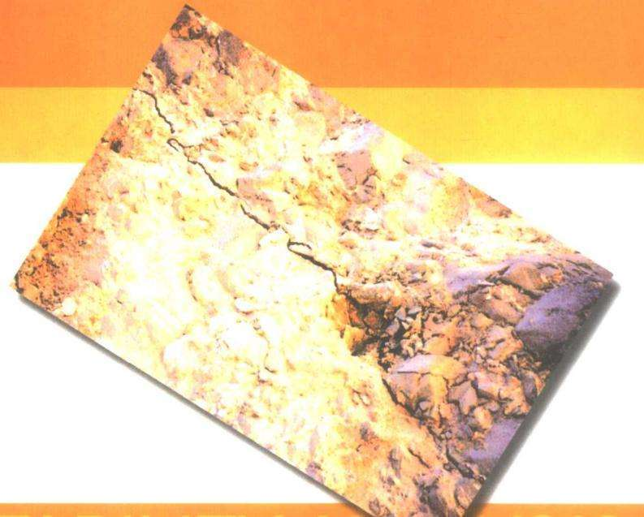

SOIL SLOPE STABILITYANALYSIS

土质边坡稳定分析

原理·方法·程序

Theory Methods and Programs

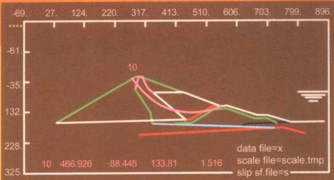

STAB边坡稳定分析程序

## 开发过程：

1976年，在北京大学DJS-60机上开发，形成我国第一个土石坝边坡稳定分析的程序，并首次在官厅水库大坝抗震加固设计中应用。

1979——1981年，在Morgenstern教授的指导下，对边坡稳定分析的Morgenstern—Price法作出了改进。并形成本程序的雏形。

1984年12月12日水利水电规范设计总院对STAB进行鉴定，正式批准为水利水电系统土石坝设计专用程序。

1995年推出STAB程序的微机版，命名为STAB95。

2003年上半年推出Windows交互式版本。

## 主要功能：

★圆弧和非圆弧滑裂面  
★瑞典法，Bishop法，陆军工程师团法，  
★ Spencer 法和 Morgenstern—Price  
★总应力法和有效应力法  
★自动搜索临界滑裂面  
★计算主动土压力  
★边坡加固分析  
★可靠度分析

www.geoeng.iwhr.com

chenzuyu@iwhr.com


ISBN 7-5084-1375-X/TV·300

定价：75.00元

# 土质边坡稳定分析

—原理·方法·程序

Theory

Methods and

Programs

## 內容提要

本书全面阐述对土质边坡进行稳定分析的原理和方法，介绍有关程序和使用说明，主要内容包括：边坡稳定分析的通用条分法及各种简化方法，使用最优化方法搜索圆弧和任意形状滑裂面的最小安全系数的原理和方法，土的抗剪强度和确定土的孔隙水压力方面的有关问题，以及有效应力法和总应力法的原理。本书讨论了对挡土墙、加筋土、土锚钉等各种边坡加固措施的设计计算方法和边坡稳定风险分析的原理和方法，并介绍边坡稳定分析程序的结构和程序设计方法，附以主要源程序。本书记载了使用STAB程序完成的13个工程的分析计算成果，同时简要介绍了作者近期开发的三维边坡稳定分析方法的原理和应用实例。

本书可供水利、水电、土建、交通、矿山等领域科研、设计和施工人员使用。

## 图书在版编目（CIP）数据

土质边坡稳定分析：原理·方法·程序/陈祖煜著.一北京：中国水利水电出版社，2003

ISBN 7-5084-1375-X

I. 土… Ⅱ. 陈… II. 土坝 － 边坡稳定性 - 分析 Ⅳ.TV698.2

中国版本图书馆CIP数据核字（2003）第000772号

<table><tr><td>书 名 作 者 出版、发行 经 售</td><td>土质边坡稳定分析一原理·方法·程序 陈祖煜著 中国水利水电出版社（北京市三里河路6号100044） 网址：www.waterpub.com.cn E-mail: sale@waterpub.com.cn 电话：（010）63202266（总机）、68331835（发行部） 全国各地新华书店</td></tr><tr><td>排 版 印 刷 规 格 版 次 印 数 定 价</td><td>中国水利水电科学研究院岩土工程研究所 北京市兴怀印刷厂 787×1092毫米 16开本 35.75印张 848千字 2003年1月第一版2003年1月第一次印刷 0001—2600册</td></tr></table>

凡购买我社图书，如有缺页、倒页、脱页的，本社发行部负责调换版权所有·侵权必究

## 序 言

滑坡是一种常见和重大的自然灾害。每年，滑坡和泥石流都要给人民生命财产带来巨大的损失。滑坡同时也对许多工程建设造成严重影响。就我所熟悉的水利水电建设而言，库区、坝区滑坡事故多次发生，造成重大经济损失和人员伤亡。我国主要的水电宝藏多位于西南、西北等地区的高山深谷之中，自然条件复杂。宏伟的南水北调工程的西线也将跨越地质条件极为恶劣的高山大川。瞻望前程，要开发这些水利水电资源，攻克高边坡稳定难关将是一个突出的问题。

和一系列的科学技术问题相比，边坡问题是个古老和普通的问题，似乎排不上“高、精、尖、新”之列。但现实的情况是：不仅建国以来，在水利、水电、铁道、公路、建筑各工程领域中滑坡事故成为最常见的、重要的自然灾害，而且要及时预报、合理分析、妥善处理还存在着很多问题与困难，我们决不能掉以轻心。今后随着大型工程建设日益增多，高边坡问题也将愈加突出。

为研究解决边坡失稳问题，我国科学家和工程师们做了长期努力，取得显著成就。陈祖煜同志就是有代表性的一位。他长期从事边坡稳定的科学研究和工程咨询工作，积累了丰富的经验。现在，他将自己的学术成果和工程经验系统地整理成书，这是一件很有意义的工作，弥足珍贵。在这里，我想写一点我对作者的一些印象。

我初次和陈祖煜同志相识，是1983年我在水利水电规划设计院工作的时候。当时，我正在组织开发“水工建筑物设计专用程序包”。陈祖煜刚从加拿大留学回来。在讨论会上，他向我们介绍了经过他和摩根斯顿教授改进的边坡稳定分析的程序。他对边坡稳定分析方法所做出的重大改进以及相应程序的先进性，引起了我的极大兴趣。我把他的工作和另一位孙君实同志的工作列为会议的两大收获，全力支持，并将这些程序纳入我们的“软件包”。后来他开发的 STAB程序在水规院组织的黄山会议上通过审查鉴定，作为土石坝设计专用程序之一在水利水电系统获得了推广应用。从那时至今二十年中，我们一起经历了我国水利水电事业前所未有的建设高潮。我看到了他在学术研究、工程咨询和程序开发、推广等方面一步一个脚印前进的步伐。使我对他的工作和为人有了较深的印象。

陈祖煜同志给我的第一个印象是一位不谋名利、以事业为唯一目标的研究人员。他献身于边坡稳定领域的研究，孜孜不倦，锲而不舍，数十年如一日。正是在这种精神支持下，才取得一个又一个的成果。

$$
i ] \zeta + v _ { i } / \downarrow 2
$$

本书介绍的通用条分法、自动搜索临界滑裂面的方法、土压力计算、风险分析以及三维分析方法，都有作者独到的见解和创新点。1984年，组织上为了培养年轻班子，特任命他担任水利水电科学研究院副院长。他却因行政职务影响科研工作苦恼，在1989年坚决辞去了行政领导职务，转而在清华大学黄文熙教授指导下攻读博士学位。我作为他的博士论文答辩委员会主任，曾仔细审阅了他的论文。我在评审意见中写道：“本论文既有理论高度，又有实用意义，是一篇极为优秀的学位论文，已达到国际先进水平”。我自信这一个评价是恰如其分的，这一点可以从他在国内、外重要学术刊物中发表的许多论文和引用记载中得到证明。我们国家是多么需要这样的‘学术迷’和工作迷’啊。

陈祖煜同志的第二个特点，是十分重视将研究成果用于解决工程建设中的难题，而不是做学院式的研究，以发表论文为唯一目的。书中介绍的三峡、小浪底左岸、宜兴抽水蓄能电站上池坝基的抗滑稳定问题，我都经历过，有关的分析成果确实为工程决策提供了重要的科学依据。可以说，在“生产依靠科研，科研面向生产”的原则上，他是贯彻得很好的一位。

我还高兴地看到他所开发的高水平的边坡稳定分析程序STAB在过去的十几年获得了广泛的应用，成为水利水电系统许多单位工程设计的工具。黄山会议的纪要中要求编制单位提供源程序，并由水总计算中心制订推广应用工作的具体办法。我当时还怕有些作者不愿意发表。现在，这部分源程序不仅已在本书中全部发表，而且配以详细的原理说明和例题。这对进一步推广岩土工程软件，提高设计工作效率和准确性是十分有益的。

最后还想呼吁一下，高边坡的研究，不仅是一颗难啃的硬果，而且不会为研究者本人或单位带来多少“经济效益”，它的贡献是反映在工程安全和进度上，也就是说是反映在对国家、社会、和人民负责的社会效益上的。所以我对在市场经济冲击下仍能坚忍不拔地进行学术研究的同志表示由衷的敬意。目前，有关研究工作虽已取得重要成就，但征途仍长（尤以岩质边坡为甚)，我盼望有关部门能继续支持他们的工作，并祝他们在今后的战斗中取得更大的成就。

中国科学院院士

中国工程院院士

潘家争

2002年12月5日北京

## 目 录

序言  
第1章绪言………………………………………………………………………1  
1.1 滑坡灾害………………………………………………………………………1  
1.2土质边坡中发生的滑坡……………………………………………2  
1.3边坡稳定分析……………………………………………15  
1.4本书的主要内容和结构………20  
参考文献…… 1  
第2章边坡稳定分析的通用条分法………23  
2.1 边坡稳定分析极限平衡法的基本原理………………23  
2.2 静力平衡方程的普遍形式及其解………25  
2.3静力平衡方程的数值解…………27  
2.4与条分法有关的一些基本问题的讨论…………………32  
2.5 关于通用条分法理论问题的讨论…………………………41  
2.6本章附录……………………56  
参考文献………………………………64  
第3 章 边坡稳定分析的简化方法…………………………………………67  
3. 1 概述………………………………67  
3.2 瑞典法………………67  
3.3 毕肖普简化法………………………………68  
3. 4 滑楔法 ……………………………………………………69  
3.5 斯宾塞法（Spencer 法）……………………………………………71  
3.6 简化法………………………71  
3.7 各种方法和简化处理对计算精度的影响………72  
3.8本章附录………………………………………………………………………………………82  
参考文献………84  
第4章确定最小安全系数的最优化方法………87  
4.1概述…… 7  
4.2 任意形状滑裂面的模拟和目标函数的确立……89  
4.3 模式捜索法………………………………………………………………………91  
4. 4牛顿法………………………………………97  
4.5 确定整体极值的随机捜索方法…………………104  
4.6应用实题……………………………………………………………………………………………………………………………………………109  
4.7非数值方法……………………………………………113  
4.8本章附录…………………………… 119  
参考文献……………………………………………119  
第 5 章土的抗剪强度………………………………………………………………121  
5.1 土的抗剪强度理论的简要回顾…………………121  
5.2 粘性土的强度理论及强度指标……………123  
5.3 抗剪强度试验……………………………………………………………127  
5.4 残余强度………………………136  
5.5 粘性土的饱和不排水强度-稳定分析的总应力法……140  
5.6 循环荷载作用下土的总强度………146  
5.7无粘聚力土的非线性强度指标………147  
参考文献…………………………………149  
第6 章土的孔隙水压力…………………………………………………151  
6.1概述…… …151  
6.2 粘性土的孔隙水压力系数………………151  
6.3 确定孔隙水压力的理论和方法…………152  
6.4 确定土石坝各运用期孔隙水压力的经验方法…………………167  
参考文献…… …178  
第7章土石坝各运用期的稳定分析……………181  
7.1前言……………… …181  
7.2 施工期…………………181  
7.3 稳定渗流期…………………………………………………………………………185  
7.4 库水位骤降期……………………………………………………………………187  
7.5 地震荷载作用下坝坡的稳定分析…………………192  
7.6本章附录…………………………………… 196  
参考文献………………………………………………………………………… 196  
第8章边坡加固稳定分析………………197  
8.1 前言……… …197  
8.2 支挡结构的主动土压力计算…………………199  
8.3 抗滑桩加固的边坡稳定分析…………215  
8.4 内部加固边坡的稳定分析……………………224  
8.5 本章附录…………………………………………………235  
参考文献…………………………………………236  
第9章有限元法在边坡稳定分析中的应用……………239  
9.1概述……… …239  
9.2 求解渗流和应力、应变控制方程的有限元方法………239  
9.3 建立在滑裂面应力分析基础上的边坡稳定有限元分析………254  
9.4 建立在强度缩小有限元分析基础上的边坡稳定分析 …………261  
参考文献……… …272  
第10 章 边坡稳定的可靠度和风险分析…………………… 273  
10.1 边坡稳定的风险分析………………………………………………273  
10.2 可靠度分析基础…………………………………………………………………… 284  
10. 3 蒙特卡洛法（Monte Carlo Method) …………………………………… 292  
10.4 次二阶矩法………………… 294  
10.5 自动捜索最小β值 ……………………………………………………305  
10.6 岩土材料的变异特征和统计参数……… 306  
10.7 工程实际应用实例………………………………………………………… 319  
10.8 讨论和结论………………………………………329  
10.9 本章附录………………………… 330  
参考文献………………332  
第11章 程序设计…………………………………………………………………… 335  
11.1 前言……………335  
11.2 几何图形的识别和分析………………………………………… 336  
11.3 边坡稳定分析的源程序………………… 339  
11.4 边坡稳定分析程序的考核……… 364  
11.5 本章附录…………… 375  
参考文献…………376  
第 12 章 程序使用说明………………………………………………………… 377  
12.1 程序开发过程………………………………………………………………… 377  
12.2 数据处理…………………………………………………………………………… 377  
12.3 数据文件的格式……………………………………………………………… 392  
12.4 数据文件变量说明……………………………………………………… 400  
12.5 例题目录………………… 407  
12.6例题…407  
12.7 程序的安装和运行…………………………………………… 458  
12.8 本章附录……………………………… 461  
参考文献……………462  
第13 章 工程案例………………………………………………………………………… 463  
13.1 蒲城电厂张家沟灰坝………………………………………………………463  
13.2 公伯峡水电站堆石坝……………………………………………………… 466  
13.3 小浪底水利枢纽大坝…………………………………………………… 470  
13.4 三峡工程3 坝段坝基深层抗滑稳定分析……… …473  
13.5 小浪底库岸河岸边坡稳定分析………  
13.6 宜兴抽水蓄能电站上池…… …491  
13.7 紫坪铺水库左岸堆积体……  
13.8 徐村水电站溢洪道边坡 ………………………………502  
13.9 天生桥厂房高边坡……… …507  
13.10 乌鲁瓦提面板堆石坝 ………  
13.11 黄河三盛公水利枢纽拦河闸……515  
13.12日照电厂蔡家滩灰场挡灰堤……  
13.13 紫坪铺工程2#导流洞出口滑坡稳定分析……522  
13.14 本章附录…… …531  
第14章 三维极限平衡分析方法 …533  
14.1概述…… …533  
14.2 水科院三维极限平衡分析方法的理论框架………542  
14.3 静力平衡方程式和求解步骤…… …543  
14.4 验证…… ……545  
14.5 应用实例…… ……547  
14.6 讨论和结论……… ……559  
参考文献 …559  
ABSTRACT

## 第1章 绪 言

## 1.1 滑坡灾害

滑坡是一种重要的地质灾害，对人类的生命财产带来重大威胁。例如滑坡可导致交通中断，河道堵塞，厂矿城镇被掩埋，工程建设受阻。

表1.1统计了上世纪世界上的一些重大滑坡灾害的实例（王恭先，1998）。从中可以发现，一些规模较大的滑坡，如意大利的瓦依昂滑坡，死亡人数达几千人。中国宁夏海源及秘鲁Yungay个别特大滑坡灾害的伤亡人数均以万计。另外由于滑坡堵塞河道，形成天然水库，而这些水库又没有溢洪道，通常会在短期内溃决，形成特大洪水，由此导致更大的灾害。

我国目前正处于经济建设高速发展的时期。滑坡给水利、铁路、公路、矿山建设带来巨大损失。1989年1月10日在中国云南漫湾水电站大坝坝肩开挖过程中发生的滑坡，不仅耗资近亿元进行了治理，而且使这个150万kW的水电站推迟发电近一年，给云南省经济建设的整体安排带来了困难。1981年雨季宝成铁路共发生滑坡289处，中断行车2个多月，抢建费用达2.56亿元。抚顺西露天矿自1914年投产以来，为保持边坡稳定，共剥离岩石1亿m³。

滑坡可以发生在土质边坡，也可能发生在岩质边坡。发生于土质边坡的形态通常比较单一，基本上以剪切破坏为主，滑裂面为圆弧型或圆弧与夹泥层的组合型。岩质边坡发生的滑坡则因受岩体结构、地应力等影响，呈现出崩塌、滑动、倾倒、溃屈等多种破坏类型(孙广忠，姚宝魁，1988)。

触发滑坡的因素是多种多样的。降雨和地震是最常见的滑坡灾害的外因。人类的工程活动也是导致滑坡的重要原因。常见的工程活动是边坡开挖，地下开挖也会触发地面沉降和滑坡。湖北盐池河磷矿由于地下开挖导致边坡突然滑坡，埋没了村庄，287人丧生。土方填筑也是导致滑坡的一个重要因素，在饱和软弱地基上修建堤坝，经常导致堤坝和地基一起滑动。高填方本身也会在填筑过程中发生滑坡。水库蓄水后库区经常发生大规模的崩岸和滑坡。

人类与滑坡灾害作斗争的努力始终没有中断过。这一努力表现在认识滑坡机理、完善边坡稳定分析理论和方法、开发滑坡治理技术和滑坡预报等方面。对滑坡灾害认识的不断深化是建立在地理、地质和岩石力学、土力学等一系列科学分支的形成、发展和完善的基础上的。而滑坡预报和治理又是围绕着确保人身安全和经济建设顺利开展这一中心进行的。只有在诸多领域内共同开展深入的研究，人类才有可能在防治滑坡方面取得重大进展。

本章简要回顾土质边坡的滑坡灾害以及边坡稳定分析理论体系形成的过程。

表1.1 世界重大滑坡灾害实例
<table><tr><td>国家，地区</td><td>日期</td><td>滑坡类型</td><td>灾害</td></tr><tr><td>爪哇</td><td>1919年</td><td>泥石流</td><td>5100人死亡，140个村庄被毁</td></tr><tr><td>中国，宁夏海源</td><td>1920年12月16日</td><td>黄土流</td><td>约20万人死亡</td></tr><tr><td>美国，加利福尼</td><td>1934年12月31日</td><td>泥石流</td><td>40人死亡，400间房子被毁</td></tr><tr><td>亚 日本，久礼</td><td>1945年</td><td></td><td>1154人死亡</td></tr><tr><td>日本，东京西南</td><td>1958年</td><td></td><td>1100人死亡</td></tr><tr><td>秘鲁，Ranrachirca</td><td>1962年6月10日</td><td>冰和岩石崩塌</td><td>3500多人死亡</td></tr><tr><td>意大利，瓦依昂</td><td>1963年</td><td>岩石滑坡进入水 库</td><td>约2600人死亡</td></tr><tr><td>英国，Aberfan</td><td>1966年10月21日</td><td>流动滑坡</td><td>144人死亡</td></tr><tr><td>巴西，Rio de Janeiro</td><td>1966年</td><td></td><td>1000人死亡</td></tr><tr><td>巴西，Rio de Janeiro</td><td>1967年</td><td></td><td>1700人死亡</td></tr><tr><td>美国，弗吉尼亚</td><td>1969年</td><td>泥石流</td><td>150人死亡</td></tr><tr><td>日本</td><td>1969年-1972年</td><td>各种灾害</td><td>519人死亡，13288间房被毁</td></tr><tr><td>秘鲁，Yungay</td><td>1970年5月31日</td><td>地震引起碎屑崩</td><td>25000人死亡</td></tr><tr><td>Chungar</td><td>1971年</td><td>塌、碎屑流</td><td>259人死亡</td></tr><tr><td>香港</td><td>1972年6月</td><td>各种灾害</td><td>138人死亡</td></tr><tr><td>日本，Kamijima</td><td>1972年</td><td></td><td>112人死亡</td></tr><tr><td>意大利南部</td><td>1972年-1973年</td><td>各种灾害</td><td>约100个村庄被毁，影响20万人</td></tr><tr><td>秘鲁，Mayuamarca</td><td>1974年</td><td>泥石流</td><td>镇被毁，451人死亡</td></tr><tr><td>秘鲁，Mantaro峡</td><td>1974年</td><td></td><td>450人死亡</td></tr><tr><td>谷 Semeru山</td><td>1981年</td><td></td><td>500人死亡</td></tr><tr><td>秘鲁，Yacitan</td><td>1983年</td><td></td><td>233人死亡</td></tr><tr><td>尼泊尔西部</td><td>1983年</td><td></td><td>186人死亡</td></tr><tr><td>中国，东乡县洒</td><td>1983年</td><td>黄土滑坡</td><td>4个村被毁，227人死亡</td></tr><tr><td>勒</td><td></td><td></td><td></td></tr><tr><td>哥伦比亚，Armero 土耳其，Catak</td><td>1985年11月 1988年6月</td><td>泥流</td><td>约22000人死亡 66人死亡</td></tr></table>

## 1.2 土质边坡中发生的滑坡

## 1.2.1 天然边坡

在天然边坡中发生的山体滑移，通常没有人类活动、降雨、地震等明显的触发因素。此类滑坡多呈现渐进性破坏特征。触发滑坡的主要因素为滑带土由峰值强度向残余强度的过渡。1983年3月17日17时45分发生于甘肃洒勒山的滑坡是一个典型的实例（见图1.1）。滑坡处于甘肃东部黄土高原。滑带是由临夏组黑灰色粘土岩演变的 5\~20cm的夹层组成，矿物成分以蒙脱石为主。滑坡于1979年9月起动，当时在北坡发现宽约10cm的东西向的裂缝，自1982年10月至12月开始进入挤压滑移阶段，最终于1983年3月进入剧变和滑动阶段。滑坡体积5000m3，摧毁4个村庄，227人死亡。

在高山峻岭中通过的河道通常为滑坡提供了理想的临空面。因此在天然边坡的滑坡中，河道滑坡占了相当大的比例。1943年2月7日在甘肃共和县的查纳滑坡是发生于西北黄土半成岩地区的一次规模巨大的灾害（见图1.2)。滑体总量达1.27亿m³，滑速达40m/s，100 $\mathbf { m } ^ { 3 }$ 余人遇难，黄河曾短期断流。查纳滑坡发生在早、中更新世内陆湖相沉积的半成岩土中。此类超固结土的材料强度试验呈明显的应变软化特征，“似岩非岩，似土非土”，构成了一个典型的渐进型破坏高速滑动的条件。

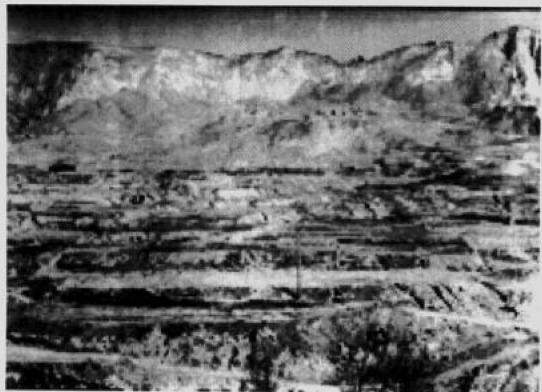  
图 1.1 洒勒山的滑坡

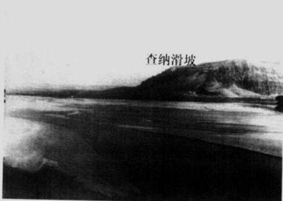  
图 1.2 查纳滑坡

1985年6月12日凌晨，在长江西陵峡上段兵书宝剑峡出口新滩镇发生总方量0.2亿 $\mathbf { m } ^ { 3 }$ 高度达800m的滑坡。这是一个成功地实现滑坡预报的例子，1371人在滑坡前数小时安全撤离。

1967年6月8日，在雅砻江发生的唐古栋滑坡以其巨大的规模载入历史纪录(见图1.3)。失稳边坡高达1000m。滑坡材料为风化残积土。滑坡体总方量为0.68亿m³，堵塞河道后形 $\mathbf { m } ^ { 3 }$ 成一个高达335m的大坝，库容6.8亿 $\mathbf { m } ^ { 3 }$

唐古栋滑坡将河道堵塞9天后天然坝决口，洪水以39m高的立波形式冲向下游，洪峰流量为 5300 m³/s (Chen, 1992)。

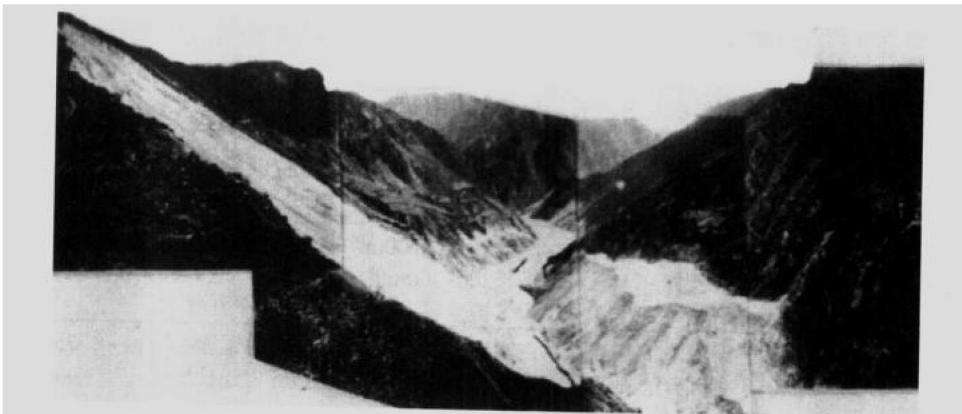  
图 1.3 雅碧江唐古栋滑坡

## 1.2.2 工程边坡

滑坡是土木、水利、交通、矿山等基本建设工程常见的事故和灾害。工程开挖和填筑是导致滑坡的两大主要原因。

## 1. 开挖边坡

1985年12月24日下午3时，天生桥二级水电站首部右侧挡土墙施工时发生滑坡（见图1.4)。虽然坡高仅30m，但导致了正在基坑内施工的48人丧生。这一滑坡的主要原因是坡内存在一层饱和软粘土。第4章将以此为实例介绍滑坡稳定分析的方法。

天生桥二级水电站电站厂房高边坡在开挖时也触发了一个规模较大的滑坡。滑体沿向斜的夹泥层以7.8m/日的速率移动。曾采用卸荷、排水、抗滑桩和预应力锚索等多种手段来治理这一滑坡。第13章13.9节详细介绍了对这一边坡进行加固过程中所作的稳定分析。

铁路、公路边坡由于大部分为明挖，滑坡通常是路堑建设的重要制约因素。表1.2列出了福建省高速公路施工时发生的主要滑坡（姚国芳，2002）。图1.5示1992年宝成铁路K190段滑坡全貌。

表1.2 福建省高速公路主要滑坡工点一览表
<table><tr><td>路段 名称</td><td>滑坡地点</td><td>性质</td><td>规模</td><td>处理措施</td><td>工程投资 (元)</td></tr><tr><td>福泉高边坡</td><td>石牌山高 速公路 官秀互通</td><td>堆积层滑坡 古滑坡复活（堆积 层滑坡）</td><td>边坡高约40余m 宽150m，长150m，</td><td>明洞（约100m） 两排抗滑桩，辅以抗</td><td>约800万 约600万</td></tr><tr><td>漳龙高滑坡 速公路 岩段</td><td>滑坡 新祠互通</td><td>顺层滑坡（石英砂 岩+泥岩）</td><td>厚度约10~20m 高度约70余m，宽度 约100m，厚度约 10~15m</td><td>滑挡墙和排水平孔等 改线</td><td></td></tr><tr><td rowspan="2"></td><td>坡</td><td>K67+995滑破碎岩（石英砂岩） 滑坡</td><td>高度约100余m，宽 度约70m，厚度约 10~15m</td><td>预应力锚索地梁+土 钉+挂网喷射混凝土</td><td>约350万</td></tr><tr><td>980</td><td>K63+770~+堆积层（古崩坡积 层）滑坡</td><td>高度约200余m，宽 度约160m，厚度约 15~20m</td><td>预应力锚索抗滑桩+ 抗滑挡墙+排水平孔</td><td>约350万</td></tr><tr><td rowspan="2">漳龙高 速公路 和溪段</td><td>780</td><td>K64+670~+古滑坡复活（崩坡 积体）</td><td>高度约110余m，长 度度约200m，具多 级次滑动面</td><td>预应力锚索框架+抗 滑挡墙+排水平孔</td><td>约350万</td></tr><tr><td>K64+960 稳</td><td>古崩坡积层开挖失</td><td>边坡高度约20余m， 滑坡体宽度约60m， 长度约80m</td><td>滑坡刚产生变形，就约70万 采用预应力锚索框架 原位锁定，并辅以排</td><td></td></tr><tr><td>福宁高 速公路</td><td>八尺门互 通滑坡</td><td>古滑坡体复活（松 散堆积体）</td><td>沿线展宽约500m， 纵长200~300m的古 滑坡群</td><td>水平孔 及时采用预应力锚索 5000万 框架+预应力锚索抗 滑桩+平孔排水</td><td></td></tr><tr><td rowspan="2">三福高 速公路 滑坡</td><td>梅列互通 滑坡</td><td>一个古滑坡复活， 一个破碎岩石高边 坡滑坡</td><td>古滑坡体约5万m³， 边坡高约70m，滑坡 预应力锚杆地梁 体厚度约25~35m</td><td>预应力锚索抗滑桩+ 预应力锚索框架+抗 滑挡墙</td><td>250万 +1000万</td></tr><tr><td>西芹桥头</td><td>古滑坡复活（泥岩 及泥质粉砂岩）</td><td>边坡高度约60m，长预应力锚索框架+预 度约300m</td><td>应力锚索抗滑桩+抗 滑挡墙+平孔排水</td><td>约1100万</td></tr></table>

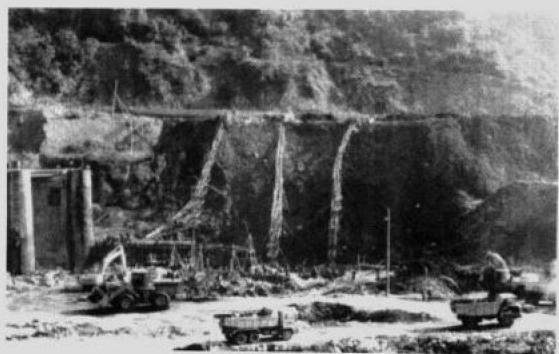  
图 1.4 天生桥二级电站闸首滑坡

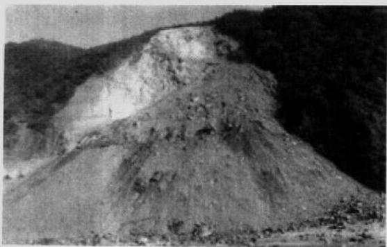  
图 1. 5 宝成铁路 K190 段滑坡

## 2. 填筑边坡

在饱和软粘土上修建堤坝，当施工速率较高时，经常会发生滑坡。图1.6为2001年长江大堤江西马湖段软弱地基上发生的一个滑坡。

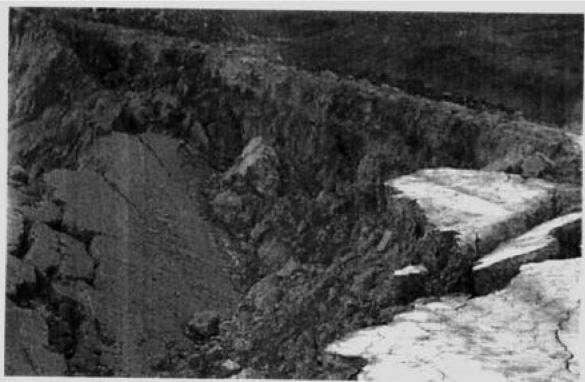  
图1.6 长江大堤江西马湖滑坡

饱和粘土通常压缩性很大，而渗透系数很小，填土增加的地基应力要完全转化为有效应力，必须将地基中的水充分挤出。如果施工速率过快，则孔隙水压力无法及时消散，导致有效应力有可能随荷载的增长而同步增长，因而诱发滑坡。为了保证在软基上修筑坝的稳定性，常需要采取一定的工程措施。例如通过砂井、塑料板排水或真空预压等技术加速水压力消散。

填筑土本身在施工速率较快时也会发生滑坡。这是由于填筑土的含水量通常已使粘土的饱和度超过90%。进一步的填筑会使粘性土的孔隙水压力快速增长，导致堤坝施工期的滑坡。

## 1.2.3 地质环境边坡

将滑坡与工程地质环境直接有关的边坡称为地质环境边坡。分述如下。

## 1. 地震诱发的滑坡

地震是诱发滑坡的重要因素。在我国，有关地震引起的滑坡可以在4000年前的记载中找到。“竹书记年”记载公元前1767年在河南发生的一次地震：“桀十年，五星错行，夜星陨如雨，地震，伊洛竭”。自公元前780年到1976年，文献记载了656个大于6级的地震。公元前780年的一次文献记录了地震诱发的滑坡：“同幽王二年，泾、渭、洛三川皆震，川竭，岐山崩。”1718年，甘肃通渭发生7.5级地震，40000人丧生。1920年11月16日海源地区8.5级地震触发了675个高原地区的滑坡，形成了40个天然湖，其中27个目前仍然存在。

1970年5月31日下午3时23分，距秘鲁海岸130m处发生7.7级地震，导致安第斯山脉中海拔6654m的 Nevados Huascaran 山体发生总量为 0.5\~1亿 $\mathbf { m } ^ { 3 }$ 的滑坡，山体向前推进16km，覆盖了22.5km²的面积，掩埋了Ranrahirca和 Yungay 两个村庄，18000人丧生。

1911年发生于塔吉克斯坦境内的地震形成了一个库容达11亿 $\mathbf { m } ^ { 3 }$ 的 Sarez 湖 (Palmieri,2000; Schuster,2002)。滑坡体积 22 亿 $\mathbf { m } ^ { 3 } ,$ 天然坝长2km，高600m。这一坝高远远超过了人类建造的土石坝的世界纪录 $( \mathcal { Y }$ 贡，330m，也在塔吉克斯坦)。图1.7示该大坝和Sarez湖。

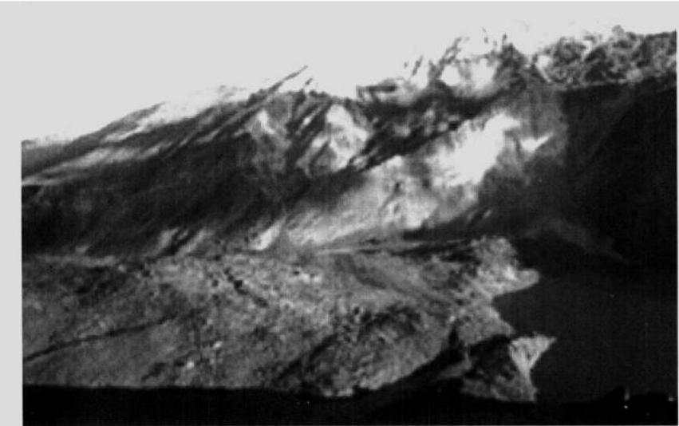  
图 1.7 塔吉克斯坦由地震形成的 Sarez 湖

表1.3 总结国内外由地震诱发的重大滑坡(Hansen, 1991)。同表1.1和表1.2一样，它也不是此类滑坡全面的总结。

1990年6月20日伊朗Caspian省发生7.3级地震。震中附近出现多处滑坡，其中Galdian滑坡总方量达 $2 0 \times 1 0 ^ { 6 } \mathrm { m } ^ { 3 }$ ，坡面长达3km。滑坡后出现若干天然湖泊，说明地震和滑坡导致了水文地质情况发生了根本的改变。

图1.8示1995年1月17日发生在日本的阪神地震诱发的滑坡数目和与活断层的关系(Sassa,1995)。

地震时发生的砂土液化是导致滑坡的主要原因。受1976年7月28日唐山地震波及，北京密云水库白河大坝上游坝坡发生滑坡。类似的实例还有发生在1925年6月29日美国Sheffield坝的滑坡。

## 2. 古滑坡体和堆积体边坡

古滑坡体和堆积体的复活是土质边坡中发生的又一种滑坡，它通常和人类活动有关。

表1.3 国内外由地震诱发的重大滑坡灾害
<table><tr><td>日期（年）</td><td>国家，地区</td><td>滑坡类型或伤亡原因</td><td>死亡人数</td></tr><tr><td>公元前1789</td><td>中国，甘肃武都</td><td>岩石滑坡和泥石流</td><td>760</td></tr><tr><td>公元前372-73</td><td>希腊</td><td>整个城市冲向海洋</td><td>无记载</td></tr><tr><td>1348</td><td>澳大利亚</td><td>岩石滑坡</td><td>人员伤亡巨大</td></tr><tr><td>1718，震级M=7.5</td><td>中国，甘肃通渭</td><td>黄土滑坡</td><td>&gt;40000</td></tr><tr><td>1783</td><td>意大利，Calabra</td><td>多数为液化导致的滑坡</td><td>整个村庄</td></tr><tr><td>1786，震级M=7.5</td><td>中国，四川康定-沪定</td><td>滑坡形成的天然坝溃决</td><td>死于洪水</td></tr><tr><td>1856</td><td>中国，四川钱江</td><td>岩石滑坡</td><td>&gt;1000</td></tr><tr><td>1870</td><td></td><td>岩石滑坡</td><td>&gt;2000</td></tr><tr><td>1920</td><td>中国，宁夏海源</td><td>黄土滑坡</td><td>&gt;100000</td></tr><tr><td>1933，震级M=7.5</td><td>中国，四川叠溪</td><td>一个滑坡导致576人丧生，6800人死于地震，滑</td><td></td></tr><tr><td></td><td></td><td>坡形成的天然坝溃决导致超过2429人死亡</td><td></td></tr><tr><td>1935</td><td>中国，四川惠利</td><td>岩石滑坡和泥石流</td><td>250</td></tr><tr><td>1931</td><td>秘鲁</td><td>岩石滑坡</td><td>&gt;18000</td></tr></table>

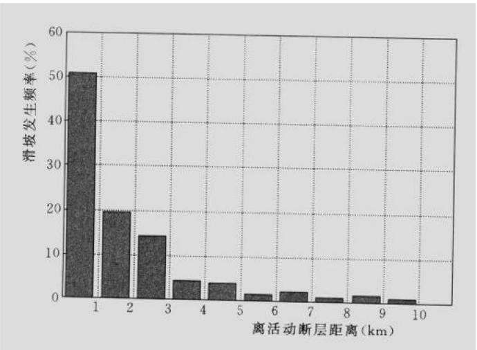  
图1.8 日本阪神地震滑坡数目和与活断层的关系

我国南方地区普遍发育坡崩堆积体，此类物质是和在漫长的地质历史中发生的山体不稳定活动有关。在堆积体和基岩之间多存在夹泥层，许多卧于基岩面上的第四纪堆积物都可能是古滑坡体，也可能是坡崩堆积体。无论何种类型，这一第四纪物质形成的边坡多处于临界状态。降雨和工程活动都可能触发这些山体滑坡，即使没有明显的外界触发因素，也会发生渐进性破坏。

紫坪铺水利枢纽工程2号导流洞出口边坡在开挖过程中曾触发坡堆积体的滑坡，在一个月内发生的几次滑坡不仅严重干扰了工程施工，而且短期封闭了通往九沟寨国道。

水电建设中发生的另一堆积体滑坡的例子为位于云南省昭通地区大水沟水库工程。这一面板坝的溢洪道中部分布有5\~15m厚的崩塌坡积物，其主要成分为粘质、粉质土砾。粒径变化较大，结构松散。崩塌坡积体与基岩交接面处分布有厚约0.5\~1m的残积层，主要成分为泥质及岩屑，塑性较大，强度较低。在2002年7月17日开始，施工单位进行溢洪道边坡开挖的准备工作。此时适逢雨季，几乎每日均有雷阵雨。随后即在边坡上发现上部出现大面积裂缝，顶部有两条较大的裂缝，一条出现在高程1210m附近，另一条在1230m高程附近。裂缝宽度可达10\~15cm，呈弧形分布。裂缝产生区域在桩号0-100m至0+020m，累积变形量分别为108mm和113mm。

这两个工程实例还将在第13章中介绍。

在进行工程建设时，当怀疑某第四纪覆盖层是由坡崩堆积体构成时，则需要通过各种勘探手段（钻探，平硐，物探等）了解第四纪堆积体与基岩的接触面的几何形态，查明接触面的物质组成和抗剪强度指标，以正确评价开挖和降雨对这些潜在不稳定边坡的影响。

## 3. 特殊土边坡

由黄土、膨胀土等特殊土构成的边坡可能导致特殊的边坡稳定问题。第1.2.1节介绍的洒勒山、查纳滑坡的主要物质是黄土，但是，滑面则是半岩的粘土，为典型的超固结土，因而具有应变软化特性。

黄土高原地形地貌复杂，分为土塬、梁、峁三种地形，为地质作用的产物。黄土具有颗粒粗、土质结构疏松，孔隙率大，遇水崩解，湿陷等特点。在微结构方面，多呈垂直裂隙形态。黄土边坡经常受到河谷冲沟侵蚀、切割，临空条件远比其它边坡明显。遇降雨后，水很容易在垂直方向渗入边坡底部。而我国黄土通常下卧一层不透水的红层粘土，一旦渗流达到此层后即开始滞水，导致湿陷和浸润线大范围抬高，最终导致滑坡。

我国西北地区黄土高原是黄土边坡崩塌和滑坡的多发区。据陕西省滑坡办对1985至1993年间黄土崩塌、滑坡事件统计，省内总计有62处黄土崩塌、滑坡事故，造成伤亡者32处，共死亡285人（李坤，1998）。

在下一节，还将简要回顾黄土地区的泥石流灾害。

## 1.2.4 水环境边坡

水是诱发滑坡的主要因素。我们的祖先将“滑”字赋以水的偏旁足以说明这一点。由水环境触发的滑坡，大致可分为以下几种。

## 1. 暴雨触发的滑坡

暴雨是导致滑坡和泥石流的主要触发因素。

我国西南、西北是泥石流多发地区。1982年7月四川万县地区普降暴雨，仅云阳县就发生滑坡2万多处，并形成数百处较大规模的裂缝。忠县在此期间形成滑坡及崩塌多达3万多处，其中大中型滑坡30余处。暴雨诱发的滑坡仅云阳县就毁坏房屋数万间，总方量超过0.1亿m³的滑坡10余处。1981年雨季宝成铁路宝鸡至广元段共发生滑坡289处，使该路段37个区间断道32次，中断行车两个月，抢建工程费达2.56亿元。

香港处于亚热带多雨丘陵地区，人口稠密，暴雨经常触发灾难性滑坡。1925年7月17日在普庆坊地区发生的滑坡推倒了一座高挡土墙，摧毁了5座楼房，75人丧生。1966年中旬，香港地区连续普降大雨，6月11日在24小时内降雨40\~525mm，6月12日1小时降雨强度达108\~157mm，发生了数百处滑坡。1972年暴雨强度达到了新的记录。在6月16日至18日，24小时降雨强度达560mm，由此在香港岛诱发的滑坡伤亡人数达250人。其中发生于宝珊道的滑坡摧毁了一栋4层楼房，61人丧生。发生于秀茂坪的土质边坡流滑淹埋了一个楼房，71人丧生。图1.9为1972年7月18日发生在香港岛半山区的滑坡。1976年8月25日，总计416mm的降雨再次诱发滑坡，57人伤亡。1982年香港的年降雨量再创记录，达3248mm，总计发生大小滑坡1500处(Brand,1989)。

我国台湾岛台风季节经常伴随暴雨，引起滑坡、泥石流灾害。1996年7月31日至8月1日，强台风以60m/s的速度袭击台湾，12小时和24时的降雨强度达1158mm和1749mm。全岛发生1315处滑坡，20处泥石流，101条公路中断，1383座房屋被摧毁，死73人，伤453 人(Lin & Feng, 2001)。

泥石流与气象、地貌、地质特征有明显的关系，因此，常常有一些地区成为泥石流重灾区。我国云南昭通地区几乎每年都有滑坡泥石流灾害报道。1991年9月23日18时，头寨沟发生的滑坡导致 216 人丧生(Zeng, el. al, 1992)。滑坡分两个阶段，在第一阶段，处于高程2300m\~1870m的山体下滑，总计0.2亿 m³土体在坡趾处形成高 100m 的堆积物。这个堆积物随后变成泥石流，以30m/s 的速度沿10°的坡面冲出3km，停止在山口，将一村庄掩埋。

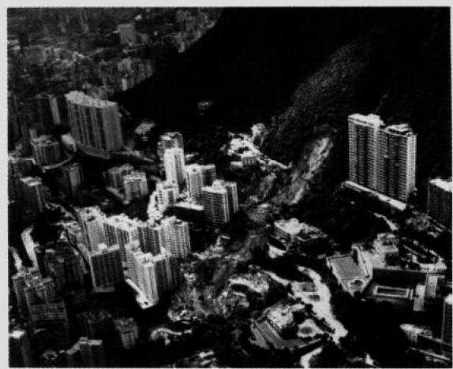  
图 1.9 1972年发生于香港岛半山区的滑坡

又如，广东省清远市东部约15km位于北江北岸的飞来寺，建于梁武帝元年（公元520年)，是岭南三大古刹之一。1997年5月8日，特大暴雨导致寺后山沟泥石流暴发，冲毁10000多平米的庙宇和一批重要文物，7名僧尼遇难，2名民工失踪。查阅史书，在嘉靖三十年(1552年）五月初一和万历丁末年（1607年）四月初五均遭受同样的灾害，书载：“大雨滂沱，山洪暴发，山崩，飞来寺被毁”(刘瑞华，1988)。

在前节已介绍，我国黄土高原是泥石流的多发区。表1.4列出了黄土高原上几处泥石流暴发时与降水要素的关系(邓养鑫，1986)。一些文献详细讨论了黄土地区滑坡泥石流的发生规律。

2000年4月9日，西藏易贡发生高达3300m的滑坡，滑坡的触发因素是春季雪山融化，因此，也属于水环境影响的滑坡（图1.10)。按高度计该滑坡大概是全世界有史书记载以来规模最大的一个。滑坡体宽2500m，总方量2.8亿m³。

修建水库后，库区可能诱发各种滑坡。发生于岩石边坡中的滑坡多呈突发性，体积较大时具有很大的破坏性。1963年10月9日，意大利高276m的瓦依昂拱坝的库区发生总方

量为2.75亿m³的超大体积滑坡，滑坡产生了一个高达260m的涌浪，在大坝处高达100m。 $\mathbf { m } ^ { 3 }$   
拱坝超载8倍。洪水以70m高的立波冲向下游，2000余人丧生。

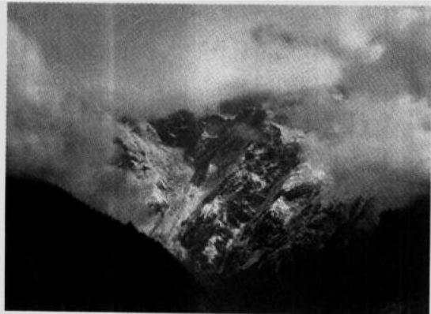  
图 1.10 西藏易贡滑坡

三峡工程库区是滑坡多发区。在工程建设中经过详细勘测，共确定了2490多处潜在滑坡体和90多条潜在泥石流沟，这不仅对工程构成潜在危害，而且也将影响库区居民的生活和生产安全。因此，共投资40亿对重点边坡进行了治理。

水库区发生于土质边坡的不稳定现象多呈现为渐变和崩塌型。鲁布格水电站建成后，库区左岸发耐村岸坡发生大范围的的滑移，为渐变和崩塌型的一个典型实例。

该滑坡材料为坡崩塌堆积体和坡积物，滑面为坡堆积体与基岩接触面。滑坡体高差90\~150m，顺河向呈长条形分布，总体积为0.26亿m³。在水库蓄水的第一年，滑坡体的垂 $\mathbf { m } ^ { 3 }$ 直和水平位移达3.0\~3.5m，最终以缓慢的速度滑入水库。

表1.4 几处泥石流暴发时的降水要素
<table><tr><td>沟名</td><td>所在地</td><td>时间 (年.月.日)</td><td>泥流 类型</td><td>一次降雨量 (mm)</td><td>降雨历时 (h)</td><td>平均雨强 (mm/h)</td></tr><tr><td>洪水沟</td><td>兰州市</td><td>1964.7.20</td><td>粘性</td><td>150.0</td><td>4.0</td><td>37.5</td></tr><tr><td>罗玉沟</td><td>天水市</td><td>1965.7.7</td><td>稀性</td><td>90.0</td><td>8.0</td><td>11.2</td></tr><tr><td>刘家湾沟</td><td>天水县</td><td>1978.7.12</td><td>粘性</td><td>105.0</td><td>2.0</td><td>52.5</td></tr><tr><td>孙家岔沟</td><td>榆中县</td><td>1980.8.8</td><td>稀性</td><td>111.6</td><td>1.2</td><td>93.0</td></tr><tr><td>肖水沟</td><td>清涧县</td><td>1971.7.23</td><td>粘性</td><td>213.0</td><td>4.0</td><td>53.3</td></tr><tr><td>韭园沟</td><td>绥德县</td><td>1956.8.8</td><td>稀性</td><td>45.1</td><td>2.4</td><td>18.8</td></tr></table>

## 2. 水库水位骤降诱发的滑坡

由于种种原因，水库需要持续放水。库水位骤降导致的坝坡失稳事例屡见不断。表1.5总结了我国12个典型的事例，现对三个库水位骤降引起的坝坡失稳作一简要介绍（汝乃华，牛运光，2001)。

(1)江西省七一水库。七一水库埋管坐落在泥质页岩、风化砂岩和坚硬石英砂岩等三种不同的岩基上。由于坝身施工质量较差，投入运行后，先后出现三条环形裂缝，成为坝体内的一大隐患，因此，决定废弃此坝内埋管，于1970年10月在坝右岸山体内另开引水隧洞。因采用岩塞爆破，无法控制库水位的降落速度。当时库内水位80.03m，平均降速为1.15m/d，最大达1.954m/d。至11月19日，库水位降至69.07m时，左坝段上游面发生滑坡，其中心桩号为0+241m（见图1.11），滑坡体宽约148m，滑弧半径约为133.5m，中心角约56.5°。11月 23日，库水位继续下降到64.15m时，右坝段上游面相继滑坡，其中心桩号为0+083m，滑坡体宽约115m，滑弧半径约66m，中心角为71.5°。11月27日库水位降至 58m时，左坝段第一次滑坡边缘继续下滑，滑坡前沿又向上游推移20余米。总降幅为22.03m。滑坡量左岸约30万m³，右岸约20万m³。

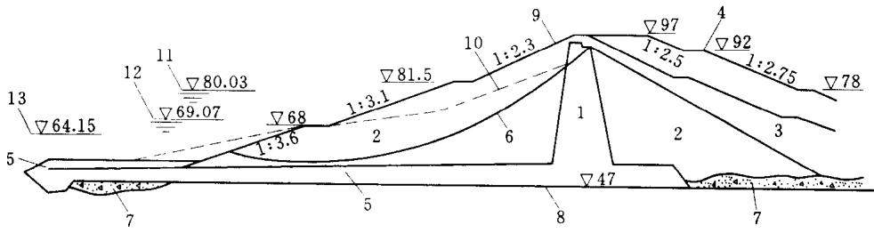  
图 1.11 江西省七一水库坝坡失稳  
1-心墙；2-风化土；3-风化土石：4-加高后下游坡；5-带截水槽的铺盖；6-推测的滑动面；7-沙砾石；8-页岩石英砂岩互层：9-滑坡前坝面：10-滑坡后坝面；11-始降水位；12-左岸滑坡时水位；13-右岸滑坡时水位

表1.5 12 座土石坝滑坡前水位降落情况
<table><tr><td>编 号</td><td>名称</td><td>放水经 历天数</td><td>滑坡前最高 蓄水位(m)</td><td>库水位下降 幅度(m)</td><td>日平均降 落水深(m)</td><td>日最大降 落水深(m)</td><td>连续放水原因</td></tr><tr><td>1</td><td>岭里</td><td>86</td><td>70.46</td><td>13.76</td><td>0.16</td><td>0.60</td><td>春灌需要</td></tr><tr><td>2</td><td>红五一</td><td>25</td><td>293.82</td><td>17.07</td><td>0.68</td><td>3.09</td><td>修理转动门盖</td></tr><tr><td>3</td><td>溪兜</td><td>16</td><td>96.20</td><td>9.70</td><td>0.60</td><td>1.80</td><td>转动门盖发生故障</td></tr><tr><td>4</td><td>九龙岩</td><td>14</td><td>99.77</td><td>9.97</td><td>0.71</td><td>1.00</td><td>冬灌需要</td></tr><tr><td>5</td><td>牛柘一级</td><td>11</td><td>41.00</td><td>18.00</td><td>1.60</td><td>4.00</td><td>转动门盖故障</td></tr><tr><td>6</td><td>廷洋</td><td>28</td><td>94.00</td><td>9.00</td><td>0.32</td><td>0.40</td><td>更换转动门盖拉绳</td></tr><tr><td>7</td><td>三溪</td><td>15</td><td>96.00</td><td>9.00</td><td>0.60</td><td>0.40</td><td>放水灌溉</td></tr><tr><td>8</td><td>将溪</td><td>7</td><td>342.30</td><td>11.00</td><td>1.56</td><td>1.60</td><td>处理白蚁放水</td></tr><tr><td>9</td><td>坊头</td><td>43</td><td>431.80</td><td>18.80</td><td>0.43</td><td>1.80</td><td>连续放水</td></tr><tr><td>10</td><td>英雄</td><td>60</td><td>64.3</td><td>8.60</td><td>0.14</td><td>0.30</td><td>修理放水涵管</td></tr><tr><td>11</td><td>院洋</td><td>25</td><td>100.7</td><td>12.0</td><td>0.44</td><td>1.00</td><td>降低水位抓鱼</td></tr><tr><td>12</td><td>隔坑</td><td>3</td><td>溢洪道顶</td><td>12.6</td><td>4.20</td><td>4.60</td><td>闸门被冲走</td></tr></table>

(2) 湖北省狮子岩土石坝坝坡失稳。大坝为粘土心墙坝，最大坝高45m。1979年8月18 日库水位为 202.5m 时，发现大坝下游坡高程 194m平台有一股漏水流出，开始直径仅2cm，以后逐渐加大。到19日晨增加到20 cm，水色灰黄，并有细砂土粒带出。经调查系大坝隧洞内的水渗出（混凝土施工质量差所致）。为此，决定放空水库，处理隧洞。9月24日在库水位205.15m时开始放水，到12月1日库水位降落到181.2m，历时68天，共下降23.95m，平均每天降落0.35m。其中最大降速为11月26日至29日的4天，总计降幅为6.4m。随后，上游坝体开始滑坡。12月2日以后，虽然停止放水，水位保持在180.7m，但滑坡继续扩大，最后滑体的上口裂缝宽达0.5m，两边高差2m左右。剖面见示意图1.12。

(3) 湖南省流光岭土石坝滑坡。该坝位于湖南省邵东县涟水支流上，大坝为均质土石坝，最大坝高42.5m。

1968年冬，水库水位从208.5m下降，平均降落速度为 1.1m/d，12 月 5日晨，坝顶出现平行坝轴线纵向裂缝，长85m，呈圆弧形弯向上游。

至10日，滑坡体基本稳定。经实测，向上游水平位移13.5m，垂直位移3.98m。剖面见示意图1.13。

## 3. 泄洪雨雾

水工建筑物在汛期泄洪，受影响的边坡承受持续的、较常规暴雨强度大十几倍的降水，最终导致滑坡。

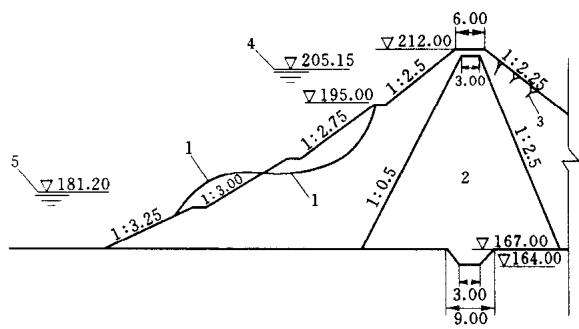  
图1.12 湖北省狮子岩土石坝坝坡失稳  
1-滑坡区；1-心墙；3-裂缝；4-放水前水位；5-滑坡时水位

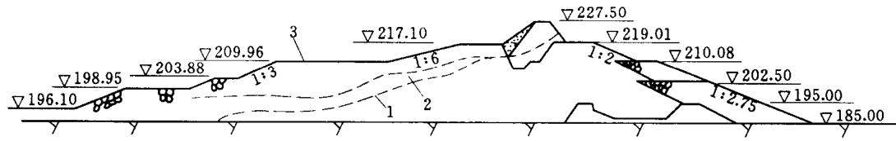  
图 1.13 湖南省流光岭土石坝滑坡  
1-第1次滑坡面：2-第3次滑坡面：3-最终处理后的上游面

目前，已发生的规模较大的由泄洪雨雾导致的滑坡均发生于岩质边坡。龙羊峡水电站在1987年和1989年7月汛期，曾两次开闸泄洪。1987年第一次泄洪后，受水雾影响，下游右岸虎山坡边坡即出现大范围开裂。1989年泄水时，山体在7月17日到25日发生急剧变形，最终坠入河床。位于龙羊峡下游的李家峡水电站下游3号滑坡是另一受雨雾影响发生于岩体沿层面滑动的例子（张尚信，吕祖衍，2002）。

## 4. 江河崩岸

我国的大江、大河如长江、黄河、珠江，普遍存在崩岸问题。图1.14是江西江新州河岸塌崩现象。崩岸的触发因素是河岸的淘刷，但最终是以滑坡来完成河岸回缩过程的。河流出现弯道的自然现象，就是江岸不断崩塌、回缩形成的。下面几个崩岸的实际资料足以说明崩岸现象的严重性。

(1) 湖北鄂洲耙铺大堤塌崩。1959 至 1989 年期间江岸后退 1324 m。由于目前江岸已紧靠铁路和国道，不得不斥巨资对河岸进行加固。

(2)1994年 6月11 日，湖北荆州北门口3 km长的江岸以 55m/h 回缩。同年10月14日，100m的河段3小时回缩了100m。

(3) 图1.15示湖南岳阳地区荆江门段的河势。此处长江与洞庭湖之间的陆地距离只有13km，但荆江门段的江岸每年以33m的速度回缩，如不治理，长江就会在近期直接进入洞庭湖，导致整个地理生态环境的重大改变。

河流弯道是大自然通过淘刷和滑坡改变地理环境的杰作。当弯曲到一定程度后，一次洪水就可以“裁弯取直”，令河道重新顺直。1998年洪水中发生的湖北排洲湾溃堤即是例。遗憾的是，人类活动的格局已经不能允许这种重新安排的“山河”了，必须千方百计地保持现状，因此，在江河大堤整治工作中，巨大的投资被用于制止崩岸的工程建设中。据统计，从1949年到1992年，河道整治单位已在长江崩岸多发区倾倒了7000万m³的石块。在“98”洪水后国家斥资630亿元的整治大堤工程中，有30%至40%的经费用于防治崩岸。

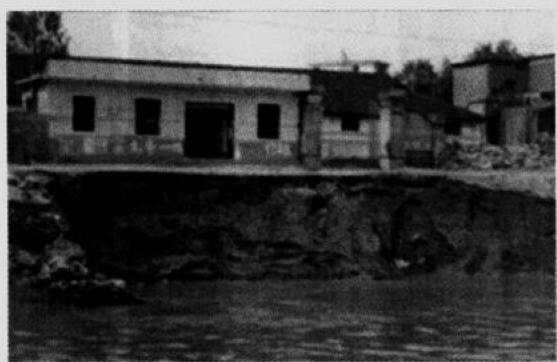  
图 1.14 江西江新州河岸塌崩

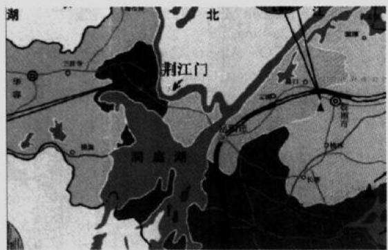  
图1.15 湖南省岳阳地区荆江门段的河势

## 5. 尾矿坝

矿山、火电厂在提供产品的同时，每日每时都在生产、堆放大量废弃物质。这些物质通常以细颗粒形式通过水力输送集中堆放在某一地点。年复一年，形成了高度和库容都具一定规模的尾矿坝。此类建筑物不可能按照很高的标准来修建，因此失事的风险很大。又因为尾矿颗粒极细，失事时多以静力和动力液化状态瞬时向下游泄放洪水和废弃材料，其迁移距离达几百米或几公里，故其破坏力极大。1985年7月19日，位于意大利北部的Staver萤矿尾矿坝失事，268人丧生。1996年5月1日，位于保加利亚北部的 Sgurigrad铅、锌、铜矿的高45m的尾矿坝，由于连续三天的暴雨使库水位上涨，导致坝坡失稳，液化后的材料随洪水冲向下游1km处，107人丧生。我国山西省金堆城（音译）钼尾矿坝高40m，由于溢洪道不能正常运行，导致坝内浸润线抬高，1988年4月30日在坝的中心部位发生圆弧滑动，溃后20人丧生。智利Barahona铜矿高61m的尾矿坝坝坡仅为1:1，1928年10月1 日遇 8.3 级地震，坝体液化后形成一个约1500m 的缺口，54人丧生。另一座智利铜尾矿坝 EL Cobre New Park 其下游坝坡虽已达 1:3.7，但在 1965 年 3 月 28 日的 7 级地震中发生液化，导致一邻近的老坝溃决，200余人丧生。

国际大坝会议尾矿坝专业委员会曾对尾矿坝安全进行专题研究，并收集了235个失事实例。表1.6列出由于边坡失稳导致的尾矿坝失事实例。

表1.6国际大坝会议统计的由于边坡失稳导致的尾矿坝失事实例
<table><tr><td>原表 编号</td><td>矿名，国家</td><td>矿类</td><td>坝高 (m)</td><td>库容 (10m³)</td><td>失事时间 (年)</td><td>泄量 (10m³)</td><td>迁移距离 (m)</td></tr><tr><td>6</td><td>Avoca Mines, lreland</td><td>铜</td><td></td><td></td><td></td><td></td><td></td></tr><tr><td>7</td><td>Bafokeng, South Africa</td><td>铂</td><td>20</td><td>13</td><td>1974</td><td>3.0</td><td>45,000</td></tr><tr><td>11</td><td>Battle Mt. Gold, Nevada, USA</td><td>金</td><td>8</td><td>1.54</td><td>1984</td><td></td><td></td></tr><tr><td>13</td><td>Big Florida, USA</td><td>磷</td><td>18</td><td></td><td>1986</td><td></td><td></td></tr><tr><td>15 18</td><td>Bilbao, Spain Cadet No. 2, Montana,</td><td>重晶石</td><td>21</td><td></td><td>1975</td><td>0.115</td><td></td></tr><tr><td>19</td><td>USA Captains Flat Dam2,</td><td></td><td></td><td></td><td></td><td></td><td></td></tr><tr><td></td><td>Australia</td><td>铜</td><td>22</td><td></td><td></td><td></td><td></td></tr><tr><td>22 23</td><td>Carr Fork, Utah, USA Casapalca, Peru</td><td>铜</td><td>10</td><td></td><td>1975</td><td></td><td></td></tr><tr><td>37</td><td>Deneen Mica, North</td><td>铅、锌 云母</td><td>107 18</td><td>0.3</td><td>1974</td><td>0.038</td><td>30</td></tr><tr><td></td><td>Carolina, USA</td><td></td><td></td><td></td><td></td><td></td><td></td></tr><tr><td>47</td><td>GCOS, Alberta, Canada Kennecott, Utah, USA</td><td>油砂</td><td>61</td><td></td><td>1974</td><td></td><td></td></tr><tr><td>62 66</td><td>Kimberley, BC, Canada</td><td>铜</td><td></td><td></td><td>1941</td><td></td><td></td></tr><tr><td>72</td><td>Lower Indian Creek,</td><td>铁 铅</td><td></td><td></td><td>1948 1960</td><td>1.1</td><td></td></tr><tr><td>77</td><td>MO, USA Marianna Mine#58,</td><td></td><td></td><td></td><td></td><td></td><td></td></tr><tr><td>94</td><td>PA,USA Phelps-Dodge, New</td><td>煤 铜</td><td>37</td><td>0.3</td><td>1986</td><td></td><td>8,000</td></tr><tr><td>96</td><td>Mexico, USA Pit No. 2. Westem</td><td>稀土</td><td>66 9</td><td></td><td>1980</td><td>2.0</td><td></td></tr><tr><td>100</td><td>Australia Ray Mine,Arizona,</td><td>铜</td><td>52</td><td></td><td>1977</td><td></td><td></td></tr><tr><td>101</td><td>USA Ray Mine,Arizona,</td><td>铜</td><td>52</td><td></td><td>1972</td><td></td><td></td></tr><tr><td>113</td><td>USA Southwest US, USA</td><td></td><td></td><td></td><td>1973</td><td></td><td></td></tr><tr><td>116</td><td>Stancil, Maryland, USA</td><td>砂砾</td><td>9</td><td>0.074</td><td></td><td></td><td>100</td></tr><tr><td>117</td><td>Stava, North Italy</td><td>荧石</td><td>29</td><td>0.6</td><td>1989</td><td>0.038 0.2</td><td>4,000</td></tr><tr><td>118</td><td>Suncor E-W Dike,</td><td></td><td></td><td></td><td>1985</td><td></td><td></td></tr><tr><td></td><td>Alberta, Canada</td><td>油砂</td><td>30</td><td></td><td>1979</td><td></td><td></td></tr><tr><td>122</td><td>Texasgulf 4B Pond, USA</td><td>磷</td><td>8</td><td>12.3</td><td>1984</td><td></td><td></td></tr><tr><td>123 144</td><td>Texasgulf No. 1, USA Unidentified, United</td><td>磷 煤</td><td>24.7 20</td><td></td><td>1981</td><td></td><td></td></tr><tr><td>145</td><td>Kingdom Unidentified, United</td><td></td><td></td><td></td><td>1967</td><td></td><td></td></tr><tr><td></td><td>Kingdom</td><td>煤</td><td>14</td><td></td><td>1967</td><td></td><td></td></tr><tr><td>149</td><td>Unidentified, ldano, USA</td><td>磷</td><td>34</td><td></td><td>1976</td><td></td><td></td></tr><tr><td>150 156</td><td>ldano, USA Alfaria River,</td><td>磷</td><td>18</td><td></td><td>1965</td><td></td><td></td></tr><tr><td></td><td>Florida, USA</td><td>磷</td><td>8</td><td></td><td>1952</td><td></td><td></td></tr><tr><td>160 165</td><td>Easterm USA Peace River, Florida,</td><td>煤</td><td>150</td><td></td><td></td><td></td><td></td></tr><tr><td></td><td>USA</td><td>磷</td><td>8</td><td></td><td>1952</td><td></td><td></td></tr><tr><td>169</td><td>Unidentified, Southern USA</td><td>磷</td><td>43</td><td>0.5</td><td>1973</td><td>0.17</td><td>25,000</td></tr><tr><td>编号</td><td>矿名，国家</td><td>矿类</td><td>坝高 (m)</td><td>库容 (106m³)</td><td>失事时间 (年)</td><td>泄量 (10m³)</td><td>迁移距离 (m)</td></tr><tr><td>172</td><td>Union Carbide, Uravan, Colorado, USA</td><td>铀</td><td>43</td><td></td><td>1979</td><td></td><td></td></tr><tr><td>185</td><td>Zlevoto No. 4, Yougoslauia</td><td>磷/锌</td><td>25</td><td>1.0</td><td>1976</td><td>0.3</td><td></td></tr><tr><td>192</td><td>Texas Gulf 4B Pond, Aurora, N, Carolina,</td><td>磷</td><td>8</td><td>12.3</td><td>1984</td><td></td><td></td></tr><tr><td>194</td><td>USA Olinghouse, Nevada, USA</td><td>金</td><td>5</td><td>0.12</td><td>1985</td><td>0.025</td><td>1,500</td></tr><tr><td>197</td><td>La Belle, Pennsylvania, USA</td><td>煤</td><td>79</td><td>1.2</td><td>1985</td><td>Zero</td><td></td></tr><tr><td>198</td><td>Stava,North ltaly</td><td>荧石</td><td>26</td><td>0.3</td><td>1985</td><td></td><td></td></tr><tr><td>206</td><td>Xishimen, China</td><td>铁</td><td>31</td><td></td><td>1987</td><td>0.0223</td><td></td></tr><tr><td>210</td><td>Sullivan Mine, BC,</td><td></td><td>21</td><td></td><td>1991</td><td></td><td></td></tr><tr><td>219</td><td>Canada Placer, Surigao del</td><td>金</td><td>17</td><td></td><td>1995</td><td>0.05</td><td>Out to sea</td></tr><tr><td>223</td><td>Norte, Philippines Mirolybovka, Southern</td><td>铁</td><td>32</td><td>80.</td><td>1984</td><td>none</td><td></td></tr><tr><td>224</td><td>Ukraine Balka Chuficheva,</td><td>铁</td><td>25</td><td>27</td><td>1981</td><td>3.5</td><td>1,300</td></tr><tr><td>226</td><td>Russia Fernandinho, nr Belo Horizonte, Brazil</td><td>铁</td><td>40</td><td></td><td></td><td></td><td></td></tr><tr><td>227</td><td>Minera Sera Grande:Crixas, Goias,</td><td>金</td><td>41</td><td>2.25Mt</td><td>1994</td><td>None</td><td></td></tr><tr><td>232</td><td>Brazil Stoney, Middleton, UK</td><td></td><td></td><td></td><td>1968</td><td></td><td></td></tr><tr><td>235</td><td>Sgurigrad, Bulgaria</td><td>铅/铜/锌/ 银</td><td>45</td><td>1.52</td><td>1996</td><td>0.22</td><td>6,000</td></tr></table>

## 1.3 边坡稳定分析

## 1.3.1 边坡稳定分析的理论基础

在土力学中，边坡稳定分析是和另外两个分支即土压力和地基承载力同时发展起来的。1776年，法国工程师库仑(C. A. Coulomb)提出了计算挡土墙土压力的方法，标志着土力学雏型的产生。朗肯(W.J.M.Rankine，1857)在假设墙后土体各点处于极限平衡状态的基础上，建立了计算主动和被动土压力的方法。库仑和朗肯在分析土压力时采用的方法后来被推广到地基承载力和边坡稳定分析中，形成了一个体系，这就是极限平衡方法。

极限平衡法是建立在大家所熟悉的摩尔一库仑强度准则基础上的，其表达式为

$$
\tau _ { f } = c ^ { \prime } + \sigma ^ { \prime } \mathrm { t a n } \phi ^ { \prime } = c ^ { \prime } + ( \sigma - u ) \mathrm { t a n } \phi ^ { \prime }\tag{1.1}
$$

式中：τ为破坏面上的剪应力；c′为土的有效粘聚力；σ和σ为破坏面上总应力和有效法向 $\pmb { \tau _ { f } }$ $c ^ { \prime }$ $\pmb { \sigma } ^ { \prime }$ 应力； $\phi ^ { \prime }$ 为土的有效内摩擦角。

极限平衡方法的基本特点是，只考虑静力平衡条件和土的摩尔一库仑破坏准则。也就是说，通过分析土体在破坏那一刻的力的平衡来求得问题的解。当然，在大多数情况下，问题是静不定的。极限平衡方法处理这个问题的对策是引入一些简化假定，使问题变得静定可解。这种处理，使方法的严密性受到了损害，但是，对计算结果的精度损害并不大，这一点将是本书第2章重点讨论的问题之一。由此而带来的好处是使分析计算工作大为简化，因而在工程中获得广泛应用。

进入20世纪70年代后，随着计算机和有限元分析方法的产生和发展，应用严格的应力应变分析方法分析建筑结构的变形和稳定性已变得可能。因此，有限元法也被广泛应用于边坡稳定分析。采用这一方法，可以不必对一部分内力和滑裂面形状作出假定，使分析研究成果的理论基础更为严密。从近30年的实际应用情况来看，有限元方法也存在自身的局限。主要是在确定边坡的初始应力状态、把握边坡临近破坏时的弹塑性本构关系以及保证非线性数值分析的稳定性等方面遇到的困难。另外还有计算成果和工程实践中采用的传统的安全系数判据接轨的问题。近期在这方面取得了一些重大进展，将在本书第9章简要介绍。

## 1.3.2 边坡稳定分析的极限平衡法

从库仑和朗肯两种不同思路出发，极限平衡方法也逐渐形成两个独立的分支。一是通过研究滑裂面上作用的力的静力平衡和确定临界滑裂面求得问题的解，在此基础上导出了目前广泛采用的稳定分析的条分法；另一是在假定土体内处处达到极限平衡状态的前提下，用特征线法求解应力场，在一定的简化条件下，获得问题的闭合解。现作简要回顾。

## 1. 极限平衡分析的垂直条分法

首先假定一个扰动因素，使土体从目前的稳定状态进入极限平衡状态。此时，滑体内出现一假想的滑裂面。在该滑裂面上，每一点的法向应力和切向应力都满足摩尔-库仑强度准则。这个扰动因素，在主动土压力的情况下，是挡土墙对土体的支持力（其反作用力即为主动土压力）逐步减少的增量ΔP。，它使土体最终朝着墙的方向下滑；在被动土压力情况 $\Delta P _ { a } ,$ 下，是挡土墙对土体的作用力（其反作用力即为被动土压力）逐步增加的增量ΔP，它使土 $\Delta P _ { p } ,$ 体背着墙的方向滑移。在地基承载力问题中，这个扰动因素就是表面荷载的增量∆q。在边 $\Delta q$ 坡稳定问题中，通常的作法是将土体的抗剪强度指标 c'和φ′减少为 c'/F 和 tanφ/F。F称为 $c ^ { \prime } .$ $\phi ^ { \prime }$ $c ^ { \prime } / F$ 安全系数。Sarma(1968)提出了另一种做法，即在滑动土体每个单元加上一水平体积力K∆W，使土体在假设的滑裂面上达到极限平衡状态。

在滑裂面为一特定的形状时，如直线(Coloumb，1776)或对数螺旋线(Terzaghi，1944)，则可以通过求解静力平衡方法唯一地确定相应该滑裂面的上述扰动因素的量值。如果滑裂面为任意形状，那么，为了确定沿滑裂面的应力分布，需要将滑动土体分成若干垂直土条，通过分析作用于土条上的力来建立平衡方程。为了使问题变得静定可解，还需要对土条间的作用力作一些假定，最终获得使该滑裂面处于极限平衡状态所需要的扰动因素的量值。

在求得一个滑裂面的扰动因素的量值后，还要对不同的滑裂面，重复这一计算步骤，获得一系列的扰动量。真实的临界滑裂面相应于：

1) 最小的 $\Delta P _ { a }$ ，最大的 $\Delta P _ { p }$ 1

2) 最小的 $\Delta \boldsymbol { q } ;$

3) 最小的 K或 $\pmb { F } _ { \circ }$

## 2. 滑移线法（上限解法）

上述极限平衡的垂直条分法获得的是一个满足静力平衡条件的应力场。同时要求滑裂面上每一点的应力状态均在摩尔圆上或以内，但是并不要求滑体内的每一点的应力状态均在摩尔圆上，即处于极限平衡状态。因此，所获得的解应小于或等于使边坡发生的破坏真实荷载。在塑性力学领域，属下限解。下面要讨论的滑移线法是假定土的破坏区内各点均达到了极限平衡条件，这样，在破坏区域的每一点，除了可以建立静力平衡条件外，还可以增加一个摩尔-库仑破坏条件，在一定的边界条件下，可以用特征线法求解由此形成的方程组。在一些简化的边界和土质条件下，可以获得闭合解，解得的特征线就是土力学中滑移线，其中一组就是滑裂面（索科洛夫斯基，1954；龚晓南等，2000)。在土压力领域，朗肯理论便是在边界条件非常简单的情况下的一个实例。Prantdl(1921)解得了地基承载力的闭合解。索科洛夫斯基(1954)提出了一个系统的方法，应用该法可以给出较复杂边界条件下的土压力、地基承载力和边坡稳定的一系列闭合解。

条分法和滑移线法的主要区别是后者假定土体的每一个单元都达到了极限平衡状态，而前者只假定土体沿滑裂面达到了极限平衡。严格的条分法通过合理性条件也对土条的应力状态作出限制，但仍允许一部分土体处于弹性状态。因此，所得通常是一个偏保守的解，属下限范畴。滑移线法由于假定破坏土体处处达到极限平衡，因此，相应的是一个上限解。目前，在边坡稳定分析领域，普遍使用垂直条分法。其原因大概是；

## 1）在滑坡时，确实存在着一个明确的滑裂面；

2) 天然边坡包含十分复杂的土质和边界条件，索氏使用的纯解析的方法很难实行。

上世纪90年代，Donald和作者曾致力于开发一个基于对土条进行斜分条的极限分析方法(Donald & Chen,1997)。这一方法假定滑动土体在滑面和倾斜界面均达到了极限平衡，用虚功原理来求解安全系数。这一方法实际是索科洛夫斯基理论（滑移线法）在一维条件下的简化，同时，又可纳入塑性力学上限解的理论体系。大量的算例证明，这一方法对一些具有闭合解的特例可以获得和索氏解答完全一致的计算成果。对于大量实际边坡问题，上限解法又和垂直条分法获得安全系数十分接近。如果同时采用极限平衡的垂直条分法和Donald&Chen的斜条分法，那么可以分别从上限和下限逼近边坡问题的真实解。

有关极限平稳和极限分析的理论，还可参阅其它文献（沈珠江，2000;Chen,1975)。

由于岩质边坡通常存在一组陡倾角的结构面，因此，建立在对滑坡体斜分条基础上的极限平衡方法在模拟节理岩体方面有独特的优越性。已经证明，这一方法和分析岩质边坡的 Sarma 法是完全等效的。

本书是叙述土质边坡稳定分析方法的专著，作者将垂直条分的极限平衡分析方法作为贯穿于全书的主线。而在拟与他人合作编写的另一本阐述岩质边坡的专著中，作者将以斜条分法作为贯穿全书的主线。在该书问世以前，有兴趣的读者可以参阅已经发表的一系列有关论文(Donald& Chen，1997；陈祖煜，1997；陈祖煜，汪小刚，2000；陈祖煜，汪小刚，1999；Chen,et. al. 2001；陈祖煜，2002)。需要说明的是，尽管垂直条分法是在土质边坡分析领域中提出的，但是其基本原理，在岩质边坡和坝基抗滑稳定分析中同样适用，同时，本书也给出了这方面的应用实例。

## 1.3.3 极限平衡法理论体系的形成

如前所述，本书将全面论述建立垂直分条的极限平衡方法。在过去的半个世纪，随着计算机和计算技术的发展，这一方法逐步从一种经验性的简化方法发展成为一个具有完整的理论体系的、成熟的分析方法。为此，我们简要地回顾这一方法的发展过程。

## 1. 各种分析方法的产生、应用及其局限性

Fellenius(1927)提出边坡稳定分析的圆弧滑动分析方法，即瑞典圆弧法。该法假定土条底法向应力可以简单地看作是土条重量在法线方向的投影。同时，由于滑裂面是圆弧，因此法向力通过圆心，对圆心取矩时不出现，使计算工作大大简化。在没有计算机的年代，这是一个实用的方法。

Bishop(1950)对传统的 Fellenius法作了重要改进。首先，他提出了安全系数的定义。即上节中对F的定义。然后通过假定土条间的作用力为水平方向，求出土条底的法向力。同样，Bishop通过力矩平衡来确定安全系数。

在这以后的几十年里，研究者致力于通过力的平衡确定安全系数。Janbu(1954)假定土条间力为水平，Lowe和Karafiath(1959)建议条间力倾角为土条顶部和底部倾角的平均值。美国陆军工师团假定条间力的倾角等于平均坝坡。由此求得的安全系数，因为没有满足力矩平衡要求，也是简化法。在我国，“传递系数法”使用相当广泛。由于此法从未见诸于国外的文献，在本书第3章作了专门的讨论。

## 2. 稳定分析极限平衡法严格体系的形成

各种简化方法反映了早期人工手算的需要。随着计算机的出现和普及，在生产实践中采用更为严格的方法已经具备条件。因此一部分研究者致力于建立同时满足力和力矩平衡，对滑裂面形状不作假定的严格分析方法。Morgenstern & Price (1965)提出了适用于任意形状滑裂面严格方法。以后Spencer提出了条间力倾角为常数的方法。这一方法实际上是Morgenstern-Price 法中 f(x)=1的一种特例。1973 年 Janbu在其简化法的基础上，提出了同时满足力和力矩平衡的“通用条分法”，这一方法区别是于其他方法的一个重要方面是通过假定土条侧向力的作用点而不是作用方向来求解安全系数。

由于极限平衡法通过引入假定的方式来求解本质上静不定的问题，这一作法的合理性问题一直是人们普遍关注的。Morgenstern & Price最早提出了解的合理性限制问题，提出所获得的解必须使：

## 1） 土条间不产生拉力；

2) 作用于土条界面上的剪力不超过按摩尔-库仑法则提供的抗剪强度。Morgenstern&Pricc还提出了这样的推论：不同的关于土条作用力的假定，只要满足上述两个合理性条件限制，相应的安全系数彼此相差不大。如果这个推论成立的话，极限平衡法包含的不严密的处理方式可以在理论上获得到很大的弥补。

笔者和 Morgenstern 教授对 Morgenstern-Price 法作了改进(Chen & Morgenstern, 1983)，其主要内容为：

1)完整地推导出了静力平衡微分方程的闭合解，提出了求解安全系数的解析方法，从根本上解决了数值分析的收敛问题；

2)提出了为保证剪应力成对原理不被破坏，土条侧向力在边界上需遵守的限制条件，因而减少了对土条侧向力所作的假定的随意性；

3)提出了一个求解安全系数合理解的最大、最小值的方法，并通过算例说明最大、最小值确实十分接近。

上述研究成果将在本书第2章中介绍。

在我国，潘家铮(1978)对极限平衡法的理论基础作出了解释。他指出，滑坡发生时，其内力会自动调整，以发挥最大的抗滑能力，同时，真实的滑裂面是提供最小的抗滑能力的那个。孙君实(1984)应用模糊数学理论，对解的合理性问题提出了模糊约束条件，并对潘家铮的论点作了证明。

## 3. 数值分析的稳定性问题

满足力和力距平衡条件的通用条分法通常归结为求解一个包含两个未知值的非线性方程组的问题。需要解决的一个难题是数值分析的收敛问题，这可以从众多的文献中可以了解到 (Morgenstern & Price, 1976; Wright, 1969; Soriano, 1976; Ching and Fredlund, 1983年)。不少学者提出了对策。

(1) 试凑法(Trial and error)。首先假定一个安全系数 F，同时对内力分布作一假定，如假定条间剪力为零，然后逐步调整F和内力分布，直到全部平衡条件均得到满足。这一方法的一个典型例子是Jambu在1973年提出的通用条分法（参见 2.5.4节）。这一方法存在严重的收敛困难问题。

(2) 一个变量的迭代法。Sarma(1973)提出的对每个土条施加水平力的处理方法，其主要的好处是可以通过直接求解代数方程求到未知量K（参见2.5.4节）。当然，当将K转化为工程界容易接受的安全系数F时，仍需引入迭代步骤，但已经将二个变量的迭代问题简化为一个变量的迭代问题。Fredlund (1980)介绍“快速收敛手法”(Rapid Solver)，寻找G(F,λ)和M(F,λ)两条曲线的交点，解得F和λ（参见2.3.1节）。所有这些方法，均没有从本质上脱离“试凑”的局限。

(3)牛顿-勒普生法。事实上，对于一个仅包含二个未知量的线性方程组，采用解析方法求解并不困难。Chen & Morgenstern 改进的通用条分法成功地获得了进行牛顿-勒普生法迭代所需的多项导数的计算公式。因而在绝大多数情况下都能保证数值计算快速收敛。

## 4. 确定最小安全系数的方法

边坡稳定分析的第二步是在众多的可能滑裂面中寻找一个相应最小安全系数的临界滑裂面。近年来，最优化方法被广泛应用于这一课题。

Baker(1980)使用动态规划来寻找最小安全系数。这个方法把求解最小安全系数和求解安全系数藕合在一起，十分繁复。以后大部分研究者都使用最优化方法。Cellestino and Duncan(1980)，Li & White (1987)采用多变量法。Nguyen (1985)采用单形法。我国张天宝(1981)对圆弧滑裂面采用解析法求解临界滑裂面，孙君实(1983)采用复形法对任意形状滑裂面确定最小安全系数。周文通(1984)使用Powell法计算“改良圆弧法”的最小安全系数。

本书作者自20世纪80年代后期开始这一领域研究，1988年在加拿大岩土工程学报上与邵长明共同著文介绍了采用单形法、负梯度法和DFP法求解任意形状滑裂面的安全系数极值的成果。进入20世纪90年代后，陆续出现了采用非数值分析方法（蒙特卡洛法、随机搜索法、遗传算法、模拟退火法）搜索安全系数的极值问题，将在第4章介绍有关的研究成果。

## 1.4 本书的主要内容和结构

本书不是一本全面阐述滑坡产生的工程地质背景、破坏机理、岩土力学特征以及分析和治理方法的专著。本书仅涉及了这一学科中的一个十分具体的领域，即边坡稳定分析方法。相对于滑坡分析和治理的其它学科分支来说，这是一个难度较小、发展比较成熟的领域。尽管它并不能解决滑坡分析和治理的全部问题，但它在边坡的设计和加固中仍占有重要地位。作者希望通过本书，全面阐述对土质边坡进行稳定分析的原理和方法，并介绍有关程序和使用说明。

在本章中，我们已经回顾了滑坡灾害给人类的生命和财产带来巨大损失，从而认识到开展滑坡分析和治理的重要意义，并简要回顾了进行边坡稳定分析的理论背景和各种方法。

第2章“边坡稳定分析的通用条分法”着重阐述边坡稳定分析极限平衡法的基本原理，介绍由作者和 Morgengtern 教授改进的稳定分析的通用条分法，并简要回顾其它通用条分法的原理。

第3 章“边坡稳定分析的简化方法”介绍瑞典法、Bishop 和滑楔法等边坡稳定分析的简化方法，并讨论其计算精度和适用范围。

边坡稳定分析包括计算一个滑裂面的安全系数和计算临界滑裂面两个步骤。第4章“确定最小安全系数的最优化方法”介绍使用最优化方法搜索圆弧和任意形状滑裂面的最小安全系数的原理和方法。

在边坡稳定分析中，正确地进行土的抗剪强度试验，采用合理的强度指标，对于计算成果的合理性具有重要意义。第5章“土的抗剪强度”简要回顾土的抗剪强度基本理论以及通过试验、理论分析和现场测试确定土的抗剪强度的方法，介绍有效应力法和总应力法的原理。同时讨论了粘性土的残余强度和粗颗粒土的非线性强度问题。

第6章“土的孔隙水压力”介绍确定孔隙水压力的基本理论，讨论土石坝施工期、正常运行期、库水位骤降期确定孔隙水压力的方法。

土石坝是规模最大的土方建筑物。我国共有8.5万座高度超过15m的土石坝，其安全关系到成千上万人的生命财产。本书第7章“土石坝各运用期的稳定分析”介绍土石坝在施工期、稳定渗流期、库水位骤降和地震时边坡稳定分析的具体步骤，讨论针对各工况的具体特点，合理地确定筑坝土料和地基的强度指标的问题，然后，应用有效应力法或总应力法求解稳定安全系数。

第8章“边坡加固稳定分析”介绍对挡土墙、加筋土、土锚钉等各种边坡加固措施的设计计算方法，讨论通用条分法在土压力领域的推广应用。

第9章“有限元法在边坡稳定分析中的应用”介绍渗流、固结和应力应变有限元分析的基本原理和方法。并介绍了这一体系严格的方法近期与传统的安全系数处理准则接轨方面的研究成果。

第10章“边坡稳定的可靠度和风险分析”介绍边坡和大坝风险的分析方法，着重讨论进行可靠度分析的原理和方法以及相关的研究成果。岩土工程分析包含有大量的不确定因素，边坡稳定分析的一个重要任务就是正确地、定量地把握这些不确定因素，合理地评价边坡的失稳风险。这一问题在近期受到学术界的广泛重视。

第11 章和第12章是具体实现本书介绍的边坡稳定分析方法所不可缺少的内容。第11章“程序设计”介绍边坡稳定分析程序的结构和程序设计方法，并附以主要源程序。第12章“程序使用说明”介绍由作者开发的边坡稳定分析程序STAB的使用方法。本章附有30个例题，详细介绍了各种功能的使用方法。本书各章使用的大量例题和工程实际应用的数据文件都是通过STAB 程序实现的。

第13 章“工程案例”详细记载使用 STAB 程序完成的 13 个工程的计算成果，包含三峡、小浪底、天生桥等国内重要水电工程。

第14章“三维极限平衡分析方法”介绍作者近期研究开发的三维边坡稳定极限平衡分析方法的原理和应用实例。引入三维分析，可以更加合理地模拟滑坡发生的真实情况，在某些特定条件下，三维分析对于解决实际的工程问题，具有二维方法不可替代的作用。

在阐述的各章内容时作者列举了大量算例和工程应用实例。本书的一个重要特点是提供了大部分例题的原始数据文件，也就是说，读者可以应用STAB程序重演本书中介绍的内容。在每章的最后一节，作者提供了一个数据文件列表，读者可以通过网站www.geoengiwhr.com下载相应的数据文件。读者也可以从此网站下载第11 章介绍的源程序和测试题以及在第12章介绍的STAB 程序的普及版。

## 参考文献

1 Baker, R. and Garber. M. Theoretical analysis of the stability of slopes. Geotechnique, 28 (4): 395-411. 1978

2 Bishop, A. W. The use of the slip circle in the stability analysis of slopes, Geotechnique, 1(1): 7-17. 1955

3 Brand, E. W. Occurrence and significance of Landslides in southeast Asia. In 'Landslides: extant and economic significance'. Brabb & Harrod (eds), Balkema. 1989

4 Chen, Zuyu and Morgenstern, N. R. Extensions to the generalized method of slices for stability analysis, Canadian Geotechnical Journal. 20(1):104-119. 1983

5 Chen, Yujong. et. al. Breach of a natural lake on Yalong River. Canadian Journal of Civil Engineering. 19(5): 811-1992

6 Chen, W. F. Limit analysis and soil plasticity. Elsevier. 1975

7陈祖煜.黄文熙讲座：土力学经典问题的塑性力学上、下限解，岩土工程学报.24(1):1-11.2002

8 陈祖煜，汪小刚.极限分析数值方法.土工计算机分析，第9章，龚晓南主编.北京：中国建筑工业出版社.2000.234-256

9 陈祖煜，汪小刚.岩石高边坡失稳机理和分析方法.岩石高边坡的变形与稳定.北京：中国水利水电出版社，1999. 第5章.86-107

10 Chen, Z. Wang, X, Haberfield, C, Yin, J, Wang, Y. A Three-dimensional Slope Stability Analysis Method Using the Upper Bound Theorem, Part I: Theory and Methods, 2001, International Journal of Rock Mechanics and Mining Sciences. 38 369 -378

11 陈祖煜.边坡稳定分析的塑性力学上限解和下限解．中国水利电力技术发展和成就.北京：中国电力出版社.1997.198-208

12 Donald, I. and Chen, Zuyu, Slope stability analysis by an upper bound plasticity method. Canadian Geotechnical Journal, 1997. 34(11): 853-862

13 邓养鑫.我国黄土高原的泥石流，泥石流学术讨论会兰州会议文集，四川科学技术出版社.1986.35\~44

14 Fellenius W. 1927, Erdstatisch Berechnungen, Berlin W.Ernst und Sohn revised edition, 1939

15 冯学才，郭安宁.我国地震滑坡的一般特征. 滑坡文集，中国铁道出版社.1988年北京，35-44

16 龚晓南，史美东. 第7章. 滑移线场数值解.土工计算机分析.龚晓南主编. 中国建筑工业出版社.2000.193-214

17 Hansen, A. and Frank, C. 1991. Characterisation and mapping of earthquake triggered landslides for seismic zonation. Proceedings of the 4th International Conference on seismic zonation. Standforfd, California. Vol. 1. 149-195

18 ICOLD Committee on Dams and Waste Lagoons. Tailing dams: risk of dangerous occurrences.

19 Janbu, N., 1973. Slope stability computations, Embankment Dam Engineering, John Wiley and Sons, New York. 47-86

20 李鸿琏.天水地区黄土滑坡.滑坡文集. 北京：中国铁道出版社.1988.100-106

21 Lin, M. L. and Jeng, F. S. Hazards induced by extremely heavy rainfall in a major fault zone. ISSMGE ATC3 Workshop on Rainfall Induced Landslides. 2001.

22 Lowe. J. III. and Karaflath. L.1960. Stability of earth dams upon drawdown. Proc. 1st Panamer. Conf. Soil Mech. Mexico City 2. 537-552

23 李坤，黄土滑坡的形成及分布规律，滑坡文集.北京：中国铁道出版社.1988.66-72

24 刘瑞华等，“97.5.8”飞来寺泥石流重灾机制分析.兰州滑坡泥石流学术研讨会文集.兰州大学出版社，文集编委会主编.320-325.1998

25 李昭淑，陕西省典型土滑坡、崩塌的成因分析及治理意见. 滑坡文集．北京：中国铁道出版社.1988.138-143

26 Morgenstern, N.R. and Price, V. The analysis of the stability of general slip surface, Geotechnique, 1965. (15): 1: 79-93

27 潘家铮，1980. 建筑物的抗滑稳定和滑坡分析，北京：水利出版社

28 Palmieri, A. Discussion. Lake Sarez. Proceedings of International Congress on Large Dams. Q78. Vol. 1:108- 111.2000

29 Prandtl L. 1920 . Uber die harte plasticher korper . Nach . K. Ges . Wiss. Gott., Math .-phys. Klasse, 74-85.

30汝乃华，牛运光，大坝事故与安全，北京：中国水利水电出版社.2001

31 Sassa et. al. 1995. Lamdslides triggered by the Hyogoken-Nanbu earthquake. Landslide News. No. 9. 2-5.

32 Sarma. S. K. 1973. Stability analysis of embankments and slopes. Geotechnique 23, No. 3. 423-433.

33 孙广忠，姚宝魁.中国滑坡地质灾害及其研究. 中国典型滑坡. 北京：科学出版社.1988.1-12

34 Schuster, R. L. Usoi landslide dam, Southeastern Tajikistan. Proceedings, International Symposium on Landslide Mitigation and Protection of Culyural and Natural heritage, UNESCO and Kyoto University, Kyoto, Japan, 21-25, January, 2002. 489-505

35 Spencer, E. 1967. A method of analysis of embankments assuming parallel inter-slice forces, Geotechnique, No. 17. 11-26.

36 沈珠江，2000. 理论土力学.北京：中国水利水电出版社

37 Wright, S. Slope stability analysis, Closure. Proceedings on Analysis and Design in Geotechnical Engineering. ASCE 1978. Volume. 2. 153

38 王恭先. 面向21世纪我国滑坡灾害防治的思考.兰州滑坡泥石流学术研讨会文集.兰州大学出版社，文集编委会主编.1998.1-8

39王业钵、钟文运、杨运仪，陆宏.鲁布路水电站发耐滑坡稳定性分析及评价.高边坡工程.2:131-143

40 王志硕.龙羊峡、虎山坡不稳定岩体变形特征及破坏机制分析.高边坡工程.创刊号.144-156

41 姚国芳．福建高速公路路堑边坡及滑坡病害防治工作情况介绍.中国科技咨询中心滑坡防治技术培训班讲义.2002

42 Zeng, S. Zhao, P. W. Yuan, W. 1992. A disastrous landslide in Touzhai Valley, Yunnan, China. Landslide News. No. 6. 31-32

43 张尚信，吕祖衍．泄洪消能雾化对边坡稳定及工程设施的影响.水利水电勘测设计标准化.200251(3):31-38

## 第2章 边坡稳定分析的通用条分法

## 2.1 边坡稳定分析极限平衡法的基本原理

## 2.1.1 基本原则

建立在极限平衡原理基础上的边坡稳定分析方法包含有以下几条基本原则。

## 1. 关于安全系数的定义

土坡沿着某一滑裂面滑动的安全系数F是这样定义的，将土的抗剪强度指标降低为 $c / F$ 和tanφ/F，则土体沿着此滑裂面处处达到极限平衡，即

$$
\boldsymbol { \tau } = \boldsymbol { c } _ { e } ^ { \prime } + \boldsymbol { \sigma } _ { n } ^ { \prime } \cdot \tan \phi _ { e } ^ { \prime }\tag{2.1}
$$

$$
c _ { e } ^ { \prime } = { \frac { c ^ { \prime } } { F } }\tag{2.2}
$$

$$
\tan \phi _ { e } ^ { \prime } = \frac { \tan \phi ^ { \prime } } { F }\tag{2.3}
$$

上述将强度指标的储备作为安全系数定义的方法是经过多年的实践被工程界广泛承认的一种作法。采用这一定义，在数值计算方面，会增加一些迭代、收敛方面的问题。

## 2. 摩尔-库仑强度准则

设想土体的一部分沿着某一滑裂面滑动。在这个滑裂面上，土体处处达到极限平衡，即正应力 ${ \pmb \sigma } _ { n } ^ { \prime }$ 和剪应力 τ满足摩尔-库伦强度准则。设土条底的法向力和切向力分别为N和T，则有

$$
\Delta T = c _ { e } ^ { ' } \Delta x \sec \alpha + \left( \Delta N - u \Delta x \sec \alpha \right) \tan \phi _ { e } ^ { ' }\tag{2.4}
$$

式中： $\pmb { \alpha }$ 为土条底倾角，tanα=dy/dx；u为孔隙水压力，通常定义孔隙水压力系数

$$
r _ { u } = \frac { u } { \mathrm { ~ d } W / \mathrm { ~ d } x }\tag{2.5}
$$

## 3. 静力平衡条件

将滑动土体分成若干土条（图2.1），每个土条和整个滑动土体都要满足力和力矩平衡条件。在静力平衡方程组中，未知数的数目超过了方程式的数目，解决这一静不定问题的办法是对多余未知数作假定，使剩下的未知数和方程数目相等，从而解出安全系数的值。

## 2.1.2 合理性要求

上述对多余未知数进行假定的具体方案可以是多种多样的，但是，也并不是完全任意的。它必须使获得的解符合土和岩石的力学特性。目前，被普遍接受的合理性条件是(Morgenstern & Price, 1967 年；Janbu, 1973 年):

(b)  
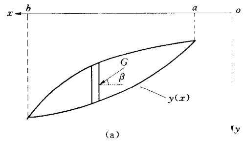

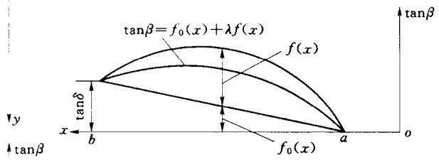

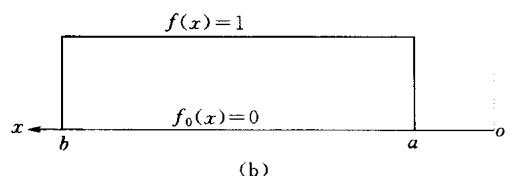

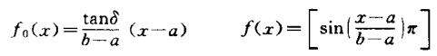  
(c)  
图 2.1 边坡稳定的条分法  
(a) 滑坡体；(b) 侧向力假定 1；(c) 侧向力假定 2

(1) 沿着划分的土条两侧垂直面上的剪应力不能超过在这个面上所能发挥的抗剪能力（参见图2.2），即

$$
F _ { \nu } = \frac { [ E ^ { \prime } \tan \phi _ { a \nu } ^ { \prime } + c _ { a \nu } ^ { \prime } ( y - z ) ] } { X } > F\tag{2.6}
$$

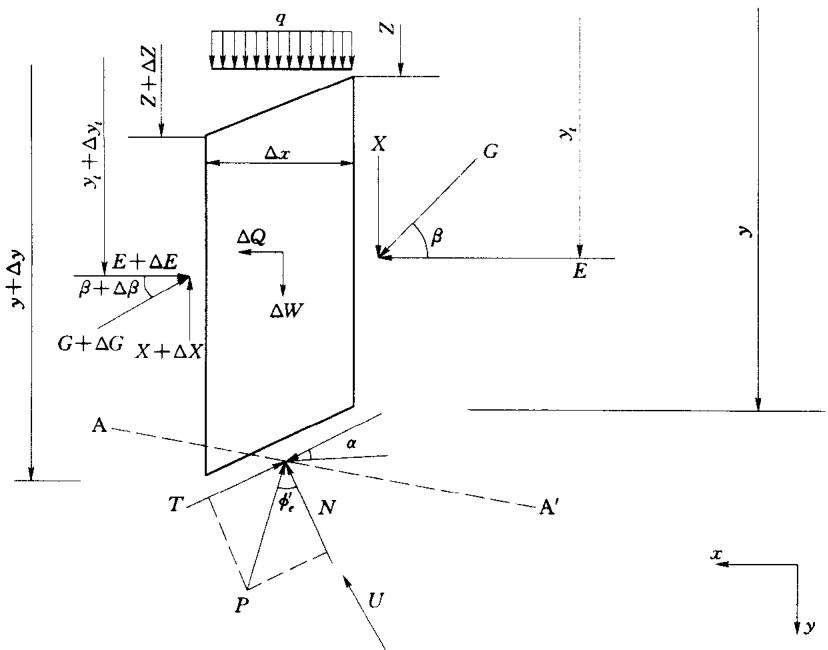  
图 2.2 作用在土条上的力

或

$$
F _ { \nu e } = \frac { [ E ^ { \prime } \tan \phi _ { a \nu e } ^ { \prime } + c _ { a \nu e } ^ { \prime } ( y - z ) ] } { X } > 1\tag{2.7}
$$

上二式中： $F _ { \nu }$ 为沿着土条垂直面的安全系数； $\boldsymbol { F } _ { \nu e }$ 为使用经过按式(2.2)和式(2.3)缩减后垂直面的安全系数； $E ^ { \prime }$ 为作用在土条垂直面的法向有效压力；X为作用在土条垂直面的剪力；$\tan { \phi _ { a \nu } ^ { \prime } }$ 为土条垂直面的有效平均摩擦系数； $c _ { a \nu } ^ { \prime }$ 为土条垂直面的有效平均粘聚力； $\tan \phi _ { a v e } ^ { \prime }$ 为$\tan \phi _ { a \nu } ^ { \prime }$ 被F值除后的值； $c _ { a v e } ^ { \prime }$ 为 $c _ { a v } ^ { \prime }$ 被 F 值除后的值；y为滑裂面的纵坐标值；z 为土坡表面的纵坐标值。

(2) 为保证在土条接触面上不产生拉力，作用在土条上的有效力的合力作用点不应落在土条垂直面的外面（参考图2.2）。

$$
0 < A _ { \mathrm { c } } ^ { \prime } < 1\tag{2.8}
$$

$$
A _ { c } ^ { \prime } = { \frac { y _ { t } ^ { \prime } - z } { y - z } }\tag{2.9}
$$

式中：y为作用在土条垂直面上的有效法向力的作用点的纵坐标值。 $y _ { \imath } ^ { \prime }$

## 2.2 静力平衡方程的普遍形式及其解

## 2.2.1 作用在土条上的力

设想某一边坡的滑动土体沿滑裂面 $y = y ( x )$ 下滑，见图2.2。此时，根据安全系数的定义，土体和滑裂面上的抗剪强度指标均已缩减为 $c _ { e } ^ { \prime } , \mathrm { t a n } \phi _ { e } ^ { \prime }$ 。在滑动土体中切出一垂直土条，分析作用在其上的力，计有：

1)土条重量∆W，浸润线上为天然容重，浸润线下为饱和容重；

2) 坡表面垂直荷重 $q \Delta x$ 1

3) 地震力，水平地震力 $\Delta Q = \eta \Delta W$ ，其作用点与土条底距离为 $\hslash _ { \mathrm { e } }$

4)作用在土条垂直边上的总作用力G（即土骨架间的法向有效作用力和水压力之和)，它与水平线的夹角为 $\beta ,$ 其作用点的纵坐标值为 $y _ { t }$

## 2.2.2 静力平衡微分方程及其解

对土条建立 x和y 方向的静力平衡方程：

$$
\Delta N \sin \alpha - \Delta T \cos \alpha + \Delta Q - \Delta ( G \cos \beta ) = 0\tag{2.10}
$$

$$
- \Delta N \cos \alpha - \Delta T \sin \alpha + ( \Delta W + q \Delta x ) - \Delta ( G \sin \beta ) = 0\tag{2.11}
$$

将式(2.4)代入式(2.10)、式(2.11)，消去ΔN，令 $\pmb { \Delta x } \pmb { \to } 0$ ，得到静力平衡的微分方程：

$$
\cos ( \phi _ { e } ^ { \prime } - \alpha + \beta ) \frac { \mathrm { d } G } { \mathrm { d } x } - \sin ( \phi _ { e } ^ { \prime } - \alpha + \beta ) \frac { \mathrm { d } \beta } { \mathrm { d } x } G = - p ( x )\tag{2.12}
$$

$$
\begin{array} { l } { { p ( x ) = ( \displaystyle \frac { \mathrm { d } W } { \mathrm { d } x } + q ) \sin ( \phi _ { e } ^ { \prime } - \alpha ) - r _ { u } \displaystyle \frac { \mathrm { d } W } { \mathrm { d } x } \sec \alpha \sin \phi _ { e } ^ { \prime } } } \\ { { \phantom { p ( x ) = } + c _ { e } ^ { \prime } \sec \alpha \cos \phi _ { e } ^ { \prime } - \eta \displaystyle \frac { \mathrm { d } W } { \mathrm { d } x } \cos ( \phi _ { e } ^ { \prime } - \alpha ) } } \end{array}\tag{2.13}
$$

同时，将作用在土条上的力对土条底中点取矩，建立力矩平衡方程：

$$
\begin{array} { l } { { ( G + \Delta G ) \cos ( \beta + \Delta \beta ) [ ( y + \Delta y ) - ( y _ { t } + \Delta y _ { t } ) - \displaystyle \frac { 1 } { 2 } \Delta y ] } } \\ { { - G \cos \beta ( y - y _ { t } + \displaystyle \frac { 1 } { 2 } \Delta y ) + G \sin \beta \Delta x - \eta \displaystyle \frac { \mathrm { d } W } { \mathrm { d } x } h _ { e } = 0 } } \end{array}\tag{2.14}
$$

其中 $h _ { e }$ 为水平地震力作用点距条底的垂直距离，当 $\Delta x {  } 0$ 时，可得

$$
G \sin \beta = - y { \frac { \mathrm { d } } { \mathrm { d } x } } ( G \cos \beta ) + { \frac { \mathrm { d } } { \mathrm { d } x } } ( y _ { t } G \cos \beta ) + \eta { \frac { \mathrm { d } W } { \mathrm { d } x } } h _ { e }\tag{2.15}
$$

式(2.12)也可通过将作用在条块上的力投影图 2.2 中线 $\mathbf { A A ^ { \prime } }$ 方向获得。 $\mathbf { A A ^ { \prime } }$ 与土条底切线方向夹角为 $\phi _ { e } ^ { \prime }$ ，土条底的法向力N与由其贡献的切向抗力 $N ^ { \prime } { \tt t a n } \phi _ { \epsilon } ^ { \prime }$ 的合力因与 $\mathbf { A } \mathbf { A } ^ { \prime }$ 垂直故不出现。

## 2.2.3 静力平衡方程的解

微分方程组式(2.12)和式(2.15)的边界条件是

$$
G ( a ) = 0\tag{2.16}
$$

$$
G ( b ) = 0\tag{2.17}
$$

$$
y _ { t } ( a ) = y ( a )\tag{2.18}
$$

$$
y _ { t } ( b ) = y ( b )\tag{2.19}
$$

式中： $\pmb { a }$ 和b为滑体左、右端点的x坐标。

式(2.12)是一个一阶非线性常微分方程，它的积分形式是

$$
G ( x ) = - \sec ( \phi _ { e } ^ { \prime } - \alpha + \beta ) s ^ { - 1 } ( x ) \biggl [ \int _ { a } ^ { x } p ( \zeta ) s ( \zeta ) \mathrm { d } \zeta - G ( a ) \biggr ]\tag{2.20}
$$

$$
s ( x ) = \sec ( \phi _ { e } ^ { ' } - \alpha + \beta ) \exp \left[ - \int _ { a } ^ { x } \tan ( \phi _ { e } ^ { ' } - \alpha + \beta ) \frac { \mathrm { d } \beta } { \mathrm { d } \zeta } \mathrm { d } \zeta \right]\tag{2.21}
$$

式(2.15)的积分形式是

$$
\int _ { a } ^ { x } G ( \sin \beta - \cos \beta \tan \alpha ) \mathrm { d } x = \int _ { a } ^ { x } \eta { \frac { \mathrm { d } W } { \mathrm { d } x } } h _ { e } \mathrm { d } x + \left[ G \cos \beta ( y _ { t } - y ) \right] _ { a } ^ { x }\tag{2.22}
$$

令 $x = b$ ，并使用式(2.16)至式(2.19)的边界条件，应用分部积分法，式(2.20)和式(2.22)可化为

$$
\int _ { a } ^ { b } p ( x ) s ( x ) \mathrm { d } x = 0\tag{2.23}
$$

$$
\int _ { a } ^ { b } p ( x ) s ( x ) t ( x ) \mathrm { d } x - M _ { e } = 0\tag{2.24}
$$

$$
t ( x ) = \int _ { a } ^ { x } ( \sin \beta - \cos \beta \tan \alpha ) \exp { \int _ { a } ^ { \xi } [ \tan ( \phi _ { e } ^ { \prime } - \alpha + \beta ) \frac { \mathrm { d } \beta } { \mathrm { d } \zeta } \mathrm { d } \zeta ] \mathrm { d } \xi }\tag{2.25}
$$

$$
M _ { e } = \int _ { a } ^ { b } \eta { \frac { \mathrm { d } W } { \mathrm { d } x } } h _ { e } \mathrm { d } x\tag{2.26}
$$

在获得式(2.24)时应用了式(2.23)和下面的关系式：

$$
\begin{array} { l } { \displaystyle \int _ { a } ^ { b } G ( \sin \beta - \cos \beta \tan \alpha ) \mathrm { d } x = - \displaystyle \int _ { a } ^ { b } \int _ { a } ^ { \xi } p ( \zeta ) s ( \zeta ) \mathrm { d } \zeta \mathrm { d } t = - \displaystyle \mathbb { I } _ { a } \int _ { 0 } ^ { \xi } p ( \zeta ) s ( \zeta ) \mathrm { d } \zeta \bigg ] _ { a } ^ { b } + \int _ { a } ^ { b } p ( x ) s ( x ) t ( x ) \mathrm { d } x } \\ { \displaystyle \qquad = \int _ { a } ^ { b } p ( x ) s ( x ) t ( x ) \mathrm { d } x } \end{array}\tag{2.27}
$$

注意式(2.27)右侧第一项由式(2.23)可知为零。式(2.23)和式(2.24)分别反映滑动土体力和力矩平衡要求。这两个方程中包含一个未知数，即安全系数F，它隐含在φ中和c'e中[式 $\phi _ { e } ^ { \prime }$ $\boldsymbol { c } _ { e } ^ { \prime }$ (2.2) 和式(2.3)]，另外还包含一个变量β(x)。Morgenstern 和 Price 假定其符合某一分布形状， $\boldsymbol { \cdot } \beta ( \boldsymbol { x } )$ 留下一个待定常数λ和F一起求解，即假定

$$
\tan \beta = \lambda f ( x )\tag{2.28}
$$

f(x)一旦确定，稳定分析就具体化为求解联立方程式(2.23)和式(2.24)中包含的两个未知数F和λ的问题。

对式(2.15)积分可获得使用式(2.9)需知的y的计算公式 $y _ { i }$

$$
y _ { t } = \frac { \displaystyle \int _ { a } ^ { x } G ( \sin \beta - \cos \beta \tan \alpha ) \mathrm { d } x - \displaystyle \int _ { a } ^ { x } \eta \frac { \mathrm { d } w } { \mathrm { d } x } h _ { e } \mathrm { d } x } { G \cos \beta } + y _ { a }\tag{2.29}
$$

f(x)可假定为1，即假定各土条的 $\beta \left( x \right)$ 为一常数；也可假定为其它函数。每一组解都要通过式(2.5)和式(2.7)的合理性要求检验。

在大部分的计算中，我们令 $\scriptstyle f ( x ) =$ 常数=1，如图 2.1(b)示。这种特例称 Spencer法。在STAB程序中，提供给用户的默认的功能也是这一处理方式，因为大量的计算实例说明， $f ( x )$ 的形状对安全系数F值的影响并不大。

但是在一些特殊条件下，使用Spencer法可能导致较大的误差。从严格的理论意义上讲，为了保证在 $x = a$ 和 ${ \pmb x } = { \pmb b }$ 处剪应力成对原理不被破坏，要求β(x)在该两端为指定值。 $\beta ( x )$ 因此假定

$$
\tan \beta = f _ { 0 } ( x ) + \mathcal { M } ( x )\tag{2.30}
$$

fo(x)在 $x = a$ 和 $x = b$ 处为指定值， $f ( x )$ 在 $x = a$ 和 ${ \pmb x } = { \pmb b }$ 处为零，如图2.1(c)所示。使用这一规定，可以进一步限制对未知函数 $\beta \left( x \right)$ 作假定的随意性。将在2.5.2节中详细讨论这一问题。

## 2.3 静力平衡方程的数值解

## 2.3.1 Newton-Raphson 迭代法

通常采用 Newton-Raphson 迭代法求解下列静力平衡方程中的 F 和λ。

$$
G _ { n } ( F , \lambda ) = \int _ { a } ^ { b } p ( x ) s ( x ) \mathrm { d } x = 0\tag{2.31}
$$

$$
M _ { n } ( F , \lambda ) = \int _ { a } ^ { b } p ( x ) s ( x ) t ( x ) \mathrm { d } x - M _ { e } = 0\tag{2.32}
$$

先假定一组 $\pmb { F } _ { 1 }$ 和 $\lambda _ { 1 }$ ，代入式(2.31)、式(2.32)。下一个更为接近其解 $F ^ { * }$ $\lambda ^ { * }$ 的数值 $\pmb { F } _ { 2 }$ 1$\lambda _ { 2 }$ 通过下式求得(i=1)。

$$
\triangle F _ { i } = F _ { i + 1 } - F _ { i } = \frac { G _ { n } \displaystyle \frac { \partial M _ { n } } { \partial \lambda } - M _ { n } \displaystyle \frac { \partial G _ { n } } { \partial \lambda } } { \displaystyle \frac { \partial G _ { n } } { \partial \lambda } \displaystyle \frac { \partial M _ { n } } { \partial \cal F } - \displaystyle \frac { \partial G _ { n } } { \partial \cal F } \displaystyle \frac { \partial M _ { n } } { \partial \lambda } }\tag{2.33}
$$

$$
\triangle \lambda _ { i } = \triangle \lambda _ { i + 1 } - \triangle \lambda _ { i } = \frac { - G _ { n } } { \displaystyle { \frac { \partial G _ { n } } { \partial \lambda } \frac { \partial M _ { n } } { \partial F } + M _ { n } \frac { \partial G _ { n } } { \partial F } } }\tag{2.34}
$$

重复上述步骤，直至下列收敛标准得到满足

$$
\Delta F _ { i } < \varepsilon\tag{2.35}
$$

$$
\Delta \lambda _ { i } < \varepsilon\tag{2.36}
$$

在 STAB 程序中， $\pmb { \varepsilon }$ 值设为 $1 0 ^ { - 4 }$ 。本程序开发以来的实际使用情况证明，程序对绝大多数问题均能迅速地收敛到这一精度（参见[例2.1]）。

在文献中经常可以看到将式(2.33)和式(2.34)的二维迭代过程转化为一维的作法(Spencer,1973; Fredlund, 1984)，如图 2.3 所示。

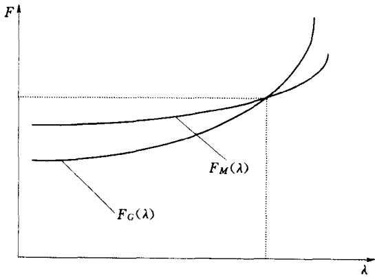  
图 2.3 Spencer 法求解示意图

固定某一λ值，给出 $F { = } F _ { G } ( \lambda )$ 和 $F = F _ { M } ( \lambda )$ 曲线，再采用数值分析的方法寻找该两条曲线的交点，解得F和λ。 $F _ { G } ( \lambda )$ 和 $F _ { M } ( \lambda )$ 分别是在该λ值时通过解式(2.33)和式(2.34)获得的 $\pmb { F } _ { \mathfrak { c } }$ 需要对式(2.31)和式(2.32)分别使用仅包含一个自变量进行迭代获得 $F _ { G } ( \lambda )$ 和 $F _ { M } ( \lambda )$ 0

采用上述作法，反映了编程人员刻意回避包含两个未知数的非线性方程迭代的心理。事实上，作者使用这一算法的二十余年的经验表明，使用二维Newton-Raphson迭代，其收敛速度极快。这一点将在后面[例2.1]和[例2.2]的迭代过程中看到。使用如图2.3所示的迭代方法，非但使计算过程变得繁琐，而且降低了计算精度。可以想像，这样的作法，使计算精度保持在 $1 0 ^ { - 3 }$ 水平将是十分困难的。对于一个滑裂面的安全系数问题，工程实际也许并不在乎小数点第三位的精度，但是，当问题进入第4章所论述搜索最小安全系数领域时，小数点第二位的精度就远远不够了。因此，可以说，本章介绍的边坡稳定分析的通用条分法在其数值计算收敛特性方面具有其突出的优点。

## 2.3.2 计算导数的公式

用式(2.25)、式(2.26)求解，需要确定 ${ \partial M _ { n } } / { \partial \lambda } , { \partial M _ { n } } / { \partial F } , { \partial G _ { n } } / { \partial \lambda } , { \partial G _ { n } } / { \partial F }$ 的数值，计算这些导数的公式见式(2.37)\~式(2.40)，推导过程可参见本章附录(第2.6.2节)。

$$
\frac { \partial G _ { n } } { \partial F } = \int _ { a } ^ { b } p ( x ) \cdot s ( x ) \Bigg [ k ( x ) - \int _ { a } ^ { x } \sec ^ { 2 } ( \phi _ { e } ^ { \prime } - \alpha + \beta ) \frac { \mathrm { d } \phi _ { e } ^ { \prime } } { \mathrm { d } F } \cdot \frac { \mathrm { d } \beta } { \mathrm { d } \xi } \mathrm { d } \xi \Bigg ] \mathrm { d } x\tag{2.37}
$$

$$
{ \frac { \partial M _ { n } } { \partial F } } = \int _ { a } ^ { b } p ( x ) \cdot s ( x ) [ k ( x ) t ( x ) - \int _ { a } ^ { x } t \cdot \sec ^ { 2 } ( \phi _ { e } ^ { \prime } - \alpha + \beta ) { \frac { \mathrm { d } \phi _ { e } ^ { \prime } } { \mathrm { d } F } } \cdot { \frac { \mathrm { d } \beta } { \mathrm { d } \xi } } \mathrm { d } \xi ] \mathrm { d } x\tag{2.38}
$$

$$
{ \frac { \partial G _ { n } } { \partial \lambda } } = \int _ { a } ^ { b } p ( x ) \cdot s ( x ) { \Biggl [ } - \int _ { a } ^ { x } \sec ^ { 2 } ( \phi _ { e } ^ { \prime } - \alpha + \beta ) { \frac { \mathrm { d } \beta } { \mathrm { d } \lambda } } \cdot { \frac { \mathrm { d } \alpha } { \mathrm { d } \xi } } \mathrm { d } \xi + D _ { i } { \Biggr ] } \mathrm { d } x\tag{2.39}
$$

$$
\frac { \partial M _ { n } } { \partial \lambda } = \int _ { a } ^ { b } p ( x ) \cdot s ( x ) \Biggl \{ - \int _ { a } ^ { x } t \cdot s \mathrm { e c } ^ { 2 } ( \phi _ { e } ^ { \prime } - \alpha + \beta ) \frac { \mathrm { d } \beta } { \mathrm { d } \lambda } \cdot \frac { \mathrm { d } \alpha } { \mathrm { d } \xi } \mathrm { d } \xi + D _ { t i } +\tag{2.40}
$$

$$
\int _ { a } ^ { x } \cos \phi _ { e } ^ { \prime } \sec \alpha \sec ( \phi _ { e } ^ { \prime } - \alpha + \beta ) \exp \biggl [ \int _ { a } ^ { \xi } \tan ( \phi _ { e } ^ { \prime } - \alpha + \beta ) \frac { \mathrm { d } \beta } { \mathrm { d } \zeta } \mathrm { d } \zeta \biggr ] \frac { \mathrm { d } \beta } { \mathrm { d } \lambda } \mathrm { d } \xi \biggr \} \mathrm { d } x
$$

$$
D _ { i } = \left[ \tan ( \phi _ { e } ^ { ' } - \alpha + \beta ) \frac { \mathrm { d } \beta } { \mathrm { d } \lambda } \right] _ { x = a } - \sum _ { i = 1 } ^ { s } \left[ \tan ( \phi _ { e i } ^ { ' } - \alpha _ { i } + \beta ) \frac { \mathrm { d } \beta } { \mathrm { d } \lambda } \right] _ { l } ^ { r }\tag{2.41}
$$

$$
D _ { t i } = - \sum _ { i = 1 } ^ { s } \biggl [ t _ { i } \tan ( \phi _ { e i } ^ { \prime } - \alpha _ { i } + \beta ) \frac { \mathrm { d } \beta } { \mathrm { d } \lambda } \biggr ] _ { \phantom { \frac { 1 } { s } } \qquad } ^ { r }\tag{2.42}
$$

其中D和D是考虑到滑面上α和φ。可能出现的突变点而增加的附加值。符号[表示在 $D _ { i }$ $D _ { t i }$ $\phi _ { e } ^ { \prime }$ $] _ { l } ^ { r }$ 该点相应数值在突变点右侧和左侧的差值。k(x)的定义见第2.6.2节式(2.140)。 $k ( x )$

## 2.3.3 数值分析的步骤

选择一个接近最终解λ\*，F\*的迭代初值λ和F，对于保证数值计算收敛有着十分重要 $F ^ { * }$ $\lambda _ { 1 }$ $F _ { 1 }$ 的意义，这里建议的方法，经过大量实践计算的检验，证明十分有效。

1. 初值 $\pmb { F } _ { 1 }$ 的估算

对F的估算的基本指导思想是首先使用将在第3章介绍的稳定分析简化方法确定一个 ${ \pmb F } _ { 1 }$ 安全系数的初值，再代入式(2.31)和式(2.32)进行迭代求解。在STAB程序中，采用了以下

步骤：

(1)首先使用将在第3章3.6.2节介绍的“简化法1”计算安全系数，这个方法适用于任意形状滑裂面，并不需迭代求解。因此，是一个比较理想的计算安全系数初值的方法。

(2)计算陆军工程师团法的安全系数（这一步骤也可以省略）。

(3) 使用上述步骤获得的安全系数作为初值 $F _ { 1 }$ 进行通用条分法的计算。

## 2. 初值 $\lambda _ { 1 }$ 的估算

假定 tanβ的平均值和 tanα的平均值相同，即

$$
\int _ { a } ^ { b } \tan \beta d x = \int _ { a } ^ { b } \tan \alpha d x\tag{2.43}
$$

将式(2.28)或式(2.30)代入式(2.43)，即可得到一个λ值作为初值 $\lambda _ { 1 }$

本节介绍计算式(2.31)、式(2.32)和相应的导数公式式(2.37)\~式(2.42)的过程比较繁复，但是如果编制成计算机程序，则可快速求得解答。在本书11章中，我们将详细介绍实现这一计算过程的源程序。这一程序在过去的二十余年中通过无数工程实例检验。有了这一程序，使用通用条分法将不再是一个困难的事情。新加坡Low(1998)曾使用MicroSoft Excell电子表格进行上述计算。

## [例2.1] 紫坪铺库区左岸堆积体的稳定分析。

紫坪铺水库左岸距坝 618m 处存在一个顺坡长 300\~870m 的不稳定堆积体。初步估计方量为 $2 5 0 0 { \sim } 3 0 0 0 \mathrm { m } ^ { 3 }$ 。经钻孔分析，堆积体与基岩接触面存在有厚0.5\~15cm的连接平直的软滑带，即图 2.4 中的 ABCDEF。使用本文的通用条分法计算堆积体沿此滑面滑动，并从围堰G点滑出。堆积体的强度指标为 $c ^ { \prime } { = } 2 0  { \mathbf { k P a } }$ $\phi ^ { \prime } { = } 3 1 ^ { \circ } ;$ 软滑带的指标为 $c ^ { \prime } { = } 1 0  { \mathrm { \ k P a } }$ $\phi ^ { \prime } = $ $1 6 ^ { \circ }$ 。使用将在第3章介绍的简化法1所得安全系数为1.239，随后采用工程师团法所得安全系数为 1.225，应用式(2.43) 解得的 $\lvert \lambda _ { \mathrm { 1 } }$ 为0.293，计算迭代过程如表2.1。

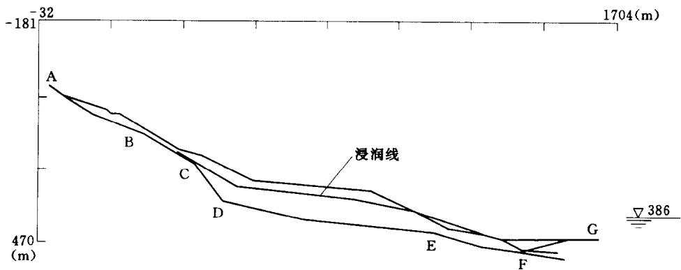  
图 2.4 紫坪铺库区左岸堆积体的稳定分析

表 2.1 例 2.1 数值迭代过程
<table><tr><td>迭代步</td><td> $G _ { n } ( \mathbb { k } \mathbb { N } )$ </td><td> $M _ { n } \left( 9 . 8 \mathrm { k N } \cdot \mathbf { m } \right)$ </td><td> $\pmb { F }$ </td><td>λ</td></tr><tr><td>1</td><td>-0.570101E+03</td><td>0.341694E+06</td><td>0.122454E+01</td><td>0.293377E+00</td></tr><tr><td>2</td><td>0.549303E+02</td><td>-0.212623E+05</td><td>0.119380E+01</td><td>0.252562E+00</td></tr><tr><td>3</td><td>-0.161491E+01</td><td>0.751152E+02</td><td>0.119598E+01</td><td>0.254412E+00</td></tr><tr><td>4</td><td>-0.193615E-01</td><td>0.103906E+01</td><td>0.119594E+01</td><td>0.254435E+00</td></tr></table>

最终得 $\lambda { = } 0 . 2 5 4 4 3 5$ $F { = } 1 . 1 9 5 9 3 9$ 。从表2.1可见应用通用条分法，迭代过程非常迅速、稳定。通过四次迭代，不平衡的力和力矩 $G _ { n }$ 和 $M _ { n }$ 分别从 $- 0 . 5 7 0 1 0 1 { \times } 1 0 ^ { 3 } { \times } 9 . 8 \mathbf { k N }$ 和 0.341694×10°×9.8 kN.m 收敛到 $- 0 . 1 9 3 6 1 5 \times 1 0 ^ { - 1 } \times 9 . 8$ kN和 $0 . 1 0 3 9 0 6 { \times } 1 0 ^ { 1 } { \times } 9 . 8 \mathrm { k N } . \mathrm { m }$ 0

[例 2.2] 澳大利亚 ACAD 公布的标准考题 EX1。

图2.5示所示一个典型的土坡稳定分析例题。在以后的章节中，还将多次引用（详见11.4节)。光滑曲线滑裂面由A、B、C、D、E五个点用样条函数联成，事实上这是一个近似圆弧的曲线。计算迭代过程见表2.2。

表 2. 2 例 2.2 数值迭代过程
<table><tr><td>迭代步</td><td> $G _ { n } ( 9 . 8 \mathbf { k N } )$ </td><td> $M _ { n } ( 9 . 8 \mathbf { k } \mathbf { N } . \mathbf { m } )$ </td><td> $\boldsymbol { F }$ </td><td>λ</td></tr><tr><td>1</td><td>-0.243723E+03</td><td>0.101975E+04</td><td>0.240000E+01</td><td>0.464641E+00</td></tr><tr><td>2</td><td>0.507991E+03</td><td>0.429016E+04</td><td>0.110318E+01</td><td>0.117622E+01</td></tr><tr><td>3</td><td>0.178628E+03</td><td>0.171667E+04</td><td>0.127896E+01</td><td>0.930531E+00</td></tr><tr><td>4</td><td>0.440980E+02</td><td>0.525262E+03</td><td>0.136979E+01</td><td>0.618465E+00</td></tr><tr><td>5</td><td>0.515473E+01</td><td>0.857181E+02</td><td>0.138486E+01</td><td>0.420363E+00</td></tr><tr><td>6</td><td>0.120580E+00</td><td>0.221638E+01</td><td>0.138273E+01</td><td>0.377980E+00</td></tr><tr><td>7</td><td>0.395831E-03</td><td>-.315285E-02</td><td>0.138264E+01</td><td>0.376847E+00</td></tr></table>

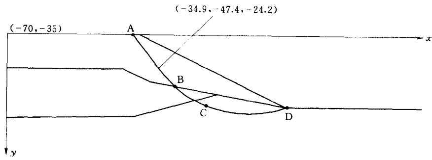  
图 2.5 澳大利亚 ACAD 考核题

在本例中，故意将F的初值 $( F _ { \mathrm { I } } = 2 . 4 0 )$ 设得远离其真值 $( F { = } 1 . 3 8 2 )$ ，从表2.2所示的迭代过程可以看到，安全系数的初值为2.40，此时不平衡的力和力矩分别为 $- 2 . 4 4 \times 1 0 ^ { 2 }$ 和$1 . 0 2 \times 1 0 ^ { 3 }$ ，迭代至第7步，即减少为 $3 . 9 6 { \times } 1 0 ^ { - 4 }$ 和 $- 3 . 1 5 { \times } 1 0 ^ { - 3 }$ 。安全系数解答为 ${ F } { = } 1 . 3 8 3$

## 2.4 与条分法有关的一些基本问题的讨论

## 2.4.1 作用在微小长度上垂直应力合力作用点位置的讨论

在本章建立力矩平衡方程式(2.14)的推导中，我们曾假定土条底法向应力的合力的作用点处于条底的中点。在一些文献中曾经把这一合力的作用点的位置也作为一个未知量。这一节，我们将说明，将作用点位置放在中点导致的误差，相对力矩平衡公式中的其它量是一个高阶小量。在土条的宽度∆x足够小的时候，这一作法引入的误差可以忽略不计。也就 $\mathbf { \Delta } _ { : \Delta x }$ 是说，在这一问题上，通用条分法的理论基础是严格的。

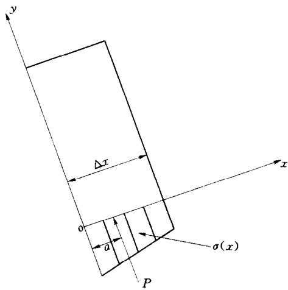  
图 2.6 作用在微小长度上的垂直应力

作用在一个微小长度Δx上连续分布的垂直应力σ(x)的合力P由下式决定（参见图2.6): $\mathbf { \Delta } _ { \mathbf { \Delta } } \mathbf { \Delta } _ { \mathbf { \Delta } }$

$$
P = \int _ { 0 } ^ { \Lambda x } \sigma ( x ) \mathrm { d } x\tag{2.44}
$$

P的作用点距原点位置为

$$
a = \frac { \displaystyle \int _ { 0 } ^ { \Delta x } \sigma ( x ) \cdot x \mathrm { d } x } { \displaystyle \int _ { 0 } ^ { \Delta x } \sigma ( x ) \mathrm { d } x }\tag{2.45}
$$

定义N的作用点的相对距离为

$$
\zeta = \frac { a } { \Delta x }\tag{2.46}
$$

将σ(x)在σ(0)处按泰勒级数展开，将式(2.45)代入式(2.46)后可得 ${ \pmb \sigma } ( { \pmb x } )$ ${ \pmb { \sigma } } ( 0 )$

$$
\begin{array} { r } { \zeta = \cfrac { \displaystyle { \frac { 1 } { 2 } \sigma ( 0 ) \varDelta x ^ { 2 } + \frac { 1 } { 3 } \sigma ^ { \prime } ( 0 ) \varDelta x ^ { 3 } + \frac { 1 } { 8 } \sigma ^ { \prime \prime } ( 0 ) \varDelta x ^ { 4 } + \cdots } } { \sigma ( 0 ) \varDelta x ^ { 2 } + \displaystyle { \frac { 1 } { 2 } \sigma ^ { \prime } ( 0 ) \varDelta x ^ { 3 } + \frac { 1 } { 6 } \sigma ^ { \prime \prime } ( 0 ) \varDelta x ^ { 4 } + \cdots } } } \end{array}\tag{2.47}
$$

不难证明，在∆x→0时，有

$$
\zeta = \left\{ \begin{array} { l l } { \displaystyle { \frac { 1 } { 2 } } \quad } & { \mathrm { ~ } \mathrm { i } \sharp \mathbb { H } \mathbb { K } { \boldsymbol { \sigma } } ( 0 ) \neq 0 } \\ { \displaystyle { \frac { 2 } { 3 } } \quad } & { \mathrm { ~ } \mathrm { i } \sharp \mathbb { H } \mathbb { K } { \boldsymbol { \sigma } } ( 0 ) = 0 , \mathrm { ~ } \mathrm { / E } { \boldsymbol { \sigma } } ^ { \prime } ( 0 ) \neq 0 } \end{array} \right.\tag{2.48}
$$

因此，除端部条块有可能 $\sigma ( 0 ) { = } 0$ 外，均可认为

$$
\zeta = \frac { 1 } { 2 }\tag{2.49}
$$

## 2.4.2 关于研究对象的讨论

在进行边坡稳定分析时，首先需要解决一个研究对象问题。即当分析一个土体或土条的力学平衡时，是把土和水的混合体当作研究对象，还是把土骨架作为分析对象。近代土力学的回答是可以把土骨架作为分析对象，也可以把包括水在内的浸水土体作为研究对象。许多学者（Taylor，1948；中濑敏男，1972）曾指出，两种方法本质上是一致的，如果计算的各环节处理一样的话，两种方法应得到相同的安全系数解。围绕这个问题“岩土工程学报”在1983年曾作过一次讨论。现将作者本人参加这场讨论发表的意见叙述如下（陈祖煜，1983)。

如果把浸水土体当作研究对象，那么水和骨架之间的作用力是内力。滑动土体的静力平衡方程式可以写成：

$$
\pmb { W _ { a } } + \pmb { W _ { b } } + \pmb { G } ^ { \prime } + \pmb { U } = \mathbf { 0 }\tag{2.50}
$$

式中：W为土体水上部分自重；W为土体水下部分的饱和重；U为滑动土体边界上受到 ${ \pmb W } _ { \pmb { a } }$ $\pmb { W } _ { \pmb { b } }$ 的全部水压力的合力；G为滑动土体边界上受到的全部骨架间有效作用力的合力。 $\pmb { G }$

如果把骨架当作研究对象，水对骨架的作用是外力。这个外力包括浮力和渗透力两部分。于是，滑动土体的静力平衡方程式可以写成

$$
{ \pmb W } _ { a } + { \pmb W } _ { b } ^ { \prime } + { \pmb D } + { \pmb G } ^ { \prime } = 0\tag{2.51}
$$

式中： $\pmb { W } _ { b } ^ { \prime }$ 为水下部分浮重；D为土体所受渗透力的合力。

根据定义，

$$
\pmb { W } _ { b } ^ { \prime } = \pmb { W } _ { b } - \pmb { W } _ { w }\tag{2.52}
$$

式中： $\pmb { W } _ { \pmb { \ w } }$ 为与土体水下部分同体积的水重。

渗透力D可通过积分求得

$$
\pmb { D } = \int _ { V } \pmb { d } \mathrm { d } \nu\tag{2.53}
$$

式中：d为单位土体所受的渗透力，可以通过熟知的渗透力的微分表达式求得

$$
\mathbf { d } = - \gamma _ { \mathbf { \varphi } _ { w } } \mathbf { g r a d } \varphi\tag{2.54}
$$

$$
\varphi = \frac { u } { \gamma _ { w } } + h\tag{2.55}
$$

式中： $\gamma _ { w }$ 为水的容重； $\varphi$ 为势函数；gradφ为水力梯度；h为位置水头。

根据土力学的原理，饱和土体骨架所受渗透力的合力等于该土体边界上水压力的合力加上与该土体同体积的水重。使用场论中的散度定理，即可证明

$$
D = \int _ { V } d \mathrm { d } \nu = - \int _ { V } \gamma _ { \mathrm { w } } \mathrm { g r a d } \varphi \mathrm { d } \nu = U + W _ { \mathrm { w } }\tag{2.56}
$$

将式(2.56)代入式(2.51)，即可得式(2.50)。这说明，两种方法的数学表达式是一致的。

再通过下面一个例子说明两种处理方法的等效性(Taylor，1948)。如图2.7所示的无限长均匀斜坡，饱和土体置于不透水地基上。在土坡内切出一个矩形条块。由于这是一个均质无限边坡，作用于条块左侧和右侧的力应相等，即该条块侧面的法向力E、有效法向力E和剪切力X的增量ΔE、ΔE’、ΔX均应为零。 $\Delta E ^ { \prime } ,$

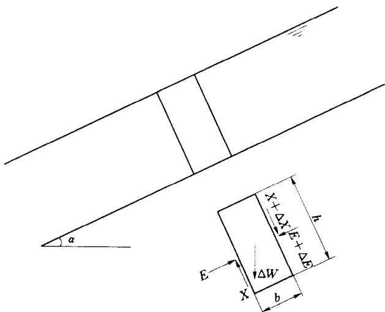  
图 2.7 说明研究对象的两种处理方案等效性的例子

现用两种不同的处理方法计算其安全系数。

(1) 将土骨架作为研究对象，那么土骨架承受的外力有：

1) 浮力 $= \gamma _ { b } b h$

2) 渗透力 $= b h \gamma _ { _ { w } } J$

其中J为渗透坡降，γ和γ分别为土体的浮容重和水容重。在本例，显然有 $\gamma _ { b }$ $\gamma _ { w }$

$$
J = \sin \alpha\tag{2.57}
$$

故渗透力 $= \boldsymbol { b } h \gamma _ { w }$ sinα。

如前所述，由于本例是个无限均质边坡，故土条侧面的条间法向作用力有

$$
\Delta E ^ { \prime } = 0 ~ , ~ \Delta X = 0\tag{2.58}
$$

因此有

$$
F = \frac { \gamma _ { b } b h \cos \alpha \tan \phi ^ { \prime } + c ^ { \prime } b } { ( \gamma _ { w } + \gamma _ { b } ) b h \sin \alpha }\tag{2.59}
$$

(2)将水、土混合体作为研究对象。此时作用于土条的外力有：

1) 土条自重 $W = ( \gamma _ { _ { w } } + \gamma _ { _ { b } } ) b h$

2) 条间作用力 E应平行于边坡，并有 $\Delta E = 0 , X = 0$ 0

由于等势线垂直于坡面和滑面，作用于条底的孔隙水压力U按下式确定

$$
U = \gamma _ { _ { w } } b h { \cos } \alpha\tag{2.60}
$$

故条底有效作用力为 $N '$

$$
N ^ { \prime } { = } W \cos \alpha - U = \gamma _ { b } b h \cos \alpha\tag{2.61}
$$

安全系数为

$$
F = { \frac { N ^ { \prime } \tan \phi ^ { \prime } + c ^ { \prime } b } { W \sin \alpha } }\tag{2.62}
$$

不难发现，式(2.62)和式(2.59)是一样的，说明如果研究这一个土体的整体稳定性，两种处理方案可获得相同的安全系数。

但是，由于边坡稳定分析本质上是一个超静定问题，在大多数情况下，我们需要引入对土条侧向力的假定方可求解安全系数。那么，如果假定对象不一样，结果仍会不一样。在上面的推导中，对β的假定是指土条间的总作用力G，而不是土条骨架间的有效作用力 $G ,$ $G ^ { \prime } { } _ { \circ }$ 如果将土骨架作为研究对象，那么就要对G'的倾角β′作假定了。因此，两种处理方法， $G ^ { \prime }$ $\beta ^ { \prime }$ 尽管具有相同的力学背景，但由于处理细节不完全一致，其结果仍会有微小的差别。

显然计算边界力比计算渗透力要方便得多。既然两种处理方法在本质上是一致的，习惯上，大多数人都将浸水土体作为研究对象。此时，水对土的作用力，即浮力和渗透力将视为内力不再考虑。本章和下一章中介绍的稳定分析的各种方法的推导均是就这种处理方法而言的。在STAB程序中，我们也是采用这种方法，也就是说，在使用程序时，要求用户输入的是土的实际重量和孔隙水压力，并不要求输入浮重量和渗透力。

## 2.4.3 对坡外水体的处理

在建立上述通用条分法时，我们没有考虑坡外有水的情况。Bromhead等(1999)曾讨论过此问题。

对图2.8(a)所示坡外有水的情况。此时，通常采用下面三种处理方案。

方案1：将滑裂面延长与坡外水位交于 $\mathbf { P } ,$ 如图2.8(a) 所示。研究包括坡外水体在内的滑坡体ADEPCGB的抗滑稳定。此时水可看成是强度指标为零的一种特殊材料。静力平衡方程为

$$
{ \pmb W } + { \pmb G } ^ { \prime } + { \pmb U } = 0\tag{2.63}
$$

式中：W、G'、U分别为土重（包括水重）、作用在滑面上的有效作用力和孔隙水压力。 $\pmb { W }$ $\pmb { G } ^ { \prime }$ ${ \pmb U }$

方案2: 将坡外水位延长至与滑裂面 ABC 交于 G，图 2.8(a)。设想水面 PEG 与滑裂面 $\pmb { 2 } \colon$ GCP 包成一个水体重 Ww，见图2.8(b)。沿滑面GCP 按静水压us分布的水压力为 Uq，则 $\boldsymbol { W _ { w } }$ $\pmb { u } _ { s }$ $U _ { s }$

$$
U _ { s } + W _ { w } = 0\tag{2.64}
$$

$$
u _ { s } = \gamma _ { w } z\tag{2.65}
$$

式中： $\gamma _ { w }$ 为水容重，z为滑面上任一点与坡外水位的垂直距离。

现在，将 $U _ { s }$ 和 $\pmb { W } _ { w }$ 在整个力系中扣除，这样并不影响静力平衡。即将式(2.63)和式(2.64)相减

$$
W _ { a } + ( W _ { b } - W _ { w } ) + G ^ { \prime } + ( U - U _ { s } ) = 0\tag{2.66}
$$

坡外水体部分其重量本身等于W，如图2.8(b)所示。通过坡外那块水体的滑面PC的 $\pmb { W } _ { \pmb { \ w } }$ 水压力又恰好为静水压力U，故对于坡外水体那部分，式(2.66)中各项均为零。问题被置换 $\pmb { U _ { s } }$ 成一个坡外无水的情况，即图2.8(c)。坡内的土重分成两部分。坡外水位以上部分用W表 ${ \pmb W } _ { \pmb { a } }$ 示，在置换前后保持不变。坡外水位以下部分用W表示，置换成实际重减同体积水重 $\pmb { W } _ { b }$ $( W _ { b } - W _ { w } )$ o

因此，当坡外有水时，可以将它看成一个无水的情况，只需将水位延伸至与滑弧面相交后作以下两个处理：

1) 水位延长线以下的土体由实际重W置换成实际重减同体积水重 $( W _ { b } - W _ { w } )$ ，如果土体是饱和的，这一数值就是浮重；

2) 水位延长线高程以下的滑面，即图 2.8(c)中的 GC的孔隙水压 u被置换成超孔隙水压 $\pmb { u } _ { e }$ 9

$$
\pmb { u } _ { e } = \pmb { u } - \pmb { u } _ { s } = \pmb { u } - \pmb { \gamma } _ { w } z\tag{2.67}
$$

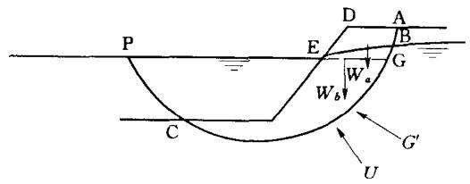  
(a)

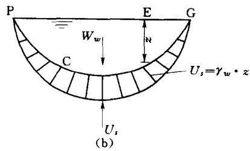

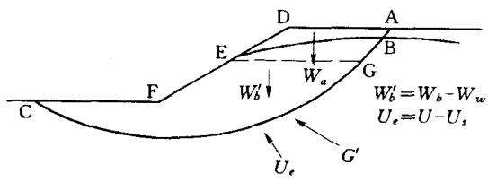  
(c)

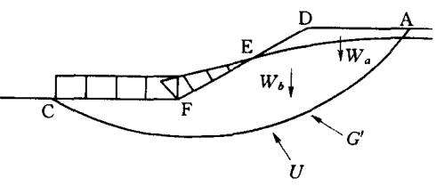  
(d)  
图 2.8 坡外水位处理的三种方案  
(a)第一种方案；(b)水体的静力平衡：(c)第二种方案；(d)第三种方案

我国土石坝设计规范规定要应用第二种方案，即置换法进行稳定分析。因此，在以后的叙述中，一般总是就坡外无水，土条重和孔压经过置换的情况而言。

使用这一处理，还需要注意的一个重要问题是，必须将坡外水位延伸到与滑裂面相交，将这条线以下所围的土体的重量都减掉同体积的水重，把这条线以下滑裂面上的孔压都扣掉一个静水压力 $\gamma _ { w }$

如图2.9所示的几种情况，阴影所示的土区的重量和滑裂面上的孔压，即便并不存在水和孔隙水压，也要作同样的处理，尽管有时会造成负的孔压其至负的重量。不这样处理，总体的力的平衡就会被破坏。通过手算或自编程序进行边坡稳定分析的工程师，都要注意这是极易犯错误的地方。

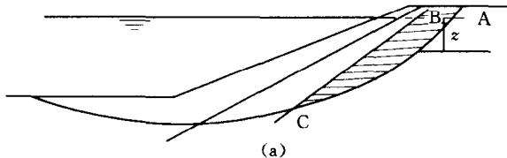

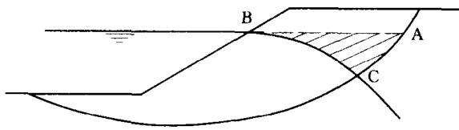  
(b)

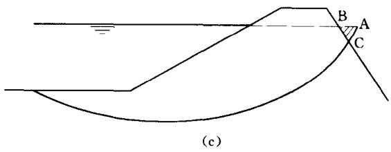  
图 2.9 使用等效置换的几个特例

在STAB程序中，坡外水位的等效置换是自动实现的，对用户来说，需要正确地输入坡外水位的坐标值和浸润线的信息，至于上述的等效置换的种种处理方法，程序均自动进行，无须用户操心。

方案3：将坡外水压力直接加在坡面上，如图2.8(d)所示。这个方案从理论上看没有什么缺陷，大概是因为操作起来比较麻烦，故未见广泛应用。

和2.4.2节讨论的情况类似，由于边坡稳定分析本质上是一个超静定问题，在建立对整个滑坡体静力平衡的同时，还要对每个土条的静力平衡进行分析，而在此时，将引入对土条侧向力倾角的假定。上述不同的方案包含的对侧向力的假定不同，故不可能得到完全相同的结果。例如，对于第二种方案，彻底的等效置换应该对每个土条进行。也就是说，不仅土条底的孔隙水压被置换成了超孔隙水压力，侧向力G的总作用力也应置换成有效作用力G'加上超孔隙水压力U。用G'来代表这个力。那么，在通用条分法和下面第3章要介 $G ^ { \prime }$ $U _ { e } ,$ $G _ { e } ^ { \prime }$ 绍的各种简化方法中，如采用第二种等效置换方案，土条侧向力的数值和倾角，就是G和 $G _ { e } ^ { \prime }$ $\beta _ { e } ^ { \prime }$ 。因此，这种等效置换与不作置换，由于包含的对侧向力的假定不同，一般仍不会得到完全相同的结果。进一步深入分析可以得到以下的认识。在这里，我们暂且将在第三章介绍的各种简化方法一并予以讨论。

毕肖普法假定土条侧向力为水平方向，每个土条在使用1、2方案时假定侧向的总应力为水平方向，等效置换后假定侧向有效作用力加超孔隙水压力后为水平方向。这一变化完全不影响将在第三章介绍的从式(3.5)至式(3.6)的推导，因此，采用此3种方案进行毕肖普法运算，从理论上讲，应得到完全一致的结果。

所有其它方法都不可能对坡外水位的上述三种处理方法得到完全一致的结果。至少，对于由坡外水体组成的条块，这些方法固有的对土条侧向力的假定会与水压力对侧向力的要求β=0发生矛盾。在应用通用条分法时，则要求对f(x)和f(x)作出特殊的处理，保证按 $\displaystyle { \mathbf { \partial } : \beta = 0 }$ ${ \pmb { \mathscr { f } } } ( { \pmb x } )$ $f _ { 0 } ( x )$ 式(2.30)计算获得的β(x)在水体部分为零。我国规范规定采用等效置换方法，其有效性取决 $\beta ( x )$ 于对大量实例运算结果的分析和判断。为此我们通过两个例题来研究不同坡外水位处理方法获得的成果的差别。

[例2.3] 比较使用毕肖普简化法采用第1和第2种方案的差别。

图2.10(a)示铁山水库大坝上游坝坡的稳定分析，对所示圆弧滑裂面进行毕肖普法计算。如果按第2方案即对坡外水体进行等效置换，安全系数为2.535（数据文件名CPT9-1），如果滑裂面延长到库水位，如图2.10(b)所示，则安全系数为2.538（数据文件名CPT9）。本例说明，对毕肖普法，第1、2种方案可获得相同的结果。

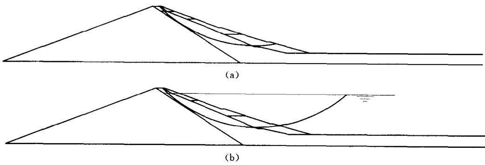  
图2.10 比较毕肖普法采用各对坡外水位处理方案的计算成果（铁山水库例）(a) 第二种处理方案；(b) 第一种处理方案  
[例2.4] 三峡3 坝段抗滑稳定。

本例比较对坡外水位不同的处理方案的结果。图2.11示三峡大坝三坝段断面。在大坝基础内存在中缓倾角节理面，假定大坝沿 AB 面下滑，并在C点滑出，此时，使用 STAB程序进行计算，上游库区把水体按一种材料处理，大坝承受的水压力按充水的拉力缝处理(参见2.4.4节)，即在AD面上施加一个水压力，如图2.11所示。计算所得的安全系数为3.257。

本例也可以将库水按照一种材料来处理（其容重为零，c、φ为零)，滑裂面如图2.12中ABCD所示。但是在使用通用条分法时，应保证在AB段的β值为零。在式(2.30)中， $\beta$ 可这样来设定 $\pmb { \mathscr { f } } ( \pmb { x } )$ 和 $f _ { \mathrm { o } } ( x )$ ，令该两函数在AB段均为0，计算所得的安全系数为3.233。

由于本例分析下游边坡，涉及的坡外水位，均指对下游水位。现有，我们再来考察第一和第三种处理方案计算成果的差异。图2.13(a)示将坡外水视为一种土体的处理，滑面BC通过下游水体（数据文件CPT2-3)，图2.13(b)示将坡面CA和 AB作用静水压力的做法（数据文件CPT2-4)，表2.3 示不同的处理方法获得的安全系数。可见几种处理方案的结果十分接近。

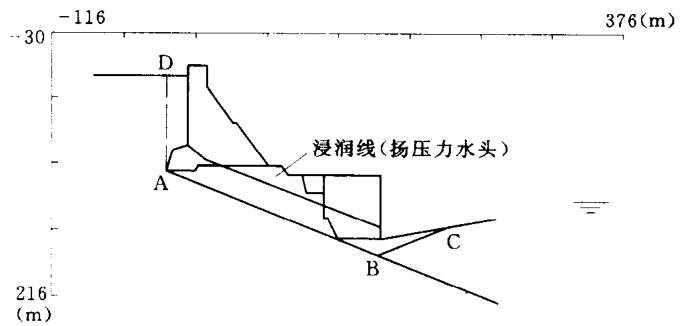  
图 2.11 [例2.4] 库水按拉力缝处理（下游水位第 2 种方案）

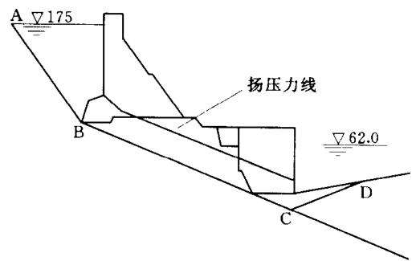  
图2.12 [例2.4] 库水按照一种材料处理（下游水位第2种方案）

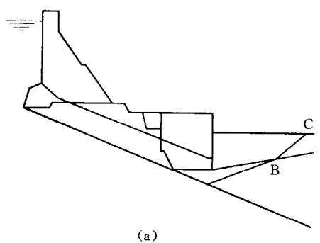

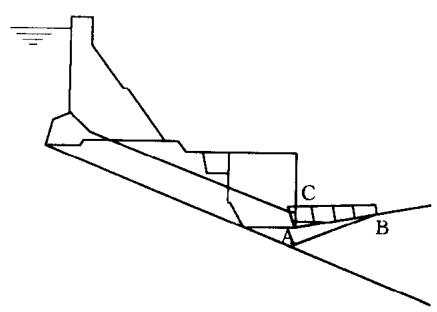  
图 2.13 [例 2.4] 库水按拉力缝处理  
(a) 下游水位采用第一种方案，滑裂面BC部分通过坡外水体， $F { = } 3 . 3 0 2 ;$  
(b) 下游水位采用第三种方案，坡面AC、AB 部分作用静水压力， ${ F } = 3 . 3 9 5$

本例采用第1章介绍的通用条分法，为了保证滑裂面通过水库和下游水体的那两个部分土条的侧向力的 $| \beta = 0$ ，需对 $f _ { \mathrm { 0 } } ( x )$ 和f(x)在相应的这些部分作专门的处理，可参阅相应的数据文件。

使用上述三种方案应用 STAB程序进行计算，需要对滑裂面通过水体部分的强度指标，浸润线和f(x)的输入作专门的不同处理，只有掌握了第12章介绍的 STAB程序的各种常规和特殊处理技能方能获得正确的解答。

表2.3 三峡大坝3 坝段深层抗滑稳定计算采用不同处理方案计算成果
<table><tr><td rowspan="2">情况</td><td rowspan="2">图号</td><td colspan="2">处理原则</td><td rowspan="2">安全系数  $_ { F }$ </td><td rowspan="2">数据 文件</td></tr><tr><td>上游</td><td>下游</td></tr><tr><td>1</td><td>2.11</td><td>库水按拉力缝处理</td><td>方案2</td><td>3.257</td><td>CPT2-1</td></tr><tr><td>2</td><td>2.12</td><td>滑面通过库水位</td><td>方案2</td><td>3.233</td><td>CPT2-2</td></tr><tr><td>3</td><td>2.13 (a)</td><td>同情况1</td><td>方案1</td><td>3.302</td><td>CPT2-3</td></tr><tr><td>4</td><td>2.13 (b)</td><td>同情况1</td><td>方案3</td><td>3.395</td><td>CPT2-4</td></tr></table>

## 2.4.4 关于滑面顶部设拉力缝的必要性

一些学者很早就认识到，按照极限平衡的理论体系获得的解，如果c值较大时，在靠近滑面顶部的土条，按式(2.20)将给出数值为负的条间力G，按式(2.10)和式(2.11)计算滑面上的法向力N，也可能得到负值。这一现象不仅不合理，而且有时会导致数值计算不收敛 $N ^ { \prime } ,$ 的问题。Terzaghi(1942)讨论了在滑面顶部设拉力缝的必要性，并推导了计算拉力缝高度 $h _ { t }$ 的公式，即

$$
h _ { t } = \frac { 2 c ^ { \prime } } { \gamma } \tan ( 4 5 ^ { \circ } + \frac { \phi _ { e } ^ { \prime } } { 2 } )\tag{2.68}
$$

式中： $\gamma$ 为土的容重。

在通用条分法的理论框架内，我们可以用以下简捷的推导获得这一公式。首先认定，在滑面顶部，滑面与水平线的夹角α为 $\frac { \pi } { 4 } + \frac { \phi _ { e } ^ { \prime } } { 2 }$ 。将α代入式(2.12)右侧，左侧G为零，并令${ \frac { \mathrm { d } G } { \mathrm { d } x } } = 0$ ，此时， $\frac { \mathrm { d } W } { \mathrm { d } x } = \gamma h _ { t }$ ，得到

$$
h _ { t } = \frac { c ^ { \prime } \cos \phi _ { e } ^ { \prime } } { \gamma \sin ( \displaystyle { \frac { \pi } { 4 } - \frac { \phi _ { e } ^ { \prime } } { 2 } } ) \cos ( \displaystyle { \frac { \pi } { 4 } + \frac { \phi _ { e } ^ { \prime } } { 2 } } ) }\tag{2.69}
$$

由于

$$
\cos \phi _ { e } ^ { \prime } = \sin ( \frac { \pi } { 2 } - \phi _ { e } ^ { \prime } ) = 2 \sin ( \frac { \pi } { 4 } - \frac { \phi _ { e } ^ { \prime } } { 2 } ) \cos ( \frac { \pi } { 4 } - \frac { \phi _ { e } ^ { \prime } } { 2 } )\tag{2.70}
$$

代入式(2.69)可得式(2.68)。从以上推导可知，式(2.68)是建立在以下假定基础上的：

1) 在拉力缝处，不仅 G 为零， $\frac { \mathrm { d } G } { \mathrm { d } x }$ 亦为零；

2)在拉力缝处，滑裂面与水平面夹角为 $( \frac { \pi } { 4 } + \frac { \phi _ { e } ^ { \prime } } { 2 } )$

上述两个假定不属于我们建立的边坡稳定通用条分法的理论体系，因此式(2.68)仍属近似。

在稳定分析中也可以采用另一种确定拉力缝高度的方法。假定某一较小的拉力缝高度$\pmb { h } _ { t } ;$ 采用常规的方法进行稳定分析，然后根据式(2.20)计算在顶部的侧向力G值，在 $h _ { t }$ 较小时，G(a)将为负值。不断增加h,的数值，反复计算，直至G(a)从小于零过渡到等于零。相 $G ( a )$ $h _ { t }$ 应此时的h，可以认为是所求的拉力缝高度。但是，这样的计算过于繁复，因此，采用式(2.68) $h _ { t }$ 应该是一个可以接受的近似方法。

## 2.5 关于通用条分法理论问题的讨论

## 2.5.1 Morgenstern-Price法

通用条分法最早由Morgenstern 和 Price(1965)提出。原作者将土条侧面的总水平推力E和切向力 X，分别用以替代式(2.10)和式(2.11)中的 Gcosβ和 $G \mathrm { s i n } \beta ,$ 同样，消去N后令Δx$\mathtt { \Gamma } \mathtt { \Gamma } \mathtt { \Gamma } \mathtt { \Gamma } \mathtt { \Gamma } \mathtt { \Gamma } \mathtt { \Gamma } \mathtt { \Gamma } \mathtt { \Gamma } \mathtt { \Gamma } \mathtt { \Gamma } \mathtt { \Gamma } \mathtt { \Gamma } \mathtt { \Gamma } \mathtt { \Gamma } \mathtt { \Gamma } \mathtt { \Gamma } \mathtt { \Gamma } \mathtt { \Gamma } \mathtt { \Gamma } \mathtt { \Gamma } \mathtt { \Gamma } \mathtt { \Gamma } \mathtt { \Gamma } \mathtt { \Gamma } \mathtt { \Gamma } \mathtt { \left( \mathbf { \Gamma } \right) } \mathtt { \Gamma } \mathtt { \left( \mathbf { \Gamma } \right) }$ ，得到静力平衡的微分方程：

$$
\begin{array} { l } { \displaystyle - \frac {  { \mathrm { d } } E } {  { \mathrm { d } } x } \bigl [ 1 + \tan \phi _ { e } ^ { \prime } \tan \alpha \bigr ] + \frac {  { \mathrm { d } } X } {  { \mathrm { d } } x } \bigl [ \tan \phi _ { e } ^ { \prime } - \tan \alpha \bigr ] } \\ { = c _ { e } ^ { \prime } \sec ^ { 2 } \alpha + ( \frac {  { \mathrm { d } } W } {  { \mathrm { d } } x } - \frac {  { \mathrm { d } } V } {  { \mathrm { d } } x } ) ( \tan \phi _ { e } ^ { \prime } - \tan \alpha ) - u \sec ^ { 2 } \alpha \tan \phi _ { e } ^ { \prime } - \frac {  { \mathrm { d } } Q } {  { \mathrm { d } } x } ( 1 + \tan \phi _ { e } ^ { \prime } \tan \alpha ) } \end{array}\tag{2.71}
$$

力矩平衡方程为

$$
X = - y { \frac { \mathrm { d } E } { \mathrm { d } x } } + { \frac { \mathrm { d } } { \mathrm { d } x } } ( y _ { t } E ) + \eta { \frac { \mathrm { d } W } { \mathrm { d } x } } h _ { e }\tag{2.72}
$$

在求解过程中，对每个土条的几何物理参数进行线性化：

对底滑面

$$
y = A x + B\tag{2.73}
$$

对土条重量

$$
\frac { \mathrm { d } W } { \mathrm { d } x } = p ^ { \prime } x + q ^ { \prime }\tag{2.74}
$$

对土条水平荷载

$$
{ \frac { \mathrm { d } Q } { \mathrm { d } x } } = p _ { o } x + q _ { o }\tag{2.75}
$$

对土条垂直荷载

$$
q - { \frac { \mathrm { d } V } { \mathrm { d } x } } = p _ { o } ^ { \prime } x + q _ { o } ^ { \prime }\tag{2.76}
$$

对式(2.29)侧向力假定函数

$$
f ( x ) = k x + m\tag{2.77}
$$

则式(2.72)可化为

$$
( K x + L ) { \frac { \mathrm { d } E } { \mathrm { d } x } } + K E = N x + P\tag{2.78}
$$

$$
K = \lambda k \big ( \tan { \phi _ { e } ^ { \prime } } - A \big )\tag{2.79}
$$

$$
N = p ^ { \prime } \Big [ \mathrm { t a n } \phi _ { e } ^ { \prime } - A - r _ { u } ( 1 + A ^ { 2 } ) \tan \phi _ { e } ^ { \prime } \Big ] - p _ { o } ( 1 + A \tan \phi _ { e } ^ { \prime } ) + p _ { o } ^ { \prime } ( \tan \phi _ { e } ^ { \prime } - A )\tag{2.80}
$$

$$
L = \lambda m \big ( \tan \phi _ { e } ^ { \prime } - A \big ) - ( 1 + A \tan \phi _ { e } ^ { \prime } )\tag{2.81}
$$

$$
P = c _ { e } ^ { \prime } ( 1 + A ^ { 2 } ) + q ^ { \prime } \Bigl [ \tan \phi _ { e } ^ { \prime } - A - r _ { u } ( 1 + A ^ { 2 } ) \tan \phi _ { e } ^ { \prime } \Bigr ] - q _ { o } ( 1 + A \tan \phi _ { e } ^ { \prime } ) + q _ { o } ^ { \prime } ( \tan \phi _ { e } ^ { \prime } - A )\tag{2.82}
$$

在线性化基础上对方程式(2.78)在 $x _ { i }$ 到 $x _ { i } + \Delta x _ { i }$ 区间内进行积分，可以求得

$$
E _ { i + 1 } = \frac { 1 } { L + K \Delta x } ( E _ { i } L + \frac { N \Delta x ^ { 2 } } { 2 } + P \Delta x )\tag{2.83}
$$

从坡顶第一个界面 $E _ { 0 } = 0$ 开始。从上到下，逐条求出法向条间力 $E _ { i } ,$ 对最后一土条必须满足条件

$$
E _ { n } ( F , \lambda ) = 0\tag{2.84}
$$

对微分方程式(2.72)积分，考虑到 $E ( a ) = \ E ( b ) = \ 0$ ，可得

$$
M _ { n } ( F , \lambda ) = \int _ { a } ^ { b } ( X - E { \frac { { \mathrm { d } } y } { { \mathrm { d } } x } } ) { \mathrm { d } } x - \int _ { a } ^ { b } { \frac { { \mathrm { d } } Q } { { \mathrm { d } } x } } h _ { e } { \mathrm { d } } x = 0\tag{2.85}
$$

同样，采用 Newton-Raphson 法对包含于式(2.84)和式(2.85)中的 F 和λ进行迭代求解。

## 2.5.2 土条侧向力须满足的边值条件

在求解滑动土体的力和力矩平衡方程式时，为了使问题变得静定可解，我们引入了对$\tan \beta$ 3的假定，即式(2.29)。本节论证的问题是， $\tan \beta$ 值在滑动土体两端，即 $x = a$ 和 $\scriptstyle x = b$ 处是确定的，不能随意假定，否则将违背剪应力成对的原理。这一命题，是作者和Morgenstern(1983)首先提出的。

首先，考察一个处于滑面下部逸出点的端部的土条B，见图2.14(a)。这是一个特殊的土条，它具有三角形形状，土条在此尖灭为一个单元。在这个土单元的垂直面CD上有

$$
\tan \beta _ { b } = \operatorname* { l i m } _ { x  b } \frac { X } { E } = \frac { \tau _ { x y } } { \sigma _ { x } }\tag{2.86}
$$

式中：β为β(x)在端部的值；τ和σx分别为作用在边条块BCD的垂直面CD上的剪应力 $\beta _ { b }$ $\beta$ $\tau _ { x y }$ $\sigma _ { x }$ 和垂直应力。

式(2.86)说明，如果端点的应力状态是确定的，则β在端点处的值也是确定的。就图2.14中的B点的情况而言，τ的值是零，在σ,不等于零的时候，β的值就是零。换句话说，如 $\tau _ { x y }$ $\sigma _ { x }$ $\beta _ { b }$ 果β(x)的值在端点被假定为非零的话，在端部剪应力成对的原理将受到破坏。 ${ \boldsymbol \beta } ( { \boldsymbol \boldsymbol \ x } )$

现在我们来提出一个具有一般意义的情况。设右端部 A 土条坡面倾角为γ，并在坡面 $\gamma$

作用一垂直荷载 $q { \mathrm { : } }$ 参见图2.14(b)。该土单元在AB面上的应力状态是确定的，分别为

$$
\sigma _ { s } = q \cos ^ { 2 } \gamma\tag{2.87}
$$

$$
\tau _ { s } = q \sin \gamma \cos \gamma\tag{2.88}
$$

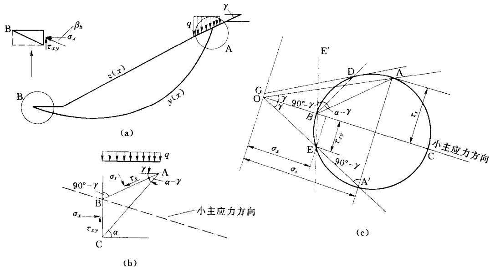  
图 2.14 土条侧向力须满足的边值条件示意图  
(a) 上下端点土条；(b)上端点的应力状态；(c) 上端点的应力的应力圆

同时，还要求代表该单元应力状态的应力圆与摩尔一库伦强度包线相切，那么这个应力圆就被唯一的确定了。图2.14(c)为反映该单元应力状态的摩尔圆。作用在单元上任何一个面上的应力状态都可以方便地在摩尔圆中找到。当单元的小主应力方向和摩尔圆的轴平行时，从摩尔圆的小主应力点B引一条与该面平行的割线，其与摩尔圆的交点代表了该面的应力状态。例如图 2.14(b) AB 面上的应力状态 $( \pmb { \sigma _ { s } } , \pmb { \tau _ { s } } )$ 是由图2.14(c)中的 A 点代表的。注意两图中的AB互相平行。单元的垂直面BC的应力状态(σnτ)是由E点代表的。由于图2.14 $( \sigma _ { \mathfrak { p } } \tau _ { \mathfrak { x } } )$ (b)中 BC 和 BA 两个面之间的夹角是 $9 0 ^ { \circ } - \gamma$ 因此图2.14(c)中 $\angle \mathbf { A B E ^ { \prime } } = \angle \mathbf { A A ^ { \prime } O } = 9 0 ^ { \circ } - \gamma$ 这就决定了在 BC 面上

$$
\tan \beta _ { a } = \frac { \tau _ { x y } } { \sigma _ { x y } } = - \tan \gamma\tag{2.89}
$$

这样，就获得了一个重要结论：端部土条侧向力必须与端部边坡表面平行。通过进一步的理论分析可知，对土条侧向力的边界条件应作出如下限制：

命题1当土条的宽度足够小时，端点土条侧向作用力的合力平行于该土条顶面，即

$$
\beta _ { a } = \gamma _ { a }\tag{2.90}
$$

命题2当土条的宽度足够小时，端点土条的侧向作用力的作用位置 $A _ { c } ^ { ' }$ 确定原则为

$$
\begin{array} { r l r } { A _ { c } ^ { \prime } = 1 / 2 } & { { } } & { \mathbb { X } \mathbb { Y } \mathbb { F } \mathbb { H } \mathbb { H } \mathbb { X } { \bf A } } \\ { A _ { c } ^ { \prime } = 1 / 3 } & { { } } & { \mathbb { X } \mathbb { Y } \mathbb { F } \mathbb { H } \mathbb { H } \mathbb { X } { \bf B } } \end{array}\tag{2.91}
$$

定义情况 A 为在端部粘聚力 $c ^ { \prime } { \neq } 0$ 或垂直表面荷载 $q \not = 0$ ；情况B为在端部， $c ^ { \prime } { = } 0$ 同时$q { = } 0$ ，并且滑裂面不与边坡表面相切。即

$$
y ^ { \prime } ( a ) - z ^ { \prime } ( a ) \neq 0\tag{2.92}
$$

根据本论点确定A在边界x=a的数值后，再使用式(2.29)，即可算得每一个土条的 $A _ { c } ^ { ' }$ $x { = } a$ $y _ { t }$ 值。

上述两论点的理论证明见本章附录2.6.1节。

固定土条侧向力在端部的值，可以限制对β假定的任意性，具有一定的理论和实用意 $\boldsymbol { \beta }$ 义。为了使对tanβ的假定符合本节提出的限制，提出了式(2.30)这样一个具有普遍意义的假定函数。

从实用角度，可以对式(2.30)中的 $f _ { \mathrm { o } } ( x )$ $\pmb { \mathscr { f } } ( \pmb { x } )$ 取下面两种假定，它分别代表了方法严格程度的两个水平。

(1) 土条侧向力实用假定1：取 $f _ { 0 } ( x ) = 0 , f ( x ) = 1$ 这就是常用的 Spencer 法，参见图 2.1(b)。

(2) 土条侧向力实用假定 2： 取f(x)在(a，b)区间内为直线，其值在 x=a，b 时按式(2.35) $f _ { \mathrm { o } } ( x )$ $\pmb { x } \pmb { = } \pmb { a }$ 确定， $f ( x )$ 为正弦曲线，参见图2.1(c)。

STAB 程序默认地功能是实用假定1，此时 ${ \bf O P 1 } ( 3 ) { = } 0 _ { \circ }$ 当OP1(3)不为零时，输入其它侧向力假定。 $\mathbf { I S P E } { = - 2 }$ 时，自动实现土条侧向力实用假定2；ISPE=0时，由用户指定 $f _ { \circ } ( x )$ 和f(x)。详见 12.2.4 节以及第 12 章的例题 EX25、EX27、EX29。 $f ( x )$

虽然作者和Morgenstern 提出这一命题，但是在大多数情况下，大家还都是应用 Spencer法，即取 $f _ { 0 } ( x ) { = } 0 , \ f ( x ) { = } 1$ 。关于端部条块β值的限制，恐怕主要在于它的理论意义。实践也证明，对计算成果的精度的影响并不大。但是，在某些情况下，简单地采用Spencer法，将导致误差和数值分析不收敛的问题。下面2个例子是作者在实际工作中遇到的。同时，在使用通用条分法进行土压力计算时（第8章)，也需对端部条块β值作出限制。 $_ { ; \beta 1 }$

[例2.5] 重力坝抗滑稳定例。

图2.15是水利部上海勘测设计院在进行宜兴抽水蓄能电站重力坝方案时事先设计的一个例题。使用STAB程序计算时，利用坡顶设拉力缝并充水的功能模拟重力坝承受的水压力。对这样一个简单的混凝土大坝抗滑稳定问题，在设定的推力和滑面上的强度指标条件下，安全系数完全可以用简单的力学平衡求得。此例φ和c分别取 ${ \pmb \phi } ^ { \mathrm { i } } $ $^ c$ $3 8 . 6 6 ^ { \circ }$ 和 $3 5 { \times } 9 . 8 \ \mathrm { \ k N } / \mathrm { m } ^ { 2 }$ 混凝土容重取 $2 . 5 { \times } 9 . 8 \mathrm { k N } / \mathrm { m } ^ { 3 }$ ，无扬压力，可得 $F { = } 1 . 8 6 7$ 。可是，采用 STAB 程序的 Spencer法，安全系数却是 $F { = } 2 . 5 8 5$ o

出现这一问题的原因就在于对于A点对水压力的倾角的假定上面。显然，在A点β应 $\boldsymbol { \beta }$ 为零。而采用Spencer法，即土条侧向力应用假定(1)（图2.15中矩形分布图形)，则土条间作用力的倾角，包括A点，均为一非零的值，这样，就在端部β出现了突变点，就好象水 $\langle \beta \}$ 压力也是以一个倾斜的β角作用在坝面上。这一问题导致了安全系数严重地偏离正确值。如果我们采用土条侧向力应用假定(2)，参见图2.15 中下方所示三角形图形。令 $f _ { 0 } ( x )$ 在 A 点为零，获得了 $F { = } 1 . 8 6 8$ ，与理论值完全一致。

实际上，Spencer(1973)本人已经注意到了他的方法在处理拉力缝充水情况时这一问题。在他的进一步的研究中，提出了一个类似于Morgenstern-Price法的对侧向力的假定，以实现β值在拉力缝处为零这一条件。

在STAB程序中，当坡顶设拉力缝并充水时，程序将自动处理，使土条侧向力应用假定(2)。

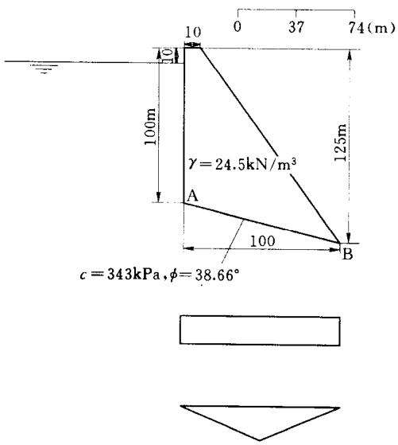  
图 2.15 [例 2.5] 混凝土坝抗滑稳定题例

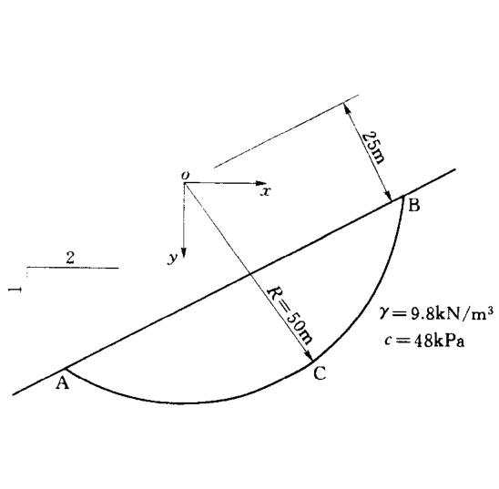  
图 2.16 [例 2.6] 圆弧滑动题例

[例2.6] 圆弧滑动例。

图 2.16 示一圆弧滑裂面 $\scriptstyle \phi = 0$ 的情况。显然，对于这样一个简单的情况，如对圆弧中心取矩，任何一个包含力矩平衡条件的稳定分析方法均应给出相同的结果，即 $F = 1 . 1 0 1 $ 。令人惊讶的是，采用土条侧向力1，即 Spencer法，居然无法得到收敛的解答。作者不仅尝试了本人编著的STAB程序，同时也使用另一商用程序，均无结果。

试按图 2.3 所示的思路，构筑了 $F _ { G } ( \beta )$ 和 $F _ { M } ( \beta )$ 图，如图2.17(a)所示。可见在β的合理取值范围内(-5°\~25°)，两条曲线无论如何也交不上。为此，我们改用了图2.1(b)所示对侧向力的第2假定。此时，根据本节介绍的对侧向力倾角边值条件的讨论，在滑面两端的β值均应与坡面倾角相同，即取f(x)在两端的数值为0.5。这样，使用通用条分法，即可顺利地收敛到 $F { = } 1 . 1 0 1 $ 这一一数值。图2.17示迭代收敛后β值的分布。本例再一次说明对侧向力倾角β在两端取合理数值，在有的情况下是必要的。

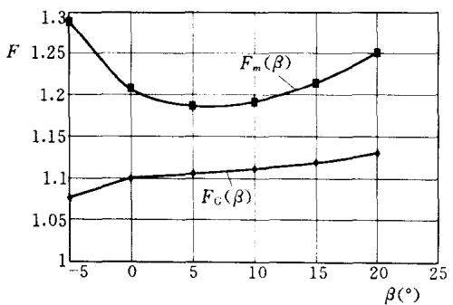  
(a)

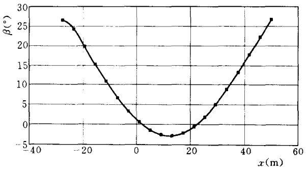  
(b)  
图 2.17 [例 2.6] 安全系数的计算过程  
(a) M(F,λ)和 G(F,λ)图；(b) 采用侧向力的第 2 种假定得到的β值分布

## 2.5.3 土条侧向力假定对计算结果的影响

边坡稳定的极限平衡法认为，对多余未知数tanβ引入的不同假定，如果相应的解满足2.1节引入的合理性条件，即式(2.7)和式(2.8)，那么其安全系数各自都相差不大。如果说我们还没有条件对这一论点给出严格的理论证明，那么能不能设法将所有安全系数合理解的集合找到，检查该集合中的最大值和最小值是否果然相差不大。Chen & Morgenstern(1983)介绍的一个确定F值最大值和最小值的近似方法，就是基于这样的想法提出的。当然，关于这方面的工作只是一种理论研究，在实际应用时，有了本节研究的结论就不必重复这一繁琐的工作，一般情况下使用上节提出的关于侧向力的两个实用假定即可。

假定已经找到满足式(2.23)和式(2.24)的一组解 $F ^ { * }$ 和 $\vert \beta ^ { * } ( x )$

$$
G _ { n } = \int _ { a } ^ { b } p ( F ^ { * } , \beta ^ { * } ) s ( F ^ { * } , \beta ^ { * } ) \mathrm { d } x = 0\tag{2.93}
$$

$$
M _ { n } = \int _ { a } ^ { b } p ( F ^ { * } , \beta ^ { * } ) s ( F ^ { * } , \beta ^ { * } ) t ( F ^ { * } , \beta ^ { * } ) \mathrm { d } x - M _ { e } = 0\tag{2.94}
$$

如果邻近 $F ^ { * } { + } \Delta F$ $\beta ^ { * } { + } \Delta \beta$ 也满足式(2.93)、式(2.94)，则

$$
\begin{array} { l } { \Delta G _ { n } = \displaystyle { \int _ { a } ^ { b } p ( F ^ { * } + \Delta F , \beta ^ { * } + \Delta \beta ) s ( F ^ { * } + \Delta F , \beta ^ { * } + \Delta \beta ) \mathrm { d } x } - \displaystyle { \int _ { a } ^ { b } p ( F ^ { * } , \beta ^ { * } ) s ( F ^ { * } , \beta ^ { * } ) \mathrm { d } x } } \\ { = 0 } \end{array}\tag{2.95}
$$

$$
\begin{array} { l } { { \Delta M _ { n } = \displaystyle \int _ { a } ^ { b } p ( F ^ { * } + \Delta F , \beta ^ { * } + \Delta \beta ) s ( F ^ { * } + \Delta F , \beta ^ { * } + \Delta \beta ) t ( F ^ { * } + \Delta F , \beta ^ { * } + \Delta \beta ) \mathrm { d } x } } \\ { { - \displaystyle \int _ { a } ^ { b } p ( F ^ { * } , \beta ^ { * } ) s ( F ^ { * } , \beta ^ { * } ) t ( F ^ { * } , \beta ^ { * } ) \mathrm { d } x = 0 } } \end{array}\tag{2.96}
$$

如果取

$$
\Delta \beta = \Delta \varepsilon \xi ( x )\tag{2.97}
$$

$\pmb { \Delta \varepsilon }$ 是一个微小量，使 $\Delta \beta$ 相对于β足够小。 $\xi ( x )$ 为假定的一个 $\Delta \beta$ 的分布。

通过变分运算，可得

$$
\Delta G _ { n } = K _ { g f } \Delta F + K _ { g a } \Delta \varepsilon + o ( \Delta F , \Delta \varepsilon ) = 0\tag{2.98}
$$

$$
{ \Delta } M _ { n } = K _ { m f } { \Delta } F + K _ { m a } { \Delta } \varepsilon + o ( { \Delta } F , { \Delta } \varepsilon ) = 0\tag{2.99}
$$

其中 $K _ { g f } , K _ { g a } \ , K _ { m f } , K _ { m a }$ 的计算公式和推导详见2.6.2节。

$o ( \Delta F , \Delta \varepsilon )$ 代表一个比 $\Delta .$ F和 $\Delta \varepsilon$ 高阶的小量，忽略此小量，式(2.98)和式(2.99)变为

$$
K _ { g f } ( F ^ { * } , \beta ^ { * } ) \Delta F + K _ { g a } ( F ^ { * } , \beta ^ { * } , \xi ( x ) ) \Delta \varepsilon = 0\tag{2.100}
$$

$$
K _ { m f } ( F ^ { * } , \beta ^ { * } ) \Delta F + K _ { m a } ( F ^ { * } , \beta ^ { * } , \xi ( x ) ) \Delta \varepsilon = 0\tag{2.101}
$$

只有在下式成立时，ΔF和 $\Delta \varepsilon$ 才有非零解。

$$
\begin{array} { r l } { \left| K _ { g f } ( F ^ { * } , \beta ^ { * } ) \right. } & { { } \left. K _ { g a } ( F ^ { * } , \beta ^ { * } , \xi ( x ) ) \right| } \\ { \left| K _ { m f } ( F ^ { * } , \beta ^ { * } ) \right. } & { { } \left. K _ { m a } ( F ^ { * } , \beta ^ { * } , \xi ( x ) ) \right| } \end{array} = 0\tag{2.102}
$$

一旦找到了一个满足式(2.102)的ξ(x)， $\Delta F$ 即可算得

$$
\Delta F = \frac { K _ { g a } ( F ^ { * } , \beta ^ { * } , \xi ( x ) ) } { K _ { g f } ( F ^ { * } , \beta ^ { * } ) } \Delta \varepsilon\tag{2.103}
$$

由此可见，要在已知解 $F ^ { * }$ ， $\beta ^ { * }$ 基础上求得邻近的一组新的解 $F ^ { * } { + } \Delta F$ $\beta ^ { * } { \ + } \Delta \varepsilon \xi ( x )$ 选择的ξ(x)不是任意的，必须使式(2.102)成立。可以按下式构造一个ξ(x) $\pmb { \xi } ( \pmb { x } )$

$$
\xi ( x ) = m \xi _ { 1 } ( x ) + \xi _ { 2 } ( x )\tag{2.104}
$$

$\xi _ { 1 } ( x )$ 和 $\xi _ { 2 } ( x )$ 为任意函数，它们之间线性无关，即没有常数C₁和C₂可以使下式成立。 $C _ { 1 }$ $C _ { 2 }$

$$
\xi _ { 2 } ( x ) = C _ { 1 } \xi _ { 1 } ( x ) + C _ { 2 }\tag{2.105}
$$

一旦 $\xi _ { 1 } ( x )$ 和 $\xi _ { 2 } ( x )$ 设定后，将式(2.104)代入式(2.100) 和式(2.101)即可求得

$$
m = - \frac { K _ { g f } K _ { m a } \big [ F ^ { * } , \beta ^ { * } , \xi _ { 2 } ( x ) \big ] - K _ { m f } ( F ^ { * } , \beta ^ { * } ) \cdot K _ { g a } \big [ F ^ { * } , \beta ^ { * } , \xi _ { 2 } ( x ) \big ] } { K _ { g f } ( F ^ { * } , \beta ^ { * } ) K _ { m a } \big [ F ^ { * } , \beta ^ { * } , \xi _ { 1 } ( x ) \big ] - K _ { m f } ( F ^ { * } , \beta ^ { * } ) K _ { g a } \big [ F ^ { * } , \beta ^ { * } , \xi _ { 1 } ( x ) \big ] }\tag{2.106}
$$

于是就获得了 $\xi ( x )$ 。我们这样来选择 $\xi _ { 1 } ( x )$ 和 $\xi _ { 2 } ( x )$ ，它使 $\beta \left( x \right)$ 的峰值沿某一方向移动，直至合理性条件不再成立。例如，可以使用下面两组 $\xi _ { 1 } ( x )$ 和 $\xi _ { 2 } ( x )$

第一组 $\xi _ { 1 } ( x )$ 和 $\xi _ { 2 } ( x )$ 分别为椭圆和抛物线（图2.18中的曲线1和2）。如果Δε取正值， $\Delta \varepsilon$ 则ξ(x)就有可能使∆β在区间的中间部分为正值，两边为负值。换句话说，它将使β(x)的值在 $\xi ( x )$ $\Delta \beta ^ { \th }$ $\beta ( x )$ 中间部分增加，两边减少。反之，如果∆ε为负，β(x)的中间部分减少，两边增加。 $\Delta \varepsilon$ $\beta ( x )$

第二组 $\pmb { \xi } _ { 1 } ( \pmb { x } )$ 和 $\xi _ { 2 } ( x )$ 为三次曲线（图2.18中的曲线3和4）。其峰值分别在左侧和右侧。 4当Δε为正时，有可能获得一个在区间左半部为正，右半部为负的∆β，换句话说，它将使 $\pmb { \Delta \varepsilon }$ $\Delta \beta _ { : }$ $\beta ( x )$ 的峰值左移。当 $\pmb { \Delta \varepsilon }$ 为负时， $\beta ( x )$ 的峰值右移。

由于 $\boldsymbol { \cdot } \boldsymbol { \beta } \left( \boldsymbol { x } \right)$ 包含有 $\ b { F } _ { \nu e }$ 这个合理性要求指标的特性， $\beta \left( x \right)$ 的峰值的移动将最终使 $F _ { \nu e }$ 的值达到边界，越过此边界，F越过了1，合理性要求不再满足。 $F _ { \nu e }$

此外，从式(2.29)还可以看出，在区间(a，x)之间， β(x)的平均值如果增加，y在x的值 $\beta ( x )$ $y _ { t }$ $x$ 就有可能增加， $\pmb { A } _ { c } ^ { \prime }$ 值则减少。作为合理性要求的另一指标 $A _ { \textit { c } } ^ { \prime }$ 的值就有可能发生本质的变化。如果 $\xi _ { 1 } ( x )$ 和 $\xi _ { 2 } ( x )$ 采用曲线3和 4，就有可能实现 ${ \mathbf B } \left( x \right)$ 的平均值在区间(a，x)之间增加这一目的。

这样，通过选择恰当的 $\xi _ { 1 } ( x )$ 和 $\pmb { \xi } _ { 2 } ( \pmb { x } )$ ，就有可能变化 $F _ { \nu e }$ 和 $A _ { \mathfrak { c } } ^ { \prime }$ ，而最终找到受合理性要求控制的边界。

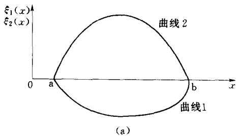

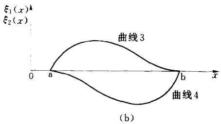  
图 2.18 两种建议曲线

下面通过两个例子来说明这个过程，具体材料参数参见文献(Chen& Morgenstern,1983)。

[例2.7] 确定合理安全系数解集的上、下限例(Chen & Morgenstern, 1983)。

图2.19所示的滑裂面的两个端部都终止在水平的土坡面上，因此β和β应为零。取 $\cdot \beta _ { a }$ $| \beta _ { b }$ $f _ { 0 } ( x )$ 为零，f(x)为正弦曲线，即可求得 Morgenstern-Price方法的一组解；安全系数 F为1.465，相应的λ为0.360，相应的Fv。和A的图形如图2.20中标有“初始解”的那些曲线所示。 $\boldsymbol { F } _ { v e }$ $A _ { \mathfrak { c } } ^ { \prime }$ 可见， $F _ { \ast e }$ 和 $A _ { \mathfrak { c } } ^ { \prime }$ 的值都满足合理性要求。但在区间的中部， $F _ { \nu e }$ 的值十分接近 $^ { * } F _ { \nu e } = 1 ^ { \prime \prime }$ 线。如果继续增大中部的β(x)值，F。在中部的值必将小于1，相应的解也就变成不满足合理性 $\boldsymbol { F } _ { \nu e }$ 要求的解。采用图2.18曲线1和2作为ξ1(x)和ξ，(x)，取∆ε为0.025。从图2.20(a)可以看 $\xi _ { 1 } ( x )$ $| \xi _ { 2 } ( x )$ $\pmb { \Delta \varepsilon }$ 出，经过12次积分后，在中间部分，F的值变得比1小了。相应的新解安全系数F值从 $F _ { v e }$ 原来的1.265变成了1.471。如果∆ε为-0.05，如图2.20(b)所示，则两边的β值将增加，经过 $\pmb { \Delta \varepsilon }$ $| \beta |$ 12次积分后，左边部分的F值减少到比1小。此时，安全系数F为1.455。再采用图2.18 $\boldsymbol { F } _ { \nu e }$ 曲线3、4，使β(x)的峰值向左或向右移。分别采用Δε值为0.04和-0.025，如图2.20(c)和图 $\beta \left( x \right)$ $\Delta \pmb \varepsilon$ 2.20(d)所示，其相应的安全系数F为1.470和1.444。

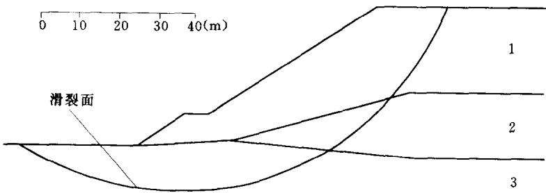  
图2.19 确定合理安全系数解集的上、下限例

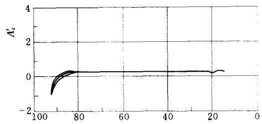

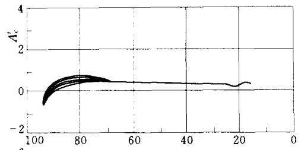

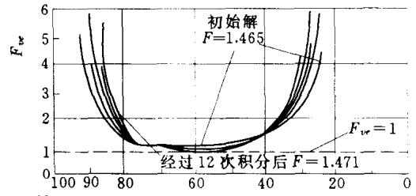

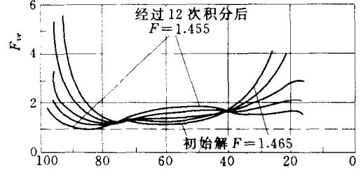

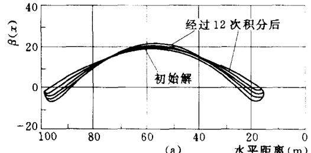

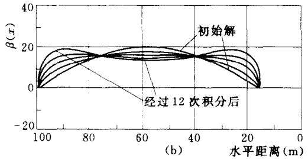

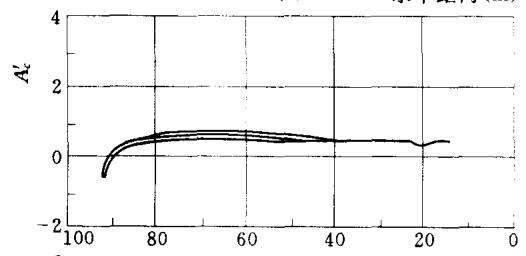

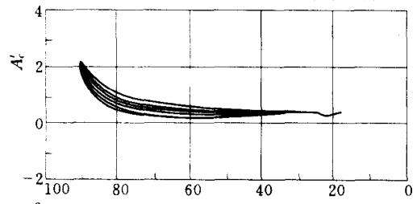

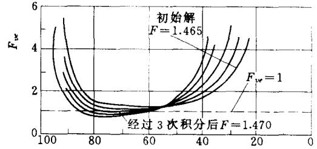

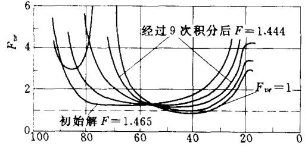

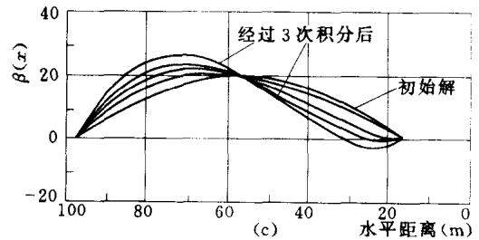

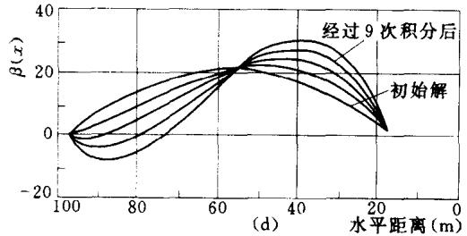  
图 2.20 [例2.7] 确定安全系数解集的上、下限过程  
(a) β(x)峰值上移 $\Delta \varepsilon = 0 . 0 2 5 ;$ (b) $\beta ( x )$ 峰值下移 $\Delta \varepsilon = - 0 . 0 5 ;$  
(c) β(x)峰值左移 $\Delta \varepsilon = 0 . 0 4 0 ;$ (d) β(x)峰值右移 $\Delta \mathfrak { E } ^ { \mathrm { ~ = ~ } - 0 . 0 2 5 }$

可以看到，在所有上述情况， $\pmb { A } _ { c } ^ { \prime }$ 值都是合理的。

现在，所假定的β(x)已经覆盖了相当大的区域，每一方向的积分都达到了合理性要求的边界。尽管还可以作更多的试算，但安全系数的最大、最小值可以很合理地确定为在1.471和1.444之间。这一算例说明，受合理性要求限制的安全系数解集的上、下限确定是很接近的。

[例 2.8] 加拿大 Edgeton 滑坡(Chen & Morgenstern, 1983)。

图 2.21 为加拿大 Edgeton 滑坡计算简图。图 2.22 示不断变化 ${ \mathbf \xi } _ { | \beta ( x ) }$ 的情况。与上例相反，$F _ { v e }$ 值一直都是合理的，但 $A _ { \mathrm { ~ c ~ } } ^ { \prime }$ 值在靠近边坡中部处趋于零。此例安全系数解集的上、下限也很接近。F值在0.960左右。

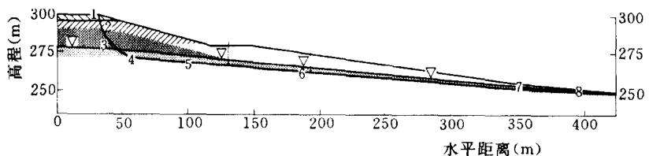  
图 2.21 [例 2.8] Edgeton 滑坡

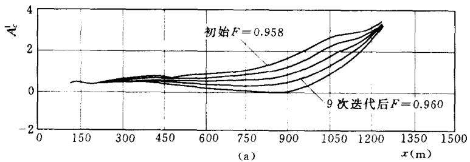

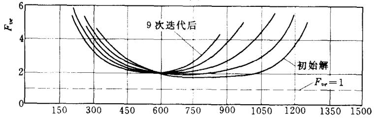

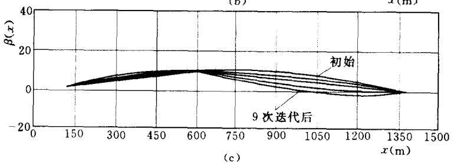  
图 2.22 [例 2.8] 确定安全系数解集的上、下限过程

## 2.5.4 其它通用条分法

## 1. 有关通用条分法的研究

开发同时满足力和力矩平衡条件的通用条分法，一直是边坡稳定分析领域中十分活跃一项研究工作。有关的文献浩瀚宏大。但是所有的方法，只要是建立在本章阐述的极限平衡法的理论基础上，在本质上都不会有很大的区别。已有的研究工作已十分充分，Morgenstern(1992)认为，在这一方面更多的研究工作，不会对深化这一领域的认识带来实质性的影响。本文简要地回顾并讨论一些有代表性的研究工作。

在边坡稳定极限平衡分析领域，主要的一项工作是对作用在滑动土体中的某些未知内力引入适当的假定，使问题变得静定可解。根据未知内力的特点，可将这些方法分为两大类。

(1) 对作用在滑面上的法向力作出假定。早期在这方面有不少学者曾发表过有关的研究论文。这些方法的特点是确定一个滑裂面的安全系数和确定临界面的步骤是合并在一起的。Baker和Garbo(1977,1978)引入了变分法原理，最后得出了临界滑裂面应是对数螺旋线的结论。这一工作后来受到了一系列论文的质疑(De Josselin De Jong，1980; Luceno &Castino, 1980; Castillo & Luceno, 1982)。

土条上某一点法向力的大小是由上复土条重量和该点以上滑体下滑力决定的。在确定法向力时，应充分考虑这些因素。Baker& Garbo等在对法向力进行假定时，无视了这些因素。鉴于对这一建立在变分原理和法向力假定基础上的方法在理论上的问题和很少有实际应用的事实，Duncan(1995)认为不能将其视为对边坡稳定分析方法有意义的改进。但近期仍有相关的研究成果(Leshchinsky, 1990; Leshchinsky & Huang. 1992)。

(2)对土条侧向力的某一参数进行假定，即垂直条分法。将滑动土体分成垂直土条，通过分析土条的静力平衡条件确定安全系数，仍是目前最为广泛的一种方法。在通用条分法中，根据假定的类型分为以下三大类：

1) 对土条侧向力的倾角的分布形状作假定，这一类方法已在本章作为主要内容作过详细的讨论；

2) 对土条倾向力的大小的分布函数作假定，这一类方法最有代表意义的是Sarma(1973)法；

3) 对土条倾向力的作用位置作假定，这一类方法最有代表意义的是Janbu(1973)法。

下面对 Sarma 法和 Janbu 法作一简单的介绍和讨论。

## 2. Sarma 法

首先，Sarma提出了一个临界加速度的概念。他假定每个滑动土条承受一个K∆W的水平力，滑体处于临界状态。K称为临界加速度系数。这样，滑裂面上的c'和φ′不再如按式(2.2) $\vert \phi ^ { \prime }$ 和式(2.3)缩减。但是为了和传统的安全系数接轨，Sarma采用以下方法求得按式(2.2)和式(2.3)定义的安全系数：

1) 假定一系列的安全系数 F，按式(2.2)和式(2.3)获得 c'e和 $\boldsymbol { c } _ { e } ^ { \prime }$ $\tan { \phi _ { e } ^ { \prime } }$

2) 根据不同的 $c _ { e } ^ { \prime }$ 和 $\tan { \phi _ { e } ^ { \prime } }$ 求得 K，并将其绘制成如图2.23 所示的F\~K曲线；

3) F\~K曲线与x水平轴的交点相应的F值即为按传统定义获得安全系数。

在编制计算机程序时，上述步骤当然也可通过Newton-Raphson法的一维迭代实现。Sarma的解法的要点是，求解临界加速度系数比较方便，K可以通过一个直接的公式求得，不需迭代。因而，求解安全系数变成了如图2.22所示的只包含一个未知数的迭代过程。

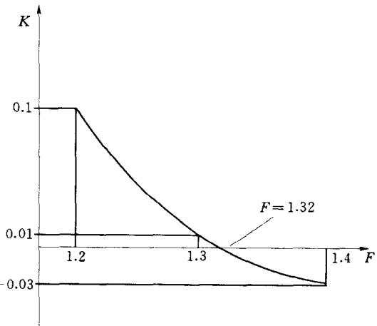  
图 2.23 Sarma 法求解安全系数步骤

Sarma建立的坐标系同图2.1。对土条左、右侧面的剪力X的差值ΔX作如下假定：

$$
\Delta X = \lambda Q ( x )\tag{2.107}
$$

可见，Sarma 并没有对∆X的绝对值作假定,而是对它的分布形状提出了一个函数 $Q ( x )$ 在此基础上建立力和力矩平衡方程,Sarma 最终获得以下公式：

$$
\lambda = S _ { 2 } / S _ { 3 }\tag{2.108}
$$

$$
K = \frac { S _ { 1 } - \lambda S _ { 4 } } { \Sigma \Delta W _ { i } }\tag{2.109}
$$

$$
S _ { 2 } = \Sigma \Delta W _ { i } ( x - x _ { c } ) + \Sigma D _ { i } ( y - y _ { c } )\tag{2.110}
$$

$$
S _ { 3 } = \Sigma Q [ ( y - y _ { c } ) \tan \alpha ( { \phi } ^ { \prime } - \alpha ) + ( x - x _ { c } ) ]\tag{2.111}
$$

$$
S _ { 4 } = \Sigma Q \tan ( \phi ^ { \prime } - \alpha )\tag{2.112}
$$

$$
D _ { i } = \frac { [ \Delta W _ { i } \tan ( \phi ^ { \prime } - \alpha ) + c ^ { \prime } \Delta x \cos \phi ^ { \prime } - \gamma _ { u } \Delta W \sin \phi ] \sin \alpha } { \cos ( \phi ^ { \prime } - \alpha ) }\tag{2.113}
$$

式中： $\pmb { x } _ { c }$ e $y _ { c }$ 为土条底中点的坐标。

下面的问题是如何来确定 $Q ( x )$ 。这是一个带量纲的分布函数。Sarma 从分析土条受力条件入手提出了一个计算 $Q ( x )$ 的经验公式，对于均质边坡，Sarma建议

$$
X = \lambda f ( x ) [ ( K ^ { \prime } - r _ { u } ) { \gamma } H ^ { 2 } \tan { \phi ^ { \prime } } / 2 + c ^ { \prime } H ]\tag{2.114}
$$

其中f(x)是一个无量纲的分布形状函数，通常可以取为1，H为土条高度。 $\pmb { \mathcal { f } } ( \pmb { x } )$

$$
K ^ { \prime } = \frac { 1 - \sin ( 2 \alpha - \phi ^ { \prime } ) [ ( 1 - 2 r _ { u } ) \sin \phi + 4 c ^ { \prime } \cos \phi ^ { \prime } / \eta H ] } { 1 + \sin \phi \sin ( 2 \alpha - \phi ^ { \prime } ) }\tag{2.115}
$$

对于非均质边坡，Sarma也提出了建议的Q(x)分布函数。在推导上述公式过程中，Sarma采用的力学分析中仍包含大量经验成分。

Sarma法的优点是将求解安全系数的非线性方程迭代步骤从二维减少为一维。缺点是对Q(x) 这个带量纲的分布函数的假定缺乏直观的力学背景，多少带有一定的人为因素。还有不少学者对土条侧向力的绝对值作假定，如Madej(1984)和Cerreia(1988)假定，

$$
X = \lambda g ( x )\tag{2.116}
$$

潘家铮(1978)假定

$$
X = \lambda \Delta W _ { i } \tan ( \gamma _ { a \nu g } - \alpha )\tag{2.117}
$$

式中： $\gamma _ { a \nu g }$ 为边坡的平均坡度。

## 3. Janbu 法(1973)

此法采用的坐标系同图2.1。对土条建立水平和垂直方向的静力平衡方程式，分别得

$$
\Delta E = \Delta Q + ( q + \frac { \Delta W } { \Delta x } + t ) \Delta x \tan \alpha - \tau \Delta x ( 1 + \tan ^ { 2 } \alpha )\tag{2.118}
$$

$$
\tau = \frac { \tau _ { f } } { F } = \frac { c _ { e } ^ { \prime } + ( q + \frac { \Delta W } { \Delta x } + t - u ) + \tan \phi _ { e } ^ { \prime } } { 1 + \tan \phi _ { e } ^ { \prime } \tan \alpha }\tag{2.119}
$$

其中τ为按式(2.1)定义的作用在条底的剪应力。t(x)为

$$
t ( x ) = { \frac { \mathrm { d } X } { \mathrm { d } x } }\tag{2.120}
$$

对一个宽度无限小的土条建立力矩平衡，可得

$$
X = - E \tan \alpha + h _ { t } { \frac { \mathrm { d } E } { \mathrm { d } x } } - h _ { e } { \frac { \mathrm { d } Q } { \mathrm { d } x } }\tag{2.121}
$$

其中h为土条侧向力作用点与条底的距离。令 $h _ { t }$

$$
B _ { i } = \Delta Q + ( q + { \frac { \Delta W } { \Delta x } } + t ) \tan \alpha\tag{2.122}
$$

$$
A _ { i } = \tau _ { f } \Delta x ( 1 + \tan ^ { 2 } \alpha )\tag{2.123}
$$

由整体平衡条件Σ∆E=0可得

$$
F = { \frac { \Sigma A _ { i } } { E _ { a } - E _ { b } + \Sigma B _ { i } } }\tag{2.124}
$$

式中： $E _ { a }$ 和 $E _ { b }$ 分别为滑体左右端E的边界值。

Janbu 法的计算步骤如下：

1) 假定 h,为一确定的数值，Janbu 建议取 h为土条高度的 1/3; $\pmb { h } _ { t }$ $\pmb { h } _ { t }$

2) 先假定一个 $F _ { 0 }$ 值，并假定 $t ( x ) = 0$ 。通过式(2.119)求得 $\tau _ { f ^ { \circ } }$ 并用式(2.124)求得一个新的安全系数 $F _ { 1 }$

3) 通过式(2.118)求得各条块的ΔE 和 E:

4) 通过式(2.121)求得各条块的 X;

5) 在新的 X的基础上通过式(2.120)获得一个新的 t(x);

6) $F _ { 1 }$ 和 $F _ { 2 }$ 的差值小于允许误差时，计算收敛结束。否则在新的t和 $F _ { 2 }$ 基础上重复2)至5)的解题步骤。

从上述步骤可知，Janbu法求解力的平衡时，研究对象是图2.2所示的一个土条，而使用力矩平衡条件（即步骤4）时，则是相对一宽度为无限小的以土条侧面为中心的另一个土条。

Janbu自1973年提取出此方法后，受到学术界的广泛重视。一个重要原因是此方法同时引入了力和力矩平衡条件，而计算过程却相对比较简单，可用手算或编制一个简单的程序来实现。但是在实际应用时，不少学者发现该法存在严重的收敛困难问题，作者曾对这一方法作过尝试。

[例2.9] 检查Janbu法收敛性能的例子（图2.24，陈祖煜，1996）。

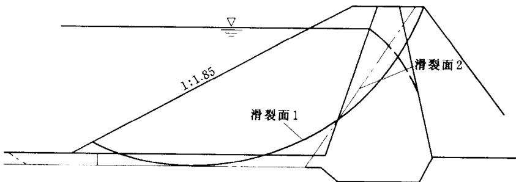  
图 2.24 检查 Janbu 法收敛性能的一个例子

对圆弧形裂面I，使用了改进后的通用条分法[相应 $f ( x ) = 1 , f _ { 0 } ( x ) = 0 \big ]$ 和 Janbu 法。两种方法初始假定的F1均为1.86，图2.25(a)，通用条分法仅经过两次迭代，就满足了收敛要求， $F _ { 1 }$ 即∆ΔF和∆λ绝对值小于0.001。使用Janbu法，我们控制前后两次迭代差值不大于0.005，这样，经过10 次迭代，可以得到 F值在 1.972和1.977之间。这个数值和 Morgenstern-Price法的解是接近的。在第二次试算时，用于第一次迭代的F值为1.582。通用条分法仍然只需三次迭代获得了收敛解，而 Janbu 法则需要13 次，如图 2.25(b)。对图 2.24 虚线示的非圆弧形滑裂面2，通用条分法仍然只需要两次迭代，而Janbu法却无法获得收敛解，如图2.25(c)。

在美国土木工程师学会召开的“岩土工程的分析和设计”会议中。Wright(1975)等学者曾对 Janbu法的收敛问题作过讨论。当时，来自挪威的 Karal (1975)曾为 Janbu 法的收敛问题作过答辩，称Janbu法的收敛性能极好，但计算时条块数目不能太多，条块不能太细。我们发现，在Janbu提供的例题中，滑动上体确实只有4或5个土条。条块数目一多，即遇到收敛困难的问题。对 Karal的答辩，Wright当时曾即席作了这样的评价：

Janbu法采用有限差分的原理来模拟力矩平衡，因此其精度理应随着土条宽度的减少而增大。称条块数目越少越好是难以令人接受的。我们等待着Karal对这一问题进一步的澄清说明。

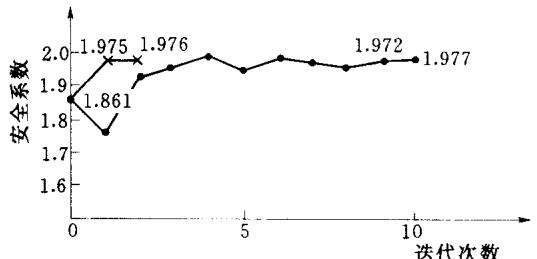  
(a)

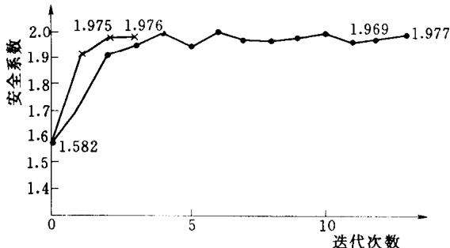  
(b)

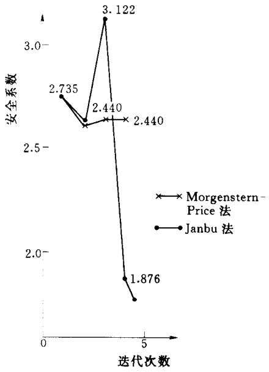  
(c)  
图 2.25 [例 2.9] 迭代过程  
(a)、(b) 圆弧形裂面；(c)非圆弧形裂面

这里 Wright 提到的力矩平衡条件就是式(2.121)。这一方程是建立在土条宽度无限小的基础上的。

作者认为，Janbu法收敛性能差的根本原因在于对土条侧向力作用点位置的假定被定位在绝对值而不是相对值上面。在本章介绍的所有的满足力和力矩平衡条件的方法中，都是只对土条侧向力的某一参数的分布形状而不是绝对值作假定，最终，留下一个确定其绝对值的假定系数λ和安全系数F联合求解。对于一个同时满足力和力矩平衡条件的解，土条侧向力的作用位置不可能均为土条高度的三分之一。或者说h，均为1/3土条高的解实际 $\pmb { h } _ { t }$ 上是不存在的。硬性规定了土条侧向力的某一参数的绝对值，使迭代过程失去了灵活调整的能力，从而导致收敛困难。

Janbu法收敛困难的另一原因时初始输入的假定除安全系数F外，还有的一个假定函数t(x)。Janbu建议可取t(x)为零，然后在迭代过程中过渡到正确值。这等于是在初始输入的假定中引入了n+1个未知变量（n为土条数）。在非线性规划领域，要保证一个算法具有很好的收敛特性，一个重要的原则，就是要求尽量减少自变量的数目，并要求输入的迭代初值尽可能地靠近最终的解答。如果滑裂面上的某些部位的 $t ( x )$ 真实值和零相差较远，这样的计算步骤的收敛性就难以保证。

## 2.6 本章附录

## 2.6.1 关于端部条块侧向力假定的限制条件的证明

本节要证明的命题是：

对端部形状为三角形的条块，当 $\pmb { \Delta x }$ 是很小时，则

$$
\beta _ { a } = \gamma _ { a }\tag{2.125}
$$

$$
A _ { c } = \left\{ \begin{array} { l l } { { 1 / 2 \qquad } } & { { \uparrow \not \equiv \not \backslash \emptyset ( \mathrm { \bf { A } } ) } } \\ { { 2 / 3 \qquad } } & { { \uparrow \not \equiv \backslash \emptyset ( \mathrm { \bf { B } } ) } } \end{array} \right.\tag{2.126}
$$

关于情况A和B的定义及有关符号意义已在2.5.2节介绍。

在 2.4.1 节中我们已经讨论了作用在一个微小长 $\mathbf { \Delta } \mathbf { \Delta } \mathbf { \Delta } \mathbf { \Delta } \mathbf { \Delta } \mathbf { \Delta } \Delta \mathbf { \Psi } \left. \mathbf { \Delta } \pmb { \Delta } \mathbf { \{ \Psi }  \pmb { \Delta } \pmb { \alpha } \pmb { \alpha } \right.$ 上连续分布的垂直应力 $\pmb { \sigma } ( \pmb { x } )$ 的合力P的作用点的位置a，可通过式(2.45)予以确定。定义这一相对位置为 $^ { a , }$

$$
\zeta = \frac { a } { \varDelta x }\tag{2.127}
$$

另外，如果 $\mathbf { \delta } \mathbf { \delta } \mathbf { \delta } \mathbf { \delta } \Delta \mathbf { \delta } \mathbf { \delta } \to 0$ 时， $P / \Delta x ^ { n }$ 不为零，则称 $P$ 与 $\Delta x ^ { n }$ 同阶。则根据式(2.47)可知：

1) 如果 $\zeta = 1 / 2$ ，则 $P$ 与 $\pmb { \Delta x }$ 同阶；

2) 如果 $\zeta = 2 / 3$ ，则 $P$ 与 $\Delta x ^ { 2 }$ 同阶。

同时也不难证明：

1) 如果 $\pmb { \sigma } ( 0 ) { \neq } 0$ ，则P与Δx 同阶；

2) 如果 ${ \pmb { \sigma } } ( 0 ) { = } 0$ $\sigma ^ { \prime } ( 0 ) { \neq } 0$ ，则 $P$ 与 $\Delta x ^ { 2 }$ 同阶。

现在，研究图2.26所示端部三角形条块，当Δx足够小时，AD可简化为直线，建立水 $\pmb { \mathscr { \Delta } } \pmb { x }$ 平方向的静力平衡方程和对D点的力矩平衡方程：

$$
E = - N ( \tan \phi _ { e } ^ { \prime } \cos \alpha - \sin \alpha ) - c _ { e } ^ { \prime } \Delta x + u \Delta x \cdot \tan \alpha\tag{2.128}
$$

$$
E \cdot { \overline { { H D } } } - N { \overline { { F D } } } + \Delta W \Delta x k + { \frac { 1 } { 2 } } q \Delta x ^ { 2 } - { \frac { 2 } { 3 } } u \sec ^ { 2 } \alpha \Delta x ^ { 2 } = 0\tag{2.129}
$$

其中线段长度 HD 和 FD 与 $\pmb { \Delta x }$ 同阶， $k \Delta x$ 为重心距端点 D 的距离。μ为 DA 面上的平均孔隙水压力，与∆x同阶。∆W与∆x²同阶(注意滑裂面不与边坡表面相切这一前提)，式(2.128) $\pmb { \Delta x }$ $\mathbf { \nabla } \cdot \pmb { \Delta W }$ $\Delta x ^ { 2 }$ 和(2.129)中仅有两个未知量E和N，它们必须同阶，否则高阶的那个量在 $\pmb { { \cal E } }$ $N ,$ $\pmb { \Delta x } \pmb {  } \pmb { 0 }$ 时消失，使式(2.128)或(2.129)无法同时成立。

对于情况 A，由于ce或q不为零，由式(2.128)和式(2.129)可知，E和N与Δx同阶， $c _ { e } ^ { \prime }$ $q$ $N$ $\mathbf { \Delta } \mathbf { \Delta } \Delta \mathbf { \Psi }$ 故有

$$
A _ { c } = \zeta _ { E } = \zeta _ { N } = 1 / 2\tag{2.130}
$$

由于DC面上的水压力与Δ²同阶，比E高阶，故有 $\Delta x ^ { 2 }$

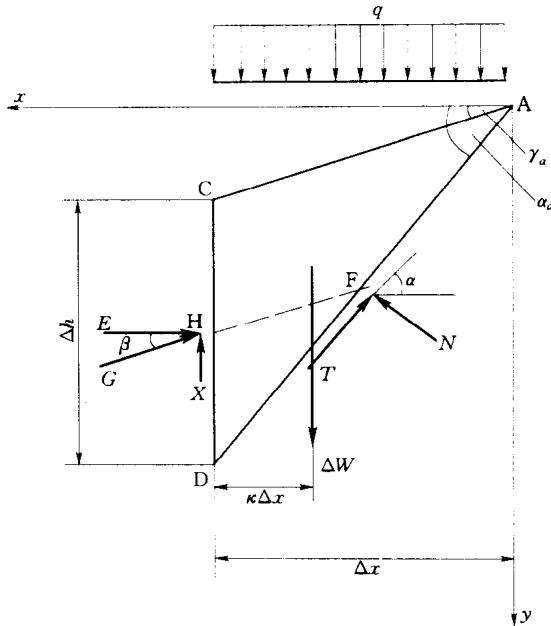  
图 2.26 端部条块侧向力分析

$$
A _ { c } ^ { \prime } = A _ { c } = 1 / 2\tag{2.131}
$$

对于情况 A，由于 $c _ { \ e } ^ { \prime }$ 或 $\pmb q$ 同时为零，则要求E和与 $\Delta x ^ { 2 }$ 同阶。故有

$$
A _ { c } ^ { \prime } = A _ { c } = \zeta _ { E } = \zeta _ { N } = 2 / 3\tag{2.132}
$$

式(2.126)得证。

设作用在 AD上的法向应力的作用点为F，则HF平行于AC。将作用在土条上的力对F取矩。

$$
X ( 1 - \zeta _ { N } ) \cdot \Delta x - E \tan \gamma _ { a } \cdot ( 1 - \zeta _ { N } ) \cdot \Delta x = 0\tag{2.133}
$$

单元的重量在(2.133)中不出现，理由是：

1) 在情况 A，与 $\Delta x ^ { 2 }$ 同阶，而情况 A时E与 $\Delta x ^ { 2 }$ 同阶，故予忽略；

2) 在情况 B 时该重量通过 F 点故也不出现在式(2.133)中。表面荷载在情况 A 时通过F，在情况B时不存在，故也不出现在式(2.133)中。令式(2.133)中 $\Delta \mathfrak { x } {  } 0$ 可知：

$$
\tan \beta _ { a } = \operatorname* { l i m } _ { \Delta x \to 0 } \frac { X } { E } = \tan \gamma _ { a }\tag{2.134}
$$

式(2.125)得证。

## 2.6.2 $\mathbf { G } _ { n }$ 和 $M _ { n }$ 对F和λ的导数的计算公式

1. $G _ { n }$ 和 $M _ { n }$ 的变分

$G _ { n }$ 和 $M _ { n }$ 由下式定义：

$$
G _ { n } = \int _ { a } ^ { b } p ( x ) s ( x ) \mathrm { d } x\tag{2.135}
$$

$$
M _ { n } = \int _ { a } ^ { b } p ( x ) s ( x ) t ( x ) \mathrm { d } x - M _ { e } = 0\tag{2.136}
$$

其中 $p ( x )$ 、s(x)、t(x)在第一节中已定义。

由于 $F$ 的微分 $\mathrm { d } F$ 和 $\beta ( x )$ 的变分 $\delta \beta _ { 5 } ^ { \exists }$ 起的 $G _ { n }$ 和 $M _ { n }$ 增量是可由下式表达

$$
\delta G _ { n } = \int _ { a } ^ { b } \left\{ \frac { \partial [ p ( x ) s ( x ) ] } { \partial F } \mathrm { d } F + \delta \big [ p ( x ) s ( x ) \big ] \right\} \mathrm { d } x\tag{2.137}
$$

$$
\delta M _ { n } = \int _ { a } ^ { b } \Bigl \{ \frac { \partial [ p ( x ) s ( x ) t ( x ) ] } { \partial F } \mathrm { d } F + \delta \bigl [ p ( x ) s ( x ) t ( x ) \bigr ] \Bigr \} \mathrm { d } x\tag{2.138}
$$

其中 $\delta \big [ p ( x ) s ( x ) \big ]$ 和 δ $\hat { \ b { p } } ( \ b { x } ) \ b { s } ( \ b { x } ) t ( \ b { x } ) \big ]$ 为 $p ( { \boldsymbol { x } } ) s ( { \boldsymbol { x } } )$ 和 $p ( x ) s ( x ) t ( x )$ 由于 $\beta ( x )$ 的变分 $\delta \beta \vec { 5 } |$ 起的变分值。

2. $\frac { \partial [ p ( x ) s ( x ) ] } { \partial F } \neq \frac { \partial [ p ( x ) s ( x ) t ( x ) ] } { \partial F }$ 的推导

可以得到：

$$
\frac { \partial ( p \cdot s ) } { \partial F } = \int _ { a } ^ { b } p ( x ) \cdot s ( x ) [ k ( x ) - \int _ { a } ^ { x } \sec ^ { 2 } ( \phi _ { e } ^ { \prime } - \alpha + \beta ) \frac { \mathrm { d } \beta } { \mathrm { d } \xi } \frac { \mathrm { d } \phi _ { e } ^ { \prime } } { \mathrm { d } F } \mathrm { d } \xi ] \mathrm { d } x\tag{2.139}
$$

$$
\begin{array} { l } { { k ( x ) = - \displaystyle { [ ( \frac { \mathrm { d } W } { \mathrm { d } x } + q ) \sin \phi _ { e } ^ { \prime } \cos \beta - r _ { u } \frac { \mathrm { d } W } { \mathrm { d } x } \mathrm { s e c } \alpha \sin \phi _ { e } ^ { \prime } \cos ( \beta - \alpha ) } } } \\ { { \displaystyle ~ + c _ { e } ^ { \prime } \sec \alpha \cos \phi _ { e } ^ { \prime } \cos ( \beta - \alpha ) - \eta \frac { \mathrm { d } W } { \mathrm { d } x } \sin \phi _ { e } ^ { \prime } \sin \beta ] } } \\ { { \displaystyle ~ \cos \phi _ { e } ^ { \prime } / \{ F \cdot p ( x ) \cos ( \phi _ { e } ^ { \prime } - \alpha + \beta ) \} } } \end{array}\tag{2.140}
$$

同时也可以证明

$$
\frac { \partial ( p \cdot s \cdot t ) } { \partial F } = p \cdot s [ k ( x ) \cdot t ( x ) - \int _ { a } ^ { x } t \cdot s \mathrm { e c } ^ { 2 } ( \phi _ { e } ^ { , } - \alpha + \beta ) \frac { \mathrm { d } \phi _ { e } ^ { , } } { \mathrm { d } F } \cdot \frac { \mathrm { d } \beta } { \mathrm { d } \xi } \cdot \mathrm { d } \xi ]\tag{2.141}
$$

式(2.141)的推导如下：

$$
\frac { \partial ( p \cdot s \cdot t ) } { \partial F } = p \cdot s \frac { \partial t } { \partial F } + \frac { \partial ( p \cdot s ) } { \partial F } t\tag{2.142}
$$

$$
\# \# \# \frac { \partial t } { \partial F } = \int _ { a } ^ { x } [ ( \sin \beta - \tan \alpha \cos \beta ) \mathrm { e } ^ { \int _ { a } ^ { \xi } \tan ( \phi _ { e } ^ { \prime } - \alpha + \beta ) \frac { \mathrm { d } \beta } { \mathrm { d } \xi } \mathrm { d } \xi } \cdot \int _ { a } ^ { \xi } s \mathrm { e c } ^ { 2 } ( \phi _ { e } ^ { \prime } - \alpha + \beta ) \frac { \mathrm { d } \beta } { \mathrm { d } \xi } \frac { \mathrm { d } \phi _ { e } ^ { \prime } } { \mathrm { d } F } \mathrm { d } \xi ] \mathrm { d } \xi\tag{2.143}
$$

根据t(x)的定义，式(2.143)可以写成

$$
\frac { \partial t } { \partial F } = \int _ { a } ^ { x } [ \int _ { a } ^ { \xi } \sec ^ { 2 } ( \phi _ { e } ^ { \prime } - \alpha + \beta ) \frac { \mathrm { d } \beta } { \mathrm { d } \zeta } \frac { \mathrm { d } \phi _ { e } ^ { \prime } } { \mathrm { d } F } \mathrm { d } \zeta ] \mathrm { d } t\tag{2.144}
$$

对式(2.144)进行分部积分，可得

$$
\frac { \partial t } { \partial F } = t ( x ) \int _ { a } ^ { x } \sec ^ { 2 } \left( \phi _ { e } ^ { \prime } - \alpha + \beta \right) \frac { \mathrm { d } \beta } { \mathrm { d } \zeta } \frac { \mathrm { d } \phi _ { e } ^ { \prime } } { \mathrm { d } F } \mathrm { d } \zeta - \int _ { a } ^ { e } \sec ^ { 2 } \left( \phi _ { e } ^ { \prime } - \alpha + \beta \right) \frac { \mathrm { d } \beta } { \mathrm { d } \xi } \frac { \mathrm { d } \phi _ { e } ^ { \prime } } { \mathrm { d } F } t \mathrm { d } \xi\tag{2.145}
$$

将式(2.145)和式(2.139)式代入式(2.142)，即可得式(2.141)。

3. $\pmb { \delta ( p \cdot s ) }$ 和δ $( p \cdot s \cdot t )$ 的推导

(1) $\delta ( p \cdot s )$ 的推导：

由于 $p ( x )$ 与β无关，

$$
\pmb { \delta } ( p \cdot s ) = \pmb { p } \cdot \pmb { \delta } s\tag{2.146}
$$

$$
\delta s = \tan ( \phi _ { e } ^ { \prime } - \alpha + \beta ) \cdot s \cdot \delta \beta - s \cdot \delta \Bigg [ \int _ { a } ^ { x } \tan ( \phi _ { e } ^ { \prime } - \alpha + \beta ) \frac { \mathrm { d } \beta } { \mathrm { d } \xi } \cdot \mathrm { d } \xi \Bigg ]\tag{2.147}
$$

其中

$$
\begin{array} { r } { \displaystyle \delta \Bigg [ \int _ { a } ^ { x } \tan ( { \phi } _ { e } ^ { \prime } - \alpha + \beta ) \frac { \mathrm { d } \beta } { \mathrm { d } \xi } \cdot \mathrm { d } \xi \Bigg ] = \int _ { a } ^ { x } \sec ^ { 2 } ( { \phi } _ { e } ^ { \prime } - \alpha + \beta ) \frac { \mathrm { d } \beta } { \mathrm { d } \xi } \delta \beta \mathrm { d } \xi } \\ { + \displaystyle \int _ { a } ^ { x } \tan ( { \phi } _ { e } ^ { \prime } - \alpha + \beta ) \delta ( \frac { \mathrm { d } \beta } { \mathrm { d } \xi } ) \mathrm { d } \xi } \end{array}\tag{2.148}
$$

可以分部积分

$$
\begin{array} { r } { \displaystyle \int _ { a } ^ { x } \tan ( \phi _ { e } ^ { \prime } - \alpha + \beta ) \Bigg ( \frac { \mathrm { d } \beta } { \mathrm { d } \xi } \Bigg ) \mathrm { d } \xi = [ \tan ( \phi _ { e } ^ { \prime } - \alpha + \beta ) \delta \beta ] _ { a } ^ { x } - \displaystyle \int _ { a } ^ { x } \sec ^ { 2 } ( \phi _ { e } ^ { \prime } - \alpha + \beta ) \frac { \mathrm { d } \beta } { \mathrm { d } \xi } \delta \beta \mathrm { d } \xi } \\ { - \displaystyle \int _ { a } ^ { x } \sec ^ { 2 } ( \phi _ { e } ^ { \prime } - \alpha + \beta ) \frac { \mathrm { d } \alpha } { \mathrm { d } \xi } \delta \beta \mathrm { d } \xi + \displaystyle \sum _ { i = 1 } ^ { s } [ \tan ( \phi _ { e i } ^ { \prime } - \alpha _ { i } + \beta _ { i } ) \delta \beta _ { i } ] _ { i } ^ { y } } \end{array}\tag{2.149}
$$

需要注意的是，由于 $\tan ( \phi _ { e } ^ { \prime } - \alpha + \beta )$ 可能在某些点 $i ( i = 1 , ~ 2 , ~ \cdots , ~ s )$ 不连续，在通常的分部积分表达式中加上了一项

$$
\sum _ { i = 1 } ^ { s } \left[ \tan ( \phi _ { e i } ^ { \prime } - \alpha _ { i } + \beta _ { i } ) \delta \beta _ { i } \right] _ { l } ^ { \prime }
$$

其中 $\phi _ { e i } ^ { \prime } , \ \alpha _ { i } , \ \beta _ { i }$ 为φ、α、β在第i个不连续点的值，脚标r和l代表第i个不连续点左侧和 $\phi _ { e } ^ { \prime } ,$ $\beta$ 右侧的值。

将式(2.149)代入式(2.148)，然后将式(2.148)代入式(2.147)，可得

$$
\begin{array} { l } { { \displaystyle \ S \delta s = s \Biggl \{ - \int _ { a } ^ { x } \sec ^ { 2 } ( \phi _ { e } ^ { \prime } - \alpha + \beta ) \frac { \mathrm { d } \beta } { \mathrm { d } \xi } \delta \beta \mathrm { d } \xi + \tan ( \phi _ { e a } ^ { \prime } - \alpha _ { a } + \beta _ { a } ) \ S \beta _ { a } \Biggl . } } \\ { { \displaystyle \qquad - \sum _ { i = 1 } ^ { s } [ \tan ( \phi _ { e i } ^ { \prime } - \alpha _ { i } + \beta _ { i } ) \delta \beta _ { i } ] _ { 1 } ^ { r } \Biggl \} } } \end{array}\tag{2.150}
$$

式(2.150)可写成：

$$
\delta \bigl [ s ( x ) \bigr ] = s ( x ) \biggl [ - \int _ { a } ^ { x } \sec ^ { 2 } ( \phi _ { e } ^ { , } - \alpha + \beta ) \frac { \mathrm { d } \beta } { \mathrm { d } \xi } \delta \beta \mathrm { d } \xi + C _ { i } \biggr ]\tag{2.151}
$$

$$
C _ { i } = \tan ( \phi _ { e a } ^ { \prime } - \alpha _ { a } + \beta _ { a } ) \ S \beta _ { a } - \sum _ { i = 1 } ^ { s } \left[ \tan ( \phi _ { e i } ^ { \prime } - \alpha _ { i } + \beta _ { i } ) \ S \beta _ { i } \right] _ { l } ^ { r }\tag{2.152}
$$

其中 $\phi _ { e a } ^ { \prime } \mathrm { , ~ } \alpha _ { a } \mathrm { , ~ } \beta _ { a } \mathrm { , ~ } \delta \beta _ { a }$ 为 $\phi _ { e } ^ { \prime } .$ α、β、 $\delta \beta$ 在 $x = a$ 的数值。

$C _ { i }$ 在α和 $\phi _ { e } ^ { \prime }$ 连续时为一常数，当 x通过第i个不连续点时，因α或 $\phi _ { e } ^ { \prime }$ 有一突然变化， $C _ { i }$ 获得一个增值。

将式(2.151)代入式(2.146)，可得

$$
\ S { \big [ } p ( x ) \cdot s ( x ) { \big ] } = p ( x ) \cdot s ( x ) { \Bigg [ } - \int _ { a } ^ { x } s \mathrm { e c } ^ { 2 } ( \phi _ { e } ^ { \prime } - \alpha + \beta ) { \frac { \mathrm { d } \alpha } { \mathrm { d } \xi } } \delta \beta \mathrm { d } \xi + C _ { i } { \Bigg ] }\tag{2.153}
$$

(2) $\pmb { \delta ( p \cdot s \cdot t ) }$ 的推导：

由式(2.146)和式(2.147)可得

$$
\begin{array} { r l } & { \delta ( p \cdot s \cdot t ) = \widetilde { \vartheta } ( p \cdot s ) t + p \cdot s \cdot \delta t } \\ & { \qquad = p \cdot s \cdot t [ \tan ( \phi _ { e } ^ { \prime } - \alpha + \beta ) \delta \beta - \widetilde { \vartheta } ( \int _ { a } ^ { x } \tan ( \phi _ { e } ^ { \prime } - \alpha + \beta ) \frac { \mathrm { d } \beta } { \mathrm { d } \zeta } \mathrm { d } \zeta ) ] + p \cdot s \cdot \delta t } \\ & { \qquad \quad \delta t = \displaystyle \int _ { a } ^ { x } ( \cos \beta + \tan \alpha \cdot \sin \beta ) \mathrm { e } ^ { \displaystyle \int _ { a } ^ { x } \tan ( \phi _ { e } ^ { \prime } - \alpha + \beta ) \frac { \mathrm { d } \beta } { \mathrm { d } \zeta } \mathrm { d } \xi } \delta \beta \mathrm { d } \xi } \\ & { \qquad + \displaystyle \int _ { a } ^ { x } ( \sin \beta - \tan \alpha \cdot \sin \beta ) \mathrm { e } ^ { \displaystyle \int _ { a } ^ { x } \tan ( \phi _ { e } ^ { \prime } - \alpha + \beta ) \frac { \mathrm { d } \beta } { \mathrm { d } \zeta } \mathrm { d } \zeta } \delta \Bigg [ \int _ { a } ^ { \xi } \tan ( \phi _ { e } ^ { \prime } - \alpha + \beta ) \frac { \mathrm { d } \beta } { \mathrm { d } \zeta } \mathrm { d } \zeta \Bigg ] \mathrm { d } \xi } \end{array}\tag{2.154}
$$

(2.155)

根据 $t ( x )$ 的定义，式(2.155)中右边第二项可以分部积分，式(2.155)变成

$$
\begin{array} { r l } & { \delta t = \int _ { 0 } ^ { x } \exp \beta + \tan \alpha \tan \beta \int _ { 0 } ^ { \frac { 1 } { \cot ( \alpha - \alpha - \beta ) } } \frac { \partial \beta } { \partial \xi } \ d \alpha ^ { \prime } \ e ^ { \prime } \delta \beta d \beta \mathcal { E } } \\ & { \quad + \int _ { 0 } ^ { x } \frac { \int _ { 0 } ^ { x } \int _ { 0 } ^ { x } \{ \int _ { 0 } ^ { x } \tan ( \phi ^ { \prime } - \alpha + \beta ) \frac { \partial \beta } { \partial \xi } \mathcal { E } \} \ d \beta \mathcal { E } } { \{ \int _ { 0 } ^ { x } \frac { \cot ( \beta - \alpha ) } { \sin ( \alpha - \beta ) } \exp \frac { \beta } { \sin ( \alpha - \alpha ) } \exp \frac { \beta } { \sin ( \alpha - \beta ) } \} } } \\ & { \quad = \int _ { 0 } ^ { x } ( \cos \beta + \tan \alpha - \sin \beta ) \exp \sum _ { \alpha } ^ { \frac { 1 } { \alpha } \tan ( \alpha ) \cdot \alpha - \alpha + \beta } \frac { \partial \beta } { \partial \alpha } \mathcal { E } \beta \ d \beta } \\ & { \quad + \{ t : \delta ( \int _ { 0 } ^ { x } \frac { \cot ( \beta - \alpha - \beta ) } { \cos ( \alpha - \alpha ) } \frac { \beta } { \sin ( \alpha - \beta ) } \sum _ { \alpha } ^ { \frac { \alpha } { \alpha } } \int _ { 0 } ^ { x } \frac { \cot \beta } { \sqrt { \beta } } \} \frac { \cot ( \beta ) ^ { 2 } \cot ( \beta ^ { \prime } - \alpha + \beta ) } { \sqrt { \alpha } } \frac { \partial \beta } { \sqrt { \zeta } } \ d \beta \mathcal { E } ) \ d \beta ^ { \prime } } \\ & { \quad = \int _ { 0 } ^ { x } \cos \beta ( 1 \arctan \alpha - \sin \beta ) \exp [ \sin ( \alpha \psi - \alpha ) \phi ] \ d \beta ^ { \prime } \ } \\ &  \quad + \{ t : \delta ( \int _ { 0 } ^ { x } \tan \end{array}\tag{2.156}
$$

其中

$$
\begin{array} { r l } &  \begin{array} { r l } & { \displaystyle \int _ { x } ^ { y } \int _ { 1 } \sin ( \theta _ { x } ^ { * } - \alpha + \beta ) \frac { \partial \theta _ { x } ^ { * } } { \partial \xi } \Big \mathrm { d } \xi } \\ & { \quad + \displaystyle \int _ { x } ^ { y } \left\{ \alpha + \alpha ^ { 2 } ( y ^ { * } - \alpha + \beta ) \frac { \partial \theta _ { x } ^ { * } } { \partial \xi } \xi \beta + 1 \right. \cos ( \theta _ { x } ^ { * } - \alpha + \beta ) \Theta \Big \} \frac { \partial ( \theta _ { y } ^ { * } ) } { \partial \xi } \bigg \| \xi } \\ & { \quad - \displaystyle \int _ { x } ^ { y } \alpha ^ { 2 } ( y ^ { * } - \alpha + \beta ) \frac { \partial ( \theta _ { x } ^ { * } - \alpha + \beta ) } { \partial \xi } \frac { \partial ( \theta _ { y } ^ { * } - \alpha + \beta - \beta ) } { \partial \xi } \Big \mathrm { d } \xi } \\ & { \quad - \displaystyle \int _ { x } ^ { y } \alpha ^ { 2 } ( y ^ { * } - \alpha + \beta ) \frac { \partial ( \theta _ { x } ^ { * } - \alpha + \beta ) } { \partial \xi } \frac { \partial ( \theta _ { y } ^ { * } - \alpha + \beta - \alpha + \beta ) } { \partial \xi } \frac { \partial ( \theta _ { x } ^ { * } - \alpha + \beta ) } { \partial \xi } \frac { \partial ( \theta _ { y } ^ { * } ) } { \partial \xi } } \\ &  \quad - \displaystyle \int _ { x } ^ { y } \alpha ^ { 2 } ( y ^ { * } - \alpha + \beta ) \frac { \partial ( \theta _ { x } ^ { * } - \alpha + \beta ) } { \partial \xi } \frac { \partial ( \theta _ { x } ^ { * } - \alpha + \beta ) } { \partial \xi } \frac { \partial ( \theta _ { x } ^ { * } - \alpha + \beta ) } { \partial \xi } \frac { \partial ( \theta _ { x } ^ { * } - \alpha + \beta ) } { \partial \xi } \frac { \partial ( \theta _ { x } ^ { * } ) }  \partial  \end{array} \end{array}\tag{2.157}
$$

将式(2.157)代入式(2.156)，可得

$$
\begin{array} { r l } & { \delta t = \displaystyle \int _ { a } ^ { x } \cos \phi _ { e } ^ { \prime } \sec \alpha \sec ( \phi _ { e } ^ { \prime } - \alpha + \beta ) \mathrm { e } ^ { \displaystyle \int _ { a } ^ { x } \tan ( \phi _ { e } ^ { \prime } - \alpha + \beta ) \frac { \mathrm { d } \beta } { \mathrm { d } \zeta } \mathrm { d } \zeta } \delta \beta \cdot \mathrm { d } \xi } \\ & { \qquad - \displaystyle \int _ { a } ^ { x } \sec ^ { 2 } ( \phi _ { e } ^ { \prime } - \alpha + \beta ) \frac { \mathrm { d } \alpha } { \mathrm { d } \xi } t \cdot \delta \beta \cdot \mathrm { d } \xi - t \cdot \tan ( \phi _ { e } ^ { \prime } - \alpha + \beta ) \delta \beta } \\ & { \qquad + t \cdot \delta \displaystyle \iint _ { a } ^ { x } \tan ( \phi _ { e } ^ { \prime } - \alpha + \beta ) \frac { \mathrm { d } \beta } { \mathrm { d } \xi } \mathrm { d } \xi \Bigg ] - \displaystyle \sum _ { i = 1 } ^ { s } \big [ \tan ( \phi _ { e i } ^ { \prime } - \alpha _ { i } + \beta _ { i } ) \delta \beta _ { i } \cdot t _ { i } \big ] _ { i } ^ { \prime } } \end{array}\tag{2.158}
$$

将式(2.158)代入式(2.154)，可得

$$
\begin{array} { c } { { \displaystyle \delta ( p \cdot s \cdot t ) = \left[ \int _ { a } ^ { x } \cos \phi _ { e } ^ { \prime } \sec \alpha \sec ( \phi _ { e } ^ { \prime } - \alpha + \beta ) \mathrm { e } ^ { \int _ { a } ^ { x } \tan ( \phi _ { e } ^ { \prime } - \alpha + \beta ) \frac { \mathrm { d } \beta } { \mathrm { d } \xi } \mathrm { d } \xi } \phantom { \displaystyle \frac { b } { b } } \mathrm { d } \xi } } \\ { { \displaystyle - \int _ { a } ^ { x } \sec ^ { 2 } ( \phi _ { e } ^ { \prime } - \alpha + \beta ) \frac { \mathrm { d } \alpha } { \mathrm { d } \xi } t \cdot \delta \beta \cdot \mathrm { d } \xi + C _ { u } \right] p \cdot s } } \\ { { \displaystyle C _ { u } = - \sum _ { i = 1 } ^ { s } \left[ \tan ( \phi _ { e i } ^ { \prime } - \alpha _ { i } + \beta _ { i } ) \delta \beta _ { i } \cdot t _ { i } \right] _ { i } } } \end{array}\tag{2.159}
$$

(2.160)

将式(2.139)、式(2.141)、式(2.153)、式(2.159)代入式(2.137)、式(2.138)，最终得

$$
\begin{array} { l } { { \displaystyle \ S G _ { n } = \int _ { a } ^ { b } p ( x ) \cdot s ( x ) \Biggl \{ \Biggl [ k ( x ) - \int _ { a } ^ { x } \sec ^ { 2 } ( \phi _ { e } ^ { \prime } - \alpha + \beta ) \frac { \mathrm { d } \phi _ { e } ^ { \prime } } { \mathrm { d } F } \cdot \frac { \mathrm { d } \beta } { \mathrm { d } \zeta } \mathrm { d } \zeta \Biggr ] \mathrm { d } F } } \\ { { \displaystyle \quad + \Biggl [ - \int _ { a } ^ { x } \sec ^ { 2 } ( \phi _ { e } ^ { \prime } - \alpha + \beta ) \frac { \mathrm { d } \alpha } { \mathrm { d } \zeta } \ S \beta \cdot \mathrm { d } \zeta + C _ { i } \Biggr ] \Biggr \} \mathrm { d } x } } \end{array}\tag{2.161}
$$

$$
\begin{array} { l } { { \displaystyle \ S \mathcal { M } _ { n } = \int \displaylimits _ { a } ^ { b } { p ( x ) \cdot s ( x ) \Biggl \{ \Biggl [ k ( x ) \cdot t ( x ) - \int \displaylimits _ { a } ^ { x } { \cdot s \mathrm { e c } ^ { 2 } ( \phi _ { e } ^ { \prime } - \alpha + \beta ) \frac { \mathrm { d } \phi _ { e } ^ { \prime } } { \mathrm { d } F } \mathrm { d } \xi } \mathrm { d } \xi } \Biggr ] \mathrm { d } F } } \\ { { \displaystyle \qquad + \Biggl [ - \int \displaylimits _ { a } ^ { x } { t \cdot \mathrm { s e c } ^ { 2 } ( \phi _ { e } ^ { \prime } - \alpha + \beta ) \frac { \mathrm { d } \alpha } { \mathrm { d } \xi } \mathrm { d } \beta \cdot \mathrm { d } \xi } + C _ { t i } } } \\  { \displaystyle \qquad + \int \displaylimits _ { a } ^ { x } { \cos \phi _ { e } ^ { \prime } \mathrm { s e c } \alpha \sec ( \phi _ { e } ^ { \prime } - \alpha + \beta ) \mathrm { e } ^ { \int \displaylimits _ { a } ^ { x } \mathrm { s i n } ( \phi _ { e } ^ { \prime } - \alpha + \beta ) \frac { \mathrm { d } \beta } { \mathrm { d } \xi } \mathrm { d } \xi } \Biggr \} \mathrm { d } x } } \end{array}\tag{2.162}
$$

4. 几种变分的特殊情况

δβ的变分可以取几种特殊情况，下面两种在本章中使用。

(1) $\beta ( x )$ 由一个系数所控制：此时有

$$
\beta ( x ) = \beta ( x , \lambda )\tag{2.163}
$$

当λ有一增量时， $\beta ( x )$ 就会有一个变分

$$
\delta \beta = \frac { \mathrm { d } \beta } { \mathrm { d } \lambda } \mathrm { d } \lambda\tag{2.164}
$$

将式(2.164)代入式(2.161)和式(2.162)，可得

$$
\mathrm { d } G _ { n } = \frac { \partial G _ { n } } { \partial F } \mathrm { d } F + \frac { \partial G _ { n } } { \partial \lambda } \mathrm { d } \lambda\tag{2.165}
$$

$$
\mathrm { d } M _ { n } = \frac { \partial M _ { n } } { \partial F } \mathrm { d } F + \frac { \partial M _ { n } } { \partial \lambda } \mathrm { d } \lambda\tag{2.166}
$$

$$
\frac { \partial G _ { n } } { \partial F } = \int _ { a } ^ { b } p ( x ) \cdot s ( x ) \Bigg [ k ( x ) - \int _ { a } ^ { x } \sec ^ { 2 } { ( \phi _ { e } ^ { \prime } - \alpha + \beta ) } \frac { \mathrm { d } \phi _ { e } ^ { \prime } \mathrm { d } \beta } { \mathrm { d } F \mathrm { ~ d } \xi } \mathrm { d } \xi \Bigg ] \mathrm { d } x\tag{2.167}
$$

$$
{ \frac { \partial M _ { n } } { \partial F } } = \int _ { a } ^ { b } p ( x ) \cdot s ( x ) { \Biggl [ } k ( x ) t ( x ) - \int _ { a } ^ { x } t \cdot s \mathrm { e c } ^ { 2 } ( \phi _ { e } ^ { \prime } - \alpha + \beta ) { \frac { \mathrm { d } \phi _ { e } ^ { \prime } } { \mathrm { d } F } } \cdot { \frac { \mathrm { d } \beta } { \mathrm { d } \xi } } \mathrm { d } \xi { \Biggr ] } \mathrm { d } x\tag{2.168}
$$

$$
{ \frac { \partial G _ { n } } { \partial \lambda } } = \int _ { a } ^ { b } p ( x ) \cdot s ( x ) { \Biggl [ } - \int _ { a } ^ { x } \sec ^ { 2 } { ( \phi _ { e } ^ { \prime } - \alpha + \beta ) } { \frac { \mathrm { d } \beta \mathrm { d } \alpha } { \mathrm { d } \lambda \mathrm { d } \xi } } \mathrm { d } \xi + D _ { i } { \Biggr ] } \mathrm { d } x\tag{2.169}
$$

$$
\frac { \partial M _ { n } } { \partial \lambda } = \int _ { a } ^ { b } p ( x ) \cdot s ( x ) \Bigg [ \int _ { a } ^ { x } t \cdot \sec ^ { 2 } { ( \phi _ { e } ^ { \prime } - \alpha + \beta ) } \frac { \mathrm { d } \beta \mathrm { d } \alpha } { \mathrm { d } \lambda \mathrm { d } \xi } \mathrm { d } \xi + D _ { t i }
$$

$$
+ \int _ { a } ^ { x } \cos \phi _ { e } ^ { \prime } \sec \alpha \sec ( \phi _ { e } ^ { \prime } - \alpha + \beta ) e ^ { \int _ { a } ^ { \xi } \tan ( \phi _ { e } ^ { \prime } - \alpha + \beta ) \frac { \mathrm { d } \beta } { \mathrm { d } \zeta } \mathrm { d } \zeta } \frac { \mathrm { d } \beta } { \mathrm { d } \lambda } \mathrm { d } \xi \Bigg ] \mathrm { d } x\tag{2.170}
$$

$$
D _ { i } = \left[ \tan ( \phi _ { e } ^ { \prime } - \alpha + \beta ) \frac { \mathrm { d } \beta } { \mathrm { d } \lambda } \right] _ { x = a } - \sum _ { i = 1 } ^ { s } \left[ \tan ( \phi _ { e i } ^ { \prime } - \alpha _ { i } + \beta ) \frac { \mathrm { d } \beta } { \mathrm { d } \lambda } \right] _ { l } ^ { r }\tag{2.171}
$$

$$
D _ { t i } = - \sum _ { i = 1 } ^ { s } \biggl [ t _ { i } \tan ( \phi _ { e i } ^ { \prime } - \alpha _ { i } + \beta ) \frac { \mathrm { d } \beta } { \mathrm { d } \lambda } \biggr ] _ { l } ^ { r }\tag{2.172}
$$

(2) $\beta ( x )$ 由一个函数所控制：此时有

$$
\Delta \beta ( x ) = \Delta \varepsilon \eta ( x )\tag{2.173}
$$

式中： $\pmb { \eta } ( \pmb { x } )$ 为一任意函数； $\pmb { \Delta \varepsilon }$ 为一系数，用以保证 $\Delta \beta$ 的值足够小。

式(2.161)和式(2.162)可表达为

$$
\Delta G _ { n } = K _ { g f } \Delta F + K _ { g a } \Delta \varepsilon + o ( \Delta F , \Delta \varepsilon )\tag{2.174}
$$

$$
\Delta M _ { n } = K _ { m f } \Delta F + K _ { m a } \Delta \varepsilon + o ( \Delta F , \Delta \varepsilon )\tag{2.175}
$$

$$
K _ { g f } = \int _ { a } ^ { b } p ( x ) \cdot s ( x ) \Bigg [ k ( x ) - \int _ { a } ^ { x } \sec ^ { 2 } ( \phi _ { e } ^ { \prime } - \alpha + \beta ) \frac { \mathrm { d } \phi _ { e } ^ { \prime } } { \mathrm { d } F } \frac { \mathrm { d } \beta } { \mathrm { d } \xi } \mathrm { d } \xi \Bigg ] \mathrm { d } x\tag{2.176}
$$

$$
K _ { m f } = \int _ { a } ^ { b } p ( x ) \cdot s ( x ) \Biggl [ k ( x ) t ( x ) - \int _ { a } ^ { x } t \cdot \sec ^ { 2 } { ( \phi _ { e } ^ { \prime } - \alpha + \beta ) } \frac { \mathrm { d } \phi _ { e } ^ { \prime } } { \mathrm { d } F } \cdot \frac { \mathrm { d } \beta } { \mathrm { d } \xi } \mathrm { d } \xi \Biggr ] \mathrm { d } x\tag{2.177}
$$

$$
K _ { g a } = \int _ { a } ^ { b } p ( x ) \cdot s ( x ) \Bigg [ - \int _ { a } ^ { x } \sec ^ { 2 } { ( \phi _ { e } ^ { \prime } - \alpha + \beta ) } \frac { \mathrm { d } \alpha } { \mathrm { d } \xi } \eta ( \xi ) \mathrm { d } \xi + B _ { i } \Bigg ] \mathrm { d } x\tag{2.178}
$$

$$
K _ { m a } = \int _ { a } ^ { b } p ( x ) \cdot s ( x ) \Bigg [ - \int _ { a } ^ { x } t \cdot s \mathrm { e c } ^ { 2 } ( \phi _ { e } ^ { \prime } - \alpha + \beta ) \frac { \mathrm { d } \alpha } { \mathrm { d } \xi } \eta ( \xi ) \mathrm { d } \xi + B _ { t i }
$$

$$
+ \int _ { a } ^ { x } \cos { \phi _ { e } ^ { \prime } } \sec { \alpha } \sec ( \phi _ { e } ^ { \prime } - \alpha + \beta ) e ^ { \int _ { a } ^ { \xi } \tan ( \phi _ { e } ^ { \prime } - \alpha + \beta ) \frac { \mathrm { d } \beta } { d \zeta } \mathrm { d } \zeta } \eta ( \xi ) \mathrm { d } \xi \Bigg ] \mathrm { d } x\tag{2.179}
$$

$$
B _ { i } = \tan ( \phi _ { e a } ^ { \prime } - \alpha _ { a } + \beta ) \eta ( a ) - \sum _ { i = 1 } ^ { s } [ \tan ( \phi _ { e a } ^ { \prime } - \alpha _ { a } + \beta ) \eta ( x _ { i } ) \} ]\tag{2.180}
$$

$$
B _ { t i } = - \sum _ { i = 1 } ^ { s } \bigl [ t _ { i } \tan ( \phi _ { e i } ^ { \prime } - \alpha _ { i } + \beta ) \eta ( x _ { i } ) \bigr \} _ { l } ^ { \prime }\tag{2.181}
$$

## 2.6.3 本章数据文件（表2.4）

表2.4 本章数据文件
<table><tr><td>有关章节</td><td>系列号</td><td>数据文件名</td><td colspan="2">内容</td></tr><tr><td rowspan="2">2.3.3</td><td>02-01-01</td><td>CPT1-1.DAT</td><td>[例2.1]</td><td>紫坪铺库区左岸堆积体</td></tr><tr><td>02-01-02</td><td>CTP4-1.DAT</td><td>[例2.2]</td><td>澳大利亚ACADS考题EX1(c)</td></tr><tr><td rowspan="7">2.4.3</td><td>02-02-01</td><td>CTP9.DAT</td><td>[例2.3]</td><td>铁山大坝例，坡外水体处理按第1方案</td></tr><tr><td>02-02-02</td><td>CTP9-1.DAT</td><td>[例2.3]</td><td>铁山大坝例，坡外水体处理按第2方案</td></tr><tr><td>02-02-03</td><td>CPT2-1.DAT</td><td>[例2.4]</td><td>三峡3坝段例，库水按拉力缝处理，下游水 位第2方案</td></tr><tr><td>02-02-04</td><td>CPT2-2.DAT</td><td>[例2.4]</td><td>三峡3坝段例，滑面通过库水位，下游水位 第2方案</td></tr><tr><td>02-02-05</td><td>CPT2-3.DAT</td><td>[例2.4]</td><td>三峡3坝段例，库水按拉力缝处理，下游水 位第1方案</td></tr><tr><td>02-02-06</td><td>CPT2-4.DAT</td><td>[例2.4]</td><td>三峡3坝段例，库水按拉力缝处理，下游水</td></tr><tr><td>02-03-01</td><td>MYM-0.DAT</td><td>[例2.5]</td><td>位第3方案 重力坝抗滑分析例，采用对侧向力倾角的</td></tr><tr><td rowspan="4">2.5.2</td><td>02-03-02</td><td>MYM-1.DAT</td><td>[例2.5]</td><td>第1种假定（Spencer法） 重力坝抗滑分析例，采用对侧向力倾角的</td></tr><tr><td>02-03-03</td><td></td><td></td><td>第1种假定（Spencer法）</td></tr><tr><td>02-03-04</td><td>MP.DAT</td><td>[例2.6]</td><td>采用通用条分法和侧向力倾角的第2种假定</td></tr><tr><td></td><td>BI.DAT</td><td>[例2.6]</td><td>采用毕肖普法</td></tr></table>

## 参考文献

Bromhead, E. N., Harris, A. J. & Watson, P. D. Influence of pore water pressure in partly submerged slopes on the critical pool level. Proceedings of the International Symposium on slope stability engoneering – IS-Shikoku'99, Matsuyama, 1999. 411-416

2 Castillo, E. and Luceno, A. A. Critical analysis of some variational methods in slope stability analysis. Int. J. for Numerical and Analytical Methods in Geocechanics, 1982. 195-209

3 陈祖煜.关于“渗流作用下的坝坡稳定有限单元分析”一文的讨论.岩土工程学报.1983.5(3):135-138

4 Chen, Zuyu and Morgenstern, N. R, Extensions to the generalized method of slices for stability analysis. Canadian Geotechnical Journal, 1983. 20(1): 104-119

5 陈祖煜.土坡稳定分析通用条分法及其改进.岩土工程学报，1983.5(4)：11-27

6 陈祖煜.改进的通用条分法的收敛特性和计算精度．中国土木工程学会.第四届土力学及基础工程学术会议论文集.北京：中国建筑工业出版社.1986.460-468

7陈祖煜.边坡稳定分析-极限平衡法的改进和应用. 清华大学工学博士学位论文.1991

8 Correia. R. M. A limit equilibrium method for slope stability analysis. Proc. 5th. Lausanne: Int. Symp. Landslides, 1988. 595-598

9 De Jong, De Joseling. G. Application of the calculus of variations to the vertical cut-off in cohesive frictionless soil. Geotechnique, 1981. 30(1): 1-16

10 Duncan, J. M. State of the art: Limit equilibrium and finite element analysis of slopes. Journal of Geotechnical Engineering, 1996. 122(7): 577-596

11 Fredlund, D. G. and Krahn, J. Comparison of slope stability analysis methods of analysis. Canadian Geotechnical Journal, 1977. 14:429-439

12 Fredlund, D. C. State of the Art: Analytical methods for slope stability analysis. Proceedings of the 4th International Symposium on Landslides. Toronto, 1984. 229-250

13 Janbu, N. Slope stability computations. Embankment Dam Engineering, 1973. 47-86

14 Karal, K. Slope stability analysis. ASCE. Discussion. Proceedings on Analysis and Design in Geotechnical Engineering. 1978.2:150-152

15 Leshchinsky, D. & Huang, Ching-chuan. Generalized Slope stability analysis: interpretation and comparison. J. Geotech. Engng ASCE, 1992. 118(10): 1559-1576

16 Leshchinsky, D. Slope stability analysis generalized approach. J. Geotech. Eng ASCE, 1990. 116(5): 851-867

17 Morgenstern, N. R. and Price, V. The analysis of the stability of general slip surface. Geotechnique, 1965. 15(1): 79-93

18 Low, B. K. And Lee, S. R. Slope stability analysis using generalized method of slices. J. Geotechnical and Geoenvironmental Engineering. 124: (4)350-362. 1998.

19 Luceno, A. and Castillo, E. Evaluation of variational methods in slope analysis. New Delhi: Proceedings 1ª Int. Sym. On Landslides. 1980. 1: 255-258

20 Madej, J. S. On the accuracy of simplified methods for the slope stability analysis. Archiwun Hydrotechnik, 1971.18: 581-594

21 Morgenstern, N. R. and Price, V. The analysis of the stability of general slip surface. Geotechnique, 1965. 15(1): 79-93

22 Morgenstern, N. R. and Price, V. A numerical method of solving the equations of stability of general slip surfaces. Computer Journal, 1967. 9(4): 388-393

23 Morgenstern, Keynote paper: The role of analysis in the evaluation of slope stability. Proceedings of 6th Internatioanl Symposium of Landslides, 1992. 3: 1615-1629

24 潘家铮.建筑物的抗滑稳定和滑坡分析.北京：水利出版社.1980

25 Sarma. S. K. Stability analysis of embankments and slopes. Geotechnique. 1973. 23(3): 423-433

26 Spencer, E. A method of analysis of embankments assuming parallel inter-slice forces. Geotechnique, 1967. 17:11-26

27 Spencer, E. Thrust line criterion in embankment stability analysis. Geotechnique, 1973. 23(1): 85-100

28 Taylor, D. W. Fundamentals of soil mechanics. New York: John Wiley and Sons. 1948

29 Terzaghi, Theoretical soil mechanics. John Wiley and Sons. 1942

30中濑敏男.园形スベリ计算にけるスベリモ-めントの考ぇ方.土と基础.1972.3

31 Whitman, R. V. and Bailey ,W. Use of computers for slope stability Analysis. ASCE: JSMFE, 1967. 93(4)

32 Wright, S. Slope stability analysis. Proceedings on Analysis and Design in Geotechnical Engineering, 1978. Vol. 2. 153

## 第3章 边坡稳定分析的简化方法

## 3.1 概述

在极限平衡法理论体系形成的过程中，出现过一系列简化计算方法，诸如瑞典法、毕肖普简化法(1955)和陆军工程师团法等。

瑞典法亦称Fellenious法，是边坡稳定分析领域最早出现的一种方法。该法假定滑裂面为圆弧形，在计算安全系数时，简单地将条块重量向滑面法向方向分解来求得法向力。这一方法虽然引入过多的简化条件，但构成了近代土坡稳定分析条分法的雏型。1955年，毕肖普(Bishop)在瑞典法基础上提出了一种简化方法。这一方法仍然保留了滑裂面的形状为圆弧形和通过力矩平衡条件求解这些特点，但是在确定土条底部法向力时，考虑了条间作用力在法线方向的贡献。

自然界发生的滑坡其滑裂面有相当一大部分并非圆弧形。对于任意形状的滑裂面，瑞典法和毕肖普法不再适用，此时，一些学者试图通过力平衡而不是力矩平衡条件来求解安全系数。这样，就出现了适用于非圆弧滑裂面的陆军工程师团法、罗厄法和简化Janbu法。国内的一些著作中，曾见过一种“传递系数法”，其理论和本章3.6.2节介绍的简化法1类似，但包含一些缺陷，将在本章第3.7.3节中讨论。

20世纪50年代和60年代早期建立起来的这些简化方法，其一个重要特点是试图提供较简单的计算步骤，使设计人员能够通过手算来得到安全系数。随着计算机的出现，这一问题已不重要。这样就出现了一些求解步骤更为严格的方法，即第2章介绍的Morgenstern-Price法、Spencer 法等。由于第 2章介绍的方法可以回归到本章介绍的各种简化方法（瑞典法除外），因此我们称它为通用条分法。

本节简要介绍各种简化方法的原理、适用范围以及这些方法和通用条分法的内在联系，并通过工程实例，说明简化法的适用范围及其局限性。这些知识对于合理地评价边坡的稳定性具有重要意义。本章符号意义同第2章。

## 3.2 瑞典法

## 3.2.1 简化条件

1. 滑面形状

瑞典法使用圆弧滑裂面。

2. 对多余未知力的假定

该法假定作用在土条侧向垂直面上的E和X的合力平行于土条底面。

3. 静力平衡

(1) 建立土条底面法线方向静力平衡方程，确定 $\varDelta N ^ { \prime }$ （参见图3.1）：

$$
\Delta N ^ { \prime } { = } \Delta W ( \cos \alpha { - } r _ { u } \sec \alpha )\tag{3.1}
$$

(2) 通过整体对圆心的力矩平衡确定安全系数：

$$
\sum _ { n = 1 } ^ { N } ( - \Delta T + \Delta W \sin \alpha + R _ { d } \Delta Q ) = 0\tag{3.2}
$$

$$
R _ { d } = \frac { h _ { Q } } { R }\tag{3.3}
$$

式中： $h _ { Q }$ 为水平地震力和圆心的垂直距离。土条总数为 $N _ { \circ }$

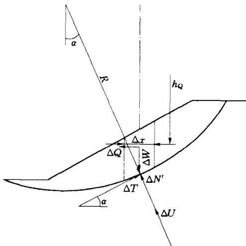  
图 3.1 边坡稳定分析的简化方法

## 3.2.2 安全系数计算公式

将式(2.4)和式(3.1)代入式(3.2)可得

$$
F = \frac { \displaystyle \sum _ { n = 1 } ^ { N } \left\{ \left[ \Delta W ( \cos \alpha - r _ { u } \sec \alpha ) \right] - \Delta Q \sin \alpha \tan \phi ^ { \prime } + c ^ { \prime } \Delta x \sec \alpha \right\} } { \displaystyle \sum _ { n = 1 } ^ { N } \left[ \Delta W \sin \alpha + \Delta Q R _ { d } \right] }\tag{3.4}
$$

## 3.3 毕肖普简化法

## 3.3.1 简化条件

1. 滑面形状

毕肖普简化法使用圆弧滑裂面。

2. 对多余未知力的假定

该法假定 $X { = } 0$ (图 2.2)，或 $\overset { \cdot } { \beta } = 0$ ，即土条两侧作用力均为水平。

3. 静力平衡

(1) 建立垂直方向静力平衡方程，解得 $\mathbf { \nabla } \cdot \mathbf { \em { \em { \Delta } } } \mathbf { \em { \cal { N } } } ^ { \prime }$ （参见图3.1）：

$$
\Delta N \cos \alpha + \Delta T \sin \alpha = \Delta W\tag{3.5}
$$

(2) 通过整体对圆心的力矩平衡解得安全系数。平衡方程式同式(3.2)。

## 3.3.2 安全系数计算公式

将式(2.4)和式(3.5)代入式(3.2)得

$$
F = \frac { \displaystyle \sum _ { n = 1 } ^ { N } [ \Delta W ( 1 - r _ { u } ) \tan \phi ^ { \prime } + c ^ { \prime } \Delta x ] / [ \cos \alpha ( 1 + \tan \alpha \tan \phi ^ { \prime } / F ) ] } { \displaystyle \sum _ { n = 1 } ^ { N } [ \Delta W \sin \alpha + \Delta Q R _ { d } ] }\tag{3.6}
$$

使用毕肖普法计算安全系数，需要通过迭代求解。

## 3.3.3 与通用条分法的关系

如果把毕肖普法所包含的假定条件纳入通用条分法力矩平衡方程式(2.24)，通过适当推导，则该式就可回归为传统毕肖普法的计算公式(3.6)。详细推导参见本章附录3.8.1节。

## 3.4 滑楔法

## 3.4.1 简化条件

## 1. 滑面形状

滑楔法适用于任意形状滑裂面。

2. 对多余未知力的假定

对土条侧向力的倾角 $\beta$ 作假定：

(1) 陆军工程师团法(U. S. Army, Corps of Engineers, 1967)：假定β为常数，等于边坡的 $\lvert \beta \rvert$ 平均坡度 $\%$ ，即

$$
\beta = \gamma _ { a }\tag{3.7}
$$

(2) 罗厄法(Low, J. III and Katafiath, 1960)：假定β等于该土条底面倾角α和顶面倾角γ的 $\boldsymbol { \beta }$ $\gamma$ 平均值，即

$$
\beta = \beta ^ { \prime } = { \frac { ( \alpha + \gamma ) } { 2 } }\tag{3.8}
$$

(3) 简化 Janbu 法(Janbu，1954)：为陆军工程师团法的特例，假定β=0. $\beta = 0$

(4) 传递系数法：假定 $\boldsymbol { \beta }$ 等于该土条条底面倾角，即

$$
\beta = \alpha\tag{3.9}
$$

## 3. 静力平衡

要求每个土条和滑坡体整体力的平衡得到充分满足，但力矩平衡不满足。

## 3.4.2 安全系数计算方法

假定F为某一数值，从右端第一个土条开始，通过静力平衡确定每个土条左侧条间力

(也就是下一个土条右侧条间力)，到最后一个土条，即左端部的土条，其左侧向力应为零。  
如不闭合，需修正F值，直至收敛。

土石坝设计规范提供以下公式进行这一计算步骤。

$$
\begin{array} { l } { { G _ { L } = \sec ( { \phi _ { e } ^ { \prime } } - \alpha + \beta _ { L } ) [ G _ { R } \cos ( { \phi _ { e } ^ { \prime } } - \alpha + \beta _ { R } ) - ( \Delta W - \Delta V ) \sin ( { \phi _ { e } ^ { \prime } } - \alpha ) } } \\ { { \qquad + u \sec \alpha \sin \phi _ { e } ^ { \prime } \Delta x - c _ { e } ^ { \prime } \sec \alpha \cos \phi _ { e } ^ { \prime } \Delta x + \Delta Q \cos ( { \phi _ { e } ^ { \prime } } - \alpha ) ] } } \end{array}\tag{3.10}
$$

式中：下标R和L分别代表土条右和左侧面相应物理量。

对于一个宽度 $\mathbf { \Delta } _ { : \Delta x }$ 的微小土条，可视 $\pmb { \alpha } ,$ 为常量，式(2.12)可写成

$$
\Delta [ G \cos ( \phi _ { e } ^ { \prime } - \alpha + \beta ) ] = - p ( x ) \Delta x\tag{3.11}
$$

即可方便地导出式(3.10)。

如用计算机，则常采用解析法。此时可把本法看作第一章介绍的通用条分法中只满足力平衡方程式(2.23)的特例。STAB程序提供了一个入口，如果使用陆军工程师团法或简化Janbu法，则输入一个β值，如果使用罗厄法，输入一个控制码，即可实现滑楔法的功能。 $\beta$

## 3.4.3 双折线滑面的计算方法

滑楔法中有一个滑裂面为双折线形的特殊情况，如图3.2所示滑面。在C点滑面有一个突然转折，通常一部分滑面为两种土的接触面和软弱夹层。在对多余未知数的假定、静力平衡和安全系数的计算方法上，双折线滑面与滑楔法完全一致。因此，可以直接推导出双折线滑面安全系数的计算公式。

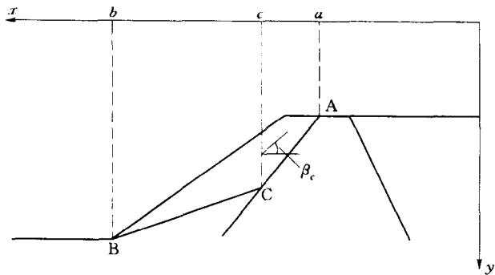  
图 3.2 双折线滑动计算简图

从式(2.21)知，当滑面为直线，即 $\pmb { \alpha }$ 为常数时， $s ( x ) = \sec ( \phi _ { e } ^ { \prime } - \alpha + \beta _ { a } )$ ，式(2.23)可变为

$$
\int _ { a } ^ { b } p ( x ) \cdot K \mathrm { d } x = 0\tag{3.12}
$$

$$
K = 1 , \qquad a < x \leq c\tag{3.13}
$$

$$
K = \frac { \cos ( \phi _ { e } ^ { r } - \alpha _ { r } + \beta _ { c } ) } { \cos ( \phi _ { e } ^ { l } - \alpha _ { l } + \beta _ { c } ) } \qquad c < x \leq b\tag{3.14}
$$

下标r和l分别代表在转折点C左右侧相应的数值，β为左、右楔块界面处作用力的 $\beta _ { c }$ 倾角。可知，安全系数决定于对 $\mathcal { \hat { \beta } } _ { c }$ 的假定值。

## 3.5 斯宾塞法(Spencer 法)

Spencer法是Morgenstern-Price法的一个特例。它假定土条侧向力的倾角为一常数，即取 $f ( x ) = 1$ 和 $f _ { \mathrm { 0 } } ( x ) = 0$ ，如图2.1(b)所示，也就是第2.5.2节中介绍的对侧向力的假定1。在很多情况下，采用该法所得的安全系数从工程角度来看已足够精确。因此，在使用STAB程序进行通用条分法计算时，Spencer法是作为默认的功能向读者提供的。

## 3.6 简化法

## 3.6.1 概述

本节介绍由作者提出的两个简化方法。提出这两个方法的目的是为第2章介绍的边坡稳定通用条分法的迭代过程提供一个安全系数的初值(2.3.3节)，同时也为将在第4章介绍的计算最小安全系数的随机搜索提供一个简捷省时的方法。此法在第2章介绍通用条分法时建立(Chen & Morgenstern,1983)，后在作者论述随机搜索方法的论文(Chen,1992)中作了全面介绍。关于本法的计算精度，将在3.7.3节中讨论。

## 3.6.2 简化法1

假定 $\beta = \alpha$ 且假定水平地震力作用于土条底，即 $h _ { e } = 0$ ，则力矩平衡方程式(2.24)可以自动得到满足。解式(2.23)，可得到一个计算安全系数的公式

$$
F = \frac { \displaystyle \int _ { a } ^ { b } A \cdot \exp [ - ( \frac { \tan \Phi ^ { ' } } { F } \alpha + \frac { K _ { i } } { F } ) ] \mathrm { d } x } { \displaystyle \int _ { a } ^ { b } B \cdot \exp [ - ( \frac { \tan \Phi ^ { ' } } { F } \alpha + \frac { K _ { i } } { F } ) ] \mathrm { d } x }\tag{3.15}
$$

$$
A = [ \frac { \mathrm { d } W } { \mathrm { d } x } ( \cos \alpha - r _ { u } \sec \alpha ) \tan \phi ^ { \prime } + c ^ { \prime } \sec \alpha - \eta \frac { \mathrm { d } W } { \mathrm { d } x } \sin \alpha \tan \phi ^ { \prime } + q \cos \alpha \tan \phi ^ { \prime } ]\tag{3.16}
$$

$$
B = [ ( \frac { \mathrm { d } W } { \mathrm { d } x } + q ) \sin \alpha + \eta \frac { \mathrm { d } W } { \mathrm { d } x } \cos \alpha ]\tag{3.17}
$$

$$
K _ { i } = \sum _ { i = 1 } ^ { s } [ \tan { \phi _ { i } ^ { \prime } } \cdot \alpha _ { i } ] _ { i } ^ { r }\tag{3.18}
$$

$\pmb { K } _ { i }$ 是一个考虑滑面上α和φ′突然变化影响的系数。如果某段滑面是光滑的、均匀的， $\phi ^ { \prime }$ 则K就是一个常数。在积分过程中，当某一土条的φ值或条底倾角α出现突变时，K就 $K _ { i }$ ${ \pmb { \phi } } _ { i } ^ { \prime }$ $\pmb { \alpha _ { i } }$ $K _ { i }$ 要增加一个值 $\left[ \tan { \phi _ { i } ^ { \prime } } \cdot \alpha _ { i } \right] _ { l } ^ { \gamma }$ (方括号内的变量在突变点右侧和左侧的差值，x轴向左为正)，这里 α以弧度计。

通过进一步简化(参见3.8.2节)，可以得到一个不需迭代求解的计算安全系数的公式

$$
F = \frac { B _ { k } } { A _ { k } } - \frac { C _ { k } } { B _ { k } }\tag{3.19}
$$

$$
A _ { k } = \int _ { a } ^ { b } B \mathrm { d } x\tag{3.20}
$$

$$
B _ { k } = \int _ { a } ^ { b } A \mathrm { d } x + \int _ { a } ^ { b } B \xi \mathrm { d } x\tag{3.21}
$$

$$
C _ { k } = \int _ { a } ^ { b } A \xi { \mathrm { d } } x\tag{3.22}
$$

$$
\xi = \tan \phi ^ { \prime } \cdot \alpha + K _ { i } - \tan \phi _ { a \nu } ^ { \prime } \cdot \alpha _ { a \nu }\tag{3.23}
$$

式中： $\pmb { \alpha _ { a w } }$ 、 $\phi ^ { \prime } { } _ { \alpha \upsilon }$ 为α、 $\phi ^ { \prime }$ 在(a，b)段的平均值，以弧度计。

式(3.15)和式(3.19)的详细推导参见本章附录3.8.2节(Chen,1990)。

国内一些著作中，曾见过一种“传递系数法”，由于该法也引入 ${ \mathcal { T } } \beta = \alpha$ 的假定，因此相当于本“简化法”。其计算精度和局限性见3.7.3有关讨论。

## 3.6.3 简化法2

简化法 2 按式(3.19)计算安全系数的初值，然后，进行 2.3.1 节介绍的 Newton-Raphson迭代，但只作一次迭代，不进行收敛判断。由于迭代计算中第一次往往是向安全系数的解迈进最大的一步，故获得的解通常和精确的数值解十分接近。

## 3.7 各种方法和简化处理对计算精度的影响

## 3.7.1 概述

关于边坡稳定分析各种方法的计算精度、适用范围等问题，一直受到普遍的关注，Whitman与Bailey在1967年的文章对澄清一系列重要问题起了很好作用。近代土力学经过几十年发展，学术界已对这些问题有了比较统一的看法。1993年，美国土木工程师学会在“堤坝稳定分析25年回顾”专著中，邀请Duncan(1996)作当代水平报告。报告对各种传统边坡稳定分析方法的计算精度和适用范围作了以下论述。

(1)各种边坡稳定分析的图表，在边坡几何条件、容重、强度指标和孔压可以简化的情况下可得出有用结果，其主要局限性在于使用这些图表需对上述条件作简化处理。使用图表法的主要优点是可以快速求得安全系数，通常可先使用这些图表进行初步核算，再使用计算机程序进行详细核算。

(2)传统瑞典法在平缓边坡和高孔隙水压情况下进行有效应力法分析时是非常不准确的。该法的安全系数在 ${ } ^ { \ast } \phi = 0 { } ^ { \ast }$ 分析中是完全精确的，对于圆弧滑裂面的总应力法可得出基本正确的结果。此法的数值分析不存在问题。

(3)毕肖普简化法在所有情况下都是精确的(除了遇到数值分析困难情况外)，其局限性表现在仅适用于圆弧滑裂面以及有时会遇到数值分析问题。如果使用毕肖普简化法计算获得的安全系数反而比瑞典法小，那么可以认为毕肖普法中存在数值分析问题。在这种情况下，瑞典法的结果比毕肖普法好。基于这个原因，同时计算瑞典法和毕肖普法，比较其结果，是一个较好的选择。

(4)仅使用静力平衡方法的结果对所假定的条间力方向极为敏感，条间力假定不合适将导致安全系数严重偏离正确值。与其它考虑条间作用力方向的方法一样，这个方法也存在数值分析问题。

(5) 满足全部平衡条件的方法(如 Janbu 法，Spencer 法) 在任何情况下都是精确的(除非遇到数值分析问题)。这些方法计算的成果相互误差不超过12%，相对于一般可认为是正确的答案的误差不会超过6%，所有这些方法也都有数值分析问题。

现围绕Duncun的这几点结论，作如下讨论。

## 3.7.2 关于数值分析问题

Duncan教授在上面论述中多次提到了数值分析问题，根据以往的文献(Whitman和Bailay,1967)，大致可理解为以下两个问题。

## 1. 条分法计算中 $6 4$ “死区”

在通用条分法的式(2.12)中，可以看到一个表达式 $\sec ( \phi ^ { \prime } , - \alpha + \beta )$ ，毕肖普法的表达式(3.6)中，实际上也存在一个 $\sec ( \phi _ { e } ^ { \prime } - \alpha )$ 的表达式。因此，当某一条块的条底倾角α使 $( \phi _ { e } ^ { \prime } - \alpha + \beta )$ 或 $( \phi _ { e } ^ { \prime } - \alpha )$ 等于 $9 0 ^ { \circ }$ 时，相应的余割值将变为无穷大。这种情况通常是在α为负值时出现，可以通过图3.3了解这一问题的物理背景。土条条底切向力由两个量组成，一是粘聚力，即 $\pmb { c } ^ { \prime } \pmb { L } .$ 。另一是由法向力 $N ^ { ' }$ 贡献的摩擦力 $N ^ { \prime } \tan \phi _ { e } ^ { \prime }$ ，它和法向力 N合成一个力 P，该合力与滑面的法线方向夹角为 $\phi _ { e } ^ { \prime }$

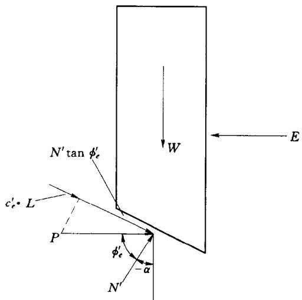  
图3.3 解释毕肖普法遇到数值分析困难示意图

如果P的方向恰好为水平，即 $\phi ^ { \prime } { } _ { e } - \alpha = 9 0 ^ { \circ }$ ，那么，由于毕肖普法假定在土条间不存在铅直方向的力，因而在铅直方向，只有重力W和粘聚力c在垂直方向的分力。而这两个 $c _ { \textit { e } } ^ { \prime }$ 力都是已知的，无论如何也无法保证垂直方向的静力平衡条件。

稳定计算分析的实践表明，上述问题并没有在应用中造成很大困难。事实上，只有在土的摩擦角很大而且滑弧反翘现象比较明显的情况下才会出现这个问题。如果问题包含一个搜索临界滑裂面的过程，那么，只要初始滑裂面不存在这一问题，计算就可以继续下去。遇到存在这样问题的滑面，随时可以抛弃，最终找到不存在数值分析问题的临界滑裂面。

## 2. 数值计算收敛问题

边坡稳定分析的控制方程是非线性的，因此，需要采用一定的数值分析方法求解安全系数。如果采用近代数值计算技术，可以保证在大部分情况下，各种方法都具有很好的收敛性，如第一章中所举的几个例子，数值分析过程都是十分有效的。但是如采用“试凑”法，则难以保证在所有情况下计算收敛。在第2.5.4节，我们曾讨论过Janbu法在数值分析时收敛性能很差这一问题。在作者所示的一个例子中，对圆弧滑裂面1，使用 Janbu法需要10次迭代才能使前、后两次F值小于0.005。如果改用一个断面不规则的非圆弧滑裂面，Morgenstern-Price法只需3次迭代即获得收敛解，而 Janbu法则无法收敛。

## 3.7.3 关于各种分析方法精度的讨论

本节讨论简化法的精度，并将通过工程实例，说明各种简化法的局限性。

## 1. 关于毕肖普法精度的讨论

Whitma和Bailey(1967)对毕肖普法精度作过研究分析，他们将其计算结果与Morgensterm-Price法的结果对比，发现如果滑裂面为圆弧形，两者十分接近。因此，用毕肖普法计算往往能得到足够的精度。

[例 3.1] 比较毕肖普法和 Morgenstern-Price 法的结果。

第2章[例 2.2]中的滑裂面形状为圆弧形。对这个滑裂面使用毕肖普法(数据文件CPT4-2)，安全系数为1.384，与使用通用条分法的计算结果1.382十分接近。对于这个例子，两种方法求得的临界滑裂面位置和相应最小安全系数也很接近。参见第4章。

因此，对于一般没有软弱土层或结构面的边坡，采用圆弧形滑裂面毕肖普法计算往往能得到足够的精度。

## 2. 关于瑞典法精度的讨论

在通常情况下，瑞典法的结果总是比毕肖普法小。当圆弧夹角和孔隙水压力均较大时，这种误差就可能很大，下面通过一个例子说明。

[例3.2] 说明瑞典法误差大的例子。

图3.4是一坡度为1:3的均质边坡， $c = 5 { \times } 9 . 8 \mathrm { { k N } } / \mathrm { { m } } ^ { 2 }$ $\phi = 3 5 ^ { \circ }$ $\gamma = 1 . 7 { \times } 9 . 8 \mathrm { k N } / \mathrm { m } ^ { 3 } .$ 。表3.1和图3.4是不同中心角和孔压系数情况下的稳定安全系数。可以看出，当 $\alpha { = } 1 1 7 . 6 ^ { \circ } , r _ { u } { = } 0 . 6$ 时，毕肖普法和瑞典法的稳定安全系数比值 $F _ { b } / F _ { s }$ 为1.770。在图3.5(d)中，相应瑞典法的稳定安全系数与中心角的关系，其趋势也发生了根本性变化。如前所述，毕肖普法通常代表了正确解，在中心角和孔压系数较大的情况下，瑞典法误差极大，当属不正确的结果。

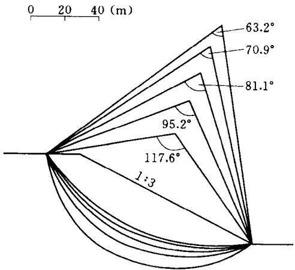  
图 3.4 说明瑞典法精度的一个例子

表3.1 不同孔压和中心角瑞典法 $\boldsymbol { F } _ { s }$ 和毕肖普法 $\pmb { F _ { b } }$ 的安全系数比较
<table><tr><td>孔压系数  $\cdot \gamma _ { u }$ </td><td>中心角  $\pmb { \alpha }$ </td><td> $\boldsymbol { F } _ { b }$ </td><td> $F _ { s }$ </td><td> $F _ { b } / F _ { s }$ </td></tr><tr><td rowspan="5">0.0</td><td> $1 1 7 . 6 ^ { \circ }$ </td><td>3.020</td><td>2.544</td><td>1.187</td></tr><tr><td>95.2°</td><td>2.614</td><td>2.322</td><td>1.126</td></tr><tr><td> $8 1 . 1 ^ { \circ }$ </td><td>2.451</td><td>2.245</td><td>1.092</td></tr><tr><td> $7 0 . 9 ^ { \circ }$ </td><td>2.371</td><td>2.216</td><td>1.070</td></tr><tr><td> $6 3 . 2 ^ { \circ }$ </td><td>2.332</td><td>2.209</td><td>1.056</td></tr><tr><td rowspan="5">0.2</td><td> $1 1 7 . 6 ^ { \circ }$ </td><td>2.444</td><td>1.953</td><td>1.251</td></tr><tr><td> $9 5 . 2 ^ { \circ }$ </td><td>2.121</td><td>1.820</td><td>1.165</td></tr><tr><td> $8 1 . 1 ^ { \circ }$ </td><td>1.994</td><td>1.782</td><td>1.119</td></tr><tr><td> $7 0 . 9 ^ { \circ }$ </td><td>1.936</td><td>1.775</td><td>1.090</td></tr><tr><td>63.2°</td><td>1.910</td><td>1.783</td><td>1.071</td></tr><tr><td rowspan="5">0.4</td><td> $1 1 7 . 6 ^ { \circ }$ </td><td>1.876</td><td>1.361</td><td>1.318</td></tr><tr><td>95.2°</td><td>1.634</td><td>1.317</td><td>1.240</td></tr><tr><td>81.1°</td><td>1.542</td><td>1.318</td><td>1.170</td></tr><tr><td> $7 0 . 9 ^ { \circ }$ </td><td>1.504</td><td>1.334</td><td>1.127</td></tr><tr><td>63.2°</td><td>1.490</td><td>1.354</td><td>1.100</td></tr><tr><td rowspan="5">0.6</td><td> $1 1 7 . 6 ^ { \circ }$ </td><td>1.325</td><td>0.769</td><td>1.723</td></tr><tr><td>95.2°</td><td>1.157</td><td>0.814</td><td>1.421</td></tr><tr><td>81.1°</td><td>1.098</td><td>0.855</td><td>1.284</td></tr><tr><td>70.9°</td><td>1.078</td><td>0.893</td><td>1.207</td></tr><tr><td>63.2°</td><td>1.076</td><td>0.929</td><td>1.158</td></tr></table>

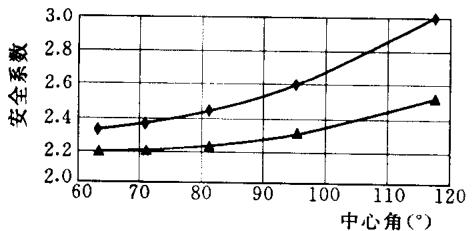  
(a)

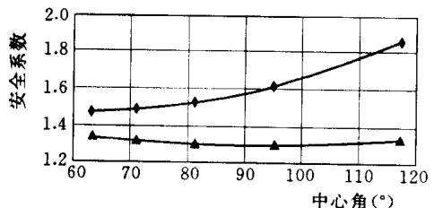  
(c)

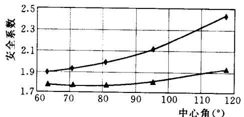  
(b)

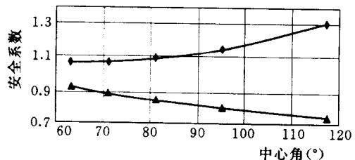  
Bishop 法；▲ 瑞典法  
(d)  
图3.5 不同孔压和中心角瑞典法F和毕肖普法F的安全系数比较 ${ \pmb F } _ { s }$ $\pmb { F _ { b } }$ (a) γ=0.0; (b) γ =0.2; (c) $\gamma _ { \ast } = 0 . 4 ;$ (d) $\gamma _ { \ast } = 0 . 6$

[例3.3] 金河土堤例。

图3.6为斯里兰卡金河土堤计算实例，地基为泥炭质淤泥。ADB为已开裂的缝，当计算滑动体ABE的稳定时，阴影部分不平衡的水重和孔隙水压力，必须按2.4.3节讨论的原则予以处理。不把这部分考虑进去，会得到错误结论。采用超孔隙水压和浮容重，不考虑阴影部分的负面积，两者的计算结果不一样，其差异是孔隙水压力较大造成的。由于这个例子的孔隙水压力很大，从表3.2可看到瑞典法的计算结果远低于毕肖普法。情况2毕肖普法的成果为1.022，与发生滑坡的实际情况吻合，瑞典法的安全系数仅0.583。对于情况1，由于使用实际孔压，瑞典法的解竟为-0.149。本例综合反映了本章讨论的两个问题：①等效置换必须对浸润线以下所有土体；②瑞典法可能在孔隙水压较大的情况下得出错误结果。本例还说明，对于在饱和软弱地基上筑堤问题，一般不宜采用瑞典法。

表 3.2 金河土堤几种不同处理方法计算结果(图 3.6所示算例)
<table><tr><td>情况方法</td><td></td><td>瑞典法</td><td>毕肖普法</td><td>陆军工程师团法  $\cdot \beta _ { a w } = 5 ^ { \circ }$ </td></tr><tr><td>1</td><td>饱和容重，实际孔压</td><td>-0.149</td><td>1.024</td><td>1.003</td></tr><tr><td>2</td><td>浮容重，超静水压，即等效置换 法(考虑负面积)</td><td>0.583</td><td>1.022</td><td>0.922</td></tr><tr><td>3</td><td>浮容重，超静水压(不考虑负面 积)，不正确的作法</td><td>0.576</td><td>1.002</td><td>0.897</td></tr></table>

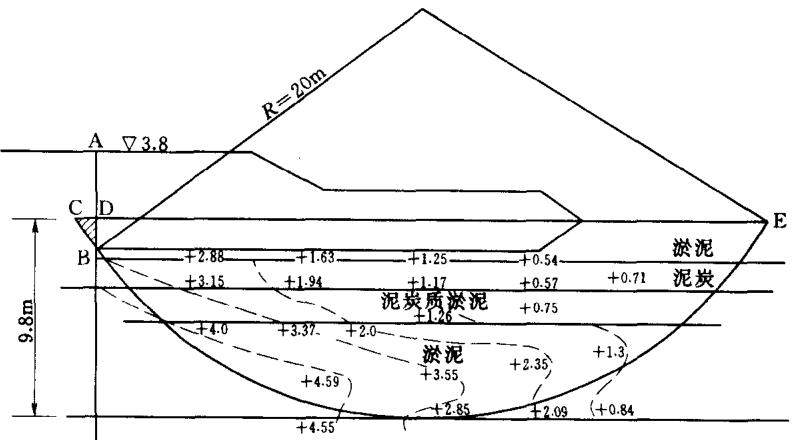  
图 3.6 金河防洪堤施工期的稳定分析  
[例3.4] 泰安抽水蓄能电站上池面板坝坝坡稳定分析

图3.7为泰安抽水蓄能电站上池在选坝阶段面板坝方案坝坡稳定分析示例。大坝坝基有一个断层通过，断层及其影响带的强度指标远低于坝壳，因此，控制滑裂面是穿越坝基的圆弧。在这样的特定条件下，临界滑裂面的中心夹角较大，如果对这个工程使用瑞典法，则其安全系数比毕肖普法要小很多。本例F和F,分别为1.47和1.10，其差值为25%。此 $\boldsymbol { F } _ { b }$ $F _ { s }$ 两种方法有可能对坝坡稳定安全系数是否达到允许值给出相反的结论。在这种情况下，我们应该接受毕肖普法的计算结果。

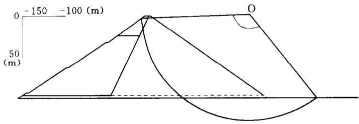  
图3.7 泰安抽水蓄能电站上池面板坝

本例在某种意义上有普遍的指导价值，当一个强度指标较大的坝体修在一个相对软弱的地基上时，控制的临界滑裂面要通过坝基。在这种情况下，圆弧的中心角较大，瑞典法固有的误差将导致一个错误引导的结果，最终导致临界滑裂面的圆弧被压得很低，安全系数远低于正确值。

## 3. 对滑楔法的讨论

经验表明，在滑裂面为光滑曲线时，陆军工程师团法和 Lowe-Karafiath法均能给出和严格方法接近的安全系数。但当滑裂面为折线形时，其成果和非圆弧严格方法的成果有一定差别。转折点增多，误差变大。使用陆军工程师团法，则安全系数受假定的 $| \beta _ { c }$ 数值影响很大。

## [例3.5] 怀洪新河某堤段滑坡。

本例发表于岩土工程学报（葛孝椿，1999）。原作者分析了一个发生边坡失稳的工程实例。如图3.8(a)，相应原文图1，土层1、2和3的物理力学指标如表3.3所示。

原作者在分析过程中，将滑体分成了三部分，上部提供主动土压力 $P _ { a } ,$ 底部提供被动土压力 $P _ { p }$ ，中部提供抗滑力。

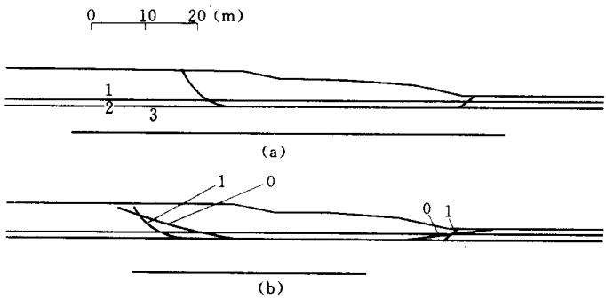  
图 3.8 怀洪新河某堤段滑坡  
(a)-不设拉力缝；(b)-设拉力缝

表 3.3 各土层的物理力学指标
<table><tr><td>编号</td><td>γ(kN/m³)</td><td>c (kPa)</td><td>φ(°)</td></tr><tr><td>1</td><td>19.11</td><td>11.0</td><td>26.0</td></tr><tr><td>2</td><td>13.03</td><td>2.67</td><td>0</td></tr><tr><td>3</td><td>17.12</td><td>27</td><td>2.84</td></tr></table>

根据这一方法计算得到的安全系数为0.706，与发生滑坡的实际情况不附。该文发表后，岩土工程学报发表了朱大勇和陈祖煜(1999)的讨论文章，指出了论文作者获得如此小的安全系数，是计算方法欠精确所致。

作者在分析中采用 Morgenstern-Price 的特例 Spencer 法，先输入一个如图 3.8(b)所示的一个任意形状滑裂面0，获得安全系数为2.538。然后，令程序自动搜索最小安全系数，得到了编号为1的临界滑裂面，其安全系数为0.98。注意在计算中，在滑裂面顶设了深1m的拉力缝。

如果滑裂面不设拉力缝，采用同样的计算步骤，得到如图3.8(a)所示的临界滑裂面，相应F值为0.963。由此可知，采用较严格的计算方法，可以获得接近1的安全系数，与发生滑坡的实际情况一致。笔者在考察这一例题时，同时采用了陆军工程师团法，相应图3.8(b)的滑裂面。在不同β值情况下，安全系数值计算成果如表3.4。可以发现，仅满足力平衡而不满足力矩平衡的方法，其计算成果与β值十分敏感。

表 3.4 滑楔法计算成果
<table><tr><td>β(°)</td><td>0.0</td><td> $1 . 5 5 ^ { * }$ </td><td>5.0</td><td>10.0</td><td>15.0</td><td>20.0</td></tr><tr><td>F</td><td>1.013</td><td>1.027</td><td>1.070</td><td>1.147</td><td>1.232</td><td>1.341</td></tr></table>

\* 为 Spencer 法的计算成果。

[例3.6] 小浪底左岸出口边坡。

小浪底工程左岸泄水建筑物出口边坡计算简图如图3.9。边坡岩体为三迭系砂岩和泥岩地层。AB 为通过该地层的 F236断层，CD 为层间泥化夹层。AB 和 CD面的抗剪强度指 $\mathrm { F } _ { 2 3 6 }$ 标均为 $c = 0 . 0 , \phi = 1 1 . 6 5 ^ { \circ }$ ，边坡施加锚固力在平台以上为1000kN/m，以下为5330kN/m。

显然，滑面ACD构成一个双折线楔形滑动体，由于存在一组陡倾角节理，可以使用垂直条分法。那么如3.4.3节所示，安全系数可由式(3.12)计算。但是，在通过C点条块侧面的倾角β对安全系数计算值影响极大。表3.5所示不同β值时的安全系数。可见，其变 $\beta _ { c }$ $| \beta _ { c }$ 化幅度极大。

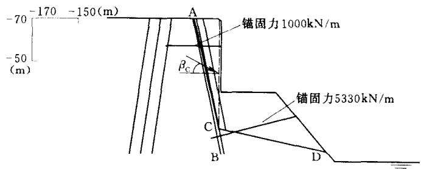  
图 3.9 小浪底左岸出口边坡

表 3.5 表示不同β值的安全系数
<table><tr><td>β(°)</td><td>0</td><td>10</td><td>20</td><td>30</td><td>40</td><td>Morgenstern法 简化法1</td><td></td><td>简化法2</td></tr><tr><td>F</td><td>0.869</td><td>1.188</td><td>1.674</td><td>2.520</td><td>4.433</td><td>1.470</td><td>2.116</td><td>1.617</td></tr></table>

[例3.7]小浪底左岸大坝下游坝坡沿软弱夹层滑动。

黄河小浪底水利工程枢纽大坝左岸由于基岩面抬高，下游坝坡沿软弱夹层进行滑动成为需要复核的一个重要工况。图3.10所示为初始滑裂面0和临界滑裂面1，强度参数参见表 3.6。计算采用 Morgenstern-Price法，相应安全系数分别为 2.118 和 1.64。表 3.7 对初始滑裂面和临界滑裂面采用工程师团法成果进行考察。相应 $0 ^ { \circ } { \sim } 1 5 ^ { \circ }$ 之间不同的β值，对于初始滑裂面，安全系数从1.802变化至2.706，变化幅度达33%；对于临界滑裂面，安全系数从1.534变化至1.898，变化幅度达19%。这一算例再一次证实了Duncan关于“仅使用静力平衡方法的结果对所假定的条间力方向极为敏感，条间力假定不合适将导致安全系数严重偏离正确值”这一论述。

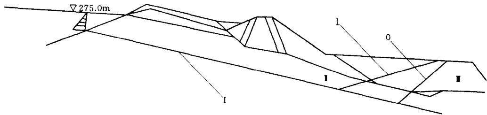  
图 3.10 小浪底大坝 310 断面

表 3.6 小浪底大坝材料参数
<table><tr><td>编号</td><td>材料</td><td>摩擦角(°)</td><td>粘聚力(9.8kN/m²)</td><td>容重(9.8kN/m³)</td></tr><tr><td>I</td><td>节理岩体</td><td>35</td><td>0</td><td>2.6</td></tr><tr><td>Ⅱ</td><td>软弱夹层</td><td>12</td><td>0.5</td><td>2.01</td></tr><tr><td>IⅢI</td><td>压战体</td><td>30</td><td>0</td><td>2.01</td></tr></table>

表3.7 小浪底大坝310断面安全系数
<table><tr><td>β(°)</td><td colspan="2">安全系数</td></tr><tr><td></td><td>初始滑裂面</td><td>临界滑裂面</td></tr><tr><td>0</td><td>1.802</td><td>1.534</td></tr><tr><td>5</td><td>2.021</td><td>1.605</td></tr><tr><td>10 15</td><td>2.321</td><td>1.687</td></tr><tr><td>20</td><td>2.706</td><td>1.783</td></tr><tr><td>Morgenstern-Price法</td><td>-</td><td>1.898</td></tr><tr><td>Lowe-Karafiath法</td><td>2.118</td><td>1.64</td></tr><tr><td></td><td>1.549</td><td>1.546</td></tr></table>

## 4. 关于简化法和传递系数法的讨论

在第3.6节中我们已经说明，“简化法”实际上是“传递系数法”的闭合解。作者曾做过大量考察(Chen，1992)，发现如按式(3.15)或式(3.19)来进行传递系数法的计算，在光滑曲线滑裂面情况下，安全系数与毕肖普法十分接近。表3.8和图3.11为采用简化法对[例3.2]重新进行计算的成果。与表 3.1 和图3.5相比，可知简化法的成果相对瑞典法有了极大改善。即使在中心角或孔隙压力系数较大时，其安全系数仍与毕肖普法十分接近。在第4章中将考察小浪底工程含有软弱夹层的滑裂面例题，其安全系数与Spencer法也十分接近。

但这一方法终究是个简化方法。分析此法的物理概念，可以发现其存在以下固有缺陷：

(1)一般来说，滑裂面的底滑面倾角α在靠近坡顶处都是很陡的，如图3.12中的条块B, $\alpha = 6 0 ^ { \circ }$ 。假定 $\beta = \alpha ,$ 那么在砂性土(c=0)时，即意味着土条侧面的摩擦角可以达到 ${ \bf 6 0 ^ { \circ } }$ 即使在c≠0的条件，对靠近坡顶的土条假定β=α在物理上也是不合理的。也就是说，这一 $\multimap$ $\beta = \alpha$ 方法在靠近坡顶处破坏了式(2.6)。

表3.8 不同孔压和中心角简化法 $\pmb { F _ { c } }$ 和毕肖普法 $\pmb { F _ { b } }$ 的安全系数比较
<table><tr><td>孔压系数  $\cdot \gamma _ { * }$ </td><td>中心角α</td><td> $\boldsymbol { F } _ { b }$ </td><td> $F _ { s }$ </td><td> $F _ { b } / F _ { s }$ </td></tr><tr><td rowspan="5">0.0</td><td> $1 1 7 . 6 ^ { \circ }$ </td><td>3.020</td><td>2.946</td><td>1.025</td></tr><tr><td> $9 5 . 2 ^ { \circ }$ </td><td>2.614</td><td>2.582</td><td>1.012</td></tr><tr><td> ${ 8 1 . 1 ^ { \circ } }$ </td><td>2.451</td><td>2.432</td><td>1.008</td></tr><tr><td> $7 0 . 9 ^ { \circ }$ </td><td>2.371</td><td>2.360</td><td>1.005</td></tr><tr><td> $6 3 . 2 ^ { \circ }$ </td><td>2.332</td><td>2.324</td><td>1.003</td></tr><tr><td rowspan="5">0.2</td><td> $1 1 7 . 6 ^ { \circ }$ </td><td>2.444</td><td>2.378</td><td>1.028</td></tr><tr><td> $9 5 . 2 ^ { \circ }$ </td><td>2.121</td><td>2.095</td><td>1.012</td></tr><tr><td> $8 1 . 1 ^ { \circ }$ </td><td>1.994</td><td>1.981</td><td>1.007</td></tr><tr><td> $7 0 . 9 ^ { \circ }$ </td><td>1.936</td><td>1.928</td><td>1.004</td></tr><tr><td> $6 3 . 2 ^ { \circ }$ </td><td>1.910</td><td>1.905</td><td>1.003</td></tr><tr><td rowspan="5">0.4</td><td> $\bar { 1 } 1 7 . 6 ^ { \circ }$ </td><td>1.876</td><td>1.826</td><td>1.027</td></tr><tr><td> $9 5 . 2 ^ { \circ }$ </td><td>1.634</td><td>1.618</td><td>1.010</td></tr><tr><td> $8 1 . 1 ^ { \circ }$ </td><td>1.542</td><td>1.536</td><td>1.004</td></tr><tr><td> $7 0 . 9 ^ { \circ }$ </td><td>1.504</td><td>1.501</td><td>1.002</td></tr><tr><td> $6 3 . 2 ^ { \circ }$ </td><td>1.490</td><td>1.489</td><td>1.001</td></tr><tr><td rowspan="5">0.6</td><td> $1 1 7 . 6 ^ { \circ }$ </td><td>1.325</td><td>1.312</td><td>1.010</td></tr><tr><td> $9 5 . 2 ^ { \circ }$ </td><td>1.157</td><td>1.145</td><td>1.010</td></tr><tr><td> $8 1 . 1 ^ { \circ }$ </td><td>1.098</td><td>1.109</td><td>0.990</td></tr><tr><td> $7 0 . 9 ^ { \circ }$ </td><td>1.078</td><td>1.087</td><td>0.992</td></tr><tr><td> $6 3 . 2 ^ { \circ }$ </td><td>1.076</td><td>1.083</td><td>0.994</td></tr></table>

(2) 当遇到有软弱夹层问题时（传递系数法恰恰是在遇到这一类非圆弧滑裂面时提出来的)，假定 $\mathbf { \beta } \mathbf { \cdot } \mathbf { \vec { \beta } } \mathbf { \cdot } \mathbf { \vec { \beta } } \mathbf { \cdot } \mathbf { \vec { \beta } } \mathbf { \cdot } \mathbf { \vec { \beta } } \mathbf { \cdot } \mathbf { \vec { \beta } } \mathbf { \cdot } \mathbf { \vec { \alpha } }$ 会导致安全系数偏大。

参见图3.12，采用传递系数法，则处理过渡段的土条A时，右侧的条间力Pi.的倾角 $P _ { i \cdot I }$ 很大，可能达到 $5 0 ^ { \circ } { \sim } 6 0 ^ { \circ }$ ，而左侧的 $P _ { i + I }$ 的倾角为零。由于软弱夹层的强度指标通常很小，

$P _ { i }$ 以很大的角度向下传力，那么就会使滑体上部传到软弱夹层上的法向力变得很大，而水平滑动力则变得很小。因此，如果对滑面上这些突变点不作任何处理，安全系数可能会大得不可思议。在[例3.6]中，如果 ${ \ B _ { c } }$ 采用“传递系数法”，令 $\cdot \beta _ { c }$ 与 AB 面平行，即 $\beta _ { c } { = } 7 5 ^ { \circ }$ 则计算无法收敛，当 $\beta _ { c } { = } 4 0 ^ { \circ }$ 时，则 $\pmb { F } \mathrm { = } 4 . 4 3 3$ (表3.5)，其值极不合理。

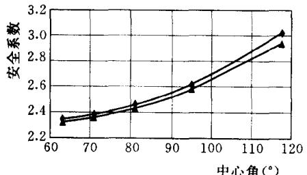  
(a)

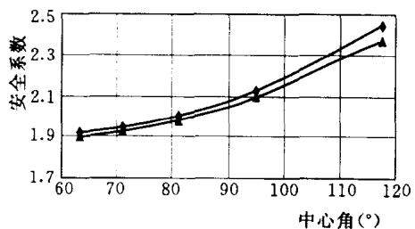

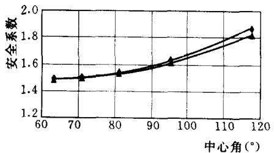  
(c)

(b)  
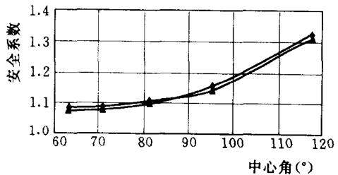  
Bishop 法；▲ 简化法  
(d)  
图3.11 [例3.2] 不同孔压和中心角简化法F和毕肖普法F6的安全系数比较 $F _ { s }$ $\pmb { F _ { b } }$

$$
\gamma _ { \ast } { = } 0 . 0 ;
$$

$$
\gamma _ { \ast } = 0 . 2 ;
$$

$$
\gamma _ { * } = 0 . 6
$$

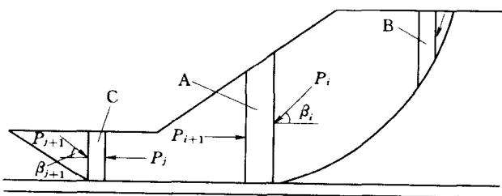  
图 3.12 讨论传递系数法的简图

再来看图 3.12 中滑裂面反翘处的条块 C。此处的条间力 $P _ { j + l }$ 的倾角 $\beta _ { j + }$ 1将是负的，这意味左侧条块将相对右侧条块向下移动，显然不合理。

应该说，这一问题在第3.6节中介绍的简化法中得到一定的缓解。因为在积分运算中，我们已经通过式(3.18)计入了考虑这一突变量的一个系数K。对[例3.6]，简化法2给出的 $K _ { i } 。$ 安全系数为1.617，与Morgenstern-Price 法比较接近。

鉴于上述原因，目前的认识水平还无法保证传递系数法在任何情况都能提供准确的答案。本书提出简化法的主要目的，是为计算安全系数和下章要讨论的随机搜索方法提供一个近似值。由于“传递系数法”在国内使用较为普遍，希望使用该法的工程师对这一方法的局限性有一个了解。

## 3.7.4 我国土石坝设计规范对采用各种方法的规定

我国土石坝设计规范对坝坡稳定分析的方法作了如下规定(8.3.9条):

“静力稳定计算应采用刚体极限平衡法。对于均质坝、厚斜墙坝和厚心墙坝，宜采用计及条块间作用力的简化毕肖普(Simplified毕肖普)法，对于无粘性土以及有软弱夹层、薄斜墙、薄心墙坝的坝坡稳定分析及任何坝型，可采用满足条块间作用力和力矩平衡的摩根斯顿-普赖斯(Morgenstern-Price)法等方法，计算坝坡抗滑稳定安全系数。”

相应计算条间力的计算方法，土石坝设计规范对允许安全系数作了如表3.8的规定(8.3.10条)。

采用不计及条间力的瑞典圆弧法，其允许安全系数对1级坝正常运用条件为1.3。其余情况在表 3.9基础上降低 8%。

表3.10总结了各简化方法适用的假定和简化条件。

表3.9 坝坡抗滑稳定最小安全系数
<table><tr><td rowspan="2">运用条件</td><td colspan="4">工程等级</td></tr><tr><td>1</td><td>2</td><td>3</td><td>4,5</td></tr><tr><td>正常运用条件</td><td>1.50</td><td>1.35</td><td>1.30</td><td>1.25</td></tr><tr><td>非常运用条件I</td><td>1.30</td><td>1.25</td><td>1.20</td><td>1.15</td></tr><tr><td>非常运用条件Ⅱ</td><td>1.20</td><td>1.15</td><td>1.15</td><td>1.10</td></tr></table>

表3.10 稳定分析的各种简化方法
<table><tr><td rowspan="2">方法</td><td colspan="3">对平衡条件的简化</td><td rowspan="2">对滑裂面形状的假定</td><td rowspan="2">对土条侧向作 用力的假定</td></tr><tr><td>力矩平衡</td><td></td><td>力平衡</td></tr><tr><td></td><td>满足</td><td>不满足</td><td>全部满足部分满足 圆弧 折线</td><td>任意形状 滑裂面</td><td></td></tr><tr><td>楔形体法</td><td></td><td>√</td><td>√</td><td>√</td><td>(α+γ) β= 2</td></tr><tr><td>瑞典法</td><td>√</td><td></td><td></td><td>√</td><td>忽略侧向力</td></tr><tr><td>毕肖普法</td><td>√</td><td></td><td>√</td><td>√</td><td>β=0</td></tr><tr><td>Spencer法 美国陆军工程</td><td>√</td><td></td><td>√</td><td>√</td><td>β=常数</td></tr><tr><td>师团法</td><td></td><td>√ √</td><td></td><td>√</td><td>β=平均坝坡</td></tr><tr><td>简化法</td><td>√</td><td></td><td>√</td><td>√</td><td>β=α</td></tr><tr><td>Morgenstern- Price法</td><td>√</td><td>√</td><td></td><td>√</td><td>tanα = λf(x)</td></tr></table>

## 3.8 本章附录

## 3.8.1 通用条分法回归到简化毕肖普法的推导

如果将通用条分法的坐标轴原点设在圆心同一水平线上，则通用条分法的力矩平衡方程式(2.24)在引入相应的假定条件后，可以回归为毕肖普法。

式(3.6)推导过程如下：

1. 通用条分法式(2.24)的简化

当 $\beta { = } 0$ 时，可得

$$
s = \sec ( \phi _ { e } ^ { \prime } - \alpha )\tag{3.24}
$$

同时，在圆弧条件下，有

$$
t = - \int _ { a } ^ { x } \tan \alpha d \xi = - \int _ { a } ^ { x } { \frac { \mathrm { d } y } { \mathrm { d } \xi } } d \xi = - y = - R \cos \alpha\tag{3.25}
$$

$$
p = { \frac { \mathrm { d } W } { \mathrm { d } x } } \sin ( \phi _ { e } ^ { \prime } - \alpha ) - r _ { u } { \frac { \mathrm { d } W } { \mathrm { d } x } } \sec \alpha \sin \phi _ { e } ^ { \prime } + c _ { e } ^ { \prime } \sec \alpha - \eta { \frac { \mathrm { d } W } { \mathrm { d } x } } \cos ( \phi _ { e } ^ { \prime } - \alpha )\tag{3.26}
$$

将(3.24)、式(3.25)和式(3.26)，代入式(2.24)得

$$
- R \int _ { a } ^ { b } [ \frac { \mathrm { d } W } { \mathrm { d } x } \sin ( \phi _ { e } ^ { \prime } - \alpha ) - r _ { u } \frac { \mathrm { d } W } { \mathrm { d } x } \sec \alpha \sin \phi _ { e } ^ { \prime } + c _ { e } ^ { \prime } \sec \alpha \cos \phi _ { e } ^ { \prime } - \eta \frac { \mathrm { d } W } { \mathrm { d } x } \cos ( \phi _ { e } ^ { \prime } - \alpha ) ]
$$

$$
\sec ( \phi _ { e } ^ { \prime } - \alpha ) \cos \alpha \mathrm { d } x - \int _ { a } ^ { b } \eta \frac { \mathrm { d } W } { \mathrm { d } x } h _ { e } \mathrm { d } x = 0\tag{3.27}
$$

式(2.24)最终归结为

$$
\int _ { a } ^ { b } \left[ \frac { \mathrm { d } W } { \mathrm { d } x } \cos \alpha \tan ( \phi _ { e } ^ { \prime } - \alpha ) - r _ { u } \frac { \mathrm { d } W } { \mathrm { d } x } \sin \phi _ { e } ^ { \prime } \sec ( \phi _ { e } ^ { \prime } - \alpha ) + c _ { e } ^ { \prime } \sec ( \phi _ { e } ^ { \prime } - \alpha ) \cos \phi _ { e } ^ { \prime } - \eta \frac { \mathrm { d } W } { \mathrm { d } x } R _ { d } \right] d x = 0 \left( 3 . 2 8 \right)
$$

## 2. 毕肖普法式(3.6)的简化

根据式(2.2)和式(2.3)的定义，式(3.6)可化为(令∆x→0，N→∞)

$$
\int _ { a } ^ { b } \left[ ( { \frac { \mathrm { d } W } { \mathrm { ~ d } x } } \tan \phi _ { e } ^ { \prime } - r _ { u } { \frac { \mathrm { ~ d } W } { \mathrm { ~ d } x } } \tan \phi _ { e } ^ { \prime } + c _ { e } ^ { \prime } ) \cos \phi _ { e } ^ { \prime } \sec ( \phi _ { e } ^ { \prime } - \alpha ) - { \frac { \mathrm { d } W } { \mathrm { ~ d } x } } \sin \alpha - \eta { \frac { \mathrm { ~ d } W } { \mathrm { ~ d } x } } \cdot R _ { d } \right] \mathrm { d } x = 0\tag{3.29}
$$

不难发现，式(3.28)和式(3.29)是等同的。

## 3.8.2 简化法1的推导

首先，对式(3.15)右端分子分母中指数函数的自变量加一常数 $K \mathcal { A }$

$$
F = \frac { \displaystyle \int _ { a } ^ { b } { \cal A } \cdot \exp [ - ( \frac { \tan \phi ^ { ' } } { F } \alpha + \frac { K _ { i } } { F } ) + \frac { K _ { c } } { F } ] \mathrm { d } x } { \displaystyle \int _ { a } ^ { b } { \cal B } \cdot \exp [ - ( \frac { \tan \phi ^ { ' } } { F } \alpha + \frac { K _ { i } } { F } ) + \frac { K _ { c } } { F } ] \mathrm { d } x }\tag{3.30}
$$

不难证明，式(3.30)和式(3.15)的右端是等同的。 $K \mathcal { A }$ 这样选择，它使

$$
- ( \frac { \tan { \phi ^ { \prime } } } { F } \alpha + \frac { K _ { i } } { F } ) + \frac { K _ { c } } { F }
$$

的绝对值相对于1来说较小，因此下列近似关系成立：

$$
\exp [ - ( \frac { \tan \phi ^ { \prime } } { F } \alpha + \frac { K _ { i } } { F } ) + \frac { K _ { c } } { F } ] \approx 1 - ( \frac { \tan \phi ^ { \prime } } { F } \alpha + \frac { K _ { i } } { F } ) + \frac { K _ { c } } { F }\tag{3.31}
$$

一般来说，如果取

$$
K _ { c } = \tan { \phi _ { a \nu } ^ { \prime } } \alpha _ { a \nu } / F\tag{3.32}
$$

则式(3.32)对大多数土条来说，都能成立，其中 $\phi _ { a \nu } ^ { \prime }$ 、 $\pmb { \alpha } _ { a \nu }$ 为 $^ { ( a , b ) }$ 区间 $\phi ^ { \prime }$ 和 $\mathbf { \alpha } _ { \pmb { \alpha } }$ 的平均值。

第二步，将式(3.32)代入式(3.30)，使用式(3.31)，经过整理可得

$$
F = ( B _ { k } + \sqrt { B _ { k } ^ { 2 } - 4 A _ { k } C _ { k } ) } / 2 A _ { k }\tag{3.33}
$$

因 $C _ { k }$ 与 $\pmb { A } _ { k }$ $B _ { k }$ 相比很小，式(3.33)还可以进一步简化为

$$
F = \frac { B _ { k } } { A _ { k } } - \frac { C _ { k } } { B _ { k } }\tag{3.34}
$$

式(3.34)就是简化法1用来计算安全系数的公式。

## 3.8.3 本章数据文件（表3.11）

表3.11 本章数据文件
<table><tr><td>有关章节</td><td>系列号</td><td>数据文件名</td><td>内容</td><td></td></tr><tr><td rowspan="10">3.7.3</td><td>03-01-01</td><td>CPT4-1.DAT</td><td>[例3.1] Morgenstern-Price法</td><td></td></tr><tr><td>03-01-02</td><td>CTP4-2.DAT</td><td>[例3.1]毕肖普法</td><td></td></tr><tr><td>02-02-01</td><td>CTP5-0.DAT</td><td>[例3.2]孔压系数</td><td> $_ { \cdot \cdot } r _ { * } { = } 0 . 0$ </td></tr><tr><td>02-02-02</td><td>CTP5-0.DAT</td><td>[例3.2]孔压系数</td><td> ${ \mathrm { \Delta } } ( r _ { u } { = } 0 . 2$ </td></tr><tr><td>02-02-03</td><td>CTP5-0.DAT</td><td>[例3.2] 孔压系数</td><td> $_ { \cdot \pmb { r _ { u } = 0 . 4 } }$ </td></tr><tr><td>02-02-04</td><td>CTP5-0.DAT</td><td>[例3.2]孔压系数</td><td> $_ { \cdot \cdot } r _ { u } { = } 0 . 6$ </td></tr><tr><td>02-03-01</td><td>CPT7-1.DAT</td><td>[例3.4]瑞典法</td><td></td></tr><tr><td>02-03-01</td><td>CPT7-2.DAT</td><td>[例3.4]毕肖普法</td><td></td></tr><tr><td>02-04-01</td><td>ZDY.DAT</td><td>[例3.5] 设拉力缝</td><td></td></tr><tr><td>02-04-01</td><td>ZDY-1.DAT</td><td>[例3.5] 不设拉力缝</td><td></td></tr><tr><td></td><td>02-05-01</td><td>N-XLD.DAT</td><td>[例3.6]小浪底左岸出口边坡</td><td></td></tr><tr><td></td><td>02-06-01</td><td>310-B.DAT</td><td>[例3.7]小浪底大坝</td><td></td></tr></table>

## 参考文献

1 Chen, Zuyu and Morgenstern, N. R. Extensions to the generalized method of slices for stability analysis, Canadian Geotechnical Journal, 1983. 20 (1): 104-119

2 Chen, Zuyu Random trials used in determining global minimum factors of safety of slopes. Canadian Geotechnical Journal. 1992.29 (2): 225-233

3 Bishop, A. W. The use of the slip circle in the stability analysis of slopes. Geotechnique. 1955. 5 (1): 7-17

4 陈祖煜，1986.改进的通用条分法的收敛特性和计算精度，中国土木工程学会，第四届土力学及基础工程学术会议论文集，460-468，北京：中国建筑工业出版社

5 Spencer, E. A method of analysis of embankments assuming parallel inter-slice forces, Geotechnique, 1967. (17): 11-26

6 Duncan, J. M. State of the art: Limit equilibrium and finite element analysis of slopes. Journal of Geotechnical Engineering. 1996. 122 (7): 577-596

7 Fellenius W. 1927, Erdstatisch Berechnungen, Berlin W.Ernst und Sohn revised edition,1939

8 Janbu, N., 1954. Application of composite slip surfaces for stability analysis. Proceedings of European Conference on Stability of Earth Slopes. Sweden, 3:43-49

9 葛孝椿，1999,怀洪新河某堤段滑坡前的稳定分析与滑坡后的验证，岩土工程学报.21(1).115-118

10 陈祖煜，怀洪新河某堤段滑坡前的稳定分析与滑坡后的验证讨论之一，岩土工程学报，1999.21(4):518-519

11 U. S. Army, Corps of Engineers. Stability of slopes and foundations, Engineering Manual, Visckburg, Miss. 1967.

12 Lowe. J. III. & Karaflath. L. Stability of earth dams upon drawdown. Proc. 1st Panamer. Conf. Soil Mech. 1960.Mexico City 2. 537-552

13 Whitman, R. V. and Bailey, W. Use of computers for slope stability analysis. ASCE. JSMFE. 1967. Vol. 93. No. SM4

14 潘家铮.建筑物的抗滑稳定和滑坡分析，北京：水利出版社.1980

15 中华人民共和国行业标准.2002.“碾压式土石坝设计规范”.SL274-2001

# 第4章 确定最小安全系数的最优化方法

## 4.1 概述

## 4.1.1 应用最优化方法确定最小安全系数

边坡稳定分析应包含下面两个步骤：

1) 对滑坡体内某一滑裂面按第2或第3章介绍的方法，确定其抗滑稳定安全系数

2)在所有可能的滑裂面中，重复上述步骤，找出相应最小安全系数的临界滑裂面。

在讨论了计算一个滑裂面的安全系数的方法后，本章介绍边坡稳定分析极限平衡法的第二步，就是要寻找最小安全系数的方法。

如果滑裂面曲线为y(x)。那么，这个问题具体化为寻找下列泛函的极值：

$$
F = F ( y )\tag{4.1}
$$

岩土工程中的边坡的几何形状各异，材料通常是非均质性，纯解析的变分原理很难进行极值计算。用最优化方法通过数值方法求解，是一个比较现实可行的途径。

我国学者较早开展应用数值规划方法求解安全系数极值的问题（闫中华，1983；张天宝，1981；周文通，1984)。20世纪80年代初期，孙君实(1983)和Nguyen(1985)分别提出了使用复形法和单形法搜索任意形状和圆弧滑裂面的最小安全系数的方法。80年代中期有更多的学者发表了有关研究工作(Celestino and Duncan，1981;Li. and White，1987)。Chen &Shao(1988)采用单形法和牛顿法进行任意形状滑裂面搜索的研究成果。这篇论文所附的几道例题，后来在国外多篇论文中被引用，作为检验新的优化方法的考题。借此书的机会，作者将这些例题和原数据文件在本章介绍。

国内外有关的研究成果和 STAB 软件十几年在全国推广的实践证明，应用计算机自动搜索临界滑裂面是可行的。

同时作者也发现，相对于三维或二维斜分条的极限平衡法，垂直条分法的极小值搜索问题比较简单。采用任何一种优化计算方法配合本章介绍的随机搜索法，即可快速地找到临界滑裂面。因此，目前在STAB程序中向用户提供的只是单形法这个功能。以后作者还将把本章中介绍的各种方法补充进程序，供用户选用。

## 4.1.2 最优化方法

最优化方法是近代数学规划中十分活跃的一个领域。目前，已有许多十分成熟的计算方法。这些计算方法总的来看，可以分为以下三大类。

## 1. 枚举法

枚举法的基本思想是，根据一定的模式，比较不同自变量的目标函数，经过筛选，最

终找到最小值。这是最原始、简单的方法。

如图4.1中示，任一圆弧可用其圆心坐标 $( x _ { 0 } , y _ { 0 } )$ 和半径r确定。其相应的安全系数F可表达为

$$
F = f ( x _ { 0 } , y _ { 0 } , D _ { s } )\tag{4.2}
$$

式中： $D _ { s }$ 为滑弧深度，即圆弧最低点的坐标，可知

$$
D _ { s } = r + y _ { 0 }\tag{4.3}
$$

显然这是三个自由度的问题。采用枚举法，不断地改变 $x _ { 0 } ,$ $y _ { 0 }$ 和 $D _ { s }$ 的数值，逐一比较相应的安全系数，最终找到最小的安全系数。在具体操作中，先固定一个D，然后在圆心 $D _ { s }$ 可能的位置中布置一个网格，见第12章图12.1。设网格的中心坐标为x和γ。在左、右方 $x _ { c }$ $y _ { c }$ 向，各布置了 $N _ { x }$ 格，在上、下方向各布置了 $N _ { y }$ 格，则共计有 $( 2 N _ { x } { + } 1 ) { \times } ( 2 N _ { y } { + } 1 )$ 个网格点，分别以该网格点为圆心，以D，为滑弧深度计算相应安全系数，找出最小的安全系数。然后改 $D _ { s }$ 变一个D值，重复相同的步骤。在这一过程中，有可能出现圆弧和边坡不相交的情况，则 $D _ { s }$ 应令程序自动抛弃该圆弧。同样，D，也是以一个中心值起算，在其上、下各布置Nd层，这 $D _ { s }$ $N _ { d }$ 样总计计算 $( 2 N _ { x } { + } 1 ) { \times } ( 2 N _ { \mathrm { v } } { + } 1 ) { \times } ( 2 N _ { d } { + } 1 )$ 个圆弧。

在枚举法的基础上，用0.618法或其他方法，提高搜索最小安全系数工作的效率。这方面的工作可参阅有关文献。

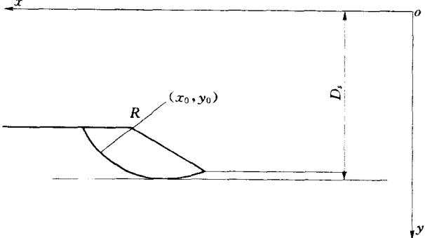

图 4.1 圆弧滑裂面

## 2. 数值分析方法

随着计算机的发展，数值分析方法逐步形成一门完整的学科，统称为最优化方法(Methodof optimization)。这一方法又可分为两大类。

第一类称模式搜索法(Pattern search method)。其基本思想是，根据一定的模式，比较不同自变量的目标函数，确定最优的搜索方向，最终找到最小值。

另一类称牛顿法。它要通过解析手段寻找使目标函数F对自变量z的偏导数为零的极 $\pmb { z } _ { i }$ 值点 $( \partial { \cal F } / \partial z _ { i } = 0 , ~ i = 1 , 2 , . . . , n )$ 。同时，从理论上讲，还需要满足由二阶导数形成的Hessian矩阵正定这个达到极小值的充分条件。此类方法中以导数为研究的主要对象，因此，也称为以导数为基础的方法(Gradient-based-method)。一般认为，当自由度较多时，直接搜索法效率较低。此时需要考虑牛顿法体系的分析方法。

本节介绍直接搜索法中的单纯形法和 Powell法以及牛顿法中负梯度法和 DFP法(Davidon-Fletcher-Powell method)。由于这些方法的原理在众多的文献及教科书中都有所介绍，这里不拟全面阐述其原理，而着重讨论在边坡稳定分析领域需解决的特殊问题。

## 3. 非数值分析方法

第三类方法是在近期计算机发展基础上形成的，称为非数值方法。这一方法被广泛应用于管理科学、计算机科学、分子物理学及超大规模集成电路设计中，用于解决组合优化问题。非数值分析利用计算机具有容量大、计算速度快的优点，通过大量随机采样来找到目标函数的最优值。近期涌现了诸如模拟退火，遗传算法，神经网络和蚂蚁算法等。均属此类。在边坡稳定分析中，上述算法均有人尝试。本章4.7节将对此类方法作一简要介绍。

## 4.2 任意形状滑裂面的模拟和目标函数的确立

## 4.2.1 任意形状滑裂面的模拟

最优化问题的提法是：对于一个具有n个自变量的向量 $z = ( z _ { 1 } , ~ z _ { 2 } , ~ . . . , ~ z _ { n } )$ ，确定其目标函数F的最小安全系数 $F _ { m }$ ，相应的自变量为 $z _ { m }$

为此，需要对式(4.1)中的曲线y(x)用若干参数来模拟。也就是说，需要将任意形状滑 $y ( x )$ 裂面y(x)用z 来近似表达。将滑裂面曲线用m个点 $\mathbf { A } _ { 1 } , \mathbf { A } _ { 2 } , . . . , \mathbf { A } _ { \mathrm { m } }$ 离散，见图4.2。也就是将此m个点用直线或光滑的曲线连起来，以近似模拟此曲线。此m个点的坐标用 $z _ { i } ( i = 1 , 2 , \cdots , m )$ 表示：

$$
z _ { i } = { \left\{ \begin{array} { l l } { x _ { i } } \\ { y _ { i } } \end{array} \right\} }\tag{4.4}
$$

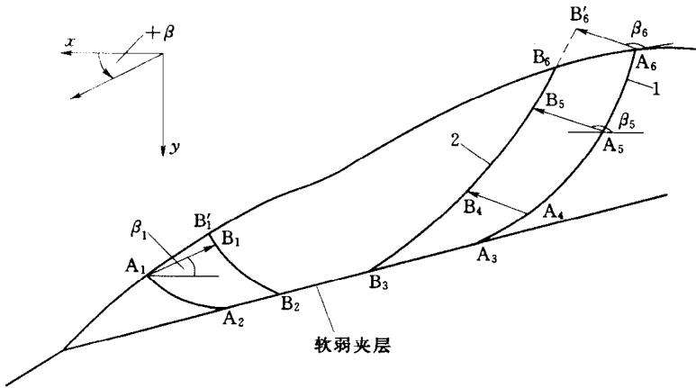  
图 4.2 任意形状滑裂面

一旦这种连接的模式确定，安全系数F即可表达成此m个点的坐标 $x _ { 1 } , y _ { 1 } , x _ { 2 } , y _ { 2 } , \ldots x _ { n } , y _ { n }$ 的函数：

$$
F = F { \bigl ( } x _ { 1 } , y _ { 1 } , x _ { 2 } , y _ { 2 } , \cdots x _ { m } , y _ { m } { \bigr ) }\tag{4.5}
$$

在进行最优化搜索过程中， $\mathbf { A } _ { 1 } , \mathbf { A } _ { 2 } , . . . , \mathbf { A } _ { \mathrm { m } }$ 将移到临界滑裂面的位置 $\mathbf { B } _ { 1 } ^ { \prime } , \mathbf { B } _ { 2 } , . . . , \mathbf { B } _ { \mathrm { m } } ^ { \prime }$ ，见图4.2，此处 $\scriptstyle { m = 6 }$ ，其中端点 $\mathbf { A } _ { 1 } , \mathbf { A } _ { \mathbf { m } }$ 原来在边坡线上，有可能移到边坡线外或内，如图4.2中的 $\mathbf { B } _ { 1 } ^ { \prime } , \mathbf { B } _ { \mathbf { m } } ^ { \prime }$ 。为此，需要通过一定的处理方式，分别找到它们和边坡线的交点 $\mathbf { B } _ { 1 }$ 和 $\mathbf { B _ { m } }$ ，仍以 $\mathbf { B } _ { 1 } , \mathbf { B } _ { 2 } , . . . , \mathbf { B _ { m } }$ 作为研究的对象。对均匀的土质边坡，通常希望滑裂面比较光滑，此时，可采用三次或更高次的样条函数连接这些点。第11章将详细介绍使用样条函数构筑光滑曲线滑裂面的方法。当然，也可以采用直线和光滑曲线的组合构筑滑裂面。例如图 $4 . 2 , \mathbf { A } _ { 3 } , \mathbf { A } _ { 4 } , \mathbf { A } _ { 5 } .$ $\mathbf { A } _ { 6 }$ 用曲线相联； $\mathbf { A } _ { 2 } , \mathbf { A } _ { 3 }$ 用直线相联。

应用样条函数构筑光滑滑裂面，对于减少自由度，提高数值计算效率具有重要意义。

[例4.1] 折线和光滑滑裂面比较。

如图4.3所示例，如果用四个点模拟滑裂面，那么，折线滑裂面和曲线滑裂面相应的最小安全系数分别为1.489和1.364，差别颇大。换句话说，如果使用折线模式，要得到与曲线模式相同的精度，就要更多的离散点，这意味着更多的自由度。而数值分析的机时和收敛难度是随自由度按指数增加的。值得注意的是，在笔者所知的所有这方面的文献中，还没有其他研究者使用过曲线模拟任意形状滑裂面。

在稳定分析中，对土质比较均匀的边坡，常采用圆弧滑裂面。此时，自变量可以是圆弧的圆心的x,y坐标和半径r，由于自变量仅三个，最优化方法搜索最小安全系数收敛性能 $x , y$ 很好，因此将不作为重点在本章中讨论。

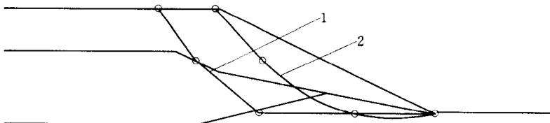  
图4.3 说明用不同模式模拟滑裂面的差别  
滑裂面1-直线模式：滑裂面2-曲线模式

## 4.2.2 目标函数的确定

当滑裂面z的离散模型确定后，安全系数便是m个控制点 $\mathbf { A } _ { 1 } , \mathbf { A } _ { 2 } , . . . , \mathbf { A } _ { \mathrm { m } }$ 的函数。在优化计算过程中，这m个点中有n个点各沿某一设定方向β向临界滑裂面移动，或者不规定 $\beta _ { i }$ 方向任其自由移动。其余m-n个点由于问题本身的要求可以固定。滑裂面上任意一点的 $z _ { i }$ 可以用相应于一个初始滑裂面的相对坐标来代表，见图4.2。

$$
z _ { i } ^ { o } = \left\{ { x _ { i } ^ { o } \atop y _ { i } ^ { o } } \right\}\tag{4.6}
$$

$$
z _ { i } = z _ { i } ^ { o } + \Delta z _ { t } = z _ { i } ^ { o } + d _ { i } \left\{ \cos \beta _ { i } \right\}\tag{4.7}
$$

式中： $i { = } 1 , 2 , { \ldots } , n , d _ { i }$ 为第i个点沿 $\mathcal { B } _ { i }$ 移动的距离。

对于固定的点，其自由度为零，如图4.2中的 $\mathbf { A } _ { 2 } , \mathbf { A } _ { 3 } .$ ，当某点需沿一个软弱夹层移动时，则其自由度为1。如对该点的移动方向无特殊要求，如图4.2中的其它点，该点的自由度为2。问题的自由度为各点自由度的总和，搜索最小安全系数的问题具体化为求下列函数的最小值问题。

$$
F = F ( d _ { 1 } , d _ { 2 } , \cdots , d _ { n } , \beta _ { 1 } , \beta _ { 2 } , . . . , \beta _ { n } )\tag{4.8}
$$

如前所述，滑裂面的一部分可能是光滑曲线，另一部分受软弱夹层的控制为直线。STAB程序是这样规定这一定义格式的。设滑裂面被m个点 $\mathbf { A } _ { 1 } , \ \mathbf { A } _ { 2 } , \ \ldots . . . . . , \mathbf { A _ { m } }$ 分为m-1段，从上交点向下交点编号为1,2,..., m-1。在STAB程序中，用LNO代表此m-1段中为直线段的线段总数，在数组 $\mathrm { L O O ( I ) } , \ \mathrm { I } = 1 , 2 , . . . , \mathrm { L N O }$ 中存入这些直线段的编号。其它线段则默认为曲线。当LNO为零时，滑裂面为一光滑曲线；当LNO为一大于m-1的数时，则程序默认为全部为直线段。这两种情况都无须填写LOO(I)。

## 4.3 模式搜索法

## 4.3.1 单形法（朱伯芳等，1984）

## 1. 建立初始单形

对某一初始向量 $z ^ { 0 }$ ，按下面模式构筑n个向量 $\scriptstyle z ^ { i } ( i = 1 , 2 , . . , n )$ ，组成n+1个顶点：

$$
\begin{array} { c } { { z ^ { 1 } = [ z _ { 1 } ^ { 0 } + p , z _ { 2 } ^ { 0 } + q , \cdots \cdots , z _ { m } ^ { 0 } + q ] ^ { T } } } \\ { { z ^ { 2 } = [ z _ { 1 } ^ { 0 } + q , z _ { 2 } ^ { 0 } + p , \cdots \cdots , z _ { m } ^ { 0 } + q ] ^ { T } } } \\ { { \cdots \cdots } } \\ { { z ^ { n } = [ z _ { 1 } ^ { 0 } + q , z _ { 2 } ^ { 0 } + q , \cdots \cdots , z _ { m } ^ { 0 } + p ] ^ { T } } } \end{array}\tag{4.9}
$$

其中

$$
p = { \frac { { \sqrt { ( n + 1 ) } } + n - 1 } { n { \sqrt { 2 } } } } a\tag{4.10}
$$

$$
q = { \frac { \sqrt { ( n + 1 ) } - 1 } { n { \sqrt { 2 } } } } a\tag{4.11}
$$

式中：a为初始步长，可根据实际情况进行调试。

## 2. 确定搜索方向

计算单纯形n+1个顶点的目标函数值，比较其大小，从中找出目标函数最大点zu和次 ${ z } _ { H }$ 大点zG和最小点z，然后按下式确定下一步的搜索方向： $\pmb { z } _ { G }$ $\pmb { z } _ { L }$

$$
z _ { n + 2 } ^ { \nu } = { \frac { 1 } { n } } { \Bigg [ } \sum _ { i - 1 } ^ { n } z _ { i } ^ { \nu } - z _ { H } ^ { \nu } { \Bigg ] }\tag{4.12}
$$

式中上标ν表示迭代次数。

显然，从zy到zn+2，目标函数是下降的。因此以zy和z+2两点的联线作为搜索方向。 $z _ { H } ^ { \nu }$ $z _ { n + 2 } ^ { \nu }$ $z _ { H } ^ { \nu }$ $z _ { n + 2 } ^ { \nu }$

## 3. 优化计算

(1) 反射。沿搜索方向 $z _ { H } ^ { \nu }$ 和 $z _ { n + 2 } ^ { \nu }$ 点向前再走一步，步长为 $\alpha ( z _ { n + 2 } ^ { \nu } - z _ { H } ^ { \nu } )$ ，到达 $z _ { n + 3 } ^ { \nu }$ 点：

$$
z _ { n + 3 } ^ { \nu } = z _ { n + 2 } ^ { \nu } + \alpha ( z _ { n + 2 } ^ { \nu } - z _ { H } ^ { \nu } )\tag{4.13}
$$

$z _ { n + 3 } ^ { \nu }$ 称为反射点，∞0称为反射系数。计算反射点的目标函数，并根据它的大小来决定下一步的走法。

(2) 扩张。如果反射点的函数值小于 $z _ { L }$ 点的函数值，即

$$
F ( z _ { n + 3 } ^ { \nu } ) < F ( z _ { L } ^ { \nu } )\tag{4.14}
$$

则表明反射后情况有所改善，沿搜索方向 $z _ { H } ^ { \nu } , z _ { n + 2 } ^ { \nu }$ 还可以试探一下，是否可以走得更远一些，即是否可以扩张到 $z _ { n + 4 } ^ { \nu }$ 点：

$$
z _ { n + 4 } ^ { \nu } = z _ { n + 2 } ^ { \nu } + \nu ( z _ { n + 3 } ^ { \nu } - z _ { n + 2 } ^ { \nu } )\tag{4.15}
$$

式中 v>1 为扩张系数。

如果 $F ( z _ { n + 4 } ^ { \nu } ) < F ( z _ { L } ^ { \nu } )$ ，则以 $z _ { n + 4 } ^ { \nu }$ 点替换原来的最坏点 $z _ { H }$ ，构成新的单纯形，转入第4步进行收敛判断。

如果 $V ( z _ { n + 4 } ^ { \nu } ) \geq V ( z _ { L } ^ { \nu } )$ ，则以 $z _ { n + 3 } ^ { \nu }$ 点替换 $z _ { H } ^ { \nu }$ ，构成新的单纯形，也转入第(4)步进行收敛判断。

(3)收缩。如果反射点的函数值大于次坏点的函数值，即

$$
V ( z _ { n + 3 } ^ { \nu } ) > V ( z _ { G } ^ { \nu } )\tag{4.16}
$$

表明反射点走得太远，需要缩回去，按下式计算：

$$
z _ { n + S } ^ { \nu } = z _ { n + 2 } ^ { \nu } + \beta ( z _ { H } ^ { \nu } - z _ { n + 2 } ^ { \nu } )\tag{4.17}
$$

式中 $0 < \beta < 1$ 是收缩系数，用 $z _ { n + S } ^ { \nu }$ 代替 $z _ { H } ^ { \nu }$ ，构成新的单纯形，并转入第(4)步。

(4)缩小边长。如果反射点函数值大于最坏点函数值，即 $V ( z _ { n + 3 } ^ { \nu } ) > V ( z _ { H } ^ { \nu } )$ ，则缩小单纯形的边长，以最好点 ${ z } _ { L }$ 为顶点，其它各顶点向 $z _ { L }$ 移近一半距离，即按下式计算：

$$
z _ { i } ^ { \nu } = z _ { L } ^ { \nu } + 0 . 5 ( z _ { i } ^ { \nu } - z _ { L } ^ { \nu } ) , i = 0 , 1 , 2 , . . . , n\tag{4.18}
$$

得到新的单纯形，转入第(4)步重复计算。

## 4. 收敛判断

按照一定的方式通过反射，扩充和收缩，使单形不断更新逼近极值点。收敛准则为

$$
\sqrt { \frac { 1 } { n + 1 } \sum _ { i = 0 } ^ { n } \Bigl [ \nu ( z _ { i } ^ { \nu } ) - \nu ( z _ { n + 2 } ^ { \nu } ) \Bigr ] ^ { 2 } } \leq \varepsilon\tag{4.19}
$$

式中：ε为要求的计算精度。如式(4.19)满足，则结束计算，并以 $z _ { L } ^ { \nu }$ 作为极小点。否则，置 $\nu = \nu { + 1 }$ ，转至第3步，重复计算。

据已有经验，可取 $\alpha { = } 1 ; 0 . 4 \leq \beta \leq 0 . 6 ; 2 . 0 \leq \gamma \leq 3 . 0$ 。经Nelder和 Mead 论证，为使单纯形适应函数的性态及便于收敛，α不宜比1大很多，而 $\alpha < 1$ 的计算次数比α=1要多，故折衷取 $\scriptstyle { \pmb { \alpha } } = 1$ 。另外，认为β的数值变化对搜索效率的影响比γ要大。他们推荐采用

$$
0 . 4 \leq \beta \leq 0 . 6\tag{4.20}
$$

$$
2 . 8 \leq \gamma \leq 3 . 0\tag{4.21}
$$

[例4.2] 说明单形法计算过程例。

为了形象直观地了解单形法在搜索最小安全系数时的工作状况，我们考察图4.4所示的一个有两个自由度的例子滑裂面。它由 ABC组成。计算时令C点固定不动，A，B 两点沿水平线移动，则该滑裂面的安全系数F由A 点的x坐标x1和 B 点的 x坐标x2决定。图4.5 $x _ { 1 }$ $x _ { 2 }$ 示F相应 $x _ { 1 } , x _ { 2 }$ 的等值线图。根据枚举法可以发现在 $x _ { 1 } = 9 2 . 0 , x _ { 2 } = 1 4 3 . 0$ 时安全系数获得最小值1.257，相应临界滑裂面如图4.4中标5的那个滑裂面。

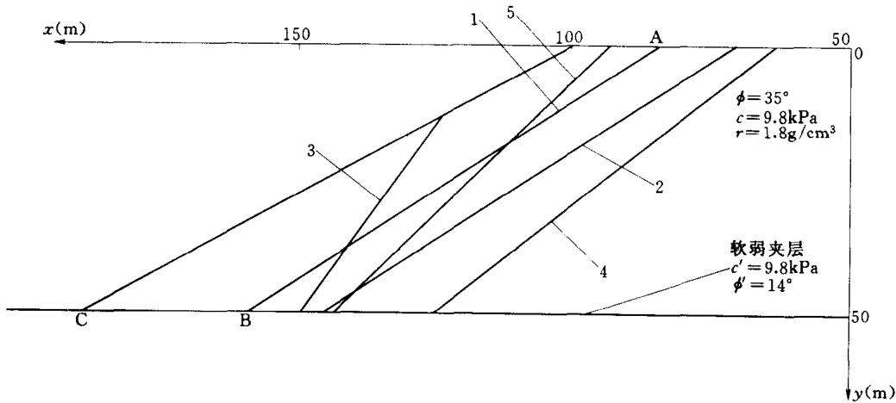  
图 4.4 具有两个自由度的算例  
1,2,3,4-初始滑裂面；5-临界滑裂面

如果使用单形法，则按式(4.9)初始生成的单形即三个滑裂面如图4.5在左下角三角形所示，最大、次大和最小分别为A、B、C三点。D为按式(4.12)所得的新的顶点。AD代表了两点联线的方向，D代表了第一次反射和扩张后达到的点。第一次迭代后，形成了B、C、D构成的新的单形。开始新的一轮迭代。依次循环，最终达到安全系数的极值E。搜索过程如图4.5中折线1所示，最终收敛到 $F _ { m } = 1 . 2 5 7$ 相应的 $z ^ { m } = ( 9 2 . 0 0 , 1 4 3 . 0 0 ) ^ { T }$

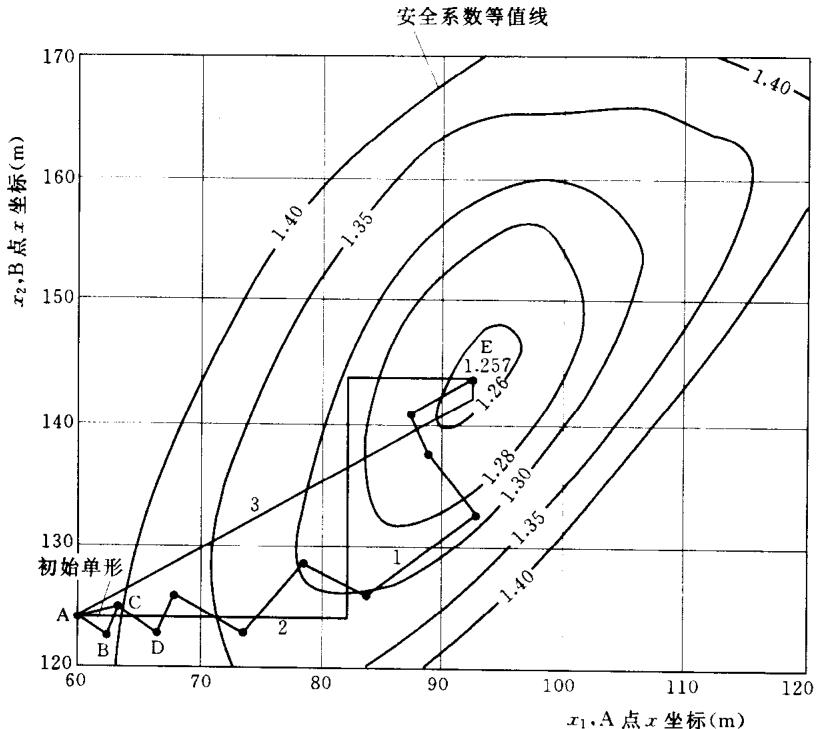  
图 4.5 对图 4.4 示例用单形法计算过程

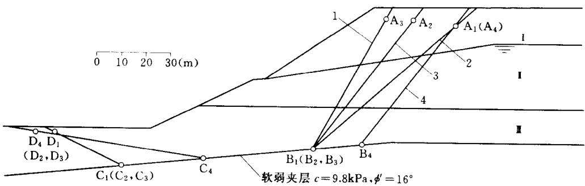  
图 4.6 具有软弱夹层的算例

[例4.3] 使用单形法计算最小安全系数。

图4.6具有分层剖面和一个倾斜的软弱夹层。图中示4个不同的初始滑裂面。点A和B可以不受限制地自由移动，故自由度为2。同时，此两点有意未设在边坡面上，以说明程序在搜索过程中将进行判断和调整，自动找到滑面与坡面的交点。C和B点位于夹层上，因此，自由度为1。该两点在搜索过程中将沿一定方向β移动，β为该夹层的倾角。图4.7中 $\beta _ { , }$ 滑裂面3为采用单纯形法获得的临界滑裂面，相应安全系数为1.025。

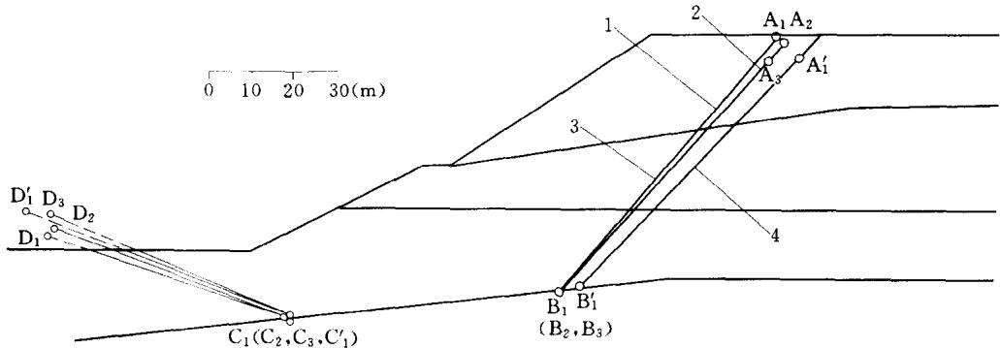  
图 4.7 对图 4.6 示例用最优化方法计算过程  
临界滑裂面：1-改良后的DFP法， $F _ { \pi } = 1 . 0 2 5 \colon 2 - \pi$ 梯度法， $F _ {  m } = 1 . 0 2 5 ;$  
3-单形法， $F _ { m } = 1 . 0 2 5 ; \ 4 \mathrm { - D F P }$ 法， $F _ { m } = 1 . 0 2 5$

## 4.3.2 Powell法

## 1. 基本原理

有关此法的详细原理可参阅文献（朱伯芳等，1984）。其基本算法如下。

(1) 给定初始点 ${ z _ { 0 } } \mathrm { . }$ 并令

$$
\pmb { S } ^ { i } = ( 0 , 0 , . . . , 1 , . . . , 0 ) ^ { T }\tag{4.22}
$$

式(4.22)右端的1处于第i位， $i { = } 1 , 2 , . . . , n ,$

(2) 相应迭代步i=1，进行一次一维搜索，第一次搜索方向 $\pmb { p } _ { \mathrm { i } } \mathbf { = } \pmb { S } ^ { i }$ ，使

$$
V ( z _ { i - 1 } + \alpha _ { i } p _ { i } ) = \mathrm  { \pm } \it { \Psi \mathrm { 1 } } \mathrm  { / } \it { \Psi \mathrm { 1 } } \mathrm  { - } \it { \Psi \mathrm { 1 } } \mathrm  { - } \it { \Psi \mathrm { 2 } } \mathrm  { - } \it { \Psi \mathrm { 1 } } \mathrm { { - } \it { \Psi \mathrm { 2 } } \mathrm { { - } \it { \Psi \mathrm { 1 } } \mathrm { { - } \it { \Psi \mathrm { 1 } } \mathrm { { - } \it { \Psi \mathrm { 2 } } \mathrm { { - \it { \Psi \mathrm { 1 } } \mathrm { { - \it { \Psi \mathrm { 1 } } \mathrm { { - \it \it { \Psi \mathrm { 1 } } \mathrm { { - \it \it { \Psi \mathrm { 1 } } \mathrm { { - \it \it { \Psi \mathrm { 1 } } \mathrm { { - \it \it { \Psi \mathrm { 1 } } \mathrm { { - \it \Psi \mathrm { 1 } } \mathrm { { - \it \it { \Psi \Psi \mathrm { 1 } } \mathrm { { - \it \Psi \mathrm { 1 } } \mathrm { { - \it \it { \Psi \Psi \mathrm { 1 } } \mathrm { { - \it \Psi \Psi \mathrm { 1 } } \mathrm { { - \it \Psi \Psi \mathrm { 1 } } \mathrm { { - \it \Psi \Psi \mathrm { \Psi } \mathrm { 1 } } \mathrm { { - \it \Psi \Psi \mathrm { \Psi } \mathrm { \Psi \mathrm { 1 } } \mathrm { \Psi \mathrm { - \Psi \Psi \mathrm { } \Psi \mathrm { } \mathrm { \Psi \Psi \mathrm { } \Psi \mathrm { } \mathrm { \Psi } \mathrm { \Psi \Psi } \mathrm { \Psi } \mathrm { } } } } } } } } } } } } } } } } } } } } } } } } } } } } } } }\tag{4.23}
$$

并令

$$
z _ { i } = z _ { i - 1 } + \alpha _ { i } p _ { i }\tag{4.24}
$$

然后令i=i+1，重复上述过程，直至i=n为止。

(3) 取 $\pmb { p } _ { i } { = } \pmb { p } _ { i + 1 } , i { = } 1 , 2 , . . . , n { - } 1$ ，并令

$$
p _ { n } = z _ { n } - z _ { 0 }\tag{4.25}
$$

通过这一步，增加 $z _ { n } - z _ { 0 }$ ，丢弃原来的坐标方向 ${ \pmb p } _ { 1 }$ 。

(4) 沿 $z _ { n } - z _ { 0 }$ 作一次一维搜索，求 $\pmb { \alpha _ { n } }$ ，使 $V ( z _ { n } + \alpha _ { n } p _ { n } )$ =极小，并令

$$
{ z _ { 0 } } = { z _ { n } } + { \alpha _ { n } } { p _ { n } }\tag{4.26}
$$

然后转向第(2)步。

(5) 重复进行上述运算 n 次，即沿 n 个互相共轭的方向都进行了一维搜索，然后作如下判断：

$$
\left\| { \pmb { \alpha } } _ { n } { \pmb { p } } _ { n } \right\| < \varepsilon\tag{4.27}
$$

如上述判据满足则结束计算，此时 $z _ { 0 }$ 即为所求极小点，否则转向第(1)步。

## 2. 应用 Powell 法时所做的改进

在采用Powell法进行计算时，第一步需要确定n个独立的搜索方向。在大多数情况下，都采用与n个自变量 $z _ { i }$ 坐标轴方向一致的单位向量，即由式(4.22)定义的 $S ^ { i }$ o

这种处理方式并不适于边坡稳定分析。参见图4.8(a)所示一个有两个自由度例子。按

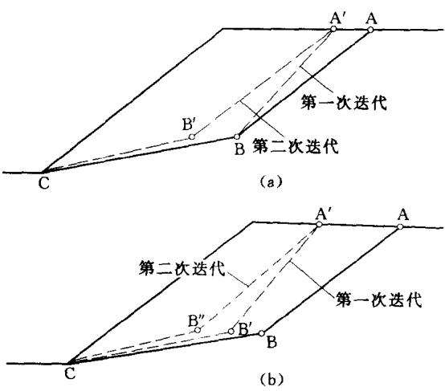  
图 4.8 在边坡稳定分析中使用 Powell 法作的改进(a) 未作改进；(b) 改进后

Powell 法，第一步固定 B 点不同，让 A点沿水平方向移动到A'，使安全系数达到极小值，显然能够移动的范围是很有限的。第二步固定A'不动，B在其移动方向到达 $\mathbf { B ^ { \prime } }$ ，再次得一个极小值，其移动范围更为有限，这样的搜索效率很低，当自由度较多时，事实上无法实现有效的搜索。设想如果在 A 点移动时，让 B 点也向前移动一定值，第一次一维搜索就可以使初值 $z ^ { \bullet }$ 向极值 $z ^ { m }$ 迈进一大步，如图4.8(b)。因此，在构筑 $\pmb { S } ^ { i }$ 时，我们的思路是，当某一控制点在移动方向搜索最小值时，要求其邻近的点也按一定的比例移动，使滑裂面整体而不是局部在优化计算中不断地调整，以迅速地达到极值点。

为此按下式构筑n个向量 $S ^ { i } ( i { = } 1 , 2 , 3 , . . . , n )$

$$
\mathbf { \boldsymbol { S } } ^ { i } = ( e _ { 1 } ^ { i } , e _ { 2 } ^ { i } , . . . , e _ { n } ^ { i } ) ^ { \mathsf { T } }\tag{4.28}
$$

按下式确定 $e _ { j } ^ { i } ( i = 1 , 2 , 3 , . . . , n )$

$$
e _ { j } ^ { i } = \left\{ \begin{array} { l l } { \displaystyle \cos ( \beta _ { j } - \beta _ { i } ) \frac { x _ { j } - x _ { 1 } } { x _ { i } - x _ { 1 } } } \\ { \displaystyle \cos ( \beta _ { j } - \beta _ { i } ) \frac { x _ { n } - x _ { j } } { x _ { n } - x _ { i } } } \end{array} \right.
$$

$$
\begin{array} { r } { \Xi _ { i } ^ { \mu } i \le j ^ { \mathrm { H } } \dot { \Sigma } } \\ { \ } \\ { \Xi _ { i } ^ { \mu } i > j ^ { \mathrm { H } } \dot { \Sigma } } \end{array}\tag{4.29}
$$

当i=1时，总是用(4.29)的下式；i=n时，总是用式(4.29)的上式。e的物理意义是当 $e _ { j } ^ { i }$ 第i个变量沿其搜索方向移动一个单位值时，邻近的点j都将在其移动方向获得一个增量$e _ { j } ^ { i }$ ，这个增量值取决于第j点距端点（与j同侧的那个）的水平距离，在i=0和i=n时等于零，i=j时等于1，其余点按线性分布原则确定内插。参见图4.9。 $i { = } j$

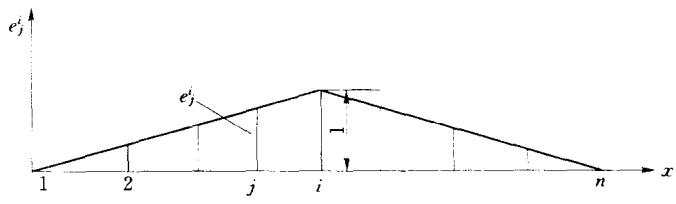

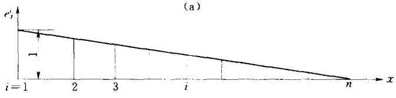

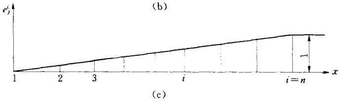  
图 4.9 Powell 法搜索方向 $e _ { j } ^ { i }$ 的改进  
(a) 1<i<n 情况；(b) i=1 情况；(c) i=n 情况

[例4.4] 说明对 Powell 法所做的改进例。

本例和[例4.2]具有相同的计算条件，采用折线滑裂面，参见图4.4。如果初始滑裂面设为1，图4.5中线2和3分别代表未经改进和改进后的计算过程，可见改进后搜索效率大大提高。

采用这种改进的方法，要求各控制点都按同一方向朝临界滑裂面逼近。例如图4.2所示例，可以将初始滑裂面布置在离估计的临界滑裂面稍远的地方，但A,B,C点都采用水平向左的移动方向，即式(4.29)中的β均为零，通常可以很快地找到极值。

## 4.4 牛顿法

## 4.4.1 负梯度法

负梯度法的基本思想是对一个初始滑裂面，寻找一个使安全系数减少速率最大的方向。数学上，就是 $\left( \frac { \partial F } { \partial z _ { 1 } } , \frac { \partial F } { \partial z _ { 2 } } , \cdots , \frac { \partial F } { \partial z _ { n } } \right) ^ { T }$ 这个向量。在这个方向上，进行一维搜索，找到这一方向安全系数的低谷点，完成了这第一次迭代后，再在这个新的起点（即上述低谷区）重复这样的运算，直到收敛至极值点

[例4.5] 对[例4.2]使用负梯度法计算最小安全系数。

在使用负梯度法时，分别以(84.0,160.0),(70.0,145.0),(112.0,150.0)作为起点，相应滑裂面如图4.4中1,2,3示，使用负梯度法的搜索路径如图4.10中1,2,3三条折线所示，可见每一次搜索均是沿着等值线的法线方向即下降速率最大的方向进行的。对这样一个比较简单的算例，负梯度法相应不同初始输入的滑裂面都可以成功地找到极值。

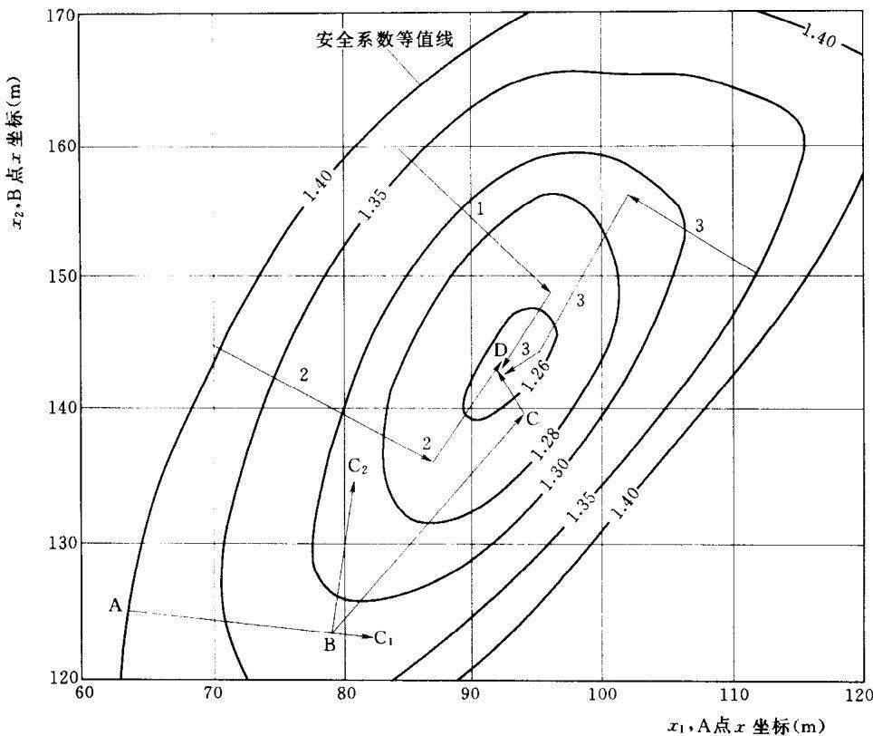  
图 4.10 对[例 4.2]使用负梯度法和 DFP 法计算最小安全系数

## 4.4.2 DFP法

## 1. 基本原理

DFP 法为 Davidon-Flefchen-Powell 法的简称，其原理和详细分析方法参见文献（朱伯芳等，1984)。

数学上的极值点是目标函数对各自变量的一次导数为零的点。也就是说，在极值点，$\pmb { G } = ( \frac { \partial F } { \partial z _ { 1 } } , \frac { \partial F } { \partial z _ { 2 } } , \cdots , \frac { \partial F } { \partial z _ { n } } )$ 均为零，同样要求由二阶导数构成的海色(Hessian)矩阵正定。海色矩阵由下式定义：

$$
H = \left[ \begin{array} { c c c c } { { \frac { \partial ^ { 2 } F } { \partial z _ { 1 } ^ { 2 } } } } & { { \frac { \partial ^ { 2 } F } { \partial z _ { 1 } \partial z _ { 2 } } } } & { { \cdots } } & { { \frac { \partial ^ { 2 } F } { \partial z _ { 1 } \partial z _ { n } } } } \\ { { } } & { { \frac { \partial ^ { 2 } F } { \partial z _ { 2 } ^ { 2 } } } } & { { \cdots } } & { { \frac { \partial ^ { 2 } F } { \partial z _ { 2 } \partial z _ { n } } } } \\ { { } } & { { } } & { { \ddots } } & { { \vdots } } \\ { { } } & { { } } & { { } } & { { \frac { \partial ^ { 2 } F } { \partial z _ { n } ^ { 2 } } } } \end{array} \right]\tag{4.30}
$$

DFP法试图通过一系列迭代步骤使假定的海色矩阵的逆阵 $A ^ { 0 }$ 逐渐过渡到其真值。每一次迭代的方向均按下式决定：

$$
S ^ { \nu } = - A ^ { \nu } G ^ { \nu }\tag{4.31}
$$

在迭代步ν+1，通过下式确定 $A ^ { \nu + 1 }$

$$
\pmb { A } ^ { \nu + 1 } = \pmb { A } ^ { \nu } + \pmb { C } ^ { \nu } - \pmb { D } ^ { \nu }\tag{4.32}
$$

其中 $\nu { = } 0 , 1 , 2 , \ldots$

$$
\pmb { C } ^ { \nu } = \frac { \Delta z _ { \nu } \Delta z _ { \nu } ^ { T } } { \Delta z _ { \nu } ^ { T } \pmb { Y } _ { \nu } }\tag{4.33}
$$

$$
\pmb { { \cal D } } ^ { \nu } = \frac { \pmb { A } ^ { \nu } \pmb { Y } _ { \nu } ( \pmb { A } ^ { \nu } \pmb { Y } _ { \nu } ) ^ { T } } { \pmb { Y } _ { \nu } ^ { T } \pmb { A } ^ { \nu } \pmb { Y } _ { \nu } }\tag{4.34}
$$

$$
Y _ { \nu } = G ^ { \nu + 1 } - G ^ { \nu }\tag{4.35}
$$

$$
\Delta z _ { \nu } = z ^ { \nu + 1 } - z ^ { \nu }\tag{4.36}
$$

DFP法即是基于这一基本思路的一种效率较高的方法。DFP法的基本思路是，通过迭代，使 $A ^ { 0 } , A ^ { 1 } , . . . , A ^ { n }$ 逼近极值点处 Hessian阵的逆阵 $\pmb { A }$ 。通常取 $A ^ { \mathfrak { \bullet } }$ 为单位矩阵。

## 2. 对 DFP 法的改进

本书作者在20世纪80年代开始研究使用DFP法计算安全系数的极值问题，发现在使用这一方法时还需要针对边坡问题的特点解决量纲问题和导数的准确计算问题。下面分述此两个问题。

(1) 关于量纲问题。如前所述，DFP法的基本思路是，通过迭代，使 $A ^ { 0 } , A ^ { 1 } , . . . , A ^ { n }$ 逼近极值点处Hessian阵的逆阵。在边坡稳定分析中， $\partial ^ { 2 } F / \partial z _ { i } \partial z _ { j }$ 的量纲通常在 $1 0 ^ { - 2 } { \sim } 1 0 ^ { - 5 }$ 的范围内。 $\pmb { H } ^ { - 1 }$ 的各元素数值的量纲大约在 $1 0 ^ { 2 } { \sim } 1 0 ^ { 5 }$ 范围内。常规的DFP法采用 $A ^ { 0 }$ 为单位矩阵。那么，要从 $\mathbf { A } ^ { 0 }$ 过渡到 $1 0 ^ { 2 } { \sim } 1 0 ^ { 5 }$ 的量级就变得十分困难。为此，改进的方法取

$$
A ^ { 0 } = 1 { \times } 1 0 ^ { p }\tag{4.37}
$$

式中 $p$ 为对 $\pmb { H } ^ { - 1 }$ 量纲的平均值的一个估值，可按下式确定：

$$
1 0 ^ { p } < \sum _ { i = 1 } ^ { n } \frac { | \partial ^ { 2 } F / \partial z _ { i } ^ { 2 } | ^ { - 1 } } { n } < 1 0 ^ { p + 1 }\tag{4.38}
$$

[例4.6] 对[例4.2]使用改进后的DFP法计算最小安全系数。

同样，我们通过[例4.2]计算。以图4.4中的第4个滑裂面为初始滑裂面，如果不采用本节引入的改进，则根据式(4.32)第一次迭代获得搜索方向为 $\pmb { S } ^ { 1 } = ( 1 9 . 3 , 1 . 7 ) ^ { \mathbf { T } }$ ，以图 4.10中$\mathbf { B C } _ { 1 }$ 代表，沿着该方向，显然无法到达极值点D。如果看一下计算这个方向的细节：

$$
{ \begin{array} { r l } { A ^ { 1 } = A ^ { 0 } + C ^ { 0 } - D ^ { 0 } } \\ { = { \left[ \begin{array} { l l } { 1 } & { 0 } \\ { 0 } & { 1 } \end{array} \right] } + { \left[ \begin{array} { l l } { 2 0 0 3 . 4 } & { - 2 1 8 . 2 } \\ { - 2 1 8 . 2 } & { 2 3 . 7 } \end{array} \right] } - { \left[ \begin{array} { l l } { 0 . 5 9 1 7 } & { - 0 . 4 9 2 ^ { 7 } } \\ { - 0 . 4 9 2 } & { 0 . 4 0 8 } \end{array} \right] } } \\ { = { \left[ \begin{array} { l l } { 2 3 0 3 . 8 } & { - 2 1 7 . 7 } \\ { - 2 1 7 . 7 } & { 2 4 . 3 } \end{array} \right] } } \end{array} }
$$

可以看到， $( { \pmb A } ^ { 0 } { - } { \pmb D } ^ { 0 } )$ 与 C 不是同一量级的量， $( A ^ { 0 } { - } D ^ { 0 } )$ 对 $A ^ { 1 }$ 的贡献非常小。如果使用本节提出的改进，那么，根据式(4.38)可得到 $p { = } 3 , { \pmb A } ^ { \prime }$ 计算细节为

$$
\begin{array}{c} { \begin{array} { r l } { A ^ { 1 } = A ^ { 0 } + C ^ { 0 } - D ^ { 0 } } \\ { = { \left[ 1 0 0 0 . 0 \ 0 . 0 \atop 0 . 0 \ 1 0 0 0 . 0 \right]}  } + { \left[ { 2 0 0 3 . 4 \ } & { - 2 1 8 . 2 } \\ { - 2 1 8 . 2 \ } & { 2 3 . 7 \ } \end{array} \right]}  } - { \left[ \begin{array} { l l } { 5 9 1 7 } & { - 4 9 2 . 0 } \\ { - 4 9 2 . 0 } & { 4 0 8 . 0 } \end{array} \right] }  \\ { = { \left[ \begin{array} { l l } { 2 4 1 1 . 7 \quad 2 7 3 . 8 } \\ { 2 7 3 . 8 \quad 6 1 5 . 7 } \end{array} \right] } } \end{array} 
$$

可以看到，使用了改进的方法后， $( \pmb { A } ^ { 0 } - \pmb { D } ^ { 0 } )$ 和 $c ^ { 0 }$ 具有相同的量级，据此算得的$\pmb { S } ^ { 1 } = ( 3 . 0 7 , 3 . 4 5 ) ^ { T }$ ，为图4.10中BC所示方向，这就保证了第二次迭代快速地向极值点逼进。并顺利地达到极值点。

(2) 关于导数的计算问题。牛顿法体系的最优化方法均是建立在寻找目标函数的导数的基础上的，准确地确定 $\partial F / \partial z _ { i }$ 的数值，是个十分重要的问题。我们遇到的困难是：

(a) $\partial F / \partial z _ { i }$ 不能通过一个公式直接算得，因此只能通过差分法计算 $\partial F / \partial z _ { i }$ 的近似值 $\Delta F / \Delta z _ { i }$

(b) 由于 $\pmb { F }$ 本身只能通过迭代求解获得，因此F的有效位很少。在差分计算时，步长 ${ \cdot } \Delta z _ { \mathrm { i } }$ 也就不能取得很小，这就使算得的导数值的误差较大；另一方向，当趋近极值点时，导数值本身却趋近于零。这两个因素迭加在一起就使计算所处得的导数在极值点附近相对误差急剧增加，导致数值计算无法顺利地收敛到极值点。

大部分数值分析问题都不可能通过解析方法算得导数值，在使用牛顿法进行非线性分析时，解决在差分运算中导数计算精度问题，是一个具有普遍意义的问题。因此，本节结合边坡稳定分析的特点，讨论使用中心差分时步长的合理选定问题，同时提出了一个计算导数的半解析法，使用这个方法，可以获得较精确的导数值。

(c) 用差分法确定导数的步骤。首先简单回顾 Stewart III (1967)讨论的有关差分计算中步长确定的原则。

对于某一函数 $\phi = \phi ( z )$ ，用向前差分计算 $\mathbf { d } \phi / \mathbf { d } z$ 在 $z { = } 0$ 处值的公式是：

$$
\frac { \mathrm { d } \phi } { \mathrm { d } z } \approx \frac { \Delta \phi } { \Delta z } = \frac { \phi ( \delta ) - \phi ( 0 ) } { \delta }\tag{4.39}
$$

中心差分计算公式是：

$$
\frac { \mathrm { d } \phi } { \mathrm { d } z } \approx \frac { \phi ( \delta ) - \phi ( - \delta ) } { 2 \delta }\tag{4.40}
$$

式中δ为选用的步长，使用式(4.39)计算 $d \phi / d z$ ，其误差来自两个方面：

(a) 截断误差。∆φ的准确值为

$$
\begin{array} { l } { \displaystyle \Delta \phi = \phi ( \delta ) - \phi ( 0 ) } \\ { \displaystyle \quad = \gamma \delta + \frac { 1 } { 2 } \rho \delta ^ { 2 } + \ldots } \end{array}\tag{4.41}
$$

式中 $\gamma , \rho ^ { \prime }$ 分别为 $\partial \phi / \partial z , \partial ^ { 2 } \phi / \partial z ^ { 2 }$ 在 $z { = } 0$ 处的值。因此，用式(4.39)计算 $\cdot \gamma ,$ 实际上忽略了 $\rho \delta ^ { 2 } / 2$ 由此引起的相对截断误差 $\pmb { \eta _ { t } }$ 近似为

$$
\eta _ { t } = \frac { 1 } { 2 } \bigg \vert \frac { \rho \delta ^ { 2 } } { \gamma } \bigg \vert\tag{4.42}
$$

(b)舍入误差。任何一个数值在计算机中都是一个有限字长的数字近似代表的，如果δ选取得太小，计算机将无法识别φ(δ和φ(0)之间的区别。由于φ的有限精度造成的按式(4.39) $\phi ( \delta )$ $\phi ( 0 )$ 计算的γ的误差称舍入误差。舍入误差 $\eta _ { c }$ 按下式估算：

$$
\eta _ { c } \leq 2 \bigg | \frac { \phi ( 0 ) } { \Delta \phi } \bigg | \eta\tag{4.43}
$$

式中： $\pmb { \eta }$ 为φ(0)的相对误差。

如果(z)的数值是通过某一公式对自变量z进行若干算术运算得到的，那么η值首先取 $\phi ( z )$ 决于z 本身的相对误差。在计算机中，z 是被一个在区间[ $z ( 1 - \varepsilon _ { m } ) , z ( 1 + \varepsilon _ { m } )$ ]的某个数值近似代表的。其中ε称为机器误差，它的大小取决于计算机的种类和精度级别(单、双精度)， $\varepsilon _ { m }$ 可以按图 4.11所示框图编一个简单的程序来测试ε的数值（参见 Dennis and Shanabl，1983 $\ k _ { m }$ 年)。对于16位的计算机，可以知道 $\cdot \varepsilon _ { m } { = } 5 . 9 6 { \times } 1 0 ^ { - 8 }$ o

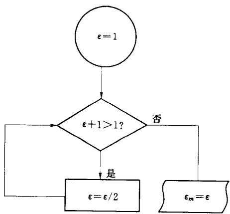  
图 4.11 确定计算机精度的计算框图

η值还取决于在进行 $\phi ( z )$ 的算术运算时积累的误差。它使 $ { \phi } ( z )$ 的相对误差η比 z 的相对误差 $\pmb { \varepsilon _ { m } }$ 大几倍或几十倍。

如果φ(z)的数值不能用显式计算，需要 $\phi ( z )$ 通过迭代求得，则η取决于迭代精度。例如，稳定分析的安全系数F，它是通过迭代求解 $F ,$ 式(2.31)和式(2.32)获得的，在单精度运算时，迭代收敛标准是10-5，由于安全系数的 $1 0 ^ { - 5 }$ 数值在1左右，故可大致认定F的相对误差$\scriptstyle \eta < 1 0 ^ { - 4 }$

Steward提出的确定步长δ的步骤如下：

(a)要求式(4.42)的和式(4.43)右端相等到，即要求舍入误差和截断误差平衡，据此计算δ直。

(b) 用式(4.39)计算γ的值，并按式(4.42)估算 $\eta _ { t }$ 。如果 $\eta _ { t }$ 超过了允许值 $_ { \varepsilon ( }$ 例如 $\pmb { \varepsilon } = 5 \% )$ ，则要用中心差分，即使用中心差分式(4.40)计算 $\cdot \gamma _ { \circ }$

(c)如果使用中心差分，则δ通过解下式，求得：

$$
\frac { 1 } { 2 } \Bigl \vert p \Bigr \vert \varepsilon \delta ^ { 2 } + \varepsilon \Bigl \vert \gamma \Bigr \vert \delta - 2 \eta \Bigl \vert \phi ( 0 ) \Bigr \vert = 0\tag{4.44}
$$

图 4.12 示 $\mathbf { d } \phi / \mathbf { d } z$ 数值：其中 $\tan \alpha _ { 0 }$ 为准确值： $\tan \alpha _ { \mathrm { i } }$ 为中心差分计算值； $\tan \alpha _ { 2 }$ 为向前差分计算值； $\tan \alpha _ { 3 }$ 为向后差分计算值。

式(4.44)是令式(4.43)右端等于ε获得的。其中 $\lvert \Delta \phi$ 按式(4.41)确定。

在稳定分析中，由于F的精度低，故总是用中心差分。因此，我们不进行Steward 提出的第一步计算。在用式(4.44)计算δ时，取 $. e = 5 \%$ $\eta = 1 0 ^ { - 4 }$ 0 $\rho ,$ γ的值近似采用在DFP法计算时上一次迭代已经算得的值，假定φ在(-δ, δ)区间呈抛物线分布，这样，γ值仍按式(4.39)计算。 $\rho$ 的计算公式为：

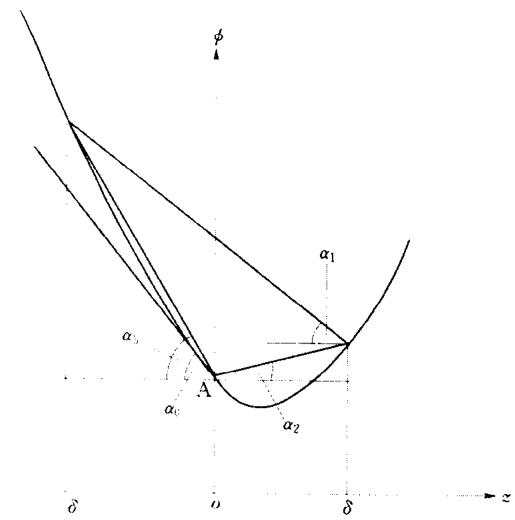  
图 4.12 向前差分可能获得相反符号的导数示意图

$$
\rho = \frac { \phi ( \delta ) + \phi ( - \delta ) - 2 \phi ( 0 ) } { 2 \delta ^ { 2 } }\tag{4.45}
$$

采用中心差分的另一个理由是，由于F的精度低，δ的数值相对较大，当快要接近极值时，向前差分可能得到与真实值符号截然相反的导数值，见图4.12，中心差分可在很大程度上避开这一危险。

## 3. 半解析法计算导数的步骤

通用条分法的特点是，在计算F值时，各项导数不通过差分，而是通过解析公式获得的，利用这一特点，我们可以将计算 $\partial F / \partial z _ { i }$ 所包含的差分运算减少到最低量。

设想由于zi的一个增长量Δz使式(2.31)和(2.32)中的F和λ得各有一增量ΔF和∆λ，则 ${ \pmb z } _ { i }$ $\Delta z _ { \mathrm { i } }$

$$
G _ { n } = G _ { n } \left( F + \Delta F , \lambda + \Delta \lambda , z _ { i } + \Delta z _ { i } \right) = 0\tag{4.46}
$$

$$
M _ { n } = M _ { n } ( F + \Delta F , \lambda + \Delta \lambda , z _ { i } + \Delta z _ { i } ) = 0\tag{4.47}
$$

全微分式(4.46)和式(4.47)可得

$$
\frac { \partial G _ { n } } { \partial F } \frac { \partial F } { \partial z _ { i } } + \frac { \partial G _ { n } } { \partial \lambda } \frac { \partial \lambda } { \partial z _ { i } } = - \frac { \partial G _ { n } } { \partial z _ { i } }\tag{4.48}
$$

$$
\frac { \partial M _ { n } } { \partial F } \frac { \partial F } { \partial z _ { i } } + \frac { \partial M } { \partial \lambda } \frac { \partial \lambda } { \partial z _ { i } } = - \frac { \partial { \bf M } _ { n } } { \partial z _ { i } }\tag{4.49}
$$

由此可得

$$
\frac { \partial F } { \partial z _ { i } } = \frac { \displaystyle \frac { \partial G _ { n } } { \partial \lambda } \frac { \partial M _ { n } } { \partial z _ { i } } - \frac { \partial M _ { n } } { \partial \lambda } \frac { \partial G _ { n } } { \partial z _ { i } } } { \displaystyle \frac { \partial G _ { n } } { \partial F } \frac { \partial M _ { n } } { \partial \lambda } - \frac { \partial G _ { n } } { \partial \lambda } \frac { \partial M _ { n } } { \partial F } }\tag{4.50}
$$

式(4.50)给出了一个不直接计算F值确定 $\partial F / \partial z _ { i }$ 的公式。式(4.50)右边的∂ $M _ { n } / \partial \lambda$ $\partial M _ { n } / \partial F$ $\partial G / \partial \lambda$ $\partial G _ { n } / \partial F$ 都是在计算一个滑裂面安全系数时已经算得的，而且是通过精确的计算公式确定的，即第2章中式(2.37)至式(2.40)。 $\partial G _ { n } / \partial z _ { i }$ $\partial M _ { n } ~ / \partial z _ { i }$ 仍然需要通过差分求得，但是由于计算G和M的公式(2.31)和式(2.32)不需迭代，故其导数的精度远比对F差分精度高。 $G _ { n }$ $M _ { n }$

用中心差分计算 $\partial G \mathcal { A } z _ { i }$ 和∂M∂zi时，δ的选用原则是：要求按式(4.43)确定的舍入误差相对值η小于允许值ε。G和M,是通过式积分算得的，在两个相邻的控制点i,i+1之间，被 $\eta _ { c }$ $\pmb { \varepsilon } _ { \mathrm { c } }$ $G _ { n }$ $M _ { n }$ $i , i + 1$ 分成了N+1个土条，因此要求在进行差分运算时，每个土条高度h的相对误差都小于规定 $N _ { i + 1 }$ 值。当第i个控制点在其移动方向z有一增量δ时，其(i, i+1),(i-1, i)两段的每个土条的高度h 都将获得一个增量 Δh，其中h获得增量最小的那个土条相应值为 $\Delta h$ $\delta / N _ { m }$ 。这里$N _ { m } = \operatorname* { m a x } ( N _ { i } , N _ { i + 1 } )$ $N _ { i } , N _ { i + 1 }$ 分别为(i-1, i)和(i, i+1)段的土条数。分别以 $\eta _ { c } { = } \varepsilon , \Delta \phi { = } \delta / N _ { m } , \phi { = }$ $z _ { m }$ 代入式(4.43)，可得一确定δ的近似公式

$$
\delta \ge 2 \frac { z _ { m } N _ { m } } { \varepsilon } \eta\tag{4.51}
$$

式中： $\pmb { \eta } .$ 为 $z _ { m }$ 的相对误差，可取 $\pmb { \eta } = \pmb { \varepsilon } _ { m }$ ，选用 5%\~10%； $z _ { m }$ 为 $x _ { i } , y _ { i }$ 中的大值。

下面列举一个例题以验证本节建议的计算导数的方法的可行性。

[例4.7] 测试计算导数精度例题。

图4.13示一垂直均匀边坡。假设滑裂面为通过坡趾A与水平线倾角为α的直线，那么沿该滑裂面滑动的安全系数 F仅为 B 点的 x 坐标值的函数，并且安全系数 F和dF/dx均可通过理论推导获得：

$$
F = \tan \phi \cot \alpha + { \frac { 4 c } { \gamma h \sin 2 \alpha } }\tag{4.52}
$$

$$
{ \frac { d F } { d x } } = ( \tan \phi \cot \alpha + 4 \cot 2 \alpha { \frac { c } { \not { m } } } ) / x\tag{4.53}
$$

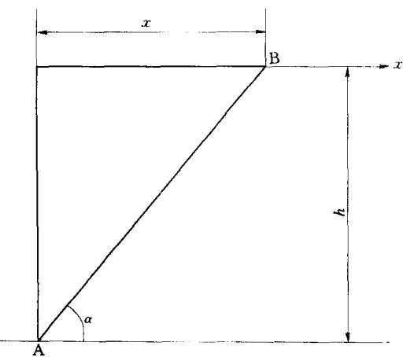  
图4.13 测试计算导数精度例题

当F获得极值时

$$
\tan \alpha = \sqrt { 1 + 2 / s }\tag{4.54}
$$

$$
s = { \frac { 4 c } { \gamma h \tan \phi } }\tag{4.55}
$$

对图4.13示边坡，取 $h { = } 2 5 \mathrm { m } , \phi { = } 3 5 ^ { \circ } , c { = }$ $4 9 \mathbf { k P a } , \ \gamma = 1 . 8 \mathbf { g } / \mathbf { c m } ^ { 3 }$ ，分别采用差分和半解析法计算dF/dx，并与理论值对照，列于表4.1。此例当x=12.283时获得安全系数极小值 $F _ { m } =$ 0.9056。表4.1 所列计算结果表明，对于本例半解析解和差分法均可以获得和理论值完全一致的最小安全系数和临界滑裂面。

表4.1 理论值和近似法结果对照
<table><tr><td>x</td><td></td><td>25</td><td>8</td><td>5</td><td>12.283</td></tr><tr><td rowspan="2"> $\pmb { F }$ </td><td>理论值（式4.52）</td><td>1.1446</td><td>0.09896</td><td>1.2956</td><td>0.9056</td></tr><tr><td>程序计算</td><td>1.1447</td><td>0.9896</td><td>1.2956</td><td>0.9055</td></tr><tr><td rowspan="4"> $\frac { \mathrm { d } F } { \mathrm { d } x }$  数值</td><td>理论值（式4.53）</td><td>0.02801</td><td>-0.0499</td><td>-0.1854</td><td>≈0</td></tr><tr><td>δ 半解析法 dF/dx</td><td>0.019 0.02801</td><td>0.011 -0.0499</td><td>0.011</td><td>0.011</td></tr><tr><td>δ</td><td>0.035</td><td>0.078</td><td>-0.1853 0.014</td><td> $0 . 7 1 3 { \times } 1 0 ^ { - 4 }$  0.378</td></tr><tr><td>差分法 dF/dx</td><td>0.02806</td><td>-0.0499</td><td>-0.1854</td><td>0.367×104</td></tr></table>

[例 4.8] 对[例4.3]使用 DFP法计算成果。

用经过改进的 DFP 法计算[例 4.3]，成果示于图 4.14。临界滑裂面 1 至 4 相应图 4.6中的四个不同的初始滑裂面，可见基本上收敛在相同的位置。Fm在1.009\~1.025之间。 $F _ { m }$

## 4.5 确定整体极值的随机搜索方法

## 4.5.1 概述

数学中的最优化理论研究的目标函数在其自变量空间是光滑连续的，同时要求在极值点附近，目标函数是自变量的二次函数。而岩土工程中的边坡一般为非均质的。因此，在实际应用时，经常遇到多极值问题。在使用数值分析方法进行边坡稳定的最大化分析时，笔者发现，几乎所有的方法都存在陷入局部极值“陷并”，无法获得整体极值的问题。

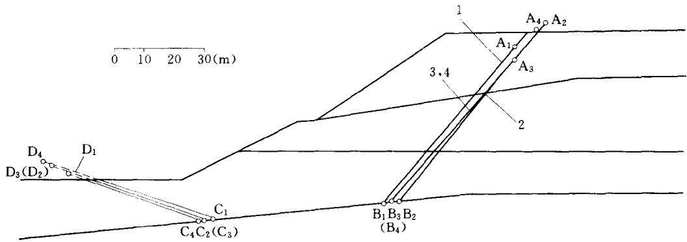  
图 4.14 对[例 4.3]使用负梯度法和 DFP 法计算成果  
[例4.9] 说明确定整体极值困难一例。

如图4.15所示，已知边坡的整体极值为1.364。对于选定的那个初始滑裂面1， $F _ { o } { = } 1 . 5 9 3$ 单形法和DFP法计算均终止在线2，相应安全系数 $F = 1 . 4 5 2$ 。其相应临界滑裂面和已知的实际位置相差甚远。

经验表明，在下面的两种情况下，数值计算的收敛问题变为极为严峻：

(1)当问题包括较多的自由度时。可以设想，此时目标函数的自变量空间存在许多局部极值点，使搜索整体极值的任务变得十分困难。

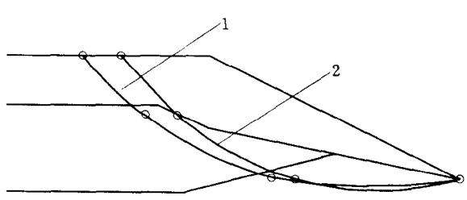

(2) 当边坡断面较复杂时，此时也会出现许多安全系数的局部极值。

图 4.15 说明确定整体极值困难一例

1-初始滑裂面;2-应用单形法获得的临界滑裂面

如图4.15所示，计算终止的那个滑裂面的一部分实际上和两种不同土层的交界线重合，很可能是一个局部极值点。这道题如果改成均质土坡，同样的初始滑裂面位置，则计算所得的临界滑裂面可很好地收敛到整体极值点的位置。

由此可见，为了使最优化方法真正成为一个在边坡稳定分析中实用性强的工具，还需作进一步的努力，有效地解决确定整体极值问题。在这方面一个十分简单又十分有效的思路是：设法确定一个靠近整体极值的初值。显然，初值离整体极值愈近，丢失整体极值的可能性越小。不少教科书中都指出，确定一个好的初值的重要性，同时指出，这个任务可以由随机搜索圆满完成(Fox, 1971; Shoup, et. al. 1987; Box, 1965)。

随机搜索的基本思想是应用随机数在研究域内构筑一系列自变量，比较其相应的目标函数，寻找最小的目标函数。这样，在进行常规的最优化计算以前，对自变量空间进行一次均匀的、高密度的扫瞄，把整体极值的大体位置确定下来，再将这个最小目标函数作为初值，进行最优化计算。

根据MonteCarlo法的原理，当随机搜索的次数趋于无穷大时，目标函数的最小值就是整体极值。因此，随机搜索本身也可以独立地成为一种计算最小安全系数的方法。已经有一些文献报导这方面的研究成果(Boutrup, 1980; Siegel,1981)。在笔者发表了有关使用随机搜索和常规最优化方法相结合的方法求解安全系数极值的论文后，Greco(1997)针对笔者的论点作过讨论。他认为在一定模式指导下，纯随机搜索方法一样可以精确地确定临界滑裂面。但是，这种纯粹的随机方法通常需要几千、几万次的随机搜索，才能达到足够的精度，而本节所研究的把随机方法和确定性方法结合起来的途径，在数值计算效率和收敛性能两个方面，均具有明显的优势。

## 4.5.2 最小安全系数的随机搜索

对于某一边坡，根据问题特点，确定一个搜索区域，如图4.16所示，其轴线用z°表示， $z ^ { o }$ 其宽度为 $D _ { i }$ ，半带宽为 $d _ { i } = D _ { i } \mathrm { ~ } / 2$ 。这个搜索区域左右边界分别用两个滑裂面z，z′来代表， $z ^ { l }$ $z ^ { r }$ 即

$$
z _ { i } ^ { l } = z _ { i } ^ { o } - d _ { i } \Bigg \{ \cos \beta _ { i } \Bigg \}\tag{4.56}
$$

$$
z _ { i } ^ { r } = z _ { i } ^ { o } + d _ { i } \Bigg \{ \cos \beta _ { i } \Bigg \}\tag{4.57}
$$

式中 $\pmb { { \cal D } } \imath = ( D _ { 1 } , D _ { 2 } , \cdots , D _ { n } ) ^ { T }$ 称为搜索区宽度。

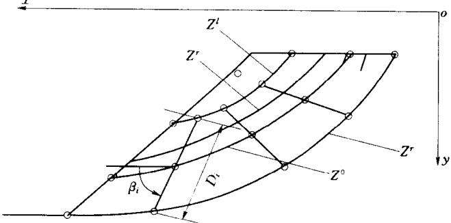  
图 4.16 生成随机滑裂面示意图

在搜索区内，任意一个滑裂面可用下式表示：

$$
z _ { i } = z _ { i } ^ { o } + ( 0 . 5 - r _ { i } ) d _ { i } \left\{ \cos \beta _ { i } \atop \sin \beta _ { i } \right\}\tag{4.58}
$$

式中： $\pmb { r } = ( r _ { 1 } , r _ { 2 } , . . . , r _ { n } ) ^ { t }$ 为该滑裂面和各控制点相对于轴线距离的系数； $r _ { 1 } , r _ { 2 } , . . . , r _ { n }$ 为伪随机数，其值均在(0,1)之间。

随机搜索的步骤如下：

1) 计算相应于滑裂面 $z ^ { 1 }$ 的安全系数 $F _ { 0 } { \mathrm { : } }$

2) 使用计算机伪随机发生器，产生n个随机数 $r _ { 1 } , r _ { 2 } , . . . , r _ { n }$ ，应用式(4.58)确定一个滑裂面z，计算其相应的安全系数 $\boldsymbol { F } _ { i }$

3) 比较 $F _ { 1 }$ 和 $F _ { 0 } ,$ 如果 $F _ { 1 }$ 小于 $F _ { 0 }$ ，则 $F _ { 0 }$ 和 $z ^ { 0 }$ 用 $F _ { 1 }$ 和 $z ^ { 1 }$ 更新，否则直接转入步骤(4);

4) 重复步骤2和 3，直到比较的次数足够大，获得的最小安全系数足够小，作为最优化法的初值足够好为止。

由于计算机产生的伪随机数具有很好的均匀性，可以认为搜索区域内的滑裂面空间的每个部分都机会均等地被扫描了一遍。搜索次数越多，扫描密度越高，成果越佳。应用上述步骤，在求解某一边坡的具体问题时，需要根据经验确定一个搜索区域和一个搜索次数。

现在，需要解决的问题是，如何确定一个合适的随机搜索次数N。 $N _ { c }$

设想，所寻找的临界滑裂面存在着一个“条带”，称为“保证区间”，任何落在该区间内的滑裂面，如果被用作是最优化方法的初值，都可以保证计算收敛，那么，现在的问题就变成，按上述的随机方法生成滑裂面，要生成多少个即可保证至少有一个落在这个“保证区间”中。

我们进一步假定，该保证区间的宽度d和搜索区间宽度D存在一个固定和关系 $d _ { i }$ $D _ { i }$

$$
m = \frac { d _ { 1 } } { D _ { 1 } } = \frac { d _ { 2 } } { D _ { 2 } } = . . . \frac { d _ { n } } { D _ { n } }\tag{4.59}
$$

式中：m称为置信系数 $_ { ( 0 < m < 1 ) }$ a

那么，当随机数发生器为滑裂面第一个控制点按式(4.58)生成一个相对坐标时，该点落在保证区间中的概率为m。根据概率论理论，n个控制点全部落在保证区间中的概率为mⁿ， $m ^ { n }$ 由二项定理可知，在随机生成的N个滑裂面中，有r个落在保证区间中，有N-r个未落在保证区间中的概率是

$$
p ( { \bf \chi } _ { N } ^ { r } ) = C _ { N } ^ { r } ( m ^ { n } ) ^ { r } ( 1 - m ^ { n } ) ^ { N - r }\tag{4.60}
$$

那么，在N次中，至少有一次落在保证区间中的概率（称成功率）是

$$
\begin{array} { l } { { P = 1 - C _ { N } ^ { 0 } ( m ^ { n } ) ^ { 0 } ( 1 - m ^ { n } ) ^ { N } } } \\ { { \phantom { D ^ { n } } } } \\ { { \phantom { D ^ { n } } = 1 - ( 1 - m ^ { n } ) ^ { N } } } \end{array}\tag{4.61}
$$

举例，在图4.15所示的例中，假如用3个控制点，并且规定了搜索区域，如图4.16中条带部分所示。如果假定 $\pmb { m } { = } 0 . 4$ 4，那么，如果进行了50次随机搜索，其成功率是

$$
P = 1 - ( 1 - 0 . 5 ^ { 3 } ) ^ { 2 5 } = 9 6 \%
$$

从另一角度说，如果取m=0.3，为了使成功率达到96%，我们需要作122次随机搜索。

$$
P = 1 - ( 1 - 0 . 3 ^ { 3 } ) ^ { 1 2 2 } = 9 6 \%
$$

应用上述步骤，在求解某一边坡的具体问题是，需要根据经验确定一个搜索区域和一个相应此搜索区的置信系数m。搜索区域划得越大，说明对临界滑裂的位置推测的把握越小，m值也越小，这样，根据式(4.61)所算出的需随机搜索次数也就越多。一般来说，根据经验是不难划定搜索区域并确定m值的。也许反复试算调整几次，才能找到较好的结果。

使用计算机，这也不是一件很难的事。

因此，在实际应用时，也可以根据经验来确定搜索次数。STAB程序默认的功能则自动设定一个搜索次数。

## 4.5.3 提高随机搜索效率的途径

在将这一套随机搜索的方法运用到实际解题中去以前，为了提高随机搜索效率，还需要解决两个问题。

## 1. 滑裂面的几何合理性问题

在随机生成的滑裂面中，应该删去那些几何形状明显不合理的滑裂面。这些形状不合理的滑裂面的存在不仅耗费许多无谓的计算时间，而且在计算这种滑裂面的安全系数时，还会带来数值分析收敛的麻烦。根据边坡稳定分析实际特点，对滑裂面和几何形状，作出如下限制。

(1) 相邻两个控制点的 x 坐标值应满足:

$$
x _ { i + 1 } > x _ { i }\tag{4.62}
$$

(2) 相邻两个控制点所连的直线与x轴的夹角α应控制在一个合理的范围内，如 $\pmb { \alpha } _ { i }$

$$
- 4 5 ^ { \circ } \leq \alpha _ { i } \leq 8 0 ^ { \circ }\tag{4.63}
$$

## 2. 应用简化方法提高随机搜索的效率

在自由度较多时，为使搜索达到一定保证率需要的随机搜索次数很多。因此有必要找到一个途径，将随机搜索使用的时间尽量减少。一个很有效的方法就是在随机搜索时采用简化方法计算安全系数。因为随机搜索的目的是确定一个初始滑裂面，过高的安全系数精度是没有必要的。

在第3.6 节中详细介绍的简化法就是用于随机搜索的简化方法。简化法1 用于光滑形状的滑裂面，简化法2用于折线形状滑裂面。在一般情况下，使用简化法可以使随机搜索的时间减少 2/3 至1/2。

[例4.10] 采用随机搜索重新分析[例4.9]。

回到本节一开始提到的那个搜索整体极值失败的[例4.9]，如图4.15所示，仍使用四个点并用光滑曲线相连来代表滑裂面，搜索区间如图4.17所示。采用简化法1 进行45次随机搜索。

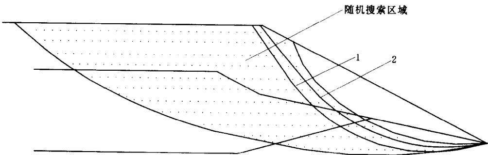  
图 4.17 对[例4.9]采用随机搜索求解示意

图4.18示其中的一些典型的随机生成的滑裂面。由于使用简化法，很快即可在此45个滑裂面中找到一个相应最小安全系数的滑裂面，如图4.17线1所示。以此滑裂面作为初始值，任何一种最优化方法均很“轻松”地收敛到相应整体极值的临界滑裂面2上。相应安全系数为1.364（Morgenstern-Price 法）。

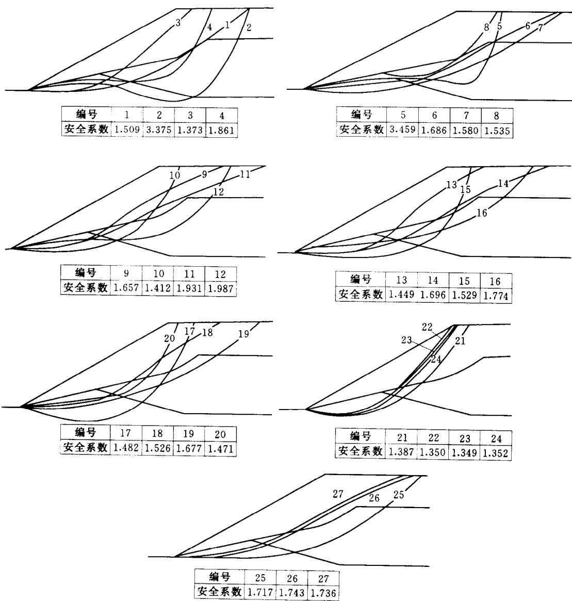  
图4.18 对[例4.9]采用随机生成的滑裂面

## 4.6 应用实题

本节介绍采用上述最优化方法进行边坡稳定分析的工程实例。

[例4.11] 紫坪铺库区左岸堆积体。

在第2章[例2.1]中讨论了紫坪铺库区左岸堆积体沿夹泥层ABCEFGHIJ的稳定安全系数。在进行详细核算时，需分析各种可能的滑裂面的安全系数。因此要对这一折线型的滑裂面分段核算。如图4.19所示，初始输入一个滑裂面LGHM，相应 $F _ { 0 } { = } 1 . 4 7 6$ ，令G沿GH方向移动，优化计算获得的临界滑裂面为L'G'H'M'，相应 $F _ { m } { = } 1 . 1 2 1$ 。这一计算确定了以GH中的一部分为底滑面临界破坏模式。下一步还要核算其它可能的破坏模式。第13章13.7节详细介绍了这一核算过程。STAB程序为折线型的底滑面提供了分段进行优化计算的工具，但不可能一次自动地就把整体极值找出来。

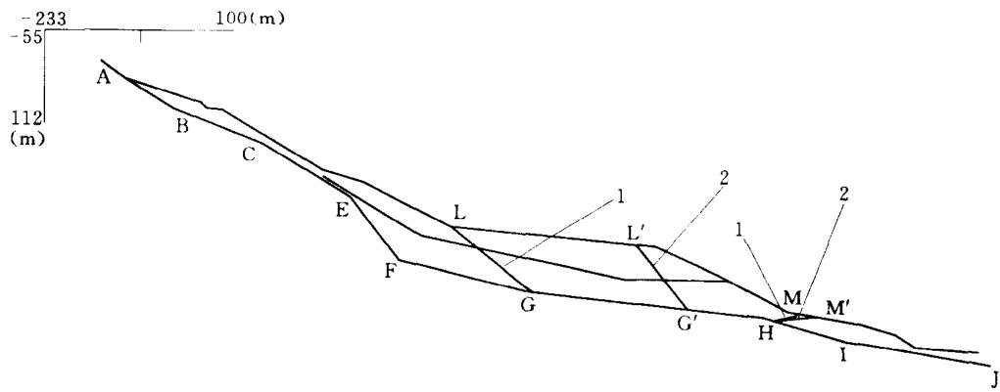  
图4.19 紫坪铺库区左岸堆积体例

[例4.12] 小浪底水库大坝沿软弱夹层滑动分析。

高167m的小浪底水库大坝地基中存在缓倾角软弱夹层，需要复核大坝下游坝坡在8度地震情况下，沿此软弱夹层滑动的最小安全系数。用五个点来模拟滑裂面。图4.20中AB、BC均为曲线，CD段为软弱夹层故为直线，DE段较短，采用直线。首先划定一个搜索区域，如阴影部分所示。采用简化方法2作223次随机搜索。作为研究，作者也曾用严格的通用条分法计算这223个随机滑裂面，发现使用简化法2和使用严格法发现的最小安全系数的滑裂面都是第193个，但使用时间减少一半。根据随机搜索获得的初值最后获得的上、下游边坡临界面滑裂面如图4.20中 ABCDE所示。

分析此临界滑裂面，图中的C点位置是软弱夹层上部的终止点，在这样的位置，滑裂面中软弱夹层的长度最大，因而安全系数最小，故计算成果和常识判断是一致的。图4.20中E点的位置肯定了这样一个见识：滑裂面通常从坝趾处逸出，此处的抗滑力最小。

表4.2对比了以下三种情况的数值计算效率和精度：①采用纯粹的随机搜索；②不采用随机搜索单纯应用最优化方法；③本节介绍的将两者结合起来的方法。

可以看到，单纯依靠随机搜索，当达到2000次后，安全系数改善得很慢。机时达11170秒，所得到的最小安全系数为1.253，与精确值1.199相差颇远。说明Boutrup(1980)和 Siegel(1981)建议的纯随机搜索的方法不甚有效。单纯使用最优化方法虽然得到较小的最小安全系数1.234，但无论从所用的机时和还是从得到的安全系数的精度来衡量，都不如经过随机搜索确定初值的方法有效。需要说明的是，上述讨论系1988年的成果，耗费机时系相应IBM-PC-XT 微机。

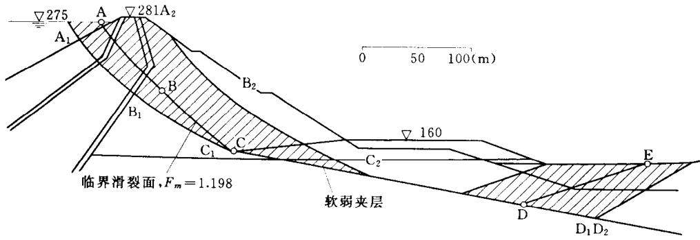  
图4.20 随机搜索在小浪底水库边坡稳定分析中的应用

表4.2 三种情况下数值计算效率与精度对比状况
<table><tr><td></td><td colspan="3">单纯随机搜索次数</td><td colspan="3">单纯最优化方法</td></tr><tr><td></td><td>223</td><td>605</td><td>1336</td><td>2356</td><td>0</td><td>223</td></tr><tr><td>机时（秒）</td><td>699</td><td>3431</td><td>6437</td><td>11170</td><td>2940</td><td>2661</td></tr><tr><td>最小安全系数  $\mathbf { \nabla } \cdot F _ { \mathbf { m } }$ </td><td>1.293</td><td>1.270</td><td>1.261</td><td>1.253</td><td>1.234</td><td>1.199</td></tr></table>

注 两者结合的方法先进行223次随机搜索，然后再以获得的最小安全系数为初值使用单形法确定 $\boldsymbol { F } _ { \mathfrak { m } }$ 耗费机时系相应 IBM-PC-XT 微机。

[例4.13] 天生桥二级闸首滑坡反演分析。

该滑坡在水电工程中为一个值得吸取教训的实例。发生于1985年12月24日，48人丧生。由于边坡中存在一层饱和软粘土，见图4.21中第5层，当边坡开挖将此层粘土揭露出后，即发生了滑面，滑面下部沿堆积土和基岩的接触面。各土层的岩土力学参数如表4.3所示。初始滑裂面如图4.22中 $\mathbf { A } _ { 1 } \mathbf { B } _ { 1 } \mathbf { C } _ { 1 } \mathbf { D } _ { 1 } \mathbf { E } _ { 1 } \mathbf { F } _ { 1 } \mathbf { G } _ { 1 } \mathbf { H } _ { 1 }$ 所示。最终获得的临界滑裂面 $\mathbf { A } _ { 2 } \mathbf { B } _ { 2 } . . . \mathbf { G } _ { 2 } \mathbf { H } _ { 2 } { \circ }$ 临界滑裂面的位置在上部与实测的偏离较大，下部则与实测的吻合，也是沿基岩接触面下滑。

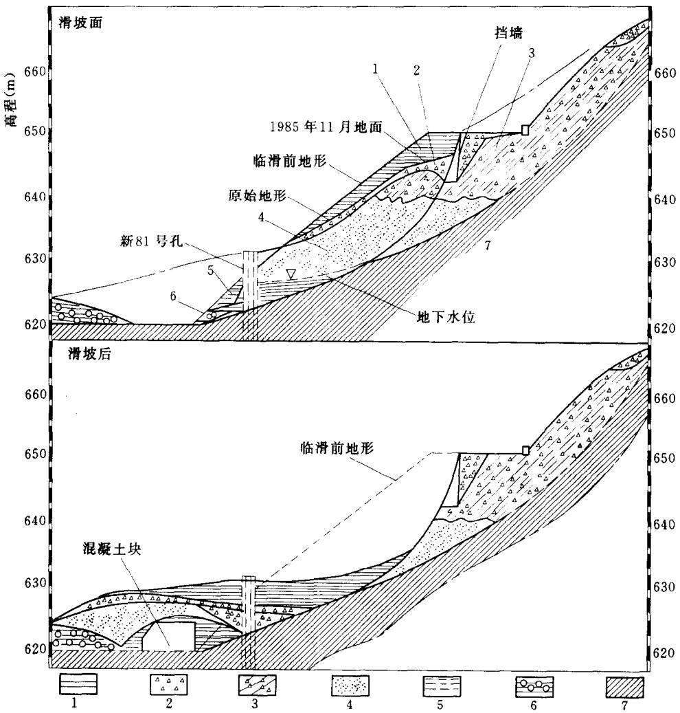  
图 4.21 天生桥二级闸首滑坡工程地质图

表4.3 各层土的物理力学特性指标（图 4.21）
<table><tr><td rowspan="2">土层</td><td rowspan="2">特性</td><td rowspan="2"> $\sharp \sharp \ell \rho ( \mathsf { g } / \mathsf { c m } ^ { 3 } )$ </td><td colspan="2">抗剪强度指标</td></tr><tr><td>φ(°)</td><td>c (kPa)</td></tr><tr><td>1</td><td>新填土</td><td>1.85</td><td>21.8</td><td>19.6</td></tr><tr><td>2</td><td>旧填土</td><td>1.85</td><td>21.8</td><td>19.6</td></tr><tr><td>3</td><td>第四系人工堆积</td><td>1.85</td><td>21.8</td><td>0.0</td></tr><tr><td>4</td><td>中细砂</td><td>1.85</td><td>20.8</td><td>29.4</td></tr><tr><td>5</td><td>砂质淤泥</td><td>1.81</td><td>10.2</td><td>34.3</td></tr><tr><td>6</td><td>卵砾石及砂</td><td>1.90</td><td>24.2</td><td>0.0</td></tr><tr><td>7</td><td>灰岩</td><td>2.40</td><td>45.0</td><td>39.2</td></tr></table>

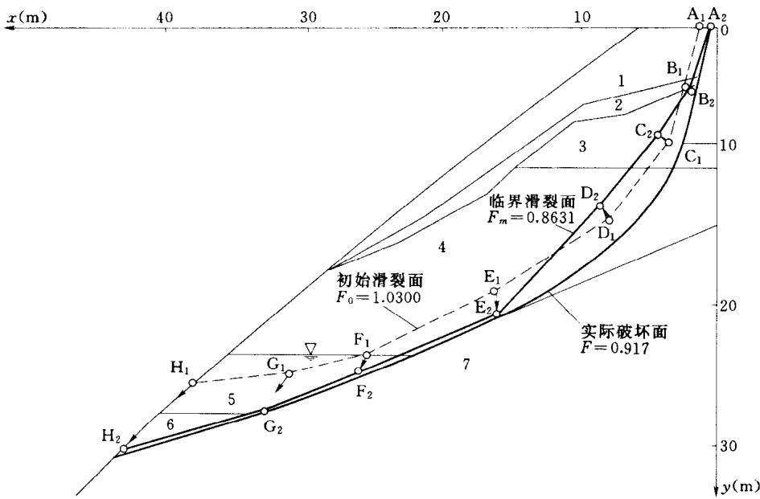  
图 4.22 天生桥二级闸首滑坡计算

## 4.7 非数值方法

## 4.7.1 模拟退火法

模拟退火法是模拟金属退火过程的一种最优化计算方法（唐立山等，1994)。在金属退火时，温度徐徐降低，在每一个温度阶段，系统的能量都要达到平衡状态，使其达到最小值。假设在某一随机过程中，获得了一个相应某一随机变量的安全系数为 $F ( z _ { i + 1 } )$ ；如果它与已往已经得到的最优解 $F ( \pmb { z } _ { i } )$ 的差值 $\Delta F = F ( z _ { i + 1 } ) – F ( z _ { i } )$ 小于零，那么自然要用 $F ( z _ { i + 1 } )$ 来代替$F ( z _ { i } )$ 。但是如果F大于等于零，则传统的随机搜索方法就要抛弃这一选择。在模拟退火法中，根据 Monte Carlo 法的 Metropolis 准则，还要作一次“抽签”试验，也就是要让计算机产生一个在 $( 0 ,$ 1)之间的随机数 $\boldsymbol { r } _ { i } ,$ 将其与 $\exp \left[ - \Delta F / T \right]$ 比较，其中T就是这一阶段的“温度”。在这里，T是一个具有安全系数F特征的量。如果 $r _ { i } < \exp [ - \Delta F / T ]$ ，那么，仍然要用 $\pmb { z } _ { i + 1 }$ 来代替zi，这一处理有利于跳过局部极限形成的陷井。但是，这一做法终究抛弃了一个比现 $z _ { i } ,$ 有值更优的自变量，因此是带有一定的风险的。我们用承担一定的风险作为代价，使计算跳出局部极限形成的陷井。可以看出，在这一决策过程中，以下做法是明智的：

(1)在“退火”过程中，温度是逐渐缓慢减少的。初期T较大，用zi+1代替z的可能性 $z _ { i + 1 }$ $\pmb { z _ { i } }$ 也较大。因而允许自变量在较大的范围内变动，以利于跳过陷阱，确定一个较好的方向。越到计算接近终止，这一替代的可能性越小。

(2) 只有在 $\Delta F$ 的绝对值足够少时，即 $F ( z _ { i + 1 } )$ 与 $F ( z _ { i } )$ 十分接近时， $F ( z _ { i + 1 } )$ 这个表面上欠优的安全系数才有可能入选。

(3) 随机数 $r _ { i }$ 足够的小时 $F ( z _ { i + 1 } )$ 才有可能入选。某种意义上说，这意味我们把一部分成功的希望寄托在“运气”上。

这里，关键的问题是T的数值在开始的时候取得很大，其变小的过程是十分缓慢。因此，即使这一选择错了，以后仍然有机会纠正过来。在实际应用这一过程时，还采用了一种“记忆”功能。如果在某一温度计算步结束时，实践证明把搜索方向从 $F ( z _ { i } )$ 改为 $F ( z _ { i + 1 } )$ 并没有带来更好的结果，我们还是要将原来被抛弃的 $F ( z _ { i } )$ 取回来，进入下一温度计算步。

根据上述原则，模拟退火法的计算步骤如下：

(1) 设置初始温度 $T _ { 0 } .$ ，这一温度应足够高，以防止计算落入局部极值的陷并。同时，过高的初始温度可能降低搜索的效率。建议先进行一定数量（比如100次）的随机搜索，找到安全系数的最大值和最小值 $F _ { \mathrm { m a x } }$ 和 $F _ { \mathrm { m i n } }$ ，将初始温度设为

$$
T _ { o } = F _ { \operatorname* { m a x } } - F _ { \operatorname* { m i n } }\tag{4.64}
$$

将优化计算过程分成m段，第k温度段的温度按下式确定：

$$
T _ { k } = T _ { 0 } \cdot ( \alpha _ { T } ) ^ { k }\tag{4.65}
$$

式中： $T _ { k }$ 为第k步迭代时的温度； $\pmb { \alpha } _ { T }$ 为温度冷却的阻尼系数， $\alpha _ { r }$ 应在[0,1]区间内，通过 试算确定。

(2) 对于一个具有 n 个自由度的自变量z，产生 n 个随机数 $\pmb { \nu } = ( \nu _ { 1 } , \nu _ { 2 } , . . . , \nu _ { n } )$ ，每个 $\mathbf { v } _ { i }$ 都在(-1,1)区间，并将其换成方向导数， $\pmb { u } { = } ( u _ { 1 } , u _ { 2 } , . . . , u _ { n } )$

$$
u _ { i } = \frac { \nu _ { i } } { ( \displaystyle \sum _ { i = 1 } ^ { n } \nu _ { i } ^ { 2 } ) ^ { 1 / 2 } }\tag{4.66}
$$

为了减少自变量空间的粗糙度，我们还引入一个系数

$$
\kappa _ { i } = { \frac { ( z _ { i } ^ { + } - z _ { i } ^ { - } ) } { \operatorname* { m a x } \{ ( z _ { 1 } ^ { + } - z _ { 1 } ^ { - } ) , \cdots , ( z _ { i } ^ { + } - z _ { i } ^ { - } ) , \cdots , ( z _ { n } ^ { + } - z _ { n } ^ { - } ) \} } } \quad ( i = 1 , 2 , . . . . , n )\tag{4.67}
$$

式中 $z ^ { - }$ 和 $z ^ { + }$ 分别代替第i个自变量在探索区域的最大值和最小值。这样，相应某一迭代步的自变量搜索为

$$
\Delta r _ { k } = \Delta r _ { 0 } \cdot ( \alpha _ { r } ) ^ { k - 1 }\tag{4.68}
$$

式中 $\Delta r _ { k }$ 为第k步的带宽，同样，要随着迭代步的增加，逐步减少。

这样，自变量的增量为

$$
\Delta z _ { i } = k _ { i } \cdot \Delta r _ { k } \cdot u _ { i } \cdot d _ { i } \mathrm { ~ } i = 1 , 2 , \cdots , n\tag{4.69}
$$

[例4.14] 采用模拟退火法重新分析[例4.9]。

对于[例4.9]，第4.5.3 节曾以随机搜索找到整体极值。现使用模拟退火法进行分析。采用同样的初始滑裂面。

同样，用4个点联成一条光滑的曲线。位于坡趾的点在优化过程中不动，其它3个点沿水平方向移动。因此，共有3个自由度。计算中采用 $\alpha _ { T } = 0 . 9 , \ \alpha _ { r } = 0 . 9 8$ 。首先通过100次随机搜索生成初始温度 $T _ { \boldsymbol { \theta } } ,$ 随后进行 $m _ { k } = 3 0 0$ 次退火模拟，相应 $: \Delta r _ { o } = 0 . 2 7 , T _ { k } = 1 . 0 0 6$ 和1.001。从图4.23中可见，在安全系数从初值1.427开始，经过21676次迭代，趋于极小值1.364。在向最终值过渡的过程中，有时F值反而增加，但最终顺利地收敛到整体极值。

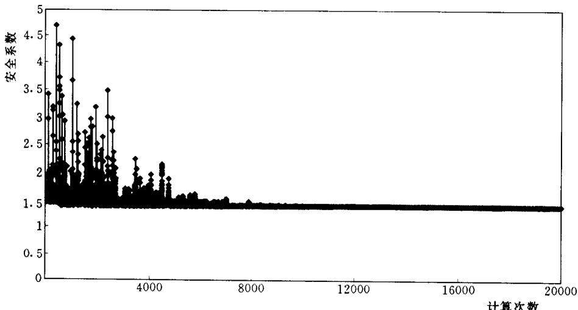  
图4.23 采用模拟退火法分析[例4.9]安全系数收敛到整体极值过程

## 4.7.2 遗传算法

肖专文等(1998)和Goh(1999)分别用遗传算法计算圆弧和任意形状临界滑裂面。这里只对基本遗传算法作一概括的介绍。有关遗传算法更为详细的内容请参见有关专著。

遗传算法基于自然界优胜劣汰的生物进化机制，是一种自适应搜索技术。在特定的竟争环境中，依据这种规则，适应性强的个体生存下来的可能性大。Holland(1975)在其著作中介绍了GA的这一基本原理。近来，遗传算法作为一种很有应用潜力的优化方法倍受关注，原因是它能有效地搜索一个复杂问题的整个定义域（全局搜索）。

遗传算法是一个迭代操作过程，该迭代操作针对多个待求问题的候选解进行的，这些候选解（目标函数）组成一个固定规模的群体。

候选解是模拟生物体的染色体，将待求问题编码而形成的。最初，候选解的群体是随机生成的，每一个染色体代表给定优化问题的一个可能的解。每一个候选解由一串基因组成，通常表示为一由“0”和“1”组成的二进制串。组成染色体的每一个基因（二进制子串）代表一个待优化的参数。整个二进制串（称为染色体或个体）由代表各个变量的基因子串集合而成。使用目标函数可计算一个染色体对应的目标函数值（安全系数)，进而可以确定与每一个染色体相对应的适应值（安全系数的函数）。染色体通过迭代而进化。在每一个迭代步骤中，由多个染色体组成的群体称为一代。下一代群体中的每一个染色体是由上一代群体中的两个染色体相互结合（交叉操作）形成，也可以通过直接改变上一代群体中的某个染色体（变异操作）而形成。从父代和子代中选择某些适应值大的染色体而淘汰其它适应值小的染色体（选择操作)，可以形成新一代的群体，而且，通过这种优胜劣汰机制，每一代群体中染色体（个体）的个数保持不变。染色体所对应的适应值决定了其生存与产生后代的能力。适应值最大（最小安全系数最小）的染色体，最有可能被选择并用于产生下一代染色体。这一迭代过程延缓下去，直到寻找到最优解或者达到某一个迭代终止的标准。

图4.24所示的流程图给出了遗传算法的主要操作步骤。为了实现遗传算法的一个优化循环，需要选择、交叉和变异三个基本操作。下面对这些基本操作作一简单的介绍。

## 1. 遗传算法的基本步骤

(1)选择操作。选择操作可以确定选用当代群体中哪些个体生成下一代群体中新的个体。选择操作的基本思想是将适应值超出平均水平的染色体以概率的方式挑选出来。比如，在轮盘选择策略(Holland,1975)中，一个父代个体被选择的概率与其对应的适应值成正比。

(2)交叉操作。交叉操作用于确定父代的染色体怎样结合，形成子代的染色体。交叉操作针对于两个经选择操作选定的父代染色体，这两个父代染色体根据给定的交叉概率相互交换基因值（二进制数）。单点交叉是最基本的交叉操作，在这一操作中，随机选取二进制串上的交叉点，然后两个染色体在该点相互交换基因值。在双点交叉中，随机选取两个交叉点，然后两个染色体相互交换该两点间的染色体部分。图4.25(a)和(b)分别给出了单点交叉操作和双点交叉操作的例子。

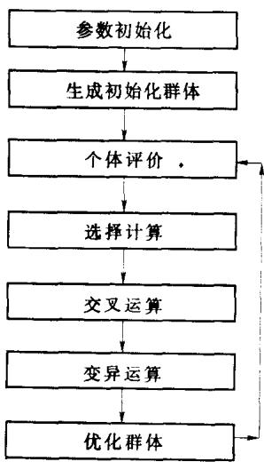  
图4.24 遗传算法的流程图

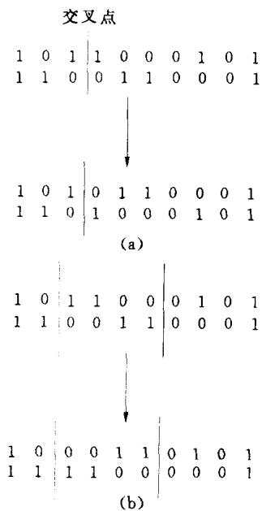  
图 4.25 交叉操作  
(a) 单点交叉；(b) 双点交叉

(3)变异操作。变异操作是按给定的概率，随机改变某个染色体中一个二进制位上的数值，例如在图4.26中由“0”变为“1”。变异操作的主要目的是提供新的基因，以防止迭代落入一个局部峰值区域。

(4)参数初始化。群体规模、交叉概率、变异概率的选取依不同的问题而异，通常需要做一些试验确定。

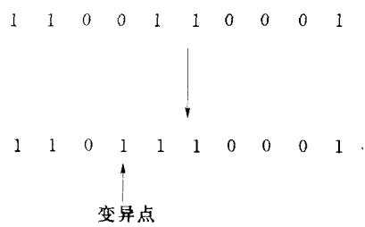  
图 4.26 变异操作

## 2. 与传统方法的比较

遗传算法的实现是对一个群体的多方位操作（该群体是由许多潜在解组成的），而不是仅对单一的解进行操作。这一并行性质决定了遗传算法全局优化的特点。

遗传算法使用适应值，而不使用适应函数的梯度或更高次的微分及其它信息，所以适用于解决各种不同的优化问题，具有鲁棒性强的特点。

遗传算法属于非确定性算法，但是，它不同于纯随机的算法。遗传算法将随机搜索与方向性搜索结合在一起，因此可以平衡优化搜索的两个相互矛盾的策略：搜寻最优解与全局搜索。爬山法是搜寻最优解但忽视全局搜索的典型例子；而随机搜索是全局搜索的典型方法，但它忽视了可能存在最优解的局部空间。

正如其它优化算法一样，遗传算法也有其局限性，主要缺点是要化费大量的计算时间，但随着计算机计算速度的迅速提高，这一缺点将被克服。

## 3. 遗传算法的实现

Goh(1999)的算例使用楔体分析的程序GWEDGEM。该程序使用多楔体方法确定边坡的安全系数。GWEDGEM的当时版本将楔体的数量限制在6块以内，该程序引入遗传算法搜索临界滑裂面。由于遗传算法通常用于搜索最大值，故将目标函数转化为适应函数：

$$
f _ { \mathrm { m a x } } = \frac { 1 } { ( F _ { \mathrm { m i n } } ) ^ { 2 } }\tag{4.70}
$$

使用二进制编码表示参数变量。二进制串的长度取决于所需的精度。例如，对于一个四位的二进制编码，其精度大约为搜索区间的1/24(1/16)。当然，根据所需的精度，不同的 $1 / 2 ^ { 4 }$ 变量可以使用不同长度的二进制串表示。在GAWEDGE中，每一个变量采用9位长度的二进制串表示，这样，对于一个含6个楔体的问题（共17个变量），染色体的总长度为153位。

[例 4.15] ACAD 考题 3(a)。

Goh 在其论文中介绍的 3 个考题恰为将在第11 章第11.4.2节中 ACAD程序中的Exl(e)，Ex3(a)和 Ex4，现择 Ex3(a)为例介绍遗传算法与其它方法计算成果的比较情况，如图4.27所示。

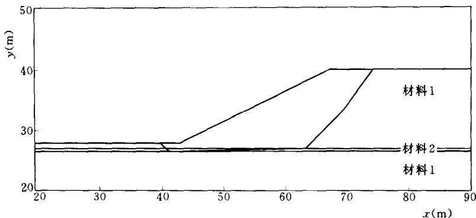  
图 4.27 ACAD 考题 3(a)计算示意图

在使用遗传算法进行分析时，选用了以下参数：进化次数为300，群体大小为5，交叉概率为0.75，变异概率为0.02。图4.28示其进化过程，在第290次时，计算收敛。计算次数为290×5=1450（其中5为自由度数目），获得的最小安全系数为1.286。Goh通过表4.4比较了多种优化方法的成果。其中涉及本书作者(Chen & Shao，1988)的成果系作者为 ACAD所作计算成果之误。参见第11章表11.15。

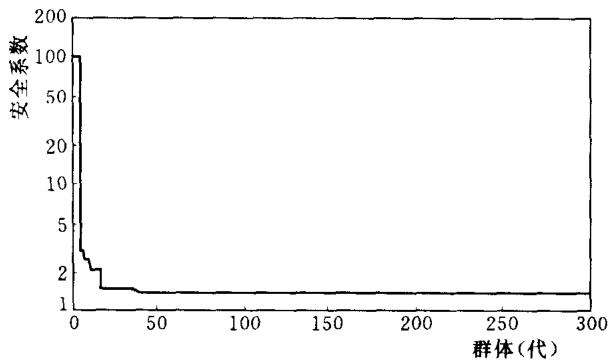  
图4.28 进化次数与安全系数的关系

表4.4 对[例4.15]的计算结果比较
<table><tr><td>方法</td><td>楔体数目</td><td>安全系数</td><td>迭代次数</td></tr><tr><td>GWEDGEM</td><td>6</td><td>1.288</td><td>1820</td></tr><tr><td>GWEDGEM</td><td>7</td><td>1.288</td><td>1740</td></tr><tr><td>GWEDGEM</td><td>8</td><td>1.483</td><td>2490</td></tr><tr><td>GWEDGEM</td><td>9</td><td>2.099</td><td>3750</td></tr><tr><td>GAWEDGE(群体大小为5)</td><td>6</td><td>1.286</td><td>290×5=1450</td></tr><tr><td>SLOPE (Fredlund &amp; Krahn, 1977)</td><td></td><td>1.364-1.378</td><td></td></tr><tr><td>Spencer (1973)</td><td></td><td>1.24</td><td></td></tr><tr><td>Chen &amp; Shao (1988)</td><td></td><td>1.242</td><td></td></tr><tr><td>Donald &amp; Giam (1989)</td><td></td><td>1.27</td><td></td></tr></table>

## 4.8 本章附录

## 4.8.1 本章数据文件（表4.5）

表4.5 本章数据文件
<table><tr><td>有关章节</td><td>系列号</td><td>数据文件名</td><td>内容</td></tr><tr><td rowspan="2">4.2.1</td><td>04-01-01</td><td>CPT4-3.DAT</td><td>[例4.1]光滑滑裂面</td></tr><tr><td>04-01-02</td><td>CTP4-4.DAT</td><td>[例4.1]折线滑裂面</td></tr><tr><td rowspan="2">4.3</td><td>04-02-01</td><td>EX41.DAT</td><td>[例4.2]两个自由度的算例，用单形法</td></tr><tr><td>04-02-02</td><td>EX42.DAT</td><td>[例4.3]使用单形法计算，图4.6例</td></tr><tr><td>4.5</td><td>04-03-01</td><td>CPT4-5.DAT</td><td>[例4.10] 随机搜索</td></tr><tr><td>4.6</td><td>04-04-01</td><td>TIAN.DAT</td><td>[例4.13] 天生桥滑坡例</td></tr><tr><td>4.7</td><td>04-05-01</td><td>CPT4-6.DAT</td><td>[例4.14]模拟退火</td></tr></table>

## 参考文献

1 Boutrop, A. W. and Lovell, C. W. Search technique in slope stability analysis. Engineering Geology. 1980. 16: 51-61

2 Chen, Z. and Shao, C. Evaluation of minunmum factor of safety in slope stability analysis, Canadian Geotechnical Journal. 1988. 25(4): 735-748

3 陈祖煜，邵长明.最优化方法在确定边坡最小安全系数方面的应用. 岩土工程学报.1988.10(4)

4 陈祖煜，邵长明.用最优化方法搜索最小安全系数的一个改进.岩石力学在工程中的应用.第二次全国石力学与工程学术会议论文集，知识出版社.1989.71-75

5 陈祖煜.用DFP法计算边坡稳定最小安全系数时导数的计算方法.岩土力学数值方法的工程应用.第三届全国岩石力学数值计算与模型实验学术研讨会论文集. 上海同济大学出版社.1990:797-803

6 Chen, Z. Experience with the search of minimum factors of safety of slopes. Proceedings, 6th Australian New Zealand Conference on Geomechanics. 1992. 426-431

7 Chen, Z Random trials used in determining global minimum factors of safety of slopes. Canadian Geotechnical Journal. 1992. 29(2): 225-233

8 Celestino, Y. B. and Duncan, J. M. Simplified search for noncircular slip surface. 10th Int. Conf. On Soil Mech. And Found. Engr.1981, Vol. 391-394

9 Li, K. S. and White, W. Rapid evaluation of of the critical slip surface in slope stability problems. International Journal for Numerical and Analytical Methods in Geomechanics. 1987. 11: 449-473

10 Fox, R. Optimisation methods in engineering designs, Addison-Wesley Publication Company. 1971

11 华东水利学院.土工原理与计算.北京：水利出版社.1979

12 潘家铮. 建筑物的抗滑稳定和滑坡分析. 北京：水利出版社. 1980

13 孙君实. 条分法的数值分析，岩土工程学报.1984.6(2):1-12

14 Shoup, T. E. and Mistroup, F. Optimisation methods with alications for personal computers. Prentice-Hall Inc. Eaglewood Cliffs. 1987

15 Siegel, R. A., Kovacs, W. D. and Lovell, C. W. Random surface generation in stability analysis. ASCE Journal of Geotechnical Engineering, 1981. 107: 996-1002

16 Stewart, G. W. III, A modification of Davidon's minimization method to accept difference approximations of derivatives, Journal of Association for Computing Machinery, 1966. 1: 72-83

17唐立山，谢云，尤矢勇，罗祖华.非数值并行算法.第一册．模拟退火算法.科学出版社.1994

18 肖专文，张奇志，梁力，林韵梅.遗传进化算法在边坡稳定性分析中的应用. 岩土工程学报1998.1:4446

19 闫中华. 均质土坝与非均质土坝稳定安全系数极值分布规律及电算程序简介. 水利水电技术.1983年第7期

20 张天宝. 四边形块方法和沉抗土坝的稳定分析一兼论复合土坡的最危险滑弧位置.水利学报.1981

21 邹广电. 边坡稳定分析条分法的一个全局优化算法. 岩土工程学报.2002.24(3):309-312

22 周文通. 最优化方法在土坝稳定分析中的应用. 土石坝工程.1984

23 Nguyen, V. U. Determination of critical slip surface. Journal of Geotechnical Engineering. ASCE. 1985. 111: 238-251

24 Goh, A.T.C. Genetic algorithm search for critical slip surface in multi-wedge stability analysis. Candian Geotechnical Journal, 36: (2)383-391. 1999.

25 Greco, Y.R. Efficient Monte-Carlo technique for locating critical slip surface. ASCE J. Geotechnical Engineerinf. 122: (7)517-525. 1997.

26朱伯芳，黎展盾，张壁诚.结构优化设计原理与应用.北京：水利电力出出版社.1984

## 第5章土的抗剪强度

## 5.1 土的抗剪强度理论的简要回顾

土的抗剪强度理论是土力学的基石，也是边坡稳定分析的理论基础。因此简要回顾土的抗剪强度理论，对于正确地进行边坡稳定分析是有益的。

土的抗剪强度的研究可追溯到很远，但作为理论性、基础性的研究，当推法国工程师库仑在17世纪中期提出的著名的公式。进入19世纪30年代后，在太沙基，伏斯列夫，罗斯科等学者的系统研究的基础上，逐渐形成了近代土的抗剪强度的理论(Parry,2000)。

## 1. 库仑(Coulomb, 1776)

1773年库仑正式发表了他建议的关于砌石、砖墙和土的强度准则，其原始的表达式为

$$
s = c a + ( 1 / n ) N\tag{5.1}
$$

式中：s为剪切分量；N为法向力；c和1/n分别为粘聚力和摩擦系数；a为破坏面的面积。

库仑将粘聚力理解为与抗拉强度有关的物理量。他曾对一种称为“白石”的材料进行试验，发现粘聚力比抗拉强度稍大一些。库仑还对一个砌石柱进行加荷试验，首次发现由于砌石内无摩擦角，破坏面与轴线夹角为 $4 5 ^ { \circ }$ 。库仑同时也是较早进行土压力研究的学者，他所假定的土后三角形土体构成的滑动体的分析方法，至今仍为土力学的经典方法（参见第8章)。

## 2. 摩尔 (Mohr, 1882)

摩尔提出了分析某一结构单元内任意斜面应力状态的图解法，这就是著名的摩尔圆。摩尔同时提出极限状态的破坏理论。他使用铸铁材料进行试验，以单轴压缩、拉伸和纯剪三个点来绘制应力圆，获得了与试验成果接近的破坏准则。

摩尔的应力状态分析方法和库仑的强度理论结合，已经成为分析土体的剪切破坏的基本手段。

## 3. 太沙基 (Terzaghi, 1925)

土的强度理论在太沙基提出有效应力理论后，朝着成熟和实用方向迈出了决定性的一步。在1925年出版的专著“土力学”以及以后一系列论文中，他采用了一系列20\~40mm的正方块在不同的含水量情况下进行单轴压缩试验，最终提出了有效应力是总应力减去中性压力（现在我们称为孔隙水压力）的理论。

## 4. 伏斯列夫 (Hvorslev, 1937)

在19世纪30年代，人们逐渐认识到土的固结历史与土的抗剪强度具有直接的关系，这是土区别于混凝土、金属等材料的一个重要特征。设想两个从同一料场取得的由同样矿物成分、同样颗粒组成的土样，如果它们具有不同的固结过程，即使在同样起始孔隙比条件下经同样的应力路径加荷剪切破坏，它们的抗剪强度仍然可能不同。假如一个土样是在正常条件下固结的（即正常固结土），另一个土样是在更大一些的应力条件下固结然后卸荷到当前的孔隙比的（即超固结土），那么，这两个土样的内部结构就会出现根本的差别，从而表现出不同的抗剪强度，参见图5.1。

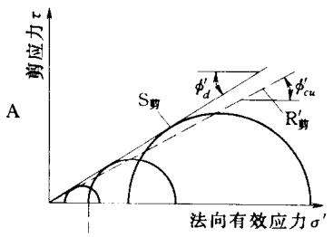

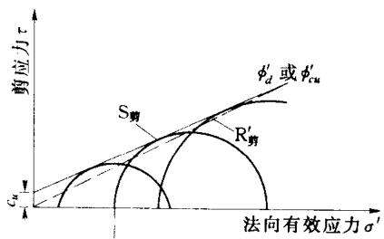

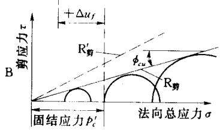

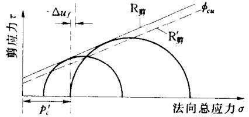

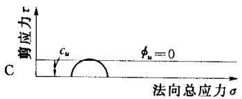

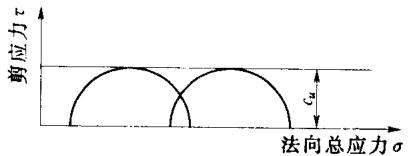

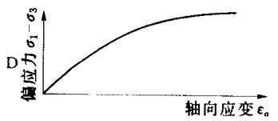

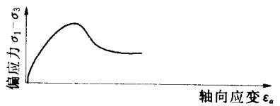

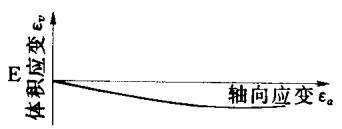

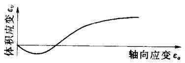

E  
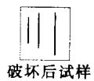

(a)  
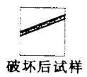  
(b)  
图 5.1 正常固结土和超固结土剪切破坏特征和强度(a) 正常固结土；(b) 超固结土

通过一系列直剪试验，伏斯列夫发现，土的“真粘聚力”是一个与固结历史有关的量。它首先引出了“等效压力p。”的概念，p.是正常固结土的压缩曲线中相应当前孔隙比的固 $\vec { p _ { e } } ^ { \prime \prime }$ $p _ { e }$ 结应力。伏斯列夫认为土的真粘聚力是一个与p。成正比的物理量。引入这一概念后，摩尔 $p _ { e }$ -库仑强度准则可以表达为一个同时适用于正常固结和超固结土的方程式。5.2 节将对这一理论作一介绍。

## 5. 罗斯科(Roscoe, 1963, 1968)

从19世纪60年代初开始，英国剑桥大学以罗斯科为代表的学者在建立土的弹塑性本构理论方面作出了杰出的贡献。这一本构关系的基石之一，便是由一条通过原点的正常固结强度线和一族对应不同超固结比的伏斯列夫线构成的强度包线。土的应力状态只能位于这族包线以内或在包线上。这一理论被称为“临界状态土力学”。

## 6. 斯肯布顿 (Skempton, 1985)

19世纪70年代一些学者(Skempton, 1985; Bjerrum, 1976)在考察一些天然滑坡事例过程中发现，这些滑坡发生并无外界诸如降雨、地震等触发因素，如果使用滑面材料常规强度试验的成果，则其安全系数远大于1。在第1章，曾介绍我国查纳滑坡、洒勒山滑坡，均属这一类型。对于这一现象，Skempton称之为“渐进性破坏”(Progressive failure)，而导致这一现象的基本原因是滑面上的土发生了“软化”，其强度从峰值过渡到“残余值”。Skempton发现在一些特定的条件下，应力应变曲线会出现一个从峰值经过一个“软化强度”过渡到“残余强度”的过程。在研究天然边坡的稳定性时，仔细了解土的应变软化特性，在必要时，选用残余强度而不是峰值强度作为设计指标，是工程师们需要仔细、认真考虑的问题。5.4节将详细讨论残余强度问题。

在工程实践中，工程师解决抗剪强度的问题，更多地是通过在实验室内进行模拟现场实际土体的固结历史、排水条件和加荷过程的试验来实现的。例如，如果所关心的是某一土体在大坝正常运用条件下的抗剪强度，那么，可以使用原状土样，或模拟现场施工条件的制备样，在实验室进行三轴仪的固结排水或直剪仪的固结慢剪试验测定其抗剪强度。又如，在研究库水位骤降条件下的土坡稳定时，可以通过固结不排水试验来研究其抗剪强度。本节将着重讨论工程中常用的几种抗剪强度试验及其使用条件。

众所周知，土的抗剪强度与土体内的孔隙水压力密切相关。而确定土中的孔隙水压力又是一个十分困难的问题。在边坡稳定分析中，我们通常采用了以下两种方法来解决这一问题：

(1)有效应力法。通过试验、理论分析或现场观测，确定土体内的孔隙水压力的分布，然后采用有效应力强度指标进行稳定分析。使用这一方法，强度指标的确定相对来说容易一些，但确定孔隙水压力则成了一个难点。下一章将详细讨论如何确定孔隙水压力的问题。

(2)总应力法。通过模拟现场的剪切试验，直接测定土在破坏时发挥的强度，将这一强度用于稳定分析中。这一方法回避了确定孔压的困难。但使用者需十分了解特定条件下土体破坏的物理机制，正确处理稳定分析中的各种细节。本章和第7章将用较大的篇幅讨论施工期和库水位骤降情况下的总应力法的概念。5.2节介绍的伏斯列夫理论，也是为阐明总应力法概念打下基础。

## 5.2 粘性土的强度理论及强度指标

在土的强度理论中，摩尔-库伦强度准则是为大家所熟悉的，其表达式见第一章式(1.1) 。

随着对强度理论研究的深入，发现该准则存在着把土的抗剪强度只和法向应力联系起来的缺陷。事实上，不同固结历史和应力路径将会导致不同的抗剪强度。在5.1 节我们已通过图5.1对这一问题作了说明。

在常规的三轴剪切试验中，正常固结的土样在受剪过程中，体积不断压缩，破坏时应力应变曲线中没有明显的峰值，试样也没有明显的破坏面，只看到逐渐被压鼓的现象；而超固结土在破坏时体积膨胀，应力应变曲线有明显的峰值，破坏的试样有明显的剪切面，见图5.1。

图5.1(a)、(b)中 A、B曲线分别是土样在固结排水和固结不排水条件下按式(1.1)总结出来的强度包线。从中可看出，同样土的强度包线并不一样，正常固结土的强度包线基本通过原点，而超固结土的强度包线具有明显的c′值。这一现象说明，对某一土样，式(1.1)中 $c ^ { \prime }$ 的 $c ^ { \prime }$ 和 $\vert \pmb { \phi } ^ { \prime }$ 并非常数。

为了弄清不同固结历史对抗剪强度特性和指标的影响，首先对一个处于三轴应力状态的土样进行研究。假定开始时，它的应力状态处于原始压缩曲线的A点，见图5.2(a)，此时， $\pmb { \sigma } _ { 1 } ^ { \prime } = \pmb { \sigma } _ { 2 } ^ { \prime } = \pmb { \sigma } _ { 3 } ^ { \prime } = \pmb { p } _ { c 1 } ^ { \prime } ~ ( \ \pmb { \sigma } _ { 1 } ^ { \prime } \setminus \ \pmb { \sigma } _ { 2 } ^ { \prime } \setminus \ \pmb { \sigma } _ { 3 } ^ { \prime }$ 分别为大、中、小主应力， $p _ { c 1 } ^ { \prime }$ 为平均固结应力)。用平均有效主应力 $p ^ { \prime }$ 和偏应力 $\pmb q$ 来代表土在此时的应力状态，即

$$
p ^ { \prime } { = } \frac { 1 } { 3 } ( \sigma _ { 1 } ^ { \prime } { + } 2 \sigma _ { 3 } ^ { \prime } )\tag{5.2}
$$

$$
\pmb q = \pmb { \sigma } _ { 1 } ^ { \prime } - \pmb { \sigma } _ { 3 } ^ { \prime }\tag{5.3}
$$

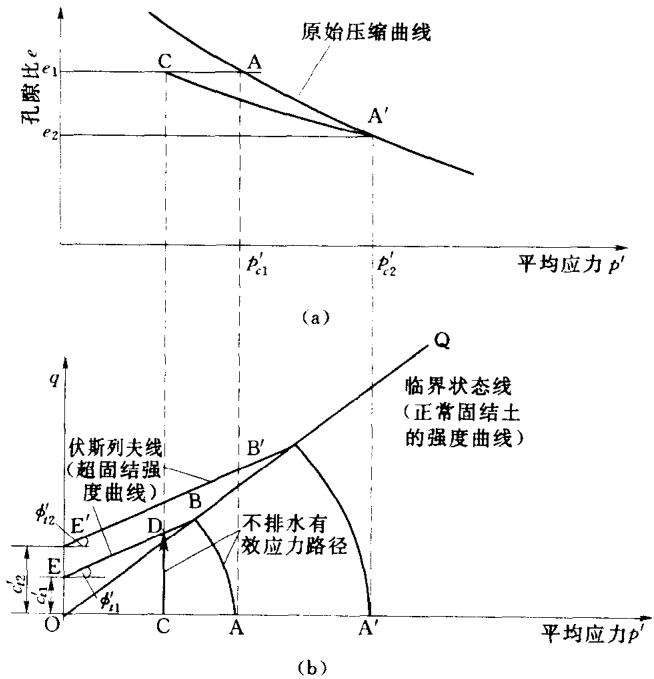  
图 5.2 正常固结土和超固结土在排水条件下破坏  
(a) 等向压缩曲线；(b) 应力路径和强度曲线

此时，土样的孔隙比为e。如果此时试样在不排水条件下破坏，那么在孔隙比保持不 $e _ { 1 }$ 变的条件下，经历如图5.2(b)AB曲线所示的有效应力途径，到达破坏点B。在这个过程中，土样始终处于正常固结状态。如果土样是在一个较大的固结应力 $p _ { c 2 } ^ { \prime }$ 作用下初始等向固结的，那么它最终在 $\mathbf { B ^ { \prime } }$ 点破坏。把 $\scriptstyle \mathbf { B B ^ { \prime } }$ 等点连起来，可以得到一个通过原点的正常固结土的强度线OQ，通常称为临界状态线。

现在，来考虑另一类的加荷情况，假定土样固结到 $p _ { c 2 } ^ { \prime }$ 即图 5.2(a) A'点后，等向卸荷到某点C，使该土样仍然获得孔隙比 $e _ { 1 }$ ，见图5.2(a)，那么土样处于超固结状态。

为了便于研究，将原始压缩曲线（即AA'曲线）上相应某一孔隙比 $^ e$ 的平均应力 $p ^ { \prime }$ 定义为该孔隙比的等效固结应力 $p _ { e } ^ { \prime }$ 。例如，土样经卸荷到C点，孔隙比为 $e _ { 1 }$ ，那么根据本定义，土样的等效固结应力应是图5.2(a)中A 点的相应 $p ^ { \prime }$ 值，即 $p _ { e } ^ { \prime } = p _ { c 1 } ^ { \prime }$

如果让该经过卸荷的土样在不排水条件下受剪，则土样孔隙比仍然保持 $e _ { 1 }$ ，经过应力途径CD最终到达D点破坏，参见图5.2(b)。顺便指出，由于此时土体处于弹性状态，可以证明CD为直线。若不断地变化 $p _ { c 2 } ^ { \prime }$ ，保证都卸荷到孔隙比为e1，然后进行不排水剪切， $e _ { 1 }$ 把得到的破坏点D连起来，就可得到一条土样超固结情况下的破坏强度线BE，在这条线上的各点有一个共同的破坏时的孔隙比 $e _ { 1 }$ 。相应另一个破坏时的孔隙比 $e _ { 2 }$ ，则可得到另一条与 BE平行的强度线 B'E'。这一族超固结土的强度线被称为伏斯列夫线。伏斯列夫线可用下式表示(Hvorslev，1960):

$$
q _ { f } = c _ { t } ^ { ' } + p ^ { ' } \tan \phi _ { t } ^ { ' }\tag{5.4}
$$

式中：q为破坏时的偏应力q值；c，为真有效粘聚力（该值与破坏时孔隙比ef有关）; $q _ { f }$ $q$ $c _ { t } ^ { \prime }$ $e _ { f }$ $\phi _ { t } ^ { \prime }$   
为真有效摩擦角。

理论分析和实验资料表明， $c _ { t } ^ { \prime }$ 与 $p _ { e } ^ { \prime }$ 成正比，即

$$
q _ { f } = k p _ { e } ^ { \prime } + p ^ { \prime } \mathsf { t a n } \phi _ { t } ^ { \prime }\tag{5.5}
$$

式中k为比例系数。确定了比例系数后，即可生成BE，BE'这样一族平行的强度线。

对于正常固结土， $p _ { e } ^ { \prime } = p ^ { \prime }$ ，故 $q _ { f } = p ^ { \prime } ( k + \tan \phi _ { t } ^ { \prime } )$ ，表明正常固结土的强度线通过原点，如图5.2(b)中0Q线所示。因此，正常固结土的强度特征只是伏斯列夫强度理论的一个特例。

根据伏斯列夫的强度理论，土的抗剪强度不仅和材料本身性质及应力状态有关，而且还和p或土在破坏时的孔隙比有关。如果将式(5.5)改写成 $p _ { e } ^ { \prime }$

$$
{ \frac { q _ { f } } { p _ { e } ^ { \prime } } } = k + { \frac { p ^ { \prime } } { p _ { e } ^ { \prime } } } \tan \ \phi _ { t } ^ { \prime }\tag{5.6}
$$

则可以看出， $q _ { f } / p _ { e } ^ { \prime }$ 和 $p ^ { \prime } / p _ { e } ^ { \prime }$ 倒是存在着唯一的对应关系。

已有一些试验证明这一论点。图 5.3 所示为 Parry(1968)的一个试验，图中代表$q _ { f } / p _ { e } ^ { \prime }$ $p ^ { \prime } / p _ { e } ^ { \prime }$ 的试验数据可连成一条直线。图 5.4 为 Ladd 和 Lamb (1963) 做的另一试验。试验数据表明不同超固结比的土样在不排水条件下进行三轴试验的破坏点，都基本收敛到同一点，即同一 $q _ { f } / p _ { e } ^ { \prime }$ 。而且，从许多学者采用重塑土进行的大量试验中，也证明这一理论是基本符合实际的。

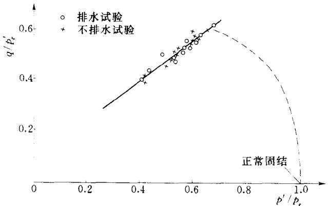  
图 5.3 正常固结土和超固结土在排水和不排水条件到达破坏的点

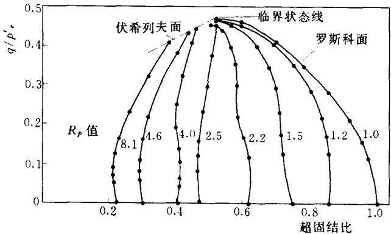  
图 5.4 不同超固结比条件下的不排水试验

总结伏斯列夫理论，可以把它视为由一条正常固结的强度直线Q和一族平行的超固结强度直线组成。每一条超固结强度直线代表了一个破坏时的孔隙比e。从伏斯利夫理论得 $e _ { f ^ { o } }$ 到的一个重要结论是，两个由相同颗粒组成的土样如果在破坏时的孔隙比e（或p）相同， $e _ { f }$ $p _ { e } ^ { \prime }$ 那么，它们可以用相同的强度指标（真粘聚力c，和真摩擦角φ，）来确定其抗剪强度，如果 $c _ { t } ^ { \prime }$ $\phi _ { t } ^ { \prime } ~$ 在破坏时的有效平均应力p′也相同的话，这两个土样将发挥相同的抗剪强度。真粘聚力 $p ^ { \prime }$ $\boldsymbol { c ^ { \prime } } _ { t }$ 和真摩擦角，是与土样的固结历史和进入破坏状态的应力途径无关的强度指标。伏斯列夫 $\phi _ { t } ^ { \prime }$ 理论和摩尔-库伦理论的重大差别在于，在伏斯列夫理论的式(5.4)中c，和φ，是常数，而摩 $c _ { t } ^ { \prime }$ $\phi _ { t } ^ { \prime }$ 尔-库伦理论的式(1.1)中， $c ^ { \prime } \cdot \phi ^ { \prime }$ 不是常数，它和土样的固结历史有关。

虽然伏斯列夫理论比较全面地反映了影响抗剪强度的主要因素，但在实际应用时却存在着难于确定e的问题。再加上这个理论基本上是建立在人工制备重塑土的试验资料基础 $e _ { f }$ 上，没有考虑影响原位土的强度的种种复杂因素，例如重塑和扰动、各向异性、中主应力的影响等，从工程观点看，仍带有近似性。因此，在实际工作中，广泛使用的仍是一般意义上的摩尔-库伦强度准则式(1.1)。不过，伏斯列夫理论为正确分析强度问题和理解总应力法概念提供了理论依据。下面，将应用这个理论来解释土坡稳定分析中的总应力法原理。

伏斯列夫理论实际上是由剑桥学派创立的“临界状态土力学”的一个理论基石。有关这个理论的详细论述，可参阅文献 (Hvorslev, 1960; Scott, 1980)。

## 5.3 抗剪强度试验

## 5.3.1 常规抗剪强度试验

## 1. 室内抗剪强度试验

在工程设计中，用摩尔-库伦强度准则进行常规的剪切试验，整理得到的强度指标有以下几种：

1)不固结不排水试验，即“Q剪”，相应的粘聚力和摩擦角指标分别为cu、φuu； $^ { 6 6 } Q$ $c _ { u u }$ $\phi _ { u u }$

2)固结排水试验，即“S剪”，相应的粘聚力和摩擦角指标分别为ca、φ或c、φ′； $\boldsymbol { c } _ { d } ^ { \prime }$ $\phi _ { d } ^ { \prime }$ $\acute { c } \cdot$ $\phi ^ { \prime }$

3)固结不排水试验，即“R剪”，相应的粘聚力和摩擦角指标分别为 $c _ { c u } , \ \phi _ { c u } ;$

4) 测孔压的不固结或固结不排水试验，即 $" \mathbf { Q } ^ { \prime \prime }$ 或“R”，相应的有效粘聚力及有效摩擦角指标为 $\pmb { c } _ { u u } ^ { \prime }$ $\phi _ { u u } ^ { \prime }$ 或 $c _ { c u } ^ { \prime }$ $\phi _ { c u } ^ { \prime }$

进行上述试验的步骤和资料整理方法，可按土工试验规程进行。在土石坝设计规范中，曾对各适用期应采用的抗剪强度试验方法作出规定，如表5.1所示。

表 5.1 抗剪强度指标的测定和应用
<table><tr><td>控制稳定 的时期</td><td>强度 计算 方法</td><td>士类</td><td>使用仪器</td><td>试验方法 与代号</td><td>强度 指标</td><td></td><td>试样起始状态</td></tr><tr><td rowspan="6">施工期 总应 力法</td><td rowspan="5">有效应 力 法</td><td rowspan="2">无粘性土</td><td rowspan="2"></td><td>直剪仪</td><td>慢剪(S)</td><td rowspan="6"> $c ^ { \prime } , \phi ^ { \prime }$ </td><td rowspan="6">填土用填筑含水 率和填筑容重的 土，坝基用原状 土</td></tr><tr><td>三轴仪 直接仪</td><td>固结排水剪(SD) 慢剪(S)</td></tr><tr><td rowspan="2">饱和度小于 80% 粘性土</td><td></td><td>不排水剪测孔隙压</td></tr><tr><td>三轴仪</td><td>力(UU)</td></tr><tr><td rowspan="2">饱和度大于 80%</td><td>直剪仪</td><td>慢剪(S) 固结不排水剪测孔</td></tr><tr><td>三轴仪 渗透系数小 直剪仪</td><td>隙压力(CU) 快剪(Q)</td></tr><tr><td rowspan="4">稳定渗流有效 期和库水应力 位降落期法</td><td rowspan="4"></td><td rowspan="2">粘性土 数 无粘性土</td><td>任何渗透系 三轴仪</td><td>不排水剪(UU)</td><td rowspan="4"> $c ^ { \prime } , \phi ^ { \prime }$ </td><td rowspan="4">填土及坝基土同 上，但要预先饱</td></tr><tr><td>直剪仪</td><td>慢剪(S)</td></tr><tr><td rowspan="2">粘性土</td><td>三轴仪 直剪仪</td><td>固结排水剪(CU) 慢剪(S)</td></tr><tr><td>三轴仪</td><td>固结不排水剪测孔 隙压力(CU)或固结</td></tr><tr><td rowspan="2">水库水位总应 降落期力法</td><td rowspan="2"></td><td rowspan="2">渗透系数小于 粘 性  $\underline { { 1 0 ^ { - 7 } \mathrm { c m } / \mathrm { s } } }$ </td><td>直剪仪</td><td>排水剪(CD) 固结快剪(R)</td><td rowspan="2"> $c _ { c u } , \phi _ { c u }$ </td><td>和，而浸润线以 上的土不需饱和</td></tr><tr><td>土任何渗透系数三轴仪</td><td>固结不排水剪(CU)</td><td></td></tr></table>

## 2. 原位抗剪强度试验

在现场进行原位试验的优点是避免了取样过程中对土的扰动。但原位试验不可能控制剪切速率，因此，只相应于快剪试验。原位试验仅提供一个强度指标。对于砂性土，原位试验提供的是摩擦角 $\phi ^ { \prime }$ ；对于粘性土，原位试验测定的是固结不排水强度qc。从下面砂性 $q _ { c u ^ { \circ } }$ 土和粘性土的有效应力和总应力强度理论的探讨可知，这一个指标是足够的。常用的原位抗剪强度试验是十字板剪力仪试验，通过本章5.2 节介绍的基本原理可知，十字板剪力仪抗剪强度就是在测定相应原位的固结条件下，保持孔隙比不变达到剪切破坏时的抗剪强度。使用十字板抗剪强度，避免了在试验中模拟土样的固结历史的困难。一些论文(Arman,1975;Orlando,1975)列举了许多实例，证明软粘土的十字板试验结果和三轴试验成果十分接近。

常用的标准贯入试验，是了解地基抗剪强度的一个近似手段。近年，在原位测试领域，还出现过旁压仪，静力触探等手段。对饱和粘性土，同时还有在静力触探中测孔压的仪器。旁压仪测试的不排水抗剪强度代表了测点周围一一定范围的土的抗剪强度，因此更具代表性。静力触探则提供了在地基中一条垂线连续的强度特性，提供了地层的分层特性。因此，这两种手段在软土地基的勘测试验中获得较大的应用。Schmertmann(1975)曾经对各种原位试验方法作过全面的回顾和分析。

通过试验确定土的抗剪强度，这是当前进行土坡稳定分析的主要手段。但是，试验数据不能直接用作强度指标，因为个别试样的成果不一定能完全代表全体的特性，且从取样到试验的种种环节，都会带来误差。因此，对试验成果还需要依靠实际情况作出各种解释和修正。由此可见，强度和强度指标是两个概念，前者代表土的基本特性，后者则是设计指标。本节讨论的即是从认识强度特性过渡到确定强度指标这一过程中应注意的问题。

三轴仪和直剪仪是土的室内抗剪强度试验的主要方法，尽管两种试验都被广泛采用，这两种试验的成果往往不完全一致。它们各自有其局限性，在分析其试验成果时，需要仔细了解实验操作的各个细节，在此基础上对土的强度作出符合实际的评价。

## 5.3.2 三轴试验成果代表性问题的讨论

三轴试验的样本在加荷过程中的应力分布通常比较均匀，试样的固结和加荷速率易于控制，试验成果比较稳定。对于重大的工程，在有条件时，均应安排三轴试验。

## 1. 三轴试验成果整理方法

在整理三轴试验成果时，传统的办法是将相应不同σ3破坏的几个摩尔圆绘制在τ-σ坐 $\sigma _ { 3 }$ $\pmb { \tau } _ { f } - \pmb { \sigma }$ 标上，然后通过绘制这些圆的公切线来确定c和φ。在试验成果离差较大时，这一方法存在 $| \phi . \rrangle$ 着一定的人为主观因素，因为不同的人会有不同的公切线画法。其实，还有一种更为简便的整理方法，即将试验成果绘在 $p ^ { \prime } { - } q$ 坐标上。其中 $p ^ { \prime } { = } ( \sigma _ { 1 } ^ { \prime } { + } \sigma _ { 3 } ^ { \prime } ) / 2$ $q = ( \pmb { \sigma } _ { 1 } ^ { \prime } - \pmb { \sigma } _ { 3 } ^ { \prime } ) / 2$ ，然后用直线拟合，如图5.5。

如果该直线的截距和斜率分别为a和tanα，则有以下关系：

$$
\phi ^ { \prime } = \sin ^ { - 1 } ( \tan \alpha )\tag{5.7}
$$

$$
c ^ { \prime } = a / \cos \phi ^ { \prime }\tag{5.8}
$$

采用这一方法整理强度指标， $c ^ { \prime } ,$ $\phi ^ { \prime }$ 的确定可用一次线性回归方法而不是人工绘制公切线的方法，减少了主观随意性。特别在当前各种自动进行线性回归软件（如MicrosofExcel，Axum等）的支持下，这一处理可以简捷地在计算机中实现和方便地存储。对相同土样进行多组试验的成果，可以方便地绘制在同一一坐标系中进行数理统计处理。

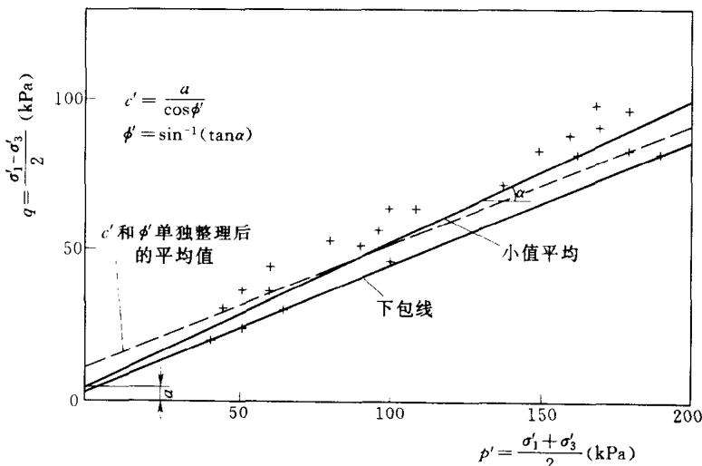  
图 5.5 将试验成果绘在 $\pmb { p } ^ { \prime } \pmb { \mathrm { - } q }$ 坐标上分析强度指标

如图5.5所示为五组试验获得的22个数据点。对这22个数据点，如果采用传统的小值平均法来确定其c′和φ′值，则可删除75%较高的试验点，获得如图5.5 小值平均的强度 $c ^ { \prime }$ ${ \mathfrak { d } } ^ { \prime }$ 线。我们也可以对此22个试验点按标准的整理统计方法找到c'和φ′的均值和标准差，然后 $c ^ { \prime }$ $1 \phi ^ { \prime }$ 可以用概率论的理论计算相应一定保证率的c'和φ的期望值。在第10章10.6节中，将介 $c ^ { \prime }$ $\psi ^ { \prime }$ 绍具体计算公式。同时也将讨论引用数理统计法确定强度指标时，按 $^ { \ast } p ^ { \prime } - q ^ { \prime \prime }$ 方法整理的局限性。

## 2. 三轴试验可能包含误差的讨论

Johnson(1974)曾详细讨论过影响三轴试验成果的各个因素，如表5.2所示。现就表5.2中所列的几项主要影响因素作一讨论。

(1)剪切速率。在三轴试验中，剪切速率对于抗剪强度的影响颇大。对排水试验，应要求剪切速率尽量慢，以保证剪切过程中孔隙水压力得到充分的消散并在试样内均匀分布。在固结不排水试验中，加荷过程过快，会导致测定的强度偏高。

对常规的固结排水三轴试验，Bishop 和 Henkel (1962) 建议使用下式计算某一试样的加荷时间

$$
T _ { f } = \frac { 2 0 H ^ { 2 } } { u c _ { \nu } }\tag{5.9}
$$

式中：Tf为加荷持续时间；H为试样一半的高度；μ为端部排水条件系数：c为固结系数。 $T _ { f }$ $c _ { \nu }$ Blight(1963)提供了一个图表（图5.6)，可以快速查得需要的加荷时间。

表5.2 根据三轴试验成果确定设计强度指标的影响因素
<table><tr><td>因素</td><td>误差范围(%)</td><td>备注</td></tr><tr><td>1. 从地基取样受到的扰动</td><td> $( 5 \sim 2 0 ) ^ { \ast }$  扰动较少的土）</td><td>重塑土可能使流动性土样 (相对来说(Slickensided Sample)的强度增加， 对深钻孔的软粘土，土样扰动的影 响最大</td></tr><tr><td>2. 粘土的裂隙，特别是超固结土和 页岩质粘土。在小试样中无法反映</td><td>+(25~1000)</td><td>通常只在极超固结土中存在此因素</td></tr><tr><td>这些裂隙 3. 试验室设备的顶盖、底座和试样 产生的摩擦</td><td> $+ 5$ </td><td></td></tr><tr><td>4. 三轴压缩而不是压缩，简单剪和</td><td>+(20~30)</td><td>对地基土特别重要</td></tr><tr><td>拉伸试验 5. 三轴压缩而不是平面应变试验</td><td>- (5~8)</td><td></td></tr><tr><td>6. 使用反压力保证试样饱和</td><td>取决于堤坝的高度</td><td></td></tr><tr><td>7. 用常规的总强度确定R线</td><td>- (15~20)</td><td></td></tr><tr><td>8 在R或CU剪试验时，试样是在等 向压缩条件下固结，而不是按实际 情况在非等向压缩下固结</td><td></td><td></td></tr><tr><td>(1)  $A _ { f } { > } 1 / 4 { - } 1 / 3$  (2)  $A _ { f } { < } 1 / 4 { - } 1 / 3$ </td><td>- (0~30) +(0~20)</td><td></td></tr><tr><td>9. 材料的各向异性，试验中采用垂 直的而不是斜的试样</td><td>+(10~40)</td><td></td></tr><tr><td>10. 试验室中常规的剪切速率</td><td>+(5~200)</td><td></td></tr><tr><td>11. 渐进性破坏(Progressive failure)</td><td>+(2~20)</td><td></td></tr><tr><td>12. 常规的建立在有效应力基础上的</td><td></td><td></td></tr><tr><td>设计强度</td><td></td><td></td></tr><tr><td>(1)  $A / { < } 1 / 4 { \sim } 1 / 3$  ，即堤坝</td><td>- (0~30)</td><td></td></tr><tr><td></td><td></td><td></td></tr><tr><td>(2)  $A _ { \rho } { > } 1 / 4 { \sim } 1 / 3$  ，即软弱地基</td><td>+(0~50)</td><td></td></tr></table>

\*“+”为欠保守，即获得强度过高；“一”为保守，即获得强度过低。

(2) 在固结不排水试验时，加荷的时间通常较快。Ladd等(1972)对美国路易斯安那州堤坝土进行试验，发现某一试样在15min内使试样产生5%的应变，比另一个剪切速率为10h产生5%应变相应强度高20%。在剪切速率较快时，剪切面上的孔隙水压力分布不均匀，这一现象可能与此有关。Duncan和Buchignani(1972)也指出，如果荷载延续一星期或更长，则其不排水强度仅为常规三轴试验的70%。

(3)平面应变和三轴试验成果的差别。土坡通常是在平面应变条件下工作的，但是平面应变试验不是常规试验。不少学者比较三轴试验所获得的强度与平面应变条件下的强度的差别，在这个问题得到一致的结论，即一般情况下平面应变的抗剪强度比三轴试验要大5%左右。表 5.3 为中国水利水电科学研究院对堆石体平面应变抗剪强度的试验成果（柏树田，周晓光，1991）。对粘性土，也有类似的研究成果。

(4) 对不排水抗剪强度的修正。总应力法中，要使用的是土的不排水强度，与即“Q剪”和“R剪”的结果。

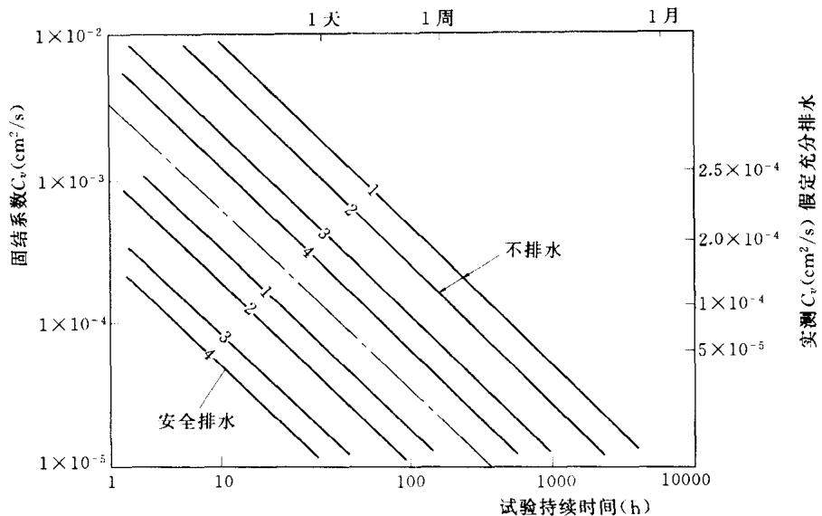  
图 5.6 确定排水试验剪切速率

表5.3 堆石的平面应变和三轴试验抗剪强度比较
<table><tr><td rowspan="2">堆石 条件</td><td rowspan="2">试样 条件</td><td rowspan="2">试验 类型</td><td rowspan="2">周围压力或小 主应力  $\sigma _ { 3 } ( \bf k P a )$ </td><td colspan="2">内摩擦角  $\underline { { \boldsymbol { \phi } \mathcal { M } } } )$ </td></tr><tr><td>三轴</td><td>平面应变</td></tr><tr><td rowspan="5"></td><td rowspan="5"> $\rho _ { d } { = } 2 . 1 4 \mathrm { g } / \mathrm { c m } ^ { 3 }$   $( D _ { r } { = } 0 . 8 )$ </td><td rowspan="2">(UU)</td><td>200</td><td>54.6</td><td>57.0</td></tr><tr><td>400</td><td>51.4</td><td>51.4</td></tr><tr><td rowspan="2"></td><td>800</td><td>47.7</td><td>49.9</td></tr><tr><td>200</td><td>48.9</td><td>55.5</td></tr><tr><td rowspan="5">(CU)</td><td rowspan="5">(UU)</td><td>600 800 45.5</td><td>46.4</td><td>48.4 47.7</td></tr><tr><td rowspan="5"> $\rho _ { d } { = } 2 . 0 6 \mathrm { g } / \mathrm { c m } ^ { 3 }$   $( D _ { r } { = } 0 . 8 )$ </td><td>200</td><td>46.2</td><td>50.4</td></tr><tr><td>400</td><td>43.6</td><td>48.9</td></tr><tr><td>600</td><td>43.2</td><td>46.8</td></tr><tr><td>800</td><td>42.0</td><td>45.3</td></tr><tr><td rowspan="3"></td><td rowspan="3">(CU)</td><td>200</td><td>40.9</td><td>48.2</td></tr><tr><td>400</td><td>40.9</td><td></td></tr><tr><td>600</td><td>40.9</td><td>46.8 46.2</td></tr><tr><td colspan="2"></td><td></td><td>800</td><td>40.9</td><td>44.0</td></tr></table>

$^ { * } { \bf Q }$ 剪”是模拟土石坝的防渗材料的施工期（非饱和状态）应力变化的试验。将试样制备成具有现场条件的含水量和干容重，然后在三轴应力条件下进行不排水剪切试验，按照摩尔-库伦强度准则，以总应力为参数，总结强度指标c. $c _ { u u }$ $\phi _ { u u }$

$$
\tau _ { f } = c _ { u u } + \sigma \mathrm { t a n } \Phi _ { u u }\tag{5.10}
$$

由于土是不饱和的，抗剪强度受孔隙气压、水压的影响，是十分复杂的问题，至今还不很清楚，式(5.10)在很大程度上带有经验成分。

$\mathbf { \mu } ^ { 6 6 } \mathbf { R }$ 剪”是模拟饱和粘性土在荷载突然变化时的不排水强度。在三轴试验时，将饱和土在某一 $\pmb { \sigma _ { 3 } = p _ { c } ^ { \prime } }$ 条件下固结，然后关闭排水阀，不使其排水，在σ₃保持不变的条件下，增 $\sigma _ { 3 }$ 加σ1直到破坏，这样σ1增加了一个Δσ1。在σ-τ坐标上，以p作为摩尔圆小主应力的位置， $| \sigma _ { 1 }$ $\sigma _ { \mathrm { l } }$ $\mathbf { \Delta } \cdot \Delta \pmb { \sigma } _ { 1 }$ $p _ { c } ^ { \prime }$ $\Delta \pmb { \sigma } _ { 1 }$ 作为摩尔圆的直径作出该摩尔圆，如图5.7所示。对不同的p作一系列试验，作相应 $\pmb { p } _ { c } ^ { \prime }$ 一系列摩尔圆的公切线 $\mathbf { A } _ { 1 } \mathbf { A } _ { 2 }$ ，这就是“R线”。

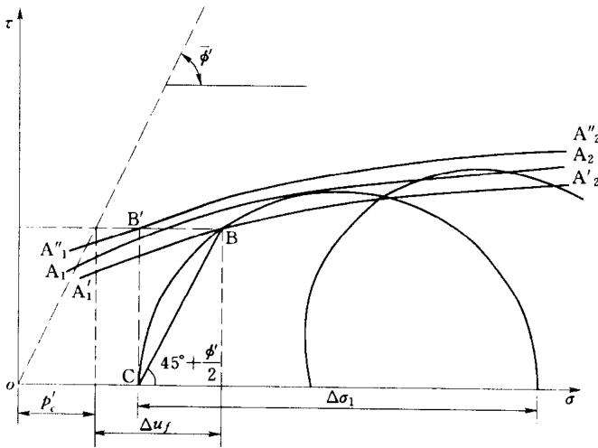  
图 5.7 固结不排水试验指标整理

但是，无论在“Q剪”还是在“R剪”过程中，当p′较小时均会测到过大的抗剪强度。 $^ { * } \mathbf { Q }$ $p ^ { \prime }$ 由于此时土样在超固结状态下破坏，有受剪膨胀的趋势，因而产生负压，导致该部分强度有时比排水剪（“S剪”） 还大。图5.8表示均质土坝在填筑过程中的孔压分布，靠近坡面的区域为负压区。这部分土具有较高的强度。因此，坝坡暂时是稳定的。但遭遇暴雨时，或在堤坝长期挡水因而达到充分饱和后，这一部分负孔压会消失。如果填筑于容重较低，含水量又较高，则此时安全系数会大幅度下降。这就是一部分堤坝在雨季和汛期发生滑坡的原因之一。

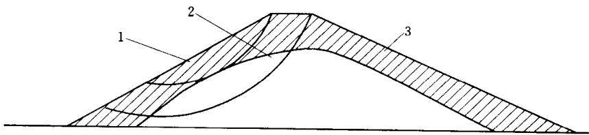  
图 5.8 均质土坝在填筑过程中的孔压分布  
1-浅层滑裂面；2-深层滑裂面；3-可能产生负孔隙水压的区域

因此，美国陆军工程师团认为这种由干负压导致的过大的强度是不可靠的，还是采用较小的“S剪”强度为宜。这样就产生所谓“组合强度包线”，如图5.9(a)中的折线abc。如果把“R线”和“S线”的交点b相应的 $\pmb { \sigma }$ 值定为 $\sigma _ { t }$ ，把这种组合强度相应的粘聚力和摩擦角称为 $c _ { 0 }$ 和φo，则有

$$
\tau _ { f } = c _ { 0 } + \sigma ^ { \prime } \tan \phi _ { 0 }\tag{5.11}
$$

式中： $\pmb { \sigma }$ 为土的有效法向应力。

在 $\scriptstyle { \overrightarrow { \sigma } } < \sigma _ { t } ^ { \prime }$ 时， $c _ { 0 } = c _ { d } ^ { \prime }$ $\phi _ { 0 } = \phi _ { d } ^ { \prime } ;$ 在 $\sigma > \sigma _ { t } ^ { \prime }$ 时， $c _ { 0 } = c _ { u }$ $\phi _ { 0 } = \phi _ { u }$

对 $\mathbf { \mu } ^ { 6 6 } \mathbf { Q }$ 线”和“S线”的组合强度包线也有类似处理，如图5.9(b)示。

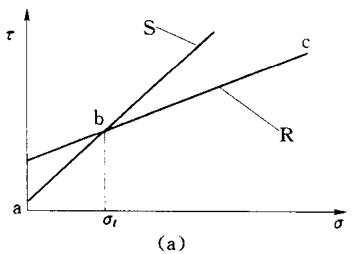

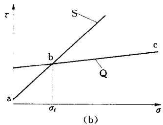  
图 5.9 组合强度包线  
(a) 固结不排水强度试验；(b) 不固结不排水强度试验

STAB程序专门提供了使用组合强度包线进行稳定分析的功能。但使用时，必须首先确认输入的c，φ和c，φ在坐标系内具有实际意义的交点，也就是说，必须保证 $c _ { d } ^ { \prime }$ $\phi _ { d } ^ { \prime }$ $c _ { y }$ $\phi _ { u }$ $\scriptstyle { c _ { \ d } ^ { \prime } < c _ { u } } ,$ $\phi ^ { \prime } { } _ { d } { > } \phi _ { \ast }$ ，否则程序将拒绝进行组合包线的计算。

在使用“R剪”进行稳定分析时，还存在着如何将试验室内实现的破坏条件与实际计算的应力状态配套的问题，将在5.5.3节中讨论。

## 5.3.3 直剪试验可能包含误差的讨论

## 1. 直剪试验可能包含的误差

直剪试验操作比较简单，其主要问题是：

(1) 压力盒内应力分布比较复杂，剪切面上应力分布不均匀。

(2) 试验过程中固结和排水速率不易控制。在分析直剪试验资料时，设计人员需要专门了解土样固结的条件、含水量和剪切的速率，因为这些因素对抗剪强度的成果影响极大。

(3) 采用刚性的剪力环测量水平位移，使法向应力失真。

20 世纪70年代，我国在石头河工程曾开发试验土石坝粗颗粒料抗剪强度的大型直剪仪，但终因试验误差偏大，与三轴试验成果无法配套，未能在较大范围内推广使用。

## 2. 对直剪试验仪的改进

如图5.10所示，直剪试验仪往往由上剪切盒及下剪切盒组成。相应某一垂直荷载作用，水平推动下或上剪切盒使试样沿着上下剪切盒之间的平面（剪切面）受剪。剪切力一般用设在与推力相反方向的剪力环来测定。由于用推动剪切盒的方法来使试样受剪，剪力环与剪切盒之间的连接必定是刚性的。

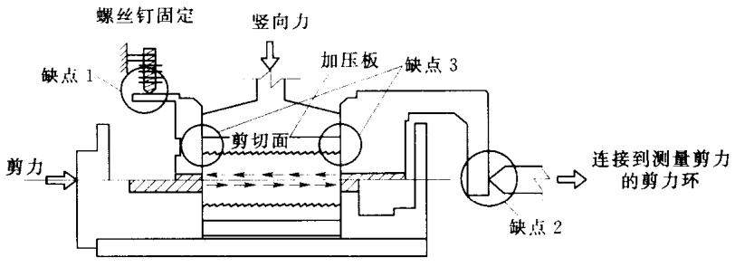

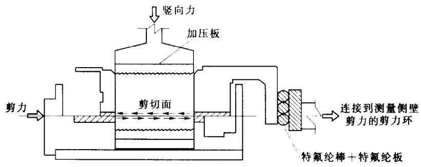  
(b)

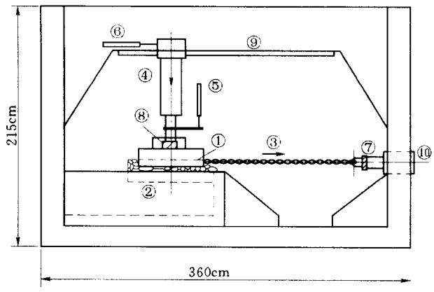  
(c)  
图 5.10 直剪试验仪

(a) 常规的直剪试验仪；(b) 日本地盘工学会建议的设施(c) 松冈元与刘斯宏开发研制的新型直剪仪

在剪切过程中，若试样发生剪胀，会在其接触点处产生一个向下的摩擦力，该摩擦力在试验中无法测定，从而使得作用于剪切面上真正（垂直）应力比实际外加的垂直应力要大，这就是对于剪胀性的粒状体材料，用直剪试验测得的抗剪强度比实际的抗剪强度要大的原因。

有两种方法可以有效地解决上述摩擦力对抗剪强度试验结果的影响。一种是日本地盘工学会(2000)的试验规范规定的方法，即在垂直荷载加压板的另一侧设置反压板，然后在反压板与剪切盒之间设置荷载传感器测定外加的垂直荷载，如图5.10(b)所示。由该荷载计算得到的应力即为作用于剪切面上的真正的正应力。另一种是像日本名古屋工业大学松冈元与刘斯宏等人开发研制的新型直剪试验法(Matsuoka,，1999 and Liu， 1999)。这一方法不用推动剪切盒来使试样受剪，而是改用柔性的链条或绳子拉动剪切盒，并且用剪切框来代替剪切盒，参见图5.10(b)。该试验法特别适于在现场直接进行，其特点之一是只需改变剪切框的尺寸，可以用同样的原理测试从粘土到堆石试样的剪切强度。

松冈元与刘斯宏等人开发研制的直剪设备分实验室和现场两种。实验室直剪仪如图6.10所示。

现场大剪采用的十字型剪切框。长、宽各为120cm，高为17cm，由高强度钢制成。试验时先用振动碾将十字型剪切框压入要测试其强度的地基，如果是堆石填筑，则对埋有剪切框的地盘用与实际施工同样的碾压方法与碾压标准进行碾压。碾压完后将剪切框周围的土稍微挖除，使剪切框露出地面，再在十字型剪切框架内用较细的试料堆成4个小山包，目的是保证其后施加的垂直荷重不通过剪切框架而是通过剪切框内的试样传递到剪切面上。然后在4个小山包上放上一块荷载板，再在其上施加垂直荷重，并设置水平与垂直位移计。最后在水平方向上用链条张拉剪切框，使试样受剪。剪切力用连在链条上的荷重计测量。

用该原位直剪试验法测得的抗剪强度与相似级配试样（最大粒径为5cm左右）的室内大型三轴压缩试验结果基本接近。但是，与室内大型三轴压缩试验相比，原位直剪试验法省时，费用低。试样的级配、密度均为原样。对于边坡稳定问题，它还有一个其它试验无法达到的优点，就是它能准确地测试斜面表面附近极低围压下的抗剪强度。根据试样粒径的不同，也有采用尺寸为60cm×60cm×8.5cm和30cm×30cm×4cm的十字型剪切框。对于砂土或粘土。采用尺寸为14.14cm×14.14cm×2cm的小型十字型剪切框。

图5.11比较了传统的和改进的直剪试验成果，可见传统的方法获得的成果偏大。图5.12 则比较新型直剪仪和其它改进的三轴试验的成果。图5.13比较了改进的原位直剪试验和大 型三轴试验的成果。这些成果都说明新型直剪仪克服了传统试验的缺点，获得了比较合理 的和三轴试验一致的成果。

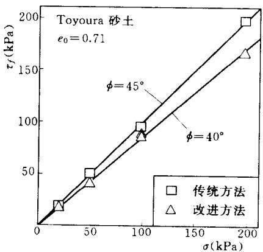  
图 5.11 传统和改进的直剪试验成果比较

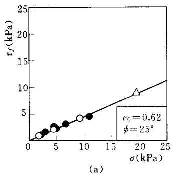  
△引进的直剪试验

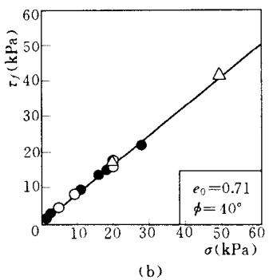  
新的使用砂页的小直剪试验

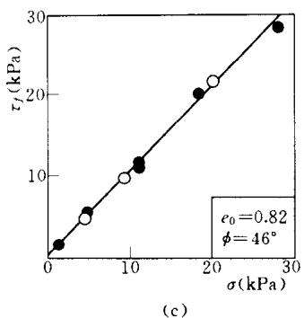  
●新的使用钢剪切框的小直剪试验

图 5.12 新型直剪仪和其它改进的三轴试验的成果比较  
(a)玻璃珠 (b)Toyoura 砂土 (c)碾碎砂  
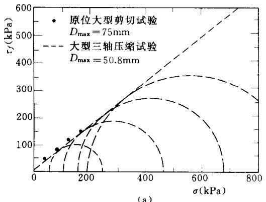

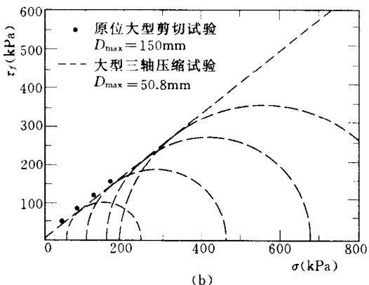  
图 5.13 改进的原位直剪仪和大型三轴试验的成果比较

## 5.4 残余强度

## 5.4.1 残余强度的特征

图5.14 所示为正常固结土和超固结土在粘粒含量较大和较小时的应力应变曲线。在加荷过程中，试样首先达到峰值强度，然后，过渡到一个软化强度。

对超固结土，试样开始剪胀，继续加荷，在粘粒含量较高时，颗粒发生重新排列现象，强度进一步降低，到达“残余强度”。从图5.14可知，正常固结土的残余强度和峰值强度的差距相对超固结土要小。粘粒含量越高，残余值和峰值的差别越大。以砂粒为主的土的特性与粘粒含量低的土的特性类似。对相应不同的法向应力获得的强度值绘制曲线，即可分别总结出强度指标（图5.15）。

Lupini(1981)曾经在扭转仪上对以砂和膨润土为主的土样做过一系列试验，绘得如图5.16所示的曲线。他发现，当土样中粘粒含量较小时，土颗粒在破坏时出现紊动和转动现象。此时，残余强度降低幅度不大。当粘粒含量增加时，土样内部粘粒重新排列，出现较明确的剪切面，此时残余强度降低的幅度较大。在研究天生桥二级厂房高边坡和小浪底工程的泥化夹层时，都可以发现泥层里有明显的擦痕和剪切面。对这些泥化夹层进行的现场剪切试验成果表明，其不排水抗剪强度φ值在 $1 0 ^ { \circ } { \sim } 1 2 ^ { \circ }$ 左右，c值基本为零。使用这些土的扰动样，即使固结到相同的容重也绝不可能得到如此低的抗剪强度。因此，在对这些原状土样进行现场或室内直剪试验，测定的实际上都是残余强度。Skempton(1985)根据自己的资料，也绘制了具有类似规律的曲线，如图5.17所示。

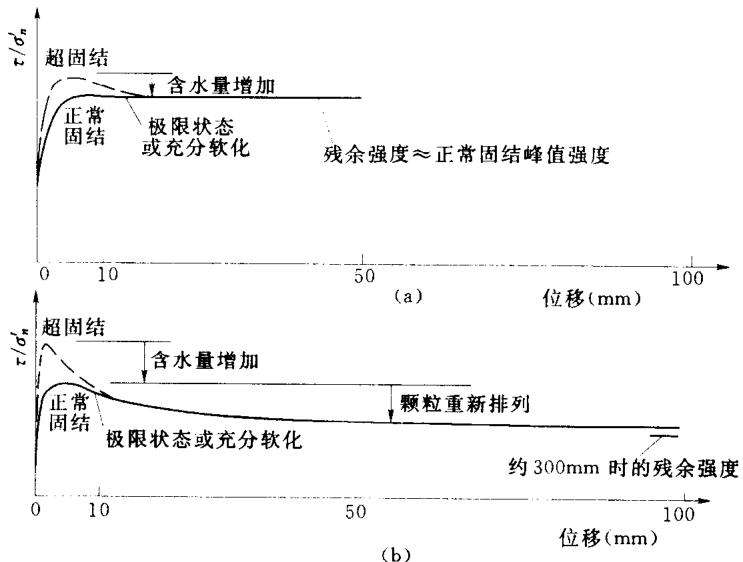  
图 5.14 土的残余强度(Skempton, 1985)  
(a) 粘粒含量较低(<20%)；(b) 粘粒含量较高(>40%)

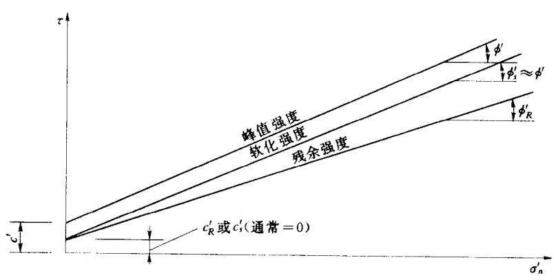  
图 5.15 峰值强度、软化强度和残余强度(Fell, 1992)

表5.4和表5.5分别为天生桥二级厂房和小浪底左岸夹泥层的强度指标与粘粒含量的关系实例。从中可以发现，粘粒含量越高，强度越低。

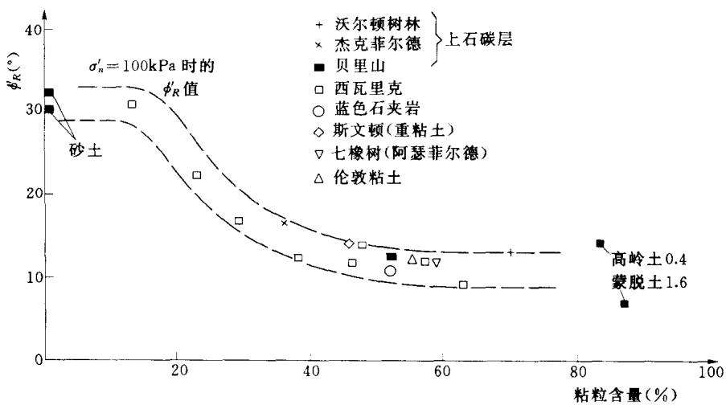  
图 5.16 在扭转仪上对以砂和膨润土为主的土样的一系列试验 (Lupini, 1981)

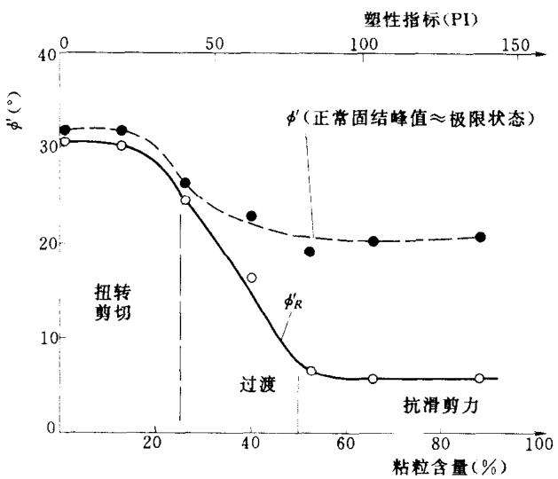  
图 5.17 在扭转仪上对以砂、高岭土和膨润土为主的土样做过一系列试验(Skempton,1985)

表5.4 天生桥二级厂房抗剪强度与粘粒含量的关系
<table><tr><td rowspan="2">土样 编号</td><td colspan="2">粘粒含量</td><td colspan="2">原状样</td><td colspan="2">扰动样</td></tr><tr><td>总含量 (%)</td><td>其中胶粒 含量(%)</td><td>C (kPa)</td><td>φ (°)</td><td>c φ (kPa) (°)</td><td></td></tr><tr><td>8#</td><td>49</td><td>36</td><td>89</td><td>14.3</td><td>68</td><td>7.6</td></tr><tr><td>0#</td><td>50</td><td>39</td><td>45</td><td>7.4</td><td>40</td><td>6.5</td></tr><tr><td>Q88#</td><td>41</td><td>32</td><td>60</td><td>7.4</td><td>37</td><td>9.2</td></tr></table>

表5.5 小浪底水利枢纽左岸夹泥层抗剪强度与粘粒含量的关系
<table><tr><td>土样</td><td>土样岩组代号</td><td>粘粒总含量 (%)</td><td>粘粒中胶 粒含量(%)</td><td>c (kPa)</td><td>φ (°)</td></tr><tr><td>1</td><td>T5</td><td>41.5</td><td>25</td><td>9</td><td>7.97</td></tr><tr><td>2</td><td>T5-2</td><td></td><td></td><td>2</td><td>11.3</td></tr><tr><td>3</td><td>T4</td><td>34</td><td>32.7</td><td>57.5</td><td>16.4</td></tr><tr><td>4</td><td>T4</td><td></td><td></td><td>6</td><td>14</td></tr><tr><td>5</td><td>T3</td><td>44.5</td><td>28.5</td><td>2</td><td>14.6</td></tr><tr><td>6</td><td>T2-4</td><td>40.4</td><td>28</td><td>4</td><td>13</td></tr></table>

除了粘粒含量以外，土的矿物成分对土的残余强度特性也有明显的影响。高岭土、伊利土、蒙脱土和绿泥石均为盘片状结构，在剪切时出现重新排列现象。颗粒之间的粘结性能也较弱，因此，通常会出现较低的残余强度。对于蒙脱土，残余强度φ，可能低至5°左右， $\phi _ { r } ^ { \prime }$ ${ \pmb 5 } ^ { \circ } .$ 而高岭土和伊利土的φ，则分别达到15°和10°。因此，研究泥化夹层的抗剪强度，首先要了 $\phi _ { r } ^ { \prime }$ $1 5 ^ { \circ } .$ $1 0 ^ { \circ }$ 解其矿化成分。

某些土不具有盘片状结构。如埃洛石粘土呈紊乱状结构，绿坡缕石呈针状结构，又如某些含泥非晶质体粘土矿物成分的土，其φ，值可以超过25° $\phi _ { r } ^ { \prime }$ $2 5 ^ { \circ }$ (Skempton, 1985)。

在进行土坡稳定分析时，除了粘粒含量以外我们通常依据以下原则决定是否使用残余强度指标。

(1) 如果边坡中已经存在有一个滑裂面，如天然边坡或坝基的软弱夹层、古滑坡的滑动面等，此时，不论残余强度有多低，均应使用残余强度指标，除非有足够的证据说明这些滑动面已有了很好的胶结特性。

(2) 岩体中的层面一般应使用残余强度。

(3)经碾压的填筑土如内部无裂隙，应使用峰值强度。故对土石坝填筑部分坝坡的稳定分析，应建立峰值强度基础上。

(4) 在上述(1)、(2)两种情况中，c，往往相当小，而c'值的大小往往对边坡稳定分析的 $c _ { r } ^ { \prime }$ $c ^ { \prime }$ 影响十分敏感，除非有专门的论证，一般c和c，分别不宜超过10kPa和1kPa。因此，在 $c _ { p } ^ { \prime }$ $c _ { r } ^ { \prime }$ 反演分析中，通常可以取粘聚力为零，然后假定安全系数为1，反推出摩擦角。

## 5.4.2 残余强度的试验确定方法

如前所述，土的残余强度问题主要与层面和其它结构面的软弱夹层先期受剪颗粒重新排列，并出现剪切面有关，因此，测定这些土的残余强度，大多采用直剪仪。土的室内直剪仪的尺寸一般较小，不会超过80mm。如果土样是从现场获取的软弱面的不扰动样，那么，这些土样已在历史上发生过剪切。只要在直剪仪上继续沿软弱面剪切，测定的就是残余强度。如果应用扰动样，则需要在直剪仪上作往复剪切试验。而土体进入发挥残余强度阶段一般需6\~10mm，因此，测定残余强度通常需要进行反复剪切(Skempton，1985)。其操作步骤如下：

1）将土样一次剪切到最大水平行程，卸荷后调整推力器到一个新的起点，加荷后再次剪切，如图5.18所示；

2) 将土样一次剪切到峰值强度，此时，推力器已移动到几乎一半达到残余值的变形，卸荷后再次剪切到破坏；

3) 对试样进行相对两个方向的往复剪切，直至达到残余值；

4)在上述几种直剪试验过程中，均需注意试样饱和度、剪切速率等问题将直接影响测定的残余强度值。

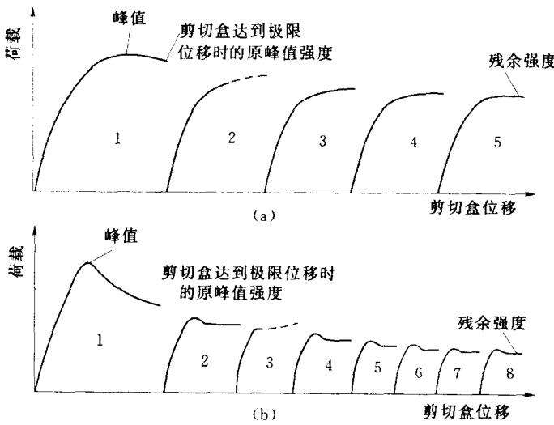

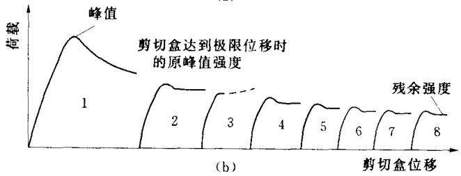  
图 5.18 测定残余强度值的直剪仪试验  
(a) 土颗粒紊动情况；(b) 土颗粒定向排列，出现剪切面

## 5.5 粘性土的饱和不排水强度-稳定分析的总应力法

## 5.5.1 关于总强度和总应力法的概念

近代土力学发展的一个重要成果是确认影响土的强度是土体内的有效应力而不是总应力。因此，通常需要通过试验、实测和理论分析，确定孔隙水压力，然后利用摩尔-库伦强度准则进行边坡稳定分析。

在边坡稳定分析中，孔隙水压力通常是由下面两种方法确定的：

(1)对于稳定渗流和半透水不可压缩的土（例如心墙坝上游半透水的砂壳）在库水位骤降时的情况，可以利用稳定或非稳定流的拉普拉斯方程，结合相应的边界条件，解出孔隙水压力的分布。

(2)对于可压缩、透水性小的土（主要是粘性土），在荷载发生突然变化时，由于孔隙中的水无法立即挤出，会产生超出最后稳定时的孔隙水压力。这类问题，本质上是固结现象，由于它涉及到土的非线性本构关系，目前还没有较成熟的理论分析方法，通常可用室内不排水试验测定孔隙水压力系数A、B来确定孔隙水压力（详见第6章）。因为这类问题荷载变化突然，土的渗透性又小，所以可以认为在外荷载变化时，其含水量是不变的。

对于饱和土体，B为1.0。此类方法可用于土石坝施工期和库水位骤降期的工程问题，也可应用于地基问题中的边坡快速开挖和承载能力问题。

关于确定孔隙水压力的问题，我们还将在第6章中详细讨论。

上述第二类确定孔隙水压力的问题，归根到底，需要通过模拟现场土的固结历史和进入破坏的总应力途径的试验来测定破坏时的系数A和B。在有效应力法中，再根据此值算出有效应力，确定强度。但是，试验到了这一步，土的抗剪强度已可测出，这样就可以直接把测到的强度应用到稳定分析中去。

这种在实验室或现场模拟实际土的应力历史和应力途径测定抗剪强度，直接使用这个强度进行稳定分析的方法，称为总应力法。

在深入了解总应力法理论背景以前，让我们来看一下如图5.19所示在某一饱和粘性土地基快速修建坝的例了。对某一潜在滑面上的E点，如果简单地使用地基的固结不排水强度指标c和φ计算其抗剪强度，这就意味着土堤修建到高度H₁和H2，由于E点的法向应 $c _ { c u }$ $\phi _ { c u }$ $H _ { 1 }$ $H _ { 2 }$ 力不同，会提供不同的抗剪强度。由于H，比H大，意味着堤修得愈高，A点的抗剪强度 $H _ { 2 }$ $H _ { 1 }$ 就愈大，也就越稳定。虽然这是不合理的。

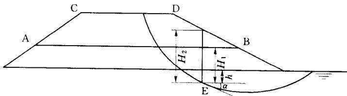  
图 5.19 某一饱和粘性土地基快速修建坝的例子

地基处于充分饱和状态，在快速施工情况下又可视为不排水。因此，不管土堤修到 $H _ { 1 }$ 还是H，高度，E点在破坏时的有效应力都不会增长，E点的孔隙比也不会变化，因此，依 $H _ { 2 }$ 据伏斯列夫理论，E点的抗剪强度不会因为上覆荷重增加而增加。而滑动力将随着坝高增加而增加，所以安全系数将随着坝高增加而降低。可见在这一特定条件下，将c\~和φ或 $c _ { c u }$ $\phi _ { c u }$ $c _ { u u }$ 和φ直接用于边坡稳定分析中的做法是欠妥的。饱和地基快速加荷、加速开挖和土石坝库 $\lvert \phi _ { u u }$ 水位骤降这三种情况，是典型的饱和粘性土边坡短期稳定问题。下面，我们就来看应怎样正确地处理这一类问题。

## 5.5.2 粘性土的饱和不排水强度

为了说明饱和粘土地基上快速加荷或开挖总强度的概念，我们来研究地基中处于某一深度h的土单元，见图5.20(a)。

在初始状态，该单元的有效应力为 $\sigma _ { 1 } ^ { \prime } = \sigma _ { 3 } ^ { \prime } = p _ { 0 } ^ { \prime }$ (假设 $K _ { 0 } { = } 1 )$ )，在σ-τ坐标上用A点表示，见图5.20(b)；此时孔隙水压力为静水压力γh，总应力状态 $\gamma _ { w } h$ $\pmb { \sigma } _ { 1 } = \pmb { \sigma } _ { 3 } = \pmb { p } _ { o } ^ { \prime } + \gamma _ { w } \pmb { h }$ 。可用图5.20(b)中B点代表。在三轴仪上，可以将原状土处于相同的 $\pmb { \sigma } _ { 1 } ^ { \prime } = \pmb { \sigma } _ { 3 } ^ { \prime } = p _ { 0 } ^ { \prime }$ 条件下固结，来模拟现场的有效应力，并可加上反压力γh来模拟初始孔隙水压力。 $\gamma _ { w } h$

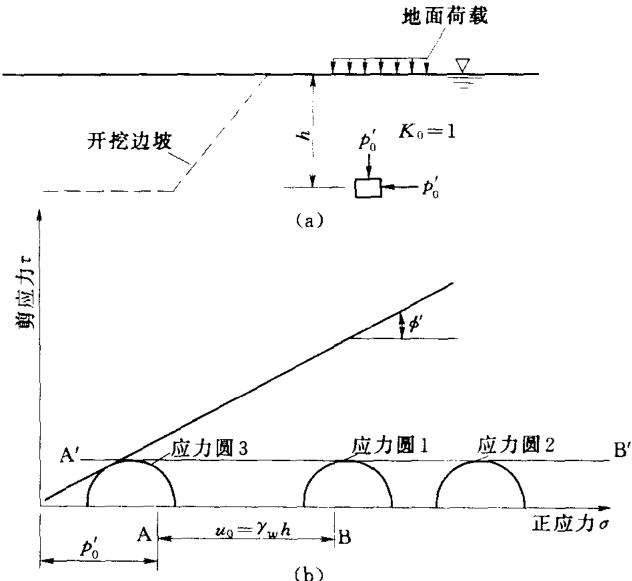  
图 5.20 饱和粘土地基上快速加荷或开挖的总应力法  
(a) 饱和粘土地基上快速加荷或开挖;(b) 总应力和有效应力圆

现在假定该土样在下面两种情况下达到破坏：

(1) 边坡快速开挖。此时应力状态的总应力圆如图5.20(b)中应力圆1所示。

(2) 地基表面突然增加一分布荷载。应力状态的总应力圆如图 5.20(b)的应力圆2所示。这一分布荷载可以理解为建筑物的荷载，也可理解为修建在这一饱和软基上的一个堤坝。

对于这样一种饱和粘性土在不排水情况下的破坏，不论是快速开挖还是地面加荷，土样只要达到破坏，都具有下面两个特征：

(1) 土的孔隙比保持不变。即两种情况有相同的 $e _ { f }$ ，这一点是容易理解的，因为粘性土渗透系数极小，荷载的瞬时变化无法保证水立即从土体中排出。

(2)破坏那一刻其有效应力的增量都是一样的。我们用以下论述来证明这一点，即证明其应力圆都是图5.20(b)中的应力圆3。也就是说，不管增加的荷载有多大，也不管边坡开挖有多深，只要是在不排水条件下发生破坏，这一土单元的强度就是唯一的。饱和粘性土在不排水条件下提供的抗剪强度只和加荷以前的孔隙比有关，与加荷过程和破坏时的总应力无关，这一结论构成了总应力法的理论基础。也形成了一整套独特的边坡稳定分析的总应力法操作步骤。下面，用伏斯列夫理论来阐述这一重要结论。

由于土是充分饱和的，因此孔隙水压力系数B为1。当 $\pmb { \sigma } _ { 1 }$ 和 $\sigma _ { 3 }$ 分别有一增量 $\mathbf { \Delta } \Delta \pmb { \sigma } _ { 1 }$ 和 $| \Delta \sigma _ { 3 }$ 时，孔隙水压力的变化为 $\Delta u = \Delta \sigma _ { 3 } + A ( \Delta \sigma _ { 1 } - \Delta \sigma _ { 3 } )$ 。而平均总应力的增量为$\Delta p = ( \Delta \sigma _ { 1 } + 2 \Delta \sigma _ { 3 } ) / 3$ ，因此平均有效应力的增量 $\mathbf { \Delta } \Delta \mathbf { p ^ { \prime } }$ 为 $\Delta p { - } \Delta u$ ，即 $( 1 / 3 - A ) ( \Delta \sigma _ { 1 } - \Delta \sigma _ { 3 } )$ 。当试样达到破坏时，土的平均有效应力为

$$
p _ { f } ^ { \prime } = p _ { 0 } ^ { \prime } + \left( \frac { 1 } { 3 } - A _ { f } \right) \Delta \sigma _ { 1 } - \Delta \sigma _ { 3 } ) _ { f }\tag{5.12}
$$

式中： $\pmb { p } _ { f } ^ { \prime }$ 为土样破坏时的平均有效主应力； $\pmb { p } _ { 0 } ^ { \prime }$ 为初始状态土的有效应力； $A _ { f }$ 为土样破坏时的A系数。

用式(5.12)中的 $p _ { f } ^ { \prime }$ 代替式(5.4)中的 $p ^ { \prime }$ ，可得土在破坏时发挥的强度为

$$
q _ { f } { = } ( \Delta \sigma _ { 1 } - \Delta \sigma _ { 3 } ) _ { f } = \frac { c _ { t } ^ { \prime } + p _ { 0 } ^ { \prime } \tan \phi _ { t } ^ { \prime } } { 1 { - } \left( \displaystyle \frac { 1 } { 3 } { - } A _ { f } \right) \tan \phi _ { t } }\tag{5.13}
$$

如前所述， $c _ { t } ^ { \prime }$ 和 $\phi _ { t } ^ { \prime }$ 为常数，因此，由式(5.13)得知两种破坏情况有相同的$( \Delta \pmb { \sigma } _ { 1 } - \Delta \pmb { \sigma } _ { 3 } ) _ { f }$ ，即相同的应力圆直径。进而还可以得知两种破坏情况的孔隙水压增量和平均有效应力增量也是一样的。既然两种情况具有相同的 $p _ { f } ^ { \prime }$ 和q，，那就说明，饱和粘土地基 $q _ { f }$ 在荷载快速发生变化时破坏，有效应力的应力圆重合，都是应力圆3。

这样，就得到一个重要的结论，即饱和土体在不排水条件下破坏，其强度只取决于破坏前的固结应力p（或孔隙比e)，而与进入破坏的总应力途径无关。如果把不同总应力 $p _ { e } ^ { \prime }$ $e _ { f } )$ 途径下进入破坏的应力圆的公切线连起来，就是一条与σ坐标平行的水平线，如图5.20(b) $\pmb { \sigma }$ 中的 $\mathbf { A ^ { \prime } B ^ { \prime } }$ 所示。这样的土的抗剪强度与破坏时的总应力无关，就如同 $\phi = 0$

针对饱和土的这一特点，在稳定分析中，可以采取以下步骤：

(1) 既然不排水强度和总应力途径无关，就没有必要模拟现场真正的总应力途径进行试验（这一点实际上也是很难办到的）。只需要在试验中把土样固结到和现场相同的孔隙比，在相同的p条件下固结。然后对该饱和土样进行常规的不排水试验，即“R剪”，得 $\pmb { p _ { 0 } ^ { \prime } }$ $\mathbf { \ " } \mathbf { R }$ 到的破坏时的应力圆直径，它就代表了土在现场可以发挥的强度。

如果这一不排水强度是通过原位十字板、旁压仪或静力触探试验测定的，那么所测到的不排水强度就代表了“R剪”的指标。在通常情况下，采用这些原位测试方法确定的“R剪”强度是一个随深度增加而增加的数据。在同一深度，理论上应为同一数值。

(2) 既然已经获得了土的破坏时发挥的强度，就没有必要再使用摩尔-库仑强度准则式(1.1)。可以直接用测得的强度进行滑弧稳定分析计算。再回过头看一下对图5.19所示的那个例子。根据上面介绍的总应力法的原理，A点在破坏时发挥的抗剪强度是加荷以前的有效应力p所决定的。因此，作为一种近似的处理，应根据该点的加荷前的有效平均应力 $\pmb { p _ { 0 } ^ { \prime } }$ $\gamma h ( 1 { + } 2 K _ { 0 } ) / 3$ (γ为土的浮容重，K。为静止侧压力系数），在该点土样的固结不排水强度线 $\gamma$ $K _ { 0 }$ 上找到相应的τ，不管加荷到H1还是H2高度，都将此τ作为稳定分析中A点发挥的抗剪 $\pmb { \tau _ { f } }$ $H _ { 1 }$ $H _ { 2 }$ $\tau _ { f }$ 强度。在具体处理时，则可令该点的 $\phi = 0$ $c = \tau _ { f }$ 。这样，滑面上的各点，由于h不同，仍会有不同的 $\pmb { c }$ 值，但 $\phi$ 值一律为零。

在国外，总应力法通常称为 $\mathbf { \dot { \omega } } ^ { \prime } \phi = 0 \mathbf { \omega } ^ { \prime \prime }$ 法。在实际操作时，分两步。第一步，根据加荷前的有效法向应力，通过现场或室内不排水试验确定其抗剪强度τ；第二步，将φ=0、 $\tau _ { f }$ $\scriptstyle \phi = 0$ $c = \tau _ { f }$ 代入第2章和第3章介绍的各种稳定分析方法的公式中。由于φ=0，故这些公式中的孔压 $\scriptstyle \cdot \phi = 0$ 不起作用。使用总应力法不需要知道土体在破坏时的孔压分布。

STAB程序为进行饱和地基快速填筑和快速开挖总应力法的稳定分析时，专门提供了一个类似于孔隙水压力内插那样的输入 $\cdot \tau _ { f }$ （STAB 程序的使用说明中使用 $\boldsymbol { q _ { c u } } / 2$ 为这一符号）数据网格的功能。

## 5.5.3 库水位骤降情况下粘性土的饱和不排水强度

现在再以库水位骤降为例，研究饱和土的固结不排水强度。图5.21(a)所示滑面上某一单元在库水位骤降前有效应力为 $\pmb { \sigma } _ { \imath } ^ { \prime }$ 、 ${ \pmb \sigma } _ { 3 } ^ { \prime }$ ，孔压为p，如①所示状态。总应力和有效应力圆 $p ,$ 分别为图 5.21(b)中的圆 D 和 E。可以在三轴仪中也使试样在反压力 p 和有效应力 $\pmb { \sigma } _ { 1 } ^ { \prime }$ $\pmb { \sigma } _ { 3 } ^ { \prime }$ 条件下固结，来模拟这种应力状态。此时，如果库水位发生骤降，则总应力分别增加Δσ， $\backslash \sigma _ { 1 }$ $\Delta \sigma _ { 3 }$ ，如图 5.21(a)中③所示。相应应力圆为图 5.21(b)中圆A。这个状态可以看作初始状态加上两个部分形成。第一部分，即情况④，试件受到一个周围应力的增量 $\Delta \sigma _ { 3 }$ ；第二部分是试样仅在 $\Delta \mathcal { I } _ { \mathrm { ~ l ~ } }$ 方向受到一个增量 $\Delta \sigma _ { 1 } – \Delta \sigma _ { 3 }$ ，如图5.21(a)中的②所示。这和典型三轴不排水试验应力途径相同。对于第一部分，由于试件处于充分饱和状态，在不排水条件下，周围应力的增加只能使孔隙水压力增加一个 ${ \bf \nabla } \cdot \Delta \sigma _ { 3 }$ ，对有效应力没有影响。真正使有效应力发生改变的是②。换句话说，从情况①过渡到③，如果略去④，并不会使有效应力途径发生变化。当试件破坏时，代表③的应力圆 A和代表①+②的应力圆B具有相同的有效应力圆C。由于试验是不排水的，因此①+②和③又具有相同的孔隙比。根据伏希列夫理论，同样的土，在相同的有效应力和破坏时的孔隙比下具有相同的强度。这样，用常规的三轴不排水试验②获得了应力圆B时，这个应力圆（即①+②）就代表了坝体中相应该单元在骤降时能发挥的强度。

通过以上分析，我们再一次强调关于饱和土不排水强度理论的一个重要认识：饱和土在不排水状态下破坏，所发挥的强度是加荷前的固结状态决定的，与加荷的应力途径无关。常规三轴不排水试验①+③获得的破坏时的总应力圆直径，就是土体实际破坏时的有效应力圆的直径。因此，在稳定分析时，无需绕一个弯，先设法确定滑裂面上的总应力，再找到孔隙水压力，通过式(1.1)来确定其抗剪强度。这一结论构成了总应力法库水位骤降稳定分析的理论根据。总应力法的计算步骤将在第7章中介绍。

顺便指出，本文提出的总应力法的概念，在SL274-2001《碾压式土石坝设计规范》中已得到确认，对土石坝边坡稳定分析的总应力法作了如下规定：

粘性土填土在施工期和库水位降落期的抗剪强度，在某些情况下也可用总应力法按下式确定：

施工期

$$
\tau = c _ { u } + \sigma { \tt a n } \phi _ { u }\tag{5.14}
$$

库水位降落期

$$
\tau = c _ { c u } + \sigma _ { c } ^ { \prime } \mathrm { t a n } \phi _ { u }\tag{5.15}
$$

上二式中：τ为土体的抗剪强度；cu和φu为不排水剪总强度指标；ccu和φu为固结不排 $c _ { u }$ $\phi _ { u }$ $c _ { c u }$ $\phi _ { c u }$ 水剪总强度指标； $\pmb { \sigma } _ { c } ^ { \prime }$ 为库水位降落前的法向有效应力。

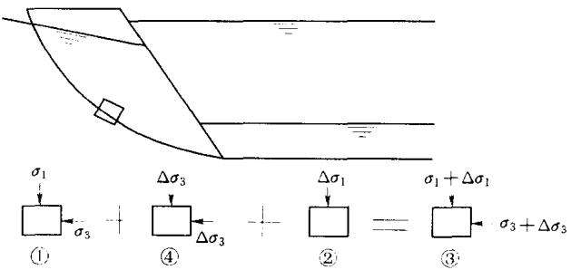  
(a)

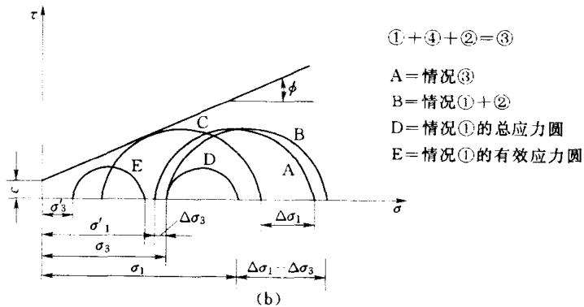  
图5.21 库水位骤降情况下总应力法边坡稳定分析  
(a) 滑裂面上某点的应力状态；(b) 总应力和有效应力圆 ①+④+②=③  
A=情况③：B=情况①+②；D=情况①的总应力圆；E=情况①的有效应力圆

在库水位降落期，规范要求根据库水位降落前的法向应力σ来决定库水位降落时的抗 $\pmb { \sigma } _ { c } ^ { \prime }$ 剪强度。

在第7章中，将通过实例，介绍应用上述总应力法的概念进行地基和坝坡稳定总应力法稳定分析的具体步骤。

## 5.5.4 对“R线”的修正

对上面介绍的饱和粘性土短期边坡稳定分析问题，采用的三轴试验称为固结不排水剪，简称“R剪”（或CD)。“R剪”是按以下试验步骤得到的。

(1)将饱和试样按现场的压实条件制备后在某一σ周围应力条件下固结。但现场的土 $\pmb { \sigma } _ { 3 } ^ { \prime }$ 实际上是在平面应力即 $\pmb { \sigma } _ { 1 } ^ { \prime } \neq \pmb { \sigma } _ { 3 } ^ { \prime }$ 条件下固结的，这是现有的试验分析方法中包含的误差之一。此外，通常也不加反压力p来模拟现场实际存在的孔隙水压力。

(2)在三轴仪中，关闭排水阀，保持σ，不变，施加轴向应力增量Δσ，直至破坏。上面 $\sigma _ { 3 }$ $\Delta \sigma _ { 1 }$ 已经讨论过，此时的总应力圆的直径就代表了具有相同固结条件的现场土在破坏时发挥的强度，如图5.21(b)中的圆B所示。

(3)改变固结周围应力σ3，进行同样的试验，得到一系列破坏时的应力圆。连接这些 $\pmb { \sigma } _ { 3 } ^ { \prime }$ 应力圆的公切线，如图5.7 中的 $\mathbf { A } _ { 1 } \mathbf { A } _ { 2 }$ 线所示。这就是 SDS01-79《土工试验规程》规定的固结不排水试验强度包线（“R线”）的整理法。

但是，土实际上是在与小主应力成 $4 5 ^ { \circ } + \phi ^ { \prime } / 2$ 的面上发生破坏的。因此，真正发挥强度的是图 5.7 中 B 点所代表的，将应力圆中相应 B 点的位置连线 $\mathbf { A } _ { 1 } ^ { \prime } \mathbf { A } _ { 2 } ^ { \prime }$ 更合理一些。这就是美国陆军工程师团手册中关于“R线”的作法。它和我国的规程不一样。但是，两种强度包线的位置比较接近。

$\mathbf { A } _ { 1 } ^ { \prime } \mathbf { A } _ { 2 } ^ { \prime }$ 线的概念是，当固结应力在C点时，其不排水强度是由B点所代表，参见图5.7。可是在实际使用时，从来没有人去作BC线，正确地查到其强度。因此，Lowe(1967)、Johnson(1974)等人建议，将B 点平移到B′，使B'C垂直于横坐标。将不同固结应力下的B'连成一 $\mathbf { B ^ { \prime } } ,$ $\mathbf { B ^ { \prime } C }$ 条新的“R线” $\mathbf { A } _ { 1 } ^ { \prime } \mathbf { A } _ { 2 } ^ { \prime }$ 。Johnson指出，强度会提高15%～20%。也就是说，传统的“R线”的整理方法是偏保守的。

截止到目前，研究的只是土样在 $\pmb { \sigma } _ { 1 } ^ { \prime } = \pmb { \sigma } _ { 3 } ^ { \prime }$ 的条件下固结的情况，实际上，坝体和地基的土一般是在 $K _ { 0 } = \sigma _ { 3 } ^ { \prime } / \sigma _ { 1 } ^ { \prime }$ 不等于1的条件下固结的。因此，在三轴仪上作K≠1 $K _ { 0 } { \neq } 1$ 的试验更符合实际。对于这个问题，不少著作(Lowe，1967；Johnson，1974)都有过讨论。魏汝龙(1984)还深入研究了土的受剪过程主应力轴不断偏转的影响，认为不排水强度与总应力途径无关的结论不完全正确，并提出了修正的计算公式。

## 5.6 循环荷载作用下土的总强度

饱和土在动力作用下的总强度和静力情况有很多相似之处。由于地震是瞬时荷载，因此，可以假定为不排水。也就是说，无论对砂性土还是粘性土，都可以在不排水条件下测定其抗剪强度。

Seed(1967) 提出的地震总应力法就是在饱和粘性土静力总应力法的基本原理基础上发展起来的。这个方法的基本思想是：

(1)土受瞬时荷载作用时，水来不及从土中排出，因此，可用室内不排水试验来模拟。通常用三轴不排水试验来模拟。它的应力状态 $\left( \pmb { \sigma } _ { 1 } = \pmb { \sigma } _ { 2 } \right)$ 和土石坝中实际的平面应变状态有一定的出入。

(2) 与 5.5.3 节中介绍的库水位骤降情况下饱和不排水强度概念相似，三轴仪中某一在$\sigma _ { 1 0 }$ ${ \pmb { \sigma } } _ { 3 0 }$ 条件下固结的饱和土样在不排水条件下承受两个方向的地震荷载增量 $\mathbf { \Delta } \Delta \pmb { \sigma } _ { 1 }$ 、 $\Delta \sigma _ { 3 }$ 而变成 ${ \pmb { \sigma } } _ { 1 e }$ 、 $\sigma _ { 3 e }$ ，可用仅在 $\sigma _ { 1 }$ 方向承受地震荷载 $( \sigma _ { 1 e } - \pmb { \sigma } _ { 3 e } ) - ( \pmb { \sigma } _ { 1 0 } - \pmb { \sigma } _ { 3 0 } )$ 的试验来模拟，两者具有相同的有效应力途径，因而将同时达到破坏。同样，饱和土体在不排水条件下承受往复荷载破坏的抗剪强度是由其震前的应力状态σ…、σ $\sigma _ { 1 0 }$ $\sigma _ { 3 0 }$ 决定的。当然也和地震荷载的振动频率、持续时间有关，并可用σ，一个方面的振动试验来确定。如果用破坏面（与小主应力夹 $\sigma _ { 1 }$ 角为 $4 5 ^ { \circ } + \phi ^ { \prime } / 2 ^ { \cdot }$ 上的应力状态 $\sigma _ { f 0 } ^ { \prime }$ $\tau _ { f 0 } ^ { \prime } / \sigma _ { f 0 }$ 和τfo来代表地震前的应力状态，相应一定的 $\tau _ { f 0 } ^ { \prime }$ 振动频率f和振动次数n，土的振动抗剪总强度τ可表达为 $f$ $n _ { f }$ $\pmb { \tau _ { f s } }$

$$
\tau _ { f s } = f ( \tau _ { f 0 } ^ { \prime } , \tau _ { f 0 } / \sigma _ { f 0 } , f , n _ { f } )\tag{5.16}
$$

汪闻韶(1996)曾详细讨论确定 $\tau _ { f s }$ 的试验步骤，并着重指出了要区分拉伸破坏和压缩破坏两种情况。同时，应注意到，按水科院的习惯做法，起始的应力状态是采用与小主应力夹角为 $4 5 ^ { \circ }$ 面上的 $\sigma _ { f 0 } ^ { \prime }$ $\tau _ { f 0 } ^ { \prime }$ /0和 $\tau _ { f 0 } ^ { \prime }$ 。但这些只是具体处理方法的差别。在 STAB程序中，则要求 $\tau _ { f s }$ 表达为 $\sigma _ { 1 0 } ^ { \prime } , K _ { c } = \sigma _ { 1 0 } ^ { \prime } / \sigma _ { 3 0 }$ 的函数，即

$$
\tau _ { f s } = f ( \sigma _ { 1 0 } , K _ { c } , f , n _ { f } )\tag{5.17}
$$

显然，互相之间的换算并不困难。对于某一振动频率 $f$ 和持续时间n，式(5.17)可写成

$$
\tau _ { f s } = \tau ( K _ { c } , \pmb { \sigma } _ { 1 } )\tag{5.18}
$$

用计算机进行稳定分析时，这个关系式是通过输入一系列 $K _ { \mathrm { c } } , \ \sigma _ { 1 }$ 和 $\tau _ { f s }$ 的数据网格实现的。需注意的是近期STAB程序采用了K。、σ3和τf的数据网格。 $K _ { \mathrm { c } }$ $\sigma _ { 3 }$ $\tau _ { f s }$

图 5.22 所示为密云潮河大坝保护层饱和砂料在循环荷载下相应不同σ3和 n条件下的 $\sigma _ { 3 }$ $n _ { f }$ $\tau _ { f }$ $/ \pmb { \sigma } _ { 3 }$ 的动力三轴试验成果。图5.23为根据这些成果绘制的相应n=10 $n _ { f } = 1 0$ 情况下的 $K _ { c }$ 和 $\tau _ { f } / \sigma _ { 3 }$ 的关系曲线，1、2、3分别为相应 $\sigma _ { 3 } = 5 0 \mathrm { ~ , ~ } 1 0 0 \mathrm { ~ , ~ } 2 0 0 \mathrm { k P a }$ 的关系曲线，虚线为对 $\sigma _ { 3 } { = } 2 0 0 \mathrm { k P a }$ 曲线的修正。在7.5.2节中将介绍根据这一成果在该坝加固设计中进行稳定复核的成果。

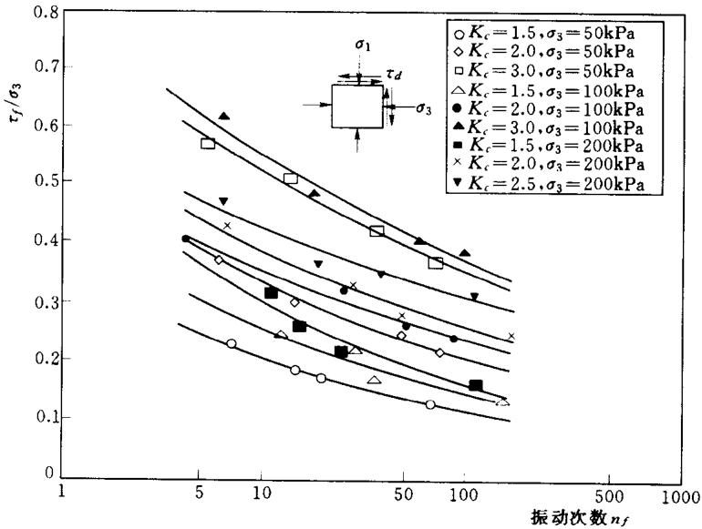  
图 5.22 密云潮河大坝保护层饱和砂料在循环荷载下动力三轴试验成果

## 5.7 无粘聚力土的非线性强度指标

近年来，高土石坝采用大型机械压实的堆石料，上、下游边坡都比较陡，对于面板坝，一般达到1:1.4，甚至还有达到1:1.3的。在按照规范进行边坡稳定复核时，会发现此类坝计算的稳定安全系数比要求小。例如，对于一个坡度为1:1.4的边坡，如果取内摩擦角φ $\phi = 4 5 ^ { \circ }$ 粘聚力c=0，（这套指标已经不低了)，则其计算的安全系数为1.4，而我国规范对一级坝规 $\pmb { c } = \mathbf { 0 }$ 定的允许最小安全系数为1.5。

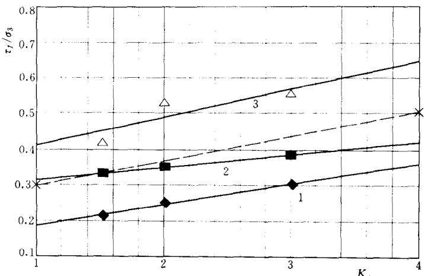  
图 5.23 根据图 5.22 整理 $\pmb { K _ { \mathrm { c } } }$ 和 ${ \pmb { \tau } } _ { t } / { \pmb { \sigma } } _ { \mathrm { i } }$ 关系曲线  
注1、2、3分别相应 $\pmb { \sigma } _ { 3 } { = } 5 0$ 、100、200kPa的关系曲线；虚线为对 $\pmb { \sigma _ { 3 } } { = } 2 0 0 \mathbf { k } \mathbf { P a }$ 曲线的修正

在进行边坡稳定分析时，通常会发现，对于c=0 $c = 0$ 这样一类无粘聚土，相应最小安全系数的临界滑裂面是一个非常浅的浅弧。换句话说，稳定分析通常不能发现安全系数的极值，也不能发现一个具有物理意义的临界滑裂面。但是发生滑坡时临界滑裂面却是客观存在的。

这个问题使不少人开始注意堆石料抗剪强度指标非线性问题。堆石料的内摩擦角值在低应力条件下较大，可以超过50°，而在高应力条件下较小，可能低于40°，强度包线是弯 $5 0 ^ { \circ }$ $4 0 ^ { \circ }$ 曲型。浅弧内摩擦角φ值较大，因此不应该是相应安全系数最小的临滑裂面。在稳定分析时，如果根据滑裂面上不同的法向应力确定相应的φ值，可以合理地确定真正发挥的抗剪 $| \phi \rrangle$ 能力，也不会出现上述无法找到具有物理意义的临界滑裂面的问题。

通常有下面两种描述其非线性关系的模式。

## 1. 指数模式

De Mello(1977)建议，堆石料的抗剪强度τ和破坏面上的法向有效应力σn存在如下关 $\pmb { \tau } _ { t }$ $\sigma _ { n }$ 系：

$$
\pmb { \tau } _ { t } = \pmb { A } ( \pmb { \sigma } _ { n } ) ^ { b }\tag{5.19}
$$

式中：A、b为材料参数；b无量纲：A具有量纲 $[ \sigma ] ^ { ( 1 - b ) }$

Charles(1984)等做了大量的试验，验证此关系。表 5.6为几种岩性堆石的A、b值。

表 5.6 几种压实堆石的 A、b 值
<table><tr><td>堆石岩性</td><td> $A ( \mathbf { k N } / \mathbf { m } ^ { 2 } ) ^ { 1 - \mathbf { b } }$  b</td></tr><tr><td>砂岩</td><td>6.8 0.67</td></tr><tr><td>板岩（质量高的）</td><td>5.3 0.75</td></tr><tr><td>板岩（质量差的）</td><td>3.0 0.77</td></tr><tr><td>玄武岩</td><td>4.4 0.81</td></tr></table>

## 2. 对数模式

Duncan等(1984)在提出的双曲线应力应变模式时，对无粘聚性土弯曲的强度包线提出以下关系式：

$$
\phi = \phi _ { 0 } - \Delta \phi \log ( \sigma _ { 3 } / { \cal p } _ { \mathrm { a } } )\tag{5.20}
$$

式中σ3为小主应力，即在进行三轴试验时的周围应力。从原点向相应某一σ3的摩尔圆作 $\sigma _ { 3 }$ $\sigma _ { 3 }$ 切线，即得到按式(5.20)确定的φ。故采用式(5.20)时，取粘聚力 $\phi _ { \mathrm { { \ell } } }$ $c { = } 0$ $\phi _ { 0 }$ 和 $\mathsf { I } \Delta \phi .$ 为材料参数。

由于邓肯的双曲线应力应变模式在我国广泛使用，因此，对大部分工程，都可以找到相应的材料参数 $\phi _ { \mathrm { o } }$ 和 $\Delta \phi$

柏树田、崔亦昊(1997)根据西北口等工程资料整理的对数模式非线性指标，建议对坚硬岩块构成的堆石料， $\phi _ { 0 }$ 和 $\Delta \phi ^ { \sharp }$ 可分别取 $5 4 . 4 ^ { \circ }$ 和 $1 0 . 4 ^ { \circ }$ 0

第7章中将介绍采用非线性强度指标进行稳定分析的具体步骤和应用实例。图5.24为根据西北口等工程资料整理的对数模式非线性指标。

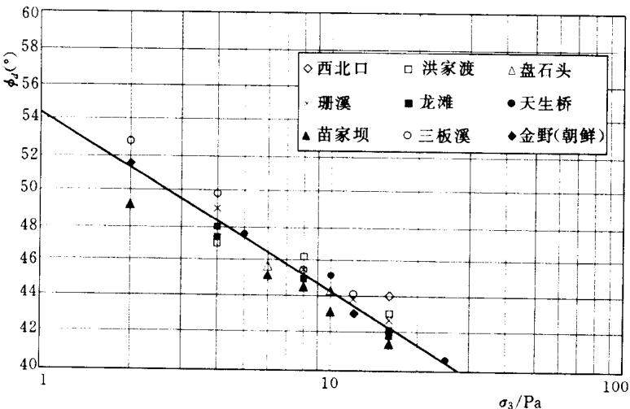  
图 5.24 根据西北口等工程资料整理的对数模式非线性指标

## 参考文献

1 Arman Ara, Poplin, J. K. and Ahmad N. Study of the vane shear. In Situ Mearsurement of Soil Properties. American Society of Civil Engineers. 1975. June 1-4, Volume I. 93-120

Bishop, A.W., and Henkel. The measurement of soil properties in the triaxial test, Edward Arnold. 1962

3 Bjerrum , L. Progressive failure in slopes of overconsolidated plastic clay and clay shales. The Third Teraghi Lecture , J. ASCE, 1976. 93(SM5): 3–49

4 Blight, G. The effect of non-uniform pore pressure on laboratory measurement of shear strength. Laboratory shear testing of soils, ASTM STP No. 361. 1963. 173-174

柏树田、崔亦昊.堆石的力学性质.水力发电学报.1997.3:21-30

6 柏树田，周晓光.堆石在平面应力条件下的强度和应力应变关系. 岩土工程学报.1991.13(4):33-40

7 Charles, J. A and Soares, M. M. Stability of compacted rockfill slopes. Geotechņique. 198. 34(1): 61-76

8 Duncan, J. M. et. al. Strength, stress strain and bulk modulus parameters for finite element analysis of stresses and movements in soil masses, Report. No. VCB/GT/78–02, Univ. of California, Barkeley, 1978

9 Fell, R., MacGregor, P. and Stapledon, D. Geotechnical engineering of embankment dams. Balkema. 1992

10 Hvorslev, M. J. Physical component of the shear strength of saturated clays, Research Conference on Shear Strength of Cohesive Soils, ASCE, 1960. 169–274

11 Johnson, S. J. Analysis and Design Relating to Embankments, Proc. Conf. on Analysis and Design in Geotechnical Engineering , Vol.II, ASCE. 1974. 1-48

12 Ladd. C. C. And Lambe, T.W. The Strength of undisturbed clay determined from undrained test, laboratory shear testing of soils, ASTM. Special Technical Publication, No. 361. 1963

13 Ladd, C. C. et. al. Engineering properties of soft foundation clay a two south Louisiana levee sites. Research Report, R7226, Soil Publication 304, U. S. Army Corps of Engineers. 1972

14 Liu, S. H. Development of a new in-situ direct shear test method and its application to problems of slope stability and bearing capacity. Dr. Eng. Thesis. Nagoya Institute of Technology. 1999

15 Lupini, J. F., Skinner, A. E. & Vaughan, P. R. The drained residual strength of cohesive soils. Geotechnique 31, No.2.1981

16 Matsuoka, H. and Liu, S. H. Simplified direct box shear test on granular material and its application to rockfill material, Soils nand foundations. 1998. 38(4): 275–284

17 密云水库潮河主坝饱和砂料大型动三轴试验和动力抗剪指标的确定，清华大学水利水电工程系，1997年7月

18 Orlando B. Andersland and Wayne A. CharlieIn situ shear resistance of clays. In Situ Mearsurement of Soil Properties. American Society of Civil Engineers. June 1-4. 1975. Volume I. 22-45

19 Parry, R. H. G. Field and laboratory behavior of a lightly over-consolidated clay, Geotechnique, 1968. 18(2): 151-171

20 Parry, R. H. G. Shear strength of geomaterials-a brief historical perspective. GeoEng 2000. 2000. In CD. Disk

21 日本地盘工学会. 土质试验-基本と手き.2000.121-131

22 Roscoe, K.H., Schofield, A.N. and Thurairajah, A. Yielding of clays states wetter than critical. Geotechnique, 1963.Vol. 13. No.3

23 Roscoe, K.H. and Burland, J.B. 1968. On the generalized stress-strain behavior of 'wet clay'. Engineering Plasticity (ed. Heyman, J. and Lechie, F.A.). Cambridge Univ. Press

24 Schmertmann, J. H. Mearsurement of in-situ shear strength Study.ASCE In Situ Measurement of Soil Properties. 1975. June 1-4, Volume II. 57-138.

25 Scott, C . An introduction to soil mechanics and foundations. 1980

26 Seed, H.B. A method for earthquake resistance design of earth dams. ASCE J. Soil Mechanics and Foundation engineering. 1966, SM1: 13-40

27 Skempton, A. W. Residual strength of clays in landslides folded strata and the laboratory. Geotechnique. 1985. 35 No.1

28 汪闻韶.关于土的动力强度和液化特征. 中国电力出版社.1996

29 魏汝龙. 正常压密粘性土的原位不排水强度的计算和测定. 水利学报.1984. 第1期

30 中华人民共和国水利电力部规程. 土工试验规程.1979.SDS01-79

31 中华人民共和国水利电力部规范.碾压式土石坝设计规范.SL274-2001.2001

## 第6章土的孔隙水压力

## 6.1 概述

研究土坡中的孔隙水压力，首先要弄清在哪些情况下可以通过稳定渗流场的分析来计算孔隙水压力，哪些情况下不能简单地通过画流网的办法确定孔隙水压力。在5章中已经提到，土体内的孔隙水压力通常是在下面两种情况下产生的。

(1)孔隙水压力是由水的自重形成的渗流场产生的。这一类问题的一个基本特点是土体的骨架保持不变，因此可以通过稳定或不稳定渗流场的分析计算较好地得到解决。

(2)孔隙水压力是由作用在土体单元上的总应力发生变化导致的。这一种情况仅发生在压缩性较大、渗透系数较小的土体中。例如，饱和土地基快速开挖或快速填筑，或者均质土坝库水位骤降的情况。此时土骨架的体积和有效应力都存在着一个从起始状态到新状态过渡的过程。而粘性土的渗透系数很小，将水挤出，使土的骨架过渡到新的孔隙比，无法在短期内实现。这样，就可能出现一个随时间消散的附加的孔隙水压力场。这种孔隙水压力，恰是导致许多工程失事的直接原因。要解决这一类孔隙水压力的问题，则需要引入一些经验或理论分析方法。此时，一个简单的、偏保守的方法是假定没有任何水排出，在不排水条件下研究土的孔隙水压力和强度问题。

在上述两种情况下确定孔隙水压的方法构成了在本章详细讨论的主要内容。

## 6.2 粘性土的孔隙水压力系数

当作用在饱和粘性土体上的总应力产生增量Δσ1和Δσ3时，孔隙水压力的变化可以通过 $\Delta \pmb { \sigma } _ { 1 }$ $\Delta \pmb { \sigma _ { 3 } }$ 下式确定(Skempton,1954)。

$$
\Delta u = B \big [ \Delta \sigma _ { 3 } + A \big ( \Delta \sigma _ { 1 } - \Delta \sigma _ { 3 } \big ) \big ]\tag{6.1}
$$

这里，假设土体处于三轴状态，即 $\sigma _ { 2 } = \sigma _ { 3 }$ 。同时，对于饱和土体， $\pmb { B } { = } 1$ 。平均有效应力 $p ^ { \prime }$ 和偏差应力 $q$ (或称八面体法向应力和剪应力)为

$$
p ^ { \prime } { = } \frac { 1 } { 3 } \big ( \pmb { \sigma } _ { 1 } ^ { \prime } { + } 2 \pmb { \sigma } _ { 3 } ^ { \prime } \big )\tag{6.2}
$$

$$
q = \pmb { \sigma } _ { 1 } - \pmb { \sigma } _ { 3 }\tag{6.3}
$$

如 5.3.1 节所述， $p ^ { \prime }$ 的增量 $\Delta p ^ { \prime }$ 为

$$
\Delta p ^ { \prime } = \Delta p - \Delta u = ( \frac { 1 } { 3 } - A ) \big ( \Delta \sigma _ { 1 } - \Delta \sigma _ { 3 } \big )\tag{6.4}
$$

对于饱和粘性士，如果在应力发生变化时，假定无体积变化，那么，在知道了土的应力应变关系的条件下，系数A理应通过理论分析得到。例如，假定土体为遵守广义虎克定律的弹性体，那么土体的体积变化∆V和 $\Delta p ^ { \prime }$ 之间存在着唯一的对应关系：

$$
\Delta p ^ { \prime } = \frac { K _ { s } \Delta V } { V }\tag{6.5}
$$

式中： $K _ { s }$ 为土骨架的体积模量。由于 $\cdot \Delta V = 0$ ，可得 $\Delta p ^ { \prime } = 0$ 。因此，由式(6.4)知，纯弹性的土体 $A { = } 1 / 3$ o

如果土体是遵守某一个相关联流动法则的弹塑性体，那么在 $\Delta V = 0$ 的前提下，可以推导出如下表达式（黄文熙，1989）：

$$
\Delta u = \Delta p + \frac { K _ { s } \Bigg ( \cfrac { \partial f } { \partial p ^ { \prime } } \cfrac { \partial f } { \partial q } \Bigg ) } { A ^ { * } + K _ { s } \Bigg ( \cfrac { \partial f } { \partial p ^ { \prime } } \Bigg ) ^ { 2 } } \Delta q\tag{6.6}
$$

式中：f为屈服函数；A\*为硬化参数H的函数，具体表达式参见原文。 $f$ $A ^ { * }$

比较式(6.6)和式(6.1)，可以得到计算孔隙水压力系数A的表达式：

$$
A = { \frac { 1 } { 3 } } + { \frac { K _ { s } \left( { \cfrac { \partial f } { \partial p ^ { \prime } } } ~ { \cfrac { \partial f } { \partial q } } \right) } { A ^ { * } + K _ { s } \left( { \cfrac { \partial f } { \partial p ^ { \prime } } } \right) ^ { 2 } } }\tag{6.7}
$$

土体的孔隙水压力虽然可以通过上述理论途径确定，但是考虑到各种复杂的因素，从工程实用角度看，系数A和B仍需通过试验来确定（黄文熙，1989年)。

对式(6.1)可作如下变换，

$$
\Delta u = \widetilde { B } \Delta \sigma _ { 1 }\tag{6.8}
$$

其中

$$
\overline { { B } } = B [ K _ { 0 } + A ( 1 - K _ { 0 } ) ]\tag{6.9}
$$

$K _ { 0 }$ 为静止侧压力系数

$$
K _ { 0 } = \Delta \sigma _ { 3 } / \Delta \sigma _ { 1 }\tag{6.10}
$$

在土石坝中，可以近似地看作Δσ和Δσ3同步增加或减少， $\Delta \sigma _ { 1 }$ $| \Delta \pmb { \sigma } _ { 3 }$ $\Delta \sigma _ { 3 } / \Delta \sigma _ { 1 }$ 基本保持不变，这样，B可视为常数，其值可通过类似应力途径的室内试验测定。 $\overline { B }$

## 6.3 确定孔隙水压力的理论和方法

## 6.3.1 基本方程

土石坝各运用期的孔隙水压力的确定，属于渗流和固结分析的专门问题，这里仅回顾一些基本的概念。

在二维问题中，反映流量平衡的微分方程式为

$$
\frac { \partial } { \partial x } ( K _ { x } \frac { \partial h } { \partial x } ) + \frac { \partial } { \partial y } ( K _ { y } \frac { \partial h } { \partial y } ) = - \frac { 1 } { 1 + e } \frac { \partial e } { \partial t }\tag{6.11}
$$

式中：h为水头；u为孔隙水压力；t为时间； $e$ 为孔隙比。

式(6.11)中左边为单位时间流进土体的水量，右边为单位时间该土体的体积变形。

$$
h = \frac { u } { \gamma _ { _ w } } + y\tag{6.12}
$$

$K _ { x }$ 和K为x和y方向的渗透系数；y为垂直方向坐标值；γ为水容重；e 为孔隙比，e $K _ { y }$ $\gamma _ { w }$ 的变化是由有效应力的增量导致的，而应力增量需要通过求解反映静力平衡的微分方程式获得。此时的问题，本质上是个固结问题。严格地求解静力和流量平衡，称为比奥理论。如果对式(6.11)引入一些简化条件，可得到以下简化情况。

如果骨架的体积压缩模量较大，可以认为不变形，则孔隙水压力主要是由水的自重引起坝体内的渗流场确定的。这一类情况相应于稳定渗流期，或半透水的砂壳在库水位骤降期。此时，式(6.11)右边为零，对于满足达西定律的渗流场，反映流量平衡的微分方程式为

$$
\frac { \partial } { \partial x } ( K _ { x } \frac { \partial h } { \partial x } ) + \frac { \partial } { \partial y } ( K _ { y } \frac { \partial h } { \partial y } ) = 0\tag{6.13}
$$

式(6.13)为稳定渗流或骨架不可压缩土体非稳定渗流的拉普位斯方程。结合相应边界条件，可用有限元法确定坝体各点的孔隙水压力。这方面，有许多成熟的方法和程序。对于粘性土，则应考虑式(6.11)的右项，这就是以下第6.3.2和6.3.3节要讨论的内容。

## 6.3.2 太沙基固结理论

## 1. 基本原理

由于

$$
\frac { 1 } { 1 + e } \Delta e = m _ { \nu } \Delta p ^ { \prime } = m _ { \nu } ( \Delta p - \Delta u )\tag{6.14}
$$

如果我们假定在荷载变化过程中Δp=0，则有 $\Delta \boldsymbol { p } { = } 0$

$$
c _ { \nu } ( \frac { \partial ^ { 2 } u } { \partial { x } ^ { 2 } } + \frac { \partial ^ { 2 } u } { \partial { y } ^ { 2 } } ) = \frac { \partial u } { \partial t }\tag{6.15}
$$

式中： $m _ { \nu }$ 为土的压缩系数。这里假定 $K _ { x } = K _ { y } = K$ ，则

$$
c _ { \nu } = { \frac { K } { \gamma _ { \nu } m _ { \nu } } }\tag{6.16}
$$

用微分方程式(6.15)和初始条件式(6.1)解渗流场，称为太沙基(Terzaghi)理论。这一理论的核心是假定荷载变化过程中总应力不变。

## 2. 太沙基有限元程序 FECP2D-1

程序FECP2D-1 是一个可用于计算二维土坝和基础孔隙水压力消散的太沙基固结有限元程序，它是在二维热传导问题基础上开发的。使用有限元固结程序FECP2D-1的主要特点如下：

1) 施工的任何阶段坝的横断面任何点上的大主总应力 $\sigma _ { \mathrm { l } }$ 变化都能由有限元总应力分析法求出；

2) 对于出现孔隙水压力的坝体部分，固结分析和总应力分析可以使用相同的有限单元网格；

3)在分析中，很容易模拟复杂的几何、边界条件和非均匀材料分布；

4)由于计算初始孔隙水压力的总应力取决于有限元应力分析，因而不需要对总应力的分布作简化假定。

程序FECP2D-1 由一个主程序和四个子程序组成，主程序和每个子程序逻辑的功能简单介绍如下。

(1)主程序：调用子程序，读每个施工和停工阶段所需要的数据，并输出计算结果。

(2) 子程序 GENER：读单元和节点数据，并形成所有的有限元网格，计算方程数和半带宽。

(3) 子程序 ASEMB：形成流动向量，调子程序 ELMAT，获得单元传导矩阵并组装成总传导矩阵，修正的总流动向量和总传导矩阵使其满足特定的孔隙水压力边界条件。

(4) 子程序 ELMAT：形成每个单元的传导矩阵，并返回到 ASEMB 子程序。本程序使用具有线性孔隙水压力函数的三角形单元。

(5) 子程序 SOLVE：采有标准的高斯消去法求解方程，如果几何条件，时间间隔和$c _ { \mathrm { v } }$ 保持不变，利用相同的减化总传导矩阵可求解不同的流动向量的方程，这一过程会节省大量的计算时间。

下面通过两个例题对程序进行考核。

[例 6.1] 与 Koppula and Mogenstern (1972)算例比较。

为了验证程序的可靠性和计算精度，应用如图 6.1 所示的模型和 Koppula and Mogenstern的有限差分法进行对比(Eisenstein，1976)。所用参数、初始边界条件见图6.1，所需其它参数通过前面和下面关系得到：

$$
m _ { \nu } = { \frac { ( 1 + \nu ^ { \prime } ) ( 1 - 2 \nu ^ { \prime } ) } { E ^ { \prime } ( 1 - \nu ^ { \prime } ) } }\tag{6.17}
$$

$$
E = \frac { ( 1 - \nu ^ { \prime } ) } { ( 1 + \nu ^ { \prime } ) } E ^ { \prime }\tag{6.18}
$$

式中：m为一维压缩系数；c为固结系数；E为关于总应力的杨氏模量；泊松比 $\pmb { m } _ { \nu }$ $c _ { \nu }$ $\nu ^ { \prime = } 0 . 4 9$ 不同时段的固结度计算结果和有限差分法对比如图6.2所示，可见结果精确度较高。

[例 6.2] 与 Gibson(1958)算例比较。

某水坝的平面计算有限元模型如图6.3所示(Eisenstein,1976)，所作假定为：坝高 $3 0 0 \mathbf { f } \mathbf { f } ^ { \bullet }$ 分为厚度相等的10层单元。坝体分层连续填筑，速率为10ft/月。坝壳料和心墙料具有不同的弹性模量和相同的容重， $\gamma { = } 1 4 0 1 \mathbf { b } / \mathbf { f } \mathbf { \hat { t } } ^ { 3 }$ ，泊松比 $\nu ^ { \prime } { = } 0 . 3 5$

为了对比由不同的荷载转移引起的孔压分布，制定了如下4种方案：

1） 心墙中大主应力等于上覆压力增量即 $\varDelta \sigma _ { 1 } = \gamma \varDelta h$ ，该方案无需总应力分析；

2)坝壳料和心墙料采用相同的弹性模量，即 $E _ { \mathrm { \# \# } ; \pi } { = } E _ { \mathrm { \tiny ~ . 5 } , \pm \frac { \pm \pi } { 6 } } { = } 1 0 0 0 \mathrm { k s f } ;$

3) 坝壳的弹性模量是心墙的 5 倍，即 $E _ { \mathrm { \# \# \# : \# } } = 5 E _ { \mathrm { \# \# : \# \# } } = 5 0 0 0 \mathrm { k s f } ;$

4) 坝壳的弹性模量是心墙的 10倍，即 $\operatorname { E } { \underset { \operatorname { i j } \left\{ { \frac { 1 } { \pi } } \right\} } } = 1 0 \operatorname { E } { \underset { \cdot \downarrow : \pmb { \omega } } { \ell } } = 1 0 0 0 0 \operatorname { k s f } .$

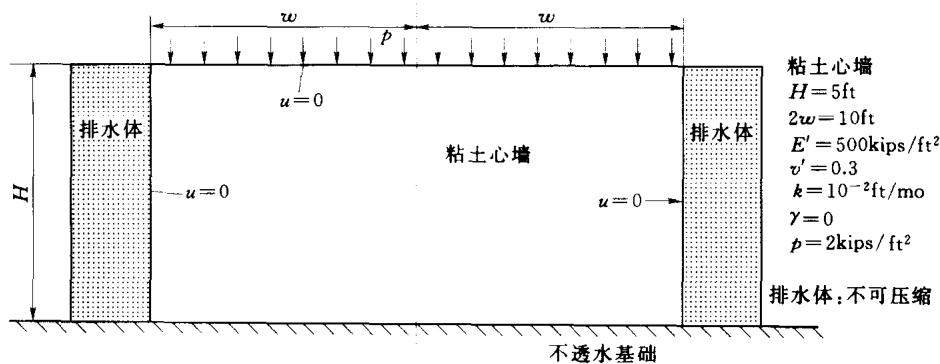  
图 6.1 两边排水的矩形粘土心墙

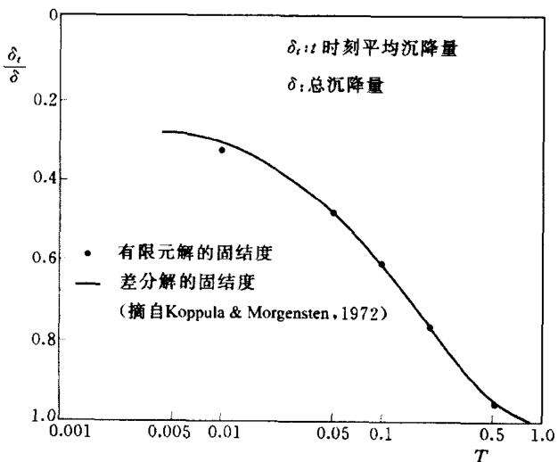

图 6.2 矩形粘土心墙的固结计算结果  
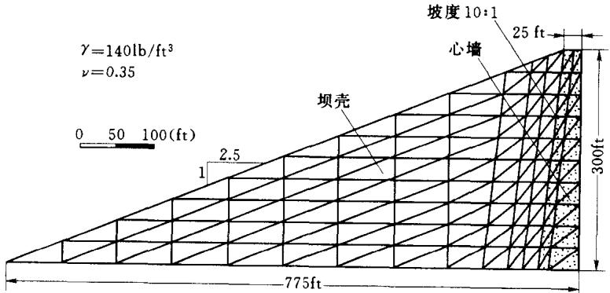  
图 6.3 分区坝有限元模型

心墙的固结系数c为50ft²/月，孔压系数 $c _ { \nu }$ $\overline { B }$ 为 0.5。图6.4 给出了不同方案在竣工时中央心墙的孔压分布图。

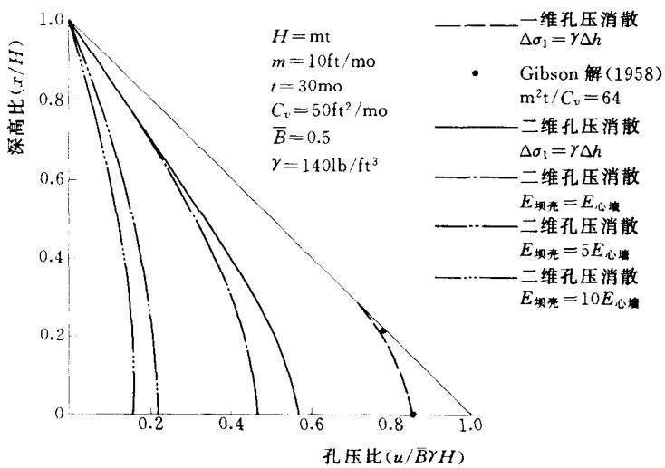  
图 6.4 不同方案在竣工时中央心墙的孔压分布图

从图中可以看出，不同的荷载转移对产生坝体内的孔压的影响是明显不同的。计算结果方案2)和3)差异最大，表明荷载转移在心墙料和坝壳料的杨氏模量较小比率时差异较大。同时，当 $E _ { \mathrm { \# \mathbb { R } ^ { \pm } } } { > } 5 E _ { \cdot \downarrow \ast \mathrm { f o s } }$ 时，心墙中的总应力减小得较慢，因此方案3)和4)的结果差别较小。

## 6.3.3 比奥固结理论

## 1. 基本原理

上面提到，太沙基理论的核心是假定荷载变化过程中总应力不变。如果不作这一假定，则式(6.11)右边孔隙比的变化需要引入应力应变关系来确定。这一项是由有效应力的增量导致的，然而，此值在不知道式(6.11)左侧的孔隙水压力变化的条件下，是无法确定的。在岩土工程数值计算中，这类将土的应力应变分析和渗流分析“耦合”的问题称为比奥(Biot)的理论。通常采用有限元法来求解这类问题，可参阅有关论文(Sandhu and Wilson, 1969; Hwang,and Morgenstern,1971；陈祖煜，1985)。本节简要介绍其基本理论，在第9章中将介绍采用有限元求解这类问题的数值方法。有关渗流、固结和应力应变有限元方法的全面论述将在其它专著中介绍（陈祖煜，2003）。

设某一土体在自重(包括土体中的水重)作用下，在初始时刻t=0时处于有效应力场 $\scriptstyle t = 0$ $\big \{ \sigma _ { 0 } ^ { \prime } \big \}$ 和孔压u状态。此时土体的位移和应变作为计算参照点，设为零。如果此时受到外荷载的 $\pmb { u } _ { 0 }$ 作用，则土体将产生附加位移，同时还将产生附加的有效应力和孔隙水压力。新建立的孔压场将改变原有的渗流流速，一部分水从土中挤出。随着时间推移，孔隙水压力和有效应力不断变化直至最后形成一个与外荷平衡的稳定的{σ′}和u。建立一个y坐标向上的坐标 $\{ \pmb { \sigma } ^ { \prime } \}$ 系，在此过程中的任一时刻t，土体应同时满足静力平衡、变形相容和渗流平衡，其微分方程和相应边界条件描述如下。

(1) 静力许可的应力场。在弹性力学中已经熟知

$$
\left\{ \partial \big \} _ { t } \sigma \right\} = \left\{ f _ { b } \right\}\tag{6.19}
$$

其中

$$
\left\{ \boldsymbol { \sigma } \right\} ^ { T } = ( \sigma _ { x } , \sigma _ { y } , \tau _ { x y } )\tag{6.20}
$$

$$
\left\{ \boldsymbol { f } _ { b } \right\} ^ { T } = \left( 0 , - \boldsymbol { \gamma } _ { s } \right)\tag{6.21}
$$

式中： $\{ \sigma \}$ 为总应力； $\{ f _ { b } \}$ 为单位体积力； $\gamma _ { s }$ 为土的实际容重，对于饱和土体即为饱和容重；[∂]是一个用矩阵表示的偏微分算子符号

$$
[ \partial ] = \left[ \begin{array} { c c c } { { \displaystyle \frac { \partial } { \partial x } } } & { { 0 } } & { { \displaystyle \frac { \partial } { \partial y } } } \\ { { 0 } } & { { \displaystyle \frac { \partial } { \partial y } } } & { { \displaystyle \frac { \partial } { \partial x } } } \end{array} \right]\tag{6.22}
$$

对饱和土体，总应力和有效应力的关系为

$$
\{ \sigma \} = \{ \sigma ^ { \prime } \} + \{ a \} _ { \mu }\tag{6.23}
$$

式中：u为孔隙水压力；{a}由下式定义：

$$
\left\{ a \right\} ^ { T } = \left( 1 , 1 , 0 \right)\tag{6.24}
$$

上标T表示转置矩阵。

由于达西定律是对水头h而言的，我们把式(6.23)中的u改为h，根据定义

$$
h = - \frac { u } { \gamma _ { w } } + y\tag{6.25}
$$

得知

$$
{ u = - \gamma _ { _ w } ( h - y ) }\tag{6.26}
$$

这里需要注意，在有限元计算中，压应力一概被处理成负的，故具有压力性质的孔压也被处理成负的。

将式(6.23)、式(6.26)代入式(6.19)，得到

$$
[ \partial ] \{ \sigma ^ { \prime } \} - \gamma _ { \scriptscriptstyle w } [ \partial ] \{ a \} ( h - y ) = \{ f _ { \scriptscriptstyle b } \}\tag{6.27}
$$

(2) 变形相容的位移场。位移场 $V  \big | ^ { T } = ( W _ { x } , W _ { y } )$ 代表了物体中任意一点在 x 和 y 方向的位移。当应变很小时，位移和应变满足下式：

$$
\{ \varepsilon \} = [ \partial ] ^ { T } \{ W \}\tag{6.28}
$$

式中： $\{ \varepsilon \}$ 为应变矢量

$$
\left\{ \varepsilon \right\} ^ { T } = ( \varepsilon _ { x } , \varepsilon _ { y } , \gamma _ { x y } )\tag{6.29}
$$

位移场的边界条件要求，在所研究物体的一般边界s2上满足下式： $\pmb { s } _ { 2 }$

$$
\{ W \} = \widetilde { W } \}\tag{6.30}
$$

式中： $\{ \overline { { W } } \}$ 为 $\pmb { s } _ { 2 }$ 上已知或设定的位移约束条件。

(3) 本构关系。应力场 $\{ \pmb { \sigma } ^ { \prime } \}$ 和应变场 $\{ \varepsilon \}$ 通过本构关系联系起来。对于弹性体，

$$
\{ \pmb { \sigma } ^ { \prime } \} = \{ \Delta \pmb { \sigma } ^ { \prime } \} + \{ \pmb { \sigma } _ { 0 } ^ { \prime } \}\tag{6.31}
$$

其中

$$
\{ \Delta \sigma ^ { \prime } \} = [ C ] \{ \varepsilon \}\tag{6.32}
$$

[C]为根据广义虎克定律建立起来的刚度矩阵，它是对称的。从现在开始，{ε}均指由荷载增量引起的应变增量。

(4) 流量连续条件的渗流场。按达西定律，水在土孔隙中的流速矢量{V}满足下式：

$$
\{ V \} = - \{ K \} \{ \nabla \} h\tag{6.33}
$$

其中

$$
\left\{ V \right\} ^ { T } = ( V _ { x } , V _ { y } )\tag{6.34}
$$

$$
\left\{ \boldsymbol { \nabla } \right\} ^ { T } = \left( \frac { \partial } { \partial x } , \frac { \partial } { \partial y } \right)\tag{6.35}
$$

[K]为渗透系数矩阵，对渗流各向异性的土体

$$
[ K ] = \left[ \begin{array} { l l } { k _ { x x } } & { k _ { x y } } \\ { k _ { y x } } & { k _ { y y } } \end{array} \right]\tag{6.36}
$$

[K]是对称矩阵，渗流主轴恰为 x和y坐标轴。

连续条件要求，某一时段内，流出单位土体的水量{}{√}t加上水的压缩量 $- \frac 1 Q \Delta u$ 等于土体的压缩量 $- \pmb { \varepsilon } _ { \nu } = - ( \pmb { \varepsilon } _ { x } + \pmb { \varepsilon } _ { y } )$ ，可表达为

$$
\{ \boldsymbol { \nabla } \} ^ { T } \{ V \} + \{ \boldsymbol { a } \} ^ { T } \frac { \partial } { \partial t } \{ \boldsymbol { \varepsilon } \} - \frac { 1 } { Q } \frac { \partial \boldsymbol { u } } { \partial t } = 0\tag{6.37}
$$

式中：Q为不饱和土体的压缩模量，当土体饱和并假定水不可压缩时，1/Q为零。 $Q$ $1 / Q$

将式(6.26)、式(6.33)代入式(6.37)，得

$$
- \{ \boldsymbol { \nabla } \} ^ { T } ( [ K ] \{ \boldsymbol { \nabla } \} h ) + \{ \alpha \} ^ { T } \frac { \partial } { \partial t } \{ \varepsilon \} + \frac { \gamma _ { \omega } } { Q } \frac { \partial h } { \partial t } = 0\tag{6.38}
$$

式(6.38)是一个含对t微分的方程。求解微分方程通常是在(t0,t) $( t _ { 0 } , t )$ 时段内通过积分实现的，因此我们引入卷积的定义。设u和v为空间座标x和时间坐标t的函数，则定义卷积(Mikusinski, 1959):

$$
u * v = \int _ { t _ { 0 } } ^ { t } u ( x , t - \tau ) v ( x , \tau ) d \tau\tag{6.39}
$$

可得

$$
- \{ \boldsymbol { \nabla } \} ^ { T } ( [ K ] \ast \{ \boldsymbol { \nabla } \} h ) + \{ a \} ^ { T } \{ \varepsilon \} + \frac { \gamma _ { \omega } } { Q } ( h - h _ { 0 } ) = 0\tag{6.40}
$$

(5)应力的边界条件。应力场的边界条件要求在所研究物体一段边界 $s _ { 1 }$ 满足下式：

$$
\left[ \overline { { { T } } } \right] = \left[ N \right] \left\{ \sigma ^ { \prime } \right\} + \left[ N \right] \left\{ a \right\} \mu\tag{6.41}
$$

式中： $\left\{ \overline { { T } } \right\} ^ { T } = \left( \overline { { T } } _ { x } , \overline { { T } } _ { y } \right)$ 为作用在 $s _ { \uparrow }$ 上已知的单位面积上的力；[∂]在式(6.22)中定义：

$$
[ N ] = \left[ { n _ { x } \begin{array} { c c c } { { 0 } } & { { 0 } } & { { n _ { y } } } \\ { { 0 } } & { { n _ { y } } } & { { n _ { x } } } \end{array} } \right]\tag{6.42}
$$

将式(6.26)代入式(6.41)，得

$$
\smash { \{ \overline { { T } } \} } = \bigl [ N \bigr ] \bigl ( \sigma ^ { \prime } \bigr ) - \bigl [ N \bigr ] \bigl [ a \bigr ] \gamma _ { w } ( h - y )\tag{6.43}
$$

(6) 渗流场的边界条件。渗流场的边界条件可分为以下三类：

第一类边界条件。在所研究的物体边界面 $s _ { 3 }$ 上，水头满足下式：

$$
{ \overline { { h } } } = h\tag{6.44}
$$

式中 $\overline { { h } }$ 为设定的水头值。

第二类边界条件。在所研究的物体边界 $s _ { 4 }$ 上，流量满足下式：

$$
\overline { { q } } = \left\{ V \right\} ^ { T } \left[ N \right] = - \{ \nabla \} ^ { T } h [ K ] \{ n \}\tag{6.45}
$$

同样，对式(6.45)在时段 $( t _ { 0 } , t )$ 内积分，得

$$
{ \mathfrak { g } } * { \overline { { \mathfrak { q } } } } = - \{ \nabla \} ^ { T } { \mathfrak { h } } * [ K ] \{ { \mathfrak { n } } \}\tag{6.46}
$$

式中： $\pmb { g } = 1$ .. $\overline { { q } }$ 为 $s _ { 4 }$ 上设定的流量强度；

$$
\left\{ \boldsymbol { n } \right\} ^ { T } = ( n _ { x } , n _ { y } )\tag{6.47}
$$

第三类边界条件。所研究的边界为渗流场的自由面。

此时，自由面上各点的孔压为大气压，故应满足式(6.44)，其中

$$
\stackrel { \_ } { h } = y - y _ { 0 }\tag{6.48}
$$

式中： $y _ { 0 }$ 为位置水头的参照高程。

同时，在自由面法线方向没有流量，故又应满足式(6.45)， $\overline { { q } } = 0$ 。但是，自由面的位置通常是未知的，需要在满足这两个条件的情况下予以确定，常需迭代解决。

固结问题的数学提法是，在体力{f}和边界上面力{T}的作用下，求满足微分方程式 $\{ f _ { b } \}$ $\{ \overline { T }$ (6.27)、式(6.28)、式(6.31)、式(6.40)和边界条件式(6.30)、式(6.43)、式(6.44)、式(6.46)、式(6.48)的位移场{W}和水头场h。通常用有限元求解这些偏微分方程组边值问题。在第9章，将简 $h _ { \circ }$ 要讨论具体的求解方法。

## 2. 比奥固结分析有限元程序 CON2D

CON2D是一个用于分析饱和土及非饱和土的应力、位移和孔压的平面应变有限元程序。它求解土体渗流和变形耦合的固结问题，能计算土体在排水、部分排水或完全排水条件下的变形和孔隙水压力。CON2D可用于模拟坝体施工期、蓄水期直至稳定渗流情况下的固结过程以及地基土在回填、建筑物荷载以及储油罐等外力作用下的固结过程。此外，它还能够模拟开挖过程以及支撑结构的设置和撤除。并可以利用杆单元来模拟加筋土结构以及利用梁单元来模拟防渗墙等结构。

CON2D 程序最初由 Chang 和 Duncan 于 1977 年采用 Fortran 语言编制，其后历经多次改进： 1981 年 Duncan, Orazio, Chang, Wong and Namiq, 1987 年 Schaefer and Duncan, 1990年Orazio 分别进行了改进工作。

中国水利水电科学研究院对CON2D的源代码进行了大量的分析和测试工作，改正了源代码中一些产生重要影响的错误（陈祖煜，1985)。这些修正获得了程序编者Duncan教授本人的确认，并且在CON2D版本中加入了相应这些修正的源代码，并在注释行中注明系由本书作者提供。改进后的CON2D能够执行以下功能：

1) 进行大规模高效率的有限元计算；

2) 提供多种本构模型供实际工程选用；

3)模拟施工、蓄水过程及其后水位涨落变化；

4) 对各级荷载按均分比例进行加载；

5) 按双线法计算浸水湿化变形；

6) 处理施工及蓄水过程中复杂的边界条件;

7)模拟坝体内部细砂砾石排水层的设置；

8) 模拟混凝土防渗墙与周围土体的接触特性等。

经过多次改进和修正后，CON2D具有如下功能特点：

(1) 在计算模型及单元类型上，CON2D 用于平面应变计算，块体单元类型为四边形等参单元及退化的三角形单元。单元结点数目可设置为4\~8个。接触面单元为两结点单元。

(2) 在材料应力应变关系上，材料应力应变关系模型包括：线弹性模型，邓肯一张的E一B模型、修正剑桥模型以及刚塑性接触面模型。

(3)在非线性有限元方法上，程序采用工程中应用最广泛的中点增量法进行非线性计算。对每一个荷载增量，程序进行两次计算，利用中点应力状态确定模量矩阵。对每个荷载增量，还可按比例划分为若干微增量进行加载，使得对施工过程的模拟更为准确。

(4)在存储机制上，程序采用动态内存分配机制，根据计算规模自动确定内存需求量并进行动态分配。数据交换文件采用二进制格式保证高速读写操作。

3. 工程应用实例之一—小浪底大坝心墙施工期孔隙水压[25]

小浪底水利枢纽工程位于黄河中游最后一段峡谷的出口处，上距三门峡大坝130km。拦河大坝为壤土斜心墙堆石坝，设计最大坝高154m。心墙由粉质壤土组成，防渗墙顶端设有高塑性土区，坝壳由堆石体组成。河床段坝基处于深厚砂砾石之上。大坝典型剖面详见图6.5，建立平面有限元模型如图6.6。

图：垫热

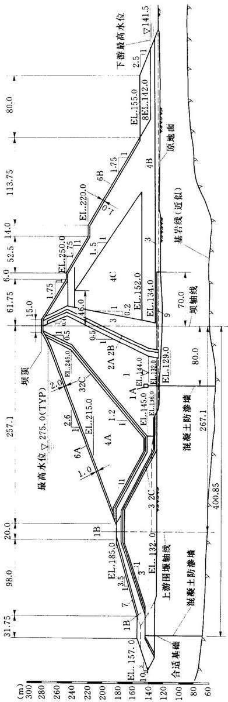

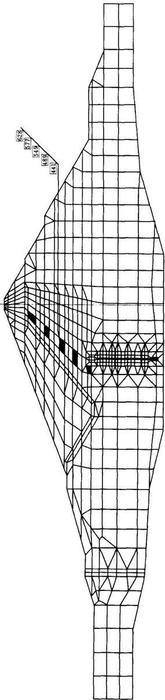  
图图9

土石坝心墙在上坝碾压后，其饱和度已达到90%-92%，而防渗材料的渗透系数一般都很小。随着上覆坝体在施工过程中的不断升高，坝的心墙孔隙水压力将迅速增高，如果坝体内的有效应力不能随着上覆荷重的增加而增加，那么当水库蓄水至一定高度后，心墙内就可能存在水力劈裂的危险。所以，对于高土石坝，有必要对施工期的孔隙水压力的消散进行分析计算。为确保大坝安全，并为大坝施工期和蓄水期运行决策提供必要的技术支持。在上坝土料的应力一应变一强度特性、渗透和固结特性等全面试验研究的基础上，使用CON2D，可以对坝体进行弹塑性应力变形计算和固结分析，包括大坝堆石体、防渗墙的应力及变形分布和斜心墙的变形、孔隙水压力增长及消散和有效应力状态计算等。小浪底坝体材料的组成比较复杂，需要采用不同的本构模型以反映各种材料的物理力学特性。例如，分别对堆石料和心墙土与高塑性土采用了邓肯-张的E-B模型和扩展剑桥模型，并且使用接触面模型模拟混凝土防渗墙和土体之间的连接关系。心墙粘土和高塑性土的剑桥模型参数试验和拟合的具体方法和成果在其它专著中介绍（陈祖煜，2003）。

实际计算中考虑了大坝施工过程及水位变化，有限元网格划分参见图6.6。单元总数为679个，结点总数为1000个，自由度总数为2605个。在防渗墙与周围土体之间设置两结点接触面单元共74个，并独立编号。

从大坝斜心墙在竣工蓄水后各个时期的孔隙水压力等值线图中可以看出斜心墙内部孔隙水压力场在上游库水作用下逐渐变化直至形成稳定渗流的过程。其中大坝斜心墙在竣工、竣工3个月后蓄水到250m高程时以及竣工后5年的孔隙水压力等值线见图6.7、图6.8和图 6.9。

竣工蓄水时心墙最大孔隙水压力约为125m 水柱，出现在斜心墙下部位于主防渗墙上游侧的一块区域，在防渗墙顶部高塑性土一带，孔隙水压力约为105m水柱。在斜心墙上游侧一带，大坝蓄水时库水压力的等间距等值线已经波及斜心墙内部，孔压呈现“拱型”的等值线，说明斜心墙内部的孔隙水压力场已经受到上游库水压力的影响，而在斜心墙中央及下游侧，孔隙水压力场的分布尚未受到上游库水的影响(图6.7)。蓄水后随着固结时间的增长，斜心墙各处的孔压值逐渐减小直至趋于稳定，防渗墙顶部高塑性土一带的孔隙水压力基本处于50m水柱左右的一个水平上(图6.8)。

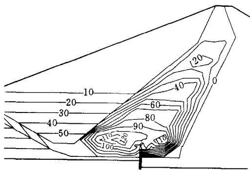  
图 6.7 竣工蓄水时的孔压等值线（单位：kPa)

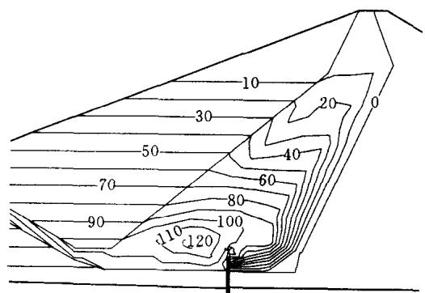  
图 6.8 竣工 3 个月后蓄水到 250m 高程时的孔压等值线（单位：kPa）

为判断最大孔隙水压力出现的阶段，在斜心墙中央不同高程选取了6个具有代表性的单元来分析其孔隙水压力随时间的变化过程，这6个单元编号依次为E397（高塑性土中心），E441,E489，E549，E577，E628，其具体位置见图 6.6所示。图6.10 为该6 个单元的孔隙水压力随坝体填筑高度和时间变化的过程，从图中可见，各单元的最大孔隙水压力基本上都发生在坝体填筑竣工蓄水完成期阶段，据此可认为图 6.7 显示的孔隙水压力是填筑过程中出现的最大孔压值。

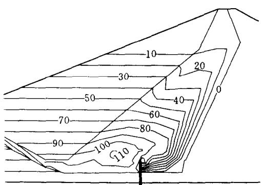  
图 6.9 250m 水位竣工蓄水 5 年后的孔压等值线(单位：kPa)

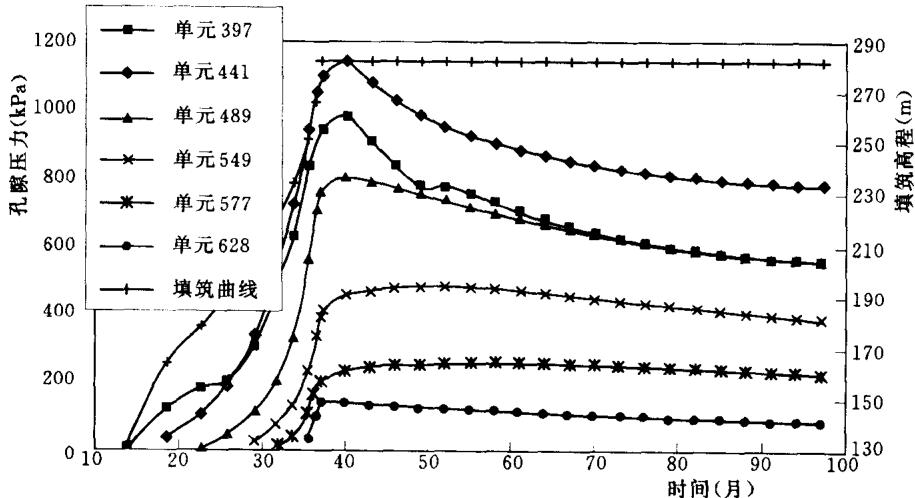  
图 6.10 250m 水位代表性单元的孔压历程

从孔隙水压力的变化历程可以比较合理地判断形成稳定渗流的时间。由图6.10可以判断，大约在蓄水以后2.5年，孔隙水压力已消散至稳定状态。因此可以认为蓄水以后两年半左右稳定渗流即已形成。

有关应力和变形的计算成果将在第9章介绍。第7章[例7.1]介绍使用计算所得孔压进行小浪底大坝施工期坝坡稳定的有效应力分析成果。

## 4. 应用实例之二——务坪水库坝基施工期孔隙水压力

务坪水利枢纽工程位于云南省华坪县，工程以灌溉、防洪为主要目的。坝址区工程地质条件极其复杂，图6.11 为地质情况和坝体剖面。49.0m高的心墙堆石坝修建于滑坡堆积体和湖积层软基共同组成的地基上。其中湖积层软基位于坝轴线上游，是由滑坡体壅塞河道而逐渐沉积形成。湖积层软土的工程性质极差，孔隙比在1.5\~2.0之间，天然含水量最高达136%，饱和快剪强度φ仅为7\~10度，有机质含量高达9%\~15%。

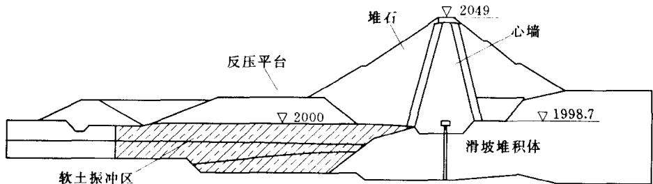  
图6.11 务坪工程大坝剖面示意图

实际工程采用碎石桩对 $1 5 1 2 3 \mathrm { m } ^ { 2 }$ 的软基进行了振冲处理，布置潜水电机75kw和30kw两种振冲器的碎石桩。碎石桩呈三角形分布，30kw区桩距D=1.8m，75kw区桩距D=2.0m，设计置换率40%。在处理软基的上方建造14.0m高的堆石反压平台，既进行预压固结，又作为坝体的一部分提高抗滑稳定性。

由于计算采用的是平面应变条件，而碎石桩桩体具有排水砂井的功能，因此需要根据碎石的置换率和砂并固结理论对碎石桩进行等效转换，将不连续的碎石桩转化为平面应变条件下的连续碎石墙。即在保证变换前后地基中同一深度处平均固结度不变的前提下，改变上体的渗透系数和/或碎石墙之间的距离。根据等效后的碎石墙厚度和间距划分有限元计算网格如图6.12。根据大量现场和室内试验总结的主要计算参数（剑桥模型，参见第2.4节）也列在中。

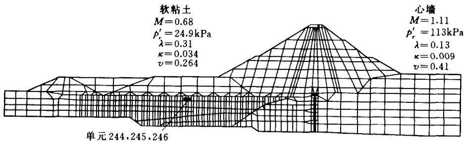  
图 6.12 有限元网格和主要参数

由于软基底部是一些渗透系数较大的粉砂，因此其中产生的超静孔压很小，最大值只有10kPa左右。超静孔压最大值出现在软基的中部，选择反压平台中心下不同位置的单元分别为远离碎石桩的土体246号单元、邻近碎石桩的土体单元245号和碎石桩244号单元（单元位置见图6.12)，绘制孔压随时间变化的曲线如图6.13。

从图中可以看出，离开坝轴线较远的单元最大孔隙水压力发生在反压平台竣工的时候，软基底部单元最大超静孔压超过300kPa。随着时间的推移，半年以后，超静孔压基本消散，在约14个月后，超静孔压已经接近完全消散。由于所选单元离大坝的主体有一定的距离，其后坝体的填筑对该部分单元的影响较小，产生的超静孔压很小，最大值为25kPa。

绘制反压平台竣工时和半年后的孔压等值线见图6.14，从图中可以清晰地看出反压平台竣工时的超静孔压，由于碎石桩单元没有超静孔压，所以形成了典型的锯齿形。而半年后锯齿形基本消失，说明超静孔压已经消散。

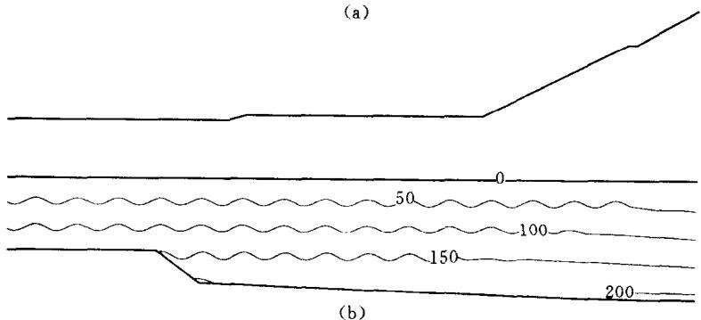

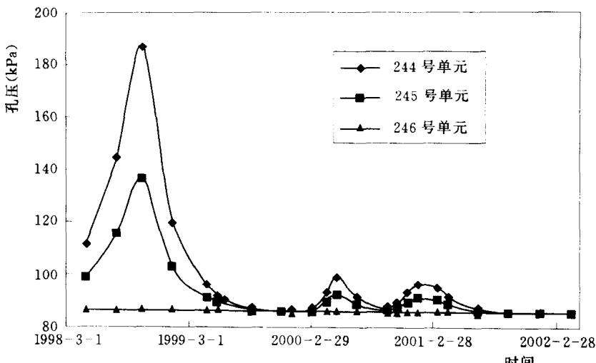  
图 6.13 软基中部单元排水固结过程  
图6.14 反压平台竣工半年后的孔压等值线图  
(a)竣工时；（b)竣工半年后

心墙部分的最大孔压值出现在坝体竣工时，由于施工时间较长，心墙中的超静孔压在施工过程中就有所消散，产生的最大孔压不是很大，心墙底部2006m高程的单元的最大超静孔压值约为100kPa。3年后，心墙部分的超静孔压基本消散。

根据计算出的孔隙水压力分布成果，分析坝坡稳定性，其成果如图6.15所示。

有关应力和变形的计算成果将在第9章介绍。

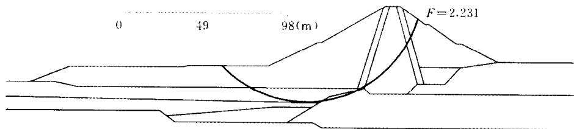  
图 6.15 务坪水库施工期坝坡稳定分析成果

## 6.4 确定土石坝各运用期孔隙水压力的经验方法

## 6.4.1 概述

第6.3节介绍了通过理论分析的方法确定土中孔隙水压力的方法。鉴于这些方法在模拟土体的实际行为方面的局限性及相应参数所包含的不确定性，目前还很难单独依靠这些纯理论分析的途径来完全解决孔隙水压力的问题。在工程实践中，还广泛采用经验方法和现场实测等手段来确定孔隙水压力。

本章简要介绍确定土石坝各运用期孔隙水压力的经验方法。

## 6.4.2 施工期

土石坝施工期的孔隙水压力问题，主要分为两大类，一类为土石坝防渗体填筑过程中孔压的增长和消散问题，另一类为坝基饱和粘性土的孔隙水压。

土石坝防渗体在施工期处于非饱和状态，孔隙水压力的产生和消散是个非常复杂的过程。影响孔隙水压力的因素有：填筑含水量、上覆荷重、排水条件、施工过程和速率、土料本身的压缩、渗透性能。确定孔隙水压力的经验有以下几个：

(1)在试验室制备与现场土样有相同含水量和压实度的试样，模拟现场可能出现的总应力途径进行不排水试验，测出孔压，按式(6.1)整理出孔隙水压力系数，用于计算。

采用美国垦务局推荐的希尔夫方法，该方法是建立在波义尔定律基础上的单向压缩分析方法(Hilf, 1948, 1965)。

$$
u = p _ { a } \Delta / ( V _ { a } + 0 . 0 2 V _ { w } \Delta )\tag{6.49}
$$

式中：u为附加孔隙水压力，磅/(英尺)；P。为绝对大气压，磅/(英尺)，海平面为14.7；Δ $P _ { a }$ 为相对于初始体积的压缩量，百分数；V。为相对于初始体积的压缩后的空隙中的自由气体 $V _ { a }$ 体积，百分数；V为空隙水，相对于初始体积。 $V _ { w }$

(2) 根据已建工程的实测资料，进行工程类比，确定孔隙水压力系数。Sherman和Clough(1968)曾受美国陆军工程师团委托，对美国和其它国家已建43座土坝的孔压资料进行汇总分析，如表6.1，可供参考。图6.16至图6.19为日本“最新土石坝工程”一书介绍的一些实测资料(社团法人电力技术协会，1981)。

/      9
<table><tr><td rowspan="2">编 坝名 号</td><td rowspan="2"></td><td rowspan="2">地点</td><td rowspan="2">坝高 (ft)</td><td colspan="4">心墙材料特性</td><td colspan="2">标准压实</td><td colspan="4">在最大孔压系数附近的现场压实功能</td><td rowspan="2">峻工期最大处的上覆</td><td rowspan="2">最大孔压 土柱高</td></tr><tr><td>土类型</td><td>粘粒 含量</td><td>塑性 指数</td><td>渗透系数 10° (cm/s)</td><td>最大 干容重</td><td>最优含 水量</td><td>干容重 γ与y γ (lb/ft)</td><td>含水 比值(%) 量(%)</td><td>大于或小 于最优含</td><td>孔压系数</td></tr><tr><td>1</td><td>Table Rock</td><td>Ark.</td><td>150 CL</td><td></td><td>69</td><td>18</td><td></td><td>(1b/ft) 113.3</td><td>(%) 14.2</td><td>116.0</td><td>102</td><td>16.2</td><td>水量 +2.0</td><td>51</td><td>(ft) 90</td></tr><tr><td>2</td><td>Blakely Mountain</td><td>Ark.</td><td>230 SL-CL</td><td></td><td>55</td><td>10</td><td>8</td><td>118.0</td><td>12.5</td><td>113.0</td><td>96</td><td>13.9</td><td>+1.4</td><td>18</td><td>200</td></tr><tr><td>3</td><td>Otter Brook</td><td>N.H.</td><td>130 SM-SC</td><td></td><td>40</td><td>11</td><td>10</td><td>125.7</td><td>11.3</td><td>120.0</td><td>95</td><td>14.3</td><td>+3.0</td><td>65</td><td>94</td></tr><tr><td>4</td><td>Mad River</td><td>Conn.</td><td>178</td><td>SM-SC</td><td>42</td><td>6</td><td>500</td><td>128.2</td><td>10.0</td><td>126.9</td><td>100</td><td>11.0</td><td>+1.0</td><td>44</td><td>40</td></tr><tr><td>5</td><td>North Hartland</td><td>Vt.</td><td>175</td><td>CL-ML</td><td></td><td>4</td><td>100</td><td>127.5</td><td>9.5</td><td>132.0</td><td>104</td><td>9.6</td><td>+0.1</td><td>19</td><td>60</td></tr><tr><td>6</td><td>Pomme de Terre</td><td>Mo.</td><td>155 CL</td><td></td><td>63</td><td>15</td><td>30</td><td>108.3</td><td>14.5</td><td>105.0</td><td>97</td><td>18.0</td><td>+3.5</td><td>59</td><td>61</td></tr><tr><td>7</td><td>Hills Creek</td><td>Oreg.</td><td>300 MH</td><td></td><td>55</td><td>22</td><td>17</td><td>115.0</td><td>14.0</td><td>115.0</td><td>100</td><td>15.6</td><td>+1.6</td><td>52</td><td>106</td></tr><tr><td>8</td><td>Dewey</td><td>Ky.</td><td>118 CL</td><td></td><td>70</td><td>21</td><td></td><td>102.0</td><td>21.0</td><td>101.0</td><td>99</td><td>24.2</td><td>+2.6</td><td>27</td><td>85</td></tr><tr><td>9</td><td>Tezarkana</td><td>Tex.</td><td>80 CH</td><td></td><td>66</td><td>40</td><td>1</td><td>101.0</td><td>20.0</td><td>99.6</td><td>99</td><td>20.0</td><td>0.0</td><td>0</td><td></td></tr><tr><td></td><td>10 Ferrell&#x27;s Bridge</td><td>Tex.</td><td>77</td><td>CH-CL</td><td>63</td><td>27</td><td>570</td><td>106.0</td><td>19.8</td><td>105.0</td><td>99</td><td>20.1</td><td>+0.3</td><td>0</td><td></td></tr><tr><td></td><td>11 Anderson Ranch</td><td>Idaho</td><td>360 SC</td><td></td><td>33</td><td>14</td><td>36.0</td><td>119.9</td><td>13.0</td><td>121.2</td><td>101</td><td>12.5</td><td>-0.5</td><td>71</td><td>173</td></tr><tr><td></td><td>12 Green Mountain</td><td>Colo.</td><td>310 SC</td><td></td><td>20</td><td>8</td><td>19.0</td><td>132.2</td><td>8.9</td><td>132.2</td><td>100</td><td>8.4</td><td>-0.5</td><td>59</td><td>94</td></tr><tr><td>13 Granby</td><td></td><td>Colo.</td><td>297 SC</td><td></td><td>27</td><td>8</td><td>38.0</td><td>127.0</td><td>10.0</td><td>126.8</td><td>100</td><td>9.6</td><td>-0.4</td><td>66</td><td>148</td></tr><tr><td>14 Davis</td><td></td><td>Ariz.</td><td>193 CL</td><td></td><td>60</td><td>13</td><td>0.3</td><td>113.6</td><td>15.2</td><td>112.2</td><td>99</td><td>15.5</td><td>+0.3</td><td>41</td><td>140</td></tr><tr><td>15 O&#x27;Sullivan</td><td></td><td>Waxh.</td><td>210 SM</td><td></td><td>37</td><td></td><td>22.0</td><td>108.9</td><td>17.4</td><td>107.9</td><td>99</td><td>15.7</td><td>-1.7</td><td>14</td><td>25</td></tr><tr><td>16 Spring Canyon</td><td></td><td>Colo.</td><td>217 CL</td><td></td><td>70</td><td>14</td><td>12.0</td><td>112.3</td><td>14.2</td><td>111.6</td><td>99</td><td>11.7</td><td>-2.5</td><td>14</td><td>142</td></tr><tr><td>17 Boysen</td><td></td><td>Wyo.</td><td>200</td><td>GM-SM</td><td>20 5</td><td></td><td>220.0</td><td>123.7</td><td>11.4</td><td>125.4</td><td>101</td><td>10.8</td><td>-0.6</td><td>35</td><td>60</td></tr><tr><td>18 Jackson Gulch</td><td></td><td>Colo.</td><td>167 CL</td><td></td><td>75 21</td><td>11.0</td><td></td><td>100.4</td><td>21.4</td><td>100.7</td><td>100</td><td>18.9</td><td>-2.5</td><td>5</td><td>115</td></tr><tr><td>19 Cedar Bluff</td><td></td><td>Kan.</td><td>130 CL</td><td></td><td>54</td><td>8.0</td><td></td><td>113.5</td><td>13.9</td><td>112.7</td><td>98</td><td>12.9</td><td>-1.0</td><td>2</td><td>33</td></tr><tr><td>20 Deer Creek</td><td></td><td>Utah</td><td>156 CL</td><td></td><td>52 9</td><td>2.0</td><td></td><td>111.1</td><td>15.5</td><td>110.6</td><td>99</td><td>15.1</td><td>-0.4</td><td>17</td><td>22</td></tr><tr><td>21 Alcovs</td><td></td><td>Wyo.</td><td>150 CL</td><td>注 本例原文使用的单位为英制，1ft=0.305m.11b=4.448N。</td><td></td><td></td><td></td><td></td><td></td><td></td><td></td><td></td><td>0.0</td><td>35</td><td>53</td></tr></table>

01

<table><tr><td rowspan="2">编号 坝名</td><td rowspan="2">地点</td><td rowspan="2">坝高</td><td colspan="4">心墙材料特性</td><td colspan="2">标准压实</td><td colspan="5">在最大孔压系数附近的现场压实功能</td></tr><tr><td>土类型 (ft)</td><td>粘粒 含量</td><td>塑性 指数</td><td>渗透系数 10°(cm/s)</td><td>最大 干容重</td><td>最优含 水量</td><td>干容重 γ (lb/ft³)</td><td>γ与x 比值(%)</td><td>含水 量(%)</td><td>大于或小 于最优含</td><td>峻工期最大处的上覆 孔压系数</td><td>土柱高</td></tr><tr><td>22 North Coulee</td><td>Wash.</td><td>146</td><td>ML</td><td>87</td><td>2 2.0</td><td></td><td>(lb/ft) 103.0</td><td>(%)</td><td></td><td></td><td>水量</td><td></td><td></td><td>(ft)</td></tr><tr><td>23 Valletio</td><td>Colo.</td><td>127</td><td>SC-CL</td><td>49</td><td>1</td><td>7.0</td><td>123.2</td><td>18.2 11.5</td><td>101.8 123.2</td><td>99 100</td><td>15.7 12.2</td><td>-2.5 +0.7</td><td>4</td><td>35</td></tr><tr><td>24 Shade Hill</td><td>S. Dak.</td><td>127</td><td>SC</td><td>25</td><td>10</td><td>37.0</td><td>123.3</td><td>12.4</td><td>122.4</td><td>99</td><td>11.4</td><td>-1.0</td><td>71 5</td><td>54</td></tr><tr><td>25 Bonny</td><td>Colo.</td><td>124</td><td>ML</td><td>88</td><td>2</td><td>35.0</td><td>105.9</td><td>16.2</td><td>106.9</td><td>101</td><td>15.4</td><td>-0.8</td><td>6</td><td>25</td></tr><tr><td>26 Grassy Lake</td><td>Wyo.</td><td>110</td><td>SM</td><td>31</td><td>2</td><td>23.0</td><td>116.7</td><td>11.4</td><td>116.3</td><td>100</td><td>10.8</td><td>-0.6</td><td>37</td><td>25</td></tr><tr><td>27 Medicine Creek Nebr.</td><td></td><td>106</td><td>ML</td><td>93</td><td>1</td><td>20.0</td><td>107.7</td><td>17.3</td><td>105.0</td><td>97</td><td>16.3</td><td>-1</td><td>4</td><td>50 43</td></tr><tr><td>28 Heart Butte</td><td>N. Dak</td><td>108 CL</td><td></td><td>61</td><td>9</td><td>22.0</td><td>117.1</td><td>14.8</td><td>115.3</td><td>98</td><td>13.6</td><td>-1.2</td><td>3</td><td>75</td></tr><tr><td>29 Long Lake</td><td>Wash.</td><td>94</td><td>ML</td><td>56</td><td>2</td><td>81.0</td><td>105.2</td><td>18.7</td><td>104.3</td><td>99</td><td>16.2</td><td>-2.5</td><td>2</td><td>92</td></tr><tr><td>30 Enders</td><td>Nebr.</td><td>93</td><td>ML</td><td>53</td><td>1</td><td>31.0</td><td>111.5</td><td>14.5</td><td>111.6</td><td>100</td><td>13.2</td><td>-1.3</td><td>10</td><td>25</td></tr><tr><td>31 Calallo</td><td>N.Mex.</td><td>93</td><td>SM-GM 22</td><td></td><td></td><td>52.0</td><td>118.4</td><td>12.8</td><td>117.9</td><td>99</td><td>11.6</td><td>-1.2</td><td>21</td><td>30</td></tr><tr><td>32 Island Park</td><td>Idaho</td><td>80 SM</td><td></td><td>35</td><td></td><td>4.0</td><td>117.2</td><td>11.5</td><td>117.5</td><td>100</td><td>11.6</td><td>+0.1</td><td>22</td><td>75</td></tr><tr><td>33 Fresno</td><td>Mont.</td><td>73</td><td>CL-ML</td><td>54 5</td><td></td><td>12.0</td><td>119.3</td><td>12.4</td><td>119.0</td><td>100</td><td>12.7</td><td>+0.3</td><td>77</td><td>26</td></tr><tr><td>34 Horsetooth</td><td>Colo.</td><td>115 CL</td><td></td><td>58</td><td>12</td><td>10.0</td><td>114.9</td><td>13.9</td><td>112.5</td><td>98</td><td>11.6</td><td>-2.3</td><td>2</td><td>60</td></tr><tr><td>35 Castiletto</td><td>Switzerland 230</td><td>SC</td><td></td><td></td><td>4</td><td></td><td>127.5</td><td>9.5</td><td>125.0</td><td>98</td><td>8.0</td><td>-1.5</td><td>58</td><td>58</td></tr><tr><td>36 Rosshaupton</td><td>Germany</td><td>135 SC</td><td></td><td>50</td><td>1</td><td></td><td></td><td></td><td>128.0</td><td></td><td>7.0</td><td></td><td>65</td><td>65</td></tr><tr><td>37 Usk</td><td>Wales</td><td>109 CL</td><td></td><td>8</td><td>20</td><td></td><td>128.5</td><td>9.8</td><td>122.0</td><td>95</td><td>12.0</td><td>+2.2</td><td>37</td><td>37</td></tr><tr><td>38 Sasumua</td><td>Kenya</td><td>110 MH</td><td></td><td>25</td><td>28 30</td><td></td><td>70</td><td>50.0</td><td>69.0</td><td>98</td><td>48.4</td><td>-1.6</td><td>5</td><td>5</td></tr><tr><td>39 Knockendon</td><td>Scotland</td><td>90 CL</td><td></td><td>20</td><td>21</td><td></td><td></td><td></td><td>104.0</td><td></td><td>20.0</td><td></td><td>53</td><td>53</td></tr><tr><td>40 Foxcote</td><td>England</td><td>50 CH</td><td></td><td></td><td>46</td><td></td><td>95.0</td><td>27.0</td><td>94.0</td><td>99</td><td>28.0</td><td>+1</td><td>25</td><td>25</td></tr><tr><td>41 Quebradona</td><td>S. America</td><td>100 ML</td><td></td><td>25</td><td>10 970</td><td></td><td></td><td></td><td>96.2</td><td></td><td>25.4</td><td></td><td>18</td><td>18</td></tr><tr><td>42 Cobb</td><td>N. Zealand</td><td>115 SM</td><td></td><td>12</td><td>25</td><td></td><td>124.0</td><td>11.0</td><td>124.0</td><td>100</td><td>11.5</td><td>+0.5</td><td>40</td><td>40</td></tr><tr><td>43 Selset</td><td>England</td><td>128 CL</td><td></td><td></td><td>19 1</td><td></td><td>111.0</td><td>10.8</td><td>109.0</td><td>98</td><td>16.0</td><td>+5.2</td><td>50</td><td>50</td></tr></table>

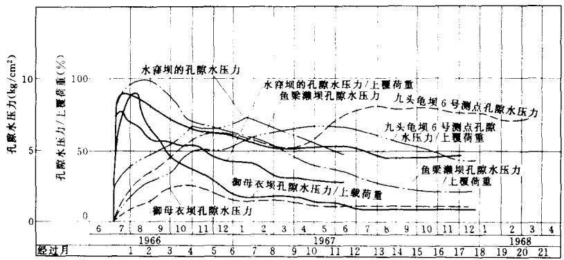  
图 6.16 日本几座大坝实测孔压

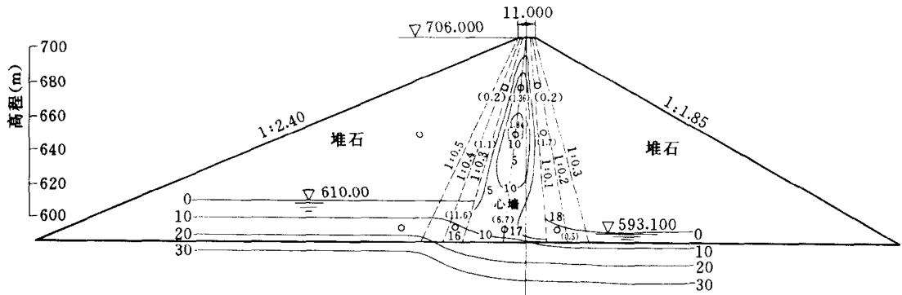  
图 6.17 日本下小鸟坝施工结束时的孔压分布

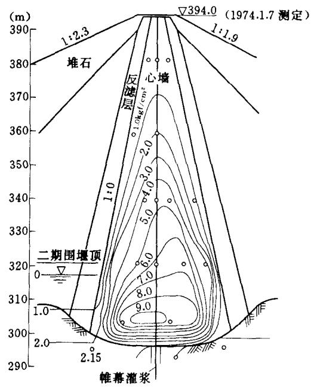  
(a)

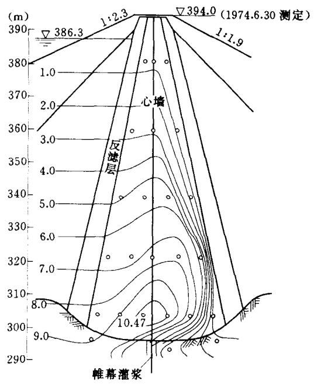  
(b)  
图 6.18 日本新冠坝孔隙水压  
(a) 施工结束；(b) 初步蓄水

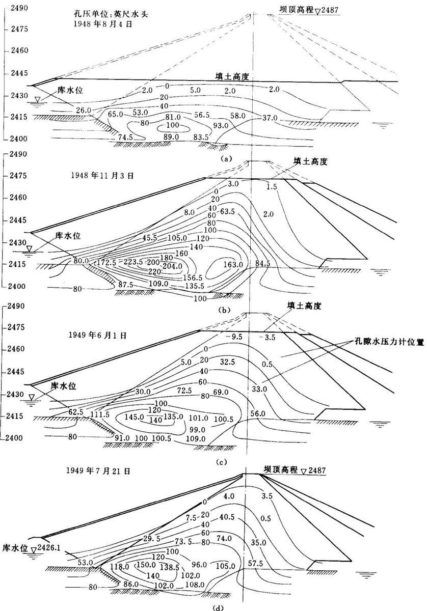

## 6.4.3 正常运行期

此时十坝处干稳定渗流状态，如前所述，其孔压分布由拉普位斯方程式(6.13)及相应边界条件确定。可用有限元等方法确定。根据计算成果计算机可自动绘制流网，图6.20(Terzaghi1942)示一些典型的渗流控制条件下的流网。由于确定孔压分布并不困难，因此，在正常运用期，边坡稳定分析总是采用有效应力法。

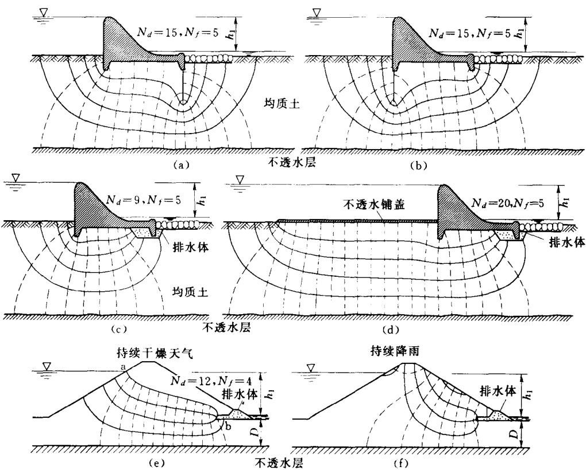  
图 6.20 一些典型的渗流控制条件下的流网

对于修建于深厚覆盖层的土石坝，坝基渗流控制对于坝体的渗流稳定和下游坝坡稳定均具有重要意义。垂直防渗是常用的防渗措施。图6.21 示悬挂式防渗墙的渗流分析流网(Cedergren，1976)。可知，即使垂直防渗墙截断了90%的强渗透性地基，流场的变化也不是很大。图6.22示采用悬挂式灌浆帷幕的方法进行渗流控制(Cedergren, 1976)，只有灌浆帷幕的渗透系数大大低于透水坝基，方能保证渗透稳定。

在渗流分析中，适当考虑坝体和坝基材料的渗透系数的各向异性，也是一个重要问题，1998年青海沟后水库砂砾石面板坝溃决后，曾对残留坝体进行仔细观察，发现由于坝料铺填和振动碾碾压过程中导致的分离，砂砾石呈明显的分层特性。图6.23示考虑（实线）和不考虑（虚线）坝料渗透系数各向异性绘制的流网，两者有明显的出入。

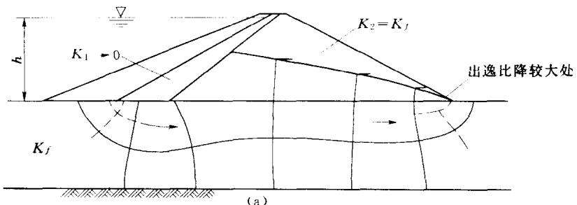

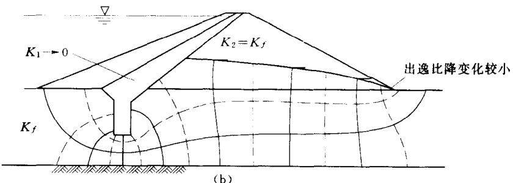

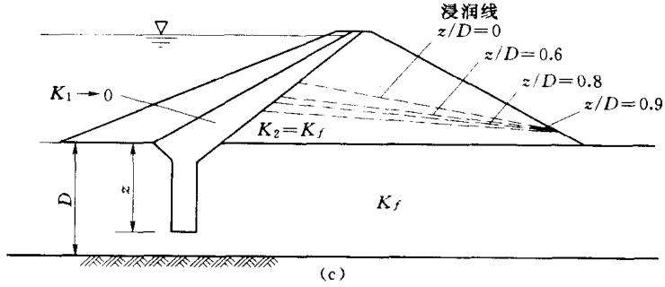  
图 6.21 防渗墙对渗流控制的效果 (Cedergren, 1976)  
(a) Z/D=0； (b) Z/D=0.6: (c) 不同 Z/D 条件下的坝内浸润线

## 6.4.4 库水位骤降期

库水位骤降是发生滑坡的一个主要触发因素。而导致滑坡的直接原因是坝体内的孔隙水压力不能及时地随坡外水压力的消失而消散。确定库水位骤降时的孔压始终是土石坝工程中的一个难题。本节介绍的是一些常用的简化处理方案。

在研究库水位骤降时的孔压问题时，首先需要区别不透水坝体为可压缩的还是不可压缩的材料。如前所述，对那些压缩性小但渗透系数仍小于自由排水标准的砂或砂砾石，可以通过式(6.11)进行非稳定渗流计算予以确定。但是如果坝体为饱和的粘性土，那么孔压的分析要兼顾土体在应力条件变化后体积的压缩性能和排水条件，本质上是一个固结问题。这个问题尽管在理论上可以予以解决，但尚无公认为可靠的实用方法。

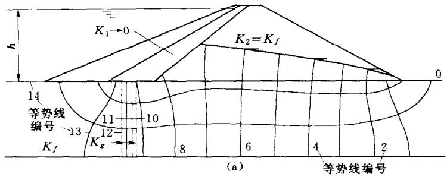

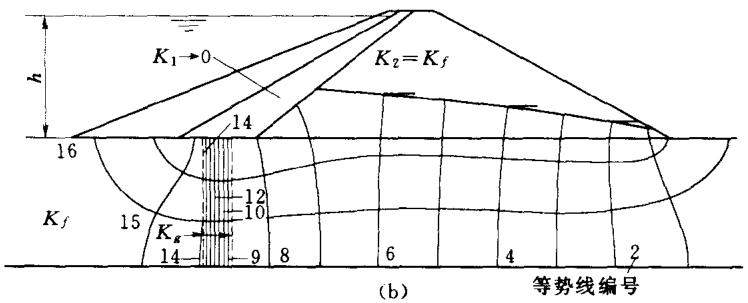

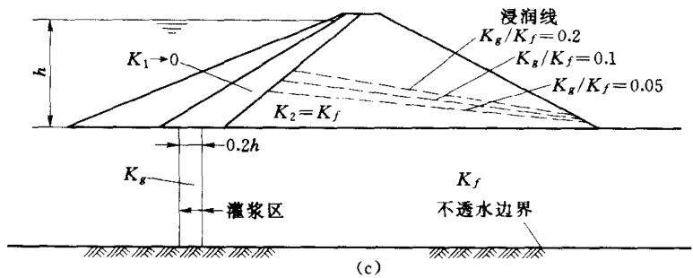  
图 6.22 灌浆对渗流场的影响 (Cedergren, 1976)  
$( \mathbf { a } ) k _ { g } { = } 0 . 2 k _ { \hat { \rho } } ( \mathbf { b } ) k _ { g } { = } 0 . 1 k _ { \hat { \rho } }$ (c)不同 $k _ { g } / k _ { f }$ 条件下的坝内浸润线， $k _ { g }$ 和 $k _ { f }$ 分别为灌浆段和地基的渗透系数

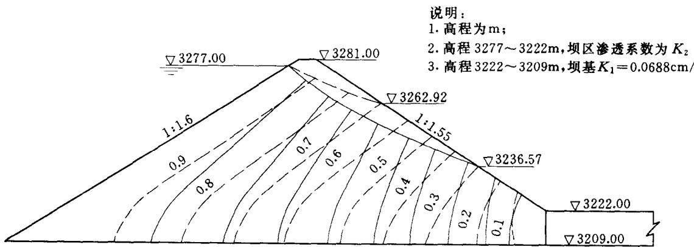  
图6.23 沟后水库砂砾石面板坝考虑和不考虑坝料渗透系数各向异性绘制的流网

另外，在大多数情况下，我们在分析时，常假定库水位的降落是瞬时的，但有时也需要研究一个降水过程，了解合理地控制水位降落速度防止滑坡的可能性。现对上述问题分述如下。

## 1. 骨架不可压缩材料

如果材料为半透水的砂壳，可以假定骨架不可压缩，这样的不稳定渗流可以近似地处理为相应骤降前的浸润线位置（或通过渗流量计算确定的浸润线位置)，以及骤降后的边界条件，满足渗流拉普拉斯方程的解。也就是说，可以通过画流网的方法确定渗压。图6.24示一个典型的分析成果。

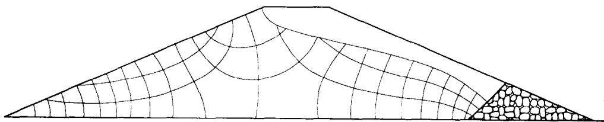  
图6.24 假定坝料不可压缩条件下相应库水位降落时坝内的流网

在进行库水位骤降孔隙水压力分析时，有时需要研究降落速度对孔压和边坡稳定的影响。此时，库水位不再假定为瞬时降落，因而形成了不稳定流场的计算问题。对于骨架不可压缩材料，式(6.13)每一时刻仍然适用，但是边坡表面的孔压边界条件和浸润线位置随时间不断变化，而不同时刻的浸润线位置则要通过坝内向外排水量来确定。美国陆军工程师团曾提出下面一个近似的计算方法(U. S. Army, Corps of Engineers, 1967)。在提出此法时，美国陆军工程师团强调只适用于水位下降时含水量发生变化而体积不发生变化的砂土或砂砾石土堆填料。

首先需要确定浸润线与防渗心墙上游面交点的下降值。定义无因次高度比值X为库水位下降值减去骤降后的心墙表面处浸润线高度与库水位下降值的比

$$
X = \frac { H _ { D } - \varDelta H _ { D } } { H _ { D } } { \times 1 0 0 }\tag{6.50}
$$

$$
P _ { D } = K / n _ { e } V\tag{6.51}
$$

式中： $H _ { D }$ 为库水位降落高度； $\Delta H _ { D }$ 为防渗心墙表面处浸润线高度变化值；K为坝壳材料渗透系数；V为库水位降落速度； $n _ { e }$ 为有效孔隙率即排出水的孔隙体积与土的单位体积的比值，按下式定义：

$$
n _ { e } = \frac { n } { 1 0 0 } \times \frac { W _ { 1 } - W _ { 2 } } { W _ { 1 } }\tag{6.52}
$$

式中：n为孔隙率；W为饱和含水量；W2为排水后的含水量。 $W _ { 1 }$ $W _ { 2 }$

可通过图6.25的曲线确定X的数值。该表虽然是表示库水位完全下降的情况，但对于只降低至中间水位的情况也适用，此时，只需把中间水位作为坝基高程。

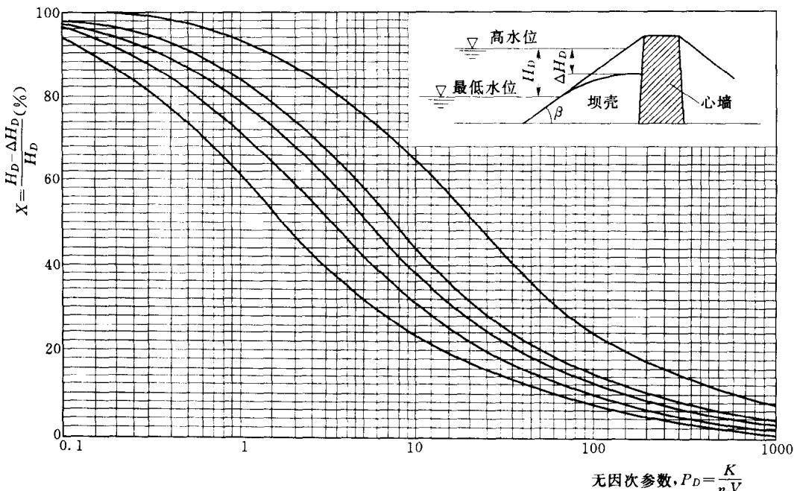  
图 6.25 库水位降落时不稳定流计算图表

[例6.3] 说明计算不稳定渗流近似方法例。

设一不透水的薄心墙坝，高105ft，上游坡为1:3，库水位为100ft（坝前水深），30天内下降60ft，坝壳材料为砂砾料，其渗透系数为 $\mathbf { 5 0 0 { \times } l 0 ^ { - 4 } f t / m i n }$ ，孔隙率为20%，平均饱和含水量为12%，排水后含水量为3%。

有效孔隙率 $n _ { e }$ 为

$$
n _ { e } = \frac { 1 2 - 3 } { 1 2 } \times \frac { 2 0 } { 1 0 0 } = 0 . 1 5
$$

库水位下降速度V为

$$
V = { \frac { 6 0 } { 3 0 \times 2 4 \times 6 0 } } = 0 . 0 0 1 3 9 \mathrm { { f } { / m i n } } = 1 3 . 9 { \times } 1 0 ^ { - 4 } { \mathrm { { f } { / m i n } } }
$$

$$
P _ { D } = \frac { K } { n _ { e } V } = \frac { 5 0 0 \times 1 0 ^ { - 4 } } { 0 . 1 5 \times 1 3 . 9 \times 1 0 ^ { - 4 } } = 2 4 0
$$

查图6.25，相应于坝坡为1:3， $X { = } 1 0 \%$

由式 $\frac { X } { 1 0 0 } { = } \frac { H _ { D } - { \varDelta } H _ { D } } { H _ { D } }$ ，即 $\frac { 1 0 } { 1 0 0 } = \frac { 6 0 - \varDelta H _ { D } } { 6 0 }$ ，可得 $\varDelta H _ { D } = 5 4 \mathrm { f t }$

因此，浸润线在心墙表面的位置是原水位以下54ft，或坝基以上46ft。说明，浸润线下降滞后库水位6ft。

再来计算一种坝壳透水较小的情况，设 $K { = } 5 { \times } 1 0 ^ { - 4 } \mathrm { f t / m i n }$ ，排水后含水量为9%。

$$
n _ { e } = \frac { 1 2 - 9 } { 1 2 } \times \frac { 2 0 } { 1 0 0 } = 0 . 0 5
$$

$$
P _ { D } = \frac { 5 \times 1 0 ^ { - 4 } } { 0 . 0 5 \times 1 3 . 9 \times 1 0 ^ { - 4 } } = 7 . 2
$$

由图6.25，查得 X=51%，解 $\Delta H _ { D }$ 方程式：

$$
\frac { 5 1 } { 1 0 0 } = \frac { 6 0 - \varDelta H _ { D } } { 6 0 }
$$

得到 $\left. \Delta H _ { D } = 2 9 . 4 \textrm { } ( \mathbf { f t } ) \right.$

在此情况下，浸润线在原水位以下29.4ft，或高出坝基70.6ft，或为下降后的水面以上30.6ft。

图6.25的曲线只提供确定心墙表面处浸润线下降值及坝壳材料排水速度的近似准则。在确定可能的水库水位下降速度及合理的 $n _ { e }$ 及K值时必须根据经验予以判断。对于相当透水的坝壳，其K值可能接近于无穷大（即坝壳材料完全透水，实际上可在短时间内排空），此时可考虑坝内外水位同步下降。

在第7章还将结合公伯峡工程的实例介绍这一算法的实际应用。

## 2. 骨架可压缩材料

如果骤降是在透水性很小、压缩性较大的粘性土中发生的，那么在第6.3节中已经讨论过，孔压的确定在原则上是一个固结问题，目前较多的还是采用近似的方法来确定。

(1) 在试验室模拟坝体滑裂面上各单元在骤降时发生的总应力变化的途径进行三轴不排水试验，测定孔隙水压力系数 A 和 B。毕肖普曾建议试验步骤(Bishop and Bjerrum, 1960;Bishop and Henkel, 1978)。

(2) 土石坝规范建议一个简化方法，对骤降时土单元总应力变化根据土柱的重量变化予以简化处理，并对孔隙水压力系数 $\overline { B }$ 取近似值，得出估算某点 A(图 6.26)的孔隙水压的近似公式：

$$
u = \gamma _ { \scriptscriptstyle w } [ h _ { 1 } + h _ { 2 } ( 1 - n ) - h ^ { \prime } ]\tag{6.53}
$$

式中：n为砂的孔隙率； $\pmb { h } _ { 1 }$ 为粘性土的土柱高； $\pmb { h } _ { 2 }$ 为透水料的土柱高；h 为 A 点测压管水位与上游骤降前水位差。

在水库水位降落后，粘性填土仍属饱和，但是滑动面上某点A的总主应力发生了变化。在水位降落到B点以下时，其大总主应力的增量 $\Delta \pmb { \sigma } _ { 1 }$ 为

$$
\Delta \sigma _ { 1 } = - \gamma _ { w } ( n _ { e } h _ { 2 } + h _ { 3 } )\tag{6.54}
$$

孔隙水压力增量 $\Delta u$ 为

$$
\Delta u = \overline { { B } } \Delta \sigma _ { 1 } - \overline { { B } } \gamma _ { w } ( n _ { e } h _ { 2 } + h _ { 3 } )\tag{6.55}
$$

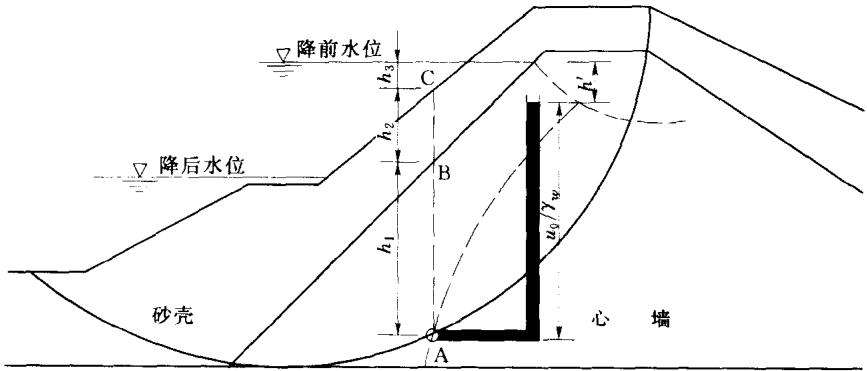  
图6.26 可压缩土体库水位降落时孔隙水压的近似计算

假定孔隙水压力系数 $\overline { { B } } \approx 1$ ，以 ${ \overline { { B } } } = 1$ 代入，则得到

$$
\Delta u = - \gamma _ { w } ( n _ { e } h _ { 2 } + h _ { 3 } )\tag{6.56}
$$

设水位降落前的孔隙水压力为 $u _ { 0 }$ ，则降落后的孔隙水压力u为

$$
u = u _ { 0 } + \varDelta u = u _ { 0 } - \gamma _ { w } ( n _ { e } h _ { 2 } + h _ { 3 } )\tag{6.57}
$$

由于水位降落前的孔隙水压力 $u _ { 0 }$ 为

$$
u _ { 0 } = \gamma _ { w } ( h _ { 1 } + h _ { 2 } + h _ { 3 } - h ^ { \prime } )\tag{6.58}
$$

所以水位降落后的孔隙水压力u为

$$
u _ { 0 } = \gamma _ { w } [ ( h _ { 1 } + h _ { 2 } ( 1 - n _ { e } ) - h ^ { \prime } )\tag{6.59}
$$

在库水位降落到C点以上或B和C点之间的情况，也可如上法按总主应力增量及相应孔隙水压力增量推导出水位降落后的孔隙水压力值，如：水位降到C点以上时，

$$
\Delta u = - \gamma _ { _ { w } } h _ { 3 } ^ { \prime }\tag{6.60}
$$

水位降到B和C点之间时，

$$
\Delta u = - \gamma _ { w } ( n _ { e } h _ { 2 } ^ { \prime } + h _ { 3 } )\tag{6.61}
$$

式中：h为C点至降落后水位的高度；h为原水位至降落后水位的高度，在水位降到C ${ \pmb h } _ { 2 } ^ { \prime }$ ${ h } _ { 3 } ^ { \prime }$ 点以下时恒为 $\pmb { h } _ { 3 }$

以上推导是建立在假定 ${ \overline { { B } } } = 1$ 的基础上的，在土的压缩性较大时，B可能大于1。采用 $\overline { B }$ 这一近似方法，不一定总是偏安全的。相反，如果土的压缩性较小，采用这一处理可能过于保守。

## 参考文献

1 Biot, M. A. Theory of elasticity and consolidation for a porous anisotropic solid. Journal of Applied Physics, 1955.26.182-185

2 Cedergren, H. R, Seepage, drainage and flownets. John Wiley and Sons, 1976

3 Cedergren, H. R. Seepage control in earth dams, in Embankment Dam Engineering, Casagrande Volume. R. C. Hirschfeld & S. J. Poulos eds. Wiley, 1972

4 Chen, L.H., Zhang, T.M., Lin, T.H., and Z.Y., Chen. Consolidation and stability behavior of a high rockfill dam built on soft clay foundation Proceedings of 3rd International Conference on Soft Soil Engineering ICSSE3. DEC, Hong Kong, 2001

5陈祖煜，渗流和固结计算中的孔隙水压和超孔隙水压，土石坝工程第四期，1985,24-35

6 陈祖煜，用有限元进行渗流、结构和固结计算中的基本原理，水利水电科学研究院，1985

7 陈祖煜，陈立宏，李新强.第7章土工数值分析(二)：渗流，固结和应力应变的有限元方法，高等土力学，清华大学出版社，2003

8 Duncan, J. M. et. al. CON2D:A finite element computer program for analysin of consolidation, Report No. VCB1GT/81-01, University of California, Berkeley. 1981

9 Eisenstein, Z. and Krishnayya A.V. G. Law T. C. Anailysin of consolidation in cores of earth dams. Numerical metheds in geomechonics, 1976. Vo1.2. 1089-1105

10 Gibson, R.E., The progress of consolidation in a clay layer increasing in thickness with time, Geotechnique, Dec. 1958. Vol.8, No.4. 171-182

11 黄文熙，土坝弹塑性应力分析简捷法，岩土工程学报，1989,Vol.11，NO.6,1-8

12 Hwang, K, R and Morgenstern, N.R. On solutions of plain strain consolidation problems by finite element method, Canadian Geotechnical Journal, 1971. 8(1): 109-118

13 Hilf, J. W. Estimating construction pore-pressure in rolled earth dams, 1948. Proc. 2nd ICSMFE, Vol.3

14 Hilf, J. W. An investigation of pore-water pressure in compacted cohesive Soils, Technical Memorandum, 654, USBR Denver, Colorado, 1965

15 Koppula, S.D. and Morgenstern, N.R., Consolidation of clay layer in two dimensions, Journal of the Soil Mechanics and Foundation Divisions, ASCE, Vol.98, No.SM1, JAN, 1972.. 79-93

16 Krishnayya, A. V. G. Finite element consolidation program for two dimensional problems FECP2D, Unicersity of Alberta, 1973

17 Mikusinski, J. Operational Calculus. 1959. 中译本：“算符演算”，王建午译，上海科学技术出版社出版，1964

18 Sandhu, R. S. and Wilson, P. E. L. Finite element analysis of seepage in elastic media. J. Engr. Mechs. Div. , ASCE, 95, 1969.641-652

19 Sherman, W. C. and Clough, W. Embankment pore pressure during construction, ASCE, SMFD, 1968. 194(SM2)

20 Skempton, A. W. The pore pressure coefficient A and B. Geotechnique, 1954. 35(4): 143-147

21 Terzaghi, Theoretical soil mechanics. John Wiley and Sons, 1942

22 U. S. Army Corps of Engineers. Stability of slopes and foundations. Engineering Manual. Visckburg, Miss, 1967

23 Wang, C. and Duncan, J. M. Analysin of consolidation of earth and rockfill dans, Report No. TE77-3, University Of California, Berkeley, 1977

24 中华人民共和国行业标准. 碾压式土石坝设计规范.SL274-2001,2002

25 中国水利水电科学研究院，清华大学水利水电系，水利部黄委会勘测规划设计研究院.黄河小浪底水利枢纽工程斜心墙堆石坝应力应变和固结分析研究，2000

## 第7章 土石坝各运用期的稳定分析

## 7.1 前言

土石坝作为人工构筑的挡水建筑物，其边坡稳定问题比较典型。坝体和地基在施工期、正常蓄水期、库水位降落期和地震期均存在抗滑稳定问题。在第5、6两章中，分别介绍了各种工况下抗剪强度和孔隙水压力的确定方法。在正确地确定这些参数的基础上，根据实际情况采用总应力法或有效应力法进行边坡稳定分析，所得到边坡稳定安全系数，可用于评价边坡在这些运用条件下的稳定性。本章拟利用实际工程的算例来介绍进行稳定分析的步骤。

## 7.2 施工期

## 7.2.1 概述

土石坝施工期的边坡稳定问题，包括坝体和地基两个方面：

1）斜墙坝的上游坡，水力冲填坝和均质坝的上、下游坝坡，由于施工期坝体内孔隙水压力未获得充分消散，可能发生滑坡；

2) 在饱和的软弱粘性土上修堤或坝，地基在承受荷载时，孔隙水压力增加，因而发生滑坡。

总应力法和有效应力法都是施工期稳定分析的常用方法。

## 7.2.2 总应力法

用总应力法分析时，坝体防渗土的抗剪总强度按规范规定由下式确定：

$$
\pmb { \tau } = c _ { u u } + \sigma \tan \phi _ { u u }\tag{7.1}
$$

用 $^ { \alpha } \mathsf { Q }$ 剪”确定 $c _ { u u }$ 和 $\phi _ { u u }$ 。试验时采用的试样应与现场的土具有相同的压实功能、干容重和含水量。

如5.3.2节所述，当应力较小时，不固结不排水强度指标比排水试验强度还高的问题，这部分区域示于坝体中如图5.8中阴影所示区域。为保守计，宜采用组合强度包线，如图5.9(b)所示。

对充分饱和的地基进行总应力法分析，应采用固结不排水强度指标。在第5 章中已讨论过，此时更宜采用地基土原位试验成果，用现场的十字板试验来确定其抗剪总强度$\pmb { q } _ { c u ^ { \prime } }$ 此时 $\phi { = } 0 ^ { \circ }$ ，c按下式确定：

$$
c = \tau = \frac { q _ { c u } } { 2 }\tag{7.2}
$$

在使用STAB程序进行施工期边坡稳定分析时，如果使用式(7.1)进行总应力法计算，则只需将孔隙水压设为零，使用 $c _ { u u }$ 和 $\phi _ { u u }$ 进行常规的计算即可。如果使用式(7.2)进行总应力法计算，则 $\pmb { q } _ { c u }$ 是一个在地基内随深度变化的数值。考虑到地基土在不同位置的变异特性，$\pmb { q } _ { c u }$ 实际上是 $x , y$ 两个坐标值的函数，因此，STAB程序专门提供了对q进行内插的功能。 $\ q _ { c u }$

## 7.2.3 有效应力法

用有效应力法进行计算时，抗剪强度由下式确定：

$$
\tau = c ^ { \prime } + ( \sigma - u ) \tan \phi ^ { \prime }\tag{7.3}
$$

其中 $c ^ { \prime }$ 和 $\phi ^ { \prime }$ 原则上应通过“Q′剪”来确定。但因不饱和土的孔隙水压力测量精度不高，故一般情况下，可用“S剪”的指标。

用有效应力法计算时关键问题是确定孔隙水压力，确定方法已在第6章中讨论。一旦孔压确定后，应将其用网格的形式输入计算机。计算中，再通过内插来确定滑面上各点的孔压。STAB程序用于内插孔压和内插q的子程序实际上是一个。此外，还可以通过施工 $q _ { c u }$ 期实测孔隙水压力进行稳定分析。

[例7.1]小浪底大坝施工期的稳定分析。

## 1. 基本情况

小浪底水利枢纽工程位于洛阳市以北黄河干流最后一个峡谷出口，为一防洪、减淤、灌溉、发电等综合利用的大型水利枢纽。最大坝高167m，覆盖层最深达70m，为斜墙堆石坝。大坝典型剖面见第六章图6.5。工程位于7度地震区，按8度设防。小浪底大坝的这些特点决定了在其各设计阶段均需复核施工期、正常运用期、库水位骤降期和地震期的稳定性。因而这是一个典型的稳定分析问题的实例，将在本章重点介绍。

作为防渗体的斜墙称1区，对其物理力学特性曾分阶段作过系统的试验研究。

## 2. 土料指标

各种材料物理力学参数采用值见表7.1。由于上游侧坝体具有较复杂的分区剖面，因此沿坝体内的滑裂面采用了任意形状但体形光滑。同时，由于坝基存在倾向下游的缓倾角软弱夹层，故也进行了沿该夹层的折线形滑裂面的稳定分析。

表7.1 小浪底筑坝材料及坝基材料抗剪强度采用值
<table><tr><td rowspan="2">筑坝材料</td><td colspan="2">容重(kN/m³)</td><td colspan="2">抗剪强度</td></tr><tr><td>湿容重</td><td>饱和容重</td><td>摩擦角φ(°)</td><td>凝聚力(kPa)</td></tr><tr><td>1区 CD有效强度</td><td></td><td></td><td>19.4</td><td>20</td></tr><tr><td>1B区 CU总强度</td><td>19.6</td><td>20.3</td><td>14</td><td>25</td></tr><tr><td>UU总强度</td><td></td><td></td><td>7.4</td><td>73</td></tr><tr><td>2A、2B、2C、3、4A、4B区</td><td>21.1</td><td>23</td><td>40</td><td>0</td></tr><tr><td>5区</td><td>20.8</td><td>21.7</td><td>28</td><td>30</td></tr><tr><td>河床砂卵石</td><td>22.2</td><td>22.2</td><td>33</td><td>0</td></tr><tr><td>淤积物</td><td>17.6</td><td>17.6</td><td>0</td><td>0</td></tr><tr><td>砂岩</td><td>26</td><td>26</td><td>35</td><td>0</td></tr><tr><td>T岩层顶面夹泥</td><td>20.1</td><td>20.7</td><td>14.04</td><td>5</td></tr></table>

## 3. 施工期总应力法稳定分析

在进行施工期稳定分析时考虑库水位随坝体一起升高，采用表7.1 中 UU指标。沿坝体内滑动复核了相应库水位 230m，250m，265m的工况，安全系数分别为 1.707、1.963 和2.190。这三个工况的临界滑裂面在图7.1(a)中分别用11、12、13代表。沿软弱夹层滑动相应库水位为 230m 和 250m，安全系数分别为 1.424 和 1.436，这两个工况的临界滑裂面在图 7.1(b)中分别用 y4 和 y5 代表。

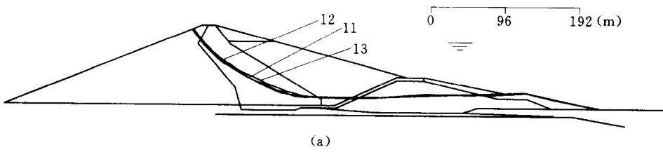

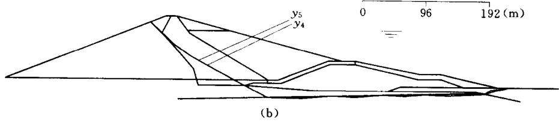  
图7.1 小浪底大坝施工期总应力边坡稳定分析  
(a) 沿坝体内部；(b) 沿软弱夹层

## 4. 施工期有效应力法稳定分析

在第6.3.3节中，介绍了小浪底大坝在施工期采用比奥理论进行孔隙水压力消散分析计算的成果，利用此成果进行施工期的稳定分析时，需采用线性和非线性强度指标，其安全系数分别为 2.430和2.617。相应的数据文件为 X250-1和 X250-2。

从上述分析中可知，小浪底大坝上游坝坡的稳定安全具有较大的储备。

[例7.2] 斯里兰卡金河防洪堤施工期的稳定分析。

该工程 BR-8段典型剖面如第三章图3.6 所示。地基为充分饱和的泥炭和软粘土，压缩性极大，施工时曾多次发生滑坡。在施工过程中，进行了孔隙水压力现场观测，然后根据这些资料画出孔隙水压力等值线图，同时也采用差分法进行太沙基固结理论的孔隙水压力消散计算，与实测资料很接近。表7.2为金河土堤BR-8段滑坡的安全系数核算结果。

由于软基受荷后沉陷量大，核算稳定时宜采用变形后的断面（见第三章图3.6)，这样，可以得到较合理的结果。

土堤滑动时堤顶出现裂缝，计算时计及这个裂缝，并考虑缝中水平的水压力，结果较合理。

本实例地基为泥炭土，渗透系数较大，故孔压消散、有效应力增加后总强度有所提高，天然状态和破坏前夕十字板强度差别较大。采用总应力法进行稳定分析宜考虑这个因素。

从计算结果看，采用毕肖普法，用实测孔隙水压力进行有效应力法分析，安全系数接近于1。

表7.2 斯里兰卡金河土堤BR-8段实际滑坡的安全系数核算结果
<table><tr><td>计算方法</td><td>强度指标 计算条件</td><td></td><td>安全系数</td></tr><tr><td rowspan="5">总应力法</td><td>①</td><td>堤身无裂缝</td><td>1.33 1.21</td></tr><tr><td>填土前，实测天然地基十字堤中心有裂缝</td><td></td><td>1.15</td></tr><tr><td>板强度平均值</td><td>堤中心有裂缝，缝内有水压力</td><td></td></tr><tr><td>② 破坏前夕，实测地基十字板堤中心有裂缝</td><td>堤身无裂缝</td><td>1.33</td></tr><tr><td>强度平均值</td><td>堤中心有裂缝，缝内有水压力</td><td>1.36 1.30</td></tr><tr><td rowspan="5"></td><td>③ 破坏前夕，实测地基十字板堤中心有裂缝</td><td>堤身无裂缝</td><td>1.23 1.18</td></tr><tr><td>强度小值平均值</td><td>堤中心有裂缝，缝内有水压力</td><td>1.02</td></tr><tr><td> $c ^ { \prime } { = } 0$ </td><td></td><td></td></tr><tr><td></td><td>堤身无裂缝</td><td>0.81</td></tr><tr><td></td><td>堤中心有裂缝</td><td>0.59</td></tr><tr><td rowspan="4">有效应 力法毕肖普法</td><td> $\phi ^ { \prime } { = } 3 5 ^ { \circ }$   $c ^ { \prime } { = } 0$ </td><td>堤中心有裂缝，缝内有水压力</td><td>0.56</td></tr><tr><td></td><td>堤身无裂缝</td><td>1.19</td></tr><tr><td> $\phi ^ { \prime } { = } 3 5 ^ { \circ }$ </td><td>堤中心有裂缝</td><td>1.03</td></tr><tr><td></td><td>堤中心有裂缝，缝内有水压力</td><td>0.98</td></tr></table>

[例7.3] 蒲城电厂张家沟灰坝施工期的稳定分析。

蒲城电厂张家沟灰坝建于黄土塬侵蚀沟谷中，初期拟修一个高20m的均质坝，中期坝高为40m，最终增高到90m。典型断面如图7.2示。

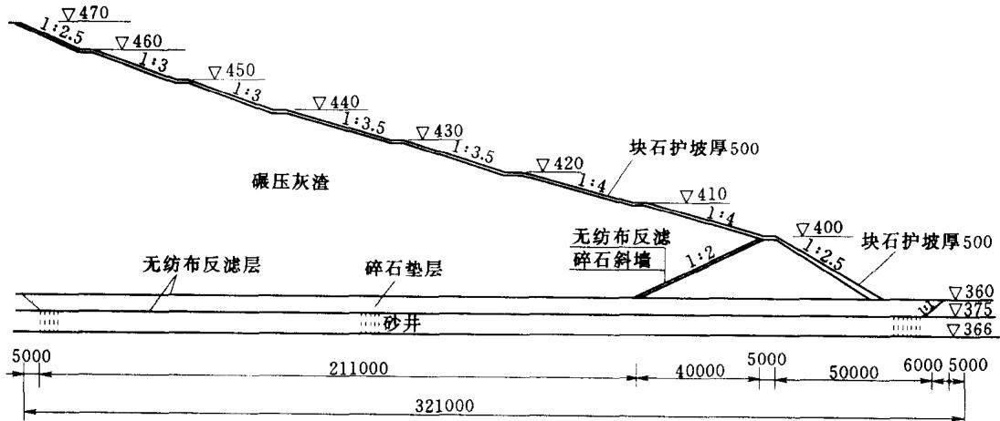  
图7.2蒲城电厂张家沟灰坝剖面（长度单位：mm；高程单位：m）

坝基为饱和淤泥质亚粘土。这是一个采用比奥固结理论进行孔隙水压力消散计算，然后采用有效应力强度指标进行土石坝施工期稳定分析的例子。在初设阶段曾计算了4个方案，以比较各方案对灰坝稳定性的影响。这4个方案是：

1) 地基不作任何处理；

2) 坝下设 5m 碎石垫层；

3) 设 2.5m 碎石垫层；

4) 垫层加排水砂井。

图7.3示采用比奥理论计算终期坝（坝高90m）孔压分布值。

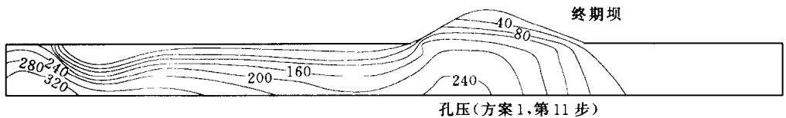  
图7.3蒲城电厂张家沟灰坝坝基孔压分析成果（单位：kPa）

采用了表7.3，7.4所示强度参数，相应地基不作任何处理的工况，对初期坝、中期坝、终期坝用 Bishop 法获得的临界圆弧滑裂面分别如图 7.4(a),(b)和(c)所示，相应安全系数分别为0.954,0.805和0.741。其它工况计算成果参见第13.1节。

表 7.3 十字板强度如下(单位：kPa)
<table><tr><td>情况</td><td>表层粘性土</td><td>泥炭</td><td>泥炭质软粘土</td></tr><tr><td>①</td><td>12.2</td><td>13.3</td><td>11.9</td></tr><tr><td>②</td><td>19.6</td><td>24.8</td><td>17.8(上部)，13.8(下部)</td></tr><tr><td>③</td><td>14.0</td><td>17.7</td><td>14.1(上部)，11.4(下部)</td></tr></table>

表7.4 蒲城电厂张家沟灰坝基本材料特性指标
<table><tr><td rowspan="2"></td><td rowspan="2">干容重  $\gamma _ { d } ( \mathbf { k } \mathbf { N } / \mathbf { m } ^ { 3 } )$ </td><td rowspan="2">含水量  $w ( \% )$ </td><td rowspan="2">饱和容重  $\gamma _ { s a t } ( \mathbf { k N } / \mathbf { m } ^ { 3 } )$ </td><td rowspan="2">饱和度 S,(%)</td><td colspan="2">有效强度指标</td><td colspan="2">总强度指标</td></tr><tr><td> $c ^ { \prime } ( \mathbf { k P a } )$ </td><td> $\phi ^ { \prime } ( ^ { \circ } )$ </td><td> $C _ { c u } ( \mathbf { k } \mathbf { P a } )$   $\phi _ { c u } ( { ^ \circ } )$ </td></tr><tr><td>地 I</td><td>15.9</td><td>24.5</td><td>19.8</td><td>100</td><td></td><td>15</td><td>30.0 5</td><td>18</td></tr><tr><td>基 II</td><td>17.0</td><td>20.9</td><td>20.6</td><td>100</td><td>40</td><td>30.0</td><td>5</td><td>18</td></tr><tr><td>初期坝</td><td>17.0</td><td>17.2</td><td>19.9</td><td>82</td><td></td><td>30 28</td><td>8</td><td>21</td></tr><tr><td>垫层</td><td>17.6</td><td>5.0</td><td>18.5</td><td>26.7</td><td></td><td>0 30.0</td><td>0</td><td>30</td></tr><tr><td>灰体</td><td>9.0</td><td>30</td><td>11.7</td><td>47.2</td><td></td><td>20 31.0</td><td>7</td><td>23</td></tr></table>

分析表明采用水平垫层和竖直砂井均可有效地降低孔隙水压力，因而使稳定安全系数提高到1.1以上，最终采用了水平垫层方案，该工程运行情况良好。

## 7.3 稳定渗流期

稳定渗流期下游坝坡的稳定往往是复核的重点；上游坝坡滑动的情况比较少见，但在地震情况下，也需仔细校核其稳定性。稳定渗流期属于“长期”边坡稳定问题。坝体内孔隙水压力通过稳定渗流方法即可较为准确地确定，其抗剪强度通常使用固结排水的试验指标。由于孔压和强度的确定都比较明确，一般不使用总应力法。本节仅对采用非线性强度指标稳定分析的具体步骤作一介绍（陈祖煜，1990）。

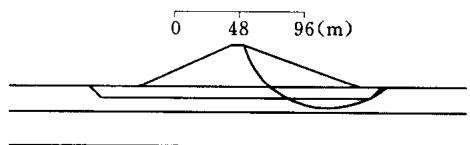

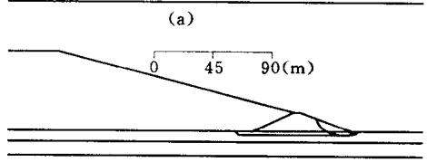

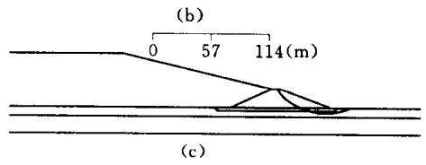  
图 7.4 蒲城电厂张家沟灰坝稳定分析成果之一(地基不作处理工况)  
(a) 初期坝；(b) 中期坝；(c) 终期坝

采用非线性强度指标进行稳定分析时，遇到一个问题，就是滑裂面上的应力状态在安全系数没有算出来以前并不知道。因此，需要预先假定一个线性抗剪强度指标进行一次稳定分析，并获得滑裂面上的法向应力；据此法向应力确定非线性强度指标，再进行一次稳定分析，获得相应非线性强度指标的安全系数。再将这次分析获得的法向应力与前一次假定线性指标的法向应力相比较，如果误差较大，则需调整。通过反复迭代计算，最终获得满意的结果。具体的计算步骤如下：

(1) 根据假定的线性抗剪强度指标进行稳定分析，获得的滑裂面上的法向应力 $\{ \pmb { \sigma } _ { n } \} ^ { \bullet }$ (括号“{}”指各土条底的相应数值，这里为一组σn，下同）。因为近似计算，可用工程师团 $\sigma _ { n }$ 法进行稳定分析。

(2) 根据第一步计算获得的{σ}°，按式(5.19)或式(5.20)确定相应的{τf}，据此，再进 $\{ \sigma _ { n } \} ^ { \circ }$ $\{ \tau _ { f } \}$ 行一次稳定分析。可令 $\phi = 0 , c = \tau _ { f }$ 。此时，可采用毕肖普法或其它方法。计算实践表明，这一次稳定分析获得的沿滑裂面的法向应力 {σ}1和{σ}°相差并不大，一般不必再进行迭 $\{ \sigma _ { n } \} ^ { 1 }$ $\{ \sigma _ { n } \} ^ { \mathbf { o } }$ 代，即可将所得的安全系数视为最终值。

瑞典法的{σ}°不依赖于安全系数，如使用式(5.19)确定τf，则不需迭代。但如使用式 $\{ \sigma _ { n } \} ^ { \circ }$ $\tau _ { f }$ (5.20)确定抗剪强度或使用Bishop法，则由于φ。中包含安全系数，故仍需迭代。 $\phi _ { e }$

[例7.4] 小浪底下游边坡非线性稳定 分析。

在8度地震情况下，如果采用线性强度指标 $c = 0 , \phi = 4 0 ^ { \circ }$ ，则得到一个很浅的临界滑裂面，如图7.5所示，相应安全系数为1.113。采用非线性强度的对数模式，取 $\phi _ { 0 } = 5 0 ^ { \circ } , \Delta \phi =$ $1 0 ^ { \circ }$ 。采用单形法搜索最小安全系数。

图7.5给出了一个固定滑弧深度D，用 $D _ { s }$ 单形法搜索最小安全系数的例子。搜索从初始点A开始，经B、C，最终到达极值点D。最小安全系数为 $F = 1 . 7 6 6$ 。相应的临界滑裂面不再是一个浅弧。

[例 7.5] Charles 的非线性稳定分析简化图表。

对于均质的简单边坡，Charles(1984)给出了使用指数模式即式(5.19)的最小安全系数图表，见图7.6。边坡系数Γ定义为

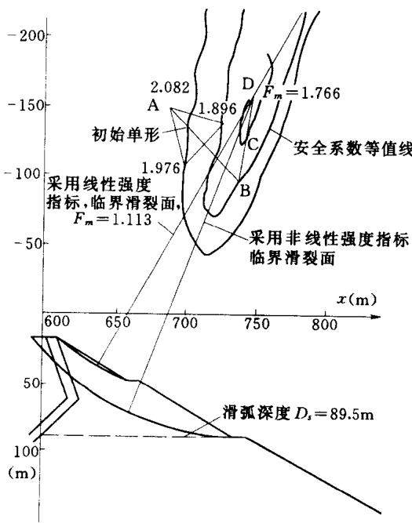  
图7.5 小浪底下游边坡非线性稳定分析

$$
\boldsymbol { \varGamma } \boldsymbol { = } \boldsymbol { F } ( \boldsymbol { \varkappa } \boldsymbol { H } ) ^ { ( 1 - b ) } / A\tag{7.4}
$$

式中：γ为容重；H为坡高；F为最小安全系数，A、b参见式(5.19)。

根据图7.6和式(7.4)可以方便地找到相应某一坡度为 $\mathtt { c o t } \beta$ 和坡高H的F值。

作者使用本文介绍的计算步骤和STAB程序分别对 $\mathbf { c o t } { \boldsymbol { \beta } } = \mathbf { 1 }$ 、1.5两种情况， $A { = } 7 . 0 , \ b { = }$

0.8、0.7、0.6、0.5时，计算毕肖普法和瑞典法的最小安全系数，分别用符号×’和Δ’点绘在图7.6上。可见绝大多数计算成果和Charles给出的曲线完全吻合。两个独立的工作获得如此一致的成果，说明STAB程序根据本节介绍的方法编写的程序获得了很好的验证。

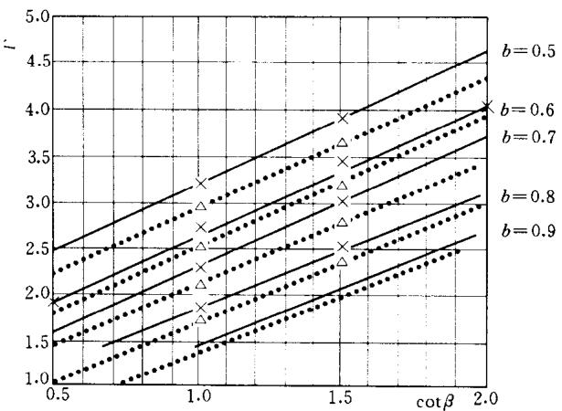  
图 7.6 Charles 非线性稳定分析简化图表  
注 实线和虚线分别为毕肖普法和瑞典法的计算结果

## 7.4 库水位骤降期

## 7.4.1 概述

在第5章和第6章中，已分别介绍了库水位骤降情况下的总应力法的概念和孔隙水压力的确定方法，本节通过实例介绍稳定分析的具体步骤。

对有效应力法，着重介绍上游面半透水的砂砾石料坝体，在库水位降落期形成不稳定渗流时的边坡稳定；对总应力法，则着重介绍由美国陆军工程师团建议的坝体粘性土，上游面总应力法的具体计算步骤。

## 7.4.2 有效应力法

采用第6.4.3节介绍的确定孔隙水压力的方法，使用固结排水剪强度，可以进行库水位骤降情况下的坝坡稳定分析。但是，对于可压缩的粘性土的有效应力法分析，由于孔隙水压力不易准确确定，因此很少用理论分析的孔压进行有效应力法的稳定分析。对于砂砾石坝壳料，一方面因此类材料常包含细颗粒，坝体内的浸润线在一些情况下不能与库水位同步下降。另一方面，可以视此类材料为不可压缩材料，故可按式(6.13)进行不稳定渗流计算，以确定库水位降落期坝内的浸润线。在6.4.4节已介绍了美国陆军工程师团提出的一个近似的计算方法，本节将介绍一个使用这一方法进行半透水的砂砾石坝壳在库水位降落期的稳定分析的实例。

[例7.6] 公伯峡心墙坝方案上游坝壳库水位降落期稳定分析。

公伯峡水电站在初设阶段曾考虑混凝土面板堆石坝或土质心墙堆石坝两种坝型。心墙坝方案上游坝壳使用了砂砾石，为半透水材料，需要论证上游水位降落情况下的坝坡稳定。本例使用了按6.4.4节介绍的美国陆军工程师团推荐的一个简化方法计算水位降落过程中的坝壳浸润线位置，库水位降落过程见表7.5。计算时取有效孔隙率 $n _ { e } = 0 . 1 8 6$ ，渗透系数K=21.86m/日。计算过程见表7.6。根据这一计算成果获得的不同时段的浸润线如图7.7所示。图7.8是在库水位从2005m最终降至1975m时稳定分析获得的临界滑裂面和安全系数。

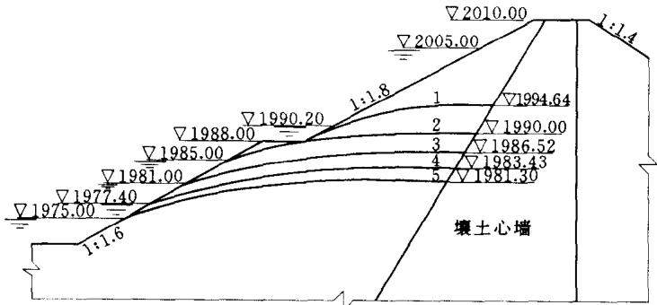  
图7.7 公伯峡心墙坝方案上游坝壳库水位降落期浸润线计算

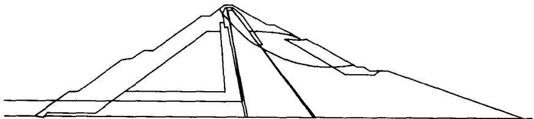  
图 7.8 公伯峡心墙坝方案上游坝壳库水位降落期稳定分析

表 7.5 公伯峡库水位降落过程
<table><tr><td>时间（日）</td><td>0</td><td>1</td><td>2</td><td>3</td><td>4</td><td>5</td></tr><tr><td>水位（m）</td><td>2005.00</td><td>1990.20</td><td>1985.00</td><td>1981.00</td><td>1977.40</td><td>1975.00</td></tr></table>

表7.6 公伯峡心墙坝方案上游坝壳库水位降落期浸润线计算

<table><tr><td>1 时间（日）</td><td></td><td>0 1</td><td>2</td><td>3</td><td>4</td><td>5</td></tr><tr><td></td><td>2 库水位(m)</td><td>2005.0</td><td>1990.2</td><td>1985.0</td><td>1981.0 1997.4</td><td>1975.0</td></tr><tr><td>3</td><td>库水位降落高度  ${ \bf \ddot { \cal H } } _ { D } ( { \bf \dot { m } } )$ </td><td>14.80</td><td>20.00</td><td>24.00</td><td>27.60</td><td>30.00</td></tr><tr><td>4</td><td>库水位降落平均速度V(m/日)</td><td>14.80</td><td>10.00</td><td>8.00</td><td>6.90</td><td>6.00</td></tr><tr><td>5</td><td> $P _ { D } = K / n _ { e } V$ </td><td>7.94</td><td>11.75</td><td>14.69</td><td>17.03</td><td>19.59</td></tr><tr><td>6</td><td> $\scriptstyle b = \cos t \beta$  (查图6.25得)</td><td>1.80</td><td>1.80</td><td>1.80</td><td>1.80</td><td>1.80</td></tr><tr><td>7</td><td> $x = \frac { H _ { D } - \Delta H _ { D } } { H _ { D } } ( \% )$ </td><td>30</td><td>25</td><td>23</td><td>22</td><td>21</td></tr><tr><td>8</td><td> $\Delta H _ { D } = ( 1 - x ) H _ { D } \ ( \mathbf { m } )$ </td><td>10.36</td><td>15.00</td><td>18.48</td><td>21.53</td><td>23.70</td></tr><tr><td>9</td><td>心墙表面浸润线高程(m)</td><td>1994.64</td><td>1990.0</td><td>1986.52</td><td>1983.43</td><td>1981.30</td></tr></table>

## 7.4.3 库水位骤降情况总应力法的计算步骤

尽管从理论上讲，土石坝的防渗体在库水位骤降情况下可以进行孔隙水压力的消散计算，但至今尚无成熟、可靠的方法。因此，除非具备现场的孔压观测资料，对土石坝的防渗体进行库水位骤降的稳定分析主要还是要用总应力法。这也是在第5章用较大篇幅讨论土的不排水抗剪强度和总应力法原理的主要原因。美国陆军工程师团在其所编的手册中曾对这一方法的具体步骤作过详细介绍。而这一步骤和第5 章介绍的总应力法原理是完全一致的。因此，本节主要介绍这一方法的具体计算步骤（陈祖煜，1984,1985)。

根据在第5 章已详细阐述的库水位骤降情况下总应力法的原理。使用总应力法计算库水位骤降时的稳定安全系数需要包含两个步骤：

1) 相应库水位降落前的水位，计算滑裂面上各土条底的法向有效应力，即式(5.15)中的 ${ \pmb \sigma } _ { c } ^ { \prime }$

2) 相应库水位降落后的水位进行稳定分析，此时根据式(5.15)确定 $\pmb { \tau _ { f } } ,$ 然后取 $\scriptstyle  \phi = 0 , c =$ $\tau _ { f }$ ，进行常规的条分法分析。

在第5.3.3节曾指出，为安全计不排水强度宜采用组合包线。为此，需要在上述1)和2)两个步骤中间插入一个步骤，分析对滑裂面哪些部位因 $\sigma ^ { \prime } < \sigma _ { t } ^ { \prime }$ ，应采用 S剪指标，见图5.9(a)。工程师团的作法是先相应库水位降落前水位，假定滑面上全部用S剪指标进行一次稳定分析，获得了法向应力后，再将σ超过σ的部分换成R剪强度，进行一次稳定分析， $\sigma$ $\pmb { \sigma } _ { t } ^ { \prime }$ 得到沿滑面的新的 ${ \pmb { \sigma } } _ { c } ^ { \prime }$ 分布。

插入这个步骤后，再相应库水位降落后水位执行上述第2)步的分析步骤。

美国陆军工程师团在工程设计手册中图 V1-10 利用手算详细介绍了这一计算步骤，笔者在开发STAB程序过程中，纳入了这一功能。为了确认程序准确无误地完成了上述计算步骤，对工程师团手算和STAB计算成果进行了详细的平行计算和比较，获得和美国陆军工程师团法所介绍的手算法完全一致的成果，最终确认，陆军工程师团提出的总应力法的分析步骤已通过笔者的一个经过考核的计算机程序得以实现，可以方便地应用于工程实际。现对这一算例作一介绍。

[例7.7] 美国陆军工程师团在工程设计手册中的例题。

如图7.9所示的均质土坝，求解在库水位降落时的稳定安全系数。土的固结不排水强度指标（R剪）为 $c _ { c u } = 1 . 2$ 磅/[英尺]²， $\phi _ { c u } = 1 6 ^ { \circ }$ ；固结排水强度指标（S剪）为 $\phi _ { d } ^ { \prime } = 0 , \phi _ { d } ^ { \prime } =$ 30°，均在图7.9左上方示出。R线与S线的交点相应的σ值为 $\sigma _ { t } ^ { \prime } = 4 . 1 3$ 磅/[英尺]²。

具体计算步骤如下：

(1)计算土条底面在库水位骤降前的有效应力，以确定某部分土条法向应力小于σ， $\pmb { \sigma } _ { t }$ 因而使用 S剪指标。

(2) 如果某部分土条法向应力大于σ，需要使用 R指标。作为一种近似，可先全部使 $\sigma _ { t } ^ { \prime }$ 用S剪指标，相应骤降前水位进行一次滑弧稳定分析，算出弧面上的有效法向应力。

按照陆军工程师团的惯例，计算是用“陆军工程师团法”进行的。图7.9中的ABC为算得的沿滑裂面的有效应力的分布。可看到，土条5、6、7、8的有效应力大于 $\pmb { \sigma } _ { t } ^ { \prime }$ ，故这部分土条的强度指标应换成R剪指标。

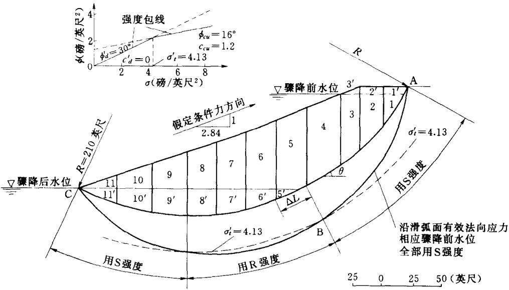  
图7.9 库水位骤降总应力法稳定分析（陆军工程师团例）

如果 $\Yqqless$ 用单一的R剪指标，则本计算步骤可以省略。

(3)根据已经调整好的土条底面强度指标，仍相应于骤降前水位，再进行一次陆军工程师团法的稳定分析，算得土条底面的有效法向反力N，如表7.7中第4列所示（第4列 $N _ { D } ^ { \prime }$ 同时还列出了相应的计算机计算结果)。可见STAB和工程师团手册中手算结果接近。相应的安全系数值分别为2.236和2.18，也很接近。

(4) 求得骤降前土条底面的有效法向反力N后，按式(5.15)算得骤降后各土条底面能 $N _ { D } ^ { \prime }$ 发挥的强度 $\pmb { \tau _ { f } }$ 。土条1\~4和9\~11使用了S剪指标，即 $\phi _ { d } ^ { \prime } = 3 0 ^ { \circ } , \phi _ { d } ^ { \prime } = 0 ;$ 土条5\~8使用R剪指标，即 $\phi _ { c u } = 1 6 ^ { \circ } , ~ c _ { c u } = 1 . 2$ 进而算得对圆心的抗滑力矩。表7.8中的第3栏和第4栏反映了计算的详细过程。表7.8的第1栏和第5栏分别为表7.7的第4栏和第2栏。总抗滑力矩为(457.8+126.5)R=584.3R（R为圆弧半径）。土体的自重（浸润线以下用饱和容重）引起的滑动力矩，如表7.7中第7栏所得，总计为474.5R。因而得出安全系数：

$$
F = 5 8 4 . 3 R / 4 7 4 . 5 R = 1 . 2 3
$$

采用 STAB 程序得出安全系数为 1.226。

[例7.8] 小浪底大坝库水位骤降总应力法稳定分析。

应用本节介绍的总应力法的计算步骤，采用表7.1中的心墙固结不排水剪强度，分析小浪底大坝库水位从275m降到250m水位时的稳定安全系数，采用的是非圆弧滑裂面，初始滑裂面和临界滑裂面及安全系数如图7.10所示。


<!-- ===== 分片 p201-400（200页，源：ex08_陈祖煜_土质边坡稳定分析（201-400页））===== -->

表7.7 骤降前计算安全系数采用的基本数据及电算手算对照
<table><tr><td rowspan="3">土 条 号</td><td colspan="2">1</td><td colspan="2">2</td><td colspan="2">3</td><td colspan="2">4</td></tr><tr><td colspan="2">骤降前土条重量 (磅)</td><td colspan="2">骤降后土条重量 (磅)</td><td colspan="2"> $\Delta L$  (英尺)</td><td colspan="2">骤降前法向应力 (磅/英尺2)</td></tr><tr><td colspan="2">手算 STAB</td><td colspan="2">手算</td><td colspan="2">手算 STAB</td><td colspan="2">手算 STAB</td></tr><tr><td>1</td><td>35.9</td><td>35.0</td><td>51.5</td><td>STAB 50.63</td><td>40.0</td><td>41.0</td><td>35.0</td><td>35.6</td></tr><tr><td>2</td><td>72.1</td><td>71.7</td><td>118.6</td><td>118.39</td><td>29.0</td><td>29.07</td><td>67.0</td><td>65.7</td></tr><tr><td>3</td><td>70.5</td><td>70.2</td><td>124.5</td><td>124.62</td><td>20.6</td><td>20.61</td><td>64.0</td><td>64.4</td></tr><tr><td>4</td><td>134.0</td><td>133.0</td><td>247.8</td><td>247.27</td><td>33.5</td><td>33.7</td><td>122.0</td><td>121.7</td></tr><tr><td>5</td><td>129.0</td><td>128.7</td><td>230.7</td><td>231.37</td><td>28.0</td><td>28.5</td><td>123.0</td><td>118.4</td></tr><tr><td>6</td><td>128.5</td><td>127.4</td><td>212.9</td><td>213.04</td><td>27.0</td><td>27.1</td><td>123.0</td><td>120.8</td></tr><tr><td>7</td><td>118.0</td><td>116.2</td><td>183.8</td><td>183.92</td><td>25.4</td><td>25.3</td><td>119.0</td><td>123.8</td></tr><tr><td>8</td><td>106.6</td><td>105.7</td><td>160.7</td><td>160.53</td><td>25.0</td><td>25.02</td><td>114.0</td><td>113.3</td></tr><tr><td>9</td><td>106.6</td><td>105.1</td><td>154.2</td><td>154.94</td><td>30.2</td><td>30.12</td><td>123.0</td><td>124.7</td></tr><tr><td>10</td><td>73.3</td><td>72.8</td><td>103.1</td><td>102.9</td><td>31.0</td><td>30.8</td><td>99.0</td><td>69.38</td></tr><tr><td>11</td><td>30.4</td><td>30.1</td><td>41.7</td><td>41.60</td><td>36.1</td><td>36.0</td><td>45.0</td><td>47.5</td></tr><tr><td></td><td></td><td></td><td></td><td></td><td></td><td></td><td></td><td></td></tr></table>

表7.8 总应力法骤降安全系数计算
<table><tr><td rowspan="2">土条 编号</td><td>1</td><td>2</td><td>3</td><td>4</td><td>5</td><td>6</td><td>7</td></tr><tr><td>法向力  $\underline { { \boldsymbol { N } _ { D } ( \mathcal { F } \bar { \mathfrak { H } } ) } }$ </td><td>tanφ</td><td> $N _ { D } \mathbf { t a n } \phi$ </td><td> $c A L$ </td><td>骤降后自重 W(干磅)</td><td>sinφ</td><td>Wsinφ</td></tr><tr><td>1</td><td>35</td><td></td><td></td><td></td><td>51.5</td><td>0.831</td><td>42.8</td></tr><tr><td>2</td><td>67</td><td></td><td></td><td></td><td>118.6</td><td>0.728</td><td>86.3</td></tr><tr><td>3</td><td>64</td><td></td><td></td><td></td><td>124.6</td><td>0.643</td><td>80.1</td></tr><tr><td>4</td><td>122</td><td></td><td></td><td></td><td>247.8</td><td>0.530</td><td>131.3</td></tr><tr><td>∑1-4</td><td>288</td><td>0.577</td><td>166.2</td><td>0</td><td></td><td></td><td></td></tr><tr><td>5</td><td>123</td><td></td><td></td><td></td><td></td><td></td><td>93.9</td></tr><tr><td>6</td><td>123</td><td></td><td></td><td></td><td>230.7</td><td>0.407</td><td>59.8</td></tr><tr><td>7</td><td>119</td><td></td><td></td><td></td><td>212.9</td><td>0.281</td><td>28.5</td></tr><tr><td>8</td><td>114</td><td></td><td></td><td></td><td>183.8</td><td>0.155</td><td>6.1</td></tr><tr><td>∑5-8</td><td>479</td><td>0.287</td><td>137.5</td><td>126.5</td><td>160.7</td><td>0.038</td><td>188.3</td></tr><tr><td>9</td><td>123</td><td></td><td></td><td></td><td></td><td></td><td>-13.4</td></tr><tr><td>10</td><td>99</td><td></td><td></td><td></td><td>154.2</td><td>-0.087</td><td>-24.6</td></tr><tr><td>11</td><td>45</td><td></td><td></td><td></td><td>103.1</td><td>-0.239</td><td>-16.3</td></tr><tr><td>∑9-11</td><td>267</td><td>0.577</td><td>154.1</td><td>0</td><td>41.7</td><td>-0.391</td><td>-54.3</td></tr><tr><td>∑</td><td></td><td></td><td>457.8</td><td>126.5</td><td></td><td></td><td>474.5</td></tr></table>

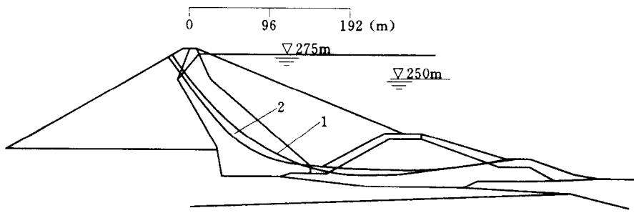  
图 7.10 小浪底大坝库水位骤降总应力法稳定分析  
1-初始，F=2.215；2-临界， $F _ { \ast } = 1 . 8 2 7$

图 7.11 抗震规范对质点动态分布系数 $\mathbf { \alpha } _ { \mathbf { \beta } } \mathbf { \alpha } _ { \mathbf { \alpha } } \mathbf { \alpha } _ { \mathbf { \beta } }$ 的规定(a) 坝高 ≤ 40m ；(b) 坝高 > 40m

## 7.5 地震荷载作用下坝坡的稳定分析

## 7.5.1 拟静力法

土石坝在地震时的变形和稳定特征，是一个专门的研究领域。在工程设计中，常用的仍是按规范建议的拟静力法。即在每个土条上施加一个地震力，相应不同的设防烈度，规范规定了其x和y方向的分量。大量的观测资料表明，土石坝在地震时坝顶的加速度要高于坝基，因此，抗震规范对地震加速度的放大系数作了具体的规定。具体方法如下。

(1) 根据第 4.5.9 条的规定，当采用拟静力法计算地震作用效应时，沿建筑物高度作用于质点i的水平向地震惯性力代表值应按下式计算：

$$
F _ { i } = a _ { h } \xi G _ { E i } \alpha _ { i } / g\tag{7.5}
$$

式中：F为作用在质点i的水平向地震惯性力代表值；ξ为地震作用的效应折减系数，除 $F _ { i }$ $\xi$ 另有规定外，取0.25； $G _ { E i }$ 为集中在质点i的重力作用标准值；α为质点i的动态分布系 $\pmb { \alpha } _ { i }$ 数。g为重力加速度。

(2) 根据规范 5.1.3 条的规定，在拟静力法抗震计算中，质点 i 的动态分布系数α应按 $\pmb { \alpha _ { i } }$ 图7.11的规定采用。图7.11中αm在设计烈度为7、8和9度时，分别取3.0、2.5和2.0。 $\alpha _ { m }$

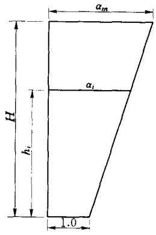  
(a)

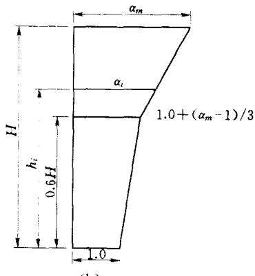  
(b)

(3) 第4.3.1 条规定，水平向设计地震加速度代表值 a在设计烈度为7、8、9度时分别 $a _ { h }$ 按0.1g、0.2g、0.4g取值。

(4) 第4.3.2 条规定竖向设计地震加速度的代表值a应取水平向设计地震加速度代表值 $\pmb { a } _ { \nu }$ 的2/3。第4.1.8条规定当同时计算互相正交方向地震的作用效应时，总的地震作用效应可取各方向地震作用效应平方总和的方根值；当同时计算水平向和竖向地震作用效应时，总的地震作用效应也可将竖向地震作用效应乘以0.5的耦合系数后与水平向地震作用效应直接相加。

采用 STAB 程序，上述4条均通过程序计算自动实现。拟静力法的操作步骤简单，故不专列例题。本节仅讨论有关土石坝地震稳定分析的一个专门问题，即采用动三轴试验成果的总应力法。

## 7.5.2 采用动三轴试验成果的总应力法

近年来，对土的动强度试验和分析技术有了很大的发展。通常对饱和土样进行动三轴试验。这类试验与饱和固结试验类似，所不同的是，动三轴要对不同的初始固结应力比 $( K _ { c } =$ $\pmb { \sigma } _ { 1 } ^ { \prime } / \pmb { \sigma } _ { 3 } ^ { \prime } )$ 进行周期荷载作用下的不排水抗剪试验，而常规的静力试验只对等向固结 $( K _ { c } = 1 )$ 条件进行试验。第5.6节已作过专门讨论。

动强度系按式(5.18)确定，具体关系是用如图7.12这样的曲线反映的。每一条曲线都相应设计地震烈度的周期荷载频率和历时。使用这些动三轴的试验成果，Seed(1966)曾提出计算的具体步骤，其要点和库水位骤降的总应力法相同，即第一步，相应没有地震力的情况，进行一次稳定分析，确定震前各土条底有效法向应力σ'和K，Seed建议使用Lowe法 $\sigma$ $K _ { c }$ 来进行稳定分析，Lowe法和陆军工程师团法出入并不大；第二步，根据得到的σ′和 $\pmb { \sigma }$ $K _ { c } ,$ 从反映式(5.18)的图表中查到各土条相应的动强度，然后将土看成是 $\tau _ { f s }$ $\scriptstyle \mathbf { \phi } \cdot \mathbf { \phi } \left. \phi = 0 \right.$ $c = \tau _ { f s }$ 的材料，加上地震力再进行一次稳定分析。详细过程参见下面[例7.9]。

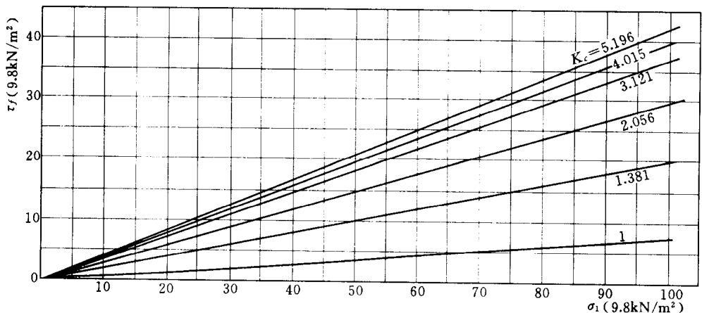  
图 7.12 密云水库白河大坝上游砂壳材料(<5 mm)动力参数

[例7.9] 密云水库白河大坝上游砂壳地震稳定分析。

该坝上游砂壳在1976年唐山地震时发生滑坡。饱和砂样在室内动三轴试验中获得的动总强度，经换算如图7.12所示，用STAB程序进行计算。根据当时的地震加速度实测情况，近似地利用抗震规范中规定的7度地震加速度分布图形。

情况1：对图7.13所示圆弧滑裂面情况，进行复核。

第一步，相应无地震力的情况，用罗厄法进行一次稳定分析，得到安全系数为2.093，沿滑裂面各土条的法向有效应力σ和剪应力τ，如表7.9所示。程序对各土条进行换算， $\sigma _ { f o } ^ { \prime }$ $\tau _ { f o }$ 并根据输入的动强度数据网进行内插，获得各土条在地震时发挥的动总强度τf，也列于表 $\tau _ { f s }$ 7.9中。

第二步，使用动强度τf，对该圆弧进行下步7度地震的滑弧稳定分析（具体处理时， $\tau _ { f s }$ 把各土条的强度指标换成 $c = \tau _ { f s } , \phi = 0 )$ ，得到用总应力法算得的安全系数 ${ \pmb F } { = } 1 . 0 2 2$ (瑞典法、毕肖普法、改良瑞典法的结果相同)。

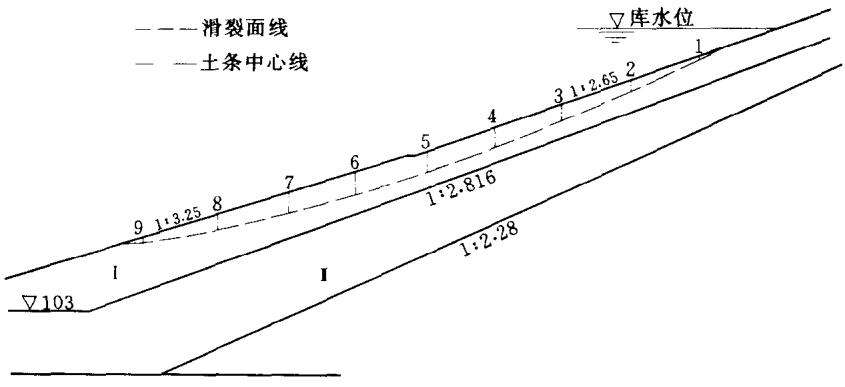  
图7.13 密云水库白河大坝上游砂壳地震总应力法稳定分析（圆弧滑裂面）

表7.9 [例7.9]地震时各土条发挥的动总强度（圆弧滑裂面） $\tau _ { f s }$ （单位：9.8kN/m²）
<table><tr><td>土条号</td><td>1</td><td>2</td><td>3</td><td>4</td><td>5</td><td>6</td><td>7</td><td>8</td><td>9</td></tr><tr><td> $\sigma _ { f o }$ </td><td>0.684</td><td>1.877</td><td>2.708</td><td>3.151</td><td>3.195</td><td>3.584</td><td>3.081</td><td>2.155</td><td>0.791</td></tr><tr><td> $\tau _ { f o }$ </td><td>0.212</td><td>0.583</td><td>0.840</td><td>0.978</td><td>0.991</td><td>1.112</td><td>0.956</td><td>0.669</td><td>0.246</td></tr><tr><td> $\tau _ { f s }$ </td><td>0.260</td><td>0.713</td><td>1.020</td><td>1.197</td><td>1.213</td><td>1.361</td><td>1.170</td><td>0.818</td><td>0.301</td></tr></table>

情况2：对情况1，用摩根斯顿一泼赖斯法计算图 7.14 折线滑裂面2在 7°地震时稳定安全系数。

第一步，相应地震前荷载用改良瑞典法算得安全系数为2.142。各土条的τf如表7.10 $\pmb { \tau _ { f s } }$ 所示。

第二步，使用τf进行7度地震摩根斯顿一泼赖斯法滑动稳定分析，得安全系数1.028。 $\tau _ { f s }$

两种情况所得安全系数均接近1，与发生滑坡的实际情况符合。

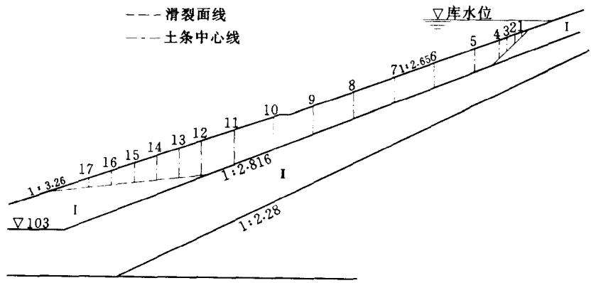  
图7.14 密云水库白河大坝上游砂壳地震总应力法稳定分析（非圆弧滑裂面）

表7.10 [例7.9]地震时各土条发挥的动总强度（非圆弧滑裂面） $\tau _ { f s }$ (单位： $9 . 8 \mathrm { k N } / \mathrm { m } ^ { 2 } )$
<table><tr><td>土条号</td><td>1</td><td>2</td><td>3</td><td>4</td><td>5</td><td>6</td><td>7</td><td>8</td><td>9</td></tr><tr><td> $\sigma _ { f o }$ </td><td>1.712</td><td>2.246</td><td>2.929</td><td>4.568</td><td>4.786</td><td>5.004</td><td>5.222</td><td>5.441</td><td>6.267</td></tr><tr><td> $\tau _ { f o }$ </td><td>0.520</td><td>0.682</td><td>0.889</td><td>1.387</td><td>1.453</td><td>1.520</td><td>1.586</td><td>1.652</td><td>1.903</td></tr><tr><td> $\tau _ { f s }$ </td><td>0.637</td><td>0.836</td><td>1.090</td><td>1.700</td><td>1.781</td><td>1.862</td><td>1.943</td><td>2.025</td><td>2.332</td></tr><tr><td>土条号</td><td>10</td><td>11</td><td>12</td><td>13</td><td>14</td><td>15</td><td>16</td><td>17</td><td></td></tr><tr><td> $\sigma _ { f o }$ </td><td>6.718</td><td>7.472</td><td>6.332</td><td>5.173</td><td>4.023</td><td>2.874</td><td>1.724</td><td>0.575</td><td></td></tr><tr><td> $\tau _ { f o }$ </td><td>2.040</td><td>2.269</td><td>1.920</td><td>1.571</td><td>1.222</td><td>0.873</td><td>0.524</td><td>0.175</td><td></td></tr><tr><td> $\tau _ { f s }$ </td><td>2.500</td><td>2.782</td><td>2.353</td><td>1.925</td><td>1.497</td><td>1.069</td><td>0.642</td><td>0.214</td><td></td></tr></table>

[例7.10] 密云水库潮河大坝加固设计。

白河大坝滑坡后，对斜墙前的保护层进行了整修，使用了石碴料，因此，不再存在地震时砂土液化或指标降低的问题。但潮河大坝仍为原设计的砂壳料，故决定在1999年对潮河大坝进行加固。加固方案为坝前抛石压坡，如图7.16所示。采用本次初设动三轴的试验资料对经加固的坝壳在 7 度地震条件下计算。将图 5.22 转成 STAB 要求的 $\sigma _ { 3 } , \ K _ { c }$ 与 $\tau _ { f s }$ 的关系曲线图7.15。图7.16为采用与例7.7相似的步骤的计算图形，获得相应振动次数为10次的安全系数 $F { = } 1 . 1 3 7$ 0

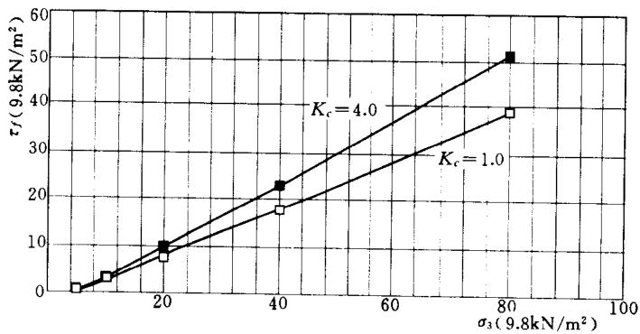  
图 7.15 密云水库潮河大坝上游砂壳 ${ \pmb \sigma } _ { 3 } , ~ { \pmb K } _ { c }$ 与 $\pmb { \tau }$ 的关系曲线

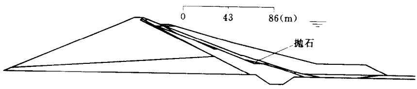  
图7.16 密云水库潮河大坝上游砂壳地震总应力法稳定分析

## 7.6 本章附录

## 7.6.1 本章数据文件（表7.11）

表7.11本章数据文件
<table><tr><td>有关章节</td><td>系列号</td><td>数据文件名</td><td>内容</td><td></td></tr><tr><td rowspan="2">7.2.2</td><td>07-01-01 07-01-02 07-01-03 07-01-04</td><td>X250-1.DAT X250-2.DAT 11.DAT 12.DAT</td><td>[例7.1]有效应力法，非线性指标 [例7.1]</td><td rowspan="2">[例7.1]有效应力法，线性指标，小浪底大坝 总应力法，库水位230m 总应力法，库水位230m，沿软弱夹层 总应力法，库水位250m，沿软弱夹层 [例7.3] 蒲城电厂灰坝，初期坝</td></tr><tr><td>07-01-05 07-01-06 07-01-07 07-02-01</td><td>13.DAT Y4.DAT Y5.DAT Z3-D.DAT</td><td>[例7.1]总应力法，库水位250m [例7.1] 总应力法，库水位265m [例7.1] [例7.1]</td></tr><tr><td>7.3</td><td>07-02-03 07-03-01 07-03-02 07-03-03 07-03-04 07-03-05 07-03-06 07-03-07</td><td>Z5.DAT Z6.DAT NL-10_5.DAT NL-10_6.DAT NL-10_7.DAT NL-10_8.DAT NL-15_5.DAT NL-15_6.DAT</td><td>[例7.3] [例7.5] cotβ=1.0,b=0.5 [例7.5]cotβ=1.0,b=0.6 [例7.5]cotβ=1.0,b=0.7 [例7.5]cotβ=1.0,b=0.8 [例7.5]cotβ=1.5, b=0.5 [例7.5]cotβ=1.5, b=0.6</td><td>[例7.3]蒲城电厂灰坝，中期坝 蒲城电厂灰坝，终期坝</td></tr><tr><td>7.4.2</td><td>07-03-08 07-04-01</td><td>NL-15_7.DAT NL-15_8.DAT GBX2E.DAT</td><td>[例7.5] cotβ=1.5, b=0.7 [例7.5]cotβ=1.5,b=0.8 [例7.6]</td><td>公伯峡心墙坝方案，库水位降落期</td></tr><tr><td>7.4.3 7.4.3</td><td>07-05-01 07-06-01</td><td>CORPS.DAT 8.DAT</td><td>[例7.7] [例7.8]</td><td>说明库水位降落期总应力法计算步骤 小浪底大坝，库水位降落期总应力法 [例7.9] 密云潮河大坝地震期总应力法例</td></tr></table>

## 参考文献

1 U. S. Army Corps of Engineers. Stability of slopes and foundations. Engineering Manual. Visckburg, 1967

2 中华人民共和国行业标准. 水工建筑物抗震设计规范.SL203-97.1997

3 Charles, J. A . and Soares, M. M. Stability of compacted rockfill slopes. Geotechnique, 1984. 34( 1): 61-76

4 陈祖煜. 采用非线性强度指标的边坡稳定分析.水力发电，1990.9：9-13

5 陈祖煜.库水位骤降期土石坝坡稳定分析总应力法的计算步骤.水利水电技术，1985.9:30-32

6 陈祖煜.土石坝边坡稳定分析中的总应力法.北京：水利水电技术，1984：1-6

7 陈祖煜，王清友，汪宁．采用三轴动强度指标进行的土石坝地震总应力法边坡稳定分析.水利水电科学研究院、清华大学，1985

8 黄河水利委员会勘测规划设计院.小浪底水利枢纽土石坝工程安全检查自检报告.1999

水利水电科学研究院，湖南省水利水电勘测设计院.金河泥炭筑堤技术总结.1984

10 水利水电科学研究院.蒲城电厂挡灰坝坝型及地基处理方案论证.岩土工程学报，1991

## 第8章 边坡加固稳定分析

## 8.1 前言

当边坡的稳定安全系数不能达到要求时，就需要采取工程措施提高安全系数，以满足安全运行的需要。卸荷、坡趾压载、排水是通常采用的措施。采用这些方法，在边坡稳定分析方面，不增加任何新的内容，可以按已有的分析方法进行分析和复核。当没有条件进行上述工程措施或采取了上述措施后，仍不能使安全系数达到允许数值时，就需要使用结构性工程措施对边坡进行加固。

O'Rourke和 Jones(1990)将土体的加固体系分为外部加固和内部加固两大类，如图8.1所示。同时提出了外部加固和内部加固两种类型的典型例子。在20世纪60年代以前，土体的加固主要依赖于外部加固。随着技术的进步，越来越多的内部加固措施在土方工程中得到了应用。内部加固依赖于施加在土体内的加筋构件，如锚杆、锚索、土工布等。这些构件通常应插入潜在滑裂面以后的稳定土体中。

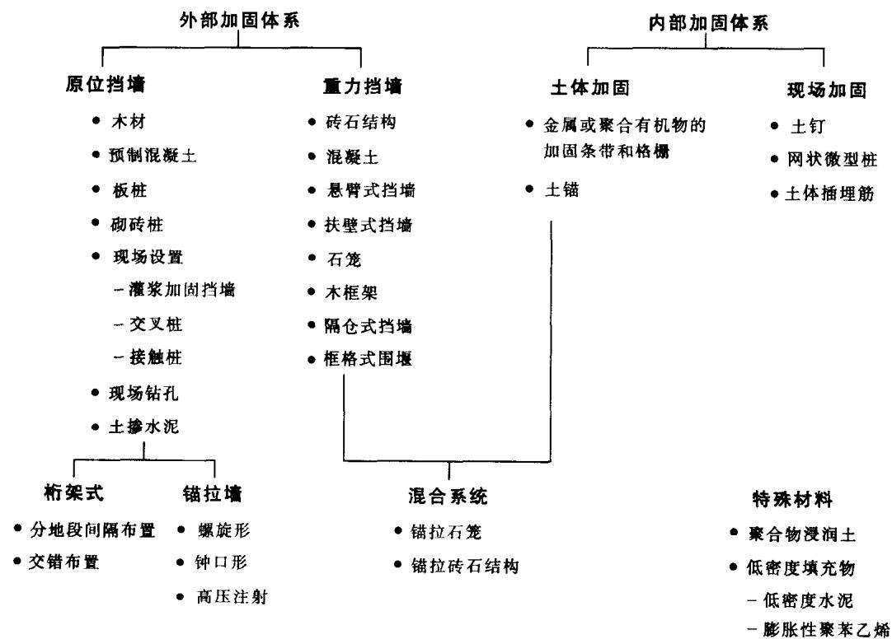  
图 8.1 土体加固体系分类表

对于内部加固的结构，一些学者又将其分为铺设型和现场改良型两种(Schuster,1995)。

## 1. 铺设型

铺设型指在填土过程中施加各种加筋构件，主要可包括以下几种：

(1) 条型加筋构件。此类构件可以是经处理的钢筋，也可以是条型非金属加筋带。图8.2为采用高强度聚合物条带作加筋土的例子。

(2)土工布加固构件。这类构件具有不同的规格型号，随着填土一层一层地铺设，以适应不同的环境要求。在坡面往往将土工布弯回，如图8.3所示。

(3) 格栅型加筋构件。在20世纪70年代，制作此类构件的技术日益更新，格栅型构件具有很高的强度和韧度，同时有利于排水。1983年，在美国建成了一个高9m的近直立(80°)挡土墙，如图8.4所示。

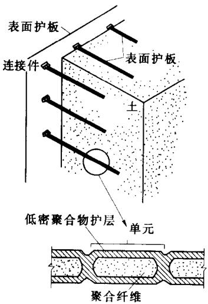  
加筋带断面(条带有10个单元宽)  
图 8.2 非金属条带示意图

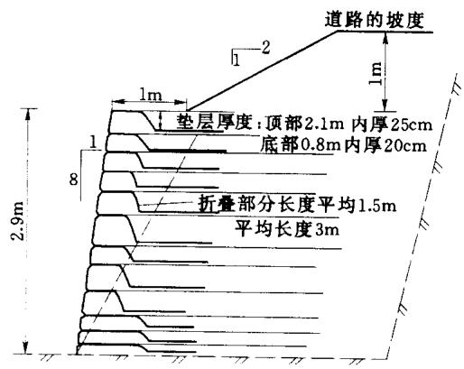  
图 8.3 土工布加固示意图

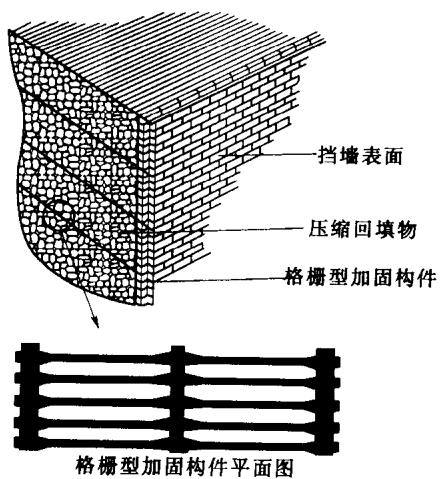  
图 8.4 格栅型加固墙及回填物内的格栅型加固单元示意图

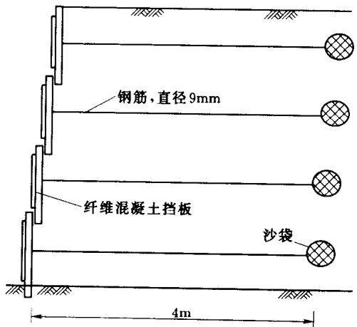  
图 8.5 插入式锚固件示意图

(4)插入式锚固件。插入式锚固件的典型例子如图8.5所示，它是日本的一个新型锚拉构件。此类型的作用与土锚索和土锚杆类似，但是是随着填土现场铺设的。图8.5所示，墙面为 5m 高的纤维混凝土挡墙，由 9mm 直径钢筋与 40cm×40cm 的钢筋混凝土板或沙袋构成。

## 2. 现场改良型

(1)土钉。土钉也即钢筋或金属管，可直接将其插入土体或软岩中，也可以埋进预先钻好的钻孔中。土钉与土体共同作用，以提高土体的凝聚力，通常可用于支护临时开挖边坡或加固不稳定边坡，以阻止其位移变形，如图8.6示。

(2)锚索。采用深部预应力锚索加固边坡的方法正得到越来越多的应用，该方法可使滑坡体的空间变位得到有效的约束，对于保持边坡稳定十分有效。在土坡中采用锚索，钻孔和成孔往往是主要的制约因素。近期开发了一种“跟管”技术，在钻进中随时用套管固壁，可有效解决这一问题。小湾水电工程在处理夹大孤石的堆积体中成功地应用这一技术将锚索穿越土体深入基岩。

(3)树根桩。近年来发展起来一种“树根桩”系统加固边坡。“树根桩”系统通常由直径为7.5\~30cm的混凝土群桩组成，如图8.7所示。该方法与传统土钉的区别在于，群桩的树根状三维几何分布形态可使加固土体形成一个整体，可有效地提高边坡的稳定性。

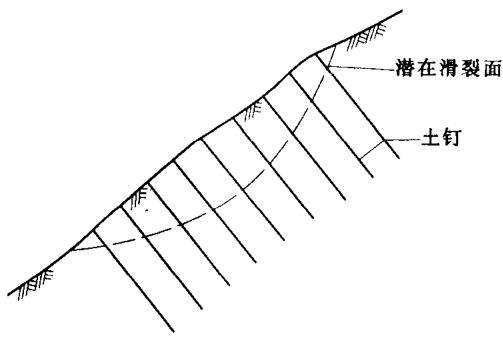  
图 8.6 土钉加固示意图

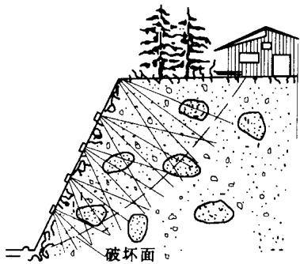  
图 8.7 树根桩加固示意图  
本章以下各节分别讨论考虑这些加固方法的边坡稳定分析方法。

## 8.2 支挡结构的主动土压力计算

## 8.2.1 概述

作用于支挡结构上的土压力问题实际上是一个具有垂直表面并且在此表面作用有外荷的边坡稳定问题。传统的库仑主动土压力理论使用的分析方法和边坡稳定方法也是类似的。

图8.8是土力学教科书中常见的按库仑理论计算主动土压力的方法。假定墙后土体一部分沿一个直线滑裂面滑动。通过分析由墙土结合面、滑裂面和土体顶部直线构成的三角形的土体的力的平衡，可以计算土体作用在墙上的主动土压力P。不断变动直线滑裂面位置，可以找到使P获得极大的临界滑裂面。这一极大值就是按库仑土压力理论获得的主动土压力。

Duncan(1990)曾对修建于岩质边坡、运行期达50年之久的若干挡土墙做过一次调查，他在报告中指出，有必要重新回顾太沙基关于土压力基础理论和设计方法的一些主要认识。

太沙基认为，即便挡墙修建在岩基上，挡墙仍然会发生足够的变形，形成主动土压力。因此，目前一些以静止土压力来核算挡土墙抗滑稳定的作法过于保守，是没有必要的。

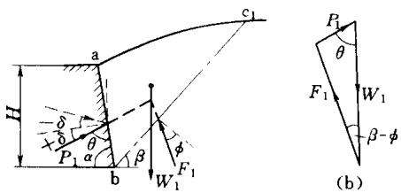  
(a)

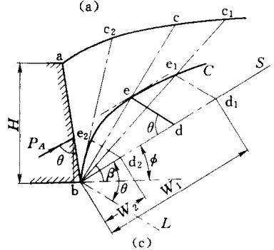  
图8.8 应用库仑理论计算主动土压力的方法  
(a) 作用于一滑动土体上的力；(b) 静力平衡条件；(c) 确定临界滑裂面

我们知道，传统的库仑主动土压力理论在柔性支挡结构领域是不适用的。Casagrande(1973)在调查了德国和巴拿马运河的一系列锚拉墙破坏实例后指出，作用在各种柔性支挡结构上的土压力通常要比按传统的库仑方法确定的主动土压力大，其数值接近土的静止土压力。Terzaghi 和 Peck (1967)曾使用大量篇幅对这一问题作出解释。在回顾土压力理论发展50年的历史后，Peck(1990)教授曾作过这样的总结：“我们现在已经知道，土压力的分布是和变形特征相关联的。我们高度赞赏 Terzaghi在这一问题上作出的杰出贡献。这一极有意义的发现是他在Robert 大学所作的香烟盒试验和麻省理工学院所作的大型模型试验中得到的。他通过这些试验说明，土压力的合力的作用点可以在上三分点和下三分点之间的任何一个位置。”

Terzaghi 和 Peck 采用如图 8.9所示的方法，试图通过加入力矩平衡条件来计入土压力作用点位置对土压力大小的影响。他们假定锚拉式或支挡式挡土结构的土压力分布为梯形，合力作用点大致在中点。采用类似边坡稳定分析的方法获得柔性支挡结构的土压力，如图8.9示。并据此提出了一套经验系数，已在当前工程界广泛使用。我们将在第8.2.7节[例8.4]中讨论这些经验方法。

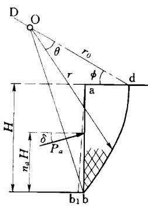  
(a)

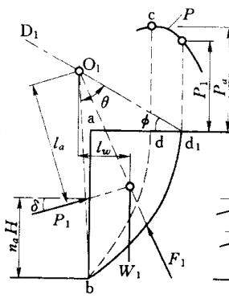  
(b)

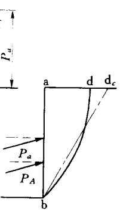  
(c)  
图 8.9 Terzaghi 和 Peck 建议的计算柔性支挡结构的土压力的方法  
(a) 对数螺旋线滑裂面；(b) 作用在滑体上的力；(c) 与库仑理论的比较，实线为本法，虚线为库仑理论

上述论述说明，土压力和边坡稳定分析具有相同之处。但是，传统的库仑理论仅考虑力的平衡条件，因此无法用来计算土压力作用点位于中点附近的柔性支撑结构的土压力。但考虑了力矩平衡条件的方法又限于当时数值分析手段，滑裂面被假定为对数螺旋线。所有这些简化方法在处理较复杂的地形地质条件时将难以真实地反映实际情况，本书作者将已经建立起来的通用条分法推广到各种支挡结构的土压力领域，较好地解决了上述问题。

这一成果是本书作者及其合作者在九十年代后期开始的，研究开发的方法将第2 章介绍的通用条分法推广到计算主动土压力(Chen &Li, 1998)。这一研究成果不仅在理论上深化了由 Terzaghi 和 Peck 提出的关于柔性支挡结构土压力的方法，而且作为 STAB95 程序的一部分，在宜兴、紫坪铺等一系列工程中得到了应用。本章简要介绍有关的方法和应用实例。

## 8.2.2 静力平衡控制方程

在第2 章，已经给出了作用力 G(x)在两端边界为零的情况下式(2.12)和式(2.15)的解。对于土压力问题，边界处的G(b)不为零，相应的边界条件为

$$
\boldsymbol { G } ( \boldsymbol { a } ) = \boldsymbol { P } _ { w }\tag{8.1}
$$

$$
G ( b ) = P\tag{8.2}
$$

$$
\beta ( a ) = 0\tag{8.3}
$$

$$
\beta ( b ) = \delta\tag{8.4}
$$

$$
k ( a ) = h _ { w } \mathrm { ~ } / H _ { w } = 1 / 3\tag{8.5}
$$

$$
h / H = k ( b )\tag{8.6}
$$

$\pmb { P _ { w } }$ 和P分别为作用于右端拉力缝的水压 $P$ 力和左端直立墙上的主动土压力（见图8.10)。其作用点相对位置用k来代表。定义k 为 P 对条底的力臂与条高的比值。注意，在这里，引入了顶部具有拉力缝充水这一更具一般意义的情况。 $h _ { w }$ 和 h 分别为拉力缝上水压力和主动土压力的作用高度，δ为土压力与x轴的夹角。在这里，k(b)是一个输入值，其数值在1/3\~2/3之间，输入不同的数

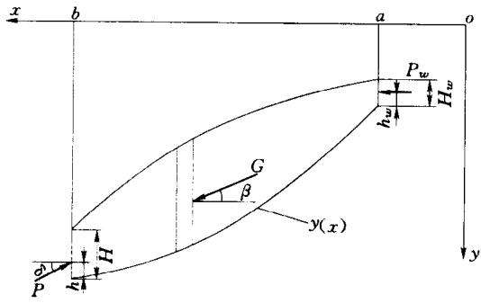  
图8.10通用条分法（端部作用力不为零）

值，反映了不同的支挡结构特性。例如，对重力式挡墙，输入 $k ( b ) { = } 1 / 3$ ，而对柔性支挡结构，则输入1/2。

在计算土压力时，强度指标不再按式(2.2)和式(2.3)缩减，按照第2.2节同样的推导，有

$$
G ( x ) = - \sec ( \phi ^ { \prime } - \alpha + \beta ) s ^ { - 1 } ( x ) \biggl [ \int _ { a } ^ { x } p ( \zeta ) s ( \zeta ) \mathrm { d } \zeta - G ( a ) \biggr ]\tag{8.7}
$$

可以得到方程式(2.23)和式(2.24)更具普遍意义的解。

静力平衡方程的解为

$$
\int _ { a } ^ { b } p ( x ) s ( x ) d x = G _ { m }\tag{8.8}
$$

其中包含的变量代号与第2章相同，引入以下符号

$$
\psi = \phi ^ { \prime } - \alpha + \beta\tag{8.9}
$$

$$
E ( x ) = \exp [ - \int _ { a } ^ { x } \tan \psi \frac { \mathrm { d } \beta } { \mathrm { d } \zeta } \mathrm { d } \zeta ]\tag{8.10}
$$

$$
G _ { m } = P _ { w } - P E ( b )\tag{8.11}
$$

在对式(2.15)积分时，式(2.27)的变换可由以下更具一般意义的推导表示：

$$
\begin{array} { l l l } & { \displaystyle \int _ { a } ^ { b } G ( \sin \beta - \cos \beta \tan \alpha ) \mathrm { d } x = - \int _ { a } ^ { b } \int _ { a } ^ { x } [ p ( \zeta ) s ( \zeta ) - P _ { w } ] \mathrm { d } \zeta \mathrm { d } t } \\ & { = - \displaystyle \Bigg [ t \int _ { a } ^ { x } [ p ( \zeta ) s ( \zeta ) \mathrm { d } \zeta ] \Bigg ] _ { a } ^ { b } + \int _ { a } ^ { b } p ( x ) s ( x ) t ( x ) \mathrm { d } x + \int _ { a } ^ { b } P _ { w } \mathrm { d } t } \\ & { = - t ( b ) G _ { m } + \displaystyle \int _ { a } ^ { b } p ( x ) s ( x ) t ( x ) \mathrm { d } x + P _ { w } t ( b ) = P [ E ( b ) t ( b ) ] + \displaystyle \int _ { a } ^ { b } p ( x ) s ( x ) t ( x ) \mathrm { d } x \Bigg ] } \end{array}\tag{8.12}
$$

在考虑滑动土体两端G不为零的情况时，式(2.22)右侧为

$$
\int _ { a } ^ { x } \eta \frac { \mathrm { d } W } { \mathrm { d } x } h _ { e } d x + [ G \cos \beta ( y _ { t } - y ) ] _ { a } ^ { x } = \int _ { a } ^ { x } \eta \frac { \mathrm { d } W } { \mathrm { d } x } h _ { e } d x + P _ { w } h _ { w } - h P \cos \delta\tag{8.13}
$$

故有

$$
\int _ { a } ^ { b } p ( x ) s ( x ) t ( x ) \mathrm { d } x = M _ { m }\tag{8.14}
$$

$$
M _ { m } = P _ { w } h _ { w } - P [ h \cos \delta + t ( b ) E ( b ) ] + \int _ { a } ^ { b } \eta \frac { \mathrm { d } W } { \mathrm { d } x } h \mathrm { d } x\tag{8.15}
$$

式中：P为待求的土压力； $P _ { w }$ 为拉力缝中的水压力：

$$
P = G ( b )\tag{8.16}
$$

$$
P _ { w } = G ( a )\tag{8.17}
$$

## 8.2.3 数值分析方法

将式(8.8)和式(8.14)合并可得

$$
M _ { n } ( \lambda ) = M - P _ { w } h _ { w } + ( P _ { w } - G ) [ \frac { h \cos \delta } { E ( b ) } + t ( b ) ] - \int _ { a } ^ { \dot { b } } \eta \frac { \mathrm { d } W } { \mathrm { d } x } h _ { e } \mathrm { d } x = 0\tag{8.18}
$$

其中

$$
G = \int _ { a } ^ { b } p ( x ) s ( x ) \mathrm { d } x\tag{8.19}
$$

$$
M = \int _ { a } ^ { b } p ( x ) s ( x ) t ( x ) \mathrm { d } x\tag{8.20}
$$

求解式(8.8)包含对一个未知量λ的迭代，获得了λ后可将其代入式(8.8)或式(8.14)解得 $P _ { c }$ 迭代步骤如下：

$$
\Delta \lambda _ { i } = \lambda _ { i + 1 } - \lambda _ { i } = \frac { - M _ { n } } { \left( \frac { \partial M _ { n } } { \partial \lambda } \right) }\tag{8.21}
$$

其中 i=0, 1, 2, …。

两个迭代步骤λ值满足下式时则计算收敛结束：

$$
\left| \lambda _ { i + 1 } - \lambda _ { i } \right| < \varepsilon\tag{8.22}
$$

式中ε为允许误差。

式(8.21)中的 $\partial M _ { n } / \partial \lambda$ 按下式决定：

$$
\frac { \partial M _ { n } } { \partial \lambda } = \frac { \partial M } { \partial \lambda } + ( P _ { w } - G ) \times \left\{ \lbrack \frac { h \cos \delta } { E ( b ) } + t ( b ) \rbrack Q ( b ) - R ( b ) \right\} - \frac { \partial G } { \partial \lambda } \left[ \frac { h \cos \delta } { E ( b ) } + t ( b ) \right]\tag{8.23}
$$

此式中∂M/∂λ和∂G/∂λ已在第2章给出，其它计算公式如下：

$$
Q ( b ) = \int _ { a } ^ { b } \sec ^ { 2 } \psi \frac { \mathrm { d } \alpha } { \mathrm { d } \xi } \frac { \mathrm { d } \beta } { \mathrm { d } \lambda } \mathrm { d } \xi - D _ { i } + \left( \tan \psi _ { b } \frac { \mathrm { d } \beta _ { b } } { \mathrm { d } \lambda } \right)\tag{8.24}
$$

$$
R ( b ) = - \int _ { a } ^ { b } \cos \phi ^ { \prime } s e c \alpha s e c \psi E ^ { - 1 } ( x ) \frac { \mathrm { d } \beta } { \mathrm { d } \lambda } \mathrm { d } x + \int _ { a } ^ { b } t ( x ) s \mathrm { e c } ^ { 2 } \psi \frac { \mathrm { d } \alpha } { \mathrm { d } \xi } \frac { \mathrm { d } \beta } { \mathrm { d } \lambda } \mathrm { d } \xi + D _ { t i } - t ( b ) \tan \psi _ { b } \frac { \mathrm { d } \beta _ { b } } { \mathrm { d } \lambda } \mathrm { d } \xi .\tag{8.25}
$$

$D _ { i }$ 和 $D _ { n }$ 定义见第2章式(2.171)和式(2.172)，式(8.23)的推导可参见文献（李松梅，1997)。

## 8.2.4 合理性要求

和通用条分法类似，土压力的计算成果需要接受下列合理性条件的限制：

$$
F _ { \nu } = { \frac { [ E ^ { \prime } \tan \phi _ { a \nu } ^ { \prime } + c _ { a \nu } ^ { \prime } ( y - z ) ] } { X } } > 1\tag{8.26}
$$

$$
0 < A _ { c } ^ { \prime } < 1\tag{8.27}
$$

$$
A _ { c } ^ { \prime } = { \frac { y _ { t } ^ { \prime } - z } { y - z } }\tag{8.28}
$$

式中符号定义参见第2.1节。

在主动土压力领域，我们通常不再采用图2.1 中对土条侧向力倾角β的假定1。因为如果 $\beta$ 假定为一个常数，那么在直立墙部位 (x=b)，β将突变为δ，显然是不合理的。因此，在 $( x { = } b )$ $\beta$ 土压力领域，我们使用图2.1中所示第二种假定。并且要求在直立墙部位，有 $\scriptstyle { \tan \beta = \tan \delta }$

## 8.2.5 库仑土压力计算公式

图8.8所示库仑土压力理论假定滑裂面为直线，仅使用静力平衡方程式求解，此时${ \mathrm { d } } \alpha / { \mathrm { d } } x = 0$ ，因此，

$$
E ( x ) = \frac { \cos ( \phi ^ { \prime } - \alpha + \beta ) } { \cos ( \phi ^ { \prime } - \alpha + \beta _ { a } ) }\tag{8.29}
$$

$$
s ( x ) = \sec ( \phi ^ { \prime } - \alpha + \beta _ { a } )\tag{8.30}
$$

代入式(8.8)可得

$$
\int _ { a } ^ { b } p ( x ) \sec ( \phi ^ { \prime } - \alpha + \beta _ { a } ) d x = P _ { w } - P { \frac { \cos ( \phi ^ { \prime } - \alpha + \delta ) } { \cos ( \phi ^ { \prime } - \alpha + \beta _ { a } ) } }\tag{8.31}
$$

因此计算库仑主动土压力的公式可简化为

$$
P = P _ { w } \cos ( \phi ^ { \prime } - \alpha + \beta _ { a } ) { \sec ( \phi ^ { \prime } - \alpha + \delta ) } - \sec ( \phi ^ { \prime } - \alpha + \delta ) { \int _ { a } ^ { b } } p ( x ) d x\tag{8.32}
$$

在无拉力缝时上式右端第一项为零，在有拉力缝时右端第一项中的 $\beta _ { a } = 0$ 。以上的推导是在假定滑裂面上 $\phi _ { e } ^ { \prime }$ 为常数的条件下进行的，也就是说，是按照如图8.8示经典的库仑理论进行的。如果滑裂面通过不同的土层，那么图8.8示的图解法就无能为力了。需要使用更具一般意义的式(8.8)，而且要对土条侧向力的倾角作出假定，最简便的方法是令 $\beta$ 在 a和 b点（图8.10）分别为 $\beta _ { a }$ 和 $\pmb \delta$ ，中间条块的 $\beta$ 值按线性内插原则确定。在具有拉力缝时，$\beta _ { \mathfrak { a } } { = } 0$ 。无拉力缝时， $\beta _ { a }$ 值宜按第2章讨论的原则，设为 ${ \beta } _ { a } = { \gamma } _ { a }$ $\gamma _ { a }$ 为 $^ { a }$ 点坡面的倾角。

## 8.2.6 临界滑裂面的确定

第4章讨论的确定临界滑裂面的方法可以不作修改用于求解主动土压力的问题。但是，在主动土压力领域，目标函数不再是安全系数，而是土压力，临界滑裂面所相应的是最大主动土压力。为使用同样的优化程序来计算主动土压力，我们引入加载系数的定义：

$$
P = ( 1 - \eta ) P ^ { \prime }\tag{8.33}
$$

$P ^ { \prime }$ 为数值计算时事先假定的土压力。主动土压力 $P _ { a }$ 就是与临界滑面相对应的最大的P值，即相应最小的η值，不论初始假定的 $P ^ { \prime }$ 为何值均可收敛到同一 $P _ { a }$ 。数值方法从初始估计的滑裂面开始（估计滑裂面的加载系数为 $\eta _ { o } )$ 。最优化方法将找到与最小η值，即 $\eta _ { m }$ 相应的临界滑裂面，在下面的例题中我们将介绍这一搜索过程的工作情况。

## 8.2.7 例题和讨论

对各种柔性支挡结构的大量观察表明，作用于挡土墙上的土压力与墙体的柔性有关，即随土体的允许位移不同而不同。如前所述，Casagrande(1973)曾仔细分析了许多德国高速公路桥的实测资料后发现，墙后土体的土压力分布与三角形分布相差甚远，Muller测量了许多高速公路桥的土压力值也证实了这一点。在大多数情况下墙后压力为梯形或矩形，因而，其合力作用点不一定在墙高的下三分点。为此，我们需要研究不同的h值相应的土压力数值。下面，我们通过[例8.1]来考虑不同的土压力位置k(b)对其大小的影响。

## [例8.1] 考核通用条分法用以计算主动土压力合理性例。

我们现在通过一个墙高为 12m的算例来说明使用8.2.1 节介绍的数值分析方法求解主动土压力的步骤(Chen and Li，1997)，如图 8.11 示。为了和传统方法比较，此例两端点的β值均设为零，采用图2.2(b)第2种侧向力的假定。当h=4,6,8m时，相应 $k { = } 1 / 3 , \ 1 / 2 , \ 2 / 3$ 0输入的初始滑裂面编号为0，获得的临界滑裂面分别为1,2,3。相应的主动土压力，即 $x = a$ 处的P值P分别为387.3,599.07,462.76kN。分析这些计算成果，可得到如下认识： $P _ { a }$

在 $k { = } 1 / 3$ 时，临界滑裂面回归为一条直线(曲线1)，与水平面夹角恰好为 $4 5 ^ { \circ } + \phi / 2 ( = 6 3 ^ { \circ } )$ 其土压力数值也与库仑土压力的理论值一致。说明，当作用点为下三分点时，本文介绍条分法可以回归为重力式挡土墙的经典理论。

当 $k = 1 / 2$ 时，主动土压力P变大。相应的临界滑裂面为曲线型（曲线2）。由此可见， $P _ { a }$ 诸如支撑、锚拉和悬臂这一类的支挡式结构，由于土压力作用点位置拾高到中点，其数值通常比重力式挡土墙的相应值大。Casagrande(1973)曾建议使用静止土压力系数K0作为各 $K _ { 0 }$ 种支挡式结构的主动土压力系数，K0可取为(1-sinφ)。对于本例， $K _ { 0 }$ $K _ { 0 } { = } 0 . 4 1$ ，故在 $k = 1 / 2$ 情况下 $P _ { a } { = } 6 1 0 . 8 0 \mathrm { k N }$ ，这一数值和使用本文介绍的下限解599.07kN接近。

$P _ { a }$ 在 $k = 1 / 2$ 附近获得极大值。从实用和安全观点来看，工程师可以将P的极大值作为 $P _ { a }$ 柔性支挡结构主动土压力的解。

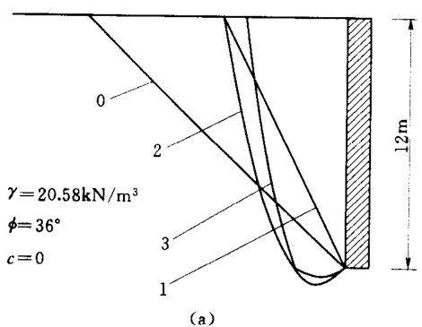

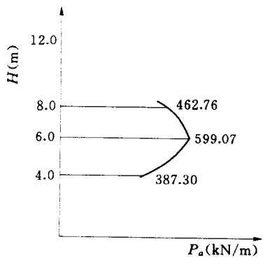  
图 8.11 分析土压力与作用点位置关系一例（[例8.1]）  
(a) 初始和临界滑裂面；(b) 土压力

在k =1/2计算过程中，我们还发现如果不引入式(8.26)和式(8.27)的限制条件，得到的$\pmb { P _ { a } }$ 值是1269.98kN。可是，检查这个解相应的正应力和剪力分布，发现这个解答是不正确的，因为坡顶附近的土条面上的正应力和剪应力违背了式(8.26)。这个解如果不被排除，将代替正确解599.07kN。事实上，作者曾碰到类似的错误解的数值比遵循合理性条件的解大10倍还多的情况。这一现象说明，条分法中的合理性条件的限制，即式(2.7)至式(2.9)，限制了对f(x)假定的随意性，为其推广到土压力领域创造了条件。

本例说明，早期 Terzaghi 和 Peck使用的简化的力矩平衡方法（图 8.9)，可以用本章介绍的更严格的方法来代替。

[例8.2] 考核通用条分法和库仑主动土压力一致性。

在第8.2.4 节，我们介绍了通用条分法回归为库仑主动土压力的情况。现以图 8.12 为例，验证这一计算公式与经典解答的一致性。

如图8.12所示，理论解答的计算公式为

$$
K _ { a } = \frac { \cos ^ { 2 } ( \phi ^ { \prime } - \alpha ) } { \cos ^ { 2 } \alpha \cos ( \delta + \alpha ) \bigg [ 1 + \sqrt { \displaystyle \frac { \sin ( \phi ^ { \prime } + \delta ) \sin ( \phi ^ { \prime } - \beta ) } { \cos ( \delta + \alpha ) \cos ( \beta - \alpha ) } } \bigg ] ^ { 2 } }\tag{8.34}
$$

$$
\cot ( \beta _ { \alpha } - \beta ) = \sec ( \phi ^ { \prime } + \delta + \alpha - \beta ) \sqrt { \frac { \sin ( \phi ^ { \prime } + \delta ) \cos ( \delta + \alpha ) } { \sin ( \phi ^ { \prime } - \beta ) \cos ( \beta - \alpha ) } } - \tan ( \phi ^ { \prime } + \delta + \alpha - \beta )\tag{8.35}
$$

式中： $\pmb { \alpha }$ 为墙的相对铅直线的倾斜角； $\beta _ { a }$ 为提供最大土压力的滑裂面与水平线的夹角； $\beta$ 为坡面倾角； $K _ { a }$ 为主动土压力系数。

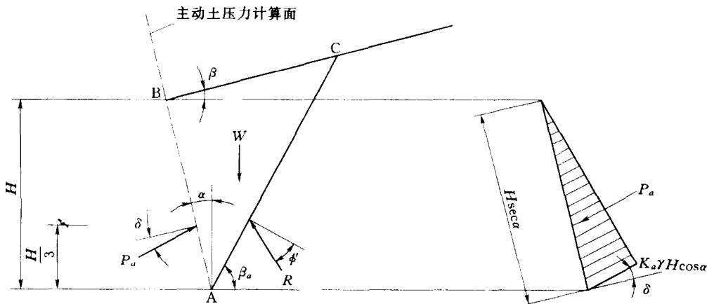  
图8.12 考核通用条分法和库仑主动土压力一致性例（[例8.2]）

此例， $H { = } 1 2 { \mathrm { m } } , c { = } 0 , \phi { = } 3 6 ^ { \circ } , \gamma { = } 2 . 1 { \times } 9 . 8 { \mathrm { k N / m } } ^ { 3 } .$ 对两种工况的计算情况如表8.1示。图8.13为STAB程序相应计算成果，图中1为初始滑裂面，2为临界滑裂面，成果与理论解一致。

表8.1 考核通用条分法和库仑主动土压力一致性例
<table><tr><td rowspan="2">工况  $\beta$ </td><td rowspan="2">δ</td><td rowspan="2"> $K _ { a }$ </td><td rowspan="2"></td><td colspan="2">主动土压力P</td><td colspan="2">临界滑裂面倾角  $\mathbb { \beta } _ { a }$ </td></tr><tr><td>理论值</td><td>计算值</td><td>理论值</td><td>计算值</td></tr><tr><td>1</td><td>15</td><td>10</td><td>0.29</td><td>43.5</td><td>43.45</td><td>58.1</td><td>57.75</td></tr><tr><td>2</td><td>15</td><td>20</td><td>0.28</td><td>42.6</td><td>42.56</td><td>56.8</td><td>57.70</td></tr></table>

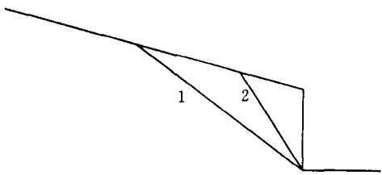  
图 8.13 工况1数值计算成果（[例8.2]）

表 8.2 图 8.14的四个重力式挡土墙的土压力(kN/m)
<table><tr><td>Example</td><td>(a)</td><td>(b)</td><td>(c)</td><td>(d)</td></tr><tr><td>Rankine</td><td>432.40</td><td>197.70</td><td>374.2</td><td>118.9</td></tr><tr><td>Numerical</td><td>433.00</td><td>191.19</td><td>368.98</td><td>120.33</td></tr></table>

[例8.3] 考核通用条分法和库仑主动土压力一致性。

图8.14是从教科书（钱家欢，1990）中选出的重力式挡土墙的四个典型例子。土压力合力作用点距墙底高h采用整个墙高 H的 1/3，即定义 $k = h / H = 1 / 3$ 。计算的结果和由传统的方法得到的结果的比较见表8.2。从这些例子可以看出，对于重力式挡土墙，通用条分法给出的解与经典解一致。

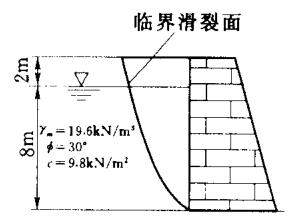  
(a)

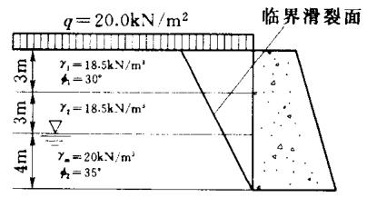

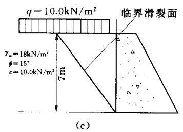

(b)  
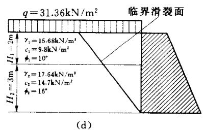  
图 8.14 考核通用条分法和库仑主动土压力一致性例（[例 8.3]）

[例 8.4] 考察通用条分法和 Terzaghi 和 Peck 经验方法一致性例。

现在，我们来考察一下本节介绍的方法与对柔性支挡结构经验方法计算成果对比情况。相应砂性土和粘土，Terzaghi 和 Peck(1967)建议的经验方法的土压力分布图形分别如图8.12(a)和(b)示，分别意味作用点位置 $k = 0 . 5$ 和 0.44。

对于砂性土，在图8.15(a)所示计算简图的基础上，Terzaghi 和 Peck建议以下经验公式：

$$
P _ { a } = C _ { a } \gamma \tan ^ { 2 } ( 4 5 ^ { \circ } - \frac { \phi } { 2 } ) / 2\tag{8.36}
$$

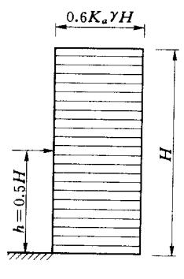  
(a)

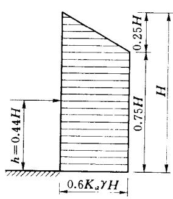  
(b)  
图 8.15 Terzaghi 和 Peck 建议的确定支撑墙的土压力的经验方法

Terzaghi 和 Peck 对 $C _ { a }$ 的建议值为0.65。图8.16为 $\phi = 3 5 ^ { \circ } , H { = } 1 5 \mathrm { m }$ 时的计算简图，1为初始滑裂面，2为临界滑裂面。表8.3示在 $\phi = 2 5 ^ { \circ }$ 和35°情况下 $( \gamma = 1 8 . 2 \mathrm { k W } / \mathrm { m } ^ { 3 } )$ ，墙高H为5,10,15,20m的计算结果。可见，相应某一φ值， $C _ { a }$ 值基本上可视为常数，与墙高H无关。在 $\phi = 2 5 ^ { \circ } |$ 时，这个数值约0.64，在 $: \phi = 3 5 ^ { \circ }$ 时，则为0.72。由于砂性土的摩擦角大致在25°左右，因此，可以认为， $C _ { a }$ 的建议值是合理的。

表8.3 砂性土土压力的经验方法例（[例8.4]）
<table><tr><td>H</td><td> $\phi = 3 5 ^ { \circ }$ </td><td> $\phi = 2 5 ^ { \circ }$ </td></tr><tr><td>5</td><td>0.728</td><td>0.641</td></tr><tr><td>10</td><td>0.716</td><td>0.643</td></tr><tr><td>15</td><td>0.723</td><td>0.642</td></tr><tr><td>20</td><td>0.713</td><td>0.642</td></tr></table>

对于粘性土，Terzaghi 和 Peck 建议的经验公式为

$$
K _ { a } = 1 - \frac { 4 m } { N }\tag{8.37}
$$

其中

$$
N = { \frac { \gamma H } { c } }\tag{8.38}
$$

该经验方法建议，当N≥4时，取m=1；当 $N { < } 4$ 时，则要求取m<1。图8.17示 $c = 3 0 \pm \mathsf { P a }$ H=8m时的计算简图，1为初始滑裂面，2为临界滑裂面。表8.4示H=6,8,11,17,20m， $\pmb { c = 3 0 } \pmb { \mathrm { P a } }$ 和 50kPa的计算结果。数值计算的成果说明 m 值在0.6左右，与N的关系不大。计算成果与Terzagh 的和 Peck 的经验方法结果不甚一致，原因待查。

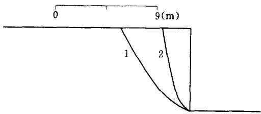  
图 8.16 [例 8.4]计算简图（砂性土）

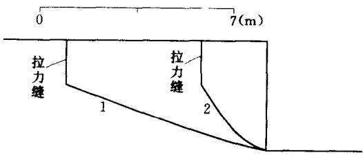  
图 8.17 [例 8.4]计算简图（粘性土）

表 8.4 粘性土例计算成果（图 8.9）
<table><tr><td>C</td><td>H</td><td>N</td><td> $\overline { { \pmb { P } } }$ </td><td> $Q$ </td><td>m</td></tr><tr><td rowspan="3">50</td><td>11</td><td>3.96</td><td>428.34</td><td>1.558</td><td>0.600</td></tr><tr><td>17</td><td>6.12</td><td>1635</td><td>3.847</td><td>0.568</td></tr><tr><td>20</td><td>7.2</td><td>2354</td><td>4.706</td><td>0.632</td></tr><tr><td rowspan="3">30</td><td>6</td><td>3.6</td><td>93.68</td><td>0.842</td><td>0.64</td></tr><tr><td>8</td><td>4.8</td><td>284.15</td><td>2.368</td><td>0.608</td></tr><tr><td>11</td><td>6.6</td><td>707.27</td><td>4.286</td><td>0.579</td></tr></table>

注 $Q = K _ { \alpha } N = 2 P / c H ,$ $K _ { a } = Q / H ,$ $\pmb { m } = ( 1 - K _ { g } ) N / 4$

## 8.2.8 工程实例之一—湛江市太新广场基坑失事例分析

湛江市太新广场占地面积为6849m²，拟建高为28层的塔楼和裙楼，两层地下室，地下室基坑开挖的防护采用桩径为1.2m、桩距为1.5m的钻孔灌注桩。地面下为1.7\~3.25m厚软回填土，下为塑性砂质粘土、泥炭和粘土。表8.5示各层土的岩土力学指标，1994年9月25日在基坑开挖深7.0\~9.0m时突然发生了北面2\~9轴的护坡桩倾覆的工程事故（见图8.18)，造成离基坑边14.0m左右的区城管办五层宿舍严重滑移倾斜，五层楼水平位移240cm，最大沉降差160.5cm，楼房最大沉降260cm。详细情况见参考文献(Lu, el.,al.1996)，对本实例的分析包括以下两个方面：

1）采用常规边坡稳定分析方法，确定通过桩底B点各个滑裂面的安全系数，陆培炎等(Lu,el.,al, 1996)采用了毕肖普法获得最小安全系数为1.08;

2) 对桩的悬臂段 AB，使用本文介绍的方法确定土压力。

图8.19示 $k = 1 / 3 , 1 / 2 , 2 / 3 ( h { = } 3 , 4 , 5 \mathrm { m } )$ 三种情况的临界滑裂面（分别为1,2,3)，相应，$P _ { a } { = } 4 5 6 . 5 5 , \ 4 6 7 . 9 5 , \ 2 6 9 . 9 4 \mathrm { k N }$ 。可见使 B 点获得最大力矩相应的是 k =1/2 的情况，$M { = } 4 6 7 . 9 5 { \times } 4 . 5 { = } 2 1 0 5 . 8 \ \mathrm { ( k N . m ) }$ 。而B断面能提供的最大抗弯力矩为2100kN·m，说明尚不能满足土压力造成的抗弯要求。

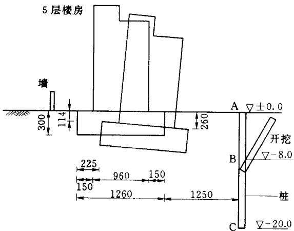  
图8.18 太新广场基坑失事例（长度单位：cm）

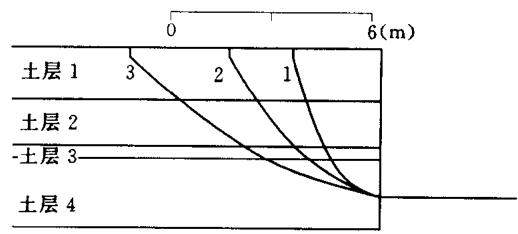  
图 8.19 不同的 k 值结果计算获得的临界滑裂面

表 8.5 太新广场基坑土层物理力学指标
<table><tr><td>土层号</td><td>上层性质</td><td>容重γ(kN/m³)</td><td>摩擦角φ(°)</td><td>粘聚力c (kPa)</td></tr><tr><td>1</td><td>回填土</td><td>16</td><td>16</td><td>10</td></tr><tr><td>2</td><td>砂质粘土</td><td>18</td><td>15</td><td>105</td></tr><tr><td>3</td><td>泥炭</td><td>15</td><td>10</td><td>7</td></tr><tr><td>4</td><td>泥质土</td><td>18</td><td>8</td><td></td></tr></table>

## 8.2.9 工程实例之二——宜兴抽水蓄能电站上库堆石坝分析

## 1. 基本情况

宜兴抽水蓄能电站上库初步设计阶段曾比较了面板堆石坝、高挡土墙（混合坝）和重

力坝三种方案。相关的抗滑稳定问题将在13.6节介绍。初设阶段选定了面板堆石坝方案。

面板堆石坝方案下游边坡延伸高差达280m。为了缩短该段边坡，在施工设计阶段，又再次对高挡土墙混合坝的方案进行论证。该方案包含一个高达45m的挡土墙，建于砂岩地区，中有花岗斑岩岩脉侵入。

本工程的一个特点是填筑土修建于一个基岩面斜坡上，因此，产生主动土压力的一个可能滑裂面是该接触面。解决本工程土压力问题，不能完全依靠库仑理论，而本章通用条分法恰好为解决此问题提供了有用的手段。

本章介绍对钢筋混凝土堆石坝(CFRD)的 5 个剖面进行分析的成果。计算分析针对钢筋混凝土面板混合坝方案（标准剖面为1-1、2-2、3-3、纵2、7-8剖面）。剖面图见图8.20，计算参数见表8.6。

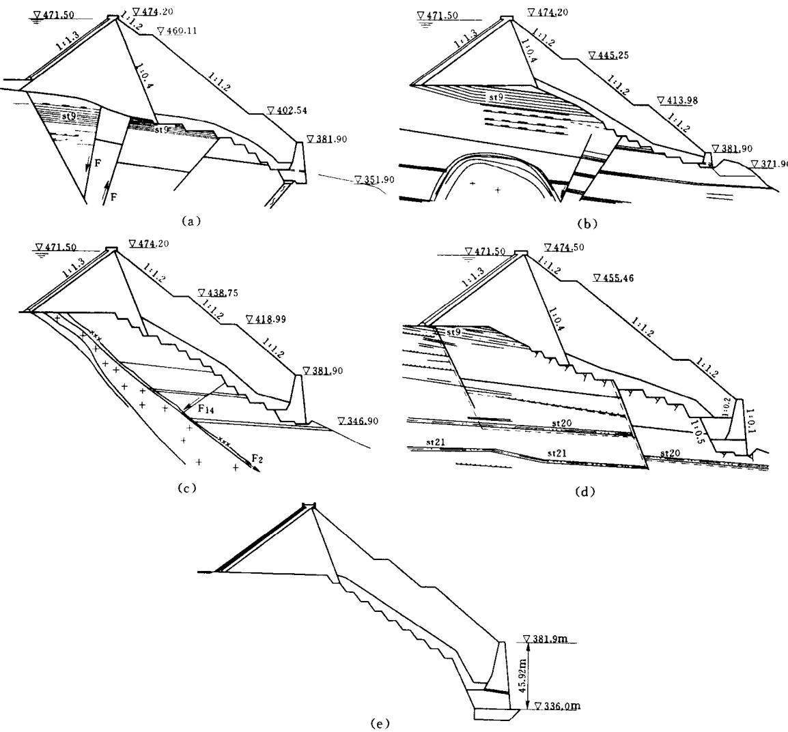  
图 8.20 标准剖面  
(a) 1-1 剖面；(b)2-2 剖面；(c) 3-3 剖面；(d) 纵 2剖面；(e) 7-8 剖面

表8.6 筑坝堆石材料的物理力学指标
<table><tr><td>材料</td><td>容重 (kN/m³)</td><td>饱和容重 (kN/m³)</td><td>c (kPa)</td><td>φ ()</td><td>备注</td></tr><tr><td>垫层料</td><td>22.4</td><td>23.5</td><td>199</td><td>40.22</td><td></td></tr><tr><td>过渡层料</td><td>22.4</td><td>23.5</td><td>170</td><td>40.99</td><td rowspan="4">次堆-1 次堆-3</td></tr><tr><td>主堆石料</td><td>22.2</td><td>23.5</td><td>92</td><td>41.52</td></tr><tr><td>次堆石料</td><td>21.3</td><td>23.5</td><td>76</td><td>42.32</td></tr><tr><td>过渡区料</td><td>22.2</td><td>23.5</td><td>92</td><td>41.52</td></tr><tr><td>混凝土与砂岩</td><td></td><td></td><td>200</td><td>26.6</td><td>纵2</td></tr><tr><td>混凝土与砂岩 五通组堆石与基岩</td><td></td><td></td><td>600</td><td>38.66</td><td>纵4</td></tr><tr><td>五通组堆石与基岩</td><td></td><td></td><td>25</td><td>30</td><td>基岩为St9</td></tr><tr><td>五通组堆石与基岩</td><td></td><td></td><td>25</td><td>33</td><td>基岩为五通组</td></tr><tr><td>软弱岩层层面</td><td></td><td></td><td>21</td><td>34.5</td><td>基岩为茅山组</td></tr><tr><td>泥岩</td><td></td><td></td><td>50</td><td>21.8</td><td></td></tr><tr><td rowspan="3">软弱夹层层面</td><td></td><td></td><td>200</td><td>26.6</td><td></td></tr><tr><td></td><td></td><td>30</td><td>19.29</td><td>100%连通率</td></tr><tr><td></td><td></td><td>64 98</td><td>20.81 22.29</td><td>80%连通率 60%连通率</td></tr><tr><td>断层面</td><td></td><td></td><td>25</td><td>16.7</td><td></td></tr><tr><td>砂岩（破碎）</td><td></td><td></td><td>100</td><td>26.6</td><td>纵2</td></tr><tr><td>砂岩</td><td></td><td></td><td>650</td><td>36.86</td><td>纵4</td></tr><tr><td>混凝土</td><td>25.0</td><td>25.0</td><td>400</td><td>45.0</td><td>挡墙</td></tr></table>

## 2. 土压力计算成果

土压力计算复核两种情况，即滑裂面沿基岩接触面（通用条分法）和沿墙后直线滑裂面（库仑土压力），取两者中大者作为设计土压力。计算结果如表8.7。部分计算简图见图8.21和图8.22。表中负值说明直立墙上的土压力即使为零，安全系数也大于1。

表8.7 挡土墙后主动土压力计算结果（钢筋混凝土面板混合坝方案） 单位：9.8kN/m
<table><tr><td rowspan="2">剖面</td><td rowspan="2">工况</td><td colspan="3">沿基岩接触面滑动</td><td rowspan="2">文件名</td><td colspan="2">穿过堆石滑动 (库仑土压力)</td><td rowspan="2">文件名</td></tr><tr><td>φ=31°</td><td>φ=29°</td><td>φ=27°</td><td></td></tr><tr><td rowspan="2">1-1</td><td>一级马道以下 局部坡 沿堆石岩基交</td><td>141.03</td><td>296.7</td><td>444.42</td><td>Tgs11</td><td>303.83</td><td>Tgs12</td></tr><tr><td>界面，整体坡 一级马道以下</td><td>140.35 -422.77</td><td>323.82 -207.7</td><td>459.98</td><td>Tgs13</td><td></td><td></td></tr><tr><td>2-2</td><td>局部坡 沿堆石岩基交 界面，整体坡</td><td>-520.20</td><td>-276.89</td><td>-36.73 -1.00</td><td>Tgs21 Tgs23</td><td>116.15</td><td>Tgs22</td></tr><tr><td rowspan="2">3-3</td><td>一级马道以下 局部坡</td><td>558.01</td><td>712.02</td><td>857.94</td><td>Tgs31</td><td>558.1</td><td>Tgs32</td></tr><tr><td>沿堆石岩基交 界面，整体坡</td><td>588.71</td><td>898.06</td><td>1193.42</td><td>Tgs33</td><td></td><td></td></tr><tr><td>纵2</td><td>一级马道以下 局部坡 沿堆石岩基交</td><td>-164.3</td><td>-5.5</td><td>188.89</td><td>Tgsz21</td><td>395.422</td><td>Tgsz22</td></tr><tr><td rowspan="2">7-8</td><td>界面，整体坡 一级马道以下</td><td>-173.34</td><td>-34.82</td><td>152.26</td><td>Tgsz23</td><td></td><td></td></tr><tr><td>局部坡 沿堆石岩基交 界面，整体坡</td><td>1087.19 1241.58</td><td>1217.15 1535.3</td><td>1347.11 1808.85</td><td>Tgs71 Tgs73</td><td>1088.37</td><td>Tgs72</td></tr></table>

注 主堆石、次堆石c=0；堆石与基岩接触面c=0，φ=31°、φ=29°或φ=27°。

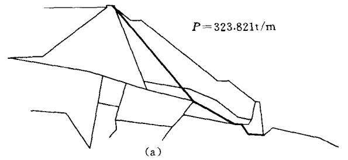

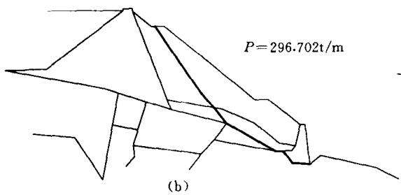

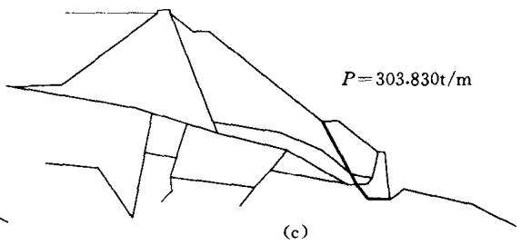  
图 8.21 1-1 剖面土压力计算简图  
(a)整体坡沿基岩接触面滑动：(b)一级马道下局部坡；(c)墙后局部坡（库仑土压力)

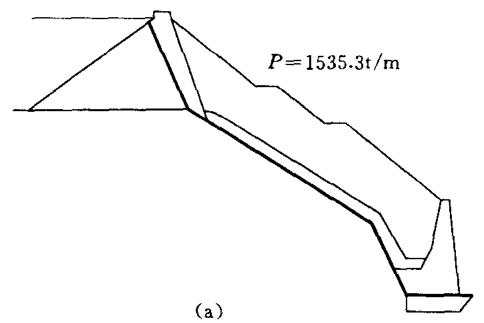

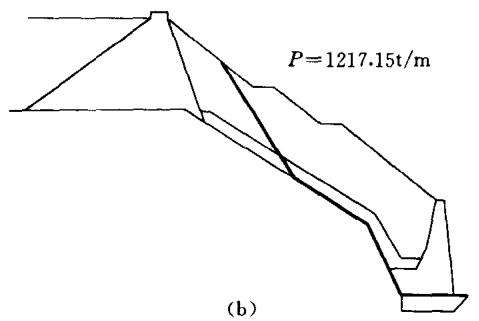

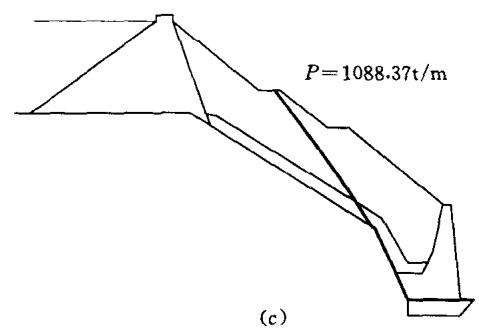  
图 8.22 7-8 剖面土压力计算简图  
(a) 整体坡沿基岩接触面滑动：(b) 一级马道下局部坡；(c) 墙后局部坡（库仑土压力)

由计算结果可见，对于1-1 剖面来说，当堆石坝与基岩接触面摩擦角为 $2 9 ^ { \circ } 1$ 时，堆石坝整体在挡墙后形成的土压力将达到 323.82×9.8kN/m，见图 8.21(a)，而一级马道以下的局部边坡在挡墙后形成的土压力为296.7×9.8kN/m，见图8.21(b)，按库仑土压力理论计算所得挡墙后最大主动土压力为303.83×9.8kN/m，见图8.21(c)。堆石坝整体边坡在挡墙后形成的土压力最大。对于2-2剖面来说，堆石坝整体边坡和一级马道以下局部边坡在挡墙后形成的土压力均为负值，表明这两个边坡处于稳定状态，而按库仑土压力理论计算所得挡墙后主动土压力则为116.15×9.8kN/m。对于3-3剖面来说，堆石坝整体稳定性较差，有沿堆石与基岩接触面发生整体滑动的可能性，按通用条分法计算所得挡墙后最大主动土压力为898.06×9.8kN/m。对于纵2 剖面来说，堆石坝整体边坡和一级马道以下局部边坡在挡墙后形成的土压力均为负值，表明这两种情况下边坡处于稳定状态，而按库仑土压力理论计算所得挡墙后主动土压力则为395.422×9.8kN/m。对于7-8剖面来说，堆石坝整体稳定性较差，有沿堆石与基岩接触面发生整体滑动的可能性，按通用条分法计算，当堆石坝与基岩接触面摩擦角为 $2 9 ^ { \circ }$ 时，所得挡墙后最大主动土压力为1535.3×9.8kN/m，该剖面计算简图见图8.22(a)。

## 3. 抗滑稳定分析

在确定了土压力后，再根据挡土墙抗滑稳定的分析方法，计算各剖面的抗滑稳定安全系数。挡墙沿基岩接触面的抗滑稳定计算中，接触面的抗剪强度值采用纯摩指标，各典型剖面计算示意图如图8.23所示。

(d)  
(b)  
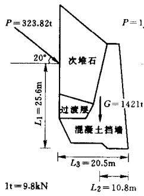  
(a)

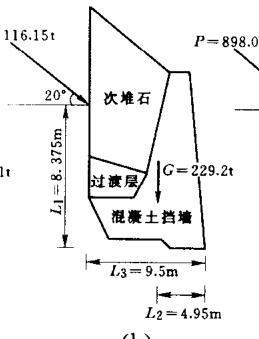

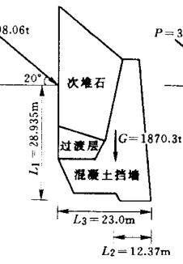  
(c)

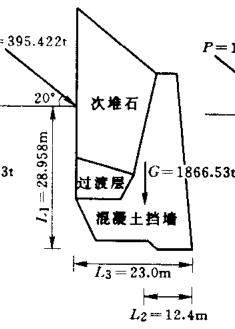  
图 8.23 挡墙稳定计算示意图（钢筋混凝土面板混合坝方案）

(e)  
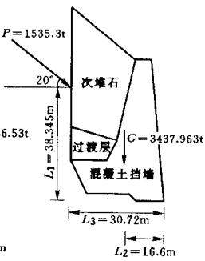  
(a) 1-1剖面；(b) 2-2 剖面；(c) 3-3 剖面；(d) 纵 2 剖面；(e) 7-8 剖面

计算公式如下式：

$$
K = { \frac { ( G + P \sin \delta ) f + c L } { P \cos \delta } }\tag{8.39}
$$

式中：K为抗滑稳定安全系数；G为挡墙自重及墙后有效堆石重量；P为墙后主动土压力；δ为土压力作用角度；f为混凝土与基岩摩擦系数；c为混凝土与基岩的凝聚力；L为挡墙基底有效宽度。

若采用的土压力值为对应于堆石与基岩接触面 $\phi = 3 1 ^ { \circ }$ 时的主动土压力值，土压力值将有所减小，挡墙的抗滑稳定安全系数将有所提高，分别采用纯摩和剪摩指标计算挡墙抗滑稳定安全系数，计算结果见表8.8。对于3-3剖面，取 $\phi = 3 1 ^ { \circ }$ 时，土压力值由898.06×9.8kN/m

降低到 588.71×9.8kN/m，相应的挡墙抗滑稳定安全系数，采用纯摩指标，由 1.548 增大至2.247，采用剪摩指标，由 2.093 增大至3.078，分别能满足大于1.5 和大于3.0的抗滑稳定安全标准，挡墙处于稳定状态。

表8.8 重力挡墙抗滑稳定分析结果（钢筋混凝土面板混合坝方案， $\phi = 3 1 ^ { \circ } )$
<table><tr><td rowspan="2">剖面</td><td rowspan="2">滑动模式</td><td rowspan="2">挡墙后土压力 (9.8kN/m)</td><td colspan="2">挡墙抗滑稳定安全系数K</td></tr><tr><td>纯摩指标</td><td>抗剪断指标</td></tr><tr><td>1-1</td><td>沿堆石与坝岩基交界面，整体坡</td><td>303.83</td><td>3.205</td><td>4.641</td></tr><tr><td>2-2</td><td>挡土墙后，弧形滑动局部坡</td><td>116.15</td><td>1.5</td><td>3.22</td></tr><tr><td>3-3</td><td>沿堆石与坝岩基交界面，整体坡</td><td>588.71</td><td>2.247</td><td>3.078</td></tr><tr><td>纵2</td><td>挡土墙后，弧形滑动局部坡</td><td>395.42</td><td>3.23</td><td>4.47</td></tr><tr><td>7-8</td><td>沿堆石与坝岩基交界面，整体坡</td><td>1241.58</td><td>1.986</td><td>4.488</td></tr></table>

## 4. 抗倾覆稳定分析

本工程的特点为，重力式挡墙高大，7-8剖面挡墙最高可达45.9m，且挡墙建在斜坡上，在巨大墙后土压力作用下，存在挡墙的抗倾稳定性问题。以下对混凝土挡土墙进行抗倾覆稳定分析。抗倾稳定安全标准控制在 $\begin{array} { r } { K _ { c } \mathcal { \gtrsim } 1 . 3 { \sim } 1 . 5 } \end{array}$ 。两种方案各剖面的计算示意图见图8.23，计算公式如下式：

$$
K = \frac { \sum M _ { \ddagger } } { \sum M _ { \rlap { / } _ { \min } } } = \frac { ( P \sin \delta ) L _ { 3 } + G L _ { 2 } } { ( P \cos \delta ) L _ { 1 } }\tag{8.40}
$$

式中：K为抗倾稳定安全系数； $M _ { ☉ }$ 为抗倾力矩： $M _ { \mathfrak { H } }$ 为倾覆力矩； $L _ { 1 } , L _ { 3 } , L _ { 2 }$ 分别为土压力在水平和垂直方向分力及G对挡墙下游角点的力臂；其他符号与式(8.39)相同。

对于钢筋混凝土面板混合坝方案各典型剖面，采用对应于堆石与基岩接触面 $\phi = 2 9 ^ { \circ }$ 时的主动土压力值，进行挡墙的抗倾覆稳定计算，计算结果见表8.9。

由表8.9可知，对于3-3剖面，当堆石与基岩接触面 $\phi = 2 9 ^ { \circ }$ 时的主动土压力为898.06×9.8kN/m，此时挡墙的抗倾稳定安全系数为1.236，小于1.3，不满足抗倾稳定安全标准。为安全起见，建议该部位挡墙尺寸适当加大或采取必要的工程加固措施。对于其它剖面，挡墙的抗倾稳定安全系数均大于1.3，满足混凝土挡墙的抗倾稳定安全标准，在墙后堆石土压力的作用下，挡墙发生倾覆失稳的可能性较小。

表8.9 重力挡墙抗倾覆稳定分析结果（钢筋混凝土面板混合坝方案 $\phi = 2 9 ^ { \circ } )$

<table><tr><td>剖面</td><td>滑动模式</td><td>挡墙后土压力(9.8kN/m)</td><td>抗倾稳定安全系数K</td></tr><tr><td>1-1</td><td>沿堆石与坝岩基交界面，整体坡</td><td>323.82</td><td>2.260</td></tr><tr><td>2-2</td><td>挡土墙后，弧形滑动局部坡</td><td>116.15</td><td>1.650</td></tr><tr><td>3-3</td><td>沿堆石与坝岩基交界面，整体坡</td><td>898.06</td><td>1.236</td></tr><tr><td>纵2</td><td>挡土墙后，弧形滑动局部坡</td><td>395.42</td><td>2.440</td></tr><tr><td>7-8</td><td>沿堆石与坝岩基交界面，整体坡</td><td>1535.30</td><td>1.320</td></tr></table>

## 8.3 抗滑桩加固的边坡稳定分析

## 8.3.1 概述

抗滑桩是一种常见的支挡结构体，它能有效地提高滑体的抗滑能力，改善滑坡的稳定性。目前在日本、欧洲等地得到了广泛的应用。Ito和Matsui(1975)等人研究了各种几何参数对桩所受到的滑坡推力的影响，他们的研究成果为抗滑桩的设计奠定了理论基础。

近年来，许多学者通过建立各种数学物理模型，在土体的移动对桩的影响等方面做了大量深入细致的工作(Poulos, 1995; Chen, 1997; Guerpillion, 1999)，其研究成果对抗滑桩的行为特征提供了合理的解释。然而，尽管抗滑桩在工程实践中得到了广泛的应用，但其设计方法并不成熟，特别是对土体在桩周或桩间移动时桩-土的相互作用机制等认识还有待完善(Popescu，1991；Hassiotis，1977)。对此，Poulos等在桩-土的相互作用机制、土体移动对桩的影响等方面开展了一系列研究工作，为抗滑桩设计提供了一个相对简便易行的方法。

本节介绍Poulos建议的分析方法，并简要介绍作者在以往工程咨询中常用的一种简化处理方法。

## 8.3.2 抗滑桩设计

如图8.24所示为抗滑桩的简化模型示意图。该模型假设，当单桩或群桩中的一根基桩处于不稳定的土体中时，位于滑面以上的不稳定土体向下运动可视为刚体，在该层以下有一层相对较薄的剪应力集中区-“拖曳带”，其下为稳定的土体层，滑面深度为z，桩长为 $z _ { s } ,$ L。一般来说，抗滑桩设计首先需要解决的问题主要有：确定抗滑桩由于滑体移动所承受的推力及弯矩值，并确定由于修建抗滑桩使边坡稳定程度的增加值。这两个问题是有联系的，一方面，滑面位置对桩所受的外力有影响；另一方面，桩所受到的滑坡推力大小也影响着边坡的稳定性。

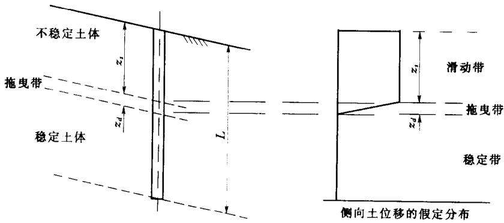  
图 8.24 抗滑桩的简化模型

Viggiani (1981), Hull (1993)和 Poulos (1995)等人提出的确定抗滑桩设计的一般程序为：

1) 确定使边坡的安全系数增加至设计值所要增加的抗剪力；

2) 确定每根桩所能承受的最大滑坡推力；

3)确定桩的位置、类型及根数。

在步骤1)中，边坡的实际安全系数为

$$
F ^ { a } = { \frac { \sum R } { \sum F _ { D } } }\tag{8.41}
$$

式中： $\sum R$ 为整个滑裂面的抗剪力之和； $\sum F _ { D }$ 为滑裂面上的下滑力之和。

如果边坡的实际安全系数 $F ^ { a }$ 小于设计值 $F ^ { T }$ ，则桩必须承担一部分抗剪力ΔR，即

$$
F _ { T } = \frac { \displaystyle \sum R + \varDelta R } { \displaystyle \sum F _ { D } }\tag{8.42}
$$

由式(8.41)与(8.42)有

$$
\sum R = \sum F _ { D } ( F _ { T } - F ^ { a } )\tag{8.43}
$$

从上式中可知，如果 $\sum F _ { D }$ 已知，则桩所承受的推力 $\Sigma R$ 就可以计算出来。

另外，边坡的安全系数也可以定义为滑面上的抗滑力矩与滑动力矩之比。这两种方法的原理是一样的。当然也可以将ΔR作为荷载处理，采用第2章和第3章介绍的各种方法计算加固后的安全系数。

对于桩在边坡中的位置如何选择的问题，目前并没有能很好地解决。但是，实践证明，为了能有效地发挥作用，抗滑桩必须为大口径，并有一定的刚度，同时桩必须插入到滑动面以下，否则，滑体将从桩尖向下滑动，抗滑桩不能发挥作用，另外桩应尽量位于破坏面圆弧（或楔体）中央附近，这样可以避免只对桩的前方或后缘的土体加固。

## 8.3.3 抗滑桩受力分析

一般来说，如果桩所受到的滑坡推力、边坡安全系数和土体位移的关系能够确定，即可预测抗滑桩加固后边坡的移动状况，当土体的位移一定时，抗滑桩所受到的滑坡推力越大，边坡失稳的概率越小。通过桩-土相互作用分析，可以得到土体位移与桩所受到的外力的变化过程，采用这种方法确定桩所受的外力适用性更广，克服了仅考虑单一粘聚力和极限状态下确定桩所受的极限抗剪力方法的局限性。Poulos(1973)和Lee(1991)等人用边界元法对此问题进行过分析研究。

在该问题中，抗滑桩被概化为一个简单的弹性梁，而土体被视为弹性的连续介质，如图8.25所示。抗滑桩的每个离散单元的侧向位移与其抗弯刚度和桩-土作用的水平应力有关，而相应的土体单元的侧向应力与土体的模量、桩-土作用应力及地表处土的位移有关。显然，当桩-土作用时的侧向应力一定时，考虑到土体内有局部的塑性变形，因而适用于非线性方法。

鉴于在每个离散单元处桩与土的水平位移的协调性，当桩-土的界面保持弹性状态时，有如下方程；

$$
[ { \cal D } ] + { \frac { [ I ] ^ { - 1 } } { K _ { R } n ^ { 4 } } } ] \{ { \cal A } \rho \} = { \frac { [ I ] ^ { - 1 } } { K _ { R } n ^ { 4 } } } \{ { \cal \Delta } \rho _ { s } \}\tag{8.44}
$$

$$
K _ { R } = { \frac { E I } { E _ { S } L ^ { 4 } } }\tag{8.45}
$$

式中： $[ \boldsymbol { D } ]$ 为桩弯曲的有限差分系数矩阵； $[ I ] ^ { - 1 }$ 为土位移系数逆矩阵； $K _ { R }$ 为无量纲挠曲系数。n为桩离散单元数；Δp为桩的水平位移增量；Δρ，为地表处土的水平位移增量；EI为 $\Delta \rho$ $\Delta \rho _ { s }$ 桩的挠曲系数；E为沿桩身方向土的平均杨氏模量；L为桩的嵌入深度。 $E _ { s }$

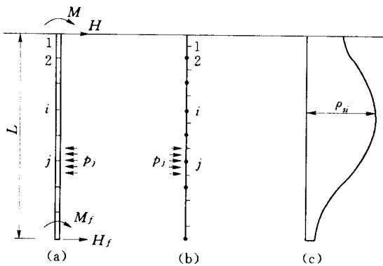  
图 8.25 土体中桩的侧向位移模型

此外，桩的力矩平衡方程及边界条件，也可以用位移方程表示。对上述位移增量方程进行求解后，就可以根据桩的挠曲方程求得压力增量值，与初始的压力相叠加，即可得到桩-土的总压力。将所计算的值与给定的极限侧压力值相比较，对于那些计算得出的总压力超过极限值的单元，其变形协调方程不再适用，须用侧压力增量为0的桩弯度方程代替。然后进行迭代求解，直至所有单元通过计算得出的总压力小于极限值。由于桩的非线性行为对其周边桩的影响很大，因而桩所受到的弯矩不能超过其屈服值(Kramer&Heavey,1988)。

## 8.3.4 桩-土间相互作用机制分析

对于受桩支撑的边坡，桩的失稳主要受三个因素的影响：土体强度、桩强度及其位置关系。如果桩还受其它外力的作用，则这部分外力必须考虑。土体失稳主要有三种方式(Poulos，1999):

(1)“流动模式”。在浅层滑动中较常见，不稳定土体在桩周围发生塑性流动而失稳。

(2)“短桩模式”。即滑面较深，而桩基嵌入稳定层的深度太浅，滑体与桩一起运动而失稳。

(3)“中间模式”。沿桩身稳定层与不稳定层中的土体强度均影响着边坡的稳定性。

此外，除了上述土体的三种破坏方式以外，还要考虑桩自身的强度。由于桩自身被剪断的可能性很小，不难推测“长桩”的失稳方式为沿桩身的一个或几个部位由于其弯矩达到了屈服值，而最终发展为所谓的“塑性铰结”。因此，在这种情况下，抗弯强度M，可视 $M _ { y }$ 为桩是否发生破坏的标准。即使桩还可以承受其他荷载，但桩身已发生永久性破坏。

图8.26为长15m、外径0.5m、厚15mm的钢管桩通过试验得出的上述三种模式下的行为特征。滑动带以上为粘性土，其不排水抗剪强度为30kPa；而其下部的稳定带中的土体的不排水抗剪强度为60kPa。假设滑动带中的土体的位移均为0.4m。

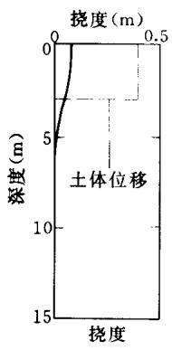

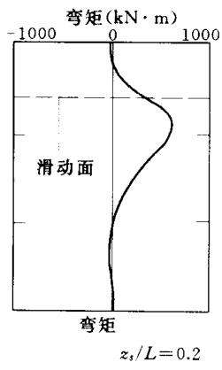

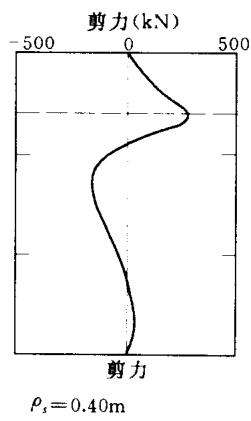

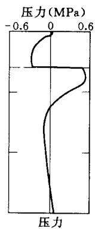  
(a)

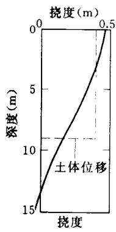

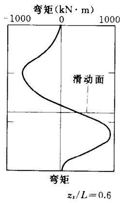

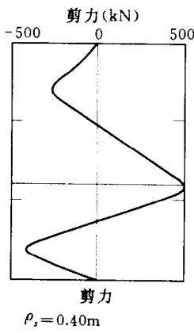

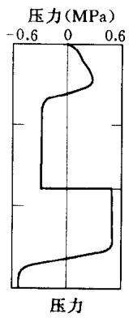  
(b)

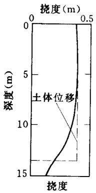

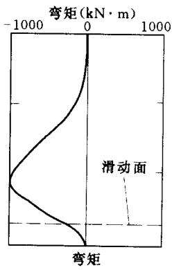

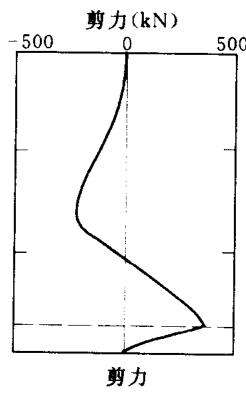  
(c)  
图 8.26 不同失稳模式桩的状态特征

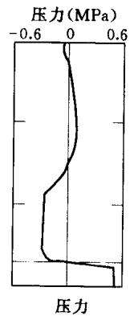

(a) 流动模式；(b) 中间模式；(c) 短桩模式

由图8.26可得下述结论：

1) 在滑动面处桩所受到的剪力最大；

2)对“流动模式”来说，桩所受的最大弯矩一般出现在滑面以下的稳定土层中，且桩的位移比土体的位移要小得多；

3)对“短桩模式”来说，最大弯矩出现在滑面上部的不稳定土层中，桩与土的位移相近；

4)对“中间模式”来说，最大弯矩在滑面上、下部均有可能出现，桩端位移远大于土体的位移。

## 8.3.5 抗滑桩设计的图表法(Polulos, 1999)

数值计算结果表明，当土体位移大于桩径的60%时，就会出现极限状态。为了设计上的方便，可以 Viggiani 解为基础，以图表的形式反映极限状态时桩的各种行为方式与土体位移的变化规律。

Viggiani 解是一个双层土体模型，上层不稳定土体的极限侧压力为Pu，下层稳定土体 $p _ { u 1 }$ 的极限侧压力为 $\pmb { p } _ { u 2 }$

在粘性土中，极限侧压力 $p _ { u }$ 可按下式确定：

$$
p _ { u } = N _ { p } c _ { u }\tag{8.46}
$$

式中：N。为侧向利用系数；c为土的不排水抗剪强度。对单桩而言，N的变化规律在地表 $N _ { p }$ $c _ { u }$ $N _ { p }$ 处为2，随深度呈线性变化，当深度为桩径或桩宽的3.5倍时达到最大值9，即：

$$
N _ { p } = 2 ( 1 + Z / d ) \leq 9\tag{8.47}
$$

式中：Z为地表以下的深度；d为桩径或桩宽。

在砂性土中，极限侧压力pu可按下式确定： $p _ { u }$

$$
p _ { u } = \alpha K { \sigma } _ { v o } ^ { \prime }\tag{8.48}
$$

式中：K为朗肯被动土压力系数， $K { = } \tan ^ { 2 } ( 4 5 ^ { \circ } { + } \phi / 2 )$ ； $\phi .$ 为土的内摩擦角； $\pmb { \sigma } _ { \nu o } ^ { \prime }$ 为有效自重压力；α为3\~5之间的系数。

图 8.27\~图 8.29 为当 $p _ { u 1 } / p _ { u 2 }$ 取不同值时，桩所受的剪力V的变化规律的无量纲曲线。要用到的无量纲量如下：

桩所受到的无量纲剪力为 $\overline { { V } } = \frac { V } { p _ { u 1 } \cdot d \cdot z _ { s } }$ ；无量纲的滑面深度为z。L；桩的无量纲弯矩 $z _ { s } / L$ 为 $\overline { { { M } } } _ { y } = \frac { M _ { y } } { p _ { u 2 } \cdot d \cdot z _ { s } ^ { ~ 2 } } , ~ M _ { y }$ 为桩截面的弯矩，d为桩径。

从图8.27\~图8.29可以看出桩所受的剪力随弯矩的减小而减小，同时桩所受的无量纲剪力V随z,/L的增加而减小（事实上，V值在z,/L为0.4\~0.6时达到最大值）。以下举例 $\overrightharpoon { V }$ $z _ { s } / L$ $z _ { s } / L$ 说明如何使用抗滑桩设计的图表法。

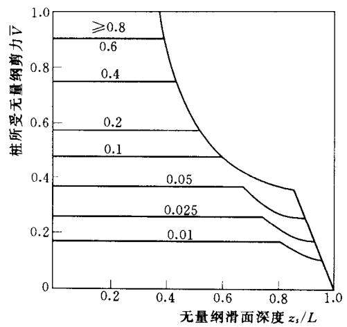

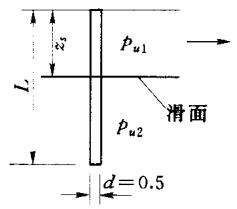

$$
\frac { \dot { p } _ { u 1 } } { \dot { P } _ { u 2 } } = 0 . 5
$$

$$
\overline { { M } } _ { y } = \frac { M _ { y } } { \pmb { \hat { p } _ { u 1 } } \cdot \pmb { d } \cdot \pmb { z } _ { s } ^ { 2 } }
$$

图 8.27 极限状态下双层土体内桩的设计曲线 $( p _ { u 1 } / p _ { u 2 } { = } 0 . 5 )$  
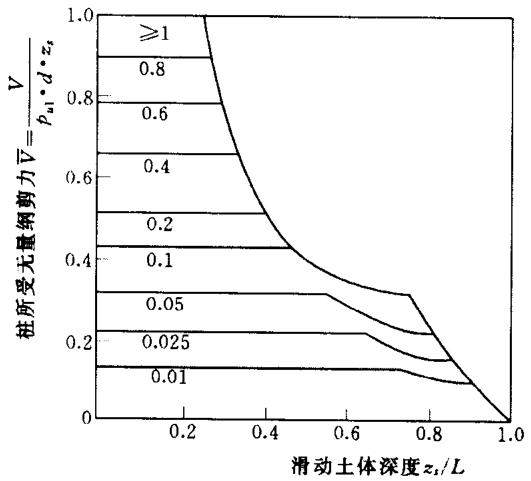

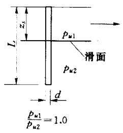

$$
\overline { { M } } _ { y } = \frac { M _ { y } } { \pmb { \rho _ { u 1 } } \cdot \pmb { d } \cdot \pmb { z } _ { s } ^ { 2 } }
$$

图 8.28 极限状态下双层土体内桩的设计曲线 $( p _ { u 1 } / p _ { u 2 } { = } 1 . 0 )$  
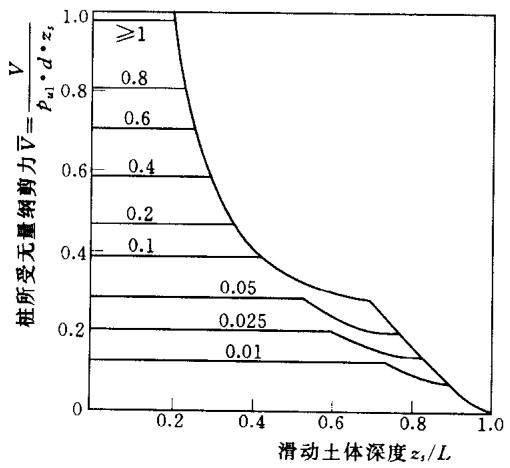  
图 8.29 极限状态下双层土体内桩的设计曲线 $( p _ { u 1 } / p _ { u 2 } { = } 1 . 5 )$

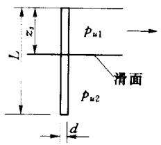

$$
\frac { \hat { p } _ { u 1 } } { \hat { p } _ { u 2 } } = 1 . 5
$$

$$
\overline { { M } } _ { y } = \frac { M _ { y } } { \hat { p } _ { u 1 } \cdot d \cdot z _ { s } ^ { 2 } }
$$

[例8.5]抗滑桩设计的图表法。

如图8.30所示的土质边坡，其坡度为22°，由两层坚硬的粘土层（粘土层1和粘土层2）夹薄层的软弱层（其厚度忽略不计）组成，各土层物理力学性质指标见表8.10。粘土层1极易沿软弱层滑动而导致失稳，整个滑面长度为30m。为使问题得到简化，特提出以下几点假设：

1) 边坡沿软弱层的破坏主要受其有效应力强度指标所控制；

2) 边坡土体在不排水条件下失稳；

3) 地下水水位与粘土层2顶部平行。

表8.10 各层土的物理力学性质指标
<table><tr><td>土层编号</td><td>粘聚力c (kPa)</td><td>内摩擦角φ(°)</td><td>容重  $\gamma ( \mathrm { k N } / \mathrm { m } ^ { 3 } )$ </td><td>土的杨氏模量(MPa)</td></tr><tr><td>粘土层1</td><td>40</td><td>0</td><td>17</td><td>8</td></tr><tr><td>软弱夹层</td><td>5</td><td>20</td><td>一</td><td>一</td></tr><tr><td>粘土层2</td><td>45</td><td>0</td><td>18</td><td>9</td></tr></table>

综合各种因素，该边坡的稳定安全系数设计值为1.4。如果不满足要求，将采用长10m、直径为0.5m的钢管桩进行加固。每根桩的屈服力矩为942kN·m。如果采用抗滑桩加固，必须计算单桩的间距。这里将本问题视为二维平面问题来计算边坡的安全系数。

由图8.30，单位宽度滑体的重量W为

$$
W = \mathcal { W } = 5 { \times } 1 7 { \times } 3 0 \cos 2 2 ^ { \circ } = 2 3 6 4 . 2 \mathbf { k N } / \mathbf { m }\tag{8.49}
$$

滑体的下滑力 $F _ { d }$ 为

$$
F _ { d } = W \sin 2 2 ^ { \circ } = 8 8 5 . 7 \mathrm { k N / m }\tag{8.50}
$$

滑体所受的阻力 R为

$$
R = W \cos 2 2 ^ { \circ } \tan \phi + c _ { s } l = 2 3 6 4 . 2 \cos 2 2 ^ { \circ } \tan 2 0 ^ { \circ } + 5 \times 3 0 = 9 4 7 . 9 { \bf k N } / \mathrm { m }\tag{8.51}
$$

因此边坡的安全系数F为

$$
F = R / F _ { d } = 1 . 0 7 0\tag{8.52}
$$

从上面的计算可以看出，边坡的安全系数小于其设计值，因而需要对边坡进行加固处理。

下面采用抗滑桩设计的图表法来计算桩-土的极限侧压力Pu。粘土层1的 N值取5， $p _ { u } ,$ $N _ { p }$ 粘土层2的N值取9。由式(8.46)，有： $N _ { p }$

粘土层1： $p _ { u 1 } { = } 5 { \times } 4 0 { = } 2 0 0 ( \mathbf { k P a } )$

粘土层2: $p _ { u 2 } { = } 9 { \times } 4 5 { = } 4 0 5 ( \mathrm { k P a } )$

故 $p _ { u 1 } / p _ { u 2 } { \approx } 0 . 5$

又 $z _ { \mathrm { * } } / L = 5 / 1 0 { = } 0 . 5 , \overline { { M } } _ { y } = { M _ { y } } \mathrm { , / } \left( p _ { u 1 } \times d \times { z _ { s } } ^ { \mathrm { 2 } } \right) = 9 4 2 \mathrm { / } \left( 2 0 0 \times 0 . 5 \times 5 \times 5 \right) = 0 . 3 7 7$

由图 8.27 可知， $\overline { { V } } = 0 . 6$ o

故单桩的极限抗剪力 $V = \overline { { { V } } } p _ { u 1 } \cdot d \cdot z _ { s } = 0 . 6 \times 2 0 0 \times 5 = 3 0 0 ( { \bf k N } )$ o

若安全系数取2.0，则单桩的设计抗剪力为150kN。

当利用抗滑桩加固时，由式(8.43)，桩所承受的抗剪力为

$$
\Delta R = F _ { d } \left( F _ { T } - F ^ { a } \right) = 8 8 6 . 7 \times ( 1 . 4 0 - 1 . 0 7 ) = 2 9 2 . 6 ( { \bf { k N / m } } )\tag{8.53}
$$

若设计采用三排等距离桩进行加固时，如图8.31所示，每排桩所提供的剪力为$2 9 2 . 6 / 3 { = } 9 7 . 5 ( \mathrm { k N / m } )$ ，故桩间距 $s _ { \mathrm { v } } { = } 1 5 0 / 9 7 . 5 { = } 1 . 5 4 ( \mathrm { m } )$ o

值得指出的是，上面的分析并没有考虑群桩效应。事实上，群桩效应能增加单桩的极限承载力，因而从工程安全的角度出发，忽略群桩效应是偏于安全的。

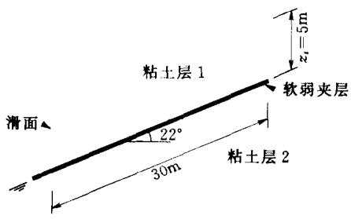  
图 8.30 边坡剖面示意图

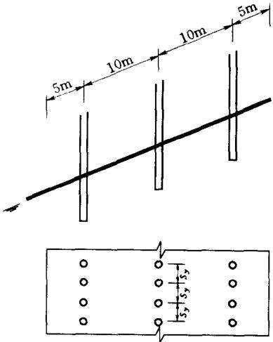  
图 8.31 抗滑桩的位置示意图

## 8.3.6 抗滑桩设计的简化方法

目前边坡稳定分析的基本理论体系是极限平衡方法，研究的对象是处于极限平衡的土体。因此，桩、土相互之间按弹性抗力的作用模式不一定能真实地反映实际情况。本书作者在以往的咨询工作中，采用了一种简化处理方法。这个方法的基本思想是把抗滑桩当作一个悬臂梁，一点都不考虑桩后土体对抗滑桩的支撑作用。如果在边坡破坏那一刻，桩周围土体对桩的作用的合力为P，其与水平线的夹角为β。那么，桩将反过来给边坡提供一个 $\beta _ { \circ }$ $P { \bf = } P ^ { \prime }$ 的抗滑力，将这个抗滑力加到滑坡体上，即可算出边坡所增加的安全系数。在使用通用条分法时，还需要知道P的作用位置。如前面几节讨论，我们可以大致假定P作用于中点。β值可以按经验设为 0\~20°之间，通过敏感性分析来最终确定。将抗滑桩当作一个偏心 $0 { \sim } 2 0 ^ { \circ }$ 受压的悬臂结构，那么在知道桩的截面和配筋的条件下，根据钢筋混凝土理论，即可确定这个极限承载能力 $P _ { \circ }$

下面，以作者在小湾水电站堆积体抗滑稳定分析中的实例（将在第14章讨论）来说明P的确定方法。

抗滑桩的断面如图8.32所示，以下计算中有关符号参见表8.11。

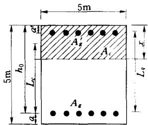

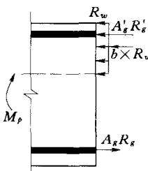  
图 8.32 计算抗滑桩抗力示意图

设计抗滑桩截面为 5m×5m  
桩长为 40m  
$\pmb { a = } 8 4 \mathrm { c m }$   
$\pmb { a } ^ { \prime } = 3 6 \pmb { \mathrm { c m } }$   
$A _ { g } = 3 6 3 0 \mathrm { c m } ^ { 2 }$   
$A _ { _ { g } } ^ { \prime } { = } 1 8 1 5 \mathrm { c m } ^ { 2 }$   
II级钢筋 $R _ { g } = 3 2 0 \mathbf { M P a }$   
ⅡI级钢筋 $R _ { g } ^ { \prime } { = } 3 2 0 \mathbf { M } \mathbf { P } \mathbf { a }$   
300号混凝土 $R _ { w } { = } 2 2 \mathbf { M } \mathbf { P a }$   
$\pmb { R _ { c } = 3 0 0 M P a }$   
$\pmb { A _ { 0 } } = 2 5 0 0 0 0 \mathbf { c m } ^ { 2 }$

表8.11 按钢筋混凝土偏心受压构件计算符号说明

计算步骤如下：

a 受拉钢筋合力点至混凝土受拉边缘的距离；$\scriptstyle { a ^ { \prime } }$ 受压钢筋合力点至混凝土受压边缘的距离；$h _ { \theta }$ 受拉钢筋合力点至混凝土受压边缘的距离，即界面的有效高度；  
$A _ { \theta }$ 桩的有效截面面积；  
$A _ { g }$ 总的受拉钢筋截面积；  
$A _ { \ g } ^ { \prime }$ 总的受压钢筋截面积：  
$A _ { k }$ 总的箍筋截面积；  
$\pmb { A } _ { w }$ 总的斜筋截面积：  
$A _ { c }$ 受压混凝土面积；  
$R _ { g }$ 钢筋的实际受拉屈服极限；  
$R _ { \ g } ^ { \prime }$ 钢筋的实际受压屈服极限；  
$R _ { g k }$ 箍筋的实际受拉屈服极限；  
$R _ { g w }$ 斜筋的实际受拉屈服极限；  
$\scriptstyle R _ { w }$ 混凝土的实际弯曲等效抗压强度；  
$R _ { c }$ 混凝土的抗压强度：  
S 箍筋间距：  
$\pmb { a }$ 斜筋与构件轴的夹角；  
$\pmb { \mu }$ 截面配筋率；  
$\mu _ { m a x }$ 截面最大配筋率；  
$\mu _ { m i n }$ 截面最小配筋率；

(1)校核是超筋、适筋、还是少筋混凝土构件：

$$
\mu = { A _ { g } } / { A _ { 0 } }
$$

$$
\mu { = } 0 . 0 1 4 5
$$

$$
\mu _ { m a x } = 0 . 5 5 R _ { w } / R _ { g } = 0 . 0 3 7 8
$$

$$
\mu _ { m i n } = 0 . 0 0 1 5
$$

$$
\mu _ { m i n } < \mu < \mu _ { m a x }
$$

故设计抗滑桩为适筋混凝土构件。

(2)受压混凝土面积计算。对于适筋混凝土构件，破坏时受拉区混凝土早已开裂，全部拉力由受拉钢筋承担，钢筋拉应力达到屈服极限R。，假设受压区混凝土的应力在整个受 $R _ { g } { : }$ 压面上均匀分布，其合力点至受拉钢筋合力点的距离（内力偶力臂）为L，受压钢筋合力 $L _ { c }$ 点至受拉钢筋合力点的距离为L。。根据力的平衡关系可得如下关系式： $L _ { g }$

$$
A _ { g } R _ { g } = A _ { g } ^ { \prime } R _ { g } ^ { \prime } + A _ { c } R _ { w }\tag{8.54}
$$

则 $\scriptstyle A _ { c } = 2 6 4 0 0 \mathsf { c m } ^ { 2 }$

(3) 计算抗弯力矩 $M _ { P ^ { \mathrm { c } } }$ 根据几何关系求得 $L _ { c } = 3 8 9 . 4 \mathrm { c m } > L _ { g } = 3 8 0 \mathrm { c m }$ ，可以认为受拉钢筋变形已足够大，应力已达到设计强度，按下式计算出抗弯力矩 $M _ { P } \colon$

$$
M _ { p } = A _ { c } R _ { w } L _ { c } + A _ { g } ^ { \prime } R _ { g } ^ { \prime } L _ { g }\tag{8.55}
$$

则抗弯力矩 $M _ { P } = 4 4 7 0 2 4 . 4 \mathrm { k N } \cdot \mathrm { m }$

按下式计算抗剪力 $Q _ { P } { \mathrm { : } }$

$$
Q _ { p } = 0 . 0 7 A _ { 0 } R _ { c } + 1 . 5 A _ { k } R _ { g k } h _ { 0 } / s + 0 . 8 A _ { w } R _ { g w } \sin \alpha\tag{8.56}
$$

不考虑箍筋和斜筋，则 $Q _ { P } { = } 0 . 0 7 A _ { 0 } R _ { c } { = } 5 2 5 0 0 \mathbf { k } \mathbf { N }$

(4)计算抗滑桩提供的抗力。在边坡稳定分析中，抗滑桩的作用简单地体现为桩体向滑坡体提供一个抗力。这个抗力应在抗弯力矩和抗剪力中选择小者。设形成抗弯力矩的外力作用在桩的二分点。由于抗滑桩长为40m，所以力臂为40m/2=20m。故按抗弯力矩计，可以提供的外力 $Q _ { m } { = } 2 2 3 5 1 . 2 2 \mathbf { k } \mathbf { N }$ $Q _ { m } < Q _ { P }$ ，故取 $\pmb { P } = \pmb { Q } _ { m }$ ，抗滑桩提供的抗力 $P { = } 2 2 3 5 1 . 2 2 \mathbf { k } \mathbf { N }$

## 8.4 内部加固边坡的稳定分析

## 8.4.1 概述

20世纪70年代，在土体开挖和填筑边坡中，通过加固边坡部分土体以增强其稳定性的技术逐渐发展起来，即采用土工布和钢筋的加筋土及土钉技术加固边坡。这些新技术由于经济可靠且施工快速简便，已在许多国家中得到了迅速的推广和应用。

土工布和加筋土在土体填筑过程中铺设，两者的差别在于前者为柔性加固材料，后者为诸如钢筋那样的刚性材料。土钉技术则是在已形成的边坡中使用，由于使用的材料同样为钢筋，故作用机理和加筋土类似。

从边坡稳定机理角度分析，加固边坡的稳定性由“内部稳定性(Internal Stability)”和“外部稳定性(External Stability)”两方面控制。控制内部稳定性的潜在滑裂面部分应通过加筋体，参见图8.33(a)中AB段；研究外部稳定性时，则将由加筋材料组成的那部分土体视为一个挡土墙，其稳定性由主动土压力和基底AB的抗剪强度控制，参见图8.33(b)。

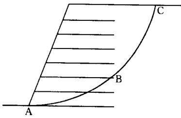  
(a)

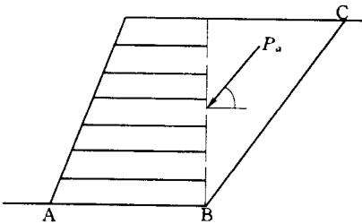  
(b)  
图 8.33 内部和外部破坏模式  
(a) 内部破坏模式；(b) 外部破坏模式

图8.34示土钉各种典型的外部破坏模式。图8.35示各种典型的内部破坏模式（陈肇元，崔京浩，1997)。

内部破坏模式大致可分为以下两种：

(1)整体破坏。即墙体内产生裂缝与滑移，将加固体分割为滑动区与约束区。由于滑体下移，将同时导致土钉弯曲、剪切与拉伸，最终可能拔出或断裂。产生这种情况的主要原因是土钉的总体抗拉或抗拔能力不够，其次是抗弯、抗剪能力不够，如图8.35(a),(b)。

(2)局部破坏。即墙体的某些个别地方发生的有限损坏。例如面层与土钉结合点的断裂；个别土钉的损坏；面层局部开裂、隆起或背面刷空等，如图8.35(a)至(d)。这些破坏的出现多由于施工和材料质量不佳，或排水、防水、防腐蚀不力，设计不好也会造成面层破坏，如图 8.35(c),(d)。

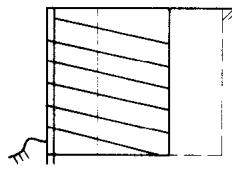  
(a)

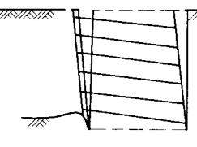  
(b)

破坏面中心  
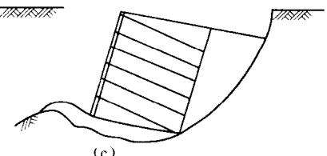  
(c)

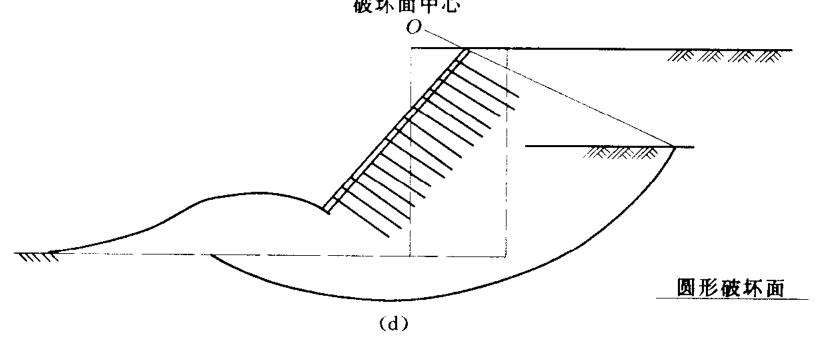  
图 8.34 土钉边坡外部破坏模式示例

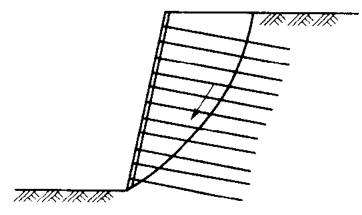  
(a)

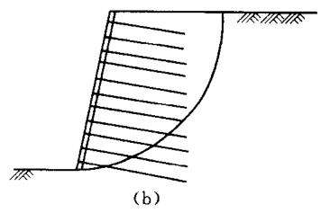

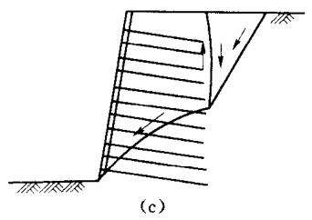

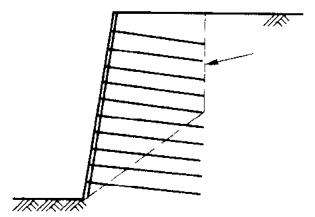  
(d)

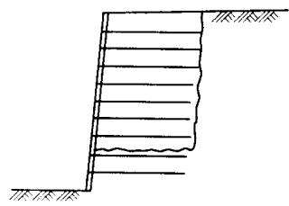  
(e)

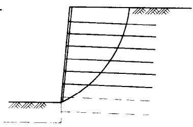  
(f)  
图 8.35 土钉边坡内部破坏模式示例

复核内部稳定性的目的是保证加筋材料具有足够密度，以保证通过加筋土的那部分滑裂面的抗滑力足以使整体安全系数增加到允许值。复核外部稳定性的目的是保证加筋材料具有足够的长度，以保证由加筋材料加固后的土体形成一个挡土墙，足以平衡未加筋部分土体沿（图8.33(b)）滑裂面AB下滑产生的主动力压力。

本节分别介绍采用土钉（刚性内部加固）和土工布（柔性内部加固）加固边坡的稳定分析方法。

## 8.4.2 土钉加固边坡的稳定分析

## 1. 土钉支护技术

土钉技术首先在欧洲使用，以后推广到日本和北美洲。我国从20世纪90年代初开始独立开发和研究，并在基坑开挖工程中被证实是一种可行的、经济效益可观的技术,近年发展很快。在深基开挖中，土钉支护现已成为支撑式支护、排桩支护、连续墙支护、锚杆支护之后又一项正走向成熟的支护技术。

土钉支护适用于基础托换、基坑或竖井加固、斜坡挡土墙、边坡稳定、与锚杆结合作斜面防护。也包括对已有挡土结构的加固、抢险、维修或改造等诸多领域。土钉支护方法是逐层开挖基坑，逐层在边坡上以一定倾角成孔，将土钉（钢筋）置入孔内，在孔内注浆形成土钉体，随后在坡面挂钢筋网，并与土钉连接，最后在坡面上喷射混凝土。土钉技术由被加固土体，土钉及喷混凝土面层构成。高强度土钉、原状土体与面板相结合，形成一个“复合结构”，可以充分利用原状土的自支承能力，使土体整体抗剪强度提高、位移减小，实现加固、支挡和稳定的作用。试验表明：直立的土钉墙在坡顶的承载能力约比素土墙提高1倍以上。更为重要的是，土钉支护结构被公认具有良好的延性破坏特征，在受荷过程中，不会发生素土边坡那样突发性的塌滑，为边坡的修复提供了时间，并可减小边坡滑塌所造成的损失。土钉按耐久性可分为服务年限小于2年的临时性土钉和服务年限大于2年的永久性土钉两种，后者具有防腐措施，为永久性土钉。按施工工艺可分为钻孔注浆钉、击入钉、注浆击入钉、高压喷射注浆击入钉、气动射击钉等几种。

在基坑支护中，土钉支护形成一个类似重力式的挡土墙，简称土钉墙，以此来抵抗墙后传来的土压力和其它作用力，从而使开挖坡面稳定。土钉墙按构造可分为垂直土钉墙、倾斜土钉墙、阶梯土钉墙。孔宪宾、任青文(2000)对土钉墙优缺点作了如下归纳。

土钉的主要优点为：

1） 用料少、工程量小、施工快；

2) 施工设备轻便、操作方法简单、施工时对环境干扰小；

3) 对场地土层适应性强；

4)结构轻巧、柔性大、有非常好的抗震性能；

5)随基坑开挖逐层分段作业，不占或少占单独作业时间，施工效率高，开挖完成时土钉墙就能建好（这一点对膨胀土边坡尤为重要）；

6) 施工不需单独占用场地，对于施工场地狭小的工程，该项技术特别有用；

7)安全可靠，土钉数量众多，并作为群体而起作用，个别土钉出现问题或失效，对整体影响不大，随时可根据现场开挖出现的土质情况和现场监测的土体变形数据修改土钉的间距和长度，万一出现不利情况也能及时采取加固措施，避免出现大事故；

8)经济，根据经验，土钉支护比一般的拉锚支护可节约总造价的10%\~30%（美国工程表明，采用此项技术可节约30%的造价，在我国可节约20%左右的造价)。

土钉的缺点主要有：

1)施工时会对地下管道等设施产生干扰；

2) 对于软土、无粘结松散砂土以及在地下水丰富的情况下采用，土钉支护有一定难度；

3) 在软土中设置土钉造价高，国外经验表明要高于连续墙；

4)土钉支护作为永久性结构时，需专门考虑锈蚀等耐久性问题。

## 2. 土钉支护理论分析

各国学者对土钉原理作过大量的理论和试验研究工作，法国曾耗巨资开展现场试验。李大勇等(2001)总结了有关土钉支护原理的认识，大致可归纳如下：

(1) Jewell(1990)总结了土钉墙性状研究的理论发展概况，特别是土钉抗弯刚度的作用。运用弹性和塑性分析方法确定了限制土钉能够产生的最大作用力的包络线。利用实验室直剪试验及加载至破坏时的野外试验获得的数据确定土钉破坏时产生的作用力，理论研究和试验数据相符。由此推断土钉破坏时土钉产生的剪力很小，在常规土钉墙设计时可以忽略。

(2) Juran等(1990)讨论了基坑开挖土钉支护的分析方法，假设土的峰值抗剪强度完全先得到发挥，对土钉的峰值抗拔阻力采用安全系数2.0，峰值抗拔阻力由现场拉拔试验确定。对两个土钉支护结构进行了现场野外测试，结果表明，在施工结束以后，边坡的位移和土钉的受力继续增加，而且对气候变化及冷冻影响特别敏感，因此需要在施工后继续对土钉结构进行监测。Juran等认为在开挖的早期阶段，土体沿潜在滑动面上的抗剪强度已得到发挥，当开挖继续进行时，荷载增量全部传递到土钉上。施工后土体结构的性状、面层位移、土钉长期受力依赖于许多变量，例如土的蠕变特征等。开挖深度对土钉拉力的变化只产生很小的影响，土钉拉力只与Z/H有关。在设计工作荷载下，运用极限分析方法可以估算土钉受力大小。

(3) John(1995)发展了一种简化的土钉相互作用的分析方法，提出了位于土体中初始释放应力加筋单元的简化三维问题解析解，研究了在工作应力条件下土钉产生加筋作用的方式。张钦喜等(1992)运用有限元法对土钉支护的变形与稳定问题进行了模拟数值分析。宋仁祥等(1996)采用平面土有限元程序分析了基坑土钉支护体系的内力及变形。

## 3. 土钉支护的应用范围

适用土钉支护的土体包括：地下水位以上或经过降排水措施后的素填土、普通粘性土，有一定毛细水粘聚力的中细砂土（含水量不小于5%\~6%），有一定天然胶结能力的砂土和砾石土，具有天然粘聚力的粉土及低塑性土，以及风化岩层等（陈肇元、崔京浩，1997)。Mitchell(1990)认为，土钉在标准贯入击数小于10 或相对密度小于30%的砂性土边坡内使用是不经济的。在不均匀系数小于2的级配均匀的砂土中使用同样是不理想的。土钉通常不在不排水剪强度小于48kPa的软粘土中应用，在塑性指数高于20%的高塑性土中也不使用土钉，因为土钉并不能有效地制止边坡的蠕变。

## 4. 土钉设计的一般原则

根据土坡的实际情况，对土钉的设计参数一般可按以下原则取值（李子军等，2001）：

(1)土钉长度。抗拔试验表明，采用相同的施工工艺，在同类土质条件下，对高度小于12m的土坡，当土钉长度达到1倍土坡垂直高度时，再增加长度，对承载力提高不明显。对钻孔注浆型土钉，用于粒状土陡坡加固时，其长度比（土钉长度与坡面垂直高度之比）一般为0.5\~0.8；用于冰碛物或泥灰岩边坡时，长度比一般为0.5\~0.6。

(2) 土钉布置。大量的实测结果表明：上层土钉能有效地控制基坑变形，上层和下层土钉所受的拉力相对较小而中部土钉所受拉力最大。为此，在设计土钉墙时，应考虑土钉墙与土体的共同作用，应将土钉墙与土体作为一个复合式的挡土结构来处理，土钉长度和布置设计应使应力分布均匀。

(3)土钉孔径及间距布置。土钉孔径d可根据成孔机械选定。在条件允许时适当加大 $d _ { n }$ 孔径，可以大大提高土钉支护的稳定性。国内采用的土钉钻孔直径一般为100\~200mm。土钉间距包括水平间距（行距）S、和垂直间距（列距）S。对钻孔注浆型土钉，可按6\~12 $S _ { x }$ $s _ { y }$ 倍土钉钻孔直径 $d _ { n }$ 选定土钉行距和列距，且应满足：

$$
S _ { x } \times S _ { y } = k \times d _ { n } \times l\tag{8.57}
$$

式中：Sx，S，为土钉行距和列距，通常在 1.2\~2.0m 范围内；k 为注浆工艺系数，对一次性 $\boldsymbol { S } _ { \boldsymbol { x } }$ $s _ { y }$ 压力注浆工艺，取1.5\~2.5；l为土钉长度。

(4)土钉主筋直径。为了增强土钉钢筋与砂浆（纯水泥浆）的握裹力和抗拉强度，土钉钢筋一般采用Ⅱ级以上变形钢筋，钢筋直径一般为φ16\~32mm，常用φ25mm。土钉主筋直径 $d _ { s }$ 可按下式估算：

$$
d _ { s } = ( 2 0 - 2 5 ) { \times } 1 0 ^ { 3 } \sqrt { S _ { x } { \times } S _ { y } }\tag{8.58}
$$

(5) 土钉倾角。土钉倾角可在0\~25度范围内，但在10\~15度范围内为佳。

## 5. 土钉抗力及其设计

在大多数设计方法中，都假定土钉为受拉工作，不考虑其抗弯刚度，所以按总安全系数作极限状态稳定性分析时（陈肇元、崔京浩，1997），土体破坏面上土钉拉力T。由下列 $T _ { R }$ 三种情况确定，并取其较小值：

1) 土钉受拉破坏，此时钉中拉力达到屈服强度，有

$$
T _ { R } = \frac { \pi d ^ { 2 } } { 4 } \times f _ { y k }\tag{8.59}
$$

2) 土钉受拉拔出破坏，土钉从破坏面内侧稳定土体中拔出，有

$$
T _ { R } = \pi D L _ { e i } \times \tau _ { u k }\tag{8.60}
$$

3)土钉受拉拔出破坏，土钉从破坏面外侧的失稳土体中拔出，有

$$
T _ { R } = \pi D ( L - L _ { e i } ) \times \tau _ { u k } + R\tag{8.61}
$$

以上各式中：d,f为土钉钢筋直径和屈服强度标准值；L为土钉伸入稳定土体中的长度： $f _ { y k }$ $L _ { e i }$ $\pmb { D }$ 为土钉孔径；τ为土钉界面粘结强度标准值；R为支护面层能够给与土钉端部的拉力， $\tau _ { u k }$ 取决于土钉与面层的连结强度以及面层的抗弯、抗剪能力。

我国建设部科学技术委员会(1996)制定的《土钉支护设计与施工技术条例》讨论稿中给出土钉一土接触面粘结强度参考值如下表8.12所示，可以用于初步设计。

表8.12“土钉支护设计与施工技术条例”对粘结强度的建议值
<table><tr><td>土质</td><td>砂土</td><td>粘性土</td><td>粘土</td><td>填土</td><td>软土</td></tr><tr><td> $\underline { { T _ { R } } } ( \mathbf { k P a } )$ </td><td>100~200</td><td>40~8</td><td>60~100</td><td>30~60</td><td>15~10</td></tr></table>

土钉受弯会使设计工作更为复杂，而受弯刚度对安全系数的影响一般不超过10%\~15%，而且受弯作用只当支护接近破坏时才发挥出来，因此计算时可忽略土钉受弯作用，仅考虑土钉受拉。但土体临破坏前，土钉仍可发挥抗弯能力，使破坏过程更有延性，故使用脆性钢筋不见得有利。

## 6. 内部破坏稳定分析

内部破坏的稳定分析方法和传统的条分法相似，具有代表性的是下面两种方法。

(1)圆弧滑裂面分析方法（陈肇元、崔京浩，1997）。工程设计常采用圆弧滑裂面，用普通条分法进行分析（图8.36）。取单位长度支护计算，并假定破坏面，将作用于破坏面上的剪力与抗剪力对圆心取矩，得稳定性安全系数。

$$
M _ { R } = \sum ( W _ { i } + Q _ { i } ) \cos { \alpha _ { i } } \tan { \phi _ { j } } + ( T _ { R k } / S _ { h } ) \sin { \beta _ { i } } \tan { \phi _ { j } } + c _ { j } ( A _ { i } / \cos { \alpha _ { i } } ) + ( T _ { R k } / S _ { h } ) \cos { \beta _ { i } }\tag{8.62)°}
$$

$$
K = M _ { R } / \sum [ ( W _ { i } + Q _ { i } ) \sin \alpha _ { i } ]\tag{8.63}
$$

式中： $W _ { i } , Q _ { i }$ 分别为该土条自重和该土条地表荷载； $T _ { R } , { \cal S } _ { h } , \theta$ 分别为土钉抗力能力（忽略抗剪)，土钉水平间距和土钉倾角； $\varDelta _ { i } , \alpha _ { i }$ 分别为土条宽度和该土条下部圆弧滑裂面切线与水平线夹角； $\beta _ { i } = \alpha _ { i } + \theta _ { i }$ 0

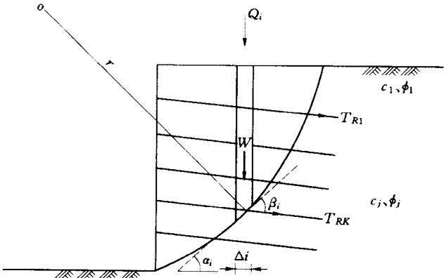  
图 8.36 圆弧滑裂面分析方法

(2) 双楔体分析方法。该法假定滑裂面为如图8.37 所示两个楔块，上部楔块以主动土压力形式将下滑力传到下部楔体。现以图8.38所示的一个算例来解释具体的计算步骤(Glasser, 1997).

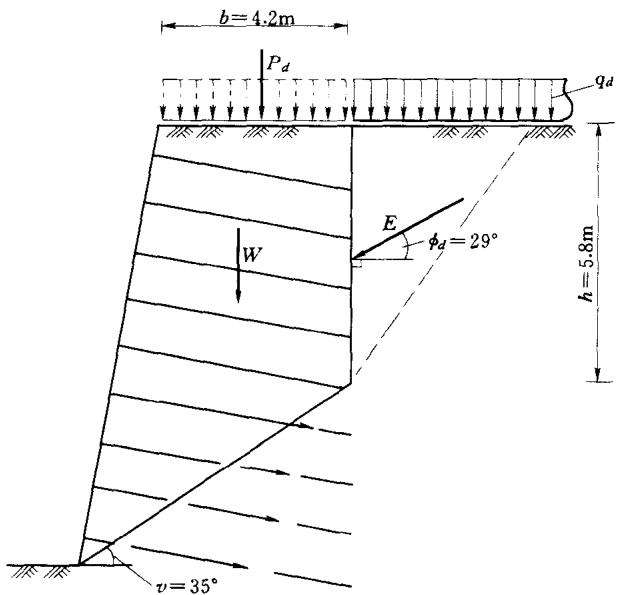

图 8.37 双楔体分析方法  
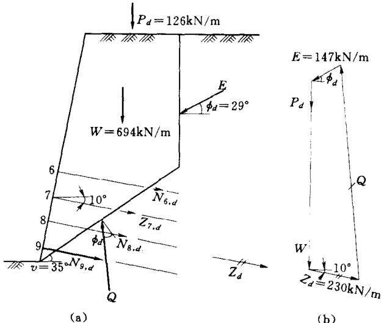  
图 8.38 下部楔体倾角为 35°的计算分析方法(a) 滑动楔体；(b) 力多边形

[例8.6] 土钉双楔体分析方法例题。

(1)假定下部楔块底滑面倾角为35°，计算上部楔块作用于下部楔块的主动土压力： $3 5 ^ { \circ }$

$$
E = \frac { 1 } { 2 } h ( \varkappa h + 2 q ) K _ { a }\tag{8.64}
$$

式中：γ为土体容重；h为直立面高度。主动土压力系数K。不仅取决于土的内摩擦角，而且 $K _ { a }$ 取决于作用于直立面A的土压力向下的倾角，现假定该倾角等于底滑面的摩擦角=29°，经 $\phi = 2 9 ^ { \circ }$ 计算得 $K _ { a } { = } 0 . 3 0 8$ ，因此，

$$
E = { \frac { 1 } { 2 } } \times 5 . 8 ( 1 8 \times 5 . 8 + 2 . 3 0 ) \times 0 . 3 0 8 = 1 4 7 \mathbf { k N / m }\tag{8.65}
$$

(2)计算保证下部楔体极限平衡的土钉所需提供的总抗滑力 $\textstyle Z _ { d } ,$ 。如图8.38所示，在知道E的条件下，根据图中所示力多边形可以知道使下部楔体保持极限平衡所需的总抗滑力$Z _ { d } = 2 3 0 \mathrm { k N / m }$ 0

(3) 假定下部楔块的底滑面为 $3 5 ^ { \circ }$ ，计算每米土钉所需提供的抗滑力。共有编号为6,7,8,9的4根锚钉穿过底滑面。这4根锚钉埋入滑裂面右侧稳定土体的长度分别为1.4,2.8,4.0,5.4m。总计为L=13.6m。因此，为保证下部楔块极限平衡，每米土钉所需提供的抗滑力为

$$
T _ { m , d } = Z _ { \ d } / L = 2 3 0 / 1 3 . 6 = 1 6 . 9 ( \mathrm { k N / m ) }\tag{8.66}
$$

(4) 调整下部楔块的底滑面倾角为 $4 0 ^ { \circ }$ 和 $4 5 ^ { \circ }$ ，按同样的方法计算 $T _ { m , d } ,$ 分别为 17.3kN/m和16.1kN/m。因此，可以认为当下部楔块的底滑面倾角为40°时，每米土钉所需提供的 $4 0 ^ { \circ }$ $T _ { m , d }$ 最大为17.3kN/m。

(5) 实际每米锚钉能够提供的抗拔力为 30kN/m，其分项系数为 1.3。故锚钉的沿宽度方向的间距应为

$$
S _ { n } = { \frac { 3 0 } { 1 . 3 \times 1 7 . 3 } } = 1 . 3 5 { \mathrm { m } }\tag{8.67}
$$

## 7. 外部破坏稳定分析

外部破坏指发生于墙体之外的破坏，主要有土钉墙沿基底平移、土钉墙绕墙址倾覆、土钉墙墙基土体失稳、土钉墙沿深远土层整体滑移四种形式。

外部破坏稳定分析方法和内部破坏模式中的双楔体分析方法类似。但是在计算土压力时，通常不采用[例8.6]那样的传统的土压力系数。而是根据土钉墙传力特点，选用图8.39所示的几种土压力分布模式（孔宪宾，任青文，2000）。这是因为在土钉墙体系中，上部的土体由于受到土钉的“牵拉”作用，会造成土体自重的不完全向下传递，即上部土钉的“牵拉”会造成对下部土体的某种程度上的“减载”作用，从而使土压力随深度增加而增加的趋势减缓，形成如图8.39(c)所示的模式，即在一定深度以下，土压力不再增加。从这一点来看，凡种土压力计算模式中应以图8.39(c)所示的模式更为合理。

如果使用图 8.39 中的几种土压力分布模式，那么第 8.2 节讨论的通用条分法恰好提供了相应的土压力的计算方法。

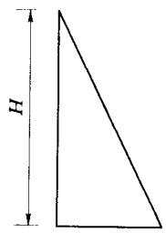  
(a)

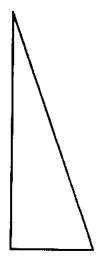  
(b)

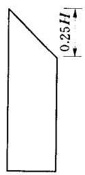  
(c)

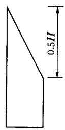  
(d)  
图 8.39 几种土压力计算模式

(a) 冶金工业部建筑研究总院主编的《建筑基坑工程技术规范》(YB9258-97):

(b) 中国建筑科学研究院主编的《建筑基坑支护技术规程》(JGJ120-99);

(c) 清华大学土木系主编的《基坑土钉支护技术规程》(CECS 96:9)：(d) 王步云法

## 8.4.3 土工布加固边坡稳定分析

## 1. 概述

土工布通常指用于土建工程中的纺织品，它具有良好的化学物理性能和水工性能，广泛应用于水利、电力、公路、铁路、机场、港口、围垦、环保、抗洪以及各种地下、水下等许多工程之中，被称为是继钢材、水泥、木材之后的第四大新型建筑材料。

在工程中使用土工布，尽管工程造价略有提高（以高速公路为例，约提高1.5%\~2%），但是，它却可以大大提高工程质量，延长使用寿命，同时还可减少后期大量的维护费用。综合考虑，在同等设计标准下，使用土工布可使工程造价降低20%\~40%，经济效益十分显著（刘丽芳等，2001）。

土工布大体分为四个类型，即织造型、非织造型、合成型和复合型。

1)织造型是用传统纺织工艺制造的，按其加工的方法，又可细分为编织型、机织型和针织型；

2)非织造型俗称“无纺布”，按其固接方式又可细分为针刺型、化学粘合型和热熔型等；

3)合成型按产品分类可以细分为土工膜、格栅、网格、絮片及土工板等；

4) 复合型是指由两种或两种以上的材料，运用不同方法复合而成的产品，如复合土工膜、排水板及土工垫块等。

上述四种类型中，非织造型土工布价格较低，但抗拉强度及初始模量都不及织造型土工布，对于抗拉强度要求高的，一般使用织造型土工布。虽然织造型土工布的孔眼大小和孔隙率可以在生产中加以控制，但组织交织点处不联结，在机械作用下容易使纤维或纱线游移，孔径变大，甚至局部破损、纤维断裂，造成纱线绽开、脱落。而非织造型土工布除了具有较高抗拉强度外，其变形模量、孔径等指标都可按需要调节。当然，合成型和复合型土工布是高科技含量、高附加值的产品，它们具有非织造型和织造型土工布两者的优点，是当今国内外大力推广的土工布。

## 2. 土工布抗拔能力

通常通过室内试验确定土工布抗拔能力（图8.40)。Mitehell 建议采用以下公式确定单位宽度加固体的抗拔力。

$$
P _ { r } = F \times \alpha \times \sigma _ { \nu } L _ { e } C\tag{8.68}
$$

式中：L。为土工布插入深度；C为加固材料的有效周面积，条形采用2，圆形采用π；F为 $L _ { e }$ 摩擦系数；α为尺寸效应修正系数； $\pmb { \sigma _ { v } }$ 为法向应力。

## 3. 内部破坏稳定性分析

利用土工布加固的边坡同土钉支护结构一样需要进行内部稳定性和外部稳定性分析。本处介绍 Leshchinsky 建议的方法。

土工布的内部加固分析方法与图8.41所示类似，但是由于土工布是柔性结构，在土体发生破坏时，土工布提供的抗滑力可能与滑面的法线方向有一夹角，Leshchinsky建议考虑一个土工布随土体变形产生的一个转角θ。

图 8.41 中 $t _ { j }$ 与水平方向夹角为 $\theta _ { j }$ 。通常比较保守的做法是假设 $\theta _ { j } = 0$ ，此时土工布对土体稳定性所作的贡献较小；当 $\theta _ { j } = \beta _ { j }$ 时， $t _ { j }$ 与第 $j$ 层土工布对应的曲率半径垂直，对土体稳定性贡献最大。实际上，当柔韧性较好的土工布抗力得到充分发挥时，可能会出现${ \pmb \theta } _ { ; j } = { \pmb \beta } _ { j }$ 的情况。

土工布从破坏面内侧稳定土体中拔出所能提供的抗滑力是：

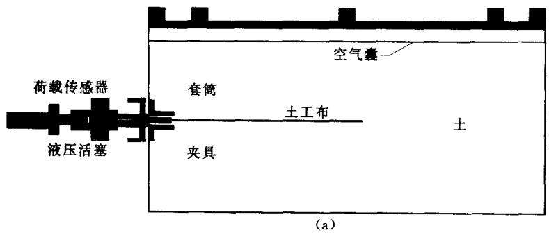

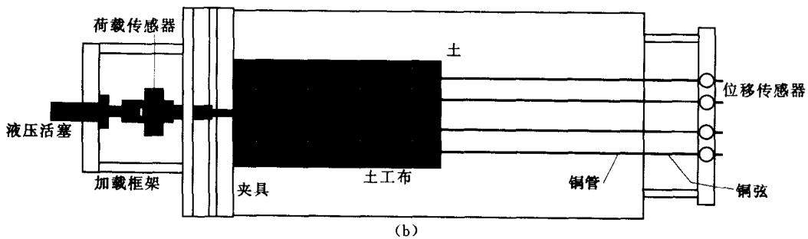  
图 8.40 土工布抗拔试验

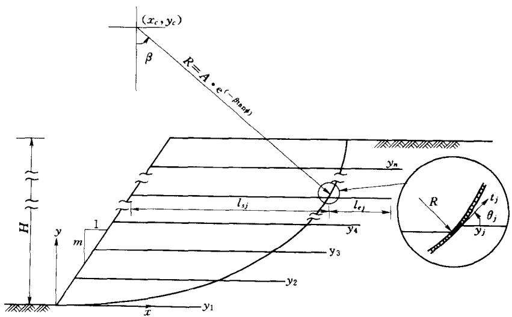  
图 8.41 内部失稳模式分析

$$
t _ { j } = 2 k \tan { \phi } \times \overline { { \sigma } } _ { j } l _ { e j }\tag{8.69}
$$

式中： $t _ { j }$ 为第j层土工布所能提供的抗滑力；k为和土工布与土体接触面上摩擦力有关的系数（一般在0.6\~1.0之间）；φ为土体内摩擦角；σi,l为第j层土工布在稳定土体内部的 $\phi ,$ $\sigma _ { j } , l _ { e j }$ $j$ 平均应力和埋入稳定土体里的长度，σ，是个未知量，无外荷载时，可以粗估为土体自重。 $\overline { \sigma } _ { j }$

在土工布设计中，通常要为土工布抗滑力留一定的余地，故假定一个安全系数F，土 $F _ { s }$ 工布可供使用的抗滑力为 $t _ { m j } = 2 k \psi _ { m } \times \overline { { \sigma } } _ { j } l _ { e j }$ (式中 $\psi _ { m } = \tan \phi / F ^ { \mathbf { \alpha } } )$ o

Leshchinsky(1989)在假定滑裂面为对数螺线的条件下，对简单边坡提供了一系列的图表，可以快速查出相应某边坡安全系数ψ值所需要的土工布加固量。如果假定滑裂面为圆 $\psi t$ 弧，则也可用 Bishop 法计算安全系数。

## 4. 外部破坏稳定分析

如图8.42是土工布加固边坡的外部失稳模式之一。假设双折线滑裂面，其中水平滑面沿第j层土工布表面（潜在的软弱夹层），点2和点3之间点斜线滑面倾角ξ未知，且不穿 $j$ $\pmb { \xi }$ 过任何土工布。

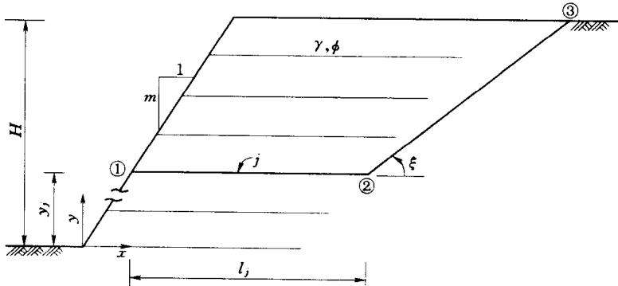  
图 8.42 外部失稳模式

如图8.43将滑块分成两个楔体进行分析。假定楔体之间作用力为P方向水平。图中，k为和土工布与土体接触面上摩擦力有关的系数（一般在0.6\~1.0之间）; $\psi _ { m } = \tan \phi / F$

在外部稳定性中同样引入了安全系数F。从多边形中可以看到ξ与Ψm有关，也就是与 $\pmb { F } _ { \circ }$ $\pmb { \xi }$ $\psi _ { m }$ F有关。分别考虑两个楔体的平衡方程，可以得到：

$$
\boldsymbol { \psi } _ { m } = [ \frac { ( H - y _ { i } ) ^ { 2 } ( \cot \xi - \frac { 1 } { m } ) + 2 ( H - y _ { j } ) l _ { j } - m l _ { j } ^ { 2 } } { m k l _ { j } ^ { 2 } } [ \frac { \sin \xi - \psi _ { m } \cos \xi } { \cos \xi + \psi _ { m } \sin \xi } ] \quad , \frac { \mathrm { { s u } } } { \mathrm { { d } } } \quad l _ { j } \leq \frac { H - y _ { j } } { m } ;\tag{8.70}
$$

$$
\psi _ { m } = \left[ \frac { ( H - y _ { j } ) \cot \xi } { k \left[ 2 l _ { j } - \frac { H - y _ { j } } { m } \right] } \right] \left[ \frac { \sin \xi - \psi _ { m } \cos \xi } { \cos \xi + \psi _ { m } \sin \xi } \right] , \triangleq l _ { j } \ge \frac { H - y _ { j } } { m } \circ\tag{8.71}
$$

(a)

式中： $l _ { j }$ 为水平滑面上土工布的长度。对于一个给定的 $m , H , y _ { j } , l _ { j } , k$ ，变动 ${ \pmb \xi }$ 寻找一个最大的 $\psi _ { m }$ ，这样也就得到了最小的安全系数F。同样Leshchinsky(1989)也提出了计算图表，对简单边坡可快速查得加固边坡的安全系数。

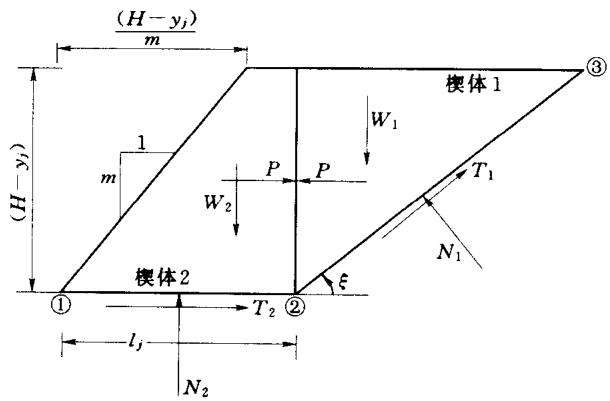

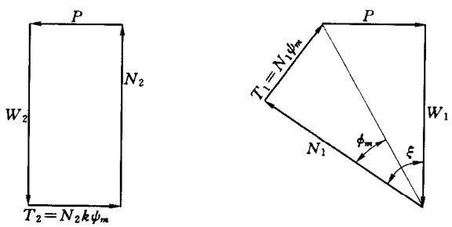  
(b)  
图 8.43 外部失稳模式分析

## 8.5 本章附录

## 8.5.1 本章数据文件（表8.13）

表8.13 本章数据文件
<table><tr><td>章节</td><td>系列号</td><td>数据文件名</td><td>内容</td><td></td></tr><tr><td>8.2.5</td><td>08-01-01</td><td>RE-1.DAT</td><td>[例8.1]</td><td>k=1/3</td></tr><tr><td></td><td>08-01-02</td><td>RE-2.DAT</td><td>[例8.1]</td><td>k=1/2</td></tr><tr><td></td><td>08-01-03</td><td>RE-3.DAT</td><td>[例8.1]</td><td>k=2/3</td></tr><tr><td></td><td>08-02-01</td><td>E1.DAT</td><td>[例8.2]</td><td>例(a)</td></tr><tr><td></td><td>08-02-02</td><td>E2.DAT</td><td>[例8.2]</td><td>例(b)</td></tr><tr><td></td><td>08-02-03</td><td>E3.DAT</td><td>[例8.2]</td><td>例(c)</td></tr><tr><td></td><td>08-02-04</td><td>E4 .DAT</td><td>[例8.2]</td><td>例(d)</td></tr><tr><td></td><td>08-03-01</td><td>W-1.DAT</td><td>[例8.3]</td><td></td></tr><tr><td></td><td>08-03-02</td><td>W-2.DAT</td><td>[例8.3]</td><td></td></tr><tr><td></td><td>08-04-01</td><td>TP-5.DAT</td><td>[例8.4]</td><td>表8.3，φ=35°，H=5m</td></tr><tr><td></td><td>08-04-02</td><td>TP-10.DAT</td><td>[例8.4]</td><td>表8.3，φ=35°，H=10m</td></tr><tr><td></td><td>08-04-03</td><td>TP-15.DAT</td><td>[例8.4]</td><td>表8.3，φ=35°，H=15m</td></tr><tr><td></td><td>08-04-04</td><td>TP-25.DAT</td><td>[例8.4]</td><td>表8.3，φ=35°，H=20m</td></tr><tr><td>章节 8.2.5</td><td>系列号</td><td>数据文件名</td><td>内容</td><td></td></tr><tr><td rowspan="11"></td><td>08-04-05 08-04-06</td><td>TW-5.DAT</td><td>[例8.4]</td><td>表8.3，φ=25°，H=5m</td></tr><tr><td></td><td>TW-10.DAT</td><td>[例8.4]</td><td>表8.3，φ=25°，H=10m</td></tr><tr><td>08-04-07</td><td>TW-15.DAT</td><td>[例8.4]</td><td>表8.3，φ=25°，H=15m</td></tr><tr><td>08-04-08</td><td>TW-25.DAT</td><td>[例8.4]</td><td>表8.3，φ=25°，H=20m</td></tr><tr><td>08-05-01</td><td>M5-11.DAT</td><td>[例8.4]</td><td>表8.4，c=50kPa，H=11m</td></tr><tr><td>08-05-02</td><td>M5-17.DAT</td><td>[例8.4]</td><td>表8.4，c=50kPa，H=17m</td></tr><tr><td>08-05-03</td><td>M5-20.DAT</td><td>[例8.4]</td><td>表8.4，c=50kPa，H=20m</td></tr><tr><td>08-05-04</td><td>M3-6.DAT</td><td>[例8.4]</td><td>表8.4，c=30kPa，H=6m</td></tr><tr><td>08-05-05</td><td>M3-8.DAT</td><td>[例8.4]</td><td>表8.4，c=30kPa，H=8m</td></tr><tr><td>08-05-06</td><td>M3-10.DAT</td><td>[例8.4]</td><td>表8.4，c=30kPa，H=11m</td></tr><tr><td rowspan="2">8.2.6</td><td>08-06-01</td><td>PL-1.DAT</td><td>[工程实例一]</td><td>k= 1/3</td></tr><tr><td>08-06-02 08-06-03</td><td>PL-2.DAT PL-3.DAT</td><td>[工程实例一]</td><td>k=1/2</td></tr><tr><td rowspan="16">8.2.8</td><td>08-07-01 08-07-02</td><td>Tgs11.DAT</td><td>[工程实例一] [工程实例二]</td><td>k=2/3 表8.7，通用条分法（1-1剖面局部坡）</td></tr><tr><td></td><td>Tgs12.DAT</td><td>[工程实例二]</td><td>表8.7，库仑土压力法（1-1剖面）</td></tr><tr><td>08-07-03</td><td>Tgs13.DAT</td><td>[工程实例二]</td><td>表8.7，通用条分法（1-1剖面整体坡）</td></tr><tr><td>08-07-04</td><td>Tgs21.DAT</td><td>[工程实例二]</td><td>表8.7，通用条分法（2-2剖面局部坡）</td></tr><tr><td>08-07-05</td><td>Tgs22.DAT</td><td>[工程实例二]</td><td>表8.7，库仑土压力法（2-2剖面）</td></tr><tr><td>08-07-06</td><td>Tgs23.DAT</td><td>[工程实例二]</td><td>表8.7，通用条分法（2-2剖面整体坡）</td></tr><tr><td>08-07-07</td><td>Tgs31.DAT</td><td>[工程实例二]</td><td>表8.7，通用条分法（3-3剖面局部坡）</td></tr><tr><td>08-07-08</td><td>Tgs32.DAT</td><td>[工程实例二]</td><td>表8.7，库仑土压力法（3-3剖面）</td></tr><tr><td>08-07-09</td><td>Tgs33.DAT</td><td>[工程实例二]</td><td>表8.7，通用条分法（3-3剖面整体坡）</td></tr><tr><td>08-07-10</td><td>Tgsz21.DAT</td><td>[工程实例二]</td><td>表8.7，通用条分法（纵2剖面局部坡）</td></tr><tr><td>08-07-11</td><td>Tgsz22.DAT</td><td>[工程实例二]</td><td>表8.7，库仑土压力法（纵2剖面）</td></tr><tr><td>08-07-12</td><td>Tgsz23.DAT</td><td>[工程实例二]</td><td>表8.7，通用条分法（纵2剖面整体坡）</td></tr><tr><td>08-07-13</td><td>Tgs71.DAT</td><td>[工程实例二]</td><td>表8.7，通用条分法（7-8剖面局部坡）</td></tr><tr><td>08-07-14</td><td>Tgs72.DAT</td><td>[工程实例二]</td><td>表8.7，库仑土压力法（7-8剖面）</td></tr><tr><td>08-07-15</td><td>Tgs73.DAT</td><td>[工程实例二]</td><td>表8.7，通用条分法（7-8剖面整体坡）</td></tr></table>

## 参考文献

1蔡永东. 土工布的应用与发展. 棉纺织技术，1999.7(4)：399-402

2 Casagrandi. Comments on conventional design of retaining structures. Journal of Geotechnical Engineers. ASCE. 121(9). 629-635

3 Chen, L. T., and Poulos, H. G. &Hull, T. S. 1997. Model tests on pile groups subjected to lateral soil movement. Soil and foundations, 37 (1): 1-12

4 陈忠达、郑传超、戴经梁.沙基土工布+砂砾基层抗剪稳定性分析.西安公路交通大学学报.1999.4

5 陈肇元、崔京浩.土钉支护在基坑工程中等应用.北京：中国建筑工业出版社，1997.15-65

6 Chen, Z. Y. and Li, S. M. Evaluation of active earth pressure by the generalized method of slices. Canadian Geotechnical Journal. 1998. 35(4): 591-599

7 Dov Leshchinsky & Ralph H. Boedeker , Geosynthetic reinforced soil structures , Journal of Geotechinical Engineesing , 1989

8 Duncan, J., Clough, G. and Ebeling, R. Behabior and design of gravity earth retaining structures. Design and Performance of Earth Retaining Structures, Proc. of Conf. Cornel University, Ithaca, New York, June 1, ASCE Geotechnical Special Publication, No. 25. 1990. 251-277

9 Gassler, G. Design of reinforced excavation and natural slopes using New European Codes. Earth Reinforcement. Balkema. 1997.943–961

10 Guerpillion, Y., Boutonnier, L., Gay, O., Foray, P. & Flavigny, E. Modelisation physique et numerique de l’interaction d’un obstacle et d’un glessement d’ epaisseur limitee. Proc. 12th Eur. Conf. Soil Mechs. Foundn. Eng. Amsterdam. 1999.

11 Hassiotis, S., Chameau, J.L. & Gunaratne, M. Design method for stabilization of slopes with piles. Jnl. Geot. And Geoenvir. Eng., ASCE. 1997. 123. (4): 314-323

12 Hull, T.S. Analysis of the stability of slopes with piles. Proc. 11th Asian Geot. Conf., Singapore. 1993. 639-643

13 Ito, T., Matsui, T. & Hong, W.P. Extended design method for multi-row stabilising piles against landslide: Soils and Foundations, 1982. 22(1): 1-13

14 Ito, T. & Matsui, T. Methods to estimate lateral force acting on stabilising piles. Soils and Foundations, 1975.. 18(4): 43-49

15 Ito, T., Matsui, T. & Hong, W.P. Design method for the stability analysis of the slop with landing pier. Soils and Foundations, 1979. 19(4): 43-57

16 孔宪宾、任青文. 土钉墙技术及其发展. 水利水电科技进展,2000.20(2):24-27

17 Kramer, S. L. & Heavey, E.J. Analysis of laterally loaded piles with nonlinear bending behavior. Transp. Res. Record. 1988. 1169, 70-74

18 Leshchinsky, D. & Boedeker, R. H. Geosynthetic reinforced soil structures, Journal of Geotechinical Engineesing, 1989. 115(10): 1459-1477

19 Lee, C. Y., Poulos, H.G. and Hull T.S.. Effect of seafloor instability on offshore pile foundations. Can. Geot. Jnl. 1991. 28(5):729-737

20李大勇、王斌.土钉墙支护技术的研究现状.西部探矿工程，2001.5:35-36

21 李松梅.确定各种支挡结构主动土压力的数值分析方法. 华北水利水电学院研究生部硕士论文，1997

22刘斐、张向荣、张友银.土钉墙支护研究进展.湘潭大学社会科学学报，2002.5:190-193

23 刘丽芳、储才元. 土工布性能与应用. 非织造布,2001.9(4):11-14

24李子军、徐清文、黄克胜、曾宪星.土钉支护及其应用.山东冶金，2001.23(4):29-32

25 Lu., P. Y., Lai, Q. H. and Li, S. P. Analysis of two deep excavation failures in Guangdong Province. Proceedings of Geotechnical Problems of Rapidly developing Areas in China. Geotechnical Division, Hong Kong Institution of Engineers. 1996. 243-256

26 Mitchell, J. K. And Christopher, B. R. North American practice in reinforced Soil System. Design and Performance of Earth Retaining Structures, Proc. of Conf. Cornel University, Ithaca, New York, June 1, ASCE Geotechnical Special Publication, No. 25. 1990. 322–345

27 O'Rourke, T.D. & C.J.F.P. Jones. Overview of earth retention systems: 1970-1990. In Design and Performance of Earth Retaining Structures, P. C. Lambe & L.A. Hansen, eds., American Society of Civil Engineers Geotechnical Special Pubilcation 2. 1990.5: 22-51

28 Peck, R. Fifty years’ of lateral earth pressure. Design and Performance of Earth Retaining Structures, Proc. of Conf. Cornel University, Ithaca, New York, June 1, ASCE Geotechnical Special Publication, No. 25. 1990

29 Popescu, M. E. 1991. Landslide control by means of a row of piles., Slope stability Engineering. Thomas Telford, London: 389-394

30 Poulos, H. G., Design of slop stabilizing piles. Slop Stability Engineering, Balkema.Volume 1, 1999. 83- 100Terzaghi, K. and Peck, R. B. 1967. Soil mechanics in engineering practice. John Wiley and Sons. New York.Schuster, R. L. Recent advances in slop stabilization. Landslides, Volume 3. 1995. 1715-1745

31 Poulos, H.G., 1973. Analysis of piles in soil undergoing lateral movement. Jnl. Soil Mechs. Founds. Div., ASCE. Vol. 99, SM5: 391-406

32 Poulos, H.G. 1995. Design of reinforcing piles to increase slope stability. Can. Geot. Jnl. 32:808-818

33 钱家欢. 理论土力学. 南京：河海大学出版社.1990

34 Robert L. Schuster, Recent advances in slop stabilization. Landslides, 1995. Volume 3. 1715-1745

35 孙宝忠、谢莉青、张洪弟.土工布力学性能的模型及其应用初探.产业用纺织品.2002.2:29-32J

36 Viggiani, C. Ultimate Lateral load on piles used to stabilise landslides. Proc. 10th Int. Conf. Soil Mechs. Foundn. Engs. Stockhom. 1981. Vol. 3: 555-560

37杨育文、袁建新.土钉墙力学性状及其边界元法分析.城市勘测，2000.1:8-13

38 张钦喜、霍达、王北和.土钉墙设计的滑楔平衡法. 工业建筑，2002.32(2):32-36

39 中国水利水电科学研究院. 江苏宜兴抽水蓄能电站上水库钢筋混凝土面板混合坝重力挡土墙土压力研究.2002

# 第9章 有限元法在边坡稳定分析中的应用

## 9.1 概述

随着计算机软件、硬件的飞速发展，采用理论体系更为严格的方法进行边坡稳定分析已经成为可能。有限单元法全面满足了静力许可、应变相容和应力、应变之间的本构关系。同时，因为是采用数值分析方法，可以不受边坡几何形状的不规则和材料的不均匀性的限制，因此，应该是比较理想的分析边坡应力、变形和稳定性态的手段。

与传统的极限平衡法相比，边坡稳定分析的有限元法的优点可总结如下：

(1)破坏面的形状或位置不需要事先假定。破坏“自然地”发生在土的抗剪强度不能抵抗剪应力的地带。

(2)由于有限元法引入变形协调的本构关系，因此也不必引入假定条件。保持了严密的理论体系。

(3)有限元解提供了应力、变形的全部信息。

有关有限元的基本原理及其在边坡稳定分析中的应用，已有很多的文献(沈珠江，1990;陈胜宏，2001）介绍。作者也另有专著（陈祖煜等，2003）介绍了采用有限元法求解第6章中所列渗流、固结和应力应变分析控制方程的详细方法。本章9.2节简要介绍这一计算方法的解题思路以及三角形、四边形单元的离散方法，并介绍有限元法在小浪底和务平工程中的应用。

如何将有限元计算成果与传统的安全系数挂钩，成为直接用于边坡设计的判别依据，也是广泛受到重视的课题。近期在这方面获得了有意义的成果。本章将简要介绍这方面的成果。

## 9.2 求解渗流和应力、应变控制方程的有限元方法

## 9.2.1 基本原理

第6章所述求解渗流和应力、应变的数学提法是，在体力{f}和边界上面力{T}的作用 $\left\{ f _ { b } \right\}$ $\{ \vec { T }$ 下，求满足微分方程式(6.27)、式(6.28)、式(6.31)、式(6.40)和边界条件式(6.30)、式(6.43)、式(6.44)、式(6.46)和式(6.48)的位移场{W}和水头场h。用有限元求解这些偏微分方程组边值问题，其基本途径是找出一个泛函π({W}，h)，当{W}和h为该偏微分方程边值问题解时，π获得极值。

可以证明，所寻找的泛函由下式确定：

$$
{ \pi } \big ( \big \{ W \big \} , h \big ) = { \pi } _ { 1 } + { \pi } _ { 2 } + { \pi } _ { 3 } + { \pi } _ { 4 } + { \pi } _ { 5 } + { \pi } _ { 6 } + { \pi } _ { 7 }\tag{9.1}
$$

其中

$$
\pi _ { 1 } = \int _ { V } - \frac { 1 } { 2 } \{ \Delta \sigma ^ { \prime } \} ^ { T } * \{ \varepsilon \} \mathrm { d } V - \int _ { V } \{ \sigma _ { 0 } ^ { \prime } \} * \{ \varepsilon \} \mathrm { d } V\tag{9.2}
$$

$$
\pi _ { 2 } = \int _ { V } \gamma _ { w } ( h - y ) * \left\{ a \right\} ^ { T } \{ \varepsilon \} \mathrm { d } V\tag{9.3}
$$

$$
\pi _ { 3 } = \int _ { V } \frac { 1 } { 2 } \gamma _ { w } \left\{ \nabla \right\} ^ { T } h ^ { * } \left\{ k \right\} ^ { * } \left\{ \nabla \right\} h \mathrm { d } V\tag{9.4}
$$

$$
\pi _ { 4 } = \int _ { V } \frac { 1 } { 2 } \frac { \gamma _ { w } ^ { 2 } } { Q } ( h - 2 h _ { 0 } ) * h \mathrm { d } V\tag{9.5}
$$

$$
\pi _ { 5 } = \int _ { V } - \big \{ { f } _ { b } \big \} ^ { T } * \big \{ { W } \big \} \mathrm { d } V\tag{9.6}
$$

$$
\pi _ { 6 } = \int _ { s _ { 1 } } \left\{ \overline { { T } } \right\} ^ { T } * \left\{ W \right\} \mathrm { d } s\tag{9.7}
$$

$$
\pi _ { 7 } = \int _ { s _ { 4 } } \gamma _ { w } * q * h \mathrm { d } s\tag{9.8}
$$

这一命题的理论证明可参见文献（陈祖煜等，2003）。

## 9.2.2 有限元解法

采用数值分析方法求解使获得极值的水头和位移场，包括以下步骤。

1. 离散化

将所研究的域V分成n个单元，共m个节点。这m个节点的{W}用{v}来代表，即 $\{ W \}$

$$
\{ \boldsymbol { v } \} ^ { \mathsf { T } } = ( \boldsymbol { W } _ { x 1 } , \boldsymbol { W } _ { y 1 } , \boldsymbol { W } _ { x 2 } , \boldsymbol { W } _ { y 2 } , \cdots \cdots , \boldsymbol { W } _ { x m } , \boldsymbol { W } _ { y m } )\tag{9.9}
$$

同样，用{φ}代表这m个节点的{h}值，

$$
\{ \varphi \} ^ { \mathrm { { T } } } = ( h _ { 1 } , h _ { 2 } , \cdots \cdots , h _ { m } )\tag{9.10}
$$

任一点的{W}和h可用该点所属单元的节点{W}和{h}近似表示，本质上，也就是可 $\{ \boldsymbol { W } \}$ $\{ \boldsymbol W \} ^ { e }$ 用{v}和{φ}代表。于是，π可以近似地用{v}和{φ}来代表，即 $\{ \varphi \}$

$$
\pi ( \{ W \} , h ) = \pi ( \{ \nu \} , \{ \varphi \} )\tag{9.11}
$$

根据里兹法的原理，使π取得极值的{v}和 $\{ \varphi \}$ 满足

$$
{ \frac { \partial \pi } { \partial \{ V \} ^ { T } } } = \left\{ \begin{array} { c } { \displaystyle \frac { \partial \pi } { \partial W _ { x 1 } } } \\ { \displaystyle \frac { \partial \pi } { \partial W _ { y 1 } } } \\ { \displaystyle \frac { \partial \pi } { \partial W _ { x 2 } } } \\ { \vdots } \\ { \displaystyle \frac { \partial \pi } { \partial W _ { y w } } } \end{array} \right\} = \{ 0 \} ^ { 1 } .\tag{9.12}
$$

$$
\frac { \partial \pi } { \partial \left\{ h \right\} ^ { T } } = \left\{ \begin{array} { c } { \displaystyle \frac { \partial \pi } { \partial h _ { 1 } } } \\ { \displaystyle \frac { \partial \pi } { \partial h _ { 2 } } } \\ { \vdots } \\ { \displaystyle \frac { \partial \pi } { \partial h _ { m } } } \end{array} \right\} = \{ 0 \}\tag{9.13}
$$

其中{0}为元素均为零的向量。由式(9.12)和式(9.13)可得3m个线性方程，可用来求解由{v}和{h}所包含的3m个未知数。这就是有限单元法的基本原理。

## 2. 应用形状函数表达单元内的物理量

单元内任一点的{W}和h可用该单元节点的 $\{ W \} ^ { e }$ 和 $\{ h \} ^ { e }$ 来近似表达：

$$
\{ W \} = [ N _ { W } ] \{ W \} ^ { \epsilon }\tag{9.14}
$$

$$
h = [ N _ { h } ] \{ h \} ^ { e } = \{ h \} ^ { e T } [ N _ { h } ] ^ { T }\tag{9.15}
$$

因此，

$$
\{ \varepsilon \} = [ \partial ] ^ { T } \{ W \} = [ \partial ] ^ { T } [ N _ { W } ] \{ W \} ^ { e } = [ B _ { W } ] \{ W \} ^ { e }\tag{9.16}
$$

$$
\{ \nabla \} h = \{ \nabla \} [ N _ { h } ] \{ h \} ^ { e } = [ B _ { h } ] \{ h \} ^ { e }\tag{9.17}
$$

式中

$$
[ B _ { W } ] = [ \partial ] ^ { T } [ N _ { W } ]\tag{9.18}
$$

$$
\left[ B _ { h } \right] = \{ \nabla \} [ N _ { h } ]\tag{9.19}
$$

$[ N _ { W } ]$ $[ N _ { h } ]$ 称形状函数或插值函数。对三角形和四边形单元，具有不同表达形式，将在第9.2.3节中详述。同时，我们记

$$
{ [ B _ { \Delta } ] } ^ { T } = { \{ a \} } ^ { T } [ B _ { W } ]\tag{9.20}
$$

将式(9.14)，式(9.15)，式(9.16)，式(9.17)和式(9.20)代入式(9.1)，得

$$
\begin{array} { c l } { \displaystyle \pi = \displaystyle \sum _ { i = 1 } ^ { n } \int _ { v } ( - \frac { 1 } { 2 } \{ W \} ^ { c T } \ast [ B _ { W } ] ^ { T } [ C ] [ B _ { W } ] \{ W \} ^ { e } - \{ \sigma _ { 0 } ^ { \prime } \} ^ { T } \ast \big [ B _ { W } \big ] \{ W \} ^ { e } } & { } \\ { \displaystyle } & { \displaystyle + \gamma _ { o } \{ h \} ^ { c T } [ N _ { h } ] ^ { T } [ B _ { \Delta } ] ^ { T } \ast \{ W \} ^ { e } - \gamma _ { w } y [ B _ { \Delta } ] ^ { T } \ast \{ W \} ^ { e } } \\ { \displaystyle } & { \displaystyle + \frac { 1 } { 2 } \gamma _ { \ast } \{ h \} ^ { c T } \ast [ N _ { h } ] ^ { T } [ K ] [ N _ { h } ] ^ { \ast } \{ h \} ^ { e } \cdot \{ f _ { b } \} ^ { T } [ N _ { w } ] ^ { \ast } \{ W \} ^ { e } } \\ { \displaystyle } & { \displaystyle + \frac { 1 } { 2 } \frac { \gamma _ { w } ^ { 2 } } { 2 } \{ h \} ^ { c T } [ N _ { h } ] ^ { T } [ N _ { h } ] ^ { \ast } \{ h \} ^ { c T } - \frac { \gamma _ { w } ^ { 2 } } { Q } \{ h _ { 0 } \} ^ { c T } [ N _ { h } ] ^ { T } [ N _ { h } ] ^ { \ast } \{ h \} ^ { e } ) \mathrm { d } V } \\ { \displaystyle } &  \displaystyle + \sum _ { i = 1 } ^ { S } \int _ { s _ { \ast } } \{ \bar { T } \} ^ { c T } [ N _ { W } ] ^ { T } [ N _ { W } ] ^ { \ast } \{ W \} ^ { e } \mathrm { d } s + \sum _ { i = 1 } ^ { n } \int _ { s _ { \ast } } \gamma _ { \ast } \ast \{ q \} ^ { c T } [ N _ { h } ] ^ { T } [ N _ { h } ] ^ { \ast } \{ h \} ^ \end{array}\tag{9.21}
$$

注意边界上 $\{ \overline { T } \}$ 和 $\pmb q$ 也被离散化为

$$
\{ \overline { { T } } \} = [ N _ { w } ] \{ \overline { { T } } \} ^ { e }\tag{9.22}
$$

$$
\boldsymbol { q } = [ N _ { h } ] \{ \boldsymbol { q } \} ^ { e }\tag{9.23}
$$

如果将式(9.21)中的单元节点位移 $\{ W \} ^ { e }$ 和水头 $\{ h \} ^ { e }$ 改写成系统整体的位移 $\{ \nu \}$ 和水头{φ}，可表达为

$$
\begin{array} { c } { { \pi = - \displaystyle \frac 1 2 \big \{ \nu \big \} ^ { T } \big [ k _ { 1 } \big ] ^ { * } \big \{ \nu \big \} - \big \{ M _ { 1 } \big \} ^ { T } \{ \nu \big \} + \gamma _ { _ { w } } \{ \varphi \big \} ^ { T } \big [ k _ { 3 } \big ] ^ { T } * \big \{ \nu \big \} - \gamma _ { _ { w } } \big \{ M _ { 4 } \big \} ^ { T } * \{ \nu \big \} } } \\ { { { } } } \\ { { + \displaystyle \frac 1 2 \gamma _ { _ { w } } \{ \varphi \big \} ^ { T } * \big [ k _ { 2 } \big ] ^ { * } \{ \varphi \big \} + \displaystyle \frac 1 2 \frac { \gamma _ { _ { w } } ^ { 2 } } { Q } \{ \varphi \big \} ^ { T } \big [ k _ { 4 } \big ] ^ { * } \{ \varphi \big \} - \displaystyle \frac { \gamma _ { _ { w } } ^ { 2 } } { Q } \{ \varphi _ { o } \} ^ { T } \big [ k _ { 4 } \big ] ^ { * } \{ \varphi \big \} } }  \\ { { { } } } \\ { { - \big \{ M _ { 2 } \big \} ^ { T * } \big \{ \nu \big \} + \big \{ P _ { 1 } \big \} ^ { T } * \big \{ \nu \big \} + \gamma _ { _ { w } } * \big \{ P _ { 2 } \big \} ^ { T } * \{ \varphi \big \} } }  \end{array}\tag{9.24}
$$

其中

$$
{ \Big [ } k _ { 1 } { \Big ] } = \sum _ { i = 1 } ^ { n } \int _ { V } [ B _ { W } ] ^ { T } \{ C \} [ B _ { W } ] \mathrm { d } V\tag{9.25}
$$

$$
\left[ k _ { 2 } \right] = \sum _ { i = 1 } ^ { n } \int _ { \nu } \left[ N _ { h } \right] \left[ k \right] \left[ N _ { h } \right] \mathsf { d } V\tag{9.26}
$$

$$
\left[ k _ { 3 } \right] = \sum _ { i = 1 } ^ { n } \int _ { V } [ B _ { \Delta } ] [ N _ { h } ] \mathrm { d } V\tag{9.27}
$$

$$
{ \left[ { k _ { 4 } } \right] } \mathrm { { = } } \sum _ { i = 1 } ^ { n } { \int _ { V } { \left[ { N _ { h } } \right] ^ { T } [ N _ { h } ] \mathrm { { d } } V } }\tag{9.28}
$$

$$
\left\{ M _ { 1 } \right\} = \int _ { V } [ B _ { \boldsymbol { w } } ] ^ { T } \left\{ { \boldsymbol { \sigma } } _ { 0 } \right\} \mathrm { d } V\tag{9.29}
$$

$$
\left\{ M _ { 2 } \right\} = \sum _ { i = 1 } ^ { n } \int _ { \cal V } [ N _ { w } ] \{ f _ { b } \} ^ { T } \mathrm { d } V\tag{9.30}
$$

$$
\left\{ M _ { 4 } \right\} = \sum _ { i = 1 } ^ { n } \int _ { V } y [ B _ { \Delta } ] \mathrm { d } V\tag{9.31}
$$

$$
\left\{ P _ { 1 } \right\} = \sum _ { i = 1 } ^ { S } \int _ { S _ { 1 } } [ N _ { u } ] ^ { T } [ N _ { u } ] \{ \overline { { T } } \} ^ { e } \mathrm { d } s\tag{9.32}
$$

$$
\left\{ P _ { 2 } \right\} { = } \sum _ { i = 1 } ^ { S } \int _ { S _ { 4 } } [ N _ { h } ] ^ { T } [ N _ { h } ] \{ q \} ^ { e } \mathrm { d } s\tag{9.33}
$$

式(9.25)\~式(9.33)系指各矩阵按其在整体结构矩阵中的位置叠加。

3. 应用里兹法求解泛函的极小值

对式(9.24)所表达的π进行式(9.12)、式(9.13)的运算，可以得到最终的线性方程组：

$$
\begin{array} { r } { - [ k _ { 1 } ] \{ \nu \} + \gamma _ { w } [ k _ { 3 } ] \{ \varphi \} = \{ M _ { 2 } \} - \{ P _ { 1 } \} + \{ M _ { 4 } \} + \{ M _ { 1 } \} } \end{array}\tag{9.34}
$$

$$
\begin{array}{c} \gamma _ { w } [ k _ { 3 } ] ^ { T } \{ \nu \} + \gamma _ { w } ( g * [ k _ { 2 } ] + \frac { \gamma _ { w } } { Q } [ k _ { 4 } ] ) \{ \varphi \} = - \gamma _ { w } \{ P _ { 2 } \} + \frac { \gamma ^ { 2 } { } _ { w } } { Q } \{ k _ { 4 } \} \{ \varphi _ { 0 } \} \gamma _ { \mu } \{ \overline { { { \Psi } } }  _ { 0 } \} \end{array}\tag{9.35}
$$

求解这个方程组，即获得了用有限元法得到的固结问题的解。实际计算时，常采用增量法，具体的数值分析步骤可参见文献（陈祖煜等，2003）。

## 9.2.3 结构矩阵的形成和计算

1. 三角形单元

(1) 形状函数。三角形单元的自变量用以下矩阵表达：

$$
\left\{ W \right\} ^ { e T } = ( W _ { x 1 } , W _ { y 1 } , W _ { x 2 } , W _ { y 2 } , W _ { x 3 } , W _ { y 3 } )\tag{9.36}
$$

$$
\{ h \} ^ { e T } = ( h _ { 1 } , h _ { 2 } , h _ { 3 } )\tag{9.37}
$$

单元内任一点(x, y)的{W}和 h可用该单元的{W}和{h}e表示，即式(9.14)和(9.15)，其中

$$
[ N _ { h } ] = ( N _ { 1 } , N _ { 2 } , N _ { 3 } )\tag{9.38}
$$

$$
[ N _ { W } ] = \left[ \begin{array} { c c c c c c } { { N _ { 1 } } } & { { 0 } } & { { N _ { 2 } } } & { { 0 } } & { { N _ { 3 } } } & { { 0 } } \\ { { 0 } } & { { N _ { 1 } } } & { { 0 } } & { { N _ { 2 } } } & { { 0 } } & { { N _ { 3 } } } \end{array} \right]\tag{9.39}
$$

而

$$
N _ { 1 } = ( a _ { 1 } + b _ { 1 } x + c _ { 1 } y ) / 2 \Delta\tag{9.40}
$$

$$
a _ { 1 } = x _ { 2 } y _ { 3 } - x _ { 3 } y _ { 2 }\tag{9.41}
$$

$$
b _ { 1 } = y _ { 2 } - y _ { 3 }\tag{9.42}
$$

$$
c _ { 1 } = x _ { 3 } - x _ { 2 }\tag{9.43}
$$

$$
2 \Delta = \operatorname* { d e t } { \left| { \begin{array} { l l l } { 1 } & { x _ { 1 } } & { y _ { 1 } } \\ { 1 } & { x _ { 2 } } & { y _ { 2 } } \\ { 1 } & { x _ { 3 } } & { y _ { 3 } } \end{array} } \right| }\tag{9.44}
$$

参考图9.1，在脚标为2、3时，N、a、b、c的相应表达式可依次类推。式(9.18)和式(9.19)中

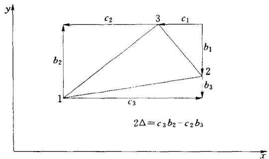  
图 9.1 三角形单元

$$
\begin{array} { l } { \displaystyle [ B _ { h } ] = \left[ \frac { \partial } { \partial x } \right] ( N _ { 1 } , N _ { 2 } , N _ { 3 } ) } \\ { \displaystyle } \\ { \displaystyle = \left[ \frac { \partial N _ { 1 } } { \partial x } \frac { \partial N _ { 2 } } { \partial x } \frac { \partial N _ { 3 } } { \partial x } \right] } \\ { \displaystyle } \\ { \displaystyle = \left[ \frac { \partial N _ { 1 } } { \partial y } \frac { \partial N _ { 2 } } { \partial y } \frac { \partial N _ { 3 } } { \partial y } \right] } \\ { \displaystyle } \\ { \displaystyle = \frac { 1 } { 2 \Delta } \left[ a _ { 1 } \begin{array} { l l } { b _ { 1 } } & { b _ { 2 } } & { b _ { 3 } } \\ { a _ { 2 } } & { a _ { 3 } } \end{array} \right] } \end{array}\tag{9.45}
$$

$$
\begin{array} { r l } &  \begin{array} { r l } { [ \begin{array} { l l l } { \partial } & { 0 } \\ { { \overline { { \lambda } } } \lambda \ } & { 0 } \end{array} ] } \\ { [ \begin{array} { l l l l l l l } { - \lambda } & { 0 } & { 0 } & { N _ { 1 } } & { 0 } & { N _ { 2 } } & { 0 } & { N _ { 3 } } & { 0 } \\ { 0 } & { { \overline { { \lambda } } } \gamma } & { 0 } & { N _ { 1 } } & { 0 } & { N _ { 2 } } & { 0 } & { N _ { 3 } } \\ { { \overline { { \lambda } } } \frac { \partial } { \partial \gamma } } & { { \overline { { \lambda } } } \gamma } & { 0 } & { N _ { 1 } } & { 0 } & { N _ { 2 } } & { 0 } & { N _ { 3 } } \end{array} ] } \\ &  \begin{array} { r l } { [ \begin{array} { l l l l l l l } { \partial } & { { \overline { { \lambda } } } } & { 0 } & { 0 } & { 0 } & { { \overline { { \lambda } } } \lambda } & { 0 } \\ { 0 } & { { \overline { { \lambda } } } \gamma } & { 0 } & { 0 } & { { \overline { { \lambda } } } \lambda } & { 0 } & { 0 } \\ { 0 } & { { \overline { { \lambda } } } \gamma } & { 0 } & { 0 } & { { \overline { { \lambda } } } \gamma } & { 0 } & { 0 } \end{array} ] } \\  = [ \begin{array} { l l l l l l l }  0 { \overline { { \lambda } } } & { 0 } & { 0 } & { 0 } & { { \overline { { \lambda } } } \gamma } & { 0 } & { 0 } \\ { 0 } & { { \overline { { \lambda } } } \gamma } & { 0 } & { 0 } & { { \overline { { \lambda } } } \gamma } & { 0 } & { { \overline { { \lambda } } } \gamma } \\ { 0 { \overline { { \lambda } } } \gamma } & { 0 } & { { \overline { { \lambda } } } \gamma } & { 0 } & { 0 } &  { \overline { { \lambda } } } \gamma  \end{array} \end{array} \end{array} \end{array}\tag{9.46}
$$

(2) 单元矩阵的积分。将式(9.38)、式(9.39)、式(9.45)、式(9.46)代入式(9.25)\~式(9.33)，可以得到相应各单元矩阵。一般来说，它们都具有 $k \int _ { \nu } { N _ { 1 } } ^ { a } { N _ { 2 } } ^ { b } { N _ { 3 } } ^ { c } d V$ 这样的表达形式，其中k为不包含 $x , y$ 的常数。

可以证明，对一个三角形单元，

$$
\int _ { V } { N _ { 1 } } ^ { a } { N _ { 2 } } ^ { b } { N _ { 3 } } ^ { c } d \nu = { \frac { a ! b ! c ! } { ( a + b + c + 2 ) ! } } 2 \Delta\tag{9.47}
$$

式中： $N _ { 1 }$ $N _ { 2 }$ 一 ${ \pmb N } _ { 3 }$ 为形函数；“！”表示阶乘运算；Δ为三角形单元面积：、b、c为指数。这样，就算得式(9.25)\~式(9.33)各单元矩阵系数的数值。下一步，具体求解线性方程式(9.34)和式(9.35)即可得到问题的最后解。

2. 四节点四边形单元

(1) 形状函数。对任一单元，在该单元形心处建立局部座标 $( s , t )$ 如图9.2所示。将单元内任一点的 $x , y , \{ W \}$ , u 均表达成 s 和 t 的函数

$$
x = \frac { 1 } { 4 } ( 1 - s ) ( 1 - t ) x _ { 1 } + \frac { 1 } { 4 } ( 1 + s ) ( 1 - t ) x _ { 2 } + \frac { 1 } { 4 } ( 1 + t ) ( 1 + s ) x _ { 3 } + \frac { 1 } { 4 } ( 1 - s ) ( 1 + t ) x _ { 4 }\tag{9.48}
$$

$$
y = { \frac { 1 } { 4 } } \left( 1 - s \right) \left( 1 - t \right) y _ { 1 } + { \frac { 1 } { 4 } } \left( 1 + s \right) \left( 1 - t \right) y _ { 2 } + { \frac { 1 } { 4 } } \left( 1 + t \right) \left( 1 + s \right) y _ { 3 } + { \frac { 1 } { 4 } } \left( 1 - s \right) \left( 1 + t \right) y _ { 4 }\tag{9.49}
$$

采用式(9.48)、式(9.49)这样的表达式，当四边形节点 $. ( x , y )$ 值分别为 $( x _ { 1 } , y _ { 1 } ) , ( x _ { 2 } , y _ { 2 } ) , ( x _ { 3 } , y _ { 3 } )$ 和$( x _ { 4 } , y _ { 4 } )$ 时，使得相应节点的(s, t) 坐标分别为(-1,-1),(+1,-1),(+1,+1),(-1,+1)。

用矩阵来表达，式(9.48)和式(9.49)可写成

$$
x = ( N _ { 1 } , N _ { 2 } , N _ { 3 } , N _ { 4 } ) \left\{ { \begin{array} { l } { x _ { 1 } } \\ { x _ { 2 } } \\ { x _ { 3 } } \\ { x _ { 4 } } \end{array} } \right\}
$$

$$
y = ( N _ { 1 } , N _ { 2 } , N _ { 3 } , N _ { 4 } ) \left\{ { \begin{array} { l } { y _ { 1 } } \\ { y _ { 2 } } \\ { y _ { 3 } } \\ { y _ { 4 } } \end{array} } \right.\tag{9.50}
$$

(9.51)

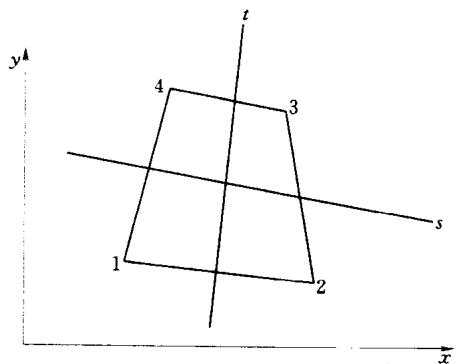  
图 9.2 四节点四边形单元

其中

$$
\begin{array} { l } { { \displaystyle N _ { 1 } = \frac { 1 } { 4 } ( 1 - s ) ( 1 - t ) } } \\ { ~ } \\ { { \displaystyle N _ { 2 } = \frac { 1 } { 4 } ( 1 + s ) ( 1 - t ) } } \\ { { \displaystyle N _ { 3 } = \frac { 1 } { 4 } ( 1 + s ) ( 1 + t ) } } \\ { { \displaystyle N _ { 4 } = \frac { 1 } { 4 } ( 1 - s ) ( 1 + t ) } } \end{array}\tag{9.52}
$$

和式(9.38)、式(9.39)类似，有

$$
[ N _ { h } ] = ( N _ { 1 } , N _ { 2 } , N _ { 3 } , N _ { 4 } )\tag{9.53}
$$

$$
[ N _ { w } ] = \left( \begin{array} { c c c c c c c c } { { N _ { 1 } } } & { { 0 } } & { { N _ { 2 } } } & { { 0 } } & { { N _ { 3 } } } & { { 0 } } & { { N _ { 4 } } } & { { 0 } } \\ { { 0 } } & { { N _ { 1 } } } & { { 0 } } & { { N _ { 2 } } } & { { 0 } } & { { N _ { 3 } } } & { { 0 } } & { { N _ { 4 } } } \end{array} \right)\tag{9.54}
$$

而相应的 $\{ W \} ^ { e }$ 和{h}e表达式应为

$$
\{ W \} ^ { e } = ( W _ { x 1 } , W _ { y 1 } , W _ { x 2 } , W _ { y 2 } , W _ { x 3 } , W _ { y 3 } , W _ { x 4 } , W _ { y 4 } ) ^ { T }\tag{9.55}
$$

$$
\{ h \} ^ { e } = ( h _ { 1 } , h _ { 2 } , h _ { 3 } , h _ { 4 } ) ^ { T }\tag{9.56}
$$

计算应变和水头梯度时，首先需要建立对整体坐标微分和对局部坐标微分之间的关系：

$$
{ \Bigg [ } { \frac { \partial } { \partial s } } { \Bigg ] } = J { \Bigg [ } { \frac { \partial } { \partial x } } { \Bigg ] }\tag{9.57}
$$

其中

$$
J = { \left[ \begin{array} { l l } { { \overline { { \partial } } } x } & { { \overline { { \partial } } } y } \\ { { \overline { { \partial } } } s } & { { \overline { { \partial } } } s } \\ { { \overline { { \partial } } } x } & { { \overline { { \partial } } } y } \\ { { \overline { { \partial } } } t } & { { \overline { { \partial } } } t } \end{array} \right] } = { \left\{ \begin{array} { l l } { [ s ] } \\ { [ t ] } \end{array} \right\} } ( [ X ] , [ Y ] )\tag{9.58}
$$

$$
\left. \begin{array} { c } { \left[ s \right] = \left( \begin{array} { c } { \displaystyle \partial N _ { 1 } } \\ { \displaystyle \partial s } \end{array} , \frac { \partial N _ { 2 } } { \partial s } , \frac { \partial N _ { 3 } } { \partial s } , \frac { \partial N _ { 4 } } { \partial s } \right) = \left( N _ { 1 s } , N _ { 2 s } , N _ { 3 s } , N _ { 4 s } \right) \mathrm { \smallskip } } \\ { \displaystyle \left[ t \right] = \left( \frac { \partial N _ { 1 } } { \partial t } , \frac { \partial N _ { 2 } } { \partial t } , \frac { \partial N _ { 3 } } { \partial t } , \frac { \partial N _ { 4 } } { \partial t } \right) = \left( N _ { 1 t } , N _ { 2 t } , N _ { 3 t } , N _ { 4 t } \right) \mathrm { \smallskip } } \end{array} \right\}\tag{9.59}
$$

$$
\begin{array} { c } { { \left[ X \right] ^ { T } = ( x _ { 1 } , x _ { 2 } , x _ { 3 } , x _ { 4 } ) \Bigg \} } } \\ { { \left[ Y \right] ^ { T } = ( y _ { 1 } , y _ { 2 } , y _ { 3 } , y _ { 4 } ) \Bigg \} } } \end{array}\tag{9.60}
$$

而

$$
\begin{array} { l } { { N _ { 1 s } = - \displaystyle \frac { 1 } { 4 } ( 1 - t ) \ , \ N _ { 1 t } = - \displaystyle \frac { 1 } { 4 } ( 1 - s ) \ } } \\ { { N _ { 2 s } = \displaystyle \frac { 1 } { 4 } ( 1 - t ) \ , \ N _ { 2 t } = - \displaystyle \frac { 1 } { 4 } ( 1 + s ) \ } } \\ { { N _ { 3 s } = \displaystyle \frac { 1 } { 4 } ( 1 + t ) \ , \ N _ { 3 t } = \displaystyle \frac { 1 } { 4 } ( 1 + s ) \ } } \\ { { N _ { 4 s } = - \displaystyle \frac { 1 } { 4 } ( 1 + t ) \ , \ N _ { 4 t } = \displaystyle \frac { 1 } { 4 } ( 1 - s ) \ } } \end{array}\tag{9.61}
$$

式(9.57)可变换成

$$
\left\{ \begin{array} { c } { \displaystyle { \frac { \partial } { \partial x } } } \\ { \displaystyle { \frac { \partial } { \partial y } } } \end{array} \right\} = J ^ { - 1 } \left\{ \begin{array} { c } { \displaystyle { \frac { \partial } { \partial s } } } \\ { \displaystyle { \frac { \partial } { \partial t } } } \\ { \displaystyle { \frac { \partial } { \partial t } } } \end{array} \right\}\tag{9.62}
$$

和式(9.45)、式(9.46)相似

$$
\begin{array} { r l } & { [ B _ { h } ] = \left[ \displaystyle \frac { \partial } { \partial x } \right] ( N _ { 1 } , N _ { 2 } , N _ { 3 } , N _ { 4 } ) } \\ & { \quad = J ^ { - 1 } \displaystyle \left[ \displaystyle \frac { \partial } { \partial y } \right] ( N _ { 1 } , N _ { 2 } , N _ { 3 } , N _ { 4 } ) } \\ & { \quad \quad = J ^ { - 1 } \displaystyle \left[ \displaystyle \frac { \partial } { \partial x } \right] ^ { 2 } ( N _ { 1 } , N _ { 2 } , N _ { 3 } , N _ { 4 } ) } \\ & { \quad \quad = J ^ { - 1 } \displaystyle \left[ N _ { 1 s } , ~ N _ { 2 s } ~ N _ { 3 s } ~ N _ { 4 s } \right] } \\ & { \quad \quad = J ^ { - 1 } \displaystyle N _ { 1 t } ~ N _ { 2 t } ~ N _ { 3 t } ~ N _ { 4 t } ] } \end{array}\tag{9.63}
$$

$$
[ B _ { W } ] = \left[ \begin{array} { c c } { { \displaystyle \frac { \partial } { \partial x } } } & { { \displaystyle 0 } } \\ { { \displaystyle 0 } } & { { \displaystyle \frac { \partial } { \partial y } \left[ N _ { 1 } \quad 0 \quad N _ { 2 } \quad 0 \quad N _ { 3 } \quad 0 \quad N _ { 4 } \quad 0 \right] } } \\ { { \displaystyle \frac { \partial } { \partial y } } } & { { \displaystyle \frac { \partial } { \partial x } } } \end{array} \right] _ { { \displaystyle \frac { \partial } { \partial y } } } ,\tag{9.64}
$$

假如将式(9.62)中的 $\pmb { J } ^ { \cdot 1 }$ 写成

$$
\pmb { J } ^ { - 1 } = \left[ \begin{array} { l l } { Q _ { 1 1 } } & { Q _ { 1 2 } } \\ { Q _ { 2 1 } } & { Q _ { 2 2 } } \end{array} \right]\tag{9.65}
$$

代入后有

$$
\frac { \partial } { { \partial } x } = { Q } _ { 1 1 } \frac { \partial } { \partial s } + { Q } _ { 1 2 } \frac { \partial } { \partial t }\tag{9.66}
$$

$$
\frac { \partial } { \partial y } { = } Q _ { 2 1 } \frac { \partial } { \partial s } { + } Q _ { 2 2 } \frac { \partial } { \partial t }\tag{9.67}
$$

将式(9.66)、式(9.67)代入式(9.64)，得

$$
\begin{array} { c } { { { \displaystyle [ B _ { \Psi } ] = [ { \begin{array} { c c c c c c } { { Q _ { 1 1 } \displaystyle { \frac { \partial } { \partial s } + Q _ { 1 2 } \displaystyle { \frac { \partial } { \partial t } } } } } & { { 0 } } & { { } } & { { } } & { { } } \\ { { } } & { { 0 } } & { { } } & { { } } & { { } } \\ { { Q _ { 2 1 } \displaystyle { \frac { \partial } { \partial s } + Q _ { 2 2 } \displaystyle { \frac { \partial } { \partial t } } } } } & { { Q _ { 2 1 } \displaystyle { \frac { \partial } { \partial s } + Q _ { 2 2 } \displaystyle { \frac { \partial } { \partial t } } } } } \\ { { { } } } & { { } } & { { } } & { { } } & { { } } \\ { { Q _ { 1 1 } } } & { { 0 } } & { { m _ { 1 2 } } } & { { 0 } } & { { m _ { 1 3 } } } & { { 0 } } \\ { { 0 } } & { { { m _ { 2 1 } } } } & { { 0 } } & { { m _ { 2 2 } } } & { { 0 } } & { { m _ { 2 3 } } } & { { 0 } } \\ { { { m _ { 2 1 } } } } & { { { m _ { 1 1 } } } } & { { m _ { 2 2 } } } & { { m _ { 1 2 } } } & { { m _ { 2 3 } } } & { { m _ { 1 3 } } } & { { m _ { 2 4 } } } \end{array} } N _ { 3 } } & { { 0 } } & { { N _ { 4 } } } & { { 0 } } \\ { { { } } } & { { { } } } & { { } } & { { } } \end{array} ] } }  \\    \displaystyle \qquad = [  \begin{array} { c c c c c c c } { { { m _ { 1 1 } } } } & { { 0 } } & { { } } & { { } } & { { } } & { { } } & { { } } \\ { { 0 } } & { { m _ { 2 1 } } } & { { } } & { { } } & { { } } & { { } } \\   \end{array}\tag{9.68}
$$

其中

$$
m _ { 1 i } = Q _ { 1 1 } N _ { i s } + Q _ { 1 2 } N _ { i t } \qquad ( i = 1 , 2 , 3 , 4 )\tag{9.69}
$$

$$
m _ { 2 i } = Q _ { 2 1 } N _ { i s } + Q _ { 2 2 } N _ { i t } ~ ( i = 1 , 2 , 3 , 4 )\tag{9.70}
$$

(2) 单元矩阵的积分。将式(9.55)、式(9.56)、式(9.57)、式(9.58)分别代入式(9.25)\~式(9.33)，可以得到相应各单元矩阵。注意到 $\mathbf { d } x \mathbf { d } y = \mathbf { d e t } [ J ] \mathbf { d } t \mathbf { d } s$ ，可得到一般的表达式

$\int _ { - 1 } ^ { 1 } F ( s , t ) \mathrm { d } s \mathrm { d } t$ 。用高斯积分法来计算式(9.25)\~式(9.33)各单元矩阵系数的值。一般用四点法，此时

$$
\int _ { - 1 } ^ { 1 } \int _ { - 1 } ^ { 1 } F ( s , t ) d s d t \approx \sum _ { i = 1 } ^ { 2 } \sum _ { j = 1 } ^ { 2 } \alpha _ { i } \alpha _ { j } F ( s _ { i } , t _ { j } )\tag{9.71}
$$

式中： $s _ { 1 } = t _ { 1 } = 0 . 5 7 7 3 5 ; s _ { 2 } = t _ { 2 } = - 0 . 5 7 7 3 5 ; \alpha _ { 1 } = \alpha _ { 2 } = 1 . 0$ 0

## 9.2.4 本构关系

进行固结和结构分析的一个重要工作是确定土的应力应变关系，即矩阵 $\mathbf { \dot { \rho } } [ C ]$ 。这里，涉及到土的本构关系。已有许多这方面的研究成果，现结合土体的应力应变分析，作一简要的回顾。

## 1. 弹性模型

建立在广义定律基础上的弹性理论对式(6.32)中的[C]=[C]的表达式为

$$
[ C ^ { \epsilon } ] = \frac { E } { ( 1 + \nu ) ( 1 - 2 \nu ) } \left[ \begin{array} { c c c } { { 1 - \nu } } & { { \nu } } & { { 0 } } \\ { { \nu } } & { { 1 - \nu } } & { { 0 } } \\ { { 0 } } & { { 0 } } & { { \frac { 1 } { 2 } - \nu } } \end{array} \right]\tag{9.72}
$$

式中：E为弹性模量；ν为泊桑比。

## 2. 非线性弹性模型

土的变形特征至少与周围应力 $\pmb { \sigma _ { 3 } }$ 有直接的关系，因此，相应不同的 $\sigma _ { 3 }$ 采用不同的 E，ν值，是比较符合实际的。

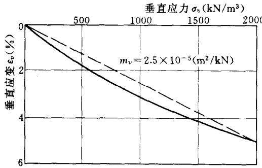  
图9.3 通过固结仪的单向压缩曲线整理压缩系数

在筑填土形成的边坡中，Penman(1973)等人建议利用固结仪单向压缩所得轴向应变$\pmb { \varepsilon } _ { \nu }$ 和应力 $\pmb { \sigma } _ { \nu }$ 关系曲线，整理相应坝体某处上覆荷重的平均压缩系数 $m _ { \nu }$ (见图9.3)，E和$\nu$ 分别由下式确定：

$$
E = \frac { 1 } { m _ { \nu } } [ \frac { ( 1 + 2 K _ { 0 } ) ( 1 - K _ { 0 } ) } { 1 + K _ { 0 } } ]\tag{9.73}
$$

$$
\nu = K _ { 0 } / ( 1 + K _ { 0 } )\tag{9.74}
$$

式中 $K _ { 0 }$ 为侧压力系数，即大小主应力比$\sigma _ { 3 } / \sigma _ { 1 }$ 。需要对常规固结仪进行改造，以测定 $\sigma _ { 3 }$ ，从而确定 $K _ { 0 }$ 8

土石坝中大部分土单元在施工期σ₁和σ₃同时增长，K大致保持不变，这和固结仪中单 $\pmb { \sigma } _ { 1 }$ $\sigma _ { 3 }$ $K _ { 0 }$ 向压缩条件下的应力路径很相似。查理斯(Charles，1976)等曾专门著文论述此问题。认为，此简单的模型仍能得出合理的成果。Eisensfein和 Simmons(1975) 曾使用此法分析加拿大高 250m 的 Mica坝。Cathie 和 Dungar (1978)曾系统报导过一些成功的实例。在确定材料的力学特性时，他们采用了一种可以测定o₃的单向压缩仪。 ${ \pmb { \sigma } } _ { 3 }$

## 3. 双曲线弹性模型

邓肯和张提出“双曲线-指数模型”用常规三轴试验确定土的非线性参数，用双曲线函数拟合轴向应力σ和轴向应变ε的关系，用指数函数拟合体积模量K和周围应力σ₃的关系。 $\sigma _ { a }$ $\cdot \varepsilon _ { a }$ $\pmb { \sigma _ { 3 } }$ 据此，可按下式确定E、 $K \mathrm { : }$

$$
E = ( 1 - R _ { f } S ) ^ { 2 } E _ { i }\tag{9.75}
$$

$$
K = K _ { b } P _ { a } ( \sigma _ { 3 } / P _ { a } ) ^ { m }\tag{9.76}
$$

其中 $\pmb { S }$ 为应力水平，按下式定义：

$$
S = ( \pmb { \sigma } _ { 1 } - \pmb { \sigma } _ { 3 } ) / ( \pmb { \sigma } _ { 1 } - \pmb { \sigma } _ { 3 } ) _ { f }\tag{9.77}
$$

$$
( \pmb { \sigma } _ { 1 } - \pmb { \sigma } _ { 3 } ) _ { f } = ( 2 \pmb { \sigma } _ { 3 } \sin \phi + 2 c \cos \phi ) / ( 1 - \sin \phi )\tag{9.78}
$$

式中：c，φ分别为土的凝聚力的内摩擦角；Pa为大气压；E为相应某一固结应力σ₃的初始 $^ { c , }$ $\phi .$ $P _ { a }$ $E _ { i }$ $\pmb { \sigma _ { 3 } }$ 模量，即

$$
E _ { i } = K ^ { \prime } P _ { a } ( \sigma _ { 3 } / P _ { a } ) ^ { n }\tag{9.79}
$$

采用非线性弹性模型进行有限元计算时存在的另一个问题是如何处于确定土体处于卸荷状态以及如何使用卸荷模量。邓肯建议卸荷模量按下式确定：

$$
E _ { u r } = K _ { u r } P _ { a } ( \sigma _ { 3 } / P _ { a } ) ^ { n }\tag{9.80}
$$

参数 c, φ, R, K', n, Ku 的整理方法见土工试验规程。 $^ { c , }$ $R _ { f }$ $K ^ { \prime }$ $^ { n , }$ $K _ { u r }$

## 4. 弹塑性理论模型

土的弹塑性理论是把土的总变形分成弹性变形和塑性变形两部分，用虎克定律计算弹性变形部分，用塑性理论来计算塑性变形部分。对于塑性变形部分，要作三方面的假定，即：破坏准则和屈服准则、硬化规律和流动法则。

土的有效应力弹塑性本构关系用有效应力增量 ${ \bf d } \sigma ^ { \prime }$ 与应变增量 $\mathbf { d } \pmb { \varepsilon }$ 可表达为

$$
\{ \mathrm { d } \sigma ^ { \prime } \} { = } [ C ^ { e p } ] \{ \mathrm { d } \varepsilon \}\tag{9.81}
$$

其中

$$
[ C ^ { e p } ] = [ C ^ { e } ] - \frac { [ C ^ { e } ] \{ \frac { \partial g } { \partial \sigma ^ { \prime } } \} \{ \frac { \partial f } { \partial \sigma ^ { \prime } } \} ^ { T } [ C ^ { e } ] } { \{ \frac { \partial f } { \partial \sigma ^ { \prime } } \} ^ { T } [ C ^ { e } ] \{ \frac { \partial g } { \partial \sigma ^ { \prime } } \} + A }\tag{9.82}
$$

式中： $[ C ^ { e p } ]$ 为弹塑性矩阵； $[ C ^ { e } ]$ 为弹性矩阵；f是以H为硬化参数的屈服函数，即$f = F ( H )$ ；g为势函数；A是反映硬化特性的一个变量，与硬化参数的选择有关。

当 $f = g$ 时，称为相关联流动法则，当 $f \neq g$ 时，称为不相关联流动法则。

(1) 加载过程中的弹塑性模型—剑桥理论。英国剑桥大学 K. H. Roscoe(1958)提出了状态边界面、临界状态线的概念，其屈服函数为

$$
f = f ( p ^ { \prime } , q ) = p ^ { \prime } ( 1 + \frac { \eta ^ { 2 } } { M ^ { 2 } } ) = p _ { 0 } ^ { \prime }\tag{9.83}
$$

式中： $\pmb { \eta } = \pmb { q } / \pmb { p } ^ { \prime }$ ，相应的屈服面见图9.4。

剑桥模型是对正常固结重塑粘土进行三轴试验得到的。为了将此模型用于土石坝中填筑土等情况时，邓肯(Duncan,1981)在下列几个方面做了修正。

(a) 对土的强度包线的处理。剑桥模型假定正常固结土的强度包线在 $p ^ { \prime } { - } q$ 平面上是通过原点的。但填筑土具有粘聚力，如图9.5所示。邓肯建议采用强度包线不通过原点，而在p’轴上相交于离原点距离为p，的点上。因此，上面推导的所有公式中有关p’的量 $p ^ { \prime }$ $\pmb { p } _ { r } ^ { \prime }$ $p ^ { \prime }$ 都应加上 $\pmb { p } _ { r } ^ { \prime }$ 的值。

(b) 对等向压缩曲线的处理。邓肯认为等向压缩曲线的斜率 λ 不是常数，可随p′改 $p ^ { \prime }$ 变而改变。因此，输入的λ是与p′有关的一系列数值，在计算时通过内插来决定处于某 $p ^ { \prime }$ 一应力状态的λ值。

(c)对土的泊松比的处理。邓肯认为在弹性部分泊松比ν也随p′改变而改变。因此， $p ^ { \prime }$ 也需输入一组ν和p′的数值，供计算时内插取值，这样可更好地反映土的应力应变关系 $p ^ { \prime }$ 通过三轴和单向压缩试验确定和拟合参数。作者在另著（陈祖煜等，2003）中结合小浪底工程介绍了拟合过程。

(2) 处于极限平衡状态时的弹塑性模型。参见图 9.4 和图 9.5，土体在加载过程中可能处于A点或B点。在A点，土体处于正常固结加载状态，其屈服面通常可用剑桥模型来描述，在B点，土体处于破坏面上，塑性变形呈剪胀模型，此时需要采用摩尔一库仑或Drucker-Prager准则来描述。分述如下：

在有限元计算中，当某一点进入破坏面，即图 9.4 和图 9.5 中 B 点时，土体不再按加载的模型变形，通常会出现明显的剪胀特性。此时，应使用OB线所代表的屈服面，即摩尔一库仑准则，其屈服函数为

$$
f = p ^ { \prime } \sin \phi + \sqrt { J _ { 2 } ^ { \prime } } \cos \theta + \frac { 1 } { \sqrt { 3 } } \sqrt { J _ { 2 } ^ { \prime } } \sin \theta \sin \phi - \cos \phi\tag{9.84}
$$

其中

$$
p ^ { \prime } { = } \frac { 1 } { 3 } ( \sigma _ { x } ^ { \prime } + \sigma _ { y } ^ { \prime } + \sigma _ { z } ^ { \prime } )\tag{9.85}
$$

$$
q = \sqrt { 2 J _ { 2 } ^ { \prime } }\tag{9.86}
$$

$$
J _ { 2 } ^ { \prime } = \frac { 1 } { 6 } \{ ( \sigma _ { x } ^ { \prime } - \sigma _ { y } ^ { \prime } ) ^ { 2 } + ( \sigma _ { y } ^ { \prime } - \sigma _ { z } ^ { \prime } ) ^ { 2 } + ( \sigma _ { z } ^ { \prime } - \sigma _ { x } ^ { \prime } ) ^ { 2 } + 6 \tau _ { x y } ^ { 2 } + 6 \tau _ { y z } ^ { 2 } + 6 \tau _ { z x } ^ { 2 } \}\tag{9.87}
$$

$$
\theta = \frac { - 3 \sqrt { 3 } J _ { 3 } ^ { \prime } } { 2 ( J _ { 2 } ^ { \prime } ) ^ { 3 / 2 } }\tag{9.88}
$$

$$
J _ { 3 } ^ { \prime } \ = I _ { 3 } + J _ { 2 } p ^ { \prime } - p ^ { \prime 3 }\tag{9.89}
$$

在σ1，σ2，σ₃坐标中，摩尔一库仑准则的屈服面如图9.6示。这是一个带角点的六边形。 $\pmb { \sigma } _ { 1 }$ $\sigma _ { 2 } ,$ $\pmb { \sigma _ { 3 } }$

为了克服对有限元计算带来的困难，通常采用Drnckel-Prager准则，此时屈服面为

$$
f = 3 p ^ { \prime } \sin \phi ^ { \prime } + \sqrt { J _ { 2 } ^ { \prime } } - e ^ { \prime }\tag{9.90}
$$

相应的屈服面如图9.5所示。在以下的讨论（9.4.2节）中，还将介绍进一步的修正。

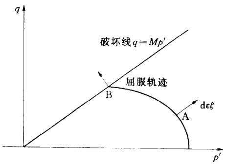  
图 9.4 剑桥模型

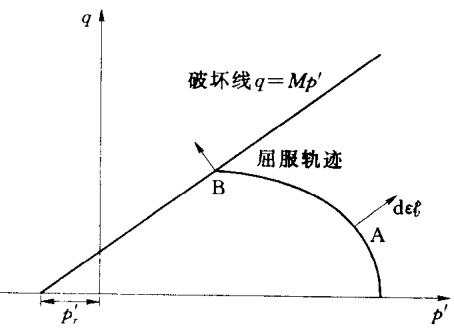  
图 9.5 修正的剑桥模型

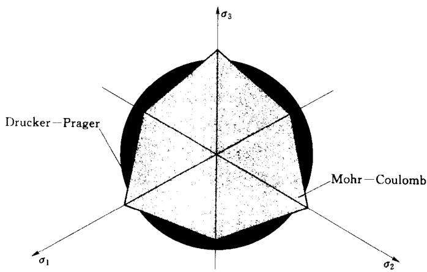  
图 9.6 摩尔-库仑和 Drucker-Prager 准则

(3)平面应变条件下弹塑性结构矩阵的构建。从本节推导的平面应变条件下的应力和应变之间的关系式中可以看到，屈服准则通常是用应力不变量p′和q来代表的。但是建立 $p ^ { \prime }$ $q$ 在平面应变条件下的刚度矩阵却是以 $\sigma _ { x } ^ { \prime } \mathrm { ~ , ~ } \sigma _ { y } ^ { \prime } \mathrm { ~ , ~ } \tau _ { x y }$ 为自变量构筑的。

在使用式(9.82)计算[C]时，需要知道 $\left[ C ^ { e p } \right]$ $\{ \frac { \partial f } { \partial \sigma ^ { \prime } } \}$ ，此时，使用了以下的关系式：

$$
\{ \begin{array} { l } { \displaystyle \frac { \partial f } { \partial \sigma _ { x } ^ { \prime } } } \\ { \displaystyle \frac { \partial f } { \partial \sigma _ { y } ^ { \prime } } } \\ { \displaystyle \frac { \partial f } { \partial \sigma _ { z } ^ { \prime } } = \{ \frac { \partial p ^ { \prime } } { \partial \sigma _ {  y } ^ { \prime } } \frac { \partial q } { \partial \sigma _ { y } ^ { \prime } } \{ \frac { \partial f } { \partial p } \begin{array} { l l } { \displaystyle \frac { \partial f } { \partial t } } \\ { \displaystyle \frac { \partial f } { \partial \sigma _ { z } ^ { \prime } } \frac { \partial \sigma _ { z } ^ { \prime } } { \partial \sigma _ { z } ^ { \prime } } } \end{array} \} } \\ { \displaystyle \frac { \partial f } { \partial \sigma _ { z } ^ { \prime } } } \end{array}  = \{ \begin{array} { l l } { \displaystyle \frac { \partial p ^ { \prime } } { \partial \sigma _ { x } ^ { \prime } } \frac { \partial q } { \partial \sigma _ { y } ^ { \prime } } } \\ { \displaystyle \frac { \partial p ^ { \prime } } { \partial \tau _ { x y } ^ { \prime } } \frac { \partial q } { \partial \sigma _ { x y } ^ { \prime } } } \end{array} \} \{ \begin{array} { l l } { \displaystyle \frac { \partial f } { \partial p } } & { \displaystyle \frac { \partial f } { \partial q } \} ^ { T } } \end{array}\tag{9.91}
$$

故对式(9.83)代表的剑桥模型，可以得到

$$
\frac { \partial f } { \partial \sigma _ { i } ^ { \prime } } = \frac { 1 } { 3 } + \{ \frac { 2 \sigma _ { i } ^ { \prime } - \sigma _ { j } ^ { \prime } - \sigma _ { k } ^ { \prime } } { M ^ { 2 } p ^ { \prime } } - \frac { 1 } { 3 } \frac { q ^ { 2 } } { M ^ { 2 } p ^ { \prime 2 } } \}\tag{9.92}
$$

式中： $\scriptstyle i = x , y , z _ { o }$ 在i代表 $x$ 时， $j ,$ k分别代表 $y , z \circ$ 依此类推。

$$
\frac { \partial f } { \partial \tau _ { x y } } = \frac { 6 } { p ^ { ' } M ^ { 2 } } \tau _ { x y }\tag{9.93}
$$

作者在其它文献（陈祖煜等，2003）中介绍了按公式(9.91)构筑的子程序CAMCLY。

## 9.2.5 实例分析

## 1. 小浪底心墙固结分析

在第6章中，介绍了该工程的概况和孔隙水压计算成果。图9.7是竣工蓄水时（坝体填筑完毕，上游水位升至250m高程）大坝的累积位移矢量图。从整体看，由于心墙刚度相对较低，坝体的变形呈现心墙部分大、坝体两侧和基础部分小的态势；其变形在坝体中间部位偏向下游侧，而在坝体两侧基本呈竖直向。

由图中可以看出，竣工蓄水时，坝体的最大沉降约为2.14m，竣工后由于固结的作用使坝体沉降继续增大。至两年半形成稳定渗流以后，坝体的变形不再明显。蓄水5年后，坝体的累积最大沉降值达到2.62m。

大坝竣工蓄水时的大主应力、小主应力等值线如图9.8、图9.9所示。从总体上看，高程较低部分的应力较大，下游部位比上游部位的应力要大。在同一高程上，无论大主应力还是小主应力，其最大值都出现在下游坝壳与心墙毗邻的部位，且心墙部位的大主应力明显小于两侧坝壳的大主应力。上、下游坝壳处的剪应力较大，而斜心墙部位的剪应力非常小，斜心墙基本以竖直方向的压缩为主。

在整个坝体中，除了高塑性土区个别单元出现小主应力小于零外，其它单元的小主应力全部大于零，未出现拉应力。

对比分析结果表明，心墙部位的应力随着时间推移有一定的增长，这是心墙固结过程中孔隙压力逐渐消散的结果。在同一高程上，大、小主应力在心墙部位有较明显的增长，心墙底部单元的应力在蓄水以后仍有相当的增长。分析心墙内部的应力状态可以发现，各个单元的有效小主应力全部大于零，不会出现拉伸破坏，发生水力劈裂的可能性较小。

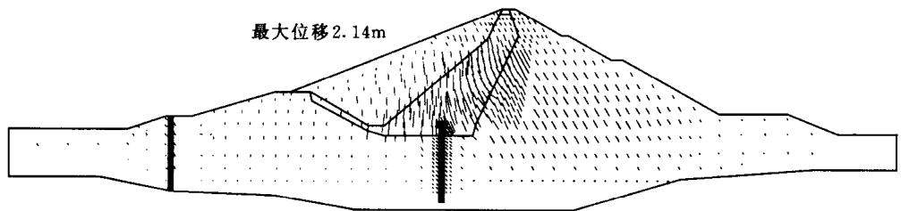  
图 9.7 <250m 水位>竣工蓄水时的总位移矢量图

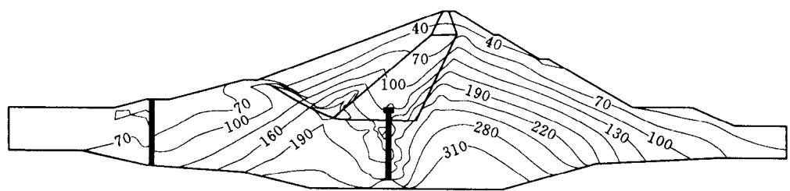  
图 9.8 <250m 水位>竣工蓄水时大主应力等值线（单位：10kPa）

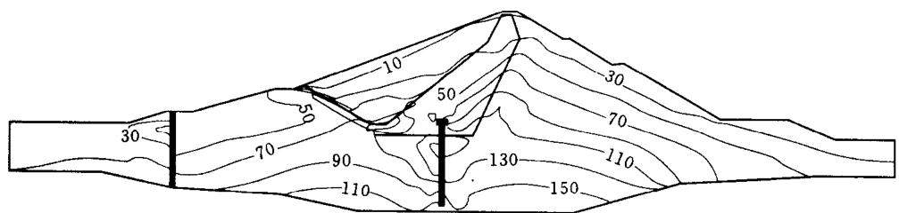  
图 9.9 <250m 水位>竣工蓄水时小主应力等值线（单位：10kPa）

## 2. 务平大坝坝基固结分析

有关务平工程的概况和孔隙水压分析成果同样也已在第6章作过介绍。坝体竣工时的总位移等值线图9.10很好地反映基础和坝体的位移与沉降。从整体上看，软基的位移量比较小，竣工时最大值为0.36m，固结完成时最大值为0.4m。位移最大值出现在软基最深厚处的软基表面。由于软基厚度的减小，整个位移有向河谷岸边减小的趋势。坝体的位移与沉降呈现中间大、两侧小的态势。竣工时，坝体的最大位移为0.82m，出现在心墙1/3高度处。固结完成时，坝体的最大位移为0.9m。

大坝固结完成时的大小主应力的等值线如图9.11和图9.12所示。总体上看，高程较低部分应力较大，由于没有蓄水，心墙部分的大小应力呈对称状态。由于弹性模量大小的差异，同一高度处心墙部分的大主应力明显小于两侧坝壳的大主应力。小主应力则相差不大。坝体的最大大主应力约为500kPa，而坝基的最大大主应力达900kPa。心墙和坝壳的剪应力都不大，说明坝体主要以竖直方向的压缩为主。坝体的应力水平较低，一般都在0.7以下。

软基部分的应力呈现显明的波浪形，说明在碎石桩上存在应力集中，正是这种应力集中使得处理后的软基能够满足工程的需求。从图9.11和图9.12中可以看出软土的大主应力一般比同一高度的碎石桩上的值要小约100kPa。随着位置的不同，软基部分的大主应力的范围为 300\~900kPa。

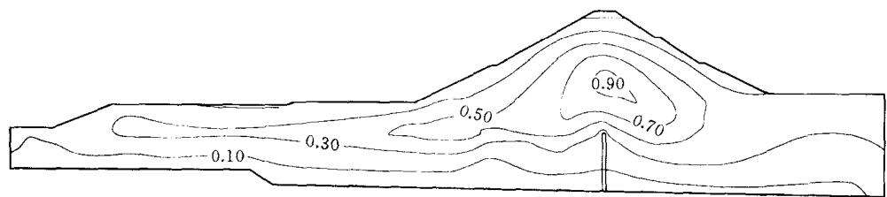  
图 9.10 竣工时的总位移等值线图（单位：m）

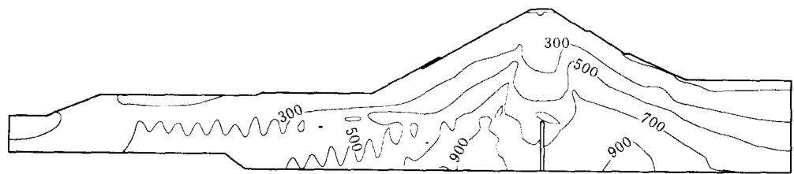  
图 9.11 竣工时的大主应力等值线图（单位：kPa）

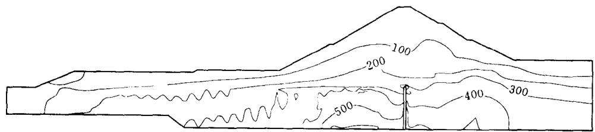  
图 9.12 竣工时的小主应力等值线图（单位：kPa）

## 9.3 建立在滑裂面应力分析基础上的边坡稳定有限元分析

## 9.3.1 概述

几乎在有限元法开发的同时，研究者就开始了其与边坡稳定分析中传统的条分法关系的研究。早期的工作（Wright,1973;Yamagam,1988等）是在边坡中定义一个潜在的滑裂面，根据有限元得出的应力分布，计算滑裂面上各点的应力水平，然后根据加权平均的原则定义安全系数。他们发现，虽然有限元计算仍处于弹性分析的水平，但按照这一方法计算的安全系数和极限平衡方法十分接近。

在这一工作的基础上，研究者进一步研究在诸多滑裂面中寻找一个临界滑裂面的可能性。这工作使用了与极限平衡法相同的计算步骤，同时，也获得了与极限平衡法接近的最小安全系数和临界滑裂面。近期研究沿用传统的缩小强度指标的作法，将非线性有限元数值计算分析收敛条件崩溃作为边坡失稳的判据。此时强度指标被缩小的倍数即为安全系数。Griffith(1999)，赵尚毅和郑颖人等(2002)在这方面作出了有益的探索。按照这一方法求解，首先需要具备一个成熟的非线性有限元计算程序。否则，无法判断数值计算发散的原因是边坡系统的物理原因还是有限元程序本身的缺陷。

本节简要介绍上述有关的研究成果。

## 9.3.2 安全系数的定义

在极限平衡法中，整个滑面的安全系数定义为

$$
F = \frac { \tau _ { f } } { \tau }\tag{9.94}
$$

式中：τ为土的抗剪强度；τ为土的剪应力。安全系数即为抗滑力与滑动力的比值。 $\pmb { \tau } _ { f }$

根据沿滑裂面剪应力的计算方法，安全系数大致有如下三种定义法。

## 1. 基于应力水平的定义法

保持σ不变，作一个与摩尔一库仑强度包线相切的应力圆，称为破坏应力圆，相应的 $\pmb { \sigma } _ { 3 } ^ { \prime }$ 应力圆直径为 $\begin{array} { r l } { ( \pmb { \sigma } _ { 1 } ^ { \prime } - \pmb { \sigma } _ { 3 } ^ { \prime } ) _ { f \mathrm { ~ \circ ~ } } } & { { } ( \pmb { \sigma } _ { 1 } ^ { \prime } - \pmb { \sigma } _ { 3 } ^ { \prime } ) / ( \pmb { \sigma } _ { 1 } ^ { \prime } - \pmb { \sigma } _ { 3 } ^ { \prime } ) _ { f } } \end{array}$ 为应力水平，如式(9.77)定义。它表示当前应力圆直径与破坏应力圆直径之比，反映了强度的发挥程度。

整个滑面的安全系数定义为

$$
F _ { F E 1 } = \frac { \displaystyle \int \mathrm { d } l } { \displaystyle \int \frac { \sigma _ { 1 } ^ { \prime } - \sigma _ { 3 } ^ { \prime } } { ( \sigma _ { 1 } ^ { \prime } - \sigma _ { 3 } ^ { \prime } ) _ { f } } \mathrm { d } l }\tag{9.95}
$$

## 2. 基于剪应力的定义法

滑裂面上某点的应力状态为 $\sigma _ { x } , ~ \sigma _ { y } , ~ \tau _ { x y }$ ，法向应力 $\pmb { \sigma _ { n } }$ 和切向应力τ可由下式确定：

$$
\tau = \frac { 1 } { 2 } ( \sigma _ { y } - \sigma _ { x } ) \sin 2 \alpha + \tau _ { x y } \cos 2 \alpha\tag{9.96}
$$

$$
\sigma _ { n } ^ { \prime } = \sigma _ { x } \sin ^ { 2 } \alpha + \sigma _ { y } \cos ^ { 2 } \alpha - \tau _ { x y } \sin 2 \alpha\tag{9.97}
$$

式中：α为此处滑面切线与x轴夹角。 $\pmb { \alpha } .$

该点的抗剪强度由下式确定：

$$
\boldsymbol { \tau } _ { f } = \boldsymbol { c } ^ { \prime } + \sigma _ { n } ^ { \prime } \tan \phi ^ { \prime }\tag{9.98}
$$

式中：c'为材料的内聚力；φ′为材料的内摩擦角。 $\scriptstyle { c ^ { \prime } }$ $\phi ^ { \prime }$

整个滑面的安全系数定义为

$$
F _ { F E 2 } = \frac { \displaystyle \int ( c ^ { \prime } + \sigma _ { n } ^ { \prime } \tan \phi ^ { \prime } ) \mathrm { d } l } { \displaystyle \int \boldsymbol { \alpha } l }\tag{9.99}
$$

## 3. 基于应力水平加权强度的定义法

Donald和Tan(1985)提出以如下公式计算一个滑裂面的安全系数方法，式中各符号的含义同上。

$$
F _ { F E 3 } = \frac { \displaystyle \int ( c ^ { \prime } + \sigma _ { n } ^ { \prime } \tan \phi ^ { \prime } ) \mathsf { d } l } { \displaystyle \int \frac { \sigma _ { 1 } ^ { \prime } - \sigma _ { 3 } ^ { \prime } } { ( \sigma _ { 1 } ^ { \prime } - \sigma _ { 3 } ^ { \prime } ) _ { f } } ( c ^ { \prime } + \sigma _ { n } ^ { \prime } \tan \phi ^ { \prime } ) \mathsf { d } l }\tag{9.100}
$$

## 9.3.3 有关成果介绍

## 1. Donald 等的模式搜索法

Giam和Donald于1988年提出了一种由已知的应力场确定临界滑裂面及最小安全系数的方法，称为 CRISS 法。CRISS 法的基本原理示于图9.13和图9.14。由有限元法计算所得应力水平较高点P出发，形成一个由顶到底的破坏面。其过程如下：将边坡分成若干土条(stage)，见图 9.13。由P点出发分别向上、向下在相邻两土条内构筑局部滑裂面。图9.14给出了由P点向上在第N+1个土条内构筑局部滑裂面的过程，即以P点为基点，呈放射状按1°倾角变化形成m个条块，每一条块分为长度为 $\pmb { \varDelta L }$ 的五小段。每一小段以其中点为控制点，这些控制点的应力 $\sigma _ { x x } ^ { \prime }$ ${ \pmb { \sigma } } _ { \pmb { x } } ^ { \prime }$ $\tau _ { x y } ^ { \prime }$ 由有限元计算结果而定。这些控制点的正应力和剪应力计算如下：

$$
\sigma _ { n i } ^ { ' } = \frac { 1 } { 2 } ( \sigma _ { y y } ^ { ' } + \sigma _ { x x } ^ { ' } ) + \frac { 1 } { 2 } ( \sigma _ { y y } ^ { ' } - \sigma _ { x x } ^ { ' } ) \cos 2 \alpha - \tau _ { x y } \sin 2 \alpha\tag{9.101}
$$

$$
{ \tau _ { n i } } = \frac { 1 } { 2 } ( { \sigma _ { y y } ^ { \prime } - \sigma _ { x x } ^ { \prime } } ) \sin 2 \alpha + { \tau _ { x y } } \cos 2 \alpha\tag{9.102}
$$

由P点出发第i个条块对应的安全系数为

$$
F _ { i } = \frac { \sum ( c ^ { \prime } + \sigma _ { n i } \tan \phi ^ { \prime } ) \Delta L } { \sum ( \tau _ { n i } ) \Delta L }\tag{9.103}
$$

找出 $F _ { i }$ 中的最小值 $F _ { i m i n } \ ( \ i { = } 1 , . . . , m )$ $F _ { i m i n }$ 对应的条块 PQ即为第 N+1 个土条内的局部滑裂面位置。由Q点为基点可以找到第N+2个土条内的局部滑裂面位置，依此类推到边坡顶部。由P点向下找寻第 $N , N { \mathrm { - } } 1 , . . . , 1$ 个土条内的滑裂面过程类同。每一条块内的 $F _ { \mathrm { i m i n } }$ 对应的局部滑裂面即构成这一边坡的滑裂面，其安全系数为

$$
F _ { F E 2 } = \frac { \displaystyle \int ( c ^ { \prime } + \sigma _ { n } ^ { \prime } \tan \phi ^ { \prime } ) \mathrm { d } L } { \displaystyle \int \tau _ { n } \mathrm { d } L }\tag{9.104}
$$

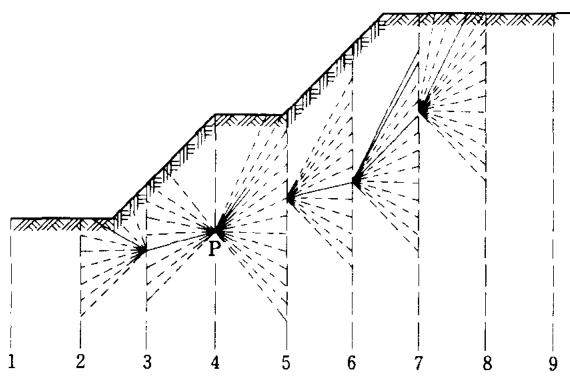  
图 9.13 CRISS 法求解过程简图

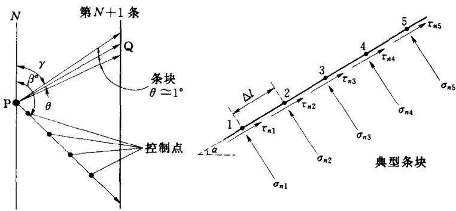  
图 9.14 CRISS 法的一个求解步

[例9.1] 简单边坡的稳定分析。

图 9.15 为用 CRISS 法的 FF计算结果。此例为第 11 章 11.4.2 节介绍的 ACAD 边坡稳 $F _ { F E 2 }$ 定分析程序考题1(a)，详细数据可参见该节。曾经使用各种不同的极限平衡分析程序进行计算，得到一致的解答，最小安全系数为1.0。表9.1汇总了对应于不同安全系数定义法的有限元法计算结果。可以看出，一次填筑和分层填筑边坡的计算值非常接近，开挖边坡的计算值略高。所有计算结果和极限平衡法的解答一致。

表 9.1 安全系数比较
<table><tr><td rowspan="2">类型</td><td colspan="3">安全系数</td></tr><tr><td> $F _ { F E L }$ </td><td> $\underline { { F _ { F E 2 } } }$ </td><td> $F _ { F E 3 }$ </td></tr><tr><td>分层填筑</td><td>1.001</td><td>1.001</td><td>1.001</td></tr><tr><td>一次填筑</td><td>1.000</td><td>1.003</td><td>1.000</td></tr><tr><td>开挖</td><td>1.082</td><td>1.044</td><td>1.044</td></tr></table>

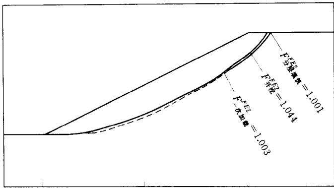  
图 9.15 [例 9.1] 简单边坡的 CRISS 法分析结果

## 2. Zou 等(1995)的动态规划法

Zou等通过有限单元法获得的应力分布规律确定滑裂面的范围和初始滑裂面，然后利用动态规划的数值方法(IDPM)搜索最危险滑裂面及相应的安全系数。

在这一方法中，滑裂面安全系数定义为

$$
F _ { s } = { \frac { \displaystyle \int _ { A } ^ { B } \tau _ { f } \mathrm { d } L } { \displaystyle \int _ { A } ^ { B } \pi \mathrm { d } L } } \approx { \frac { \displaystyle \sum _ { i = 1 } ^ { N s } \tau _ { f i } \Delta L i } { \displaystyle \sum _ { i = 1 } ^ { N s } \tau _ { i } \Delta L i } }\tag{9.105}
$$

式中：τ为滑裂面AB上任一点的剪应力； $\tau _ { f }$ 为在这些点的材料抗剪强度；L为滑裂面的长度； $N _ { s }$ 为沿滑裂面的分段数； $\Delta L _ { i }$ 为每一段的长度，对于第i段

$$
\tau _ { f _ { \hslash } } = c + \sigma _ { s } \tan { \phi }\tag{9.106}
$$

$$
\tau _ { i } = 0 . 5 ( \sigma _ { y } - \sigma _ { x } ) \sin { 2 \alpha } + \tau _ { x y } \cos { 2 \alpha }\tag{9.107}
$$

$$
\sigma _ { s } = \sigma _ { x } \sin ^ { 2 } \alpha + \sigma _ { y } \cos ^ { 2 } \alpha - \tau _ { x y } \sin 2 \alpha\tag{9.108}
$$

式中： $\pmb { c }$ 为材料的内聚力； $\phi ;$ 是材料的内摩擦角； $\pmb { \sigma _ { s } }$ 为滑裂面上第i段对应法向应力； $\pmb { \alpha } _ { , } ^ { i }$ 为滑裂面第i段与水平面夹角； $\sigma _ { x }$ $\sigma _ { y }$ 、 $\tau _ { x y }$ 为第i段对应的有效应力。

引入附加函数 $G _ { F }$ ，则

$$
G _ { F } = \sum _ { i = 1 } ^ { N s } ~ ( \tau _ { f i } - F _ { s } \tau _ { i } ) \Delta L\tag{9.109}
$$

利用动态规划法通过求 $G _ { F }$ 的极小值从而确定 $F _ { s }$ 的最小值。在选定的搜索区域内，计算每一可能的滑裂面，直至找到 $F _ { s }$

[例 9.2] 一均质粘土边坡如图 9.16，其材料参数见表 9.2（表中最后一列最小安全系数为简化毕肖普法的计算结果)。

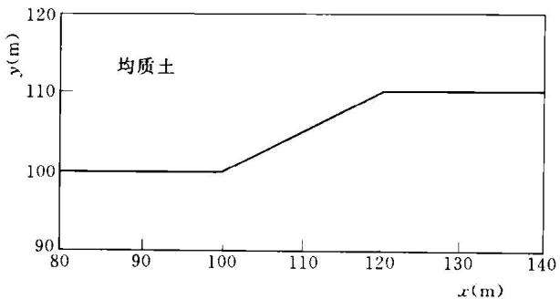  
图 9.16 [例 9.2] 均质粘土边坡示意图

表9.2 材料参数
<table><tr><td>方案</td><td>凝聚力(kPa)</td><td>摩擦角(°)</td><td>容重(kN/m³)</td><td>杨氏模量(MPa)</td><td>泊松比</td><td>最小安全系数</td></tr><tr><td>1</td><td>3</td><td>20</td><td>20</td><td>200</td><td>0.25</td><td>1.00</td></tr><tr><td>2</td><td>10</td><td>20</td><td>20</td><td>200</td><td>0.25</td><td>1.39</td></tr></table>

利用平面有限单元法计算边坡的应力分布，采用8结点等参单元。边界条件为边坡两侧垂直边界只约束水平向位移，边坡底部水平边界为固定边界。材料假定为各向同性，遵守Moho-Coulomb准则的理想弹塑性材料。图9.17给出了计算所得应力水平分布图。

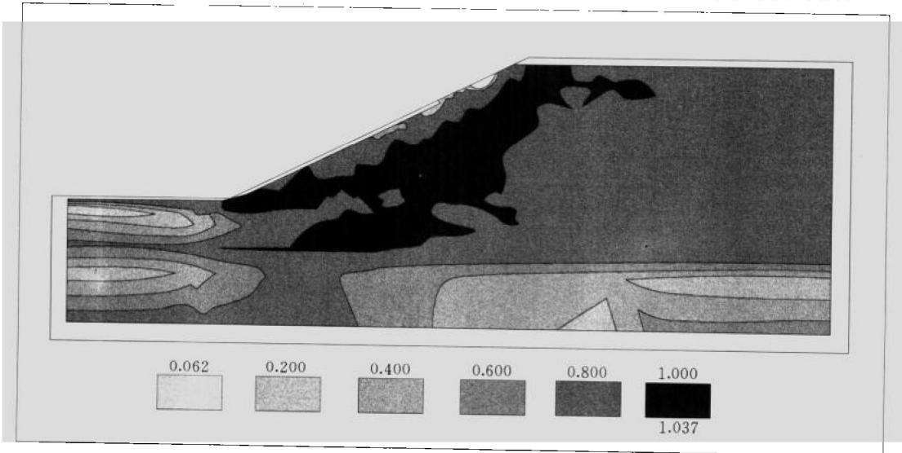  
图 9.17 [例 9.2] 边坡应力水平分布

根据图9.17的应力水平分布图，Zou等采用图9.18、图9.19所示两种状态点格栅图（图9.18分条方向为竖直向，图9.19分条方向大致垂直于滑裂面)，分条厚为1m，状态点间距0.2m。通过IDMP法计算发现，分条方向对计算结果影响不大，两个方案对应安全系数分别为1.01和1.39，与表9.2中所示简化毕肖普法的计算结果几乎一样。图9.20、图9.21给出了对应于表 9.2中两个方案的 IDMP 分析结果及极限平衡条分法 GWEDGEM 的分析结果，两种方法的结果也吻合。

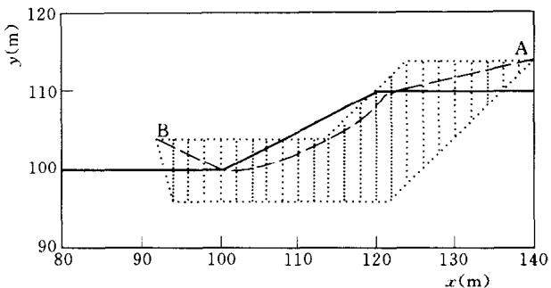

图9.18 假定的滑裂面及竖直向分条的搜索范围  
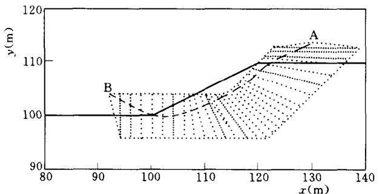  
图9.19 [例9.2] 假定的滑裂面及垂直于滑裂面分条的搜索范围

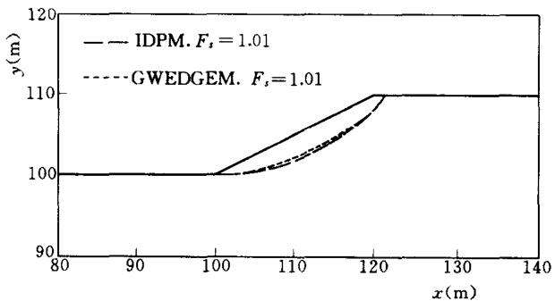  
图 9.20 [例 9.2] 方案1 临界滑裂面

(IDPM：动态规划法；GWEDGEM：通用的极限平衡条分法； $F _ { S } \colon$ 安全系数）  
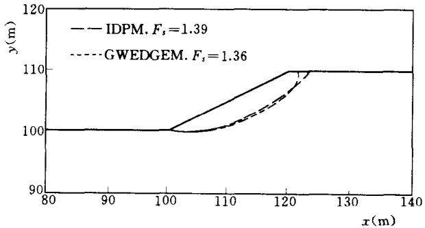  
图 9.21 [例 9.2] 方案2 临界滑裂面

## 9.4 建立在强度缩小有限元分析基础上的边坡稳定分析

## 9.4.1 Griffiths和Lane的工作

建立在强度缩小有限元分析基础上的边坡稳定分析的基本原理是将边坡强度参数粘聚力 $\scriptstyle { c ^ { \prime } }$ 和内摩擦角 $\phi ^ { \prime }$ 同时除以一个折减系数F，得到一组新的 $c ^ { \prime }$ 和 $\phi ^ { \prime }$ 值。然后作为一组新的材料参数输入，再进行试算。当计算不收敛时，对应的F被称为坝坡的最小安全系数，此时坝坡达到极限状态，发生剪切破坏，同时可得到临界滑动面。

## 1. 有限单元模型的简单介绍

本小节所提及的程序是建立于 Smith 和 Griffiths 1998年开发的程序基础上的，与其它程序相比主要的不同在于能够模拟更普遍的几何形状和土性的变化、包括水位和孔压的变化，并增加了图形化功能。程序适用于摩尔一库仑破坏准则下理想弹塑性土体的二维平面应变分析，采用的是简化积分的八节点四边形单元（每个单元有四个高斯点），在重力荷载作用下刚度矩阵生成和应力再分配的算法中都采用这种单元。假定土体开始为弹性的，模型在网格内所有高斯点生成正应力和剪应力。然后将这些应力与摩尔一库仑破坏准则相比。如果在特定高斯点上的应力位于摩尔一库仑破坏圆内，则该点仍然是弹性的。如果位于圆上或圆外，则该点处于屈服状态。利用粘弹性算法，屈服应力在网格中被重分配。当足够数目的高斯点发生屈服使机制发生变化时，即认为发生了整体剪切破坏。本小节中提到的分析不能模拟拉裂。

## 2. 土体模型

本次研究采用的土体模型包括六个参数，如表9.3所示。

表9.3 六个参数的土体模型
<table><tr><td> $\phi ^ { \prime }$ </td><td> $c ^ { \prime }$ </td><td> $\psi$ </td><td> $E ^ { \prime }$ </td><td> $\nu ^ { \prime }$ </td><td>γ</td></tr><tr><td>摩擦角</td><td>凝聚力</td><td>剪胀角</td><td>杨氏模量</td><td>泊松比</td><td>容重</td></tr></table>

剪胀角在屈服过程中影响土体的体积变化。众所周知，在屈服过程中，真实的土体体积是变化的。例如一种中等密度的材料在剪切过程中，也许初始体积是减小的( $( \psi { < } 0 )$ ，随后是剪胀阶段 $( \psi { > } 0 )$ ，最终是在体积为常量条件下的屈服( $\scriptstyle ( 4 = 0 )$

随之而来的问题是ψ应取何值。如果取ψ=φ，则塑性流动法则是相关联的，并可与经 $\scriptstyle { \psi = \phi }$ 典塑性理论进行对比。当流动法则是相关联时，应力和速度是一致的。因此，用有限元预测的破坏机制与用极限平衡法得到的临界破坏面基本一致。

尽管使用相关联的流动法则有这些优点，但我们知道，非粘性土模型的相关联流动法则预测的剪胀要比现实中观察的大很多，导致预测的破坏荷载偏大，特别是在一些有限制的问题中，如承载力问题(Griffiths，1982)。

在稳定分析中，研究对象常常是没有约束的天然边坡，因此剪胀角的选择就变得不太重要。这里研究的主要目的是准确地预测边坡的安全系数，Griffiths等采用的是ψ=0的折 $\scriptstyle { \psi = 0 }$

中值，对应屈服时体积改变量为零，属非关联流动。研究者发现，ψ的取值可以使模型给出可靠的安全系数，并合理地预测可能破坏面的位置和形状。

参数 $c ^ { \prime }$ 和 $\mid \phi ^ { \prime }$ 指土体的有效凝聚力和摩擦角。虽然有许多模拟土的强度的破坏准则，但摩尔-库仑准则仍然是岩土工程实践中应用最广泛的一个，也是此文所采用的。根据主应力和以压为负的规定，该准则可写成如下的形式：

$$
F = \frac { \sigma _ { 1 } ^ { \prime } + \sigma _ { 3 } ^ { \prime } } { 2 } \sin \phi ^ { \prime } - \frac { \sigma _ { 1 } ^ { \prime } - \sigma _ { 3 } ^ { \prime } } { 2 } - c ^ { \prime } \cos \phi ^ { \prime }\tag{9.110}
$$

式中： $\pmb { \sigma } _ { \mathbf { l } } ^ { \prime }$ 和 ${ \pmb \sigma } _ { 3 } ^ { \prime }$ 分别是最大和最小主应力。

破坏函数 $\pmb { F }$ 解释如下：

$$
F < 0 \qquad \forall x \in \square \sharp \sharp \sharp \sharp \sharp \sharp \sharp | \sharp | \sharp | \sharp \ : ( \sharp \sharp \# / \sharp \sharp \ )
$$

$$
F = 0 \qquad \quad \forall \ : \mathcal { J } \ : \mathcal { J } \ : \mathcal { Z } \ : \mathcal { H } , \ : \mathcal { J } \ : \mathbb { H } \ : \mathbb { X } \ : [ \ : \Xi ] \ : \perp \ : ( \ : \forall \ : \mathbb { H } \ : )
$$

$$
F > 0 \qquad \forall x \in \boxed { 1 } \boxed { 4 } \boxed { 1 } \boxed { 2 } \boxed { 3 } \{ 5  \ ( \boxed { 4 } \boxed { 1 } \boxed { 3 } \neq \boxed { 4 } \boxed { 5 } \ \boxed { 4 } \boxed { 4 } \boxed { 5 } \ \boxed { 5 } \ )
$$

弹性参数E'和ν是土体的杨氏模量和泊松比。如果已经假定了泊松比 $E ^ { \prime }$ $\nu ^ { \prime }$ $( 0 . 2 < \nu ^ { \prime } < 0 . 3 )$ 则杨氏模量与在一维固结中得到的土的压缩率有关，由第6章式(6.17)可知 $6$

$$
E ^ { \prime } = \frac { ( 1 + \nu ^ { \prime } ) ( 1 - 2 \nu ^ { \prime } ) } { m _ { \nu } \left( 1 - \nu ^ { \prime } \right) }\tag{9.111}
$$

式中： $m _ { v }$ 是体积压缩率系数。

虽然目前弹性参数的值对计算破坏前的变形有很大影响，但对边坡稳定分析中的安全系数的影响却很小。该文作者认为没有E'和ν的值时，可以给一个象征性的值（如 $E ^ { \prime }$ $\nu ^ { \prime }$ $\scriptstyle { E ^ { \prime } = { } }$ $1 0 ^ { 5 } \mathbf { k } \mathbf { N } / \mathbf { m } ^ { 2 } , \mathbf { \nu } \nu ^ { \prime } { = } 0 . 3 )$

在计算过程中，土体的总单位容重γ与由重力产生的节点自重荷载是成比例的。

总而言之，在有限元边坡稳定分析中采用的最重要的参数与传统的方法是一样的，即容重γ、强度参数 $\mathbf { \boldsymbol { c } } ^ { \prime }$ 和 $\phi ^ { \prime }$ ，以及问题的几何形状。

## 3. 重力荷载

每一单元上由土体自重产生的力由以下积分式计算：

$$
\boldsymbol { p } ^ { ( e ) } = \gamma \int _ { V ^ { e } } \boldsymbol { N } ^ { T } \mathrm { d } \nu\tag{9.112}
$$

式中：N是单元的形函数，上标e代表单元号。这个积分结果是将每个单元的面积与土的 $e$ 容重的乘积分配到各个节点上。

## 4. 安全系数的确定

一个土质边坡的安全系数是这样定义的，为了使边坡达到破坏，给原始的剪切强度参数除以一个数，这个数就是安全系数（安全系数这种定义和极限平衡法中的定义是相同的)。则经过折减的剪切强度参数c和φ变为 $c _ { f } ^ { \prime }$ $\phi _ { f } ^ { \prime }$

$$
c _ { f } ^ { \prime } = c ^ { \prime } / F\tag{9.113}
$$

$$
\phi _ { f } ^ { \prime } = \arctan \left( \frac { \tan \phi ^ { \prime } } { F } \right)\tag{9.114}
$$

## 5. 破坏的定义

在指定的最大迭代次数内，如果算法不能收敛，就意味着没有发现同时既能满足摩尔库仑破坏准则又能满足整体平衡的应力分布。如果算法不能满足这些准则，则说明破坏已经发生了。边坡破坏和数值上的不收敛同时发生，并且伴随着网格中节点位移的显著增加。本文中大部分的计算使用的是最高限度为1000次的迭代，结果以F与 $E \delta _ { m a x } / \gamma H ^ { 2 }$ (无量纲的位移）的图形形式显示，其中δ是收敛点的最大节点位移，H是边坡的高度。依靠位 $\delta _ { m a x }$ 移的网格图和向量图来显示安全系数和破坏机制的特性。

## 6. 边坡稳定实例及验证

Griffiths提供了几个有限元边坡稳定分析的实例，并在可能的条件下与传统的边坡稳定分析进行对比验证。

[例9.3] 无地基层的均质边坡(D=1)。

图 9.22 显示的均质边坡的土性如下： $\phi ^ { \prime } = 2 0 ^ { \circ } \ ; \ C ^ { \prime } / \gamma H = 0 . 0 5$ 。边坡与水平面成$2 6 . 5 7 ^ { \circ } ( 2 { : } 1 )$ )，左边界是水平向约束的而底部边界是完全固定的。D的定义可参见图9.25。在迭代限度内，不断改变安全系数进行计算，直到计算不收敛，结果如表9.4所示。

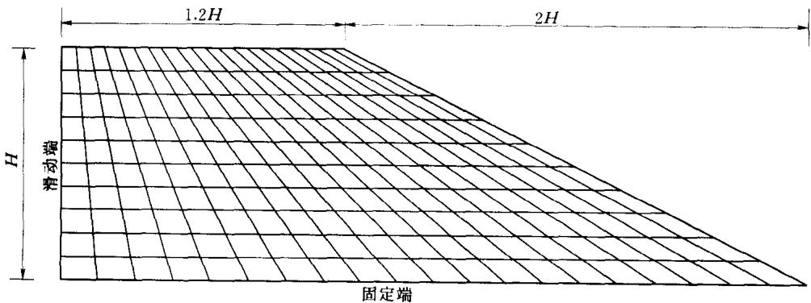  
图 9.22 [例 9.3] 坡角为 26.57°的均质边坡的网格

表9.4显示的是6次试算得到的成果。安全系数从0.8增大到1.4。每一次的强度参数都除以相应安全系数值。由于在每次分析中重力荷载和整体刚度矩阵都是相同的，所以只要生成一次就可以了，因而效率较高。

如表9.4示，当安全系数为0.8和1.0时，只需进行2次和10次迭代，计算就收敛。越接近“真实”的安全系数，算法就越难达到收敛。当 $F { = } 1 . 4$ 时，无量纲位移 $E ^ { \prime } \delta _ { \mathrm { m a x } } / \gamma H ^ { 2 }$ 有一个突然增加，此时算法在允许迭代次数内不能收敛。图9.23 是根据表9.4的数据得到的安全系数与无量纲位移关系，当F=1.4时，位移突然增加，计算不收敛，意味着边坡破坏，从该图可以看出，对同样的问题，有限元结果与由 Bishop & Morgenstern 得到的安全

系数很接近。

图9.24(a)和9.24(b)给出节点位移向量和对应于不收敛情况F=1.4时的变形的网格。

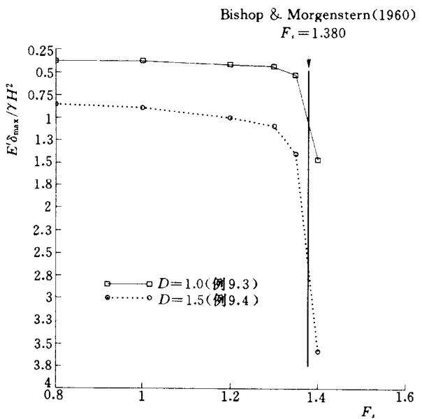  
图 9.23 [例 9.3]和[例 9.4] 安全系数与无量纲位移关系

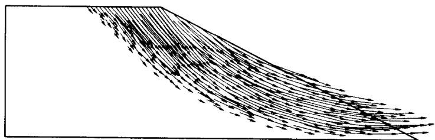

(a)  
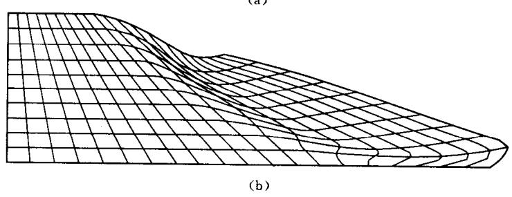  
图 9.24 [例 9.3] 对应于不收敛解 F=1.4 的网格变形图  
(a) 节点位移向量；(b) 变形网格

表 9.4 [例 9.3] 结果
<table><tr><td> $\boldsymbol { F }$ </td><td> $E ^ { \prime } \delta _ { \mathrm { { m a x } } } / \gamma H ^ { 2 }$ </td><td>迭代次数</td></tr><tr><td>0.80</td><td>0.379</td><td>2</td></tr><tr><td>1.00</td><td>0.381</td><td>10</td></tr><tr><td>1.20</td><td>0.422</td><td>20</td></tr><tr><td>1.30</td><td>0.453</td><td>41</td></tr><tr><td>1.35</td><td>0.544</td><td>792</td></tr><tr><td>1.40</td><td>1.476</td><td>1000</td></tr></table>

[例9.4] 有地基层的均质边坡 $( D / = 1 . 5 )$ o

图 9.25 显示的是在例 9.3 的边坡底面增加了一个厚度为 H/2 地基层的例子，而其它的土性及几何形状都不变。该例坡角为 $2 6 . 5 7 ^ { \circ }$ $c ^ { \prime } / \gamma H { = } 0 . 0 5$ $\phi ^ { \prime } { = } 2 0 ^ { \circ }$ $D { = } 1 . 5$ 0

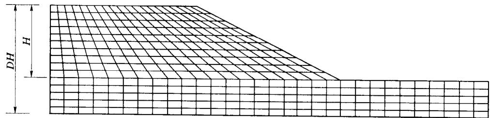  
(a)

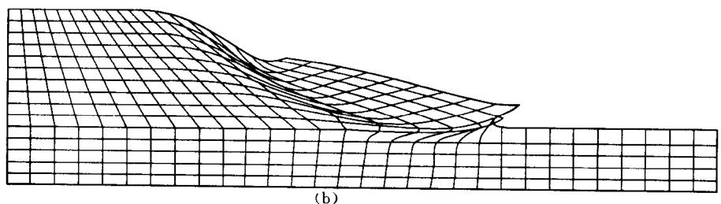  
图 9.25 [例 9.4] 有地基层的均质边坡  
(a) 没变形的网格；(b) 与不收敛解 F=1.4 相对应的网格

图9.25(a)和9.25(b)分别为初始网格和破坏时的变形网格。从图9.25(b)可以清楚地获得“坡脚破坏”类型的机制。虽然由于可压缩性土体积增大位移也增加了，但临界安全系数本质上并没有改变，仍为 $F { = } 1 . 4$ 4。有限元结果表明增加的地基层并没有明显改变边坡安全系数。Bishop和 Morgenstern (1960)给出安全系数 $F { = } 1 . 7 5 2$ ，作为该例 $( D { = } 1 . 5 , \ c ^ { \prime } / \gamma H { = } 0 . 0 5$ $\phi ^ { \prime } { = } 2 0 ^ { \circ }$ ，坡度=2:1）的一个可能解。假定破坏时的圆弧与地基的底部相切，用一个比较通用的滑弧程序也可以得到 $F { = } 1 . 7$ 这个可能的结果。但要获得“正确”的安全系数1.4，必须使滑弧通过坡脚。这个例子说明了有限元边坡稳定分析法与传统边坡稳定分析方法相比的一个主要优点，即有限元方法不要求假定临界面位置或形状。破坏“自然地”发生在土的剪切强度不足以抵抗剪应力的地带。因而不需要第4章所论述的搜索过程。

[例9.5]带有软弱夹层的不排水粘土边坡。

下面的例子是关于不排水粘土边坡的稳定性分析。在本例中，采用总应力分析，使用Tresca 破坏准则 $( \phi _ { u } = 0 )$

图9.26显示的是在不排水粘土地基层上的边坡。这个边坡包括一个软弱夹层，这个软弱夹层一部分与边坡平行，在地基的部分呈水平，最后地面出露的部分与坡踵夹 $4 5 ^ { \circ }$ 的角。虽然这个例子看起来有点人为的痕迹，但它有点像一个有软弱衬垫的废渣填埋系统的情况。在计算该边坡的安全系数时，保持 $c _ { u 1 } / \gamma H = 0 . 2 5$ 不变，只改变软弱薄层不排水抗剪强度c. $c _ { u 2 }$

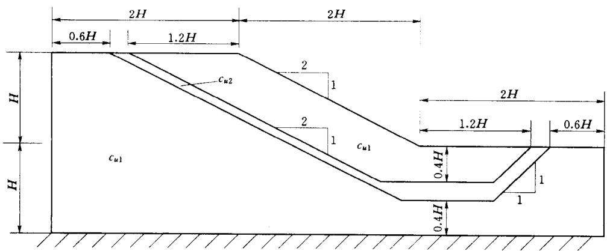  
图 9.26 [例9.5] 在地基层中有软弱夹层的不排水粘土边坡

有限元结果见图9.27。对均质边坡 $\left( c _ { u 2 } / c _ { u 1 } \middle . \right. = 1 )$ ，计算的安全系数与Taylor(1937)的 $F { = } 1 . 4 7$ 的解很接近，并且给出了期望的圆弧基本破坏机制。随着薄层强度的逐渐减小，在 $c _ { u 2 } / c _ { u 1 } { \approx } 0 . 6$ 时，结果有很明显的改变。

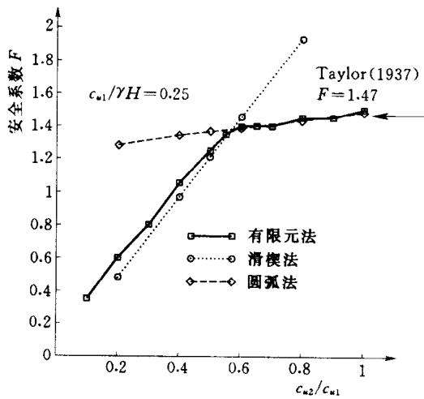  
图 9.27 [例 9.5] 不同 $\pmb { c } _ { u 2 } / \pmb { c } _ { u 1 }$ 比值得到的安全系数F

该图还显示了用Janbu法得到的极限平衡结果。该法同时采用了沿软弱层的圆弧和三线楔形破坏机制。当 $c _ { u 2 } / c _ { u 1 } { \approx } 0 . 6$ 时，在由软弱层支配的圆弧和非圆弧之间的过渡阶段很清楚的显示了不连续性。当 $c _ { u 2 } / c _ { u 1 } { > } 0 . 6$ 时为圆弧破坏机制支配，安全系数本质上不受软弱薄层强度的影响。当 $c _ { u 2 } / c _ { u 1 } { < } 0 . 6$ ，非圆弧的薄层机制支配了破坏模式。

图9.28可以很清楚地解释破坏模式，图中显示了三种不同的 $c _ { u 2 } / c _ { u 1 }$ 比值下破坏时的变形网格。图9.28(a)示均质情况 $( c _ { u 2 } / c _ { u 1 } = 1 )$ )，显示了一个本质上圆弧状的破坏机制。图9.28(c)中薄层的强度只有其周围土强度的20% $( c _ { u 2 } / c _ { u 1 } = 0 . 2 )$ 。从图中可以看出非圆弧机制与软弱薄层的路径几乎重合。图9.28(b)中薄层的强度为其周围土强度 $( c _ { u 2 } / c _ { u 1 } = 0 . 6 )$ 的60%，图形复杂且模糊。但是很明显至少有两种互相冲突的机制。第一种是在坡脚以上与软弱层重合的破坏机制，第二种是沿着与边坡和坡脚出露处平行的软弱层破坏的机制。

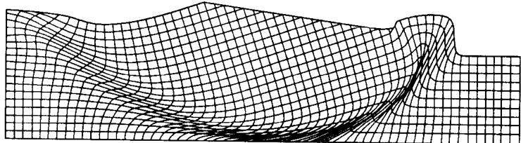

(a)  
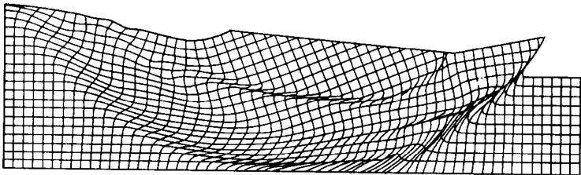  
(b)

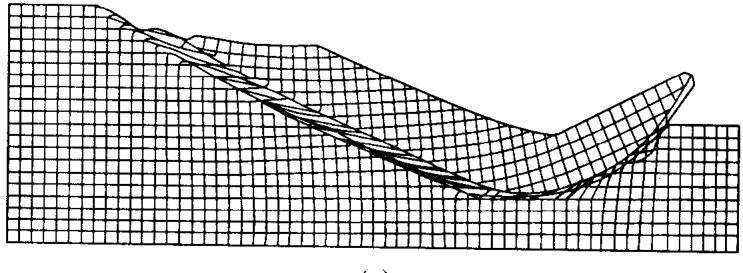  
(c)  
图 9.28 [例 9.5] 对应三种不同的 $c _ { u 2 } / c _ { u 1 }$ 比值，破坏时网格变形图(a) $c _ { u 2 } / c _ { u 1 } = 1 . 0 ;$ (b) $c _ { u 2 } / c _ { \star 1 } = 0 . 6 ;$ (c) $c _ { u 2 } / c _ { u 1 } { = } 0 . 2$

如果没有前面的关于两种不同机制的知识，传统的极限平衡搜索出的安全系数可能会过高。图9.27已经证明了这一点，例如当 $c _ { u 2 } / c _ { u 1 } { = } 0 . 2$ 时，圆弧机制得到的F为1.3，而正确的F约为0.6。

## 9.4.2 赵尚毅和郑颖等人的工作

上述Griffith等的研究成果受到国内外学者的重视，赵尚毅和郑颖人等(2002)近期也获

得有意义的成果。他们采用了广义米赛斯准则：

$$
F = \alpha I _ { 1 } + \sqrt { J _ { 2 } } = \kappa\tag{9.115}
$$

式中： $I _ { 1 } , \ J _ { 2 }$ 分别为应力张量的第一不变量和应力偏张量的第二不变量。 $\pmb { \alpha } ,$ K是与岩土材料内摩擦角φ和内聚力c有关的常数，不同的α、κ在π平面上代表不同的圆（图9.29）。这是一个通用的表达式，通过变换α、x的表达式就可以在有限元中实现不同的屈服准则，各准则的参数换算关系见表9.5。

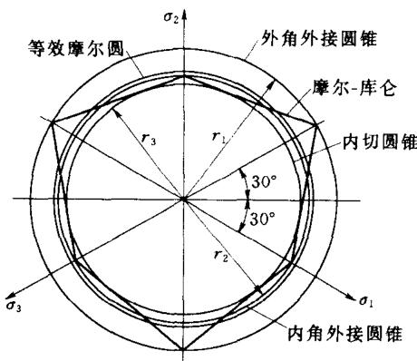  
图 9.29 各屈服准则在π平面上的曲线

传统的极限平衡法采用摩尔-库仑准则，但由于摩尔-库仑准则的屈服面为不规则的六角形截面的角锥体表面，存在尖顶和菱角，给数值计算带来困难。为了与传统方法进行比较，这里采用徐干成、郑颖人等(1990)提出的摩尔一库仑等面积圆屈服准则(DP4)代替传统的摩尔一库仑准则。

表9.5 各准则参数换算表
<table><tr><td>编号</td><td colspan="2">准则种类 α</td></tr><tr><td>DP1</td><td>外角点外接D-P圆</td><td> $\arccos \phi$ </td></tr><tr><td>DP2</td><td> $\sqrt { 3 ( 3 - \sin \phi ) }$  内角点外接D-P圆</td><td> $\sqrt { 3 ( 3 - \sin \phi ) }$ </td></tr><tr><td></td><td>2sinφ  $\sqrt { 3 ( 3 + \sin \phi ) }$ </td><td>6c cosφ  $\sqrt { 3 ( 3 + \sin \phi ) }$ </td></tr><tr><td>DP3 内切D-P圆</td><td>sin φ</td><td>3c cos φ</td></tr><tr><td></td><td> $\sqrt { 3 } \sqrt { 3 + \sin ^ { 2 } \phi }$ </td><td> $\sqrt { 3 } \sqrt { 3 + \sin ^ { 2 } \phi }$ </td></tr><tr><td>DP4 等面积D-P圆</td><td> $2 { \sqrt { 3 } } \sin \phi$ </td><td></td></tr><tr><td></td><td></td><td> $6 \sqrt { 3 } c \cos \phi$ </td></tr><tr><td></td><td> $\scriptstyle \overline { { { \sqrt { 2 { \sqrt { 3 } } \pi \left( 9 - \sin ^ { 2 } \phi \right) } } } }$ </td><td> $\scriptstyle \sqrt { 2 \sqrt { 3 } \pi \left( 9 - \sin ^ { 2 } \phi \right) }$ </td></tr></table>

[例9.6] 均质土坡稳定分析算例。

此例为一均质土坡。坡高 $\scriptstyle H = 2 0 { \mathrm { m } }$ ，土容重 $\hat { \bar { \bf \underline { { \ s } } } } = 2 5 \mathrm { { k N } } / \mathrm { { m } } ^ { 3 }$ ，粘聚力 $c { = } 4 2 \mathbf { k P a }$ ，内摩擦角 $\varpi 1 7 ^ { \circ }$

表9.6 用不同方法求得的安全系数
<table><tr><td>坡角(°)</td><td>30</td><td>35</td><td>40</td><td>45</td><td>50</td></tr><tr><td>有限元法（外接圆屈服准则）</td><td>1.78</td><td>1.62</td><td>1.48</td><td>1.36</td><td>1.29</td></tr><tr><td>有限元法（摩尔-库仑等面积</td><td>1.47</td><td>1.34</td><td>1.22</td><td>1.12</td><td>1.06</td></tr><tr><td>圆屈服准则） Bishop</td><td>1.39</td><td>1.26</td><td>1.15</td><td>1.06</td><td>0.99</td></tr><tr><td>Spencer</td><td>1.46</td><td>1.32</td><td>1.21</td><td>1.12</td><td>1.04</td></tr></table>

计算结果见表 9.7。可见，DP4 准则与简化 Bishop 法所得的稳定安全系数最为接近，其误差的平均值为5.7%，最大误差小于8%，且离散度很小。而DP1准则的平均误差为29.5，采用 DP2 和 DP3 准则所得计算结果的离散度也很大。因此在数值分析中可以用 DP4 准则代替摩尔一库仑准则。

表9.7 不同屈服准则所得最小安全系数
<table><tr><td colspan="6">H=20m β=45° c=42kPa</td></tr><tr><td>φ(°)</td><td>0.1</td><td>10</td><td>25</td><td>35</td><td>45</td></tr><tr><td>DP1</td><td>0.525</td><td>1.044</td><td>1.769</td><td>2.254</td><td>3.051</td></tr><tr><td>DP2</td><td>0.525</td><td>0.930</td><td>1.332</td><td>1.530</td><td>1.887</td></tr><tr><td>DP3</td><td>0.454</td><td>0.848</td><td>1.279</td><td>1.499</td><td>1.870</td></tr><tr><td>DP4</td><td>0.477</td><td>0.879</td><td>1.396</td><td>1.689</td><td>2.182</td></tr><tr><td>简化Bishop法</td><td>0.494</td><td>0.846</td><td>1.316</td><td>1.623</td><td>2.073</td></tr><tr><td>(DP1-Bishop)/Bishop</td><td>0.063</td><td>0.234</td><td>0.344</td><td>0.355</td><td>0.472</td></tr><tr><td>(DP2-Bishop)/Bishop</td><td>0.063</td><td>0.099</td><td>0.012</td><td>-0.080</td><td>-0.090</td></tr><tr><td>(DP3-Bishop)/Bishop</td><td>-0.081</td><td>0.002</td><td>-0.028</td><td>-0.099</td><td>-0.098</td></tr><tr><td>(DP4-Bishop)/Bishop</td><td>-0.034</td><td>0.059</td><td>0.061</td><td>0.041</td><td>0.053</td></tr></table>

研究者还发现，边界范围的大小在有限元法中对计算结果的影响比在传统极限平衡法中表现的更为敏感。当坡角到左端边界的距离为坡高的1.5倍、坡顶到右端边界的距离为坡高的2.5倍，且上、下边界总高不低于2倍坡高时，计算精度最为理想。另外如果网格划分太粗，将会造成很大的误差，计算时必须考虑适当的网格密度。

从表9.7中计算结果可以看出，采用外接圆屈服准则计算的安全系数比传统的方法大许多，而采用摩尔-库仑等面积圆屈服准则计算的结果与传统的极限平衡方法（Spencer法）计算的结果十分接近，说明采用摩尔-库仑等面积圆屈服准则代替摩尔-库仑不等角六边形屈服准则是可行的。

另外，通过4组方案的算例的比较分析表明，用摩尔-库仑等面积圆屈服准则求得的安全系数与 Bishop 法的误差为 3%\~7%，与 Spencer 法的误差为 1%\~3%，说明有限元强度折减法完全在边坡稳定分析中应用的可行性。

## 9.4.3 NDM——结点位移法

Tan和 Donald于1985年提出了一种利用有限元求解得到的结点位移来确定安全系数的简单图解法，称为结点位移法。这一方法是将结构的组成材料的粘聚力c和内摩擦系数$f = \tan \phi$ 乘以一个N(N<1.0)的折减系数，进而通过有限元计算跟踪某一结点的位移 $\delta _ { T }$ 的变化。随N的减小， $\delta _ { \scriptscriptstyle T }$ 不断增大，如图9.30所示。尖角点给出了N的临界值，即为安全系数$F _ { \delta _ { T } }$ 。当各参数设计值乘以N之后，结构物就可达到极限平衡。1/N即为设计安全系数。为识别可能的滑裂面，必须清楚在潜在破坏区域内结点的位移状况，这可以很容易地从位移矢量图中观察到。

这种方法包含了如下假定：

1) 材料强度参数的降低不影响它的其它性质；

2) 尽管有限元分析是建立在小变形理论基础上的，但在出现尖角点前后，大变形 $\cdot \delta _ { T }$ 的计算是有效的。

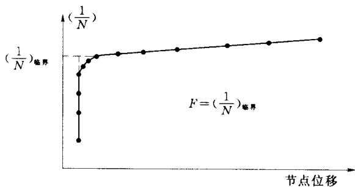  
图 9.30 [例 9.7] 节点位移随 1/N变化过程图  
[例 9.7] Talbingo 坝。

图9.31所示高为162 米的 Talbingo 心墙坝。强度参数从100%的设计值(1/N=1.0)降到$4 0 \% ( 1 / N = 2 . 5 0 )$ 。图9.32示一典型结点的位移变化过程。 $F _ { \delta T }$ 的范围大约在2.05\~2.14 之间。对应于 $1 / N = 2 . 0 6$ 和2.11的位移矢量参见图9.33。在 $1 / N = 2 . 0 6$ 时，无明显大变形 $\delta _ { T }$ 出现，坝中无明显滑裂面。在 $1 / N { = } 2 . 1 1$ 时，在坝的上游坡堆石料区、过渡料区和心墙料区可以很明显看到大变形出现。由图9.33(b)可以看到一明显的滑裂面。用条分法计算所得通过心墙的滑裂面的安全系数为2.06。

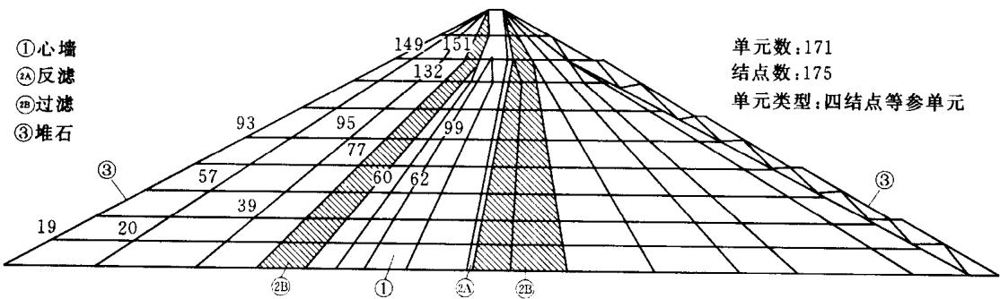  
图 9.31 Talbingo 坝网格及观测点

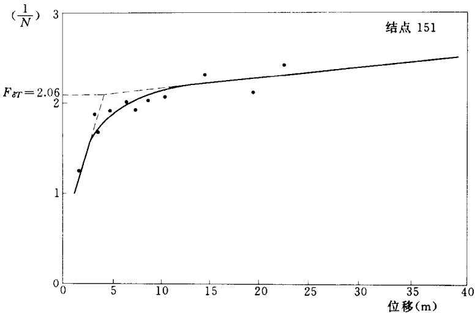  
图 9.32 [例 9.7] 151 号节点位移变化过程

根据位移矢量图9.33(b)，假定一圆弧滑裂面。表 9.8 列出了各种方法计算的稳定分析结果，可以看出 $F _ { \delta _ { T } }$ 与 $F _ { F E I }$ 、 $F _ { F E 3 }$ 很接近，但略小于 ${ { F } _ { F L E } }$ 和 $F _ { F E 2 }$ 。各安全系数之间的一致性可以证明用 $\delta _ { T }$ 与 $F _ { \delta _ { T } }$ 来确定土石坝的安全系数是可行的。

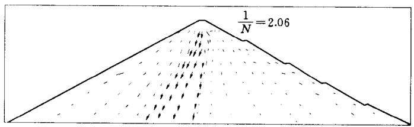  
(a)

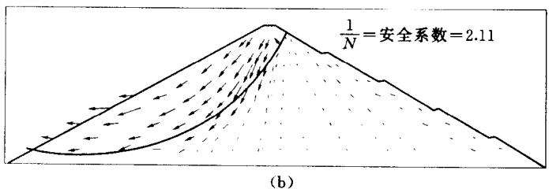  
图 9.33 [例 9.7] Talbingo 坝位移矢量图  
(a) 1/N=2.06; (b) 1/N=2.11

表 9.8 安全系数比较
<table><tr><td colspan="4">临界圆弧信息</td><td colspan="4">总应力安全系数</td></tr><tr><td>x</td><td>y</td><td>r</td><td> $F _ { F E I }$ </td><td> $F _ { F E 2 }$ </td><td> $F _ { F E 3 }$ </td><td> $\pmb { F } _ { F L E }$ </td><td> ${ \pmb F } _ { \pmb \delta _ { T } }$ </td></tr><tr><td>100.3</td><td>290.0</td><td>278.8</td><td>2.10</td><td>2.23</td><td>2.11</td><td>2.21</td><td>2.11</td></tr></table>

注坐标原点为上游坡与坝底的交点。

## 参考文献

1 Biot, M. A. Theory of elasticity and consolidation for a porous anisotropic solid. Journal of Applied Physics 1955.26.182-185

2 Bishop, A. W. and Morgenstern, N. R. Stability coefficients for earth slopes. Geotechnique. 1960. 10:129-150

3 Cathie, D. N.,and Dungar, R. Evaluation of finite element predictions for constructional behavior of a rockfill dam. Proc. Instn. Civ. Engrs., Part 2, 1978. 65:551-568

4 Charles, J. A. The use of one dimensional compression tests and elastic in prediction deformation of embankments. Canadian Geotechnioal Journal.1976. 13: 189-200

5 Chen L.H. etc. Consolidation and stability behavior of a high rockfill dam built on soft clay foundation Proceedings of 3rd International Conference on Soft Soil Engineering ICSSE3. 2001. DEC, Hong Kong

陈胜宏.高坝复杂岩石地基及岩石高边坡稳定分析.北京：中国水利水电出版社.2001

7 陈祖煜.用有限元进行渗流、结构和固结计算中的基本原理.水利水电科学研究院.1985

8 陈祖煜，陈立宏，李新强.第7章土工数值分析(二)：渗流，固结和应力应变的有限元方法，高等土力学，2003，清华大学出版社.

9 Donald, I. B. Tan, C. P. And Goh, T. C. A. Stability of geomechanical structures assessed by finite element method. Proc. 2nd Int. Conf. In Civil Engr. Hangzhou, Science Press. Beijing. 1985. 845-856

10 Duncan, J. M. et. al. CON2D:A finite element computer program for analysin of consolidation, Report No. VCB1GT/81-01, University of California, Berkeley. 1981

11 Duncan, J. M., and Chang, C. Y. Nonlinear analysis of stress and strain in soils. J. Soil Mech. and Found. Div. ASCE. 1970. 96(5): 1629-1653

12 Donald, I. B. Finite element assessment of slope stability. Austrlian-China Landslide Seminar, 1993. 3-18 July, 1-42.D1-D18

13 Eisensein, Z. and Simmons, J. V. Three -dimensional analysis of Mica Dam. Proc. Int. Symp. Criteria and Assumptions for Numer. Anal. of Dams. Quadrant, Swansea, U. K.1975. 1051-1070

14 Griffith, D. V. and Lane, P. A. Slope stability analysis by finite elements. Geotechnique. 1999. 49(3): 387-403

15 Giam, S. K. and Donald, I. B. Determination of critical slip surfaces for slopes via stress-strain calculations. 5th A. N. Z. Conf. Geomechanics, Sydney. 1988. 461-464

16 Penman, A. D. M.,Burland, J. B., and Charles, J. A. Observed and Predicted deformations in a large embankment cam during con-struction. Proc. Ins. Civ. Engrs., London. 1971. 49:1-21

17 Penman, A., and Charles, A. Construction deformations in rock-fill dam. J. Soil Mech. And Found. Div., ASCE 1973.99(2): 139-163

18 沈珠江. 计算土力学.上海科技出版社.1990

19 Tan, C. P. and Donald, I. B. Finite element calculation of dam stability. Proc. 1 1th Int. Conf. Soil Mech. and Fnd. Engr. San Francisco. 1980

20 Taylor, D. W. Stability of earth slopes. J. Boston Soc. Civ. Eng. 1937. 24:197-246

21 Wright, S. G. Kulhawy, F. H. and Duncan, J. M. Accuracy of equilibrium slope stability analysis. J. Soil Mech. And FDN. Div. 1973. 99(SM10): 783-791

22 Wang, C. and Duncan, J. M. Analysin of consolidation of earth and rockfill dans, Report No. TE77-3, University Of California, Berkeley. 1977

23 徐干城，郑颖人. 岩土工程中屈服准则应用的研究. 岩土工程学报.1990.12(2):93-99

24 Yamagami, T. and Ueta, Y. Search for critical slip lines in finite element stress fields by dynamic programming. Proc. 6th International Conference on Numerical Methods in Geomechanics. Innsbruck, Australia. 1988. 1335-1339

25 Zou, J. Z., Williams, D. J., and Xiong, W. L. Search for critical slip surfaces based on finite element method. Canadian Geotechnical Journal. 1995. 32: 233-246

26 赵尚毅，郑颖人，时卫民，王敬林.有限元强度折减法求边坡稳定安全系数.岩土工程学报.2002.129(3):343-346

# 第10章 边坡稳定的可靠度和风险分析

## 10.1 边坡稳定的风险分析

## 10.1.1 边坡稳定分析中的不确定因素

随着对结构应力、变形和稳定分析手段的逐步完善，这些分析中包含的不确定因素也暴露得更加明显。工程师们逐步意识到，在进行工程设计和安全评价时，不仅要很好地了解各种分析、判断手段，而且要把握在进行这些分析过程中包含的各项不确定因素。工程建设中的重大决策实际上就是对各项不确定因素造成的风险的评价。

近年来，风险分析成为了结构和岩土工程师日益关注的课题。在岩土和边坡领域一大批著名学者都以这一题目发表了大量的重要论文。1965年，Casagrande以“土工与地基工程中计算风险的作用”为题作“太沙基讲座”演讲。同时，围绕风险分析的学术活动也十分活跃。2000年国际大坝会议将“风险分析在大坝安全和管理中的应用”作为一个重要专题进行研究、交流，共收到22个国家的48篇论文；2000年在墨尔本召开的世纪岩土工程会议(GeoEng2000)中，也提交了大量的有关岩土工程和大坝、岩土环境工程中的风险分析方法的特邀报告或主题报告。在此基础上，各国和各学术机构也在编制有关风险分析的导则、规范等。

Morgenstern将岩土工程分析中包含的不确定因素分为管理因素、模型因素和参数因素三大类。

## 1. 管理不确定因素(Human uncertainty)

管理的不确定因素（按原文直译应为“人为不确定因素”）指由于人们的行为不当导致的岩土工程失事。最常见例子是施工质量方面的问题。本章第10.7.2节将讨论青海沟后水库大坝溃决的实例。这一工程在大坝设计和施工中存在诸多缺陷，是导致失事的主要原因。但在这些缺陷的背后隐藏着管理方面的问题。有关文献（李君纯，陈祖煜，1996）详细介绍了这些非技术因素如：①项目管理没有归口由省水利厅领导；②建设单位没有从事水利工程施工经验，导致防浪墙止水存在严重施工质量问题；③在建设过程中不恰当地将原设计的堆石面板坝改为砂砾石面板坝；④时值汛期，管理人员疏于职守，闸门启动不灵，导致发现险情时无法放空水库；⑤通讯不灵，导致人员没有及时疏散等。上述种种在项目管理方面存在的问题，最终导致了340余人死亡的重大事故。上述因素在风险分析中难以直接定量评估，但是，所有从事风险分析的技术人员对这类不确定因素都需要有一个清醒的认识，否则，再好的风险分析也是脱离实际的。

## 2. 模型不确定因素(Model uncertainty)

模型的不确定因素反映了我们在设计过程中采用的分析方法在模拟实际情况方面的局限。任何一个数学模型在模拟岩土材料的特性时都存在近似性。通过第5 章的论述，我们认识到摩尔-库仑强度准则和室内、外的试验在模拟岩土材料抗剪强度特性方面存在局限性：第2章和第3章介绍的极限平衡分析方法也包含有多个假定；土石坝设计规范规定对瑞典法和Bishop法采用不同的允许安全系数，反映了对模型所包含的误差的处理。这些例子所包含的误差总体来说是较小的。在边坡稳定分析领域，还有一些更大的模型不确定性因素。例如对降雨导致的土的饱和或非饱和孔隙水压力特征的模拟；对土在渗流和抗剪强度方面各向异性的模拟；对在地震动力条件下边坡稳定性的模拟等。沟后大坝溃决后，在残留坝体得到一个难得一见的大坝的横剖面图，从而发现，上坝砂砾料在洒水和震动碾压条件下会发生液化，导致骨架分离，形成一层细颗粒、一层粗颗粒这样的结构。这些细颗粒层作为相对不透水带阻止渗入坝体内的水往垂直方向渗透，导致坝体浸润线抬高，这是大坝溃决的主要原因，详见文献（李君纯、陈祖煜，1996)。在没有认识到这一问题以前，人们将筑坝材料视为各自同性的均匀介质，那么，这样的分析就包含有较大的模型误差。在岩土工程领域，类似这样认识上的盲区可能还不少。

模型所包含的误差不一定总是不利因素。例如在边坡稳定分析领域，通常采用二维分析方法，所得安全系数通常较实际值偏低。

## 3. 参数不确定因素(Parameter uncertainty)

参数不确定因素是因岩土材料的极不均匀性决定的。在已经确定了数学模型的基础上，分析由于参数的变异特征，导致边坡工程结构失效的概率，这是本章要研究的重点。我们称这一分析过程为可靠度分析。

## 这一领域包括两个步骤：

(1)研究影响结构稳定性岩土材料各项参数的变异特征。这一工作必须建立在对岩土材料基本特性，如干密度、颗粒级配、渗透系数及强度等大量试验的基础上。需要研究这些试验本身包括的各种误差。

(2) 计算可靠度指标和边坡工程失效概率。该工作是在确定了各影响因子的变异特征的基础上进行的。

综上所述，如果定义由管理因素、模型因素、参数因素导致的系统失效概率分别为P(A)、P(M)和 P(P)，则整个系统的失效概率 P(S)为

$$
P ( \mathbf { S } ) = 1 - [ 1 - P ( \mathbf { A } ) ] { \times } [ 1 - P ( \mathbf { M } ) { \times } [ 1 - P ( \mathbf { P } ) ]\tag{10.1}
$$

P(A)、P(M)和 P(P)之间并不独立，例如由于管理上的不确定因素会直接导致参数较大的变异性，因此，上式只是近似公式。

## 10.1.2 风险分析的基本原理

Casagrande(1965)指出，风险作为一种用来考虑和评估工程实践中诸多不确定和无法预测因素而导致工程失事的一种手段时，是所有岩土工程中先天固有的。在当今的工程技术还没有发展到能准确确定这些因素时，工程技术人员应清醒地意识到风险在工程实践中的先天存在性，并运用安全与经济相平衡的原则对工程失事的风险进行分析计算。

这一工程风险评估的思想，就构成现今岩土工程风险评估的基本理论框架。后来许多学者(Whitman, 1984; Morgan, 1992; Fell, 1992)把这一思想继续深化并推广到评定工程安全的风险分析研究实践中。但是由于公众和工程技术人员对风险分析理解上的差异，相对于业已成熟的确定性分析方法，风险分析方法在工程实践中的应用远没有达到成熟的地步。

## 1. 基本定义

Fell(1993)回顾了风险分析在大坝安全评估方面的应用的基础上，介绍了一种用于滑坡安全的风险评估方法。其中用于滑坡风险分析的主要术语可表述如下：

分类(Classification) - 对滑坡和潜在滑坡的自然特性的描述；

滑坡规模 M (Magnitude)- 潜在滑坡体的体积大小，以 m³计；

发生概率P(Probability)- 一特定的边坡在一段时间的失稳概率（通常为一年);

危害 H (Hazard) - 对滑坡体积大小和发生概率的总体评估，（从一般意义来讲，H = M×P);

脆弱度 V (Vulnerability) - 对滑坡发生后所能影响范围内的单一个体损失程度的描述，通常为0到1之间的一个数；

单一风险 Rs(Specific risk) -等于发生概率和单一个体的脆弱度的乘积，即 $( R _ { s } \ =$ PxV);

风险体 E (Elements at risk) - 处于滑坡潜在影响范围内的人口、财产、经济活动以及公共服务等；

整体风险 Rt(Total Risk)- 可以预计到的人员伤亡，财产损失，经济活动或者环境受到破坏的数目。

有关风险术语的定义还有很多建议(Australian Geomechanics Society，2000;Stewart2000)。

## 2. 风险管理

风险管理是对风险和承受者的脆弱度进行分析并作出相应对策的综合体系。这里包括了对风险的评估和灾害采取的各项应对措施。图10.1给出了基本流程图。

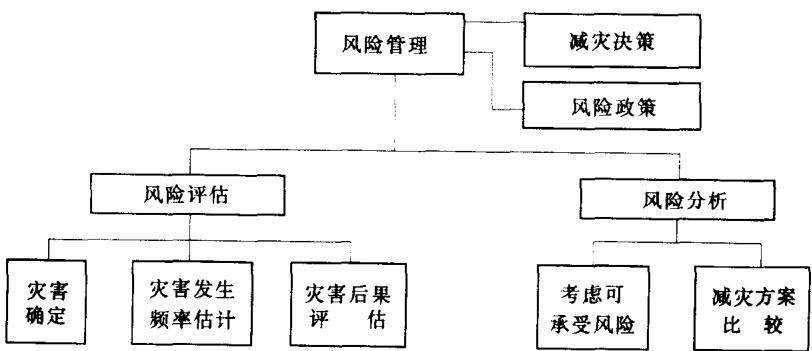  
图 10.1 风险管理基本流程图

## 3. 风险分析方法

边坡失稳的发生概率可以按单一值计算，也可以是所有外界诱发因素引起的破坏概率的总和。单一个体的脆弱度可用式(10.2)给以评估(Morgan, et al., 1992)，即

$$
V = V ( \boldsymbol { \mathrm { S } } ) \times V ( \boldsymbol { \mathrm { T } } ) \times V ( \boldsymbol { \mathrm { L } } )\tag{10.2}
$$

式中：V(S)为空间影响的可能性（滑坡体是否影响到建筑物或者正好避开建筑物)；V(T)为暂时影响的可能性，比如在影响的一瞬间，一个固定的建筑物和一个运动的车辆的风险的差别；V(L)为受影响个体财产损失或者人员生命损失的可能性；V为单一个体的脆弱度。

边坡稳定风险分析的范围和严格程度取决于风险分析本身的目的和用途，它通常是风险本身的自然特性、灾害后果、不确定因素的类型和它们对决策过程的影响以及风险分析实用性的一个函数。岩土工程师在开始进行边坡稳定风险分析前，应该和与工程有关的工程技术人员和要求对边坡稳定进行风险分析的主管部门共同探讨，以期达到双方都可以理解和接受的风险分析成果。另外，风险分析方法通常分定性和定量分析两种。

## 10.1.3 定性风险分析方法

定性风险分析主要用于土地规划和政策制定阶段滑坡管理分析。分析的结论通常用危险性极高、高、中等词句表达。表10.1是定性风险分析的主要描述方法。

进行定性风险分析的主要手段有以下三个方面：

(1) 按发生概率予以量化。该工作是建立在对10.1.1 节中介绍的各种不确定因素进行分析的基础上。

(2) 使用失效树(Fault Tree)的推理方法。可详见文献(Ho. et al., 2000)。

(3) 专家系统。专家评估可以和上述几种定性分析工作相结合。进一步提高定性风险分析的可靠度。

在定性风险分析阶段，不可能作很多详细的工程地质和岩土力学特性参数的勘探和试验工作，也不可能进行定量的可靠度与分析计算。这一阶段使用的主要手段有以下几种。

## 1. 对历史滑坡资料进行调查

滑坡危险性较高的地区，通常可以在历史记载中找到先例。例如，三峡库区是滑坡灾害高发区，有关滑坡的书面记载可以追溯到宋朝。收集了历史资料后，可以按滑坡的规模、触发因素和发生频率来进行滑坡风险分析，这样的分析由于是建立在实际资料基础上的，其成果十分可信。

## 2. 建立在地形、地貌分析基础上的经验方法分析

将边坡的高度、坡度和主要构成物质以及地下水条件、降雨、地震等因素进行逐项量化评估，然后通过综合分析，给出本地区的滑坡风险性评估。这一工作和滑坡历史调查结合，同样可能成为有效的手段。香港土木工程署详细记载了大小滑坡3000余个，并邀请Fell(1992)在整理这些资料的基础上，给出对现有的边坡风险分析评估。

## 3. 对主要触发因素的风险评估

这一评估同样也是建立在对以往滑坡资料的分析基础上的。例如香港土木工程署在分析了大量暴雨导致的滑坡的资料基础上，给出了根据降雨评估滑坡风险的方法。这一方法根据1小时和24小时降雨强度结合所评估滑坡以往发生频繁程度进行风险性分析。类似的工作可以用于地震滑坡危险性分析。

表 10.1 定性风险分析术语表(Fell, 1993)
<table><tr><td>评估指标</td><td> $M _ { s }$ </td><td>描述</td><td>体积(m³)</td></tr><tr><td rowspan="7">大小</td><td>7</td><td>极大</td><td>&gt;5,000,000</td></tr><tr><td>6</td><td>很大</td><td>&gt;1,000,000和&lt;5,000,000</td></tr><tr><td>5</td><td>中/高</td><td>&gt;250,000和&lt;1,000,000</td></tr><tr><td>4</td><td>中等</td><td>&gt;50,000和&lt;250,000</td></tr><tr><td>3</td><td>小</td><td>&gt;5,000和&lt;50,000</td></tr><tr><td>2.5</td><td>很小</td><td>&gt;500和&lt;5,000</td></tr><tr><td>2</td><td>极小</td><td>500</td></tr><tr><td rowspan="6">破坏概率</td><td> $P _ { \textrm { s } }$ </td><td>描述</td><td>年发生概率</td></tr><tr><td>12</td><td>极高</td><td></td></tr><tr><td>8</td><td>很高</td><td>≈1 ≈0.2</td></tr><tr><td>5</td><td>高</td><td>≈0.05</td></tr><tr><td>3</td><td>中</td><td>≈0.01</td></tr><tr><td>2</td><td>低</td><td>≈0.001</td></tr><tr><td rowspan="7">危害 = 大小×破坏概率</td><td></td><td>描述</td><td></td></tr><tr><td></td><td>极高</td><td>MXP</td></tr><tr><td></td><td>很高</td><td>≥30 ≥20和&lt;30</td></tr><tr><td>高</td><td></td><td>≥10和&lt;20</td></tr><tr><td>中</td><td></td><td>≥7和&lt;10</td></tr><tr><td></td><td>低</td><td>≥3和&lt;7</td></tr><tr><td></td><td>很低</td><td>&lt;3</td></tr><tr><td rowspan="6">脆弱度(只考虑财产损失)</td><td></td><td>描述</td><td>脆弱度</td></tr><tr><td></td><td>很高</td><td>≥0.9</td></tr><tr><td>高</td><td></td><td>≥0.5和&lt;0.9</td></tr><tr><td></td><td>中等</td><td>≥0.1和&lt;0.5</td></tr><tr><td></td><td>低</td><td>≥0.05和&lt;0.1</td></tr><tr><td></td><td>很低</td><td>&lt;0.05</td></tr><tr><td rowspan="6">单一风险(只考虑财产损失)</td><td>描述</td><td></td><td>估计概率</td></tr><tr><td></td><td>很高</td><td>≥0.1</td></tr><tr><td></td><td>高</td><td>≥0.02和&lt;0.1</td></tr><tr><td></td><td>中等</td><td>≥0.005和&lt;0.02</td></tr><tr><td>低</td><td></td><td>≥0.001和&lt;0.005</td></tr><tr><td>很低</td><td></td><td>≥0.0001和&lt;0.001</td></tr></table>

下面以一实例说明风险定性分析的过程。图10.2给出澳大利亚纽卡斯尔一滑坡的平面图。根据资料记录和经验判断，该边坡失稳的发生概率介于0.04\~0.1之间。有迹象表明，边坡失稳后滑坡体会在影响范围内缓慢滑移（A.1.1 区域)，但有可能在A.1.2 区域陡坡以下和A3区域加速滑移。如果考虑滑坡影响范围内的A，B，C三个建筑物，并分别对边坡的滑体大小、失稳发生概率、脆弱度、危害大小以及单一风险进行定性分析，其成果列于表10.2。

## 10.1.4 定量风险分析法

定量风险分析是建立在风险概率和以人员伤亡和财产为定量指标基础上的一个综合决策系统。

(1) Morgan(1992)用以下的条件概率计算公式来评价个独立个体的风险。

$$
R ( \mathbf { I N } ) = P ( \mathbf { H } ) { \times } P ( \mathbf { S } / \mathbf { H } ) { \times } P ( \mathbf { T } / \mathbf { S } ) { \times } V ( \mathbf { L } / \mathbf { T } )\tag{10.3}
$$

式中：R(IN)为一个独立个体发生伤亡的年频率；P(H)为灾害(这里指滑坡)的年发生频率；P(S/H)为灾害的空间破坏频率(例如滑坡对一定距离的建筑物的影响)；P(T/S)为考虑时间效应影响的概率；V(L/T)为个体的脆弱程度。

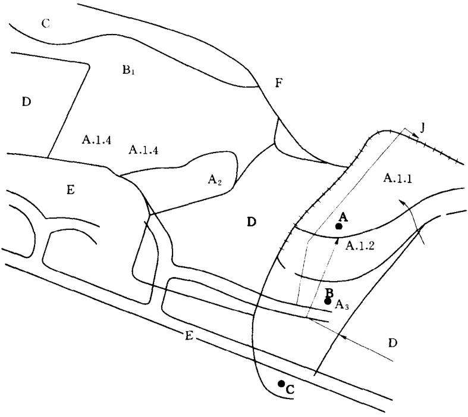  
图10.2 澳大利亚纽卡斯尔一滑坡平面位置图

表 10.2 某滑坡单一风险分析
<table><tr><td>风险</td><td>滑坡</td><td>发生</td><td>危害</td><td colspan="5">脆弱度</td><td>单一风险</td></tr><tr><td>个体</td><td>大小</td><td>概率</td><td>程度</td><td> $\underline { { \boldsymbol { V } } } _ { a }$ </td><td> $V _ { b }$ </td><td> $V _ { c }$ </td><td> $V _ { L }$ </td><td> $V _ { P }$ </td><td>人身财产</td></tr><tr><td>A</td><td>大</td><td>0.05</td><td>很高</td><td>1.0</td><td>0.05</td><td>1.0</td><td>0.05</td><td>1.0</td><td>0.0025</td></tr><tr><td>B</td><td>大</td><td>0.05</td><td>很高</td><td>0.5</td><td>0.3</td><td>0.9</td><td>0.15</td><td>0.45</td><td>0.0075</td></tr><tr><td>C</td><td>大</td><td>0.05</td><td>很高</td><td>0.5</td><td>0.01</td><td>0.05</td><td>0.005</td><td>0.025</td><td>0.00025</td></tr></table>

注 Va为单一个体受滑坡影响的概率（建筑物B与C只有在泥石流发生时才受影响）:V为在建筑物受到影响 $\nu _ { \flat }$ 时，有一人致死的概率；V为在建筑物受到影响时，单一风险个体价值的比率；V为人员伤亡的脆弱度 $V _ { c }$ $ { \boldsymbol { V } } _ { L }$ $( = V _ { a } { \times } V _ { b } ) ; \ \mathbf { V } _ { P }$ 为财产损失的脆弱度 $\mathbf { \xi } ( = V _ { a } \times V _ { c } )$

(2) 对于财产的损失。评估公式为

$$
P ( { \bf R } ) = P ( { \bf H } ) \times P ( { \bf S } / { \bf H } ) \times ( { \bf P } / { \bf S } ) \times E\tag{10.4}
$$

式中：P(R)为以货币为单位的每年财产的损失，相应个体是长久存在的，还是临时的，此值就有明显的不同；V(P/S)为建筑物滑坡灾害的脆弱程度；E为以货币为单位的损失（例如该财产目前的价值)；其余变量定义同式(10.3)。

对于滑坡体影响范围内风险个体的脆弱度通常可在历史记录和工程技术人员判断的基础上进行评估。例如，在高陡边坡坡脚处的建筑物就比远离坡脚处的建筑物具有较高的脆弱度（即建筑物整体的破坏的概率高）。处于高速度滑坡区影响范围内的建筑物就比位于速度低滑坡区的同一建筑物的脆弱度高。

定量风险分析方法能比较全面和定量地分析滑坡问题的失稳概率以及相应的灾害后果，能直接面对和处理滑坡问题的风险评估。定量风险分析方法通常有以下几个步骤：

(1) 建立一滑坡灾害模型。该模型尽可能包含滑坡区的地质条件，各种可能诱发滑坡的内在和外在因素，以及滑坡区周围的工厂、居民区、交通设施等。

(2) 列出所有可能的边坡破坏模式和计算相应的破坏概率。这是定量分析的一个重要内容，通常称可靠度分析，将在本章其它节中进行详细的讨论。

(3) 建立滑坡后果模型。评估特定滑坡破坏模式下的灾害后果。

(4) 计算风险个体的单一风险和滑坡影响范围内的整体风险。

## 10.1.5 大坝和边坡的允许风险

制定一个合适的允许风险程度，是风险管理的一个重要组成部分。通常用以下两种指标规定大坝和边坡的允许风险。

## 1. 允许风险

允许风险通常以每年每一单独生命被摧毁的概率来描述。例如，假定我国人口以 $1 . 2 \times 1 0 ^ { 9 }$ 计，每年因滑坡、泥石流死亡人数为1200人，则以年计的风险为 $1 2 0 0 { \div } ( 1 . 2 { \times } 1 0 ^ { 9 } ) { = } 1 0 ^ { - 6 }$

在风险分析领域，还需要区分单独生命是主动的还是被动的风险承受者。例如对登山者、主动吸烟者这样的主动风险承担者，设定其允许风险时自然要比大坝下游的居民、被动吸烟者等被动风险承担者要高得多。Reid(1989)介绍了英国 CIRA(Construction Industryand Research Association)在1977年规定的建筑物以年计的允许风险社会指数，见表10.3。

表 10.3 英国 CIRA 规定的以年计的允许风险社会指数
<table><tr><td>建筑物类型</td><td>大坝，人群聚居处</td><td>办公室，商业，工业区</td><td>桥梁</td><td>塔，近海结构</td></tr><tr><td> $K _ { s }$ </td><td>0.005</td><td>0.05</td><td>0.5</td><td>5</td></tr></table>

Fell(1993)在英国 CIRA规定的建筑物以年计的允许风险社会指数的基础上，提出了各种行业允许风险的确定方法，如下式：

$$
P ( f ) = \frac { K _ { s } \times 1 0 ^ { - 4 } } { N _ { r } }\tag{10.5}
$$

式中：K为社会指数，见表10.3；N,为受影响的人数。 $K _ { s }$ $N _ { r }$

表10.4摘录了Reid(1989)对各类主动和被动风险承受者建议的允许风险。

表 10.4 各种行业对生命伤害的风险统计(Reid,1989)
<table><tr><td>风险种类</td><td>单独个体以年计死亡的概率  $\cdot ( \times 1 0 ^ { - 6 } )$ </td></tr><tr><td>桥梁破坏</td><td></td></tr><tr><td>结构破坏桥墩(UK)</td><td>0.14</td></tr><tr><td>桥梁火灾</td><td>4</td></tr><tr><td>自然灾害(US)</td><td></td></tr><tr><td>暴风雨</td><td>0.4</td></tr><tr><td>龙卷风</td><td>0.4</td></tr><tr><td>雷电</td><td>0.5</td></tr><tr><td>地震</td><td></td></tr><tr><td>一般风险</td><td>2</td></tr><tr><td>火车旅行</td><td>4</td></tr><tr><td>电击</td><td>6</td></tr><tr><td>飞机旅行</td><td>9</td></tr><tr><td>水上旅行</td><td>9</td></tr><tr><td>中毒</td><td>20</td></tr><tr><td>溺水</td><td>30</td></tr><tr><td>火灾</td><td>40</td></tr><tr><td>落石</td><td></td></tr><tr><td>公路旅行</td><td>90</td></tr><tr><td>职业风险</td><td>300</td></tr><tr><td>制衣业</td><td>5</td></tr><tr><td>汽车制造业</td><td>15</td></tr><tr><td>化工业</td><td>85</td></tr><tr><td>造船业</td><td>105</td></tr><tr><td>农业</td><td>110</td></tr><tr><td>建筑业</td><td>150</td></tr><tr><td>铁道</td><td>180</td></tr><tr><td>煤矿</td><td>210</td></tr><tr><td>采石</td><td></td></tr><tr><td>采矿</td><td>295</td></tr><tr><td>近海石油</td><td>750</td></tr><tr><td>深海捕鱼</td><td>1,650</td></tr><tr><td>运动风险</td><td>2,800</td></tr><tr><td>洞穴探险</td><td>45</td></tr><tr><td>滑翔</td><td>400</td></tr><tr><td>潜水</td><td>420</td></tr><tr><td>赛艇</td><td>800</td></tr><tr><td>高空滑翔</td><td>1,500</td></tr><tr><td>跳伞</td><td>1,900</td></tr><tr><td>所有的原因</td><td></td></tr><tr><td>整体</td><td>12,000</td></tr><tr><td>30岁女性</td><td>600</td></tr><tr><td>30岁男性</td><td>1,000</td></tr><tr><td>60岁女性</td><td>10,000</td></tr><tr><td>60岁男性</td><td>20,000</td></tr></table>

Fell在分析了各种行业风险的基础上认为，对于被动风险承受者，以年计允许风险应小于 $1 0 ^ { - 6 } ;$ 最大也不得超过 $1 0 ^ { - 5 }$

图10.3 为南非、荷兰和澳大利亚对大坝允许风险的规定(Kreuzer，2000)。从中可以看到允许的风险程度是和一个国家的经济发展程度以及人口密度等情况密切相关的。例如，在图 10.3中，南非和荷兰均以1000人作为横坐标 N最大的度量，而澳大利亚则取 10000人，在我国则横坐标至少要外延至10万人。

对于滑坡灾害，澳大利亚岩土力学学会和香港政府分别建议如表10.5和图10.4所示的允许风险(Australian Geotechnics Society, 2000; Ho. et al. , 2000)。

(b)  
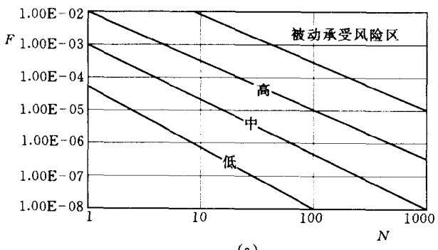

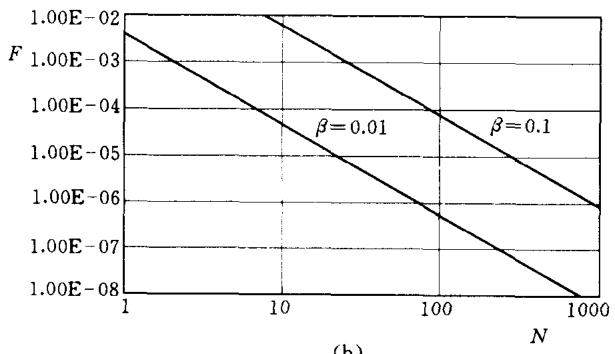

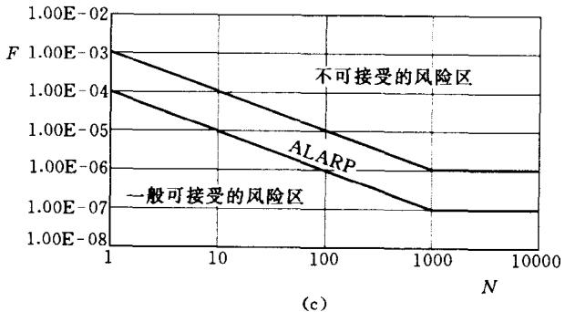  
图 10.3 一些国家对大坝允许风险的规定  
（a）南非；（b）荷兰：（c）澳大利亚，N为失效个体的数量

(a)  
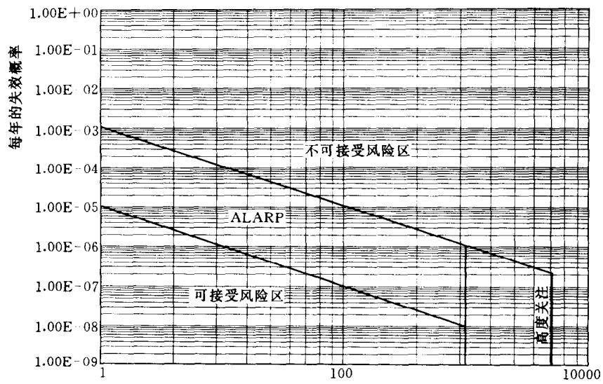

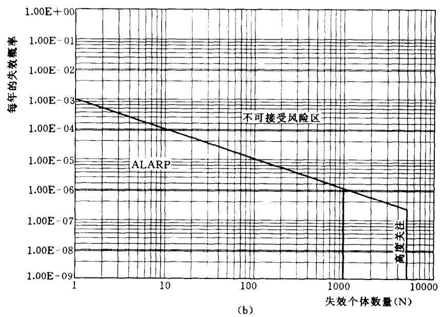  
图 10.4 香港政府对边坡允许风险的规定  
(a) 二层次评价方法；(b) 三层次评价方法

表10.5 澳大利亚岩土力学学会建议的以年计的允许风险
<table><tr><td>情况</td><td>人群属性</td><td>建议的允许风险</td></tr><tr><td>已建边坡</td><td>处于高危地区的人群 一般人群</td><td> $1 \bar { 0 } ^ { 4 }$   $1 0 ^ { - 5 }$ </td></tr><tr><td>新建边坡</td><td>处于高危地区的人群 一般人群</td><td> $1 \bar { 0 } ^ { 5 }$   $1 0 ^ { - 6 }$ </td></tr></table>

## 2. 允许可靠度指标

在进行定量风险分析时，通常可以得到功能函数的可靠度指标 $\dot { \bar { \nu } } \beta$ (详见10.2节)。

假设功能函数为正态分布，则β可以和失效概率 $P _ { f }$ 建立相关的关系，如表10.6所示。我国可靠度设计规范对各种建筑物的允许可靠度指标作出了规定。

表 10.6 可靠度指标β和失效概率 $P _ { f }$ 的关系
<table><tr><td>失效概率  $\cdot P _ { f }$  0.5</td><td>0.25</td><td>0.1</td><td>0.05</td><td>0.01</td><td>0.001</td><td>0.0001</td><td>0.00001</td></tr><tr><td>可靠度指标  $\lvert \beta$  0</td><td>0.67</td><td>1.28</td><td>1.65</td><td>2.33</td><td>3.1</td><td>3.72</td><td>4.25</td></tr></table>

我国水利水电工程结构可靠度设计统一标准规定，持久状态结构的允许β值按表10.7所示。表中第一类破坏指非突发性破坏，破坏前能见到明显征兆，破坏过程缓慢；第二类破坏指突发性破坏，破坏前无明显征兆，结构一旦发生事故难于补救或修复。规范同时规定了建筑物的设计基准期，这样，允许可靠度指标也可以与以年计的允许风险建立关系。

表10.7 水工规范规定的持久结构承载能力允许可靠度设计指标β
<table><tr><td>结构安全级别</td><td>Ⅰ级</td><td>Ⅱ级</td><td>III级</td></tr><tr><td>一类破坏</td><td>3.7</td><td>3.2</td><td>2.7</td></tr><tr><td>二类破坏</td><td>4.2</td><td>3.7</td><td>3.2</td></tr></table>

依据表10.7，I级大坝发生坝坡失稳那样的二类破坏，允许β值为4.2。从表10.6可查 $_ { ; \beta }$ 得相应的风险为 $3 . 1 \times 1 0 ^ { - 5 }$ ，按规范规定该大坝设计基准期为100年，如果大坝本身的寿命为500年则以年计的失效概率为 $6 . 2 { \times } 1 0 ^ { - 6 }$ 。将表10.5中的数值和这一数值相比，可知我国一级大坝的允许风险率比澳大利亚新建边坡处于高危地区相当。

## 10.1.6 小结

风险分析和风险管理是近几年来在边坡和大坝工程领域兴起的一门新兴学科分支，它的适用性和可操作性还有待于在实践中进一步验证。上面几节着重描述了滑坡风险分析的一些基本概念，简要介绍了边坡风险分析实践的两种方法。在以下各节，将暂时离开这一带有战略意义的课题，转入一个对边坡稳定分析参数不确定因素进行定量分析的领域。这一领域相对来说，更易于用近代可靠度分析理论进行定量分析，同时，这也是整个边坡体系所包含的不确定因素中十分重要的一个方面。自然，这只是一个带有战术意义的课题，也就是说，获得了由于影响安全系数的诸多参数（强度指标、孔隙水压力等）的变异特征导致的风险率，并不意味着就获得了整个边坡体系的风险性。同时还要研究由于管理和分析模型方面带来的风险，最终按式(10.1)确定整个体系的风险。

## 10.2 可靠度分析基础

## 10.2.1 引言

为了对可靠度分析的内容和意义有一个简明的了解，首先来看Duncan(2000)教授在著作中举的一个例子。该例子是对一个挡土墙抗滑稳定安全系数进行可靠度分析，见图10.5。

对于图10.5所示挡土墙，计算其抗滑稳定安全系数的公式如下：

$$
F _ { s s } = \frac { ( W _ { 1 } + W _ { 2 } ) \tan \delta } { E }\tag{10.6}
$$

式中：W1，W2分别为墙和底板上回填土的重量；δ为墙壁和砂之间的摩擦角；E为墙踵以 $W _ { 1 }$ ${ \cal { W } } _ { 2 }$

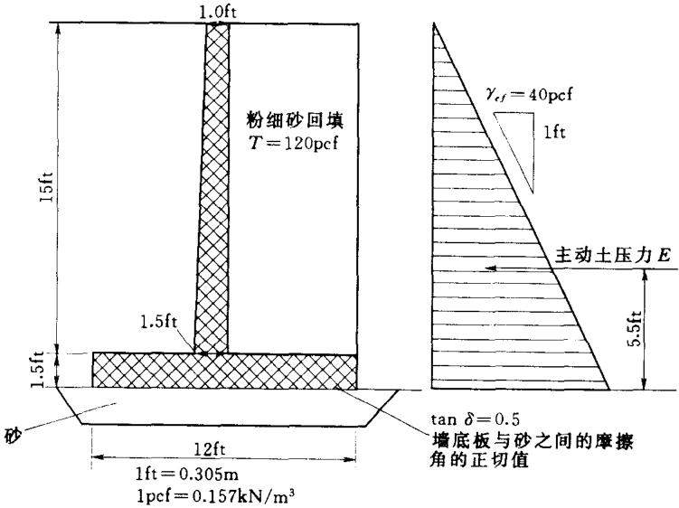

(a)  
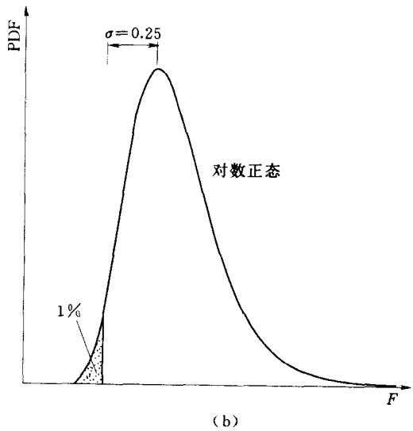  
图 10.5 挡土墙抗滑稳定可靠度分析示例(Duncan, 2000)(a) 计算简图；(b) 失效概率

上的土压力。引入等效液体容重 $\gamma _ { e f } = \gamma \tan ^ { 2 } ( 4 5 ^ { \circ } - \frac { \phi ^ { \prime } } { 2 } )$ ，则土压力计算公式为

$$
E = \frac { 1 } { 2 } \gamma _ { e f } H ^ { 2 }\tag{10.7}
$$

Duncan使用表10.8这样一个简单的分析步骤计算安全系数的标准差和变异系数。本例中F的均值为1.50。这个值被称为最大似然的安全系数Fmuy。在了解γef，δ和γf的均值 $F _ { M L V ^ { \ast } }$ $\gamma _ { e f }$ $\vert \gamma _ { b f }$ 和标准差的情况下，可以进行表10.8所示的一系列计算，最后获得安全系数F的变异系数$V _ { F }$ 为17%。根据F的均值和变异系数，在假定安全系数按对数正态分布的条件下，查阅表10.9，可得知安全系数的失效概率PF为1%。 $P _ { F }$

表 10.8 挡土墙的 Taylor 级数展开法可靠度分析
<table><tr><td>变量</td><td>分析指标</td><td>数值</td><td>安全系数</td><td> $\pmb { \varDelta F }$ </td></tr><tr><td>等效液体容重  $\gamma _ { e f }$ </td><td>最大似然值  $+ \sigma$  最小似然值  $\multimap$ </td><td> $4 5 \mathrm { \ p c f }$  35 pcf</td><td> $F ^ { + } = 1 . 3 3$   ${ \cal F } ^ {  { - } } = 1 . 7 1$ </td><td>-0.38</td></tr><tr><td> $\tan \delta$ </td><td>最大似然值  $\multimap$  最小似然值  $\multimap$ </td><td>0.55 pcf 0.45 pcf</td><td> ${ F ^ { + } } ~ = ~ 1 . 6 5$   $\underline { { F ^ { - } } } ~ = ~ 1 . 3 5$ </td><td>0.30</td></tr><tr><td>回填料容重  $\gamma _ { b f }$ </td><td>最大似然值  $\multimap$  最小似然值  $\multimap$ </td><td>127 pcf 113 pcf</td><td> $F ^ { + } ~ = ~ 1 . 5 6$   $\underline { { F ^ { - } } } = 1 . 4 4$ </td><td>0.12</td></tr><tr><td>混凝土容重  $\gamma _ { \mathrm { c } }$ </td><td>最大似然值  $\multimap$  最小似然值  $\mathbf { - } \pmb { \sigma }$ </td><td>152 pcf 148 pcf</td><td> $F ^ { + } ~ = ~ 1 . 5 0$   ${ \cal F } ^ { - } ~ = ~ 1 . 4 9$ </td><td>0.01</td></tr></table>

注 1 安全系数的标准差 $: \mathbb { O } _ { f } = [ ( 0 . 3 8 / 2 ) 2 + ( 0 . 3 0 / 2 ) 2 + ( 0 . 1 2 / 2 ) 2 ] 1 / 2 = 0 . 2 5 ;$  
2 1pcf =0.157 kN/m³;  
3 安全系数的变异系数 $V _ { F } =$ 标准差/均值 $= 0 . 2 5 / 1 . 5 0 = 1 7 \%$  
\* 保留原有的英制单位，1英 $\mathtt { F } = 0 . 3 0 5 \mathrm { m } ,$ 1 磅=4.448N。

观察这一分析步骤，可以发现，在确定性模型分析中只须通过安全系数来评价边坡的安全度，而可靠度分析则在计算安全系数均值的同时，还要计算安全系数的标准差或变异系数，在假定安全系数符合一定概率模型的前提下，得到结构失稳（即F<1）概率。这一计算是建立在对影响安全系数的各个因子的均值和标准差的定量分析基础上的。

可靠度分析的好处是对影响安全系数的每个影响因子均根据各自包含的不确定性予以适当考虑。例如，如果认为这一挡土结构不能满足对安全度的要求，需要采用一定的加固措施，设采用加筋土或排水这两种措施都能使安全系数提高到1.8，那么传统的确定性模型认为这两种措施的作用是同等的；但是引入可靠度分析后，就会发现采用加筋土这样的机械措施，其保证率是很大的，因为它可以从增大安全系数的均值和减少安全系数的变异系数两个方面增加结构的安全度，而排水涉及到多种不确定因素，可靠性较差，两者的变异系数有很大的差别。因此，使用可靠度方法来评价这两种措施，不会得出其对提高挡土墙的抗滑稳定性作用是同等的这样一个结论。在边坡治理时，尽管布置了排水措施，人们往往仍不大放心，对重要的工程，还要增设一些诸如抗滑桩，锚索那样的措施，这种心理状态可以用可靠度概念作出理论解释。在施加抗滑桩和锚索时经常发现，这些加固措施在提高边坡的安全系数的绝对值方面起的作用不是很大的，即便提高5%，也要付出极大的代价。

：热使和杀赞
<table><tr><td rowspan="2">F</td><td colspan="11"></td></tr><tr><td>2</td><td>4</td><td>6</td><td>8</td><td>10</td><td>12</td><td>14</td><td>VF 16</td><td>20</td><td>25</td><td>30</td><td>40</td><td>50</td><td>60</td><td>80</td></tr><tr><td>1.05</td><td>0.8</td><td>12</td><td>22</td><td>28</td><td>33</td><td>36</td><td>39</td><td>41</td><td>44</td><td>47</td><td>49</td><td>53</td><td>55</td><td>58</td><td>61</td></tr><tr><td>1.10</td><td>1.0E-4</td><td>0.9</td><td>6</td><td>12</td><td>18</td><td>23</td><td>27</td><td>30</td><td>35</td><td>40</td><td>43</td><td>48</td><td>51</td><td>54</td><td>59</td></tr><tr><td>1.15</td><td>3.1E-10</td><td>0.03</td><td>0.7</td><td>4</td><td>9</td><td>13</td><td>18</td><td>21</td><td>27</td><td>33</td><td>37</td><td>43</td><td>48</td><td>51</td><td>56</td></tr><tr><td>1.16</td><td>1.9E-11</td><td>0.01</td><td>0.3</td><td>3</td><td>8</td><td>12</td><td>16</td><td>20</td><td>26</td><td>32</td><td>36</td><td>42</td><td>47</td><td>50</td><td>56</td></tr><tr><td>1.18</td><td>6.9E-14</td><td>1.9E-3</td><td>0.13</td><td>2</td><td>5</td><td>9</td><td>13</td><td>17</td><td>23</td><td>29</td><td>34</td><td>41</td><td>45</td><td>49</td><td>55</td></tr><tr><td>1.20</td><td>2.4E-16</td><td>2.9E-4</td><td>0.01</td><td>1.2</td><td>4</td><td>7</td><td>11</td><td>14</td><td>21</td><td>27</td><td>32</td><td>39</td><td>44</td><td>48</td><td>54</td></tr><tr><td>1.25</td><td>3.4E-22</td><td>1.5E-6</td><td>1.1E-2</td><td>0.3</td><td>1.4</td><td>4</td><td>6</td><td>9</td><td>15</td><td>22</td><td>27</td><td>35</td><td>41</td><td>45</td><td>51</td></tr><tr><td>1.30</td><td>1.8E-27</td><td>4.8E-9</td><td>7.0E-4</td><td>0.06</td><td>0.50</td><td>1.6</td><td>3</td><td>6</td><td>11</td><td>17</td><td>23</td><td>31</td><td>37</td><td>42</td><td>49</td></tr><tr><td>1.35</td><td>3.6E-32</td><td>1.2E-11</td><td>3.4E-5</td><td>0.01</td><td>0.20</td><td>0.7</td><td>1.9</td><td>4</td><td>8</td><td>14</td><td>19</td><td>28</td><td>34</td><td>40</td><td>47</td></tr><tr><td>1.40</td><td>2.6E-36</td><td>2.9E-14</td><td>1.3E-6</td><td>1.5E-3</td><td>0.04</td><td>0.3</td><td>1.0</td><td>2</td><td>5</td><td>11</td><td>16</td><td>25</td><td>32</td><td>37</td><td>45</td></tr><tr><td>1.50</td><td>2.8E-43</td><td>2.8E-19</td><td>1.5E-9</td><td>2.5E-5</td><td>3.0E-3</td><td>0.04</td><td>0.2</td><td>0.7</td><td>3</td><td>6</td><td>11</td><td>19</td><td>27</td><td>32</td><td>41</td></tr><tr><td>1.60</td><td>0.00</td><td>8.0E-24</td><td>1.4E-12</td><td>3.1E-7</td><td>1.6E-4</td><td>0.01</td><td>0.05</td><td>0.2</td><td>1.1</td><td>4</td><td>7</td><td>15</td><td>22</td><td>28</td><td>38</td></tr><tr><td>1.70</td><td>0.00</td><td>7.6E-28</td><td>1.7E-15</td><td>3.3E-9</td><td>7.4E-6</td><td>6.1E-4</td><td>0.01</td><td>0.06</td><td>0.5</td><td>2</td><td>5</td><td>12</td><td>19</td><td>25</td><td>34</td></tr><tr><td>1.80</td><td>0.00</td><td>2.1E-31</td><td>2.8E-18</td><td>3.5E-11</td><td>3.1E-7</td><td>6.2E-5</td><td>1.7E-3</td><td>0.01</td><td>0.2</td><td>1.2</td><td>3</td><td>9</td><td>16</td><td>22</td><td>31</td></tr><tr><td>1.90</td><td>0.00</td><td>1.4E-34</td><td>7.1E-21</td><td>4.1E-13</td><td>1.2E-8</td><td>6.0E-6</td><td>2.9E-4</td><td>3.8E-3</td><td>0.08</td><td>0.65</td><td>2</td><td>7</td><td>13</td><td>19</td><td>29</td></tr><tr><td>2.00</td><td>0.00</td><td>2.1E-37</td><td>2.9E-23</td><td>5.7E-15</td><td>5.2E-10</td><td>5.7E-7</td><td>4.8E-5</td><td>9.8E-4</td><td>0.03</td><td>0.36</td><td>1.3</td><td>5</td><td>11</td><td>17</td><td>26</td></tr><tr><td>2.20</td><td>0.00</td><td>3.2E-42</td><td>1.6E-27</td><td>1.9E-18</td><td>1.4E-12</td><td>5.1E-9</td><td>1.3E-6</td><td>5.5E-5</td><td>0.01</td><td>0.10</td><td>0.56</td><td>1.3</td><td>8</td><td>13</td><td>22</td></tr><tr><td>2.40</td><td>0.00</td><td>0.00</td><td>3.7E-31</td><td>1.5E-21</td><td>3.1E-15</td><td>5.1E-11</td><td>3.5E-8</td><td>3.1E-6</td><td>7.8E-4</td><td>0.03</td><td>0.23</td><td>1.9</td><td>5</td><td>10</td><td>19</td></tr><tr><td>2.60</td><td>0.00</td><td>0.00</td><td>2.7E-34</td><td>2.5E-24</td><td>1.4E-17</td><td>6.4E-13</td><td>1.0E-9</td><td>1.9E-7</td><td>1.2E-4</td><td>0.01</td><td>0.09</td><td>1.1</td><td>4</td><td>7</td><td>16</td></tr><tr><td>2.80</td><td>0.00</td><td>0.00</td><td>5.0E-37</td><td>8.2E-27</td><td>1.0E-19</td><td>1.0E-14</td><td>3.5E-11</td><td>1.2E-8</td><td>1.8E-5</td><td>0.00</td><td>0.04</td><td>0.66</td><td>3</td><td>6</td><td>13</td></tr><tr><td>3.00</td><td>0.00</td><td>0.00</td><td>1.9E-39</td><td>5.0E-29</td><td>1.1E-21</td><td>2.1E-16</td><td>1.4E-12</td><td>8.0E-10</td><td>2.8E-6</td><td>0.00</td><td>0.02</td><td>0.39</td><td>1.8</td><td>4</td><td>11</td></tr><tr><td colspan="14">注 （1）VF为安全系数的变异系数；（2）F为均值安全系数；（3）PF为结构失效概率，以%计，表中“3.7E-31”理解为(3.7×1031)%；（4）安全系数为对数正态分布</td></tr></table>

但这些措施可大幅度地增大可靠度指标，减少边坡失效的风险。因此，如果采用风险分析，那么这些机械加固措施的作用或许可以得到更加合理的评价。

本节介绍的计算安全系数的变异系数和失效概率的方法是一种简化的处理，当问题是非线性时，还需要更加符合实际的数学模型和分析方法。本章以下各节就是讨论这一可靠度分析理论的数值分析方法。

## 10.2.2 可靠度分析的基本原理

## 1. 边坡的失效概率

广义地讲，对任何一个结构的安全性分析包括了研究其“资源(Supply)”和“需要(Demand)”之间的关系。如果分别以X和Y来代表这两个因素，那么，当X>Y时，结构处于安全状态；当 $X { < } Y$ 时，则结构处于失稳状态。这一关系可用式(10.8)表示，当 $\pmb { X } = \pmb { Y }$ 时，该方程称为极限状态方程。所有处于极限状态的自变量组合构成了该问题的状态边界面。

$$
M = X - Y = 0\tag{10.8}
$$

对于一均质边坡，作用于滑体上的抗力和作用力分别可用X和Y来表示。由于边坡材料参数和作用荷载的不确定性，X和Y可以假设为随机变量，其相应的概率密度函数分布形式如图10.6所示。当抗力X小于作用力Y时，边坡就会破坏或者失效。边坡失效的可能性（或者概率） $P _ { F }$ 可用X和Y的概率密度函数 $f _ { X } \left( X \right)$ 和 $f _ { \gamma } ( Y )$ 相重叠部分来代表。

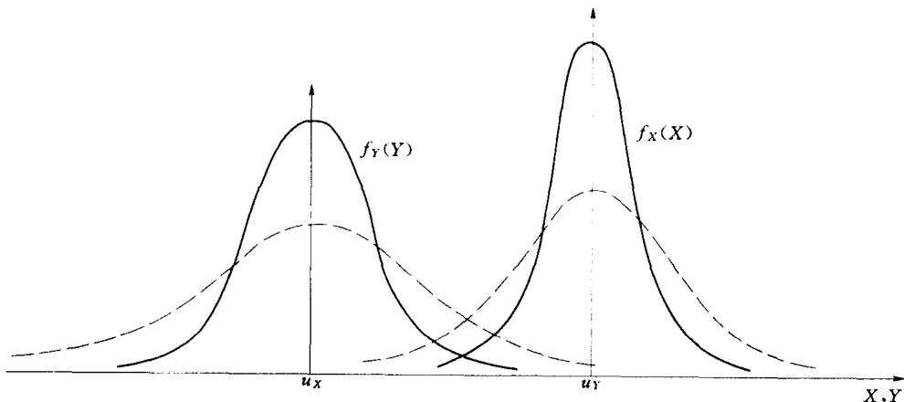  
图 10.6 抗力 X 和作用力 Y的概率密度函数

从图10.6可以看出，失效概率PF通常取决于以下两个方面： $P _ { F }$

(1) X 和 Y 概率密度分布函数的相对位置。 $f _ { X } \left( X \right) \setminus \ f _ { Y } \left( Y \right)$ 位置越远，重叠越少，失效概率P越小，反之则失效概率PF越大。两者相对位置通常用X，Y的均值的比值 $P _ { F }$ $P _ { F }$ $\mathbf { \mathcal { \mu } } _ { \mathbf { \mathcal { A } } } / \mu _ { Y }$ （也就是安全系数）或者安全裕度 $( \mu _ { X } { - } \mu _ { Y } )$ 来衡量。

(2) X 和 Y 概率密度函数的分散度。 $f _ { X } ( X )$ 和 $f _ { Y } ( Y )$ 分布越分散，重叠越多，失效概率$P _ { F }$ 越大（图10.6中虚线代表的曲线）。 $f _ { X } ( X )$ 和 $f _ { Y } ( Y )$ 的分散度，通常用X和的Y标准差$\sigma _ { X }$ 和 $\sigma _ { Y }$ 来描述。

简而言之，失效概率与 $\mu _ { X } , \mu _ { Y } , \sigma _ { X }$ 和 $\pmb { \sigma } _ { Y }$ 有关，即

$$
P _ { F } \propto f ( \mu _ { X } / \mu _ { Y } , \sigma _ { X } , \sigma _ { Y } )
$$

## 2. 可靠度指标的定义及其几何解释

为表述方便，假设X，Y服从 $N ( \mu _ { X } , \sigma _ { X } ) , ~ N ( \mu _ { Y } , \sigma _ { Y } )$ 的正态分布，且统计上相互独立。则极限状态方程 $M = X - Y$ 的概率密度分布函数同样服从 $N ( \mu _ { M } , \sigma _ { M } )$ 的正态分布，其中

$$
\mu _ { M } = \mu _ { X } - \mu _ { Y }\tag{10.9}
$$

$$
\sigma _ { M } ^ { 2 } = \sigma _ { X } ^ { 2 } + \sigma _ { Y } ^ { 2 }\tag{10.10}
$$

对于一个服从正态分布 $N ( \mu _ { M } , \sigma _ { M } )$ 的状态方程，研究的目标是确定 $M { < } 0$ 的概率，即图10.6所示的重叠区的面积。显然有

$$
P _ { F } > P ( M = X - Y < 0 ) = \int _ { - \infty } ^ { 0 } N ( M ) d M\tag{10.11}
$$

不难证明，这一积分可以唯一地表达为 $\frac { \mu _ { M } } { \sigma _ { M } }$ 的函数，即

$$
P _ { F } = P ( M = X - Y < 0 ) = 1 - \Phi ( \frac { \mu _ { M } } { \sigma _ { M } } )\tag{10.12}
$$

可靠性理论称该数值为可靠度指标，用β表示，即

$$
\beta = \frac { \mu _ { M } } { \sigma _ { M } }\tag{10.13}
$$

有了可靠度指标后，即可通过表10.6确定结构的失效概率。为进一步阐述可靠度指标β的几何意义，引入标准化变量：

$$
X ^ { \prime } = \frac { X - \mu _ { X } } { \sigma _ { X } }\tag{10.14}
$$

$$
Y ^ { ' } = \frac { Y - \mu _ { Y } } { \sigma _ { Y } }\tag{10.15}
$$

把式(10.14)和式(10.15)代入极限状态方程，即式(10.8)得

$$
M = \sigma _ { X } X ^ { \prime } - \sigma _ { Y } Y ^ { \prime } + \mu _ { X } - \mu _ { Y }\tag{10.16}
$$

在图10.7所示的标准化变量空间中，安全状态和失效状态被状态边界面 $M = 0$ 分开。从图中所示的几何关系可知

$$
a = \frac { \mu _ { X } - \mu _ { Y } } { \sigma _ { X } }\tag{10.17}
$$

$$
b = \frac { \mu _ { X } - \mu _ { Y } } { \sigma _ { Y } }\tag{10.18}
$$

$$
c = \frac { \mu _ { X } - \mu _ { Y } } { \sigma _ { X } \sigma _ { Y } } \sqrt { \sigma _ { X } ^ { 2 } + \sigma _ { Y } ^ { 2 } }\tag{10.19}
$$

因此边坡系统的安全程度或可靠度可用原点到极限状态线的最短距离d来衡量。根据

几何知识可知

$$
d = \left| { \frac { a b } { c } } \right| = { \frac { \mu _ { X } - \mu _ { Y } } { { \sqrt { \sigma _ { X } ^ { 2 } + \sigma _ { Y } ^ { 2 } } } } } = { \frac { \mu _ { M } } { \sigma _ { M } } } = \beta\tag{10.20}
$$

通过式(10.20)以及可靠度指标β的定义可以看出，β可以用标准化变量空间中原点到极限状态线的最短距离来衡量。

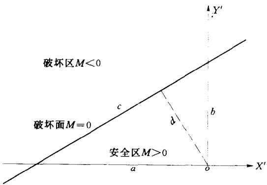  
图 10.7 标准化变量空间上的极限状态面

在上述讨论中，状态方程被假定为具有两个相互独立，但仍服从正态分布的随机变量的线性函数。当线性安全度方程所包含的随机变量的个数增加，同样服从正态分布且相互独立时，可靠度指标β的计算可直接由式(10.20)从二维推广到多维。而当随机变量不服从正态分布，或者相互关联时，可以通过某种方式把相应的随机变量转化为服从正态分布且相互独立，从而求得可靠度指标β(Ang and Tang, 1984)。上面对线性安全度方程（功能函数）可靠度指标的求解思路将为求解广泛存在于边坡问题中的非线性功能函数的可靠度指标提供了坚实的基础。

## 3. 功能函数的定义及其讨论

(1) 功能函数的定义。结构可靠度通常是指在一段时间内、一定荷载条件作用下完成预定功能或系统运行正常的一种度量。在可靠度分析中，通常定义功能函数为

$$
g ( X ) = g ( x _ { 1 } , x _ { 2 } , \cdots , x _ { n } )\tag{10.21}
$$

式中： $\pmb { X } = ( x _ { 1 } , x _ { 2 } , \cdots , x _ { n } )$ 为一向量； ${ \mathfrak { x } } _ { i } ( i { = } 1 , 2 , . . . , n )$ 为影响边坡系统可靠度的n个变量。

g(X)反映了结构的运行性能或者状态。当 ${ g } ( { \pmb X } ) { \ > } 0$ 时，边坡系统处于安全状态；当$g ( X ) { < } 0$ 时，结构处于“破坏”或“失效”状态；而 $g ( \pmb { X } ) = 0$ 表示系统达到极限运行状态。通常 $g ( \pmb { X } ) = \pmb { 0 }$ 称为结构的极限状态方程。

如果功能函数中随机变量 $x _ { i } ( i { = } 1 , 2 , . . . , n )$ 的联合概率密度函数为 $f _ { x _ { 1 } , \cdots , x _ { n } } ( x _ { 1 } , x _ { 2 } , \cdots , x _ { n } )$ 则结构处于安全状态 $\textstyle { \big ( } g ( \mathbf { \boldsymbol { X } } ) > 0 { \big ) }$ 的概率为

$$
P _ { s } = \int _ { g ( X ) > 0 } \cdots \int f _ { x _ { 1 } , x _ { 2 } , \cdots , x _ { n } } ( x _ { 1 } , x _ { 2 } , \cdots , x _ { n } ) d x _ { 1 } d x _ { 2 } \cdots d x _ { n }\tag{10.22}
$$

同样处于破坏状态( $g ( \pmb { X } ) < 0 )$ 的失效概率 $P _ { F }$ 可以表示为

$$
P _ { F } = \int _ { g ( X ) < 0 } \cdots \int f _ { x _ { 1 } , x _ { 2 } , \cdots , x _ { n } } ( x _ { 1 } , x _ { 2 } , \cdots , x _ { n } ) d x _ { 1 } d x _ { 2 } \cdots d x _ { n }\tag{10.23}
$$

由式(10.22)和式(10.23)可见，无论是 $P _ { s }$ 还是 $P _ { F }$ 都可以通过数值积分的方法得到。当功能函数 $g ( X )$ 是线性，所包含的随机变量相互独立且服从正态分布时，可以用10.2.2节中介绍的方法计算可靠度指标 $\ B ,$ 及相应的失效概率 $P _ { F }$

在随机变量的联合概率函数不易得到，或者功能函数 $g ( X )$ 是非线性时，可以用下面将要介绍的一次二阶矩法(FOSM)、蒙特卡洛法(Monte Carlo Method)和 Rosenbleuth 法来计算边坡问题的可靠度指标 $\lvert \beta ,$ 及相应的失效概率 $P _ { F ^ { \prime } }$

作为向可靠度分析过渡的一个措施，在建筑和水电行业的一些规范中，规定了分项系数极限状态设计的原则。此时，分别将式(10.8)中的“资源”和“需求”用抗力R和作用S来代表，并根据结构的重要性和参数的变异特性，加入了分项系数。例如，重力坝设计规范中的公式为

$$
\gamma _ { 0 } \psi S ( \gamma _ { G } G _ { K } , \gamma _ { Q } Q _ { K } , \alpha _ { K } ) \leq \frac { 1 } { \gamma _ { d 1 } } R ( \frac { f _ { k } } { \gamma _ { m } } , \alpha _ { K } )\tag{10.24}
$$

式中各项公式意义可参见规范原文。

(2) 边坡稳定分析中的功能函数。在边坡稳定领域进行可靠度分析时，发现在第2 章和第3章介绍的各种计算安全系数的方法都无法变成式(10.8)或式(10.24)的形式。在稳定分析中，某些物理量，如材料的重量，既可以视为作用，但也是产生抗力（摩擦力）的主要因素。因此，在将已有边坡稳定分析和可靠度分析接轨的过程中，需要作适当的处理。下面是现有文献中可以看到的两种作法。

(a) 在已有的安全系数基础上定义功能函数。将极限状态改为(Li and Lumb, 1987;Lowe, et. Al. 1998)如下两式，即

$$
F ( x _ { 1 } , x _ { 2 } , \cdots , x _ { n } ) - 1 = 0\tag{10.25}
$$

$$
\ln F ( x _ { 1 } , x _ { 2 } , \cdots , x _ { n } ) = 0\tag{10.26}
$$

式(10.25)和式(10.26)中安全系数F为随机变量 $x _ { i } ( i = 1 , 2 , \cdots , n )$ 的函数。Li 和 Lumb(1987)指出，可以有各种不同的方法定义边坡稳定分析的功能函数。F是通过不同的方法获得的 $\pmb { F }$ 安全系数，如简化毕肖普法、Spencer 法、Morgenstern-Price方法等。

相应的可靠度指标定义(Chowdhurg, 1984; Tabba, 1984; Fell. et. al, 1988)为

$$
\beta = \frac { \mu _ { { } _ { F } } - 1 } { \sigma _ { { } _ { F } } }\tag{10.27}
$$

式中： $\mu _ { F }$ 和 $\sigma _ { F }$ 为安全系数F的均值和标准差。

使用这一处理方案，第2 章和第3章介绍的计算安全系数的各种方法均不需要作任何改动即可进行可靠度分析。

(b)“套改”方案。这一方案要求将现有的有关结构和稳定分析的方法按式(10.24)予以改造。一些文献中曾将第3章介绍的瑞典法和毕肖普法中分子和分母两项改为相减的形式（陈祖煜、张广文，1994）。在重力坝设计规范中，出现了一个从未见诸于文献的适应于式(10.24)的双折线滑面深层抗滑稳定分析公式。水工建筑物抗震规范没有改造现有的毕肖普法，其“条文说明”在论述土石坝和静力法边坡稳定分析时，提供了按毕肖普法计算获得的安全系数和结构系数 $\textcircled { \gamma _ { d } }$ 相关联的表。但是这张表是出现在“条文说明”中，一般并无法律约束性。这一以安全系数为基础的方法出现在该规范中，仍然是有条件的。以上种种作法的一个共同特点是有意无意地阻止在规范正文和附录中出现“安全系数”这四个字。可靠度和分项系数极限状态分析方法是作为传统的安全系数的对立面提出的。因此，与安全系数相关的各种分析方法也必须推倒重来。

笔者曾著文讨论了按式(10.24)强行修改稳定分析的传统方法存在的种种问题（陈祖煜、张广文，1994；陈祖煜、陈立宏，2002)。文中指出，现行的有关安全系数定义和相应的处理方法是几十年来人们在长期实践中积累而形成被普遍接受的作法。在边坡稳定分析中的一些因素，如重力，地震惯性力，它们既是作用又是抗力，很难将其分开。同时，如式(10.24)那样带有量纲的比较方案难以在参数敏感性和优化设计中应用。一个边坡的“抗力比作用大10万吨”这样的结论不会给人们关于其安全度有多大的定量概念，而“安全系数为 $1 . 5 ^ { \prime \prime }$ 这一命题所描述的安全度却是一个客观性指标，可以作为衡量所有边坡稳定性的依据。

上述作法(b)反映了有关人员对边坡稳定分析领域中关于“安全系数”概念的误解。近代岩土力学对安全系数定义已经不是早期那个概括了诸多不确定因素的“大老K”了。安 $K ^ { \prime \prime }$ 全系数F是这样一个数值，它使设计参数中的强度指标c和f缩减为 c/F和f/F，从而使结 $c / F$ $f / F _ { : }$ 构达到极限平衡状态。

其实，上述作法(a)在西方有关边坡稳定可靠度分析中文献中，早已成为普遍接受、广泛采用的方案。10.2.1节介绍的挡土墙抗滑稳定的内容便是一例子。在这个例子中，可以发现，传统的挡土墙稳定分析方法一点都不需要修改，安全系数还是照算。在这篇论文的结论中，Duncan写道：“失效概率不能看成安全系数的替代品，而是一种补充。同时计算安全系数和失效概率比单独计算任何一个更好。虽然我们还不能准确地计算安全系数和失效概率，但是两者互补可以大大提高成果的精度。”

20世纪 90年代初期，美国科学院下属的美国国家科学研究委员会(National ResearchCouncil，1995)组成了一个从事可靠度和传统方法的专家人数相同的的班子，对可靠度方法在岩土工程中的应用和存在问题进行全面的研究。此班子名为“岩土工程减灾可靠度方法研究委员会”。研究班子由这两个领域的著名专家 Wilson Tang 和 Duncan 领导。1995 年，该委员会提出了“岩土工程中的可靠度方法”的研究报告(National Research Council, 1995)，这个报告的结论的第一段内容如下：“对于可靠度方法在岩土工程中作用的问题，委员会的主要发现是：可靠度方法，如果不是把它作为现有传统方法的替代物的话，确实可以为分析岩土工程中包含的不确定性提供系统的、定量的途径。在工程设计和决策中，用这一方法来定量地驾驭和分析这些不确实因素尤为有效。”

另外还注意到，这一研究报告对安全系数和可靠度分析之间的关系写下以下一段文字：

“有时，用抗力/作用这样的简单的表达式来定义安全系数不一定有明确的概念。例如，在边坡稳定分析中，位于坡趾的土的重量可以作为一个抵抗土体主要部分的滑动力矩的平衡力量。这一贡献既不是附加的抗力也不是减少的作用力。由于对这些贡献的处理方法不同，用前述的简化方法计算可靠度指标时会出现一些反常现象。为了解决这一问题，在岩土工程系统中，可以引入对安全系数具有一般意义的定义。安全系数可以表达为以下一个广义的功能函数：

$$
F = g ( x _ { 1 } , x _ { 2 } , \cdots x _ { m } )
$$

式中： $x _ { i }$ 为结构自变量。

事实上，这一公式具有更为一般的意义，因为，抗力通常是土的特性和几何特性的函数，而作用力同样又是这样一些变量，加上其它一些变量。”

综上所述，作者认为，在建筑物抗滑稳定和滑坡分析中，已经有了一套成熟的建立在安全系数基础上的可靠度分析方法。因此，进入可靠度和风险分析领域，无需引入式(10.24)这样一个过程。

## 10.3 蒙特卡洛法 (Monte Carlo Method)

## 10.3.1 基本原理

蒙特卡洛法，又称统计试验法或随机抽样技巧法。它适用于随机变量的概率密度分布形式已知或符合假定的情况，在目前可靠度计算中，是一种相对精确的方法。随着计算机技术的不断发展，蒙特卡洛法在工程中的应用将越来越广。

蒙特卡洛法是从概率的角度出发来求解失效概率的，首先对影响可靠度的随机变量进行大量随机抽样，然后将这些抽样值逐个代入功能函数，累计功能函数值小于零的个数，由此确定失效频率。根据定义，某事件的概率可以用大量试验中该事件发生的频率来估算，因此如果抽样次数达到一定值时，得到的失效频率将逼近可靠度分析的失效概率。但是应用蒙特卡洛法，抽样随机性的可靠性和样本数目的大小都是影响该失效概率精度的主要因素。

## 10.3.2 随机抽样过程

## 1. 随机数的产生方法

抽样的随机性是通过产生随机数的方法来完成。这通常要分两步进行：首先产生在开区间(0,1)上的均匀分布随机数；然后在此基础上变换成给定分布的随机数。

产生随机数的方法一般是利用随机数表、物理方法和数学方法。其中，数学方法以其速度快、计算简单和可重复性等优点而被人们广泛地使用。随着对随机数的不断研究和改进，人们已提出了各种数学方法，例如取中法、加同余法、乘同余法、混合同余法和组合同余法。上述方法中，乘同余法更具有统计性质优良、周期长等特点。下面简要介绍一下该方法的计算过程。

(1)选择适当的参数。将参数a、b、c和初始值x0代入公式 $x _ { \theta }$

$$
x _ { i + 1 } = ( a x _ { i } + b ) ( \mathbf { m o d } c )\tag{10.28}
$$

式中：x、a、b、c均为正整数。

式(10.28)表示以c为模数的同余式，即 $( a x _ { i } { + } b )$ 除以c后得到的余数，记为 $x _ { i + 1 }$ 0

(2) 对 $x _ { i + 1 }$ 进行换算。将 $x _ { i + 1 }$ 除以 $^ c$ 后，即可得标准化的随机数 $u _ { i + 1 }$ ，即

$$
u _ { i + 1 } = x _ { i + 1 } / c\tag{10.29}
$$

将 $x _ { i + 1 }$ 作为初值，重复步骤(1)和(2)，得到随机数序列 $\{ u \}$

目前可靠度计算中，一般常用正态分布和对数正态分布。因此，下面着重介绍这二种分布函数随机数的产生。

(3)正态分布的处理。由于这种分布应用极广，因此，对于这种变量的模拟，已发展了很多方法。其中坐标变换法产生随机数的速度较快、精度较高。

设随机数 $\pmb { u } _ { i }$ 和 $u _ { i + I }$ 是(0,1)区间中的两个均匀随机数，则可用下列变换得到标准正态分布 $N ( 0 , 1 )$ 的两个随机数 $x _ { i } ^ { * }$ 和 $x _ { i + 1 } ^ { * }$

$$
\begin{array} { r } { x _ { i } ^ { * } = ( - 2 \ln u _ { i } ) ^ { 1 / 2 } \cos ( 2 \pi u _ { i + 1 } ) \Biggr \} } \\ { x _ { i + 1 } ^ { * } = ( - 2 \ln u _ { i } ) ^ { 1 / 2 } \sin ( 2 \pi u _ { i + 1 } ) \Biggr ) } \end{array}\tag{10.30}
$$

如果随机变量X服从一般正态分布 $N ( m _ { x } , \sigma _ { x } )$ ，则其随机数 $x _ { i }$ 和 $x _ { i + l }$ 算式变成

$$
\left. \begin{array} { c } { { x _ { i } = x _ { i } ^ { * } \sigma _ { x } + m _ { x } } } \\ { { x _ { i + 1 } = x _ { i + 1 } ^ { * } \sigma _ { x } + m _ { x } } } \end{array} \right\}\tag{10.31}
$$

式(10.31)中随机数成对产生，它们不仅是互相独立的，而且服从一般正态分布。

(4)对数正态分布的处理。对数正态分布变量的随机数可以由正态分布随机数转化而来。假设随机变量X服从对数正态分布，则随机变量 $Y = \ln X$ 服从正态分布。Y的标准差和变异系数可以由X的标准差和变异系数求得（参见10.6.3节），然后根据上面介绍的方法求得 Y的随机数y，则 X的随机数为 $\pmb { x } _ { i } { = } \mathbf { e x p } ( y _ { i } )$ o

(5) 样本数目的大小。抽样样本数目N的大小是影响失效概率计算精度的重要因素。Bennet 和Ang(1983)建议用 95%的置信度以保证用蒙特卡罗法解题的允许误差ε。

$$
\varepsilon = [ 2 ( 1 - P _ { F } ) / ( N \cdot P _ { F } ) ] ^ { 1 / 2 }\tag{10.32}
$$

由式(10.32)可见，样本数目N越大，误差ε越小。因此，要达到一定的精度，N必须取得足够大。为简便起见，建议

$$
N \geq 1 0 0 / P _ { F }\tag{10.33}
$$

式中： $P _ { F }$ 为预先估计的失效概率。

由于PF一般是一个很小的数，这就要求计算次数很多。例如工程结构的失效概率一般 $P _ { F }$ 在0.1%以下，因此，要求计算次数达十万次以上，这对计算方法就提出了新的要求。为此目前正在研究如何在计算次数不太多的情况下得到满足精度要求的P值的方法。 $P _ { F }$

## 2. 解释 Monte Carlo 法的算例

[例10.1] 均匀土坡算例。

首先讨论一个具有固定圆弧滑裂面的均质土坡的例子，参见 11.4 节中 ACADS 例题

1(a)。该边坡及圆弧滑裂面的几何尺寸如图10.8所示。

在可靠度分析中，滑坡体材料的强度参数粘聚力c和摩擦系数f=tanφ按随机变量来处理，并假定 $c , f$ 统计上相互独立且分别服从 $N ( \mu _ { c } , \pmb { \sigma } _ { c } )$ 和 $N ( \mu _ { \beta } , \sigma _ { f } )$ 的正态分布，其中 $\mu _ { c } { = } 3 . 0 \mathrm { k P a }$ $\mu _ { f } = 0 . 3 5 6$ $\pmb { \sigma } _ { c } { = } 0 . 3 \mathbf { k P a }$ $\sigma _ { f } = 0 . 0 3$ 。另外，滑坡体材料容重 $\dot { \boldsymbol { \gamma } } = 2 0 . 0 \mathrm { k N } / \mathrm { m } ^ { 3 }$

对 c 和 $f$ 进行500次模拟，所得安全系数的直方图如图10.9示。根据此直方图，获得安全系数的均值和标准差分别为1.106和0.084， $\beta = 1 . 2 5 6$ o

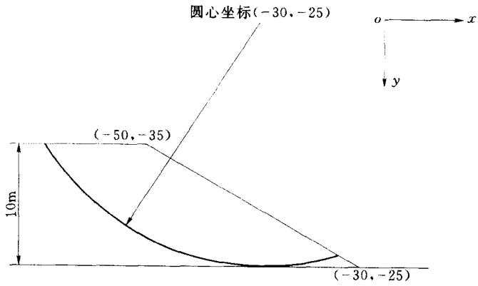  
图 10.8 均匀土坡计算实例几何尺寸

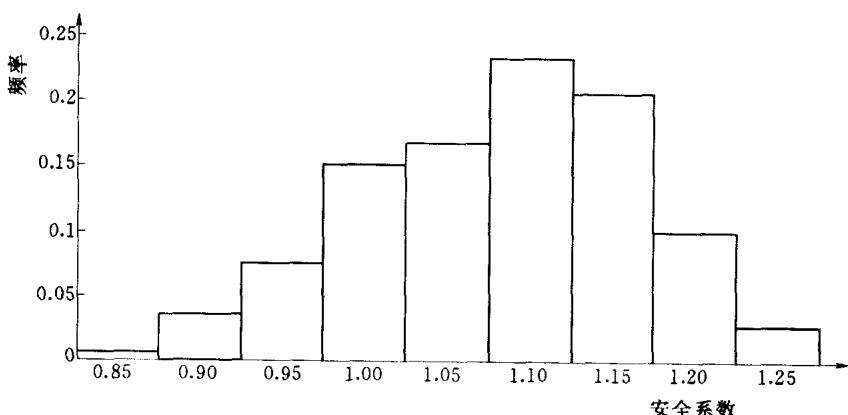  
图 10.9 均匀土坡计算结果直方图（Monte Carlo 法）

## 10.4 一次二阶矩法

## 10.4.1 基本原理

通常情况下，由于边坡系统存在着大量的不确定性因素，包含在功能函数中的随机变量的概率分布形式很难确定。随机变量的一阶矩（均值）和二阶矩（方差）比较容易获得。一次二阶矩法(FOSM)就是在这种背景下提出的。此法只根据随机变量均值和标准差的数学模型去求解可靠度。

该方法将功能函数 $g ( X ) = g ( x _ { 1 } , x _ { 2 } , \cdots , x _ { n } )$ 在某点 $\pmb { X } ^ { * } = ( x _ { 1 } ^ { * } , x _ { 2 } ^ { * } , \cdots , x _ { n } ^ { * } )$ 用 Taylor 级数展开，使之线性化，然后计算功能函数在点 $\pmb { X } ^ { * } = ( x _ { 1 } ^ { * } , x _ { 2 } ^ { * } , \cdots , x _ { n } ^ { * } )$ 的均值和标准差，然后求解可靠度，因此称为一次二阶矩法。

首先我们来研究随机变量相互独立的情况。

对于一组相互独立的随机变量 $x _ { i } ( i = 1 , 2 , \cdots , n )$ ，引入标准变量 $z _ { i }$

$$
z _ { i } = \frac { x _ { i } - \mu _ { x _ { i } } } { \sigma _ { x _ { i } } }\tag{10.34}
$$

式中： $\mu _ { x _ { i } }$ $\pmb { \sigma } _ { x _ { i } }$ 分别为 $x _ { i }$ 的均值和标准差。

把功能函数 $g ( X ) = g ( x _ { 1 } , x _ { 2 } , \cdots , x _ { n } )$ 在某点 $\pmb { X } ^ { \ast } = ( x _ { 1 } ^ { \ast } , x _ { 2 } ^ { \ast } , \cdots , x _ { n } ^ { \ast } )$ 用 Taylor 级数展开，得

$$
g ( \boldsymbol { X } ) = g ( x _ { 1 } ^ { * } , x _ { 2 } ^ { * } , \cdots , x _ { n } ^ { * } ) + \sum _ { i = 1 } ^ { n } ( x _ { i } - x _ { i } ^ { * } ) \frac { \partial g } { \partial x _ { i } } \vert _ { \boldsymbol { X } ^ { * } } + \sum _ { i = 1 } ^ { n } \frac { ( x _ { i } - x _ { i } ^ { * } ) ^ { 2 } } { 2 } \frac { \partial ^ { 2 } g } { \partial x _ { i } ^ { 2 } } \vert _ { \boldsymbol { X } ^ { * } } + \cdots\tag{10.35}
$$

略去二阶小量得

$$
g ( X ) = g ( x _ { 1 } ^ { * } , x _ { 2 } ^ { * } , \cdots , x _ { n } ^ { * } ) + \sum _ { i = 1 } ^ { n } ( x _ { i } - x _ { i } ^ { * } ) \frac { \partial g } { \partial x _ { i } } \vert _ { X ^ { * } }\tag{10.36}
$$

式中： $\frac { \partial g } { \partial x _ { i } } \vert _ { x ^ { \ast } }$ 为 $g ( X ) = g ( x _ { 1 } , x _ { 2 } , \cdots , x _ { n } )$ 在点 $\pmb { X } ^ { \ast } = ( x _ { 1 } , x _ { 2 } , \cdots , x _ { n } )$ 对 $x _ { i }$ 一阶偏导数值。

注意到 $\pmb { X } ^ { \bullet } = ( x _ { 1 } , x _ { 2 } , \cdots , x _ { n } )$ 为破坏面或者极限状态函数上的一点，因此

$$
g ( x _ { 1 } ^ { * } , x _ { 2 } ^ { * } , \cdots , x _ { n } ^ { * } ) = 0\tag{10.37}
$$

把式(10.37) 代入(10.36)中得

$$
g ( \pmb { X } ) = \sum _ { i = 1 } ^ { n } ( x _ { i } - x _ { i } ^ { * } ) \frac { \partial g } { \partial x _ { i } } \mathbb { 1 } _ { \pmb { X } ^ { * } }\tag{10.38}
$$

在结构可靠度分析中，对功能函数g往往采用线性化后的式(10.38)，而不直接用原来 $\pmb { g }$ 的公式，原因是线性化后的 $_ { g }$ ，无论求解均值或方差都容易得多。

由式(10.34)得

$$
x _ { i } = z _ { i } \pmb { \sigma } _ { x _ { i } } + \pmb { \mu } _ { x _ { i } }\tag{10.39}
$$

同样

$$
\frac { \partial g } { \partial x _ { i } } = \frac { \partial g } { \partial z _ { i } } \frac { \partial z _ { i } } { \partial x _ { i } } = \frac { 1 } { \sigma _ { x _ { i } } } \frac { \partial g } { \partial z _ { i } }\tag{10.40}
$$

如果随机变量 $x _ { i } ( i = 1 , 2 , \cdots , n )$ 的均值 $\mu _ { x , \cdot } ( i = 1 , 2 , \cdots , n )$ 和方差 $\sigma _ { x _ { i } } ( i = 1 , 2 , \cdots , n )$ 已知且服从正态分布，把式(10.39)和式(10.40)代入式(10.38)得

$$
g ( \pmb { X } ) = \sum _ { i = 1 } ^ { n } ( z _ { i } - z _ { i } ^ { * } ) \frac { \partial g } { \partial z _ { i } } \vert _ { z ^ { * } }\tag{10.41}
$$

$g ( X )$ 的均值为

$$
\mu _ { g } = - \sum _ { i = 1 } ^ { n } z _ { i } ^ { * } \frac { \partial g } { \partial z _ { i } } \vert _ { z ^ { * } }\tag{10.42}
$$

$g ( X )$ 的标准差 $\sigma _ { g }$ 为

$$
\sigma _ { g } = \sqrt { \sum _ { i = 1 } ^ { n } ( \frac { \partial g } { \partial z _ { i } } \mathfrak { l } _ { z ^ { \star } } ) ^ { 2 } }\tag{10.43}
$$

由此可见，可靠度指标 $_ { ; \beta }$ 为

$$
\beta = \frac { \mu _ { g } } { \sigma _ { g } } = - \frac { \displaystyle \sum _ { i = 1 } ^ { n } z _ { i } ^ { * } \frac { \partial g } { \partial z _ { i } } | _ { \pmb { z } ^ { * } } } { \sqrt { \displaystyle \sum _ { i = 1 } ^ { n } ( \frac { \partial g } { \partial z _ { i } } | _ { \pmb { z } ^ { * } } ) ^ { 2 } } }\tag{10.44}
$$

定义

$$
\pmb { Z } ^ { * } = ( z _ { 1 } ^ { * } , z _ { 2 } ^ { * } , \cdots , z _ { n } ^ { * } ) ^ { T }\tag{10.45}
$$

$$
\textbf { \em G } ^ { * } = ( \frac { \partial g } { \partial z _ { I } } \vert _ { z _ { i } ^ { * } } , \frac { \partial g } { \partial z _ { 2 } } \vert _ { z _ { i } ^ { * } } , \cdots , \frac { \partial g } { \partial z _ { n } } \vert _ { z _ { n } ^ { * } } ) ^ { T }\tag{10.46}
$$

则式(10.44)可表示为

$$
\beta = \frac { - \pmb { G } ^ { * T } \pmb { Z } ^ { * } } { ( \pmb { G } ^ { * T } \pmb { G } ^ { * } ) ^ { 1 / 2 } }\tag{10.47}
$$

对式(10.47)进行向量变换后得

$$
{ \pmb z } ^ { * } = \frac { - { \pmb G } ^ { * } { \pmb \beta } } { ( { \pmb G } ^ { * T } { \pmb G } ^ { * } ) ^ { 1 / 2 } }\tag{10.48}
$$

由式(10.48)可知， $\pmb { Z } ^ { * } = ( z _ { 1 } ^ { * } , z _ { 2 } ^ { * } , \cdots , z _ { n } ^ { * } ) ^ { T }$ 的各个分量可以表示为

$$
z _ { i } ^ { * } = - \alpha _ { i } ^ { * } \beta \quad ( i = 1 , 2 , \cdots , n )\tag{10.49}
$$

其中

$$
\alpha _ { i } ^ { * } = \frac { \displaystyle \frac { \partial g } { \partial z _ { i } } \boldsymbol { \mathsf { I } } _ { \boldsymbol { z } } . } { \displaystyle \sum _ { i = 1 } ^ { n } ( \frac { \partial g } { \partial z _ { i } } \boldsymbol { \mathsf { I } } _ { \boldsymbol { z } ^ { * } } ) ^ { 2 } }\tag{10.50}
$$

式中： $\pmb { \alpha } _ { i } ^ { * }$ 为在 Z 空间中破坏面在点 $\pmb { Z } ^ { * } = ( z _ { 1 } ^ { * } , z _ { 2 } ^ { * } , \cdots , z _ { n } ^ { * } ) ^ { T }$ 处的方向导数。

同样在Z空间中，功能函数可以表示为

$$
g ( Z ) = 0\tag{10.51}
$$

综上所述，计算可靠度指标β的步骤可具体化为寻找在状态边界面式(10.51)上的一个点

Z，该点满足式(10.48)和式(10.49)，而该两式中包含的 $| \beta \rangle$ 是通过式(10.44)确定的。

由前述可知，在标准变量空间中，可靠度指标β同时也是可能破坏点 ${ \pmb z } ^ { * }$ 到原点的最大距离，所以上述结论也可以通过下述条件极值问题求得，即

在 $g = 0$ 的条件下求 $d = { \sqrt { z _ { 1 } ^ { 2 } + z _ { 2 } ^ { 2 } + \cdots + z _ { n } ^ { 2 } } }$ 的最小值。

## 10.4.2 随机变量统计相关情况

可靠度分析中，对随机变量 $z _ { i } ( i = 1 , 2 , \cdots , n )$ 是统计相关情况。通常把这些变量转换为一组统计上相互独立的标准化变量 $y _ { i } ( i = 1 , 2 , \cdots , n )$ ，它们之间的相关系数以协方差矩阵表示为

$$
\begin{array} { r } { c _ { \pmb { Z } } = \left[ \begin{array} { c c c c } { 1 } & { \rho _ { 1 2 } } & { \cdots } & { \rho _ { 1 n } } \\ { \rho _ { 2 1 } } & { 1 } & { \cdots } & { \rho _ { 2 n } } \\ { . } & { . } & { . . . } & { . } \\ { \rho _ { n 1 } } & { \rho _ { n 2 } } & { . . . } & { 1 } \end{array} \right] } \end{array}\tag{10.52}
$$

通过这一处理，不相关变量 $\pmb { Y } = ( y _ { 1 } , y _ { 2 } , \cdots y _ { n } ) ^ { T }$ 可以通过正交变换得到，其公式为

$$
{ \pmb { Y } } = { \pmb { T } } ^ { T } { \pmb { Z } }\tag{10.53}
$$

式中： $\pmb { T }$ 为正交矩阵。

正交矩阵 $\pmb { T }$ 的列向量为矩阵 $c _ { z }$ 的特征矢量，具体表述为

$$
\pmb { T } ^ { T } \pmb { C _ { Z } } \pmb { T } = \lambda = \left[ \begin{array} { c c c c } { \lambda _ { 1 } } & { 0 } & { \cdots } & { 0 } \\ { 0 } & { \lambda _ { 2 } } & { \cdots } & { 0 } \\ { . } & { . } & { \cdots } & { . } \\ { 0 } & { 0 } & { \cdots } & { \lambda _ { n } } \end{array} \right]\tag{10.54}
$$

式中： $\lambda _ { i } ( i = 1 , 2 , \cdots , n )$ 为矩阵 $c _ { z }$ 的特征值。

另外通过正交变换得到的相互独立的变量 $\pmb { Y } = ( y _ { 1 } , y _ { 2 } , \cdots y _ { n } ) ^ { T }$ 的协方差矩阵为

$$
\begin{array} { r } { C _ { Y } = E ( Y Y ^ { T } ) = E ( T ^ { T } Z Z ^ { T } T ) } \\ { = T ^ { T } E ( Z Z ^ { T } ) T = T ^ { T } C _ { z } T } \\ { = \lambda } \end{array}\tag{10.55}
$$

通过式(10.53)的正交变换，计算含有统计相关随机变量功能函数的可靠度指标β变为

$$
\beta = \frac { - ( \pmb { G } ^ { * } ) _ { z ^ { * } } ^ { T } \pmb { Z } ^ { * } } { \left[ ( \pmb { G } ^ { * } ) _ { z ^ { * } } ^ { T } \pmb { C } _ { Z } ( \pmb { G } ^ { * } ) _ { z ^ { * } } \right] ^ { 1 / 2 } }\tag{10.56}
$$

其中

$$
( \pmb { G } ^ { * } ) _ { \pmb { z } ^ { * } } = ( \frac { \partial g } { \partial z _ { 1 } } | _ { \pmb { z } ^ { * } } , \frac { \partial g } { \partial z _ { 2 } } | _ { \pmb { z } ^ { * } } , \cdots , \frac { \partial g } { \partial z _ { n } } | _ { \pmb { z } ^ { * } } ) ^ { T }\tag{10.57}
$$

注意式(10.53)，则 $( \pmb { G } ^ { * } ) _ { _ { Y ^ { * } } } = ( \frac { \partial \pmb { g } } { \partial y _ { _ { I } } } | _ { _ { Y } } . , \frac { \partial \pmb { g } } { \partial y _ { _ { 2 } } } | _ { _ { Y } } . , . . . , \frac { \partial \pmb { g } } { \partial y _ { _ { n } } } | _ { _ { Y } } . ) ^ { T }$ 可通过计算求得，计算公式为

$$
( \boldsymbol { G } ^ { * } ) _ { \boldsymbol { Z } ^ { * } } = T ( \boldsymbol { G } ^ { * } ) _ { \boldsymbol { Y } ^ { * } }\tag{10.58}
$$

把式(10.53)和式(10.58)代入式(10.56)，并注意到T为正交矩阵；有 ${ \pmb T } ^ { T } { \pmb T } = { \pmb I }$ ，可得

$$
\beta = \frac { - ( G ^ { * T } ) _ { \gamma ^ { * } } T ^ { T } T Y ^ { * } } { [ ( G ^ { * T } ) _ { \gamma ^ { * } } T ^ { T } C _ { Z } T ( G ^ { * } ) _ { \gamma ^ { * } } ] ^ { 1 / 2 } } = \frac { - ( G ^ { * T } ) _ { \gamma ^ { * } } Y ^ { * } } { [ ( G ^ { * T } ) _ { \gamma ^ { * } } \lambda ( G ^ { * } ) _ { \gamma ^ { * } } ] ^ { 1 / 2 } }\tag{10.59}
$$

由式(10.59)可得到破坏面上破坏点 $\pmb { Y } ^ { \ast } = ( y _ { 1 } , y _ { 2 } , \cdots , y _ { n } )$ ，其值为

$$
\pmb { Y } ^ { * } = \frac { - \lambda ( \pmb { G } ^ { * } ) _ { Y ^ { * } } \beta } { [ ( \pmb { G } ^ { * T } ) _ { Y ^ { * } } \lambda ( \pmb { G } ^ { * } ) _ { Y ^ { * } } ] ^ { 1 / 2 } }\tag{10.60}
$$

由式(10.60)可知， $\boldsymbol { Y } ^ { * } = ( y _ { 1 } , y _ { 2 } , \cdots , y _ { n } )$ 的各个分量为

$$
{ y _ { i } ^ { * } } = \alpha _ { i Y } ^ { * } \sqrt { \lambda _ { i } } \beta\tag{10.61}
$$

其中

$$
\alpha _ { i Y } ^ { * } = \frac { \sqrt { \lambda _ { i } } ( \frac { \partial g } { \partial y _ { i } } | _ { Y ^ { * } } ) } { \sqrt { \displaystyle \sum _ { i = 1 } ^ { n } \lambda _ { i } ( \frac { \partial g } { \partial y _ { i } } | _ { Y ^ { * } } ) ^ { 2 } } }\tag{10.62}
$$

式中： $\pmb { \alpha } _ { i Y } ^ { * }$ 为Y空间中破坏面在点 $\pmb { Y } ^ { \ast } = ( y _ { 1 } , y _ { 2 } , \cdots , y _ { n } )$ 处的方向导数沿 $y _ { i }$ 轴的分量。

另外，在Y空间功能函数变为

$$
g ( \pmb { Y } ) = 0\tag{10.63}
$$

## 10.4.3 数值分析方法

根据以上论述，可靠度分析计算中的一次二阶矩法可用数值分析的方法得到，其具体算法表述如下(Ang and Tang, 1984):

(1) 定义 $g ( \pmb { X } ) = g ( x _ { 1 } , x _ { 2 } , \cdots , x _ { n } )$ 。假定初始的破坏点 $x _ { i } ^ { * } ( i = 1 , 2 , \cdots , n )$ ，由式(10.34)计算折减变量 $z _ { i } ^ { * } ( i = 1 , 2 , \cdots , n )$ ，如果随机变量 $x _ { i } ^ { * } ( i = 1 , 2 , \cdots , n )$ 统计相关，由式(10.53)得到不相关的随机变量 $y _ { i } ^ { * } ( i = 1 , 2 , \cdots , n )$ o

(2) 计算点 $z _ { i } ^ { * } ( i = 1 , 2 , \cdots , n )$ 处的 $\frac { \partial g } { \partial z _ { i } } \vert _ { z } .$ 及 $\alpha _ { i } ^ { * }$ 值，如果随机变量 $x _ { i } ^ { * } ( i = 1 , 2 , \cdots , n )$ 统计相关，则需计算 $y _ { i } ^ { * } ( i = 1 , 2 , \cdots , n )$ 处的 $\frac { \partial g } { \partial y _ { i } } \mathfrak { l } _ { \pmb { Y } } .$ 及 $\alpha _ { i Y } ^ { * }$ 值。

(3) 由式(10.49)得到 $z _ { i } ^ { * } ( i = 1 , 2 , \cdots , n )$ 或者由式(10.61)得到 $y _ { i } ^ { * } ( i = 1 , 2 , \cdots , n )$

(4) 将 $z _ { i } ^ { * } ( i = 1 , 2 , \cdots , n )$ 代入式(10.44)或者将 $y _ { i } ^ { * } ( i = 1 , 2 , \cdots , n )$ 代入式(10.59)求解 $B _ { \cdot }$

(5) 用第4 步求得的β值，再通过式(10.49)和式(10.61)分别重新计算 $z _ { i } ^ { * } ( i = 1 , 2 , \cdots , n )$ 或者$y _ { i } ^ { * } ( i = 1 , 2 , \cdots , n )$ 值。

(6) 重复第2 至第5 步直至收敛。

这种算法具有试凑的特点，但并不是总能保证收敛。以边坡稳定性分析为例，如果采用简化的毕肖普法或者 Morgenstern-Price 方法，计算的第一步是要寻找状态边界面上的一组随机变量，即粘聚力、摩擦角和孔压系数的组合，其抗滑稳定安全系数为1.0，这一过程类似边坡工程中的反演分析，本身必须经过一系列迭代。而计算每一个滑面的可靠度指标β， ${ \mathrm { i } } \beta ,$ 则是第二个层次的迭代。如果寻找相应最小可靠度指标β的临界滑裂面，则又需增加第三 $\dot { \varsigma } _ { \beta }$ 层次的迭代。为了改进上述常规算法安全系数的收敛性问题以及提高一次二阶矩法的实用性，作者结合边坡稳定分析的具体情况，提出一个改进的算法，在10.4.4节中详细介绍。

## 10.4.4 改进FOSM方法

## 1. 基本原理及计算步骤

对于随机变量 $x _ { i } ^ { * } ( i = 1 , 2 , \cdots , n )$ 在统计上是彼此相关的还是相互独立的，改进方法的表述在概念上是一致的，为表述清楚，我们假定随机变量已按10.4.2节变成统计独立的情况。

实际在常规算法第(1)步中，初始值 $y _ { i } ^ { * } ( i = 1 , 2 , \cdots , n )$ 使得功能函数 $g ( \pmb { Y } )$ 有一非零的 $^ { d }$ 值。

$$
g ( Y ) = g ( y _ { 1 } ^ { * } , y _ { 2 } ^ { * } , \cdots , y _ { n } ^ { * } ) = d\tag{10.64}
$$

对于下一次迭代Δy，改进FOSM方法认为 ${ \boldsymbol { \varDelta y } } _ { i } ^ { * }$ ${ y } _ { i } ^ { * } + \varDelta { y } _ { i } ^ { * }$ 将位于破坏面上，即

$$
g ( y _ { 1 } ^ { * } + \Delta y _ { 1 } ^ { * } , y _ { 2 } ^ { * } + \Delta y _ { 2 } ^ { * } , \cdots , y _ { n } ^ { * } + \Delta y _ { n } ^ { * } ) = 0\tag{10.65}
$$

将式(10.65)左边在点 $y _ { i } ^ { * } ( i = 1 , 2 , \cdots , n )$ 展成Taylor 级数，并忽略∆y二阶以上高阶小量得 $\boldsymbol { \varDelta y } _ { i } ^ { * }$

$$
g ( y _ { 1 } ^ { * } , y _ { 2 } ^ { * } , \cdots , y _ { n } ^ { * } ) + \sum _ { i = 1 } ^ { n } \frac { \partial g } { \partial y _ { i } } \vert _ { Y ^ { * } } \ \Delta y _ { i } ^ { * } = 0\tag{10.66}
$$

将式(10.66)减去式(10.64)得到

$$
\sum _ { i = 1 } ^ { n } { \frac { \partial g } { \partial y _ { i } } } { \mid } _ { Y ^ { * } } \Delta y _ { i } ^ { * } = - d\tag{10.67}
$$

由式(10.61)可得

$$
\Delta y _ { i } ^ { * } = - y _ { i } ^ { * } - ( \alpha _ { i Y } ^ { * } + \Delta \alpha _ { i Y } ^ { * } ) \sqrt { \lambda _ { i } } \left( \beta + \Delta \beta \right) ( i = 1 , 2 , \cdots , n )\tag{10.68}
$$

在式(10.68)中忽略 $\Delta \alpha _ { i y } ^ { * }$ 后得到

$$
\Delta y _ { i } ^ { * } = - y _ { i } ^ { * } - \alpha _ { i Y } ^ { * } \sqrt { \lambda _ { i } } \left( \beta + \Delta \beta \right) \ \left( i = 1 , 2 , \cdots , n \right)\tag{10.69}
$$

将(10.69)式代入(10.67)式中，得到 $\Delta \beta \mathrm { : }$

$$
\Delta \beta = \frac { d - \displaystyle \sum _ { i = 1 } ^ { n } [ ( \alpha _ { i Y } ^ { * } \sqrt { \lambda _ { i } } \beta + y _ { i } ^ { * } ) \frac { \partial g } { \partial y _ { i } } \vert _ { Y ^ { * } } ] } { \displaystyle \sum _ { i = 1 } ^ { n } [ \alpha _ { i Y } ^ { * } \sqrt { \lambda _ { i } } \frac { \partial g } { \partial y _ { i } } \vert _ { Y ^ { * } } ] }\tag{10.70}
$$

根据以上公式推导，改进FOSM方法具体包含以下步骤：

(1) 定义 $g ( X ) = g ( x _ { 1 } , x _ { 2 } , \cdots , x _ { n } )$ ，假定初始的破坏点 $x _ { i } ^ { * } ( i = 1 , 2 , \cdots , n )$ ，由式(10.34)计算折减变量 $z _ { i } ^ { * } ( i = 1 , 2 , \cdots , n )$ ，如果随机变量 $x _ { i } ^ { * } ( i = 1 , 2 , \cdots , n )$ 统计相关，由式(10.53)得到不相关的随机变量 $y _ { i } ^ { * } ( i = 1 , 2 , \cdots , n )$ ，并确定β值的初始迭代值。

(2) 将 $y _ { i } ^ { * } ( i = 1 , 2 , \cdots , n )$ 代入(10.64)得到 $d _ { \circ }$

(3) 计算点 $z _ { i } ^ { * } ( i = 1 , 2 , \cdots , n )$ 处的 $\frac { \partial g } { \partial z _ { i } } \vert _ { z } .$ 及 $\boldsymbol { \alpha _ { i } ^ { * } }$ 值，如果随机变量 $x _ { i } ^ { * } ( i = I , 2 , \cdots , n )$ 统计相关，则需计算 $y _ { i } ^ { * } ( i = 1 , 2 , \cdots , n )$ 处的 $\frac { \partial g } { \partial y _ { i } } \vert _ { _ { Y } } .$ 及 $\pmb { \alpha } _ { i Y } ^ { * }$ 值。

(4) 由式(10.70)得到 $\Delta \beta ,$ 把 $\beta { + } \Delta \beta$ 作为β的下一次迭代值。

(5) 利用第 4 步求得的β值，再通过式(10.49)和式(10.61)分别重新计算 $z _ { i } ^ { * } ( i = 1 , 2 , \cdots , n )$ 或者 $y _ { i } ^ { * } ( i = 1 , 2 , \cdots , n )$ 值，作为下步迭代的初始值。

(6) 重复第2 步到第5 步直到满足以下的收敛准则：

$$
\Delta \beta < \varepsilon _ { \beta }\tag{10.71}
$$

$$
d < \varepsilon _ { d }\tag{10.72}
$$

式中： $\pmb { \varepsilon _ { \beta } }$ 和 $| \varepsilon _ { d }$ 为允许误差。

注意到在上述推导过程中，忽略了式(10.68)中的Δα项，这一简化使问题求解简单， $\Delta \alpha _ { i Y } ^ { * }$ 而且仅仅构成操作误差，不会影响最终收敛结果。

作者在开发边坡稳定可靠度分析程序时对本节介绍的算法进行了实际考核，发现其收敛性极佳，现以下面一个例子来说明。

## 2. 解释改进的 FOMS 法的算例 1

[例10.2] 固定圆弧滑裂面算例。

该算例为一具有固定圆弧滑裂面土坡的例子，参见 11.4 节中 ACADS 例题 1(c)。该边坡共包含3层土层。边坡剖面如图10.10所示。

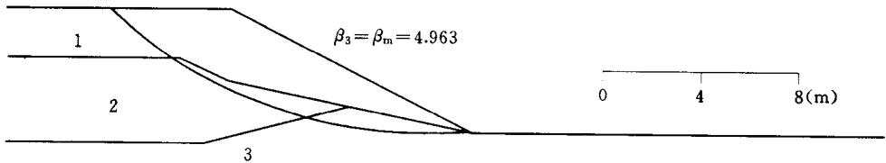  
图 10.10 解释 FOMS 法计算过程算例

在可靠度分析中，将第一层土的粘聚力c作为确定性变量，摩擦系数f(或内摩擦角φ)作为随机变量，而第二、三层土的c和f全部作为随机变量，且第二、三层土的c和f统计相关。各土层材料的物理、强度参数以及随机变量的有关参数详见表10.10。

表10.10 随机变量和材料的物理参数表（[例10.2]）
<table><tr><td rowspan="2">土层编号</td><td colspan="2">粘聚力c(kPa)</td><td colspan="2">摩擦系  $x f = \tan \phi$ </td><td rowspan="2">相关系数</td><td rowspan="2">容重  $\mathbf { \chi } _ { \mathbf { \mathcal { Y } } } ( \mathbf { k N } / \mathbf { m } ^ { 3 } )$ </td></tr><tr><td>均值</td><td>标准差</td><td>均值</td><td>标准差</td></tr><tr><td>1</td><td>0</td><td>0</td><td>0.781</td><td>0.1</td><td>0</td><td>19.5</td></tr><tr><td>2</td><td>5.3</td><td>0.7</td><td>0.424</td><td>0.05</td><td>0.1</td><td>19.5</td></tr><tr><td>3</td><td>7.2</td><td>0.2</td><td>0.364</td><td>0.05</td><td>0.3</td><td>19.5</td></tr></table>

根据表10.10可知，反映相关系数的矩阵为

$$
\boldsymbol { C } _ { \mathbf { Z } } = \left[ \begin{array} { c c c c } { 1 } & { 0 . 1 } & { 0 } & { 0 } \\ { 0 . 1 } & { 1 } & { 0 } & { 0 } \\ { 0 } & { 0 } & { 1 } & { 0 . 3 } \\ { 0 } & { 0 } & { 0 . 3 } & { 1 } \end{array} \right]\tag{10.73}
$$

采用线性代数方法，可得式(10.53)中的T为

$$
\pmb { T } = \left[ \begin{array} { c c c c c } { 0 } & { 0 } & { 1 . 0 } & { 0 } & { 0 } \\ { 0 } & { - 0 . 7 0 7 } & { 0 } & { - 0 . 7 0 7 } & { 0 } \\ { 0 } & { 0 } & { 0 } & { 0 . 7 0 7 } & { 0 } \\ { 0 } & { 0 } & { 0 } & { 0 } & { 0 . 7 0 7 } \\ { 0 } & { 0 } & { 0 } & { 0 } & { 0 . 7 0 7 } \end{array} \right]\tag{10.74}
$$

$c _ { z }$ 的特征值为

$$
( \lambda ) = ( 0 . 8 3 6 , 0 . 9 4 9 , 1 . 0 , 1 . 0 4 9 , 1 . 1 4 0 )\tag{10.75}
$$

这样，相应任意一套自变量向量X的Y向量即可通过式(10.53)求得。在可靠度分析中首先考虑一固定圆弧滑裂面的情况，在利用改进FOSM法分析圆弧滑面的边坡稳定性过程中，随机变量c和 $f = \tan \phi$ 及孔隙水压力系数r的初始迭代值通过下面两个步骤来选取： $r _ { u }$

1) 用 c 和 f的均值求出相应的安全系数 F;

2) 在安全系数 F与1 差值较大情况下，将 $c / F , \ f / F$ 分别作为 $c _ { \star }$ $f$ 的初始迭代值。

经验表明，安全系数F与c和f近似呈线性关系，调整后的初始值给出的F等于1， $c$ $f$ 因此使迭代从破坏面附近开始，最终很快逼近收敛解，其计算迭代过程及结果见表10.11。

作为迭代的第一步，将表10.10所示的各参数的均值输入程序，获得相应的安全系数为1.542。于是，将各土层的f和c除1.542，获得一个处于状态边界面（即F=1）的自变量向量；即表10.11第4列中的参数(0.506,3.437,...,0.236)。相应第一次迭代这一特定迭代步，$\pmb { d } = \pmb { 0 }$ 。相应的Y向量即为表10.11第5列所列值。根据可靠度指标β为原点和状态边界面的 ${ \dot { \bar { \rho } } } .$ 垂直距离的定义，我们得到的第一个β的近似值：

$$
\beta _ { 0 } = \sqrt { y _ { 1 } ^ { 2 } + y _ { 2 } ^ { 2 } + . . . + y _ { n } ^ { 2 } } = 1 3 . 7 9
$$

在该点上的数值列于表10.11第7列。这样，就有条件通过(10.62)确定αr值。通过式 $\pmb { \alpha } _ { i Y }$ (10.70)确定∆β，其值为-8.786。因此，经过第一次迭代后，获得了一个新的β，即 $\Delta \beta ,$ $\beta ,$

$$
\beta _ { 1 } = 1 3 . 7 8 - 8 . 7 8 6 = 5 . 0 0 3
$$

表10.11 采用改进FOSM法计算过程及计算结果（[例10.2]）
<table><tr><td>迭代土层 次数编号</td><td></td><td>随机 变量X</td><td>Y</td><td> $\partial g / \partial y$ </td><td> $\Delta y$ </td><td> $\beta$ </td><td> $\Delta \beta$ </td><td> $^ { d }$ </td></tr><tr><td rowspan="4">1</td><td>1</td><td>f 0.506</td><td>7.138</td><td>4.399</td><td>-8.563</td><td rowspan="4"> $\beta _ { \mathcal { O } } = 1 3 . 7 9$ </td><td rowspan="4">-8.786</td><td rowspan="4"> $d _ { \sigma } { = } 0 . 0 0 0$ </td></tr><tr><td>2</td><td>c 3.437</td><td>-0.221</td><td>4.895</td><td>-1.817</td></tr><tr><td></td><td>f 0.275</td><td>-2.744</td><td>1.775</td><td>1.924</td></tr><tr><td>3</td><td>C 4.669</td><td>-3.985</td><td>6.492</td><td>0.682</td></tr><tr><td rowspan="5">2</td><td></td><td>f</td><td>0.236</td><td>-10.758 4.992</td><td>7.757</td><td rowspan="5"> $\beta _ { l } { = } 5 . 0 0 3$ </td><td rowspan="5"> $- 4 . 0 2 { \times } 1 0 ^ { - 2 } \quad d _ { I } { = } - 4 . 1 { \times } 1 0 ^ { - 3 }$   $\beta _ { z } { = } 4 . 9 6 3$ </td><td rowspan="5"></td></tr><tr><td>1</td><td>f</td><td>0.699 -1.424</td><td>4.447</td><td>0.023</td></tr><tr><td>2</td><td>c 4.674</td><td>-2.038</td><td>5.068</td><td>-0.015</td></tr><tr><td></td><td>f</td><td>0.235 -0.820</td><td>1.450</td><td>0.167</td></tr><tr><td>3</td><td>c</td><td>6.977 -3.303</td><td>6.701</td><td>-0.015</td></tr><tr><td rowspan="5">3</td><td>1</td><td>f</td><td>0.208</td><td>-3.001</td><td>5.045 0.049</td><td></td><td></td><td></td></tr><tr><td></td><td>f</td><td>0.716</td><td>-1.401</td><td>4.449</td><td> $1 . 5 0 { \times } 1 0 ^ { - 3 }$ </td><td rowspan="4"> $\beta _ { s } = \beta _ { m } = 4 . 9 6 3 \quad - 1 . 7 6 \times 1 0 ^ { 4 } \quad d _ { z } = - 1 . 8 \times 1 0 ^ { 5 }$ </td><td rowspan="4"></td></tr><tr><td>2</td><td>C</td><td>4.674</td><td>-2.053</td><td>5.082</td><td> $- 2 . 4 6 \times 1 0 ^ { - 3 }$ </td></tr><tr><td></td><td>f</td><td>0.234</td><td>-0.065</td><td>1.431</td><td> $\underline { { 9 . 4 8 \times 1 0 ^ { - 3 } } }$ </td></tr><tr><td>3</td><td>c</td><td>6.981</td><td>-3.319</td><td>6.718  $- 3 . 1 9 \times 1 0 ^ { - 3 }$ </td><td></td></tr><tr><td></td><td></td><td>f</td><td>0.210</td><td>-2.952</td><td>5.047</td><td> $\underline { { 3 . 0 8 \times 1 0 ^ { - 3 } } }$ </td><td></td><td></td></tr></table>

现在进入第二次迭代，使用式(10.49)和式(10.61)，获得一套新的自变量，如表10.11第2 次迭代的第4 列，即 $\pmb { Z } = ( 0 . 6 9 9 , \ 4 . 6 7 4 , \ . . . , \ 0 . 2 0 8 ) ^ { T }$ 。使用这一套参数获得的安全系数是0.9958。也就是说，经过第一步迭代更新后的自变量已偏离状态边界面，式(10.64)中的d为 $- 4 . 1 \times 1 0 ^ { - 3 }$ ，重复这一套迭代步骤，第二次迭代获得的 $\Delta \beta = - 4 . 0 2 { \times } 1 0 ^ { - 2 }$ ， $\beta _ { 2 }$ 为 4.963，当迭代进入第3步时，d即收敛到- $- 1 . 8 \times 1 0 ^ { - 5 }$ ，最终获得的β值为4.963。

## 3. 解释 FOMS 法的算例 2

[例 10.3] 用 FOSM 法计算[例 10.1]。

用改进的FOSM法对[例10.1]重新进行计算，对应c、f的均值得到的安全系数为1.107。 $c , f$ 经过二次迭代，该非线性问题即收敛。迭代终止时，Δβ从-0.22变为 $\Delta \beta ,$ $- 2 . 8 1 7 6 3 2 \times 1 0 ^ { - 6 }$ d从4.988 变为 $- 2 . 3 8 \times 1 0 ^ { - 7 }$ ，并且两个∆y都小于 $1 0 ^ { - 5 }$ 。可靠度指标β由1.495 收敛为1.277。

## 10.4.5 Rosenbleuth方法

## 1. 基本原理

上述介绍的可靠度指标计算方法中，Monte Carlo法包含了数目极大的随机采样；FOSM法则需要通过多次迭代求解。因此，这两种方法在实际工程应用中均比较因难。Rosenbleuth于1975年提出通过点估计的方式来计算岩土工程中的可靠度指标β，后来许多学者和研究人员(Chowdhury，1984;Li，1992)都讨论了这一方法在岩土工程问题中的应用。作者在边坡稳定分析领域实际应用此法时发现这一十分简单的计算方法所得到的可靠度指标与前述两个方法惊人地吻合，因此，该方法可成为一种实用的可靠度指标计算方法。

Rosenbleuth法要求在某几个点上估计功能函数的值，根据这些数据即可通过简单的计算公式确定可靠度指标。这些点是根据一定的原则由随机变量的均值以及标准差生成的。

下面以包含三个随机变量的功能函数为例说明Rosenbleuth法的计算过程。

定义功能函数为 $g ( x _ { 1 } , x _ { 2 } , x _ { 3 } )$ ，则它的一、二阶矩阵 $E ( g )$ 和 $E ( g ^ { 2 } )$ 的计算公式为

$$
E ( g ) \approx P _ { + + + } g _ { + + + } + P _ { + + - } g _ { + + - } + P _ { + - + } g _ { + - + } + \cdots\tag{10.76}
$$

$$
E ( g ^ { 2 } ) \approx P _ { + + + } g _ { + + + } ^ { 2 } + P _ { + + - } g _ { + + - } ^ { 2 } + P _ { + - + } g _ { + - + } ^ { 2 } + \cdots\tag{10.77}
$$

式中： $_ { g }$ 为随机变量 $x _ { l } , \ x _ { 2 } , \ x _ { 3 }$ 的目标函数（功能函数）。

式(10.76)和式(10.77)的右边分别包含了8项，g和P的下标及正负号分别定义为 $_ { g }$

$$
{ { g } _ { + + + } } = g ( { { \mu } _ { { { x } _ { 1 } } } } + { { \sigma } _ { { { x } _ { 1 } } } } , { { \mu } _ { { { x } _ { 2 } } } } + { { \sigma } _ { { { x } _ { 2 } } } } , { { \mu } _ { { { x } _ { 3 } } } } + { { \sigma } _ { { { x } _ { 3 } } } } )\tag{10.78}
$$

$$
{ { g } _ { + + - } } = g ( { { \mu } _ { { { x } _ { 1 } } } } + { { \sigma } _ { { { x } _ { 1 } } } } , { { \mu } _ { { { x } _ { 2 } } } } + { { \sigma } _ { { { x } _ { 2 } } } } , { { \mu } _ { { { x } _ { 3 } } } } - { { \sigma } _ { { { x } _ { 3 } } } } )\tag{10.79}
$$

$$
{ { g } _ { + - + } } = g ( { { \mu } _ { { { x } _ { 1 } } } } + { { \sigma } _ { { { x } _ { 1 } } } } , { { \mu } _ { { { x } _ { 2 } } } } - { { \sigma } _ { { { x } _ { 2 } } } } , { { \mu } _ { { { x } _ { 3 } } } } + { { \sigma } _ { { { x } _ { 3 } } } } )\tag{10.80}
$$

$$
P _ { + + + } = ( 1 + \rho _ { 1 2 } + \rho _ { 2 3 } + \rho _ { 3 1 } ) / 8\tag{10.81}
$$

$$
P _ { + + - } = ( 1 + \rho _ { 1 2 } + \rho _ { 2 3 } - \rho _ { 3 1 } ) / 8\tag{10.82}
$$

$$
P _ { + - + } = ( 1 + \rho _ { 1 2 } - \rho _ { 2 3 } + \rho _ { 3 1 } ) / 8\tag{10.83}
$$

式中： $\rho _ { i j }$ 为随机变量 $x _ { i }$ 与 $\boldsymbol { x } _ { j }$ 的相关系数。

根据式(10.76)和式(10.77)，Rosenbleuth 法的可靠度指标β计算公式为

$$
\beta = { \frac { E ( g ) } { \sqrt { E ( g \mathit { \theta } ^ { 2 } ) - E ( g ) ^ { 2 } } } }\tag{10.84}
$$

## 2. 符号集的结构

式(10.76)和式(10.77)中P和g的下标符号集可以从下面矩阵A中获得，即 $\pmb { g }$

$$
A = { \left| \begin{array} { l l l l l l l } { + } & { + } & { + } & { + } & { - } & { - } & { - } \\ { + } & { + } & { - } & { - } & { + } & { + } & { - } \\ { + } & { - } & { + } & { - } & { + } & { - } & { + } \end{array} \right| }\tag{10.85}
$$

矩阵A中第1列代表式(10.76)和式(10.77)中右边第一项的下标符号，如此类推。式(10.76)和式(10.77)右边第n项由列阵A 中第n列来表示。通常矩阵A 是一行接一行地生成，第一行包括两组符号组，第一组称为正号组，有四个“+”号；第二组称为负号组，含有四个“-” $" + "$ 号。第二行含有四组符号组，每组符号数目减少为2，正负符号组交替出现。

一般情况下，在式(10.76)和式(10.77)的右边分别有2"项（其中n为功能函数包含的随机变量的个数)，每一项均含一个g和P值。带“+”号和“-”号下标的g的n个自变量 $" + >$ 分别取值为 $\mu _ { x i } + \mathrm { s i g n } i \cdot \sigma _ { x i } \left( \begin{array} { l } { i = 1 , 2 , \cdots , n } \end{array} \right)$ 。其中signi 代表第i 个自变量所取的符号值。如果 $\pmb { g }$ 的下标中第i个为“+”，则为1；反之，为“-1”。 $^ { 6 6 } + \prime$

带有 $^ { 6 6 } + \prime$ 和“-”的 $P$ 计算公式为

$$
P = \frac { [ 1 . 0 + \xi \sum _ { j = 1 } ^ { n } \mathrm { s i g n } ( j + 1 ) \mathrm { s i g n } ( j ) \rho _ { j , j + 1 } ] } { 2 ^ { n } }\tag{10.86}
$$

式中：当 $j + 1 = n + 1$ 时，j+1被1代替；ξ定义为：当n=2，ξ $\scriptstyle n = 2$ ${ \xi = 0 . 5 }$ 当 $\pmb { n } \neq 2$ ${ \pmb \xi } { = } 1$ 。

一般情况下，对于具有n个变量的功能函数，P和g的下标符号集可用矩阵B表示为

$$
B = \left[ \begin{array} { l l l l l l l l l l l l l l l l l l } { + } & { + } & { \dots } & { + } & { \dots } & { + } & { + } & { \dots } & { + } & { + } & { - } & { - } & { \dots } & { - } & { \dots } & { - } & { - } & { \dots } & { - } & { - } \\ { + } & { + } & { \dots } & { + } & { + } & { \dots } & { - } & { - } & { \dots } & { - } & { + } & { + } & { \dots } & { + } & { \dots } & { - } & { - } & { - } \\ { \dots } & { \dots } & & & & & & & & & & & & & & \\ { + } & { - } & { + } & { - } & { - } & & & & & { + } & { - } & { + } & { - } \end{array} \right]
$$

其结构形式可以用下面的表10.12的形式来描述，

表 10.12 Rosenbleuth 法变量符号排列矩阵
<table><tr><td>行</td><td colspan="3">符号组</td><td>符号组数</td></tr><tr><td>1</td><td></td><td>2n-1 个“+”号</td><td>2n-1 个“-”号</td><td>21</td></tr><tr><td>2</td><td>2n-2个  $\overline { { { ^ { 6 6 } } + { ^ { 7 } } } }$ </td><td>号2n-2个“”号</td><td>2n-2个“+”号2n-2个“”号</td><td> $\overline { { 2 ^ { 2 } } }$ </td></tr><tr><td>…</td><td colspan="3"></td><td></td></tr><tr><td>n</td><td>+ +</td><td></td><td></td><td>2ⁿ</td></tr></table>

## 3. 由二进制整形数表达的结构

Rosenbleuth方法的计算过程虽然十分简单，但生成如表10.12所示规则的符号系统并非易事。这一套符号集的矩阵B必须在执行Rosenbleuth方法之前生成。在计算未结束时，存放矩阵B的数组就不能消去。如果功能函数包含的随机变量的数目n较大，则需要很大的内存空间来存贮该矩阵。例如，当 $n { = } 1 5$ 时，则需要容量为 $2 ^ { 1 5 } \times 1 5 / 2$ 的内存，从而使计算效率降低。如果矩阵B也能按列生成，则每个g和P可以同时进行计算，那么内存里的信息以后不再使用，即可以删除。在开发STAB95程序过程中，作者的合作者闫继军发现，利用计算机提供的整形数的二进制表达功能，按列生成矩阵B的问题就很容易得到解决。

重新考察矩阵B各列，如果“+”代表0，“-”代表1，那么矩阵第一列代表整形数0的二进制表达，第二列代表整形数1的二进制表达，以此类推。因此，这2”列只不过意味着生成整形数0,1,2,3,…2"-1的二进制形式。大多数计算机编译器提供了用二进制表达整形数的函数。在 Fortran 语言中的内部函数 BTEST(I,J)就能揭示出整型数 i 第 j 个字节是 0 还是1。运用此函数，就可以编写一个服务于Rosenbleuth方法的短小的子程序，见附录。下面用一个实例说明。

## 4. 解释 Rosenbleuth 法的算例。

## [例 10.4] 采用 Rosenbleuth 法计算[例 10.1]

对于[例 10.1]，采用 Rosenbleuth 法计算其可靠度指标。表 10.13 给出了Rosenbleuth法的计算过程，其中第二列给出了按照上述方法产生的符号矩阵得到的强度参数；第三列给出了相应的安全系数。对于只有两个随机变量的情况，Rosenbleuth法只需4次采样，就可计算得到相应的可靠度指标值。

表10.14 汇总了利用蒙特卡洛法、改进的 FOSM 法及 Rosenbleuth 法对同一例题，即[例10.1]、[例10.3]和[例10.4]进行计算的结果。可以发现这三种方法得到的的可靠度指标非常接近。

表 10.13 包含两变量的 Rosenbleuth 法计算过程（[例 10.4]）
<table><tr><td>计算次数</td><td> $c { = } { \mu } _ { c } { \pm } \sigma _ { c }$   $f { = } \mu _ { t } { \pm } \sigma _ { t }$ </td><td>安全系数F</td><td> $\pmb { P } _ { i } \pmb { g } _ { i }$ </td><td> $P _ { i } { g _ { i } } ^ { 2 }$ </td><td>计算结果</td></tr><tr><td>i=1</td><td> $c { = } { \mu } _ { c } { + } { \sigma } _ { c } { = } 3 . 3$   $f { = } { \mu } _ { f } { + } { \sigma } _ { f } { = } 0 . 3 8 6$ </td><td>1.2018</td><td>0.3000</td><td>0.3611</td><td> $F { = } 1 . 1 0 2 6 4$   $E ( F ) { = } 1 . 1 0 6 $ </td></tr><tr><td> $\scriptstyle i = 2$ </td><td> $c { = } { \mu } _ { c } { + } { \sigma } _ { c } { = } 3 . 3$   $f { = } { \mu } _ { f } { - } \sigma _ { f } { = } 0 . 3 2 6$ </td><td>1.0369</td><td>0.2592</td><td>0.2688</td><td> $E ( F ^ { 2 } ) { = } 1 . 2 3 2$   $E ( F ^ { 2 } ) – E ^ { 2 } ( F ) =$ </td></tr><tr><td> $i { \approx } 3$ </td><td> $c { = } { \mu } _ { c } { - } { \sigma } _ { c } { = } 2 . 7$   $f { = } { \mu } _ { f } { + } { \sigma } _ { f } { = } 0 . 3 8 6$ </td><td>1.1763</td><td>0.2940</td><td>0.3459</td><td> ${ 6 . 9 7 } { \times 1 0 ^ { - 3 } }$   $\beta _ { \mathrm { \ell } } = 1 . 2 7 7$ </td></tr><tr><td>i=4</td><td> $c { = } { \mu } _ { c } { - } { \sigma } _ { c } { = } 2 . 7$   $f { = } { \mu } _ { t } { - } \sigma _ { t } { = } 0 . 3 2 6$ </td><td>1.0113</td><td>0.2528</td><td>0.2557</td><td></td></tr></table>

注功能函数 ${ \pmb g } = { \pmb F } - { \bf l }$

表 10.14 不同方法对[例 10.1]进行可靠性分析的结果
<table><tr><td>方法</td><td>可靠指标</td></tr><tr><td>Monte Carlo</td><td> $\mu _ { r } = 1 . 1 0 6 ; \sigma _ { r } = 0 . 0 8 4 ; \beta = 1 . 2 5 6$ </td></tr><tr><td>FOSM</td><td> $\beta = 1 . 2 7 7$ </td></tr><tr><td>Rosenbleuth</td><td> $\scriptstyle \mu _ { { } _ { F } } = 1 . 1 0 7 ; \sigma _ { { } _ { F } } = 0 . 0 8 3 ; \beta = 1 . 2 7 7$ </td></tr></table>

## 10.5 自动搜索最小 $\pmb { \beta }$ 值

## 10.5.1 搜索最小可靠度指标β的方法

与确定性方法中所用的分析过程类似，边坡稳定可靠度分析通常包括以下两个步骤(Tabba, 1984; Hassan, et al., 1999):

1) 对于一指定滑面求 $\lvert \beta \rvert$

2)在所有可能的滑面中，用最优化方法寻找一个所谓临界滑面，其β为最小值βm。 $; \beta \mathrm { \cdot }$ $\cdot \beta _ { m }$

一些研究者将由确定性模型获得的临界滑裂面相应的可靠度指标作为边坡最小可靠度指标，作者曾就此问题作过讨论，指出两者不可能获得相同的结论。可靠度分析的目的是找到失效概率最大的滑裂面以及相应的β值。 $\beta$

在实际使用中发现，第4 章介绍的计算最小安全系数的各种最优化方法，全部可以用来计算最小可靠度指标。唯一需要改动的是目标函数，此时不再是F，而是β。 $\beta _ { \mathrm { { \ell } } }$

## 10.5.2 自动搜索最小 $\cdot \pmb { \beta } \cdot$ 值算例

[例10.5] 对[例10.2]自动搜索最小β值。 $\cdot \beta \cdot$

该算例进行临界圆弧滑裂面搜索。设圆弧滑面都具有同样的深度 $\scriptstyle D _ { s } = 2 5 \mathbf { m }$ ，改变圆心坐标 $( x _ { c } , y _ { c } )$ 对β值进行优化。图10.11比较了二维情况下的β等值线图。x、y轴分别代表 $| \beta ^ { \prime }$ $x _ { c } , y _ { c } \circ$

由图 10.11 可以发现改进 FOSM 法和 Rosenbleuth 法给出的β等值线图在形状和位置上 $| \beta \rrangle$ 十分接近。这表明无论是改进 FOSM 法还是 Rosenbleuth法都能合理和准确地得到边坡稳定的最小可靠度指标。在计算中还发现在用最优化方法搜索边坡临界滑面的过程中，以最小可靠度指标为目标函数的搜索方法与以最小安全系数为为目标函数的搜索方法一样是切实可行的。

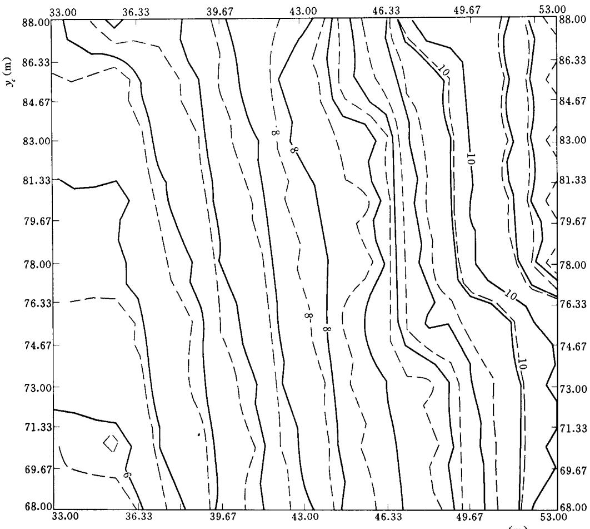  
图 10.11 可靠度指标的等值线图（[例 10.5]）  
注 虚线为 Rosenblueth 法；实线为改进 FOSM 法

## 10.6 岩土材料的变异特征和统计参数

## 10.6.1 数理统计的方法

岩土材料的物理力学特性指标存在着变异特征。在大量的采样和试验基础上，可以应用数理统计的方法，确定其概型和均值方差。有关方法在很多的教科书中均有介绍。

## 1. 矩法

采用矩法对三轴和直剪资料分别整理，也就是说，对n组c和 $f = \tan \phi \overrightarrow { \bot } \alpha \phi$ 的成果，分别按下式计算其均值和标准值：

$$
\mu _ { x } = \frac { 1 } { n } \sum _ { 1 } ^ { n } x _ { i }\tag{10.87}
$$

$$
\sigma _ { x } = { \sqrt { { \frac { 1 } { n - 1 } } \sum _ { 1 } ^ { n } ( x _ { i } - \mu _ { x } ) ^ { 2 } } }\tag{10.88}
$$

式中：x为 $^ c$ 或 tanφ。

“建筑地基基础设计规范”规定，样本数量n的修正系数的计算公式为

$$
\psi = 1 - \left( \frac { 1 . 7 4 0 } { \sqrt { n } } \right) + \left( \frac { 4 . 6 7 8 } { n ^ { 2 } } \right) \eta _ { x }\tag{10.89}
$$

式中： $\eta _ { x }$ 为随机变量x的变异系数，即 $\eta _ { _ x } = \sigma _ { _ x } / \mu _ { _ x }$

修正后的 $\mathcal { \mu } _ { x }$ 为

$$
\pmb { \mu } _ { x } ^ { \prime } = \pmb { \psi } \pmb { x }\tag{10.90}
$$

## 2. 一次线性回归

在边坡稳定分析中，材料的强度指标c和f=tanφ是最重要的参数。根据试验数据确定c和f的均值、方差以及协方差的是最基本的途径。但是如果将一种土的若干组(设组数为m)试验的 c 和 $f$ 直接进行统计，导致的误差可能比较大。因为对每一组土样的若干个法向应力级(设分n级）相应的剪应力进行线性回归获得 $\pmb { c }$ 和 $f$ 时，本身包含一个层次的误差。对m组 $c$ 和 $f$ 进行线性回归，获得其均值和方差时，再出现一个新的层次的误差。通常对一种土不可能进行很多组试验，即m值较小，较难获得真正具有统计意义的成果。

将各组试验的点放在同一个坐标系中进行线性回归的方法，如第 5 章中的图5.5 所示，显然要好得多。将m个试样的成果放在一起，总共可以有m×n个数据点，不仅解决了试验样本的数量问题，而且消除了每组试验获得的c和 $f$ 本身包含的误差。

图10.12为小浪底水利工程72组上坝心墙料数据进行线性回归的成果；图10.13 是陕西省关中平原灌区 $^ 6$ 个高度超过10m的均质坝坝料线性回归成果。这两个实例说明只要进行系统的三轴试验，都有条件进行线性回归，能够得到符合实际情况的可靠度指标的均值。当强度试验采用直剪试验时，统计分析的横坐标为法向应力σ，纵坐标为抗剪强度τ。如果 $\pmb { \sigma } \mathrm { , }$ $\scriptstyle \cdot \tau _ { \circ }$ 采用三轴试验，则需要在假定一个φ的基础上，将三轴资料换算成与小主应力夹角为 $4 5 ^ { \circ } + \phi / 2$ 面上的o和 $\pmb { \tau _ { \circ } }$ 另一种方案是纵、横坐标为 $p { = } ( \sigma _ { 1 } { + } \sigma _ { 3 } ) / 2$ 和 $\scriptstyle q = ( \sigma _ { 1 } - \sigma _ { 3 } ) / 2$ ，如第5章图5.5示。

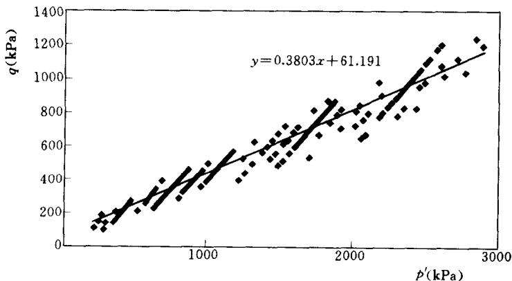  
图 10.12 小浪底上坝土料统计参数线性回归成果

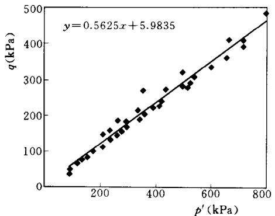  
(a)

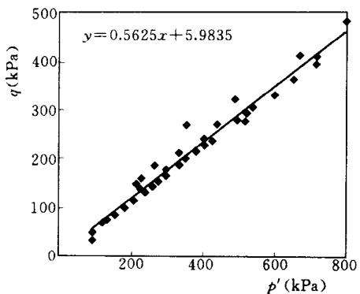  
(b)

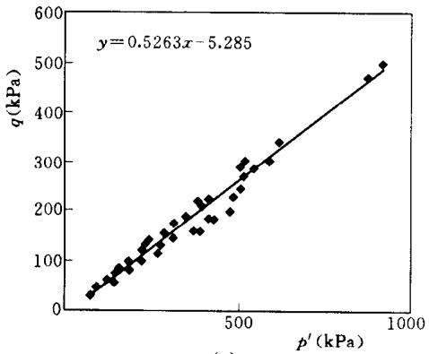  
(c)

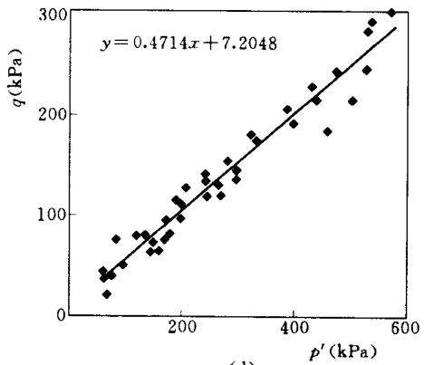  
(d)

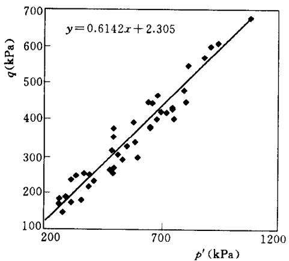  
(e)

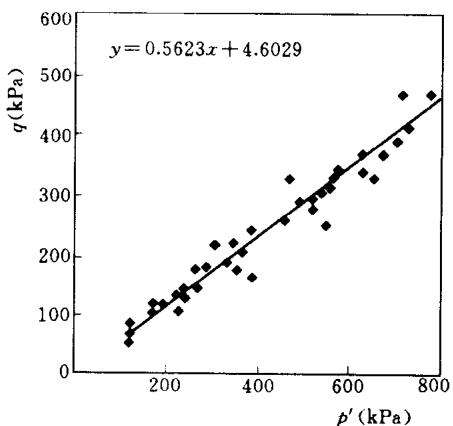  
(f)  
图10.13 陕西省关中平原灌区坝料统计参数线性回归成果  
(a) 王家崖；(b) 石堡川；(c) 信邑沟；(d) 泔河；(e) 大北沟：(f) 桃曲坡

上述两种方案在确定性模型中是适用的，但是问题涉及到统计分析领域时，那就存在纵、横坐标这两个变量本身是相关的这一问题。

为了克服这一理论缺陷，Lumb(1966,1970)建议将σ1和oσ3作为纵、横坐标。由于σ1和 $\sigma _ { 1 }$ $\pmb { \sigma _ { 3 } }$ $\pmb { \sigma } _ { 1 }$ $\sigma _ { 3 }$ 与c和φ存在以下关系，即

$$
\sigma _ { 1 } = 2 c \tan ( \pi / 4 + \phi / 2 ) + \sigma _ { 3 } \tan ^ { 2 } ( \pi / 4 + \phi / 2 )\tag{10.91}
$$

如果通过线性回归获得了 $\sigma _ { \mathfrak { i } }$ 和 $\sigma _ { 3 }$ 坐标系上的截距A 和斜率 B，则可通过下面两式获得c 和 $\phi$ 值，即

$$
A = 2 c \tan ( \pi / 4 + \phi / 2 )\tag{10.92}
$$

$$
B = \tan ^ { 2 } ( \pi / 4 + \phi / 2 )\tag{10.93}
$$

对于n组 $( x _ { i } , \ y _ { i } )$ 的试验数据，采用一次线性回归，回归方程为

$$
y _ { i } = A + B x _ { i } + e _ { i }\tag{10.94}
$$

式中： $\pmb { e _ { i } }$ 为一个均值为零，标准差为 $s _ { \theta }$ 的正态随机变量。

A和B的系数可由下式决定，即

$$
A = y _ { m } - B x _ { m }\tag{10.95}
$$

$$
B = \frac { \sum x _ { i } y _ { i } - n x _ { m } y _ { m } } { \sum x _ { i } ^ { 2 } - n x _ { m } ^ { 2 } }\tag{10.96}
$$

式中： $x _ { m }$ 和 $y _ { m }$ 为 $x _ { i }$ 和 $y _ { i }$ 的均值。

$s _ { 0 }$ 和 $A ,$ B的标准差 ${ \pmb S } _ { { \pmb A } }$ ， $s _ { B }$ 为

$$
s _ { 0 } ^ { 2 } = \frac { \sum y _ { i } ^ { 2 } - n y _ { m } ^ { 2 } - B ( \sum x _ { i } y _ { i } - n x _ { m } y _ { m } ) } { n - 2 }\tag{10.97}
$$

$$
s _ { A } ^ { 2 } = \frac { S _ { 0 } ^ { 2 } } { n } \left\{ 1 + \frac { x _ { m } ^ { 2 } } { \sum x _ { i } ^ { 2 } - n x _ { m } ^ { 2 } } \right\}\tag{10.98}
$$

$$
s _ { B } ^ { 2 } = \frac { S _ { 0 } ^ { 2 } } { \sum { x _ { i } ^ { 2 } } - n { x _ { m } ^ { 2 } } }\tag{10.99}
$$

这里，假定A和B 为独立的变量。因此协方差 $s _ { A B }$ 为零。

如果 xi，yi分别代表直剪试验中的σ和τ，那么 A和 B分别是c 和f。如果 x和yi为σ₃3和 $x _ { i }$ $y _ { i }$ $f _ { \circ }$ $\pmb { x _ { i } }$ ${ \bf { y } } _ { i }$ $\pmb { \sigma _ { 3 } }$ $\pmb { \sigma } _ { 1 }$ ，那么，需要通过式(10.92)和式(10.93)来转化成c和f。下面，根据这一实际需要介绍一 $f _ { \circ }$ 个很有用的转化公式(Lumb,1970)。

设 $z = f ( x , y )$ ，那么，在知道x和y的均值 $x _ { m }$ 和 $y _ { m }$ 以及方差 $s _ { x } ^ { 2 } , ~ s _ { y } ^ { ~ 2 } , ~ s _ { x y }$ 情况下，z的均值和标准差可按下式确定，即

$$
z _ { m } = f ( x _ { m } , y _ { m } ) + s _ { x y } [ \cfrac { \partial ^ { 2 } f } { \partial x \partial y } ] + \cfrac { 1 } { 2 } \{ s _ { x } ^ { 2 } [ \cfrac { \partial ^ { 2 } f } { \partial x ^ { 2 } } ] + s _ { y } ^ { 2 } [ \cfrac { \partial ^ { 2 } f } { \partial x ^ { 2 } } ] \} + \Xi \zeta \zeta \boxed { \frac { \partial ^ { 2 } f } { \partial z \partial y } } \} .\tag{10.100}
$$

$$
s _ { z } ^ { 2 } = s _ { x } ^ { 2 } \Bigg [ \frac { \partial f } { \partial x } \Bigg ] ^ { 2 } + s _ { y } ^ { 2 } \Bigg [ \frac { \partial f } { \partial y } \Bigg ] ^ { 2 } + 2 s _ { x y } \Bigg [ \frac { \partial f } { \partial y } \Bigg ] \Bigg [ \frac { \partial f } { \partial y } \Bigg ] + \Xi ^ { \prime } \Bigg \langle \dot { \Xi } _ { z } ^ { \dagger } \Bigg \vert \beta \Bigg \rangle \uparrow \Bigg ] \equiv\tag{10.101}
$$

式中：方括弧项代表括号内的变量在 $( x _ { m } y _ { m } )$ 处的数值。

根据这一方法来确定A，B和c，f之间的统计参数的变化可按下面步骤确定：

1) 根据式(10.93)，f的均值为

$$
f _ { m } = \tan ( 2 \arctan \sqrt { B } - \pi / 2 )\tag{10.102}
$$

2) 根据式(10.96)和式(10.99)，略去高阶小量，f的标准差为

$$
s _ { f } ^ { 2 } = s _ { B } ^ { 2 } \frac { ( 1 + f _ { m } ^ { 2 } ) ^ { 2 } } { B ( 1 + B ) ^ { 2 } }\tag{10.103}
$$

3) 根据式(10.95)和式(10.98)，c的均值和标准差分别为

$$
c _ { m } = { \frac { A } { 2 { \sqrt { B } } } }\tag{10.104}
$$

$$
s _ { c } ^ { 2 } = c _ { m } ^ { 2 } ( \frac { s _ { A } ^ { 2 } } { A ^ { 2 } } - \frac { s _ { B } ^ { 2 } } { 4 B ^ { 2 } } )\tag{10.105}
$$

利用上述一次线性回归确定统计参数变异特性的方法目前使用还不广泛，尚存在一些问题需通过进一步的探讨予以解决。同时，由于x数值较小时，相应的试验值y偏离回归 $x _ { i }$ $y _ { i }$ 方程的绝对值较x较大时的相应值小，故Lumb(1970)还提出了一个对试验值进行加权处理 $x _ { i }$ 的方案，详见原文。

## 10.6.2 确定材料变异特性指标的经验方法

根据岩土材料试验资料整理统计参数，经常受到以下因素的制约。

(1)土工试验的组数，特别是有关抗剪强度、渗透系数之类的试验，通常不可能太多，从统计意义来说，样本数量远不能满足要求。

(2) 复杂的土工试验本身包含有误差，例如，在第5章中讨论了影响三轴和直剪试验成果的诸多因素(这里还没有包括试样扰动这一重要的因素)，因此，直接使用这些试验成果往往会获得不完全反映实际情况的较大的变异系数。

因此，在确定材料变异特性时，引入一些其它的分析方法，通过综合分析，最终确定统计参数，是十分有益的。下面介绍两种方法。

## 1. “3σ法则”

这一经验法则首先由Dai和Wang(1992)提出。他们注意到，对于一个具有正态分布的参数，99.73%的数据落于(μ-3σ，μ+3σ)区间。因此，可以理解μ-3o和μ+3σ分别为该参数的最大可能值(HCV)和最小可能值(LCV)。反过来说，如果没有足够的试验数据来进行某一参数的变异特性的数理统计分析，那么，可以根据经验，首先确定该参数最小和最大可能值，然后根据下式确定该参数的标准差，即

$$
\sigma = { \frac { H C V - L C V } { 6 } }\tag{10.106}
$$

使用这一法则，有可能在数据较少时，根据经验来确定标准差。同时，在通过其它途径确定了标准差后，这一法则也可作为判别成果合理性的一个依据。

图10.14为使用图解法进行现场不排水剪试验成果用“3σ法则”整理的例子。首先画出代表平均值的直线曲线，然而再画出相应最大可能和最小可能数值的曲线。注意个别点落在此两线外，这些点被认为是错误的数据。

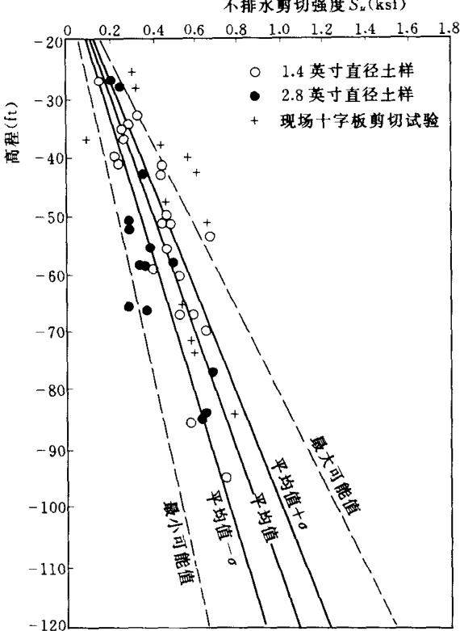  
图10.14 图解法进行现场不排水剪试验成果用“3σ法则”整理的例子

表10.15和表10.16为根据经验总结的各项土工参数的变异特征。

表 10.15 常用土工指标变异系数参考值(Duncan, 2000)
<table><tr><td>属性或现场试验数据</td><td>变异系数V（%）</td><td>数据来源</td></tr><tr><td>容重，  $\gamma$ </td><td>3-7</td><td>Harr (1984), Kulhawy (1992)</td></tr><tr><td>浮容重，  $y _ { b }$ </td><td>0-10</td><td>Lacasse &amp; Nadim (1997), Ducan (2000)*</td></tr><tr><td>有效应力摩擦角，  $\phi ^ { \prime }$ </td><td>2-13</td><td>Harr (1984), Kulhawy (1992)</td></tr><tr><td>不排水剪切强度，  $S _ { u }$ </td><td>13-40</td><td>Harr (1984), Kulhawy (1992), Lacasse &amp; Nadim (1997), Ducan (2000)*</td></tr><tr><td>不排水强度比，  $s _ { \mu } \sigma _ { \nu } ^ { \prime }$ </td><td>5-15</td><td>Lacasse &amp; Nadim (1997), Ducan (2000)*</td></tr><tr><td>压缩指数，  $c _ { c }$ </td><td>10-37</td><td>Lacasse &amp; Nadim (1997), Ducan (2000)*</td></tr><tr><td>先期固结压力，  $P _ { p }$ </td><td>10-35</td><td>Lacasse &amp; Nadim (1997), Ducan (2000)*</td></tr><tr><td>饱和粘土的渗透系数，k</td><td>68-90</td><td>Harr (1984), Ducan (2000)*</td></tr><tr><td>部分饱和粘土的渗透系数，k</td><td>130-240</td><td>Harr (1984), Benson et al. (1999)</td></tr><tr><td>固结系数，  $\pmb { c _ { y } }$ </td><td>33-68</td><td>Duncan (2000)*</td></tr><tr><td>标贯试验击数，N</td><td>15-45</td><td>Harr(1984), Kulhawy (1992)</td></tr><tr><td>电子触探试验，  $q _ { c }$ </td><td>5-15</td><td>Kulhawy (1992)</td></tr><tr><td>机械触探试验，  $q _ { c }$ </td><td>15-37</td><td>Harr (1984), Kulhawy (1992)</td></tr><tr><td>膨胀试验端阻力，  $q _ { D M T }$ </td><td>5-15</td><td>Kulhawy (1992)</td></tr><tr><td>十字板剪切试验不排水强度，  $s _ { \nu }$ </td><td>10-20</td><td>Kulhawy (1992)</td></tr></table>

表 10.16 从诸文献中总结的土的各种特性指标的变异系数 COV (Chowdhury, 1982)
<table><tr><td>材料</td><td>特性指标</td><td>COV(%)</td><td rowspan="2">材料</td><td>特性指标</td><td>COV(%)</td></tr><tr><td rowspan="5">粘土</td><td>液限</td><td>5.9 砂粘土</td><td> $\mathrm { L o g } ( C _ { \mathfrak { c } } )$ </td><td>34.2</td></tr><tr><td>塑限</td><td>4±</td><td>粉细砂 F</td><td>13.8</td><td></td></tr><tr><td>粘粒含量</td><td>11.4</td><td rowspan="2">淤泥</td><td>f</td><td>14.8</td></tr><tr><td>比重</td><td>0.5±</td><td>C</td><td>31.6</td></tr><tr><td>干密度</td><td>26.4</td><td>松，渥太华砂</td><td>c</td><td>25.9</td></tr><tr><td rowspan="2">页岩粘土</td><td>粘聚力，DS 摩擦系数，直剪</td><td>94.8 45.6</td><td>密，渥太华砂</td><td>φ</td><td>14</td></tr><tr><td>c, DS</td><td>103.3</td><td></td><td>φ</td><td>12.5</td></tr><tr><td rowspan="2">粘性冰碛土</td><td>f, DS</td><td></td><td rowspan="2">淤泥(不饱和)</td><td>C</td><td>51</td></tr><tr><td></td><td>17.7</td><td> $\phi$ </td><td>22</td></tr><tr><td rowspan="6">“不扰动”土</td><td>C， 三轴</td><td>13.5</td><td></td><td> $S _ { U }$ </td><td>19</td></tr><tr><td>F，三轴</td><td>1.6</td><td>淤泥（饱和）</td><td>C</td><td>55</td></tr><tr><td>C, CU</td><td>19.9</td><td></td><td>φ</td><td>29</td></tr><tr><td>F, CU</td><td>9.8</td><td></td><td>S</td><td>20</td></tr><tr><td>C, UU</td><td>18.8</td><td>淤泥</td><td>c</td><td>64</td></tr><tr><td>F, UU</td><td>22.3</td><td>CH</td><td>C， 三</td><td></td></tr><tr><td rowspan="6">填筑土</td><td></td><td></td><td></td><td>轴，UU</td><td>15</td></tr><tr><td>C, D F, D</td><td>24.0</td><td></td><td>φ, UU</td><td>56</td></tr><tr><td></td><td>2.1</td><td>CL</td><td>c, UU</td><td>22</td></tr><tr><td>C, CD</td><td>26.9</td><td></td><td>φ, UU</td><td>19</td></tr><tr><td>F, CD</td><td>6.8</td><td>ML</td><td>c, UU</td><td>71</td></tr><tr><td>c, UU f, UU</td><td>25.5</td><td></td><td>φ, UU</td><td>12</td></tr><tr><td rowspan="5">多种冰碛土</td><td></td><td>5.4 14.8</td><td>CH</td><td>c, DS φ, DS</td><td>63</td></tr><tr><td></td><td>14.7</td><td>CL</td><td>c, DS</td><td>10.4 3</td></tr><tr><td>UU</td><td>31.0</td><td>ML</td><td>c, DS</td><td>2.5</td></tr><tr><td></td><td>19.8</td><td>路基</td><td>吸力</td><td>24.2</td></tr><tr><td></td><td>29.0</td><td></td><td>吸力</td><td>23.2</td></tr><tr><td rowspan="2">粉砂</td><td> $e _ { 0 }$ </td><td>21.6</td><td>16个粘土</td><td>LL</td><td>6.37</td></tr><tr><td> $\pmb { n }$ </td><td>89.4</td><td>平均值</td><td>PL</td><td>9.55</td></tr><tr><td rowspan="2">砂砾</td><td> $e _ { 0 }$ </td><td>29</td><td>路基粗粒土</td><td>CBR</td><td>17.4</td></tr><tr><td> $_ n$ </td><td>16</td><td></td><td>密度</td><td>3.9</td></tr><tr><td rowspan="2">粗砂</td><td> $\pmb { n }$ </td><td>9.8</td><td rowspan="2"></td><td>PI</td><td>75.0</td></tr><tr><td></td><td></td><td></td><td></td></tr><tr><td rowspan="2">中砂</td><td> $\underline { { \boldsymbol { e } } } _ { 0 }$   $_ n$ </td><td>16 10</td><td rowspan="2">塑性粘土</td><td> $\underline { { s } } _ { u }$ </td><td>36.8</td></tr><tr><td> $\underline { { \boldsymbol { e } } } _ { 0 }$ </td><td>17.5</td><td>压缩比</td><td>17%~38%</td></tr><tr><td>细砂</td><td></td><td></td><td rowspan="4">细砂 砂砾</td><td>f</td><td>5~13</td></tr><tr><td></td><td> $e _ { 0 }$ </td><td>13.3</td><td>f</td><td>5</td></tr><tr><td>海洋粘土</td><td> $c$ </td><td>18.4</td><td>f</td><td>8~14</td></tr><tr><td>伦敦粘土</td><td>C</td><td>粗砂 16.2</td><td></td><td></td></tr></table>

## 2. 用基本力学参数相关所研究的变量

在土工试验中，颗分曲线、塑限、液限、塑性指数和孔隙率这些参数可以大量取样，同时，这些试验受到的外界干扰因素较少，数据本身的可信度较高。因此，使用这些参数研究相关渗透系数、强度指标这样一些样本数量较少、试验本身包含误差因素大的参数，不失为一种有效的辅助手段。现将作者在研究沟后水库大坝时所作的一些工作介绍如下。

(1)对砂砾石的渗透系数的相关分析。填筑砂砾石的渗透系数是一个随机变量。它和砂砾石的颗粒级配和压实度有关。刘杰(1994)曾详细讨论确定渗透系数K的各种经验公式，提出以下经验公式，即

$$
K _ { 1 0 } = 2 3 4 n ^ { 3 } d _ { 2 0 } ^ { 2 }\tag{10.107}
$$

式中：K为渗透系数，单位以以cm/s计；K的下标为相应的温度；n为坝体材料的孔隙率；  
$d _ { 2 0 }$ 为在粒径级配累级曲线中占总土质量20%的最大颗粒的粒径，单位以cm计。

根据刘杰的研究，对沟后土样，中国水利水电科学研究院给出了很好的拟合结果。根据施工档案得到现场核子密度计测定的坝体填筑料干容重的613个数据，将干容重换算成孔隙率。同时还查到45条颗分曲线和12个垮坝后现场取样试验资料，根据这57组数据，获得沟后坝砂砾料孔隙率 n和统计指标 d20的直方图，见图10.15 和图10.16，其统计特征 $d _ { 2 0 }$ 值如表10.17所示。采用蒙特卡洛法，可通过式(10.107)获得如图10.17所示渗透系数的直方图。拟合的结果渗透系数为对数正态分布，均值和标准差分别为 $1 . 3 1 { \times } 1 0 ^ { - 2 } { \mathrm { c m } } / { \mathrm { s } }$ 和$3 . 3 9 \times 1 0 ^ { - 2 } \mathrm { c m / s }$ 。根据此直方图可绘出渗透系数小于某一值的概率图，如图10.18。从中可以发现渗透系数小于 $0 . 1 { \times } 1 0 ^ { - 2 } \mathrm { c m } / \mathrm { s } \mathrm { , } 0 . 5 { \times } 1 0 ^ { - 2 } \mathrm { c m / s }$ 和 $1 { \times } 1 0 ^ { - 2 } \mathrm { c m } / s$ 的概率分别为 15%、49%和 65%。

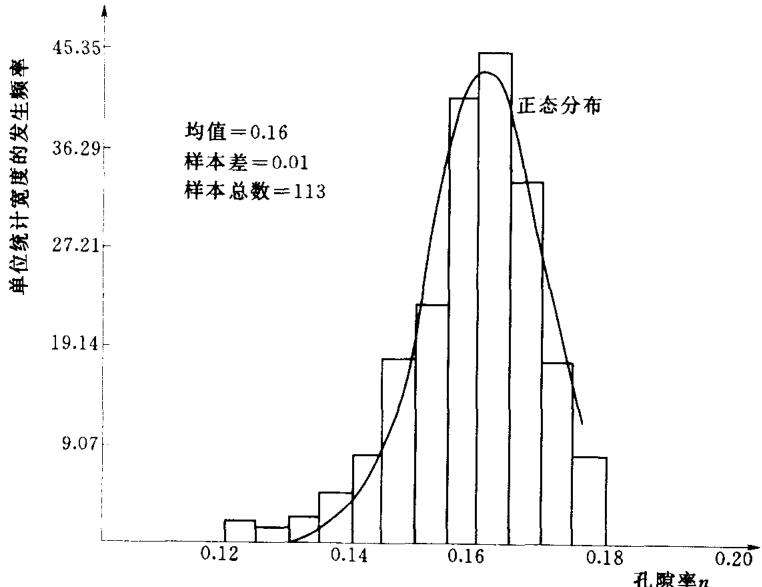  
图 10.15 沟后坝砂砾料孔隙率的直方图

(2)对砂砾石的内摩擦角的相关分析。和渗透系数取值一样，有关坝料强度指标的样本是十分有限的。确定抗剪强度指标变异特征的一个有用的途径也是借助经验公式。对于粗颗粒土，可以通过坝料的压实密度和颗粒级配进行间接判断。

最上武雄(1968)提出了确定无凝聚性土内摩擦角的经验公式为

$$
\tan \phi ^ { \prime } = \frac { m } { e }\tag{10.108}
$$

式中：e为孔隙比；m为与土料的不均匀系数η有关的经验系数，二者之间关系为 $e$ $^ m$ $\dot { \eta }$

$$
m = A - B \log \eta\tag{10.109}
$$

中国水利水电科学研究院曾对沟后材料进行三轴试验，其成果如图10.19示。

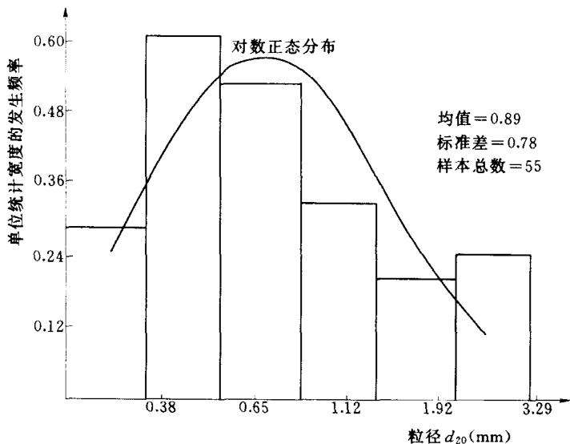  
图 10.16 沟后坝砂砾料粒径的直方图

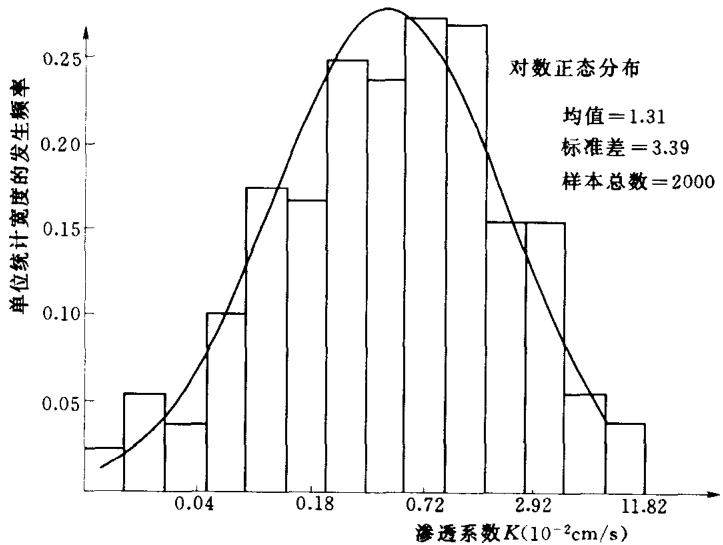  
图 10.17 沟后坝砂砾料渗透系数的直方图

表10.17 沟后大坝坝料主要物理性指标的统计成果
<table><tr><td></td><td>概型</td><td>均值</td><td>标准差</td></tr><tr><td>孔隙率n</td><td>正态</td><td>0.161</td><td>0.009</td></tr><tr><td>孔隙比e</td><td>正态</td><td>0.191</td><td>0.012</td></tr><tr><td>有效粒径  $\mathbf { \mathcal { d } _ { 2 0 } ( m m ) }$ </td><td>对数正态</td><td>0.89</td><td>0.70</td></tr><tr><td>不均匀系数η</td><td>对数正态</td><td>74.22</td><td>47.19</td></tr></table>

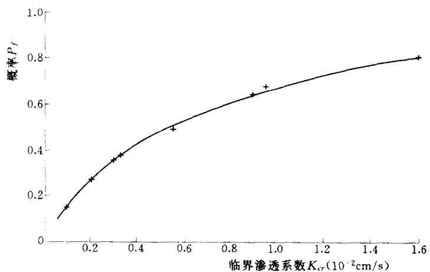  
图 10.18 沟后坝砂砾料渗透系数小于某一值的概率

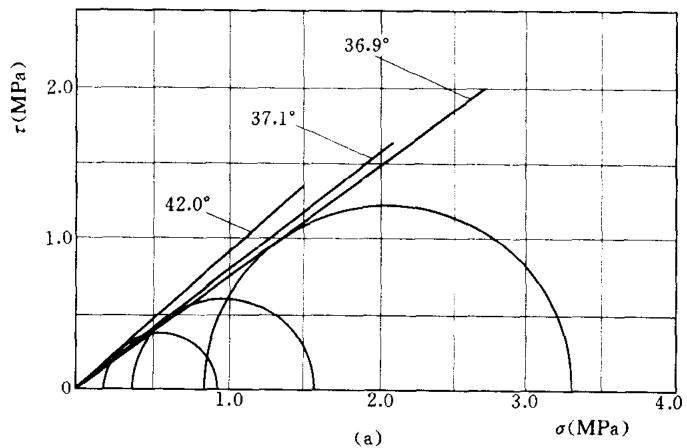

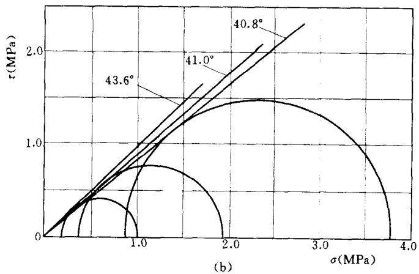  
图10.19 中国水利水电科学研究院对沟后坝砂砾料作三轴试验成果(a) 上限级配：(b) 平均级配

分别对清华大学和中国水利水电科学研究院试验成果进行线性回归，得

$$
m = 0 . 5 8 6 - 0 . 1 6 \log \eta\tag{10.110}
$$

$$
m = 0 . 3 5 7 - 0 . 1 0 \log \eta\tag{10.111}
$$

表10.18和表10.19为回归的结果。

同样，对施工质检和垮坝后的颗分资料进行统计分析，获得坝料孔隙比e和不均匀系数η的特征值，见表10.18和表10.19，统计结果如图10.20和图10.21所示。在确定强度参数时，使用表10.17提供的孔隙e和不均匀系数η的统计特征值，进行10×2000次蒙特卡洛模拟，可得f值概型为对数正态，如图10.22。tanφ的均值和标准差分别为 0.933和0.16，如果将其转换为成等效正态分布，则分别为0.933和0.12。

表10.18 清华大学土工试验成果拟合参数 m
<table><tr><td>区号</td><td>孔隙比e</td><td>不均匀系数η</td><td>内摩擦角  $| \phi ^ { \prime }$ </td><td>摩擦系数tanφ&#x27;</td><td>m</td></tr><tr><td>II</td><td>0.347</td><td>60</td><td>39.18</td><td>0.815</td><td>0.3048</td></tr><tr><td>III</td><td>0.374</td><td>74.5</td><td>37.07</td><td>0.7554</td><td>0.2825</td></tr><tr><td>IV</td><td>0.374</td><td>87.5</td><td>36.59</td><td>0.7423</td><td>0.2776</td></tr></table>

表10.19 中国水利水电科学研究院土工试验成果拟合参数m
<table><tr><td>级配</td><td>干密度  $( { \mathfrak { g } } / { \mathrm { c m } } ^ { 3 } )$ </td><td>孔隙比</td><td>不均匀系数η</td><td>内摩擦角  $\pmb { \phi }$ </td><td>m</td></tr><tr><td>平均级配</td><td>2.23</td><td>0.206</td><td>120</td><td>41.0</td><td>0.219</td></tr><tr><td>上限级配</td><td>2.16</td><td>0.251</td><td>27.5</td><td>37.1</td><td>0.1557</td></tr></table>

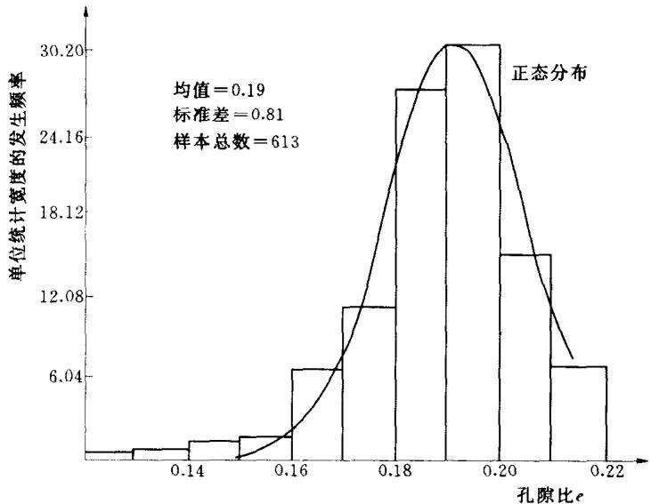  
图 10.20 沟后坝砂砾料孔隙比 e 的直方图

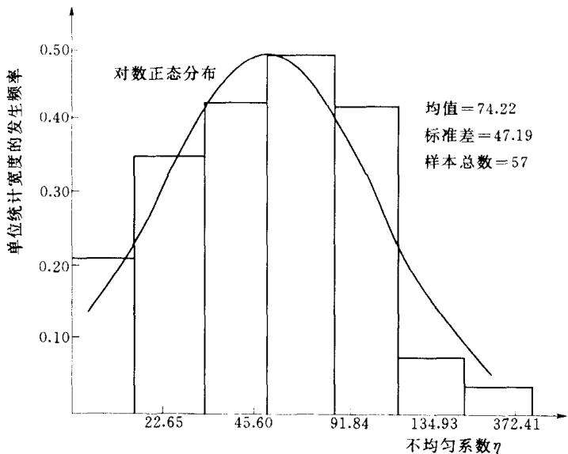  
图10.21 沟后坝砂砾料不均匀系数η的直方图

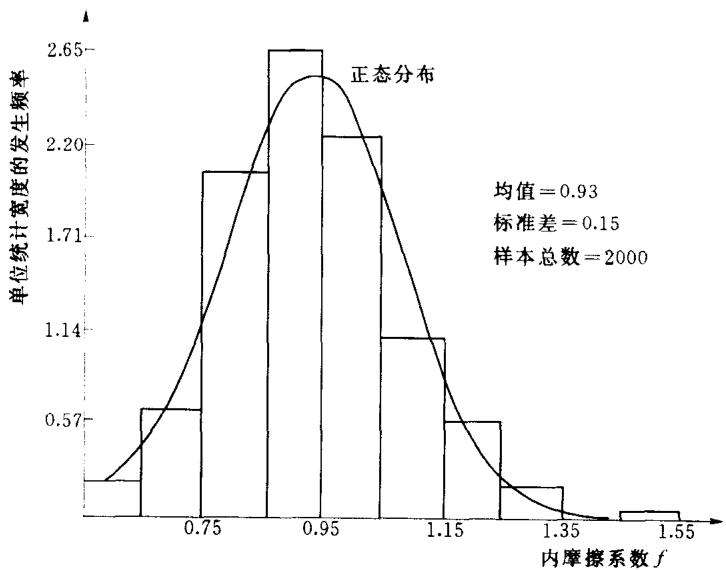  
图 10.22 内摩擦系数f值分布直方图

## 10.6.3 关于概率密度函数截尾的讨论

近代可靠度分析的主要方法都是以参数为正态分布这一基础发展起来的。这意味着这些参数有可能是负值，这和相当一部分参数的物理含义不符。这一问题在岩土工程参数中有关粘聚力c的分析中表现尤为突出。c值的变异系数大于(30\~40)%是经常可能发生的。这就导致c值存在较大的可能为负值。在实际应用可靠度理论分析边坡的风险时，计算所得的可靠度指标往往较低。这一偏低的数值一方面是c值固有的较大的变异特征有关；另一方面，也和计算分析中隐含允许c为负值这一事实有关。边坡稳定安全系数F这一目标函数同样也有这一问题。F不仅不能为负值，而且还要以 $F = 1$ 而不是功能函数小于零来衡量结构的失效状态。为了解决这一问题，吴世伟(1990)讨论了对呈正态的参数进行截尾的方法，另外，一个可能的方案是按对数正态来整理这些参数，此时其取值在范围在 $( 0 , \infty )$ 之间，同时 $F { \ = } 1$ 与 $\ln { \cal F } = 0$ 相对应。衡量边坡失稳的标准和功能函数小于零的传统作法可以接轨。作者的经验表明，粘聚力的标准差过大，对其进行可靠度分析已失去意义，不如干脆令 $\scriptstyle c = 0$ 。在大坝稳定复核中常有一种对材料作“纯摩”处理的方案即是一例。

在确定性模型的分析计算时，输入的强度参数通常为“小值平均”(参见“土石坝设计规范”的规定)。按“3σ”准则，“小值平均”可以理解为 $( \mu _ { c } - \pmb { \sigma } _ { c } )$ ，其中 $\pmb { \mu } _ { c }$ 和 $\pmb { \sigma } _ { c }$ 分别是为 $^ { c }$ 的均值和标准差。因此，如果通过数理统计获得的c值的均值使(μ-σ) $( \mu _ { c } - \pmb { \sigma } _ { c } )$ 小于零时，建议将c值取为零，不再按随机变量处理。现讨论使用对数正态概率分布时的处理方式。

对于符合对数正态分布的参数F，令y符合正态分布，并有

$$
y = \ln { F }\tag{10.112}
$$

或

$$
F = e ^ { y }
$$

则F可转化为标准正态分布函数。

(10.113)

F和y的均值和标准差存在以下转化关系，即

$$
\sigma _ { y } = \sqrt { \ln ( 1 + V _ { F } ^ { 2 } ) }\tag{10.114}
$$

$$
\mu _ { y } = \ln \left[ \frac { \mu _ { F } } { \sqrt { 1 + V _ { F } ^ { 2 } } } \right]\tag{10.115}
$$

式中： $\mu _ { y }$ 和 $\sigma _ { y }$ 分别为y的均值和标准差。

根据以上两式得变异系数为

$$
V _ { F } = \frac { \sigma _ { F } } { \mu _ { F } }\tag{10.116}
$$

由于y小于零和F小于1是等价的。因此，可靠度指标 $\boldsymbol { y }$ $\beta = \mu _ { y } / \sigma _ { y }$ 既反映了反映了 $y { < } 0$ 的概率，也反映了 $F { < } 1$ 的概率。对于正态分布的变量y，β同样可以用μF和σ来表达。 $\mu _ { F }$ $\sigma _ { F }$

对于对数正态分布的变量F，β为（Duncan,2000） $\beta$

$$
\beta = \frac { \ln ( \frac { \mu _ { F } } { \sqrt { 1 + V _ { F } ^ { 2 } } } ) } { \sqrt { \ln ( 1 + V _ { F } ^ { 2 } ) } }\tag{10.117}
$$

根据这一认识，表10.6 和表10.9 就可以产生对应的关系。例如，相应10.2.1 节的例题，对于 $\cdot \mu _ { F } { = } 1 . 5 0$ $V _ { F } { = } 1 7$ 7%的情况。查阅表10.9可知F>1的概率为99%，这一数值可通过以下计算公式获得，即

$$
\sigma _ { y } = \sqrt { \ln ( 1 + 0 . 1 7 ^ { 2 } ) } = 0 . 1 6 9\tag{10.118}
$$

$$
\mu _ { y } = \ln { \frac { 1 . 5 } { \sqrt { 1 + 0 . 1 7 ^ { 2 } } } } = 0 . 3 9 1\tag{10.119}
$$

$$
\beta = \frac { 0 . 3 9 1 } { 0 . 1 6 9 } = 2 . 3 1 4\tag{10.120}
$$

查表10.6，可以获得 $y { < } 0$ 或 $F { < } 1$ 的概率为 99%。

## 10.7 工程实际应用实例

## 10.7.1 十三陵抽水蓄能电站上池面板坝

## 1. 问题的提出

十三陵抽水蓄能电站上池面板堆石坝位于北京西北部地区，坝轴线位于山脊上，因此坝址处地形变化较大，坝轴线处坝高57m，下游坝脚处坝高118m。坝体上游设计坡比为1:1.5，下游坡比为1:1.75。根据设计要求，新鲜的安山岩堆石料填筑在480m高程以下，以便充分排水，池盆开挖的劣质料填筑于下游区480m高程以上。图10.23给出了坝体0+240和0+160两个地质断面的剖面图。

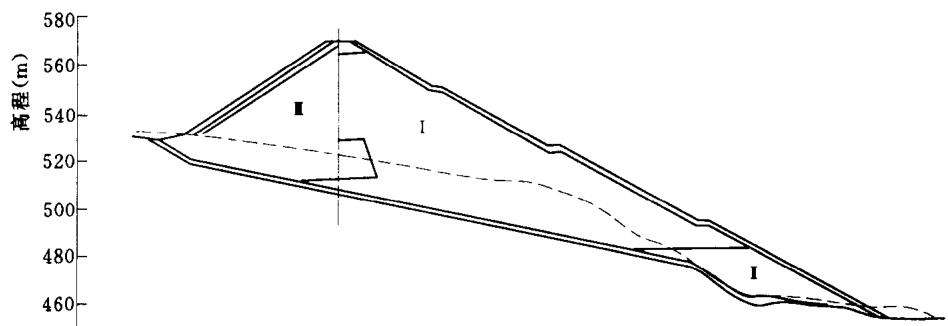  
(a)

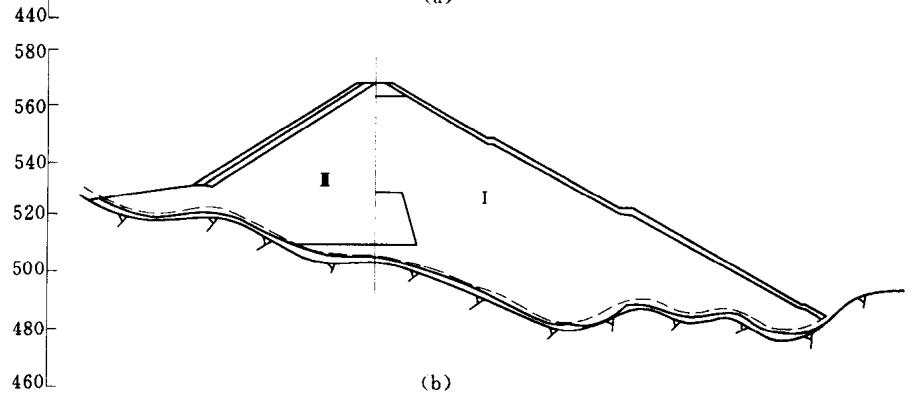  
图10.23 十三陵抽水蓄能电站大坝典型剖面图

根据初步设计，坝体的大部分填筑料将由开挖池盆获得。可是在池盆开挖后发现，池盆岩体风化程度较强，细粒含量偏高，能否应用池盆风化料作为坝体填筑料，成为工程技术人员关注的问题。因此，在常规确定性模拟基础上，又进行了可靠度分析。

## 2. 抗剪强度参数

首先汇总设计和施工阶段有关池盆风化料室内和现场的实验资料，其结果见表10.20;然后采用矩法和线性回归两种方法来确定坝体填筑料的抗剪强度参数，其结果见表10.21。在评估下游坝坡是否稳定的可靠度分析中，发现采用两种方法得出的粘聚力c的标准差都比较大。为此，按10.3节讨论意见，将粘聚力作为定量c=0来处理，同时还以粘聚力c=10kPa、摩擦系数f=tanφ服从正态分布作为辅助方案进行可靠性分析，其均值和标准差分别为0.85和0.15。由于本例题只涉及一个随机变量f，因此属于随机变量不相关的问题。

表10.20 十三陵坝料抗剪强度参数汇总表
<table><tr><td rowspan="2">试验 单位</td><td rowspan="2">试验 编号</td><td colspan="2">干密度 (g/cm³)</td><td colspan="2">非线性指标</td><td colspan="3">线性指标</td></tr><tr><td colspan="2">直剪 三轴</td><td colspan="2">三轴试验 ∆φ,(°)</td><td colspan="2">直剪试验</td><td colspan="2">三轴试验</td></tr><tr><td rowspan="3">北京院 1989.9</td><td rowspan="3">TJ8 TJ10 TJ23 1.99</td><td rowspan="3">2.18 1.95</td><td>2.00</td><td>φ,(°) 44.5 6.5</td><td>40.0</td><td>c,(kPa) φ.(°) 46.7</td><td>c,(kPa) 26.0</td><td>∆φ,(°) 41.4</td></tr><tr><td>2.05</td><td></td><td></td><td>100.0 39.5</td><td>20.0</td><td>39.1</td></tr><tr><td>2.00</td><td>47.0</td><td>195.0 10.0 68.0</td><td>47.1 42.9</td><td>20.0</td><td>39.1</td></tr><tr><td>中国水 1a 利水电 科学研 究院</td><td>PD115 1b</td><td>2.05</td><td>2.07 2.00</td><td>45.6 38.4</td><td>6.8 0</td><td></td><td></td><td>60.0</td><td>39.2</td></tr><tr><td rowspan="7">1992.4 北京院 1992.5</td><td>B1-1 C1-1</td><td>2.04</td><td></td><td></td><td></td><td>325.0</td><td>41.0</td><td>50.0</td><td>38.4</td></tr><tr><td>C2-1</td><td>2.08 2.02</td><td>2.06</td><td>44.1</td><td>7.7</td><td>102.0</td><td>40.6</td><td>18.0</td><td>38.1</td></tr><tr><td>C2-2</td><td>2.06</td><td>2.12</td><td>41.7</td><td>6.11</td><td>75.0 90.0</td><td>32.6</td><td></td><td></td></tr><tr><td>C2-4</td><td>2.03</td><td>2.07</td><td>48.0</td><td>12.2</td><td></td><td>38.7</td><td>17.2</td><td>35.8</td></tr><tr><td>C2-3</td><td>2.06</td><td></td><td></td><td></td><td>119.6</td><td>38.0</td><td>40.3</td><td>36.2</td></tr><tr><td>二场</td><td>2.05</td><td>2.05</td><td></td><td></td><td>250.0</td><td>39.6</td><td></td><td></td></tr><tr><td>IB</td><td>2.05</td><td>2.10</td><td>47.6 46.5</td><td>6.0 8.9</td><td>237.0 80.0</td><td>42.7</td><td>25.5</td><td>40.4</td></tr><tr><td>北京院 1992.10</td><td>I区料</td><td></td><td>2.08</td><td>48.8</td><td>16.2</td><td></td><td>38.7</td><td>35.2 34.4</td><td>38.1 34.0</td></tr><tr><td>中国水 利水电 科学研【区料 究院</td><td></td><td></td><td>2.09</td><td>43.7</td><td>6.0</td><td></td><td></td><td></td><td>36.0</td></tr></table>

表10.21 两种方法获得的统计参数表
<table><tr><td rowspan="2">方法</td><td rowspan="2">试验</td><td colspan="2">c (kPa)</td><td colspan="2">f=tanφ</td><td rowspan="2">ρ</td></tr><tr><td>μ</td><td>σ</td><td>μ</td><td>σ</td></tr><tr><td rowspan="2">矩法</td><td>三轴</td><td>33.5</td><td>15.3</td><td>0.783</td><td>0.059</td><td>-0.17</td></tr><tr><td>直剪</td><td>140</td><td>89.3</td><td>0.833</td><td>0.12</td><td>0.13</td></tr><tr><td rowspan="2">线性回归法</td><td>三轴</td><td>41.8</td><td>29.8</td><td>0.733</td><td>0.033</td><td>-0.907</td></tr><tr><td>直剪</td><td>188.9</td><td>49.8</td><td>0.800</td><td>0.182</td><td>-0.913</td></tr></table>

## 3. 边坡稳定的可靠度分析

应用一次二阶矩法对坝体 0+160和 0+240两个地质断面进行可靠度分析计算，其最小可靠度指标β分别为4.10和3.76，相应的失效概率分别为 $3 . 0 { \times } 1 0 ^ { - 5 }$ 和 $1 . 0 { \times } 1 0 ^ { - 4 }$ ，相对于0+160和 0+240 断面的临界滑裂面分别示于图 10.24(a)和图 10.24(b)。

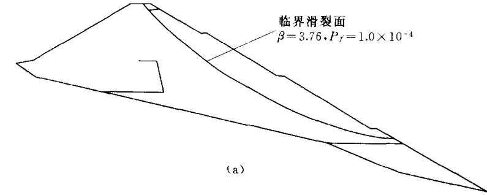

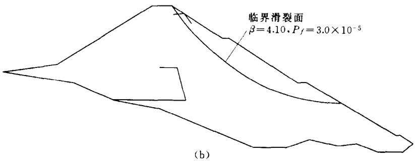  
图10.24 十三陵上池面板坝典型边坡可靠度分析成果(a) 0+160 断面；(b) 0+240 断面

## 10.7.2 沟后水库砂砾石面板坝

## 1. 沟后水库大坝失事

1993年8月27日，位于青海省共和县的沟后水库大坝发生溃决，造成死亡288人，失踪44人，直接经济损失达1.53亿元的重大灾难。图10.25为该坝一典型剖面图，其最大坝高71m，坝顶高程3281m，总库容330万m³，正常高水位为3278m，防浪墙呈“L”形， $\mathbf { m } ^ { 3 }$ 与面板之间仅设一道橡胶止水，其底板高程为3277.5m，低于其正常库水位3280m。

经多家科研单位和大学对溃坝失稳机理的深入探讨和研究（李君纯，陈祖煜，1996），总结出大坝失事的主要诱发因素是：

1) 砂砾石坝顶防浪墙与面板交接处的止水失效；

2)使用振动碾洒水碾压砂砾石时，坝体砂砾石产生严重分层致使水平的渗透系数远大于垂直的渗透系数；

3)当库区水位超过防浪墙与面板交接处后，水流入坝体，由于砂砾石料颗粒偏细，渗透系数较小，导致坝体排水失效，浸润线抬高。如果此时坝体的抗剪强度不足以使下游坝坡的抗滑稳定安全系数大于1，就有可能发生滑坡。

失事后见到的一个明显的事实是，残留坝体全部饱和，水从坝内流出，持续一个多星期。对于大坝溃决原因，大部分学者认为管涌和坝体下游滑坡是导致坝失稳的两个因素（刘杰，1995；陈祖煜，赵毓芝，1995)。不管以那一个原因为主，大坝失事都与高浸润线有关。

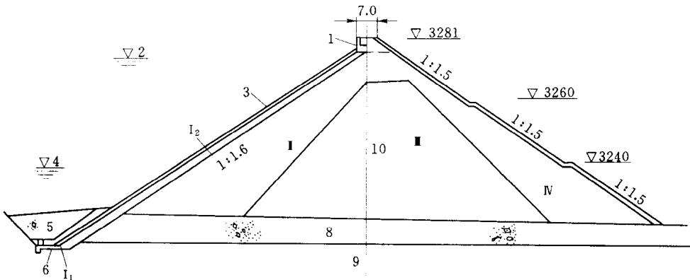  
图 10.25 沟后水库大坝典型剖面图（单位：m）  
1-防浪墙；2-正常蓄水位；3-钢筋混凝土面板；4-死水位；5-任意料：6-粘土防渗墙：  
7-干砌石护坡；8-河床砂砾石；9-花岗闪长岩：10-坝轴线

## 2. 确定性模型分析

(1)渗流分析。渗流分析是在一个重要的背景下进行的，即水库在此季节的入库流量只有0.6m³/s。也就是说，一旦渗入坝内的流量超过了0.6m³/s，水库水位就会下降，不再超过防浪墙与面板交接处，入渗现象会暂时停止。因此，如果坝体的渗透系数足够大，能够容纳0.6m³/s的入渗量就不会出现全部饱和这一现象的。渗流分析就是要定量地了解坝体的渗透系数小到何值，就无法容纳0.6m³/s这一渗透流量。

在入渗过程中，水从某几个部位集中渗入，渗流场的上游边界条件是比较难以确定的，在坝体全部被水充填后，就基本上可以用以下两种情况模拟：

1）假定上游面板防渗全部失效，在上游坝坡面作用一个静水压力；

2) 假定上游坝面均匀地分布一个入渗流量。

如前所述，砂砾石坝料在填筑中有较严重的分离现象，因此，坝体渗透系数的各向异性是一个不可忽视的因素。分析计算采用坝体渗透系数K各向同性及各向异性两种情况。平均渗透系数可由下式确定为

$$
K = \sqrt { K _ { x } K _ { y } }\tag{10.121}
$$

式中：K为平均渗透系数；K为水平方向渗透系数；K为垂直方向渗透系数。 $K _ { x }$ $K _ { y }$

在所有复核工况中，坝基材料渗透系数K均按各向同性处理，即 $K _ { \mathrm { l } }$ $K _ { _ { 1 x } } { = } K _ { 2 y } { = } 0 . 6 6 8 \mathrm { c m / s }$

下面着重介绍将上游面作为孔压边界条件这一工况的计算结果。其它计算内容可参见文献（陈祖煜，赵毓芝，1995）。本次计算根据坝身材料渗透系数的不同又分为四种情况：

(a) 坝身材料渗透系数 $K _ { 2 }$ 各向同性，即 $K _ { 2 x } { = } K _ { 2 y } { = } 0 . 0 1 \mathrm { c m / s }$ 0

计算得到的浸润线逸出高程为3236.57m，见图10.26实线，单宽渗透流量$q { = } 4 . 2 4 { \times } 1 0 ^ { - 3 } \mathrm { m } ^ { 3 } / s$ ，大坝等效渗流宽度大致为170m，故总渗透量 $Q { = } 0 . 7 2 \mathrm { m } ^ { 3 } / \mathrm { s }$

(b) 坝身材料 $K _ { 2 x }$ 增大1倍， $K _ { 2 y }$ 缩小1倍，即 $K _ { 2 x } { = } 0 . 0 2 \mathrm { c m } / s$ $K _ { 2 y } { = } 0 . 0 0 5 \mathrm { c m / s }$ $K _ { 2 x } / K _ { 2 y } { = } 4 .$ 此时坝身平均渗透系数 $K _ { 2 } { = } 0 . 0 1 \mathrm { c m } / \mathrm { s }$ ，保持原值。

计算得到的浸润线逸出高程为 3262.92m，见图10.26 虚线，可见有明显抬高。较各向同性情况抬高26.35m，单宽渗透流量 $q { = } 5 . 3 2 { \times } 1 0 ^ { - } 3 \mathbf { m } ^ { 3 } / \mathbf { s }$ o

可见水平渗透系数加大，垂直向渗透系数减小，会使浸润线有显著的提高，这对坝体稳定是不利的。

(c) 坝身材料 $K _ { 2 x } , \ K _ { 2 y }$ 均较原设计值缩小10倍，即 $K _ { 2 x } { = } K _ { 2 y } { = } 0 . 0 0 1 \mathrm { c m } / s$

计算得到的浸润线逸出高程为 3227.47m，见图 10.27 实线，单宽渗透流量 $q =$ $2 . 7 2 { \times } 1 0 ^ { - 3 } \mathrm { m } ^ { 3 } / \mathrm { s }$ ，按大坝宽主度 170m 计，总渗透量 $Q = ~ 0 . 4 6 \mathbf { m } ^ { 3 } / \mathbf { s }$ ，较 $K _ { 2 } = 0 . 0 1 \mathrm { c m } / \mathrm { s }$ 时，Q减少了0.26m³/s。

(d) 坝身材料 $K _ { 2 x }$ 增大1倍， $K _ { 2 \mathrm { y } }$ 缩小1倍，即 $K _ { 2 x } { = } 0 . 0 0 2 \mathrm { c m / s }$ $K _ { 2 y } { = } 0 . 0 0 0 5 \mathrm { c m / s }$ $K _ { 2 x } / K _ { 2 y } { = } 4$ 此时坝身平均渗透系数 $K _ { 2 } { = } 0 . 0 0 1 \mathrm { c m } / \mathrm { s }$ ，保持原值，其计算结果见图10.27虚线。

根据计算可知，坝身材料渗透系数各向异性导致浸润线有显著的提高，这是控制坝体稳定的一个重要因素。

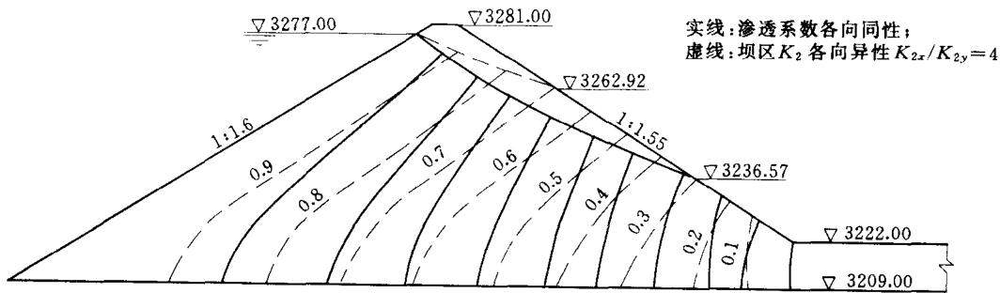  
图10.26 稳定渗流分析等势线图（上游水位3277m）  
实线： $K _ { 2 x } { = } K _ { 2 y } { = } 0 . 0 1 \mathrm { c m / s } ;$ 虚线：坝区 $\pmb { K } _ { 2 }$ 各向异性 $K _ { 2 x } / K _ { 2 y } = 4$

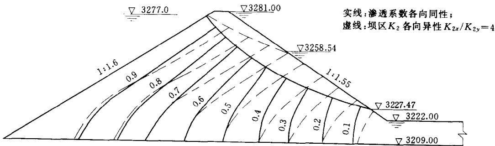  
图10.27 稳定渗流分析等势线图（上游水位3277m）  
实线： $K _ { 2 x } { = } K _ { 2 y } { = } 0 . 0 0 1 \mathrm { c m } / \mathrm { s } ;$ 虚线：坝区 K2各向异性 $K _ { 2 x } / K _ { 2 y } = 4$

根据上述计算结果，可以绘制单宽渗流量q和导致坝体不能自由排水的临界渗透系数 $q$ $K _ { c r }$ 之间的关系曲线，如图10.28所示。K的定义是导致单宽渗透流量达到q值时相应的渗 $K _ { c r }$ 透系数。如对于上述情况(a)，在各向同性情况下，相应单宽渗透流量 $q { = } 4 . 2 4 { \times } 1 0 ^ { - 3 } \mathrm { m } ^ { 3 } / s$ 的 $K _ { c r }$ 为0.01cm/s。由于每一种工况均相应一个下游坝坡出逸高程，因而也可绘制单宽渗流量 $q$ 和失去自由排水能力时的出逸高程之间的关系曲线。如图10.29所示。

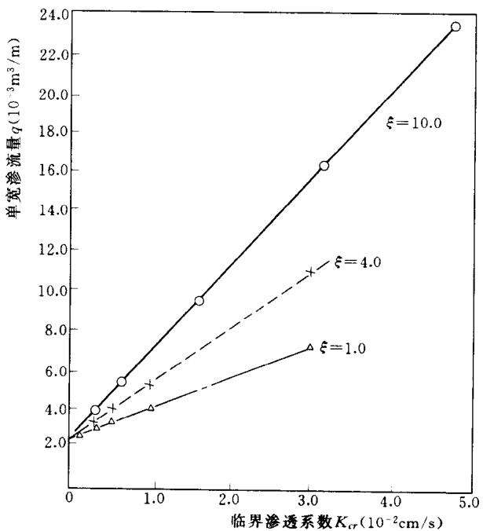  
图10.28 单宽渗流量q和临界渗透系数K之间的关系曲线 $\pmb q$ $\mathbf { \delta } _ { \mathbf { x } _ { \alpha } }$

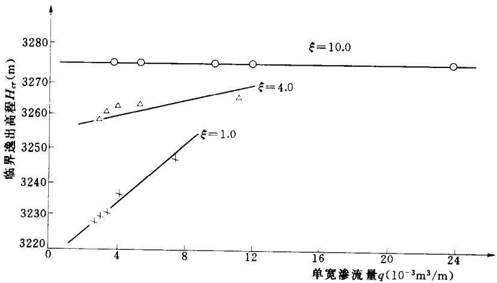  
图10.29 单宽渗流量q和逸出高程H之间的关系曲线 $\pmb { H } _ { \pmb { \sigma } }$

(2) 坝坡稳定分析。对沟后坝的筑坝材料，中国水利水电科学研究院和清华大学分别进行了三轴排水试验，其试验成果见表10.22。在本次分析计算中，选用 $c ^ { \prime } { = } 2 0 \mathbf { k P a } , \ \phi ^ { \prime } { = } 3 9 ^ { \circ }$ 亚田比並符化注十两计田100+两计人+

采用毕肖普简化方法，主要计算成果如图10.30，主要结论如下：

情况1：相应前述渗流情况(a)，按图10.26实线所示浸润线位置，安全系数为1.132;

情况2：相应前述渗流情况(b)，按图10.26虚线所示浸润线位置，安全系数为0.817;

情况 3: 相应前述渗流分析情况(c)，获得的安全系数为0.773。

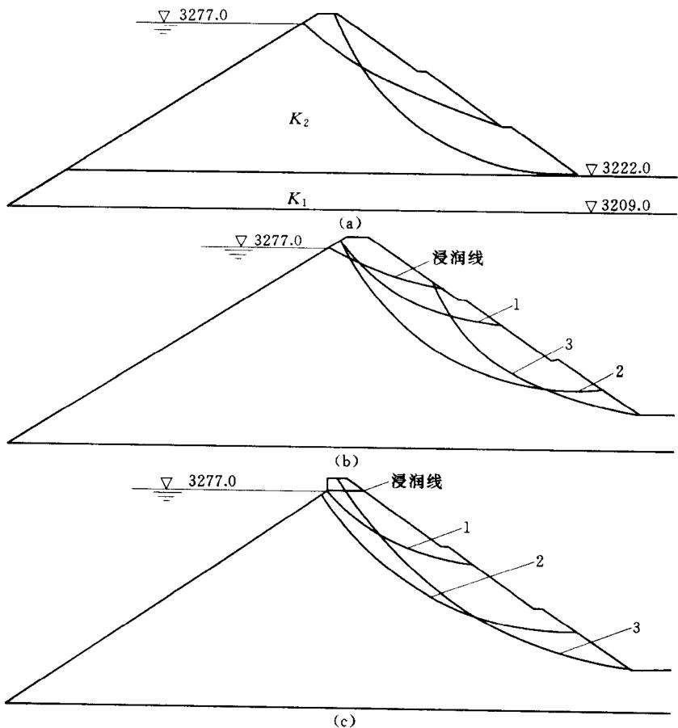  
图 10.30 下游坝坡圆弧稳定分析成果  
(a) 情况 1；(b) 情况 2；(c) 情况 3

表 10.22 沟后上坝砂砾料的抗剪强度参数
<table><tr><td>试验单位</td><td>土料</td><td> $\underline { { c ^ { \prime } ( k P a ) } }$  φ′(0)</td><td></td></tr><tr><td rowspan="3">清华大学</td><td>ⅡI区</td><td>13.29</td><td>39.10</td></tr><tr><td>III区</td><td>10.47</td><td>37.07</td></tr><tr><td>IⅣV区</td><td>5.09</td><td>36.59</td></tr><tr><td rowspan="2">中国水利水电科学研究院</td><td>平均级配</td><td>0</td><td>41.0°</td></tr><tr><td>上限级配</td><td>0</td><td>37.1°</td></tr></table>

注 中国水利水电科学研究院的试验指标按 $\scriptstyle { c = 0 }$ 时整理，相应φ′为 $\pmb { \sigma } _ { 3 } { = } 0 . 4 \mathbf { M } \mathbf { P a }$ 时的有效内摩擦角。

根据上述确定性模型计算结果可得到以下结论：

(a)稳定分析成果表明，相应最高库水位3277.00m，当筑坝材料的平均渗透系数为0.01cm/s时（坝基渗透系数为0.0688cm/s)，坝体的最大渗透流量为0.7m³/s左右。当从坝顶伸缩缝和各个有缺陷部分入渗的流量接近和超过此值时，坝体将失去自由排水能力，在坝体内将形成浸润线。以前，人们普遍认为，当渗透系数达0.01cm/s数量级时，则筑坝材料即认为中等或强透水。现在看来，从坝体自由排水的要求看， $1 0 ^ { - 2 }$ 的数量级仍嫌不足，因为，从已建的面板坝的实际运用情况看，对于一个中等高度的面板坝（坝高40\~70m），漏水量超过0.5\~1.0m³/s，入渗宽度170m这样的数量级是可能的。

(b) 筑坝材料在填筑时分离造成的各向异性特征对浸润线位置影响极大，本文的算例 $K _ { x }$ 仅为 $K _ { y }$ 的4倍，已使浸润线位置较各向同性的材料提高了26m之多。

(c) 从确定型分析可以看到，当砂砾石面板坝的渗漏量达到某一临界值Q后，坝内形 $Q _ { c r }$ 成浸润线，如果此时坝体的抗剪强度不足以使下游坝坡的抗滑稳定安全系数超过1，就有可能发生滑坡。而Q.的数值则是直接与筑坝砂砾石的渗透系数有关。以沟后大坝为例，如 $Q _ { c r }$ 坝体渗透系数为 $1 0 ^ { - 2 } \mathrm { { c m / s } }$ ，根据渗流计算，可以大致确定 $Q _ { c r }$ 值约为 $0 . 7 \mathrm { m } ^ { 3 } / \mathrm { s }$ ，这和大坝失事时推算的实际入渗量(约0.6m³/s)接近。

(d) 如果考虑渗透系数各向异性的特点，则下游坝坡稳定安全系数远小于1。

## 3. 可靠度分析步骤

(1) 坝坡稳定可靠度分析的提法。对于沟后砂砾石面板坝，在上游坝坡止水失效发生漏水时，坝坡稳定可靠度分析的提法包括：

1) 事件Q -当坝体上游入渗单宽流量达到某一值q后，下游坝坡失稳，该事件发生的概率为 $P _ { f } ( \mathbf { Q } )$

2) 事件 A -当大坝单宽入渗流量达到某一值q后，坝体自由排水能力失效，坝体内形成浸润线（此时出逸高度为 $H _ { c r } )$

3) 事件B - 下游坝坡失稳；

4) 事件 B/A - 在坝体内浸润线已形成的条件下发生坝坡失稳。

根据以上定义，事件Q可定义为事件A、B同时发生，即当大坝单宽入渗流量为q时 $\pmb q$ 大坝下游坝坡失稳。根据概率论原理有：

$$
P _ { f } \left( \mathbf { Q } \right) = P _ { f } \left( \mathbf { A } \mathbf { B } \right) = P _ { f } \left( \mathbf { A } \right) \cdot P _ { f } \left( \mathbf { B } / \mathbf { A } \right)\tag{10.122}
$$

因此，需要用可靠度分析方法确定 $P _ { f } ( \mathbf { A } )$ 和 $P _ { f } ( { \mathbf B } / { \mathbf A } )$ 的值。

(2) 求解坝体失去自由排水能力（事件 A）的概率 $P _ { f } ( \mathbf { A } )$ 。通常，发生在砂砾石坝体的渗流通常与入渗的单宽流量q、坝体材料的渗透系数以及变异性有关。当单宽入渗流量 $q \cdot$ $q$ 时，坝体失去自由排水能力，形成浸润线的极限功能函数可表述为：

$$
g ( n , d _ { 2 0 } , K _ { c r } ) = 2 3 4 n ^ { 3 } d _ { 2 0 } ^ { 2 } - K _ { c r }\tag{10.123}
$$

如前所述(第10.6.2节)，对于沟后坝料，渗透系数小于0.001cm/s、0.005cm/s和0.01cm/s的概率分别为 15%、49%和 65%。

(3) 求解相应于某一浸润线出逸高程 $H _ { c r }$ 下游坝坡稳定的失效率 $P _ { f } ( { \bf B } / { \bf A } )$ 。在进行边坡稳定分析时，需要确定强度指标的统计参数。在应用第10.6.2节介绍的确定强度指标的经验公式时，还根据实际情况作了经验修正。在垮坝后，残留坝体中出现了高40\~60m不等的基本直立的边坡，这一事实说明，沟后料可能较试验值稍高。如果将一个高32m、坡度${ 8 0 ^ { \circ } }$ 的边坡进行反演分析， $\tan \phi ^ { \prime }$ 取 0.933，相应 $c ^ { \prime }$ 值为80kPa。因此，在进行坝坡稳定可靠度分析时，最终选定的强度指标参数是：粘聚力 $c ^ { \prime } { = } 2 0 \mathbf { k P a }$ ，确定性指标；摩擦系数 $f ^ { \prime } { = } \tan \phi ^ { \prime } ,$ 正态分布， $\mu _ { f } { = } 0 . 9 3 3 , \sigma _ { f } { = } 0 . 1 2$ 。计算结果见图10.31。

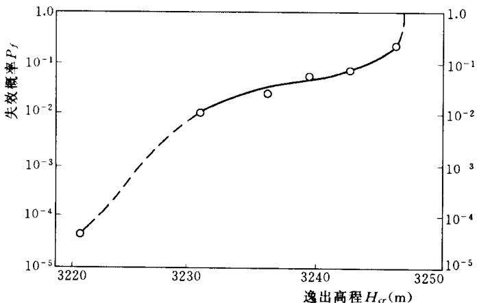  
图 10.31 逸出高程 H和失效概率 P的关系 $\pmb { H } _ { c r }$ $P _ { f }$

本例采用一次二阶矩法，依次对浸润线出逸高程H进行可靠度分析计算。计算结果 $H _ { c r }$ 见表10.23，相应临界滑裂面及最小可靠度指标见图10.32。

表10.23 相应不同浸润线出逸高程的最小可靠度指标
<table><tr><td>浸润线出逸高程(m)</td><td>相应图10.33的图号</td><td> $\beta _ { m }$ </td><td> $\underline { { P _ { t } } } ( \mathbf { B } / \mathbf { A } )$ </td></tr><tr><td>无浸润线</td><td>(a)</td><td>3.932</td><td> $4 . 0 { \times } 1 0 ^ { - 5 }$ </td></tr><tr><td>3231.0</td><td>(b)</td><td>2.304</td><td> $1 . 0 6 \times 1 0 ^ { - 2 }$ </td></tr><tr><td>3236.6</td><td>(c)</td><td>1.935</td><td> $2 . 6 5 \times 1 0 ^ { - 2 }$ </td></tr><tr><td>3239.9</td><td>(d)</td><td>1.684</td><td> $4 . 6 1 \times 1 0 ^ { - 2 }$ </td></tr><tr><td>3243.1</td><td>(e)</td><td>1.428</td><td> ${ 7 . 0 { \times } 1 0 ^ { - 2 } }$ </td></tr><tr><td>3246.4</td><td>(f)</td><td>0.694</td><td>0.24</td></tr></table>

(4) 求解下游坝坡的失效概率。按下列步骤计算某一入渗流量q值的 $\pmb q$ J $P _ { f } ( Q )$ 值。

1) 给出一入渗单宽流量q和沿水平方向和垂直方向的渗透系数的比值 $\pmb q$ $K _ { 2 x } / K _ { 2 y } ;$

2) 相应该入渗单宽流量 q，根据图 10.28 和图 10.29 计算临界渗透系数 K和逸出高 $q { \mathrm { : } }$ $K _ { c r }$ 程 $H _ { c r }$

3) 相应此 K值在图 10.18 中查得坝体失去自由排水能力的概率 $K _ { c r }$ $P _ { f } ( \mathbf { A } )$

4) 根据相应q值的出逸高度H值计算下游坝坡的最小可靠度指标βm和相应的失效 $q$ $H _ { c r }$ $\cdot \beta _ { m }$ 概率 $P _ { f } ( { \bf B } / { \bf A } )$

5) 按式(10.122)计算 $P _ { f } ( Q )$ 值。

表10.24汇总了相应于不同 q值的失效概率值 $P _ { f } ( Q )$ 。从中可以得出：在各向同性的情况下，当入渗单宽流量为 $q = 2 . 5 { \times } 1 0 ^ { - 3 } \mathrm { m } ^ { 3 } / \mathrm { s }$ 时，坝坡尚保持原有干坡时的失效概率；当入渗单宽流量q 大于 $5 . 7 { \times } 1 0 ^ { - 3 } \mathrm { m } ^ { 3 } / \mathrm { s }$ 时，失效概率 $P _ { f } ( Q )$ 急剧增至于100%。

当ξ=4和 $| \pmb { \xi } = 1 0$ 时，在相同单宽入渗流量的前提下，其失效概率较ξ=1增大许多。

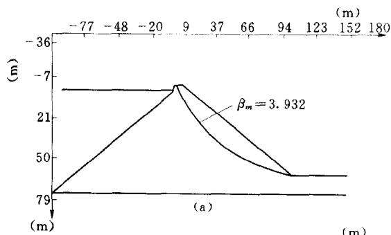

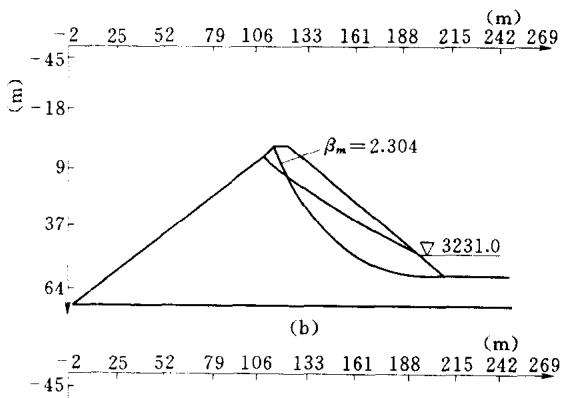

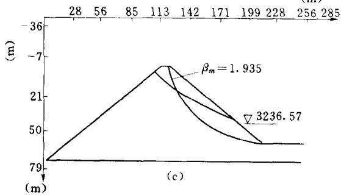

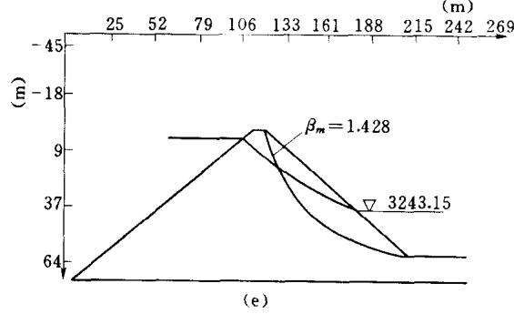

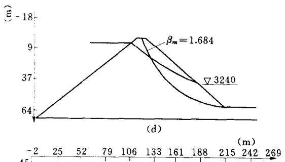

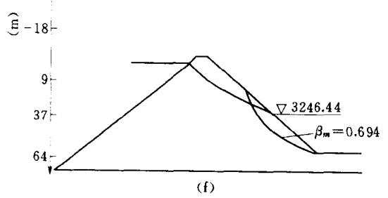  
图10.32 不同浸润线出逸高程的临界滑裂面及相应最小可靠度指标(相应表10.23)

表10.24 不同入渗单宽流量情况下的下游坝坡的失效概率 $\pmb { P } \pmb { \mathcal { k } } \pmb { Q } )$
<table><tr><td>各向异性</td><td>入渗单宽流量  $\underline { { ( 1 0 ^ { - 3 } \mathbf { m } ^ { 3 } / \mathsf { s } ) } }$ </td><td>出逸高程 (m)</td><td>临界渗透系数K  $( 1 0 ^ { - 3 } \mathrm { c m } / \mathrm { s } )$ </td><td> $P _ { f } ( A )$ </td><td> $P _ { f } ( B / A )$ </td><td> $P _ { f } ( Q )$ </td></tr><tr><td rowspan="3"> $K _ { 2 x } / K _ { 2 y } { = } 1$ </td><td>2.5</td><td>3228</td><td>8.0</td><td>0.17</td><td>0.003</td><td>0.00051</td></tr><tr><td>4.0</td><td>3234</td><td>10.0</td><td>0.65</td><td>0.02</td><td>0.0013</td></tr><tr><td>5.7</td><td>3247</td><td>20.0</td><td>0.99</td><td>0.99</td><td>0.99</td></tr><tr><td rowspan="2"> $K _ { 2 x } / K _ { 2 y } { = } 4$ </td><td>2.5</td><td>3258</td><td>1.0</td><td>0.15</td><td>0.99</td><td>0.15</td></tr><tr><td>4.0</td><td>3260</td><td>5.0</td><td>0.48</td><td>0.99</td><td>0.48</td></tr><tr><td rowspan="2"> $K _ { 2 x } / K _ { 2 y } { = } 1 0$ </td><td>2.5</td><td>3275</td><td>2.0</td><td>0.28</td><td>0.99</td><td>0.28</td></tr><tr><td>4.0</td><td>3275</td><td>3.0</td><td>0.36</td><td>0.99</td><td>0.36</td></tr></table>

## 10.8 讨论和结论

## 10.8.1 边坡的安全系数和失效风险

本章表10.6和式(10.27)在传统方法的安全系数和可靠度指标和失效风险之间架起了一座桥梁。显然，这是一个分析手段的重大进步。在工程设计中，一旦计算出了边坡的安全系数，如果同时也能合理地分析安全系数的变异系数。那么，就可以知道该边坡的失效概率。类似“安全系数从1.20增加到1.25”这样论述是比较抽象的，而“风险从 $1 0 ^ { - 2 }$ 减少到 $1 0 ^ { - 5 } ^ { \cdot \cdot }$ 这样的结论所提供的信息却是明白无误。至少保险公司更为乐意接受后者。

在使用式(10.27)计算β值时，需要注意的一个问题是，通常按规范要求计算的安全系数并不是其均值，因此不能直接把它直接代到式(10.27)中计算可靠度指标。

大部分规范在规定安全系数的允许值时，同时也规定了计算安全系数所输入的强度指标的取值标准。在土石坝规范中规定了强度指标应取试验值的小值平均，在水利水电工程地质勘测规范中，也规定了取试验值分布曲线中0.2的分位数的强度为设计指标。这一强度指标的设计采用值也可大致取为强度指标的均值减一倍的标准差。

因此，按规范规定的方法计算获得的安全系数大致也应为其小值平均值，或者说，应为安全系数的均值减去它的一倍标准差。现在，不妨来作下面一个试算，以了解我国土石坝设计规范规定一级坝在正常运用工况下允许安全系数F为1.5意味多大的失效风险。 $F _ { a }$

根据对大量上坝土料强度指标试验成果的统计分析，对一级坝将 $c$ 和 $f$ 的变异系数定为0.1 是基本可行的(参见图10.12)，因此也可将一级坝安全系数的变异系数假定为 $V _ { F } { = } 0 . 1$ o

如上所述，规范规定安全系数的允许值F为安全系数的小值平均，安全系数的均值可 $F _ { a }$ 近似取为小值平均加一倍的标准差。故有

$$
\mu _ { F } = F _ { a } + \sigma _ { F } = F _ { a } + V _ { F } \mu _ { F }
$$

不难得到，在 $F _ { a } { = } 1 . 5$ $V _ { F } { = } 0 . 1$ 的情况下， $\mu _ { F } { = } 1 . 6 7$ ，故有

$$
\beta = \frac { \mu _ { F } - 1 } { \sigma _ { F } } = \frac { 1 . 6 7 - 1 } { 0 . 1 6 7 } = 4 . 0 1
$$

这一数值和表10.7所示我国“水利水电工程结构可靠度设计统一标准”对Ⅰ级建筑物二类破坏规定的允许β值4.2是接近的。相应的失效概率为 $3 . 1 { \times } 1 0 ^ { - 5 }$ 。“统一标准”还规定Ⅰ级建筑物的设计基准年是100年。假定一级坝的寿命为500年，因此以年计的失效概率为$0 . 6 2 \times 1 0 ^ { - 5 }$ 。可以将这个数字和第10.1.5节所介绍的各种允许风险标准作一比较。

## 10.8.2 风险分析存在的问题和应用前景

在传统的确定性模型边坡稳定分析中，获得的是衡量安全度的一个指标，即安全系数$\pmb { F _ { \circ } }$ 在可靠度分析中，可以获得是两个指标，即安全系数的均值μ和标准差σ，据此获得 $\scriptstyle { \mu _ { F } }$ $\sigma _ { F }$ 边坡的可靠度指标和失效概率。可靠度分析从目标函数最可能数值和变异系数两个方面把握结构的安全度。对结构失效概率是通过研究每一个影响因素的变异特征获得的，其分析成果自然要比确定性模型更加合理。

但是，为了实现这一分析过程，工程师需要付出代价。在输入每一种材料的岩土力学的指标时，也要输入两个值，即均值和标准差。从严格意义上讲还要加上概型这一项。岩土力学的一些特征指标，如c和f，其确定过程中本来就带有很多经验成分。在一些重大工程中，确定某一种材料的c和f的均值，对决策者来说已是不小的负担。要他们再为其决定相应的标准差，就更加勉为其难了。但是如果不能科学地确定如c和f的标准差，相应的可靠度计算难免会成为一种数学游戏。正是在确定参数统计特性方面的困难，使可靠度分析在边坡工程中的推广遇到了重大的障碍。

SUBROUTINE ROTH(BET)  
C 参照第 10 章中介绍的 Rosenbleuth 法编写的 FORTRAN 源程序，编者：闫继军，陈祖煜  
C 变量属性受隐性规则控制  
C KMAX：随机变量的个数  
C IM：符号矩阵中的总列数  
C IS()：用来存放符号矩阵中第Ⅰ列的符号值  
$\mathbf { I M } { = } 2 ^ { * * } \mathbf { K M A X }$   
$\scriptstyle \mathbf { A } = \mathbf { F L O A T ( I M ) }$   
C 给功能函数一、二阶矩 $E ( g )$ 和 $E ( g ^ { 2 } )$ 赋初值  
E1=0.  
E2=0.  
DOI=1,IM  
计算符号矩阵中第Ⅰ列的符号值(或I-1整形数的二进制表达式)  
CALL FLAG(IS,KMAX,I)

但是，从本章对10.6节介绍的方法和相应的工程应用情况中可以看出，如果恰当地应用风险分析的概念和方法，大量地采取诸如干容重、颗分这样一些基本特性试验成果，同时借鉴以往工程的经验，综合考虑“3σ”法则，合理地确定参数的变异特性是可能的。通过可靠度分析，可以使工程设计建立在更为科学的论证基础上。如果说，可靠度分析方法成为一种成熟、实用的方法进入规范还有一段很长的路要走，那么，它作为安全系数方法的一种补充，定量地分析、判断工程设计中包含的不确定因素，是具有广泛的应用前景的。同时，在制定规范时，它也可以为合理地规定一些重要的系数提供科学的分析依据。

在推广可靠度分析中遇到的困难不应成为否定这一方法的理由，而应成为激励岩土工程师在实践中进一步完善这一方法的动力。

## 10.9 本章附录

## 10.9.1 进行Rosenbleuth法计算的源程序

## 1. 说明

本程序实现 10.5.3 节介绍的 Rosenbleuth 法符号编码方法。功能函数与程序 OBF()由用户自已提供。本节第3部分提供了三个测试题其目标函数分别为

$$
\begin{array} { c } { y = 0 . 6 x _ { 1 } ^ { 3 } + 0 . 0 5 x _ { 2 } ^ { 3 } - 1 . 5 x _ { 3 } ^ { 3 } } \\ { y = x _ { 1 } x _ { 2 } - x _ { 3 } } \\ { y = 1 + 8 x _ { 1 } - 3 x _ { 2 } } \end{array}
$$

答案已在注释行中列出。

## 2. 源程序

P=1.0  
PK=1. !Ceta  
IF(KMAX.EQ.2)PK=0.5 !Ceta  
DO K=1,KMAX  
C 通过第k个随机变量的均值和标准差求可靠度分析中的随机变量值  
RPA(K)=RM1(K)+IS(K)\*RD1(K)  
KI=K+1  
IF(KI.GT.KMAX)KI=1  
P=P+IS(K)\*IS(KI)\*R11(K,KI)\*PK  
END DO  
C 计算 Rosenbleuth 法中的 P..值  
P=P/A  
C 把随机变量转换为岩土材料的粘聚力、摩擦系数和孔隙水压力系数  
DO IQ=1,N  
DO IY= 1,KMAX  
IF(MLA(IQ).NE.NSOIL(IY))CYCLE  
MJ=NPARA(IY)  
IF(MJ.EQ.1)C(IQ)=RPA(IY)  
IF(MJ.EQ.2)F(IQ)=RPA(IY)  
IF(MJ.EQ.3)RU(IQ)=RPA(IY)  
KKK=KKK+1  
ENDDO  
ENDDO  
C 计算功能函数值  
CALL FS1(FOS)  
C 功能函数一阶矩E(g)  
E1=E1+FOS\*P  
C 功能函数二阶矩E(g²)  
E2=E2+FOS\*FOS\*P  
END DO  
E2=E2-E1\*E1  
C 可靠度指标β  
BET=(E1-1)/SQRT(E2)  
RETURN  
END  
SUBROUTINE FLAG(IS,N,II)  
C 利用 FORTRAN 语言中提供的 BTEST(I,J)函数得到整形数I第J字节是0或者1，  
C 我们约定0代表“+”，1代表“-”，变量属性受隐性规则控制。  
C 符号矩阵中第Ⅱ列  
II=ⅡI-1  
J=0  
DO WHILE(J.LE.N-1) N：随机变量的个数  
IF(BTEST(I,JJ)THEN  
IS(N-J)=-1  
ELSE  
IS(N-J)=+1  
ENDIF  
J=J+1  
ENDDO  
RETURN  
END  
3. 测试题  
CCC SUBROUTINE OBF OBTAINS THE VALUE OF PERFORMANCE FUNCTION F  
WITH THE INPUT OF VARIABLES VAR ()

<table><tr><td colspan="5">THE CORRECT ANSWERS,WITH THE DATA FILE LISTED BELOW, ARE:</td></tr><tr><td>TEST PROBLEMS</td><td></td><td>E1</td><td>E2</td><td>BET</td></tr><tr><td>1</td><td>6871.375</td><td>1924.161</td><td>3.571</td><td></td></tr><tr><td>2</td><td>1005.</td><td>364.186</td><td>2.760</td><td></td></tr><tr><td>3</td><td>51.</td><td>11.764</td><td>4.335</td><td></td></tr></table>

TO WRITE OBF FOR A PARTICULAR PROBLEM IS THE RESPONSIBILY OFUSERS. THE CODES CONTAINED IN THIS SUBROUTINE ARE ONLY FORTHE PURPOSE OF VALIDATION AND DEMONSTRATION

$$
\mathbf { F } = 0 . 6 ^ { * } \mathbf { V } \mathbf { A } \mathbf { R } ( 1 ) ^ { * * } 3 + 0 . 0 5 ^ { * } \mathbf { V } \mathbf { A } \mathbf { R } ( 2 ) ^ { * * } 3 - 1 . 5 ^ { * } \mathbf { V } \mathbf { A } \mathbf { R } ( 3 ) ^ { * * } 3
$$

## 10.9.2 本章数据文件（表10.25）

表10.25本章数据文件
<table><tr><td>有关章节</td><td>系列号</td><td>数据文件名</td><td>内容</td><td></td></tr><tr><td>10.3.2</td><td>10-01-01</td><td>R1-MC.DAT</td><td>[例10.1]</td><td>均匀边坡例，采用Monte Carlo法</td></tr><tr><td rowspan="2">10.4.4</td><td>10-02-01</td><td>R2-FOSM.DAT</td><td>[例10.2]</td><td>分层边坡例，采用一次二阶矩法</td></tr><tr><td>10-02-02</td><td>R1-FOSM.DAT</td><td>[例10.3]</td><td>[例10.1]，采用一次二阶矩法</td></tr><tr><td>10.4.5</td><td>10-03-01</td><td>R1-RS.DAT</td><td>[例10.4]</td><td>[例10.1]，采用Rosenbleuth法</td></tr><tr><td>10.6</td><td>10-04-01</td><td>R2-GF.DAT</td><td>[例10.3]</td><td>一次二阶矩法</td></tr><tr><td rowspan="5">10.7</td><td></td><td>R2-GR.DAT</td><td>[例10.4]</td><td>Rosenbleuth法G</td></tr><tr><td></td><td>R2-S.DAT</td><td>[例10.3]</td><td>单形法</td></tr><tr><td>10-05-01</td><td>S-160.dat</td><td>10.7.1节</td><td>十三陵面板堆石坝例，160.剖面</td></tr><tr><td>10-05-02</td><td>S-240.dat</td><td>10.7.1节</td><td>十三陵面板堆石坝例，240 剖面</td></tr><tr><td>10-06-01</td><td>G1.dat</td><td>10.7.2节</td><td>沟后面板堆石坝例</td></tr><tr><td rowspan="4">10.7</td><td>10-06-02</td><td>G2.dat</td><td>图10.32和表10.24</td><td></td></tr><tr><td>10-06-03</td><td>G3.dat</td><td></td><td></td></tr><tr><td>10-06-04</td><td>G4.dat</td><td></td><td></td></tr><tr><td>10-06-05</td><td>G5.dat</td><td></td><td></td></tr><tr><td></td><td>10-06-06</td><td>G6.dat</td><td></td><td></td></tr></table>

## 参考文献

1 Ang, A-H, A. and Tang, W. Probability Concepts in Engineering Planning and Design, Vol. 2, John Wiley and Sons, Inc., New York. 1984

2 Australian Geomechanics Society. Landslide risk management, concepts and guidelines. Australian Geomechanics. 2000. March, 35(1): 51-92.

3 Casagrande, A. Role of the calculated risk' in earthwork and foundation engineering. Journal of the Soil Mechanics Division, ASCE, 1965. 1(91):4

4 Chen, Z., and Morgenstern, N. Extensions to the generalised method of slices for stability analysis., Canadian Geotechnical Journal, , 1983. 20(1): 104-109

5 陈祖煜，赵毓芝.水库坝坡稳定性研究（一）确定性模型，沟后水库砂砾石面板坝-设计、施工、运行和失事，北京：中国水利电力出版社.1996.55-60

6 陈祖煜，赵毓芝.水库坝坡稳定性研究（二）确定性模型，沟后水库砂砾石面板坝-设计、施工、运行和失事.北京：中国水利电力出版社.1996.61-76

7陈祖煜，张广文,关于“土坡稳定可靠度分析”一文的讨论.岩土工程学报.1995.6:126-128

8 陈祖煜，陈立宏，对重力坝设计规范中双斜面抗滑稳定分析公式的讨论意见，水力发电学报，2002，2:101-108

9 Christian, J.J., Ladd, C.C., and Baecher, G.B. Reliability and probability in stability analysis, in stability and Performance of Slopes and Embandments II. ASCE Geotechnical Special Publications, 1992. Vol. 12, 1071- 1111

10 Chowdhury, R. N., Recent developments in landslide studies: probabilistic methods, state-of-the-art report. 4th International Symposium on Landslides, Toronto. 1984. Vol. 1. 209-228.

11 Donald, I. B. and Giam, S. K. Soil slope stability program review, ACADS, Association Computer Aided Design. N0. U255. 1989. April.

12 Duncan, J. M. Factors of safety and reliability in geotechnical engineering, Journal of Geotechnical and Geoenvironmental Engineering, 2000. 126 (4): 307-316.

13 Fell, R. Some landslide risk zoning schemes in use in easter, Australia and their application. Sixth Australian New Zealand Conference on Geomechanics, Christchurch, 1992. 505-512

14 Fell, R. Landslide risk assessment and acceptable risk. Austrlian-China Landslide Seminar, 1993. 3-18 July, 1-42

15 Fell, R., Mostyn, G.R., Maguire, P., and O'Keeffe, L. Assessmwnt of the probability of rain induced landsliding. Proc. Fifth Australia-New Zeland Conference on Geomechanics. 1988. 73-77

16 国家防汛抗旱总指挥部、水利部科学技术司，沟后水库砂砾石面板坝-设计、施工、运行和失事，中国水利电力出版社.1996

17 Hassan, A. and Wolff, T. Search algorithm for minimum reliability index of earth slopes. ASCE Journal of Geotechnical and Environmental Engineering. 1999, 125:301-308

18 Ho, K., Leroi, E. & Roberds, B. 2000. Quantitative risk assessment: Invited Lecture: Application, myths and future direction. GeoEng'2000

19 Kreuzer, H. General Report. The use of risk analysis to support dam safety decision and managermant. Symposium of International Congress on Large Dams. 2000. Q76: 769-896

20 Lumb.P. The variability of natural soils. Canadian Geotechnical Journal, 1966. 30(2): 74-97

21 Lumb.P. Safety factors and the probability distribution of soil strength. Canadian Geotechnical Journal, 1970. 7(3): 225-242

22 Li, K. S. and Lumb, P., Probabilistic design of slopes, Canadian Geotechnical Journal, 1987. Vol. 24, 520-535

23 Li, K. S., Some common mistakes in probabilistic analysis of slopes, Proceedings, 6th International Symposium on Landslides, Christchurch.1992. 475-480

24 Lowe, B. K. Gilbert, R. B. And Wright, S. G. Slope reliability analysis using generalized method of slices. ASCE. J. Geotechnical and Environmental Engineering 1998. 124:4, 351-363

25 李君纯，陈祖煜.沟后面板砂砾坝破坏机理及潰决过程研究、沟后水库砂砾石面板坝的失稳机理分析、研究总报告，南京水利科学研究院、中国水利水电科学研究院.1996

26刘杰，缪良娟，1995，大坝砂砾料的渗透和渗透稳定性的试验研究，沟后水库砂砾石面板坝-设计、施工、运行和失事，18-25. 北京：中国水利电力出版社.1996

27 Moon, A.T., Olds, R.J., Wilson, R.A., and Burman, B.C. 1992. Debris from flow risk zoning at Montrose, Victoria. Proc. 6th Int. Symp. On Landslides, Vol. 2. 1015-1022

28 Morgan, G.C., Rawlings, G.E., and Sobkowicz, J.C. 1992. Evaluating total risk to communities from large debris flows, in Geotechnique and Natural Hazards, BiTech Publishers. 225-236

29 Morgensterm , N.R. 1995. Managing risk in geotechnical enginneering. The 3™d Casagrande lecture. Proc. 10th Pan American Conference on soil mechanics and Foundation Engineering. Vol. 4, 102-126

30 National Research Council, 1995. Probabilistic methods in geotechnical engineering, Committee on reliability methods for risk mitigation in geotechnical geotechnical board and board on energy and environmental systems commission on engineering and technical systems

31 Reid, S.G. Risk assessment. Research Report, No. RJ91, School of civil and Mining Engineering, University of Sydney. 1989

32 Rosenbleuth, E., Point estimate for probability moments, Proc. NATN Acad. Sci. U. S. A. 1975. 72(10): 3812-3814

33 Stewart, R.A. Dam risk management. Proc. An International Conference on Geotechnical & Geological Engineering, 19-24 November, Melbourne, Australia. 2000

34 Tabba, M. M., Deterministic versus risk analysis of slope stability. 4th International Symposium on Landslides, Toronto, 1984. Vol.2. 491-498

35 Whitman, R.V. Evaluating calculated risk in Geotechnical engineering. Journal of Geotechncial Engineering, ASCE, 1984. 110(2): 145-188

36 吴世伟. 结构可靠度分析. 人民交通出版社.1990

37 中国人民共和国标准.GB50199-94，水利水电工程结构可靠度设计统一标准.1994年11月

38 中华人民共和国电力行业标准.混凝土重力坝设计规范.北京：中国电力出版社.2000

39最上武雄，砾の内部摩擦角と常数Kにっして．土と基础.16卷.11号

## 第11章程序设计

## 11.1 前言

从本书介绍的内容可以发现，随着近代数值分析技术的进展，边坡稳定分析的极限平衡分析方法已经发展到十分成熟的程度。但是，随之而出现的问题是，这一分析步骤必须通过计算机程序才能得以实现。而现状是，尽管计算机的硬件已经获得了飞速的发展，尽管土力学的理论和实现这些理论的工具和手段均已十分先进，但岩土工程许多应用软件仍然处于起步状态，远不能满足工程实际的要求，且大部分岩土工程师对边坡稳定分析计算的实际应用水平还不很高。使用近代科学技术的成果来提高岩土工程设计的效率和水平，是工程师的强烈愿望，也是保证建筑物的安全和减少投资非常重要手段。当前岩土工程软件的落后状况，是有多方面因素造成的。

首先，开发岩土工程软件需要投入大量的人力和物力。研究一个新的数值分析方法并编制相应的科研程序是一回事，将其变为一个能够在工程设计中广泛应用的软件是另一回事，其源代码的数量起码增加十倍。在Windows的界面上编制一个直观、方便的具有处理图形、对话和纠错功能的软件，不仅是源代码数量上的增加，而且意味着对编程人员素质的新要求，而这一要求是由所支付的高额报酬体现在程序价格中的。

其次，岩土工程软件的市场极为有限，对于这种专业性的软件，单靠市场回报来实现其自身的发展是不现实的，而这一问题并未得到共识。众所周知，设计人员在图纸上多画一根预应力锚索，多画一根抗滑桩则是十万甚至百万元的投资。但对于开发这些有关软件的研究经费(尽管无法与施工费用相比)却难以得到批准。

再次，我们的软件管理还远未达到规范化、市场化的水平。盗版现象普遍存在，因此，营造一个保护软件的法律和道德约束环境，是软件作为一个产业兴旺发达的最基本的条件。

工程应用软件开发的另一个重要问题是确认其可靠性和准确性。工程软件应用的对象是关系到人民生命财产安全的建筑物，因此，绝非儿戏。对程序进行鉴定和考核自然是一个必须屡行的手续。但笔者认为对一个包含成千上万行指命的、又需要面临复杂多变的实际情况的工程应用软件，单靠鉴定和考核是不可能真正发现其全部问题的。这样的程序只有在长期的、大量的实际应用过程中，才能变得成熟，成为可以信赖的设计工具。

作者希望通过第11 章和第12章的内容，推动边坡稳定计算机程序的普及和推广。本章将介绍编制一个边坡稳定分析程序的核心步骤和源程序。将这几个子程序串联起来，就是一个计算任意几何形状边坡、包含第2章和第3章介绍的各种分析方法的程序。本章还将讨论与程序推广、使用相关的问题。在第12章，作者提供STAB程序的一个简化版。使用这一版本，读者可以进行本书介绍的部分稳定分析工作。需要说明的是，本书所列的所有源程序，只供科研和教学使用，作者不对其承担法律责任，他人也不得将其应用于商业目的。

## 11.2 几何图形的识别和分析

## 11.2.1 边坡剖面图形的数字信息

通常，坝体并非均一，而是由若干个物理力学指标不同的土质区域组成。图11.1所示坝体由6个土质不同的区域组成，控制点17个，边界线22条。图中滑弧上阴影所示的土条中心线和3条边界线相交，将该土条分成了三段，其高度分别为 $H _ { 1 } , \ H _ { 2 }$ 和 $H _ { 3 }$ ，并分别位于Ⅰ区、V区和VI区。所有这些，在图解法中，依靠人的直观操作是很容易判断和量测得的。编制程序的关键是如何让计算机代替人判断土条的中心线究竟与哪几个线条相交，各段高度分别为多少。我们的办法是，让计算机对所有的边界线循环一遍，逐个判断每一条线是否与土条中心线相交。边界线用所压土层号的数组来表示。输入这些数据，如交上，则记下该交点的X、Y坐标值及该线段所压的土层号。这样，根据相邻两交点的Y坐标值的差值，即可算得 $H _ { 1 } , \ H _ { 2 }$ 和 $H _ { 3 }$ 。根据土层编号，即可查得相应的物理力学指标，随即可算得土条重量、地震力、孔隙水压力等。这一对几何图形进行处理的方法，充分利用了计算机可进行大量重复的判断，忌讳过多的逻辑判断的特点，为编制一个效率高、鲁棒性(Robust) 强的边坡稳定分析程序创造了条件。

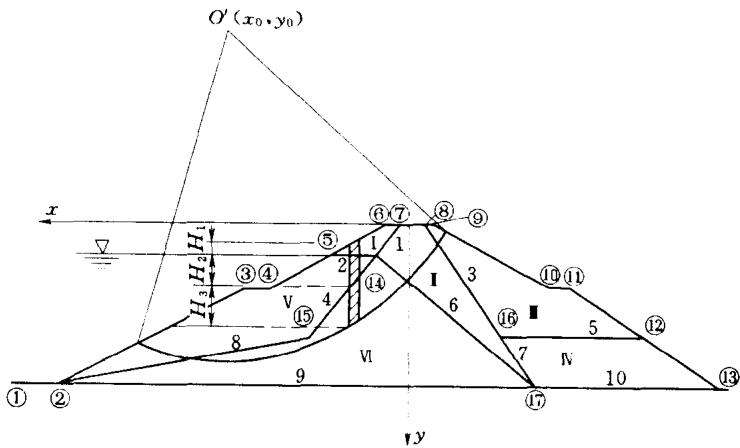  
图11.1 由6个土质不同的区域组成坝体

## 11.2.2 构造圆弧滑裂面的步骤

设某一坝坡坡面为具有n个折点的折线，如图11.2 所示(其中起点1 和尾点n在极远处)。建立坐标系统，X轴水平，指向滑坡方向为正，Y坐标轴垂直向下为正。某一半径为$R _ { 0 }$ 的滑弧圆 ${ \therefore \ o }$ 至坝坡各折点距离分别为 $R _ { 1 } , R _ { 2 } , . . . , R _ { n }$ 该圆弧自左至右在连接i、i+1两点的线段进入坝体（上交点），在连接 $j , \ j { + } 1$ 线段逸出坝体（下交点）。

不难证明，某一半径为R的圆弧与线段 $R _ { 0 }$ $\mathbf { A } _ { 1 } \mathbf { A } _ { 2 }$ 有一个且只有一个交点的必要充分条件是： $R _ { 2 } { \leqslant } R _ { 0 } { \leqslant } R _ { 1 }$ ，其中 $R _ { 1 } , \ R _ { 2 }$ 为圆心至线段端点的距离。如果R同时大于 $R _ { 0 }$ ${ \pmb R } _ { 1 } , \ { \pmb R } _ { 2 } ,$ 则圆弧与 ${ \bf A } _ { 1 } \mathbf { A } _ { 2 }$ 没有交点；如果 $R _ { 0 }$ 同时小于 $R _ { 1 }$ $R _ { 2 }$ ，则圆弧与 $\mathbf { A } _ { 1 } \mathbf { A } _ { 2 }$ 不是没有交点，就是有两个交点,见图11.3。

则根据上述原理可知，i、j应满足下面条件：

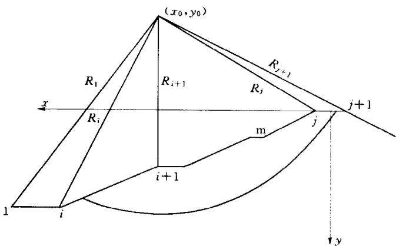

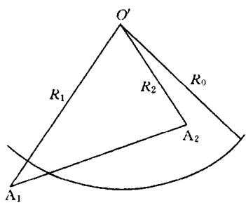  
图 11.3 具有 n 个折点的边坡线与圆弧滑裂面相交的关系  
图 11.2 圆弧滑裂面与边坡相交的关系

$$
R _ { i + 1 } \leq R _ { 0 } < R _ { i }\tag{11.1}
$$

$$
R _ { j } \le R _ { 0 } < R _ { j + 1 }\tag{11.2}
$$

找到了上、下交点所在的线段号i、j之后，就可以根据该线段两端点的坐标值和圆弧的圆心坐标值x0、y和半径值R，算得其交点的坐标值。对于点 $\pmb { x _ { 0 } }$ $y _ { 0 }$ $m \left( m = i , j \right)$ ，计算公式为：

$$
( x - x _ { 0 } ) ^ { 2 } + ( y - y _ { 0 } ) ^ { 2 } = R ^ { 2 }\tag{11.3}
$$

$$
( y - y _ { m } ) / ( x - x _ { m } ) = s\tag{11.4}
$$

$$
s = ( y _ { m + 1 } - y _ { m } ) / ( x _ { m + 1 } - x _ { m } )\tag{11.5}
$$

联立以上方程组，求解得：

$$
x = \frac { 1 } { ( 1 + s ^ { 2 } ) } [ x _ { 0 } + s T \pm \sqrt { ( 1 + s ^ { 2 } ) R _ { \circ } - ( s x _ { \circ } - T ) ^ { 2 } } ]\tag{11.6}
$$

$$
T = s x _ { m } - y _ { m } + y _ { 0 }\tag{11.7}
$$

此联立方程组有两个根，计算下交点时取+’号，计算上交点时取-’号。

## 11.2.3 构造任意形状滑裂面的步骤

如果要将若干点用光滑的曲线相连，可以采用样条函数予以实现，在STAB程序中，采用了第二种边界条件的三次样条函数。

第二种边界条件三次样条函数曲线两端点的二阶导数值为已知值，即 $y _ { 1 2 } = y ^ { \prime } ( x _ { 1 } )$

$y _ { n 2 } = y ^ { \prime } ( x _ { n } )$ 。在构造滑裂面时取 $y _ { 1 2 } = y ^ { * } ( x _ { 1 } ) = 0 \ , \quad y _ { n 2 } = y ^ { * } ( x _ { n } ) = 0$ ，由此确定的样条称为自然样条。根据此边界条件，计算n个节点上的一阶导数值m， $m _ { j }$ $j = 1 , 2 , \cdots , n$ 。相应的计算公式如下：

$$
a _ { 1 } = - 0 . 5\tag{11.8}
$$

$$
b _ { 1 } = 3 \times { \frac { y ( x _ { 2 } ) - y ( x _ { 1 } ) } { 2 ( x _ { 2 } - x _ { 1 } ) } }\tag{11.9}
$$

$$
h _ { j } = x _ { j + 1 } - x _ { j } \qquad j = 1 , 2 , \cdots , n - 1\tag{11.10}
$$

$$
\alpha _ { j } = h _ { j - 1 } \big / ( h _ { j - 1 } + h _ { j } )\tag{11.11}
$$

$$
\beta _ { j } = 3 [ ( 1 - \alpha _ { j } ) ( y _ { j } - y _ { j - 1 } ) / h _ { j - 1 } + \alpha _ { j } ( y _ { j + 1 } - y _ { j } ) / h _ { j } ]\tag{11.12}
$$

$$
a _ { j } = - \alpha _ { j } \big / [ 2 + ( 1 - \alpha _ { j } ) a _ { j - 1 } ]\tag{11.13}
$$

$$
b _ { j } = [ \beta _ { j } - ( 1 - \alpha _ { j } ) b _ { j - 1 } ] / [ 2 + ( 1 - \alpha _ { j } ) a _ { j - 1 } ] j = 2 , 3 , \cdots , n - 1\tag{11.14}
$$

$$
m _ { n } = [ 3 ( y _ { n } - y _ { n - 1 } ) / h _ { n - 1 } - b _ { n - 1 } ] / ( 2 + a _ { n - 1 } )\tag{11.15}
$$

$$
m _ { j } = a _ { j } m _ { j + 1 } + b _ { j } \qquad j = n - 1 , n - 2 , \cdots , 1\tag{11.16}
$$

于是对于 $x _ { j } \leq x < x _ { j + 1 }$ ，利用数值导数 $m _ { j } ~ ( { j = 1 , 2 , \cdots , n } )$ ，计算插值节点处函数值的公式如下：

$$
y ( x ) = \left[ \frac { 3 } { h _ { j } ^ { 2 } } ( x _ { j + 1 } - x ) ^ { 2 } - \frac { 2 } { h _ { j } ^ { 3 } } ( x _ { j + 1 } - x ) ^ { 3 } \right] y _ { j } + \left[ \frac { 3 } { h _ { j } ^ { 2 } } ( x - x _ { j } ) ^ { 2 } - \frac { 2 } { h _ { j } ^ { 3 } } ( x - x _ { j } ) ^ { 3 } \right] y _ { j + 1 }\tag{11.17}
$$

$$
+ h _ { f } \Biggl [ \frac { 1 } { h _ { j } ^ { 2 } } ( x _ { j + 1 } - x ) ^ { 2 } - \frac { 1 } { h _ { j } ^ { 3 } } ( x _ { j + 1 } - x ) ^ { 3 } \Biggr ] m _ { j } - h _ { f } \Biggl [ \frac { 1 } { h _ { j } ^ { 2 } } ( x - x _ { j } ) ^ { 2 } - \frac { 2 } { h _ { j } ^ { 3 } } ( x - x _ { j } ) ^ { 3 } \Biggr ] m _ { j + 1 }
$$

如果插值区间 $( x _ { j } , x _ { j + 1 } )$ 被等距划分为 l 段，则位于第s(0<s<I)段的被插值节点${ \pmb x } = { \pmb x } _ { j } + ( { \pmb s } / l ) { \pmb h } _ { j }$ 处的函数值的计算公式如下：

$$
y ( x ) = \kappa _ { 4 } + h _ { s j } [ \kappa _ { 3 } + h _ { s j } ( \kappa _ { 2 } + h _ { s j } \kappa _ { 1 } ) ]\tag{11.18}
$$

其中

$$
h _ { s j } = ( x - x _ { j } ) / h _ { j } = s / l\tag{11.19}
$$

$$
\kappa _ { \scriptscriptstyle { 1 } } = 2 [ y ( x _ { \scriptscriptstyle { j } } ) - y ( x _ { \scriptscriptstyle { j + 1 } } ) ] + ( m _ { \scriptscriptstyle { j } } + m _ { \scriptscriptstyle { j + 1 } } ) h _ { \scriptscriptstyle { j } }\tag{11.20}
$$

$$
\kappa _ { 2 } = 3 [ y ( x _ { j + 1 } ) - y ( x _ { j } ) ] - ( 2 m _ { j } + m _ { j + 1 } ) h _ { j }\tag{11.21}
$$

$$
\kappa _ { 3 } = \boldsymbol { m } _ { j } \cdot \boldsymbol { h } _ { j }\tag{11.22}
$$

$$
\kappa _ { 4 } = y ( x _ { j } )\tag{11.23}
$$

## 11.3 边坡稳定分析的源程序

## 11.3.1 概述

本章介绍边坡稳定分析程序STAB 的核心步骤和程序。程序CIRCLE.FOR 具体实施11.2.2 节的计算步骤，对给定的边坡剖面信息，构造一个圆弧滑裂面。程序SPLINE.FOR具体实施11.2.3 节的计算步骤，对给定的滑面控制点信息构造一个任意形状滑裂面。程序PROFILE.FOR具体实施11.2.1 节的计算步骤，计算土条重量和物理力学参数。程序 S.FOR计算安全系数，包含了第2章和第3章介绍的各种分析方法的源程序，即极限平衡法的通用条分法、瑞典法、毕肖普法、陆军工程师团法和简化法。将上述几个子程序串联起来，就是一个计算复杂几何形状边坡稳定的安全系数的程序。

在介绍这些程序时，将配以图11.4所示的一个例子。这一例子是将在11.4节中介绍的澳大利亚 ACADS 程序考核的 EX1(c)。该例已在第2 章和第 4 章中多次使用。读者在移植这些程序时，可通过这些考核题进行考核。

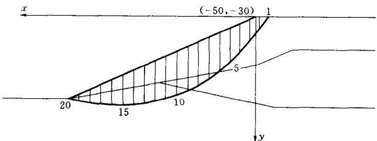  
图 11.4 滑裂面和条分

## 11.3.2 构造圆弧滑裂面的程序 CIRCLE.FOR

## 1. 说明

本子程序对给定的边坡剖面信息，构造一个圆弧滑裂面(图11.4)。通过子程序 SEAR找到圆弧滑裂面与边坡的上、下交点所在线段。子程序DIVI计算上、下交点的坐标，并划分土条。

## 2. 源程序

REAL YTENSION, DS, CX, CY, XN(99), YN(99), X(80), Y(80), ALF(80)   
INTEGER IN1, LSL, N, LNUM(80), IC(80,3), IWR5, L, NN, NLOW, NUPP   
OPEN(5,FILE=",STATUS='UNKNOWN')   
OPEN(6,FILE=",STATUS='UNKNOWN')   
NLOW=0   
NUPP=0   
READ(5,\*)IWR5,YTENSION,DS,CX,CY   
C IWR5=0,1 分别相应顶部有、无拉力缝；YTENSION=拉力缝底Y坐标   
C DS,CX,CY=滑弧深度，圆心坐标   
READ(5,\*)N!土条总数   
READ(5,\*)IN1!线段总数   
DO 302 I=1,IN1   
READ(5,\*)(IC(I,J),J=1,3)!线段信息   
302 CONTINUE

```csv
READ(5,*)LSL!外边坡线总数
READ(5,*)(LNUM(I),I=1,LSL)!外边坡线编号
READ(5,*)NN!点总数
READ(5,*)(L,XN(I),YN(I),I=1,NN)!点坐标
WRITE(6,703)
703 FORMAT(T25,'******************//)
WRITE(6,704)
704 FORMAT(10X,"THEABSCISSAVALUESOFTHEUPPERANDLOWER')
CALL SEAR(LNUM,IC,DS,CX,CY,XN,YN,LSL,NLOW,NUPP)!寻找上、下交点所在线段
CALL DIVI(N,IC,IWR5,DS,CX,CY,XN,YN！确定上、下交点坐标，条分
$,YTENSION,NLOW,NUPP,X,Y,ALF)
WRITE(6,711)
711 FORMAT(T5,'NO.',T17,'X',T32,'Y',T47,'ALF')
DO 309 I=1,N
WRITE(6,710)I,X(I),Y(I),ALF(I)
710 FORMAT(1X,I5,3F15.6)
309 CONTINUE
12 CALLCLOSEFL
END
SUBROUTINE CLOSEFL
CLOSE(5)
CLOSE(6)
RETURN
END
SUBROUTINE DIVI(N,IC,IWR5,DS,CX,CY,XN,YN
$,YTENSION, NLOW,NUPP,X,Y,ALF)
INTEGERN S,N,K,IC(80,3),K1,KTEMP,IWR5,J,J1,JTEMP,NLOW,NUPP
REAL RO,DS,CY,XN(80),YN(80),SK,T,XL,CX,XU1,YTENSION
REAL YU1,SJ,XU,ROO,YU,X2(80),Y2(80),X(80),Y(80),ALF(80)
S(E1,F1,E2,F2)=(F2-F1)/(E2-E1)
NS=N-1
RO=DS-CY
K=IC(NLOW,1)
K1=IC(NLOW,2)
IF(XN(K).GT.XN(K1))GOTO190
KTEMP=K
K=K1
K1=KTEMP
190 IF(ABS(XN(K)-XN(K1)).LT.0.00005)GOTO23
SK=S(XN(K),YN(K),XN(K1),YN(K1))
T=SK*XN(K)-YN(K)+CY
XL=(CX+SK*T+SQRT((1+SK**2)*RO**2-(SK*CX-T)**2))/(1+SK**2)
!按式(11.6)计算下交点的横坐标
GOTO28
23 XL=XN(K)
28 CONTINUE
IF(IWR5.NE.0)THEN
XU1=CX-SQRT(RO*RO-(YTENSION-CY)**2)
YU1=CY+SQRT(RO**2-ABS(XU1-CX)**2)
ENDIF
J=IC(NUPP,1)
J1=IC(NUPP,2)
IF(XN(J).GT.XN(J1))GOTO191
JTEMP=J
J=J1
J1=JTEMP
```

```csv
191 F(ABS(XN(J)-XN(J1)).LT.0.00005)GOTO82
SJ=S(XN(J),YN(J),XN(J1),YN(J1))
T=SJ*XN(J)-YN(J)+CY
XU=(CX+SJ*T-SQRT((1+SJ**2)*RO**2-(SJ*CX-T)**2))/(1+SJ**2)
!XU上交点的横坐标
ROO=RO**2-ABS(XU-CX)**2
IF(ROO.LT.0)RETURN!无交点,需修改RO,重新计算
YU=CY+SQRT(RO**2-ABS(XU-CX)**2)
IF(CY.GT.YN(J).AND.CY.GT.YN(J1))RETURN!凸弧,否定,重算
IF(IWR5.NE.0.AND.YU.LT.YU1)XU=XU1
GOTO20
82 XU=XN(J)
20 X2(1)=XU
DO541I=1,NS!划分土条,求各点坐标
X2(I)=(I-1)*(XL-XU)/(NS-1)+XU!土条宽度 B=(XL-XU)/(NS-1)
Y2(I)=CY+SQRT(RO**2-ABS(X2(I)-CX)**2)
541 CONTINUE
IF(ABS(Y2(NS)-Y2(1)).LT.0.01)THEN
WRITE(6,*)'THE SLIP SURFACE INTERCEPTS A HORIZONTAL SURFACE
RETURN
ENDIF
N=NS+1
X2(N)=X2(NS)
Y2(N)=Y2(NS)
) 计算土条中点坐标
DO544I=2,NS
X(I)=(X2(I)+X2(I-1))/2
Y(I)=(Y2(I)+Y2(I-1))/2.
ALF(I)=ATAN((Y2(I)-Y2(I-1))/(X2(I)-X2(I-1)))
544 CONTINUE
ALF(1)=ALF(2)
ALF(N)=ALF(NS)
X(N)=X2(N)
Y(N)=Y2(N)
X(1)=X2(1)
Y(1)=Y2(1)
RETURN
END
SUBROUTINE SEAR(LNUM,IC,DS,CX,CY,XN,YN,LSL,NLOW,NUPP)
REAL R,DS,CY,R2,CX,XN(80),YN(80),R1,D,XXL,SLO
INTEGER I,I1,K,LNUM(80),J1,J2,IC(80,3),IN,NLOW,NUPP,LSL
I=1 !NLOW=下交点所在直线段的线段号
I1=0 !NUPP=上交点所在直线段的线段号
12K=LNUM(I)
J1=IC(K,1)
J2=IC(K,2)
R=DS-CY!R=圆弧半径
R2=SQRT(ABS(CX-XN(J2))**2+ABS(CY-YN(J2))**2)
R1=SQRT(ABS(CX-XN(J1))**2+ABS(CY-YN(J1))**2)
!R1,R2 为圆心至该线段两端点的距离
IF(R.EQ.R2.AND.I1.NE.0)GOTO11
IF(R.GT.R1.AND.R.GT.R2)GOTO11 !无交点
IF(R.LT.R1.AND.R.LT.R2)GOTO19 !有两个或零个交点
GOTO20
19 CALL DD(XN(J1),YN(J1),XN(J2),YN(J2),CX,CY,D,IN)
XXL=XN(J2)-XN(J1)
```

IF(ABS(XXL).LT.0.0001)THEN  
SLO=1.0E-6  
ELSE  
SLO=(YN(J2)-YN(J1))/XXL !斜率  
ENDIF  
IF(IN.EQ.1.OR.SLO.LE.0)GOTO11  
C 第一条外边坡线为水平，同时圆弧与其有两个交点,不接受,继续搜索  
IF(R.LT.D.OR.R.EO.D)GOTO11 !无交点  
NLOW=LNUM(I)  
NUPP=NLOW  
RETURN  
20 IF(I1.NE.0)GOTO14  
NLOW=LNUM(I)  
I1=I1+1  
11 CONTINUE  
IF(I.EQ.1.AND.R.LT.R1.AND.R.GT.R2)RETURN  
I=I+1  
IF(I.GT.LSL)GOTO14  
GOTO12  
14 NUPP=LNUM(I)  
15 CONTINUE  
RETURN  
END  
SUBROUTINE DD(X1,Y1,X2,Y2,XC,YC,D,IN)  
REAL X1,Y1,X2,Y2,XC,YC,D  
REAL XXL,AK,AKF,X,Y,XT,YT  
INTEGER IN  
D=9999.  
IN=0  
XXL=X2-XI  
IF(ABS(XXL).LT.0.001)XXL=1.0E-6  
IF(ABS((Y2-Y1)/XXL).LT.0.001)RETURN  
AK=(Y2-Y1)/XXL  
AKF=1./AK  
X=(AK\*X1-Y1+AKF\*XC+YC)/(AK+AKF)  
Y=AK\*X-AK\*X1+Y1!从圆心作垂直与线段的线,获与线段的交点  
XT=(X-X1)\*(X-X2)  
YT=(Y-Y1)\*(Y-Y2)  
IF(XT.LT.0.OR.YT.LT.0)GOTO12  
IN=1 !交点不在线段内  
RETURN  
12 D=SQRT((X-XC)\*\*2+(Y-YC)\*\*2) !线段与圆心的垂直距离  
RETURN  
END  
3. 例题  
数据文件 CIRCLE.DAT:  
0 0. -24.235 -35.164 -42.046  
21  
9  
1 2 3  
2325 3 1  
4 1  
5 3  
6 2  
6 7 2

<table><tr><td>7 5 9</td><td>8 9 10</td><td></td><td>2 3 3</td></tr><tr><td>3 1</td><td>2</td><td>3</td><td></td></tr><tr><td>10 1</td><td></td><td>.000</td><td>-25.000</td></tr><tr><td>2</td><td>-30.000</td><td></td><td>-25.000</td></tr><tr><td>3</td><td></td><td>-50.000</td><td>-35.000</td></tr><tr><td>4</td><td></td><td>-70.000</td><td>-35.000</td></tr><tr><td>5</td><td>-40.000</td><td></td><td>-27.000</td></tr><tr><td>6</td><td>-50.000</td><td></td><td>-29.000</td></tr><tr><td>7</td><td>-54.000</td><td></td><td>-31.000</td></tr><tr><td>8</td><td>-70.000</td><td></td><td>-31.000</td></tr><tr><td>9</td><td>-52.000</td><td></td><td>-24.000</td></tr><tr><td></td><td></td><td></td><td></td></tr><tr><td>10</td><td>-70.000</td><td></td><td>-24.000</td></tr></table>

计算成果 CIRCLE.C:

THE ABSCISSA VALUES OF THE UPPER AND LOWER
<table><tr><td>NO.</td><td>X</td><td>Y</td><td>ALF</td></tr><tr><td>1</td><td>-51.522050</td><td>-35.000000</td><td>1.094647</td></tr><tr><td>2</td><td>-50.955680</td><td>-33.901810</td><td>1.094647</td></tr><tr><td>3</td><td>-49.822940</td><td>-31.978910</td><td>.969015</td></tr><tr><td>4</td><td>-48.690200</td><td>-30.491210</td><td>.863838</td></tr><tr><td>5</td><td>-47.557460</td><td>-29.278430</td><td>.770531</td></tr><tr><td>6</td><td>-46.424730</td><td>-28.265840</td><td>.685123</td></tr><tr><td>7</td><td>-45.291990</td><td>-27.411070</td><td>.605365</td></tr><tr><td>8</td><td>-44.159260</td><td>-26.687410</td><td>.529825</td></tr><tr><td>9</td><td>-43.026520</td><td>-26.076840</td><td>.457513</td></tr><tr><td>10</td><td>-41.893780</td><td>-25.566700</td><td>.387709</td></tr><tr><td>11</td><td>-40.761050</td><td>-25.147810</td><td>.319849</td></tr><tr><td>12</td><td>-39.628310</td><td>-24.813490</td><td>.253490</td></tr><tr><td>13</td><td>-38.495570</td><td>-24.558860</td><td>.188260</td></tr><tr><td>14</td><td>-37.362830</td><td>-24.380470</td><td>.123833</td></tr><tr><td>15</td><td>-36.230100</td><td>-24.275990</td><td>.059923</td></tr><tr><td>16</td><td>-35.097360</td><td>-24.244130</td><td>-.003743</td></tr><tr><td>17</td><td>-33.964630</td><td>-24.284500</td><td>-.067425</td></tr><tr><td>18</td><td>-32.831890</td><td>-24.397580</td><td>-.131382</td></tr><tr><td>19</td><td>-31.699150</td><td>-24.584810</td><td>-.195887</td></tr><tr><td>20</td><td>-30.566420</td><td>-24.848610</td><td>-.261233</td></tr><tr><td>21</td><td>-30.000050</td><td>-25.000020</td><td>-.261233</td></tr></table>

## 11.3.3 构造任意形状滑裂面的程序SPLINE.FOR

## 1. 说明

本程序（刘德贵，1980）用来计算已知第二种边界条件（曲线两端点处的二阶导数值）三次样条函数的一阶导数值，并利用样条函数对一元函数进行插值，进而构筑包含直线段的复合滑裂面。对于滑裂面上控制点区间为直线段时，则直接线性插值，而对于非直线段区间，则运用上述介绍的方法进行三次样条插值。滑裂面被NS1个点分为NS1-1段。从上交点向下交点编号为1,2，…，NS1-1。程序用LS代表此NS1-1段中为直线段的线段总数。在数组LSA(I)(I=1,2, …,LS)中存入这些直线段的编号。

LS，滑裂面上 NS1-1 条线段中为直线段的总数；

LSA(LS)，滑裂面上线段为直线段的编号；

AI(I,4)，滑裂面上控制点处四个与样条插值有关的数， $\kappa _ { 1 } , \kappa _ { 2 } , \kappa _ { 3 } , \kappa _ { 4 }$

A(I)，滑裂面上控制点处的一阶导数值 $m _ { j }$ .

B(I)，一维数组，工作单元。

## 2. 源程序

C SUBROUTINE SP1(LS,LSA,X2,Y2)  
DIMENSION KQ2(50),X1(50),Y1(50),AI(50,4),LSA(60),A(50),B(50)  
DIMENSION X2(80),Y2(80)  
COMMON /A23/NS1,KQ2,X1,Y1/A13/IDD,IWR1,IWR2,IWR3  
COMMON/WALL/IWALL,GWALL,HMW,EWALL,ETA  
INTEGER\*4 OPTION(6),OP1(6)  
COMMON/OPP/OPTION,OP1  
OPEN(5,FILE=' ',STATUS='UNKNOWN')  
OPEN(6,FILE=' ',STATUS='UNKNOWN')  
READ(5,\*)NS1  
DO I=1,NS1  
READ(5,\*)KQ2(I),X1(I),Y1(I)  
ENDDO  
C 如果滑裂面上控制点总数NS1=2,则按直线段处理并计算滑裂面与土条侧面边界线交点的x,y值;  
READ(5,\*)LS  
DO I=1,NS1-1  
LSA(I)=0  
ENDDO  
IF(LS.NE.0)READ(5,\*)(LSA(I),I=1,LS)  
LSA(LS+1)=NS1  
CC 滑裂面上第 N，S 个控制点对的条侧面边界线的编号  
N1=0  
DO 100 IL=1,LS+1  
L1=N1+1  
N1=LSA(IL)  
N2=N1-1  
IF(LS.EQ.0)GOTO 83！滑裂面上没有直线段  
IF(N1.GE.NS1) GOTO 40  
AI(N1,1)=0. ！计算直线段左端点处 $\kappa _ { 1 } , \kappa _ { 2 } , \kappa _ { 3 } , \kappa _ { 4 }$   
AI(N1,2)=0.  
AI(N1,3)=Y1(N1+1)-Y1(N1)  
AI(N1,4)=Y1(N1)  
40 IF(N1-L1.EQ.0)GOTO 100！滑裂面上没有直线段  
83 B(L1)=1.5\*(Y1(L1+1)-Y1(L1))/(X1(L1+1)-X1(L1))  
A(L1)=-0.5！插值区间左端点处的一阶导数值  
CN=3.0\*(Y1(N1)-Y1(N2))/(X1(N1)-X1(N2))  
IF(N1-L1.EQ.1)GOTO 55！插值区间只具有左右两个端点  
L2=L1+1  
DO 50 J=L2,N2  
H1=X1(J)-X1(J-1)  
H=X1(J+1)-X1(J)  
AF=H1/(H+H1)！计算α值  
BT=3.\*((1.-AF)\*(Y1(J)-Y1(J-1))/H1+AF\*(Y1(J+1)-Y1(J))/H)  
!计算β值  
A(J)=-AF/(2.+(1.-AF)\*A(J-1))！计算插值区间内插值节点处的一阶导数值 $\pmb { m } _ { j }$   
50 B(J)=(BT-(1.-AF)\*B(J-1))/(2.+(1.-AF)\*A(J-1))  
55 A(N1)=(CN-B(N2))/(2.+A(N2))  
60 A(N2)=A(N2)\*A(N2+1)+B(N2)！计算插值区间右端点处的一阶导数值  
$m _ { n }$

N2=N2-1   
IF(N2.GE.L1)GOTO 60   
N2=N1-1   
DO 80 I=L1,N2   
H=X1(I+1)-X1(I)   
AI(I,4)=Y1(I)！计算插值区间内插值节点处的κ1,K2,K3,K4   
AI(I,3)=A(I)\*H   
AI(I,2)=3.\*(Y1(I+1)-Y1(I))-(2.\*A(I)+A(I+1))\*H   
80 AI(I,1)=2.\*(Y1(I)-Y1(I+1))+(A(I)+A(I+1))\*H   
100 CONTINUE   
DO 200 I=1,NS1-1   
L1=KQ2(I)   
N1=KQ2(I+1)   
STEP=1./(N1-L1)   
SX=X1(I+1)-X1(I)   
S1=0.   
DO 200 J=L1,N1   
X2(J)=X1(I)+S1\*SX！计算滑裂面与土条侧面边界线交点的 X，Y值   
Y2(J)=AI(I,4)+S1\*(AI(I,3)+S1\*(AI(I,2)+S1\*AI(I,1)))   
200 S1=S1+STEP   
NW=KQ2(NS1)   
WRITE(6,\*)'N= ',NW   
WRITE(6,105)(M,X2(M),Y2(M),M=1,NW)   
105 FORMAT(1X,I5,2F10.3)   
STOP   
END   
3. 光滑曲线滑裂面例题

5   
1 -51.522 -35.000   
6 -46.314 -28.235   
10 -41.685 -25.511   
15 -35.898 -24.224   
20 -30.000 -25.000   
0

<table><tr><td colspan="3">N= 1</td></tr><tr><td>2</td><td>20 -51.522 -50.480</td><td>-35.000 -33.466</td></tr><tr><td>3 4</td><td>-49.439 -48.397</td><td>-31.978</td></tr><tr><td>5</td><td></td><td>-30.580</td></tr><tr><td></td><td>-47.356</td><td>-29.317</td></tr><tr><td>6</td><td>-46.314</td><td>-28.235</td></tr><tr><td>7</td><td>-45.157</td><td>-27.280</td></tr><tr><td>8</td><td>-44.000</td><td>-26.545</td></tr><tr><td>9</td><td>-42.842</td><td>-25.975</td></tr><tr><td>10</td><td>-41.685</td><td>-25.511</td></tr><tr><td>11</td><td>-40.528</td><td>-25.107</td></tr><tr><td>12</td><td>-39.370</td><td>-24.765</td></tr><tr><td>13</td><td>-38.213</td><td>-24.495</td></tr><tr><td>14</td><td>-37.055</td><td>-24.311</td></tr><tr><td>15</td><td>-35.898</td><td>-24.224</td></tr><tr><td>16</td><td>-34.718</td><td>-24.243</td></tr><tr><td>17</td><td>-33.539</td><td>-24.352</td></tr><tr><td>18</td><td>-32.359</td><td>-24.530</td></tr><tr><td>19</td><td>-31.180</td><td>-24.754</td></tr><tr><td>20</td><td>-30.000</td><td>-25.000</td></tr></table>

## 4. 曲线-直线组合滑裂面例题

```csv
(1) 数据文件 Spline-2.dat:
5
1 -51.522 -35.000
6 -46.314 -28.235
10 -41.685 -25.511
15 -35.898 -24.224
20 -30.000 -25.000
1
3
```

(2) 计算成果 Spline-2.c:   
N= 20   
1 -51.522 -35.000   
2 -50.480 -33.459   
3 -49.439 -31.965   
4 -48.397 -30.565   
5 -47.356 -29.306   
6 -46.314 -28.235   
7 -45.157 -27.300   
8 -44.000 -26.583   
9 -42.842 -26.011   
10 -41.685 -25.511   
11 -40.528 -25.511   
12 -39.370 -25.511   
13 -38.213 -25.511   
14 -37.055 -25.511   
15 -35.898 -25.511   
16 -34.718 -25.409   
17 -33.539 -25.307   
18 -32.359 -25.204   
19 -31.180 -25.102   
20 -30.000 -25.000

## 11.3.4 计算土条重量和物理力学参数的程序 PROFILE.FOR

## 1. 说明

本子程序根据11.2.1介绍的方法计算每个土条的重量、条底的强度指标和孔隙水压力。

## 2. 源程序

DIMENSION SH(20),M4(20),SHNE(20),M4NE(20)   
DIMENSION XU(80),HSL(80),X3(80),Y3(80)   
COMMON/CRU/RUS(10),LINES(80),YSF(80)/B3/IKD   
COMMON/A1/IN,IN1,PF(20),PC(20),PDW(20),PDS(20),IPH,ICPH(40,3)   
COMMON/A2/NN,NJ(20),NHY,DHRP,WL(80),BDA(80),CA(80),FAA(80)   
#,LRU(20)   
COMMON/A3/RW,RU1,UWL/SWEAK/IWEAK,KQ3(50),LWK,IC3(40,3)   
COMMON/A6/X(80),Y(80),XN(99),YN(99),X2(80),Y2(80),IC(80,3),N   
COMMON/A7/W(80),RU(80),C(80),F(80)/A8/MYK,KXSX,MTE,KL   
COMMON/A15/UWL1,NCOUN,MLA(80),PF1(20),PC1(20),MID(20),PNOR(20)   
#,NHT,MRD   
INTEGER\*4 OPTION(6),OP1(6)   
COMMON/OPP/OPTION,OP1   
OPEN(5,FILE=' ',STATUS='UNKNOWN')   
OPEN(6,FILE='',STATUS='UNKNOWN')   
IWR5=0,1 分别相应顶部有、无拉力缝；YTENSION=拉力缝底 Y 坐标   
DS,CX,CY=滑弧深度，圆心坐标

READ(5,\*) N ！土条总数READ(5,\*) RW,UWL！水容重，坡外水位READ(5,\*) IN1!线段总数DO 302 I=1,IN1READ(5,\*) (IC(I,J),J=1,3) !线段信息  
302 CONTINUEREAD(5,\*)NN ！点总数READ(5,\*) (L,XN(I),YN(I),I=1,NN) ！点坐标DOI=1,NREAD(5,\*) I,X(I),Y(I)ENDDOREAD(5,\*)IPHIF(IPH.EQ.0)GOTO 18DO I=1,IPHREAD(5,\*) (ICPH(I,J),J=1,3)!线段信息ENDDO18 READ(5,\*)IN,(L,PF(I),PC(I),PF1(I),PC1(I),PDW(I),PDS(I),%LRU(I),I=1,IN)CONTINUE  
C 对土条信息重新处理，保证IC(I,1)的x坐标比IC(I,2)的小DO 37 I=1,IN1M1=IC(I,1)M2=IC(I,2)IF(XN(M1).LT.XN(M2))GO TO 37IC(I,1)=IC(I,2)IC(I,2)=M137 CONTINUEIF(IPH.EQ.0)GO TO 672  
C REARRAÑGE ICPH(I,J) IN THE SAME WAY AS IC(I,J)DO 38 I=1,IPHM1=ICPH(I,1)M2=ICPH(I,2)IF(XN(M1).LT.XN(M2))GO TO 38ICPH(I,1)=ICPH(I,2)ICPH(I,2)=M138 CONTINUE  
672 CONTINUEGTENSION=0  
C FIND THE LINES WHICH INTERCEPT THE CONSIDERED SLICEMX=IC(1,1)YYY=YN(MX)DO 813 I=1,IN1DO 813 II=1,2IY=IC(I,II)IF(YN(IY).GT.YYY)YYY=YN(IY)813 CONTINUEYYY=YYY+100.X3(1)=X2(1)Y3(1)=Y2(1)DO 211 K=1,NMF=0QN=0.W(K)=0.DHR=0WL(K)=YYYLPHS=IC(IN1,3)IF(IPH.EQ.0)GO TO 739SH(K1)=WL(K)M4(K1)=LPHS  
734 J=1  
27 MSP=1DO 209 I=1,K1IF(J.EQ.I)GO TO 209IF(SH(J).LT.SH(I))GO TO 209MSP=MSP+1  
209 CONTINUESHNE(MSP)=SH(J)M4NE(MSP)=M4(J)IF(J.GE.K1)GO TO 229J=J+1GO TO 27  
229 K1=K1+1SHNE(K1)=Y(K)YSF(K)=SHNE(1)M4NE(K1)=M4NE(K1-1)SH3=SHNE(K1)-SHNE(1)IF((K1-1).LE.0)GO TO 641DDH=0.IF(SHNE(1).GT.UWL)W(K)=RW\*(SHNE(1)-UWL)DO 208 I=2,K1M5=M4NE(I-1)WL1=WL(K)-0.0001IF(SHNE(I-1).LT.WL1)PDNO=PDW(M5)IF(SHNE(I-1).GE.WL1)PDNO=PDS(M5)DH=SHNE(I)-SHNE(I-1)DWK=DH\*PDNOW(K)=W(K)+DWK  
42 CT=CT+DH\*PC(M5)IF(PC(M5).LT.0.00001.AND.PF(M5).LT.0.00001)GO TO 589FT=FT+DH\*PF(M5)GO TO 208  
589 DDH=DDH+DHDHR=DHR+DH  
208 CONTINUEDHRP=SH3-DHRM7=M4NE(K1)IF(MF.NE.0)M7=IC3(MF,3)MLA(K)=M7PP=0XU(K)=SHNE(1)HSL(K)=SH3IF(IPH.EQ.0)GO TO 736IF(Y(K).LT.WL(K))GOTO 590WLM=WL(K)IF(K.EQ.1.OR.K.EQ.N)GO TO 590IF(LRU(M7).EQ.0.AND.SHNE(1).LE.UWL)PP=(Y(K)-WLM)\*RWIF(LRU(M7).EQ.0.AND.SHNE(1).GT.UWL)PP=(Y(K)-UWL)\*RW  
590 CONTINUEWT1=Y(K)-UWLIF(WT1.LT.0)WT1=0W(K)=W(K)-WT1\*RWPP=PP-WT1\*RW  
736 IF(ABS(SH3).LT.0.001.OR.ABS(W(K)).LT.0.001)GO TO 641IF(LRU(M7).GE.0)THENRU(K)=PP/W(K)GOTO 961ENDIFIF(Y(K).GT.WL(K).OR.IPH.EQ.0)THENRU(K)=RUS(M7)ELSERU(K)=0ENDIF  
961 BDA(K)=W(K)/SH3CA(K)=CT/SH3IF(ABS(SH3-DDH).LT.0.0001)GO TO 587FAA(K)=FT/(SH3-DDH)GO TO 586  
587 FAA(K)=0.  
586 CONTINUEGOTO 55  
641 RU(K)=0.W(K)=0BDA(K)=0.CA(K)=0.FAA(K)=0.  
55 F(K)=PF(M7)C(K)=PC(M7)  
21 CONTINUE  
211 CONTINUEIF(ABS(W(N)).GT.0.001) GO TO 256W(N)=0.001  
100 FORMAT(I3/(7F11.6))  
256 CONTINUEC(1)=C(2)F(1)=F(2)  
265 WRITE(6,251)  
252 FORMAT(1X,'NUMBER OF SLICES=',I5)WRITE(6,252)NWRITE(6,258)  
251 FORMAT(1X,'DATA FOR EACH SLICE:')  
258 FORMAT(T5,NO. ',T14,'X',T24,'Y',T34,'W',T44,'RU',T54,'C',@T64,F',T74,'BDA',T84,'WL')WRITE(6,253)(I,MLA(I),X(I),Y(I),W(I),RU(I),C(I),F(I),BDA(I),WL(I)%,I=1,N)  
253 FORMAT(1X,2I5,8F10.3)  
104 FORMAT(1X,'PORE PRESSURE',F10.3)WRITE(6,254)  
254 FORMAT(1X,'NOTE:W=WEIGHT PER UNIT WIDTH,RU=COEF. OF PORE PRES.')WRITE(6,255)  
255 FORMAT(6X,'C=COEFFICIENT OF COHESION,F=COEFFICIENT OF FRICTION')WRITE(6,259)  
259 FORMAT(6X,'BDA=AVERAGE UNIT WEIGHT,WL=Y VALUE OF PHREATIC LINE')END

```csv
DO 735 11=1,IPH
M1=ICPH(I1,1)
M2=ICPH(I1,2)
IF(X(K).LT.XN(M1))GO TO 735
IF(X(K).GE.XN(M2))GO TO 735
IF(ABS(XN(M2)-XN(M1)).LT.0.001)GOTO 735
WL(K)=YN(M1)+(X(K)-XN(M1))*(YN(M2)-YN(M1))/(XN(M2)-XN(M1))
LPHS=ICPH(I1,3)
735 CONTINUE
739 CONTINUE
PP=0.
CT=0.
FT=0.
K1=0
DO 207 I1=1,IN1
M1=IC(I1,1)
M2=IC(I1,2)
M3=I1
IF(X(K).LT.XN(M1))GO TO 207
IF(X(K).GE.XN(M2))GO TO 207
SH2=YN(M1)+(X(K)-XN(M1))*(YN(M2)-YN(M1))/(XN(M2)-XN(M1))
152 FORMAT(1X,'**',I5,2F15.6)
DSH2=ABS((Y(K)-SH2))
DSH1=SH2-Y(K)
C ASSURE THAT THE STRENGTH PARAMETERS OF THE UNDERLYING SOIL
IF(DSH2.GT.0.00005.AND.DSH1.GT.0.001)GO TO 207
K1=K1+1
SH(K1)=SH2
M4(K1)=M3
207 CONTINUE
IF(K1.NE.1)GO TO 707
LX=M4(1)
GO TO 708
707 LX=M4(1)
HN=SH(1)
DO 45 L1=2,K1
IF(SH(L1).GT.HN)GO TO 45
LX=M4(L1)
HN=SH(L1)
45 CONTINUE
708 M1=IC(LX,1)
M2=IC(LX,2)
DELX=XN(M2)-XN(M1)
IF(ABS(DELX).GT.0.001)BBK=(YN(M2)-YN(M1))/(XN(M2)-XN(M1))
X3(K)=X2(K)
Y3(K)=YN(M1)+(X3(K)-XN(M1))*BBK
139 FORMAT(1X,'K1,LX,M2,M1,XM2,XM1',4I5,2F10.3)
LINES(K)=LX !96.12.29
47 DO 46 L1=1,K1
LSB=M4(L1)
M4(L1)=IC(LSB,3)
46 CONTINUE
IF(WL(K).GT.Y(K))GO TO 734
DO 530 ISP=1,K1
SDIF=ABS(WL(K)-SH(ISP))
IF(SDIF.LT.0.00001)GO TO 734
530 CONTINUE
K1=K1+1
```

## 3. 例题

(1) 数据文件 PROFILE.DAT:

## (2) 计算成果 PROFILE.C:

DATA FOR EACH SLICE:
<table><tr><td colspan="4">NUMBEROF SLICES= 21</td><td colspan="6"></td></tr><tr><td>NO.SOIL</td><td></td><td>X</td><td>Y</td><td>W</td><td>RU</td><td>C</td><td>F</td><td>BDA</td><td>WL</td></tr><tr><td>1</td><td>1</td><td>-51.522</td><td>-35.000</td><td>.000</td><td>.000</td><td>.000</td><td>38.000</td><td>.000</td><td>76.000</td></tr><tr><td>2</td><td>1</td><td>-50.956</td><td>-33.902</td><td>21.415</td><td>.000</td><td>.000</td><td>38.000</td><td>19.500</td><td>76.000</td></tr><tr><td>3</td><td>1</td><td>-49.823</td><td>-31.979</td><td>57.185</td><td>.000</td><td>.000</td><td>38.000</td><td>19.500</td><td>76.000</td></tr><tr><td>4</td><td>1</td><td>-48.690</td><td>-30.491</td><td>75.151</td><td>.000</td><td>.000</td><td>38.000</td><td>19.500</td><td>76.000</td></tr><tr><td>5</td><td>1</td><td>-47.557</td><td>-29.278</td><td>87.756</td><td>.000</td><td>.000</td><td>38.000</td><td>19.500</td><td>76.000</td></tr><tr><td>6</td><td>2</td><td>-46.425</td><td>-28.266</td><td>96.457</td><td>.000</td><td>5.300</td><td>23.000</td><td>19.500</td><td>76.000</td></tr><tr><td>7</td><td>2</td><td>-45.292</td><td>-27.411</td><td>102.081</td><td>.000</td><td>5.300</td><td>23.000</td><td>19.500</td><td>76.000</td></tr><tr><td>8</td><td>2</td><td>-44.159</td><td>-26.687</td><td>105.148</td><td>.000</td><td>5.300</td><td>23.000</td><td>19.500</td><td>76.000</td></tr><tr><td>9</td><td>3</td><td>-43.027</td><td>-26.077</td><td>106.010</td><td>.000</td><td>7.200</td><td>20.000</td><td>19.500</td><td>76.000</td></tr><tr><td>10</td><td>3</td><td>-41.894</td><td>-25.567</td><td>104.914</td><td>.000</td><td>7.200</td><td>20.000</td><td>19.500</td><td>76.000</td></tr><tr><td>11</td><td>3</td><td>-40.761</td><td>-25.148</td><td>102.038</td><td>.000</td><td>7.200</td><td>20.000</td><td>19.500</td><td>76.000</td></tr><tr><td>12</td><td>3</td><td>-39.628</td><td>-24.813</td><td>97.513</td><td>.000</td><td>7.200</td><td>20.000</td><td>19.500</td><td>76.000</td></tr><tr><td>13</td><td>3</td><td>-38.496</td><td>-24.559</td><td>91.434</td><td>.000</td><td>7.200</td><td>20.000</td><td>19.500</td><td>76.000</td></tr><tr><td>14</td><td>3</td><td>-37.363</td><td>-24.380</td><td>83.868</td><td>.000</td><td>7.200</td><td>20.000</td><td>19.500</td><td>76.000</td></tr><tr><td>15</td><td>3</td><td>-36.230</td><td>-24.276</td><td>74.862</td><td>.000</td><td>7.200</td><td>20.000</td><td>19.500</td><td>76.000</td></tr><tr><td>16</td><td>3</td><td>-35.097</td><td>-24.244</td><td>64.439</td><td>.000</td><td>7.200</td><td>20.000</td><td>19.500</td><td>76.000</td></tr><tr><td>17</td><td>3</td><td>-33.965</td><td>-24.285</td><td>52.607</td><td>.000</td><td>7.200</td><td>20.000</td><td>19.500</td><td>76.000</td></tr><tr><td>18</td><td>3</td><td>-32.832</td><td>-24.398</td><td>39.358</td><td>.000</td><td>7.200</td><td>20.000</td><td>19.500</td><td>76.000</td></tr><tr><td>19</td><td>3</td><td>-31.699</td><td>-24.585</td><td>24.663</td><td>.000</td><td>7.200</td><td>20.000</td><td>19.500</td><td>76.000</td></tr><tr><td>20</td><td>3</td><td>-30.566</td><td>-24.849</td><td>8.475</td><td>.000</td><td>7.200</td><td>20.000</td><td>19.500</td><td>76.000</td></tr><tr><td>21</td><td>3</td><td>-30.000</td><td>-25.000</td><td>.001</td><td>.000</td><td>7.200</td><td>20.000</td><td>.000</td><td>76.000</td></tr></table>

## 11.3.5 计算安全系数的程序S.FOR

## 1. 说明

本程序包括一个主程序和三个子程序。子程序MP实现垂直条分法的计算过程，包括陆军工程师团法。子程序SAFE2实现瑞典法、毕肖普法和简化法的计算过程，这三个方法和相应计算公式已在第3章中曾作了详细介绍。通过一个整型变量OPTION来控制计算方法，通过变量ID-C来控制滑面形状(圆弧或非圆弧)。对非圆弧滑裂面，通过IWALL=0和=1，分别实现垂直条分法计算安全系数和土压力的功能。本源程序中将水容重RW设为9.8，也就是要求使用kN·m的量纲体系。控制滑面几何形状的点有两套，一套为界面在土条底的坐标，用X2(I)、Y2(I)代表，土条总数为NS。另一套为土条底中点的坐标，用X(I)、Y(I)来代表，在输入W(I)、RU(I)等一系列物理力学参数时，都是相应土条中点的，但是加上了左、右两个端点的相应物理量，因此，读入了总数为N=NS+1行数据。这些信息实际上就是程序PROFILE.FOR的输出成果。在使用程序 MP实现垂直条分法时，程序首先使用子程序SAFE2中简化法的计算安全系数，作为初值，然后进行第3节介绍的稳定分析方法的计算。子程序 SAFE2 在进行 Bishop 法计算时，同样用简化法计算安全系数初值。读者还可从子程序MP中发现通过式(2.43)计算简化法1即λ初值的过程。

## 2. 源程序

```csv
REAL AB1
INTEGER N,NS,OPTION
COMMON/AS/ASP
COMMON/CIRCLE/ID_C,CX,CY,DS
C OPTION=0,SPENCER法
C OPTION=1,BISHOP法
C OPTION=2,瑞典法
C OPTION=3,工程师团法
C OPTION=4,简化法
C ID_C=0,任意形状滑裂面；ID_C不为零，圆弧滑裂面
REAL X2(80),Y2(80),W(80),X(80),Y(80),C(80),F(80),WL(80)
$ ,FXO(80),FX(80),BN(80)
REALBDA(80),FQUH(80),FDIS(80),YSF(80),RU(80),ALF(80),RW
WRITE(6,*)'输入数据文件名'
OPEN(5,FILE=",STATUS='UNKNOWN')
WRITE(6,*)'输入计算成果文件名
OPEN(6,FILE=",STATUS='UNKNOWN')
```

RW=9.8   
AB1=0.0   
WRITE(6,\*)'边坡稳定分析   
READ(5,\*)OPTION,ID\_C   
IF(ID\_C.NE.0)READ(5,\*)CX,CY,DS   
READ(5,\*)N!土条总数   
NS=N-1   
READ(5,\*)(X(I),I=1,N)   
READ(5,\*)(Y(I),I=1,N)   
READ(5,\*)(ALF(I),I=1,N)   
N=NS+1   
DO302I=1,N   
READ(5,\*)W(I),RU(I),C(I),F(I),BDA(I),WL(I),FQUH(I),FDIS(I),YSF(I)   
F(I)=TAN(F(I)\*3.14159/180.)   
302 CONTINUE   
WRITE(6,\*)(ALF(I),I=1,N)   
!读入两端点和土条底中点的数据,其中涉及力的物理量均以单宽土条计   
!X2,Y2=坐标,W=土条重量,RU=孔压系数,C=粘聚力=,F=摩擦系数,BDA=土容重，   
!WL=浸润线Y坐标,FQUH,FDIS,YSF=水平地震力大小,Y坐标,垂直水平地震力大小   
IF(OPTION.EQ.3)THEN   
READ(5,\*)ASP   
WRITE(6,\*)陆军工程师团法，平均坝坡=',ASP   
ASP=ASP\*3.14159/180.   
ENDIF   
WRITE(6,709)RW   
709 FORMAT(1X,'水容重=',F10.3/1)   
WRITE(6,702)   
702 FORMAT(T25,'DATAFORASSUMEDSIDEFORCEFUNCTION')   
WRITE(6,703)   
703 FORMAT(T25,'\*\*\*\*\*\*\*\*\*\*\*\*\*\*\*\*\*\*\*\*\*\*\*\*\*\*\*\*\*\*\*\*\*\*\*\*//)   
!计算土条底中点的坐标和条底倾角   
DO208I=2,NS   
X2(I)=(X(I)+X(I+1))/2.   
Y2(I)=(Y(I)+Y(I+1))/2.   
208 CONTINUE   
X2(N)=X(N)   
Y2(N)=Y(N)   
X2(1)=X(1)   
Y2(1)=Y(1)   
WRITE(6,716)   
716 FORMAT(T5,'NO.',T14,'X',T24,'Y',T34,'W',T44,'RU',T54,'C',   
# T64,'F,T74,'BDA',T84,'WL',T94,'QH',T104,'YE')   
DO901I=1,N   
WRITE(6,718)I,X(I),Y(I),W(I),RU(I),C(I),F(I),BDA(I),WL(I)   
# ,FQUH(I),FDIS(I)   
901 CONTINUE   
718 FORMAT(1X,I5,11F10.3)   
WRITE(6,719)   
719 FORMAT(1X,/NOTE:')   
WRITE(6,720)   
720 FORMAT(5X,'W=土条的单宽重量')   
WRITE(6,721)   
721 FORMAT(5X,RU=孔隙水压力系数')   
WRITE(6,722)   
722 FORMAT(5X,'C=粘聚力')   
WRITE(6,723)   
723 FORMAT(5X,F=摩擦系数')

WRITE(6,724)  
724 FORMAT(5X,'BDA=土条的平均容重)WRITE(6,725)  
725 FORMAT(5X,WL=浸润线的Y坐标')  
C WRITE(6,701)  
C WRITE(6,\*)'迭代过程SELECTCASE(OPTION)CASE(0)WRITE(6,701)  
701 FORMAT(/10X,'SPENCERMETHOD')CALLSAFE2(X2,F,FQUH,FDIS,W,RU,N,X,ALF,C,AB1,4)IWALL=0DO301I=1,80FXO(I)=0FX(I)=1  
301 CONTINUE!TAN(BETA(I))=FXO(I)+ALAM\*FX(I)KXYX=0CALLMP(N,KXYX,KS,AB1,DQ,DM,BN,FX,FXO,  
& C,F,X2,Y2,X,Y,W,RU,FQUH,WL,FDIS,RW,DB,DF)CASE(1)WRITE(6,704)  
704 FORMAT(/20X,'BISHOP法')CALL SAFE2(X2,F,FQUH,FDIS,W,RU,N,X,ALF,C,AB1,OPTION)CASE(2)WRITE(6,705)  
705 FORMAT(/20X,'瑞典法')CALL SAFE2(X2,F,FQUH,FDIS,W,RU,N,X,ALF,C,AB1,OPTION)CASE(3)WRITE(6,731)  
731 FORMAT(/10X,'工程师团法')CALL SAFE2(X2,F,FQUH,FDIS,W,RU,N,X,ALF,C,AB1,4)IWALL=0DO311I=1,80FXO(I)=0FX(I)=1  
311 CONTINUE!TAN(BETA(I))=FXO(I)+ALAM\*FX(I)KXYX=1CALL MP(N,KXYX,KS,AB1,DQ,DM,BN,FX,FXO,  
& C,F,X2,Y2,X,Y,W,RU,FQUH,WL,FDIS,RW,DB,DF)CASE(4)WRITE(6,789)  
789 FORMAT(/20X,'简化法法'T)CALL SAFE2(X2,F,FQUH,FDIS,W,RU,N,X,ALF,C,AB1,OPTION)CASE DEFAULTENDSELECTENDSUBROUTINE SAFE2(X2,F,FQUH,FDIS,W,RU,N,X,ALF,C,AB1,ID)REAL X2(80),F(80),FQUH(80),W(80),RU(80),ALF(80),X(80),C(80)REAL AB1,FDIS(80)REAL RO1,DM,RM,BX1,CDN,DG(80),G3,DX1,G,GXREAL O,S1,FRIC,S2,S,DRM,P1,P2,DDM,DBX1,DCDNCOMMON/CIRCLE/ID\_C,CX,CY,DSINTEGER NSIWALL=0RO1=1.0NS=N-1KL=2DM=DM+DDMDT=DT+DRM\*TAN(G)\*F(I)/(AB1\*\*2+AB1\*F(I)\*TAN(G))  
21 CONTINUEAB2=RM/DM!BISHOP方法IF(AB2.LT.0.OR.AB2.GE.15)THENWRITE(6,\*)'F.SNOTREASONABLE=',AB2AB2=9999.9RETURNENDIFWRITE(6,740)LM,AB2  
740 FORMAT(1X,I5,F10.5)IF(ABS(AB2-AB1).LT.0.0001)GOTO49IF(LM.LT.10)GOTO9191WRITE(6,9192)  
9192 FORMAT(1X,TTERATIONTROUBLESINBISHOPMETHOD')GOTO49  
9191 CK=1-DT/DM!牛顿迭代法AB1=AB1-(AB1-AB2)/CKLM=LM+1GOTO41  
49 WRITE(6,203)AB1  
203 FORMAT(/5X,'BISHOP法安全系数=',F10.4)RETURNENDSUBROUTINE DETE(AB1,RW,DQ,DM,ALAM,KS,BN,FX,FXO,C,F,X2,Y2,W,RU,FQUH,YSF,WL,FDIS,N,DB,KXYX,DF)  
REAL AB1,DQ,DT,DM,ALAM,DF  
REAL C(80),F(80),X2(80),Y2(80),W(80),RU(80),FXO(80),FX(80)REAL FQUH(80),YSF(80),WL(80),FDIS(80),BN(80)  
INTEGER KS,N,KXYX  
REAL X(80),ALF(80),G,Y(80)  
REAL EXT,EXR,EYR,EMT,EMR,FMT,DMT,DEG,DX1  
REAL DMG,BS,R1X,TX,QX,PT112,R1XT,POX  
REAL POXT,POY,DPT112,DPX112,BSG,H3,YT(80),GF(80)  
REAL GFX(80),GFY(80),BET(80),EFX(80)  
REAL G1,TA,TA1,OP,FI,FI1,CE,OQ,OQ1,THO,CW  
REAL SEGB,SEGB1,FI0,AXS11,OTEM,DDQ,PX112,DBS  
REAL SX,SXG,DTX1,DTX2,DTX,TX1,DDP,DBS1,DBS2,EPX112REAL AAKX1,DR1X1,DR1X2,DR1X,DR1XT  
REAL DG,DDT,GAVE,BETA,DGX,OX,OY,HSL  
REAL TAA,OQS2,OQS1,DG1,BT(80),EXR1,EXT1,EYR1  
REAL EYT1,XCE,YCE,XRE,YRE,DR2X11,DR2X12,DR2X1  
REAL GS,DPOY1,DPOY2,OY1,DDM,DDMT,PM,PMT,DDEG,DDMGREAL OQ0,SEGB0,DGG,DMG1,DEG1,OXX  
REAL TEMP1,TEMP2,GG,DDM2,DM1,EWALL,GWALL,PX  
REAL DQM,DMM,DTM,DMTM,DEGM,DMGM,S1,HMW,DDM1,ETAREAL GTENSION,HITE,WP,RW  
INTEGER EYT,IWALL,NS  
!本程序计算MORGENSTERN-PRICE,SPENCER和工程师团法  
IWALL=0.!土压力的作用位置  
HMW=0.  
GTENSION=0.  
HITE=0.  
GWALL=0.!土压力的大小  
!GWALL=1计算土压力设定条件下的安全系数  
!GWALL=2计算主动土压力

DM=0.   
RM=0.   
BX1=0.   
CDN=0.   
DG(2)=0.   
G3=0.   
DO93I=2,NS   
DX1=X2(I)-X2(I-1)   
DG(I+1)=DG(I)+(F(I)-F(I+1))\*ALF(I)   
93G3=G3+(F(I)\*ALF(I)+DG(I))\*DX1   
G3=G3/(X(N)-X(1))   
DO202I=2,NS   
IF(ID\_C.EQ.0)THEN   
RO1=1   
ELSE   
RO1=(FDIS(I)-CY)/(DS-CY)   
ENDIF   
G=ALF(I)   
GX=G\*F(I)-G3+DG(I)   
DX1=X2(I)-X2(I-1)   
O=FQUH(I)\*SIN(G)   
S1=W(I)\*(COS(G)-RU(I)/COS(G))   
FRIC=F(I)   
S2=(S1-O)\*FRIC   
S=C(I)/COS(G)   
DRM=S+S2   
DRM=DRM\*DX1   
P1=W(I)\*SIN(G)   
P2=FQUH(I)\*RO1   
DDM=(P1+P2)\*DX1   
DM=DM+DDM   
RM=RM+DRM   
DBX1=-DRM-SIN(G)\*GX\*W(I)\*DX1   
BX1=BX1+DBX1   
DCDN=DRM\*GX   
CDN=CDN+DCDN   
CONTINUE   
AB1=-BX1/DM+CDN/BX1!通过简化法求得AB1的迭代初值   
IF(ID.EQ.4)WRITE(6,\*)'简化法安全系数=',AB1   
IF(ID.EQ.2)AB1=RM/DM   
IF(ID.EQ.2)WRITE(6,\*)'瑞典法安全系数=',AB1   
IF(ID.NE.1)RETURN   
WRITE(6,\*)'迭代过程   
LM=1   
41DT=0.   
DM=0.   
RM=0.   
DO21I=2,NS   
G=ALF(I)   
DX1=X2(I)-X2(I-1)   
S1=W(I)\*(1-RU(I))\*F(I)   
S2=S1+C(I)   
S=COS(G)\*(1+F(I)\*TAN(G)/AB1)   
DRM=DX1\*S2/S   
RM=RM+DRM   
P1=W(I)\*SIN(G)   
P2=FQUH(I)\*RO1   
DDM=(P1+P2)\*DX1

IF(KS.EQ.0)THEN!KS调用本程序段标志符,=0表示第1次调用  
WRITE(6,705)  
705 FORMAT(1X,/VALUEOFFX0(I)INORDEROFI')  
WRITE(6,706)(FXO(I),I=1,N)  
706 FORMAT(1X,5F10.5)  
WRITE(6,707)  
707 FORMAT(1X,/VALUEOFFX(I)INORDEROFI')  
WRITE(6,708)(FX(I),I=1,N)  
708 FORMAT(1X,5F10.5)  
WRITE(6,726)  
726 FORMAT(1X,/迭代过程:'1)  
WRITE(6,712)  
712 FORMAT(T10,'NO.,T24,'DQ',T35,'DM',T55,'AB1',T65,'ALAM')  
ENDIF  
KS=1  
DM=0.  
DT=0.  
EXT=GTENSION  
EYT=0  
EXR=0.  
EYR=0.  
EMT=-GTENSION\*HITE/3.  
EMR=0.  
FMT=0.  
DQ=0.  
DMT=0.  
DEG=0.  
DMG=0.  
BS=0.  
R1X=0.  
TX=0.  
QX=0.  
PT112=0.  
PX112=0.  
R1XT=0.  
POX=0.  
POXT=0.  
POY=0.  
DPT112=0.  
DPX112=0.  
BSG=0.  
H3=HITE/3.  
YT(1)=Y2(1)-H3  
DQ=DQ-GTENSION  
GF(1)=-DQ  
DM=DM-GTENSION\*H3!96.8.31  
NS=N-1  
DO303I=2,NS  
X(I)=(X2(I)+X2(I-1))/2.  
Y(I)=(Y2(I)+Y2(I-1))/2.  
ALF(I)=ATAN((Y2(I)-Y2(I-1))/(X2(1)-X2(I-1))  
303 CONTINUE  
ALF(1)=ALF(2)  
ALF(N)=0.  
X(N)=X2(NS)  
Y(N)=Y2(NS)  
x(1)=X2(1) !X,Y各土条的中点坐标(在滑裂面上)  
Y(1)=Y2(1)

DO304I=1,N   
BET(I)=ATAN(FXO(I)+ALAM\*FX(I))   
IF(C(I).LT.0.001.AND.F(I).LT.0.001)BET(I)=0   
304 CONTINUE   
401 CONTINUE   
EWALL=BET(NS)!土压力的作用角度   
GFX(1)=GF(1)\*COS(BET(1))   
GFY(1)=GF(1)\*SIN(BET(1))   
DO305I=2,NS   
PX=X(I)-X(I-1)   
DX1=X2(I)-X2(I-1)   
G=ALF(I)   
G1=ALF(1)   
TA=BET(I)   
TA1=BET(1)   
OP=G-TA   
FI=ATAN(F(I)/AB1)   
FI1=ATAN(F(1)/AB1)   
CE=C(I)/AB1   
OQ=FI-G   
OQ1=FI1-G1   
THO=SIN(TA)\*X(I)-COS(TA)\*Y(I)-(SIN(TA)\*X(1)-COS(TA)\*Y(1))   
CW=1   
IF(I.GT.2)CW=(X2(I-1)-X2(I-2))/(X2(I)-X2(I-1))   
IF((OQ+TA).GT.1.5.OR.(OQ1+TA1).GT.1.5.OR.TA.GT.   
6 1.5.OR.TA1.GT.1.5)GOTO317   
SEGB=(1./COS(OQ+TA))\*\*2   
SEGB1=(1./COS(OQ1+TA1))\*\*2   
FMT=FMT+FQUH(I)\*(Y(I)-FDIS(I))\*DX1   
FI0=ATAN(F(I+1)/AB1)   
AXS11=ABS((FI-FI0))   
OTEM=ABS(OQ+TA)\*180./3.14259   
IF(OTEM.LT.95.AND.OTEM.GT.85)RETURN   
DDQ=(W(I)\*SIN(OQ)+CE\*COS(FI)/COS(G)-RU(I)\*W(I)\*SIN(FI)/COS(G)   
& -FQUH(I)\*COS(OQ))/COS(OQ+TA)!DDQ=P(X)SEC(FI-ALF-BETA)   
IF(I.GT.2)GOTO307   
PX112=-TAN(OQ1+TA1)\*COS(TA1)\*\*2.\*(FX(1))   
DBS1=TAN(OQ1+TA1)   
307 DBS2=TAN(OQ+TA)   
EPX112=-DBS2\*COS(TA)\*\*2.\*(FX(I))   
DBS=(DBS1\*CW+DBS2)/(1+CW)   
DBS1=DBS2   
BS=BS+DBS\*(BET(I)-BET(I-1))   
BSG=BS+DBS\*(BET(I)-BET(I-1))\*(0.5\*DX1)/PX   
IF((-BS).GT.30.OR.BSG.GT.30)GOTO317   
SX=2.71828\*\*(-BS)!SX=S(X)\*COS(FI-ALF+BETA)   
SXG=2.71828\*\*BSG   
IF(I.GT.2)GOTO309   
DTX1=(SIN(TA1)-TAN(G1)\*COS(TA1))   
309 DTX2=(SIN(TA)-TAN(G)\*COS(TA))/SX   
DTX=(DTX1\*CW+DTX2)/(1+CW)   
DTX1=DTX2   
TX1=TX+DTX\*PX\*0.5   
TX=TX+DTX\*(X(I)-X(I-1))   
DDP=(-FQUH(I)\*SIN(TA)\*SIN(FI)+CE\*COS(OP)\*COS(FI)/   
＃＃ COS(G)+W(I)\*SIN(FI)\*COS(TA)-RU(I)\*W(I)\*SIN(FI)\*COS(OP)/   
COS(G))\*COS(FI)/(-AB1\*COS(OQ+TA)\*\*2)   
AAKX1=DDP/DDQ

```vba
IF(I.GT.2)GOTO310
DR1X1=(-SIN(FI1)*COS(FI1)*SEGB1/AB1)
DR1X2=(-SIN(FI)*COS(FI)*SEGB/AB1)
DR1X=(DR1X1*CW+DR1X2)/(1+CW)
DR1X1=DR1X2
DR1XT=DR1X*TX1
R1XT=R1XT+DR1XT*(BET(I)-BET(I-1))
R1X=R1X+DR1X*(BET(I)-BET(I-1))
DG=DDQ*SX*DX1
DQ=DQ+DG!DQ=DG的积分,DG=P(X)S(X),力的平衡
DDT=DG*(AAKX1-R1X)
DT=DT+DDT!DT=DDT的积分,DDT=P(X)S(X)T(X),力矩平衡
GF(I)=-DQ*SXG
GFX(I)=GF(I)*COS(BET(I))
GFY(I)=GF(I)*SIN(BET(I))
GAVE=(GFY(I)+GFY(I-1))/2.
BETA=(BET(I)+BET(I-1))/2.
DGX=GFX(I)-GFX(I-1)
OX=(GFX(I-1)+GFX(I))/2
OY=(GFY(I-1)+GFY(I))/2
IF(WL(I).GE.Y(I))THEN
WP=0.
ELSE
WP=0.5*(RU(I)*W(I))**2/RW
ENDIF
OXX=OX-WP
EFX(I)=OXX
IF(OXX.GT.0.)HSL=Y(I)-YSF(I)
TAA=COS(TA)*COS(TA)*FX(I)
OQS2=(BET(I+1)+BET(I)/2
OQS1=(BET(I-1)+BET(I))/2
DG1=GF(I)*SIN(G-OQS2)-GF(I-1)*SIN(G-OQS1)
BN(I)=W(I)*DX1*COS(G)+DG1-FQUH(I)*DX1*SIN(G)
BT(I)=(BN(I)-RU(I)*W(I)*DX1/COS(G))*TAN(FI)+CE*DX1/COS(G)
EXR1=BN(I)*SIN(G)-BT(I)*COS(G)
EXR=EXR+EXR1
EXT1=FQUH(I)*DX1
EXT=EXT+EXT1
EYR1=-BN(I)*COS(G)-BT(I)*SIN(G)
EYR=EYR+EYR1
EYT1=W(I)*DX1
EYT=EYT+EYT1
XCE=X(1)
YCE=Y(1)
XRE=X(I)-XCE
YRE=Y(I)-YCE
EMT=EMT+EXT1*(FDIS(I)-YCE)-EYT1*XRE!MOMENTOFBODYFORCE
EMR=EMR+EXR1*YRE-EYR1*XRE!MOMENTOFINTERNALFORCE
IF(ABS(DX1).LT.0.001)GOTO317
BN(I)=BN(I)*COS(G)/DX1
BT(I)=BT(I)*COS(G)/DX1
IF(KXYX.EQ.0)GOTO402
GOTO305
I F(I.GT.2)GOTO312
DR2X11=SEGB1*COS(TA1)**2.*(FX(1))
DR2X12=SEGB*COS(TA)**2.*(FX(I))
DR2X1=(DR2X11*CW+DR2X12)/(1+CW)
```

DR2X11=DR2X12   
GS=ALF(I-1)   
POX=POX-DR2X1\*(ALF(I)-GS)   
POXT=POXT-DR2X1\*(ALF(I)-GS)\*TX1   
IF(I.GT.2)GOTO313   
DPOY1=(COS(FI1)/(COS(G1)\*COS(OQ1+TA1)))\*COS(TA1)\*\*2.\*(FX(1))   
313 DPOY2=(COS(FI)/(COS(G)\*COS(OQ+TA)\*SX))\*COS(TA)\*\*2.\*(FX(I))   
OY1=(DPOY1\*CW+DPOY2)/(1+CW)   
DPOY1=DPOY2   
POY=POY+OY1\*PX   
DDM=DG\*TX   
DDMT=DG\*(AAKX1\*TX-R1XT)   
PX112=PX112+DPX112   
PT112=PT112+DPT112   
DPX112=0   
DPT112=0   
PM=POX-PX112   
PMT=POXT+POY-PT112   
DDEG=DG\*PM   
DDMG=DG\*PMT   
DM=DM+DDM   
DMT=DMT+DDMT   
DEG=DEG+DDEG   
DMG=DMG+DDMG   
IF(AXS11-0.005)305,305,315   
G=ALF(I+1)   
315 OQ0=FI0-G   
IF((OQ0+TA).GT.1.5)GOTO317   
SEGB0=(1./COS(OQ0+TA)\*\*2)   
DR2X11=SEGB0\*COS(TA)\*\*2.\*(FX(I))   
DPX112=-TAN(FI0+BET(I+1)-G)\*COS(BET(I+1))\*\*2\*FX(I+1)   
# +TAN(OQ+TA)\*COS(TA)\*\*2.\*FX(I)   
DPT112=DPX112\*TX   
305 CONTINUE   
TEMP1=EPX112+PM   
TEMP2=PMT-TX\*TAN(OQ+TA)\*TAA   
IF(IWALL.EQ.2)THEN   
GG=-DQ   
DDM1=HMW\*COS(EWALL)+TX\*SX   
DDM2=HMW\*COS(EWALL)/SX+TX   
DM1=DM   
DM=DM1+GG/SX\*DDM1-FMT   
DDDM2=-HMW\*COS(EWALL)/SX\*TEMP1-TX\*TEMP1+TEMP2   
DGG=-DEG\*(HMW\*COS(EWALL)/SX+TX)   
DMG1=DMG   
DEG1=DEG   
DMG=DMG1+GG\*(-HMW\*COS(EWALL)/SX\*TEMP1-HMW/SX\*SIN(EWALL)   
#＃ \*FX(N)\*COS(EWALL)\*COS(EWALL)-TX\*TEMP1+TEMP2)-   
DEG\*(HMW\*COS(EWALL)/SX+TX)   
DB=-DM/DMG   
ETA=1.0+DQ/GWALL/SX   
EXT=EXT-GWALL\*COS(EWALL)\*(1-ETA)   
EYT=EYT-GWALL\*SIN(EWALL)\*(1-ETA)   
EMT=EMT+GWALL\*SIN(EWALL)\*(X(N)-X(1))\*(1-ETA)-   
%GWALL\*COS(EWALL)\*(Y(N)-Y(1)-HMW)\*(1-ETA)   
GOTO317   
ENDIF

```prolog
ELSE
ALAM=ASP
ENDIF
MQ=1
15 CONTINUE
CALL DETE(AB1,RW,DQ,DM,ALAM,KS,BN,FX,FXO,
& C,F,X2,Y2,W,RU,FQUH,YSF,WL,FDIS,N,DB,KXYX,DF)
WRITE(6,*)MQ,DQ,DM,AB1,ALAM
AB1=AB1+DF
IF(KXYX.EQ.0)ALAM=ALAM+DB
IF(MQ.GE.20)GOTO44
MQ=MQ+1
IF(ABS(DF).GT.0.1E-4)GOTO15
IF(ABS(DB).GT.0.1E-3)GOTO15
44 CONTINUE
IF(MQ.GE.20)THEN
WRITE(6,*)'THEITERATIONFAILS'
RETURN
ENDIF
WRITE(6,727)
727 FORMAT(1X,/THERESULTIS:')
WRITE(6,710)ALAM
710 FORMAT(1X,'LAMBDA=',F12.6)
WRITE(6,711)AB1
711 FORMAT(1X,FACTOROFSAFETY=',F12.6/)
RETURN
END
```

## 3. 例题

以11.3.1节的算例，说明上节所示源程序的使用。计算简图如图11.4所示。数据文件分别为 s0.dat, s1.dat, s2.dat, s3.dat, s4.dat，分别相应于垂直条分法中 Morgenstern-Price 法，Bishop 法、瑞典法、陆军工程师团法和简化法。这些数据文件除控制符 OPTION 不同外，其它均相同(陆军工程师团法在数据最后增加了一行，输入平均坝坡数据)。文件s0.dat列于后。相应迭代过程如下。

## (1) 数据文件(s0.dat):

<table><tr><td>0 0 21</td><td colspan="4"></td></tr><tr><td>-51.522 -46.425</td><td>-50.956 -45.292</td><td>-49.823 -44.159</td><td>-48.690 -43.027</td><td>-47.557 -41.894</td></tr><tr><td>-40.761</td><td>-39.628</td><td>-38.496</td><td>-37.363 -31.699</td><td>-36.230 -30.566</td></tr><tr><td>-35.097 -30.000</td><td>-33.965</td><td>-32.832</td><td></td><td></td></tr><tr><td>-35.000</td><td>-33.902</td><td>-31.979</td><td>-30.491</td><td>-29.278</td></tr><tr><td>-28.266</td><td>-27.411</td><td>-26.687</td><td>-26.077</td><td>-25.567</td></tr><tr><td>-25.148</td><td>-24.813</td><td>-24.559</td><td>-24.380</td><td>-24.276</td></tr><tr><td>-24.244</td><td>-24.285</td><td>-24.398</td><td>-24.585</td><td>-24.849</td></tr><tr><td>-25.000</td><td></td><td></td><td></td><td></td></tr></table>

<table><tr><td>1.094647</td><td>1.094647</td><td>.969015</td><td>.863838</td><td>.770531</td></tr><tr><td>.685123</td><td>.605365</td><td>.529825</td><td>.457513</td><td>.387709</td></tr><tr><td>.319849</td><td>.253490</td><td>.188260</td><td>.123833</td><td>.059923</td></tr><tr><td>-.003743</td><td>-.067425</td><td>-.131382</td><td>-.195887</td><td>-.261233</td></tr><tr><td>-.261233</td><td></td><td></td><td></td><td></td></tr></table>

<table><tr><td>.000</td><td>.000</td><td>.000</td><td>38.000</td><td>.000</td><td></td><td>76.000</td><td>0</td><td>0</td><td>0</td></tr><tr><td>21.415</td><td>.000</td><td>.000</td><td>38.000</td><td></td><td>19.500</td><td>76.000</td><td>0</td><td>0</td><td>0</td></tr><tr><td>57.185</td><td>.000</td><td>.000</td><td>38.000</td><td></td><td>19.500</td><td>76.000</td><td>0</td><td>0</td><td>0</td></tr><tr><td>75.151</td><td>.000</td><td>.000</td><td>38.000</td><td></td><td>19.500</td><td>76.000</td><td>0</td><td>0</td><td>0</td></tr><tr><td>87.756</td><td>.000</td><td>.000</td><td>38.000</td><td>19.500</td><td></td><td>76.000</td><td>0</td><td>0</td><td>0</td></tr><tr><td>96.457</td><td>.000</td><td>5.300</td><td>23.000</td><td></td><td>19.500</td><td>76.000</td><td>0</td><td>0</td><td>0</td></tr><tr><td>102.081</td><td>.000</td><td>5.300</td><td>23.000</td><td>19.500</td><td></td><td>76.000</td><td>0</td><td>0</td><td>0</td></tr><tr><td>105.148</td><td>.000</td><td>5.300</td><td>23.000</td><td>19.500</td><td></td><td>76.000</td><td>0</td><td>0</td><td>0</td></tr><tr><td>106.010</td><td>.000</td><td>7.200</td><td>20.000</td><td>19.500</td><td></td><td>76.000</td><td>0</td><td>0</td><td>0</td></tr><tr><td>104.914</td><td>.000</td><td>7.200 7.200</td><td>20.000</td><td>19.500</td><td></td><td>76.000</td><td>0</td><td>0</td><td>0</td></tr><tr><td>102.038</td><td>.000</td><td>7.200</td><td>20.000</td><td>19.500</td><td></td><td>76.000</td><td>0</td><td>0</td><td>0</td></tr><tr><td>97.513</td><td>.000</td><td>7.200</td><td>20.000</td><td>19.500</td><td></td><td>76.000</td><td>0</td><td>0</td><td>0</td></tr><tr><td>91.434</td><td>.000</td><td>7.200</td><td>20.000 20.000</td><td>19.500</td><td></td><td>76.000</td><td>0</td><td>0</td><td>0</td></tr><tr><td>83.868</td><td>.000</td><td>7.200</td><td></td><td>19.500</td><td></td><td>76.000</td><td>0</td><td>0</td><td>0</td></tr><tr><td>74.862</td><td>.000</td><td>7.200</td><td>20.000</td><td>19.500</td><td></td><td>76.000</td><td>0</td><td>0</td><td>0</td></tr><tr><td>64.439</td><td>.000</td><td>7.200</td><td>20.000</td><td>19.500</td><td></td><td>76.000</td><td>0</td><td>0</td><td>0</td></tr><tr><td>52.607</td><td>.000</td><td>7.200</td><td>20.000</td><td>19.500</td><td></td><td>76.000</td><td>0</td><td>0</td><td>0</td></tr><tr><td>39.358</td><td>.000</td><td>7.200</td><td>20.000</td><td>19.500</td><td></td><td>76.000</td><td>0</td><td>0</td><td>0</td></tr><tr><td>24.663</td><td>.000</td><td>7.200</td><td>20.000</td><td>19.500</td><td></td><td>76.000</td><td>0</td><td>0</td><td>0</td></tr><tr><td>8.475</td><td>.000</td><td></td><td>20.000</td><td></td><td>19.500</td><td>76.000</td><td>0</td><td>0</td><td>0</td></tr><tr><td>.001</td><td>.000</td><td>7.200</td><td>20.000</td><td></td><td>.000</td><td>76.000</td><td>0</td><td>0</td><td>0</td></tr></table>

(2) 计算成果(S0.c):

<table><tr><td>1.094647</td><td>1.094647</td><td>9.690150E-01</td><td>8.638380E-01</td></tr><tr><td>7.705310E-01</td><td>6.851230E-01</td><td>6.053650E-01</td><td>5.298250E-01</td></tr><tr><td>4.575130E-01</td><td>3.877090E-01</td><td>3.198490E-01</td><td>2.534900E-01</td></tr><tr><td>1.882600E-01</td><td>1.238330E-01</td><td>5.992300E-02</td><td>-3.743000E-03</td></tr><tr><td>-6.742500E-02</td><td>-1.313820E-01</td><td>-1.958870E-01</td><td>-2.612330E-01</td></tr></table>

水容重= 9.800DATA FOR ASSUMED SIDE FORCE FUNCTION\*\*\*\*\*\*\*\*\*\*\*\*\*\*\*\*\*\*\*\*\*\*\*\*\*\*\*\*\*\*\*\*\*\*\*\*

<table><tr><td>NO. X</td><td></td><td>Y</td><td>W</td><td>RU</td><td>C</td><td>F</td><td>BDA</td><td>WL</td><td>QH</td><td>YE</td></tr><tr><td>1</td><td>-51.522</td><td>-35.000</td><td>.000</td><td>.000</td><td>.000</td><td>.781</td><td>.000</td><td>76.000</td><td>.000</td><td>.000</td></tr><tr><td>2</td><td>-50.956</td><td>-33.902</td><td>21.415</td><td>.000</td><td>.000</td><td>.781</td><td>19.500</td><td>76.000</td><td>.000</td><td>.000</td></tr><tr><td>3</td><td>-49.823</td><td>-31.979</td><td>57.185</td><td>.000</td><td>.000</td><td>.781</td><td>19.500</td><td>76.000</td><td>.000</td><td>.000</td></tr><tr><td>4</td><td>-48.690</td><td>-30.491</td><td>75.151</td><td>.000</td><td>.000</td><td>.781</td><td>19.500</td><td>76.000</td><td>.000</td><td>.000</td></tr><tr><td>5</td><td>-47.557</td><td>-29.278</td><td>87.756</td><td>.000</td><td>.000</td><td>.781</td><td>19.500</td><td>76.000</td><td>.000</td><td>.000</td></tr><tr><td>6</td><td>-46.425</td><td>-28.266</td><td>96.457</td><td>.000</td><td>5.300</td><td>.424</td><td>19.500</td><td>76.000</td><td>.000</td><td>.000</td></tr><tr><td>7</td><td>-45.292</td><td>-27.411</td><td>102.081</td><td>.000</td><td>5.300</td><td>.424</td><td>19.500</td><td>76.000</td><td>.000</td><td>.000</td></tr><tr><td>8</td><td>-44.159</td><td>-26.687</td><td>105.148</td><td>.000</td><td>5.300</td><td>.424</td><td>19.500</td><td>76.000</td><td>.000</td><td>.000</td></tr><tr><td>9</td><td>-43.027</td><td>-26.077</td><td>106.010</td><td>.000</td><td>7.200</td><td>.364</td><td>19.500</td><td>76.000</td><td>.000</td><td>.000</td></tr><tr><td>10</td><td>-41.894</td><td>-25.567</td><td>104.914</td><td>.000</td><td>7.200</td><td>.364</td><td>19.500</td><td>76.000</td><td>.000</td><td>.000</td></tr><tr><td>11</td><td>-40.761</td><td>-25.148</td><td>102.038</td><td>.000</td><td>7.200</td><td>.364</td><td>19.500</td><td>76.000</td><td>.000</td><td>.000</td></tr><tr><td>12</td><td>-39.628</td><td>-24.813</td><td>97.513</td><td>.000</td><td>7.200</td><td>.364</td><td>19.500</td><td>76.000</td><td>.000</td><td>.000</td></tr><tr><td>13</td><td>-38.496</td><td>-24.559</td><td>91.434</td><td>.000</td><td>7.200</td><td>.364</td><td>19.500</td><td>76.000</td><td>.000</td><td>.000</td></tr><tr><td>14</td><td>-37.363</td><td>-24.380</td><td>83.868</td><td>.000</td><td>7.200</td><td>.364</td><td>19.500</td><td>76.000</td><td>.000</td><td>.000</td></tr><tr><td>15</td><td>-36.230</td><td>-24.276</td><td>74.862</td><td>.000</td><td>7.200</td><td>.364</td><td>19.500</td><td>76.000</td><td>.000</td><td>.000</td></tr><tr><td>16</td><td>-35.097</td><td>-24.244</td><td>64.439</td><td>.000</td><td>7.200</td><td>.364</td><td>19.500</td><td>76.000</td><td>.000</td><td>.000</td></tr><tr><td>17</td><td>-33.965</td><td>-24.285</td><td>52.607</td><td>.000</td><td>7.200</td><td>.364</td><td>19.500</td><td>76.000</td><td>.000</td><td>.000</td></tr><tr><td>18</td><td>-32.832</td><td>-24.398</td><td>39.358</td><td>.000</td><td>7.200</td><td>.364</td><td>19.500</td><td>76.000</td><td>.000</td><td>.000</td></tr><tr><td>19</td><td>-31.699</td><td>-24.585</td><td>24.663</td><td>.000</td><td>7.200</td><td>.364</td><td>19.500</td><td>76.000</td><td>.000</td><td>.000</td></tr><tr><td>20</td><td>-30.566</td><td>-24.849</td><td>8.475</td><td>.000</td><td>7.200</td><td>.364</td><td>19.500</td><td>76.000</td><td>.000</td><td>.000</td></tr><tr><td>21</td><td>-30.000</td><td>-25.000</td><td>.001</td><td>.000</td><td>7.200</td><td>.364</td><td>.000</td><td>76.000</td><td>.000</td><td>.000</td></tr></table>

NOTE:  
W=土条的单宽重量  
RU=孔隙水压力系数  
C=粘聚力  
F=摩擦系数  
BDA=土条的平均容重  
WL=浸润线的Y坐标

<table><tr><td colspan="5">SPENCER METHOD</td></tr><tr><td colspan="5">简化法安全系数= 1.325056</td></tr><tr><td colspan="2">迭代过程：</td><td></td><td></td><td></td></tr><tr><td>NO.</td><td>DQ</td><td>DM</td><td>AB1</td><td>ALAM</td></tr><tr><td>1</td><td>20.968520</td><td>139.277800</td><td>1.325056</td><td>4.646409E-01</td></tr><tr><td>2</td><td>9.050338E-01</td><td>15.479030</td><td>1.344203</td><td>3.878648E-01</td></tr><tr><td>3</td><td>4.864426E-03</td><td>4.935455E-02</td><td>1.343819</td><td>3.800467E-01</td></tr></table>

THE RESULTS ARE: LAMBDA= .380018 FACTOR OF SAFETY= 1.343821

上表中 DQ和 DM 为按式(2.31)和式(2.32)计算的不平衡力和力矩，AB1 和 ALAM 分别为安全系数F和λ数值。

相应 s1.dat, s2.dat, s3.dat, d4.dat 的安全系数分别为 1.384、1.228、1.346 和 1.350。

## 11.4 边坡稳定分析程序的考核

## 11.4.1 概述

随着计算机的普及推广，几乎所有的岩土工程设计者都使用自己编制的或商用程序对边坡的稳定性进行分析计算。鉴于计算成果对工程的经济和安全有着直接影响，因此，对稳定分析程序的可靠性进行评估和鉴定，就成为广受关注的工作。

Fredlund(1987)曾对加拿大常用的边坡稳定分析程序作了一次调查，并以表格形式介绍各程序的功能和用途，但未对这些程序进行考核。他的调查发现，获得考核的程序对同一算例的计算结果互相差异甚大。1980年，香港工程发展部岩土工程处(Geotechnical ControlOffice of the Engineering Development Department, Hong Kong) 曾进行过一次测验。提出了 29道边坡稳定分析的考核题，每道考核题都详细注明了几何断面、土的力学强度指标、地下水情况、表面荷载和计算的滑裂面。所有的考核题都是从香港的实际工程中提练出来的。42个单位或个人提交了54份答卷。其中75%是采用简化Jaubu法进行安全系数计算，计算的成果互相接近。但是由于使用的是简化 Jambu法，其成果都和严格方法(MorgesternPrice法，Sarma法)有较大的出入。此外，这次测验仅局限于对指定的滑裂面计算，没有涉及最小安全系数计算。Lumsdaine 和 Tang(1982)曾对这次测验作过详细报道。香港工程发展部岩土工程处随后建立了一个对各设计部门使用的边坡稳定分析程序进行审核的制度，凡是提交该处审查的计算成果必须使用经审定的程序。程序在报审时必须提交五道考核题的答卷，包括全部的输入、输出数据和使用手册。

自1982年开始，水利电力部规划设计院在潘家铮总工程师主持下，曾对水电系统常用的土石坝边坡稳定分析和其它数值分析程序进行开发和鉴定工作。原水利电力部昆明设计院根据天生桥水电站工程的实际情况设计了考核题。

在国内外对边坡稳定分析程序进行考核的工作中，澳大利亚计算机应用协会的一项调查工作细致，并已止式记载于文献(Donald&Giam,1992)。在下节中，将着重介绍这一考核工作的成果。

## 11.4.2 澳大利亚ACADS边坡稳定分析程序调查

1987年，澳大利亚计算机应用协会(ACADS)对澳大利亚所使用的边坡稳定分析程序进行一次调查。他们委托 Monash 大学的 B. Donald 教授和 P. Giam 博士主持此项工作。此次调查设计的考核题五道总计十个小题。向120个单位的发出了邀请。有28个单位发回了计算答案。东道主Donald教授还邀请了国际上在边坡稳定分析程序方面做过较多工作的研究者提供“裁判程序”(Referee Program)答案。本书作者有幸与加拿大 Saskatchwen 大学 Fredlund教授和以色列工学院的Baker教授一起被邀请担任此项工作。本研究成果已于1989年4月19日在澳大利亚岩土工程协会维克多利亚分会的月会上公布，后正式发表(Donald&Giam,1992)。由于这次调查工作规模较大，所获得的成果比较可靠。本节详细介绍有关的考核题和答案。这些内容可作为各单位和个人对自编程序考核的参考资料。

## 1. 考核题设计

(1) 考核题1：本题包括四小题。图 11.5、图 11.6 及表 11.1 和表 11.2 分别给出本题剖面的几何尺寸及物性指标。对所有四种情况，要求确定临界滑裂面(圆弧或非圆弧)以及最小安全系数。

考核题1(a)为一均质边坡，材料特性如表11.1所示。

考核题1(b)为同样几何形状的均质边坡，但材料特性如表11.2所示，要求选择一个合适的拉力缝深度，并假定缝内充水。

考核题1(c)为非均质边坡，材料特性如表11.3所示。相信读者对考核题1(c)已很熟悉了，因为在第2、第4、第10章中已多次使用。

考核题1(d)情况与考核题1(c)情况相同，只是土体作用一水平地震加速度，系数为0.15g。

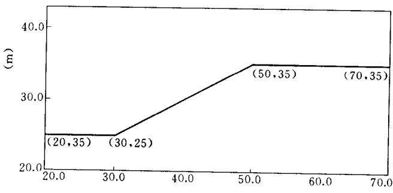  
图 11.5 ACADS 考核题 EX1(a)和 EX1(b)

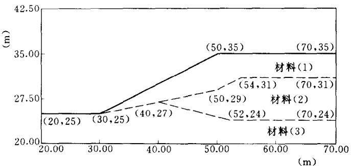  
图 11.6 ACADS 考核题 EX1(c)和 EX1(d)

表 11.1 考核题 1(a)材料性质
<table><tr><td> $c \left( \mathbf { k N } / \mathbf { m } ^ { 2 } \right)$ </td><td>φ(°)</td><td>γ (kN/m³)</td><td> $E ( \mathbf { k } \mathbf { N } / \mathbf { m } ^ { 2 } )$  V</td><td></td><td> $K _ { 0 }$ </td><td>备注</td></tr><tr><td>3.0</td><td>19.6</td><td>20.0</td><td>1.0E4</td><td>0.25</td><td>0.65</td><td>1#土</td></tr></table>

表 11.2 考核题1 (b)材料性质
<table><tr><td>c (kN/m²) φ(°)</td><td>γ (kN/m³) E (kN/m²)</td><td>ν</td><td> $K _ { 0 }$ </td><td>备注</td></tr><tr><td>32.0 10.0</td><td>20.0 1.0E4</td><td>0.25</td><td>0.65</td><td>1#土</td></tr></table>

注 这一问题需设一合适的拉力缝。

表 11.3 考核题 1(c、d)材料性质
<table><tr><td>土号</td><td>c (kN/m²)</td><td> $\phi ( ^ { \circ } )$ </td><td> $\gamma \ ( \mathbf { k } \mathbf { N } / \mathbf { m } ^ { 3 } )$ </td><td> $E \left( \mathbf { k } \mathbf { N } / \mathbf { m } ^ { 2 } \right)$ </td><td>V</td><td> $\pmb { K } _ { 0 }$ </td></tr><tr><td>1#土</td><td>0.0</td><td>38.0</td><td>19.5</td><td>1.0E4</td><td>0.25</td><td>0.65</td></tr><tr><td>2#土</td><td>5.3</td><td>23.0</td><td>19.5</td><td>1.0E4</td><td>0.25</td><td>0.65</td></tr><tr><td>3#土</td><td>7.2</td><td>20.0</td><td>19.5</td><td>1.0E4</td><td>0.25</td><td>0.65</td></tr></table>

(2) 考核题 2: 本题选自 Talbingo 坝实例，图 11.7 及表 11.4\~表 11.6 分别给出其剖面的几何尺寸及物性指标。材料1为堆石填料，材料2为心墙料。

考核题2(a)要求确定上游坡临界滑裂面及相应最小安全系数。

考核题2(b)要求对指定圆弧计算其稳定安全系数，圆弧圆心坐标和半径值参见表11.6。

(3) 考核题 3：本题的边坡剖面几何特征和材料特性示于图11.8 和表11.7。地下水位假定位于软弱夹层底部，地下水位以上孔压为零。考核题3(a)要求确定临界滑裂面(圆弧或非圆弧)和相应最小安全系数，考核题3(b)要求计算指定滑裂面(其坐标如表11.8所示)的安全系数。

考核题3的数据如表11.7和表11.8。

表11.4 考核题2几何剖面数据
<table><tr><td>点号</td><td>X(m)</td><td>Y(m)</td><td>点号</td><td>X (m)</td><td>Y(m)</td></tr><tr><td>1</td><td>0</td><td>0</td><td>14</td><td>648</td><td>0</td></tr><tr><td>2</td><td>315.5</td><td>162</td><td>15</td><td>168.1</td><td>0</td></tr><tr><td>3</td><td>319.5</td><td>162</td><td>16</td><td>302.2</td><td>130.6</td></tr><tr><td>4</td><td>321.6</td><td>162</td><td>17</td><td>200.7</td><td>0</td></tr><tr><td>5</td><td>327.6</td><td>162</td><td>18</td><td>311.9</td><td>130.6</td></tr><tr><td>6</td><td>386.9</td><td>130.6</td><td>19</td><td>307.1</td><td>0</td></tr><tr><td>7</td><td>394.1</td><td>130.6</td><td>20</td><td>331.3</td><td>130.6</td></tr><tr><td>8</td><td>453.4</td><td>97.9</td><td>21</td><td>328.8</td><td>146.1</td></tr><tr><td>9</td><td>460.6</td><td>97.9</td><td>22</td><td>310.7</td><td>0</td></tr><tr><td>10</td><td>515</td><td>65.3</td><td>23</td><td>333.7</td><td>130.6</td></tr><tr><td>11</td><td>521.1</td><td>65.3</td><td>24</td><td>331.3</td><td>146.1</td></tr><tr><td>12</td><td>577.9</td><td>31.4</td><td>25</td><td>372.4</td><td>0</td></tr><tr><td>13</td><td>585.1</td><td>31.4</td><td>26</td><td>347</td><td>130.6</td></tr></table>

注点号参考图11.7。

表 11.5 考核题2 材料性质
<table><tr><td></td><td>c (kN/m²)</td><td>φ()</td><td>γ (kN/m³)</td><td>E (kN/m²)</td><td>ν</td><td> $\underline { { K } } _ { 0 }$ </td></tr><tr><td>堆石</td><td>0.0</td><td>45</td><td>20.4</td><td>5.0E4</td><td>0.30</td><td>0.65</td></tr><tr><td>过渡层</td><td>0.0</td><td>45</td><td>20.4</td><td>5.0E4</td><td>0.30</td><td>0.65</td></tr><tr><td>反滤层</td><td>0.0</td><td>45</td><td>20.4</td><td>4.0E4</td><td>0.30</td><td>0.65</td></tr><tr><td>心墙</td><td>85</td><td>23</td><td>18.1</td><td>1.0E4</td><td>0.44</td><td>0.65</td></tr></table>

注 堆石、过渡层和反滤层几乎具有同样的材料性质。

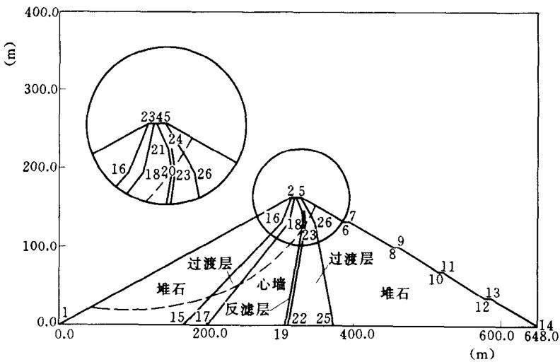  
图 11.7 ACADS 考核题 EX2

表 11.6 考核题 2(b)圆弧滑裂面信息
<table><tr><td>X(m)</td><td>Y(m)</td><td>半径(m)</td></tr><tr><td>100.3</td><td>290.0</td><td>278.8</td></tr></table>

注 x、y轴的原点位于上游堆石边坡和坝基的交点。

表11.7 考核题3材料性质
<table><tr><td></td><td> $c ( \mathbf { k N } / \mathbf { m } ^ { 2 } )$ </td><td> $\phi ( ^ { \circ } )$ </td><td> $\chi ( \mathrm { k N } / \mathrm { m } ^ { 3 } )$ </td><td> $E ( \mathbf { k } \mathbf { N } / \mathbf { m } ^ { 2 } )$ </td><td>V</td><td> $K _ { 0 }$ </td></tr><tr><td>1#土</td><td>28.5</td><td>20.0</td><td>18.84</td><td>6.0E4</td><td>0.25</td><td>0.65</td></tr><tr><td>2#土</td><td>0.0</td><td>10.0</td><td>18.84</td><td>2.0E3</td><td>0.25</td><td>0.65</td></tr></table>

注 假设水面线与基础中的软弱夹层相重合(夹层和夹层上的孔压=0)，不考虑水面线以上负的孔隙水压力。

表11.8 考核题3(b)滑裂面控
<table><tr><td>X(m)</td><td>Y(m)</td><td></td></tr><tr><td>41.85</td><td>27.75</td><td></td></tr><tr><td>44.00</td><td>26.50</td><td></td></tr><tr><td>63.50</td><td>27.00</td><td></td></tr><tr><td>73.31</td><td>40.00</td><td></td></tr></table>

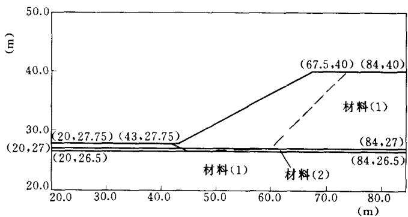  
图 11.8 ACADS 考核题 EX3

(4) 考核题4：本题为一坡面上作用表面荷载、坡内有浸润线的例子。图11.9及表11.9、表11.10和表11.11分别给出本题的剖面几何尺寸、物性指标、浸润线及表面荷载，要求确定临界滑裂面和相应最小安全系数。

表 11.9 考核题4 材料性质
<table><tr><td></td><td> $c \left( \mathrm { k N } / \mathrm { m } ^ { 2 } \right)$ </td><td> $\phi ( ^ { \circ } )$ </td><td>γ (kN/m³)</td><td>E (kN/m²)</td><td>V</td><td> $K _ { 0 }$ </td></tr><tr><td> $1 ^ { * } \pm$ </td><td>28.5</td><td>20.0</td><td>18.84</td><td>6.0E4</td><td>0.25</td><td>0.65</td></tr><tr><td>2#土</td><td>0.0</td><td>10.0</td><td>18.84</td><td>2.0E3</td><td>0.25</td><td>0.65</td></tr></table>

表 11.10 考核题4 中的外荷载
<table><tr><td>X(m)</td><td> $Y ( \mathbf { m } )$ </td><td>正应力  $( \mathbb { k } \mathbb { N } / \mathbb { m } ^ { 2 } )$ </td></tr><tr><td>23.00</td><td>27.75</td><td>20.00</td></tr><tr><td>43.00</td><td>27.75</td><td>20.00</td></tr><tr><td>70.00</td><td>40.00</td><td>20.00</td></tr><tr><td>80.00</td><td>40.00</td><td>40.00</td></tr></table>

表 11.11 考核题4 的浸润线数据
<table><tr><td>点号</td><td> $X ( \mathbf { m } )$ </td></tr><tr><td>1 20.0</td><td>27.75</td></tr><tr><td>2 43.0</td><td>27.75</td></tr><tr><td>3 49.0</td><td>29.8</td></tr><tr><td>4 60.0</td><td>34.0</td></tr><tr><td>5 66.0</td><td>35.8</td></tr><tr><td>6 74.0</td><td>37.6</td></tr><tr><td>7 80.0</td><td>38.4</td></tr><tr><td>9 84.0</td><td>38.4</td></tr></table>

注 点号参考图11.9。

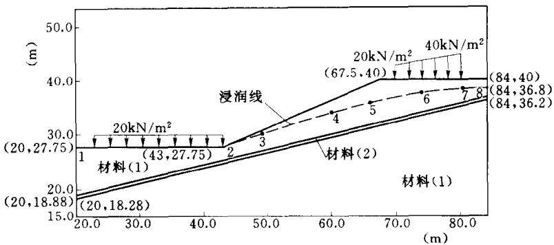  
图 11.9 ACADS 考核题 EX4

(5) 考核题 5：考核题 5 如图 11.10、图 11.17，材料性质如表 11.12。要求计算最小安全系数。

表 11.12 考核题 5 材料性质
<table><tr><td>c (kN/m²)</td><td>φ(°)</td><td> $\gamma ( \mathbf { k } \mathbf { N } / \mathbf { m } ^ { 3 } )$ </td><td>E (kN/m²)</td><td>V</td><td> $K _ { 0 }$ </td><td> $K _ { x } { = } K _ { v } ( \mathbf { m } / { \ s } )$ </td></tr><tr><td>11.0</td><td>28.0</td><td>20.00</td><td>1.5E4</td><td>0.25</td><td>0.65</td><td>5.0E-08</td></tr></table>

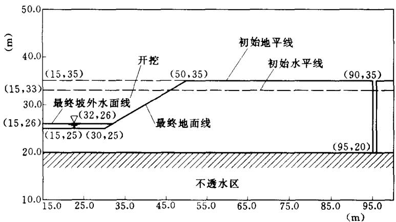  
图 11.10 ACADS 考核题 EX5

## 2. 计算成果汇总和分析

如前所述，组织者向澳大利亚各咨询公司发出了问卷调整，对各题目返回的答案数目在7\~33个之间。表11.13总结了收到的答案。

本次调查邀请了国外三个程序提供裁判答案，Donald 教授也使用了自编的GWEDGEM和 EMU程序分析了这些考核题。综合各咨询公司提供的答案、裁判答案和 Donald 自编程序的答案在表11.13汇总，本次考核最终提出了推荐的裁判答案。

现对各题的解答情况作一简要回顾。

表 11.13 返回的问卷答案统计成果
<table><tr><td rowspan="2">考核题号</td><td rowspan="2">分析方法</td><td colspan="4">安全系数</td><td rowspan="2">提交答 案总数</td></tr><tr><td>均值</td><td>标准差</td><td>min.F</td><td>max.F</td></tr><tr><td rowspan="3">1(a) (1.00)</td><td>(ALL)</td><td>0.991</td><td>0.031</td><td>0.940</td><td>1.080</td><td>32</td></tr><tr><td>BISHOP</td><td>0.993</td><td>0.015</td><td>0.960</td><td>1.030</td><td>18</td></tr><tr><td>JANBU</td><td>0.978</td><td>0.041</td><td>0.940</td><td>1.043</td><td>7</td></tr><tr><td rowspan="3">1(c) (1.39)</td><td>(ALL)</td><td>1.381</td><td>0.067</td><td>1.230</td><td>1.520</td><td>30</td></tr><tr><td>BISHOP</td><td>1.406</td><td>0.039</td><td>1.350</td><td>1.500</td><td>16</td></tr><tr><td>JANBU</td><td>1.325</td><td>0.057</td><td>1.264</td><td>1.400</td><td>6</td></tr><tr><td>1(d) (1.00)</td><td>(ALL)</td><td>0.972</td><td>0.054</td><td>0.900</td><td>1.100</td><td>14</td></tr><tr><td rowspan="2">2(a) (1.90) 2(b)</td><td>(ALL)</td><td>2.003</td><td>0.101</td><td>1.830</td><td>2.201</td><td>23</td></tr><tr><td>BISHOP</td><td>2.042</td><td>0.118</td><td>1.830</td><td>2.201</td><td>13</td></tr><tr><td rowspan="2">(2.29) 3(a)</td><td>(ALL) BISHOP</td><td>2.237</td><td>0.112</td><td>1.948</td><td>2.390</td><td>23</td></tr><tr><td></td><td>2.204</td><td>0.013</td><td>2.180</td><td>2.220</td><td>11</td></tr><tr><td rowspan="4">(1.26?) 3(b)</td><td>(ALL)</td><td>1.369</td><td>0.168</td><td>1.191</td><td>1.820</td><td>25</td></tr><tr><td>BISHOP</td><td>1.559</td><td>0.146</td><td>1.400</td><td>1.820</td><td>7</td></tr><tr><td>JANBU</td><td>1.307</td><td>0.138</td><td>1.191</td><td>1.564</td><td>8</td></tr><tr><td>NON-CIRCULAR</td><td>1.295</td><td>0.108</td><td>1.191</td><td>1.564</td><td>18</td></tr><tr><td>(1.34) 4</td><td>(ALL) JANBU</td><td>1.292 1.252</td><td>0.064 0.060</td><td>1.197</td><td>1.450</td><td>29</td></tr><tr><td rowspan="4">(0.78)</td><td>(ALL)</td><td>0.897</td><td>0.254</td><td>1.197</td><td>1.333</td><td>10</td></tr><tr><td>BISHOP</td><td></td><td></td><td>0.410</td><td>1.360</td><td>25</td></tr><tr><td>JANBU</td><td>1.151</td><td>0.175</td><td>0.850</td><td>1.360</td><td>6</td></tr><tr><td>NON-CIRCULAR</td><td>0.984 0.817</td><td>0.198 0.223</td><td>0.712</td><td>1.287</td><td>7</td></tr><tr><td rowspan="2">5 (1.35)</td><td>(ALL)</td><td>1.462</td><td>0.150</td><td>0.410 0.910</td><td>1.287</td><td>19</td></tr><tr><td>BISHOP</td><td>1.431</td><td>0.192</td><td>0.910</td><td>1.600 1.600</td><td>20 10</td></tr></table>

(1) 考核题 1：本题是断面相对比较简单的土质边坡，包括了四个小题，主要考核用优化方法来确定的临界滑裂面和最小安全系数。裁判答案作者均使用 Bishop 简化法。从表 11.14计算成果看，对考核题1(a)、1(c)和1(d)，裁判答案各家给出的结果完全一致。图11.11 给出了对考核题1采用 STAB 求得的临界滑裂面和相应的安全系数，图 11.12 给出了对考核题1 各家程序求得的临界滑裂面和相应的安全系数。可以看出，不同的程序得到的临界滑裂面都落在一个窄的区域里，相应的安全系数也基本一致。这说明，对于土质边坡圆弧滑裂面，目前水平已可以达到不同的程序均可获得一致成果的程度，自动搜索临界滑裂面的功能也已经达到实用阶段。

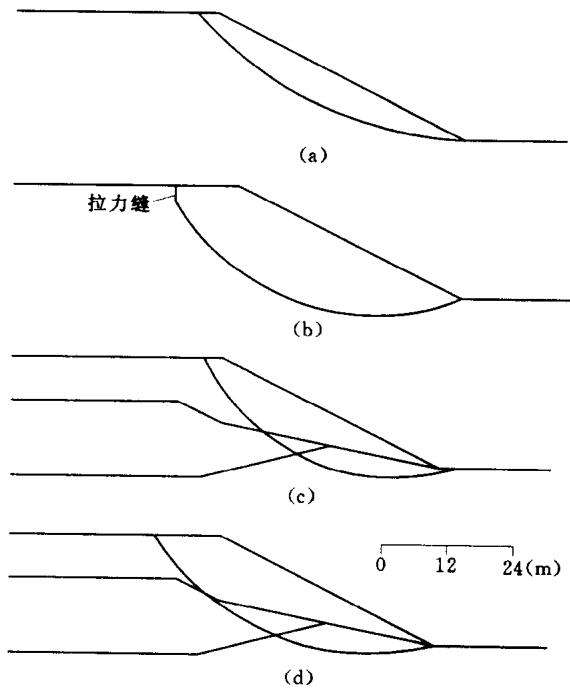

图 11.11 总结返回的考核题 EX1 计算成果的临界滑裂面 (a) EX1(a); (b) EX1(b); (c) EX1(c); (d) EX1(d)

表11.14 裁判程序答案汇总(考核题1)
<table><tr><td>考核题</td><td>1(a)</td><td>1(b)</td><td>1(c)</td><td>1(d)</td></tr><tr><td>推荐的裁判答案Donald</td><td>1.00</td><td>1.65~1.70</td><td>1.39</td><td>1.00</td></tr><tr><td>SSA(Baker)</td><td>1.00</td><td>1.50</td><td>1.39</td><td></td></tr><tr><td>STAB(Chen)</td><td>0.991</td><td>1.618</td><td>1.385</td><td>1.007</td></tr><tr><td>GWEDGEM</td><td>1.00</td><td>1.65~1.70</td><td>1.39</td><td>1.00</td></tr><tr><td>EMU</td><td>1.00</td><td>1.65~1.70</td><td>1.39</td><td>1.00</td></tr><tr><td>Fredlund</td><td>0.99</td><td>1.619~1.588</td><td>1.406</td><td>1.015</td></tr></table>

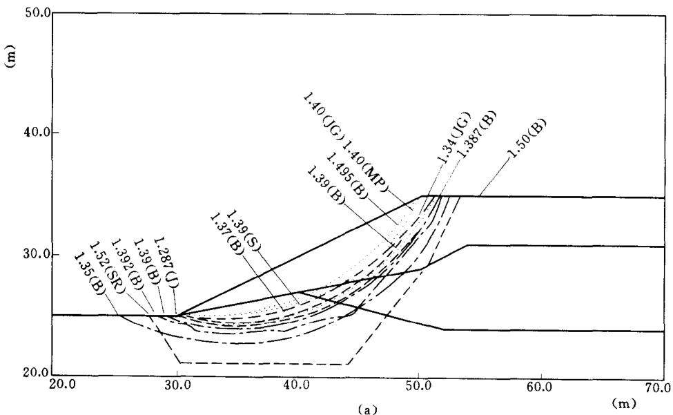

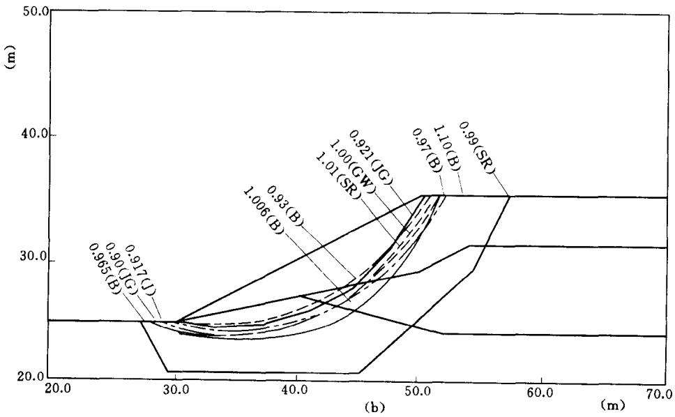  
图11.12 各家程序对考核题EX1的计算成果(临界滑裂面位置和最小安全系数)(a) EX1(c); (b) EX1(d)

图例：SR—Sarma 法；B—Bishop 法；JG—Janbu 法；GW—GWEDGEM 法：J—简化扬布法；MP—Morgensten-Price 法图 11.13 STAB 程序获得考核题 EX2 的临界滑裂面和最小安全系数(a) 考核题 EX2(a); (b) 考核题 EX2(b)

考核题1(b)需要用户自行设计一个拉力缝，这样，由于设有的拉力缝高度不同，安全系数有一定的出入。但各家的差距也不大。 $H _ { t }$ 均在 0.5\~3.5m 范围内。图 11.11(b)示出了笔者选用 ${ \cal H } _ { t } = 2 . 0 ~ \mathrm { m }$ 时充水拉力缝的位置及临界滑裂面和相应的安全系数。

因此，考核题1可以作为一个经典的考核题，考核自编的边坡稳定分析程序的准确性。

(2) 考核题2：本题分为两部分，第一部分是求上游坝坡的安全系数。由于坝壳料为无粘聚力的砾质材料，故如使用线性强度指标，将获得一个非常浅的临界滑裂面。而其安全系数就是摩擦系数和坝的坡度之比，即 $F { = } \mathbf { t a n } \phi ~ / ~ \mathbf { t a n } \alpha { = } 1 . 9 4 7$ 。各家得到的结论是相同的。考核题还要求在厚心墙内寻找一个局部极值。从表 11.15 中可见，GWEDGEM 和 EMU 给出的局部极值为 1.90，而 Fredlund 和陈祖煜的答案是 2.14\~2.15。图 11.13(a)为 STAB 程序获得考核题 EX2的临界滑裂面和最小安全系数。图 11.14(a)列出了考核题2(a)各家得到的临界滑裂面和相应安全系数。

第二部分是计算指定的圆弧滑裂面的安全系数，如图 11.13(b)。各家计算成果偏离不大，Baker 和 Donald的成果均为 2.29，陈祖煜和 Fredlund 的结果分别为 2.220和 2.206。

表 11.15 裁判程序答案汇总(考核题 2\~考核题 5)
<table><tr><td></td><td>2(a)</td><td>2(b)</td><td>3(a)</td><td>3(b)</td><td>4</td><td>5</td></tr><tr><td>推荐的裁判答案</td><td>(1.95)/1.90</td><td>2.29</td><td>1.26</td><td>1.34</td><td>0.78</td><td>1.53/1.53/1.59</td></tr><tr><td>SSA+(baker)</td><td>1.95/</td><td>2.35</td><td>1.24</td><td>1.37</td><td>0.65</td><td>1.53</td></tr><tr><td>STAB+(Chen)</td><td>1.947~2.135</td><td>2.224</td><td>1.242</td><td>1.265</td><td>0.671</td><td>1.503</td></tr><tr><td>GWEDGEM</td><td>1.95/1.90</td><td>2.29</td><td>1.27</td><td>1.34</td><td>0.78</td><td>1.53/1.53/1.59</td></tr><tr><td>EMU</td><td>1.95/1.90</td><td>2.29</td><td>1.27</td><td>1.34</td><td>0.78</td><td>1.53/1.53/1.59</td></tr><tr><td>Fredland</td><td>2.138</td><td>2.206</td><td></td><td>1.261</td><td>0.630</td><td>1.460</td></tr></table>

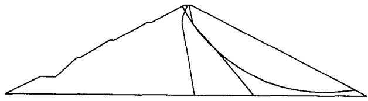  
(a)

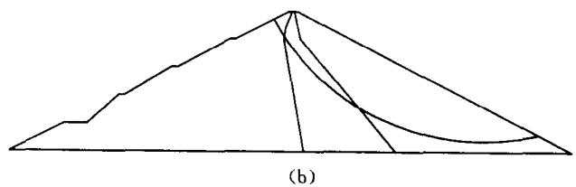

(3) 考核题 3: 本题为典型的沿软弱夹层进行非圆弧滑裂面的计算考核题。考核题 3(a)要求计算临界滑裂面，考核题3(b)要求计算指定滑裂面的安全系数。STAB采用Morgenstern-Price 法，图 11.15 所示 STAB 程序获得考核题 EX3 的临界滑裂面和最小安全系数。对指定滑裂面算得安全系数为 1.265[考核题 3(b)]，其值与 Fredlund 的解答1.261 接近。但 Baker和 Donald 等给出了稍大的结果(1.34\~1.37)。最终各家搜索获得的最小安全系数比较接近，在1.24\~1.27之间。图11.16为各家给出了本次调查考核题3(a)的临界滑裂面和相应的安全系数。

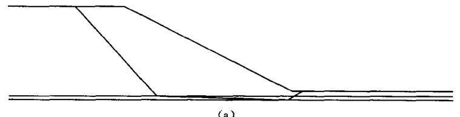

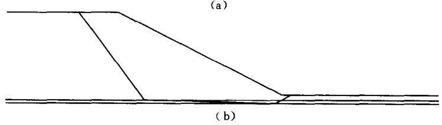

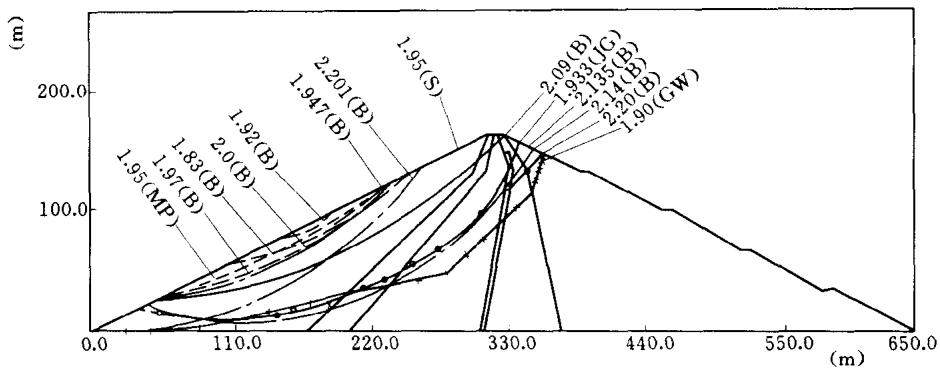  
图11.14 各家程序对考核题EX2的计算成果(临界滑裂面位置和最小安全系数)

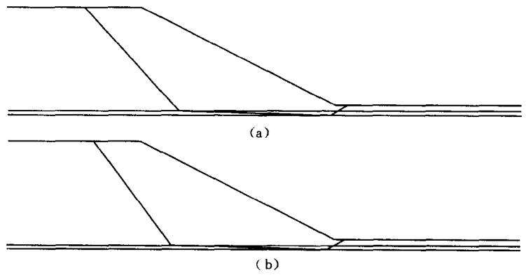  
图 11.15 STAB 程序对考核题 EX3 计算的滑裂面和安全系数(a)考核题 EX3(a); (b) 考核题 EX3(b)

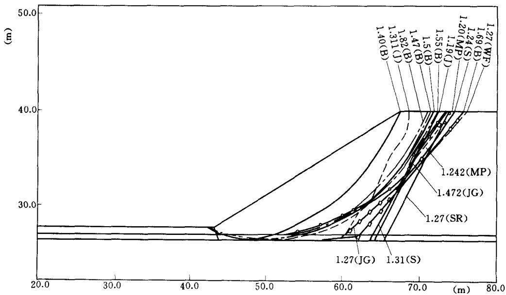  
图 11.16 各家对考核题 EX3 计算的临界滑裂面和最小安全系数

(4)考核题4：本例在设计方面存在一定的问题，软弱夹层的上部没有标明是否与边坡面相交。由于夹层的指标明显低于土层，导致在搜索过程中，临界滑裂面不断上移。实际上，直正的临界滑裂面可能要越出规定的图框。临界滑裂面除趾部外，全部通过软弱夹层。另外Bishop法在此例中不适用，因控制滑裂面通过软弱夹层，不可能是圆弧形的。因此，表11.15提供的答案仅供参考。

(5) 考核题5：本文为一个地基快速开挖的例题。考核要求采用三种不同的孔隙水压力处理方法：①把所给的地下水面作为测压管面；②把图11.17所给的流网转化为孔压网来计算；③根据渗流分析计算更精确的孔隙压力。除外，各家根据图11.17所示流网计算孔隙水压，再用孔压计算安全系数。表 11.15 分别示出这三种处理方法 Baker 和 Donald 的计算成果，STAB仅作了第一种情况，如图11.18示。各家提供的安全系数在1.46\~1.53之间。

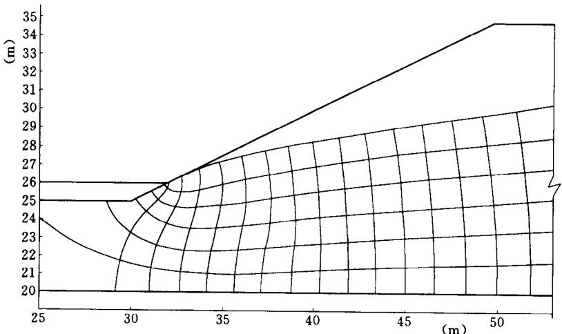  
图 11.17 考核题 5 渗流场

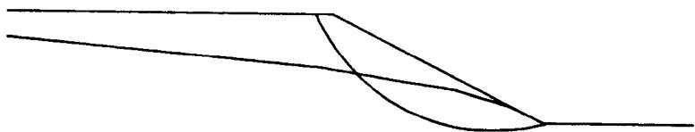  
图 11.18 STAB 程序对考核题 EX5 计算的临界滑裂面和最小安全系数

ACADS组织的这次考核的特点是详细地规定了计算原始数据和要求，使不同的程序获得的成果具有可比性，除第4题外，其它考核题的设计都比较严密。因此，有条件使不同的程序算出基本相同的结果。但由组织者提供的2(a)和3(b)的“推荐的裁判答案”与Fredlund和陈祖煜提供的答案相差较大，其权威性有待进一步论证。综合参加的各程序提供的安全系数统计参数成果表11.13，可见裁判答案互相比较接近，而各单位自编程序提供的答案则比较分散。早期Fredlund也曾经发现过这一问题。这一事实说明在进行稳定分析时，最好还是使用专门开发的、经过考核的比较成熟的程序。

边坡稳定分析是岩土工程设计和施工中经常要进行的工作。在计算机迅速普及的今日，手算方式显然要被淘汰。但确认各家自编程序的准确性，确实成为了进入计算机时代面临的一个重要的问题，已提到了议事日程。这次程序考核工作做了一次有益的尝试，本项工作为各单位自编的稳定分析程序的考核，提供了十分有用的资料。

## 11.5 本章附录

## 11.5.1 本章数据文件（表11.6）

表 11.16本章数据文件
<table><tr><td>有关章节</td><td>系列号</td><td>数据文件名</td><td>内容</td></tr><tr><td>11.3.2</td><td>11-01-01</td><td>CIRCLE.FOR</td><td>构筑圆弧滑裂面源程序</td></tr><tr><td></td><td>11-01-02</td><td>CIRCLE.DAT</td><td>构筑圆弧滑裂面例题</td></tr><tr><td>11.3.3</td><td>11-01-03</td><td>CIRCLE.C</td><td>构筑圆弧滑裂面例题计算结果</td></tr><tr><td></td><td>11-02-01</td><td>SPLINE.FOR</td><td>构筑任意形状滑裂面源程序</td></tr><tr><td></td><td>11-02-02</td><td>SPLINE-1.DAT</td><td>构筑光滑形状滑裂面例题</td></tr><tr><td></td><td>11-02-03</td><td>SPLINE-1.C</td><td>构筑光滑形状滑裂面例题计算结果</td></tr><tr><td></td><td>11-02-04</td><td>SPLINE-2.DAT</td><td>构筑组合形状滑裂面例题</td></tr><tr><td>11.3.4</td><td>11-02-05</td><td>SPLINE-2.C</td><td>构筑组合形状滑裂面例题计算结果</td></tr><tr><td></td><td>11-03-01</td><td>PROFILE.FOR</td><td>计算土条重量等特性数据的源程序</td></tr><tr><td></td><td>11-03-02</td><td>PROFILE.DAT</td><td>计算土条重量等特性数据的例题</td></tr><tr><td>11.3.5</td><td>11-03-03</td><td>PROFILE.C</td><td>计算土条重量等数据的例题计算结果</td></tr><tr><td></td><td>11-04-01</td><td>S.FOR</td><td>计算安全系数源程序</td></tr><tr><td></td><td>11-04-02</td><td>SO.DAT</td><td>计算通用条分法安全系数例题</td></tr><tr><td></td><td>11-04-03</td><td>SO.C</td><td>计算通用条分法安全系数例题计算结果</td></tr><tr><td></td><td>11-04-04</td><td>SI.DAT</td><td>计算Bishop法安全系数例题</td></tr><tr><td></td><td>11-04-05</td><td>S1.C</td><td>计算Bishop法安全系数例题计算结果</td></tr><tr><td></td><td>11-04-06</td><td>S2.DAT</td><td>计算瑞典法安全系数例题</td></tr><tr><td></td><td>11-04-07</td><td>S2.C</td><td>计算瑞典法法安全系数例题计算结果</td></tr><tr><td></td><td>11-04-08</td><td>S3.DAT</td><td>计算工程师团法安全系数例题</td></tr><tr><td></td><td>11-04-09</td><td>S3.C</td><td>计算工程师团法安全系数例题计算结果</td></tr><tr><td></td><td>11-04-10</td><td>S4.DAT</td><td>计算简化法安全系数例题</td></tr><tr><td>11.4.2</td><td>11-04-11</td><td>S4.C</td><td>计算简化法法安全系数例题计算结果</td></tr><tr><td rowspan="11"></td><td>11-05-01</td><td>expla.dat</td><td>ACADS考核题1(a)</td></tr><tr><td>11-05-02</td><td>exp1b.dat</td><td>ACADS考核题1(b)</td></tr><tr><td>11-05-03</td><td>exp1c.dat</td><td>ACADS考核题1(c)</td></tr><tr><td>11-05-04</td><td>exp1d.dat</td><td>ACADS考核题1(d)</td></tr><tr><td>11-06-01</td><td>Exp2a.dat</td><td>ACADS考核题2，整体极值</td></tr><tr><td>11-06-02</td><td>Exp2b.dat</td><td>ACADS考核题2，心墙局部极值</td></tr><tr><td>11-06-03</td><td>Exp2c.dat</td><td>ACADS考核题2，指定滑裂面</td></tr><tr><td>11-07-01</td><td>Exp3a.dat</td><td>ACADS考核题3，整体极值</td></tr><tr><td>11-07-02</td><td>Exp3b.dat</td><td>ACADS考核题3，心墙局部极值</td></tr><tr><td>11-08-01</td><td></td><td></td></tr><tr><td>11-09-01</td><td>Exp4.dat Exp5.dat</td><td>ACADS考核题4 ACADS考核题5</td></tr></table>

## 参考文献

1刘德贵、费景高、于泳江、李广元.Fortran算法汇编（第一分册）．北京：国防工业出版社，1980

2 Donald, I. B. And Giam, P. The ACADS slope stability programs review. Proc. 6™h International Symposium on Landslides. 1992. Vol.3. 1665-1670

3 Lumsdaine, R. W. and Tang, K. Y. A comparison of slope stability calculations1982. Proc. 7th South East Asia Geotechnical Conference, Hong Kong. 31-38

4 Fredlund, D. G. Usage, requirements and features of slope stability computer software. Canadian Geotechnical Journal. 1987. 15:83-95

5 ACADS Publication No. U255. Soil slope stability programs review. April, 1989

## 第12章程序使用说明

## 12.1 程序开发过程

STAB程序前后经过了二十余年的开发过程。1976年，作者参加水利电力部第二工程局官厅水库抗震加固工程时，在北京大学DJS-60机上开发了一个圆弧滑裂面的土石坝边坡稳定分析的程序。现在的STAB程序仍然保留了这一版本对边坡几何形状处理的主要特点。1979至1981年，作者赴加拿大 Alberta 大学进修，在 Morgenstern教授的指导下，对边坡稳定分析的Morgenstern-Price法作出了改进，并编制了相应的程序。1982至1984年，作者在潘家铮主持的“水工建筑物设计专用程序”项目中，承担了编制土石坝边坡稳定设计专用程序的工作。在这一项目中，本程序被正式命名为STAB。1994年水利水电规划设计院在黄山组织专题审查会，并于1984年12月12日以(84)水规算字第3号文正式批准STAB为水利水电系统土石坝设计专用程序，在水利水电设计系统中推广使用。

1984至1995年，作者在推广使用 STAB程序的过程中，将其改造成微机DOS版，并命名为 STAB95。1995年至现在，STAB95逐步获得推广，在此过程中，顺应微机操作系统从 DOS 转向 WINDOWS 的潮流，提出了 STAB95 的 WINDOWS 仿真 DOS 环境下运行的版本。并根据新颁布的水工建筑物抗震设计规范，修改了7度和9度地震时输入的地震加速度系数。将 STAB95升级为 WINDOWS 界面交互式软件的工作正在进行，但是其基本功能已在STAB95中定型。本节介绍STAB95程序使用方法。在网上公布供下载的是STAB95的简化版 S1.EXE。

## 12.2 数据处理

## 12.2.1 几何信息的处理

## 1. 剖面几何图形

将土石坝、土坡断面放在设定的 xoy 坐标中，规定 ox 为水平轴，指向滑动方向为正；oy为垂直轴，重力方向为正。

如11.2.1 节介绍，任一边坡的剖面总是被简化为一个由若干条线段相交形成的图形。每一个线段连结左右两个端点，线段将不同土层分开。点、线和土层都从1开始依次编号，其总数分别为NN，IN1，IN。如图12.1所示例，该断面点的总数为NN=20，线的总数为IN1=17。存贮点的坐标值的数组为 XN(1)和 YN(I) (I=1,2, …., NN)。在表12.1 的 73\~79 行中读入确定线段的信息是两个端点的编号IC(I,1)和 IC(I,2)，不区分左右次序，即左右端点的编号可以任意存放在 IC(I,1)和IC(I,2)中。IC(I,3)存放该线下卧土层的编号。例如，图12.1中的第2条线，它连接2和3两个点，并下压第1层土，故IC(1,1),IC(1,2)，IC(1,3)分别为2,3,1。

同样道理，对第4 条线，IC(4.1). IC(4,2)，IC(4,3)分别为5,6,2。除了分界土层的边界线外，还有一组定义浸润线的线段，其表达方式和边界线一样，在表12.1的75行中读入。如图12.1所示例，其浸润线由5个线段构成一条折线。总数IPH=5，而该5条线段的参数分别存放在ICPH(I,J)中，I=1,2, ..., IPH; J=1,2,3。

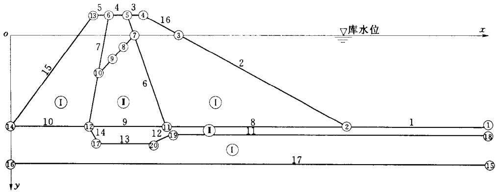  
图 12.1 剖面几何图形处理

在STAB的2002年版，新增添了软弱夹层线，对于搜索任意形状的临界滑裂面十分有用。当OP1(4)不为零时，读入此行。软弱夹层线总数为LWK，有关参数存放于IC3(I,J)中。在表12.1的 76\~79 行中读入。

此外，由于垂直条块不可能与垂直的浸润线或边界线相交，故碰到此类线，程序将予以忽略，计算结果不受影响。

在第2章第2.4.3节中讨论了坡外水位的三种处理方案。STAB 程序默认的是规范建议的等效置换的方法，即方案2。用户只需输入坡外水位，程序自动处理成坡外无水的情况。注意，坡外水位线既不是边界线也不是浸润线。坡外水位以下的外边坡线都是浸润线。如图12.1所示例题，共有21个点，2层土，17条分界线和8条浸润线。浸润线是连接1、2、3、7、8、9、10、12、14各点的折线。如果漏掉联接点1、2和点2、3的这两条线，则将导致大错。

坡外水位在计算土石坝上、下游边坡时分别为上游和下游水位。当计算下游边坡时，滑弧顶部有可能与上游水位相交，参见图12.2。此时的处理方法是将水库水位代表的那条线DE看作是一条边界线，而DE下压的库水位看作是一层土，这层土的强度指标为零，容重为水容重。滑面一直延伸到与上游水位相交。也就是说，所研究的边坡的外边坡线是由点EDGHJKLM这几个点连成。特别需要注意，此时浸润线为ED而不是FD。

在使用总应力法进行库水位骤降计算时需输入骤降后水位。

以下的图形处理是错误的：

1) 如图12.3(a)，剖面几何图形不够大，不能保证所有可能的滑裂面均和该图形的外轮廊线相交；

2) 线段之间不连续，如图12.3(c)所示，外边坡线缺一条线；

3) 线段重叠，如图12.3(d)所示，线15 和线17重叠；正确的编法应是将 5 和 6两点连成一条线，6和7两点连成一条线；

4) 在图 12.2 所示例中，浸润线只输入 DE、DC、CJ、JK而没有把 KL、LM 这两条线计入浸润线，正确的作法应将两条线也计入；

5) 外边线存在反坡，如图 12.3(b)所示；如果确有反坡需要计算，则 OP1(6)不为零，在表12.1 的89\~91 行读入外边坡线的编号。

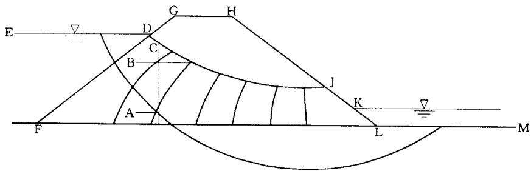  
图12.2 上游和下游水位、水库水位、浸润线的处理

## 2. 滑裂面

STAB 程序中提供圆弧和任意形状的两类滑裂面，分别用 OPTION(2) = 1 和 0来实现。（表 12.1 中第 23 行)。定义滑裂面参数的子程序为READ4，详见表12.2。

(1) 圆弧滑裂面。程序通过表 12.2 中第 23\~38 行来定义圆弧滑裂面。一个圆弧滑裂面，可由其圆心的位置 $x _ { \mathrm { { c } } } \cdot \textbf { y } _ { \mathrm { { c } } }$ 和滑弧深度 $D _ { \mathrm { s } }$ 来确定。

滑弧深度是滑弧面最深点的 y 坐标，如图12.4所示。

已在第4章4.1节中介绍， $D = R + y ;$ R=圆弧半径，参见图12.4。因此安全系数F是x、y和 D的函数。土条总数为NS。

除了上述功能外，程序还安排了以下两个功能：

1）通过指定的上、下交点的圆弧，如图 12.5(a)，此时 $\mathrm { { \bf L } } 0 { < } 0$

2) 通过指定的上交点(或下交点)和具有指定的 D的圆弧，图12.5(b)，此时 $D _ { s }$ $\mathbf { L } \mathbf { 0 } { > } 0$

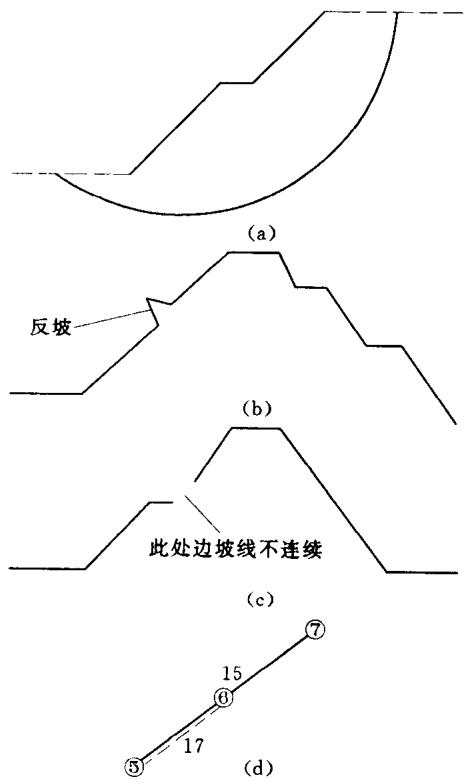  
图 12.3 错误的图形处理

(a) 外边坡线不够长；(b) 反坡；(c) 线段不连续；(d) 线段重叠

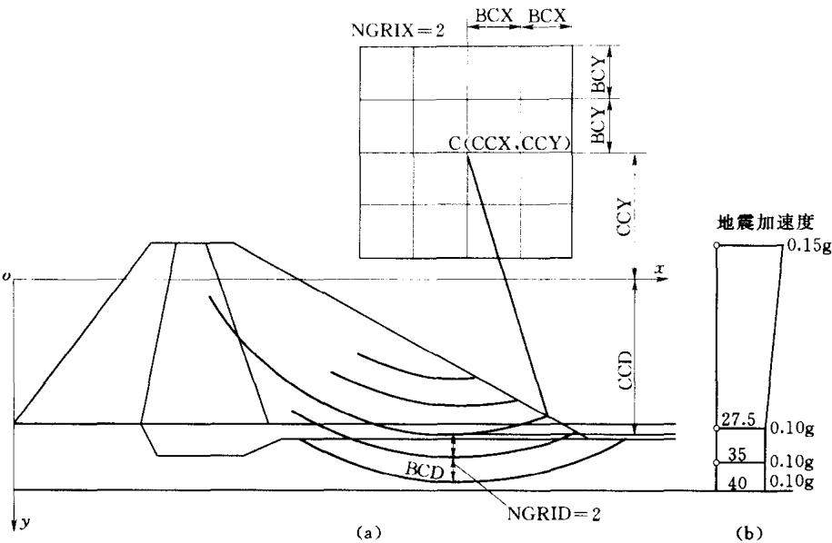  
图 12.4 圆弧滑裂面输入参数

(a)枚举法，按不同圆心位置和滑弧深度布置圆弧：(b)水平地震力沿高程按某一分布图形输入  
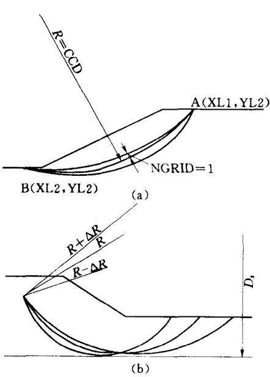  
图 12.5 通过指定点的圆弧

在数据表12.2 中用第 23 行的 LL0来识别。例题 EX16 和 EX17 分别说明此两种情况。此功能仅适用于LL2不为0时。在实际工程中极少使用这一功能。

大多数情况下，建议使用LL0=0的功能。有关参数与优化参数一起，将在表12.2和12.2.5节中介绍。

(2) 任意形状滑裂面。程序通过表 12.2中第41\~94 行来定义任意形状滑裂面。滑裂面被m 个点 $\mathbf { A } _ { 1 } , ~ \mathbf { A } _ { 2 } , ~ . . . . . , ~ \mathbf { A } _ { \mathrm { m } }$ 离散为 m-1段(见图 12.6)，此 m-1 段用直线或光滑的曲线相连。程序要求输入此m个点的坐标。

如前所述，滑裂面被m个点 $\mathbf { A } _ { 1 } , \mathbf { A } _ { 2 } , . . . \mathbf { A } _ { \mathbf { m } }$ 点分为m-1段，从上交点向下交点编号为1，2， …，m-1。程序用 LNO 代表此 m-1 段中为直线段的线段总数。在数组LOO(I)(I=1，2， ……LNO)中存入这些直线段的编号。其

它线段则默认为曲线。当LNO为零时，滑裂面为一光滑曲线，没有直线段。当LNO为一大于m-1的数时，则程序默认全部为直线段。这两种情况都无须填写LOO(I)。其它参数与优化参数一起，将在12.2.5节中介绍。

如图12.6所示的任意形状滑裂面，在控制点 $\mathbf { A } _ { 1 } , \mathbf { A } _ { 2 } , . . . , \mathbf { A } _ { \mathrm { m } }$ 各点之间，程序还将进一步用垂直条细分。为减少滑裂面信息的输入工作量，程序不要求输入所有条块的几何信息，仅要求输入此 m 个控制点的 x和y 坐标，在这些控制点之间进一步细分的土条的几何信息通过线性内插确定。

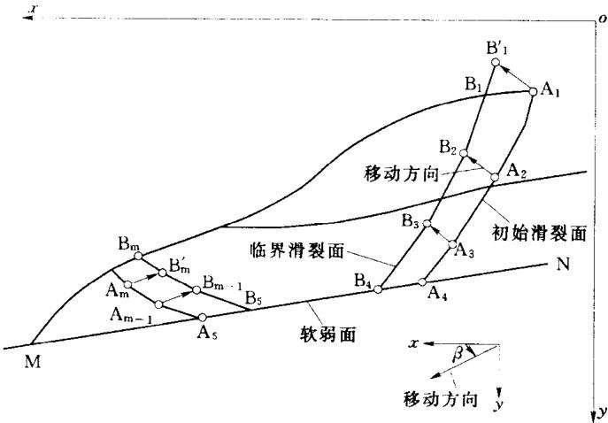  
图 12.6 任意形状滑裂面

程序要求输入这些控制点的边界线编号。如A1点的土条边界线为KQ2(1)=1，A2点的 $\mathbf { A } _ { 1 }$ $\mathbf { A } _ { 2 }$ 土条边界线为 $\mathbf { K Q } 2 ( 2 ) = 5$ ，则程序通过线性内插补齐A₁和A2之间的编号为2，3，4的土条 $\mathbf { A } _ { 1 }$ $\mathbf { A } _ { 2 }$ 的几何信息。在A1和A₂之间构成4个土条。KQ2(I)和各控制点的x，y坐标在表12.2的第 $\mathbf { A } _ { 1 }$ $\mathbf { A } _ { 2 }$ 46 行中输入。

滑裂面上的直线段往往代表滑裂面通过的软弱夹层。为了保证图12.6中的 ${ \bf A _ { 4 } A _ { 5 } }$ 段使用软弱面 MN 代表的坐标，需将 MN 设成一个有限厚度的土层，并有意将点 A₄，A5的 y $\mathbf { A } _ { 4 }$ $\mathbf { A } _ { s }$ 坐标设为略大于实际值，使其连线位于A₄A、 $\mathbf { A } _ { 4 } \mathbf { A } _ { 5 }$ 的下方。同时在优化计算中，令A₄和A5两点 $\mathsf { \pmb { A } } _ { \pmb { 4 } }$ $\mathbf { A } _ { 5 }$ 的移动方向精确地平行于MN。所有这些做法都增加了数据准备的工作量。为此，在2002年以后的版本中，设置了软弱面线段的功能。如前所述，在OP1(4)不为零时，表12.1的76\~79行读入了软弱面线段IC3(I,J)的信息。此时，程序将执行数据表12.2 第55 行，在输入控制点信息的同时，增加一个量WS(I)，即滑裂面上的某Ⅰ段所代表的软弱夹层的编号。当WS(I)为零时，此段不处于软弱夹层上。当WS(I)为一正值时，程序将自动将此段滑裂面左、右两个控制点的坐标值调整到贴近靠编号为WS(I)的软弱夹层线上。并且在优化过程中自动沿此夹层移动，找到临界滑裂面。有关功能详见第12.2.5节。

## 3. 拉力缝

圆弧和任意形状滑裂面的顶部均可设一拉力缝，用表 12.1 中第 23 行 OPT10N(3)不为零来控制。

对于任意形状滑裂面，第一个节点的y坐标即反映了拉力缝的深度，无须专门指定，但对圆弧滑裂面，还需要用户输入拉力缝底部的y坐标，此值在表12.2 第36 行读入。拉

力缝可以充水或不充水。OPT10N(3)=1时拉力缝不充水，OPT10N(3)=2时拉力缝充水。当OPT10N(3)=-2时拉力缝内按指定高度充水(表12.1的24行)，此功能通常用来模拟坝前作用一定高度的水面的情况，参见例题EX29。

## 12.2.2 物理信息的处理

## 1. 单位

程序要求输入水容重（表12.1中第46行），这一量纲决定了本题使用的单位。

## 2. 基本物理力学指标

对每一个土层，需要输入5个指标（表12.1中48行），其摩擦角和粘聚力分别为PF(I)，PC(I)；其天然容重和饱和容重分别为 PDW(I)，PDS(I)。没有必要把浸润线上下的土作为两层土处理。最后一个指标LRU(I)为一整型值，代表孔隙水压力的处理方式。将在12.2.3节中介绍。

(1) 组合强度包线。本程序具有用第 5 章介绍的组合强度包线进行稳定分析的功能。在表12.1第48行中，每种土输入两组抗剪强度指标即内摩擦角φ′和粘聚力c'。PF(I)，PC(I)用于存放基本内摩擦角和粘聚力。PF1(I)，PC1(I)用于存放组合内摩擦角和粘聚力。PF1(I)，PC1(I)为零时，即为单一强度包线。

需要特别强调这些参数的关系必须是 PF(I)>PF1(I)，PC(I)<PC1(I)，否则两条强度线无法在坐标系内相交，程序不能运算。图12.7(a)、(b)示两种错误的指标输入值。

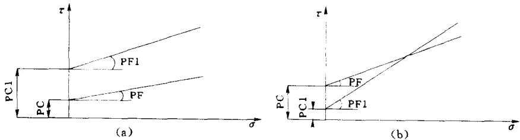  
图 12.7 组合抗剪强度包线  
(a) 不正确、组合包线不相交；(b)不正确的组合，强度包线虽在象限内相交，但不满足PC(I)<PC1(I)的条件

(2) 非线性强度指标。本程序具有第5章5.7节中介绍的对数和指数两种非线性模式。

在表 12.1 的 48 行中 PF1(I)和 PC1(I)中存放相应指数模式的 A、b 或对数模式的φ、Δφ的负值。程序通过负号得知，是进行非线性强度指标的稳定分析，而不是上节的组合强度包线计算。由于对数和指数两套数据的取值范围有很大的差别，程序可以识别，不需单独说明采用的是何种非线性模式。例题EX10介绍此功能。

## 3. 内插网格

在本程序的运行过程中，有三个物理量需要用户通过内插确定。因此，在数据文件中要输入一个网格形成原始数据，在表12.1的65\~70行中输入。

当孔隙水压力是通过实测或其它途径确定时，表12.1 中第 48 行的 LRU(I)为正值，程序即认为该Ⅰ号土层的孔压是通过内插确定的，例题EX2（图12.8）专门讲述了这一情况。

地基原位不排水剪强度 $q _ { c u }$ 是位置（即坐标值）的函数，滑裂面上任一点的抗剪强度通过邻近点的相应值内插获得。例题EX11（图12.9）专门讲述这一情况。

土的地震总强度指标。本程序纳入第7章 Seed建议的使用地震动强度指标的边坡稳定总应力法。在不同的固结比情况下的动三轴试验可给出如图12.10所示的曲线。同样，通过内插确定滑裂面上各点的动强度。例题EX12（图12.10）专门讲述这一情况。

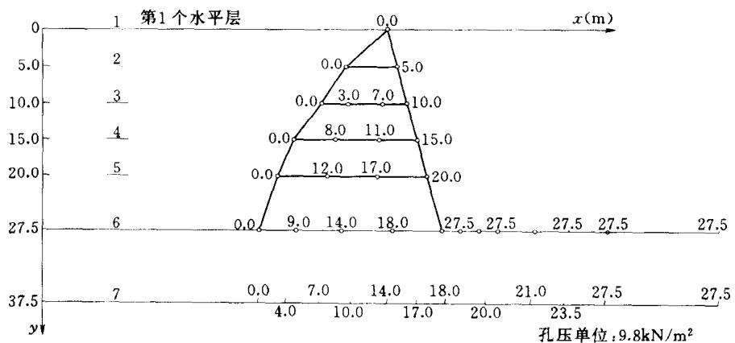

图 12.8 按坐标网格输入孔隙水压力值（例题 EX2）  
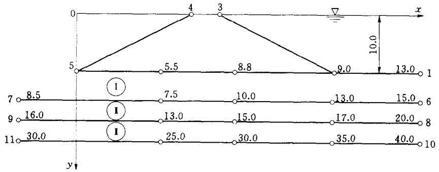

图 12.9 按坐标网格输入地基原位不排水抗剪强度 q（例题 EX11) $\pmb { q } _ { e { u } }$  
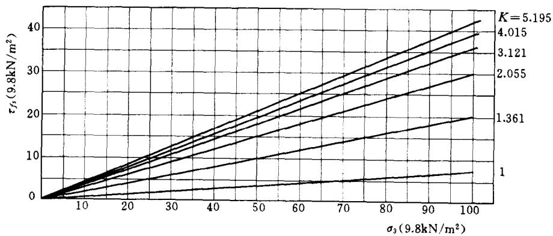  
图 12.10 土的地震总强度三轴试验曲线（例题 EX12）

上述三种情况，均使用以下同一模式输入原始数据。

设某一物理量Q为坐标x、y的函数，则输入ny条“水平线”，在第Ⅰ条水平线上，布置了nx(I)个点，其x坐标为 $x _ { i j } ~ , ~ j = 1 , 2 , . . . , n x ( \mathrm { I } )$ ，y坐标为同一值，相应 Q值为 $Q ( x _ { i j } , \ y _ { i j } )$ 程序要求依次输入，参见表12.1的65\~70行。

ny 为水平线总数，为第 65行LOY

nx(1)第一条水平线上点的总数，为第67行LOX(I)

$x _ { 1 1 } , y _ { 1 1 } , Q _ { 1 1 }$ (第一条水平线上第一个点的x， y和 Q值)，为第 69 行中 PPX(I,J)，PY(I,J)，P(I,J)。

$x _ { 1 2 } , y _ { 1 2 } , \textrm { } Q _ { 1 2 }$ (第二条水平线上第一个点的x，y和 Q 值)

[共 nx(1)行]

nx(2)第二条水平线上点的总数

[共 nx(2)行]

在表 12.1 中 51 行实现动强度指标的输入。子程序 REED 具有类似的内插格式。上述三种情况具体输入方法可分别参见例题EX2.DAT,EX11.DAT, EX12.DAT。

## 12.2.3 计算荷载

## 1. 自重

采用实际重，即水下为饱和重，水上为天然重。在程序中，天然重和饱和重分别存于PDW(I)，PDS(I)中（数据表 12.1 第 48 行）。

## 2. 滑动体边界上的水压力

如前所述，在坡外有水时，作用在滑坡体坡面上的水压力通常用等效置换的方法变成一个坡外无水的情况（参见第2章2.4.3节）。请仔细阅读12.2.1节，以确保上、下游水位，浸润线输入正确无误。

## 3. 孔隙水压力

孔隙水压力按下面三种方法输入，以实现对LRU(I)不同赋值的功能。

(1)当孔隙水压力在某一区域按静压分布时（例如，心墙上游侧的透水坝壳），只需输入该区域的浸润线位置。程序即能自动识别，按静压计算孔压。

如果浸润线较平缓，往往可近似假定等势线铅直。孔压亦可按这种处理方法近似按静压分布计算。上述两种情况在48行中取LRU(I)=0。如图12.2所示滑面上A点的孔压，其值应为AB段水头，但确定此值需要绘制流网，这时使用的一种近似的作法是将A点的孔压简化为 AC 段的水头。

(2)当孔隙水压力在某一区域不按静压分布时（例如，不透水土在固结过程中的孔压），按坐标网格逐点输入（图12.8）。程序将据此采用等参形状函数进行内插，确定滑弧面上各点孔压值。已在12.2.2节中详细介绍，此时，取 $\scriptstyle \mathbf { L R U } ( \mathbf { I } ) \ > 0$ 。例题EX2介绍此功能。

(3) 输入孔隙水压力系数 $r _ { \mu }$ 。此时，取 LRU(I)<0。孔隙水压力系数定义参见第2章式(2.5)。此功能在计算天然边坡时常用。此时，往往不易精确地确定坡内孔隙水压力，从实用角度，工程师常输入一个与土柱高成一定比例的水面线。例如，当 $r _ { \mu } = 0 . 1$ 时，如果土柱容重为19.6kN/m³，则可知水面线距土条底为 $( 1 9 . 6 / 9 . 8 ) { \times } 0 . 1 H { = } 0 . 2 H$ ，其中H为土柱高。

在2001年12月以后 STAB版中，凡是输入r，为负值的土区，不管其是否在浸润线以 $r _ { u }$ 上还是以下，滑面上均按输入的孔压系数处理。也就是说如果使用孔隙水压力系数r，的功 $r _ { \mu }$ 能，则无需再输入浸润线的信息。之所以作这一改进，是因为在绝大多数情况下，既然要采用孔压系数的功能，就没有必要在该土层中再定义一条浸润线。绝大多数用户不希望再花时间去定义浸润线。如果浸润线通过某一土区，而浸润线以下要用 $\scriptstyle \mathrm { L R U ( I ) } < 0$ 的功能，以上孔压为零，则用户应将浸润线上、下的土按两种土区来处理。

## 4. 地震惯性力

(1) 按 SL203-97《水工建筑物抗震设计规范》规定计算。已在第7章7.5.1节中介绍。表 12.1 中第 39 行要求输入IQUA=地震烈度，HBAS =坝底高程，HBO=坝高。程序安排地震力向上和向下两种选择。分别用IDIR=0和1实现。

(2) 水平地震力沿高程按某一分布图形输入。用户希望沿高程按图12.4(b)所示分布图形分别输入水平和垂直地震力系数，则可设IQUA<0，将转折点的y坐标 CYE(I)和相应的水平地震力系数 COE(I)与垂直地震系数 VOE(I)输入。表 12.1 中 41 至 42 行执行此功能，例题 EX4 和 EX26 介绍此功能。

## 5. 外荷载

STAB 程序具有两种输入外荷载的功能，分别用 OPT1ON(5)<0 和 OPT1ON(5)>0 来控制，通过程序 READ3 和 READ3\_1 实现表 12.1 中第 92\~93 行。READ3\_1 为 STAB 程序输入外荷载的老功能（称为第一种功能)，在处理实际问题时不太方便，以后又开发了READ3(称为第二种功能)。推荐使用READ3。

(1)子程序READ3\_1，输入外荷载的第一种功能，见表12.4。当坡面上有作用荷载时，有两种方式输入。

(a)分布力。分布力强度qx和qv是作用在某一线段上的，如图12.11(a)所示一分布荷载， $q _ { x }$ $q _ { y }$ 坡面上某一小段(水平距离为dx)上若承受水平方向和垂直方向的力分别为 $\mathbf { d } P _ { x }$ ， $\mathbf { d } P _ { y }$ ，则定义：

$$
q _ { x } = \frac { \mathrm { d } P _ { x } } { \mathrm { d } x }\tag{12.1}
$$

$$
q _ { y } = \frac { \mathrm { d } P _ { y } } { \mathrm { d } y }\tag{12.2}
$$

需要分别输入qx、q在线段左端（x坐标小的那端）和右端（x坐标值大的那端）的数 $q _ { x }$ $q _ { y }$ 值，分别用 月q、qv和qx、q、+来表示，表12.4中第 11和12行的 PN 和 PT 分别代表qx和qv, $\hat { q _ { x } } \cdot \hat { q _ { y } }$ $\pmb q _ { x } ^ { \ + }$ ${ q _ { y } } ^ { + }$ $q _ { x }$ $q _ { y } ,$ 数组(I,II)中Ⅱ为1和2时，分别代表左端和右端值。这一功能通常用来模拟坡面上的建筑物荷重。定义dP和dP,的正方向分别与x和y轴相同。 $\mathbf { d } P _ { x }$ $\mathrm { d } P _ { y }$

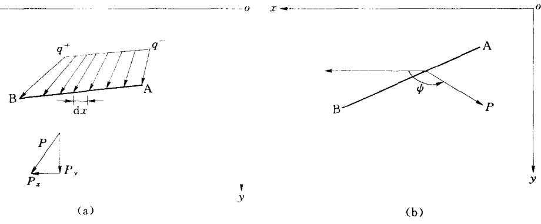  
图 12.11 输入外荷载示意图  
(a) 分布力：(b) 集中力

(b) 集中力。坡面某一段 AB 均匀分布一总合力为 P，如图 12.11(b)，与 x 正轴正方向夹角为ψ的荷载。在计算时，力P被处理成均匀地作用在线段AB上，这一功能通常用来模拟锚索荷载。定义ψ为正x轴转向正y轴的角度。在表12.4第9行中用SU和AF表示。

例题EX21是专门介绍该功能的例子（图12.12）。

(2) 子程序 READ3，新设的输入外荷载的第二种功能功能，见表 12.5。

(a) 分布力。与READ3不同，分布力是作用于某一线段线的法线和切线方向的荷载 $\lbrace { q _ { N } } ^ { + }$ $\pmb { q } _ { N }$ 和 ${ q _ { T } } ^ { + } , { q _ { T } } ^ { - } )$ 同样也是放在PN和PT两个数组中，如表12.4第10和11行。

此时

$$
q _ { N } = { \frac { \mathrm { d } P _ { N } } { \mathrm { d } L } }\tag{12.3}
$$

$$
q _ { T } = { \frac { \mathrm { d } P _ { T } } { \mathrm { d } L } }\tag{12.4}
$$

其中dL为线段的长度。

(b) 集中力。与READ3不同，集中力是作用在某一指定的x、y坐标上。分别用 XANCH(I)，YANCH(I)，ANCHL(I)，ANCHA(I) 4 个变量存放集中力的 x、y 坐标，数值 P 和与 x 正轴正方向夹角ψ，如表12.4第16行。

例题EX30是专门介绍该功能的例子。

## 12.2.4 分析方法

## 1. 有效应力法和总应力法

在开始介绍本节内容前，需要强调指出，有效应力法和总应力法分别包含了对强度指标和孔隙水压力的不同试验内容和处理方案。用户应在仔细阅读本书第5 章和第7章的基础上合理地使用本程序提供的功能。在没有弄清总应力法的概念以前，不要使用本程序有关总应力法的功能。有的用户把MTE当作一个开关，在MTE=0时算一遍，令MTE>0时又算一遍，以为这就是相应有效应力法和总应力法的安全系数。这一作法是错误的，也是有害的。

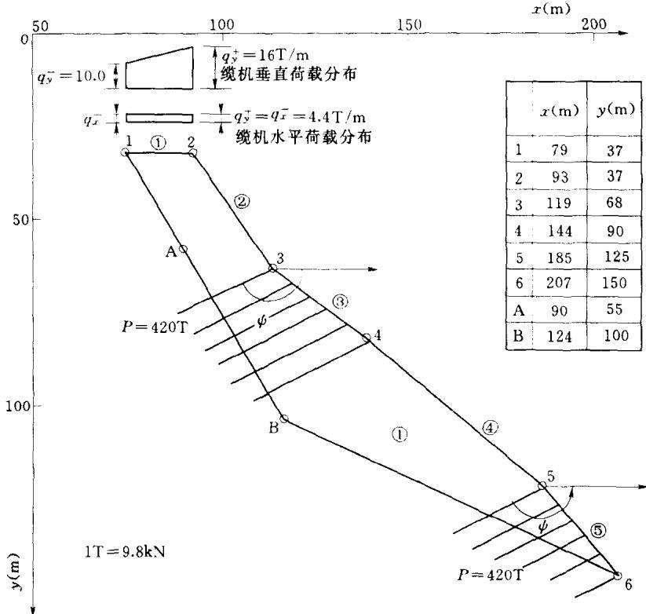  
图 12.12 输入外荷载例题

在表12.1第33行输入参数MTE。相应MTE的不同数值，程序执行以下分析方法。

(1) 有效应力法和坝体施工期总应力法(MTE=0)。根据不同运用阶段，分别采用S剪、Q剪、R剪的强度指标。施工、竣工期采用Q剪指标进行总应力法分析，此时，不计孔隙水压力，其处理方法实际上同有效应力法。例题EX9介绍此情况。

(2) 静力总应力法(MTE>0)。本书第 5 章论述了总应力法的原理并介绍了详细计算步骤。STAB程序中使用静力总应力法有以下两种情况：

(a) 采用现场快剪强度指标。这种情况主要针对地基土具有现场十字板剪力仪或其它现场土工试验的总强度的情况。这个数据随深度变化。程序要求输入相应现场位置x，y值和 $\pmb { \tau } { = } q _ { c u } / 2$ 的网格，通过内插确定滑裂面上各点总强度。在数据文件中，用MTE>0(表12.1第33行)和LRU(I)>0（表12.1第48行）来控制。例题EX11介绍这个情况。

(b) 利用固结不排水试验强度包线 R 或组合强度“R-S”进行库水位骤降时的边坡稳定总应力法分析。这一步骤已在第7章通过[例7.7]作详细介绍。STAB程序严格按照美国陆军工程师团建议的方法操作。在数据文件中，用MTE>0（表12.1第33行）以及输入不同的降前、降后水位UWL和UWL1（表12.1第 34行）和输入R-S 组合包线来实现此功能。执行此功能，还需输入库水位降落后坝内的浸润线，表12.1中81\~83行。例题EX8介绍此情况。

(c) 地震总应力法(MTE<0)。采用第7章介绍的步骤利用动三轴试验的总强度进行边坡稳定计算的。

土的动抗剪强度 $\tau _ { f s }$ 由下式确定：

$$
\tau _ { f s } = f ( \sigma _ { 3 } , K _ { c } )\tag{12.5}
$$

$$
K _ { c } = \frac { \sigma _ { 1 } } { \sigma _ { 3 } }\tag{12.6}
$$

上二式中： $\tau _ { f s }$ 为破坏面上的剪应力； $\sigma _ { \mathrm { i } }$ 为固结大主应力； $\sigma _ { 3 }$ 为固结小主应力。

用程序进行计算，需将三轴不排水动力试验所得结果整理成式(12.5)形式，然后以网格形式，逐点将σ3、K和τs输入，如图12.10所示。对某一σ3、Kc，程序通过内插确定τfs。 ${ \pmb { \sigma } } _ { 3 }$ $K _ { \mathrm { c } }$ $\tau _ { f s }$ ${ \pmb { \sigma } } _ { 3 }$ $K _ { c }$ $\tau _ { f s }$

本程序规定具备动指标的土料种类不得超过五种，对需进行动力分析的土层依次由1至LSD编号，不具备动指标的土层编号为零。称这组编号为“动编号”，用LSDM(I)，I=1，…，IN表示。

例如某问题共包含5层土， $\mathbf { I N } = 5 ,$ 。如果编号为1、3、4的三层土具备动指标，其相应的τ，K数据网格的编号分别为1、2、3。第2、5层土不做地震总应力分析。那么 $\pmb { \tau _ { f s } }$ $K _ { c }$ $\mathbf { L } \mathbf { S } \mathbf { D } { = } 3$ 这五层土的动编号为 $\operatorname { L S D M } ( \operatorname { I } ) = 1 , 0 , 2 , 3 , 0 \ ( \operatorname { I } = 1 , . . . , 5 )$ 。也就是说，程序将识别，第2、5层土无动指标，第1层土将使用下面输入的第一组动强度数据网。第3、4层土分别使用第2、3组动强度数据网。

程序在READ2（表12.3）中输入各层有关数据。例题EX12介绍此功能。

## 2. 稳定计算方法

(1) 简化法。程序提供第3章介绍的全部简化法的计算功能。

用于圆弧滑裂面的简化法，按网格布置多个圆弧滑裂面，程序同时算出毕肖普法、瑞典法和改良瑞典法（罗厄法或工程师团法）的结果，分别通过 $\operatorname { L L 1 } = 0 { , } 1 { , } 2$ 来实现（表12.2第23行)，并找出相应于某一种方法最小安全系数值的临界滑弧。

罗厄法和陆军工程师团法是满足静力平衡的适用于任意形状滑裂面的简化法，用户在两者中选一种。在数据表12.1第34行中，当ASP<0时，为罗厄法； $\mathbf { A S P } { \geqslant } 0$ 时，为工程师团法，此时ASP为边坡的平均坡度（以度计），此值仅在工程师团法中用。罗厄法和陆军工程师团法也可在任意形状滑裂面条件下使用。程序先计算罗厄法或陆军工程师团法，再以此为初值，获得通用条分法的成果。

(2) 边坡稳定分析通用条分法。本法仅用于任意形状滑裂面。方法的要点是输入对土条侧向力倾角的一个分布形状，然后根据力和力矩平衡确定安全系数，已在第2章中详细介绍。本程序默认的功能是 Spencer 法。当 OP1(3)>0 时，程序执行第 2 章介绍的对β(x)的 $\beta ( x )$ 其它假定，此时，按READ4中不同处理，对f(x)和fo(x)输入一个由用户指定的分布函数。 $f _ { 0 } ( x )$ 在 ${ \mathsf { O P l } } ( 3 ) { = } 0$ 时无需输入其它参数，即自动使用Spencer法计算。在OP1(3)大于零时，通过表 12.2 的 77\~91 行指定 $\pmb { \mathscr { f } } ( \pmb { x } )$ 和 $f _ { 0 } ( x )$ 的数值。

OP1(3)大于零时首先读入控制码ISPE。

$\mathbf { I S P E } = - 2$ ，采用第2章2.5.2节介绍的侧向力的第 2种假定，即固定的两端值，f(x)采

用正弦曲线。

ISPE=0，由用户指定 $f _ { 0 } ( x )$ 和f(x)。

其次，读入 IBOUN。当 IBOUN 为零时两端值按第 2 章 2.5.2 节提供的判据式(2.90)由程序自动设置，不为零时，则由用户指定端值，用FAA和FBB定义。

ISPE=-2和0的两种情况的实例，参见 EX27和EX29。

表12.7总结了本程序进行边坡稳定分析的各种功能。

## 3. 边坡稳定的可靠度分析

程序执行第10章介绍的蒙特卡洛法、一次二阶矩法、Rothenbleuth 法三种可靠度分析的功能。输入数据在子程序READ5（表12.6）中执行。

首先输入两个参数 NPROB 和 NLP。

PROB=1：蒙特卡洛法；=2：一次二阶矩法；=3：Rosenbleuth法。

NLP=具有随机特性土层总数，如果 $\mathbf { N P R O B } = 1$ 则需单独为蒙特卡洛法输入以下参数：

ITM =蒙特卡洛法模拟次数；

K=具有随机特性的变量总数；

$\mathbf { M E E D ( I ) } = \vec { \mathnormal { r } }$ 生随机数的种子。

随后对上述三种情况，输入以下参数：

MTYPE(I)=1：均匀分布；=2：正态分布；=3：负指数分布；=4：对数正态分布。

FMEAN(I)， FDEV(I)，RMEAN(I)，RDEV(I)分别为 c, φ $r _ { \mu }$ 的均值和标准差。

KK=0，不相关；KK=1，相关。

在 KK=1时 输入相关系数矩阵 R11(I, J)。

与确定性方法中所用的分析过程类似，边坡稳定概率分析通常包括两步即对于一指定滑面求β；在可能的滑面中，寻找一个所谓临界滑面，其β为最小值 $\lvert \beta \rvert$ $\cdot \beta _ { m }$

注意蒙特卡洛法无法考虑参数相关，也不能进行自动寻找临界滑面的优化功能。

## 4. 土压力计算

当OP1(1)为2和3时进行土压力计算，此时在表12.1的第95行输入以下参数：

GWALL=假定的土压力大小。假定值不影响最终成果，但不应与预计的最终成果偏离过大。

HMW=土压力作用位置与墙底的垂直距离

EWALL=土压力与水平线的夹角

当 ${ \tt O P l } ( 1 ) = 2 $ 时进行同时满足力和力矩平衡条件的土压力计算；

当 ${ \mathsf { O P I } } ( 1 ) = 3$ 时进行仅满足力平衡条件的土压力计算，即库仑土压力理论计算。此时计算成果与输入的HMW值无关。

## 12.2.5 应用最优化方法确定临界滑裂面

## 1. 圆弧滑裂面

程序提供的搜索圆弧形临界滑裂面的功能有3种，分别用表12.2中23行 $\operatorname { L L 2 } = 0 { , } 1 { , } 2$ 来实现。在一般情况下建议直接使用 $\mathbf { L } \mathbf { L } 2 = 2$ ，即下述(3)的功能。

(1)枚举法（网格法）。此时令 $\mathbf { L } \mathbf { L } 0 = 0$ ，程序按输入的网格步长和网格数，计算相应不同的圆心坐标和滑弧深度的圆弧的安全系数。

此法的基本思想是不断地改变圆心位置 $x _ { c }$ 、 $y _ { c }$ 和滑弧深度 $D _ { s }$ 的数值，逐一比较相应的安全系数，最终找到最小的安全系数。在具体操作中，先固定一个 $D _ { s }$ ，然后在圆心可能的位置中布置一个网格。如图12.4所示，设网格的中心坐标为CCX，CCY。相应某一固定的滑弧深度CCD(表12.2中 33行)，在左右方向，各布置了NGRIX格，每格宽度为 BCX，在上下方向各布置了NGRIY格，每格宽度为BCY，则共计有 $( 2 \times \mathrm { N G R I X } + 1 ) \times ( 2 \times \mathrm { N G R I Y } + 1 )$ 个网格点。分别以该网格点为圆心，以 $D _ { s }$ 为滑弧深度计算相应安全系数，找出最小的安全系数。然后改变一个 $D _ { s }$ 值，重复相同的步骤。在这一过程中，有可能出现圆弧和边坡不相交的情况，程序将自动抛弃该圆弧。同样D也是一个起算的中心值，在其上、下各布置NGRID $D _ { s }$ 层，每层间距为BCD。这样总计计算 $( 2 \times \mathrm { N G R I X } + 1 ) \times ( 2 \times \mathrm { N G R I Y } + 1 ) \times ( 2 \times \mathrm { N G R I D } + 1 )$ 个圆弧。采用此法时， $\mathbf { L } \mathbf { \Lambda } 2 { = } 0$ 。此法的一个特例是 $\mathrm { N G R I X } { = } \mathrm { N G R I Y } { = } \mathrm { N G R I D } { = } 0$ ，此时计算一个指定圆弧。

(2)二个自由度的搜索。应用单形法，先固定Ds不动，用单形法搜索与某一滑弧深度 $D _ { s }$ $D _ { s }$ 相应的使安全系数F最小的滑弧的圆心x、y。不断地改变D可获得一系列最小的安全 $\pmb { x } _ { c }$ $y _ { c }$ $D _ { s }$ 系数 $\pmb { F } _ { \mathfrak { c } }$

本功能以数据表LL2=1来实现。

(3)三个自由度的搜索。使用此功能，程序将一次计算出最小安全系数，不再对不同滑弧深度逐一计算。

本功能以 $\mathbf { L } \mathbf { L } 2 = 2$ 来实现。在使用单形法自动搜索最小安全系数和临界滑裂面时，数据输入格式和枚举法完全一样，不同之处在于枚举法 $\mathbf { L } \mathbf { L } 2 = 1$ ，单形法 $\mathbf { L } \mathbf { \ } 2 = 2$ 。输入NGRIX，NGRIY,NGRID和 CCX，CCY，CCD 这些参数的作用是为最优化方法提供一个初始估计的滑弧和搜索的范围，并不影响计算成果，也可设这些值为零。详见例题EX7。

## 2. 任意形状滑裂面

(1) 任意形状滑裂面的几何参数。在表 12.2 第 41 行输入 NS1，NOPT，IRE，即滑裂面上控制点的总数，优化方法和迭代次数。

输入 KQ2(I)，X1(I)，Y1(I)，NL(I)，AL(I)，分别为控制点的条块界面编号，x, y 坐标 $x ,$ 值，自由度，移动方向。

$\mathbf { A } _ { 1 }$ 和 A2的控制点的条块界面编号分别为 KQ2(1)和 KQ2(2)，假如 KQ2(1)和 KQ2(2) 分 $\mathbf { A } _ { 2 }$ 别为为1和5，那么，程序将自动在A和A₂之间内插编号为2、3、4的三条条块界面。依 $\mathbf { A } _ { 1 }$ $\mathbf { A } _ { 2 }$ 次类推。

自由度和移动方向分别在NL(1)和 AL(1)中存放。

应用单形法，每个离散点都将从x，y两个方向逼近临界滑裂面相应的控制点B1，B2，…， $\mathbf { B } _ { 1 }$ $\mathbf { B } _ { 2 } .$ $\mathbf { B _ { m } }$ 。此时我们称该点的自由度为2，对m个离散点，总的自由度为 $_ { 2 m }$

有时，需要规定某个离散点固定不动，此时自由度为0，或规定沿某一设定方向移动。此时，自由度为1。

如图12.6所示例，A₄点如沿软弱面移动，则需规定该点自由度为1，并将移动方向相 $\mathbf { A } _ { 4 }$


<!-- ===== 分片 p401-573（173页，源：ex08_陈祖煜_土质边坡稳定分析（401-573页））===== -->

对于正x轴的夹角（规定从正x轴转向正y轴为正）作为一个参数输入程序。

在优化过程中，左、右两个端点可能移至边坡外或内，如图12.6中的 $\mathbf { A } _ { 1 }$ 和 $\mathbf { A } _ { \mathbf { m } }$ 移至 $\mathbf { B } _ { \mathrm { ~ l ~ } } ^ { \prime }$ 和 $\mathbf { B } _ { \mathbf { m } } ^ { \prime } ,$ 程序将自动找到 $\mathbf { B } _ { 1 } ^ { \prime } \mathbf { B } _ { 2 }$ 和 $\mathbf { B } _ { \mathbf { m } } ^ { \prime } \mathbf { B } _ { \mathbf { m } - 1 }$ 与边坡的交点 $\mathbf { B } _ { 1 }$ 和 $\mathbf { B _ { m } } ;$ 并对滑裂面的信息作相应的调整。滑裂面上的 NS1 个控制点将其分成 NS-1 段。自上交点至下交点编号为 $^ { 1 , 2 , . . . }$ NS-1。程序要求输入此NS-1段中形状为直线的段的编号，依次存放在数组LOO(I)中，直线段总数为LNO，表12.2第70\~72行。如果 ${ \bf L N O { = } } 0$ ，则滑裂面上无直线段，为光滑曲线。当 LNO为一大于NS1-1 的数时，则程序默认为全部为直线段。这两种情况都无须填写LOO(I)。

(2) 关于软弱夹层的输入。如前所述，我们将由 NS1 个点组成的滑裂面视为 NS-1 段，当 OP1(4)=1 时，在输完 KQ2(I)、X1(I)、Y1(I)、NL(I)、AL(I)后，紧随于后输入软弱夹层信息 WS(I)，I=1, …., NS1-1。当 $\mathbf { W S ( I ) } = 0$ 时，滑裂面上第Ⅰ段不是软弱夹层；当WS(I)不为0时，WS(I)为该段滑裂面所属软弱夹层的编号。详见例题EX25 和 EX29。在表12.2中55\~65行读入和处理这些信息。

## 3. 应用随机搜索确定安全系数的整体极值

在计算任意形状滑裂面时，有时可能因初始滑裂面离整体极值相应的滑裂面较远，因而无法找到。此时，如第4章介绍，可使用随机搜索的方法。先在临界滑裂面可能的位置附近划定一个随机搜索区域，程序在给定区域自动生成100\~500个滑裂面，从中找到相应最小安全系数的那个滑裂面，作为最优化计算的初值。

如图12.13所示，以初始滑裂面为中轴线，对滑裂面的每个控制点，在其移动方向，设定的一个宽度d，称半带宽，这样即可形成一个随机搜索区域。 $\pmb { d } _ { i } ,$

子程序READ4（表12.2）中 67\~68行读入相应的数据。

IX=为随机搜索种子，可输入一任意整型数。

KK，ZP(I)=滑裂面上控制点号和从该点定义的半带宽， $\mathbf { K } \mathbf { K } { = } 1 , 2 , . . . , \mathbf { N } \mathbf { S } 1$

半带宽是按中轴线为轴线沿移动方向AL(I)定义的。用户应保证其输入的KK，ZP(I)确实能形成如图12.13那样的具有物理意义的随机搜索区域，否则随机搜索并不能帮忙。

随机搜索仅用于任意形状滑裂面。例题EX22介绍这一功能。

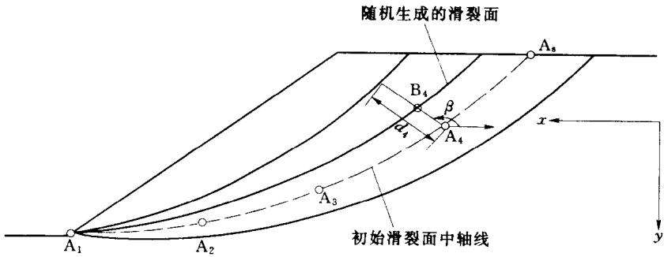  
图 12.13 随机搜索示意图

## 12.3 数据文件的格式

## 12.3.1 主要数据

STAB 读入数据文件的源程序如表12.1所示。

表 12.1 主要数据输入格式

<table><tr><td colspan="2">编号源程序</td><td>说明</td></tr><tr><td>1</td><td colspan="2">SUBROUTINE READ1</td></tr><tr><td>2</td><td colspan="2">COMMON/A1/IN,IN1,PF(20),PC(20),PDW(20),PDS(2 用户需确认没有使用越界的数组 0),IPH,ICPH(40,3)</td></tr><tr><td>3</td><td colspan="2">COMMON/A2/NN,NJ(20),NHY,DHRP,WL(80),BDA(</td></tr><tr><td>4</td><td colspan="2">80),CA(80),FAA(80) #,LRU(20)+B59</td></tr><tr><td>5</td><td colspan="2">COMMON/A3/RW,RU1,UWL</td></tr><tr><td>6</td><td colspan="2">COMMON/A4/LSL,LNUM(60),IUPW,JUPW</td></tr><tr><td>7</td><td colspan="2">COMMON/A6/X(80),Y(80),XN(99),YN(99),X2(80),Y</td></tr><tr><td>8</td><td colspan="2">2(80),IC(80,3),N COMMON/A7/W(80),RU(80),C(80),F(80)</td></tr><tr><td>9</td><td colspan="2">COMMON/A9/IDIR,FQUH(80),FQUV(80),FDIS(80),I QUA,HBAS,HBO</td></tr><tr><td>10</td><td colspan="2">COMMON/A10/PPX(15,15),PY(15,15),P(15,15),LOX(</td></tr><tr><td>11</td><td colspan="2">15),LOY COMMON/A11/FA,FB,FK,FX(80),FXO(80),ALF(80),</td></tr><tr><td>12</td><td colspan="2">NS,GF(80),MQP,KXYX,ASP COMMON/A15/UWL1,NCOUN,MLA(80),PF1(20),P</td></tr><tr><td>13</td><td colspan="2">C1(20),MID(20) COMMON/A16/IPH2,ICPH2(40,3),IPH1,ICPH1(40,3)</td></tr><tr><td>14</td><td colspan="2">COMMON/A9A/LQH,CYE(10),COE(10),VOE(10)</td></tr><tr><td>15</td><td colspan="2">COMMON/CRU/RUS(10),LINES(80),YSF(80)</td></tr><tr><td>16</td><td colspan="2">COMMON/RELIA1/NPROB,NLP,ITM,IPBD,MEED(</td></tr><tr><td>17</td><td colspan="2">40) COMMON/SUR/NSUR,NNP,NP(10),PN(10,2),PT(10,</td></tr><tr><td></td><td colspan="2">2) INTEGER*4OPTION(6),OP1(6)</td></tr><tr><td>18 19</td><td colspan="2">COMMON/OPP/OPTION,OP1</td></tr><tr><td>20</td><td colspan="2">COMMON/WALL/IWALL,GWALL,HMW,EWALL</td></tr><tr><td>21</td><td colspan="2">COMMON/SWEAK/IWEAK,KQ3(50),LWK,IC3(40,3</td></tr><tr><td>22</td><td colspan="2">) READ(5,&#x27;(A64)&#x27;)HEAD 标题</td></tr><tr><td>23</td><td>READ(5,*)(OPTION(I),I=1,6)</td><td>读入6个功能控制码</td></tr><tr><td>24</td><td>IF(OPTION(3).EQ.-2)READ(5,*)HITE</td><td>拉力缝内充水高度由用户指定</td></tr><tr><td>25</td><td>IF(OPTION(6).EQ.1)THEN</td><td>在OPTION(6)为1时读入6个扩充功能</td></tr><tr><td></td><td></td><td>码</td></tr><tr><td>26</td><td colspan="2">READ(5,*)(OP1(1),I=1,6)</td></tr><tr><td>27</td><td colspan="2">ENDIF</td></tr><tr><td>28</td><td colspan="2">!OP1(1)WALL OP1(1)不为零时进行土压力计算</td></tr><tr><td>29</td><td rowspan="2">!OP1(3)F0(X)ANDF(X)SPECIFIEDBYUSER</td><td rowspan="2">OP1(3) = 0时程序默认使用SPENCER 法</td></tr><tr><td></td></tr></table>

```csv
编号源程序 说明
OP1(3)不为0时，用户输入的关信息
进行BN通用条分法计算
30 !OP1(4)WEAKSEAM OP1(4)不为0时，执行软弱夹层功能
31 !OP1(5)Inputxa()
32 !OP1(6)外边坡线由用户输入 OP1(6)不为0时，外边坡线由用户输
入
33 READ(5,*)MTE 选择有效应力法或总应力法
34 READ(5,*)UWL,UWL1,ASP 坡外水位、总应力法骤降水位、滑楔
法控制码
35 NSS=0
36 IF(ABS(UWL1-UWL).GT.0.001)NSS=1 总应力法坡外水位不同于骤降水位，
使用库水位骤降总应力法,此时NSS =
1
37 MTE=0
38 MRD=0
39 READ(5,*)IQUA,HBAS,HBO,IDIR 读入地震加速度信息
40 IF(IQUA.GE.0)GOTO841 当IQUA小于零时，地震系数由用户
输入
41 IF(IQUA.NE.-2) IQUA=-2时同时输入垂直和水平地
READ(5,*)LQH,(CYE(I),COE(I),I=1,LQH) 震力，
42 IF(IQUA.EQ.-2) 否则仅输入水平地震力
READ(5,*)LQH,(CYE(I),COE(I),VOE(I),I=1,LQH)
43 DO843I=1,LQH
44 IF(IQUA.NE.-2)VOE(I)=0.
45 843CONTINUE
46 READ(5,*)RW 水容重
47 READ(5,*)NN,(L,XN(I),YN(I),I=1,NN) 节点信息
48 READ(5,*)IN,(L,PF(I),PC(I),PF1(I),PC1(I),PDW(I), 土层信息
PDS(I),
49 %LRU(I),I=1,IN)
50 IF(MTE.GE.0)GOTO279
51 CALL READ2 输入地震总应力法动强度
52 279NHY=0
53 DO342I=1,IN 处理孔隙水压力信息
54 RUS(I)=0.
55 IF(LRU(I).GE.0)GOTO323 当LRU(I)小于零时读入该层土的孔隙
水压力系数
56 READ(5,*)RUS(I) 孔隙水压力系数
57 NHY=-1
58 GOTO342
59 323IF(LRU(I).EQ.0)GOTO342
60 NHY=1
61 GOTO343
62 342CONTINUE
```

<table><tr><td>编号源程序</td></tr><tr><td>63 343CONTUNUE</td></tr><tr><td>64 IF(NHY.LE.0)GOTO2010</td></tr><tr><td>65 READ(5,*)LOY 输入孔压或不排水强度内插网</td></tr><tr><td>66 DO2011I=1,LOY 相应MTE=0和&gt;0分别输入孔隙水压</td></tr><tr><td>和qcu 67 READ(5,*)LOX(I)</td></tr><tr><td>68 I1=LOX(I)</td></tr><tr><td>69 READ(5,*)(PPX(I,J),PY(I,J),P(I,J),J=1,I1)</td></tr><tr><td>70 2011CONTINUE</td></tr><tr><td>71 IF(OPTION(4).EQ.0)GOTO1874</td></tr><tr><td>72 CALL READ5 读入可靠度分析的物理力学参数</td></tr><tr><td>73 1874READ(5,*)IN1,IPH 线段和浸润线总数</td></tr><tr><td>74 IF(IPH.EQ.0)GOTO225</td></tr><tr><td>75 READ(5,*)((ICPH(I,J),J=1,3),I= 1,IPH)</td></tr><tr><td></td></tr><tr><td>76 225IF(OP1(4).GT.0)THEN 读入软弱夹层线段信息</td></tr><tr><td>77 READ(5,*)LWK</td></tr><tr><td>78 READ(5,*)((IC3(I,J),J=1,3),I=1,LWK)</td></tr><tr><td>79 ENDIF</td></tr><tr><td>80 IF(NSS.EQ.0)GOTO431 库水位骤降情况读入降后浸润线</td></tr><tr><td>81 READ(5,*)IPH1</td></tr><tr><td>82 READ(5,*)((ICPH1(I,J),J=1,3),I=1,IPH1)</td></tr><tr><td>83 431CONTINUE</td></tr><tr><td>84 CONTINUE</td></tr><tr><td>85 IF(OP1(6).EQ.0)THEN!</td></tr><tr><td>读入外边坡线信息 86 LSL=0</td></tr><tr><td></td></tr><tr><td>87 CALL OUTIDEN(NN,XN,YN,IN1,IC,LSL,LNUM) 调用确定外边坡线的程序</td></tr><tr><td>88 ELSE</td></tr><tr><td>89 READ(5,*)LSL 外边坡线总数</td></tr><tr><td>90 READ(5,*)(LNUM(II),ⅡI=1,LSL) 外边坡线编号</td></tr><tr><td>91 ENDIF</td></tr><tr><td>92 IF(OPTION(5).GT.0)CALL READ3_1 按第一种功能输入外荷载</td></tr><tr><td>93 IF(OPTION(5).LT.0)CALL READ3 按第二种功能输入外荷载</td></tr><tr><td>94 IF(OP1(1).NE.0)THEN 计算主动土压力</td></tr><tr><td>95 READ(5,*)GWALL,HMW,EWALL 假设的土压力值,土压力作用高度,角</td></tr><tr><td>度 96 ENDIF</td></tr><tr><td>97 CALL READ4(IDO)</td></tr><tr><td>读入滑裂面信息 98 RETURN 99 END</td></tr></table>

## 12.3.2 滑裂面信息

表12.2为 STAB 读入的圆弧和任意形状滑裂面。

表12.2 滑裂面信息数据输入格式
<table><tr><td>编号源程序</td><td>说明</td></tr><tr><td>1</td><td>SUBROUTINE READ4(IDO)</td></tr><tr><td>2</td><td>COMMON/A4/LSL,LNUM(60),IUPW,JUPW</td></tr><tr><td>3</td><td>COMMON/A5/NLOW,NUPP,NDP,NLOW1,CX,CY,D S</td></tr><tr><td>4</td><td>COMMON/A6/X(80),Y(80),XN(99),YN(99),X2(80),Y 2(80),IC(80,3),N</td></tr><tr><td>5</td><td>COMMON/A8/MYK,KXSX,MTE,KL</td></tr><tr><td>6</td><td>COMMON/A11/FA,FB,FK,FX(80),FXO(80),ALF(80), NS,GF(80),MQP,KXYX,ASP</td></tr><tr><td>7</td><td>COMMON/A12/DT,BET(80),DQ,DM,AB1,ALAM,D B,DF,NO,NOO(20),LMC</td></tr><tr><td>8 9</td><td>COMMON/A13/IID,IWR1,IWR2,IWR3 COMMON/A23/NS1,KQ2(50),X1(50),Y1(50)</td></tr><tr><td>10</td><td>COMMON/A24/LNO,LOO(60)</td></tr><tr><td>11</td><td>COMMON/B1/ZB,NL(50),AL(50),XE(50),YE(50),ZS(</td></tr><tr><td>12</td><td>50),ZP(50) COMMON/B2/MPU,MPUA(60),MPL,MPLA(60)</td></tr><tr><td>13</td><td>COMMON/B4/NOPT,IRE,TL</td></tr><tr><td>14</td><td>COMMON/B5V/NED/ISP/ISPE,IBOUN,FAB,FBB,XF</td></tr><tr><td>15</td><td>UN(20),FUN(20),IFUN COMMON/RN/LRND,IX,CONR,MRS/IW/IWR4,IWR</td></tr><tr><td>16</td><td>5,IWR6 DIMENSION WS(20)</td></tr><tr><td>17</td><td>COMMON/SER/SERIAL,ISIM</td></tr><tr><td>18</td><td>INTEGER*4OPTION(6),OP1(6)</td></tr><tr><td>19</td><td>COMMON/OPP/OPTION,OP1/SWEAK/IWEAK,KQ3</td></tr><tr><td>20</td><td>(50),LWK,IC3(40,3) COMMON/WALL/IWALL,GWALL,HMW,EWALL,</td></tr><tr><td>21</td><td>ETA COMMON/A1/IN,IN1,PF(20),PC(20),PDW(20),PDS(2</td></tr><tr><td>22</td><td>0),IPH,ICPH(40,3) IF(MYK.EQ.0.OR.MYK.LT.0)GOTO22</td></tr><tr><td>23</td><td>READ(5,*)LLO,LL1,LL2 读入圆弧滑裂面信息</td></tr><tr><td>26</td><td>IF(LLO.EQ.0)GOTO102</td></tr><tr><td>27</td><td>READ(5,*)NGRID,NS,CCD,BCD 读入固定圆弧上、下交点时的信息</td></tr><tr><td>28</td><td>IF(LLO.GT.0)READ(5,*)XL1,YL1,XL2,YL2</td></tr><tr><td>29</td><td>IF(LLO.LT.0)READ(5,*)XL1,YL1,LDN,DS</td></tr><tr><td>30</td><td>RETURN</td></tr><tr><td>31</td><td>C</td></tr><tr><td>32</td><td>C</td></tr><tr><td>33</td><td></td></tr><tr><td></td><td>102READ(5,*)CCX,CCY,CCD,BCX,BCY,BCD 按网格布置圆心位置和滑弧深度</td></tr><tr><td>34</td><td>READ(5,*)NGRIX,NGRIY,NGRID,NS</td></tr></table>

<table><tr><td>编号源程序</td><td></td><td>说明</td></tr><tr><td>35</td><td>IF(OPTION(3).NE.0)THEN</td><td></td></tr><tr><td>36</td><td>READ(5,*)YTENSION</td><td>输入圆弧滑裂面的拉力缝深度</td></tr><tr><td>37 ENDIF</td><td></td><td></td></tr><tr><td>38</td><td>RETURN</td><td></td></tr><tr><td>39</td><td>C</td><td></td></tr><tr><td>40</td><td>C</td><td></td></tr><tr><td>41</td><td>22 READ(5,*)NS1,NOPT,IRE</td><td>滑裂面上控制点的总数，优化方法，</td></tr><tr><td>44</td><td>C</td><td>迭代次数</td></tr><tr><td>45</td><td>DO 259 I=1,NS1</td><td></td></tr><tr><td>46</td><td>READ(5,*)KQ2(I),X1(I),Y1(I),NL(I),AL(I)</td><td>控制点的条块界面编号，x、y坐标值，</td></tr><tr><td>47</td><td>259 CONTINUE</td><td>自由度，移动方向</td></tr><tr><td>48</td><td>C</td><td></td></tr><tr><td>49</td><td>C</td><td></td></tr><tr><td>50</td><td>C</td><td></td></tr><tr><td>51</td><td>DOI=1,NS1-1</td><td></td></tr><tr><td>52</td><td>WS(I)=0</td><td></td></tr><tr><td>53</td><td>ENDDO</td><td></td></tr><tr><td>54</td><td>C</td><td></td></tr><tr><td>55</td><td>IF(OP1(4).GT.0) READ(5,*)(WS(I),I=1,NS1-1)</td><td></td></tr><tr><td>56</td><td>DOI=1,NS1-1</td><td></td></tr><tr><td>57</td><td>IF(WS(I).EQ.0)CYCLE</td><td></td></tr><tr><td>58</td><td>II=WS(I)</td><td></td></tr><tr><td>59</td><td>KQ3(I)=Ⅱ</td><td></td></tr><tr><td>60</td><td>KQ3(I+1)=ⅡI</td><td></td></tr><tr><td>61</td><td>NQL=WS(I)</td><td></td></tr><tr><td>62</td><td>12=IC(NLQ,2)</td><td></td></tr><tr><td>63</td><td>Y1(I)=(X1(I)-XN(I1))*S1+YN(I1)</td><td>将代表软弱夹层的控制点的y坐标调</td></tr><tr><td>64</td><td>AL(I)=ATAN(S1)*180./3.14159</td><td>整到紧贴软弱夹层 将控制点的移动方向调整到与软弱夹</td></tr><tr><td>65</td><td>ENDDO</td><td>层平行</td></tr><tr><td>66</td><td>IF(NOPT.LT.10)GOTO511</td><td></td></tr><tr><td>67</td><td>READ(5,*)IX</td><td>读入随机搜索参数</td></tr><tr><td>68</td><td>READ(5,*)(KK,ZP(I),I=1,NS1)</td><td>滑裂面上控制点号和从该点定义的半</td></tr><tr><td></td><td></td><td>带宽</td></tr><tr><td>69 70</td><td>511CONTINUE READ(5,*)LNO</td><td></td></tr><tr><td>71</td><td>IF(LNO.LT.NS1.OR.LNO.GT.0)</td><td>读入滑裂面上形状为直线的段的编号</td></tr><tr><td>72</td><td>#READ(5,*)(LOO(I),I=1,LNO)</td><td>当LNO为零时，滑裂面为一光滑曲</td></tr><tr><td></td><td></td><td>线，没有直线段。当LNO为一大于</td></tr><tr><td>73</td><td>C</td><td>NS1-1的数时，则程序默认为全部为</td></tr><tr><td>74</td><td>CONTINUE</td><td>直线段。这两种情况都无须填写</td></tr><tr><td>75</td><td>CONTINUE</td><td>LOO(I)</td></tr><tr><td>76</td><td>CREAD DATA FOR THE SIDE FORCE FUNCTION</td><td></td></tr><tr><td>77</td><td>IF(OP1(3).EQ.0)THEN</td><td>OP1(3)不为0时输入土条侧向力倾角 的分布形状函数</td></tr><tr><td>78</td><td>ISPE=1</td><td></td></tr><tr><td>79</td><td>ELSE</td><td></td></tr><tr><td>80</td><td>READ(5,*)ISPE</td><td></td></tr><tr><td>81</td><td>IF(ISPE.EQ.-2)GOTO450</td><td></td></tr><tr><td>82</td><td>IF(ISPE.EQ.0)GOTO450</td><td></td></tr><tr><td>83</td><td>GOTO741</td><td></td></tr><tr><td>84</td><td>450READ(5,*)IBOUN</td><td>读入控制符，IBOU≠0时，f(x)在端部 的数值,IBOU=0时不读</td></tr><tr><td>85</td><td>IF(IBOUN.EQ.0)GOTO627</td><td></td></tr><tr><td>86</td><td>READ(5,*)FAB,FBB</td><td>读入f(x)在端部的数值</td></tr><tr><td>87</td><td>627IF(ISPE.EQ.-2)GOTO741</td><td>ISPE=-2时，自动取f(x)为正弦曲线</td></tr><tr><td>88</td><td>READ(5,*)IFUN</td><td>定义土条侧向力倾角的分布形状函数</td></tr><tr><td></td><td></td><td>的控制点总数</td></tr><tr><td>89</td><td>IF(IFUN.EQ.0)GOTO741</td><td></td></tr><tr><td>90</td><td>READ(5,*)(XFUN(I),FUN(I),I=1,IFUN)</td><td>各控制点的相应x和f(x)数值</td></tr><tr><td>91</td><td>741CONTINUE</td><td></td></tr><tr><td>92</td><td>ENDIF</td><td></td></tr><tr><td>93</td><td>RETURN</td><td></td></tr><tr><td>94</td><td>END</td><td></td></tr></table>

## 12.3.3 动强度指标信息

表 12.3 为 STAB 读入的动强度指标信息。

表 12.3 动强度指标信息数据输入格式
<table><tr><td colspan="2">编号源程序 说明</td></tr><tr><td>1</td><td>SUBROUTINE READ2 读入动强度指标</td></tr><tr><td>2</td><td>COMMON/A22/LSD,LSDM(20)</td></tr><tr><td>3</td><td>COMMON/A1/IN,IN1,PF(20),PC(20),PDW(20),PDS(2 0),IPH,ICPH(40,3)</td></tr><tr><td>4</td><td>COMMON/A18/L1X(15),P1X(15,15),P1Y(15,15),TS1( 15,15),L1Y</td></tr><tr><td>5</td><td>COMMON/A19/L2X(15),P2X(15,15),P2Y(15,15),TS2( 15,15),L2Y</td></tr><tr><td>6</td><td>COMMON/A20/L5X(15),P5X(15,15),P5Y(15,15),TS5( 15,15),L5Y</td></tr><tr><td>7</td><td>COMMON/A21/L3X(15),P3X(15,15),P3Y(15,15),TS3( 15,15),L3Y</td></tr><tr><td>8</td><td>COMMON/A48/L4X(15),P4X(15,15),P4Y(15,15),TS4( 15,15),L4Y</td></tr><tr><td>9</td><td>READ(5,*)LSD,(LSDM(I),I=1,IN)</td></tr></table>

```csv
编号源程序 说明
10 I=1
11 CALL REED(L1Y,L1X,P1X,P1Y,TS1)
12 IF(LSD.LT.2)GOTO279
13 I=I+1
14 CALL REED(L2Y,L2X,P2X,P2Y,TS2)
15 IF(LSD.LT.3)GOTO279
16 I=I+1
17 CALL REED(L3Y,L3X,P3X,P3Y,TS3)
18 IF(LSD.LT.4)GOTO279
19 I=I+1
20 CALL REED(L4Y,L4X,P4X,P4Y,TS4)
21 IF(LSD.LT.5)GOTO279
22 I=I+1
23 CALL REED(L5Y,L5X,P5X,P5Y,TS5)
24 279RETURN
25 END
```

## 12.3.4 外荷第1种方案信息

表 12.4 为 STAB 读入的外荷第 1 种方案信息。

表12.4 外荷第1种方案信息数据输入格式
<table><tr><td colspan="2">编号源程序</td><td>说明</td></tr><tr><td>1</td><td colspan="2">SUBROUTINE READ3_1</td></tr><tr><td>2</td><td>DIMENSIONNUR(20)</td><td></td></tr><tr><td>3</td><td colspan="2">COMMON/SUR/NSUR,NNP,NP(10),PN(10,2),PT(10, 2)</td></tr><tr><td>4</td><td>READ(5,*)NNP</td><td>NNP=具有表面荷载的线段总数</td></tr><tr><td>5</td><td>READ(5,*)(NP(I),I=1,NNP)</td><td>NP(I)=第I个表面荷载的线段号</td></tr><tr><td>6</td><td>DO833I=1,NNP</td><td></td></tr><tr><td>7</td><td>READ(5,*)NUR(I)</td><td>NUR(I) = 第I线段承受荷载的种类。 NUR(I)=0，集中力；NUR(I)=1分布</td></tr><tr><td>8</td><td>IF(NUR(I).EQ.1)GOTO234</td><td>力</td></tr><tr><td>9</td><td>READ(5,*)SU,AF</td><td>SU =集中力的数值，AF =集中力的</td></tr><tr><td></td><td></td><td>倾角</td></tr><tr><td>10</td><td>GOTO833</td><td></td></tr><tr><td>11</td><td>234READ(5,*)(PN(I,II),II=1,2)</td><td>分布力垂直分量左、右端点的值</td></tr><tr><td>12</td><td>READ(5,*)(PT(I,II),ⅡI=1,2)</td><td>分布力水平分量左、右端点的值</td></tr><tr><td>13</td><td>833CONTINUE</td><td></td></tr><tr><td>14</td><td>RETURN</td><td></td></tr><tr><td>15</td><td>END</td><td></td></tr></table>

## 12.3.5 外荷第2种方案信息

表12.5为 STAB 读入的外荷第2种方案信息。

表12.5 外荷第2种方案信息数据输入格式
<table><tr><td colspan="2">编号源程序</td><td>说明</td></tr><tr><td>1</td><td>SUBROUTINE READ3</td><td>施加外荷第2种方案</td></tr><tr><td>2</td><td>CDIMENSIONNUR(20)</td><td></td></tr><tr><td>3</td><td>COMMON/A6/X(80),Y(80),XN(99),YN(99),X2(80),Y 2(80),IC(80,3),N</td><td></td></tr><tr><td>4</td><td>COMMON/SUR/NSUR,NNP,NP(10),PN(10,2),PT(10, 2)</td><td></td></tr><tr><td>5</td><td>COMMON/SUR1/NNA,XANCH(20),YANCH(20),AN CHA(20),ANCHL(20)</td><td></td></tr><tr><td>6</td><td>READ(5,*)NNP,NNA</td><td>分别输入分布荷载和集中荷载总数</td></tr><tr><td>7</td><td>IF(NNP.NE.0)THEN</td><td></td></tr><tr><td>8</td><td>READ(5,*)(NP(I),I=1,NNP)</td><td>分布荷载作用于线段的编号</td></tr><tr><td>9</td><td>DO833I=1,NNP</td><td></td></tr><tr><td>10</td><td>READ(5,*)(PN(I,II),ⅡI=1,2)</td><td>作用于左、右端点法向分布荷载的强 度</td></tr><tr><td>11</td><td>READ(5,*)(PT(I,II),II=1,2)</td><td>作用于左、右端点切向分布荷载的强 度</td></tr><tr><td>12</td><td>833CONTINUE</td><td></td></tr><tr><td>13</td><td>ENDIF</td><td></td></tr><tr><td>14</td><td>IF(NNA.NE.0)THEN</td><td></td></tr><tr><td>15</td><td>DOI=1,NNA</td><td></td></tr><tr><td>16</td><td>READ(5,*)XANCH(I),YANCH(I),ANCHL(I),ANCHA集中力作用点的x、y大小和方向 (I)</td><td></td></tr><tr><td>17</td><td>ENDDO</td><td></td></tr><tr><td>18</td><td>ENDIF</td><td></td></tr><tr><td>19</td><td>RETURN</td><td></td></tr><tr><td>20</td><td>END</td><td></td></tr></table>

## 12.3.6 可靠度分析信息

表12.6 为 STAB 读入的可靠度分析信息。

表12.6 可靠度分析信息数据输入格式
<table><tr><td>编号源程序</td><td>说明</td></tr><tr><td>1</td><td>SUBROUTINE READ5</td></tr><tr><td>2</td><td>DIMENSIONDD(M),V(M,M),R(M,M)</td></tr><tr><td>3</td><td>COMMON/RELIA1/NPROB,NLP,ITM,IPBD,MEED( 40)</td></tr><tr><td>4</td><td>COMMON/RELIA2/MD(10),MTYPE(10),CMEAN(10 ),CDEV(10)</td></tr><tr><td>5</td><td>#,FMEAN(10),FDEV(10),RMEAN(10),RDEV(10)</td></tr></table>

续表

```csv
编号源程序 说明
6 COMMON/A13/IID,IWR1,IWR2,IWR3
7 COMMON/C2/KMAX,R11(20,20),RM1(20),RD1(20),
NPARA(20),NSOIL(20)
8 COMMON/CORR/V1(20,20),EV(20)
9 COMMON/B3/IKD
10 READ(5,*)NPROB,NLP NPROB=1：蒙特卡洛法；2：一次二
阶矩法；3：Rosenbleuth法
11 CONTINUE NLP=具有随机特性土层总数
12 IF(NPROB.NE.1)GOTO24
13 READ(5,*)ITM 蒙特卡洛法模拟次数
14 READ(5,*)K,(MEED(I),I=1,K) K = 具有随机特性的变量总数，
MEED(I)=产生随机数的种子
15 24DO716I=1,NLP
16 READ(5,*)MD(I),MTYPE(I),CMEAN(I),CDEV(I) MTYPE(I)=1：均匀分布；2：正态分
布；3：负指数分布；4：对数正态分
布
17 #,FMEAN(I),FDEV(I),RMEAN(I),RDEV(I) 输入C,F,RU的均值和标准差
18 716CONTINUE
19 IF(NPROB.LE.1)GOTO14 蒙特卡洛法无考虑参数相关的功能
20 READ(5,*)KK KK=0，不相关；KK=1，相关。
21 IF(KK.EQ.1)THEN
22 READ(5,*)((R11(I,J),J=1,KMAX),I=1,KMAX) R11(I,J)=相关系数矩阵
23 ENDIF
24 14RETURN
25 END
```

## 12.4 数据文件变量说明

## 12.4.1 子程序READ1变量说明

## 1. 控制变量和控制码

HEAD - 数据文件名称，一个不超过64个字母的标题。

OPTION- 包括6个整型量的一维数组。

OPTION(1) - 中间成果打印控制。 = 0 不打印； = 1 打印。

OPTION(2) - 滑裂面形状标示符。=0任意形状滑裂面；=1 圆弧滑裂面。

OPTION(3) - 拉力缝计算标示符。 = 0 不进行拉力缝计算； = 1 进行但缝内不充水;=2 进行且缝内充水。

OPTION(4) - 可靠度计算标示符。=0不进行可靠度计算； =1进行可靠度计算。

OPTION(5) - 外荷载计算标示符。=0 不具有外荷载； =1具有外荷载。

OPTION(6) - 扩充功能码。 = 0 不输入扩充功能码； =1 输入扩充功能码 OP1(6)。

OP(1) - 计算土压力控制码。 =0计算安全系数； =1在给定的直立面上有侧向力的条件下计算安全系数；=2计算通用条分法的主动土压力；=3计算库仑主动土压力（仅满足力的平衡条件，滑裂面为直线）。

OP(2) - 未定义。

OP(3) - 通用条分法法控制码。OP1(3)=0 时程序默认使用 SPENCER 法，OP1(3)不为零时，用户输入fo(x)和f(x)的有关信息，进行 Morgenstern-Price 法计算。

OP(4) - 软弱夹层功能控制码。OP1(4)不为0时，执行软弱夹层功能。

OP(5) - 未定义。

OP(6) - 外边坡线由用户输入。

MTE - 计算方法标示符。=0有效应力法和使用总强度指标的总应力法；=1库水位骤降或使用原位不排水指标q的总应力法；<0地震总应力法。 $q _ { c u }$

UWL - 坡外水位y坐标。无坡外水位时取一个很大的值。

UWL1 - 总应力法库水位骤降后水位y坐标。无骤降情况时，或采用有效应力法库水位骤降情况时，取UWL1=UWL。

ASP - 方法控制标示符。>=0.0为边坡的平均坡度，以度计；<0罗厄法。

IQUA - 地震参数。=0无地震； =7，8，9输入的地震烈度；<0水平地震加速度沿高程输入。HBAS = 基础面y 坐标。HBO = 坝高或坡高。IDIR =垂直地震加速度方向。=0向上；=1向下。当IQUA<0时。LQH= 水平地震加速度沿高程转折点总数。CYE(I)= 转折点 y 坐标。COE(I) = 转折点水平地震加速度系数。地震力为该系数乘以重力加速度g。

RW - 水容重，为本程序量纲标识量。= 1 为 t-m； = 9.8 为 kN-M； = 62.4为英磅-英尺单位系统。

2. 控制点总数和各点的坐标

NN 一 控制点总数。

L - 第Ⅰ点序号（该序号并不输入内存）。

XN(I) - 第I点x坐标。

YN(I) - 第I点 y 坐标。

3. 土层总数，土层力学指标和孔隙水压数据

IN - 土层总数。

L - 第Ⅰ土层材料序号。

PF(I) - 第Ⅰ土层材料摩擦角。

PC(I) - 第Ⅰ土层材料凝聚力。

PF1(I) - 第Ⅰ土层的非线性指标。

PC1(I) - 第Ⅰ土层的非线性指标。

对PF1(I)，PC1(I)有三种处理方式：

(1) PF1(I)，PC1(I)均为零。这是最常用的情况，即使用 PF(I)，PC(I)提供的摩擦角和粘聚力进行分析。

(2) PF1(I)，PC1(I)为组合强度中平缓的那条直线（12.2.2节）。

(3) PF1(I)，PC1(I)均为负值，使用非线性强度指标（12.2.2节）。此时输入A、b或φ.∆φ的数值的负值。

PDW(I) － 第Ⅰ土层材料的天然容重。

PDS(I) - 第Ⅰ土层材料的饱和容重。

LRU(I) - 第Ⅰ土层材料的孔隙水压力处理码。LRU(I)=0，1，-1，分别相应简化处理，采用孔压系数和通过内插确定孔压三种情况（参见12.2.3节）。

如果MTE小于0，调READ2，读入地震动指标稳定分析，见第12.2.4节。

当LRU(I)有一项大于零时，需要输入一个网格。如果此时 MTE>0时，则输入为土的不排水总强度qαu值。MTE>0时，输入量为孔隙水压力。 $\pmb { q } _ { c u }$

LOY - 水平线总数。

LOX(I) - 第Ⅰ条水平线上点的总数。

PPX(I,J) - 第Ⅰ条水平线上第J个点的x 坐标。

PY(I,J) - 第Ⅰ条水平线上第J个点的y 坐标。

P(I,J) - 第Ⅰ条水平线上第J个点的孔压值或 $\pmb { q } _ { c u }$ 值。

RUS(I) - 第Ⅰ个土层的孔隙水压力系数。

当OPTION(4)不为零时，输入可靠度计算相应物理力学特征数据。READ5为读入有关可靠度分析数据的子程序，在第12.2.4节中介绍。

4. 边界线、浸润线、总应力法骤降后浸润线

IN1 - 边界线总数。

IC(I,J) - 第Ⅰ条边界线上其中一个端点的序号或下压土层编号(J=1,2,3)。

IPH - 浸润线总数。

ICPH(I,J) - 第Ⅰ条浸润线上其中一个端点的序号或下压土层编号(J=1,2,3)。

IPH1 - 水位骤降后浸润线总数。

CPH1(I,J) - 水位骤降后第Ⅰ条浸润线上其中一个端点的序号或下压土层编号(J = 1,2,3)。

## 12.4.2 子程序READ4变量说明

本子程序读入有关滑裂面的有关信息。

(1) 圆弧滑裂面符号意义、说明，参见图12.4和12.2.5节的解释。

LL0 - 布置圆弧滑裂面的控制码。

1) 当LLO=0时，按圆心网格和不同滑弧深度布置初始滑弧；

2) 当LLO>0时，滑弧通过指定的上、下端点；

3)在LLO<0时，滑弧通过指定的上端点或下端点，并和指定的水平线相切。

CCX - 网格中心的x坐标。

CCY - 网格中心的y 坐标。

CCD 一滑弧深度。

BCX - 在x方向的步长。

BCY - 在y方向的步长。

BCD - 在滑弧深度方向的步长。

NGRIX - 左、右延伸的格数。

NGRIY -上、下延伸的格数。

NGRID - 网格滑弧深度由中心向上或向下延伸的格数。在LLO>0 和 LLO<0时NGRID为圆弧半径增大或减少的网格数。

NS - 指定的划分土条数。

BCD - 中间圆弧的半径增大或减少的网格数。

XL1 - 上交点的x坐标值。

YL1 - 上交点的y 坐标值。

XL2 - 下交点的x坐标值。

YL2 - 下交点的y坐标值。

LDN - 在LLO<0时判别是上交点还是下交点的识别符。>0为下交点，LDN<0则为上交点的相应数据。

DS - 滑弧深度。

LL1 - 方法控制法，=0毕肖普法；=1瑞典法；=2工程师团法。

LL2 - 优化方法选择。

(2) 任意形状滑裂面符号意义说明。

NS1 - 滑裂面上的控制点总数。

NOPT - 优化方法识别符。

1) NOPT =0，只计算指定滑裂面；

2)NOPT=2，用单形法即最优化法搜索临界滑裂面，找最小安全系数；

3) NOPT =12，在使用单形法以前先用随机搜索寻找最小安全系数。

IRE - 迭代次数识别符。

1) IRE =0，程序默任迭代最多 100 次；

2)IRE =I，用户选择的迭代次数。

KQ2(I) - 第Ⅰ个控制点的土条编号。

X1(I) - 第Ⅰ个控制点的 x 坐标。

Y1(I) - 第Ⅰ 个控制点的 y 坐标。

NL(I) - 滑裂面上第Ⅰ个控制点在优化计算过程中移动的自由度。

AL(I) - 滑裂面上第Ⅰ个控制点在优化计算过程中移动的角度(以度计)。

LNO - 滑裂面上直线段的总数。

LOO(I) 一 滑裂面上直线段的编号。

(3)随机搜索有关数据符号意义说明。

IX 一随机搜索的种子，输入一个奇数。

## 12.4.3 子程序READ2变量说明

子程序READ2读入地震动指标稳定分析。

LSD 一 进行动强度分析的土层总数，规定不大于5。

LSDM(I) - 各土层的“动编号”卡，LSDM(1)= 第一层土的“动编号”，LSDM(2)=第二层土的“动编号”。共IN个LSDM(I)。

LDY 一 动强度数据网水平层总数。

LDX(I) 一第Ⅰ条水平网格点总数。

PDX(I,J) - 第I层水平线的第J个点的 $K _ { c }$ 值。

PDY(I,J) - 第Ⅰ层水平线的第J个点的σ值。

TS(I,J) -第Ⅰ层水平线的第J个点的 $\tau _ { f s }$ 值。

## 12.4.4 子程序READ5变量说明

子程序READ5 读入可靠度分析。

NPROB - 采用何种分析方法， = 1 蒙特卡洛法； = 2 一次二阶矩法； = 3Rosenbleuth 法。

NLP - 具有随机特性土层总数。

ITM - 蒙特卡洛法模拟次数。

K - 具有随机特性的变量总数。

MEED(I) - 产生随机数的种子，总共 K 个。

MD(I) - 第Ⅰ层具有随机特性土的编号。

MTYPE(I) - 该层土的概型。=1均匀分布；=2 正态分布；= 3 负指数分布；= 4对数正态分布。

CMEAN(I) - 粘聚力的均值。

CDEV(I) - 粘聚力的标准差。

FMEAN(I) - 摩擦系数的均值。

FDEV(I)- 摩擦系数的标准差。

RMEAN(I) - 孔压系数的均值。

RDEV(I) - 孔压系数的标准差。

以上各变量的均值如果输入负值则说明该变量不按随机变量处理，因而按确定性参数处理。

KK - 随机变量是否相关控制码。KK = 0，不相关；KK = 1，相关。如采用

蒙特卡洛法，则不能进行变量相关的分析计算。故不输入KK和R11(I,J)。

R11(I,J) - 相关系数矩阵。

## 12.4.5 子程序READ3和READ3\_1变量说明

NNP - 具有表面荷载的线段总数。

NP(I) - 第Ⅰ个表面荷载的线段号。

NUR(I) - 第I线段承受荷载的种类。NUR(I)=0，集中力；NUR(I)=1分布力。

SU - 集中力的数值。

AF - 集中力的倾角。

PN(I,1) - 分布力垂直或法线分量在x坐标值小的端点的值。

PN(I,2) - 分布力垂直或法线分量在x坐标值大的端点的值。

PT(I,1) - 分布力水平或切线分量在x坐标值小的端点的值。

PT(I,2) - 分布力水平或切线分量在x坐标值大的端点的值。

## 12.4.6 准备数据文件的一般性提示

对一个初次使用本程序的用户在阅读本使用说明时，一定会被其繁杂的规定、众多的功能感到无从入手，望而却步。其实，在近年的开发过程中，程序的作者不断地简化数据输入的格式，需要的数据已缩短为最少。学习任何一个计算机软件，从头到尾阅读其手册，从来不是一个好方法。因此，作者建议初学者不妨按以下的步骤来学习STAB的使用方法。

(1) 大致阅读本章12.2 节和12.3 节，跳过大部分你不感兴趣或暂时用不到的功能，然后直接阅读第12.6节例题。

(2) 按照第12.7节的指示，将提供给用户的例题运行一遍。应用DR1绘图。通过此举，建立感性认识。

(3)在了解了编制一个数据文件的基本方法后，直接用STAB来计算你自己的题目。

(4)当成功地计算了几个实例后，再回过来阅读各节，就会感到十分容易。

(5)计算边坡稳定的题目，通常总要搜索临界滑裂面。但是，作者强烈建议任何一位用户在计算一个新的题目时，不要试图一步到位。不管是圆弧或是非圆弧，首先计算一个初始滑裂面，通过绘图功能看自己设的这个滑弧其形状和计算成果是否合理，确认一切OK后，再令自动搜索功能生效。

需要注意的是，初始滑裂面的形状输入不合理，自动搜索就很难成功。因此，有关其几何形状的数据最好自己在图上画一下，确认自己输入的数据相应的滑裂面从常识角度看是合理的。

表12.7 总结了本节介绍的相应STAB 程序不同功能的输入控制码。

使关和使热边护
<table><tr><td rowspan="2">控制性参数</td><td colspan="4">有效应力法</td><td colspan="3">总应力法</td></tr><tr><td colspan="3">稳定渗流</td><td colspan="3">施工 库水位骤降</td></tr><tr><td colspan="2"></td><td>施工</td><td>和地震</td><td>库水位骤降</td><td>用Q剪 用qcu</td><td>用组合强度</td><td>地震</td></tr><tr><td colspan="2">MTE</td><td>=0 UWL=</td><td>=0 UWL=</td><td>=0 UWL=</td><td>=0 &gt;0 UWL= UWL=</td><td>&gt;0 UWL, UWL1 =</td><td>&lt;0 UWL=</td></tr><tr><td colspan="2">UWL和UWL1</td><td>UWL1 S剪</td><td>UWL1 S剪</td><td>UWL1</td><td>UWLI UWLI</td><td>降前、后库水 位</td><td>UWL1</td></tr><tr><td rowspan="2">PF(I)和PC(1) 弱透水 土层的 PF1(I)</td><td>单一强度包线</td><td>=0</td><td>=0</td><td>S剪 =0</td><td>Q剪 S剪</td><td>S剪</td><td>S剪</td></tr><tr><td>组合强度包线</td><td>*</td><td>(R+S)/2</td><td>*</td><td>=0 * *</td><td>=0 *</td><td>=0</td></tr><tr><td rowspan="2">和C1(1) 弱透水</td><td>非线性指标</td><td>A, b或φ。 Δφ</td><td>(同左)</td><td>(同左)</td><td>* *</td><td>R剪 *</td><td>水 *</td></tr><tr><td>孔压按静压分布</td><td>*</td><td>=0 *</td><td>=0</td><td>=0</td><td>=0</td><td>=0</td></tr><tr><td colspan="2">土层的 孔压或q按网格内插 LRU(I)</td><td>=1</td><td>=1 =1</td><td></td><td>某 =1</td><td>*</td><td>=0</td></tr><tr><td colspan="2">按孔隙水压力系数 LRU(1)不等于零时内插物理量</td><td>=-1</td><td>=-1</td><td>=-1</td><td>* *</td><td>*</td><td>*</td></tr><tr><td colspan="2">孔隙水压u 注 1. 带*的栏相应的功能一般不用。 2. 对透水料，无总应力法分析，此时PF(1)，PC(1)用S剪，取PF1(I)=PC1(I)=0，LRU(I)=0。</td><td colspan="8">孔隙水压u 孔隙水压u * 9al2 *</td></tr><tr><td colspan="8">3. 当所有的LRU(I)均为零时，不输入有关网格插值的数据LOY，LOX(I)以及PPX(I,J)，PY(IJ)和P(LJ)的数据。 4. 当UWL≠UWL1时，需输入骤降后浸润线IPH1.JCPH1q D有关数据</td></tr></table>

## 12.5 例题目录

12.6节共介绍 STAB95各种功能的30个例题，目录如表12.8所示。

表 12.8 介绍 STAB95 各种功能的例题
<table><tr><td>滑裂面形状</td><td>文件名 EX1.DAT</td><td>计算条件</td></tr><tr><td rowspan="9">圆弧滑裂面</td><td>EX2.DAT</td><td>孔压按简化法确定，计算指定滑裂面F 孔压内插，计算指定滑裂面F</td></tr><tr><td>EX3.DAT EX4.DAT</td><td>输入孔压系数，计算指定滑裂面F</td></tr><tr><td>EX5.DAT</td><td>遇地震，输入地震烈度，计算指定滑裂面F</td></tr><tr><td>EX6.DAT</td><td>遇地震，输入地震系数，计算指定滑裂面F</td></tr><tr><td></td><td>用枚举法（网格法）搜索  $F _ { i n }$ </td></tr><tr><td>EX7.DAT</td><td>用单形法（最优化法）搜索  $F _ { m }$ </td></tr><tr><td>EX8.DAT</td><td>水位骤降期，用单形法搜索临界滑裂面  $F _ { m }$ </td></tr><tr><td>EX9.DAT</td><td>峻工期，使用Q剪指标，计算指定滑裂面  $\dot { \vert F \vert }$ </td></tr><tr><td>EX10.DAT EX11.DAT</td><td>使用非线性强度指标，单形法搜索  $F _ { m }$ </td></tr><tr><td>EX12.DAT</td><td>施工期，用现场试验的总强度  $\dot { \mathbf { \ell } } _ { q _ { c u } }$  ，单形法搜索  $F _ { m }$ </td></tr><tr><td></td><td>遇地震，输入材料动指标，用单形法搜索  $F _ { m }$ </td></tr><tr><td>EX13.DAT</td><td>有拉裂缝，用单形法搜索  $F _ { m }$ </td></tr><tr><td>EX14.DAT</td><td>采用蒙特卡洛法，计算指定滑裂面可靠度指标β</td></tr><tr><td>EX15.DAT EX16.DAT</td><td>采用一次二阶矩法，计算指定滑裂面可靠度指标β</td></tr><tr><td rowspan="9">任意形状 滑裂面</td><td>EX17.DAT EX18.DAT</td><td>滑弧通过指定的上、下交点，搜索  $F _ { m }$  通过指定的上交点，并具有指定滑弧深度，搜索  $F _ { m }$ </td></tr><tr><td>EX19.DAT</td><td>计算指定（不优化）滑裂面F</td></tr><tr><td>EX20.DAT EX21.DAT</td><td>用单形法（最优化法）搜索滑裂面  $F _ { m }$  有拉力缝且充水，用单形法搜索滑裂面</td></tr><tr><td>EX22.DAT</td><td> $F _ { m }$  具有表面荷载，计算指定滑裂面F</td></tr><tr><td></td><td>随机搜索滑裂面  $F _ { m }$ </td></tr><tr><td>EX23.DAT</td><td></td></tr><tr><td></td><td>采用Rosenblenth法，计算最小可靠度指标  $\dot { \cdot } \beta _ { m }$ </td></tr><tr><td>EX24.DAT EX25.DAT</td><td>采用组合强度指标</td></tr><tr><td></td><td></td></tr><tr><td></td><td></td></tr><tr><td></td><td></td></tr><tr><td>EX26.DAT</td><td>使用软弱夹层功能，用单形法搜索任意形状滑裂面  $F _ { m }$ </td></tr><tr><td>EX27.DAT</td><td>用户输入水平和垂直地震系数，计算指定滑裂面  $\dot { \vert F \vert }$ </td></tr><tr><td></td><td>用拉力缝充水功能来模拟重力坝水压力，计算指定滑裂面F</td></tr><tr><td></td><td></td></tr><tr><td>EX28DAT</td><td></td></tr><tr><td></td><td>计算主动土压力，用单形法搜索滑裂面  $\dot { F } _ { m }$ </td></tr><tr><td>EX29.DAT</td><td>拉力缝充一定高度水，计算指定滑裂面F</td></tr><tr><td>EX30.DAT</td><td>新的外荷载功能—集中力用法，计算指定滑裂面F</td></tr></table>

## 12.6 例题

## 12.6.1 例题1 (EX1)

## 1. 计算条件

如图12.1所示土石坝剖面。稳定渗流期，孔压按简化法确定，上游水位y坐标为0.0。各土区抗剪强度如表12.9所示。

1）稳定渗流期，无地震；

2)不打印中间成果，圆弧滑裂面，无拉力缝，无外荷载，不进行可靠度计算

3) 孔压按简化法确定，对坡外水压力进行等效置换；

4) 单一强度包线，用 $c _ { c d } ^ { \prime }$ 及 $\phi _ { c d } ^ { \prime } \mathrm { : }$

5) $\mathbf { N G R X } { = } 0 .$ $\mathbf { N G R I Y } { = } 0 $ ${ \bf N D R I D { = } } 0$ ，枚举法特例，只计算初始滑弧的安全系数。

表 12.9 土料的物理力学指标
<table><tr><td>土层号</td><td>材料</td><td>天然容量 (kN/m³)</td><td>饱和容重 (kN/m³)</td><td> $\pmb { c } _ { c d } ^ { \prime }$ </td><td> $\phi _ { c d } ^ { \prime }$ </td><td> $\pmb { c } _ { \pmb { u } \pmb { u } }$ </td><td> $\phi _ { u u }$ </td></tr><tr><td>1</td><td>砂砾料</td><td>20</td><td>21</td><td>(kPa) 0.0</td><td>(°) 33</td><td>(kPa)</td><td>(°)</td></tr><tr><td>2</td><td>心墙,铺盖粘土</td><td>20</td><td>21</td><td>50</td><td>20</td><td>100</td><td>9.8</td></tr></table>

## 2. 计算内容

求圆心坐标 $C \mathbf { X } { = } 7 5 . 0 \mathbf { m } , \mathbf { C } \mathbf { Y } { = } 2 2 . 5 \mathbf { m }$ ，滑弧深度 $D _ { s } { = } 3 0 . 0 \mathrm { m }$ 的圆弧滑裂面各种简化法的安全系数。(本题计算一个指定滑弧，可以看作计算多个滑弧的特殊情况)。

## 3. 数据文件 EX1.DAT 和说明（表 12.10）

表 12.10 数据文件 EX1.DAT 和说明
<table><tr><td>数据</td><td>变量</td><td>说明</td></tr><tr><td>(1~6行为控制数据)</td><td></td><td></td></tr><tr><td>1: EXAMPLENO.1 2:  $_ { 0 , 1 , 0 , 0 , 0 , 0 }$ </td><td>HEAD</td><td>题目名称</td></tr><tr><td></td><td> $\mathbf { O P T I O N } ( 1 ) { = } 0$ </td><td>不打印中间成果</td></tr><tr><td></td><td> $\mathbf { O P T I O N } ( 2 ) = 1$ </td><td>圆弧滑裂面</td></tr><tr><td></td><td> $\mathrm { O P T I O N } ( 3 ) { = } 0$ </td><td>不具有拉裂缝</td></tr><tr><td></td><td> $\scriptstyle \mathbf { O P T I O N } ( 4 ) = 0$ </td><td>不进行可靠度计算</td></tr><tr><td></td><td> $\mathrm { O P T I O N } ( 5 ) { = } 0$ </td><td>不具有外荷载</td></tr><tr><td></td><td> $\mathrm { O P T I O N } ( 6 ) { = } 0$ </td><td>扩充功能行</td></tr><tr><td>3:0 4:  $0 . 0 , 0 . 0 , - 2 . 0$ </td><td>MTE=0</td><td>有效应力法</td></tr><tr><td></td><td></td><td></td></tr><tr><td rowspan="8">5:0,27.5,32.5,1</td><td> $\mathbf { U K I } _ { 2 } { = } 0 . 0$ </td><td>坝坡外水位x坐标</td></tr><tr><td> $\mathbf { U } \mathbf { W } \mathbf { L } \mathbf { l } = 0 . 0$ </td><td>骤降后水位y坐标</td></tr><tr><td> $\mathbf { A } \mathbf { S } \mathbf { P } { = } { - } 2$ </td><td> $\mathbf { ( U W L l = U W L }$  说明不是骤降工况)</td></tr><tr><td></td><td>罗厄法</td></tr><tr><td> $\mathbf { I Q U A } { = } 0$ </td><td>无地震(第5行后面数据按有地震填写)</td></tr><tr><td> $\mathbf { H B A S } { = } 2 7 . 5$ </td><td>基础面y坐标值为27.5</td></tr><tr><td>HBO=32.5</td><td>坝高值为32.5</td></tr><tr><td>IDIR=1</td><td></td></tr><tr><td>6: 1.0</td><td></td><td>垂直地震力向下</td></tr><tr><td>(7~27行为控制点数据)</td><td>RW=1.0</td><td>水容重值为1.0</td></tr><tr><td>7:20</td><td></td><td></td></tr><tr><td>8：1,150.0,27.5</td><td>NN=20</td><td>点总数为20</td></tr><tr><td></td><td>L=1</td><td>点序号为1</td></tr><tr><td></td><td>XN(1)=150.0</td><td>第1点的x坐标值为150.0</td></tr><tr><td></td><td>YN(1)=27.5</td><td>第1点的y坐标值为27.5</td></tr><tr><td>9: 2,100.0,27.5</td><td></td><td></td></tr><tr><td></td><td>L=2</td><td>点序号2</td></tr><tr><td></td><td>XN(2)=100.0</td><td>第2点的x坐标</td></tr><tr><td></td><td>YN(2)=27.5</td><td>第2点的y坐标</td></tr><tr><td>10: 3,49.23,0</td><td></td><td></td></tr><tr><td>11:4,40.0,-5.0</td><td></td><td></td></tr><tr><td>12: 5,35.0,-5.0</td><td></td><td></td></tr><tr><td>13: 6,30.0,-5.0</td><td></td><td></td></tr><tr><td>14: 7,36.5,0.0</td><td></td><td></td></tr><tr><td>15:8,31.5,5.0</td><td></td><td></td></tr><tr><td>16: 9,27.5,10.0</td><td></td><td></td></tr><tr><td>17:10,25.0,15.0</td><td></td><td></td></tr><tr><td>18:11,44.75,27.5</td><td></td><td></td></tr><tr><td>19:12,22.5,27.5</td><td></td><td></td></tr><tr><td>20:13,25.0,-5.0</td><td></td><td></td></tr><tr><td>21:14,0.0,27.5</td><td></td><td></td></tr><tr><td>22: 15,150.0,40.0</td><td></td><td></td></tr><tr><td>23: 16,0.0,40.0</td><td></td><td></td></tr><tr><td>24:17,25.0,32.5</td><td></td><td></td></tr><tr><td>25:18,150.0,30.0</td><td></td><td></td></tr><tr><td>26: 19,46,30.0</td><td></td><td></td></tr><tr><td>27:20,42.5,32.5</td><td></td><td></td></tr><tr><td>(第28~30行为2种材料数据) 28:2 IN=2</td><td></td><td></td></tr><tr><td colspan="3">土层材料总数 29:1,33.0,0.0,0.0,0.0,2.0,2.1,0</td></tr><tr><td></td><td>L=1</td><td>土层材料序号为1</td></tr><tr><td></td><td></td><td>第1号材料内摩擦角值为33.0°</td></tr><tr><td></td><td>PF(1)=33.0</td><td></td></tr><tr><td></td><td>PC(1)=0.0</td><td>该层材料凝聚力为0.0</td></tr><tr><td></td><td>PF1(1)=0</td><td>因用单一强度包线,故PF1(1)=0.0</td></tr><tr><td></td><td>PC1(1)=0</td><td>因用单一强度包线,故PC1(1)=0.0</td></tr><tr><td></td><td>PDW(1)=2.0</td><td>该层材料的天然容重为2.0</td></tr><tr><td></td><td>PDS(1)=2.1</td><td>该层材料的饱和容重为2.1</td></tr><tr><td>30:2,20.0,5.0,0.0,0.0,2.0,2.1,0</td><td>LRU(1)=0</td><td>该层材料孔压按简化法确定 (各项意义同第29行)</td></tr><tr><td colspan="3">(第31~56行为17条边界线、8条浸润线数据)</td></tr><tr><td>31:17,8</td><td>IN1=17</td><td>边界线总数</td></tr><tr><td rowspan="2">32: 1,2,2</td><td>IPH=8 IC(1,1)=1</td><td>浸润线总数</td></tr><tr><td></td><td>第1条边界线其中一个端点序号为1</td></tr><tr><td rowspan="4">33: 2,3,1</td><td>IC(1,2)=2</td><td>该条边界线另一个端点序号为2</td></tr><tr><td>IC(1,3)=2</td><td>该条边界线下压土层材料序号为2</td></tr><tr><td>IC(2,1)=2</td><td>第2条边界线其中一个端点序号为2</td></tr><tr><td>IC(2,2)=3</td><td>该条边界线另一个端点序号为3</td></tr><tr><td rowspan="4">34: 4,5,1</td><td>IC(2,3)=1</td><td>该条边界线下压土层材料序号1</td></tr><tr><td></td><td></td></tr><tr><td></td><td></td></tr><tr><td></td><td></td></tr><tr><td colspan="2">35: 5,6,2 36: 6,13,1 37: 11,5,2</td><td></td></tr></table>

<table><tr><td>数据</td><td>变量</td><td>说明</td><td></td></tr><tr><td>38: 6,12,2</td><td></td><td></td><td></td></tr><tr><td>39: 2,11,2</td><td></td><td></td><td></td></tr><tr><td>40:11,12,2</td><td></td><td></td><td></td></tr><tr><td>41：12,14,1</td><td></td><td></td><td></td></tr><tr><td>42: 18,19,1</td><td></td><td></td><td></td></tr><tr><td>43:19,20,1</td><td></td><td></td><td></td></tr><tr><td>44:20,17,1</td><td></td><td></td><td></td></tr><tr><td>45:17,12,1</td><td></td><td></td><td></td></tr><tr><td>46:13,14,1</td><td></td><td></td><td></td></tr><tr><td>47: 3,4,1</td><td></td><td></td><td></td></tr><tr><td>48:15,16,1</td><td></td><td></td><td></td></tr><tr><td>49: 1,2,2</td><td>IC(1,1)=1</td><td>第1条浸润线其中一个端点序号为1</td><td></td></tr><tr><td rowspan="5">50: 2,3,1</td><td></td><td>IC(1,2)=2</td><td>该条浸润线另一个端点序号为2</td></tr><tr><td></td><td>IC(1,3)=2</td><td>该条浸润线下压土层材料序号为2</td></tr><tr><td>IC(2,1)=2</td><td></td><td>第2条浸润线其中一个端点序号为2</td></tr><tr><td>IC(2,2)=3</td><td></td><td>该条浸润线另一个端点序号为3</td></tr><tr><td>IC(2,3)=1</td><td>该条浸润线下压土层材料序号为1</td><td></td></tr><tr><td>51:3,7,1</td><td></td><td></td><td></td></tr><tr><td>52: 7,8,2</td><td></td><td></td><td></td></tr><tr><td>53: 8,9,2</td><td></td><td></td><td></td></tr><tr><td>54: 9,10,2</td><td></td><td></td><td></td></tr><tr><td>55: 10,12,2</td><td></td><td></td><td></td></tr><tr><td>56: 12,14,1</td><td></td><td></td><td></td></tr><tr><td>(57~59行为圆弧滑裂面数据)</td><td></td><td></td><td></td></tr><tr><td>57:0,0,0</td><td>LLO=0</td><td>按圆心网格和不同滑弧深度布置滑弧</td><td></td></tr><tr><td></td><td>LL1=0</td><td>输出文件给出毕肖普法的F</td><td></td></tr><tr><td></td><td>LL2=0</td><td>用枚举法(特例)计算指定圆弧F</td><td></td></tr><tr><td>58:75.0,-22.5,30.0,0.0,0.0,0.0</td><td></td><td></td><td></td></tr><tr><td></td><td>CCX=75.0</td><td>假设初始滑弧圆心x坐标为75.0</td><td></td></tr><tr><td></td><td>CCY=-22.5</td><td>假设初始滑弧圆心y坐标为-22.5</td><td></td></tr><tr><td></td><td>CCD=30.0</td><td>假设初始滑弧深度y坐标为30.0</td><td></td></tr><tr><td></td><td>BCX=0.0</td><td>在x方向步长为0.0</td><td></td></tr><tr><td></td><td>BCY=0.0</td><td>在y方向步长为0.0</td><td></td></tr><tr><td></td><td>BCD=0.0</td><td>在滑弧深度方向步长为0.0</td><td></td></tr><tr><td>59: 0,0,0,20</td><td></td><td></td><td></td></tr><tr><td></td><td>NGRIX=0</td><td>在x方向，左、右各延伸的网格数为0</td><td></td></tr><tr><td></td><td>NGRIY=0</td><td>在y方向，上、下各延伸的网格数为0</td><td></td></tr><tr><td></td><td>NGRID=0</td><td>由初始滑弧深度向上下各延伸的格数为0</td><td></td></tr><tr><td></td><td></td><td></td><td></td></tr><tr><td></td><td>NS=20</td><td>指定划分的土条数为20</td><td></td></tr></table>

## 4. 计算结果

计算结果见表12.11，计算图形见图12.14。

表 12.11 例题1 计算结果
<table><tr><td>方法</td><td>瑞典法 AB</td><td>毕肖普法 AB1</td><td>美国工程师团法 AB3</td><td>罗厄法 AB4</td></tr><tr><td>F</td><td>1.724</td><td>1.920</td><td>1.893</td><td>1.911</td></tr></table>

本题同时给出了改良瑞典法的成果，因 $\mathbf { A S P } = - 2 < 0$ ，故输出文件给出的安全系数相应于罗厄法 $F { = } 1 . 9 1 1$ 。如将 $\mathbf { A S P } ^ { \cdot }$ 改为上游坝坡的平均坡度，（以度计，如 $\mathbf { A } \mathbf { S } \mathbf { P } { = } 2 0 ^ { \circ } )$ ，则给出的F相应于工程师团法， $F { = } 1 . 8 9 3$ ，图12.14为毕肖普法计算图形。

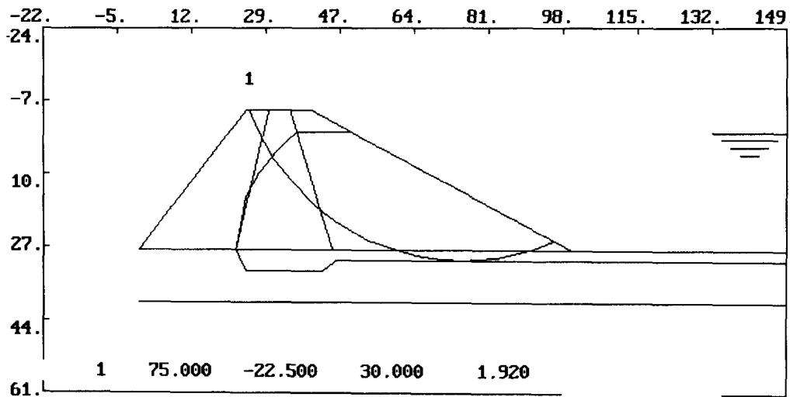  
图 12.14 EX1 毕肖普法计算图形

## 12.6.2 例题2 (EX2)

## 1. 计算条件

计算剖面同例题1。稳定渗流期，心墙、铺盖孔压按图12.8坐标网格输入。

## 2. 计算内容

计算指定圆弧滑裂面（圆心坐标 $\mathbf { C X = } 7 5 . 0 \mathbf { m }$ $\mathbf { C Y } = 2 2 . 5 \mathbf { m }$ ，滑弧深度 ${ D _ { s } } \mathrm { { = } } 3 0 . 0 \mathbf { m } )$ 各种简化法的安全系数 $\pmb { F } _ { \circ }$

## 3. 数据文件修改（与 EX1.DAT 比较）

1) EX1.DAT 中第 30 行孔压按简化法确定，即 $\scriptstyle \mathbf { L R U } ( 2 ) = 0$ ，改为按坐标网格内插输入，即 LRU(2)=1;

2)EX1.DAT 中第30行后，增加孔压按坐标网格内插输入的数据。

## 4. 数据文件 EX2.DAT 说明(见表 12.12)

表 12. 12 数据文件 EX2.DAT 和说明
<table><tr><td>数据</td><td>变量 说明</td><td></td></tr><tr><td colspan="3">1: EXAMPLENO.2, POREPRESSURE DETERMINED BY INTERPOLATION (2~27行同例1)</td></tr><tr><td>28:2</td><td>IN=2</td><td>2种材料</td></tr><tr><td>29:1,33.0,0.0,0.0,0.0,2.0,2.1,0</td><td>LRU(1)=0</td><td>第1种材料孔压不内插</td></tr><tr><td>30:2,20.0,5.0,0.0,0.0,2.0,2.1,1</td><td>LRU(2)=1</td><td>第2种材料孔压内插</td></tr><tr><td>(第30-1~30-47行为孔压内插数据)</td><td></td><td></td></tr></table>

<table><tr><td>数据</td><td>变量</td><td>说明</td><td>续衣</td></tr><tr><td>30-1:7</td><td></td><td>LOY=7</td><td></td></tr><tr><td>30-2: 1</td><td></td><td>LOX(1)=1</td><td>孔压内插水平总层数为7(见图12.8)</td></tr><tr><td>30-3: 36.5,0.0,0.0</td><td></td><td></td><td>第1个水平层共有1个网格点</td></tr><tr><td></td><td></td><td>PPX(1,1)=36.5</td><td>第1个水平层第1点的x坐标为36.5</td></tr><tr><td></td><td></td><td>PY(1,1)=0.0</td><td>该层第1点的y坐标为0.0</td></tr><tr><td></td><td></td><td>P(1,1)=0.0</td><td></td></tr><tr><td>30-4: 2</td><td></td><td>LOX(2)=2</td><td>该层第1点的孔压值为0.0</td></tr><tr><td>30-5: 31.5,5.0,0.0</td><td></td><td></td><td>第2个水平层共有2个网格点</td></tr><tr><td></td><td></td><td>PPX(2,1)=31.5</td><td>第2个水平层第1点的x坐标为31.5</td></tr><tr><td></td><td></td><td>PY(2,1)=5.0</td><td>该层第1点的y坐标5.0</td></tr><tr><td>30-6:38.0,5.0,5.0</td><td></td><td>P(2,1)=0.0</td><td>该层第1点的孔压值0.0</td></tr><tr><td></td><td></td><td></td><td></td></tr><tr><td></td><td></td><td>PPX(2,2)=38.0</td><td>该层第2点的x坐标</td></tr><tr><td></td><td></td><td>PY(2,2)=5.0</td><td>该层第2点的y坐标</td></tr><tr><td></td><td></td><td>P(2,2)=5.0</td><td>该层第2点的孔压值</td></tr><tr><td>30-7:4</td><td></td><td></td><td>第3个水平层共有4个网格点</td></tr><tr><td>30-8: 27.5,10.0,0.0</td><td></td><td></td><td></td></tr><tr><td>30-9: 31.5,10.0,3.0 30-10: 37.5,10.0,7.0</td><td></td><td></td><td></td></tr><tr><td>30-11:40.0,10.0,10.0</td><td></td><td></td><td></td></tr><tr><td>30-12: 4</td><td></td><td></td><td></td></tr><tr><td>30-13:25.0,15.0,0.0</td><td></td><td></td><td>第4个水平层共有4个网格点</td></tr><tr><td>30-14: 31.5,15.0,8.0</td><td></td><td></td><td></td></tr><tr><td>30-15:37.5,15.0,11.0</td><td></td><td></td><td></td></tr><tr><td></td><td></td><td></td><td></td></tr><tr><td>30-17:4</td><td>30-16:42.0,15.0,15.0</td><td></td><td></td></tr><tr><td></td><td></td><td>第5个水平层共有4个网格点</td><td></td></tr><tr><td></td><td>30-18:24.0,20.0,0.0</td><td></td><td></td></tr><tr><td></td><td>30-19:30.0,20.0,12.0</td><td></td><td></td></tr><tr><td></td><td>30-20: 37.0,20.0,17.0</td><td></td><td></td></tr><tr><td>30-22: 12</td><td>30-21：43.5,20.0,20.0</td><td></td><td></td></tr><tr><td></td><td></td><td>第6个水平层共有12个网格点</td><td></td></tr><tr><td></td><td>30-23:22.5,27.5,0.0</td><td></td><td></td></tr><tr><td></td><td>30-24:27.5,27.5,9.0</td><td></td><td></td></tr><tr><td></td><td>30-25:33.5,27.5,14.0</td><td></td><td></td></tr><tr><td></td><td>30-26: 40.0,27.5,18.0</td><td></td><td></td></tr><tr><td></td><td>30-27:46.0,27.5,27.5</td><td></td><td></td></tr><tr><td></td><td>30-28:50.0,27.5,27.5</td><td></td><td></td></tr><tr><td></td><td>30-29: 55.0,27.5,27.5</td><td></td><td></td></tr><tr><td></td><td>30-30:62.5,27.5,27.5</td><td></td><td></td></tr><tr><td></td><td>30-31:72.5,27.5,27.5</td><td></td><td></td></tr><tr><td></td><td>30-32:80.0,27.5,27.5</td><td></td><td></td></tr><tr><td></td><td>30-33: 100.0,27.5,27.5</td><td></td><td></td></tr><tr><td></td><td>30-34:150.0,27.5,27.5</td><td></td><td></td></tr><tr><td>30-35: 12</td><td></td><td></td><td>第7层个水平共有12个网格点</td></tr><tr><td>30-36:22.5,37.5,0.0</td><td></td><td></td><td></td></tr><tr><td>30-37:27.5,37.5,4.0</td><td></td><td></td><td></td></tr><tr><td>30-38:33.5,37.5,7.0</td><td></td><td></td><td></td></tr><tr><td>30-39:40.0,37.5,10.0</td><td></td><td></td><td></td></tr><tr><td>30-40:46.0,37.5,14.0</td><td></td><td></td><td></td></tr></table>

续表
<table><tr><td>数据</td><td>变量</td><td>说明</td></tr><tr><td>30-41：50.0,37.5,17.0</td><td></td><td></td></tr><tr><td>30-42:55.0,37.5,18.0</td><td></td><td></td></tr><tr><td>30-43:62.5,37.5,20.0</td><td></td><td></td></tr><tr><td>30-44:72.5,37.5,21.0</td><td></td><td></td></tr><tr><td>30-45: 80.0,37.5,23.5</td><td></td><td></td></tr><tr><td>30-46:100.0,37.5,27.5</td><td></td><td></td></tr><tr><td>30-47:150.0,37.5,27.5</td><td></td><td></td></tr><tr><td>31~59：同例1</td><td></td><td></td></tr></table>

## 5. 计算结果

计算结果见表12.13。

表12.13 例题2（EX2）计算结果
<table><tr><td>方法</td><td>瑞典法</td><td>毕肖普法</td><td>罗厄法</td></tr><tr><td>F</td><td>1.815</td><td>2.016</td><td>2.006</td></tr></table>

说明：本题结果与EX1.DAT无可比性，因为孔压内插值仅为示意目的而设定的。

## 12.6.3 例题3（EX3）

## 1. 计算条件

某一土坝高10.0m，如图12.9所示。地基为饱和粘土，竣工时，坝身和地基的孔隙水压力按孔压系数确定。

坝各区材料指标如表12.14所示。

表 12.14 各区材料的物理力学指标
<table><tr><td>材料号</td><td> $\pmb { c } _ { c d } ^ { \prime }$  (kPa)</td><td> $\phi _ { c d } ^ { \prime }$  (°)</td><td> $c _ { u u }$  (kPa)</td><td> $\phi _ { u u }$   ${ \mathcal { C } } )$ </td><td>天然容量 (kN/m³)</td><td>饱和容重 (kN/m³)</td></tr><tr><td>1</td><td>2.0</td><td>30.0</td><td>5.0</td><td>20.0</td><td>1.80</td><td>1.95</td></tr><tr><td>2</td><td>2.0</td><td>25.0</td><td>5.0</td><td>15.0</td><td>1.20</td><td>1.30</td></tr></table>

## 2. 计算内容

计算指定圆弧滑裂面（圆心坐标CX=45.0m，CY=-22.5m，滑弧深度 $D _ { s } = 1 5 . 0 \mathrm { m } )$ 的安全系数F。

## 3. 数据文件修改

1)第 20、21 行 LRU(1)=-1、LRU(2)=-1，第1、2种材料通过 $r _ { \ast }$ 确定孔压；

2) 第 22、23 行增加输入孔压系数 RUS(1)=0.2、RUS(2)=0.4。

4. 数据文件 EX3.DAT 说明（表 12.15）

表 12.15 数据文件 EX3.DAT 和说明
<table><tr><td>数据</td><td></td><td>变量</td><td>说明</td></tr><tr><td>2: 0,1,0,0,0,0</td><td colspan="3">1: EXAPLE N0.3, POREPRESSURECOEFFICIENT</td></tr><tr><td></td><td></td><td></td><td></td></tr><tr><td>3:0</td><td></td><td></td><td></td></tr><tr><td></td><td>4: 10.,10.,-2</td><td></td><td></td></tr><tr><td></td><td>5: 0,22.0,10.0,1</td><td></td><td></td></tr><tr><td>6: 1.0</td><td></td><td>NN=11</td><td></td></tr><tr><td>7:11</td><td></td><td></td><td>点总数</td></tr><tr><td></td><td>8: 1,65.0,10.0</td><td></td><td></td></tr><tr><td></td><td>9: 2,45.0,10.0</td><td></td><td></td></tr><tr><td></td><td>10: 3,25.0,0.0</td><td></td><td></td></tr><tr><td></td><td>11:4,20.0,0.0</td><td></td><td></td></tr><tr><td></td><td>12: 5,0.0,10.0</td><td></td><td></td></tr><tr><td></td><td>13:6,65.0,15.0</td><td></td><td></td></tr><tr><td></td><td>14:7,-10.0,15.0</td><td></td><td></td></tr><tr><td></td><td>15: 8,65.0,18.0</td><td></td><td></td></tr><tr><td></td><td>16:9,-10.0,18.0</td><td></td><td></td></tr><tr><td></td><td>17：10,65.0,22.0</td><td></td><td></td></tr><tr><td></td><td>18:11,-10.0,22.0</td><td></td><td></td></tr><tr><td>19:2</td><td></td><td>IN=2</td><td>2种材料</td></tr><tr><td></td><td>20:1,30.,2.,0.,0.,1.8,1.95,-1</td><td></td><td></td></tr><tr><td></td><td></td><td>LRU(1)=-1</td><td>第1种材料通过 确定孔压</td></tr><tr><td rowspan="2">21：2,25.,2.0,0.,0.,1.2,1.30,-1</td><td></td><td></td><td> $r _ { u }$ </td></tr><tr><td></td><td>LRU(2)=-1</td><td>第2种材料通过 确定孔压  $\boldsymbol { r } _ { \boldsymbol { \mathsf { \Pi } } _ { \boldsymbol { \mathsf { \Pi } } } }$ </td></tr><tr><td>22: 0.2</td><td></td><td>RUS(1)=0.2</td><td>第1种材料的孔压系数</td></tr><tr><td>23:0.4</td><td></td><td>RUS(2)=0.4</td><td>第2种材料的孔压系数</td></tr><tr><td>24: 8,4</td><td></td><td></td><td></td></tr><tr><td></td><td></td><td>IN1=8</td><td>8根边界线</td></tr><tr><td></td><td></td><td>IPH=4</td><td>4根浸润线</td></tr><tr><td>25: 1,2,2</td><td></td><td></td><td></td></tr><tr><td>26: 2,3,1 27:3,4,1</td><td></td><td></td><td></td></tr><tr><td>28:4,5,1</td><td></td><td></td><td></td></tr><tr><td>29: 2,5,2</td><td></td><td></td><td></td></tr><tr><td>30:6,7,2</td><td></td><td></td><td></td></tr><tr><td>31: 8,9,2</td><td></td><td></td><td></td></tr><tr><td>32: 10,11,2</td><td></td><td></td><td></td></tr><tr><td>33:1,2,2</td><td></td><td></td><td></td></tr><tr><td>34:2,3,1</td><td></td><td></td><td></td></tr><tr><td>35: 3,4,1</td><td></td><td></td><td></td></tr><tr><td>36:4,5,1</td><td></td><td></td><td></td></tr><tr><td>37: 0,0,2</td><td></td><td></td><td></td></tr><tr><td></td><td>38：45.-20.,15.,0.,0.,0.</td><td></td><td></td></tr><tr><td>39: 0,0,0,20</td><td></td><td></td><td></td></tr></table>

## 5. 计算结果

采用毕肖普法，F=1.356。

## 12.6.4 例题4 (EX4)

## 1. 计算条件

计算剖面同例题1。稳定渗流期遇8度地震，输入地震烈度。

## 2. 计算内容

计算指定圆弧滑裂面（圆心坐标 $\mathbf { C X } = 7 5 . 0 \mathbf { m } , \mathbf { C Y } = 2 2 . 5 \mathbf { m }$ ，滑弧深度 ${ D _ { s } } \mathrm { { = } } 3 0 . 0 \mathrm { { m } ) }$ 各种简化法的安全系数F。

## 3. 数据文件修改

EX1.DAT 中第 5 行由 $\mathbf { I Q U A { = } 0 }$ 改为 $\mathbf { I Q I } \mathbf { A } \mathbf { = } 8$ ，垂直地震加速度向下。

## 4. 数据文件 EX4.DAT 说明(表 12.16)

表 12.16 数据文件 EX4.DAT 和说明
<table><tr><td>数据</td><td>变量</td><td>说明</td></tr><tr><td>1: EXAMPLENO.4,EARTHQUAKE (2~4行同例1)</td><td>HEAD</td><td>题目名称</td></tr><tr><td rowspan="3">5:8,27.5,32.5,1</td><td> $\mathbf { I Q U A } { = } 8$ </td><td>地震烈度</td></tr><tr><td> $\mathrm { H B A S } = 2 7 . 5$ </td><td></td></tr><tr><td> $\mathrm { H B O } = 3 2 . 5$ </td><td>基础面y坐标 坝高</td></tr><tr><td></td><td> $\mathrm { I D I R } = 1$ </td><td>垂直地震加速度向下</td></tr><tr><td>6~59：与例1同</td><td></td><td></td></tr></table>

## 5. 计算结果

计算结果见表12.17。

表12.17 例题4（EX4）计算结果
<table><tr><td>方法</td><td>瑞典法</td><td>毕肖普法</td><td>罗厄法</td></tr><tr><td>F</td><td>1.288</td><td>1.459</td><td>1.368</td></tr></table>

## 12.6.5 例题5 (EX5)

## 1. 计算条件

计算剖面同例题4，稳定渗流遇地震，但地震加速度系数沿高程的分布由用户输入。

## 2. 计算内容

计算指定圆弧滑裂面（圆心坐标 $\mathbf { C X = } 7 5 . 0 \mathbf { m }$ $\mathbf { C Y } = 2 2 . 5 \mathbf { m }$ ，滑弧深度 ${ D _ { s } } \mathrm { { = } } 3 0 . 0 \mathrm { { m } ) }$ 的各种简化法的F。

3. 数据文件修改（与 EX4.DAT 比较）

1) 由 EQUA=8 改为 $\mathbf { I Q I } \mathbf { A } { < } \mathbf { 0 } ;$

2) 第5 行后输入地震力数据。

4. 数据文件 EX5.DAT 和说明（表 12.18）

表 12.18 数据文件 EX5.DAT 和说明
<table><tr><td>数据</td><td>变量</td><td>说明</td></tr><tr><td colspan="3">1: EXAMPLE NO.5, SEISMIC COEFFICIENT ASSIGNED BY THE USER (2~4行同例1)</td></tr><tr><td>5: -1,27.5,32.5,0</td><td></td><td></td></tr><tr><td></td><td>IQUA=-1&lt;0</td><td>水平地震加速度沿高程输入</td></tr><tr><td>[水平地震加速度数据见图12.4(b)]</td><td></td><td></td></tr><tr><td>5-1: 3</td><td>LQH=4</td><td></td></tr><tr><td>5-2: -5.0,0.15</td><td></td><td>水平地震加速度沿高程转折点总数</td></tr><tr><td></td><td>CYE(1)=-5.0</td><td>第1个转折点y坐标</td></tr><tr><td></td><td>COE(1)=0.15</td><td>第1个转折点水平地震加速度系数</td></tr><tr><td>5-3: 27.5,0.10</td><td></td><td></td></tr><tr><td></td><td>CYE(2)=27.5</td><td>第2个转折点y坐标</td></tr><tr><td></td><td>COE(2)=0.10</td><td>该转折点水平地震加速度系数</td></tr><tr><td>5-4: 35.0,0.10</td><td></td><td></td></tr><tr><td>5-5: 40.0,0.10</td><td></td><td></td></tr><tr><td></td><td></td><td></td></tr><tr><td>(6~59行同例1)</td><td></td><td></td></tr></table>

## 5. 计算结果

计算结果见表12.19。

表12.19 例题 5（EX5）计算结果
<table><tr><td>方法</td><td>瑞典法</td><td>毕肖普法</td><td>罗厄法</td></tr><tr><td>F</td><td>1.144</td><td>1.299</td><td>1.194</td></tr></table>

## 12.6.6 例题6 (EX6)

## 1. 计算条件

计算剖面及计算条件同例题1。

## 2. 计算内容

用枚举法（网格法）搜索以圆心坐标CX=75.0m，CY=-22.5m，滑弧深度 $D _ { s } = 2 5 . 0 \mathrm { m }$ 的圆弧周围若干滑裂面的毕肖普法的最小安全系数 $F _ { m } .$

## 3. 数据文件(EX6.DAT)修改

(1) EX1.DAT 在 x、y 及滑弧深度方向 $D _ { s }$ 的步长由 $\scriptstyle \mathbf { B C X } = 0 , \mathbf { B C Y } = 0 , \mathbf { B C D } = 0$ 改为 BCX=10.0,BCY=10.0，BCD=5.0。

(2) EX1.DAT 在 x、y 及滑弧深度 D,方向各延伸的网格数由 0 改为 2，即 NGRIX=2， $D _ { s }$ NGRIY=2，NGRID=2。

(3) 网格布置：以 A 点为网格圆心，x、y方向各为两格，步长均为 10.0，滑弧深度 $D _ { s }$ 方向y=20.0至30.0，步长5.0，寻找最小安全系数 $F _ { m }$

## 4. 数据文件 EX6.DAT 说明（表 12.20）

表 12.20 数据文件 EX6.DAT 和说明
<table><tr><td colspan="3">数据 变量 说明</td></tr><tr><td colspan="3">1: EXAMPLE NO. 6, FIND MINIMUM F.S. BY GRID SEARCH</td></tr><tr><td colspan="3">(2-56行同例1)</td></tr><tr><td>(第57~59行为圆弧滑裂面数据) 57: 0,0,0</td><td>LL0=0</td><td>按圆心网格和不同滑弧深度布置滑弧</td></tr><tr><td colspan="3">LL1=0</td></tr><tr><td colspan="3"></td></tr><tr><td colspan="3">LL2=0 用枚举法(网格法)搜索 58:75.0,-22.5,30.0,10.0,10.0,5.0</td></tr><tr><td colspan="3">CCX=75.0 CCY=-22.5</td></tr><tr><td></td> rowspan="12">假设初始滑弧圆心x坐标为75.0 假设初始滑弧圆心y坐标为-22.5</td><td>CCD=30.0</td></tr><tr><td>假设初始滑弧深度y坐标为30.0</td><td></td></tr><tr><td colspan="3"></td></tr><tr><td>BCX=10.0</td><td>在x方向步长10.0</td><td></td></tr><tr><td>BCY=10.0 BCD=5.0</td><td>在y方向步长10.0</td><td>59: 2,2,2,20</td></tr><tr><td></td><td>在滑弧深度方向步长5.0</td><td></td></tr><tr><td colspan="3"></td></tr><tr><td>NGRIX=2</td><td>在x方向左、右各延伸的网格数为2</td><td></td></tr><tr><td>NGRIY=2</td><td>在y方向上、下各延伸的网格数为2</td><td></td></tr><tr><td>NGRID=2</td><td>由初始滑弧深度向上，下各延伸的网格</td><td></td></tr><tr><td>NS=20</td><td>数为2 划分的土条数为20</td><td></td></tr></table>

## 5. 计算结果

计算结果见表12.21，计算图形见图12.15。

表 12.21 例题 6 计算结果
<table><tr><td>计算方法</td><td>滑弧深度D</td><td>圆心x坐标</td><td>圆心y坐标</td><td> $\underline { { F } } _ { m }$ </td></tr><tr><td rowspan="4">毕肖普法</td><td>20.0</td><td>95.0</td><td>-22.5</td><td>1.226</td></tr><tr><td>22.5</td><td>95.0</td><td>-2.5</td><td>1.250</td></tr><tr><td>25.0</td><td>95.0</td><td>-42.5</td><td>1.317</td></tr><tr><td>27.5</td><td>95.0</td><td>-42.5</td><td>1.365</td></tr><tr><td></td><td>30.0</td><td>85.0</td><td>-22.5</td><td>1.796</td></tr></table>

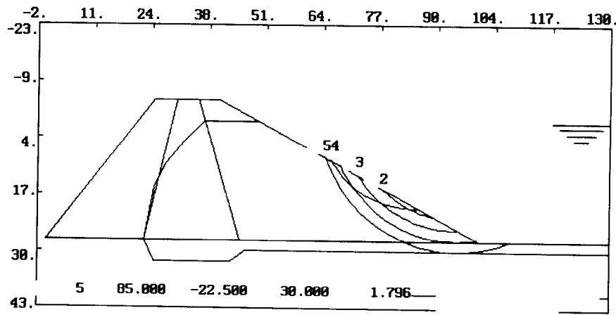  
图 12.15 例题6（EX6）计算图形

## 12.6.7 例题7 (EX7)

## 1. 计算条件

计算剖面同例题1，稳定渗流期。

## 2. 计算内容

用单形法（最优化方法）搜索最小安全系数 $F _ { m ^ { \prime } }$ 9

3. 数据文件修改（与 EX1.DAT 比较）

1) 第 57 行由 $\mathbf { L } \mathbf { L } \mathbf { \boldsymbol { 2 } } { = } 0$ 改为 $\mathbf { L } \mathbf { L } 2 = 2$

2) 第 58 行X、Y、 $D _ { s }$ 向步长由0改为 BCX=10.0，BCY=10.0，BCD=5.0;

3)第 59行X、Y、 $D _ { s }$ 向延伸的网格数由0改为 $\mathrm { N G R I X } { = } \mathrm { N G R I Y } { = } \mathrm { N G R I D } { = } 2$

4. 数据文件 EX7.DAT 说明（表 12.22）

表 12.22 数据文件 EX7.DAT 和说明
<table><tr><td>数据</td><td>变量 说明</td></tr><tr><td>1: EXAMPLE NO.7, SIMPLEX METHOD, CIRCULAR (2~56行同例1) (57~59行为圆弧滑裂面数据)</td><td>SLIP SURFACE</td></tr><tr><td>57: 0,0,2</td><td></td></tr><tr><td>LL0=0 LL1=0</td><td>意义同例题1</td></tr><tr><td>LL2=2</td><td>意义同例题1</td></tr><tr><td>58:75.0,-22.5,30.0,10.0,10.0,5.0</td><td>用单形法搜索  $F _ { m }$ </td></tr><tr><td></td><td>各项意义同例题6</td></tr><tr><td>59: 2,2,2,20</td><td>各项意义同例题6</td></tr></table>

## 5. 计算结果

计算结果见表12.23，计算图形见图12.16。

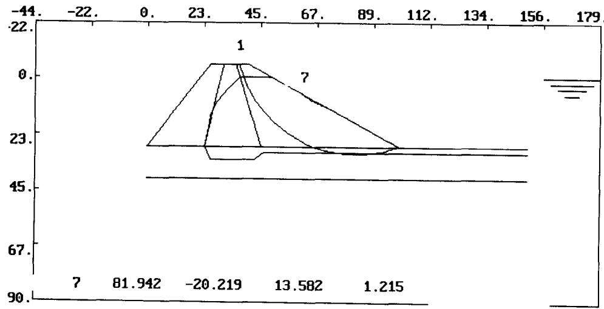  
图 12.16 例题 7（EX7）计算图形

表 12.23 例题 7 计算结果
<table><tr><td rowspan="2">计算方法</td><td rowspan="2">初始  $\smash  \{ F _ { \parallel }$ </td><td rowspan="2"> $\frac { 1 } { \mathbb { R } } , | \setminus F _ { m }$ </td><td colspan="3">相应于临界滑裂面参数</td></tr><tr><td>CX</td><td>CY</td><td> $D _ { s }$ </td></tr><tr><td>毕肖普法</td><td>1.777</td><td>1.215</td><td>81.94</td><td>-20.22</td><td>13.58</td></tr></table>

## 12.6.8 例题8 (EX8)

## 1. 计算条件

计算剖面同例3（见图12.9)，水位骤降期，库水位从坝顶(y=0)降至地面(y=10)。

2. 计算内容

用单形法（最优化方法）搜索最小安全系数 $F _ { m } .$

3. 数据文件修改（与 EX3.DAT 对比）

1)第3行，因用总应力法，故 $\mathbf { M T E } { = } 1$

2) 第4行，UWL1(1)为骤降后库水位，故 $\scriptstyle \mathbf { U W L } = 0 . 0 , \ \mathbf { U W L 1 } = 1 0 . 0 ;$

3) 第 21 行采用 R-S 强度包线，1 号材料 $\mathsf { P F 1 } ( 1 ) = 2 0 . 0 , \mathsf { P C 1 } ( 1 ) = 5 . 0 , \mathsf { F 1 } ( 2 ) = 1 5 . 0 , \mathsf { P C 1 } ( 2 )$ =5.0。

本例共8条边界线。

浸润线数据共2组。4条降前浸润线数据输完后，第36行增加输入骤降后的浸润线数据。本例因坝体渗透系数小，故降前浸润线与降后相同。

## 4. 数据文件 EX8.DAT 说明（表 12.24）

表 12.24 数据文件 EX8.DAT
<table><tr><td>数据</td><td>变量</td><td>说明</td></tr><tr><td colspan="3">1: EXAMPLENO.8,RAPIDDRAWDOWNHEAD</td></tr><tr><td>2:  $_ { 0 , 1 , 0 , 0 , 0 , 0 }$ </td><td> $\mathbf { O P T I O N } ( 2 ) = 1$ </td><td>圆弧滑裂面</td></tr><tr><td>3:1</td><td>MTE=1</td><td>总应力法</td></tr><tr><td>4:  $0 . 0 , 1 0 . 0 , - 2$ </td><td></td><td></td></tr><tr><td></td><td> $\mathbf { U } \mathbf { W } \mathbf { L } { = } 0 . 0$ </td><td>骤降前水位x坐标0.0</td></tr><tr><td></td><td> $\mathrm { \bf U W L 1 } = 1 0 . 0$ </td><td>骤降后水位y坐标10.0</td></tr><tr><td></td><td> $\mathbf { A S P } { = } { - } 2$ </td><td>罗厄法</td></tr><tr><td>5:  $0 , 1 0 . 0 , 1 0 . 0 ,$ </td><td></td><td></td></tr><tr><td></td><td> $\mathbf { \partial _ { i } Q U A { = } 0 }$ </td><td>地震烈度为0</td></tr><tr><td>6: 1.0</td><td>RW=水容重</td><td></td></tr><tr><td>(7~19行控制点数据)</td><td></td><td></td></tr><tr><td>7:12</td><td>NN=12</td><td>点总数</td></tr><tr><td>8: 1,65.0,10.0</td><td>L(1)=1</td><td>点序号为1</td></tr><tr><td></td><td>XN(1)=65.0</td><td>第1点x坐标</td></tr><tr><td></td><td>YN(1)=10.0</td><td>第1点y坐标</td></tr><tr><td>9: 2,45.0,10.0</td><td></td><td></td></tr><tr><td>10: 3,25.0,0.0</td><td></td><td></td></tr><tr><td>11: 4,20.0,0.0</td><td></td><td></td></tr><tr><td></td><td></td><td></td></tr><tr><td>12: 5,0.0,10.0</td><td></td><td></td></tr><tr><td>13:6,65.0,15.0</td><td></td><td></td></tr><tr><td>14: 7,-10.0,15.0</td><td></td><td></td></tr><tr><td>15:8,65.0,18.0</td><td></td><td></td></tr><tr><td>16: 9,-10.0,18.0</td><td></td><td></td></tr><tr><td>17: 10,65.0,22.0</td><td></td><td></td></tr><tr><td>18:11,-10.0,22.0</td><td></td><td></td></tr><tr><td>19:12,10.0,5.0</td><td></td><td></td></tr><tr><td>(20~22行土层材料数据)</td><td></td><td></td></tr><tr><td>20:2</td><td>IN=2</td><td>二种材料</td></tr><tr><td></td><td>21:1,30.0,2.0,20.0,5.0,1.8,1.95,0</td><td></td></tr><tr><td></td><td>L=1</td><td>第1号材料</td></tr><tr><td></td><td>PF(1)=30.0</td><td>第1号材料内摩擦角φ'为30.0</td></tr><tr><td></td><td>PC(1)=2.0</td><td>第1号材料粘聚力c'为2.0</td></tr><tr><td></td><td>PF1(1)=20.0</td><td>第1号材料固结快剪内摩擦角φ为20.0</td></tr><tr><td></td><td>PC1(1)=5.0</td><td>第1号材料固结快剪粘聚力c1为5.0</td></tr><tr><td></td><td>PDW(1)=1.8</td><td>第1号材料天然容重</td></tr><tr><td></td><td>PDS(1)=1.95</td><td>第1号材料饱和容重</td></tr><tr><td></td><td>RU(1)=0</td><td>孔压按简化法确定</td></tr><tr><td>22:2,25.0,2.0,15.0,5.0,1.2,1.30,0</td><td></td><td></td></tr><tr><td>(23~40行边界线,浸润线数据)</td><td></td><td></td></tr><tr><td>23: 8,4</td><td></td><td></td></tr><tr><td></td><td>IN1=8</td><td>8条边界线</td></tr><tr><td></td><td>IPH=4</td><td>降前4条浸润线</td></tr><tr><td>(24~31行为8条边界线数据)</td><td></td><td></td></tr><tr><td>24: 1,2,2</td><td></td><td></td></tr><tr><td></td><td></td><td></td></tr><tr><td></td><td></td><td></td></tr><tr><td>32: 1,2,2</td><td></td><td></td></tr><tr><td>33:2,3,1</td><td></td><td></td></tr><tr><td>34: 3,12,1</td><td></td><td></td></tr><tr><td>35:12,5,1</td><td></td><td></td></tr><tr><td>36:4</td><td></td><td></td></tr><tr><td></td><td>IPH1=4</td><td>降后4条浸润线</td></tr><tr><td>37: 1,2,2</td><td></td><td></td></tr><tr><td></td><td>IC1(1,1)=1</td><td>降后第1条浸润线其中一个端点序号为1 降后第1条浸润线另一个端点序号为2</td></tr><tr><td></td><td>IC1(1,2)=2</td><td></td></tr><tr><td></td><td>IC1(1,3)=2</td><td>降后第1条浸润线下压土层号为2</td></tr><tr><td>38:2,3,1</td><td></td><td></td></tr><tr><td>39:3,12,1</td><td></td><td></td></tr><tr><td>40: 12,5,1</td><td></td><td></td></tr><tr><td>(41~43行滑裂面数据)</td><td></td><td></td></tr><tr><td>41: 0,0,2</td><td></td><td></td></tr><tr><td></td><td></td><td>以下各项意义同例7(用单形法搜索  $F _ { m } )$ </td></tr><tr><td>42:45,-20.0,15.0,5.0,5.0,5.0</td><td></td><td></td></tr><tr><td>43:2,2,1,20</td><td></td><td></td></tr></table>

## 5. 计算结果

计算结果见表12.25，计算图形见图12.17。

表 12.25 例题 8 计算结果
<table><tr><td rowspan="2">计算方法</td><td rowspan="2">初始  $\mathbf { \dot { F } } _ { 1 }$ </td><td rowspan="2">最小  $\cdot F _ { m }$ </td><td colspan="3">相应于临界滑裂面参数</td></tr><tr><td>CX</td><td>CY</td><td>DS</td></tr><tr><td>毕肖普法</td><td>1.480</td><td>1.309</td><td>38.95</td><td>-5.35</td><td>15.23</td></tr></table>

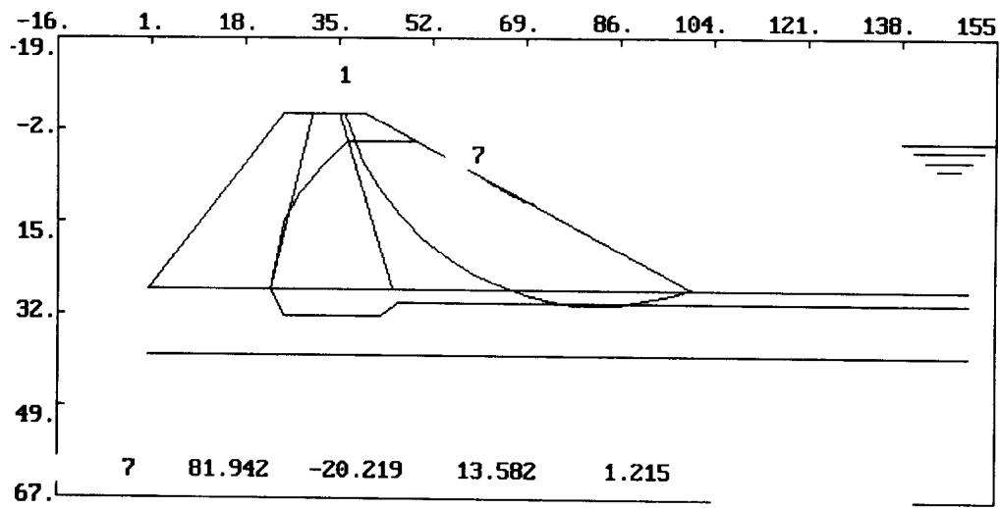  
图 12.17 例题8（EX8）计算图形

## 12.6.9 例题9 (EX9)

## 1. 计算条件

计算剖面同例题1。竣工期，使用Q剪指标，用总应力法分析。

## 2. 计算内容

用毕肖普法计算指定圆弧滑裂面 F，圆心坐标 CX=75.0m，CY= -22.5m，滑弧深度$D _ { s } { = } 3 0 . 0 \mathrm { m }$

## 3. 数据文件修改（与 EX1.DAT 比较）

1)竣工期上游无水，因使用总应力法，孔隙水压为零，故上游水位UWL=UWL1，程序可取一大于基础面y坐标的数值，如100以实现上游无水的条件，即 $\scriptstyle \mathbf { U W L = U W L 1 = 1 0 0 . 0 ; }$

2) 第 30 行，PF(2)、PC(2)分别改为 Q剪强度指标9.8 和 10.0;

3) 第49\~57行，因无浸润线ICPH=0，故全部删除。

4. 数据文件说明（表 12.26）

表 12.26 数据文件 EX9.DAT 和说明
<table><tr><td>数据</td><td>变量 说明</td><td></td></tr><tr><td colspan="2">1: EXAMPLE NO.9 END OF CONSTRUCTION 2: 0,1,0,0,0,0</td><td></td></tr><tr><td colspan="2">3:0 MTE=0</td><td>峻工时的总应力分析处理和有效应力 法相同，只是使用不同的强度指标，</td></tr><tr><td>数据</td><td>变量</td><td>说明</td></tr><tr><td>4: 100.0,100.0,-2.0</td><td>UWL&gt;27.5</td><td>27.5为基础面y坐标 各项意义同例题1</td></tr><tr><td>5: 0,27.5,32.5,1 6: 1.0</td><td>RW=1.0</td><td>水容重</td></tr><tr><td>(7~27行同例1) (28~30行土层总数及其指标、孔压数据)</td><td></td><td></td></tr><tr><td>28:2</td><td>IN=2</td><td>2种材料</td></tr><tr><td>29:1,33.0,0.0,0.0,0.0,2.0,2.1,0</td><td></td><td>各项意义同例题1</td></tr><tr><td>30: 2,9.8,10.0,0.0,0.0,2.0,2.1,0</td><td>L=2</td><td>2号材料</td></tr><tr><td rowspan="2"></td><td>PF(2)=9.8</td><td>使用不固结不排水强度(Q剪)φ=9.8</td></tr><tr><td>PC(2)=10.0</td><td>使用不固结不排水强度(Q剪)c=10.0</td></tr><tr><td colspan="3">其他各项意义同例题1 (31~56行同例题1，应为边界线、浸润线数据，但因竣工期坝内无浸润线,故删去例题1第49~56 行浸润线数据）</td></tr><tr><td colspan="3">31:17,0 IN1=17 边界线总数为17</td></tr><tr><td colspan="3">IPH=0 因竣工期坝内无浸润线,故IPH=0</td></tr></table>

## 5. 计算结果

计算结果见表 12.27。

表 12.27 例题 9 计算结果
<table><tr><td>方法</td><td>瑞典法</td><td>毕肖普法</td><td>罗厄法</td></tr><tr><td>F</td><td>1.631</td><td>1.765</td><td>1.761</td></tr></table>

## 12.6.10 例题10 (EX10)

## 1. 计算条件

几何数据同例题1。材料1使用邓肯非线性强度指标， $\phi _ { \mathrm { 0 } } { = } 4 0 . 0 ^ { \circ } ~ , \Delta \phi { = } 1 0 . 0 ^ { \circ }$ 0

## 2. 计算内容

用单形法（最优化方法）搜索 $F _ { m }$ 8

## 3. 数据文件修改

EX1.DAT 第 29 行由 PF1(1)=0 改为 PF1(1)=-40， PC1(1)=0 改为 PC1(1)=-10.0。当 PF1，PC1 为负值时，程序按非线性强度指标处理；滑裂面数据同EX7.DAT。

4. 数据文件 EX10.DAT 说明（表 12.28）

表 12.28 数据文件 EX10.DAT 和说明
<table><tr><td>数据</td><td>变量 说明</td></tr><tr><td>1: EXAMPLE NO.10 NON-LINEAR STRENGTH PARAMETER (2~27行与例1同)</td></tr><tr><td>(28~30行为土层材料指标和孔压数据)</td></tr><tr><td>28:2</td></tr><tr><td>29:1,33.0,0.0,-40.0,-10.0,2.0,2.1,0</td></tr><tr><td></td></tr><tr><td>L=1 第1号材料 PF(1)=33.0 S剪摩擦角为33.0</td></tr></table>

续表
<table><tr><td>数据</td><td>变量</td><td>说明</td></tr><tr><td></td><td>PC(1)=0.0</td><td>S剪凝粘力为0.0</td></tr><tr><td></td><td>PF1(1)为负值</td><td>使用非线性强度指标，  $\phi = 4 0 . 0$ </td></tr><tr><td></td><td>PC1(1)为负值</td><td>使用非线性强度指标  $\mathbf { \Delta } \Delta \phi { } = 1 0 . 0$ </td></tr><tr><td>30: 2,20.0,5.,0.0,0.0,2.0,2.1,0</td><td></td><td>意义同例1</td></tr><tr><td>(31~59行与例7同,用单形法搜索  $\underline { { \boldsymbol { F } _ { m } } } )$ </td><td></td><td></td></tr></table>

## 5. 计算结果

计算结果见表12.29，计算图形见图12.18。

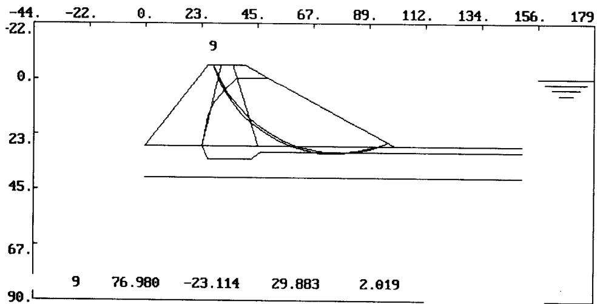  
图 12.18 例题10（EX10）计算图形

表 12.29 例题 10 计算结果
<table><tr><td rowspan="2">计算方法</td><td rowspan="2">初始  $\mathsf { i } F _ { 1 }$ </td><td rowspan="2">最小  $F _ { m }$ </td><td colspan="3">相应于临界滑裂面参数</td></tr><tr><td> $X _ { c }$ </td><td> $\pmb { Y _ { c } }$ </td><td> $D _ { s }$ </td></tr><tr><td>毕肖普法</td><td>2.079</td><td>2.019</td><td>76.98</td><td>-23.11</td><td>29.88</td></tr></table>

## 12.6.11 例题11 (EX11)

## 1. 计算条件

几何数据同例题8（图12.9)。施工期，用现场试验的总强度qcu。地基qcu现场试验指 $q _ { c u ^ { \circ } }$ $\pmb { q } _ { c u }$ 标，如表12.30所示。

表12.30 地基 qc现场试验指标（单位：9.8kPa） ${ \pmb q } _ { e { \pmb u } }$
<table><tr><td>x</td><td></td><td>-10</td><td>15</td><td>30</td><td>45</td><td>65</td></tr><tr><td rowspan="4">y</td><td>10</td><td>6.5</td><td>5.5</td><td>8.0</td><td>9.0</td><td>13.0</td></tr><tr><td>15</td><td>8.5</td><td>7.5</td><td>10.0</td><td>13.0</td><td>15.0</td></tr><tr><td>18</td><td>16.0</td><td>13.0</td><td>15.0</td><td>17.0</td><td>20.0</td></tr><tr><td>22</td><td>30.0</td><td>25.0</td><td>30.0</td><td>35.0</td><td>40.0</td></tr></table>

坝各区确定性材料指标如表12.31所示。

表12.31 坝各区材料的物理力学指标
<table><tr><td>材料号</td><td> $\pmb { c } _ { c d } ^ { \prime }$ </td><td> $\phi _ { c d } ^ { \prime }$ </td><td> $c _ { u u }$ </td><td> $\phi _ { u u }$ </td><td>天然容量  $( \mathbf { k } \mathbf { N } / \mathbf { m } ^ { 3 } )$ </td><td>饱和容重 (kN/m³)</td></tr><tr><td>1</td><td> $\mathbf { ( k P a ) }$  10.0</td><td>(°) 15.0</td><td>(kPa) 0.0</td><td>(°) 0.0</td><td>1.80</td><td>1.95</td></tr><tr><td>2</td><td>20.0</td><td>5.0</td><td>0.0</td><td>0.0</td><td>1.20</td><td>1.30</td></tr></table>

## 2. 计算内容

施工期，用现场试验的总强度 $q _ { c u }$ ，单形法搜索圆弧滑裂面 $F _ { m }$

3. 数据文件修改（与 EX8.DAT 比较）

1）第3 行，因二题均用总应力法，均 MTE=1，但第四行，例题 8中 UWL 与 UWL1不相等，表明为骤降前、后水位；而本例中，UWL=UWL1，故程序识别为使用qc进行总 $q _ { c u }$ 应力法计算；

2) 土层材料数据中，第 21 行 LRU(2)=1，程序进一步识别第二层土按内插 qcu方法确 $\pmb { q _ { c u } }$ 定其总强度；

3) 第 21 行后增加 $q _ { c u }$ 内插网格；

4)删去水位骤降后浸润线数据。

4. 数据文件 EX11.DAT 说明（表 12.32）

表 12.32 数据文件 EX11.DAT 和说明
<table><tr><td>数据</td><td>变量</td><td>说明</td></tr><tr><td colspan="3">(第1~6行为控制数据)</td></tr><tr><td colspan="3">1: EXAPLE N0.11, TOTAL STRESS ANALYSIS USING QCU</td></tr><tr><td>2:  $_ { 0 , 1 , 0 , 0 , 0 , 0 }$ </td><td></td><td></td></tr><tr><td>3:1</td><td>MTE=1</td><td>总应力法</td></tr><tr><td rowspan="2">4: 10.0,10.0,-2</td><td>UWL=UWL1</td><td>在采用总应力法时UWL = UWL1,程序</td></tr><tr><td>ASP=-2</td><td>识别为按内插  $\dot { \bar { 1 } } q _ { \alpha }$  进行总应力法计算 罗厄法</td></tr><tr><td>5: 0,22.0,10.0,1</td><td></td><td></td></tr><tr><td>6: 1.0 (7~18行为控制点数据)</td><td></td><td></td></tr><tr><td></td><td></td><td></td></tr><tr><td>(19~46行为材料总数及其力学指标、孔压数据） 19: 2</td><td></td><td></td></tr><tr><td>20:1,10.0,15.0,0.0,0.0,1.8,1.95,0</td><td></td><td></td></tr><tr><td>21：2,20.0,5.0,0.0,0.0,1.2,1.30,1</td><td></td><td></td></tr><tr><td></td><td>LRU(2)=1</td><td>按  $\dot { \mathbf { \mathcal { q } } } _ { \alpha }$  内插方法输入孔压</td></tr><tr><td>(第22~46行 内插数据）  $\dot { \pmb q } _ { \alpha }$ </td><td></td><td></td></tr><tr><td>21-1: 4</td><td>LOY=4</td><td>已知  $\scriptstyle | q _ { c u }$  的水平土层总数</td></tr><tr><td>21-2: 5</td><td>LOX(1)=5</td><td>第1个水平层共有5个点</td></tr><tr><td>21-3: -10.0,10.0,6.5</td><td></td><td></td></tr><tr><td></td><td>PPX(1,1)=-10.0</td><td>该层第1点的X坐标</td></tr><tr><td></td><td>PPX(1,1)=10.0</td><td>该层第1点的Y坐标</td></tr><tr><td></td><td>P(1,1)=6.5</td><td>该层第1点的q值</td></tr><tr><td>21-4:15.0,10.0,5.5</td><td></td><td>该层第2点各项的意义同第1点</td></tr><tr><td>21-5: 30.0,10.0,8.0</td><td></td><td>该层第3点各项的意义同第1点</td></tr><tr><td>21-6: 45.0,10.0,9.0</td><td></td><td>该层第4点各项的意义同第1点</td></tr><tr><td>21-7:65.0,10.0,13.0</td><td></td><td>该层第5点各项的意义同第1点</td></tr><tr><td>21-8: 5</td><td></td><td>第2个水平层共有5个点</td></tr><tr><td>21-9: -10.0,15.0,8.5</td><td></td><td></td></tr><tr><td>21-10:15.0,15.0,7.5</td><td></td><td></td></tr><tr><td>21-11:30.0,15.0,10.0</td><td></td><td></td></tr><tr><td>21-12:45.0,15.0,13.0</td><td></td><td></td></tr><tr><td>21-13:65.0,15.0,15.0</td><td></td><td></td></tr><tr><td>21-14: 5</td><td></td><td></td></tr><tr><td>21-15: -10.0,18.0,16.0</td><td></td><td>第3个水平层共有5个点</td></tr><tr><td>21-16:15.0,18.0,13.0</td><td></td><td></td></tr><tr><td>21-17:30.0,18.0,15.0</td><td></td><td></td></tr><tr><td>21-18:45.0,18.0,17.0</td><td></td><td></td></tr><tr><td>21-19: 65.0,18.0,20.0</td><td></td><td></td></tr><tr><td>21-20: 5</td><td></td><td></td></tr><tr><td></td><td></td><td>第4个水平层共有5个点</td></tr><tr><td>21-21:-10.0,22.0,30.0</td><td></td><td></td></tr><tr><td>21-22:15.0,22.0,25.0</td><td></td><td></td></tr><tr><td>21-23: 30.0,22.0,20.0</td><td></td><td></td></tr><tr><td>21-24: 45.0,22.0,35.0</td><td></td><td></td></tr><tr><td>21-25:65.0,22.0,40.0</td><td></td><td></td></tr><tr><td>(36~38：同例题7)</td><td></td><td></td></tr></table>

## 5. 计算结果

计算结果见表12.33，计算图形见图12.19。

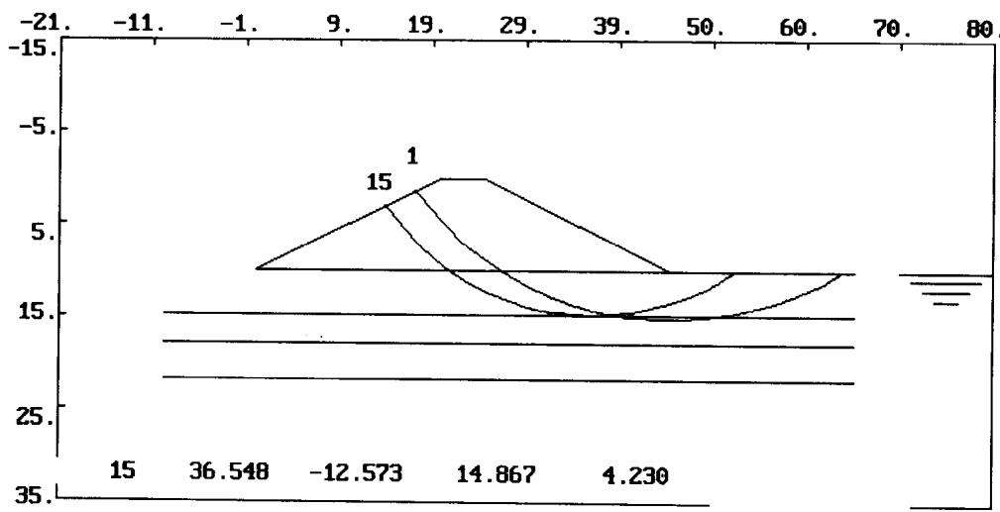  
图 12.19 例题 11（EX11）计算图形

表 12.33 例题 11 计算结果
<table><tr><td rowspan="2">计算方法</td><td rowspan="2">初始  $| F _ { 1 }$ </td><td rowspan="2">最小  $\cdot F _ { m }$ </td><td colspan="2">相应于临界滑裂面参数</td></tr><tr><td> $\underline { { x } } _ { c }$  yc</td><td>D</td></tr><tr><td>毕肖普法</td><td>5.750</td><td>4.230</td><td>36.55</td><td>-12.57 14.88</td></tr></table>

## 12.6.12 例题12 (EX12)

## 1. 计算条件

计算剖面同例题1。稳定渗流期遇地震，要求材料1输入材料动指标。

## 2. 计算内容

用单形法搜索圆弧滑裂面 $F _ { m } \varsigma$

3. 数据文件修改（与例题1 比较）

1) 第3行，计算方法识别符MTE=0改为MTE=-1，程序识别为采用地震总应力法；

2) 第30行输完土层材料指标后增加输入动指标数据（图12.10）。

4. 数据文件 EX12.DAT 说明（表 12.34）

表 12.34 数据文件 EX12.DAT 和说明
<table><tr><td>数据</td><td>变量</td><td>说明</td></tr><tr><td>1: EXAMPLE NO.12</td><td></td><td></td></tr><tr><td>2: 0,1,0,0,0,0</td><td>MTE=-1</td><td>输入材料动指标</td></tr><tr><td>3:-1</td><td></td><td></td></tr><tr><td>(4~27行同EX1.DAT)</td><td></td><td></td></tr><tr><td>(28-30行土层材料及其力学指标、孔压数据) 28：2</td><td></td><td></td></tr><tr><td>29:1,33.0,0.0,0.0,0.0,2.0,2.1,0</td><td></td><td></td></tr><tr><td>30:2,20.0,5.0,0.0,0.0,2.0,2.1,0</td><td></td><td></td></tr><tr><td>30-1:1</td><td> $\mathbf { L } S \mathbf { D } { = } 1$ </td><td>共有1种材料具有动指标</td></tr><tr><td>30-2: 1,0</td><td> $\mathbf { L S D M } ( 1 ) { = } 1$ </td><td>第1号材料采用1号动指标</td></tr><tr><td>4</td><td> $\boldsymbol { \mathrm { L S D M } } ( 2 ) = \boldsymbol { 0 }$ </td><td>第2号材料不采用动指标</td></tr><tr><td>30-3:4</td><td> $\mathbf { L O Y = 4 }$ </td><td>第1号材料动指标数据网格具有4个水平层</td></tr><tr><td>30-4:6</td><td>LOX(1)=6</td><td>第1个水平层共有6个点</td></tr><tr><td>30-5: 1.0,0.0,0.0</td><td></td><td></td></tr><tr><td></td><td> $K _ { c } { = } 1 . 0$ </td><td>第1个水平层第1个点  $K _ { c } = 1$ </td></tr><tr><td></td><td> $\sigma _ { 3 } { = } 0 . 0$ </td><td>第1个水平层第1个点  $\sigma _ { 3 } { = } 0 . 0$ </td></tr><tr><td></td><td> $\tau = 0 . 0$ </td><td>第1个水平层第1个点  $\pmb { \tau = } 0 . 0$ </td></tr><tr><td>30-6: 1.361,0.0,0.0</td><td></td><td></td></tr><tr><td></td><td> $K _ { c } ~ = 1 . 3 6 1$ </td><td>第1个水平层第2个点</td></tr><tr><td></td><td></td><td> $K _ { c } { = } 1 . 3 6 1$ </td></tr><tr><td></td><td> $\sigma _ { 3 } { = } 0 . 0$ </td><td>第1个水平层第2个点  $\phantom { - } \overline { { \sigma _ { 3 } } } = 0 . 0$ </td></tr><tr><td>30-7: 2.055,0.0,0.0</td><td> $\tau = 0 . 0$ </td><td>第1个水平层第2个点  $\tau = 0 . 0$ </td></tr><tr><td>30-8: 3.121,0.0,0.0</td><td></td><td>第1个水平层第3个点各项的意义同第1个点 第1个水平层第4个点各项的意义同第1个点</td></tr><tr><td>30-9: 4.015,0.0,0.0</td><td></td><td></td></tr><tr><td></td><td></td><td>第1个水平层第5个点各项的意义同第1个点</td></tr><tr><td>30-10:5.196,0.0,0.0</td><td></td><td>第1个水平层第6个点各项的意义同第1个点</td></tr><tr><td>30-11:6</td><td>LOX(2)=6</td><td>第2个水平层共有6个点</td></tr><tr><td>30-12: 1.0,1.0,0.08</td><td></td><td></td></tr><tr><td>30-13:1.361,1.0,0.20</td><td></td><td></td></tr><tr><td>30-14: 2.055,1.0,0.30</td><td></td><td></td></tr></table>

<table><tr><td>数据</td><td>变量</td><td>说明</td><td>洪农</td></tr><tr><td>30-15:3.121,1.0,0.34</td><td colspan="3"></td></tr><tr><td>30-16:4.015,1.0,0.37</td><td></td><td></td><td></td></tr><tr><td>30-17: 5.196,1.0,0.39</td><td></td><td>LOX(3)=6 第3个水平层共有6个点</td><td></td></tr><tr><td>30-18:6</td><td></td><td></td><td></td></tr><tr><td>30-19: 1.0,10.0,.80</td><td></td><td></td><td></td></tr><tr><td></td><td>30-20: 1.361,10.0,2.0</td><td></td><td></td></tr><tr><td></td><td>30-21:2.055,10.0,3.0</td><td></td><td></td></tr><tr><td></td><td>30-22: 3.121,10.0,3.4</td><td></td><td></td></tr><tr><td></td><td>30-23:4.015,10.0,3.7</td><td></td><td></td></tr><tr><td></td><td>30-24:5.196,10.0,3.9</td><td></td><td></td></tr><tr><td>30-25：6</td><td>LOY(4)=6</td><td></td><td>第4个水平层共有6个点</td></tr><tr><td></td><td>30-26: 1.0,100.0,8.00</td><td></td><td></td></tr><tr><td></td><td>30-27:1.361,100.0,20.00</td><td></td><td></td></tr><tr><td></td><td>30-28: 2.055,100.0,30.00</td><td></td><td></td></tr><tr><td></td><td>30-29: 3.121,100.0,34.00</td><td></td><td></td></tr><tr><td></td><td>30-30: 4.015,100.0,37.00</td><td></td><td></td></tr><tr><td></td><td>30-31: 5.196,100.0,39.00</td><td></td><td></td></tr><tr><td></td><td>31~59：同EX1.DAT</td><td></td><td></td></tr><tr><td></td><td></td><td></td><td></td></tr></table>

## 5. 计算结果

计算结果见表12.35，计算图形见图12.20。

表 12.35 例题 12 计算结果

<table><tr><td rowspan="2">计算方法</td><td rowspan="2">初始  $| F _ { 1 }$ </td><td rowspan="2">最小  $F _ { m }$ </td><td colspan="3">相应于临界滑裂面参数</td></tr><tr><td> $\underline { { { \pmb x } _ { c } } }$ </td><td> $\underline { { y _ { c } } }$ </td><td> $D _ { s }$ </td></tr><tr><td>毕肖普法</td><td>0.778</td><td>0.605</td><td>86.93</td><td>-19.93</td><td>33.78</td></tr></table>

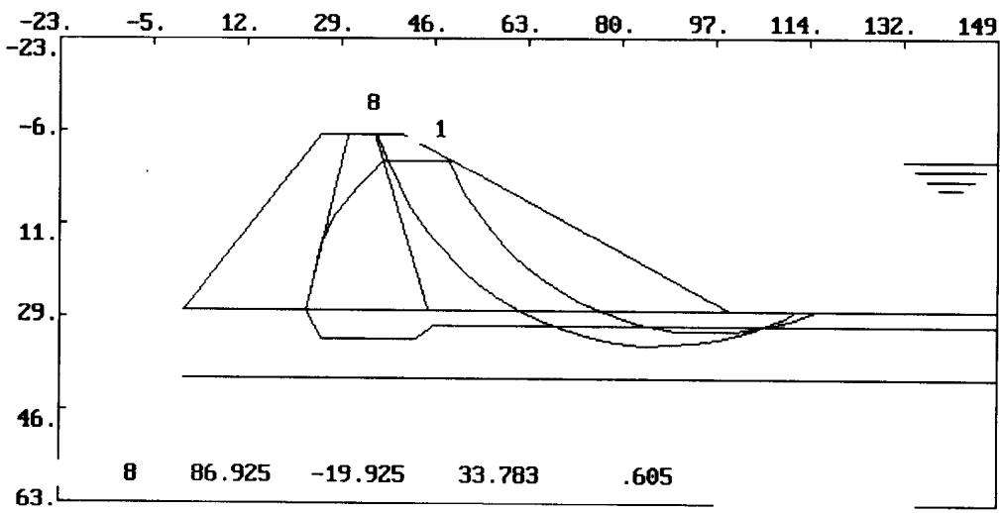  
图12.20 例题12（EX12）计算图形

## 12.6.13 例题13 (EX13)

## 1. 计算条件

计算剖面同例题1。稳定渗流期，具有拉力缝，但不充水。拉力缝底部x坐标为0.0。

## 2. 计算内容

用单形法（最优化方法）搜索最小安全系数 $F _ { m } .$

## 3. 数据文件修改

1) EX1.DAT 第 2 行无拉力缝 OPTION(3)=0，改为有拉力缝 OPTION(3)=1;

2) 滑裂面网格数据与 EX7.DAT 同；

3) EX1.DAT 第 59 行输完滑裂面数据后，增加输入拉力缝底部 x 坐标 YTENSION=0.0。

4. 数据文件 EX13.DAT 说明（表 12.36）

表 12.36 数据文件 EX13.DAT 和说明
<table><tr><td>数据</td><td>变量</td><td>说明</td></tr><tr><td colspan="3">1: EXAMPLE NO.13, TENSION CRACK</td></tr><tr><td>2: 0,1,1,0,0,0~ (3~59行同例题1)</td><td>OPTION(3)=1</td><td>具有拉力缝但缝内不充水</td></tr><tr><td>60: 0.0</td><td>YTENSION=0.0</td><td>拉力缝底部y坐标</td></tr></table>

## 5. 计算结果

计算结果见表12.37，计算图形如图12.21。

表 12.37 例题 13 计算结果

<table><tr><td rowspan="2">计算方法</td><td rowspan="2">初始  $F _ { 1 }$ </td><td rowspan="2">最小  $\boldsymbol { \cdot } \boldsymbol { F } _ { m }$ </td><td colspan="2">相应于临界滑裂面参数</td></tr><tr><td> $\underline { { \boldsymbol { x } } } _ { c }$   $\underline { { y _ { c } } }$ </td><td> $\mathcal { D } _ { \underline { { s } } }$ </td></tr><tr><td>毕肖普法</td><td>1.955</td><td>1.231</td><td>78.88</td><td>-36.36 10.81</td></tr></table>

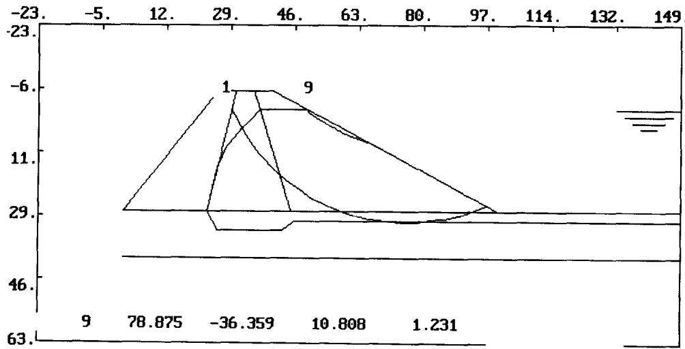  
图 12.21 例题13（EX13）计算图形

## 12.6.14 例题14 (EX14)

## 1. 计算条件

同例题1。

## 2. 计算内容

采用蒙特卡洛法，计算圆弧滑裂面可靠度指标β。

3. 数据文件修改（与例题1 比较）

1)第2行，由 $\mathrm { O P T I O N } ( 4 ) { = } 0$ 改为 $\mathrm { O P T I O N } ( 4 ) { = } 1$ ，进行可靠度计算；

2) 第30 行输完土层材料指标后增加可靠度计算的数据子单元。

4. 数据文件 EX14.DAT 说明（表 12.38）

表 12.38 数据文件 EX14.DAT 和说明
<table><tr><td>数据</td><td>变量</td><td>说明</td></tr><tr><td colspan="3">1: EXAMPLE NO.14 MONTE-CARLO</td></tr><tr><td>2: 0,1,0,1,0,0</td><td> $\mathrm { O P T I O N } ( 4 ) = 1$ </td><td>计算可靠度指标</td></tr><tr><td>(3~30行同例1) (数据子单元：可靠度分析数据)</td><td></td><td></td></tr><tr><td>30-1:1,2</td><td> $\mathbf { N P R O B } { = } 1$ </td><td>采用蒙特卡洛法</td></tr><tr><td></td><td> ${ \bf N L B } { \bf = } 2$ </td><td>具有随机特征的土层总数为2</td></tr><tr><td>30-2: 500</td><td> $\boldsymbol { \Pi } \mathbf { M } { = } 5 0 0$ </td><td>进行500次蒙特卡洛法抽样</td></tr><tr><td>30-3:3,0,20,30</td><td></td><td></td></tr><tr><td colspan="3">K=3 MEED(I)=0,20,30</td></tr><tr><td colspan="2">(第1号材料凝聚力、孔压系数不是随机变量，摩擦系数是随机变量) 30-4:1,2,-1,0,0.6494,0.09,-1,0.0</td><td>输入3个种子 种子分别为0、20、30</td></tr><tr><td colspan="3">具有随机特性的第1个土层为1号</td></tr><tr><td colspan="3">MD(1)=1</td></tr><tr><td colspan="3"> $\mathbf { M T Y P E } ( 1 ) { = } 2$ </td></tr><tr><td colspan="3"> $\mathbf { C M E A N ( 1 ) = - 1 }$ </td></tr><tr><td colspan="3"></td></tr><tr><td colspan="3"> $\mathbf { C D E V } ( 1 ) { = } 0$ </td></tr><tr><td colspan="2">MEAN(1)=.6494</td><td>该层土凝聚力的标准差 该层土摩擦系数的均值为0.6494</td></tr><tr><td colspan="3"> $\mathbf { F D E V } ( 1 ) { = } 0 . 0 9$  RMEAN(1)=-1</td></tr><tr><td colspan="3"></td></tr><tr><td colspan="3">RDEV(1)=0 该层土孔压系数的标准差 (第2号材料孔压系数不是随机变量，粘聚力、摩擦系数是随机变量)</td></tr><tr><td colspan="3">30-5: 2,2,5.0,0.5,0.364,0.05,-1,0.0 (各项意义同31-4行)</td></tr><tr><td colspan="3">31~59：同EX1.DAT</td></tr></table>

因NPROB=1，采用蒙特卡洛法，不能进行变量的相关分析计算，故不输入相关计算识别符 KK 和相关系数矩阵 R11(I, J)。

## 5. 计算结果

计算结果见表12.39。

表 12.39 例题 14 计算结果
<table><tr><td rowspan="2">计算方法</td><td rowspan="2">初始  $\mathfrak { i } \beta _ { \mathfrak { i } }$ </td><td colspan="3">相应于临界滑裂面参数</td></tr><tr><td> $x _ { c }$ </td><td> $y _ { c }$ </td><td> $D _ { s }$ </td></tr><tr><td>蒙特卡洛法</td><td>6.166</td><td>75.0</td><td>-22.5</td><td>30.0</td></tr></table>

## 12.6.15 例题15 (EX15)

1. 计算条件

同例题1。

2. 计算内容

采用一次二阶矩(FOSM)法，计算指定圆弧滑裂面可靠度指标β。 $\beta$

3. 数据文件修改

1) EX1.DAT 第2行，OPTION(4)=1，进行可靠度计算；

2) EX1.DAT第 30行输完土层材料指标后，增加可靠度计算的数据子单元；

3) EX14.DAT输完具有随机特征的土层指标后，增加输入随机变量不相关标识符 KK=0。

4. 数据文件 EX15.DAT 说明（表 12.40）

表 12.40 数据文件 EX15.DAT
<table><tr><td>数据</td><td>变量</td><td>说明</td></tr><tr><td>1: &#x27;EXAMPLENO.15,RELIABILTY,FOSM&#x27;</td><td></td><td></td></tr><tr><td>2: 0,1,0,1,0,0 (3~30：同EX1.DAT)</td><td>OPTION(4)=1</td><td>进行可靠度计算</td></tr><tr><td>(30-1~30-4 行为可靠度分析数据)</td><td></td><td></td></tr><tr><td>30-1:2,2</td><td>NPROB=2</td><td>采用FOSM法</td></tr><tr><td>30-2: 1,2,-1,0,0.6494,.09,-1.,0</td><td>NLB=2</td><td>具有随机特征的土层总数为2</td></tr><tr><td>30-3:2,2,5.,0.5,0.364,0.05,-1,0</td><td></td><td>意义同例14</td></tr><tr><td>30-4:0</td><td>KK=0</td><td>意义同例14</td></tr><tr><td>31~59：同EX1.DAT</td><td></td><td>随机变量不相关</td></tr></table>

## 5. 计算结果

计算结果见表12.41。

表 12.41 例题 15 计算结果
<table><tr><td rowspan="2">计算方法</td><td rowspan="2">初始  $\mathfrak { d } _ { \mathfrak { s } }$ </td><td colspan="2">相应于临界滑裂面参数</td></tr><tr><td> $\underline { { \boldsymbol x } } _ { c }$   $\underline { y } _ { c }$ </td><td> $\underline { { \boldsymbol { D } } } _ { s }$ </td></tr><tr><td>FOSM</td><td>6.418</td><td>75.0 -22.5</td><td>30.0</td></tr></table>

从例题14、例题15的计算结果看出，计算初始可靠度指标，蒙特卡洛法 ${ \mathrm { : } } \beta { = } 6 . 1 3 7$ 和一次二阶矩法 $\beta { = } 6 . 3 9 0$ 二者相近。

## 12.6.16 例题16 (EX16)

## 1. 计算条件

同例题1，滑弧通过指定的上、下交点其坐标分别为 $x _ { B } = 2 5 . 5 0 3 , \ y _ { B } = - 5 . 0 0 0 , \ x _ { C } = 9 6 . 2 8 9 ,$ $y _ { C } { = } 2 5 . 4 9 0$ 0

## 2. 计算内容

用网格法找出，滑弧通过指定坝坡上、下交点，滑弧半径为 52.5\~92.5m，步长为10.0的五个圆弧的最小安全系数 $F _ { m }$

## 3. 数据文件修改

1) 将 EX1.DAT 第 57 行 LL0=0 改为 $\mathrm { L L } 0 { = } 1$

2) 在EX1.DAT第 58、59行，输入有关的参数。与例题6 不同点在于，本例布置的网格是在半径方向。

## 4. 数据文件 EX16.DAT 说明（表 12.42）

表 12.42 数据文件 EX16.DAT 和说明
<table><tr><td>数据</td><td>变量</td><td>说明</td></tr><tr><td colspan="3">1:EXAMPLENO.16DEFINEACIRCLEBASEDONCROWNANDTOEPOSITIONS (2~56行与例题1同)</td></tr><tr><td colspan="3">(第57~59行圆弧滑裂面数据)</td></tr><tr><td>57: 1,0,0</td><td>LLO=1&gt;0</td><td>滑弧通过指定的上、下端点</td></tr><tr><td rowspan="5">58: 2,20,72.5,10.0</td><td>LL1=0</td><td>毕肖普法</td></tr><tr><td>LL2=0</td><td>用网格法搜索  $F _ { m }$ </td></tr><tr><td>IGRID=2</td><td>在圆弧半径方向增大或减少的网格</td></tr><tr><td>NS=20</td><td>划分的土条数</td></tr><tr><td>CCD=72.5 BCD=10.0</td><td>中间圆弧的半径 滑弧半径的步长</td></tr><tr><td colspan="3">59: 25.503,-5.0,96.289,25.490</td></tr><tr><td rowspan="5"></td><td>XL1=25.503</td><td></td></tr><tr><td></td><td>上交点的x坐标</td></tr><tr><td>YL1=-5.000 XL2=96.289</td><td>上交点的y坐标</td></tr><tr><td>YL2=25.490</td><td>下交点的x坐标</td></tr><tr><td></td><td>下交点的y坐标</td></tr></table>

## 5. 计算结果

计算结果见表12.43，计算图形见图12.22。

表 12.43 例题 16 计算结果
<table><tr><td rowspan="2">计算方法</td><td rowspan="2">初始  $\mathsf { i } F _ { \mathsf { I } }$ </td><td rowspan="2">最小  $\boldsymbol { \cdot } \boldsymbol { F } _ { m }$ </td><td colspan="2">相应于临界滑裂面参数</td></tr><tr><td> $x _ { c }$   $\underline { { y _ { \mathrm { c } } } }$ </td><td> $D _ { s }$ </td></tr><tr><td>毕肖普法</td><td>1.920</td><td>1.555</td><td>94.162 -66.986</td><td>25.514</td></tr></table>

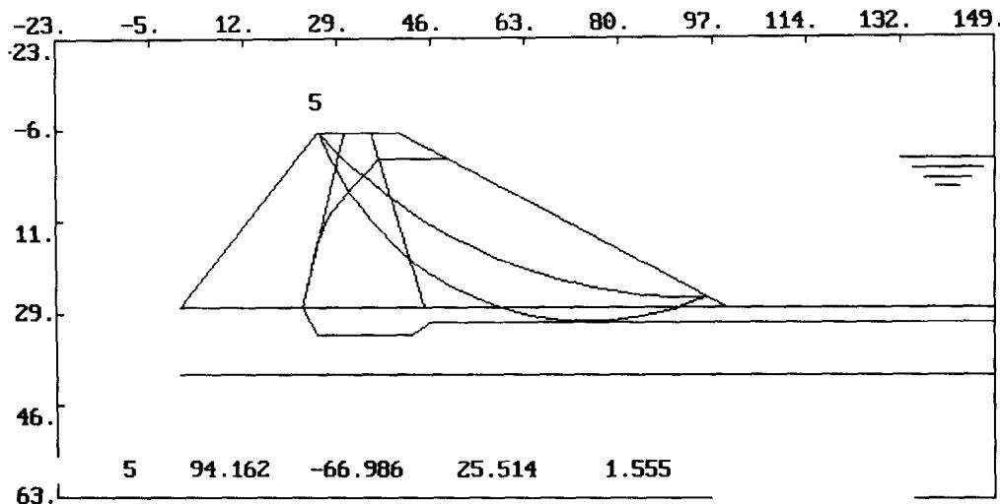  
图 12.22 例题16（EX16） 计算图形

## 12.6.17 例题17 (EX17)

## 1. 计算条件

同例题1，稳定渗流期，滑弧通过指定的上交点，其坐标为x=25.503，y=-5.000。

2. 计算内容

滑弧通过指定的上交点，用枚举法搜索 $\boldsymbol { F } _ { m ^ { \vee } }$

3. 数据文件修改（与 EX16.EAT 比较）

1) 57 行LLO<0，判定滑弧通过指定的上交点；

2)58行划分的网格为在圆弧半径方向增大或减少的格数；

3) 59 行第 3 项 LDN 为上交点还是下交点的识别符，若 LDN>0，则此行第 1、2 项为上交点x、y坐标；

4) 若LDN<0，则此行第1、2 项为滑弧与边界线下交点x、y坐标。

4. 数据文件 EX17.DAT 说明（表 12.44）

表 12.44 数据文件 EX17.DAT 和说明
<table><tr><td>数据</td><td>变量 说明</td><td></td></tr><tr><td>1: EXAMPLENO.17,DEFINEACIRCLECROWN</td><td></td><td></td></tr><tr><td>2~56: 同EX1.DAT</td><td></td><td></td></tr><tr><td>(第57~59行圆弧滑裂面数据) 57:-1,0,0</td><td></td><td></td></tr><tr><td></td><td>LLO=-1&lt;0</td><td>滑弧通过指定的上交点</td></tr><tr><td rowspan="5">58:2,20,72.5,10.0</td><td>LL1=0</td><td>毕肖普法</td></tr><tr><td>LL2=0</td><td>用枚举法搜索  $F _ { m }$ </td></tr><tr><td></td><td></td></tr><tr><td>IGRID=2</td><td>在圆弧半径方向增大或减少的网格数</td></tr><tr><td>NS=20 CCD=72.5</td><td>划分的土条数 中间圆弧的半径</td></tr></table>

续表

<table><tr><td>数据</td><td>变量</td><td>说明</td></tr><tr><td>59:25.503,-5.0,1,26.345</td><td> $\overline { { \mathsf { B C D } = 1 0 . 0 } }$ </td><td>中间圆弧的半径的步长</td></tr><tr><td rowspan="5"></td><td> $\mathbf { X L } 1 { = } 2 5 . 5 0 3$ </td><td>上交点的x坐标</td></tr><tr><td> $\mathtt { M } 1 = - 5 . 0 0 0$ </td><td>上交点的y坐标</td></tr><tr><td> $\mathrm { L D N } = 1$ </td><td>判别为上交点（若LDN&lt;0，判别为下</td></tr><tr><td></td><td>交点，则本行第1、2项即为下交点x、</td></tr><tr><td> ${ D s } = 2 6 . 3 4 5$ </td><td>y坐标） 中间滑弧的深度</td></tr></table>

## 5. 计算结果

计算结果见表12.45，计算图形见图12.23。

表 12.45 例题 17 计算结果
<table><tr><td rowspan="2">计算方法</td><td rowspan="2">初始  $\mathsf { i } F _ { 1 }$ </td><td rowspan="2">最小  $\setminus F _ { m }$ </td><td colspan="3">相应于临界滑裂面参数</td></tr><tr><td> $\underline { { \boldsymbol { x } } } _ { c }$ </td><td> $\underline { { y } } _ { c }$ </td><td> $\underline { { \boldsymbol { D } } } _ { \mathrm { c } }$ </td></tr><tr><td>毕肖普法</td><td>1.822</td><td>1.555</td><td>94.903</td><td>-66.155</td><td>26.345</td></tr></table>

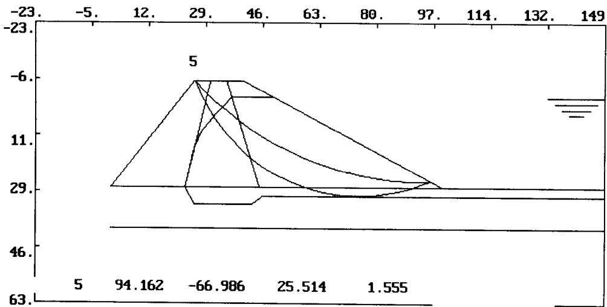  
图 12.23 例题17（EX17）计算图形

## 12.6.18 例题18 (EX18)

## 1. 计算条件

同例题1，稳定渗流期。

2. 计算内容

计算指定任意形状滑裂面的安全系数F，且滑裂面上的线段均为直线。

3. 数据文件修改（与例题1 比较）

1) 第 2 行由圆弧 $\mathrm { O P T I O N } ( 2 ) { = } 1$ 改为非圆弧 $\mathbf { O P T I O N } ( 2 ) { = } 0$

2) 第 57 行以后由圆弧滑裂面改为任意形状滑裂面。

4. 数据文件 EX18.DAT 说明（表 12.46）

表 12.46 数据文件 EX18.DAT
<table><tr><td>数据</td><td>变量</td><td>说明</td></tr><tr><td colspan="3">1: EXAMPLE NO.18 NON-CIRCULAR SLIP SURFACE</td></tr><tr><td>2:  $_ { 0 , 0 , 0 , 0 , 0 , 0 , 0 }$ </td><td> $\mathrm { O P T I O N } ( 2 ) { = } 0$ </td><td>任意形状滑裂面</td></tr><tr><td>(3~56行同例1)</td><td></td><td></td></tr><tr><td>(57~61行为任意形状滑裂面数据) 57:  $^ { 4 , 0 , 0 }$ </td><td></td><td></td></tr><tr><td rowspan="4">58:1,27.5,-5.0,0,0.0</td><td> $\mathbf { N S 1 } = 4$ </td><td>滑裂面上的控制点数</td></tr><tr><td> $\mathbf { N O P T } { = } 0$ </td><td>计算指定滑裂面，不进行优化计算</td></tr><tr><td> $\scriptstyle \mathbf { R E } = 0$ </td><td>程序默认迭代100次</td></tr><tr><td></td><td></td></tr><tr><td rowspan="8">59: 15,50.0,30.0,0,0.0</td><td> $\mathbf { K } Q 2 ( 1 ) = 1$ </td><td>第一个控制点的土条编号为1</td></tr><tr><td> ${ \bf X } 1 ( 1 ) = 2 7 . 5$ </td><td>该控制点的x坐标为27.5</td></tr><tr><td> $\mathbf { Y } 1 ( 1 ) { = } { - } 5 . 0$ </td><td>该控制点的y坐标为 -5.0</td></tr><tr><td> $\mathrm { N L } ( 1 ) { = } 0$ </td><td>该控制点的移动自由度为0</td></tr><tr><td> $\mathbf { A L } ( 1 ) { = } 0 . 0$ </td><td>该控制点移动的角度为0.0</td></tr><tr><td></td><td></td></tr><tr><td> $\ K Q 2 ( 2 ) = 1 5 ;$   $\mathbf { X } 1 ( 2 ) = 5 0 . 0 $ </td><td>第二个控制点的土条编号为15</td></tr><tr><td> $\mathbf { Y } 1 ( 2 ) { = } 3 0 . 0$ </td><td>该控制点的x坐标</td></tr><tr><td></td><td></td><td>该控制点的y坐标</td></tr><tr><td></td><td> $\mathrm { N L } ( 2 ) { = } 0$ </td><td>该控制点的移动自由度为0</td></tr><tr><td></td><td> $\mathbf { A L } ( 2 ) { = } 0 . 0$ </td><td>该控制点移动的角度为0.0</td></tr><tr><td>60:40,110.0,0.0,0,0..</td><td></td><td></td></tr><tr><td>61：45,115.0,27.5,0,0.0....</td><td></td><td></td></tr><tr><td>62: 6</td><td> $\mathrm { L N O } = 6 { > } 3$ </td><td>3为滑裂面上的线段总数，输入任一大 于3的整数，滑裂面上的线段均为直线</td></tr></table>

## 5. 计算结果

计算结果见表12.47，计算图形见图12.24。

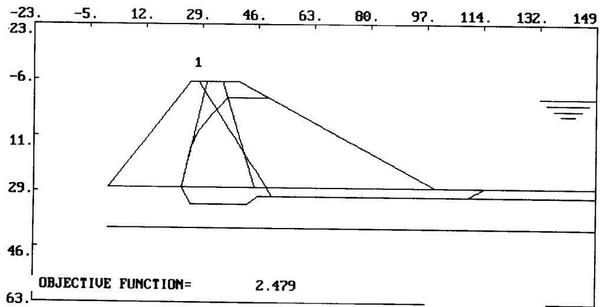  
图 12.24 例题 18（EX18）计算图形

表 12.47 例题 18 计算结果
<table><tr><td rowspan="2"> $F$ </td><td colspan="8">滑裂面上的控制点坐标</td></tr><tr><td>x1</td><td> $y 1$ </td><td> $x 2$ </td><td> $y 2$ </td><td> $x 3$ </td><td> $y 3$ </td><td> $x 4$ </td><td> $y 4$ </td></tr><tr><td>2.479</td><td>27.5</td><td>-5.0</td><td>50.0</td><td>30.0</td><td>110.0</td><td>30.0</td><td>115.0</td><td>27.5</td></tr></table>

## 12.6.19 例题19 (EX19)

## 1. 计算条件

同例题1，稳定渗流期，用单形法搜索任意形状滑裂面 $F _ { m }$

## 2. 计算内容

用单形法搜索任意形状滑裂面的安全系数Fm。本例的滑裂面一部分为直线，一部分为 $F _ { m ^ { \circ } }$ 曲线。滑裂面的第3、4段为直线，其余线段为曲线。

## 3. 数据文件（EX18.DAT）修改

第57行任意形状滑裂面数据后增加2行，说明滑裂面上的直线段的数目及其序号。

4. 数据文件 EX19.DAT 说明（表 12.48）

表 12.48 数据文件 EX19.DAT 和说明
<table><tr><td>数据</td><td>变量</td><td>说明</td></tr><tr><td>1: EXAMPLE NO.19, SIMPLEX METHOD</td><td></td><td></td></tr><tr><td>2: 0,0,0,0,0,0</td><td>OPTION(2)=0</td><td>任意形状滑裂面</td></tr><tr><td>(2~56行同例1)</td><td></td><td></td></tr><tr><td>(57~63行任意形状滑裂面数据) 57: 5,2,0</td><td>NS1=5</td><td></td></tr><tr><td></td><td>NUPT=2</td><td>滑裂面上的控制点数为5 用单形法搜索任意形状滑裂面</td></tr><tr><td></td><td>IRE=0</td><td> $\boldsymbol { F _ { m } }$  程序默认迭代100次</td></tr><tr><td>58:1,27.5,-5.0,1,0.0</td><td></td><td></td></tr><tr><td></td><td>KQ2(1)=1</td><td>第一个控制点的土条编号</td></tr><tr><td></td><td>X1(1)=27.5</td><td>该控制点的x坐标</td></tr><tr><td></td><td>Y1(1)=-5.0</td><td>该控制点的y坐标</td></tr><tr><td></td><td>NL(1)=1</td><td>该控制点的移动自由度为1</td></tr><tr><td></td><td>AL(1)=0.0</td><td>该控制点移动的角度为0(即沿水平向)</td></tr><tr><td>59:10,60.0,25.0,1,45.0</td><td></td><td></td></tr><tr><td></td><td>KQ2(2)=10</td><td>第二个控制点的土条编号</td></tr><tr><td></td><td>X1(2)=60.0</td><td>该控制点的x坐标</td></tr><tr><td></td><td> $\yen 123,456$ </td><td>该控制点的y坐标</td></tr><tr><td></td><td>NL(2)=1</td><td></td></tr><tr><td></td><td>AL(2)=45.0</td><td>该控制点的移动自由度为1</td></tr><tr><td>60:16,75.0,30.0,1,0...</td><td></td><td>该控制点移动的角度为45.0</td></tr><tr><td>61:28,110.0,30.0.,1,0..</td><td></td><td></td></tr><tr><td>62:2</td><td></td><td></td></tr><tr><td></td><td>LO=2</td><td>滑裂面上有2段直线,其余线段为曲线</td></tr><tr><td>63: 3,4</td><td>NP(I)=3,4</td><td>直线段的序号为第3、4号</td></tr></table>

## 5. 计算结果

计算结果见表12.49，计算图形见图12.25。

表 12.49 例题 19 计算结果
<table><tr><td rowspan="2">初始  $\mathfrak { F } _ { 1 }$ </td><td rowspan="2">最小  $\setminus F _ { m }$ </td><td colspan="6">临界滑裂面上控制点坐标</td></tr><tr><td>x</td><td>28.2</td><td>53.7</td><td>83.7</td><td>98.1</td><td>103.5</td></tr><tr><td>1.761</td><td>1.680</td><td>y</td><td>-5.0</td><td>18.7</td><td>30.0</td><td>30.0</td><td>27.5</td></tr></table>

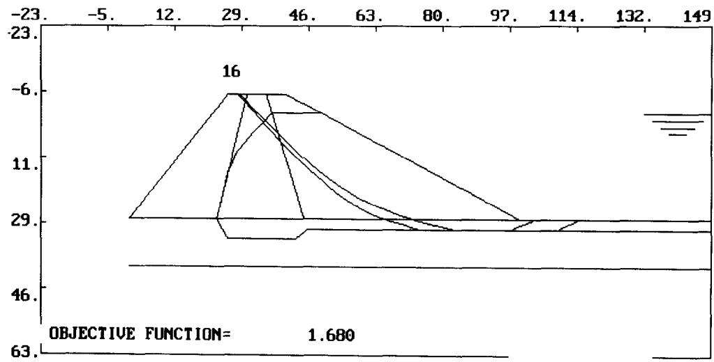  
图 12.25 例题19（EX19）计算图形

## 12.6.20 例题20 (EX20)

## 1. 计算条件

同例题1，稳定渗流期，有拉力缝且充水。

2. 计算内容

用单形法搜索任意形状滑裂面的安全系数F，滑裂面上的线段均为直线。 $F _ { m } .$

3. 数据文件修改（与例题 19 比较）

第2行无拉力缝 $\mathrm { O P T I O N } ( 3 ) { = } 0$ 改为有拉力缝且充水 OPTION(3)=2。

4. 数据文件 EX20.DAT 说明（表 12.50）

表 12.50 数据文件 EX20.DAT 和说明
<table><tr><td>数据</td><td>变量</td><td>说明</td></tr><tr><td colspan="3">1: EXAMPLE NO.20, SIMPLEX METHOD, TENSION CRACK</td></tr><tr><td>2: 0,0,2,0,0,0 3~64：同例19</td><td>OPTION(3)=2 有拉力缝且充水</td><td></td></tr></table>

## 5. 计算结果

计算结果见表12.51，计算图形见图12.26。

本例为非圆弧滑裂面，滑面的第一个点的坐标即代表拉力缝的深度，故没有例13圆弧滑裂面中的YTENSION的数据。

表 12.51 例题 20 计算结果
<table><tr><td rowspan="2">初始  $\mathsf { i } F _ { 1 }$ </td><td rowspan="2">最小  $\boldsymbol { F } _ { m }$ </td><td colspan="6">临界滑裂面上控制点坐标</td></tr><tr><td>x</td><td>35.7</td><td>43.3</td><td>85.9</td><td>114.6</td><td>117.2</td></tr><tr><td>1.789</td><td>1.595</td><td>y</td><td>0.0</td><td>8.3</td><td>30.0</td><td>30.0</td><td>27.5</td></tr></table>

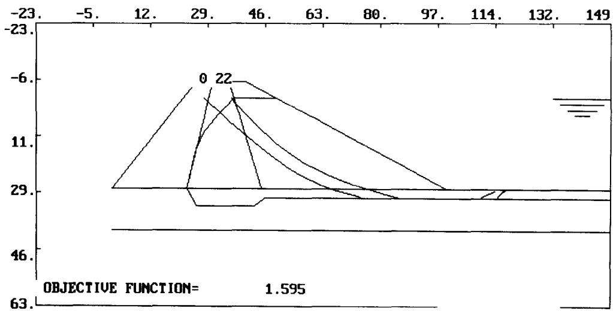  
图12.26 例题 20（EX20）计算图形

## 12.6.21 例题21 (EX21)

## 1. 计算条件

稳定渗流期，具有表面荷载。图12.12示一边坡，在平台（线段1）上作用有缆机荷载，其垂直荷载为梯形分布，水平荷载为均匀分布。由于本身稳定安全系数较低，故在坡面上(线段3、5)打了与X轴夹角 $1 6 5 ^ { \circ }$ 的预应力锚索。设在第3、5线段上分别打了7排每根预应力300t(1t=9.8kN)、排距5m的锚索，则每单位宽度锚索荷载为 $7 \times 3 0 0 / 5 { = } 4 2 0 0 / \mathrm { m }$ o

## 2. 计算内容

用单形法搜索任意形状滑裂面的安全系数Fm，滑裂面上的线段均为直线。 $F _ { m } ,$

3. 数据文件修改（与例 19 比较）

1) 第2 行由没有表面荷载OPTION(5)=0 改为有表面荷载 $\mathrm { O P I I O N } ( 5 ) { = } 1$

2) 在输完边界线、浸润线后,增加具有表面荷载的控制数据。

4. 数据文件 EX21.DAT 说明（表 12.52）

表 12.52 数据文件 EX21.DAT 和说明
<table><tr><td>数据</td><td>变量</td><td>说明</td></tr><tr><td>(1~6行控制数据)</td><td></td><td></td></tr><tr><td>1: N021</td><td>CRANE</td><td></td></tr><tr><td>2: 0,0,0,0,1,0</td><td></td><td></td></tr><tr><td></td><td>OPTION(5)=1</td><td>具有表面荷载</td></tr><tr><td>3:0</td><td>MTE=0</td><td>有效应力法</td></tr><tr><td>4: 500.0,500.0,-1</td><td>UWL=</td><td>表明坡外无水(150为基础面Y坐标)</td></tr><tr><td></td><td>500&gt;150</td><td></td></tr><tr><td></td><td>UWLI=500</td><td>用有效应力法UWL=WUL1</td></tr><tr><td></td><td>ASP=-1&lt;0</td><td>罗厄法</td></tr><tr><td>5: 0,0.0,0.0,0</td><td></td><td></td></tr><tr><td></td><td>IQUA=0</td><td>因无地震,本行第2、3、4项填0即可</td></tr><tr><td>6: 1.0</td><td></td><td></td></tr><tr><td>(7~13行控制点的数据)</td><td></td><td></td></tr><tr><td></td><td></td><td></td></tr><tr><td>7:6</td><td></td><td></td></tr><tr><td>8:1,79.0,37.0</td><td></td><td></td></tr><tr><td></td><td></td><td></td></tr><tr><td>13：6,207.0,150.0</td><td></td><td></td></tr><tr><td>(14~15行材料数据)</td><td></td><td></td></tr><tr><td>14:1</td><td></td><td></td></tr><tr><td>15: 1,35.0,0.0,0.0,0.0,2.5,2.5,0 (16~21行边界线、浸润线数据)</td><td></td><td></td></tr><tr><td>16: 5,0</td><td></td><td></td></tr><tr><td>17: 1,2,1</td><td></td><td></td></tr><tr><td>18: 2,3,1</td><td></td><td></td></tr><tr><td>19: 3,4,1</td><td></td><td></td></tr><tr><td>20: 4,5,1</td><td></td><td></td></tr><tr><td>21: 5,6,1</td><td></td><td></td></tr><tr><td>(22~30)行表面荷载数据)</td><td></td><td></td></tr><tr><td>22:3</td><td>NNP=3</td><td></td></tr><tr><td>23:1,3,5</td><td>NP(I)=1,3,5</td><td>具有表面荷载的线段总数为3</td></tr><tr><td>24:1</td><td>NUR(1)=1</td><td>具有表面荷载的线段序号为1,3,5 第1条线段承受的荷载种类为分布力</td></tr><tr><td>25: 10.0,16.0</td><td>PN(1,1)=10.0</td><td>该线段分布荷载的x分量在左端点的值</td></tr><tr><td></td><td>PN(1,2)=16.0</td><td>该线段分布荷载的x分量在右端点的值</td></tr><tr><td>26: 4.4,4.4</td><td>PT(1,1)=4.4</td><td>该线段分布荷载的y分量在左端点的值</td></tr><tr><td></td><td>PT(1,1)=4.4</td><td></td></tr><tr><td>27：0</td><td>NUR(2)=0</td><td>该线段分布荷载的y分量在右端点的值</td></tr><tr><td>28: 420,165.</td><td></td><td>第2条线段承受的荷载种类为集中力</td></tr><tr><td></td><td>U=420.0</td><td>该线段承受的集中力数值</td></tr><tr><td>29:0</td><td>AF=165.0</td><td>该线段承受的集中力倾角(以度计)</td></tr><tr><td>30: 240.,165.</td><td>NUR(3)=0</td><td>第3条线段承受的荷载种类为集中力</td></tr><tr><td></td><td>SU=240.0</td><td>该线段承受的集中力数值</td></tr><tr><td>(31~37行为非圆弧滑裂面数据)</td><td>AF=165.0</td><td>该线段承受的集中力倾角</td></tr><tr><td>31:4,2,0</td><td></td><td>(31~35行各项意义同例19)</td></tr><tr><td>32:1,79.0,37.0,0,0.0</td><td></td><td></td></tr><tr><td>33:6,90.0,55.0,1,0.0</td><td></td><td></td></tr><tr><td>34:15,126.0,100.0,1,0.0</td><td></td><td></td></tr><tr><td>35:30,207.0,150.0,1,0.0</td><td></td><td></td></tr><tr><td></td><td></td><td></td></tr><tr><td>36:3</td><td>LNO=3</td><td>滑裂面上有3条直线</td></tr><tr><td>37:1,2,3</td><td>LOO(I)=1,2,3</td><td>滑裂面上3条直线的编号为1、2、3</td></tr></table>

## 5. 计算结果

计算结果见表12.53，计算图形见图12.27。

表 12.53 例题 21 计算结果
<table><tr><td rowspan="2">初始  $\mathsf { i } F _ { 1 }$ </td><td rowspan="2">最小  $\cdot F _ { m }$ </td><td colspan="5">临界滑裂面上控制点坐标</td></tr><tr><td>x</td><td>79.0</td><td>90.8</td><td>129.7</td><td>207.5</td></tr><tr><td>1.038</td><td>1.029</td><td>y</td><td>37.0</td><td>55.0</td><td>100.0</td><td>150.0</td></tr></table>

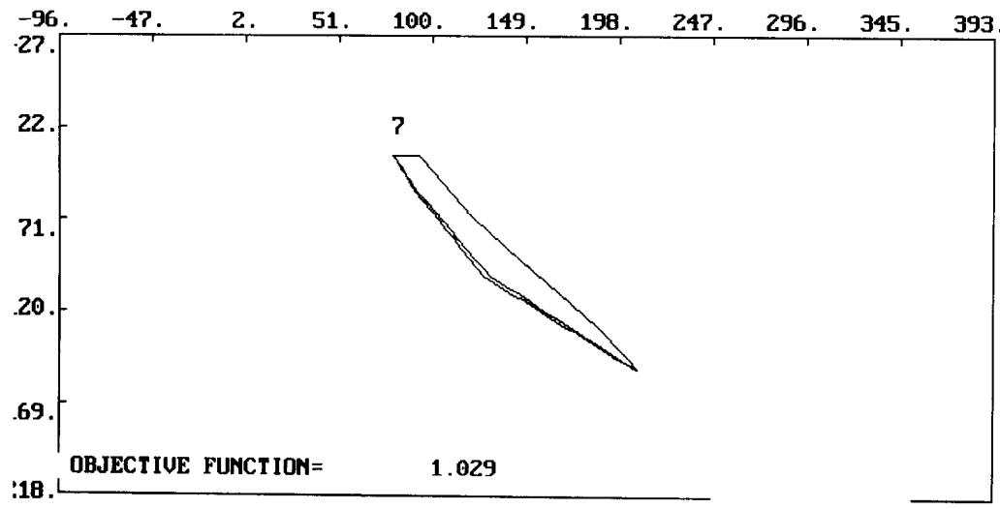  
图 12.27 例题 21（EX21）计算图形

## 12.6.22 例题22 (EX22)

## 1. 计算条件

计算剖面同例题1，稳定渗流期。

2. 计算内容

随机搜索任意形状滑裂面的安全系数 $F _ { m ^ { \circ } }$

3. 数据文件修改（与例题19 比较）

1) 第 57 行单形法 NOPT=2 改为 NOPT=12 随机搜索；

2) 第62行输完滑裂面上控制点的数据后，增加随机搜索数据。

4. 数据文件 EX22.DAT 说明（表 12.54）

表 12.54 数据文件 EX22.DAT 和说明
<table><tr><td>数据</td><td>变量 说明</td><td></td></tr><tr><td>1: &#x27;EXAMPLE NO.22</td><td rowspan="2">OPTION=0 任意形状滑裂面</td></tr><tr><td>2: 0,0,0,0,0,0</td></tr><tr><td>(3~56行同例1)</td><td></td><td></td></tr><tr><td>(5~62行滑裂面数据)</td><td></td><td></td></tr><tr><td>57: 5,12,0</td><td>NS1=5</td><td>滑裂面上的控制点数</td></tr><tr><td></td><td>NUPT=12</td><td>随机搜索</td></tr><tr><td>58: 1,27.5,-5.0,1,0.0</td><td>IRE=0</td><td>程序默认迭代100次</td></tr><tr><td>59: 10,60.0,25.0,1,0.0</td><td></td><td>(第59~63行各项意义同例19)</td></tr><tr><td></td><td></td><td></td></tr><tr><td>60:16,75.0,30.0,1,0.0</td><td></td><td></td></tr></table>

<table><tr><td colspan="2"></td><td colspan="2">续表</td></tr><tr><td>数据</td><td>变量</td><td>说明</td><td></td></tr><tr><td>61：28,110.0,30.0,1,180.0</td><td></td><td></td><td></td></tr><tr><td>62:35,130.0,27.5,1,180.0</td><td></td><td></td><td></td></tr><tr><td>(62-1~62-6行随机搜索数据)</td><td></td><td></td><td></td></tr><tr><td>62-1:5</td><td></td><td></td><td></td></tr><tr><td>62-2: 1,10.0</td><td>IX=5</td><td>随机搜索的种子为5</td><td></td></tr><tr><td rowspan="5">62-3:2,15.0</td><td>KK=1</td><td>滑裂面上随机搜索的第1个控制点</td><td></td></tr><tr><td>ZP=10.0</td><td>第1个控制点随机搜索的半带宽度为</td><td></td></tr><tr><td></td><td>10.0</td><td></td></tr><tr><td>KK=2</td><td>滑裂面上随机搜索的第2个控制点</td><td></td></tr><tr><td>ZP=15.0</td><td></td><td></td></tr><tr><td></td><td></td><td>15.0</td><td>第2个控制点随机搜索的半带宽度为</td></tr><tr><td>62-4: 3,20.0</td><td></td><td></td><td>滑裂面上随机搜索的第3个控制点</td></tr><tr><td>62-5: 4,20.0</td><td></td><td></td><td></td></tr><tr><td>62-6: 5,25.0</td><td></td><td></td><td></td></tr><tr><td></td><td></td><td></td><td></td></tr><tr><td></td><td></td><td></td><td></td></tr><tr><td>63：2</td><td>LNO=2 LOO(I)</td><td>滑裂面上有2段直线,其余线段为曲线</td><td></td></tr></table>

## 5. 计算结果

计算结果见表12.55，计算图形见图12.28。

表 12.55 例题 22 计算结果
<table><tr><td rowspan="2">初始  $\mathsf { i } F _ { 1 }$ </td><td rowspan="2">最小  $F _ { m }$ </td><td colspan="6">临界滑裂面上控制点坐标</td></tr><tr><td>x</td><td>27.2</td><td>69.1</td><td>82.6</td><td>99.2</td><td>104.6</td></tr><tr><td>1.897</td><td>1.662</td><td>y</td><td>-5.0</td><td>25.0</td><td>30.0</td><td>30.0</td><td>27.5</td></tr></table>

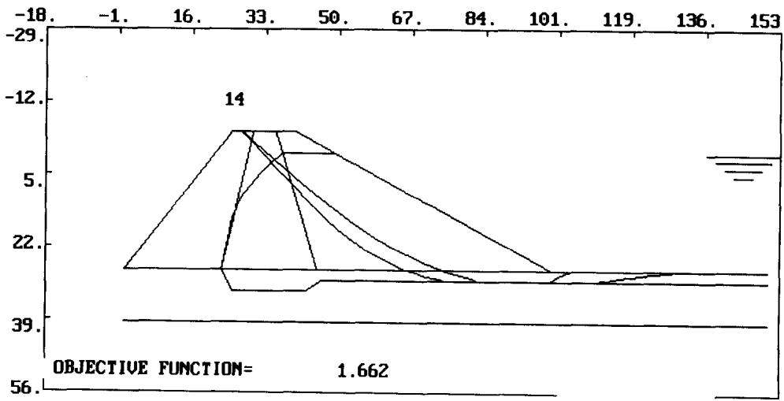  
图 12.28 例题 22（EX22）计算图形

## 12.6.23 例题23 (EX23)

## 1. 计算条件

同例题1。第2号材料的粘聚力c和摩擦系数tanφ相关，相关数为-0.2。

## 2. 计算内容

采用 ROSENBLEUTH 法，计算非圆弧滑裂面最小可靠度 $\dot { \mathcal { P } } _ { m }$ o

3. 数据文件修改（与例题19 比较）

1) 第 2 行不进行可靠度计算 OPTION(4)=0 改为 OPTION(4)=1 进行可靠度计算;

2) 在有关材料数据(28\~30行)后增加可靠度分析数据。

4. 数据文件 EX23.DAT 说明（表 12.56）

表 12.56 数据文件 EX23.DAT 和说明
<table><tr><td>数据</td><td>变量</td><td>说明</td></tr><tr><td>1: EXAMPLE NO.23, RELIABILITY ANALYSIS 2: 0,0,0,1,0,0</td><td></td><td></td></tr><tr><td></td><td>OPTION(4)=1</td><td>进行可靠度计算</td></tr><tr><td>(3~27行同EX1.DAT)</td><td></td><td></td></tr><tr><td>(28~30行材料数据同例1)</td><td></td><td></td></tr><tr><td>28:2</td><td></td><td></td></tr><tr><td>29:1,33.0,0.0,0.0,0.0,2.0,2.1,0 30: 2,20.0,5.0,0.0,0.0,2.0,2.1,0</td><td></td><td></td></tr><tr><td>(30-1~30-7行可靠度计算数据)</td><td></td><td></td></tr><tr><td>30-1:3,2</td><td></td><td></td></tr><tr><td></td><td>NPROB=3 NLB=2</td><td>采用ROSENBLEUTH法 具有随机特征的土层总数为2</td></tr><tr><td>30-2: 1,2,-1,0,0.6494,0.09,-1,0</td><td></td><td>各项意义同例14</td></tr><tr><td>30-3:2,2,5.,0.5,0.364,0.05,-1,0</td><td></td><td>各项意义同例14</td></tr><tr><td></td><td>KK=1</td><td></td></tr><tr><td>30-4:1 30-5: 1,0,0</td><td>R11(1,1)=1</td><td>随机变量相关 第(31-5~7)行为相关系数矩阵</td></tr><tr><td>30-6:0,1,-0.2</td><td></td><td></td></tr><tr><td>30-7: 0,-0.2,1</td><td></td><td></td></tr><tr><td>(31~56行为边界线、浸润线数据同EX1.DAT)</td><td></td><td></td></tr><tr><td>(57~62行：非圆弧滑裂面数据)</td><td></td><td></td></tr><tr><td>57: 4,2,0</td><td></td><td></td></tr><tr><td></td><td>NS1=4</td><td>滑裂面上控制点数</td></tr><tr><td></td><td>NOPT=2</td><td>用单形法搜索最小可靠度指标βm</td></tr><tr><td></td><td>IRE=0</td><td>程序默认迭代100次</td></tr><tr><td>58:1,27.5,-5,1,0.</td><td></td><td>(59~62行各项意义同EX19.DAT)</td></tr><tr><td>59: 15,50.,30.,1,0.</td><td></td><td></td></tr><tr><td>60:40,110.,30.,1,0.</td><td></td><td></td></tr><tr><td></td><td></td><td></td></tr><tr><td>61:45,115.,27.5,1,0.</td><td></td><td></td></tr><tr><td>62:6</td><td></td><td></td></tr><tr><td></td><td>LNO=6&gt;4</td><td>滑裂面上的线段均为直线</td></tr></table>

## 5. 计算结果

计算结果见表 12.57。

表 12.57 例题 23 计算结果
<table><tr><td rowspan="2">初始β</td><td rowspan="2">最小  $\cdot \beta _ { m }$ </td><td colspan="5">临界滑裂面上控制点坐标</td></tr><tr><td> $\underline { { \boldsymbol { x } } }$ </td><td>33.9</td><td>75.1</td><td>119.1</td><td>124.2</td></tr><tr><td>5.127</td><td>4.023</td><td>y</td><td>-5.0</td><td>30.0</td><td>30.0</td><td>27.5</td></tr></table>

## 12.6.24 例题24 (EX24)

## 1. 计算条件

计算剖面同例题1，稳定渗流期遇地震。第1、2号材料的组合强度包线指标摩擦角 $\phi _ { 1 }$ 分别为24.64°，15.11°，凝聚力 $c _ { 1 }$ 分别为5.0kPa，65kPa。

## 2. 计算内容

用组合强度包线指标并搜索临界滑裂面 $F _ { m }$

3. 数据文件修改（与例 1 比较）

1) 第 5 行原为不进行地震计算IQUA=0，改为 $\mathbf { I Q U A } { = } 8$ ，遇8度地震；

2) 在第 28 行、29 行中，因在第 5 行输入地震参数，故程序识别 PF1(1)；

3) PC1(1)，PF1(2)、PC1(2)为组合强度包线指标。

4. 数据文件 EX24.DAT 说明（表 12.58）

表 12.58 数据文件 EX24.DAT 和说明
<table><tr><td>数据</td><td>变量</td><td>说明</td></tr><tr><td>(第1~4行同例1)</td><td></td><td></td></tr><tr><td>1: EXAMPLENO.24,</td><td></td><td></td></tr><tr><td>2:  $_ { 0 , 0 , 0 , 0 , 0 , 0 , 0 }$ </td><td></td><td></td></tr><tr><td>3:0</td><td></td><td></td></tr><tr><td>4: 0.0,0.00,-2.0</td><td></td><td></td></tr><tr><td>5:8,27.5,32.5,1</td><td></td><td></td></tr><tr><td>6: 1.0</td><td>IQUA=8</td><td>地震烈度为8</td></tr><tr><td></td><td>RW=1</td><td>水容重</td></tr><tr><td>(7~27行同例1)</td><td></td><td></td></tr><tr><td>(28~30行材料指标、孔压输入方法)</td><td></td><td></td></tr><tr><td>28:2</td><td></td><td></td></tr><tr><td>29:1,33.0,0.0,24.64,5.0,2.0,2.1,0</td><td>IN=2</td><td>2种材料</td></tr><tr><td></td><td>L=1</td><td>材料序号为1</td></tr><tr><td></td><td>PF(1)=33</td><td>第1号材料φ′为33</td></tr><tr><td></td><td>PC(1)=0.0</td><td>第1号材料c'为0.0</td></tr><tr><td></td><td>PF1(1)=24.64</td><td>第1号材料组合强度包线指标 1下</td></tr><tr><td></td><td></td><td> $\langle \pmb { \phi } _ { 1 }$  为24.64</td></tr><tr><td></td><td>PC1(1)=5.0</td><td>第1号材料组合强度包线指标 三下  $\cdot c _ { 1 } .$  为5.0</td></tr><tr><td></td><td>PDW(1)=2.1</td><td>第1号材料天然容重</td></tr><tr><td></td><td>PDS(1)=2.1</td><td>第1号材料饱和容重</td></tr><tr><td></td><td></td><td></td></tr><tr><td></td><td>LRU(1)=0</td><td>孔压按简化法确定</td></tr><tr><td>30:2,20.0,5.0,15.11,6.5,2.0,2.1,0</td><td></td><td>各项意义同第29行</td></tr><tr><td>(31~56行边界线、浸润线同例1)</td><td></td><td></td></tr><tr><td></td><td></td><td></td></tr><tr><td>(57~62行任意形状滑裂面数据)</td><td></td><td></td></tr><tr><td>数据</td><td>变量 说明</td><td></td></tr><tr><td>57: 4,2,0</td><td></td><td></td></tr><tr><td>58:1,27.5,-5,1,0.</td><td></td><td></td></tr><tr><td>59: 15,50.,30.,1,0.</td><td></td><td></td></tr><tr><td>60:40,110.,30.,1,0.</td><td></td><td></td></tr><tr><td>61：45,115.,27.5,1,0.</td><td></td><td></td></tr><tr><td>62: 6</td><td></td><td></td></tr></table>

## 5. 计算结果

计算结果见表12.59，计算图形见图12.29。

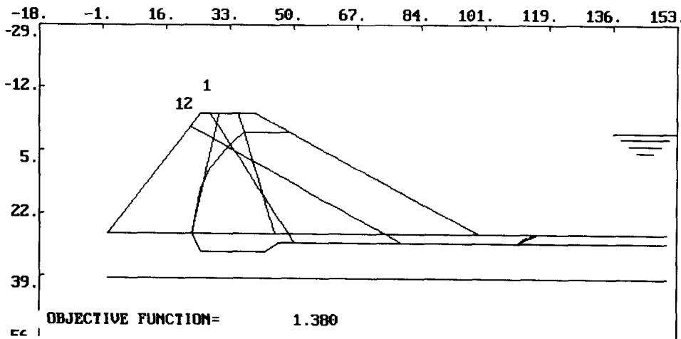  
图12.29 例题24（EX24）计算图形

表 12.59 例题 24 计算结果
<table><tr><td rowspan="2">初始  $| F _ { 1 }$ </td><td rowspan="2">最小  $\cdot F _ { m }$ </td><td colspan="4">临界滑裂面上控制点坐标</td></tr><tr><td>x</td><td>16.15</td><td>79.03 110.53</td><td>115.88</td></tr><tr><td>1.880</td><td>1.380</td><td>y</td><td>-5.0</td><td>30.00 30.0</td><td>27.5</td></tr></table>

## 12.6.25 例题25 (EX25)

1. 计算条件

计算剖面同例题1。但18、19点连线为一无厚度的软弱夹层。

2. 计算内容

使用软弱夹层功能，用单形法搜索任意形状滑裂面的Fm，要求部分滑面通过软弱夹层。 $F _ { m }$

3. 数据文件修改（与例题1 比较）

1） 第3行增加一项扩充功能行；

2) 数据第 59,60 行输入软弱夹层线信息。

4. 数据文件 EX25.DAT 说明（表 12.60）

表 12.60 数据文件 EX25.DAT 和说明
<table><tr><td>行号</td><td>数据</td><td>说明</td></tr><tr><td>1:</td><td>&#x27;EXAMPLE NO.25&#x27;</td><td>设软弱夹层功能例</td></tr><tr><td>2:</td><td>0,0,0,0,0,1</td><td>OPTION(6)=1,新增加一项扩充功能行</td></tr><tr><td>3:</td><td>0,0,0,1,0,0</td><td>扩充功能行，OP1(4)=1,设软弱夹层功能</td></tr><tr><td>4:</td><td>0</td><td></td></tr><tr><td>5:</td><td>0.0,0.00,-2.0</td><td></td></tr><tr><td>6:</td><td>0,27.5,32.5,1</td><td></td></tr><tr><td>7:</td><td>1</td><td></td></tr><tr><td>8:</td><td>21</td><td></td></tr><tr><td>9:</td><td>1,150.0,27.5</td><td>以下同EX19.DAT</td></tr><tr><td>10:</td><td></td><td></td></tr><tr><td>57:</td><td>10,12,2</td><td></td></tr><tr><td>58:</td><td>12,14,1</td><td>最后一条浸润线数据</td></tr><tr><td>59:</td><td>1</td><td>有1条无厚度软弱夹层线</td></tr><tr><td>60:</td><td>18,19,1</td><td>该软弱夹层连结点18,19,土号为1</td></tr><tr><td>61:</td><td>5,2,0</td><td></td></tr><tr><td>62:</td><td>1,27.5,-5,1,0.</td><td></td></tr><tr><td>63:</td><td>10,60.,25.,1,45.</td><td></td></tr><tr><td>64:</td><td>16,75.,30.,1,0.</td><td></td></tr><tr><td>65:</td><td>28,110.,30.,1,0.</td><td></td></tr><tr><td>66:</td><td>35,115.,27.5,1,0.</td><td></td></tr><tr><td>67:</td><td>0,0,1,0</td><td>WS(1)=0,滑裂面的第1段不在软弱夹层上</td></tr><tr><td></td><td></td><td>WS(2)=0,滑裂面的第2段不在软弱夹层上</td></tr><tr><td>68:</td><td>2</td><td>WS(3)=1,滑裂面的第3段在编号1的软弱夹层上 滑裂面上有两个直线段</td></tr><tr><td></td><td></td><td></td></tr><tr><td>69:</td><td>3,4</td><td>滑裂面第3,4段为直线段</td></tr></table>

## 5. 计算结果

计算结果见表12.61，计算图形见图12.30。

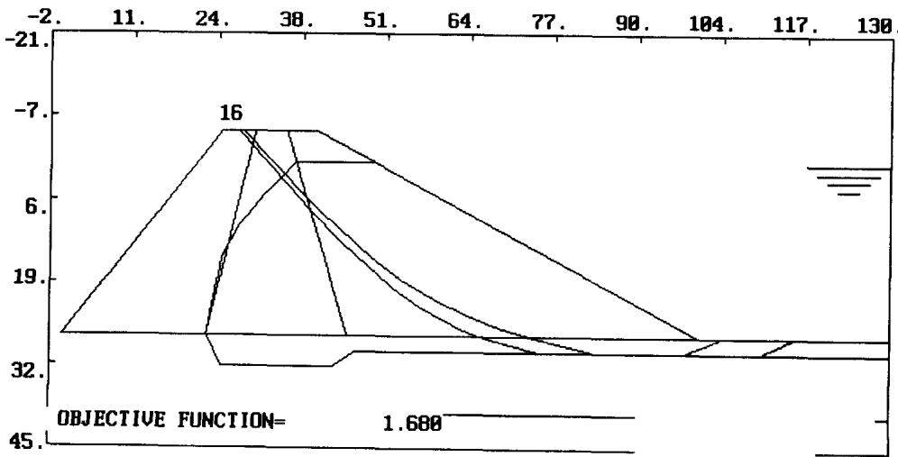  
图 12.30 例题 25(EX25)计算图形

表 12.61 例题 25 计算结果
<table><tr><td rowspan="2">初始  $| F _ { 1 }$ </td><td rowspan="2">最小  $\setminus F _ { m }$ </td><td colspan="6">临界滑裂面上控制点坐标</td></tr><tr><td>x</td><td>28.2</td><td>53.7</td><td>83.7</td><td>96.1</td><td>106.6</td></tr><tr><td>1.690</td><td>1.680</td><td>y</td><td>-5.0</td><td>18.8</td><td>30.3</td><td>30.5</td><td>27.5</td></tr></table>

## 12.6.26 例题26(EX26)

## 1. 计算条件

计算剖面及材料指标同例题1。稳定渗流期遇地震，用户输入水平和垂直地震系数。

2. 计算内容

计算指定非圆弧滑裂面 $\pmb { F } _ { \mathfrak { c } }$

3. 数据文件修改（与例题18 比较）

1) 第5 行原为不进行地震计算 IQUA=0，改为 IQUA=-2;

2) 在数据第6行输入水平和垂直地震系数LQH，第7\~9行输入其有关数据LQH,CYE(I)，COE(I), VOE(I)。

4. 数据文件 EX26.DAT 说明（表 12.62）

表 12.62 数据文件 EX26.DAT 和说明
<table><tr><td>行号</td><td>数据</td><td>说明</td></tr><tr><td rowspan="3">1:</td><td>EXAMPLENO.26,</td><td>由用户输入水平和垂直地震系数例</td></tr><tr><td>SEISMIC COEFFICIENT</td><td></td></tr><tr><td>ASSIGNED BY THE USER&#x27;</td><td></td></tr><tr><td>2: 3:</td><td>0,0,0,0,0,0</td></tr><tr><td>0</td><td></td></tr><tr><td>4: 0.0,0.0,-2.0</td><td></td></tr><tr><td>5: -2,27.5,32.5,1</td><td></td></tr><tr><td rowspan="2">6: 3</td><td>IQUA=-2, 输入水平和垂直地震系数</td></tr><tr><td></td></tr><tr><td>7: -5.0,0.15,0.10</td><td>LQH=3，分3个高程输入地震系数</td></tr><tr><td></td><td></td></tr><tr><td></td><td>CYE(I)=-5 承受地震力的y坐标</td></tr><tr><td></td><td>COE(I)=0.15 该高程水平地震力系数</td></tr><tr><td></td><td>VOE(I)=0.1 该高程垂直地震力系数</td></tr><tr><td>8: 27.5,0.10,0.10</td><td></td></tr><tr><td>9: 40.0,0.10,0.10</td><td></td></tr><tr><td>10: 1</td><td></td></tr><tr><td>(11~32行控制点数据，同EX1.DAT)</td><td></td></tr><tr><td></td><td></td></tr><tr><td>11: 21</td><td></td></tr><tr><td>12: 1,150.0,27.5</td><td></td></tr><tr><td></td><td></td></tr><tr><td></td><td></td></tr><tr><td></td><td></td></tr><tr><td></td><td></td></tr><tr><td></td><td></td></tr><tr><td></td><td></td></tr><tr><td></td><td></td></tr></table>

<table><tr><td>行号 数据</td><td>说明</td><td></td><td></td><td>续衣</td></tr><tr><td>31:</td><td>20,42.5,32.5</td><td></td><td></td><td></td></tr><tr><td>32:</td><td>21,200.0,0.0,</td><td></td><td></td><td></td></tr><tr><td>(33~61行为材料、边界线、浸润线数据，同EX1.DAT)</td><td></td><td></td><td></td><td></td></tr><tr><td>33: 2</td><td></td><td></td><td></td><td></td></tr><tr><td>34:</td><td>1,33.0,5.0,0.0,0.0,2.0,2.1,0</td><td></td><td></td><td></td></tr><tr><td>35:</td><td>2,20.0,5.0,0.0,0.0,2.0,2.1,0</td><td></td><td></td><td></td></tr><tr><td>36;</td><td>17,8</td><td></td><td></td><td></td></tr><tr><td>37:</td><td>1,2,2</td><td></td><td></td><td></td></tr><tr><td>38:</td><td>2,3,1</td><td></td><td></td><td></td></tr><tr><td></td><td></td><td>同EX1.DAT</td><td></td><td></td></tr><tr><td></td><td></td><td></td><td></td><td></td></tr><tr><td></td><td></td><td></td><td></td><td></td></tr><tr><td></td><td></td><td></td><td></td><td></td></tr><tr><td>61:</td><td>12,14,1</td><td></td><td></td><td></td></tr><tr><td>(62~67行为滑裂面数据)</td><td></td><td></td><td></td><td></td></tr><tr><td>62:</td><td>4,0,0</td><td></td><td></td><td></td></tr><tr><td>63:</td><td>1,27.5,-5,0,0.</td><td></td><td></td><td></td></tr><tr><td>64:</td><td>15,50.,30.,0,0.</td><td></td><td></td><td></td></tr><tr><td>65:</td><td>40,110.,30.,0,0.</td><td></td><td></td><td></td></tr><tr><td>66:</td><td>45,115.,27.5,0,0.</td><td></td><td></td><td></td></tr><tr><td>67:</td><td>6</td><td></td><td></td><td></td></tr></table>

## 5. 计算结果

安全系数F=2.265，计算图形见图12.31。

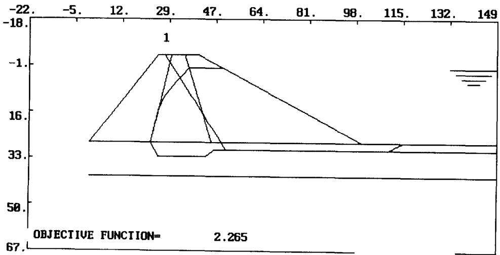  
图 12.31例题 26（EX26）计算图形

## 12.6.27 例题27 (EX27)

## 1. 计算条件

计算剖面如图13.4。

## 2. 计算内容

本例为第2章和第13章13.4节介绍的三峡重力坝3坝段抗滑稳定例，有软弱夹层，且土条侧向力假定函数由用户指定。可以使用程序拉力缝充水功能来模拟重力坝水压力，计算指定滑裂面的 $\boldsymbol { F } _ { \circ }$

## 3. 数据文件修改

1) 第2行 OPTION(3)=2，表示有拉力缝且充水。OPTION(6)=1，表示在第二行后增加一行扩充功能OP1(I);

2) 第 3 行为扩充功能，OP1(3)=1 用户输入 f(x)和 $f _ { 0 } ( x ) _ { \circ } \ { \mathrm { ~ O P 1 } } ( 4 ) = 1$ ，具有无厚度软弱夹层；

3) 第 81\~84 行为无厚度软弱夹层信息；

4) 第 92\~98 行为 f(x)和fo(x)信息。

4. 数据文件 EX27.DAT 说明（表 12.63）

表 12.63 数据文件 EX27.DAT 和说明
<table><tr><td>行号</td><td>数据</td><td>说明</td></tr><tr><td>1:</td><td>Three Gorges, Section 3</td><td>本例说明设软弱夹层的功能</td></tr><tr><td>2:</td><td>0,0,2,0,0,1</td><td>OPTION(3)=2,使用拉力缝充水来模拟重力坝水压力， OPTION(6)=1，增加下面一行扩充功能</td></tr><tr><td>3:</td><td>0,0,1,1,0,0</td><td>OP1(3)=1 用户输入f(x)和f(x),OP1(4)=1，具有软弱夹 层</td></tr><tr><td>4:</td><td>0</td><td></td></tr><tr><td>5:</td><td>123.0,123,20.0</td><td></td></tr><tr><td>6:</td><td>0,90,90,0</td><td></td></tr><tr><td>7:</td><td>1</td><td></td></tr><tr><td>8:</td><td>32</td><td></td></tr><tr><td>9:</td><td>1,0,0</td><td></td></tr><tr><td>10:</td><td>2,16,0</td><td></td></tr><tr><td>11:</td><td>3,16,22.2</td><td></td></tr><tr><td>12;</td><td>4,39.6,55</td><td></td></tr><tr><td>13:</td><td>5,41.6,55</td><td></td></tr><tr><td>14:</td><td>6,70.4,95</td><td></td></tr><tr><td>15:</td><td>7,9,95</td><td></td></tr><tr><td>16:</td><td>8,7.5,100</td><td></td></tr><tr><td>17:</td><td>9,-17.5,100</td><td></td></tr><tr><td>18:</td><td>10,-12.5,80</td><td></td></tr><tr><td>19:</td><td>11,0,75</td><td></td></tr><tr><td>20:</td><td>12,80.64,95</td><td></td></tr></table>

续表

<table><tr><td>行号</td><td>数据</td><td>说明</td></tr><tr><td>21:</td><td>13,86.62,103.3</td><td></td></tr><tr><td>22:</td><td>14,99.06,103.3</td><td></td></tr><tr><td>23:</td><td>15,102.4,120</td><td></td></tr><tr><td>24:</td><td>16,118,120</td><td></td></tr><tr><td>25:</td><td>17,118,142.80</td><td></td></tr><tr><td>26:</td><td>18,120.17,142.8</td><td></td></tr><tr><td>27:</td><td>19,130.4,162.8</td><td></td></tr><tr><td>28:</td><td>20,167,162.80</td><td></td></tr><tr><td>29:</td><td>21,167,103.30</td><td></td></tr><tr><td>30:</td><td>22,118,103.30</td><td></td></tr><tr><td>31:</td><td>23,267,142.80</td><td></td></tr><tr><td>32:</td><td>24,-80,10</td><td></td></tr><tr><td>33:</td><td>25,0,10</td><td></td></tr><tr><td>34:</td><td>26,-5,77.5</td><td></td></tr><tr><td>35:</td><td>27,15,88.75</td><td></td></tr><tr><td>36:</td><td>28,30.32,95</td><td></td></tr><tr><td>37:</td><td>29,118,133.28</td><td></td></tr><tr><td>38:</td><td></td><td></td></tr><tr><td></td><td>30,167,149.53</td><td></td></tr><tr><td>39: 40;</td><td>31,163.805,177.084</td><td></td></tr><tr><td>41;</td><td>32,227.74,150.65 5</td><td></td></tr><tr><td>42:</td><td>1,47.726,300,0,0,2.45,2.45,</td><td></td></tr><tr><td>43</td><td>0</td><td></td></tr><tr><td>44:</td><td>2,50.19,110,0,0,2.7,2.7, 0 3,35.,20.,0,0,2.7,2.7,0</td><td></td></tr><tr><td>45:</td><td>4,0,0,0,0,1.85,1.85,0</td><td></td></tr><tr><td>46:</td><td>5,0,0,0,0,1,1,0</td><td></td></tr><tr><td>47:</td><td>26,8</td><td></td></tr><tr><td>48:</td><td>1,25,1</td><td></td></tr><tr><td>49:</td><td>11,25,1</td><td></td></tr><tr><td>50</td><td>1,2,1</td><td></td></tr><tr><td>51:</td><td>2,3,1</td><td></td></tr><tr><td>52:</td><td>3,4,1</td><td></td></tr><tr><td>53:</td><td>4,5,1</td><td></td></tr><tr><td>54;</td><td>5,6,1</td><td></td></tr><tr><td>55:</td><td>6,7,2</td><td></td></tr><tr><td>56:</td><td>7,8,2</td><td></td></tr><tr><td>57:</td><td>8,9,2</td><td></td></tr><tr><td>58:</td><td>9,10,2</td><td></td></tr><tr><td>59:</td><td>10,11,1</td><td></td></tr><tr><td>60:</td><td>6,12,2</td><td></td></tr><tr><td>61:</td><td>12,13,2</td><td></td></tr><tr><td>62:</td><td>13,14,2</td><td></td></tr><tr><td>63:</td><td>14,15,2</td><td></td></tr></table>

<table><tr><td></td><td></td><td></td><td></td><td>续表</td></tr><tr><td>行号</td><td>数据</td><td>说明</td><td></td><td></td></tr><tr><td>64:</td><td>15,16,2</td><td></td><td></td><td></td></tr><tr><td>65:</td><td>16,17,2</td><td></td><td></td><td></td></tr><tr><td>66:</td><td>17,18,2</td><td></td><td></td><td></td></tr><tr><td>67:</td><td>18,19,2</td><td></td><td></td><td></td></tr><tr><td>68:</td><td>19,20,2</td><td></td><td></td><td></td></tr><tr><td>69:</td><td>20,21,4</td><td></td><td></td><td></td></tr><tr><td>70:</td><td>21,22,4</td><td></td><td></td><td></td></tr><tr><td>71:</td><td>22,14,4</td><td></td><td></td><td></td></tr><tr><td>72:</td><td>20,23,2</td><td></td><td></td><td></td></tr><tr><td>73:</td><td>24,25,5</td><td></td><td></td><td></td></tr><tr><td>74:</td><td>24,25,5</td><td></td><td></td><td></td></tr><tr><td>75:</td><td>25,11,1</td><td></td><td></td><td></td></tr><tr><td>76:</td><td>11,27,1</td><td></td><td></td><td></td></tr><tr><td>77:</td><td>27,28,1</td><td></td><td></td><td></td></tr><tr><td>78:</td><td>28,29,2</td><td></td><td></td><td></td></tr><tr><td>79:</td><td>29,30,4</td><td></td><td></td><td></td></tr><tr><td>80:</td><td>30,20,4</td><td></td><td></td><td></td></tr><tr><td colspan="5"></td></tr><tr><td></td><td>(81~84行软弱夹层数据)</td><td></td><td></td><td></td></tr><tr><td>81:</td><td>3</td><td>3条软弱夹层线</td><td></td><td></td></tr><tr><td>82;</td><td>9,19,3</td><td></td><td>第1条软弱夹层连结9,19两点，所压材料号为3</td><td></td></tr><tr><td>83:</td><td>19,31,2</td><td></td><td>第2条软弱夹层连结19,31两点，所压材料号为2</td><td></td></tr><tr><td colspan="2">84 31,32,2</td><td></td><td>第3条软弱夹层连结31,32两点，所压材料号为2</td><td></td></tr><tr><td></td><td>(85~91行为滑裂面数据)</td><td></td><td></td><td></td></tr><tr><td>85:</td><td>4,0,0</td><td></td><td></td><td></td></tr><tr><td>86:</td><td>1,-17.5,100,0,0</td><td></td><td></td><td></td></tr><tr><td>87:</td><td>18,130.4,162.8,0,0</td><td></td><td></td><td></td></tr><tr><td>88:</td><td>28,163.805,177.084,0,23.0</td><td></td><td></td><td></td></tr><tr><td>89:</td><td>38,227.74,150.65,1,0</td><td></td><td></td><td></td></tr><tr><td>90: 91:</td><td>1,2,3</td><td></td><td>滑裂面的第1、2、3段为第1、2、3条软弱夹层线 LNO=12，滑裂面各段均为直线</td><td></td></tr><tr><td>(OP1(3)不为零时输入92~98行，为土条侧向力数据)</td><td>12</td><td></td><td></td><td></td></tr><tr><td colspan="2">92: 0</td><td></td><td>ISPE=0，输入以下有关土条侧向力倾角分布函数的详</td><td></td></tr><tr><td></td><td></td><td>细数据</td><td></td><td></td></tr><tr><td>93:</td><td>1</td><td>IBOUN=1</td><td></td><td></td></tr><tr><td>94:</td><td>0.,0.</td><td>FAB,FBB=0</td><td></td><td></td></tr><tr><td>95:</td><td>4</td><td>IFUN=4</td><td></td><td></td></tr><tr><td>96:</td><td>-180</td><td>XFUN(1),FUN(1)</td><td></td><td></td></tr><tr><td>97:</td><td>130.,1.0</td><td>XFUN(2),FUN(2)</td><td></td><td></td></tr><tr><td>98:</td><td>227,0</td><td></td><td></td><td></td></tr><tr><td>99:</td><td>260,0</td><td></td><td></td><td></td></tr></table>

## 5. 计算结果

安全系数F=3.401，计算图形见图12.32。

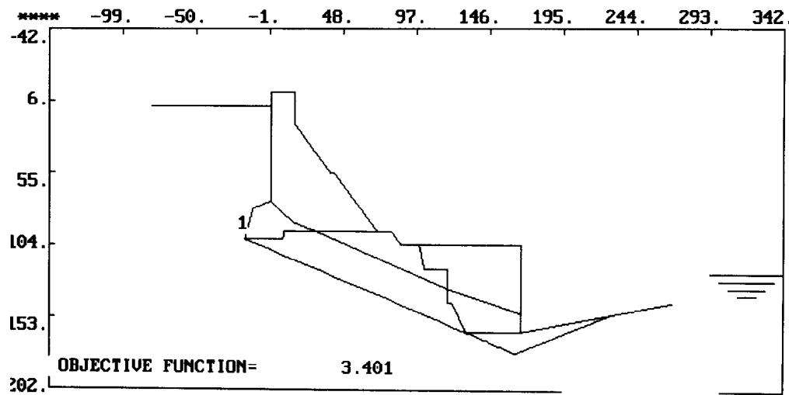  
图12.32 例题27（EX27）计算图形

## 12.6.28 例题28 (EX28)

## 1. 计算条件

剖面为第8章[例题8.1]，土压力作用点位于墙中点，方向水平。

## 2. 计算内容

用单形法搜索任意形状滑裂面 1 $F _ { m }$

## 3. 数据文件修改

1) 第3行，OP(1)=2，计算主动土压力，并同时满足力和力矩平衡条件；若OP(1)=3，则仅满足力平衡条件的土压力计算（即为库仑土压力理论）；

2) 第 19 行输入假定的土压力 GWALL = 39.283，土压力作用位置与墙底的垂直距离HMW=6.0，土压力与水平线的夹角EWALL=0。

## 4. 数据文件 EX28.DAT 说明（表 12.64）

表 12.64 数据文件 EX28.DAT 和说明
<table><tr><td>行号</td><td>数据</td><td>说明</td><td></td></tr><tr><td>1:</td><td>CLASSICAL RANKINE EARTH PRESSURE</td><td></td><td></td></tr><tr><td>2:</td><td>0,0,0,0,0,1</td><td>OPTION(6)=1</td><td>新增加下面一行补充功能</td></tr><tr><td>3:</td><td>2,0,0,0,0,0</td><td>OP(1)=2</td><td>仅计算主动土压力</td></tr><tr><td>4:</td><td>0</td><td></td><td></td></tr><tr><td>5:</td><td>20.0,20.,2</td><td></td><td></td></tr><tr><td>6:</td><td>0,0,0,0</td><td></td><td></td></tr><tr><td>7:</td><td>1</td><td></td><td></td></tr><tr><td>8:</td><td>4</td><td></td><td></td></tr></table>

续表

<table><tr><td>行号</td><td>数据</td><td>说明</td><td></td></tr><tr><td>9:</td><td>1,0,0</td><td></td><td></td></tr><tr><td>10:</td><td>2,50,0</td><td></td><td></td></tr><tr><td>11:</td><td>3,50,12</td><td></td><td></td></tr><tr><td>12:</td><td>4,70,12</td><td></td><td></td></tr><tr><td>13:</td><td>1</td><td></td><td></td></tr><tr><td>14:</td><td>1,36.,0,0,0,2.1,2.1,0</td><td></td><td></td></tr><tr><td>15:</td><td>3,0</td><td></td><td></td></tr><tr><td>16:</td><td>1,2,1</td><td></td><td></td></tr><tr><td>17:</td><td>2,3,1</td><td></td><td></td></tr><tr><td>18:</td><td>3,4,1</td><td></td><td></td></tr><tr><td>(19行为土压力数据)</td><td></td><td></td><td></td></tr><tr><td>19:</td><td>39.283,6.0,0</td><td>GWALL=39.283 HMW=6</td><td>土压力数值 与墙基垂直距离</td></tr><tr><td></td><td></td><td>EWALL=0</td><td>土压力与水平线的夹角</td></tr><tr><td>(20~28滑裂面数据)</td><td></td><td></td><td></td></tr><tr><td>20:</td><td>3,12,0</td><td></td><td></td></tr><tr><td>21:</td><td>1,40,0,1,0</td><td></td><td></td></tr><tr><td>22:</td><td>8,45,7,2,0</td><td></td><td></td></tr><tr><td>23:</td><td>16,50,12,0,0</td><td></td><td></td></tr><tr><td>24:</td><td>100</td><td>随机搜索种子</td><td></td></tr><tr><td>25:</td><td>1,8</td><td>第1点半带宽为8</td><td></td></tr><tr><td>26:</td><td>2,5</td><td>第2点半带宽为6</td><td></td></tr><tr><td>27:</td><td>3,0</td><td></td><td></td></tr><tr><td>28:</td><td>0</td><td></td><td></td></tr></table>

## 5. 计算结果

计算图形见图12.33。墙将承受的主动土压力值 $\textstyle P _ { a } = 5 4 . 8 0 8$ o

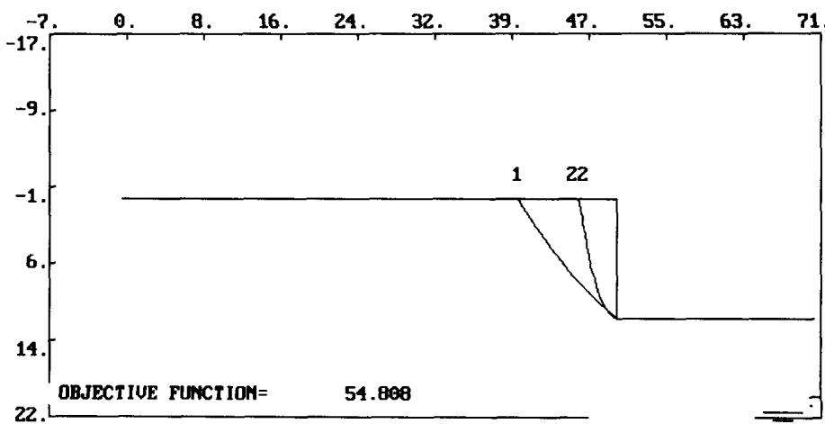  
图12.33 例题28（EX28）计算图形

## 12.6.29 例题29 (EX29)

## 1. 计算条件

三峡重力坝3坝段深层抗滑稳定例，拉力缝充一定高度水，采用土条侧向力的第2种假定。

## 2. 计算内容

此例题和例题27有相同的剖面但滑裂面穿过坝体。此例题若采用与例题27相同的方法模拟库水压力，则由于 A 点上侧有 B，C两个点。难以确认水压力是相应 AB 还是 AC计算的，故使用 $\mathrm { O P T I O N } ( 3 ) { = } { - } 2$ ，即在拉力缝内设指定水柱高。

## 3. 数据文件修改

1) 第2 行 $\mathrm { O P T I O N } ( 3 ) = - 2$ ，拉力缝内设指定水柱高；

2) 第120行， $\mathbf { I S P E } { = } { - } 2$ ，采用土条侧向力的第2种假定；

3) 第121 行，IBOUN=0，fo(x)的数值由用户指定；

4) 第 121 行f(x)在端点 A 和 D 的数值分别为 $\mathbf { F A B } { = } 0$ 和 $\mathbf { F B B } { = } 1$

4. 数据文件 EX29.DAT 说明（表 12.65）

表 12.65 数据文件 EX29.DAT 和说明
<table><tr><td>行号</td><td>数据</td><td>说明</td></tr><tr><td>1:</td><td>EX29.DAT</td><td>重力坝抗滑稳定例，拉力缝充水一定高度</td></tr><tr><td>2:</td><td> $_ { 0 , 0 , - 2 , 0 , 0 , 1 }$ </td><td>OPTION(3)=-2, 拉力缝充水 OPTION(6)=1， 新增功能</td></tr><tr><td>3:</td><td>65</td><td>因拉力缝充水一定高度，紧接下一行就要输入充水高 度65m</td></tr><tr><td>4:</td><td> $_ { 0 , 0 , 1 , 0 , 0 , 0 }$ </td><td>OP(3)=1,侧向力假定控制码,与120行呼应</td></tr><tr><td>5:</td><td>0</td><td></td></tr><tr><td>6:</td><td>123.0,123,-2.0</td><td></td></tr><tr><td>7:</td><td>0,90,90,0</td><td></td></tr><tr><td>8:</td><td>1</td><td></td></tr><tr><td>9:</td><td>49</td><td></td></tr><tr><td>10:</td><td>1,0,0</td><td></td></tr><tr><td>11:</td><td>2,16,0</td><td></td></tr><tr><td>12:</td><td>3,16,22.2</td><td></td></tr><tr><td>13:</td><td>4,39.6,55</td><td></td></tr><tr><td>14:</td><td>5,41.6,55</td><td></td></tr><tr><td>15:</td><td>6,70.4,95</td><td></td></tr><tr><td>16:</td><td>7,9,95</td><td></td></tr><tr><td>17:</td><td>8,7.5,100</td><td></td></tr><tr><td>18:</td><td>9,-17.5,100</td><td></td></tr><tr><td>19:</td><td>10,-16.25,95</td><td></td></tr><tr><td>20:</td><td>11,-12.5,80</td><td></td></tr><tr><td>21:</td><td>12,0,75</td><td></td></tr></table>

<table><tr><td>行号</td><td>数据</td><td>说明</td><td></td></tr><tr><td>22:</td><td>13,80.64,95</td><td></td><td></td></tr><tr><td>23:</td><td>14,86.62,103.3</td><td></td><td></td></tr><tr><td>24:</td><td>15,99.06,103.3</td><td></td><td></td></tr><tr><td>25:</td><td>16,102.4,120</td><td></td><td></td></tr><tr><td>26:</td><td>17,118,120</td><td></td><td></td></tr><tr><td>27:</td><td>18,118,142.80</td><td></td><td></td></tr><tr><td>28:</td><td>19,130.4,162.8</td><td></td><td></td></tr><tr><td>29:</td><td>20,46,95</td><td></td><td></td></tr><tr><td>30:</td><td>21,69.27,107.37</td><td></td><td></td></tr><tr><td>31:</td><td>22,118,133.28</td><td></td><td></td></tr><tr><td>32</td><td>23,56.7,108.21</td><td></td><td></td></tr><tr><td>33:</td><td>24,78.57,120.33</td><td></td><td></td></tr><tr><td>34:</td><td></td><td></td><td></td></tr><tr><td></td><td>25,23,95, 26,35,106.41</td><td></td><td></td></tr><tr><td>35: 36:</td><td>27,73.78,124.67</td><td></td><td></td></tr><tr><td>37:</td><td>28,92.81,133.55</td><td></td><td></td></tr><tr><td>38:</td><td>29,122.56,147.58</td><td></td><td></td></tr><tr><td>39:</td><td>30,51.6,114.33</td><td></td><td></td></tr><tr><td>40:</td><td>31,69.59,130.09</td><td></td><td></td></tr><tr><td>41:</td><td>32,89.26,142.34</td><td></td><td></td></tr><tr><td>42:</td><td>33,109.62,155.04</td><td></td><td></td></tr><tr><td>43:</td><td>34,-17.5,123.17</td><td></td><td></td></tr><tr><td>44:</td><td>35,-5,77.5</td><td></td><td></td></tr><tr><td>45:</td><td>36,15,88.75</td><td></td><td></td></tr><tr><td>46:</td><td>37,118,131.69</td><td></td><td></td></tr><tr><td>47:</td><td>38,122.66,147.78</td><td></td><td></td></tr><tr><td>48:</td><td>39,22.8,95</td><td></td><td></td></tr><tr><td>49:</td><td>40,34.8,106.41</td><td></td><td></td></tr><tr><td>50:</td><td>41,51.4,114.33</td><td></td><td></td></tr><tr><td>51:</td><td>42,73.58,124.67</td><td></td><td></td></tr><tr><td>52:</td><td>43,92.61,133.55</td><td></td><td></td></tr><tr><td>53:</td><td>44,-80,10</td><td></td><td></td></tr><tr><td>54:</td><td>45,0,10</td><td></td><td></td></tr><tr><td>55:</td><td>46,30,95</td><td></td><td></td></tr><tr><td>56:</td><td>47,120.17,142.8</td><td></td><td></td></tr><tr><td>57:</td><td>48,98.18,136.21</td><td></td><td></td></tr><tr><td>58:</td><td>49,98.28,136.41</td><td></td><td></td></tr><tr><td>59:</td><td>5</td><td></td><td></td></tr><tr><td>60:</td><td>1,47.726,300,0,0,2.45,2.45,0</td><td></td><td></td></tr><tr><td>61:</td><td>2,59.53,200,0,0,2.7, 2.7, 0</td><td></td><td></td></tr><tr><td>62:</td><td>3,57.75,179.3,0,0,2.7, 2.7, 0</td><td></td><td></td></tr><tr><td>63:</td><td>4,35,20,0,0,2.7,2.7, 0</td><td></td><td></td></tr><tr><td>行号</td><td>数据 说明</td><td></td><td>续衣</td></tr><tr><td>64:</td><td>5,0,0,0,0,1,1,0</td><td></td><td></td></tr><tr><td>65:</td><td>36,8</td><td></td><td></td></tr><tr><td>66:</td><td>44,45,5</td><td></td><td></td></tr><tr><td>67:</td><td>1,45,1</td><td></td><td></td></tr><tr><td>68:</td><td>45,12,1</td><td></td><td></td></tr><tr><td>69:</td><td>1,2,1</td><td></td><td></td></tr><tr><td>70:</td><td>2,3,1</td><td></td><td></td></tr><tr><td>71:</td><td>3,4,1</td><td></td><td></td></tr><tr><td>72:</td><td>4,5,1</td><td></td><td></td></tr><tr><td>73:</td><td>5,6,1</td><td></td><td></td></tr><tr><td>74:</td><td>6,7,2</td><td></td><td></td></tr><tr><td>75:</td><td>7,8,2</td><td></td><td></td></tr><tr><td>76:</td><td>8,9,2</td><td></td><td></td></tr><tr><td>77:</td><td>9,10,2</td><td></td><td></td></tr><tr><td>78:</td><td>10,11,1</td><td></td><td></td></tr><tr><td>79:</td><td>11,12,1</td><td></td><td></td></tr><tr><td>80:</td><td>6,13,2</td><td></td><td></td></tr><tr><td>81:</td><td>13,14,2</td><td></td><td></td></tr><tr><td>82:</td><td>14,15,2</td><td></td><td></td></tr><tr><td>83:</td><td>15,16,2</td><td></td><td></td></tr><tr><td>84:</td><td>16,17,2</td><td></td><td></td></tr><tr><td>85:</td><td>17,18,2</td><td></td><td></td></tr><tr><td>86:</td><td>18,47,2</td><td></td><td></td></tr><tr><td>87:</td><td>47,29,2</td><td></td><td></td></tr><tr><td>88:</td><td>29,38,3</td><td></td><td></td></tr><tr><td>89:</td><td>38,19,2</td><td></td><td></td></tr><tr><td>90:</td><td>25,26,4</td><td></td><td></td></tr><tr><td>91:</td><td>26,30,4</td><td></td><td></td></tr><tr><td>92:</td><td>30,27,4</td><td></td><td></td></tr><tr><td>93:</td><td>27,28,4</td><td></td><td></td></tr><tr><td>94:</td><td>28,48,4</td><td></td><td></td></tr><tr><td>95:</td><td>48,29,3</td><td></td><td></td></tr><tr><td>96:</td><td>39,40,2</td><td></td><td></td></tr><tr><td>97:</td><td>40,41,2</td><td></td><td></td></tr><tr><td>98:</td><td>41,42,2</td><td></td><td></td></tr><tr><td>99:</td><td>42,43,2</td><td></td><td></td></tr><tr><td>100:</td><td>43,49,2</td><td></td><td></td></tr><tr><td>101:</td><td>49,38,2</td><td></td><td></td></tr><tr><td>102;</td><td>35,36,1</td><td></td><td></td></tr><tr><td>103:</td><td>36,46,1</td><td></td><td></td></tr><tr><td>104:</td><td>46,37,2</td><td></td><td></td></tr><tr><td>105:</td><td>37,18,2</td><td></td><td></td></tr></table>

<table><tr><td>行号</td><td>数据</td><td>说明</td></tr><tr><td>106:</td><td>18,47,2</td><td></td></tr><tr><td>107:</td><td>47,29,2</td><td></td></tr><tr><td>108:</td><td>29,38,3</td><td></td></tr><tr><td>109:</td><td>38,19,2</td><td></td></tr><tr><td>110:</td><td>8,0,0</td><td></td></tr><tr><td>111:</td><td>1,0,75,0,0</td><td></td></tr><tr><td>112:</td><td>11,22.9,95,0,0</td><td></td></tr><tr><td>113:</td><td>16,34.9,106.41,0,0</td><td></td></tr><tr><td>114:</td><td>21,51.5,114.33,0,0</td><td></td></tr><tr><td>115:</td><td>26,73.68,124.67,0,0</td><td></td></tr><tr><td>116:</td><td>31,92.71,133.55,0,0</td><td></td></tr><tr><td>117:</td><td>33,98.28,136.31,0,0</td><td></td></tr><tr><td>118:</td><td>36,122.56,147.68,0,0</td><td></td></tr><tr><td>119:</td><td>10</td><td></td></tr><tr><td>120:</td><td>0</td><td>当OP(3)=1时读入以下数据，ISPE=0</td></tr><tr><td>121:</td><td>1</td><td>IBOUN=1</td></tr><tr><td>122:</td><td>0.,0.</td><td> $\mathbf { F A B } = 0 , \mathbf { F B B } = 0$ </td></tr><tr><td>123:</td><td>4</td><td>分布函数有4个控制点</td></tr><tr><td>124:</td><td>-50,0.</td><td> $\mathbf { X F U N } ( 1 ) , \mathbf { F U N } ( 1 )$ </td></tr><tr><td>125:</td><td>0.,0</td><td> $\mathbf { X F U N } ( 2 ) , \mathbf { F U N } ( 2 )$ </td></tr><tr><td>126:</td><td>22.9,0.1</td><td></td></tr><tr><td>127:</td><td>90,0.5</td><td> $\mathbf { X F U N } ( 4 ) , \mathbf { F U N } ( 4 )$ </td></tr></table>

## 5. 计算结果

安全系数F=2.879，计算图形见图12.34。

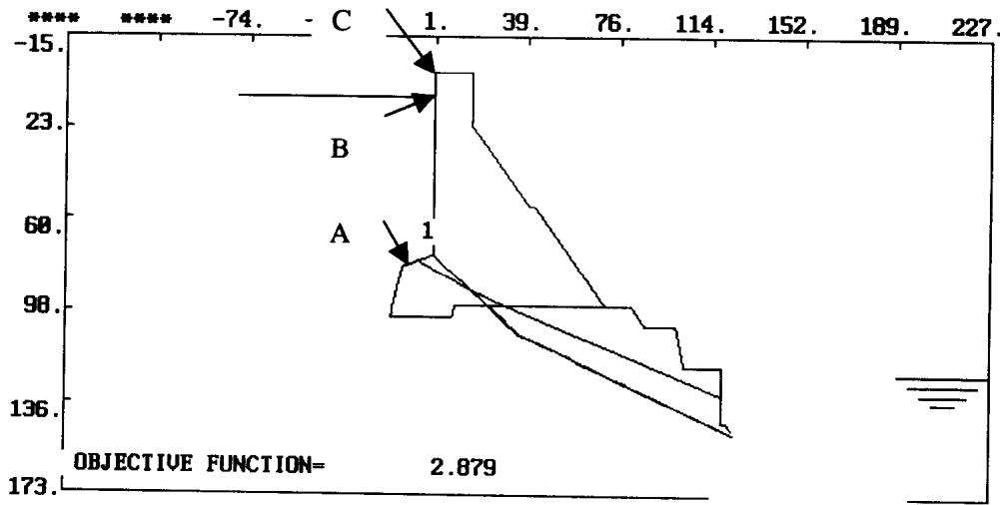  
图 12.34 例题29（EX29）计算图形

## 12.6.30 例题30 (EX30)

## 1. 计算条件

本例题为云南大水沟工程溢洪道边坡加固方案研究。通过施加集中力和分布力模拟抗滑桩和锚索。介绍新的外荷载功能集中力和分布力用法。

## 2. 计算内容

计算指定任意形状滑裂面的 $\boldsymbol { F } _ { c }$

## 3. 数据文件修改

1)第2行，OPTION(5)=-1，程序新增加的施加外力的第2种方式。（OPTION(5)=1，为曾介绍过的第1种施加外力方式）；

2) 第63 行，NNP=1，NNA=1，线荷载总数为 0，点线荷载总数为1；

3) 第 64 行，集中力作用位置坐标 XANCH=90.7, YANCH=45.8，单宽作用力 ANCHL=100×9.8kN/m.，作用力矢量与x轴夹角 $\mathbf { A N C H A = - 1 8 0 ^ { \circ } }$ 。此行数据模拟抗滑桩作用。

## 4. 数据文件 EX30.DAT 说明（表 12.66）

表 12.66 数据文件 EX30.DAT
<table><tr><td>行号</td><td>数据</td><td>说明</td></tr><tr><td>1:</td><td>DASHUIGOU</td><td>本例说明集中力新用法，可用于抗滑桩计算</td></tr><tr><td>2:</td><td>0,0,0,0,-1,0</td><td>OPTIN(5)=-1,第2种施加外力方式，集中力以作用点位 置输入，与63,64行呼应</td></tr><tr><td>3:</td><td>0</td><td></td></tr><tr><td>4:</td><td>60.,60.,20.</td><td></td></tr><tr><td>5:</td><td>0,30.,30,0</td><td></td></tr><tr><td>6:</td><td>1</td><td></td></tr><tr><td>7:</td><td>23</td><td></td></tr><tr><td>8:</td><td>1,69.2,26.4</td><td></td></tr><tr><td>9:</td><td>2,73.76,30.2</td><td></td></tr><tr><td>10:</td><td>3,73.76,30.8</td><td></td></tr><tr><td>11:</td><td>4,79,30.8</td><td></td></tr><tr><td>12:</td><td>5,90.28,40.2</td><td></td></tr><tr><td>13:</td><td>6,90.28,40.8</td><td></td></tr><tr><td>14:</td><td>7,95.52,40.8</td><td></td></tr><tr><td>15:</td><td>8,106.8,50.2</td><td></td></tr><tr><td>16:</td><td>9,106.8,50.8</td><td></td></tr><tr><td>17:</td><td>10,111.96,50.8</td><td></td></tr><tr><td>18:</td><td>11,120.79,61.7</td><td></td></tr><tr><td>19:</td><td>12,120.79,62.7</td><td></td></tr><tr><td>20:</td><td>13,125.29,62.7</td><td></td></tr><tr><td>21:</td><td>14,125.29,62.2</td><td></td></tr><tr><td>22:</td><td>15,141.72,62.2</td><td></td></tr><tr><td>23:</td><td>16,141.72,62.7</td><td></td></tr><tr><td>24:</td><td>17,148.22,62.7</td><td></td></tr><tr><td>25:</td><td>18,148.22,62.2</td><td></td></tr><tr><td>26:</td><td>19,151.72,55.2</td><td></td></tr><tr><td>27:</td><td>20,160.52,55.2</td><td></td></tr><tr><td>28:</td><td>21,0,0</td><td></td></tr><tr><td>29:</td><td>22,38,16.2</td><td></td></tr><tr><td>30:</td><td>23,54,23.4</td><td></td></tr><tr><td>31:</td><td>1</td><td></td></tr><tr><td>32:</td><td>1,15,1.50,0,0,2.09,2.13,-1</td><td></td></tr><tr><td>33:</td><td>0.2</td><td>孔隙水压力系数</td></tr><tr><td>34:</td><td>14,0</td><td></td></tr><tr><td>35:</td><td>1,2,1</td><td></td></tr><tr><td></td><td></td><td></td></tr><tr><td>……</td><td></td><td></td></tr><tr><td>44:</td><td>10,11,1</td><td></td></tr><tr><td>45:</td><td>11,12,1</td><td></td></tr><tr><td>46:</td><td>21,22,1</td><td></td></tr><tr><td>47:</td><td>22,23,1</td><td></td></tr><tr><td>48:</td><td>23,1,1</td><td></td></tr><tr><td>63:</td><td>1,1</td><td>NNP=1,NNA=1，线荷载总数为0，点荷载总数为1</td></tr><tr><td>64</td><td>10</td><td>分布力作用于第10号线段</td></tr><tr><td>65</td><td>30,50</td><td>作用于第10号线段左、右端点法线方向线荷载强度分</td></tr><tr><td>66</td><td>0,0</td><td>别为30、50 作用于第10号线段左、右端点切线方向线荷载强度均 为0</td></tr><tr><td>67:</td><td>90.7,45.8,100.,-180.</td><td>集中力作用位置坐标x =90.7，y=45.8，单宽作用力为</td></tr><tr><td>68:</td><td>8,0,0</td><td>1000kN/m.，作用力矢量与x轴夹角为-180°</td></tr><tr><td>69:</td><td>1,0,0,0,0</td><td></td></tr><tr><td>70:</td><td>5,7,14.2,0,0</td><td></td></tr><tr><td>71::</td><td>9,28,25,0,0</td><td></td></tr><tr><td>72:</td><td>14,44,32.6,0,0</td><td></td></tr><tr><td>73:</td><td>19,68,42.2,0,0</td><td></td></tr><tr><td>74:</td><td>25,81.4,46.4,0,0</td><td></td></tr><tr><td>75:</td><td>30,106,54.4,0,0</td><td></td></tr><tr><td>76:</td><td>35,114.8,55.9,1,0</td><td></td></tr><tr><td>77:</td><td>0</td><td></td></tr></table>

## 5. 计算结果

安全系数为F=0.964，计算图形见图12.35。

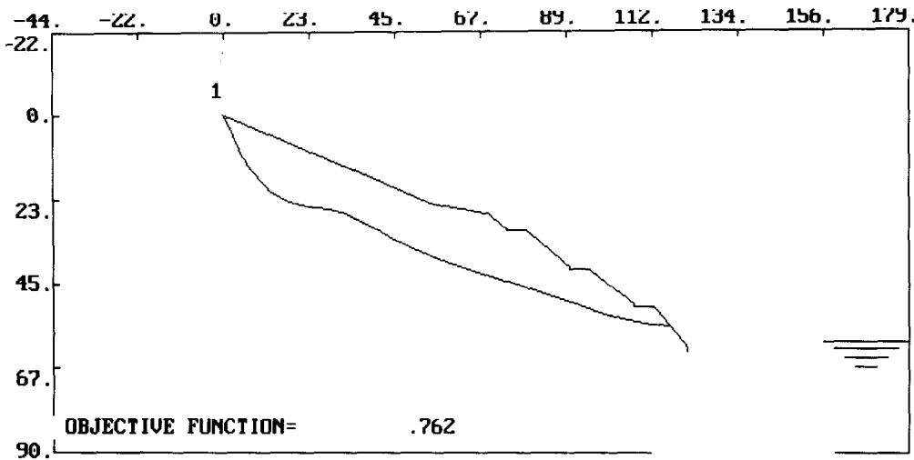  
图 12.35 例题30（EX29）计算图形

## 12.7 程序的安装和运行

## 12.7.1 程序的安装

需要将“STAB”提供的以下程序拷贝到硬盘中的一个设定的子目录：

1) P.EXE -STAB95的可执行目标程序；

2) DR1.EXE -STAB 的后处理程序：

3) LINK.LSP -将成果转入 AUTOCAD 的程序；

4) EX\*.DAT -11.5.7 节的例题；

5) FON.EXE -支持 DR1.EXE 的字模软件。

## 12.7.2 运行P.EXE

在应用P.EXE程序前，需要编制一个一揽子文件，文件中有4行：

第1行：数据文件名；

第2行：存放输出信息的数据文件名（键入con则信息在屏幕中显示）；

第3行：存放边坡剖面几何信息的文件名；

第4行：存放滑面信息的文件名。

第3,4行的两个文件在计算结束后自动生成，在使用后处理程序DR1.EXE时调入。

例如：某一揽子文件的名字为T.PAK，内容有以下四行：

```batch
"T.DAT
T.C
T.J
T.H"
```

键入P.EXE后，程序将提问：

“Input your package filename"

此时键入T.PAK，程序即开始运行。

## 12.7.3 后处理程序DR1.EXE

无论计算是否正常结束，均应打开输出成果的文件(T.C)，检查计算成果。

在结束 P 程序时，将得到文件 T.J 和 T.H。然后可以运行 DR1。程序以图形形式展示边坡剖面和滑裂面。

键入DR1后，屏幕下方将出现一个5行6列的菜单。现分述其功能：

11:DEF -默认。在重复运行某题时，可以在前一次运行时按62键存入12、13和  
14键要求回答的文件名。本次运行只需按11键，不必处理上述各键。

12: DATA - 键入存放边坡剖面几何信息的文件，在本例中为 T.J。

13:F.SLIP -键入比例文件，其格式另述。也可以按15 键通过调整图形生成一个比例文件。

14: F.SCAL - 键入存放滑面信息文件，在本例中为 T.H。

15:SCALE -按此键，将出现边坡的剖面，但其大小和位置可能不合适，使用键盘右侧的箭头键可以使图形左右上下移动，使用“+”（或“L”），“一”（或“S”）键可以将图形放大缩小。在按上述各键时如同时按住“shift”键，可以使这些动作加速进行。调整合适后按回车键，则生成一个比例文件。暂取名为“scale.tmp”。用户可以在下次运行时通过回答13键设定比例文件。不必每次都通过本键调整图形。

21: GRAPH - 生成边坡图形。

22:LOCATE-显示图上出现的光标的坐标，通过移动光标了解某点的坐标值。

31:POINT -显示指定点号的位置，也可显示所有的点（见32键解释）。

32: ALL -显示所有信息，按此键，再按31、41、42时显示的是所有点、线的位置。此功能生效时，屏幕上出方出现“Show all on”。再按此键，屏幕上方出现“Show all off'，此功能不再生效。

33:COLOR-将图形转为白底，以便通过屏幕拷贝将其转到其它图形编辑软件中。

41:LINE-显示指定线段号的线段，也可显示所有的线段（见32键的解释）。

42: PH.LINE-显示指定浸润线段号的线段（见 32键的解释）。

51:SL.CIR - 显示圆弧滑裂面。可以显示优化过程中的各滑面。键入序号1显示初始滑面，键入超过最后序号的任意数字均显示临界滑裂面。

52: SL. GEN- 显示非园弧滑裂面。功能与 51 同。

55:MFILE -在一个图中画出以往几次计算获得的临界滑裂面，这个功能在汇总成果时特别有用。

62: S. DEF - 存入 12 和 13 键的文件名，次运行时按 11 键默认。

63:H.COPY-屏幕硬拷贝。回车键后消除菜单，按屏幕拷贝键。

64: ACAD - 按此键程序自动形成一个 ACAD.DAT 文件，参见 12.7.4。

假设我们对同一断面计算了若干种工况。在整理报告时，为了节约篇幅，希望将这几个临界滑裂面放在一张图中，可以通过55键实现。

首先，需要建立一个名为“MFILE.DAT”文件，内有以下几行：

例如，某一MFILE.DAT文件内容为：  
“3  
T1.H  
T2.H  
T3.H"

第1行：需要画的临界滑裂面的总数，不得超过5个；

第2行：存有第1个临界滑裂面的文件名称；

第3行：存有第2个临界滑裂面的文件名称；

说明本次要画3个临界滑裂面，分别是以往3次运算后获得的滑裂面文件T1.H，T2.H T3.H。

1）和第3步一样，按11和21键；

2) 按55 键，图形中将出现 3 个临界滑裂面；

3) 按63 键抹去菜单后按 PrtSc（屏幕拷贝），打印机将打印图形。

下面用例题说明 DR1.EXE 的操作步骤：

第一步，运行稳定分析程序：

1） 键入“P”后回车；

2) 对程序的提问作回答一揽子文件名：T.PAK;

3) 运行正常结束后获得文件 T.J 和 T.H。

第二步，执行运行后处理程序，操作步骤如下：

1) 键入 DR1;

2) 在 12 键中键入边坡几何形状的文件 T.J;

3)光标移到15键，回车后调整图象，使用“→”，“←”，“+”，“-”实现图形向右，向左，放大，缩小的效果；考虑到手提计算机使用“+”，“-”时要通过Fn键切换，不很方便，也可用“L”，“S”键(“L=Large”，“S=Small”)；获得了满意的图像后回车，此时将获得一个比例文件 SCALE.TMP;

4) 在 14 键中键入滑裂面形状的文件 T.H;

5) 分别选用 31,41,42 可以检查点和线段；

6) 对圆弧滑裂面，键入 51，非圆弧滑裂面选用 52。提问要求键入的滑面号，答1 为初始滑面，答2为第2次迭代后的滑面，答一个很大的数（如200）则为临界滑裂面；

7)选用63，再一次回车，即可抹去菜单，再按屏幕拷贝键，即可令打印机打出图形；

8) 按 62 键，存入 T.J, T.H 和 SCALE.TMP 这三个文件名。

再次运行后处理程序。可按11（默认）键。因为上次运行己通过按62键存入了T.J,T.H和SCALE.TMP，故默认。省去了按12、13和14键。直接按21键获得图形。

## 12.7.4 将计算成果转入AUTOCAD

执行本步骤，可将图形转入AUTOCAD，供设计人员作进一步的处理。

在运行DR1获得满意的图形后，将光标送到“64:ACAD”，回车，这样，在当前硬盘

子目录中将出现一个名为“ACAD.DAT”的文件。

运行 AUTOCAD。

运行“应用程序”(Application)。该程序在 ACAD.DAT12和 14版中分别位于“文件”(File)和“工具”(Tool)栏中。通过“浏览”(Browse)选中LINK.LSP文件，然后“装载”(Load)该文件。第二次运行时，LINK.LSP已在供选择的菜单中，不必“浏览”。

键入指令(Command)“LINK”。

对要求输入数据文件的提问，按正确的路径键入 $^ { * } \mathbf { A C A D . D A T } ^ { \prime \prime }$ ，屏幕上将出现图形。

## 12.8 本章附录

## 12.8.1 本章数据文件（表12.67）

表12.67本章数据文件
<table><tr><td>有关章节</td><td>系列号</td><td>数据文件名</td><td>内容</td></tr><tr><td>12.5.</td><td>12-02-01</td><td>EX1.DAT</td><td>孔压按简化法确定，计算指定滑裂面F</td></tr><tr><td></td><td>12-02-02</td><td>EX2.DAT</td><td>孔压内插，计算指定滑裂面F</td></tr><tr><td></td><td>12-02-03</td><td>EX3.DAT</td><td>输入孔压系数，计算指定滑裂面F</td></tr><tr><td></td><td>12-02-04</td><td>EX4.DAT</td><td>遇地震，输入地震烈度，计算指定滑裂面F</td></tr><tr><td></td><td>12-02-05</td><td>EX5.DAT</td><td>遇地震，输入地震系数，计算指定滑裂面F</td></tr><tr><td></td><td>12-02-06</td><td>EX6.DAT</td><td>用枚举法（网格法）搜索  $F _ { m }$ </td></tr><tr><td></td><td>12-02-07</td><td>EX7.DAT</td><td>用单形法（最优化法）搜索  $F _ { m }$ </td></tr><tr><td></td><td>12-02-08</td><td>EX8.DAT</td><td>水位骤降期，用单形法搜索临界滑裂面  ${ \mathrm { ~ \bf ~ \dot { ~ } ~ } } _ { F _ { m } }$ </td></tr><tr><td></td><td>12-02-09</td><td>EX9.DAT</td><td>峻工期，使用Q剪指标，计算指定滑裂面F</td></tr><tr><td></td><td>12-02-10</td><td>EX10.DAT</td><td>使用非线性强度指标，单形法搜索  $F _ { m }$ </td></tr><tr><td></td><td>12-02-11</td><td>EX11.DAT</td><td>施工期，用现场试验的总强度q， 单形法搜索</td></tr><tr><td></td><td>12-02-12</td><td>EX12.DAT</td><td> $q _ { c u } ,$   $F _ { m }$  遇地震，输入材料动指标，用单形法搜索</td></tr><tr><td></td><td>12-02-13</td><td>EX13.DAT</td><td> $F _ { m }$  有拉裂缝，用单形法搜索</td></tr><tr><td></td><td>12-02-14</td><td>EX14.DAT</td><td> $\boldsymbol { F } _ { m }$  采用蒙特卡洛法，计算指定滑裂面可靠度指标  $\beta$ </td></tr><tr><td></td><td>12-02-15</td><td>EX15.DAT</td><td>采用一次二阶矩法，计算指定滑裂面可靠度指标β</td></tr><tr><td></td><td>12-02-16</td><td>EX16.DAT</td><td>滑弧通过指定的上、下交点，搜索</td></tr><tr><td></td><td>12-02-17</td><td>EX17.DAT</td><td> $\boldsymbol { F } _ { m }$  通过指定的上交点，并具有指定滑弧深度，搜索</td></tr><tr><td></td><td>12-02-18</td><td>EX18.DAT</td><td> $\boldsymbol { F _ { m } }$  计算指定（不优化）滑裂面F</td></tr><tr><td></td><td>12-02-19</td><td>EX19.DAT</td><td>用单形法（最优化法）搜索滑裂面</td></tr><tr><td></td><td>12-02-20</td><td>EX20.DAT</td><td> $\pmb { F _ { m } }$ </td></tr><tr><td></td><td>12-02-21</td><td>EX21.DAT</td><td>有拉力缝且充水，用单形法搜索滑裂面  $\gamma _ { m }$ </td></tr><tr><td></td><td>12-02-22</td><td>EX22.DAT</td><td>具有表面荷载，计算指定滑裂面  $\dot { \vert F \vert }$ </td></tr><tr><td>12-02-23</td><td></td><td>EX23.DAT</td><td>随机搜索滑裂面  $F _ { m }$ </td></tr><tr><td>12-02-24</td><td></td><td>EX24.DAT</td><td>采用Rosenblenth法，计算最小可靠度指标  $\beta _ { m }$ </td></tr><tr><td>12-02-25</td><td></td><td>EX25.DAT</td><td>采用组合强度指标，搜索临界滑裂面及  $F _ { m }$ </td></tr><tr><td>12-02-26</td><td></td><td>EX26.DAT</td><td>ISPE=-2，f(x)，为正弦曲线 人工同时输入水平和垂直地震系数。</td></tr><tr><td></td><td>12-02-27</td><td>EX27.DAT</td><td>无厚度软弱夹层。三峡重力坝例</td></tr><tr><td></td><td>12-02-28</td><td>EX28.DAT</td><td>外边坡线由用户输入</td></tr><tr><td></td><td>12-02-29</td><td>EX29.DAT</td><td>拉力缝充水一定高度。f(x)和f(x)由用户输入，三峡</td></tr><tr><td></td><td>12-02-30</td><td>EX30.DAT</td><td>重力坝例 新的外荷载输入方法。大水沟堆积体用抗滑桩加固</td></tr></table>

## 参考文献

1水利电力部第二工程局. 土坝坝坡稳定计算DJS-18型(6912)电子计算机程序.1976

2 水利电力部水利水电规划设计院文件(84)水规算字第3号.转发“土石坝设计十个专用程序在水利水电系统推广使用”三个文件的通知.1984

3 中国水利水电科学研究院. 土质边坡稳定分析程序STAB95使用手册.1994

## 第13章 工程案例

## 13.1 蒲城电厂张家沟灰坝

## 13.1.1 基本情况

(1) 项目来源：电力部西北电力勘测设计院。

(2)完成日期：1990年4月。

(3) 设计阶段：技施设计。

(4) 存档文件：

1）蒲城电厂张家沟、甘南沟灰场工程地质勘探报告，水利水电科学研究院，岩土(90)1990年7月；

2)蒲城电厂灰坝坝基原状及粉煤灰土工试验报告，水利水电科学研究院，岩土(90)1990年7月；

3) 蒲城电厂贮灰库平面坝固结有限元计算，水利水电科学研究院，岩土(90)1990年11月；

4) 蒲城电厂挡灰坝坝型及地基处理方案论证，水利水电科学研究院，岩土(91)1991年；

5)蒲城电厂张家沟、甘南沟灰场坝坡稳定分析报告，水利水电科学研究院，岩土(91)-14，1991年。

## 13.1.2 工程概述

蒲城电厂张家沟灰坝建于第四系全新统软土地基上，坝基主要为淤泥质亚粘土，地基地下水位高，因此在修建灰坝时存在着坝坡连同地基发生滑坡的可能性，需结合实际的填筑速率设计必要的地基排水工程措施，以确保灰坝填筑安全。大坝典型剖面图如第7章图7.2所示。

坝坡稳定分析按初期（坝高为20m）、中期（填筑到440m高程）和终期（填筑到470m高程）三个阶段进行。本项工作要求比较铺设水平垫层和竖直砂井排水两种工程措施对提高坝坡稳定安全系数的作用。同时还比较了一个初期坝为15m高的方案。复核遭遇7度和8 度地震情况下的坝坡稳定安全系数。堆灰速率为第一年填筑到405m高程，在以后的15年中填筑到470m高程左右。在分析计算中还考虑了一个提高初期坝施工速率的方案。

## 13.1.3 计算条件

1. 计算工况

计算上、下游坝坡施工期、正常运用期、库水位骤降期和地震期的稳定性。主要计算217.5m断面。同时也复核了靠近左岸的坝基夹有软弱夹层的310m断面。针对初期、中期、终期情况计算以下几种方案：

1) 地基无处理措施；

2) 地基垫层厚 2.5m;

3) 地基垫层厚 5m;

4) 铺厚 2.5m 垫层并设竖直砂井；

5) 比较方案：初期坝高15m 加垫层厚 2.5m；

6) 比较方案：同 5)并提高堆灰速率；

7) 情况 5)加 7度和8度地震。

## 2. 强度指标

稳定分析所采用的有效应力抗剪强度指标，根据原状样固结排水和固结不排水测孔压$( R ^ { \prime } )$ 试验成果确定。有关试验成果存档文件2)，并列于表13.1。

表 13.1 张家沟灰坝基本材料特性指标
<table><tr><td rowspan="2">材料</td><td rowspan="2">干容重  $\gamma _ { d } \mathbf { k } \mathbf { N } / \mathbf { m } ^ { 3 }$ </td><td rowspan="2">含水量  $w ( \% )$ </td><td rowspan="2">饱和容重  $\gamma _ { d } ( \mathbf { k } \mathbf { N } / \mathbf { m } ^ { 3 } )$ </td><td rowspan="2">饱和度  $S _ { r } ( \% )$ </td><td colspan="2">有效强度指标</td><td colspan="2">总强度指标</td></tr><tr><td> $c ^ { \prime } ( \mathbf { k } \mathbf { P } \mathbf { a } )$ </td><td> $\phi ^ { \prime } ( ^ { \circ } )$ </td><td> $c _ { c u } \mathbf { k P a }$ </td><td> $\phi _ { c u } ( \circ )$ </td></tr><tr><td>地基上层</td><td>15.9</td><td>24.5</td><td>19.8</td><td>100</td><td>15</td><td>30.0</td><td>5</td><td>18</td></tr><tr><td>地基下层</td><td>17.0</td><td>20.9</td><td>20.6</td><td>100</td><td>40</td><td>30.0</td><td>5</td><td>18</td></tr><tr><td>初期坝</td><td>17.0</td><td>17.2</td><td>19.9</td><td>82</td><td>30</td><td>28</td><td>8</td><td>21</td></tr><tr><td>垫层</td><td>17.6</td><td>5.0</td><td>18.5</td><td>26.7</td><td>0</td><td>30.0</td><td>0</td><td>30</td></tr><tr><td>灰体</td><td>9.0</td><td>30</td><td>11.7</td><td>47.2</td><td>20</td><td>31.0</td><td>7</td><td>23</td></tr></table>

灰坝施工各阶段孔隙水压力消散过程通过比奥原理的二维有限元固结程序CON2D确定，详见存档文件3)。第7章图7.5示其中的一个典型工况的孔隙水压力分布图形。

## 13.1.4 计算成果与分析

各种运用条件计算获得的最小安全系数列于表13.2，部分工况临界滑裂面示于图13.1。分析这些计算成果，得到如下几点结论：

(1)张家沟灰坝建于饱和淤泥质亚粘土地基上，因此渗透系数小，填筑时孔隙水压力不易迅速消散，如不采取工程措施，坝坡稳定不易保证。在各运行情况下，初期坝竣工时最为不利，为控制工况。此时固结分析所获得的孔隙水压力系数在局部地区超过1，稳定分析中发现局部的安全系数很小，鉴于此运行条件下安全系数小于1，因此对张家沟灰场增加排水工程措施是必要的。

(2) 采用水平垫层和竖直砂井均可有效地降低孔隙水压力，因而使稳定安全系数提高到1.1以上，图13.1列出了几个典型运用条件下计算获得的临界滑裂面。

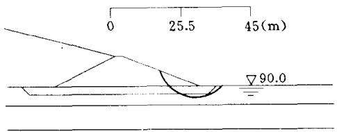  
(a)

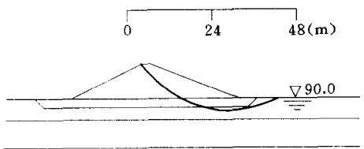  
(b)

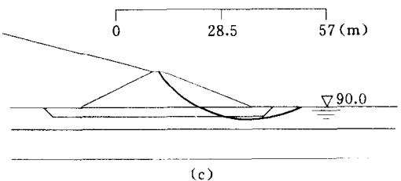

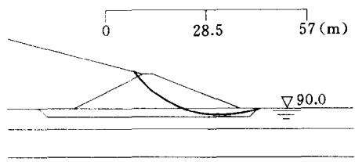  
(d)

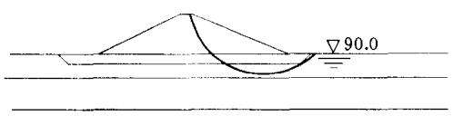  
(e)

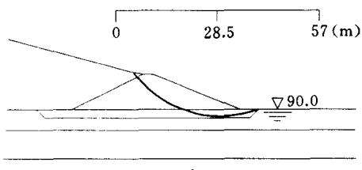  
(f)

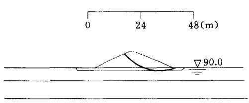  
(g)

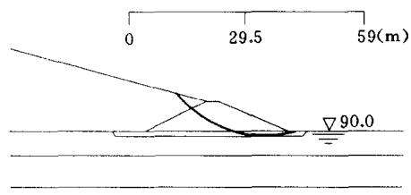  
(h)  
图13.1 蒲城电厂张家沟灰坝主要工况计算成果  
(a) Z3-d; (b) Z12-d; (c) Z5; (d) Z13; (e) Z6; (f) Z14; (g) Z22-d; (h) Z24-d

(3)从垫层 2.5m和 5.0m两种方案的计算结果看，垫层厚度对稳定安全系数的影响不大，其原因是：①垫层料的抗剪强度指标 $( c ^ { \prime } = 0 , \phi ^ { \prime } = 3 0 ^ { \circ } )$ 与填土和地基的有效强度指标接近，增厚垫层不会提高地基的强度；②垫层作为一种水平排水，增加深度未使排水边界长度有明显增加，因此排水效果变化不大。鉴于增厚垫层会使工程造价有较大的增加，可考虑垫层料厚2.5m不再增厚的方案。

(4) 在水平垫层的基础上增设竖直砂井排水，可以使初期坝安全系数明显的增加，因此砂井排水对坝坡稳定具有明显效果。

(5) 相应坝高 15m，设2.5m 厚垫层的工况，在提高堆灰速率的情况下，由于超孔隙水压力变化不大，稳定安全系数降低甚微，坝体仍是稳定的。

(6) 初期坝高15m 方案相应的稳定安全系数较坝高 20m的安全系数大，说明适当降低初期坝高有利于地基的稳定。因此本研究专题推荐初期坝高15m，铺设2.5m厚垫层，并提高堆灰速率的方案。

(7) 在遭遇7度和8度地震时采用固结不排水剪指标，稳定安全系数均在1.1 以上，因此各种工况遇地震都不是控制计算条件。

表13.2 张家沟灰坝稳定计算最小安全系数及相应数据文件
<table><tr><td>工况</td><td>不处理  ${ k } { = } 6 { \times } 1 0 ^ { - 6 }$  (cm/s)</td><td>不处理  $k { = } 6 { \times } 1 0 ^ { - 8 }$  (cm/s)</td><td>厚2.5m 厚5m</td><td>加垫层 加垫层</td><td>坝高15m 垫层厚 2.5m</td><td>垫层及 砂井 厚2.5m</td><td>地震 7度</td><td>地震 8度</td><td>提高堆灰速率 垫层厚2.5m</td></tr><tr><td>初</td><td>上游 0.921</td><td></td><td>0.893 1.140</td><td>1.117 1.396</td><td>1.338 1.502</td><td>1.235</td><td></td><td>1.154</td><td>1.338</td></tr><tr><td>期下游</td><td>0.954 Z3-D</td><td></td><td>1.348</td><td>1.262 Z12-D</td><td>Z15-D</td><td>1.479 Z18-D</td><td></td><td>1.291 Z22-D</td><td>1.584</td></tr><tr><td>中期</td><td>0.753 Z8</td><td>0.653 Z7</td><td>1.479 Z11</td><td>1.389 Z13</td><td>1.651 Z17</td><td>1.482 Z19</td><td></td><td>1.383 Z23</td><td>1.628 Z25</td></tr><tr><td>终期</td><td>0.801 Z6</td><td>0.741 Z5</td><td>1.543 Z10</td><td>1.412 Z14</td><td>1.633 Z16</td><td>1.491 Z20</td><td>1.519 Z21</td><td>1.593 Z24</td><td>1.422</td></tr></table>

注 1. 垫层及砂井坝高 15m 等各种情况均相应地基渗透数 $\pmb { k = 6 \times 1 0 ^ { 8 } } \mathrm { c m } / s$ 情况：  
2. 地震情况相应初期坝高15m，垫层厚2.5m方案，地基使用 $c _ { \alpha } ,$ $\phi _ { \mathrm { c } \varkappa }$ 强度指标；  
3. 提高施工速率相应初期坝高15m方案，垫层及砂井方案相应坝高20m。

## 13.1.5 讨论

这是一个饱和软土地基上快速修建土石坝的典型实例。水利水电科学研究院在工程规划、设计阶段开展了从土工试验、固结计算、边坡稳定分析到加固方案论证的综合性科研工作。建设单位采用了建议的设2.5m厚排水垫层的方案。工程开工后，中国水利水电科学研究院还承担了现场监测和监理工作。

本算例的特点是灰坝坝坡稳定分析采用有效应力法，施工过程中的孔隙水压力通过平面固结比奥理论的有限元法确定。稳定分析的一个内容是对灰坝填筑的上升速率进行分析和评价，在STAB程序的应用方面，这是采用程序提供的孔压内插网格功能进行稳定分析的实例。

## 13.2 公伯峡水电站堆石坝

## 13.2.1 基本情况

(1) 项目来源：电力部西北勘测设计院。

(2) 完成日期：1994 年 2 月。

(3) 设计阶段：选坝阶段。

(4) 存档文件：公伯峡水电站堆石坝边坡稳定分析报告，水利水电科学研究院，岩土(94)7，1994年2月。

## 13.2.2 工程概述

公伯峡水电站在可行性研究阶段推荐混凝土面板堆石坝和土质心墙堆石坝两种坝型。为了解这两种坝型在自重及其它荷载作用下的稳定性，西北勘测设计院委托水利水电科学研究院，对上述两种坝型在各工况下的稳定性进行计算分析。

工程位于黄河上游，正常蓄水位2005.0m，校核洪水位2008.0m，死水位2002.0m，极限死水位1995.0m，下游正常水位1900.1m，坝址基本地震烈度为7度，按8度设防。在稳定分析中取最大断面为典型计算断面。该工程经论证最终采用了混凝土面板坝方案。

## 13.2.3 计算条件

## 1. 计算工况

计算两种坝型上、下游边坡竣工期，正常运用期，库水位骤降期和地震期的稳定性。

## 2. 强度指标

心墙坝和面板坝材料的物理力学指标如表13.3和表13.4所示。

表13.3 面板坝坝料稳定计算参数
<table><tr><td rowspan="2">坝料</td><td colspan="2">容重</td><td colspan="4">强度指标</td></tr><tr><td> $\gamma$  (kN/m³)</td><td> $\gamma _ { s a t }$  (kN/m³)</td><td>c (kPa)</td><td>Q (°)</td><td>φo (°)</td><td>∆φ (°)</td></tr><tr><td>垫层料</td><td>22.27</td><td>23.35</td><td>0</td><td>45</td><td>52</td><td>10</td></tr><tr><td>堆石料</td><td>21.68</td><td>23.05</td><td>0</td><td>45</td><td>51</td><td>10</td></tr><tr><td>砂砾石料</td><td>22.27</td><td>23.45</td><td>0</td><td>38</td><td>49</td><td>9.8</td></tr><tr><td>强风化料</td><td>21.19</td><td>22.76</td><td>0</td><td>37</td><td>46</td><td>9</td></tr><tr><td>基岩</td><td>23.54</td><td>23.54</td><td>100</td><td>55</td><td></td><td></td></tr></table>

表13.4 心墙坝坝料稳定计算参数
<table><tr><td rowspan="2">坝料</td><td colspan="2">容重</td><td colspan="4">强度指标</td></tr><tr><td> $\gamma$  (kN/m³)</td><td> $\gamma _ { s a t }$  (kN/m³)</td><td>C (kPa)</td><td> $\phi$  (°)</td><td> $\phi _ { 0 }$  (°)</td><td>∆φ (°)</td></tr><tr><td>堆石料</td><td>21.68</td><td>23.05</td><td>0</td><td>45</td><td>51</td><td>10</td></tr><tr><td>砂砾石料</td><td>22.27</td><td>23.45</td><td>0</td><td>38</td><td>49</td><td>9.8</td></tr><tr><td>强风化料</td><td>21.19</td><td>22.76</td><td>0</td><td>37</td><td>46</td><td>9</td></tr><tr><td>土 料</td><td>18.74</td><td>20.01</td><td>130</td><td>17</td><td>25</td><td>32.50</td></tr><tr><td>反滤料</td><td>21.19</td><td>22.76</td><td>0</td><td>37</td><td>45</td><td>5</td></tr><tr><td>基岩</td><td>23.54</td><td>23.54</td><td>50</td><td>45</td><td></td><td></td></tr></table>

## 13.2.4 计算成果与分析

## 1. 计算方法

因坝体及坝基均不存在软弱夹层，故对上、下游边坡，采用圆弧滑裂面，用毕肖普法进行计算。

## 2. 计算成果

混凝土面板堆石坝上、下游稳定分析成果见表13.5和表13.6。风化料心墙坝上游库水位骤降，稳定分析成果见表13.7（有关原理已在第7章[例7.6]作过详细介绍）。相应的临界滑裂面位置见图13.2。

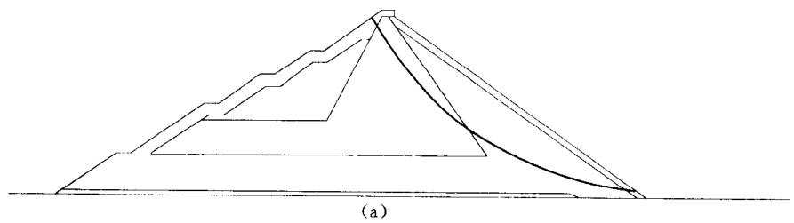

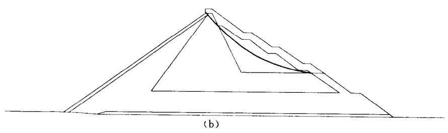

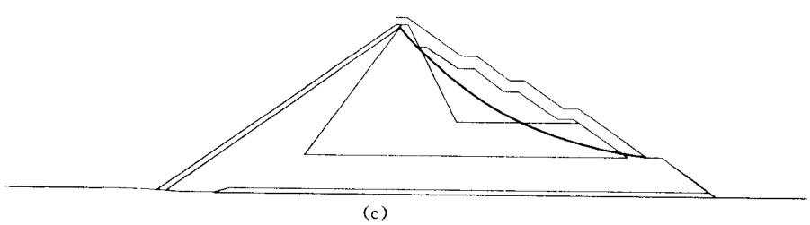

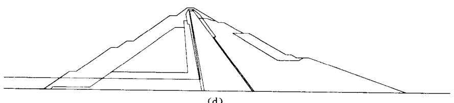  
(d)

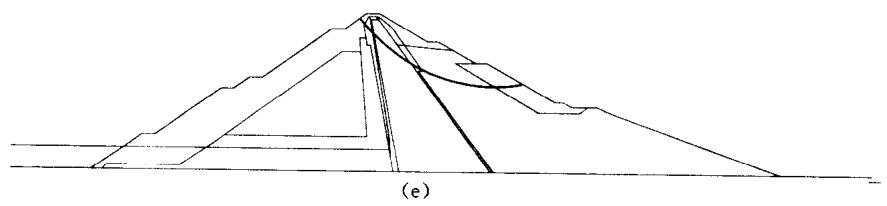

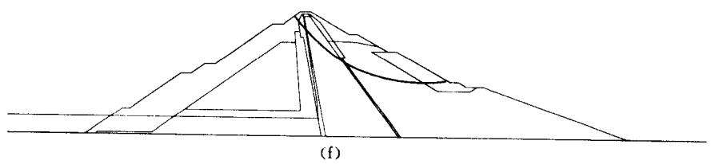  
图13.2 公伯峡水电站主要工况计算成果  
(a) Gbx1.1da; (b) 1.2da; (c) 1n.2da; (d) 2c; (e) 2d; (f) 2e

## 13.2.5 讨论

从面板坝的坝坡稳定分析角度看，本算例是常规的圆弧稳定分析的一个实例。计算中使用了非线性强度参数。由于在可行性论证阶段中曾经有一个心墙坝的方案，因此，对此方案进行了考虑库水位情况下的上游坝坡稳定分析。此方案上游坝壳使用了砂砾石，为半透水材料，如果砂砾石的细粒含量较多，则需要计算上游水位降落情况下坝体内的浸润线在不同时间的位置，并进行相应的坝坡稳定分析。由于砂砾石可视为压缩性很小的材料，故可在达西定律基础上进行不稳定渗透计算，如第7章第7.4 节所述。本算例使用了美国陆军工程师团土石坝设计手册中推荐的一个简化方法，计算水位降落过程中的坝壳浸润线位置。根据计算获得的浸润线位置，进行有效应力法计算，但心墙部分则使用了总强度指标。计算孔压和稳定分析的详细步骤已分别在第6章、第7章中介绍过。

表13.5 混凝土面板堆石坝施工、竣工期最小安全系数
<table><tr><td rowspan="4">参数类型</td><td colspan="4">上游坝坡</td><td colspan="4">下游坝坡</td></tr><tr><td colspan="2">无地震</td><td colspan="2">7度地震</td><td colspan="2">无地震</td><td colspan="2">7度地震</td></tr><tr><td>安全 系数</td><td>数据 文件</td><td>安全 系数</td><td>数据 文件</td><td>安全 系数</td><td>数据 文件</td><td>安全 系数</td><td>数据 文件</td></tr><tr><td>线性参数 (c, φ)</td><td>1.406</td><td>Gbx1.1da</td><td>1.231</td><td>Gbx1.1da</td><td>1.514</td><td>1.2da</td><td>1.382</td><td>1zh</td></tr><tr><td>非线性参数 (φ0，∆φ)</td><td>1.684</td><td>Gbx1n.1da</td><td>1.535</td><td>Gbx1n.1da</td><td>1.987</td><td>1n.2da</td><td>1.746</td><td>1nzh</td></tr></table>

表13.6 混凝土面板堆石坝稳渗期最小安全系数
<table><tr><td rowspan="2">参数类型</td><td colspan="4">下游坝坡</td></tr><tr><td colspan="3">无地震</td></tr><tr><td></td><td>安全系数</td><td>数据文件</td><td>安全系数</td><td>8度地震 数据文件</td></tr><tr><td>线性参数(c，φ) 非线性参数(φ，∆φ0)</td><td>1.514 2.011</td><td>1.2da 1n.2da</td><td>1.311 1.683</td><td>1zh.2dat 1nzH.2dat</td></tr></table>

表13.7 风化料心墙坝水位骤降期核算最小安全系数
<table><tr><td rowspan="2">库水位 (m)</td><td rowspan="2">参数类型</td><td colspan="2">无地震</td><td colspan="2">8度地震</td></tr><tr><td>安全系数</td><td>数据文件</td><td>安全系数</td><td>数据文件</td></tr><tr><td rowspan="3">1990.20</td><td>线性</td><td>1.367</td><td>2c</td><td>1.108</td><td>2czh</td></tr><tr><td>非线性</td><td>2.205</td><td>2cn</td><td>1.649</td><td>2cnzh</td></tr><tr><td>线性</td><td>1.386</td><td>2d</td><td>1.116</td><td>2dzh</td></tr><tr><td>1981.00</td><td>非线性</td><td>2.041</td><td>2dn</td><td>1.605</td><td>2dnzh</td></tr><tr><td rowspan="2">1975.00</td><td>线性</td><td>1.407</td><td>2e</td><td>0.900</td><td>2ezh</td></tr><tr><td>非线性</td><td>1.998</td><td>2en</td><td>1.590</td><td>2enzh</td></tr></table>

## 13.3 小浪底水利枢纽大坝

## 13.3.1 基本情况

(1) 项目来源：黄河水利委员会勘测规划设计院。

(2)完成日期：1999年4月。

(3) 设计阶段：初步设计、技施设计和大坝安全鉴定。

(4) 存档文件：

1)小浪底水利枢纽土石坝边坡稳定分析，黄河水利委员会勘测规划设计院，水利水电科学研究院，1994年4月；

2) 小浪底水利枢纽土石坝工程安全检查自检报告，黄河水利委员会勘测规划设计院，1999年9月。

## 13.3.2 工程概述

小浪底水利枢纽工程位于洛阳市以北黄河干流最后一个峡谷出口，为一具有防洪、减淤、灌溉、发电等综合效益的大型水利枢纽。大坝最大坝高167m，覆盖层最深达70m，为斜墙堆石坝，电站装机156万kW。工程位于7度地震区，按8度设防。大坝典型剖面见第7章图7.1。

## 13.3.3 计算条件

## 1. 计算工况

计算上、下游坝坡施工期、正常运用期、库水位骤降期和地震期的稳定性。主要计算217.5断面。同时也复核了靠近左岸的坝基夹有软弱夹层的310断面。采用任意形状滑裂面，分别复核沿夹泥层滑动和沿坝体内滑裂面滑动这两种情况。水库运用时的稳定分析考虑了库区泥沙淤积、不淤积两种情况。施工期，主要计算了大坝填筑完成后，库水位250m和265m，在坝内不形成浸润线的情况。此两水位主要是考虑当时大坝填筑进度的实际情况。

## 2. 强度指标

土料区的指标由黄河水利委员会小浪底工程质量检测联营体提供（小浪底主坝防渗体挖坑取样及现场试验成果综合分析报告)，1997.7.16和1999.1.22两次报告成果。共计土样37个，在此基础上提出的各种材料采用值见表13.8。

## 13.3.4 计算成果

各计算剖面复核成果列于表13.9\~表13.11，典型工况计算简图如图13.3示。

## 13.3.5 讨论

小浪底大坝为壤土斜心墙坝，因此，坝坡稳定分析内容覆盖了上、下坝坡施工期，稳定渗流期和库水位骤降期。由于坝基存在软弱夹层，故还需要进行折线形状滑裂面的稳定分析，并搜索临界滑裂面。

表13.8 筑坝材料及坝基材料抗剪强度采用值
<table><tr><td rowspan="2">筑坝材料</td><td colspan="2">容重(kN/m³)</td><td colspan="2">抗剪强度</td></tr><tr><td>湿容重</td><td>饱和容重</td><td>摩擦角φ(°)</td><td>粘聚力c(kPa)</td></tr><tr><td rowspan="3">CD有效强度 1区 CU总强度 1B区 UU总强度</td><td></td><td></td><td>19.4</td><td>20</td></tr><tr><td>19.6</td><td>20.3</td><td>14</td><td>25</td></tr><tr><td></td><td></td><td>7.4</td><td>73</td></tr><tr><td>2A，2B，2C，3A，4A，4B区</td><td>21.1</td><td>23</td><td>40</td><td>0</td></tr><tr><td>5区</td><td>20.8</td><td>21.7</td><td>28</td><td>30</td></tr><tr><td>河床砂卵石</td><td>22.2</td><td>22.2</td><td>33*</td><td>0</td></tr><tr><td>淤积物</td><td>17.6</td><td>17.6</td><td>0</td><td>0</td></tr><tr><td>砂岩</td><td>26</td><td>26</td><td>35</td><td>0</td></tr><tr><td>夹泥层</td><td>20.1</td><td>20.7</td><td>14.04</td><td>5</td></tr></table>

注表中河床砂卵石静强度指标φ=33°，动强度指标φ=27°。

表 13.9 小浪底大坝217.5 剖面复核成果（沿坝体内堆石滑动）
<table><tr><td>计算工况</td><td>数据文件</td><td>地震烈度</td><td>安全系数</td><td>淤积情况</td></tr><tr><td rowspan="4">不利水位230m</td><td>6</td><td>0</td><td>1.900</td><td rowspan="2">无淤积</td></tr><tr><td>d6</td><td>8</td><td>1.469</td></tr><tr><td>7</td><td>0</td><td>2.070</td><td rowspan="2">无淤积</td></tr><tr><td>d7</td><td>8</td><td>1.514</td></tr><tr><td rowspan="9">230m水位 250m水位 施 工 期 230m水位</td><td>11</td><td>0</td><td>1.707</td><td rowspan="9">无淤积滑裂面 靠近下部</td></tr><tr><td>d11</td><td></td><td></td></tr><tr><td>12</td><td>7</td><td>1.488</td></tr><tr><td>d12</td><td>0 7</td><td>1.963 1.688</td></tr><tr><td>13 265m水位</td><td>0</td><td>2.190</td></tr><tr><td>d13</td><td>7</td><td>1.873</td></tr><tr><td>x11</td><td>0</td><td>1.781</td></tr><tr><td>dx11</td><td>7</td><td>1.559</td></tr><tr><td rowspan="2">x12 250m水位</td><td>0</td><td>1.880</td><td rowspan="4">无淤积滑裂面 靠近下部</td></tr><tr><td>dx12</td><td>7 1.571</td></tr><tr><td rowspan="2">265m水位</td><td>x13</td><td>0 2.102</td></tr><tr><td>dx13 7</td><td>1.750</td></tr><tr><td rowspan="2">水位骤降275m→250m</td><td>8</td><td>0</td><td>1.850</td><td rowspan="2">无淤积</td></tr><tr><td>9</td><td>0</td><td>1.687</td></tr></table>

表13.10 小浪底大坝 D0+217.50断面上游坡稳定计算成果表（沿夹泥层滑动）
<table><tr><td colspan="2">计算工况</td><td>数据文件</td><td>地震 烈度</td><td>设计要求 安全系数</td><td>复核计算 安全系数</td><td>淤积情况</td></tr><tr><td rowspan="3">不利水位230.0m</td><td>2  $\frac { \mathrm { d } 2 } { 1 }$ </td><td>0 8</td><td>1.5 1.3</td><td></td><td>1.486 1.026</td><td>无</td></tr><tr><td>d1</td><td></td><td>0 8</td><td>1.5 1.3</td><td>2.103 1.301</td><td>淤积高程200m</td></tr><tr><td>230m水位</td><td> ${ \tt y } 4$  dy4</td><td>0 7</td><td>1.3 1.2</td><td>1.424 1.216</td><td></td></tr><tr><td rowspan="2">施 工期</td><td> $\mathbf { y } 5$  250m水位</td><td>0 dy5 7</td><td></td><td>1.3 1.2</td><td>1.436 1.186</td><td>无</td></tr><tr><td>265m水位</td><td>y10 dy10</td><td>0 7</td><td>1.3 1.2</td><td>1.569 1.277</td><td></td></tr><tr><td colspan="2">水位骤降</td><td>dd3</td><td>0</td><td>1.2</td><td>1.384</td><td>无</td></tr></table>

注 水位骤降为 275m→250m，滑裂面位置见图 13.3。

表13.11 小浪底大坝D0+310断面上游坡稳定计算成果表（沿夹泥层滑动）
<table><tr><td>计算工况</td><td>数据文件</td><td>地震烈度</td><td>安全系数</td></tr><tr><td>下游不压坡</td><td>310</td><td>0</td><td>1.236</td></tr><tr><td>下游压坡</td><td>310b</td><td>0</td><td>1.638</td></tr></table>

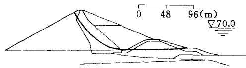  
(a)

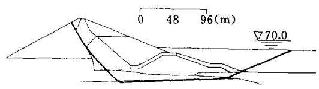

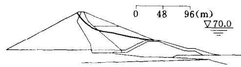  
(c)

(b)  
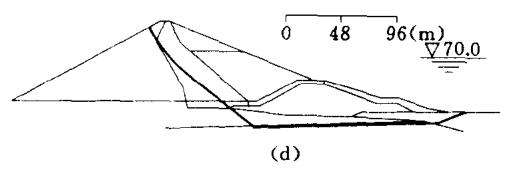

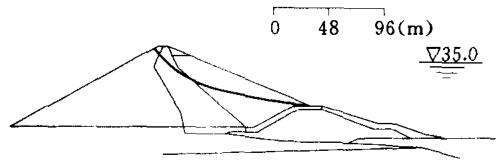  
(e)

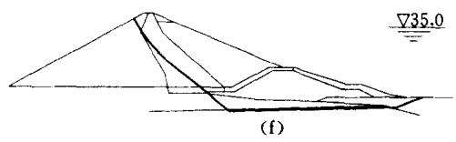

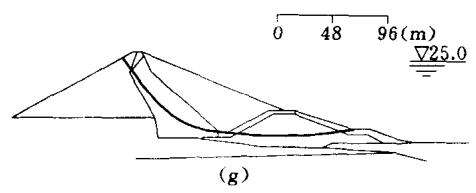

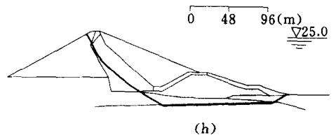  
图13.3 小浪底大坝主要工况稳定计算成果  
(a) 11; (b) 1; (c) x11; (d) y4; (e) x13; (f) dy10; (g) 8; (h) dd3

黄河水利委员会设计院是较早使用STAB程序的一个单位。小浪底工程大坝也是在我国较早使用第7章介绍的库水位骤降总应力法分析步骤的一个工程。本节所列的成果是设计院独立完成的，并作为正式成果列入大坝安全鉴定自检报告。本书作者作为大坝安全鉴定专家，对分析成果进行了复核。

本次计算一律采用了非圆弧形的滑裂面，对于穿越坝体的滑裂面，采用了STAB程序中光滑曲线生成滑裂面的功能。

## 13.4 三峡工程3 坝段坝基深层抗滑稳定分析

## 13.4.1 基本情况

(1) 项目来源：三峡开发总公司技术委员会。

(2) 完成日期：1997年6月。

(3) 设计阶段：技施设计。

(4) 存档文件：

1）三峡工程3坝段坝基深层抗滑稳定分析，中国水利水电科学研究院，1997年6月，GE-97-3-017;

2) 长江三峡 1-5 坝段岩体节理统计和连通率研究，中国水利水电科学研究院，1996年，GE-96-3-017;

3) 长江三峡 1-5 坝段岩体节理统计和连通率研究补充报告，中国水利水电科学研究院，1996年，GE-96-3-026;

4) 三峡大坝左厂1#\~5#坝段抗滑稳定深化设计专题报告，水利部长江水利委员会，1996年6月。

## 13.4.2 工程概述

三峡工程大坝左、右岸坝段建基面抬高，坝高相对降低，在右岸3坝段坝基与广房建基面高程相差60m，形成了一个坡度约为1:1.5的开挖面（图13.4)，而此坝段高仅为60m。坝基岩体存在着倾向与坝基开挖边坡基本一致的中缓倾角裂隙，大坝与坝基的抗滑稳定成为一个令人关注的问题。

根据现场地质勘探的成果，在3坝段的坝基存在着连通率较高的一组缓倾角结构面组合，这组结构面通过接近坝底的A点（图13.5）。同时，也存在其它可能的结构面组合。本文采用边坡稳定分析极限平衡法进行大坝深层抗滑稳定分析。

## 13.4.3 计算条件

1. 计算工况

(1)设计水位为上游175m，下游 62m；相应的校核水位为上游180.4m，下游83.1m。稳定分析以设计工况为主，校核工况仅计算个别滑面。

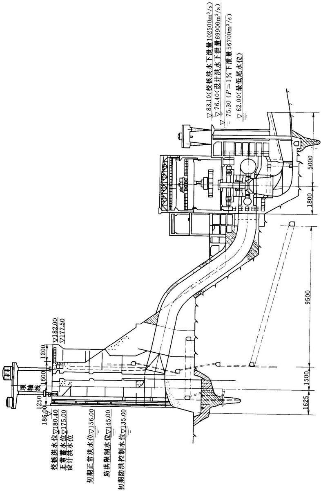  
图：热

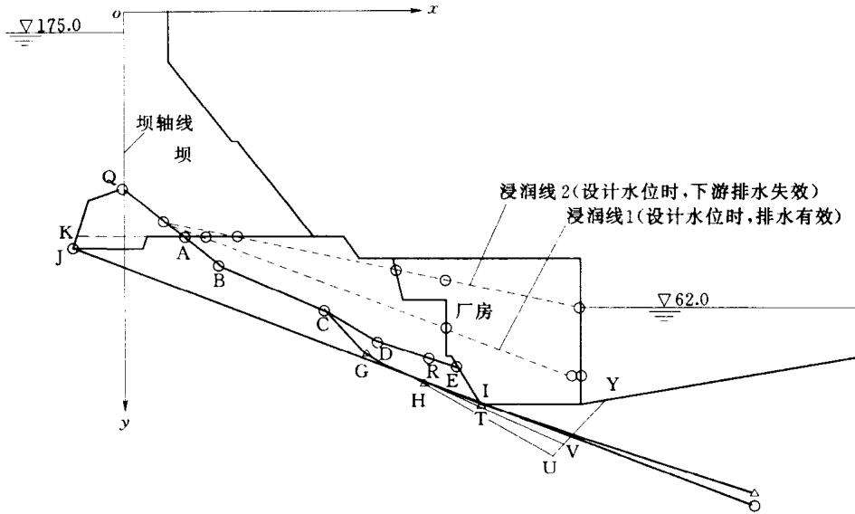  
图 13.5 三峡大坝 3 坝段坝体和地基联合抗滑稳定计算简图

(2) 三峡大坝下游采用抽排的方式降低扬压力，这样，在排水系统正常工作的条件下，扬压力图形为：

1) 坝基基岩第一道帷幕排水孔处(19+995)，扬压力折减系数为 0.25;

2) 坝基基岩第二道排水孔处(20+015)，折减系数为 0.50;

3) 厂房基岩下游侧帷幕排水孔处(20+164)，折减系数为0.30。

对于重力坝稳定分析中的扬压力，在使用条分法计算时，仍通过输入浸润线的方法实现。

由于三峡大坝基岩内存在着中缓倾角结构面，长委会通过详细的地质勘探，提供了3坝段可能出现的长大裂隙的剖面图。根据这一基础资料，稳定分析在坝体单独和厂坝联合情况下的复核工况如下：

(1)复核包括坝体单独抗滑和厂坝联合抗滑两种情况。每个情况均考虑下游抽排失效浸润线抬高的情况。在坝体单独抗滑时，由于下游抽排，故下游坡外无水位，因此在这种特定的条件下，抽排在降低扬压力的同时，也失去了作用于坝下游岩坡上的反向水推力，造成了不利因素，因此，计算了不采用抽排，下游水位42m的工况。

(2) 坝体与地基联合抗滑，厂房的重量无疑会增加坝体的稳定性。本次计算在处理厂房的重量时，将主厂房与副厂房按提供的重量，等效地座落在相应的位置上。

因坝体单独抗滑的安全系数在下游排水失效及校核水位均与设计工况差别较小，厂坝联合抗滑时，没有再核算这个工况。

## 2. 强度指标

完整岩体，混凝土和结构面的抗剪强度见表13.12。表13.13 为沿各滑移路径的岩体连通率，用k表示，其与岩体力学指标c、φ的关系为

$$
c = c _ { r } ( 1 - k ) + c _ { j } k\tag{13.1}
$$

$$
f = f _ { r } ( 1 - k ) + f _ { j } k\tag{13.2}
$$

式中： $c _ { r }$ 为岩体的粘聚力； $f _ { r }$ 为岩体的摩擦系数；f=tanφ；c为结构面的粘聚力； $c _ { j }$ $f _ { j }$ 为结构面的摩擦系数。

表13.12 设计院提供的材料参数和接触面抗剪强度参数
<table><tr><td>材料号</td><td>材料名</td><td>容重 γ(9.8kN/m³)</td><td>摩擦系数 f(tanφ)</td><td>摩擦角 φ(°)</td><td>粘聚力 c(MPa)</td></tr><tr><td>1</td><td>混凝土</td><td>2.45</td><td>1.10</td><td>47.73</td><td>3.00</td></tr><tr><td>2</td><td>微新岩体</td><td>2.70</td><td>1.70</td><td>59.53</td><td>2.00</td></tr><tr><td>3</td><td>岩桥（连通率k=11.5%）</td><td>2.70</td><td>1.59</td><td>57.83</td><td>1.79</td></tr><tr><td>4</td><td>岩体结构面</td><td>2.70</td><td>0.70</td><td>35.00</td><td>0.20</td></tr><tr><td>5</td><td>混凝土/厂房基岩接触面</td><td></td><td>1.25</td><td>51.34</td><td>1.50</td></tr></table>

表13.13 根据地质概化模型指定的各段连通率（图13.5）
<table><tr><td rowspan="2">序号</td><td rowspan="2">滑移路径 (见图13.5)</td><td colspan="2">1</td><td colspan="2"> $\underline { { 2 } }$ </td><td colspan="2"> $^ 3$ </td></tr><tr><td>分段</td><td>k</td><td>分段</td><td>k</td><td>分段</td><td>k</td></tr><tr><td>1</td><td>QABCDRE</td><td>QA</td><td>0%</td><td>ABCDR</td><td>100%</td><td>RE</td><td>11.5%</td></tr><tr><td>2</td><td>QABCGHI</td><td>QA</td><td>0%</td><td>ABCGH</td><td>100%</td><td>HI</td><td>11.5%</td></tr><tr><td>3</td><td>JI</td><td>J</td><td>35.9%</td><td></td><td></td><td></td><td></td></tr><tr><td>4</td><td>QABCGHTUY</td><td>QA</td><td>0%</td><td>ABCGHT</td><td>76.9%</td><td>UY</td><td>100%</td></tr><tr><td>5</td><td>QABCGHTVY</td><td>QA</td><td>0%</td><td>ABCGHT</td><td>75.3%</td><td>VY</td><td>100%</td></tr></table>

## 3. 滑动模式（图 13.5）

(1) 坝体与地基单独抗剪，不考虑厂房作用。

(a) 沿滑面 QABCDE 滑动。QA 段在坝体内，起点 Q 选在坝体上游体型突变且断面最小处，ABCDR为结构面，连通率为100%；RE为岩桥，长26.9m，连通率k为11.5%。其力学指标见表13.12的1、4和3材料。

上游水位175m，下游水位62m，上、下游排水均有效，浸润线位置见图13.5中浸润线1。

上游水位175m，下游水位62m，下游排水失效，浸润线位置见图13.5中浸润线2。

上游水位175m，下游坡面无水，上、下游排水仍均有效，但考虑厂、坝分开，厂房起挡水作用，虽扬压力能传递过去，但所研究的滑动体下游无水。在计算处理时，相当于无坡外水位，但浸润线仍与排水有效时相同，仍为图13.5中的浸润线1。此情况为设计要求复核的工况。

(b) 沿滑面 QABCGHI 滑动。QA 段在坝体内，ABCGH 为结构面，连通率为 100%；HI为岩桥，长24.4m，连通率k为11.5%。力学指标见表13.12的1、4和3材料。

其它项与(1)项相应项相同。另外复核校核上游水位180.4m，下游水位83.1m，上、下游排水均有效。

(c)沿滑面 J滑动。整个滑面均在地基中。长委会提供J滑面平均连通率为35.9%，为了了解J滑面的力学指标对安全系数的影响，对某些工况作了敏感计算。中国水利水电科学研究院根据勘探提供的定位的长大裂隙进行连通率计算，建议采用68.75%作为一种校核的工况。计算工况与滑面2相同，见图13.5。

(d) 沿滑面 KABCGHI 滑动。见图 13.5，沿坝基与地基接触面 KA 和结构面 ABCGHI滑动。KA段参数取表13.12中 5号材料（混凝土/厂房基岩），ABCGHI段取表13.12中相应指标。

仅计算设计工况，即上游水位175m，下游水位62m，上、下游排水均有效，浸润线位置见图13.5中浸润线1。本工况也是指定的复核工况。

(2) 坝体与厂房联合抗剪。厂坝联合抗滑，主要校核以下三个情况：

(a) 滑面从厂基下滑出。在这一工况中，这一情况又分为厂房和地基接触面采用混凝土和基岩接触面指标和采用 $k = 5 0 \%$ 的节理岩体指标两种情况；

(b)滑动体从厂房下游滑出。底面呈圆弧形状，这一失稳模式是否成立取决于对厂房下游节理岩体抗剪强度的认识。由于设计没有给出统一的规定，本次复核参考了中国水利水电科学研究院网络模拟的成果，按连通率 $k = 5 0 \%$ 确定这部分岩体的抗剪强度。用程序的搜索功能找出失稳的最小安全系数。

(c) 按指定结构面组合滑动。复核沿 QABCGHTUY 和 QABCGHTUY 抗滑稳定安全系数。

上述各滑移路径各段连通率详见表13.13。

## 13.4.4 坝体与地基单独抗滑的计算成果

## 1. 设计工况

本工况相应设计水位，下游抽排，厂房挡水，故坝后无水位。计算成果汇总于表13.14。

对滑面 QABCDE 工况 1-3 和 QABCGHI 工况 2-3， 计算安全系数分别为 2.793 和2.539，距重力坝要求的安全系数尚有差距。

对滑面JI（工况3-3)，如果使用设计提供的连通率 $k = 3 5 . 9 \%$ ，则安全系数 $F { = } 3 . 2 3 5$ 但如使用水科院根据长委会勘测院提供的定位结构面进行网络模拟的成果 $k = 6 8 . 7 5 \%$ ，则 $F =$ 2.098。

## 2. 其它情况

对大坝单独挡水，还进行了以下情况的复核。

(1) 上述分析是考虑抽排有效但厂房在下游挡水的情况下进行的，如果让厂房泡在水中，下游水位直接作用于下游边坡面上，则在下游可增加40m水压力。情况1-1和2-1给出了相应滑面 QABCDE 和 QABCGHI的安全系数，分别为 2.879 和 2.703。安全系数可提高0.1至0.2。但仍未达到重力坝要求的安全系数值。

(2) 情况 1-3、2-3、3-3（相应 $k = 3 5 . 9 \%$ 情况）分别给出了相应设计工况，但一旦抽排失效扬压力增加时安全系数值为2.791(工况1-2)，2.620(工况2-2)和3.324(工况3-2)，可知抽排失效尽管增加了扬压力，但下游水位作用于坝坡面，故安全系数并无实质性削弱。对以上工况，大部分都进行了土条间力的复核，图13.6为情况1-1相应的底滑面和条间力的分布图，可见未出现拉力和剪力破坏，因此，可视为可接受的解。

表13.14 三峡坝体单独抗滑稳定安全系数F
<table><tr><td>滑面</td><td>工况</td><td colspan="3"></td><td>F</td><td>文件</td></tr><tr><td rowspan="3">QABCDE</td><td> $H _ { \mathrm { \ell \mathrm { \cdot } } } =$ </td><td>1-1</td><td colspan="2">下游坡外水位42.0m</td><td>2.879</td><td> $\mathbf { g } 3 \mathbb { 1 }$ </td></tr><tr><td> $1 7 5 \mathrm { m }$ </td><td>1-2</td><td colspan="2">下游排水失效</td><td>2.791</td><td> ${ \tt g 3 1 - u }$ </td></tr><tr><td> $ { H _ { \mathrm { F } } } = 6 2  { \mathrm { m } }$ </td><td>1-3</td><td colspan="2">下游无坡外水位</td><td>2.793</td><td>g31-m</td></tr><tr><td rowspan="4">QABCGHI</td><td> $H _ { \mathrm { : } } =$ </td><td>2-1</td><td colspan="2">下游坡外水位42.0m</td><td>2.703</td><td>g32</td></tr><tr><td> $1 7 5 \mathrm { m }$ </td><td>2-2</td><td colspan="2">下游排水失效</td><td>2.620</td><td>g32-u</td></tr><tr><td> $ { \boldsymbol { H } } _ { \mathrm { \tiny { F } } } = 6 2  { \mathrm { m } }$   $^ { 2  4 }$ </td><td>2-3</td><td colspan="2">下游无坡外水位</td><td>2.539</td><td>g32-m</td></tr><tr><td colspan="4">上、下游均为校核水位</td><td>1.767</td><td>g32-x g33-1</td></tr><tr><td rowspan="6">JI</td><td rowspan="6"> $H _ { \perp } \simeq$  175m</td><td>3-1</td><td>下游坡外水 位42.0m</td><td>k=45% k=58% k=68.75%</td><td>3.427 3.091 2.615 2.223</td><td>g33-2 g33-3 g33-4</td></tr><tr><td></td><td></td><td>k=80% k=100% k=35.9%</td><td>1.811 1.080</td><td>g33-5 g33-6</td></tr><tr><td>3-2  ${ \cal H } _ { \mathrm { F } } = 6 2 \mathrm { m }$ </td><td>下游排水失 效</td><td>k=68.75% k=100%</td><td>3.324 2.147 1.028</td><td>g33-1u g33-4u g33-6u</td></tr><tr><td rowspan="3"></td><td>下游坡外无</td><td>k=35.9%</td><td>3.235</td><td>g33-1m</td></tr><tr><td></td><td>k=45%</td><td>2.921</td><td>g33-2m</td></tr><tr><td>3-3 水</td><td>k=58% k=68.75%</td><td>2.470 2.098</td><td>g33-3m g33-4m</td></tr><tr><td colspan="2">3-4 上下游均为校核水位</td><td></td><td></td><td>k=80% k=100%</td><td>1.708 1.015</td><td>g33-5m g33-6m</td></tr><tr><td colspan="2"> $H _ { \perp } = 1 7 5$  KABCGHI 坡外无水</td><td colspan="2"> $\pmb { H } _ { \mathrm { \tilde { r } } } = 6 2$  ，排水有效，</td><td> $k { = } 6 8 . 7 5 \%$ </td><td>2.238 2.779</td><td>g33-4x g34-m</td></tr></table>

注k为连通率。

(3) 核算滑面 KABCGHI 情况 4，安全系数为 2.779。从计算成果中发现，由于滑面 KA过渡到AB出现巨大转折，导致所获得的土条间作用力出现大范围拉力区，应视为不能接受的解。

以上分析表明，在大坝单独挡水时，3坝段的抗滑稳定安全系数尚嫌不足。

## 13.4.5 坝体和厂房联合抗滑稳定分析

厂坝联合抗剪计算成果汇总于表13.15。

本工况相应上游设计水位175m，下游62m。厂坝联合抗滑时校核了两种可能的情况，即沿厂房与基础接触面和沿深层滑动并在下游某点逸出的工况。对沿深层滑动工况，如按本次核算设定的 $\pmb { k } = 5 0$ %确定厂基下岩体的抗剪强度，则程序的自动搜索功能最终还是收敛到了沿厂房与基岩接触面的这一条滑面上，故认定厂坝联合作用控制的滑面仍是厂房和基岩的接触面。

分析计算成果得知，对指定滑面QABCGHI沿厂房与基础接触面滑动的使用接触面强度指标安全系数为4.284（工况5-1），采用50%连通率的岩体指标相应安全系数4.018（工况 5-2)，均大于要求的安全系数，而深层滑动的安全系数为4.737（工况5-3)，更不是控制工况。

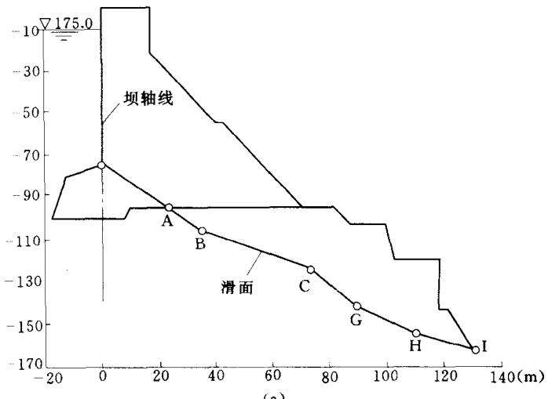  
(a)

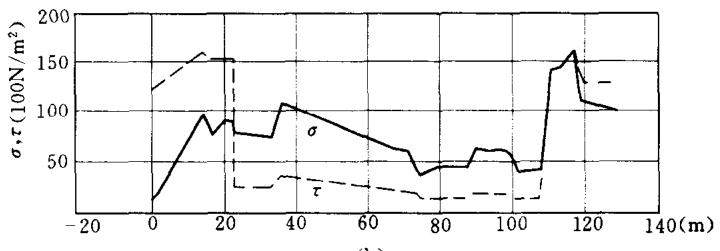  
(b)

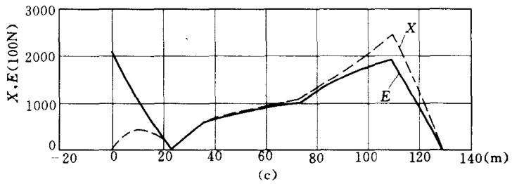  
图 13.6 坝体单独抗滑沿 QABCGHI 滑面内力分布  
(a) 情况 1-1 计算简图；(b) 底滑面上法向应力 σ 和剪应力 τ 分布；(c) 条间力 X 和法向力 E的分布

从整个受力体系分析来看，厂坝沿JⅡ路线更易滑出。在复核这一情况时，采用了JⅡ的连通率为35.9%（设计提供），68.75%（中国水利水电科学研究院成果）和100%（极端情况）进行分析，成果参见表13.15。可见，除 $k = 1 0 0 \%$ 情况下安全系数低于3，其它工况的安全系数均大于3。

对设计指定的滑裂面 TUY 以及 TVY（情况 7-1和7-2)，由于反翅段太陡，采用严格满足力和力矩平衡要求的方法得不到收敛解，采用仅考虑力的平衡的方法（陆军工程师团法)，假定土条侧向力倾角为20°，分别得到安全系数4.337和4.224。

同时，还校核了抽排失效情况（工况6-4和6-5)，安全系数无实质性的减小。

图13.7示部分工况计算图形。

表13.15 坝体与厂房联合抗滑稳定安全系数F
<table><tr><td colspan="2">滑面 工况</td><td>滑出位置</td><td>采用的参数</td><td> $F$ </td><td>文件</td></tr><tr><td rowspan="3">QABCG HI</td><td rowspan="3"> $H _ { \mathrm { { t } } } = 1 7 5 \mathrm { { m } }$   $\pmb { H } _ { \mathrm { F } } = 6 2 \mathbf { m }$   $\begin{array} { r l } { \operatorname { L } , } & { { } \operatorname { F } { \dot { \varnothing } } \quad } \end{array}$  排水有效</td><td>沿厂房与厂基接 触面，工况5-1</td><td>同表1*</td><td>4.284</td><td> ${ \tt g } 3 2 { \bf L } c$ </td></tr><tr><td>从厂房基础下滑 出，工况5-2</td><td>厂基、下游地基及 HI的延长段  $4 \times k = 5 0 \% ,$ </td><td>4.018</td><td> ${ \tt g } 3 2 { \tt L } 1$ </td></tr><tr><td>从厂房下游基础 滑出，工况5-3</td><td> $c { = } 1 . 1 \mathbf { M P a } ,$   $f ^ { \prime } { = } 1 . 5 \mathrm { M P a }$ </td><td>4.737</td><td> ${ \tt g } 3 2 { \tt L } { \tt f } 2$ </td></tr><tr><td rowspan="5">J</td><td rowspan="4"></td><td>沿厂房与厂基接 触面滑出，工况 6-1</td><td> $\Pi \mathcal { E } \mathcal { Z } k { = } 3 5 . 9 \%$   $k { = } 6 8 . 7 5 \%$   $k = 1 0 0 \%$ </td><td>4.650 3.528 2.512</td><td>g33Lcl g33Lc2 g33Lc3</td></tr><tr><td>从厂房基础下滑 出，工况6-2</td><td> $k = 3 5 . 9 \%$   $k { = } 6 8 . 7 5 \%$   $k = 1 0 0 \%$ </td><td>4.406 3.268 2.312</td><td>g33Lf4 g33Lf5 g33Lf6</td></tr><tr><td>从厂房下游基础 滑出，工况6-3</td><td> $k { = } 3 5 . 9 \%$   $k { = } 6 8 . 7 5 \%$   $k = 1 0 0 \%$ </td><td>5.050 4.260 2.993</td><td> $\mathbf { g } 3 3 \mathbf { L f } 1$   ${ \tt g 3 3 L f 2 }$  g33Lf3</td></tr><tr><td> $H _ { \mathrm { . } } = 1 7 5 \mathrm { m }$  沿厂房与厂基接  $H _ { \mathrm { { F } } } = 6 2 \mathrm { { m } }$  触面滑出，工况 下游排水失效 64</td><td> $\Pi F _ { X } ^ { \it n } k = 3 5 . 9 \%$ </td><td>4.652</td><td> ${ \tt g } 3 3 { \tt L } c 4$ </td></tr><tr><td> $H _ { \mathrm { { L } } } = 1 8 0 . 4 \mathrm { { m } }$   $\pmb { H } _ { \top } = 8 3 . 1 \mathbf { m }$ </td><td>沿厂房与厂基接 触面滑出，工况</td><td> $k { = } 6 8 . 7 5 \%$   $k = 1 0 0 \%$   $k = 3 5 . 9 \% ^ { * }$   $k { = } 6 8 . 7 5 \%$ </td><td>3.517 2.498 4.815</td><td> ${ \bf g } 3 3 { \bf L } c 5$   ${ \underline { { \mathbf { g } } } } 3 3 \mathbf { { L } } c 6$   ${ \bf \tt g } 3 3 { \bf L } c 7$ </td></tr><tr><td>QABCG HTUY</td><td>上下游排水有效  $H _ { \mathrm { { L } } } = 1 7 5 \mathrm { { m } }$   $\pmb { H } _ { \mathrm { F } } = 6 2 \mathbf { m }$ </td><td>6-5 深层滑动*，</td><td> $k = 1 0 0 \%$   $k = 7 6 . 9 \%$ </td><td>3.615 2.529 4.337</td><td> ${ \tt g } 3 3 { \tt L } c 8$   ${ \tt g } 3 3 { \tt L } c 9$ </td></tr><tr><td>QABCG</td><td>只下游排水有效  $H _ { \mathrm { { . } } } = 1 7 5 \mathbf { m }$ </td><td>工况7-1 深层滑动*，</td><td></td><td></td><td> ${ \tt g 3 3 u }$ </td></tr><tr><td>HTVY</td><td> ${ \cal H } _ { \mathrm { F } } = 6 2 \mathrm { m }$  只下游排水有效</td><td>工况7-2</td><td> $k = 7 5 . 3 \%$ </td><td>4.224</td><td> $\mathbf { g } 3 3 \mathbf { s }$ </td></tr></table>

注 1. 标\*号者为设计规定的计算工况，k为连通率；  
2. 工况 7-1 和7-2 无法获得 Morgenstern-Price 法的收敛解，所列安全系数为仅满足力平衡条件的解。

## 13.4.6 讨论

由于三峡大坝的重要性，3坝段的抗滑稳定受到普遍的关注。其中一个焦点问题是按照传统的极限平衡分析方法，其安全系数是否能满足重力坝规范对抗滑稳定的要求。如果大坝单独抗滑安全系数不能满足要求，厂房与大坝连在一起，在厂坝联合作用的条件下其抗滑稳定安全系数能否满足要求。

应该说，很早人们就注意到了应用土坡稳定分析中的通用条分法来进行重力坝抗滑稳定计算的可行性。Hamel(1978)中曾介绍过对位于美国宾夕法尼亚洲匹兹堡东北约80km

的Mohoning重力坝进行稳定分析的实例。该坝建于1941年。坝高40m，坝顶长282m。坝基为厚层砂岩，夹有页岩、粉砂岩和少量炭质夹层。岩层稍有折曲，层面缓倾向下游，倾角约2°。大坝平面布置见图13.8。

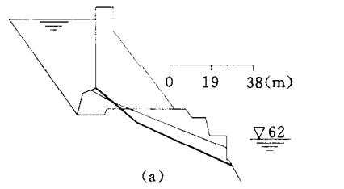

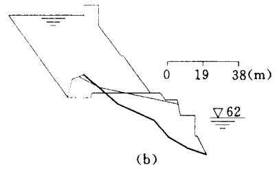

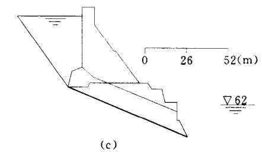

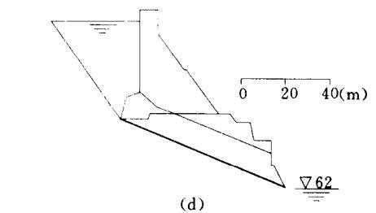

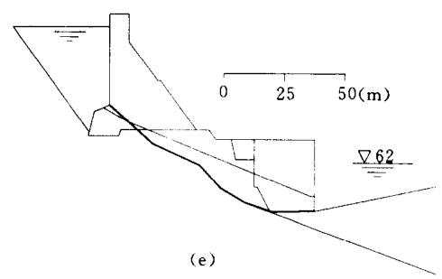

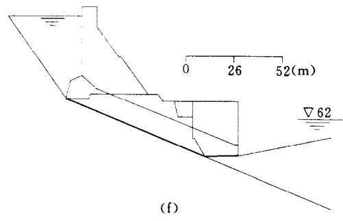

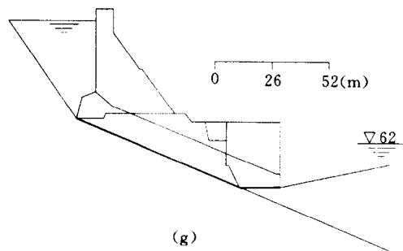

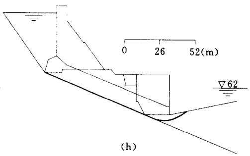  
图 13.7 三峡大坝 3 坝段主要工况计算成果  
(a) g31; (b) g32-u; (c) g33-4; (d) g33-4m; (e) g32Lf1; (f) g33Lc2; (g) g33Lf5; (h) g33Lf2

匹兹堡地区设计部门认为 Mohoning 重力坝原先采用的按传统方法所做的抗滑稳定分析有一定的缺陷，因此，在1974\~1975年期间采用 Morgenstern-Price方法对该坝重新进行抗滑稳定性的评定。在进行稳定分析时，根据建坝时和当时补充勘探试验资料，选定基岩物理力学性参数。计算分析中将坝体和坝基进行条分，按作用在条块上的力矩平衡和应力传递原理，对第10（溢流）、15和18（非溢流）坝段，相应上、下游不同水位情况进行计算，求得坝底面及其下不同深度基岩的抗滑稳定安全系数。以第10坝段为例，图13.9给出坝基1/3部分排水情况的坝基抗滑稳定安全的系数。文献作者认为，Morgenstern-Price方法可为重力坝和其他水工建筑物以岩、土边坡抗滑稳定分析提供有效的工具。

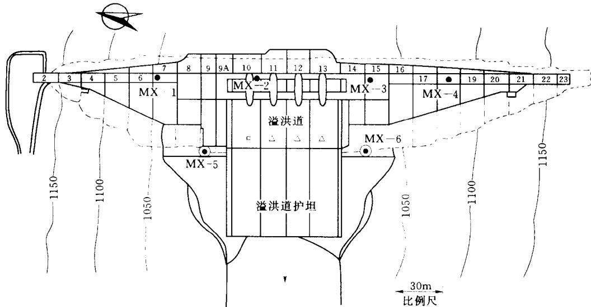  
图 13.8 Mohoning 大坝平面布置图

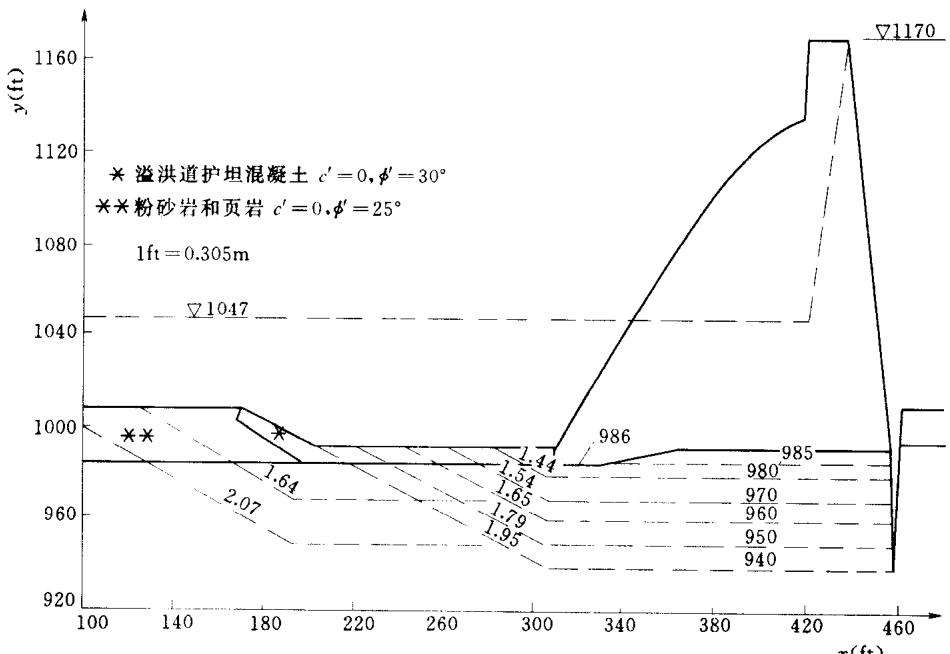  
图13.9 第10坝段抗滑稳定安全系数图（按溢洪道设计洪水和坝基1/3排水）

参加三峡3坝段稳定复核工作的各单位，相应同样的基础数据，独立地采用“刚体极限平衡法”进行分析，在一些控制工况得到了不同的安全系数，主要原因在于对条块间侧向力的倾角的假定采用了不同的处理方法。笔者在本节提出的这套计算结果有别于其它成果的主要点是使用了通用条分法，也就是在静力平衡基础上增加了一个力矩平衡的要求，因而不必对条块间作用力的倾角的具体数值进行假定。由于方法更为严密，其成果有可能更符合实际。

从应用STAB程序的特点来说，对库水位的处理方法是值得一提的。可以看到，在进行重力坝的坝基抗滑稳定分析时，我们将坝体混凝土看作是边坡的一部分，对于库水采用了以下两种处理方法：

1)将库水也看成一种材料（即c=0，φ=0，γ=水容重）；

2) 将库水位看成是一条浸润线，将上游的垂直坝面当作一条拉力缝，使用 STAB程序中拉力缝并充水的功能，以实现在坝面作用一个静水压力的边界条件。

这两种方法都可以获得合理的成果。但是这一功能扩充，导致了对STAB程序的新要求，即要求拉力缝内的水位高度不一定与缝顶齐平。允许在拉力缝内作用一个设定的高度水压力。第12章[例题27]和[例题29]为两个实例。

## 13.5 小浪底库岸河岸边坡稳定分析

## 13.5.1 基本情况

(1) 项目来源：小浪底工程建设局。

(2) 完成日期：1999 年 4 月。

(3) 设计阶段：技施设计和大坝安全鉴定。

(4) 存档文件：

1)小浪底水利枢纽大坝安全鉴定报告，中国水利水电科学研究院，1990年9月；

2) 小浪底水利枢纽土石坝工程安全检查自检报告，黄河水利委员会勘测规划设计院，1999年9月。

## 13.5.2 工程概述

小浪底枢纽除主体工程外还包括若干天然边坡，其中位于库区右岸的1#滑坡体、2#滑坡体及位于大坝下游的东苗家滑坡体由于均离坝较近，对其稳定性需作专题研究。

## 1. 1#滑坡体

1#滑坡体位于坝址上游水库右岸，滑坡体上下游均为冲沟。滑体长 650m，宽400m，最大厚度80余米，总体积 $1 , 1 0 0 \times 1 0 ^ { 4 } \mathrm { m } ^ { 3 }$

滑坡体后缘以F1断层为界，高程30m。前缘濒临黄河，出口高程130m，已深埋于地 $\mathbf { F } _ { 1 0 }$ 下，其上沉积有20m厚砂卵石层。F10断层为滑坡体的后缘切割面，上下游侧向切割面不明 $\mathbf { F } _ { 1 0 }$ 显，主要受控于走向近S-N的裂隙。底滑面（滑床）为T3层下部的泥化夹层。滑床形态 $\boldsymbol { \mathrm { T } } _ { 1 } ^ { 3 }$ 基本与地层产状一致，主滑方向为 ${ \bf N E 1 8 ^ { \circ } }$ ，滑面倾角 $1 3 ^ { \circ } { \sim } 2 0 ^ { \circ }$ 。后部靠近 $\mathrm { { \bf F } } _ { 1 0 }$ 断层处受断层牵引，滑面局部倾角可达40°。前缘35\~40m，滑床为反翘段或平段，倾角从5°到反向 $4 0 ^ { \circ }$ ${ \mathfrak { s } } ^ { \circ }$ $1 0 ^ { \circ }$ (图13.10)。滑带物质随部位不同而不同，滑床中下部的滑带厚2\~3m，普遍含滑带泥；滑体后部的滑带物质搓碎程度较轻，粒度较粗，多为岩屑、岩粉及岩块，力学指标相应亦较高。滑体中地下水位一般在137\~140m（滑带上下未分层的混合水位）。滑坡后缘平台宽约120m，其上堆积的崩坡积层中，沿后缘拉裂带常形成塌陷坑。

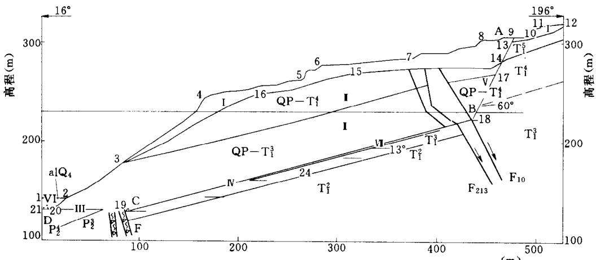  
图 13.10 1\*滑坡体典型地质剖面图

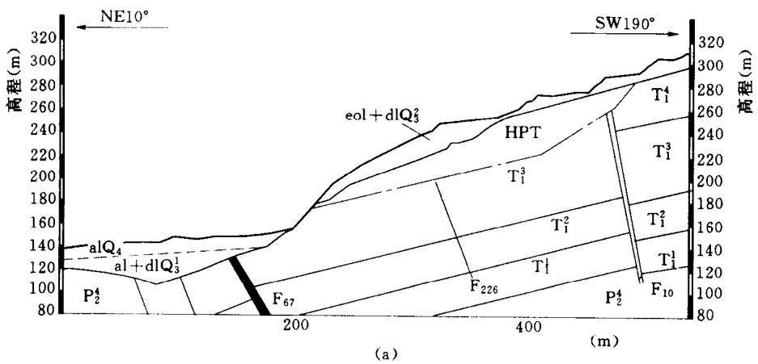

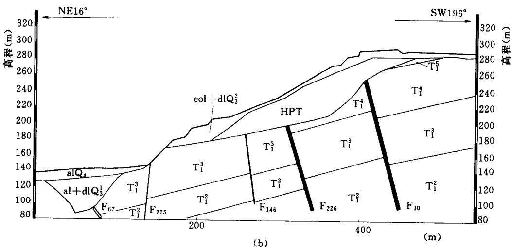  
图 13.11 2滑坡体典型地质剖面图  
(a) 西部：(b) 东部

## 2. 2#滑坡体

2#滑坡紧邻1#滑坡，上游侧以1号冲沟为界，下游侧为6号冲沟，后缘以 $\mathbf { F } _ { 1 0 }$ 为界。前缘濒临黄河，南北长200\~300m，东西累计宽约750m。滑坡体平均厚25.8m，总方量约$4 1 0 { \times } 1 0 ^ { 4 } \mathrm { m } ^ { 3 }$ 。滑坡体后缘高程300m，前缘剪出口高程150m，高出黄河河床10\~30m(图13.11)。该滑体内发育有5\~6条垂直河流方向的冲沟，将山体切割成一系列沟梁状地形，表明该滑坡已严重解体。目前除1\~2号沟和2\~3号沟间滑体保留较完整外，3#沟至6#沟间滑体前缘 $6 ^ { \# } ;$ 大部已被Ⅱ级阶地侵蚀掉，仅在后缘有部分残留物。

对2#滑坡的滑面形态和滑带物质组成，已有的勘探工作揭露得不如1#滑坡充分，总体 $2 ^ { \# } \colon$ 上整个底滑面西高东低，切割 $\boldsymbol { \mathrm { T } } _ { 1 } ^ { 3 }$ $\mathrm { T } _ { 1 } ^ { 4 }$ 岩组。主要部分仍沿上述两岩组的层间泥化带发育。滑面前部产状为 $\mathbf { N E 2 0 ^ { \circ } }$ ，倾角 $1 0 ^ { \circ } { \sim } 1 2 ^ { \circ }$ ，后部受F10断层的影响，倾角变陡(12°\~65°)。 $\mathbf { F } _ { 1 0 }$

## 3. 东苗家滑坡体

东苗家滑坡在坝下游约2km的黄河右岸，与左岸泄洪、排沙和发电尾水渠的出口遥相对应，其稳定性对于工程泄水建筑物的正常运行和河道的正常过流关系重大。滑坡位于黄河右岸有砂土和黄土覆盖的基岩斜坡上，两侧以冲沟为界，前缘凸入黄河约60m，坡脚高程135m左右。后缘为高程250\~270m的四级阶地，平面上呈圈椅状，中后部为多级台阶式地形，前部为一平均坡度为30°左右的斜坡（图13.12）。滑坡体南北长400m，东西宽350m $3 0 ^ { \circ }$ 平均厚度 35m，体积约500万m³。滑体沿岩层倾向滑动，滑移方向由南向北，与河流近 $\mathbf { m } ^ { 3 }$ 垂直。

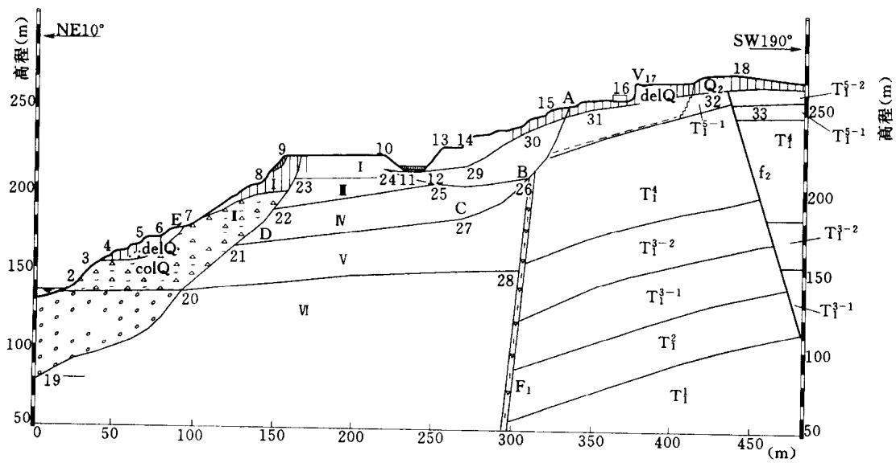  
图13.12 东苗家滑坡体典型地质剖面图

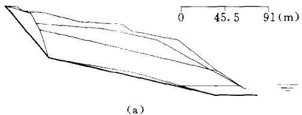

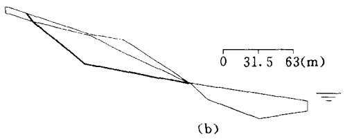

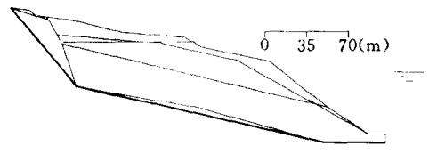  
(c)

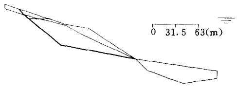  
(d)

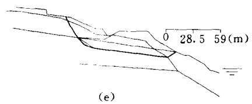

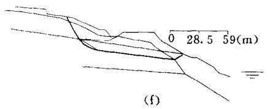

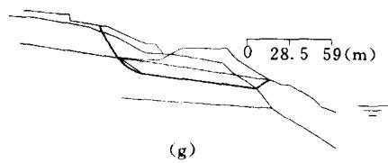

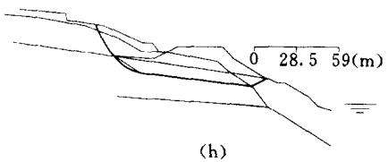  
图 13.13 小浪底库岸河岸边坡稳定计算成果  
(a) 1hp; (b) Hpx; (c) Hp-275; (d) Hpx-275; (e) 4dmj-1; (f) 2dmj-1; (g) 4dmj-2; (h) 2dmj-2

滑坡体后缘以F断层为界。前部为滑塌堆积体。根据滑坡体变形破坏特征，可将滑坡 $\mathbf { F } _ { 1 }$ 分为三个部分：后部拉裂变形体，分布于F断层以南至最南端地表裂缝间，宽90m，主要 $\mathbf { F } _ { 1 }$ 表现为岩体拉裂变形，深20\~30m；中后部滑移变形体，是滑坡的主体，具统一滑面，以整体滑移为主，宽约170m。地面高程219\~250m，其上发育有4条明显的弧形裂缝。滑体内岩层保持原层位关系，但岩体表现松弛、拉裂、错位、裂隙张开，局部架空，倾角变陡(20°\~60°)，且夹有多层层间夹泥层，表明中后部滑坡体，除整体滑移外，尚有多层多级分块滑移。位于滑坡前部130\~219m高程间。后缘以1#裂缝为界，前部覆于河床砂砾石层以上，宽30\~70m，主要由风化严重的岩块夹土组成，厚20\~40m。滑体中地下水一般变化在135\~180m间（滑带上下未分层的混合水位)，滑带以上岩体透水性极强，渗透系数K值一般在7.2\~26.8m/d之间，钻进均不返水；滑带以下完整基岩透水性中等至较弱，K值变化在0.05\~0.5m/d。垂直岸坡开挖的1#排水洞，穿至滑带以上岩体中见多处渗水，滴水和线状水流，水量随洞深增加而增大。

滑带的高程为 160\~180m，总体倾向 20°，倾角 $6 ^ { \circ } \sim 1 0 ^ { \circ }$ ，为 $\Pi _ { 1 } ^ { 7 - 4 }$ 岩组中的泥化夹层，属全泥型和泥夹碎屑型，厚2\~70cm，见擦痕和镜面。泥化夹层的天然含水量12%\~22.4%，平均值16%。干密度 $1 . 7 9 { \sim } 2 . 1 2 \mathrm { g } / \mathrm { c m } ^ { 3 }$ ，平均值 $1 . 9 6 { \bf g } / { \bf c m } ^ { 3 }$ 。粉粒含量23%\~47%，平均值37%，粘粒含量21%\~53%，平均值33%。粘土矿物以伊利石为主。

对东苗家滑坡体耗费了巨大投资进行加固。主要的工程措施是在滑坡体内开挖了排水廊道（见图13.14)，这一措施取得了较好的效果，见图中从排水管中漏出的水。

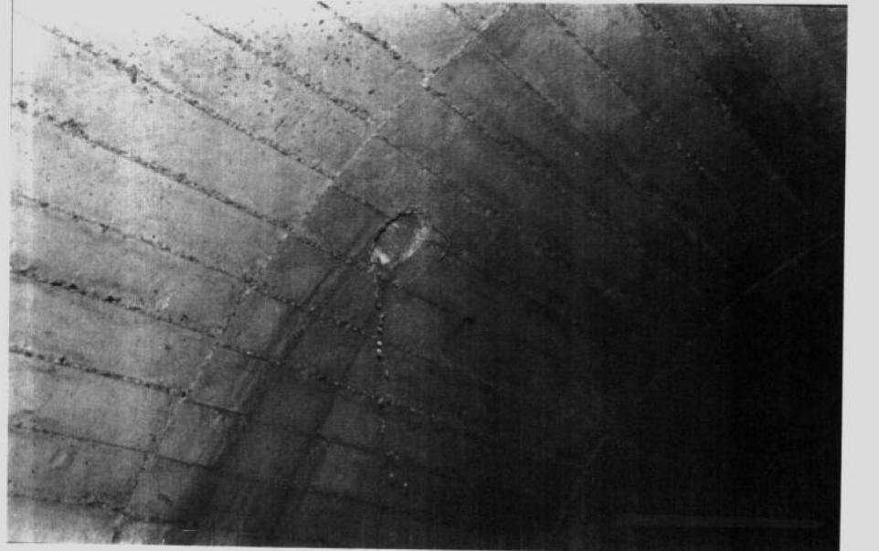  
图 13.14 东苗家排水廊道

## 13.5.3 计算条件

## 1. 计算工况

计算各滑坡体在水库蓄水前后以及遭遇地震时的稳定情况。

## 2. 强度指标

小浪底的3个滑坡体稳定计算的参数列于表13.16和表13.17。由于东苗家滑坡体在整个勘探过程中未对滑带泥进行剪切试验，其参数主要根据工程类比法确定，故仅能对相应滑带的摩擦系数f为0.22、0.23、0.25的计算指标进行敏感计算，以分析其对滑坡体稳定性 $f$ 的影响。

表13.16 1\*、2\*滑坡体稳定性计算参数
<table><tr><td rowspan="2">材料</td><td colspan="5">计算指标</td></tr><tr><td colspan="2">天然容重(9.8kN/m³)</td><td colspan="2">内摩擦角  $1 ( ^ { \circ } )$ </td><td colspan="2">粘聚力(kPa)</td></tr><tr><td></td><td> $1 ^ { \# }$ </td><td> $2 ^ { \# }$ </td><td> $1 ^ { \# }$ </td><td> $2 ^ { \# }$ </td><td> $1 ^ { \# }$ </td><td> $2 ^ { \# }$ </td></tr><tr><td>砂砾石</td><td>2.1</td><td>2.1</td><td>35.0</td><td>35.0</td><td>0</td><td>0</td></tr><tr><td>黄土</td><td>1.7</td><td>1.7</td><td>24.0</td><td>24.0</td><td>20</td><td>20</td></tr><tr><td>滑坡体物质</td><td>2.37</td><td>2.37</td><td>27.4</td><td>27.9</td><td>15</td><td>15</td></tr><tr><td>前缘反翘段</td><td>2.1</td><td></td><td>35.0</td><td></td><td>0</td><td></td></tr><tr><td>前部滑带（泥带）</td><td>2.7</td><td>2.3</td><td>12.4</td><td>16.7</td><td>5</td><td>5</td></tr><tr><td>后部滑带</td><td>2.1</td><td>2.3</td><td>17.7</td><td>27.9</td><td>5</td><td>0</td></tr><tr><td>后缘滑面</td><td>2.3</td><td></td><td>27.9</td><td></td><td>0</td><td></td></tr><tr><td>滑床</td><td></td><td>2.62</td><td></td><td>40.0</td><td></td><td>50</td></tr></table>

表13.17 东苗家滑坡体稳定性计算参数
<table><tr><td rowspan="2">材料</td><td colspan="3">计算指标</td></tr><tr><td>天然容重(9.8kN/m³)</td><td>粘聚力(kPa)</td><td>摩擦角</td></tr><tr><td>砂砾石</td><td>2.1</td><td>0</td><td>35.0</td></tr><tr><td>黄土</td><td>1.7</td><td>20</td><td>24.2</td></tr><tr><td>滑坡体物质</td><td>2.4</td><td>30</td><td>31.0</td></tr><tr><td>滑带</td><td>2.2</td><td>7</td><td>12.4</td></tr><tr><td>滑床</td><td>2.6</td><td>30</td><td>36.9</td></tr></table>

## 13.5.4 计算成果和分析

## 1. $^ { 1 ^ { \# } , }$ 2#滑坡体

1#、2#滑坡体计算成果列于表13.18，部分滑裂面位置见图13.13。计算结果表明，两个滑坡体在无地震的施工期低水位和蓄水后正常水位，安全系数均在1.04\~1.15之间，结合滑坡体近期变形特征综合分析，可认为滑坡体基本处于稳定状态。但在地震或高地下水位条件下，安全系数均接近或小于1，滑坡可能处于不稳定状态。

表13.18 1\*、2#滑坡体稳定最小安全系数F
<table><tr><td rowspan="2">库水位</td><td colspan="2">地震情况</td><td colspan="2">1*滑坡体</td><td colspan="2">2*滑坡体</td></tr><tr><td>地震烈度</td><td>水平加速度 系数</td><td>F</td><td>数据文件</td><td>F</td><td>数据文件</td></tr><tr><td rowspan="3">150m</td><td>无地震</td><td>0.0</td><td>1.133</td><td>1hp</td><td>1.041</td><td>Hpx</td></tr><tr><td>7度</td><td>0.025</td><td>1.051</td><td>1hp</td><td>0.968</td><td>Hpx</td></tr><tr><td>8度</td><td>0.05</td><td>0.980</td><td>1hp</td><td>0.903</td><td>Hpx</td></tr><tr><td rowspan="3">180m</td><td>无地震</td><td>0.0</td><td>1.112</td><td>Hp-180</td><td>1.048</td><td>Hpx-180</td></tr><tr><td>7度</td><td>0.025</td><td>1.027</td><td>Hp-180</td><td>0.974</td><td>Hpx-180</td></tr><tr><td>8度</td><td>0.05</td><td>0.955</td><td>Hp-180</td><td>0.909</td><td>Hpx-180</td></tr><tr><td rowspan="3">210m</td><td>无地震</td><td>0.0</td><td>1.108</td><td>Hp-210</td><td>0.981</td><td>Hpx-210</td></tr><tr><td>7度</td><td>0.025</td><td>1.016</td><td>Hp-210</td><td>0.906</td><td>Hpx-210</td></tr><tr><td>8度</td><td>0.05</td><td>0.940</td><td>Hp-210</td><td>0.841</td><td>Hpx-210</td></tr><tr><td rowspan="3">230m</td><td>无地震</td><td>0.0</td><td>1.116</td><td>Hp-230</td><td>0.971</td><td>Hpx-230</td></tr><tr><td>7度</td><td>0.025</td><td>1.017</td><td>Hp-230</td><td>0.890</td><td>Hpx-230</td></tr><tr><td>8度</td><td>0.05</td><td>0.935</td><td>Hp-230</td><td>0.820</td><td>Hpx-230</td></tr><tr><td rowspan="3">250m</td><td>无地震</td><td></td><td>1.111</td><td>Hp-250</td><td>0.959</td><td>Hpx-250</td></tr><tr><td>7度</td><td>0.025</td><td>1.005</td><td>Hp-250</td><td>0.868</td><td>Hpx-250</td></tr><tr><td>8度</td><td>0.05</td><td>0.919</td><td>Hp-250</td><td>0.789</td><td>Hpx-250</td></tr><tr><td rowspan="3">275m</td><td>无地震</td><td></td><td>1.15</td><td>Hp-275</td><td>1.052</td><td>Hpx-275</td></tr><tr><td>7度</td><td>0.025</td><td>1.027</td><td>Hp-275</td><td>0.933</td><td>Hpx-275</td></tr><tr><td>8度</td><td>0.05</td><td>0.930</td><td>Hp-275</td><td>0.836</td><td>Hpx-275</td></tr></table>

## 2. 东苗家滑坡体

由于东苗家滑坡体位于大坝下游，整个滑坡体处于河水位以上，因此计算只考虑滑坡体内部的孔隙水压力对稳定性的影响。本次计算假定滑坡体内部的孔隙水压力系数$r _ { u } =$

0.05、0.10、0.15、0.20时对稳定性的影响。东苗家滑坡体的计算成果列于表13.19，部分滑裂面位置见图13.13。

表13.19 东苗家滑坡体稳定安全系数F
<table><tr><td rowspan="2">孔隙水压 力系数r</td><td colspan="2">地震参数</td><td colspan="6">滑带摩擦系数</td></tr><tr><td>地震</td><td>水平加速</td><td colspan="2">f=0.22</td><td colspan="2">f=0.23</td><td colspan="2">f=0.25</td></tr><tr><td rowspan="3">0.05</td><td>烈度</td><td>度系数</td><td>F</td><td>数据文件</td><td>F</td><td>数据文件</td><td>F</td><td>数据文件</td></tr><tr><td>无地震</td><td>0</td><td>1.101</td><td>4dmj-1</td><td>1.101</td><td>3dmj-1</td><td>1.203</td><td>2dmj-1</td></tr><tr><td>7度</td><td>0.025</td><td>1.008</td><td>4dmj-1</td><td>1.008</td><td>3dmj-1</td><td>1.105</td><td>2dmj-1</td></tr><tr><td rowspan="3">0.10</td><td>8度</td><td>0.050</td><td></td><td>4dmj-1</td><td></td><td>3dmj-1</td><td>1.017</td><td>2dmj-1</td></tr><tr><td>无地震</td><td>0</td><td>1.050</td><td>4dmj</td><td>1.050</td><td>3dmj</td><td>1.143</td><td>2dmj</td></tr><tr><td>7度</td><td>0.025</td><td>0.963</td><td>4dmj</td><td>0.963</td><td>3dmj</td><td>1.051</td><td>2dmj</td></tr><tr><td rowspan="3">0.15</td><td>8度</td><td>0.050</td><td></td><td>4dmj</td><td></td><td>3dmj</td><td>0.967</td><td>2dmj</td></tr><tr><td>无地震</td><td>0</td><td>1.001</td><td>4dmj-2</td><td>1.001</td><td>3dmj-2</td><td>1.093</td><td>2dmj-2</td></tr><tr><td>7度</td><td>0.025</td><td></td><td>4dmj-2</td><td></td><td>3dmj-2</td><td>0.999</td><td>2dmj-2</td></tr><tr><td rowspan="3">0.20</td><td>8度</td><td>0.050</td><td></td><td>4dmj-2</td><td>0.951</td><td>3dmj-2</td><td></td><td>2dmj-2</td></tr><tr><td>无地震</td><td>0</td><td>0.951</td><td>4dmj-3</td><td></td><td>3dmj-3</td><td>1.034</td><td>2dmj-3</td></tr><tr><td>7度 8度</td><td>0.025 0.050</td><td></td><td>4dmj-3 4dmj-3</td><td></td><td>3dmj-3 3dmj-3</td><td></td><td>2dmj-3 2dmj-3</td></tr></table>

## 3. 对近坝库岸1#、2#滑坡的安全评价及建议

安鉴报告对近坝库岸1#、2滑坡的安全评价及建议包括以下几条：

(1) 1#、2#滑坡均为古滑坡，近期无变形破坏迹象，变形监测资料也表明两滑坡无明显活动。该两滑坡目前是稳定的。

(2)1#滑坡计算边界清楚，2#滑坡边界基本清楚；1#滑坡计算所选用的参数以试验成果为基础，参考坝址区及其它经验数据和反算成果确定，基本上是合理的。2”滑坡没有根据滑床物质的差异分别给出参数，而是以反算成果为主，给出一个综合值，在勘探资料不足，无法区分滑床物质的情况下，也可以做为一种方法考虑。

(3)计算结果表明，两个滑坡在275m和180m（围堰挡水位）蓄水位条件下，基本处于稳定状态，但在7度地震以及2#滑坡在230m水位时，滑坡处于临界稳定状态；在8度地震和水库水位消落条件下，滑坡处于不稳定状态。考虑到小浪底水库的运用方式和淤积，实际条件要比计算条件为好。

(4)从滑体特征和滑面形态分析，1#、2#滑坡即使失稳，滑动速度也不大，在围堰挡水条件下（水位180m），各自产生的涌浪小于3m，两者同时失稳时小于4m；230m和275m水位时，涌浪更小，易于防范，工程设计中已作了考虑。

## 4. 对东苗家滑坡安全评价及建议

安鉴报告对东苗家滑坡的安全评价及建议包括以下几条：

(1) 东苗家滑坡体已进行了大量的地质勘察工作，滑坡体的地质边界及计算条件已基本查清，所提供进行稳定分析的各项物理力学参数也基本合理。

(2) 采用护坡措施，防止滑坡前部坡脚冲刷是十分必要的。但该护坡顶高程为160m，低于滑带的最低高程，对滑体不提供任何抗力。

(3)滑坡体的地下水位变化，对滑坡稳定性的影响甚为敏感。因此，坡面采用截水沟，滑坡体中部布置排水洞的设计方案是合理可行的。

(4)根据稳定分析计算成果，滑坡体抗震稳定性较差，将移民新村搬到该滑坡体后缘是欠妥当的，并且会进一步恶化滑坡体的稳定性。对移民新村少数房舍地基及墙壁出现的裂缝应研究其成因并纳入滑坡监测内容中。

(5)东苗家滑坡体体积500万m³，滑面平缓，一旦失稳，将中断4#公路交通，但因处于大坝下游，不会对大坝安全造成影响。建议对滑坡体失稳后的入水体积、河床缩窄的程度及对泄洪和电厂尾水的影响，进行专项研究，并根据影响程度拟定相应的对策。

(6)加强滑坡的变形监测，并及时预报，以保证移民新村的安全。

## 13.5.5 讨论

大型水库修建后，往往引起对库区的一些天然滑坡体稳定性的关注。还有一些天然边坡，由于修建工程后，其稳定安全标准也相应提高。因此，也需要对这些天然边坡的稳定性作出评价。

本节介绍的小浪底工程3个天然边坡的规模较大，如果要采用工程措施将耗费巨大投资，因此必须进行细致的、综合的评价。首先，要通过地质勘探，确定潜在滑裂面的几何部位和软弱面的性状。例如，通过地质勘探查明，东苗家滑坡的软弱夹层不仅位置明确，而且厚度接近1m。了解了这些特点，就可以使稳定分析建立在可靠的数据基础上。其次，应尽早布置监测设施。一个大工程，从规划到施工结束，往往要跨越十几年的时间。如果对1#和2#滑体，东苗家滑坡在初设阶段就安置了表面和内部观测资料，那么十几年的观测资料将成为评价边坡稳定性的最重要的科学依据。可惜，这一观点通常难以在实践中付诸实施。小浪底的这3个滑坡体的测斜仪一直到工程接近结束的1999年才开始布设。但是，即便如此，在工程投入运行后，这批观测设备也将成为了解边坡稳定性的重要手段。

从边坡稳定分析计算角度，本例具有以下特点：

(1) 本例和三峡大坝复核情况相似，也是采用 Morgensten-Price 法进行岩质边坡稳定分析的实例。对于滑面为连续夹泥层的情况，使用这一方法可得到合理的成果。由于岩质边坡地震加速度系数的放大效应和土石坝有明显不同，采用了用户输入地震加速度系数的功能。本工程考虑7度和8度地震，水平地震加速度系数分析采用了0.025g和0.5g。

(2) 东苗家滑裂面的一部分通过较弱夹层，一部分穿过节理岩体，采用最优化方法最终确定临界滑裂面。

(3) 由于天然边坡的材料强度指标和地下水位具有极大的不确定性，因此对这些参数作了大量的敏感性分析。

(4) 对东苗家滑坡体，主要采用排水措施提高其稳定性，即使在小浪底那样气候相对干燥的地区，排水廊道中仍有不间断的水流出，见图13.14排水孔的流水。可以设想，如果这些水没有机会排出，安全系数可能会有很大幅度的削弱。

## 13.6 宜兴抽水蓄能电站上池

## 13.6.1 基本情况

(1)工程名称：江苏宜兴抽水蓄能电站。

(2) 项目来源：江苏省电力公司。

(3)完成日期：1999年2月。

(4) 设计阶段：选坝阶段。

(5) 存档文件：江苏宜兴铜官山抽水蓄能电站上水库主坝坝型选择专题研究，中国水利水电科学研究院，1999年5月，GE-99-03-011。

## 13.6.2 工程概述

江苏宜兴抽水蓄能电站位于宜兴市西南郊约10km的铜官山区，是一座日调节抽水蓄能电站，装机1000MW。上水库主坝横穿铜官山顶北侧沟谷，可行性研究设计阶段需进行多种坝型的布置比较。基本坝型为堆石坝和混凝土重力坝两大类，而堆石坝中又考虑了钢筋混凝土面板堆石坝、混合堆石坝方案。其典型剖面图分别见图13.15\~图13.17。

从图13.15可知，面板坝方案的下游坡延伸较长，坝顶至坡趾高差达280m。混合坝和重力坝方案恰是基于试图弥补面板坝这一缺陷的情况下形成的。

混合坝在山梁中部修建一个挡土墙以减少面板坝下游坝延伸过长的缺陷，但需要复核高约40m的挡土墙本身的稳定问题。

重力坝断面较小，故不存在下游坝坡延伸过长的问题，但需复核大坝沿坝基夹泥层的抗滑稳定问题。

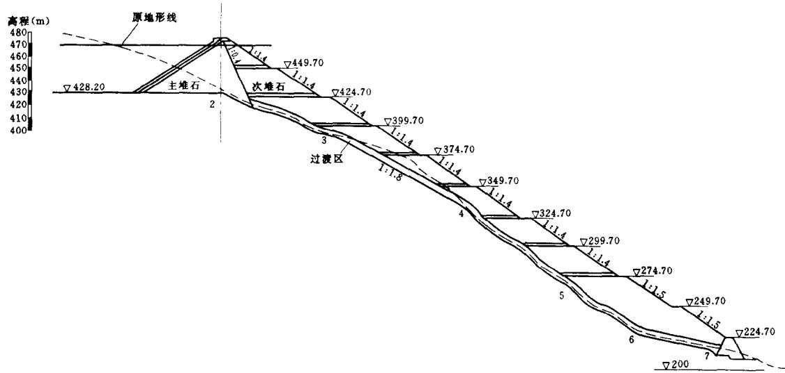  
图 13.15 宜兴抽水蓄能电站面板坝方案典型剖面

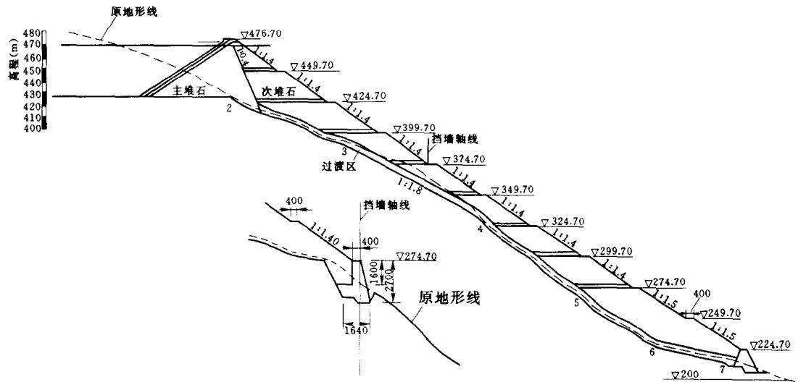  
图13.16 宜兴抽水蓄能电站混合坝方案典型剖面

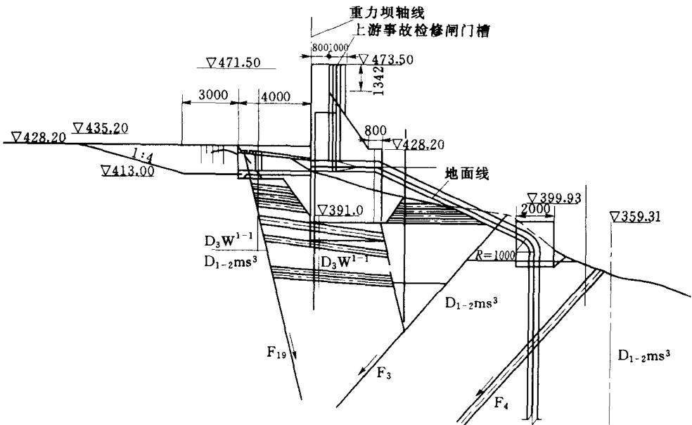  
图 13.17 宜兴抽水蓄能电站重力坝方案典型剖面

## 13.6.3 计算条件

## 1. 计算工况

共作了三种坝型方案比较，面板堆石坝方案、混合堆石坝方案和混凝土重力坝方案。

## 2. 强度指标

稳定分析采用的力学参数来自于江苏宜兴铜官山抽水蓄能电站预可行性研究报告，见表13.20。

表13.20 宜兴工程上池坝体稳定分析抗剪强度参数表
<table><tr><td>岩性</td><td>φ (°)</td><td>C (kPa)</td><td colspan="2">非线性指标(°)</td><td>天然容重 (9.8kN/m³)</td><td>饱和容重 (9.8kN/m³)</td></tr><tr><td></td><td></td><td>0</td><td> $\phi _ { o }$ </td><td>∆φ</td><td></td><td></td></tr><tr><td>主坝料</td><td>45 43</td><td>0</td><td>52 52</td><td>8</td><td>2.2</td><td>2.3</td></tr><tr><td>辅坝料</td><td>38.66</td><td>350</td><td></td><td>8</td><td>2.17</td><td>2.3 2.3</td></tr><tr><td>弱风化岩 混凝土/弱风化</td><td>38.66</td><td>350</td><td></td><td></td><td>2.2</td><td></td></tr><tr><td>砂岩接触面</td><td></td><td></td><td></td><td></td><td></td><td></td></tr><tr><td>坝料/弱风化 砂岩接触面</td><td>35</td><td>0</td><td></td><td></td><td></td><td></td></tr><tr><td>坝料/弱风化砂岩 接触面建议值 泥化夹层</td><td>29</td><td>50</td><td></td><td></td><td></td><td></td></tr></table>

注 非线性抗剪强度指标采用 Duncun 对数模式，φ和Δφ为非线性参数。

## 13.6.4 计算成果与分析

混凝土面板堆石坝稳定分析计算的 3 个剖面中，5-5 剖面安全系数稍低。当其坝体底部出现倾角8°的软弱夹层时，构不成影响坝体安全的控制因素。如果把坝体下游坡坡比从1:1.4放缓到1:1.5，坝体安全系数有所提高，对边坡稳定有利。分析结果见表13.21。图13.18所示为两种工况的计算简图。

表13.21 混凝土面板堆石坝剖面稳定分析安全系数
<table><tr><td rowspan="3">稳定分析临界 滑裂面部位</td><td rowspan="3">坝体与 基岩接 触面抗</td><td colspan="4">下游坝坡比1：1.4</td><td colspan="3">下游坝坡比1：1.5</td></tr><tr><td colspan="2">坝料线性指标</td><td>坝料非线性指标</td><td rowspan="2">文件</td><td colspan="2">坝料非线性指标</td><td rowspan="2">文件</td></tr><tr><td>正常</td><td>7度地震</td><td>正常 7度地震</td><td>正常</td><td>7度地震</td></tr><tr><td>中间部位</td><td>剪参数 A</td><td>1.278</td><td>1.215</td><td>1.414 1.292</td><td>Tg1</td><td>1.419</td><td>1.347</td><td>Tg151</td></tr><tr><td>滑裂面</td><td>B</td><td>1.246</td><td>1.183</td><td>1.314 1.255</td><td></td><td>1.326</td><td>1.261</td><td></td></tr><tr><td rowspan="2">上部滑裂面</td><td>A</td><td>1.403</td><td>1.330</td><td>1.581 1.504</td><td>Tg3</td><td>1.709</td><td>1.623</td><td>Tg153</td></tr><tr><td>B</td><td>1.362</td><td>1.292</td><td>1.541 1.467</td><td></td><td>1.650</td><td>1.570</td><td></td></tr><tr><td rowspan="2">下部滑裂面</td><td>A</td><td>1.322</td><td>1.256</td><td>1.440 1.353</td><td>Tg4</td><td>1.448</td><td>1.389</td><td>Tg154</td></tr><tr><td>B</td><td>1.279</td><td>1.217</td><td>1.379 1.314</td><td></td><td>1.387</td><td>1.331</td><td></td></tr><tr><td>下部沿坝脚</td><td>A</td><td>1.404</td><td>1.337</td><td>1.438 1.362</td><td>Tg6</td><td>1.551</td><td>1.438</td><td>Tg156</td></tr><tr><td>滑裂面</td><td>B</td><td>1.329</td><td>1.268</td><td>1.349 1.287</td><td></td><td>1.372</td><td>1.307</td><td></td></tr><tr><td>整体滑裂面下</td><td>A</td><td>1.344</td><td>1.277</td><td>1.372 1.305</td><td>Tg7</td><td>1.447</td><td>1.376</td><td>Tg157</td></tr><tr><td>部沿坝脚滑动</td><td>A</td><td>1.281</td><td>1.220</td><td>1.304 1.245</td><td></td><td>1.324</td><td>1.260</td><td></td></tr><tr><td>整体圆弧滑动</td><td>B</td><td>1.513</td><td>1.440</td><td>1.516 1.442</td><td>Tg1c</td><td>1.642</td><td>1.558</td><td>Tg151c</td></tr><tr><td>软弱夹层1</td><td>A</td><td></td><td></td><td>2.698 2.424</td><td>Tg8</td><td>2.818</td><td>2.526</td><td>Tg158</td></tr><tr><td>软弱夹层2</td><td>A</td><td></td><td></td><td>2.695 2.420</td><td>Tg9</td><td>2.838</td><td>2.543</td><td>Tg159</td></tr></table>

注 1.A代表设计提出的坝体与基岩接触面抗剪参数φ=35°，c=0kPa。  
2.B代表坝体与基岩接触面抗剪参数建议值φ=29°，c=50kPa。

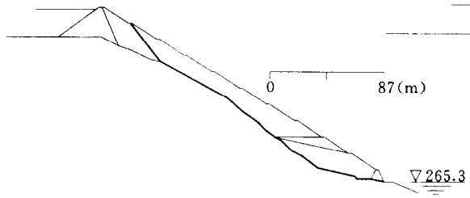  
(a)

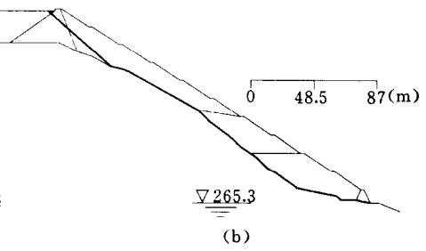

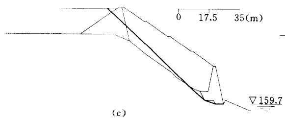

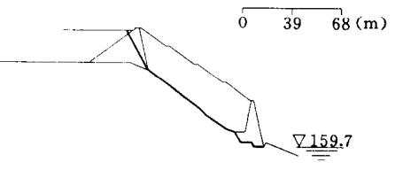  
(d)

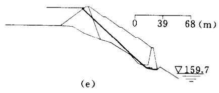

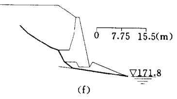

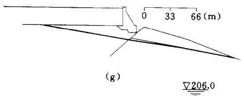

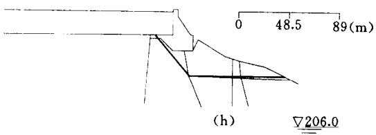  
图 13.18 宜兴抽水蓄能电站主要计算成果  
(a) TG151; (b) TG153; (c) TS1; (d) TS2; (e) TS88; (f) TD4; (g) TD2-2b; (h) TD3-3b

作为与混凝土面板堆石坝的比较方案，对混合坝分析了C-C、8-8两个剖面。其安全系数略高于面板堆石坝(表13.22)。需注意的是，表 13.22相应的是选坝阶段的混合坝方案与施工期最终选定的混合坝方案不同。

表13.22 混合坝抗滑稳定的安全系数
<table><tr><td>剖面号</td><td>滑裂面部位</td><td>坝体与基岩接触 面抗剪参数</td><td></td><td>安全系数 7度地震安全系数</td><td>文件号</td></tr><tr><td rowspan="3">C-C</td><td>堆石体滑裂面</td><td></td><td>1.663</td><td>1.606</td><td>TS1</td></tr><tr><td>沿坝体与基岩</td><td>A</td><td>1.424</td><td>1.337</td><td>TS2</td></tr><tr><td>接触面滑裂面</td><td>B</td><td>1.348</td><td>1.316</td><td></td></tr><tr><td rowspan="3">88</td><td>堆石体滑裂面</td><td></td><td>1.738</td><td>1.652</td><td>TS88</td></tr><tr><td>沿坝体与基岩</td><td>A</td><td>1.532</td><td>1.475</td><td>TS88-2</td></tr><tr><td>接触面滑裂面</td><td>B</td><td>1.465</td><td>1.413</td><td></td></tr></table>

注 1.A代表设计提出的坝体与基岩接触面抗剪参数 $\phi = 3 5 ^ { \circ }$ ,c=0kPa;  
2.B代表坝体与基岩接触面抗剪参数建议值 $\phi = 2 9 ^ { \circ } ,$ c=50kPa。

对重力坝方案重点分析了1-1剖面，安全系数达到重力坝规范的许可值。计算结果见表13.23。最不利情况是沿 $\mathrm { { F } } _ { 1 9 }$ 断层和假定的坝下 $8 ^ { \circ } { : }$ 缓倾角软弱夹层组合滑动时，见图13.18(g)和(h)，安全系数仅为1.22。

表13.23 重力坝抗滑稳定的安全系数
<table><tr><td>剖面号</td><td>滑裂面部位</td><td>安全系数</td><td>7度地震安全系数文件号</td><td></td></tr><tr><td rowspan="4">1-1</td><td>重力坝整体滑动</td><td>4.139</td><td>3.844</td><td>TD1</td></tr><tr><td>沿坝底软弱夹层</td><td>1.848</td><td>1.652</td><td>TD3</td></tr><tr><td> $\mathbf { F } _ { 1 9 }$  断层与软弱夹层组合</td><td>1.220</td><td>1.137</td><td>TD4</td></tr><tr><td> $\underline { { \mathbf { F } _ { 1 9 } } } .$   $\operatorname { F } _ { 4 }$  断层与  $\underline { { \mathbf { i } \mathbf { S T _ { 8 } } } }$  11 软弱夹层组合</td><td>1.761</td><td></td><td>TD5</td></tr><tr><td rowspan="3">2-2</td><td>重力坝整体滑动</td><td>3.035</td><td>2.917</td><td>TD2-2a</td></tr><tr><td>沿错动的软弱夹层滑动</td><td>1.669</td><td>1.499</td><td>TD2-2b</td></tr><tr><td>沿软弱夹层和  $\mathrm { F } _ { 1 6 }$  组合滑动</td><td>2.946</td><td>2.959</td><td>TD2-2c</td></tr><tr><td rowspan="2">3-3</td><td>重力坝整体滑动</td><td>3.661</td><td>3.465</td><td>TD3-3a</td></tr><tr><td>滑面上部在花岗斑岩中自由搜索， 下部沿软弱夹层滑动</td><td>1.774</td><td>1.671</td><td>TD3-3b</td></tr></table>

## 13.6.5 讨论

在水电工程规划和可行性论证阶段通常需要进行不同方案、不同坝型的比较。宜兴工程的三种不同坝型的分析论证过程中，边坡稳定的极限平衡分析计算均发挥了直接的作用。由于极限平衡分析计算过程简便、可靠，计算成果和现行规范直接配套，并适宜进行敏感性分析和方案比较，熟练地使用STAB程序，可以在较短的时间完成一个工程初设阶段建筑物抗滑稳定分析的大量工作。

本工程推荐的面板堆石坝方案具有许多抽水蓄能电站上池共有的特点：坝轴线位于一个山脊的轴线，即一个岩石边坡的顶部。由于岩体的层面斜交此边坡，故在面板坝方案的分析中没有对下游坡的岩体部分按岩质边坡稳定复核的原则进行分析。但下游坡以一个薄层坝壳的形式贴在山脊面上，高差达280m，构成了一个沿接触面滑动的模式。从计算成果可以发现，即使采用了堆石的非线性强度指标，其安全系数离要求的1.5还有一段差距。这一差距在坝坡从1:1.4放缓到1:1.5后仍不能得到根本的解决。

本阶段的内容为选坝阶段的论证成果。经研究决定采用土石坝方案。但在施工阶段，根据专家要求，又详细进行了优化后的混合坝方案的论证工作。有关内容包括混合坝土压力和沿坝基三维深层抗滑稳定分析，分别在本书第8章和第14章中介绍。

## 13.7 紫坪铺水库左岸堆积体

## 13.7.1 基本情况

(1) 项目来源：电力部成都勘测设计院。

(2) 完成日期：1995年2 月。

(3) 设计阶段：初步设计。

(4) 存档文件：紫坪铺水库左岸堆积体稳定分析，水利水电科学研究院，岩土(95)7，1990年7月。

## 13.7.2 工程概述

本工程堆积体位于库首金沙坝前左岸汤家林、贾家沟一带，距大坝618m，距右岸引水隧洞进口最近处仅250m。上游界线在汤家林沟顺坡长约1600m，由一系列不同高程平台和斜坡组成，斜坡坡度 $2 0 ^ { \circ } { \sim } 3 0 ^ { \circ }$ ，沿江宽300\~870m，初估方量2500\~3000万 $\mathbf { m } ^ { 3 } .$ 。堆积体纵1-1剖面见图13.19。

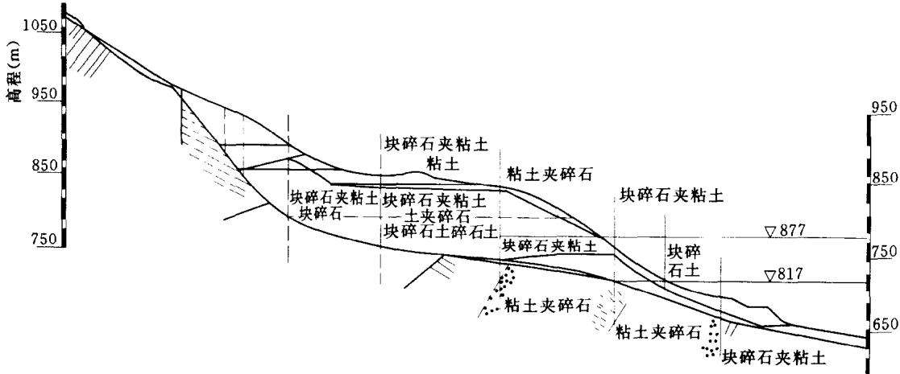  
图 13.19 紫坪铺水库左岸堆积体地质剖面简图

堆积体外围岩石岩性复杂，主要由灰岩、白云质灰岩、岩质页岩组成，中夹少量灰绿岩脉。堆积体内部和附近发现一系列泉水。钻孔和竖井资料均显示具有一定的地下水位。

简易注水试验表明土体渗透系数K为0.012\~3.09m/昼夜，属极弱透水-弱透水。勘探证实与基岩接触面处有一连续平直软滑带，厚0.5\~15cm，由砾质重壤土组成。该层土性质软弱，微透水，抗剪强度低，工程性质很差。堆积体从上至下可分为七层，主要为坡碎石夹粘土、粘土夹坡碎石、块碎石土等。

## 13.7.3 计算条件

## 1. 计算工况

主要计算空库、正常水位、在正常水位下遭遇地震、库水位骤降及各处理方案等情况下堆积体的稳定性。

(1) 计算剖面采用成都勘测设计院提供的紫坪铺水库工程左岸坝前堆积体 1-1 工程地质剖面图 13.19。

(2) 天然情况，将各钻孔地下水位相连作为该工况浸润线，图13.20 中 34,35,36,37,38,39各点的连线 $( 3 6 ^ { \# }$ 点为2#钻孔）。

正常工况：浸润线采用连泵钻孔34，35，36和正常水位877m与坡面交点40#及40#点 $4 0 ^ { \# }$ 以下，外坡线上转折点的连线。

水位骤降工况因堆积体极难透水，认为水压力不消散，故浸润线仍采用降前侵润线。库水位由 877m 降至 846m或降至 817m。

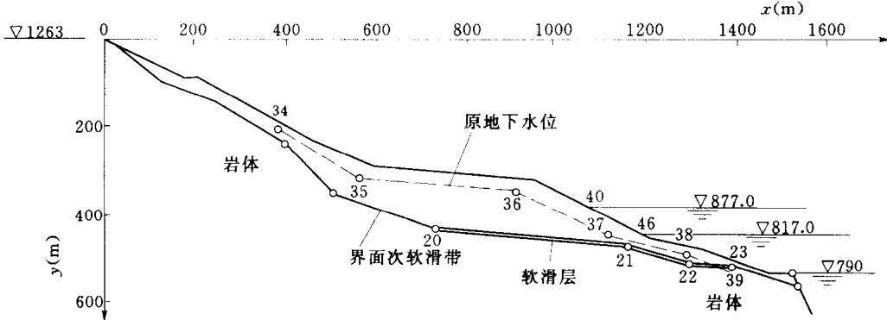  
图 13.20 紫坪铺水库左岸堆积体天然剖面计算图

(3) 地震烈度为 7度。

## 2. 强度指标

堆积体各土层强度指标见表13.24。材料指标选用原则为：稳定渗流期，即天然情况和正常水位工况，用慢剪指标进行计算；非稳定渗流期，即水位骤降工况，用慢剪和饱和固结快剪组成的强度包线进行稳定计算。

表 13.24 堆积体各土层强度指标
<table><tr><td rowspan="2">材料号</td><td colspan="2">慢 剪</td><td colspan="2">快 剪</td><td rowspan="2">容重 (9.8kN/m³)</td><td rowspan="2">饱和容重 (9.8kN/m³)</td></tr><tr><td>摩擦角  $\bigstar ( \mathrm { ^ \circ } )$ </td><td>粘聚力 c(kPa)</td><td>摩擦角 φ(°)</td><td>粘聚力 c(kPa)</td></tr><tr><td>1 堆积体</td><td>31.0</td><td>2.0</td><td>11.0</td><td>4.0</td><td>2.20</td><td>2.24</td></tr><tr><td>2 下部夹泥层</td><td>16.0</td><td>1.0</td><td>13.0</td><td>3.0</td><td>2.20</td><td>2.24</td></tr><tr><td>3 上部夹泥层</td><td>23.0</td><td>2.0</td><td></td><td></td><td>2.20</td><td>2.24</td></tr><tr><td>4基岩</td><td>45.0</td><td>5.0</td><td></td><td></td><td>2.40</td><td>2.45</td></tr><tr><td>5 压重料</td><td>31.0</td><td>2.0</td><td>11.0</td><td>4.0</td><td>2.00</td><td>2.05</td></tr></table>

## 13.7.4 计算成果与分析

各方案计算成果总结于表13.25，部分计算图形见图13.24。

1. 堆积体天然剖面（未处理）稳定分析

(1) 水库未蓄水即空库工况。计算简图如图13.20示。从表13.25知，堆积体的稳定安全系数在1.057-1.379之间。

(2) 正常水位工况。水库蓄水后，在正常水位 877m 工况下， $F _ { m } = 0 . 9 7 7$ ，临界滑裂面与空库基本相同。

(3) 正常水位+地震工况。从表 13.25 知， $F _ { m } = 0 . 8 7 7$ ，临界滑裂面与空库及正常水位工况基本相同。

上述计算结果表明，堆积体天然剖面在空库情况下，堆积体的稳定安全系数F大于1，这与堆积体处于稳定状态的现状是相符的，但安全储备不大，最小安全系数仅为1.057。水库蓄水后，F小于1，堆积体处于不稳定状态，因此须对堆积体进行处理。

表13.25 左岸堆积体稳定安全系数
<table><tr><td rowspan="2">方案</td><td rowspan="2">滑动位置</td><td colspan="4">安全系数Fm</td></tr><tr><td>空库 (1)</td><td>正常水位 (2)</td><td>正常水位+地震 (3)</td><td>库水位骤降 (4)</td></tr><tr><td rowspan="5">天然剖面 (A)</td><td>整体沿底部(1)</td><td>1.105 (A11)</td><td>1.106 (A12)</td><td>0.905 (A13)</td><td>1.044 (A14)</td></tr><tr><td>整体沿腰部(2)</td><td>1.121 (A21)</td><td>1.113 (A22)</td><td>0.912 (A23)</td><td>1.053 (A24)</td></tr><tr><td>局部沿底部(3)</td><td>1.057 (A31)</td><td>1.997 (A32)</td><td>0.877 (A33)</td><td>1.143 (A34)</td></tr><tr><td>局部沿腰部(4)</td><td>1.101 (A41)</td><td>1.000 (A42)</td><td>0.919 (A43)</td><td>0.772 (A44)</td></tr><tr><td>堆积体中部(5)</td><td>1.379 (A51)</td><td>1.076 (A52)</td><td>1.005 (A53)</td><td>0762 (A54)</td></tr><tr><td rowspan="4">处理方案1 降地下水位 (B) 处理方案2</td><td>整体沿底部(1)</td><td></td><td>1.179 (B12)</td><td>0.966 (B13)</td><td>1.102 (B14)</td></tr><tr><td>整体沿腰部(2)</td><td></td><td>1.190 (B22)</td><td>0.975 (B23)</td><td>1.117 (B24)</td></tr><tr><td>局部沿底部(3)</td><td></td><td>1.064 (B32)</td><td>0.955 (B33)</td><td>1.064 (B34)</td></tr><tr><td>局部沿腰部(4)</td><td></td><td>1.121 (B42)</td><td>1.207 (B43)</td><td>1.094 (B44)</td></tr><tr><td rowspan="4">压坡压脚 (C)</td><td>整体沿底部(1)</td><td></td><td>1.191 (C12)</td><td>0.980 (C13)</td><td>1.113 (C14)</td></tr><tr><td>整体沿腰部(2)</td><td></td><td>1.151 (C22)</td><td>0.941 (C23)</td><td>1.086 (C24)</td></tr><tr><td>局部沿底部(3)</td><td></td><td>1.261 (C32)</td><td>1.126 (C33)</td><td>1.037 (C34)</td></tr><tr><td>局部沿腰部(4)</td><td></td><td>1.112 (C42)</td><td>1.003 (C43)</td><td>0.890 (C44)</td></tr><tr><td rowspan="4">处理方案3 压坡压脚+降 地下水位 (D)</td><td>整体沿底部(1)</td><td></td><td>1.262 (D12)</td><td>1.039 (D13)</td><td>1.240 (D14)</td></tr><tr><td>整体沿腰部(2)</td><td></td><td>1.227 (D22)</td><td>1.004 (D23)</td><td>1.236 (D24)</td></tr><tr><td>局部沿底部(3)</td><td></td><td>1.371 (D32)</td><td>1.334 (D33)</td><td>1.320 (D34)</td></tr><tr><td>局部沿腰部(4)</td><td></td><td>1.274 (D42)</td><td>1.272 (D43)</td><td>1.344 (D44)</td></tr><tr><td rowspan="4">处理方案4 削下坡 (E) 处理方案5</td><td>整体沿底部(1)</td><td>1.003 (E11)</td><td></td><td></td><td></td></tr><tr><td>整体沿腰部(2)</td><td></td><td></td><td></td><td></td></tr><tr><td>局部沿底部(3)</td><td>0.709 (E31)</td><td></td><td></td><td></td></tr><tr><td>局部沿腰部(4)</td><td></td><td></td><td></td><td></td></tr><tr><td rowspan="4">削下坡+ 降地下水位 (F)</td><td>整体沿底部(1) 整体沿腰部(2)</td><td>1.075 (F11)</td><td></td><td></td><td></td></tr><tr><td>局部沿底部(3)</td><td></td><td></td><td></td><td></td></tr><tr><td>局部沿腰部(4)</td><td>0.903 (F31)</td><td></td><td></td><td></td></tr><tr><td>整体沿底部(1)</td><td>1.341 (G11)</td><td>1.297 (G12)</td><td></td><td>1.299 (G14)</td></tr><tr><td rowspan="5">处理方案6 削上坡+ 压坡压脚+降 地下水位 (G)</td><td>整体沿腰部(2)</td><td>1.254 (G21)</td><td>1.246 (G22)</td><td>1.097 (G13)</td><td></td></tr><tr><td>局部沿底部(3)</td><td></td><td></td><td>1.058 (G23)</td><td>1.254 (G24)</td></tr><tr><td></td><td>1.488 (G31)</td><td>1.371 (G32)</td><td>1.334 (G33)</td><td>1.320 (G34)</td></tr><tr><td>局部沿腰部(4)</td><td>1.310 (G41)</td><td>1.502 (G42)</td><td>1.134 (G43)</td><td>1.230 (G44)</td></tr><tr><td>堆积体中部(5)</td><td>1.617 (G51)</td><td>1.218 (G52)</td><td>1.375 (G53)</td><td>1.617 (G54)</td></tr><tr><td rowspan="5">处理方案7 压三级马道 (H)</td><td>整体沿底部(1)</td><td></td><td>1.215 (H12)</td><td>0.994 (H13)</td><td>1.074 (H14)</td></tr><tr><td>整体沿腰部(2)</td><td></td><td>1.222 (H22)</td><td>0.996 (H23)</td><td>1.064 (H24)</td></tr><tr><td>局部沿底部(3)</td><td></td><td>1.359 (H32)</td><td>1.191 (H33)</td><td>0.763 (H34)</td></tr><tr><td>局部沿腰部(4)</td><td></td><td>1.382 (H42)</td><td>1.217 (H43)</td><td>0.703 (H44)</td></tr><tr><td>堆积体中部(5)</td><td></td><td>2.006 (H52)</td><td></td><td></td></tr></table>

注 圆括号内为数据文件名称。

## 2. 堆积体处理方案稳定分析

(1) 处理方案1，降2号孔地下水位。计算简图如图13.21 示。通过排水措施能有效地降低地下水位。拟将2号孔地下水位由913.22m降至880m，共降33.22m.。

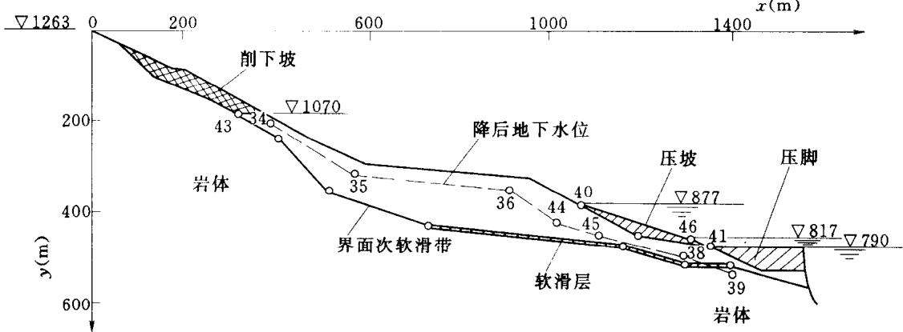  
图 13.21 紫坪铺水库左岸堆积体处理方案1,2,3 剖面计算图

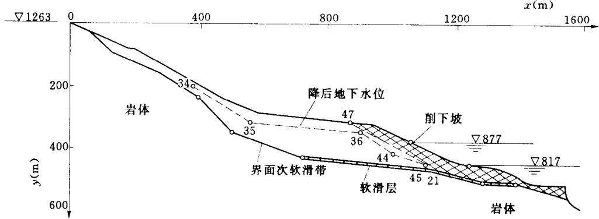  
图 13.22 紫坪铺水库左岸堆积体处理方案4,5,6 剖面计算图

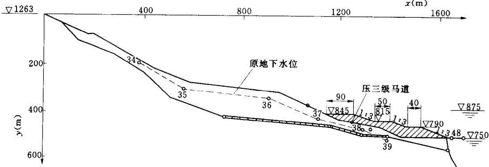  
图13.23 紫坪铺水库左岸堆积体处理方案7剖面计算图

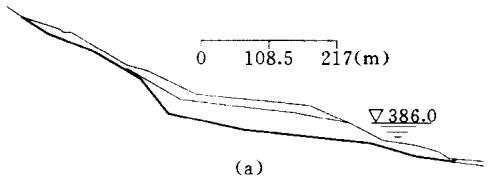

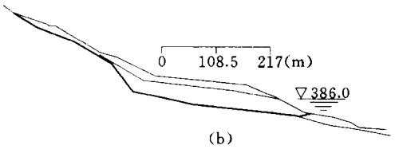

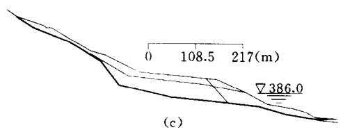

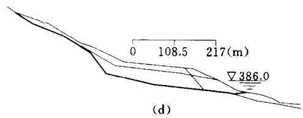

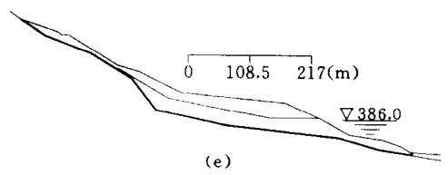

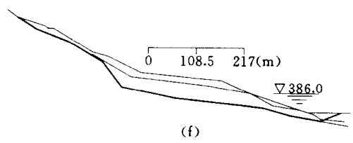

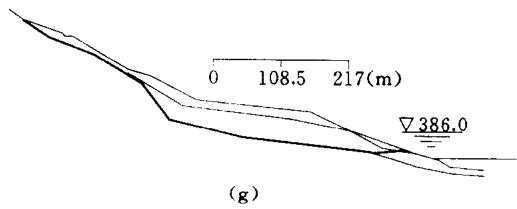

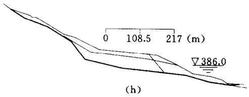  
图 13.24 紫坪铺水库左岸堆积体主要计算成果  
(a) A12; (b) A22; (c) A32; (d) A42; (e) B12; (f) C12; (g) C22; (h) C32

正常水位工况， $F _ { m } = 1 . 0 6 4$ ，临界滑裂面亦为部分堆积体从其底部滑出。

正常水位+地震工况， $F _ { m } = 0 . 9 5 5$ ，临界滑动位置与正常水位工况基本相同。由此可见，降2号孔地下水位尚不能保证堆积体的稳定。

(2) 处理方案 2，压坡+压脚。压脚范围由坝前原地形填方至 790m 高程，再沿 790m高程向堆积体延伸直至与其外坡线相交于点41（图13.21）；压坡范围由点41至877高程，与原堆积体外坡交点40，计算简图见图13.21。压重体材料编号为5（表13.24）。

正常水位工况， $F _ { m } = 1 . 1 1 2$ ，临界滑裂面为部分堆积体沿软滑带（材料2），从其腰部堆积体薄弱处滑出。

正常水位+地震工况， $F _ { m } = 0 . 9 4 1$ ，临界滑裂面为堆积体整体沿次软滑带（材料3）及软滑带（材料2）滑出。

由此可见，压坡+压脚的处理措施亦不能保证堆积体的稳定。

(3) 处理方案3，压坡压脚+降2号孔地下水位。计算简图如图13.21示。

正常水位工况， $F _ { m } = 1 . 2 2 7$ ，满足 $F _ { m } = 1 . 1 5$ 的要求，临界滑裂面为堆积体整体沿次软滑带（材料3）及软滑带（材料2）从堆积体腰部薄弱处滑出。

正常水位+地震工况， $F _ { m } { = } 1 . 0 0 4$ ，临界滑裂面与正常水位工况基本相同。

(4)处理方案4，削下坡。削下坡的范围如图13.22示。

空库工况， $F _ { m } = 0 . 7 3 9$ 。正常水位工况， $F _ { m } = 0 . 7 9 7$ ，堆积体处于极不稳定状态。计算结果表明，削下坡虽减小了堆积体体积但实际上却削弱了阻止堆积体下滑的能力，使得安全系数减小。

(5) 处理方案5，削下坡+降2号孔（36#点）地下水位。此方案综合处理方案4和处理方案1的措施，计算简图如图13.21示。从表13.25知在空库及正常水位下均不满足稳定的要求。

(6) 处理方案 6，削上坡+压坡压脚+降 2 号孔地下水位。削上坡范围为挖除 1070m 高程以上堆积体，再同时采用处理方案1和处理方案2的措施。

正常水位工况， $F _ { m } = 1 . 2 1 8$ ，满足 $F _ { m } = 1 . 1 5$ 的要求，临界滑裂面为部分堆积体沿软滑带（材料2）从堆积体腰部薄弱处滑出。

正常水位+地震工况， $F _ { m } = 1 . 0 5 8$ ，临界滑裂面为堆积体整体沿次软滑带（材料3）及软滑带（材料2）从堆积体腰部薄弱处滑出。

库水位骤降工况，由877m降至846m， $F _ { m } = 1 . 2 3 0$ ，临界滑裂面均为部分堆积体沿软滑带（材料2）从堆积体腰部薄弱处滑出。

(7) 处理方案7，压三级马道。正常水位工况， $F _ { m } = 1 . 2 1 5$ ，临界滑裂面为堆积体整体沿次软滑带（材料3）软滑带（材料2）从堆积体末端薄弱处滑出，图13.23。

正常水位+地震工况， $F _ { m } = 0 . 9 9 4$ 不满足 $F _ { m } = 1 . 0 5$ 的要求，临界滑裂面与正常水位工况基本相同。

库水位骤降工况，库水位由877m降至817m，最小安全系数为0.688，临界滑裂面为部分堆积体沿软滑带（材料2）从堆积体腰部薄弱处滑出。

上述计算结果表明，压三级马道虽对正常水位下的安全系数有所提高，但并不明显，因压重部位均在浸润线以下，特别是在库水位骤降过程中水压力不消散，材料的计算指标采用极低的快剪指标，这对边坡的稳定极为不利，且工程量巨大。

## 13.7.5 讨论

本例是一个在初设阶段进行的一个稳定分析工作。研究对象是库区将被淹没的大规模堆积体。本项目的稳定分析和加固方案研究工作，在工程开工后，还将进一步深入。从稳定分析角度，本案例在以下两个方面有其自身的特点。

(1)由于底滑面为折线形，在搜索最小安全系数时，需要分段进行，故而出现了整体滑动、沿中部滑动、沿腰部滑动、沿底部滑动等多种工况。本案例对于研究天然滑坡沿已确定的非直线滑动面滑动，是一个可供借鉴的例子。

(2) 根据水库管理运行的需要，本工程库水位降落的幅度较大。该滑坡体以粘粒为主，渗透系数极小，而压缩性较大，故而需要应用第5和第7章论述的库水位骤降总应力法来复核其稳定安全系数。由于滑坡体体积较大，单纯应用土方工程（压脚、削坡）难以彻底解决库水位降落期的稳定性。因此本项研究提出结合排水措施加固边坡的方案。在施工设计阶段，实际采用了压坡的方案。

## 13.8 徐村水电站溢洪道边坡

## 13.8.1 基本情况

(1) 项目来源：华能大理公司。

(2)完成日期：1998年8月。

(3) 设计阶段：技施设计。

(4) 存档文件：云南省大理徐村水电站边坡稳定分析和治理方案研究，中国水利水电科学研究院，1998年8月。

## 13.8.2 工程概述

徐村水电站位于云南省大理州境内，是漾濞江河段梯级规划中最下游的一级电站。电站装机容量 78MW(3×26MW)，保证出力 24MW，多年发电量约 3.55×10⁸Wh，正常蓄水位1306m，最大坝高67m，总库容7167万 $\mathfrak { m } ^ { 3 }$ ，回水长13.9km。

电站枢纽区主要建筑物有：粘土心墙堆石坝，右岸开敞式溢洪道，左、右岸泄洪（导流）洞，地面厂房，引水发电洞等。参见图13.25。

溢洪道布置在右岸山坡上，进口引渠段底板高程1286m，长112m。溢流堰顶高程 1296.5m，泄槽长201m，出口高程1253m。

溢洪道沿线山坡地形下陡上缓，山坡走向 $\mathbf { N } { \sf S } ^ { \circ } \mathbf { E }$ ，多为崩塌堆积层和坡积层覆盖。地形坡度一般为50°\~60°，局部呈陡崖。1310m高程以上坡度较平缓，一般为15°\~35°，地貌为平缓台地。溢洪道边坡主要由上覆的3号崩塌堆积体和下伏三迭系上统麦初箐组基岩组成。溢洪道的地基和开挖大部分位于3号崩塌堆积体内。

3 号崩塌堆积体顺河方向长约 280m，顺坡方向宽约 240m，前缘分布高程在1267m左右，后缘高程在1380m左右，溢洪道沿线厚约20\~39m左右，平均厚27m，最厚39.3m，体积约为119×104m³，呈圈椅状分布，与基岩接触面起伏不平，部分地段呈阶梯状，其间发育两条以上古冲沟。崩塌体组成物质复杂，且溢洪道边坡崩塌堆积体排水条件差，开挖过程中曾多次发生小规模的滑坡。如1998年4月17日的一场大雨后，在桩号0+00\~0+50m处发生一次滑坡。此段滑坡虽然属今后治理削坡范围，但说明这一地段的坡积体在1:1的地质条件下不能在雨季保持其稳定性。

## 13.8.3 计算条件

## 1. 计算工况

计算溢洪道边坡各典型断面原地形及开挖剖面在无地震和遭遇地震时的稳定情况。

## 2. 强度指标

通过地质勘探，确认崩塌堆积体与基岩接触面存在夹泥层（图13.26）。为研究溢洪道边坡崩塌堆积体的稳定性，昆明勘测设计研究院针对崩塌堆积体与基岩接触面进行了两组（τ和τ0）共12块试件的抗剪强度试验，并在堆积体与基岩接触带土体中取8组土样进 $( \tau _ { f 3 8 }$ $\tau _ { f 3 0 } )$ 行了物理特性和颗粒组成分析试验。τo8布置在平硐PD38，0+26m处，τ30布置在平硐PD40， $\tau _ { \beta 8 }$ $\tau _ { f 3 0 }$ 0+56m处。图13.27示试验成果。

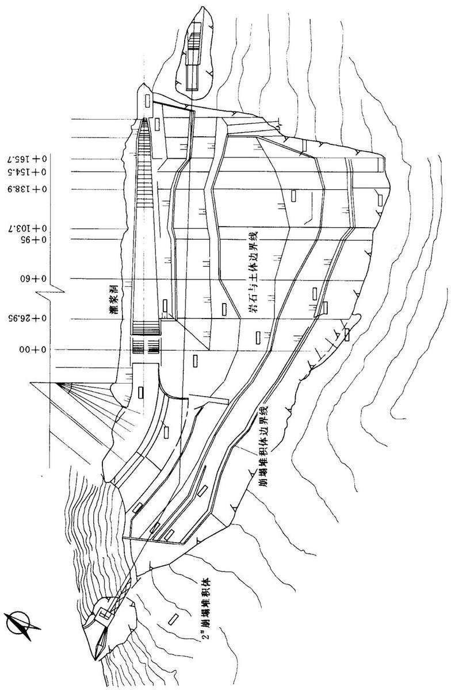  
采 图25

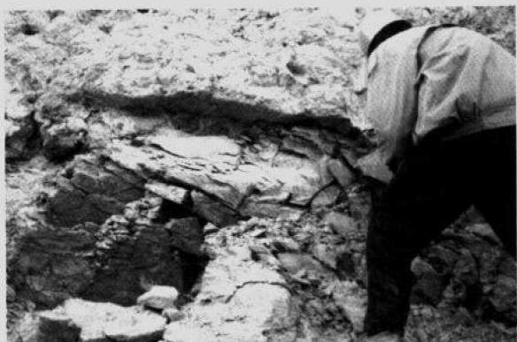  
图 13.26 边坡岩体夹泥层

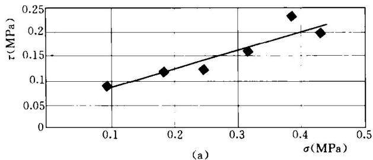

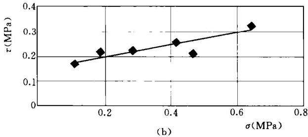  
图 13.27 夹泥层直剪试验成果  
(a) PD38 结构面抗剪试验σ \~ τ 关系图：(b) PD40 结构面抗剪试验 $\sigma \sim \tau$ 关系图

根据对堆积土组成、物性指标以及剪切带试验资料的分析讨论，在稳定分析中采用的强度指标如下：

(1) 剪切带高程 1300m 以下 $\pmb { c = 4 0 1 } \mathbf { P a }$ $\phi = 2 0 . 8 ^ { \circ }$ ；1300m以上， ${ \pmb { c } } { = } 3 5 \mathbf { k P a }$ $\phi = 1 5 . 1 ^ { \circ }$

(2) 堆积土 $\pmb { c = 4 0 1 } \mathbf { P a }$ $\phi = 2 4 . 2 ^ { \circ }$

## 13.8.4 计算成果和分析

## 1. 计算成果

对 0+026 至0+165的7个典型断面（图13.25）进行稳定分析。稳定分析时取边坡内孔隙水压力系数 $r _ { u } = 0 . 2$ 。计算复核成果如表13.26和图13.28所示。

表 13.26 典型断面稳定分析成果
<table><tr><td rowspan="2">剖面</td><td rowspan="2">计算条件</td><td colspan="2">开挖剖面</td><td colspan="2">原地形</td></tr><tr><td>F</td><td>文件名</td><td>F</td><td>文件名</td></tr><tr><td rowspan="2">0+026.953</td><td>8度地震</td><td>1.201</td><td>XC26-1</td><td>0.811</td><td>YXC26-1</td></tr><tr><td>无地震</td><td>1.371</td><td>XC26-2</td><td>1.143</td><td>YXC26-2</td></tr><tr><td rowspan="2">0+060.000</td><td>8度地震</td><td>1.097</td><td>XC60-1</td><td>1.102</td><td>YXC60-1</td></tr><tr><td>无地震</td><td>1.276</td><td>XC60-2</td><td>1.204</td><td>YXC60-2</td></tr><tr><td rowspan="2">0+095.000</td><td>8度地震</td><td>1.337</td><td>XC95-1</td><td>1.266</td><td>YXC95-1</td></tr><tr><td>无地震</td><td>1.573</td><td>XC95-2</td><td>1.517</td><td>YXC95-2</td></tr><tr><td rowspan="2">0+103.698</td><td>8度地震</td><td>1.273</td><td>XC103-1</td><td>1.304</td><td>YXC103-1</td></tr><tr><td>无地震</td><td>1.530</td><td>XC103-2</td><td>1.573</td><td>YXC103-2</td></tr><tr><td rowspan="2">0+138.880</td><td>8度地震</td><td>1.429</td><td>XC138-1</td><td>0.982</td><td>YXC138-1</td></tr><tr><td>无地震</td><td>1.802</td><td>XC138-2</td><td>1.211</td><td>YXC138-2</td></tr><tr><td rowspan="2">0+154.506</td><td>8度地震</td><td>1.592</td><td>XC154-1</td><td>0.973</td><td>YXC1541</td></tr><tr><td>无地震</td><td>1.879</td><td>XC154-2</td><td>1.167</td><td>YXC154-2</td></tr><tr><td rowspan="2">0+165.728</td><td>8度地震</td><td>1.460</td><td>XC165-1</td><td>0.993</td><td>YXC165-1</td></tr><tr><td>无地震</td><td>1.811</td><td>XC165-2</td><td>1.212</td><td>YXC165-2</td></tr></table>

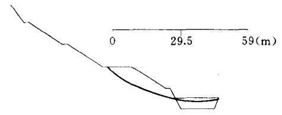

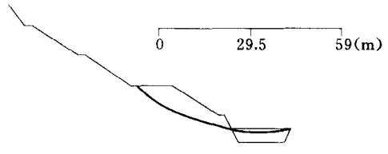

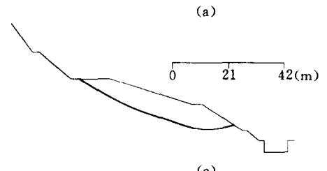

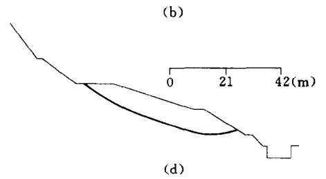

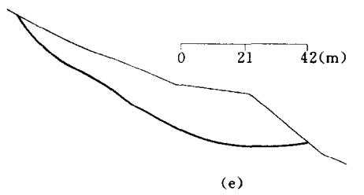

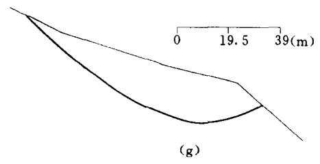

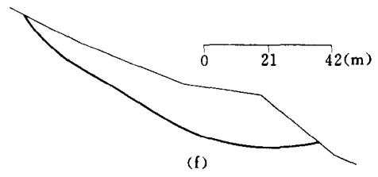

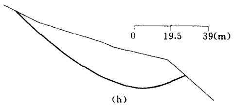  
图13.28 徐村溢洪道边坡主要计算成果（各计算工况水位均在地下水位之上）(a) XC26-1; (b) XC26-2; (c) XC103-1; (d) XC103-2; (e) YXC60-1; (f) YXC60-2; (g) YXC103-1; (h) YXC103-2

## 2. 提高溢洪道边坡稳定性的工程措施

徐村工程溢洪道边坡的崩塌堆积体位于强度指标较低的剪切带上面，因此，首要的问题是通过削坡减载，保证边坡土体沿剪切带滑动的稳定安全系数满足设计要求，同时，要做好边坡表面的防护和坡内排水，以保证在运用期溢洪道边坡的长期稳定性，主要措施为：

1) 边坡分四个马道开挖，土质段平均坡度为1:1.5，岩质段为1:1;

2) 坡面喷混凝土或植草皮保护；

3)在高程1311m、1342m处分别打排水洞，右岸泄洪洞（高程1258m）为明流洞，在洞顶打向上的排水孔。

## 3. 对溢洪道边坡稳定性的总体评价和建议

(1) 由分析成果可知，按设计坡度进行削坡减载后，边坡各剖面安全系数均较原地形有明显提高，桩号0+120m上游侧的安全系数较下游侧低，但在正常情况下，安全系数均超过1.20，遇8度地震时，安全系数也超过了1.1。

(2) 加强排水是保证边坡稳定的重要措施。要求在山体中开挖两条排水洞。

## 13.8.5 讨论

在规划土石坝的开敞式溢洪道时，左、右坝肩通常是先考虑的位置。此时，又经常会遇到溢洪道通过堆积体的情况。坡堆积体通常具有有限的覆盖厚度，接触面又通常是一个软滑带。这大概是在较长的地质年代中曾发生过的滑坡或大规模塌滑有关。

当溢洪道通过这样的堆积体时，设计方案往往是清除部分堆积体，使溢洪道座落于基岩面上，然后放坡。此时，需确认经过开挖的堆积体在新的坡度条件下是稳定的。另一方面，降雨通常是导致边坡失稳的首要条件，建立可靠的排水系统是溢洪道边坡设计中需要认真考虑的问题之一。

徐村水电站溢洪道这一实例具有一定的典型意义。设计人员首先确认该堆积体与基岩间确实存在一个软滑带。因此，必须采用工程措施，确保开挖后的边坡具有足够的安全系数。由于该堆积体地形比较平缓，最后放弃了抗滑桩方案，而采用削坡的方案来保持边坡稳定，同时在山体内设置了两条排水廊道。表13.26所列的各剖面的计算成果实际上是在综合比较了许多方案后的一个最终成果。熟练地使用STAB程序，可以使这样的优化设计工作的效率大大提高。从表中可知，和原地形相比，开挖后地形的安全系数在大部分地段均有明显的提高。

三年后，笔者经历了另外一个在堆积体上开挖溢洪道边坡开裂事件，即云南昭通地区的大水沟面板坝的溢洪道工程。发现，在徐村工程中担忧的滑坡可能性在大水沟这个具有类似地形地质条件的溢洪道工程中确实出现了。图13.29和图13.30分别示大水沟面板坝工程边坡开裂和沿夹泥层错动情况。在13.13节还将讨论紫坪铺泄洪洞出口边坡堆积体滑坡事例。因此，当年该工程对溢洪道边坡沿夹泥层稳定情况所作的研究和相应的削坡加固措施是明智的。

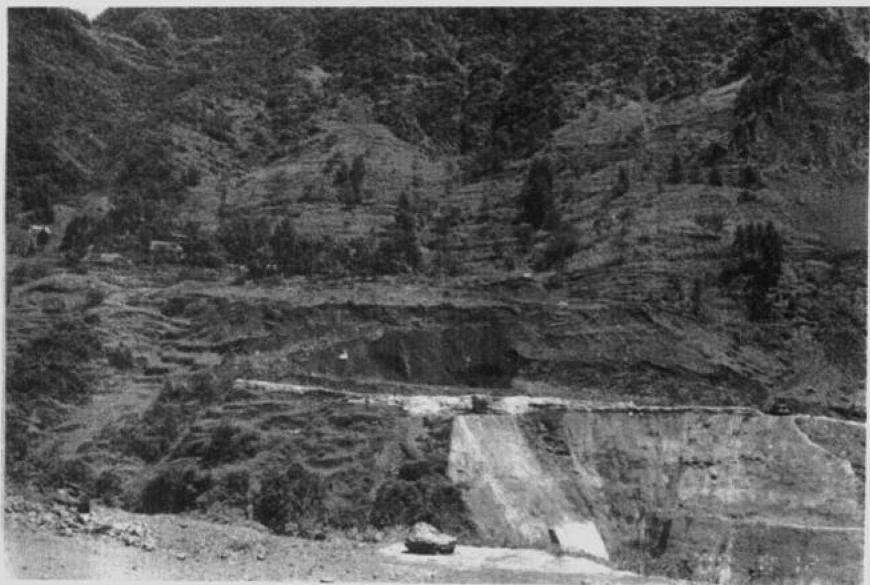  
图 13.29 大水沟面板坝工程边坡开裂情况

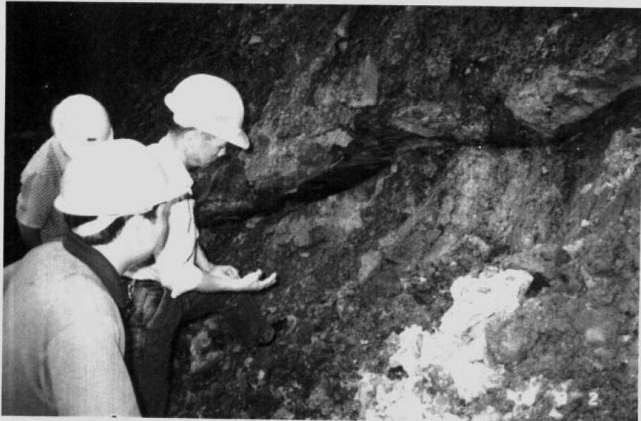  
图 13.30 大水沟面板坝工程边坡沿夹泥层错动情况

## 13.9 天生桥厂房高边坡

## 13.9.1 基本情况

(1) 项目来源：水电部贵阳勘测设计院。

(2) 完成日期：1989年8月。

(3) 设计阶段：技施设计。

(4) 存档文件：

1)邹成杰，庞声宽，方平德，典型层状岩体高边坡稳定分析与工程冶理，水利电力出版社，1995年；

2)天生桥二级水电站厂房西坡边坡稳定分析，中国水利水电科学研究院，岩土(89)39，1998年8月。

## 13.9.2 工程概述

天生桥二级水电站位于广西隆林及贵州安龙县境内，为南盘江中游广西、贵州河段上第二个梯级电站。工程为引水式电站，大坝为混凝土重力坝，三条引水隧洞长度均为9776.3m。电站初期装机容量88万kW，一级电站发电后，装机容量将扩建到132万kW。

厂房建在芭蕉林南侧、拉线沟北侧下山包（也称南山包）的一个三面凌空的条形山脊上。厂房三面临坡，每面坡高均大于100m，最高的西坡高300余米。

厂区河岸受拉线沟和1号冲沟切割，形成一个山包，称中山包，其东南缘称为下山包，厂房即位于下山包东侧。厂区地层为砂岩、泥岩互层，夹少量灰岩。可以推测地层曾经历强裂的地质构造运动，形成中山包背斜，芭蕉林向斜，南山包背斜，拉线沟向斜。下山包滑坡即位于芭蕉林向斜和下山包背斜之间，岩层产状为N80°E。

在泥岩、砂岩互层中，普遍发育泥化夹层，形成滑坡体的滑床。在开挖抗滑桩过程中，对构成这次滑坡的泥化夹层进行了充分的揭示，发现泥化夹层为黄褐色软塑状粘土，厚度5\~20cm不等。厂房西坡可划分为七层，层间均有泥化夹层。

1988年5月工程施工后，山体即发生滑移，出现明显的滑坡迹象（图13.31）。水平位移最大速率达8.2cm/日。随即采取了减载、排水、抗滑桩、预应力锚索和锚杆等多项工程措施（图13.32）。1989年5月，厂房高边坡全部开挖完毕，未见明显滑移现象。

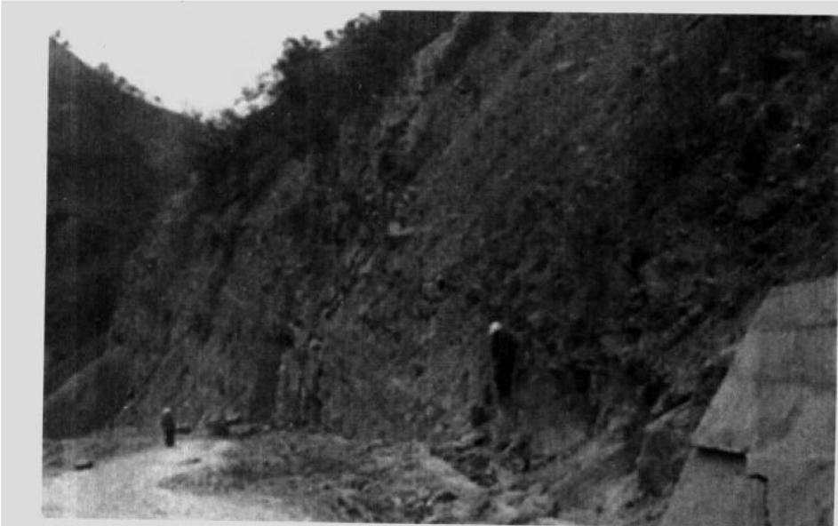  
图 13.31 边坡滑移挡墙拉裂情况

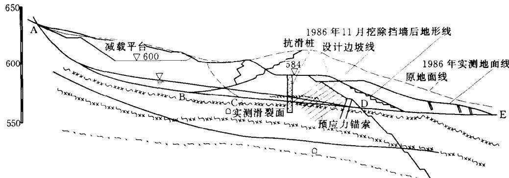  
图 13.32 南 66'地质剖面和计算断面

## 13.9.3 计算条件

## 1. 计算工况

选用南66′剖面为计算断面（参见图13.32）。南66′断面方向为 $\Im { 6 0 ^ { \circ } } \mathrm { E }$ ，和滑坡中、后部位移较一致。

对南66断面稳定性的核算，重点是复核已发生滑坡的那层滑裂面（夹层出口高程556m)。其主要工作是通过反演抗剪强度指标，模拟施工开挖过程，了解安全系数随之变化的过程，并评价排水、锚索、抗滑桩在提高抗滑安全系数方面的作用。

## 2. 强度指标

南6–6′断面沿滑裂面强度指标见表13.27。

表13.27 南 6-6'断面沿滑裂面强度指标（参见图13.32）
<table><tr><td rowspan="2">序号</td><td rowspan="2">区段</td><td rowspan="2">物质组成</td><td rowspan="2">滑坡体厚度(m)</td><td colspan="2">抗剪强度指标</td></tr><tr><td>c(kPa)</td><td>φ(°)</td></tr><tr><td>1</td><td>AB</td><td>粘土夹砂岩碎块石，坡积滑塌形成</td><td>30-37</td><td>20</td><td>11.3</td></tr><tr><td>2</td><td>BC</td><td>全风化砂页岩夹粘土</td><td>25~30</td><td>20</td><td>11.3</td></tr><tr><td>3</td><td>CD</td><td>强风化滑动碎裂的砂岩夹泥页岩</td><td>17-40</td><td>10</td><td>6.8</td></tr><tr><td>4</td><td>DE</td><td>同上</td><td>25~0</td><td>10</td><td>6.8</td></tr></table>

## 3. 地下水位

施工期边坡600m高程处原有工程单位生活，办公用房以及附设的供水系统，其水池已开裂，长年向坡内渗水，1986年5月至11月又曾数次降大雨。在开挖抗滑桩时发现井壁严重渗水，推算的地下水位示于图13.32。

## 13.9.4 计算成果与分析

1. 滑坡过程和加固工程措施（图 13.33）

(1) 滑坡过程。1986年5月厂房边坡开挖开始，6月7日发现当边坡自584m高程挖至555m高程时，前缘即出现裂缝。7月7日裂缝发展到前缘100m处（图13.31），8月修建临时挡土墙，滑坡暂时被制止。

1986年11月，边坡开挖继续进行，前缘坡墙被炸掉，滑坡前缘几十米处采用洞室大爆破，边坡位移加剧，公路挡墙被拉裂，公路边陡壁上明显出现滑裂面（图13.31），长度

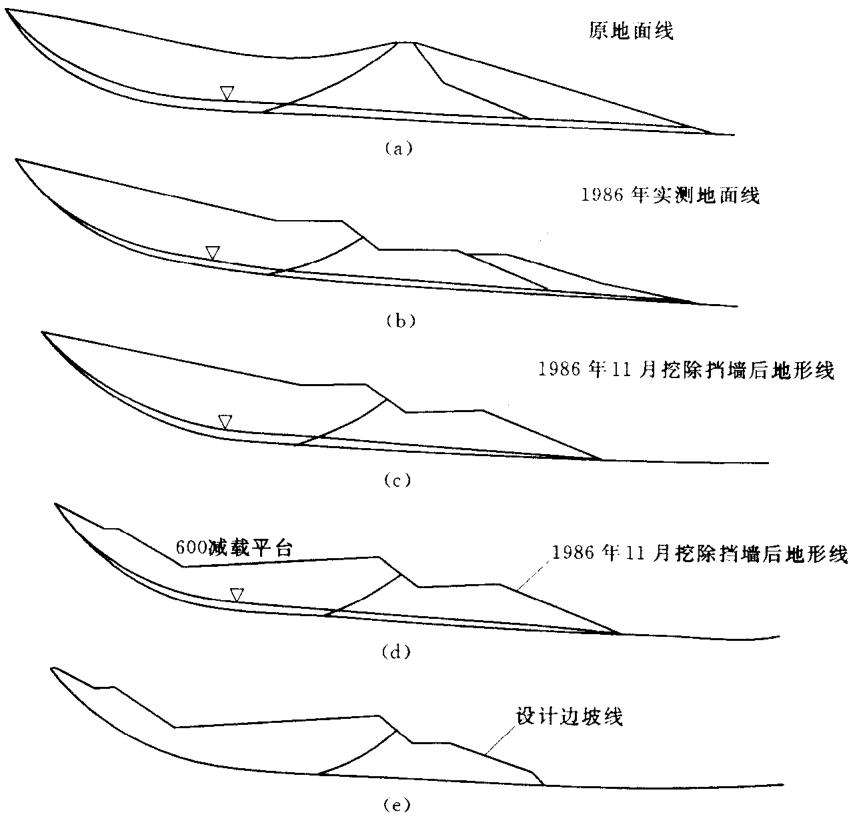

达百米以上。至1987年初，滑坡整体规模已显露出来，平均速率达7.2mm/d。抗滑桩开挖后了解到的泥化夹层擦痕方向为 $\tt S 8 5 \mathrm { ‰}$ ，由此可以大致确定滑坡方向为 ${ \bf S 8 5 ^ { \circ } E }$

图 13.33 通过反演分析进行的加固设计

(2) 边坡加固工程措施。为制止滑坡，自1987年开始，采取了以下工程措施：

(a)减载。滑坡后缘地形上凸超过600m高程部分被挖除，两次共减载22.15万m³。 $\mathbf { m } ^ { 3 }$

(b)排水。除整治地表排水系统，分层减载，集中疏导雨水外，还在厂房北坡及西坡布置了四条高程分布在487.2m，451.5m和429m的永久性排水廊道。

在滑体中部584m平台设置17根抗滑桩，最大桩深40m，断面3×4m，间距6m。并布置了承载力为120×9.8kN的预应力锚索，共计240根。

(c) 预应力锚索和锚杆荷载。预应力锚索设置在高程 858\~565m 边坡上，与铅垂线夹角55°，每根预应力1200kN，孔距3.0m，排距3.5m。总计7排，每米宽度施加在边坡上 $5 5 ^ { \circ }$ 的力为：

$$
{ \frac { 7 \times 1 2 0 \times 9 . 8 } { 3 . 0 } } = 2 8 0 { \times } 9 . 8 \left( \mathrm { k N / m } \right)
$$

预应力锚杆设置在高程565 平台，孔距 2m，排距2m，与铅垂线夹角 30°，每米宽度 $3 0 ^ { \circ }$ 施加在边坡上的力为

$$
\frac { 2 \times 3 0 \times 9 . 8 } { 2 . 0 } { = } 3 0 { \times } 9 . 8 \left( \mathrm { k N / m } \right)
$$

(d)抗滑桩提供的水平抗滑力。抗滑桩断面为3m×4m，总计17根，每根桩提供的水平抗滑力约为1284×9.8kN。总计混凝土量为6600m³，钢材248.7×9.8kN。考虑滑坡整体规模已形成，该17根抗滑桩提供的水平抗滑力应平均分摊在170m宽度的滑坡上，故每米提供的水平抗滑力为

$$
{ \frac { 1 7 \times 1 2 8 4 \times 9 . 8 } { 1 7 0 } } = 1 2 8 . 4 { \times } 9 . 8 \left( { \bf k N / m } \right)
$$

## 2. 地下水位

对南66′断面，根据抗滑桩开挖过程中了解到的地下水位核算稳定安全系数，并分析排水起作用无地下水位时安全系数的提高程度。

## 3. 稳定分析计算成果及讨论

(1) 计算成果。根据发生滑坡的过程，对施工过程不同阶段进行复核，获得的稳定安全系数如表13.28所示，计算简图见图13.34。

表 13.28南66'断面边坡稳定安全系数（参见图13.33）
<table><tr><td>情况</td><td>计算条件</td><td>安全系数</td><td>数据文件</td></tr><tr><td>1</td><td>原地面线，有地下水</td><td>0.997</td><td>T6.1</td></tr><tr><td>2</td><td>1986年6月7日地面线，有地下水位</td><td>0.976</td><td>T6.2</td></tr><tr><td>3</td><td>1986年11月拆除挡墙后地面线，有地下水</td><td>0.922</td><td>T6.3</td></tr><tr><td>4</td><td>减载</td><td>0.988</td><td>T6.4</td></tr><tr><td>5</td><td>排水</td><td>1.055</td><td>T6.5</td></tr><tr><td>6</td><td>开挖至设计边坡，排水生效，无地下水</td><td>1.032</td><td>T6.6</td></tr><tr><td>7</td><td>情况5，加抗滑桩</td><td>1.088</td><td>T6.7</td></tr><tr><td>8</td><td>情况6，加上预应力锚索和锚杆</td><td>1.149</td><td>T6.8</td></tr></table>

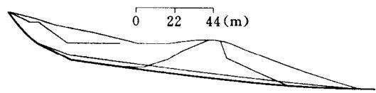

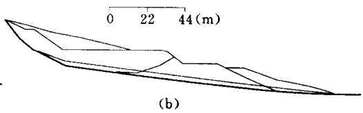

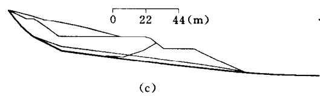

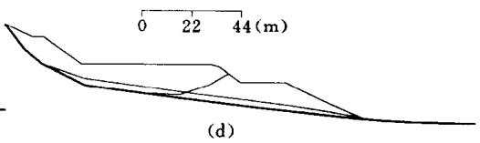

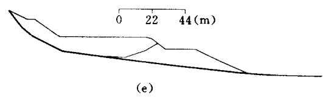

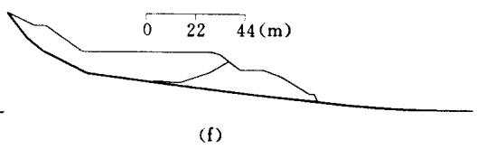

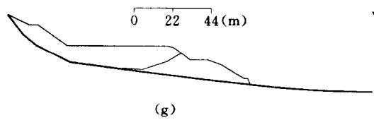

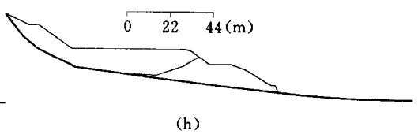  
图 13.34 天生桥边坡计算成果  
(a) T6.1; (b) T6.2; (c) T6.3; (d) T6.4; (e) T6.5; (f) T6.6; (g) T6.7; (h) T6.8

(2) 讨论。从表13.28所列分析成果可以发现：

1)边坡开挖使安全系数由原来的0.997降为0.922，降低了8%左右；

2) 减载使安全系数由 0.922 提高到0.988，增加了6%；

3)地下水位对边坡稳定影响很大，排水后可使安全系数提高7%左右；

4)加固边坡的工程措施（抗滑桩，预应力锚索等）使安全系数提高11%左右（从1.032提高到 1.149);

5)在排水系统充分生效，没有孔压的条件下，安全系数为1.15。应该指出，这一系列计算的起点是边坡开挖后的安全系数为0.922。由于此时并没有发生滑坡，所以实际加固后的边坡稳定安全系数应比1.15略高。

反演分析获得概念是，滑裂面上综合抗剪强度的指标大约是 $c = 1 0 \mathbf { k P a } , \phi = 1 0 ^ { \circ }$ 。这一数值和试验室直剪和三轴试验接近。因此总的来说，天生桥二级厂房高边坡泥化夹层的抗剪强度指标大约是在 $c { = } 1 0 \mathbf { k P a }$ $\scriptstyle \phi = 1 0 ^ { \circ }$ 这样一个数量级范围。

## 13.9.5 讨论

天生桥高边坡在开挖仅15m时即发生大规模的山体变形。对边坡进行紧急加固措施的设计过程主要是建立在反演分析的基础上的，目的是了解采用各项工程措施后，使安全系数从原来的极限平衡状态提高15%\~20%。本节介绍了当年进行加固设计时的计算成果。通过边坡稳定分析，最终确定了各种加固工程的规模。这一工程竣工后已经过10年的运行，说明加固设计是成功的。当时的研究报告还提出了以下几条建议：

(1) 减载、锚索、抗滑桩等工程措施使滑裂面安全系数提高18%左右，但对高达 300m的边坡深层滑动并无加固作用，排水是稳定该边坡至关重要的工程措施，宜予高度重视。

(2)厂房边坡的稳定安全系数，总体来看，接近现代边坡工程允许最小安全系数值，但个别滑面尚处下限，应加强边坡的变形和孔隙水压力观测，密切监视边坡的性状。根据本次计算成果，对厂房边坡运行期间观测到的孔隙水压力系数的平均值r，似可提出这样的 $r _ { \ast }$ 标准，当 $r _ { u } { < } 0 . 0 5$ 时，排水效果视为优良，期望 $r _ { u } { < } 0 . 1$ ，当 $r _ { u } { > } 0 . 1 5$ 时应发出警报。

(3) 由于该边坡具有明显的三维特点，建议下阶段有条件时，开展三维极限平衡稳定分析。在14章中，笔者介绍了三维计算的成果。

## 13.10 乌鲁瓦提面板堆石坝

## 13.10.1 基本情况

(1) 工程名称：乌鲁瓦提面板堆石坝。

(2) 项目来源：新疆水利水电勘测设计院。

(3)完成日期：1995年4月。

(4) 设计阶段：初设阶段。

(5) 存档文件：

1）乌鲁瓦提面板堆石坝坝坡稳定分析报告，中国水利水电科学研究院，岩土(95)24.1995年4月31日；

2) 乌鲁瓦提坝料三轴试验，中国水利水电科学研究院，岩土(95).1992年11月。

## 13.10.2 工程概述

乌鲁瓦提面板堆石坝位于新疆和田地区和田河支流喀拉喀什河中游河段上，坝趾距和田市71km。该工程水库总库容3.47亿 $\mathbf { m } ^ { 3 }$ ，电站装机容量6万kW。

拦河坝为钢筋混凝土面板砂砾石坝，主坝长365m，最大坝高138.0m。坝顶高程1962.0m，防浪墙高程1966.0m。上游坝坡1:1.6，下游坝坡约为 1:1.5，并在不同高程设置了4条马道，各宽12m。坝体采用天然砂卵石料为主堆石料，其渗透系数为 $4 . 5 { \times } 1 0 ^ { - 2 } { \mathrm { c m } } / { \mathrm { s } }$ 次堆石料为边坡开挖的弃料，钢筋混凝土面板之后是水平宽度4m的垫层区，垫层区后是水平宽度4m的过渡层区。坝体内设置了4m宽的竖向排水和水平排水，水平排水位于坝体底部，与下游坝脚排水棱体相连接。为减少坝基渗漏，在坝体上游趾板处设灌浆防渗帷幕。

## 13.10.3 计算条件

## 1. 等级和标准

大坝为Ⅱ级建筑物。在稳定分析中取最大断面为典型计算断面，见图13.35。控制水位为：正常蓄水位-1962.0m；死水位-1924.0m；下游水位-1861.0m。

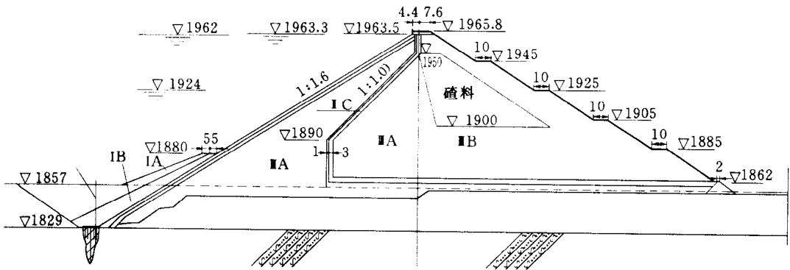  
图 13.35 乌鲁瓦提面板堆石坝典型剖面

## 2. 坝址地震

基本烈度为6度，按7度设防。

## 3. 材料抗剪强度指标的选取

确定抗剪强度指标，如表13.29示。在计算中，对上、下游坝坡分别进行了线性和非线性强度指标的稳定分析。

## 13.10.4 计算成果与分析

计算成果见表 13.30 及图 13.36

表13.29 乌鲁瓦提面板堆石坝筑坝材料参数
<table><tr><td rowspan="3">材料 编号</td><td rowspan="3">材料所处位置</td><td colspan="4">抗剪强度指标</td><td rowspan="3">容重 (9.8kN/m³)</td></tr><tr><td>线性</td><td></td><td>非线性</td><td></td></tr><tr><td> $c$  (9.8kN/m²)</td><td> $\phi ( ^ { \circ } )$ </td><td>φ(°)  $\Delta \phi ( ^ { \circ } )$ </td><td>天然</td><td>饱和</td></tr><tr><td>1</td><td>主堆石区</td><td>0.0</td><td>39.0</td><td>43.5</td><td>3.0</td><td>2.25</td><td>2.30</td></tr><tr><td>2</td><td>次堆石区</td><td>0.0</td><td>30.0</td><td>44.2</td><td>3.6</td><td>2.10</td><td>2.25</td></tr><tr><td>3</td><td>排水区</td><td>0.0</td><td>35.5</td><td></td><td></td><td>2.05</td><td>2.20</td></tr><tr><td>4</td><td>坝体底部</td><td>0.0</td><td>38.0</td><td></td><td></td><td>2.26</td><td>2.30</td></tr><tr><td>5</td><td>坝基</td><td>150.0</td><td>40.0</td><td></td><td></td><td>2.70</td><td>2.90</td></tr><tr><td>6</td><td>垫层及过渡层</td><td>0.0</td><td>39.0</td><td>48.0</td><td>5.1</td><td>2.25</td><td>2.30</td></tr></table>

注上表线性参数及容重由新疆水利设计院提供，非线性参数由水科院“乌鲁瓦提坝料三轴试验报告”提供。

表13.30 乌鲁瓦提面板堆石坝坝坡最小安全系数
<table><tr><td rowspan="2">参数 类型</td><td rowspan="2"> $F _ { m }$  及 文件名</td><td colspan="2">下游坝坡</td><td colspan="3">上游坝坡</td></tr><tr><td>稳定渗流 无地震</td><td>稳定渗流 7度地震</td><td>施工期 无地震</td><td>施工期 7度地震</td><td>库水位降落 无地震</td></tr><tr><td>线性 c, φ</td><td> $\boldsymbol { F } _ { m }$  文件名</td><td>1.209 wlx1</td><td>1.111 wlx2</td><td>1.298 wlul</td><td>1.203 wlu2</td><td>0.513 wul3</td></tr><tr><td>非线性  $\phi _ { 0 } ,$  ∆φ</td><td> $F _ { m }$  文件名</td><td>1.528 wlx3</td><td>1.419 wlx4</td><td>1.540 wlu4</td><td>1.540 wlu5</td><td>0.865 wlu6</td></tr></table>

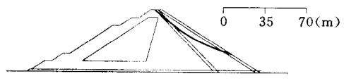

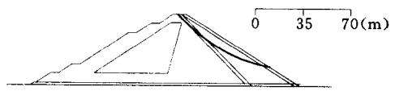

(a)  
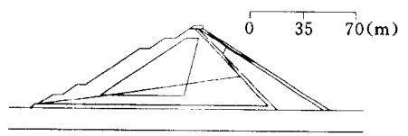  
(c)

(b)  
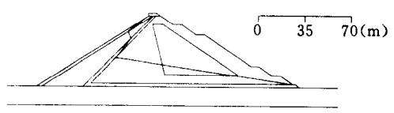  
(d)

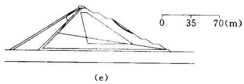

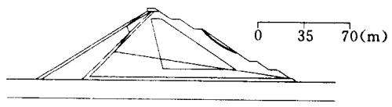  
(f)  
图13.36 乌鲁瓦提面板堆石坝边坡稳定分析成果  
(a) Wlu1; (b) Wlu2; (c) Wlu3; (d) Wlu4; (e) Wlu5; (f) Wlu6

## 13.11 黄河三盛公水利枢纽拦河闸

## 13.11.1 基本情况

(1)工程名称：黄河三盛公水利枢纽拦河闸。

(2) 项目来源：内蒙古黄河工程管理委员会。

(3)完成日期：1999年8月。

(4) 设计阶段：大坝安全鉴定。

(5) 存档文件：

1）黄河三盛公水利枢纽拦河闸地基渗流及稳定安全复核报告，中国水利水电科学研究院，1999年8月；

2) 黄河三盛公水利枢纽拦河闸稳定及强度安全复核报告，中国水利水电科学研究院，1999年8月。

## 13.11.2 工程概述

黄河三盛公水利枢纽拦河闸位于内蒙古自治区。拦河闸为I级建筑，上游正常水位为1055.0m，设计允许水位差9m，闸室采用浮筏式结构，两孔一联，系钢筋混凝土结构。1961年建成并投入使用，以为河套灌区提供灌溉用水为主。闸室及地基简图见图13.37。

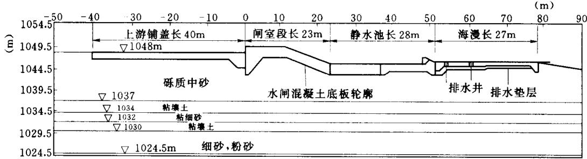  
图 13.37 黄河三盛公水利枢纽拦河闸概化地质剖面图

## 13.11.3 计算条件

在分析计算中，水闸作了如下简化：

1)闸门上游中墩、缝墩、公路桥等结构折算成分布荷载，加在闸室底板上；

2)在闸门下游，中墩、缝墩、工作桥等结构换算成挡水结构，容重也作相应折减，成为等效重力。

## 1. 计算工况

计算中采用圆弧滑动和任意形状滑动两种滑动模式。在任意形状滑动模式中，滑弧底部为直线，沿1034m高程之下粘壤土层滑动，滑弧两端则为曲线，使用 STAB程序自动搜索安全系数最小的临界滑裂面。

当上游水位为1055m高程时，下游水位高程分别为1046m，1047m、1048m和1049m。上游水位为1052m高程时，下游水位高程为1046m。把各工况排水井完全失效情况下渗流计算扬压力曲线当作浸润线加在水闸之上，以此计算基础底部滑裂面孔隙水压力。

为了便于和渗流计算扬压力条件下结果比较，假设当上、下游水位分别为1055m和1046m高程时，在排水井完全有效和排水井完全失效两种条件下，上游水位和下游水位直线连接作为浸润线。计算结果见表13.31和图13.38。

表13.31 按计算扬压力复核拦河闸深层滑动安全系数表
<table><tr><td colspan="2">工况</td><td rowspan="2">圆弧滑动</td><td rowspan="2">图号</td><td rowspan="2">沿粘壤土滑动</td><td rowspan="2">图号</td></tr><tr><td>上游水位(m)</td><td>下游水位(m)</td></tr><tr><td rowspan="4">1055</td><td>1046</td><td>2.060</td><td>n1</td><td>2.223</td><td>nnl</td></tr><tr><td>1047</td><td>2.094</td><td>n2</td><td>2.364</td><td>nn2</td></tr><tr><td>1048</td><td>2.294</td><td>n3</td><td>2.548</td><td>nn3</td></tr><tr><td>1049</td><td>2.243</td><td>n4</td><td>2.742</td><td>nn4</td></tr><tr><td>1052</td><td>1046</td><td>2.889</td><td>n5</td><td>2.889</td><td>nn5</td></tr></table>

## 2. 强度指标

根据三盛公水闸管理局提供的地质资料，闸室地基各土层抗剪强度指标如表13.32。

表13.32 三盛公拦河闸基础各土层材料参数表
<table><tr><td>土层</td><td>粘聚力c(kPa)</td><td>摩擦角φ(°)</td><td>容重(9.8kN/m³)</td></tr><tr><td>砾质中砂</td><td>0.0</td><td>25</td><td>1.5</td></tr><tr><td>粘壤土</td><td>23.5</td><td>12</td><td>1.62</td></tr><tr><td>粉细砂</td><td>5.6</td><td>25</td><td>1.56</td></tr><tr><td>细砂、粉细砂</td><td>5.6</td><td>25</td><td>1.56</td></tr></table>

## 13.11.4 计算成果分析

从表13.31计算成果可知，在五种运行工况下，两种滑动模式安全系数均大于2.0。沿粘土层滑动安全系数大于圆弧滑动0.2左右，说明由于粘土层埋藏较深，沿粘壤土层滑动不是水闸深层滑动的控制滑动模式。在最不利运行工况下，安全系数也大于1.5。因此，根据现有地质参数，可以认为拦河闸闸室基础能满足水闸设计规范的安全要求。

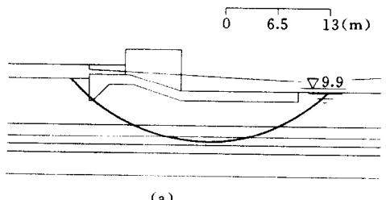  
(a)

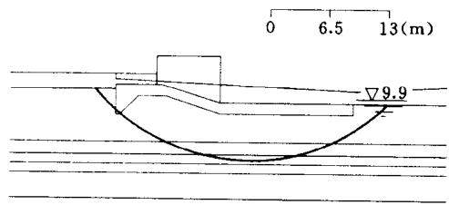  
(b)

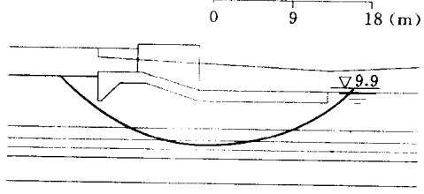  
(c)

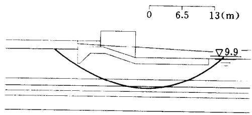  
(d)  
图 13.38 三盛公拦河闸稳定分析成果  
(a) n1; (b) n5; (c) nn1; (d) nn5

## 13.11.5 讨论

本工作为使用条分法计算水闸抗滑稳定安全系数的例子。通用条分法除用于计算大然边坡和土石坝的稳定安全系数外，还可用于分析重力坝，水闸等建筑物沿建基面和深层软带的稳定分析中。因为由闸、坝和地基构成的建筑物实际上也是个边坡，传统的分析方法和通用条分法所包含的原理没有本质上的差别。

## 13.12 日照电厂蔡家滩灰场挡灰堤

## 13.12.1 基本情况

(1) 项目来源：山东电力工程咨询院。

(2)完成日期：2000年1月。

(3) 设计阶段：技施设计。

(4) 存档文件：日照电厂蔡家滩灰场挡灰堤加固措施计算分析报告，水利水电科学研究院，2000年3月，GE-2000-3-007。

## 13.12.2 工程概述

日照电厂灰场位于蔡家滩南海岸，为长方形海域灰场。岸边坝段为块石护坡碾压土坝，其余部分全部为抛石挡灰堤，最大高度约10.4m（图13.39）。为防止粉煤灰渗入海洋，在迎海洋面，铺设有一层土工布。这样在海水涨落过程中，堤内外经常出现1\~2m的水位差。

蔡家滩灰场挡灰堤合龙后，大堤内坡很多部位出现了不同程度的塌滑（图13.40)，局部土工布被拉断，破坏全部发生在上游坡面。另外当灰场外侧潮位变化时，土工布被撕裂堤段的内坡面发现有明显的水流现象，堤内侧发生滑坡破坏后在堤脚处发现有淘出的砂堆，说明有管涌破坏存在。可初步认为上游坡的破坏呈浅层滑动形式。

综合分析现场调查结果及挡灰堤施工和破坏资料后，初步断定造成破坏的主要原因是潮水涨落，导致堤内外水位差。由于挡灰堤建于饱和淤泥层上，堤体透水性差、抗管涌能力和抗剪强度均很底。

蔡家滩灰场地形平坦，灰场内无较大规模的断裂构造，地层由上到下大致可分为五层：

(1) 黄褐色中细砂。为海底表层活动层，厚度约20\~50cm，松散，颗粒呈圆状。

(2) 褐灰色淤泥质粉质粘土。为第四纪全新世海湾相沉积物，呈流塑到软塑状态，其最大厚度达2.23m。

(3) 黑灰色粉质粘土。呈可塑状态，最大厚度可达1.07m。

(4) 褐黄色粉土。呈可塑状态，最大厚度达1.09m。

(5) 黄褐色大山沟组片麻岩。表层已强烈风化，裂隙发育最大可达1.5m 左右，强风化层下为坚硬的中等风化基岩。

堤段发生滑坡后，决定挖除上部硬土石的堆石体，在迎水面铺设新的土工布，再在前面抛投块石，形成一个断面较大的挡灰堤，参见图13.39。工程加固的主要手段为抛石挤淤、结合分层施工预压的方法进行地基处理。

灰场地区地震基本烈度为6度，故在挡灰堤边坡稳定计算时不考虑地震因素的影响。

日：垫英热图1339  
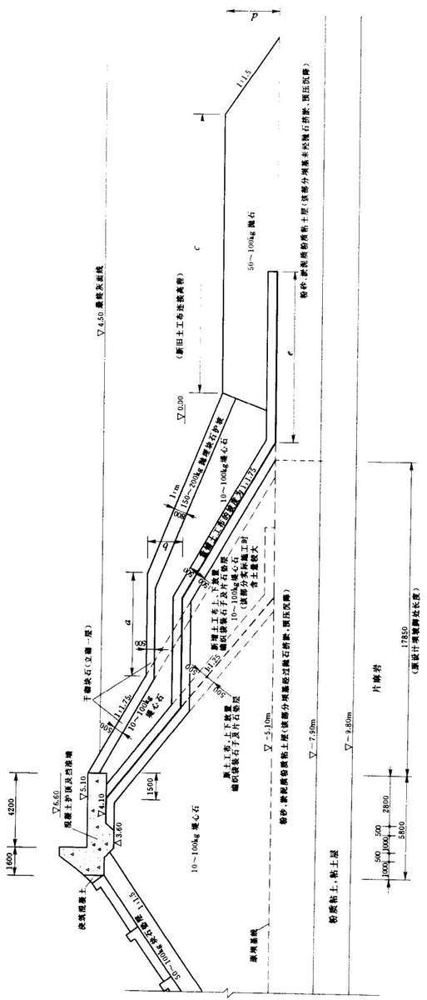

本项目配合挡灰堤加固设计，对挡灰堤边坡进行了稳定计算分析，根据计算分析结果并结合现场调查，建议了大堤内坡加固方案。本项目的任务是对可能的抛投块石剖面加固方案进行分析比较。

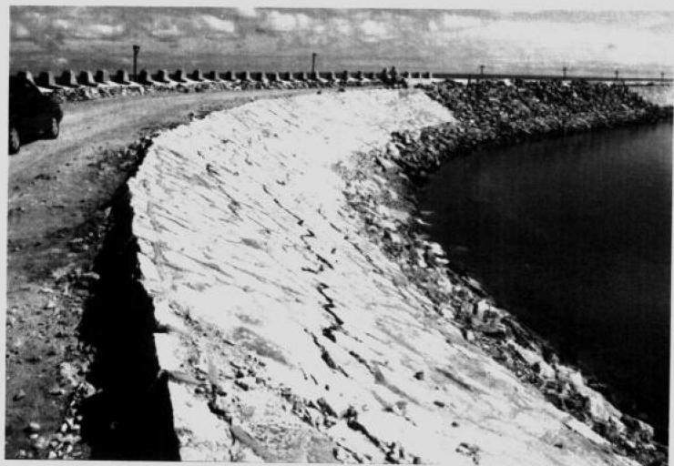  
图 13.40 日照电厂挡灰堤开裂情况

## 13.12.3 计算条件

## 1. 计算工况

经过仔细的研究和分析，最终确定了上游边坡综合加固计算方案：

(1)相应2.0m和3.0m两种不同的堤内外水位差，其对应的外侧（海水侧）和内侧（灰场侧）水位分别取3.0\~1.0m、3.0\~0m、2.0\~-1.0m、1.0\~-1.0m和2.0\~0m等，其中前三种为校核工况，后两种为设计工况。

(2) 按照渗流计算成果对孔压进行内插，水头沿土工布的衰减幅度根据渗流计算结果给出。

(3) 采用毕肖普法计算。

(4) 稳定分析时取三种不同滑裂面，分别为：

1) 沿旧土工布浅层滑动；

2) 沿新土工布浅层滑动；

3) 沿新土工布上部滑动。

## 2. 强度指标

本次分析采用总应力指标，首先采用试验强度指标（如表13.33）计算了上游实际堤身断面沿旧土工布浅层滑动的稳定安全系数。计算时按实测水位差，假定坡外水位为2.0m，坡内水位为0.0m，计算得稳定安全系数为0.560，但是现在的挡灰堤上游边坡在没有通过加固的情况下仍处于稳定状态。由此可见，采用试验指标计算的结果明显偏于保守，与实际堤身的稳定差距太大，应根据不同材料的特性和所处位置相应提高其强度指标。

考虑各种试验方法对强度参数的影响，以试验成果为基础，并考虑淤泥层所处的位置，对淤泥层土料和垫层料的强度指标作了一定的提高，对参数进行了反演分析计算。调整后的强度参数指标如表13.34所示。

表13.33 稳定分析中各种材料的试验强度指标
<table><tr><td rowspan="2">土料名称</td><td rowspan="2">湿容重 (kN/m³)</td><td rowspan="2">饱和容重 (kN/m³)</td><td colspan="2">强度指标</td></tr><tr><td>φ(°)</td><td>c(kPa)</td></tr><tr><td>抛填石料</td><td>1.9</td><td>2.1</td><td>35.0</td><td>0</td></tr><tr><td>垫层料</td><td>1.9</td><td>2.1</td><td>17.0</td><td>0</td></tr><tr><td>淤泥质粉质粘土（挤淤）</td><td>1.77</td><td>1.78</td><td>6</td><td>10</td></tr><tr><td>淤泥质粉质粘土（不挤淤）</td><td>1.77</td><td>1.78</td><td>2.7</td><td>7</td></tr><tr><td>粉土</td><td>2.0</td><td>2.05</td><td>10.0</td><td>20.0</td></tr><tr><td>基岩</td><td></td><td></td><td>50.0</td><td>300</td></tr></table>

表13.34 稳定分析中各种材料的强度指标（调整指标）
<table><tr><td rowspan="2">土料名称</td><td rowspan="2">湿容重 (kN/m³)</td><td rowspan="2">饱和容重 (kN/m³)</td><td colspan="2">强度指标</td></tr><tr><td>φ(°)</td><td>c(kPa)</td></tr><tr><td>抛填石料</td><td>1.8</td><td>2.1</td><td>35.0</td><td>0</td></tr><tr><td>垫层料</td><td>1.8</td><td>2.0</td><td>19.0</td><td>0</td></tr><tr><td>淤泥质粉质粘土（挤淤）</td><td>1.77</td><td>1.78</td><td>10</td><td>17</td></tr><tr><td>淤泥质粉质粘土（不挤淤）</td><td>1.77</td><td>1.78</td><td>2.4</td><td>7</td></tr><tr><td>粉土</td><td>2.0</td><td>2.05</td><td>10.0</td><td>20.0</td></tr><tr><td>基岩</td><td>2.6</td><td>2.7</td><td>50.0</td><td>300</td></tr></table>

## 13.12.4 计算成果与分析

各种运用条件计算获得的最小安全系数列于表13.35和图13.41，分析这些计算成果，可得到如下几点初步结论：

(1)根据实际测定的水位条件，用试验确定的强度指标，计算实际挡灰堤稳定情况下沿旧土工布浅层滑动的稳定安全系数，其值为0.560，说明强度指标偏低。为此在试验基础上，对实际堤身进行参数反演分析，提高了淤泥质土层的强度指标。通过反演将垫层料的强度指标φ从17°提高到19°，同时考虑淤泥质土层挤淤程度和所处位置，将坝体下经过挤 $1 9 ^ { \circ }$ 淤的淤泥质土层的强度指标作了相应提高，即将其粘聚力c从10kPa提高到17kPa，将内摩擦角φ从6°提高到10°，坝体外的淤泥质土层的强度指标保持不变。调整参数后实际挡灰 $1 0 ^ { \circ }$ 堤上游堤身的稳定安全系数为1.004，可以认为其结果符合实际，是可靠和恰当的。

(2) 堤身清淤至-7.9m 高程时用试验确定的强度指标计算挡灰堤断面沿旧土工布浅层滑动的稳定安全系数为0.534，远不能满足要求。用调整后指标计算堤身清淤至-7.9m高程时挡灰堤断面沿旧土工布浅层滑动的稳定安全系数为0.900，其稳定亦不能满足规范要求。同时基础清淤的关键技术问题是在清淤施工过程中，如何控制清淤时的施工工艺和质量，保证施工过程中边坡的稳定性。因此在不能保证清淤施工时挡灰堤边坡稳定的情况下，放弃基础清淤并抛投块石的方案是合理的。

(3) 新铺土工布上部的压台厚度对沿旧土工布浅层滑动和沿新铺土工布上部滑动均有明显影响，当压台厚度增大时会降低沿旧土工布滑动的安全系数，而增大沿新铺土工布上

表13.35 各断面稳定计算成果（采用调整强度指标）
<table><tr><td rowspan="5">水位 滑动模式 条件</td><td rowspan="5"></td><td colspan="7">m=2.5,  $a = 4 . 5 ,$  d=3</td></tr><tr><td colspan="6">b=2</td><td colspan="2">b=1.5</td></tr><tr><td colspan="2">c=10</td><td colspan="3">c=15</td><td colspan="2">c=20</td></tr><tr><td>安全 系数</td><td>数据 文件</td><td>安全 系数</td><td>数据 文件</td><td>安全 系数</td><td>数据 文件</td><td>c=15 安全 数据 文件</td></tr><tr><td rowspan="3">2~-1</td><td>旧土工布浅层</td><td>0.998</td><td>a12</td><td>1.097</td><td>a11</td><td>1.187</td><td>a13</td><td>系数 1.126 a14</td></tr><tr><td>沿新土工布浅层</td><td>1.015</td><td>a22</td><td>1.182</td><td>a21</td><td>1.353 a23</td><td>1.190</td><td>a24</td></tr><tr><td>沿新土工布上部</td><td>1.250 a31</td><td></td><td>1.250</td><td>1.250</td><td></td><td>1.125</td><td></td></tr><tr><td rowspan="3">1--1</td><td>沿旧土工布浅层</td><td>1.050</td><td>b12</td><td>1.151</td><td>b11</td><td>1.242</td><td>b13</td><td>1.183</td><td>b14</td></tr><tr><td>沿新土工布浅层</td><td>1.174</td><td>b22</td><td>1.344</td><td>b21</td><td>1.514</td><td>b23</td><td>1.363</td><td>b24</td></tr><tr><td>沿新土工布上部</td><td>1.418</td><td>b31</td><td>1.418</td><td></td><td>1.418</td><td></td><td>1.277</td><td></td></tr><tr><td rowspan="3">3~0</td><td>沿旧土工布浅层</td><td>0.984</td><td>c12</td><td>1.090</td><td>c11</td><td>1.183</td><td>c13</td><td>1.118</td><td>c14</td></tr><tr><td>沿新土工布浅层</td><td>1.038</td><td></td><td>1.220</td><td>c21</td><td>1.404</td><td>c23</td><td>1.211</td><td>c24</td></tr><tr><td>沿新土工布上部</td><td>1.100</td><td>c31</td><td>1.100</td><td></td><td>1.100</td><td></td><td>0.945</td><td></td></tr><tr><td rowspan="3">3~1</td><td>沿旧土工布浅层</td><td>1.136</td><td>d12</td><td>1.250</td><td>d11</td><td>1.357</td><td>d13</td><td>1.295</td><td>d14</td></tr><tr><td>沿新土工布浅层</td><td>1.216</td><td>d22</td><td>1.413</td><td>d21</td><td>1.575</td><td>d23</td><td>1.440</td><td>d24</td></tr><tr><td>沿新土工布上部</td><td>1.075</td><td>d31</td><td>1.075</td><td></td><td>1.075</td><td></td><td>0.916</td><td></td></tr><tr><td rowspan="3">2~0</td><td>沿旧土工布浅层</td><td>1.038</td><td>e12</td><td>1.157</td><td>e11</td><td>1.240</td><td>e13</td><td>1.190</td><td>e14</td></tr><tr><td>沿新土工布浅层</td><td>1.100</td><td>e22</td><td>1.281</td><td>e21</td><td>1.468</td><td>e23</td><td>1.286</td><td>e24</td></tr><tr><td>沿新土工布上部</td><td>1.273</td><td>e31</td><td>1.273</td><td></td><td>1.273</td><td></td><td>1.118</td><td></td></tr></table>

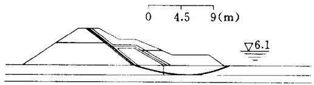

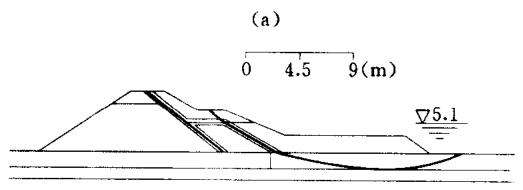  
(c)

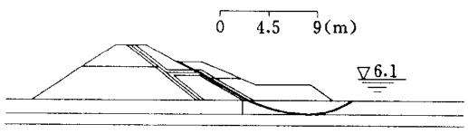  
(b)

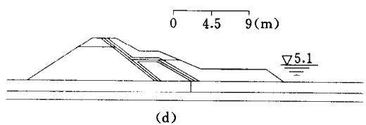

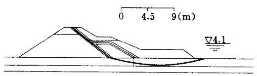

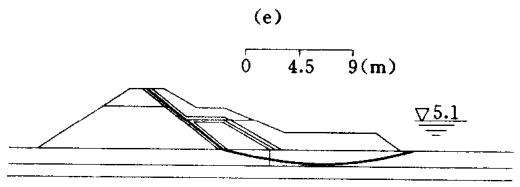

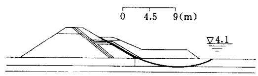

(g)  
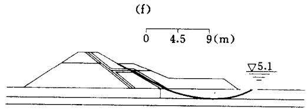  
(h)  
图 13.41 日照电厂挡灰堤稳定分析成果

(a) b12; (b) b22; (c) c23; (d) c31; (e) d11; (f) d21; (g) e11; (h) e21

部滑动的安全系数。反之，当压台厚度减小时，则增大沿旧土工布滑动的安全系数，而降低沿新铺土工布上部滑动的安全系数。此外反压平台的长度变化对沿旧土工布浅层滑动和沿新铺土工布上部滑动这两个滑裂面也有类似的影响。根据计算结果，新铺土工布上部的压台长一般取4.5m，其厚度取为2.0m，个别情况取3m，从表13.35知，安全系数可达到1.10以上。此计算成果为设计单位最终确定设计提供了依据。

## 13.13 紫坪铺工程2#导流洞出口滑坡稳定分析

## 13.13.1 基本情况

(1) 项目来源：四川省水利水电勘测设计院。

(2)完成日期：2001年11月。

(3) 设计阶段：技施设计。

(4) 存档文件：

1)紫坪铺水利枢纽工程2#导流洞出口滑坡稳定分析及处理方案，四川省水利水电勘测设计院，2001年10月；

2) 紫坪铺水利枢纽工程2#导流洞出口滑坡稳定分析及处理方案补充报告，四川省水利水电勘测设计院，中国水利水电科学研究院，2001年11月7日。

## 13.13.2 工程概述

紫坪铺水利枢纽工程2#导流洞出口位于坝址右岸条型山脊下游侧，地貌上为F3断层带 $\mathbf { F } _ { 3 }$ 所形成的槽谷下部。2#导流洞出口开挖边坡高约90m，宽约80m，上部开口高程830m左右，下部底口高程741.156m，出口开挖于2000年4月初开工，6月中旬开挖至213国道高程779m左右时，边坡开挖总高度约50m。此时都江堰地区持续一个月降雨频繁，边坡随即于2001年6月23日、7月14日、7月20日、7月27日发生四次滑动。滑动物质为第四纪堆积体，沿覆盖层与基岩接触面滑动，并在滑坡范围以外形成多条拉裂缝。图13.42示7月20日发生于IⅣ区的滑坡的实景。图13.43为滑坡发生后的山体。

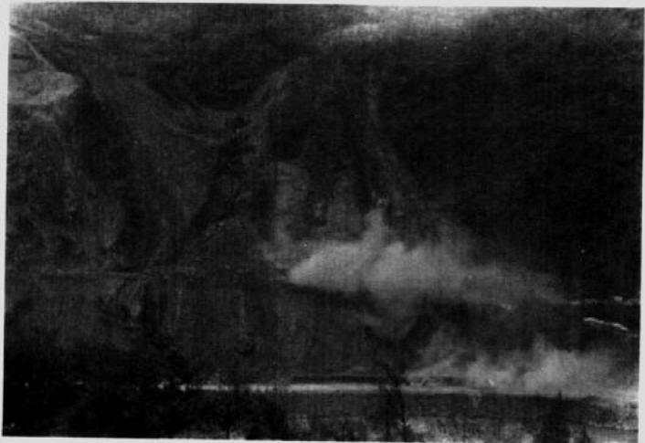  
图13.42 7 月20 日IV区发生滑坡时的实景

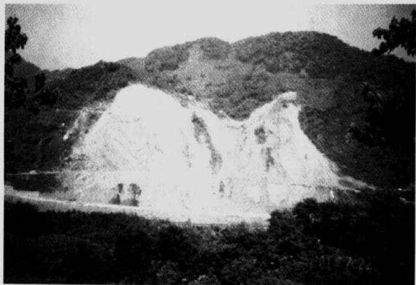  
图 13.43 滑坡后的地貌

根据地质资料，可将滑坡分为4区，如图13.44所示。图13.45和图13.46给出了典型地形剖面图。

I区为6月23 日主滑坡的区域，分布于高程788\~834m之间的已开挖边坡范围内。平面长70m，宽33\~42m，厚度约10m，平面面积 $2 1 6 2 \mathbf { m } ^ { 2 }$ ，初估方量约1.2\~1.5万 $\mathbf { m } ^ { 3 }$ 主滑动方向S75°E，滑坡后缘陡坎高约10m，最大滑距约20m。

ⅡI区分为2个亚区。Ⅱ区位于F3断层带槽谷中部一带，自然坡度相对较缓，为 $\mathbf { I I } _ { 1 }$ $\mathbf { F } _ { 3 }$ $3 0 ^ { \circ } { \sim } 5 0 ^ { \circ }$ 层厚10\~20m。Ⅱ2区位于I区靠上游侧一带，地形坡度约 $\Pi _ { 2 }$ $4 0 ^ { \circ } { \sim } 5 0 ^ { \circ }$ ，地表为崩坡积成因的块碎石土。Ⅱ1区和Ⅱ2区于7月14日同时发生滑动，均是沿着基覆界面缓慢变形，滑动过程中 $\mathbf { I I } _ { 1 }$ $\mathbf { { I I } } _ { 2 }$ 牵动了少量外边缘破碎岩体失稳。

Ⅲ区也分为2个亚区。Ⅲ₁区为滑坡危险区，位于滑动区Ⅱ区上部，自然边坡相对较缓， $\Pi _ { 1 }$ $\textstyle \mathbf { I I } _ { 1 }$ 地形坡度约30°，地表为崩坡积成因的块碎石土，厚度10\~15m。7月4日地表调查发现比 $3 0 ^ { \circ }$ 较连续的拉裂缝，宽1\~5cm，局部宽达10\~20cm，延伸长达70m以上，分布最高高程在887m，除此外坡体内还断续分布有一些相对较小的拉裂缝。变形体长约85m，宽65m体积约 5.0万 $\mathbf { m } ^ { 3 }$ 。 $\mathbf { I I } _ { 2 }$ 区为潜在危险区，位于Ⅲ区上部，边坡亦相对较缓，地形坡度约 $\mathbf { \cdot m } _ { 1 }$ $2 5 ^ { \circ } { \sim } 3 0 ^ { \circ }$ ，地表为崩坡积成因的块碎石土，厚度10\~17m，变形体长约80m，宽15\~40m，体积约2.4万$\mathbf { m } ^ { 3 }$

IV区也为潜在危险区，位于Ⅱ，区后部，自然边坡相对较缓，地形坡度约 $\mathbf { \cdot } \mathbf { I I } _ { 2 }$ $3 5 { \sim } 4 0 ^ { \circ }$ ，地表为崩坡积成因的块碎石土，钻探揭示厚度6.1\~12.11m，后缘拉裂缝长80m，一般宽1\~5cm，局部宽达10\~20cm，分布最高高程大约930m。

## 13.13.3 计算条件

## 1. 强度指标

根据现场取样试验，并结合以往工程经验，提出稳定分析建议的物理力学指标见表13.36。

实 [ 中 () ONm+P 20 1O8 M

港中 中 电中111

10000 50 m

图

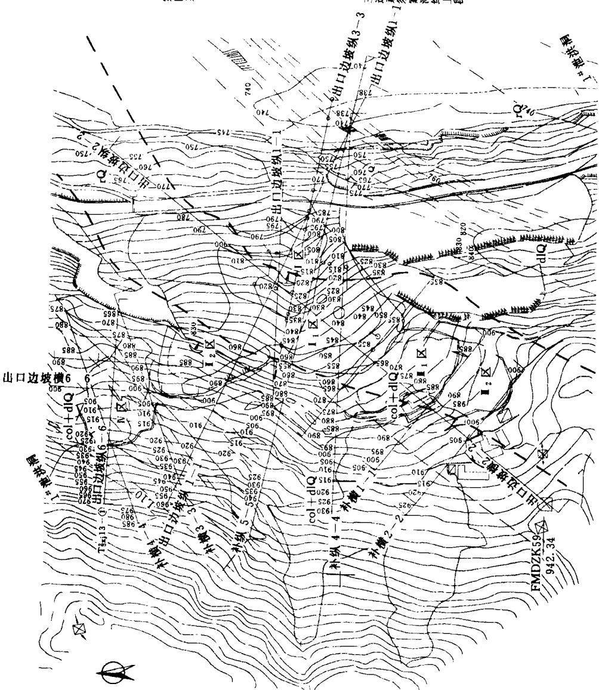

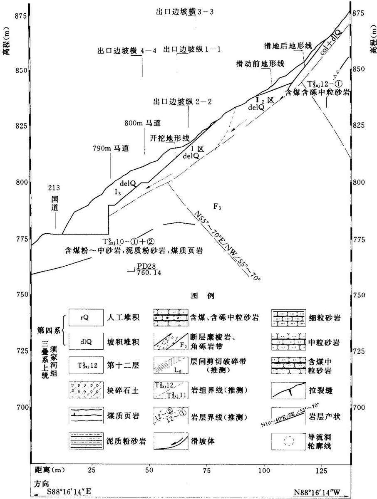  
图 13.45 纵 44 剖面图

## 2. 计算方案

(1) 方案1为抗滑桩方案。该方案对Ⅲ2区890m高程以上的土体采用2排共26根抗滑 $\mathbf { I I I } _ { 2 }$ 桩，其中在Ⅲ2区前缘设10根3m×5m抗滑桩，并在890m高程处设一20m高挡墙，同时建 $\mathbf { I I } _ { 2 }$ 议在修建挡墙土体下挖过程中，把出露的抗滑桩在横向用钢筋混凝土梁连起来，形成框架，以增加抗滑桩的刚度，提高抗滑桩的整体抗滑稳定性。加固示意图如图13.47所示。IV区坡体也采用的抗滑桩加固。

(2) 方案 2 为挡土墙方案。导流洞覆盖层经塌滑后，在 213 国道处形成一个约 60m 宽的垭口。由于此处地形在地貌上表现为一凹沟（参见图13.43)，此方案建议在此垭口处修建一个高35m的混凝土挡土墙（基底高程为776m)，将沟口封闭，挡住堆积体的主滑方向，挡墙上布置排水孔，挡墙后用透水石料回填至830m高程形成一个高50m，坡度为1:2.4的经碾压的边坡，加固示意图如图13.48所示。要求对原滑坡残留土作振冲或强夯处理。保留IV区的加固方案。

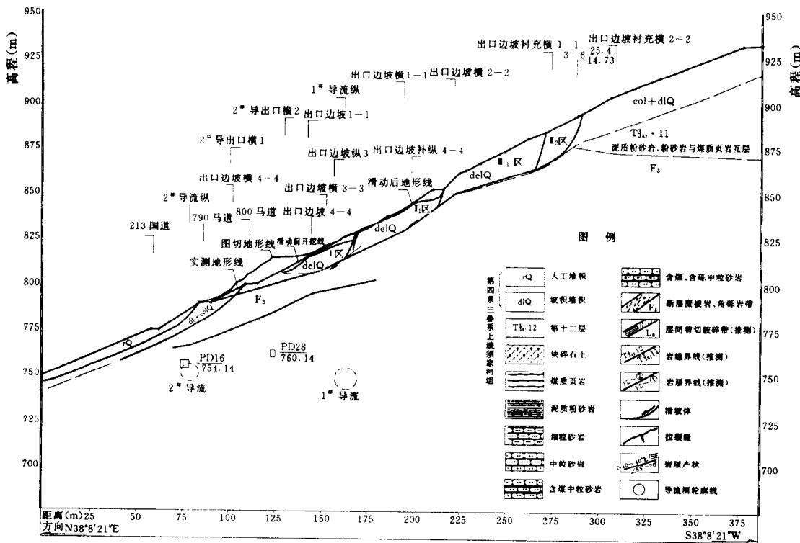  
图 13.46 纵 2-2 剖面图

表13.36 稳定分析建议的物理力学指标
<table><tr><td>编号</td><td>材料</td><td>c (MPa)</td><td>φ(°)</td><td>容重(g/cm³)</td></tr><tr><td>1</td><td>碾压后堆石</td><td>0.000</td><td>42.00</td><td>2.20</td></tr><tr><td>2</td><td>DelQ和未滑动部分的层间接触面</td><td>0.000</td><td>26.00</td><td>2.10</td></tr><tr><td>3</td><td>已滑动部分的层间接触面</td><td>0.007</td><td>10.00</td><td>2.00</td></tr><tr><td>4</td><td>经强夯的滑坡残留土</td><td>0.05</td><td>26.00</td><td>2.00</td></tr><tr><td>5</td><td>混凝土和基岩接触面</td><td>0.00</td><td>21.80</td><td>2.00</td></tr><tr><td>6</td><td>混凝土挡墙后的破碎岩体  $( \mathbb { F } _ { 3 } .$  影响带)</td><td>0.10</td><td>26.56</td><td>2.00</td></tr><tr><td>7</td><td> $\mathbb { T } _ { 3 x j } ^ { 3 }$ </td><td>0.3</td><td>26.00</td><td>2.60</td></tr><tr><td>8</td><td>挤压破碎带</td><td>0.05</td><td>30.00</td><td>2.45</td></tr></table>

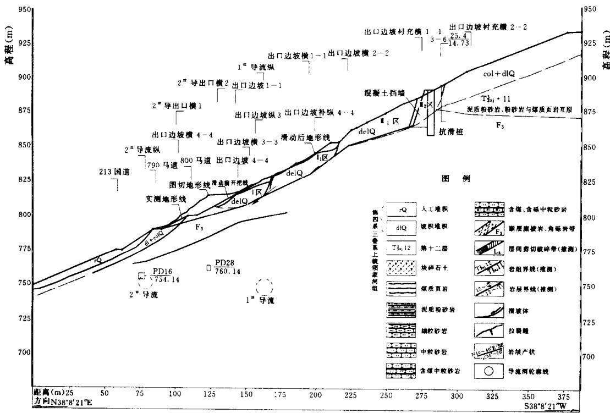  
图 13.47 方案 1 剖面图

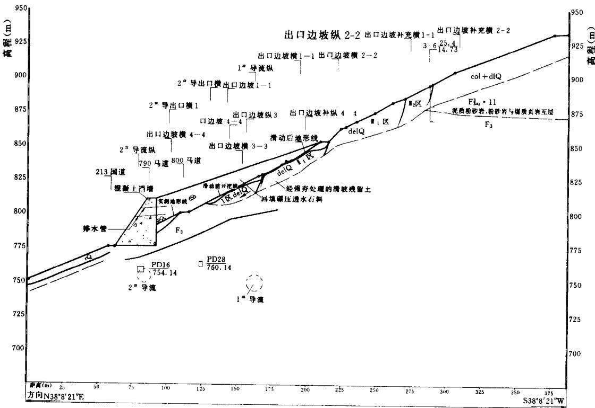  
图 13.48 方案 2 剖面图

## 13.13.4 计算成果和分析

## 1. 反演分析成果

在进行边坡加固设计时，正确选用滑坡体与基岩接触带的抗剪强度，对于加固工程量的影响极大。设计使用的指标为 $c = 0 , \phi = 2 6 ^ { \circ }$ 0

根据紫坪铺工程边坡的实际情况，对于 $2 ^ { \# } .$ 导流洞出口坡积层曾经发生的两次滑动，分别相应剖面纵2-2和纵4-4（参见图13.45和图13.46)。因此在方案比较中，进行了反演分析。反演分析分别按安全系数1.00和0.95两种情况进行，且不考虑地下水作用。表13.37示安全系数为0.95时的反演成果。图13.49示反演计算的简图。

表 13.37 反演成果
<table><tr><td>工况</td><td>组合</td><td>c(×9.8kN/m²)</td><td>φ(°)</td><td>安全系数</td></tr><tr><td rowspan="5">I区（剖面4-4） 数据文件为zz2-2</td><td>1</td><td>3.17</td><td>20</td><td>0.9504</td></tr><tr><td>2</td><td>3.38</td><td>19</td><td>0.9510</td></tr><tr><td>3</td><td>3.58</td><td>18</td><td>0.9505</td></tr><tr><td>4</td><td>3.78</td><td>17</td><td>0.9504</td></tr><tr><td>5</td><td>3.98</td><td>16</td><td>0.9507</td></tr><tr><td rowspan="5">Ⅱ区（剖面2-2） 数据文件为zz4-4</td><td>1</td><td>1.76</td><td>19</td><td>0.9503</td></tr><tr><td>2</td><td>2.04</td><td>18</td><td>0.9505</td></tr><tr><td>3</td><td>2.32</td><td>17</td><td>0.951</td></tr><tr><td>4</td><td>2.59</td><td>16</td><td>0.9509</td></tr><tr><td>5</td><td>2.86</td><td>15</td><td>0.951</td></tr></table>

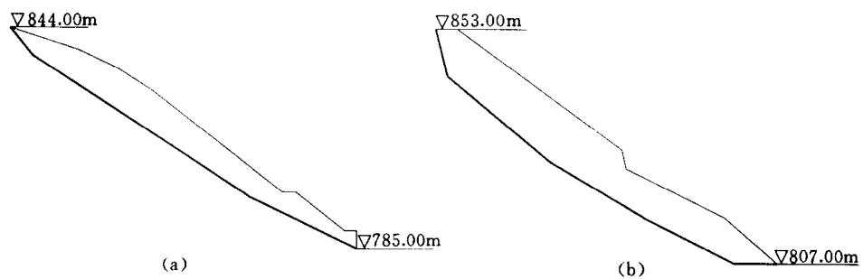  
图 13.49 反演成果计算简图

## 2. 方案1分析成果

滑坡处理方案中对Ⅱ，区主要采用抗滑桩加混凝土挡墙进行加固。在Ⅲ，区前缘设置一高 $\mathbf { { I I } } _ { 2 }$ $\Pi _ { 2 }$ 约20m的混凝土挡墙，与前缘钢管桩一起支挡前沿土体，在挡土墙及钢管桩后缘设置一排断面为3m×5m的抗滑桩，共16根，深35m。在后部设置一排断面为2m×4m、间距为4m（中对中)、深20\~25m的抗滑桩10根，以提高Ⅲ2区后缘坡体的稳定程度。计算采用纵2-2 $\mathbf { I I } _ { 2 }$ 剖面，参见图13.46。结果见表13.38。

由计算结果可以看出，采用设计指标，原地形坡体的安全系数为0.868，在坡体内打1排单宽抗滑力为2500kN/m的抗滑桩，边坡稳定安全系数可提高到0.953，比原地形工况增大了近0.1，若挖除桩前滑坡堆积体，则桩后坡体的稳定安全系数降低至0.914，可见桩后堆积体开挖后边坡安全系数较低，因此在施工期应采取分段开挖的方式，并及时浇筑混凝土挡墙，以保证堆积体开挖过程中边坡的稳定。设置混凝土挡墙后，边坡稳定程度有较大提高，安全系数可达到1.416，比原地形工况提高了0.54。

表 13.38 方案1 $( \mathbf { I I I } _ { 2 }$ 区边坡稳定性分析成果)
<table><tr><td>编号</td><td>工 况</td><td>安全系数</td><td>数据文件</td></tr><tr><td>1</td><td>原地形</td><td>0.868</td><td>z4-0</td></tr><tr><td>2</td><td>原地形，堆积体内打1排抗滑桩</td><td>0.953</td><td>z4-1</td></tr><tr><td>3</td><td>堆积体内打1排抗滑桩，桩前滑体挖除</td><td>0.914</td><td>z4-2-2</td></tr><tr><td>4</td><td>桩前滑体挖除，上部边坡整体从桩顶滑出</td><td>1.814</td><td>z4-2-1</td></tr><tr><td>5</td><td>桩前滑体挖除，混凝土挡墙加抗滑桩</td><td>1.416</td><td>z4-3-1</td></tr></table>

注以上工况计算中均考虑孔隙水压力系数为 $r _ { * } = 0 . 1$

为了降低孔隙水压力，在Ⅲ，区坡体布置了必要的排水措施。除在坡面布设排水管、排 $\mathbf { I I } _ { 2 }$ 水沟外，在860m高程左右设置 2.5m×2.5m的排水洞，并在洞顶打放射状的排水孔，考虑到上述措施，在以上Ⅲ2区边坡稳定各计算工况中均考虑孔隙水压力系数为0.1。若不考虑 $\mathbf { \Pi } _ { \pm } ^ { - } \mathbf { I I I } _ { 2 }$ 排水措施，在计算中采用孔隙水压力系数为0.25，则各工况条件下边坡稳定计算的敏感性分析结果表13.39所示。

表 13.39 方案1 $( \mathbf { I I I } _ { 2 }$ 区边坡稳定考虑孔隙水压力敏感性分析成果）
<table><tr><td>编号</td><td>工 况</td><td>安全系数</td><td>数据文件</td></tr><tr><td>1</td><td>原地形</td><td>0.706</td><td>z4-0</td></tr><tr><td>2</td><td>原地形，堆积体内打1排抗滑桩</td><td>0.757</td><td>z4-1</td></tr><tr><td>3</td><td>堆积体内打1排抗滑桩，桩前滑体挖除</td><td>0.723</td><td>z4-2-2</td></tr><tr><td>4</td><td>桩前滑体挖除，上部边坡整体从桩顶滑出</td><td>1.490</td><td>z4-2-1</td></tr><tr><td>5</td><td>桩前滑体挖除，混凝土挡墙加抗滑桩</td><td>1.146</td><td>z4-3-1</td></tr></table>

注 以上工况计算中均考虑孔隙水压力系数为 $r _ { \ast } = 0 . 2 5$

比较表13.38和表13.39可见，孔隙水压力系数由0.1提高到0.25后，各工况下边坡稳定安全系数降低了0.15\~0.35。其中，对于第5种工况，即在Ⅲ2区前缘打1排3m×5m、单 $\mathbf { I I } _ { 2 }$ 宽抗力为2500kN/m的抗滑桩，其后滑坡堆积体挖除并设置混凝土挡墙的工况条件下，如果不考虑排水措施边坡稳定安全系数由1.416降低到1.146。此外，孔隙水压力系数为0.25时，第5种工况安全系数比原地形的0.706提高了0.4，基本可满足边坡稳定要求。

## 3. 方案2分析成果

边坡稳定计算主要考虑边坡整体滑动、局部滑动、边坡分别从挡墙顶部和底部滑出，以及目前边坡的稳定情况等工况。相应纵 2-2 和纵 3-3 剖面计算结果分别见表13.40 和表13.41。部分计算简图如图13.50示。

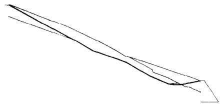

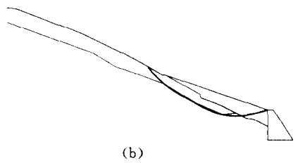

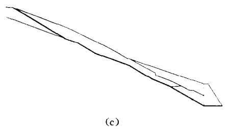

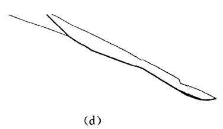  
图 13.50 典型方案计算简图  
(a) z2-1; (b) w2-2; (c) z2-2; (d) z2f

表 13.40 挡土墙方案纵 2-2 剖面稳定分析成果
<table><tr><td>编号</td><td>工况</td><td>安全系数</td><td>土压力(kN/m)</td><td>数据文件</td></tr><tr><td>1</td><td>边坡整体滑动，从挡墙顶部滑出</td><td>1.229</td><td></td><td>z2-1</td></tr><tr><td>2</td><td>边坡局部滑动，从挡墙顶部滑出</td><td>1.355</td><td></td><td>w2-2</td></tr><tr><td>3</td><td>边坡整体滑动，从挡墙底部滑出</td><td>1.168</td><td></td><td>z2-2</td></tr><tr><td>4</td><td>边坡整体滑动，挡墙底部土压力</td><td></td><td>6160</td><td>z2-t</td></tr><tr><td>5</td><td>边坡现状</td><td>0.77</td><td></td><td>z2f</td></tr></table>

表 13.41 挡土墙方案纵 3-3 剖面稳定分析成果
<table><tr><td>编号</td><td>工况</td><td>安全系数</td><td>土压力(kN/m)</td><td>数据文件</td></tr><tr><td>1</td><td>边坡整体滑动，从挡墙顶部滑出</td><td>1.005</td><td></td><td>z3-1</td></tr><tr><td>2</td><td>边坡整体滑动，挡墙底部土压力</td><td></td><td>6200</td><td>z3-t</td></tr><tr><td>3</td><td>边坡现状</td><td>0.37</td><td></td><td>z3f</td></tr></table>

由表 13.41 所示纵 2-2 剖面计算结果可见，对于整体边坡分别从混凝土挡墙顶部和底部滑出的工况，其稳定安全系数分别为1.229和1.168，相对于边坡现状稳定安全系数0.77，分别提高了0.46 和0.4。而对于纵 3-3 剖面边坡整体从挡墙顶部滑出的工况，其稳定安全系数为1.005，相对于现状边坡的稳定安全系数0.37提高了0.63。

## 13.13.5 讨论

本节所列内容，是作者参加紫坪铺工程发生滑坡后的科研和技术咨询时所做的工作。所介绍的内容均为优化设计过程中的比较方案，从中可以看出一个边坡加固工程的决策所经历的多方位的方案比较过程。本节内容的以下特点值得重视。

(1) 对于已经发生了滑坡的工程，在加固设计时采用的强度指标应与反分析相匹配。如果用原来建议的强度指标去核算已发生滑坡的安全系数，得出其值为0.6或0.7，则说明加固设计采用的强度指标可能过于保守，有必要考虑进一步优化。

(2) 对于天然边坡，坡内孔隙水压力主要是降雨引起的。目前的水平不可能十分准确地予以确定，此时，根据边坡内的排水条件，使用一个孔隙水压力系数 $r _ { u } ,$ 并进行敏感分析，可能是一个比较现实、可行的方法。

(3) 本节所列的一部分算例，使用第 8 章介绍的 STAB 程序进行抗滑桩和挡土墙加固边坡的功能，可供进行类似工程设计的人员参考。

## 13.14 本章附录

## 13.14.1 本章数据（表13.42）

表13.42本章数据文件
<table><tr><td>有关章节</td><td>系列号</td><td>数据文件名</td><td>内容</td></tr><tr><td>13.1</td><td>13-01</td><td>13-1.ZIP</td><td>蒲城电厂张家沟灰坝</td></tr><tr><td>13.2</td><td>13-02</td><td>13-2.ZIP</td><td>公伯峡水电站堆石坝</td></tr><tr><td>13.3</td><td>13-03</td><td>13-3.ZIP</td><td>小浪底水利枢纽大坝</td></tr><tr><td>13.4</td><td>13-04</td><td>13-4.ZIP</td><td>三峡工程3坝段坝基深层抗滑稳定分析</td></tr><tr><td>13.5</td><td>13-05</td><td>13-5.ZIP</td><td>小浪底库岸河岸边坡稳定分析</td></tr><tr><td>13.6</td><td>13-06</td><td>13-6.ZIP</td><td>宜兴抽水蓄能电站上池</td></tr><tr><td>13.7</td><td>13-07</td><td>13-7.ZIP</td><td>紫坪铺水库左岸堆积体</td></tr><tr><td>13.8</td><td>13-08</td><td>13-8.ZIP</td><td>徐村水电站溢洪道边坡</td></tr><tr><td>13.9</td><td>13-09</td><td>13-9.ZIP</td><td>天生桥厂房高边坡</td></tr><tr><td>13.10</td><td>13-10</td><td>13-10.ZIP</td><td>乌鲁瓦提面板堆石坝</td></tr><tr><td>13.11</td><td>13-11</td><td>13-11.ZIP</td><td>黄河三盛公水利枢纽拦河闸</td></tr><tr><td>13.12</td><td>13-12</td><td>13-12.ZIP</td><td>日照电厂蔡家滩灰场挡灰堤</td></tr><tr><td>13.13</td><td>13-13</td><td>13-13.ZIP</td><td>紫坪铺工程2#导流洞出口滑坡稳定分析</td></tr></table>

## 第14章 三维极限平衡分析方法

## 14.1 概述

## 14.1.1 进行三维边坡稳定分析的必要性

自然界发生的滑坡绝大多数呈三维形态，但是，在边坡稳定分析领域，二维极限平衡法仍是常用的手段。越来越多的工程实际问题提出了建立三维边坡稳定分析的要求(Seed etal,1990;Morgenstern,1992)。三维边坡稳定分析可以更加真实地反映边坡的实际形态，特别是当滑裂面已经确定时，使用三维分析可以恰当地考虑滑体内由于滑裂面的空间变异特征对边坡稳定安全系数的影响。

在工程设计中，还有一些情况一定要使用三维分析方法。例如洞口开挖边坡，由于开挖只在一个有限宽度内进行，因此，如果采用二维分析，等于是假定开挖面是无限长的，显然与实际情况出入较大。又如对地下连续墙在施工期的稳定性分析，泥浆压力固然是保证其稳定性的主要因素，但是槽孔总是跳槽浇筑的，每一个浇筑段宽度不过10\~15m，而其深度可达50\~60m。因此，墙壁的稳定性系三维效应控制。Tsai(2000)等曾使用三维方法分析连续墙的稳定性。

尽管三维稳定分析具有重要意义，但是，有关的稳定分析方法和程序开发方面的工作还远远不能满足实际要求，大部分研究工作都局限于学术领域，未见实际应用。1998年发表于美国 ASCE岩土工程学报上的一篇文章(Stark & Eid， 1998)指出，所有的三维分析程序都存在引入大量假定的缺陷。同时，还没有一个程序在数据处理、图形处理等方面提供可应用于实际情况的软件。

本书作者所在课题组在过去的十年中，为开发三维稳定分析程序作了大量的工作。首先开发了建立在塑性力学上限定理基础上的边坡稳定三维分析方法(Chen et al, 2000 a, b)，同时还开发了建立在极限平衡理论基础上的一个简化的三维稳定分析方法（陈祖煜，弥宏亮，汪小刚，2001)，并且将这一上、下限的理论体系及相应的计算方法应用于工程实际中，完成了三峡、洪家渡、恰甫其海、小湾、宜兴抽水蓄能电站等一系列水利水电工程问题。

由于上限解方法主要用于解决岩石边坡稳定问题，在本章，仅介绍三维边坡稳定分析的极限平衡方法。

## 14.1.2 三维边坡稳定分析研究的现状

有关边坡稳定三维极限平衡方法，已有众多的文献介绍研究成果。Duncan(1996)曾经列表总结了20篇文献资料，列举了这些方法的特点和局限性，详见表14.1。

回顾以往的工作，可以看到，为了使问题变得静定可解，各种三维极限平衡方法均引入大量的假定。Lam&Fredlund(1993)计算了以物理和力学要求为基础可建立的方程个数及这些方程中的未知数数目。他们发现对于离散成n行和m列条柱的破坏体，总共需要引入8mn个假定。在诸多的假定中，最为常见的是忽略作用在条柱侧面的全部剪力。Hungr(1989)在此基础上，建立了通过力矩平衡和静力平衡求解的两种方法。前者需要将滑裂面近似为一个球面，被称为Bishop法的扩展。后者则不能保持作用力在垂直滑坡这一方向的坐标轴（图 14.1 中的 z 轴）的静力平衡，被称为简化 Janbu 法的延伸。Hungr 发现，此类方法通常给出较小的安全系数。另外，许多三维极限平衡分析方法还对滑裂面的形状作出假定，如假定为左右对称，为对数螺旋面等，详见文献(Chen & Chameau, 1982; Leshchinsky et al,1985)。这样，就进一步削弱了方法的理论基础和应用范围。

表 14.1 三维边坡稳定分析方法 (Duncan, 1996)
<table><tr><td>作者</td><td>方法</td><td>强度</td><td>边坡/滑面几何条件</td><td>三维效应</td></tr><tr><td>Anagnosti (1969)</td><td>改进Morgenstern &amp; Price法</td><td> $_ { c , \phi }$ </td><td>均无限制</td><td>有算例得  $F _ { 3 } { = } 1 . 5 F _ { 2 }$ </td></tr><tr><td>Baligh and Azzouz 改进圆弧法 (1975)</td><td></td><td> $\scriptstyle \phi = 0$ </td><td>简单边坡/旋转面</td><td> $F _ { 3 } > F _ { 2 }$ </td></tr><tr><td>Giger and Krizek (1975)</td><td>理想塑性的上限定理</td><td> $^ { c , \phi }$ </td><td>有角边坡/对数曲线</td><td> $F _ { 3 } > F _ { 2 }$ </td></tr><tr><td>Giger and Krizek (1976)</td><td>理想塑性的上限定理</td><td> $_ { c , \phi }$ </td><td>边坡同上坡顶有荷载</td><td> $F _ { 3 } > F _ { 2 }$ </td></tr><tr><td>Baligh et al (1977) 改进圆弧法</td><td></td><td> $\scriptstyle \phi = 0$ </td><td>简单加载边坡/旋转面</td><td> $F _ { 3 } > F _ { 2 }$ </td></tr><tr><td>Hovland (1977)</td><td>改进普通条分法</td><td> $\scriptstyle \phi = 0$ </td><td>均无限制</td><td>某些情况下  ${ \cal F } _ { 3 } { < } { \cal F } _ { 2 }$ </td></tr><tr><td>Azzouz (1981)</td><td>改进圆弧法</td><td> $\scriptstyle \phi = 0$ </td><td>简单边坡/旋转面</td><td> $F _ { 3 } { > } 1 . 0 7 { - } 1 . 3 F _ { 2 }$ </td></tr><tr><td>Chen and Chameau 改进Spencer法 (1982)</td><td>有限元法</td><td> $_ { c , \phi }$ </td><td>均无限制</td><td>Spencer与有限元 结果接近</td></tr><tr><td>Chen and Chameau 改进Spencer法 (1983)</td><td></td><td> $_ { c , \phi }$ </td><td>均无限制</td><td>某些情况下  $F _ { 3 } { < } F _ { 2 }$ </td></tr><tr><td>(1983) Dennhardt and</td><td>Azzouz and Baligh 改进瑞典圆弧法</td><td> $\scriptstyle { \phi = 0 }$ </td><td>边坡同B&amp;A(1975) 坡顶有荷载</td><td> $F _ { 3 } > F _ { 2 }$ </td></tr><tr><td>Forster (1985) Leshchinsky et al</td><td>滑面假定s</td><td> $_ { c , \phi }$ </td><td>边坡加载/无限制</td><td>某些情况下  $F _ { 3 } > F _ { 2 }$ </td></tr><tr><td>(1985)</td><td>极限平衡和变分法</td><td> $_ { c , \phi }$ </td><td>无限制</td><td> $F _ { 3 } > F _ { 2 }$ </td></tr><tr><td>Ugai (1985) Leshchinsky and</td><td>极限平衡和变分法</td><td> $_ { c , \phi }$ </td><td>垂直边坡/圆筒形</td><td> $F _ { 3 } > F _ { 2 }$ </td></tr><tr><td>Baker (1986)</td><td>极限平衡和变分法</td><td> $_ { c , \phi }$ </td><td>在第3维上限制/无限制</td><td> $F _ { 3 } > F _ { 2 } ,$   $\yen 50$   ${ \cal F } _ { 3 } = { \cal F } _ { 2 } ,$  当c=0</td></tr><tr><td>Baker and Leshchinsky (1986) Cavounidis (1987) 极限平衡法</td><td>极限平衡和变分法</td><td> $_ { c , \phi }$ </td><td>圆锥形/无限制</td><td> $F _ { 3 } > F _ { 2 }$ </td></tr><tr><td>Hungr (1987)</td><td></td><td> $_ { c , \phi }$ </td><td>无限制</td><td> $F _ { 3 } > F _ { 2 }$ </td></tr><tr><td>Gens et al.(1987)</td><td>改进Bishop法</td><td> $_ { c , \phi }$ </td><td>无限制/旋转面</td><td> $F _ { 3 } > F _ { 2 }$ </td></tr><tr><td>Leshchinsky and</td><td>改进瑞典圆弧法</td><td> $\scriptstyle { \phi = 0 }$ </td><td>简单边坡/旋转面</td><td> $F _ { 3 } > F _ { 2 }$ </td></tr><tr><td>Mullett (1988)</td><td>极限平衡和变分法</td><td> $_ { c , \phi }$ </td><td>有角垂直边坡/无限制</td><td> $F _ { 3 } > F _ { 2 }$ </td></tr><tr><td>Ugai (1985)</td><td>改进普通条分法 Bishop,Janbu和Spencer法</td><td> $_ { c , \phi }$ </td><td>无限制</td><td> $F _ { 3 } > F _ { 2 }$  普通条分法除外</td></tr><tr><td>Xing (1988) Michalowski</td><td>极限平衡法</td><td> $c , \phi$ </td><td>无限制/椭圆形</td><td> $F _ { 3 } > F _ { 2 }$ </td></tr><tr><td>(1989)</td><td>塑性极限动力分析理论</td><td> $_ { c , \phi }$ </td><td>无限制</td><td> $F _ { 3 } > F _ { 2 }$ </td></tr><tr><td>Seed et al (1990)</td><td>二、三维Ad hoc法</td><td> $^ { c , \phi }$ </td><td>特例：Kettleman山破坏</td><td> ${ \pmb { F } } _ { 3 } { \lessgtr } F _ { 2 }$ </td></tr><tr><td>Leshchinsky and Huang (1985)</td><td>极限平衡和变分法</td><td> $_ { c , \phi }$ </td><td>无限制</td><td> $\pmb { F } _ { 3 } > \pmb { F } _ { 2 }$ </td></tr></table>

注有关参考文献请参阅原文。

下面简要介绍一些比较有代表性的方法的基本假定和满足的平衡条件。首先将滑动土体剖分成具有垂直界面的条柱，建立如图14.1 所示的坐标系，x和y的正方向分别与滑坡方向和重力方向相反，z轴的正方向按右手法则确定。中间沿滑动方向尺寸最大的断面称之为中性面，如果滑裂面对称，中性面就是对称轴所在的平面。如果不作任何静力假定，每个条柱上的作用力应当如图14.2所示，其中平行于yoz平面的界面称之为行界面，即图14.2中的 ABFE和 DCGH;平行于xoy 平面的界面称之为列界面，即图 14.2 中的 ADHE和 BCGF。

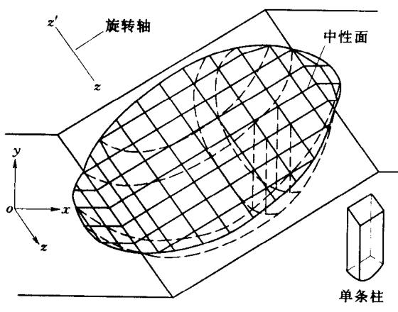  
图14.1 具有垂直界面条柱的滑动土体

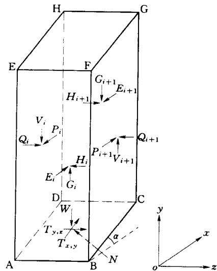  
图14.2 未作任何假定的条柱上的作用力

1. Hungr (1989)

(1) 简化 Bishop 法。本方法主要包括以下假定（参见图 14.1 和图 14.2）：

1) 忽略条柱间沿y轴方向的所有剪力 G 和 $V ;$

2) 滑裂面上的剪切力平行于 xoy 平面，即忽略平行于 yoz 平面的剪切力 $T _ { y , z }$

本方法满足每个条柱沿y轴方向力的平衡，并根据绕z 轴的整体力矩平衡求解安全系数，Hungr给出的计算公式为

$$
F = \frac { \sum \left[ c A R + ( N - u A ) R \tan { \phi } \right] } { \sum W x - \sum N f \cos \gamma _ { y } / \cos \alpha _ { x } + \sum k W e + E d }\tag{14.1}
$$

式中：R为底滑面抗滑力 $T _ { x , y }$ 的力臂；x为条柱重力W的力臂；f为底滑面正应力N的力臂；k为水平地震力加速度系数，其作用点假定为条柱中点，力臂为e；E为水平荷载，力臂为d，垂直荷载记入重力； $\gamma _ { \mathrm { y } }$ 为正应力N与y轴的夹角； $\pmb { \alpha _ { x } }$ 为底滑面沿滑动方向与x轴的夹角。

本方法由于未满足沿 x轴和 z 轴方向的整体力的平衡，所以根据整体力矩平衡条件求解安全系数时与坐标轴的位置有关，所以本方法比较适合于滑裂面为旋转面的情况。

(2) 简化 Janbu 法。本方法的假定同 Bishop 法，满足每个条柱沿 y 轴方向力的平衡，并根据沿x轴方向的整体力的平衡求解安全系数，Hungr给出的计算公式为

$$
F = \frac { \displaystyle \sum \left[ c A \cos \alpha _ { x } + ( N - u A ) \tan \phi \cos \alpha _ { x } \right] } { \displaystyle \sum N \cos \gamma _ { y } \tan \alpha _ { x } + \sum k W + E }\tag{14.2}
$$

式(14.2)中各物理量的含义同式(14.1)。

Hungr提出的这两种方法虽然没有假定滑裂面对称，但由于未考虑滑裂面上平行于yoz平面的剪切力 T和沿z轴方向整体力的平衡，所以比较适合于滑裂面对称的情况；Hungr $T _ { y , z }$ 也指出当滑坡体呈现出明显的不对称性时，这两种方法给出的安全系数误差都比较大。同时Hungr还指出此类方法由于忽略了所有条间剪力，所以不适合计算条间的抗剪强度比较大而底滑面的抗剪强度相对较小的情况。另外，Hungr发现，此类方法通常给出比较小的安全系数。

## 2. Zhang Xing (1988)

本方法可看作二维Spencer法在三维条件下的扩展。其假定主要包括（参见图14.2）:

(1) 滑裂面为对称的椭球面，根据下式确定。

$$
\frac { ( x - x _ { 0 } ) ^ { 2 } } { a ^ { 2 } } + \frac { ( y - y _ { 0 } ) ^ { 2 } } { a ^ { 2 } } + \frac { ( z - z _ { 0 } ) ^ { 2 } } { b ^ { 2 } } = 1\tag{14.3}
$$

即滑裂面在xoy平面内为圆弧，在z轴方向由椭圆面生成。

(2) 滑裂面上的剪切力平行于xoy 平面，即忽略平行于 yoz 平面的剪切力 Ty,z° $T _ { y , z }$

(3) 将所有的条间力简化为一个平行于xoy 平面的作用力（记为 R），其与x轴的倾角为常量（记为λ），这一假定相当于二维领域中的Spencer法。

(4) 假定条柱底部作用一个端部力 P，并假定其大小和作用方向，Zhang Xing 给出 P的计算公式为

$$
P = K _ { a } \Re V _ { x y }\tag{14.4}
$$

式中：K为主动土压力系数；γ为土的容重；h为土条高度；V为条柱底部在xoy平面上的 $K _ { a }$ $V _ { x y }$ 面积投影。则由于端部力P而产生的抗滑力S为

$$
S = P ( \tan \phi ^ { \prime } \cos \theta + \sin \theta )\tag{14.5}
$$

式中：φ′为土的内摩擦角；θ为端部力P与z轴的夹角。 $\phi ^ { \prime }$

根据上述假定，如果将滑坡体划分成n个条柱，本方法中的未知量数目和已知的方程数目见表14.2。通过表14.2中建立的方程即可求得安全系数 $\pmb { F } _ { \mathfrak { c } }$

本方法通过假定的条柱底部端部力P反映三维效应，显得比较简单，同时也使得本方法的理论基础不够严格。另外，本方法由于假定滑裂面对称，故其很难在实际工程中应用。

表 14.2 Zhang Xing 法中的未知量和已知条件数目统计表
<table><tr><td colspan="2">未知量</td><td colspan="2">已知条件</td></tr><tr><td>变量</td><td>数目</td><td>方程</td><td>数目</td></tr><tr><td>F</td><td>1</td><td>每个条柱沿x轴和y轴的静力平衡</td><td>2n</td></tr><tr><td>λ</td><td>1</td><td> $\sum _ { i = 1 } ^ { n } R _ { i } = 0$ </td><td>1</td></tr><tr><td>N</td><td>n</td><td></td><td></td></tr><tr><td>R</td><td>n</td><td> $\sum _ { i = 1 } ^ { n } M _ { i } = 0$  绕z轴的整体力矩平衡</td><td>1</td></tr><tr><td>共计</td><td> $_ { 2 n + 2 }$ </td><td>共计</td><td> $_ { 2 n + 2 }$ </td></tr></table>

## 3. Chen & Chameau (1982)

本方法可看作二维Spencer法在三维条件下的扩展。其假定主要包括（参见图14.2）:

## 1) 滑裂面对称；

2) 滑动方向只沿着 xoy 平面，则滑裂面上的剪切力平行于 xoy 平面，即忽略平行于 yoz平面的剪切力 $T _ { y , z }$

3) 忽略条柱间行界面上沿z 轴方向的剪切力 H;

4) 假定条柱间行界面上的作用力 E和 G 的合力平行于xoy 平面，其与 x轴的倾角为常量，这一假定相当于二维领域中的 Spencer 法；

5)假定条柱间列界面上的剪切力P和V的合力（记为R）平行于条柱底部，并假定其分布，Chen&Chameau认为由于滑裂面对称，所以在中性面上剪切力R应当等于零，而在滑坡体最外侧两端的剪切力R应当最大，并假定最大值Rn根据式(14.6)确定，而中间条柱 $R _ { e x t }$ 列界面上的剪切力 R 则根据 R线性内插求得；同时，Chen & Chameau 把 R 分成两部分， $R _ { e x t }$ 一部分由粘聚力c产生，记为R，其作用点假定为条柱的中点，另一部分由φ产生，记为R， $\boldsymbol { R } _ { c } ,$ $\phi ^ { \vec { \jmath } }$ $R _ { \phi } ,$ 其作用点假定为条柱的下三分点。

$$
R _ { e x t } = ( 0 . 5 K _ { 0 } \gamma h \tan \phi + c ) b h \cos \alpha\tag{14.6}
$$

式中：K0为静止土压力系数；γ为土的容重；φ为土的内摩擦角；c为土的粘聚力；h为土条 $K _ { 0 }$ 高度；b为土条宽度；α为土条底滑面与水平向的夹角。

本方法通过x轴和y轴方向的整体力的平衡和绕z轴的整体力矩平衡求解安全系数。

本方法由于假定滑裂面对称，故其很难在实际工程中应用。另外，在计算非粘性土坡时，某些情况下，本方法得出的三维安全系数比二维的安全系数低，因此本方法的可靠性在某些情况下值得怀疑，具体可参见 Hutchison & Sarma (1985)的讨论。

## 4. Lam & Fredlund (1993)

本方法全面考虑各种静力条件，计算了以物理和力学要求为基础可建立的方程个数及这些方程中的未知数数目。对于离散成 n 行和 m 列条柱的破坏体，Lam & Fredlund 发现未知量数目为12nm+2，而已知条件为4nm+2，因此需要引入8mn个假定，具体见表14.3。

Lam & Fredlund 给出的假定主要有（参见图 14.2):

(1) 假定正应力N的作用点为底滑面的中心，则未知量的数目减为9nm+2。

表 14.3 Lam & Fredlund 法中的未知量数目和已知条件统计表
<table><tr><td></td><td>数目</td><td>说明</td></tr><tr><td rowspan="6">已知条件</td><td>nm</td><td> $\sum F _ { x } = 0$  ，每个条柱沿x轴的静力平衡</td></tr><tr><td>nm</td><td> $\sum F _ { y } = 0$  ，每个条柱沿  $\mathbf { i } \mathbf { y } .$  轴的静力平衡</td></tr><tr><td>nm</td><td> $\sum F _ { z } = 0$  ，每个条柱沿z轴的静力平衡</td></tr><tr><td>nm</td><td>Mohr-Coulomb抗剪强度准则（每个条柱）</td></tr><tr><td>1</td><td> $\sum M _ { z } = 0$  ，绕z轴的整体力矩平衡</td></tr><tr><td>1</td><td> $\lambda _ { \mathfrak { r } }$  和  $\mid \lambda _ { 3 }$  的组合，使F最小</td></tr><tr><td>共计 4nm+2</td><td></td></tr><tr><td>未知量</td><td>nm  $N ,$ </td><td>为条柱底部正应力</td></tr><tr><td></td><td>3nm</td><td> $a _ { x } , a _ { y } , a _ { z }$  ，为N的作用点</td></tr><tr><td></td><td>nm</td><td> $T _ { x , y } ,$  为条柱底部平行于xoy平面的剪应力</td></tr><tr><td></td><td>nm</td><td> $T _ { y , z }$  为条柱底部平行于  $y o z$  平面的剪应力</td></tr><tr><td></td><td>nm</td><td> $\scriptstyle { E , }$  为行界面正应力</td></tr><tr><td></td><td>nm</td><td>G. 为行界面沿  $\mathfrak { i } \mathfrak { y }$  轴方向的剪切力</td></tr><tr><td></td><td>nm</td><td>H,为行界面沿z轴方向的剪切力</td></tr><tr><td></td><td>nm</td><td>Q. 为列界面正应力</td></tr><tr><td></td><td>nm</td><td>P,为列界面沿x轴方向的剪切力</td></tr><tr><td></td><td>nm</td><td> $\boldsymbol { v } ,$  为列界面沿y轴方向的剪切力</td></tr><tr><td>1</td><td></td><td> $F _ { m }$  ，为对应力矩平衡的安全系数</td></tr><tr><td></td><td>1</td><td> $F _ { f } ,$  为对应静力平衡的安全系数</td></tr><tr><td>共计</td><td>12nm+2</td><td></td></tr></table>

(2) 假定所有的剪力与其相应的正应力存在一定的函数关系，即

$$
\frac { G } { E } = \lambda _ { 1 } f ( 1 )\tag{14.7}
$$

$$
\frac { H } { E } = \lambda _ { 2 } f ( 2 )\tag{14.8}
$$

$$
\cfrac { V } { Q } = \lambda _ { 3 } f ( 3 )\tag{14.9}
$$

$$
\frac { P } { Q } = \lambda _ { 4 } f ( 4 )\tag{14.10}
$$

$$
\frac { T _ { y , z } } { N } = \lambda _ { 5 } f ( 5 )\tag{14.11}
$$

式中：f(1) 为 G/E 与 x 坐标的函数关系；f(2) 为 H/E与 x 坐标的函数关系；f(3) 为 VIQ与 $G / E$

$z$ 坐标的函数关系；f(4)为 $P / Q$ 与z 坐标的函数关系；f(5)为 $T _ { y , z } / N$ 与 $z$ 坐标的函数关系；  
$\lambda _ { 1 } , \lambda _ { 2 } , \lambda _ { 3 } , \lambda _ { 4 } , \lambda _ { 5 }$ 为求解安全系数过程中上述函数关系采用的百分比。

经过此项假定，剪应力 $G ,$ H, $\nu ,$ P和 $T _ { y , z }$ 都可以根据相应的正应力确定，未知量的数目相应会减少5nm个，同时又引入了5个新的未知量 $\lambda _ { 1 } , \lambda _ { 2 } , \lambda _ { 3 } , \lambda _ { 4 } , \lambda _ { 5 }$ ，最终未知量的数目变为4nm+7。

(3) Lam & Fredlund 根据有限元程序 ANSYS 对一些算例的计算结果指出，对一般的边坡，只有 G/E与 VIQ 对安全系数有比较大的影响，所以 $\lambda _ { 2 } ,$ $\lambda _ { 4 }$ $\lambda _ { s }$ 都可以假定为零，这样未知量的数目减为4nm+4，但还是多出了两个未知量λ和λ₃，可根据以下两个条件确定。 $\lambda _ { 1 }$ $\lambda _ { 3 }$

1) 如果整体静力平衡条件得到满足，则根据力矩平衡条件得到的安全系数Fm一定等 $\pmb { F _ { m } }$ 于根据静力平衡条件得到的安全系数 $F _ { f }$

2) $\lambda _ { 1 }$ 和 $\lambda _ { 3 }$ 应当给出最小的安全系数。

至此，未知量的数目最终变为4nm+2个，可以求解安全系数。

本方法试图使建立的方程和经假定后剩余的未知物理量的数量匹配，但最终还多出了两个系数λ和λ，于是他们又进一步假定，从而使得方程可解。在平衡未知物理量和静力 $\lambda _ { 1 }$ $\lambda _ { 3 }$ 方程数目时，似也有可商榷之处，E, G, H, V, Q, P, V的总数应当为(n-1)m或n(m-1)，而不是表14.3中的nm。另外，本方法在求解的过程中需要求解大型非线性方程组，而实际工程问题又比较复杂，故其在实际应用中，收敛性可能存在问题。

## 5. Huang & Tsai (2000)

Huang & Tsai 首先定义了一系列的安全系数。如图 14.3 所示，根据 Mohr-Coulomb 抗剪强度准则，每个条柱的安全系数 $F _ { s , i }$ 定义为

$$
F _ { s , i } = { \frac { T _ { f , i } } { T _ { i } } } = { \frac { c _ { i } A _ { i } + N _ { i } ^ { \prime } \tan \phi _ { i } } { T _ { i } } }\tag{14.12}
$$

抗滑力 T由两部分组成，即平行于 xoy平 $T _ { i }$ 面的 Txv和平行于 yoz 平面的 T，分别定义沿 $T _ { x , y }$ $T _ { y , z }$ $\pmb { x }$ 轴的安全系数F和沿z轴的安全系数F为 $F _ { s x }$ $z$ $F _ { s z }$

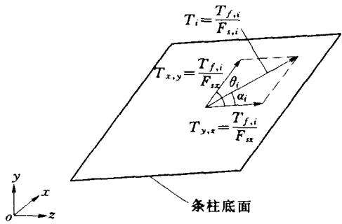  
图 14.3 条柱底部抗滑力示意图

$$
F _ { s x } = \frac { T _ { f , i } } { T _ { x , y } }\tag{14.13}
$$

$$
F _ { s z } = \frac { T _ { f , i } } { T _ { y , z } }\tag{14.14}
$$

根据图14.3所示力的平行四边形，可以得到：

$$
\frac { F _ { s x } } { F _ { s z } } = \frac { \sin ( \theta _ { i } - \alpha _ { i } ) } { \sin \alpha _ { i } }\tag{14.15}
$$

$$
F _ { s , i } = \frac { F _ { s z } \sin ( \theta _ { i } - \alpha _ { i } ) } { \sin \theta _ { i } }\tag{14.16}
$$

$$
F _ { s , i } = { \frac { F _ { s x } \sin \alpha _ { i } } { \sin \theta _ { i } } }\tag{14.17}
$$

定义整体安全系数 $F _ { s }$ 为

$$
F _ { s } = \frac { \sum T _ { f _ { i } } } { \sum T _ { i } } { = \frac { \sum c _ { i } A _ { i } + N _ { i } ^ { \prime } \tan \phi _ { i } } { \sum T _ { i } } }\tag{14.18}
$$

Huang & Tsai 假定 $F _ { s x }$ 和 $F _ { s z }$ 对于每个条柱都是相等的，但每个条柱的 $F _ { s , i }$ 由于随 $\pmb \theta _ { i }$ 和 $\pmb { \alpha _ { i } }$ 的变化而不同。Huang & Tsai 给出的未知量和已知条件的数目如表14.4 所示。本方法忽略条柱间沿y轴方向的所有剪力，因本方法只考虑条柱沿y轴方向的静力平衡，故条柱间的其他作用力 E,P, H，Q均未出现在建立的方程中，故也未列入表14.4。通过表14.4 中建立的方程即可分别求得安全系数 $F _ { s , i } , F _ { s x } , F _ { s z }$ 和 $F _ { s }$ 0

本方法可以看作是二维Bishop法在三维条件下的扩展，其中一个特点是每个条柱的滑动方向也作为求解的一部分。但本方法由于未满足沿x轴和z轴方向的整体力的平衡，所以在建立力矩平衡方程时就与所绕坐标轴的位置有关，这也就要求滑裂面至少有一部分为球形。

表 14.4 Huang & Tsai 法中的未知量和已知条件数目统计表
<table><tr><td colspan="2">未知量</td><td colspan="2">已知条件</td></tr><tr><td>变量</td><td>数目</td><td>方程</td><td>数目</td></tr><tr><td> $T _ { i }$ </td><td>n</td><td>每个条柱沿y轴方向的静力平衡</td><td>n</td></tr><tr><td> $N _ { i } ^ { \prime }$ </td><td>n</td><td>Mohr-Coulomb抗剪强度准则（每个条柱）</td><td>n</td></tr><tr><td> $\alpha _ { i }$ </td><td>n</td><td> $F _ { s w } F _ { s z }$  和  $| \pmb { \alpha } _ { i }$  之间的关系，即式(14.15)</td><td>n</td></tr><tr><td> $F _ { s , i }$ </td><td>n</td><td> $F _ { s , i } \Re F _ { s z }$  之间的关系，即式(14.16)</td><td>n</td></tr><tr><td> $\pmb { F } _ { s \pmb { x } }$ </td><td>1</td><td>沿x轴的整体力矩平衡</td><td>1</td></tr><tr><td> $\boldsymbol { F } _ { s z }$ </td><td>1</td><td>沿z轴的整体力矩平衡</td><td>1</td></tr><tr><td> $F _ { s }$ </td><td>1</td><td> $F _ { s }$  的定义，即式(14.18)</td><td>1</td></tr><tr><td>共计</td><td>4n+3</td><td>共计</td><td>4n+3</td></tr></table>

## 6. 冯树仁等 (1999)

本方法可看作二维简化Janbu法在三维条件下的扩展。其假定主要包括（参见图14.2):

1) 忽略条柱间沿 y 轴方向的所有剪力 G 和 $V ;$

2) 忽略平行于 yoz 平面的剪切力 $T _ { \mathbf { y } , z }$

本方法满足每个条柱沿y轴方向力的平衡，并根据沿x轴方向的整体力的平衡求解安全系数。本方法也是比较适合滑裂面对称的情况。冯树仁等也指出若滑面为球面，旋转椭圆面等规则光滑曲面，上述假定比较真实地反映了实际情况。若剪切面形状不规则，上述假定可能会导致一定的误差。

表14.5总结了上述各方法中包括的静力假定和满足的平衡条件。

关用用

<table><tr><td rowspan="3">作者 (1)</td><td colspan="4">条间剪力假定(2) 列界面</td><td colspan="3">三个坐标轴方向整体力的平衡(3)</td><td colspan="3">绕三个坐标轴整体力矩平衡(4)</td><td rowspan="3">滑裂面形状</td></tr><tr><td rowspan="2">条柱底 面在z 轴分量</td><td colspan="3">行界面</td><td rowspan="2">x轴</td><td rowspan="2">y轴</td><td rowspan="2">z轴</td><td rowspan="2">x轴</td><td rowspan="2">y轴</td><td rowspan="2">(5) z轴</td></tr><tr><td>y轴</td><td>z轴</td><td>x轴 y轴</td></tr><tr><td>Hungr (1989) (Bishop)</td><td>*</td><td>*</td><td>*</td><td>* *</td><td>*</td><td>√</td><td>*</td><td>*</td><td>*</td><td>√</td><td>对称旋转面</td></tr><tr><td>Hungr (1989) (Janbu)</td><td>*</td><td></td><td>* *</td><td>*</td><td>√</td><td>√</td><td>*</td><td>*</td><td>*</td><td>*</td><td>对称</td></tr><tr><td>Zhang Xing (1988)</td><td>*</td><td></td><td>条柱间所有作用力简化为一个平行 xoy平面且具有相同倾角的作用力</td><td></td><td>√</td><td>√</td><td>*</td><td>*</td><td>*</td><td>√</td><td>对称</td></tr><tr><td>Chen &amp; Chameau (1982)</td><td>*</td><td>√</td><td>*</td><td>合力与条柱底面 平行</td><td>V</td><td>√</td><td>水</td><td>*</td><td>*</td><td>√</td><td>对称</td></tr><tr><td>Lam &amp; Fredlund (1993)</td><td>*</td><td>√</td><td>*</td><td>√</td><td>√</td><td>√</td><td>√</td><td></td><td>*</td><td>√</td><td>任意</td></tr><tr><td>Huang &amp; Tsai (2001)</td><td>√</td><td></td><td>* *</td><td>*</td><td>*</td><td>√</td><td>水</td><td>√</td><td></td><td>√</td><td>至少一部分 为球形</td></tr><tr><td>冯树仁等 (1999)</td><td>*</td><td>*</td><td>* *</td><td>*</td><td>√</td><td>√</td><td>*</td><td>*</td><td>*</td><td>*</td><td>对称</td></tr><tr><td>STAB-3D (本章)</td><td>√</td><td>√</td><td>*</td><td>*</td><td>√</td><td>√</td><td>√</td><td>*</td><td>*</td><td>√</td><td>任意</td></tr></table>

(b)

## 14.2 水科院三维极限平衡分析方法的理论框架

2001年，陈祖煜、弥宏亮和汪小刚在总结前人工作基础上，提出了一个理论基础更为严密、计算步骤相对简单，同时收敛性能较好的三维极限平衡分析方法。本节简要介绍这一方法。

首先，建立如图14.1所示的坐标系，xoy平面应基本反映主滑方向，但在一般情况下，并不知道主滑方向。这一方面的不精确处将通过下面讨论的求解底滑面剪力与xoy平面夹

$$
\pmb { \rho }
$$

在分析条柱上作用力的力和力矩平衡条件时，我们引入如下假定（参见图14.4）：

(1) 作用在行界面（平行于 yoz 平面的界面，图 14.4 中的 ABFE 和 DCGH）的条间力$\pmb { G }$ 平行于 xoy 平面，其与 x轴的倾角 $| \beta \rangle$ 为常量，这一假定相当于二维领域中的 Spencer 法。

(2) 作用在列界面（平行于 xoy 平面的界面，图 14.4 中的 ADHE 和 BCGF)的作用力$\pmb { Q }$ 为水平方向，与 $z$ 轴平行。

(3) 作用在底滑面的剪切力 T 与 xoy 平面的夹角为 $\rho _ { \mathrm { < } }$ 规定剪切力的 z 轴分量为正时 $\scriptstyle \mathbf { \dot { \rho } } \rho$ 为正值。

假定同一列条柱（z=常量）的 $| \pmb { \rho } ^ { \prime } \rrangle$ 值相同，对不同z坐标的条柱，假定 $_ { ; \pmb { \rho } }$ 的一个分布形状。

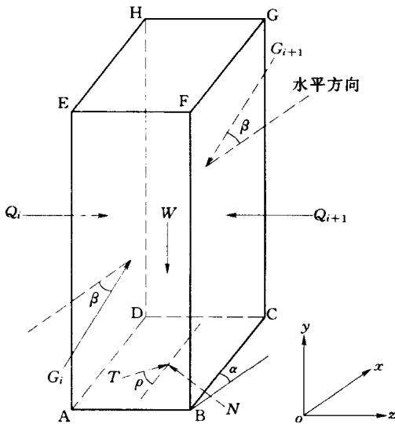  
图14.4 作用在具有垂直界面的条柱上的力

1) $\rho = \kappa =$ 常量，见图 14.5(a);

2) 在 xoy 平面的左、右两侧假定 $: \pmb { \rho }$ 的方向相反，并线性分布，见图 14.5(b)，假定此分布形状为f(z)，则有

$$
\begin{array} { l l } { { \rho _ { R } = \kappa \cdot z } } & { { z \geq 0 } } \\ { { \rho _ { L } = - \eta \kappa \cdot z } } & { { z < 0 } } \end{array}\tag{14.19}
$$

假定2)中含有一个系数η，此值反映左、右侧ρ的变化的不对称特性，当滑体的几何形 $\mathbf { \dot { \eta } }$ $| \pmb { \rho }$ 状和物理指标完全对称时，相应假定1)的κ应为零，相应假定2)的η应为1。和二维领域一样，我们期待在合理性条件限制下，不同的分布形状假定将不会导致安全系数的重大差别。

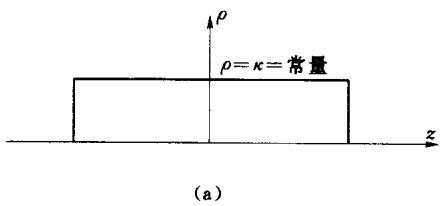

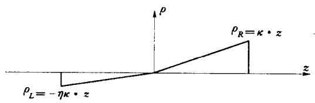  
图 14.5 底滑面的剪切力 T 与 xoy 平面的夹角 $| \pmb { \rho } |$ 的分布形状

设 $n _ { x } , n _ { y } , n _ { z }$ 为底滑面的法线的方向导数， $m _ { x } , m _ { y } , m _ { z }$ 为切向力 $T _ { i }$ 的方向导数，这个方向导数在确定了 $\rho 1$ 值后即为已知。因为

$$
m _ { z } = \sin \rho\tag{14.20}
$$

根据

$$
\left\{ \begin{array} { l } { { m _ { x } ^ { 2 } + m _ { y } ^ { 2 } + m _ { z } ^ { 2 } = 1 } } \\ { { m _ { x } n _ { x } + m _ { y } n _ { y } + m _ { z } n _ { z } = 0 } } \end{array} \right.\tag{14.21}
$$

可以得到 $m _ { x } , m _ { y }$ (在 $m _ { x }$ 的两个解中， $m _ { x } < 0$ 为不合理解，予以删除)。

## 14.3 静力平衡方程式和求解步骤

建立力和力矩平衡方程解题步骤如下(参见图 14.6):

(1) 分析作用在某一条柱上的力，求解底滑面的法向力N。由于我们假定了行界面土条侧向力 G 平行于 xoy 平面，列界面土条侧向力 $Q$ 与 $z$ 轴平行，在 xoy 平面上没有分力。因此可以方便地通过 xoy平面上的力学平衡条件来求解N。考虑到左、右两侧的G（其方向以 S轴代表）均与 x轴夹一个β角，求解N的一个方便的方法是将作用在土条上的力投影到垂直于 S 的轴 $s \prime$ 上，这样就回避了G{和Gi+1这两个未知力，将Ni求得。 $G _ { i }$ $G _ { i + l }$ $N _ { i }$

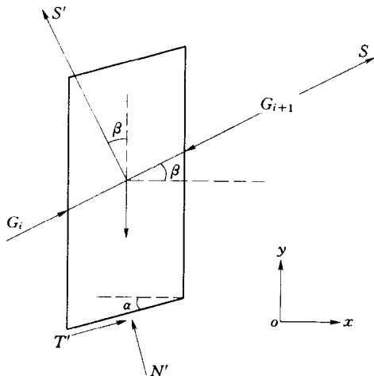  
图 14.6 作用在条柱上的力在 S 轴的投影

在 $s ^ { \prime }$ 方向的条柱的平衡方程式为

$$
- W _ { i } \cos \beta + N _ { i } ( - n _ { x } \sin \beta + n _ { y } \cos \beta ) + T _ { i } ( - m _ { x } \sin \beta + m _ { y } \cos \beta ) = 0\tag{14.22}
$$

根据摩尔-库仑准则

$$
T _ { i } = ( N _ { i } - u A _ { i } ) \tan { \phi _ { e } } + c _ { e } A _ { i }\tag{14.23}
$$

即可求解条底法向力

$$
N _ { i } = \frac { W _ { i } \cos \beta + ( u A _ { i } \tan \phi _ { e } - c _ { e } A _ { i } ) ( - m _ { x } \sin \beta + m _ { y } \cos \beta ) } { - n _ { x } \sin \beta + n _ { y } \cos \beta + \tan \phi _ { e } ( - m _ { x } \sin \beta + m _ { y } \cos \beta ) }\tag{14.24}
$$

(2) 建立整个滑坡体的静力平衡方程式和绕z 轴的力矩平衡方程式。在计算 N时，已 $N _ { i }$ 经满足了每个条柱 S'方向的静力平衡条件。因此，我们建立与 S′垂直的S方向的整体静 $S ^ { \prime }$ $s ^ { \prime }$ 力平衡方程式：

$$
S = \sum [ N _ { i } ( n _ { x } \cos \beta + n _ { y } \sin \beta ) _ { i } + T _ { i } ( m _ { x } \cos \beta + m _ { y } \sin \beta ) _ { i } - W _ { i } \sin \beta ] = 0\tag{14.25}
$$

建立z方向的整体静力平衡方程式： $z$

$$
Z = \sum ( N _ { i } \cdot n _ { z } + T _ { i } \cdot m _ { z } ) = 0\tag{14.26}
$$

同时，建立绕 $z$ 轴的整体力矩平衡方程式（以逆时针为正）：

$$
{ \cal M } = \sum [ - { \cal W } _ { i } \cdot x - { \cal N } _ { i } \cdot n _ { x } \cdot y + { \cal N } _ { i } \cdot n _ { y } \cdot x - { \cal T } _ { i } \cdot m _ { x } \cdot y + { \cal T } _ { i } \cdot m _ { y } \cdot x ] = 0\tag{14.27}
$$

由于整体的静力平衡在坐标系的三个轴上均已满足，因此，建立式(14.27)时可以绕任一与 $z$ 轴平行的轴取矩。

在建立 $s \prime , s$ 方向和z 方向的静力平衡方程式(14.22)、式(14.25)和式(14.26)时，最为方便的方法是要求各个力矢量与投影方向的点积之和为零。已知 $s ^ { \prime }$ 的方向导数为$( \cos \beta , \sin \beta , 0 )$ $\pmb { W }$ 的方向导数为(0,-1,0)，N的方向导数为 $( n _ { x } , n _ { y } , n _ { z } )$ ，T 的方向导数为$( m _ { x } , m _ { y } , m _ { z } )$ ，S的方向导数为 $( - \sin \beta , \cos \beta , 0 )$ 。据此可以方便地建立这些静力平衡方程式。

(3) 应用牛顿-勒普生法迭代求解安全系数。在联立方程式(14.25)、式(14.26)和式(14.27)中有三个未知数，即 $F , \beta , \rho ,$ 可用牛顿-勒普生法求解。假定一个 $F , \beta , \rho$ 的初值 $F _ { 0 } , \beta _ { 0 } , \rho _ { 0 } ,$ 得到一个非零的 $\Delta S , \Delta M , \Delta Z ,$ 下一个使ΔS, ΔM, ΔZ接近零的 $F _ { 1 } , \beta _ { 1 } , \rho _ { 1 }$ 可通过下式求得（此时 $\scriptstyle i = 0 )$ •

$$
\Delta F = F _ { i + 1 } - F _ { i } = - \frac { K _ { F } } { D }\tag{14.28}
$$

$$
\Delta \beta = \beta _ { i + 1 } - \beta _ { i } = - \frac { K _ { \beta } } { D }\tag{14.29}
$$

$$
\Delta \rho = \rho _ { i + 1 } - \rho _ { i } = - \frac { K _ { \rho } } { D }\tag{14.30}
$$

其中

$$
{ \boldsymbol { D } } = { \left| \begin{array} { l l l } { { \cfrac { \partial S } { \partial F } } } & { { \cfrac { \partial S } { \partial \beta } } } & { { \cfrac { \partial S } { \partial \rho } } } \\ { { \cfrac { \partial M } { \partial F } } } & { { \cfrac { \partial M } { \partial \beta } } } & { { \cfrac { \partial M } { \partial \rho } } } \\ { { \cfrac { \partial Z } { \partial F } } } & { { \cfrac { \partial Z } { \partial \beta } } } & { { \cfrac { \partial Z } { \partial \rho } } } \end{array} \right| }\tag{14.31}
$$

$$
| { \cal K } _ { F } = | \Delta { \cal M } \frac { \partial { \cal M } } { \partial \beta } \frac { \partial { \cal N } } { \partial \rho } | , { \cal K } _ { \beta } = | \frac { \partial { \cal S } } { \partial F } \mathrm {  ~ \ a ~ } { \cal N } \frac { \partial { \cal S } } { \partial \rho } | , { \cal K } _ { \rho } = | \frac { \partial { \cal S } } { \partial F } \mathrm {  ~ \ a ~ } { \cal N } | \Delta { \cal M }\tag{14.32}
$$

通过迭代，最终满足收敛条件。在计算中，要求ΔF，Δβ和Δρ均小于0.001 $\Delta F ,$ $\Delta \beta$ $| \pmb { \Delta \rho } .$ $( \beta \sharp \mathbb { I } \rho$ 以弧度计)。

(4) 合理性条件限制。在二维领域，Morgenstern & Price (1965)和 Janbu (1973)等曾指出，对不同的条间力分布形状的假定应受到物理合理性条件的限制。在滑面和条柱界面，均不应有拉应力。同时，界面的抗剪安全系数应大于整体的安全系数。在三维领域，也可提出类似的条件，来限制对条柱界面的假定。一般来说，可以要求每个条柱的底面法向应力大

于零，即

$$
N _ { i } - u A \geq 0\tag{14.33}
$$

在表14.5中也加入了本方法所引入的假定条件，和其它方法比较，本方法满足了三个坐标轴方向的静力平衡条件，理论基础比较严格。

## 14.4 验证

## 14.4.1 椭球体滑面例题

图 14.7 为 Zhang Xing (1988)发表文章提供的椭球体滑面例题，其中包括两个算例。算例1中滑裂面为简单的圆弧；算例2中滑裂面包括一部分软弱夹层。国内外很多学者都选择本例题来检验各自三维程序的合理性。

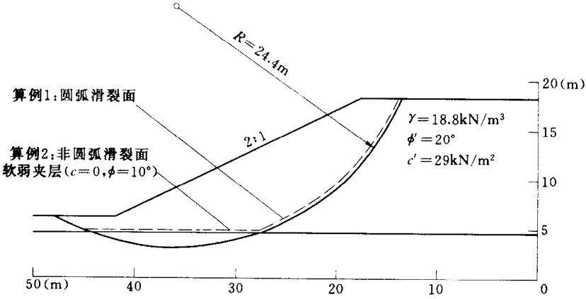  
图 14.7 Zhang Xing 椭球体滑面算例

在算例1中，按原例的要求，在对称轴平面用一圆弧模拟滑裂面，在z方向，则以椭圆面形成滑面。表14.6为采用如图14.5(a)所示ρ的第一种分布形状的计算迭代过程。可见，当输入一个F，β和ρ的初值分别为2.284,5.0°和5.0°后，获得颇大的不平衡力和力矩。经过 $F , \beta$ $\mathbb { I } \pmb { \rho }$ 三次迭代后，安全系数收敛为2.187，不平衡的力和力矩均减少到基本为零的数值，计算成果如图14.8 所示。由于本例为左右对称的滑体，ρ最终收敛为零。此例 Zhang Xing给出的 $\pmb { \rho } \rbrace$ 解为 ${ F } { = } 2 . 1 2 2$ 2，两者较为接近。此例若采用如图14.5(b)所示ρ的第二种分布形状，η取1， $\dot { \bar { \cdot } } \rho$ 安全系数为2.188。

表 14.6 Zhang Xing 椭球体滑面例题算例 1 的计算迭代收敛过程
<table><tr><td>迭代 次数</td><td> ${ \pmb F }$ </td><td> $\beta ( ^ { \circ } )$ </td><td> $\pmb { \rho } ( ^ { \circ } )$ </td><td>不平衡力(S) (kN)</td><td>不平衡力矩(M) (kN·m)</td><td>不平衡力(z) (kN)</td></tr><tr><td>初值</td><td>2.284</td><td>5.0</td><td>5.0</td><td>-9166.1</td><td>98701.9</td><td>6727.4</td></tr><tr><td>1</td><td>2.164</td><td>12.42</td><td>-0.25</td><td>-391.9</td><td>23620.0</td><td>-351.6</td></tr><tr><td>2</td><td>2.187</td><td>14.85</td><td>0</td><td>12.9</td><td>165.0</td><td>-2.7</td></tr><tr><td>3</td><td>2.187</td><td>14.87</td><td>0</td><td>0.5</td><td>-0.2</td><td>0.3</td></tr></table>

对于算例2，本方法得到的安全系数 $F { = } 1 . 6 4 0$ ，与其它方法给出的解答也十分接近，具体见表 14.7。

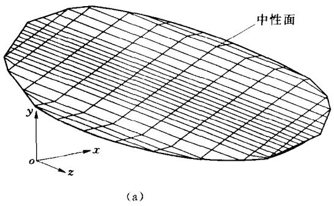

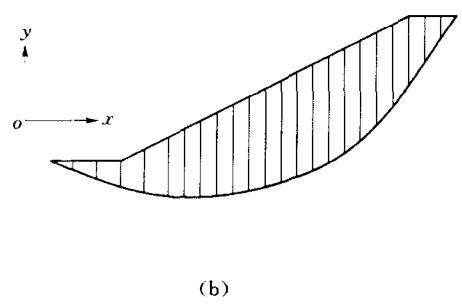  
图 14.8 Zhang Xing 椭球体滑面例题情况 1 三维计算成果图(a)三维立视图：(b)中性面

表 14.7 Zhang Xing 椭球体滑面例题情况 2 各种方法所得三维安全系数 F 的比较
<table><tr><td>Zhang Xing (1988)</td><td>Hungr (1989)</td><td>Lam &amp; Fredlund (1993)</td><td>Huang &amp; Tsai (2000)</td><td>STAB-3D</td><td>上限解 (Chen et al, 2001 a, b)</td></tr><tr><td>1.553</td><td>1.620</td><td>1.603</td><td>1.658</td><td>1.640</td><td>1.717</td></tr></table>

## 14.4.2 楔形体算例

岩石力学中的楔形体稳定是一个典型的三维极限平衡分析问题。一些学者在开发三维边坡稳定时，都将此作为考察对象。对于一个简单的块体，其求解方法在教科书(Hoek&Bray,1977)中已有详细介绍，这些方法隐含了一个假定，即底滑面上的剪力平行于交棱线。本例分别考察几何形状对称楔形体和非对称楔形体两种情况。其几何形体和物理参数如表14.8所示。本例中楔形体的左、右结构面采用相同的抗剪强度指标，对于对称楔形体， $c ^ { \prime } { = } 0 . 0 2 \mathbf { M P a } ,$ $\phi ^ { \prime } { = } 2 0 ^ { \circ }$ ，而对于非对称楔形体，左、右结构面指标仍采用同一值，即 $c ^ { \prime } { = } 0 . 0 5 \mathbf { M P a } , \phi ^ { \prime } { = } 3 0 ^ { \circ }$ 岩石容重均为26kN/m³。

表14.8 楔形体算例几何、物理参数表
<table><tr><td rowspan="2">部位</td><td colspan="2">对称楔形体</td><td colspan="2">非对称楔形体</td></tr><tr><td>倾向(°)</td><td>倾角(°)</td><td>倾向(°)</td><td>倾角(°)</td></tr><tr><td>左结构面</td><td>115</td><td>45</td><td>120</td><td>40</td></tr><tr><td>右结构面</td><td>245</td><td>45</td><td>240</td><td>60</td></tr><tr><td>顶面</td><td>180</td><td>10</td><td>180</td><td>0</td></tr><tr><td>坡面</td><td>180</td><td>60</td><td>180</td><td>60</td></tr></table>

在对称楔形体计算中，采用ρ第一种分布形状，程序 STAB-3D 和教科书给出完全相同的计算结果，即F=1.556，ρ收敛为零。若采用ρ第二种分布形状，η取1，安全系数的解答仍为1.556。ρ和κ收敛为零，与教科书方法隐含的剪力平行于交棱线的假定一致。计算成果如图14.9所示。

在非对称楔形体计算中，若采用ρ的第一种分布形状，计算结果不收敛。采用第二种分布形状时，相应 $\scriptstyle \eta = 0 . 6 - 1 . 2$ ，安全系数从1.597变化到1.615，具体见表14.9，说明不同的η值对计算结果的影响不大。而本例教科书答案为1.640，两者较为接近，计算成果如图14.10所示。

表 14.9 非对称楔形体算例计算结果
<table><tr><td>η</td><td>1.2</td><td>1.1</td><td>1.0</td><td>0.9</td><td>0.8</td><td>0.7</td><td>0.6</td></tr><tr><td>K</td><td>0.750</td><td>0.770</td><td>0.795</td><td>0.821</td><td>0.849</td><td>0.880</td><td>0.991</td></tr><tr><td>F</td><td>1.615</td><td>1.612</td><td>1.611</td><td>1.608</td><td>1.605</td><td>1.601</td><td>1.597</td></tr></table>

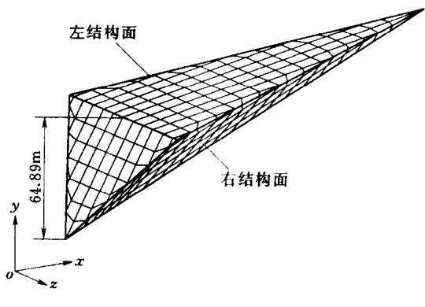  
图 14.9 对称楔形体算例三维计算图

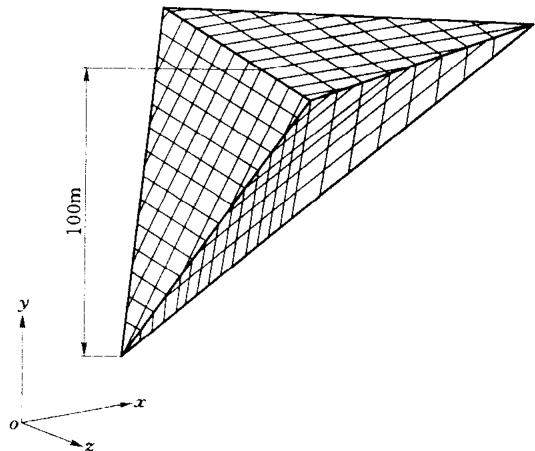  
图 14.10 非对称楔形体算例三维计算图

## 14.5 应用实例

## 14.5.1 天生桥二级水电站厂房后坡

天生桥二级水电站厂房后坡（西坡）削坡过程中，556m高程以上出现大体积山体位移，称之为“下山包滑坡”。根据滑坡体上的早期钻孔和后期抗滑桩竖井资料揭露以及滑面在地表的剪出线，准确地编制了滑面等高线图。据此将滑体切出11个控制剖面。在三维计算中，取其典型剖面，在中性轴右侧输入5个剖面，左侧输入3个剖面（图14.11），滑体物理力学指标如表14.10所示。根据基本垂直的节理条件，最终形成如图14.12的三维透视图。此例题考虑了地下水位，得安全系数 $F { = } 0 . 8 2 4$ 4。曾对剖面 1\~9 逐个进行二维分析(Chen et al,2001a)，根据各剖面的二维安全系数按照各自的面积进行加权平均获得的整体安全系数为0.885，详见表14.11。

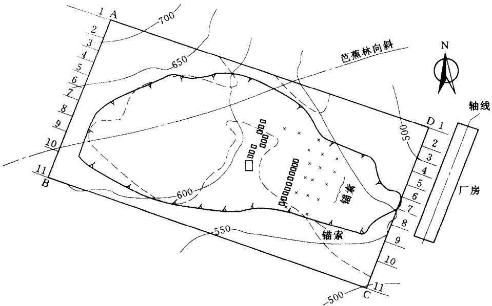  
图14.11 天生桥二级滑坡平面图

表14.10 滑坡体及软弱夹层材料参数表
<table><tr><td rowspan="2">材料</td><td colspan="2">滑坡体前部</td><td colspan="2">滑坡体后部</td></tr><tr><td>c (MPa)</td><td>tanφ</td><td>c (MPa)</td><td>tanφ</td></tr><tr><td>软弱 夹层</td><td>0.01</td><td>0.14</td><td>0.015</td><td>0.17</td></tr><tr><td>滑坡体</td><td>0.2</td><td>0.26</td><td>0.02</td><td>0.26</td></tr></table>

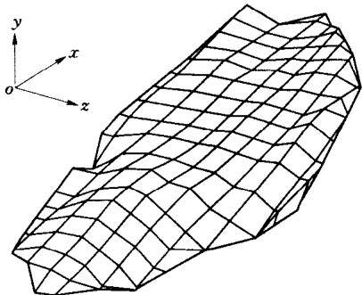  
图 14.12 天生桥二级滑坡算例

表14.11 各剖面二维安全系数以及加权平均值
<table><tr><td>剖面 编号</td><td>-3</td><td>-2</td><td>-1</td><td>0</td><td>1</td><td>2</td><td>3</td><td>4</td><td>5</td><td>加权 平均</td></tr><tr><td>F</td><td>0.630</td><td>0.909</td><td>1.204</td><td>0.997</td><td>0.883</td><td>0.795</td><td>0.573</td><td>0.464</td><td>0.524</td><td>0.885</td></tr></table>

## 14.5.2 小湾水电站堆积体稳定性及加固措施研究

澜沧江小湾水电站位于云南省澜沧江中游，坝址位于临沧地区凤庆县与大理州南涧县交界的河段上。水库是澜沧江中、下游河段梯级电站的龙头水库，为澜沧江梯级开发的关键性工程。选定的坝型为双曲拱坝，最大坝高为292m。

左岸坝前堆积体分布在左岸坝前饮水沟下游侧山坡上（见图14.13)，其平面形态似舌形。堆积体分布地段地形平均坡角32°\~35°，局部地段有陡坎。堆积体南边界部位为相对凸起的②号山梁，基岩裸露；北侧为现代冲沟（饮水沟）凹地；堆积体前缘高程约在1130m，该高程以下基岩裸露，地形坡度陡峻，河谷岸坡地段直立；后缘高程约在1590m。堆积体铅直厚度--般为15\~50m，最大为60.63m，平均为33m。SN方向长约80\~200m，EW方向斜长745\~830m，最大高差约460m，总体积约 $4 0 0 { \times } 1 0 ^ { 4 } \mathrm { m } ^ { 3 }$ ，其中水库正常蓄水位以下$4 0 \times 1 0 ^ { 4 } \mathrm { m } ^ { 3 }$ 。堆积体下伏基岩在纵向与横向方向均呈波状起伏，但总体形态是S、N两侧较陡，中间相对较平缓。

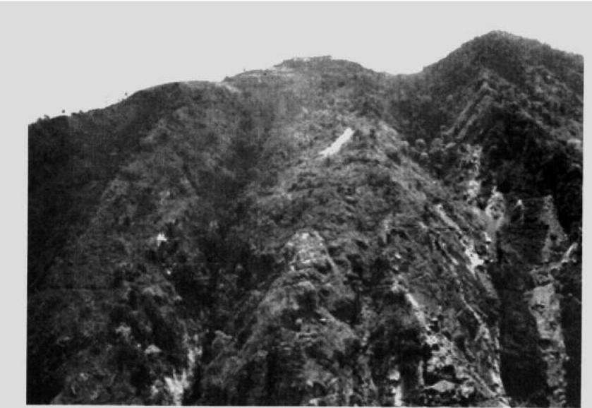  
图 14.13 小湾左岸坝前堆积体

堆积体底部与下伏基岩面之间分布着一层接触带土体，为第四系堆积物，其颗粒相对较细且厚度不一，由于该层厚度一般为0.15\~8.05m，最厚达12.16m，组成物质以坡积层为主，且局部地段分布有洪积层，对堆积体的稳定性起着十分重要的作用。根据勘探资料分析，在下伏基岩面地形相对较陡处，接触带土体较薄，勘探揭露最薄仅为0.15m；在下伏基岩面地形低洼处，接触带土体厚度相对较大，勘探揭露最厚可达12.16m，在下伏基岩面地形低洼处分布有洪积物。颗分资料表明，土体细粒含量最小为6%，最大可达33%，一般为15%\~27%。

由于堆积体规模巨大，距坝近，左岸坝基开挖将触及部分堆积体，因而堆积体在施工期和水库运行期的稳定性对整个工程的投资和正常施工均具有重要影响。鉴于以上原因，对堆积体的稳定性进行深入的研究，特别是针对堆积体座落于一个典型的“匙型”基岩面上的空间分布特征，采用三维极限平衡理论对其稳定性进行评价从而提出更为合理的加固处理措施，在确保堆积体在坝基开挖及水库运行期足够的安全储备下，优化施工，节约工程投资。

本次稳定分析计算中，除堆积体上游侧部分滑面插入堆积体下部的强风化岩体外，其余部分滑动面均假定在堆积体与基岩的接触带内，而尾部通过堆积体的那部分滑面则由程序提供的自动搜索临界滑裂面的功能确定。

本次稳定分析计算采用的材料物理力学指标，详见表14.12。

表 14.12 材料物理力学指标
<table><tr><td>材料</td><td>φ(°)</td><td>c (MPa)</td><td>天然容重 (kN/m³)</td><td>饱和容重 (kN/m³)</td></tr><tr><td>堆积体</td><td>35.0</td><td>0.04</td><td>20.6</td><td>23.5</td></tr><tr><td>接触带土体</td><td>35.0</td><td>0.04</td><td>20.6</td><td>23.5</td></tr><tr><td>条柱界面</td><td>21.0</td><td>0.04</td><td></td><td></td></tr><tr><td>强风化、强卸荷带</td><td>23.3</td><td>0.07</td><td>26.3</td><td>26.7</td></tr><tr><td>弱风化上段、卸荷带</td><td>30.1</td><td>0.14</td><td>26.3</td><td>26.7</td></tr><tr><td>弱风化下段</td><td>44.1</td><td>0.81</td><td>26.3</td><td>26.7</td></tr><tr><td>微风化、新鲜岩体</td><td>50.2</td><td>1.19</td><td>26.3</td><td>26.7</td></tr></table>

首先对堆积体的六个断面分别进行二维稳定分析计算并自动搜索出临界滑裂面，得到不同工况下每一断面的稳定安全系数如表14.13所示。其中，3,4,5,6断面在运行期不能满足安全要求，必须采取加固处理措施。若采用预应力锚索加固，堆积体的稳定性可望得到较大的改善，根据上述计算结果，所需总锚固力约为500万kN。

表 14.13 二维极限分析计算成果表
<table><tr><td rowspan="2">断面</td><td colspan="3">工况</td><td rowspan="2">锚固力(kN)</td></tr><tr><td>天然状况</td><td>运行期加固前</td><td>运行期加固后</td></tr><tr><td>1断面</td><td>1.463</td><td>1.556</td><td>1.556</td><td>无加固</td></tr><tr><td>2断面</td><td>1.290</td><td>1.383</td><td>1.383</td><td>无加固</td></tr><tr><td>3断面</td><td>1.383</td><td>1.220</td><td>1.301</td><td>11400</td></tr><tr><td>4断面</td><td>1.079</td><td>1.125</td><td>1.263</td><td>24900</td></tr><tr><td>5断面</td><td>1.016</td><td>0.876</td><td>1.265</td><td>69000</td></tr><tr><td>6断面</td><td>1.022</td><td>0.609</td><td>1.266</td><td>7700</td></tr></table>

三维稳定分析的初始滑裂面是在对各断面二维分析基础上选定的，然后使用程序的自动搜索功能确定临界空间滑裂面。以4断面作为滑动土体的中性面（即图14.14、图14.15中的0断面)，上、下游侧各间隔50m切一个断面。原地形方案上游侧有3个断面(即图14.14、图14.15中的-1,-2,-3断面），下游侧有2个断面（即图14.14、图14.15中的+1,+2断面）。开挖后的地形下游侧第2 个断面基本上被挖掉，故下游侧改为1个断面。图14.14 为开挖前稳定分析中滑动土体的立视图和俯视图。图14.15为开挖后稳定分析中滑动土体的立视图和俯视图。图14.16为开挖后各断面的二维示意图。

表14.14 为原地形和开挖后地形以及施加相应加固措施后的三维稳定安全系数。表中极限平衡法、上限解(Chen et al, 2001 a, b)和二维加权平均法的成果是相应于同一优化计算获得的临界滑裂面，以使成果便于比较。其中二维加权平均所得的安全系数是根据1\~5断面的二维安全系数按面积加权平均得到。分析表14.14可以得到以下认识：

(1)原始地形系经历过长期历史考验的稳定边坡，因此采用了孔压系数 $r _ { \mu } { = } 0 . 1 5$ ，此时求得的安全系数为1.138。由于边坡开挖，在遇暴雨的条件下（即仍保持 $r _ { u } = 0 . 1 5 )$ 的安全系数降为1.063。

(2) 施工期，通过开挖排水隧洞，使孔压系数降为 $r _ { u } = 0 . 0 5$ ，则安全系数可以从 1.063提高到1.216。

(3) 施加预应力锚索混凝土盖板加固边坡，相应排水后孔压系数 $r _ { u } = 0 . 0 5$ ，其安全系数为1.357，在8度地震条件下为1.180，此时的预应力锚索提供的总锚固力为140万kN。

比较表 14.14 中采用三维极限平衡法、三维上限解法(Chen et al, 2001 a, b)和二维加权平均法计算得到的安全系数。计算成果表明，三维极限平衡法和三维上限解法的安全系数十分接近，但加权平衡法的安全系数普遍低0.08\~0.10左右。同时根据三维稳定分析方法得到所需预应力锚索提供的总锚固力（约140万kN）与二维结果（约500万kN）相比也有了明显改进。这一情况说明，通过边坡稳定的三维分析，可使我们对边坡稳定性的评价建立在更加科学、合理的基础之上，因而也可以使设计方案得到优化。

(a)  
表14.14 不同计算方法得到的安全系数比较
<table><tr><td>序号</td><td>工况</td><td>孔压 系数</td><td>三维 极限平衡</td><td>三维 上限解</td><td>二维 加权平均</td><td>简化 Janbu</td></tr><tr><td>1</td><td>原地形</td><td>0.15</td><td>1.138</td><td>1.154</td><td>1.042</td><td>1.089</td></tr><tr><td>2</td><td>开挖后</td><td>0.15</td><td>1.063</td><td>1.087</td><td>1.014</td><td>1.020</td></tr><tr><td>3</td><td>开挖后降地下水</td><td>0.05</td><td>1.216</td><td>1.239</td><td>1.160</td><td>1.174</td></tr><tr><td>4</td><td>降地下水+预应力锚索 混凝土板</td><td>0.05</td><td>1.357</td><td>1.343</td><td>1.229</td><td>1.252</td></tr><tr><td>5</td><td>降地下水+预应力锚索 混凝土板+8度地震</td><td>0.05</td><td>1.180</td><td>1.198</td><td>0.998</td><td>1.117</td></tr></table>

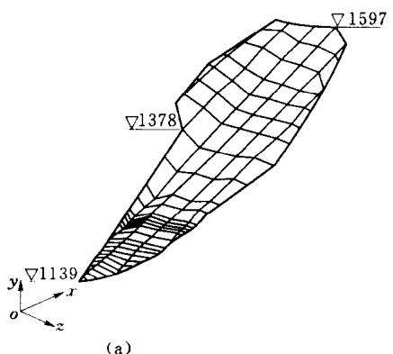  
图14.14 堆积体开挖前三维计算成果图

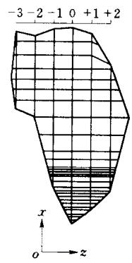  
(b)  
(a) 立视图；(b) 俯视图

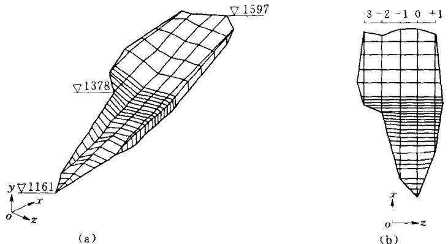  
图14.15 堆积体开挖后三维计算成果图  
(a) 立视图；(b) 俯视图

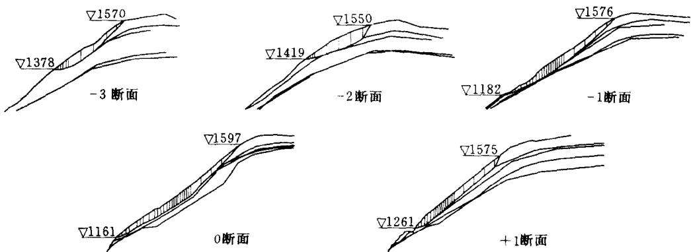  
图 14.16 堆积体开挖后各断面二维示意图

## 14.5.3 三峡左岸坝段稳定分析

三峡大坝左岸由于建基面抬高，大坝建于一个边坡之上。该边坡和坡后厂房联合大坝承受水压力和自重。由于3坝段边坡内部存在定位的长大裂隙，其抗滑稳定受到普遍关注。在第2章[例2.4]和第13章13.4节曾介绍二维分析成果。但在开展常规的二维抗滑稳定分析的同时，一些专家认为基于下面两个原因，有必要进行坝基深层抗滑稳定的三维分析。

(1) 一些专家认为，由于大坝是分缝的，每个坝块仅 38.3m，而地基是连续的。3 坝段单独从地基的长大裂隙滑出，两侧将切穿强度指标相对较高的节理岩体。

(2) 坝基长大裂隙在空间分布有很大的变异牲。3 坝段裂隙最为发育，与相邻的2和4坝段成明显的反差，3坝段的深层抗滑稳定安全系数较其他坝段为小。但长大裂隙在平行坝轴线方向不仅不连续，而且产状也会发生变化。由于3坝段基岩与其他坝段基岩连在一起，基岩之间存在一定的约束力，坝段之间的联合作用不可忽视。因此，有必要将三峡左岸2\~5坝段联合在一起作抗滑稳定三维分析。

## 1. 3 坝段单独抗滑稳定分析

在进行二维稳定分析时，3坝段的各种滑动模式计算得到的安全系数一般为3.0左右。以 $\mathbf { I I } _ { \mathrm { c } }$ 模式为例（图14.17)，此模式的滑裂面从大坝踵部切入基岩，通过长大裂隙组合J，

然后沿厂房和基岩接触面推出。采用Morgengstern & Price 法进行计算，相应连通率 $k { = } 6 8 . 7 5 \%$ 时，本滑动模式的安全系数 $F { = } 3 . 2 6 8$ ；采用 Sarma 法进行计算，相应连通率 $k { = } 7 2 . 6 7 \%$ 时，忽略条柱界面的摩擦，即 $c { = } 0 \mathbf { k } \mathbf { P } \mathbf { a } , \phi { = } 0 ^ { \circ }$ ，相应安全系数$F { = } 2 . 9 5 4$ 。二维计算中采用的材料强度参数见表14.15。

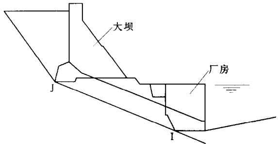  
图 14.17 II模式二维计算简图

表14.15 三峡左岸坝段抗滑稳定分析采用的强度指标
<table><tr><td>材料名</td><td> $\phi ( ^ { \circ } )$ </td><td> $c \left( \mathbf { k P a } \right)$ </td><td> $\gamma ( \mathbf { k N } / \mathbf { m } ^ { 3 } )$ </td></tr><tr><td>混凝土</td><td>47.73</td><td>3000</td><td>24.5</td></tr><tr><td>微新岩体</td><td>59.53</td><td>2000</td><td>27.0</td></tr><tr><td>岩桥（连通率  $: k = 1 1 . 5 \% )$ </td><td>57.83</td><td>1790</td><td>27.0</td></tr><tr><td>岩体结构面</td><td>35.00</td><td>200</td><td>27.0</td></tr><tr><td>厂坝与基岩接触面</td><td>51.34</td><td>1470</td><td></td></tr></table>

在进行三维稳定分析时，以Ⅲ.模式为基础，分析总宽度为38.3m的3坝段和厂房作 $\Pi _ { \mathrm { c } }$ 为一个整体从坝基滑出这一工况。首先不考虑侧面滑体的影响进行三维分析，采用垂直条分，条柱行、列界面的c和φ均赋为零，相应连通率 $k { = } 6 8 . 7 5 \%$ 时，安全系数 $F { = } 3 . 0 9 1$ ，计算成果如图14.18所示。此结果与二维成果基本一致，说明本方法可以很好地回归到二维领域，这也为下面的计算奠定了很好的基础。

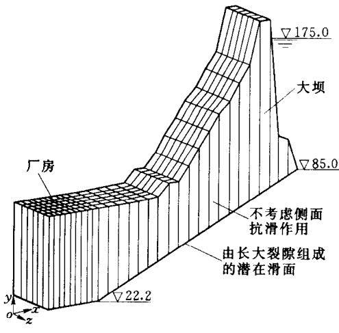  
(a)

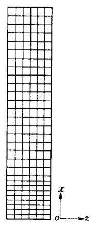  
(b)  
图14.18 3坝段不考虑侧面抗滑作用的三维计算成果图(a) 三维立视图； (b) 俯视图

当考虑侧面滑体的抗滑作用进行三维分析时，此滑动模式包括了两侧部分被切出的岩体，但假定左右坝段在残留的基岩上继续存在，因此，左右坝段的重量不计入3坝段以下的滑动体上。本次计算对38.3m宽坝段的滑体采用与二维相同的物理力学参数（表14.15）。而侧面滑体的底滑面取连通率为70%，极限平衡法得到的安全系数 $F { = } 5 . 2 8 2$ ，上限解(Chen etal, 2001 a, b)得到的安全系数 $F { = } 5 . 8 4 7$ 。计算得到的临界滑裂面如图14.19所示。在上限解计算过程中，位于 38.3m 宽坝段内的滑体条柱的行界面的 c和 $| \phi \rrangle$ 赋为零；而对于侧面滑体，行界面的c和φ赋为零，列界面的c和φ则与侧面滑体的底滑面相同。

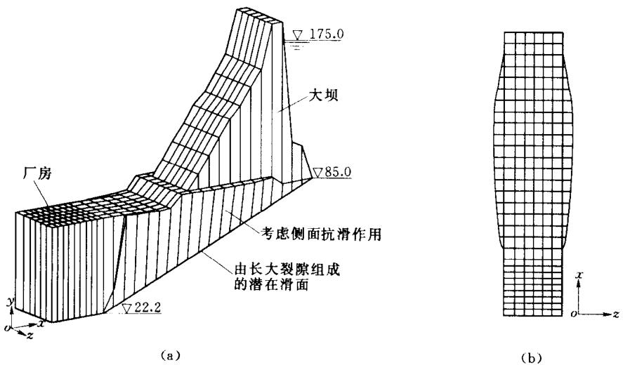  
图 14.19 3 坝段考虑侧面抗滑作用的三维计算成果图(a) 三维立视图；(b) 俯视图

## 2. 2\~5 坝段联合整体抗滑稳定分析

计算中以各坝段的二维滑移模式作为三维计算中基本断面的滑裂面，各坝段采用Sarma法计算得到的二维安全系数见表14.16，其中加权平均的安全系数是根据2\~5坝段的二维安全系数按面积加权平均得到，此值可作为下面2\~5坝段联合整体抗滑三维稳定安全系数的参考值。另外，根据各坝段长大裂隙的空间分布内差几个断面，见图14.20。因3坝段的裂隙较为发育，故内插断面比较多。

当把2\~5坝段联合在一起作抗滑稳定分析时，在考虑了各坝段的联合作用但不考虑滑坡体的侧面抗滑作用以后，相应上限解(Chen et al, 2001 a, b)的整体安全系数为 5.004。计算成果如图14.21所示。

表 14.16 各坝段二维稳定计算成果
<table><tr><td>安全系数</td><td>2坝段</td><td>3坝段</td><td>4坝段</td><td>5坝段</td><td>加权平均</td></tr><tr><td>F</td><td>4.998</td><td>2.954</td><td>5.984</td><td>5.523</td><td>4.480</td></tr></table>

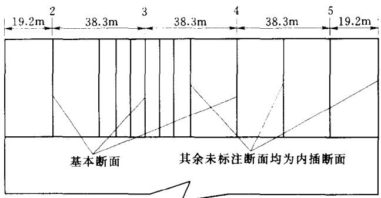  
图 14.20 2\~5 坝段整体三维计算平面示意图

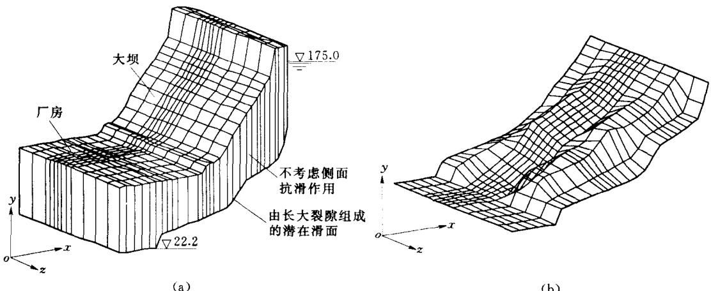  
图 14.21 2\~5 坝段整体三维计算成果图  
(a) 三维立视图；(b) 空间滑裂面

## 14.5.4 宜兴抽水蓄能电站面板坝深层抗滑稳定分析

宜兴抽水蓄能电站位于江苏省宜兴市西南郊约10km的铜官山区，装机容量为1000MW。可研阶段推荐的上库主坝沥青混凝土面板堆石坝方案，下游坝坡脚至坝顶最大高差达285m，国内外还缺少在如此长斜坡上建坝的经验。因此，为了保证大坝的安全运行，在施工设计阶段，研究了上库主坝采用钢筋混凝土面板混合坝方案（即钢筋混凝土面板坝+下游重力挡墙）的方案，典型断面如图14.22所示。在第8章，已经讨论了作用于混合坝上的土压力问题。

由于上库坝址区岩性主要为缓倾下游的砂岩夹薄层粉砂质泥岩或泥质粉砂岩，岩性软硬相间，且软弱夹层及节理发育，混合坝存在深层抗滑稳定问题。但作为挡墙深层滑动底滑面的软弱岩层和夹层并不是一个连续面，而是被多条断层切割、错动为6个条带(或单元)，见图14.23，其中3号地质单元的平面图如图14.24。由于这些断层的限制，可能的滑移方向不完全垂直于坝轴线，而接近软弱岩层的走向，因而考虑空间效应后，滑裂面的倾角有所减缓，再加上侧向的阻力，深层抗滑稳定安全系数应有提高，据此制定的基础处理措施也较为合理。因此，有必要对混合坝的深层滑动问题进行三维分析计算。

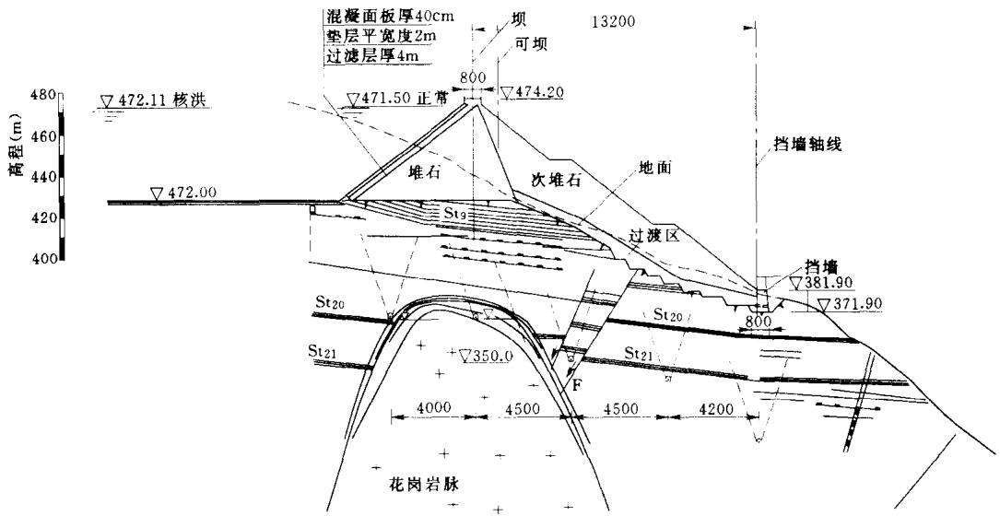  
图14.22 宜兴抽水蓄能电站钢筋混凝土面板混合坝断面图（单位：cm）

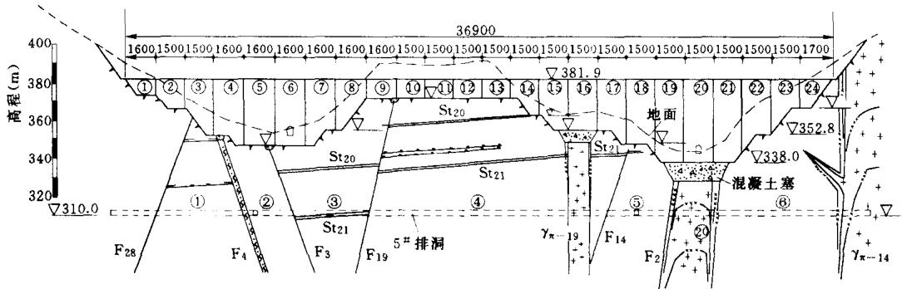  
图14.23 混凝土挡土墙轴线剖面图（单位：cm）

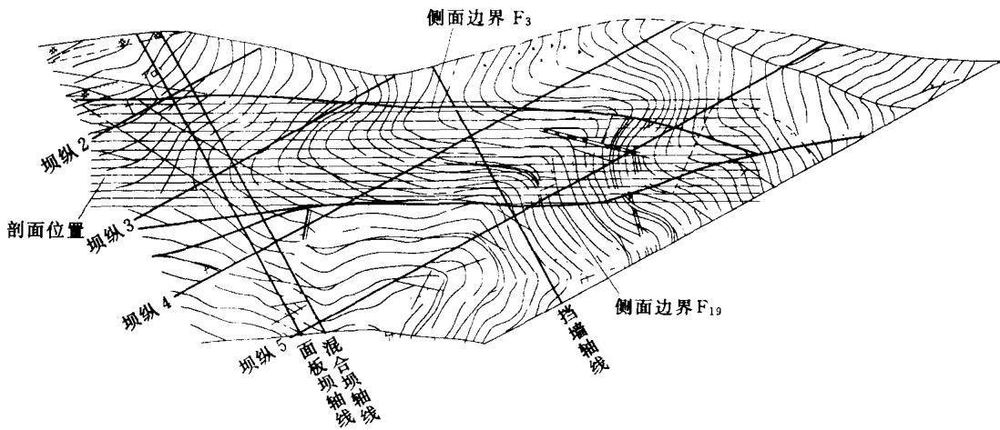  
图 14.24 第 3 地质单元计算平面图

通过现场踏勘及对新近开挖的竖井的调查分析，宜兴抽水蓄能电站上水库坝基深层联合滑动主要由走向 NW向的断层或岩脉构成滑动的纵向切割面，倾向 NE的缓倾角软弱夹层 $\mathbf { S t } _ { 2 0 }$ 和 $\mathbf { S t } _ { 2 1 }$ 构成了深层滑动的底滑面，滑裂面 $\mathbf { S t } _ { 2 0 }$ 和 $\mathbf { S t } _ { 2 \mid }$ 在不同的地质单元中真倾角一般为15°左右，但由于剖面方向的变化导致了滑裂面视倾角的变化，一般为5°左右。而倾向 $1 5 ^ { \circ }$ NE的一组陡倾角裂隙成为横向切割面，从而组成了坝基深层滑动的边界，形成倾向下游的组合体。根据6个地质单元的组合滑裂面及各地质单元内最可能的底滑面的性状及组合滑动体，上水库坝基深层滑动结构面组合边界可简化为表14.17。分别对每个地质单元进行三维稳定计算，计算分为沿软弱岩层St20和St2₁滑动两种情况，由于作为横向切割面的陡倾结 $\mathbf { S t } _ { 2 0 }$ $\mathbf { S t } _ { 2 1 }$ 构面的位置并不完全定位，因此，对每种情况又分析了三种横向切割面的位置（图14.25），并与软弱岩层St20和St₂1分别形成三种滑动面的组合形式。并对三种滑动面组合形式进行三 $\mathbf { S t } _ { 2 0 }$ $\mathbb { S } \mathfrak { t } _ { 2 1 }$ 维稳定分析，比较安全系数的大小。

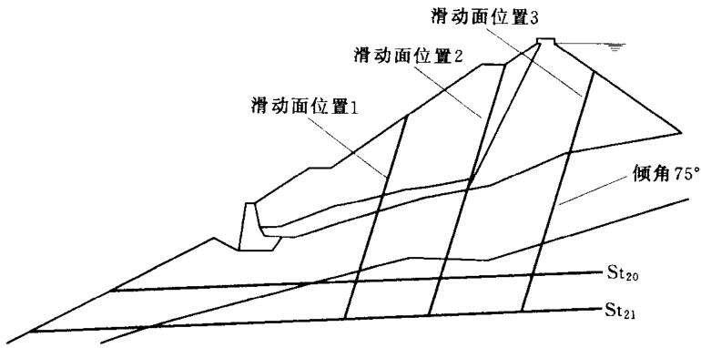  
图 14.25 稳定计算滑动面组合位置示意图

表14.17 坝基深层滑动边界条件
<table><tr><td rowspan="2">单元 编号</td><td rowspan="2">纵向切割面1</td><td rowspan="2">纵向切割面2</td><td colspan="2">滑动面</td><td rowspan="2">横向切割面</td></tr><tr><td>1</td><td>2</td></tr><tr><td>1</td><td> $\mathbf { F } _ { 2 8 }$ </td><td> $\mathbf { F _ { 4 } }$ </td><td> $\mathbb { s } _ { \mathtt { t } _ { 2 0 } }$ </td><td> $\mathbf { S t } _ { 2 1 }$ </td><td>倾向NE的陡倾结构面</td></tr><tr><td>2</td><td> $\mathbf { F _ { 4 } }$ </td><td> $\mathbf { F } _ { 3 }$ </td><td> $\mathbb { S } \mathrm { t } _ { 2 0 }$ </td><td> $\mathsf { s t } _ { 2 1 }$ </td><td>倾向NE的陡倾结构面</td></tr><tr><td>3</td><td> $\mathbf { F } _ { 3 }$ </td><td> $\mathrm { \bf F _ { 1 9 } }$ </td><td> $\mathbb { S } \mathbb { t } _ { 2 0 }$ </td><td> $\mathbb { S } \mathfrak { t } _ { 2 1 }$ </td><td>倾向NE的陡倾结构面</td></tr><tr><td>4</td><td> $\mathbf { F } _ { 1 9 }$ </td><td>花岗岩脉  $\gamma _ { \pi - 1 9 }$ </td><td> $\mathbf { S t } _ { 2 0 }$ </td><td> $\mathbf { S t } _ { 2 1 }$ </td><td>倾向NE的陡倾结构面</td></tr><tr><td>5</td><td>花岗岩脉  $\gamma _ { \pi - 1 9 }$ </td><td> $\mathbf { F } _ { 2 }$ </td><td> $\mathbf { S t } _ { 2 0 }$ </td><td> $\mathbf { S t } _ { 2 1 }$ </td><td>倾向NE的陡倾结构面</td></tr><tr><td>6</td><td> $\mathbf { F } _ { 2 }$ </td><td>花岗岩脉  $\gamma _ { \pi : 1 4 }$ </td><td> $\mathtt { S t } _ { 2 0 }$ </td><td> $\mathbb { S } \mathbb { t } _ { 2 1 }$ </td><td>倾向NE的陡倾结构面</td></tr></table>

根据大量现场和室内试验资料的分析，考虑各结构面的连通特征，在进行三维抗滑稳定分析时采用的材料参数见表14.18。

表14.18 三维深层抗滑稳定分析计算参数表
<table><tr><td>编号</td><td>材料</td><td>c (MPa)</td><td> $\phi ( ^ { \circ } )$ </td><td>容重γ(kN/m³)</td></tr><tr><td>1</td><td>主堆石</td><td>0.092</td><td>41.52</td><td>22.2</td></tr><tr><td>2</td><td>次堆石</td><td>0.076</td><td>42.32</td><td>21.3</td></tr><tr><td>3</td><td>过渡区灰岩石料</td><td>0.092</td><td>41.52</td><td>22.2</td></tr><tr><td>4</td><td>软弱岩层  $\mathbf { S t } _ { 2 0 } \tilde { \mathbf { \uparrow } } \mathbb { I S t } _ { 2 1 }$ </td><td>0.020</td><td>17.00</td><td>20.0</td></tr><tr><td>5</td><td>混凝土</td><td>0.400</td><td>45.00</td><td>25.0</td></tr><tr><td>6</td><td>断层</td><td>0.025</td><td>16.70</td><td>20.0</td></tr></table>

计算结果表明，根据各断面的二维安全系数按着各断面的面积进行加权平均，各地质单元得到的二维加权安全系数F一般位于1.6\~2.1 之间。根据三维极限平衡方法和三维上限解法，考虑滑体两侧的阻力，得到的三维整体安全系数F一般位于2.45\~2.95之间。以3号地质单元为例，具体计算结果如表14.19所示，计算成果如图14.26所示。

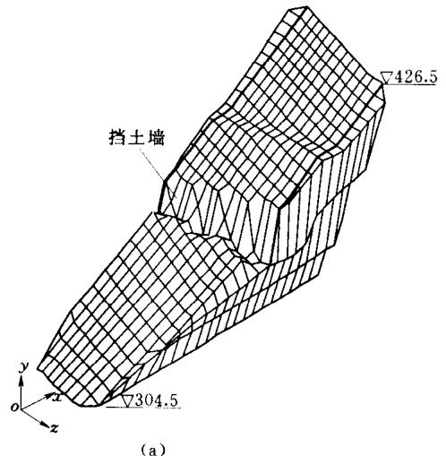

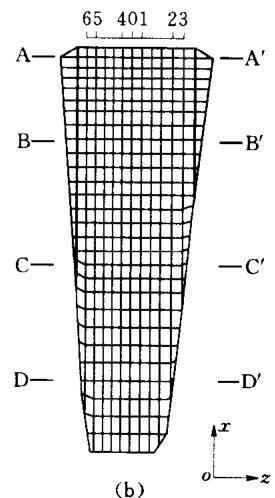

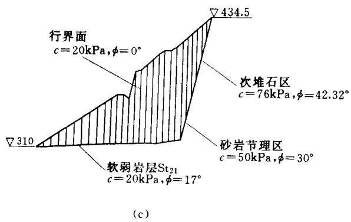

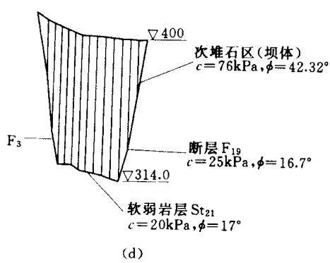  
图 14.26 三维滑裂面示意图  
(a) 立视图；(b) 俯视图；(c) 0 纵断面示意图；(d) B-B'横断面示意图

表 14.19 3 号地质单元计算结果
<table><tr><td></td><td>滑动面组合类型</td><td>1</td><td>2</td><td>3</td></tr><tr><td rowspan="2"> $\mathbf { S t } _ { 2 1 }$ </td><td>三维上限解</td><td>2.615</td><td>2.650</td><td>2.534</td></tr><tr><td>三维极限平衡</td><td>2.546</td><td>2.451</td><td>2.460</td></tr><tr><td rowspan="2"> $\mathbf { S t } _ { 2 0 }$ </td><td>二维加权平均</td><td>1.650</td><td>1.630</td><td>1.720</td></tr><tr><td>三维极限平衡</td><td>2.740</td><td>2.815</td><td>2.954</td></tr></table>

## 14.6 讨论和结论

和见诸文献的各个边坡稳定分析三维极限平衡方法比较，本章介绍的方法在以下方面有所改进：

1）滑坡体三个方向的静力平衡都得到了满足，同时，还增加了一个整体力矩平衡条件；

2) 行界面的条间力不再假定为水平；

3) 条底的剪力方向不假定为平行于xoy 平面；

4)没有对滑裂面的形状和边坡的几何、物理特性作任何假定。程序可用于解决工程实际问题；

5) 本法最终形成了一个三元非线性联立方程，和二维的 Spencer法相比，只增加了一个方程式，相应也增加了一个未知量，即条底剪力方向ρ；整个运算过程简便，实际应用 $\boldsymbol { \rho }$ 情况说明，数值收敛性能良好。

本法可以回归到二维的 Spencer法，也可把它理解为 Spencer 法在三维条件下的扩展。

尽管和以往的方法相比，这一方法引入的假定已明显偏少，但由于忽略了条间力的一些剪切分量，同时又假定所有的条柱的β为同一数值，同一列的ρ值也为同一数值，故仍属近似算法。由于忽略了部分条间剪力，计算成果可能偏小，属下限解。和二维领域的许多简化方法一样，这一方法需要在实际应用的考核过程中确定其合理性和可行性。实际应用时，可以把本方法和理论体系更为严格的三维边坡稳定分析上限解法(Chen et al, 2001 a, b)同时使用。大量的考题和实际算例说明，这两个方法通常可以把安全系数限定在一个很小的上、下限区间中，基本上获得安全系数的严格意义上的解答。

本章尚未涉及应用最优化方法求解三维临界滑裂面的研究工作，在这方面，作者也已作了一些研究，详见文献(Chen et al, 2001 a, b)。

## 参考文献

1 Bishop, A. W. The use of the slip circle in the stability analysis of slopes. Geotechnique, 1955. 5(1): 7-17 , . .1

2 Chen. R. H. and Chameau, J. L. Three-dimensional limit equilibrium analysis of slopes. Geotechnique, 1982 . 33:31-40

3 Chen, Z. and Morgenstern, N.R. Extensions to the generalized method of slices for stability analysis. Canadian Geotechnical Journal, 1983. 20(1):104-109

4 Chen, Z. Wang, X., Haberfield, C., Yin, J., and Wang, Y. A three-dimensional slope stability analysis method using the upper bound theorem, Part I: Theory and Methods. International Journal of Rock Mechanics and Mining Sciences. 2001a April. 38:369-378

5 Chen, Z. Wang, J., Yin, J., Wang, J. and Haberfield, C. A three-dimensional slope stability analysis method using the upper bound theorem, Part II: Numerical approaches, applications and extensions. International Journal of Rock Mechanics and Mining Sciences. 2001b April. 38:379-397

6 陈祖煜，弥宏亮，汪小刚. 边坡稳定三维分析的极限平衡法.岩土工程学报.2001.23(5):525-529

7 Duncan, J. M. State of the art: Limit equilibrium and finite element analysis of slopes. Journal of Geotechnical engineering, 1996 July. 122(7):577-596

8 冯树仁，丰定祥，葛修润，谷先荣.边坡稳定性的三维极限平衡分析方法及应用.岩土工程学报，1999.21(6):657-661

9 Hungr, O., Salgado, F. M., and Byrne, P. M. Evaluation of a three-dimensional method of slope stability analysis. Canadian Geotechniacal Journal. 1989. 26:679-686

10 Hutchison, J. N. and Sarma, S. K. Discussion on three-dimensional limit equilibrium analysis of slopes. Geotechnique. 1985.35:215

11 Huang, C. C. and Tsai, C. C. New method for 3D and asymmetric slope stability analysis. ASCE. Journal of Geotechnical and Environmental Engineering. 2000. 126(10):917-927

12 Hoek, E. and Bray, J. W. Rock Slope Engineering. The Institute of Mining and Metallurgy, 1977

13 Jiin Song Tsai, Lee Der Jou and Hsii Sheng Hsieh. A full-scale stability experiment on a diaphragm wall trench. Canadian Geotechnical Journal, 2000. 37:379-392

14 Lam. L. and Fredlund, D. G. A general limit equilibrium model for three-dimensinal slope stability analysis. Canadian Geotechnical Journal. 1993. 30:905-919

15 Leshchinsky, D, Baker, R. And Silver, M. L. Three-dimensional analysis of slope stability International Journal for Numerical and Analytical Method in Geomechanics. 1985. 9:199-223

16 Morgenstern, N. R. The evaluation of slope stability - A 25 year perspective. Stability and Performance of Slopes and Embankments. ASCE Geotechincal Special Publications. 1992. 1-26

17 Morgenstern, N. R. and Price, V. The analysis of the stability of general slip surface. Geotechnique. 1965. 15(1):79-93

18 Seed, R. B, Mitchell, J. K. and Seed, H. B. Kettlemen Hills waste landfill slope failure, II: stability analysis. J. ASCE Journal of Geotechnical Engineering. 1990. 116(4):669-690

19 Stark, T. D and Eid, H. T. Performance of three-dimensional slope stability analysis method in Practice. ASCE Journal of Geotechnical Engineering. 1998. 124:1049-1060

20 Spencer, E. A method of analysis of embankments assuming parallel inter-slice forces. Geotechnique. 1967 17:11-26

21 Zhang, X. Three-dimensional stability analysis of concave slopes in plan view. ASCE Jouornal of Geotechnical Engineering. 1988. 114:658-671

# SOIL SLOPE STABILITY ANALYSIS

# — PRINCIPLE, METHODS AND PROGRAMS

Zuyu Chen

## ABSTRACT

This book is devoted to a comprehensive study of the analytical approaches to soil slope stability analysis. It summarizes the author's research findings that have been obtained since he started his career in this area in 1979 at the University of Alberta, Canada, under the supervision of Prof. N. R. Morgenstern. The book also contains the author's consulting experience obtained in his involvement of a number of China's large water resources projects, such as the Three Gorges and the Xiaolangdi.

Chapter 1, INTRODUCTION, gives an overview of the landslide hazards that have brought serious damages to human lives and properties. The numerous examples, including Usoi, 1911 in Tajikastan; Tanggudong, 1965 in China; and Yigong, 2001 in China, give a clear picture of the huge energy a natural slope can release. Other examples that have killed thousands or ten thousands of people, such as Yungay, 1970 in Peru, Haiyuan, 1920 in China, etc. show the impact of landslides on human life. The chapter also gives an overall review of the soil mechanics approaches that have been established to slope stability analysis, which will be the main topics the book is to focus.

Chapter 2, THE GENERALIZED LIMIT EQUILIBRIUM METHOD, presents the extensions made by Chen and Morgenstern (1983) to the generalized method of slices commonly used in slope stability analysis. The method gives an analytical solution to the force and moment equilibrium equations originally developed by Morgenstern and Price (1965). The approach also includes an argument on the restriction to the inter-slice force inclination at both ends of the failure mass in order to abide by the principle of complementary shear stresses of an element, and a discussion on the insensitiveness of the assumptions made to the inter-slice forces.

Chapter 3, THE SiMPLIFIED APPROACHES, reviews the various simplified methods that include the Sweden, Bishop's simplified, Lowe-Karafiath and Corps of Engineers' methods, as well as the one proposed by the author. In particular, the author discusses the computational errors some of the simplified methods may bring in some special cases.

Chapter 4, DETERMINATION OF CRITICAL SLIP SURFACES BY THE METHODS OF OPTIMIZATION, is focussed on the automatic search for the critical slip surface

associated with the minimum factor of safety. The chapter covers the optimization approaches commonly used in this area, such as the Simplex, Steepest decent, Powell's and DFP methods. The random search technique proposed by the author (Chen, 1992) is presented to solve the problem of being trapped in a local minimum. A brief review of the modern technique, including the Simulated Annealing and the Genetic Evolution methods, has been given.

Chapter 5, SHEAR STRENGTH OF SOILS, is concerned with the appropriate selection of shear strength parameters used in slope stability analysis. Special attentions have been given to the concept of total stress analysis based on the undrained strength parameters. Hvoshlev's theory has been employed to explain the φ=0 method'. Other subjects include the residual strength, non-linear strength envelope, etc.

Chapter 6, PORE PRESSURE IN SOLIS, describes the methods for determining pore pressure developed in slopes. The author emphasized the importance of distinguishing compressible and incompressible materials when pore pressure is concerned. A brief discussion on the concepts of Terzaghi and Biot theory of consolidation has been given. The chapter also presents some empirical approaches used in slope stability analysis.

Chapter 7, ANALYSIS OF EMBANKMENT DAM SLOPES, describes the total and effective stress methods used in the analyses of embankment dam slopes upon various operational cases. They include the situations of end of construction as well as normal and rapid draw-down of reservoir water level.

Chapter 8, ANALYSIS OF SUPPORTED AND REINFORCED SLOPES, gives an overall review on the analytical methods for retaining walls and slopes with internal supports. The generalized method of slices presented in Chapter 2 has been extended to the determination of active earth pressure for different kinds of supports. The method is capable of calculating the earth pressure with a resultant applied on the middle instead of lower one-third point of the wall, and therefore is applicable to flexible retaining structures, such as tie-back, struts, and soil nails. A brief review on the methods for the analyses of slopes with internal reinforcements of piles, nails and geosynthetics has been given.

Chapter 9, USE OF FINITE ELEMENT METHOD IN SLOPE STABILITY ANALYSIS, briefly reviews the finite element method that is used to solve pore pressure, stress and displacement field in a slope. Since stability is normally the main issue, this chapter has given special attention to the research outcomes that relate the finite element analysis results to an overall stability assessment, quantitatively described by the factor of safety.

Chapter 10, RISK ASSESSMENT AND RELAINBILITY ANALYSES, describes the fundamentals of the probabilistic approaches in slope stability analysis. After a general review on the principles of qualitative and quantitative risk assessments, the chapter focuses on the methods used to calculate the reliability index that could eventually relate to the probability of failure. Also a brief discussion on the variability of shear strength parameters is contained.

Chapter 11, DESIGN OF A SLOPE STABILITY ANALYSIS PROGRAM, illustrates the main procedures to code a slope stability analysis program. The chapter summaries the methodology of interpreting the slope profile, creating a slip surface with circular or generalized shape, and performing various methods described in Chapter 2 and 3. Those parts are accompanied by source program listings that have been constantly debugged during its continuous applications in the past 20 years. Contained in this chapter also an introduction to the outcomes of a review work on soil slope stability analysis programs organized by Australian Computer Aided Design Association (ACADS) and conducted by Prof. I. Donald and Dr. P. Giam from Monash University, Australia.

Chapter 12, USERS' MANUAL OF STAB, gives detailed instructions on the use of computer program STAB that performs all the methods described in the book except that in Chapter 14.

The source programs described in Chapter 11 and the Educational Version of STAB described in Chapter 12 can be downloaded from http://www.geoeng.iwhr.com/ geoeng/download.htm

Chapter 13, CASE STUDIES, documents 13 cases that have successfully used STAB in analyzing their slope stability problems. They include some critical issues in a number of large projects such as the Three Groges, Xiaolangdi and Zipingpu. All the data have been documented in the web site for download.

Chapter 14, THREE-DIMENSIONAL LIMIT EQUILIBRIUM METHOD FOR SLOPE STABILITY ANALYSIS, presents the author's latest development regarding 3D slope stability analysis. Compared to the existing 3D methods published in the literature, the new method features in its complete satisfaction to force equilibrium conditions. In fact, it is a 3D extension to the 2D Spencer method. Several examples of practical applications are presented.
