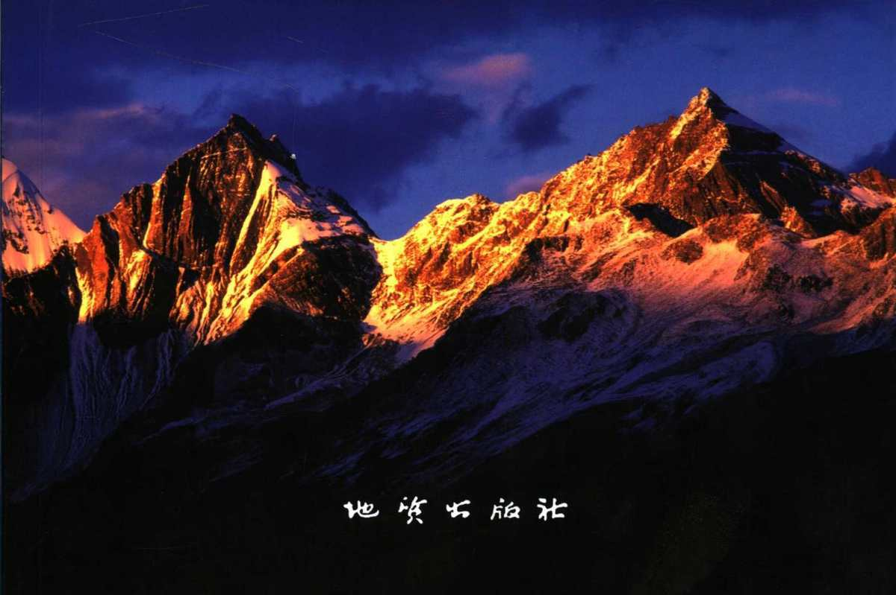

# 中国西北地区矿山环境地质问题调查与评价

SURVEY AND ASSESSMENT ON ENVIRONMENTAL GEOLOGY PROBLEMS OF MINE IN NORTHWEST CHINA

# 中国西北地区矿山环境地质问题调查与评价

# Survey and Assessment on Environmental Geology Problems of Mine in Northwest China

徐友宁何芳袁汉春张江华陈社斌著

地質出版社

·北京·

## 序

矿业是人类赖以生存和发展的主要产业之一，古时的人们便已学会挖煤采玉，汲盐淘金，但因规模相对较小，在巨大的地球上凿几个眼眼，挖几个洞洞，无伤大雅，所以人们只管开挖，很少关心其他问题。随着人类经济活动的日益增强，特别是20世纪后期以来，由于我国经济飞速发展的需要，采矿业发展迅猛，其速度之加快，其规模之增大，不仅使开采理论和开采技术捉襟见肘，而且使管理理念和管理制度明显滞后，从而引发了一系列严重的矿山环境地质问题，在西北尤其如此。因为大西北蕴藏着中国第一的油、气、煤、盐资源，蕴藏着十分丰富的有色金属和贵金属，还因为这里是西部大开发的主战场之一，进行着规模宏大的矿山开发。但某些不计后果的掠夺开发方式，严重影响着水文生态系统，破坏着农田宅地，污染着水土大气环境、诱发着地沉地裂和山体崩塌，催生了新的水土流失和滑坡泥石流等，出现了一系列令人揪心的矿山环境地质问题。

值得庆幸的是，包括青年学者徐友宁在内的西安地质矿产研究所的专家们在五年前便能觉察此事，并在国土资源部中国地质调查局的支持下，开展了“西北地区不同类型矿产开发环境地质研究”。他们通过深入现场考察取样，在室内化验分析，从众多杂乱的现象中寻找规律。正是有这种“从实际中来，到实际中去”的理论密切结合实际的研究方法，才能获得系统深入的规律性认识，获得创新性成果。他们对西北地质环境的分区、对矿山环境地质问题的分类、对不同工业类型矿业开发、不同开采方式、不同地质环境、不同开发规模所引起的不同地质环境问题的分析和论述、对西北矿业的可持续发展以及矿山地质环境图件编制提出的途径和方法建议等，都证明作者们进行了创造性劳动，获得了可喜的成果。

我参加过西安地质矿产研究所组织的年度工作汇报会，听取过徐友宁所作的汇报，从那时起便建议他们早日出书，把他们的研究成果公诸于世，以便推进该领域的科学研究，同时可以作为大学生、研究生学习有关课程以及教师和广大科技人员工作的参考书。现在，这本书就要出版问世了！我有幸阅读了书稿，并乐于为序。

亦佩浅

2006年3月于古城西安

## 前 言

矿产资源开发利用是一把双刃剑，一方面矿产资源开发会极大地促进国民经济和社会发展，另一方面，不合理的开发往往会引发矿区及毗邻地区地质灾害、水土环境污染和生态环境破坏等。诚然，矿产资源开发不可避免会对矿区地质环境造成负面影响，但只要采取相关措施，就可以将负面影响降低到最低程度。只开发不治理，无视开发中产生的环境地质问题，必然导致矿区生态环境恶化，矿山地质灾害频发、环境污染加重，严重威胁矿山正常生产和人居生态环境安全，阻碍地区社会经济的可持续发展。所幸的是，随着环境保护的理念日益深入人心，矿山地质环境保护受到了政府的高度重视。2006年1月20日，国务院关于加强地质工作的决定指出：“要强化地质灾害和地质环境调查监测，全面推进矿山环境地质调查工作”。

西北地区矿产资源丰富，但是大多数矿区面临水资源短缺、生态环境脆弱的局面，在西部大开发中，如果继续沿袭“先开发、后治理”的落后矿业开发模式，严重的矿山环境地质问题必然加剧脆弱的生态环境的恶化。因此，必须走可持续发展的绿色矿业之路，建立资源节约型、环境友好型矿山。

在国家实施西部大开发战略的背景下，2000年西安地质矿产研究所领导和有关科技人员意识到矿山地质环境调查工作的重要性，积极立项申请开展矿山地质环境调查工作，在中国地质调查局的大力支持下，于2001\~2002年承担并完成了《西北地区不同类型矿产开发环境地质研究》（项目编号：20011230003）。

矿山地质环境调查评价工作是地质工作者主动为社会发展和国民经济建设服务的一项新的业务领域，在前无经验可借鉴的情况下，通过探索性、创新性的调查研究工作，完成了6个省区100余处典型矿山地质环境的剖析，取得了重要认识和成果。本书是在《西北地区不同类型矿产开发环境地质研究成果报告》基础上，通过增减、补充完善，编撰而成。

全书共分七章，第一章介绍了西北地区社会经济、自然地理，划分了四类地质环境分区。第二章简述了西北地区矿产资源的分布特点、开发利用现状、开发利用中存在的主要问题等。第三章介绍了矿山环境地质发展研究现状，建立了矿山环境地质问题分类系统，着重论述了不同工业类型矿产资源开发、不同开发方式及不同地质环境分区内矿山环境地质问题及其特点，分析了导致矿山环境地质问题严重的主要因素。第四章为矿山地质环境质量评价，建立了矿山地质环境质量评价指标体系、评价等级、评价的数学模型等，设定并示范评价了某矿区六个矿山的地质环境质量等级，以及运用三种方法进行评价的过程，分析其评价结果的一致性和差异性，最后给出了西北地区矿山地质环境质量现状评价、预测评价和综合评价结果及其分区。第五章提出开发矿产资源也要遵循热力学的“熵增原理”，绿色矿业就是“趋利而避害”（熵增），“粗方式、掠夺式”开发实为“趋害而避利”（熵减），论述了西北地区矿产资源开发必须走绿色矿业之路的必要性和重要性，提出了保护与修复矿山地质环境的对策与建议。第六章给出了建立区域矿山地质环境数据库的原则和方法，以及所建立的数据库的功能特点。第七章论述了编制矿山地质环境图件的基本要求、主要图件及编制方法。

在本书付印之际，衷心感谢中国地质调查局水环部殷跃平主任、张作辰处长的大力支持和业务指导，感谢国土资源部规划司鞠建华副司长、地质环境司陈小宁处长、刘建伟处长的指点，感谢中国地质环境监测院王瑞久研究员、张进德主任以及中国矿业大学武强教授的帮助，感谢提供资料的西北六省区国土资源厅地质环境处、矿产资源管理处以及矿山企业领导和工程技术人员，感谢武征、孙愿、赵子长等同志的先期工作，衷心感谢西安地质矿产研究所领导的大力支持。

全书由徐友宁主撰并统稿，同时执笔第三章、第五章，陈社斌执笔第二章，袁汉春执笔第四章，张江华执笔第六章，何芳执笔第一章和第七章。项目组李育敬、刘瑞平等为本书的完成做了许多工作。西北大学的岳乐平教授、长安大学李英教授对书稿提出了许多有益的建议，谨此深表谢意。

本书存在许多难尽人意之处，谬误也难免，有赐教者，将不胜感激。

综友行

2006年6月

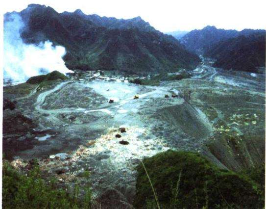  
照片1 陕西金堆城钼矿露天排土场压占土地植被

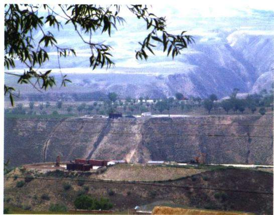  
照片2 陕北个体开采石油造成水土流失和环境污染

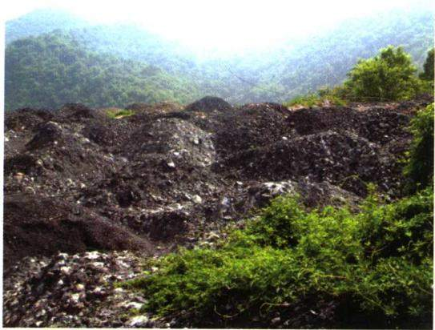  
照片3 陕西黄陵店头煤矿煤矸石堆积压占破坏植被

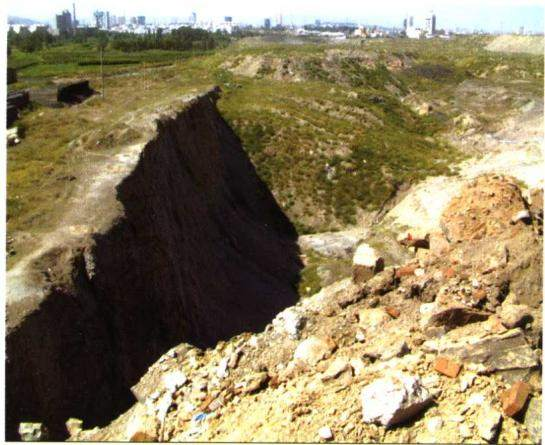

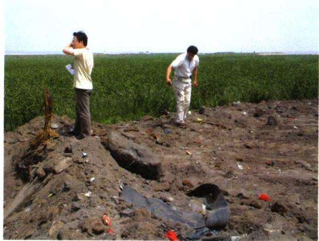  
照片4 陕西韩城下峪口煤矿煤矸石“填滩造地”破坏黄河湿地

照片5 新疆乌鲁木齐市六道湾煤矿地面塌陷造成土地废弃  
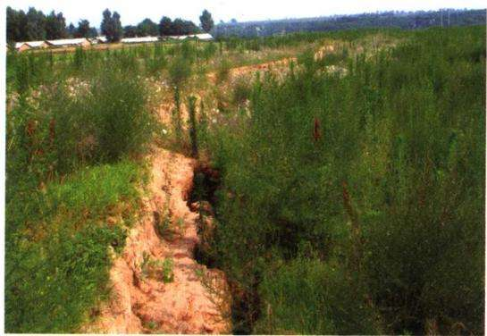  
照片6 陕西黄陵店头煤矿地面塌陷造成良田荒芜

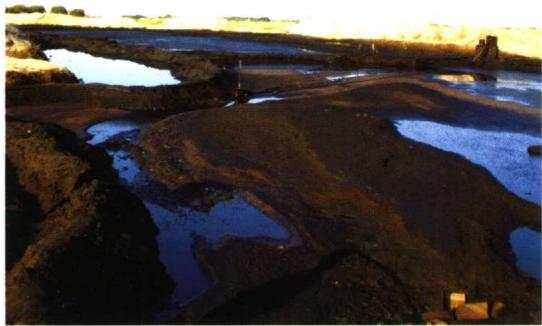  
照片7 新疆克拉玛依油田原油及其废水排放污染土地  
照片8 陕西略阳某钢厂选冶废水直排污染嘉陵江

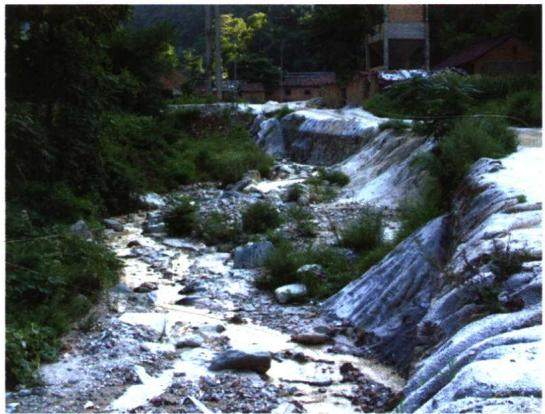

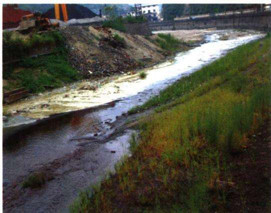

照片9 陕西潼关金矿区尾矿渣沿河堆放现象普遍  
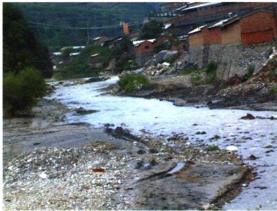  
照片10 甘肃厂坝铅锌矿个体尾矿浆直排污染河流

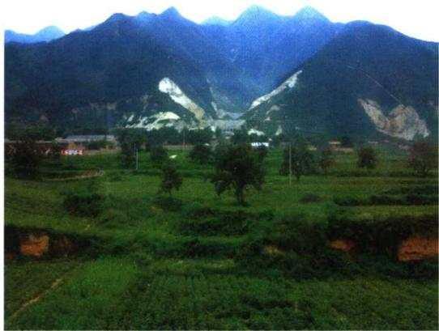  
照片11 秦岭北麓华山西侧采石造成生态环境破坏

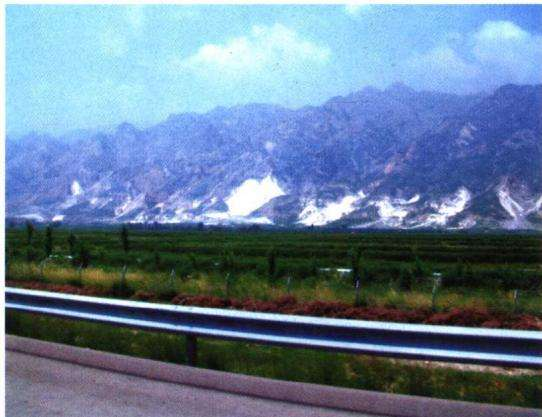  
照片12 呼-包高速公路大青山采石场采石破坏风景景观

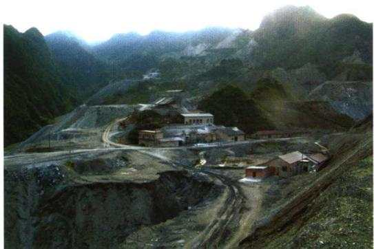  
照片13 陕西宁强石棉矿露天剥采导致水土流失严重

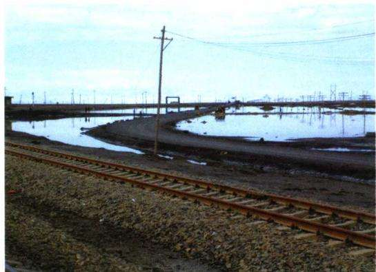  
照片14 青海察尔汗钾盐生产排放的老卤水危及交通安全

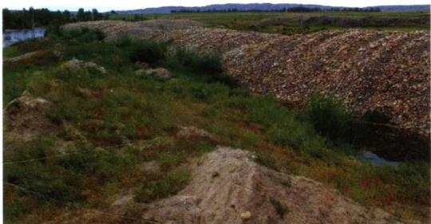  
照片15 新疆阿勒泰红墩河砂金开采,废石占地破坏草地

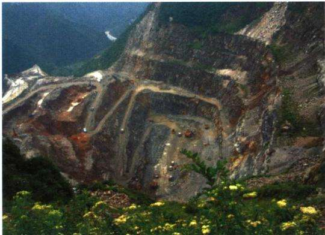

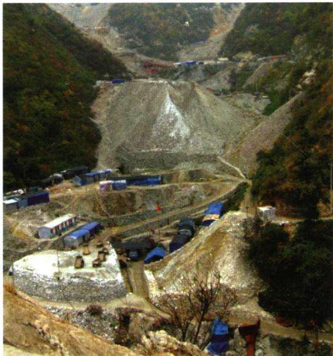

照片16 甘肃厂坝铅锌矿民采导致露天采场提前关闭  
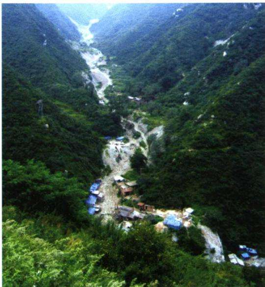  
照片17\~18 陕西潼关金矿区采矿废石随意堆积，沟沟存在着严重的矿渣型泥石流地质灾害隐患

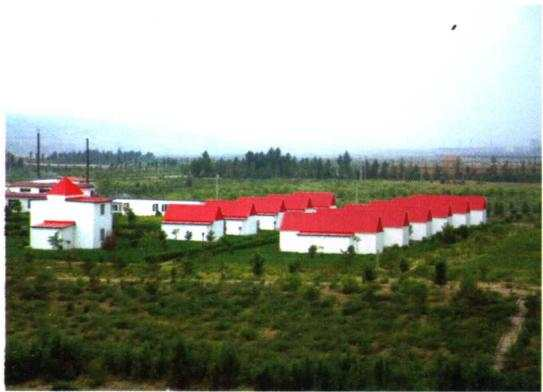  
照片19 神东公司马家塔露天煤矿复垦后的生态园林

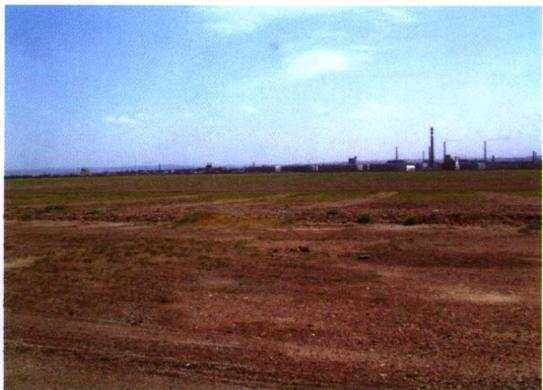  
照片20 金川公司用戈壁砾石覆压治理闭库的尾矿库，减少了扬沙飞尘对环境的污染

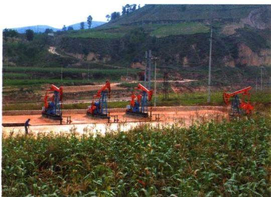  
照片21 长庆安塞油田采油采取的环境保护措施

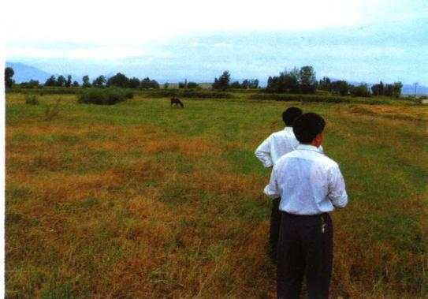  
照片22 新疆阿勒泰红墩河砂金矿区复垦后的情景

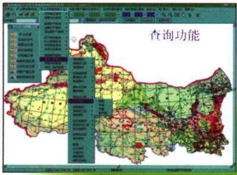

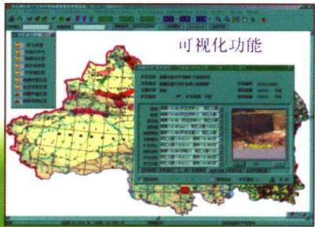

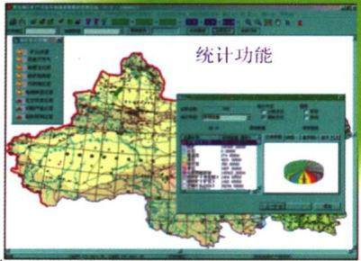

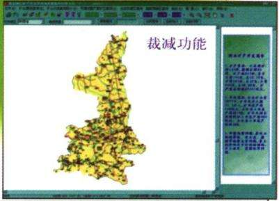  
中国西北地区矿山地质环境数据库管理系统主要界面

## 目 录

序  
前言  
1 区域概况与地质环境分区……(1)  
1.1 社会经済……………………………………………………………(1)  
1.2自然地理…………………………………………(2)  
1.2.1 地形地貌…………………………………………………………………………(2)  
1、2.2水资源…………………………………………(2)  
1. 2.3 气候…………………………………………………(4)  
1.3地质环境分区……(4)  
1.3.1 秦岭山地型地质环境分区…………………………………(6)  
1.3.2 黄土高原型地质环境分区……(6)  
1.3.3 戈壁沙漠型地质环境分区……(7)  
1.3.4 其他山地型地质环境分区……(8)  
2 矿产资源开发利用现状……(10)  
2.1 矿产资源及其分布……(10)  
2.1.1 矿产资源概况………(10)  
2.1.2 矿产资源分布特点………(11)  
2.2 矿产资源开发利用现状……(16)  
2.2.1矿山经济概况……………(16)  
2.2.2 矿产资源开发利用现状……………………………………(17)  
2.2.3 矿产资源开发效应………………………………………………………………(18)  
2.3矿产资源开发中存在的主要问题……(20)  
2.3.1 矿业结构不合理，资源综合利用率低……………(20)  
2.3.2 矿山科技水平及“三率”指数有待提高…………………(21)  
2.3.3 缺乏区域规划及合理布局，矿业开发秩序混乱………………………(21)  
2.3.4 资源储备不足，后备资源短缺……(22)  
3 西北地区矿山环境地质问题……(23)  
3.1 矿山环境地质研究现状……(23)  
3.1.1 矿山环境地质学沿革……(23)  
3.1.2 矿山环境地质发展现状……(24)  
3.1.3需要加强研究的主要内容……(24)  
3.2 矿山地质环境与环境地质……(25)  
3.2.1 矿山地质环境…………………………………………………………………………………(25)  
3.2.2 矿山环境地质……………………………………………………………………(26)  
3.2.3 矿山环境地质问题………………………………………………(27)  
3.3 矿山环境地质问题分类………(29)  
3.3.1 按矿山环境地质问题导致的结果分类…………………(30)  
3.3.2 按矿产资源的工业类型分类………(33)  
3.3.3 按开采加工方式分类………(33)  
3.3.4 按矿山所处区域地质环境背景条件分类………………(33)  
3.3.5 按矿山地质环境可恢复程度分类………(33)  
3.3.6 按矿山地质环境调查评价的时间段分类…………………(34)  
3.3.7 按矿山环境地质问题发生时间分类………………(34)  
3.3.8 按矿山环境地质问题产生的空间位置分类…………………(34)  
3.3.9 按矿山企业规模、性质分类……………(35)  
3.4 不同工业类型矿产开发的主要环境地质问题……(36)  
3.4.1 油气类矿产开发中的主要环境地质问题……………(37)  
3.4.2 煤炭开发中的主要环境地质问题………………(39)  
3.4.3 金属类矿产开发中的环境地质问题…………………………(45)  
3.4.4 灰岩类矿产开发中的环境地质问题  
3.4.5 卤水盐矿类开发中的环境地质问题 ……………………………………………………………(52)  
3.4.6 石材类矿产开发中的环境地质问题 …………………………………………………………………(53)  
3.4.7 磷硫类矿产开发中的环境地质问题……………(55)  
3.5 不同开采方式产生的矿山环境地质问题……(55)  
3.5.1 地下开采矿山环境地质问题…………(55)  
3.5.2 露天开采矿山环境地质问题……(55)  
3.5.3水力开采矿山环境地质问题……………………… ………………………………(56)  
3.6 不同地质环境分区的矿山环境地质问题……(57)  
3.6.1 秦岭山地区矿山环境地质问题  
3.6.2 黄土高原区矿山环境地质问题………………………(59)  
3.6.3 戈壁沙漠区矿山环境地质问题 ……………………………………………………(60)  
3.6.4 其他山地区矿山环境地质问题…………………………………(60)  
3.7 不同规模企业矿山环境地质问题……(61)  
3.7.1 国有大中型矿山环境地质问题…………………(61)  
3.7.2 小型矿山环境地质问题………(61)  
3.8 导致矿山环境地质问题严重的主要因素……(64)  
3.8.1 矿山地质环境防治法律政策不够完善………(64)  
3.8.2 矿山地质环境恢复治理资金投入不足………………(64)  
3.8.3 地质环境保护观念淡薄………(64)  
3.8.4 区域生态环境脆弱因素……………………………(64)  
3.8.5 缺乏矿山生态环境恢复治理示范性工程…………(65)  
4 矿山地质环境质量评价……(66)  
4.1 矿山地质环境质量评价……(66)  
4.1.1 矿山地质环境质量评价的意义 ………(66)  
4.1.2矿山地质环境质量评价分类……(67)  
4.2 矿山地质环境评价指标体系……(67)  
4.2.1评价指标的要求……(67)  
4.2.2 评价指标体系……(68)  
4.3 评价指标等级确定……………(69)  
4.4 地质环境质量评价流程……(72)  
4.5矿山地质环境质量综合评价模型……(72)  
4.5.1 要素指标加权分值综合评价法………(72)  
4.5.2 模糊数学多层次综合评判法………(73)  
4.5.3 综合评价指标权值的确定………(74)  
4.5.4 评价指标熵熵权加权综合评价 ……(76)  
4.6 矿山地质环境质量综合评价举例……(76)  
4.6.1 评价指标权值的确定……………………(80)  
4.6.2 矿山地质环境质量综合评价……(88)  
4.7 西北地区矿山地质环境评价……(96)  
4.7.1矿山地质环境历史及现状评价……(96)  
4.7.2 矿山地质环境质量预测评价……(96)  
4.7.3矿山地质环境质量综合评价……(97)  
5西北地区矿业可持续发展的对策建议……(106)  
5.1 矿山环境地质问题防治的紧迫性……(106)  
5.1.1 矿山环境地质问题防治现状……(106)  
5.1.2 矿山环境地质问题防治的紧迫性…………(107)  
5.2 加强矿山地质环境保护的法规建设……(110)  
5.2.1 矿山地质环境保护法规建设的重要性…………(110)  
5.2.2 加强执法和监管力度……(110)  
5.2.3 充分发挥公众监督作用……(111)  
5.2.4 矿山环境地质问题防治资金………(112)  
5.2.5 提高矿山地质环境保护的水平…………(112)  
5.3 绿色矿业是西北地区矿业可持续发展的必由之路……(113)  
5.3.1 历史上矿产资源开发的三种模式…………(113)  
5.3.2 实现绿色矿业的主要途径………(114)  
5.3.3 西北地区矿业可持续发展必走绿色矿业之路………………………(117)  
5.4 矿山地质环境防治措施……(118)  
5.4.1提高矿产资源的综合利用程度……(118)  
5.4.2 减少土地破坏和占压……(119)  
5.4.3 矿山地面塌陷与复垦………………(120)  
5.4.4 水资源保护及水污染防治…………………………………………………(130)  
5.4.5 矿山崩塌、滑坡灾害防治要点…………………(135)  
5.4.6 抑制水土流失………………………(136)  
5.4.7 预防矿区的沙漠化…………………(136)  
5.4.8 尾矿库的预警措施………………(138)  
5.6 西北地区矿山地质环境防治建议……(139)  
5.6.1 地质环境恢复治理原则………………(139)  
5.6.2 矿山地质环境恢复治理区建议……(139)  
5.6.3 不同地域矿产资源开发地质环境防治建议…………(144)  
5.6.4 不同开采方式矿山地质环境防治建议……(144)  
5.6.5 乡镇及个体矿山地质环境防治建议……(145)  
6 区域矿山地质环境数据库……(146)  
6.1数据库的属性构建……(146)  
6.1.1基础数据的构建……(146)  
6.1.2 属性结构的构建………………(146)  
6.1.3图形、属性编辑……(146)  
6.2 管理系统的功能………(147)  
6.2.1 管理系统开发……(147)  
6.2.2 系统特点……………………(147)  
6. 2.3 管理系统功能特点……(147)  
7矿山地质环境图件及其编制……(149)  
7.1 图件的基本要求……(149)  
7.2 主要图件及其类型……(149)  
7.3图件编制………………………(149)  
7.3.1 矿山地质环境调查实际材料图……(149)  
7.3.2 矿山环境地质问题现状图………(150)  
7.3.3 矿山环境地质问题预测图……(150)  
7.3.4 矿山地质环境防治与恢复治理图……………………(151)  
7.4 存在的问题……(151)  
参考文献及资料……(152)

## 1 区域概况与地质环境分区

## 1.1 社会经济

中国西北地区（包括陕西、甘肃、宁夏、青海、新疆五省区及内蒙古集宁一二连浩特以西地区）地域辽阔，面积近 $3 1 1 \times 1 0 ^ { 4 } \mathrm { k m } ^ { 2 }$ ，约占全国国土面积的三分之一。人口有11720多万，仅占全国总人口的9.06%，其中少数民族占20%左右，除陕西省外，各省区少数民族占总人口的比例均高于全国平均值8%。

西北地区土地资源丰富，可利用土地 $8 6 . 7 1 \times 1 0 ^ { 4 } \mathrm { k m } ^ { 2 }$ ，其中可耕地占21%，宜牧宜林地占79%，可灌溉面积近亿亩，热量和光照充足，发展农牧业有很大潜力。该区森林覆盖面积小，仅有 $1 1 . 3 4 \times 1 0 ^ { 4 } \mathrm { k m } ^ { 2 }$ ，覆盖率除陕西为23%外，青海、宁夏、新疆均不到1%，全区平均为2.5%。区内自然植被密度小、品种少，生长状态差，生态自然恢复能力差，生态环境脆弱。

西北地区经济水平整体较低，2003年新疆人均GDP为9768元，超过了全国人均GDP(9073元/人)，内蒙古人均GDP为9035元，与全国人均GDP接近，陕西、甘肃、宁夏、青海4省区人均GDP均低于全国人均 GDP（表1-1），整个西北地区人均 GDP为7378元，低于全国人均GDP的18.68%。2003年，全国完成治理工业污染投资221.83亿元，人均完成治理工业污染投资17.17元，这期间只有宁夏人均完成治理工业污染投资为20.25元，超过全国均值17.17元/人，其余5省人均完成治理工业污染投资均少于全国均值，其中陕西最少，为全国均值的8.3%（表1-1），整体属于贫困地区。但西北地区资源丰富，人均占有资源量较多，发展潜力很大。全区石油、天然气、煤炭、有色金属、电力、化工、纺织、水泥等产业发展很快，其中矿业开发在该区国民经济中占有相当大的比重，如1999年新疆矿业总产值占该区工业总产值的33.8%，位居全国之首。矿业及相关工业成为西北地区经济发展的主要支柱。

表1-1 2003 年全国和西北六省区国内生产总值及完成治理污染投资对比表
<table><tr><td rowspan=1 colspan=1>内容</td><td rowspan=1 colspan=1>全国</td><td rowspan=1 colspan=1>陕西</td><td rowspan=1 colspan=1>甘肃</td><td rowspan=1 colspan=1>宁夏</td><td rowspan=1 colspan=1>青海</td><td rowspan=1 colspan=1>新疆</td><td rowspan=1 colspan=1>内蒙古</td></tr><tr><td rowspan=1 colspan=1>人口/万人</td><td rowspan=1 colspan=1>129227</td><td rowspan=1 colspan=1>3690.0</td><td rowspan=1 colspan=1>2603.0</td><td rowspan=1 colspan=1>580.0</td><td rowspan=1 colspan=1>534.0</td><td rowspan=1 colspan=1>1934.0</td><td rowspan=1 colspan=1>2380.0</td></tr><tr><td rowspan=1 colspan=1>国内 GDP 生产总值/亿元</td><td rowspan=1 colspan=1>117251.9</td><td rowspan=1 colspan=1>2398.6</td><td rowspan=1 colspan=1>1304.6</td><td rowspan=1 colspan=1>385.3</td><td rowspan=1 colspan=1>390.2</td><td rowspan=1 colspan=1>1877.6</td><td rowspan=1 colspan=1>2150.4</td></tr><tr><td rowspan=1 colspan=1>人均国内 GDP 生产总值/元·人</td><td rowspan=1 colspan=1>9073.0</td><td rowspan=1 colspan=1>6500.0</td><td rowspan=1 colspan=1>5012.0</td><td rowspan=1 colspan=1>6644.0</td><td rowspan=1 colspan=1>7307.0</td><td rowspan=1 colspan=1>9768.0</td><td rowspan=1 colspan=1>9035.0</td></tr><tr><td rowspan=1 colspan=1>完成治理工业污染投资/万元</td><td rowspan=1 colspan=1>2218281</td><td rowspan=1 colspan=1>5267.8</td><td rowspan=1 colspan=1>35739.6</td><td rowspan=1 colspan=1>11747.0</td><td rowspan=1 colspan=1>2403.0</td><td rowspan=1 colspan=1>26508.8</td><td rowspan=1 colspan=1>27697.9</td></tr><tr><td rowspan=1 colspan=1>人均完成治理工业污染投资/元·人-1</td><td rowspan=1 colspan=1>17.17</td><td rowspan=1 colspan=1>1.43</td><td rowspan=1 colspan=1>13.73</td><td rowspan=1 colspan=1>20.25</td><td rowspan=1 colspan=1>4.50</td><td rowspan=1 colspan=1>13.71</td><td rowspan=1 colspan=1>11.64</td></tr></table>

资料来源：中国统计年鉴（2004)。

全区交通网络刚刚建成，铁路主要有陇海、兰新、兰青、包兰、宝成、宝中、西康、西榆等干线，青藏铁路将建成通车。公路网已基本形成，等级公路一般可达县市，而地方公路可达乡镇。

## 1.2 自然地理

## 1.2.1 地形地貌

西北地区在地形上位于中国阶梯状地貌的第一、第二阶梯之上。西南部的青藏高原，平均海拔在4000m以上，为第一阶梯。昆仑山和祁连山以北、以东的黄土高原和内蒙古高原海拔在1000m以上，为第二阶梯。山脉主要走向为北西向至近东西向，如西部的阿尔泰山、天山、昆仑山，西南部的巴颜喀拉山和唐古拉山，中部的阿尔金山和祁连山，东部的阴山，南部的秦岭，极个别为南北向，如贺兰山等。主要山脉之间分布巨大的内陆盆地，如塔里木、准噶尔和柴达木三大盆地及一些地堑型盆地，如河西走廊、银川、渭河盆地等。塔里木盆地北为天山山脉，南为昆仑山，东为阿尔金山，西为帕米尔高原，海拔800\~1300m，面积 $5 5 . 7 \times 1 0 ^ { 4 } \mathrm { k m } ^ { 2 }$ ，西高东低，由盆地边缘向中心，依次为戈壁、绿洲、沙漠，成环带状分布。准噶尔盆地海拔500\~1000m，面积 $2 2 . 3 \times 1 0 ^ { 4 } \mathrm { k m } ^ { 2 }$ ，东高西低，盆地中部多固定沙丘，南缘冲洪积扇构成较宽阔平原。阿尔金山和祁连山分别是青海柴达木盆地北缘、甘肃河西走廊南缘的分界。柴达木盆地海拔2700\~3000m，由盆地边缘至中心，依次有戈壁、丘陵、平原和湖泊分布。河西走廊为一狭长平地，平均海拔1400m左右，以东为阿拉善高原和鄂尔多斯高原，一般海拔1000\~2000m，沙漠草原广布。沿黄河及其支流渭河分布有一系列断陷盆地，主要有宁夏的银川盆地，面积 $0 . 6 5 \times 1 0 ^ { 4 } \mathrm { k m } ^ { 2 }$ ；河套盆地，面积 $1 . 8 \times 1 0 ^ { 4 } \mathrm { k m } ^ { 2 }$ ；渭河盆地，面积1. $9 1 \times 1 0 ^ { 4 } \mathbf { k m } ^ { 2 }$ 等。东部地区的黄土高原以六盘山为界分为陇西黄土高原和陕甘宁蒙黄土高原，海拔平均1000\~2000m，为塬、梁、峁、沟、壑等独特的黄土地貌。

西北地区分布着我国主要沙漠区，如塔克拉玛干沙漠、古尔班通古特沙漠、库姆塔格沙漠、巴丹吉林沙漠、腾格里沙漠、乌兰布和沙漠、库布齐沙漠以及毛乌素沙漠等，决定了西北地区干旱性气候及水资源的特殊性。

## 1.2.2 水资源

水资源是人类赖以生存的基础自然资源，可开发利用的水资源包括地表水和地下水。地表水是由大气降水及地下水补给两部分汇入河川湖泊等形成的，其时空分布很不均匀，河流相对集中。西北地区地表水系发育，大致可分为内陆水系和外流水系两类。内陆水系主要分布在新疆、青海、甘肃等省，已命名的河流共689条，其中新疆570条、青海63条、甘肃56条，一般为短小的季节性溪流，仅在高山冰雪融水补给区，发育了一些长年内陆河流，如塔里木河、伊犁河、黑河、石羊河等。外流水系包括长江和黄河的上游及额尔齐斯河。长江和黄河两大水系源头位于青海省南部，流经青海、甘肃、宁夏、陕西，流域面积近 $5 0 \times 1 0 ^ { 4 } \mathrm { k m } ^ { 2 }$ ，黄河主要支流有湟水、大通河、渭河、泾河、洛河、无定河等，河网密度一般小于 $0 . 3 \mathrm { k m } / \mathrm { k m } ^ { 2 }$ 。长江水系自源头段的沱沱河、通天河至汉江、嘉陵江及白龙江支流，流域内河网密度一般都超过 $0 . 3 \mathrm { k m } / \mathrm { k m } ^ { 2 }$ 。额尔齐斯河发源于新疆阿尔泰山，注入北冰洋，国内流量约为 $1 0 3 \times 1 0 ^ { 8 } \mathrm { m } ^ { 3 } / \mathrm { a }$ ，主要支流有哈巴河、布尔津河、克郎河、卡拉额尔齐斯河等。西北地区地表水资源总量为 $2 1 8 9 . 1 3 \times 1 0 ^ { 8 } \mathrm { { m } ^ { 3 } / a }$ ，开发利用率已超过80%，进一步开发利用的潜力有限。

地下水资源是由降水入渗和地表水入渗补给形成的，其丰富程度与区域降水量有密切关系。而地形地貌和地质条件控制着地下水储水构造的形成，决定着地下水资源在相近气候条件下的丰富程度：强烈上升的山区基岩地区，地下水资源分布不均一，主要赋存于风化裂隙中，含水层薄，绝大部分地下水转化为地表水；黄土丘陵地区，地下水资源较为贫乏，无论是天然资源和开采资源都较贫乏，天然资源模数一般为 $\left( 1 . 4 \sim 2 . 0 \right) \times 1 0 ^ { 4 } \mathrm { { m } } ^ { 3 } / \left( \mathrm { { \ a } } \cdot \mathrm { { \Omega } } \right.$ $ { \mathbf { k } }  { \mathbf { m } } ^ { 2 } )$ ，陇西地区不足 $1 \times 1 0 ^ { 4 } \mathrm { m } ^ { 3 } / \textrm { ( a - k m } ^ { 2 } )$ ，丘陵区西北部地下水水质较差，东南部较好，塬区较好，梁峁区较差，黄土塬区地下水资源相对较为丰富；广大的山区分布有众多的小型山间盆地或河谷平原，有较厚的松散堆积物，可形成地下水资源的丰富地段，但一般范围较小，资源总量有限；大型河谷断陷盆地面积在 $1 0 0 0 { \bf k m } ^ { 2 }$ 以上的有新疆塔城盆地、伊犁盆地、银川盆地、关中盆地和汉中盆地等，含水层厚度大，地下水资源丰富，资源模数都在 $2 0 \times 1 0 ^ { 4 } \mathrm { m } ^ { 3 } / \textrm { ( a - k m } ^ { 2 } )$ 以上，地下水水质一般都较好；干旱内陆盆地边部的山前冲洪积平原，例如天山南北麓平原、祁连山山前平原、柴达木盆地南侧平原等，分布有巨厚的粗颗粒沉积物质，含水层厚度大，山区有较多的降水和冰雪融水量，形成地表及地下径流，补给山前平原地下水，天然资源和储存资源均很丰富，补给模数一般为 $5 \times 1 0 ^ { 4 }$ $1 0 \times 1 0 ^ { 4 } \mathrm { m } ^ { 3 } / \textrm { ( a - k m } ^ { 2 } )$ ，有利于地下水的开采，浩瀚的沙漠，地下水主要靠降雨下渗和凝结水补给，只要有足够的降雨量就会形成沙漠孔隙水，沙丘中的地下水一般水质较好，如巴丹吉林沙漠地下水矿化度小，沙漠下部的冲湖积层，由于接受周边地下水的侧向补给，往往形成有供水意义的承压含水层。西北地区地下水天然资源总量为 $1 1 2 4 . 2 5 \times 1 0 ^ { 8 } \mathrm { m } ^ { 3 } / \mathrm { a }$ 可采资源为 $4 7 1 . 0 4 \times 1 0 ^ { 8 } \mathrm { m } ^ { 3 } / \mathrm { a }$ ，在数量上虽比地表水资源少，但分布面积广，水量和水质相对稳定，受气候因素影响较小，其利用开发程度不足25%，尚有较大的开发潜力。但是，地下水资源是经过数百年至数千年形成的，与地表水不同，应属不可再生资源类型，因此，必须贯彻可持续开采方针。

西北地区内陆湖泊众多，主要分布于青海、新疆两省区，以咸水湖和盐湖居多。新疆面积大于 $1 { \mathrm { k m } } ^ { 2 }$ 的湖泊有139个，多为咸水湖和盐湖，只有少数吞吐型湖泊为淡水湖，如博斯腾湖、天池等。青海是我国著名的多湖省份，全省湖水总面积为 $1 . 2 6 \times 1 0 ^ { 4 } \mathrm { k m } ^ { 2 }$ ，湖水面积在 $1 { \bf k m } ^ { 2 }$ 以上的天然湖泊近300处。内蒙古、甘肃、宁夏境内湖泊面积较小，多属咸水湖或盐湖，其中内蒙古的居延湖最大，面积近 $5 0 \mathrm { k m } ^ { 2 }$ 。陕西境内多为淡水湖或咸水湖，陕西神木县境内红碱淖面积最大，为 $4 6 \mathbf { k m } ^ { 2 }$ 。多年来，由于气候干旱、蒸发量大、降雨量少，加之人类生产活动的影响，导致区内大部分河流径流量减少，致使湖泊和周边的湿地面积日趋缩小，有些业已干枯，如罗布泊、台特马湖、玛纳斯湖、艾丁湖等区呈盐漠景观。青海湖是我国最大的内陆咸水湖， $1 9 5 6 \sim 1 9 8 6$ 年，青海湖面积从 $4 5 8 9 . 3 \mathrm { k m } ^ { 2 }$ 萎缩到 $4 3 0 4 . 5 \mathrm { k m } ^ { 2 }$ ，平均每年缩小 $9 . 3 \mathrm { k m } ^ { 2 }$ ，目前湖水面积约为 $4 2 0 0 \mathrm { k m } ^ { 2 }$ ，最大水深约29m。

西北地区的现代冰川也是十分重要的水资源类型。分布于昆仑山、天山、阿尔金山、祁连山等山脉中，冰川总面积约为9838.85km²，占全国冰川面积的17.47%。天山主峰托木尔峰周围有我国最大的山体冰川，作为“固体水库”是内陆河流的主要补给源。

## 1.2.3 气候

西北地区的气候类型主要属干旱一半干旱型大陆气候，仅东部受夏季风的影响，属半湿润一湿润型季风气候，在秦巴山区，具有夏季高温、冬季严寒、年温差和日温差大的特点。自南向北、自东向西，东南亚季风影响迅速渐弱，而为干燥的中亚冬季风所控制，并受到高原气候的影响，从而形成了本区具有干旱型气候的基本特征。气候分区跨越了亚热带的秦岭山地、暖温带的陕西关中平原、温带半干旱半湿润的黄土高原、干旱一半干旱的内陆盆地和高原及高山区。区内平均气温和温差变化极大：阿尔泰山、天山、祁连山和青海南部等高山区年平均气温在0℃以下，其余大多地区为0\~8℃；塔里木盆地和黄河河谷平原为8\~10℃，关中平原为12\~13℃；最高的是吐鲁番盆地，年平均气温14℃，最高气温达48℃，为全国最热的地区。

西北地区年降水量平均为210mm，但时空分配极不均匀，总的变化趋势是自东南向西北逐渐减少。降水量最大的为陕西大巴山地区南部，年降水量大于1000mm；最小的是塔克拉玛干沙漠，西部年降水量小于50mm，中部小于25mm；新疆的托克逊年降水量仅为3.9mm。

地形对水量的影响十分显著，山区降水量较多，盆地中心较少。如新疆山区降水量占自治区降水资源总量的84%，秦岭北麓年降水量达800\~900mm，天山南北麓和阿尔泰山年降水量为400\~600mm。降水的季节分配明显，年降水量的60%\~80%集中在6\~9月，具有季风性气候特征。区域降水量空间变化最大的是陕西陕南和陕北相差566mm，其次为内蒙古东西部相差199mm，新疆南北相差146mm。总体上，大致以延安一六盘山一天水一同仁一玉树一线为界，其东南部降水量大于500mm，而西北广大的内陆盆地和沙漠区降水量大多小于200mm。

西北地区的蒸发量与降水量的变化正好相反，蒸发量由东南向西北增大：陕西关中年蒸发量为900\~1200mm，陕北为1000\~1400mm，宁夏为1400\~2000mm，柴达木盆地为2000\~3500mm，阿拉善沙漠和内陆盆地中部可达4000mm以上。由此可见，西北地区绝大部分地区年蒸发量明显大于年降水量，个别地区蒸发量是降水量的数十倍。因此，蒸发量大是西北地区干旱气候的主要控制因素。

## 1.3 地质环境分区

西北地区地形复杂，地貌类型多样，有高原、中高山地、盆地和戈壁、沙漠等。考虑地形地貌、水资源、气候条件及植被发育等因素，以区域自然地理环境为基础，结合矿产资源分布以及区域环境地质问题，主要从影响矿产资源开发角度出发，将西北地区区域地质环境大致划分为秦岭山地型、黄土高原型、戈壁沙漠型及其他山地型等四个一级区(图1-1)。

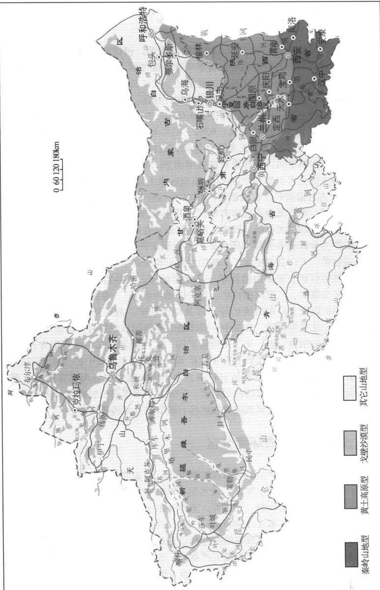  
竹图

## 1.3.1 秦岭山地型地质环境分区

秦岭山地型地质环境分区，位于西北地区的东南部，包括陕西省南部的秦岭、大巴山、米仓山，以及甘肃南部的中高山地，属季风性温湿气候，年降雨量为600\~1000mm，水资源相对丰富。地表水主要为长江流域的嘉陵江、汉江及其支流，地下水以基岩裂隙水为主。植被覆盖率高，植被类型多样，主属落叶阔叶林区。西部的陇南地区土地总面积为$2 7 9 1 5 \mathrm { k m } ^ { 2 }$ ，林地、草地分别占土地总面积的39.09%、24.91%，林地覆盖率较高的有两当县、徽县、康县、文县，分别为72%、62%、63%和47%。东部秦岭秦巴山区森林覆盖率为28.8%。然而，近年来随着人类活动加剧，对植被的破坏不断加大。据安康地区统计，从1949年到1985年间，森林植被覆盖率由36.5%下降到27%。该区汉江、嘉陵江、白龙江等上游支流为水土流失严重区(陇南全区水土流失面积已达 $1 5 9 8 4 \mathrm { k m } ^ { 2 }$ ，占土地总面积的67.3%，占甘肃省长江流域面积的68%）。该区由于地形切割较深，降雨较大，是区域性崩塌、滑坡、泥石流地质灾害高发区，其中陕西凤县、城固、安康，甘肃舟曲、武都、文县以及西礼盆地为泥石流、滑坡、崩塌强烈发育区。

本区主要矿产为金属和非金属类固体矿产。金属矿产主要有金矿（如小秦岭地区金矿、凤县八卦庙金矿、太白县双王金矿、略阳县铧厂沟金矿、镇安县二台子金矿等）、铅锌矿（如成县厂坝铅锌矿、邓家山铅锌矿、洛坝铅锌矿，凤县铅硐山铅锌矿、银硐子银铅锌矿、八方山多金属矿、二里河铅锌矿、银母寺铅锌矿等）、汞锑矿（如旬阳县青桐沟汞锑矿、公馆汞锑矿以及文县崖湾锑矿等）以及略阳铁矿、煎茶岭铜镍矿床等。非金属矿产有建材、冶金、化工等类型，如汉中一安康地区建筑用水泥灰岩，饰面用瓦板岩、大理岩、花岗岩等，冶金用白云岩、化工用硫铁矿等。水泥灰岩有汉中市石堰寺石灰岩矿、镇安县海棠山石灰岩矿、西乡县盖仙寺石灰岩矿等。瓦板岩主要集中产于陕西省的紫阳、镇巴、平利等县，如紫阳县三胜寨瓦板岩矿等。饰面用大理岩如留坝县青桥铺大理岩矿等，冶金用白云岩如勉县阜川唐家湾白云岩矿、宁陕县平河梁白云岩矿等，化工用硫铁矿如西乡县五里坝硫铁矿、平利县凤凰尖黄铁矿区、镇安县月西硫铁矿等。

## 1.3.2 黄土高原型地质环境分区

黄土高原型地质环境分区，主要分布在陕西北部、甘肃东部、青海东部和宁夏南部，为沟，壑、梁、峁、塬地貌。黄十厚度一般不足200m，不同地区其基底岩性不同，有古生代碳酸盐岩，中、新生代的砂岩、泥岩等，主要分布于高原周边及沟壑中。黄土高原位于半干旱气候区，年降水量一般小于400mm，相对于西部干于旱区，湿润度尚有利于自然植被恢复。历史上的过渡开垦，使原有的阔叶林已遭破坏，次生林保留的也不多。目前，仍有许多地方进行陡坡垦荒，成为水土流失严重区。水资源不足是黄土地区生态环境恶劣的主要因素，也是制约生态环境改善的一个至关重要的因素。区内地下水的赋存状态主要受构造和地貌条件的控制：在基岩隆起的山地，一般为基岩裂隙水、碳酸盐岩岩溶裂隙水，而在山前和盆地内一般为第四纪沉积物砂砾石潜水-承压水、中新生界碎屑岩类砂岩孔隙水。碳酸盐岩岩溶裂隙水主要存在于渭北台塬南部、甘肃平凉一带。岩溶地下水位标高在380\~800m之间。在广大黄土覆盖的地区存在有黄土潜水，由于地形切割强烈、沟壑纵横、降水入渗条件差，形成地表径流就近排泄于沟谷之中，地下水水位埋深大于80m，仅在冲沟的洼地中有少量地下水，单井出水量小于 $1 0 \mathrm { m } ^ { 3 } / \mathrm { d }$ ，这在极端缺水的地区是唯一的人畜饮用水源。六盘山以东黄土高原和陕北黄土高原南部为黄土塬区，黄土层厚度在100\~200m之间，含水层主要位于中更新统黄土的古土壤及古钙结核及与第三系红层接触的界面中，埋深和富水性与塬面大小有关，塬面越大，埋深越浅，富水性越好，可作为当地人畜饮水及少量浇灌用水水源。陕北的油气、煤产地大多处于干旱缺水、水土流失严重区，矿山的开采活动，过渡使用有限的水资源，造成地下水位下降，致使水资源矛盾更为突出，生态环境问题已成为制约地区经济发展的主要因素。

本区的地质灾害主要为水土流失、土地沙化、滑坡、崩塌、泥石流等。陕西府谷一佳县、吴堡一白于山区无定河流域，甘肃陇西中部、渭河流域、祖历河流域、临洮一带和陇东，宁夏彭阳、预旺和西吉葫芦河以西黄土丘陵地区、固原县清水河以东和西吉县北部，内蒙古鄂尔多斯市的准格尔旗、东胜市东部，呼和浩特市的清水河县和林格尔县南部，为水土流失强烈、中强发育区。仅陕、甘两省每年因水土流失而输入黄河的泥沙量达13×$1 0 ^ { 8 } \mathfrak { t }$ ，大约占黄河泥沙量的80%。大量的泥沙加剧了黄河河床地质环境的恶化。而陕西米脂一延安、铜川、蓝田、宝鸡为滑坡、崩塌强烈发育区，青海西宁-民和盆地为泥石流、滑坡、崩塌强烈发育区。

黄土高原区的主要矿产有石油天然气、煤炭和非金属矿产。油田主要有庆阳、靖边、安塞、吴旗、延川、富县等油田。大型煤矿主要有甘肃窑街煤矿、华亭煤矿，陕西渭北铜川一韩城煤矿（王石凹、焦坪、东坡、陈家山、下石节、黄陵店头等煤矿），以及神木县大柳塔、活鸡兔、哈拉沟、石圪台、榆家梁等煤矿，内蒙古的马家塔、补连塔、上湾等煤矿等。非金属矿产主要为水泥用灰岩类、水泥配料用黄土等，大型矿山有陕西耀县宝鉴山石灰岩矿、五台山黄土矿，铜川市崖窑沟石灰岩矿、库当沟黄土矿，甘肃永登县大闸子水泥用灰岩矿、平凉市三道沟石灰岩矿。

## 1.3.3 戈壁沙漠型地质环境分区

戈壁沙漠分区的地貌类型包括戈壁、沙漠、沙地，及周边的低山丘陵，共同构成了干旱内陆盆地。区内主要有新疆的三大盆地（准噶尔、塔里木和吐哈盆地）、河西走廊、青海柴达木盆地、宁夏银川盆地及陕西北部地区和内蒙古西部的阿拉善地区等。根据水动力条件和地貌形态，可将盆地分为两种类型：一种是汇流型盆地，地表水和地下水由四周山地向盆地中心汇集，如准噶尔盆地、塔里木盆地和柴达木盆地：另一种是单斜式盆地，地表水和地下水由一侧山地向平原区径流，如河西走廊。塔里木盆地和准噶尔盆地主要接受来自周边山区的5700多条河流补给，但近年来由于上游过量用水、水库截留蓄水，造成下游河床于枯、湖泊萎缩、水体咸化，致使沙漠化加剧。而灌区则因地下水位升高，土壤严重盐渍化。各大盆地中心的沙漠区降水稀少，蒸发量大。年平均降水量由东部的毛乌素沙漠东南部的400mm，向西北逐渐减少，内蒙古阿拉善地区为50\~150mm，新疆塔克拉玛于沙漠中部已减至25mm以下。与此同时，蒸发量又不断增大，柴达木盆地蒸发量为2000\~3500mm，阿拉善沙漠和内陆盆地中部可达4000mm以上。致使植被生存条件更加恶化，形成大量的戈壁滩和流沙区。西北地区沙漠总面积为 $4 9 . 2 \times 1 0 ^ { 4 } \mathrm { k m } ^ { 2 }$ ，占全国沙漠总面积的69%。戈壁总面积为41. $7 5 \times 1 0 ^ { 4 } \mathrm { k m } ^ { 2 }$ ，占全国的73.3%。戈壁沙漠中除小面积绿洲外，大部分土地无法利用。

本区的地质灾害主要有荒漠化，表现为土地沙化、盐渍化和草地退化等。准噶尔、塔里木盆地、腾格里沙漠、巴丹吉林沙漠、乌兰布和沙漠、库布齐沙漠、毛乌素沙地等及其周边地区为土地沙化强烈发育区；柴达木盆地东部为沙漠化、盐渍化强烈发育区。塔里木河中上游水资源过度开发，致使下游缺乏涵养水源，河流长时间处于断流状态，致使天然胡杨林和人工林大量死亡。准噶尔盆地因人为砍伐林木，梭梭灌木林面积减少了68%以上。新疆全境草地的退化和沙漠化面积已达 $2 1 . 3 3 \times 1 0 ^ { 4 } \mathrm { k m } ^ { 2 }$ ，占草地面积的37.2%。青海中度以上草地退化面积已达 $7 . 3 3 \times 1 0 ^ { 4 } \mathrm { k m } ^ { 2 }$ ，占草地总面积的20.1%。宁夏灵武磁窑堡一白土岗和盐池局部，中卫北部、陶乐等区域土地沙化发育强烈。据陕西、宁夏两省（区）初步统计土地沙化面积达 $1 . 9 3 \times 1 0 ^ { 4 } \mathrm { k m } ^ { 2 }$ 。由于土地沙化，使许多良田和绿洲被风沙掩没。鄂尔多斯高原的神府东胜矿区，土地沙化、荒漠化面积已超过 $4 . 1 7 \times 1 0 ^ { 4 } \mathrm { k m } ^ { 2 }$ ，占全区面积的86%以上。

本区主要矿产有石油天然气、煤炭以及非金属盐类等，如新疆克拉玛依油田、塔里木油田、吐哈油田，青海柴达木石油天然气以及甘肃玉门油田等。宁夏石嘴山、陕蒙接壤地区的煤炭资源。甘肃、新疆戈壁区金属矿产主要为有色金属、黑色金属及稀有金属，如甘肃省白山堂铜矿、公婆泉铜矿、辉铜山铜矿，新疆黄山铜镍矿、鄯善县梧桐沟铁矿、哈密市天湖铁矿、哈密市磁海铁矿。盐类矿产如青海省察尔汗钾镁盐矿等。

## 1.3.4 其他山地型地质环境分区

包括天山、阿尔泰山、昆仑山、阿尔金山、祁连山、阴山及三江源头山区，海拔大部分在2000m以上，属中高山区。区内山高、坡陡、谷深、岩石裸露。该区位于我国温带荒漠带内，为干旱—半干旱气候区，年降水量可达200\~400mm，是西北干旱地区相对湿度较大的区域。降水形式多为暴雨，在植被稀疏的环境下，存储能力差，因而恢复再生能力也较差。阿尔泰山、天山、昆仑山、阿尔金山、祁连山、阴山等山区地下水主要为裂隙水，富水性一般，泉流量小于1L/s，单井涌水量多小于 $1 0 0 \mathrm { m } ^ { 3 } / \mathrm { d }$ ，山区降水入渗形成的裂隙潜水，经短距离地下径流大多排泄至沟谷中。山区沟谷汇集的地面径流和地下径流出山口后大量渗漏补给盆地地下水，因此盆地周边的山区是盆地地下水的重要补给源区。

本区的主要地质灾害有滑坡、崩塌、泥石流、冻融、土地盐渍化、草地退化等。新疆天山、昆仑山为泥石流、滑坡、崩塌强烈发育区，巴颜喀拉山区为冻融强烈发育区，新疆阿尔泰山区为雪崩强烈发育区。长江和黄河上游地区生态环境非常脆弱，崩塌、滑坡、泥石流等产生大量的碎屑松散物后，加剧了水土流失；青海“三江”源头及新疆阿尔泰砂金开发区水土流失亦较严重。

区内矿产主要为金属和非金属。金属矿产如甘肃省金川铜镍矿、白银铜矿、镜铁山铁矿，内蒙古四子王旗白乃庙铜矿、白云鄂博铁矿，新疆富蕴县蒙库铁矿、喀拉通克硫化铜镍矿等。非金属类矿产种类齐全，化工、冶金、建材类非金属均有。水泥用灰岩如宁夏青铜峡市水泥用灰岩矿，新疆乌鲁木齐市艾维尔沟水泥用灰岩矿、吐鲁番市桃树园子水泥用灰岩矿，甘肃天祝县白塔山水泥石灰岩矿等；其次为化肥用蛇纹岩、冶金用白云岩等。西北地区地质环境分区一览表见表1-2。

表1-2 西北地区地质环境分区一览表
<table><tr><td rowspan=1 colspan=1>地质环境分区</td><td rowspan=1 colspan=1>分布范围</td><td rowspan=1 colspan=1>气候条件</td><td rowspan=1 colspan=1>年降水量</td><td rowspan=1 colspan=1>年蒸发量</td><td rowspan=1 colspan=1>植被</td><td rowspan=1 colspan=1>水资源</td><td rowspan=1 colspan=1>区域环境地质问题</td><td rowspan=1 colspan=1>主要矿产</td></tr><tr><td rowspan=1 colspan=1>秦岭山地型</td><td rowspan=1 colspan=1>陕南、陇南地区</td><td rowspan=1 colspan=1>大陆湿润气候</td><td rowspan=1 colspan=1>600~1000mm</td><td rowspan=1 colspan=1>&lt;900m</td><td rowspan=1 colspan=1>植被覆盖率m高，以林木为主</td><td rowspan=1 colspan=1>水资源丰富，地表径流属长江流域的汉江、嘉陵江及其支流；地下水主要为基岩裂隙水和岩溶裂隙水</td><td rowspan=1 colspan=1>水土流失严重，滑坡、崩塌、泥石流灾害高发，局部为强烈发育区</td><td rowspan=1 colspan=1>金、铅锌、汞锑、铜镍、铁等金属矿产，水泥灰岩、大理岩、瓦板岩等非金属矿产</td></tr><tr><td rowspan=1 colspan=1>黄土高原型</td><td rowspan=1 colspan=1>陕西北部、甘肃东部、青海东部和宁夏南部</td><td rowspan=1 colspan=1>半干旱气候</td><td rowspan=1 colspan=1>200~500mm</td><td rowspan=1 colspan=1>1000 ~1400mm</td><td rowspan=1 colspan=1>植被覆盖率较低，主要为次生林和草地</td><td rowspan=1 colspan=1>水资源缺乏，可利用水资源量小，地表河流主要有黄河流域的黄河干流及其支流，如洮河、湟水、渭河、泾河等；地下水在山区为基岩裂隙水、岩溶裂隙水，在山前和盆地内为第四系砂砾石潜水 -承压水、孔隙水</td><td rowspan=1 colspan=1>水土流失、土地沙化、滑坡、崩塌、泥石流严重，其中陕西府谷一佳县、吴堡一白于山区，甘肃陇西中部、陇东，宁夏黄土丘陵地区，内蒙古准格尔旗、东胜市东部，清水河县等地为水土流失强烈、中强度发育区；宁夏灵武磁窑堡一白土岗和盐池局部，中卫北部、陶乐等地为土地沙化强烈发育区；陕西米脂—延安、铜川、蓝田、宝鸡、青海西宁一民和盆地为滑坡、崩塌、泥石流强烈发育区</td><td rowspan=1 colspan=1>石油天然气、煤炭及非金属类的水泥用灰岩、水泥配料用黄土等</td></tr><tr><td rowspan=1 colspan=1>戈壁沙漠型</td><td rowspan=1 colspan=1>新疆三大盆地、甘肃西部、青海柴达木盆地、宁夏及陕地区</td><td rowspan=1 colspan=1>干旱、极干旱气候</td><td rowspan=1 colspan=1>25~400mm</td><td rowspan=1 colspan=1>&gt;2000</td><td rowspan=1 colspan=1>植被覆盖率mm极低，为草地及荒地型</td><td rowspan=1 colspan=1>降雨量与蒸发量差异极大，柴达木盆地、准噶尔盆地、塔里木盆地、吐哈盆地、河西走廊地表径流为周边山地降水及冰雪融水</td><td rowspan=1 colspan=1>土地沙化、盐渍化和草地退化，准噶尔、塔里木盆地、腾格里沙漠、巴丹吉林沙漠、兰布和沙漠、库布齐沙漠、毛乌素沙地等及其周边地区为土地沙化强烈发育区；柴达木盆地东部为沙漠化、盐渍化强烈发育区</td><td rowspan=1 colspan=1>石油天然气、煤炭、金属以及非金属盐类矿产等</td></tr><tr><td rowspan=1 colspan=1>其他山地型</td><td rowspan=1 colspan=1>阿尔泰山、生仑山、阿尔金山、祁连山、阴山及三江源头等山地</td><td rowspan=1 colspan=1>干旱二半干旱气候</td><td rowspan=1 colspan=1>200~400mm</td><td rowspan=1 colspan=1>&gt;1000mm</td><td rowspan=1 colspan=1>植被覆盖率中一低，为森林及基岩棵露区</td><td rowspan=1 colspan=1>降雨量小，蒸发量大，地下水主要为基岩裂隙水</td><td rowspan=1 colspan=1>滑坡、崩塌、泥石流、草地退化、土地盐渍化、冻融较为严重；新疆天山山地、昆仑山区为泥石流、滑坡、崩塌强烈发育区；巴颜喀拉山为冻融强烈发育区</td><td rowspan=1 colspan=1>金属、非金属矿产等，非金属类矿种较齐全，化工、冶金、建材类非金属均有</td></tr></table>

## 2 矿产资源开发利用现状

## 2.1 矿产资源及其分布

## 2.1.1 矿产资源概况

西北地区矿产资源种类齐全，蕴藏量丰富。截至1999年底，我国已发现的171种矿产西北地区均有，已探明储量的矿产有138种，占全国探明储量矿产156种的88.5%，其中包括能源矿产6种，金属矿产40种，非金属矿产92种（表2-1）。

表2-1 西北地区探明储量的矿产资源一览表
<table><tr><td rowspan=1 colspan=2>矿产类型</td><td rowspan=1 colspan=1>数量/种</td><td rowspan=1 colspan=1>已探明储量矿种</td></tr><tr><td rowspan=1 colspan=2>能源矿产</td><td rowspan=1 colspan=1>6</td><td rowspan=1 colspan=1>煤、油页岩、石煤、石油、天然气、铀</td></tr><tr><td rowspan=6 colspan=1>金属矿产</td><td rowspan=1 colspan=1>黑色金属矿产</td><td rowspan=1 colspan=1>5</td><td rowspan=1 colspan=1>铁、锰、铬、钒、钛</td></tr><tr><td rowspan=1 colspan=1>有色金属矿产</td><td rowspan=1 colspan=1>13</td><td rowspan=1 colspan=1>铜、铅、锌、镍、铝土矿、钴、钼、钨、汞、锑、锡、铋、镁</td></tr><tr><td rowspan=1 colspan=1>贵金属矿产</td><td rowspan=1 colspan=1>8</td><td rowspan=1 colspan=1>铂、钯、钉、饿、铱、铑、金、银</td></tr><tr><td rowspan=1 colspan=1>稀有金属矿产</td><td rowspan=1 colspan=1>6</td><td rowspan=1 colspan=1>铌矿、钽矿、铍、锂、锶、铯矿</td></tr><tr><td rowspan=1 colspan=1>稀土金属矿产</td><td rowspan=1 colspan=1>3</td><td rowspan=1 colspan=1>稀土如镧矿、铈矿、镨矿</td></tr><tr><td rowspan=1 colspan=1>分散元素矿产</td><td rowspan=1 colspan=1>5</td><td rowspan=1 colspan=1>锗、镉、硒、碲、镓</td></tr><tr><td rowspan=1 colspan=1>非金属矿产</td><td rowspan=1 colspan=1>化工原料、冶金辅助原料、建筑材料及其他非金属矿产</td><td rowspan=1 colspan=1>92</td><td rowspan=1 colspan=1>自然硫、硫铁矿、钠硝石、芒硝（矿石）、芒硝  $( \mathrm { { N a } } _ { 2 } \mathrm { { S O } } _ { 4 } )$ 、芒硝（液体）、重晶石、毒重石、化肥用蛇纹岩、盐矿（固体NaCl）、盐矿（液体）、镁盐(固体 $\mathbf { M } _ { \mathbf { E } } ( \mathrm { C l } _ { 2 } )$ 、镁盐（液体）、钾盐（液体）、溴矿、电石灰岩、砷、磷、泥炭、硼矿、天然碱 $( \ \mathbf { N a } _ { 2 } \mathbf { C O } _ { 3 } \ )$ 、天然碱 $\mathbf { \widetilde { N a H C O } } _ { 3 } \ )$ 、红柱石、菱镁矿、普通萤石、熔剂用灰岩、冶金用白云岩、冶金用石英岩、冶金用脉石英、耐火粘土、铸形粘土、铸型用砂岩、铸型用砂、石墨（晶质）、石墨（隐晶质)、滑石、石棉、长石、石榴子石、叶蜡石、蛭石、石膏、方解石、宝石、水泥灰岩、玻璃用白云岩、玻璃用石英岩、玻璃用砂岩、玻璃用砂、水泥配料用砂、陶瓷土、膨润土、水泥粘土、水泥黄土、饰面用蛇纹岩、饰面用花岗岩、岩棉用玄武岩、饰面用大理岩、水泥用大理岩、压电水晶、熔炼水晶、硅灰石、云母、制灰用石灰岩、建筑用白云岩、建筑砂、砖瓦用砂、玻璃用脉石英、水泥配料用脉石英、砖瓦用页岩、水泥配料用页岩、砖瓦用粘土、陶瓷用粘土、水泥配料用粘土、片麻岩、水泥配料用泥岩、饰面用辉石岩、建筑用辉绿岩、建筑用角闪岩、建筑用花岗岩、高岭土、建筑用大理岩、泥灰岩、蓝石棉、水泥配料用页岩、冰洲石、硅藻土</td></tr></table>

本区矿床总数为3437处，其中大型矿床546处，占矿床总数的15.89%；中型矿床815处，占23.71%；小型矿床2076处，占60.40%（表2-2）。已探明的矿产资源保有储量潜在价值达473239亿元人民币，占全国保有储量潜在价值937002亿元人民币的63.47%，分别是我国中部和东部地区的2.15倍和4.80倍。其中45种主要矿产保有储量潜在总价值达449706亿元，占全国45种主要矿产保有储量潜在价值886851亿元人民币的50.71%，分别是中部和东部的1.96倍和6.58倍。在我国省区矿产资源全部潜在价值排序中，青海位居第一，内蒙古、陕西和新疆分别排第三、第四和第六位；人均潜在价值排序中，青海位居第一，内蒙古、宁夏、新疆、陕西分别排在第二、第四、第五、第六位；单位面积潜在价值排序中，陕西、宁夏和青海分别位居全国第二、第四和第五位(表2-3)。

表2-2 西北地区矿床规模、数量一览表  
单位：处
<table><tr><td rowspan=2 colspan=2>矿产类型</td><td rowspan=1 colspan=3>陕西</td><td rowspan=1 colspan=3>甘肃</td><td rowspan=1 colspan=3>宁夏</td><td rowspan=1 colspan=3>青海</td><td rowspan=1 colspan=3>新疆</td><td rowspan=1 colspan=3>内蒙古</td></tr><tr><td rowspan=1 colspan=1>大型</td><td rowspan=1 colspan=1>中型</td><td rowspan=1 colspan=1>小型</td><td rowspan=1 colspan=1>大型</td><td rowspan=1 colspan=1>中型</td><td rowspan=1 colspan=1>小型</td><td rowspan=1 colspan=1>大型</td><td rowspan=1 colspan=1>中型</td><td rowspan=1 colspan=1>小型</td><td rowspan=1 colspan=1>大型</td><td rowspan=1 colspan=1>中型</td><td rowspan=1 colspan=1>小型</td><td rowspan=1 colspan=1>大型</td><td rowspan=1 colspan=1>中型</td><td rowspan=1 colspan=1>小型</td><td rowspan=1 colspan=1>大型</td><td rowspan=1 colspan=1>中型小</td><td rowspan=1 colspan=1>型</td></tr><tr><td rowspan=3 colspan=1>能源矿产</td><td rowspan=1 colspan=1>石油天然气</td><td rowspan=1 colspan=1>3</td><td rowspan=1 colspan=1>14</td><td rowspan=1 colspan=1>8</td><td rowspan=1 colspan=1>2</td><td rowspan=1 colspan=1>2</td><td rowspan=1 colspan=1></td><td rowspan=1 colspan=1></td><td rowspan=1 colspan=1></td><td rowspan=1 colspan=1></td><td rowspan=1 colspan=1>2</td><td rowspan=1 colspan=1>3</td><td rowspan=1 colspan=1>1</td><td rowspan=1 colspan=1>5</td><td rowspan=1 colspan=1>16</td><td rowspan=1 colspan=1>6</td><td rowspan=1 colspan=1>2</td><td rowspan=1 colspan=1></td><td rowspan=1 colspan=1></td></tr><tr><td rowspan=1 colspan=1>煤炭</td><td rowspan=1 colspan=1>52</td><td rowspan=1 colspan=1>20</td><td rowspan=1 colspan=1>90</td><td rowspan=1 colspan=1>5</td><td rowspan=1 colspan=1>6</td><td rowspan=1 colspan=1>64</td><td rowspan=1 colspan=1>26</td><td rowspan=1 colspan=1>9</td><td rowspan=1 colspan=1>23</td><td rowspan=1 colspan=1>7</td><td rowspan=1 colspan=1>2</td><td rowspan=1 colspan=1>62</td><td rowspan=1 colspan=1>43</td><td rowspan=1 colspan=1>14</td><td rowspan=1 colspan=1>176</td><td rowspan=1 colspan=1>52</td><td rowspan=1 colspan=1>14</td><td rowspan=1 colspan=1>91</td></tr><tr><td rowspan=1 colspan=1>油页岩</td><td rowspan=1 colspan=1></td><td rowspan=1 colspan=1>2</td><td rowspan=1 colspan=1>7</td><td rowspan=1 colspan=1></td><td rowspan=1 colspan=1></td><td rowspan=1 colspan=1>9</td><td rowspan=1 colspan=1></td><td rowspan=1 colspan=1></td><td rowspan=1 colspan=1></td><td rowspan=1 colspan=1></td><td rowspan=1 colspan=1></td><td rowspan=1 colspan=1>1</td><td rowspan=1 colspan=1></td><td rowspan=1 colspan=1>1</td><td rowspan=1 colspan=1>2</td><td rowspan=1 colspan=1></td><td rowspan=1 colspan=1></td><td rowspan=1 colspan=1>2</td></tr><tr><td rowspan=4 colspan=1>金属矿产</td><td rowspan=1 colspan=1>黑色金属</td><td rowspan=1 colspan=1>3</td><td rowspan=1 colspan=1>12</td><td rowspan=1 colspan=1>27</td><td rowspan=1 colspan=1>3</td><td rowspan=1 colspan=1>12</td><td rowspan=1 colspan=1>52</td><td rowspan=1 colspan=1></td><td rowspan=1 colspan=1></td><td rowspan=1 colspan=1>4</td><td rowspan=1 colspan=1></td><td rowspan=1 colspan=1>7</td><td rowspan=1 colspan=1>21</td><td rowspan=1 colspan=1></td><td rowspan=1 colspan=1>23</td><td rowspan=1 colspan=1>67</td><td rowspan=1 colspan=1>3</td><td rowspan=1 colspan=1>16</td><td rowspan=1 colspan=1>46</td></tr><tr><td rowspan=1 colspan=1>有色金属</td><td rowspan=1 colspan=1>7</td><td rowspan=1 colspan=1>21</td><td rowspan=1 colspan=1>67</td><td rowspan=1 colspan=1>11</td><td rowspan=1 colspan=1>25</td><td rowspan=1 colspan=1>90</td><td rowspan=1 colspan=1></td><td rowspan=1 colspan=1></td><td rowspan=1 colspan=1>1</td><td rowspan=1 colspan=1>6</td><td rowspan=1 colspan=1>15</td><td rowspan=1 colspan=1>64</td><td rowspan=1 colspan=1>5</td><td rowspan=1 colspan=1>15</td><td rowspan=1 colspan=1>60</td><td rowspan=1 colspan=1>5</td><td rowspan=1 colspan=1>14</td><td rowspan=1 colspan=1>46</td></tr><tr><td rowspan=1 colspan=1>贵金属</td><td rowspan=1 colspan=1>5</td><td rowspan=1 colspan=1>21</td><td rowspan=1 colspan=1>81</td><td rowspan=1 colspan=1>6</td><td rowspan=1 colspan=1>21</td><td rowspan=1 colspan=1>61</td><td rowspan=1 colspan=1></td><td rowspan=1 colspan=1></td><td rowspan=1 colspan=1>2</td><td rowspan=1 colspan=1>2</td><td rowspan=1 colspan=1>18</td><td rowspan=1 colspan=1>23</td><td rowspan=1 colspan=1>1</td><td rowspan=1 colspan=1>4</td><td rowspan=1 colspan=1>38</td><td rowspan=1 colspan=1>1</td><td rowspan=1 colspan=1>7</td><td rowspan=1 colspan=1>74</td></tr><tr><td rowspan=1 colspan=1>稀有分散放射性元素</td><td rowspan=1 colspan=1>3</td><td rowspan=1 colspan=1>6</td><td rowspan=1 colspan=1>6</td><td rowspan=1 colspan=1>8</td><td rowspan=1 colspan=1>5</td><td rowspan=1 colspan=1>7</td><td rowspan=1 colspan=1></td><td rowspan=1 colspan=1></td><td rowspan=1 colspan=1></td><td rowspan=1 colspan=1>14</td><td rowspan=1 colspan=1>7</td><td rowspan=1 colspan=1>10</td><td rowspan=1 colspan=1>1</td><td rowspan=1 colspan=1>12</td><td rowspan=1 colspan=1>39</td><td rowspan=1 colspan=1>9</td><td rowspan=1 colspan=1></td><td rowspan=1 colspan=1>5</td></tr><tr><td rowspan=3 colspan=1>非金属矿产</td><td rowspan=1 colspan=1>冶金辅助原料</td><td rowspan=1 colspan=1>9</td><td rowspan=1 colspan=1>6</td><td rowspan=1 colspan=1>9</td><td rowspan=1 colspan=1>8</td><td rowspan=1 colspan=1>17</td><td rowspan=1 colspan=1>11</td><td rowspan=1 colspan=1>2</td><td rowspan=1 colspan=1>4</td><td rowspan=1 colspan=1>6</td><td rowspan=1 colspan=1>1</td><td rowspan=1 colspan=1>10</td><td rowspan=1 colspan=1>14</td><td rowspan=1 colspan=1>2</td><td rowspan=1 colspan=1>5</td><td rowspan=1 colspan=1>12</td><td rowspan=1 colspan=1>4</td><td rowspan=1 colspan=1>18</td><td rowspan=1 colspan=1>15</td></tr><tr><td rowspan=1 colspan=1>化工原料</td><td rowspan=1 colspan=1>8</td><td rowspan=1 colspan=1>19</td><td rowspan=1 colspan=1>37</td><td rowspan=1 colspan=1>7</td><td rowspan=1 colspan=1>14</td><td rowspan=1 colspan=1>39</td><td rowspan=1 colspan=1></td><td rowspan=1 colspan=1>1</td><td rowspan=1 colspan=1>7</td><td rowspan=1 colspan=1>66</td><td rowspan=1 colspan=1>51</td><td rowspan=1 colspan=1>80</td><td rowspan=1 colspan=1>8</td><td rowspan=1 colspan=1>9</td><td rowspan=1 colspan=1>57</td><td rowspan=1 colspan=1>5</td><td rowspan=1 colspan=1>19</td><td rowspan=1 colspan=1>29</td></tr><tr><td rowspan=1 colspan=1>建材及其他非金属原料</td><td rowspan=1 colspan=1>44</td><td rowspan=1 colspan=1>67</td><td rowspan=1 colspan=1>77</td><td rowspan=1 colspan=1>10</td><td rowspan=1 colspan=1>33</td><td rowspan=1 colspan=1>68</td><td rowspan=1 colspan=1>7</td><td rowspan=1 colspan=1>11</td><td rowspan=1 colspan=1>14</td><td rowspan=1 colspan=1>18</td><td rowspan=1 colspan=1>30</td><td rowspan=1 colspan=1>18</td><td rowspan=1 colspan=1>35</td><td rowspan=1 colspan=1>100</td><td rowspan=1 colspan=1>123</td><td rowspan=1 colspan=1>21</td><td rowspan=1 colspan=1>37</td><td rowspan=1 colspan=1>26</td></tr><tr><td rowspan=1 colspan=2>小计</td><td rowspan=1 colspan=1>134</td><td rowspan=1 colspan=1>188</td><td rowspan=1 colspan=1>409</td><td rowspan=1 colspan=1>60</td><td rowspan=1 colspan=1>135</td><td rowspan=1 colspan=1>401</td><td rowspan=1 colspan=1>35</td><td rowspan=1 colspan=1>25</td><td rowspan=1 colspan=1>57</td><td rowspan=1 colspan=1>116</td><td rowspan=1 colspan=1>143</td><td rowspan=1 colspan=1>294</td><td rowspan=1 colspan=1>100</td><td rowspan=1 colspan=1>199</td><td rowspan=1 colspan=1>580</td><td rowspan=1 colspan=1>102</td><td rowspan=1 colspan=1>125</td><td rowspan=1 colspan=1>334</td></tr><tr><td rowspan=1 colspan=2>合计</td><td rowspan=1 colspan=3>731</td><td rowspan=1 colspan=3>596</td><td rowspan=1 colspan=1></td><td rowspan=1 colspan=2>117</td><td rowspan=1 colspan=3>553</td><td rowspan=1 colspan=3>879</td><td rowspan=1 colspan=3>561</td></tr><tr><td rowspan=1 colspan=2>总计</td><td rowspan=1 colspan=18>3437</td></tr></table>

表2-3 西北地区矿产资源保有储量潜在价值及在全国排位
<table><tr><td rowspan=1 colspan=1>省区</td><td rowspan=1 colspan=1>45种矿产潜在价值/亿元</td><td rowspan=1 colspan=1>全部矿产潜在价值/亿元</td><td rowspan=1 colspan=1>排位</td><td rowspan=1 colspan=1>人均潜在价值万元·人-1</td><td rowspan=1 colspan=1>排位</td><td rowspan=1 colspan=1>单位面积潜在价值万元·km⁻²</td><td rowspan=1 colspan=1>排位</td></tr><tr><td rowspan=1 colspan=1>陕西</td><td rowspan=1 colspan=1>86310</td><td rowspan=1 colspan=1>87541</td><td rowspan=1 colspan=1>4</td><td rowspan=1 colspan=1>24.28</td><td rowspan=1 colspan=1>6</td><td rowspan=1 colspan=1>4253.07</td><td rowspan=1 colspan=1>2</td></tr><tr><td rowspan=1 colspan=1>甘肃</td><td rowspan=1 colspan=1>7125</td><td rowspan=1 colspan=1>7563</td><td rowspan=1 colspan=1>19</td><td rowspan=1 colspan=1>2.95</td><td rowspan=1 colspan=1>14</td><td rowspan=1 colspan=1>166.59</td><td rowspan=1 colspan=1>28</td></tr><tr><td rowspan=1 colspan=1>宁夏</td><td rowspan=1 colspan=1>16680</td><td rowspan=1 colspan=1>16762</td><td rowspan=1 colspan=1>12</td><td rowspan=1 colspan=1>29.82</td><td rowspan=1 colspan=1>4</td><td rowspan=1 colspan=1>2524.40</td><td rowspan=1 colspan=1>4</td></tr><tr><td rowspan=1 colspan=1>青海</td><td rowspan=1 colspan=1>155806</td><td rowspan=1 colspan=1>172720</td><td rowspan=1 colspan=1>1</td><td rowspan=1 colspan=1>333.43</td><td rowspan=1 colspan=1>1</td><td rowspan=1 colspan=1>2398.89</td><td rowspan=1 colspan=1>5</td></tr><tr><td rowspan=1 colspan=1>新疆</td><td rowspan=1 colspan=1>52333</td><td rowspan=1 colspan=1>54579</td><td rowspan=1 colspan=1>6</td><td rowspan=1 colspan=1>28.35</td><td rowspan=1 colspan=1>5</td><td rowspan=1 colspan=1>328.79</td><td rowspan=1 colspan=1>21</td></tr><tr><td rowspan=1 colspan=1>内蒙古</td><td rowspan=1 colspan=1>131407</td><td rowspan=1 colspan=1>134074</td><td rowspan=1 colspan=1>3</td><td rowspan=1 colspan=1>56.42</td><td rowspan=1 colspan=1>2</td><td rowspan=1 colspan=1>1133.34</td><td rowspan=1 colspan=1>10</td></tr><tr><td rowspan=1 colspan=1>西北</td><td rowspan=1 colspan=1>449706</td><td rowspan=1 colspan=1>473239</td><td rowspan=1 colspan=1></td><td rowspan=1 colspan=1>41.11</td><td rowspan=1 colspan=1></td><td rowspan=1 colspan=1>1103.33</td><td rowspan=1 colspan=1></td></tr><tr><td rowspan=1 colspan=1>中部</td><td rowspan=1 colspan=1>219626</td><td rowspan=1 colspan=1>228861</td><td rowspan=1 colspan=1></td><td rowspan=1 colspan=1>5.45</td><td rowspan=1 colspan=1></td><td rowspan=1 colspan=1>1404.91</td><td rowspan=1 colspan=1></td></tr><tr><td rowspan=1 colspan=1>东部</td><td rowspan=1 colspan=1>68247</td><td rowspan=1 colspan=1>98549</td><td rowspan=1 colspan=1></td><td rowspan=1 colspan=1>1.85</td><td rowspan=1 colspan=1></td><td rowspan=1 colspan=1>841.21</td><td rowspan=1 colspan=1></td></tr><tr><td rowspan=1 colspan=1>全国</td><td rowspan=1 colspan=1>886851</td><td rowspan=1 colspan=1>937002</td><td rowspan=1 colspan=1></td><td rowspan=1 colspan=1>7.44</td><td rowspan=1 colspan=1></td><td rowspan=1 colspan=1>1008.18</td><td rowspan=1 colspan=1></td></tr></table>

资料来源：我国西部矿产资源勘查开发与环境保护协调发展战略研究（2001.1）。

## 2.1.2 矿产资源分布特点

## 2.1.2.1 矿产资源优势明显

从表2-3所列数据可见，西北地区矿产资源在全国矿产资源中占有明显优势。其中，

各省区探明矿产资源储量位于全国前10位的优势矿种见表2-4。排在全国前三位的矿产资源为陕西30种、甘肃19种、青海24种、宁夏2种、新疆22种、内蒙古31种（表2-4)。截至1999年底，西北各省区45种主要矿产资源储量见表2-5。

表2-4 西北各省区前10 位优势矿产资源一览表
<table><tr><td rowspan=1 colspan=1>全国排位</td><td rowspan=1 colspan=1>陕西</td><td rowspan=1 colspan=1>甘肃</td><td rowspan=1 colspan=1>宁夏</td><td rowspan=1 colspan=2>青海</td><td rowspan=1 colspan=1>新疆</td><td rowspan=1 colspan=1>内蒙古</td></tr><tr><td rowspan=1 colspan=1>1</td><td rowspan=1 colspan=1>水泥灰岩、盐矿、铼矿、制碱灰岩、透辉石、透闪石、片麻岩、饰面蛇纹岩、饰面板岩、水泥配料黄土</td><td rowspan=1 colspan=1>镍、钴、铂、钯、饿、铱、钉、铑、硒、铸形粘土、饰面蛇纹岩</td><td rowspan=1 colspan=1></td><td rowspan=1 colspan=2>钾盐、锂、锶、冶金用石英岩、电石用灰岩、化肥用蛇纹岩、芒硝、盐矿、镁盐、石棉、玻璃用石英岩</td><td rowspan=1 colspan=1>天然气、铍、冶金用脉石英、钠硝石、陶瓷土、砖瓦用页岩、饰面用辉石岩、云母、蛭石</td><td rowspan=1 colspan=1>铌钽、锆、稀土、锗、砖瓦用粘土、水泥配料用板岩、建筑用橄榄岩</td></tr><tr><td rowspan=1 colspan=1>2</td><td rowspan=1 colspan=1>天然气、钼、汞、伴生硫、电石灰岩、毒重石、长石、石榴子石、玻璃大理岩、高岭土</td><td rowspan=1 colspan=1>红柱石、水泥绿配料黄土</td><td rowspan=1 colspan=1>岩棉用辉溴岩、水铸泥配料用面板岩</td><td rowspan=1 colspan=2>、硼、压电水晶、石用玄武岩、饰用蛇纹岩、伴生硫、炼镁用白云岩</td><td rowspan=1 colspan=1>石油、镍矿、自然硫、化肥用蛇纹岩镁盐、长石、砖瓦用砂、水泥用大理岩、膨润土</td><td rowspan=1 colspan=1>煤、铬、锌、铍、、萤石、铸型用砂、铁矾土、天然碱、石膏、沸石、饰面用辉石岩</td></tr><tr><td rowspan=1 colspan=1>3</td><td rowspan=1 colspan=1>玻璃用石英岩、煤、石棉、锰、锶、红柱石、镁盐、蓝石棉、饰面用大理岩、海岩泡石</td><td rowspan=1 colspan=1>锌、铊、镉、碲、透辉石、棉玄武岩</td><td rowspan=1 colspan=1></td><td rowspan=1 colspan=2>天然碱、石膏、水泥配料用板岩、碘、自然硫、铟、铌钽</td><td rowspan=1 colspan=1>铬、建筑用辉绿岩、铸石用辉绿岩</td><td rowspan=1 colspan=1>铅、铸型用砂岩、冶金用脉石英、耐火粘土、硫铁矿、芒硝、伴生磷、云母、膨润土、建筑用花岗岩、石榴子石</td></tr><tr><td rowspan=1 colspan=1>4</td><td rowspan=1 colspan=1>铬、铜、铅、冶金石英岩、重晶石、水泥配料用砂、金、隐晶质石墨</td><td rowspan=1 colspan=1></td><td rowspan=1 colspan=1></td><td rowspan=1 colspan=2>泥炭、建筑用砂、水泥配料黄土、硅灰石、长石</td><td rowspan=1 colspan=1>煤、菱镁矿、毒重石、钾岩、玻璃用脉石英、制灰用灰岩、砖瓦用粘土、水泥配料用黄土、水泥配料用泥岩、建筑用大理岩、石棉</td><td rowspan=1 colspan=1>银、铋、化工用白云岩、砷、溴、蛭石、方解石、饰面用辉绿岩、水泥用大理岩</td></tr><tr><td rowspan=1 colspan=1>5铌</td><td rowspan=1 colspan=1>、重晶石</td><td rowspan=1 colspan=1>锑、菱镁矿、伴生硫铁矿、钾盐</td><td rowspan=1 colspan=1></td><td></td><td rowspan=1 colspan=1>钴、硒、制碱用灰岩、云母、砖瓦用粘土、岩棉用玄用武岩</td><td rowspan=1 colspan=1>铯、方解石、陶粒粘土</td><td rowspan=1 colspan=1>锡、铟、泥炭、玻璃用砂、建筑用砂、水泥配料用粘土、晶质石墨</td></tr><tr><td rowspan=1 colspan=1>6</td><td rowspan=1 colspan=1>晶质石墨</td><td rowspan=1 colspan=1>钒、镁、钨、铍、砷、石榴煤子石、方解石、土石棉</td><td rowspan=1 colspan=1>、砖瓦粘铬、石膏</td><td></td><td rowspan=1 colspan=1>、汞、熔炼水晶、玉石</td><td rowspan=1 colspan=1>铋、铂族、锂</td><td rowspan=1 colspan=1>铜、制灰用灰岩、珍珠岩</td></tr><tr><td rowspan=1 colspan=1>7</td><td rowspan=1 colspan=1>石油、镍、锑、磷</td><td rowspan=1 colspan=1>铋、汞、金、冶金脉石英、明矾石、玻璃石英岩、蛭石</td><td rowspan=1 colspan=1></td><td></td><td rowspan=1 colspan=1>砂金、锡、稀土</td><td rowspan=1 colspan=1>油页岩、泥灰岩、建筑用花岗岩</td><td rowspan=1 colspan=1>铁、钼、镉、制碱用灰岩、玉石、硅藻土</td></tr><tr><td rowspan=1 colspan=1>8</td><td rowspan=1 colspan=1>锰</td><td rowspan=1 colspan=1>油页岩、银</td><td rowspan=1 colspan=1></td><td></td><td rowspan=1 colspan=1>天然气、磷、镍</td><td rowspan=1 colspan=1>芒硝、硼、滑石、水泥配料用页岩、建筑用砂、饰面用花岗岩</td><td rowspan=1 colspan=1>铂、冶金用石英岩、化肥用蛇纹岩、硅灰石</td></tr><tr><td rowspan=1 colspan=1>9</td><td rowspan=1 colspan=1>钒、铅、稀土矿、芒硝</td><td rowspan=1 colspan=1>化肥蛇纹岩、泥炭、叶蜡石、玻璃白云岩</td><td rowspan=1 colspan=1>冶镁白铅云岩</td><td></td><td rowspan=1 colspan=1>、铂族金属、镉、砷、菱铁矿</td><td rowspan=1 colspan=1>锰、钴</td><td rowspan=1 colspan=1>油页岩、红柱石</td></tr><tr><td rowspan=1 colspan=1>10</td><td rowspan=1 colspan=1>钛、锌、滑石、膨润土</td><td rowspan=1 colspan=1>石油、锗、铟</td><td rowspan=1 colspan=1></td><td></td><td rowspan=1 colspan=1>水泥配料用泥岩</td><td rowspan=1 colspan=1>铜</td><td rowspan=1 colspan=1>石油、钨、玻璃用脉石英</td></tr></table>

一类25
<table><tr><td rowspan=2 colspan=2>矿产类型</td><td rowspan=2 colspan=1>单位</td><td rowspan=1 colspan=2>陕西</td><td rowspan=1 colspan=2>甘肃</td><td rowspan=1 colspan=2>宁夏</td><td rowspan=1 colspan=2>青海</td><td rowspan=1 colspan=2>新疆</td><td rowspan=1 colspan=2>内蒙古</td></tr><tr><td rowspan=1 colspan=1>保有储量</td><td rowspan=1 colspan=1>探明储量</td><td rowspan=1 colspan=1>保有储量</td><td rowspan=1 colspan=1>探明储量</td><td rowspan=1 colspan=1>保有储量</td><td rowspan=1 colspan=1>探明储量</td><td rowspan=1 colspan=1>保有储量</td><td rowspan=1 colspan=1>探明储量</td><td rowspan=1 colspan=1>保有储量</td><td rowspan=1 colspan=1>探明储量</td><td rowspan=1 colspan=1>保有储量</td><td rowspan=1 colspan=1>探明储量</td></tr><tr><td rowspan=1 colspan=1>能源</td><td rowspan=1 colspan=1>煤</td><td rowspan=1 colspan=1>103t</td><td rowspan=1 colspan=1>162130315</td><td rowspan=1 colspan=1>162889270</td><td rowspan=1 colspan=1>8628514</td><td rowspan=1 colspan=1>9021344</td><td rowspan=1 colspan=1>30871512</td><td rowspan=1 colspan=1>31382228</td><td rowspan=1 colspan=1>4506524</td><td rowspan=1 colspan=1>4607474</td><td rowspan=1 colspan=1>95889563</td><td rowspan=1 colspan=1>96942911</td><td rowspan=1 colspan=1>133361369</td><td rowspan=1 colspan=1>134045519</td></tr><tr><td rowspan=21 colspan=1>金属矿产</td><td rowspan=1 colspan=1>铁矿</td><td rowspan=1 colspan=1>矿石/10³t</td><td rowspan=1 colspan=1>577360</td><td rowspan=1 colspan=1>598755</td><td rowspan=1 colspan=1>925502</td><td rowspan=1 colspan=1>1019276</td><td rowspan=1 colspan=1>1015</td><td rowspan=1 colspan=1>1484</td><td rowspan=1 colspan=1>224744</td><td rowspan=1 colspan=1>224744</td><td rowspan=1 colspan=1>803532</td><td rowspan=1 colspan=1>828584</td><td rowspan=1 colspan=1>1724871</td><td rowspan=1 colspan=1>1964495</td></tr><tr><td rowspan=1 colspan=1>锰矿</td><td rowspan=1 colspan=1>矿石/10³t</td><td rowspan=1 colspan=1>12007</td><td rowspan=1 colspan=1>14177</td><td rowspan=1 colspan=1>1748</td><td rowspan=1 colspan=1>1768</td><td rowspan=1 colspan=1></td><td rowspan=1 colspan=1></td><td rowspan=1 colspan=1>520</td><td rowspan=1 colspan=1>563</td><td rowspan=1 colspan=1>9004</td><td rowspan=1 colspan=1>9004</td><td rowspan=1 colspan=1>308</td><td rowspan=1 colspan=1>314</td></tr><tr><td rowspan=1 colspan=1>铬矿</td><td rowspan=1 colspan=1>矿石/103t</td><td rowspan=1 colspan=1>25</td><td rowspan=1 colspan=1>111</td><td rowspan=1 colspan=1>1402</td><td rowspan=1 colspan=1>1573</td><td rowspan=1 colspan=1></td><td rowspan=1 colspan=1></td><td rowspan=1 colspan=1></td><td rowspan=1 colspan=1></td><td rowspan=1 colspan=1>1645</td><td rowspan=1 colspan=1>2400</td><td rowspan=1 colspan=1>460</td><td rowspan=1 colspan=1>492</td></tr><tr><td rowspan=1 colspan=1>钒</td><td rowspan=1 colspan=1>t</td><td rowspan=1 colspan=1>310718</td><td rowspan=1 colspan=1>313022</td><td rowspan=1 colspan=1>1258512</td><td rowspan=1 colspan=1>1258619</td><td rowspan=1 colspan=1></td><td rowspan=1 colspan=1></td><td rowspan=1 colspan=1></td><td rowspan=1 colspan=1></td><td rowspan=1 colspan=1>147433</td><td rowspan=1 colspan=1>147447</td><td rowspan=1 colspan=1></td><td rowspan=1 colspan=1></td></tr><tr><td rowspan=3 colspan=1>钛</td><td rowspan=1 colspan=1>TiO2/t</td><td rowspan=1 colspan=1>2134933</td><td rowspan=1 colspan=1>2134933</td><td rowspan=1 colspan=1></td><td rowspan=1 colspan=1></td><td rowspan=1 colspan=1></td><td rowspan=1 colspan=1></td><td rowspan=1 colspan=1></td><td rowspan=1 colspan=1></td><td rowspan=1 colspan=1>808430</td><td rowspan=1 colspan=1>809200</td><td rowspan=1 colspan=1></td><td rowspan=1 colspan=1></td></tr><tr><td rowspan=1 colspan=1>金红石/t</td><td rowspan=1 colspan=1>340878</td><td rowspan=1 colspan=1>340878</td><td rowspan=1 colspan=1></td><td rowspan=1 colspan=1></td><td rowspan=1 colspan=1></td><td rowspan=1 colspan=1></td><td rowspan=1 colspan=1></td><td rowspan=1 colspan=1></td><td rowspan=1 colspan=1></td><td rowspan=1 colspan=1></td><td rowspan=1 colspan=1></td><td rowspan=1 colspan=1></td></tr><tr><td rowspan=1 colspan=1>钛铁砂矿/t</td><td rowspan=1 colspan=1>443989</td><td rowspan=1 colspan=1>443989</td><td rowspan=1 colspan=1></td><td rowspan=1 colspan=1></td><td rowspan=1 colspan=1></td><td rowspan=1 colspan=1></td><td rowspan=1 colspan=1></td><td rowspan=1 colspan=1></td><td rowspan=1 colspan=1></td><td rowspan=1 colspan=1></td><td rowspan=1 colspan=1></td><td rowspan=1 colspan=1></td></tr><tr><td rowspan=1 colspan=1>铜矿</td><td rowspan=1 colspan=1>t</td><td rowspan=1 colspan=1>545618</td><td rowspan=1 colspan=1>620457</td><td rowspan=1 colspan=1>4005445</td><td rowspan=1 colspan=1>5662809</td><td rowspan=1 colspan=1>397</td><td rowspan=1 colspan=1>397</td><td rowspan=1 colspan=1>1793615</td><td rowspan=1 colspan=1>1909019</td><td rowspan=1 colspan=1>2225986</td><td rowspan=1 colspan=1>2276657</td><td rowspan=1 colspan=1>1536778</td><td rowspan=1 colspan=1>1603331</td></tr><tr><td rowspan=1 colspan=1>铅矿</td><td rowspan=1 colspan=1>t</td><td rowspan=1 colspan=1>1708555</td><td rowspan=1 colspan=1>1885994</td><td rowspan=1 colspan=1>2569661</td><td rowspan=1 colspan=1>3089466</td><td rowspan=1 colspan=1></td><td rowspan=1 colspan=1></td><td rowspan=1 colspan=1>1626610</td><td rowspan=1 colspan=1>2144327</td><td rowspan=1 colspan=1>715769</td><td rowspan=1 colspan=1>719649</td><td rowspan=1 colspan=1>1718977</td><td rowspan=1 colspan=1>1729931</td></tr><tr><td rowspan=1 colspan=1>锌</td><td rowspan=1 colspan=1>t</td><td rowspan=1 colspan=1>2752695</td><td rowspan=1 colspan=1>3299225</td><td rowspan=1 colspan=1>7800701</td><td rowspan=1 colspan=1>9672206</td><td rowspan=1 colspan=1></td><td rowspan=1 colspan=1></td><td rowspan=1 colspan=1>2279553</td><td rowspan=1 colspan=1>2808363</td><td rowspan=1 colspan=1>1343057</td><td rowspan=1 colspan=1>1343997</td><td rowspan=1 colspan=1>7742555</td><td rowspan=1 colspan=1>7763298</td></tr><tr><td rowspan=1 colspan=1>铝土矿</td><td rowspan=1 colspan=1>矿石/10³t</td><td rowspan=1 colspan=1>11898</td><td rowspan=1 colspan=1>11902</td><td rowspan=1 colspan=1></td><td rowspan=1 colspan=1></td><td rowspan=1 colspan=1></td><td rowspan=1 colspan=1></td><td rowspan=1 colspan=1></td><td rowspan=1 colspan=1></td><td rowspan=1 colspan=1>525</td><td rowspan=1 colspan=1>525</td><td rowspan=1 colspan=1></td><td rowspan=1 colspan=1></td></tr><tr><td rowspan=1 colspan=1>镍</td><td rowspan=1 colspan=1>t</td><td rowspan=1 colspan=1>150601</td><td rowspan=1 colspan=1>150601</td><td rowspan=1 colspan=1>4712331</td><td rowspan=1 colspan=1>5576069</td><td rowspan=1 colspan=1></td><td rowspan=1 colspan=1></td><td rowspan=1 colspan=1>101059</td><td rowspan=1 colspan=1>114359</td><td rowspan=1 colspan=1>897249</td><td rowspan=1 colspan=1>927685</td><td rowspan=1 colspan=1>23554</td><td rowspan=1 colspan=1>23554</td></tr><tr><td rowspan=1 colspan=1>钴</td><td rowspan=1 colspan=1>t</td><td rowspan=1 colspan=1>609</td><td rowspan=1 colspan=1>609</td><td rowspan=1 colspan=1>140169</td><td rowspan=1 colspan=1>164976</td><td rowspan=1 colspan=1></td><td rowspan=1 colspan=1></td><td rowspan=1 colspan=1>33839</td><td rowspan=1 colspan=1>34164</td><td rowspan=1 colspan=1>21166</td><td rowspan=1 colspan=1>21950</td><td rowspan=1 colspan=1></td><td rowspan=1 colspan=1></td></tr><tr><td rowspan=1 colspan=1>钨</td><td rowspan=1 colspan=1>t</td><td rowspan=1 colspan=1></td><td rowspan=1 colspan=1></td><td rowspan=1 colspan=1>222610</td><td rowspan=1 colspan=1>223207</td><td rowspan=1 colspan=1></td><td rowspan=1 colspan=1></td><td rowspan=1 colspan=1>2415</td><td rowspan=1 colspan=1>3496</td><td rowspan=1 colspan=1></td><td rowspan=1 colspan=1></td><td rowspan=1 colspan=1>13285</td><td rowspan=1 colspan=1>13380</td></tr><tr><td rowspan=1 colspan=1>锡</td><td rowspan=1 colspan=1>t</td><td rowspan=1 colspan=1></td><td rowspan=1 colspan=1></td><td rowspan=1 colspan=1>5849</td><td rowspan=1 colspan=1>5849</td><td rowspan=1 colspan=1></td><td rowspan=1 colspan=1></td><td rowspan=1 colspan=1>23471</td><td rowspan=1 colspan=1>23471</td><td rowspan=1 colspan=1>1411</td><td rowspan=1 colspan=1>1411</td><td rowspan=1 colspan=1></td><td rowspan=1 colspan=1></td></tr><tr><td rowspan=1 colspan=1>钼</td><td rowspan=1 colspan=1>t</td><td rowspan=1 colspan=1>1098912</td><td rowspan=1 colspan=1>1247909</td><td rowspan=1 colspan=1>21744</td><td rowspan=1 colspan=1>21744</td><td rowspan=1 colspan=1></td><td rowspan=1 colspan=1></td><td rowspan=1 colspan=1>65624</td><td rowspan=1 colspan=1>65624</td><td rowspan=1 colspan=1>21517</td><td rowspan=1 colspan=1>21608</td><td rowspan=1 colspan=1>34106</td><td rowspan=1 colspan=1>34999</td></tr><tr><td rowspan=1 colspan=1>锑</td><td rowspan=1 colspan=1>t</td><td rowspan=1 colspan=1>78611</td><td rowspan=1 colspan=1>100724</td><td rowspan=1 colspan=1>152931</td><td rowspan=1 colspan=1>162431</td><td rowspan=1 colspan=1></td><td rowspan=1 colspan=1></td><td rowspan=1 colspan=1>173</td><td rowspan=1 colspan=1>713</td><td rowspan=1 colspan=1></td><td rowspan=1 colspan=1></td><td rowspan=1 colspan=1>907</td><td rowspan=1 colspan=1>907</td></tr><tr><td rowspan=3 colspan=1>金</td><td rowspan=1 colspan=1>岩金/kg</td><td rowspan=1 colspan=1>197887</td><td rowspan=1 colspan=1>296670</td><td rowspan=1 colspan=1>43594</td><td rowspan=1 colspan=1>46988</td><td rowspan=1 colspan=1>196</td><td rowspan=1 colspan=1>489</td><td rowspan=1 colspan=1>19908</td><td rowspan=1 colspan=1>23317</td><td rowspan=1 colspan=1>66794</td><td rowspan=1 colspan=1>95550</td><td rowspan=1 colspan=1>51348</td><td rowspan=1 colspan=1>75820</td></tr><tr><td rowspan=1 colspan=1>砂金/kg</td><td rowspan=1 colspan=1>41842</td><td rowspan=1 colspan=1>52220</td><td rowspan=1 colspan=1>32906</td><td rowspan=1 colspan=1>35787</td><td rowspan=1 colspan=1></td><td rowspan=1 colspan=1></td><td rowspan=1 colspan=1>25633</td><td rowspan=1 colspan=1>29149</td><td rowspan=1 colspan=1>8550</td><td rowspan=1 colspan=1>8947</td><td rowspan=1 colspan=1>0</td><td rowspan=1 colspan=1>17433</td></tr><tr><td rowspan=1 colspan=1>伴生金/kg</td><td rowspan=1 colspan=1>3249</td><td rowspan=1 colspan=1>3792</td><td rowspan=1 colspan=1>85114</td><td rowspan=1 colspan=1>115080</td><td rowspan=1 colspan=1></td><td rowspan=1 colspan=1></td><td rowspan=1 colspan=1>56738</td><td rowspan=1 colspan=1>62168</td><td rowspan=1 colspan=1>20746</td><td rowspan=1 colspan=1>21212</td><td rowspan=1 colspan=1>23975</td><td rowspan=1 colspan=1>26285</td></tr><tr><td rowspan=1 colspan=1>银</td><td rowspan=1 colspan=1>t</td><td rowspan=1 colspan=1>2727</td><td rowspan=1 colspan=1>3149</td><td rowspan=1 colspan=1>5081</td><td rowspan=1 colspan=1>6509</td><td rowspan=1 colspan=1></td><td rowspan=1 colspan=1></td><td rowspan=1 colspan=1>3551</td><td rowspan=1 colspan=1>4008</td><td rowspan=1 colspan=1>1399</td><td rowspan=1 colspan=1>1434</td><td rowspan=1 colspan=1>518</td><td rowspan=1 colspan=1>557</td></tr></table>

<table><tr><td rowspan=2 colspan=2>矿产类型</td><td rowspan=2 colspan=1>单位</td><td rowspan=1 colspan=2>陕西</td><td rowspan=1 colspan=2>甘肃</td><td rowspan=1 colspan=2>宁夏</td><td rowspan=1 colspan=2>青海</td><td rowspan=1 colspan=2>新疆</td><td rowspan=1 colspan=2>内蒙古</td></tr><tr><td rowspan=1 colspan=1>保有储量</td><td rowspan=1 colspan=1>探明储量</td><td rowspan=1 colspan=1>保有储量</td><td rowspan=1 colspan=1>探明储量</td><td rowspan=1 colspan=1>保有储量</td><td rowspan=1 colspan=1>探明储量</td><td rowspan=1 colspan=1>保有储量</td><td rowspan=1 colspan=1>探明储量</td><td rowspan=1 colspan=1>保有储量</td><td rowspan=1 colspan=1>探明储量</td><td rowspan=1 colspan=1>保有储量</td><td rowspan=1 colspan=1>探明储量</td></tr><tr><td rowspan=3 colspan=1></td><td rowspan=1 colspan=1>铂族</td><td rowspan=1 colspan=1>kg</td><td rowspan=1 colspan=1></td><td rowspan=1 colspan=1></td><td rowspan=1 colspan=1>172388</td><td rowspan=1 colspan=1>207889</td><td rowspan=1 colspan=1></td><td rowspan=1 colspan=1></td><td rowspan=1 colspan=1>460</td><td rowspan=1 colspan=1>480</td><td rowspan=1 colspan=1>2629</td><td rowspan=1 colspan=1>3047</td><td rowspan=1 colspan=1></td><td rowspan=1 colspan=1></td></tr><tr><td rowspan=1 colspan=1>锶</td><td rowspan=1 colspan=1>t</td><td rowspan=1 colspan=1></td><td rowspan=1 colspan=1></td><td rowspan=1 colspan=1></td><td rowspan=1 colspan=1></td><td rowspan=1 colspan=1></td><td rowspan=1 colspan=1></td><td rowspan=1 colspan=1>15895354</td><td rowspan=1 colspan=1>15929133</td><td rowspan=1 colspan=1></td><td rowspan=1 colspan=1></td><td rowspan=1 colspan=1></td><td rowspan=1 colspan=1></td></tr><tr><td rowspan=1 colspan=1>稀土</td><td rowspan=1 colspan=1>t</td><td rowspan=1 colspan=1>267775</td><td rowspan=1 colspan=1>267775</td><td rowspan=1 colspan=1>23022</td><td rowspan=1 colspan=1>23022</td><td rowspan=1 colspan=1></td><td rowspan=1 colspan=1></td><td rowspan=1 colspan=1>346136</td><td rowspan=1 colspan=1>346136</td><td rowspan=1 colspan=1></td><td rowspan=1 colspan=1></td><td rowspan=1 colspan=1></td><td rowspan=1 colspan=1></td></tr><tr><td rowspan=17 colspan=1>非金属矿产</td><td rowspan=1 colspan=1>硫铁矿</td><td rowspan=1 colspan=1>矿石/10³t</td><td rowspan=1 colspan=1>28794</td><td rowspan=1 colspan=1>34702</td><td rowspan=1 colspan=1>8871</td><td rowspan=1 colspan=1>12000</td><td rowspan=1 colspan=1>58</td><td rowspan=1 colspan=1>59</td><td rowspan=1 colspan=1>17627</td><td rowspan=1 colspan=1>18804</td><td rowspan=1 colspan=1>31518</td><td rowspan=1 colspan=1>31519</td><td rowspan=1 colspan=1></td><td rowspan=1 colspan=1></td></tr><tr><td rowspan=1 colspan=1>伴生硫铁矿</td><td rowspan=1 colspan=1>10^³t</td><td rowspan=1 colspan=1>27259</td><td rowspan=1 colspan=1>79204</td><td rowspan=1 colspan=1>23459</td><td rowspan=1 colspan=1>41629</td><td rowspan=1 colspan=1></td><td rowspan=1 colspan=1></td><td rowspan=1 colspan=1>27395</td><td rowspan=1 colspan=1>28799</td><td rowspan=1 colspan=1>1125</td><td rowspan=1 colspan=1>1454</td><td rowspan=1 colspan=1></td><td rowspan=1 colspan=1></td></tr><tr><td rowspan=1 colspan=1>自然硫</td><td rowspan=1 colspan=1>10^3t</td><td rowspan=1 colspan=1></td><td rowspan=1 colspan=1></td><td rowspan=1 colspan=1></td><td rowspan=1 colspan=1></td><td rowspan=1 colspan=1></td><td rowspan=1 colspan=1></td><td rowspan=1 colspan=1>249</td><td rowspan=1 colspan=1>630</td><td rowspan=1 colspan=1>920</td><td rowspan=1 colspan=1>922</td><td rowspan=1 colspan=1></td><td rowspan=1 colspan=1></td></tr><tr><td rowspan=1 colspan=1>磷</td><td rowspan=1 colspan=1>矿石/10³t</td><td rowspan=1 colspan=1>565972</td><td rowspan=1 colspan=1>574763</td><td rowspan=1 colspan=1>37796</td><td rowspan=1 colspan=1>39167</td><td rowspan=1 colspan=1>9293</td><td rowspan=1 colspan=1>10328</td><td rowspan=1 colspan=1>511280</td><td rowspan=1 colspan=1>511280</td><td rowspan=1 colspan=1>76327</td><td rowspan=1 colspan=1>76577</td><td rowspan=1 colspan=1>198629</td><td rowspan=1 colspan=1>198629</td></tr><tr><td rowspan=1 colspan=1>钾</td><td rowspan=1 colspan=1>液体氯化钾/10³{</td><td rowspan=1 colspan=1></td><td rowspan=1 colspan=1></td><td rowspan=1 colspan=1>200</td><td rowspan=1 colspan=1>200</td><td rowspan=1 colspan=1></td><td rowspan=1 colspan=1></td><td rowspan=1 colspan=1>441734</td><td rowspan=1 colspan=1>446493</td><td rowspan=1 colspan=1>569</td><td rowspan=1 colspan=1>569</td><td rowspan=1 colspan=1></td><td rowspan=1 colspan=1></td></tr><tr><td rowspan=1 colspan=1>硼</td><td rowspan=1 colspan=1>10^3t</td><td rowspan=1 colspan=1></td><td rowspan=1 colspan=1></td><td rowspan=1 colspan=1></td><td rowspan=1 colspan=1></td><td rowspan=1 colspan=1></td><td rowspan=1 colspan=1></td><td rowspan=1 colspan=1>11525</td><td rowspan=1 colspan=1>11741</td><td rowspan=1 colspan=1>39</td><td rowspan=1 colspan=1>39</td><td rowspan=1 colspan=1></td><td rowspan=1 colspan=1></td></tr><tr><td rowspan=1 colspan=1>芒硝</td><td rowspan=1 colspan=1>10³t</td><td rowspan=1 colspan=1>3257</td><td rowspan=1 colspan=1>3397</td><td rowspan=1 colspan=1>50857</td><td rowspan=1 colspan=1>57101</td><td rowspan=1 colspan=1></td><td rowspan=1 colspan=1></td><td rowspan=1 colspan=1>8705818</td><td rowspan=1 colspan=1>8706054</td><td rowspan=1 colspan=1>30758</td><td rowspan=1 colspan=1>33301</td><td rowspan=1 colspan=1>3519437</td><td rowspan=1 colspan=1>3519437</td></tr><tr><td rowspan=2 colspan=1>钠盐</td><td rowspan=1 colspan=1>液体氯化钠/10³t</td><td rowspan=1 colspan=1>18081</td><td rowspan=1 colspan=1>18257</td><td rowspan=1 colspan=1>2334</td><td rowspan=1 colspan=1>2360</td><td rowspan=1 colspan=1></td><td rowspan=1 colspan=1></td><td rowspan=1 colspan=1></td><td rowspan=1 colspan=1></td><td rowspan=1 colspan=1>91977</td><td rowspan=1 colspan=1>91977</td><td rowspan=1 colspan=1></td><td rowspan=1 colspan=1></td></tr><tr><td rowspan=1 colspan=1>固体/10³t</td><td rowspan=1 colspan=1></td><td rowspan=1 colspan=1></td><td rowspan=1 colspan=1>10550</td><td rowspan=1 colspan=1>12162</td><td rowspan=1 colspan=1></td><td rowspan=1 colspan=1></td><td rowspan=1 colspan=1>317649984</td><td rowspan=1 colspan=1>317663410</td><td rowspan=1 colspan=1>1089896</td><td rowspan=1 colspan=1>1110608</td><td rowspan=1 colspan=1></td><td rowspan=1 colspan=1></td></tr><tr><td rowspan=1 colspan=1>水泥石灰岩</td><td rowspan=1 colspan=1>10⁴t</td><td rowspan=1 colspan=1>488885</td><td rowspan=1 colspan=1>495368</td><td rowspan=1 colspan=1>102894</td><td rowspan=1 colspan=1>208844</td><td rowspan=1 colspan=1>47903</td><td rowspan=1 colspan=1>50209</td><td rowspan=1 colspan=1>109392</td><td rowspan=1 colspan=1>110397</td><td rowspan=1 colspan=1>110312</td><td rowspan=1 colspan=1>114576</td><td rowspan=1 colspan=1>4655</td><td rowspan=1 colspan=1>5046</td></tr><tr><td rowspan=1 colspan=1>玻璃硅质原料</td><td rowspan=1 colspan=1>10⁴t</td><td rowspan=1 colspan=1>18667</td><td rowspan=1 colspan=1>18917</td><td rowspan=1 colspan=1>4079</td><td rowspan=1 colspan=1>4132</td><td rowspan=1 colspan=1>1584</td><td rowspan=1 colspan=1>1694</td><td rowspan=1 colspan=1>164649</td><td rowspan=1 colspan=1>164689</td><td rowspan=1 colspan=1>7378</td><td rowspan=1 colspan=1>7392</td><td rowspan=1 colspan=1></td><td rowspan=1 colspan=1></td></tr><tr><td rowspan=1 colspan=1>石膏</td><td rowspan=1 colspan=1>矿石/10³t</td><td rowspan=1 colspan=1>454071</td><td rowspan=1 colspan=1>454809</td><td rowspan=1 colspan=1>177340</td><td rowspan=1 colspan=1>191048</td><td rowspan=1 colspan=1>1348096</td><td rowspan=1 colspan=1>1359869</td><td rowspan=1 colspan=1>2682029</td><td rowspan=1 colspan=1>2684211</td><td rowspan=1 colspan=1>50114</td><td rowspan=1 colspan=1>50207</td><td rowspan=1 colspan=1>3503179</td><td rowspan=1 colspan=1>3504703</td></tr><tr><td rowspan=1 colspan=1>石棉</td><td rowspan=1 colspan=1>10^³t</td><td rowspan=1 colspan=1>10338.94</td><td rowspan=1 colspan=1>10788.98</td><td rowspan=1 colspan=1>153</td><td rowspan=1 colspan=1>209</td><td rowspan=1 colspan=1></td><td rowspan=1 colspan=1></td><td rowspan=1 colspan=1>58144</td><td rowspan=1 colspan=1>59786</td><td rowspan=1 colspan=1>2679</td><td rowspan=1 colspan=1>3034</td><td rowspan=1 colspan=1></td><td rowspan=1 colspan=1></td></tr><tr><td rowspan=2 colspan=1>石墨</td><td rowspan=1 colspan=1>晶质矿物/10³t</td><td rowspan=1 colspan=1>3681</td><td rowspan=1 colspan=1>3681</td><td rowspan=1 colspan=1>620</td><td rowspan=1 colspan=1>620</td><td rowspan=1 colspan=1></td><td rowspan=1 colspan=1></td><td rowspan=1 colspan=1></td><td rowspan=1 colspan=1></td><td rowspan=1 colspan=1>236</td><td rowspan=1 colspan=1>236</td><td rowspan=1 colspan=1>2884</td><td rowspan=1 colspan=1>2992</td></tr><tr><td rowspan=1 colspan=1>隐晶质矿物/10³t</td><td rowspan=1 colspan=1>2093</td><td rowspan=1 colspan=1>2366</td><td rowspan=1 colspan=1></td><td rowspan=1 colspan=1></td><td rowspan=1 colspan=1></td><td rowspan=1 colspan=1></td><td rowspan=1 colspan=1></td><td rowspan=1 colspan=1></td><td rowspan=1 colspan=1></td><td rowspan=1 colspan=1></td><td rowspan=1 colspan=1></td><td rowspan=1 colspan=1></td></tr><tr><td rowspan=1 colspan=1>滑石</td><td rowspan=1 colspan=1>矿石/10³t</td><td rowspan=1 colspan=1>1810</td><td rowspan=1 colspan=1>1811</td><td rowspan=1 colspan=1>132</td><td rowspan=1 colspan=1>132</td><td rowspan=1 colspan=1></td><td rowspan=1 colspan=1></td><td rowspan=1 colspan=1>41172</td><td rowspan=1 colspan=1>41172</td><td rowspan=1 colspan=1>1301</td><td rowspan=1 colspan=1>1607</td><td rowspan=1 colspan=1></td><td rowspan=1 colspan=1></td></tr><tr><td rowspan=1 colspan=1>重晶石</td><td rowspan=1 colspan=1>10^³t</td><td rowspan=1 colspan=1>36235</td><td rowspan=1 colspan=1>36505</td><td rowspan=1 colspan=1>37909</td><td rowspan=1 colspan=1>45993</td><td rowspan=1 colspan=1></td><td rowspan=1 colspan=1></td><td rowspan=1 colspan=1>1043</td><td rowspan=1 colspan=1>1052</td><td rowspan=1 colspan=1>162</td><td rowspan=1 colspan=1>162</td><td rowspan=1 colspan=1></td><td rowspan=1 colspan=1></td></tr></table>

<table><tr><td rowspan=2 colspan=2>矿产类型</td><td rowspan=2 colspan=1>单位</td><td rowspan=1 colspan=2>陕西</td><td rowspan=1 colspan=2>甘肃</td><td rowspan=1 colspan=2>宁夏</td><td rowspan=1 colspan=2>青海</td><td rowspan=1 colspan=2>新疆</td><td rowspan=1 colspan=2>内蒙古</td></tr><tr><td rowspan=1 colspan=1>保有储量</td><td rowspan=1 colspan=1>探明储量</td><td rowspan=1 colspan=1>保有储量</td><td rowspan=1 colspan=1>探明储量</td><td rowspan=1 colspan=1>保有储量</td><td rowspan=1 colspan=1>探明储量</td><td rowspan=1 colspan=1>保有储量</td><td rowspan=1 colspan=1>探明储量</td><td rowspan=1 colspan=1>保有储量</td><td rowspan=1 colspan=1>探明储量</td><td rowspan=1 colspan=1>保有储量</td><td rowspan=1 colspan=1>探明储量</td></tr><tr><td></td><td rowspan=2 colspan=1>萤石</td><td rowspan=2 colspan=1>103t</td><td rowspan=2 colspan=1></td><td rowspan=2 colspan=1></td><td rowspan=2 colspan=1>1926</td><td rowspan=2 colspan=1>4173</td><td rowspan=2 colspan=1></td><td rowspan=2 colspan=1></td><td rowspan=2 colspan=1>310</td><td rowspan=2 colspan=1>326</td><td rowspan=2 colspan=1>35</td><td rowspan=2 colspan=1>35</td><td rowspan=2 colspan=1>21706</td><td rowspan=2 colspan=1>23725</td></tr><tr><td rowspan=9 colspan=1></td></tr><tr><td rowspan=1 colspan=1>菱镁矿</td><td rowspan=1 colspan=1>10^³t</td><td rowspan=1 colspan=1></td><td rowspan=1 colspan=1></td><td rowspan=1 colspan=1>30827</td><td rowspan=1 colspan=1>30867</td><td rowspan=1 colspan=1></td><td rowspan=1 colspan=1></td><td rowspan=1 colspan=1>819</td><td rowspan=1 colspan=1>819</td><td rowspan=1 colspan=1>31100</td><td rowspan=1 colspan=1>31100</td><td rowspan=1 colspan=1></td><td rowspan=1 colspan=1></td></tr><tr><td rowspan=1 colspan=1>耐火粘土</td><td rowspan=1 colspan=1>10^3t</td><td rowspan=1 colspan=1>39811</td><td rowspan=1 colspan=1>40436</td><td rowspan=1 colspan=1>13465</td><td rowspan=1 colspan=1>13485</td><td rowspan=1 colspan=1>4086</td><td rowspan=1 colspan=1>1514</td><td rowspan=1 colspan=1></td><td rowspan=1 colspan=1></td><td rowspan=1 colspan=1>6890</td><td rowspan=1 colspan=1>7459</td><td rowspan=1 colspan=1></td><td rowspan=1 colspan=1></td></tr><tr><td rowspan=1 colspan=1>高岭土</td><td rowspan=1 colspan=1>10^3t</td><td rowspan=1 colspan=1>382956</td><td rowspan=1 colspan=1>382956</td><td rowspan=1 colspan=1></td><td rowspan=1 colspan=1></td><td rowspan=1 colspan=1></td><td rowspan=1 colspan=1></td><td rowspan=1 colspan=1></td><td rowspan=1 colspan=1></td><td rowspan=1 colspan=1></td><td rowspan=1 colspan=1></td><td rowspan=1 colspan=1>9124</td><td rowspan=1 colspan=1>9124</td></tr><tr><td rowspan=1 colspan=1>膨润土</td><td rowspan=1 colspan=1>10{3t</td><td rowspan=1 colspan=1>63056</td><td rowspan=1 colspan=1>63206</td><td rowspan=1 colspan=1>32691</td><td rowspan=1 colspan=1>32903</td><td rowspan=1 colspan=1></td><td rowspan=1 colspan=1></td><td rowspan=1 colspan=1></td><td rowspan=1 colspan=1></td><td rowspan=1 colspan=1>343981</td><td rowspan=1 colspan=1>344175</td><td rowspan=1 colspan=1>25164</td><td rowspan=1 colspan=1>25164</td></tr><tr><td rowspan=1 colspan=1>花岗岩</td><td rowspan=1 colspan=1>104m³</td><td rowspan=1 colspan=1>1923</td><td rowspan=1 colspan=1>1925</td><td rowspan=1 colspan=1>155</td><td rowspan=1 colspan=1>155</td><td rowspan=1 colspan=1></td><td rowspan=1 colspan=1></td><td rowspan=1 colspan=1>588</td><td rowspan=1 colspan=1>589</td><td rowspan=1 colspan=1>5721</td><td rowspan=1 colspan=1>5722</td><td rowspan=1 colspan=1></td><td rowspan=1 colspan=1></td></tr><tr><td rowspan=1 colspan=1>大理岩</td><td rowspan=1 colspan=1>104m³</td><td rowspan=1 colspan=1>9223</td><td rowspan=1 colspan=1>9258</td><td rowspan=1 colspan=1>1782</td><td rowspan=1 colspan=1>1782</td><td rowspan=1 colspan=1>208</td><td rowspan=1 colspan=1>208</td><td rowspan=1 colspan=1>1774</td><td rowspan=1 colspan=1>1779</td><td rowspan=1 colspan=1></td><td rowspan=1 colspan=1></td><td rowspan=1 colspan=1></td><td rowspan=1 colspan=1></td></tr><tr><td rowspan=2 colspan=1>硅灰石</td><td rowspan=2 colspan=1>矿石/10³t</td><td rowspan=2 colspan=1></td><td rowspan=2 colspan=1></td><td rowspan=2 colspan=1></td><td rowspan=2 colspan=1></td><td rowspan=2 colspan=1></td><td rowspan=2 colspan=1></td><td rowspan=2 colspan=1>13149</td><td rowspan=2 colspan=1>13149</td><td rowspan=2 colspan=1></td><td rowspan=2 colspan=1></td><td rowspan=2 colspan=1></td><td rowspan=2 colspan=1></td></tr><tr><td rowspan=1 colspan=10></td></tr></table>

## 2.1.2.2 矿产资源分布相对集中

西北地区各类矿产资源在空间上分布相对较为集中。煤炭资源主要分布于陕西渭北地区、陕西神府一内蒙古东胜地区、内蒙古包头地区、宁夏一内蒙古接壤的石嘴山一乌海地区、宁夏灵武地区，以及甘肃与青海接壤地区、新疆天山北麓以及塔里木盆地北缘等。石油天然气主要集中分布在塔里木、准噶尔、吐哈、柴达木、鄂尔多斯等五大盆地之中。金属矿产主要集中在秦巴山区、祁连山地区、天山、阿尔泰山、昆仑山以及内蒙古阴山地区。非金属分布范围相对较广，但盐类矿产集中分布于青海的柴达木盆地、新疆的罗布泊以及陕西北部。

## 2.1.2.3 矿产资源综合开发优势明显

西北地区总体矿产资源蕴藏丰富，虽然大型以上矿床相对较少（只占矿床总数的15.89%)，中小型矿床居多，而且富矿少，贫矿多。但是共生伴生矿床多，单一矿床少。如内蒙古白云鄂博铁矿，具有可综合利用的组分多达20多种。甘肃金川超大型铜镍矿床中除铜镍矿产外，伴生贵金属钯、铂、金等，其伴生的钴矿占甘肃钴保有储量的99%，是我国最重要的钴矿生产基地。青海察尔汗盐湖钠镁钾盐矿，伴生锂矿。综合利用共生伴生组分，可使有限的矿产资源得到最大程度利用，不但提高了矿山企业经济效益，而且减少了对地质环境的不利影响。

## 2.1.2.4 矿产资源开采的自然经济条件差

西北地区地质构造复杂多变，地貌类型多样，矿床多处于高寒、干旱、缺水的高山、高原和戈壁沙漠地区，交通通讯等基础设施落后，勘探开发外部环境较差，开发利用技术难度高和成本大。但是，由于西北地区人口密度小，且主要矿产地分布于中高山地区及荒漠地区，虽然开发条件差，但开发对人类生存环境的直接影响有限。

## 2.2 矿产资源开发利用现状

## 2.2.1 矿山经济概况

截至2000年底，西北地区共有各类矿山14963座，占全国矿山总数的9.07%，其中大中型矿山254座，小型矿山14709座；从业人数约99万人，占全国矿业从业人数的9.98%(表2-6)。

表2-6 西北地区各省区矿业情况一览表
<table><tr><td colspan="1" rowspan="2">省区</td><td colspan="1" rowspan="2">从业人数/万人</td><td colspan="1" rowspan="2">矿山数/个</td><td colspan="3" rowspan="1">矿山企业规模</td></tr><tr><td colspan="1" rowspan="1">大型</td><td colspan="1" rowspan="1">中型</td><td colspan="1" rowspan="1">小型</td></tr><tr><td colspan="1" rowspan="1">陕西</td><td colspan="1" rowspan="1">30.8</td><td colspan="1" rowspan="1">3991</td><td colspan="2" rowspan="1">74</td><td colspan="1" rowspan="1">3917</td></tr><tr><td colspan="1" rowspan="1">甘肃</td><td colspan="1" rowspan="1">16.6</td><td colspan="1" rowspan="1">2116</td><td colspan="1" rowspan="1">10</td><td colspan="1" rowspan="1">35</td><td colspan="1" rowspan="1">2071</td></tr><tr><td colspan="1" rowspan="1">宁夏</td><td colspan="1" rowspan="1">5.8</td><td colspan="1" rowspan="1">901</td><td colspan="1" rowspan="1">3</td><td colspan="1" rowspan="1">9</td><td colspan="1" rowspan="1">889</td></tr><tr><td colspan="1" rowspan="1">青海</td><td colspan="1" rowspan="1">3.8</td><td colspan="1" rowspan="1">522</td><td colspan="1" rowspan="1">12</td><td colspan="1" rowspan="1">21</td><td colspan="1" rowspan="1">489</td></tr><tr><td colspan="1" rowspan="1">新疆</td><td colspan="1" rowspan="1">12.9</td><td colspan="1" rowspan="1">2886</td><td colspan="1" rowspan="1">6</td><td colspan="1" rowspan="1">8</td><td colspan="1" rowspan="1">2872</td></tr><tr><td colspan="1" rowspan="1">内蒙古</td><td colspan="1" rowspan="1">29.2</td><td colspan="1" rowspan="1">4547</td><td colspan="1" rowspan="1">22</td><td colspan="1" rowspan="1">54</td><td colspan="1" rowspan="1">4471</td></tr><tr><td colspan="1" rowspan="1">西北地区</td><td colspan="1" rowspan="1">99.3</td><td colspan="1" rowspan="1">14963</td><td colspan="2" rowspan="1">254</td><td colspan="1" rowspan="1">14709</td></tr><tr><td colspan="1" rowspan="1">西北地区占全国/%</td><td colspan="1" rowspan="1">9.98</td><td colspan="1" rowspan="1">9.07</td><td colspan="3" rowspan="1"></td></tr></table>

西北地区矿产资源开采方式包括地下开采、露天开采和水力开采，其中以地下、露天开采为主，矿床总数为3437处。露天开采矿床为1139处，占矿床总数的33.1%，其中煤矿24座，占露天开采总数的2.1%；金属矿产249座，占总数的21.9%；非金属矿产866座，占总数的44.8%；大型矿床188座，占露天开采矿床总数的16.5%；中型矿床334座，占总数的29.3%；小型矿床617座，占总数的54.2%（表2-7)。

表2-7 西北地区露天开采矿床一览表  
单位：处
<table><tr><td rowspan=2 colspan=1>矿产种类</td><td rowspan=1 colspan=3>矿床规模</td></tr><tr><td rowspan=1 colspan=1>大型</td><td rowspan=1 colspan=1>中型</td><td rowspan=1 colspan=1>小型</td></tr><tr><td rowspan=1 colspan=1>能源矿产</td><td rowspan=1 colspan=1>6</td><td rowspan=1 colspan=1>3</td><td rowspan=1 colspan=1>15</td></tr><tr><td rowspan=1 colspan=1>金属矿产</td><td rowspan=1 colspan=1>25</td><td rowspan=1 colspan=1>40</td><td rowspan=1 colspan=1>184</td></tr><tr><td rowspan=1 colspan=1>非金属矿产</td><td rowspan=1 colspan=1>157</td><td rowspan=1 colspan=1>291</td><td rowspan=1 colspan=1>418</td></tr><tr><td rowspan=1 colspan=1>小计</td><td rowspan=1 colspan=1>188</td><td rowspan=1 colspan=1>334</td><td rowspan=1 colspan=1>617</td></tr><tr><td rowspan=1 colspan=1>总计</td><td rowspan=1 colspan=3>1139</td></tr></table>

## 2.2.2 矿产资源开发利用现状

开发矿产资源是人类直接利用自然资源的一种重要形式，属经济结构中的第一产业，是社会经济发展的重要物质基础。新中国成立以来，我国在西北地区建设了一大批重要的矿业基地，如陕西铜川煤矿、陕西金堆城钼矿、甘肃白银铜矿、甘肃金川铜镍矿、甘肃镜铁山铁矿、甘肃玉门油田、宁夏石嘴山煤矿、新疆克拉玛依油田、乌鲁木齐煤矿等，矿产资源的开发利用极大地促进了西北地区的社会经济发展，保证了国家矿业安全。截至1999年，西北地区探明储量的矿产有138种均在开发利用。各省区开发利用的矿种数见表2-8。

表2-8 西北各省区开发利用的矿种数量一览表  
单位：种
<table><tr><td rowspan=1 colspan=1>省区</td><td rowspan=1 colspan=1>陕西</td><td rowspan=1 colspan=1>甘肃</td><td rowspan=1 colspan=1>宁夏</td><td rowspan=1 colspan=1>青海</td><td rowspan=1 colspan=1>新疆</td><td rowspan=1 colspan=1>内蒙古</td><td rowspan=1 colspan=1>合计</td></tr><tr><td rowspan=1 colspan=1>数量</td><td rowspan=1 colspan=1>72</td><td rowspan=1 colspan=1>66</td><td rowspan=1 colspan=1>23</td><td rowspan=1 colspan=1>47</td><td rowspan=1 colspan=1>96</td><td rowspan=1 colspan=1>89</td><td rowspan=1 colspan=1>393</td></tr></table>

主要开发利用的矿产资源有能源（石油、天然气、煤炭等），贵金属（金、银、钯、铂等），有色金属（铅、锌、铜、镍、钼、汞、锑等）、黑色金属（铁、锰、铬等），稀土金属、稀有金属以及非金属矿产（水泥灰岩、钾盐、钠岩、磷、硫、重晶石、石膏、大理岩、瓦板岩、石棉等)。

## 2.2.2.1 能源矿产

西北地区开发利用的能源矿产主要为煤、石油及天然气。西北地区煤炭资源丰富，资源总量为 $4 1 2 7 6 \times 1 0 ^ { 8 } \mathrm { t }$ ，占全国煤炭资源总量的74.6%。开发利用地区主要分布在陕西渭北韩城一澄合一蒲白一铜川一黄陵煤矿区，陕西一内蒙古接壤的神府一东胜地区的大柳塔、活鸡兔、上湾、马家塔、补连塔，哈拉沟、榆家梁等亿吨级国家煤炭基地，宁夏与内蒙古接壤的石嘴山一乌海等国有老煤矿区，甘肃与青海接壤的窑街、大通等煤矿区以及新疆奇台—阜康—乌鲁木齐—昌吉等煤矿区。

石油勘探开发区主要有新疆的准噶尔、塔里木、吐哈盆地，甘肃的酒泉盆地、青海的柴达木盆地及陕甘宁蒙的鄂尔多斯盆地。西北地区已经发现的储量大于 $1 \times 1 0 ^ { 8 } 1$ 的油田有7个，储量 $( 0 . 5 \sim 1 ) \times 1 0 ^ { 8 } \mathrm { t }$ 的油田有10个，目前均处于规模开发状态，成为我国重要的能源供应基地之一。主要油田有准噶尔盆地的克拉玛依、塔里木、吐哈、玉门、酒泉、柴达木、陕甘宁油井区等，前五大盆地均为国有大型油井公司勘探开发。陕北地区除长庆油田公司、延长油矿等国有公司外，20世纪90年代中期以后，还有以各种形式挂靠在延长油矿下的县钻采公司，以及各县钻采公司下属的民采公司等。

## 2.2.2.2 金属矿产

西北地区金属矿产是我国国民经济的重要支柱，主要集中在秦岭、祁连山、天山、阿尔泰山、阴山等山地区。开发利用的金属矿产主要为金、银、铅、锌、铜、镍和稀有稀土矿等。在全国排名前列的大型金属矿业基地有陕西的潼关金矿、金堆城钼矿、旬阳汞锑矿，甘肃的金川铜镍矿、白银铜矿、厂坝铅锌矿、酒泉镜铁山铁矿，青海的锡铁山铅锌矿，内蒙古的包头白云鄂博铁稀土矿，新疆的喀拉通克铜镍矿等。

## 2.2.2.3 非金属矿产

该区非金属矿产资源丰富，其中钾盐、钠盐居全国储量第一，开发的优势矿产有陕西汉中-安康地区的水泥灰岩、瓦板岩、重晶石，青海察尔汗盐湖的钾盐、芒崖的石棉矿，新疆阿勒泰的云母矿等。

西北地区优势矿产的开发已成为区域经济的支柱性产业，但是由于资金和技术原因，大多仍处于初级开发阶段，以初级矿产品生产为主。

## 2.2.3 矿产资源开发效应

## 2.2.3.1 矿产资源开发总体效应

矿业开发是西北地区的支柱性产业，其矿业总产值占工业总产值的16.1%，我国矿业总产值与工业总产值的比例在中部为10.2%，东部为2.5%，全国平均为4.9%，西北地区矿业总产值占工业总产值的比值高出全国平均值11.2%（表2-9）。

表2-9 1999年底西北地区矿业总产值、工业总产值及其比值
<table><tr><td rowspan=1 colspan=1>省区</td><td rowspan=1 colspan=1>矿业总产值/亿元</td><td rowspan=1 colspan=1>工业总产值/亿元</td><td rowspan=1 colspan=1>矿业总产值/工业总产值/%</td></tr><tr><td rowspan=1 colspan=1>陕西</td><td rowspan=1 colspan=1>86.06</td><td rowspan=1 colspan=1>1035.88</td><td rowspan=1 colspan=1>8.3</td></tr><tr><td rowspan=1 colspan=1>甘肃</td><td rowspan=1 colspan=1>94.20</td><td rowspan=1 colspan=1>667.53</td><td rowspan=1 colspan=1>14.1</td></tr><tr><td rowspan=1 colspan=1>宁夏</td><td rowspan=1 colspan=1>12.96</td><td rowspan=1 colspan=1>197.66</td><td rowspan=1 colspan=1>6.6</td></tr><tr><td rowspan=1 colspan=1>青海</td><td rowspan=1 colspan=1>45.86</td><td rowspan=1 colspan=1>160.77</td><td rowspan=1 colspan=1>28.5</td></tr><tr><td rowspan=1 colspan=1>新疆</td><td rowspan=1 colspan=1>213.47</td><td rowspan=1 colspan=1>631.84</td><td rowspan=1 colspan=1>33.8</td></tr><tr><td rowspan=1 colspan=1>内蒙古</td><td rowspan=1 colspan=1>83.82</td><td rowspan=1 colspan=1>640.68</td><td rowspan=1 colspan=1>13.1</td></tr><tr><td rowspan=1 colspan=1>西北地区</td><td rowspan=1 colspan=1>536.37</td><td rowspan=1 colspan=1>3334.36</td><td rowspan=1 colspan=1>16.1</td></tr><tr><td rowspan=1 colspan=1>中部地区</td><td rowspan=1 colspan=1>1438.33</td><td rowspan=1 colspan=1>14064.52</td><td rowspan=1 colspan=1>10.2</td></tr><tr><td rowspan=1 colspan=1>东部地区</td><td rowspan=1 colspan=1>1258.07</td><td rowspan=1 colspan=1>50087.33</td><td rowspan=1 colspan=1>2.5</td></tr><tr><td rowspan=1 colspan=1>全国</td><td rowspan=1 colspan=1>3573.41</td><td rowspan=1 colspan=1>72707.04</td><td rowspan=1 colspan=1>4.9</td></tr></table>

西北地区矿山多分布在偏远、贫穷、基础设施落后的地区以及少数民族居住区，矿业开发对当地工业和经济发展起到了极大的推动作用，加快了基础设施建设，改善了人民生活水平，稳定了社会秩序，促进了少数民族的脱贫致富和民族团结。

改革开放后20多年的发展，使中国东、中、西部地区存在明显的经济差距。对于西北地区来说，交通、通讯、信息等基础建设滞后，成为制约矿业开发的外部条件。近几年国家大力投资西部基础建设，逐步改善了西北地区的投资环境。西部大开发给西北地区的矿产资源开发提供了新的历史机遇，矿产资源开发及其潜力在地区经济发展中将会发挥愈来愈重要的作用。

## 2.2.3.2 矿业开发对国家安全的贡献

随着经济建设的高速发展，我国对一次性能源和基础工业原材料的矿产资源需求迅速增长，资源型产业仍将占据相当重要的地位，能源和矿产资源的供给关系到我国国家的安全问题。西北地区地域广阔，地质构造复杂多样，成矿地质条件较好，矿产资源地质勘查程度较中东部低，进一步发现新的矿产地的机会远较中、东部大，因此将成为21世纪我国新的矿产资源勘查基地和矿产资源开发接替地。

## 2.2.3.3 促进工业化进程和城市化建设

西北地区工业基础薄弱，经济欠发达，大部分地区依赖开发当地的矿产资源来实现经济发展和资本积累。尤其是在一些山区和边远地区，矿业的贡献占当地财政收入的60%以上，一些地区达到85%。如陕西延安地区石油及其他矿产开发占地区工业总产值的70%，成为地区经济发展的主要支柱。因此，矿产资源的开发在西北地区占有非常重要的地位，对当地工业化发展和城市化建设起到了非常重要的作用。据不完全统计，截全2001年4月，中国矿业城镇有426座，西北地区因矿业开发建设的主要矿业城镇有80座，其中地级市有13座，县级市12座。该区有位居世界第二、中国第一的大型铜镍矿城金昌市。新疆准噶尔油田开发新建了克拉玛依市，甘肃白银铜矿的开发新建立了白银市。其他著名矿业城市还有陕西铜川市、宁夏石嘴山市、甘肃的嘉峪关市等。矿业城镇的建设促进了原有地区生态环境的改善，如青海锡铁山铅锌矿的开发在戈壁滩上修建起了公园、陕西神木大柳塔煤矿的开发在某种程度上减缓了矿区周围的水土流失和土地沙化。

## 2.2.3.4 矿业开发在西北大开发中的重要地位

美国开发西部的事实证明，开发经济价值高的矿产，如石油、天然气、金矿、铅锌矿等具有推动区域经济发展、促进基础设施建设的重要作用。在西部大开发中，要充分考虑利用西北地区丰富的矿产资源，努力将资源优势转化为经济优势，对缩小东西部地区经济差距、保证国家安全、促进民族团结、加快西北地区社会经济发展具有重要意义。

## 2.3 矿产资源开发中存在的主要问题

## 2.3.1 矿业结构不合理，资源综合利用率低

西北地区矿业结构严重不合理，大中型矿山企业仅占矿山总数的2%，小型矿山企业占到98%。在“大矿大开、小矿放开、有水快流”的政策误导下，乡镇及个体采矿者蜂拥而上，采富弃贫等掠夺式开发严重。矿业监管落后于矿业发展，矿业开发缺乏统一规划和管理，政策连续性差，导致某些矿区同一矿体多企业分段开采，越界开采，严重破坏了有限的矿产资源。如陕西潼关金矿区、凤县及甘肃厂坝铅锌矿区等国家重点矿区，多家企业在同一矿区或同一矿体的不同地段开采，“楼上楼”矿业布局普遍，矿业纠纷不断，重复建设，资源破坏严重。

据有关资料，西北地区矿山企业平均集约化指数约为16.99，仅为全国31.8的53.4%，远远低于全国平均数。其中，甘肃、宁夏、陕西、内蒙古、青海的集约化程度分别排在全国倒数第1、2、7、8、9位，仅新疆集约化指数与全国水平接近（图2-1)。

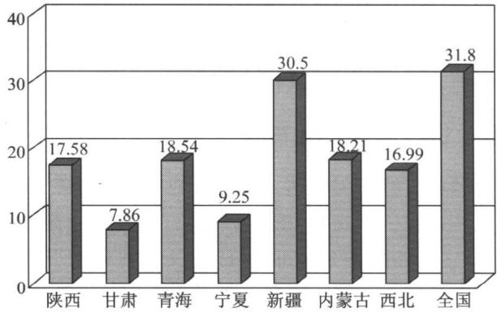  
图2-1 西北地区各省区矿业集约化指数

西北地区矿床多为共生、伴生组分矿床，小企业因经济技术和资金限制，无力也无心引进新技术和先进设备，多数伴生矿几乎未利用或利用率不足10%，造成了宝贵资源严重的浪费。部分国有矿山也存在这方面的问题，如陕西金堆城钼矿中伴生的稀有金属铼为一中型伴生矿产矿床，目前尚未利用，在冶炼废气中排放掉，在造成资源浪费的同时还导致了大气环境污染。

## 2.3.2 矿山科技水平及“三率”指数有待提高

矿山企业的采矿回采率、采矿贫化率和选矿回收率等“三率”指标直接反映了矿山企业矿产资源的利用水平。目前我国矿山“三率”水平普遍较低，9种主要有色金属的采矿回采率平均为53%，选矿回收率为62.5%，采选总回收率为33%，采选冶总回收率约为30%，远低于前苏联采选冶总回收率70%的水平，导致矿产资源的大量浪费。

截至2000年底，在西北地区14963个矿山企业中，小型企业约占总数的98%，小型矿山已成为矿产资源开发中的主力军之一。但是，由于小矿山开采的技术含量低，开采工艺落后，技术人才贫乏，高级人才基本没有，其“三率”水平低于大中型企业。如宁夏回族自治区，其集体和个体小矿占全区矿山总数的98.9%，生产设备、采掘工艺落后，管理水平低，生产效率低。陕北的石油开采，长庆油田总采油率可达30%，而县钻采公司及个体只能达到8%，由于单位面积内矿井分属不同采矿权人或由于技术原因，目前均未采用二次注水采油，资源浪费严重。

## 2.3.3 缺乏区域规划及合理布局，矿业开发秩序混乱

西北地区许多重要矿产资源开发区布局不合理问题严重，导致国有大中矿山与地方或乡镇个体的小型矿山处于同一矿区或矿段开采，人为地分割了矿体的自然完整性，互抢资源现象普遍，结果导致部分资源无法采出。如陕西潼关金矿区、凤县铅硐山铅锌矿区、甘肃厂坝铅锌矿区均存在上述现象。

因矿山管理部门多目职能交叉，造成监管重复或监管不到位，地方矿业秩序混乱，非法开采、越界开采屡禁不止，造成资源破坏，地质灾害频发，经济损失巨大。如陕西黄陵县店头镇的泪水河两岸共分布小煤窑25个，各小煤窑相距太近，布局不合理，而且小煤窑在井下相互贯通。在苍村一号斜井西采区小煤窑非法越界开采，导致黄陵一号煤矿1999年3月24日发生透水事故，造成直接经济损失3401万元，间接损失3100万元。又如甘肃成县厂坝铅锌矿区自1986年以来，由于群采滥挖、乱采现象十分严重，1989年后小矿掠夺式蚕食国有厂坝矿深部矿体，据不完全统计，整个厂坝矿区先后非法开采的矿硐达数百个之多．导致厂坝一、二期露天采坑多次发生塌陷等人为地质灾害，生产多次停顿，造成厂坝露天二期工程投产后无矿可采的局面，使国家二期投资的5.4亿元付诸东流，经济损失巨大。

## 2.3.4 资源储备不足，后备资源短缺

新中国成立50多年来，地质找矿工作成效显著，一大批矿业基地的勘探开发为我国的经济建设做出了巨大贡献。但是，几十年的资源消耗，使一大批大型矿业基地后备资源不足或面临枯竭，形势十分严峻，如甘肃白银公司铜矿、陕西潼关金矿浅部资源近于枯竭，关系到矿业城市的经济发展、矿山企业的生存与发展以及职工安置等社会稳定的大事。如何保证矿山企业后备资源接替是矿山和地区经济可持续发展的重要保证。西北地区许多矿山的探明储量大部已消耗，保有储量明显下降，加之资源的利用率低，共生伴生组分的回收利用程度低，造成许多有用组分流失，进一步加剧了矿产资源供不应求的局面，加大了矿产资源的快消耗。因此，亟待加强地质找矿的基础性地质工作，力争铜矿、铁矿、铅锌矿等一些关系到国家矿业安全、经济发展的大中型矿种的储量有重大突破，提供矿业开发的后备资源。

## 3 西北地区矿山环境地质问题

## 3.1 矿山环境地质研究现状

## 3.1.1 矿山环境地质学沿革

在科学技术飞速发展的今天，人类大规模、高强度的矿产资源开发活动，已经成为矿山最活跃、最显著的地质作用，是矿山地质环境加剧变化的“催化剂”，愈来愈显著地影响着矿区地质环境，这种影响一日超出了矿区地质环境容量，就会引发突发性地质灾害，产生累积性的重金属污染等问题，从而破坏人-地和谐关系，危及人类自身的生存与发展。为了实现人类社会经济的全面、协调、可持续的发展，迫切要求在合理开发利用矿产资源的同时，保护好矿山地质环境，促进矿业健康发展，这就催生了一门专门以研究矿山地质环境为主要内容的交叉学科—矿山环境地质学。

现代科学的发展趋势是依据其研究对象与内容的不同，向高度分化或高度集中两个方面前进。矿山环境地质学是环境地质学的一个分支，又是一个集多学科理论与方法而成的一门以研究矿山地质环境为主要内容的新兴学科。1980年第26届国际地质大会上提出的环境地质问题宣言，标志着环境地质学的兴起。20多年来环境地质学得到了迅速发展，由于其广泛的研究领域，从而形成了许多分支学科。王思敬（1995）认为初具轮廓或正在发展中的分支学科，主要有环境水文地质学、环境地球化学、灾害地质学、城市环境地质学、矿山环境地质学等，以上分支学科，虽然研究内容部分交叉，但都能自成体系，具有各自的独立性。刘传正在其《环境工程地质学导论》（1995）中提出了矿区环境（工程）地质的概念。张永波在《水工环研究的现状与趋势》（2001）一书中指出矿山环境地质是介于矿山地质学与环境学之间的边缘学科，主要研究在矿山开采过程中，自然地质作用、人为地质作用与地质环境之间的相互影响与作用，以及由此产生的环境污染与破坏问题，从而达到合理开发利用矿产资源和保护地质环境的目的。刘起霞在《环境工程地质》一书中指出，矿山环境工程地质学就是研究矿山地质作用导致的有害或灾害地质现象的形成机制、规律和内容，对其发展趋势、危害程度进行预测研究，提出对策，以达到科学合理地利用和保护矿山地质环境的目的。刘广润院士在环境地质学与其他学科的关系图中(2003)，确认了矿山环境地质学已经成为一门独立的学科。由此可见，无论矿山环境地质（学），还是矿山环境工程地质学，都应属新兴的边缘学科，研究对象和内容是矿区人为地质作用或称矿山地质作用对矿山地质环境的影响，目的在于合理开发利用矿产资源的同时，保护矿山地质环境。

## 3.1.2 矿山环境地质发展现状

日益加剧的矿山环境地质问题愈来愈受到社会的关注和政府的高度重视。自2000年开始，国土资源部中国地质调查局组织并相继开展了一系列矿山地质环境调查与评估工作，如“晋陕蒙能源基地（陕北地区）矿山环境地质调查”（中煤水文地质局，2000\~2002)、“山西省重点矿区生态环境地质调查”（山西地质调查院，2000\~2002)，“江西省重点矿区矿山环境地质调查”（江西省地质环境监测站，2000\~2002)，“西北地区不同类型矿产开发环境地质研究”（西安地质矿产研究所，2001\~2002）和正在实施的“全国矿山地质环境调查与评估”（中国地质环境监测院，2002\~2007)、“重点矿区环境地质问题专题调查”（西安地质矿产研究所等，2004\~2006)，“全国不同类型矿产开发环境地质研究”（西安地质矿产研究所，2004\~2007），西南、东北、华北、华东、中南等不同类型矿产开发环境地质研究（2004\~2005），以及31个省市的矿山地质环境调查与评估工作(2003\~2005)。与此同时，国土资源部地质环境司2002年编写了《矿山地质环境调查技术要求》（讨论稿）、《矿山地质环境影响评价技术要求》（讨论稿），中国地质环境监测院2002年编写了《全国矿山地质环境调查技术要求实施细则》、《全国矿山地质环境数据库建设》，以及由西安地质矿产研究所2003年完成的《典型矿山地质环境调查方法研究》和《大型矿山地质环境调查与监测技术要求》。

2003年11月，由国土资源部地质环境司、中国地质调查局、西安地质矿产研究所等单位发起并举办了“首届全国矿山环境保护研讨会”，出版了我国首部以矿山环境地质为主题的论文专辑《西北地质（2003年增刊)》。据不完全统计，自1994年以来，国内各种刊物上发表的有关矿山环境方面的论文有200余篇，涉及矿山环境地质理论、方法、分类、调查、评价、图件编制、信息系统建设、矿山地质环境管理、法规建设、恢复与重建等多方面内容。随着矿山地质环境调查和环境地质研究项目的逐步推进和全面展开，随着新建、扩建矿山项目对矿山地质环境影响评价制度的实施，以及调查研究成果的不断积累，矿山环境地质学的理论建设正在逐步丰富和发展。

## 3.1.3 需要加强研究的主要内容

矿山环境地质（学）是环境地质学中的一门新的应用学科分支，至今尚未形成比较完整的理论体系和系统的调查、评价和研究方法。其研究内容，涉及到地质学、采矿学、水文学、环境学、农业地质、环境地球化学、环境科学、地质灾害学等多学科，因而具有边缘性和学科交叉性特征。因此，在学科发展中应充分了解相关学科的发展，借鉴各学科理论方法，不断完善学科的理论体系和工作方法，以便科学地推进矿山地质环境保护工作。目前亟待加强以下几个方面的工作：

(1）矿产资源开发诱发、产生和加剧的矿山环境地质问题类型、分布、诱发机制和控制因素。由于不同类型矿产资源以不同的开发方式在不同的地质环境分区产生的问题具有差异性，因此建立矿山环境地质问题的模型对于矿山地质环境防治具有重要意义。

(2)矿山地质环境质量或矿山环境地质问题综合评价指标体系和方法研究。调查研究的结果必然要对矿山地质环境质量优劣或矿山环境地质问题严重程度给出等级评定，等级评定是矿山地质环境成果图件编制的基础，是政府实施矿山地质环境监管、制定矿山地质环境防治规划的前提，因而矿山地质环境质量评价在矿山环境地质研究中具有重要的地位。评价系统最为关键的是制定科学合理的评价指标体系。

(3)矿山环境地质问题预测方法。矿山地质环境是一个动态变化系统，研究保护矿山地质环境就必须掌握其发展变化规律，做出科学的预测，采取有效措施避免和减轻矿山开发对环境的负面影响。开展矿山环境地质问题形成机理的研究，建立其模型，有助于提高矿山地质环境动态变化的预测。

(4)矿山环境地质编图理论与方法研究。重点是环境地质图系的内容，图层结构、图式图例及嵌表形式等，以及计算机自动成图等。

(5)矿山地质环境信息系统建设。建立查询、可视化等功能，完善矿山地质环境信息系统平台，发挥信息资源共享的最大功效。

(6)矿山地质环境保护的法规政策研究。矿业活动是人类的经济活动，矿山环境的好坏受国家法律、产业政策影响较大，因而在加大矿山地质环境保护的理论技术研究的同时，应加强法律、法规政策研究，依法行政保证矿山地质环境步入法制化轨道。当前最为重要的是尽快建立“矿山地质环境影响评价制度”、“矿山地质环境恢复保证金制度”等。

(7)矿山土地复垦技术及工程。这是矿山地质环境保护的主要内容之一。

## 3.2 矿山地质环境与环境地质

## 3.2.1 矿山地质环境

## 3.2.1.1 矿山地质环境 (mine geological environment)

矿山地质环境是指曾经开采、正在开采或准备开采的矿山及其邻近地区的岩石圈表层与大气圈、水圈、生物圈组分之间不断进行物质交换和能量流动的一个相对独立的环境系统。这个系统以岩石圈为依托，以矿产资源开发为主导，不断改变着地球表面岩石圈自然环境平衡中的地质环境。

在矿山建设与采选过程中，矿业开发的人为作用对矿山地质环境施加的直接和间接的作用力总称，亦称矿山地质作用，是影响矿山地质环境的重要因素。一旦矿山地质作用超过地质环境的质量和容量时，就会对矿山地质环境产生不利影响，严重者，甚至会引发严重的地质灾害和水土环境污染事件。

## 3.2.1.2 矿山地质环境质量

矿山地质环境是由地质环境质量和地质环境容量构成的。良好的矿山地质环境质量有利干矿产开发活动：反之，则不利于矿业开发，为了避免不良地质环境对矿产资源开发产生的负面影响，就必须事先采取有针对性的防治措施。如在山地地区，自然因素极易引发崩塌、滑坡等地质灾害，因而，矿山建设及生产过程中就必须加强对原生地质灾害的防治工作。同时，采取有关措施，避免加剧、诱发上述灾害的发生与发展。可见，不良的地质环境质量会影响矿山正常生产，从而加大矿业开发成本。

## 3.2.1.3 矿山地质环境容量

矿山地质环境容量是指矿业活动中安全开发强度、矿区承纳“三废”的能力，以及矿区地应力和地质结构状态自然平衡的最大值。因此，地质环境容量应从以下几个方面进行评价：

(1）如果矿产资源开发导致地质环境质量开始发生变异，甚至危及人类的生存和发展，则此时的开发强度或开发量临界值即为矿山地质环境容量。

(2)矿山地质环境具有“自净”功能，土壤、岩石、水、气体和生物体等对有害物质有吸附、迁移和转化功能，从而消减其危害性。“自净”能力有一定限度，即环境对各种有害废弃物的容纳能力有一定限度，超过这个阈值就会导致矿山地质环境的组成物质发生变异，从而导致环境污染，对人居生态环境安全构成危害。

（3）在矿产开发过程中，人施加给矿山地质环境的直接或间接作用，从总体上破坏了地应力的自然平衡，致使矿山地质结构与状态发生变化。一旦地应力失衡，就会导致矿山地质结构与状态的改变，当其超过临界值时，就会发生地质灾害，这个临界值就是地应力和矿山地质结构与状态的地质环境容量。如地下开采活动超过结构与状态环境容量，将引起地面塌陷、山体失稳、山体开裂，形成诸如崩塌、滑坡等地质灾害。因此，开发矿产资源时，应结合矿床地质结构、岩体应力状态，研究确定地应力和地质结构状态变化的临界值，尽可能控制人为地质作用对矿山地质环境的影响不超过其矿山地质环境容量，从而保护矿区的地质环境。因此，矿山地质环境容量是矿山地质环境系统中所具有的一种件质，或者说它也是一种资源，利用其自然“净化”能力和不超过临界值的应力变化，排放限量的污染物和改变有限的地应力场，不会造成环境污染和地质灾害。

## 3.2.2 矿山环境地质

矿山环境地质（mine environmental geology）是以矿山地质环境为主要研究对象的新兴

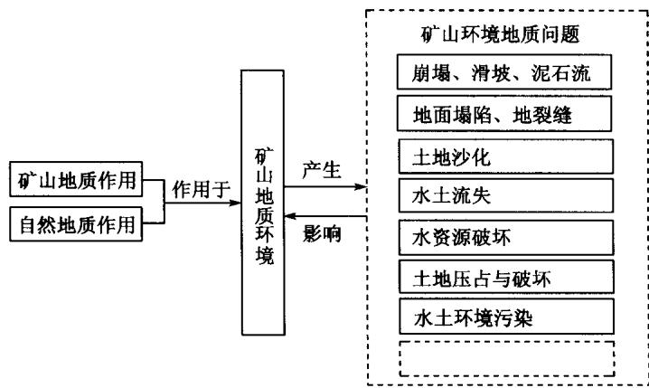  
图3-1 地质作用与地质环境和矿山环境地质问题关系图

交叉学科（图3-1）。主要研究内容是运用环境地质学的有关理论、方法，研究矿产资源开发过程中，自然地质作用和人为地质作用与地质环境之间的相互影响与制约关系，以及由此产生、引发和加剧的矿山环境地质问题，旨在合理开发利用矿产资源的同时，采取积极措施，保护、减轻和减少矿业活动对地质环境的负面影响，促进矿业可持续发展。

矿山环境地质研究的主要对象是人类赖以生存与发展的局部地质环境，即矿业活动场所及周边地质环境。矿山地质环境随矿业活动的时间、强度而变化，是一个复杂的、动态的变化系统。良好的地质环境有利于矿业的正常生产，脆弱的或恶化的地质环境必将影响和制约矿山的正常生产。因此，矿山环境地质（学）研究内容应包括两个方面：

(1）研究矿山原生地质环境质量和容量，预测评价原生地质环境对矿山建设、开采的负面影响，指导矿山建设选址布局，尽量不花或少花代价来避开具有明显地质灾害的隐患点，保证矿业正常生产。

(2)研究矿产资源开发活动过程及矿山闭坑后对地质环境的负面影响，研究矿山环境地质问题的形成条件、诱发因素、形成机制，开展矿山地质环境质量或环境地质问题评价，预测矿区环境地质问题的危害程度，控制、预防矿山环境地质问题的发生与发展，保护矿区地质环境，减轻矿业环境地质问题的危害程度，促进矿业的可持续发展。

## 3.2.3 矿山环境地质问题

## 3.2.3.1 矿山环境地质问题

矿产资源开发过程中，与地质环境进行着物质和能量交换与转移的矿业活动，是影响矿山地质环境变化的主要因素，矿业活动对地质环境的影响具有长期而复杂的影响，其后果有的非常严重。影响方式可以是物理的或化学的、直接的或间接的、长期的或短期的、急剧的或缓慢的。主要的形式有环境污染、地质灾害和生态环境破坏等。同时，矿产资源的开发利用活动还直接影响着社会经济的发展。

矿山环境地质问题是在矿业活动中直接产生、引发或加剧的环境地质问题，是矿业活动对地质环境的影响超过了矿山地质环境容量而出现的地质灾害，是对矿业正常生产和人居生态环境构成威胁的地质现象，是矿区自然地质作用和人类矿业活动地质作用的共同结果。

随着人类社会经济的发展，开发利用矿产资源的规模和强度不断加大，因而矿业活动对地质环境的影响在时间和空间上将日趋显著。矿业开发不可避免要对矿山地质坏境产生或轻或重的负面影响，科学规划、合理开发矿产资源在促进地区经济发展的同时，也应重视对矿区生态环境的影响。粗放式管理，掠夺式开采是一种短期行为，虽暂时获得了一定经济效益，但诱发和加剧的矿山环境地质问题必然会阻碍矿山正常生产活动，加剧人居生态环境的恶化，最终危及人类自身生存与发展。

矿业活动引发的环境地质问题是多方面的（图3-2）。矿山建设工业场地、坑道掘进采掘矿石、露天矿表土剥离、弃土排渣等改变了矿区原有的地形地貌景观，破坏地质遗迹，压占了土地植被，加剧了水土流失和水资源衰减。同时，矿区采掘活动强烈地改变了原有的地应力平衡，从而诱发地面塌陷、地裂缝、滑坡、崩塌、泥石流等地质灾害。矿山“三废”中有毒有害物质未达标排放，或随意排放，污染河湖、农田、农作物和植被等，进而通过食物链危及矿区及其影响区居民及下一代的健康安全。

矿山的采矿、选矿和矿石冶炼等每一种矿业活动均会导致不同的矿山环境地质问题(图3-2)。而某一矿山环境地质问题往往又是多种矿业活动叠加和累积作用的结果。如土地资源的压占与破坏可以是采矿废渣、选矿尾矿、冶炼废渣的占压，还可能是露天开采剥离导致的农田被毁，或因滑坡、泥石流、地面塌陷、地裂缝、水土流失、土地沙化等造成土地功能改变与土地质量的下降。

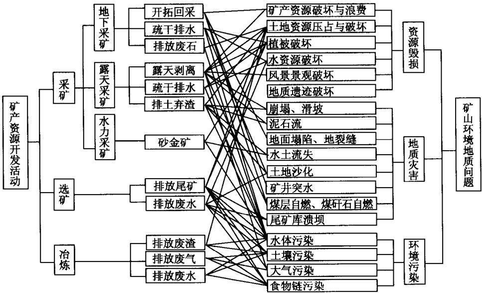  
图3-2 矿业活动方式与矿山环境地质问题关系图

## 3.2.3.2 矿山环境地质问题特点

人为地质作用和自然地质作用叠加在矿区地质环境上，就会产生、诱发和加剧矿山环境地质问题。矿山环境地质问题与一般的环境地质问题最突出的区别在于采矿活动是环境地质问题产生的主导作用和激发因素，其范围主要限于采矿区、加工区及其附近影响区，不但具有一般环境地质问题特性，而且有其自身的特点。

(1）类型的多样性：矿山环境地质问题类型众多，表现形式多样，如既有自然因素及人类其他经济活动产生的崩塌、滑坡、泥石流等地质灾害，也有矿山特有的地质灾害类型，如地面塌陷、地裂缝、尾矿库溃坝等；另外还包括了矿山水、土、大气环境污染。

(2）复杂性、多因性和复发性：矿山环境地质问题的类型、表现形式、分布、严重程度等，不但与矿区地形地貌、地层构造、水文气象、植被等地质环境背景有关，而且与矿产工业类型、开发方式等经济活动特征等密切相关。某一类矿山环境地质问题往往是米矿、选矿其至冶炼的多种活动过程共同作用的结果，其诱发因素众多。某些环境地质问题还具有多次原地重复产生的特点，如地下急倾斜煤层不同水平采矿会导致地表反复发生塌陷等。

(3)分布的地域性：矿山环境地质问题的类型、严重程度与矿山所处的自然地理环境密切相关。不同的自然地理环境区往往是某些环境地质问题频发区，即在该区内的矿业开发会加剧这些环境地质问题的发生和发展，因而，这类矿区环境地质问题的危害性就更大，其地域性特点十分明显。如山地地区是滑坡、崩塌、泥石流、水土流失的主要发生地，矿山开发必然会加重上述环境地质问题频发与危害程度，除此以外，还会产生尾矿库溃坝和河流污染等矿山特有的环境地质问题。土地沙化主要发生在干旱极干旱的地区，如西北的戈壁沙漠区。而矿山地面塌陷、地裂缝主要发生在地下煤矿开采区，东部平原煤矿塌陷区则易形成积水区，破坏农田或造成地表建筑物破坏。陕北毛乌素沙地煤矿塌陷区易造成浅层地下水含水层破坏，植被枯死，加剧土地沙化。陕西渭北黄土沟壑边部或低山丘陵区煤矿塌陷区易诱发山体开裂，链生崩塌、滑坡地质灾害。

(4）危害的集中性与严重性：由于矿山环境地质问题主要是矿业开发直接产生、诱发和加剧的结果，因此，矿山环境地质问题主要发生于矿山生产现场以及其影响到的地区，范围有限，直接威胁采矿作业现场生产、工矿设施和周边居民的生命财产安全。矿山环境地质问题不仅造成直接和间接的经济损失，而且破坏人居生态环境，重大地质灾害和环境公害往往造成严重的社会后果。即使在矿山闭坑后相当长的时间内，仍会对矿区及其周边地区的环境产生不利影响。矿山环境污染危害人体健康的滞后性和累积性影响当代人甚至后代的健康安全。具有危害严重、影响持久的特点，以至于矿山闭坑后相当长的时期内影响仍存在。

(5）群发性与共生性：矿山环境地质问题往往不是孤立发生和存在的，而是存在着矿山环境地质问题链。前一种矿山环境地质问题的结果常常是后一种矿山环境地质问题的诱发因素。如地下采矿采空区诱发的地面塌陷、地裂缝等往往导致地表河流水沿裂隙下灌引发矿井突水以及土地的完整性和利用功能的退化，或导致山体开裂诱发崩塌、滑坡等地质灾害。由于诱发条件类似，某几种矿山环境地质问题往往同时发生呈现共生特点，如崩塌、滑坡和泥石流往往共生，地面塌陷和地裂缝往往共生。

(6)防治的迫切性：无论原生地质环境还是矿山开采过程中变化的地质环境对矿山正常生产都有着明显的制约关系。矿山环境地质问题影响范围往往超越其采矿及加工区，环境污染往往随水流而影响流经的流域。严重的矿山环境地质问题恶化了矿山地质环境，直接危害矿山正常生产生活，给地区社会经济发展造成了广泛而深刻的负面影响，频发的地质灾害摧毁了工矿设施、造成了人员伤亡，长期严重的环境污染诱发致癌、致畸性和致病变，严重危害居民的健康，由此引发了矿地纠纷，经济索赔及其他严重的社会问题，从而阻碍了矿山的正常生产和地区的可持续发展。因此，减轻矿业开发带来的负面影响是矿山地质环境保护刻不容缓的任务。

(7）法规政策的调控性：矿山地质环境质量好坏受国家法律政策的影响明显，即有很高的可调控性。矿产资源开发不可避免会对地质环境造成负面影响，只要有法可依、依法监管到位，矿业活动对地质环境的负面影响程度就会大大降低，这已为国内外众多事实证明。

## 3.3 矿山环境地质问题分类

科学分类是每一个学科发展中的前沿课题，它标志着学科发展的水平和力度。分类的原则不同，研究的侧重点不同，就有不同的分类方案和分类系统，分类原则是便于矿山地质环境调查、评价和采取相应的防治对策。科学性是分类的前提，实用性是分类的灵魂，客观、实用是分类的基础。以下从多个方面对矿山环境地质问题进行分类。

## 3.3.1 按矿山环境地质问题导致的结果分类

以矿业活动导致的环境地质问题结果作为分类的主要原则，从公益性、基础性矿山地质环境调查与保护的目的出发，将其分为资源毁损、地质灾害和环境污染三大类型及众多的表现形式（表3-1）。

表3-1 矿山环境地质问题类型划分
<table><tr><td rowspan=1 colspan=1>类型划分</td><td rowspan=1 colspan=1>主要表现形式</td></tr><tr><td rowspan=1 colspan=1>资源毁损</td><td rowspan=1 colspan=1>矿产资源破坏与浪费、土地与植被压占与破坏、疏干排水破坏地下水均衡系统及地表水水量减少、地质遗迹破坏、地形地貌改观、人文景观破坏等</td></tr><tr><td rowspan=1 colspan=1>地质灾害</td><td rowspan=1 colspan=1>崩塌、滑坡、泥石流、地面塌陷、地裂缝、水土流失、土地沙化、尾矿库溃坝等</td></tr><tr><td rowspan=1 colspan=1>环境污染</td><td rowspan=1 colspan=1>“三废”污染排放造成地表水污染、地下水污染、土壤污染、大气污染等</td></tr></table>

矿山资源毁损、地质灾害和环境污染等环境地质问题在矿山开发的时间上、空间上具有重叠性、穿插性，部分矿山环境地质问题互为因果关系。不同类型矿产以不同开采方式开采，采用的选冶技术及工艺设备等不同，导致的矿山主要环境地质问题表现形式也不同。以一类或两类环境地质问题为主，当三种类型环境地质问题同时出现重叠时无疑会加重矿山环境地质问题的严重程度。就是说，单一的矿山环境地质问题对环境也许不至于造成严重的影响，但是多种环境地质问题交织叠加，将会产生破坏性的后果。

## 3.3.1.1 资源毁损

矿山资源毁损包括矿产资源破坏与浪费、土地资源压占与破坏和水资源浪费与破坏。

(1）矿产资源破坏与浪费：矿产资源的有限性和不可再生性特点决定了矿产资源要合理开发、充分利用，但是由于各种原因，矿产资源的破坏与浪费现象十分严重，尤其是部分民采矿区资源破坏性开采令人触目惊心。主要表现为乱采滥挖、采富弃贫、采厚弃薄。由于采矿技术、工艺设备落后，矿山企业一味追求短期暴富，导致矿山采矿回采率低，共生、伴生组分未利用或利用率低等造成矿产资源浪费严重。全国国有煤矿平均回采率为40%\~50%，地方矿为30%\~40%。主要有色金属采选总回收率仅为35%\~50%，铁矿采选总回收率为65%，建材非金属矿的采选回收率大多低于60%，而乡镇、集体和个体采矿的回收率更低。我国矿产资源综合开发利用水平与国外发达国家相比，存在不小差距。对全国246个含有伴生和共生组分的大中型矿山企业的调查发现，有32.1%的矿山开展伴生或共生有益组分综合回收利用，但是即使是做了综合回收的矿山，综合利用程度也是比较低的。

(2)土地资源压占与破坏：坑道掘进、采矿废石、选矿尾渣、冶炼废渣等，长期堆放压占耕地、林地、草地，数量巨大，造成了土地数量减少，加剧了用地紧张状况，导致矿山企业与农民纠纷不断。露天剥离、地下采矿及煤层自燃诱发的地面塌陷、地裂缝以及滑坡、泥石流等破坏了土地的完整性。废渣风化及干旱地区尾矿沙随风扬尘成为新的沙尘发源地，导致土地沙化，恶化了土地利用现状，降低了土地的生产力。

(3)水资源浪费与破坏：矿山采矿要排出坑道积水，以防矿坑积水影响正常采矿和危及人身安全。高强度的矿山疏干排水及矿井突水会造成矿区地下水位下降，地表河流流量减少，甚至断流。陕西、甘肃、宁夏、青海、新疆五省区国土面积约占全国面积的1/3，而水资源总量仅为全国的10%。更为不利的是水资源分布与矿产资源分布不匹配，加大了矿产资源开发难度和成本。如新疆塔里木油田、吐哈油田，甘肃金川铜镍矿、白银铜矿，青海察尔汉钾盐，鄂尔多斯盆地综合矿物能源和化工基地等重要矿产资源开发区均是严重缺水的干旱地区。疏干排水一方面造成了宝贵的水资源的浪费，另一方面加剧了矿山用水危机。

## 3.3.1.2 地质灾害

地质灾害包括崩塌、滑坡、泥石流、地面塌陷、地裂缝、水土流失、土地沙化和尾矿库溃坝等。

随着科学技术的进步，人类矿业开发的强度和规模愈来愈大，高强度、大规模机械化的采矿活动作用于矿山地质环境的强度远远超过了自然地质作用，强烈地改变和破坏了矿区原有的地应力平衡系统，使得地应力在重新调整过程中产生了多种次生地质灾害，如崩塌、滑坡、泥石流、地面塌陷、地裂缝、水土流失、土地沙化和尾矿库溃坝等。矿区地质灾害具有突发性、多发性、群发性、危害性集中的特点。尤以突发性地质灾害危害性最大，往往造成重大人员伤亡和经济损失，社会影响巨大。

## 3.3.1.2.1 崩塌、滑坡、泥石流

崩塌是斜坡上的岩体在重力作用下突然脱离母体崩落、滚动，堆积在坡脚或沟谷的地质现象。崩塌一般发生在暴雨、大暴雨或持续降雨时间较长过程中或稍后。崩塌是山地矿山常见的一种突发性地质灾害。采矿造成的高陡边坡，形成的悬空危岩体，采空塌陷形成的山体开裂等，在“崩落法”采矿、暴雨及矿山排水不当的情况下易引发崩塌。

滑坡是斜坡上的岩土体被各种构造面切割分离成不连续状态时，或露天矿山的高陡边坡失稳，或堆积在斜坡体上的采矿废渣因地面塌陷、地裂缝、暴雨等因素诱发，在重力作用下沿一定的软弱面整体向下滑动形成的。滑坡是山地矿山和露天采矿场最常见的地质灾害类型之一。

泥石流是山区特有的地质灾害类型之一，是地质、地貌、气象、水文、植被等自然因素和人为因素综合的结果。其暴发突然、来势凶猛、冲击力强、冲淤变幅大、主流摆动速度快，以冲刷、冲击、淤埋等方式表现出巨大的危害性。其形成有3个基本条件：①丰富的松散物源是泥石流形成的物质基础；②高陡的纵坡降比为泥石流形成提供了动力条件；③暴雨、水库或尾矿库溃决是泥石流形成的激发因素。

矿山松散的采矿废渣堆放在陡峻的便于集水、集物的峡谷沟坡上，在暴雨、尾矿库溃坝、水库溃坝等条件诱发下，形成含有大量泥沙石块的特殊洪流——矿渣型泥石流。泥石流形成有三个条件：一是有利于储存、运移和淤积的山地峡谷地形地貌；二是具有大量松散废渣物质的来源；三是具有强劲的水动力诱发因素。山地矿山是泥石流的高发区，多发生在夏季7\~9月暴雨期间。具有暴发突然、运动极快、能量极大、破坏力巨大、致灾严重的特点，往往造成矿山工矿设施被毁、生产中断和人身伤亡的重大地质灾害，而且还会对矿山以外的居民、公路、铁路、水利、水电工程等造成巨大破坏。

## 3.3.1.2.2 地面塌陷、地裂缝

地下矿体被采出后，形成了巨大的采空区，导致周围岩体原始应力平衡状态发生破坏，在应力重新调整到新的平衡过程中，上覆岩土层在时间和空间上发生移动、变形，形成塌陷盆地、漏斗状塌陷坑和台阶状断裂。在平原和地凹地区的地面塌陷会造成地表大面积积水，农田被淹。由于塌陷，地表潜水位相对提高，一般而论，当地下水位上升到离地表1m时，土壤毛细管作用就可将地下水提升到地面。在干旱地区或干旱季节，地下水上升将土壤里的钙、钠、镁等盐分带到地表，待水分蒸发后，盐类就在地表聚集，形成盐渍化土地，造成土地退化，影响农作物生长。山地、丘陵地区则诱发山体开裂、崩塌、滑坡等其他地质灾害。

## 3.3.1.2.3 水土流失

水土流失又称土壤侵蚀，是一种渐进型的地质灾害，其形成与地形地貌、植被、降雨等因素密切有关。水土流失造成土地肥力降低、生产力下降，环境恶化。水土流失导致的土壤侵蚀是西北地区生态环境恶化的重要因素之一。

## 3.3.1.2.4 土地沙化

是在沙质地表产生的土壤风蚀、风沙沉积、沙丘前移及粉尘吹扬等过程的现象。土地沙化导致土地退化，农作物产量降低及生态环境恶化。

## 3.3.1.2.5 尾矿库溃坝

尾矿就是选矿厂在现有经济技术条件下，回收有用组分后，对于目前难以回收利用的矿石矿物组分，以尾矿浆形式排放于尾矿库中，其中含有对环境有害的重金属元素、选矿药剂等有毒有害物质，具有粒度细、数量大的特点。因选矿技术、生产工艺设备等制约，往往造成有用组分的损失，也是金属矿区环境污染的重要污染源。是尾矿坝裂缝、尾矿渗漏、山体滑坡以及尾矿库超期服役等导致尾矿库坝基发生滑动、坍塌和溃坝，造成尾矿砂淹没农田、堵塞交通、污染河流以及造成人员伤亡的地质灾害。

## 3.3.1.3 环境污染

包括水污染、土壤污染。矿业开发采、选、冶生产过程中的矿坑废水、选矿尾矿浆、采矿粉尘、煤矿排放的瓦斯、煤层自燃及煤矸石自燃的有害气体、矿石冶炼烟尘废气、废渣中重金属以及酸性废石等是矿山环境污染的主要污染源。其主要污染物质有重金属汞、铅、砷、铬、镉等以及氰化物、石油类、粉尘、二氧化硫及酸性废水，未达标排放，或直排、偷排等都会造成地表水、地下水、土壤、植被、谷物、蔬菜、果品、水产品等污染。另外，某些矿山矿石中放射性物质会造成放射性污染。

(1）水污染：废水、废渣、废气等“三废”中有毒有害物质大量进入水体，超过了水体的自净化能力，导致其化学、物理、生物性质的改变，造成水质恶化，影响了水的功能和效用，危害人体健康，破坏生态平衡。矿坑废水、选矿废水未经达标处理，随意排放，有毒有害物质渗入地下、进入河流湖泊，导致水体污染，水质恶化，不能饮用、灌溉，直接或间接威胁矿区及其附近居民的生活健康。

(2)土壤污染：矿山排放的废水、废气和废渣中的有害物质进入土壤，超过了土壤的自净化能力，影响农作物的生长发育，或其中有害物质超标排放直接或间接危害人畜健康，称之为土壤污染。土壤污染的主要途径有三类：一是气型污染，即采矿粉尘、选冶排放的烟尘、废气首先污染大气，然后降至地表而污染土壤；二是水型污染，即矿坑水、选矿废水、冶炼废水排放后，通过河流或农田灌溉而造成土壤农田污染，重金属镉、铬、铅、锌等污染物多集中分布于浅层耕作层；三是废渣污染，即采矿、选矿废渣等中的水溶性有毒物质，如镉、汞、铬、砷等被雨水冲淋而渗入土壤造成污染。

## 3.3.2 按矿产资源的工业类型分类

不同的工业类型矿产开采中产生的环境地质问题既有其共性的一面，也有相异的一面，据此，可按矿产资源工业类型划分出以下7种类型：油气类、煤炭类、金属矿产类、灰岩类、卤水盐矿类、石材类、磷硫化工类等。

## 3.3.3 按开采加工方式分类

矿床规模、赋存状态、地质环境条件决定着其开采加工方式，不同的采矿方式造成的矿山环境地质问题具有差异性。例如地下采矿会导致地面塌陷、地裂缝，诱发山体开裂发生崩塌、滑坡等地质灾害。露天开采剥离矿体上方的土石覆盖层、大量的外排土，占用土地，破坏植被，原有的土地功能丧失，凹陷的露天采场以及新增的废石堆改变了原有地貌形态。废石场风化扬尘导致矿区附近土地沙化和大气污染。疏干排水可造成地下水位下降，高陡边坡可造成滑坡频发，严重者可导致露天矿提前关闭等重大经济损失。因而，依据开采方式的不同将矿区环境地质问题分为露天开采型、地下开采型及水力开采型（砂金）三种类型。

## 3.3.4 按矿山所处区域地质环境背景条件分类

特定的地质环境条件往往影响着矿山环境地质问题类型、发生频度以及问题的危害程度，也影响着矿山生态地质环境重建对策措施。如山地地区由于地形切割较深，导致自然条件下崩塌、滑坡、泥石流等地质灾害频繁，因此，该区内采矿造成的地下采空区引发的山体开裂、地裂缝、高陡临空面、废石堆积在不稳定的高陡斜坡体上，在缺乏有效工程技术防护措施的情况下，强降雨加剧了矿区崩塌、滑坡、泥石流、尾矿库溃坝等次生地质灾害的发生。可见，矿山所在地质环境背景条件控制着矿山环境地质问题类型、频发程度和危害程度。依据矿山开发环境地质问题与所处的地质环境关系，可将西北地区分为秦岭山地型、黄土高原型、戈壁沙漠型以及其他山地型等矿山环境地质问题类型。

## 3.3.5 按矿山地质环境可恢复程度分类

矿业开发导致的环境地质问题有的是可以恢复的，如矿山固体废弃物对土地的压占、露天采矿场对土地的破坏、井下采矿诱发的地面塌陷等可通过矿山生态环境重建复垦被压占、破坏的土地，恢复土地使用价值；也有无法恢复治理的环境地质问题，如滑坡、泥石流地质灾害是无法恢复的。因此，可将矿山环境地质问题分为可恢复型的矿山环境地质问题以及不可或难以恢复治理的矿山环境地质问题。

## 3.3.6 按矿山地质环境调查评价的时间段分类

在矿山地质环境调查评价中，往往需要按照一定标准人为设定时间段，将矿山环境地质问题划分为历史环境地质问题、矿山环境地质问题现状和潜在矿山环境地质问题。这是因为人们重点关注的是矿山环境地质问题的现状以及潜在的、致灾严重的矿山环境地质问题，为矿山地质环境治理和预防提供科学依据。历史上发生的环境地质问题，如某矿山曾发生对当时的矿山生产有极其严重影响的泥石流灾害，但是，随着时间的流逝其对今天的矿山生产和矿区地质环境几乎没有危害，仅成为预测今后矿区环境地质问题的一个参考因素。因此，按照调查评价的时间依据，将矿山环境地质问题划分为矿山历史环境地质问题、矿山环境地质问题现状和矿山潜在环境地质问题三类。

矿山历史环境地质问题是以某个时间段为基准，在此前产生的环境地质问题。此类问题按其对现在地质环境的影响程度又可分为两种：一类是历史上发生但对现今矿区地质环境影响不大的环境地质问题，主要是一些突发性地质灾害，如矿井突水、滑坡、崩塌、泥石流、尾矿库溃坝等；另一类是历史上发生且持续存在对当前地质环境依然有影响的矿山环境地质问题，多为缓发性的地质灾害（地面塌陷、地裂缝等）和固体废弃物对土地资源的压占与破坏、环境污染对人体健康的影响等。矿山环境地质问题现状指矿山正在产生的和近两三年内发生过的环境地质问题。潜在的矿山环境地质问题是指虽然目前没有发生，但潜在即将产生或必然产生的矿山环境地质问题。

## 3.3.7 按矿山环境地质问题发生时间分类

矿业开发诱发、加剧的环境地质问题因发生过程有快慢之分，可分为突发性环境地质问题和缓发性环境地质问题，二者的危害性表现是有区别的。突发性矿山环境地质问题的发生过程短暂，破坏力强，直接破坏和危害现有工矿设施，造成矿区重大人员伤亡和财产损失，如崩塌、滑坡、泥石流、尾矿库溃坝、矿井突水、煤矸山爆炸等。缓发性矿山环境地质问题只有经过较长的时间累积才能呈现其危害性，即具有累积性特征，开始并不为人重视，但危害性逐渐加重，因其影响较广，累积造成的后果和经济损失并不比突发性环境地质问题小。这类问题有地面塌陷、煤矸石自燃、水土流失、土地沙化、重金属污染等。

## 3.3.8 按矿山环境地质问题产生的空间位置分类

发生在地表以上的矿山环境地质问题是大气污染；发生在地表的有土地压占、崩塌、滑坡、泥石流、地面塌陷、地裂缝、水土流失、土地沙化、尾矿库溃坝、水污染和土壤污染等；发生在地下的有地下水污染等。

## 3.3.9 按矿山企业规模、性质分类

国有大型矿、地方中小型矿和乡镇及个体矿在矿产资源充分利用上，即回采率和综合利用率方面相差甚大，在今后相当长的时间内应加强中小型矿山的技术改造，使其回采率和综合利用率有显著的提高。

上述各类问题分类见表3-2。

表3-2 矿山环境地质问题分类一览表
<table><tr><td colspan="1" rowspan="1">分类依据</td><td colspan="1" rowspan="1">类型划分</td><td colspan="1" rowspan="1">主要表现形式</td></tr><tr><td colspan="1" rowspan="7">按矿产的工业类型分类</td><td colspan="1" rowspan="1">油气类矿山环境地质问题</td><td colspan="1" rowspan="1">地下水混染；地面沉降；勘探开发废弃泥浆及落地原油污染水土环境</td></tr><tr><td colspan="1" rowspan="1">煤炭矿山环境地质问题</td><td colspan="1" rowspan="1">煤矸石压占土地、地面塌陷及地裂缝破坏土地、矿井疏干排水导致地下水均衡系统破坏；煤矸石自燃及酸性矿井水污染环境</td></tr><tr><td colspan="1" rowspan="1">金属矿产类环境地质问题</td><td colspan="1" rowspan="1">尾矿库压占土地；崩塌、滑坡、泥石流、尾矿库溃坝灾害；“三废”重金属造成水土环境污染</td></tr><tr><td colspan="1" rowspan="1">卤水盐矿类环境地质问题</td><td colspan="1" rowspan="1">老卤水排放导致的环境污染</td></tr><tr><td colspan="1" rowspan="1">灰岩类矿山环境地质问题</td><td colspan="1" rowspan="1">植被、地貌景观破坏</td></tr><tr><td colspan="1" rowspan="1">石材类矿山环境地质问题</td><td colspan="1" rowspan="1">土地植被压占与破坏；崩塌、滑坡、泥石流、水土流失</td></tr><tr><td colspan="1" rowspan="1">磷硫化工类矿山环境地质问题</td><td colspan="1" rowspan="1">除一般矿山环境地质问题外，主要是排放酸性水污染矿区及邻区水土环境</td></tr><tr><td colspan="1" rowspan="3">按开采加工方式分类</td><td colspan="1" rowspan="1">露天开采型矿山环境地质问题</td><td colspan="1" rowspan="1">地形地貌改变，外排土场压占土地植被，疏干排水破坏了地下水均衡；高度边坡滑坡、水土流失</td></tr><tr><td colspan="1" rowspan="1">地下开采型矿山环境地质问题</td><td colspan="1" rowspan="1">地面塌陷、地裂缝</td></tr><tr><td colspan="1" rowspan="1">水力开采型矿山环境地质问题</td><td colspan="1" rowspan="1">草地土地破坏、水污染</td></tr><tr><td colspan="1" rowspan="4">按地质环境背景条件分类</td><td colspan="1" rowspan="1">秦岭山地型矿山环境地质问题</td><td colspan="1" rowspan="1">植被破坏、滑坡、泥石流、尾矿库溃坝、水土流失、河流污染</td></tr><tr><td colspan="1" rowspan="1">黄土高原型矿山环境地质问题</td><td colspan="1" rowspan="1">崩塌、滑坡、地面塌陷、地裂缝、水土流失、大气污染、河流污染</td></tr><tr><td colspan="1" rowspan="1">戈壁沙漠型矿山环境地质问题</td><td colspan="1" rowspan="1">土地沙化、盐渍化</td></tr><tr><td colspan="1" rowspan="1">其他山地型矿山环境地质问题</td><td colspan="1" rowspan="1">崩塌、滑坡、泥石流、水土流失、河流污染</td></tr><tr><td colspan="1" rowspan="2">按矿山地质环境可恢复程度分类</td><td colspan="1" rowspan="1">可恢复矿山环境地质问题</td><td colspan="1" rowspan="1">废弃土地恢复</td></tr><tr><td colspan="1" rowspan="1">不可恢复矿山环境地质问题</td><td colspan="1" rowspan="1">主要是突发性地质灾害</td></tr><tr><td colspan="1" rowspan="3">按矿山地质环境调查评价的时间段分类</td><td colspan="1" rowspan="1">矿山历史环境地质问题</td><td colspan="1" rowspan="1">老（古）滑坡、崩塌及泥石流等</td></tr><tr><td colspan="1" rowspan="1">矿山环境地质问题现状</td><td colspan="1" rowspan="1">各类环境地质问题</td></tr><tr><td colspan="1" rowspan="1">矿山潜在环境地质问题</td><td colspan="1" rowspan="1">潜在的采空塌陷区、泥石流、生态环境疾病</td></tr><tr><td colspan="1" rowspan="2">按矿山环境地质问题发生时间分类</td><td colspan="1" rowspan="1">缓发型矿山环境地质问题</td><td colspan="1" rowspan="1">地面塌陷、地裂缝、水土流失、土地沙化、水土环境污染导致食物链污染，危害人群健康</td></tr><tr><td colspan="1" rowspan="1">突发型矿山环境地质问题</td><td colspan="1" rowspan="1">崩塌、滑坡、泥石流、地面塌陷（主要指塌陷坑）、尾矿库溃坝等</td></tr><tr><td colspan="1" rowspan="3">按矿山环境地质问题产生的空间位置分类</td><td colspan="1" rowspan="1">地下环境地质问题</td><td colspan="1" rowspan="1">疏干排水及矿井突水导致地下水均衡系统破坏</td></tr><tr><td colspan="1" rowspan="1">地表环境地质问题</td><td colspan="1" rowspan="1">土地植被压占与破坏、地貌景观改变；崩塌、滑坡、泥石流、地面塌陷、地裂缝、尾矿库溃坝、水土流失、土地沙化；水土植被污染</td></tr><tr><td colspan="1" rowspan="1">地面上方环境地质问题</td><td colspan="1" rowspan="1">大气环境污染</td></tr><tr><td colspan="1" rowspan="1">按矿山企业规模性质分类</td><td colspan="1" rowspan="1">国有大型矿、地方中小型矿和乡镇及个体矿</td><td colspan="1" rowspan="1">回采率普遍不高，地方中小型矿和乡镇个体矿回采率更低</td></tr></table>

续表  
根据上述分类原则，列出西北各省区矿山主要环境地质问题，见表3-3。

表3-3 西北各省区矿山主要环境地质问题
<table><tr><td rowspan=1 colspan=1>省区</td><td rowspan=1 colspan=1>矿山主要环境地质问题</td></tr><tr><td rowspan=1 colspan=1>陕西</td><td rowspan=1 colspan=1>秦岭山地的崩塌、滑坡、泥石流、水土流失、河流污染；渭北台塬地面塌陷、地裂缝、滑坡、水土流失；陕北地区土地沙化、水土流失等</td></tr><tr><td rowspan=1 colspan=1>甘肃</td><td rowspan=1 colspan=1>秦岭山地崩塌、滑坡、泥石流、水土流失、河流污染；黄土高原地面塌陷、地裂缝、水土流失；祁连山地区水土流失、河流污染；河西走廊土地沙化等</td></tr><tr><td rowspan=1 colspan=1>宁夏</td><td rowspan=1 colspan=1>贺兰山及其南部山区崩塌、滑坡、泥石流、水土流失；北部戈壁沙漠地区土地沙化、地面塌陷等</td></tr><tr><td rowspan=1 colspan=1>青海</td><td rowspan=1 colspan=1>南部及祁连山地区滑坡、崩塌、泥石流、水土流失、水污染、草地破坏、地裂缝、地面变形；柴达木盆地土地沙化、盐渍化等</td></tr><tr><td rowspan=1 colspan=1>新疆</td><td rowspan=1 colspan=1>天山、阿尔泰山、昆仑山等山地矿山崩塌、滑坡、泥石流、水土流失；戈壁沙漠低山丘陵地区土地沙化、地面塌陷等</td></tr><tr><td rowspan=1 colspan=1>内蒙古戈</td><td rowspan=1 colspan=1>壁沙漠地区土地沙漠化、水土流失、地面塌陷；山地矿区崩塌、滑坡、泥石流等</td></tr></table>

## 3.4 不同工业类型矿产开发的主要环境地质问题

不同类型矿产资源开发导致的主要环境地质问题的差异性明显。通常情况下，某类矿产开发，往往导致某类最为主要的环境地质问题，也就是矿产资源开发的环境地质问题具有专属性特征。从矿山环境地质问题角度出发，根据矿产资源的开采方式、加工方式、主要用途等不同，可将开发的矿产资源类型划分为7类：即油气类、煤炭类（包括煤、泥炭）、金属矿产类（包括黑色金属、有色金属、贵金属、稀有稀土金属等）、灰岩类（包括水泥用灰岩、熔剂白云岩、重晶石、萤石、石英岩（脉）、高岭土矿、滑石、菱镁矿以及建筑用砂石、粘土类等）、卤水盐矿类（包括钾盐、钠盐、芒硝、碱盐类等）、石材类(包括花岗岩、大理岩、瓦板岩以及其他各种饰面石材等）、磷硫化工类（包括磷矿、硫铁矿、硫磺矿等)。

不同类型矿产开发引发的主要环境地质问题如表3-4所示。

表3-4 不同工业类型矿产开发的主要环境地质问题
<table><tr><td rowspan=1 colspan=2>矿产类型</td><td rowspan=1 colspan=1>资源毁损</td><td rowspan=1 colspan=1>地质灾害</td><td rowspan=1 colspan=1>环境污染</td><td rowspan=1 colspan=1>典型矿山（区）</td></tr><tr><td rowspan=2 colspan=1>-能源矿产</td><td rowspan=1 colspan=1>油气类</td><td rowspan=1 colspan=1>陕北地区民采开发石油资源破坏与浪费严重</td><td rowspan=1 colspan=1>土地沙化、水土流失、滑坡</td><td rowspan=1 colspan=1>原油废水污染土地、植被、水体</td><td rowspan=1 colspan=1>陕北靖边-安塞油田区</td></tr><tr><td rowspan=1 colspan=1>煤炭类</td><td rowspan=1 colspan=1>煤矸石压占土地、地面塌陷地裂缝破坏土地，地下水位下降</td><td rowspan=1 colspan=1>滑坡、地面塌陷、地裂缝</td><td rowspan=1 colspan=1>煤矸石自燃释放的有害气体、粉煤灰、酸性矿坑水污染水土大气环境</td><td rowspan=1 colspan=1>乌鲁木齐六道湾煤矿、宁夏石嘴山煤矿等</td></tr><tr><td rowspan=1 colspan=1>金属矿产</td><td rowspan=1 colspan=1>金属矿产类</td><td rowspan=1 colspan=1>民采破坏性开采矿产资源、共生伴生组分利用率较低，水土植被破坏</td><td rowspan=1 colspan=1>崩塌、滑坡、泥石流、尾矿库溃坝、矿井突水、地面塌陷、水土流失、土地沙化</td><td rowspan=1 colspan=1>矿坑水、选矿废水、冶炼废气、废渣污染水土大气环境</td><td rowspan=1 colspan=1>陕西潼关金矿、甘肃厂坝铅锌矿区、陕西略阳阁老岭铁矿等</td></tr><tr><td rowspan=4 colspan=1>非金属矿产</td><td rowspan=1 colspan=1>灰岩类</td><td rowspan=1 colspan=1>土地破坏、景观破坏</td><td rowspan=1 colspan=1>崩塌、滑坡、泥石流、水土流失</td><td rowspan=1 colspan=1>采矿粉尘、加工废气污染大气植被</td><td rowspan=1 colspan=1>银川镇北堡砂石矿、宁强石棉矿等</td></tr><tr><td rowspan=1 colspan=1>卤水盐矿类</td><td rowspan=1 colspan=1>共生资源浪费</td><td rowspan=1 colspan=1>老卤水危及铁路、公路、民房安全</td><td rowspan=1 colspan=1>废水污染土地植被</td><td rowspan=1 colspan=1>青海察尔汗钾盐矿区</td></tr><tr><td rowspan=1 colspan=1>石材类</td><td rowspan=1 colspan=1>土地、植被破坏</td><td rowspan=1 colspan=1>滑坡、崩塌、泥石流、水土流失</td><td rowspan=1 colspan=1>采矿、加工粉尘污染大气</td><td rowspan=1 colspan=1>陕西紫阳瓦板岩矿区</td></tr><tr><td rowspan=1 colspan=1>磷硫化工类</td><td rowspan=1 colspan=1>土地破坏</td><td rowspan=1 colspan=1>崩塌、滑坡、地面塌陷</td><td rowspan=1 colspan=1>酸性及含磷废水污染水土植被环境</td><td rowspan=1 colspan=1>陕西略阳硫铁矿区</td></tr></table>

## 3.4.1 油气类矿产开发中的主要环境地质问题

西北地区的石油天然气开发主要分布于新疆的准噶尔盆地、塔里木盆地、吐哈盆地，甘肃的玉门酒泉盆地，青海的柴达木盆地，鄂尔多斯盆地等，均属生态环境极其脆弱的戈壁沙漠和黄土高原地区，石油天然气开发导致沙土层松动，毁坏本已稀疏的植被，加剧土地沙化程度。石油天然气勘探开发过程中钻井泥浆、原油及废水、天然气放空等污染水、土壤、植被和大气环境，如1998年前，新疆克拉玛依油田排放的原油废水造成大片土地污染。黄土高原的石油天然气开发区是自然崩塌、滑坡和水土流失的生态环境脆弱区，石油天然气开发加剧了水土流失和崩塌、滑坡地质灾害的发生。

西北地区石油开发环境地质问题最为严重的地区为陕北地区。该区也是我国石油工业的发祥地，有我国陆上第一口油井—延1井。1993年以来，由于管理混乱，部分县级政府违法越权发放石油开采证，除国有长庆石油勘探开发局和延长油矿外，还有以各种形式挂靠在延长油矿名下的各县钻采公司及个体采油者，陕北地区已成为全国唯一有民采石油的地区。

从不同企业的石油采收率（表3-5）可见，在同一地区开采低渗透石油的长庆油田公司、延长油田及地方和个体油矿相比，由于民采开发的规模小，开采技术水平低，其石油平均采收率为8%：长庆油田公司一次采收率是20.5%，采取注水驱油等工艺技术后二次采油累计采收率可达30%。这就是说，地方及个体的采收率仅相当于长庆油田公司总采收率的26.67%，换言之，地方及个体油矿使73.33%的资源无法获取，造成了宝贵的石油资源浪费与破坏。

表3-5 陕北地区不同石油企业石油采收率一览表
<table><tr><td rowspan=2 colspan=1>企业</td><td rowspan=2 colspan=1>一次采收率/%</td><td rowspan=2 colspan=1>总采收率/%</td><td rowspan=1 colspan=2>民采采收率与长庆公司相比</td></tr><tr><td rowspan=1 colspan=1>一次采收率/%</td><td rowspan=1 colspan=1>总采收率/%</td></tr><tr><td rowspan=1 colspan=1>长庆油田公司</td><td rowspan=1 colspan=1>20.5</td><td rowspan=1 colspan=1>30</td><td rowspan=1 colspan=1></td><td rowspan=1 colspan=1></td></tr><tr><td rowspan=1 colspan=1>延长油矿</td><td rowspan=1 colspan=1>9.3</td><td rowspan=1 colspan=1>-</td><td rowspan=1 colspan=1>45.37</td><td rowspan=1 colspan=1>31.00</td></tr><tr><td rowspan=1 colspan=1>地方和个体油矿</td><td rowspan=1 colspan=1>8.0</td><td rowspan=1 colspan=1>一</td><td rowspan=1 colspan=1>39.02</td><td rowspan=1 colspan=1>26.67</td></tr></table>

在黄+梁峁塬区修筑道路、开拓井场、铺设输油管线等，破坏了植被，废土堆积沟坡，加剧了水土流失，成为油田开发区一大环境问题。2004年7月9日《人民日报情况汇报》报道“陕北油气开发造成大量水土流失——新增水土流失量达 $6 9 0 \times 1 0 ^ { 4 } \mathrm { t } ^ { , 9 }$ 。引起了中央领导人的高度关注并作出重要批示。同时，落地原油、采油废水、报废井场泥浆池等亦造成水十环境污染。陕西靖边安塞油田位于大理河上游，从1990年到2001年，靖边青阳岔 $2 1 5 \mathbf { k m } ^ { 2 }$ 的范围内先后打成近千口油井，致使这里的浅层地下水渗漏，深层高盐水上溢，地下可利用水资源衰竭，加之民采混乱，蜂窝式的滥采，使油层、水层相互渗透污染，80%的水井干枯，部分能出水的水井水质苦涩，不能饮用。2000年4月、10月中央电视台《焦点访谈》两次对该地区进行曝光。表3-6是1991、1992年长庆油田公司安塞油田开发区地面水中有害物的监测结果。其中对环境污染最严重的是石油类，最大超标32倍，硫化物最大超标120倍，挥发酚最大超标4.2倍，化学需氧量（COD）最大超标1.71倍，生物需氧量 $( \mathbf { \delta B O D } _ { 5 } )$ 最大超标5.23倍。其中超标严重的地点主要在王窑水库、杏子河冯庄上游（表3-6）。

表3-6 安塞油田区河流水中有害物监测结果  
单位：mg/L
<table><tr><td rowspan=1 colspan=1>地点</td><td rowspan=1 colspan=1>年月</td><td rowspan=1 colspan=1> $\mathrm { \bf p H }$ 值</td><td rowspan=1 colspan=1>石油类</td><td rowspan=1 colspan=1>硫化物</td><td rowspan=1 colspan=1>挥发酚</td><td rowspan=1 colspan=1>COD</td><td rowspan=1 colspan=1> $\mathbf { B O D } _ { 5 }$ </td></tr><tr><td rowspan=1 colspan=1>杏河镇上游</td><td rowspan=1 colspan=1>1991.5</td><td rowspan=1 colspan=1>7.60</td><td rowspan=1 colspan=1>0.6</td><td rowspan=1 colspan=1>0.72</td><td rowspan=1 colspan=1>0.008</td><td rowspan=1 colspan=1>7.10</td><td rowspan=1 colspan=1>1.48</td></tr><tr><td rowspan=2 colspan=1>王窑水库出口</td><td rowspan=1 colspan=1>1991.5</td><td rowspan=1 colspan=1>7.80</td><td rowspan=1 colspan=1>0.0</td><td rowspan=1 colspan=1>1.21</td><td rowspan=1 colspan=1>0.000</td><td rowspan=1 colspan=1>12.75</td><td rowspan=1 colspan=1>7.32</td></tr><tr><td rowspan=1 colspan=1>1992.1</td><td rowspan=1 colspan=1>8.50</td><td rowspan=1 colspan=1>1.6</td><td rowspan=1 colspan=1>0.16</td><td rowspan=1 colspan=1>0.000</td><td rowspan=1 colspan=1>27.42</td><td rowspan=1 colspan=1>1.64</td></tr><tr><td rowspan=2 colspan=1>杏子河冯庄上游</td><td rowspan=1 colspan=1>1991.5</td><td rowspan=1 colspan=1>7.80</td><td rowspan=1 colspan=1>1.4</td><td rowspan=1 colspan=1>0.16</td><td rowspan=1 colspan=1>0.022</td><td rowspan=1 colspan=1>40.70</td><td rowspan=1 colspan=1>24.94</td></tr><tr><td rowspan=1 colspan=1>1992.1</td><td rowspan=1 colspan=1>9.25</td><td rowspan=1 colspan=1>0.5</td><td rowspan=1 colspan=1>0.00</td><td rowspan=1 colspan=1>0.000</td><td rowspan=1 colspan=1>12.90</td><td rowspan=1 colspan=1>0.23</td></tr><tr><td rowspan=1 colspan=1>长尾沟下游段</td><td rowspan=1 colspan=1>1992.1</td><td rowspan=1 colspan=1>8.82</td><td rowspan=1 colspan=1>0.5</td><td rowspan=1 colspan=1>0.16</td><td rowspan=1 colspan=1>0.000</td><td rowspan=1 colspan=1>15.05</td><td rowspan=1 colspan=1>2.81</td></tr><tr><td rowspan=2 colspan=1>杏子河招安上游</td><td rowspan=1 colspan=1>1991.5</td><td rowspan=1 colspan=1>7.60</td><td rowspan=1 colspan=1>0.2</td><td rowspan=1 colspan=1>0.56</td><td rowspan=1 colspan=1>0.000</td><td rowspan=1 colspan=1>15.20</td><td rowspan=1 colspan=1>4.90</td></tr><tr><td rowspan=1 colspan=1>1992.1</td><td rowspan=1 colspan=1>8.85</td><td rowspan=1 colspan=1>1.0</td><td rowspan=1 colspan=1>0.16</td><td rowspan=1 colspan=1>0.000</td><td rowspan=1 colspan=1>19.34</td><td rowspan=1 colspan=1>1.85</td></tr><tr><td rowspan=1 colspan=1>杏子河下游段</td><td rowspan=1 colspan=1>1992.1</td><td rowspan=1 colspan=1>9.00</td><td rowspan=1 colspan=1>1.4</td><td rowspan=1 colspan=1>0.16</td><td rowspan=1 colspan=1>0.000</td><td rowspan=1 colspan=1>19.34</td><td rowspan=1 colspan=1>1.85</td></tr><tr><td rowspan=2 colspan=1>延河肖宫驿上游</td><td rowspan=1 colspan=1>1991.5</td><td rowspan=1 colspan=1>7.60</td><td rowspan=1 colspan=1>0.2</td><td rowspan=1 colspan=1>0.00</td><td rowspan=1 colspan=1>0.000</td><td rowspan=1 colspan=1>5.10</td><td rowspan=1 colspan=1>3.16</td></tr><tr><td rowspan=1 colspan=1>1992.1</td><td rowspan=1 colspan=1>8.87</td><td rowspan=1 colspan=1>1.5</td><td rowspan=1 colspan=1>0.16</td><td rowspan=1 colspan=1>0.000</td><td rowspan=1 colspan=1>29.44</td><td rowspan=1 colspan=1>0.00</td></tr><tr><td rowspan=2 colspan=1>延河谭家营下游</td><td rowspan=1 colspan=1>1991.5</td><td rowspan=1 colspan=1>7.40</td><td rowspan=1 colspan=1>0.2</td><td rowspan=1 colspan=1>0.00</td><td rowspan=1 colspan=1>0.026</td><td rowspan=1 colspan=1>155</td><td rowspan=1 colspan=1>0.84</td></tr><tr><td rowspan=1 colspan=1>1992.1</td><td rowspan=1 colspan=1>8.88</td><td rowspan=1 colspan=1>0.4</td><td rowspan=1 colspan=1>0.32</td><td rowspan=1 colspan=1>0.000</td><td rowspan=1 colspan=1>33.87</td><td rowspan=1 colspan=1>0.00</td></tr><tr><td rowspan=1 colspan=2>超标率/%</td><td rowspan=1 colspan=1>16.9</td><td rowspan=1 colspan=1>92.3</td><td rowspan=1 colspan=1>84.6</td><td rowspan=1 colspan=1>23.1</td><td rowspan=1 colspan=1>61.5</td><td rowspan=1 colspan=1>30.8</td></tr><tr><td rowspan=1 colspan=2>地面水环境质量标准GB3838-88（Ⅲ类）</td><td rowspan=1 colspan=1>6.5~8.5</td><td rowspan=1 colspan=1>0.05</td><td rowspan=1 colspan=1>0.01</td><td rowspan=1 colspan=1>0.005</td><td rowspan=1 colspan=1>15</td><td rowspan=1 colspan=1>4</td></tr></table>

1990年以来，延安市城区饮用水源地王瑶水库820km²流域内分布了近700口油井，平均1.2km²一口油井。油田在开发初期，由于措施不当，导致延安王窑水库一度严重污染。开发过程中的泥浆池滞留井场，石油管线输油事故、车辆运输事故等，导致落地原油不能及时清理，或落地原油就地堆放在井场周边或直接排放在井场外，造成井场土地污染。1992年以来，安塞石油区曾多次发生因管线断裂而造成的重大污染事故，加之开发区内不法分子偷盗原油，管道上打孔盗油、水面上木船偷油活动猖獗，造成水库水质严重污染。1993年7月10日至11日水库连降暴雨，滞留在井场内的原油、污水和未填埋处理的原油被洪水携带入库，致使库区130ha水面被污油覆盖，经省环境监测中心站监测，水体中石油类平均值高达1.74mg/L，超标33.8倍，表层水中石油类最高值达17.14mg/L，超标341.8倍。1994年8月31日，水库流域再降暴雨，致使整个水体再度受到严重污染，石油类最高达5.9mg/L，超标117倍。据延安市自来水公司1999年对王瑶水库的水质监测，石油类含量高达0.4mg/L，超标7倍。2000年6月的监测显示，水库泄水口石油类含量达0.2mg/L，超标3倍；进水口处石油类超标3倍。从以上监测结果看，当地水源受到了严重的石油污染。

2001年项目组在王窑水库调查时发现水质污染状况明显减轻。这归因于长庆油田公司采取了一系列积极有效的环保措施，如输油管线进行原油运送，井场建有围挡墙、落地原油收集池等，最大程度减少了石油开发对采区土地、公路路面和河流的污染。加之，陕西省政府加大了陕北地区石油开发市场的治理整顿力度，严厉打击了偷盗原油的不法分子。但是，陕北地方钻采公司及民采对环保重视不够，环保设施跟不上，小型分散开发造成石油采收率低、勘探开发的原油废水对水、土、植被污染严重局面仍未得到有效遏止。

## 3.4.2 煤炭开发中的主要环境地质问题

西北地区煤炭开采区主要分布在黄土高原的陕西韩城一铜川一彬长一黄陵等渭北煤田区、陕西神府及内蒙古东胜煤田区，甘肃平凉华亭、阿干镇、窑街煤田区，宁夏灵武、石嘴山、石炭井煤田区，内蒙古乌达、海勃湾、包头石拐煤田区，新疆的乌鲁木齐、哈密三道岭煤田区等。

总体而言，西北地区煤矿开采引发的环境地质问题十分严重，是所有矿产工业类型中矿山环境地质问题最为严重的一种类型。地下开采和露天开采对矿区地质环境影响方式和程度不同，以地下采煤导致的环境地质问题最为严重。西北地区煤矿以地下开采为主，其产量约占煤炭产量的96%，主要环境地质问题见表3-7。煤矿开采的环境地质问题示意图见图3-3。

表3-7 煤炭开采的主要环境地质问题
<table><tr><td rowspan=1 colspan=1>资源毁损</td><td rowspan=1 colspan=1>煤矸石压占土地、山体开裂、地面塌陷、地裂缝破坏土地资源，水土流失、土地沙化降低了土地质量；露天矿剥采破坏土地植被，改变了原有地形地貌及风景景观；矿井疏干排水破坏地下水均衡系统，导致地表河流水量减少或断流等</td></tr><tr><td rowspan=1 colspan=1>地质灾害</td><td rowspan=1 colspan=1>地面塌陷、地裂缝、山体开裂、滑坡、煤矸石自燃等</td></tr><tr><td rowspan=1 colspan=1>环境污染</td><td rowspan=1 colspan=1>煤层、煤矸石自燃排放的有害气体、酸性及高悬浮物矿坑水、洗煤水、粉煤灰等造成矿区水土、大气污染等</td></tr></table>

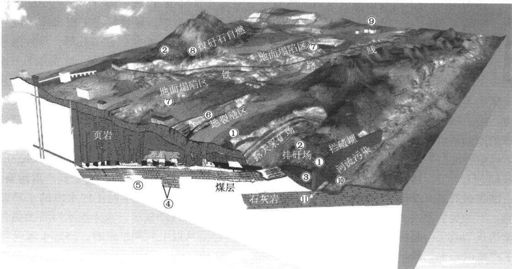  
图3-3 煤矿开采环境地质问题示意图  
露头煤及浅部煤层采用露天开采，改变了原有的地形地貌：高陡边坡诱发滑坡（①)，外排土矸场占压土地(②)，废渣堆积沟坡上，暴雨诱发形成滑坡（①）和泥石流（③）地质灾害。煤层采空区（④、⑤）上方地裂缝（⑥）会造成建筑物开裂、农田被毁，稍深部煤层采空区上方发生地面塌陷（⑦），耕地被毁，村庄搬迁。煤矸石堆积占压土地的同时，矸石山粉尘及自燃（⑧）产生的有毒有害气体、风井排出的沼气、二氧化碳等污染大气环境（⑨)，危及人类健康。露天矿排矸场及煤矸石淋溶水造成地表水土（⑩）及农作物污染，下渗造成地下水及岩溶水污染(①）

## 3.4.2.1 煤矸石压占土地

煤矸石是采煤和选煤过程中的废弃物，通常占煤矿产量的12%\~20%，是煤矿最主要的固体废弃物，主要危害是堆积压占土地破坏植被。陕西黄陵店头地处黄土高原地带，小流域地区的森林植被良好，但是部分煤矿排放的煤矸石堆积在山坡上，压占了生长良好的杂木林。陕西韩城下峪口黄河滩湿地芦苇茂密，生态环境良好，但是该矿排放的煤矸石填滩造地，破坏了黄河湿地生态资源与环境。

## 3.4.2.2 对水资源的影响

产于鄂尔多斯盆地周边的石炭-二叠系中的煤田，其下部是奥陶系石灰岩，上部为侏罗系砂泥岩，属干旱盆地严重缺水地区。矿井疏干排水导致地下水均衡系统破坏，地表水水量减少，地下水位下降。煤矿酸性及高矿化度的井水造成地下水污染，加剧了水资源危机。新疆乌鲁木齐市六道湾煤矿煤系地层倾角67°\~78°，开采后形成自上而下的采空区塌陷和裂缝带，造成水资源流失的环境破坏。煤炭资源大面积连续开采，造成了难以恢复的地下水破坏，同时导致地表河流流量锐减，生态环境破坏。1997年以来，陕西神府煤田开发区的不少河流断流，如2000年窟野河断流75d，2001年断流106d。由于煤矿采空区裂缝遍布，最宽达2m多，局部地区地面下降2\~3m，导致原流量达7344m³/d的双沟河已完全干枯，26.67ha水田变为旱地，杨树等植被大片枯死。

## 3.4.2.3 崩塌、滑坡、泥石流

露天矿山高陡边坡开挖或堆积在斜坡体上的采矿废渣因暴雨、地面塌陷、地裂缝等原因引发崩塌、滑坡。煤矿区滑坡主要发生在露天矿、黄土高原以及山地矿山。如新疆哈密三道岭露天煤矿1967、1983和1999年先后三次发生较大规模的滑坡，造成矿区运输中断，直接经济损失上百万元。内蒙古包头石拐矿区由于采煤使地下采空区面积增大，近几年滑坡活动加剧，目前滑坡体东西长100\~370m，南北宽600余m，面积约 $\mathbf { 1 6 \times 1 0 ^ { 4 } m ^ { 2 } }$ 体积约 $4 0 0 \times 1 0 ^ { 4 } \mathrm { m } ^ { 3 }$ 。从1979年至今已毁坏民房及其他建筑物达 $5 0 0 0 \mathrm { m } ^ { 2 }$ ，堵塞了通往五当召旅游点的道路600m，造成经济损失约400万元。红旗山出现了多组东西向宽约0.1\~1.5m、南北走向长约100\~300m的地裂缝，危及山脚下677户1947人的生命财产安全。

陕西韩城象山煤矿因地下采煤及渠道渗水等原因，引起山体蠕滑，直接威胁坑口电厂韩城电厂主厂房的安全，为此付出了上亿元的防治费用。陕西彬县百子沟煤矿地下采煤采空区上方岩层垮落、下沉，使地表斜坡失去平衡导致1995年7月6日的黄土滑坡，滑距约30m， $1 8 0 \times 1 0 ^ { 4 } \mathrm { m } ^ { 3 }$ 土方量堵塞河道形成堰塞湖。滑坡将矿部三座大楼整体向前推移5\~7m，楼房墙壁出现裂缝，地板鼓起，地基被毁。由于事先的预报准确，所幸无人员伤亡。1991年8月9日，陕西铜川金华山煤矿西侧黄土塬边由于地下采煤引起崩塌、滑坡，土方量达 $1 0 5 0 \times 1 0 ^ { 4 } \mathrm { m } ^ { 3 }$ ，将坡脚处的西龙村埋没，大片良田被毁，损失巨大。

陕西铜川焦坪、王石凹、李家塔、金华山、桃园等煤矿均发生过严重的滑坡，铜川矿区有中等以上规模滑坡1000多处，铜川市区有154处，崩塌体361处。陕蒙神府一东胜矿区地处干旱半干旱地带，植被覆盖率低，土壤风蚀、水蚀交错，岩层结构疏松，易风化，自然灾害频繁，生态环境十分脆弱。20世纪80年代以来煤田大面积开采，采矿废石及排土乱堆乱放，沿山坡开挖加大了地面坡度。矿区人为泥石流均分布在河道两侧，泥石流直接注入河床，使河床过水断面缩小，行洪能力降低，即使中等水深洪水，也能造成很大灾害。1989年7月21日，矿区上游突降暴雨，3h降雨120mm，在乌兰木伦河形成含沙量高达 $1 3 6 0 \mathbf { k g } / \mathbf { m } ^ { 3 }$ 的泥石流，淤平坑井11处和露天矿坑9处，其中马家塔露天矿被淹没，泥沙淤积 $1 5 \times 1 0 ^ { 4 } \mathrm { m } ^ { 3 }$ ，冲毁两岸矿堤1870m、水浇地600亩、路基挡墙60m，导致铁轨悬空，中断行车一月之久，经济损失2000多万元。

## 3.4.2.4 地面塌陷和地裂缝

地下开采形成的地面塌陷、地裂缝造成耕地破坏、公路塌陷、铁轨扭曲、建筑物裂缝，以及洼地积水沿裂隙下渗引发矿井透水等事故。在干旱地区由于地表水系受到破坏，导致矿区生产、生活以及农业用水发生困难。同时，还可诱发山体开裂形成滑坡。

地面塌陷和地裂缝在大中型地下开采的煤矿区最为普遍，灾害也最为严重。如新疆的六道湾煤矿，甘肃的华亭、窑街、阿干镇、王家山等煤矿，宁夏的石嘴山、石炭井煤矿和陕西的渭北韩城一铜川以及神府一东胜煤田矿区。

调查资料表明，在579座各种类型的矿山中，有115座矿山存在地面塌陷，塌陷面积达 $2 0 2 3 6 \mathrm { k m } ^ { 2 }$ 。其中非煤矿山10座，仅占8.70%；而煤矿山有105座，占塌陷矿山的91.30%。根据塌陷面积及严重程度，大于 $1 0  { \mathrm { k m } } ^ { 2 }$ 的极差级别矿山8座，占8%；1\~$1 0 \mathbf { k m } ^ { 2 }$ 差级别矿山37座，占 $3 5 \% ; 0 . 1 \sim 1 { \bf k m } ^ { 2 }$ 中等级别矿山37座，占35%；小于

$0 . 1  { \mathrm { k m } } ^ { 2 }$ 较好级别矿山23座，占22%。

煤矿区的地面塌陷最为严重，这是因为煤层厚度较金属矿体稳定，分布范围大，煤层产状较平缓，采煤形成的采空区较金属矿山要大得多，并且上覆岩层多为松软的页岩、粉砂岩及泥质岩层。煤矿地面塌陷和地裂缝的范围及深度与采煤方法、工作面开采面积、采区回采率以及煤层产状等多种因素有关。一般而言，在其他因素相同的条件下，充分采动（用长壁工作面全部垮落法采煤时）比非充分采动（条带部分冒落法采煤）引起的地面塌陷影响范围及深度要大。而煤层采厚越大，倾角越小，埋深愈浅，开采面积越大，地面塌陷、裂缝影响范围及深度也越大。地表最大下沉量W可用公式估算： ${ \pmb { \mathbb { W } } } = q { M } \mathrm { c o s } { \pmb { \alpha } }$

式中： $\pmb q$ 为下沉系数，全部冒落采煤法 $q = 0 . 7 0 \sim 0 . 9 0$ ，条带部分冒落采煤法 $q \ : = \ :$ 0.02\~0.30;M为煤层法线厚度； $\pmb { \alpha }$ 为煤层倾角。

当采深与采厚之比小于20时，地表常发生剧烈变形，此比值大到一定程度后塌陷消失。榆林神府矿区大砭窑煤矿开采 $5 ^ { \# }$ 煤层，煤层厚 $4 \sim 6 \mathrm { m }$ ，埋深90\~100m，1992年5月5 日 $\overrightarrow { A }$ 井上方发生地面塌陷 $1 2 0 0 0 \mathrm { m } ^ { 2 }$ ，陷落深度 $0 . 7 \mathbf { m } _ { \mathrm { o } }$ 有关资料指出，塌陷面积与开采面积之比平均值为1.2，塌陷容积与开采体积之比平均值为 $0 . 6 \sim 0 . 7 _ { \circ }$ 当采深较大时，地面、地表裂缝则较少。当采深 $H > \mathrm { ~  ~ { ~ ( ~ 1 0 0 ~ \sim ~ 1 5 0 ~ ) ~ } ~ }$ m，或 $F = H / M \geqslant 2 0$ (M为煤层厚度)时，地表移动和变形在时间和空间上呈明显连续，不出现地裂缝。

根据煤炭工业“九五”环境保护计划，2000年全国（除西北地区，下同）煤矿地面塌陷面积为 $1 8 2 . 2 0 \mathrm { k m } ^ { 2 }$ ，复垦面积为 $4 8 . 4 0 \mathrm { k m } ^ { 2 }$ ，复垦率为26.6%。西北地区煤矿地面塌陷面积为 $3 5 , 7 6 \mathrm { { k m } } ^ { 2 }$ ，复垦面积为 $4 , 4 0 \mathrm { k m } ^ { 2 }$ ，复垦率为12.3%，比同期全国平均值低54.9%。2000年西北地区煤炭产量达 $\mathbf { 8 9 9 4 \times 1 0 ^ { 4 } t }$ ，万吨煤塌陷面积为0.31 ha，比全国万吨煤塌陷面积均值0.20ha高55%，而复垦率低51.5%。可见，西北地区煤矿地下开采塌陷区的防治工作应加紧加快。

乌鲁木齐市六道湾煤矿距友好商贸中心仅1.5km，该矿煤层倾角 $6 7 ^ { \circ } \sim 7 8 ^ { \circ }$ ，属急倾斜煤层，50年来，地下不同开采水平分段放顶煤采煤后，由于上位顶煤和覆盖层的周期性塌陷断裂，出现与煤层走向一致的条带状塌陷深坑，深度达40\~50m，并在塌陷坑两侧形成平行裂缝，造成了连续性的地面塌陷凹槽、地裂缝和塌陷坑。塌陷区目前仅作为乌鲁木齐市城市工业垃圾的填埋场所，在其虚土表面又不断产生新的塌陷深坑和地裂缝， $3 \mathrm { k m } ^ { 2 }$ 的土地不能开发利用，迫使市政设施建设不得不绕道而行，成为乌鲁木齐城市建设发展的死角。

宁夏石嘴山市石嘴山煤矿开采面积为 $5 . 1 5 \mathrm { k m } ^ { 2 }$ ，而塌陷面积已达 $6 . 9 7 \mathrm { k m } ^ { 2 }$ ，是其开采面积的135%，形成深达8\~20m的地表塌陷凹地，部分地段的裂缝宽达 $1  { \mathbf { m } } _ { \circ }$ 矿区铁路运输基地高出塌陷区 $1 0 \sim 2 0 \mathrm { m }$ ，使得矿山企业每年用于铁路的垫路费高达100万元，穿越矿区的109国道被迫改道。

陕西省煤矿采空区地面塌陷总面积约 $1 1 5 \ \mathrm { k m } ^ { 2 }$ (表3-8)，主要分布于渭北及陕北煤矿区，陕南秦巴山地区仅有零星分布。其中铜川市老矿区因开采较早，地面塌陷比较严重，到1999年底，据不完全统计其地面塌陷为 $6 3 . 8 2 ~ \mathrm { k m } ^ { 2 }$ ，占到全省煤矿区地面塌陷区的55.38%，其中80%为耕地。而神木县近几年煤矿开发力度不断增大，加之煤层埋藏较 $\mathfrak { P }$ 浅，地面塌陷面积增大，截至2001年，该县乡镇煤矿造成地面塌陷达 $5 . 3 2 \mathrm { k m } ^ { 2 }$ 0

表3-8 陕西省煤矿区地面塌陷
<table><tr><td rowspan=1 colspan=1>主要煤矿区</td><td rowspan=1 colspan=1>地面塌陷 $/ \mathrm { k } \mathrm { m } ^ { 2 }$ </td></tr><tr><td rowspan=1 colspan=1>铜川煤矿区</td><td rowspan=1 colspan=1>63.82</td></tr><tr><td rowspan=1 colspan=1>澄合－蒲白煤矿区</td><td rowspan=1 colspan=1>35.56</td></tr><tr><td rowspan=1 colspan=1>韩城煤矿区</td><td rowspan=1 colspan=1>4.71</td></tr><tr><td rowspan=1 colspan=1>神木-榆林-府谷煤矿区</td><td rowspan=1 colspan=1>8.04</td></tr><tr><td rowspan=1 colspan=1>黄陵煤矿区</td><td rowspan=1 colspan=1>1.22</td></tr><tr><td rowspan=1 colspan=1>其他煤矿区</td><td rowspan=1 colspan=1>1.88</td></tr><tr><td rowspan=1 colspan=1>累     计</td><td rowspan=1 colspan=1>115.23</td></tr></table>

陕西省渭北煤田的铜川、黄陵、合阳、白水、韩城各矿区，陕北神府煤田的大柳塔、大砭窑、洋桃瑁、沙川沟、刘占沟、新民矿等矿区，均出现有不同程度的地面塌陷、地裂缝及山体滑坡，造成大面积的农田被毁、房屋开裂、铁轨扭曲、公路塌陷、矿井涌水等。2001年7月特大暴雨使黄陵店头陕煤建五处矿区仓村三组的 $1 , 2 \mathbf { k } \mathbf { m } ^ { 2 }$ 耕地发生地面塌陷、地裂缝，地裂缝最宽达15m，塌陷落差达7.45m，60%耕地已无法复垦，农田撂荒，预计经济损失达270万元。2000年4月，中央电视台《焦点访谈》对陕西铜川市王益区黄堡镇黑池塬乡镇煤矿地下开采造成的村民窑洞开裂、耕地被毁进行了曝光。陕西白水县县办煤矿开采导致白水县火车站候车室出现裂缝、铁轨下沉、广场地面鼓包。陕西渭北煤田地表水平拉伸变形值达到0.8\~2.2mm/m时出现地裂缝，裂缝宽300\~700mm，深度达5\~15m。铜川煤矿区地裂缝有5400余条，以王石凹煤矿为例，在1：5000的地形图上填绘的裂缝就有70多条，总长度近7000余米。20世纪90年代，甘肃窑街煤矿区矿井地面占地598.1ha，地面塌陷20处，共计443.54ha，地面塌陷面积比80年代扩大了48.4%，每年以14.47ha的速度扩大，10年间因塌陷引起的特大型山体滑坡等灾难性地质事故数起。80年代造成水土流失面积449\~550ha，90年代达到663\~720ha。甘肃靖远王家山煤矿1995年8月两次洪水携带泥石流从地面裂缝涌入井下，造成多人伤亡。

陕西神木大柳塔煤矿区1997年以后形成采空区，1998年前后产生地面塌陷和地裂缝。大柳塔矿区采空区约为 $3 , 9 ~ \mathrm { \bf k m } ^ { 2 }$ ，总面积约 $5 , 8 \mathbf { k m } ^ { 2 }$ ，产生地裂缝的总面积约$5 . 4 5 ~ \mathrm { { k m } } ^ { 2 }$ 。大柳塔活鸡兔井采空区面积过大，造成大面积地面塌陷，其中205工作面塌陷区宽0.3km，长为3km，面积为 $0 . 9 \mathrm { k m } ^ { 2 }$ ，共发现16条地表裂缝，沿整个工作面呈断续分布，裂缝宽5\~60cm，间距2\~8m。206工作面塌陷区宽0.3km，长为3.5km，面积为$1 . 0 5 \mathrm { k m } ^ { 2 }$ ，共发现5条裂缝，裂缝宽5\~60cm，间距5m左右。207工作面塌陷区宽0.3km，长为1.5km，面积为 $0 . 4 5 \mathrm { k m } ^ { 2 }$ ，是整体陷落，其中裂缝十分发育，共发现5条，宽5\~30cm，间距10m左右。从神东矿区大柳塔、补连塔和榆家梁3个矿井实测资料可知，其万吨煤地面塌陷面积为0.35\~0.42ha，比全国万吨煤地面塌陷面积0.2ha几乎高出1倍，主要原因是煤层埋藏浅（61\~110m），煤层厚（3.4\~5.0m）。

## 3.4.2.5 水土流失

据水利部1992年统计，西部地区轻度以上的水土流失面积为 $1 0 4 . 0 7 \times 1 0 ^ { 4 } \mathrm { k m } ^ { 2 }$ ，占全国水土流失面积的58.01%。水土流失导致的土壤侵蚀是生态环境恶化的重要因素。在黄土区、黄土与沙漠过渡区，矿区发生水土流失的可能性最大。据陕西铜川、韩城、神府煤矿区有关环境报告资料预测，陕西神府一内蒙古东胜矿区平均侵蚀模数按 $1 . 2 1 \times 1 0 ^ { 4 } { \mathrm { t } } / { \mathrm { k m } } ^ { 2 } \cdot { \mathrm { a } }$ 面积按 $3 0 2 4 \mathrm { k m } ^ { 2 }$ 计算，年土壤侵蚀量为 $3 6 5 9 . 0 4 \times 1 0 ^ { 4 } !$ ；准噶尔矿区平均侵蚀模数按1.30×$1 0 ^ { 4 } \nu \mathrm { k m } ^ { 2 } \cdot \mathrm { a }$ 、面积按 $1 3 6 5 \mathrm { k m } ^ { 2 }$ 计算，年土壤侵蚀量为 $1 7 7 4 . 5 \times 1 0 ^ { 4 } \mathrm { t } .$ 。据几个矿区开发前后不同时期的遥感资料以及河流、库坝、泥沙资料综合分析和计算表明，煤矿开采后水土流失量一般为开采前的2倍左右。陕西黄陵矿区建矿前土壤侵蚀模数为 $5 0 0 0 \mathrm { \ k m } ^ { 2 }$ ·a，建矿5年后，土壤侵蚀模数已达 $1 0 0 0 \ : \nu \mathrm { k m } ^ { 2 } \cdot \mathrm { a } _ { \mathrm { c } }$ 甘肃的窑街、阿干镇、靖远煤矿区，宁夏的石嘴山、石炭井煤矿区，陕蒙神府-内蒙古东胜煤矿区水土流失十分严重。内蒙古的乌达等煤矿区，侵蚀模数达 $1 0 0 0 0 \sim 3 0 0 0 0 { \scriptstyle { \downarrow } } \mathrm { { a m } } ^ { 2 } { \mathrm { ~ \cdot ~ } } \mathrm { { a } }$ ，是开采前水土流失量的3.0\~4.5倍。这不仅破坏了生态环境，还直接威胁矿区安全。例如，陕西神木中鸡煤矿由于矿渣倾入河道，占据河床2/3的面积，1984年8月雨季时河水受阻回流，造成特大淹井事故。

## 3.4.2.6 土地沙化

煤炭开采造成的地面塌陷破坏了浅层地下水系统均衡，因地下水位下降使部分地区的塌陷区植被枯死，形成或加剧土地沙漠化。露天煤矿、交通及天然气管道工程建设占用大量耕地，破坏植被，使部分原已固定和半固定的沙丘活化。戈壁沙漠区煤矿废渣的堆放、风化加剧了土地沙化。

陕西神府煤田矿区的大规模开发以及地方、个体开发沿河沟两岸乱挖滥采，破坏植被，导致沙土裸露，加剧了水土流失和土地沙化。自20世纪80年代中期开发以来，毁坏耕地666.7ha，堆放废渣超过 $6 0 0 0 \times 1 0 ^ { 4 } \mathrm { t }$ ，破坏植被4946.7ha，增加入黄泥沙量达2019×$\mathbf { 1 0 ^ { 4 } t }$ 。据“神府东胜矿区环境影响报告书”预测，若不采取必要的防沙措施，在矿区生产能力达到 $3 0 0 0 \times 1 0 ^ { 4 } \mathrm { t }$ 规模时，将新增沙漠化面积 $1 2 9 . 6 4 \mathrm { k m } ^ { 2 }$ ，煤矿开发导致的沙漠化面积为自然发展产生沙漠化面积的1.53倍，新增人入河泥沙量 $4 8 0 \times 1 0 ^ { 4 } \mathrm { t }$ ，比现有条件下进河泥沙量增加13.7%。

## 3.4.2.7 水土环境污染

煤矿水污染源主要是煤矿开采外排的矿井水、洗（选）煤水以及煤矸石淋滤水。据有关文献，莫斯科近郊煤田矿井地质环境的研究表明，距矸石堆底部50\~60m远的土壤中，每100g土壤中铁含量达146\~160mg，铝含量达11\~19mg，分别超过允许值的3\~4和1.5倍，土壤被毒化。

长期以来，由于技术水平所限和认识不足，矿井水被当作水害加以防治，矿井水被白白排掉而未加以综合利用和保护。2000年西北地区国有矿井煤产量 $3 7 8 5 \times 1 0 ^ { 4 } \mathrm { t }$ ，平均吨煤排水量1.3t，其他矿井煤产量 $5 2 0 9 \times 1 0 ^ { 4 } { \mathrm { t } }$ ，平均吨煤排水量0.324t。西北地区的煤矿主要位干干旱、半干旱地区，矿区水资源匮乏，毫无节制的排水不仅大大破坏了地下水资源，增加了吨煤成本，而且还导致地面塌陷、地下水资源流失、水质恶化，还可能造成地下突然涌水淹井事故的产生。

煤矿矿井水多属酸性水，未加处理直接排放，加剧了干旱地区矿山用水危机。陕西、宁夏、内蒙古部分矿井水 $\mathbf { p H }$ 值均小于6，陕西铜川李家塔矿井水 $\mathbf { p H }$ 值为 $3 \textdegree$ 酸性 $\overrightarrow { \vert } \overrightarrow { \vert }$ 井水直接排放会破坏河流水生生物的生存环境，抑制矿区植被生长。甘肃、宁夏、内蒙古西部、新疆大部分矿井及陕西中部和东部等矿井水是高矿化度水，一般矿化度均大于1000mg/L，其中甘肃靖远大部分矿井水矿化度在4000mg/L以上，尤其是王家山矿高达15000mg/L以上。

2002年7月在陕西渭北煤矿区的一些矿务局调查时发现，陕西白水县个别矿山存在将坑道废水直接排入地下岩溶裂隙的现象，导致岩溶水污染，此问题应引起有关部门的高度重视，应尽快采取措施保护岩溶水，使地下水资源不受污染。

## 3.4.3 金属类矿产开发中的环境地质问题

西北地区金属矿产主要有金、铅锌、铜镍、钼、汞锑、铁、稀土、稀有金属及稀土金属等，主要矿山位于秦岭山地、祁连山、天山、阿尔泰山、大青山等地。西北地区著名的金属矿山有陕西的金堆城钼矿、潼关金矿、凤县铅硐山铅锌矿、太白双王金矿、略阳铁矿、略阳煎茶岭镍矿、旬阳汞锑矿等；甘肃的金川铜镍矿、白银铜矿、厂坝铅锌矿、镜铁山铁矿等：青海的锡铁山铅锌矿；新疆的克拉通克铜镍矿、哈密亚满苏铁矿等；内蒙古的白云鄂博铁稀土矿等。

金属矿山开发中的主要环境地质问题包括了矿产资源破坏与浪费、土地压占与植被破坏、“三废”对环境的污染，以及山地矿山的滑坡、崩塌、泥石流、尾矿库溃坝等地质灾害。

## 3.4.3.1 矿产资源的破坏与浪费

矿产资源的破坏与浪费突出表现为中小矿山企业无序开采和掠夺式开发，以及企业普遍存在的共生伴生组分利用率低等问题。

西北地区大多数矿床都属于多组分共生伴生矿，但多数矿山采选并没有综合回收利用，或因技术原因利用率很低，从而造成资源的严重浪费。如甘肃辉铜山铜矿，伴生砷，属大型矿床，由于该矿在采铜时不回收砷，导致砷矿资源被浪费。甘肃塔儿沟钨矿伴生镀2583t，铋、砷已提交储量，由于该矿采富弃贫，只取黑钨矿，伴生矿没有合理利用。青海察尔汗钾肥厂从卤水中只提取钾盐，伴生的钠、镁、锂等多种伴生组分未利用。

陕西金堆城钼矿同全国的其他矿山一样，在珍惜资源和合理利用资源方面存在问题。根据1972年北京冶金设计研究总院提供的设计，按钼矿的边界品位0.03%及最小工业品位0.06%圈定矿体，1993年保有储量为 $2 8 4 3 2 . 6 0 \times 1 0 ^ { 4 } \mathrm { t }$ ，平均品位0.118%。随着国际市场经济形势的变化，1993年该矿根据中国有色金属工业总公司批复的精神，将品位指标从0.03%\~0.06%提高到0.06%\~0.08%，并重新圈定了矿体边界，新矿量为22169.83×$1 0 ^ { 4 } \mathrm { t }$ ，品位0.132%。两者矿量相差了 $6 2 6 2 . 7 7 \times 1 0 ^ { 4 } \mathrm { t }$ ，占小北露天矿总储量的18%，而这些矿作为贫矿堆积在贫矿场，随着时间的推移其物理化学性质都会发生变化，给以后二次问收利用这些资源带来了困难。另据计算，金堆城钼矿回收率为83.5%，低于国际水平达7个百分点，按1998年19000t钼精矿计算，年损耗钼矿资源量近 $3 3 \times 1 0 ^ { 4 } \mathrm { t } _ { \circ }$ 资源浪费结果必将加剧资源枯竭，按金堆城目前的开采规模，小北露天矿的服务年限比设计的50年将缩短10年以上。

## 3.4.3.2 土地压占与植被破坏

金属矿产开发多集中于秦岭和其他山地地区，植被相对发育，金属矿山采矿废渣堆放、尾矿库占压、露天采矿场剥采及外排土场以及采空区塌陷等对土地植被压占破坏相对较为严重。

陕西小秦岭潼关黄金产区，矿区为石质山地，土层薄，植被覆盖率较高，年侵蚀量$1 0 . 1 1 \times 1 0 ^ { 4 } \mathrm { t }$ ，侵蚀模数 $5 7 3 . 8 V \mathbf { k m } ^ { 2 } \cdot \mathbf { a }$ ，属轻度侵蚀区。自20世纪70年代大规模开发以来，采金者蜂拥而至，分布在矿区的采矿坑口达2000多个，排放的矿山废石和尾矿渣达$\mathbf { 8 0 0 } \times \mathbf { 1 0 ^ { 4 } m ^ { 3 } }$ ，压占土地、植被面积超过200ha。由于长期乱砍滥伐，致使浅山峪口5km内的林木大部分被砍光，大量土地、植被的破坏，加剧了水土流失，从1982年到1990年矿区土壤侵蚀模数由 $7 6 0 . 7 \mathrm { r } \mathrm { k m } ^ { 2 }$ ·a 增加到 $3 4 4 8 . 7 \mathrm { t / k m } ^ { 2 } \cdot \mathrm { ~ a ~ }$ ，平均年增加侵蚀量24.4×$1 0 ^ { 4 } \mathfrak { t } _ { c }$ 。金堆城钼矿露天剥采造成的植被毁损、外排压占土地植被约 $2 \mathrm { k m } ^ { 2 }$

## 3.4.3.3 崩塌、滑坡、泥石流地质灾害

山地金属矿山具备诱发崩塌、滑坡、泥石流三类地质灾害的自然条件和人为因素，因

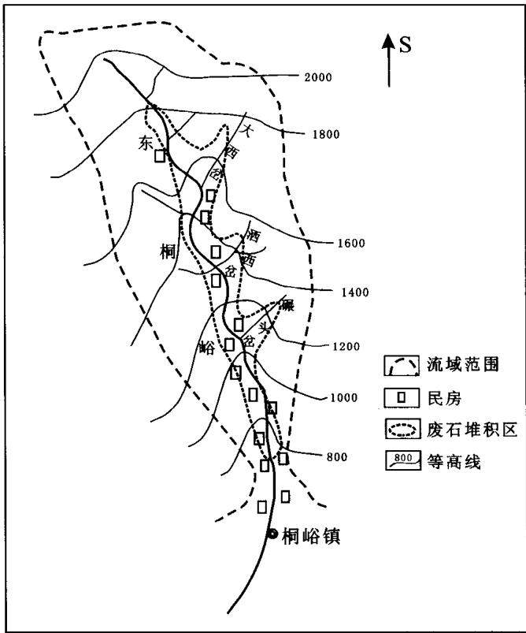  
图3-4 陕西潼关县东桐峪泥石流沟示意图  
(据陕西省潼关县地质灾害调查与区划报告)

而是崩塌、滑坡、泥石流灾害的高发区。采矿大量废石沿山坡、沟谷堆放，缺乏拦渣、护坡、导水及生物等工程技术措施，斜坡面上废渣处于不稳定状态，在采空区塌陷或山体开裂时易诱发滑坡。大暴雨诱发产生滑坡和泥石流地质灾害，造成矿区停产，危及人民生命财产安全。

潼关金矿区位于小秦岭山脉，沟谷纵横地形陡峻，海拔700\~2100m，相对高差900m，自东向西发育7条南北向“V”字型沟谷(图3 -4)，河床比降大，平均9.41%\~15.20%。由于历史原因，同一矿体不同高度、不同地段有不同的企业在开采，形成所谓“楼上楼”采矿，在狭长的沟谷中，至今“楼上楼”不合理的矿业布局仍随处可见，类似的情况也存在于在陕西凤县银硐梁铅锌矿区，采矿废石直接堆放在坑道口的山坡上，这些大小不一、结构松散的废

石沿坡面超高堆放，构成泥石流物源，无拦渣、排水设施，汇水面积大，潜在泥石流地质灾害隐患严重。1994年7月11日与河南灵宝交接的潼关西峪河道中堆积的大量采矿废石和尾矿渣混合物在强降雨的作用下，形成了特大型地质灾害泥石流，所到之处矿区设施被毁，工棚民房倒塌，300多亩农田被冲毁，交通、电力、通讯中断，造成51人死亡、上百人失踪，直接经济损失上千万元。1996年8月，东桐峪暴发泥石流，冲毁桥梁、淹没农田，再一次造成了严重的经济损失和社会影响。

陕西凤县铅铜山铅锌矿是1985年建设的大型国有矿山，目前已采出矿石量170×104t，随着采矿区的不断加大，上盘围岩随之崩落垮塌，地表形成了东西两侧两个塌陷坑，形成北高南低高差悬殊的侵蚀构造地貌。1999年10月8日和16日的连日降雨，造成两次较大的山体滑坡，其规模为50000m³，滑冲距离近1000m，导致4个采矿中段不同程度停产，直接经济损失30万元，并使1590矿硐和1515坑口塌落淹没。采矿上盘崩落区顶部存在12条地裂缝，最大走向达1000m，裂缝宽近2m，构成了潜在的崩塌体，预测有70000m³的土石量，成为威胁采矿场、排渣场安全生产的最大因素。

## 3.4.3.4 地面塌陷和地裂缝

金属矿山的地面塌陷、地裂缝虽然没有煤矿那么普遍和严重，但是矿体厚大的金属矿山也存在较为明显的地面塌陷、地裂缝地质灾害。如陕西略阳阁老岭铁矿地面塌陷中心位置随着采矿发生推移导致通风矿井开裂废弃，山体开裂。在潼关金矿、凤县铅锌矿、成县厂坝铅锌矿等大多数金属矿山，随地下采空区不断加大，地表均出现了不同程度的地裂缝和山体开裂。2001年陕西凤县某矿山因采空区塌陷造成了5人失踪死亡的中型地质灾害事故。采空塌陷不仅诱发滑坡、崩塌等地质灾害，还严重地威胁矿山企业的正常生产。地下采矿引发危及地面村民居住安全的危险，加剧了矿山与当地居民的矛盾，上访事件不断增加。因此，加强金属矿山采空区诱发的地裂缝和潜在塌陷区范围预测及防范工作十分重要。2001年，甘肃西和县邓家山六巷铅锌矿地面突然发生塌陷，形成直径约十几米的塌陷坑，导致2人失踪。内蒙古乌兰察布盟四子王旗白乃庙铜矿区，1996年地面塌陷形成南北宽70余米、东西长200余米、深20\~50m和宽50m、长100余米、深50余米的两个大塌陷坑。1998年7月中旬西202采场塌陷巷道长约20余米，造成直接经济损失38万元，间接损失3000万\~4000万元。

## 3.4.3.5 尾矿库溃坝

矿山尾矿库多建在山谷中，拦沟筑坝而成，多数中小型矿山的尾矿库依山傍河修建，部分尾矿库建设并不符合规定要求，或由于尾矿库超期服役、暴雨等因素往往造成坝基不稳形成溃坝、坍塌等，造成尾砂淹没农田、冲毁道路，同时造成严重环境污染。秦岭山中的陕西凤县铅锌矿区、旬阳汞锑铅锌矿区、潼关金矿区、甘肃成县厂坝矿区等矿山在这方面存在众多严重问题。如陕西凤县一个选矿厂日选矿50t的尾矿库，建在嘉陵江源头的安河河道中间，水泥砌成的四面围挡墙，仅能阻挡年平均洪水，一旦大暴雨引发洪水则将漫库或冲垮挡墙，含有铅、锌、汞以及选矿药剂的尾矿砂将污染嘉陵江。在另一处铅锌小选矿厂，尾矿库依山沿河而建，先后于2000年及2001年两次被洪水冲垮，数十立方米的铅锌尾矿渣被带入嘉陵江。自2001年，清澈的河水在数十余米长的溃坝缺口中回旋后又进入嘉陵江。陕西潼关金矿区7条主要峪道均是金矿开采区，沟谷狭窄，部分尾矿库沿河而建，使河道进一步变窄，遇到特大暴雨，河水猛涨，有可能出现洪水漫坝或冲毁坝体事故。一旦发生溃坝、坍塌事故，将使库内大量尾矿砂与洪水一起倾泄而下，造成下游河道堵塞，房屋被毁，生态环境受到严重破坏。2001年马口金矿尾矿库溃坝就造成了农田污染。

尾矿坝溃坝造成的灾害和环境污染十分严重。如1987年陕西金堆城钼业公司栗西尾矿库排洪隧洞塌陷，造成 $1 3 6 \times 1 0 ^ { 4 } \mathrm { m } ^ { 3 }$ 尾矿及尾矿水泄漏，污染了陕豫两省16个县市的水源，矿山直接经济损失3200多万元。2000年12月甘肃成县天子山尾矿库溃坝造成近2×$1 0 ^ { 4 } \mathrm m ^ { 3 }$ 的尾矿砂泻入东河。

## 3.4.3.6 水土污染

选矿尾矿浆中重金属以及矿石冶炼烟尘中重金属对水体、土壤的污染非常严重。污染源主要是选矿排放的尾矿废水，其次是固体废弃物淋溶水、矿坑水等。其中金矿、汞矿、铅锌矿、砷矿选矿对环境污染最为严重。矿石浮选排放的废水中含有选矿工艺过程中添加的选矿药剂、未选出的金属元素、共生伴生的重金属和矿石微粒等。氰化法提金排放的废水中含有剧毒物质氰化物，混汞法提金排放出的废水中含汞量较高。含有重金属、氰化物、石油类、酸性矿井水等有毒有害物质的选矿液，未经达标处理排放流入河流、湖泊都会造成水体的严重污染，危害水生生物。这些污染的水若被人、畜饮用，轻则影响健康，重则危害生命。若用以灌溉农田，将导致减产、绝产，使有毒有害物质潜入农作物，通过食物链危害人类健康。

矿山矿坑水、选矿尾矿浆无序排放造成严重污染的矿区主要有陕西潼关金矿区、凤县铅锌矿区、略阳铁矿区、旬阳铅锌汞锑矿区；甘肃成县厂坝铅锌矿区、西和县邓家山铅锌矿区等。

陕西潼关金矿区是水土环境污染的典型区之一。20世纪80年代中后期，潼关金矿区蜂拥而上的乡镇及个体采矿者，形成了大规模的无序开发情景，高峰时共有采矿坑口2410个，年废石排放量 $6 0 7 \times 1 0 ^ { 4 } \mathrm { t }$ ，混汞碾1410台，尾矿水排放量12690t/d，氰化池2650台。混汞碾废水直接排放造成矿区源头水中铅污染超标2.4\~113倍，水中悬浮物超标62\~2143倍（表3-9)。

表3-9 1992 年 7 条峪道 10 个混汞碾尾矿水监测平均值  
单位：mg/L
<table><tr><td rowspan=1 colspan=1>项目</td><td rowspan=1 colspan=1> $\mathbf { P b }$ </td><td rowspan=1 colspan=1>Cu</td><td rowspan=1 colspan=1>Cd</td><td rowspan=1 colspan=1> $\mathrm { H } _ { \mathbf { \overline { { { g } } } } }$ </td><td rowspan=1 colspan=1> $\mathbf { F e }$ </td><td rowspan=1 colspan=1>SS</td><td rowspan=1 colspan=1>石油类</td></tr><tr><td rowspan=1 colspan=1>污染物值</td><td rowspan=1 colspan=1>3.4~114</td><td rowspan=1 colspan=1>0.7~23.9</td><td rowspan=1 colspan=1>0.023~0.080</td><td rowspan=1 colspan=1>0.02~0.013</td><td rowspan=1 colspan=1>0.3~10.5</td><td rowspan=1 colspan=1>6306~214402</td><td rowspan=1 colspan=1>0.7~23.5</td></tr><tr><td rowspan=1 colspan=1>一级排放标准</td><td rowspan=1 colspan=1>1.0</td><td rowspan=1 colspan=1></td><td rowspan=1 colspan=1>0.1</td><td rowspan=1 colspan=1>0.05</td><td rowspan=1 colspan=1></td><td rowspan=1 colspan=1>100</td><td rowspan=1 colspan=1></td></tr><tr><td rowspan=1 colspan=1>超标倍数</td><td rowspan=1 colspan=1>2.4~113</td><td rowspan=1 colspan=1></td><td rowspan=1 colspan=1></td><td rowspan=1 colspan=1></td><td rowspan=1 colspan=1></td><td rowspan=1 colspan=1>62~2143</td><td rowspan=1 colspan=1></td></tr></table>

从1995年矿区内7条源头水功能区水质监测结果与单因子评价（表3-10）可看出，7条河中铅超标37\~959倍，汞超标0.2\~31倍，5条河流镉超标1\~66倍，石油类最大超标102倍，河流均受到了严重污染。

表3-10 潼关县7条河水质监测及超标倍数  
单位：mg/L
<table><tr><td colspan="1" rowspan="1">河流</td><td colspan="1" rowspan="1">项目</td><td colspan="1" rowspan="1">Pb</td><td colspan="1" rowspan="1">Cd</td><td colspan="1" rowspan="1">Hg</td><td colspan="1" rowspan="1"> $\mathbf { G u }$ </td><td colspan="1" rowspan="1">石油类</td><td colspan="1" rowspan="1">SS</td><td colspan="1" rowspan="1">pH值</td></tr><tr><td colspan="1" rowspan="2">西峪</td><td colspan="1" rowspan="1">浓度</td><td colspan="1" rowspan="1">7.2~9.4</td><td colspan="1" rowspan="1">0.009~0.011</td><td colspan="1" rowspan="1">0.00059 ~0.00099</td><td colspan="1" rowspan="1">1.19~1.46</td><td colspan="1" rowspan="1">3.81~4.66</td><td colspan="1" rowspan="1">11624~15250</td><td colspan="1" rowspan="1">7.86~7.90</td></tr><tr><td colspan="1" rowspan="1">超标倍数</td><td colspan="1" rowspan="1">719~959</td><td colspan="1" rowspan="1">8~10</td><td colspan="1" rowspan="1">11~19</td><td colspan="1" rowspan="1">118~145</td><td colspan="1" rowspan="1">75~92</td><td colspan="1" rowspan="1"></td><td colspan="1" rowspan="1">•   0</td></tr><tr><td colspan="1" rowspan="1">河流</td><td colspan="1" rowspan="1">项目</td><td colspan="1" rowspan="1">Pb</td><td colspan="1" rowspan="1">Cd</td><td colspan="1" rowspan="1"> $\mathbf { H } \mathbf { g }$ </td><td colspan="1" rowspan="1"> ${ { \mathrm { G } } _ { { \mathbf { u } } } }$ </td><td colspan="1" rowspan="1">石油类</td><td colspan="1" rowspan="1">SS</td><td colspan="1" rowspan="1"> $\mathbf { p H }$ 值</td></tr><tr><td colspan="1" rowspan="2">东桐峪</td><td colspan="1" rowspan="1">浓度</td><td colspan="1" rowspan="1">3.51</td><td colspan="1" rowspan="1">0.002</td><td colspan="1" rowspan="1">0.00158</td><td colspan="1" rowspan="1">2.30</td><td colspan="1" rowspan="1">5.15</td><td colspan="1" rowspan="1">13936</td><td colspan="1" rowspan="1">7.78</td></tr><tr><td colspan="1" rowspan="1">超标倍数</td><td colspan="1" rowspan="1">350</td><td colspan="1" rowspan="1">1</td><td colspan="1" rowspan="1">31</td><td colspan="1" rowspan="1">229</td><td colspan="1" rowspan="1">102</td><td colspan="1" rowspan="1"></td><td colspan="1" rowspan="1">0</td></tr><tr><td colspan="1" rowspan="2">善车峪</td><td colspan="1" rowspan="1">浓度</td><td colspan="1" rowspan="1">5.46</td><td colspan="1" rowspan="1">0.067</td><td colspan="1" rowspan="1">0.00022</td><td colspan="1" rowspan="1">1.66</td><td colspan="1" rowspan="1">3.89</td><td colspan="1" rowspan="1">4650</td><td colspan="1" rowspan="1">7.80</td></tr><tr><td colspan="1" rowspan="1">超标倍数</td><td colspan="1" rowspan="1">545</td><td colspan="1" rowspan="1">66</td><td colspan="1" rowspan="1">3.4</td><td colspan="1" rowspan="1">165</td><td colspan="1" rowspan="1">77</td><td colspan="1" rowspan="1"></td><td colspan="1" rowspan="1">0</td></tr><tr><td colspan="1" rowspan="2">太峪</td><td colspan="1" rowspan="1">浓度</td><td colspan="1" rowspan="1">0.38</td><td colspan="1" rowspan="1">0.002</td><td colspan="1" rowspan="1">0.00007</td><td colspan="1" rowspan="1">0.02</td><td colspan="1" rowspan="1">2.01</td><td colspan="1" rowspan="1">12</td><td colspan="1" rowspan="1">8.02</td></tr><tr><td colspan="1" rowspan="1">超标倍数</td><td colspan="1" rowspan="1">37</td><td colspan="1" rowspan="1">1</td><td colspan="1" rowspan="1">0.4</td><td colspan="1" rowspan="1">1</td><td colspan="1" rowspan="1"></td><td colspan="1" rowspan="1"></td><td colspan="1" rowspan="1">0</td></tr><tr><td colspan="1" rowspan="2">麻峪</td><td colspan="1" rowspan="1">浓度</td><td colspan="1" rowspan="1">1.40</td><td colspan="1" rowspan="1">0.001</td><td colspan="1" rowspan="1">0.00022</td><td colspan="1" rowspan="1">0.78</td><td colspan="1" rowspan="1">3.21</td><td colspan="1" rowspan="1">6484</td><td colspan="1" rowspan="1">7.98</td></tr><tr><td colspan="1" rowspan="1">超标倍数</td><td colspan="1" rowspan="1">139</td><td colspan="1" rowspan="1">0</td><td colspan="1" rowspan="1">3.4</td><td colspan="1" rowspan="1">77</td><td colspan="1" rowspan="1">63</td><td colspan="1" rowspan="1"></td><td colspan="1" rowspan="1">0</td></tr><tr><td colspan="1" rowspan="2">蒿岔峪</td><td colspan="1" rowspan="1">浓度</td><td colspan="1" rowspan="1">1.08</td><td colspan="1" rowspan="1">0.000</td><td colspan="1" rowspan="1">0.00320</td><td colspan="1" rowspan="1">1.10</td><td colspan="1" rowspan="1"></td><td colspan="1" rowspan="1">1056</td><td colspan="1" rowspan="1">8.20</td></tr><tr><td colspan="1" rowspan="1">超标倍数</td><td colspan="1" rowspan="1">107</td><td colspan="1" rowspan="1">0</td><td colspan="1" rowspan="1">63</td><td colspan="1" rowspan="1">109</td><td colspan="1" rowspan="1"></td><td colspan="1" rowspan="1"></td><td colspan="1" rowspan="1">0</td></tr><tr><td colspan="1" rowspan="2">潼峪</td><td colspan="1" rowspan="1">浓度</td><td colspan="1" rowspan="1">1.45</td><td colspan="1" rowspan="1">0.002</td><td colspan="1" rowspan="1">0.00006</td><td colspan="1" rowspan="1">0.81</td><td colspan="1" rowspan="1">2.14</td><td colspan="1" rowspan="1">2540</td><td colspan="1" rowspan="1">8.00</td></tr><tr><td colspan="1" rowspan="1">超标倍数</td><td colspan="1" rowspan="1">144</td><td colspan="1" rowspan="1">1</td><td colspan="1" rowspan="1">0.2</td><td colspan="1" rowspan="1">80</td><td colspan="1" rowspan="1">42</td><td colspan="1" rowspan="1"></td><td colspan="1" rowspan="1">0</td></tr><tr><td colspan="2" rowspan="1">地面水环境质量Ⅰ类标准</td><td colspan="1" rowspan="1">0.01</td><td colspan="1" rowspan="1">0.001</td><td colspan="1" rowspan="1">0.00005</td><td colspan="1" rowspan="1">0.01</td><td colspan="1" rowspan="1">0.05</td><td colspan="1" rowspan="1"></td><td colspan="1" rowspan="1">6.5~8.5</td></tr><tr><td colspan="2" rowspan="1">超标率/%</td><td colspan="1" rowspan="1">100</td><td colspan="1" rowspan="1">71</td><td colspan="1" rowspan="1">100</td><td colspan="1" rowspan="1">100</td><td colspan="1" rowspan="1">100</td><td colspan="1" rowspan="1"></td><td colspan="1" rowspan="1">0</td></tr></table>

资料来源：潼关县黄金产区环境治理“九五”计划和2010年远景规划（潼关县人民政府）。

2002年8月西安地质矿产研究所环境影响评价室对潼关蒿岔峪金矿矿坑水监测结果（表3-11）表明，矿坑水未经处理直接排放，废水中Pb超标19.15倍，SS超标87倍。

表3-11 潼关金矿区蒿岔峪矿坑废水监测结果及超标倍数  
单位：mg/L
<table><tr><td rowspan=1 colspan=1>项目</td><td rowspan=1 colspan=1>Pb</td><td rowspan=1 colspan=1>Cd</td><td rowspan=1 colspan=1> $\mathbf { H } \mathbf { g }$ </td><td rowspan=1 colspan=1> $\mathbf { G r } ^ { 6 + }$ </td><td rowspan=1 colspan=1>SS</td><td rowspan=1 colspan=1>pH值</td></tr><tr><td rowspan=1 colspan=1>矿坑废水</td><td rowspan=1 colspan=1>20.15</td><td rowspan=1 colspan=1>0.003</td><td rowspan=1 colspan=1> ${ \bf < 0 . }$ 00005</td><td rowspan=1 colspan=1>0.082</td><td rowspan=1 colspan=1>187</td><td rowspan=1 colspan=1>6.08</td></tr><tr><td rowspan=1 colspan=1>一级排放标准</td><td rowspan=1 colspan=1>1.0</td><td rowspan=1 colspan=1>0.1</td><td rowspan=1 colspan=1>0.05</td><td rowspan=1 colspan=1>0.5</td><td rowspan=1 colspan=1>100</td><td rowspan=1 colspan=1>6~9</td></tr><tr><td rowspan=1 colspan=1>超标倍数</td><td rowspan=1 colspan=1>19.15</td><td rowspan=1 colspan=1></td><td rowspan=1 colspan=1></td><td rowspan=1 colspan=1></td><td rowspan=1 colspan=1>87</td><td rowspan=1 colspan=1></td></tr></table>

蒿岔峪河流三个断面的河水监测结果表明，沟口以上河段Pb、 $\mathbf { H } _ { \mathbf { \overline { { { g } } } } }$ 、Fe 分别超过I类水标准282\~345倍、17\~59倍和10.7\~15.6倍；下游河段Pb、 $\mathbf { H } \mathbf { g }$ 分别超过Ⅳ类水标准25.8倍和0.7倍（表3-12）。蒿岔峪河水质已遭受严重污染，主要污染物为Pb、Hg，属重金属污染，其原因是蒿岔峪河上游选矿厂废水排入造成的。

表3-12 潼关金矿区蒿岔峪河水质监测结果  
单位：mg/L
<table><tr><td rowspan=1 colspan=1>断面位置</td><td rowspan=1 colspan=1> $\mathbf { P b }$ </td><td rowspan=1 colspan=1>Cd</td><td rowspan=1 colspan=1> $\mathbf { H } _ { \mathbf { \overline { { E } } } }$ </td><td rowspan=1 colspan=1> $\mathrm { C r } ^ { 6 + }$ </td><td rowspan=1 colspan=1> $\mathbf { F e }$ </td><td rowspan=1 colspan=1>SS</td><td rowspan=1 colspan=1> $\mathbf { p H }$ 值</td></tr><tr><td rowspan=1 colspan=1>改建工程选厂上游</td><td rowspan=1 colspan=1>3.46</td><td rowspan=1 colspan=1>&lt;0.001</td><td rowspan=1 colspan=1>0.003</td><td rowspan=1 colspan=1>0.01</td><td rowspan=1 colspan=1>3.39</td><td rowspan=1 colspan=1>52.20</td><td rowspan=1 colspan=1>6.5</td></tr><tr><td rowspan=1 colspan=1>蒿岔峪口</td><td rowspan=1 colspan=1>2.83</td><td rowspan=1 colspan=1>&lt;0.001</td><td rowspan=1 colspan=1>0.0009</td><td rowspan=1 colspan=1>0.005</td><td rowspan=1 colspan=1>4.97</td><td rowspan=1 colspan=1>65.20</td><td rowspan=1 colspan=1>6.0</td></tr><tr><td rowspan=1 colspan=1>地表水Ⅰ类标准</td><td rowspan=1 colspan=1>0.01</td><td rowspan=1 colspan=1>0.001</td><td rowspan=1 colspan=1>0.00005</td><td rowspan=1 colspan=1>0.01</td><td rowspan=1 colspan=1>0.3</td><td rowspan=1 colspan=1></td><td rowspan=1 colspan=1>6~9</td></tr><tr><td rowspan=1 colspan=1>军中帐村</td><td rowspan=1 colspan=1>0.78</td><td rowspan=1 colspan=1>&lt;0.001</td><td rowspan=1 colspan=1>0.0002</td><td rowspan=1 colspan=1>0.031</td><td rowspan=1 colspan=1>2.51</td><td rowspan=1 colspan=1>11.6</td><td rowspan=1 colspan=1>6.60</td></tr><tr><td rowspan=1 colspan=1>地表水Ⅳ类标准</td><td rowspan=1 colspan=1>0.05</td><td rowspan=1 colspan=1>0.005</td><td rowspan=1 colspan=1>0.001</td><td rowspan=1 colspan=1>0.05</td><td rowspan=1 colspan=1></td><td rowspan=1 colspan=1></td><td rowspan=1 colspan=1>6~9</td></tr></table>

另据西峪河李家金矿第三采选矿厂上下游河流水质监测（表3-13）结果，西峪河水中重金属 Pb、Cd、 $\mathrm { H } \mathbf { g }$ 分别超标879\~1151、8\~11和23.2\~42倍，地表水环境已受到严重污染。

表3-13 潼关金矿区西峪河水质监测结果  
单位：mg/L
<table><tr><td rowspan=1 colspan=1>位置</td><td rowspan=1 colspan=1>Pb</td><td rowspan=1 colspan=1>Cd</td><td rowspan=1 colspan=1> $\mathbf { H } \mathbf { g }$ </td><td rowspan=1 colspan=1> $\mathbf { C r } ^ { 6 + }$ </td><td rowspan=1 colspan=1>SS</td><td rowspan=1 colspan=1>pH值</td></tr><tr><td rowspan=1 colspan=1>李家沟选矿厂南300m</td><td rowspan=1 colspan=1>8.80</td><td rowspan=1 colspan=1>0.009</td><td rowspan=1 colspan=1>0.00121</td><td rowspan=1 colspan=1>0.005</td><td rowspan=1 colspan=1>69</td><td rowspan=1 colspan=1>6.60</td></tr><tr><td rowspan=1 colspan=1>尾矿库北1000m</td><td rowspan=1 colspan=1>11.52</td><td rowspan=1 colspan=1>0.012</td><td rowspan=1 colspan=1>0.00215</td><td rowspan=1 colspan=1>0.005</td><td rowspan=1 colspan=1>165</td><td rowspan=1 colspan=1>6.60</td></tr><tr><td rowspan=1 colspan=1>地表水Ⅰ类标准</td><td rowspan=1 colspan=1>0.01</td><td rowspan=1 colspan=1>0.001</td><td rowspan=1 colspan=1>0.00005</td><td rowspan=1 colspan=1>0.01</td><td rowspan=1 colspan=1></td><td rowspan=1 colspan=1>6~9</td></tr><tr><td rowspan=1 colspan=1>超标倍数</td><td rowspan=1 colspan=1>879~1151</td><td rowspan=1 colspan=1>8~11</td><td rowspan=1 colspan=1>23.2~42</td><td rowspan=1 colspan=1>不超标</td><td rowspan=1 colspan=1>不超标</td><td rowspan=1 colspan=1></td></tr></table>

从调查监测结果看，陕西潼关金矿从1995年开发到2002年，区内7条河流基本成了矿坑废水、选厂尾矿浆排放地，重金属Hg、Pb、Cd、Cr严重超标，致使河水不能灌溉，水生生物灭绝。当地土壤和小麦中金属元素普遍高于地区背景值。采用汞板、蒸汞提金，致使区域大气汞浓度全部超标，最大超标38倍。导致河流污染的根源在于大部分乡镇个体企业选矿废水、矿坑水的直排、偷排和事故排放，使区内的7条河流始终处于严重超标污染状态。

陕西柞水银硐子银铅矿所在的东房沟重金属污染明显。银硐子银铅矿矿山下游1km处（HS-003）Pb含量较对照点（HS-001）高出21倍，比马耳峡污染点（下游1km处）高出1倍。地区及周边土壤Pb超过背景值近70倍，Cd超出近8倍。

甘肃成县厂坝矿区是另一个矿区环境污染严重的典型区。在2km长的东河两岸共有大小20余家乡镇个体铅锌选矿厂，尾矿浆直排、偷排现象普遍，依山傍河的尾矿库内的尾矿砂高出坝面造成溢流、溃坝现象普遍，东河河道中沉积了厚厚的灰色尾矿砂，使东河水质严重下降，水体生物平衡系统已经完全破坏。据西北矿业研究院2001年10月编制的《厂坝铅锌矿二期工程环境影响专题评价》报告，东河水质4个断面地面水监测数据如表3-14。

表3-14 甘肃成县厂坝矿区东河地面水质监测结果统计  
单位：mg/L
<table><tr><td rowspan=1 colspan=1>项目</td><td rowspan=1 colspan=1>柏湾断面(对照断面)</td><td rowspan=1 colspan=1>柒家沟断面(监测断面)</td><td rowspan=1 colspan=1>柒家沟口排水(监测断面)</td><td rowspan=1 colspan=1>毕家庄断面(控制断面)</td><td rowspan=1 colspan=1>GHZBI – 1999Ⅲ类水标准</td></tr><tr><td rowspan=1 colspan=1>pH</td><td rowspan=1 colspan=1>8.34</td><td rowspan=1 colspan=1>8.60</td><td rowspan=1 colspan=1>8.31</td><td rowspan=1 colspan=1>8.39</td><td rowspan=1 colspan=1></td></tr><tr><td rowspan=1 colspan=1>Hg</td><td rowspan=1 colspan=1>0.00005</td><td rowspan=1 colspan=1>0.00005</td><td rowspan=1 colspan=1>0.00005</td><td rowspan=1 colspan=1>0.00005</td><td rowspan=1 colspan=1>0.0001</td></tr><tr><td rowspan=1 colspan=1>Cu</td><td rowspan=1 colspan=1>0.032</td><td rowspan=1 colspan=1>0.067</td><td rowspan=1 colspan=1>0.07</td><td rowspan=1 colspan=1>0.218</td><td rowspan=1 colspan=1>1.0</td></tr><tr><td rowspan=1 colspan=1>Pb</td><td rowspan=1 colspan=1>0.023</td><td rowspan=1 colspan=1>2.283</td><td rowspan=1 colspan=1>0.1</td><td rowspan=1 colspan=1>3.33</td><td rowspan=1 colspan=1>0.05</td></tr><tr><td rowspan=1 colspan=1>Zn</td><td rowspan=1 colspan=1>0.452</td><td rowspan=1 colspan=1>2.04</td><td rowspan=1 colspan=1>0.19</td><td rowspan=1 colspan=1>6.53</td><td rowspan=1 colspan=1>1.0</td></tr><tr><td rowspan=1 colspan=1>Cd</td><td rowspan=1 colspan=1>0.0005</td><td rowspan=1 colspan=1>0.0005</td><td rowspan=1 colspan=1>0.0005</td><td rowspan=1 colspan=1>0.0005</td><td rowspan=1 colspan=1>0.005</td></tr><tr><td rowspan=1 colspan=1>氟化物</td><td rowspan=1 colspan=1>0.387</td><td rowspan=1 colspan=1>0.413</td><td rowspan=1 colspan=1>0.877</td><td rowspan=1 colspan=1>0.460</td><td rowspan=1 colspan=1>1.0</td></tr></table>

从表3-14可以看出，矿区柒家沟地表水主要来源于上游厂坝尾矿库、废石场的淋滤水、民采矿坑地表溢流水和泉水，为常年溪流，铅超标1倍。而柒家沟断面位于东河主河道，该断面上游2km范围内分布着国有厂坝矿山选厂、乡镇及个体大小数十家选矿厂及铅锌矿石堆场，因而存在众多污染源，断面铅、锌超标44.66倍和1.04倍。毕家庄断面位于厂坝矿区下游直线距离约10km处，铅、锌两种元素超标最为严重，分别为65.6和5.53倍。

以厂坝铅锌矿区开发之前东河底泥数据为对照标准，经过20余年开发，东河底泥中铅、锌、镉的监测值沉积累计倍数分别为25.7\~4.4、188.5\~5.7、540.1\~23.7，河底中的污染物变得越来越严重（表3-15）。

表3-15 甘肃成县厂坝铅锌矿区东河底泥重金属监测结果  
单位： $1 0 ^ { - 6 } \mathrm { m g / L }$
<table><tr><td rowspan=1 colspan=1>项目</td><td rowspan=1 colspan=1>1号柏湾断面</td><td rowspan=1 colspan=1>2号柒家沟断面</td><td rowspan=1 colspan=1>4号毕家庄断面</td><td rowspan=1 colspan=1>对照标准</td><td rowspan=1 colspan=1>累积超标倍数</td></tr><tr><td rowspan=1 colspan=1>Pb</td><td rowspan=1 colspan=1>450.99</td><td rowspan=1 colspan=1>275.95</td><td rowspan=1 colspan=1>91.12</td><td rowspan=1 colspan=1>16.92</td><td rowspan=1 colspan=1>25.7~4.4</td></tr><tr><td rowspan=1 colspan=1> ${ { \mathbf { Z } } _ { \mathbf { n } } }$ </td><td rowspan=1 colspan=1>521.15</td><td rowspan=1 colspan=1>14846.36</td><td rowspan=1 colspan=1>5274.21</td><td rowspan=1 colspan=1>78.35</td><td rowspan=1 colspan=1>188.5~5.7</td></tr><tr><td rowspan=1 colspan=1>Cd</td><td rowspan=1 colspan=1>2.64</td><td rowspan=1 colspan=1>57.90</td><td rowspan=1 colspan=1>17.85</td><td rowspan=1 colspan=1>0.107</td><td rowspan=1 colspan=1>540.1~23.7</td></tr></table>

汉江旬阳段是饮用水水源地二级保护区，水质可以达到人畜直接饮用的标准，正因为水质好，而被选为南水北调中线调水工程的水源，汉江旬阳段下游约300km处的丹江口水库，是南水北调工程中线调水工程的取水点。2001年7月前，旬阳县城沿江而下的40多千米长的汉江两岸共有7家选矿厂，用沙包、石块垒成的高2m左右的简易“尾矿池坝”，尾矿废水经过简单沉淀后，散发着刺鼻异味的黑色污水就顺着山沟直接流进了汉江，灰黑色的污水形成了长长的污染带。2001年7月中央电视台《焦点访谈》栏目对此进行了曝光。2002年项目组对此进行了追踪调查，在汉白公路一侧能明显看到大部分选矿厂已被拆除，但是，汉江南岸还有个别选矿厂及铅锌小冶炼企业仍在生产，废水仍在污染汉江。

黄金选冶过程中采用氰化堆浸技术工艺，如果废水处理不合格就排放将对矿区水土环境造成严重污染。氰化物属于剧毒物质，一般人平均吸入氰酸50mg或误食氰化钠120mg就会中毒死亡。水体中CN浓度≥（0.05\~1）mg/L时，就能导致鱼类死亡。根据对陕西凤具四方金矿采用的氰化堆浸工艺进行监测，尾矿浆未经处理直接排入八卦河，将使河水中CN增高到44.674mg/L，超标893.5倍。尤其是在一些偏远经济落后的地区，企业的环保观念淡薄，过度追求短期经济效益，致使采金过程中含有剧毒的氰化废渣、废水直接排放，造成矿区河流、草场、植被以及农作物污染，潜在危害严重。内蒙古李清地银业有限公司（银矿）尾液渗漏造成水中氰达414.85mg/L，超标424倍；锌为140mg/L，超标28倍：铜为3.669mg/L，超标1.223倍。若遇雨季，这些污染物将对周围环境造成严重污染。

## 3.4.4 灰岩类矿产开发中的环境地质问题

灰岩类矿产包括了水泥用灰岩、冶金用白云岩、重晶石、萤石、石棉矿以及沙石粘土类矿产。这类矿产主要为露天开采，大部分水泥灰岩、沙石位于城市周边及主干国道、铁路两侧等交通方便的地区。开采活动不仅破坏了景观、植被，裸露采坑和大量废石，还导致满目疮痍。新疆开采沙石粘土破坏地表面积 $4 1 , 4 3 \mathbf { k m } ^ { 2 }$ ，占该区矿山破坏面积的47%，同期复垦面积 $2 . 1 6 \mathbf { k m } ^ { 2 }$ ，占其破坏面积的5.21%。银川市西郊建筑沙石采场东西长5.5km，南北宽4.5km，共计 $2 4 . 7 5 \mathrm { k m } ^ { 2 }$ ，截至1999年底，采沙石面积 $1 0 \mathrm { k m } ^ { 2 }$ ，堆积废弃土石达 $0 . 2 5 \times 1 0 ^ { 8 } \mathrm { t }$ 。沙石场南有西夏王陵，北有镇北堡砂石场，后者距西部影视城仅200m，砂坑遍地，与旅游景观极不协调。冬春季节的西北风扬沙飞尘成为银川市大气环境污染源之一。

陕西宁强县陕南石棉矿，露天剥离面积约 $2 \mathrm { k m } ^ { 2 }$ ，剥离采棉造成植被破坏，废石及选棉堆积的灰白色废渣与翠绿的四周山峰形成鲜明对比。剥离的废渣堆积高度已高出废渣拦渣坝约150m，拦渣坝坝面与其内矿渣已近于同一水平，坝面高出其下游矿山机关及职工居住地100多米。坝基的稳定性直接关系到矿山机关及职工的生命安全。矿区汇水面积大，废渣因颗粒细小，在大雨冲刷下易随水迁移，矿区存在潜在滑坡、泥石流地质灾害等隐患。

## 3.4.5 卤水盐矿类开发中的环境地质问题

西北地区的盐类矿产开发主要以卤水盐矿开采为主，矿山集中于青海、新疆两省区。青海察尔汗钾盐湖主要分布于察尔汗镇戈壁地区，开发区人烟稀少，气候干旱，交通不便，必须通过规模开发、综合利用，才能最大限度地利用盐湖矿产资源（图3-5）。

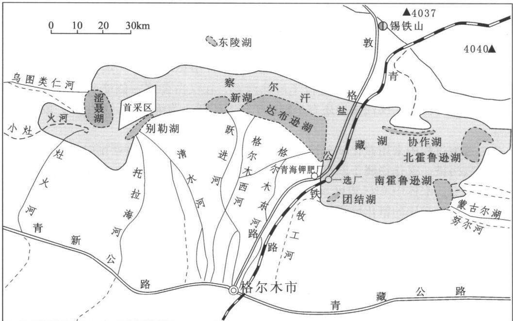  
图3-5 青海格尔木察尔汗盐湖开发区交通位置图

察尔汗钾盐湖开发的主要问题是共生伴生钠镁组分未利用和因老卤水排放导致的盐田

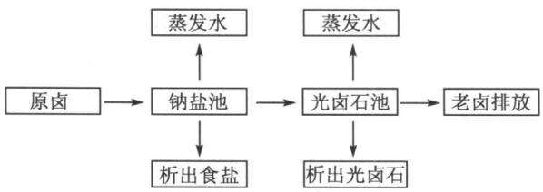  
图3-6 钾盐开发老卤水形成示意图

钾资源的破坏，以及排放不畅导致的环境地质问题。如废卤排放问题，采卤引发的漏斗问题以及地下水污染、地表水水患等。老卤水是钾肥生产过程中，暂时不能利用的卤水。卤水在盐田浓缩后析盐顺序依次为食盐（NaCl)、光卤石$( \mathrm { \Delta N a C l ~ + ~ \mathrm { \sc ~ K C l ~ + ~ \mathrm { \sc ~ K C l ~ \cdot ~ \mathrm { \bf ~ M g C l } _ { 2 } ~ \cdot ~ 6 H _ { 2 } O ~ } } } )$

而水氯镁石 $( \mathrm { K C l } \cdot \mathrm { M g C l } _ { 2 } \cdot 6 \mathrm { H } _ { 2 } \mathrm { O } )$ 为尚未结晶的析出的卤水，俗称老卤水。老卤水形成过程见图3-6。

老卤水中 $\mathbf { M g C l } _ { 2 }$ 的含量高达32.5%，而且还有硼、锂等多种有用元素，即老卤水仍是一种矿产资源并目可以通过综合开发利用。但是，由于经济技术原因，老卤水量太大暂时需要排放到开采区外作为一种资源储存起来，以备后用。由于受地形及工程条件制约，察尔汗盐湖开发的老卤水排放成为困扰察尔汗盐湖开发的一大问题。位于矿区南侧的团结湖本是一个季节性湖泊，现湖水域面积的扩大受自然因素影响较小，而主要受人为排卤形成。从1990年起，察尔汗区段钾盐开发逐步进入规模生产阶段，各生产厂家年排放老卤水量达 $2 0 0 0 \times 1 0 ^ { 4 } \mathrm { m } ^ { 3 }$ 。但老卤水排放至今未按设计要求排放到察尔汗以东50km外的南霍鲁逊湖中，在排放途中由于管道及高位渠漏卤严重，大部分老卤水返回到铁路东矿段和团结湖一带形成一片汪洋，原架空的排卤渠管道浸泡在老卤水之中，致使铁路东矿区南部水位抬高，遍地是老卤水。1983、1987、1989年湖水面积分别为3.2、0.36、8.64km²，湖

水平均深0.14m，密度 $1 . 2 1 \mathrm { g / c m } ^ { 3 }$ 。进入20世纪90年代后，在老卤水不断排入的影响下，湖面逐年扩大。遥感图像监测到1988年8月15日湖水面积为 $7 . 5 \mathrm { { k m } } ^ { 2 }$ 1994年5月3日为 $7 6 ~ \mathrm { k m } ^ { 2 }$ ，1996年9月13 日为 $9 6 \mathrm { k m } ^ { 2 }$ ，1997年团结湖水面积已达 $1 1 0 ~ \mathrm { k m } ^ { 2 }$ ，湖水平均深度为0.8m，储存老卤水量达 $8 8 0 0 \times 1 0 ^ { 4 } \mathrm { m } ^ { 3 }$ (图3-7)。

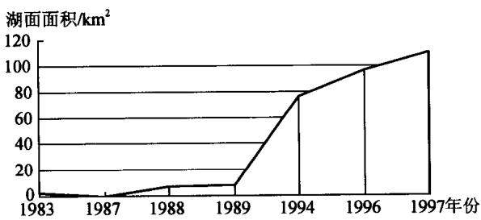  
图3-7 青海格尔木团结湖老卤水面积的变化情况

按老卤水含镁盐度30%计，排放镁

资源量 $2 6 4 0 0 \mathrm { m } ^ { 3 }$ 。矿区团结湖老卤水量的急剧扩大，加快了盐田中卤水老化程度，降低了钾盐资源的回收率。团结湖北岸线已抵达铁路以东两个采区的盐田，盐田南侧虽有较长的挡水坝，但坝下具有含渗透性良好的卤水石盐层，老卤水以地下径流的形式每年有$3 2 4 . 5 4 \times 1 0 ^ { 4 } \mathrm { m } ^ { 3 }$ 补给采区潜卤水。

老卤水与可采卤水混合发生对卤，导致可采卤水的密度增加，KCl含量降低， $\mathbf { M g C l } _ { 2 }$ 含量增加，加快卤水的老化进程，破坏卤水钾矿资源，直至失去开采价值。调查资料表明，目前团结湖老卤水向北浸入矿区距离已达2\~4km，浸入面积约 $4 0 \mathbf { k m } ^ { 2 }$ ，导致了浸区卤水钾矿开发向不利方向发展。而在市钾镁厂至市盐化总厂一带，卤水的密度达到 $1 . 3 1 \mathrm { g } / \mathrm { c m } ^ { 3 }$ 面积约15km²，已经变成了卤水完全老化区，钾矿转化不易采出，使本来可开发利用的卤水钾 $1 5 \mathrm { k m } ^ { 2 }$ 矿变成不能利用的卤水，势必造成钾矿资源的浪费，降低矿山服务年限（图3-8)。

老卤水严重地危及了矿区正常生产和生活。老卤水已沿青藏铁路两侧向北淹没到青钾一选厂生活区及察尔汗车站一带，通往车站的上矿公路全部被卤水淹没。二选厂以东大片地带常年集聚老卤水，原排卤管道和高位渠如今已淹没于湖水之中。敦煌一格尔木的215国道万丈盐桥路面曾一度被老卤水淹没。

## 3.4.6 石材类矿产开发中的环境地质问题

石材类矿产主要有花岗岩、大理岩、瓦板岩以及其他类型饰面石材等，其开采方式均为露天开采。目前，西北地区石材开采企业规模较小，加工技术普遍落后，成材率低，在导致资源浪费的同时，露天剥采造成植被被毁、土地资源破坏、水土流失加剧。

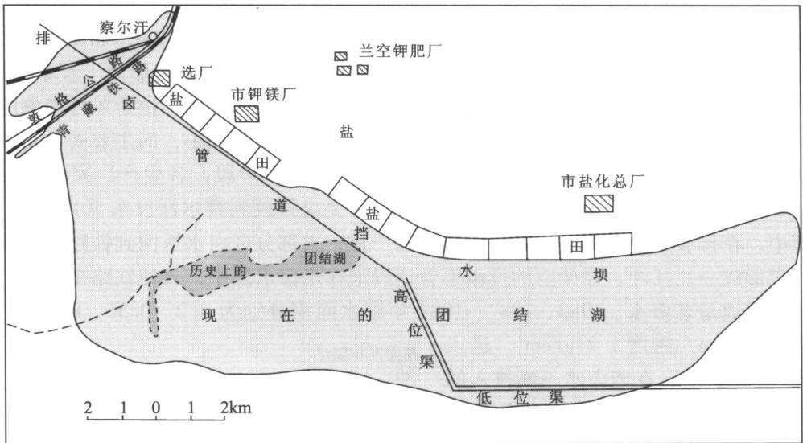  
图3-8 青海格尔木团结湖老卤水淹没矿区范围

陕西南部大巴山地区紫阳县优质瓦板岩矿，地处北亚热带季风温湿气候区，当地年降雨量1128mm，主要集中于每年的5\~10月。中山地貌，境内“V”字型沟谷地貌发育，河流切深近千米，沟谷纵比降大。柔软地层广布，风化层厚 $5 \sim 1 5 \mathrm { m }$ ，植被发育。该区经常发生局部暴雨灾害以及滑坡、泥石流地质灾害。瓦板岩分布面积约 $1 0 0 0 ~ \mathrm { k m } ^ { 2 }$ ，主要产于寒武-奥陶纪地层的泥炭质板岩，蕴藏储量 $6 0 \times 1 0 ^ { 8 } \mathrm { m } ^ { 3 }$ ，可供开发利用的储量为 $3 0 \times$ $1 0 ^ { 8 } \mathrm m ^ { 3 }$ ，潜在经济价值达2250亿元。其产品主要销往欧洲地区。目前全县共有板石企业15家，开采矿山80余处，1999年年产 $2 0 0 \times 1 0 ^ { 4 } \mathrm { m } ^ { 3 }$ ，年创外汇2000万美元，瓦板岩产品产值占全县工业总产值的45%。

瓦板岩矿均为露天开采，由于矿层之上覆盖层厚，剥离量大，加之长期采用落后的爆破垮落法开采，使得成品产出率仅为10%，90%左右的矿层破碎成为废渣。大量的废渣随陡峭的山坡倾倒，造成耕地被毁、植被破坏、河道堵塞。累计弃石、矿渣约3500×$1 0 ^ { 4 } \mathrm m ^ { 3 }$ ，压占土地植被500余ha。采矿形成了大量的基岩凌空面，其中45处高陡边坡为潜在滑坡，威胁3500余人安全；15处矿渣堆积造成边坡极不稳定，威胁坡下村庄安全。2000年7月11\~14日的特大暴雨诱发洪水形成泥石流地质灾害，造成202人死亡，4人失踪，211人受重伤，房屋垮塌16357间，危房有10314间，使4196户18043人无家可归。另外，农作物受灾8000ha，其中绝收4666.7ha，造成襄渝铁路中断运营达7天，累计直接经济损失达3亿元以上。目前，潜在滑坡泥石流重灾区主要分布于朱溪河流域、盘厢河中下游、权河口等历史上群采严重的地区，矿渣随沟弃置使泥石流物源“丰富”，压占植被，加剧了水土流失程度。河道堵塞，行洪断面缩小；河床抬高，水流不畅。

陕西留坝县青桥驿乡的雪花白白云大理石矿是优质建材饰面材料和工艺品原料，矿区位于秦岭山地，相对高差580m，区内地形陡峻，坡度 $3 3 ^ { \circ } \sim 6 5 ^ { \circ }$ ，矿体开采面土层覆盖厚度为 $2 \sim 5 \mathrm { m } _ { \circ }$ 该区年平均降雨量905.6mm，且主要集中分布在7\~9月，多暴雨，径流集中。森林覆盖率为90%。从1986年到2002年，该矿山剥采毁损植被面积6ha，弃渣14. $4 \times 1 0 ^ { 4 } \mathrm { m } ^ { 3 }$ 。剥离表土，损坏植被，基岩裸露，水土流失加剧。根据留坝县水土保持站对此矿山水土流失的调查，预测矿山建设期间弃渣流失系数为25%，也就是说，如不采取有效的水土保持防治措施，矿山年产24600m³的弃渣，年水土流失量将达6150m³。这些新增的泥沙流入汉中褒河水库，造成库区淤积，威胁沿河居民安全。同时，大量的弃渣堆积在山谷中的沟道内，堵塞河道，淤积河床，若遇暴雨和山洪暴发则会爆发泥石流或水石流地质灾害，殃及下游群众安全。

## 3.4.7 磷硫类矿产开发中的环境地质问题

磷硫化工类矿产开发，除了一般矿山均有的滑坡、泥石流、地面塌陷等环境地质问题外，其特殊的问题是硫铁矿开发的酸性矿坑水对矿区水土环境造成的污染。如陕西略阳硫铁矿开发排放的褐红色矿坑水进入河流，与山区中清澈河水混合成土褐色，造成河流严重污染，经过约3km长的河流自净化后，河水才开始变清。

## 3.5 不同开采方式产生的矿山环境地质问题

矿产资源开采方式主要有地下开采、露天开采及水力开采（砂金）等三种方式。由于开采方式不同，其导致的主要环境地质问题有较大的区别（表3-16）。

表3-16 不同开采方式产生的矿山环境地质问题
<table><tr><td rowspan=2 colspan=1>开采方式</td><td rowspan=1 colspan=4>矿山主要环境地质问题</td></tr><tr><td rowspan=1 colspan=1>资源毁损</td><td rowspan=1 colspan=2>地质灾害</td><td rowspan=1 colspan=1>环境污染</td></tr><tr><td rowspan=1 colspan=1>地下开采</td><td rowspan=1 colspan=1>矿井疏干排水，水均衡破坏，废渣压占土地植被</td><td rowspan=1 colspan=1>地面塌陷、地裂缝</td><td rowspan=2 colspan=1>固体废弃物堆放在斜坡体诱发滑坡、泥石流地质灾害</td><td rowspan=2 colspan=1>固体废弃物风化、遇大风吹扬、雨水冲刷使有毒有害物质污染水、土，酸性矿井水及有毒有害物质污染水体、土壤等</td></tr><tr><td rowspan=1 colspan=1>露天开采</td><td rowspan=1 colspan=1>改变原有地形地貌，外排土场压占土地植被、加剧水土流失和土地沙化，疏干排水造成地下水位下降，地表水量减少</td><td rowspan=1 colspan=1>露天开挖造成边坡失稳，诱发滑坡</td></tr><tr><td rowspan=1 colspan=1>水力开采</td><td rowspan=1 colspan=1>河道堵塞、草地破坏</td><td rowspan=1 colspan=2>威胁河道、桥梁安全</td><td rowspan=1 colspan=1>河流污染</td></tr></table>

## 3.5.1 地下开采矿山环境地质问题

地下开采导致的主要环境地质问题就是地面塌陷、地裂缝以及由其产生的山体开裂诱发的崩塌、滑坡等地质灾害，破坏了土地的完整性，降低了土地质量。另外，矿井疏干排水、矿井突水破坏了地下水均衡系统等。地下开采造成的环境地质问题以煤矿最为严重。

## 3.5.2 露天开采矿山环境地质问题

露天开采必须剥离矿体上方及周围的表土、植被与岩石，直接破坏了土地的完整性及其植被。大量的矿石及废石被采走后，强烈地改变了原有的地形地貌，破坏了风景景观和

旅游景观。埋藏较深的急倾斜矿床开采后会形成深浅不一的凹型露天坑，埋藏浅的缓倾斜和水平矿床开采后则形成凹陷型露天坑。矿坑疏干排水破坏地下水均衡系统，形成大面积的地下水下降漏斗。

## 3.5.2.1 外排土场压占土地植被数量巨大

露天开采剥离的大量岩土，除少数矿山采用内排土方式外，大部分为外排土堆放，因而除剥采占地外，废渣需压占新的大量土地，外排占用的排土场面积一般为采矿场占用面积的40%\~55%。据有关资料，我国露天煤矿外排土压占的土地，约是挖损土地的1.5\~2.5倍，露天矿正常生产后，每采万吨煤排土场平均压占土地0.16ha。我国铁矿开采以露采为主，剥采比多在2\~4倍之间，铁矿山每开采 $1 \times 1 0 ^ { 4 } t$ 矿石，废渣占有土地3.97ha。因此剥离量很大，历年排土量累计约在 $1 0 0 \times 1 0 ^ { 8 } \mathrm { t }$ 以上，每年以 $5 \times 1 0 ^ { 8 } \mathrm { t }$ 的速度增加。陕南石棉矿露天剥采面积约 $2 \mathbf { k } \mathbf { m } ^ { 2 }$ ，造成同等面积的山体植被破坏。

## 3.5.2.2 滑坡是露天矿山最主要的突发性地质灾害

露天开采排土不仅压占大量土地，而且随着排土堆高度的升高，潜伏着失稳和滑坡的隐患。采边滑坡是露天矿山最主要也是最普遍的地质灾害，严重时甚至导致露天矿提前关闭的重大损失。1983年7月9日，甘肃白银露天矿滑坡导致运输系统中断和生产设施破坏，停产三个月，铜产量减少3000t。金川露天矿因滑坡迫使运输道路改线，部分矿段提前闭坑停产。哈密三道岭煤矿1967、1983、1999年先后三次发生大的滑坡造成矿山多次停产，直接经济损失上百万元。白云鄂博铁稀土矿主采坑北部运渣道路因滑坡报废，直接经济损失90万元。甘肃厂坝铅锌矿区深凹的采坑北部高陡边坡存在多处滑坡危险，直接关系到露天矿安全生产，迫使矿山花费大量资金用于监测防治。陕西铜川焦坪前河露大矿采坑面积 $0 . 9 7 \mathrm { k m } ^ { 2 }$ ，造成同等面积的土地植被破坏。剥离边坡地段平均坡度约50°，高陡边坡已经有多处小滑坡体，潜在的滑坡隐患较为严重。

## 3.5.2.3 土地沙化和水土流失

为了防止地下水突然涌出而淹没露天开采场，必须进行矿坑疏干排水，降低预定开采地段的地下水位，而这会形成大面积疏干漏斗，破坏地表水和地下水系统平衡，导致当地水资源枯竭或取水困难，造成地下水位降低，地表径流减少或断流，导致表土缺水，影响植物生长，重则导致土地沙化、荒漠化。

## 3.5.2.4 水土环境的污染

露天开采剥离的岩土、排出的废石、矸石含有害元素，长期遭受风化雨淋，淋滤出酸性水或含有重金属的淋滤水，污染土地、河流，并通过裂隙带下渗地下污染地下水。

## 3.5.3 水力开采矿山环境地质问题

水力开采的矿产主要有砂金矿、河道沙石矿。其开采引起的主要环境地质问题是草地植被破坏、河流污染、水土流失和影响河道泄洪安全。无序的采金活动，致使大片草场被矿山废石占压，林木被盗伐，森林遭到破坏。河道采坑及堆放的残丘砾石以及淘空河岸、下蚀等威胁河道泄洪、桥梁安全。河床沉积物多次翻动，使河水浑浊不清，悬浮物含量严重超标，水体生态环境严重恶化，生物难以生存，鱼量锐减，导致部分区域产生严重的水土流失，重金属污染也成为潜在的隐患。

砂金开采主要集中在新疆阿尔泰、青海三江源头、可可西里，以及陕西汉江月河段、勉县、略阳，甘肃礼县及内蒙古大青山武川等地区。

砂金开采引起环境地质问题严重的地区如阿勒泰地区、青海“三江”源地区等。阿勒泰地区红墩砂金矿的开采始于1988年，在当初有水快流、多采快采、采好矿的经济利益驱动下，砂金开采造成 $1 . 5 \mathrm { k m } ^ { 2 }$ 的植被随地表粘土层和含金砂砾亚粘土被刮去1m多厚，排放的废石弃土堆积在离河道100m的地方，断续堆积的残丘珑岗成一字型沿河谷分布了15km。由于在河漫滩、Ⅰ级、Ⅱ级阶地采矿，破坏了河流堤岸的结构，使堤岸塌陷、河流改道，导致河流区段性弯曲和位移，侵占了原来的草场或农田约20ha。严重的水质污染造成两岸万余居民吃水困难。十余年的砂金开采，使矿山自然环境面貌全非，呈一片破落荒芜景象，与其周围的绿色景观迥然不同。

青海玉树藏族自治州为长江、黄河、澜沧江三大江河源头发源地，属于高原生态圈，生态环境极其脆弱。从20世纪80年代开始，几十万人涌到这里采金，几乎所有的河床都被翻了好几遍。一些地方政府为了自身利益，默许了这种违法活动，土地植被遭到严重破坏，河道千疮百孔，造成河流行洪不畅，水土流失，水质变化及提前进行渗漏。地表径流和地下水减少，加剧了区域性的干旱。称多县扎多砂金开采区，自1992年建矿以来，金矿开采区面积达 $2 , 2 \mathbf { k } \mathbf { m } ^ { 2 }$ ，累计复垦 $0 . 5 3 ~ \mathrm { { k m } } ^ { 2 }$ ，尚有 $1 . 6 7 \mathrm { k m } ^ { 2 }$ 的河道草地仍待复坑平整及恢复植被。令人吃惊的是包括长江在内有几十条大小河流流经的曲麻莱县，由于砂金无序开采，部分地区已面临生活饮用水缺乏的问题。

河道不合理地挖沙取石形成凹坑和废弃沙石堆，造成汛期河床不畅，洪水威胁河岸农田和桥梁安全。2002年6月8日晚至9日中午，西安市持续降雨，引发灞河水位暴涨，汹涌的洪水将1933年修建的150多米长的灞河铁路桥5个桥墩冲垮，陇海铁路西安段一度陷入瘫痪，直接和间接经济损失超过1亿元。大桥的垮塌原因是多方面的，但下游周边群众长年挖沙，引起河床连续下切是大桥垮塌的重要原因之一。

## 3.6 不同地质环境分区的矿山环境地质问题

同种矿产在不同地质环境背景区开发产生的主要环境地质问题是不同的，而同一地域不同类型矿产开发导致的主要生态环境问题具有相似性。西北地区的陕西、甘肃、宁夏、青海、新疆及内蒙古中西部地区的许多矿产资源富集区自然地理条件相对较差，成为制约矿产资源合理开发利用和生态环境恢复治理的主要因素之一。与矿产开发关系密切的地质环境背景区主要有秦岭山地型、黄土高原型、戈壁沙漠型和其他山地型4个生态环境脆弱区等（表3-17）。矿业开发加剧了所在脆弱生态环境背景区内的环境地质问题频度和灾害程度。

表3-17 不同地质环境背景区矿山主要环境地质问题
<table><tr><td rowspan=2 colspan=1>地质环境分区</td><td rowspan=2 colspan=1>主要矿产类型</td><td rowspan=1 colspan=3>矿山主要环境地质问题</td></tr><tr><td rowspan=1 colspan=1>资源毁损</td><td rowspan=1 colspan=1>地质灾害</td><td rowspan=1 colspan=1>环境污染</td></tr><tr><td rowspan=1 colspan=1>秦岭山地型</td><td rowspan=1 colspan=1>金属、非金属矿等</td><td rowspan=1 colspan=1>植被破坏</td><td rowspan=1 colspan=1>滑坡、泥石流、尾矿库溃坝、水土流失</td><td rowspan=1 colspan=1>河流污染</td></tr><tr><td rowspan=1 colspan=1>黄土高原型</td><td rowspan=1 colspan=1>石油天然气、煤炭、水泥灰岩等</td><td rowspan=1 colspan=1>土地破坏</td><td rowspan=1 colspan=1>地面塌陷、地裂缝、水土流失</td><td rowspan=1 colspan=1>河流污染、地下水污染</td></tr><tr><td rowspan=1 colspan=1>戈壁沙漠型</td><td rowspan=1 colspan=1>石油天然气、煤、盐矿</td><td rowspan=1 colspan=1></td><td rowspan=1 colspan=1>土地沙化</td><td rowspan=1 colspan=1></td></tr><tr><td rowspan=1 colspan=1>其他山地型</td><td rowspan=1 colspan=1>金属、煤炭、非金属矿等</td><td rowspan=1 colspan=1></td><td rowspan=1 colspan=1>滑坡、泥石流、水土流失</td><td rowspan=1 colspan=1>河流污染</td></tr></table>

## 3.6.1 秦岭山地区矿山环境地质问题

分布干陕南、陇南地区，属大陆温湿气候，年降雨量达600\~1000mm，植被发育且生态恢复再造能力强。主要矿产为金属和非金属矿产类，如小秦岭地区金矿区、秦岭中段的甘肃西和、成县一陕西凤县、太白铅锌矿区等。陕西汉中一安康地区水泥灰岩、重晶石、瓦板岩等非金属矿等。

## 3.6.1.1 滑坡、泥石流、尾矿库溃坝

秦岭山地矿山最主要的环境地质问题是滑坡、泥石流、尾矿库溃坝、河流污染和水土流失等，见表3-17。1987年至今，西北地区已有50座矿区发生过泥石流地质灾害，资料较详细的矿区21个，共发生23次泥石流，按严重程度划分等级为极严重级9处、严重级2处、中等级3处、轻度级7处。可见，严重程度以上的泥石流地质灾害占到了52.38%。其中直接经济损失超过500万元的有9处、1000万元的有8处、超过亿元的有2处。从泥石流数量来看，秦岭山地、其他山地分别发生了6处和15处，虽然秦岭山地泥石流发生次数仅占总数的28.6%，但是秦岭山地矿山一旦发生泥石流，其危害性更大，灾害损失更严重。西北地区两次直接经济损失上亿元的泥石流均发生在该区，分别是陕西潼关金矿区和紫阳瓦板岩矿区（表3-18）。

表3-18 秦岭山地矿区突发性地质灾害一览表
<table><tr><td colspan="1" rowspan="1">矿区</td><td colspan="1" rowspan="1">灾害发生时间</td><td colspan="1" rowspan="1">滑坡、泥石流、尾矿库溃坝</td></tr><tr><td colspan="1" rowspan="1">陕西金堆城钼矿区</td><td colspan="1" rowspan="1">1987年</td><td colspan="1" rowspan="1">暴雨引发尾矿库溃坝，造成严重的污染事故</td></tr><tr><td colspan="1" rowspan="1">陕西潼关黄金矿区</td><td colspan="1" rowspan="1">1994、1996年</td><td colspan="1" rowspan="1">暴雨诱发采矿废渣发生两次泥石流灾害，失踪死亡数百人，矿区设施被毁，直接经济损失上亿元</td></tr><tr><td colspan="1" rowspan="1">陕西紫阳瓦板岩矿区</td><td colspan="1" rowspan="1">2000年7月</td><td colspan="1" rowspan="1">特大暴雨引发泥石流灾害，202人死亡，襄渝铁路中断达7d之久</td></tr><tr><td colspan="1" rowspan="1">甘肃成县厂坝铅锌矿区</td><td colspan="1" rowspan="1">1984、1991年</td><td colspan="1" rowspan="1">两次大的泥石流共带出固体废渣13000m³，造成河道被堵近1/3</td></tr><tr><td colspan="1" rowspan="1">甘肃成县天子山铅锌矿区</td><td colspan="1" rowspan="1">1999年12月</td><td colspan="1" rowspan="1">尾矿库溃坝，近2×104m³尾矿渣泻人东河，河水严重污染</td></tr><tr><td colspan="1" rowspan="1">陕西潼关马口金矿区</td><td colspan="1" rowspan="1">2001年7月</td><td colspan="1" rowspan="1">尾矿库溃坝，造成附近农田污染</td></tr><tr><td colspan="1" rowspan="1">陕西凤县铅锌矿区</td><td colspan="1" rowspan="1">2001年11月</td><td colspan="1" rowspan="1">滑坡掩埋坑道造成7人死亡</td></tr></table>

## 3.6.1.2 河流污染

秦岭山地是有色金属矿产开发的主要产区之一，有黄金、铅锌、钼、汞锑、铜铁等矿产，加之民采矿山数量众多，采矿的矿坑水、选矿尾矿浆以及尾矿溃坝泄漏是河流污染的主要污染源。矿区河流污染严重的矿区如陕西潼关金矿区、凤县铅锌矿区、旬阳铅锌矿区、略阳多金属矿区，甘肃厂坝铅锌矿区、西和邓家山铅锌矿区等。

## 3.6.1.3 水土流失

由于地形陡峻，多属石质山地，土层较薄，采矿及废渣压占破坏植被，加之滑坡、泥石流发生，加重了长江上游汉江、嘉陵江、白龙江等支流水土的流失程度。一旦水土流失，则形成沙漠化，植被再难恢复，其危害程度不亚于黄土高原，更应引起重视。

## 3.6.2 黄土高原区矿山环境地质问题

分布于陕西北部、甘肃中东部、青海东部和宁夏南部，为沟、壑、梁、昴、塬地貌，半干旱气候条件，年降雨量200\~500mm，植被稀少。主要为石油天然气及煤炭等能源矿产。突出的矿山环境地质问题是开采引起的地面塌陷、地裂缝、山体滑坡破坏农田、水土流失和地下水污染等。

## 3.6.2.1 煤矿地面塌陷、地裂缝、煤矸石自燃

煤矿地面塌陷、地裂缝、煤矸石自燃等是该区最严重的环境地质问题。在调查收集资料的579座各类矿山中，115座矿山存在地面塌陷。其中，黄土高原地区煤矿塌陷区超过了44处，占塌陷矿数量的38.26%。由于黄土高原人口密集，地面塌陷对土地的破坏主要是对农田的破坏。陕西渭北地区的铜川、韩城、蒲白、澄合等矿务局各矿区位于黄土台塬，该区是陕西渭北主要的农业区和我国优质苹果的生产基地，这些国有大中型老煤矿区几十年的地下开采导致了地面塌陷、地裂缝以及山体开裂，成为西北地区煤矿开发对农业生产破坏最为严重的地区之一。陕西省煤矿采空区地面塌陷总面积约 $1 1 0 \mathbf { k m } ^ { 2 }$ ，主要分布干渭北及陕北煤矿区。不完全统计，1999年年底，铜川矿区地面塌陷面积 $6 3 . 8 2 \mathrm { k m } ^ { 2 }$ ，占到全省地面塌陷区的55.38%，其中80%为耕地。

在收集到的西北地区35处滑坡灾害中，秦岭山地有7处，黄土高原15处，其他山地13处。滑坡灾害规模在 $3 0 0 \times 1 0 ^ { 4 } \mathrm { m } ^ { 3 }$ 以上的有3处，分别为陕西铜川王石凹煤矿（430.5×$1 0 ^ { 4 } \mathrm m ^ { 3 } )$ 、内蒙古石拐煤 $\textcircled { 1 } ^ { 2 } ( 4 0 0 \times 1 0 ^ { 4 } \mathrm { m } ^ { 3 } )$ 和金华山煤矿 $( 3 6 9 \times 1 0 ^ { 4 } \mathrm { m } ^ { 3 } )$

煤矸石堆积长期占压土地，煤矸石自燃释放的有害气体对周围较为密集的村庄居民健康产生了危害。截至2000年，铜川矿务局下属12个矿山，煤矸石累计堆积量1264.99×$1 0 ^ { 4 } \mathrm { t }$ ，大小矸石山150余处，其中 $1 0 0 \times 1 0 ^ { 4 } \mathrm { t }$ 以上的矸石山35处，矸石压占土地 $2 . 3 7 \mathrm { k m } ^ { 2 }$

## 3.6.2.2 水土流失、环境污染

延安、榆林地区石油、煤炭开发加剧了陕北地区水土流失的程度。延安、榆林地区是全国唯一有民营个体非法从事石油资源开发的地区，梁峁上修建道路、平整井场导致水土流失加剧，生态环境恶化。

## 3.6.3 戈壁沙漠区矿山环境地质问题

包括沙地、低山丘陵，主要分布于新疆的三大盆地、甘肃西部、青海柴达木盆地、宁夏及陕西北部、内蒙古西部地区，为温带大陆性干旱气候，多风少雨，年降雨量不足200mm，而蒸发量高达3000mm。水资源匮乏，植被稀少且一旦遭到破坏恢复再造能力极差。主要矿产有新疆、青海的石油天然气，宁夏石嘴山、陕蒙接壤地区的煤炭资源以及甘肃、青海、新疆戈壁的金属矿产等。矿区开发导致表土疏松、浅部地下水渗漏、地表植被破坏等，加剧了土地荒漠化，使古沙翻新、沙丘活动，为风沙侵袭扩展提供了条件。

陕西神府煤田矿区地处毛乌素沙地边缘，由于地方、个体沿河沟两岸滥采乱挖，破坏植被，导致沙土裸露，水土流失加剧。自20世纪80年代中期开发以来，毁坏耕地666.7ha，堆放废渣超过 $6 0 0 0 \times 1 0 ^ { 4 } \mathrm { t }$ ，破坏植被4946.7ha，增加排入黄河泥沙量达 $2 0 1 9 \times 1 0 ^ { 4 } \mathrm { t }$

## 3.6.4 其他山地区矿山环境地质问题

祁连山、天山、阿尔泰山等地地形较陡，与秦岭山地不同的是岩石裸露、风化破碎。属干旱半干旱气候，年降雨量可达500mm，但多以暴雨形式出现，植被稀疏且恢复再生能力差。主要为金属、非金属矿产，如镜铁山铁矿、阿尔泰地区稀有金属矿等，滑坡泥石流是主要的地质灾害。1999年8月祁连山镜铁山铁矿区特大暴雨引发的泥石流，造成北大河堵塞、矿区遭淹，直接经济损失达数千万元。其次为土地沙化和草地退化等地质灾害。

新疆沙湾县金沟河一带的石灰岩矿区，在汛期沿沟 $5 \mathrm { k m } ^ { 2 }$ 的地段内曾多次发生崩塌、泥石流。1998年的泥石流造成矿坑被埋，房屋、高压线路冲毁，直接经济损失261.80万元。1999年8月，一场暴雨引发的洪水泥石流，造成多处崩塌，12m宽的公路被冲毁十几公里，三座桥梁、5km长的水泥渠被彻底冲毁，两个水电站被泥掩埋，国防公路中断近1个月，直接经济损失上千万元。乌鲁木齐南山煤矿区是泥石流灾害多发区，40年间这里曾发生过15次以上的滑坡、泥石流，其中，1988年和1995年的泥石流较为严重，直接经济损失1889.38万元。吉木萨尔县水溪沟煤矿1988年发生泥石流，停产二年；2000年6\~7月又发生泥石流数次，再次停产一年，直接经济损失15万元。拜城铁热克煤矿1992年7月1日发生的泥石流，造成15人死亡，直接经济损失1100万元等。

在宁夏石嘴山大风沟煤矿区1988年8月13日由暴雨引发的稀性泥石流，造成28人死亡，矿区被淤积堵塞，损坏房屋30多户，造成直接经济损失300万元。1997年8月13日在石嘴山汝淇沟暴雨引发的特大型泥石流地质灾害，造成2人死亡，直接经济损失4000万元。

## 3.7 不同规模企业矿山环境地质问题

截至2000年年底，西北地区共有各类矿山14936座，其中小型矿山约占98%。事实说明，国有大中型矿山企业在资源开发、环境保护方面明显好于地方及个体矿山。乡镇及个体矿山环境地质问题明显严重。

## 3.7.1 国有大中型矿山环境地质问题

国有及国有控股企业规模大，生产设备、技术工艺先进，管理到位，能很好地发挥企业的规模效益，矿产资源利用效率较高，综合利用程度较好，设有专门安全环保机构，矿区绿化和土地复垦进展趋势较好。部分地区因矿业开发生态环境得到了改善，如陕西神木神华集团神东公司大柳塔煤矿区等。但是，部分国有矿山也存在着较为严重的环境地质问题，如目前该区煤矿存在的严重的地面塌陷主要表现在国有矿区，这是因为其开采时间久，煤层埋藏浅，开采的煤层厚度大，导致了较大的采空区，造成地面塌陷影响范围、强度以及危害性远较小型煤矿大。如乌鲁木齐六道湾煤矿、宁夏石嘴山煤矿的地面塌陷面积分别为 $3 \mathrm { k m } ^ { 2 }$ 和 $6 . 9 7 \mathrm { k m } ^ { 2 }$

因开发理念、经济技术基础原因，一般而言，在矿产资源浪费方面集体矿甚于地方矿，地方矿又甚于国有矿，在某国有矿范围内地方矿与集体矿越多，矿产资源破坏与浪费越严重。据1995年对全国300多个各种类型煤矿进行的抽样调查，1995年国有矿、地方矿和集体矿的矿井煤炭资源回采率分别为56%、50%和38%。西北地区煤炭保有储量约占全国的40%。2000年全国国有重点矿产量 $\mathbf { 4 9 7 8 9 \times 1 0 ^ { 4 } t }$ ，地方国有矿产量 $1 6 7 6 6 \times 1 0 ^ { 4 } \mathrm { t }$ ，集体矿产量 $2 4 3 6 8 \times 1 0 ^ { 4 } \mathrm { t }$ ，三类企业矿井产量之比1.000：0.337:0.489，而同期西北地区煤矿中国有矿产量 $3 7 8 5 \times 1 0 ^ { 4 } \mathrm { t }$ ，地方矿产量 $2 6 6 0 \times 1 0 ^ { 4 } { \mathrm { t } }$ ，集体矿产量 $2 5 4 9 \times 1 0 ^ { 4 } \mathrm { t }$ ，三者之比 $1 . 0 0 0 : 0 . 7 0 3 : 0 . 6 7 3$ 。就产量而言，西北地区地方矿和集体矿在其总产量中的比重要比全国地方矿和集体矿在其总产量中的比重大得多。换言之，西北地区的矿产资源毁损情况比全国其他地区要严重。如甘肃窑街矿区有被小煤窑破坏的采区39个，破坏储量$4 3 . 9 6 7 \times 1 0 ^ { 6 } \mathrm { t }$ ，甚至造成防洪河堤、公路建筑物破坏、山体滑坡等。大柳塔地下煤矿的矿井回采率可达72%，而乡镇煤矿多小于35%。

国有矿山大部分矿山环境地质问题严重，主要是大型国有老煤矿开发诱发的地面塌陷、地裂缝等环境地质问题，以及露天矿强烈改变了原有地形地貌，大型硫化矿山矿石冶炼造成的大气环境污染问题，这些是矿山开发伴随产生的问题，由于经济技术原因，部分问题暂时还无法从根本上消除。但是，大型国有企业在矿山地质环境保护和矿产资源综合利用方面持续投入了人力、财力，为减轻矿业开发对环境的不利影响在积极努力，这是乡镇企业及个体矿山无法做到的。

## 3.7.2 小型矿山环境地质问题

十几年民采开发形成了一个不争的事实：凡是民采混乱矿区，其矿山生态环境均呈恶化态势。典型地区如陕西潼关金矿区、旬阳汞锑铅锌矿区、甘肃成县厂坝铅锌矿区、青海三江源头砂金矿区、阿勒泰砂金矿区、白云鄂博铁稀土矿区等。绝大多数乡镇企业及个体矿山的环境地质问题是暴富心态的观念意识在起作用，突出表现为严重的“只开发、不治理”的破坏性开采行为，在矿山环境地质保护方面几乎不做任何工作，换句话说，乡镇企业及个体矿山环境地质问题主要是人为因素引起的。

## 3.7.2.1 矿产资源破坏与浪费严重

乡镇企业及个体矿山规模小、资金短缺、人才匮乏、技术设施落后，采富弃贫、采厚弃薄，共生伴生组分大部分未利用，属掠夺式开发，矿山的回采率、选矿的回收率低。据有关资料，个体煤矿回采率为38%，低于国有矿山18个百分点、地方国有矿山12个百分点。陕北民采开发低渗透性石油资源的采收率仅8%左右，资源浪费惊人。黄陵苍村陕西煤炭建设一公司，由于主巷道前方采区煤已被个体煤矿采空，只好改变主巷道，经济损失巨大。

乡镇及个体掠夺式开发的典型矿区就是甘肃厂坝铅锌矿。该矿是1984年开工建设的国家“七五”和“八五”期间重点工程项目。自1986年以来，乱采滥挖的群采活动日趋严重，1989年以后民采对厂坝深部矿体进行掠夺式开采。先后非法进行开采的矿硐有数百个之多，人员达五六千之多，从小打小闹的局部开采到规模的斜井深部开采。随意布点，采富弃贫，呈现掠夺式开发。1997年矿区彻底整顿前，仅厂坝、李家沟及其外围约6km²范围内，群采矿硐就达126个。已建成投产的小选矿厂有50多家，日生产能力达到处理矿石5000\~6000t。1995年5月7日、9日厂坝露天矿连续多次大面积塌陷，被迫全线停产，直到10月份才恢复生产，直接经济损失2443.84万元，处理采空区又投入117万元。1997年7月11日，露天矿采场再次发生大面积塌陷，正在作业的6号钻机掉入下部采空区并报废，全矿停产长达半年之久，1998年12月31日才恢复生产，直接经济损失3078.58万元，复产后每年投入不少于90万元用于进行民采采空区的探测和处理。群采破坏了矿体的连续整体性，使露天采场范围内留下了大量的采空区和贫矿，富矿减少，铅锌金属量损失887283t，约占厂坝矿区设计储量的23.34%，厂坝原设计的一、二期工程金属量损失过半，矿石品位大幅度下降，造成一期工程无法正常生产。

由于深部民采坑及采空区无规可寻，迫使露天矿于2003年提前终止于1253水平面，二期最终设计的边界1058水平面的全部工程报废（图3-9），造成一、二期工程投资的7.3亿元难以收回，原计划60年的矿山寿命缩短至40年。

厂坝铅锌矿区地处长江上游嘉陵江支流东河流域，是长江上游水土流失重点保护区。矿区为石质山地，土层较薄。开挖硐口，砍伐树木，修建简易公路，硐口堆放废石弃渣，搭建工棚等，对地表植被破坏较严重。据不完全统计，仅厂坝铅锌矿区周围45个采矿点，破坏植被总面积达16880m²，废渣堆放量23431m³，致使山体满目疮痍，使良好的天然植被遭到严重破坏，弃渣有可能造成水土直接流失量8013t/a，新增水土流失量1440t/a。

甘肃文县境内的桥头地区金矿，据称储量已达120t以上，可望成为全国乃至亚洲最大的金矿。但是，近年来，蜂拥而至的采金者就地采矿、淘金，进行简单的金矿堆浸，乱采滥挖，使金的总提取率仅达50%，造成矿产资源的严重浪费。守矿护矿已成为文县政府部门的头等大事，2000年全年出动执法人员1350多人次、车辆370多辆次，关闭非法矿点410处，遣散淘金人员900多人。2001年关闭非法矿点270处，但是滥采乱挖屡禁不止，植被遭到严重破坏，剧毒氰化废水流入河流农田，环境污染危害严重，滑坡、泥石流等地质灾害增多。

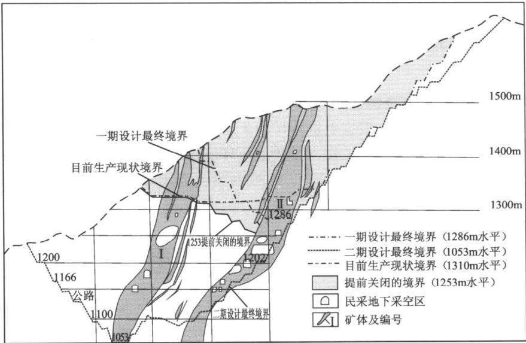  
图3-9 甘肃厂坝露天采场因民采被迫提前关闭

## 3.7.2.2环保意识淡薄，环境污染严重

陕西潼关、旬阳，甘肃成县、祁连山等部分地区个体矿山选矿厂无尾矿库，废水未经处理或处理不达标就予以排放，“三废”乱堆乱排加重了环境污染。潼关东桐峪部分个体选厂废水仍在直排，导致河水浑浊不堪。成县厂坝铅锌矿区民办小规模选厂多达50余家，酸性矿坑废水、选矿废水直排，造成东河河水因铅超标，其水功能由开发前的Ⅱ类降为V类，乡办冶炼厂采用国家命令禁止的烧结锅铅冶炼技术工艺，造成大气环境污染。

## 3.7.2.3 地质灾害预防措施不力，地质灾害隐患严重

陕西铜川陈炉镇新兴村私人小煤窑在利益的驱使下，十几年来肆无忌惮的在村庄下采煤，地基塌陷导致仅有60户的村庄有近40户的房屋受到了严重损害，不仅地基塌陷，裂缝满墙，村道上也出现了大的裂缝，严重威胁着村民的生命财产安全。

厂坝矿区沙洞湾的弃渣自1983年以来的7\~9月雨量集中的季节，已发生泥石流近10次，最大的两次是在1984年和1991年。1984年带出固体物质 $8 0 0 0 \mathrm { m } ^ { 3 }$ ，河床被堵四分之三，在东河中形成长40m的扇形地。1991年带出固体物质 $5 0 0 0 \mathrm { m } ^ { 3 }$ ，河床被堵断，后经疏通才未造成更大损失。厂坝一期工程和部分民采矿点沿东河东岸弃土石，现有废石 $1 0 \times$ $1 0 ^ { 4 } \mathrm m ^ { 3 }$ 。废渣就地堆积在高陡的山谷中，成为潜在的泥石流灾害隐患。同时部分个体选矿厂尾矿库直接建在选厂头顶，尾矿库一旦溃坝将危及选厂及工人人身安全。

## 3.8 导致矿山环境地质问题严重的主要因素

《中华人民共和国矿产资源法》明确规定，矿山采矿权人有责任对矿业开发破坏的地质环境进行恢复治理。但是，事实上进行矿山生态环境恢复治理的矿山企业并不多，有些企业根本无视矿山地质环境保护工作，导致地质环境质量明显下降。最为典型的是占矿山98%的中小型矿山“只开发，不治理”。导致西北地区矿山环境地质问题严峻的因素如下。

## 3.8.1 矿山地质环境防治法律政策不够完善

目前我国矿山环境保护的相关法律条文仍不够完善，一旦发生危害事件无法追究诱发矿山环境地质问题的采矿权人的责任。目前仍没有矿山建设环境地质影响评价制度、矿山开发生态环境恢复治理的保证金制度等，法律不严，处罚偏轻，难以对破坏矿区环境地质事件形成震慑性。

## 3.8.2 矿山地质环境恢复治理资金投入不足

国有矿山企业经营不善，经济效益欠佳，企业负担过重，特别是计划经济时期建立的国有老矿山，目前已无力担负起历史积累的矿山环境地质问题的治理任务。乡镇企业及个体矿山由于担心不能长期从事矿业生产，从事矿业活动的短期行为严重，力争尽快回收投资，因而采取挖富弃贫、采厚弃薄的破坏性方式开采矿产资源，只顾谋取利润，“三废”随地堆放，因而对环境的影响十分严重。

## 3.8.3 地质环境保护观念淡薄

当地政府主管部门及开采者，尤其是在边远贫穷和人烟稀少的地区，认为矿业开发对人类生存环境暂时不会有什么影响，或有影响但为了地方利益不惜以杀鸡取卵方式开发矿业，从不考虑矿山地质环境的保护与恢复治理工作。恰恰正是这部分生态环境脆弱区的环境未得到进一步保护，而危及人类的生存环境安全。如金川、白银等矿山露天矿已闭坑多年，废渣风化导致土地沙化、粉尘污染十分严重。

## 3.8.4 区域生态环境脆弱因素

西北地区生态环境的脆弱性十分明显，直接制约着西北地区矿山环境恢复治理的进程和成效，加大了工作难度。广大干旱、半干旱地区，降雨稀少，植被稀疏，水资源短缺，在这种生态环境下，一旦环境恶化，则难以恢复。因而，水资源成为制约生态环境恢复治理的主要问题。秦岭山地地形切割较深，虽然植被易恢复，但是废渣多堆放在斜坡上会引发滑坡、泥石流，而清理废渣、建拦渣疏导工程费用很高，加大了矿山生产成本，小矿山难以支撑。

## 3.8.5 缺乏矿山生态环境恢复治理示范性工程

西北地区绝大部分处于干旱、极干旱地区，生态环境脆弱，水资源匮乏，制约了矿山植被恢复，因而寻找适合该区生态环境恢复治理的工程技术方法尤为重要。

西北地区大多数矿山是在新中国成立后建设起来的。在20世纪80年代中期以前，尚无可持续发展理念和地质环境保护观念，近年来虽然矿山开始了治理工作，但方法和技术多依据东部发达地区或国外经验，由于缺乏适应干旱、半干旱矿山生态环境重建的可行性办法和对策，致使矿山生态重建工作进展和效果不甚理想，必须通过建立适合于本区矿山生态环境恢复治理的示范性工程，获得理论和方法上的突破，才能提高治理的有效性。

## 4 矿山地质环境质量评价

## 4.1 矿山地质环境质量评价

## 4.1.1 矿山地质环境质量评价的意义

矿山地质环境质量评价是在矿山地质环境调查研究的基础上，按照一定的评价原则和标准，选用合适的数学方法，对矿山地质环境质量优劣做出评判和等级划分，可揭示出评价等级“差”或“很差”的矿山存在的最主要环境地质问题。评价的目的是为政府有关部门监管、规划与治理矿山地质环境，矿山企业制定防治与减少矿业开发环境地质问题提供参考依据，因而矿山地质环境质量评价在矿山环境地质研究中具有重要的地位。其意义在于：

(1）它是矿山地质环境调查成果和图件编制的前提和基础。矿山地质环境调查的目的之一是对矿山环境地质问题的严重程度进行分级，为政府提供决策依据。只有在评价划分矿山地质环境质量优劣等级或矿山环境地质问题的严重程度等级后，才能采用一定的图式图例将成果在图上表示出来，因而它是矿山地质环境质量等级划分和成果图件编制工作的前提和基础。

(2)为政府实施矿山地质环境监管提供评判标尺。恶化的矿山地质环境必然阻碍矿山的正常生产，威胁矿区人居生态环境安全。保护和避免矿山地质环境恶化是政府监管与防治的一项工作。而矿山地质环境质量评价结果可使政府实施矿山地质环境监管和处罚有据（较差者—黄牌警告防治，差者—勒令停产整顿）（图4-1）。同时，可将有限的资金投入到急需治理的矿山，保护地质环境，促进矿区经济、环境和社会效益的协调发展。

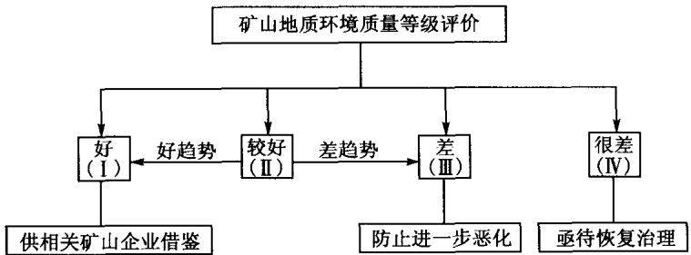  
图4-1 矿山地质环境质量评价的意义

## 4.1.2 矿山地质环境质量评价分类

矿山地质环境质量评价依照评价的对象或内容不同，可以分为矿山地质环境质量评价、矿山地质环境容量评价和矿山环境地质问题评价等。矿山地质环境质量评价依据“无问题无灾害”即“优良”的基本原则，即以矿山环境地质问题严重程度等级来反映矿山地质环境质量优劣等级，用一个中性词“质量”表述矿山环境地质问题轻重程度，即问题越多越严重，矿山地质环境质量愈差；反之，则好。

按照矿山地质环境质量评价的时间段分为回顾性评价、现状评价及预测评价三种类型。根据历史资料进行矿山环境地质问题的回顾性评价，即矿山环境地质问题历史评价，这种回顾性评价是建立在有历史资料积累的基础上完成的，通常只能在具有历史资料的大、中型矿山进行，其评价结果能反映矿区环境地质问题的发展变化过程；矿山地质环境现状评价是对目前矿山地质环境质量现状的评价，是根据调查期间调查收集的资料进行的，这种评价可阐明矿区环境地质问题的现状，是政府最为关心的问题，可为矿山地质环境保护与恢复治理提供依据，是矿山地质环境质量评价的最主要形式。矿山地质环境质量预测评价通常在矿山建设前或根据现有矿山环境地质问题现状，依据其地质环境条件、开发方式、开发强度等预测其将来可能产生的环境地质问题的种类、规模及危害程度等，是对未来地质环境的影响评价，其目的在于通过预测评价，为预防矿山环境地质问题选择经济上合理、技术上可行的防治方案，减少其不利影响。

根据评价的对象多少、内容复杂程度，矿山地质环境质量评价分为单问题评价和多问题综合评价等。

## 4.2 矿山地质环境评价指标体系

## 4.2.1 评价指标的要求

矿山地质环境质量评价是一个复杂的系统工程，在不同地质环境背景区以不同开采方式开采的不同矿产类型所导致的主要环境地质问题不同。影响矿山地质环境质量评价结果的因素众多，只有筛选出正确的评价因子，制定合理的评价等级，选用正确的评价方法，才有可能保证评价结果的科学性、客观性与可比性。评价因子的选择应遵循如下原则：

（1）科学性、客观性、实用性是矿山地质环境质量评价的最基本要求和原则。

(2)目的要求明确。针对不同的地质环境质量评价目的，应选择合适的评价因子和评价模型，才能使矿山地质环境质量评价结果有利于使用者制定相应的防治方案。

(3)确定合理的评价因子。矿山地质环境质量由多种影响因素决定，不同的因子反映了地质环境质量的某一方面，这就要求选择的任何一个因子在定量或定性评价中很难找到一个可以替代该因子全部特征的因子，该因子对系统评价影响最大、最直接。同一因子在评价体系中只能出现一次，以免影响评价中的“权值”。

(4)指标或因子值可以采用实测值、统计值或计算值为主，尽量避免定性描述人为赋值。

(5）制定合理实用的评价标准。指标或因子各等级的赋分值，及由各评价指标加权评定分值所确定的矿山地质环境质量等级要合理，便于操作。

(6)评价步骤。先是单因子或单问题等级划分及其等级评价，再是在各因子等级划分基础上，建立评价因子指标体系和综合评价模型，按所提出的评价方法，评价矿山地质环境质量。

## 4.2.2 评价指标体系

评价指标体系是由若干个单项评价因子及其权重值构成的有机整体。矿山地质环境质量评价或矿山环境地质问题评价是图件编制、矿山地质环境规划和矿山生态环境恢复治理的重要依据。目前，国内外尚无公认的评价指标体系，在评价矿区地质环境质量时，各家采用的评价指标不一致、方法不统一，因而其评价结果的主观性强，出现同一矿区地质环境质量评价结果因人而异的结论，降低了调查成果的可比性和可信度，为正确规划造成了一定困难。因此，制定科学性、客观性的矿山地质环境质量评价指标体系尤为重要。

矿产资源开发产生的环境地质问题涉及面广，在不同地质环境背景区以不同开采方式开采的不同工业类型的矿产所产生的环境地质问题种类、表现形式和严重程度有较大差异性。在某种意义上，评价出的矿山地质环境质量等级是相对的。

西北地区矿山地质环境质量评价体系包括两个层次：①要素层，即分资源毁损、地质灾害和环境污染3个要素；②指标层，即每一要素包括若干指标，一个指标又可用一个或若干个因子表征。图4-2所示为3个要素10个指标的矿山地质环境质量评价体系。

各要素的权值是指在评定矿山地质环境质量等级时，各要素在总的评价中重要程度。各指标的权值则表征其在评定相应要素等级时的重要程度。

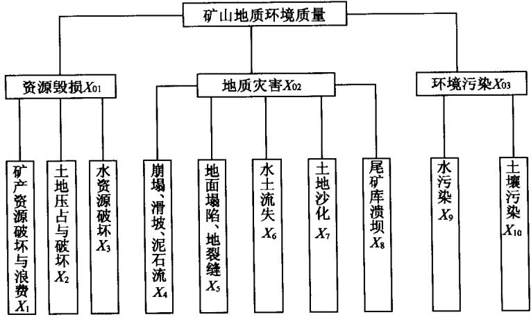  
图4-2 矿山地质环境质量评价体系

## 4.3 评价指标等级确定

中国地质调查局2004年10月颁行的中国地质调查工作标准《区域环境地质调查总则（试行）（DD2004-02)》（以下简称总则）规定按地质环境质量指标数值对评价区进行综合性区域地质环境质量等级分区，分区等级统一规定为：地质环境质量好、较好、较差、差四级，以此原则将评定矿山地质环境质量的指标因子及矿山地质环境质量等级划分为“好”（Ⅰ级）、“较好”（Ⅱ级）、“较差”（Ⅲ级）和“差”（Ⅳ级）等4个等级。

各等级赋值标准分值分别为：Ⅰ级0.3分、Ⅱ级0.5分、Ⅲ级0.7分、Ⅳ级0.9分。

指标因子等级赋值标准及指标加权综合评价时，由加权评定分值确定相应等级的标准，如表4-1。

表4-1 各指标因子等级赋值标准及加权评定分值对应等级
<table><tr><td rowspan=1 colspan=1></td><td rowspan=1 colspan=1>好（Ⅰ级）</td><td rowspan=1 colspan=1>较好（Ⅱ级）</td><td rowspan=1 colspan=1>较差（Ⅲ级）</td><td rowspan=1 colspan=1>差（IⅣ级）</td></tr><tr><td rowspan=1 colspan=1>各等级指标因子评定分值</td><td rowspan=1 colspan=1>0.3</td><td rowspan=1 colspan=1>0.5</td><td rowspan=1 colspan=1>0.7</td><td rowspan=1 colspan=1>0.9</td></tr><tr><td rowspan=1 colspan=1>各评价等级的指标加权评定分值 ${ { \cal F } } _ { 0 }$ </td><td rowspan=1 colspan=1>&lt;0.4</td><td rowspan=1 colspan=1>0.4~0.6</td><td rowspan=1 colspan=1>0.6~0.8</td><td rowspan=1 colspan=1>&gt;0.8</td></tr></table>

本书采用矿山环境地质问题的严重程度来表征矿山地质环境质量的优劣。评价地质环境质量首先要确定影响矿山地质环境质量指标的等级。确定评价指标等级有三种方法：

(1）直接采用国家标准、行业标准作为矿山地质环境质量评价指标因子等级的依据。这类指标主要有崩塌、滑坡、泥石流、地面塌陷、地裂缝、地面沉降等6类地质灾害；地表水、地下水、土壤环境重金属污染等指标。

（2）采用行业推荐值或地区（矿区）平均值作为划分指标等级的依据。

(3）依据矿山地质环境调查评价的实地情况，借鉴相关学科方法，制定适应于矿山地质环境质量评价的指标。优先制定定量化指标，确有困难时可采用定性描述指标等级。制定的指标有绝对数量指标和相对比率指标等。这类指标主要有矿产资源破坏与浪费、土地压占与破坏、水资源破坏、水土流失、土地沙化等。

本书以国家或行业标准为基础，结合西北地区实际情况，在听取有关专家意见的基础上，采用以下指标等级作为西北地区矿山地质环境质量评价的依据（表4-2至表4-11）。

表4-2 矿产资源破坏与浪费指标等级标准
<table><tr><td rowspan=1 colspan=2>评价指标等级（分值）</td><td rowspan=1 colspan=1>好(0.3)</td><td rowspan=1 colspan=1>较好（0.5）</td><td rowspan=1 colspan=1>较差（0.7）</td><td rowspan=1 colspan=1>差（0.9）</td></tr><tr><td rowspan=3 colspan=1>矿产资源破坏与浪费(x1)</td><td rowspan=1 colspan=1>共生伴生组分利用程度</td><td rowspan=1 colspan=1>达到行业同期水平</td><td rowspan=1 colspan=1>达到行业同期水平50%以上</td><td rowspan=1 colspan=1>不足同期行业水平的50%</td><td rowspan=1 colspan=1>基本未利用</td></tr><tr><td rowspan=1 colspan=1>开采的科学性与布局的合理性</td><td rowspan=1 colspan=1>开发科学规范</td><td rowspan=1 colspan=1>开发较为科学规范</td><td rowspan=1 colspan=1>布局不合理，一矿多开，大矿小开，技术落后</td><td rowspan=1 colspan=1>布局不合理，技术落后，破坏性开采现象严重，群采普遍，矿业秩序混乱</td></tr><tr><td rowspan=1 colspan=1>回采率</td><td rowspan=1 colspan=1>达到或超过同期全国平均水平</td><td rowspan=1 colspan=1>低于同期全国水平10%</td><td rowspan=1 colspan=1>低于同期全国水平10%~30%</td><td rowspan=1 colspan=1>低于同期全国水平30%</td></tr></table>

表4-3 土地压占与破坏指标等级标准
<table><tr><td rowspan=1 colspan=2>评价指标等级（分值）</td><td rowspan=1 colspan=1>好（0.3)</td><td rowspan=1 colspan=1>较好（0.5）</td><td rowspan=1 colspan=1>较差（0.7）</td><td rowspan=1 colspan=1>差(0.9)</td></tr><tr><td rowspan=3 colspan=1>土地压占与破坏 $( X _ { 2 } )$ </td><td rowspan=1 colspan=1>采矿场+废石场+尾矿库压占破坏土地面积 $/ \mathbf { k m } ^ { 2 }$ </td><td rowspan=1 colspan=1>&lt;0.1</td><td rowspan=1 colspan=1>0.1~0.5</td><td rowspan=1 colspan=1>0.5~1</td><td rowspan=1 colspan=1>&gt;1</td></tr><tr><td rowspan=1 colspan=1>压占土地类型</td><td rowspan=1 colspan=1>荒滩地</td><td rowspan=1 colspan=1>主要为稀疏草地灌木林地</td><td rowspan=1 colspan=1>草场、林地及工矿建设用地</td><td rowspan=1 colspan=1>农用地</td></tr><tr><td rowspan=1 colspan=1>直接经济损失/万元</td><td rowspan=1 colspan=1>&lt;100</td><td rowspan=1 colspan=1>100~500</td><td rowspan=1 colspan=1>500~1000</td><td rowspan=1 colspan=1>&gt;1000</td></tr></table>

表4-4 水资源影响程度指标等级标准
<table><tr><td rowspan=1 colspan=1>影响程度（分值）</td><td rowspan=1 colspan=1>轻度影响（0.3）</td><td rowspan=1 colspan=1>中度影响（0.5）</td><td rowspan=1 colspan=1>重度影响（0.7）</td><td rowspan=1 colspan=1>极度影响（0. 9）</td></tr><tr><td rowspan=1 colspan=1>水资源破坏 $( { \cal { X } } _ { 3 } )$ </td><td rowspan=1 colspan=1>水资源量变化不大或影响不大</td><td rowspan=1 colspan=1>部分影响矿区农业及居民饮水</td><td rowspan=1 colspan=1>大部分井、泉水位下降，居民及农业生产受到较大影响，对生态环境造成一定影响</td><td rowspan=1 colspan=1>大部分井、泉干枯，居民饮水困难或导致生态环境恶化</td></tr></table>

表4-5 地质灾害灾情与危害程度分级指标等级标准
<table><tr><td rowspan=1 colspan=1>指标等级</td><td rowspan=1 colspan=1>灾情①和危害程度等级②</td><td rowspan=1 colspan=1>死亡人数/人</td><td rowspan=1 colspan=1>受威胁人数/人</td><td rowspan=1 colspan=1>直接经济损失/万元</td></tr><tr><td rowspan=1 colspan=1>Ⅰ级（0.3）</td><td rowspan=1 colspan=1>一般级（轻）</td><td rowspan=1 colspan=1>&lt;3</td><td rowspan=1 colspan=1>&lt;10</td><td rowspan=1 colspan=1>&lt;100</td></tr><tr><td rowspan=1 colspan=1>Ⅱ级（0.5)</td><td rowspan=1 colspan=1>较大级（中）</td><td rowspan=1 colspan=1>3~10</td><td rowspan=1 colspan=1>10~100</td><td rowspan=1 colspan=1>100~500</td></tr><tr><td rowspan=1 colspan=1>Ⅲ级（0.7）</td><td rowspan=1 colspan=1>重大级（重）</td><td rowspan=1 colspan=1>10~30</td><td rowspan=1 colspan=1>100~1000</td><td rowspan=1 colspan=1>500 ~1000</td></tr><tr><td rowspan=1 colspan=1>IV级（0.9）</td><td rowspan=1 colspan=1>特大级（特重）</td><td rowspan=1 colspan=1>&gt;30</td><td rowspan=1 colspan=1>&gt;1000</td><td rowspan=1 colspan=1>&gt;1000</td></tr></table>

注：①灾情分级，即已发生的地质灾害灾度分级，采用“死亡人数”或“直接经济损失”栏指标评价，分级名称采用一般级、较大级、重大级和特大级。

②危害程度分级，即对可能发生的地质灾害危害程度的预测分级，采用“受威胁人数”或预评估的“直接经济损失”栏指标评价，分级名称采用轻级、中级、重级和特重级。

表4-6 地质灾害规模指标等级标准
<table><tr><td rowspan=2 colspan=1>指标</td><td rowspan=2 colspan=2>灾害等级评价等级灾种       规模</td><td rowspan=1 colspan=1>小型</td><td rowspan=1 colspan=1>中型</td><td rowspan=1 colspan=1>大型</td><td rowspan=1 colspan=1>特大型</td></tr><tr><td rowspan=1 colspan=1>好(0.3)</td><td rowspan=1 colspan=1>较好（0.5）</td><td rowspan=1 colspan=1>较差（0.7）</td><td rowspan=1 colspan=1>差(0.9)</td></tr><tr><td rowspan=4 colspan=1>崩塌、滑坡、泥石流 $X _ { 4 }$ </td><td rowspan=1 colspan=1>崩塌</td><td rowspan=1 colspan=1>体积 $/ 1 0 ^ { 4 } \mathrm { m } ^ { 3 }$ </td><td rowspan=1 colspan=1>&lt;1</td><td rowspan=1 colspan=1>1~10</td><td rowspan=1 colspan=1>10~100</td><td rowspan=1 colspan=1>&gt;100</td></tr><tr><td rowspan=1 colspan=1>滑坡</td><td rowspan=1 colspan=1>体积 $/ 1 0 ^ { 4 } \mathrm { m } ^ { 3 }$ </td><td rowspan=1 colspan=1>&lt;10</td><td rowspan=1 colspan=1>10~100</td><td rowspan=1 colspan=1>100~1000</td><td rowspan=1 colspan=1>&gt;1000</td></tr><tr><td rowspan=2 colspan=1>泥石流</td><td rowspan=1 colspan=1>体积 $/ 1 0 ^ { 4 } \mathrm { m } ^ { 3 }$ </td><td rowspan=1 colspan=1>&lt;1</td><td rowspan=1 colspan=1>1~5</td><td rowspan=1 colspan=1>5~50</td><td rowspan=1 colspan=1>&gt;50</td></tr><tr><td rowspan=1 colspan=1>流域面积 $/ \mathrm { k m } ^ { 2 }$ </td><td rowspan=1 colspan=1>&lt;2</td><td rowspan=1 colspan=1>2~20</td><td rowspan=1 colspan=1>20~200</td><td rowspan=1 colspan=1>&gt;200</td></tr><tr><td rowspan=2 colspan=1>地面塌陷、地裂缝 $X _ { 5 }$ </td><td rowspan=1 colspan=1>地面塌陷</td><td rowspan=1 colspan=1>影响范围 $\mathbf { \nabla } / \mathbf { k } \mathbf { m } ^ { 2 }$ </td><td rowspan=1 colspan=1>&lt;1</td><td rowspan=1 colspan=1>1~10</td><td rowspan=1 colspan=1>10~20</td><td rowspan=1 colspan=1>&gt;20</td></tr><tr><td rowspan=1 colspan=1>地裂缝</td><td rowspan=1 colspan=1>影响范围 $/ \mathbf { k } \mathbf { m } ^ { 2 }$ </td><td rowspan=1 colspan=1>&lt;1</td><td rowspan=1 colspan=1>1~5</td><td rowspan=1 colspan=1>5~10</td><td rowspan=1 colspan=1>&gt;10</td></tr></table>

注：灾害规模等级划分按中国地质调查局工作标准《区域环境地质调查总则（试行）（DD2004-02)》执行。

表4-7 水土流失指标等级标准
<table><tr><td rowspan=1 colspan=2>地质灾害等级分值</td><td rowspan=1 colspan=1>好（0.3)</td><td rowspan=1 colspan=1>较好（0.5）</td><td rowspan=1 colspan=1>较差（0.7）</td><td rowspan=1 colspan=1>差(0.9)</td></tr><tr><td rowspan=2 colspan=1>水土流失 $( X _ { 6 } )$ </td><td rowspan=1 colspan=1>水土流失表征</td><td rowspan=1 colspan=1>地形平缓水土流失轻微或无</td><td rowspan=1 colspan=1>建有拦渣导水及生物防护等工程，矿山型水土流失较轻</td><td rowspan=1 colspan=1>降雨量较大，废渣堆积在较缓斜坡上，水土流失明显</td><td rowspan=1 colspan=1>地形切割较深，降雨量大，没有拦渣导水及生物等工程措施，水土流失极明显</td></tr><tr><td rowspan=1 colspan=1>发生水土流失面积比/%</td><td rowspan=1 colspan=1>&lt;10</td><td rowspan=1 colspan=1>10~20</td><td rowspan=1 colspan=1>20~30</td><td rowspan=1 colspan=1>&gt;30</td></tr></table>

表4-8 土地沙漠化程度指标等级标准
<table><tr><td rowspan=1 colspan=1>指标</td><td rowspan=1 colspan=1>等级</td><td rowspan=1 colspan=1>指标等级</td><td rowspan=1 colspan=1>沙漠化程度</td><td rowspan=1 colspan=1>植被覆盖度</td></tr><tr><td rowspan=4 colspan=1>土地沙化 $X _ { 7 }$ </td><td rowspan=1 colspan=1>潜在沙漠化</td><td rowspan=1 colspan=1>好(0.3)</td><td rowspan=1 colspan=1>风沙活动较弱，地貌基本保持原来形态，局部有风蚀现象，小面积沙化土地多为古沙翻新。裸沙分布面积&lt;10%，沙层厚度大部分&lt;1m</td><td rowspan=1 colspan=1>原生植被已趋旱化、矮化，但仍占优势，土壤水蚀严重，可生长旱农作物，植被盖度&gt;40%</td></tr><tr><td rowspan=1 colspan=1>轻度沙漠化</td><td rowspan=1 colspan=1>较好（0.5）</td><td rowspan=1 colspan=1>风沙活动明显，原生地表已开始被破坏，多风蚀坡、坑、残墩，出现片状、点状沙地和灌丛沙堆。裸沙分布面积10%~30%，积沙厚度一般&lt;1m</td><td rowspan=1 colspan=1>原生植被退居次要地位，与沙生植被呈镶嵌分布，土壤粗化，牧草退化，土地适耕性下降，植被盖度20%~40%</td></tr><tr><td rowspan=1 colspan=1>中度沙漠化</td><td rowspan=1 colspan=1>较差（0.7）</td><td rowspan=1 colspan=1>风沙活动频繁，流动沙丘、灌丛、沙堆、固定沙丘与滩地相间分布，丘间和滩地开阔，多为牧场。裸沙分布面积30%~50%，积沙厚度一般仅数米</td><td rowspan=1 colspan=1>原生植被已衰败，多年生沙生植被较稀疏，牧草矮化，杂草入侵，人工草灌仅见于部分滩地，植被盖度&lt;20%</td></tr><tr><td rowspan=1 colspan=1>重度沙漠化</td><td rowspan=1 colspan=1>差(0.9)</td><td rowspan=1 colspan=1>风沙活动强烈，以流动半流动沙丘、沙地为主，沙丘连绵。风蚀地貌发育。裸沙分布面积占50%以上，积沙厚度沙漠区10~40m，其他沙区数米</td><td rowspan=1 colspan=1>原生植被已解体。多为一年生沙生植被所代替，植物稀疏低矮，植被盖度&lt;10%</td></tr></table>

表4-9 尾矿库泄漏及溃坝灾害指标等级标准
<table><tr><td rowspan=1 colspan=1>评价指标等级（分值）</td><td rowspan=1 colspan=1>好（0.3）</td><td rowspan=1 colspan=1>较好（0.5）</td><td rowspan=1 colspan=1>较差（0.7）</td><td rowspan=1 colspan=1>差（0.9）</td></tr><tr><td rowspan=1 colspan=1>尾矿库泄漏溃坝 $( X _ { 8 } )$ </td><td rowspan=1 colspan=1>尾矿泄漏、溃坝现象不明显</td><td rowspan=1 colspan=1>尾矿泄漏、溃坝，少量尾矿进入河流，污染时间短，易恢复</td><td rowspan=1 colspan=1>尾矿泄漏、溃坝造成部分地段河流农田严重污染</td><td rowspan=1 colspan=1>溃坝、坍塌、泄漏等有害物质污染主干河流或对饮水源地严重污染影响持久</td></tr></table>

表4-10 水污染指标 $\pmb { X _ { 9 } }$ 评价指标等级标准
<table><tr><td rowspan=1 colspan=1>污染等级</td><td rowspan=1 colspan=1>没有污染（Ⅰ级）</td><td rowspan=1 colspan=1>轻度污染（Ⅱ级）</td><td rowspan=1 colspan=1>中度污染（Ⅲ级）</td><td rowspan=1 colspan=1>重度（Ⅳ级）</td></tr><tr><td rowspan=1 colspan=1>评价指数等级</td><td rowspan=1 colspan=1>好（0.3）</td><td rowspan=1 colspan=1>较好（0.5）</td><td rowspan=1 colspan=1>较差（0.7）</td><td rowspan=1 colspan=1>差(0.9)</td></tr><tr><td rowspan=1 colspan=1>单项因子</td><td rowspan=1 colspan=1>不超标</td><td rowspan=1 colspan=1>超标小于1倍</td><td rowspan=1 colspan=1>超标1~5倍</td><td rowspan=1 colspan=1>大于5倍</td></tr></table>

注：地表水质量评价执行《地表水环境质量标准》GB3838—2002，地下水质量评价执行《地下水质量标准》GB/T 14848—93。

表 4-11 土壤污染指标 $X _ { 1 0 }$ 指标等级标准
<table><tr><td rowspan=1 colspan=1>污染等级</td><td rowspan=1 colspan=1>警戒线（Ⅰ级）</td><td rowspan=1 colspan=1>轻度污染（Ⅱ级）</td><td rowspan=1 colspan=1>中度污染（Ⅲ级）</td><td rowspan=1 colspan=1>重度污染（IV级）</td></tr><tr><td rowspan=1 colspan=1>评价指标等级</td><td rowspan=1 colspan=1>好（0.3)</td><td rowspan=1 colspan=1>较好（0.5）</td><td rowspan=1 colspan=1>较差（0.7）</td><td rowspan=1 colspan=1>差(0.9)</td></tr><tr><td rowspan=1 colspan=1>综合污染指数</td><td rowspan=1 colspan=1> $P _ { \frac { \mu } { \Im } } { \leqslant } 1 . 0$ </td><td rowspan=1 colspan=1> $1 . 0 < P _ { \xi _ { \mathrm { e } } ^ { \alpha } } \leqslant 2 . 0$ </td><td rowspan=1 colspan=1> $2 . 0 < P _ { \xi _ { \mathrm { \scriptscriptstyle F } } ^ { \alpha } } \leqslant 3 . 0$ </td><td rowspan=1 colspan=1> $3 . 0 < P _ { \frac { \log } { 3 } }$ </td></tr><tr><td rowspan=1 colspan=1>污染水平</td><td rowspan=1 colspan=1>半清洁</td><td rowspan=1 colspan=1>土壤污染物超过背景值，为轻污染，农作物开始污染</td><td rowspan=1 colspan=1>土壤农作物受到中度污染</td><td rowspan=1 colspan=1>土壤农作物受到污染，相当严重</td></tr></table>

注：土壤评价执行《土壤环境质量标准》GB15618—1995。

当某一指标只有一个因子时，该因子数值的评定等级就是该指标的评定等级。如果某指标可用若干因子表示时，则应选定这些因子数值评价等级中表征地质环境质量最差者为该指标的评定等级。

## 4.4 地质环境质量评价流程

本书中地质环境质量是用10个指标来表征的，每个指标等级又可用一个或多个定量或定性因子评定。地质环境质量综合评价等级，应该是各个指标评定等级用一定方法进行合理综合的结果，而各个指标等级是这样来评定的：当该指标只用一个因子表示时，由该因子数值的评定等级即是指标评定

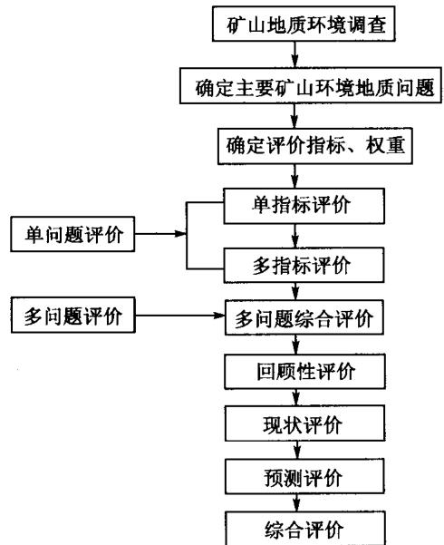  
图4-3 矿山地质环境质量综合评价流程图

等级：如果某指标可用若于因子表示时，则应选定这些因子数值所评价等级中表征地质环境质量差者为该指标所评定等级。据此，矿山地质环境质量综合评价流程如图4-3所示。

## 4.5 矿山地质环境质量综合评价模型

矿山地质环境质量综合评价，就是将矿山种种环境地质问题的严重程度给予定量综合评定。影响矿山环境地质问题程度等级的因素十分复杂，目前尚无通用评价方法，可采用要素指标加权分值综合评价法、模糊数学多层次综合评判法和灰局势评判法等，每种方法各有特点，而使用时也有一定局限性。

## 4.5.1 要素指标加权分值综合评价法

(1)要素各指标加权评价：

$$
F _ { j } = \sum _ { i = 1 } ^ { n } F _ { i } \pmb { W } _ { i }\tag{4 - 1}
$$

式中： $F _ { j }$ ——要素加权分值（j =I，Ⅱ，Ⅲ三要素）；

$\boldsymbol { F } _ { i }$ ——每一要素中各指标评定分值；

$\pmb { \mathscr { W } } _ { i }$ ——各指标权值；

n——各要素指标个数（每一要素中n可能不同）。

(2) 地质环境质量等级综合评价：

$$
F _ { 0 } \ = \ \sum _ { j \ = 1 } ^ { n ^ { \prime } } \ F _ { j } \ W _ { j }\tag{4-2}
$$

式中： $F _ { 0 }$ ——地质环境质量综合加权评价分值；

$W _ { j }$ ——各要素权值；

j—环境地质问题所含要素，一般 $n ^ { \prime } = 1 , \ 2 , \ 3$ ，对应于Ⅰ、Ⅱ、Ⅲ要素。

求出 $F _ { 0 }$ 后，即可根据综合加权评定分值（表4-1）确定地质环境质量综合评定等级。

## 4.5.2 模糊数学多层次综合评判法

## 4.5.2.1 初级评判

以三个要素（资源毁损、地质灾害和环境污染）的i个指标（第Ⅰ要素 ${ i = n }$ ，第Ⅱ要素 $i = m$ ，第Ⅲ要素 $i = p )$ 评价等级，构建各要素对评价等级的隶属度矩阵 $R _ { 1 } , R _ { 2 } , R _ { 3 }$

$$
\begin{array} { r } { \underbrace { R _ { 1 } } _ { \sim } = \left[ \begin{array} { c c c c c } { r _ { 1 1 } } & { r _ { 1 2 } } & { r _ { 1 3 } } & { r _ { 1 4 } } \\ { r _ { 2 1 } } & { r _ { 2 2 } } & { r _ { 2 3 } } & { r _ { 2 4 } } \\ { \cdots } & { \cdots } & { \cdots } & { \cdots } \\ { r _ { n 1 } } & { r _ { n 2 } } & { r _ { n 3 } } & { r _ { n 4 } } \end{array} \right] \quad \underbrace { R _ { 2 } } _ { \sim } = \left[ \begin{array} { c c c c c } { r _ { 1 1 } } & { r _ { 1 2 } } & { r _ { 1 3 } } & { r _ { 1 4 } } \\ { r _ { 2 1 } } & { r _ { 2 2 } } & { r _ { 2 3 } } & { r _ { 2 4 } } \\ { \cdots } & { \cdots } & { \cdots } & { \cdots } \\ { r _ { m 1 } } & { t _ { m 2 } } & { r _ { m 3 } } & { r _ { m 4 } } \end{array} \right] \quad \underbrace { R _ { 3 } } _ { \sim } = \left[ \begin{array} { c c c c c } { r _ { 1 1 } } & { r _ { 1 2 } } & { r _ { 1 3 } } & { r _ { 1 4 } } \\ { r _ { 2 1 } } & { r _ { 2 2 } } & { r _ { 2 3 } } & { r _ { 2 4 } } \\ { \cdots } & { \cdots } & { \cdots } & { \cdots } \\ { r _ { p 1 } } & { t _ { p 2 } } & { r _ { p 3 } } & { r _ { p 4 } } \end{array} \right] } \end{array}
$$

已知，各要素指标权值模糊子集 $A _ { 1 } , A _ { 2 } , A _ { 3 }$

$$
\begin{array} { r l r l r l r } { A _ { 1 } = } & { { } \left( \ b { W ^ { \prime } } _ { 1 } , \ \ b { W ^ { \prime } } _ { 2 } , \ \cdots , \ \ b { W ^ { \prime } } _ { n } \right) } & { } & { A _ { 2 } = } & { { } \left( \ b { \ W ^ { \prime } } _ { 1 } , \ \ b { W ^ { \prime } } _ { 2 } , \ \cdots , \ \ b { W ^ { \prime } } _ { n } \right) } & { } & { A _ { 3 } = } & { { } \left( \ b { W ^ { \prime } } _ { 1 } , \ \ b { W ^ { \prime } } _ { 2 } , \ \cdots , \ \ b { W ^ { \prime } } _ { p } \right) } \end{array}
$$

用模糊数学矩阵复合运算，得每一要素初级评判结果。

$$
\begin{array} { r l } { B _ { 1 } ^ { { \bf \Gamma } } = A _ { 1 ^ { \circ } } ^ { { \bf \Gamma } } R _ { 1 } ^ { { \bf \Gamma } } = } & { { } ( b _ { 1 1 } , ~ b _ { 1 2 } , ~ b _ { 1 3 } , ~ b _ { 1 4 } ) } \\ { \widetilde { B _ { 2 } } = \widetilde { A _ { 2 ^ { \circ } } } \widetilde { R _ { 2 } } = } & { { } ( b _ { 2 1 } , ~ b _ { 2 2 } , ~ b _ { 2 3 } , ~ b _ { 2 4 } ) } \\ { \widetilde { B _ { 3 } } = \widetilde { A _ { 3 ^ { \circ } } } \widetilde { R _ { 3 } } = } & { { } ( b _ { 3 1 } , ~ b _ { 3 2 } , ~ b _ { 3 3 } , ~ b _ { 3 4 } ) } \end{array}
$$

## 4.5.2.2 二级评判

以三要素初级评判结果构建矿山环境地质问题对评价等级的隶属度矩阵

$$
\begin{array} { r } { R _ { 0 } = \left[ \begin{array} { l l l l } { b _ { 1 1 } } & { b _ { 1 2 } } & { b _ { 1 3 } } & { b _ { 1 4 } } \\ { b _ { 2 1 } } & { b _ { 2 2 } } & { b _ { 2 3 } } & { b _ { 2 4 } } \\ { b _ { 3 1 } } & { b _ { 3 2 } } & { b _ { 3 3 } } & { b _ { 3 4 } } \end{array} \right] } \end{array}
$$

已知三要素权值模糊子集， $\begin{array} { r } { W _ { 0 } = { \mathbf \Psi } ( \begin{array} { l } { \mathbf { W } _ { 1 } , } \end{array}  \ W _ { 2 } , \ W _ { 3 } ) } \end{array}$

用模糊数学矩阵复合运算得矿山环境地质问题严重程度二级评判结果：

$F _ { 0 } = W _ { 0 } \circ \ R _ { 0 } = \ ( f _ { 1 } , \ f _ { 2 } , \ f _ { 3 } , \ f _ { 4 } ) =$ (好，较好，较差，差)， $\mathbf { M a x } f _ { i }$ 对应的等级为模糊综合评定等级，即为矿区地质环境质量等级。

## 4.5.3 综合评价指标权值的确定

本书中所说矿山地质环境质量是由10个指标所构成的系统状态确定的，每个评价指标都从不同方面表征了这一系统某一方面所具有状态的等级。评价指标之间相对重要性是不同的，指标之间的这种相对重要性的大小可用权值表征，若 $\pmb { W } _ { j }$ 是评价指标 $\chi _ { j }$ 的权值，一般应有 $1 \leqslant W _ { j } \leqslant 0 ( j = 1 , \ 2 , \ \cdots , \ m ) , \ \sum _ { j = 1 } ^ { m } \ W _ { j } = 1$ ，m是指标个数。

显然已知评价指标值或实情描述后，指标的等级就能划定，同时指标的分值也就确定，这时，综合评价结果就取决于权值，即权值确定的合理与否，关系到综合评价结果的可信程度，因此，要特别重视权值的确定。

评价指标权值可采用层次分析法、调查统计法和集值迭代法，前两种方法是实际运用较多的主观赋权法。我们知道权值从原理上讲可用两种方法来确定：主观赋权法和客观赋权法。对同一问题的评价指标讲，把主观赋权法所求出的权值与客观赋权法所确定的权值有机地综合，得出所谓综合权值，这个权值能同时体现主观信息和客观信息，比单独用某一种方法所确定的权值更为合理。

## 4.5.3.1 客观赋权值法——熵值法

众所周知，即使某个评价指标非常重要，但在n个被评价对象中，若其取值的波动程度甚小，那么，无论其取值有多大，对这几个被评价对象来说，该指标在评价过程中，对评价结果的影响都是非常小的。反之，若某个评价指标虽然不太重要（却不能舍去），但在几个被评价对象中，它的取值的变化（或波动）程度却非常大，那么，对这几个被评价对象来说，该指标在评价过程中对评价结果的影响是很大的。这时，相对于几个被评价对象来说就会出现这种情况，即不重要指标的作用，远大于重要指标在评价过程中所起的作用。

客观赋权值法的基本思想是：权值应是各个指标在指标总体中的变异程度和对其他指标影响程度的度量，赋权的原始信息应当直接来源于客观环境，可根据各指标所提供的信息量的大小来决定相应指标的权值。

客观赋权法的特点是：①不具有任何主观色彩；②具有评价过程的透明性、再现性；③确定的权值 $\pmb { W } _ { i } ( j = 1 , \ 2 , \ \cdots , \ m )$ 将不具有继承性、保序性。

1850年德国物理学家克劳修斯（K. clausius）首次提出了熵（entropy）的概念，用其描述热力学第二定律——熵增原理。1923年我国物理学家胡刚复教授首次把 entropy译成“熵”，他从熵热量变化dQ与温度T的比 $\mathrm { d } Q / T$ 出发，把商字加火旁译为熵。1948年，信息学创始人之一美国人申农（C.E.Shannon）提出了广义的信息熵，引入了概率的概念，此时，他意识到熵是对“不确定性”的最佳测度，他给出了信息熵的公式： $H =$ $- k Z P _ { i } \log P _ { i }$ ，表明某项试验的第 $i \in ~ \left[ 1 , ~ n \right]$ 种状态出现的概率为 $P _ { i }$ ，它所提供的信息量

为熵值 $H _ { \circ }$

我国学者邱苑华把信息熵理论移植到管理决策中，她提出在有m个评价指标、n个被评价对象的评价问题，即所谓 $( m , ~ n )$ 评价问题中，第i个评价指标的熵可用以下公式确定：

$$
H _ { i } = - k \sum _ { j = 1 } ^ { m } f _ { i j } \ln f _ { i j } \qquad j = 1 , 2 , \cdots , m ; i = 1 , 2 , \cdots , n\tag{4-3}
$$

式中 $f _ { i j } = r _ { i j } \bigg / \sum _ { j = 1 } ^ { m } r _ { i j } ; j = 1 , 2 , \cdots , m ; i = 1 , 2 , \cdots , n ; k = 1 / \ln n $ ，并假定当 $f _ { i j } = 0$ 时， $f _ { i j }$ $\mathbf { j } _ { \Pi } f _ { i j } = 0 .$

其第j个指标的熵权 $\pmb { \mathbb { W } } _ { j }$ 可用下式求出

$$
\mathcal { W } _ { j } \ = \ 1 \ - \ H _ { j } \Big / m - \sum _ { i \ = 1 } ^ { m } H _ { j }\tag{4 -4}
$$

熵权有如下性质：

(1)各被评价对象在指标j上的值完全相同时，熵值达到最大值1，熵权为0，这意味着该指标没向评价人提供有用信息，该指标可以考虑取消。指标的熵值越大，其熵权越小，该指标越不重要，而且满足 $0 \leqslant \mathbb { W } _ { j } \leqslant 1$ 和 $\sum _ { j = 1 } ^ { m } \ W _ { j } = 1$

（2）当各被评价对象在指标j上的值相差较大、熵值较小、熵权较大时，说明该指标向评价人提供了有用的信息。同时说明在该问题中，各对象在该指标上有明显差异，应重点考察。

(3)作为权值的熵权，有其特殊意义，它并不是指某指标在实际意义上的重要程度系数，而是给定被评价对象在已确定的各种评价指标值的情况下，各指标在评价结果中起作用程度大小的系数。

## 4.5.3.2 主观赋权值法举例—集值迭代法

根据人们主观上对各评价指标的重视程度来确定其权值，其特点是：

（1）含有主观色彩，即赋权结果与评价者（或决策者）的知识结构、工作经验及偏好有关；

(2)评价过程的透明性、再现性差；

(3)在一定的时间内，权值 $\ b { W } _ { i } ( j = 1 , \ 2 , \ \cdots , \ m )$ 具有保序性和继承性。实质上，这是一种求大同存小异的方法。

现将地面塌陷地裂缝、水土流失、崩塌滑坡泥石流、土地沙化和尾矿库溃坝等评价指标分别记为 $\chi _ { 1 } , \chi _ { 2 } , \cdots , \chi _ { s }$ ，分别请4位专家独立地从指标集 $X = \{ \chi _ { 1 } , \chi _ { 2 } , \cdots , \chi _ { s } \}$ 中挑出本人认为是重要的3个指标构成4个指标子集，依次记为：

专家1： $\begin{array} { c c c } { { X \ ( 1 ) } } & { { = } } & { { \left\{ \chi _ { 1 } , \ \chi _ { 2 } , \ \chi _ { 4 } \right\} } } \end{array}$ 专家2：X(2) = {x1，X3，χ4}

专家3： $X ( 3 ) = \{ \chi _ { 1 } , \chi _ { 3 } , \chi _ { 4 } \}$ 专家4： $X ( 4 ) = \{ \chi _ { 1 } , \chi _ { 2 } , \chi _ { 4 } \}$

指标x被选中的次数为 $\chi _ { 1 }$ $: g ( \chi _ { 1 } ) = 1 + 1 + 1 + 1 = 4$

指标 $\chi _ { 2 }$ 被选中的次数为 $: g ( \chi _ { 2 } ) = 1 + 0 + 0 + 1 = 2$

指标 $\chi _ { 3 }$ 被选中的次数为： $g ( \chi _ { 3 } ) = 0 + 1 + 1 + 0 = 2$

指标 $\chi _ { 4 }$ 被选中地次数为： $\scriptstyle \cdot g ( \chi _ { 4 } ) = 1 + 1 + 1 + 1 = 4$ 指标 $\chi _ { 5 }$ 被选中地次数为： $g ( \chi _ { s } ) = 0 + 0 + 0 + 0 = 0$

将比值 $W _ { j } = \frac { g ( \chi _ { j } ) + \frac { 1 } { 2 } m } { \displaystyle \sum _ { k = 1 } ^ { m } g ( \chi _ { k } ) + \frac { 1 } { 2 } m } \left( j = 1 , ~ 2 , ~ \cdots , ~ m \right)$ 视为指标x的权值，归一化后得 $\chi _ { j }$

$W _ { \mathrm { 1 } } = 0 . 2 7$ $\pmb { W _ { 2 } } = 0 . 1 8$ $W _ { 3 } = 0 . 1 8$ ${ \mathbb { W } _ { 4 } = 0 . 2 7 }$ $W _ { 5 } = 0 . \ 1 0$ ，式中 $\textbf { \textit { g } } ( \chi _ { j } )$ 为第j位专家对指标 $\chi _ { 1 }$ 被选中的次数， $\textbf { \textit { g } } ( \chi _ { k } )$ 是第k位专家在指标集X中依次选取他认为重要的指标$\chi _ { j } ( j = 1 , ~ 2 , ~ \cdots , ~ 5 )$ 的次数，m为指标个数。

## 4.5.3.3 综合权值的确定

已知评价指标有m个，按客观赋权熵值法求出第j个评价指标的熵权 $\boldsymbol { \ W { \scriptscriptstyle \left( \mathcal { W } _ { s j } \right. } }$ ，按照主观赋权法得到这个指标的权值为 $\pmb { \ W } _ { z }$ ，二者综合即可按下式求得这个评价指标的综合权值 $\mathbb { W } _ { 0 j }$ .

$$
W _ { 0 j } \ = \ W _ { z j } W _ { s j } \Big / \sum _ { j = 1 } ^ { m } W _ { z j } W _ { s j }\tag{4-5}
$$

## 4.5.4 评价指标熵熵权加权综合评价

在得出评价指标熵 $H _ { j }$ 及其熵权 $W _ { j }$ 之后，当知道被评价对象某指标取值 $r _ { i j } \ \textit { } ( i = 1$ $2 , \ \cdots , \ n ; \ j = 1 , \ 2 , \ \cdots , \ m )$ 占全部被评价对象某指标取值之和 $\sum _ { j = 1 } ^ { m } r _ { i j } \ \left( \boldsymbol { i } = 1 , \ 2 , \ \cdots , \ n ; \right.$ $j = 1 , \ 2 , \ \cdots , \ m )$ 的比重时，则可视为该指标某一可能结果对应的概率值：

$$
f _ { i j } \ = \ r _ { i j } \bigg / \sum _ { j \ = 1 } ^ { m } r _ { i j }
$$

评价对象指标熵熵权加权综合评价值 $A _ { j }$ 可按下式计算：

$$
A _ { j } \ = \ \sum _ { j = 1 } ^ { m } \ W _ { j } \cdot f _ { i j } \quad j \ = \ 1 , 2 , \cdots , m ; i \ = \ 1 , 2 , \cdots , n\tag{4 - 6}
$$

用上述方法求出指标熵加权综合评价值 $A _ { j }$ 及其倍比 $a _ { i }$ 后即可对各被评价对象作出定量评价排序和分级。

## 4.6 矿山地质环境质量综合评价举例

本例用要素指标加权分值综合评价、多层次模糊数学综合评价以及灰局势评价，评定某矿区六个生产矿山地质环境质量等级的全过程。据矿山环境地质问题实地调研所得资料和数据，以4.3、4.4、4.5节矿区地质环境质量评价指标等级确定和矿区地质环境质量综合评价模型所述内容，确定各矿山地质环境质量评价指标的等级和相应的分值，列于表4-12。

花护热花全
<table><tr><td></td><td></td><td rowspan=3 colspan=1>一矿「1j</td><td rowspan=3 colspan=1>二矿「2j</td><td rowspan=3 colspan=1>三矿r3j</td><td rowspan=3 colspan=1>四矿r4j</td><td rowspan=3 colspan=1>五矿r5j</td><td rowspan=3 colspan=1>六矿r6j</td><td rowspan=3 colspan=1>6Σi=1,2,…,6Hj=1,2,…,10</td><td rowspan=2 colspan=1>指标熵</td><td rowspan=2 colspan=1>指标熵权</td></tr><tr><td rowspan=2 colspan=2>评价指标参数算式i=1,2,…,6j=1,2,…,10</td></tr><tr><td rowspan=2 colspan=1>∑filnfj6j= − k①i=1,2,…,6j=1,2,…,10</td><td rowspan=2 colspan=1>1- HjWj =    W10 -Hj</td></tr><tr><td rowspan=1 colspan=2>0</td><td rowspan=1 colspan=1>1</td><td rowspan=1 colspan=1>2</td><td rowspan=1 colspan=1>3</td><td rowspan=1 colspan=1>4</td><td rowspan=1 colspan=1>5</td><td rowspan=1 colspan=1>6</td><td rowspan=1 colspan=1>7</td></tr><tr><td rowspan=2 colspan=1>矿产资源破坏与浪费</td><td rowspan=1 colspan=1>等级(分值)标准化分值r1②</td><td rowspan=1 colspan=1>较差(0.7)0.67</td><td rowspan=1 colspan=1>好(0.3)0.00</td><td rowspan=1 colspan=1>差(0.9)1.00</td><td rowspan=1 colspan=1>好(0.3)0.00较</td><td rowspan=1 colspan=1>差(0.7)0.67较</td><td rowspan=1 colspan=1>好(0.5)0.33</td><td rowspan=1 colspan=1>2.67</td><td rowspan=2 colspan=1>0.737</td><td rowspan=2 colspan=1>0.100</td></tr><tr><td rowspan=1 colspan=1>6fi = ria   Tūfilnfia</td><td rowspan=1 colspan=1>0.251-0.347</td><td rowspan=1 colspan=1>0.000.00</td><td rowspan=1 colspan=1>0.375-0.368</td><td rowspan=1 colspan=1>0.000.00</td><td rowspan=1 colspan=1>0.251-0.347</td><td rowspan=1 colspan=1>0.124-0.259</td><td rowspan=1 colspan=1></td></tr><tr><td rowspan=2 colspan=1>土地压占与破坏</td><td rowspan=1 colspan=1>等级(分值)标准化分值2</td><td rowspan=1 colspan=1>好(0.3)0.00</td><td rowspan=1 colspan=1>较好(0.5)0.33</td><td rowspan=1 colspan=1>好(0.3)0.00</td><td rowspan=1 colspan=1>差(0.9)1.00</td><td rowspan=1 colspan=1>好(0.3)0.00</td><td rowspan=1 colspan=1>较差(0.7)0.67</td><td rowspan=1 colspan=1>2.00</td><td rowspan=2 colspan=1>0.564</td><td rowspan=2 colspan=1>0.164</td></tr><tr><td rowspan=1 colspan=1>f2 = T21WTf2lnf2</td><td rowspan=1 colspan=1>0.000.00</td><td rowspan=1 colspan=1>0.165-0.297</td><td rowspan=1 colspan=1>0.000.00</td><td rowspan=1 colspan=1>0. 500-0.347</td><td rowspan=1 colspan=1>0.000.00</td><td rowspan=1 colspan=1>0.335-0.366</td><td rowspan=1 colspan=1></td></tr><tr><td rowspan=2 colspan=1>水资源破坏</td><td rowspan=1 colspan=1>等级(分值)标准化分值r3</td><td rowspan=1 colspan=1>较差(0.7)1.00较</td><td rowspan=1 colspan=1>差(0.7)1.00</td><td rowspan=1 colspan=1>好(0.3)0.00</td><td rowspan=1 colspan=1>较好(0.5)0.50</td><td rowspan=1 colspan=1>好(0.3)0.00</td><td rowspan=1 colspan=1>较差(0.7) 1.00</td><td rowspan=1 colspan=1>3.50</td><td rowspan=2 colspan=1>0.754</td><td rowspan=2 colspan=1>0.093</td></tr><tr><td rowspan=1 colspan=1>6f3 = rB/fslnf3</td><td rowspan=1 colspan=1>0.286-0.358</td><td rowspan=1 colspan=1>0.286-0.358</td><td rowspan=1 colspan=1>0.000.00</td><td rowspan=1 colspan=1>0.143-0.278</td><td rowspan=1 colspan=1>0.000.00</td><td rowspan=1 colspan=1>0.286-0.358</td><td rowspan=1 colspan=1></td></tr><tr><td rowspan=2 colspan=1>崩塌滑坡泥石流</td><td rowspan=1 colspan=1>等级(分值)标准化分值ri</td><td rowspan=1 colspan=1>差(0.9)1.00</td><td rowspan=1 colspan=1>差(0.9)1.00</td><td rowspan=1 colspan=1>较好(0.5)0.00较</td><td rowspan=1 colspan=1>差(0.7)0.50</td><td rowspan=1 colspan=1>差(0.9)1.00</td><td rowspan=1 colspan=1>差(0.9)1.00</td><td rowspan=1 colspan=1>4.50</td><td rowspan=2 colspan=1>0.882</td><td rowspan=3 colspan=1>0.044</td></tr><tr><td rowspan=1 colspan=1>6fi4 = TiA ∑falnfia</td><td rowspan=1 colspan=1>0.222-0.334</td><td rowspan=1 colspan=1>0.222-0.334</td><td rowspan=1 colspan=1>0.0000.000</td><td rowspan=1 colspan=1>0.111-0.244</td><td rowspan=1 colspan=1>0. 222-0.334</td><td rowspan=1 colspan=1>0. 222-0.334</td><td rowspan=1 colspan=1></td></tr><tr><td rowspan=1 colspan=1>_</td><td rowspan=1 colspan=1></td><td rowspan=1 colspan=1></td><td rowspan=1 colspan=1></td><td rowspan=1 colspan=1></td><td rowspan=1 colspan=1></td><td rowspan=1 colspan=1></td><td rowspan=1 colspan=4></td></tr></table>

<table><tr><td rowspan=2 colspan=2>评价指标参数算式i=1,2,…,6j=1,2,…,10</td><td rowspan=2 colspan=1>一矿rij</td><td rowspan=2 colspan=1>二矿T2j</td><td rowspan=2 colspan=1>三矿r3j</td><td rowspan=2 colspan=1>四矿T{4j</td><td rowspan=2 colspan=1>五矿T5j</td><td rowspan=2 colspan=1>六矿T6j</td><td rowspan=2 colspan=1>6WEryi=1,2,…,6Hj =1,2,,10</td><td rowspan=1 colspan=1>指标熵</td><td rowspan=1 colspan=1>指标熵权</td></tr><tr><td rowspan=2 colspan=1>∑f,hf6j= − k①i=1,2,…,6j=1,2,…,10</td><td rowspan=2 colspan=1>1 - HjWj =    10 -Hj≤</td></tr><tr><td rowspan=1 colspan=2>0</td><td rowspan=1 colspan=1>1</td><td rowspan=1 colspan=1>2</td><td rowspan=1 colspan=1>3</td><td rowspan=1 colspan=1>4</td><td rowspan=1 colspan=1>5</td><td rowspan=1 colspan=1>6</td><td rowspan=1 colspan=1>7</td></tr><tr><td rowspan=2 colspan=1>地面塌陷、地裂缝</td><td rowspan=1 colspan=1>等级(分值)标准化分值r5②</td><td rowspan=1 colspan=1>好(0.3)0.00</td><td rowspan=1 colspan=1>较好(0.5)1.00较</td><td rowspan=1 colspan=1>好(0.5)1.00较</td><td rowspan=1 colspan=1>好(0.5)1.00</td><td rowspan=1 colspan=1>好(0.3)0.00</td><td rowspan=1 colspan=1>较好(0.5)1.00</td><td rowspan=1 colspan=1>4.00</td><td rowspan=2 colspan=1>0.774</td><td rowspan=2 colspan=1>0.085</td></tr><tr><td rowspan=1 colspan=1>6fis = risΣrifislnfs</td><td rowspan=1 colspan=1>0.000.00</td><td rowspan=1 colspan=1>0.250-0.347</td><td rowspan=1 colspan=1>0.250-0.347</td><td rowspan=1 colspan=1>0.250-0.347</td><td rowspan=1 colspan=1>0.000.00</td><td rowspan=1 colspan=1>0.250-0.347</td><td rowspan=1 colspan=1></td></tr><tr><td rowspan=2 colspan=1>水土流失</td><td rowspan=1 colspan=1>等级(分值)标准的分值</td><td rowspan=1 colspan=1>较差(0.7)0.67较</td><td rowspan=1 colspan=1>差(0.7)0.67</td><td rowspan=1 colspan=1>好(0.3)0.00</td><td rowspan=1 colspan=1>差(0.9)1.00</td><td rowspan=1 colspan=1>差(0.9)1.00</td><td rowspan=1 colspan=1>好(0.3)0.00</td><td rowspan=1 colspan=1>3.34</td><td rowspan=2 colspan=1>0.762</td><td rowspan=2 colspan=1>0.090</td></tr><tr><td rowspan=1 colspan=1>6fi = ri6    Tf6lnf6</td><td rowspan=1 colspan=1>0.201-0.322</td><td rowspan=1 colspan=1>0.201-0.322</td><td rowspan=1 colspan=1>0.000.00</td><td rowspan=1 colspan=1>0. 299-0.361</td><td rowspan=1 colspan=1>0. 299-0.361</td><td rowspan=1 colspan=1>0.000.00</td><td rowspan=1 colspan=1></td></tr><tr><td rowspan=2 colspan=1>土地沙化</td><td rowspan=1 colspan=1>等级(分值)标准的分值</td><td rowspan=1 colspan=1>差(0.9)1.00</td><td rowspan=1 colspan=1>差(0.9)1.00</td><td rowspan=1 colspan=1>好(0.3)0.00</td><td rowspan=1 colspan=1>好(0.3)0.00</td><td rowspan=1 colspan=1>较好(0.5)0.33</td><td rowspan=1 colspan=1>差(0.9)1.00</td><td rowspan=1 colspan=1>3.33</td><td rowspan=2 colspan=1>0.732</td><td rowspan=2 colspan=1>0.100</td></tr><tr><td rowspan=1 colspan=1>fa = TaWifalnfτ</td><td rowspan=1 colspan=1>0. 300-0.361</td><td rowspan=1 colspan=1>0. 300-0.361</td><td rowspan=1 colspan=1>0.000.00</td><td rowspan=1 colspan=1>0.000.00</td><td rowspan=1 colspan=1>0.099-0.229</td><td rowspan=1 colspan=1>0. 300-0.361</td><td rowspan=1 colspan=1></td></tr><tr><td rowspan=2 colspan=1>尾矿库溃坝</td><td rowspan=1 colspan=1>等级(分值)标准的分值r8</td><td rowspan=1 colspan=1>好(0.3)0.00</td><td rowspan=1 colspan=1>较好(0.5)0.33</td><td rowspan=1 colspan=1>好(0.3)0.00</td><td rowspan=1 colspan=1>较差(0.7) 0.67</td><td rowspan=1 colspan=1>好(0.3)0.00</td><td rowspan=1 colspan=1>差(0.9)1.00</td><td rowspan=1 colspan=1>2.00</td><td rowspan=2 colspan=1>0.564</td><td rowspan=2 colspan=1>0.165</td></tr><tr><td rowspan=1 colspan=1>6S台fx = Ti8fslnf</td><td rowspan=1 colspan=1>0.000.00</td><td rowspan=1 colspan=1>0.165-0.297</td><td rowspan=1 colspan=1>0.000.00</td><td rowspan=1 colspan=1>0.335-0.366</td><td rowspan=1 colspan=1>0.000.00</td><td rowspan=1 colspan=1>0. 500-0.347</td><td rowspan=1 colspan=1></td></tr></table>

符8梁热花采
<table><tr><td rowspan=2 colspan=2>评价指标参数算式i=1,2, ,6j=1,2,…,10</td><td rowspan=2 colspan=1>一矿r1j</td><td rowspan=2 colspan=1>二矿T2j</td><td rowspan=2 colspan=1>三矿r3j</td><td rowspan=2 colspan=1>四矿T4j</td><td rowspan=2 colspan=1>五矿T5j</td><td rowspan=2 colspan=1>六矿T6j</td><td rowspan=2 colspan=1>ryi=1,2, …,6j=1,2, ,10</td><td rowspan=1 colspan=1>指标熵</td><td rowspan=1 colspan=1>指标熵权</td></tr><tr><td rowspan=2 colspan=1>0Hj= − k①∑fylnfi=1,2,…,6j=1,2,…,10</td><td rowspan=2 colspan=1>1 - HjWj =     1010 -∑Hj</td></tr><tr><td rowspan=1 colspan=1></td><td rowspan=1 colspan=1>0</td><td rowspan=1 colspan=1>1</td><td rowspan=1 colspan=1>2</td><td rowspan=1 colspan=1>3</td><td rowspan=1 colspan=1>4</td><td rowspan=1 colspan=1>5</td><td rowspan=1 colspan=1>6</td><td rowspan=1 colspan=1>7</td></tr><tr><td rowspan=2 colspan=1>水污染</td><td rowspan=1 colspan=1>等级(分值)标准化分值rθ</td><td rowspan=1 colspan=1>好(0.3)0.00</td><td rowspan=1 colspan=1>较好(0.5)0.33</td><td rowspan=1 colspan=1>差(0.9)1.00较</td><td rowspan=1 colspan=1>差(0.7) 0.67</td><td rowspan=1 colspan=1>好(0.3)0.00</td><td rowspan=1 colspan=1>较好(0.5)0.33</td><td rowspan=1 colspan=1>2.33</td><td rowspan=2 colspan=1>0.712</td><td rowspan=2 colspan=1>0.109</td></tr><tr><td rowspan=1 colspan=1>6fθ = TθΣf9lnf9</td><td rowspan=1 colspan=1>0.000.00</td><td rowspan=1 colspan=1>0.142-0.277</td><td rowspan=1 colspan=1>0. 429-0.363</td><td rowspan=1 colspan=1>0.288-0.359</td><td rowspan=1 colspan=1>0.000.00</td><td rowspan=1 colspan=1>0.142-0.277</td><td rowspan=1 colspan=1></td></tr><tr><td rowspan=2 colspan=1>土壤污染</td><td rowspan=1 colspan=1>等级(分值)标准的分值ri10</td><td rowspan=1 colspan=1>好(0.3)0.00</td><td rowspan=1 colspan=1>较好(0.5)0.33较</td><td rowspan=1 colspan=1>差(0.7)0.67</td><td rowspan=1 colspan=1>差(0.9)1.00较</td><td rowspan=1 colspan=1>差(0.7)0.67较</td><td rowspan=1 colspan=1>差(0.7)0.67</td><td rowspan=1 colspan=1>3.34</td><td rowspan=2 colspan=1>0.868</td><td rowspan=2 colspan=1>0.050</td></tr><tr><td rowspan=1 colspan=1>fi1o = ri10fi1olnfi10</td><td rowspan=1 colspan=1>0.000.00</td><td rowspan=1 colspan=1>0.099-0.229</td><td rowspan=1 colspan=1>0.201-0.322</td><td rowspan=1 colspan=1>0. 299-0.361</td><td rowspan=1 colspan=1>0.201-0.322</td><td rowspan=1 colspan=1>0.201-0.322</td><td rowspan=1 colspan=1></td></tr><tr><td rowspan=1 colspan=2>10</td><td rowspan=1 colspan=1></td><td rowspan=1 colspan=1></td><td rowspan=1 colspan=1></td><td rowspan=1 colspan=1></td><td rowspan=1 colspan=1></td><td rowspan=1 colspan=1></td><td rowspan=1 colspan=1></td><td rowspan=1 colspan=1>7.35</td><td rowspan=1 colspan=1></td></tr><tr><td rowspan=1 colspan=2>矿井地质环境质量指标熵熵权加权综合评价值A= 10i=1,2,…,6</td><td rowspan=1 colspan=1>0.110</td><td rowspan=1 colspan=1>0.180</td><td rowspan=1 colspan=1>0.116</td><td rowspan=1 colspan=1>0.250</td><td rowspan=1 colspan=1>0.082</td><td rowspan=1 colspan=1>0.263</td><td rowspan=1 colspan=3></td></tr><tr><td rowspan=1 colspan=2>熵权加权综合评价值倍比(ai)③按矿山地质环境质量由好到差排序</td><td rowspan=1 colspan=1>(1.34)2</td><td rowspan=1 colspan=1>(2.20)4</td><td rowspan=1 colspan=1>(1.41)2</td><td rowspan=1 colspan=1>(3.05)5</td><td rowspan=1 colspan=1>(1.00)1</td><td rowspan=1 colspan=1>(3.21)6</td><td rowspan=1 colspan=3></td></tr><tr><td rowspan=1 colspan=2>按各矿综合评价值倍比(a)划分矿井地质环境质量相应等级</td><td rowspan=1 colspan=1>(1.34)好</td><td rowspan=1 colspan=1>(2.20)较好</td><td rowspan=1 colspan=1>(1.41)好</td><td rowspan=1 colspan=1>(3.05)较差</td><td rowspan=1 colspan=1>(1.00)好</td><td rowspan=1 colspan=1>(0.321)差</td><td rowspan=1 colspan=1></td><td rowspan=1 colspan=2>ai =1~1.7 好ai =1.7~2.4 较好ai =2.4 ~3.1 较差ai &gt;3.1 差</td></tr></table>

: = /= /= 11

## 4.6.1 评价指标权值的确定

权值的确定包括客观赋权值法、主观赋权值法和综合权值法。客观赋权值法即为熵值法。主观权值法包括专家评估法（又称调查评价法）、判断矩阵法（又称多层次分析法）和集值迭代法。综合权值法是将主观赋权值法和客观赋权值法结合起来赋权值。综合评价的结果不仅取决于各指标的等级，而且与各指标在综合评价中的重要程度（权值）有很大关系，应着重说明。

## 4.6.1.1 指标客观权值熵权值的确定

以4.5.3所述评价指标熵加权综合评价中所述方法和公式，求出这六个矿山10个评价指标的熵权值 $\pmb { W } _ { j }$ (表4-12)。

## 4.6.1.2 指标主观权值的确定

主观赋权方法甚多，现对矿山环境地质质量综合评价中的三个要素：资源毁损、地质灾害和环境污染及各要素中各个指标用不同的主观赋权法求出其权值。

## 4.6.1.2.1 专家评估法

我们选聘了4位专家独立地对资源毁损指标（要素） ${ \pmb x _ { 0 1 } }$ 、地质灾害指标（要素） ${ \pmb x } _ { \mathbf { 0 } 2 }$ 和环境污染指标（要素） ${ \pmb x _ { 0 3 } }$ 及资源毁损要素中所含的矿产资源破坏与浪费指标 $\pmb { x } _ { 1 }$ 、土地压占与破坏指标 $x _ { 2 }$ 和水资源破坏指标 $\pmb { x } _ { 3 }$ 赋予权值 $\boldsymbol { W } _ { i j }$ ，要求 $\mathbb { W } _ { i j } > 0 , \sum _ { j = 1 } ^ { m } \ W _ { i j } = 1$ (此处 m表示指标数，i表示第i位专家，j表示第j个指标)。综合专家问卷数据和所求指标权值如表4-13。

表4-13三要素以及矿产资源破坏与浪费、土地压占与破坏、水资源破坏评价指标权值
<table><tr><td rowspan=1 colspan=1></td><td rowspan=1 colspan=1>资源毁损 ${ \pmb x } _ { 0 1 }$ </td><td rowspan=1 colspan=1>地质灾害 ${ \pmb x } _ { \pmb { 0 } 2 }$ </td><td rowspan=1 colspan=1>环境污染 $\pmb { x } _ { 0 3 }$ </td><td rowspan=1 colspan=1> $\bigtriangledown ^ { * } { \big , } ^ { * }$ 资源破坏与浪费 $\pmb { x } _ { 1 }$ </td><td rowspan=1 colspan=1>土地压占 $\pmb { x } _ { 2 }$ </td><td rowspan=1 colspan=1>水资源破坏 $\pmb { x } _ { 3 }$ </td></tr><tr><td rowspan=1 colspan=1>专家1</td><td rowspan=1 colspan=1>0.40</td><td rowspan=1 colspan=1>0.30</td><td rowspan=1 colspan=1>0.30</td><td rowspan=1 colspan=1>0.50</td><td rowspan=1 colspan=1>0.20</td><td rowspan=1 colspan=1>0.30</td></tr><tr><td rowspan=1 colspan=1>专家2</td><td rowspan=1 colspan=1>0.50</td><td rowspan=1 colspan=1>0.30</td><td rowspan=1 colspan=1>0.20</td><td rowspan=1 colspan=1>0.40</td><td rowspan=1 colspan=1>0.20</td><td rowspan=1 colspan=1>0.40</td></tr><tr><td rowspan=1 colspan=1>专家3</td><td rowspan=1 colspan=1>0.60</td><td rowspan=1 colspan=1>0.20</td><td rowspan=1 colspan=1>0.20</td><td rowspan=1 colspan=1>0.50</td><td rowspan=1 colspan=1>0.10</td><td rowspan=1 colspan=1>0.40</td></tr><tr><td rowspan=1 colspan=1>专家4</td><td rowspan=1 colspan=1>0.30</td><td rowspan=1 colspan=1>0.40</td><td rowspan=1 colspan=1>0.30</td><td rowspan=1 colspan=1>0.40</td><td rowspan=1 colspan=1>0.30</td><td rowspan=1 colspan=1>0.30</td></tr><tr><td rowspan=1 colspan=1> $\pmb { { \ W } } _ { j } = \frac { \pmb { 1 } } { \pmb { 4 } } \sum _ { i = 1 } ^ { 4 } \pmb { W } _ { i j }$ </td><td rowspan=1 colspan=1>0.45</td><td rowspan=1 colspan=1>0.30</td><td rowspan=1 colspan=1>0.25</td><td rowspan=1 colspan=1>0.45</td><td rowspan=1 colspan=1>0.20</td><td rowspan=1 colspan=1>0.35</td></tr></table>

## 4.6.1.2.2 判断矩阵法

## A. 判断矩阵直接给出法

当评价指标数m很大时，人们往往难以对所有各指标的重要程度作出有把握的正确的一揽子判断。但是，对于两两指标间的重要程度作出比较判断，一般来说是比较容易的。美国匹兹堡大学教授T.L. Soaty正是基于上面的基本思想，在20世纪70年代初提出了层次分析法（analytical hierarchy process，简称 AHP法)。这是一种定性分析与定量分析相结合的系统分析法。用此法确定若干指标的权值时，就称为特征值法或判断矩阵法，实践证明此法颇为有效。先引入数值1至9的正整数作为指标相对重要性的标度值。设指标$X _ { i }$ 相对于指标 $X _ { j }$ 的判断 $X _ { i } / X _ { j }$ 标度值 $\boldsymbol { a } _ { i j }$ 所表示意义如下：

$a _ { i j } = 1 { \longrightarrow } X _ { i }$ 与 $X _ { j }$ 同样重要；

a ij = 3 $X _ { i }$ 比 $X _ { j }$ 稍微重要；

$a _ { i j } = 5 - X _ { i }$ 比 $X _ { j }$ 明显重要；

aij = 7 $X _ { i }$ 比 $X _ { j }$ 非常重要；

$\underline { { \boldsymbol { a } _ { i j } } } = 9 \mathrm { - } \underline { { \boldsymbol { X } _ { i } } }$ 与 $X _ { j }$ 极端重要。

即人们通常对两指标的重要性作比较，判断为“相当”、“较强”、“强”、“很强”和“绝对强”五个等级是较容易的。如果需要进一步细分，还可以在 $^ { 1 } \circ$ $a _ { i j } = 1 、 3 、 5 、 7 、 9$ 每两个数字间插入2、4、6、8四个数，依次表示 $X _ { i }$ 相对于 $X _ { j }$ 的重要程度介于上述五个等级之间、最多分九个等级的状况。

为确定 $\pmb { m }$ 个指标元素的权值，我们把所有指标 $X _ { i }$ 相对于指标 $X _ { j }$ 判断标度 $\pmb { a } _ { i j }$ 作为元素组成 m × m 阶方阵：

$$
A = { \left[ \begin{array} { l l l l } { a _ { 1 1 } } & { a _ { 1 2 } } & { \cdots } & { a _ { 1 m } } \\ { a _ { 1 2 } } & { a _ { 2 2 } } & { \cdots } & { a _ { 2 m } } \\ { \cdots } & { \cdots } & { \cdots } & { \cdots } \\ { a _ { m 1 } } & { a _ { m 2 } } & { \cdots } & { a _ { m m } } \end{array} \right] }
$$

称为权值的判断矩阵。由上述定义， $\boldsymbol { a } _ { i j }$ 显然有如下性质： $a _ { i j } > 0$ $a _ { i j } = \frac { 1 } { a _ { j i } }$ $\pmb { a } _ { i i } = 1$ (i,$j = 1 , \ 2 , \ \cdots , \ m )$ ，故称A为正的互反矩阵。因此，确定A只需给出矩阵中上（下）三角形元素，共m（m-1）/2个即可。

当A的元素满足传递性： $\mathbf { } a _ { i j } \ \mathbf { } a _ { j k } = a _ { i k }$ 时，称A为完全一致阵。

判断矩阵A 中的元素a.表示指标 $\pmb { a } _ { i j }$ $X _ { i }$ 与指标 $X _ { j }$ 关于某评价目标（此处系地质灾害程度）的相对重要性之比的赋值（估计值）。这些赋值的根据或来源，可以是由决策者直接提供，或由决策者同分析者对话来确定，或由分析者通过各种技术咨询而获得，或者通过其他合适的途径来确定。一般地，判断矩阵应由熟悉问题的专家独立地给出。现对崩塌滑坡泥石流 $( { { X } _ { 4 } } )$ 、地面塌陷地裂缝 $( { \cal { X } } _ { 5 } )$ 、水土流失 $( X _ { 6 } )$ 、土地沙化 $( { { X } _ { 7 } } )$ 和尾矿库溃坝 $( { \cal { X } } _ { 8 } )$ 5个指标用判断矩阵法确定其权值。

用AHP对问题进行分析，对各指标的相对重要性给出判断，这些判断用数值表示出来，变成矩阵形式就是判断矩阵。构建判断矩阵是关键的一步。判断矩阵是对上一层次某因素而言，本例中崩塌滑坡泥石流 $( { X } _ { 4 } )$ 、地面塌陷地裂缝 $( { \cal { X } } _ { 5 } )$ 、水土流失 $( X _ { 6 } )$ 、土地沙化 $( X _ { \tau } )$ 和尾矿库溃坝 $( { \cal { X } } _ { 8 } )$ 5个指标的相对重要性是针对地质灾害这一因素（要素）而言的。我们构建的判断矩阵如表4-14所示。

表4-14 地质灾害评价指标权值计算表
<table><tr><td rowspan=2 colspan=1>指标</td><td rowspan=1 colspan=5>判断矩阵</td><td rowspan=2 colspan=1> $\overline { { \pmb { W } } } _ { i } = \sum _ { i = 1 } ^ { n } \overline { { \pmb { a } _ { i j } } }$  $( \mathbf { \overrightarrow { W } } _ { i } = \mathbf { \overline { { W } } } _ { i } \Big / \sum _ { j = 1 } ^ { n } \mathbf { \overrightarrow { W } } _ { i j } \ )$  $\begin{array} { c } { { i = 1 , ~ 2 , ~ \cdots , ~ 5 } } \\ { { j = 1 , ~ 2 , ~ \cdots , ~ 5 } } \end{array}$ </td></tr><tr><td rowspan=1 colspan=1>崩塌滑坡泥石流 $X _ { 4 }$ </td><td rowspan=1 colspan=1>地面塌陷地裂缝 $X _ { 5 }$ </td><td rowspan=1 colspan=1>水土流失 $X _ { 6 }$ </td><td rowspan=1 colspan=1>土地沙化 $X _ { 7 }$ </td><td rowspan=1 colspan=1>尾矿库溃坝 $X _ { 8 }$ </td></tr><tr><td rowspan=1 colspan=1>(0)</td><td rowspan=1 colspan=1>(1)</td><td rowspan=1 colspan=1>(2)</td><td rowspan=1 colspan=1>(3)</td><td rowspan=1 colspan=1>(4)</td><td rowspan=1 colspan=1>(5)</td><td rowspan=1 colspan=1>(6)</td></tr><tr><td rowspan=1 colspan=1>崩塌滑坡泥石流 $X _ { 4 }$ </td><td rowspan=1 colspan=1> ${ \pmb a } _ { 1 1 }$ 1(0.061)</td><td rowspan=1 colspan=1> $\mathbf { a } _ { 1 2 }$  $1 / 7$ (0.079)</td><td rowspan=1 colspan=1> ${ \pmb a } _ { 1 3 }$ 1/5(0.024)</td><td rowspan=1 colspan=1> $\pmb { a } _ { 1 4 }$  $^ { 1 / 3 }$ (0.064)</td><td rowspan=1 colspan=1> $\pmb { a } _ { 1 5 }$  $^ 3$ (0.158)</td><td rowspan=1 colspan=1>0.386(0.077)</td></tr><tr><td rowspan=1 colspan=1>地面塌陷地裂缝 $X _ { 5 }$ </td><td rowspan=1 colspan=1> $\pmb { a } _ { 2 1 }$  $^ { 7 }$ (0.429)</td><td rowspan=1 colspan=1> $\mathbf { \alpha } _ { a _ { 2 2 } }$ 1(0.550)</td><td rowspan=1 colspan=1> $\pmb { a } _ { 2 3 }$ 5(0.595)</td><td rowspan=1 colspan=1> $\pmb { a } _ { 2 A }$ 3(0.581)</td><td rowspan=1 colspan=1> $\alpha _ { 2 5 }$ 7(0.368)</td><td rowspan=1 colspan=1>2.523 (0.505)</td></tr><tr><td rowspan=1 colspan=1>水土流失 $X _ { 6 }$ </td><td rowspan=1 colspan=1> $a _ { 3 1 }$  $^ { 5 }$ (0.306)</td><td rowspan=1 colspan=1> $\pmb { a } _ { 3 2 }$ 1/5(0.110)</td><td rowspan=1 colspan=1> $\pmb { a } _ { 3 3 }$ 1(0.119)</td><td rowspan=1 colspan=1> $\pmb { a } _ { 3 4 }$ 1/2(0.097)</td><td rowspan=1 colspan=1> $\pmb { a } _ { 3 5 }$ 5(0.263)</td><td rowspan=1 colspan=1>0.895 (0.179)</td></tr><tr><td rowspan=1 colspan=1>土地沙化 $X _ { 7 }$ </td><td rowspan=1 colspan=1> ${ \pmb a } _ { { \pmb 4 } 1 }$  $^ 3$ (0.184)</td><td rowspan=1 colspan=1> $\pmb { a } _ { 4 2 }$  $1 / 3$ (0.183)</td><td rowspan=1 colspan=1> ${ \pmb a } _ { 4 3 }$ 2(0.238)</td><td rowspan=1 colspan=1> $\pmb { a } _ { 4 4 }$ 1(0.194)</td><td rowspan=1 colspan=1> $\mathbf { \pmb { a } } _ { 4 5 }$  $^ 3$ (0.158)</td><td rowspan=1 colspan=1>0.957 (0.191)</td></tr><tr><td rowspan=1 colspan=1>尾矿库溃坝 $X _ { 8 }$ </td><td rowspan=1 colspan=1> ${ \pmb { a } } _ { 5 1 }$  $1 / 3$ (0.020)</td><td rowspan=1 colspan=1> $\pmb { a } _ { 5 2 }$  $1 / 7$ (0.079)</td><td rowspan=1 colspan=1> $\pmb { a } _ { 5 3 }$  $1 / 5$ (0.024)</td><td rowspan=1 colspan=1> $\pmb { a } _ { 5 4 }$  $^ { 1 / 3 }$ (0.064)</td><td rowspan=1 colspan=1> $\pmb { a } _ { 5 5 }$ 1(0.053)</td><td rowspan=1 colspan=1>0.240(0.048)</td></tr><tr><td rowspan=1 colspan=1> $\sum _ { i \mathop { = } 1 } ^ { n } a _ { i j }$ n=1,2,…, 5j=1, 2, …, 5</td><td rowspan=1 colspan=1>16.333</td><td rowspan=1 colspan=1>1.819</td><td rowspan=1 colspan=1>8.4</td><td rowspan=1 colspan=1>5.166</td><td rowspan=1 colspan=1> $^ { 1 9 }$ </td><td rowspan=1 colspan=1></td></tr></table>

为简化计算，可采用近似计算方法和积法。其具体计算步骤如下。

(1) 将判断矩阵每一列元素正规化：

$$
\overline { { a _ { i j } } } = a _ { i j } \Big / \sum _ { k = 1 } ^ { n } \ a _ { k j } \qquad \mathcal { \vec { H } } \ 种 \mathcal { K } \ i = \ 1 \ , \ 2 , \ \cdots , \ n
$$

$$
{ \mathfrak { H } } \bot \nmid { \mathfrak { H } } \nmid j = \ 1 , \ 2 , \ \cdots , \ n\tag{4-7}
$$

代入表4-14判断矩阵中相应的数据，算出 $\mathbf { \Delta } _ { a _ { i j } } .$ ，记入每一元素下的括号中。

(2) 每一列经正规化后的判断矩阵元素值按行相加：

$$
\overline { { \mathbb { W } _ { i } } } ~ = ~ \sum _ { j = 1 } ^ { n } ~ \overline { { a _ { i j } } } ~ j ~ = ~ 1 , 2 , \cdots , n\tag{4-8}
$$

代入相应的数据，计算结果列入表4-14（6）栏中。

(3) 对向量 $\pmb { W }$ (0.386,2.523,0.895,0.957,0.240)¹正规化：

$$
W _ { i } = \overline { { { W _ { i } } } } \Big / \sum _ { j = 1 } ^ { n } \overline { { { W _ { j } } } } \qquad i , j = 1 , 2 , \cdots , 5\tag{4-9}
$$

代入相应的数据，计算结果列人表4-14（6）栏中 $\widehat { \pmb { W } } _ { i }$ 括号内，所得到的 $\pmb { W } =$ (0.077，0.505，0.179，0.191，0.048)即为所得特征向量，它即为相应评价指标的权值：崩塌滑坡泥石流指标 $X _ { 4 } ~ ( \mathbf { 0 } . 0 7 7 )$ 、地面塌陷地裂缝指标 $X _ { 5 } ~ ( 0 . 5 0 5 )$ 、水土流失指标$X _ { 6 } ^ { } ( 0 . 1 7 9 )$ 、土地沙化指标 $X _ { \tau }$ (0.191) 和尾矿库溃坝指标 $X _ { 8 } ~ \left( 0 . 0 4 8 \right)$ 0

(4)计算判断矩阵最大特征根 $\lambda _ { \textrm m a x }$

$$
\lambda _ { \operatorname* { m a x } } \ = \ \sum _ { i \ = 1 } ^ { n } \left( A w \right) _ { i } / n w _ { i }\tag{4 - 10}
$$

代入数据

$$
A w = { \left[ \begin{array} { l l l l l } { 1 } & { 1 / 7 } & { 1 / 5 } & { 1 / 3 } & { 3 } \\ { 7 } & { 1 } & { 5 } & { 3 } & { 7 } \\ { 5 } & { 1 / 5 } & { 1 } & { 1 / 2 } & { 5 } \\ { 3 } & { 1 / 3 } & { 2 } & { 1 } & { 3 } \\ { 1 / 3 1 / 7 } & { 1 / 5 } & { 1 / 3 } & { 1 } \end{array} \right] } \circ { \left[ \begin{array} { l } { 0 . 0 7 7 } \\ { 0 . 5 0 5 } \\ { 0 . 1 7 9 } \\ { 0 . 1 9 1 } \\ { 0 . 0 4 8 } \end{array} \right] }
$$

$$
\begin{array} { l } { { ( A w ) _ { 1 } = 1 \times 0 . 0 7 7 + 1 / 7 \times 0 . 5 0 5 + 1 / 5 \times 0 . 1 7 9 + 1 / 3 \times 0 . 1 9 1 + 3 \times 0 . 0 4 8 = 0 . 3 9 2 6 } } \\ { { ( A w ) _ { 2 } = 7 \times 0 . 0 7 7 + 1 } } \\ { { ( A w ) _ { 3 } = 5 \times 0 . 0 7 7 + 1 / 5 \times 0 . 5 0 5 + 5 \times 0 . 1 7 9 + 3 \times 0 . 1 9 1 + 7 \times 0 . 0 4 8 = 2 . 8 4 8 \cdot } } \\ { { ( A w ) _ { 4 } = 5 \times 0 . 0 7 7 + 1 / 5 \times 0 . 5 0 5 + 1 \times 0 . 1 7 9 + 1 / 2 \times 0 . 1 9 1 + 5 \times 0 . 0 4 8 = 0 . 9 5 2 5 } } \\ { { ( A w ) _ { 4 } = 3 \times 0 . 0 7 7 + 1 / 3 \times 0 . 5 0 5 + 2 \times 0 . 1 7 9 + 1 \times 0 . 1 9 1 + 3 \times 0 . 0 4 8 = 1 . 0 9 2 3 } } \\ { { ( A w ) _ { 5 } = 1 / 3 \times 0 . 0 7 7 + 1 / 7 \times 0 . 5 0 5 + 1 / 5 \times 0 . 1 7 9 + 1 / 3 \times 0 . 1 9 1 + 1 \times 0 . 0 4 8 = 0 . 2 4 5 3 } } \\ { { ( A w ) _ { 5 } = \displaystyle \sum _ { i = 1 } ^ { n } { ( A w ) _ { i } / n w _ { i } } = { ( A w ) _ { i } / 5 w _ { i } } + { ( A w ) _ { 2 } / 5 w _ { 2 } } + { ( A w ) _ { 3 } / 5 w _ { 3 } } + { ( A w ) _ { 4 } / 5 w _ { 4 } } + } } \\ { { ( A w ) _ { 5 } / 5 w _ { s } } } \\ { { ( 0 . 3 9 2 6 ) \quad \mathrm { ( 5 \times 0 . 0 7 7 ) } \quad + 2 . 8 4 8 / \ ( 5 \times 0 . 5 0 5 ) \quad + 0 . 9 5 2 5 / \ ( 5 \times 0 . 1 7 9 ) \quad + 1 . 0 9 3 2 / } } \\   ( 5 \times 0 . 1 9 1 ) \quad + 0 . 2 4 5 \end{array}
$$

为检验判断矩阵的一致性，需计算其一致性指标CI

$$
C I \ = \ \big ( \lambda _ { \operatorname* { m a x } } \ - \ n \big ) / \big ( \ n \ - \ 1 \big )\tag{4 - 11}
$$

显然，当判断矩阵只有完全一致性时， $\scriptstyle C I = 0 _ { \circ } \left( \lambda _ { \mathrm { \scriptsize ~ m a x } } - n \right)$ 值越大，CI越大，矩阵的一致性越差。当检验判断矩阵是否具有满意的一致性时，需将CI与平均随机一致性指标RI进行比较，对于1\~9阶矩阵，RI值如表4-15所示。

表4-15 平均随机一致性指标
<table><tr><td rowspan=1 colspan=1>阶数</td><td rowspan=1 colspan=1>1</td><td rowspan=1 colspan=1>2</td><td rowspan=1 colspan=1>3</td><td rowspan=1 colspan=1>4</td><td rowspan=1 colspan=1>5</td><td rowspan=1 colspan=1>6</td><td rowspan=1 colspan=1>7</td><td rowspan=1 colspan=1>8</td><td rowspan=1 colspan=1>9</td></tr><tr><td rowspan=1 colspan=1>RI</td><td rowspan=1 colspan=1>0.00</td><td rowspan=1 colspan=1>0.00</td><td rowspan=1 colspan=1>0.58</td><td rowspan=1 colspan=1>0.90</td><td rowspan=1 colspan=1>1.12</td><td rowspan=1 colspan=1>1.24</td><td rowspan=1 colspan=1>1.32</td><td rowspan=1 colspan=1>1.41</td><td rowspan=1 colspan=1>1.45</td></tr></table>

当阶数大于2时，判断矩阵的一致性指标记为CI，同阶平均随机一致性比，记为$C R _ { \circ }$ 当 $C R = C I / R I < 0 . 1 0$ 时，判断矩阵具有满意的一致性，否则就需对判断矩阵进行调整。本例中：

$$
\begin{array} { l l l l l } { { C I = } } & { { \left( \lambda _ { \operatorname* { m a x } } - n \right) \mathrm { ~ / ~ } \mathrm { ~ } \left( n - 1 \right) } } & { { = } } & { { \left( 5 . 3 7 6 - 5 \right) \mathrm { ~ / ~ } \mathrm { ~ } \left( 5 - 1 \right) } } & { { = 0 . 0 9 4 0 } } \\ { { } } & { { } } & { { C R = C I / R I = 0 . 0 9 4 0 / 1 . 1 2 = 0 . 0 8 3 9 < 0 . 1 0 } } & { { } } & { { } } \end{array}
$$

说明判断矩阵具有满意的一致性，故能认可所求各指标的权值。如果达不到一致性要求，则需调整原始的判断矩阵，重新进行计算。

## B. 判断矩阵间接给出法

用层次分析法确定权值是科学而合理的，但从上述确定权值的过程看，往往易忽视以下问题。

● 由于各指标的多样性，也即当各指标的意义和量纲都不一样时，决策者往往很难用1\~9的标度来表示出各指标的相对重要程度。

● 即使决策者可以给出，也往往容易凭想当然给出一个两可性的判断，这种两可性的判断会使判断矩阵带有很大程度的主观臆断性，从而使决策结果的可信度下降。

● 当同一层次上的指标很多时，除了使上述两个问题更为突出外，还容易使决策者作出矛盾和混乱的判断，使判断矩阵出现严重不一致的现象。

● 在进行专家判断意见调查时，很难设计出使专家一看就懂的表格。

浙江大学左军教授1988年提出一种所谓判断矩阵间接给出法，能较好地解决上述四方面的问题。这一方法的实质是决策者用三标度（0，1，2）数值来判断同一层次上各指标的重要关系，给出一个所谓三标度的比较矩阵；然后选取其中某两个指标给出所谓基点重要程度的标度，再以此基点为依据，利用数学变换式将三标度比较矩阵转换成间接判断矩阵。

仍以确定崩塌滑坡泥石流、地面塌陷地裂缝、水土流失、土地沙化、尾矿库溃坝指标权值为例说明间接给出法的具体过程步骤。

## C. 两两比较判断意见收集表

当决策者比较两个指标的重要性时，最直观和最容易的判断莫过于确定两者的重要关系，即确定谁重要，谁不重要，或者两者同样重要。这种比较的结果可以用0，1，2三种数值标度来表示。例如，若甲指标比乙指标重要（甲>乙），则用2表示，若甲指标和乙指标同样重要（甲=乙），则用1来示，若甲指标没有乙指标重要（甲<乙），则用0表示。

如此，可设计出便于操作的矿山环境地质问题问卷表，被咨询专家只需在问卷表上填写： ${ \bf \Phi } ^ { \ast } > { \bf \Phi } _ { \bf { \Phi } } ^ { \prime \prime } { \bf \Phi } _ { \bf { \Phi } } ^ { \ast \prime } = { \bf \Phi } ^ { \prime \prime }$ 或“<”符号即可，评价者再将每一专家所填写的上述符号改为相应的“2”、“1”或“0”，然后将所有专家问卷表中相应位置上的元素均值四舍五入，得出如表4-16所示的矿山环境地质问题评价指标两两判断比较表。

表4-16 矿山环境地质问题评价指标两两判断比较意见收集表
<table><tr><td rowspan=1 colspan=1>指标</td><td rowspan=1 colspan=1>崩塌滑坡泥石流 $X _ { 4 } ~ ( C _ { i 1 } )$ </td><td rowspan=1 colspan=1>地面塌陷地裂缝 $X _ { 5 } ^ { } ~ ( C _ { \hat { \imath } 2 } )$ </td><td rowspan=1 colspan=1>水土流失 $X _ { 6 } ^ { } ( C _ { i 3 } )$ </td><td rowspan=1 colspan=1>土地沙化 $X _ { 7 } ~ ( C _ { i 4 } )$ </td><td rowspan=1 colspan=1>尾矿库溃坝 $X _ { 8 } ^ { } ( C _ { i 5 } )$ </td><td rowspan=1 colspan=1> $r _ { i } = \sum _ { j = 1 } ^ { 5 } C _ { i j }$ </td></tr><tr><td rowspan=1 colspan=1>(0)</td><td rowspan=1 colspan=1>(1)</td><td rowspan=1 colspan=1>(2)</td><td rowspan=1 colspan=1>(3)</td><td rowspan=1 colspan=1>(4)</td><td rowspan=1 colspan=1>(5)</td><td rowspan=1 colspan=1>(6)</td></tr><tr><td rowspan=1 colspan=1>崩塌滑坡泥石流 $X _ { 4 } ~ ( C _ { 1 j } )$ </td><td rowspan=1 colspan=1>1</td><td rowspan=1 colspan=1>0</td><td rowspan=1 colspan=1>0</td><td rowspan=1 colspan=1>0</td><td rowspan=1 colspan=1>2</td><td rowspan=1 colspan=1>3</td></tr><tr><td rowspan=1 colspan=1>地面塌陷地裂缝 $X _ { 5 } ~ ( C _ { 2 j } )$ </td><td rowspan=1 colspan=1>2</td><td rowspan=1 colspan=1>1</td><td rowspan=1 colspan=1>2</td><td rowspan=1 colspan=1>2</td><td rowspan=1 colspan=1>2</td><td rowspan=1 colspan=1>9</td></tr><tr><td rowspan=1 colspan=1>水土流失 $X _ { 6 } ~ ( C _ { 3 j } )$ </td><td rowspan=1 colspan=1>2</td><td rowspan=1 colspan=1>0</td><td rowspan=1 colspan=1>1</td><td rowspan=1 colspan=1>0</td><td rowspan=1 colspan=1>2</td><td rowspan=1 colspan=1>5</td></tr><tr><td rowspan=1 colspan=1>土地沙化 $X _ { 7 } ~ ( C _ { 4 j } )$ </td><td rowspan=1 colspan=1>2</td><td rowspan=1 colspan=1>0</td><td rowspan=1 colspan=1>2</td><td rowspan=1 colspan=1>1</td><td rowspan=1 colspan=1>2</td><td rowspan=1 colspan=1>7</td></tr><tr><td rowspan=1 colspan=1>尾矿库溃坝 $X _ { 8 } ~ ( C _ { 5 j } )$ </td><td rowspan=1 colspan=1>0</td><td rowspan=1 colspan=1>0</td><td rowspan=1 colspan=1>0</td><td rowspan=1 colspan=1>0</td><td rowspan=1 colspan=1>1</td><td rowspan=1 colspan=1>1</td></tr></table>

这种三标度比较矩阵除了表示各指标之间的重要关系外，还可以通过计算各指标的指数 $r _ { i }$ 对各指标进行重要性程度排序（见表4-16（6）栏）（注意这种排序还不能准确反映各指标的相对重要性程度)。

各指标的重要性程度排序指数可以用下式计算：

$$
r _ { i } ~ = ~ \sum _ { i = 1 } ^ { n } c _ { i j } \qquad i ~ = j ~ = 1 , 2 , \cdots , n
$$

(本例中两两比较决定了 $r _ { i } i = j = 1 , 2 , \cdots , n )$

$$
r _ { i } = r _ { j } , r _ { 1 } = 3 , r _ { 2 } = 9 , r _ { 3 } = 5 , r _ { 4 } = 7 , r _ { 5 } = 1
$$

$$
r _ { \mathrm { m a x } } = 9 \mathrm { - } \mathrm { - } X _ { 5 } , \ r _ { \mathrm { m i n } } = 1 \mathrm { - } \mathrm { - } X _ { 8 }
$$

设定地面塌陷地裂缝指标 $X _ { 5 }$ 相对于尾矿库溃坝指标 $X _ { 8 }$ 非常重要。

若用 $r _ { \mathrm { m a x } }$ 表示最大的排序指数， $r _ { \mathrm { m i n } }$ 表示最小的排序指数， $X _ { \mathrm { { m a x } } }$ 表示排序指数最大的指标， $X _ { \operatorname* { m i n } }$ 表示排序指数最小的指标，则当选取这两个指标作为基点比较指标，经决策者比较，用三标度给出这个基点的相对重要性程度 $b _ { m } \ ( \ = 7 )$ 后，通过下面的交换式即可求得各指标相对重要性程度：

$$
\Bigg \{ \frac { r _ { i } - r _ { j } } { r _ { \mathrm { m a x } } - r _ { \mathrm { m i n } } } ( b _ { n } - 1 ) + 1 \qquad r _ { i } - r _ { j } \geqslant 0\tag{①}
$$

$$
b _ { i j } \ = \ \left\{ \begin{array} { l l } { { \stackrel { \mathrm { m a x } } { \longrightarrow } } } & { { \stackrel { \mathrm { m a n } } { \longrightarrow } } } \\ { { \left[ \frac { r _ { j } \ - \ r _ { i } } { r _ { \mathrm { m a x } } \ - \ r _ { \mathrm { m i n } } } ( b _ { m } \ - 1 ) \ + 1 \right] ^ { - 1 } } } & { { r _ { i } \ - r _ { j } \ < 0 ( r , j \ = \ 1 , 2 , \cdots , n ) } } \end{array} \right.\tag{4 - 12}
$$

②

此变换式的意义在于：根据基点相对重要程度的标度，将各指标的排序指数之差，从[0, $\left( r _ { \operatorname* { m a x } } - r _ { \operatorname* { m i n } } \right) \Big ]$ 区间变换到能反映各指标相对重要性程度的 $\left[ 1 \sim b _ { m } \right]$ 或 $\left[ 1 / b _ { m } \sim 1 \right]$ 区间。

这样就可以用 $b _ { i j }$ 来构成一个能反映各元素相对重要程度的所谓间接的判断矩阵（表4-17），此矩阵相当于表4-14所示崩塌、滑坡、泥石流等评价指标权值计算表。按（4-12）式计算 $b _ { i j }$ 值时，要注意 $( r _ { i } \ – r _ { j } )$ 的取值正负情况。当 $r _ { i } - r _ { j } \geqslant 0$ 时用式（4-12）中①；当 $r _ { i } - r _ { j } < 0$ 时用②，而且算出的值 $b _ { i j } = 1 / b _ { i j }$ ，计算示例如下：

$$
b _ { 1 3 } = \frac { 1 } { \frac { r _ { 3 } - r _ { 1 } } { r _ { \mathrm { m a x } } - r _ { \mathrm { m i n } } } ( b _ { m } - 1 ) + 1 } = \frac { 1 } { \frac { 5 - 3 } { 9 - 1 } ( 7 - 1 ) + 1 } = \frac { 1 } { 2 . 5 }
$$

$$
\left( \ \cdots \ r _ { 1 } - r _ { 3 } = 3 - 5 < 0 , \ \cdots \ \boxplus \mp \ \cdots \ ( 1 4 - 1 2 ) \ \ \Psi ( \widehat { 2 } ) \right)
$$

$$
b _ { 3 5 } = \frac { r _ { 3 } - r _ { 5 } } { r _ { \mathrm { m a x } } - r _ { \mathrm { m i n } } } \left( { b _ { m } - 1 } \right) + 1 = \frac { 5 - 1 } { 9 - 1 } \left( { 7 - 1 } \right) + 1 = 4
$$

$$
( \ \because \ r _ { 3 } - r _ { 5 } = 5 - 1 > 0 , \ \therefore \ \boxplus \mp \ ( \ 1 4 - 1 2 ) \ \Psi ( \textcircled { \scriptsize { 1 } } )
$$

依次算出所有的 $b _ { i j }$ 值列入表4-17。

仍用（4-12）式所示和积近似计算法算出表4-17所列崩塌、滑坡、泥石流等评价指标权值间接判断矩阵计算表。具体计算步骤是：

(1) 将矩阵每一列指标元素正规化 $\mathrm { ~ ( ~ } \stackrel { \_ } { b } _ { i j } \mathrm { ~ = ~ } b _ { i j } \Big / \sum _ { k \ : = 1 } ^ { n } b _ { k j } \mathrm { ~ ) ~ }$ ，所得正规化值 $\overline { { b } } _ { i j }$ 记入每一指标元素下的括号中；

(2)每一列指标正规化后的值按行相加( $\overline { { \pmb { W } } } _ { i } \ = \ \sum _ { i \ = 1 } ^ { n } \ b _ { i j } \ \rangle$ ,计算结果列入表4-17的(6)栏中；

表4-17崩塌、滑坡、泥石流等评价指标权值间接判断矩阵计算表
<table><tr><td rowspan=2 colspan=1>指标</td><td rowspan=1 colspan=5>间接判断矩阵</td><td rowspan=2 colspan=1> $\overline { { \pmb { { \cal W } } } } _ { i } = \sum _ { j = 1 } ^ { n } \overline { { b } } _ { i j }$  $( \pmb { W } _ { i } = \overline { { \pmb { W } } } _ { i } / \sum _ { i = 1 } ^ { n } \overline { { \pmb { W } } } _ { i j } )$  $n = 1 , \ 2 , \ \cdots , \ 5$  $j = 1 , \ 2 , \ \cdots , \ 5$ </td></tr><tr><td rowspan=1 colspan=1>崩塌滑坡泥石流 $X _ { 4 }$ </td><td rowspan=1 colspan=1>地面塌陷地裂缝 $X _ { 5 }$ </td><td rowspan=1 colspan=1>水土流失 $X _ { 6 }$ </td><td rowspan=1 colspan=1>土地沙化 $X _ { \tau }$ </td><td rowspan=1 colspan=1>尾矿库溃坝 $X _ { 8 }$ </td></tr><tr><td rowspan=1 colspan=1>(0)</td><td rowspan=1 colspan=1>(1)</td><td rowspan=1 colspan=1>(2)</td><td rowspan=1 colspan=1>(3)</td><td rowspan=1 colspan=1>(4)</td><td rowspan=1 colspan=1>(5)</td><td rowspan=1 colspan=1>(6)</td></tr><tr><td rowspan=1 colspan=1>崩塌滑坡泥石流 $X _ { 4 }$ </td><td rowspan=1 colspan=1> $b _ { 1 1 }$ 1(0.0746)</td><td rowspan=1 colspan=1> $b _ { 1 2 }$ 1/5.5(0.0922)</td><td rowspan=1 colspan=1> $b _ { 1 3 }$ 1/2.5(0.0491)</td><td rowspan=1 colspan=1> $b _ { 1 4 }$ 1/4(0.0577)</td><td rowspan=1 colspan=1> $B _ { 1 5 }$ 2.5(0.1250)</td><td rowspan=1 colspan=1>0.3986(0.080)</td></tr><tr><td rowspan=1 colspan=1>地面塌陷地裂缝 $X _ { 5 }$ </td><td rowspan=1 colspan=1> $b _ { 2 1 }$ 5.5(0.4104)</td><td rowspan=1 colspan=1> $b _ { 2 2 }$ 1(0.5063)</td><td rowspan=1 colspan=1> $b _ { 2 3 }$ 4(0.4908)</td><td rowspan=1 colspan=1> $b _ { 2 4 }$ 2.5(0.5771)</td><td rowspan=1 colspan=1> $\boldsymbol { b } _ { 2 5 }$ 7(0.3500)</td><td rowspan=1 colspan=1>2.3346(0.467)</td></tr><tr><td rowspan=1 colspan=1>水土流失 $X _ { 6 }$ </td><td rowspan=1 colspan=1> $b _ { 3 1 }$ 2.5(0.1866)</td><td rowspan=1 colspan=1> $b _ { 3 2 }$ 1/4(0.1266)</td><td rowspan=1 colspan=1> $b _ { 3 3 }$ 1(0.1227)</td><td rowspan=1 colspan=1> $b _ { 3 4 }$ 1/2.5(0.0923)</td><td rowspan=1 colspan=1> $\pmb { b _ { 3 5 } }$ 4(0.2000)</td><td rowspan=1 colspan=1>0.7282(0.145)</td></tr><tr><td rowspan=1 colspan=1>土地沙化 $X _ { \eta }$ </td><td rowspan=1 colspan=1> $b _ { 4 1 }$ 4(0.2985)</td><td rowspan=1 colspan=1> $b _ { 4 2 }$ 1/2.5(0.2025)</td><td rowspan=1 colspan=1> $b _ { 4 3 }$ 2.5(0.3067)</td><td rowspan=1 colspan=1> $b _ { 4 4 }$ 1(0.2308)</td><td rowspan=1 colspan=1> $b _ { 4 5 }$ 5.5(0.2750)</td><td rowspan=1 colspan=1>1.3135(0.263)</td></tr><tr><td rowspan=1 colspan=1>尾矿库溃坝 $X _ { 8 }$ </td><td rowspan=1 colspan=1> $b _ { 5 1 }$ 1/2.5(0.0299)</td><td rowspan=1 colspan=1> $b _ { 5 2 }$  $1 / 7$ (0.0723)</td><td rowspan=1 colspan=1> $b _ { 5 3 }$ 1/4(0.0307)</td><td rowspan=1 colspan=1> $b _ { 5 4 }$ 1/5.5(0.0420)</td><td rowspan=1 colspan=1> $b _ { 5 5 }$ 1(0.0500)</td><td rowspan=1 colspan=1>0.2249(0.045)</td></tr><tr><td rowspan=1 colspan=1> $\sum _ { i = 1 } ^ { n } b _ { i j } n = 1 , 2 , \cdots , 5$  $j = 1 , 2 , \cdots , 5$ </td><td rowspan=1 colspan=1>13.4</td><td rowspan=1 colspan=1>1.975</td><td rowspan=1 colspan=1>8.15</td><td rowspan=1 colspan=1>4.332</td><td rowspan=1 colspan=1>20</td><td rowspan=1 colspan=1>4.9998(1.000)</td></tr></table>

(3)对指标权值 $\widehat { \pmb { W } } _ { i }$ (0.3986,2.3346,0.7282,1.3135,0.2249)正规化 $( \mathbf { \Sigma } \mathbf { W _ { i } } \ = \ \mathbf { \overline { { { W } } } _ { i } } \Big / \sum _ { i = 1 } ^ { n } \mathbf { \Sigma } \overline { { { W } } } _ { i j } \Big )$ 计算结果列入表4-17(6)栏中 $\pmb { { \mathbb { W } } } _ { i }$ 括号内，即为相应评价指标权值：崩塌滑坡泥石流指标 $X _ { 4 }$ 权值为0.080，地面塌陷地裂缝指标 $X _ { s }$ 权值为0.467，水土流失指标 $X _ { 6 }$ 权值为0.145，土地沙化指标 $X _ { \tau }$ 权值为0.263，尾矿库溃坝指标 $X _ { 8 }$ 权值为0.045。

按（4-10）式计算表4-17所示间接判断矩阵最大特征根：

$$
\lambda _ { \mathrm { \scriptsize ~ m a x } } \ = \ \sum _ { i \ = 1 } ^ { n } \left( A w \right) _ { i } / n w _ { i }
$$

代入数据

$$
A w \ = \ { \left[ \begin{array} { l l l l l l } { 1 } & { 1 / 5 . 5 } & { 1 / 2 . 5 } & { 1 / 4 } & { 2 . 5 } \\ { 5 . 5 } & { 1 } & { 4 } & { 2 . 5 } & { 7 } \\ { 2 . 5 } & { 1 / 4 } & { 1 } & { 1 / 2 . 5 } & { 4 } \\ { 4 } & { 1 / 2 . 5 } & { 2 . 5 } & { 1 } & { 5 . 5 } \\ { 1 / 2 . 5 1 / 7 } & { 1 / 4 } & { 1 / 5 . 5 } & { 1 } \end{array} \right] } { \left[ \begin{array} { l l l l l } { 0 . 0 8 0 } \\ { 0 . 4 6 7 } \\ { 0 . 1 4 5 } \\ { 0 . 2 6 3 } \\ { 0 . 0 4 5 } \end{array} \right] }\tag{4 - 13}
$$

按矩阵乘法规则，由（4-13）式可得：

$$
\begin{array} { r l } & { \begin{array} { r l } & { ( A w ) _ { 1 } = 1 \times 0 . 8 0 8 + 1 7 5 . 5 \times 0 . 4 6 7 + 1 7 2 . 5 \times 0 . 1 4 5 + 1 . 4 5 + 1 . 7 4 \times 0 . 2 6 3 + 2 . 5 \times 0 . 0 4 5 = 0 . 4 0 1 } \\ & { ( A w ) _ { 2 } = 5 . 5 \times 0 . 0 8 0 + 1 \times 0 . 4 6 7 + 4 \times 0 . 1 4 5 + 2 . 5 \times 0 . 2 6 3 + 7 \times 0 . 0 4 5 = 2 . 4 6 0 } \end{array} } \\ & { \begin{array} { r l } & { ( A w ) _ { 3 } = 2 . 5 \times 0 . 0 8 0 + 1 7 4 \times 0 . 4 6 7 + 1 \times 0 . 1 4 5 + 1 / 2 . 5 \times 0 . 2 6 3 + 4 \times 0 . 0 4 5 = . 7 4 7 } \\ & { ( A w ) _ { 4 } = 4 \times 0 . 0 8 0 + 1 . 7 4 \times 0 . 4 6 7 + 2 . 5 \times 0 . 1 4 5 + 1 . 8 0 . 2 6 3 + 5 . 5 \times 0 . 0 4 5 = 1 . 3 8 0 } \end{array} } \\ & { \begin{array} { r l } & { ( A w ) _ { 5 } = 1 \times 0 . 8 0 + 1 . 3 8 0 } \\ & { ( A w ) _ { 6 } = 1 . 7 2 . 5 \times 0 . 0 8 0 + 1 7 . 7 8 \times 0 . 4 6 7 + 1 7 4 \times 0 . 1 4 5 + 1 . 5 \times 0 . 2 6 3 + 1 . 8 0 . 0 4 5 = 0 . 2 2 8 } \end{array} } \\ & { \begin{array} { r l } & { A _ { \mathrm { m o n } } = \frac { 1 } { 2 ! } } & { ( A w ) _ { 4 } / 5 w _ { \mathrm { t } } + ( A w ) _ { 1 } / 5 w _ { \mathrm { t } } + ( A w ) _ { 2 } / 5 w _ { \mathrm { 2 } } + ( A w ) _ { 3 } / 5 w _ { \mathrm { 3 } } + ( A w ) _ { 4 } / 5 w _ { \mathrm { 4 } } + } \\ & { ( A w ) _ { 5 } / 5 w _ { \mathrm { s } } } \end{array} } \\ &  \begin{array} { r l } &  ( A w ) _   \end{array} \end{array}
$$

为检验判断矩阵的一致性，需按（4-11）式计算其一致性指标CI：

$$
\begin{array} { r c l c r c l } { C I = } & { \left( \lambda _ { \operatorname* { m a x } } - n \right) \mathrm { ~ / ~ } \left( n - 1 \right) } & { = } & { \left( 5 . 1 4 9 - 5 \right) \mathrm { ~ / ~ } \left( 5 - 1 \right) } & { = 0 . 0 3 7 3 } \end{array}
$$

当检验矩阵具有完全一致性时， $C I = 0 _ { \circ } ( \lambda _ { \operatorname* { m a x } } - \mathbf { n } )$ 值越大，CI值越大，矩阵一致性越差，显然，本节所述间接判断矩阵的 $C I = 0 . 0 3 7 3$ ，小于表4-14所示判断矩阵的Cl$\left( { \begin{array} { l l } { = 0 . 0 9 4 } \end{array} } \right)$ ，即间接判断矩阵的一致性较好，这也说明用间接判断矩阵所求出的崩塌滑坡泥石流等指标的权值更为可信。

## 4.6.1.2.3 集值迭代法

现对水污染指标X。和土壤污染指标Xn分别请4位专家独立地从指标集 $X _ { \mathfrak { g } }$ $X _ { 1 0 }$ $X = \phantom { } \{ \phantom { | } X _ { 9 } ^ { \parallel } \}$ $X _ { 1 0 } \big \}$ 中挑出本人认为是重要的1个指标，构成4个指标子集：

$$
\begin{array} { l c l c l c c l } { { \pm \sharp \sharp \ : \times \ : 1 : \ : X \ : \ : ( \ : 1 ) } } & { { = } } & { { \{ X _ { 9 } \ : \} } } & { { \qquad } } & { { \mp \sharp \ : \sharp \ : \ : 2 : X \ : \ : ( \ : 2 ) } } & { { = } } & { { \ : \left\{ \ : X _ { 9 } \ : \right\} } } \\ { { \pm \sharp \ : \lesssim \ : 3 : X \ : \ : ( \ : 3 ) } } & { { = } } & { { \left\{ \ : X _ { 9 } \ : \right\} } } & { { \qquad } } & { { \pm \sharp \ : \longrightarrow \ : 4 : X \ : \ : ( \ : 4 ) } } & { { = } } & { { \ : \left\{ \ : X _ { 1 0 } \ : \right\} } } \end{array}
$$

指标 $X _ { \mathfrak { s } }$ 被选中的次数为 $g ( X _ { 9 } ) = 1 + 1 + 1 + 0 = 3$

指标 $X _ { 1 0 }$ 被选中的次数为 $g ( X _ { 1 0 } ) = \mathbf { 0 } + \mathbf { 0 } + \mathbf { 0 } + \mathbf { 1 } = 1$

将比值 $W _ { 9 } = \left( 3 + 1 \right) / \left( 3 + 1 + 1 \right) = 0 . 8 , W _ { 1 0 } = \left( 1 + 1 \right) / \left( 3 + 1 + 1 \right) = 0 . 4$ ，归一化后即为相应的权值：水污染指标 $( { X } _ { 9 } )$ 的权值为0.67和土壤污染指标 $( X _ { 1 0 } )$ 的权值为0.33。

## 4.6.1.3 计算评价指标综合权

如前所述，指标熵权是以客观赋值法（熵值法）求出的，其值是根据各矿各指标 $\textcircled { 6 } ^ { 2 }$ 所提供的信息量的大小和波动情况确定的，并没有考虑评价指标的重要程度。单纯用熵权值解决综合评价问题显然不妥。同样，只用主观赋权法所得权值解决问题，也会因所定权值可能因主观人为因素太强而使结果失之偏颇，故在进行模糊综合评价中采用所谓综合权较好，它是两种赋权法所得权值的有机综合，对二者的不足处能有所弱化。

将上述六个评价矿山用客观赋权法所得的各指标熵熵权值和相应指标所属要素的熵权值正规化后，与用多种主观赋权法所得的各要素和各指标的权值利用公式（4-5）求出相应的综合权值列入表4-18。

表4-18 矿山地质环境质量综合评价要素和指标综合权值
<table><tr><td rowspan=2 colspan=1>要素、指标</td><td rowspan=1 colspan=2>客观赋权值</td><td rowspan=1 colspan=1>主观赋权值</td><td rowspan=1 colspan=1>综合权值</td></tr><tr><td rowspan=1 colspan=1>原求出熵权值</td><td rowspan=1 colspan=1>正规化后熵权值 $\pmb { \ W } _ { s j }$ </td><td rowspan=1 colspan=1> $\pmb { \psi } _ { \mathfrak { s } }$ </td><td rowspan=1 colspan=1> $\pmb { { \ W } } _ { o j }$ </td></tr><tr><td rowspan=1 colspan=1>资源毁损</td><td rowspan=1 colspan=1>0.357</td><td rowspan=1 colspan=1>0.357</td><td rowspan=1 colspan=1>0.450</td><td rowspan=1 colspan=1>0.465</td></tr><tr><td rowspan=1 colspan=1>矿产资源破坏与浪费</td><td rowspan=1 colspan=1>0.100</td><td rowspan=1 colspan=1>0.280</td><td rowspan=1 colspan=1>0.450</td><td rowspan=1 colspan=1>0.408</td></tr><tr><td rowspan=1 colspan=1>土地压占与破坏</td><td rowspan=1 colspan=1>0.164</td><td rowspan=1 colspan=1>0.459</td><td rowspan=1 colspan=1>0.200</td><td rowspan=1 colspan=1>0.297</td></tr><tr><td rowspan=1 colspan=1>水资源破坏</td><td rowspan=1 colspan=1>0.093</td><td rowspan=1 colspan=1>0.261</td><td rowspan=1 colspan=1>0.350</td><td rowspan=1 colspan=1>0.295</td></tr><tr><td rowspan=1 colspan=1>地质灾害</td><td rowspan=1 colspan=1>0.484</td><td rowspan=1 colspan=1>0.484</td><td rowspan=1 colspan=1>0.300</td><td rowspan=1 colspan=1>0.420</td></tr><tr><td rowspan=1 colspan=1>崩塌滑坡泥石流</td><td rowspan=1 colspan=1>0.044</td><td rowspan=1 colspan=1>0.091</td><td rowspan=1 colspan=1>0.080</td><td rowspan=1 colspan=1>0.039</td></tr><tr><td rowspan=1 colspan=1>地面塌陷地裂缝</td><td rowspan=1 colspan=1>0.085</td><td rowspan=1 colspan=1>0.176</td><td rowspan=1 colspan=1>0.467</td><td rowspan=1 colspan=1>0.442</td></tr><tr><td rowspan=1 colspan=1>水土流失</td><td rowspan=1 colspan=1>0.090</td><td rowspan=1 colspan=1>0.186</td><td rowspan=1 colspan=1>0.145</td><td rowspan=1 colspan=1>0.145</td></tr><tr><td rowspan=1 colspan=1>土地沙化</td><td rowspan=1 colspan=1>0.100</td><td rowspan=1 colspan=1>0.207</td><td rowspan=1 colspan=1>0.263</td><td rowspan=1 colspan=1>0.292</td></tr><tr><td rowspan=1 colspan=1>尾矿库溃坝</td><td rowspan=1 colspan=1>0.165</td><td rowspan=1 colspan=1>0.340</td><td rowspan=1 colspan=1>0.045</td><td rowspan=1 colspan=1>0.082</td></tr><tr><td rowspan=1 colspan=1>环境污染</td><td rowspan=1 colspan=1>0.159</td><td rowspan=1 colspan=1>0.159</td><td rowspan=1 colspan=1>0.250</td><td rowspan=1 colspan=1>0.115</td></tr><tr><td rowspan=1 colspan=1>水污染</td><td rowspan=1 colspan=1>0.109</td><td rowspan=1 colspan=1>0.686</td><td rowspan=1 colspan=1>0.670</td><td rowspan=1 colspan=1>0.816</td></tr><tr><td rowspan=1 colspan=1>土壤污染</td><td rowspan=1 colspan=1>0.050</td><td rowspan=1 colspan=1>0.314</td><td rowspan=1 colspan=1>0.330</td><td rowspan=1 colspan=1>0.184</td></tr></table>

## 4.6.2 矿山地质环境质量综合评价

## 4.6.2.1 要素指标加权分值综合评价

在求出各矿井各评价指标和要素的综合权之后，利用公式（4-5）和（4-6）即可分层次计算出各矿评价要素指标加权分值，分值从小到大排序，分值越大说明其地质环境质量越差。再由表4-1所示指标加权评定分值划分地质环境质量等级的标准，即可定出各矿山在用不同权值情况下指标加权平均分值的等级（表4-19）。

## 4.6.2.2 模糊数学多层次综合评判

## 4.6.2.2.1 初级评判

以六个矿山为例，以资源毁损、地质灾害和环境污染三个要素的各个指标的评定等级构建各要素对评价等级的隶属度矩阵 $R _ { 1 } , R _ { 2 } , R _ { 3 }$ :

$$
\begin{array} { r } { \underline { { R _ { 1 } } } = \left[ \begin{array} { l l l l } { r _ { 1 1 } } & { r _ { 1 2 } } & { r _ { 1 3 } } & { r _ { 1 4 } } \\ { r _ { 2 1 } } & { r _ { 2 2 } } & { r _ { 2 3 } } & { r _ { 2 4 } } \\ { r _ { 3 1 } } & { r _ { 3 2 } } & { r _ { 3 3 } } & { r _ { 3 4 } } \end{array} \right] = \left[ \begin{array} { l l l l } { 0 } & { 1 } & { 0 } & { 0 } \\ { 0 } & { 0 } & { 1 } & { 0 } \\ { 0 } & { 0 } & { 1 } & { 0 } \end{array} \right] } \end{array}
$$

$$
\begin{array} { r } { \underline { { R _ { 2 } } } = \left[ \begin{array} { l l l l } { r _ { 1 1 } } & { r _ { 1 2 } } & { r _ { 1 3 } } & { r _ { 1 4 } } \\ { r _ { 2 1 } } & { r _ { 2 2 } } & { r _ { 2 3 } } & { r _ { 2 4 } } \\ { r _ { 3 1 } } & { r _ { 3 2 } } & { r _ { 3 3 } } & { r _ { 3 4 } } \\ { r _ { 4 1 } } & { r _ { 4 2 } } & { r _ { 4 3 } } & { r _ { 4 4 } } \\ { r _ { 5 1 } } & { r _ { 5 2 } } & { r _ { 5 3 } } & { r _ { 5 4 } } \end{array} \right] = \left[ \begin{array} { l l l l } { 0 } & { 0 } & { 0 } & { 1 } \\ { 0 } & { 1 } & { 0 } & { 0 } \\ { 1 } & { 0 } & { 0 } & { 0 } \\ { 0 } & { 0 } & { 0 } & { 1 } \\ { 0 } & { 0 } & { 0 } & { 1 } \end{array} \right] } \end{array}
$$

$$
\underbrace { R _ { 3 } } _ { \begin{array} { l } { R _ { 3 } } \\ { r _ { 2 1 } } \end{array} } = { \left[ \begin{array} { l l l l } { r _ { 1 1 } } & { r _ { 1 2 } } & { r _ { 1 3 } } & { r _ { 1 4 } } \\ { r _ { 2 1 } } & { r _ { 2 2 } } & { r _ { 2 3 } } & { r _ { 2 4 } } \end{array} \right] } = { \left[ \begin{array} { l l l l } { 0 } & { 1 } & { 0 } & { 0 } \\ { 0 } & { 0 } & { 1 } & { 0 } \end{array} \right] }
$$

已知各要素指标权值以主观权值为例，模糊子集 $A _ { 1 } , A _ { 2 } , A _ { 3 }$ 为：

$$
\begin{array} { r c l c l } { { A _ { 1 } = } } & { { \left( \begin{array} { c } { { W ^ { \prime } , } } \end{array} , \begin{array} { c c } { { W ^ { \prime } , } } \end{array} , \begin{array} { c c } { { W ^ { \prime } , } } \end{array} \right) } } & { { = } } & { { \left( \begin{array} { c } { { 0 . 4 5 0 , \ 0 . \ 2 0 0 , \ 0 . \ 3 5 0 } } \end{array} \right) } } \end{array}
$$

$$
\begin{array} { l l l l l } { { \widetilde { A _ { 2 } } = } } & { { ( { \left. { \begin{array} { l } { { W ^ { \prime } } } \end{array} } \right. } , { \begin{array} { l } { { W ^ { \prime } } } \end{array} } , { \begin{array} { l } { { W ^ { \prime } } } \end{array} } , { \begin{array} { l } { { W ^ { \prime } } } \end{array} } , { \begin{array} { l } { { W ^ { \prime } } } \end{array} } , { \begin{array} { l } { { W ^ { \prime } } } \end{array} } \end{array} } } & { { = } } &  { ( { \boldsymbol { 0 } } . 0 8 0 , { \begin{array} { l } { 0 . 4 6 7 } \end{array} } , { \begin{array} { l } { 0 . 1 4 5 , { \begin{array} { l } { 0 . 2 6 3 } , { \begin{array} { l l l l } { 0 . 0 4 5 } \end{array} } } \end{array} } ) } } \end{array}
$$

$$
\begin{array} { r c l } { { \stackrel { \sim } { A _ { 3 } } = } } & { { \left( \stackrel { \sim } { W ^ { \prime } } _ { 1 } , \stackrel { W ^ { \prime } } { W ^ { \prime } } _ { 2 } \right) } } & { { = } } & { { \left( 0 . 6 7 , 0 . 3 3 \right) } } \end{array}
$$

用模糊数学矩阵复合运算，得每一要素初级评判结果：

$$
\underbrace { B _ { 1 } = A _ { 1 } \circ \phantom { A _ { 1 } } \mathsf {  ~ { \scriptstyle \mathsf { R } } } _ { 1 } } _ { \sim } = \left( \begin{array} { l l l } { W ^ { \prime } _ { 1 } , } & { W ^ { \prime } _ { 2 } , } & { W ^ { \prime } _ { 3 } } \end{array} \right) \circ \left[ \begin{array} { l l l } { r _ { 1 1 } } & { r _ { 1 2 } } & { r _ { 1 3 } } & { r _ { 1 4 } } \\ { r _ { 2 1 } } & { r _ { 2 2 } } & { r _ { 2 3 } } & { r _ { 2 4 } } \\ { r _ { 3 1 } } & { r _ { 3 2 } } & { r _ { 3 3 } } & { r _ { 3 4 } } \end{array} \right] = \left( \begin{array} { l l l } { 0 . 4 5 0 , 0 . 2 0 0 , 0 . 3 5 0 } \end{array} \right) \circ \left[ \begin{array} { l l l } { 0 } & { 0 . 0 0 0 0 0 0 0 0 0 0 0 0 } & { r _ { 1 } } & { 0 . 0 0 0 0 0 0 } \\ { 0 } & { 0 . 0 0 0 0 0 0 0 0 0 0 } & { r _ { 2 } } & { 0 . 0 0 0 0 0 0 0 0 } \end{array} \right]
$$

$$
{ \left[ \begin{array} { l l l l } { 0 } & { 1 } & { 0 } & { 0 } \\ { 0 } & { 0 } & { 1 } & { 0 } \\ { 0 } & { 0 } & { 1 } & { 0 } \end{array} \right] } = ( b _ { 1 1 } , b _ { 1 2 } , b _ { 1 3 } , b _ { 1 4 } ) = ( 0 , 0 . 4 5 0 , 0 . 5 5 0 , 0 )
$$

其中 $b _ { i j } \ = \ \operatorname * { m i n } \bigl [ \ : 1 \ : , \ : \sum _ { i \ : = 1 } ^ { n } \ W _ { i } r _ { i j } \ : \bigr ] \ : ( \ : i \ = \ 1 \ : , 2 \ : , 3 \ : , 4 \ : )$

代人数据：

$$
{ \begin{array} { r l } { b _ { 1 1 } = \operatorname* { m i n } { \big [ } 1 , 0 . 4 5 0 \times 0 + 0 . 2 0 0 \times 0 + 0 . 3 5 0 \times 0 { \big ] } } & { = 0 } \\ { b _ { 1 2 } = \operatorname* { m i n } { \big [ } 1 , 0 . 4 5 0 \times 1 + 0 . 2 0 0 \times 0 + 0 . 3 5 0 \times 0 { \big ] } } & { = 0 . 4 5 0 } \\ { b _ { 1 3 } = \operatorname* { m i n } { \big [ } 1 , 0 . 4 5 0 \times 0 + 0 . 2 0 0 \times 1 + 0 . 3 5 0 \times 1 { \big ] } } & { = 0 . 5 5 0 } \\ { b _ { 1 4 } = \operatorname* { m i n } { \big [ } 1 , 0 . 4 5 0 \times 0 + 0 . 2 0 0 \times 0 + 0 . 3 5 0 \times 0 { \big ] } } & { = 0 } \end{array} }
$$

$$
\begin{array} { c c c c c } { { B _ { 1 } = } } & { { \left( \begin{array} { c c c } { { b _ { 1 1 } , } } & { { b _ { 1 2 } , } } & { { b _ { 1 3 } , } } \end{array} \begin{array} { c c } { { b _ { 1 4 } } } \end{array} \right) } } & { { = } } & { { \left( \begin{array} { c c c } { { 0 , } } & { { 0 . 4 5 0 , } } & { { 0 . 5 5 0 , } } \end{array} \ 0 \right) } } \end{array}
$$

同样可求出 $\begin{array} { l l l l l } { { B _ { 2 } = } } & { { \left( \begin{array} { l } { { b _ { 2 1 } , } } \end{array} , \begin{array} { l } { { b _ { 2 2 } , } } \end{array} , \begin{array} { l } { { b _ { 2 3 } , } } \end{array} , \begin{array} { l } { { b _ { 2 4 } } } \end{array} \right) } } & { { = } } & { { \left( \begin{array} { l } { { 0 . 1 4 5 , } } \end{array} , \ 0 . 4 6 7 , \ 0 , \ 0 . \ 3 8 8 \right) } } \end{array}$

$$
B _ { 3 } = { \left( \begin{array} { l } { b _ { 3 1 } , } \end{array} \right) } _ { 3 2 } , { \ b } _ { 3 3 } , { \ b } _ { 3 4 } { \mathrm { ) } } = { \left( \begin{array} { l } { 0 , \ 0 . 6 7 0 , \ 0 . 3 3 0 , \ 0 } \end{array} \right) }
$$

## 4.6.2.2.2 二级评判

以三要素初级评判结果构建矿山环境地质问题对评价等级的隶属度矩阵：

$$
R _ { 0 } = { \left[ \begin{array} { l l l l } { b _ { 1 1 } } & { b _ { 1 2 } } & { b _ { 1 3 } } & { b _ { 1 4 } } \\ { b _ { 2 1 } } & { b _ { 2 2 } } & { b _ { 2 3 } } & { b _ { 2 4 } } \\ { b _ { 3 1 } } & { b _ { 3 2 } } & { b _ { 3 3 } } & { b _ { 3 4 } } \end{array} \right] } = { \left[ \begin{array} { l l l l l } { 0 } & { 0 . 4 5 0 } & { } & { 0 . 5 5 0 } & { } & { 0 } \\ { 0 . 1 4 5 } & { 0 . 4 6 7 } & { } & { 0 } & { } & { 0 . 3 8 8 } \\ { 0 } & { 0 . 6 7 6 } & { } & { 0 . 3 3 0 } & { } & { 0 } \end{array} \right] }
$$

已知三要素权值模糊子集 $\begin{array} { l l l l l } { { W _ { 0 } = } } & { { \left( \begin{array} { l } { { W _ { 0 1 } , } } \end{array} , \begin{array} { l } { { W _ { 0 2 } , } } \end{array} \begin{array} { l } { { W _ { 0 3 } } } \end{array} \right) } } & { { = } } & { { \left( \begin{array} { l } { { 0 . 4 5 0 , \ 0 . \ 3 0 0 , \ 0 . \ 2 5 0 } } \end{array} \right) } } \end{array}$

用模糊数学矩阵复合运算得矿山环境地质问题严重程度二级评判结果：

$$
\begin{array}{c} \begin{array} { r l } { { F _ { \circ } = W _ { \circ } \circ \begin{array} { l l } { { R _ { \circ } = \begin{array} { l l } { { f _ { \circ } , \ f _ { 2 } , \ f _ { 3 } , \ f _ { 4 } } \end{array} } } \end{array} } } } \\ { { \sim } } & { { \sim } } \end{array} \left[ \begin{array} { l l l l l l l } { { 0 } } & { { 0 . 4 5 0 } } & { { 0 . 5 5 0 } } & { { 0 } } & { { 0 } } \\ { { 0 . 4 5 0 , \ 0 . 3 0 0 , \ 0 . 2 5 0 ) } } & { { \circ } } \end{array} \right]  \\ { { = } } & { { \left[ \begin{array} { l l l l l l l } { { 0 } } & { { 0 . 4 5 0 } } & { { 0 . 4 6 7 } } & { { 0 } } & { { 0 . 3 8 8 } } \\ { { 0 } } & { { 0 . 6 7 6 } } & { { 0 . 3 3 0 } } & { { 0 } } & { { 0 } } \end{array} \right] } } \\ { { = } } & { { \left( 0 . 0 4 4 , \ 0 . 5 1 0 , \ 0 . 3 3 0 , \ 0 . 1 1 6 \right) } } \end{array}
$$

根据最大隶属度等级为模糊数学评定等级原则，可知 $\operatorname* { m a x } f _ { i } = f _ { 2 } = 0 . 5 1 0$ ，对应得等级为“较好”等，即这六个矿山地质环境质量模糊数学二级评判等级（用主观权值）为“较好”，其对“较好”等级的隶属度为0.510，对“较差”等级的隶属度为0.330，对

表4-19 各矿地质环境质量指标加
<table><tr><td rowspan=2 colspan=1>指标·要素</td><td rowspan=2 colspan=1>权值</td><td rowspan=1 colspan=6> $- \infty ^ { 2 }$ </td><td rowspan=1 colspan=3> $= \pi r$ </td></tr><tr><td rowspan=1 colspan=4>要素中各指标评定等级（分值) $F _ { i }$ </td><td rowspan=1 colspan=1>指标加权分值（要素分值)</td><td rowspan=1 colspan=1>地质环境质量综合评价中要素加权分值 $F _ { j }$ </td><td rowspan=1 colspan=1>要素中各指标评定等级（分值) $\boldsymbol { F } _ { i }$ </td><td rowspan=1 colspan=1>指标加权分值（要素分值）</td><td rowspan=1 colspan=1>地质环境质量综合评价中要素加权分值 $F _ { j }$ </td></tr><tr><td rowspan=3 colspan=1>矿产资源破坏与浪费指标</td><td rowspan=1 colspan=1>客观权值 ${ \pmb { \ W } } _ { \bf s } { \bf 0 } .$ 280</td><td rowspan=2 colspan=4>较差(0.7)</td><td rowspan=1 colspan=1>0.196</td><td rowspan=1 colspan=1></td><td rowspan=1 colspan=1></td><td rowspan=1 colspan=1>0.084</td><td rowspan=1 colspan=1></td></tr><tr><td rowspan=1 colspan=1>主观权值 $\pmb { W } _ { \pmb { z } } 0 .$ 450</td><td rowspan=2 colspan=4>较差(0.7)</td><td rowspan=1 colspan=1>0.315</td><td rowspan=1 colspan=1></td><td rowspan=1 colspan=1>好(0.30)</td><td rowspan=1 colspan=1>0.135</td><td rowspan=1 colspan=1></td></tr><tr><td rowspan=1 colspan=1>综合权值 $\pmb { W } _ { \mathbf { o } } \mathbf { 0 } .$ 408</td><td rowspan=1 colspan=1>0.286</td><td rowspan=1 colspan=1></td><td rowspan=1 colspan=1></td><td rowspan=1 colspan=1>0.122</td><td rowspan=1 colspan=1></td></tr><tr><td rowspan=5 colspan=1>土地压占与破坏指标</td><td rowspan=1 colspan=1>客观权值 $\mathbb { W } _ { \mathfrak { s } } 0 .$ 459</td><td rowspan=1 colspan=4></td><td rowspan=1 colspan=1>0.138</td><td rowspan=1 colspan=1></td><td rowspan=1 colspan=1></td><td rowspan=1 colspan=1>0.230</td><td rowspan=1 colspan=1></td></tr><tr><td rowspan=3 colspan=1>主观权值 $\pmb { W } _ { \mathbf { z } } 0 .$ 200</td><td rowspan=3 colspan=3>好(0.</td><td></td><td></td><td></td><td></td><td></td><td></td></tr><tr><td rowspan=2 colspan=2>(0.3)</td><td></td><td></td><td></td><td></td><td></td></tr><tr><td rowspan=1 colspan=1>3)</td><td rowspan=1 colspan=1>0.060</td><td rowspan=1 colspan=1></td><td rowspan=1 colspan=1>较好(0.5)</td><td rowspan=1 colspan=1>0.100</td><td rowspan=1 colspan=1></td></tr><tr><td rowspan=1 colspan=1>综合权制 $\pmb { W } _ { \circ } \mathbf { 0 } .$ 297</td><td rowspan=1 colspan=4></td><td rowspan=1 colspan=1>0.089</td><td rowspan=1 colspan=1></td><td rowspan=1 colspan=1></td><td rowspan=1 colspan=1>0.149</td><td rowspan=1 colspan=1></td></tr><tr><td rowspan=3 colspan=1>水资源破坏指标</td><td rowspan=1 colspan=1>客观权值 ${ \pmb W } _ { \bullet } { \bf 0 } .$ 261</td><td rowspan=1 colspan=4></td><td rowspan=1 colspan=1>0.183</td><td rowspan=1 colspan=1></td><td rowspan=1 colspan=1></td><td rowspan=1 colspan=1>0.183</td><td rowspan=1 colspan=1></td></tr><tr><td rowspan=1 colspan=1>主观权值 $\mathbf { \boldsymbol { W } } _ { \mathbf { \boldsymbol { z } } } \mathbf { 0 } .$ 350</td><td rowspan=1 colspan=4>较差(0.7)</td><td rowspan=1 colspan=1>0.245</td><td rowspan=1 colspan=1></td><td rowspan=1 colspan=1>较差(0.7)</td><td rowspan=1 colspan=1>0.245</td><td rowspan=1 colspan=1></td></tr><tr><td rowspan=1 colspan=1>综合权值 $\pmb { \ W _ { 0 } } .$ 296</td><td rowspan=1 colspan=4></td><td rowspan=1 colspan=1>0.207</td><td rowspan=1 colspan=1></td><td rowspan=1 colspan=1></td><td rowspan=1 colspan=1>0.207</td><td rowspan=1 colspan=1></td></tr><tr><td rowspan=3 colspan=1>资源毁损要素</td><td rowspan=1 colspan=1>客观权值 ${ \pmb { \mathbb { W } } } _ { \mathbf { s } } { \bf 0 } .$ 357</td><td rowspan=1 colspan=4></td><td rowspan=1 colspan=1>(0.517)</td><td rowspan=1 colspan=1>0.185</td><td rowspan=1 colspan=1></td><td rowspan=1 colspan=1>(0.497)</td><td rowspan=1 colspan=1>0.177</td></tr><tr><td rowspan=1 colspan=1>主观权值 $\mathbb { W } _ { z } 0 .$ 450</td><td rowspan=1 colspan=4></td><td rowspan=1 colspan=1>(0.620)</td><td rowspan=1 colspan=1>0.279</td><td rowspan=1 colspan=1></td><td rowspan=1 colspan=1>(0.480)</td><td rowspan=1 colspan=1>0.216</td></tr><tr><td rowspan=1 colspan=1>综合权值 $\pmb { W } _ { \mathbf { o } } \mathbf { 0 } .$ 465</td><td rowspan=1 colspan=4></td><td rowspan=1 colspan=1>(0.582)</td><td rowspan=1 colspan=1>0.271</td><td rowspan=1 colspan=1></td><td rowspan=1 colspan=1>(0.478)</td><td rowspan=1 colspan=1>0.222</td></tr><tr><td rowspan=3 colspan=1>崩塌滑坡泥石流指标</td><td rowspan=1 colspan=1>客观权值 ${ \pmb { \mathscr { W } } } _ { \mathbf { s } } 0 .$ 091</td><td rowspan=1 colspan=4></td><td rowspan=1 colspan=1>0.082</td><td rowspan=1 colspan=1></td><td rowspan=1 colspan=1></td><td rowspan=1 colspan=1>0.082</td><td rowspan=1 colspan=1></td></tr><tr><td rowspan=1 colspan=1>主观权值 $\pmb { W _ { \mathbf { z } } 0 } .$ 080</td><td rowspan=1 colspan=3>差(0</td><td rowspan=2 colspan=2>差(0.9)</td><td rowspan=1 colspan=1>9)</td><td rowspan=1 colspan=1>0.072</td><td rowspan=1 colspan=1></td><td rowspan=1 colspan=1>差(0.9)</td><td rowspan=1 colspan=1>0.072</td></tr><tr><td rowspan=1 colspan=1>综合权值 $\Psi _ { \mathbf { 0 } } \mathbf { 0 } .$ 039</td><td rowspan=1 colspan=2></td><td rowspan=1 colspan=1>0.035</td><td rowspan=1 colspan=1></td><td rowspan=1 colspan=1></td><td rowspan=1 colspan=1>0.035</td><td rowspan=1 colspan=1></td></tr><tr><td rowspan=3 colspan=1>地面塌陷地裂缝指标</td><td rowspan=1 colspan=1>客观权值 ${ \pmb { \mathbb { W } } } _ { \mathsf { s } } { \mathsf { 0 } } .$ 176</td><td rowspan=1 colspan=3></td><td rowspan=1 colspan=1></td><td rowspan=1 colspan=1>0.053</td><td rowspan=1 colspan=1></td><td rowspan=1 colspan=1></td><td rowspan=1 colspan=1>0.088</td><td rowspan=1 colspan=1></td></tr><tr><td rowspan=1 colspan=1>主观权值 $\pmb { W } _ { \mathbf { z } } 0 .$ 467</td><td rowspan=1 colspan=4>好(0.3)</td><td rowspan=1 colspan=1>0.140</td><td rowspan=1 colspan=1></td><td rowspan=1 colspan=1>较好(0.5)</td><td rowspan=1 colspan=1>0.234</td><td rowspan=1 colspan=1></td></tr><tr><td rowspan=1 colspan=1>综合权值 $\textstyle \mathbf { W _ { 0 } } .$ 442</td><td rowspan=1 colspan=4></td><td rowspan=1 colspan=1>0.133</td><td rowspan=1 colspan=1></td><td rowspan=1 colspan=1></td><td rowspan=1 colspan=1>0.221</td><td rowspan=1 colspan=1></td></tr><tr><td rowspan=3 colspan=1>水土流失指标</td><td rowspan=1 colspan=1>客观权值 $\pmb { W _ { \mathrm { s } } 0 } .$ 186</td><td rowspan=1 colspan=4></td><td rowspan=1 colspan=1>0.130</td><td rowspan=1 colspan=1></td><td rowspan=1 colspan=1></td><td rowspan=1 colspan=1>0.130</td><td rowspan=1 colspan=1></td></tr><tr><td rowspan=1 colspan=1>主观权值 $W _ { z } 0 . 1 4 5$ </td><td rowspan=1 colspan=4>较差(0.7)</td><td rowspan=1 colspan=1>0.102</td><td rowspan=1 colspan=1></td><td rowspan=1 colspan=1>较差(0.7)</td><td rowspan=1 colspan=1>0.102</td><td rowspan=1 colspan=1></td></tr><tr><td rowspan=1 colspan=1>综合权值 $\mathbb { W } _ { \circ } 0 .$ 145</td><td rowspan=1 colspan=4></td><td rowspan=1 colspan=1>0.102</td><td rowspan=1 colspan=1></td><td rowspan=1 colspan=1></td><td rowspan=1 colspan=1>0.102</td><td rowspan=1 colspan=1></td></tr><tr><td rowspan=4 colspan=1>土地沙化指标</td><td rowspan=1 colspan=1>客观权值 ${ \pmb { W } } _ { \mathsf { s } } { \mathsf { 0 } } .$ 207</td><td rowspan=1 colspan=4></td><td rowspan=1 colspan=1>0.186</td><td rowspan=1 colspan=1></td><td rowspan=1 colspan=1></td><td rowspan=1 colspan=1>0.186</td><td rowspan=1 colspan=1></td></tr><tr><td rowspan=2 colspan=1>主观权值 ${ \pmb { W } } _ { \mathbf { z } } 0 .$ 263</td><td rowspan=2 colspan=3>差(0.</td><td rowspan=2 colspan=2>(0.9)</td><td></td><td></td><td></td><td></td><td></td></tr><tr><td rowspan=1 colspan=1>9)</td><td rowspan=1 colspan=1>0.237</td><td rowspan=1 colspan=1></td><td rowspan=1 colspan=1>差(0.9)</td><td rowspan=1 colspan=1>0.287</td><td rowspan=1 colspan=1></td></tr><tr><td rowspan=1 colspan=1>综合权值 $\pmb { W } _ { \circ } \mathbf { 0 } .$ 292</td><td rowspan=1 colspan=4></td><td rowspan=1 colspan=1>0.263</td><td rowspan=1 colspan=1></td><td rowspan=1 colspan=1></td><td rowspan=1 colspan=1>0.263</td><td rowspan=1 colspan=1></td></tr><tr><td rowspan=3 colspan=1>尾矿库溃坝指标</td><td rowspan=1 colspan=1>客观权值 ${ \pmb { W } } _ { \mathbf { s } } { \mathbf { 0 } } .$ 340</td><td rowspan=1 colspan=4></td><td rowspan=1 colspan=1>0.102</td><td rowspan=1 colspan=1></td><td rowspan=1 colspan=1></td><td rowspan=1 colspan=1>0.170</td><td rowspan=1 colspan=1></td></tr><tr><td rowspan=1 colspan=1>主观劝值 ${ \pmb { \mathbb { W } } } _ { \mathbf { z } } \mathbf { 0 } .$ 045</td><td rowspan=1 colspan=4>好(0.3)</td><td rowspan=1 colspan=1>0.014</td><td rowspan=1 colspan=1></td><td rowspan=1 colspan=1>较好(0.5)</td><td rowspan=1 colspan=1>0.023</td><td rowspan=1 colspan=1></td></tr><tr><td rowspan=1 colspan=1>综合权值 ${ \pmb { W } } _ { \mathbf { o } } \mathbf { 0 } .$ 082</td><td rowspan=1 colspan=4></td><td rowspan=1 colspan=1>0.025</td><td rowspan=1 colspan=1></td><td rowspan=1 colspan=1></td><td rowspan=1 colspan=1>0.041</td><td rowspan=1 colspan=1></td></tr><tr><td rowspan=3 colspan=1>地质灾害要素</td><td rowspan=1 colspan=1>客观权值 $\pmb { W } _ { \mathrm { s } } 0 .$ 484</td><td rowspan=1 colspan=4></td><td rowspan=1 colspan=1>(0.553)</td><td rowspan=1 colspan=1>0.268</td><td rowspan=1 colspan=1></td><td rowspan=1 colspan=1>(0.656)</td><td rowspan=1 colspan=1>0.318</td></tr><tr><td rowspan=1 colspan=1>主观权值 $\pmb { W } _ { \mathbf { z } } \mathbf { 0 } .$ 300</td><td rowspan=1 colspan=4></td><td rowspan=1 colspan=1>(0.565)</td><td rowspan=1 colspan=1>0.170</td><td rowspan=1 colspan=1></td><td rowspan=1 colspan=1>(0.668)</td><td rowspan=1 colspan=1>0.200</td></tr><tr><td rowspan=1 colspan=1>综合权值 $\pmb { \mathbb { W } } _ { \circ } \mathbf { 0 } .$ 420</td><td rowspan=1 colspan=4></td><td rowspan=1 colspan=1>(0.558)</td><td rowspan=1 colspan=1>0.234</td><td rowspan=1 colspan=1></td><td rowspan=1 colspan=1>(0.662)</td><td rowspan=1 colspan=1>0.278</td></tr><tr><td rowspan=3 colspan=1>水污染指标</td><td rowspan=1 colspan=1>客观权值 ${ \pmb { \mathbb { W } } } _ { \mathsf { s } } { \bf 0 } .$ 686</td><td rowspan=1 colspan=4></td><td rowspan=1 colspan=1>0.206</td><td rowspan=1 colspan=1></td><td rowspan=1 colspan=1></td><td rowspan=1 colspan=1>0.343</td><td rowspan=1 colspan=1></td></tr><tr><td rowspan=1 colspan=1>主观权值 $\pmb { W _ { z } 0 } .$ 670</td><td rowspan=1 colspan=4>好(0.3)</td><td rowspan=1 colspan=1>0.201</td><td rowspan=1 colspan=1></td><td rowspan=1 colspan=1>较好(0.5)</td><td rowspan=1 colspan=1>0.335</td><td rowspan=1 colspan=1></td></tr><tr><td rowspan=1 colspan=1>综合权值 $\yen 0.$ 816</td><td rowspan=1 colspan=4></td><td rowspan=1 colspan=1>0.245</td><td rowspan=1 colspan=1></td><td rowspan=1 colspan=1></td><td rowspan=1 colspan=1>0.408</td><td rowspan=1 colspan=1></td></tr><tr><td rowspan=3 colspan=1>土壤污染指标</td><td rowspan=1 colspan=1>客观权值 $\pmb { \mathbb { W } } _ { \mathbb { s } } \mathbf { 0 } .$ 314</td><td rowspan=2 colspan=4>好(0.3)</td><td rowspan=1 colspan=1>0.094</td><td rowspan=1 colspan=1></td><td rowspan=1 colspan=1></td><td rowspan=1 colspan=1>0.157</td><td rowspan=1 colspan=1></td></tr><tr><td rowspan=1 colspan=1>主观权值 ${ \pmb W } _ { \pmb { z } } { \bf 0 } .$ 330</td><td rowspan=1 colspan=1>0.099</td><td rowspan=1 colspan=1></td><td rowspan=1 colspan=1>较好(0.5)</td><td rowspan=1 colspan=1>0.162</td><td rowspan=1 colspan=1></td></tr><tr><td rowspan=1 colspan=1>综合权值 $\pmb { \mathbb { W } } _ { \mathbf { o } } \mathbf { 0 } .$ 184</td><td rowspan=1 colspan=4></td><td rowspan=1 colspan=1>0.052</td><td rowspan=1 colspan=1></td><td rowspan=1 colspan=1></td><td rowspan=1 colspan=1>0.092</td><td rowspan=1 colspan=1></td></tr><tr><td rowspan=3 colspan=1>环境污染要素</td><td rowspan=1 colspan=1>客观权值 ${ \pmb { \ W } } _ { \bf s } { \bf 0 } .$ 159</td><td rowspan=1 colspan=4></td><td rowspan=1 colspan=1>(0.300)</td><td rowspan=1 colspan=1>0.048</td><td rowspan=1 colspan=1></td><td rowspan=1 colspan=1>(0.508)</td><td rowspan=1 colspan=1>0.081</td></tr><tr><td rowspan=1 colspan=1>主观权值 $\pmb { W _ { z } 0 } .$ 250</td><td rowspan=1 colspan=4></td><td rowspan=1 colspan=1>(0.300)</td><td rowspan=1 colspan=1>0.075</td><td rowspan=1 colspan=1></td><td rowspan=1 colspan=1>(0.492)</td><td rowspan=1 colspan=1>0.123</td></tr><tr><td rowspan=1 colspan=1>综合权值 $\mathbb { W } _ { \circ } 0 .$ 115</td><td rowspan=1 colspan=4></td><td rowspan=1 colspan=1>(0.300)</td><td rowspan=1 colspan=1>0.035</td><td rowspan=1 colspan=1></td><td rowspan=1 colspan=1>(0.500)</td><td rowspan=1 colspan=1>0.058</td></tr><tr><td rowspan=3 colspan=1>矿山地质环境质量</td><td rowspan=1 colspan=1>客观权值 $\pmb { \ W } _ { \mathrm { s } }$ </td><td rowspan=1 colspan=4></td><td rowspan=1 colspan=1></td><td rowspan=1 colspan=1>0.501</td><td rowspan=1 colspan=1></td><td rowspan=1 colspan=1></td><td rowspan=1 colspan=1>0.576</td></tr><tr><td rowspan=1 colspan=1>主观权值 $\pmb { { \mathbb { W } } } _ { z }$ </td><td rowspan=1 colspan=4></td><td rowspan=1 colspan=1></td><td rowspan=1 colspan=1>0.524</td><td rowspan=1 colspan=1></td><td rowspan=1 colspan=1></td><td rowspan=1 colspan=1>0.539.</td></tr><tr><td rowspan=1 colspan=1>综合权值 ${ \pmb { \mathbb { W } } } _ { \mathbf { \lambda _ { 0 } } }$ </td><td rowspan=1 colspan=4></td><td rowspan=1 colspan=1></td><td rowspan=1 colspan=1>0.540</td><td rowspan=1 colspan=1></td><td rowspan=1 colspan=1></td><td rowspan=1 colspan=1>0.558</td></tr><tr><td rowspan=1 colspan=2>平均分值(排序)</td><td rowspan=1 colspan=6>0.522(2)</td><td rowspan=1 colspan=3>0.558(4)</td></tr></table>

权(不同类型权值)综合评定结果
<table><tr><td rowspan=1 colspan=3>三矿</td><td rowspan=1 colspan=3>四矿</td><td rowspan=1 colspan=3>五矿</td><td rowspan=1 colspan=3>六矿</td></tr><tr><td rowspan=1 colspan=1>要素中各指标评定等级（分值)Fi</td><td rowspan=1 colspan=1>指标加权分值(要素分值）</td><td rowspan=1 colspan=1>地质环境质量综合评价中要素加权分值F</td><td rowspan=1 colspan=1>要素中各指标评定等级（分值)F</td><td rowspan=1 colspan=1>指标加权分值(要素分值）</td><td rowspan=1 colspan=1>地质环境质量综合评价中要素加权分值F</td><td rowspan=1 colspan=1>要素中各指标评定等级（分值)Fi</td><td rowspan=1 colspan=1>指标加权分值（要素分值）</td><td rowspan=1 colspan=1>地质环境质量综合评价中要素加权分值F</td><td rowspan=1 colspan=1>要素中各指标评定等级（分值)Fi</td><td rowspan=1 colspan=1>指标加权分值（要素分值)</td><td rowspan=1 colspan=1>地质环境质量综合评价中要素加权分值F</td></tr><tr><td rowspan=1 colspan=1></td><td rowspan=1 colspan=1>0.252</td><td rowspan=1 colspan=1></td><td rowspan=1 colspan=1></td><td rowspan=1 colspan=1>0.084</td><td rowspan=1 colspan=1></td><td rowspan=1 colspan=1></td><td rowspan=1 colspan=1>0.196</td><td rowspan=1 colspan=1></td><td rowspan=1 colspan=1></td><td rowspan=1 colspan=1>0.140</td><td rowspan=1 colspan=1></td></tr><tr><td rowspan=1 colspan=1>差(0.9)</td><td rowspan=1 colspan=1>0.405</td><td rowspan=1 colspan=1></td><td rowspan=1 colspan=1>好(0.3)</td><td rowspan=1 colspan=1>0.135</td><td rowspan=1 colspan=1></td><td rowspan=1 colspan=1>较差(0.7)</td><td rowspan=1 colspan=1>0.315</td><td rowspan=1 colspan=1></td><td rowspan=1 colspan=1>较好(0.5)</td><td rowspan=1 colspan=1>0.225</td><td rowspan=1 colspan=1></td></tr><tr><td rowspan=1 colspan=1></td><td rowspan=1 colspan=1>0.367</td><td rowspan=1 colspan=1></td><td rowspan=1 colspan=1></td><td rowspan=1 colspan=1>0.122</td><td rowspan=1 colspan=1></td><td rowspan=1 colspan=1></td><td rowspan=1 colspan=1>0.286</td><td rowspan=1 colspan=1></td><td rowspan=1 colspan=1></td><td rowspan=1 colspan=1>0.204</td><td rowspan=1 colspan=1></td></tr><tr><td rowspan=1 colspan=1></td><td rowspan=1 colspan=1>0.138</td><td rowspan=1 colspan=1></td><td rowspan=1 colspan=1></td><td rowspan=1 colspan=1>0.413</td><td rowspan=1 colspan=1></td><td rowspan=1 colspan=1></td><td rowspan=1 colspan=1>0.138</td><td rowspan=1 colspan=1></td><td rowspan=1 colspan=1></td><td rowspan=1 colspan=1>0.321</td><td rowspan=1 colspan=1></td></tr><tr><td rowspan=1 colspan=1>好(0.3)</td><td rowspan=1 colspan=1>0.060</td><td rowspan=1 colspan=1></td><td rowspan=1 colspan=1>差(0.90)</td><td rowspan=1 colspan=1>0.180</td><td rowspan=1 colspan=1></td><td rowspan=1 colspan=1>好(0.3)</td><td rowspan=1 colspan=1>0.060</td><td rowspan=1 colspan=1></td><td rowspan=1 colspan=1>较差(0.7)</td><td rowspan=1 colspan=1>0.140</td><td rowspan=1 colspan=1></td></tr><tr><td rowspan=1 colspan=1></td><td rowspan=1 colspan=1>0.089</td><td rowspan=1 colspan=1></td><td rowspan=1 colspan=1></td><td rowspan=1 colspan=1>0.267</td><td rowspan=1 colspan=1></td><td rowspan=1 colspan=1></td><td rowspan=1 colspan=1>0.089</td><td rowspan=1 colspan=1></td><td rowspan=1 colspan=1></td><td rowspan=1 colspan=1>0.208</td><td rowspan=1 colspan=1></td></tr><tr><td rowspan=1 colspan=1></td><td rowspan=1 colspan=1>0.078</td><td rowspan=1 colspan=1></td><td rowspan=1 colspan=1></td><td rowspan=1 colspan=1>0.131</td><td rowspan=1 colspan=1></td><td rowspan=1 colspan=1></td><td rowspan=1 colspan=1>0.078</td><td rowspan=1 colspan=1></td><td rowspan=1 colspan=1></td><td rowspan=1 colspan=1>0.183</td><td rowspan=1 colspan=1></td></tr><tr><td rowspan=1 colspan=1>好(0.3)</td><td rowspan=1 colspan=1>0.105</td><td rowspan=1 colspan=1></td><td rowspan=1 colspan=1>较好(0.5)</td><td rowspan=1 colspan=1>0.175</td><td rowspan=1 colspan=1></td><td rowspan=1 colspan=1>好(0.3)</td><td rowspan=1 colspan=1>0.105</td><td rowspan=1 colspan=1></td><td rowspan=1 colspan=1>较差(0.7)</td><td rowspan=1 colspan=1>0.245</td><td rowspan=1 colspan=1></td></tr><tr><td rowspan=1 colspan=1></td><td rowspan=1 colspan=1>0.089</td><td rowspan=1 colspan=1></td><td rowspan=1 colspan=1></td><td rowspan=1 colspan=1>0.148</td><td rowspan=1 colspan=1></td><td rowspan=1 colspan=1></td><td rowspan=1 colspan=1>0.089</td><td rowspan=1 colspan=1></td><td rowspan=1 colspan=1></td><td rowspan=1 colspan=1>0.207</td><td rowspan=1 colspan=1></td></tr><tr><td rowspan=1 colspan=1></td><td rowspan=1 colspan=1>(0.468)</td><td rowspan=1 colspan=1>0.167</td><td rowspan=1 colspan=1></td><td rowspan=1 colspan=1>(0.628)</td><td rowspan=1 colspan=1>0.224</td><td rowspan=1 colspan=1></td><td rowspan=1 colspan=1>(0.412)</td><td rowspan=1 colspan=1>0.147</td><td rowspan=1 colspan=1></td><td rowspan=1 colspan=1>(0.644)</td><td rowspan=1 colspan=1>0.230</td></tr><tr><td rowspan=1 colspan=1></td><td rowspan=1 colspan=1>(0.570)</td><td rowspan=1 colspan=1>0.257</td><td rowspan=1 colspan=1></td><td rowspan=1 colspan=1>(0.490)</td><td rowspan=1 colspan=1>0.221</td><td rowspan=1 colspan=1></td><td rowspan=1 colspan=1>(0.480)</td><td rowspan=1 colspan=1>0.216</td><td rowspan=1 colspan=1></td><td rowspan=1 colspan=1>(0.610)</td><td rowspan=1 colspan=1>0.275</td></tr><tr><td rowspan=1 colspan=1></td><td rowspan=1 colspan=1>(0.545)</td><td rowspan=1 colspan=1>0.253</td><td rowspan=1 colspan=1></td><td rowspan=1 colspan=1>(0.537)</td><td rowspan=1 colspan=1>0.250</td><td rowspan=1 colspan=1></td><td rowspan=1 colspan=1>(0.464)</td><td rowspan=1 colspan=1>0.216</td><td rowspan=1 colspan=1></td><td rowspan=1 colspan=1>(0.619)</td><td rowspan=1 colspan=1>0.288</td></tr><tr><td rowspan=1 colspan=1></td><td rowspan=1 colspan=1>0.046</td><td rowspan=1 colspan=1></td><td rowspan=1 colspan=1></td><td rowspan=1 colspan=1>0.064</td><td rowspan=1 colspan=1></td><td rowspan=1 colspan=1></td><td rowspan=1 colspan=1>0.082</td><td rowspan=1 colspan=1></td><td rowspan=1 colspan=1></td><td rowspan=1 colspan=1>0.082</td><td rowspan=1 colspan=1></td></tr><tr><td rowspan=1 colspan=1>较好(0.5)</td><td rowspan=1 colspan=1>0.040</td><td rowspan=1 colspan=1></td><td rowspan=1 colspan=1>较差(0.7)</td><td rowspan=1 colspan=1>0.056</td><td rowspan=1 colspan=1></td><td rowspan=1 colspan=1>差(0.9)</td><td rowspan=1 colspan=1>0.072</td><td rowspan=1 colspan=1></td><td rowspan=1 colspan=1>差(0.9)</td><td rowspan=1 colspan=1>0.072</td><td rowspan=1 colspan=1></td></tr><tr><td rowspan=1 colspan=1></td><td rowspan=1 colspan=1>0.020</td><td rowspan=1 colspan=1></td><td rowspan=1 colspan=1></td><td rowspan=1 colspan=1>0.027</td><td rowspan=1 colspan=1></td><td rowspan=1 colspan=1></td><td rowspan=1 colspan=1>0.035</td><td rowspan=1 colspan=1></td><td rowspan=1 colspan=1></td><td rowspan=1 colspan=1>0.035</td><td rowspan=1 colspan=1></td></tr><tr><td rowspan=1 colspan=1></td><td rowspan=1 colspan=1>0.088</td><td rowspan=1 colspan=1></td><td rowspan=1 colspan=1></td><td rowspan=1 colspan=1>0.088</td><td rowspan=1 colspan=1></td><td rowspan=1 colspan=1></td><td rowspan=1 colspan=1>0.088</td><td rowspan=1 colspan=1></td><td rowspan=1 colspan=1></td><td rowspan=1 colspan=1>0.088</td><td rowspan=1 colspan=1></td></tr><tr><td rowspan=1 colspan=1>较好(0.5)</td><td rowspan=1 colspan=1>0.234</td><td rowspan=1 colspan=1></td><td rowspan=1 colspan=1>较好(0.5)</td><td rowspan=1 colspan=1>0.234</td><td rowspan=1 colspan=1></td><td rowspan=1 colspan=1>较好(0.5)</td><td rowspan=1 colspan=1>0.234</td><td rowspan=1 colspan=1></td><td rowspan=1 colspan=1>较好(0.5)</td><td rowspan=1 colspan=1>0.234</td><td rowspan=1 colspan=1></td></tr><tr><td rowspan=1 colspan=1></td><td rowspan=1 colspan=1>0.221</td><td rowspan=1 colspan=1></td><td rowspan=1 colspan=1></td><td rowspan=1 colspan=1>0.225</td><td rowspan=1 colspan=1></td><td rowspan=1 colspan=1></td><td rowspan=1 colspan=1>0.221</td><td rowspan=1 colspan=1></td><td rowspan=1 colspan=1></td><td rowspan=1 colspan=1>0.221</td><td rowspan=1 colspan=1></td></tr><tr><td rowspan=1 colspan=1></td><td rowspan=1 colspan=1>0.056</td><td rowspan=1 colspan=1></td><td rowspan=1 colspan=1></td><td rowspan=1 colspan=1>0.167</td><td rowspan=1 colspan=1></td><td rowspan=1 colspan=1></td><td rowspan=1 colspan=1>0.056</td><td rowspan=1 colspan=1></td><td rowspan=1 colspan=1></td><td rowspan=1 colspan=1>0.056</td><td rowspan=1 colspan=1></td></tr><tr><td rowspan=1 colspan=1>好(0.3)</td><td rowspan=1 colspan=1>0.044</td><td rowspan=1 colspan=1></td><td rowspan=1 colspan=1>差(0.9)</td><td rowspan=1 colspan=1>0.131</td><td rowspan=1 colspan=1></td><td rowspan=1 colspan=1>好(0.3)</td><td rowspan=1 colspan=1>0.044</td><td rowspan=1 colspan=1></td><td rowspan=1 colspan=1>好(0.3)</td><td rowspan=1 colspan=1>0.044</td><td rowspan=1 colspan=1></td></tr><tr><td rowspan=1 colspan=1></td><td rowspan=1 colspan=1>0.044</td><td rowspan=1 colspan=1></td><td rowspan=1 colspan=1></td><td rowspan=1 colspan=1>0.131</td><td rowspan=1 colspan=1></td><td rowspan=1 colspan=1></td><td rowspan=1 colspan=1>0.044</td><td rowspan=1 colspan=1></td><td rowspan=1 colspan=1></td><td rowspan=1 colspan=1>0.044</td><td rowspan=1 colspan=1></td></tr><tr><td rowspan=1 colspan=1></td><td rowspan=1 colspan=1>0.062</td><td rowspan=1 colspan=1></td><td rowspan=1 colspan=1></td><td rowspan=1 colspan=1>0.062</td><td rowspan=1 colspan=1></td><td rowspan=1 colspan=1></td><td rowspan=1 colspan=1>0.104</td><td rowspan=1 colspan=1></td><td rowspan=1 colspan=1></td><td rowspan=1 colspan=1>0.186</td><td rowspan=1 colspan=1></td></tr><tr><td rowspan=1 colspan=1>好(0.3)</td><td rowspan=1 colspan=1>0.079</td><td rowspan=1 colspan=1></td><td rowspan=1 colspan=1>好(0.3)</td><td rowspan=1 colspan=1>0.079</td><td rowspan=1 colspan=1></td><td rowspan=1 colspan=1>较好(0.5)</td><td rowspan=1 colspan=1>0.132</td><td rowspan=1 colspan=1></td><td rowspan=1 colspan=1>差(0.9)</td><td rowspan=1 colspan=1>0.287</td><td rowspan=1 colspan=1></td></tr><tr><td rowspan=1 colspan=1></td><td rowspan=1 colspan=1>0.088</td><td rowspan=1 colspan=1></td><td rowspan=1 colspan=1></td><td rowspan=1 colspan=1>0.088</td><td rowspan=1 colspan=1></td><td rowspan=1 colspan=1></td><td rowspan=1 colspan=1>0.146</td><td rowspan=1 colspan=1></td><td rowspan=1 colspan=1></td><td rowspan=1 colspan=1>0.263</td><td rowspan=1 colspan=1></td></tr><tr><td rowspan=1 colspan=1></td><td rowspan=1 colspan=1>0.102</td><td rowspan=1 colspan=1></td><td rowspan=1 colspan=1></td><td rowspan=1 colspan=1>0.238</td><td rowspan=1 colspan=1></td><td rowspan=1 colspan=1></td><td rowspan=1 colspan=1>0.102</td><td rowspan=1 colspan=1></td><td rowspan=1 colspan=1></td><td rowspan=1 colspan=1>0.306</td><td rowspan=1 colspan=1></td></tr><tr><td rowspan=1 colspan=1>好(0.3)</td><td rowspan=1 colspan=1>0.014</td><td rowspan=1 colspan=1></td><td rowspan=1 colspan=1>较差(0.7)</td><td rowspan=1 colspan=1>0.315</td><td rowspan=1 colspan=1></td><td rowspan=1 colspan=1>好(0.3)</td><td rowspan=1 colspan=1>0.014</td><td rowspan=1 colspan=1></td><td rowspan=1 colspan=1>差(0.9)</td><td rowspan=1 colspan=1>0.041</td><td rowspan=1 colspan=1></td></tr><tr><td rowspan=1 colspan=1></td><td rowspan=1 colspan=1>0.025</td><td rowspan=1 colspan=1></td><td rowspan=1 colspan=1></td><td rowspan=1 colspan=1>0.057</td><td rowspan=1 colspan=1></td><td rowspan=1 colspan=1></td><td rowspan=1 colspan=1>0.025</td><td rowspan=1 colspan=1></td><td rowspan=1 colspan=1></td><td rowspan=1 colspan=1>0.074</td><td rowspan=1 colspan=1></td></tr><tr><td rowspan=1 colspan=1></td><td rowspan=1 colspan=1>(0.354)</td><td rowspan=1 colspan=1>0.171</td><td rowspan=1 colspan=1></td><td rowspan=1 colspan=1>(0.619)</td><td rowspan=1 colspan=1>0.300</td><td rowspan=1 colspan=1></td><td rowspan=1 colspan=1>(0.432)</td><td rowspan=1 colspan=1>0.209</td><td rowspan=1 colspan=1></td><td rowspan=1 colspan=1>(0.718)</td><td rowspan=1 colspan=1>0.348</td></tr><tr><td rowspan=1 colspan=1></td><td rowspan=1 colspan=1>(0.411)</td><td rowspan=1 colspan=1>0.123</td><td rowspan=1 colspan=1></td><td rowspan=1 colspan=1>(0.815)</td><td rowspan=1 colspan=1>0.245</td><td rowspan=1 colspan=1></td><td rowspan=1 colspan=1>(0.496)</td><td rowspan=1 colspan=1>0.149</td><td rowspan=1 colspan=1></td><td rowspan=1 colspan=1>(0.678)</td><td rowspan=1 colspan=1>0.203</td></tr><tr><td rowspan=1 colspan=1></td><td rowspan=1 colspan=1>(0.398)</td><td rowspan=1 colspan=1>0.167</td><td rowspan=1 colspan=1></td><td rowspan=1 colspan=1>(0.524)</td><td rowspan=1 colspan=1>0.220</td><td rowspan=1 colspan=1></td><td rowspan=1 colspan=1>(0.471)</td><td rowspan=1 colspan=1>0.198</td><td rowspan=1 colspan=1></td><td rowspan=1 colspan=1>(0.637)</td><td rowspan=1 colspan=1>0.268</td></tr><tr><td rowspan=1 colspan=1></td><td rowspan=1 colspan=1>0.617</td><td rowspan=1 colspan=1></td><td rowspan=1 colspan=1></td><td rowspan=1 colspan=1>0.480</td><td rowspan=1 colspan=1></td><td rowspan=1 colspan=1></td><td rowspan=1 colspan=1>0.206</td><td rowspan=1 colspan=1></td><td rowspan=1 colspan=1></td><td rowspan=1 colspan=1>0.343</td><td rowspan=1 colspan=1></td></tr><tr><td rowspan=1 colspan=1>差(0.9)</td><td rowspan=1 colspan=1>0.603</td><td rowspan=1 colspan=1></td><td rowspan=1 colspan=1>较差(0.7)</td><td rowspan=1 colspan=1>0.469</td><td rowspan=1 colspan=1></td><td rowspan=1 colspan=1>好(0.3)</td><td rowspan=1 colspan=1>0.201</td><td rowspan=1 colspan=1></td><td rowspan=1 colspan=1>较好(0.5)</td><td rowspan=1 colspan=1>0.335</td><td rowspan=1 colspan=1></td></tr><tr><td rowspan=1 colspan=1></td><td rowspan=1 colspan=1>0.734</td><td rowspan=1 colspan=1></td><td rowspan=1 colspan=1></td><td rowspan=1 colspan=1>0.571</td><td rowspan=1 colspan=1></td><td rowspan=1 colspan=1></td><td rowspan=1 colspan=1>0.245</td><td rowspan=1 colspan=1></td><td rowspan=1 colspan=1></td><td rowspan=1 colspan=1>0.408</td><td rowspan=1 colspan=1></td></tr><tr><td rowspan=1 colspan=1></td><td rowspan=1 colspan=1>0.220</td><td rowspan=1 colspan=1></td><td rowspan=1 colspan=1></td><td rowspan=1 colspan=1>0.283</td><td rowspan=1 colspan=1></td><td rowspan=1 colspan=1></td><td rowspan=1 colspan=1>0.220</td><td rowspan=1 colspan=1></td><td rowspan=1 colspan=1></td><td rowspan=1 colspan=1>0.220</td><td rowspan=1 colspan=1></td></tr><tr><td rowspan=1 colspan=1>较差(0.7)</td><td rowspan=1 colspan=1>0.231</td><td rowspan=1 colspan=1></td><td rowspan=1 colspan=1>差(0.9)</td><td rowspan=1 colspan=1>0.297</td><td rowspan=1 colspan=1></td><td rowspan=1 colspan=1>较差(0.7)</td><td rowspan=1 colspan=1>0.231</td><td rowspan=1 colspan=1></td><td rowspan=1 colspan=1>较差(0.7)</td><td rowspan=1 colspan=1>0.231</td><td rowspan=1 colspan=1></td></tr><tr><td rowspan=1 colspan=1></td><td rowspan=1 colspan=1>0.129</td><td rowspan=1 colspan=1></td><td rowspan=1 colspan=1></td><td rowspan=1 colspan=1>0.166</td><td rowspan=1 colspan=1></td><td rowspan=1 colspan=1></td><td rowspan=1 colspan=1>0.129</td><td rowspan=1 colspan=1></td><td rowspan=1 colspan=1></td><td rowspan=1 colspan=1>0.129</td><td rowspan=1 colspan=1></td></tr><tr><td rowspan=1 colspan=1></td><td rowspan=1 colspan=1>(0.837)</td><td rowspan=1 colspan=1>0.133</td><td rowspan=1 colspan=1></td><td rowspan=1 colspan=1>(0.752)</td><td rowspan=1 colspan=1>0.120</td><td rowspan=1 colspan=1></td><td rowspan=1 colspan=1>(0.426)</td><td rowspan=1 colspan=1>0.068</td><td rowspan=1 colspan=1></td><td rowspan=1 colspan=1>(0.563)</td><td rowspan=1 colspan=1>0.090</td></tr><tr><td rowspan=1 colspan=1></td><td rowspan=1 colspan=1>(0.834)</td><td rowspan=1 colspan=1>0.209</td><td rowspan=1 colspan=1></td><td rowspan=1 colspan=1>(0.766)</td><td rowspan=1 colspan=1>0.192</td><td rowspan=1 colspan=1></td><td rowspan=1 colspan=1>(0:441)</td><td rowspan=1 colspan=1>0.110</td><td rowspan=1 colspan=1></td><td rowspan=1 colspan=1>(0.566)</td><td rowspan=1 colspan=1>0.142</td></tr><tr><td rowspan=1 colspan=1></td><td rowspan=1 colspan=1>(0.863)</td><td rowspan=1 colspan=1>0.099</td><td rowspan=1 colspan=1></td><td rowspan=1 colspan=1>(0.737)</td><td rowspan=1 colspan=1>0.085</td><td rowspan=1 colspan=1></td><td rowspan=1 colspan=1>(0.374)</td><td rowspan=1 colspan=1>0.043</td><td rowspan=1 colspan=1></td><td rowspan=1 colspan=1>(0.537)</td><td rowspan=1 colspan=1>0.062</td></tr><tr><td rowspan=1 colspan=1></td><td rowspan=1 colspan=1></td><td rowspan=1 colspan=1>0.471</td><td rowspan=1 colspan=1></td><td rowspan=1 colspan=1></td><td rowspan=1 colspan=1>0.644</td><td rowspan=1 colspan=1></td><td rowspan=1 colspan=1></td><td rowspan=1 colspan=1>0.424</td><td rowspan=1 colspan=1></td><td rowspan=1 colspan=1></td><td rowspan=1 colspan=1>0.668</td></tr><tr><td rowspan=1 colspan=1></td><td rowspan=1 colspan=1></td><td rowspan=1 colspan=1>0.589</td><td rowspan=1 colspan=1></td><td rowspan=1 colspan=1></td><td rowspan=1 colspan=1>0.658</td><td rowspan=1 colspan=1></td><td rowspan=1 colspan=1></td><td rowspan=1 colspan=1>0.476</td><td rowspan=1 colspan=1></td><td rowspan=1 colspan=1></td><td rowspan=1 colspan=1>0.620</td></tr><tr><td rowspan=1 colspan=1></td><td rowspan=1 colspan=1></td><td rowspan=1 colspan=1>0.519</td><td rowspan=1 colspan=1></td><td rowspan=1 colspan=1></td><td rowspan=1 colspan=1>0.555</td><td rowspan=1 colspan=1></td><td rowspan=1 colspan=1></td><td rowspan=1 colspan=1>0.457</td><td rowspan=1 colspan=1></td><td rowspan=1 colspan=1></td><td rowspan=1 colspan=1>0.618</td></tr><tr><td rowspan=1 colspan=3>0.526(3)</td><td rowspan=1 colspan=3>0.619(5)</td><td rowspan=1 colspan=3>0.452(1)</td><td rowspan=1 colspan=3>0.635(6)</td></tr></table>

“差”等级的隶属度为0.116，对“好”等级的隶属度为0.044。可用同样方法求出该矿区六个矿山地质环境质量在不同种类权值下的模糊综合评定等级（表4-20）。

表4-20 用不同种类权值对矿山地质环境质量模糊综合评判结果
<table><tr><td rowspan=2 colspan=1>矿井</td><td rowspan=2 colspan=1>三要素客观权值模糊子集Ws三要素主观赋权值模糊子集Wz三要素综合权值模糊子集Wo</td><td rowspan=1 colspan=4>矿山地质环境质量各评定等级的隶属度(相应分值)</td><td rowspan=2 colspan=1>按最大隶属度评定等级</td><td rowspan=2 colspan=1>各等级隶属度相应分值之和(均值)</td><td rowspan=2 colspan=1>各矿井分值(均值)由小到大排序</td></tr><tr><td rowspan=1 colspan=1>好</td><td rowspan=1 colspan=1>较好</td><td rowspan=1 colspan=1>较差</td><td rowspan=1 colspan=1>差</td></tr><tr><td rowspan=1 colspan=1>矿</td><td rowspan=1 colspan=1>Ws = (0.357,0.484,0.159)Wz = (0.450,0.300,0.250)Wo = (0.465,0.420,0.115)</td><td rowspan=1 colspan=1>0.573(0.172)0.494(0.148)0.473(0.142)</td><td rowspan=1 colspan=1>0.090(0.045)0.044(0.022)0.061(0.031)</td><td rowspan=1 colspan=1>0.193(0.135)0.360(0.252)0.327(0.229)</td><td rowspan=1 colspan=1>0.144(0.130)0.102(0.092)0.139(0.125)</td><td rowspan=1 colspan=1>好好好</td><td rowspan=1 colspan=1>(0.482)(0.514)(0.527)</td><td rowspan=1 colspan=1>(0.508)2</td></tr><tr><td rowspan=1 colspan=1>二矿</td><td rowspan=1 colspan=1>Ws = (0.357,0.484,0.159)Wz = (0.450,0.300,0.250)Wo = (0.465,0.420,0.115)</td><td rowspan=1 colspan=1>0.100 (0.030)0.203(0.061)0.190 (0.057)</td><td rowspan=1 colspan=1>0.573(0.287)0.494(0.247)0.473(0.237)</td><td rowspan=1 colspan=1>0.183(0.128)0.200(0.140)00.198(0.139)</td><td rowspan=1 colspan=1>0.144(0.126).103(0.093)0.139(0.125)</td><td rowspan=1 colspan=1>较好较好较好</td><td rowspan=1 colspan=1>(0.571)(0.541)(0.558)</td><td rowspan=1 colspan=1>(0.557)4</td></tr><tr><td rowspan=1 colspan=1>三矿</td><td rowspan=1 colspan=1>Ws = (0.357,0.484,0.159)Wz = (0.450,0.300,0.250)Wo = (0.465,0.420,0.115)</td><td rowspan=1 colspan=1>0.610(0.183)0.383(0.115)0.493(0.148)</td><td rowspan=1 colspan=1>0.129(0.065)0.164(0.082)0.202(0.101)</td><td rowspan=1 colspan=1>0.052(0.036)0.083(0.058)0.021(0.015)</td><td rowspan=1 colspan=1>0.209(0.188)0.370(0.333)0.284(0.256)</td><td rowspan=1 colspan=1>好好好</td><td rowspan=1 colspan=1>(0.472)(0.588)(0.520)</td><td rowspan=1 colspan=1>(0.527)3</td></tr><tr><td rowspan=1 colspan=1>四矿</td><td rowspan=1 colspan=1>Ws = (0.357,0.484,0.159)Wz = (0.450,0.300,0.250)Wo = (0.465,0.420,0.115)</td><td rowspan=1 colspan=1>0.200(0.060)0.281(0.086)0.312 (0.093)</td><td rowspan=1 colspan=1>0.178(0.089)0.298(0.149)0.323(0.226)</td><td rowspan=1 colspan=1>0.318(0.223)0.205(0.144)0.145(0.102)</td><td rowspan=1 colspan=1>0.304 (0.274)0.216(0.194)0.220(0.198)</td><td rowspan=1 colspan=1>较差较好较好</td><td rowspan=1 colspan=1>(0.646)(0.573)(0.619)</td><td rowspan=1 colspan=1>(0.613)5</td></tr><tr><td rowspan=1 colspan=1>五矿</td><td rowspan=1 colspan=1>Ws = (0.357,0.484,0.159)Wz = (0.450,0.300,0.250)Wo = (0.465,0.420,0.115)</td><td rowspan=1 colspan=1>0.641(0.192)0.508(0.152)0.465(0.140)</td><td rowspan=1 colspan=1>0.185(0.093)0.219(0.110)0.308(0.154)</td><td rowspan=1 colspan=1>0.129(0.090)0.249(0.174)0.211(0.148)</td><td rowspan=1 colspan=1>0.045(0.041)0.024(0.022)0.016(0.014)</td><td rowspan=1 colspan=1>好好好</td><td rowspan=1 colspan=1>(0.416)(0.458)(0.456)</td><td rowspan=1 colspan=1>(0.443)1</td></tr><tr><td rowspan=1 colspan=1>六矿</td><td rowspan=1 colspan=1>Ws = (0.357,0.484,0.159)Wz = (0.450,0.300,0.250)Wo = (0.465,0.420,0.115)</td><td rowspan=1 colspan=1>0.090 (0.027)0.044(0.013)0.061(0.018)</td><td rowspan=1 colspan=1>0.294(0.147)0.510 (0.255)0.469(0.235)</td><td rowspan=1 colspan=1>0.307(0.215)0.330(0.231)0.297(0.208)</td><td rowspan=1 colspan=1>0.309(0.278)0.116(0.104)0.173(0.156)</td><td rowspan=1 colspan=1>差较好较好</td><td rowspan=1 colspan=1>(0.667)(0.603)(0.617)</td><td rowspan=1 colspan=1>(0.629)6</td></tr></table>

## 4.6.2.3 矿山地质环境质量灰局势评价

评价矿山地质环境质量分五步进行：第一步，确定事件、对象、局势、指标；第二步，给出局势样本；第三步，确定指标极性，作效果测度变换；第四步，建立统一测度空间；第五步，找出地质环境质量差和较差的矿山。

—步骤一：确定事件、对象、局势、指标

①事件：评价矿山地质环境质量为事件 $\pmb { a } _ { \odot }$

②对象：指评价矿区不同矿山。“对象1”（记为 $b _ { 1 } )$ ，评价一矿；“对象 $2 ^ { \mathfrak { n } }$ (记为$\boldsymbol { b } _ { 2 } )$ ，评价二 $\textcircled { 1 } ^ { 2 }$ ；“对象 $3 ^ { \prime \prime }$ (记为 $\boldsymbol { b } _ { 3 } )$ ，评价三矿；“对象 $4 ^ { \dprime }$ (记为 $\pmb { b _ { 4 } } )$ ，评价四矿；“对象 $5 "$ (记为 $b _ { 5 } )$ ，评价五矿；“对象 $6 "$ (记为 $b _ { 6 } )$ ，评价六矿。

③局势： $\begin{array} { r l r } { S _ { i } = } & { { } ( a , \ b _ { i } ) } & { = } \end{array}$ (评价矿山地质环境质量，评价 $\begin{array} { r l r } { i \overrightarrow { \overrightarrow { \mathbf { y } } } ^ { 2 } \rangle _ { \circ } S _ { 1 } = ( a , b _ { 1 } ) = } \end{array}$ (评价矿山地质环境质量，评价一矿)； $S _ { 2 } = \left( a , \ b _ { 2 } \right) = ($ 评价矿山地质环境质量，评价$\pm \pi )$ ; $S _ { 3 } = \left( a , b _ { 3 } \right) =$ (评价矿山地质环境质量，评价 $\equiv \mathfrak { W } ^ { \alpha } )$ ; $S _ { 4 } = ( a , b _ { 4 } ) = $ (评价矿山地质环境质量，评价四矿）； $\begin{array} { r l r } { S _ { 5 } = } & { { } ( a , \ b _ { 5 } ) } & { = } \end{array}$ (评价矿山地质环境质量，评价五矿)； $S _ { 6 } = ( a , b _ { 6 } ) = $ (评价矿山地质环境质量，评价六矿)。

④指标：指标1，矿产资源破坏与浪费；指标2，土地压占与破坏；指标3，水资源 破坏；指标4，崩塌滑坡泥石流；指标5，地面塌陷地裂缝；指标6，水土流失；指标7， 土地沙化：指标8，尾矿库溃坝；指标9，水污染；指标10，土壤污染。

步骤二：给出矿山地质环境质量的指标样本

上述10个指标的评价等级分别用 $X _ { 1 \setminus } \ X _ { 2 \setminus } \ X _ { 3 \setminus } \ X _ { 4 \setminus } \ X _ { 5 \setminus } \ X _ { 6 \setminus } \ X _ { 7 \setminus } \ X _ { 8 \setminus } \ X _ { 9 \setminus } \ X _ { 1 0 }$ 表示(表4-21)。

步骤三：确定指标极性作效果测度变换（数值计算以指标1为例）

指标1，矿产资源破坏与浪费分值为极大值指标，即数值大者地质环境质量差，为我 们拟优先防治对象。

(1）上限效果测度算式：

$$
r _ { i } ^ { 1 } = \frac { u _ { i } ^ { 1 } } { \operatorname* { m a x } u _ { i } ^ { 1 } } , i = 1 , 2 , \cdots , 6
$$

(2) 各矿指标1质量分值样本：

$u _ { 1 } ^ { 1 } = 0 . 7$ 分， $u _ { 2 } ^ { 1 } = 0 . 3$ 分， $u _ { 3 } ^ { 1 } = 0 . 9$ 分， $u _ { 4 } ^ { 1 } = 0 . 3$ 分， $u _ { s } ^ { 1 } = 0 . 7$ 分， $u _ { 6 } ^ { 1 } = 0 . 5$ 分

(3) $\operatorname* { m a x } u _ { i } ^ { 1 }$

max $u _ { 1 i } = { \bf { m a x } } ~ ( 0 . 7 , ~ 0 . 3 , ~ 0 . 9 , ~ 0 . 3 , ~ 0 . 7 , ~ 0 . 5 ) ~ = 0 . 9$

（4）各矿指标1质量测度计算：

$$
i = 1 , \ r _ { 1 } ^ { 1 } = \frac { u _ { 1 } ^ { 1 } } { \operatorname* { m a x } u _ { 1 } ^ { 1 } } = 0 . \ 7 / 0 . \ 9 \ = 0 . \ 7 7 8 ;
$$

$$
i = 2 , r _ { 2 } ^ { 1 } = \frac { u _ { 2 } ^ { 1 } } { \operatorname* { m a x } u _ { 2 } ^ { 1 } } = 0 . 3 / 0 . 9 = 0 . 3 3 3 ;
$$

$$
i = 3 , r _ { 3 } ^ { 1 } = \frac { u _ { 3 } ^ { 1 } } { \operatorname* { m a x } u _ { 3 } ^ { 1 } } = 0 . 9 / 0 . 9 = 1 . 0 0 0 ;
$$

$$
i = 4 , r _ { 4 } ^ { 1 } = \frac { u _ { 4 } ^ { 1 } } { \operatorname* { m a x } u _ { 4 } ^ { 1 } } = 0 . 3 / 0 . 9 = 0 . 3 3 3 ;
$$

$$
i = 5 , \ r _ { 5 } ^ { 1 } = \frac { u _ { 5 } ^ { 1 } } { \operatorname* { m a x } \ u _ { 5 } ^ { 1 } } = 0 . \ 7 / 0 . \ 9 \ = 0 . \ 7 7 8 ;
$$

$$
i = 6 , \ r _ { 6 } ^ { 1 } = \frac { u _ { 6 } ^ { 1 } } { \operatorname* { m a x } \ u _ { 6 } ^ { 1 } } = 0 . 5 / 0 . 9 = 0 . 5 5 6
$$

同理，我们得出各矿指标2、指标3、指标4、指标5、指标6、指标7、指标8、指标9、指标10的质量测度值：

$$
r _ { i } ^ { 2 } = \frac { u _ { i } ^ { 2 } } { \mathrm { \ m a x } \ u _ { i } ^ { 2 } } , \ r _ { i } ^ { 3 } = \frac { u _ { i } ^ { 3 } } { \mathrm { \ m a x } \ u _ { i } ^ { 3 } } , \ r _ { i } ^ { 4 } = \frac { u _ { i } ^ { 4 } } { \mathrm { \ m a x } \ u _ { i } ^ { 4 } } , \ r _ { i } ^ { 5 } = \frac { u _ { i } ^ { 5 } } { \mathrm { \ m a x } \ u _ { i } ^ { 5 } } , \ r _ { i } ^ { 6 } = \frac { u _ { i } ^ { 6 } } { \mathrm { \ m a x } \ u _ { i } ^ { 6 } }
$$

$$
r _ { i } ^ { \prime } = \frac { u _ { i } ^ { \prime } } { \operatorname* { m a x } ~ u _ { i } ^ { \prime } } \quad r _ { i } ^ { 8 } = \frac { u _ { i } ^ { 8 } } { \operatorname* { m a x } ~ u _ { i } ^ { 8 } } \quad r _ { i } ^ { 9 } = \frac { u _ { i } ^ { 9 } } { \operatorname* { m a x } ~ u _ { i } ^ { 9 } } \quad r _ { i } ^ { 1 0 } = \frac { u _ { i } ^ { 1 0 } } { \operatorname* { m a x } ~ u _ { i } ^ { 1 0 } } \quad i = 1 , ~ 2 , ~ \cdots , ~ 6
$$

由以上算式可得出指标2\~10的质量测度计算值。

——步骤四：建立统一测度空间

计算各矿矿山地质环境质量 $S _ { i }$ 的统一测度。以 $i = 1 , \quad \quad S _ { 1 } = ( a , b _ { 1 } )$ 为例。

(1） 效果测度：

r1 = 0. 778, r2 = 0. 333, τ1 = 1.000, r1 = 0. 333 , r1 = 0. 600, r1 = 0.778, r1 = 1. 000, $r _ { \mathrm { \small { t } } } ^ { \mathrm { \scriptsize { 8 } } } = 0 . 3 3 3 , r _ { \mathrm { \small { t } } } ^ { \mathrm { \scriptsize { 9 } } } = 0 . 3 3 3 , r _ { \mathrm { \small { t } } } ^ { \mathrm { \scriptsize { 1 0 } } } = 0 . 3 3 3 _ { \mathrm { \small { c } } }$

(2) 统一测度：

$$
r _ { 1 } ^ { \Sigma } \ = \ \frac { 1 } { 1 0 } \sum _ { p = 1 } ^ { 1 0 } r _ { 1 } ^ { p } \ = \ \frac { 1 } { 1 0 } ( 0 . 7 7 8 + 0 . 3 3 3 + 1 . 0 0 0 \ + 1 . 0 0 0 \ + 0 . 6 0 0 \ + 0 . 7 7 8 + 1 . 0 0 0 \ + 0 . 3 3 3
$$

$$
+ 0 . 3 3 3 + 0 . 3 3 3 ) = \frac { 6 . 4 8 8 } { 1 0 } = 0 . 6 4 9
$$

同理，可得i=2，3，…，6的统一测度 $r _ { 2 } ^ { \Sigma } ~ , ~ r _ { 3 } ^ { \Sigma } ~ , ~ r _ { 4 } ^ { \Sigma } ~ , ~ r _ { 5 } ^ { \Sigma } ~ , ~ r _ { 6 } ^ { \Sigma }$ (表4-21)。

—步骤五：找出地质环境质量差和较差的矿山

(1) 矿山地质环境质量统一测度空间r:

$$
\begin{array} { l l l l l l l l } { r = } & { \left[ r _ { 1 } ^ { \Sigma } , ~ r _ { 2 } ^ { \Sigma } , ~ r _ { 3 } ^ { \Sigma } , ~ r _ { 4 } ^ { \Sigma } , ~ r _ { 5 } ^ { \Sigma } , ~ r _ { 6 } ^ { \Sigma } \right] } & { = } & { \left[ 0 . 6 4 9 , ~ 0 . 7 3 4 , ~ 0 . 6 1 0 , ~ 0 . 7 7 1 , ~ 0 . 5 8 7 , ~ 0 . 8 0 0 \right] } \end{array}
$$

(2) 矿山地质环境质量由好到差排序：

r 中的统一测度 $r _ { 1 } ^ { \Sigma }$ 值越大的矿山地质环境质量越差，各矿的地质环境质量由好到差的排序如下：五矿—三矿——一矿—二矿—四矿—六矿（表4-21）。

表4-21 矿山地质环境质量灰局势评价表
<table><tr><td colspan="2" rowspan="3">对象</td><td colspan="1" rowspan="1">对象1</td><td colspan="1" rowspan="1">对象2</td><td colspan="1" rowspan="1">对象3</td><td colspan="1" rowspan="1">对象4</td><td colspan="1" rowspan="1">对象5</td><td colspan="1" rowspan="1">对象6</td></tr><tr><td colspan="1" rowspan="1"> $b _ { 1 }$ </td><td colspan="1" rowspan="1"> $b _ { 2 }$ </td><td colspan="1" rowspan="1"> $b _ { 3 }$ </td><td colspan="1" rowspan="1"> $b _ { 4 }$ </td><td colspan="1" rowspan="1"> $b _ { 5 }$ </td><td colspan="1" rowspan="1"> $b _ { 6 }$ </td></tr><tr><td colspan="1" rowspan="1">评价一矿</td><td colspan="1" rowspan="1">评价二矿</td><td colspan="1" rowspan="1">评价三矿</td><td colspan="1" rowspan="1">评价四矿</td><td colspan="1" rowspan="1">评价五矿</td><td colspan="1" rowspan="1">评价六矿</td></tr><tr><td colspan="2" rowspan="1">质量</td><td colspan="1" rowspan="1"> $\begin{array} { r l } { S _ { 1 } = } & { { } ( \textbf { \em a } , \ b _ { 1 } ) } \end{array}$ </td><td colspan="1" rowspan="1"> $\begin{array} { r l } { S _ { 2 } = } & { { } \left( \vphantom { a } a , \begin{array} { c c } { b _ { 2 } } \end{array} \right) } \end{array}$ </td><td colspan="1" rowspan="1"> $S _ { 3 } = { \bf \nabla } \left( a , { \bf \nabla } b _ { 3 } \right)$ </td><td colspan="1" rowspan="1"> $S _ { 4 } = { \mathit { \Omega } } \left( a , { \mathit { \Delta } } b _ { 4 } \right)$ </td><td colspan="1" rowspan="1"> $S _ { 5 } = { \mathit { \Omega } } \left( a , \ b _ { 5 } \right)$ </td><td colspan="1" rowspan="1"> $S _ { 6 } = { \mathit { \Omega } } \left( a , \ b _ { 6 } \right)$ </td></tr><tr><td colspan="1" rowspan="10">评价指标等级（分值）</td><td colspan="1" rowspan="1"> $X _ { 1 }$ </td><td colspan="1" rowspan="1">较差（0.7分）</td><td colspan="1" rowspan="1">好（0.3分）</td><td colspan="1" rowspan="1">差（0.9分）</td><td colspan="1" rowspan="1">好（0.3分）</td><td colspan="1" rowspan="1">较差（0.7分）</td><td colspan="1" rowspan="1">较好（0.5分）</td></tr><tr><td colspan="1" rowspan="1"> $X _ { 2 }$ </td><td colspan="1" rowspan="1">好（0.3分）</td><td colspan="1" rowspan="1">较好（0.5分）</td><td colspan="1" rowspan="1">好（0.3分）</td><td colspan="1" rowspan="1">差（0.9分）</td><td colspan="1" rowspan="1">好（0.3分）</td><td colspan="1" rowspan="1">较差（0.7分）</td></tr><tr><td colspan="1" rowspan="1"> $X _ { 3 }$ </td><td colspan="1" rowspan="1">较差（0.7分）</td><td colspan="1" rowspan="1">较差（0.7分）</td><td colspan="1" rowspan="1">好（0.3分）</td><td colspan="1" rowspan="1">较好（0.5分）</td><td colspan="1" rowspan="1">好（0.3分）</td><td colspan="1" rowspan="1">较差（0.7分）</td></tr><tr><td colspan="1" rowspan="1"> $X _ { 4 }$ </td><td colspan="1" rowspan="1">差（0.9分）</td><td colspan="1" rowspan="1">差（0.9分）</td><td colspan="1" rowspan="1">较好（0.5分）</td><td colspan="1" rowspan="1">较差（0.7分）</td><td colspan="1" rowspan="1">差（0.9分）</td><td colspan="1" rowspan="1">差（0.9分）</td></tr><tr><td colspan="1" rowspan="1"> $X _ { 5 }$ </td><td colspan="1" rowspan="1">好（0.3分）</td><td colspan="1" rowspan="1">较好（0.5分）</td><td colspan="1" rowspan="1">较好（0.5分）</td><td colspan="1" rowspan="1">较好（0.5分）</td><td colspan="1" rowspan="1">好（0.3分）</td><td colspan="1" rowspan="1">较好（0.5分）</td></tr><tr><td colspan="1" rowspan="1"> $X _ { 6 }$ </td><td colspan="1" rowspan="1">较差（0.7分）</td><td colspan="1" rowspan="1">较差（0.7分）</td><td colspan="1" rowspan="1">好（0.3分）</td><td colspan="1" rowspan="1">差（0.9分）</td><td colspan="1" rowspan="1">差（0.9分）</td><td colspan="1" rowspan="1">好（0.3分）</td></tr><tr><td colspan="1" rowspan="1"> $X _ { \tau }$ </td><td colspan="1" rowspan="1">差（0.9分）</td><td colspan="1" rowspan="1">差（0.9分）</td><td colspan="1" rowspan="1">好（0.3分）</td><td colspan="1" rowspan="1">好（0.3分）</td><td colspan="1" rowspan="1">较好（0.5分）</td><td colspan="1" rowspan="1">差（0.9分）</td></tr><tr><td colspan="1" rowspan="1"> $X _ { 8 }$ </td><td colspan="1" rowspan="1">好（0.3分）</td><td colspan="1" rowspan="1">较好（0.5分）</td><td colspan="1" rowspan="1">好（0.3分）</td><td colspan="1" rowspan="1">较差（0.7分）</td><td colspan="1" rowspan="1">好（0.3分）</td><td colspan="1" rowspan="1">差(0.9分）</td></tr><tr><td colspan="1" rowspan="1"> $X _ { 9 }$ </td><td colspan="1" rowspan="1">好（0.3分）</td><td colspan="1" rowspan="1">较好（0.5分）</td><td colspan="1" rowspan="1">差（0.9分）</td><td colspan="1" rowspan="1">较差（0.7分）</td><td colspan="1" rowspan="1">好（0.3分）</td><td colspan="1" rowspan="1">较好（0.5分）</td></tr><tr><td colspan="1" rowspan="1"> $X _ { 1 0 }$ </td><td colspan="1" rowspan="1">好（0.3分）</td><td colspan="1" rowspan="1">较好（0.5分）</td><td colspan="1" rowspan="1">较差（0.7分）</td><td colspan="1" rowspan="1">差（0.9分）</td><td colspan="1" rowspan="1">较差（0.7分）</td><td colspan="1" rowspan="1">较差（0.7分）</td></tr><tr><td colspan="2" rowspan="1">质量</td><td colspan="1" rowspan="1"> $S _ { 1 } = { \bf \Gamma } ( a , \ b _ { 1 } )$ </td><td colspan="1" rowspan="1"> $\begin{array} { r l } { S _ { 2 } = } & { { } ( { \textbf { \em a } } , \ { \textbf { \em b } } _ { 2 } ) } \end{array}$ </td><td colspan="1" rowspan="1"> $\overline { { { S _ { 3 } } = \left( \ a , \ b _ { 3 } \right) } }$ </td><td colspan="1" rowspan="1"> $\overline { { { S _ { 4 } } = \mathrm { ~ \Omega ~ } \left( a , \mathrm { ~ } b _ { 4 } \right) } }$ </td><td colspan="1" rowspan="1"> $\overline { { { \cal S } } } _ { 5 } = { \bf \Gamma } \left( a , { b _ { 5 } } \right)$ </td><td colspan="1" rowspan="1"> $S _ { 6 } = { \mathit { \Omega } } \left( a , \ b _ { 6 } \right)$ </td></tr><tr><td colspan="1" rowspan="10">各矿指标质量测度计算</td><td colspan="1" rowspan="1"> $r _ { i } ^ { 1 }$ </td><td colspan="1" rowspan="1"> $r _ { 1 } ^ { 1 }$ (0.778)</td><td colspan="1" rowspan="1"> $r _ { 2 } ^ { 1 }$ (0.333)</td><td colspan="1" rowspan="1"> $r _ { 3 } ^ { 1 }$ (1.000)</td><td colspan="1" rowspan="1"> $r _ { 4 } ^ { 1 }$ (0.333)</td><td colspan="1" rowspan="1"> $r _ { 5 } ^ { 1 }$ (0.778)</td><td colspan="1" rowspan="1"> $r _ { 6 } ^ { 1 }$ (0.556)</td></tr><tr><td colspan="1" rowspan="1"> $r _ { i } ^ { 2 }$ </td><td colspan="1" rowspan="1"> $r _ { 1 } ^ { 2 }$ (0.333)</td><td colspan="1" rowspan="1"> $r _ { 2 } ^ { 2 }$ (0.556)</td><td colspan="1" rowspan="1"> $r _ { 3 } ^ { 2 }$ (0.333)</td><td colspan="1" rowspan="1"> $r _ { 4 } ^ { 2 }$ (1.000)</td><td colspan="1" rowspan="1"> $r _ { 5 } ^ { 2 }$ (0.333)</td><td colspan="1" rowspan="1"> $r _ { 6 } ^ { 2 }$ (0.778)</td></tr><tr><td colspan="1" rowspan="1"> $r _ { i } ^ { 3 }$ </td><td colspan="1" rowspan="1"> $r _ { 1 } ^ { 3 }$ (1.000)</td><td colspan="1" rowspan="1"> $r _ { 2 } ^ { 3 }$ (1.000)</td><td colspan="1" rowspan="1"> $r _ { 3 } ^ { 3 }$ (0.429)</td><td colspan="1" rowspan="1"> $r _ { 4 } ^ { 3 }$ (0.714)</td><td colspan="1" rowspan="1"> $r _ { 5 } ^ { 3 }$ (0.429)</td><td colspan="1" rowspan="1"> $r _ { 6 } ^ { 3 }$ (1.000)</td></tr><tr><td colspan="1" rowspan="1"> $r _ { i } ^ { 4 }$ </td><td colspan="1" rowspan="1"> $r _ { 1 } ^ { 4 }$ (1.000)</td><td colspan="1" rowspan="1"> $r _ { 2 } ^ { 4 }$ (1.000)</td><td colspan="1" rowspan="1"> $r _ { 3 } ^ { 4 }$ (0.556)</td><td colspan="1" rowspan="1"> $r _ { 4 } ^ { 4 }$ (0.778)</td><td colspan="1" rowspan="1"> $r _ { 5 } ^ { 4 }$ (1.000)</td><td colspan="1" rowspan="1"> $r _ { 6 } ^ { 4 }$ (1.000)</td></tr><tr><td colspan="1" rowspan="1"> $r _ { i } ^ { 5 }$ </td><td colspan="1" rowspan="1"> $r _ { 1 } ^ { 5 }$ (0.600)</td><td colspan="1" rowspan="1"> $r _ { 2 } ^ { 5 }$ (1.000)</td><td colspan="1" rowspan="1"> $r _ { 3 } ^ { 5 }$ (1.000)</td><td colspan="1" rowspan="1"> $r _ { 4 } ^ { 5 }$ (1.000)</td><td colspan="1" rowspan="1"> $r _ { 5 } ^ { 5 }$ (1.000)</td><td colspan="1" rowspan="1"> $r _ { 6 } ^ { 5 }$ (1.000)</td></tr><tr><td colspan="1" rowspan="1"> $r _ { i } ^ { 6 }$ </td><td colspan="1" rowspan="1"> $r _ { 1 } ^ { 6 }$ (0.778)</td><td colspan="1" rowspan="1"> $r _ { 2 } ^ { 6 }$ (0.778)</td><td colspan="1" rowspan="1"> $r _ { 3 } ^ { 6 }$ (0.333)</td><td colspan="1" rowspan="1"> $r _ { 4 } ^ { 6 }$ (1.000)</td><td colspan="1" rowspan="1"> $r _ { 5 } ^ { 6 }$ (0.333)</td><td colspan="1" rowspan="1"> $r _ { 6 } ^ { 6 }$ (0.333)</td></tr><tr><td colspan="1" rowspan="1"> $r _ { i } ^ { 7 }$ </td><td colspan="1" rowspan="1"> $r _ { \mathrm { 1 } } ^ { \eta }$ (1.000)</td><td colspan="1" rowspan="1"> $r _ { 2 } ^ { 7 }$ (1.000)</td><td colspan="1" rowspan="1"> $r _ { 3 } ^ { 7 }$ (0.333)</td><td colspan="1" rowspan="1"> $r _ { 4 } ^ { 7 }$ (0.333)</td><td colspan="1" rowspan="1"> $r _ { s } ^ { \gamma }$ (0.556)</td><td colspan="1" rowspan="1"> $r _ { 6 } ^ { 7 }$ (1.000)</td></tr><tr><td colspan="1" rowspan="1"> $r _ { i } ^ { 8 }$ </td><td colspan="1" rowspan="1"> $r _ { \mathrm { 1 } } ^ { 8 }$ (0.333)</td><td colspan="1" rowspan="1"> $r _ { 2 } ^ { 8 }$ (0.556)</td><td colspan="1" rowspan="1"> $r _ { 3 } ^ { 8 }$ (0.333)</td><td colspan="1" rowspan="1"> $r _ { 4 } ^ { 8 }$ (0.778)</td><td colspan="1" rowspan="1"> $r _ { 5 } ^ { 8 }$ (0.333)</td><td colspan="1" rowspan="1">8(1.000)</td></tr><tr><td colspan="1" rowspan="1"> $r _ { i } ^ { 9 }$ </td><td colspan="1" rowspan="1"> $r _ { 1 } ^ { 9 }$ (0.333)</td><td colspan="1" rowspan="1"> $r _ { 2 } ^ { 9 }$ (0.556)</td><td colspan="1" rowspan="1"> $r _ { 3 } ^ { 9 }$ (1.000)</td><td colspan="1" rowspan="1"> $r _ { 4 } ^ { 9 }$ (0.778)</td><td colspan="1" rowspan="1"> $r _ { 5 } ^ { 9 }$ (0.333)</td><td colspan="1" rowspan="1"> $r _ { 6 } ^ { 9 }$ (0.556)</td></tr><tr><td colspan="1" rowspan="1"> $r _ { i } ^ { 1 0 }$ </td><td colspan="1" rowspan="1"> $r _ { 1 } ^ { 1 0 }$ (0.333)</td><td colspan="1" rowspan="1"> $r _ { 2 } ^ { 1 0 }$ (0.556)</td><td colspan="1" rowspan="1"> $r _ { 3 } ^ { 1 0 }$ (0.778)</td><td colspan="1" rowspan="1"> $r _ { 4 } ^ { 1 0 }$ (1.000)</td><td colspan="1" rowspan="1"> $r _ { 5 } ^ { 1 0 }$ (0.778)</td><td colspan="1" rowspan="1"> $r _ { 6 } ^ { 1 0 }$ (0.778)</td></tr><tr><td colspan="1" rowspan="1">统一测度</td><td colspan="1" rowspan="1"> $r _ { 1 } ^ { \Sigma }$ </td><td colspan="1" rowspan="1">0.649</td><td colspan="1" rowspan="1">0.733</td><td colspan="1" rowspan="1">0.610</td><td colspan="1" rowspan="1">0.771</td><td colspan="1" rowspan="1">0.587</td><td colspan="1" rowspan="1">0.800</td></tr><tr><td colspan="1" rowspan="1">排序</td><td colspan="1" rowspan="1"></td><td colspan="1" rowspan="1">(3)</td><td colspan="1" rowspan="1">(4)</td><td colspan="1" rowspan="1">(2)</td><td colspan="1" rowspan="1">(5)</td><td colspan="1" rowspan="1">(1)</td><td colspan="1" rowspan="1">(6)</td></tr></table>

## 4.6.2.4 矿山地质环境质量综合评价方法简评

上述三种评价方法对某矿区六个矿山地质环境质量等级的综合评价结果由好到差排序如表4-22所示。

表4-22 六个矿山地质环境质量由好到差排序
<table><tr><td rowspan=1 colspan=1>评价矿山</td><td rowspan=1 colspan=1> $- \pi$ </td><td rowspan=1 colspan=1>二矿</td><td rowspan=1 colspan=1> $\equiv \pi$ </td><td rowspan=1 colspan=1>四矿</td><td rowspan=1 colspan=1>五矿</td><td rowspan=1 colspan=1>六矿</td></tr><tr><td rowspan=1 colspan=1>指标加权综合评价</td><td rowspan=1 colspan=1>2</td><td rowspan=1 colspan=1>4</td><td rowspan=1 colspan=1>3</td><td rowspan=1 colspan=1>5</td><td rowspan=1 colspan=1>1</td><td rowspan=1 colspan=1>6</td></tr><tr><td rowspan=1 colspan=1>模糊数学综合评价</td><td rowspan=1 colspan=1>2</td><td rowspan=1 colspan=1>4</td><td rowspan=1 colspan=1>3</td><td rowspan=1 colspan=1>5</td><td rowspan=1 colspan=1>1</td><td rowspan=1 colspan=1>6</td></tr><tr><td rowspan=1 colspan=1>灰局势评价</td><td rowspan=1 colspan=1>3</td><td rowspan=1 colspan=1>4</td><td rowspan=1 colspan=1>2</td><td rowspan=1 colspan=1>5</td><td rowspan=1 colspan=1>1</td><td rowspan=1 colspan=1>6</td></tr></table>

综上所述，可得出如下结论：

(1)三种评价方法得出的六个矿山地质环境质量由好到差的排序基本上是一致的，说明用其中某一种方法均可得到可信的评价结果。

(2)从表4-19可知，在用不同种类数值的情况下，用要素指标加权分值综合评价时，四矿和六矿的地质环境质量属于“较差”的，而其余四个矿山地质环境质量却都属于“较好”的。而“好”和“差”的等级并不存在，这说明用指标值加权评价时有将“好”和“差”两个等级分别向“较好”和“较差”归靠的趋势，使得评价结果呈现界限模糊的现象，事实上把四个等级合并成两个等级。

(3)从表4-20模糊评价结果可见，模糊数学综合评价法有分辨率高的特点，一矿和五矿的地质环境质量可评为“好”，二矿评为“较好”，三矿、四矿评为“较差”，六矿评为“差”。五矿评为“好”的隶属度比一矿还稍高，二矿评为“较好”的隶属度较高，为0.49\~0.57；三矿和四矿虽均评为“较差”，从隶属度分析，四矿评为“较差”更为可信：(较差和差的隶属度之和为0.62)；至于六矿，从最大隶属度为模糊数学评价原则上讲可评为“差”（隶属度为0.31），但仅比“较差”（隶属度0.30）稍高一点，而且0.31的隶属度也是偏低的，这表明四矿和六矿评为“较差”更为合适（二者隶属度之和均超过0.60)。

(4）从上述矿山地质环境质量灰局势评价过程可见，灰局势评价中并没有引入“权值”，而“权值”的确定正如本章所述，是比较繁琐的；另外，一般常用的主观赋权法所得到的权值还会出现因人而异的不同，而权值又会使指标加权评价法和模糊数学评价法所得的结果具有一定的不确定性：灰局势评价存在的问题是只可以得出矿山地质环境质量由“好”到“差”的相对排序（表4-22），并不能分出具体的等级。

## 4.7 西北地区矿山地质环境评价

## 4.7.1 矿山地质环境历史及现状评价

矿产资源开发过程中会不断产生这类或那类矿山环境地质问题，有的突发性地质灾害时过境迁，危害已不复存在，对现今矿山地质环境质量影响不大，但它是矿山地质环境发展趋势预测的依据之一。而缓变性环境地质问题持续存在，危害累积，对现今人居生态环境和矿山生产安全危害较大，是政府和公众关注的重点，也是矿山地质环境恢复治理的重点。

矿山地质环境调查评价的目的，重点在于查明现状及潜在的环境地质问题及其危害程度，必须设定时间段，划分矿山环境地质问题历史、现状和发展趋势，对于评价结果十分重要。为此，研究时设定2001年以前矿山发生的突发性地质灾害为历史环境地质问题；2001\~2002年调查过程中所能观察到的称为矿山环境地质问题现状；2003年以后发生的矿山环境地质问题称为矿山潜在环境地质问题。

矿山地质环境历史及现状评价是以矿山或矿区作为评价对象的，依次对矿山或矿区开发产生的环境地质问题的所有方面进行评价，每一个矿山或矿区不同的环境地质问题可分为差（极严重）、较差（严重）、较好（中等）、好（轻度）四级。表4-23只列出了部分评价结果。

## 4.7.2 矿山地质环境质量预测评价

## 4.7.2.1 分区原则

—矿山位于相同或相似的地质环境背景区内；

——矿山历史上或自然因素引发的环境地质问题相似；

—矿山潜在的环境地质问题及严重程度近似。

## 4.7.2.2 预测评价分区（表4-24）

—极严重发展区（差区）：17处，其对地质环境的潜在影响控制面积约19. $1 2 \times 1 0 ^ { 4 } \mathrm { k m } ^ { 2 }$ in

严重发展区（较差区)：15个，其对地质环境的潜在影响控制面积约 $1 3 . 5 6 \times 1 0 ^ { 4 } \mathrm { k m } ^ { 2 }$

—中等程度发展区（较好区)：2处，其对地质环境的潜在影响控制面积约1.11$\times 1 0 ^ { 4 } \mathbf { k m } ^ { 2 }$

## 4.7.3 矿山地质环境质量综合评价

## 4.7.3.1 分区原则

位于相同或相近的自然地理区；

——矿产类型、开发方式相同或相近；

矿山历史、现状和潜在的环境地质问题为主要评价分区依据。

## 4.7.3.2 矿山地质环境质量综合评价分区

根据实地调查和收集的资料，通过考虑矿山历史环境地质问题、矿山环境地质问题现状、矿山潜在环境地质问题、区位条件及矿山恢复治理的难易程度等五个因子，将矿山地质环境问题的严重程度划分为极严重、严重、中等和轻度四级，在此基础上，提出矿山地质环境质量综合评价分区（表4-25），为矿山生态环境恢复治理和预防提供参考依据。

(1）极严重区（差区)：18处，其对地质环境的影响控制面积约12 $7 7 \times 1 0 ^ { 4 } \mathrm { k m } ^ { 2 }$ o

(2）严重区（较差区)：17处，其对地质环境的影响控制面积约 $7 . 4 4 \times 1 0 ^ { 4 } \mathrm { k m } ^ { 2 }$ 0

(3）中等区（较好区)：4处，其对地质环境的影响控制面积约 $2 . 4 \times 1 0 ^ { 4 } \mathrm { k m } ^ { 2 }$

(4)（较轻区)：由于各矿山均存在着不同方面、不同程度的环境地质问题，因调查收集资料有限，大量的矿山因缺乏区域性轻度环境地质问题资料，故未评价。

表4-23 西北地区矿山环境地质问题历史与现状评价结果简表
<table><tr><td colspan="1" rowspan="1">编号</td><td colspan="1" rowspan="1">省区</td><td colspan="1" rowspan="1">矿产种类</td><td colspan="1" rowspan="1">矿区（山）名称</td><td colspan="2" rowspan="1">主要环境地质问题及程度分级</td></tr><tr><td colspan="1" rowspan="1">1</td><td colspan="1" rowspan="10">陕西</td><td colspan="1" rowspan="10">煤矿</td><td colspan="1" rowspan="1">神木县大柳塔煤矿</td><td colspan="2" rowspan="1">资源浪费、水土流失极严重，地面塌陷、煤层自燃、大气污染严重</td></tr><tr><td colspan="1" rowspan="1">2</td><td colspan="1" rowspan="1">神木县活鸡兔煤矿</td><td colspan="2" rowspan="1">地面塌陷中等</td></tr><tr><td colspan="1" rowspan="1">3</td><td colspan="1" rowspan="1">神木县店塔镇煤矿</td><td colspan="2" rowspan="1">地面塌陷中等</td></tr><tr><td colspan="1" rowspan="1">4</td><td colspan="1" rowspan="1">神木县西沟乡大砭窑煤矿</td><td colspan="2" rowspan="1">地面塌陷中等</td></tr><tr><td colspan="1" rowspan="1">5</td><td colspan="1" rowspan="1">府谷县老高川李家梁煤矿</td><td colspan="2" rowspan="1">地面塌陷中等</td></tr><tr><td colspan="1" rowspan="1">6</td><td colspan="1" rowspan="1">黄陵仓村乡塬畔村煤矿</td><td colspan="2" rowspan="1">地面塌陷、地裂缝中等</td></tr><tr><td colspan="1" rowspan="1">7</td><td colspan="1" rowspan="1">铜川局三里洞煤矿</td><td colspan="2" rowspan="1">地面塌陷极严重</td></tr><tr><td colspan="1" rowspan="1">8</td><td colspan="1" rowspan="1">铜川局王石凹煤矿</td><td colspan="2" rowspan="1">地面塌陷、地裂缝极严重，滑坡、水土流失严重</td></tr><tr><td colspan="1" rowspan="1">9</td><td colspan="1" rowspan="1">铜川局鸭口煤矿</td><td colspan="2" rowspan="1">地面塌陷严重</td></tr><tr><td colspan="1" rowspan="1">10</td><td colspan="1" rowspan="1">铜川局焦坪前卫煤矿</td><td colspan="2" rowspan="1">地面塌陷中等</td></tr><tr><td colspan="1" rowspan="1">编号</td><td colspan="2" rowspan="1">矿产省区  种类</td><td colspan="1" rowspan="1">矿区（山）名称</td><td colspan="1" rowspan="1">主要环境地质问题及程度分级</td></tr><tr><td colspan="1" rowspan="1">11</td><td colspan="2" rowspan="24">煤矿陕西</td><td colspan="1" rowspan="1">铜川局焦坪煤矿</td><td colspan="1" rowspan="1">矸石山占地严重，地面塌陷、地裂缝中等</td></tr><tr><td colspan="1" rowspan="1">12</td><td colspan="1" rowspan="1">铜川崔家沟桃花洞煤矿</td><td colspan="1" rowspan="1">地面塌陷严重</td></tr><tr><td colspan="1" rowspan="1">13</td><td colspan="1" rowspan="1">铜川矿务局焦坪永红煤矿</td><td colspan="1" rowspan="1">地面塌陷严重</td></tr><tr><td colspan="1" rowspan="1">14</td><td colspan="1" rowspan="1">铜川焦坪东背塔煤矿</td><td colspan="1" rowspan="1">地面塌陷中等</td></tr><tr><td colspan="1" rowspan="1">15</td><td colspan="1" rowspan="1">铜川局金华山煤矿</td><td colspan="1" rowspan="1">滑坡、地面塌陷严重，地裂缝中等</td></tr><tr><td colspan="1" rowspan="1">16</td><td colspan="1" rowspan="1">铜川局桃园煤矿</td><td colspan="1" rowspan="1">地面塌陷极严重，滑坡中等</td></tr><tr><td colspan="1" rowspan="1">17</td><td colspan="1" rowspan="1">铜川局李家塔煤矿</td><td colspan="1" rowspan="1">地面塌陷中等</td></tr><tr><td colspan="1" rowspan="1">18</td><td colspan="1" rowspan="1">铜川徐家沟煤矿</td><td colspan="1" rowspan="1">地面塌陷严重</td></tr><tr><td colspan="1" rowspan="1">19</td><td colspan="1" rowspan="1">铜川局东坡煤矿</td><td colspan="1" rowspan="1">地面塌陷严重，地裂缝中等</td></tr><tr><td colspan="1" rowspan="1">20</td><td colspan="1" rowspan="1">铜川市城区王家河煤矿</td><td colspan="1" rowspan="1">地面塌陷严重</td></tr><tr><td colspan="1" rowspan="1">21</td><td colspan="1" rowspan="1">铜川市城区王家河煤矿</td><td colspan="1" rowspan="1">地面塌陷严重</td></tr><tr><td colspan="1" rowspan="1">22</td><td colspan="1" rowspan="1">铜川市耀县瑶镇下石节煤矿</td><td colspan="1" rowspan="1">地面塌陷严重</td></tr><tr><td colspan="1" rowspan="1">23</td><td colspan="1" rowspan="1">铜川市耀县陈家山煤矿</td><td colspan="1" rowspan="1">地面塌陷严重，滑坡中等</td></tr><tr><td colspan="1" rowspan="1">24</td><td colspan="1" rowspan="1">韩城局桑树坪煤矿</td><td colspan="1" rowspan="1">地面塌陷严重</td></tr><tr><td colspan="1" rowspan="1">25</td><td colspan="1" rowspan="1">韩城象山煤矿</td><td colspan="1" rowspan="1">地面塌陷严重</td></tr><tr><td colspan="1" rowspan="1">26</td><td colspan="1" rowspan="1">彬县百子沟煤矿</td><td colspan="1" rowspan="1">滑坡严重</td></tr><tr><td colspan="1" rowspan="1">27</td><td colspan="1" rowspan="1">澄合矿务局第二煤矿</td><td colspan="1" rowspan="1">地面塌陷严重</td></tr><tr><td colspan="1" rowspan="1">28</td><td colspan="1" rowspan="1">澄城县权家河煤矿</td><td colspan="1" rowspan="1">地面塌陷严重</td></tr><tr><td colspan="1" rowspan="1">29</td><td colspan="1" rowspan="1">城县董家河煤矿</td><td colspan="1" rowspan="1">地面塌陷严重</td></tr><tr><td colspan="1" rowspan="1">30</td><td colspan="1" rowspan="1">合阳县第一煤矿</td><td colspan="1" rowspan="1">地面塌陷中等</td></tr><tr><td colspan="1" rowspan="1">31</td><td colspan="1" rowspan="1">合阳县王村煤矿</td><td colspan="1" rowspan="1">地面塌陷严重</td></tr><tr><td colspan="1" rowspan="1">32</td><td colspan="1" rowspan="1">白水南井头煤矿</td><td colspan="1" rowspan="1">地面塌陷严重</td></tr><tr><td colspan="1" rowspan="1">33</td><td colspan="1" rowspan="1">蒲城县南桥煤矿</td><td colspan="1" rowspan="1">地面塌陷严重</td></tr><tr><td colspan="1" rowspan="1">34</td><td colspan="1" rowspan="1">蒲城县马列村煤矿</td><td colspan="1" rowspan="1">地面塌陷严重</td></tr><tr><td colspan="1" rowspan="1">35</td><td colspan="1" rowspan="2"></td><td colspan="1" rowspan="2">石油</td><td colspan="1" rowspan="1">安塞油田</td><td colspan="1" rowspan="1">矿产资源破坏、水污染极严重，水土流失严重</td></tr><tr><td colspan="1" rowspan="1">36</td><td colspan="1" rowspan="1">长庆油田</td><td colspan="1" rowspan="1">植被破坏、水土流失严重</td></tr><tr><td colspan="1" rowspan="1">37</td><td colspan="1" rowspan="3"></td><td colspan="1" rowspan="3">金矿</td><td colspan="1" rowspan="1">太白县太白金矿</td><td colspan="1" rowspan="1">植被破坏、尾矿库泄漏、水污染严重</td></tr><tr><td colspan="1" rowspan="7"></td><td colspan="1" rowspan="1">38</td><td colspan="1" rowspan="1">安康汉阴月河砂金矿</td><td colspan="1" rowspan="1">植被破坏严重</td></tr><tr><td colspan="1" rowspan="1">39</td><td colspan="1" rowspan="1">潼关黄金矿区</td><td colspan="1" rowspan="1">矿产资源破坏、土地压占与破坏、植被破坏、泥石流、水污染极严重</td></tr><tr><td colspan="1" rowspan="1">40</td><td colspan="1" rowspan="1"></td><td colspan="1" rowspan="1">钼矿</td><td colspan="1" rowspan="1">华县金堆城钼矿</td><td colspan="1" rowspan="1">矿产资源破坏、土地压占与破坏、尾矿库溃坝极严重，植被破坏、大气污染严重</td></tr><tr><td colspan="1" rowspan="1">41</td><td colspan="1" rowspan="2"></td><td colspan="1" rowspan="2">铅锌矿</td><td colspan="1" rowspan="1">凤县铅锌矿</td><td colspan="1" rowspan="1">土地压占与破坏、滑坡、泥石流极严重</td></tr><tr><td colspan="1" rowspan="1">42</td><td colspan="1" rowspan="1">山阳县桐木沟锌矿</td><td colspan="1" rowspan="1">土地压占、植被破坏严重，泥石流、地面塌陷中等</td></tr><tr><td colspan="1" rowspan="1">43</td><td colspan="1" rowspan="2"></td><td colspan="1" rowspan="2">铁矿</td><td colspan="1" rowspan="1">略阳县阁老岭铁矿</td><td colspan="1" rowspan="1">滑坡中等</td></tr><tr><td colspan="1" rowspan="1">44</td><td colspan="1" rowspan="1">略阳县杨家坝龙洞湾铜铁矿</td><td colspan="1" rowspan="1">地面塌陷中等</td></tr></table>

<table><tr><td rowspan=1 colspan=1>编号</td><td rowspan=1 colspan=3>省区</td><td rowspan=1 colspan=1>矿产种类</td><td rowspan=1 colspan=1>矿区（山）名称</td><td rowspan=1 colspan=1>主要环境地质问题及程度分级</td></tr><tr><td rowspan=1 colspan=1>45</td><td rowspan=1 colspan=3></td><td rowspan=1 colspan=1>石棉矿</td><td rowspan=1 colspan=1>陕西南部石棉矿</td><td rowspan=1 colspan=1>废渣压占土地、植被破坏极严重</td></tr><tr><td rowspan=1 colspan=1>46</td><td rowspan=1 colspan=3></td><td rowspan=1 colspan=1>硫铁矿</td><td rowspan=1 colspan=1>略阳硫铁矿</td><td rowspan=1 colspan=1>河流污染极严重，地面塌陷中等</td></tr><tr><td rowspan=1 colspan=1>47</td><td rowspan=1 colspan=3>陕西</td><td rowspan=1 colspan=1>石灰岩矿</td><td rowspan=1 colspan=1>汉中石灰岩矿</td><td rowspan=1 colspan=1>景观破坏严重</td></tr><tr><td rowspan=1 colspan=1>48</td><td rowspan=1 colspan=3></td><td rowspan=1 colspan=1>瓦板岩矿</td><td rowspan=1 colspan=1>紫阳瓦板岩矿</td><td rowspan=1 colspan=1>资源浪费、矿渣占地、植被破坏、泥石流及水土流失极严重</td></tr><tr><td rowspan=1 colspan=1>49</td><td rowspan=3 colspan=3></td><td rowspan=3 colspan=1>煤矿</td><td rowspan=1 colspan=1>窑街煤矿</td><td rowspan=1 colspan=1>植被破坏、地面塌陷、煤矸石自燃严重，滑坡中等</td></tr><tr><td rowspan=1 colspan=1>50</td><td rowspan=1 colspan=1>阿干镇煤矿</td><td rowspan=1 colspan=1>地面塌陷严重，河流污染中等</td></tr><tr><td rowspan=1 colspan=1>51</td><td rowspan=1 colspan=1>华亭县华亭煤矿</td><td rowspan=1 colspan=1>河流污染严重，地面塌陷中等</td></tr><tr><td rowspan=1 colspan=1>52</td><td rowspan=1 colspan=3></td><td rowspan=1 colspan=1>金矿</td><td rowspan=1 colspan=1>文县阳山金矿</td><td rowspan=1 colspan=1>矿产资源破坏极严重，废矿占地严重</td></tr><tr><td rowspan=1 colspan=1>53</td><td rowspan=5 colspan=3>甘肃</td><td rowspan=5 colspan=1>铅锌矿</td><td rowspan=1 colspan=1>成县厂坝铅锌矿</td><td rowspan=1 colspan=1>矿产资源破坏、废石尾矿堆压占土地、植被破坏、地面塌陷、水土流失、河流污染极严重，泥石流、尾矿库溃坝严重</td></tr><tr><td rowspan=1 colspan=1>54</td><td rowspan=1 colspan=1>成县毕家山铅锌矿</td><td rowspan=1 colspan=1>植被破坏、废石尾矿堆放极严重</td></tr><tr><td rowspan=1 colspan=1>55</td><td rowspan=1 colspan=1>西和县邓家山铅锌矿</td><td rowspan=1 colspan=1>地面塌陷、水污染严重</td></tr><tr><td rowspan=1 colspan=1>56</td><td rowspan=1 colspan=1>徽县洛坝铅锌矿</td><td rowspan=1 colspan=1>植被破坏极严重，废石、尾矿堆放严重</td></tr><tr><td rowspan=1 colspan=1>57</td><td rowspan=1 colspan=1>安西县花牛山铅锌矿</td><td rowspan=1 colspan=1>植被破坏、水污染严重</td></tr><tr><td rowspan=1 colspan=1>58</td><td rowspan=1 colspan=3></td><td rowspan=2 colspan=1></td><td rowspan=2 colspan=1>多金属矿</td><td rowspan=1 colspan=1>白银铜铅锌多金属矿</td></tr><tr><td rowspan=1 colspan=1>59</td><td rowspan=1 colspan=3></td><td rowspan=1 colspan=1>白银小铁山多金属矿</td><td rowspan=1 colspan=1>地面塌陷中等</td></tr><tr><td rowspan=1 colspan=1>60</td><td rowspan=1 colspan=3></td><td rowspan=1 colspan=1>铜镍矿</td><td rowspan=1 colspan=1>金川铜镍矿</td><td rowspan=1 colspan=1>水土流失、土地沙化严重</td></tr><tr><td rowspan=1 colspan=1>61</td><td rowspan=1 colspan=3></td><td rowspan=1 colspan=1></td><td rowspan=1 colspan=1></td><td rowspan=1 colspan=1>铁矿</td></tr><tr><td rowspan=1 colspan=1>62</td><td rowspan=1 colspan=3></td><td rowspan=1 colspan=1>铜矿</td><td rowspan=1 colspan=1>康县阳坝铜矿</td><td rowspan=1 colspan=1>废石尾矿堆放，植被破坏严重</td></tr><tr><td rowspan=1 colspan=1>63</td><td rowspan=2 colspan=3>宁夏</td><td rowspan=2 colspan=1>煤矿</td><td rowspan=1 colspan=1>石嘴山煤矿</td><td rowspan=1 colspan=1>煤矸石自燃极严重，地面塌陷严重</td></tr><tr><td rowspan=1 colspan=1>64</td><td rowspan=1 colspan=1>平罗县汝淇沟煤矿</td><td rowspan=1 colspan=1>泥石流极严重</td></tr><tr><td rowspan=1 colspan=1>65</td><td rowspan=1 colspan=3></td><td rowspan=1 colspan=1>砂石矿</td><td rowspan=1 colspan=1>银川镇北堡砂石场</td><td rowspan=1 colspan=1>景观资源破坏、土地沙化极严重</td></tr><tr><td rowspan=1 colspan=1>66</td><td rowspan=3 colspan=3></td><td rowspan=3 colspan=1>煤矿</td><td rowspan=1 colspan=1>西宁市大通县白崖煤矿</td><td rowspan=1 colspan=1>地面塌陷严重，地裂缝中等</td></tr><tr><td rowspan=1 colspan=1>67</td><td rowspan=1 colspan=1>大柴旦镇鱼卡煤矿</td><td rowspan=1 colspan=1>矿渣占地、地面塌陷中等</td></tr><tr><td rowspan=1 colspan=1>68</td><td rowspan=1 colspan=1>大柴旦镇大煤沟煤矿</td><td rowspan=1 colspan=1>矿渣占地中等</td></tr><tr><td rowspan=1 colspan=1>69</td><td></td><td rowspan=2 colspan=2>青海</td><td rowspan=2 colspan=1>金矿</td><td rowspan=1 colspan=1>称多县扎朵金矿</td><td rowspan=1 colspan=1>土地破坏严重</td></tr><tr><td rowspan=1 colspan=1>70</td><td></td><td rowspan=1 colspan=1>班玛县多卡-吉卡砂金矿</td><td rowspan=1 colspan=1>矿产资源破坏、植被破坏严重</td></tr><tr><td rowspan=1 colspan=1>71</td><td></td><td rowspan=1 colspan=2></td><td rowspan=1 colspan=1></td><td rowspan=1 colspan=1>铅锌矿</td><td rowspan=1 colspan=1>格尔木市锡铁山铅锌矿</td><td rowspan=1 colspan=1>地裂缝、土地沙化严重</td></tr><tr><td rowspan=1 colspan=1>72</td><td></td><td rowspan=1 colspan=2></td><td rowspan=1 colspan=1>盐矿</td><td rowspan=1 colspan=1>格尔木市察尔汉钾镁盐湖</td><td rowspan=1 colspan=1>资源浪费、水资源破坏极严重</td></tr><tr><td rowspan=1 colspan=1>73</td><td></td><td rowspan=5 colspan=2>新疆</td><td rowspan=5 colspan=1>煤矿</td><td rowspan=1 colspan=1>阜康大黄山煤矿</td><td rowspan=1 colspan=1>水质污染严重</td></tr><tr><td rowspan=1 colspan=1>74</td><td></td><td rowspan=1 colspan=1>乌鲁木齐南山煤矿</td><td rowspan=1 colspan=1>泥石流极严重</td></tr><tr><td rowspan=1 colspan=1>75</td><td></td><td rowspan=1 colspan=1>乌鲁木齐六道湾煤矿</td><td rowspan=1 colspan=1>地面塌陷、地裂缝严重</td></tr><tr><td rowspan=1 colspan=1>76</td><td></td><td rowspan=1 colspan=1>昌吉县硫磺沟煤矿</td><td rowspan=1 colspan=1>地面塌陷严重</td></tr><tr><td rowspan=1 colspan=1>77</td><td></td><td rowspan=1 colspan=1>昌吉县煤矿</td><td rowspan=1 colspan=1>地面塌陷严重</td></tr></table>

<table><tr><td rowspan=22 colspan=1></td><td></td><td></td><td></td><td></td><td></td><td></td><td></td><td rowspan=2 colspan=6></td><td rowspan=3 colspan=1>编号</td><td rowspan=3 colspan=1>省区</td><td rowspan=3 colspan=1>矿产种类</td><td></td></tr><tr><td></td><td></td><td></td><td></td><td></td><td></td><td></td><td rowspan=1 colspan=1>续表</td></tr><tr><td></td><td></td><td></td><td></td><td></td><td></td><td></td><td rowspan=1 colspan=6>矿区（山）名称</td><td rowspan=1 colspan=1>主要环境地质问题及程度分级</td></tr><tr><td></td><td></td><td></td><td></td><td></td><td></td><td></td><td rowspan=1 colspan=6>乌苏县煤矿</td><td rowspan=1 colspan=1>泥石流、地面塌陷中等</td></tr><tr><td></td><td></td><td></td><td></td><td></td><td></td><td></td><td rowspan=1 colspan=6>奇台县北山煤矿</td><td rowspan=1 colspan=1>地面塌陷严重</td></tr><tr><td rowspan=1 colspan=2>80</td><td></td><td></td><td></td><td></td><td></td><td rowspan=1 colspan=6>米泉县煤矿二分厂</td><td rowspan=1 colspan=1>水质污染中等</td></tr><tr><td rowspan=1 colspan=2>81</td><td></td><td></td><td></td><td></td><td></td><td rowspan=1 colspan=6>呼图壁县红三沟煤矿</td><td rowspan=1 colspan=1>水质污染中等</td></tr><tr><td rowspan=1 colspan=2>82</td><td></td><td></td><td></td><td></td><td></td><td rowspan=1 colspan=6>库车县煤矿</td><td rowspan=1 colspan=1>煤层自燃严重</td></tr><tr><td rowspan=1 colspan=2>83</td><td></td><td></td><td></td><td></td><td></td><td rowspan=1 colspan=6>拜城县煤矿</td><td rowspan=1 colspan=1>泥石流极严重</td></tr><tr><td rowspan=1 colspan=2>84</td><td></td><td></td><td></td><td></td><td></td><td rowspan=1 colspan=6>哈密三道岭煤矿</td><td rowspan=1 colspan=1>地面塌陷、土地沙化严重，滑坡中等</td></tr><tr><td rowspan=1 colspan=2>85</td><td></td><td></td><td></td><td></td><td></td><td rowspan=1 colspan=6>哈密巴里坤煤矿</td><td rowspan=1 colspan=1>地面塌陷中等</td></tr><tr><td rowspan=1 colspan=2>86</td><td></td><td></td><td></td><td></td><td></td><td rowspan=1 colspan=6>鄯善县七克台煤矿</td><td rowspan=1 colspan=1>地面塌陷中等</td></tr><tr><td rowspan=1 colspan=1>87</td><td></td><td></td><td></td><td></td><td></td><td></td><td rowspan=1 colspan=6>吐魯番市煤矿</td><td rowspan=1 colspan=2>地面塌陷中等</td></tr><tr><td rowspan=1 colspan=2>88</td><td></td><td></td><td></td><td></td><td rowspan=1 colspan=6>和布克赛尔煤矿</td><td rowspan=1 colspan=2>地面塌陷中等</td></tr><tr><td rowspan=1 colspan=1>89</td><td></td><td></td><td></td><td></td><td></td><td rowspan=1 colspan=6>托里铁厂沟煤矿</td><td rowspan=1 colspan=2>泥石流、地面塌陷中等</td></tr><tr><td rowspan=1 colspan=1>90</td><td></td><td></td><td></td><td></td><td></td><td rowspan=1 colspan=6>青河县卡拉塔斯煤矿</td><td rowspan=1 colspan=2>地面塌陷中等</td></tr><tr><td rowspan=1 colspan=1>91</td><td></td><td></td><td></td><td></td><td></td><td rowspan=1 colspan=6>和田杜瓦煤矿</td><td rowspan=1 colspan=2>泥石流严重</td></tr><tr><td rowspan=1 colspan=1>92</td><td rowspan=1 colspan=3></td><td rowspan=1 colspan=2>油田</td><td rowspan=1 colspan=6>克拉玛依油田</td><td rowspan=1 colspan=2>土地沙化严重</td></tr><tr><td rowspan=1 colspan=1>93</td><td rowspan=3 colspan=3></td><td rowspan=3 colspan=2>金矿</td><td rowspan=1 colspan=6>阿勒泰市红墩砂金矿</td><td rowspan=1 colspan=2>植被破坏、水污染严重</td></tr><tr><td rowspan=1 colspan=1>94</td><td rowspan=1 colspan=6>青河县科克萨依金矿区</td><td rowspan=1 colspan=2>水、植被、土壤污染严重</td></tr><tr><td rowspan=1 colspan=1>95</td><td rowspan=1 colspan=6>河县野马泉金矿区</td><td rowspan=1 colspan=2>水、植被、土壤污染严重</td></tr><tr><td rowspan=1 colspan=1>96</td><td rowspan=1 colspan=3></td><td rowspan=1 colspan=2>铜镍矿</td><td rowspan=1 colspan=6>富蕴县克拉通克铜镍矿</td><td rowspan=1 colspan=2>植被破坏严重</td></tr><tr><td></td><td rowspan=1 colspan=1>97</td><td rowspan=1 colspan=3></td><td rowspan=1 colspan=2>铁矿</td><td rowspan=1 colspan=6>新源县式可布台铁矿区</td><td rowspan=1 colspan=2>泥石流极严重</td></tr><tr><td></td><td rowspan=1 colspan=1>98</td><td rowspan=1 colspan=3></td><td rowspan=1 colspan=2>石灰岩矿</td><td rowspan=1 colspan=6>沙湾县金沟河石灰岩矿区</td><td rowspan=1 colspan=2>崩塌、泥石流极严重</td></tr><tr><td></td><td rowspan=1 colspan=1>99</td><td rowspan=3 colspan=3></td><td rowspan=3 colspan=2>煤矿</td><td rowspan=1 colspan=6>乌海市煤矿</td><td rowspan=1 colspan=2>地面塌陷严重，地裂缝中等</td></tr><tr><td></td><td rowspan=1 colspan=1>100</td><td rowspan=1 colspan=6>伊金霍洛旗补连塔煤矿</td><td rowspan=1 colspan=2>地面塌陷中等</td></tr><tr><td></td><td rowspan=1 colspan=1>101</td><td rowspan=1 colspan=6>包头市石拐煤矿区</td><td rowspan=1 colspan=2>废渣堆放、煤矸石堆放、压占土地极严重，滑坡、地面塌陷、地裂缝、水土流失、水污染严重</td></tr><tr><td rowspan=1 colspan=2>102</td><td rowspan=2 colspan=3>内蒙古</td><td rowspan=2 colspan=2>铁矿</td><td rowspan=1 colspan=6>包头市白云鄂博铁稀土矿区</td><td rowspan=1 colspan=2>资源破坏、土地压占极严重，植被破坏、土地沙化严重，滑坡中等</td></tr><tr><td rowspan=1 colspan=2>103</td><td rowspan=1 colspan=6>固阳县公义明铁矿</td><td rowspan=1 colspan=2>水质污染严重</td></tr><tr><td rowspan=1 colspan=2>104</td><td rowspan=1 colspan=3></td><td rowspan=1 colspan=2>金矿</td><td rowspan=1 colspan=6>武川县后石花岩金矿</td><td rowspan=1 colspan=2>水质污染严重</td></tr><tr><td rowspan=1 colspan=2>105</td><td rowspan=1 colspan=3></td><td rowspan=1 colspan=2>铜矿</td><td rowspan=1 colspan=6>四子王旗白乃庙铜矿</td><td rowspan=1 colspan=2>植被破坏严重，地面塌陷中等</td></tr><tr><td rowspan=1 colspan=2>106</td><td rowspan=1 colspan=3></td><td rowspan=1 colspan=2>多金属矿</td><td rowspan=1 colspan=6>乌拉特后旗东升庙多金属矿区</td><td rowspan=1 colspan=2>土地沙化、水质污染、土壤污染严重</td></tr></table>

花剂
<table><tr><td rowspan=2 colspan=1>程度分区</td><td rowspan=2 colspan=1>分区编号</td><td rowspan=1 colspan=2>影响面积/km²</td><td rowspan=2 colspan=1>矿山环境地质问题预测分区</td></tr><tr><td rowspan=1 colspan=1>分区</td><td rowspan=1 colspan=1>合计</td></tr><tr><td rowspan=17 colspan=1>极严重发展区(JY)</td><td rowspan=1 colspan=1>JY1</td><td rowspan=1 colspan=1>34910.80</td><td rowspan=17 colspan=1>191231.16</td><td rowspan=1 colspan=1>新疆昌吉一乌鲁木齐一托克逊—奇台煤矿区以泥石流、地面塌陷为主，极严重区</td></tr><tr><td rowspan=1 colspan=1>JY2</td><td rowspan=1 colspan=1>26466.26</td><td rowspan=1 colspan=1>新疆拜城一库车一轮台煤矿区以土地沙化为主，极严重区</td></tr><tr><td rowspan=1 colspan=1>JY3</td><td rowspan=1 colspan=1>4399.46</td><td rowspan=1 colspan=1>青海芒崖石棉矿区以水土环境污染为主，极严重区</td></tr><tr><td rowspan=1 colspan=1>JY4</td><td rowspan=1 colspan=1>4550.32</td><td rowspan=1 colspan=1>青海察尔汗盐湖矿区以矿产资源浪费与破坏，水资源破坏为主，极严重区</td></tr><tr><td rowspan=1 colspan=1>JY5</td><td rowspan=1 colspan=1>16461.02</td><td rowspan=1 colspan=1>甘肃镜铁山铁矿区一祁连山多金属矿区以滑坡、泥石流、水土流失、水污染为主的极严重区</td></tr><tr><td rowspan=1 colspan=1>JY6</td><td rowspan=1 colspan=1>1468.42</td><td rowspan=1 colspan=1>甘肃金川铜镍矿区以土地沙化为主，极严重区</td></tr><tr><td rowspan=1 colspan=1>JY7</td><td rowspan=1 colspan=1>7606.01</td><td rowspan=1 colspan=1>内蒙古乌海—阿拉善左旗一宁夏石嘴山煤矿区以地面塌陷为主，极严重区</td></tr><tr><td rowspan=1 colspan=1>JY8</td><td rowspan=1 colspan=1>3465.49</td><td rowspan=1 colspan=1>宁夏银川镇北堡砂石采场区以旅游景观破坏、土地沙化为主，极严重区</td></tr><tr><td rowspan=1 colspan=1>JY9</td><td rowspan=1 colspan=1>921.80</td><td rowspan=1 colspan=1>内蒙古包头白云鄂博铁稀土矿区以矿产资源浪费、草地资源压占破坏、水土环境污染为主，极严重区</td></tr><tr><td rowspan=1 colspan=1>JY10</td><td rowspan=1 colspan=1>3704.84</td><td rowspan=1 colspan=1>内蒙古包头煤矿区以滑坡、地面塌陷、地下水破坏为主，极严重区</td></tr><tr><td rowspan=1 colspan=1>JY11</td><td rowspan=1 colspan=1>22977.05</td><td rowspan=1 colspan=1>陕西神府一内蒙古东胜煤矿区以矿产资源浪费与破坏（民采）、水土流失、土地沙化为主，极严重区</td></tr><tr><td rowspan=1 colspan=1>JY12</td><td rowspan=1 colspan=1>14696.70</td><td rowspan=1 colspan=1>陕北油田开采区以矿产资源浪费与破坏（地方）、滑坡、水土流失、地下水污染为主，极严重区</td></tr><tr><td rowspan=1 colspan=1>JY13</td><td rowspan=1 colspan=1>17556.62</td><td rowspan=1 colspan=1>陕西韩城一铜川一黄陵煤矿区以农田压占与破坏、地面塌陷、岩溶水污染为主，极严重区</td></tr><tr><td rowspan=1 colspan=1>JY14</td><td rowspan=1 colspan=1>1868.69</td><td rowspan=1 colspan=1>甘肃西成一陕西凤太铅锌矿区以滑坡、泥石流、地面塌陷、尾矿库溃坝、水土流失、水污染为主，极严重区</td></tr><tr><td rowspan=1 colspan=1>JY15</td><td rowspan=1 colspan=1>14850.54</td><td rowspan=1 colspan=1>陕西潼关金矿一华县金堆城黄龙铺钼矿区以滑坡、泥石流、地面塌陷、水污染为主的极严重区</td></tr><tr><td rowspan=1 colspan=1>JY16</td><td rowspan=1 colspan=1>13128.56</td><td rowspan=1 colspan=1>甘肃康县一陕西略阳多金属矿产类型矿区以滑坡、泥石流、水污染为主，极严重区</td></tr><tr><td rowspan=1 colspan=1>JY17</td><td rowspan=1 colspan=1>2198.58</td><td rowspan=1 colspan=1>陕西紫阳一岚皋瓦板岩产区以植被破坏、滑坡、泥石流、水土流失为主，极严重区</td></tr></table>

<table><tr><td rowspan=2 colspan=1>程度分区</td><td rowspan=2 colspan=1>分区编号</td><td rowspan=1 colspan=2>影响面积/km²</td><td rowspan=2 colspan=2>矿山环境地质问题预测分区</td></tr><tr><td rowspan=1 colspan=1>分区</td><td rowspan=1 colspan=1>合计</td></tr><tr><td rowspan=17 colspan=1>严重发展区(Y)</td><td rowspan=1 colspan=1>Y1</td><td rowspan=1 colspan=1>32293.03</td><td rowspan=17 colspan=1>135597.91</td><td rowspan=1 colspan=1>新疆阿尔泰砂金矿区以植被破坏、水污染为主，严重区</td><td rowspan=11 colspan=1></td></tr><tr><td rowspan=1 colspan=1>Y2</td><td rowspan=1 colspan=1>15696.69</td><td rowspan=1 colspan=1>新疆吐鲁番一鄯善县一哈密三道岭一巴里坤煤矿区以地面塌陷、土地沙化为主，严重区</td></tr><tr><td rowspan=1 colspan=1>Y3</td><td rowspan=1 colspan=1>27151.40</td><td rowspan=1 colspan=1>新疆哈密雅满苏—甘肃北山公婆泉一带多金属矿区以土地沙化为主，严重区</td></tr><tr><td rowspan=1 colspan=1>Y4</td><td rowspan=1 colspan=1>3481.05</td><td rowspan=1 colspan=1>青海大柴旦一鱼卡煤矿区以土地沙化为主，严重区</td></tr><tr><td rowspan=1 colspan=1>Y5</td><td rowspan=1 colspan=1>6843.52</td><td rowspan=1 colspan=1>青海“三江”源头砂金矿区以草地破坏、水土流失为主，严重区</td></tr><tr><td rowspan=1 colspan=1>Y6</td><td rowspan=1 colspan=1>3369.17</td><td rowspan=1 colspan=1>青海门源一大通煤矿区以地面塌陷、地裂缝为主，严重区</td></tr><tr><td rowspan=1 colspan=1>Y7</td><td rowspan=1 colspan=1>4169.79</td><td rowspan=1 colspan=1>甘肃天祝—窑街—阿干镇煤矿区以地面塌陷、水污染、水土流失为主，严重区</td></tr><tr><td rowspan=1 colspan=1>Y8</td><td rowspan=1 colspan=1>2014.30</td><td rowspan=1 colspan=1>甘肃白银铜矿区以土地沙化为主，严重区</td></tr><tr><td rowspan=1 colspan=1>Y9</td><td rowspan=1 colspan=1>3943.67</td><td rowspan=1 colspan=1>甘肃靖远煤矿区以植被压占与破坏、地面塌陷、水土流失、土地沙化为主，严重区</td></tr><tr><td rowspan=1 colspan=1>Y10</td><td rowspan=1 colspan=1>11385.24</td><td rowspan=1 colspan=1>内蒙古固阳一武川多金属矿区以地面塌陷、水污染为主，严重区</td></tr><tr><td rowspan=1 colspan=1>Y11</td><td rowspan=1 colspan=1>2545.54</td><td rowspan=1 colspan=1>甘肃华亭煤矿区以地面塌陷、地裂缝、植被破坏、水土流失为主，严重区</td></tr><tr><td></td><td rowspan=3 colspan=1>5921.21</td><td rowspan=3 colspan=1>陕西潼关一临潼、秦岭北坡采石场一周户长多金属矿区以旅游景观破坏为主，严重区</td><td></td></tr><tr><td></td><td rowspan=2 colspan=1></td></tr><tr><td rowspan=1 colspan=1>Y12</td></tr><tr><td rowspan=1 colspan=1>Y13</td><td rowspan=1 colspan=1>11466.10</td><td rowspan=1 colspan=1>陕西勉县一汉中石灰岩矿区以自然景观破坏、植被破坏、水土流失为主，严重区</td><td></td></tr><tr><td rowspan=1 colspan=1>Y14</td><td rowspan=1 colspan=1>3917.83</td><td rowspan=1 colspan=1>陕西旬阳汞锑铅锌矿区以植被破坏、水土流失、水污染为主，严重区</td><td></td></tr><tr><td rowspan=1 colspan=1>Y15</td><td rowspan=1 colspan=1>1399.37</td><td rowspan=1 colspan=1>陕西汉阴一安康汉江砂金矿区以水土流失为主，严重区</td><td></td></tr><tr><td rowspan=2 colspan=1>中等程度发展区(Z)</td><td rowspan=1 colspan=1>Z1</td><td rowspan=1 colspan=1>5787.43</td><td rowspan=3 colspan=1>11107.52</td><td rowspan=1 colspan=1>新疆准噶尔西煤矿区以土地沙化为主，中等区</td><td></td></tr><tr><td rowspan=1 colspan=1>Z2</td><td rowspan=2 colspan=1>5320.09</td><td rowspan=2 colspan=1>新疆霍城一昭苏煤矿区以土地破坏为主，中等区</td><td></td></tr><tr><td></td><td></td><td rowspan=1 colspan=1></td><td></td></tr></table>

一剂卷425
<table><tr><td colspan="1" rowspan="2">程度分区</td><td colspan="1" rowspan="2">编号</td><td colspan="1" rowspan="2">综合评价分区</td><td colspan="2" rowspan="1">影响面积/km²</td><td colspan="1" rowspan="2">主要环境地质问题</td><td colspan="1" rowspan="2">地质环境背景</td></tr><tr><td colspan="1" rowspan="1">分区</td><td colspan="1" rowspan="1">合计</td></tr><tr><td colspan="1" rowspan="14">极严重区(JY)</td><td colspan="1" rowspan="1">JY1</td><td colspan="1" rowspan="1">新疆乌鲁木齐南山—托克逊煤矿区以泥石流为主，极严重区</td><td colspan="1" rowspan="1">7177.88</td><td colspan="1" rowspan="14">127704.18</td><td colspan="1" rowspan="1">泥石流极严重区，地面塌陷中等区</td><td colspan="1" rowspan="1">泥石流、滑坡、崩塌强烈发育区</td></tr><tr><td colspan="1" rowspan="1">JY2</td><td colspan="1" rowspan="1">新疆拜城一库车一轮台煤矿区以泥石流为主，极严重区</td><td colspan="1" rowspan="1">23161.13</td><td colspan="1" rowspan="1">泥石流、土地沙化极严重区，地面塌陷严重区</td><td colspan="1" rowspan="1">泥石流、滑坡、崩塌、土地盐渍化中等发育区</td></tr><tr><td colspan="1" rowspan="1">JY3</td><td colspan="1" rowspan="1">青海察尔汗盐湖以矿产资源浪费与破坏、水患问题为主，极严重区</td><td colspan="1" rowspan="1">4626.82</td><td colspan="1" rowspan="1">矿产资源浪费与破坏、水患问题极严重区</td><td colspan="1" rowspan="1">土地沙化、盐碱化中等发育区</td></tr><tr><td colspan="1" rowspan="1">JY4</td><td colspan="1" rowspan="1">甘肃镜铁山铁矿区以泥石流为主，极严重区</td><td colspan="1" rowspan="1">4447.95</td><td colspan="1" rowspan="1">滑坡、泥石流极严重区，土地沙化、水土流失严重区</td><td colspan="1" rowspan="1">冻融、寒冻弱发育区</td></tr><tr><td colspan="1" rowspan="1">JY5</td><td colspan="1" rowspan="1">甘肃金川铜镍矿区以土地沙化为主，极严重区</td><td colspan="1" rowspan="1">1445.87</td><td colspan="1" rowspan="1">土地沙化极严重区</td><td colspan="1" rowspan="1">土地沙化、盐渍化中等发育区</td></tr><tr><td colspan="1" rowspan="1">JY6</td><td colspan="1" rowspan="1">内蒙古乌海—阿拉善左旗—宁夏石嘴山煤矿区地面塌陷为主，极严重区</td><td colspan="1" rowspan="1">9040.69</td><td colspan="1" rowspan="1">泥石流、地面塌陷极严重区</td><td colspan="1" rowspan="1">土地沙化强烈发育区</td></tr><tr><td colspan="1" rowspan="1">JY7</td><td colspan="1" rowspan="1">宁夏银川镇北堡砂石采场以旅游景观破坏为主，极严重区</td><td colspan="1" rowspan="1">3465.49</td><td colspan="1" rowspan="1">景观资源破坏、土地沙化极严重区</td><td colspan="1" rowspan="1">土地沙化、土地盐渍化强烈发育区</td></tr><tr><td colspan="1" rowspan="1">JY8</td><td colspan="1" rowspan="1">内蒙古包头白云鄂博铁稀土矿区以草地资源压占破坏、矿产资源破坏为主，极严重区</td><td colspan="1" rowspan="1">1034.77</td><td colspan="1" rowspan="1">矿产资源破坏（民采）、草地压占破坏极严重区，土地沙化严重区，滑坡中等区</td><td colspan="1" rowspan="1">土地沙化弱发育区</td></tr><tr><td colspan="1" rowspan="1">JY9</td><td colspan="1" rowspan="1">内蒙古包头石拐煤矿区以滑坡、地面塌陷为主，极严重区</td><td colspan="1" rowspan="1">1943.64</td><td colspan="1" rowspan="1">滑坡、地面塌陷、土地压占极严重区</td><td colspan="1" rowspan="1">水土流失弱发育区</td></tr><tr><td colspan="1" rowspan="1">JY10</td><td colspan="1" rowspan="1">陕西神府一内蒙古东胜煤矿区以水土流失、土地沙化为主，极严重区</td><td colspan="1" rowspan="1">22972.40</td><td colspan="1" rowspan="1">矿产资源破坏（民采）、植被破坏、水土流失、土地沙化极严重区，地面塌陷严重区</td><td colspan="1" rowspan="1">水土流失、土地沙化强烈发育区</td></tr><tr><td colspan="1" rowspan="1">JY11</td><td colspan="1" rowspan="1">陕北油田以石油资源浪费与破坏、水土流失、水污染为主，极严重区</td><td colspan="1" rowspan="1">14696.70</td><td colspan="1" rowspan="1">矿产资源浪费与破坏（地方）、水土流失、河流污染极严重区，植被破坏严重区</td><td colspan="1" rowspan="1">水土流失强烈发育区</td></tr><tr><td colspan="1" rowspan="1">JY12</td><td colspan="1" rowspan="1">陕西韩城—铜川—黄陵煤矿区以农田压占与破坏、地面塌陷为主，极严重区</td><td colspan="1" rowspan="1">16824.34</td><td colspan="1" rowspan="1">土地压占与破坏、地面塌陷、地裂缝极严重区，滑坡、水土流失、岩溶水污染严重区</td><td colspan="1" rowspan="1">黄土高原滑坡、崩塌强烈发育区</td></tr><tr><td colspan="1" rowspan="1">JY13</td><td colspan="1" rowspan="1">陕西华县金堆城黄龙铺钼矿区以矿产资源破坏、土地压占与破坏、水土流失为主，极严重区</td><td colspan="1" rowspan="1">491.31</td><td colspan="1" rowspan="1">矿产资源破坏（地方）、土地压占与破坏、潜在泥石流极严重区，水土流失严重区</td><td colspan="1" rowspan="1">滑坡、崩塌中等发育区</td></tr><tr><td colspan="1" rowspan="1">JY14</td><td colspan="1" rowspan="1">陕西潼关金矿区以矿产资源破坏、泥石流、河流污染为主，极严重区</td><td colspan="1" rowspan="1">1096.11</td><td colspan="1" rowspan="1">矿产资源破坏（乡镇）、土地压占与破坏、地面塌陷、河流污染、潜在泥石流极严重区</td><td colspan="1" rowspan="1">滑坡、崩塌中等发育区</td></tr><tr><td colspan="1" rowspan="2">区</td><td colspan="1" rowspan="2">编号</td><td colspan="1" rowspan="2">综合评价分区</td><td colspan="2" rowspan="1">影响面积/km²</td><td colspan="1" rowspan="2">主要环境地质问题</td><td colspan="1" rowspan="2">地质环境背景</td></tr><tr><td colspan="1" rowspan="1">分区</td><td colspan="1" rowspan="1">合计</td></tr><tr><td colspan="1" rowspan="4"></td><td colspan="1" rowspan="1">JY15</td><td colspan="1" rowspan="1">甘肃西成铅锌矿区以矿产资源破坏、植被破坏、水土流失、水污染为主，极严重区</td><td colspan="1" rowspan="1">3163.19</td><td colspan="1" rowspan="4"></td><td colspan="1" rowspan="1">矿产资源破坏（乡镇）、土地植被压占与破坏、河流污染、水土流失极严重区，地面塌陷、潜在泥石流、尾矿库溃坝严重区</td><td colspan="1" rowspan="1">长江上游水土流失、泥石流、滑坡、崩塌中强发育区</td></tr><tr><td colspan="1" rowspan="1">JY16</td><td colspan="1" rowspan="1">陕西凤县太白金、铅锌矿区以滑坡、泥石流、水土流失、河流污染为主，极严重区</td><td colspan="1" rowspan="1">3484.30</td><td colspan="1" rowspan="1">滑坡、泥石流、水土流失、河流污染极严重区，矿产资源浪费与破坏（民采）、植被破坏、尾矿库溃坝严重区</td><td colspan="1" rowspan="1">长江上游水土流失、泥石流、滑坡、崩塌强烈发育区</td></tr><tr><td colspan="1" rowspan="1">JY17</td><td colspan="1" rowspan="1">甘肃康县—陕西略阳多金属矿区以滑坡、泥石流、水污染为主，极严重区</td><td colspan="1" rowspan="1">6520.24</td><td colspan="1" rowspan="1">土地压占与破坏、植被破坏、滑坡、泥石流、水污染极严重区，地面塌陷、水土流失严重区</td><td colspan="1" rowspan="1">嘉陵江上游重点水土保持区，泥石流、滑坡、崩塌中等发育区</td></tr><tr><td colspan="1" rowspan="1">JY18</td><td colspan="1" rowspan="1">陕西紫阳—岚皋瓦板岩产区以矿产资源破坏、植被破坏、泥石流、水土流失为主，极严重区</td><td colspan="1" rowspan="1">2111.35</td><td colspan="1" rowspan="1">矿产资源破坏、土地压占与破坏、植被破坏、滑坡、泥石流、水土流失极严重区</td><td colspan="1" rowspan="1">泥石流、滑坡、崩塌强烈发育区</td></tr><tr><td colspan="1" rowspan="10">严重区</td><td colspan="1" rowspan="1">Y1</td><td colspan="1" rowspan="1">新疆阿尔泰砂金矿区以植被破坏、河流污染为主，严重区</td><td colspan="1" rowspan="1">22745.56</td><td colspan="1" rowspan="10">74414.66</td><td colspan="1" rowspan="1">草地破坏、水污染严重区</td><td colspan="1" rowspan="1">雪崩地质灾害中发育区</td></tr><tr><td colspan="1" rowspan="1">Y2</td><td colspan="1" rowspan="1">新疆哈密三道岭一巴里坤煤矿区以地面塌陷为主，严重区</td><td colspan="1" rowspan="1">6493.36</td><td colspan="1" rowspan="1">地面塌陷、土地沙化严重区，滑坡中等区</td><td colspan="1" rowspan="1">土地沙漠化及盐碱化弱发育区</td></tr><tr><td colspan="1" rowspan="1">Y3</td><td colspan="1" rowspan="1">青海大柴旦一鱼卡煤矿区以土地沙化为主，严重区</td><td colspan="1" rowspan="1">3525.82</td><td colspan="1" rowspan="1">土地沙化严重区，地面塌陷中等区</td><td colspan="1" rowspan="1">土地沙漠化及盐碱化中等发育区</td></tr><tr><td colspan="1" rowspan="1">Y4</td><td colspan="1" rowspan="1">甘肃祁连山多金属矿区以植被破坏、河流污染、水土流失为主，严重区</td><td colspan="1" rowspan="1">8608.36</td><td colspan="1" rowspan="1">河流污染极严重区，植被破坏、水土流失严重区</td><td colspan="1" rowspan="1">冻融、寒冻弱发育区</td></tr><tr><td colspan="1" rowspan="1">Y5</td><td colspan="1" rowspan="1">青海曲麻莱-称多砂金矿区以草地压占与破坏、水土流失、河流污染为主，严重区</td><td colspan="1" rowspan="1">7088.39</td><td colspan="1" rowspan="1">土地压占与破坏、植被破坏、水土流失、河流污染严重区</td><td colspan="1" rowspan="1">冻融、寒冻中发育区</td></tr><tr><td colspan="1" rowspan="1">Y6</td><td colspan="1" rowspan="1">青海省班玛县多卡-吉卡砂金矿区以矿产资源破坏、植被破坏为主，严重区</td><td colspan="1" rowspan="1">473.13</td><td colspan="1" rowspan="1">矿产资源破坏、植被破坏严重区</td><td colspan="1" rowspan="1">冻融、寒冻强发育区</td></tr><tr><td colspan="1" rowspan="1">Y7</td><td colspan="1" rowspan="1">青海门源—大通煤矿区以地面塌陷、地裂缝为主，严重区</td><td colspan="1" rowspan="1">3284.78</td><td colspan="1" rowspan="1">地面塌陷、地裂缝严重区</td><td colspan="1" rowspan="1">土地沙漠化及盐碱化弱发育区</td></tr><tr><td colspan="1" rowspan="1">Y8</td><td colspan="1" rowspan="1">甘肃窑街—天祝煤矿区以地面塌陷为主，严重区</td><td colspan="1" rowspan="1">1862.55</td><td colspan="1" rowspan="1">地面塌陷、植被破坏、水土流失严重区</td><td colspan="1" rowspan="1">水土流失弱发育区</td></tr><tr><td colspan="1" rowspan="1">Y9</td><td colspan="1" rowspan="1">甘肃白银铜矿区以土地沙化为主，严重区</td><td colspan="1" rowspan="1">2183.35</td><td colspan="1" rowspan="1">土地沙化严重区，地面塌陷中等区</td><td colspan="1" rowspan="1">水土流失弱发育区</td></tr><tr><td colspan="1" rowspan="1">Y10</td><td colspan="1" rowspan="1">甘肃阿干镇煤矿区以地面塌陷为主的严重区</td><td colspan="1" rowspan="1">321.51</td><td colspan="1" rowspan="1">地面塌陷严重区，水污染中等区</td><td colspan="1" rowspan="1">水土流失中等发育区</td></tr><tr><td colspan="1" rowspan="2">程度区</td><td colspan="1" rowspan="2">编号</td><td colspan="1" rowspan="2">综合评价分区</td><td colspan="2" rowspan="1">影响面积/km2</td><td colspan="1" rowspan="2">主要环境地质问题</td><td colspan="1" rowspan="2">地质环境背景</td></tr><tr><td colspan="1" rowspan="1">分区</td><td colspan="1" rowspan="1">合计</td></tr><tr><td colspan="1" rowspan="7"></td><td colspan="1" rowspan="1">Y11</td><td colspan="1" rowspan="1">甘肃靖远煤矿区以土地压占与破坏、地面塌陷土地沙化为主，严重区</td><td colspan="1" rowspan="1">1487.43</td><td colspan="1" rowspan="7"></td><td colspan="1" rowspan="1">土地压占与破坏、地面塌陷、水土流失、土地沙化、大气污染严重区</td><td colspan="1" rowspan="1">水土流失弱发育区</td></tr><tr><td colspan="1" rowspan="1">Y12</td><td colspan="1" rowspan="1">甘肃华亭煤矿区以土地植被破坏、地面塌陷、地裂缝为主，严重区</td><td colspan="1" rowspan="1">2545.54</td><td colspan="1" rowspan="1">土地植被破坏、地面塌陷、地裂缝、矿井突水、水土流失严重区</td><td colspan="1" rowspan="1">水土流失弱发育区</td></tr><tr><td colspan="1" rowspan="1">Y13</td><td colspan="1" rowspan="1">陕西潼关一临潼秦岭北坡采石场以自然景观破坏为主，严重区</td><td colspan="1" rowspan="1">306.54</td><td colspan="1" rowspan="1">植被破坏、自然景观资源破坏严重区</td><td colspan="1" rowspan="1">滑坡、崩塌中强发育区</td></tr><tr><td colspan="1" rowspan="1">Y14</td><td colspan="1" rowspan="1">陕西周户长多金属矿区以旅游景观破坏、威胁城市饮水源地安全为主，严重区</td><td colspan="1" rowspan="1">4575.52</td><td colspan="1" rowspan="1">潜在城市饮用水源地污染威胁、旅游景观破坏、植被破坏严重区</td><td colspan="1" rowspan="1">国家自然保护区、西安市饮水源地滑坡、崩塌严重区</td></tr><tr><td colspan="1" rowspan="1">Y15</td><td colspan="1" rowspan="1">陕西勉县一汉中石灰岩矿区以自然景观资源破坏为主，严重区</td><td colspan="1" rowspan="1">3500.00</td><td colspan="1" rowspan="1">自然景观资源破坏、土地植被破坏、水土流失严重区</td><td colspan="1" rowspan="1">泥石流、滑坡、崩塌中等发育区</td></tr><tr><td colspan="1" rowspan="1">Y16</td><td colspan="1" rowspan="1">陕西旬阳汞锑铅锌矿区以植被破坏、河流污染为主，严重区</td><td colspan="1" rowspan="1">3917.83</td><td colspan="1" rowspan="1">植被破坏、水土流失、河流污染严重区</td><td colspan="1" rowspan="1">南水北调水源地上游泥石流、滑坡、崩塌中发育区</td></tr><tr><td colspan="1" rowspan="1">Y17</td><td colspan="1" rowspan="1">陕西汉阴—安康汉江砂金矿区以河道毁损、水土流失为主，严重区</td><td colspan="1" rowspan="1">1494.99</td><td colspan="1" rowspan="1">植被破坏、水土流失、河流污染严重区</td><td colspan="1" rowspan="1">泥石流、滑坡、崩塌强烈发育区</td></tr><tr><td colspan="1" rowspan="4">中等区</td><td colspan="1" rowspan="1">Z1</td><td colspan="1" rowspan="1">新疆准噶尔西煤矿区以泥石流、地面塌陷为主，中等区</td><td colspan="1" rowspan="1">11349.02</td><td colspan="1" rowspan="4">24179.24</td><td colspan="1" rowspan="1">泥石流、地面塌陷中等区</td><td colspan="1" rowspan="1">泥石流弱发育区</td></tr><tr><td colspan="1" rowspan="1">Z2</td><td colspan="1" rowspan="1">新疆霍城—昭苏煤矿区以土地沙化为主，中等区</td><td colspan="1" rowspan="1">5416.47</td><td colspan="1" rowspan="1">土地沙化中等区</td><td colspan="1" rowspan="1">泥石流弱发育区</td></tr><tr><td colspan="1" rowspan="1">Z3</td><td colspan="1" rowspan="1">新疆吐鲁番一鄯善县煤矿区以地面塌陷、土地沙化为主，中等区</td><td colspan="1" rowspan="1">6659.52</td><td colspan="1" rowspan="1">地面塌陷、土地沙化中等区</td><td colspan="1" rowspan="1">土地盐渍化弱发育区</td></tr><tr><td colspan="1" rowspan="1">ZA</td><td colspan="1" rowspan="1">内蒙古白乃庙铜矿区以植被破坏、地面塌陷为主，中等区</td><td colspan="1" rowspan="1">754.23</td><td colspan="1" rowspan="1">植被破坏、地面塌陷中等区</td><td colspan="1" rowspan="1">土地沙化中等发育区</td></tr></table>

# 5 西北地区矿业可持续发展的对策建议

## 5.1 矿山环境地质问题防治的紧迫性

## 5.1.1 矿山环境地质问题防治现状

多年来，在矿山地质环境保护方面，国家和地方已出台了一些法律法规，如《中华人民共和国矿产资源法》（1986年）、《中华人民共和国环境保护法》（1989年）等。地方颁布的法律法规更为具体，如青海省国土资源厅发布的《青海省盐湖资源开发与保护条例》（2000年6月1日）以及禁止在三江源头开采砂金的规定等。《陕西省煤炭石油天然气开发环境保护条例》规定：煤炭、石油、天然气开发单位新建、扩建、改建项目应进行环境影响评价，并经环保部门批准方可申办手续，否则不予审批和登记。其防治污染设施，必须与主体工程同时设计、同时施工、同时投产使用等。陕西省关闭了铜川川口西铜一级公路两侧水泥灰岩的采石场。新疆阿勒泰地区行政公署颁发了《关于关闭砂金开采区的通知》（[2000]177号），禁止全区开采砂金。新疆乌鲁木齐市关闭了机场砂石采场等。《国十资源“十五”计划纲要》将矿山“三废”治理和矿山环境恢复重建列为国土资源综合整治主要内容之一。四川、黑龙江等省制定了省区矿山生态环境恢复治理的保证金制度。一些省区也加大了立法及执法力度，就某种矿产或矿山地质环境严重区进行专项治理工作，取得了较大的成效。如神东公司马家塔露天采矿场复垦、甘肃金川有色金属公司铜镍矿老尾矿库治理、阿勒泰克朗河红墩砂金采区河道草地复垦以及陕西国有东桐峪金矿老虎沟尾矿库复垦等一些典型事例，其中，马家塔煤矿复垦、甘肃金川尾矿库治理获得了国家有关部门的嘉奖。

神华集团马家塔露天煤矿区位干毛乌素沙地边缘的乌兰木伦河畔，南北长4.71km，东西宽0.69km，面积 $3 , 2 5 \mathrm { { k m } } ^ { 2 }$ 。1990年12月7日开发至1999年底，其剥离土石方量$1 7 0 1 . 2 4 \times 1 0 ^ { 4 } \mathrm { m } ^ { 3 }$ 。该矿从一开始就坚持开发与环保并举，建设与治理同步，制定了边采边复垦还田的具体措施，对水土流失的易发区进行了重点治理和必要的防护，从而保持了一个良好的建设环境。为了提高土地利用率，坚持少破坏、不破坏耕地、农作物的原则，坚持复垦、造田、种植养殖相结合原则。截至1999年神华集团累计投资1334.72万元，完成复垦面积100ha，占露天采矿场的96.67%，在复垦区上建成了种养殖基地，并以每年6.67\~10ha的速度逐年递增。利用露天采坑建成了氧化塘并且规划了两处共计13.33ha的养殖塘，使废水得到了利用，年创利润近百万元，社会环境效益明显。复垦还田成效得到了国家+地局、中央电视台的宣传。神华集团神东公司大柳塔煤矿2000年投资70万元，征用荒沟用于煤矸石堆放场，将煤矸石、洗煤矸石分层排放，填沟造地、上覆黄土、平整碾压工作，然后实施植树种草绿化等措施，治理面积5.33ha。

陕西潼关国有东桐峪金矿采场为杜绝废石堆放引发滑塌以及废石挤占山区河道形成泥石流隐患，在废石堆放地建起了拦渣护挡墙。长庆油田公司陕北安塞勘探开发区，为防止采油井场落地原油进入河流和污染土壤，在井场修建了拦油围墙。

金川公司地处河西走廊中部，紧靠腾格里沙漠，年降水量仅120mm左右，年蒸发量则在2300mm以上，生态条件十分严酷。种一棵树必须换 $1 \mathbf { m } ^ { 3 }$ 土，建浇水设施，需终生养护。十几年来，该公司在绿化方面已累计投入资金2000多万元，使绿化覆盖率达到24%，人均占有公共绿地 $2 6 \mathbf { m } ^ { 2 }$ ，基本形成了独具特色的绿色防护林带。针对矿山废石和尾矿砂污染问题，建成了二矿区和龙首矿的井下废水回用的绿化系统，引水上山，进行了大规模的荒山绿化，有效地遏制了废石对周围环境的污染。投资540万元建起的污水处理总站及污水回用处理系统，应用于选矿、冶炼、砂石场等生产系统，以及老厂区、经济开发区、生活区的植树绿化，日处理水量超过 $2 \times 1 0 ^ { 4 } \mathrm { m } ^ { 3 }$ 。废水循环设施建成投产后，不但使金川公司的废水综合利用工作迈上了新台阶，而且有效地减轻了金昌地区的供水危机。

金川公司的老尾矿库位于金昌市城建规划中心部分，处于经济开发区的上风向区。1991年6月服务年限到期，累计堆存尾矿砂 $3 8 7 7 \times 1 0 ^ { 4 } \mathrm { t }$ 。干散的尾矿砂成为一个严重的大气污染源，给附近农村、工厂造成严重危害。为了彻底根治老尾矿库尾矿砂的污染，公司在充分试验研究的基础上，采用5\~10cm厚砾石土覆盖技术，投资610万元完成了覆盖工程，彻底治理了尾矿库尾矿砂飞扬对农田和市区造成的大气污染，社会效益、环境效益十分显著，为西北干旱地区因地制宜治理尾矿库提供了一个成功的示范工程。

华亭煤矿本着“减量化、资源化、无害化”的原则，每年回收矸石中的煤炭资源2万多吨，回收油页岩5000多吨，节约了资源，消除了煤矸石发火对环境的影响，同时年增加收入170多万元。将煤矸石填沟造地形成了面积 $1 0 . 8 \times 1 0 ^ { 4 } \mathrm { m } ^ { 2 }$ 的储煤场，回填了一个已开采10多年的露天矿坑，剩余的充填地表塌陷区，覆土还田。

自2001年以来，财政部、国土资源部每年安排上亿资金开展计划经济时期国有老矿山、闭坑破产矿山的生态环境恢复治理工作，西北地区先后获得中央财政支持的有乌鲁木齐六道湾煤矿，内蒙古包头石拐煤矿，甘肃的厂坝铅锌矿，陕西铜川焦坪闭坑的露天煤矿、金堆城钼矿、旬阳铅锌矿、凤县银母寺铅锌矿、山阳桐木沟等矿山地质环境综合治理项目，在一定程度上改善了矿山生态环境，消除了地质灾害对人居生态环境安全的影响。

## 5.1.2 矿山环境地质问题防治的紧迫性

虽然许多国有及地方矿山对矿山环境地质问题防治的重要性已经有了初步认识，并且做了一些工作，但是，总体看矿山生态环境的恢复治理工作仍远远滞后于矿山开采对地质环境的负面影响，矿山地质环境恶化的趋势并没有得到有效遏制，部分矿区地质环境仍呈现日益恶化的趋势。

截至2000年底，西北地区共有各类矿山14963座，从业人员99万人。矿业总产值占工业总产值的16.1%（全国为4.9%），高出全国平均值11.2个百分点，表明矿业是西北地区经济发展的支柱性产业。但是，西北地区整体生态环境脆弱，土地沙化、盐渍化、崩塌、滑坡、泥石流地面塌陷、地裂缝和水土流失等地质灾害严重。矿产开发的粗放式管理、掠夺式开采，加剧了西北地区矿山环境地质问题的恶化。矿业活动诱发的滑坡、泥石流等突发性地质灾害造成了巨大的人员伤亡和财产损失。据不完全统计，1973年以来已发生滑坡的矿山有41处，灾害规模在 $3 0 0 \times 1 0 ^ { 4 } \mathrm { m } ^ { 3 }$ 以上的有3处。1971\~2002年，发生崩塌的矿山有100处。1987年至今，有50处矿区发生过泥石流灾害，直接经济损失超过500万元的有9处、1000万元的8处、上亿元的有2处。秦岭山地矿区泥石流的危害最大，如陕西潼关金矿区和紫阳瓦板岩矿区泥石流的直接经济损失均超过了亿元，死亡失踪数百人。

在已调查收集资料的579座矿山中，有115座矿山发生地面塌陷，塌陷面积20236ha，发生率19.86%。煤矿开发诱发的环境地质问题最为严重，115座发生地面塌陷的矿山中煤矿占105座，塌陷面积为20146ha，占塌陷矿山数量的91.30%。2000年西北地区煤矿塌陷面积为3576ha，万吨煤塌陷率为0.31ha，复垦率为12.3%。而全国万吨煤塌陷土地0.20ha，复垦率为26%。煤层自燃87处，以新疆最为严重，88处产煤地竟有42处煤田在燃烧，燃烧火区面积 $1 3 5 \mathrm { k m } ^ { 2 }$ ，活火区面积 $8 2 6 \times 1 0 ^ { 4 } \mathrm { k m } ^ { 2 }$ ，已损失资源储量 $1 0 0 3 \times 1 0 ^ { 4 } \mathrm { t } _ { \circ }$ 煤矸石在大量压占土地植被的同时，有70%煤矿矸石在自燃，严重污染了大气环境，影响了居民的健康安全。

矿山开发中潜在的环境地质问题十分严重，生态环境恶化趋势日益明显。其中，60%矿山环境地质问题严重，10%\~5%的矿区呈现恶化，其中潜在滑坡、泥石流、采空区塌陷、矿井突水、尾矿库溃坝等突发性地质灾害可能性极大。如在陕西潼关金矿、凤县铅锌矿、略阳铁矿、宁强石棉矿、紫阳瓦板岩矿、甘肃厂坝铅锌矿、包头石拐煤矿区等威胁普遍存在。部分矿区的乡镇及个体矿山偷排尾矿浆，尾矿库超期服役、溃坝、渗漏等现象较为严重，如陕西潼关金矿区、西成-凤太铅锌矿区、略阳多金属矿区、旬阳铅锌汞锑等矿区，导致矿区河流重金属超标十几倍乃至上百倍。如果任其发展，将会产生后果严重的生态环境病。

据不完全统计，西北地区矿山毁损土地面积 $1 4 5 9 \mathrm { k m } ^ { 2 }$ ，其中陕西 $2 9 4 \mathrm { k m } ^ { 2 }$ 、甘肃286km²、青海 $6 6 2 \mathrm { k m } ^ { 2 }$ 、宁夏 $1 0 7 \mathrm { k m } ^ { 2 }$ 、新疆 $8 0 \mathrm { k m } ^ { 2 }$ 、内蒙古 $3 0 \mathrm { k m } ^ { 2 }$ ，但初步预计土地复垦不足5%。虽然，近年来，国家政府开始重视矿山地质环境保护工作，但是由于政策法律法规不健全，国家、企业投入地质环境保护的资金严重不足，为数众多的国有老矿山积存问题严重，加之矿山经济效益欠佳，致使矿山环境恢复治理工作举步维艰。乡镇及个体矿山问题最为严重，占矿山总数95%的乡镇及个体矿山企业仍处于“只破坏、不治理”的状态。

西北矿山环境地质问题综合评价分区表明，极严重区有18处，影响地质环境的面积约为12. $7 7 \times 1 0 ^ { 4 } \mathrm { k m } ^ { 2 }$ ；严重区17处，影响地质环境面积约为 $7 . 4 4 \times 1 0 ^ { 4 } \mathrm { k m } ^ { 2 }$ ；中等区4处，影响地质环境面积约为 $2 , 4 \times 1 0 ^ { 4 } \mathrm { k m } ^ { 2 }$ 0

矿产资源开发与地质环境保护两者是一个对立统一的整体。矿产资源开发是为了满足当前国家经济建设对矿产品的需求，矿山地质环境保护是对整个社会长远发展的基本要求，也是为了保证矿产资源的可持续开发。“在保护中开发，在开发中保护”是处理两者关系的基本准则。矿产资源的可持续发展既要能满足人们当前的需要，但也不能以牺牲后代的生存环境为代价。中国是发展中国家，加快矿业开发、实现加速发展是我国的国情。环境容量和环境的净化能力也是一种经济资源，在一定时期内可允许一些重污染高利润的矿山存在，但是，环境的承载力和容量是有限的，一旦超出其环境承载力容量，就会形成种种负面影响。不同地区、不同开发强度对某地区的地质环境产生不同程度的负面影响。开发强度不够，社会生产力低下，会直接影响人民群众的生活水平；开发强度过大，又要影响于扰以致破坏人类赖以生存的环境，反过来会制约生产力的发展。因此，在开发活动中要做到发展生产与保护环境相协调，既要高速发展生产，又不破坏环境，或是经过治理，使环境朝着有利干人居生态改善方向进行，是至关重要的。为保护矿区及周边地区的生态环境平衡，实现矿业经济的可持续发展，必须加大矿山地质环境保护和恢复治理的力度。

20世纪60年代，西蒙·库兹涅茨提出了著名的倒“U”形曲线（environmentKuznetzcurve)，用以描述经济发展与环境影响的关系。人类在经济发展的进程中要先经历一个环境恶化的阶段（如图5-1曲线a上升段），当经济发展到一定水平后，环境状况将会随着经济的继续发展而变好（如图5-1曲线a下降段）。这可能也应该是社会经济发展的

一般规律。

在发展的初级阶段，经济发展与环境影响经过波动处于一种生存维系状态，对自然资源的消耗较少，所排放的废物可以通过大自然的吸纳、降解、转化等过程，不至于对环境造成本质性的破坏。因此资源的消耗和环境的退化在数量和强度上都是有限的。随着经济的快速发展，社会对资源的消耗速率开始超出资源更新速率，废物的排放

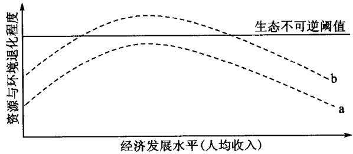  
图 5 -1 环境库兹涅茨曲线(environment Kuznetz curve)a—一生态环境破坏保持在不可逆阈值之下；b一生态环境破坏超过了不可逆阈值

量和毒性都有所增加，使环境退化水平逐步达到最高。环境库兹涅茨曲线并不意味着环境恶化只是经济发展的一种暂时现象。由于生态环境破坏超过了不可逆阈值（图5-1中曲线b)，即生态环境难以恢复治理，人类对资源和环境的破坏将永远无法弥补。后代人不得不承担非再生资源枯竭、森林缩减、草原退化、沙漠化、耕地减少等恶果，因而影响其生存发展。而作为生态环境破坏的当代人在提高收入和改善生活的同时，也要承受环境破坏的苦果。显然，这种后果对当代人口是有得有失，但强加给后代则是不公平的。只有在发展中防止环境的退化和破坏，走可持续发展道路才能使库兹涅茨曲线保持在环境生态不可逆阈值水平之下（如a曲线），从而确保人类可持续发展。必须明确，从经济学和社会学发展的角度分析，破坏环境所取得的利益远远小于环境破坏恢复所需消耗的人力、物力和时间。矿产资源开发决不能再允许这种不合理的现象任其发展。

作为发展中国家，在发展的初期使用低廉劳动力、制定较低的环境标准是加快矿产资源开发、实现经济快速发展的形式之一。当社会经济发展到较高水平时，环境保护的重要性和治理的必然性就提到了议事日程。这种“先发展、后治理”的模式，其经济学性质是一种举债发展，是向未来举债，既然是债，就要付本还息。现今财政部、国土资源部逐步加大资金投入，逐步治理计划经济时期国有老矿区、资源枯竭矿山、闭坑破产矿山的地质环境，可以理解为是对过去债务的偿还。

一方面，西北地区矿产资源的开发势必会加剧脆弱的生态环境的恶化，另一方面，矿业开发又是西北地区经济的支柱产业之一，矿业开发具有重要的社会经济意义，因此，必须认真研究对待矿业开发问题，“在保护中开发，在开发中保护”，否则，现在的矿产资源开发就可能造成几代人的遗憾。为此，要树立新的矿业发展观，矿产资源要开发，生态环境亦不能破坏，就必须走绿色矿业之路。

## 5.2 加强矿山地质环境保护的法规建设

## 5.2.1 矿山地质环境保护法规建设的重要性

由于历史上的认识原因，目前尚没有一套系统、可操作性强的矿山地质环境保护法规，尚未建立完整的矿山监管系统，矿山环境监管由多部门实施，已有的监管部门的监管、管理不到位，致使矿山环境地质问题众多，部分矿山地质环境趋于恶化。矿山地质环境保护与恢复治理必然会增加企业的矿业成本，企业没有积极性和主动性，甚至有所抵触，只享受开矿带来的收益，而不履行应尽的环保义务。矿山企业面临的地质环境保护压力及动力，完全来自于法律、政府行政监督和社会公众舆论。因此，应修订和完善矿产资源法等有关法律法规，补充完善相关法律条文或制定矿山地质环境保护的单项法规条例；按照“谁开发、谁保护”、“谁破坏、谁治理”、“谁治理、谁受益”的矿区地质环境保护的基本原则，尽快实行矿山开发地质环境保护的准入制度、矿山地质环境恢复治理保证金制度、矿山地质环境影响评价制度、生态环境赔偿办法等；提高进入矿业的门槛，如合理规划布局、规范开采，确定矿山“三率”指标、恢复治理的标准等，从源头上限制技术含量低、开采规模小的乡镇及个体矿山数量：取缔“楼上楼”的不合理矿业布局，最大限度地减少矿山环境地质问题的灾害损失：用法律、行政和经济手段强制矿山开发者重视并解决开发对地质环境带来的负面影响，履行其应尽的责任义务，真正做到“谁开发、谁保护，谁污染、谁治理，谁破坏、谁恢复”。

建议各级人民政府依据《中华人民共和国环境保护法》、《中华人民共和国矿产资源法》、《中华人民共和国土地管理法》等法律法规，结合本地区的实际情况，制定出地方性法规，使矿山地质环境监管工作尽快走向制度化、法制化轨道。

## 5.2.2 加强执法和监管力度

加强矿山地质环境保护的监督管理是为了减轻在矿产资源开发时对生态环境的负面影响。虽然多年来中央和地方相继出台了不少法律法规，涉及到环境保护、生态环境和地质灾害防治等方面，但是，一方面这些法规缺乏可实际操作的条文，导致执法监管部门监管时困难重重：另一方面，许多基层执法监管部门在实际工作中还存在有法不依、执法不严的现象，地方保护主义在某些地方仍在盛行。一些地方政府主管领导尚不能正确认识和处理矿产资源开发的经济发展与地质环境保护之间的关系，一味追求在任期间的经济发展指标，其至追求个人利益，放任监管部门对矿山环境的监管，造成严重的环境污染和恶化。一些地方政府或部门因局部利益而纵容地方及个体企业消极对待国家专项治理整顿工作，导致矿山生态环境问题严重、甚至处于失控状态。如陕北地区部分县级政府违法发放采矿许可证，使地方及个体违法开采石油资源，造成石油资源的严重破坏和环境污染。因此加大执法监管力度，铲除地方保护主义是地质环境保护的一项重要工作。

各级人民政府要坚持以预防为主、保护优先的方针，坚决制止新的矿山环境污染和破坏。对于新建和技术改造的矿山建设项目，要严格执行环境影响评价制度，矿山环境影响评价报告必须设立矿山地质环境影响专篇，矿山环境影响评价报告书应作为采矿申请人办理采矿许可证和矿山建设项目审批的主要依据。各级资源环境行政主管部门要严格把关，确保矿山开采，避免环境破坏。结合矿山换证，对矿山环境破坏严重的矿山企业，应提出限期整改和治理的实施方案，要求矿山企业建立和完善矿山环境保护制度，尽量避免地质灾害和防止矿山环境遭受破坏。只有依法采取措施，使违法者伤筋动骨，才能实现保护地质环境的目的。

同时，对矿山产生的废气、废水、废渣，必须按照国家规定的有关环境质量标准进行处置、排放；对矿山开发活动中遗留的坑、井、巷等工程，必须进行封闭或者填实，恢复到安全状态；对采矿形成的危岩体、地面塌陷、地裂缝、地下水系统破坏等地质灾害必须进行治理。矿产资源开发要保护矿区周围的环境和自然景观。严禁在自然保护区、风景名胜区、森林公园、饮用水源地保护区内开矿。严格控制在铁路、公路等交通干线两侧的可视范围内进行采矿活动。西部矿产资源开发必须重视生态环境的保护和建设，防止矿产资源开发加剧生态环境恶化。

根据国家的方针政策，综合运用经济、法律和必要的行政手段，依法关闭产品质量低劣、资源浪费、污染严重、不具备安全生产条件的矿山，积极稳妥地关闭资源枯竭的矿山。以资源开采为主的城市和大矿区，要因地制宜发展接续和替代产业。矿山企业对矿区范围的矿山环境实施动态监测，并向资源环境行政主管提供监测结果，对于采矿引起的突发性地质灾害要及时向当地政府和行政主管部门报告。各级人民政府要加强矿山环境保护监督管理，在矿山企业年检中加强有关矿山环境的年检内容，对矿山环境破坏严重的企业，责令其限期治理，并依法处罚。

## 5.2.3 充分发挥公众监督作用

矿山地质环境保护，单纯依靠科学技术手段、企业的自主行为和矿山监管部门的监管是不够的。矿山环境地质问题危害公众的生存环境，影响公众的健康安全，从根本上损害了公众利益。随着社会进步及文明程度的提高，公众的环境保护意识逐渐增强，因此，一方面，要充分发挥报纸、广播、电视等新闻媒体的舆论监督作用，及时报道和表彰矿山环境保护工作中的先进典型，公开披露污染环境、破坏生态的违法行为；另一方面，应当重视和提供公众对矿山环境监督的渠道，对严重污染环境、破坏生态的单位和个人，应及时曝光，动员和依靠社会力量进行监督，形成社会舆论压力。中央电视台《焦点访谈》栏目对矿山乱采滥挖、破坏矿产资源、废水无序排放污染环境现象的报道，在社会上反响极大，引起了党和政府的高度重视，相关部门采取了积极措施加大对矿山清理整顿的力度，如陕西潼关金矿区、靖边油田、旬阳铅锌矿、铜川煤矿；甘肃厂坝铅锌矿区、西和六巷乡邓家山铅锌矿区：青海三江源头砂金开采区，均是经《焦点访谈》栏目报道后才开始有效治理整顿，矿山地质环境的恶化得到一定程度的遏制。

## 5.2.4 矿山环境地质问题防治资金

矿山地质环境保护与恢复治理需要资金。目前因资源枯竭而闭坑、因破产而倒闭、因重组而矿权变更、因违法而关闭的矿山或多或少留有环境地质问题，有的甚至是严重的问题，受灾受害群众因得不到合理经济赔偿导致社会矛盾加剧，不稳定、不和谐因素增多。加快闭坑矿山和现有矿山地质环境保护与恢复治理具有重要的社会意义和环境意义。要完善矿山环境保护的经济政策，建立多元化、多渠道的投资机制，调动社会各方面的积极性，妥善解决好矿山环境保护与治理的资金问题。对于历史上由采矿造成的矿山地质环境破坏而责任人无法落实的，按照原有矿山分属中央、地方事权，分别由中央、地方财政拨付专项资金用于治理。对于矿山开发时间较长或已接近闭坑，矿山环境破坏严重，矿山企业经济困难无力承担治理的，由政府补助和企业分担进行治理。对于生产矿山和新建矿山，遵照“谁开发、谁保护”、“谁破坏、谁治理”、“谁治理、谁受益”的原则，建立矿山环境恢复保证金制度和有关矿山环境恢复补偿机制。各地政府要制定矿山环境保护的优惠政策，调动矿山企业及社会参与矿山环境保护与治理的积极性。

要建立多渠道的矿山生态环境恢复治理的专项资金来源。在矿山地质环境保护与治理工作中，引入市场机制，采用国家拿一点、地方政府配套一点、企业出一点、群众集资一点的筹资方式。建立支持、鼓励和税费减免等政策，对矿山环境保护工作做得好的矿山企业实行减税或免税，对破坏与污染严重的矿山企业实行严惩，从制度上解决矿山生态环境恢复治理资金投入不足、矿山企业积极性不高的瓶颈问题。

## 5.2.5 提高矿山地质环境保护的水平

在全国范围内开展矿山地质环境调查与评价工作，是为了掌握我国矿山环境地质问题的主要类型及其变化规律。根据矿山地质环境的基本特点和变化规律，结合社会经济及人口分布状况，制定、完善矿山环境保护规划，从而将矿山环境保护规划纳入地方总体发展规划中。矿山企业是矿山环境保护与治理的直接责任人，要抓紧制定本企业矿山环境保护与治理规划，并采取有力的措施，切实保护好矿山环境。积极筹建矿山环境监测数据库及信息系统，筛选有关参数，确定指标体系，建立数据库系统和信息网络，促进中央与地方、政府与企业之间的信息交流，保障矿山环境管理工作顺利开展和矿业可持续发展。

要加强矿山环境保护的科学研究。研究矿业开发引起的环境变化，总结其发展变化规律，提出防治措施。研究矿业三废的处理和废弃物回收与综合利用技术，采用先进的选冶技术和加工利用技术，提高劳动生产率和资源利用率。加强矿山环境保护新技术、新工艺的开发与推广，增加科技投入，促进资源综合利用和环境保护产业化。加强矿山生态环境恢复治理工作，不断提高生态环境破坏治理率。引进和开发适用于矿区损毁土地复垦和生态重建的新技术，进行矿区生态重建科技示范工程研究，加大矿山环境治理与土地复垦力度。在一些工作开展早、基础条件好的矿区，选择不同类型、不同地区的大型矿业基地，针对矿产资源开发利用所造成的生态环境破坏问题，以可持续发展的观点，发展绿色矿业，建立绿色矿业示范区。应加强国际合作，大力培训人才，努力学习世界各国矿山环境保护的先进技术和经验，提高和改善我国矿山环境保护工作水平。

## 5.3 绿色矿业是西北地区矿业可持续发展的必由之路

## 5.3.1 历史上矿产资源开发的三种模式

纵观国内外矿业发展的历史，可以概括出矿产资源开发的三种模式。

（1）“先污染、后治理”，“先破坏、后恢复”模式：工业革命以来，世界各国在矿产资源开发方面，普遍经历了“先污染，后治理”的过程，矿业开发导致了一系列环境公害。如19世纪末期，美国田纳西州炼铜厂位于戈斯特镇，由于废气污染，致使周围山上的树木逐渐枯萎死亡，铜矿排出的废水使河水污染、鱼群灭绝，镇上居民逐渐离去，最终铜矿倒闭，成为一片废墟。日本富山县神通川下游地区因20世纪50年代锌冶炼厂排出含镉废水，诱发了著名的富山骨痛病事件，导致骨癌病患者超过280人，死亡43人。美国西部滥抽地下水、开采石油天然气和煤炭及其他矿产资源，引起地层压实收缩，一些地区出现大面积的地面沉降现象。深刻的历史教训、沉重的环境代价值得我们引以为戒。究其原因主要是受到当时科技发展水平的限制，企业追求最大限度利润，加之当时政府环境意识淡薄等，以牺牲生态环境为代价换来经济发展。新中国成立50年来，我国矿业开发也基本沿袭着这一矿业发展模式，这就是今天国有老矿山普遍存在较严重矿山环境地质问题的历史原因。

(2)严格环境限制条件下的矿产资源开发模式：这是一种后工业化时代的矿业发展模式，虽有效地保护了环境，但却在某些方面制约着矿业的发展，使得矿业市场出现低迷萧条。某些发达国家，为了国家国防安全和矿产安全，采取了严格限制矿业发展的政策。用开发海外矿产资源来提供国内需要，同时将环境破坏转嫁给其他国家。自20世纪60年代以来，特别是可持续发展思想提出之后，矿产资源合理开发与环境保护问题，已被世界各国所重视。经济发展水平和社会体制不同，决定着世界各国矿产资源保护程度和政策的差异。发达的工业化国家以美国为代表，生产水平较高，矿业立法较早，为了本国经济利益和环境利益，现阶段矿业开发不仅仅限于国内，通过资本输出开发国外矿产资源。这样既获得了高额矿业利润，又储存了国内矿产资源，同时又转移了因矿业开发带来的环境地质问题。目前，我国加大了矿山地质环境保护的工作力度，也开始重视“两种资源、两个市场”，但是由于受国情限制和为保证国家矿产安全，“严格环境条件下的矿业开发”并不适合现阶段我国国情。

(3）绿色矿业：“在保护中开发、在开发中保护”是我国现阶段矿产资源开发的原则，即走合理开发利用矿产资源与矿区生态环境保护协调发展的绿色矿业之路，是合理解决资源开发与生态环境保护之间的主要矛盾、实现动态条件下资源开发与生态环境保护

“双赢”目标的必由之路。

## 5.3.2 实现绿色矿业的主要途径

“绿色”是20世纪80年代末提出的一个生态环境新概念，最早应用于食品，即指无毒、无害的营养食品，包括食品本身和其生产过程。把“绿色”概念引入矿业，就产生了“绿色矿业”这一思想。绿色矿业是指在矿山环境扰动量小于区域环境容量前提下，实现矿产资源开发最优化和生态环境影响最小化，其本质是矿业和社会经济的可持续发展。矿产资源是人类生存与发展的物质基础，地质环境是人类生存与发展的空间场所。人类开发利用矿产资源，促进了社会发展，但同时也打破了矿区的地质环境平衡，经济发展为合理开发利用矿产资源与改善矿山生态环境提供了物质和技术基础。可见，资源、环境与经济三者是相互依存、相互影响的，既有相互促进、协同发展的正向关系，又有相互矛盾、相互制约的负向关系。工业革命以来大规模的开发和利用矿产资源，造成的生态破坏、环境污染和矿山地质灾害，严重危及着人类生存和发展的空间。

在一些发达国家，严格的环境保护政策是国家对矿产资源开发进行调节。在发展中国家或地区，如果只考虑当前经济的发展而过度地开发矿产资源，忽视环境保护，会使三者之间的矛盾激化，最后可能导致资源枯竭、生态恶化和经济停滞的严重后果。解决这一问题的出路在于正确处理资源开发、环境保护与经济发展三者之间的关系。

绿色矿业是在科学规划指导下和高新技术支撑下，既保护生态环境，又合理利用资源，最大限度获得经济效益的一项系统工程。现代科学技术为我们在西部矿产资源开发中实施绿色矿业战略奠定了坚实的基础。寿嘉华（2000）在“走绿色矿业之路”一文中指出：

(1）通过开发前的区域环境容量或承载力评价及矿业开发地质环境影响评价，建立环境评价指标体系和技术标准，开展环境区划，制定绿色矿业规划；

(2)通过技术创新，优化工艺流程，实现采、选、冶过程的小扰动、无毒害和少污染，提高资源综合利用率，促进矿业可持续发展；

(3)通过矿山环境治理和生态恢复，实现开发前后环境扰动的最小化和生态再造的最优化。

绿色矿业的核心是绿色开采，绿色开采包括了两个主要方面：①实现矿产资源的可持续利用：②最大程度减轻矿山环境的破坏和污染。现以煤炭资源开采为例，阐述实现绿色开采的重要性和艰难性，以及解决问题的主要途径。

## 5.3.2.1 确定合理的回采率

我国探明可采煤炭资源储量按国际对比口径计算，2001年为 $1 1 4 5 \times 1 0 ^ { 8 } { \mathrm { t } }$ ，占世界总量的11.6%，居美国 $( 2 4 9 9 . 9 4 \times 1 0 ^ { 8 } \mathrm { { t } ) }$ 和俄罗斯 $( 1 5 7 0 . 0 \times 1 0 ^ { 8 } \mathrm { t } )$ 之后列世界第三位，但人均拥有煤炭资源仅89.71t，为世界人均数值（9944.53/61.3010）160.59t的55.86%(《中国矿业年鉴》，2004)。我国煤炭资源分布不均。探明的资源量主要分布于北方，内蒙古、河北、山西、黑龙江、陕西、新疆6省区拥有探明储量 $7 9 0 3 . 0 1 \times 1 0 ^ { 8 } \mathrm { t }$ ，占全国探明资源总量的77.55%。至2002年底，我国共有煤炭企业2804家，从业人员408.61万人，年产原煤 $1 1 . 8 4 \times 1 0 ^ { 8 } \mathsf { t } _ { \circ }$ 与2001年相比，煤炭企业减少2953家，原煤产量增加 $1 . 3 3 \times 1 0 ^ { 8 } \mathrm { t }$ 工业总产值增加293.01亿元，销售收入增加336.14亿元。山西、山东、内蒙古、河南、陕西、安徽、河北、黑龙江和辽宁等9个省区原煤产量合计占总产量的72.02%。综上所述，我国煤炭资源总量多，但人均占有量少，地理分布不均，东部和南方是消耗煤炭的大户，但煤炭资源和产量较少。

我国煤炭业的另一特征是可采储量占探明储量比重不大。按世界能源委员会定义的可采储量只有 $1 1 4 5 \times 1 0 ^ { 8 } \mathrm { t }$ ，约占已探明储量的11.45%，已探明储量与可采储量的比为8.73:1，即每增加约 $9 \times 1 0 ^ { 8 } \mathrm { t }$ 的探明储量，才能增加 $1 \times 1 0 ^ { 8 } \ t$ 的可采储量。因此，煤矿回采率是我国煤炭业发展的一个重要指标，关系到这一行业的可持续发展。国土资源部规划司提出了2005年不同井型煤矿回采率建议指标：大型矿、中型矿和小型矿相应为55%、45%和35%。实际上我国大、中型矿的回采率是40%\~50%，集体、个体小矿只有10%\~15%。国际上煤炭的总回采率为70%\~80%，我国与国际水平相差甚远。集体、个体小矿回采率只有15%，与政府部门的建议指标35%也有很大差距。显然，小矿存在着回采率低、采掘方式不合理、不珍惜煤炭这一不可再生资源的现象，资源损失浪费严重，在空间上没有实现合理开采，在时间上无形损害了后代人对资源的需求。就国情而言，小矿的存在有利于边角煤炭资源的利用，缓解煤炭资源供需矛盾，吸纳社会闲散资金，吸纳大量农村劳动力，在某种程度上促进了地方经济的发展。从2002年年产原煤3$\bf { \times 1 0 ^ { 4 } t }$ 以下的小煤矿的产量与大、中型矿山产量基本持平（表5-1）。

表 5-1 2002 年煤炭企业规模、产量及产值
<table><tr><td rowspan=1 colspan=1>矿山规模</td><td rowspan=1 colspan=1>矿山数量/家</td><td rowspan=1 colspan=1>原煤产量 $\mathbf { \nabla } / 1 0 ^ { 8 } \mathbf { t }$ </td><td rowspan=1 colspan=1>人均产值/万元</td></tr><tr><td rowspan=1 colspan=1>大型矿山</td><td rowspan=1 colspan=1>136</td><td rowspan=1 colspan=1>3.22</td><td rowspan=1 colspan=1>7.47</td></tr><tr><td rowspan=1 colspan=1>中型矿山</td><td rowspan=1 colspan=1>323</td><td rowspan=1 colspan=1>2.73</td><td rowspan=1 colspan=1>4.16</td></tr><tr><td rowspan=1 colspan=1>小型矿山</td><td rowspan=1 colspan=1>6467</td><td rowspan=1 colspan=1>4.68</td><td rowspan=1 colspan=1>3.08</td></tr><tr><td rowspan=1 colspan=1>小煤矿</td><td rowspan=1 colspan=1>21116</td><td rowspan=1 colspan=1>1.21</td><td rowspan=1 colspan=1>1.55</td></tr></table>

我国大、中型煤矿的回采率与国外相比有很大的差距，小矿的实际回采率与政府部门推荐的指标值差距亦很大，因此，在提高煤炭资源回采率方面大、中、小型煤矿均有很大的潜力可挖。但普遍存在的事实是：煤炭企业提高回采率潜力的动力明显不足，其根源在于，没有引入商品市场经济的法则。由于历史原因，我国绝大多数矿山企业系无偿或低价占有国家煤炭资源，采用相对落后的开采技术和设备能降低采煤成本，而这必然导致回采率低，但市场上无论大矿、小矿，煤炭售价都相同，为追求最大利润，企业就缺乏改进开采技术及设备、提高回采率的原动力。

为分析方便，设定以下符号所代表的含义：T为矿井服务年限（a)，Z为矿井可采储量 $( 1 0 ^ { 4 } \mathfrak { t } )$ ，K为矿井回采率（%），A为矿井年产量（万元）；S为吨煤利润（元），R为吨煤销售价（元），W为吨煤综合成本（元），Q为吨煤开采成本（元），P为吨煤资源成本（元），B为矿井资源总费用（元）。

矿井服务年限T、吨煤利润S和吨煤综合成本W的计算如下（↓表示下降，↑表示增加)：

$$
T = { \frac { Z \cdot K \downarrow } { A } } \Rightarrow \downarrow\tag{5 - 1}
$$

$$
S \ = R - \ W \ = R - \ ( Q \uparrow \ + P ) \Longrightarrow \uparrow\tag{5 -2}
$$

$$
P = { \frac { B } { Z \cdot A \uparrow } } \Rightarrow \downarrow\tag{5 -3}
$$

由式（5-1）可知，在矿井可采储量Z和矿井年产量A一定的情况下，回采率K下降，必然缩短矿井服务年限T，而T的缩短使矿并固定资产折旧及井巷工程等投资费用在吨煤成本中摊值增大，即开采成本0稍有上升。由式（5-2）可见，在吨煤销售价R不变的情况下，这将引起吨煤利润下降。显然，回采率低在很大程度上是因为采用了导致较大煤层厚度损失和面积损失的开采技术和设备，这又能降低开采费用Q，开采费用降低引起吨煤综合成本W下降，当开采成本降低幅度大于式（5-1）所示开采成本增大幅度时，在市场售价R不变的情况下，矿井利润S增大（图5-2中 $Q = f \ ( K )$ 曲线所示）。由式（5-3）可知，矿井资源总费用B一定时，吨煤资源费P是随回采率K增大而减小的。式（5-2)表明，吨煤资源费P减少即可使吨煤成本W下降，如图5-2中 $P = f \ ( K )$ 曲线所示。

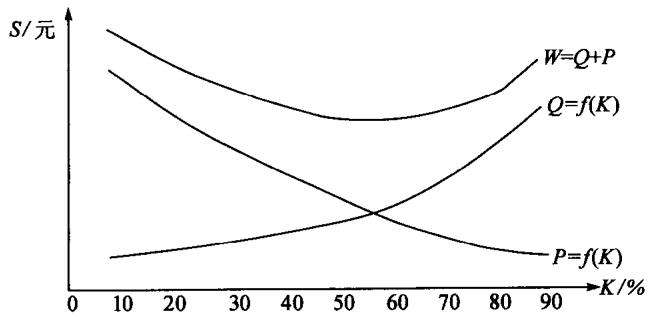  
图5-2 吨煤成本与回采率的关系

吨煤成本曲线即 $Q = f \ ( K )$ 和$P = f \ ( K )$ 的合成曲线 $\pmb { W } = Q + P$ 也是回采率K的函数，有一个最低点，即吨煤成本最小的点。本例中该点对应的回采率为60%，当考虑了开采成本和资源成本时，即该矿井回采率为60%时，能获得最大利润。有关行业主管部门在给定某煤矿规定的回采率时，也要考虑井型和煤层地质条件，在这两个前提条件之

下，就能确定 $Q = f \ ( K )$ 和 $P = f \ ( K )$ 的两条曲线形态，由这两条曲线也就可以确定其合成曲线。合成曲线的最低点所对应的回采率K即为获得最大利润的点（吨煤成本最小）。这应该是国家和企业共同追求的有利于体现煤炭资源可持续利用价值的回采率，只有达到这一回采率才有利于企业获得较大利润。

资料显示，目前我国煤矿的回采率平均只有35%，一些乡镇煤矿回采率仅为15%。其他资源在开采和使用中的浪费现象也触目惊心。资源开采和使用价格低廉是其“罪魁祸首”。

我国矿产资源属于国家所有，但国家实际上并不直接占有资源，一方面是国有企业代表国家占有资源，通过向国家缴纳税收和利润的方式体现矿产所有者的利益；另一方面，是地方政府代表国家占有资源，地方政府通过允许集体或者其他性质的小企业采矿的形式，收取税收和管理费来获得利益。

赋税水平方面，我国矿产资源补偿费平均费率为1.18%，而国外与我国矿产资源性质基本相似的费率一般为2%到8%（我国煤炭行业资源税额为0.3\~0.5元/t)。廉价的资源除了导致滥挖严重、开采使用浪费、破坏环境恶果外，还直接导致了国家利益受损。显然，重新制定煤炭资源费标准，有助于煤矿回采率的提高，有助于减轻煤矿开采活动中滥挖严重，开采使用浪费和破坏环境的不良现象，从而促进煤炭资源开发的可持续发展。

## 5.3.2.2 地质环境保护投入的最佳经济方法

煤炭开采过程中矿井水直接排放会造成地表水污染，煤矸石长久堆存会占压土地资源，矸石自燃及大风扬尘、大气降雨淋溶等会污染矿区大气、地表水、地下水和土壤环境。目前，国内外都是用支付补偿费的形式来平衡矿山开采对环境的损害。在俄罗斯，达

标排污量的补偿费摊入吨煤成本，而超标排污量的补偿则直接影响纯煤利润。法国学者提出，环保投人应取得最大的经济效益。用图5-3来说明排污损失费及防治排污费与损失程度间的关系，排放某污染物的损失费以D表示，防治污染物排放的措施和设备费以P表示，这两种值都是该污染程度N的函数。损失费D与污染程度N的关系曲线D（N）和防治费P与污染程度N的关系曲线P（N）是典型的曲线函数，这两个函数曲线增长和减小的方向相反。显然，当污染程度最大时， $P _ { \mathrm { ~ \tiny ~ \left( ~ N \right) ~ } } = 0$ ，即未采取措施时，环境污染程度最大，相当于横坐标所示污染程度100%，最大防治污染费应该是实际污染程度为零时的值，在这种情况下，实际上P（N）值将等于最大损失值D（N）（无预防污染措施时）。因而，函

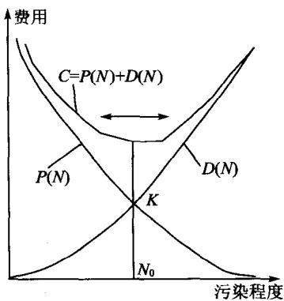  
图5-3 合理防治费用及污染程度关系图

数P（N）和D（N）图示曲线，实际上从纵坐标轴上同一水平开始，即防治污染费和污染损失费均从“零”处开始。以此为假设，可进行直观合理的分析，这两条曲线P（N)和D（N)相对于过交点K，与平行于纵坐标轴的直线对称，该直线与横坐标轴交点 $N _ { 0 }$ 所示的污染程度，在数学上看最为有利，也就是说达到这一污染所用的防污染费P(N)和污染带来的损失费D（N）之和P（N） +D（N）值为最小。这一直观的关系是合理解决这类环保经济问题的基础。一方面有效地保护了生态环境，另一方面又能使防治污染费和污染带来的损失费之和最小，这对企业是有吸引力的。

煤炭开采的环境保护工作，取决于煤炭资源的合理开采和加工技术工艺。工艺合理，能够保护资源，提高煤矸石、废水、热能循环利用程度，变废为宝，化害为利，从而避免或减少煤矿开采加工过程对环境的负面影响。为有效地减小开采对矿山环境的负面影响，就要在采煤主要技术工艺、废物资源化利用方面，建立相互关联的生态技术系统，如采用不排矸、少排矸采煤工艺或煤矸石直接充填塌陷区，矿井水资源化利用等技术工艺。通过组建煤业热电集团公司，电厂利用煤矸石发电、矿井水综合利用，煤矿利用井口电站粉煤灰浆充填井下采空区、塌陷区，减少废渣堆放压占土地、节省塌陷区复垦工程费等。

## 5.3.3 西北地区矿业可持续发展必走绿色矿业之路

新中国成立以来，经过半个多世纪的发展，我国东部地区矿产资源日趋枯竭，许多老矿山接近闭坑，一些矿业城市转型迫在眉睫。我国矿产资源基地中心由东部向西部转移，西部将成为我国21世纪能源和矿物原材料供应的重要基地。西北地区成矿条件优越，矿产资源丰富，资源潜力巨大。西部一批大型矿业基地和大型矿山的建立，加速了地区工业化和城市化进程，带动了大批相关产业的迅猛发展，如青海、新疆两省区矿业产值占其工业总产值的55%以上，占省内GDP的5%。开发利用优势资源是西部大开发的重要组成部分，是促进西北地区社会经济发展的关键途径之一。

但是，西北地区独特的自然地理环境（高山、峡谷、戈壁、沙漠等）和极端的生产条件（缺水、少电、交通不便等），影响了矿产资源的开发。如何通过科技进步和技术创新，开发出适应西部地区不利生产条件下的技术是关键。西北地区气候干旱，整个西北地区年平均降水量为230mm左右，其中40%的地区年平均降水量在100mm以下。而多年平均水面蒸发量却高达2000mm左右，有些地区甚至超过3000mm，这种特殊的自然和气候条件，决定了西北地区的生态环境极度脆弱。西北地区沙漠、戈壁、裸岩以及水土流失面积就占全国难利用土地面积的80%以上，水资源短缺已经成为西北地区影响人类生存、生态环境和经济发展的首要问题。矿业开发中的生态环境问题必须认真研究对待，这个问题如不能很好解决，矿产资源开发就可能造成几代人的遗憾。

在生态环境脆弱的西北地区，开发矿产资源不可避免会造成植被破坏、生态失衡，导致水土流失，其至诱发地质灾害。在生态环境十分脆弱的地区从事矿业开发，更易诱发、加剧这类问题的产生及其严重性。经济要发展、矿业要开发、生态环境要保护，就必须走新的矿业之路，即“在保护中开发，在开发中保护”的绿色矿业之路。

## 5.4 矿山地质环境防治措施

## 5.4.1 提高矿产资源的综合利用程度

据预测，我国现已探明的45种主要矿产资源中，可保证需要的矿产到2010年将下降到24种，而到2020年资源保证程度就更低，仅有6种。主要金属矿产可供储量的保证程度不容乐观。比如，铜矿山供应能力可能为 $6 0 \times 1 0 ^ { 4 } \mathrm { t }$ ，只能满足需求的24%；国内大中型矿山铝土矿的生产能力仅为 $1 3 4 5 \times 1 0 ^ { 4 } { \mathrm { t } }$ ，只能满足需求的40%。我国矿山规模小、数量多，矿业管理粗放，效益低下，从而严重破坏和浪费了资源。小矿山一般片面追求高利润，不惜乱采滥挖破坏资源，大量的资源储量被消耗，而经济效益很低。同时，我国矿产资源采选冶利用率低，矿产资源总回收率仅为30%，比世界平均水平低20个百分点。在采选回收率方面，铁矿为67%，有色金属矿为50%\~60%，非金属矿为20%\~60%。伴生共生矿产资源和有益组分综合利用率达到75%的选厂只占选厂总数的2%，而70%以上的伴生综合矿山，综合利用率不到2.5%。对1845个重点矿山调查统计，综合利用有用组分70%以上的矿山仅占2%，综合利用有用组分50%以上的矿山不到15%，综合利用有用组分低于25%的矿山占75%。在246个共生伴生大中型矿山中，有32.1%的矿山未综合利用有用组分。

在经济高速持续增长的情况下，面对我国矿产资源保证程度严重不足的形势，合理利用不可再生矿产资源、提高矿产资源利用率已经成为我国一项基本国策。提高回采率(回收率)、综合利用伴生共生组分就相当于多找了矿，提高了资源储备量，同时也减少了向环境排放废弃物的量。要提高矿产资源综合利用的程度，在更新观念的同时，必须采用新技术、新设备。

首先，在项目规划设计中应选择综合回收率高的技术方案，对矿山资源最大限度地综合回收利用。如过去很长一段时间，陕北地区低渗透油井的石油采收率仅为20%左右，后通过采用注水驱油技术，使油田采收率提高到40%左右。其次，要注重尾矿的资源化利用。“废物是放错了地方的资源”，从尾矿中回收有用成分和废石资源化利用，即可提高矿山收入，还可减少废物占压土地污染环境。如用尾矿制砖、微晶玻璃等，废石用于筑路、建筑等。尾矿和废石回填井下或煤矿塌陷区，既解决了“治废”的问题，又达到了提高矿山安全程度、保护地表并降低采矿损失等目的。

据有关资料，2001年，我国煤矸石的综合利用量已达 ${ 7 0 0 0 } \times 1 0 ^ { 4 } \mathrm { t }$ ，比1995年增加$1 4 0 0 \times 1 0 ^ { 4 } \mathrm { t }$ 。综合利用率比1995年提高了8%，有的矿区煤研石综合利用创造的产值，已超过了原煤生产的产值。江西萍乡的煤炭资源目前已告枯竭，2000年非煤产业实现的8000多万元利润中，煤研石贡献了6000万元。

内蒙古包头铁矿是世界上罕见的大型多金属共生矿床，富含铁、稀土、铌、萤石等多种有用成分，稀土储量极为丰富。包头钢铁公司选矿厂自投产以来主要回收该矿石中的铁矿物，其次回收部分稀土矿物，大部分稀土矿物作为尾矿排入尾矿库中。几十年来，生产工艺流程不断改进，大大地提高了稀土精矿回收率，降低了生产成本，增加了产品种类，所产的稀土精矿不仅能满足本厂需要，还可向市场提供部分商品精矿，获得了显著的经济效益。

甘肃金川镍矿、内蒙古包头白云鄂博稀土矿等普遍建立起再选车间，回收资源。辽宁本溪钢铁公司加强资源回收和利用，使矿山废石、尾矿得到合理利用。2002年投资150万元建成一座年加工能力 $4 0 \times 1 0 ^ { 4 } \mathrm { m } ^ { 3 }$ 的现代化石材加工厂，当年收入就达210万元。同时，他们还将矿石的最终碎石与尾矿、河沙混合用于生产彩色地面砖、草坪砖等系列产品，使尾矿砂年利用量达到2000t以上，延长尾矿库使用寿命3年多。

## 5.4.2 减少土地破坏和占压

我国矿业开发约占用土地 $( 1 . 4 \sim 2 0 ) \times 1 0 ^ { 6 } \mathrm { { h a } }$ ，并以每年 $2 \times 1 0 ^ { 4 } \mathrm { h a }$ 左右的速度增加。露天矿山在投产前剥离矿体覆盖层，要挖损大量土地，并占压新的土地作为排土排岩场。其中，煤炭开采对土地的影响现状及未来影响的预测结果如表5-2所示。

表5-2 煤炭开采对土地影响现状及预测  
单位：ha
<table><tr><td rowspan=1 colspan=2>破坏类型</td><td rowspan=1 colspan=1>1949~1994年</td><td rowspan=1 colspan=1>1995~2000年</td><td rowspan=1 colspan=1>2000~2010年</td><td rowspan=1 colspan=1>累计</td></tr><tr><td rowspan=2 colspan=1>露天开采</td><td rowspan=1 colspan=1>挖损</td><td rowspan=1 colspan=1>8000</td><td rowspan=1 colspan=1>3800</td><td rowspan=1 colspan=1>11600</td><td rowspan=1 colspan=1>23400</td></tr><tr><td rowspan=1 colspan=1>压占</td><td rowspan=1 colspan=1>14000</td><td rowspan=1 colspan=1>7100</td><td rowspan=1 colspan=1>19700</td><td rowspan=1 colspan=1>40800</td></tr><tr><td rowspan=2 colspan=1>地下开采</td><td rowspan=1 colspan=1>塌陷</td><td rowspan=1 colspan=1>400000</td><td rowspan=1 colspan=1>92200</td><td rowspan=1 colspan=1>227900</td><td rowspan=1 colspan=1>720100</td></tr><tr><td rowspan=1 colspan=1>压占</td><td rowspan=1 colspan=1>5500</td><td rowspan=1 colspan=1>1300</td><td rowspan=1 colspan=1>2700</td><td rowspan=1 colspan=1>9500</td></tr><tr><td rowspan=1 colspan=2>合计</td><td rowspan=1 colspan=1>427500</td><td rowspan=1 colspan=1>104400</td><td rowspan=1 colspan=1>261900</td><td rowspan=1 colspan=1>793800</td></tr></table>

减少采矿对土地的破坏和压占首先要清洁生产，并不断改进生产技术和工艺，提高资源利用率，减少生产过程中的废弃物，降低土地使用量等。

## 5.4.2.1 减量化生产和资源化利用

采用新技术、新工艺，提高矿产品的产量和质量，在采选中尽可能实现不排或少排固体废弃物，同时对固体废弃物进行综合利用，如湿法冶金浸出其中部分有用元素后，将废石用于筑路、筑坝或充填于地下采空区。当前一些发达国家，已多数采用少尾矿或无尾矿的先进的选矿工艺。如美国田纳西州某铅锌矿的废石用于筑路和用作混凝土的骨料，尾矿用做石灰，矿山废弃物几乎得到了全部利用。随着选矿技术的进步，过去不能回收或不易回收的成分，现在已可以回收，使得原来作为废石处理的低品位矿石和尾矿得以利用，共伴生矿中的共伴生组分得以回收，这样就减少了尾矿总量。以矿山尾矿为原料用做水泥、玻璃、砖瓦等建筑材料，煤矿利用煤矸石制砖、发电、回填采空区等，既变废为宝又保护了环境。如陕西黄陵矿区用短壁式方式开采，井下巷道基本布置在煤层中，2000年产煤$1 0 0 \times 1 0 ^ { 4 } \mathrm { t }$ ，仅出矸石 $2 \times 1 0 ^ { 4 } \mathrm { t }$ 。甘肃金川镍矿采用金属尾矿砂填充工艺，每年可减少尾矿库占地20\~27ha，同时通过置换矿柱，提高了铜镍矿资源回采率。

## 5.4.2.2 固体废弃物处理的生态工程技术

发达国家在探索和应用生态工程技术处理固体废弃物方面成效显著。一方面采用适当的防渗材料，隔绝固体废物与周围环境，并在固体废弃物上覆盖土层，培植人工植被或建筑景观，将其改造成公园、游乐场、农田或牧场等。另一种生态工程建设是利用固体废弃物积极改造环境的技术，如澳大利亚对于含有硫铁矿的尾矿采用石灰石污泥、肥料等各种调整剂调整尾矿后，可以直接建立长期的生态植被工程而无需覆土。

## 5.4.2.3 有毒固体废弃物安全填埋技术

为减少有毒有害物质对环境的污染，安全填埋有毒固体废弃物技术在国外是一种主要的方法，在美国已有2000多个安全填埋场，其固体废弃物处理量占总量的80%，德国为50%。

## 5.4.2.4 矿山固体废弃物综合处理

矿业生产中排弃的废石、煤矸石、尾矿等，多含有有害物质，会造成对环境的污染。通过在废尾矿堆表面喷水或用泥土、岩块、草帘等覆盖，可以减少粉尘、尾矿的飞扬；在废渣堆表面喷洒化学药剂，可形成一层固结硬壳，起到抗风和防水的作用。对具有放射性的废石、尾矿采用挖坑深埋或者回填矿并等方式处理。

## 5.4.3 矿山地面塌陷与复垦

## 5.4.3.1 开采塌陷

地表下沉和塌陷范围一般大于采空区面积。当采空区为长方形时，下沉塌陷盆地大致是椭圆形（图5-4)。椭圆盆地的范围与沿煤层走向方向的移动角δ、沿倾斜方向的移动角β、γ有关。

不同倾角α的煤层，其下沉塌陷情况有所不同。煤层上覆岩层的物理力学性质对地表沉陷的影响甚大。在煤层倾角相同的情况下，移动角随岩石强度的增大而增大。一般情况下，基岩的移动角值为 $5 0 ^ { \circ } \sim 9 0 ^ { \circ }$ ，表土的移动角为 $4 5 ^ { \circ } \sim 5 5 ^ { \circ }$ ，因此，覆岩越坚硬，地表下沉范围越大。按覆岩性质区分的移动角数值如表5-3所示，利用表5-3数据以及所研究的矿井实际相关资料采用正规作图法，即可对相应煤层采动后地面塌陷范围做出预测。据陕西韩城象山煤矿实测资料分析，采空区面积在2ha时（即100m长的工作面推进200m时）是地表移动活跃期，大部分塌陷裂缝在此时产生。统计资料表明，地面塌陷面积与井下煤层开采面积之比平均值为1.2，塌陷体积与开采体积之比平均值为0.6\~0.7，缓倾斜煤层，地表最大下沉深度一般为煤层开采总厚度的70%（表5-3）。

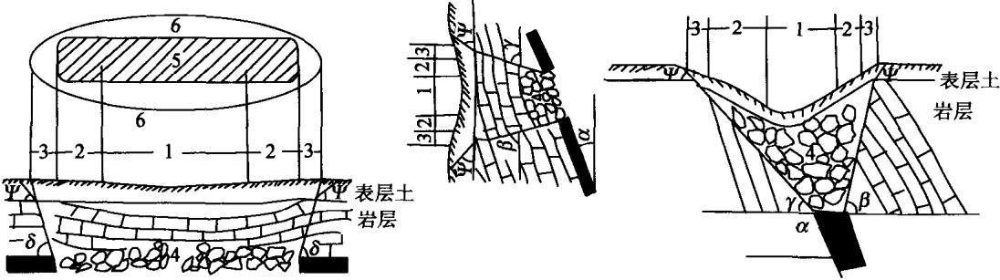  
图5-4 地下采煤地面沉陷示意图  
A—倾斜煤层；B—急倾斜煤层  
1—塌陷区；2—裂缝区；3—移动区；4—采空区；5—采空区水平投影面；6—移动边界线

表5-3 不同硬度覆岩移动角
<table><tr><td rowspan=2 colspan=1>覆岩类型</td><td rowspan=2 colspan=1>覆岩性质</td><td rowspan=2 colspan=1>单向抗压强度/MPa</td><td rowspan=1 colspan=3>移动角/（°）</td></tr><tr><td rowspan=1 colspan=1>δ</td><td rowspan=1 colspan=1>γ</td><td rowspan=1 colspan=1>β</td></tr><tr><td rowspan=1 colspan=1>坚硬</td><td rowspan=1 colspan=1>大部分以中生代硬砂岩、硬石灰岩为主，其他为砂质页岩、页岩、辉绿岩</td><td rowspan=1 colspan=1>&gt;60</td><td rowspan=1 colspan=1>75~80</td><td rowspan=1 colspan=1>75~80</td><td rowspan=1 colspan=1>δ- (0.7~0.8) α</td></tr><tr><td rowspan=1 colspan=1>中硬</td><td rowspan=1 colspan=1>大部分以中生代中硬砂岩、石灰岩、砂质页岩为主，其他为软砾岩、泥灰岩等</td><td rowspan=1 colspan=1>30~60</td><td rowspan=1 colspan=1>70~75</td><td rowspan=1 colspan=1>70~75</td><td rowspan=1 colspan=1>δ- (0.6 ~0.7) α</td></tr><tr><td rowspan=1 colspan=1>软弱</td><td rowspan=1 colspan=1>大部分为新生代砂质页岩、页岩、泥灰岩、粘土等</td><td rowspan=1 colspan=1>&lt;30</td><td rowspan=1 colspan=1>60~70</td><td rowspan=1 colspan=1>60~70</td><td rowspan=1 colspan=1>δ- (0.3 ~0.5) α</td></tr></table>

## 5.4.3.2 开采塌陷指数

开采塌陷造成地表塌陷区面积大小及深度与矿层产状、开采深度，以及采空区管理方法等因素有关。塌陷裂缝区面积与采矿规模呈正相关。如在地下采煤中，人们习惯用每采万吨煤地面塌陷的土地面积（ha）作为一个指标反映地表形态的破坏程度，通常称其为塌陷指数或塌陷率，它在一定程度上反映了煤炭开采量与塌陷占地的相关性。各矿区和各地区均有其平均数值。比如，1996年和2000年陕西煤矿塌陷指数为0.258和0.237，甘肃为0.236和0.221；宁夏为0.378和0.368，新疆为0.146和0.160，青海为0.178和0.188等。

经验表明，煤矿塌陷影响边界值可通过煤层开采边界外推0.5倍采深来确定。采深H=500m，则塌陷影响边界值约为250m。塌陷区面积约为煤层开采面积的1.2倍，最大

下沉值为煤层采出厚度的70%\~80%。

1995\~2003年间陕西185煤田地质勘探队、神府煤炭勘测设计分公司、煤炭科学研究总院唐山分院等单位在陕西、内蒙古神东矿区大柳塔矿1203工作面、补连塔矿2211工作面、榆家梁矿45101工作面和孙家沟矿88101工作面地表设立了观测站，进行了井下采煤地表塌陷的实地观测，有关实测（计算）值列入表 $5 - 4 _ { \mathrm { ~ o ~ } }$ 利用移动和变形分布函数表(表5-5)，计算出走向正断面上的移动和变形预计值（表5-6)，按表5-6的相关参数值作矿区地面移动和变形曲线图（图5-5）。

地表与岩层移动过程受地质及采煤等条件的影响，通过对各矿井工作面观测资料及综合数据（表5-4），即可对地面移动和变形主要参数进行预计。预算步骤：

表5-4 神东矿区矿井工作面开采塌陷实测（计算）值
<table><tr><td rowspan=1 colspan=1>矿井工作面</td><td rowspan=1 colspan=1>最大下沉量 ${ \pmb { \mathbb { W } } _ { \circ } } / { \bf m m }$ </td><td rowspan=1 colspan=1>最大倾斜值 $i _ { \bullet }$ /(mm/m)</td><td rowspan=1 colspan=1>最大曲率值 $\scriptstyle K _ { \circ }$ /(mm $/ \mathbf { m } ^ { 2 } )$ </td><td rowspan=1 colspan=1>最大水平移动 $U _ { \bullet } /$ mm</td><td rowspan=1 colspan=1>最大水平变形 $\pmb { \varepsilon _ { \pmb { \sigma } } }$ mm/m</td><td rowspan=1 colspan=1>采高M $/ \mathbf { m }$ </td><td rowspan=1 colspan=1>采深 ${ \cal H } _ { \mathfrak { o } } / \mathfrak { m }$ </td><td rowspan=1 colspan=1>煤层倾角α(°)</td><td rowspan=1 colspan=1>下沉系数q</td><td rowspan=1 colspan=1>水平移动系数6</td><td rowspan=1 colspan=1>主要影响角正切 tgβ</td><td rowspan=1 colspan=1>拐点偏距 $ { s _ { \mathrm { * } } } /  { \mathbf { m } }$ </td><td rowspan=1 colspan=1>主要影响半径 $r / \mathbf { m }$ </td></tr><tr><td rowspan=1 colspan=1>大柳塔矿1203 工作面</td><td rowspan=1 colspan=1>2548</td><td rowspan=1 colspan=1>104</td><td rowspan=1 colspan=1>8.4</td><td rowspan=1 colspan=1>1005</td><td rowspan=1 colspan=1>56.4</td><td rowspan=1 colspan=1>3.5</td><td rowspan=1 colspan=1>61</td><td rowspan=1 colspan=1>0</td><td rowspan=1 colspan=1>0.59</td><td rowspan=1 colspan=1>0.29</td><td rowspan=1 colspan=1>2.56</td><td rowspan=1 colspan=1>20</td><td rowspan=1 colspan=1>24</td></tr><tr><td rowspan=1 colspan=1>补连塔矿2211 工作面</td><td rowspan=1 colspan=1>2600</td><td rowspan=1 colspan=1>54</td><td rowspan=1 colspan=1>1.32</td><td rowspan=1 colspan=1>982</td><td rowspan=1 colspan=1>27.0</td><td rowspan=1 colspan=1>4.0</td><td rowspan=1 colspan=1>110</td><td rowspan=1 colspan=1>0~3</td><td rowspan=1 colspan=1>0.65</td><td rowspan=1 colspan=1>0.37</td><td rowspan=1 colspan=1>2.4</td><td rowspan=1 colspan=1>38</td><td rowspan=1 colspan=1>50</td></tr><tr><td rowspan=1 colspan=1>榆家梁矿45101 工作面</td><td rowspan=1 colspan=1>1500</td><td rowspan=1 colspan=1></td><td rowspan=1 colspan=1></td><td rowspan=1 colspan=1></td><td rowspan=1 colspan=1></td><td rowspan=1 colspan=1>3.4</td><td rowspan=1 colspan=1>91</td><td rowspan=1 colspan=1>1.5</td><td rowspan=1 colspan=1>0.60</td><td rowspan=1 colspan=1>0.30</td><td rowspan=1 colspan=1>2</td><td rowspan=1 colspan=1>36</td><td rowspan=1 colspan=1></td></tr><tr><td rowspan=1 colspan=1>孙家沟矿88101 工作面</td><td rowspan=1 colspan=1>2150</td><td rowspan=1 colspan=1></td><td rowspan=1 colspan=1></td><td rowspan=1 colspan=1>241</td><td rowspan=1 colspan=1></td><td rowspan=1 colspan=1>3.7</td><td rowspan=1 colspan=1>260</td><td rowspan=1 colspan=1>4~9</td><td rowspan=1 colspan=1>0.58</td><td rowspan=1 colspan=1>0.11</td><td rowspan=1 colspan=1></td><td rowspan=1 colspan=1>26</td><td rowspan=1 colspan=1></td></tr><tr><td rowspan=1 colspan=1>综合平均</td><td rowspan=1 colspan=1>2255</td><td rowspan=1 colspan=1>41</td><td rowspan=1 colspan=1>1.13</td><td rowspan=1 colspan=1>609</td><td rowspan=1 colspan=1>16.8</td><td rowspan=1 colspan=1>3.7</td><td rowspan=1 colspan=1>130</td><td rowspan=1 colspan=1>2.5</td><td rowspan=1 colspan=1>0.60</td><td rowspan=1 colspan=1>0.27</td><td rowspan=1 colspan=1>2.35</td><td rowspan=1 colspan=1>30</td><td rowspan=1 colspan=1>55</td></tr></table>

(1) 确定预计参数：

拐点偏距 $S _ { \circ } = 3 0 \mathrm { m }$

主要影响半径 $r = { \frac { H _ { \circ } } { \ t g \beta } } = { \frac { 1 3 0 } { 2 . \ 3 5 } } = 5 5 { \textrm { ( m ) } }$

(2) 预计最大移动和变形值：

最大下沉值 $W _ { \circ } = m q \mathrm { c o s } \alpha = 3 . 7 \times 1 0 0 0 \times 0 . 6 \times \mathrm { c o s } 2 . 5 ^ { \circ } = 2 2 5 5 ( \mathrm { ~ m m } )$

最大倾斜值 $i _ { \mathrm { _ { \circ } } } = { \frac { W _ { \mathrm { _ { \circ } } } } { r } } = { \frac { 2 2 5 5 } { 5 5 } } = 4 1 ~ \ \left( { \mathrm { m m / m } } \right)$ i

最大曲率值 $K _ { \circ } = 1 . 5 2 ~ { \frac { W _ { \circ } } { r ^ { 2 } } } = 1 . 5 2 ~ { \frac { 2 2 5 5 } { 5 5 ^ { 2 } } } = 1 . \ 1 3 ~ ( \ { \mathrm { m m / m ^ { 2 } } } )$

最大水平移动 $U _ { \circ } = b W _ { \circ } = 0 . 2 7 \times 2 2 5 5 = 6 0 9 ~ ( \mathrm { m m } )$ i

最大水平变形值 $\varepsilon _ { \circ } = 1 . 5 2 ~ \frac { b W _ { \circ } } { r } = 1 . 5 2 ~ \frac { 0 . 2 7 \times 2 2 5 5 } { 5 5 } = 1 6 . 8 ~ ( \mathrm { m m / m } )$

(3) 预计走向主断面上的移动和变形值：x轴原点选在距工作面实际边界 $ { S _ { \mathrm { ~ \scriptsize ~ { ~ \alpha ~ } ~ } } } = 3 0  { \mathbf { m } }$ (由于 $S _ { \circ }$ 为正值，应向采空区方向量取）的0点处，指向采空区（图5-5）。进行预计算时要利用移动和变形分布函数值表（表5-5），预计算方法及结果见表5-6，由表5-6数据作出神东矿区地面移动和变形预计曲线，如图5-5所示。

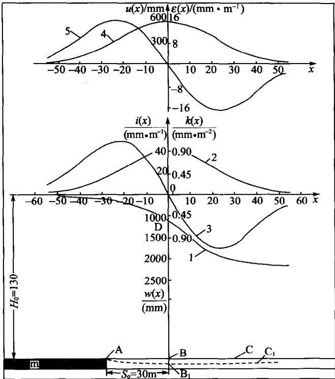  
图5-5 神东矿区地面移动和变形预计曲线图  
1—下沉曲线；2—倾斜曲线；3—曲率曲线；4一水平移动曲线；5—水平变形曲线  
A一实际煤壁位置；B一计算时采用的假想煤壁位置；ABC—下沉前原始位置；  
$\mathbf { A } \mathbf { B } _ { 1 } \mathbf { C } _ { 1 }$ 一下沉后顶板实际位置；D—拐点； $s _ { \circ } .$ 一偏距

表5-5 地表塌陷移动和变形分布函数值表
<table><tr><td rowspan=1 colspan=1> $\frac { x } { r }$ </td><td rowspan=1 colspan=1>0</td><td rowspan=1 colspan=1>±0.1</td><td rowspan=1 colspan=1>±0.2</td><td rowspan=1 colspan=1>±0.3</td><td rowspan=1 colspan=1> $\pm 0 , 4$ </td><td rowspan=1 colspan=1>±0.5</td><td rowspan=1 colspan=1>±0.6</td><td rowspan=1 colspan=1>±0.7</td></tr><tr><td rowspan=2 colspan=1> $\begin{array} { r l } { A \ ( \frac { x } { r } ) } & { { } = \frac { \pmb { W } \ ( \pmb { x } ) } { \pmb { W _ { _ { 0 } } } } } \end{array}$ </td><td rowspan=1 colspan=1>0.500</td><td rowspan=1 colspan=1>0.5989</td><td rowspan=1 colspan=1>0.6919</td><td rowspan=1 colspan=1>0.7739</td><td rowspan=1 colspan=1>0.8419</td><td rowspan=1 colspan=1>0.8949</td><td rowspan=1 colspan=1>0.9335</td><td rowspan=1 colspan=1>0.9601</td></tr><tr><td rowspan=1 colspan=1>0.500</td><td rowspan=1 colspan=1>0.4011</td><td rowspan=1 colspan=1>0.3081</td><td rowspan=1 colspan=1>0.2261</td><td rowspan=1 colspan=1>0.1581</td><td rowspan=1 colspan=1>0.1051</td><td rowspan=1 colspan=1>0.0665</td><td rowspan=1 colspan=1>0.0399</td></tr><tr><td rowspan=1 colspan=1> $A ^ { \prime } ( \frac { x } { r } ) = \frac { i ( x ) } { i _ { \circ } } = \frac { U ( x ) } { U _ { \circ } }$ </td><td rowspan=1 colspan=1>1.000</td><td rowspan=1 colspan=1>0.9693</td><td rowspan=1 colspan=1>0.8819</td><td rowspan=1 colspan=1>0.7537</td><td rowspan=1 colspan=1>0.6049</td><td rowspan=1 colspan=1>0.4559</td><td rowspan=1 colspan=1>0.3227</td><td rowspan=1 colspan=1>0.2145</td></tr><tr><td rowspan=1 colspan=1> $A ^ { \prime \prime } ( \frac { x } { r } ) = \frac { K ( x ) } { K _ { \circ } } = \frac { \varepsilon ( x ) } { \varepsilon _ { \circ } }$ </td><td rowspan=1 colspan=1>0</td><td rowspan=1 colspan=1>±0.401</td><td rowspan=1 colspan=1>±0.73</td><td rowspan=1 colspan=1>±0.933</td><td rowspan=1 colspan=1>± 1.000</td><td rowspan=1 colspan=1>±0.940</td><td rowspan=1 colspan=1>±0.800</td><td rowspan=1 colspan=1>±0.620</td></tr><tr><td rowspan=1 colspan=1> $\frac { x } { r }$ </td><td rowspan=1 colspan=1>±0.8</td><td rowspan=1 colspan=1>±0.9</td><td rowspan=1 colspan=1>±1.0</td><td rowspan=1 colspan=1>±1.1</td><td rowspan=1 colspan=1>±1.2</td><td rowspan=1 colspan=1>±1.3</td><td rowspan=1 colspan=1>±1.4</td><td rowspan=1 colspan=1>±1.5</td></tr><tr><td rowspan=2 colspan=1> $\begin{array} { c l l } { A } & { ( \displaystyle \frac { \textbf { \em x } } { r } ) } & { = \displaystyle \frac { \textbf { W } \left( \boldsymbol { \textbf { \em x } } \right) } { \textbf { W } _ { \circ } } } \end{array}$ </td><td rowspan=1 colspan=1>0.9775</td><td rowspan=1 colspan=1>0.9879</td><td rowspan=1 colspan=1>0.9938</td><td rowspan=1 colspan=1>0.9971</td><td rowspan=1 colspan=1>0.9986</td><td rowspan=1 colspan=1>0.9994</td><td rowspan=1 colspan=1>0.9998</td><td rowspan=1 colspan=1>0.9999</td></tr><tr><td rowspan=1 colspan=1>0.0225</td><td rowspan=1 colspan=1>0.0121</td><td rowspan=1 colspan=1>0.0062</td><td rowspan=1 colspan=1>0.0029</td><td rowspan=1 colspan=1>0.0014</td><td rowspan=1 colspan=1>0.0006</td><td rowspan=1 colspan=1>0.0002</td><td rowspan=1 colspan=1>0.0001</td></tr><tr><td rowspan=1 colspan=1> $A ^ { \prime } ( \frac { \pmb { x } } { r } ) = \frac { i ( \pmb { x } ) } { i _ { 0 } } = \frac { U ( \pmb { x } ) } { U _ { \circ } }$ </td><td rowspan=1 colspan=1>0.1339</td><td rowspan=1 colspan=1>0.0785</td><td rowspan=1 colspan=1>0.0432</td><td rowspan=1 colspan=1>0.0223</td><td rowspan=1 colspan=1>0.0111</td><td rowspan=1 colspan=1>0.0049</td><td rowspan=1 colspan=1>0.0021</td><td rowspan=1 colspan=1>0.0009</td></tr><tr><td rowspan=1 colspan=1> $A ^ { \prime \prime } ( \frac { x } { r } ) = = \frac { K ( x ) } { K _ { \circ } } = \frac { \varepsilon ( x ) } { \varepsilon _ { \circ } }$ </td><td rowspan=1 colspan=1>±0.422</td><td rowspan=1 colspan=1>±0.292</td><td rowspan=1 colspan=1>±0.178</td><td rowspan=1 colspan=1>± 0.100</td><td rowspan=1 colspan=1>±0.054</td><td rowspan=1 colspan=1>±0.026</td><td rowspan=1 colspan=1>±0.013</td><td rowspan=1 colspan=1>±0.005</td></tr></table>

注：当 $\frac { x } { r }$ 为 $\ " \cdot \ "$ 值时， $\textit { A } ( \frac { \textbf { \em x } } { r } )$ 取上一行的数， $A ^ { \prime \prime } \ ( \frac { x } { r } )$ 取“-”号；当 $\frac { x } { r }$ 为“-”值时， $\textbf { \textit { A } } ( \frac { \textbf { \textit { x } } } { r } )$ 取下一行的数， ${ \cal A } " \ : ( \frac { x } { r } )$ 取“+”号。

表5-6 走向正断面上的移动和变形预计值
<table><tr><td rowspan=1 colspan=1>序号</td><td rowspan=1 colspan=1>方法</td><td rowspan=1 colspan=1>内容</td><td rowspan=1 colspan=11>计算结果</td></tr><tr><td rowspan=1 colspan=1>(1)</td><td rowspan=1 colspan=1></td><td rowspan=1 colspan=1> $\frac { x } { r }$ </td><td rowspan=1 colspan=1>-1.0</td><td rowspan=1 colspan=1>-0.8</td><td rowspan=1 colspan=1>-0.6</td><td rowspan=1 colspan=1>-0.4</td><td rowspan=1 colspan=1>-0.2</td><td rowspan=1 colspan=1>0</td><td rowspan=1 colspan=1>+0.2</td><td rowspan=1 colspan=1>+0.4</td><td rowspan=1 colspan=1>+0.6</td><td rowspan=1 colspan=1>+0.8</td><td rowspan=1 colspan=1>+1.0</td></tr><tr><td rowspan=1 colspan=1>(2)</td><td rowspan=1 colspan=1>(1) ×r</td><td rowspan=1 colspan=1> ${ \pmb x } / { \pmb m }$ </td><td rowspan=1 colspan=1>-55</td><td rowspan=1 colspan=1>-44</td><td rowspan=1 colspan=1>-33</td><td rowspan=1 colspan=1>-22</td><td rowspan=1 colspan=1>-11</td><td rowspan=1 colspan=1>0</td><td rowspan=1 colspan=1>+11</td><td rowspan=1 colspan=1>+22</td><td rowspan=1 colspan=1>+33</td><td rowspan=1 colspan=1>+44</td><td rowspan=1 colspan=1>+55</td></tr><tr><td rowspan=1 colspan=1>(3)</td><td rowspan=1 colspan=1>查表</td><td rowspan=1 colspan=1> $\frac { \texttt { W } ( x ) } { \texttt { W } _ { \circ } }$ </td><td rowspan=1 colspan=1>0.0062</td><td rowspan=1 colspan=1>0.0225</td><td rowspan=1 colspan=1>0.0665</td><td rowspan=1 colspan=1>0.1581</td><td rowspan=1 colspan=1>0.3081</td><td rowspan=1 colspan=1>0.500</td><td rowspan=1 colspan=1>0.6919</td><td rowspan=1 colspan=1>0.8419</td><td rowspan=1 colspan=1>0.9335</td><td rowspan=1 colspan=1>0.9775</td><td rowspan=1 colspan=1>0.9938</td></tr><tr><td rowspan=1 colspan=1>(4)</td><td rowspan=1 colspan=1>查表</td><td rowspan=1 colspan=1> $\frac { i \ \ \left( \pmb { x } \right) } { i _ { \circ } } = \frac { U \ \left( \pmb { x } \right) } { U _ { \circ } }$ </td><td rowspan=1 colspan=1>0.043</td><td rowspan=1 colspan=1>0.134</td><td rowspan=1 colspan=1>0.323</td><td rowspan=1 colspan=1>0.605</td><td rowspan=1 colspan=1>0.882</td><td rowspan=1 colspan=1>1.000</td><td rowspan=1 colspan=1>0.882</td><td rowspan=1 colspan=1>0.605</td><td rowspan=1 colspan=1>0.323</td><td rowspan=1 colspan=1>0.134</td><td rowspan=1 colspan=1>0.043</td></tr><tr><td rowspan=1 colspan=1>(5)</td><td rowspan=1 colspan=1>查表</td><td rowspan=1 colspan=1> $\pmb { K } \pmb { \ ( x \ ) } _ { - } \pmb { \varepsilon } \pmb { \ ( x \ ) }$  $K _ { \circ } \_ { \varepsilon _ { 0 } } \quad \overline { { \mathbf { \varepsilon } } } _ { \varepsilon _ { 0 } }$ </td><td rowspan=1 colspan=1>0.178</td><td rowspan=1 colspan=1>0.422</td><td rowspan=1 colspan=1>0.800</td><td rowspan=1 colspan=1>1.000</td><td rowspan=1 colspan=1>0.730</td><td rowspan=1 colspan=1>0</td><td rowspan=1 colspan=1>-0.730</td><td rowspan=1 colspan=1>-1.000</td><td rowspan=1 colspan=1>-0.800</td><td rowspan=1 colspan=1>-0.422</td><td rowspan=1 colspan=1>-0.178</td></tr><tr><td rowspan=1 colspan=1>(6)</td><td rowspan=1 colspan=1> $( 3 ) \times \mathbb { W } _ { \circ }$ </td><td rowspan=1 colspan=1> ${ \pmb W } \ \left( { \pmb x } \right) \ { / m } \mathbf { m }$ </td><td rowspan=1 colspan=1>14</td><td rowspan=1 colspan=1>51</td><td rowspan=1 colspan=1>150</td><td rowspan=1 colspan=1>357</td><td rowspan=1 colspan=1>695</td><td rowspan=1 colspan=1>1128</td><td rowspan=1 colspan=1>1560</td><td rowspan=1 colspan=1>1898</td><td rowspan=1 colspan=1>2105</td><td rowspan=1 colspan=1>2204</td><td rowspan=1 colspan=1>2241</td></tr><tr><td rowspan=1 colspan=1>(7)</td><td rowspan=1 colspan=1> $( 4 ) \times i _ { \circ }$ </td><td rowspan=1 colspan=1> $i ( x ) / \mathbf { m } \mathbf { m } \cdot \mathbf { m } ^ { - 1 }$ </td><td rowspan=1 colspan=1>1.8</td><td rowspan=1 colspan=1>5.5</td><td rowspan=1 colspan=1>13.2</td><td rowspan=1 colspan=1>24.8</td><td rowspan=1 colspan=1>36.2</td><td rowspan=1 colspan=1>41.0</td><td rowspan=1 colspan=1>36.2</td><td rowspan=1 colspan=1>24.8</td><td rowspan=1 colspan=1>13.2</td><td rowspan=1 colspan=1>5.5</td><td rowspan=1 colspan=1>1.8</td></tr><tr><td rowspan=1 colspan=1>(8)</td><td rowspan=1 colspan=1>(5) ×K</td><td rowspan=1 colspan=1>K(x) /mm·m-2</td><td rowspan=1 colspan=1>0.20</td><td rowspan=1 colspan=1>0.48</td><td rowspan=1 colspan=1>0.90</td><td rowspan=1 colspan=1>1.13</td><td rowspan=1 colspan=1>0.82</td><td rowspan=1 colspan=1>0</td><td rowspan=1 colspan=1>-0.82</td><td rowspan=1 colspan=1>-1.13</td><td rowspan=1 colspan=1>-0.9</td><td rowspan=1 colspan=1>-0.48</td><td rowspan=1 colspan=1>-0.20</td></tr><tr><td rowspan=1 colspan=1>(9)</td><td rowspan=1 colspan=1> $( 4 ) \times U _ { \bullet }$ </td><td rowspan=1 colspan=1>U(x) /mm</td><td rowspan=1 colspan=1>26</td><td rowspan=1 colspan=1>81</td><td rowspan=1 colspan=1>197</td><td rowspan=1 colspan=1>368</td><td rowspan=1 colspan=1>537</td><td rowspan=1 colspan=1>609</td><td rowspan=1 colspan=1>537</td><td rowspan=1 colspan=1>368</td><td rowspan=1 colspan=1>197</td><td rowspan=1 colspan=1>81</td><td rowspan=1 colspan=1>26</td></tr><tr><td rowspan=1 colspan=1>(10)</td><td rowspan=1 colspan=1>(5) ×ε。</td><td rowspan=1 colspan=1>ε (x) $/ \mathbf { m } \mathbf { m } \cdot \mathbf { m } ^ { - 1 }$ </td><td rowspan=1 colspan=1>3.9</td><td rowspan=1 colspan=1>7.1</td><td rowspan=1 colspan=1>13.4</td><td rowspan=1 colspan=1>16.8</td><td rowspan=1 colspan=1>12.3</td><td rowspan=1 colspan=1>0</td><td rowspan=1 colspan=1>-12.3</td><td rowspan=1 colspan=1>-16.8</td><td rowspan=1 colspan=1>-13.4</td><td rowspan=1 colspan=1>-7.1</td><td rowspan=1 colspan=1>-3.9</td></tr></table>

## 5.4.3.3 地面塌陷及地裂缝

## 5.4.3.3.1 工作面超前影响

工作面推进过程中的超前影响可用走向正断面图说明（图5-6），工作面由开切眼推进一定距离到达A点后，岩层移动开始波及到地表，这一距离称为起动距，地表开始下沉是以观测地表点的下沉距达到10mm时为准，起动距大小主要与顶板岩性和采空面积有关，一般工作面推进(0.2\~0.3） $H _ { 0 } ^ { } ( H _ { 0 }$ 为平均开采深度m），或采空面积达到（25\~33) $H _ { 0 } \mathrm { ~ \bf ~ ( ~ m ^ { 2 } ~ ) ~ }$ 时地表开始下沉。如按面积计算，大柳塔矿1203工作面起动距在10\~13m之间，故确定其起动距为 $0 . 2 H _ { 0 }$ O

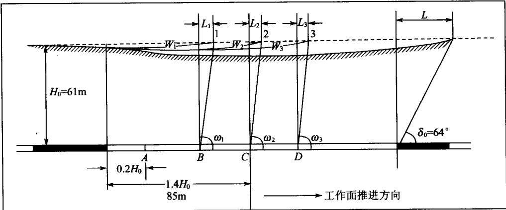  
图5-6 工作面推进过程中的超前影响

当工作面推进至B点时，得下沉曲线W1，工作面前方1点开始受采动影响而下沉， $\pmb { W } _ { 1 }$ 而推进距离约为1.4H。即85m时（C点），得下沉曲线W2，地表2点开始受影响而下沉。 $4 H _ { 0 }$ $\mathbb { W } _ { 2 }$ 在工作面推进过程中，其前方地表受采动影响而下沉，称为超前影响。 $L _ { 1 } , L _ { 2 } , L _ { 3 }$ 为超前影响距。 $\pmb { \omega } _ { 1 }$ $\pmb { \omega } _ { 2 }$ $\pmb { \omega } _ { 3 }$ 为超前影响角，榆家梁矿超前影响角为 $7 9 ^ { \circ }$ ，当工作面回采结束，地表移动稳定后，该角等于边界角 $\delta _ { 0 } ( 6 4 ^ { \circ } )$ 。神东 $\overrightarrow { A }$ 区综合超前影响距 $L = H _ { 0 } \mathrm { c t g } \delta _ { \mathrm { o } } =$ $1 3 0 \mathrm { c t g } 6 1 ^ { \circ } = 7 2 \mathrm { m }$

## 5.4.3.3.2 地表移动盆地

实际观测表明，通常在采空区的长度 $D _ { 2 }$ 和宽度 $D _ { 1 }$ 均达到和超过（1.2\~1.4） $H _ { 0 }$ $( H _ { 0 }$ 为平均开采深度）时，地表可达到充分采动（地表移动盆地出现平底）。神东 $\mathfrak { P }$ 区$D _ { 2 } / H _ { 0 } = 1 5 . 7$ $D _ { \mathrm { 1 } } / H _ { \mathrm { 0 } } = 1 . 5 1$ ，地表可达到充分采动。

工作面回采结束，地表移动盆地如图5-7所示，神东矿区移动盆地分为三个边界：①由边界角 $6 1 ^ { \circ }$ 所圈定的最外围的边界（取地表下沉10mm的点为边界点），即图中的ACBD；②危险移动边界，是以盆地内的地表移动与变形对建筑物有无危害划分的边界，对建筑物有无危害的标准是以临界变形值衡量的，目前我们采用的一组临界变形值是11，倾斜变形 $i \leqslant 3 \mathrm { m m }$ ，水平变形值 $\varepsilon \leqslant 2 \mathrm { m m }$ ，曲率 $k \leqslant 0 . 2 \mathbf { m m } ^ { 2 }$ ，以此指标为准在圈定的范围以外为地表移动和变形不产生明显损害的地带，在圈定的范围以内为地表移动和变形对建筑物产生有害影响的地带，在神东矿区这一带以其移动角 $7 5 ^ { \circ }$ 所圈定，如图中的 $A ^ { \prime } C ^ { \prime } B ^ { \prime }$ $D '$ ；③移动盆地的裂缝边界，神东矿区以裂缝角 $7 9 ^ { \circ }$ 所圈定，如图中的 $A ^ { \prime \prime } C ^ { \prime \prime } B ^ { \prime \prime } D ^ { \prime \prime }$ ，显然ACBD 面积 $> A ^ { \prime } C ^ { \prime } B ^ { \prime } D ^ { \prime }$ 面积 $> A ^ { \prime \prime } C ^ { \prime \prime } B ^ { \prime \prime } D ^ { \prime \prime }$ 面积，我们把 $A ^ { \prime } B ^ { \prime } C ^ { \prime } D ^ { \prime }$ 面积称为采空地表塌陷面积，其中包括裂缝发育面积。移动盆地长轴应为工作面长加工作面停采后超前影响距 $L =$ $H _ { \mathrm { 0 } } \mathrm { c t g } \delta = 1 3 0 \mathrm { c t g } 7 5 ^ { \circ } = 3 5 \mathrm { m }$ ，再加开切眼煤柱一侧上方地表移动距 $5 5 - 3 0 = 2 5 \mathrm { m }$ (图5-7)，即 $2 0 4 4 + 3 5 + 2 5 = 2 1 0 4 \mathrm { m }$ ，塌陷面积为 $2 1 0 4 \times 2 6 6 = 5 5 9 6 6 4 \mathrm { m } ^ { 2 }$ ，为开采面积的1.4倍，各工作面的塌陷面积和开采面积比值如表5-7所示。

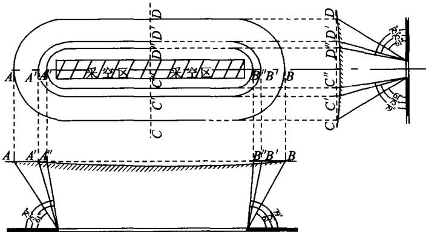  
图5-7 神东煤矿区地表移动盆地边界示意图

## 5.4.3.3.3 地裂缝

神东矿区煤层上覆岩层以砂岩为主，泥钙质胶结。砂岩抗压强度为 $2 2 \sim 4 8  { \mathrm { M P a } }$ (厚度加权平均抗压强度为42MPa)。煤层抗压强度低，遇水易泥化、软化和风化。覆岩中形成冒落带、裂缝带和弯曲带，地表则产生缓慢连续变形，但如开采深度小，冒落带和裂缝带可直达地表，地表产生非连续变形，如大柳塔矿1203工作面，实际采高 $m = 3 . 5 \mathrm { m }$ ，采深 $H _ { 0 } = 6 1 \mathrm { m }$ $H _ { 0 } / m = 1 7$ 。据有关资料，一般情况下，软弱岩层形成的冒落裂缝带高度为采高的9\~12倍，中硬岩石为采高的12\~18倍，1203工作面顶板属中硬岩石，如按冒裂带高度为采高的18倍计算，为63m，则已达地表，此时，在采空区外边缘形成的裂缝与

表5-7 工作面开采和地表塌陷面积及万吨煤地表塌陷面积
<table><tr><td rowspan=2 colspan=1>矿井工作面<e</td><td rowspan=2 colspan=1>煤层倾角q>\omega ( ^ { \circ } )</eq></td><td rowspan=2 colspan=1>采高h/m</td><td rowspan=2 colspan=1>采深 ${ \cal H } _ { 0 } / \ m$ </td><td rowspan=1 colspan=3>开采面积 $( \mathbf { m } ^ { 2 } )$ </td><td rowspan=2 colspan=1>回采 $\sharp ^ { \mathfrak { N } }$  $7 \%$ </td><td rowspan=2 colspan=1>深采比 ${ \cal H } _ { 0 } / \ m$ </td><td rowspan=2 colspan=1>产量 $\diagup 1 0 ^ { 4 } 1$ </td><td rowspan=1 colspan=3>塌陷面积 $( \mathbf { m } ^ { 2 } )$ </td><td rowspan=2 colspan=1>塌陷指 $\# \mathcal { Q }$  $\mathbf { h a } \mathbf { / 1 0 ^ { 4 } t }$ </td><td rowspan=2 colspan=1>塌陷面积/开采面积</td></tr><tr><td rowspan=1 colspan=1>长 $D _ { 2 } / \mathbf { m }$ </td><td rowspan=1 colspan=1>宽 $D _ { 1 } / \mathbf { m }$ </td><td rowspan=1 colspan=1>面积A</td><td rowspan=1 colspan=1>长 $D _ { 2 } ^ { \prime } / \mathbf { m }$ </td><td rowspan=1 colspan=1>宽 $D _ { 1 } ^ { \prime } / \mathbf { m }$ </td><td rowspan=1 colspan=1>面积 $A ^ { \prime }$ </td></tr><tr><td rowspan=1 colspan=1>大柳塔</td><td rowspan=1 colspan=1>0°</td><td rowspan=1 colspan=1>3.5</td><td rowspan=1 colspan=1>61</td><td rowspan=1 colspan=1>938</td><td rowspan=1 colspan=1>150</td><td rowspan=1 colspan=1>140700</td><td rowspan=1 colspan=1>64.4</td><td rowspan=1 colspan=1>17.4</td><td rowspan=1 colspan=1>42.81</td><td rowspan=1 colspan=1>957</td><td rowspan=1 colspan=1>188</td><td rowspan=1 colspan=1>179916</td><td rowspan=1 colspan=1> $\mathbf { 0 . 4 2 } ^ { \textregistered }$ </td><td rowspan=1 colspan=1>1.28</td></tr><tr><td rowspan=1 colspan=1>补连塔</td><td rowspan=1 colspan=1>0-3</td><td rowspan=1 colspan=1>4.0</td><td rowspan=1 colspan=1>110</td><td rowspan=1 colspan=1>1500</td><td rowspan=1 colspan=1>180</td><td rowspan=1 colspan=1>270000</td><td rowspan=1 colspan=1>64.4</td><td rowspan=1 colspan=1>27.5</td><td rowspan=1 colspan=1>93.90</td><td rowspan=1 colspan=1>1521</td><td rowspan=1 colspan=1>221</td><td rowspan=1 colspan=1>336141</td><td rowspan=1 colspan=1>0.358</td><td rowspan=1 colspan=1>1.24</td></tr><tr><td rowspan=1 colspan=1>榆家梁</td><td rowspan=1 colspan=1>1.5</td><td rowspan=1 colspan=1>3.4</td><td rowspan=1 colspan=1>91</td><td rowspan=1 colspan=1>3730</td><td rowspan=1 colspan=1>246</td><td rowspan=1 colspan=1>917580</td><td rowspan=1 colspan=1>64.4</td><td rowspan=1 colspan=1>26.8</td><td rowspan=1 colspan=1>271.23</td><td rowspan=1 colspan=1>3778</td><td rowspan=1 colspan=1>274</td><td rowspan=1 colspan=1>1035172</td><td rowspan=1 colspan=1> $\mathbf { 0 } , 3 8 2 ^ { \textcircled { 4 } }$ </td><td rowspan=1 colspan=1>1.13</td></tr><tr><td rowspan=1 colspan=1>孙家沟</td><td rowspan=1 colspan=1>4-9</td><td rowspan=1 colspan=1>3.7</td><td rowspan=1 colspan=1>260</td><td rowspan=1 colspan=1>2007</td><td rowspan=1 colspan=1>207</td><td rowspan=1 colspan=1>415449</td><td rowspan=1 colspan=1></td><td rowspan=1 colspan=1>70.3</td><td rowspan=1 colspan=1>133.64</td><td rowspan=1 colspan=1></td><td rowspan=1 colspan=1></td><td rowspan=1 colspan=1></td><td rowspan=1 colspan=1></td><td rowspan=1 colspan=1></td></tr><tr><td rowspan=1 colspan=1>矿区均值</td><td rowspan=1 colspan=1>2.5</td><td rowspan=1 colspan=1>3.7</td><td rowspan=1 colspan=1>130</td><td rowspan=1 colspan=1>2044</td><td rowspan=1 colspan=1>196</td><td rowspan=1 colspan=1>400624</td><td rowspan=1 colspan=1></td><td rowspan=1 colspan=1></td><td rowspan=1 colspan=1></td><td rowspan=1 colspan=1>2104</td><td rowspan=1 colspan=1>266</td><td rowspan=1 colspan=1>559664</td><td rowspan=1 colspan=1>0.387</td><td rowspan=1 colspan=1>1.40</td></tr></table>

注：①煤容重取1 $. 3 5 V \mathrm { m } ^ { 3 }$ ，工作面回采率取64.4%（大柳塔12032工作面数值），但矿区工作面回采率为65%\~94%，平均为88%。

②即万吨煤地表塌陷公顷数。

③据神木县地质灾害调查资料，到2001年底大柳塔矿产煤 $3 6 7 6 \times 1 0 ^ { 4 } 1$ ，地面塌陷 $7 7 0 0 8 7 2 \mathrm { m } ^ { 2 }$ ，即万吨煤塌陷指数为0.21ha，与全国均值0.2ha持平。

④据神木县地质灾害调查资料，到2001年底榆家梁矿产煤 $5 0 0 \times 1 0 ^ { 4 } \mathrm { t }$ ，地面塌陷 $5 5 2 0 0 0 \mathrm { m } ^ { 2 }$ ，即万吨煤塌陷指数为0.11ha，比全国均值0.2ha低45%。

采空区贯通，构成向工作面涌水溃沙的通道。冒裂带之上是弯曲带，弯曲带内岩层在水平方向处于双向受压状态，其压实程度较好，具有隔水性。弯曲带高度主要受开采深度的影响。当采深很大时，弯曲带高度可大大超过冒裂带高度，此时，开采形成的裂缝不会到达地表，地表移动和变形相对较缓，有时在地表也可能产生一些裂缝（由地表拉伸变形所引起)，但这些裂缝表现为上大下小，到一定深度 $\mathrm { ( } < 5 \mathrm { m ) }$ 时一般自行闭合而消失，通常不和井下裂缝相沟通，其他三个矿的地表裂缝就是这种情况。但由于沙土松散层具有湿陷性，这种裂缝破坏带，遇雨水冲刷侵蚀会形成再次塌陷破坏。对这类裂缝进行填实碾压可防止再次塌陷破坏。

综上所述，可见：

（1）由表5-6和图5-8可见，地表出现的最大倾斜处（ $\left( { \boldsymbol { x } } = \mathbf { 0 } \right)$ 倾斜值i(0)为41mm/m，下沉值W（0） =1128mm，是最大下沉值 $\Psi _ { \circ } = 2 2 5 5 \mathrm { m m }$ 的1/2，此点的曲率值为K（0）=0；且当 $x < 0$ 时， $\begin{array} { r l } { K } & { { } ( x ) \quad > 0 } \end{array}$ ，下沉曲线上凸； $x > 0$ 时， $\begin{array} { r l } { K \mathbf { \Phi } \left( \mathbf { \boldsymbol { x } } \right) } & { { } < \mathbf { 0 } } \end{array}$ ，下沉曲线下凹，倾斜出现最大值的地表点（即 $x = 0$ 的地表点）是下沉曲线由凸变凹的转折点，该点上的曲率值为0，称为下沉曲线的拐点（D点）。

(2)地表的主要移动和变形值均发生在 $x = - y \sim + \gamma$ 的范围内，称γ为主要影响半径，主要影响半径γ与采深 $H _ { 0 }$ 和主要影响角 $\beta$ 的正切tgβ有关， $\gamma = \frac { H _ { 0 } } { \mathrm { t g } \beta }$ ，矿区地表的主要影响半径平均值为 ${ 5 5 } \mathbf { m }$ O

(3)不考虑顶板的悬臂作用时，下沉曲线的拐点在实际煤壁A的正上方，而顶板的悬壁作用是存在的，拐点D在假想煤壁B的正上方，故S。实际上是由悬壁作用引起的拐 $S _ { \circ }$ 点偏移距离，称之为拐点偏距，矿区地表移动平均拐点偏距为30m，假想煤壁为采空区的计算边界。

(4) 神东矿区三个实测工作面万吨产量地面塌陷面积为0.35\~0.42ha，矿区平均值为0.387ha，比全国万吨煤产量地面塌陷面积平均值0.2ha几乎高出1倍，主要原因是工作面采深小、煤层采厚大。

(5)根据神东矿区有关开采参数及松散层和基岩移动角数值，设定了两个地表保护面积 $5 \times 1 0 0 \mathrm { m } ^ { 2 }$ 及 $\mathsf { 5 } \times 3 2 0 \mathrm { m } ^ { 2 }$ ，作出相应的保护煤柱，估算出前者的压煤量为 $1 6 \times 1 0 ^ { 4 } { \mathrm { t } }$ ，后者为 $2 4 . 8 \times 1 0 ^ { 4 } 1$ ，留设保护煤柱使部分煤炭留在地下暂时或永远无法采出，造成大量煤炭资源的浪费，因此，对于一般村镇居民点和耕地是否留设煤柱加以保护，或者迁移部分人员并征用相关土地，就需进行全面的技术经济分析。

## 5.4.3.4 矿山废弃土地的复垦

矿山开采过程中，产生了大量的废渣和废石，排放压占了大量土地，废水排放、废渣扬尘污染了土地，也严重损害了周边土地经济价值，严重者会丧失耕地功能。因此，从保护环境及土地价值方面出发，必须在生产过程中对破坏与压占的土地尽可能地恢复治理，消除污染危害。在矿山闭坑后对废弃的土地进行全面的恢复治理，恢复其使用价值，重新作为农业、林业、牧业、渔业、旅游业或工业、城乡建设用地。

对破坏土地的复垦，是将矿山建设、开采过程中因挖损、压占、塌陷破坏的各类废弃土地，通过采取工程措施或生物措施，使其重新恢复到可供利用状态，并加以利用的一种活动。从广义上讲，矿山土地复垦是采矿工程的延续和组成部分，最佳的复垦方法与采矿工艺密切配合，统一规划，协调进行，既满足生产需求，又符合复垦的需要，从而达到矿产资源开发与环境保护双赢的目标。土地复垦已成为土地开发利用活动的重要组成部分，是土地资源可持续利用、缓解人多地少的矛盾、改善生态环境的重要措施。

根据采矿方式、矿区地形和气候条件，因地制宜地选择适合本矿区的土地复垦方式。按照矿山土地复垦对象的不同，主要有塌陷区复垦、废渣堆场复垦、露天矿采场复垦、尾矿库复垦等；按复垦主要用途分有农业复垦、林业复垦、建设用地复垦、休闲复垦等。

## 5.4.3.4.1 塌陷区复垦

矿区地面塌陷和地裂缝破坏大量良田，毁坏村舍和地面建筑物，造成矿区生态环境恶化。矿山企业和受灾居民的矛盾愈来愈严重，已成为社会不稳定的因素之一。合理整治矿区塌陷、地裂缝区，是当前亟待解决的重要课题。由于采矿塌陷的土地资源配置不尽合理、采煤塌陷地的权属不清、复垦政策与管理机制不健全、复垦资金渠道不落实、复垦理论远远落后于实践等问题，致使采煤塌陷土地的复垦工作困难重重、举步维艰。地下开采引起的塌陷区，因其所在地区的地势地貌、水文气象等条件的不同，对土地的破坏程度和复垦方法均有所不同。对于山地和丘陵地带，只要将局部的塌陷漏斗或塌陷坑、裂缝进行填培并加以平整，即可恢复原来的地形地貌。对于平原地区，若潜水位较低，地区降雨较少，塌陷区不会常年积水，复垦时只需进行回填和铺垫表土，即可进行种植或做他用。若潜水位较高或降雨较多，塌陷区会常年积水，复垦时需排除积水或整治水面及周围环境，用于养殖及游览。

通过矿井回填系统，将地面矸石山和洗煤厂外排的矸石用风力充填和水力充填法回填采空区，既可减少岩层和地表移动，降低地表沉陷的目的，又可大量消耗煤矸石、减少地面污染，还可起到防止煤层自燃发火的作用。德国、苏联、捷克常用此法，焦作矿务局也

曾采用此法回填采空区，得到很好的效果。

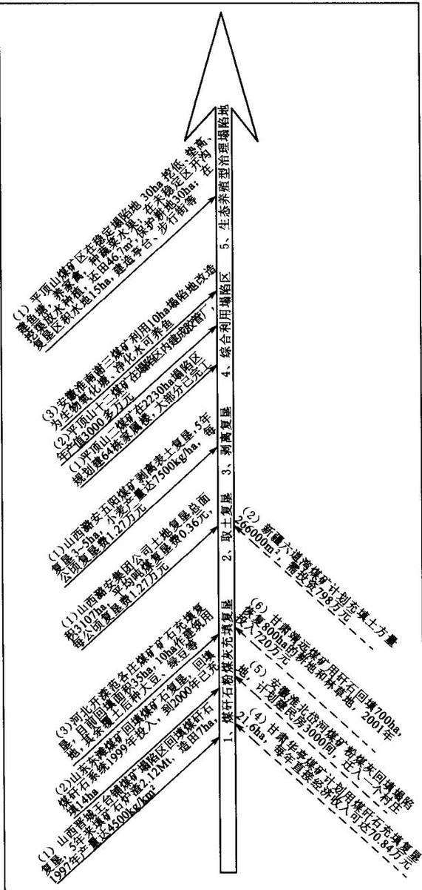

我国对地面塌陷裂缝的治理主要是通过对塌陷区的开发利用和综合治理实现的。从20世纪80年代初开始，有规划地对塌陷裂缝区开始进行复垦，在淮北、淮南、徐州、大屯和平顶山等煤矿区取得了一定成效和经验，提出了许多综合治理模式（图5-8）。徐州庞庄煤矿在分层充填、分层振压塌陷区矸石地基上，建造了一层或两层农村住宅 627 栋共 $6 . 9 \times 1 0 ^ { 4 } \mathrm { m } ^ { 2 }$ ，并经受了地下两层煤、4个工作面的开采影响，房屋无一损失。综合防治地面塌陷和地裂缝的办法包括：①煤矸石粉煤灰充填；②取土复垦；③剥离复垦；④综合利用塌陷地；⑤生态养殖治理塌陷地等，如图5-9所示。固体废物作充填材料兼有掩埋废物和复垦塌陷区的双重效益。如淮北岱河煤矿将下沉深度5m的塌陷区充填的矸石地基强夯后，建起 $1 6 5 0 \mathrm m ^ { 2 }$ 的四层大楼供工会、幼儿园、矿区中学使用。但是，煤矸石和粉煤灰一般只占回填塌陷区总面积的20%，因此，还必须采用非充填方式来复垦部分塌陷区。非充填复垦主要是采取挖深垫浅的办法对塌陷区进行综合整治，将塌陷盆地底部深挖成能蓄水养鱼的深水池塘，使其同时具有蓄洪和浇灌功能，周围坡地可改建为水平梯田。我国西北大部分地区属黄土高原和丘陵地区，塌陷后地形地貌无明显变化，所破坏土地如果需要耕种的话，只要将局部漏斗式塌陷坑和地裂缝进行充填平整即可。

图5-8 煤矿区土地复垦鱼刺图

陕西与内蒙古接壤处的神东矿区，建成了5座排矸厂，集中处理煤矿石。采用分层排放，填沟造地方式。上覆黄土，平整后种树种草，使矸石山变成绿地。宁夏煤矿区通过收集资料，调查访问、地面物探、钻探等查明历史至今的采空区范围，进行稳定性分析和跟踪观测，掌握地面塌陷与塌陷发生的规律，对其发生的区域、范围、深度、时间和速度进行认真研究分析，提出预测预报。对于地面要求尽量减少塌陷的区域，采用条带式、房柱式等开采方法采煤，还可采用钻孔离层注浆、煤矸石回填等方法充填采空区，避免或减少覆盖岩层沉降。对已经发生塌陷的区域，可利用煤矸石、电厂粉煤灰和少量的生活垃圾回填，进行生态环境恢复和农业土地复垦，在地面积水区养鱼、修建景点等多种办法治理。如宁夏石嘴山用现存的矸石，采用平翻方式充填塌陷区，营造出多处绿化和建设用地。

## 5.4.3.4.2 排渣场复垦

矿山弃土弃渣、废石排放，占压了大量土地，其本身又是矿区的重要污染源，对大气、水体产生污染，同时还引发滑坡、泥石流等地质灾害。排土场复垦就是整治废石堆场，恢复土地，进行种植，控制或消除废石场对周围环境的污染。排土场在设计时就应考虑未来的复垦工作，在剥岩时要将表土层与废石分别采集和堆放。在复垦时根据排土场的位置、形状、废石性质和水文气象条件，因地制宜地确定复垦方案。

## 5.4.3.4.3 露天矿区复垦

露天矿开采初期就要考虑将来的采区复垦工作，将矿床之上较为肥沃的表土层剥离单独堆放，尽可能保持原有土壤结构。在采空区回填时，将大块废石或有害岩土置于矿坑底层，表层铺上原来的表层土，或另取适宜耕作的新土覆盖，经平整后选择合适的植物进行栽种，或作他用。

整治露天矿开采土地破坏的有效措施之一就是把土地复垦作为整个露天矿开采工艺中的一个环节。比如我国建材601金刚砂矿的开采顺序是：表土剥离—表土储存—采矿———选矿——尾矿回运并充填采空区——表土铺敷——整平及渠道修筑，而后交农民施肥种植。采矿、剥离及复垦方法如图5-9所示。

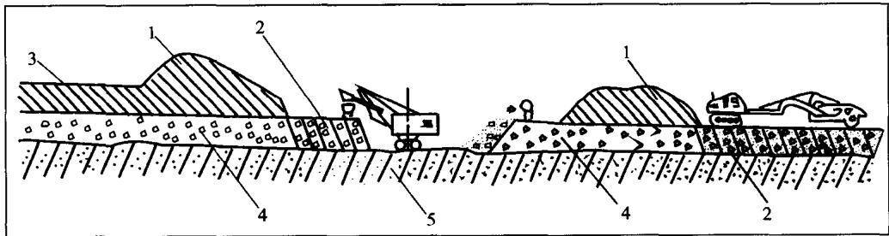  
图5-9 采矿、剥离及复田方法示意图  
1—覆土堆；2—含矿层；3—已恢复农田；4—回填废石；5--红色砂岩

复垦作业就是将废石和覆盖土送入内排土场（采空区）中，要求尽可能与开采前地面标高一致，特别是表层种植土应保持原有土壤结构，能种植作物。该矿原先只采矿不复垦，开采后矿区成了三山（表土山、废石山、尾矿山）两池（水池、尾矿池）一无（无良田）区，造成工农关系紧张，如不复垦，矿山则无法继续生产。开始复垦时只是进行堆山填坑搬土，效益差，费用高(3万元/ha)，采用开采复垦相结合的复垦法后，费用降低到0.45万元/ha，效益提高。

晋陕蒙接壤的准格尔煤田位于干旱的黄土高原地区，矿区所在区域水土流失严重，地表支离破碎，植被稀疏。在矿区捣蒜沟进行了综合整治工程试验。捣蒜沟原是一条自然冲刷沟，露天煤矿开采将最初剥离物填充此沟，形成梯形台阶式区域。捣蒜沟堆土场总排弃量为 $7 5 . 2 8 \times 1 0 ^ { 4 } \mathrm { m } ^ { 3 }$ ，堆土场平台总面积为 $2 \times 1 0 ^ { 4 } \mathrm { m } ^ { 2 }$ ，4个边坡总面积为 $1 \times 1 0 ^ { 4 } \mathrm { m } ^ { 2 }$ O

神东矿区马家塔露天煤矿复垦建设的新思路是治理与经营互相促进、协调发展。复垦采取边剥离边回填的采煤方式，分层回填，废石生土在下，表土在上。回填后形成复垦区面积 $1 1 3 . 3 3 \times 1 0 ^ { 4 } \mathrm { m } ^ { 2 }$ 。1999年秋季，在复垦区20ha土地上垫红泥0.2m，分别种植了蔬菜、玉米、土豆、葵花、荞麦、优质牧草等，长势良好，效果显著。同时利用氧化塘处理后的污水作为水源，针对复垦区土壤保水能力差的特点，在复垦区全面布设灌溉管网，采取固定式或移动喷灌，持续有效地提高了土壤与近地层空气的湿度，解决了复垦绿化中的干旱制约难题。马家塔复垦区目前已形成治理与经营互相促进、协调发展的格局。绿化覆盖率达到80%，较开采前提高了15.8倍。共种植牧草46.7ha，栽植灌木10万株，乔木2万株。被水利部评为全国生态建设示范基地，被内蒙古自治区旅游局评为AA级旅游区，一个新型现代化的人造生态园已基本形成。

## 5.4.3.4.4 尾矿库复垦

尾矿库在停止使用后，由于水分的蒸发和排泄，表面十涸而暴露在空气中，形成一层不透气的外壳，整个尾矿库类似一个沼泽地，承载能力很低。在大风季节，干旱地区的尾矿库库区笼罩在灰蒙蒙的粉尘之中，风停之后，农作物和建筑物上飘落灰尘，影响居民健康，这也是西北地区日渐强烈的沙尘暴的一种物源。因此，尾矿库的复垦工作首先要处理和改善其表面结构，提高其抗风蚀能力。一般的复垦步骤是：挖松表面的坚硬外壳，表层挖松后用碎石充填，对酸性尾矿用石灰石中和其酸性，对碱性尾矿用白云石中和其碱性，平整尾矿堆表面，铺垫表土并掺入中和药剂和肥料，种植或作它用。当尾矿及残留药剂中含有毒物质时，要研究这些有害物质的危害及其防治措施。这样，既缓解了城市用地紧张，又有效地解决了尾矿库粉尘污染大气的问题。

## 5.4.4 水资源保护及水污染防治

矿山开采和矿石选冶对水资源地的破坏和水污染都是严重的。开矿不可避免地要疏干、排泄一定的地下水，使地下水水位较原始水位大幅度下降，降低原有水源的供水能力。开矿也会不同程度地污染地表及地下水系，使之降低了使用功能。废石与尾矿露天堆放，氧化淋溶可形成酸性水，酸性水及其携带的有害物质流入地表水系或渗入地下潜水层，污染水资源。选矿厂的废水同样也会对地表、地下水源造成污染。

陕西凤县四方金矿选矿厂的尾矿中有毒有害物质对水、土、植被造成了污染，危害人体健康。尾矿在尾矿库中蒸发、渗透、沉淀、澄清、自然净化，通过库内溢流排到坝前回水池，在回水池用活性炭处理后，大部分经回水泵站用管道输送至选矿厂磨矿、浸出供生产系统循环利用。为防止尾矿水污染环境，对外排放的尾矿水应采用石灰、次氯酸钠和沉淀池处理法，在碱性条件下，使氰化物氧化、生成二氧化碳和氮气逸出，降低CN浓度，金属离子生成氢氧化物沉淀后达标再排放，采矿废水经沉淀处理，采取以上措施可做到达标排放。对回用尾矿水采用活性炭处理，去除影响金浸出的部分重金属，保证尾矿水循环利用于生产中，并同时回收了微量金，每年回收金达1kg以上。该工艺设备简单，投资少，成本低，且活性炭经处理可循环利用，从源头上减轻了对西河的污染。

地表水系的污染往往是直接的，尤其是流动的径流，会很快通过径流目净化作用而降低或消除污染。如果河床底泥中污染物达到饱和，污染河段就会加长，污染的范围就会扩大，但总体而言，治理相对容易。而地下水的污染涉及到巨厚的渗透层及下渗通道的污染饱和，加之过程十分缓慢，因而地下水污染具有隐蔽性和难以恢复性。由于地下水的流速、补给、交换缓慢，切断污染源后，仍需几十年甚至数千年的时间，才有可能恢复。因此，地下水一旦遭到污染，便很难治理及恢复。如果人们饮用了受有害或有毒组分污染的地下水或食用了受污染土地生长的植物，对人体的影响将是慢性的长期效应，不易觉察。

神东矿区采用生物固沙和工程防护措施，在矿区乌兰木伦河的支流考考赖沟、哈拉沟、石圪台沟等主要生产生活水源地实施了水源治理保护工程，在源头层层设防，束水归槽，完成了治理面积1467ha。经测定，治理前后，考考赖沟水源地水中含沙量由6.4kg/t下降到0.2kg/t，哈拉沟和石圪台沟水源地水中含沙量由14.7kg/t下降到0.15kg/t，每年可节约水厂排沙费166万元，两年多即可收回治理投资。4个水源地每天涌水量41000t，治理后每年减少入河泥沙量 $1 5 . 6 \times 1 0 ^ { 4 } \mathrm { t } _ { c }$

为解决矿山废水所造成的危害问题，必须采取各种措施和方法，严格控制废水排放，尽量减少对周围环境的水污染。

## 5.4.4.1 改善和处理废水污染工艺技术

矿山废水排放的特性，决定了废水处理的原则是：采用有效简便和经济的处理方法，使处理后的水和重金属等物质都能回收利用。故应做到以下几点基本要求：

改进工艺，减少污染源：改进工艺是最根本、最有效的杜绝或减少污染源产生的途径。如某铅锌矿，过去一直采用氰化钠作为铅锌分选的抑制剂，致使尾矿水和铅锌精矿浓缩溢流水含氰量大大超过排放标准，先后污染了几千亩农田，造成了大量牲畜及水生物的死亡，现改成无毒浮选工艺，采用硫酸锌代替氰化钠，不仅减少了污染危害，而且也提高了选矿厂的经济效益。

循环用水，一水多用：采用循环供水系统，使废水在生产过程中多次重复利用，既能减少废水的排放量，减轻环境污染，又能减少新水的补充，节省水资源。如河北某铜矿，每天排放废水达两千余吨，过去直接排入渤海，引起近海水资源的污染，后来该矿进行了选矿工艺改进，加高了尾矿坝，开凿了1000多米地下隧道，架设了几百米的污泥管道，使尾矿溢流水利用高差自流到选矿厂循环利用，使水的回收率达到90%以上，基本实现了废水闭路循环使用。

## 5.4.4.2 控制矿山废水排放量的有效措施

采取“防”、“治”、“管”相结合的方法，严格控制废水的形成和排放，是控制和减轻水污染的积极措施。

（1）选择适当的矿床开采方法：地下采矿时，选择使顶板及上部岩层少产生裂隙或不产生裂隙的采矿方法，是防止地表水通过裂隙进入矿井而形成废水的有效措施。露天开采时，应尽量避免采用陡峭边坡的开采方法，以减轻边坡遭水蚀及冲刷现象；及时覆盖黄铁矿的废石，以防止氧化：下边坡应留矿壁以防止地面水流入采场；可能情况下应回填采空区，以免积水；合理布置采矿场排水沟。

(2)控制水蚀及渗透：地下水、老窿水、地表水及大气降雨渗入废石堆后，流出的将是受严重污染的水。因此，堵截给水、降低废石堆的透水性，是防止和减少水渗透的有效措施。高速水流经废石堆时会出现水蚀现象，使水受污染。将废石堆整平、压实，修建导水渠，是防止废石堆水蚀的有效方法。此外，利用某种化学物质喷洒硫化矿废石堆表面，使之与空气和水隔绝也是控制水污染的有效措施。

(3)控制废水排放量：在干燥地区可建造池浅而面积大的废水池蒸发废水，这对排水量大的矿山是减少废水处理量的合理措施。

(4）平整矿区及植树绿化：平整遭受破坏的土地，可以收到掩盖污染源、减少水土流失、防止滑坡及消除积水的效果。植被可以稳定土石，降低地表水流速度，因而能在一定程度上减少水土流失、水蚀及渗透。让废水流经某些种植植物的地面后排入河流，也能使矿井水得到一定程度的净化。

## 5.4.4.3 废水处理系统和工艺流程

正确选择废水处理系统和工艺流程应从以下几点人手：

废水的水质及水量特征是正确选择处理系统的出发点。从废水的种类来说，需要考虑采用混合处理还是单独处理方式，或是单独处理一定程度后再混合处理；从排水量及排水规律来说，需要考虑是否要设置蓄水池、混合池，是连续还是间歇运行等；从污染物质种类和浓度来说，需要考虑和分析的内容就更多，因为这是选择处理方法和处理设备的主要依据，例如，当污染物为胶体时，要考虑采用混凝、气浮、生物絮凝等方法；当污染物为溶质时，就要考虑采用化学沉淀、萃取、离子交换等物理化学方法；如果有儿种污染物存在，就要考虑用一种方法还是用几种方法联合处理问题；若污染物浓度足够高，具有回收价值，就应选择能回收利用有价值成分的方法。

—废水处理后的利用或排放以及对水质的具体要求是决定和选择处理系统的关键。提出若干技术上可行的处理方案，进行技术经济综合比较，认真分析和论证，确定出最优和次优方案，以备选用。

## 5.4.4.4 酸性矿井水污染治理方案择优

某矿井排放的酸性水，水质pH值为2.6，总铁含量为300mg/L，出水量为40\~100t/h，该水如不经处理就外排，将会污染附近河流和农田，影响农作物生长，引发矿山与当地居民的矛盾。

对该矿所排酸性水污染可用以下三个方案加以治理。

（1）P1方案—石灰乳中和法：酸性水用耐酸泵提升到中和反应池，同时加入5%的石灰乳，与酸性水接触反应，调节石灰乳加入量，控制pH值为6.5左右，再进斜管沉淀池进行泥水分离，上层清水排入清水池，或直接外排，污泥排放到污泥池，再用泥浆泵泵入污泥于化池，进行干化处理。此法操作较困难。

(2）P2方案——石灰石中和滚筒法：酸性水用耐酸泵提升到装有一定粒径（粗粒、细粒）的石灰石的中和滚筒内，与石灰石充分反应后其pH值达6.2左右。出水加入絮凝剂，进入沉淀池进行泥水分离，上层清水排入清水池回用或外排，污泥排放到污泥池，再用泥浆泵泵入污泥干化池，进行于化处理，此法操作较简单。

(3) P3方案——石灰乳-石灰石中和塔法：酸性水先与石灰乳中和到 pH值为4左右，使铁基本上形成 $\mathrm { F e } \ \left( \mathrm { O H } \right) _ { 2 }$ ，然后进入石灰石中和塔进行中和反应，出水pH值达6.0以上，然后进入沉淀池进行泥水分离，上层清水排入清水池同用或外排，污泥排放到污泥池，再用污泥泵泵入污泥池，进行干化处理，此法适合处理各种酸性矿井水，尤其是水中含 $\mathbf { F e } ^ { 2 \cdot }$ 较多时适用，可减少石灰用量，劳动条件也有所改善。

用多目标模糊决策法对上述三个可行方案进行择优，即三个被评价方案的集合为：$\begin{array} { r l } { U = } & { { } \{ P 1 , ~ P 2 , ~ P 3 \} } \end{array}$

选用以下4个评价因素指标：①工程总投资 $f _ { \parallel }$ ；②运行费用 $f _ { 2 }$ ；③出水 $\mathrm { \bf p H }$ 值 $f _ { 3 }$ i④工作条件 $\cdot f _ { 4 }$ o

其中工作条件一项属定性指标，由专家给出评分，好的记0.85分，较好的记0.55分，不太好的记0.25分。

各因素的重要程度权值模糊子集： $A = \ \left( \begin{array} { l } { a _ { 1 } , \ a _ { 2 } , \ a _ { 3 } , \ a _ { 4 } } \end{array} \right)$

各因素的重要程度权值 $a _ { 1 } \ 、 \ a _ { 2 } \ 、 \ a _ { 3 }$ 和 $\pmb { a } _ { 4 }$ ，可用以下三种方法确定：①德尔斐法（专家评估法)；②专家调查法；③判断矩阵分析法。不论用哪种方法，对参与专家要求有渊博的专业知识，且富有实际工作经验，熟悉并掌握所研究问题的全部具体情况。

根据以上所提出的有关数据可得各方案的因素指标矩阵 $\pmb { F }$ (表5-8)。

表 5 -8 各方案因素指标矩阵 F
<table><tr><td rowspan=1 colspan=1>因素指标</td><td rowspan=1 colspan=1>P1方案</td><td rowspan=1 colspan=1>P2 方案</td><td rowspan=1 colspan=1>P3方案</td><td rowspan=1 colspan=1>标准值 $f _ { i } ^ { \circ }$ </td><td rowspan=1 colspan=1> $\pmb { a } _ { i }$ </td></tr><tr><td rowspan=1 colspan=1>工程总投资f</td><td rowspan=1 colspan=1>86.9</td><td rowspan=1 colspan=1>114.1</td><td rowspan=1 colspan=1>106.9</td><td rowspan=1 colspan=1>86.9</td><td rowspan=1 colspan=1>0.10</td></tr><tr><td rowspan=1 colspan=1>运行费用f2</td><td rowspan=1 colspan=1>0.43</td><td rowspan=1 colspan=1>0.39</td><td rowspan=1 colspan=1>0.415</td><td rowspan=1 colspan=1>0.39</td><td rowspan=1 colspan=1>0.30</td></tr><tr><td rowspan=1 colspan=1>出水 pH 值 $f _ { 3 }$ </td><td rowspan=1 colspan=1>6.5</td><td rowspan=1 colspan=1>6.2</td><td rowspan=1 colspan=1>6.0</td><td rowspan=1 colspan=1>6.5</td><td rowspan=1 colspan=1>0.40</td></tr><tr><td rowspan=1 colspan=1>工作条件 $\mathrm { : } f _ { 4 }$ </td><td rowspan=1 colspan=1>0.25</td><td rowspan=1 colspan=1>0.55</td><td rowspan=1 colspan=1>0.85</td><td rowspan=1 colspan=1>0.85</td><td rowspan=1 colspan=1>0.20</td></tr></table>

## 5.4.4.4.1 加权相对偏差距离最小法择优

各因素指标权值模糊子集：

$$
\begin{array} { l l l l l } { { A = } } & { { \left( \ a _ { 1 } , \ a _ { 2 } , \ a _ { 3 } , \ a _ { 4 } \right) } } & { { = } } & { { \left( 0 , \ 1 0 , \ 0 . 3 0 , \ 0 . 4 0 , \ 0 . 2 0 \right) } } \end{array}
$$

我们把第i个方案的第j个因素指标值记为 $f _ { i j }$ ，则得m个方案的n个因素指标矩阵 $\boldsymbol { F } _ { \circ }$

即

$$
F = { \left[ \begin{array} { l l l l } { f _ { 1 1 } } & { f _ { 1 2 } } & { \cdots } & { f _ { 1 n } } \\ { f _ { 2 1 } } & { f _ { 2 2 } } & { \cdots } & { f _ { 2 n } } \\ { \cdots } & { \cdots } & { \cdots } & { \cdots } \\ { f _ { n 1 } } & { f _ { n 2 } } & { \cdots } & { f _ { n m } } \end{array} \right] } = { \left[ \begin{array} { l l l l } { 8 6 . 9 } & { 1 1 4 . 1 } & { 1 0 6 . 9 } \\ { 0 . 4 3 } & { 0 . 3 9 } & { 0 . 4 1 5 } \\ { 6 . 5 } & { 6 . 2 } & { 6 . 0 } \\ { 0 . 2 5 } & { 0 . 5 5 } & { 0 . 8 5 } \end{array} \right] }
$$

由各方案的因素指标矩阵F得知，各因素指标的标准值（三个方案中最有利的值）向量为：

$$
\begin{array} { l l l l } { { f _ { i } ^ { \circ } = } } & { { \left( f _ { 1 } ^ { \circ } , \ f _ { 2 } ^ { \circ } , \ f _ { 3 } ^ { \circ } , \ f _ { 4 } ^ { \circ } \right) } } & { { = } } & { { \left( 8 6 . 9 , \ 0 . 3 9 , \ 6 . 5 , \ 0 . 8 5 \right) } } \end{array}
$$

$$
\underset { \leq i } { \iff } \delta _ { i } j = \frac { \left| f ^ { \circ } _ { \cdot } - f _ { i j } \right| } { f _ { \mathrm { i m a x } } - f _ { \mathrm { i m i n } } } ( i = 1 , \ 2 , \ 3 , \ \cdots , \ n ; \ j = 1 , \ 2 , \ 3 , \ \cdots , \ m )
$$

式中： $\pmb { f } _ { i m a x }$ 为各方案第i项因素指标中最大指标值，即 $f _ { i { \mathrm { m a x } } } = { \mathrm { m a x } } ( f _ { i 1 } , f _ { i 2 } , f _ { i 3 } , \cdots$ $f _ { i m } )$

$f _ { \mathrm { i m i n } }$ 为各方案第i项因素指标中最小指标值，即 $f _ { i _ { \mathrm { m a x } } } = \mathrm { m i n } ( f _ { i 1 } , f _ { i 2 } , f _ { i 3 } , \cdots , f _ { i _ { \mathrm { m } } } )$

$$
f _ { i } { } ^ { \circ } = \{ \begin{array} { r l } { f _ { i \operatorname* { m a x } } } & { \stackrel { \mathrm { a v } } { \exists } | \mathbb { E } | \not { \exists } \not \exists \not \in \underline { { t } } \not { \widehat { \nu } } \not { \mathrm { T } } f _ { i } \not { \exists } \not \mathrm { I } \mathbb { E } \not { \sf H } \not { \sf H } \not { \mathrm { T } } } \\ { f _ { i \operatorname* { m i n } } } & { \stackrel { \mathrm { a v } } { \exists } | \mathbb { E } | \not { \exists } \not  \not { \mathrm { H } } \not { \mathrm { T } } \not { \mathrm { T } } f _ { i } \not { \downarrow } \not { \mathrm { H } } \not { \mathrm { H } } { \sf H } \not { \mathrm { H } } \not { \mathrm { H } } \not { \mathrm { T } } } \end{array} 
$$

正指标是指指标值越大方案越优的因素指标，负指标是指因素指标值越小方案越优的因素指标，我们把 $\delta _ { i j }$ 称为相对偏差值，称 $f ^ { \circ }$ 为标准值。

得出相对偏差模糊矩阵Δ：

$$
\Delta = \left[ \begin{array} { l l l } { \delta _ { 1 1 } } & { \delta _ { 1 2 } } & { \delta _ { 1 3 } } \\ { \delta _ { 2 1 } } & { \delta _ { 2 2 } } & { \delta _ { 2 3 } } \\ { \delta _ { 3 1 } } & { \delta _ { 3 2 } } & { \delta _ { 3 3 } } \\ { \delta _ { 3 1 } } & { \delta _ { 3 2 } } & { \delta _ { 3 3 } } \end{array} \right] = \left[ \begin{array} { l l l } { 0 } & { 1 } & { 0 . 7 3 5 } \\ { 1 } & { 0 } & { 0 . 6 2 5 } \\ { 0 } & { 0 . 6 } & { 1 } \\ { 1 } & { 0 . 5 } & { 0 } \end{array} \right]
$$

例如： $\delta _ { 3 2 } = \frac { f _ { 3 } ^ { \mathrm { ~ o ~ } } - f _ { 3 2 } } { f _ { 3 \operatorname* { m a x } } \ - f _ { 3 \operatorname* { m i n } } } = \frac { \mid \ 6 . 5 \ - 6 . 2 \mid } { 6 . 5 \ - 6 . 2 } = 0 . 6$ ，根据加权相对偏差距离公式，即

$$
d _ { j } = \frac { 1 } { a } \sqrt { \sum _ { i = 1 } ^ { n } \left( a _ { i } \delta _ { i j } \right) ^ { 2 } } \mathcal { Z } a = \frac { \sum _ { i = 1 } ^ { n } a _ { i } } { n } ( n = \mathbb { 1 } _ { \mathbb { H } } ^ { \mathbb { H } } \mathbb { H } \mathbb { H } , 4 )
$$

代入数据：

$$
d _ { 1 } = \frac { 1 } { \underbrace { \left( 0 . 1 0 + 0 . 3 0 + 0 . 4 0 + 0 . 2 0 \right)} _ { 4 }  } \sqrt { \left( 0 . 1 0 \times 0 \right) ^ { 2 } + \left( 0 . 3 0 \times 1 \right) ^ { 2 } + \left( 0 . 4 0 \times 0 \right) ^ { 2 } + \left( 0 . 2 0 \times 1 \right) ^ { 2 } } = 1 . 4 4 2
$$

同理算出 $d _ { 2 } = 1 . 1 1 4 , d _ { 3 } = 1 . 7 9 1$

加权相对偏差距离最小法是以 $d _ { j }$ 最小的方案为最优，因为 $\begin{array} { c c c } { \operatorname* { m i n } \ \left( \ d _ { 1 } , \ d _ { 2 } , \ d _ { 3 } \right) } & { = { d _ { 2 } } } \end{array}$ 所以P2方案为最优，P1方案次之，P3方案最差。

## 5.4.4.4.2 定量指标综合决策法择优

据三个方案各因素定量指标矩阵：

$$
F = { \left[ \begin{array} { l l l } { f _ { 1 1 } } & { f _ { 1 2 } } & { f _ { 1 3 } } \\ { f _ { 2 1 } } & { f _ { 2 2 } } & { f _ { 2 3 } } \\ { f _ { 3 1 } } & { f _ { 3 2 } } & { f _ { 3 3 } } \\ { f _ { 4 1 } } & { f _ { 4 2 } } & { f _ { 4 3 } } \end{array} \right] } = { \left[ \begin{array} { l l l } { 8 6 . 9 } & { 1 1 4 . 1 } & { 1 0 6 . 9 } \\ { 0 . 4 3 } & { 0 . 3 9 } & { 0 . 4 1 5 } \\ { 6 . 5 } & { 6 . 2 } & { 6 . 0 } \\ { 0 . 2 5 } & { 0 . 5 5 } & { 0 . 8 5 } \end{array} \right] }
$$

$\gamma _ { i j } = \left\{ \begin{array} { l l } { 0 . \mathrm { ~ l ~ } + \frac { f _ { \mathrm { i m a x } } - f _ { \mathrm { i m i n } } } { d } } \\ { 0 . \mathrm { ~ l ~ } + \frac { f _ { i j } - f _ { \mathrm { i m i n } } } { d } , } \end{array} \right.$ ，当 $f _ { i }$ 为负指标时当 $f _ { i }$ 为正指标时

式中： $d _ { i }$ 为第i项因素级差值， $d _ { i } = \frac { f _ { i \operatorname* { m a x } } - f _ { i \operatorname* { m i n } } } { 1 - 0 . 1 }$

$\gamma _ { i j }$ 为就第i项因素着眼对j个方案的评价值。

代入有关数据算出 $d _ { 1 } = 3 0 . 2 2 2$ $d _ { 2 } = 0 . 0 4 4$ $d _ { 3 } = 0 . 5 5 6$ $d _ { 4 } = 0 . 6 6 7$ ，进而算出各个$\gamma _ { i j }$ 值，三个方案的4个评定值组成一个评价模糊矩阵：

$$
R = { \left[ \begin{array} { l l l } { r _ { 1 1 } } & { r _ { 1 2 } } & { r _ { 1 3 } } \\ { r _ { 2 1 } } & { r _ { 2 2 } } & { r _ { 2 3 } } \\ { r _ { 3 1 } } & { r _ { 3 2 } } & { r _ { 3 3 } } \\ { r _ { 4 1 } } & { r _ { 4 2 } } & { r _ { 4 3 } } \end{array} \right] } = { \left[ \begin{array} { l l l l } { 1 . 0 } & { 0 . 1 } & { 0 . 3 3 8 } \\ { 0 . 1 } & { 1 . 0 } & { 0 . 4 4 1 } \\ { 1 . 0 } & { 0 . 4 6 } & { 0 . 1 } \\ { 0 . 1 } & { 0 . 5 5 } & { 1 . 0 } \end{array} \right] }
$$

已知因素重要程度权值模糊子集

$$
\begin{array} { l l l l l } { { A = } } & { { \left( a _ { 1 } , \ a _ { 2 } , \ a _ { 3 } , \ a _ { 4 } \right) } } & { { = } } & { { \left( 0 . \ 1 0 , \ 0 . \ 3 0 , \ 0 . 4 0 , \ 0 . 2 0 \right) } } \end{array}
$$

采用加权平均模型 $\textbf { \textit { M } } ( \mathbf { \textit { \textbf { \cdot } } } , \mathbf { \beta } + \mathbf { \beta } )$ 对方案进行评价：

$$
\begin{array} { c } { { A ^ { \circ } R = B = \begin{array} { c } { { ( b _ { 1 } , \ b _ { 2 } , \ b _ { 3 } ) } } \end{array} } } \end{array}
$$

其中 $b _ { j } = \sum _ { i = 1 } ^ { 4 } a _ { i } \gamma _ { i j } , j = 1 , 2 , 3$

代入数据： $b _ { 1 } = 0 .   1 0 \times 1 + 0 . 3 0 \times 0 . 1 + 0 . 4 0 \times 1 . \ 0 + 0 . \ 2 0 \times 0 . \ 1 = 0 . 5 5 0$

同理算出： $b _ { 2 } = 0 . 6 0 4 , \ b _ { 3 } = 0 . 4 0 6$

$\begin{array} { r l } { \operatorname* { m a x } } & { { } ( b _ { 1 } , \ b _ { 2 } , \ b _ { 3 } ) } & { = b _ { 2 } , \ b _ { 2 } } \end{array}$ 对应方案P2。模糊综合评价中，按照最大隶属度原则，方案P2为最优，方案P1次之，方案P3最差，这一结果与加权相对偏差距离最小法所求得的结果相同。

## 5.4.5 矿山崩塌、滑坡灾害防治要点

露天采矿的高陡边帮、地下采矿山体边部是崩塌、滑坡地质灾害多发地段。矿山崩塌、滑坡对矿山安全生产危害巨大，严重者甚至会导致露天采矿场提前关闭。要避免或减轻崩塌、滑坡地质灾害的危害，必须在矿山建设初期，认真做好采矿、选矿、辅助生产设施及生活区选址区地质灾害危险性评估，尽可能避开崩塌、滑坡灾害隐患点，如受地形地貌条件制约，不得不在隐患区内建设时，必需事先采取工程治理措施消除和控制隐患的发生。

## 5.4.5.1 崩塌的预防

在山地区，地下采矿形成的地面塌陷、地裂缝可诱发山体崩塌、滑坡灾害链。如甘肃阿干镇煤矿因井下采空而引发的山体崩塌。陕西铜川金华山煤矿滑坡，摧毁了村庄和工业广场等设施。

崩塌多发生于坡度大于 $5 5 ^ { \circ }$ 、高度大于30m、坡面凹凸不平的陡峻斜坡上。岩性对岩质边坡的崩塌具有明显的控制作用。一般来讲，块状、厚层状的坚硬脆性岩石，常形成较陡峻的边坡，若构造节理或卸荷裂隙发育且存在临空面，则极易形成崩塌；相反，软弱岩石不易发生崩塌。根据矿山崩塌发生的机理即可从采矿设计和工艺上采取相应的对策和措施予以预防。

## 5.4.5.2 滑坡的防治

防止露天采矿边帮滑坡首先要确定合理的边坡角，为使露天采掘剥离作业正常进行，采场边坡岩体应具有一定的稳定性。露天矿边坡角过陡时，稳定性差，容易发生滑坡灾害，危及人员和设备的安全：边坡角过缓，则会增加剥离量，降低采矿经济效益。因而，综合考虑矿体形态、埋藏条件、露天采场边坡岩石力学性质、断层节理、地下水位的变化、采场内爆破震动、采场几何形状、降雨因素等，确定合理的露天采矿场的边坡角至关重要。目前边坡角取值的经验数据为：铁道运矿的露天煤矿底帮边坡角一般不超过30°，顶帮取30°\~40°，端帮可稍陡；金属露天矿顶底帮边坡角取 $4 0 ^ { \circ } \sim 5 0 ^ { \circ }$ ，矿体缓斜或有不利地质结构时，相应降低。为了避免露天矿边坡发生滑坡，在露天矿边缘设置疏导水防洪设施，经常性检查边坡稳定，防止灾害的发生。

面对滑坡地质灾害隐患，应综合考虑防治灾害费用和受威胁对象的重要性，以优先考虑搬迁避让为上，对不能搬迁避让躲避灾害发生的，可采用工程措施治理。如陕西焦坪露天煤矿用抗滑桩治理滑坡。另外，及时用土回填沟壑、山体边部的裂缝，避免降雨入渗形成和加剧滑坡的发生。在废石、煤矸石堆放的山沟中，修建拦渣挡墙，防止松散废渣在重力、暴雨等因素下形成滑坡灾害。总之，在查明诱发滑坡主要因素的基础上，综合考虑经济因素，设计“砍头”、“拦腰”和“压脚”等经济合理的治理方案。

## 5.4.6 抑制水土流失

由于矿区植被被破坏，使土壤蓄水能力下降，因而遇到暴雨时，常形成较大的地表径流。在面蚀作用下，大量侵蚀土壤，进而发展为冲沟，加大了水土流失。董兆祥等人对陕蒙神府-东胜矿区环境地质问题的研究表明，神府-东胜矿区因开矿修路，占地、建厂等工程建设使得年水土流失量增加 $3 8 0 0 \times 1 0 ^ { 4 } { \mathrm { t } }$ ，排入黄河泥沙量增加 $3 2 6 5 \times 1 0 ^ { 4 } \mathrm { t }$ ，造成严重的水土流失现象。

由干矿区新增水土流失量主要来自露天采场的剥离土石，应对其重点治理，外排土宜选择在远离河沟的低洼地段，将岩块堆入边部，保证排土场边坡稳定，并将排土场进行复垦或作为工业场地，加快坡面植被建设。设置相应的拦沙坝和挡水坝等工程措施，淤地造田，减少或控制水土流失量：对矿井排弃的土石和矸石要妥善处理，可修建能兼作道路的护提，防止洪水冲刷，靠近河流还能修河堤，堤内堆放排弃土石，拦截坡面泥沙，增加滩水面积。

神东矿区防治水土流失的具体措施是：通过改变局部地形，改变了地表径流的条件，并形成一定的积水容积，从而改善了土壤水分条件、温度条件与养分状况。神东矿区应用的整理土地方式主要是开挖鱼鳞坑与水平沟。在大柳塔东山、西山和上湾凹形山湾，选用了根系较浅，对土壤具有改良作用的乡土树种：油松、樟子松、侧柏、桧柏、榆树、沙棘、柠条、杨柴等，实施了污水灌溉管网，营造针叶树131295株，灌木300838株。采取丁程措施和生物措施相结合的办法，对白敖包、红石圈渠、饮马泉、沙沟等四条小流域进行了治理。在沟口筑坝拦，在沟沿植树，在坡面修挖高标准的水平沟、鱼鳞坑。坑内植树种草，共完成治理面积3835.4亩。根治了水土流失，防洪护矿，减灾效益巨大，被水利部评为全国水土保持示范工程。

## 5.4.7 预防矿区的沙漠化

我国是世界上沙漠面积较大、分布较广、沙漠化危害严重的国家之一。全国沙漠和沙漠化土地占国土面积15.9%，达 $1 5 3 \times 1 0 ^ { 4 } \mathrm { k m } ^ { 2 }$ 。内蒙古乌达、海勃湾两大煤矿区地理位置属于内蒙古新半荒漠地带，生态环境十分脆弱，近30余年矿山开采加剧了该矿区沙漠化进程。如公乌素露天煤矿每采1t煤需剥离 $7 \mathbf { m } ^ { 3 }$ 砂土碎石，年排砂石约（700\~800）×$1 0 ^ { 4 } \mathrm m ^ { 3 }$ 。这些废土石排放在距矿区10km左右处，不加覆盖，全部裸露，砂石不断风化，尘土随风飞扬。开采后的矿堆，直径一般在10m左右，采矿前植被覆盖率约40%，而今全部成为裸地，沙石混杂，形成大片沙漠化土地。

神府一东胜煤田20世纪50年代末期沙漠化尚不严重，到70年代末期有很大的发展，到80年代，煤田一、二期开发中心区神府大柳塔附近沙漠化程度有逆转趋势。表现在流动沙地面积减少，而半流动沙地面积增加；半固定沙地面积减少，而固定沙地面积增加。

但是矿区的发展致使人口过快膨胀，降低了土地的承载能力，势必扩大了不宜耕地，引起土地沙漠化。露天采矿场和矿井工业场地占地、修建公路占地，使当地农牧业生产用地减少，导致开垦沙荒地的扩大，也使区内沙漠化程度成倍增长。

鉴于上述原因，矿区开发时必须认真对待土地沙漠化问题，防止在煤炭资源开发中沙漠化的扩大。必须坚持开发利用与环境保护并举的原则，以防为主，最大程度缩小对地表植被的破坏。在铁路、公路等交通干线沿线，防沙措施以治理上风侧为主、下风侧为辅，工程措施先行、生物措施跟上为原则；在重点地段要设置固沙带、阻沙带和封育带。工程措施宜采用草方格、砾石压沙、阻沙栅栏等；植物固沙采取乔灌木结合配置，沙丘宜种植沙生旱地植物等。

露天采场及排土场的防沙也应采取工程措施与生物措施相结合的方法，以前者为先，利用废石，以砾石压沙为主，固定沙面，然后种植树草。排土场周围还要种植林带，阻止流沙蔓延，同时，还可建筑拦沙工程，阻止泥沙入河。

神东矿区防治高大流动沙丘的具体措施：矿区高大流动沙丘主要分布在西北向上风地带，基本无植被覆盖，风蚀沙埋十分严重。因此，采取预先设沙柳、沙蒿机械沙障，再在沙障中种植植被的办法抗击风力侵蚀与危害。采用大面积营造网障固沙与林草绿化相结合的多层次防护体系，治理流动沙地92.36km²，配合实施封育管护，矿区植被覆盖度由1985年开发初期的3%\~11%提高到2004年的48.3%。矿区受风沙危害的问题得到了明显遏制。据兰州沙漠所测定，流动沙丘固定后，每年经过风力搬运和进入河沟的泥沙量减少 $6 5 . 4 7 \times 1 0 ^ { 4 } 1$ 0

造林树种以当地适生打旺、紫穗槐、沙柳为主。设置沙障控制风沙流动，自然植被迅速生长恢复，造林树种成活率达到90%以上，三年后即可成林，每年可为矿区生态建设工程提供 $4 0 0 \times 1 0 ^ { 4 } \mathrm { k g }$ 沙柳材料，可创产值160万元。流沙全面固定。

矿区考考赖沟水源地、公捏尔盖沟水源地、哈拉沟沙区大面积流动沙丘亦采用了这一治沙技术。

针对半固定沙丘，主要种植沙蒿、沙米、沙地柏等。沙丘高度为3\~5m，这一类沙丘的治理，我们采取了人工促进天然植物恢复的措施。引进榆树、樟子松、油松、沙柳等，形成人工植被与天然植被相结合的防护体系。矿区石圪台沙区、补连塔沙区、马家塔沙区主要采用了这一技术进行治理，既加快了治理的速度，又节约了资金。据测定，风速降低50%，风蚀量及风沙过境流量降低83%，沙面形成结皮，沙丘趋于全面固定。

采取治沙措施的露天采坑，当平均风速为8.4m/s时，2h的集沙量为19. ${ \mathfrak { s g } } / \mathrm { m } ^ { 2 }$ 。未经治理的煤矿集沙量为331.1 $\mathsf { l } \mathsf { g } / \mathsf { m } ^ { 2 }$ ，二者效果之比为1:17，精煤集沙尘量降低94%，煤质提高，每吨煤的销售收入增加1.925元。矿区露天开采每年按 $2 0 0 \times 1 0 ^ { 4 } \mathrm { t }$ 计算，则每年可增加煤炭销售收入385万元。

经济效益还表现在延长了机械设备使用期，每年可节约维修费500万元；避免了沙尘暴造成的公路停运，提高公路运输产值535万元；水源涵养林的营造有效降低了水中含沙，每年节约供水系统清排沙费160万元。

## 5.4.8 尾矿库的预警措施

随着矿山开采年限的增长，金属矿山选矿排放的尾矿堆积量越来越大。我国现有尾矿库400多个，尾矿达 $5 0 \times 1 0 ^ { 8 } \mathrm { t }$ 以上，而且每年以产出 $\mathsf { 5 \times 1 0 ^ { 8 } t }$ 的速度增加。目前我国铁矿山年排出的尾矿量约 $1 . 3 \times 1 0 ^ { 8 } \mathrm { t }$ ，有色矿山年排出尾矿量约 $1 . 4 \times 1 0 ^ { 8 } \ t$ ，黄金矿山年排出的尾矿量达 $2 4 5 0 \times 1 0 ^ { 4 } \mathrm { t }$ 。大量的尾矿堆存在尾矿库，尾矿库的安全运行成为矿山环境保护的重要工作之一。据调查显示，我国大部分矿山在尾矿库建设方面，存在着较严重的问题，有厂无库或重厂轻库的现象极为普遍，特别是一些尾矿库在建设时未经认真论证，投入使用后又不善于维护管理，半数以上成为危库和病库。陕西凤县境内有8个金矿尾矿库和48个铅锌尾矿库。其中大部分修建于河漫滩地上。距离河床较近，甚至直接与河水相接，尾矿库坝不稳固，不能有效地拦挡库内尾砂，存在着经不住洪水侵蚀而发生溃坝的问题。我国黑色金属重点矿山的70多座尾矿库中，有一定问题和问题较多的占30%。在有色金属矿山149座被调查的尾矿库中，病库、险库和超期库占了48%；化工矿山的18座尾矿库中，病库险库和超期库有7座，占41%；黄金（岩金）矿山现有368座尾矿库中，病库、险库和超期库占了44%。这些病库和险库一旦出现问题，后果将是严重的。

甘肃成县厂坝黄渚关矿区东河两侧依山傍河修建不规范尾矿库，导致尾矿库溃坝、溢流、长期服役现象普遍，河床沉淀灰色铅锌尾矿渣，使河水浑浊不堪。陕西潼关金矿区傍河尾矿库一般建在河岸阶地或河漫滩上，库容量小，尾矿坝质量差，易出现泄漏、溃坝，在2002年8月调查时，曾有尾矿库溃坝，尾矿直接进入河道，严重污染了水生环境系统；渗坑型尾矿库，主要采用尾矿浆排入尾矿库，一部分下渗，一部分蒸发，干渣堆放在河滩、道旁等地，在大气降水和地面径流作用下，最终进入了地表水系，对于水生生态系统影响比较严重。

对尾矿库进行绿化，是保护环境的行之有效的办法。尾矿坝、尾矿库干坡段往往随风刮起沙，危害人身健康和农作物生长，可采取以下措施治理：在坝坡上覆盖山皮土，让其自然生长小杂草，并在部分地段栽种灌木，起固沙作用，防止尾砂粉尘对自然环境的污染，缓解雨水对坝面的冲刷；喷水防尘，在尾矿坝外坡脚集水，抽水喷洒坝顶，可起防尘作用：植树绿化，保护环境，对服务期满的尾矿库要及时复垦绿化，防止扬尘污染环境。

陕西凤县部分矿山对危险性较大的尾矿库坝进行了加固处理、防洪处理，以防止尾矿库溃坝和尾砂涌入河道，如对原有土石坝进行浆砌石护坡，对不稳固和不能有效拦挡尾矿砂的坝体进行加宽、加高。大部分企业对废弃的尾矿库进行了复垦，所采取的措施主要有覆土造田、覆土种草、覆土育林等。如陕西凤县银母寺铅锌矿对废弃的尾矿事故池进行覆土厚50cm还田，耕种玉米，取得了良好效果；陕西凤县铅硐山铅锌矿在废弃的尾矿库上覆土20cm左右，播种从陕北引进的沙得旺草种，取得了良好效果，目前，废弃尾矿库复垦约233亩，占尾矿库面积的22.43%。

## 5.6 西北地区矿山地质环境防治建议

## 5.6.1 地质环境恢复治理原则

根据《“十五”国土资源生态建设和环境保护规划》，矿山土地恢复治理按照“谁开发，谁保护”、“谁破坏，谁恢复”、“谁投资，谁受益”的原则。让污染者负责治理，破坏者负责恢复，历史遗留问题区别对待，通过政策促进生态环境恢复治理工作。

根据调查和收集到的资料，通过矿山地质环境综合评价，将西北地区矿山环境地质问题恢复治理区依据矿山环境地质问题现状、潜在环境地质问题危害性、矿山的区位条件、矿山恢复治理难易程度，及轻重缓急，划分为近期重点恢复治理区、近期重点防治区（表5-9)。

## 5.6.2 矿山地质环境恢复治理区建议

## 5.6.2.1 近期重点恢复治理区

主要是重要经济开发区、城镇人口密集区、国家重大工程实施区，重要的水源地、交通干线内对地区经济发展和当地人群健康危害严重的矿山环境地质问题极严重区、严重区级别的矿山。主要有两类矿区：一是计划经济时期建立的国有大中型老矿山、即将闭坑或已闭坑矿山：二是20世纪80年代中后期民采混乱经治理整顿后的无主或无法追究业主责任的矿区。尤其要重视潜在环境地质问题严重、极严重的矿山防治工作。

应在近期重点恢复治理地区中，选择建设一些重点恢复治理示范性矿山。通过中央、地方政府以及矿山企业的共同努力，建立西北地区不同矿产类型、不同地质环境背景区以及不同开发方式的矿山生态环境恢复治理的示范性工程，为西北地区类似矿山生态环境恢复治理及西部大开发矿业开发过程中地质环境的保护提供借鉴经验。

## 5.6.2.2 近期重点防治区

近期重点防治矿区及重点防治矿山，应主要通过地方政府加大执法监管力度，地方及矿山企业加大矿山环境保护预防措施，多方筹措资金进行矿山生态环境恢复重建，促进矿山经济可持续发展。

<table><tr><td rowspan=1 colspan=5>表5-9西北地区矿山生态地质环境恢复治理与重点防治区一觅</td><td rowspan=1 colspan=1>衣</td></tr><tr><td rowspan=1 colspan=1>恢复治理</td><td rowspan=1 colspan=1>编号</td><td rowspan=1 colspan=1>生态环境恢复治理区</td><td rowspan=1 colspan=1>恢复防治、预防内容</td><td rowspan=1 colspan=1>重点矿山恢复治理区</td><td rowspan=1 colspan=1>恢复治理及防治对策建议</td></tr><tr><td rowspan=10 colspan=1>近期重点恢复治理区</td><td rowspan=1 colspan=1>I-1</td><td rowspan=1 colspan=1>新疆阿尔泰砂金开采区</td><td rowspan=1 colspan=1>防治：河流污染恢复：土地、草地复垦</td><td rowspan=1 colspan=1>阿勒泰红墩河道砂金矿治理区</td><td rowspan=1 colspan=1>河道、草地堆放的鹅卵石堆平复垦，恢复牧草地</td></tr><tr><td rowspan=1 colspan=1>I-2</td><td rowspan=1 colspan=1>新疆昌吉一乌鲁木齐—奇台煤矿区</td><td rowspan=1 colspan=1>防治：地面塌陷，煤矸石堆自燃</td><td rowspan=1 colspan=1>乌鲁木齐六道湾煤矿地面塌陷恢复治理区</td><td rowspan=1 colspan=1>从长远发展看，六道湾煤矿应退出城区煤炭开发，参与城市建设；目前重点恢复地面塌陷区、煤矸石自燃灭火、大气污染的综合治理</td></tr><tr><td rowspan=1 colspan=1>I-3</td><td rowspan=1 colspan=1>青海察尔汗盐湖区</td><td rowspan=1 colspan=1>防治：老卤水排放、共生矿产利用、水患</td><td rowspan=1 colspan=1>察尔汗钾盐老卤水治理区</td><td rowspan=1 colspan=1>盐湖资源开发统一规划、合理开发，路东矿区的清理整顿，老卤水排放系统改造，盐湖开发的技术改造，提高矿产资源综合利用程度，妥善解决老卤水统一排放和汇集存放地点，推平废弃盐田，恢复地面平整，治理面积10000 ha</td></tr><tr><td rowspan=1 colspan=1>1-4</td><td rowspan=1 colspan=1>青海曲麻莱—称多地区砂金开采区</td><td rowspan=1 colspan=1>防治：水土流失、河流污染恢复：压占与破坏的草地</td><td rowspan=1 colspan=1>称多县扎多砂金矿生态恢复治理区</td><td rowspan=1 colspan=1>禁止无序开采砂金，对原有的砂金矿区河道、草地进行生态环境恢复治理，恢复草地100ha</td></tr><tr><td rowspan=1 colspan=1>1-5</td><td rowspan=1 colspan=1>甘肃窑街一天祝煤矿区</td><td rowspan=1 colspan=1>防治：地面塌陷、煤矸石占地</td><td rowspan=1 colspan=1>窑街煤矿地面塌陷恢复治理区</td><td rowspan=1 colspan=1>地面塌陷恢复治理，煤矸石山绿化治理</td></tr><tr><td rowspan=1 colspan=1>I-6</td><td rowspan=1 colspan=1>内蒙古包头煤矿区</td><td rowspan=1 colspan=1>防治：滑坡、地面塌陷恢复：土地、植被</td><td rowspan=1 colspan=1>包头矿务局石拐煤矿区滑坡、地面塌陷治理区</td><td rowspan=1 colspan=1></td></tr><tr><td rowspan=1 colspan=1>1-7</td><td rowspan=1 colspan=1>内蒙古乌海一阿拉善左旗—宁夏石嘴山煤矿区</td><td rowspan=1 colspan=1>防治：地面塌陷、煤矸石堆自燃恢复：土地、植被</td><td rowspan=1 colspan=1>石嘴山煤矿、乌海市平沟煤矿、乌海市黄伯茨煤矿、阿盟石炭并矿务局乌兰煤矿、阿盟古拉本煤矿地面塌陷、煤矸石堆自燃恢复治理区</td><td rowspan=1 colspan=1>地面塌陷区回填复垦或用作复垦鱼塘，植被恢复；煤层自燃、煤矸石自燃灭火治理，采用砂土掩埋，隔绝空气，控制自燃</td></tr><tr><td rowspan=1 colspan=1>I-8</td><td rowspan=1 colspan=1>宁夏银川镇北堡砂石采场</td><td rowspan=1 colspan=1>防治：大气污染恢复：景观破坏、土地复垦及植被绿化</td><td rowspan=1 colspan=1>银川镇北堡砂石采场恢复治理区</td><td rowspan=1 colspan=1>统一规划开采，西部影视城及西夏王陵附近应禁止开采；恢复治理已开采区的土地复垦及植被绿化</td></tr><tr><td rowspan=2 colspan=1>Ⅰ-9</td><td rowspan=2 colspan=1>陕西韩城—铜川—黄陵煤矿区</td><td rowspan=2 colspan=1>防治：地面塌陷、地裂缝、滑坡、岩溶水污染恢复：耕地、植被恢复</td><td rowspan=2 colspan=1>铜川焦坪露天矿恢复治理区</td><td rowspan=2 colspan=1>露天采矿场不同地段进行不同用途的农业复垦和鱼塘复垦、外排土场林业复垦；对于不稳定斜坡采用支挡工程治理，恢复耕地、植被，治理矿渣，制止滑坡</td></tr><tr><td rowspan=1 colspan=2></td></tr></table>

<table><tr><td rowspan=1 colspan=1>恢复治理</td><td rowspan=1 colspan=1>编号</td><td rowspan=1 colspan=1>生态环境恢复治理区</td><td rowspan=1 colspan=1>恢复防治、预防内容</td><td rowspan=1 colspan=1>重点矿山恢复治理区</td><td rowspan=1 colspan=1>恢复治理及防治对策建议</td></tr><tr><td rowspan=6 colspan=1>近期重点恢复治理区</td><td rowspan=1 colspan=1>I -10</td><td rowspan=1 colspan=1>陕西潼关金矿区</td><td rowspan=1 colspan=1>防治：滑坡、泥石流、采空区塌陷、河流污染恢复：土地、植被</td><td rowspan=1 colspan=1>潼关金矿泥石流、采空区塌陷以及环境污染综合治理区</td><td rowspan=1 colspan=1>加大矿业秩序治理整顿力度，消除“楼上楼”矿区存在的各种隐患问题，进一步规范开发；清理无序堆积在高陡斜坡上的采矿废渣，修建拦渣护挡墙和排水工程，恢复耕地植被，封堵采空区，消除潜在的滑坡、泥石流、采空区塌陷等地质灾害隐患；清理村庄沟谷中尾矿砂、傍河尾矿库等导致河流农田严重污染的因素；取缔汞板、蒸汞等国家禁止的选冶技术工艺设备，加大环保监管力度，防止生态环境病爆发</td></tr><tr><td rowspan=1 colspan=1>I-11</td><td rowspan=1 colspan=1>甘肃西成铅锌矿区</td><td rowspan=1 colspan=1>防治：滑坡、泥石流、采空区塌陷、尾矿库溃坝、水土流失、河流污染恢复：土地、植被</td><td rowspan=1 colspan=1>成县厂坝铅锌矿区泥石流、环境污染治理区</td><td rowspan=1 colspan=1>进一步加大矿山整理整顿力度，加大“三废”，尤其是选矿场尾矿浆排放的监管力度，杜绝尾矿浆偷排问题，清理傍河尾矿库溃坝、溢流、渗漏造成的河流严重污染问题；泥石流、恢复稳定坡面工程灾害防治工程。清理堆积在高陡斜坡上的采矿废渣，修建拦渣护挡墙和排水工程，植被恢复工程，消除潜在的滑坡、泥石流等地质灾害隐患；封堵采空区，回填废矿硐工程、采空区塌陷。</td></tr><tr><td rowspan=1 colspan=1>I-12</td><td rowspan=1 colspan=1>陕西凤县一太白金、铅锌矿区</td><td rowspan=1 colspan=1>防治：河流污染、水土流失、滑坡、泥石流、采空区塌陷、尾矿库溃坝恢复：土地、植被</td><td rowspan=1 colspan=1>凤县银硐梁、八方山、铅硐山、银母寺铅锌矿区滑坡泥石流植被恢复治理区</td><td rowspan=1 colspan=1>加大矿业秩序整顿力度，消除“楼上楼”矿区存在的滑坡、泥石流、采空区塌陷等重大地质灾害危险；清理堆积在高陡斜坡上的采矿废渣，修建拦渣护挡墙和排水工程，恢复植被，封堵采空区，消除潜在的滑坡、泥石流、采空区塌陷等地质灾害隐患；清理傍河尾矿库溃坝、溢流、渗漏造成的河流污染</td></tr><tr><td rowspan=1 colspan=1>I-13</td><td rowspan=1 colspan=1>甘肃康县—陕西略阳多矿产矿区</td><td rowspan=1 colspan=1>防治：水污染、滑坡、泥石流、水土流失</td><td rowspan=1 colspan=1>略阳钢厂铁矿、宁强石棉矿滑坡、泥石流、环境污染治理区</td><td rowspan=1 colspan=1>加大环保监管力度，禁止选冶废水、废气直排造成嘉陵江和矿区大气环境污染；加大加固石棉废渣拦渣大坝，露天矿场植被绿化工程，防止重大滑坡、泥石流、拦渣坝溃坝等重大地质灾害</td></tr><tr><td rowspan=1 colspan=1>I-14</td><td rowspan=1 colspan=1>陕西紫阳一岚皋瓦板岩产区</td><td rowspan=1 colspan=1>防治：滑坡、泥石流、水土流失恢复：耕地、植被</td><td rowspan=1 colspan=1>紫阳毛坝瓦板岩矿滑坡、泥石流生态恢复治理区</td><td rowspan=1 colspan=1>清理堆放在斜坡体上的矿渣，修建拦渣护挡墙和排水工程措施，高陡边坡悬崖削坡卸载，恢复耕地植被，消除崩塌、滑坡、泥石流地质灾害隐患，减少水土流失</td></tr><tr><td></td><td></td><td></td><td rowspan=1 colspan=1></td><td rowspan=1 colspan=1></td></tr></table>

<table><tr><td colspan="1" rowspan="1">恢复治理</td><td colspan="1" rowspan="1">编号</td><td colspan="1" rowspan="1">生态环境恢复治理区</td><td colspan="1" rowspan="1">恢复防治、预防内容</td><td colspan="1" rowspan="1">重点矿山恢复治理区</td><td colspan="1" rowspan="1">恢复治理及防治对策建议</td></tr><tr><td colspan="1" rowspan="11">近期重点防治区</td><td colspan="1" rowspan="1">Ⅱ-1</td><td colspan="1" rowspan="1">新疆哈密三道岭一巴里坤煤矿区</td><td colspan="1" rowspan="1">防治：地面塌陷、滑坡</td><td colspan="1" rowspan="1">哈密三道岭露天煤矿滑坡防治区</td><td colspan="1" rowspan="1">哈密三道岭露天矿山边坡稳定性防治措施、排土废渣综合整治</td></tr><tr><td colspan="1" rowspan="1">Ⅱ-2</td><td colspan="1" rowspan="1">甘肃镜铁山铁矿区</td><td colspan="1" rowspan="1">防治：滑坡、泥石流、水土流失</td><td colspan="1" rowspan="1">镜铁山、酒泉选冶防治区</td><td colspan="1" rowspan="1">镜铁山北大河采矿废渣的拦渣护坡工作，减少滑坡、泥石流地质灾害隐患和水土流失程度；综合治理酒泉选冶厂冶炼废渣、废气及尾矿库尾砂飞扬造成的大气粉尘环境污染</td></tr><tr><td colspan="1" rowspan="1">Ⅱ-3</td><td colspan="1" rowspan="1">甘肃祁连山多金属矿区</td><td colspan="1" rowspan="1">防治：尾矿库、水污染、水土流失恢复：植被</td><td colspan="1" rowspan="1">祁连山铜矿矿区生态恢复治理区</td><td colspan="1" rowspan="1">加大政府执法监管力度，选矿废水的达标排放；废渣堆场的拦渣排水工程，减少水土流失，恢复矿山及周围植被，对尾矿库进行复垦</td></tr><tr><td colspan="1" rowspan="1">Ⅱ-4</td><td colspan="1" rowspan="1">青海省班玛县多卡-吉卡砂金矿矿区</td><td colspan="1" rowspan="1">防治：矿产资源破坏恢复：植被</td><td colspan="1" rowspan="1">青海省班玛多卡-吉卡砂金矿矿区生态恢复治理区</td><td colspan="1" rowspan="1">取缔无证开采的小采金船，恢复草地133 ha，清除河道阻塞</td></tr><tr><td colspan="1" rowspan="1">Ⅱ-5</td><td colspan="1" rowspan="1">甘肃阿干镇煤区</td><td colspan="1" rowspan="1">防治：地面塌陷、地裂缝</td><td colspan="1" rowspan="1"></td><td colspan="1" rowspan="1">地面塌陷区复垦治理，斜坡变形破坏的防治（支挡工程、排水工程、削坡减荷等）</td></tr><tr><td colspan="1" rowspan="1">Ⅱ-6</td><td colspan="1" rowspan="1">甘肃白银铜矿区</td><td colspan="1" rowspan="1">防治：尾矿库复垦治理</td><td colspan="1" rowspan="1">白银铜矿尾矿库及大气污染治理区</td><td colspan="1" rowspan="1">老尾矿库尾沙覆压治理，减少尾沙扬尘对大气的污染</td></tr><tr><td colspan="1" rowspan="1">Ⅱ-7</td><td colspan="1" rowspan="1">甘肃靖远煤矿区</td><td colspan="1" rowspan="1">防治：煤矸石堆、地面塌陷恢复：植被</td><td colspan="1" rowspan="1">甘肃靖远煤矿地面塌陷土地复垦治理区</td><td colspan="1" rowspan="1">煤矸石堆回填治理、地表塌陷区复垦造田和矿区绿化</td></tr><tr><td colspan="1" rowspan="1">Ⅱ-8</td><td colspan="1" rowspan="1">甘肃华亭煤矿区</td><td colspan="1" rowspan="1">防治：矸石占压土地、地面塌陷、水土流失复垦：植被</td><td colspan="1" rowspan="1">华亭煤矿地面塌陷土地复垦治理区</td><td colspan="1" rowspan="1">煤矸石回填地面塌陷区，覆土绿化进行耕地复垦，矸石山绿化，达到减少矸石占压土地数量、减轻环境污染和水土流失的目的</td></tr><tr><td colspan="1" rowspan="1">Ⅱ-9</td><td colspan="1" rowspan="1">内蒙古包头白云鄂博铁稀土矿区</td><td colspan="1" rowspan="1">恢复：草地恢复</td><td colspan="1" rowspan="1">白云鄂博铁稀土矿排土场治理区</td><td colspan="1" rowspan="1">外排土场合理堆放，减少对草地占压以及废渣风化扬尘造成的草地沙化问题</td></tr><tr><td colspan="1" rowspan="1">Ⅱ-10</td><td colspan="1" rowspan="1">内蒙古白乃庙铜矿区</td><td colspan="1" rowspan="1">防治：地面塌陷恢复：植被</td><td colspan="1" rowspan="1">白乃庙铜矿山治理区</td><td colspan="1" rowspan="1">回填塌陷100×104m³，上覆表土，植被种草，生态恢复治理面积150ha</td></tr><tr><td colspan="1" rowspan="1">Ⅱ-11</td><td colspan="1" rowspan="1">陕西神府一内蒙古东胜煤矿区</td><td colspan="1" rowspan="1">防治：矿产资源破坏、地面塌陷、水土流失、土地沙化</td><td colspan="1" rowspan="1">陕西大柳塔－内蒙古补连塔接壤区民采矿山治理区</td><td colspan="1" rowspan="1">加大矿业秩序治理整顿力度，关闭小煤矿，保护矿产资源；塌陷区复垦、采矿废渣合理堆放，修建拦渣工程、植被覆盖工程，防止水土流失和土地沙化加重</td></tr><tr><td colspan="6" rowspan="1">续表</td></tr><tr><td colspan="1" rowspan="1">恢复治理</td><td colspan="1" rowspan="1">编号</td><td colspan="1" rowspan="1">生态环境恢复治理区</td><td colspan="1" rowspan="1">恢复防治、预防内容</td><td colspan="1" rowspan="1">重点矿山恢复治理区</td><td colspan="1" rowspan="1">恢复治理及防治对策建议</td></tr><tr><td colspan="1" rowspan="7">近期重点防治区</td><td colspan="1" rowspan="1">Ⅱ-12</td><td colspan="1" rowspan="1">陕北油田开采区</td><td colspan="1" rowspan="1">防治：矿产资源浪费与破坏、河流污染、水土流失、地下水污染</td><td colspan="1" rowspan="1">陕西靖边、安塞油田水土流失、水污染防治区</td><td colspan="1" rowspan="1">加大治理整顿陕北石油开采区地方保护主义的力度，清理整顿以各种形式挂靠的民办公司开发油田造成的石油资源浪费和环境污染，以及水土流失严重等问题，规模开发石油，提高资源利用效率，减少环境污染</td></tr><tr><td colspan="1" rowspan="1">Ⅱ-13</td><td colspan="1" rowspan="1">陕西潼关一临潼秦岭北坡采石场</td><td colspan="1" rowspan="1">恢复：旅游景观破坏、植被破坏</td><td colspan="1" rowspan="1">陕西华山东西两侧秦岭北坡采石场治理区</td><td colspan="1" rowspan="1">应加大关闭对西安市城市饮用水源地水质影响较大的矿山力度，关闭秦岭国家森林公园、翠华山国家地质公园、华山旅游风景区范围内开采矿山，同时进行土地、植被等生态环境恢复治理</td></tr><tr><td colspan="1" rowspan="1">Ⅱ-14</td><td colspan="1" rowspan="1">陕西华县金堆城黄龙铺钼矿区</td><td colspan="1" rowspan="1">防治：矿产资源破坏、水土流失恢复：土地压占与破坏、植被</td><td colspan="1" rowspan="1">金堆城、洛南的黄龙铺钼矿治理区</td><td colspan="1" rowspan="1">金堆城露天矿山外排土场土地复垦绿化工作；加大治理黄龙铺钼矿山开发秩序，进行矿山生态环境综合恢复治理</td></tr><tr><td colspan="1" rowspan="1">Ⅱ-15</td><td colspan="1" rowspan="1">陕西周户长多金属矿区</td><td colspan="1" rowspan="1">恢复：旅游景观破坏、植被破坏</td><td colspan="1" rowspan="1">周至板房子金矿以及周户长沿山采石场治理区</td><td colspan="1" rowspan="1">应加大关闭对西安市饮水源地水质有污染威胁的矿山力度，关闭秦岭国家森林公园、翠华山国家地质公园、华山旅游风景区范围内开采矿山，实施生态环境恢复治理</td></tr><tr><td colspan="1" rowspan="1">-16</td><td colspan="1" rowspan="1">陕西勉县—汉中石灰岩矿区</td><td colspan="1" rowspan="1">防治：滑坡、泥石流、水土流失恢复：自然景观资源、植被</td><td colspan="1" rowspan="1">汉中梁山石灰岩矿山治理区</td><td colspan="1" rowspan="1"></td></tr><tr><td colspan="1" rowspan="1">Ⅱ-17</td><td colspan="1" rowspan="1">陕西旬阳汞锑铅锌矿区</td><td colspan="1" rowspan="1">防治：滑坡、泥石流、溃坝、水土流失、水污染、恢复：植被</td><td colspan="1" rowspan="1">旬阳公馆、青铜沟汞锑矿污染防治以及汉江两岸选矿厂的搬迁治理区</td><td colspan="1" rowspan="1"></td></tr><tr><td colspan="1" rowspan="1">Ⅱ-18</td><td colspan="1" rowspan="1">陕西汉阴—安康汉江砂金矿区</td><td colspan="1" rowspan="1">防治：河道治理、水土流失恢复：农田</td><td colspan="1" rowspan="1">陕西安康-旬阳段汉江砂金矿开采治理区</td><td colspan="1" rowspan="1">加大关闭影响河道行洪、桥梁安全地段的河道采金；应禁止安康一旬阳段汉江主河道砂金开采；恢复治理砂金采区河道、农田措施</td></tr></table>

## 5.6.3 不同地域矿产资源开发地质环境防治建议

由于西北地区秦岭山地型、黄土高原型、戈壁沙漠型和其他山地型地形地貌、气候条件、植被自然恢复能力以及区域自然状态下的环境地质问题类型及严重程度不同，矿山地质环境保护与恢复治理对象、工程技术措施和效果不同，恢复治理的对策建议亦不同(表5-10)。

表 5-10 不同地域矿山环境地质问题防治对策
<table><tr><td rowspan=1 colspan=1>不同地域</td><td rowspan=1 colspan=1>矿业开发主要环境地质问题</td><td rowspan=1 colspan=1>主要对策建议</td></tr><tr><td rowspan=1 colspan=1>秦岭山地型</td><td rowspan=1 colspan=1>破坏压占植被严重；崩塌、滑坡、泥石流、水土流失地质灾害高发；金属矿山“三废”无序排放、尾矿库坍塌、溃坝、渗漏、溢流等，导致河流污染严重</td><td rowspan=1 colspan=1>通过拦渣坝、护档墙、削坡卸载、排水导流、植树种草等工程技术措施，消除堆放在不稳定高陡山坡上的废渣安全隐患，疏通挤占河道的废渣，达到减少矿山水土流失、消除崩塌、滑坡、泥石流地质灾害隐患的目的；按照国家有关尾矿库建库标准，建立符合安全规范的尾矿库，加大政府监管措施，消除危库、病库，杜绝目前依山傍河、河漫摊上建尾矿库，以及超期服役等容易造成洪水漫库、溃决、溢流等毁坏公路、桥梁、严重污染河流农田的事件。秦岭山地植被自然恢复生长能力强，只要政府加大监管力度，生态恢复治理较其他三个地区容易</td></tr><tr><td rowspan=1 colspan=1>黄土高原型</td><td rowspan=1 colspan=1>煤矸石废渣压占农田，地面塌陷、地裂缝破坏农田严重；煤矿和石油开发对地下水均衡系统破坏以及污染较严重；滑坡、地面塌陷、地裂缝、水土流失等地质灾害严重；煤矸石自燃、煤矿粉尘以及石油勘探开发落地原油和原油废水等严重污染大气、地表水环境</td><td rowspan=1 colspan=1>提高煤矸石发电、水泥配料、制砖、筑路等资源化利用程度，填沟造地和回填塌陷坑，减少煤矸石占压土地数量；加大监管力度，杜绝煤矿矿坑水排入岩溶，加强石油钻采过程中对地下水污染监管；提高改进采煤技术，预测塌陷区范围，减少采空区塌陷造成的灾害损失；实施边采边复垦技术；加大矿井透水和高瓦斯矿井的安全防范措施；煤研石分层堆放、黄土覆层、绿化复垦矸石山措施；规模开发石油，管线输油和原油集中油水分离，改善矿区环境污染状况。坚决禁止技术含量低的企业从事石油开发造成的资源浪费和环境污染</td></tr><tr><td rowspan=1 colspan=1>戈壁沙漠型</td><td rowspan=1 colspan=1>石油勘探开发加剧土地、草地沙化；尾矿沙吹扬造成土地沙化、环境污染严重</td><td rowspan=1 colspan=1>干旱缺水是制约矿山生态环境恢复治理的主要因素之一，提高和扩大矿山废水循环利用程度和用途，植树绿化改善矿区生态环境；干旱地区的尾矿沙治理可借鉴金川公司戈壁砾石覆压治理经验，减少尾矿沙扬沙飞尘造成的污染和土地沙化；提高废渣综合利用程度，避免废渣因物理风化成为新的沙尘源</td></tr><tr><td rowspan=1 colspan=1>其他山地型</td><td rowspan=1 colspan=1>滑坡、泥石流、水土流失较严重；金属矿山的河流污染；煤矿山的地面塌陷较严重</td><td rowspan=1 colspan=1>选择稳定场所堆放废渣，采取修建拦渣坝、护档墙、削坡卸载、排水导流、植树种草等工程技术措施，消除堆放在不稳定高陡山坡上的废渣疏通挤占河道的废渣，从而达到减少矿山水土流失、消除崩塌、滑坡、泥石流地质灾害隐患的目的。加大监管力度，提高“三废”达标排放程度；提高和改进采矿技术，预测塌陷区范围，减少采空区塌陷造成的灾害损失，采用边采边复垦技术</td></tr></table>

## 5.6.4 不同开采方式矿山地质环境防治建议

## 5.6.4.1 地下开采的矿山

主要恢复治理目标是采空区塌陷、地裂缝等，相应的恢复治理措施见前述采空区塌陷、地裂缝等防治对策。

## 5.6.4.2 露天开采的矿山

主要恢复治理对象是露天采矿场、外排土场、边坡滑坡、采矿场粉尘污染等，相应的技术措施见露天采矿场、外排土场等恢复治理的相关部分。

## 5.6.4.3 水力开采的矿山

主要恢复治理的目标对象是河道、草地的复垦治理。据统计，西北地区14936座矿山中，小型矿山企业占98%，环保意识淡薄，急功近利，往往无意解决、也没有能力解决开发造成的环境地质问题。同时，面对众多的小型矿山企业，政府监管亦感力不从心。如果能将西北地区的乡镇及个体矿山压缩20个百分点，矿业开发带来的环境地质问题将大为改观。因此，建议修改矿产资源法，提高企业进入矿业行业门槛的条件限制、取缔小矿山，鼓励联合办大矿，走规模、科技开发之路。

## 5.6.5 乡镇及个体矿山地质环境防治建议

国有矿山环境地质问题严重主要表现在地下采矿诱发的地面塌陷、地裂缝破坏了土地的完整性，危害地表建筑物安全；露天采场使原有地形地貌发生极大的改变；大型硫化矿山矿石冶炼尾气中的 $\mathbf { S } \mathbf { 0 } _ { 2 }$ 导致矿区大气环境污染问题等。这些严重的问题是矿业开发伴生的问题，由于经济技术原因，部分问题暂时还无法从根本上消除，但是大型国有企业在这方面一直投入了人力财力，为减轻矿业开发造成的负面影响做积极努力。与此相反，绝大多数乡镇企业及个体采矿者诱发的矿山环境地质问题多是由于无序开发、破坏性开采以及追求短期暴富的行为造成的，在矿山地质环境保护方面几乎不投入资金，也就是说，乡镇企业及个体矿山环境地质问题主要是人为因素造成的，是片面追求经济利益的结果。

## 6 区域矿山地质环境数据库

## 6.1 数据库的属性构建

## 6.1.1 基础数据的构建

在西北地区地质环境调查研究工作中，形成了大量有关矿山地质环境的数据，包括矿产资源数据、矿产开发数据、矿山环境地质问题数据、矿山环境保护数据、照片录像资料、图件数据等。数据的构建具体为：①地理地图数据，选择符合工作要求的地理底图数字化后作为数据库主界面的底图；②调查研究形成的各种数据，包括矿山开发的基本情况、矿山环境地质问题类型、发生的时间地点、灾害规模、危害程度及直接经济损失等基本数据：③矿山环境地质问题图形数据，包括调查拍摄的数码照片、录像资料，收集到的各种有关的图件资料，编制的各种成果图件，如西北地区矿山环境地质问题历史及现状图、预测分区图、综合评价分区图以及地质环境恢复治理分区图等。

## 6.1.2 属性结构的构建

根据应用软件MAPGIS的特点和基础数据的类型，按照区域矿山环境地质研究的实际情况，就矿山基本概况、矿产资源开发现状、矿山环境地质问题等方面设定属性字段。矿山基本概况主要包括了矿产资源、矿山企业、资源开发等内容；矿产资源开发现状包括矿山企业性质和规模、矿山“三率”、开采方式、开采现状等；矿山环境地质问题从资源毁损、地质灾害和环境污染三种类型出发，分别设定相关属性字段。综合分析是在前面各项数据的基础上总结，评述性的内容，还包括图片、视频等体现数据库可视化的字段。如此构建的属性结构既可以全面反映每个矿山的基本信息，同时也突出了图形可视化的特点。

## 6.1.3 图形、属性编辑

(1）属性数据录入：采用Excel建立矿山环境地质问题属性结构，将各种属性数据输入相应的字段。确保属性库记录内容与图元上的编码一致，各条属性与矿山一一对应。

(2)图形数字化、编辑：对选定的地理图件的相关要素分层矢量化，再将各矿床点的地理位置按照经纬度坐标投影至地理底图上，建立属性结构，并导入统一编号字段内容。最后，添加综合分析、研究成果——环境地质问题历史及现状评价、预测分区、综合评价分区和生态恢复治理分区。

(3) 属性关联：将 Excel 属性数据文件经 dbf格式及数字化处理过的 MAPGIS 图形文件以统一编号为关键字段进行挂接，使空间数据图形和非空间数据属性联系在一起，建立起图形和属性一一对应关系。

## 6.2 管理系统的功能

为实现矿山地质环境动态管理需求，直观、真实地反映矿山地质环境现状，进一步发掘了数据间的相互联系，根据数据库属性特点，开发了“西北地区矿山地质环境数据库管理系统”。

## 6.2.1 管理系统开发

根据空间数据库的属性字段和图形实体的特点，为满足政府管理人员方便快速的查询需要，确定程序功能、界面特点和程序设计主线。根据MAPGIS数据特点，运用VisualC⁺面向对象的编程工具，结合MAPGIS二次开发函数库，完成程序设计的各项功能的编程工具。采用二级显示结构，第一级显示1:300万西北地区地图（包括地理分区、矿产类型、环境地质问题等内容），利用系统提供的各种查询工具，检索相应的单（多）个矿山信息；第二级显示对在主界面检索到的相关信息进行增强闪烁显示，屏蔽非查询内容，并针对具体矿山进行诸如地质灾害规模、种类等信息的查询、统计、打印及储存等功能操作，完成检索信息的输出工作。

## 6.2.2 系统特点

(1）具备标准Windows界面风格，符合Windows操作习惯。系统包括快捷菜单、工具栏、状态栏、查询对话框及图形显示区等组件。

(2)全部图形数据与程序集成。程序内嵌1:300万西北地区图形数据，从而省去了用户的系统维护工作。

(3)系统智能化管理功能。系统利用科学的算法，屏蔽了各要素叠加显示的混乱性，自动记录实时状态，使各种要素的操作智能维护，大大提高了软件运行效率。对原始数据采取了安全保护措施，用户只能查询、统计，结果另存文件，而不破坏原始数据。当属性数据因资料的更新或细化而改变后，统计查询结果是相应更新的数据，大大增强了该管理系统的生命力。

## 6.2.3 管理系统功能特点

西北地区矿山地质环境数据库管理系统容纳了点图层、线图层、面图层、注记图层等大量的空间数据信息，在这些图层上构建了相应的矿山环境地质问题属性数据信息，可进行矿山空间信息查询和矿山属性数据统计。系统具体查询统计功能见表6-1。

从表6-1可以看出，该系统十分注重信息的可视化。结合综合评价体系，将评价结果以醒目的分区体现，并连接相关图片、录像等可视信息，直观反映了矿山环境地质问题的空间相对位置，以及矿山环境地质问题的严重性（见彩版Ⅳ），给人以较强的视觉冲击，增强了其实用性，突出了地质调查工作为社会经济服务的宗旨。

表6-1 西北地区矿山地质环境数据库管理系统功能表
<table><tr><td rowspan=1 colspan=1>界面功</td><td rowspan=1 colspan=1>能</td><td rowspan=1 colspan=1>具体内容</td></tr><tr><td rowspan=10 colspan=1>一级主界面</td><td rowspan=6 colspan=1>浏览功能</td><td rowspan=1 colspan=1>自动装载1:300万西北地区地理图</td></tr><tr><td rowspan=1 colspan=1>任意浏览、缩放及变焦显示功能</td></tr><tr><td rowspan=1 colspan=1>自动按行政区划、地貌类型定位</td></tr><tr><td rowspan=1 colspan=1>添减矿山环境地质问题严重程度分区、生态恢复治理分区等功能</td></tr><tr><td rowspan=1 colspan=1>添减各有关要素</td></tr><tr><td rowspan=1 colspan=1>状态显示</td></tr><tr><td rowspan=4 colspan=1>信息查询功能</td><td rowspan=1 colspan=1>模糊查询定位</td></tr><tr><td rowspan=1 colspan=1>根据省区、地理分区、矿产资源类型、开采矿种、开采方式、矿山规模、企业性质、资源毁损、地质灾害及环境污染等内容查询定位</td></tr><tr><td rowspan=1 colspan=1>单个点鼠标点击查询</td></tr><tr><td rowspan=1 colspan=1>多个地点信息的鼠标查询（逐个添加，矩形范围、任意多边形）</td></tr><tr><td rowspan=9 colspan=1>二级分幅界面</td><td rowspan=3 colspan=1>浏览功能</td><td rowspan=1 colspan=1>自动定位到查询区域</td></tr><tr><td rowspan=1 colspan=1>任意浏览、缩放、还原显示功能</td></tr><tr><td rowspan=1 colspan=1>状态显示</td></tr><tr><td rowspan=5 colspan=1>属性统计功能</td><td rowspan=1 colspan=1>单个要素属性查询、统计</td></tr><tr><td rowspan=1 colspan=1>矩形框选多要素的属性查询、统计</td></tr><tr><td rowspan=1 colspan=1>能对各专题图层要素任意组合查询与属性分析，闪烁显示、要素列表显示</td></tr><tr><td rowspan=1 colspan=1>矿山环境地质问题严重程度分区、生态恢复治理分区属性及有关数据</td></tr><tr><td rowspan=1 colspan=1>查询结果体现为属性对话框，包含该矿山地理位置、开发现状、环境地质问题、照片录像等所有属性数据。统计结果以柱状图、饼状图等图形反映</td></tr><tr><td rowspan=1 colspan=1>输出功能</td><td rowspan=1 colspan=1>查询统计结果可转存Tif图像格式、AutoCAD的 DXF 及 Arc/Inf的EO0 格式，支持对图件的查询、统计结果的另存和打印</td></tr></table>

# 7 矿山地质环境图件及其编制

## 7.1 图件的基本要求

矿山地质环境调查与评价是一项基础性、公益性地质调查工作，目的在于为政府决策和社会公众服务，因此，在资料收集、实地调查、样品分析测试和综合研究的基础上，在编图的科学化、规范化的前提下，利用计算机成图技术，采用图形、线段、字母和数字、色调等，编制数字化矿山地质环境系列图件。图面要求重点突出、层次分明、实用易读、信息丰富，供政府及公众使用。

## 7.2 主要图件及其类型

矿山地质环境调查是一项涉及多学科理论与方法的综合性调查工作，依据调查目标任务、评价主要内容及其复杂程度的表达需要，其成果图件种类和数量不等。

按图件性质可分为实测型图组（实际材料图、遥感解译图、实测剖面图等）、评价型图组（单问题评价图、多问题综合评价图、现状评价图和预测评价图等）和防治对策型图组（恢复治理分区图、防治规划图等）三类。

按图件反映的内容复杂程度分为综合性图组（如矿山农田土壤重金属综合污染指数评价图、矿山环境地质问题现状评价图、矿山环境地质问题预测评价图等）和专题性图组（矿山泥石流地质灾害现状评价图、矿山地面塌陷评价分级图、矿山土地沙漠化程度分级图、矿山农田土壤汞污染评价图等）两类。

按矿产资源类型分为能源矿山环境地质问题系列图件、金属矿山环境地质问题系列图件和非金属矿山环境地质问题系列图件等。

通常图件包括矿山地质环境调查实际材料图、矿山环境地质问题现状图、矿山环境地质问题预测图、矿山（区）地质环境恢复治理对策建议图等基本图件。

具体的图件种类、数量、比例尺视调查研究的目的、精度而定。

## 7.3 图件编制

## 7.3.1 矿山地质环境调查实际材料图

该图是反映矿山地质环境野外调查工作程度的基础性图件。表达包括以下基本内容：

第一层次：地理背景层，主要表示地理背景条件。由地形高程类、水系类、植被类、交通类、境界类、居民地和重大建设工程等图层构成，其表示据GB/T5791—93和GB12342规范执行。

第二层次：调查工作程度，反映重点或详细调查区、段和点构成的工作程度。

第三层次：野外调查完成的实际工作量，由遥感解译（含野外实地查证）、地面调查路线和调查点、剖面线、山地工程、岩土测试、采样点、监测点等图层构成。

同时为了更好地衬托和进一步说明图件，增强图件的信息量，视图面需要，可嵌图前人工作程度图等、嵌表——本次调查工作量等。

## 7.3.2 矿山环境地质问题现状图

矿山环境地质问题现状图重点反映调查区矿山环境地质问题现状，是矿山地质环境调查的主要成果图件。需要表达的基本内容如下：

第一层次：地理背景，主要表示矿山环境地质问题形成发育的地理背景条件。由地形高程类、水系类、植被类、交通类、境界类、居民地和重大建设工程等图层构成。

第二层次：地质背景，主要表示矿山环境地质问题形成发育的地质环境背景条件。由地貌特征、地层、地质构造、新构造运动、岩土体工程地质类型、地下水类型等图层构成。为了突出表达要表现的内容，依据其图件表达内容不同，可采用矿区原生环境地质问题来突出表达调查区矿业开发产生、诱发和加剧的环境问题。确定图层构成要素时，要突出调查区的特点，如山地区要强化地形地貌、降雨量因素，以及原始崩塌、滑坡、泥石流等山地特有的地质灾害类型。

第三层次：环境地质问题现状专业图层，是图面反应的主题内容，由各种环境地质问题图层构成。

第四层次：矿山环境地质问题区划，是反映矿山环境地质问题分布规律的内容。由分区界线、分区代号等图层构成，不同的等级、类型分区，用不同的面状普染色表示，矿山环境地质问题可有面状及点状表达形式。

主要的镶图有降水量等值线嵌图、地质环境分区嵌图等。常用的嵌表有矿山环境地质问题一览表、矿山环境地质问题评价一览表等。

## 7.3.3 矿山环境地质问题预测图

该图是预测矿山环境地质问题发展趋势的评价型成果图件，其主要预测因素有：矿山所处的地质环境背景、现有矿山环境地质问题及其严重程度、矿山环境地质问题隐患及其可能的危害程度和矿山企业防治措施及其效果。表示的基本内容如下。

第一层次：地质环境背景条件。主要表示环境地质问题形成发育的地质背景条件。

第二层次：矿山环境地质问题隐患程度分区，是图面反应的主题内容。矿山环境地质问题预测评价等级分区分为向好发展区、不变区、恶化区和极度恶化区，由分区界线、分区等级代号（A、B、C、D）等图层构成，代码右下角数字表示同一级别不同的分区。如： $\mathrm { \bf C } _ { 4 }$ 表示极度恶化区第四个分区。不同级别的预测评价等级采用同一颜色的不同色调表示，按自然单元进行分区评价的，则以自然单元边界线作为分区界线；按网格单元进行分区评价的，则以网格格线作为分区界线。等级分区，用不同的面状普染色表示。

主要的嵌表有预测评价指标等级、矿山环境地质问题预测评价等级分区说明等。

## 7.3.4 矿山地质环境防治与恢复治理图

矿山地质环境防治与恢复治理图件是为政府、企业提供矿山地质环境保护规划和恢复治理参考的重要图件。表示的基本内容如下。

第一层次：地理背景。与前面图件相同（略）。

第二层次：矿山地质环境保护与恢复治理对策，是图面反应的主题内容。矿山地质环境保护与恢复治理分区分为重点防治区、次重点防治区和一般防治区三级，分别用代码(A、B、C）表示，代码右下角数字表示同一级别不同的分区。如： $\mathbf { A } _ { 4 }$ 表示第四个重点防治分区。防治等级分区，用不同的面状普染色表示。

嵌表有矿山地质环境防治与恢复治理分区说明等。

## 7.4 存在的问题

由于调查的尺度不同，就有不同比例尺的图件，如1:250万至1:500万小比例尺的大区域性、全国性矿山地质环境系列图件；1:50万至1:100万中比例尺的省（区）矿山地质环境系列图件；1:1万至1:5万大比例尺矿山地质环境系列图件。

由干不同的矿山有不同的问题，某一矿山又可能存在多种矿山环境地质问题，且其严重程度不同，在1:1万至1:5万大比例尺图上能够较好地以面状、线状或点表示出来。但是，在小比例尺图上，如编制省、大区和全国性图件就存在表达困难，因为无论矿山规模是大是小，在1:50万至1:100万图上，某个矿山仅能以点状表示，而矿山集中区在图面上成为密集的点，众多的点、不同的点存在的矿山环境地质问题不一样，严重程度不同，如何在图面上合理取舍、归并，最后以合适的符号表达出来成为亟待解决的问题。

## 参考文献及资料

鲍寿柏，胡兆量，焦华富等.2000. 专业性工矿城市发展模式[M].北京：科学出版社

陈梦熊.1995. 环境地质科学的基本理论与发展前景[J].工程地质学报，3(3)：31\~34

陈社斌，徐友宁，何芳等.2003.潼关金矿区环境污染及危害性浅析[J].西北地质，36（增刊）

陈社斌，徐友宁，何芳等.2003. 系统工程方法在矿山环境地质调查中的应用[J]．西北地质，36（增刊）

陈余道，将亚萍编.2004. 环境地质学「M].北京：冶金工业出版社

崔德杰，张玉龙.2004. 土壤重金属污染现状与修复技术研究进展[J].土壤报，35(3）:366\~370

戴前进.2004. 中国混法采金地区汞的环境地球化学—以陕西潼关为例[D]. 中国科学院研究生学位论文

戴塔根，刘悟辉，马国秋.2000. 环境地质学[M].长沙：中南大学出版社

单忠建，叶立贞主编，1999. 中国煤炭工业百科全书：加工利用·环保卷M」．北京：煤炭工业出版社

邓聚龙.2002. 灰预测与灰决策「M].武汉：华中科技大学出版社

董玉书.2003.甘肃西成铅锌矿开发环境地质问题J.西北地质，36（增刊）

董兆祥，王彦旗，张明义.1997. 矿区环境地质问题的预测与防治[J]．北京：地质出版社

范立民，杨宏科.2000. 神府矿区地面塌陷现状及成因研究[J].陕西煤炭技术，（1）

方凤满，王起超.2000. 土壤汞污染研究进展[J]. 土壤与环境，9（4)：326\~329

方如康.2003. 环境学词典「M.北京：科学出版社

傅耀军，李曦滨，孙占起.2003. 晋陕蒙能源基地神府矿区水土流失综合评价[J].西北地质，36（增刊）

高荣久，王道广.2002. 我国水土流失及复垦现状[J].矿山测量，（4)

耿春香，张秀霞.2003. 西北地区油田开发对生态环境影响的几点分析[J].境保护科学，29（115）：40\~46

关凤骏.2001. 中国二元结构矿业经济研究[M].北京：中国环境科学出版社

关玉生，赵西平，扬亚静.2004. 煤炭开发对地下水资源的影响[J].能源环境保护，（2)

郭怀成，尚金城，张天柱主编.2003. 环境地质学M]．北京：高等教育出版社

郭亚军.2002. 综合评价理论与方法[M].北京：科学出版社

国家环境保护局编.1995. 土壤环境质量标准[M].GB15618-1995，3\~4

国土资源部地质环境司编.2002. 地质环境管理手册[M].北京：中国大地出版社，37\~38

国土资源部规划司，中国地质调查局等编.2001. 西部地区矿产资源勘查与开发潜力与规划研究[M].北京：地质出版社

国土资源部信息中心项目组编.2001. 我国西部矿产资源勘查开发与环境保护协调发展战略研究[M].北京：北京新闻出版局

哈承佑.1999. 环境地质学进展与展望[J].水文地质工程地质，(5)：24\~29

何芳，徐友宁，陈社斌等.2003. 矿山地质环境图件编制方法探讨[J].西北地质，36（增刊）

何芳，徐友宁，袁汉春.2003. 煤矿地面塌陷区防治对策[J].煤炭工程． (7)：10\~13

何国清，杨伦，凌赓娣等.1991. 矿井开采沉陷学[M].徐州：中国矿业大学出版社

胡振琪，凌海明.2003. 金属矿山污染土地修复技术及实例研究[J].金属矿山，(6)

《环境科学大辞典》编撰委员会.1991. 环境科学大辞典[M]．北京：中国环境科学出版社

黄润秋.1997. 环境地质现状、问题及对策[J].成都理工学院学报，（增刊)

贾希荣.1998. 煤炭开发布局与环境保护[J].煤矿环境保护，（6)

姜建军，刘建伟.2003.中国矿山地质问题及对策建议[J].西北地质，36（增刊）

蒋泽泉.2000. 神府矿区地下水环境质量评价[J].陕西煤炭技术，（1)：10\~12

雷祥义.2001. 黄土高原地质灾害与人类活动[M].北京：地质出版社

李秋元，政敏，王永生.2002. 矿产资源开发对环境的影响[J].中国矿业，（4)

李善峰，张进德.2004. 矿产资源规划环境影响评价工作方法探讨[J].23（11）：1153\~1156

李庶林.2002. 论我国金属矿山地质灾害与防治对策[J]. 中国地质灾害与防治学报，13(4)：44\~52

李文平，段中会，华解明等.2000. 陕北榆神府矿区地质环境现状及采煤效应影响预测[J].工程地质学报，(3)

李祥仪，李仲学.2001. 矿业经济学[M].北京：冶金工业出版社

李昭淑.1995. 陕西潼关金矿区94’人工泥石流灾害研究[J].灾害学，10(3)：51\~56

李昭淑.2002. 陕西省泥石流灾害与防治[M].西安：西安地图出版社

刘传正，李铁锋，程凌鹏等.2004. 区域地质灾害评价预警的递进分析理论与方法[J].水文地质工程地质，(4):1\~7

刘传正.1995. 环境工程地质导论[M].北京：地质出版社

刘广润.2003. 关于环境地质学的一些基本问题探讨[J]. 工程地质学报，11(4)：340\~343.

刘起霞，李清波，邹剑锋编著.2001.环境工程地质「M].郑州：黄河水利出版社

刘世建，谢洪等.1996. 小秦岭金矿区人为泥石流[J].山地研究，14（4)：259\~263

刘希林，唐川.2004. 泥石流危险性评价[M].北京：科学出版社

刘锡清.2005. 环境地质学概论 [J]. 海洋地质动态，21 (5)：1\~9

刘欣.1999. 保护矿山环境[J].中国地质，(8)

楼惠新，郭富平.2000.论晋陕蒙接壤地区煤炭资源开发与生态环境[J].干旱区资源与环境，14（4)：16\~19

卢光发.2000. 试论地质环境在自然生态环境中的地位和作用[J].中国地质，（11)

陸书玉.2002. 环境影响评价[M].北京：高等教育出版社

罗一新，黎昀.2002. 我国煤炭生产环境问题及其对策[J].中国矿业，(4)

马思霖，邬立国.1982. 露天开采复田[M].北京：中国建筑工业出版社

马中主编.1999. 环境与资源经济学概论[M].北京：高等教育出版社

潘懋，李铁锋.2002. 灾害地质学[M].北京：北京大学出版社

庞春勇，周永章.2003. 矿业开发中环境影响的生态环境地质评价[J].矿产与地质，5(17)：641\~644

彭怀生，古德生等.2001. 矿床无废开采的规划与评价[M].北京：冶金出版社

钱鸣高.2003. 绿色开采的概念与技术体系 [J]. 煤炭科技，(4)：1\~3

秦万德.1999. 煤炭工业环保工作的重要性和迫切性[A]见：环保优秀论文集[C].北京：煤炭出版社

邱苑华.2002. 管理决策与应用熵学[M].北京：机械工业出版社

陕西省185煤田地质勘探队.1995. 大柳塔矿1203工作面地表移动研究报告

神东地测分公司.2003. 孙家沟矿88101工作面地表移动观测报告

神东煤炭地质勘探测量分公司.2001. 煤炭科学研究总院唐山测量所．榆家梁矿45101工作面上部公路沉降观测

神府煤炭公司勘测设计分公司.1999. 煤炭科学研究总院唐山分院．补连塔矿2211工作面地表移动观测报告

寿嘉华.2000. 走绿色矿业之路[J]. 中国地质，(12)：1\~6

孙成权，冯筠主编.2001.中国西北地区资源与环境问题研究「M．北京：中国环境科学出版社

孙风，袁中群，王晓峰译.2001.废弃土地的林业复垦技术「M.郑州：黄河水利出版社

谭见安等.2004. 地球环境与健康[M].北京：化学工业出版社，152\~154

陶于祥，毛建仁.1998. 生态环境地质学初探[J].江苏地质，22(3)：186\~191

万会，沈镭，黄永林等.2003. 关于我国小矿健康发展问题研究[J〕.中国矿业，（1)：1\~6

汪云甲，黄宗文等.1998. 矿产资源评价及其应用研究．徐州：中国矿业大学出版社

王洪亮，李维均，陈永杰.2002. 神木大柳塔地区煤矿开采对地下水的影响[J].陕西地质，20（2)：89\~96

王湖坤.2003. 有色金属矿山关闭后地质环境保护的思考[J].矿产与地质，17（4）

王平，孙永鹏，白华等.2003. 黄土高原区油气开发与环境保护[J].西北地质，36（增刊）

王思敬，周平根.1995. 环境地质学的现状及发展方向展望J.工程地质学报，3(4)：12\~18

王文龙，李占斌，张平仓.2004. 神府东胜煤田开发中诱发的环境灾害问题研究[J].生态学杂志，23（1)：34\~38

王云，魏复盛等.1995. 土壤环境元素化学M.北京：中国环境科学出版社，14

韦冠俊主编.2001. 矿山环境工程[M].北京：冶金工业出版社

魏风华，梁振杰，张梁.2005. 解决矿山生态环境保护问题[J].中国国土资源经济，(2)：25\~27

伍跃中 陈守建，2003.陕西神木具地质灾害发育特征及防治建议J.中国地质灾害防治学报，（3)

武军.1999. 云南矿山环境地质问题[J]. 中国地质，(4)

武强，薛东，连会青.2005. 矿山环境评价方法综述[J].水文地质工程地质，(3)：84\~88

武强.2003. 我国矿山环境地质问题类型划分研究「J].水文地质工程地质，(5)：107\~112

徐友宁，何芳，陈社斌等.2003. 矿山环境地质问题特点及类型划分[J].西北地质，36（增刊）

徐友宁，何芳，张江华等.2002. 西北地区矿山环境地质问题及动态数据库建设[J].西北地质，35（4)：154\~166

徐友宁，武征，赵子长.2001. 西北地区矿产资源开发的环境地质问题及其类型[J].西北地质，34（2)：28\~33

徐友宁，武征，赵子长.2002. 西北地区不同类型矿产开发环境地质问题及其产生的主要原因[J].西北地质，35（1）：45\~51

徐友宁，袁汉春，陈社斌等.2003. 矿井处理方法及其治理方案择优[J].能源环境保护，（2)

徐友宁，袁汉春，何芳等.2003. 西北地区矿业开发可持续发展问题[J].资源与产业，5(4)：53\~55

徐友宁，袁汉春，何芳等.2003.矿山环境地质问题综合评价指标体系[J].地质通报，（10)

徐友宁，袁汉春，何芳等.2004. 煤矸石综合利用[J].北京：中国煤炭，(9)

徐友宁，何芳，袁汉春等.2005. 神东矿区开采沉陷及塌陷指数预测[J].中国煤炭（12）

徐友宁.2005. 矿山环境地质与地质环境[J].西北地质，(4)：108\~122

徐友宁，陈社斌，李育敬等.2006. 陕西潼关金矿区泥石流潜势度评价[J].水文地质工程地质，33（2)：89\~92

徐友宁等.2003.西北地区不同类型矿产开发环境地质研究[A].见：中国地质调查局编．生态环境地质调查论文集[C].北京：地质出版社

许国志.2001. 系统科学[M].上海：上海科教出版社

杨忠芳，朱立等.1999. 现代环境地球化学[M].北京：地质出版社，381\~382

杨计申.1996. 环境地质及环境地质问题[J].水利水电工程设计，(4)：49\~52

杨选民.1997. 陕西渭北煤田地表塌陷及危害分析[J].陕西环境，(4)：8\~11

杨选民.2000. 神府东胜煤矿区环境问题及对策[J].煤矿环境保护，（1)：69\~72

尤孝才.2002. 矿山地质环境容量问题探讨[J].中国地质矿产经济，(3)：37\~39

翟裕生.1998. 矿床的环境质量——个新的地学研究领域[J].现代地质，(4)：462\~466

张成渝，张鑫，常祖峰.1999.小秦岭金矿带混汞提金法中的汞污染及对策研究[J]，地质灾害与环境保护，10(2):18\~22

张发旺，王贵玲，侯新伟.2001. 矿业开发环境地质链及其控制[J].地学前缘，8（1)：107\~111

张江华，徐友宁，陈社斌等.2003.区域矿山地质环境信息系统建设[J].西北地质，36（增刊）

张锦瑞，王伟之，李富平等.2002. 金属矿山尾矿综合利用与资源化[M].北京：冶金工业出版社

张丽萍，唐克丽著.2001. 矿山泥石流[M].北京：地质出版社

张庆杰.1998. 我国煤炭环境问题及对策[J].煤矿环境保护，(6)

张永波等.2001. 水工环研究的现状及趋势进展[J].北京：地质出版社

张跃，邹寿平，宿芬.1992. 模糊数学方法及其应用[M].北京：煤炭工业出版社

中国地质调查局编.2004. 水文地质工程地质环境地质调查勘查[M]（内部资料）

中国环境监测总站.1990.中国土壤元素背景值[M].北京：中国环境科学出版社

《中国矿业年鉴》编辑部编.2004.《中国矿业年鉴》[M].北京：地震出版社

中华人民共和国国土资源部编.2001.2000年中国国土资源报告[M].北京：地质出版社

中华人民共和国国家统计局.2004.2004中国统计年鉴[M].北京：中国统计出版社

朱大奎，王颖，陈方主编.2000. 环境地质学[M]．北京：高等教育出版社

朱启莲，李跃贵.2003. 信息熵理论在经济效益评价中的应用[J].矿业科学技术，(2)

朱训.2005. 中国能源形势与战略对策[J]. 中国矿业，（1）

Ⅱ.Γ. 查吉洛夫，袁汉春译.2004. 煤炭企业能量储量储备赫环保控制模式[J]. 中国煤炭，(6)

II. A. 马雷赫，A. π. 列伊沙赫里特，袁汉春译.2004. 环境保护费优化途径 [J]. 中国煤炭，(5)

Alena, Klukanova, Stanislav, Rapant. 1999. Impact of mining activities upon the environment of the Slovak Republic: two case studies [J] . Journal of Geochemical Exploration, (66) : 299 \~ 306

Dyan C, Whytea U, James W. 2000. Assessing water quality impacts and cleanup effectiveness in streams dominated by episodic mercury discharges [J]. The Science of the Total Environment

Mapandaa F. , Mangwayanaa EN. , Nyamangaraa J. , et al. 2005. The effect of long – term irrigation using waste water on

heavy metalntents of soils under vegetables in Harare, Zimbabwe, Agriculture [ J] . Ecosystems and Environment, 10 (7): 151\~165

Gavin Hilson , Barbara Murck. 2000. Sustainable development in the mining industry: clarifying the corporate perspective [J]. Resources Policy, (26): 227 \~238

Gavin Hilson. 2000. Pollution prevention and cleaner production in the mining industry: an analysis of current issues [J]. Journal of Cleaner Production, (8) 119 \~ 126

Gavin M. Hilson. 2002. The future of small – scale mining [ J] . environmental and socioeconomic perspectives futures, (34):863\~872

Jason S O, Winnie V M, Monica A O. 2002. Impact of gold mining on the environment and human health : a case study in the Migori gold belt, Kenya [J] . Environmental Geochemistry and Health, 24: 141 \~ 158

Jason S Ogla, Winnie V, Mitullah. 2002. Impact of gold mining on the environment and human health : A case study in the migori gold Beltkenya, [J] . Environmental Geochemistry and Health, (24): 141 \~ 158

Olga Rigin. 2002. Environmental impact assessment of the mining andconcentration activities in the Kola Penisula, Russia by multidate remote sensing [J] . Environmental Monitoring and Assessment, (75) : 11 \~ 31

Rene Van Berkel. 2000. Integrating the environmental and sustainable development agendas into minerals education [ J]. Journal of Cleaner Production, (8) : 413 \~ 423

Villas Bas R C. 1997. The mercury problem in the Amazon due to gold extraction [J] . Journal of Geochemical Exploration, 58：217\~222

中国西北地区矿山环境地质问题调查与评价SURVEY AND ASSESSMENT ON ENVIRONMENTAL GEOLOGY PROBLEMSOF MINE IN NORTHWEST CHINA

