# ex11_武强_煤矿防治水规定释义

<!-- 由 MinerU 分片产物合并生成；共 2/2 片；源目录：md文件/ex11_武强_煤矿防治水规定释义/ -->

<!-- ===== 分片 p1-200（200页，源：ex11_武强_煤矿防治水规定释义（1-200页））===== -->

Meikuang Fangzhishui Guiding Shiyi

# 煤矿防治水规定释义

国家煤矿安全监察局 编

# Meikuang Fangzhishui Guiding Shiyi

# China University of Mining and Technology Press

责任编辑 李士峰 瓮立平封面设计 肖新生

# 煤矿防治水规定释义

国家煤矿安全监察局 编

中国矿业大学出版社

## 内容简介

《煤矿防治水规定》（以下简称《防治水规定》）自2009年12月1日起施行。为全面正确理解《防治水规定》的每一条含义和立法背景，国家煤矿安全监察局组织起草《防治水规定》的有关专家编写了《煤矿防治水规定释义》，对《防治水规定》逐条进行了权威解释，对有关条款还辅以典型的重特大水害案例进行分析说明，以便于对《防治水规定》的学习和理解。

## 图书在版编目（CIP）数据

煤矿防治水规定释义/国家煤矿安全监察局编．—徐州：

中国矿业大学出版社，2009.12

ISBN 978-7-5646-0549-0

I. 煤… Ⅱ. 国… Ⅲ． 煤矿-矿山水灾-防治-法规 -法律解释 - 中国 V.D922.545

中国版本图书馆CIP 数据核字(2009)第222906 号

书 名煤矿防治水规定释义

编 者国家煤矿安全监察局

责任编辑 李士峰 瓮立平

责任校对 冀小康

出版发行中国矿业大学出版社

营销热线 (0516)83885307 83884995

网址 http://www.cumtp.com E-mail:cumtpvip@ cumtp.com

印 刷北京兆成印刷有限责任公司

经 销新华书店

开 本 850 ×1168 1/32

印 张 11

字 数 220 千字

版次印次 2009 年12月第1版 2009 年12月第1次印刷

定 价48.00元

(若图书出现印装质量问题，本社负责调换)

# 煤矿防治水规定释义编写委员会

主 任：赵铁锤

副主任：王树鹤

成 员：商登莹 赵苏启窦永山朱锦文

武强董书宁

主 编：武强

编写人员：董书宁李竞生傅耀军 尹尚先

隋旺华 张志龙 刘其声 靳德武

# 国家安全生产监督管理总局令

第28号

《煤矿防治水规定》已经2009年8月17日国家安全生产监督管理总局局长办公会议审议通过，现予公布，自2009年12月1日起施行。1984年5月15日原煤炭工业部颁发的《矿井水文地质规程》（试行）和1986年9月9日原煤炭工业部颁发的《煤矿防治水工作条例》（试行）同时废止。

局长 路珠

二〇〇九年九月二十一日

# 国家安全监管总局国家煤矿安监局关于学习贯彻落实《煤矿防治水规定》的通知

安监总煤调〔2009〕233号

各产煤省、自治区、直辖市及新疆生产建设兵团煤炭行业管理、煤矿安全监管部门，各省级煤矿安全监察机构，司法部直属煤矿管理局，有关中央企业：

《煤矿防治水规定》（国家安全监管总局令第28号，以下简称《防治水规定》）将于2009年12月1日起施行。为做好《防治水规定》的学习贯彻落实工作，现就有关事项通知如下：

## 一、充分认识实施《防治水规定》的重要意义，增强做好防治水工作的责任感和紧迫感

《防治水规定》是在现行的《矿井水文地质规程》和《煤矿防治水工作条例》（以下简称《规程》和《条例》）的基础上制定的，主要是为了适应当前煤矿水害防治工作的新情况、新变化，进一步规范煤矿防治水工作，有效防治矿井水害。一是总结近年来发生的多起重特大水害事故教训，需要对原《规程》和《条例》进行补充；二是随着煤炭工业的迅速发展，我国不少煤矿已经在湖底下、水库下、河流下甚至在海底下进行采煤，急需对相关防治水工作作出规定；三是近年来煤矿安全监管监察体制发生了变化，制定《防治水规定》，提升为部门规章，有利于加强对煤矿企业防治水工作的监督检查。

各有关单位和相关人员要全面学习、准确理解《防治水规定》的各项内容，提高实施《防治水规定》的自觉性，增强做好防治水工作的责任感和紧迫感，促进煤矿安全生产。

二、认真培训学习《防治水规定》，着力提升防治水技术和工作水平

（一）组织开展重点培训。国家煤矿安全监察局将充分发挥媒体作用，大力宣传《防治水规定》的有关内容：组织有关专家编写防治水规定释义。适时组织对省级煤矿安全监管、安全监察、行业管理等部门和机构的相关人员，以及有关煤矿企业技术负责人进行培训。请各相关单位做好配合工作，届时按要求选派人员参加培训。

（二）地方各级煤矿安全监管、行业管理部门和驻地煤矿安全监察机构要认真组织学习《防治水规定》，全面理解《防治水规定》中每个条款的含义，努力提高煤矿防治水安全执法水平。同时，要针对辖区内煤矿的实际情况，制定学习培训方案，结合事故案例，对企业从事防治水工作的有关管理人员和技术人员进行全面培训。要注重学习和培训的效果，做到不走过场。

（三）各煤矿企业相关管理部门和二级生产单位要组织管理人员、专业技术人员进行全面学习，按照《防治水规定》要求，认真开展防治水工作。同时要采取不同形式，对职工进行防治水知识的教育和培训，确保职工能够掌握必要的防治水知识，具有抵御水灾和紧急避险的能力。

## 三、以实施《防治水规定》为契机，全面加强防治水基础工作

（一）建立健全防治水专业机构，配备足够的设备和技术人员。煤矿企业及其二级生产单位应当按照矿井各开采水平水害情况，配备满足工作需要的防治水专业技术人员，配齐专用探放水设备，建立专门的探放水作业队伍。水文地质条件复杂、极复杂的煤矿企业，还应当设立专门的防治水机构。

（二）编制矿井水文地质类型划分报告。煤矿企业应当根据井田内受采掘破坏或者影响的含水层及水体、井田周边老空水分布状况，矿井涌水量或者突水量分布规律，井工开采受水害影响程度以及防治水工作难易程度，编制矿井水文地质类型划分报告，确定矿井水文地质类型，并依此类型制定防治水措施。各煤矿企业应在2010年9月底前完成矿井水文地质类型划分。

（三）建立健全防治水基础地质资料。煤矿企业应当组织编制井田地质报告、建井设计和建井地质报告，并有相应的防治水内容。编制矿井充水性图、矿井涌水量与各种相关因素动态曲线图、矿井综合水文地质图、矿井综合水文地质柱状图、矿井水文地质剖面图等有关图件，图件内容要真实可靠并实现数字化。建立矿井涌水量观测成果、气象资料等有关基础台账，为防治水决策提供科学依据。各煤矿企业要在2010年12月前建立健全有关矿并地质报告、图件和基础台账。

（四）开展水害隐患排查和治理。对于采掘工作面受水害影响的矿井，应当坚持“预测预报、有疑必探、先探后掘、先治后采”的原则，进行充水条件分析，落实“防、堵、疏、排、截”综合治理措施。每年初，要根据采掘接续计划，结合矿井水文地质资料，全面分析水害隐患，提出水害分析预测表及水害预测图。在采掘过程中，对预测图、表逐月进行检查，不断补充和修正；一旦发现水患险情，及时将受水害威胁地点的作业人员撤到安全地点，并立即采取措施，消除水患。

（五）严格执行井下探放水的各项规定。对受水害危胁的区域，要编制探放水设计，严格按设计进行探放水。井下探放水应当使用专用探放水钻机，严禁使用煤电钻探放水。在探水钻孔钻进时，发现煤岩松软、片帮、来压或者钻眼中水压、水量突然增大和顶钻等透水征兆时，应当立即停止钻进，监测水情。如发现情况危急，应当立即组织所有受水害威胁区域的人员撤到安全地点，然后采取安全措施进行处理。

（六）加强应急救援工作。煤矿企业应当根据矿井主要水害类型和可能发生的水害事故，制定水害应急救援预案和现场处置方案。应急预案内容应当具有针对性、科学性和可操作性，处置方案应当包括发生不可预见性水害事故时人员安全撤离的具体措施；每年都应当对应急预案进行修订完善，并组织1次救灾演练。水文地质条件复杂、极复杂的煤矿企业，应当装备必要的矿井防治水抢险救灾设备。

## 四、按照《防治水规定》要求，进一步加大监管监察力度，有效遏制重特大水害事故

地方各级煤矿安全监管、煤炭行业管理部门和驻地煤矿安全监察机构要督促煤矿企业按照《防治水规定》要求，认真做好防治水工作。特别要督促企业按要求配备专业技术人员、探放水设备，建立健全防治水基础地质资料，严格执行各项规定，开展水害隐患排查治理，制定水害应急救援预案。

对违反《防治水规定》的煤矿企业，要依照《防治水规定》的有关条款实施处罚；发生水害事故的，要按照“依法依规、实事求是、注重实效”的要求和“四不放过”原则，严肃调查处理，通过认真吸取水害事故教训，加强《防治水规定》的贯彻落实，切实有效遏制煤矿重特大水害事故发生。

二〇〇九年十一月三十日

## 前 言

煤矿安全是全国安全生产工作的重中之重，党中央、国务院始终高度重视，并采取一系列政策措施，有力地促进了煤炭工业安全发展。近年来，安全监督管理总局和国家煤矿安全监察局在煤矿安全生产领域部署开展了煤矿整顿关闭、瓦斯治理“两个攻坚战”，并着力强化安全基础管理，先后组织开展了包括煤矿水害防治在内的安全生产“隐患排查治理专项行动”、“百日督查专项行动”和安全生产执法、治理、宣教“三项行动”等，持续推动煤矿安全生产形势稳定好转。特别是在煤矿水害防治工作中，随着防治水规章标准不断完善、防治水技术研究不断取得进展、水害防治监察监管工作力度不断加大，煤矿防治水基础工作逐步得到加强，水害防治水平不断提高，水害事故逐年下降。

需要强调的是，我国煤矿水文地质条件极为复杂，地表水、老空水、冲积层水和底板水等各种类型的水害俱全，无论是受水威胁的面积、类型，还是水害威胁的严重程度，都为世界罕见。随着煤矿开采深度的加大，以及一些矿区下组煤的大规模开发，煤矿水文地质条件更加复杂；加之历史原因，部分煤矿尤其是一些小煤矿水文地质资料不清，防治水工作基础较为薄弱，重特大水害事故仍时有发生。为有效防范、坚决遏制煤矿重特大事故，进一步加大煤矿水害治理工作力度势在必行。

煤矿防治水工作是一项系统工程，需要多方面综合治理，需要多部门互相配合，更需要不断总结推广先进经验、健全完善规章标准，努力构建煤矿水害防治的长效机制。根据近年来不断发展变化的煤矿防治水工作实际，在原煤炭工业部制定的《矿井水文地质规程》(试行)、《煤矿防治水工作条例》(试行)基础上，国家安全生产监督管理总局、国家煤矿安全监察局组织制定了《煤矿防治水规定》(以下简称《防治水规定》），并以国家安全生产监督管理总局部门规章形式颁布施行。《防治水规定》主要包括防治水专业技术人员和探放水设备等配备要求，防治水基础资料、水文地质补充勘查与勘探、矿井防治水、井下探放水、水体下采煤、露天煤矿防治水、水害应急救援等有关规定和罚则，其内容齐全，充分体现了全面性、科学性和权威性，有利于促进煤矿防治水工作的开展。为帮助有关人员全面正确理解《防治水规定》的条文含义和立法背景，国家煤矿安全监察局又组织参与起草《防治水规定》的专家编写了《煤矿防治水规定释义》，对《防治水规定》逐条进行了解释，并对我国近年来的重特大典型水害案例进行深入剖析，以利于深化对《防治水规定》的学习和理解。

希望各级煤矿安全监管监察和煤炭行业管理部门、煤矿企业的广大干部、管理人员、专业技术人员以及有关地质勘探、设计、科研院所、中介机构等单位，认真组织学习《煤矿防治水规定释义》、深入贯彻《防治水规定》，加强煤矿防治水工作、强化安全监管监察执法，共同提升煤矿防治水工作水平和技术水平，有效防范遏制煤矿重特大水害事故，在煤矿安全生产工作实践中进一步贯彻落实好科学发展观，不断推动煤炭工业安全、健康发展。

国家安全监管总局副局长

国家煤矿安全监察局局长

二〇〇九年十二月十五日

## 目 录

第一章 总则 … (1)  
第二章 矿井水文地质类型划分及基础资料……（13）  
第一节 矿井水文地质类型划分………………(13)  
第二节 矿井防治水基础资料………(28)  
第三章 水文地质补充调查与勘探……(36)  
第一节 水文地质补充调查……… ……(36)  
第二节 地面水文地质观测……… ……(44)  
第三节 井下水文地质观测……… …(49)  
第四节 水文地质补充勘探……………………(57)  
第五节 地面水文地质补充勘探………………(62)  
第六节 井下水文地质勘探………(74)  
第四章 矿井防治水…… …(83)  
第一节 地面防治水 …… … (83)  
第二节 防隔水煤(岩)柱的留设……(96)  
第三节排水系统 (101)  
第四节 水闸门与水闸墙 ·(107)  
第五节 疏干开采和带压开采 …… … (116)  
第六节 注浆堵水 … (133)  
第五章 井下探放水 …(142)  
第六章 水体下采煤 …(165)  
第七章 露天煤矿防治水 …… … (181)  
第八章 水害应急救援 …(188)  
第一节 应急预案及实施 ……… …(188)  
第二节 排水恢复被淹井巷 …… ·(204)  
第九章 罚则 (208)  
第十章 附则 (217)  
附录一 矿井水文地质主要图件内容及要求  
(220)  
附录二 含水层富水性的等级标准 (227)  
附录三 防隔水煤(岩)柱的尺寸要求…… (237)  
附录四 安全隔水层厚度和突水系数计算公式  
(250)  
附录五 安全水头压力值计算公式… (253)  
附录六 采掘工作面水害分析预报表和预测图模式  
… (255)  
附件一国家安全生产监督管理总局副局长、国家煤矿  
安全监察局局长赵铁锤就《煤矿防治水规定》  
颁布实施答记者问 ……(257)  
附件二 煤矿水害事故分析报告(2007\~2008 年)  
(262)  
附件三 中华人民共和国国务院令(第 446 号)  
(289)  
附件四 国务院关于预防煤矿生产安全事故的特别规定  
(290)  
附件五 中华人民共和国国务院令(第 493 号)  
(300)  
附件六 生产安全事故报告和调查处理条例  
(301)  
附件七 国家安全生产监督管理总局、国家煤矿安全监  
察局关于印发煤矿生产安全事故报告和调查处  
理规定的通知 … (313)  
附件八 煤矿生产安全事故报告和调查处理规定  
… (314)  
附件九 中华人民共和国主席令(第51号)……(324)  
附件十 中华人民共和国刑法修正案(六)(节选)  
(325)  
附件十一 最高人民法院、最高人民检察院(公告)  
∴ (327)  
附件十二 最高人民法院、最高人民检察院关于办理危  
害矿山生产安全刑事案件具体应用法律若干  
问题的解释 ……(328)

## 第一章 总 则

第一条 为加强煤矿的防治水工作，防止和减少水害事故，保障煤矿职工生命安全，根据《安全生产法》、《矿山安全法》、《国务院关于预防煤矿生产安全事故的特别规定》等法律、行政法规，制定本规定。

【释义】本条是关于立法目的和立法依据的规定。

《煤矿防治水规定》(以下简称《防治水规定》）是在现行的《矿井水文地质规程》和《煤矿防治水工作条例》（以下简称《规程》和《条例》）的基础上制定的，主要是为了适应当前煤矿水害防治工作的新情况、新变化，进一步规范煤矿防治水工作，有效地防治矿井水害。一是总结近年来发生的多起重特大水害事故教训，需要对原《规程》和《条例》进行补充。如2005年广东梅州大兴煤矿“8.7”透水事故，死亡121人；2007年山东华源矿业公司发生洪水淹井，死亡172人，还导致与其相邻的名公煤矿死亡9人等。事故原因分析均反映出《规程》和《条例》的一些条款不适应。二是随着煤炭工业的迅速发展，我国不少煤矿已经在湖底下、水库下、河流下甚至在海底下进行采煤，急需对相关防治水工作做出规定。三是随着现代科学技术的进步，水害探测仪器与技术、防治水工程与装备、矿井防治水理念与预测评价方法和综合机械化采煤方法与工艺等已经有了长足发展和进步，需要对防治水技术标准进行修改完善。四是近年来煤矿安全监管监察体制发生了变化，制定《防治水规定》，提升为部门规章，有利于加强对煤矿企业防治水工作的监督检查。

《防治水规定》有以下几个特点：一是对防范重特大水害事故规定更加严格。针对近几年发生的重特大水害事故，《防治水规定》在内容上做出了相应补充和完善。二是对防治老空水害规定更加严密。据统计，老空透水事故占煤矿水害事故的80%以上，主要原因是探放水措施不落实、在有透水征兆的情况下仍违规作业。为此，在《防治水规定》中对探放水设计、工程施工以及探放水设备都做出了明确规定。三是对强化防治水基础工作做出规定。矿井水文地质类型划分、水文地质勘探等工作是矿井搞好防治水工作的基础。为此，《防治水规定》专门增加了诸如地面和井下物探等相应补充勘探内容，对矿井水文地质类型划分及基础资料、水文地质补充调查与勘探等做出规定，要求矿井编制井田地质报告、建并设计和建并地质报告，并且应当有相应的防治水内容。四是充分反映了近年来在水害防治科学技术等方面的研究成果，发挥了科学技术进步在防治水工作中的作用。五是减少了有关防治水的审批。根据《行政许可法》的有关规定，《防治水规定》要求在水体下留设和变更防隔水煤（岩）柱尺寸的，必须经省级煤炭行业管理部门审查批准；对矿井其他水害防治设计等审批，均确定由煤矿企业负责。

第二条 煤矿企业（矿井）、有关单位的防治水工作，适用本规定。

现行煤矿安全规程、规范、标准等有关防治水的内容与本规定不一致的，依照本规定执行。

【释义】本条是关于本规定适用范围以及本规定与现行有关防治水规程、规范、标准等关系。

在中国境内开办的各类煤矿企业（矿井），以及从事煤矿防治水的地质勘探单位、设计单位、科研院校、中介机构等单位都必须按照本规定要求认真开展煤矿防治水工作。

由于经济体制改革，我国现有国有重点煤矿、国有地方煤矿、乡镇煤矿、股份制煤矿、合资煤矿和个体煤矿等，按井型大小可分为：大型煤矿、中型煤矿、小型煤矿；按建设类别可分为：基建煤矿、生产煤矿、技改煤矿、资源整合煤矿等。无论何种类型的煤矿，在防治水方面都要依照本规定做好水害防治工作。

现行有关煤矿防治水规程、规范和标准等如与本规定不一致的，按本规定执行。

第三条防治水工作应当坚持预测预报、有疑必探、先探后掘、先治后采的原则，采取防、堵、疏、排、截的综合治理措施。

【释义】本条是关于防治水十六字原则和五项综合治理措施的规定。

防治水十六字原则科学地概括了水害防治工作的基本程序。“预测预报”是水害防治的基础，是指在查清矿井水文地质条件基础上，运用先进的水害预测预报理论和方法，对矿井水害做出科学地分析判断和评价。“有疑必探”是指根据水害预测预报评价结论，对可能构成水害威胁的区域，采用物探、化探和钻探等综合探测技术手段，查明或排除水害。“先探后掘”是指先综合探查，确定巷道掘进没有水害威胁后再掘进施工；“先治后采”是指根据查明的水害情况，采取有针对性的治理措施排除水害隐患后，再安排采掘工程，如井下巷道穿越导水断层时必须预先注浆加固方可掘进施工，

防止突水造成灾害。

五项治理措施是水害治理的基本技术方法。“防”主要指合理留设各类防隔水煤（岩）柱和修建各类防水闸门或防水墙等，防隔水煤（岩）柱一旦确定后，不得随意开采破坏；“堵”主要指注浆封堵具有突水威胁的含水层或导水断层、裂隙和陷落柱等通道；“疏”主要指探放老空水和对承压含水层进行疏水降压；“排”主要指完善矿井排水系统，排水管路、水泵、水仓和供电系统等必须配套；“截”主要指加强地表水（河流、水库、洪水等）的截流治理。

第四条煤矿企业、矿井的主要负责人（含法定代表人、实际控制人，下同）是本单位防治水工作的第一责任人，总工程师（技术负责人，下同）具体负责防治水的技术管理工作。

【释义】本条是关于煤矿企业（矿井）主要负责人和总工程师在防治水方面责任的规定。

做好防治水工作，必须要有人力、物力和资金等的大力支持，因此，将煤矿企业、矿井主要负责人（含法定代表人、实际控制人，下同）规定为防治水工作的第一责任人。

煤矿防治水工作技术性较强，因此，规定总工程师（技术负责人，下同）负责煤矿防治水技术管理工作。总工程师要按照本规定的要求，提出防治水机构设置、人员配备、技术装备和专项资金等建议。组织对矿井水文地质类型划分，制定防治水各项规章制度，组织编写防治水规划、专门防治水设计、措施等。定期组织开展水患排查活动，研究制定治理措施。煤矿防治水工作第一责任人要全力支持总工程师做好防治水工作，遏止重特大水害事故发生。

本规定有关防治水设计、方案除个别由企业负责人组织审批外，大部分设计和方案在《防治水规定》中明确由企业总工程师、矿井总工程师负责组织审查实施。

企业总工程师指集团公司负责技术的总工程师，下同。

煤矿企业（矿井）分管领导按照职责分工承担相应的防治水责任。

第五条煤矿企业、矿井应当按照本单位的水害情况，配备满足工作需要的防治水专业技术人员，配齐专用探放水设备，建立专门的探放水作业队伍。

水文地质条件复杂、极复杂的煤矿企业、矿井，除符合本条第一款规定外，还应当设立专门的防治水机构。

【释义】本条是关于煤矿（矿井）配备防治水专业技术人员与探放水设备、队伍，以及机构设置等方面的规定。

为加强煤矿防治水基础工作，要求所有煤矿企业、矿井必须配备专门负责防治水工作的专业技术人员，专业技术人员是指受过正规院校地质、水文地质专业教育的技术人员。水文地质条件复杂、极复杂的煤矿企业、矿井配备专业技术人员不少于3人，其他煤矿企业、矿井可配备1\~3人，以满足工作需要为标准。

大部分水害事故都是由于探放水措施不落实造成的，所以，要求煤矿必须配齐专用探放水设备，建立专业探放水队伍，不能用煤电钻代替专用探水钻机。如果探放水任务少的煤矿，探放水队伍可与探放瓦斯的队伍合在一起。探放水作业人员必须经培训上岗。

按照本规定的要求，确定为水文地质条件复杂、极复杂的煤矿企业（集团）、矿井要设立专门防治水机构(可与地测部门合署办公)，专业技术人员担任防治水机构负责人，以保证防治水工作得到充分重视，各项工作能够顺利开展。

第六条 煤矿企业、矿井应当建立健全水害防治岗位责任制、水害防治技术管理制度、水害预测预报制度和水害隐患排查治理制度。

【释义】本条是关于煤矿（矿井）建立防治水岗位责任制和有关制度的规定。

为了使防治水工作任务清楚、责任明确，煤矿企业、矿井要建立健全防治水岗位责任制和有关防治水技术制度。特别要建立水害防治岗位责任制、水害防治技术管理制度、水害预测预报制度和水害隐患排查治理制度。水文地质条件复杂或极复杂的矿井还要建立探放水制度、重大水患停产撤人制度等。制定的各项制度都要组织宣传学习，并悬挂在醒目位置，做到人人皆知。

第七条 煤矿企业、矿井应当编制本单位的防治水中长期规划和年度计划，并组织实施。

【释义】本条是关于煤矿（矿井）编制防治水规划及实施要求的规定。

防治水工作具有专业性和系统性较强的特点，煤矿企业、矿井要组织专家广泛收集矿区和矿井资料，编制中长期防治水规划（5\~10年），分析水情和水害特点，提出目标和保障措施，分步组织实施；同时要及时总结规划实施效果，并不断修改完善规划。每年年初要有年度计划，落实资金和工程项目等，并及时进行总结验收，研究水害形成和防治水规律，提升防治水整体工作水平。

防治水规划编制、实施可采取现场专业技术人员与科研院所和高等院校专家合作的方式。

第八条 煤矿企业、矿井的井田范围内及周边区域水文地质条件不清楚的，应当采取有效措施，查明水害情况。在水害情况查明前，严禁进行采掘活动。

发现矿井有透水征兆时，应当立即停止受水害威胁区域内的采掘作业，撤出作业人员到安全地点，采取有效安全措施，分析查找透水原因。

【释义】本条是关于煤矿（矿井）在水文地质条件不清和有突水征兆时应采取措施的规定。

近几年，一些煤矿在地质、水文地质条件未查清的情况下，盲目建井，水害频发；同时由于地方政府关闭了大量不具备安全生产条件的各类煤矿，煤矿周边水文地质条件日趋复杂，盲目开采导致水害事故也时有发生。因此，本规定明确要求，矿井水文地质条件不清的，要通过物探、化探和钻探等多种手段查明水文地质条件，方可进行采掘工程活动。特别要指出的是超层越界开采导致的水害事故频发，所以煤矿要严禁超层越界开采。

大部分透水事故发生前均会显现出不同的透水征兆，如煤层变湿、松软，煤帮出现滴水、淋水，矿压增大，底板臌起、产生裂隙等，只要发现有透水征兆时，就要立即撤出作业人员到安全地点，分析原因，采取有效措施，减少人员伤亡。

【案例】2006年5月18日，山西省大同市左云县张家场乡新井煤矿发生一起透水事故，造成56人死亡。新井煤矿属张家场乡乡办集体煤矿，始建于1992年，该矿批准开采4#煤层，设计生产能力9万t/a。但于2005年10月，该矿主井却违规通过暗斜井延深至8#、11#、14-1#和14-2#煤层，进行超层采掘活动。

事故发生后，新井煤矿承包人及相关责任人不是积极组织抢险，而是蓄意逃避责任，瞒报事故被困人数，破坏调度出勤牌板，转移藏匿财务和销售台账，删除计算机数据资料，抽逃和转移账户资金，负责该矿安全、生产和技术的副矿长，该矿调度室主任、包工队队长等相关人员先后逃匿，后被公安机关全部抓获。

经过40天的紧张排水，共排出井下积水42.2万m³，56名遇难矿工遗体全部找到。

新井煤矿没有严格执行探放水的有关规定，从事故发生前的5月12日，邻近的同煤燕西一号井采空积水区的东13巷和东14巷，就已经出现了明显的滴水和淋水等透水征兆。东13巷附近的异常水文地质情况引起了矿方的注意，从东6巷抽调钻机到东13巷与东14巷之间进行探水，但遗憾的是，5月17日钻机在施工中出现了故障，5月18日安排修理。但就在透水征兆明显、尚未完成探放水工作的情况下，矿方没有停产，也未撤人，继续违章冒险组织生产，最终导致突水事故发生。

事故直接原因：新井煤矿在14-1#煤层掘进巷道透水征兆十分明显情况下，未能严格按照防治水有关规程和条例，采取真正有效的防治水措施，仍违规在燕西1#井靠近采空区附近组织生产，冒险作业，由于受放炮震裂松动、水头压力浸泡以及采掘活动带来的矿山压力变化影响，破坏了燕西1#井采空积水区的有限煤（岩）柱，最终导致了这起特别重大透水事故的发生。

第九条 煤矿企业、矿井应当对职工进行防治水知识的教育和培训，保证职工具备必要的防治水知识，提高防治水工作的技能和抵御水害的能力。

【释义】本条是关于煤矿（矿井）对职工进行防治水知识培训、教育的规定。

煤矿企业、矿井有责任和义务对煤矿职工进行防治水知识的教育和培训，使职工了解做好防治水工作的基本知识，掌握井下透水征兆的有关知识，组织井下职工开展水害应急救援演练，提高职工防治水工作的技能和抵御水害的能力。区队长、班组长必须经过防治水知识培训后方可上岗。

第十条 煤矿企业、矿井应当加强防治水技术研究和科技攻关，推广使用防治水的新技术、新装备和新工艺，提高防治水工作的科技水平。

水文地质条件复杂、极复杂的煤矿企业、矿井，应当装备必要的防治水抢险救灾设备。

【释义】本条是关于煤矿（矿井）使用、推广新技术、新装备和配备救灾设备的规定。

企业是科技创新的主体，为了提高防治水工作的科技水平，煤矿企业特别是国有企业要加强与科研院所合作，攻克防治水技术难题，积极推广应用新技术、新方法、新装备和新工艺，同时，要不断总结防治水规律，遏制重特大透水事故发生。

为了及时、有效地对透水事故进行救援工作，水文地质条件复杂、极复杂的煤矿企业、矿井，应当装备防治水抢险救灾的配套设备。其主要设备要包括：适合矿井救灾的排水泵、排水管路以及配套的电缆等。大中型企业要储备足够的抢险排水设备和材料；每一个产煤省（区、市）也要建立健全防排水抢险救援基地，可依托大中型企业建立并加强管理。

## 第二章 矿井水文地质类型划分及基础资料

## 第一节 矿井水文地质类型划分

第十一条 根据矿井受采掘破坏或者影响的含水层及水体、矿井及周边老空水分布状况、矿井涌水量或者突水量分布规律、矿井开采受水害影响程度以及防治水工作难易程度，矿井水文地质类型划分为简单、中等、复杂、极复杂等4种（见表2-1）。

表2-1  
矿井水文地质类型
<table><tr><td colspan="2" rowspan="2">分类依据</td><td colspan="4" rowspan="1">类   别</td></tr><tr><td colspan="1" rowspan="1">简单</td><td colspan="1" rowspan="1">中等</td><td colspan="1" rowspan="1">复杂</td><td colspan="1" rowspan="1">极复杂</td></tr><tr><td colspan="1" rowspan="2">采量微收 合水体</td><td colspan="1" rowspan="1">含水层性 </td><td colspan="1" rowspan="1">受采掘破坏不或影响的隙、裂隙、溶含给补少水条给或，补卷源</td><td colspan="1" rowspan="1">受采掘破坏响的孔隙、岩孔溶给有给1殷补的</td><td colspan="1" rowspan="1">受采掘破坏或影响的主要是岩溶区水层、厚层砂老空水、地表水，其补给条件好，补给水源充沛</td><td colspan="1" rowspan="1">受 掘破买或影啊坏的是岩含水层、老空水、地表水，其补给条件很好，补给来源极其充沛，地表泄水条件差</td></tr><tr><td colspan="1" rowspan="1">单位涌水量q/L · s-1·m−1</td><td colspan="1" rowspan="1">q≤0.1</td><td colspan="1" rowspan="1">0.1 &lt; q≤1.0</td><td colspan="1" rowspan="1">1.0 &lt; q≤5.0</td><td colspan="1" rowspan="1">q&gt;5.0</td></tr><tr><td colspan="2" rowspan="1">矿井及周边老空水分布状况</td><td colspan="1" rowspan="1">无老空积水</td><td colspan="1" rowspan="1">存在少量老空积水，位置、范围、积水量清楚</td><td colspan="1" rowspan="1">存在少量老空积水，位置、范围、积水量不清楚</td><td colspan="1" rowspan="1">存在大量老空积水，位置、范围、积水量不清楚</td></tr><tr><td colspan="1" rowspan="1">矿井涌水量 $/ m ^ { 3 } \cdot h ^ { - 1 }$ </td><td colspan="1" rowspan="1">正常 $Q _ { 1 }$ 最大 $Q _ { 2 }$ </td><td colspan="1" rowspan="1"> $Q _ { 1 } \leqslant 1 8 0$ (西北地区 $Q _ { 1 } \leqslant 9 0 )$  $Q _ { 2 } \leqslant 3 0 0$  $( \overrightarrow { D A } - 1 t \cdot \overrightarrow { D C } )$  $Q _ { 2 } \leqslant 2 1 0 )$ </td><td colspan="1" rowspan="1"> $1 8 0 < Q _ { 1 } \leqslant 6 0 0$ (西北地区 $9 0 < Q _ { 1 } \leqslant 1 8 0 )$  $\mathsf { b 0 0 } < Q _ { 2 } \leqslant 1 \ 2 \mathsf { 0 0 }$  $( \mathbb { E } 1 \mathbb { E } 1 \pmb { \mathbb { E } } \mathbb { E } 2 1 \pmb { 0 }$  $< Q _ { 2 } \leqslant 6 0 0 \rangle$ </td><td colspan="1" rowspan="1"> $6 0 0 < Q _ { 1 } \leqslant 2 1 0 0$ (西北地区180 $< Q _ { 1 } \leqslant 1 \ 2 0 0 )$ 1 $2 0 0 < Q _ { 2 } \leqslant 3 \ 0 0 0$  $( 7 5 - 1 ) \times 1 + 1 2 = 6 0 0$  $< Q _ { 2 } \leqslant 2 \ 1 0 0 )$ </td><td colspan="1" rowspan="1"> $Q _ { 1 } > 2 ~ 1 0 0$ (西北地区 $Q _ { 1 } > 1 ~ 2 0 0 )$  $Q _ { 2 } > 3 ~ 0 0 0$  $( 2 9 - 1 ) \geq 1 2$  $Q _ { 2 } > 2 \ 1 0 0 )$ </td></tr><tr><td colspan="2" rowspan="1">突水量 $Q _ { 3 } / \mu ^ { 3 } \cdot h ^ { - 1 }$ </td><td colspan="1" rowspan="1">无</td><td colspan="1" rowspan="1"> $Q _ { 3 } \leqslant 6 0 0$ </td><td colspan="1" rowspan="1"> $6 0 0 < Q _ { 3 } \leqslant 1 ~ 8 0 0$ </td><td colspan="1" rowspan="1"> $Q _ { 3 } > 1 ~ 8 0 0$ </td></tr><tr><td colspan="2" rowspan="1">开采受水害影响程度</td><td colspan="1" rowspan="1">采掘工程不受水害影响</td><td colspan="1" rowspan="1">矿井偶有突水，采掘工程受水害影响，但不威胁矿井安全</td><td colspan="1" rowspan="1">矿井时有突水，采掘工程、矿井安全受水害威胁</td><td colspan="1" rowspan="1">矿井突水频繁，采掘工程、矿井安全受水害严重威胁</td></tr><tr><td colspan="2" rowspan="1">防治水工作难易程度</td><td colspan="1" rowspan="1">防治水工作简单</td><td colspan="1" rowspan="1">防治水工作简单或易于进行</td><td colspan="1" rowspan="1">防治水工程量较大，难度较高</td><td colspan="1" rowspan="1">防治水工程量大，难度高</td></tr></table>

注：1. 单位涌水量以井田主要充水含水层中有代表性的为准。  
2. 在单位涌水量q,矿井涌水量 $Q _ { 1 } \ldots Q _ { 2 }$ 和矿井突水量 $Q _ { 3 }$ 中，以最大值作为分类依据。  
3. 同一井田煤层较多，且水文地质条件变化较大时，应当分煤层进行矿井水文地质类型划分。  
4. 按分类依据就高不就低的原则，确定矿井水文地质类型。

## 【释义】本条是关于矿井水文地质类型划分依据和具体划分方案的规定。

矿井水文地质类型也就是通常所说的矿床水文地质类型，两者划分的原则和依据基本相同。但由于矿井仅是矿床的局部开发地段，涉及范围小，受开采影响明

显，因此分类的基本出发点也不完全相同。

矿井水文地质类型划分的目的是分析矿井水文地质条件，确定水文地质类型，指导矿井防治水工作，通过采取有效的防治水措施，确保煤矿安全生产。

## 一、国内外矿床水文地质类型的分类

由于地区和研究者的观点不同，国内外许多专家和学者曾提出过各种分类方案。1940年前苏联的几.谢戈列夫提出的第一个矿床水文地质分类方案依据的是地质断面特征。他把矿床分为三类：第Ⅰ类，地质断面中主要是坚硬裂隙岩层的矿床；第Ⅱ类，地质断面中主要是松散砂质和黏土质岩层的矿床；第Ⅲ类，地质断面中主要是喀斯特和易溶岩层的矿床。其后又有Π.C. 普罗霍洛夫（1945，1951）等多人先后从不同角度提出了有关的分类。

我国矿床水文地质的分类始于20世纪50年代。就煤矿床而言，1955年燃料工业部请苏联专家ⅡI.3. 克兰尼涅夫按照地质、水文地质及开采条件，将我国煤田划分为具有裂隙性的坚硬岩石且在煤层的顶板上覆厚层充水性强的疏松岩层的煤田、具有裂隙性坚硬岩石的煤田和具有喀斯特化岩石的煤田等三种水文地质类型，这是国内最早的煤矿床水文地质分类。1958年煤炭工业部沈尔炎按照开采方式，将我国煤田分为地下和露天开采两组；每组又根据矿山岩层的充水性分为疏松岩石、裂隙坚硬岩石和半坚硬岩石、喀斯特化岩石等三种水文地质类型；每一类型再按自然地理条件、地质构造、工程地质和水文地质特征，分为简单、复杂、极复杂三类。1962年，地质部与煤炭工业部制定的《矿区水文地质工作规范》（暂行）（第一分册煤及油页岩），根据我国的自然地理、地质及水文地质特征，将煤田划分为坚硬裂隙或喀斯特化岩层为主等四种水文地质类型；每类又根据煤田水文地质条件复杂程度划分为水文地质条件简单、中等、复杂、极复杂。

为了指导煤矿防治水工作，煤炭工业部于1984年颁发的《矿井水文地质规程》（试行），首次提出了矿井水文地质类型的划分方案。

与此同时，地矿系统也曾先后提出过若干矿床水文地质类型划分方案。其中，影响较大的是原地质矿产部水文地质工程地质局和水文地质工程地质研究所1959年提出的《中国固体矿床水文地质分类方案》。该方案奠定了按主要充水岩层划分矿床水文地质类型的基础。

此后，1982年地质矿产部在其颁发的《矿区水文地质工程地质普查勘探规范》中，提出了新的矿床水文地质勘探类型；1986年全国矿产储量委员会在其颁发的《煤炭资源地质勘探规范》中，也提出了新的煤矿床水文地质勘探类型。这两个分类基本上大同小异，

无本质区别。

1991年国家技术监督局批准发布的《矿区水文地质工程地质勘探规范》（GB12719一1991），第一次明确了矿床水文地质勘探类型的国家标准。

## 二、矿井水文地质类型划分的原则

在参考上述各种矿井（床）水文地质分类方案的基础上，本规定提出的矿井水文地质类型划分的原则和要求如下：

（一）分类以矿井防治水工作为目的，考虑与矿井地质勘探工作相结合。

（二）分类要全面考虑矿井充水诸因素的影响，要突出其中主要因素的作用。

（三）分类应符合我国的实际情况，反映近年来煤矿水害事故发生的特点以及在防治水工作中的经验教训，力求简单明了，便于实际应用。

（四）本类型划分所考虑的各种因素（指标）具有同等地位，并且为了煤矿生产安全，类型划分采用就高不就低的原则。如根据矿井及其周边老空水分布状况，某矿井应为极复杂类型，但其他指标均未达到极复杂类型要求，采用就高不就低的原则，将该矿井定为水文地质条件极复杂类型矿井；同理，在单位涌水量q、矿井涌水量 $Q _ { 1 } , \ Q _ { 2 }$ 和突水量 $Q _ { 3 }$ ，以最大值作为分类依据。

（五）同一井田内煤层较多且水文地质条件变化较大时，应分煤层进行矿井水文地质类型划分。如华北型煤田，开采上组煤时，矿井可能是水文地质简单或中等类型的，而开采下组煤层则可能是水文地质条件复杂或极复杂的矿井。

## 三、矿井水文地质类型划分的依据

根据我国的矿井水文地质特征和主要影响因素，矿井水文地质类型划分的依据如下：

（一）受采掘破坏或影响的含水层及水体（其中包括含水层性质及补给条件和单位涌水量)。受采掘破坏或影响的含水层也就是矿井充水的主要含水层。如在华北型煤田中开采上组煤层时可能主要是顶板砂岩含水层，而在开采太原组底部煤层时可能是煤层底板奥陶系灰岩含水层和顶板薄层灰岩含水层。单位涌水量q是反映充水含水层富水性的重要指标，q的取值应以井田内主要充水含水层中有代表性的为准。关于单位涌水量q的具体的标准计算方法可参照附录二。

（二）矿井及周边老空水分布状况。老空水包括古井、小窑、矿井采空区及废老塘的积水等。我国煤矿开采历史悠久，老空水分布广泛，对矿井或相邻矿井造成极大威胁，矿井采掘工程一旦揭露或接近，常会造成突水。老空水一般位置不清，水体几何形状不规则，空间分布无规律，积水位置难于分析判断，突水来势迅猛，破坏性强。老空水多为酸性水并具有腐蚀性，但也有含有诸如硫化氢等有害气体的老空水。

老空水事故约占总水害事故的80%以上，因此，在本矿井水文地质类型划分中，老空水分布状况作为类型划分的一个重要指标。

（三）矿井涌水量。考虑矿井正常涌水量和最大涌水量两个指标，我国西北地区矿井涌水量明显偏小，因而分类表中西北地区矿井涌水量界线值不同于其他地区。

（四）矿井突水量。含水层或含水体中的水突破隔水体而突然进入采掘系统空间的水量，往往造成灾害，因此，将突水量作为分类指标之一。

（五）开采受水害影响程度。主要根据矿井是否经常突水，以及突水的频率和突水量的大小进行分类。

（六）防治水工作难易程度。主要根据防治水工程量及经济效益等进行分类。如果投人入的防治水工程量太大，经济效益差，目前就不宜开采，待将来科技进步了再进行安全高效开采。

根据以上分类依据，把矿并水文地质类型划分为简单、中等、复杂和极复杂四种类型。具体划分方案见本规定中的表2-1。

第十二条 矿井应当对本单位的水文地质情况进行研究，编制矿井水文地质类型划分报告，并确定本单位的矿井水文地质类型。矿井水文地质类型划分报告，由煤矿企业总工程师负责组织审定。

矿井水文地质类型划分报告，应当包括下列主要内容：

（一）矿井所在位置、范围及四邻关系，自然地理等情况;

（二）以往地质和水文地质工作评述；

（三）井田水文地质条件及含水层和隔水层分布规律和特征；

（四）矿井充水因素分析，井田及周边老空区分布状况；

（五）矿井涌水量的构成分析，主要突水点位置、突水量及处理情况；

（六）对矿井开采受水害影响程度和防治水工作难易程度评价；

（七）矿井水文地质类型划分及防治水工作建议。

【释义】本条是关于矿井水文地质类型划分报告编写要求和编写内容的规定。

我国煤矿水文地质条件复杂，对煤矿安全生产影响很大，历史上曾多次发生水害事故，造成了严重经济损失和人员伤亡。为了煤矿安全生产，有针对性地做好矿井防治水工作，本条规定所有煤矿都必须编制矿井水文地质类型划分报告，确定矿井水文地质类型。煤矿企业、矿井根据确定的水文地质类型制订防治水规划、措施并认真组织实施。矿井水文地质类型划分报告和类型确定，由煤矿企业总工程师负责组织审定。

矿井水文地质类型划分报告应在系统整理、综合分析矿床勘探、矿井建设生产各阶段所获得的水文地质资料的基础上进行编写。至少应当包括本规定的七项内容。报告具体编写提纲参考如下：

## 一、矿井及井田概况

（一）矿井及井田基本情况。概述煤矿开发情况，包括矿井投产年限、设计年生产能力、现今实际产量；矿井开拓方式、生产水平及主要开采煤层。

（二）位置、交通。概述井田位置、行政隶属关系，地理坐标、长、宽、面积、边界及四邻关系。通过矿区或临近城镇的铁路、公路、水路等交通干线，以及距矿区最近的车站、码头和机场的距离。附矿区交通位置图。

（三）地形地貌。概述井田地形地貌主要特征、类型、绝对高度和相对高度、总体地形和有代表性地点，如井口、工业场地内主要建筑物等标高。主要河流的最低侵蚀基准面。

（四）气象、水文。概述矿区及其临近地区地表水体发育状况，包括江、河、湖、水库、沟渠、坑塘池沼等。河流应指出其所属水系，并根据水文站资料分别说明其平均、最大、最小流量及历史最高洪水位等。湖泊、水库等则应指出其分布范围和面积。

说明矿区所属气候区。根据区内和相邻地区气象站资料，给出区内降水分布，包括年平均降水量、最大和最小降水量以及降水集中的月份。还应指出年平均、年最大蒸发量；最高、最低气温；平均相对湿度；最大冻土深度；年平均气压等。资料齐全时应附气象资料汇总表或月平均降水量、蒸发量、相对湿度、温度曲线图(插表和插图)。

（五）地震。概述历史上地震发生的次数、最大震级及地震烈度等。

（六）矿井排水设施能力现状。概述井下各水平排水设施，包括水仓容积，排水泵型号、台数；排水管路直径、趟数；井下最大排水能力；是否具有抗灾能力；是否满足疏水降压的要求等。

## 二、以往地质和水文地质工作评述

按普查、详查、勘探、建井和矿井生产或改扩建几个不同阶段分门别类总结已完成的地质、水文地质工作成果，指出各类报告的名称及完成时间。

（一）预查、普查、详查、勘探阶段地质和水文地质工作成果评述。按时间顺序（由老到新）总结“报告”或重要图纸，包括完成年限、完成单位和报告主要内容及结论。

（二）矿区地震勘探及其他物探工作评述。其主要内容包括完成单位、勘探时间、勘探范围、测线长度和物理点的密度。概述物探的主要地质和水文地质成果，特别是地震勘探对各种构造的控制情况。

（三）矿井建设、开拓、采掘、延伸、改扩建时期的水文地质补充勘探、试验、研究资料或专门报告评述。总结水文地质工作成果（报告）的完成时间、完成单位和主要内容。详细说明矿区存在的主要水文地质问题，对以往的水文地质和防治水工作进行综合评述。

## 三、地质概况

（一）地层。按井田所在水文地质单元（或地下水系统）和井田内发育的地层由老到新的顺序描述，如震旦系→寒武系→奥陶系→石炭系→二叠系→白垩系→侏罗系→新近系→第四系。某些“系”的地层可再按“统”、“组”细划。描述内容主要包括：厚度、岩性、分布与埋藏条件；煤系、可采煤层及储量描述包括煤系地层和主要可采煤层。

（二）构造。按照《中国大地构造纲要》的划分，给出地质构造隶属关系。对褶曲构造逐一进行描述，内容包括背斜、向斜、单斜、地堑和地垒等。对背、向斜应给出轴向、产状等。对区内的断裂构造进行详细描述，其中包括断层的数量、编号、展布方向、倾向、倾角、性质、落差和延伸长度等。附断层发育一览表和构造纲要图等。

（三）岩浆岩。描述井田内岩浆岩的时代、岩性、产状和分布规律及其与煤层和主要含水层的关系。

## 四、区域水文地质

主要描述矿区所处水文地质单元或地下水系统名称、范围、边界；地下水的补给、径流、排泄条件；强径流带展布规律及岩溶泉群流量等。特别应指出矿区所处地下水系统的具体位置。附矿区所处水文地质单元或地下水系统示意图。

## 五、矿井水文地质

（一）井田边界及其水力性质。描述矿井四周边界的构成，一般是指断层、隐伏露头、火成岩体和人为边界等。分析边界可能造成的含水层之间的水力联系和矿区以外含水层的水力联系。

（二）含水层。按由新到老的顺序对含水层逐一进行描述。其内容主要包括：含水层的名称、产状、分布、厚度（最大、最小和平均厚度）、岩性及其在纵横向上的变化规律；地下水位标高、单位涌水量、渗透系数；水化学类型、矿化度、总硬度等。指出含水层地下水补给来源及其与其他含水层的水力联系。岩溶裂隙含水层还应指出岩溶发育情况和钻孔涌水量、泥浆消耗量、单位吸水量等。特别应指出岩溶陷落柱存在与发育状况。附主要充水含水层等水位线图等。

（三）隔水层。按由新到老的顺序逐一描述，重点是构成煤层顶、底板的隔水层。其内容主要包括：岩性、分布、厚度（最大、最小、平均厚度）及其变化规律、物理力学指标和阻隔大气降水、地表水和含水层之间水力联系的有关信息。

（四）矿井充水条件。矿井充水条件主要是指充水水源、充水通道和充水强度。充水水源是指矿井水来源；充水通道是指水源进入矿井的通道。对各种可能的充水水源，如大气降水、地表水、老窑水和地下水等，可能的充水通道，如断层和裂隙密集带、陷落柱、煤层顶底板破坏形成的通道、未封堵和封堵不良的钻孔及岩溶塌陷等，进行详细描述并列表加以说明。

（五）井田及周边地区老窑水分布状况。详细描述井田及其周边地区老窑水分布状况，包括位置、积水范围和体积、水头压力，以及与其他水源的联系等。必要时进行专项调研。

（六）矿井充水状况。对井下涌（突）水点进行调查，描述涌（突）水点位置、水量和水质变化规律，以及涌（突）水点处理情况。统计分析矿井最大涌水量和正常涌水量。涌水量包括井筒残留水量、巷道涌水量、工作面涌水量和老空区来水量等。

## 六、对矿井开采受水害影响程度和防治水工作难易程度的评价

（一）对矿井开采受水害影响程度的评价。根据表2-1所列内容，评价水害对矿井生产影响的大小并进行等级划分。

（二）对矿井防治水工作难易程度的评价。从技术和经济两方面评价矿井防治水工作难易程度。

## 七、矿井水文地质类型的划分及对防治水工作的建议

（一）矿井水文地质类型的划分。根据表2-1的规定，对不同煤层的开采，按照受采掘破坏或影响的含水层性质及补给条件、富水性、矿井及周边老窑水分布状况，矿井涌水量、突水量，受水害影响程度和防治水工作难易程度进行矿井水文地质类型划分。同一矿区不同煤层开采的矿井水文地质类型可以不同。

（二）对防治水工作的建议。说明矿井存在的主要水害问题和应采取的防治水措施。

第十三条 矿井水文地质类型应当每3年进行重新确定。当发生重大突水事故后，矿井应当在1年内重新确定本单位的水文地质类型。

重大突水事故，是指突水量首次达到 $3 0 0 ~ \mathrm { m } ^ { 3 } / \mathrm { h }$ 以上或者造成死亡3人以上的突水事故。

【释义】本条是关于矿井水文地质类型修订时间的规定。

煤矿防治水工作应当贯穿建井、生产乃至闭坑的整个过程。这是因为对矿区水文地质条件的认识是逐步深化的，过去认为水文地质条件简单的矿区，后来采矿实践证明水文地质条件十分复杂，出现了淹工作面、淹采区甚至淹井的重大水害事故。此外，随着科学技术的发展，现在认为很难解决的某个矿井防治水问题，也许未来不再是什么难题。概括来说，这就是为什么要对矿井水文地质类型进行修订的原因。本条规定：“矿井水文地质类型应当每3年进行重新确定。”要求矿井必须根据过去3年矿井掘进、开采过程中所发生的实际水文地质问题，对矿井防治水工作进行总结分析，在先前水文地质类型划分的基础上进行重新确定，可能与原来类型基本一致，也可能比原来简单或复杂，使矿井水文地质类型划分更加符合本矿的实际情况。

矿井首次发生突水量达300m³/h以上或者造成死亡3人以上的突水事故时，应全面分析突水原因，在事故发生后1年内重新确定矿井水文地质类型，采取有针对性的措施，防范同类事故发生。规定1年内是指重新确定矿井水文地质类型这项工作进行的越快越好，但最迟必须在1年内完成。

## 第二节 矿井防治水基础资料

第十四条 矿井应当编制井田地质报告、建井设计和建井地质报告。井田地质报告、建井设计和建并地质报告应当有相应的防治水内容。

【释义】本条是关于矿井应当具有井田地质报告、建井设计和建井地质报告的规定。

地质报告一般可分为普查、详查和精查地质报告。建井设计主要依据精查地质报告，它是矿井建设的依据，建井过程中所揭露的地质、水文地质情况是分析矿井水文地质条件的重要资料。因此，本规定要求矿井必须具有井田地质报告、建井设计和建并地质报告，并且要有相应的防治水内容。水文地质条件复杂、极复杂的矿井还应根据受水害威胁的情况编制一些专题分析报告，供制订防治水措施时参考。

现有矿并缺少三个必备报告的，要组织有关专业技术人员或聘用有资质的单位按照国家有关规定、规范在本规定实施后尽快编制完成，由矿井总工程师组织审查批准。

新建矿并没有精查地质报告的，不得进行设计；没有建井设计的，不得进行矿井建设；建并期间没有收集有关地质、水文地质资料提交建井地质报告的，不得移交生产，不得进行安全试生产。

第十五条 矿井应当按照规定编制下列防治水图件：

（一）矿井充水性图；

（二）矿井涌水量与各种相关因素动态曲线图；

（三）矿井综合水文地质图；

（四）矿井综合水文地质柱状图；

（五）矿井水文地质剖面图。

其他有关防治水图件由矿井根据实际需要编制。

矿井应当建立数字化图件，内容真实可靠，并每半年对图纸内容进行修正完善。

矿井水文地质主要图件内容及要求见附录一。

【释义】本条是关于矿井必备的五种防治水图件和图件数字化的规定。

为了有针对性地做好防治水工作，防止误揭地质构造、误穿老空区导致事故发生，本规定要求矿井必须编制矿井充水性图、矿井涌水量与各种相关因素动态曲线图、矿井综合水文地质图、矿井综合水文地质柱状图和矿井水文地质剖面图。有关图件的内容和要求参考本规定附录一。

水文地质条件复杂、极复杂的矿井还应根据受水害威胁的情况，编制专门图件，如带压开采评价图、注浆堵水平面及剖面图和水化学分析图等。

防治水图件是做好防治水工作的基础，所编制的图件内容要真实可靠，并数字化。专业技术人员应当及时对收集的资料和井下揭露的地质、水文地质情况反映标注在各种图件上，并进行综合分析，总结水害形成的规律和防治水措施。矿井不得建立两套真假图件应付检查。绘制数字化图件主要是便于及时修改，矿井应当至少每半年对相关图件进行修正完善1次。

【案例】2009年9月13日，河南省洛阳市新安县鑫泰煤业公司发生水害事故，死亡10人。该矿为乡镇煤矿，正在进行技改，设计生产能力15万t/a。井田内有一正在使用的水井，储水量约 $4 5 0 \mathrm { ~ m } ^ { 3 }$ 。为了防止透水，在井下施工时，进行了探放水，已发现有10m³/h的透水量，决定绕道施工，由于矿上测量人员对水井位置测量后，上图的水井位置偏离实际位置直线距离约70m。在施工11051绕巷时，也未再进行探放水，水井井筒内积水瞬间溃出，导致事故发生。经现场勘察，事故发生时，11051绕巷迎头右帮距水井井壁只有1m距离。

第十六条 矿井应当建立下列防治水基础台账：

（一）矿井涌水量观测成果台账；

（二）气象资料台账；

（三）地表水文观测成果台账；

(四）钻孔水位、井泉动态观测成果及河流渗漏台账；

（五）抽（放）水试验成果台账；

（六）矿井突水点台账；

（七）井田地质钻孔综合成果台账；

（八）井下水文地质钻孔成果台账；

（九）水质分析成果台账；

（十）水源水质受污染观测资料台账；

（十一）水源井（孔）资料台账；

（十二）封孔不良钻孔资料台账；

（十三）矿井和周边煤矿采空区相关资料台账；

（十四）水闸门（墙）观测资料台账；

（十五）其他专门项目的资料台账。

矿井防治水基础台账，应当认真收集、整理，实行计算机数据库管理，长期保存，并每半年修正1次。

【释义】本条是关于矿井应当建立防治水基

础台账的规定。

矿井必须建立本规定15种基础台账，为分析水文地质条件提供基础资料。水文地质条件复杂或极复杂的矿井还应根据防治水的需要，建立专门的基础台账。为了便于及时利用和更新，台账应建立计算机数据库。专业技术人员要认真收集，进行全面整理、分析相关资料，为防治水措施提供决策依据。建立的防治水台账要长期保存。

第十七条 新建矿井应当按照矿井建井的有关规定，在建并期间收集、整理、分析有关矿井水文地质资料，并在建井完成后将资料全部移交给生产单位。

新建矿井应当编制下列主要图件：

（一）水文地质观测台账和成果；

（二）突水点台账、记录和有关防治水的技术总结，以及注浆堵水记录和有关资料；

（三）井筒及主要巷道水文地质实测剖面；

（四）建井水文地质补充勘探成果；

（五）建井水文地质报告（可与建井地质报告合在一起)。

【释义】本条是关于新建矿井在移交生产时应提交水文地质资料的规定。

建井期间揭露的地质、水文地质情况比勘探阶段更直接和精细，一些水文地质问题暴露更充分和具体，因此，对基建矿井也要高度重视水文地质工作，配备专业技术人员，全面熟悉地质报告、建井设计，收集揭露的地质、水文地质资料，全面分析，指导矿井建设，防止水害事故发生。

建井期间应收集的主要资料包括：水文地质观测台账和成果：突水点台账、记录和有关防治水的技术总结，以及注浆堵水记录和有关资料；并筒及主要巷道水文地质实测剖面；建井水文地质补充勘探成果。建井结束后，根据收集的资料，提交建井水文地质报告（可与建井地质报告合在一起）。

建井完成后，必须将建并期间收集的资料和建并水文地质报告移交生产单位使用，在移交时要履行交接手续。

第十八条 矿井在废弃关闭之前，应当编写闭坑报告。闭坑报告应当包括下列主要内容：

（一）闭坑前的矿井采掘空间分布情况，对可能存在的充水水源、通道、积水量和水位等情况的分析评价；

（二）闭坑对邻近生产矿井安全的影响和采取的防治水措施。

闭坑报告（包括图纸资料）应当报所在地煤炭行业管理部门备案。

## 【释义】本条是关于废弃矿井应当提交闭坑报告的规定。

大量关闭的废弃矿井是煤矿安全生产的重大隐患，特别是废弃积水矿井，构成了对煤矿安全生产的严重威胁，曾发生过多起重特大水害事故，引起了有关部门的高度重视。本规定要求所有矿井在关闭前必须编写闭坑报告，其主要内容包括：闭坑前矿井采掘空间分布情况，对可能存在的充水水源、通道、积水量和水位等情况的分析评价；闭坑对邻近生产矿井安全的影响和采取的防治水措施。

闭坑报告（包括图纸资料）应当报所在地煤炭行业主管部门备案。目前已关闭的矿井未进行编制闭坑报告的，地方政府要安排专项资金，收集关闭矿井资料，补充编制报告，存档备查。

第十九条 矿井应当建立水文地质信息管理系统，实现矿井水文地质文字资料收集、数据采集、图件绘制、计算评价和矿井防治水预测预报一体化。

【释义】本条是关于矿井建立水文地质信息管理系统的规定。

建立水文地质信息管理系统，可以提高防治水工作效率，提高防治水工作决策水平，所以，本规定要求矿井建立水文地质信息管理系统。其主要内容有：水文地质文字资料收集、数据采集、图件绘制、计算评价和矿井防治水预测预报等。

矿井可分步实施，如先建立水文地质资料数据库、计算机绘图等；下一步再建立水文地质数据自动化采集、计算评价、预测预报等。

## 第三章 水文地质补充调查与勘探

## 第一节 水文地质补充调查

第二十条 当矿区或者矿井现有水文地质资料不能满足生产建设的需要时，应当针对存在的问题进行专项水文地质补充调查。矿区或者矿井未进行过水文地质调查或者水文地质工作程度较低的，应当进行补充水文地质调查。

## 【释义】本条是关于矿区或矿井进行水文地质补充调查的规定。

这里所指的补充水文地质调查不同于常规意义上的水文地质调查。水文地质调查一般是指运用水文地质测绘、物探、钻探、试验、地下水动态（长期）观测和室内实验分析鉴定等手段查明调查区的水文地质条件，掌握调查区地下水的形成、赋存、运动特征、水质和水量等变化规律，为制定地下水防治或利用的对策措施提供水文地质依据。

本节所指的水文地质补充调查是狭义调查，对应于水文地质测绘中的地面调查，调查内容包括：地貌地质、地表水体、井泉、古井老窑、生产矿井、周边矿井、地面岩溶等。因而补充水文地质调查应参照水文地质测绘的相关标准、规范和《规程》开展工作，比例尺一般应大于1:10000。水文地质补充调查是一项经常性的工作，是水文地质测绘成果的不断补充、更新和完善。水文地质补充调查不能代替水文地质测绘。

当矿区（井）现有水文地质资料不能满足生产建设需要时，应针对存在的问题，进行上述调查内容中相应专题的调查，补充完善水文地质资料。

矿区（井）未进行过水文地质调查或者水文地质工作程度偏低的，应就上述调查内容进行详细调查。

第二十一条 水文地质补充调查范围应当覆盖一个具有相对独立补给、径流、排泄条件的地下水系统。

## 【释义】本条是关于开展水文地质补充调查工作范围的规定。

因为矿区（井）的水文地质条件是与其所在的区域地下水系统密不可分的，只有了解矿区（井）所处区域地下水系统的空间位置和区域地下水补给、径流、排泄特征，才能正确分析和揭示解释矿区（井）的水文地质条件。矿区（井）水文地质条件主要根据水文地质特征、地下水的补给、径流、排泄条件和矿井充水因素、充水水源、充水途径、矿井疏排地下水所能影响的范围等进行分析。

第二十二条 水文地质补充调查除采用传统方法外，还可采用遥感、全球卫星定位、地理信息系统等新技术、新方法。

## 【释义】本条是关于水文地质补充调查方法的规定。

随着地质理论、技术、方法的进步，诸如“3S”（遥感、全球卫星定位系统、地理信息系统）等新技术、新方法已广泛地应用于水文地质工作。本规定提倡有条件的矿区（井）应用“3S”技术，开展水文地质补充调查，并建立基于GIS的水文地质资料（成果）分析、研究及应用的管理系统，提升水文地质工作信息化水平，提高防治水工作质量。

第二十三条 水文地质补充调查，应当包括下列主要内容：

（一）资料收集。收集降水量、蒸发量、气温、气压、相对湿度、风向、风速及其历年月平均值和两极值等气象资料。收集调查区内以往勘查研究成果，动态观测资料，勘探钻孔、供水井钻探及抽水试验资料；

（二）地貌地质的情况。调查收集由开采或地下水活动诱发的崩塌、滑坡、人工湖等地貌变化、岩溶发育矿区的各种岩溶地貌形态。对第四系松散覆盖层和基岩露头，查明其时代、岩性、厚度、富水性及地下水的补排方式等情况，并划分含水层或相对隔水层。查明地质构造的形态、产状、性质、规模、破碎带（范围、充填物、胶结程度、导水性）及有无泉水出露等情况，初步分析研究其对矿井开采的影响；

（三）地表水体的情况。调查与收集矿区河流、水渠、湖泊、积水区、山塘和水库等地表水体的历年水位、流量、积水量、最大洪水淹没范围、含泥砂量、水质和地表水体与下伏含水层的水力关系等。对可能渗漏补给地下水的地段应当进行详细调查，并进行渗漏量监测；

（四）井泉的情况。调查井泉的位置、标高、深度、出水层位、涌水量、水位、水质、水温、有无气体溢出、溢出类型、流量（浓度）及其补给水源，并素描泉水出露的地形地质平面图和剖面图；

（五）古井老窑的情况。调查古井老窑的位置及开采、充水、排水的资料及老窑停采原因等情况，察看地形，圈出采空区，并估算积水量；

（六）生产矿井的情况。调查研究矿区内生产矿井的充水因素、充水方式、突水层位、突水点的位置与突水量，矿井涌水量的动态变化与开采水平、开采面积的关系，以往发生水害的观测研究资料和防治水措施及效果；

（七）周边矿井的情况。调查周边矿井的位置、范围、开采层位、充水情况、地质构造、采煤方法、采出煤量、隔离煤柱以及与相邻矿井的空间关系，以往发生水害的观测研究资料，并收集系统完整的采掘工程平面图及有关资料；

（八）地面岩溶的情况。调查岩溶发育的形态、分布范围。详细调查对地下水运动有明显影响的补给和排泄通道，必要时可进行连通试验和暗河测绘工作。分析岩溶发育规律和地下水径流方向，圈定补给区，测定补给区内的渗漏情况，估算地下水径流量。对有岩溶塌陷的区域，进行岩溶塌陷的测绘工作。

【释义】本条是关于水文地质补充调查内容的规定。

（一）充分收集以往资料、认真分析研究并有效利用是矿区（井）水文地质工作的重要内容。气象和地下水动态等资料的收集整理旨在掌握气象和地下水动态规律，尤其是降水与地下水水位、矿井涌水量等之间的动态关系，以有效地指导水文地质及防治水工作。水文地质条件及规律的认识是一个循序渐进、由浅入深的过程，资料的积累及不断深入研究是水文地质工作的基本要求，因此，要不断收集和掌握以往水文地质、地质等成果资料，在此基础上补充、完善、深化和提高。

（二）在进行野外调查之前，应先结合矿区（井）已收集的相关资料及地形图、航拍照片和卫星影像等进行综合研究，以对全区地质、地貌等有一总体认识，为确定调查计划和路线提供依据。

（三）不同地区地貌地质调查的主要内容参考表3-1。

表3-1 地貌地质调查的主要内容
<table><tr><td colspan="1" rowspan="1">平原区</td><td colspan="1" rowspan="1">1. 第四系厚度、岩性变化、地质时代、成因类型及其岩相变化规律。2. 地貌的成因形态类型和形态组合类型及微地貌形态特征、分布、组成物质、形成时代；阶地形态特征、结构与类型，水文网的发育变迁，古河床、牛轭湖埋藏谷的分布与埋藏情况。3. 新构造运动的性质与特征；活动构造。</td></tr><tr><td colspan="1" rowspan="1">丘陵山区</td><td colspan="1" rowspan="1">1. 不同地层的岩性组合与变化规律。2. 测区所属构造体系类型及其所在构造部位和各类构造的形态特征、产状、性质、规模、分布及其组合关系。3. 不整合面、沉积间断面、玄武岩孔洞发育层、围岩接触带、红层、岩溶层等的特征与分布。4. 各类岩层和各类构造不同部位裂隙的发育程度与特征，断裂破碎带的充填胶结情况。5. 不同岩层、不同地貌形态风化壳的发育特征与风化带的划分，6. 新构造运动的分布与特征；活动构造。</td></tr><tr><td colspan="1" rowspan="1">岩溶地区</td><td colspan="1" rowspan="1">1. 碳酸盐类地层的岩性、厚度及夹层。2. 可溶岩与非可溶岩的界线及分布范围。3. 不同构造单元内岩溶发育的差异性。4. 各种岩溶地貌形态特征与规模，岩溶发育规律、地层岩性及其地质构造关系。</td></tr><tr><td colspan="1" rowspan="1">滨海地区</td><td colspan="1" rowspan="1">1. 海岸地貌、第四纪地质及新构造运动。2. 三角洲的形成与变迁，海成阶地的特征，海岸线性质。3. 河流冲积层和海相沉积层的空间分布位置。4. 沼泽、洼地的形成与分布。5. 高潮和低潮时期的潮汐界线及影响范围。</td></tr><tr><td>黄土地区</td><td>1. 黄土、黄土状土和第四纪沉积物的成因类型、地层层序和地 质时代。 2. 地貌形态类型和地质结构类型。 3. 黄土下伏不同时代、不同成因类型的第四纪沉积物及前第四</td></tr><tr><td>冻土地区</td><td>纪基岩的分布，基底构造轮廓。 1. 多年冻土的分布规律、特征及成因，多年片状冻土、岛状冻 土的分布规律及上部活动层的厚度。 2. 河、湖融区及构造融区的形成与分布。 3. 冻融产生的各种物理地质现象的形成和分布。</td></tr></table>

在调查的基础上，初步分析研究地貌地质条件对矿井开采的影响。

（四）地表水体是指矿区（井）内所有的河流、水渠、湖泊、积水区、山塘和水库等调查和收集的内容为地表水体的历年水位、流量、积水量、最大洪水淹没范围、含泥砂量、水质和地表水体与下伏含水层的水力关系等。对可能渗漏补给地下水的地段要重点进行详细调查并进行渗漏量监测。应结合以往的资料，分析研究地表水和地下水在水量、水位、水质方面的关系，不但要进行水文地质分析、水化学分析研究，还应采用数学地质等进行分析研究。

（五）对于已开采矿区（井），可采用“3S”等新技术、新方法，根据不同时段、不同波段的影像，结合地貌地质、地表水体及井泉等野外调查，建立动态的地理信息系统，以研究由开采或地下水活动诱发的崩塌、滑坡、人工湖等地貌变化。

（六）井泉是地下水系统排泄的主要途径，井泉动态特征的研究有利于对水文地质条件的认识。因而应详细调查井泉的位置、标高、深度、出水层位、涌水量(流量)、水位、水质、水温、溢出气体与成分及其补给源等要素。素描泉水出露的地形地质平面图和剖面图，并附相应的影像资料。

（七）古井老窑是矿区（井）潜在的危险，做好古井老窑的调查是防治水工作的重要任务之一。在水文地质调查时应详细调查古井老窑的位置及开采、充水、排水等资料及老窑停采原因等情况，察看地形，圈出采空区，估算积水量，准确掌握老窑和采空区的特征。此项调查工作应结合地面勘探（地震、电法勘探）等手段进行。

（八）对生产矿井和周边矿井的调查是研究矿区（井）充水水文地质条件最直接的方法。通过此项调查，深入对比研究矿区（井）充水条件，为安全开采提供指导意见。

对于生产矿井，主要调查研究矿区内生产矿井的充水水源、通道、方式、层位、突水点的位置与突水量，矿井涌水量的动态变化及其与开采水平、开采面积的关系，以往发生水害的观测研究资料和防治水措施及效果。

对于周边矿井，主要调查矿井的位置、范围、开采层位、充水情况、地质构造、采煤方法、采出煤量、隔离煤柱以及与相邻矿井的空间关系，以往发生水害的观测研究资料，并收集系统完整的采掘工程平面图及有关资料。

（九）地面岩溶主要调查岩溶发育的形态和分布范围。详细调查对地下水运动有明显影响的补给和排泄通道，必要时可进行连通试验和暗河测绘工作，分析岩溶发育规律和地下水径流方向，圈定补给区，测定补给区内的渗漏情况，估算地下水径流量。

对有岩溶塌陷的区域，应进行岩溶塌陷的测绘工作。

对岩溶发育复杂地段，应结合地面的地面勘探（地震、电法勘探等）进行，查明溶洞、地下暗河等空间分布和富水特征。

## 第二节 地面水文地质观测

第二十四条 矿区、矿井地面水文地质观测应当包括下列主要内容：

（一）进行气象观测。距离气象台（站）大于30km的矿区（井），设立气象观测站。站址的选择和气象观测项目，符合气象台（站）的要求。距气象台（站）小于30 km的矿区（井），可以不设立气象观测站，仅建立雨量

观测站；

（二）进行地表水观测。地表水观测项目与地表水调查内容相同。一般情况下，每月进行1次地表水观测；雨季或暴雨后，根据工作需要，增加相应的观测次数；

（三）进行地下水动态观测。观测点应当布置在下列地段和层位：对矿井生产建设有影响的主要含水层；影响矿井充水的地下水强径流带（构造破碎带）；可能与地表水有水力联系的含水层；矿井先期开采的地段；在开采过程中水文地质条件可能发生变化的地段；人为因素可能对矿井充水有影响的地段；井下主要突水点附近，或者具有突水威胁的地段；疏干边界或隔水边界处。

观测点的布置，应当尽量利用现有钻孔、井、泉等。观测内容包括水位、水温和水质等。对泉水的观测，还应当观测其流量。

观测点应当统一编号，设置固定观测标志，测定坐标和标高，并标绘在综合水文地质图上。观测点的标高应当每年复测1次；如有变动，应当随时补测。

【释义】本条是关于矿区（井）地面水文地质观测主要内容的规定。

（一）矿区（井）应建立气象观测站进行气象观测。气象站选址要满足气象观测记录要求，具有代表性、准确性和比较性。气象观测时间要和地表水、地下水观测时间相统一，以便研究分析三者之间的关系。当矿区（井）距离气象台（站）小于30km时，可以不设立气象观测站，仅建立雨量观测站，其他数据采用就近、条件相似的气象站资料。

（二）观测地表水体的要求：对水位、流量、积水量、最大洪水淹没范围、含泥砂量和水质等进行观测。一般情况下，每月观测1次。雨季或暴雨后，根据工作需要，增加相应的观测次数。在地表水与下伏含水层可能存在水力关系的地段，应监测地表水的渗漏量，并建立地表水和地下水的水位、水质、水量等动态关系，为研究矿区（井）防治水工作提供依据。

（三）地下水动态是指在各种因素综合影响下，地下水的水位、水量、水温及化学成分等要素随时间的变化。地下水动态监测是研究地下水运动规律的有效手段，而建立合理、有效的地下水动态观测网，则是防治水工作不可或缺的工程技术方法。随矿区（井）水文地质条件的变化，应对观测网适时进行调整和完善。

观测点应布置在下列地段和层位：对矿井生产建设有影响的主要含水层；影响矿井充水的地下水强径流带(构造破碎带)；可能与地表水有水力联系的含水层；矿井先期开采的地段；在开采过程中水文地质条件可能发生变化的地段；人为因素可能对矿井充水有影响的地段；井下主要突水点附近，或者具有突水威胁的地段；疏干边界或隔水边界处。

第二十五条 矿井应当在开采前的1个水文年内进行地面水文地质观测工作。在采掘过程中，应当坚持日常观测工作；在未掌握地下水的动态规律前，应当每7\~10日观测1次；待掌握地下水的动态规律后，应当每月观测1\~3次；当雨季或者遇有异常情况时，应当适当增加观测次数。水质监测每年不少于2次，丰、枯水期各1次。

技术人员进行观测工作时，应当按照固定的时间和顺序进行，并尽可能在最短时间内测完，并注意观测的连续性和精度。钻孔水位观测每回应当有2次读数，其差值不得大于2cm，取值可用平均数。测量工具使用前应当校验。水文地质类型属于复杂、极复杂的矿井，应当尽量使用智能自动水位仪观测、记录和传输数据。

【释义】本条是关于地面水文地质观测频率和观测仪器的规定。

（一）地面水文地质观测频率。为有效地研究矿区（井）气象、地表水、地下水三者间的动态关系，矿区（井）必须进行地面水文地质观测工作，且此项工作应在开采前一个水文年开始。

鉴于经济、有效的原则，对地面水文地质观测频率做如下要求：

1. 在采掘过程中，应坚持日常观测工作。

2. 在未掌握地下水的动态规律前，应每7\~10日观测1次。

3. 待掌握地下水的动态规律后，应每月观测1\~3次。

4. 雨季或者遇有异常情况时，应适当增加观测次数。

5. 水质监测每年不少于2次，丰、枯水期各1次。

技术人员进行观测工作时，应按照固定的时间和顺序进行，并尽可能做到同时观测在最短时间内完成观测，保持观测的连续性和精度。

钻孔水位观测每次应当有2次读数，其差值不得大于2cm，取值可用平均数。

（二）地面水文地质观测仪器。该测量工具使用前应按相关规程进行校验。

随着传感器和通讯技术的发展，建立气象、地表水、地下水动态自动监测系统已成为可能，实际上有些矿区已经在使用智能自动水位仪观测系统进行地下水动态的远距离遥测控制，因此，有条件的矿区应尽量使用智能自动水位仪观测、记录和数字化传输，提高观测数据的实时性、有效性，为准确、快速做出决策提供依据。

## 第三节 井下水文地质观测

第二十六条 对新开凿的井筒．主要穿层石门及开拓巷道，应当及时进行水文地质观测和编录，并绘制井筒、石门、巷道的实测水文地质剖面图或展开图。

当井巷穿过含水层时，应当详细描述其产状、厚度、岩性、构造、裂隙或者岩溶的发育与充填情况，揭露点的位置及标高、出水形式、涌水量和水温等，并采取水样进行水质分析。

遇含水层裂隙时，应当测定其产状、长度、宽度、数量、形状、尖灭情况、充填程度及充填物等，观察地下水活动的痕迹，绘制裂隙玫瑰图，并选择有代表性的地段测定岩石的裂隙率。测定的面积：较密集裂隙，可取1\~$2 \mathrm { ~ m } ^ { 2 }$ ;稀疏裂隙，可取 $4 \sim 1 0 \mathrm { ~ m } ^ { 2 }$ 。其计算公式为：

$$
K _ { \mathrm { { T } } } = \frac { \sum l b } { A } \times 1 0 0 \%
$$

式中 $K _ { \mathrm { r } }$ ——裂隙率，%；

A——测定面积， $\mathbf { m } ^ { 2 }$

l——裂隙长度，m;

b——裂隙宽度，m。

遇岩溶时，应当观测其形态、发育情况、分布状况、有无充填物和充填物成分及充水状况等，并绘制岩溶素描图。

遇断裂构造时，应当测定其断距、产状、断层带宽度，观测断裂带充填物成分、胶结程度及导水性等。

遇褶曲时，应当观测其形态、产状及破碎情况等。

遇陷落柱时，应当观测陷落柱内外地层岩性与产状、裂隙与岩溶发育程度及涌水等情况，判定陷落柱发育高度，并编制卡片，附平面图、剖面图和素描图。

遇突水点时，应当详细观测记录突水的时间、地点、确切位置，出水层位、岩性、厚度，出水形式，围岩破坏情况等，并测定涌水量、水温、水质和含砂量等。同时，应当观测附近的出水点和观测孔涌水量和水位的变化，并分析突水原因。各主要突水点可以作为动态观测点进行系统观测，并应当编制卡片，附平面图和素描图。

对于大中型煤矿发生 $3 0 0 \mathrm { ~ m } ^ { 3 } / \mathrm { h }$ 以上的突水、小型煤矿发生 $6 0 \ \mathrm { m } ^ { 3 } / \mathrm { h }$ 以上的突水，或者因突水造成采掘区域和矿井被淹的，应当将突水情况及时上报所在地煤矿安全监察机构和地方人民政府负责煤矿安全生产监督管理的部门、煤炭行业管理部门。

按照突水点每小时突水量的大小，将突水点划分为小突水点、中等突水点、大突水点、特大突水点等4个等级：

（一）小突水点： $Q \leqslant 6 0 { \mathrm { ~ m } } ^ { 3 } / { \mathrm { h } }$

（二）中等突水点： $6 0 ~ \mathrm { { m ^ { 3 } / h } } < Q \leqslant 6 0 0 ~ \mathrm { { m ^ { 3 } / h } }$

（三）大突水点：600 $\mathbf { m } ^ { 3 } / \mathbf { h } < Q \leqslant 1 ~ 8 0 0 ~ \mathbf { m } ^ { 3 } / \mathbf { h }$

（四）特大突水点： $Q > 1 \ 8 0 0 \ \mathrm { m } ^ { 3 } / \mathrm { h } .$ 0

## 【释义】本条是关于矿井井下水文地质观测内容的规定。

井下水文地质观测是掌握和研究矿区（井）充水条件第一手资料，必须做到及时、准确。矿井要及时编制实测水文地质剖面图或展开图，并分析研究，指导生产。

当井巷与岩层走向或构造线方向垂直时，以实测水文地质剖面图为宜；否则实测水文地质展开图。

实测的水文地质剖面图或展开图应清楚、准确，标明揭露的井巷位置，并在相应平面图上标明剖面图或展开图位置，做到平面图、剖面图或展开图、记录卡片相一致。

水文地质展开图即水文地质立体展开图，是指将井筒、石门、巷道的各个表面所反映的水文地质信息，在平面上摊平绘制而成的图件。

新开凿井筒、主要穿层石门及开拓巷道过程中井下水文地质信息较多，为了便于矿井水文地质工作人员全面地收集、整理、分析和研究，针对七种揭露情况下水文地质观测和编录要素做了详细的规定。除此之外，还应根据研究的不同对象和目的，有选择地表示出相关的水文地质要素，如含水层的水位（水压）、渗透系数、单位涌水量、矿化度等，并结合平面图标明突水危险性评价分区等水文地质信息。

（一）当井巷穿过含水层时，应当详细描述含水层岩性、产状、厚度、含水空间特征和构造裂隙、揭露点的位置及标高、出水形式、涌水量和水温等，并采取水样进行水质分析。

（二）当井巷遇含水层裂隙时，应当测定裂隙的产状、长度、宽度、数量、形状、尖灭情况、充填程度及充填物等，观察地下水活动的痕迹和富水性等。结合构造地质分析方法、统计方法分析研究裂隙成因类型和不同构造部位的差异性等。

规定推荐采用裂隙玫瑰图法和裂隙率统计法。裂隙率统计应选择有代表性的地段进行。

（三）当井巷遇岩溶时，在观测岩溶形态、发育情况、分布状况、有无充填物和充填物成分及充水状况等基础上，绘制岩溶素描图，统计溶洞、溶隙发育方向和性质，结合构造发展史、古地理、古气候等分析研究岩溶发育期次和对矿区（井）生产可能产生的影响。

（四）当井巷遇断裂构造时，在测定断裂断距、产状、断层带宽度，观测断裂带充填物成分、胶结程度及导水性等基础上，分析研究矿区构造发展史及此类构造对矿区（井）突水产生的作用。

（五）当井巷遇褶曲时，在观测褶曲形态、产状及破碎情况等基础上，根据褶曲不同部位破碎的差异及裂隙发育特征，分析研究本次褶曲对矿体、含水介质及脆性岩可能产生的影响。

（六）当井巷遇陷落柱时，在观测陷落柱内外地层岩性与产状、裂隙与岩溶发育程度及涌水等情况的基础上，根据构造发展史和地下水运动规律，研究陷落柱的成因及其发展史，结合地面勘探（地震、电法，必要时应进行钻探）判定陷落柱的发育高度、空间形态、富水性及其对矿区（井）生产可能产生的危害。

在观测陷落柱时应编制记录卡片，绘制相应的平面图、剖面图和素描图。

（七）当井巷遇突水点时，应当详细观测记录突水的时间、地点、确切位置，出水层位、岩性、厚度、出水形式、围岩破坏情况等，并测定涌水量、水温、水质和含砂量等。同时，应当观测附近的出水点和观测孔涌水量和水位的变化并分析突水原因。各主要突水点可以作为动态观测点进行系统观测并应编制记录卡片，绘制相应的平面图和素描图。

对于大中型煤矿发生 $3 0 0 ~ \mathrm { m } ^ { 3 } / \mathrm { h }$ 以上的突水、小型煤矿发生60m³/h以上的突水，或者因突水造成采掘区域和矿井被淹的，应当将突水情况及时上报所在地煤矿安全监察机构和地方人民政府负责煤矿安全生产监督管理的部门、煤炭行业管理部门。有关部门接到突水事故后，要组织人员认真分析突水原因，采取有效措施，撤出受水威胁区域的人员到安全地点，防止因突水而引发矿难。

第二十七条 矿井应当加强矿井涌水量的观测工作和水质的监测工作。

矿井应当分井、分水平设观测站进行涌水量的观测，每月观测次数不少于3次。对于出水较大的断裂破碎带、陷落柱，应当单独设立观测站进行观测，每月观测1\~3次。对于水质的监测每年不少于2次，丰、枯水期各1次。涌水量出现异常、井下发生突水或者受降水影响矿井的雨季时段，观测频率应当适当增加。

对于井下新揭露的出水点，在涌水量尚未稳定或尚未掌握其变化规律前，一般应当每日观测1次。对溃入性涌水，在未查明突水原因前，应当每隔1\~2h观测1次，以后可适当延长观测间隔时间，并采取水样进行水质分析。涌水量稳定后，可按井下正常观测时间观测。

当采掘工作面上方影响范围内有地表水体、富水性强的含水层、穿过与富水性强的含水层相连通的构造断裂带或接近老空积水区时，应当每日观测涌水情况，掌握水量变化。含水层富水性的等级标准见附录二。

对于新凿立井、斜井，垂深每延深10m，应当观测1次涌水量。掘进至新的含水层时，如果不到规定的距离，也应当在含水层的顶底板各测1次涌水量。

当进行矿井涌水量观测时，应当注重观测的连续性和精度，采用容积法、堰测法、浮标法、流速仪法或者其他先进的测水方法。测量工具和仪表应当定期校验，以减少人为误差。

【释义】本条是关于矿井涌水量和水质监测的规定。

（一）监测矿井涌水量和水质的观测站应分井、分水平设立，便于涌水量和水质的分析、对比和预测、预报。

涌水量的观测，每月观测次数不少于3次。对于出水较大的断裂破碎带、陷落柱，应单独设立观测站进行观测，每月观测1\~3次。

水质的监测每年不少于2次，丰、枯水期各1次。涌水量出现异常、井下发生突水或者受降水影响矿井的雨季时段，观测频率应当适当增加。

（二）对于井下新揭露的出水点，在涌水量尚未稳定或尚未掌握其变化规律前，一般应当每日观测1次。对溃入性涌水，在未查明突水原因前，应当每隔1\~2h观测1次，以后可适当延长观测间隔时间，并采取水样进行水质分析。涌水量稳定后，可按井下正常观测时间观测。

（三）当采掘工作面上方影响范围内有地表水体、富水性强的含水层、穿过与富水性强的含水层相连通的构造断裂带或接近老空积水区时，应当每日观测涌水情况，掌握水量变化。

（四）对于新凿立井、斜井，垂深每延深10m，应当观测1次涌水量。掘进至新的含水层时，虽不到规定的距离，也应当在含水层的顶底板各测1次涌水量。

（五）矿井涌水量观测应当注重观测的连续性和精度，通常采用容积法、堰测法、浮标法、流速仪法。随着监测技术的进步，为提高观测精度，规定提出采用其他先进的测水方法。

（六）测量工具和仪表应按规定的校验期到具有校验资质的部门进行定期校验。

第二十八条当井下对含水层进行疏水降压时，在涌水量、水压稳定前，应当每小时观测1\~2次钻孔涌水量和水压；待涌水量、水压基本稳定后，按照正常观测的要求进行。疏放老空水的，应当每日进行观测。

【释义】本条是关于矿井井下含水层疏水降压观测的规定。

含水层疏水降压观测的主要内容是：涌水量和水头压力。观测的频率是：当在井下对含水层进行疏水降压时，在涌水量、水头压力稳定前，应当每小时观测1\~2次钻孔涌水量和水头压力；待涌水量、水头压力基本稳定后，每3日观测1次。对观测的数据作图进行分析。

疏放老空水，有时由于杂物堵塞钻孔影响疏放水，所以应当每日进行观测；出现异常及时采取措施并进行作图分析。

## 第四节 水文地质补充勘探

第二十九条 矿井有下列情形之一的，应当进行水文地质补充勘探工作：

（一）矿井主要勘探目的层未开展过水文地质勘探工作的；

（二）矿井原勘探工程量不足，水文地质条件尚未查清的；

（三）矿井经采掘揭露煤岩层后，水文地质条件比原勘探报告复杂的；

（四）矿井经长期开采，水文地质条件已发生较大变化，原勘探报告不能满足生产要求的；

（五）矿井开拓延深、开采新煤系（组）或者扩大井田范围设计需要的；

（六）矿井巷道顶板处于特殊地质条件部位或者深部煤层下伏强充水含水层，煤层底板带压，专门防治水工程提出特殊要求的；

（七）各种井巷工程穿越强富水性含水层时，施工需要的。

【释义】本条是关于水文地质补充勘探工作的规定。

我国许多煤矿区受煤层上部含水层和下部岩溶水的严重威胁，突水和淹井事故时有发生。其主要原因与矿区水文地质条件不清，水文地质勘探程度低有关。

为保障煤炭工业可持续健康发展，要求有下列情形之一者亟需开展水文地质补充勘探工作，查明深部地质构造、水文地质条件，分析矿井充水水源、充水途径、充水通道，预测矿井涌水量，为实施带压开采和矿井防治水提供水文地质技术依据，保障煤矿安全生产。

（一）矿井主要勘探目的层未开展过水文地质勘探工作的。一是指一些老矿区由于上组煤资源枯竭，准备或已经开采下组煤，而未进行深部水文地质勘探；二是指一些准备开采或新开的煤矿，由于某种原因未进行相应的水文地质勘探的。

（二）矿井原勘探工程量不足，水文地质条件尚未查清的。这是指矿井在勘探阶段，由于种种原因投入的水文地质工程量未达到相关规范要求，且未查清水文地

质条件的。

（三）矿井经采掘揭露煤岩层后，水文地质条件比原勘探报告复杂的。这是指矿井在采掘过程中，经井下水文地质观测发现水文地质条件比水文地质勘探报告复杂的。

（四）矿井经长期开采，水文地质条件已发生较大变化，原勘探报告不能满足生产要求的。这是指矿井由于长期开采，改变了矿井直接或间接充水含水层水文地质条件，对矿井生产产生不良影响，而原水文地质勘探报告已不能指导矿并生产的。

（五）矿井开拓延深、开采新煤系（组）或者扩大并田范围设计需要的。这是指当矿井因开拓延深、开采新煤系（组）、扩大井田范围进行矿山开采（补充）设计时，原水文地质勘探报告不能满足，需要进行水文地质勘探的。

（六）当上覆地层含水层发育，而导水裂缝带进入或接近含水层时往往发生突水事故；特别是当上覆岩层为薄基岩或超薄基岩时，导水裂缝带、煤层隐伏露头又可能与孔隙含水层导通，甚至裂缝直通地表，使水文地质条件和充水因素等更趋复杂。查明水文地质条件，预测导水裂隙发育高度，分析研究矿井充水因素是防治水工作的基础。

随着开采深度的加大，底板水害问题日益突出。据统计，仅华北型煤田受底板岩溶水威胁的煤炭储量就达200多亿吨。由于深部水文地质条件的复杂性和岩溶、裂隙发育及其地下水赋存的不均一性，使得深部底板水的防治有其特殊性。因此，应采用综合勘探手段和科学的理论、方法，查明水文地质条件，分析、研究充水因素，进行突水危险性评价，进而为安全生产和防治水工作提供科学依据。

（七）各种井巷工程穿越强富水性含水层时，施工需要的。

第三十条 水文地质补充勘探工程量布置，应当满足相应的工作程度，并达到防治水工作的要求。

矿井进行水文地质补充勘探时，应当对包括勘探矿区在内的区域地下水系统进行整体分析研究；在矿井井田以外区域，应当以水文地质测绘调查为主；在矿井井田以内区域，应当以水文地质物探、钻探和抽（放）水试验等为主。

矿井水文地质补充勘探工作应当根据矿井水文地质类型和具体条件，综合运用水文地质补充调查、地球物理勘探、水文地质钻探、抽（放）水试验、水化学和同位素分析、地下水动态观测、采样测试等各种勘查技术手段，积极采用新技术、新方法。

矿井水文地质补充勘探应当编制补充勘探设计，经煤矿企业总工程师组织审查后实施。补充勘探设计应当依据充分、目的明确、工程布置针对性强，并充分利用矿井现有条件，做到并上、井下相结合。

水文地质补充勘探工作完成后，应当及时提交成果报告或者资料，由煤矿企业总工程师组织审查、验收。

【释义】本条是关于水文地质补充勘探精度、范围、方法和审批的规定。

（一）矿井水文地质补充勘探是在矿区已有水文地质工作程度的基础上，面临新的水文地质问题或工作程度不足而开展的，要求进一步查明矿区（井）水文地质条件，针对性地提出矿区防治水措施和建议，因此其勘查程度“应达到防治水工作要求”，其精度应达到煤矿水文地质勘探阶段工作程度要求。其相关要求参照《煤、泥炭地质勘察规范》（DZ/T0215—2002）和《矿区水文地质工程地质勘探规范》（GB12719—1991）等现行标准、规范。

（二）由于矿井水文地质条件并不是孤立的，而是从属于特定的区域地下水系统，要客观评价矿区的水文地质条件，势必要对包括勘探矿区在内的区域地下水系统进行整体分析研究。若矿井范围跨越两个以上地下水系统的，水文地质勘探工作也应涉及这些地下水系统。

矿区以外，以查明区域水文地质条件为目的，主要进行水文地质测绘工作，可根据需要适当辅以水文地质物探、钻探和抽水试验等勘探手段。

井田内不但要进行水文地质测绘工作，同时应开展相应的水文地质物探、钻探和抽水试验等综合勘探手段，查明水文地质条件，满足防治水工作需要。

随着水文地质理论、技术和方法的不断进步，为有效地查明和评价矿区（井）水文地质条件，在进行水文地质补充勘探工作时应尽量采用新的、有效的勘探手段、技术，以及评价理论和方法。

（三）在矿井水文地质补充勘探工作开展前应由具相关资质的勘探单位编制补充勘探设计。设计由煤矿企业总工程师组织相关专家对补充勘探设计依据的充分性、目的的明确性、工程布置的针对性和合理性等进行评价审查。设计通过审查并由煤矿企业总工程师批准后进行勘探工作。

（四）为及时指导煤矿防治水工作，矿井水文地质勘探成果报告应及时提交给煤矿企业。

勘探成果报告必须由煤矿企业总工程师组织相关专家进行审查验收。

## 第五节 地面水文地质补充勘探

## 第三十一条 矿井进行水文地质钻探时，每个钻孔

都应当按照勘探设计要求进行单孔设计，包括钻孔结构、孔斜、岩芯采取率、封孔止水要求、终孔直径、终孔层位、简易水文观测、抽水试验、地球物理测井及采样测试、封孔质量、孔口装置和测量标志要求等。

钻孔施工主要技术指标，应当符合下列要求：

（一）以煤层底板水害为主的矿井，其水文地质补充勘探钻孔的终孔深度，以揭露下伏主要含水层段为原则；

（二）所有勘探钻孔均进行水文测井工作。对有条件的，可以进行流量测井、超声成像、钻孔电视探测等，配合钻探取芯划分含、隔水层，为取得有关参数提供依据；

（三）主要含水层或试验段（观测段）采用清水钻进。遇特殊情况需改用泥浆钻进时，经钻孔施工单位地质部门同意后，可以采用低固相优质泥浆，并采取有效的洗孔措施；

（四）钻孔孔径视钻孔目的确定。抽水试验孔试验段孔径，以满足设计的抽水量和安装抽水设备为原则；水位观测孔观测段孔径，应当满足止水和水位观测的要求；

（五）抽水试验钻孔的孔斜，满足选用抽水设备和水位观测仪器的工艺要求；

（六）钻孔取芯钻进，并进行岩芯描述。岩芯采取率：岩石大于70%；破碎带大于50%；黏土大于70%；砂和砂砾层大于30%。当采用水文物探测井，能够正确划分地层和含（隔）水层位置及厚度时，可以适当减少取芯；

（七）在钻孔分层（段）隔离止水时，通过提水、注水和水文测井等不同方法，检查止水效果，并作正式记录；不合格的，重新止水；

（八）除长期动态观测钻孔外，其余钻孔都使用高标号水泥浆封孔，并取样检查封孔质量；

（九）观测孔竣工后，进行抽水洗孔，以确保观测层（段）不被淤塞。

水文地质钻孔应当做好简易水文地质观测，其技术要求参照相关规程、规范进行。对没有简易水文地质观测资料的钻孔，应当降低其质量等级或者不予验收。

水文地质观测孔，应当安装孔口装置和长期观测测量标志，并采取有效措施予以保护，保证坚固耐用、观测方便；遇有损坏或堵塞时，应当及时进行处理。

【释义】本条是关于矿区（井）水文地质钻探的规定。

补充勘探所设计的钻孔，在钻探前应当按照勘探设计编制单孔设计书，且应经勘探单位技术负责审核。

钻孔设计书内容包括：钻孔结构、孔斜、岩芯采取率、封孔止水、终孔直径、终孔层位、简易水文观测、抽水试验、地球物理测井及采样测试、封孔质量、孔口装置和测量标志等要求。钻孔施工主要技术要求如下：

（一）对“以煤层底板水害为主的矿井，其水文地质补充勘探钻孔的终孔深度，以揭露下伏主要含水层段为原则”。一般无须揭穿整个含水层厚度。

（二）水文测井技术已较成熟，其解释成果极大地丰富了水文地质钻孔信息。因此，为充分利用钻探成果，要求所有勘探钻孔均应进行水文测井工作。

为获取更丰富的钻孔水文地质信息，配合钻探取芯划分含（隔）水层，取得相关数据、参数，有条件的矿井，可以进行流量测井、超声成像、钻孔电视探测等测井工作。

（三）在主要含水层或试验段（观测段）钻进过程中，应采用清水钻进。若遇特殊情况，如构造破碎、岩溶发育等岩层疏松塌陷、漏失严重以致无法正常钻进的情况下，经钻孔施工地质部门同意后，可以采用低固相优质可降解泥浆，但事后要采取有效的物理、化学洗孔措施，如压风机抽洗、二氧化碳洗井等。

提倡采用空气、泡沫钻进等先进钻探技术方法。

（四）关于水文地质钻孔的孔径，原《矿井水文地质规程》规定“抽水试验钻孔的终孔直径不小于108mm”；《供水水文地质勘察规范》（GB50027—2001)规定“抽水孔过滤器骨架管的内径，在松散层中，宜大于200mm；在基岩中，宜大于100mm”。本条从实际出发，规定为“钻孔孔径视钻孔目的确定，抽水试验孔试验段孔径以满足设计的抽水量和安装抽水设备为原则，水位观测孔观测段孔径应满足止水和水位观测的要求。”不再规定具体直径，但如有新标准颁布则应执行新标准（下同）。

（五）水文地质勘查过程中的抽水试验钻孔的孔斜主要关系到抽水试验设备的正常下入和安全使用，在原《矿井水文地质规程》中规定“需安装深井泵的大口径钻孔，深井泵下放深度以上孔段的孔斜，不得超过2°或按设计要求掌握”；《供水水文地质勘察规范》（GB50027—2001）规定水文地质勘探孔的“孔身在100m深度内其孔斜不大于1.5°”。本条从实际出发，规定为“抽水试验钻孔的孔斜，满足选用抽水设备和水位观测仪器的工艺要求。”

（六）水文地质勘探钻孔应取芯钻进，并进行岩芯描述。

关于岩芯采取率，本条参照了《供水水文地质勘察规范》（GB50027—2001）。岩石，大于70%；破碎带，大于50%；黏土，大于70%；砂和砂砾层，大于30%。

一般井田内，地质研究程度较高，测井解释成果较可靠。因而，“当采用水文物探测井，能够正确划分地层和含（隔）水层位置及厚度时，可以适当减少取芯。”

（七）水文地质勘探钻孔根据试验研究目的不同，一般需要对含水层在钻孔内分层（段）进行隔离止水，并检验隔离止水效果，检验的方法一般为：提水、注水和水文测井等。

对于检验不合格的，重新进行隔离止水，并检验，至合格为止。

（八）为保障煤矿安全生产和采掘工作面布置，井田内水文地质勘探孔除了长期动态观测孔和地面疏排孔外，都必须在勘探工作结束后进行全孔封闭，封孔材料为高标号水泥，应对封孔质量进行取样检查。

长期动态观测孔和地面疏排孔的布置应避开采掘工作面，尽量布置在煤矿防隔水煤（岩）柱留设地带。

（九）观测孔竣工后，要利用物理、化学方法严格进行抽水洗孔，疏通观测层（段），以确保其不被淤塞，使获取的地下水动态观测资料真实可靠。

简易水文地质观测是水文地质钻探过程中的一项重要工作，必须认真做好。观测内容和技术要求可参照有关煤田钻探规程和钻孔质量标准。

对没有简易水文地质观测资料的钻孔，在钻孔竣工验收时应降低其质量等级或不予验收。

为保障地下水动态的正常观测，水文地质观测孔必须安装坚固耐用、观测方便的孔口装置和固定测量标志。如果有毁损或堵塞时，要及时进行处理。

第三十二条 生产矿井水文地质补充勘探的抽水试验质量，应当达到有关国家标准、行业标准的规定。

抽水试验的水位降深，应当根据设备能力达到最大降深，降深次数不少于3次，降距合理分布。当受开采影响导致钻孔水位较深时，可以仅做1次最大降深抽水试验。在降深过程的观测中，应当考虑非稳定流计算的要求，并适当延长时间。

对水文地质复杂型或者极复杂型的矿井，如果采用小口径抽水不能查明水文地质、工程地质（地面岩溶塌陷）条件时，可以进行井下放水试验；如果井下条件不具备的，应当进行大口径、大流量群孔抽水试验。采取群孔抽水试验，应当单独编制设计，经煤矿企业总工程师组织审查同意后实施。

大口径群孔抽水试验的延续时间，应当根据水位流量过程曲线稳定趋势而确定，一般不少于10日；当受开采疏水干扰，导致水位无法稳定时，应当根据具体情况研究确定。

为查明受采掘破坏影响的含水层与其他含水层或者地表水体等之间有无水力联系，可以结合抽（放）水进行连通（示踪）试验。

抽水前，应当对试验孔、观测孔及井上、并下有关的水文地质点，进行水位（压）、流量观测。必要时，可以另外施工专门钻孔测定大口径群孔的中心水位。

【释义】本条是关于水文地质补充勘探抽水试验的规定。

（一）水文地质补充勘探的抽水试验质量要求可执行煤炭行业现行的水文地质勘查钻孔质量验收标准中的有关条款。

（二）为评价矿井充水含水层的富水性，预测矿井 涌水量，抽水试验的水位降深应尽钻孔和设备能力做最 大降深，降深次数一般不少于3次，降距分布合理，一 般为：最大降深、2/3最大降深、1/3最大降深。

有的矿井主要充水含水层自然水位埋深很大，达数百米，或者受开采影响钻孔水位较深，或含水层富水性弱( $q { \leqslant } 0 . \mathrm { ~ l ~ } \mathrm { L } / { \mathsf { s } } \cdot \mathbf { m } \mathrm { ~ } ,$ ，限于抽水设备和含水层出水能力，可只做1次最大降深抽水试验，降深过程的观测，应考虑非稳定流计算的要求，同时应适当延长抽水时间(一般应大于24h)。

（三）对于水文地质条件复杂型或极复杂型矿井，当用小口径抽水不能查明水文地质、工程地质（地面岩溶塌陷）条件时，可进行井下放水试验。井下条件不具备时，则应进行大口径、大流量群孔抽水试验。一般为了查明矿区水文地质条件，宜进行大流量群孔抽水试验。由于群孔抽水试验工程量大，观测点多，要求严密，因此必须单独编制设计，并经煤矿企业总工程师组织审查批准后实施。抽水试验宜在枯水期进行。

（四）大口径群孔抽水试验延续时间应根据最远观测孔的动水位及抽水孔的水位、流量过程曲线稳定趋势而定，同时应考虑自然水位的影响，但一般不应少于10日。当受开采疏水干扰，水位无法稳定时，应考虑非稳定流计算的要求，视具体情况研究确定。

（五）地下水连通（示踪）试验是了解不同含水体之间的水力联系、地下水运动状态和测定地下水流向、实际流速及渗透速度的有效手段。为查明受采掘破坏影响的含水层与其他含水层或地表水体等之间有无水力联系，研究断层导水性，可结合抽（放）水试验进行连通（示踪）试验。

（六）为了掌握抽水试验前的自然水位动态或自然流场，抽水前应对试验孔、观测孔及井上、下有关的水文地质点，进行水位（压）、流量观测。为有利于评价矿区（坑）疏放水量，必要时可另外施工观测孔测定大口径群孔的中心水位。

（七）进行大型抽水试验或大型放水试验的矿区，应当根据矿区水文地质特征、边界条件、充水方式等建立矿区水文地质概念模型和数学模型，利用数值方法（有限单元法或有限差分法等）评价、预测矿井涌水量和疏降水量。

第三十三条 对于因矿井防渗漏研究岩石渗透性，或者因含水层水位很深致使无法进行抽水试验的，可以进行注水试验。

注水试验应当编制试验设计。试验设计包括试验层段的起、止深度；孔径及套管下人层位、深度及止水方法；采用的注水设备、注水试验方法，以及注水试验质量要求等内容。

注水试验施工主要技术指标，应当符合下列要求：

（一）根据岩层的岩性和孔隙、裂隙发育深度，确定试验孔段，并严格做好止水工作；

（二）注水试验前，彻底洗孔，以保证疏通含水层，并测定钻孔水温和注入水的温度；

（三）注水试验正式注水前及正式注水结束后，进行静止水位和恢复水位的观测。

【释义】本条是关于注水试验的规定。

（一）矿区（井）水文地质补充勘探一般不采用注水试验方法，但有下列情形时，可进行注水试验：

1. 为矿井防渗漏研究岩石渗透性性；

2. 含水层水位很深（达数百米），现有抽水设备无法进行有效抽水试验；

3. 含水层水量极小，现有抽水设备无法形成稳定的抽水量（即“一抽即干”），也就无法进行有效地抽水试验。

（二）在进行注水试验前，应编制试验设计书。设计书应包括下列内容：试验层段的起、止深度；孔径及套管下入层位、深度及止水方法；采用的注水设备、注水试验方法，以及注水试验质量要求等。设计书应经勘查单位技术负责人审核。

（三）注水试验施工主要技术指标，应当符合下列要求：

1. 根据岩层的岩性和孔隙、裂隙发育深度，确定试验孔段，并严格做好止水工作。

2. 注水试验前，彻底洗孔，以保证疏通含水层，并测定钻孔水温和注入水的温度。

3. 注水试验正式注水前及正式注水结束后，进行静止水位和恢复水位的观测。

（四）注水试验从原理上类似于逆向“抽水试验”，因此其主要技术要求同抽水试验。

第三十四条物探工作布置、参数确定、检查点数量和重复测量误差、资料处理等，应当符合有关国家标准、行业标准的规定。

进行物探作业前，应当根据勘探区的水文地质条件、被探测地质体的地球物理特征和不同的工作目的等因素确定勘探方案。进行物探作业时，可以采用多种物探方法进行综合探测。

物探工作结束后，应当提交相应的综合成果图件。物探成果应当与其他勘探成果相结合，经相互验证后，可以作为矿并采掘设计的依据。

【释义】本条是关于地面水文地质物探的规定。

水文地质物探是矿井水文地质补充勘探重要和有效的方法之一。在进行物探作业前，应充分收集、研究矿区（井）的各种地质资料及物性参数，并根据矿区（井）的构造发育情况、水文地质条件、被探测地质体的地球物理特征和矿井防治水的不同目的层段等因素确定勘探方案，选择适宜、有效的物探方法进行综合探测。

有关物探方法的工程布置、勘探参数确定、检查点数和重复测量误差、资料处理等应按现行的国家标准和行业规范标准执行。

鉴于物探的多解性，应采用多种物探方法进行综合探测，相互验证，以提高勘探精度和物探成果的可靠性。

物探成果是地质体物性人为解释的成果。水文地质物探资料解释应结合地质理论和勘查区的地质规律，既不单纯根据物探资料作主观推断，也不忽视物探资料所反映的客观水文地质现象，而是与其他勘探成果相结合，并经适当的钻探工程等手段验证后，方可作为矿井采掘设计和防治水工作的依据。

作为矿井水文地质勘探的重要技术手段，水文地质物探工作应单独编制、提交设计（方案）、施工设计和成果报告。矿井总工程师组织相关专家对设计和报告进行评审后，方可使用。

## 第六节 井下水文地质勘探

第三十五条 井下水文地质勘探应当遵守下列规定：

（一）采用井下物探、钻探、监测、测试等手段；

（二）采用井下与地面相结合的综合勘探方法；

（三）井下勘探施工作业时，保证矿井安全生产，并采取可靠的安全防范措施。

【释义】本条是关于井下水文地质勘探的规定。

井下水文地质勘探是煤矿水文地质勘探的重要手段，与地面水文地质勘探相比，具有距探测体近、探测尺度小、节省工程量等优点，受到普遍重视。本条提出了井下水文地质勘探的多手段原则、井上下结合原则和井下勘探施工安全性原则。

井下勘探方法包括矿井物探、坑道钻探、突水监测、原位测试、水质分析及放水试验等多种方法和手段。这些方法和手段的综合运用有助于查清矿井充水条件（水源、通道），评价水害威胁程度。

井上、下结合的勘探方法是在长期煤矿防治水技术实践中总结出来的一条基本原则，充分发挥地面钻探、物探所获得的技术资料，通过井下钻探、物探进一步补充完善，使井上、下探测结果相互验证和相互补充，最大限度地降低勘探成本。

井下钻探尤其是高水头压力的钻探作业、钻探施工中有害气体的溢出、钻场附近瓦斯超标等都是井下勘探施工作业中的不安全因素，施工前应制定作业规程，做好安全防范工作，对作业人员还要做好安全培训工作。

第三十六条 矿井有下列情形之一的，应当在井下进行水文地质勘探：

（一）采用地面水文地质勘探难以查清问题，需在井下进行放水试验或者连通（示踪）试验的；

（二）煤层顶、底板有含水（流）砂层或者岩溶含水层，需进行疏水开采试验的；

（三）受地表水体和地形限制或者受开采塌陷影响，地面没有施工条件的；

（四）孔深或者地下水位埋深过大，地面无法进行水文地质试验的。

## 【释义】本条是关于矿井应在井下开展水文地质勘探的规定。

本条规定了在井下开展水文地质勘探的四种情况：受地形影响地面无法施工勘探钻孔的；受地下水位埋深影响难以实施抽水试验的；对于需要疏水降压含水层采用放水试验评价其可疏性的；要通过示踪试验查找地下水补给通道等情况的。

第三十七条 井下水文地质勘探应当符合下列要求：

（一）钻孔的各项技术要求、安全措施等钻孔施工设计，经矿井总工程师批准后方可实施；

（二）施工并加固钻机硐室，保证正常的工作条件；

（三）钻机安装牢固。钻孔首先下好孔口管，并进行耐压试验。在正式施工前，安装孔口安全闸阀，以保证控制放水。安全闸阀的抗压能力大于最大水压。在揭露含水层前，安装好孔口防喷装置；

（四）按照设计进行施工，并严格执行施工安全措施；

（五）进行连通试验，不得选用污染水源的示踪剂；

（六）对于停用或者报废的钻孔，及时封堵，并提交封孔报告。

【释义】本条是关于井下水文地质勘探有关技术和管理要求的规定。

为了保证井下钻孔的施工安全，有效地组织好井下勘探工程，规定井下水文地质勘探钻孔施工前必须编制包括钻孔技术要求和安全措施在内的施工设计，由矿井总工程师审查批准。施工单位应该严格按照设计进行施工，在施工过程中，应该安装孔口管、安全阀、防喷装置并根据揭露含水层（水体）的水头压力大小对孔口管进行耐压试验，确保钻探施工安全。对于井下连通试验来说，从保护利用水资源的角度，应当选用不会对地下水产生污染的示踪剂。一般地，为了防止不同含水层（水体）之间发生水力联系，或者避免钻孔成为新的人为导水通道，除非留作长期观测孔，井下勘探及试验钻孔均要求在工程结束后进行封孔，并提出封孔报告，以便查证。封孔报告应包括钻孔位置、孔深（斜）、钻孔揭露地层、封孔方法、封孔材料、施工时间、封孔质量措施等内容。

## 第三十八条 放水试验应当遵循下列原则：

（一）编制放水试验设计，确定试验方法、各次降深值和放水量。放水量视矿井现有最大排水能力而确定，原则上放水试验能影响到的观测孔应当有明显的水位降深。其设计由煤矿企业总工程师组织审查批准；

（二）做好放水试验前的准备工作，固定人员，检验校正观测仪器和工具，检查排水设备能力和排水线路；

（三）放水前，在同一时间对井上下观测孔和出水点的水位、水压、涌水量、水温和水质进行一次统测；

（四）根据具体情况确定放水试验的延续时间。当涌水量、水位难以稳定时，试验延续时间一般不少于10\~15日。选取观测时间间隔，应当考虑到非稳定流计算的需要。中心水位或者水压与涌水量进行同步观测；

（五）观测数据及时登入台账，并绘制涌水量-水位历时曲线；

（六）放水试验结束后，及时进行资料整理，提交放水试验总结报告。

【释义】本条是关于放水试验的规定。

在煤矿区尤其是水文地质条件复杂的大水矿区，往往存在多层充水含水层，需调查研究不同含水层之间的水力联系及其补给途径、受煤层开采影响的主要含水层地下水的补给量、补给范围及其可疏性、疏降水量、达到预计水位（头）的疏降时间等问题。放水试验是解决上述矿井防治水问题主要的且可行的方法之一。放水试验是井下水文地质勘探的重要方法，应当遵循下列原则：

（一）放水试验前的准备工作。该工作包括以下内容：

1. 应编制放水试验设计。

2. 设计应确定试验方法、各次降深值和放水量。

3. 放水量视矿井现有最大排水能力确定，原则上放水试验能影响到的观测孔应当有明显的水位降深。

4. 放水试验设计由煤矿企业总工程师组织相关专家审查，并批准。

5. 按照放水试验设计做好试验准备工作，固定人员，检验校正观测仪器和工具，检查排水设备能力和排水线路。

6. 放水前，在同一时间对井上、下观测孔和出水点的水位、水压、涌水量、水温和水质进行1次统测。

（二）放水试验延续时间的确定。当涌水量、水位难以稳定时，试验延续时间一般为10\~15日。选取观测间隔时间，应当考虑到非稳定流计算的需要。中心水位或者水头压力与涌水量进行同步观测。观测数据及时登入台账，并绘制涌水量-水位历时曲线。

（三）放水试验资料的整理。放水试验结束后，及时进行资料整理，由煤矿企业和勘探单位共同组织相关人员按有关标准、规范进行放水试验质量验收，提交放水试验总结报告。

（四）定降深放水试验的确定。某些矿区承压含水层的自流井和疏排底板水的巷道放水孔属于定降深井流。在这种情况下可以通过单孔放水试验，简便而又经济地确定含水层参数。类似于泰斯公式，水文地质参数的计算方法主要有试算法、标准曲线法和直线法。定降深井流试验原理和公式推导过程可参阅地下水动力学方面的书籍。

第三十九条 对于受水害威胁的矿井，采用常规水文地质勘探方法难以进行开采评价时，可以根据条件采用穿层石门或者专门凿井进行疏水降压开采试验。

进行疏水降压开采试验，应当符合下列规定：

（一）有专门的施工设计，其设计由煤矿企业总工程师组织审查批准；

（二） 预计最大涌水量；

（三）建立能保证排出最大涌水量的排水系统；

（四）选择适当位置建筑防水闸门；

（五）做好钻孔超前探水和放水降压工作；

（六）做好井上下水位、水压、涌水量的观测工作。

【释义】本条是关于疏水降压开采试验的规定。

对于受水害威胁的矿井，采用常规水文地质勘探方法难以进行开采评价时，可以进行疏水降压开采试验。进行疏水降压开采试验可根据具体条件采用穿层石门或者专门凿井。疏水降压开采试验包括穿层石门或者专门凿井、疏水降压整个过程。

进行疏水降压开采试验应遵守以下规定：

（一）试验前，应编制专门的施工设计；预计最大涌水量，建立相应能力的排水系统；做好钻孔超前探水和试验性放水降压工作；选择适当位置建筑防水闸门，确保矿井安全。由煤矿企业总工程师组织相关专家对专门施工设计进行评审并批准。

（二）试验过程中，做好井上下水位、水头压力、涌水量的观测工作。试验结束，应提交总结报告，对疏干效果做出评价。

第四十条 矿井可以根据本单位的实际，采用直流电法（电阻率法）、音频电穿透法、瞬变电磁法、电磁频率测深法、无线电波透视法、地质雷达法、浅层地震勘探、瑞利波勘探、槽波地震勘探方法等物探方法，并结合钻探方法对资料进行验证。

【释义】本条是关于矿井可采用物探方法进行矿井水文地质勘探的规定。

地球物理勘探方法包括电法、磁法、地震法、重力、放射性等，多年来，矿并物探方法无论是在装备、技术和方法方面都取得了长足的发展，尤其是在直流电法超前探测、采煤工作面煤层顶（底）板含水性音频电穿透、直流电法和瞬变电磁法探测、无线电波透视（坑透）和瑞利波、槽波构造探测等方面。

物探方法有自己的适应条件和探测目标，同时与探测技术人员技术水平和经验关系也很大，因此，矿井可根据本单位的实际和探测目的采用直流电法（电阻率法）、音频电穿透法、瞬变电磁法、电磁频率测深法、无线电波透视法、地质雷达法、浅层地震勘探、瑞利波勘探、槽波地震勘探方法等进行矿井水文地质勘探。

物探勘探成果必须结合钻探方法进行验证，以确保资料的可靠性和准确性。

## 第四章 矿井防治水

## 第一节 地面防治水

第四十一条 矿井应当查清矿区及其附近地面水流系统的汇水、渗漏情况，疏水能力和有关水利工程等情况；了解当地水库、水电站大坝、江河大堤、河道、河道中障碍物等情况；掌握当地历年降水量和最高洪水位资料，建立疏水、防水和排水系统。

【释义】本条是关于矿井应查明矿区地面水文情况，建立疏水、防水和排水系统的规定。

为了防止地表水体在雨季洪水季节期间倒灌矿井，煤矿企业要全面查清矿区及其附近地面水流系统的汇水和渗漏情况，了解河流上游和下游水库的蓄水情况，对河道中障碍物影响矿井安全的，要进行全面清障；因管理权限无法清障的，要书面报告有关部门。

煤矿企业还要收集矿区近百年来当地最大降雨量和最高洪水位资料，据此建立疏水、防水和排水系统。

（一）疏水系统。疏水系统即在矿区内部修筑疏水渠道。四面环山的工业场地选择可利用的地形构筑泄洪隧洞，将矿区内汇集的水引至矿区以外。严禁在河道中堆积矸石等杂物，影响泄洪，致使河流水位抬高，河流通过废弃老井倒灌矿井。

（二）防水系统。在编制矿井设计时，井口和工业场地应选择在不受洪水威胁的地点，矸石、炉灰及施工土方必须避开山洪和河流的冲刷方向，以免冲到工业场地和建筑物附近或淤塞沟渠和河道；对沿河布置的低于当地历年最高洪水位且受河水威胁的建筑物或民用建筑物，应修筑防洪堤坝；对于坡面汇水应修挖防洪沟截住山洪，防止内侵或通过露头渗入矿井，封堵地面水渗入井下的塌陷裂缝和塌陷洞等通道；漏水的沟渠和河流应整铺河底或改道；加强地面在用钻孔及封闭不良钻孔的管理。

（三）排水系统。对于内涝区和洪水季节河水有倒流现象的矿区及工业场地，应在矿区周围或井田内泄洪总沟的出口处建立水闸，设置排洪站，以备河水倒灌时向外排水；如果塌陷区范围太大无法填平时，可用水泵排水，防止水渗人井下。

第四十二条 矿井井口和工业场地内建筑物的标高，应当高于当地历年最高洪水位。

如果在山区，除符合本条第一款的规定外，还应当避开可能发生泥石流、滑坡的地段。

矿井井口及工业场地内建筑物的标高低于当地历年最高洪水位的，应当修筑堤坝、沟渠或者采取其他防排水措施。

【释义】本条是关于矿井井口和工业场地内建筑物标高及其防水措施的规定。

矿井井口及工业场地是煤矿生产的咽喉与腹地，在任何情况下均应保证井口和其他地面设施不致于被洪水淹没。因此，井口和各种工业建筑物的基础标高，在设计时均应高于当地百年最高洪水位，在山区还应当避开可能发生泥石流、滑坡的地段。

老矿井井口及工业场地内建筑物的高程低于当地历年最高洪水位时，必须修筑堤坝、沟渠等相应的工程或采取其他防排水措施。

如果井口、工业广场和生活区上游有可能发生泥石流、滑坡时，必须采取有效措施，在雨季加强观测。无法保障安全的，要搬迁工业广场和生活区。

【案例】2002年6月24日，河北省张家口市蔚县北部山区突降大到暴雨，山洪暴发，由于涌发煤矿井口低于当地历年最高洪水位，使洪水倒灌井下，造成16人死亡。

第四十三条 当矿井井口附近或者塌陷区内外的地表水体可能溃入井下时，应当采取安全防范措施。

严禁开采煤层露头的防隔水煤（岩）柱。

在地表容易积水的地点，应当修筑沟渠，排泄积水。修筑沟渠时，应当避开露头、裂隙和导水岩层。特别低洼地点不能修筑沟渠排水的，应当填平压实。如果低洼地带范围太大无法填平时，应当采取水泵或者建排洪站专门排水，防止低洼地带积水渗入井下。

当矿井受到河流、山洪威胁时，应当修筑堤坝和泄洪渠，防止洪水侵入。

对于排到地面的矿井水，应当妥善处理，避免再渗入井下。

对于漏水的沟渠（包括农田水利的灌溉沟渠）和河床，应当及时堵漏或者改道。地面裂缝和塌陷地点应当及时填塞。进行填塞工作时，应当采取相应的安全措施，防止人员陷入塌陷坑内。

在有滑坡危险的地段，可能威胁煤矿安全时，应当采取防止滑坡措施。

【释义】本条是关于矿井防止地表水溃入井下的规定。

上述各项规定和措施，都有深刻的事故教训，煤矿企业必须认真排查隐患，采取可靠的安全措施，防止地

表水溃入井下。

【案例】2007年7月22日，山西省吕梁市兴县魏家滩镇马圆圙煤矿，因山洪暴发，造成河床下采空区发生塌陷，沉陷面积约800m²，洪水经采空区溃入矿井，导致11人死亡。

第四十四条严禁将矸石、炉灰、垃圾等杂物堆放在山洪、河流可能冲刷到的地段，以免冲到工业场地和建筑物附近或者淤塞河道、沟渠。

【释义】本条是关于矿井严禁将矸石等杂物堆放在河道的规定。

堆放在山谷中或其他区域的煤（岩）矸石、炉灰、垃圾等杂物，在雨季或其他季节，经过山洪、河流的冲刷，可能形成矿山泥石流灾害，也可能冲到工业场地和建筑物附近或者淤塞河道、沟渠，抬高河流水位，造成灾害或重大人员伤亡。因此，矿井严禁将矸石、炉灰、垃圾等杂物堆放在山洪、河流可能冲刷的地段。

【案例】2003年4月17日，山西省临汾市古县古阳镇江水坪煤矿发生1起洪水淹井事故，造成14人死亡。

事故直接原因：突降大雨，形成洪峰，加之经江水坪煤矿旧井口的矸石堆，由于洪水受阻，行洪不畅，抬高了洪峰水头，洪峰夹以矸石、泥沙、树枝顺河而下，堵塞了煤矿的排水涵洞，洪水倒灌主斜井。

第四十五条 对于正在使用的钻孔，应当按照规定安装孔口盖。对于报废的钻孔，应当及时封孔，防止地表水或含水层的水流人井下。观测孔、注浆孔、电缆孔、与井下或者含水层相通的钻孔，其孔口管应当高出当地最高洪水位。

【释义】本条是关于矿井地面钻孔孔口应采取措施的规定。

井田内所有钻孔必须全部标注在采掘工程平面图上，建立台账。煤矿根据钻孔台账的记录，逐孔检查，特别是打穿多含水层、煤层的钻孔处理，要查清历史资料：无资料的，必须在一定区域内采用相应的预防措施，并落实到相关人员。

对照矿井钻孔台账，查找正在使用中的观测孔等钻孔，确保每个钻孔按照规定安装孔口管，并加盖封好；同时，查找台账中的报废钻孔，对照现场位置，检查是否及时封孔，确保防止地表水或含水层的水沿钻孔灌入井下。

对其他资料不清或封孔质量不好的钻孔，要现场检查落实，防止此类钻孔导水诱发矿井水害；对于地面观测孔、注浆孔、电缆孔、与井下或者含水层相通的钻孔，其孔口管的高程应当高出当地最高洪水位高程，对于低于此规定的，必须采取措施解决，确保矿并安全。

【案例】1999年6月18日，郑煤集团超化煤矿在井下21下山开拓时，发生突水，最大突水量达600m³/h，导致采区被淹。经认真分析，该突水处附近有一个未封孔的水文勘查孔，也未标绘在采掘工程平面图上，经重新封孔处理，才解除了水患。

第四十六条 报废的立井应当填实封堵，或者在井口浇注1个大于并筒断面的坚实的钢筋混凝土盖板，并设置栅栏和标志。

报废的斜井应当填实封堵，或者在井口以下斜长20m处砌筑1座砖、石或者混凝土墙，再用泥土填至井口，并加砌封墙。

报废的平硐，应当从硐口向里用泥土填实至少20m，再砌封墙。报废井口的周围有地面水影响的，应当设置排水沟。

封填报废的立井、斜井和平硐时，应当做好隐蔽工程记录，并填图归档。

【释义】本条是关于矿井报废井筒填实封堵的规定。

报废井筒应当按照本规定的要求，编制报废井筒填实封堵的设计，并严格组织施工，竣工后进行验收，建立档案，明确责任，以备后查。防范通过废弃井筒引发水害事故。

【案例】2005年8月19日，吉林省舒兰矿务局五井发生1起透水事故，造成16人死亡。舒兰矿务局五井设计能力45万t/a，开采15、16、18三个煤层。矿井受地面连河泡积水区的威胁。

事故直接原因：连河泡积水淹没废弃井回填土标高，在水体浸泡及压力的作用下，导通废弃立井采空区及五井15层和16层的采空区、巷道，溃入五井井下，导致事故的发生。

事故教训：舒兰矿务局在事故前制定了连河泡积水区治理方案，对连河泡积水区内的废弃小煤矿立井进行了回填加高。但未对该方案进行科学论证，也未请有资质的设计部门进行设计，工程完工之后也未进行评估和验收，致使出现连河泡积水区没有全部回填且回填土标高低于最高洪水位等问题。

第四十七条矿井应当与气象、水利、防汛等部门进行联系，建立灾害性天气预警和预防机制。煤矿应当及时掌握可能危及煤矿安全生产的暴雨洪水灾害信息，密切关注灾害性天气的预报预警信息；及时掌握汛情水情，采取安全防范措施；加强与周边相邻矿井信息沟通，发现矿井出现异常情况时，立即向周边相邻矿井进行预警。

【释义】本条是关于矿井建立灾害性天气水害预警和预防机制的规定。

煤矿是安全生产的责任主体，应当主动与气象、水利、防汛等部门进行联系，建立灾害性天气预警和预防机制。在矿井发生灾害后，应及时与周边矿井进行信息沟通。

【案例】2007年8月17日，山东省华源矿业有限公司发生洪水淹井事故，死亡172人，与其相邻的名公煤矿也被洪水淹没，致使9名矿工遇难。

16日至17日，山东新泰市连续两天集中强降雨，16日4时至18日6时，柴汶河上游又突降大暴雨，降水量为262.3mm，三天集中降雨量为50年一遇，而且主要集中在17日2时至15时，这一时段降雨量占本次降雨量的70%，为70年一遇。由于强暴雨导致山洪暴发，流经华源矿区的柴汶河水位暴涨漫过河岸，漫溢的洪水冲蚀河岸，掏空基础，最终冲开约65m的决口，冲入落差约5m的岸外低洼处，在洪水强烈冲刷作用下，形成三个集中溃水点溃入井下。溃入井下的水量约1260万m³，砂石和粉煤灰约30万m³，导致淹井。由于溃水流量大、速度快，水流湍急，增加了华源矿业有限公司井下撤人难度，当班井下作业人员756人，有584人安全升井，172人被困井下遇难。

事故教训极为深刻，主要有以下几点：

（一）预防自然灾害的机制不健全。“8.17”事故溃水前，气象部门对50年一遇的强降雨也预测到了，但并没有明确预测出更为具体的降雨在什么位置，也没有引起地方政府的高度重视；水利部门在接到强降雨应适当将上游水库腾出库容，以避免洪水来临超过警界线。由于各部门预报预警机制不健全，导致该地区强降雨发生时，加上上游水库泄洪、河道清理不及时，致使柴汶河河岸突然决口，发生淹井灾害。

（二）暴雨期间井下停产撤人不及时。华源矿业公司发现井下透水后，没有及时做出人员一次性撤离升井的决定，而是分3次下达撤人命令，延误了部分人员的最佳撤离时机。名公煤矿也没有严格执行上级灾害性天气停产撤人的规定，在接到政府下达撤人指令后，仍坚持生产。事故灾难发生后，没有在规定时间内按程序立即上报，贻误了当地政府在第一时间组织抢救的时机。

（三）开采防隔水煤柱、超层越界开采。与华源矿业公司同一井田内还有9个小煤矿，其中6个正在生产，3个已报废，各矿井之间基本上都相互沟通，超层越界开采非常严重，一个矿井发生水害会波及所有相邻矿井的安全。废弃的井筒未填实封死，成为洪水溃入井

下的主要通道。

（四）应急排水设备不完善。“8.17”事故发生后，由于当地没有大流量排水设备，只能从河北唐山、河南郑州调大功率、高扬程水泵进行抢险排水，致使开始时排水进度不理想。

(五)企业超定员组织生产。山东华源矿业公司事故发生时，井下作业人员比有关规定多61人，再加上151名检修人员，增加了事故灾难的遇险人数。

第四十八条 矿井应当安排专人负责对本井田范围内可能波及的周边废弃老窑、地面塌陷坑、采动裂隙以及可能影响矿井安全生产的水库、湖泊、河流、涵闸、堤防工程等重点部位进行巡视检查。当接到暴雨灾害预警信息和警报后，应当实施24h不间断巡查。在矿区每次降大到暴雨的前后，应当派专业人员及时观测矿井涌水量变化情况。

【释义】本条是关于矿井在雨季应对重点危险区域巡查的规定。

矿井在雨季要安排专人对本规定列出的重点部位进行巡视检查，同时要结合矿井实际，对影响矿井的隐患进行检查治理。特别是接到暴雨灾害预警信息和警报后，要实施24h不间断巡视。收集的信息要及时反馈给矿调度室，以便及时决策。特别是井下涌水量突然增加后，要查找原因；未查明原因之前，要撤出井下作业人员。

第四十九条 矿井应当建立暴雨洪水可能引发淹井等事故灾害紧急情况下及时撤出井下人员的制度，明确启动标准、指挥部门、联络人员、撤人程序等。当发现暴雨洪水灾害严重可能引发淹井时，应当立即撤出作业人员到安全地点。经确认隐患完全消除后，方可恢复生产。

【释义】本条是关于矿井在暴雨洪水期间应建立井下撤人制度的规定。

矿井在暴雨洪水期间应制定预案，明确撤出井下作业人员的标准，如有的地区已规定在24h降雨达到50mm时，并下必须撤人；另外，还要明确撤人的指挥部门、井下联络人员以及撤人的程序等细节。

【案例】2009年7月22日，黑龙江省鸡西市鑫永丰煤矿发生透水透砂事故，造成23人死亡。该矿原能力4万t/a，设计改造9万t/a。经鸡西市煤炭局同意，从7月17日开始施工。

7月中旬以来，鸡西地区多日连续降雨，造成地表土壤层含水量较大。该井田范围内历史上小煤窑开采情况十分复杂，开采规模大，采空区分布复杂，鑫永丰煤矿主、副井建设过程中穿过采空区，7月22日白天连续强降雨，浅部含水层水量增大，与矿井主、副井筒沟通，大量泥砂溃入井下，致使较大范围地表沉降，造成主、副井筒被阻断，并于23时40分左右，在主、副井附近形成五个塌陷坑，位于主斜井上方的塌陷坑长为60m、宽50m、深10m。当班下井24人，1人安全升井，23人被困井下，无1人生还。

7月22日，鸡西市政府已发布降雨蓝色预警，并派人将停产撤人通知单送到各煤矿，鑫永丰煤矿虽然在停产撤人通知单上签了字，但实际并没有从井下撤人，致使作业人员被困井下。

第五十条 矿井在雨季前，应当全面检查防范暴雨洪水引发事故灾难防范措施的落实情况。对检查出的事故隐患，应当落实责任，并限定在汛期前完成整改。防治水工程应当有专门设计，工程竣工后由矿井总工程师负责组织验收。

【释义】本条是关于矿井在雨季前应进行隐患排查治理的规定。

（一）煤矿企业在雨季前应开展隐患排查。其排查重点包括：位于地表河流、湖泊、水库和山洪等附近矿井的防洪设施和防范措施是否到位；与矿井连通的采煤塌陷坑是否填平压实；井口标高低于当地历年最高洪水位的矿井是否采取防范措施；并田范围内及周边已关闭的废弃煤矿是否充实填死。

（二）对查出的隐患限期治理。整治隐患要制定方案，加强领导，明确责任，资金到位，保证质量，限期完成。

（三）防治水工程要组织验收。防治水工程应按照设计的要求，由矿井总工程师组织相关人员进行全面验收。

## 第二节 防隔水煤（岩）柱的留设

第五十一条 相邻矿井的分界处，应当留防隔水煤（岩）柱。矿井以断层分界的，应当在断层两侧留有防隔水煤（岩）柱。

【释义】本条是关于矿井分界处防隔水煤（岩）柱留设的规定。

（一）矿与矿边界必须留防隔水煤（岩）柱；以断层为界的，必须在断层两侧留有防隔水煤（岩）柱。防隔水煤（岩）柱尺寸在矿井设计时确定。

（二）矿井边界煤（岩）柱已破坏的，要采取有效措施，建立防水承压的隔离措施。

【案例】2005年4月24日，吉林省吉林市蛟河市吉安煤矿+178m一层煤掘进工作面发生透水，水流经吉安煤矿与腾达煤矿连通的溜煤眼泄入腾达煤矿，造成腾达煤矿30名矿工死亡。

事故直接原因：吉安煤矿在掘进+178m一层煤巷道过程中，违法越界开采防隔水煤（岩）柱，放炮导通原蛟河煤矿五井二号井采空区积水，水流泄入腾达煤矿，导致事故发生。

第五十二条 受水害威胁的矿井，有下列情况之一的，应当留设防隔水煤（岩）柱：

（一）煤层露头风化带；

（二）在地表水体、含水冲积层下和水淹区邻近地带；

（三）与富水性强的含水层间存在水力联系的断层、裂隙带或者强导水断层接触的煤层；

(四）有大量积水的老窑和采空区；

（五）导水、充水的陷落柱、岩溶洞穴或地下暗河；

（六）分区隔离开采边界；

（七）受保护的观测孔、注浆孔和电缆孔等。

## 【释义】本条是关于矿井留设防隔水煤（岩）柱的规定。

本条规定的七种受水害威胁的矿井必须按规定留设防隔水煤（岩）柱，这七种情况都有深刻的事故教训。如果不具备留设防隔水煤（岩）柱的，应彻底查清水害，采取有效措施，经企业负责人批准；无法保证安全的，不得掘进开采。

第五十三条 矿井应当根据矿井的地质构造、水文地质条件、煤层赋存条件、围岩物理力学性质、开采方法及岩层移动规律等因素确定相应的防隔水煤（岩）柱的尺寸。防隔水煤（岩）柱的尺寸要求见附录三。

矿井防隔水煤（岩）柱应当由矿井地测机构组织编制专门设计，经矿并总工程师组织有关部门审查批准后实施。

【释义】本条是关于矿井防隔水煤（岩）柱留设尺寸、设计编制及审批实施的规定。

矿井必须严格按照附录三所列的九种情况留设防隔水煤（岩）柱。如果遇有其他特殊情况，可参照九种情况中最相近者执行。相邻矿井采空区与本矿井相通、无法留设防隔水煤（岩）柱的，要按照“谁破坏，谁治理”的原则，采取治理措施；矿井内防隔水煤（岩）柱要编制设计，矿并总工程师组织审批。

第五十四条矿井防隔水煤（岩）柱一经确定，不得随意变动。严禁在各类防隔水煤（岩）柱中进行采掘活动。

【释义】本条是关于矿井保护防隔水煤（岩）柱的规定。

防隔水煤（岩）柱不能随意变动；确需变动的，边界煤柱需要设计部门重新计算设计，并按规定审批。井田内煤柱变动的，由矿井总工程师审批。在水体下、冲积层下开采，提高开采上限的要经省级煤炭行业管理部门批准。

任何矿井不得在防隔水煤（岩）柱内部进行采掘活动，因为防隔水煤（岩）柱一旦破坏，强度降低，不能起到防隔水的作用。

【案例】2008年5月7日，湖北省荆门市东宝区漳河镇李家洲煤矿发生透水事故，此次事故造成李家洲煤矿、费家堡煤矿、稠树沟煤矿被淹，1人死亡。该矿为个体乡镇煤矿，生产能力约3万t/a，在漳河水库周边开采，漳河水库总库容20.35亿m，是荆门市生活和工业用水的水源地。该矿采掘工作面无设计方案、无作业规程，违规开采水库防隔水煤（岩）柱，在明显有透水征兆的情况下，仍然安排生产，直至打通老窑采空区，发生透水事故。

漳河水库水通过李家洲煤矿、费家堡煤矿向水库下游泄水，透水强度最大达到5.39m³/s，下游人民群众受到严重威胁。经过3个月的注浆治理，堵水成功。

第五十五条 开采水淹区下的废弃防隔水煤（岩）柱时，应当彻底疏放上部积水。严禁顶水作业。

【释义】本条是关于开采废弃防隔水煤（岩）柱的规定。

（一）为提高资源利用率，需要开采水淹区下废弃防隔水煤（岩）柱时，应当编制开采设计，制定疏放上部积水的措施，确保安全。

（二）废弃防隔水煤（岩）柱上部积水未彻底疏放结束，严禁顶水作业。

第五十六条 有突水历史或带压开采的矿井，应当分水平或分采区实行隔离开采。在分区之前，应当留设防隔水煤（岩）柱并建立防水闸门，以便在发生突水时，能够控制水势、减少灾情、保障矿井安全。

【释义】本条是关于分区开采留设防隔水煤（岩）柱的规定。

（一）水文地质条件复杂、极复杂的矿井应当分水平或分采区实行隔离开采，特别是有突水历史或带压开采的矿井，必须实行隔离开采。

（二）为了防止开采区域发生突水，影响其他区域的安全生产，在分区隔离之前，要留设防隔水煤（岩）柱并建立防水闸门。如果矿井不具备建立防水闸门条件，要制定严密的措施。设计由煤矿企业负责人审查批准。

## 第三节 排水系统

第五十七条 矿井应当配备与矿井涌水量相匹配的水泵、排水管路、配电设备和水仓等，确保矿井能够正常排水。

【释义】本条是关于矿井配备排水系统的规定。

（一）矿并必须建立排水系统。该系统主要包括水泵、排水管路、配电设备、水仓、水沟等。不得将矿井水向老空区排放或私自泄入其他矿井，再由其他矿井排水。

（二）排水系统的设置应根据最新预测评价的正常涌水量和最大涌水量为依据，各种排水设施要相互匹配，确保矿井能够正常排水。

第五十八条 矿井井下排水设备应当符合矿井排水的要求。除正在检修的水泵外，应当有工作水泵和备用水泵。工作水泵的能力，应当能在20 h内排出矿井24 h的正常涌水量（包括充填水及其他用水）。备用水泵的能力应当不小于工作水泵能力的70%。工作和备用水泵的总能力，应当能在20 h内排出矿井24 h的最大涌水量。检修水泵的能力，应当不小于工作水泵能力的25%。

水文地质条件复杂或者极复杂的矿井，除符合本条第一款规定外，可以在主泵房内预留安装一定数量水泵的位置，或者增加相应的排水能力。

水管应当有一定的备用量。工作水管的能力，应当能配合工作水泵在 20 h 内排出矿井 24 h 的正常涌水量。工作和备用水管的总能力，应当能配合工作和备用水泵在20 h 内排出矿井 24 h 的最大涌水量。

配电设备的能力应当与工作、备用和检修水泵的能力相匹配，并能保证全部水泵同时运转。

有突水淹井危险的矿井，可以另行增建抗灾强排水系统。

【释义】本条是关于矿井排水系统配置的规定。

（一）水文地质条件简单、中等的矿井可按照本规定第一款、第三款、第四款进行配置。

（二）水文地质条件复杂和极复杂的矿井，特别是102

不具备建立防水闸门条件的矿井，应在主泵房内预留安装一定数量水泵位置，增加排水能力。

（三）有突水淹井危险的矿井，应根据水文地质条件的变化，及时增加水泵，扩大排水能力。如在地面打排水孔，建立潜水电泵排水系统。

第五十九条 矿井主要泵房应当至少有2个安全出口，一个出口用斜巷通到井筒，并高出泵房底板7m以上；另一个出口通到井底车场。在通到井底车场的出口通路内，应当设置易于关闭的既能防水又能防火的密闭门。泵房和水仓的连接通道，应当设置可靠的控制闸门。

【释义】本条是关于矿井主要泵房安全出口的规定。

（一）中央泵房是矿井的心脏，特别是在发生突水后，要尽力保证中央泵房正常运转，力保不淹井。所以，通到井底车场的出口通路内，要设置易于关闭的既能防水又能防火的密闭门，同时，中央泵房还要略高于井底车场，发生突水后，有缓冲的时间。

（二）泵房的安全逃生口，至少要高出泵房底板7m以上，便于最后撤出人员有逃生时间；泵房和水仓的连接通道要设置可靠的控制闸门，主要防止水仓水在有异常情况下倒流泵房。

（三）推广无人值守泵房，采用远程监控集控系统。推广使用地面操控的潜水泵系统。

第六十条 矿井主要水仓应当有主仓和副仓，当一个水仓清理时，另一个水仓能够正常使用。

新建、改扩建矿井或者生产矿井的新水平，正常涌水量在 $1 \ 0 0 0 \ \mathrm { m } ^ { 3 } / \mathrm { h }$ 以下时，主要水仓的有效容量应当能容纳8 h的正常涌水量。

正常涌水量大于 $1 \ 0 0 0 \ \mathrm { m } ^ { 3 } / \mathrm { h }$ 的 $\mu ^ { * }$ 井，主要水仓有效容量可以按照下式计算：

$$
V = 2 ( \ Q + 3 \ 0 0 0 )
$$

式中 V——主要水仓的有效容量， $\mathbf { m } ^ { 3 }$

Q——矿井每小时的正常涌水量， $\mathbf { m } ^ { 3 }$

采区水仓的有效容量应当能容纳4 h的采区正常涌水量。

矿井最大涌水量与正常涌水量相差大的矿井，排水能力和水仓容量应当由有资质的设计单位编制专门设计，由煤矿企业总工程师组织审查批准。

水仓进口处应当设置算子。对水砂充填、水力采煤和其他涌水中带有大量杂质的矿井，还应当设置沉淀池。水仓的空仓容量应当经常保持在总容量的50%以上。

【释义】本条是关于矿井排水系统水仓的规定。

（一）矿井水仓必须有主仓和副仓，水仓的空仓容量不足50%时，要及时清挖。

（二）新建、改扩建或者生产矿井新水平、采区水仓应按本规定设置水仓容量。

（三）矿井最大涌水量与正常涌水量相差大的矿并，应全面统计分析涌水量构成情况，由有资质的设计部门编制专门设计，煤矿企业总工程师组织审查批准。

第六十一条水泵、水管、闸阀、排水用的配电设备和输电线路，应当经常检查和维护。在每年雨季前，应当全面检修1次，并对全部工作水泵和备用水泵进行1次联合排水试验，发现问题，及时处理。

水仓、沉淀池和水沟中的淤泥，应当及时清理；每年雨季前，应当清理1次。

【释义】本条是关于矿井联合排水试验的规定。

（一）联合排水试验要制定方案，严密组织，至少在雨季前开展1次，发现问题，及时处理。

（二）每年在雨季前，至少对水仓、沉淀池和水沟中的淤泥清理1次。

## 第六十二条 对于采用平硐泄水的矿井，其平硐的

总过水能力应当不小于历年最大渗入矿井水量的1.2倍；  
水沟或者泄水巷的标高，应当比主运输巷道的标高低。

【释义】本条是关于平硐泄水的规定。

采用平硐泄水的矿井应统计分析矿井正常涌水量和最大涌水量。水沟或者泄水巷的设计主要依据矿井正常涌水量。平硐的大小要考虑历年矿井涌水量的情况，平硐的总过水能力不小于历年最大涌水量的1.2倍。

第六十三条 在水文地质条件复杂、极复杂矿区建设新井的，应当在井筒底留设潜水泵窝，老矿井也应当改建增设潜水泵窝。井筒开凿到底后，井底附近应当设置具有一定能力的临时排水设施，保证临时变电所、临时水仓形成之前的施工安全。

【释义】本条是关于井筒底留设潜水泵窝和新井建设过程中井底临时设置排水系统的规定。

（一）井筒底留设潜水泵窝是为了一旦矿井突水淹井后抢险排水复矿的需要，所以老矿井也应当改建增设潜水泵窝。

（二）井筒开凿到底后，要设置临时排水设施，以防掘进巷道突水后，保证施工人员安全。

第六十四条 对于在建矿井，在永久排水系统形成106

前，各施工区应当设置临时排水系统，并保证有足够的排水能力。

【释义】本条是关于在建矿井临时排水系统的规定。

（一）新建矿井，永久排水系统要优先建设，尽快投入使用。

（二）在永久排水系统投入使用前，各施工区应分析受水害威胁的情况，设置可靠的临时排水系统，确保施工人员的安全。

第六十五条 生产矿井延深水平，只有在建成新水平的防、排水系统后，方可开拓掘进。

【释义】本条是关于生产矿井延伸水平应首先建立防、排水系统的规定。

为确保整个矿井的安全，生产矿井延深水平到底后，要优先建设防水系统和排水系统。如设置防水闸门、建立水仓、铺设管路、安装水泵，并尽快发挥作用。只有在防、排水系统建成后，方可向新的区域掘进施工。

## 第四节 水闸门与水闸墙

第六十六条 水文地质条件复杂、极复杂的矿井，应当在井底车场周围设置防水闸门，或者在正常排水系统基础上安装配备排水能力不小于最大涌水量的潜水电泵排水系统。

【释义】本条是关于水文地质条件复杂、极复杂矿井设置防水闸门或安装潜水电泵排水系统的规定。

（一）防水闸门对防止突水后淹井有一定作用。多年实践证明，防水闸门确实能够起到分区隔离、减少矿井水害损失的作用，如焦煤集团公司通过关闭防水闸门，防止了矿井淹没。所以，有条件的矿井，应当在井底车场周围设置防水闸门。

防水闸门在实际生产应用过程中，也存在很多问题：如质量要求高，建设困难，建筑成本高；耐水密封性检测困难，维护费用高，每年关闭试验困难；常与生产互有干扰；突水后井下人员能是否全部撤出，井底防水闸门能否下决心关闭；需关闭水闸门时过水量大、水中杂物多等，人工关闭、关严困难等。

（二）高扬程、大排量潜水泵已在煤矿使用。随着现代科学技术的发展，目前已经有了排水量大、扬程高的潜水泵。其优点是：能在地面控制，泵房淹没后仍能正常工作。新矿井可以利用卧泵加潜水泵方案代替传统的井底中央泵房加水闸门方案。孙疃和梧桐庄等煤矿在108

这方面做了有益尝试。

（三）水文地质条件复杂、极复杂的矿井，可以选择在井底车场周围设置防水闸门，也可选择用潜水电泵排水系统代替防水闸门。

第六十七条 在矿井有突水危险的采掘区域，应当在其附近设置防水闸门。不具备建筑防水闸门的隔离条件的，可以不建筑防水闸门，但应当制定严格的其他防治水措施，并经煤矿企业主要负责人审批同意。

【释义】本条是关于矿井在突水危险采掘区域设置防水闸门的规定。

在矿井有突水危险的采掘区域设置防水闸门，主要是防止突水后影响整个矿井安全。在矿井有突水危险的采掘区域不建筑防水闸门的，要制定严格的措施和应急预案，并经煤矿企业主要负责人审批同意。

第六十八条 建筑防水闸门应当符合下列规定：

（一）防水闸门由具有相应资质的单位进行设计，门体采用定型设计；

（二）防水闸门的施工及其质量，符合设计要求。闸门和闸门硐室不得漏水；

（三）防水闸门硐室前、后两端，分别砌筑不小于

5m的混凝土护碹，碹后用混凝土填实，不得空帮、空顶。防水闸门硐室和护碹采用高标号水泥进行注浆加固，注浆压力符合设计要求；

（四）防水闸门来水一侧15\~25m处，加设1道挡物算子门。防水闸门与算子门之间，不得停放车辆或堆放杂物。来水时，先关算子门，后关防水闸门。如果采用双向防水闸门，在两侧各设1道算子门；

（五）通过防水闸门的轨道、电机车架空线、带式输送机等能够灵活易拆。通过防水闸门墙体的各种管路和安设在闸门外侧的闸阀的耐压能力，与防水闸门所设计压力相一致。电缆、管道通过防水闸门墙体处，用堵头和阀门封堵严密，不得漏水；

（六）防水闸门安设观测水压的装置，并有放水管和放水闸阀；

（七）防水闸门竣工后，按照设计要求进行验收。对新掘进巷道内建筑的防水闸门，进行注水耐压试验；水闸门内巷道的长度不得大于15m，试验的压力不得低于设计水压，其稳压时间在24h以上，试压时有专门安全措施。

【释义】本条是关于建筑防水闸门的规定。

（一）严格设计。门体采用定型设计，设置防水闸门要全面考虑围岩性质，承受的水头压力等，由具有资质的单位进行设计。

（二）严格施工。按设计要求施工，保证施工110

质量。

（三）耐压试验。制定试验方案和应急措施，确保试压安全。

（四）组织验收。由矿井总工程师组织相关人员验收。

第六十九条 防水闸门应当灵活可靠，并保证每年进行2次关闭试验，其中1次在雨季前进行。关闭闸门所用的工具和零配件应当由专人保管，并在专门地点存放，任何人不得挪用丢失。

【释义】本条是关于防水闸门日常维护管理的规定。

## 一、日常维护和管理

（一）井下防水闸门必须制定专用技术管理制度，指定专责单位，明确专人管理，定期进行检查、维护。

（二）每半年要对每个防水闸门进行1次不承压关门试验，其中1次在雨季前。应检查门的密合程度、硐室围岩有无变化、附件是否齐全、设施有无损坏及制度执行情况。发现问题及时研究解决。

（三）关闭闸门所用的工具和零配件应由专人保管，并在专门地点存放，任何人不得挪用丢失。

## 二、防水闸门的关闭

（一）当井下发生突然涌水或出现突水征兆危及矿井安全时，必须立即做好关闭防水闸门的准备工作，同时请示抢险救灾指挥部，批准后方可关闭防水闸门。

在正常情况下，由于采区报废或按计划暂停采区生产，要求关闭防水闸门时，须提前写出专题报告。其内容包括：采区尚余储量、涌水量、水源水的静止水位、关闭防水闸门原因、今后打算，以及关闭防水闸门的安全技术措施等。该专题报告报请企业负责人批准。

关闭防水闸门时，矿井负责人要深入井下检查准备情况，具体指挥关闭工作。

（二）关闭防水闸门以前，需先做好以下工作：

1. 撤退水害影响地区的全部人员，并在各通道口设岗警戒，防止人员误入封闭区。

2. 准备妥当全部防水闸门硐室的所有设施，如放水截门、水头压力表、管子堵头板、活动短轨等。

3. 清理干净防水闸门附近和水沟内杂物。

4. 防水闸门以外的防水避灾路线畅通无阻。

5. 检修排水设备，每台均要达到完好标准；清挖水仓，将水仓内的积水排至最低水位。

6. 防水闸门附近的临时局部通风机和临时直通地面电话安装妥当。

7. 防水闸门以里的栅栏门全部关好。

8. 应急预案及安全措施落实到位。

以上各项工作都已完成，由抢险救灾指挥部发布关门命令。

（三）有几个防水闸门或水闸墙需要一次关闭时，其关闭顺序是：先关闭所在位置较低的，然后关闭所在位置较高的，依次进行。

（四）关闭防水闸门以前，要以书面材料通知邻近各有关矿井，说明本矿水闸门的关闭时间、封闭地区位置、最高静止水位和可能造成的影响，并要求近期内对井下各涌水点水量变化和井上各水文钻孔的水位变化进行定时观测。各矿的观测资料要及时进行交流，互通情报。

（五）防水闸门关闭以后，除定时派人观测本矿其他区域的水量和水位变化以外，还必须在防水闸门附近的安全地点设人（每班不少于2人）值班，观测防水闸门附近的水头压力变化、漏水情况、硐室巷道压力有无异常。值班人员要做出观测记录，定时向矿调度室汇报；特殊情况及时汇报处理。

（六）防水闸门关闭，水头压力稳定7日以后，如果无特殊情况发生，按正常情况定时进行观测。

## 三、防水闸门的开启

（一）防水闸门开启须编制开启防水闸门的安全技术措施，经企业负责人审批后，方准进行开启防水闸门工作。

（二）防水闸门开启前，要对井下排水、供电系统进行一次全面检查。排水能力要与防水闸门硐室放水管的放水量相适应，水仓要清理干净，水沟要畅通无阻。

（三）开启防水闸门要先打开放水管，有控制地泄压放水。当水源已经封闭或已疏于时，水头压力必须降到零位，方能打开防水闸门；如果水头压力降不到零位，必须承压开启时，矿井总工程师可在不损坏防水闸门的情况下，制定出安全措施和规定最低水头压力，方可强制开门。

（四）同时有几个防水闸门需要开启时，应按先高后低依次开启。

（五）防水闸门打开以后，首先由救护队员进入，检查瓦斯和巷道情况。只有在恢复通风系统，消除一切不安全因素以后，才准许其他人员进入闸门以内工作。

第七十条 井下需要构筑水闸墙的，应当由具有相应资质的单位进行设计，按照设计进行施工，并按照规定进行竣工验收；否则，不得投入使用。

【释义】本条是关于水闸墙设计、施工和验收的规定。

井下构筑的水闸墙，要承受一定的水头压力，技术要求较高，要由具有资质的单位进行设计。矿井不得自行设计构筑水闸墙。

【案例】2005年7月7日，江西省萍乡市上粟县赤山镇永胜煤矿，自行在井下构筑防水密闭墙，未按有关规范进行设计和施工，在雨季大量充水后发生垮塌，使大量老空积水溃入矿井，导致15人死亡。

第七十一条 报废巷道封闭时，在报废的暗井和倾斜巷道下口的密闭水闸墙应当留泄水孔，每月定期进行观测，雨季加密观测。

【释义】本条是关于报废巷道密闭时水闸墙设置的规定。

为了加强矿井安全和通风管理，对于报废巷道一般要进行封闭管理。在报废的暗井和倾斜巷道下口的密闭水闸墙应当留泄水孔，防止积水引起密闭墙突然垮塌，引发水害事故。

加强日常观测，雨季加密观测，如有异常，立即撤出受水威胁区域的作业人员。

【案例】2007年8月7日，贵州省黔西县羊场乡珑华煤矿发生一起重大水害事故，溃水量7000m³，造成12人死亡，2人受伤。矿井正在进行改扩建，由6万t/a变为30万t/a。珑华煤矿地质及开采资料不全，也未配备水文地质专业技术人员。设置的密闭水闸墙没有留泄水孔。由于矿区连续降大到暴雨，大量雨水不断通过地表裂隙渗透、充满矿井边界西侧的老窑采空区，致使行人斜井210m处西帮老窑密闭墙内的老窑积水溃决，冲毁井壁灌入井下，导致正在修水泵、检查瓦斯的14名人员被困（包括矿长和副矿长）。

## 第五节 疏干开采和带压开采

第七十二条 煤层（组）顶板导水裂缝带范围内分布有富水性强的含水层，应当进行疏于开采。

垮落带与导水裂缝带最大高度可根据《建筑物、水体、铁路及主要井巷煤柱留设与压煤开采规程》中的有关公式计算和现场实测等方法综合确定。

【释义】本条是关于煤层顶板疏干范围确定方法的有关规定。

## 一、采场顶部岩层的破坏分节

按采矿对顶部岩层造成的破坏程度和特征，大致分116

为以下三个不同的开采影响带：

（一）垮落带，是指由采煤引起的上覆岩层破裂并向采空区垮落的岩层范围。它具有以下特性：一是无序性，垮落岩块大小不一无规则地堆积在采空区内。二是碎胀性，它是使垮落能自行停止的根本原因。三是可压缩性，垮落岩块间的空隙随着时间的延长和采动程度的加大，在一定程度上可得到压实；垮落带的高度主要取决于采出煤层厚度和上覆岩石的碎胀系数，通常为采出煤层厚度的3\~5倍。

（二）导水裂缝带，是指开采煤层上方一定范围内的岩层发生垮落和断裂，产生裂缝，且具有导水性的岩层范围。这一层具有成层性、连通性和导水性的特点。

（三）弯曲带，是指位于裂缝带之上直至地表的岩层范围。其特点是具有隔水性，岩层的移动过程是连续且有规律，其发育高度主要受开采深度的影响控制。

## 二、垮落带与导水裂缝带最大高度的确定方法

为了确定疏干范围，必须预测导水裂缝带发育高度，该高度主要与煤层开采厚度和开采面积、覆岩岩性和组合方式、煤层倾角和埋深、煤层开采方法和顶板管理方法等因素有关。

确定煤层覆岩垮落带和导水裂缝带最大高度的方法有经验公式法、现场实测法和数值模拟法等。有条件的矿井，要采用多种方法综合确定。

## （一）经验公式法，见表4-1、表4-2和表4-3。

表4-1厚煤层 $( 0 ^ { \circ } \sim 5 4 ^ { \circ } )$ 分层开采的垮落带高度计算公式
<table><tr><td rowspan=1 colspan=1>覆岩岩性(单向抗压强度及主要岩石名称) $/ \mathbf { M P a }$ </td><td rowspan=1 colspan=1>计算公式</td></tr><tr><td rowspan=1 colspan=1>坚硬(40~80，石英砂岩、石灰岩、砂质页岩、砾岩)</td><td rowspan=1 colspan=1> $H _ { \mathrm { { e n } } } ~ = ~ \frac { 1 0 0 \Sigma M } { 2 . 1 \Sigma M + 1 6 } \pm 2 . 5$ </td></tr><tr><td rowspan=1 colspan=1>中硬(20~40,砂岩、泥质灰岩、砂质页岩、页岩)</td><td rowspan=1 colspan=1> $H _ { \mathfrak { m } } \ = \ { \frac { 1 0 0 \Sigma M } { 4 . 7 \Sigma M + 1 9 } } \pm 2 . 2$ </td></tr><tr><td rowspan=1 colspan=1>软弱(10~20,泥岩、泥质砂岩)</td><td rowspan=1 colspan=1> $H _ { \mathrm { m } } ~ = ~ \frac { 1 0 0 \Sigma M } { 6 . 2 \Sigma M + 3 2 } \pm 1 . 5$ </td></tr><tr><td rowspan=1 colspan=1>极软弱(10，铝土岩、风化泥岩、黏土、砂质黏土)</td><td rowspan=1 colspan=1> $H _ { \mathfrak { n } } \ = \ { \frac { 1 0 0 \Sigma M } { 7 . 0 \Sigma M + 6 3 } } \pm 1 . 2$ </td></tr></table>

注：ΣM——累计采厚；公式应用范围：单层采厚1\~3m，累计采厚不超过15m；计算公式中±号项为中误差。表4-2、表4-3同。

表4-2 厚煤层 $( 0 ^ { \circ } \sim 5 4 ^ { \circ } )$ 分层开采的导水裂缝带高度计算公式
<table><tr><td rowspan=1 colspan=1>岩性</td><td rowspan=1 colspan=1>计算公式之一</td><td rowspan=1 colspan=1>计算公式之二</td></tr><tr><td rowspan=1 colspan=1>坚硬</td><td rowspan=1 colspan=1> $H _ { \mathrm { { l s } } } ~ = ~ { \frac { 1 0 0 \Sigma M } { 1 . 2 \Sigma M + 2 . 0 } } \pm 8 . 9$ </td><td rowspan=1 colspan=1> $H _ { \mathrm { h } } ~ = ~ 3 0 ~ \sqrt { \Sigma \mathcal { M } } + 1 0$ </td></tr><tr><td rowspan=1 colspan=1>中硬</td><td rowspan=1 colspan=1> $H _ { \mathrm { l t } } \ = \ { \frac { 1 0 0 \Sigma M } { 1 . 6 \Sigma M + 3 . 6 } } \pm 5 . 6$ </td><td rowspan=1 colspan=1> $H _ { \mathrm { i s } } ~ = ~ 2 0 ~ \sqrt { \Sigma M } + 1 0$ </td></tr><tr><td rowspan=1 colspan=1>软弱</td><td rowspan=1 colspan=1> $H _ { \mathrm { { u } } } ~ = ~ \frac { 1 0 0 \Sigma M } { 3 . 1 \Sigma M + 5 . 0 } \pm 4 . 0$ </td><td rowspan=1 colspan=1> $H _ { \mathrm { l i } } \ = \ 1 0 \ \sqrt { \Sigma M } + 5$ </td></tr><tr><td rowspan=1 colspan=1>极软弱</td><td rowspan=1 colspan=1> $H _ { \mathrm { { i t } } } ~ = ~ \frac { 1 0 0 \Sigma M } { 5 . ~ 0 \Sigma M + 8 . 0 } \pm 3 . 0$ </td><td rowspan=1 colspan=1></td></tr></table>

表4-3 急倾斜 $( 5 5 ^ { \circ } \sim 9 0 ^ { \circ } )$ 煤层垮落带、导水裂缝带高度计算公式
<table><tr><td rowspan=1 colspan=1>覆岩岩性</td><td rowspan=1 colspan=1>导水裂缝带高度计算公式</td><td rowspan=1 colspan=1>垮落带高度计算公式</td></tr><tr><td rowspan=1 colspan=1>坚硬</td><td rowspan=1 colspan=1> $H _ { \mathrm { l i } } ~ = ~ \frac { 1 0 0 M h } { 4 . ~ 1 h ~ + ~ 1 3 3 } \pm 8 . 4$ </td><td rowspan=1 colspan=1> $H _ { \mathrm { m } } ~ = ~ ( 0 . 4 ~ - 0 . 5 ) H _ { \mathrm { l } }$ </td></tr><tr><td rowspan=1 colspan=1>中硬、软弱</td><td rowspan=1 colspan=1> $H _ { \mathrm { k } } \ = \frac { 1 0 0 M h } { 7 . 5 h + 2 9 3 } \pm 7 . 3$ </td><td rowspan=1 colspan=1> $H _ { \mathrm { m } } ~ = ~ ( 0 . 4 - 0 . 5 ) H _ { \mathrm { h } }$ </td></tr></table>

注：h——采煤工作面小阶段垂高， $\mathbf { m } _ { \circ }$

（二）现场实测法。该方法主要在煤矿采空区上方施工钻孔，通过观测钻孔中冲洗液漏失量和钻孔中水位变化来确定垮落带和导水裂缝带高度。具体测定方法可参阅有关标准。此外，在现场运用地球物理勘探方法测定垮落带和导水裂缝带发育高度，最后用钻探实测结果校正，也是常常采用的一种实测方法。

表4-1、表4-2和表4-3中经验公式适用于分层开采的情形。但近年来，由于综放开采具有高产高效的优点，因此在我国得到迅速普及。在目前尚未总结出适合综放开采的计算两带高度的经验公式条件下，采用现场实测法是较好的选择。

（三）数值模拟法。用有限单元法或有限差分法等模拟确定导水裂缝带的高度，已有现成程序，如Flac-2D、Flac -3D 和 Ansys -2D 等。

经验公式法、现场实测法和数值模拟法这三种方法各有优缺点，有条件的矿井可采用多种方法综合确定。

第七十三条 被松散富水性强的含水层覆盖且浅埋的缓倾斜煤层，需要疏干开采时，应当进行专门水文地质勘探或者补充勘探，以查明水文地质条件，并根据勘探评价成果确定疏干地段、制定疏干方案，经煤矿企业总工程师审批同意后执行。

【释义】本条是关于被松散富水性强的含水

层覆盖且浅埋的缓倾斜煤层疏干开采的规定。

（一）进行专门水文地质补充勘探。疏于勘探是以疏于为目的的补充水文地质勘探，采用物探、化探和钻探等手段，查明疏干含水层的厚度、富水性、渗透性、水文地质边界条件、地下水的补给条件与运动规律、渗流场分布、矿井涌水量，以及疏干工程的出水能力、疏干水量、残余水头、疏干时间等；其目的是进一步查明矿区疏干所需要的水文地质资料，确定疏干的可能性，最后提出专门水文地质补充勘探报告。

（二）编制疏干方案。根据专门水文地质补充勘探报告，确定疏干地段，疏干工程的布置、规模、种类、质量，施工设备，施工工艺及完工时间等，编制疏干方案。疏于方案编制一般应遵循的原则是：应与煤矿建井、开采阶段相适应；疏干能力要超过充水含水层的天然补给量；疏干工程应靠近防护地段，并尽可能从充水含水层底板地形低洼处开始；疏干钻孔数应采用多种方案进行试算，孔间干扰要求达到最大值；水平充水含水层应采用环状疏干系统，倾斜充水含水层应采用线状疏干系统。疏干方案的编制是在水文地质勘探基础上进行的，在试验性疏干结束后，应根据实际情况对疏干方案做进一步修订。

（三）疏干方案需经审批执行。疏干开采技术难度120

大，还要考虑经济成本、水资源和生态环境保护等。因此，需经煤矿企业总工程师审批执行。在实施疏干开采过程中，要加强现场管理，加强地面和井下水文地质情况的监测。

第七十四条 疏干开采半固结或者较松散的古近系、新近系含水层覆盖的煤层时，开采前应当遵守下列规定：

（一）查明流砂层的埋藏分布条件，研究其相变及成因类型；

（二）查明流砂层的富水性、水理性，预计涌水量和预测可疏干性，建立动态观测网，观测疏干速度和疏干半径；

（三）在疏干开采试验中，应当观测研究导水裂缝带发育高度，水砂分离方法、跑砂休止角，巷道开口时溃水溃砂的最小垂直距离、钻孔超前探放水安全距离等；

（四）研究对溃水溃砂引起地面塌陷的预测及处理方法。

【释义】本条是关于在易形成流砂的半固结或较松散含水层下开采的有关规定。

在流砂层下采煤极易造成涌水溃砂灾害。涌水溃砂产生的条件：

（一）上覆含水层中存在厚度大于0.25 m的粉细砂层，砂土的含水率大于3%或孔隙率大于43%，土的组成中粉砂含量大于75%。

（二）覆岩含水层富水性强，向矿井涌水的水力坡度应达到或大于临界水力坡度。临界水力坡度一般用扎马林公式确定：

$$
J _ { c } = \left( \gamma _ { s } / \gamma - 1 \right) \left( 1 - n \right) + 0 . 5 n
$$

式中 $J _ { c }$ ——临界水力坡度；

$\gamma _ { s }$ 土的容重；

γ——水的容重；

n——孔隙率。

（三）采矿破坏形成的垮落带和导水裂缝带贯通含水层。

（四）采空区和巷道有足够大空间容纳溃入的水砂。

防止煤矿涌水溃砂的主要方法是疏水降压，减小动水压力。为此，必须查明含水层和粉细砂层的埋藏分布规律和成因类型，含水层的颗粒级配、富水性、水理性质、渗透系数、贮（释）水系数、给水度、地下水水位和水质动态变化等，编绘地下水水位和基岩顶面等值线图，计算垮落带和导水裂缝带发育高度，确定疏干地段和疏干方案，并预测涌水溃砂可能引起的地面塌陷及其预防处理方法。

【案例】2004年3月7日，新疆哈密煤业集团井采公司二井W4105工作面上回风巷发生涌水溃砂事故，导致9人死亡和矿井停产。造成这次事故的主要原因是采矿活动形成的垮落带沟通了上覆新近系含水砂层。

第七十五条 如果煤层顶板受开采破坏后，其导水裂缝带波及范围内存在富水性强的含水层（体）的，在掘进、回采前，应当对含水层采取超前疏干措施；进行专门水文地质勘探和试验，并编制疏干方案，选定疏干方式和方法，综合评价疏干开采条件和技术经济合理性。疏干方案由煤矿企业总工程师审定。

【释义】本条是关于矿井疏干开采方案编制和审批的规定。

煤层开采过程中或顶板破坏后，其导水裂缝带波及范围内存在富水性强的含水层（体），在具备疏干的条件下，在采掘前要进行专门水文地质疏干勘探和试验，编制疏干方案，选定疏干方式与方法，对含水层（体）采取超前疏干措施。

对导水裂缝带可能波及到的诸如老空水等强富水体，必须预先彻底疏干或疏放，方可开采。

第七十六条 在矿井疏干开采过程中，应当进行定性、定量分析，可以应用“三图-双预测法”进行顶板水害分区评价和预测。有条件的矿并可以应用数值模拟技术，进行导水裂缝带发育高度、疏干水量和地下水流场变化的模拟和预测。

【释义】本条是关于矿井在疏干开采过程中应当采用新技术预测预报的规定。

为了使矿井疏于方案更具合理性，应采用新方法和新技术进行导水裂缝带发育高度、充水含水层富水性、顶板水害分区评价和疏干水量预测等研究。

“三图-双预测法”是一种解决煤层顶板充水水源、通道和强度三大关键技术问题的顶板水害预测评价方法。

（一）“三图”，是指煤层顶板充水含水层富水性分区图、顶板冒裂安全性分区图和顶板涌（突）水条件综合分区图。

充水含水层富水性分区图，可通过影响控制含水层富水程度的厚度和岩性、地质构造、渗透特性、单位涌水量、钻孔岩芯描述和采取率、冲洗液消耗量、抽（放）水试验和井下涌（突）水形成的地下水渗流场分析、地下水水化学场和地球物理勘探场分析等资料，根据多源信息复合原理，应用GIS的叠加功能编制形成。

顶板冒裂安全性分区图，是指由煤层回采过程中诱发的顶板导水裂缝带加保护层总高度与煤层至含水层之间覆岩厚度之差绘制的图，它是煤层回采过程中顶板突水灾害发生的前提。顶板导水裂缝带发育总高度受控因素多，具有非常复杂的非线性特征，除了受控于煤层覆岩岩性组合、塑性与脆性岩沉积厚度比值和其沉积位置、倾角和构造条件以及原岩地应力分布等自然影响因素外，开采工艺、采高和工作面斜长以及具体的顶板管理方式等人为影响因素也同等重要地控制其发育总高度。导水裂缝带发育总高度一般可采用经验统计公式或数值模拟计算评价，也可采用井下现场实测确定。

顶板涌（突）水条件综合分区图，是指应用GIS的多源信息复合叠加功能，将前述的煤层顶板充水含水层富水性分区图与顶板冒裂安全性分区图复合叠加处理后编制而成的图。

（二）“双预测”，是指在天然和人为改造状态下的采煤工作面分段和整体工程涌水量预测。

天然和人为改造状态下的采煤工作面分段和整体工程涌水量预测，是根据研究矿井具体的充水水文地质物理概念模型，建立地下水流系统的三维数值模拟模型，在反演识别基础上，根据采煤工作面周期来压步骤，分别预测在天然和人为改造两种不同状态下的采煤工作面分段和整体工程涌水量。

## 第七十七条 当承压含水层与开采煤层之间的隔水

层能够承受的水头值大于实际水头值时，开采后，隔水层不容易被破坏，煤层底板水突然涌出可能性小，可以进行带压开采，但应当制定安全措施，由煤矿企业总工程师审批。

安全隔水层厚度和突水系数计算公式见附录四。

【释义】本条是关于矿井带压开采的规定。

（一）带压开采评价。测定底板隔水层平均重度、平均抗拉强度和底板隔水层承受的水头压力，根据附录四安全隔水层厚度和突水系数计算公式，评价是否可以带压开采。

（二）制定带压开采方案。在带压开采过程中，要加强动态监测，制定现场应急预案，防止误揭断层或破碎带等导水地质构造。带压开采方案需经煤矿企业总工程师组织审批。

第七十八条 当承压含水层与开采煤层之间的隔水层能够承受的水头值小于实际水头值时，开采前应当遵守下列规定：

（一）采取疏水降压的方法，把承压含水层的水头值降到隔水层能允许的安全水头值以下，并制定安全措施，由煤矿企业总工程师批准。总结适合本矿区（井）的安全水头值，指导安全生产。矿井排水考虑与矿区供水、生态126

环境保护相结合，推广应用矿井排水、供水、生态环保三位一体优化结合的管理模式和方法；

（二）承压含水层的集中补给边界已经基本查清情况下，可以预先进行帷幕注浆，截断水源，然后疏水降压开采；

（三）当承压含水层的补给水源充沛，不具备疏水降压和帷幕注浆的条件时，可以酌情采用局部注浆加固底板隔水层和改造含水层为弱含水层的方法，但应当编制专门的设计，在有充分防范措施的条件下进行试采，并制定专门的防止淹井措施，由煤矿企业总工程师批准。

安全水头压力值计算公式见附录五。

【释义】本条是关于矿井疏水降压开采的规定。

（一）疏水降压开采的条件。根据附录五安全水头压力值计算，如果承压含水层与开采煤层之间的隔水层能够承受的水头值小于实际水头值时，就要进行疏水降压开采，防止突水淹井。

疏水降压地下水管理模型为：

$$
\left\{ \begin{array} { l l } { \operatorname* { m i n } Z = \sum W _ { * } } \\ { S t _ { * } [ B ] h + \left[ F \right] \ = 0 } \\ { \sum Z \sum \gamma \backslash \mathscr { X } \ = \ H } \\ { W _ { * } \geqslant 0 } \end{array} \right.
$$

式中，Z为目标函数，W，为疏水孔水量，约束条件除了一般的非负约束和水流方程外，还有用附录五中公式(5-2)计算的安全水头值H。

（二）疏水降压开采的管理模式和方法。在疏水降压开采过程中，应积极推广应用矿井排水、供水、生态环保三位一体优化结合的管理模式和方法，有效地解决由于煤矿大流量、大降深疏排地下水而导致的矿区所在城市与周围地区的供水困难和生态环境恶化的难题。根据矿井所在区域的具体水文地质条件和经济社会发展对水资源的需求，在取水建筑物选型中，要多方面考虑，不仅选择在井下打专门疏（放）水孔，也可选择在矿井地面打抽水孔，或在承压含水层的浅部隐伏露头补给区处打地面浅排孔。排、供、生态环保三位一体优化结合管理模型是在矿区地下水流数值模拟基础上，应用运筹学的数学规划理论和方法，在保证矿井安全生产和生态环境质量等约束前提下，寻求满足供给矿区和周围地区一定数量水资源或产生一定经济效益目标的水资源供给和分配方案。这样一方面提高了三位一体结合系统整体运行的安全可靠性，另一方面，使矿井疏排水预测和供水资源管理以及生态环境质量评价工作同步进行。不仅在经济上可避免三个部门大量重复的地质勘探和专门评价管理工作，为国家节约大量资金，而且在技术上由于利用一个模型同时全面系统地考虑了各工程设施所形成的地下水渗流场之间的相互干扰和影响，从而确保了预测、管理和评价工作的精度。

（三）降低疏水降压开采成本。为了减少疏水降压排水费用，当承压含水层的集中补给边界基本查清时，可预先对其进行帷幕注浆，截断补给水源，然后再进行疏水降压开采。

（四）注浆加固底板隔水层。当承压含水层的补给水源充沛，不具备疏水降压和建立帷幕注浆条件时，可以采用局部注浆加固底板隔水层和改造含水层为弱含水层的方法，预防突水事故发生。此项工作应当预先编制专门注浆设计，由煤矿企业总工程师批准。

第七十九条 有条件的矿井可以采用“脆弱性指数法”或者“五图-双系数法”等方法，对底板突水危险性进行综合分区评价，可以采用比拟法、解析法和数值模拟法等方法预计最大涌水量。

【释义】本条是关于矿井采用新技术、新方法对底板突水危险性进行预测评价和预计最大涌水量的规定。

## 一、脆弱性指数法

脆弱性指数法，是一种将可确定底板突水多种主控因素权重系数的信息融合方法与具有强大空间信息分析处理功能的GIS耦合于一体的煤层底板突水预测评价方法，它是指评价在不同类型构造破坏影响下、由多岩性多岩层组成的煤层底板岩段在矿压和水压联合作用下突水风险的一种预测方法。它不仅可以考虑煤层底板突水的众多主控因素，而且可以刻画多因素之间相互复杂的作用关系和对突水控制的相对“权重”比例，并可实施脆弱性的多级分区。根据信息融合的不同数学方法，脆弱性指数法可划分为非线性和线性两大类。非线性脆弱性指数法包括：基于 GIS 的 ANN型脆弱性指数法、基于GIS的证据权重法型脆弱性指数法、基于GIS的贝叶斯法型脆弱性指数法等；线性脆弱性指数法包括基于GIS 的 AHP 型脆弱性指数法等。

脆弱性指数法评价的具体步骤：

（一）根据对矿井充水水文地质条件分析，建立煤层底板突水的水文地质物理概念模型；

（二）确定煤层底板突水主控因素；

（三）采集收集各突水主控因素基础数据，并进行归一化无量纲分析和处理；

（四）应用地理信息系统，建立各主控因素的子专题层图；

（五）应用信息融合理论，采用非线性数学方法，如 ANN法、证据权重法、Logistic回归法或其他方法；

或线性数学方法，如AHP等其他方法。通过模型的反演识别或训练学习，确定出煤层底板突水的各主控因素的“权重”系数，建立煤层底板突水脆弱性的预测预报评价模型；

（六）根据研究区各单元计算的突水脆弱性指数，采用频率直方图的统计分析方法，合理确定突水脆弱性分区阀值；

（七）提出煤层底板突水脆弱性分区方案；

（八）进行底板突水各主控因素的灵敏度分析；

（九）研发煤层底板突水脆弱性预测预报的信息系统；

（十）根据突水脆弱性预测预报结果，制定底板水害防治的对策措施与建议。

## 二、五图-双系数法

“五图-双系数法”是一种带压开采工作面评价的方法。该方法用于采煤工作面评价时涉及许多细致的工作内容，其中最重要的是围绕“五图”、“双系数”和“三级判别”来进行，详见图4-1。

（一）“五图”的概念和意义如下：

1. 在工作面回采过程中，由于矿压等因素综合作用的结果，在煤层底板产生一定深度的破坏，这种破坏后的岩层具有导水能力，故称之为“导水破坏深度”。

通过试验和计算可以获得该值的分布状况。据此绘制“底板保护层破坏深度等值线图”（第一图）。

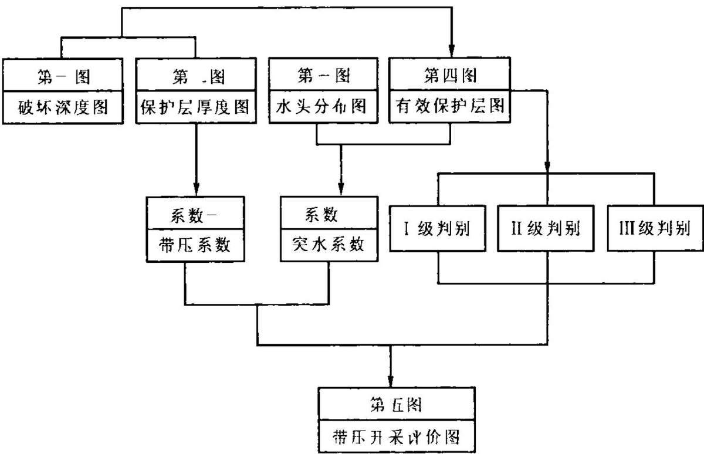  
图 4-1“五图- 双系数法”流程框图

2. 煤层底面至含水层顶面之间的这段岩层称为“底板保护层”。它是阻止承压水涌入采掘空间的屏障，需查明其厚度及其变化规律。据此绘制“底板保护层厚度等值线图”（第二图）。

3. 煤层底板以下含水层的承压水头将分别作用在不同标高的底板上。根据计算绘制“煤层底板上的水头等值线图”（第三图）。

4. 把导水破坏深度从底板保护层厚度中减去，所剩厚度称为“有效保护层”。它是真正具有阻抗水头压力能力且起安全保护作用的部分。据此绘制“有效保护层厚度等值线图”（第四图）。

5. 最后根据有效保护层的存在与否和厚度大小，依照“双系数”和“三级判别”综合分析，即可绘制带压开采技术的最重要图件“带水头压力开采评价图”(第五图)。

（二）“双系数”和“三级判别”的概念和意义如下：

1. 在研究保护层时，要同时进行保护层阻抗水头压力能力的测试，根据所获参数计算保护层的总体“带压系数”。它是表示每米岩层可以阻抗多大水头压力的指标，是双系数之一。另一系数是“突水系数”，它是“有效保护层厚度”与作用其上的水头值之比。

2. “三级判别”是与双系数配合用来判别突水与否、突水形式和突水量变化的三个指标：Ⅰ级判别，是判别工作面必然发生直通式突水的指标；Ⅱ级判别，是判别工作面发生非直通式突水可能性及其突水形式的指标；Ⅲ级判别，是判别已被Ⅱ级判别定为突水工作面其突水量变化状况的指标。

## 第六节 注浆堵水

## 第八十条 井筒预注浆应当符合下列规定：

（一）当井筒预计穿过较厚裂隙含水层或者裂隙含水

层较薄但层数较多时，可以选用地面预注浆；

（二）在制定注浆方案前，施工井筒检查孔，以获取含水层的埋深、厚度、岩性及简易水文观测、抽（压）水试验、水质分析等资料；

（三）注浆起始深度，确定在风化带以下较完整的岩层内。注浆终止深度，大于井筒要穿过的最下部含水层的埋深或者超过井筒深度10\~20 m；

（四）当含水层富水性较弱时，可以在井筒工作面直接注浆。

## 【释义】本条是关于井筒预注浆的规定。

并筒预注浆，是指在井筒开凿之前的地面预注浆，其目的是在井筒周围形成封闭的隔水帷幕，将井筒涌水量减少至最低限度，使井筒安全顺利地通过含水层，从而改善井筒作业环境，为建井工程安全和快速施工创造良好的条件。

（一）并筒预注浆的实施条件。在厚度较大的裂隙含水层或者虽然单层含水层厚度不大但单层涌水量大于$1 0 \mathrm { ~ m } ^ { 3 } / \mathrm { h }$ ，且层数多、层段又较集中的情况下，选择地面预注浆方法比较经济合理。当含水层距地表很深又是单一含水层，或含水层富水性较差，或单层涌水量大于$1 0 \ \mathrm { m } ^ { 3 } / \mathrm { h }$ ，但含水层层数少、层段分散，选用工作面预注浆方法较为适宜。

（二）井筒预注浆的要求。并筒预注浆前，必须施工井筒检查孔来了解并筒附近含水层的厚度、层数、水头压力、涌水量等，为注浆参数设计提供依据。

当井筒设计深度马头门位于受注含水层时，一般地，注浆钻孔的终孔深度超过井深10\~20m；若含水层在立井设计深度之上时，钻孔终孔深度应超过含水层底板10\~20m。

第八十一条 注浆封堵突水点应当符合下列规定：

（一）圈定突水点位置，分析突水点附近的地质构造，查明降压漏斗形态，分析突水前后水文观测孔和井、泉的动态变化，必要时需进行连通（示踪）试验；

（二）探明突水补给水源的充沛程度或者来水含水层的富水性，以及突水通道的性质和大小等；

（三）封堵突水点，注浆前，做连通试验和压（注）水试验；注浆前后，做好矿井排水对比分析；

（四）编制注浆堵水方案，经煤矿企业总工程师组织审查同意后实施。

## 【释义】本条是关于注浆封堵突水点的规定。

注浆封堵突水点具有减轻矿井排水负担、恢复被淹矿井、保护地下水资源、改善井下劳动条件的作用，是煤矿防治水的重要技术方法之一。为了正确选择注浆堵水方案，判断突水水源、圈定突水点位置是首先需要开展的工作。一般地，确定突水水源采用水化学、水位动态变化分析和连通（示踪）试验等方法。为了确保注浆钻孔能够命中关键部位，圈定突水点位置、确定通道性质（类型、大小）显得尤为重要。通常，采用直流电法、瞬变电磁法、三维地震等物探方法，结合定向钻进技术及工艺进行定点探查。打钻命中设计靶域是注浆堵水的关键。一般通过矿井排水对比分析来检查注浆堵水效果。井下突水点注浆堵水方案由煤矿企业总工程师组织审查同意后实施。

## 第八十二条 采用帷幕注浆方案前，应当对帷幕截流进行可行性研究。

帷幕注浆方案经论证确定后，应当查清地层层序、地质构造、边界条件，帷幕端点是否具备隔水层或闭合性断层及其隔水性能、地下水向矿井的渗流量、地下水流速和流向等水文地质条件。

编制帷幕注浆方案，经煤矿企业总工程师组织审查同意后实施。

【释义】本条是关于帷幕注浆的规定。

帷幕截流技术，是指沿地下水集中补给通道断面布置注浆钻孔、建造帷幕状人工阻水体截断地下水流的一种治水方法。帷幕截流构筑的基本条件：一是过水断面狭窄；二是具有不透水边界；三是受注层具有良好的可灌注性；四是帷幕截流工程实施后具有明显的经济和社会效益。由于帷幕截流具有工程量大、工期长、造价高等特点，应该结合构筑帷幕的基本条件进行可行性论证。本条提出了围绕建造帷幕的可行性研究需要开展的主要水文地质工作。帷幕注浆方案由煤矿企业总工程师组织审查同意后实施。

第八十三条当井下巷道穿过与河流、湖泊、溶洞、含水层等存在水力联系的导水断层、裂隙（带）、陷落柱等构造时，应当探水前进。如果前方有水，应当超前预注浆封堵加固，必要时可预先构筑防水闸门或者采取其他防治水措施。否则，不准施工。穿过含水层段的井巷，应当按照防水的要求进行壁后注浆处理。

【释义】本条是井下巷道穿过导水构造时应采取的防治水方法的规定。

充水水源（河流、湖泊、含水层）与导水通道（断层、裂隙带、陷落柱、封闭不良钻孔）二者之间的有机结合构成矿坑充水条件，井下巷道穿过与上述水源存在水力联系的导水通道时，在巷道掘进过程中，具有突水危险性，需要进行超前探水，根据探水情况采取预注浆加固巷道围岩、建筑防水闸门进行隔离等措施。因此，巷道掘进过程中探水注浆作业是确保安全施工的一项常规的、重要的矿井水文地质工作，尤其是巷道接近上述水文地质异常体时，一定要坚持探水注浆制度；否则，不能掘进。为了减少井巷工程涌水量，给掘进作业创造良好的工作环境，对于已经穿越含水层的并巷，淋水较大时，应当进行壁后注浆，一般会收到良好的效果。

第八十四条当回采工作面内有导水的断层、裂隙或陷落柱时，应当按照规定留设防隔水煤（岩）柱，也可以采用注浆方法封堵导水通道；否则，不准采煤。注浆改造的工作面可以先进行物探，查明水文地质条件，根据物探资料打孔注浆改造，再用物探与钻探验证注浆改造效果。

【释义】本条是关于采煤工作面内有导水构造时应采取的防治水方法的规定。

注浆加固、注浆改造和留设防隔水煤（岩）柱是采煤工作面主要的防治水方法，防隔水煤（岩）柱留设与注浆加固、注浆改造往往配合使用。对于具有一定规模的导水断层、陷落柱通过计算留设一定宽度的防隔水煤（岩）柱通常是经济、合理的。对于小型断层、138

裂隙带等异常含（导）水体通过局部注浆加固消除突水隐患，不仅能够保证正常回采，而且可以节约工作面投产时间。但是，对于大型断层和陷落柱往往需要留设几十甚至上百米的防水煤柱，使大量的煤炭资源成为受水威胁的呆滞资源。为了解放这部分煤炭资源，通过注浆方法切断其与强含水层或水体的水力联系，则能达到提高煤炭资源回采率的目的，尤其对于面临资源枯竭的老矿井。注浆改造作为改变岩体（层）水文地质条件的方法与手段，其基本原理是：浆液在一定压力、一定时间内，受注层原来被水占据的空隙或通道内脱水、固结或胶凝，使结石体或胶凝体与围岩岩体形成阻水整体，将强含水层与煤层之间的薄含水层（一般小于10m）改造成隔水层或相对隔水层，从而增加煤层底板隔水层厚度提高其阻水抗压能力。无论采用哪一种注浆方法，均需要通过物探、钻探相互配合，以钻探为主、以查明采煤工作面水文地质条件为前提，并验证注浆效果。

第八十五条 涌水量大、有突水威胁的矿区，应当建立注浆专业队伍，负责注浆堵水工作。

【释义】本条是关于矿井建立注浆专业队伍的规定。

涌水量大、有突水威胁的矿区或矿井，井下探水注浆任务量大，组建专业注浆队伍，一方面能够满足日常矿井防治水工作的需要；另一方面，一支经验丰富的专业注浆队伍对做好矿区（井）的防治水工作是十分有利的。

第八十六条 工作面煤采完后，对于已经失去使用价值而需关闭的局部疏水降压钻孔，应当进行注浆封闭，并在有关图纸上标明其位置。

【释义】本条是关于对失去使用价值的疏水降压钻孔进行封闭的规定。

封闭不良钻孔诱发的矿井水害事故不乏其例。一些钻孔是由于煤田地质勘探和试验工程的需要而设置的，这些钻孔往往会切穿不同地层，尤其可能会将强含水层地下水或其他水体导入采掘空间，给煤矿安全生产带来十分不利的影响。因此，做好废弃勘探孔的封孔工作是非常重要的。一般地，要求提供完整的封孔报告并将钻孔位置准确标注在采掘工程平面图上，为采掘工程布置提供可靠依据。

第八十七条 废弃矿井闭坑淹没前，应当采用物探、化探和钻探等方法，探测矿井边界防隔水煤（岩）柱破坏140

状况及其可能的透水地段，采用注浆堵水工程隔断废弃矿井与相邻生产矿井的水力联系，避免矿井发生水害事故。

【释义】本条是关于废弃矿井闭坑的规定。

废弃矿井积水（俗称老空水、老窑水）作为充水水源经常会引起危害性（往往造成群死群伤）极大的透水事故。此类事故发生的主要原因是：采空区位置不清、侧向或垂向防水煤柱不足。因此，准确掌握废弃矿井位置、积水情况并按要求留足防水煤柱是避免发生透水事故的一项重要任务。采用物探、化探和钻探等方法，探测矿井边界防隔水煤（岩）柱破坏状况及其可能的透水地段并采用注浆堵水工程或构建密闭墙隔断废弃矿井与相邻生产矿井的水力联系，不仅是保证相邻生产矿井安全的一种现实需要，也是做好煤矿安全生产监察工作的一种管理需要。

## 第五章 井下探放水

第八十八条 对于采掘工作面受水害影响的矿井，应当坚持预测预报、有疑必探、先探后掘、先治后采的原则，进行充水条件分析，并遵守下列规定：

（一）每年年初，根据每年的采掘接续计划，结合矿井水文地质资料，全面分析水害隐患，提出水害分析预测表及水害预测图；

（二）在采掘过程中，对预测图、表逐月进行检查，不断补充和修正。发现水患险情，及时发出水害通知单，并报告矿调度室，通知可能受水害威胁地点的人员撤到安全地点；

（三）采掘工作面年度和月度水害预测资料及时报送矿井总工程师及生产安全部门。

采掘工作面水害分析预报表和预测图模式见附录六。

【释义】本条是关于矿井采掘工作面水害分析和隐患排查治理的规定。

（一）进行水害分析。矿井采掘工作面在掘进回采前必须进行水害分析，组织专业技术人员全面收集采掘工作面区域的水文地质资料，按照预测预报、有疑必探、先探后掘、先治后采的原则，认真分析采掘区域的水文地质条件，对可能发生水害进行分析，提出水害预测表、图和报告；水文地质条件不清的，要进行补充勘探。按附录六的要求对矿井水害进行预测。

（二）制定隐患排查治理方案。根据水害分析预测报告，对逐头逐面的水害制定治理措施，一般在月初由矿井总工程师召开1次水害分析会，确定水害治理重点，月底进行1次检查验收。

（三）落实隐患排查治理责任。水害预测报告及时报送矿井总工程师及安全生产部门。任何部门、任何人在井下发现水患险情后，都要及时报告矿调度室，将受水害威胁的人员撤到安全地点。

第八十九条 水文地质条件复杂、极复杂的矿井，在地面无法查明矿井水文地质条件和充水因素时，应当坚持有掘必探的原则，加强探放水工作。

【释义】本条是关于水文地质条件不清的矿井必须坚持有掘必探的规定。

我国煤矿开采历史悠久，历史上留存了大量的废弃关闭矿井，再加上近几年各地政府关闭了大量不具备安全生产条件的小煤矿，废弃关闭矿井存有大量的老空积水，使得我国煤矿安全开采条件变得十分复杂。要全面查清矿井水文地质条件，其工程量大，同时，也十分困难。为了保障矿工生命安全，坚持以人为本的原则，本条规定在水文地质条件复杂或极复杂的矿井，在地面难以查明矿井充水水文地质条件时，要执行有掘必探的原则，只要井下有采掘工程，必须先按规定进行探放水，排除隐患后，才可掘进回采。实际上，有的地方和企业早已规定实施了有掘必探的原则。

第九十条 在矿井受水害威胁的区域，进行巷道掘进前，应当采用物探、化探和钻探等方法查清水文地质条件。地测机构应当提出水文地质情况分析报告，并提出水害防范措施，经矿井总工程师组织生产、安监和地测等有关单位审查批准后，方可进行施工。

【释义】本条是关于在矿井受水害威胁区域进行巷道掘进前必须查清水文地质条件的规定。

（一）查清水文地质条件。在掘进前通过物探、化探和钻探等综合方法查清水文地质条件，分析矿井充水因素。

（二）提出水害分析报告。地测部门根据查清的水文地质条件和矿井充水因素，提出掘进工作面的主要水害类型、水害特点和预防措施。

（三）审查水害分析报告。矿井总工程师组织相关专业技术人员对水害分析报告进行认真审查，对重大水害隐患应先治理后掘进。

（四）加强日常监督。专业技术人员要经常深入井下了解实际揭露的水文地质情况，不断完善水害防范措施。发现重要异常情况，及时报告，矿井总工程师要组织专业技术人员及时研究发现新问题，有效地防范水害事故。

【案例】2005年10月4日，四川省华蓥山龙滩煤电有限责任公司龙滩矿井（在建）发生透水事故，28人死亡。龙滩煤矿于2003年6月开工建设，采用平硐开拓，矿井建设期间全部采用局部通风机压入式通风方式，平硐自流排水。开拓巷道在长兴组灰岩中。

事故直接原因：事故当班作业人员未按规定施工探水钻孔，违章掘进施工，放炮诱发岩溶突水。

第九十一条矿井工作面采煤前，应当采用物探、钻探、巷探和化探等方法查清工作面内断层、陷落柱和含水层（体）富水性等情况。地测机构应当提出专门水文地质情况报告，经矿井总工程师组织生产、安监和地测等有关单位审查批准后，方可进行回采。发现断层、裂隙和陷落柱等构造充水的，应当采取注浆加固或者留设防隔水煤（岩）柱等安全措施。否则，不得回采。

【释义】本条是关于矿井工作面回采前必须进行水文地质工作的规定。

其要求和工作程序同九十条。如果在工作面回采过程中发现断层、裂隙和陷落柱等构造突水的情况，要分析原因，加强监测，并及时上报有关部门。同时，要加强预警，一旦突水增大后，应立即撤人到安全地点。

【案例】2004年10月20日，河北省邯郸市武安市德盛煤矿发生1起透水事故，造成矿井被淹，29人下落不明。与其相邻的邯郸煤业集团陶一煤矿、陶二煤矿等生产矿井受到严重水害威胁。德盛煤矿主要开采下组煤，受奥灰水影响严重，矿井设计生产能力15万t/a，采用立井单水平开拓方式。

事故直接原因：该矿1841工作面上部遇到落差1.5m左右的张性断层，工作面底板隔水层岩石破碎，在水头压力和采动影响等多种因素的作用下，奥灰承压水从工作面后方采空区的断层破碎带发生滞后突水，导致矿井被淹。

第九十二条 采掘工作面遇有下列情况之一的，应当进行探放水：

（一）接近水淹或者可能积水的井巷、老空或者相邻煤矿；

（二）接近含水层、导水断层、暗河、溶洞和导水陷落柱；

（三）打开防隔水煤（岩）柱进行放水前；

（四）接近可能与河流、湖泊、水库、蓄水池、水井等相通的断层破碎带；

（五）接近有出水可能的钻孔；

（六）接近水文地质条件复杂的区域；

（七）采掘破坏影响范围内有承压含水层或者含水构造、煤层与含水层间的防隔水煤（岩）柱厚度不清楚可能发生突水；

（八）接近有积水的灌浆区；

（九）接近其他可能突水的地区。

探水前，应当确定探水线并绘制在采掘工程平面图上。

【释义】本条是关于矿井实施探放水对象的规定。

本条规定是在大量水害事故教训基础上总结确定的。矿井应对本条规定的9种情况进行全面排查。探水前应当确定探水警戒线并绘制在采掘工程平面图上。如需进行探放水，应预先编制探放水设计，严格按照探放水设计进行探水。

探水警戒线应根据探放水对象的位置、范围、水文

地质条件和资料可靠程度等因素确定。

【案例】2005年12月2日，河南省洛阳市新安县寺沟煤矿发生透水事故，造成35人死亡，7人下落不明。寺沟煤矿为股份制企业，矿井采用双斜井单水平开拓方式。事故发生后，矿井几名主要负责人相继逃匿。抢险救援工作在没有准确图纸资料、井巷断面较小、坡度大等困难条件下进行。矿井累计排水达11万m³。

寺沟煤矿水文地质资料不全，用煤电钻代替专用探水钻机探放水，没有在采掘工程平面图上设立水患警戒线。在透水征兆明显情况下，既不撤出受水患威胁区域的人员，也不采取有关处置措施，仍然冒险组织生产。

事故直接原因：寺沟煤矿08采掘煤巷非法进入矿井边界煤柱，在接近已关闭的桥北煤矿（1998年关闭）老空积水区采煤，造成煤柱突然垮落，桥北煤矿老空区积水体和与其存在密切水力联系的松散孔隙地下水及青河地表水迅速溃入井下，导致了事故发生。

第九十三条 采掘工作面探水前，应当编制探放水设计，确定探水警戒线，并采取防止瓦斯和其他有害气体危害等安全措施。探放水钻孔的布置和超前距离，应当根据水头高低、煤（岩）层厚度和硬度等确定。探放水设计由地测机构提出，经矿井总工程师组织审定同意，按设计进行探放水。

## 【释义】本条是关于矿井探放水设计的规定。

（一）探放水设计的编制。对水患威胁区域确定探放措施后，要收集资料，编制设计。设计内容主要包括：探放水地区的水文地质条件；探放水巷道的开掘方向、施工次序、规格和支护形式；探放水钻孔组数、个数、方向、角度、深度和施工技术要求及采用的超前距与帮距；探放水施工与掘进工作的安全规定；受水威胁地区信号联系和避灾路线的确定；通风措施和瓦斯检查制度，要制定防止在探水过程中瓦斯或其他有害气体涌出的防治措施；防排水设施，如水闸门、水闸墙等的设计以及水仓、水泵、管路和水沟等排水系统及能力的具体安排等；水情及避灾联系汇报制度和灾害处理措施。

（二）探放水钻孔及其超前距的布置。探放水钻孔的布置按本规定第九十四条执行；探放水钻孔的超前距离按本规定第九十八条执行。

（三）探放水设计的审查。地测部门提出探放水设计后，矿井总工程师组织审查后，方可实施。

## 第九十四条 布置探放水钻孔应当遵循下列规定：

（一）探放老空水、陷落柱水和钻孔水时，探水钻孔成组布设，并在巷道前方的水平面和竖直面内呈扇形。钻孔终孔位置以满足平距3m为准，厚煤层内各孔终孔的垂距不得超过1.5 m；

（二）探放断裂构造水和岩溶水等时，探水钻孔沿掘进方向的前方及下方布置。底板方向的钻孔不得少于2个；

（三）煤层内，原则上禁止探放水压高于1MPa的充水断层水、含水层水及陷落柱水等。如确实需要的，可以先建筑防水闸墙，并在闸墙外向内探放水；

（四）上山探水时，一般进行双巷掘进，其中一条超前探水和汇水，另一条用来安全撤人。双巷间每隔30\~50m掘1个联络巷，并设挡水墙。

【释义】本条是关于探放水钻孔布置的规定。

## 一、探水钻孔主要参数的确定

（一）超前距。探水时从探水线开始向前方打钻孔，在超前探水时，钻孔很少一次就能打到积水目标区，常是探水一掘进一再探水一再掘进，循环进行；探水钻孔终孔位置应始终超前掘进工作面一段距离，该段距离称超前距，如图5-1所示。

（二）允许掘进距离。经探水证实无任何水害威胁，可安全掘进的长度称允许掘进距离。

（三）帮距。为使巷道两帮与可能存在的水体之间保持一定的安全距离，呈扇形布置的最外侧探水孔所控制的范围与巷道帮的距离称为帮距；其值应与超前距相同，帮距一般取20m，有时帮距可比超前距小1\~2m。

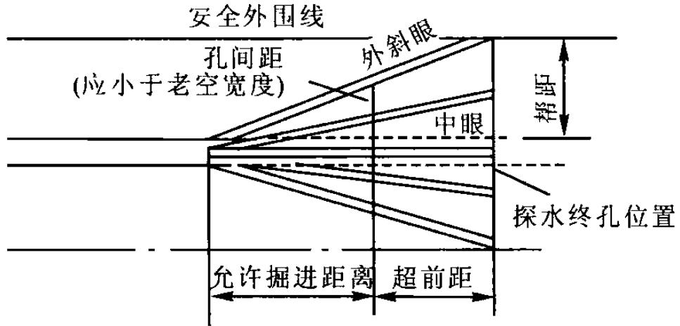  
图5-1 探水钻孔的主要参数

（四）钻孔密度（孔间距）。钻孔密度是指允许掘进距离终点横剖面上探水钻孔之间的间距。

## 二、探水钻孔的布置方式

（一）扇形布置。巷道处于三面受水威胁的地段，要进行搜索性探放积水目标区，其探水钻孔多按扇形布置，如图5-2所示。

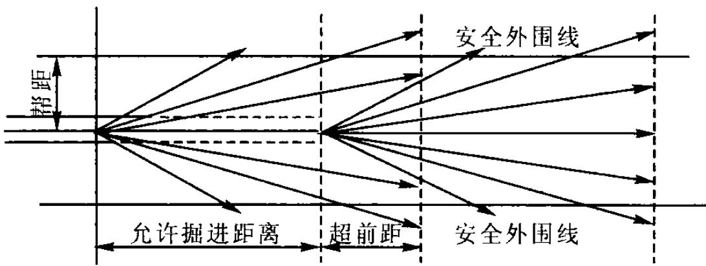  
图5-2 扇形探水钻孔

（二）半扇形布置。对于积水区肯定是在巷道一侧的探水地区，其探水钻孔可按半扇形布置，如图5-3所示。

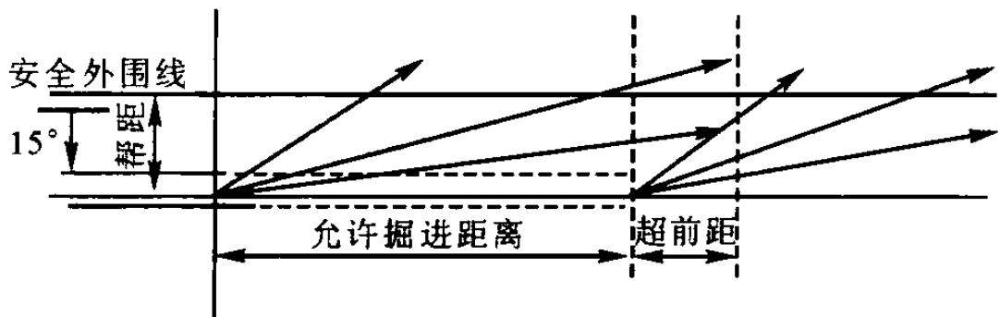  
图5-3 半扇形探水钻孔

## 三、探放水钻孔的规定

（一）探放老空水、陷落柱水和钻孔水时，探水钻孔成组布设，并在巷道前方的水平面和竖直面内呈扇形。钻孔终孔位置以满足平距3m为准，厚煤层内各孔终孔的垂距不得超过1.5m。

（二）探放断裂构造水和岩溶水时，探水钻孔沿掘进方向的前方及下方布置。底板方向的钻孔不得少于2个。

（三）煤层内，原则上禁止探放水头压力高于1 MPa的充水断层水、含水层水及陷落柱水等。如果确实需要的，可以先建筑防水闸墙，并由闸墙外向内探放水。

（四）上山探水时，一般进行双巷掘进，其中一条超前探水和汇水；另一条用来安全撤人。双巷间每隔30\~50m掘1个联络巷，并设挡水墙。

## 四、矿井探放水与掘进之间的配合

（一）双巷配合掘进交叉探放水。当掘进上山时，如果上方有积水区存在，巷道受水威胁，一般多采用双巷掘进交叉探放水，如图5-4所示。

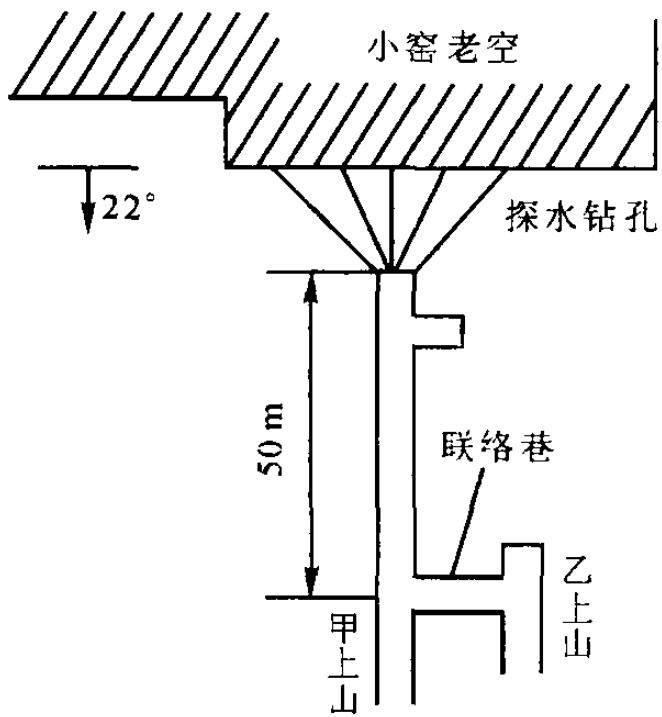  
图5-4 上山巷道探水掘进施工方式

（二）双巷掘进单巷超前探放水。在倾斜煤层中沿走向掘进平巷时，一般是用上方巷道超前探放水，探水钻孔呈扇形布置。

（三）平巷与开切眼互相配合探放水。其方式如图5-5所示。

（四）隔离式探放水。巷道掘进前方的水量大、水头压力高、煤层松软和裂隙发育时，在煤巷直接探放水很不安全，需要采取隔离方式进行探放水。在掘进石门时，可从石门中探放积水，如图5-6（a）所示；或在巷道掘进工作面预先砌筑隔水墙，在墙外探水，如图5-6（b）所示。

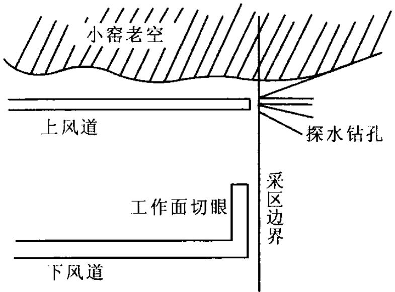  
图5-5 平巷与开切眼互相配合探放水

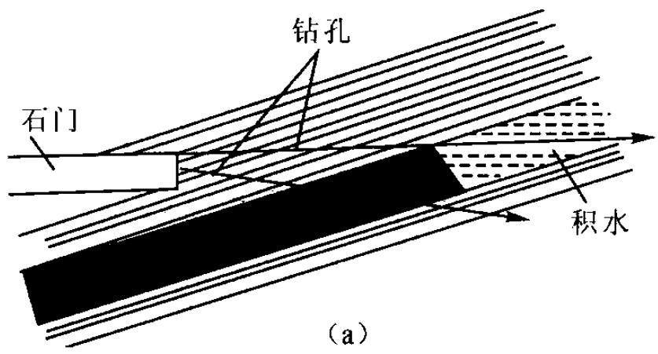

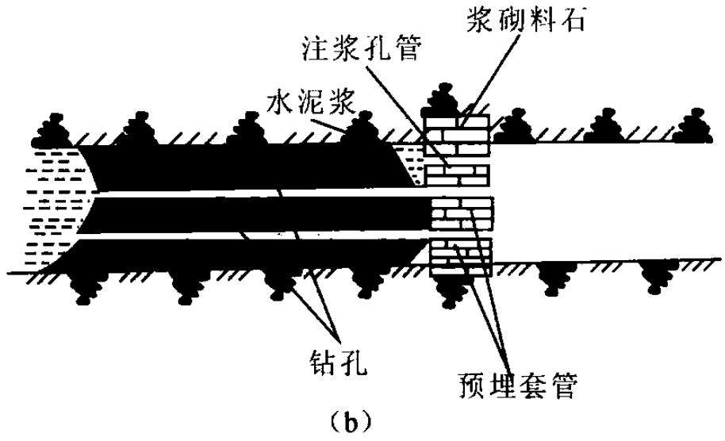  
图5-6 利用石门探水和墙外探水  
(a) 石门探水；（b) 墙外探水

第九十五条 井下探放水应当使用专用的探放水钻机。严禁使用煤电钻探放水。

【释义】本条是关于矿井探放水钻机的规定。

矿井探放水工作存在高承压水突出的危险，必须保证在一定的安全距离才能实施探放。矿井专用探放水钻机具有钻探深度大且可固定防喷性能；而煤电钻钻探距离有限，一般只能用于在煤层中探查煤的厚度等，起不到预先探放水的作用。因此，矿井探放水必须用专用探放水钻机，严禁使用煤电钻探放水。

在煤层内用煤电钻探放水，可能导致包括探放水作业人员在内的大量人员伤亡。

【案例】2008年7月21日，广西百色市右江矿务局那读煤矿发生老空透水事故，死亡36人。该矿为国有地方煤矿，2007年核定生产能力19万t，矿井周边废弃小煤窑积水情况不清。该矿在4304工作面（靠近废弃小煤矿附近）违规开掘3个切眼，违规用煤电钻探放老空水，前两个切眼均因掘进时有透水征兆而停止施工，随后又在距第一个切眼30m处重开切眼，在发现透水征兆的情况下，仍在相对较低的4301采煤工作面组织生产；事故发生前，在没有认真分析透水量变化的情况下，盲目通知已经撤到安全地点的作业人员，重新返回作业地点恢复生产，导致发生特别重大透水

事故。

事故直接原因：违反防治水规定用煤电钻代替专用探水钻进行探水。按照该矿探放水设计及安全技术措施的规定，每次探水钻进30m，允许巷道掘进10m，但透水发生地实际探水钻进只有约7m，致使4304工作面第三切眼的掘进头距离老空积水区边界仅为3.9m，诱发了从小股流水冲刷逐渐扩展到大面积煤柱突然垮塌，造成临近小煤矿采空区积水溃入井下，导致了事故的发生。

第九十六条 在安装钻机进行探水前，应当符合下列规定：

（一）加强钻孔附近的巷道支护，并在工作面迎头打好坚固的立柱和拦板；

（二）清理巷道，挖好排水沟。探水钻孔位于巷道低洼处时，配备与探放水量相适应的排水设备；

（三）在打钻地点或其附近安设专用电话；

（四）依据设计，确定主要探水孔位置时，由测量人员进行标定。负责探放水工作的人员亲临现场，共同确定钻孔的方位、倾角、深度和钻孔数量；

（五）在预计水压大于0.1MPa的地点探水时，预先固结套管。套管口安装闸阀，套管深度在探放水设计中规定。预先开掘安全躲避硐，制定包括撤人的避灾路线等安全措施，并使每个作业人员了解和掌握；

（六）钻孔内水压大于1.5MPa时，采用反压和有防喷装置的方法钻进，并制定防止孔口管和煤（岩）壁突然鼓出的措施。

【释义】本条是关于井下探放水钻机安装和施工前的有关规定。

（一）探放水钻探现场的规定。探放水现场作业直接关系到探放水人员的安全，关系到探放水周围地区甚至整个矿井的安危，对钻探施工现场的安全环境和安全设施的严格要求非常重要。加强钻场附近的巷道支护，并在工作面打好坚固的立柱和拦板，可以防止冒顶、防高压水冲垮煤壁及支架等事故发生。为满足探放水钻孔出水畅通和施工人员安全撤离，必须清理巷道，挖好排水沟，在适当位置配备与探放水量相适应的完好的排水设备。

在打钻地点或附近安设专用电话，可以在遇到紧急险情时及时与有关领导和部门取得联系，汇报情况，以便及时采取有效措施。

为杜绝随意性，保证探放水钻孔准确打到靶位，确保钻孔标定准确，在确定主要探放水钻孔位置、方位、倾角、深度以及钻孔数目时，测量以及负责探放水的技术人员必须亲临现场，根据已批准的设计给予确定，未经批准，不得擅自改变设计。

（二）探放水钻孔承压套管的安装和加固。为确保探放水钻孔出水后能有效控制放水量，确保安全，在预计水压大于0.1MPa的地点探放水时，都应预先安装孔口承压套管。为确保承压套管的牢固可靠，开孔位置应选择在岩层比较完整、坚硬的地方，承压套管的长度按本规定第九十八条执行。目前一般采用的是双层套管，考虑钻孔出水会影响套管的下放，因此外层套管长度一般较短，尽可能下在无水段。承压套管要用高压注浆泵进行水泥固结，使套管和岩体成为一体，套管下放凝固至规定的时间后，进行扫孔，然后进行压水耐压试验，试验的压力不得小于设计水头压力，稳压时间必须至少保持半小时，孔口周围不漏水，孔口管牢固不活动，即为合格；否则必须重新注浆。这样才能保证孔口管在钻孔出水后不被冲出。孔口管下好后要安装好控制闸阀，这样才能在钻孔一旦出水后能有效地控制水量，防止因排水能力不足且放水孔又不能有效控制而影响矿井安全。

在水文地质条件复杂和水头压力、水量大的情况下，按照探放水规定要求，安装孔口承压套管和控制闸阀进行钻进。

（三）探放高压水应采取的措施。在高压水的探放过程中，当钻孔揭露含水层后，水头压力和水量会猛增，若不能有效控制，除直接影响钻进效率外，还特别容易出现高压水喷出或钻具被顶出等伤人事故。因此，在钻孔内水压大于1.5MPa的高压水地区施工探放水钻孔时，钻进和退钻应采用反压和有防喷装置的方法进行钻进和控制钻杆。反压就是给一个与水头压力反向的作用力；防喷就是防水、防钻杆、防孔内碎岩石块喷出。在高压水地区施工钻孔时，如果不采用反压、防喷装置是非常危险的。如某矿在井下施工探放奥灰高压水钻孔时，由于未采取这些措施，就曾发生突然出水后钻杆无法控制、顷刻之间被高压水顶出并被顶到巷道，近百米钻杆像面条一样被扭曲成麻花状，险些酿成人员伤亡事故。因此，在高压水地区施工钻孔时，防喷问题必须引起高度重视。

第九十七条 探水钻孔除兼作堵水或者疏水用的钻孔外，终孔孔径一般不得大于75mm。

【释义】本条是关于矿井探放水钻孔终孔孔径的规定。

探放水钻孔终孔孔径规定一般不得大于75mm，主要是从探放水现场的围岩稳定性方面考虑的。这样，探放水钻孔的开孔孔径也能得到控制，终孔对围岩的破坏性小，即使遇到不可预测的高压水及其他危险情况，也

能够得到有效控制。

井下现场空间有限，施工不便，为了提高效率和降低成本，在对井下钻孔设计时要考虑一孔多用，如探查构造、煤层的钻孔或兼作堵水、疏水之用等。

第九十八条 探水钻孔超前距离和止水套管长度，应当符合下列规定：

（一）探放老空积水的超前钻距，根据水压、煤（岩）层厚度和强度及安全措施等情况确定，但最小水平钻距不得小于30m，止水套管长度不得小于10m；

（二）沿岩层探放含水层、断层和陷落柱等含水体时，按表5-1确定探水钻孔超前距离和止水套管长度。

表5-1 岩层中探水钻孔超前钻距和止水套管长度
<table><tr><td>水压/MPa</td><td>钻孔超前钻距/m</td><td>止水套管长/m</td></tr><tr><td>&lt;1.0</td><td>&gt;10</td><td>&gt;5</td></tr><tr><td>10~2.0</td><td>&gt;15</td><td>&gt;10</td></tr><tr><td>2.0~3.0</td><td>&gt;20</td><td>&gt;15</td></tr><tr><td>&gt;3.0</td><td>&gt;25</td><td>&gt;20</td></tr></table>

【释义】本条是关于探水钻孔超前距离和止水套管长度的规定。

（一）探放老空水的超前水平距最少不得小于30 m，止水套管长度不得小于10m。

（二）在岩层中探放水，在水头压力小于1.0MPa160

时，超前水平距不小于10m，止水套管不小于5m；随着水压的增大，超前水平距和止水套管都要相应增加，在水头压力大于3.0MPa时，超前水平距要大于25 m，止水套管要大于20m。

第九十九条在探放水钻进时，发现煤岩松软、片帮、来压或者钻眼中水压、水量突然增大和顶钻等透水征兆时，应当立即停止钻进，但不得拔出钻杆；应当立即向矿井调度室汇报，派人监测水情。发现情况危急，应当立即撤出所有受水威胁区域的人员到安全地点，然后采取安全措施，进行处理。

【释义】本条是关于在探放水过程中出现透水征兆时应采取措施的规定。

人们在与矿井水长期斗争中积累了宝贵的经验，总结出在钻进时接近或揭露强含水体的一般征兆。在钻进时，当煤岩出现松软、片帮、来压或钻孔中的水头压力、水量突然增大以及顶钻等异状时，说明前方已经接近或揭露了强含水体。当遇到这种异常情况时，如果继续钻进或将钻杆拔出，极有可能造成难以控制的更大出水，以及钻杆在拔出的过程中被高压水顶出伤人事故，后果不堪设想，因此必须及时停止钻进，将钻杆固定，严禁移动和起拔，钻机后面严禁站人，以免钻杆伤人。

在钻孔出现涌水异常情况时，应及时将现场情况向矿调度室汇报。调度室接到上报的情况后，应立即派人监测水情。如果发现现场情况危急时，必须立即撤出所有受水害威胁地区的人员，然后采取措施进行处理。

第一百条 探放老空水前，应当首先分析查明老空水体的空间位置、积水量和水压。探放水孔应当钻入老空水体，并监视放水全过程，核对放水量，直到老空水放完为止。当钻孔接近老空时，预计可能发生瓦斯或者其他有害气体涌出的，应当设有瓦斯检查员或者矿山救护队员在现场值班，随时检查空气成分。如果瓦斯或者其他有害气体浓度超过有关规定，应当立即停止钻进，切断电源，撤出人员，并报告矿并调度室，及时处理。

【释义】本条是关于老空水探放过程的规定。

（一）查明老空区积水情况。探放老空水首先要收集资料，走访调查，分析查明老空水体的空间位置、积水量和水头压力，做到心中有数。

（二）探放老空积水。探放水钻孔要打中老空水体，至少有一个孔要打中老空水体底板，才有可能放完老空水，排除隐患。如井下老空区水与地表水存在密切的水力联系，在雨季可接受大量雨水或地表水补给，且老空区的积水量较大，水质不好（如酸性水），为避免矿井承受长期排水的经济负担，矿井可首先对这种老空积水区实行注浆封堵，切断或减少地表水等对其的补给，然后再实施探放水；如果切断或减少老空区的补给水源有困难而无法进行有效地探放水，生产矿井必须对老空积水区留设足够尺寸的防隔水煤（岩）柱，使其与生产区隔开，待矿井生产后期条件成熟再进行水体下采煤。如老空区积水量大且水压高，应先从煤层顶、底板岩层打穿层放水孔，把水压降下来，然后再沿煤层打探放水钻孔。

（三）制订应急预案。当钻孔接近老空时，矿山救护队员要在现场值班，随时检查空气成分，如果瓦斯或者其他有害气体浓度超过有关规定，应当立即停止钻进，切断电源，撤出人员，并报告矿井调度室，及时处理；在探放水场地应备用一定数量的坑木、麻袋、木塞、木板、黄泥、棉线、锯和斧等，以便在探放水过程中意外出水或钻孔水压突然增大时及时处理；探放水施工巷道现场发现有松动或破损的支架要及时修整或更换，并仔细检查帮顶是否背好；探放水施工现场及后路的巷道水沟中的浮煤、碎石等杂物，应随时清理干净，若水沟被冒顶或片帮堵塞时，应立即疏通；探放水施工过程中所设计的避灾路线内不许有煤炭、木料或煤车等阻塞，应随时保证畅通无阻。

第一百零一条 钻孔放水前，应当估计积水量，并根据矿井排水能力和水仓容量，控制放水流量，防止淹井；放水时，应当设有专人监测钻孔出水情况，测定水量和水压，做好记录。如果水量突然变化，应当及时处理，并立即报告矿调度室。

## 【释义】本条是关于钻孔放水的规定。

钻孔放水应根据矿井排水系统的能力，控制放水量，防止淹井。钻孔在放水前，应安排专人测定孔内初始水压；在放水过程中，也应安排专人监测放水孔出水情况，观测水量和残存水压，做好记录，及时分析，直至把水放净。如果放水量突然变化，必须及时处理，并立即报告调度室；若水量突然变小，有可能是放水孔被堵塞，为了确保正常放水，可采用钻杆透孔及时处理，但未安装孔口管的不得透孔。

## 第六章 水体下采煤

第一百零二条在河流、湖泊、水库和海域等地面水体下采煤，应当留足防隔水煤（岩）柱。在松散含水层下开采时，应当按照水体采动等级留设不同类型的防隔水煤（岩）柱（防水、防砂或者防塌煤岩柱）。在基岩含水层（体）或者含水断裂带下开采时，应当对开采前后覆岩的渗透性及含水层之间的水力联系进行分析评价，确定采用留设防隔水煤（岩）柱或者采用疏干方法保证安全开采。

【释义】本条是关于在地面水体、松散含水层和基岩含水层（体）下采煤的规定。

为了保护地面水体和保障生产安全，在河流、湖泊、水库和海域等地面水体下采煤，应该按照《建筑物、水体、铁路及主要井巷煤柱留设与压煤开采规程》和本规定附录三计算应该留设的防隔水煤（岩）柱的尺寸，同时应该考虑地面水体管理部门的要求。

在松散含水层下进行开采时，首先要根据地层的水文地质结构、主要含水层的富水性和《建筑物、水体、铁路及主要井巷煤柱留设与压煤开采规程》的规定确定水体采动等级。含水层富水性按照抽水试验的结果根据本规定的附录二确定，或者根据井下放水试验获得的水文地质参数换算成钻孔单位涌水量按本规定的附录二确定。防隔水煤（岩）柱是指能够防止工作面不额外增加涌水量的煤（岩）柱，其最小垂直高度必须等于或大于导水裂缝带的最大高度加保护层厚度。防砂煤（岩）柱是指能够防止工作面不额外增加长期涌水量并且能够防止工作面发生溃水、溃砂的煤（岩）柱，其最小垂直高度必须等于或大于垮落带的最大高度加保护层厚度。防塌煤（岩）柱是指能够防止工作面不额外增加永久性涌水量，并且能够防止工作面溃砂的煤（岩）柱，其最小垂直高度必须不小于垮落带的最大高度。

在基岩含水层下开采时，要对含水层的水文地质结构、补给径流排泄关系和各含水层的富水性及其水力联系等进行详细勘探和研究，对比分析和预测煤层开采前后覆岩中渗透性变化，根据岩性组合特点、覆岩破坏高度预测及技术经济分析对比，确定是采用留设防隔水煤（岩）柱开采，还是采用疏干方法开采。

当在断层破碎带下开采时，要查明断层带的性质、导水性和富水性，按照本规定附录三计算留设防隔水煤（岩）柱尺寸。当断层带软弱破碎、含有大量泥砂时，还应按照松散层留设防隔水煤（岩）柱的要求进行考虑。

第一百零三条 在水体下采煤，其防隔水煤（岩）柱的留设，应当根据矿井水文地质及工程地质条件、开采方法、开采高度和顶板控制方法等，按照《建筑物、水体、铁路及主要井巷煤柱留设与压煤开采规程》中有关水体下开采的规定，由具有乙级及以上资质的煤炭设计单位编制可行性方案和开采设计，报省级煤炭行业管理部门审查批准后实施。采煤过程中，应当严格按照批准的设计要求，控制开采范围、开采高度和防隔水煤（岩）柱尺寸。

【释义】本条是关于在水体下采煤防隔水煤（岩)柱设计、审批的规定。

（一）防隔水煤（岩）柱的设计。水体下采煤，防隔水煤（岩）柱设计是关键，因为井下有一处薄弱地方发生与水体沟通，就会在瞬间发生淹井，造成灾难。所以，防隔水煤（岩）柱的设计必须由具有乙级及以上资质的煤炭设计部门编制可行性方案和开采设计，确定防隔水煤（岩）柱的尺寸。鉴于水体下开采涉及的水文地质工程地质条件的复杂性，水体下开采的地质勘察报告由具有乙级及以上资质的水文地质工程地质勘探部门完成。

（二）设计的审批。可行性方案和开采设计，报省级煤炭行业管理部门审查批准后实施。

（三）方案的实施。生产矿井必须严格按照审批的开采范围、开采高度和防隔水煤（岩）柱尺寸进行开采活动。

【案例】2003年7月26日，山东省枣庄市滕州市木石镇木石煤矿发生1起特大透水事故，造成35人死亡。

木石煤矿设计能力9万t/a，该矿开拓方式为立井-斜井（3个立井1个斜井）综合开采方式。该矿井田范围内地面有一个露天矿坑，地面标高+60m、坑底标高+46.5m，平常坑内部分区域有积水。2003年6\~7月，该地区连降暴雨，降雨量达411mm，露天矿坑内积水增至10万m³左右。

木石煤矿为逃避当地政府及有关部门的监管，没有将越界部分的巷道填绘在采掘工程平面图上，甚至在抢险救灾初期也没有提供真实图纸，隐瞒井下作业地点。

事故直接原因：木石煤矿违法越界开采煤层防水煤柱，3208工作面在生产过程中顶板冒落后与露天矿坑坑底直接沟通，导致露天坑内的积水和泥沙溃入井下。

第一百零四条 在采掘过程中，当发现地质条件变化，需要缩小防隔水煤（岩）柱尺寸、提高开采上限时，应当进行可行性研究，并经省级煤炭行业管理部门审查批准后方可进行试采。

【释义】本条是关于在水体下采煤防隔水煤（岩）柱变更、审批的规定。

随着开采地质条件的变化和开采经验的积累，原先设计留设的防隔水煤（岩）柱的尺寸需要调整的，应该首先进行可行性研究，提供详细的水文地质、工程地质、开采地质条件以及开采方案的详细对比分析结果，覆岩破坏程度的实测或预测结果，调整留设防隔水煤（岩）柱的类型和尺寸的依据，报省级煤炭行业管理部门组织审查批准后进行试采。

试采过程中要按照有关规定加强水情观测，开展覆岩垮落带、导水裂缝带的高度和范围的实测工作，试采结束后提交总结报告。

第一百零五条 为了合理地确定留设防隔水煤（岩）柱尺寸，应当对开采煤层上覆岩层进行专门水文地质工程地质勘探。

专门水文地质工程地质勘探应当包括下列内容：

（一）查明与煤层开采有关的上覆岩层水文地质结构，包括含水层、隔水层的厚度和分布，含水层水位、水质、富水性，各含水层之间的水力联系及补给、径流、排泄条件，断层的富水性、导水性；

（二）采用钻探、物探等方法探明工作面上方基岩面的起伏和基岩厚度。在松散含水层下开采时，特别应当查明松散层底部隔水层的厚度、变化与分布情况；

（三）通过岩芯工程地质编录和数字测井等，查明上覆岩土层的工程地质类型、覆岩组合及结构特征，采取岩土样进行物理力学性质测试。

## 【释义】本条是关于在水体下采煤进行专门水文地质工程地质勘探的规定。

水文地质勘探中应通过抽放水试验确定含水层的水文地质参数，必要时，采用群孔抽水试验或者连通试验确定含水层之间的水力联系。岩土样的取样和测试要按照有关规范执行，对于岩石，一般要测试岩石的密度、比重、含水量、抗压强度、抗拉强度、抗剪强度（黏聚力和内摩擦角）、变形模量和泊松比等指标和膨胀、崩解特性；对于土层，一般要测试土的密度、比重、含水量、单轴抗压强度、抗剪强度（黏聚力和内摩擦角）、渗透性、黏土的塑限、液限、砂土的相对密度等指标。

在可行性方案和初步设计中要提供详细的水文地质和工程地质资料，如开采工作面上覆基岩面等高线图、煤层上覆基岩等厚线图、上覆松散层等厚线图、松散层170

底部黏土层分布及等厚线图、主要充水含水层的富水性分区图、必要的水文地质工程地质剖面图、柱状图和有关实验数据图表。

第一百零六条水体下防隔水煤（岩）柱，应当按照裂缝角与水体采动等级所要求的防隔水煤（岩）柱相结合的原则设计。进行水体下开采的防隔水煤（岩）柱留设尺寸预计时，覆岩垮落带、导水裂缝带高度、保护层尺寸可以按照《建筑物、水体、铁路及主要井巷煤柱留设与压煤开采规程》中的公式计算，或者根据类似地质条件下的经验数据结合基于工程地质模型的力学分析、数值模拟等多种方法综合确定，同时还应当结合覆岩原始导水情况和开采引起的导水裂缝带进行叠加分析综合确定。涉及到水体下开采的矿区，应当开展覆岩垮落带、导水裂缝带高度和范围的实测工作，逐步积累经验，指导本矿区水体下开采工作。

采用放顶煤开采的保护层厚度，应当根据对上覆岩土层结构和岩性、顶板垮落带、导水裂缝带高度以及开采经验等分析确定。留设防砂和防塌煤（岩）柱开采的，应当结合上覆土层、风化带的临界水力坡度，进行抗渗透破坏评价，确保不发生溃水和溃砂事故。

【释义】本条是关于在水体下采煤防隔水煤(岩)柱尺寸设计原则的规定。

（一）裂缝角，是指在岩层移动主断面上移动盆地最外侧的地表裂缝和采空区边界的连线与水平线在煤柱一侧的夹角。它分为走向裂缝角、下山裂缝角、上山裂缝角和急倾斜煤层的底板裂缝角。在水体下开采时，上覆岩层内的裂缝范围是留设防隔水煤（岩）柱的依据之一。

（二）水体采动等级按照《建筑物、水体、铁路及主要井巷煤柱留设与压煤开采规程》确定。

（三）覆岩破坏带（垮落带、导水裂缝带）高度、保护层尺寸的确定。确定该尺寸的方法有很多，实际应用时要根据具体地质采矿条件综合确定。目前采用的主要有：

1. 经验公式法。一般根据《建筑物、水体、铁路及主要并巷煤柱留设与压煤开采规程》中的经验公式或者本矿区实测并经实践检验的经验公式计算。

2. 力学计算法。该方法主要以数值模拟为主，首先按照工程地质条件建立开采覆岩破坏计算的工程地质模型，获取各岩土层的相关物理力学参数，采用数值模拟方法，获得采动岩体内的应力、变形和破坏分布，分析判断覆岩垮落带、导水裂缝带的发育范围和最大高度。

3. 其他方法。目前，可靠度分析、人工神经网络、GIS多因素拟合等方法也被引入到覆岩破坏高度的预计，实际生产中可以作为参考。

本条中要求结合覆岩原始导水情况和开采引起的导水裂缝带进行叠加分析综合确定导水裂缝带高度，主要是针对在原始条件下覆岩裂隙比较发育、具有较强的导水性时，计算或预测的导水裂缝带，如果超出原始导水裂缝带发育的范围，应该按照计算的导水裂缝带进行防隔水煤（岩）柱设计；如果计算的导水裂缝带的高度和范围小于原始导水裂缝带的范围，应该综合考虑二者的关系，正确确定导水裂缝带的范围。

（四）本条对水体下开采的矿区要求进行导水覆岩垮落带、导水裂缝带高度和范围的实测工作。实测的方法以地面钻孔冲洗液消耗量法为主，可以结合钻孔压水试验或数字测井、钻孔电视、微震监测等地球物理勘探方法综合确定。实测结果要进行数据统计和相关分析，统计分析要符合一般的统计要求，找出覆岩破坏高度和地质采矿条件、开采条件、开采方法等的相关关系，用于预测本矿区新工作面的覆岩破坏高度和范围。

（五）《建筑物、水体、铁路及主要井巷煤柱留设与压煤开采规程》没有具体规定综放开采的保护层厚度，所以在确定时应该结合覆岩土层结构、岩性、顶板垮落带、导水裂缝带高度以及本矿区和类似地质采矿条件的矿区的开采经验确定。

（六）土层和风化带的临界水力坡度可以根据土层和风化带的基本物理力学性质由太沙基公式计算或者根据渗透破坏实验确定。

【案例】2007年3月10日，辽宁省抚顺矿业（集团）有限责任公司老虎台矿发生1起水害事故，死亡29人。

抚矿集团公司老虎台矿于1907年进行开采，现矿井于日伪时期1937年开工建设，1942年竣工投产，矿井设计能力300万t/a；2005年辽宁省煤炭工业管理局核定矿井生产能力335万t/a；2006年实际生产煤炭242万t。

事故发生在-730m水平73003#采煤工作面。该工作面2006年9月15日正式开采，至2007年3月10日，共推进194m。煤层平均厚度19m，煤层倾角14°\~32°，标高为-730\~-630m，正常涌水量82.8m³/h，最大涌水量93.6m³/h。采煤方法为走向长壁综采放顶煤，具有冲击地压倾向性，采空区采用自然垮落法管理。

该矿73003#采煤工作面作业规程中，只说明了其南部和上部68002#西采煤工作面和73001#采煤工作面两个已采面采空区可能有积水，但未计算73003#采煤工作面覆岩破坏高度，也未按“有疑必探”的原则编制相应的探放水措施。

事故直接原因：位于73003#采煤工作面上方的

68002#西采煤工作面采空区积水，受73003#采煤工作 面采煤影响，积水溃出，导致事故发生。

第一百零七条 临近水体下的采掘工作，应当遵守下列规定：

（一）采用有效控制采高和开采范围的采煤方法，防止急倾斜煤层抽冒。在工作面范围内存在高角度断层时，采取有效措施，防止断层导水或者沿断层带抽冒破坏；

（二）在水体下开采缓倾斜及倾斜煤层时，宜采用倾斜分层长壁开采方法，并尽量减少第一、第二分层的采厚；上下分层同一位置的采煤间歇时间不小于4\~6个月，岩性坚硬顶板间歇时间适当延长。留设防砂和防塌煤（岩）柱，采用放顶煤开采方法时，先试验后推广；

（三）严禁在水体下开采急倾斜煤层；

（四）开采煤层组时，采用间隔式采煤方法。如果仍不能满足安全开采的，修改煤柱设计，加大煤柱尺寸，保障矿井安全；

（五）当地表水体或松散层富水性强的含水层下无隔水层时，开采浅部煤层及在采厚大、含水层富水性中等以上、预计导水裂缝带大于水体与煤层间距时，采用充填法、条带开采和限制开采厚度等控制导水裂缝带发展高度的开采方法。对于易于疏降的中等富水性以上松散层底部含水层，可以采用疏降含水层水位或者疏干等方法，以保

证安全开采。

【释义】本条是关于矿井在临近水体下采掘工作的规定。

（一）临近断层带开采必须按照断层煤柱的留设要求留足断层防隔水煤（岩）柱，同时要注意由于断层导致的垮落带和导水裂缝带的异常增高。

（二）在水体下开采缓倾斜及倾斜煤层采用放顶煤开采时，应当按照本规定报省级煤炭行业管理部门批准后试采，取得经验后逐步推广。

（三）在采用充填法、条带法或限制回采厚度等控制导水裂缝带发育高度的采煤方法开采时，要在采前对抑制导水裂缝带的效果进行预测和评估。

（四）在采用疏降含水层水位或疏干开采时，要在专门水文地质勘探基础上，获得水文地质参数，在试验疏降的基础上，设计合理的疏降方案。可以采用井下钻孔放水疏降方法，也可以采用地面钻孔抽水疏降方法，或者采用地面、井下结合疏降的方法。在疏降过程中要加强监测，及时调整和补充原有方案。

【案例】2005年8月7日13时13分，广东省梅州市兴宁市大兴煤矿发生特别重大透水事故，造成121人死亡。

大兴煤矿设计能力3万t/a，矿井采用斜井开拓方式，主井、副井和风井三条明斜井与暗斜井分三级延深至-480m水平。开采三层煤，平均厚度分别为0.91 m、3.54 m和1.11m，煤层倾角平均75°，属急倾斜煤层，开采深度从-290\~-500m水平。

大兴煤矿前身为原广东省四望嶂矿务局一矿井田范围内的小煤窑。原四望嶂矿务局破产后，各矿均在-180m水平以上各水平构筑了井下堵水闸墙，6对矿井共构筑29处堵水闸墙，使-180m水平以上老空区大量积水，形成水淹区。经专家估算，积水量约为1 500万\~2 000万 m³。大兴煤矿在 -110\~-290 m 水平留设了110m防隔水煤（岩）柱，并将矿井井巷向深部延深，开采水淹区下深部煤炭资源。

2005年8月7日13时13分，大兴煤矿主井发生透水，透水后主、副井井筒均有雾气冒出，出现反风现象。透水后约50min，矿井水位已从矿井最深部(-480m)上升了725m，离主井口斜长80m（+245m水平)。只有3名矿工因提前下班，侥幸生还；高强度的突发透水，造成121名矿工被困井下。

事故发生后，迅速从江西、河南、北京中煤排水站调集了6台大流量高扬程潜水泵，经过20多天的强排水，累计排出积水71万m³，老采空区两个观测点水位仅分别下降了2.9 m和4.2 m；在排水过程中，发现6具遇难矿工尸体。由于继续抢排水存在重大不安全隐患，并且难以达到预期目标，于8月29日终止了抢险救灾工作。

事故直接原因：透水前井下共布置46个采掘工作面，超强度开采，导致急倾斜煤层严重抽冒，破坏了上部留设的安全防隔水煤柱，使上部老空积水迅速溃入井下，导致透水事故发生。

事故教训极为深刻，主要有以下几点：

（一）违规进行开采。按照有关规定，水体下采煤必须经过方案设计、初步设计和安全试采后方可生产，而大兴煤矿深部开采是在方案设计的基础上直接进行开采的，未进行初步设计和安全试采，是严重违规的。

(二）违法组织生产。大兴煤矿在证照不全的情况下，自建矿以来一直违法组织生产。兴宁市罗岗镇福胜煤矿2005年7月14日发生特大透水事故后，兴宁市政府责令辖区内所有煤矿停产整顿，但该矿未经验收，擅自恢复生产，导致事故发生。

（三）超能力、超强度、超定员组织生产。大兴煤矿矿井下采掘布置混乱，严重超能力、超强度、超定员组织生产。该矿为了多出煤，在井下布置有34个采煤工作面和12个掘进工作面，大量人员在井下作业；设计能力3万t/a，但2004年生产原煤超过15万t，2005年1月至7月出煤8.6万t。矿井超强度开采，造成极倾斜煤层连续抽冒，防隔水煤柱被破坏，导致透水事故

发生。

（四）安全管理混乱、技术管理不到位。大兴煤矿随意变动安全管理机构，负责人员均无任命文件，导致职责不清，制度不落实。主要管理人员长期不下井，井下安全管理混乱，在煤层发生大规模抽冒后不及时采取措施处理，仍然违章组织工人冒险作业。该矿没有防治水专业技术人员，没有水害防范措施，对从业人员培训也不到位。

(五）政府有关部门对大兴煤矿安全生产监管不力。煤炭管理部门对大兴煤矿严重超能力生产不制止，在大兴煤矿未取得采矿许可证的情况下，同意其办理煤炭生产许可证；负责发放煤炭生产许可证的经办人员擅自向该矿发证。安全监管部门没有依法查处大兴煤矿违法开采和无证生产问题；违反法定条件和程序，向大兴煤矿发放安全生产许可证。国土资源管理部门没有依法查处大兴煤矿无证开采国家矿产资源的问题。工商行政管理部门未依法有效查处大兴煤矿无照经营问题。公安机关违反有关程序和规定向大兴煤矿发放爆炸物品使用许可证和爆炸物品储存许可证，并违规、超用量批准该矿购买爆炸物品。

第一百零八条 进行水体下采掘活动时，应当加强水情和水体底界面变形的监测。试采结束后，矿井应当提交试采总结报告，研究规律，指导水体下采煤。

【释义】本条是关于在水体下进行采掘活动时应进行的监测项目，以及对试采结束后应提交试采总结报告的规定。

水情监测分为地表水情监测和地下水情监测。地表水情监测一般包括：水位、水质、流量和汛期降雨量变化等。地下水情监测包括：水位、水质和水温变化等。水体底界面的变形监测主要在地表水体底界面进行。有条件的矿并应设立水情自动监测系统。

试采结束后进行总结是为了更好地研究水体下采煤的 规律，积累经验和教训，进一步指导本矿区水体下采煤。

## 第七章 露天煤矿防治水

第一百零九条 露天煤矿应当在每年年初制定防排水计划和措施。雨季前，煤矿应当对防排水设施进行全面检查。对低于当地洪水位的建筑，煤矿应当按照规定采取修筑堤坝、沟渠和疏通水沟等防洪措施。

【释义】本条是关于露天煤矿防排水计划和措施的规定。

露天煤矿的开采受自然降水和边坡渗水影响较大，为确保雨季的生产安全，煤矿应在每年初或一季度内制定全年的防排水计划和措施。计划和措施主要内容包括：防排水工程计划安排；防排水设施的检查、清扫、检修维护等；防排水所需要的设备、物资及用具计划等；防排水工作的组织领导及人员安排；防排水工作措施等。

雨季前开展1次防排水设施的全面检查，发现隐患的要立即整改。加强调度值班和预警工作，雨季还要建立巡视工作制度。

第一百一十条 露天煤矿地表及边坡上的防排水设施，应当避开有滑坡危险的地段。排水沟应当经常检查、清淤，防止渗漏、倒灌或者漫流。当采场内有滑坡区时，应当在滑坡区周围设置截水沟。当水沟经过有变形、裂缝的边坡地段时，应当采取防渗措施。

【释义】本条是关于露天煤矿防排水设施的相关规定。

露天煤矿修建防排水设施综合起来有7种：排水泵站、地面拦水沟、采场内截流水沟、疏干巷道、疏干井、水平放水孔和铁渡槽排水。

修建防排水设施应避开的区域：断层区、沉陷区、发火区、本年度设计的采掘区、铁路运输车站和干线。

防排水设施建成后，应加强管理，严格检查，发现问题要及时维修和保护。

第一百一十一条 当采用采掘场坑底储水的排水方式时，其排水期限应当符合下列规定：

（一）因储水而停止采煤的工作面数少于采煤工作面总数的1/3时，不得大于15日；

（二）因储水而停止采煤的工作面占采煤工作面总数的1/3\~1/2时，不得大于7日；

（三）因储水而停止采煤的工作面多于采煤工作面总182

<!-- ===== 分片 p201-350（150页，源：ex11_武强_煤矿防治水规定释义（201-350页））===== -->

数的1/2时，不得大于3日；

（四）采用井巷排水时，采取安全措施，备用水泵的能力不得小于工作水泵能力的50%。

【释义】本条是关于采用采掘场坑底储水排水期限的规定。

为了保证露天煤矿在汛期坑底积水情况下，有足够的采煤工作面保持均衡的煤炭生产，在雨季前要加强防排水设施的检查，保持设备完好率，确保在雨季发挥作用。

当实际积水量和积水时间过长时，在水的渗透压力作用下，矿体内部结构将发生变化，会产生次生地质灾害及其他灾害。

第一百一十二条 当地层含水影响采矿工程正常进行时，应当进行疏干。疏干工程应当超前采矿工程。在矿床疏干漏斗范围内，如果地面出现裂缝、塌陷，应当圈定范围加以防护、设置警示标志，并采取安全措施。（半）地下疏干泵房应当设通风装置。

【释义】本条是关于露天煤矿疏干的相关规定。

（一）露天煤矿含水层水的补给来源。露天煤矿采掘场内岩层含水是普遍现象，疏干工程将破坏矿体及围岩体的内部结构并引发压力重新分布，诱发矿山灾害。岩层中的水基本上来源于三个方面：

1. 采掘场上部岩层若为第四系松散层，含水一般比较丰富。

2. 采掘场周围若存在古河床或河流，且若采掘场标高低于河床的标高，采掘场会接受渗透补给。

3. 大气降水是诱发采场滑坡的主要原因。

（二）由于岩层含水影响露天煤矿开采的一般有两个区域：

1. 非工作帮上部岩层。该岩层有两个特点：一是从地质年代上看多属于第四系松散层，此岩层含水比较丰富，是造成边坡失稳的主要因素。二是该区岩层向采掘工作面倾斜，易滑落，对下部采矿工程威胁很大。

2.特殊地质构造区域。在断层分布区域，岩石破碎较易滑落，特别是逆断层造成岩层倒转直立形成封闭，使背向采场倾斜的岩层变成向采场倾斜。这样的区域较易滑落，必须加强防治水，及时把岩体中的水排出，减小岩体的下滑力，减小滑坡的危险。

上述具有滑坡危险的区域，严重影响采矿工程的正常进行，必须进行疏干排水治理。疏干排水工程超前于采矿工程，一般除正常排水建筑和设施外，当年计划的疏干排水工程年初就应开始建设，汛期到来之前可完全投入使用。

第一百一十三条 受地下水影响较大和已经进行疏干排水工程的边坡，应当进行地下水位、水压及涌水量的观测，分析地下水对边坡稳定的影响程度及疏干的效果，制定地下水治理措施。

【释义】本条是关于露天采场地下水观测和疏干排水治理边坡的规定。

## 一、露天采场地下水观测

做好此项工作，应调查露天采场区域地下水的分布、补给水源和补径排条件等，观测地下水位、渗透压力和涌水量等，分析地下水变化对边坡稳定的影响和控制。

## 二、露天采场疏干排水工程

根据水文地质条件分析和露天采场边坡稳定性监测数据，应从疏排水措施入手，解决露天采场边坡稳定性的治理问题。疏排水工程主要包括：

（一）建立排水泵站。露天煤矿排水坚持地面水地上排，通过修建拦截水沟把水排到河里；采场内的水坚持浅水浅排、深水深排的原则，根据采场内不同区间、不同水平和不同渗水量，建设若干排水泵站，及时把渗流的地下水排到地面河里，避免影响边坡稳定。

（二）建立疏干巷道。建立疏干巷道拦截地下水，防止地下水渗流到岩体中去，特别是防止地下水流漏到具有特殊地质构造的岩层中去。具体在什么水平，什么区间，修建什么样疏干巷道，要保护哪部分边坡等，根据具体实际情况确定。

（三）打疏干井。打疏干井拦截滑落体上部的地下水，防止滑落体遇水后继续滑落。疏干井直径一般为0.3m，井的深度根据具体情况确定，一般20\~25m比较合适，以能拦截地下水避免其渗流到滑落体为目的。打完疏干井后安装潜水泵，把水排到地面水沟或暗渠里，最终排入河里。

（四）打水平放水孔。打水平放水孔又分为三种类型：一是在疏干巷道两帮打水平放水孔，把岩体中的水引到巷道水沟里，通过水沟排到地面河里。二是在已经稳定的滑落体坡面上打水平放水孔，疏干滑落体中的水，防止滑落体再次滑落。三是在经过评估具有滑落危险的台阶坡面上打水平放水孔，将岩体中的水引到水沟里，排到排水泵站，再由排水泵排到地面河里，从而降低岩体中的水位和水压，消除局部边坡滑落的危险，保护边坡稳定。

（五）修建地面拦截水沟。排水工作一般都采取防水、排水和贮水相结合的方法治理地下水和地表水。地面水如果治理不好，补给采场内的岩层就转变为地下水。因此，必须预先做好地表水在地面的拦截工作。根据计算出来的流向采场的涌水量，设计地面排水沟的规格。地面拦截排水沟一般用旧钢轨做框架，用浆砌片石结构。这种水沟比较坚固耐用，清扫和维修也方便。

第一百一十四条 因地下水水位升高，可能造成排土场或者采场滑坡的，应当进行地下水疏干。

【释义】本条是关于排土场或采场在地下水位升高情况下应采取措施的规定。

矿井在生产过程中，因浅层地下水位升高变化，使得排土场或采场内部浸泡酝酿达到饱和状态时，其内部结构遭到破坏，会导致其大面积滑落，诱发矿山地质灾害，给煤矿生产和安全造成极大危害。

在一定条件下可以通过疏降地下水位的措施，防止这类事故的发生。排土场在未建立之前就要进行疏干放水或者修建盲沟、潜沟和疏水管等；采场应打眼放水，可打水平放水孔，也可打竖孔，用潜水泵抽水疏干等；另外，在排土场或采场周围要修筑排水沟，避免或减小地面水渗透补给排土场或采场；也可采用其他方法疏干，保证排土场和采场的安全。

## 第八章 水害应急救援

## 第一节 应急预案及实施

第一百一十五条 煤矿企业、矿井应当根据本单位的主要水害类型和可能发生的水害事故，制定水害应急预案和现场处置方案。应急预案内容应当具有针对性、科学性和可操作性。处置方案应当包括发生不可预见性水害事故时，人员安全撤离的具体措施，每年都应当对应急预案修订完善并进行1次救灾演练。

【释义】本条是关于水害应急预案和救援指挥部门在应急工作中的规定。

（一）制定水害应急预案。煤矿企业与矿井应当分别制订水害应急预案。主要根据矿区（井）的水害类型，如地表洪水、老空水、顶板水和底板水等，制订有针对性、科学性和可操作性的应急预案。对预案要加强领导，明确责任，畅通联系方式，储备足够的抢险排水设备和材料，成立专业救援队伍或与专业救援队伍签订188

协议。

（二）进行救灾演练。每年都要对应急预案进行修改完善，补充救灾物资和设备，进行一次实战救灾演练；对人井工人进行培训，告知发生水害时人员安全撤离的方向和具体路线。

（三）主要应急措施：

1. 矿并发生水害事故后，应立即报告政府有关部门，同时通知救护队组织抢救，应急救援指挥部要立即下达抢险救灾命令，开展抢险救灾工作。

2. 在水灾应急期，应急救援指挥部应本着“积极抢救”的原则，争分夺秒地组织救援队伍在现场实施紧急救援行动，所属各工作组应按各自职责，积极行动，尽职尽责做好抢险救灾工作。

3. 迅速分析灾情，判定水害性质，了解透（突） 水地点、时间、透（突）水源、通道，估计透（突） 水水量等。

4. 掌握灾区范围，查清事故前井下作业人数及人员分布情况，判断遇险人员可能避灾的地点，科学地分析这些地点是否具有人员生存的条件，然后积极组织力量进行抢救。

5. 加强通风，防止硫化氢、瓦斯和其他有害气体的积聚和发生熏人等二次意外事故。

6. 根据透（突）水量的大小和矿井排水能力，要积极采取综合抢险救援措施，实施疏、排、堵、截等水害事故的综合抢险救援。

7. 在抢险救援排水过程中，要注意环境保护和卫生防疫工作。

8. 在侦察和抢险救援过程中，要防止冒顶、垮塌和边帮破坏等二次事故发生。

9. 在抢救和运送长期被困井下人员时，要防止突然改变他们已适应的并下生存环境和条件，造成不应有的二次伤亡。

第一百一十六条 矿井管理人员和调度室人员应当熟悉水害应急预案和现场处置方案。

【释义】本条是关于矿井现场管理和调度人员应当熟悉水害应急救援预案的规定。

煤矿现场管理和调度室人员应当熟悉整个矿井生产安排情况，接受水害应急预案和现场处置方案专项培训，一旦发生水害事故后，指挥井下人员高效有序撤离危险区域。

矿井发生突水时，无论其水量大小，危害程度如何，现场管理人员都必须及时报告调度室，在保证自身安全的条件下迅速组织抢险工作，如停止工作面施工、组织抢救遇难者、有序撤离人员等；有条件时，组织进行加固巷道等防止事故扩大的技术处理，组织水情观测：灾情严重时，经与调度室联系，现场管理人员有权指挥或带领工人主动撤离现场。由于矿井突水有一个逐步恶化的演变过程，所以现场工作人员，特别是班组长、区队长和技术人员，在处理突水事故的初始阶段，起着非常重要的作用。他们是直接指挥者，又是现场紧急处理操作者。因此，对他们进行经常性的防水、治水技术知识教育和安全技术操作规程的培训，提高现场紧急处理透（突）水事故的技能是十分必要的。

【案例】2009年4月18日，国投新集公司板集矿(基建)副井井筒发生突水涌砂事故，矿井被淹，淹没体积99 670 m³，平均突水突砂量18870 m³/h，当班入井622人，621人安全升井，1人死亡。该矿发现井筒水量由6m³/h增加到12m³/h时，立即撤人，避免了重大人员伤亡事故的发生。

事故直接原因：副井马头门多次变形、6次维修，上覆岩层受重复扰动影响，改变了井筒原始受力状态，致使井筒产生拉伸破裂，井壁处第四含水层的水、砂涌入井筒，其标高在-600m以上（井底-735m），导致了事故的发生。

第一百一十七条 矿井应当设置安全出口，规定避水灾路线，设置贴有反光膜的清晰路标，并让全体职工熟知，以便一旦突水，能够安全撤离，避免意外伤亡事故。

【释义】本条是关于避水害路线的规定。

（一）矿井必须设置安全出口，不能采用独眼井开采，基建矿井要有防水害措施。

（二）井下避水害路线清晰，所有入井职工熟知。

（三）井下作业面应设置通讯电话等，一旦突水，能通知其他区域人员安全撤离，避免灾害扩大。

第一百一十八条 井下泵房应当积极推广无人值守和远程监控集控系统，加强排水系统检测与维修，时刻保持水仓容量不小于50%和排水系统运转正常。受水威胁严重的矿井，应当实现井下泵房无人值守和地面远程监控，推广使用地面操控的潜水泵排水系统。

## 【释义】本条是关于井下泵房推广无人值守和远程监控的规定。

大流量高扬程潜水泵具有地面操控优势，泵房淹没后仍能正常工作，矿井可以尝试卧泵加潜水泵方案来提高整体抗水害风险的能力。国内部分矿井的实践表明，潜水泵加卧泵排水系统，可以变被动防水为主动排水。对于受水害威胁严重的矿井以及经常发生突水事故的矿井，应当装备地面操控的潜水泵排水系统。

# 涉外买卖合同纠纷中的诉讼时效认定——香港天山贸易公司诉昆明××食用菌厂货款纠纷案

## 一、案情简介

1993年8月10日，原告香港天山贸易公司(以下简称天山公司)与被告昆明××食用菌场(以下简称食用菌场)签订协议，由原告向被告购买牛肝菌。原告于1993年7月至8月支付原告货款1008726元，被告主张1993年6月20日发给原告一车牛肝菌，1993年8月至9月发了两个车皮，价值883040元；1993年9月30日，被告传真给原告称1993年9月30日昆明至香港的车皮已发出，下车皮预计10月20日至10月25日之间发出。1994年5月15日被告致函原告，称已向原告发了三批货，价值1415480元，扣除原告已支付的1008726元，原告还应支付被告货款408726元。原告主张并未收到被告10月20日至10月25日之间发出的第三个车皮的货物，并于1998年3月10日向昆明铁路公安处凉亭派出所报案，后派出所答复称该案不属刑事案件，而属于原、被告之间的经济纠纷，故不予立案。

高崇华律师接受了原告天山公司的委托。一审法院以原告的起诉已超过诉讼时效为由，判决驳回了原告的诉讼请求，二审法院则改判被告食用菌场向原告天山公司支付欠款63046元。2001年终审判决下达后，在强制执行中，食用菌场为了逃避还款责任，变更了经营场所，法定代表人也“人间蒸发”。高崇华律师于2006年10月向一审法院提出通过边防协助，限制食用菌场法人代表出境的申请，后食用菌场法人代表在出境时被边防人员扣留，并通知法院，法院当场执行了被告的欠款，高律师为天山公司挽回了6万余元的损失。

柱、顶板下沉或底臌等现象，煤层变潮湿、松软，煤帮出现滴水、淋水现象，且滴、淋水量由小变大明显，有时煤帮出现铁锈色水迹，这是一般的透（突）水征兆。

（二）矿压增大，发生片帮及底臓，工作面气温降低，有时可闻到水的“嘶嘶”声或刺耳水声，这是工作面底板岩溶含水层的突水征兆。

（三）突水部位发潮，滴水、淋水逐渐增大，仔细观察可发现水中含有少量细砂，水色时清时混，总的趋势是水量、砂量逐渐增大，直至出现大量溃水、溃砂，这是煤层顶板松散孔隙含水层的突水征兆。

（四）井下滴水、淋水并含有大量 $\mathrm { H } _ { 2 } \mathbf { S }$ 气体，或呈酸性，突水水势迅猛，水流速度快，这是老空积水区的透水征兆。

上述突水征兆，在具体透（突）水过程中并不一定全部表现出来，应当细心观察，认真分析、判断，做到有备无患。

## 二、水害快速报告和通告

井下发现水害后，应及时尽快地通过各种途径向地面调度室报告，同时，也应以最快方式告知并下毗邻地区不同开采层位、不同采区的所有受水害威胁的作业人员，按照《矿井水害应急预案》中所规定的方向和路线撤出。在撤退过程中应绝对听从班组长的统一指挥，

不要惊慌失措。

## 三、自救互救预案

如果在逃生撤退过程中发现退路已被透（突）水或其他原因所隔断，就要立即寻找井下地理位置最高的地方作为临时躲避场所。同时，应立即启动积极主动的自救、互救预案，采取有效的自救、互救措施。在井下躲避的生还人员，一定要充分利用有限的避灾空间保持必要的体力，要心情平静，适量呼吸，禁止活动，躺卧待救，相互帮助；在避灾场所的轨道或水管上定时敲击向外发出求救信号；防止有害气体的中毒和窒息；所带干粮和矿灯集中统一分配，应做好长期坚持的准备。

第一百二十条 矿井调度室接到水情报告后，应当立即启动本矿井水害应急预案，根据来水方向、地点、水量等因素，确定人员安全撤离的路径，通知井下受水患影响地点的人员马上撤离到安全地点或者升井，向值班负责人和矿井主要负责人汇报，并将水患情况通报周边所有矿井。

【释义】本条是关于矿井调度室接到水情报告后应做工作的规定。

（一）发生突水后，有可能淹井或人员被困时，应

立即启动应急预案。

（二）应立即以最快的方式通知井下受水害威胁的所有作业人员，按照规定的方向和路线撤离。

（三）应立即将井下透（突）水情况如实汇报值班领导和矿井主要领导，请他们立即到调度室指挥抢险救援工作。

（四）应将透（突）水情况立即通报周边毗邻地区的矿井。

第一百二十一条 当发生突水时，矿井应当立即做好关闭防水闸门的准备，在确认人员全部撤离后，方可关闭防水闸门。

【释义】本条是关于关闭防水闸门的规定。

（一）做好关闭防水闸门的准备。有防水闸门的矿井要组织人员清理防水闸门附近的杂物，确保一旦需要关闭时，能够及时关闭到位。

（二）关闭防水闸门。在确认现场作业人员全部撤出后，由应急抢险指挥部决定关闭。

第一百二十二条 矿井应当根据水患的影响程度，及时调整井下通风系统，避免风流紊乱、有害气体超限。

【释义】本条是关于水害事故发生后通风系

统的规定。

发生水害事故后，可能造成一些巷道风流短路，通风部门要根据水害具体情况，及时跟踪了解矿井的通风状况，避免因风流紊乱造成有害气体超限而导致抢险人员伤亡。

第一百二十三条 矿井应当将防范暴雨洪水引发煤矿事故灾难的情况纳入《事故应急救援预案》和《灾害预防处理计划》中，落实防范暴雨洪水所需的物资、设备和资金，建立专业抢险救灾队伍，或者与专业抢险救灾队伍签订协议。

## 【释义】本条是关于暴雨洪水引发事故应急措施的规定。

暴雨洪水引发煤矿事故灾难是矿井水害的一种类型，应高度重视。成立雨季“三防”领导小组，加强领导，明确责任，落实防范暴雨洪水所需的物资、设备、资金和救灾队伍等。煤矿企业（矿井）应建立水害应急救援的专业抢险救灾队伍；如果条件不成熟，也可与专业抢险救灾队伍签订应急救援协议。

【案例】2006年7月14日\~7月17日，受第4号强台风“碧利斯”的影响，湖南省湘南地区（衡阳、郴州、永州）普降暴雨，降水量达600mm以上，引发山洪暴发，造成百年一遇的特大洪涝灾害。由于灾害严重，人力难以抗拒，造成217对矿井被淹，另有43对矿井水平被淹。其中省属湖南省煤业集团公司6处矿井、湖南省监狱管理局所辖2处矿井被淹，矿区多处重要基础设施淹没和冲毁，湘煤集团沈家湾煤矿8名矿工在井下撤退途中遇难，伍家冲煤矿井下死亡1人，其他煤矿地面死亡6人，直接经济损失达4亿元。

为了应对“碧利斯”台风，确保矿山作业人员安全，湖南省安全生产监督管理局、湖南煤矿安全监察局根据气象预报，在灾前紧急电告各市州安监局、各煤矿安全监察机构，省属大型煤矿，通知所有可能受灾害袭击矿山企业立即撤出井下作业人员，启动应急救援预案，做好防汛工作。各煤矿按照省安监局通知要求，在台风来之前撤出了井下所有作业人员，备足防洪物资，抗灾保井。由于监管、监察部门预先采取了预报预警和预防措施，使本次事故灾难降到了最小程度。

第一百二十四条 矿井应当加强与各级抢险救灾机构的联系，掌握抢救技术装备情况，一旦发生水害事故，立即启动相应的应急预案，争取社会救援，实施事故抢救。

【释义】本条是关于矿井与各抢险救援机构 198

联系、争取社会救援的规定。

煤矿应掌握临近各级抢险救灾机构水害救援技术和装备等信息。

（一）矿井水害救援任务主要有三种类型：一是矿井突发大水淹没局部采区，但尚未淹没全部矿井，水位快速上升，急需救援增加应急排水能力，遏制水位上涨，保护主泵房安全，争取时间通过堵水或强排水根治水患。二是矿井短时间内突发大水，冲毁巷道并淹没主排水设备，部分矿工遇险被困，需要快速救援排水，修复巷道，为遇险矿工提供生存条件。三是矿井被淹没，但无人员遇险，没有救人任务，救援工作只是快速排水或封堵补给通道恢复生产。

（二）对于不同的井型、不同的灾害类型和不同的救援任务有不同的救援技术方案，但相对有效的是各类移动便捷不怕水淹的潜水泵。在第二类救援任务中，车载快速钻机和超低频探测器是很有效的救援技术装备，同时也是快速堵水的有效装备。

按照功率大小、功能和结构特点，可以将抢险用的潜水泵分为：大功率潜水电泵（功率大于200kW，电压6kV，泵体轴向力平衡，扬程高，流量大）、小型潜水泵（功率小于200kW，电压380V，扬程较高，流量小）和潜水污水泵等。

（三）根据不同的应用条件排水管路可以分别选择高强度排水管、波纹管、玻璃钢管和快速安装器械等。

【案例】2007年7月29日，河南省三门峡市陕县支建煤矿发生洪水淹井，造成69名矿工被困。

由于矿区内突降暴雨，降雨量达115mm，引发山洪暴发，流经支建矿业有限公司支建煤矿矿区的铁炉沟河洪水暴涨。洪水经废弃的老窑溃入井下。抢险救灾指挥部围绕“一堵”（坚决堵住溃水区不再漏水）、“二排”（加快排水清碴速度）、“三送”（送风、送氧、送奶）的抢救方案，经过76个小时的艰苦营救，抢险救援工作克服了种种困难和不确定因素，最终取得了圆满成功，被困的69名矿工全部生还。

总结分析河南省支建煤矿“7.29”透水淹井事故的成功救援案例，主要取得如下经验：

（一）各级领导高度重视，社会各界积极参与。“7.29”事故发生当日，温家宝总理做出重要批示，要求抓住时机，科学部署抢救工作，确保被困人员安全；7月31日，温家宝总理再次批示，要求紧急调集人员和设备，予以支援。华建敏国务委员在两次批示中，要求全力施救，科学施救，防止次生事故；加大送风、清淤和排水力度，力保向被困矿工送上牛奶，力争尽早救出被困矿工。刘云山同志、华建敏同志还打电话，对救援和舆论宣传工作提出了明确要求。国家安全监督管理总局、国家煤矿安全监察局、省委、省政府的领导亲自到现场指挥事故抢救工作，科学制定施救方案，精心组织施救措施，针对不断出现的新情况和新问题，及时调整部署，科学果断决策，保障了救援工作科学、有序地开展。各级领导的高度重视，使参与救援的同志受到鼓舞和鞭策，也使受困人员增添了获救的信心。事故发生后，社会各界高度关注，“一方有难，八方支援”，在人力、物力、财力上给于无私的援助，也是顺利实施抢救工作的基础。

（二）灾后科学施救。“7.29”事故抢险指挥部根据井上下的实际情况，制定了“一堵二排三送”的抢救方案，即堵住漏水源头、加强井下排水、向遇险工人聚集地送风、送氧、送牛奶。在实施过程中充分考虑到各种因素变化，走一步看两步，科学果断决策，排除险情，破除难关，确保了被困人员的生命安全。科学的抢救方案和有效的组织实施，为成功抢救提供了坚实的基础。

（三）事故报告及时，为救援争得了宝贵时间。支建煤矿联办的铝土矿发现透水后，及时组织人员对河道溃水点进行了封堵，并通知支建煤矿及时撤离人员，减少了井下被困人数。支建煤矿发生事故后，及时向县煤炭局、安监局汇报，并召请三门峡市、义煤集团等救护队到现场救援。事故报告及时为救援争得了宝贵时间。

(四)矿井具有一定的防灾抗灾能力。支建煤矿前身为国有地方矿，核定能力14万t/a，安全生产有一定基础。该矿采用壁式开采、金属锚喷支护，井下有电话、压风管路和防尘喷水管线，提供了通讯、通风送氧、输送流食的通道，形成了“三条生命线”。事故发生后支建煤矿和当地铝土矿积极组织自救。被困人员按照指挥部的要求划分了若干小组，互相鼓励，保持镇定，及时监测有害气体浓度，妥善处置携带的炸药雷管，探水探路进行自救，为救援行动创造了有利条件。

第一百二十五条 水害事故发生后，矿井应当依照有关规定报告政府有关部门，不得迟报、漏报、谎报或者瞒报。

【释义】本条是关于水害发生后及时报告的规定。

《煤矿生产安全事故报告和调查处理规定》第十条规定：煤矿发生事故后，事故现场有关人员应当立即报告煤矿负责人；煤矿负责人接到报告后，应当于1小时内报告事故发生地县级以上人民政府安全生产监督管理部门、负责煤矿安全生产监督管理的部门和驻地煤矿安全监察机构。

情况紧急时，事故现场有关人员可以直接向事故发生地县级以上人民政府安全生产监督管理部门、负责煤矿安全生产监督管理的部门和煤矿安全监察机构报告。

刑法第一百三十九条规定：在安全事故发生后，负有报告职责的人员不报或者谎报事故情况，贻误事故抢救，情节严重的，处三年以下有期徒刑或者拘役；情节特别严重的，处三年以上七年以下有期徒刑。

事故包括：人员伤亡、人员被困、突水及淹井事故等。

【案例】2008年2月28日，黑龙江省鸡西市麻山区建宝煤矿发生1起重大透水事故，死亡14人。建宝煤矿始建于1996年，属私营企业，生产能力4万t/a。事故发生后，矿主蓄意谎报事故遇险人数，对区政府领导谎称井下只有2人失踪。经过54天的抢险排水工作，共排出水量43.3万m³，14名遇难矿工尸体全部找到。

该矿未经验收，擅自组织生产，拒不执行监管指令；无专职工程技术人员，发生事故工作面无《作业规程》；矿井没有收集临近废弃矿井的资料并认真核对，对废弃矿井旧区旧巷位置及积水情况不掌握，未采取探放水措施；工作面在发生透水事故前已出现淋水加大、顶板来压等透水预兆，但没有引起警觉，采取措施。

事故直接原因：在有透水征兆的情况下，掘进工作面仍违规放炮，破坏了防隔水煤（岩）柱，导致采空区积水溃入井下，发生水害事故。

## 第二节 排水恢复被淹井巷

第一百二十六条 恢复被淹井巷前，应当编制突水淹井调查报告。报告应当包括下列主要内容：

（一）突水淹井过程，突水点位置，突水时间，突水形式，水源分析，淹没速度和涌水量变化等；

（二）突水淹没范围，估算积水量；

（三）预计排水中的涌水量。查清淹没前井巷各个部分的涌水量，推算突水点的最大涌水量和稳定涌水量，预计恢复过程中各不同标高段的涌水量，并设计恢复过程中排水量曲线；

（四）提供分析突水原因用的有关水文地质点（孔、井、泉）的动态资料和曲线，水文地质平面图、剖面图，矿井充水性图和水化学资料等。

【释义】本条是关于突水淹井调查报告编制的规定。

在矿井突水后要组织有关专业技术人员及时收集资料，提出初步分析报告，为治理矿井突水正确决策提供依据。在治理突水过程中，还要不断收集相关水文地质资料，完善突水淹井调查报告，为复矿生产提供详实的

资料。

第一百二十七条 矿井恢复时，应当设有专人跟班定时测定涌水量和下降水面高程，并做好记录；观察记录恢复后井巷的冒顶、片帮和淋水等情况；观察记录突水点的具体位置、涌水量和水温等，并作突水点素描；定时对地面观测孔、井、泉等水文地质点进行动态观测，并观察地面有无塌陷、裂缝现象等。

【释义】本条是关于矿井排水复矿时观察记录的规定。

（一）制定恢复生产方案。根据突水淹井报告和注浆堵水的情况，提出复矿生产方案，矿井总工程师组织审查批准。

（二）加强观察记录。对涌水量与下降水面高程、井巷冒顶片帮与淋水、突水点具体位置与水量水温、地面与井下各类水文地质点、地面塌陷与裂缝等情况进行详细观察，并做好记录。

（三）及时分析资料。对每天收集的观察资料都要组织技术人员认真分析，发现问题及时采取措施。

第一百二十八条 排除井筒和下山的积水及恢复被淹井巷前，应当制定防止被水封住的有害气体突然涌出的安全措施。排水过程中，应当有矿山救护队检查水面上的空气成分；发现有害气体，及时处理。

【释义】本条是关于排水复矿过程中有害气体监测处理的规定。

在矿井恢复过程中，井下排水水面应由矿山救护队跟班检测空气成分，发现异常，及时报告，采取措施。

第一百二十九条 矿井恢复后，应当全面整理淹没和恢复两个过程的图纸和资料，确定突水原因，提出避免发生重复事故的措施意见，并总结排水恢复中水文地质工作的经验和教训。

【释义】本条是关于矿井恢复生产进行总结的规定。

矿井恢复生产后，应及时提出透（突）水淹井排水复矿总结报告，文字和图纸资料应齐全，分析确定透（突）水原因，根据事故教训，提出防范措施并认真组织落实。

【案例】1996年3月4日，安徽省皖北矿务局任楼煤矿发生隐伏陷落柱突水淹井事故，最大突水量达34570m³/h，经注浆治理，恢复了生产。1999年10月12日，井下7218工作面又出现淋水，水温异常，经分析存在隐伏导水陷落柱。通过吸取教训，采取物探先行和钻探验证的治理技术路线，成功治理了导水隐伏陷落柱，避免了再次淹井事故。

## 第九章 罚 则

第一百三十条 煤矿企业违反本规定第五条第一款规定的，给予警告，并处2万元以下的罚款。

煤矿企业违反本规定第五条第二款规定仍然进行生产的，责令停产整顿，处50万元以上100万元以下的罚款；对煤矿企业负责人处3万元以上5万元以下的罚款。

【释义】本条是关于煤矿企业违反本规定第五条没有配备防治水专业技术人员、探放水设备等应当承担的法律责任的规定。

防治水专业技术人员、探放水设备和专业队伍是做好防治水工作的基础。没有技术人员、缺少探放水设备和队伍是防治水工作中的最大隐患。本规定第五条已做了具体规定。

水文地质条件简单、中等的矿井，没有配备专业技术人员、探放水设备和专业队伍的要给予警告，并处2万元以下的罚款。同时，煤矿安全执法部门要限期煤矿配备专业技术人员、探放水设备和专业队伍；否则，要责令停产整顿并加重处罚。

水文地质条件复杂、极复杂的矿井，除配备满足工作需要的专业技术人员、探放水设备和专业队伍外，还要设立专门的防治水机构。违反规定仍然进行生产的，要责令停产整顿，直到符合规定后方可生产，并且要处50万元以上100万元以下的罚款；对煤矿企业负责人处3万元以上5万元以下的罚款。

处罚的目的是要求企业按规定配齐专业人员、设备、探放水队伍和健全防治水机构。

第一百三十一条 煤矿企业违反本规定第八条第一款规定的，责令停产整顿，处50万元以上100万元以下的罚款；对煤矿企业负责人处10万元以上15万元以下的罚款。

煤矿企业违反本规定第八条第二款规定的，责令停产整顿，处150万元以上200万元以下的罚款；对煤矿企业负责人处12万元以上15万元以下的罚款。

【释义】本条是关于煤矿企业违反本规定第八条矿井未查明水害情况组织生产和发现矿井有透水征兆未采取及时撤人措施应当承担的法律责任的规定。

查明矿井水文地质条件是做好防治水工作的基础，根据查明的矿井水文地质条件，制定防治水措施。如果水文地质条件不清，应当采取物探、化探和钻探等综合手段查清水文地质条件。在开采矿井边界煤层时，还要查明周边水文地质条件，特别是老空水的分布情况，否则，严禁进行采掘活动。超层越界开采已导致众多透水事故发生，因此矿井要严格禁止超层越界开采，严禁在水文地质条件不清的情况下盲目开采。煤矿企业没有查明矿井水文地质条件就进行掘进和回采的，要责令停产整顿，限期查明矿井水文地质条件，并处50万元以上100万元以下的罚款；对煤矿企业负责人处10万元以上15万元以下的罚款。

如果井下已发现有透（突）水征兆，如工作面淋水、煤层变潮、空气变凉等，应当立即停止作业，撤出人员，采取措施，分析原因。煤矿企业违反规定继续生产的，要立即责令停产整顿，并给予重罚，处150万元以上200万元以下的罚款；对煤矿企业负责人处12万元以上15万元以下的罚款。

第一百三十二条 煤矿企业违反本规定第十四条、第十五条规定的，给予警告，并处1万元以上3万元以下的罚款；对煤矿企业负责人处1万元以下的罚款。

煤矿企业违反本规定第十四条、第十五条规定，提供虚假防治水图件应付检查或者影响事故抢险救援的，给予警告，可以并处5万元以上10万元以下的罚款；情节严

重的，责令停产整顿。

【释义】本条是关于煤矿企业违反本规定第十四条、第十五条矿井没有三种报告和五种防治水图件应当承担的法律责任的规定。

必备的地质报告、建井设计和建井地质报告以及必备的五种防治水图件是做好防治水工作的基础，各煤矿应当按规定建立健全，没有建立或不全的，执法部门要给予警告，并处1万元以上3万元以下的罚款；对煤矿企业负责人处1万元以下的罚款。同时，要限期建立健全，内容符合有关要求。如果提供虚假防治水图件应付检查或者影响事故抢险救援的，给予警告，可以并处5万元以上10万元以下的罚款；情节严重的，责令停产整顿。提供虚假防治水资料造成事故的，还应当追究其刑事责任。

第一百三十三条 煤矿企业违反本规定第二十六条规定，有下列情形之一的，处3万元以下的罚款；对企业负责人处1万元以下的罚款。

（一）遇突水点时，未详细观测记录突水的时间、地点、确切位置、出水层位、岩性、厚度、出水形式、围岩破坏情况，并未测定涌水量、水温、水质、含砂量的；

（二）未按照规定观测突水点附近的出水点和观测孔

涌水量、水位的变化，并分析突水原因的；

（三）未按照规定对各主要突水点进行系统观测，并编制卡片、平面图和素描图的；

（四）未按规定上报突水事故的。

【释义】本条是关于煤矿企业违反本规定第二十六条矿井发生突水后未观测记录、未按规定及时上报应当承担的法律责任的规定。

煤矿企业发生突水后，要认真进行系统观测记录，分析突水原因，采取措施并按规定上报突水事故。上报突水事故可引起有关部门的重视，共同分析原因，采取有针对性的措施。防止由于小的突水引发大的灾难。因此，有上述四种情形之一的，要处3万元以下的罚款；对企业负责人处1万元以下的罚款。

第一百三十四条 煤矿企业违反本规定第五十四条、第五十五条规定的，责令停产整顿，处100万元以上150万元以下的罚款；对企业负责人处7万元以上12万元以下的罚款。

【释义】本条是关于煤矿企业违反本规定第五十四条、第五十五条开采防隔水煤（岩）柱和开采水淹区下防隔水煤（岩）柱顶水作业应当承担的法律责任的规定。

防隔水煤（岩）柱是防止透（突）水所留设的安全煤（岩）柱，一般情况下，不得随意变动，更不能在防隔水煤（岩）柱中进行采掘活动。要开采水淹区下防隔水煤（岩）柱时，必须疏放完上部积水。违反上述规定的要进行严厉处罚，责令企业停产整顿，暂扣各种证件，处100万元以上150万元以下的罚款；对企业负责人处7万元以上12万元以下的罚款。处罚之后，煤矿仍没有采取有效措施的，不得同意恢复生产。

第一百三十五条 煤矿企业违反本规定第七十条规定的，责令停产整顿，处10万元以上50万元以下的罚款；对企业负责人处1万元以上3万元以下的罚款。

【释义】本条是关于煤矿企业违反本规定第七十条违规构筑水闸墙应当承担的法律责任的规定。

井下水闸墙的构筑需要考虑诸如承受的水头压力、围岩性质和巷道倾斜度等多种因素，技术性较强，所以应当由具有资质的单位进行专门设计，按设计施工并组织竣工验收。

我国由于井下水闸墙设置不合理，已导致多起重特大水害事故。所以，违反本规定的，要责令停产整顿，采取有效安全措施，并处10万元以上50万元以下的罚款；对企业负责人处1万元以上3万元以下的罚款。

第一百三十六条 煤矿企业违反本规定第九十条、第九十一条规定的，给予警告，并处1万元以上3万元以下的罚款；对企业负责人处1万元以下的罚款。

【释义】本条是关于煤矿企业违反本规定第九十条、第九十一条在受水害威胁区域进行采掘活动前未进行水害探测与分析应当承担的法律责任的规定。

为了防止矿井掘进和回采时发生透（突）水事故，本规定第九十条、第九十一条要求在掘进和回采活动前，煤矿要进行有效的超前探测并查清水文地质条件，地测部门提出分析报告，矿井总工程师组织审查后方可进行掘进和回采。违反规定的要给予警告，责令改正，并处1万元以上3万元以下的罚款；对企业负责人处1万元以下的罚款。

第一百三十七条 煤矿企业违反本规定第九十二条规定的，处2万元以下的罚款。

【释义】本条是关于煤矿企业违反本规定第九十二条未进行探放水应当承担的法律责任的214

规定。

探放水措施不落实是导致透（突）水事故多发的主要原因之一，为此，本规定第九十二条规定了九种情况下必须进行超前探放水，在探水前，还应当按照有关规定确定探水线，并将其标绘在采掘工程平面图上，违反规定的，处2万元以下的罚款。

第一百三十八条 煤矿企业违反本规定第九十五条规定的，责令停产整顿，处10万元以上50万元以下的罚款；对企业负责人处1万元以上3万元以下的罚款。

【释义】本条是关于煤矿企业违反本规定第九十五条用煤电钻探水应当承担的法律责任的规定。

一些煤矿企业为了简化程序并节省时间，用煤电钻代替专门探水钻机进行超前探放水，导致包括正在探水作业的人员伤亡，教训极其深刻。本规定第九十五条做了严格规定，违反规定的要给予严惩，责令停产整顿，处10万元以上50万元以下的罚款；对企业负责人处1万元以上3万元以下的罚款。

第一百三十九条 煤矿企业违反本规定造成透水事故的，按照有关规定进行调查处理，并依法给予行政

处罚。

【释义】本条是关于煤矿企业违反本规定造成透（突）水事故的应当承担的法律责任的规定。

煤矿企业违反本规定造成透（突）水事故的，按照《安全生产法》、《国务院关于预防煤矿生产安全事故的特别规定》、《生产安全事故报告和调查处理条例》等有关法律法规进行调查处理，构成犯罪的，依法追究刑事责任，同时还要依法给予行政处罚。

第一百四十条 本规定设定的行政处罚，由煤矿安全监察机构或者地方人民政府负责煤矿安全生产监督管理职责的部门实施。

【释义】本条是关于煤矿企业违反本规定行政处罚实施部门的规定。

按照国务院的有关规定，煤矿安全实行“国家监察、地方监管、企业负责”，对煤矿安全进行的行政处罚，由煤矿安全监察机构或者地方人民政府负责煤矿安全生产监督管理职责的部门实施。对同一违法行为不得给予两次以上罚款的行政处罚。

## 第十章 附 则

第一百四十一条 本规定下列用语的含义：

老空，是指采空区、老窑和已经报废井巷的总称。

采空区，是指采煤以后不再维护的空间。

水淹区域，是指被水淹没的井巷和被水淹没的老空的总称。

矿井正常涌水量，是指矿井开采期间，单位时间内流人矿井的水量。

矿井最大涌水量，是指矿井开采期间，正常情况下矿井涌水量的高峰值。

安全水头，是指不致引起矿井突水的承压水头最大值。

防隔水煤（岩）柱，是指为确保近水体安全采煤而留 设的煤层开采上（下）限至水体底（顶）界面之间的煤 岩层区段。

探放水，是指包括探水和放水的总称。探水是指采矿过程中用超前勘探方法，查明采掘工作面顶底板、侧帮和前方等水体的具体空间位置和状况等情况。放水是指为了预防水害事故，在探明情况后采取钻孔等安全方法将水体放出。

垮落带，是指由采煤引起的上覆岩层破裂并向采空区垮落的岩层范围。

导水裂缝带，是指开采煤层上方一定范围内的岩层发生垮落和断裂，产生裂缝，且具有导水性的岩层范围。

抽冒，是指在浅部厚煤层、急倾斜煤层及断层破碎带和基岩风化带附近采煤或掘巷时，顶板岩层或煤层本身在较小范围内垮落超过正常高度的现象。

带压开采，是指在具有承压水压力的含水层上进行的采煤。

隔水层厚度，是指开采煤层底板至含水层顶面之间隔水的完整岩层的厚度。

三图-双预测法，是一种解决煤层顶板充水水源、通道和强度三大关键技术问题的顶板水害预测评价方法。三图是指煤层顶板充水含水层富水性分区图、顶板冒裂安全性分区图和顶板涌（突）水条件综合分区图；双预测是指在天然和人为改造状态下的回采工作面分段和整体工程涌水量预测。

脆弱性指数法，是将可确定底板突水多种主控因素权重系数的信息融合方法与具有强大空间信息分析处理功能的GIS耦合于一体的煤层底板突水预测评价方法。

五图-双系数法，是指一种煤层底板水害评价方法。五图是指底板保护层破坏深度等值线图、底板保护层厚度等值线图、煤层底板以上水头等值线图、有效保护层厚度等值线图、带压开采评价图。双系数是指带压系数和突水系数。

【释义】本条是关于本规定有关术语的解释。

本规定阐述了老空、采空区、水淹区域、矿井正常涌水量、矿井最大涌水量、安全水头、防隔水煤（岩）柱、探放水、垮落带、导水裂缝带、抽冒、带压开采、隔水层厚度、三图-双预测法、脆弱性指数法、五图-双系数法等煤矿通用术语的涵义。

第一百四十二条 本规定自 2009 年12月1日起施行。1984年5月15日原煤炭工业部颁发的《矿井水文地质规程》（试行）和1986年9月9日原煤炭工业部颁发的《煤矿防治水工作条例》（试行）同时废止。

## 【释义】本条是关于本规定具体实施日期的规定。

本规定从2008年开始，已广泛征求煤矿企业、科研院所、大专院校、有关煤矿安全监管监察部门和煤炭行业管理部门等单位的意见，各有关单位已有一定的思想准备，从颁布到实施还宽延了2个多月的时间，所以，本规定从2009年12月1日起实施是可行的。煤矿企业要按照本规定的要求，加强煤矿防治水各项工作，真正提升防治水工作水平，遏止重特大水害事故发生。

## 矿井水文地质主要图件内容及要求

## 一、矿井充水性图

矿井充水性图是综合记录井下实测水文地质资料的图纸，是分析矿井充水规律、开展水害预测及制定防治水措施的主要依据之一，也是矿井水害防治的必备图纸。一般采用采掘工程平面图作底图进行编制，比例尺为1/2000\~1/5000，主要内容有：

1. 各种类型的出（突）水点应当统一编号，并注明出水日期、涌水量、水位（水压）、水温及涌水特征。

2. 古井、废弃井巷、采空区、老硐等的积水范围和积水量。

3. 井下防水闸门、水闸墙、放水孔、防隔水煤（岩）柱、泵房、水仓、水泵台数及能力。

4. 井下输水路线。

5. 井下涌水量观测站（点）的位置。

6. 其他。

矿井充水性图应当随采掘工程的进展定期补充

填绘。

## 二、矿井涌水量与各种相关因素动态曲线图

矿井涌水量与各种相关因素动态曲线是综合反映矿井充水变化规律，预测矿井涌水趋势的图件。各矿应当根据具体情况，选择不同的相关因素绘制下列几种关系曲线图：

1. 矿井涌水量与降水量、地下水位关系曲线图。

2. 矿井涌水量与单位走向开拓长度、单位采空面积关系曲线图。

3. 矿井涌水量与地表水补给量或水位关系曲线图。

4. 矿井涌水量随开采深度变化曲线图。

## 三、矿井综合水文地质图

矿井综合水文地质图是反映矿井水文地质条件的图纸之一，也是进行矿井防治水工作的主要参考依据。综合水文地质图一般在井田地形地质图的基础上编制，比例尺为1/2000\~1/10000。主要内容有：

1. 基岩含水层露头（包括岩溶）及冲积层底部含水层（流砂、砂砾、砂礓层等）的平面分布状况。

2. 地表水体，水文观测站，井、泉分布位置及陷落柱范围。

3. 水文地质钻孔及其抽水试验成果。

4. 基岩等高线（适用于隐伏煤田）。

5. 已开采井田井下主干巷道、矿井回采范围及井下突水点资料。

6. 主要含水层等水位（压）线。

7. 老窑、小煤矿位置及开采范围和涌水情况。

8. 有条件时，划分水文地质单元，进行水文地质分区。

## 四、矿井综合水文地质柱状图

矿井综合水文地质柱状图是反映含水层、隔水层及煤层之间的组合关系和含水层层数、厚度及富水性的图纸。一般采用相应比例尺随同矿井综合水文地质图一道编制。主要内容有：

1. 含水层年代地层名称、厚度、岩性、岩溶发育情况。

2. 各含水层水文地质试验参数。

3. 含水层的水质类型。

## 五、矿井水文地质剖面图

矿井水文地质剖面图主要是反映含水层、隔水层、褶曲、断裂构造等和煤层之间的空间关系。主要内容有：

1. 含水层岩性、厚度、埋藏深度、岩溶裂隙发育

深度。

3. 水文地质孔、观测孔及其试验参数和观测资料。

3. 地表水体及其水位。

4. 主要井巷位置。

矿井水文地质剖面图一般以走向、倾向有代表性的地质剖面为基础。

## 六、矿井含水层等水位（压）线图

等水位（压）线图主要反映地下水的流场特征。水文地质复杂型和极复杂型的矿井，对主要含水层（组）应当坚持定期绘制等水位（压）线图，以对照分析矿井疏干动态。比例尺为1/2000\~1/10000。主要内容有：

1. 含水层、煤层露头线，主要断层线。

2. 水文地质孔、观测孔、井、泉的地面标高，孔（井、泉）口标高和地下水位（压）标高。

3.河、渠、山塘、水库、塌陷积水区等地表水体观测站的位置、地面标高和同期水面标高。

4. 矿井井口位置、开拓范围和公路、铁路交通干线。

5. 地下水等水位（压）线和地下水流向。

6. 可采煤层底板下隔水层等厚线（当受开采影响的主含水层在可采煤层底板下时)。

7. 井下涌水、突水点位置及涌水量。

## 七、区域水文地质图

区域水文地质图一般在1/10 000\~1/100 000 区域地质图的基础上经过区域水文地质调查之后编制。成图的同时，尚需写出编图说明书。矿井水文地质复杂型和极复杂型矿井，应当认真加以编制。主要内容有：

1. 地表水系、分水岭界线、地貌单元划分。

2. 主要含水层露头，松散层等厚线。

3. 地下水天然出露点及人工揭露点。

4. 岩溶形态及构造破碎带。

5. 水文地质钻孔及其抽水试验成果。

6. 地下水等水位线，地下水流向。

7. 划分地下水补给、径流、排泄区。

8. 划分不同水文地质单元，进行水文地质分区。

9. 附相应比例尺的区域综合水文地质柱状图、区域水文地质剖面图。

## 八、矿区岩溶图

岩溶特别发育的矿区，应当根据调查和勘探的实际资料编制矿区岩溶图，为研究岩溶的发育分布规律和矿井岩溶水防治提供参考依据。

岩溶图的形式可根据具体情况编制成岩溶分布平面

图、岩溶实测剖面图或展开图等。

1. 岩溶分布平面图可在矿井综合水文地质图的基础上填绘岩溶地貌、汇水封闭洼地、落水洞、地下暗河的进出水口、天窗、地下水的天然出露点及人工出露点、岩溶塌陷区、地表水和地下水的分水岭等。

2. 岩溶实测剖面图或展开图，根据对溶洞或暗河的实际测绘资料编制。

【释义】附录一是关于矿井水文地质主要图件内容和要求的规定。

矿井充水性图，是研究分析矿井充水规律、开展水害预测、制定防治水措施的主要依据之一，是矿井水害防治的必备图纸。

矿井涌水量与各种相关因素动态曲线图，是研究、反映矿井充水变化规律，预测矿井涌水量及变化趋势的图纸。

矿井综合水文地质图，是研究矿井水文地质条件的图纸。

矿井综合水文地质柱状图，是研究煤系地层中含水层、隔水层及煤层之间的组合关系和含水层层数、厚度及富水性的图纸。

矿井水文地质剖面图，是研究含水层、隔水层、褶曲、断裂构造等和煤层之间的空间关系的图纸。

矿井含水层等水位（压）线图，是研究地下水流场特征的图纸。

区域水文地质图，是研究区域水文地质条件的图纸。

矿区岩溶图，是根据调查和勘探的实际资料编制的、研究岩溶发育分布规律的图纸。它可分为岩溶平面图、实测剖面图或展开图等。

# 含水层富水性的等级标准

按钻孔单位涌水量（q），含水层富水性（注）分为以下4级：

1. 弱富水性： $q { \leqslant } 0 . 1 \ L / ( \mathbf { s } \cdot \mathbf { m } )$ ;

2. 中等富水性： $0 . 1 L ( \mathbf { s } \cdot \mathbf { m } ) < q { \leqslant } 1 . 0 L ( \mathbf { s } \cdot \mathbf { m } )$

3. 强富水性：1. $0 \mathrm { L } / ( \mathrm { \bf s } \cdot \mathrm { \bf m } ) < q { \leqslant } 5 . 0 \mathrm { L } / ( \mathrm { \bf s } \cdot \mathrm { \bf m } )$ の

4. 极强富水性： $q > 5 . 0 \mathrm { ~ L } / ( \textbf s \cdot \textbf m )$ 0

注：评价含水层的富水性，钻孔单位涌水量以口径91mm、抽水水位降深10m为准；若口径、降深与上述不符时，应当进行换算后再比较富水性。换算方法：先根据抽水时涌水量Q和降深S的数据，用最小二乘法或图解法确定 $Q = f ( S )$ 曲线，根据Q-S曲线确定降深10m时抽水孔的涌水量，再用下面的公式计算孔径为91 mm 时的涌水量，最后除以10 m便是单位涌水量。

$$
Q _ { 9 1 } \ = \ Q _ { \sharp } \Big ( \frac { \mathrm { l g } R _ { \sharp 1 } - \mathrm { l g } r _ { \sharp 1 } } { \mathrm { l g } R _ { 9 1 } - \mathrm { l g } r _ { 9 1 } } \Big )
$$

式中 $Q _ { \mathfrak { g } 1 }$ $R _ { 9 1 }$ $r _ { 9 1 }$ ——孔径为 91 mm 的钻孔的涌水量、影响半径和钻孔半径；

$Q _ { \mathfrak { A } }$ $R _ { \mathfrak { F } }$ $r _ { \mathfrak { A } }$ 孔径为的钻孔的涌水量、影响半径和钻孔半径。

【释义】附录二是关于含水层富水性等级划分的规定。

（一）含水层富水性用钻孔单位涌水量q表示。单位涌水量q的界限值是根据实际统计数据得到的。下面补充一下Q-S曲线的确定方法。

在生产实践中，常常根据抽水试验资料做出水井的流量Q与水位降深S之间的关系曲线，然后由该曲线通过数学方法找出Q和S之间关系的表达式，即配出经验公式。然后用它进行水位或流量的预测。配经验公式的一般步骤如下：

1. 根据抽水试验资料，得到每一抽水落程稳定时的流量Q和水位降深S，做出Q-S曲线。

2. 根据Q-S曲线的形状，判断经验方程的类型。

3. 确定经验公式的系数，建立经验公式。确定系数的方法主要有图解法和计算法两种。因为，通常抽水试验的落程次数多于未知系数的个数（即方程数多于未知数的个数)，计算时最好采用最小二乘法求解。

4. 根据经验公式，进行流量（或降深）的预测。一般预测的降深不能超过抽水试验时最大降深的1.5\~2倍。不允许利用降深很小时的试验资料所建立的经验公式来预测大降深时的流量。

（二）野外常用的Q-S曲线有直线型、抛物线型、幂函数曲线型、对数曲线型等多种类型。

(1）直线型。表示满足承压水的裘布衣公式，Q和S有如下关系：

$$
Q = q S
$$

如果在普通坐标纸上作图，单位涌水量q即为通过原点的直线斜率。如果用最小二乘法确定待定系数，则可按下式计算：

$$
q = \frac { \Sigma Q S } { \Sigma S ^ { 2 } }\tag{2-1}
$$

（2）抛物线型。其方程式为：

$$
S = a Q + b Q ^ { 2 }\tag{2-2}
$$

式（2-2）中α和b为待定系数。将式（2-2）两边除以Q，得：

$$
{ \frac { S } { Q } } = a + b Q\tag{2-3}
$$

令 $S _ { \circ } \ = \ { \frac { S } { Q } }$ ，则式（2-2）变为：

$$
S _ { 0 } ~ = ~ a + b Q\tag{2-4}
$$

如果以Q为横坐标， $S _ { 0 }$ 为纵坐标，在直角坐标系中作图，则式（2-4）为一直线。a为直线在纵轴上的截距，b为直线的斜率，因而可求出待定系数a和b的值。如果用最小二乘法，则可按下式计算：

$$
b = \frac { N \Sigma S - \Sigma S _ { 0 } \Sigma Q } { N \Sigma Q ^ { 2 } - ( \Sigma Q ) ^ { 2 } }\tag{2-5a}
$$

$$
a = { \frac { \Sigma S _ { 0 } - b \Sigma Q } { N } }\tag{2-5b}
$$

其中，N为抽水试验的落程次数。

（3）幂函数曲线型。其方程式为：

$$
Q \ = n S ^ { \frac { 1 } { n } } \ = n \sqrt [ m ] { S }\tag{2-6}
$$

式（2-6）中，n和m为待定系数。对式（2-6）两边取对数，得：

$$
\lg Q \ = \ \lg n + { \frac { 1 } { m } } \lg S\tag{2-7}
$$

式（2-7）表明lgQ和lgS为线性关系。如果在一张双对数纸上以Q为纵坐标，S为横坐标作图，则Q和S的关系为一直线。直线在纵轴上的截距为n，斜率为 $\frac { 1 } { m }$ 。因此，在双对数纸上作图，可以求出待定的系数n和 $\frac { 1 } { m }$ 。如果用最小二乘法，则可按下式计算：

$$
m = \frac { N \Sigma ( \mathrm { l g } S ) ^ { 2 } - ( \Sigma \mathrm { l g } S ) ^ { 2 } } { N \Sigma ( \mathrm { l g } S \mathrm { l g } Q ) - \Sigma \mathrm { l g } S \Sigma \mathrm { l g } Q }\tag{2-8a}
$$

$$
\mathrm { l g } n = { \frac { \Sigma \mathrm { l g } Q } { N } } - { \frac { 1 } { m } } { \frac { \Sigma \mathrm { l g } S } { N } }\tag{2-8b}
$$

符号的意义同上。

此类曲线常出现在含水层渗透性较好，其厚度相对

较大，补给来源相对较差的地区。

（4）对数曲线型。其方程式为：

$$
Q \ = \ a \ + b \mathrm { l g } S\tag{2-9}
$$

其中，a、b为待定系数。式（2-9）在单对数量上为一直线。如果在单对数纸上Q取普通坐标（纵轴），S取对数坐标（横轴），则a为直线在纵轴上的截距，b为直线的斜率。如果用最小二乘法，则可按下式计算：

$$
b ~ = ~ \frac { N \Sigma \left( \ Q \mathrm { l g } S \right) ~ - ~ \Sigma Q \Sigma \mathrm { l g } S } { N \Sigma \left( \mathrm { l g } S \right) ^ { 2 } - ( ~ \Sigma \mathrm { l g } S ) ^ { 2 } }\tag{2−10a}
$$

$$
a \ = \ { \frac { \Sigma Q \ - \ b \Sigma \log S } { N } }\tag{2-10b}
$$

对数曲线常出现在一些相对隔离的含水岩体和含水构造地区，其分布范围较大，地下水补给条件较差。

上述几种曲线，可归纳为附表2-1。

附表2-1  
Q-S关系曲线
<table><tr><td rowspan=1 colspan=2>计算流量和水位降深采用的公式和图形</td><td rowspan=1 colspan=2>经过改变后的公式和图形</td></tr><tr><td rowspan=1 colspan=1>计算公式</td><td rowspan=1 colspan=1>Q-S关系曲线</td><td rowspan=1 colspan=1>改变后的公式</td><td rowspan=1 colspan=1>改变后的曲线</td></tr><tr><td rowspan=1 colspan=1>直线 $Q = q S$ </td><td rowspan=1 colspan=1>1［原图缺失］</td><td rowspan=1 colspan=1></td><td rowspan=1 colspan=1>若抽水时只进行了二次降深，则可根据连线是否过坐标原点来判断是否存在线性关系。若该点连线没有通过原点，则为曲线关系；通过原点则为直线关系</td></tr></table>

附表2-2 Q、S实测数据  
续附表2-1
<table><tr><td rowspan=1 colspan=2>计算流量和水位降深采用的公式和图形</td><td rowspan=1 colspan=2>经过改变后的公式和图形</td></tr><tr><td rowspan=1 colspan=1>计算公式</td><td rowspan=1 colspan=1>Q-S 关系曲线</td><td rowspan=1 colspan=1>改变后的公式</td><td rowspan=1 colspan=1>改变后的曲线</td></tr><tr><td rowspan=1 colspan=1>抛物线 $s = a Q + b Q ^ { 2 }$ </td><td rowspan=1 colspan=1>II［原图缺失］</td><td rowspan=1 colspan=1>方程两端除以Q，令 $S _ { 0 } = S / Q$ (单位降深）得 $s _ { 0 } =$  $a + b Q$ </td><td rowspan=1 colspan=1>III［原图缺失］</td></tr><tr><td rowspan=1 colspan=1>幂函数曲线 $Q = n \sqrt [ m ] { S }$ </td><td rowspan=1 colspan=1>［原图缺失］</td><td rowspan=1 colspan=1>方程两边取对数</td><td rowspan=1 colspan=1>［原图缺失］</td></tr><tr><td rowspan=1 colspan=1>对数曲线 $Q = a + b \lg S$ </td><td rowspan=1 colspan=1>［原图缺失］</td><td rowspan=1 colspan=1>仍用原式</td><td rowspan=1 colspan=1>［原图缺失］</td></tr></table>

当然，在实际抽水试验时也可能遇到其他类型的曲线，可用类似的方法处理。

【例题】在某井中进行了4个落程的抽水试验，其结果列于附表2-2中，试计算当水位降深6m时的流量。

<table><tr><td rowspan=1 colspan=1>水位降深</td><td rowspan=1 colspan=1> $\pmb { S } / \mathbf { m }$ </td><td rowspan=1 colspan=1>1.39</td><td rowspan=1 colspan=1>2.89</td><td rowspan=1 colspan=1>3.84</td><td rowspan=1 colspan=1>5.09</td></tr><tr><td rowspan=1 colspan=1>流   量</td><td rowspan=1 colspan=1> $Q / \ L \cdot \ s ^ { - 1 }$ </td><td rowspan=1 colspan=1>78</td><td rowspan=1 colspan=1>141</td><td rowspan=1 colspan=1>163</td><td rowspan=1 colspan=1>190</td></tr></table>

解 首先要确定流量和水位降深关系曲线的类型。

(1）根据原始资料作Q=f(S)曲线（附图2-1)。附图2-1是曲线，不是直线，可能是三种曲线类型中的一种。

(2) 计算 $S _ { 0 }$ 、lgS和lgQ，列于附表2-3中。作$S _ { 0 } = f ( Q ) , \lg Q = f ( \lg S )$ 和 $Q = f ( \lg S )$ 三种曲线（附图2-2、附图2-3、附图2-4)。从以上三个图可以看出$Q = f ( \lg S )$ 最接近线性关系，故属于对数曲线类型，即 $Q = a + b \mathrm { l g } S$

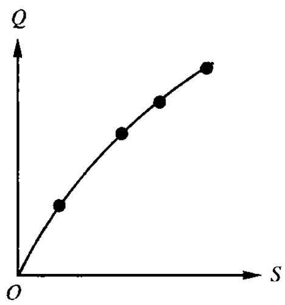  
附图2-1 Q-S 关系曲线

附表2-3 $\pmb { S } _ { 0 }$ 、IgS和IgQ数值表
<table><tr><td>Q</td><td>S</td><td> $S _ { 0 } = \frac { S } { Q }$ </td><td> $\mathbf { L } \mathbf { g } \mathbf { \mathcal { S } }$ </td><td> $\mathtt { L g } Q$ </td></tr><tr><td>78</td><td>1.39</td><td>0 017 8</td><td>0.143</td><td>1.892</td></tr><tr><td>141</td><td>2.89</td><td>0.020 5</td><td>0 461</td><td>2.149</td></tr><tr><td>163</td><td>3.84</td><td>0.023 6</td><td>0.584</td><td>2.212</td></tr><tr><td>190</td><td>5.09</td><td>0.026 8</td><td>0.707</td><td>2.279</td></tr></table>

(3）确定公式中的参数，然后计算 $S = 6 \mathrm { ~ m ~ }$ 时的流量。

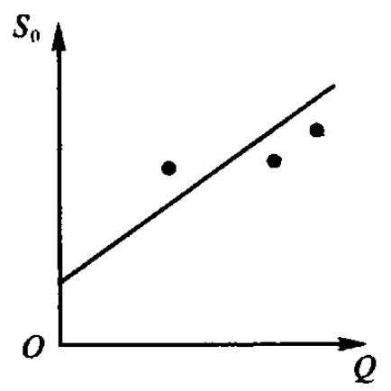

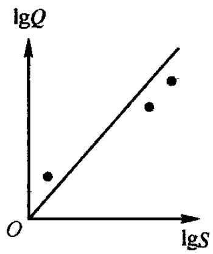  
附图2-3 $\lg Q = f ( \lg S )$ 图解

附图2-2 $S _ { 0 } = f ($ Q)图解  
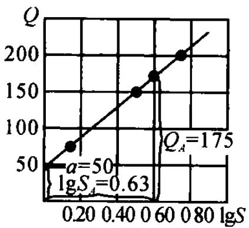  
附图2-4 Q =f(lgS)图解

图解法。由附图2-4可得 $\pmb { a = 5 0 }$ ，为了求b，在直线上任取一点A，其坐标为 $\log S _ { \scriptscriptstyle A } = 0 . 6 3 , Q _ { \scriptscriptstyle A } = 1 7 5$ 0

则： $b = { \frac { Q _ { A } - a } { \log S _ { A } } } = { \frac { 1 7 5 - 5 0 } { 0 . 6 3 } } = 1 9 8 . 4 0$

得：

$$
Q = 5 0 + 1 9 8 . 4 0 \mathrm { l g } S
$$

当 $S = 6 \mathrm { ~ m ~ }$ 时，得：

$$
Q = 5 0 + 1 9 8 . 4 0 \mathrm { l g } 6 = 2 0 5 \mathrm { ~ L } / \mathrm { s }
$$

最小二乘法。将所需资料列入附表2-4，利用式(2-10) 计算。

附表2-4用最小二乘法确定Q-S曲线的有关数据
<table><tr><td>Q</td><td> $\mathbf { L } _ { \pmb { \theta } } \pmb { S }$ </td><td> $( \log S ) ^ { 2 }$ </td><td> $Q l _ { \mathbf { \delta } } g S$ </td></tr><tr><td>78</td><td>0.143</td><td>0.020</td><td>11.154</td></tr><tr><td>141</td><td>0.461</td><td>0.212</td><td>65.001</td></tr><tr><td>163</td><td>0.584</td><td>0.341</td><td>95.192</td></tr><tr><td>190</td><td>0.707</td><td>0.500</td><td>134.330</td></tr><tr><td> $\pmb { \Sigma } = \pmb { 5 } 7 2$ </td><td> $\Sigma = 1 , 8 9 5$ </td><td> $\pmb { \Sigma } = \pmb { 1 . 0 7 3 }$ </td><td> $\Sigma = 3 0 5 . 6 7 7$ </td></tr></table>

$$
\begin{array} { l } { \displaystyle b = \frac { N \sum ( Q | \mathbf { z } \boldsymbol { \delta } ) } { N } - \frac { \sum Q \sum \mathbf { L } g \boldsymbol { \bar { S } } } { N } } \\ { \displaystyle } \\ { = \frac { 4 \times 3 0 5 . 6 7 7 \cdot { \bf { \bar { \sigma } } } \cdot { \bf { \bar { \sigma } } } \cdot \bf { \bar { \sigma } } } { 4 \times 1 . 0 7 3 \cdot { \bf { \bar { \sigma } } } \cdot ( 1 . 8 9 5 ) ^ { 2 } } } \\ { \displaystyle } \\ { = 1 9 . 7 , 7 6 } \\ { \displaystyle a = \frac { \sum Q - b \sum \mathbf { l } g \bar { \bar { \sigma } } } { N } } \\ { \displaystyle } \\ { = \frac { 5 7 2 . - 1 9 7 . 9 6 \times 1 . 8 9 5 } { 4 } } \\ { \displaystyle } \\ { \displaystyle } \\ { = 4 9 . 2 2 } \end{array}
$$

故得流量和水位降深的关系曲线为：

$$
Q = 4 9 . 2 2 + 1 9 7 . 9 3 \mathrm { l g } S
$$

当 $S = 6 \mathrm { ~ m ~ }$ 时，代入上式得： $Q = 2 0 3 . 2 6 ~ \mathrm { L / s }$

（三）井径与流量的关系比较复杂，有些单位根据试验资料提出如下经验公式：

$$
Q = a d ^ { n }
$$

式中 $Q$ ——井的流量；

$d \cdot$ ——井径；

a、n——待定系数。

如果在一个地区有不同井径的流量的抽水试验资料，则可用最小二乘法求出待定系数 $a , ~ n _ { \circ }$ 于是，类似前述算法可求出单位涌水量。用最小二乘法求a、n的计算公式为：

$$
\begin{array} { c } { { n = \displaystyle \frac { N \Sigma ( \mathrm { \bf ~ l g } Q _ { \iota } ) ^ { 2 } \mathrm { ~ - ~ } ( \mathrm { \bf ~ \Sigma } \Sigma \mathrm { \bf ~ l g } Q _ { \iota } ) ^ { 2 } } { N \Sigma \mathrm { \bf ~ l g } Q _ { \iota } \mathrm { l g } d _ { \iota } - \mathrm { \bf ~ \Sigma } \Sigma \mathrm { \bf ~ l g } Q _ { \iota } \Sigma \mathrm { \bf ~ l g } d _ { \iota } } } } \\ { { \mathrm { \bf ~ l g } a = \displaystyle \frac { \Sigma \mathrm { \bf ~ l g } Q _ { \iota } \mathrm { ~ - ~ } n \Sigma \mathrm { \bf ~ l g } d _ { \iota } } { N } } } \end{array}
$$

## 防隔水煤（岩）柱的尺寸要求

## 一、煤层露头防隔水煤（岩）柱的留设

煤层露头防隔水煤（岩）柱的留设，按下列公式计算。

1. 煤层露头无覆盖或被黏土类微透水松散层覆盖时：

$$
H _ { \mathrm { f } } = H _ { \mathrm { k } } + H _ { \mathrm { b } }\tag{3-1}
$$

2. 煤层露头被松散富水性强的含水层覆盖时（附 图3-1):

$$
H _ { \mathrm { f } } = H _ { \mathrm { L } } + H _ { \mathrm { b } }\tag{3-2}
$$

式中 $H _ { \mathrm { f } }$ ——防隔水煤（岩）柱高度，m；

$H _ { \mathbf { k } }$ ———采后垮落带高度，m；

$H _ { \mathrm { L } }$ ——导水裂缝带最大高度，m；

$H _ { \mathfrak { b } }$ ——保护层厚度，m；

$\pmb { \alpha }$ —煤层倾角，(°)。

根据式（3-1）、式（3-2）计算的值，不得小于$2 0 ~ \mathbf { m } _ { \circ }$ 式中 $H _ { \mathbf { k } }$ 、 $H _ { \mathrm { L } }$ 的计算，参照《建筑物、水体、铁

路及主要井巷煤柱留设与压煤开采规程》的相关规定。

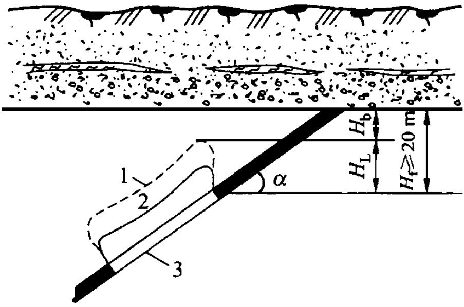  
附图3-1 煤层露头被松散富水性强含水层覆盖时防隔水煤（岩）柱留设图  
$H _ { \mathrm { f } }$ 一防隔水煤（岩）柱高度； $H _ { \mathrm { L } }$ 一导水裂缝带最大高度； $H _ { \mathrm { b } }$ 一保护层厚度；α一煤层倾角

## 二、含水或导水断层防隔水煤（岩）柱的留设

含水或导水断层防隔水煤（岩）柱的留设（附图3-2)可参照下列经验公式计算：

$$
L = 0 . 5 K M \sqrt { \frac { 3 p } { K _ { \mathrm { P } } } } { \geq } 2 0 \mathrm { ~ m ~ }
$$

式中 L——煤柱留设的宽度，m；

K—安全系数，一般取2\~5；

M——煤层厚度或采高，m；

$p$ ——水头压力， $\mathbf { M P a }$

$K _ { \mathrm { p } }$ 煤的抗拉强度， $\mathbf { M P a }$

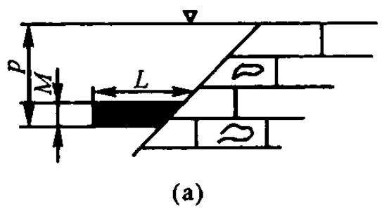

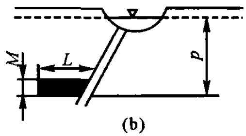  
附图3-2 含水或导水断层防隔水煤（岩）柱留设图  
L—煤柱留设的宽度；P—水头压力；M—煤层厚度或采高

## 三、煤层与强含水层或导水断层接触防隔水煤(岩)柱的留设

煤层与强含水层或导水断层接触，并局部被覆盖时（附图3-3），防隔水煤（岩）柱的留设要求如下：

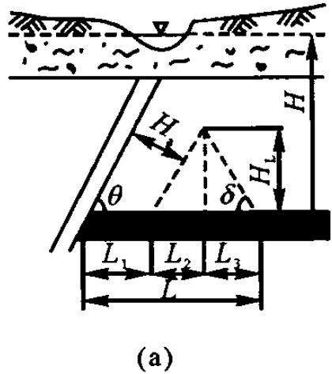

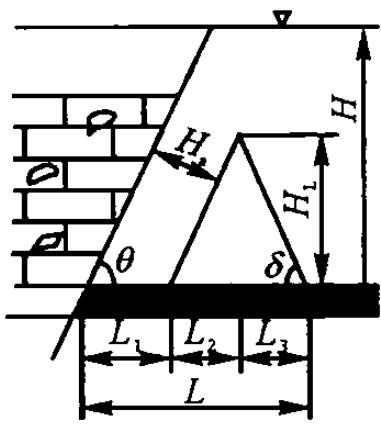  
(b)

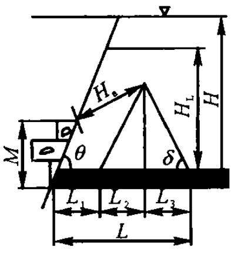  
(c)  
附图3-3 煤层与富水性强的含水层或导水断层接触时防隔水煤（岩）柱留设图

L一防隔水煤（岩）柱宽度； $L _ { 1 }$ ， $L _ { 2 }$ ， $L _ { 3 }$ 一防隔水煤（岩）柱各分段宽度；$H _ { \mathrm { L } }$ 一最大导水裂缝带高度； $H _ { \mathrm { a } }$ 一断层安全防隔水煤（岩）柱的宽度；

θ—断层倾角；δ—岩层塌陷角；H—煤层底板以上的静水位高度；

M一断层上盘含水层层面高出下盘煤层底板的高度

## 1. 当含水层顶面高于最高导水裂缝带上限时，防

隔水煤（岩）柱可按附图3-3a、附图3-3b留设。其计算公式为：

$$
L = L _ { 1 } + L _ { 2 } + L _ { 3 } = H _ { \mathrm { a } } \mathrm { c s c } \theta + H _ { \mathrm { L } } \mathrm { c o t } \theta + H _ { \mathrm { L } } \mathrm { c o t } \delta\tag{3-3}
$$

2. 最高导水裂缝带上限高于断层上盘含水层时，防隔水煤（岩）柱按附图3-3c留设。其计算公式为：

$$
L = L _ { 1 } + L _ { 2 } + L _ { 3 } = H _ { \mathrm { a } } \big ( \mathrm { s i n } \delta - \mathrm { c o s } \delta \mathrm { c o t } \theta \big ) \ +
$$

$$
\left( H _ { \mathrm { a } } \mathrm { c o s } \delta + M \right) \left( \mathrm { c o t } \theta + \mathrm { c o t } \delta \right) \geq 2 0 ~ \mathrm { m }\tag{3-4}
$$

式中 L——防隔水煤（岩）柱宽度，m；

$L _ { 1 } , L _ { 2 } , L _ { 3 }$ ——防隔水煤（岩）柱各分段宽度，m；

$H _ { \mathrm { L } }$ ——最大导水裂缝带高度，m；

θ—断层倾角，（°)；

δ——岩层塌陷角，（°)；

M-——断层上盘含水层层面高出下盘煤层底板的高度，m；

$H _ { \mathrm { a } }$ ——断层安全防隔水煤（岩）柱的宽度， $\mathbf { m } _ { \circ }$

$H _ { a }$ 值应当根据矿井实际观测资料来确定，即通过总结本矿区在断层附近开采时发生突水和安全开采的地质、水文地质资料，计算其水压（p）与防隔水煤（岩）柱厚度（M）的比值 $\big ( T _ { \mathrm { s } } = p / M \big )$ ，并将各点之值标到以 $\pmb { T _ { \mathrm { s } } } = \pmb { p } / M$ 为横轴，以埋藏深度 $H _ { 0 }$ 为纵轴的坐标纸上，找出 $T _ { \mathrm { s } }$ 值的安全临界线（附图3-4）。

$H _ { \mathrm { a } }$ 值也可以按下列公式计算：

$$
H _ { \mathrm { a } } = \frac { p } { T _ { \mathrm { s } } } + 1 0
$$

式中 $p ^ { . }$ ——防隔水煤（岩）柱所承受的静水压力， $\bf { M P a }$

$T _ { \mathrm { s } }$ ——临界突水系数，MPa/m;

10——保护带厚度，一般取10m。

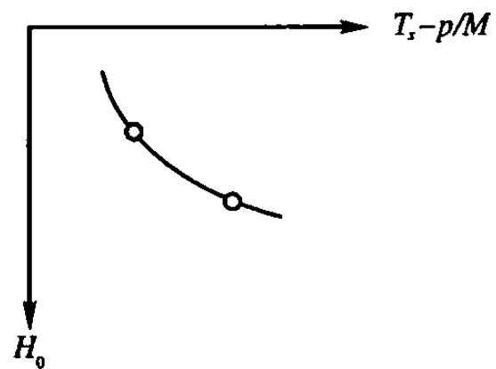  
附图3-4 $T _ { \bullet }$ 和 $H _ { 0 }$ 关系曲线图

本矿区如无实际突水系数，可参考其他矿区资料，但选用时应当综合考虑隔水层的岩性、物理力学性质、巷道跨度或工作面的空顶距、采煤方法和顶板控制方法等一系列因素。

## 四、煤层位于含水层上方且断层导水时防隔水煤（岩）柱的留设

在煤层位于含水层上方且断层导水的情况下（附图3-5），防隔水煤（岩）柱的留设应当考虑2个方向上的压力：一是煤层底部隔水层能否承受下部含水层水的压力；二是断层水在顺煤层方向上的压力。

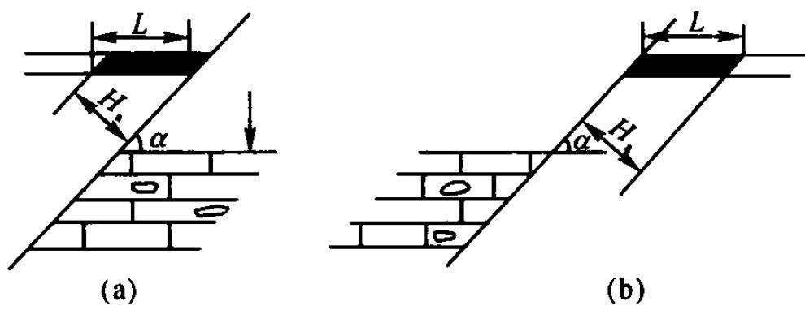  
附图3-5 煤层位于含水层上方且断层导水时防隔水煤（岩）柱留设图α一断层倾角； $H _ { \mathrm { a } }$ 一断层安全防隔水煤（岩）柱的宽度；L一防隔水煤（岩）柱宽度

当考虑底部压力时，应当使煤层底板到断层面之间的最小距离（垂距），大于安全煤柱的高度 $( H _ { \mathfrak { a } } )$ 的计算值，并不得小于20m。其计算公式为

$$
L = { \frac { H _ { \mathrm { s } } } { \sin \alpha } } { \geqslant } 2 0 ~ \mathrm { m }
$$

式中 $\pmb { \alpha }$ ——断层倾角，（°)；

其余参数同前。

当考虑断层水在顺煤层方向上的压力时，按附录三之二计算煤柱宽度。

根据以上两种方法计算的结果，取用较大的数字，但仍不得小于20m。

如果断层不导水（附图3-6），防隔水煤（岩）柱的留设尺寸，应当保证含水层顶面与断层面交点至煤层底板间的最小距离，在垂直于断层走向的剖面上大于安全煤柱的高度 $( H _ { \mathbf { a } } )$ 时即可，但不得小于 $2 0 \textrm { m }$ O

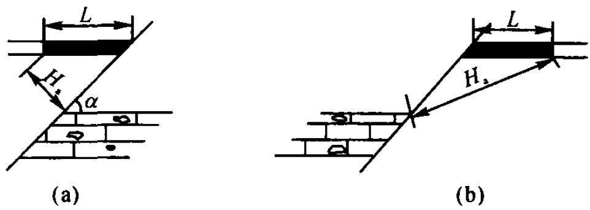  
附图3-6 煤层位于含水层上方且断层不导水时防隔水煤（岩）柱留设图α一断层倾角； $H _ { \mathrm { a } }$ 一断层安全防隔水煤（岩）柱的宽度；L一防隔水煤（岩）柱宽度

## 五、水淹区或老窑积水区下采掘时防隔水煤（岩）柱的留设

1. 巷道在水淹区下或老窑积水区下掘进时，巷道与水体之间的最小距离，不得小于巷道高度的10倍。

2. 在水淹区下或老窑积水区下同一煤层中进行开采时，若水淹区或老窑积水区的界线已基本查明，防隔水煤（岩）柱的尺寸应当按附录三之二的规定留设。

3. 在水淹区下或老窑积水区下的煤层中进行回采时，防隔水煤（岩）柱的尺寸，不得小于导水裂缝带最大高度与保护带高度之和。

## 六、保护地表水体防隔水煤（岩）柱的留设

保护地表水体防隔水煤（岩）柱的留设，可参照《建筑物、水体、铁路及主要井巷煤柱留设与压煤开采规程》执行。

## 七、保护通水钻孔防隔水煤（岩）柱的留设

根据钻孔测斜资料换算钻孔见煤点坐标，按附录三之二的办法留设防隔水煤（岩）柱，如无测斜资料，应当考虑钻孔可能偏斜的误差。

## 八、相邻矿（井）人为边界防隔水煤（岩）柱的 留设

1. 水文地质简单型到中等型的矿井，可采用垂直法留设，但总宽度不得小于40m。

2. 水文地质复杂型到极复杂型的矿井，应当根据煤层赋存条件、地质构造、静水压力、开采上覆岩层移动角、导水裂缝带高度等因素确定。

1）多煤层开采，当上、下两层煤的层间距小于下层煤开采后的导水裂缝带高度时，下层煤的边界防隔水煤（岩）柱，应当根据最上一层煤的岩层移动角和煤层间距向下推算（见附图3-7a）。

2）当上、下两层煤之间的垂距大于下煤层开采后的导水裂缝带高度时，上、下煤层的防隔水煤（岩）柱，可分别留设（见附图3-7b）。

导水裂缝带上限岩柱宽度 $L _ { y }$ 的计算，可采用下列公式：

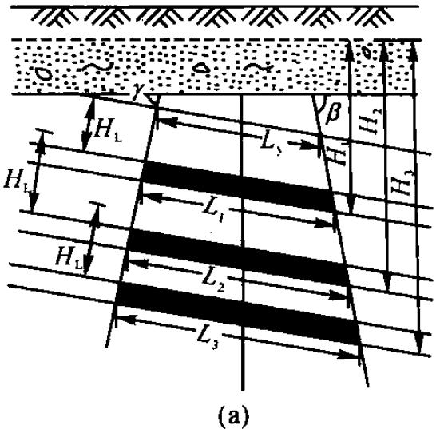

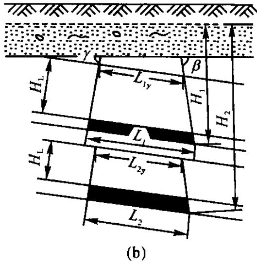  
附图3-7 多煤层地区边界防隔水煤（岩）柱留设图

$$
H _ { \mathrm { L } }
$$

$$
H _ { 1 }
$$

$$
H _ { 2 }
$$

$$
H _ { 3 }
$$

$\pmb { \gamma }$ 一上山岩层移动角； $\beta$ 一下山岩层移动角；

$L _ { y }$ ， $L _ { 1 \mathrm { y } }$ ， $L _ { 2 y }$ 一导水裂缝带上限岩柱宽度；

$L _ { 1 }$ 一上层煤防水煤柱宽度； $L _ { 2 }$ ， $L _ { 3 }$ 一下层煤防水煤柱宽度

$$
L _ { \mathrm { y } } = { \frac { H - H _ { \mathrm { L } } } { 1 0 } } \times { \frac { 1 } { T _ { \mathrm { s } } } } { \geq } 2 0 ~ \mathrm { m }
$$

式中 $L _ { \mathrm { y } }$ ——导水裂缝带上限岩柱宽度，m；

$H$ ——煤层底板以上的静水位高度，m；

$H _ { \mathrm { L } }$ ——导水裂缝带最大值，m；

$T _ { \textrm { s } }$ ——水压与岩柱宽度的比值，可取1。

## 九、以断层为界的井田防隔水煤（岩）柱的留设

以断层为界的井田，其边界防隔水煤（岩）柱可参照断层煤柱留设，但应当考虑并田另一侧煤层的情况，以不破坏另一侧所留煤（岩）柱为原则（除参照断层煤柱的留设外，尚可参考附图3-8所示的例图）。

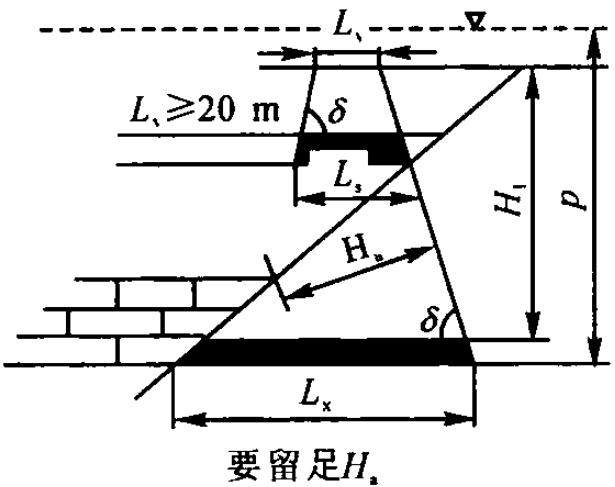  
(a)

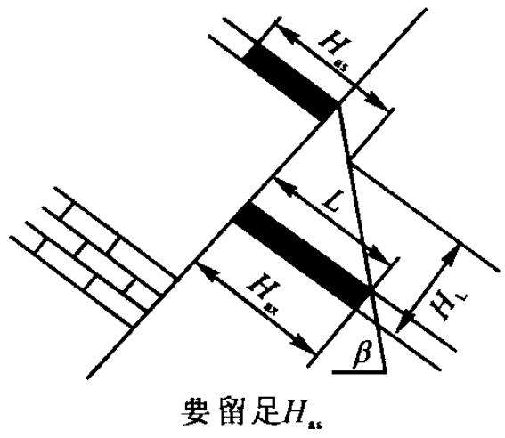  
(b)

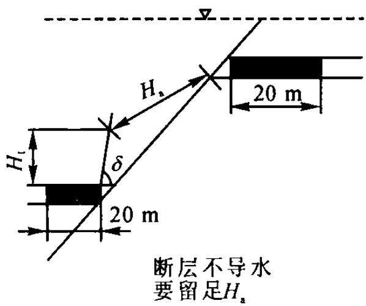  
(c)

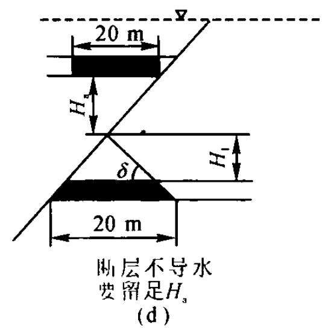

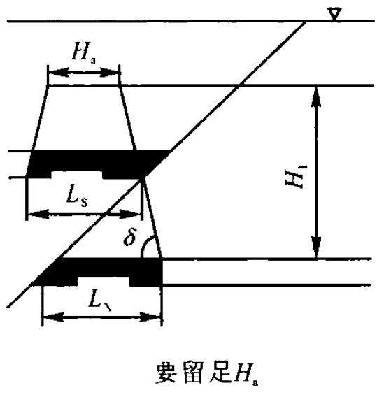  
(e)

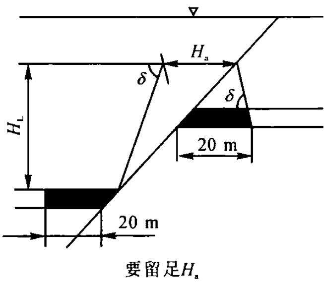  
(f)  
附图3-8 以断层分界的井田防隔水煤（岩）柱留设图

L—煤柱宽度； $L _ { \textrm { s } } , \ L _ { \textrm { x } } - \mathrm { L }$ 、下煤层的煤柱宽度；

$L _ { y }$ 一导水裂缝带上限岩柱宽度； $H _ { \mathfrak { s } }$ ， $H _ { \infty }$ ， $H _ { \mathrm { a x } }$ 一安全防水岩柱厚度；

$\pmb { H } _ { \mathrm { L } }$ 一导水裂缝带上限；p—底板隔水层承受的水头压力

【释义】附录三是关于防隔水煤（岩）柱的尺寸要求。

防隔水煤（岩）柱的留设是煤矿防治水工作的重要内容之一。本附录对防隔水煤（岩）柱尺寸的传统计算方法做了较为详细的说明，供参考。这里补充说明与本附录有关的问题。

(一) 公式(3-4)的推导过程。将附图(3-3c)从a点引平行于煤层的直线ad，可得附图(3-9)。

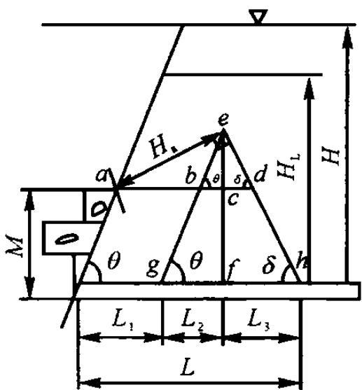  
附图3-9 防隔水煤（岩）柱尺寸L计算示意图

在直角 $\triangle a e c$ 中 $\angle a e c = \angle \delta$

所以 $a c = H _ { a } \sin \delta$

在直角 $\triangle e b c$ 中 $b c = e c \mathbf { c o t } \theta = H _ { \mathrm { a } } \mathbf { c o s } \delta \mathbf { c o t } \theta$

$$
{ \begin{array} { r l } { L _ { 1 } } & { = a c - b c } \\ & { = H _ { \mathrm { a } } \sin \delta - H _ { \mathrm { a } } \cos \delta \mathrm { c o t } \theta } \\ & { = H _ { \mathrm { a } } { \big ( } \sin \delta - \mathrm { c o s } \delta \mathrm { c o t } \theta { \big ) } } \end{array} }
$$

在直角 $\Delta e g f$ 中 $e f = M + e c$

$$
= M + H _ { \mathrm { a } } \cos \delta
$$

在直角 $\Delta e g f$ 中

$$
\begin{array} { l } { { g f = L _ { 2 } = e f \mathrm { c o t } \theta } } \\ { { \ = \left( M + H _ { \mathrm { a } } \mathrm { c o s } \delta \right) \mathrm { c o t } \theta } } \end{array}
$$

在直角 $\triangle e f h$ 中

$$
\begin{array} { l } { { f h \ =  { L _ { \mathrm { 3 } } } = e f \mathrm { c o t } \delta } } \\ { { \phantom { f } = \left( \begin{array} { l } { M + H _ { \mathrm { a } } \mathrm { c o s } \delta } \end{array} \right) \mathrm { c o t } \delta } } \end{array}
$$

因此

$$
\begin{array} { c } { { L _ { 2 } + L _ { 3 } = \left( M + H _ { a } \mathrm { c o s } \delta \right) \left( \mathrm { \ c o t } \theta + \mathrm { c o t } \delta \right) } } \\ { { { } } } \\ { { L _ { \mathrm { \scriptsize ~ = } } L _ { 1 } + L _ { 2 } + L _ { 3 } } } \\ { { { } } } \\ { { = H _ { \mathrm { a } } \left( \mathrm { \ s i n } \delta - \mathrm { c o s } \delta \mathrm { c o t } \theta \right) + } } \\ { { { } } } \\ { { \left( M + H _ { \mathrm { \scriptsize ~ s } } \mathrm { c o s } \delta \right) \left( \mathrm { \ c o t } \theta + \mathrm { c o t } \delta \right) } } \end{array}
$$

（二）附图（3-3c）所示防隔水煤（岩）柱尺寸的另一种计算方法。

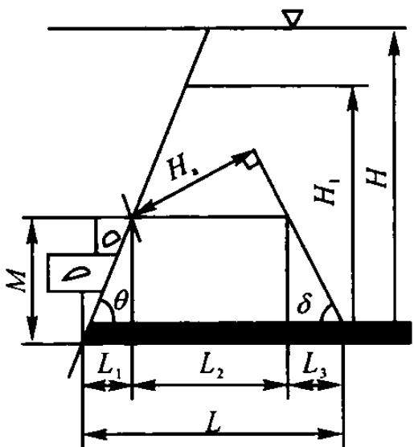  
附图3-10 防隔水煤（岩）柱尺寸L计算示意图

将附图（3-3c）转化为附图（3-10）形状，可得如下防隔水煤（岩）柱尺寸：

$$
\begin{array} { r l } {  { L = L _ { 1 } + L _ { 2 } + L _ { 3 } } } \\ & { = M / \mathrm { t a n } \theta + H _ { \mathrm { s } } / \mathrm { s i n } \delta + M / \mathrm { t a n } \delta } \end{array}
$$

（三）在公式 $L = 0 . 5 K M \sqrt { \frac { 3 p } { K _ { \mathrm { p } } } } \geqslant 2 0 \mathrm { ~ m ~ }$ 中，煤的抗拉强度 $K _ { \mathfrak { p } }$ 应当通过原位水压致裂测试确定。目前国内各矿采用的煤的 $K _ { \mathfrak { p } }$ 值大多在0.2\~1.4MPa之间。

# 安全隔水层厚度和突水系数计算公式

## 一、安全隔水层厚度计算公式

$$
t = \frac { L ( \sqrt { \gamma ^ { 2 } L ^ { 2 } + 8 K _ { \mathrm { p } } p } - \gamma L ) } { 4 K _ { \mathrm { p } } }\tag{4-1}
$$

式中 t——安全隔水层厚度，m;

$L$ ——巷道底板宽度，m；

γ——底板隔水层的平均重度， $\mathbf { M N } / \mathbf { m } ^ { 3 }$ ;

$K _ { \mathfrak { p } }$ ——底板隔水层的平均抗拉强度， $\mathbf { M P a }$

$p { \cdot }$ —底板隔水层承受的水头压力， $\mathbf { M P a }$ 0

## 二、突水系数计算公式

$$
T = { \frac { p } { M } }\tag{4-2}
$$

式中 T——突水系数， ${ \bf M P a } / { \bf m }$ n；

$p { \cdot }$ —底板隔水层承受的水压， ${ \bf M P a }$ a;

$M -$ ——底板隔水层厚度， $\mathbf { m } _ { \circ }$

式（4-1）主要适用于掘进工作面，式（4-2）适用于回采和掘进工作面。按式（4-1）计算，如底板隔水层实际厚度小于计算值时，就是不安全的。按式（4-2)计算，就全国实际资料看，底板受构造破坏块段突水系数一般不大于0.06MPa/m，正常块段不大于0.1MPa/m。

【释义】附录四是关于安全隔水层厚度和突水系数计算公式的规定。

煤层底板突水是华北石炭二叠系煤田采煤过程中经常发生的一种灾害。导致底板突水的水源主要是奥陶系岩溶裂隙含水层或与其有水力联系的石炭系薄层灰岩含水层，而突水通道则往往是断层、陷落柱、裂隙密集带或其他薄弱带。由于奥灰含水层厚度大，岩溶裂隙发育，富水性强，因此一旦发生突水，大部分情况是灾难性的。在我国采矿史上，曾发生过多次煤层底板突水事故，给国家和人民生命财产造成了重大损失。随着煤炭工业的快速发展，华北地区的许多煤矿已进入或正在进入下组煤开采阶段。与上组煤比较，下组煤埋藏深，距奥陶系灰岩强含水层近，煤层底板承受的水头压力大，因此开采下组煤更容易发生底板突水事故。

为了预测煤层底板突水，国内外学者进行了大量的试验和研究工作，提出了很多理论和学说，其中突水系数理论和由斯列萨列夫公式推导出的计算煤层底板安全隔水层厚度的公式（4-1）得到广泛应用。

如果用式（4-1）计算的安全隔水层厚度t小于或等于实际隔水层厚度 $( \ v _ { t _ { \mathfrak { X } } } )$ ，即 $t \leq t _ { \mathfrak { X } }$ ，则安全或极限平衡；如果 $t \gtrapprox t _ { \overrightarrow { \ast } }$ ，则可能发生突水。斯氏公式的推导是以两端固定承受均布荷载这种简化力学模型为基础的；而对于斜长较大的采煤工作面，倾向方向承受的压力，不是均布荷载而是梯形荷载，因此在评价其底板突水危险程度时一般不采用斯氏公式，而是采用突水系数方法。斯氏公式适于巷道和跨度小的采掘工程，而突水系数法既适用巷道，也适用采煤工作面。用斯氏公式评价采煤工作面底板突水危险程度时最大跨度（最大控顶距离）一般取20\~30m。

在矿井防治水工作中，应先用突水系数法对矿区底板突水危险程度进行评价，然后结合采掘工程图，再用斯氏公式对巷道所处位置进行突水预测，若其中有一种方法得出有突水可能的结果，就应采取防范措施。底板突水是一个十分复杂的问题，除采用上述两种方法外，还可采用其他方法预测，以便互相比较。

## 安全水头压力值计算公式

## 一、掘进巷道底板隔水层

$$
p = 2 K _ { \mathrm { p } } { \frac { t ^ { 2 } } { L ^ { 2 } } } + \gamma t\tag{5-1}
$$

式中 p——底板隔水层能够承受的安全水压， $\mathbf { M P a }$

t——隔水层厚度，m；

$L$ ——巷道宽度，m；

γ——底板隔水层的平均重度， $\mathbf { M N } / \mathbf { m } ^ { 3 }$

$K _ { \mathfrak { p } }$ 底板隔水层的平均抗拉强度， $\mathbf { M P a }$

## 二、采煤工作面

$$
p = T _ { s } M\tag{5-2}
$$

式中 M——底板隔水层厚度，m；

$p { \cdot }$ ——安全水压，MPa;

$T _ { \mathfrak { s } }$ ——临界突水系数， ${ \bf M P a } / { \bf m } _ { \mathrm { c } }$

T值应当根据本区资料确定，一般情况下，在具有构造破坏的地段按0.06 MPa/m计算，隔水层完整无断裂构造破坏地段按0.1 MPa/m计算。

【释义】附录五是关于安全水头压力值计算公式的规定。

将巷道底板隔水层的实际厚度t等代入公式(5-1)求出理论的安全水头压力值，再将安全水头压力值换算成水头H，把H和实际水头 $H _ { ☉ }$ 进行比较，如果 $H _ { ☉ } \geqslant$ H，说明巷道底板不安全，可能发生底板突水；如果$H _ { \mathfrak { X } } \leqslant H$ ，说明巷道底板安全，一般不会发生底板突水。

公式（5-1）适用于巷道或沿地层倾向跨度小的采掘空间。对于采煤工作面，安全水头值可用式(5-2)计算。式（5-2) 中临界突水系数 $T _ { \mathfrak { s } }$ 应根据本矿区资料确定。在本矿区缺少突水资料而无法确定临界突水系数时，在具有构造破坏的地段 $T _ { \mathrm { s } }$ 可取0.06 MPa/m，在隔水层底板无断裂构造破坏地段 $T _ { \mathfrak { s } }$ 可取0.1 ${ \cal M } { \bf P a } / { \bf m } _ { i }$ O

附录六

# 采掘工作面水害分析预报表和预测图模式

## 一、采掘工作面水害分析预报表

附表6-1 采掘工作面水害分析预报表  
年 月 日
<table><tr><td rowspan=2 colspan=1>矿井</td><td rowspan=2 colspan=1>项号</td><td rowspan=2 colspan=1>预测水害地点</td><td rowspan=2 colspan=1>采掘队</td><td rowspan=2 colspan=1>工作面上下标高</td><td rowspan=1 colspan=3>煤层</td><td rowspan=2 colspan=1>采掘时间</td><td rowspan=2 colspan=1>水塑</td><td rowspan=2 colspan=1>水服</td><td rowspan=2 colspan=1>预防及处理意见</td><td rowspan=2 colspan=1>责任单位</td><td rowspan=2 colspan=1>备注</td></tr><tr><td rowspan=1 colspan=1>名称</td><td rowspan=1 colspan=1>厚度/m</td><td rowspan=1 colspan=1>倾角1(°)</td></tr><tr><td rowspan=5 colspan=1>某矿某井</td><td rowspan=1 colspan=1>1</td><td rowspan=1 colspan=1></td><td rowspan=1 colspan=1></td><td rowspan=1 colspan=1></td><td rowspan=1 colspan=1></td><td rowspan=1 colspan=1></td><td rowspan=1 colspan=1></td><td rowspan=1 colspan=1></td><td rowspan=1 colspan=1></td><td rowspan=1 colspan=1></td><td rowspan=1 colspan=1></td><td rowspan=1 colspan=1></td><td rowspan=1 colspan=1></td></tr><tr><td rowspan=1 colspan=1>2</td><td rowspan=1 colspan=1></td><td rowspan=1 colspan=1></td><td rowspan=1 colspan=1></td><td rowspan=1 colspan=1></td><td rowspan=1 colspan=1></td><td rowspan=1 colspan=1></td><td rowspan=1 colspan=1></td><td rowspan=1 colspan=1></td><td rowspan=1 colspan=1></td><td rowspan=1 colspan=1></td><td rowspan=1 colspan=1></td><td rowspan=1 colspan=1></td></tr><tr><td rowspan=1 colspan=1>3</td><td rowspan=1 colspan=1></td><td rowspan=1 colspan=1></td><td rowspan=1 colspan=1></td><td rowspan=1 colspan=1></td><td rowspan=1 colspan=1></td><td rowspan=1 colspan=1></td><td rowspan=1 colspan=1></td><td rowspan=1 colspan=1></td><td rowspan=1 colspan=1></td><td rowspan=1 colspan=1></td><td rowspan=1 colspan=1></td><td rowspan=1 colspan=1></td></tr><tr><td rowspan=1 colspan=1>4</td><td rowspan=1 colspan=1></td><td rowspan=1 colspan=1></td><td rowspan=1 colspan=1></td><td rowspan=1 colspan=1></td><td rowspan=1 colspan=1></td><td rowspan=1 colspan=1></td><td rowspan=1 colspan=1></td><td rowspan=1 colspan=1></td><td rowspan=1 colspan=1></td><td rowspan=1 colspan=1></td><td rowspan=1 colspan=1></td><td rowspan=1 colspan=1></td></tr><tr><td rowspan=1 colspan=1>5</td><td rowspan=1 colspan=1></td><td rowspan=1 colspan=1></td><td rowspan=1 colspan=1></td><td rowspan=1 colspan=1></td><td rowspan=1 colspan=1></td><td rowspan=1 colspan=1></td><td rowspan=1 colspan=1></td><td rowspan=1 colspan=1></td><td rowspan=1 colspan=1></td><td rowspan=1 colspan=1></td><td rowspan=1 colspan=1></td><td rowspan=1 colspan=1></td></tr></table>

注：水害类型指地表水、孔隙水、裂隙水、岩溶水、老空水、断裂构造水、陷落柱水、钻孔水、顶板水、底板水等。

## 二、水害预测图

在矿井采掘工程图(月报图)上，按预报表上的项目，在可能发生水害的部位，用红颜色标上水害类型符

号。符号图例如附图6-1所示。

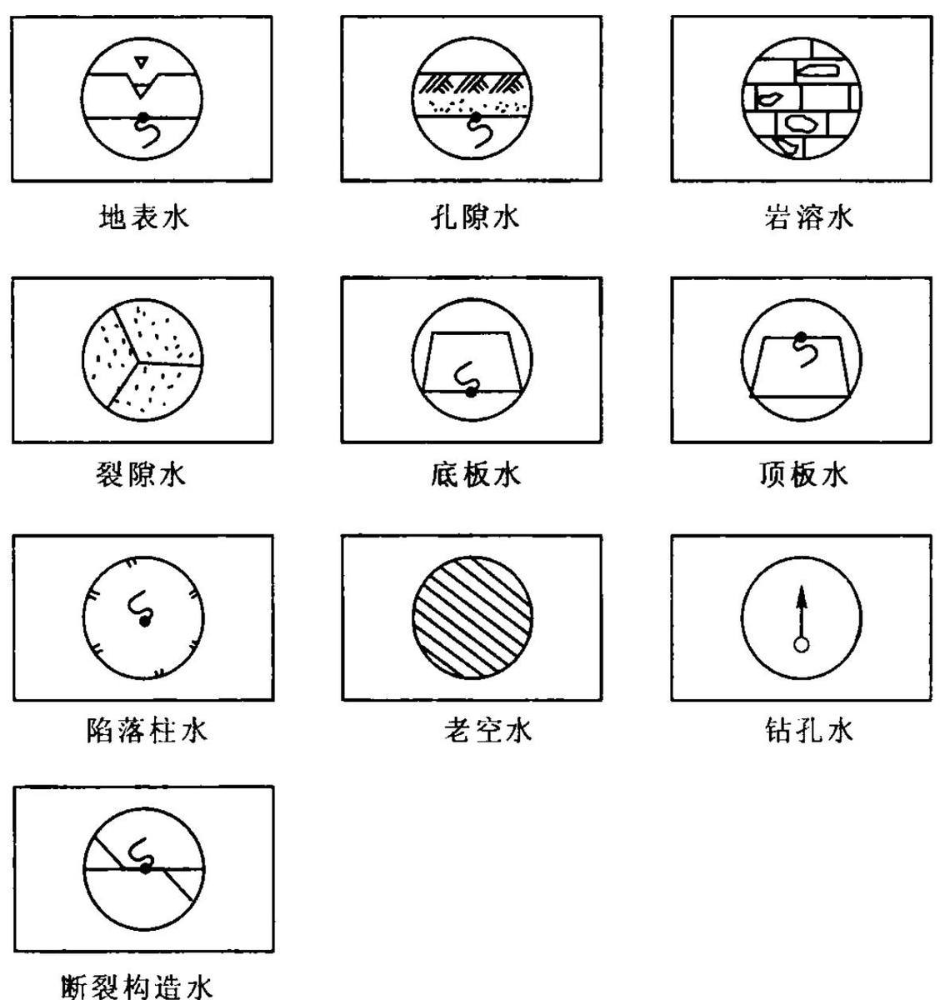  
附图6-1 矿井采掘工作面水害预测图例

【释义】附录六是关于采掘工作面水害分析预报表和预测图模式的规定。

每一个采掘工作面在掘进回采前都要按附表6-1进行水害分析预测，编制掘进和回采说明书。

矿井对已经发生的水害类型和预测的水害类型要采用不同颜色标注在矿井采掘工程平面图上。

# 国家安全生产监督管理总局副局长、国家煤矿安全监察局局长赵铁锤就《煤矿防治水规定》颁布实施答记者问

2009年9月21日，国家安全生产监督管理总局局长骆琳签署总局第28号令，颁布《煤矿防治水规定》，自2009年12月1日起施行。日前，就《煤矿防治水规定》（以下简称《防治水规定》），记者采访了国家安全生产监督管理总局副局长、国家煤矿安全监察局局长赵铁锤。

记者：为什么要制定《防治水规定》？

赵铁锤：《防治水规定》是在现行《矿井水文地质规程》及《煤矿防治水工作条例》（以下简称《规程》和《条例》）的基础上制定的，主要考虑的是适应当前煤矿水害防治工作的新情况、新变化，进一步规范煤矿防治水工作，有效防治矿井水害。一是近年来发生多起重特大水害事故，总结事故教训，需要对原《规程》和《条例》进行补充；二是随着煤炭工业的迅速发展，我国不少煤矿已经在湖底下、水库下、河流下甚至在海底下进行采煤，急需对相关防治水工作做出规定；三是煤矿安全监管监察体制发生了变化，制定《防治水规定》，并提

升为部门规章，以利于企业贯彻执行和强化对煤矿防治水的监督检查。

记者：《防治水规定》有哪些特点？

赵铁锤：《防治水规定》有以下几个特点：

一是对防范重特大水害事故规定更加严格。针对近几年发生的重特大水害事故，《防治水规定》在内容上做出了相应补充和完善。如针对2005年广东“8.7”水害事故和2007年山东“8.17”水害事故等暴露出的问题，《防治水规定》中有关条款规定：严禁在水体下开采急倾斜煤层；煤矿在雨季要建立巡视检查制度和停产撤人制度，发现暴雨洪水灾害严重、可能引发淹井时，必须立即停产撤人，只有在确认隐患已彻底消除后方可恢复生产。

二是对防治老空水害规定更加严密。据统计，老空透水事故占煤矿水害事故的80%以上，主要原因是探放水措施不落实、在有透水征兆的情况下仍违规作业。因此，《防治水规定》在总则中就明确规定：煤矿井田内及周边区域水文地质条件不清的，严禁进行采掘活动；矿井有透水征兆时，受水害威胁的区域要立即停止作业，撤出作业人员到安全地点。第五章中对有关探放水设计、施工等做出了具体规定，明确要求井下探放水使用专用的探放水钻机，严禁使用煤电钻进行探放水。

三是对强化防治水基础工作做出规定。矿井水文地质类型划分、水文地质勘探等工作是矿井搞好防治水的基础。为此，《防治水规定》专门增加了相应内容，对矿井水文地质类型划分及基础资料、水文地质补充调查与勘探等做出规定，要求矿井编制井田地质报告、建井设计和建井地质报告，并且应当有相应的防治水内容；矿并应当按照规定编制必要的防治水图件，内容真实可靠，并每半年对图件内容进行修改完善；矿井防治水基础台账，也要认真收集、整理，实行计算机数据库管理，并每半年修改完善1次，为防治水决策提供科学依据。

四是减少了有关防治水的行政审批。根据《行政许可法》的有关规定，这次在《防治水规定》中，除水体下采煤留设和变更防隔水煤（岩）柱尺寸须经省级煤炭行业管理部门审查批准后方可进行开采外，对矿井其他水害防治设计等审批，均确定由煤矿企业负责。

记者：《防治水规定》对煤矿防治水原则、专用设备配备、探放水作业队伍设置以及防治水技术人员配备等有什么规定？

赵铁锤：煤矿防治水工作应当坚持“预测预报、有疑必探、先探后掘、先治后采”的原则，采取“防、堵、疏、排、截”的综合治理措施。水文地质条件复杂和极复杂的矿井，在地面无法查明矿井水文地质条件和充水因素时，必须坚持有掘必探。

煤矿企业、矿井的主要负责人（含法定代表人、实际控制人）是本单位防治水工作的第一责任人，总工程师（技术负责人）具体负责防治水的技术管理工作。

煤矿企业、矿井应当按照本单位的水害情况，配备满足工作需要的防治水专业技术人员，配齐专用探放水设备，建立专门的探放水作业队伍。

水文地质条件复杂、极复杂的煤矿企业、矿井，还应当设立专门的防治水机构，装备防治水抢险救灾的配套设备。

记者：这次制定的《防治水规定》与以往的《规程》和

《条例》相比主要增加了哪些内容？

赵铁锤：主要增加了以下内容：

一是增加了矿井水文地质类型划分指标。原类型划分有4项指标，即受采掘破坏或影响的含水层及水体、矿井涌水量、开采受水害影响程度、防治水工作难易程度。而《防治水规定》根据老空水事故多的教训和有关防治水的调研情况，在矿井水文地质类型划分中增加了矿井及周边老空水分布状况和矿井突水量两项指标。

二是调整增加防水闸门和水闸墙的规定。根据我国潜水电泵的发展水平，对水文地质条件复杂、极复杂的矿井，井底车场周围不具备设置防水闸门条件时，可用潜水电泵排水系统代替。井下需要构筑水闸墙的，应当由具备相应资质的单位进行设计，按照设计进行施工、组织竣工验收，否则不得投入使用。

三是增加了有关物理勘探规定。物理勘探已成为重要勘探手段，具有效率高的特点。为此，《防治水规定》有关条款中增加了物理勘探方面的内容，要求采用物探、钻探等综合手段查明矿井水文地质条件。

四是增加了水体下采煤、矿井水害应急救援、废弃矿井关闭、露天煤矿防治水以及法律责任等规定。

记者：下一步如何宣传贯彻落实《防治水规定》？

赵铁锤：《防治水规定》是做好煤矿防治水工作的一部重要规章，各级煤矿安全监管、煤炭行业管理部门和煤矿安全监察机构及有关单位，特别是煤矿企业都要认真贯彻落实。

要充分发挥媒体作用，大力宣传《防治水规定》的有关内容。国家煤矿安全监察局将组织有关专家编写《防治水规定》释义，对相关部门的有关人员以及重点煤矿企业技术负责人进行宣贯培训。

各级地方煤矿安全监管部门、煤炭行业管理部门和驻各地煤矿安全监察机构要认真组织学习《防治水规定》的内容，全面理解《防治水规定》的含义，熟悉相关规定，提高煤矿安全执法水平。同时，要针对辖区内煤矿的实际情况，制定学习培训方案，结合事故案例，组织对煤矿企业从事防治水工作的有关管理人员和技术人员进行全面培训。

各煤矿企业、矿井要组织管理人员、专业技术人员进行全面学习，并按照《防治水规定》要求，设置防治水机构、配齐专业技术人员、探放水设备和救援设备，健全各项防治水制度，开展水害事故隐患排查治理。同时，要采取不同形式，对职工进行防治水知识的教育和培训，保证职工掌握必要的防治水知识，提高防治水工作的技能和抵御水灾的能力。

总之，要通过实施《防治水规定》，全面加强煤矿防治水基础工作，切实提高防治水工作和技术水平，努力防范遏制煤矿重特大水害事故。

## 煤矿水害事故分析报告(2007\~2008年)

国家煤矿安全监察局事故调查司

煤矿重特大水害仅次于瓦斯事故。各级煤矿安全监管部门、煤炭行业管理部门和煤矿安全监察机构认真贯彻党中央、国务院关于加强煤矿安全生产的一系列指示，按照国家安全生产监督管理总局、国家煤矿安全监察局和地方党委、政府的部署，加强水害防治工作，查大隐患，防大事故，全国煤矿水害事故趋于稳定，水害防治工作取得了一定成效；但重特大水害事故时有发生，防治水仍需加强。下面对2007\~2008年水害事故的原因和特点进行分析，查找问题，通过吸取事故教训，推动防治水工作，有效遏制重特大透水事故的发生。

## 一、基本情况

（一）水害防治工作有成效。2007\~2008年全国发生水害事故122起、死亡518人，每年平均数比前3年平均数（下同）减少48起、201人，分别下降44%和43.7%，占全国煤矿总死亡人数的7.4%。其中，发生重大以上（10人以上）水害事故11起、死亡190人，同比减少2起、101人，分别下降26%和

51.5%，占全国重大以上事故的16.7%和14.8%。

（二）水害防治仍需加强。2007年雨季发生了多起重特大淹井事故或未遂事故。山西孝义庆平煤矿有限公司（原招携煤矿）“7.26”透水事故（被困9人）、河南省三门峡市陕县支建煤矿“7.29”淹井事故（被困69人）、江西省丰城矿务局上塘镇榨一煤矿“8.16”透水事故（被困14人），经奋力抢救被困人员全部成功获救。7月22日，山西吕梁市兴县魏家滩镇马圈圙煤矿，因山洪暴发，造成河槽下采空区发生塌陷，沉陷面积约800m²，洪水经采空区进入矿井，导致11人死亡。8月17日，山东华源矿业有限公司因突降暴雨，山洪暴发，河水猛涨，河堤决口，溃水淹井引发事故灾难，致使172人死亡；与其相邻的新泰市名公煤矿也因洪水淹井，造成9名矿工遇难。

2008年，在奥运会之前，广西百色市右江矿务局那读煤矿发生“7.21”特别重大透水事故，死亡36人。河南平顶山郏县高门垌煤矿“11.17”透水事故涉险35人，在国家安全生产监督管理总局、国家煤矿安全监察局和地方党委、政府正确领导下，科学决策，成功救出33人。

## 二、主要特点

（一）水害事故主要发生在乡镇煤矿。在122起水害事故中，乡镇煤矿（含非法煤矿）97起，占79.5%；国有重点煤矿13起，占10.7%；国有地方煤矿12起，占9.8%。56起较大以上水害事故中，乡镇煤矿45起、死亡285人，占80.4%和68.2%；国有重点煤矿6起、死亡73人，占10.7%和17.4%；国有地方煤矿5起、死亡60人，占8.9%和14.4%。

（二）透水事故的主要水源为老空（窑）区积水及地表水。

在56起较大以上水害事故中，属于老空（窑）透水造成事故的51起、死亡384人，占91.1%和91.8%；由于地表河水、洪水倒灌矿井发生事故的5起、死亡34人，占8.9%和8.2%。

（三）掘进工作面是发生透水事故的主要地点。在56起较大以上水害事故中，45起发生在掘进工作面，占80.4%。

（四）非法违法生产造成透水事故比例较高。在56起较大以上事故中，非法违法生产导致事故发生的23起、死亡172人，占较大以上事故的41.0%和41.1%。

（五）国有煤矿发生4起重特大透水事故。4起事故分别为：2007年3月10日，辽宁抚顺矿业集团老虎台煤矿发生重大透水事故，死亡29人，这是近年来国有重点煤矿发生透水事故死亡人数最多的一次。2008年7月12日，山西省长治市王庄煤矿（国有地方）发生重大透水事故，死亡10人。2008年7月21日，广西百色市右江矿务局那读煤矿（国有地方）发生特别重大透水事故，死亡36人。2008年9月7日，河南省禹州鹤煤仁和矿业有限公司（国有重点，属资源整合）发生重大透水事故，死亡18人，事故发生后，矿井部分负责人和知情人逃匿。

（六）瞒报事故时有发生。在56起较大以上水害事故中，发生瞒报事故10起、死亡86人，分别占17.9%和20.6%。水害事故发生后，如是及时上报，施救得当，人员就有生还的可能。瞒报事故性质恶劣，须严厉打击，依法追究相关责任。

（七）部分地区水害多发。较大以上水害事故主要发生在贵州、湖南、河南、山西、广西和江西等地区，其中，贵州12起、死亡65人、河南7起、死亡81人、山西6起、死亡49人、湖南6起、死亡49人、广西3起、死亡44人。

## 三、问题及原因分析

通过对两年水害事故进行分析，反映出一些煤矿企业水害防治工作主体责任不落实，基础工作薄弱，水害防治措施不到位，部门监管、监察仍有薄弱环节，突出表现在以下几个方面：

（一）企业主体责任不落实。一些煤矿企业对水害防治工作认识不足，防范意识差，未将水害防治列入重要议事日程，水害防治制度不落实，责任不明确，防治水体制机制弱化，机构不健全，专业人员不足，基础管理工作薄弱。

【案例】中煤能源集团公司太原煤炭气化（集团）有限责任公司东河煤矿东山井，生产能力66万t/a。该矿技术管理不到位，对矿井水害防治工作重视不够；未查明矿井周边老窑及采空区积水隐患，探放水措施不落实。在二采区2210掘进工作面切眼施工时，虽然进行了探放水，但未彻底疏放完老空水，在巷道掘进过程中因爆破破坏了老空区防水煤柱，发生“2.24”透水事故，透水量约10万m³，造成6人死亡。

（二）水文地质资料不清。一些矿井缺乏必要的基础图纸资料；一些矿井井下采掘工程平面图与实际误差较大，无法科学指导煤矿水害防治工作；一些矿井井田内或井田边界老空区积水不清楚；一些矿井没有对井田水害情况开展预测预报工作。

【案例】2008年7月12日23时20分，山西省长治县王庄煤矿井下总回风巷掘进工作面发生1起重大透水事故，透水量约6000m³，造成10人死亡，3人轻伤。山西省长治县王庄煤矿是一座国有控股股份制企业，2007年该矿原煤总产量为154万t。该矿总回风巷采用综掘机掘进，事故发生时，该掘进工作面已施工758m。事故发生区域水文地质不清，在总回风巷掘进时，虽然进行了探放水，但未彻底疏完老空水，由于综掘时破坏防隔水煤柱，老空水突然溃出，导致事故发生。

（三）探放水措施不落实。一些矿井根本没有探放水措施；一些矿井虽然进行了探放水，但未将水害彻底根治；一些矿井用煤电钻代替探水钻，起不到探放水作用；一些矿井根本不进行探放水，盲目掘进，导致水害事故。

（四）在透水征兆明显的情况下仍违规组织生产。分析老空透水事故的案例表明，大部分老空透水事故都有明显的透水征兆，未及时撤退作业人员，仍违规组织生产，导致事故发生。

【案例】河南省济源市马庄煤矿为个人独资企业，属资源整合单独保留的技术改造矿井，设计生产能力15万t/a。该矿没有按照批准的设计施工技改工程，在非技改区域内擅自进行采掘活动，边技改、边生产，该矿为逃避上级有关部门的现场检查处理，对在技改工程之外的违法违规生产区域，在检查验收时打上密闭，检查验收结束后拆除，掩盖其违法生产行为。明知生产区域存在老空水和冲积层水，但没有探放水措施设计，用煤电钻探水，发现钻孔出水后，没有采取撤人措施，反而将人员转移工作地点后继续作业。由于防隔水煤柱宽度不够，在积水的长期压迫和浸渗下，防隔水煤柱被突然冲垮，导致“10.29”事故发生，造成21人死亡。

（五）破坏防隔水煤（岩）柱。一些煤矿违法开采防隔水煤（岩）柱；一些煤矿在水体下、冲积层下开采时，擅自提高开采上限，减少防隔水煤柱，导致事故发生。

（六）一些煤矿防治水工程质量较差。一些煤矿为了应付检查，未经设计建设不合格的防水密闭设施，成为重大水害隐患。近几年已发生多次因密闭设施不合格导致透水事故。

【案例】贵州省黔西县珑华煤矿与相邻的废弃老窑之间在用密闭墙替代隔水墙的同时，密闭墙构筑质量差，强度达不到规定要求，且未留返水孔，7月份地面连降大雨，大量地表水渗透到采空区，密闭墙承压强度不够导致爆裂，致使老巷和采空区积水溃决，发生了“8.7”透水事故，造成正在井下维修水泵和清理水仓淤泥的12人死亡（包括矿长、副矿长、机电队长等)。

(七）水害应急预案不健全。一些矿井根本没有水害应急预案，发生透水后，束手无策；一些矿井虽有水害应急预案，但从未进行应急演练；一些矿井水害应急预案内容不全，不具操作性。

【案例】吉林省白山市八道江区汇丰煤矿为乡镇煤矿，矿井设计生产能力3万t/a，2006年核定生产能力4万t/a。2008年7月20日晚，汇丰煤矿所在区域普降大雨，副井巷道顶板冒落，+405m标高巷道泥沙石堆积，堵塞巷道，同时造成地表塌陷。在副井处理堵塞巷道时，没有制定安全措施和应急预案，冒险自下向上作业时，泥砂石溃下，导致“7.21”事故发生，死亡5人。

【案例】河南省郑州煤炭工业（集团）新岭煤矿有限责任公司（以下简称新岭矿）八分井是整合矿井，2008年7月26日9时38分，发生透水事故，死亡6人。事故发生后，新岭矿只上报2人，隐瞒4人。新岭矿八分井井下煤层属急倾斜煤层，巷道坡度大，原有老巷道是木棚支护，长时间缺乏维修，且这些老巷道离地表距离较近，最近处仅50m左右，巷道上覆岩层为蟒川河床的冲积层，部分河水通过塌陷冒落带渗入井下，赋存于上部的老空区或松散的冒落带内，当积水层增高、压力增大、上覆岩层平衡状态破坏后，积水溃入井下；当班作业人员对上部水害隐患认识不清，缺乏安全意识，没有制定应急预案，发现水量增大时没有采取有效措施，而是私自进入上部老巷，造成突水发生后未能及时撤出。

（八）一些企业在防范自然灾害上存在一些薄弱环节。一是对防范自然灾害引发的事故灾难重视不够，防洪体系存在漏洞，防洪设施不牢靠，特别是对中小水库、河流管理薄弱，一些河道、河堤不稳固，承载能力低，禁不起洪水的冲击。二是预警机制不健全，在山东“8.17”事故灾难中，气象部门虽然对强降雨做了预报，但预报强降雨的准确位置不明确，水利部门没有根据预报的降雨量适当腾出库容，致使暴雨突降时没有发挥应有的调洪作用。三是破产改制后的煤矿企业安全管理弱化，监管主体责任不清，河南“7.29”事故和山东“8.17”事故灾难都是改制矿井发生的。

（九）监管监察和行业管理不到位。一些地区对防治水工作不重视，监管监察和行业管理存在薄弱环节。发生事故后，没有认真吸取教训，导致同一地区的透水事故接二连三发生。

【案例】2008年5月30日1时30分，鸡西市原兴农煤炭开发有限责任公司兴新煤矿技术改造井发生1起重大透水事故，死亡13人。事故发生后，矿主蓄意瞒报事故，鸡东县有关部门人员参与了事故瞒报。该矿由于地质构造变化，放弃技术改造后，没有履行停产关闭程序，在与周边报废矿井关系不清、明知有水患并有透水预兆、未采取任何措施的情况下，组织工人冒险作业，超层越界开采21号、22号煤层。矿井西二段21号煤层前进式采煤工作面上山头爆破时，破坏了与原鸡东县四海煤矿七井之间的煤柱，原鸡东县四海煤矿七井采空区积水溃入井下，导致水害事故发生。

事故反映了有关部门管理存在漏洞。鸡东县煤炭工业管理局未提出矿井回撤关闭的意见，没有启动矿井关闭程序，致使非法矿井长期存在。鸡西市煤炭局没有及时将哈南监察分局关于取消兴新煤矿建设项目意见的文件送达鸡东县煤炭局，贻误了工作。鸡东县煤矿安全监督管理局打击非法矿井不力，事故矿井放弃技改后仍按技改矿井（长停）监管，发现事故矿井非法生产行为，措施不果断，没有及时关闭矿井，放任非法生产行为。国土资源部门在对兴新煤矿采矿许可证延续、变更、年审期间，未对已废弃的原鸡东县四海煤矿七井对技改井有水患威胁及该井超层越界开采问题提出意见。鸡东县公安部门对火工品监管不严，对事故矿井非法使用火工品问题失察，为非法生产提供了条件。

## 四、措施建议

根据事故特点和原因的分析，提出如下措施建议：

（一）认真落实地方政府监管和企业负责两个主体责任。各级煤炭行业管理部门、煤矿安全监督管理部门、煤矿安全监察机构和各煤矿企业要增强做好煤矿水害防治工作的责任感和紧迫感，将水害防治工作列入重要议事日程，明确水害防治工作职责。坚持“预测预报，有疑必探，先探后掘，先治后采”的原则，认真落实“防、堵、疏、排、截”五项综合治理措施，按照新颁布的《煤矿防治水规定》，认真开展防治水工作，

治大隐患，防大事故。

煤矿法定代表人或煤矿主要负责人（含实际控制人，下同）是防治水工作的第一责任人，总工程师（技术负责人）要承担起煤矿水害防治工作的技术责任；煤矿必须配备防治水专业技术人员，配齐专用探放水设备，建立专业探放水队伍；水文地质条件复杂、极复杂的煤矿要设立专门防治水机构；煤矿要建立健全水害防治工作各级岗位责任制、水害防治技术管理制度、水害预测预报制度和水害隐患排查治理制度等；煤矿要加强防治水科技攻关和新技术推广工作，提高防治水工作的科技水平。

（二）加强煤矿防治水基础工作。煤矿要编制中长期防治水规划和年度防治水计划并组织实施。各类矿井要采用适合本矿井的物探、化探、钻探等先进适用技术，查明矿井或采区水文地质情况；特别要定期收集、调查、核对本矿及相邻煤矿的废弃老窑情况，编制《矿井综合水文地质图》等基础图纸和资料，准确掌握矿井水患危险的情况，对矿井生产区域的地质构造情况、水害类型等进行预测预报，提出预防和处理水害的针对性措施。煤矿防治水工作应建立水文地质信息管理系统，实现矿井水文地质文字资料、数据、图件、计算评价和矿井防治水预测预报一体化。

（三）认真落实探放水措施。受水害影响的矿井，要开展充水条件分析，提出专门水文地质情况报告。煤矿井田内及周边区域水文地质条件不清的，严禁进行采掘活动；严禁开采防隔水煤（岩）柱。矿井开拓巷道过导水断层、裂隙（带）、陷落柱等构造地带时，必须探水前进。如果含水丰富，应超前预注浆封堵加固。受底板承压水威胁的矿井，要进行疏水降压，保证安全开采；无法保证安全开采时，必须进行底板加固注浆。水体下采煤必须按设计进行试采，确保安全。

受老空水威胁的矿井，要分析查明老窑的空间位置、积水量和水压，确定探水警戒线并准确填绘在采掘工程平面图上，编制探放水措施，坚持先探后掘；由于水文地质条件复杂和极复杂的矿井，在地面无法查明矿井水文地质构造和充水因素时，必须坚持有疑必探。探放水要由专业人员使用专用探放水钻机进行施工，保证探放水钻孔的超前距离，探放水钻孔必须打中老空水体并要监视放水全过程，直到老空水放完为止；探放水时，要撤出探放水点位置以下受水害威胁区域的所有人员，发现有突水预兆时，必须立即撤出所有受威胁区域的人员并采取有效措施，水患消除后方可继续施工。

（四）加强“雨季”三防工作。煤矿企业要建立防范台风暴雨的预报、预警、预防和应急救援工作机制，建立雨季巡视制度和停工撤人制度。雨季前必须对防范台风暴雨进行隐患排查和专项整治，消除隐患。对矿井双回路供电系统（6万t/a以下煤矿的自备发电设备）、通讯系统及排水设备、设施等进行全面检查，确保系统、设备完好可靠。对矿区内河道进行彻底清挖、疏通，必要时对河堤进行加固；严禁将矸石、炉灰、垃圾等杂物堆放在山洪、河流可能冲刷到的地段，严禁侵占河道，保障河道的畅通；煤矿位于地表河流、湖泊、水库、山洪部位等附近，井口、工业广场要采取修筑堤坝、开挖沟渠等截流措施；井口标高低于历史最高洪水水位的矿井要有应急措施；对洪水可能淹没的废弃老窑井口必须按规定填实封死，或在井口浇注1个大于井筒断面的坚实的钢筋混凝土盖板，严防地表水倒灌井下淹井。

（五）强化职工防治水安全培训。煤矿企业要结合典型水害案例分析，加强对职工水害防治知识的培训和教育，提高安全生产技能和综合素质。制定并不断完善《矿井水害应急预案》，加强应急预案的演练，使职工掌握逃生的路线。特别是要让职工牢记：当发现井下有突水征兆时，必须停止作业，立即撤到安全地点并及时报告调度室。煤矿安全管理人员及相关岗位必须经培训持证上岗。

（六）建立完善水害应急救援预案。各产煤地区相关部门要制订完善水害应急预案，建立健全区域抢险排水基地建设和运行机制，增置排水设备，定期对设备进行检修，保证设备完好，以提高抢险救灾能力和效果。大型煤矿企业要储备足够的抢险物资和设备，确保抢险救灾时能够及时到位并发挥作用。

煤矿企业发生透水后，要立即启动《矿井水害应急预案》按规定及时上报有关部门，积极开展救援工作。

（七）加强监管监察和行业管理。地方各级煤矿安全监督管理部门要认真履行对煤矿水害的日常监管职责，加强对辖区内煤矿的监督检查力度。凡没有配备地质或水文地质专业技术人员的，有水患的企业未配备探放水设备和队伍的，防治水措施不落实的，没有开展水害隐患排查治理、制订矿井水害应急预案的，超层越界开采的，开采防水煤柱的煤矿企业，必须责令其立即停产整改，经整改仍不合格的，要依法关闭。

驻地煤矿安全监察机构要对受老空（窑）水、承压水等威胁的矿井实施重点监察，对存在重大隐患的，责令停产整顿，凡整改不合格、无法保障安全开采的，要移送地方政府依法予以关闭。对发生水害事故的矿井，要认真调查事故原因，严肃追究事故责任，公布处理结果，接受社会监督。对重大未遂透水事故，也要彻查原因，通过吸取事故教训，举一反三，进一步落实防范措施。

附表1：2007年煤矿较大以上水害事故基本情况表

附表2：2008年煤矿较大以上水害事故基本情况表

附表1 2007年煤矿较大以上水害事故基本情况表
<table><tr><td colspan="1" rowspan="1">序号</td><td colspan="1" rowspan="1">时间</td><td colspan="1" rowspan="1">事故单位</td><td colspan="1" rowspan="1">企业类别</td><td colspan="1" rowspan="1">死亡人数</td><td colspan="1" rowspan="1">透水水源</td><td colspan="1" rowspan="1">简要情况及原因分析</td></tr><tr><td colspan="1" rowspan="1">合计</td><td colspan="1" rowspan="1"></td><td colspan="1" rowspan="1"></td><td colspan="1" rowspan="1"></td><td colspan="1" rowspan="1">202</td><td colspan="1" rowspan="1"></td><td colspan="1" rowspan="1"></td></tr><tr><td colspan="3" rowspan="1">一、较大事故</td><td colspan="1" rowspan="1"></td><td colspan="1" rowspan="1">146</td><td colspan="1" rowspan="1"></td><td colspan="1" rowspan="1"></td></tr><tr><td colspan="1" rowspan="1">1</td><td colspan="1" rowspan="1">1月9日</td><td colspan="1" rowspan="1">辽宁本溪市本溪县田师傅镇高嗣海煤矿</td><td colspan="1" rowspan="1">乡镇</td><td colspan="1" rowspan="1">7</td><td colspan="1" rowspan="1">卷教</td><td colspan="1" rowspan="1">该矿四层三段下山横川采煤工作面爆破作业，诱发原田师傅煤矿采空区积水透出。矿井设计核定能力1万/a，为当地政府2007年拟关闭矿井。当地政府已停止其生产，但该矿擅自组织人员下井违法组织生产</td></tr><tr><td colspan="1" rowspan="1">2</td><td colspan="1" rowspan="1">3月10日</td><td colspan="1" rowspan="1">重庆永川县红炉镇金源煤矿</td><td colspan="1" rowspan="1">乡镇</td><td colspan="1" rowspan="1">5</td><td colspan="1" rowspan="1">老砂水</td><td colspan="1" rowspan="1">该矿准备节后复产，在探水作业中发生透水事故，水源为上部采空区积水。当班井下8人作业，其中3人安全升井，5人死亡。该矿证照齐全，斜并开拓，设计能力3万Va</td></tr><tr><td colspan="1" rowspan="1">3</td><td colspan="1" rowspan="1">3月15日</td><td colspan="1" rowspan="1">河南鹤壁煤业集团公司中泰矿业有限公司</td><td colspan="1" rowspan="1">有点</td><td colspan="1" rowspan="1">5</td><td colspan="1" rowspan="1">卷融</td><td colspan="1" rowspan="1">该矿33051 运输平巷发生透水事故，该工作面有11人工作，其中6人安全升井，5人死亡。事故直接原因：在老巷积水未排放完，违章指挥，继续掘进至老巷重叠处，导致透水事故发生</td></tr><tr><td colspan="1" rowspan="1">4</td><td colspan="1" rowspan="1">4月9日</td><td colspan="1" rowspan="1">贵州遵义市汇川区四渡镇布政煤矿</td><td colspan="1" rowspan="1">乡镇</td><td colspan="1" rowspan="1">6</td><td colspan="1" rowspan="1">老空透水</td><td colspan="1" rowspan="1">非法技改矿井（3万√/a改6万✓a)发生透水事故。斜井开拓，低瓦斯矿井，已安装瓦斯监测监控系统</td></tr><tr><td colspan="1" rowspan="1">5</td><td colspan="1" rowspan="1">4月11日</td><td colspan="1" rowspan="1">湖北黄石市大冶市还地桥镇红峰村三井煤矿</td><td colspan="1" rowspan="1">乡镇</td><td colspan="1" rowspan="1">3</td><td colspan="1" rowspan="1">老空透水</td><td colspan="1" rowspan="1">该矿生产能力3万√a，证照齐全。当班下井23人，其中-115m煤巷上山掘进工作面9人。事故发生后，有20人安全升井</td></tr><tr><td colspan="1" rowspan="1">6</td><td colspan="1" rowspan="1">4月16日丰</td><td colspan="1" rowspan="1">湖南株洲市黄桥镇长城煤矿</td><td colspan="1" rowspan="1">乡镇</td><td colspan="1" rowspan="1">9</td><td colspan="1" rowspan="1">老</td><td colspan="1" rowspan="1">该矿证照齐全有效，设计能力3万し/a。2006年核定能力3万Va。低瓦斯矿并，掘进面未进行探放水导致老空透水</td></tr><tr><td colspan="1" rowspan="1">7</td><td colspan="1" rowspan="1">4月22日</td><td colspan="1" rowspan="1">湖南冷水江市三尖镇石巷里煤矿</td><td colspan="1" rowspan="1">乡镇</td><td colspan="1" rowspan="1">3</td><td colspan="1" rowspan="1">老空透水</td><td colspan="1" rowspan="1">2007年4月22日4时，冷水江市三尖镇石巷里煤矿+237m水平—平巷维修时发生煤泥压出事故。该矿证照齐全，低瓦斯矿井，非停产整顿矿井，安全程度评估等级B级</td></tr><tr><td colspan="1" rowspan="1">8</td><td colspan="1" rowspan="1">6月14日</td><td colspan="1" rowspan="1">贵州毕节地区威宁县龙街镇一非法采煤窝点</td><td colspan="1" rowspan="1">非法</td><td colspan="1" rowspan="1">4</td><td colspan="1" rowspan="1">洪水</td><td colspan="1" rowspan="1">当时井下有6人，其中2人安全升井，4人死亡。暴发山洪，洪水从井口灌入</td></tr><tr><td colspan="1" rowspan="1">9</td><td colspan="1" rowspan="1">6月24日</td><td colspan="1" rowspan="1">山西运城市河津市下化乡陈家岭村原子沟煤矿（瞒报）</td><td colspan="1" rowspan="1">乡镇</td><td colspan="1" rowspan="1">9</td><td colspan="1" rowspan="1">老空透水</td><td colspan="1" rowspan="1">事故发生后，矿主隐瞒不报，经群众举报，山西煤矿安全监察局接到国家安全生产监督管理总局核查通知后，进行了认真核查并查实。该矿为私营煤矿，2002年投产，核定能力21万√a，安全生产许可证、煤炭生产许可证、营业执照均已过期，正在办理延期手续。违法组织生产，事故当班下井9人，全部死亡</td></tr><tr><td colspan="1" rowspan="1">10</td><td colspan="1" rowspan="1">6月24日</td><td colspan="1" rowspan="1">广西百色地区田阳县百育镇一非法小煤矿</td><td colspan="1" rowspan="1">非法</td><td colspan="1" rowspan="1">3</td><td colspan="1" rowspan="1">老空透水</td><td colspan="1" rowspan="1">非法窝点，该地区有大量的采空区和老窑，积水情况不明，水文地质条件复杂。民工无章作业，上山采煤巷盲目贯通老窑</td></tr><tr><td colspan="1" rowspan="1">11</td><td colspan="1" rowspan="1">7月5日</td><td colspan="1" rowspan="1">山西临汾市乡宁县凡水渠煤矿（瞒报）</td><td colspan="1" rowspan="1">乡镇</td><td colspan="1" rowspan="1">9</td><td colspan="1" rowspan="1">老空透水</td><td colspan="1" rowspan="1">事故发生后矿方隐瞒不报，自行采取措施进行排水，于7月7日9名遇难者尸体全部找到，并擅自进行了处理。7月8日国家安全生产监督管理总局接到群众举报后，立即通知山西煤监局进行核查，矿方于7月27日坦白了死亡9人的事故情况。该矿为乡镇私营煤矿，证照齐全，核定能力15万√a。分上下两层开采，上分层已开采结束，但存有部分积水，在发生事故时该矿正在复工整顿；下分层矿工作业时，上分层积水透到下分层，从而导致事故发生</td></tr><tr><td colspan="1" rowspan="1">12</td><td colspan="1" rowspan="1">7月11日</td><td colspan="1" rowspan="1">河南济源煤业有限责任公司六矿（瞒报）</td><td colspan="1" rowspan="1">国有地方</td><td colspan="1" rowspan="1">6</td><td colspan="1" rowspan="1">老空透水</td><td colspan="1" rowspan="1">事故发生后矿井隐瞒不报，接到群众举报后，豫西监察分局组织有关部门进行核查并核实。该矿为国有地方技改矿，设计能力30万√a，安全专篇已于2003年批复，2004年开始施工，事故发生前正在进行基建施工阶段，矿井仅持有矿长资格证和矿长安全资格证。当班下井的8人中，2人安全升井，6人死亡。事故直接原因：作业人员在 21061 工作面运输平巷切眼清淤时，掘透老空区，淤煤与积水涌出</td></tr><tr><td colspan="1" rowspan="1">13</td><td colspan="1" rowspan="1">7月18日</td><td colspan="1" rowspan="1">湖南郴州市永兴县金龟镇庙背冲煤矿</td><td colspan="1" rowspan="1">乡镇</td><td colspan="1" rowspan="1">5</td><td colspan="1" rowspan="1">老空透水</td><td colspan="1" rowspan="1">第一沿煤上山与第二沿煤上山之间的上山探煤工作面在作业过程中发生透水事故。该矿为乡镇煤矿，采矿许可证2006年12月到期，被永兴县政府确定为整合矿井（被整合矿井），县里方案已经制定，但还未实施</td></tr><tr><td colspan="1" rowspan="1">14</td><td colspan="1" rowspan="1">8月14日</td><td colspan="1" rowspan="1">江西赣州市于都县工农煤矿</td><td colspan="1" rowspan="1">乡镇</td><td colspan="1" rowspan="1">3</td><td colspan="1" rowspan="1">老空透水</td><td colspan="1" rowspan="1">当班下井11人，其中8人生还，3人死亡。该私营煤矿，证照齐全，设计和核定能力3万L/a</td></tr><tr><td colspan="1" rowspan="1">15</td><td colspan="1" rowspan="1">8月23日</td><td colspan="1" rowspan="1">四川攀枝花市西区平江煤炭工业公司苦荞煤矿</td><td colspan="1" rowspan="1">乡镇</td><td colspan="1" rowspan="1">5</td><td colspan="1" rowspan="1">老空透水</td><td colspan="1" rowspan="1">当班下井12人，其中4人安全升井，8人被困。该矿准备独立扩能（3万L/a改6 万しa)，还未开始技改，为正常生产矿井，低瓦斯矿，平硐开拓</td></tr><tr><td colspan="1" rowspan="1">16</td><td colspan="1" rowspan="1">8月30日</td><td colspan="1" rowspan="1">贵州贵阳市乌当区金华镇福星煤矿</td><td colspan="1" rowspan="1">乡镇</td><td colspan="1" rowspan="1">3</td><td colspan="1" rowspan="1">老空透水</td><td colspan="1" rowspan="1">该矿证照齐全，安装有监控系统，为技改矿井。由于掘进工作面巷道上帮老空积水因雨季压力增大，压垮煤壁积水涌入巷道造成事故。未采取有效的探放水措施</td></tr><tr><td colspan="1" rowspan="1">17</td><td colspan="1" rowspan="1">9月25日</td><td colspan="1" rowspan="1">西藏昌都地区马查拉煤矿妥坝矿区2号井</td><td colspan="1" rowspan="1">非法</td><td colspan="1" rowspan="1">5</td><td colspan="1" rowspan="1">老空透水</td><td colspan="1" rowspan="1">透水事故，死亡5人</td></tr><tr><td colspan="1" rowspan="1">18</td><td colspan="1" rowspan="1">10月7日</td><td colspan="1" rowspan="1">福建永定县抚市镇铲坑煤矿</td><td colspan="1" rowspan="1">乡镇</td><td colspan="1" rowspan="1">5</td><td colspan="1" rowspan="1">老空透水</td><td colspan="1" rowspan="1">该矿3采区井下发生透水事故，造成5人被困。截止10月14日，最后1名失踪人员被找到，该事故失踪的5人全部遇难</td></tr><tr><td colspan="1" rowspan="1">19</td><td colspan="1" rowspan="1">10月8日</td><td colspan="1" rowspan="1">重庆黔江县黔欣煤矿</td><td colspan="1" rowspan="1">乡镇</td><td colspan="1" rowspan="1">3</td><td colspan="1" rowspan="1">老</td><td colspan="1" rowspan="1">在进行探水作业时发生透水事故，造成3人死亡。透水水源为老窑水，涌水量约2000m³。该矿原为天星桥煤矿北井，1997年投产，设计能力2万√a，核定能力1万√a。根据重庆市煤矿关闭整顿要求，该矿作为保留矿井，将与天星桥煤矿南井进行整合，并保留独立生产系统</td></tr><tr><td colspan="1" rowspan="1">20</td><td colspan="1" rowspan="1">10月12日荔</td><td colspan="1" rowspan="1">贵州黔南布州波县高容煤矿</td><td colspan="1" rowspan="1">乡镇</td><td colspan="1" rowspan="1">4</td><td colspan="1" rowspan="1">老空透水</td><td colspan="1" rowspan="1">当班井下31人作业，其中27人安全升井，4人死亡。该矿为私营煤矿，资源整合矿井，经贵州省政府批准，2007年5月与相邻的巴格煤矿整合，设计能力3万√a，核定能力5万√a，斜井开拓，煤与瓦斯突出矿井，已安装瓦斯监测监控系统</td></tr><tr><td colspan="1" rowspan="1">21</td><td colspan="1" rowspan="1">10月16日</td><td colspan="1" rowspan="1">贵州黔西南州普安县楼下镇雨中贵全煤矿</td><td colspan="1" rowspan="1">乡镇</td><td colspan="1" rowspan="1">5</td><td colspan="1" rowspan="1">老空透水</td><td colspan="1" rowspan="1">当班下井36人（矿主隐瞒下井人数为14人)，其中31人安全升井，5人被困井下。事故直接原因：擅自启封井田内一个已关闭的老系统进行施工时发生透水。该矿为私营煤矿，资源整合主体矿井，证照齐全（采矿许可证已暂扣)，高瓦斯矿。整合前生产能力3万√/a，整合后设计能力30万√a</td></tr><tr><td colspan="1" rowspan="1">2210</td><td colspan="1" rowspan="1">月19日</td><td colspan="1" rowspan="1">甘肃白银市靖远县王家山第二煤矿</td><td colspan="1" rowspan="1">有方</td><td colspan="1" rowspan="1">5</td><td colspan="1" rowspan="1">老空透水</td><td colspan="1" rowspan="1">当班下井作业人员6人，其中1人安全升井，5人被困。水量约800m³。该矿为国有地方煤矿，正在改制办理“五证一照”换证手续。设计能力6万√a，核定能力4万t/a</td></tr><tr><td colspan="1" rowspan="1">23</td><td colspan="1" rowspan="1">10月26日</td><td colspan="1" rowspan="1">陕西渭南市澄城县尧头三号井</td><td colspan="1" rowspan="1">乡镇</td><td colspan="1" rowspan="1">9</td><td colspan="1" rowspan="1">老空透水</td><td colspan="1" rowspan="1">当班下井11人，其中2人升井，9人被困。该矿为私营煤矿，证照齐全，生产能力6万√a</td></tr><tr><td colspan="1" rowspan="1">2410</td><td colspan="1" rowspan="1">月28日</td><td colspan="1" rowspan="1">江西抚州市乐安县零线煤矿</td><td colspan="1" rowspan="1">乡镇</td><td colspan="1" rowspan="1">9</td><td colspan="1" rowspan="1">老空透水</td><td colspan="1" rowspan="1">井下掘进工作面发生透水事故，当班下井12人，其中2人安全升井，10人被困。该矿为私营煤矿，证照齐全，设计和核定能力1万νa,低瓦斯矿井，已安装瓦斯监测监控系统。经省政府批准，同意该矿扩界并改扩建，生产能力1万t/a改6万Va</td></tr><tr><td colspan="1" rowspan="1">2510</td><td colspan="1" rowspan="1">月29日</td><td colspan="1" rowspan="1">贵州黔南布州平塘县卡蒲乡一非法采煤窝点</td><td colspan="1" rowspan="1">非法</td><td colspan="1" rowspan="1">4</td><td colspan="1" rowspan="1">老空透水</td><td colspan="1" rowspan="1">该矿为非法煤矿。没有取得任何证照。以掘代采，没有探放水措施。事故当班下井8人，分两个掘进头作业，掘进导致老空水透出</td></tr><tr><td colspan="1" rowspan="1">26</td><td colspan="1" rowspan="1">12月12日</td><td colspan="1" rowspan="1">江西上饶市上饶县大桥群发煤矿</td><td colspan="1" rowspan="1">乡镇</td><td colspan="1" rowspan="1">3</td><td colspan="1" rowspan="1">老空透水</td><td colspan="1" rowspan="1">核定能力4万νa。16人下井，3人死亡</td></tr><tr><td colspan="1" rowspan="1">27</td><td colspan="1" rowspan="1">12月12日源</td><td colspan="1" rowspan="1">青海海北州门县宁缠第三煤矿</td><td colspan="1" rowspan="1">乡镇</td><td colspan="1" rowspan="1">6</td><td colspan="1" rowspan="1">老空透水</td><td colspan="1" rowspan="1">设计能力6万しa。采矿证过期。13人下井，6人升井</td></tr><tr><td colspan="1" rowspan="1">28</td><td colspan="1" rowspan="1">12月12日</td><td colspan="1" rowspan="1">湖南张家界市桑植县瑞塔铺镇分水岭煤矿小溪井</td><td colspan="1" rowspan="1">乡镇</td><td colspan="1" rowspan="1">3</td><td colspan="1" rowspan="1">老空透水</td><td colspan="1" rowspan="1">透水事故，死亡3人</td></tr><tr><td colspan="1" rowspan="1"></td><td colspan="2" rowspan="1">二、重大以上事故</td><td colspan="1" rowspan="1"></td><td colspan="1" rowspan="1">56</td><td colspan="1" rowspan="1"></td><td colspan="1" rowspan="1"></td></tr><tr><td colspan="1" rowspan="1">1</td><td colspan="1" rowspan="1">3月10日</td><td colspan="1" rowspan="1">辽宁抚顺矿业集团公司老虎台矿</td><td colspan="1" rowspan="1">国有重点</td><td colspan="1" rowspan="1">29</td><td colspan="1" rowspan="1">老空透水</td><td colspan="1" rowspan="1">73003 综放工作面发生透水事故。全矿当班下井462人，除73003综放工作面当班下井的29人，其余433 人安全升井。该矿为国有重点煤矿，煤与瓦斯突出矿井，证照齐全，2006年核定能力335万√a，实际产煤242万t。该矿为斜、立井开拓方式，井口标高+140 m，有 - 330 m、-630 m、-730 m 和-830 m四个水平生产。透水事故发生在 - 730 m 水平的73003 综采放顶煤工作面</td></tr><tr><td colspan="1" rowspan="1">2</td><td colspan="1" rowspan="1">3月22日</td><td colspan="1" rowspan="1">河南平顶山汝州市半坡阳商酒务煤矿（瞒）报）</td><td colspan="1" rowspan="1">乡镇</td><td colspan="1" rowspan="1">15</td><td colspan="1" rowspan="1">老空透水</td><td colspan="1" rowspan="1">当班下井52人，其中37人安全升井，15人死亡。事故发生后，该矿隐瞒不报，并销毁下井记录，知情人逃匿，经群众举报后被查实。该矿为私营煤矿，低瓦斯矿井，已安装瓦斯监测监控系统。2005年在河南省资源整合中被批准为单独保留矿井。2007年2月27日平顶山市煤炭工业局批准技改施工(9万√a改15万/a)。矿井为立井开拓，事故发生前主井和风井已形成通风系统，副井已延深到底，但尚未与主井贯通。该矿2006年5月5日，井下曾发生火药爆炸事故，造成8人死亡</td></tr><tr><td colspan="1" rowspan="1">3</td><td colspan="1" rowspan="1">8月7日</td><td colspan="1" rowspan="1">贵州毕节地区黔西县羊场乡城华煤矿</td><td colspan="1" rowspan="1">乡镇</td><td colspan="1" rowspan="1">12</td><td colspan="1" rowspan="1">地表水</td><td colspan="1" rowspan="1">当班下井20人，其中6人安全升井，2人被抢救出井，12人死亡。初步分析，透水点位于副斜井（全长280 m）距井底70 m处，该处与相邻的废弃矿井采空区相连通，筑有永久密闭。由于下大雨，地面洪水通过临近废弃矿井采空区冲垮密闭后溃入副斜井井底，透水量约7000m³。该矿为股份制企业，正在进行6万t/a改30万t/a技术改造。2006年6月1日贵州省煤炭管理局批复其技改方案。2006年9月29日水城监察分局批复其安全专篇。新主井于2006年12月开工建设。现该矿主要做新井开拓和老井系统维修工作</td></tr></table>

附表2 2008年煤矿较大以上水害事故基本情况表
<table><tr><td colspan="1" rowspan="1">序号</td><td colspan="1" rowspan="1">时间</td><td colspan="1" rowspan="1">事故单位</td><td colspan="1" rowspan="1">企业类别</td><td colspan="1" rowspan="1">死亡人数</td><td colspan="1" rowspan="1">透水水源</td><td colspan="1" rowspan="1">简要情况及原因分析</td></tr><tr><td colspan="1" rowspan="1">合计</td><td colspan="1" rowspan="1"></td><td colspan="1" rowspan="1"></td><td colspan="1" rowspan="1"></td><td colspan="1" rowspan="1">216</td><td colspan="1" rowspan="1"></td><td colspan="1" rowspan="1"></td></tr><tr><td colspan="1" rowspan="1"></td><td colspan="2" rowspan="1">一、较大事故</td><td colspan="1" rowspan="1"></td><td colspan="1" rowspan="1">81</td><td colspan="1" rowspan="1"></td><td colspan="1" rowspan="1"></td></tr><tr><td colspan="1" rowspan="1">1</td><td colspan="1" rowspan="1">1月10日</td><td colspan="1" rowspan="1">四川省达州市开江县大平煤矿</td><td colspan="1" rowspan="1">乡镇</td><td colspan="1" rowspan="1">5</td><td colspan="1" rowspan="1">老空水</td><td colspan="1" rowspan="1">该矿为技改矿并。事故直接原因：违章采用爆破方法处理上部老窑积水，爆破后未放空上部积水，人员进入水体下部冒险蛮干，上部水体突然涌出导致事故发生</td></tr><tr><td colspan="1" rowspan="1">2</td><td colspan="1" rowspan="1">2月24日</td><td colspan="1" rowspan="1">中煤集团太原煤气化集团有限责任公司东河煤矿东山井</td><td colspan="1" rowspan="1">国有重点</td><td colspan="1" rowspan="1">6</td><td colspan="1" rowspan="1">老空水</td><td colspan="1" rowspan="1">事故直接原因：2210掘进工作面当班施工人员未执行探放水措施，在巷道掘进过程中爆破破坏了老空区积水的防水煤柱，导致老空积水突然涌出</td></tr><tr><td colspan="1" rowspan="1">3</td><td colspan="1" rowspan="1">4月7日</td><td colspan="1" rowspan="1">重庆市中梁山煤电气有限公司芦塘煤矿</td><td colspan="1" rowspan="1">国有重点</td><td colspan="1" rowspan="1">9</td><td colspan="1" rowspan="1">老空水</td><td colspan="1" rowspan="1">中梁山煤电气有限公司于2007年11月与彭水县政府签定国有产权转让合同，整体收购了彭水县地方国有芦塘煤矿。事故直接原因：井下4号下山+450m水平南运输大巷与+460 m水平总回风平巷贯通的切割上山沿原生煤层掘进时，未采取任何探放水措施掘穿上部1986~1990年期间形成的采空区积水，致使在该区域作业的人员被透出的水淹溺死亡</td></tr><tr><td colspan="1" rowspan="1">4</td><td colspan="1" rowspan="1">5月10日</td><td colspan="1" rowspan="1">湖南省安石企业（集团）六盘水煤业公司住鑫煤业有限公司水城县保华乡大梁子煤矿（地点：贵州省）</td><td colspan="1" rowspan="1">乡镇</td><td colspan="1" rowspan="1">4</td><td colspan="1" rowspan="1">老空水</td><td colspan="1" rowspan="1">事故直接原因：该矿在1091 回风巷上山爆破掘进，未认真执行探放水措施，已发现老窑积水从炮眼流出，正迎头距老窑积水处煤柱仅3m，由于老窑积水的压力和炮后煤柱的抵抗能力降低，致使老窑积水突出造成事故发生</td></tr><tr><td colspan="1" rowspan="1">5</td><td colspan="1" rowspan="1">5月17日</td><td colspan="1" rowspan="1">广西自治区合山煤业有限责任公司十五矿姜村斜井</td><td colspan="1" rowspan="1">乡镇</td><td colspan="1" rowspan="1">5</td><td colspan="1" rowspan="1">地表水</td><td colspan="1" rowspan="1">事故直接原因：东江、平阳矿区排水井停止排水后，姜村斜井上部采空区积水量增加，水位升高。随着红水河水位上涨超过+72m标高，河水不断涌人东江、平阳矿区，姜村斜井上部采空区水压持续增大，采空区积水从405井与姜村斜井之间的煤柱薄弱地带突出，大量积水瞬间涌入姜村斜井辅助提升井，导致在该井-130m大巷工作的 5 名人员躲避不及，被水淹没并最终遇难</td></tr><tr><td colspan="1" rowspan="1">6</td><td colspan="1" rowspan="1">6月5日</td><td colspan="1" rowspan="1">湖南省衡阳市耒阳市大义乡杉树龙煤矿</td><td colspan="1" rowspan="1">乡镇</td><td colspan="1" rowspan="1">4</td><td colspan="1" rowspan="1">老空水</td><td colspan="1" rowspan="1">事故直接原因：位于矿井西翼的原杉树龙煤矿老井废弃多年，除一部分积水渗入红生煤矿外，另有相当一部分积存于+12m水平以上的废弃巷道和采空区内。-37 m水平西翼7煤沿煤上山工作面从-37m水平往上掘进70m，上山坡度33°，上山工作面底板标高已达±0，工作面与煤矿老井积水巷道的高差只有12m左右，存在水害的危险性。煤矿没有采取探放水措施，违章指挥工人在有水害威胁区域内放顶煤开采，连续两个班放顶煤100余车，使工作面上部形成一个大的采空区，导致上覆煤柱承压强度降低，在老空区积水静压的作用下，采空区上部煤层突然垮落，导通了上部老空区积水，引发事故</td></tr></table>

续附表2

<table><tr><td colspan="1" rowspan="1">序号</td><td colspan="1" rowspan="1">时间</td><td colspan="1" rowspan="1">事故单位</td><td colspan="1" rowspan="1">企业类别</td><td colspan="1" rowspan="1">死亡人数</td><td colspan="1" rowspan="1">透水水源</td><td colspan="1" rowspan="1">简要情况及原因分析</td></tr><tr><td colspan="1" rowspan="1">7</td><td colspan="1" rowspan="1">6月13日</td><td colspan="1" rowspan="1">山西省忻州市宁武县雨田煤业有限公司(瞒报)</td><td colspan="1" rowspan="1">乡镇</td><td colspan="1" rowspan="1">8</td><td colspan="1" rowspan="1">地面洪水</td><td colspan="1" rowspan="1">该矿2006年被确定为单独保留矿井。事故直接原因：大量的地面降水导人井下存在自燃的古（采）空区，使井下古（采）空区积水的静水压力超出隔离煤柱的承压强度，导致透水事故的发生</td></tr><tr><td colspan="1" rowspan="1">8</td><td colspan="1" rowspan="1">6月14日</td><td colspan="1" rowspan="1">重庆市石柱县天山建材能源有限公司簧水沟煤矿</td><td colspan="1" rowspan="1">乡镇</td><td colspan="1" rowspan="1">3</td><td colspan="1" rowspan="1">老空水</td><td colspan="1" rowspan="1">该矿为技改矿井。事故直接原因：+1529m水平向南160 m处的3#回风上山掘进80m后，在3#回风上山与 +1 561 m 区段巷道掘进和维护期间，没有采取探放水措施，巷道揭穿上部早期形成的岩溶积水而发生透水</td></tr><tr><td colspan="1" rowspan="1">9</td><td colspan="1" rowspan="1">7月13日</td><td colspan="1" rowspan="1">贵州省铜仁地区思南县棚子煤矿</td><td colspan="1" rowspan="1">乡镇</td><td colspan="1" rowspan="1">4</td><td colspan="1" rowspan="1">老空水</td><td colspan="1" rowspan="1">事故直接原因：违章指挥探水工在 204 配风巷掘进面用煤电钻代替探水钻打探水钻孔，且未按《作业规程》规定进行探放水，掘进爆破诱透老空积水，发生透水事故</td></tr><tr><td colspan="1" rowspan="1">10</td><td colspan="1" rowspan="1">7月21日</td><td colspan="1" rowspan="1">吉林省白山市八道江区汇丰煤矿</td><td colspan="1" rowspan="1">乡镇</td><td colspan="1" rowspan="1">5</td><td colspan="1" rowspan="1">地表水</td><td colspan="1" rowspan="1">该矿2006年被确定为独立保留矿井。在发现副井巷道顶板冒落后，未及时组织处理，造成地表塌陷，副井 +405 m 标高巷道泥沙石堆积，堵塞巷道。在处理堵塞巷道时，没有制定安全措施，冒险自下向上组织作业。事故直接原因：作业人员冒险自下向上处理副井 + 405 m 标高堵塞巷道时泥沙石溃下，导致事故发生</td></tr><tr><td colspan="1" rowspan="1">11</td><td colspan="1" rowspan="1">7月26日</td><td colspan="1" rowspan="1">河南省郑州煤炭工业（集团）新岭煤矿有限责任公司(瞒报)</td><td colspan="1" rowspan="1">国有点</td><td colspan="1" rowspan="1">6</td><td colspan="1" rowspan="1">老空水</td><td colspan="1" rowspan="1">该矿为股份制企业，郑煤集团公司占股份的51%，原汝州市新岭煤矿占股份的49%，正在进行技改。事故直接原因：八分井井下煤层属急倾斜煤层，巷道坡度大，原有老巷道是木棚支护，长时间缺乏维修，且这些老巷道离地表距离较近，最近处仅50m左右，巷道上覆岩层为蟒川河床的冲积层，部分河水通过塌陷冒落带渗入井下，赋存于上部的老空区或松散的冒落带内，当积水层增高、压力增大时上覆岩层平衡状态破坏，之后，积水溃入井下；当班作业人员对上部水害隐患认识不清，缺乏安全意识，发现水量增大时没有采取有效措施，而是私自进入上部老巷，造成突水发生后未能及时撤出</td></tr><tr><td colspan="1" rowspan="1">12</td><td colspan="1" rowspan="1">9月4日</td><td colspan="1" rowspan="1">贵州省六盘水市盘县红果镇新寨煤矿</td><td colspan="1" rowspan="1">乡镇</td><td colspan="1" rowspan="1">3</td><td colspan="1" rowspan="1">老空水</td><td colspan="1" rowspan="1">该矿属整合矿井。事故直接原因：事故矿井在设计及保留范围之外违法组织施工作业，现场管理人员违章指挥，违章作业，在疏放水过程中人为致使老空积水溃人，导致事故发生</td></tr><tr><td colspan="1" rowspan="1">13</td><td colspan="1" rowspan="1">9月19日</td><td colspan="1" rowspan="1">吉林省白山市新宇煤矿一井(玉峰煤矿)(迟报)</td><td colspan="1" rowspan="1">乡镇</td><td colspan="1" rowspan="1">3</td><td colspan="1" rowspan="1">老空水</td><td colspan="1" rowspan="1">该矿原隶属于白山市新宇煤矿，2008年2月实施了产权制度改革，与白山市新宇煤矿分离，办理了个人独资企业营业执照，企业名称变更为白山市江源区玉峰煤矿，企业性质为私营企业。事故直接原因：作业人员在+425m平巷维修支架时违章施工，发生冒顶，造成该平巷上部废弃上山（+420.8~+436.9m)垮落，连通采空区，采空区积水溃入巷道，导致事故发生</td></tr><tr><td colspan="1" rowspan="1">14</td><td colspan="1" rowspan="1">9月21日</td><td colspan="1" rowspan="1">贵州省毕节地区纳雍县姑开乡一非法采煤窝点（瞒报）</td><td colspan="1" rowspan="1">乡镇</td><td colspan="1" rowspan="1">3</td><td colspan="1" rowspan="1">老空水</td><td colspan="1" rowspan="1">事故直接原因：业主组织人员违法生产，冒险蛮干，掘透老窑积水，导致事故发生。透水水源为多年前开采的老窑采空区积水</td></tr><tr><td colspan="1" rowspan="1">15</td><td colspan="1" rowspan="1">10月5日</td><td colspan="1" rowspan="1">陕西省咸阳市旬邑县旬东煤业有限公司东长安煤矿</td><td colspan="1" rowspan="1">国有地方</td><td colspan="1" rowspan="1">3</td><td colspan="1" rowspan="1">老空水</td><td colspan="1" rowspan="1">该矿证照齐全。事故发生在4103 轨道平巷综掘工作面。事故直接原因：未严格执行探放水措施，盲目组织生产，掘进机把掘进工作面上方的老窑打通，老窑水突然涌出</td></tr><tr><td colspan="1" rowspan="1">1610</td><td colspan="1" rowspan="1">月29日</td><td colspan="1" rowspan="1">山西省临汾市乡宁县吉宁勤海煤业有限公司</td><td colspan="1" rowspan="1">乡镇</td><td colspan="1" rowspan="1">7</td><td colspan="1" rowspan="1">老空水</td><td colspan="1" rowspan="1">事故直接原因：在新回风巷正巷掘进工作面有透水预兆的情况下，未制定进一步安全防范措施；矿领导违章指挥安排人员入井作业；当班施工人员违章冒险作业，在巷道掘进过程中破坏了古空区的煤柱，导致古空积水突然涌出。透水水源主要为2号煤层老空区积水（包括古空区水、采空区水、煤层顶板冒落带和导水裂缝带水)</td></tr><tr><td colspan="1" rowspan="1">1711</td><td colspan="1" rowspan="1">月16日保</td><td colspan="1" rowspan="1">云南省宣威市山镇保山煤矿</td><td colspan="1" rowspan="1">乡镇</td><td colspan="1" rowspan="1">3</td><td colspan="1" rowspan="1">老空水</td><td colspan="1" rowspan="1">该矿在未经上级有关部门批准、未编制103采区k15煤层西翼二上山三平巷掘进工作面作业规程及探放水安全技术措施的情况下，擅自决定打开密闭的103采区，违规安排作业人员进行采掘作业。事故直接原因：103 采区 k15 煤层西翼二上山三平巷掘进工作面紧邻废弃老窑区域，老窑存有大量积水；在未编制掘进作业规程及探放水安全措施的情况下，当班作业人员冒险作业，用手镐掘进时掘通老窑，发生透水事故</td></tr><tr><td colspan="1" rowspan="1"></td><td colspan="2" rowspan="1">二、重大以上事故</td><td colspan="1" rowspan="1"></td><td colspan="1" rowspan="1">135</td><td colspan="1" rowspan="1"></td><td colspan="1" rowspan="1"></td></tr><tr><td colspan="1" rowspan="1">1</td><td colspan="1" rowspan="1">2月28日</td><td colspan="1" rowspan="1">黑龙江省鸡西市麻山区建宝煤矿（谎报）</td><td colspan="1" rowspan="1">乡镇</td><td colspan="1" rowspan="1">14</td><td colspan="1" rowspan="1">老空水</td><td colspan="1" rowspan="1">该煤矿六证齐全，于2008年1月1日由区安全监督管理局上锁停产。事故前尚未通过区及市组织的春节后复产验收，擅自组织生产，拒不执行监管指令，强行作业。事故直接原因：右五路掘进工作面爆破，震动破坏了与原麻山矿六井四路前石门之间的煤岩柱，原麻山矿六井采空区积水导入井下，形成溃水，导致水害事故发生</td></tr><tr><td colspan="1" rowspan="1">2</td><td colspan="1" rowspan="1">5月30日</td><td colspan="1" rowspan="1">黑龙江省鸡西市原兴农煤炭开发有限责任公司兴新煤矿技术改造井(瞒报)</td><td colspan="1" rowspan="1">非法</td><td colspan="1" rowspan="1">13</td><td colspan="1" rowspan="1">老空水</td><td colspan="1" rowspan="1">该矿属非法矿井，放弃技术改造后，没有履行停产关闭程序，非法组织生产；超层越界开采21号、22号煤层，盗采国家资源；在与周边报废矿井关系不清，明知有水患并有透水预兆的情况下，未采取措施，组织工人冒险作业。事故直接原因：矿井西二段 21 号煤层前进式采煤工作面上山头爆破，破坏了与原鸡东县四海煤矿七井之间的煤柱，原鸡东县四海煤矿七井采空区积水溃入井下，导致水害事故发生</td></tr><tr><td colspan="1" rowspan="1">3</td><td colspan="1" rowspan="1">7月12日</td><td colspan="1" rowspan="1">山西省长治市长治县王庄煤矿</td><td colspan="1" rowspan="1">国有地方</td><td colspan="1" rowspan="1">10</td><td colspan="1" rowspan="1">老空水</td><td colspan="1" rowspan="1">该矿是一座国有控股股份制企业。事故直接原因：由于井下巷道与小煤矿破坏区之间的煤壁变薄，小煤矿破坏区内有大量老空积水，在总回风巷掘进时，没有严格按照作业规程制定的探放水方案进行探放水工作，在接近小煤矿破坏区时，导透老空积水发生事故</td></tr><tr><td colspan="1" rowspan="1">4</td><td colspan="1" rowspan="1">9月7日</td><td colspan="1" rowspan="1">河南省禹州鹤煤仁和矿业有限责任公司</td><td colspan="1" rowspan="1">国有点</td><td colspan="1" rowspan="1">18</td><td colspan="1" rowspan="1">老空水</td><td colspan="1" rowspan="1">该矿由原禹州市苌庄乡福顺煤矿和梨园沟煤矿整合而成，正在进行技术改造，鹤煤集团控股51%。事故直接原因：该矿违反技术改造初步设计，擅自在老空边界开掘一探巷采煤，导致老空积水溃出</td></tr><tr><td colspan="1" rowspan="1">5</td><td colspan="1" rowspan="1">9月13日</td><td colspan="1" rowspan="1">河南省洛阳市新安县鑫泰煤业有限公司</td><td colspan="1" rowspan="1">乡镇</td><td colspan="1" rowspan="1">10</td><td colspan="1" rowspan="1">老空水</td><td colspan="1" rowspan="1">该矿为整合矿井，正在进行技改，探放水措施执行不到位，11051 绕巷掘进5m后，进行了一次探水，打了5个钻孔，最深孔只有15m，在以后掘进中，直至事故发生没有再进行探水，事故当班也没有按规定进行探放水；对水井位置的测量和上图严重失误，矿上测量人员对水井位置测量后，上图的水井位置偏离实际位置直线距离约 70 m，11051下巷及绕巷违反技改程序施工，在外环水仓及上山没有施工结束的情况下违规提前施工。事故直接原因：施工11051绕巷时，导致水井井筒内积水瞬间溃出</td></tr><tr><td colspan="1" rowspan="1">610</td><td colspan="1" rowspan="1">月29日</td><td colspan="1" rowspan="1">河南省济源市马庄煤矿</td><td colspan="1" rowspan="1">乡镇</td><td colspan="1" rowspan="1">21</td><td colspan="1" rowspan="1">老空水</td><td colspan="1" rowspan="1">该矿属于资源整合单独保留的技术改造矿井，但长期组织在非技改区域开掘巷道、生产出煤。矿井防治水措施不到位，用煤电钻代替探水钻进行探水。事故直接原因：突水点（西拐巷正头）西部以上存有大量的老空区，老空区内存有大量的积水，突水点处到老空区的防隔水煤柱宽度不够，在老空积水长期的压迫和浸渗下，防隔水煤柱被突然冲垮，老空区内的水瞬间溃出，导致事故发生</td></tr><tr><td colspan="1" rowspan="1">7</td><td colspan="1" rowspan="1">7月21日</td><td colspan="1" rowspan="1">广西壮族自治区右江矿务局那读煤矿</td><td colspan="1" rowspan="1">国有地方</td><td colspan="1" rowspan="1">36</td><td colspan="1" rowspan="1">老空水</td><td colspan="1" rowspan="1">该矿在 4304 工作面违规开掘3个切眼，没有实施探水措施，前两个切眼掘进都因透水而停止施工，随后又在距第一个切眼30m处重开切眼，在发现透水征兆的情况下，未按规定撤出受威胁区域的作业人员，仍在相对较低的4301 回采工作面组织生产；在7月21日事故发生前，在没有认真分析水量变化的情况下通知已经撤到安全地点的作业人员返回作业地点恢复生产，致使本次事故造成重大人员伤亡。事故直接原因：该矿四采区4304工作面风巷第三切眼，掘进导透老空区水，导致采掘区域被淹，造成作业人员死亡</td></tr><tr><td colspan="1" rowspan="1">8</td><td colspan="1" rowspan="1">12月31日</td><td colspan="1" rowspan="1">贵州省安顺市西秀区蔡官镇柏秧林煤矿</td><td colspan="1" rowspan="1">乡镇</td><td colspan="1" rowspan="1">13</td><td colspan="1" rowspan="1">老空水</td><td colspan="1" rowspan="1">该矿属整合技改煤矿，事故发生时相关手续正在办理中。事故直接原因：一是业主要钱不要命，拒不执行停产指令，两次下达停产指令后，仍违法组织生产，滥采乱挖，导致事故发生；二是监管主体责任落实不到位，对查出的隐患未落实排除</td></tr></table>

附件三

# 中华人民共和国国务院令

第446号

《国务院关于预防煤矿生产安全事故的特别规定》已经2005年8月31日国务院第104次常务会议通过，现予公布，自公布之日起施行。

总理温家宝

二〇〇五年九月三日

## 国务院关于预防煤矿生产安全事故的特别规定

第一条为了及时发现并排除煤矿安全生产隐患，落实煤矿安全生产责任，预防煤矿生产安全事故发生，保障职工的生命安全和煤矿安全生产，制定本规定。

第二条 煤矿企业是预防煤矿生产安全事故的责任主体。煤矿企业负责人（包括一些煤矿企业的实际控制人，下同）对预防煤矿生产安全事故负主要责任。

第三条 国务院有关部门和地方各级人民政府应当建立并落实预防煤矿生产安全事故的责任制，监督检查煤矿企业预防煤矿生产安全事故的情况，及时解决煤矿生产安全事故预防工作中的重大问题。

第四条 县级以上地方人民政府负责煤矿安全生产监督管理的部门、国家煤矿安全监察机构设在省、自治区、直辖市的煤矿安全监察机构（以下简称煤矿安全监察机构），对所辖区域的煤矿重大安全生产隐患和违法行为负有检查和依法查处的职责。

县级以上地方人民政府负责煤矿安全生产监督管理的部门、煤矿安全监察机构不依法履行职责，不及时查处所辖区域的煤矿重大安全生产隐患和违法行为的，对直接责任人和主要负责人，根据情节轻重，给予记过、记大过、降级、撤职或者开除的行政处分；构成犯罪的，依法追究刑事责任。

第五条煤矿未依法取得采矿许可证、安全生产许可证、煤炭生产许可证、营业执照和矿长未依法取得矿长资格证、矿长安全资格证的，煤矿不得从事生产。擅自从事生产的，属非法煤矿。

负责颁发前款规定证照的部门，一经发现煤矿无证照或者证照不全从事生产的，应当责令该煤矿立即停止生产，没收违法所得和开采出的煤炭以及采掘设备，并处违法所得1倍以上5倍以下的罚款；构成犯罪的，依法追究刑事责任；同时于2日内提请当地县级以上地方人民政府予以关闭，并可以向上一级地方人民政府报告。

第六条负责颁发采矿许可证、安全生产许可证、煤炭生产许可证、营业执照和矿长资格证、矿长安全资格证的部门，向不符合法定条件的煤矿或者矿长颁发有关证照的，对直接责任人，根据情节轻重，给予降级、撤职或者开除的行政处分：对主要负责人，根据情节轻重，给予记大过、降级、撤职或者开除的行政处分；构成犯罪的，依法追究刑事责任。

前款规定颁发证照的部门，应当加强对取得证照煤矿的日常监督管理，促使煤矿持续符合取得证照应当具备的条件。不依法履行日常监督管理职责的，对主要负责人，根据情节轻重，给予记过、记大过、降级、撤职或者开除的行政处分；构成犯罪的，依法追究刑事责任。

第七条 在乡、镇人民政府所辖区域内发现有非法煤矿并且没有采取有效制止措施的，对乡、镇人民政府的主要负责人以及负有责任的相关负责人，根据情节轻重，给予降级、撤职或者开除的行政处分；在县级人民政府所辖区域内1个月内发现有2处或者2处以上非法煤矿并且没有采取有效制止措施的，对县级人民政府的主要负责人以及负有责任的相关负责人，根据情节轻重，给予降级、撤职或者开除的行政处分；构成犯罪的，依法追究刑事责任。

其他有关机关和部门对存在非法煤矿负有责任的，对主要负责人，属于行政机关工作人员的，根据情节轻重，给予记过、记大过、降级或者撤职的行政处分；不属于行政机关工作人员的，建议有关机关和部门给予相应的处分。

第八条煤矿的通风、防瓦斯、防水、防火、防煤尘、防冒顶等安全设备、设施和条件应当符合国家标准、行业标准，并有防范生产安全事故发生的措施和完善的应急处理预案。

煤矿有下列重大安全生产隐患和行为的，应当立即停止生产，排除隐患：

（一）超能力、超强度或者超定员组织生产的；

（二）瓦斯超限作业的；

（三）煤与瓦斯突出矿井，未依照规定实施防突出措施的；

（四）高瓦斯矿井未建立瓦斯抽放系统和监控系统，或者瓦斯监控系统不能正常运行的；

（五）通风系统不完善、不可靠的；

（六）有严重水患，未采取有效措施的；

（七）超层越界开采的；

（八）有冲击地压危险，未采取有效措施的；

（九）自然发火严重，未采取有效措施的；

（十）使用明令禁止使用或者淘汰的设备、工艺的；

（十一）年产6万吨以上的煤矿没有双回路供电系统的；

（十二）新建煤矿边建设边生产，煤矿改扩建期间，在改扩建的区域生产，或者在其他区域的生产超出安全设计规定的范围和规模的；

（十三）煤矿实行整体承包生产经营后，未重新取得安全生产许可证和煤炭生产许可证，从事生产的，或者承包方再次转包的，以及煤矿将井下采掘工作面和井巷维修作业进行劳务承包的；

（十四）煤矿改制期间，未明确安全生产责任人和安全管理机构的，或者在完成改制后，未重新取得或者变更采矿许可证、安全生产许可证、煤炭生产许可证和营业执照的；

（十五）有其他重大安全生产隐患的。

第九条煤矿企业应当建立健全安全生产隐患排查、治理和报告制度。煤矿企业应当对本规定第八条第二款所列情形定期组织排查，并将排查情况每季度向县级以上地方人民政府负责煤矿安全生产监督管理的部门、煤矿安全监察机构写出书面报告。报告应当经煤矿企业负责人签字。

煤矿企业未依照前款规定排查和报告的，由县级以上地方人民政府负责煤矿安全生产监督管理的部门或者煤矿安全监察机构责令限期改正；逾期未改正的，责令停产整顿，并对煤矿企业负责人处3万元以上15万元以下的罚款。

第十条 煤矿有本规定第八条第二款所列情形之一，仍然进行生产的，由县级以上地方人民政府负责煤矿安全生产监督管理的部门或者煤矿安全监察机构责令停产整顿，提出整顿的内容、时间等具体要求，处50万元以上200万元以下的罚款；对煤矿企业负责人处3万元以上15万元以下的罚款。

对3个月内2次或者2次以上发现有重大安全生产隐患，仍然进行生产的煤矿，县级以上地方人民政府负责煤矿安全生产监督管理的部门、煤矿安全监察机构应当提请有关地方人民政府关闭该煤矿，并由颁发证照的部门立即吊销矿长资格证和矿长安全资格证，该煤矿的法定代表人和矿长5年内不得再担任任何煤矿的法定代表人或者矿长。

第十一条 对被责令停产整顿的煤矿，颁发证照的部门应当暂扣采矿许可证、安全生产许可证、煤炭生产许可证、营业执照和矿长资格证、矿长安全资格证。

被责令停产整顿的煤矿应当制定整改方案，落实整改措施和安全技术规定；整改结束后要求恢复生产的，应当由县级以上地方人民政府负责煤矿安全生产监督管理的部门自收到恢复生产申请之日起60日内组织验收完毕；验收合格的，经组织验收的地方人民政府负责煤矿安全生产监督管理的部门的主要负责人签字，并经有关煤矿安全监察机构审核同意，报请有关地方人民政府主要负责人签字批准，颁发证照的部门发还证照，煤矿方可恢复生产；验收不合格的，由有关地方人民政府予以关闭。

被责令停产整顿的煤矿擅自从事生产的，县级以上地方人民政府负责煤矿安全生产监督管理的部门、煤矿安全监察机构应当提请有关地方人民政府予以关闭，没收违法所得，并处违法所得1倍以上5倍以下的罚款；构成犯罪的，依法追究刑事294

责任。

第十二条 对被责令停产整顿的煤矿，在停产整顿期间，由有关地方人民政府采取有效措施进行监督检查。因监督检查不力，煤矿在停产整顿期间继续生产的，对直接责任人，根据情节轻重，给予降级、撤职或者开除的行政处分；对有关负责人，根据情节轻重，给予记大过、降级、撤职或者开除的行政处分；构成犯罪的，依法追究刑事责任。

第十三条 对提请关闭的煤矿，县级以上地方人民政府负责煤矿安全生产监督管理的部门或者煤矿安全监察机构应当责令立即停止生产；有关地方人民政府应当在7日内做出关闭或者不予关闭的决定，并由其主要负责人签字存档。对决定关闭的，有关地方人民政府应当立即组织实施。

关闭煤矿应当达到下列要求：

（一）吊销相关证照；

（二）停止供应并处理火工用品；

（三）停止供电，拆除矿井生产设备、供电、通信线路；

（四）封闭、填实矿井井筒，平整井口场地，恢复地貌；

（五）妥善遣散从业人员。

关闭煤矿未达到前款规定要求的，对组织实施关闭的地方人民政府及其有关部门的负责人和直接责任人给予记过、记大过、降级、撤职或者开除的行政处分；构成犯罪的，依法追究刑事责任。

依照本条第一款规定决定关闭的煤矿，仍有开采价值的，经依法批准可以进行拍卖。

关闭的煤矿擅自恢复生产的，依照本规定第五条第二款规

定予以处罚；构成犯罪的，依法追究刑事责任。

第十四条 县级以上地方人民政府负责煤矿安全生产监督管理的部门或者煤矿安全监察机构，发现煤矿有本规定第八条第二款所列情形之一的，应当将情况报送有关地方人民政府。

第十五条煤矿存在瓦斯突出、自然发火、冲击地压、水害威胁等重大安全生产隐患，该煤矿在现有技术条件下难以有效防治的，县级以上地方人民政府负责煤矿安全生产监督管理的部门、煤矿安全监察机构应当责令其立即停止生产，并提请有关地方人民政府组织专家进行论证。专家论证应当客观、公正、科学。有关地方人民政府应当根据论证结论，做出是否关闭煤矿的决定，并组织实施。

第十六条 煤矿企业应当依照国家有关规定对井下作业人员进行安全生产教育和培训，保证井下作业人员具有必要的安全生产知识，熟悉有关安全生产规章制度和安全操作规程，掌握本岗位的安全操作技能，并建立培训档案。未进行安全生产教育和培训或者经教育和培训不合格的人员不得下井作业。

县级以上地方人民政府负责煤矿安全生产监督管理的部门应当对煤矿井下作业人员的安全生产教育和培训情况进行监督检查；煤矿安全监察机构应当对煤矿特种作业人员持证上岗情况进行监督检查。发现煤矿企业未依照国家有关规定对井下作业人员进行安全生产教育和培训或者特种作业人员无证上岗的，应当责令限期改正，处10万元以上50万元以下的罚款；逾期未改正的，责令停产整顿。

县级以上地方人民政府负责煤矿安全生产监督管理的部门、煤矿安全监察机构未履行前款规定的监督检查职责的，对主要负责人，根据情节轻重，给予警告、记过或者记大过的行政处分。

第十七条 县级以上地方人民政府负责煤矿安全生产监督管理的部门、煤矿安全监察机构在监督检查中，1个月内3次或者3次以上发现煤矿企业未依照国家有关规定对井下作业人员进行安全生产教育和培训或者特种作业人员无证上岗的，应当提请有关地方人民政府对该煤矿予以关闭。

第十八条 煤矿拒不执行县级以上地方人民政府负责煤矿安全生产监督管理的部门或者煤矿安全监察机构依法下达的执法指令的，由颁发证照的部门吊销矿长资格证和矿长安全资格证；构成违反治安管理行为的，由公安机关依照治安管理的法律、行政法规的规定处罚；构成犯罪的，依法追究刑事责任。

第十九条 县级以上地方人民政府负责煤矿安全生产监督管理的部门、煤矿安全监察机构对被责令停产整顿或者关闭的煤矿，应当自煤矿被责令停产整顿或者关闭之日起3日内在当地主要媒体公告。

被责令停产整顿的煤矿经验收合格恢复生产的，县级以上地方人民政府负责煤矿安全生产监督管理的部门、煤矿安全监察机构应当自煤矿验收合格恢复生产之日起3日内在同一媒体公告。

县级以上地方人民政府负责煤矿安全生产监督管理的部门、煤矿安全监察机构未依照本条第一款、第二款规定进行公告的，对有关负责人，根据情节轻重，给予警告、记过、记大过或者降级的行政处分。

公告所需费用由同级财政列支。

第二十条 国家机关工作人员和国有企业负责人不得违反国家规定投资入股煤矿（依法取得上市公司股票的除外），不得对煤矿的违法行为予以纵容、包庇。

国家行政机关工作人员和国有企业负责人违反前款规定的，根据情节轻重，给予降级、撤职或者开除的处分；构成犯罪的，依法追究刑事责任。

第二十一条 煤矿企业负责人和生产经营管理人员应当按照国家规定轮流带班下井，并建立下井登记档案。

县级以上地方人民政府负责煤矿安全生产监督管理的部门或者煤矿安全监察机构发现煤矿企业在生产过程中，1周内其负责人或者生产经营管理人员没有按照国家规定带班下井，或者下井登记档案虚假的，责令改正，并对该煤矿企业处3万元以上15万元以下的罚款。

第二十二条 煤矿企业应当免费为每位职工发放煤矿职工安全手册。

煤矿职工安全手册应当载明职工的权利、义务，煤矿重大安全生产隐患的情形和应急保护措施、方法以及安全生产隐患和违法行为的举报电话、受理部门。

煤矿企业没有为每位职工发放符合要求的职工安全手册的，由县级以上地方人民政府负责煤矿安全生产监督管理的部门或者煤矿安全监察机构责令限期改正；逾期未改正的，处5万元以下的罚款。

第二十三条 任何单位和个人发现煤矿有本规定第五条第一款和第八条第二款所列情形之一的，都有权向县级以上地方人民政府负责煤矿安全生产监督管理的部门或者煤矿安全监察

机构举报。

受理的举报经调查属实的，受理举报的部门或者机构应当给予最先举报人1000元至1万元的奖励，所需费用由同级财政列支。

县级以上地方人民政府负责煤矿安全生产监督管理的部门或者煤矿安全监察机构接到举报后，应当及时调查处理；不及时调查处理的，对有关责任人，根据情节轻重，给予警告、记过、记大过或者降级的行政处分。

第二十四条 煤矿有违反本规定的违法行为，法律规定由有关部门查处的，有关部门应当依法进行查处。但是，对同一违法行为不得给予两次以上罚款的行政处罚。

第二十五条 国家行政机关工作人员、国有企业负责人有违反本规定的行为，依照本规定应当给予处分的，由监察机关或者任免机关依法做出处分决定。

国家行政机关工作人员、国有企业负责人对处分决定不服的，可以依法提出申诉。

第二十六条 当事人对行政处罚决定不服的，可以依法申请行政复议，或者依法直接向人民法院提起行政诉讼。

第二十七条省、自治区、直辖市人民政府可以依据本规定制定具体实施办法。

第二十八条 本规定自公布之日起施行。

# 中华人民共和国国务院令

第493号

《生产安全事故报告和调查处理条例》已经2007年3月28日国务院第172次常务会议通过，现予公布，自2007年6月1日起施行。

总理温家宝

二〇〇七年四月九日

# 生产安全事故报告和调查处理条例

## 第一章 总 则

第一条 为了规范生产安全事故的报告和调查处理，落实生产安全事故责任追究制度，防止和减少生产安全事故，根据《中华人民共和国安全生产法》和有关法律，制定本条例。

第二条 生产经营活动中发生的造成人身伤亡或者直接经济损失的生产安全事故的报告和调查处理，适用本条例；环境污染事故、核设施事故、国防科研生产事故的报告和调查处理不适用本条例。

第三条 根据生产安全事故（以下简称事故）造成的人员伤亡或者直接经济损失，事故一般分为以下等级：

（一）特别重大事故，是指造成30人以上死亡，或者100人以上重伤（包括急性工业中毒，下同），或者1亿元以上直接经济损失的事故；

（二）重大事故，是指造成10人以上30人以下死亡，或者50人以上100人以下重伤，或者5000万元以上1亿元以下直接经济损失的事故；

（三）较大事故，是指造成3人以上10人以下死亡，或者

10人以上50人以下重伤，或者1000万元以上5000万元以下直接经济损失的事故；

（四）一般事故，是指造成3人以下死亡，或者10人以下重伤，或者1000万元以下直接经济损失的事故。

国务院安全生产监督管理部门可以会同国务院有关部门，制定事故等级划分的补充性规定。

本条第一款所称的“以上”包括本数，所称的“以下”不包括本数。

第四条事故报告应当及时、准确、完整，任何单位和个人对事故不得迟报、漏报、谎报或者瞒报。

事故调查处理应当坚持实事求是、尊重科学的原则，及时、准确地查清事故经过、事故原因和事故损失，查明事故性质，认定事故责任，总结事故教训，提出整改措施，并对事故责任者依法追究责任。

第五条 县级以上人民政府应当依照本条例的规定，严格履行职责，及时、准确地完成事故调查处理工作。

事故发生地有关地方人民政府应当支持、配合上级人民政府或者有关部门的事故调查处理工作，并提供必要的便利条件。

参加事故调查处理的部门和单位应当互相配合，提高事故调查处理工作的效率。

第六条 工会依法参加事故调查处理，有权向有关部门提出处理意见。

第七条 任何单位和个人不得阻挠和干涉对事故的报告和依法调查处理。

第八条 对事故报告和调查处理中的违法行为，任何单位和个人有权向安全生产监督管理部门、监察机关或者其他有关部门举报，接到举报的部门应当依法及时处理。

## 第二章 事故报告

第九条 事故发生后，事故现场有关人员应当立即向本单位负责人报告；单位负责人接到报告后，应当于1小时内向事故发生地县级以上人民政府安全生产监督管理部门和负有安全生产监督管理职责的有关部门报告。

情况紧急时，事故现场有关人员可以直接向事故发生地县级以上人民政府安全生产监督管理部门和负有安全生产监督管理职责的有关部门报告。

第十条 安全生产监督管理部门和负有安全生产监督管理职责的有关部门接到事故报告后，应当依照下列规定上报事故情况，并通知公安机关、劳动保障行政部门、工会和人民检察院：

（一）特别重大事故、重大事故逐级上报至国务院安全生产监督管理部门和负有安全生产监督管理职责的有关部门；

（二）较大事故逐级上报至省、自治区、直辖市人民政府安全生产监督管理部门和负有安全生产监督管理职责的有关部门；

（三）一般事故上报至设区的市级人民政府安全生产监督管理部门和负有安全生产监督管理职责的有关部门。

安全生产监督管理部门和负有安全生产监督管理职责的有关部门依照前款规定上报事故情况，应当同时报告本级人民政府。国务院安全生产监督管理部门和负有安全生产监督管理职责的有关部门以及省级人民政府接到发生特别重大事故、重大事故的报告后，应当立即报告国务院。

必要时，安全生产监督管理部门和负有安全生产监督管理职责的有关部门可以越级上报事故情况。

第十一条 安全生产监督管理部门和负有安全生产监督管理职责的有关部门逐级上报事故情况，每级上报的时间不得超过2小时。

第十二条 报告事故应当包括下列内容：

（一）事故发生单位概况；

（二）事故发生的时间、地点以及事故现场情况；

（三）事故的简要经过；

（四）事故已经造成或者可能造成的伤亡人数（包括下落不明的人数）和初步估计的直接经济损失；

（五）已经采取的措施；

（六）其他应当报告的情况。

第十三条 事故报告后出现新情况的，应当及时补报。

自事故发生之日起30日内，事故造成的伤亡人数发生变化的，应当及时补报。道路交通事故、火灾事故自发生之日起7日内，事故造成的伤亡人数发生变化的，应当及时补报。

第十四条 事故发生单位负责人接到事故报告后，应当立即启动事故相应应急预案，或者采取有效措施，组织抢救，防止事故扩大，减少人员伤亡和财产损失。

第十五条 事故发生地有关地方人民政府、安全生产监督304

管理部门和负有安全生产监督管理职责的有关部门接到事故报告后，其负责人应当立即赶赴事故现场，组织事故救援。

第十六条 事故发生后，有关单位和人员应当妥善保护事故现场以及相关证据，任何单位和个人不得破坏事故现场、毁灭相关证据。

因抢救人员、防止事故扩大以及疏通交通等原因，需要移动事故现场物件的，应当做出标志，绘制现场简图并做出书面记录，妥善保存现场重要痕迹、物证。

第十七条 事故发生地公安机关根据事故的情况，对涉嫌犯罪的，应当依法立案侦查，采取强制措施和侦查措施。犯罪嫌疑人逃匿的，公安机关应当迅速追捕归案。

第十八条 安全生产监督管理部门和负有安全生产监督管理职责的有关部门应当建立值班制度，并向社会公布值班电话，受理事故报告和举报。

## 第三章 事故调查

第十九条 特别重大事故由国务院或者国务院授权有关部门组织事故调查组进行调查。

重大事故、较大事故、一般事故分别由事故发生地省级人民政府、设区的市级人民政府、县级人民政府负责调查。省级人民政府、设区的市级人民政府、县级人民政府可以直接组织事故调查组进行调查，也可以授权或者委托有关部门组织事故调查组进行调查。

未造成人员伤亡的一般事故，县级人民政府也可以委托事故发生单位组织事故调查组进行调查。

第二十条 上级人民政府认为必要时，可以调查由下级人民政府负责调查的事故。

自事故发生之日起30日内（道路交通事故、火灾事故自发生之日起7日内），因事故伤亡人数变化导致事故等级发生变化，依照本条例规定应当由上级人民政府负责调查的，上级人民政府可以另行组织事故调查组进行调查。

第二十一条 特别重大事故以下等级事故，事故发生地与事故发生单位不在同一个县级以上行政区域的，由事故发生地人民政府负责调查，事故发生单位所在地人民政府应当派人参加。

第二十二条 事故调查组的组成应当遵循精简、效能的原则。

根据事故的具体情况，事故调查组由有关人民政府、安全生产监督管理部门、负有安全生产监督管理职责的有关部门、监察机关、公安机关以及工会派人组成，并应当邀请人民检察院派人参加。

事故调查组可以聘请有关专家参与调查。

第二十三条 事故调查组成员应当具有事故调查所需要的知识和专长，并与所调查的事故没有直接利害关系。

第二十四条 事故调查组组长由负责事故调查的人民政府指定。事故调查组组长主持事故调查组的工作。

第二十五条 事故调查组履行下列职责：

（一）查明事故发生的经过、原因、人员伤亡情况及直接

经济损失；

（二）认定事故的性质和事故责任；

（三）提出对事故责任者的处理建议；

（四）总结事故教训，提出防范和整改措施；

（五）提交事故调查报告。

第二十六条 事故调查组有权向有关单位和个人了解与事故有关的情况，并要求其提供相关文件、资料，有关单位和个人不得拒绝。

事故发生单位的负责人和有关人员在事故调查期间不得擅离职守，并应当随时接受事故调查组的询问，如实提供有关情况。

事故调查中发现涉嫌犯罪的，事故调查组应当及时将有关材料或者其复印件移交司法机关处理。

第二十七条 事故调查中需要进行技术鉴定的，事故调查组应当委托具有国家规定资质的单位进行技术鉴定。必要时，事故调查组可以直接组织专家进行技术鉴定。技术鉴定所需时间不计入事故调查期限。

第二十八条 事故调查组成员在事故调查工作中应当诚信公正、恪尽职守，遵守事故调查组的纪律，保守事故调查的秘密。

未经事故调查组组长允许，事故调查组成员不得擅自发布有关事故的信息。

第二十九条 事故调查组应当自事故发生之日起60日内提交事故调查报告；特殊情况下，经负责事故调查的人民政府批准，提交事故调查报告的期限可以适当延长，但延长的期限最

长不超过60日。

第三十条 事故调查报告应当包括下列内容：

（一）事故发生单位概况；

（二）事故发生经过和事故救援情况；

（三）事故造成的人员伤亡和直接经济损失；

（四）事故发生的原因和事故性质；

（五）事故责任的认定以及对事故责任者的处理建议；

（六）事故防范和整改措施。

事故调查报告应当附具有关证据材料。事故调查组成员应当在事故调查报告上签名。

第三十一条 事故调查报告报送负责事故调查的人民政府后，事故调查工作即告结束。事故调查的有关资料应当归档保存。

## 第四章 事故处理

第三十二条 重大事故、较大事故、一般事故，负责事故调查的人民政府应当自收到事故调查报告之日起15日内做出批复；特别重大事故，30日内做出批复，特殊情况下，批复时间可以适当延长，但延长的时间最长不超过30日。

有关机关应当按照人民政府的批复，依照法律、行政法规规定的权限和程序，对事故发生单位和有关人员进行行政处罚，对负有事故责任的国家工作人员进行处分。

事故发生单位应当按照负责事故调查的人民政府的批复，

对本单位负有事故责任的人员进行处理。

负有事故责任的人员涉嫌犯罪的，依法追究刑事责任。

第三十三条 事故发生单位应当认真吸取事故教训，落实防范和整改措施，防止事故再次发生。防范和整改措施的落实情况应当接受工会和职工的监督。

安全生产监督管理部门和负有安全生产监督管理职责的有关部门应当对事故发生单位落实防范和整改措施的情况进行监督检查。

第三十四条 事故处理的情况由负责事故调查的人民政府或者其授权的有关部门、机构向社会公布，依法应当保密的除外。

## 第五章 法律责任

第三十五条 事故发生单位主要负责人有下列行为之一的，处上一年年收入40%至80%的罚款；属于国家工作人员的，并依法给予处分；构成犯罪的，依法追究刑事责任：

（一）不立即组织事故抢救的；

（二）迟报或者漏报事故的；

（三）在事故调查处理期间擅离职守的。

第三十六条 事故发生单位及其有关人员有下列行为之一的，对事故发生单位处100万元以上500万元以下的罚款；对主要负责人、直接负责的主管人员和其他直接责任人员处上一年年收入60%至100%的罚款；属于国家工作人员的，并依法给予处分；构成违反治安管理行为的，由公安机关依法给予治安管理处罚；构成犯罪的，依法追究刑事责任：

（一）谎报或者瞒报事故的；

（二）伪造或者故意破坏事故现场的；

（三）转移、隐匿资金、财产，或者销毁有关证据、资料的；

（四）拒绝接受调查或者拒绝提供有关情况和资料的；

（五）在事故调查中作伪证或者指使他人作伪证的；

（六）事故发生后逃匿的。

第三十七条 事故发生单位对事故发生负有责任的，依照下列规定处以罚款：

（一）发生一般事故的，处10万元以上20万元以下的罚款；

（二）发生较大事故的，处20万元以上50万元以下的罚款；

（三）发生重大事故的，处50万元以上200万元以下的罚款；

（四）发生特别重大事故的，处200万元以上500万元以下的罚款。

第三十八条 事故发生单位主要负责人未依法履行安全生产管理职责，导致事故发生的，依照下列规定处以罚款；属于国家工作人员的，并依法给予处分；构成犯罪的，依法追究刑事责任：

（一）发生一般事故的，处上一年年收入30%的罚款；

（二）发生较大事故的，处上一年年收入40%的罚款；

（三）发生重大事故的，处上一年年收入60%的罚款；

（四）发生特别重大事故的，处上一年年收入80%的罚款。

第三十九条 有关地方人民政府、安全生产监督管理部门和负有安全生产监督管理职责的有关部门有下列行为之一的，对直接负责的主管人员和其他直接责任人员依法给予处分；构成犯罪的，依法追究刑事责任：

（一）不立即组织事故抢救的；

（二）迟报、漏报、谎报或者瞒报事故的；

（三）阻碍、干涉事故调查工作的；

（四）在事故调查中作伪证或者指使他人作伪证的。

第四十条 事故发生单位对事故发生负有责任的，由有关部门依法暂扣或者吊销其有关证照；对事故发生单位负有事故责任的有关人员，依法暂停或者撤销其与安全生产有关的执业资格、岗位证书；事故发生单位主要负责人受到刑事处罚或者撤职处分的，自刑罚执行完毕或者受处分之日起，5年内不得担任任何生产经营单位的主要负责人。

为发生事故的单位提供虚假证明的中介机构，由有关部门依法暂扣或者吊销其有关证照及其相关人员的执业资格；构成犯罪的，依法追究刑事责任。

第四十一条 参与事故调查的人员在事故调查中有下列行为之一的，依法给予处分；构成犯罪的，依法追究刑事责任：

（一）对事故调查工作不负责任，致使事故调查工作有重大疏漏的；

（二）包庇、袒护负有事故责任的人员或者借机打击报复的。

第四十二条 违反本条例规定，有关地方人民政府或者有关部门故意拖延或者拒绝落实经批复的对事故责任人的处理意见的，由监察机关对有关责任人员依法给予处分。

第四十三条 本条例规定的罚款的行政处罚，由安全生产监督管理部门决定。

法律、行政法规对行政处罚的种类、幅度和决定机关另有规定的，依照其规定。

## 第六章 附 则

第四十四条 没有造成人员伤亡，但是社会影响恶劣的事故，国务院或者有关地方人民政府认为需要调查处理的，依照本条例的有关规定执行。

国家机关、事业单位、人民团体发生的事故的报告和调查处理，参照本条例的规定执行。

第四十五条 特别重大事故以下等级事故的报告和调查处理，有关法律、行政法规或者国务院另有规定的，依照其规定。

第四十六条 本条例自2007年6月1日起施行。国务院1989年3月29日公布的《特别重大事故调查程序暂行规定》和1991年2月22日公布的《企业职工伤亡事故报告和处理规定》同时废止。

# 国家安全生产监督管理总局、国家煤矿安全监察局关于印发煤矿生产安全事故报告和调查处理规定的通知

安监总政法〔2008〕212号

各省、自治区、直辖市及新疆生产建设兵团安全生产监督管理局、煤矿安全监督管理部门，各省级煤矿安全监察机构：

为了规范煤矿生产安全事故的报告和调查处理，现将《煤矿生产安全事故报告和调查处理规定》印发给你们，自印发之日起施行。

二〇〇八年十二月十一日

# 煤矿生产安全事故报告和调查处理规定

## 第一章总 则

第一条 为了规范煤矿生产安全事故报告和调查处理，落实事故责任追究，防止和减少煤矿生产安全事故，依照《生产安全事故报告和调查处理条例》、《煤矿安全监察条例》和国务院有关规定，制定本规定。

第二条 本规定所称煤矿生产安全事故（以下简称事故），是指各类煤矿（包括与煤炭生产直接相关的煤矿地面生产系统、附属场所）发生的生产安全事故。

第三条 特别重大事故由国务院或者根据国务院授权，由国家安全生产监督管理总局组织调查处理。

特别重大事故以下等级的事故按照事故等级划分，分别由相应的煤矿安全监察机构负责组织调查处理。

未设立煤矿安全监察分局的省级煤矿安全监察机构，由省级煤矿安全监察机构履行煤矿安全监察分局的职责。

## 第二章 事故分级

第四条 根据事故造成的人员伤亡或者直接经济损失，煤314

矿事故分为以下等级：

（一）特别重大事故，是指造成30人以上死亡，或者100人以上重伤（包括急性工业中毒，下同），或者1亿元以上直接经济损失的事故；

（二）重大事故，是指造成10人以上30人以下死亡，或者50人以上100人以下重伤，或者5000万元以上1亿元以下直接经济损失的事故；

（三）较大事故，是指造成3人以上10人以下死亡，或者10人以上50人以下重伤，或者1000万元以上5000万元以下直接经济损失的事故；

（四)一般事故，是指造成3人以下死亡，或者10人以下重伤，或者1000万元以下直接经济损失的事故。

本条所称的“以上”包括本数，所称的“以下”不包括本数。

第五条 事故中的死亡人员依据公安机关或者具有资质的医疗机构出具的证明材料进行确定，重伤人员依据具有资质的医疗机构出具的证明材料进行确定。

第六条 事故造成的直接经济损失包括：

（一）人身伤亡后所支出的费用，含医疗费用（含护理费用），丧葬及抚恤费用，补助及救济费用，歇工工资；

（二）善后处理费用，含处理事故的事务性费用，现场抢救费用，清理现场费用，事故赔偿费用；

（三）财产损失价值，含固定资产损失价值，流动资产损失价值。

第七条 事故发生单位应当按照规定及时统计直接经济损失。发生特别重大事故以下等级的事故，事故发生单位为省属以下煤矿企业的，其直接经济损失经企业上级政府主管部门（单位）审核后书面报组织事故调查的煤矿安全监察机构；事故发生单位为省属以上（含省属）煤矿企业的，其直接经济损失经企业集团公司或者企业上级政府主管部门审核后书面报组织事故调查的煤矿安全监察机构。特别重大事故的直接经济损失报国家安全生产监督管理总局。

第八条 自事故发生之日起30日内，事故造成的伤亡人数发生变化的，应当按照变化后的伤亡人数重新确定事故等级。

第九条 事故抢险救援时间超过30日的，应当在抢险救援结束后重新核定事故伤亡人数或者直接经济损失。重新核定的事故伤亡人数或者直接经济损失与原报告不一致的，按照重新核定的事故伤亡人数或者直接经济损失确定事故等级。

## 第三章 事故报告

第十条 煤矿发生事故后，事故现场有关人员应当立即报告煤矿负责人；煤矿负责人接到报告后，应当于1小时内报告事故发生地县级以上人民政府安全生产监督管理部门、负责煤矿安全生产监督管理的部门和驻地煤矿安全监察机构。

情况紧急时，事故现场有关人员可以直接向事故发生地县级以上人民政府安全生产监督管理部门、负责煤矿安全生产监督管理的部门和煤矿安全监察机构报告。

第十一条 煤矿安全监察分局接到事故报告后，应当在316

2小时内上报省级煤矿安全监察机构。

省级煤矿安全监察机构接到较大事故以上等级事故报告后，应当在2小时内上报国家安全生产监督管理总局、国家煤矿安全监察局。

国家安全生产监督管理总局、国家煤矿安全监察局接到特别重大事故、重大事故报告后，应当在2小时内上报国务院。

第十二条 地方人民政府安全生产监督管理部门和负责煤矿安全生产监督管理的部门接到煤矿事故报告后，应当在2小时内报告本级人民政府、上级人民政府安全生产监督管理部门、负责煤矿安全生产监督管理的部门和驻地煤矿安全监察机构，同时通知公安机关、劳动保障行政部门、工会和人民检察院。

第十三条 报告事故应当包括下列内容：

（一）事故发生单位概况（单位全称、所有制形式和隶属关系、生产能力、证照情况等)；

（二）事故发生的时间、地点以及事故现场情况；

（三）事故类别（顶板、瓦斯、机电、运输、爆破、水害、火灾、其他)；

（四）事故的简要经过，入井人数、生还人数和生产状态等；

（五）事故已经造成伤亡人数、下落不明的人数和初步估计的直接经济损失；

（六）已经采取的措施；

（七）其他应当报告的情况。

以上报告内容，初次报告由于情况不明没有报告的，应在查清后及时续报。

第十四条 事故报告后出现新情况的，应当及时补报或者续报。

事故伤亡人数发生变化的，有关单位应当在发生的当日内及时补报或者续报。

第十五条 事故报告应当及时、准确、完整，任何单位和个人不得迟报、漏报、谎报或者瞒报事故。

## 第四章 事故现场处置和保护

第十六条 煤矿安全监察机构接到事故报告后，按照规定，有关负责人应当立即赶赴事故现场，协助事故发生地有关人民政府做好应急救援工作。

第十七条 事故发生后，有关单位和人员应当妥善保护事故现场以及相关证据。任何单位和个人不得破坏事故现场、毁灭证据。

第十八条 因事故抢险救援必须改变事故现场状况的，应当绘制现场简图并做出书面记录，妥善保存现场重要痕迹、物证。抢险救灾结束后，现场抢险救援指挥部应当及时向事故调查组提交抢险救援报告及有关图纸、记录等资料。

## 第五章 事故调查

第十九条 特别重大事故由国务院组织事故调查组进行调查，或者根据国务院授权，由国家安全生产监督管理总局组织

国务院事故调查组进行调查。

重大事故由省级煤矿安全监察机构组织事故调查组进行调查。

较大事故由煤矿安全监察分局组织事故调查组进行调查。

一般事故中造成人员死亡的，由煤矿安全监察分局组织事故调查组进行调查；没有造成人员死亡的，煤矿安全监察分局可以委托地方人民政府负责煤矿安全生产监督管理的部门或者事故发生单位组织事故调查组进行调查。

第二十条上级煤矿安全监察机构认为必要时，可以调查由下级煤矿安全监察机构负责调查的煤矿事故。

第二十一条 因伤亡人数变化导致事故等级发生变化的事故，依照本规定应当由上级煤矿安全监察机构调查的，上级煤矿安全监察机构可以另行组织事故调查组进行调查。

第二十二条 事故调查组的组成应当遵循精简、效能的原则。

特别重大事故由国务院或者经国务院授权由国家安全生产监督管理总局、国家煤矿安全监察局、监察部等有关部门、全国总工会和事故发生地省级人民政府派员组成国务院事故调查组，并邀请最高人民检察院派员参加。

特别重大事故以下等级的事故，根据事故的具体情况，由煤矿安全监察机构、有关地方人民政府及其安全生产监督管理部门、负责煤矿安全生产监督管理的部门、行业主管部门、监察机关、公安机关以及工会派人组成事故调查组，并应当邀请人民检察院派人参加。

事故调查组可以聘请有关专家参与调查。

第二十三条 事故调查组成员应当具有事故调查所需要的知识和专长，并与事故发生单位和所调查的事故没有直接利害关系。

第二十四条事故调查组应当坚持实事求是、依法依规、注重实效的三项基本要求和“四不放过”的原则，做到诚信公正、恪尽职守、廉洁自律，遵守事故调查组的纪律，保守事故调查的秘密，不得包庇、袒护负有事故责任的人员或者借机打击报复。

第二十五条 重大、较大和一般事故的事故调查组组长由负责煤矿事故调查的煤矿安全监察机构负责人担任。委托调查的一般事故，事故调查组组长由煤矿安全监察机构商事故发生地人民政府确定。

事故调查组组长履行下列职责：

（一）主持事故调查组开展工作；

（二）明确事故调查组各小组的职责，确定事故调查组成员的分工；

（三）协调决定事故调查工作中的重要问题；

（四）批准发布事故有关信息；

（五）审核事故涉嫌犯罪事实证据材料，批准将有关材料或者复印件移交司法机关处理。

第二十六条 事故调查组坚持统一领导、协作办案、公平公正、精简高效的原则。

事故调查组履行下列主要职责：

（一）查明事故单位的基本情况；

（二）查明事故发生的经过、原因、类别、人员伤亡情况320

及直接经济损失；隐瞒事故的，应当查明隐瞒过程和事故真相；

（三）认定事故的性质和事故责任；

（四）提出对事故责任人员和责任单位的处理建议；

（五）总结事故教训，提出防范和整改措施；

（六）在规定时限内提交事故调查报告。

第二十七条 事故调查中需要对重大技术问题、重要物证进行技术鉴定的，事故调查组可以委托具有国家规定资质的单位或直接组织专家进行技术鉴定。进行技术鉴定的单位、专家应当出具书面技术鉴定结论，并对鉴定结论负责。技术鉴定所需时间不计入事故调查期限。

第二十八条 事故调查组应当自事故发生之日起60日内提交事故调查报告。

特殊情况下，经上级煤矿安全监察机构批准，提交事故调查报告的期限可以适当延长，但延长的期限最长不超过60日。

第二十九条 事故抢险救灾超过60日，无法进行事故现场勘察的，事故调查时限从具备现场勘察条件之日起计算。

瞒报事故的调查时限从查实之日起计算。

第三十条 事故调查报告应当包括下列内容：

（一）事故发生单位基本情况；

（二）事故发生经过、事故救援情况和事故类别

（三）事故造成的人员伤亡和直接经济损失；

（四）事故发生的直接原因、间接原因和事故性质；

（五）事故责任的认定以及对事故责任人员和责任单位的处理建议；

（六）事故防范和整改措施。

事故调查组成员应当在事故调查报告上签名。

第三十一条 事故调查报告报送至负责事故调查的国家安全生产监督管理总局或者煤矿安全监察机构后，事故调查工作即告结束。

第三十二条 事故调查的有关资料应当由组织事故调查的煤矿安全监察机构归档保存。归档保存的材料包括技术鉴定报告、重大技术问题鉴定结论和检测检验报告、尸检报告、物证和证人证言、直接经济损失文件、相关图纸、视听资料、批复文件等。

## 第六章 事故处理

第三十三条 特别重大事故调查报告报经国务院同意后，由国家安全生产监督管理总局批复结案。

重大事故调查报告经征求省级人民政府意见后，报国家煤矿安全监察局批复结案。

较大事故调查报告经征求设区的市级人民政府意见后，报省级煤矿安全监察机构批复结案。

一般事故由煤矿安全监察分局批复结案。

第三十四条重大事故、较大事故、一般事故，煤矿安全监察机构应当自收到事故调查报告之日起15日内做出批复。特别重大事故的批复时限依照《生产安全事故报告和调查处理条例》的规定执行。

第三十五条 事故批复应当主送落实责任追究的有关地方322

人民政府及其有关部门或者单位。

有关地方人民政府及其有关部门或者单位应当依照法律、行政法规规定的权限和程序，对事故责任单位和责任人员按照事故批复的规定落实责任追究，并及时将落实情况书面反馈批复单位。

第三十六条 煤矿安全监察机构依法对煤矿事故责任单位和责任人员实施行政处罚。

第三十七条 事故发生单位应当落实事故防范和整改措施。防范和整改措施的落实情况应当接受工会和职工的监督。

负责煤矿安全生产监督管理的部门应当对事故责任单位落实防范和整改措施的情况进行监督检查。

煤矿安全监察机构应当对事故责任单位落实防范和整改措施的情况进行监察。

第三十八条 特别重大事故的调查处理情况由国务院或者国务院授权组织事故调查的国家安全生产监督管理总局和其他部门向社会公布，特别重大事故以下等级的事故的调查处理情况由组织事故调查的煤矿安全监察机构向社会公布，依法应当保密的除外。

# 中华人民共和国主席令

第51号

《中华人民共和国刑法修正案（六)》已由中华人民共和国第十届全国人民代表大会常务委员会第二十二次会议于2006年6月29日通过，现予公布，自公布之日起施行。

中华人民共和国主席 胡锦涛

二〇〇六年六月二十九日

# 中华人民共和国刑法修正案（六）（节选）

（2006年6月29日第十届全国人民代表大会常务委员会第二十二次会议通过)

一、将刑法第一百三十四条修改为：“在生产、作业中违反有关安全管理的规定，因而发生重大伤亡事故或者造成其他严重后果的，处三年以下有期徒刑或者拘役；情节特别恶劣的，处三年以上七年以下有期徒刑。”

“强令他人违章冒险作业，因而发生重大伤亡事故或者造成其他严重后果的，处五年以下有期徒刑或者拘役；情节特别恶劣的，处五年以上有期徒刑。”

二、将刑法第一百三十五条修改为：“安全生产设施或者安全生产条件不符合国家规定，因而发生重大伤亡事故或者造成其他严重后果的，对直接负责的主管人员和其他直接责任人员，处三年以下有期徒刑或者拘役；情节特别恶劣的，处三年以上七年以下有期徒刑。”

三、在刑法第一百三十五条后增加一条，作为第一百三十五条之一：“举办大型群众性活动违反安全管理规定，因而发生重大伤亡事故或者造成其他严重后果的，对直接负责的主管人员和其他直接责任人员，处三年以下有期徒刑或者拘役；情节特别恶劣的，处三年以上七年以下有期徒刑。”

四、在刑法第一百三十九条后增加一条，作为第一百三十九条之一：“在安全事故发生后，负有报告职责的人员不报或者谎报事故情况，贻误事故抢救，情节严重的，处三年以下有期徒刑或者拘役；情节特别严重的，处三年以上七年以下有期徒刑。”

二十一、本修正案自公布之日起施行。

# 最高人民法院、最高人民检察院

公 告

《最高人民法院、最高人民检察院关于办理危害矿山生产安全刑事案件具体应用法律若干问题的解释》已于2007年2月26日由最高人民法院审判委员会第1419次会议、2007年2月27日由最高人民检察院第十届检察委员会第72次会议通过，现予公布，自2007年3月1日起施行。

二〇〇七年二月二十八日

# 最高人民法院、最高人民检察院关于办理危害矿山生产安全刑事案件具体应用法律若干问题的解释

法释〔2007〕5号

为依法惩治危害矿山生产安全犯罪，保障矿山生产安全，根据刑法有关规定，现就办理此类刑事案件具体应用法律的若干问题解释如下：

第一条 刑法第一百三十四条第一款规定的犯罪主体，包括对矿山生产、作业负有组织、指挥或者管理职责的负责人、管理人员、实际控制人、投资人等人员，以及直接从事矿山生产、作业的人员。

第二条 刑法第一百三十四条第二款规定的犯罪主体，包括对矿山生产、作业负有组织、指挥或者管理职责的负责人、管理人员、实际控制人、投资人等人员。

第三条 刑法第一百三十五条规定的“直接负责的主管人员和其他直接责任人员”，是指对矿山安全生产设施或者安全生产条件不符合国家规定负有直接责任的矿山生产经营单位负责人、管理人员、实际控制人、投资人，以及对安全生产设施或者安全生产条件负有管理、维护职责的电工、瓦斯检查工等人员。

第四条发生矿山生产安全事故，具有下列情形之一的，应当认定为刑法第一百三十四条、第一百三十五条规定的“重大伤亡事故或者其他严重后果”：

（一）造成死亡一人以上，或者重伤三人以上的；

（二）造成直接经济损失一百万元以上的；

（三）造成其他严重后果的情形。

具有下列情形之一的，应当认定为刑法第一百三十四条、第一百三十五条规定的“情节特别恶劣”：

（一）造成死亡三人以上，或者重伤十人以上的；

（二）造成直接经济损失三百万元以上的；

（三）其他特别恶劣的情节。

第五条 刑法第一百三十九条之一规定的“负有报告职责的人员”，是指矿山生产经营单位的负责人、实际控制人、负责生产经营管理的投资人以及其他负有报告职责的人员。

第六条 在矿山生产安全事故发生后，负有报告职责的人员不报或者谎报事故情况，贻误事故抢救，具有下列情形之一的，应当认定为刑法第一百三十九条之一规定的“情节严重”：

（一）导致事故后果扩大，增加死亡一人以上，或者增加重伤三人以上，或者增加直接经济损失一百万元以上的；

（二）实施下列行为之一，致使不能及时有效开展事故抢救的：

1. 决定不报、谎报事故情况或者指使、串通有关人员不

报、谎报事故情况的；

2. 在事故抢救期间擅离职守或者逃匿的；

3. 伪造、破坏事故现场，或者转移、藏匿、毁灭遇难人员尸体，或者转移、藏匿受伤人员的；

4. 毁灭、伪造、隐匿与事故有关的图纸、记录、计算机数据等资料以及其他证据的；

（三）其他严重的情节。

具有下列情形之一的，应当认定为刑法第一百三十九条之一规定的“情节特别严重”：

（一）导致事故后果扩大，增加死亡三人以上，或者增加重伤十人以上，或者增加直接经济损失三百万元以上的；

（二）采用暴力、胁迫、命令等方式阻止他人报告事故情况导致事故后果扩大的；

（三）其他特别严重的情节。

第七条 在矿山生产安全事故发生后，实施本解释第六条规定的相关行为，帮助负有报告职责的人员不报或者谎报事故情况，贻误事故抢救的，对组织者或者积极参加者，依照刑法第一百三十九条之一的规定，以共犯论处。

第八条 在采矿许可证被依法暂扣期间擅自开采的，视为刑法第三百四十三条第一款规定的“未取得采矿许可证擅自采矿”。

违反矿产资源法的规定，非法采矿或者采取破坏性的开采方法开采矿产资源，造成重大伤亡事故或者其他严重后果，同时构成刑法第三百四十三条规定的犯罪和刑法第一百三十四条或者第一百三十五条规定的犯罪的，依照数罪并罚的规定处罚。

第九条国家机关工作人员滥用职权或者玩忽职守，危害矿山生产安全，具有下列情形之一，致使公共财产、国家和人民利益遭受重大损失的，依照刑法第三百九十七条的规定定罪处罚：

（一）对不符合矿山法定安全生产条件的事项予以批准或者验收通过的；

（二）对于未依法取得批准、验收的矿山生产经营单位擅自从事生产经营活动不依法予以处理的；

（三）对于已经依法取得批准的矿山生产经营单位不再具备安全生产条件而不撤销原批准或者发现违反安全生产法律法规的行为不予查处的；

（四）强令审核、验收部门及其工作人员实施本条第一项行为，或者实施其他阻碍下级部门及其工作人员依法履行矿山安全生产监督管理职责行为的；

（五）在矿山生产安全事故发生后，负有报告职责的国家机关工作人员不报或者谎报事故情况，贻误事故抢救的；

（六）其他滥用职权或者玩忽职守的行为。

第十条以暴力、威胁方法阻碍矿山安全生产监督管理的，依照刑法第二百七十七条的规定，以妨害公务罪定罪处罚。

第十一条 国家工作人员违反规定投资人股矿山生产经营，构成本解释涉及的有关犯罪的，作为从重情节依法处罚。

第十二条 危害矿山生产安全构成犯罪的人，在矿山生产安全事故发生后，积极组织、参与事故抢救的，可以酌情从轻处罚。

Document generated by Anna's Archive around 2023-2024 as part of the DuXiu collection (https://annas-blog.org/duxiu-exclusive.html).

Images have been losslessly embedded. Information about the original file can be found in PDF Images have been losslessly embedded. Information about the original file can be found in PDF attachments. Some stats (more in the PDF attachments): PDF attachments):

1   
"before\_pdg2pic\_conversion": {   
"filename": "MTMxNjMxNzkuemlw",   
"filename\_decoded": "13163179.zip",   
"filesize": 18232479,   
"md5": "925e5b32791a2fbcfc459217020ac825",   
"header\_md5": "568c3ef202d14160f8ed51fb66727d37",   
"sha1": "941ef3b6dfe50962eed284846f9103b55d69c306",   
"sha256": "3d371b956204803a9444cb1a9b7c7c01d317f46473ccbcc87d5a5d1d3991be4a",   
"crc32": 3268313488   
"zip\_password": "wcpfxk&\*^TDwcpfxk",   
"uncompressed\_size": 18887157,   
"pdg\_dir\_name": "",   
"pdg\_main\_pages\_found": 331,   
"pdg\_main\_pages\_max": 331,   
"total\_pages": 349,   
"total\_pixels": 1215214816   
},   
"after\_pdg2pic\_conversion": {   
"filename": "MTMxNjMxNzkuemlw",   
"filename\_decoded": "13163179.zip",   
"filesize": 18230881,   
"md5": "b68d8b21c9d1afda9af4cbda6dbc5f62"   
"headermd5": "5ecfb33bdf418e5d81bf0ad2fe00c3ab",   
"sha1": "7ba429184a8e8ebf3f26a0d9ef6ab3e98c18ab87".   
"sha256": "45155673c7f055649d10e2f90b58603c8ad3bd44f8652ca60f7aaf8b49750d31",   
"crc32": 1713879826,   
"zip\_password": "",   
"uncompressed\_size": 18890400,   
"pdg\_dir\_name": "",   
"pdg\_main\_pages\_found": 331,   
"pdg\_main\_pages\_max": 331,   
"total\_pages": 348,   
"total\_pixels": 1215214816   
},   
"pdf\_generation\_missing\_pages": false   
一
