# ex12_邵明安_土壤物理学

<!-- 由 MinerU 分片产物合并生成；共 2/2 片；源目录：md文件/ex12_邵明安_土壤物理学/ -->

<!-- ===== 分片 p1-200（200页，源：ex12_邵明安_土壤物理学（1-200页））===== -->

## 土壤物理学

邵明安 王全九 黄明斌 著

Soil Physics

中国科学院研究生院教材Textbooks of Graduate University of Chinese Academy of So

土壤物理学

邵明安王全九黄明斌著

Soil Physics

## 图书在版编目(CIP)数据

土壤物理学/邵明安，王全九，黄明斌著.一北京：

高等教育出版社，2006.11

ISBN 7 - 04 - 020489 - 4

I.土... Ⅱ.①邵..②王...③黄... Ⅲ.土壤物理学 Ⅳ.S152

中国版本图书馆CIP数据核字(2006)第119146号

策划编辑 陈正雄 责任编辑 张海雁 封面设计 王凌波 责任绘图尹莉

版式设计王莹责任校对刘莉责任印制韩刚

出版发行高等教育出版社

购书热线 010-58581118

社 址北京市西城区德外大街4号

免费咨询 800-810-0598

邮政编码 100011

网址 http://www.hep.edu.cn

总机010-58581000

http://www.hep.com.cn

网上订购 http://www.landraco.com

经 销蓝色畅想图书发行有限公司

印 刷北京汇林印务有限公司

http://www.landraco.com.cn

畅想教育 http://www.widedu.com

开 本 787 ×1092 1/16

版 次 2006 年11月第 1 版

印 张 21.75

数 410 000

次 2006 年11月第 1 次印刷

定价34.40 元

本书如有缺页、倒页、脱页等质量问题，请到所购图书销售部门联系调换。

版权所有侵权必究

物料号 20489-00

## 内容简介

本书除前言和附录外，共分9章。第1章为土壤基质和质地，主要包括土壤颗粒的概念和特性、土壤质地和土壤结构；第2章至第4章为土壤水分保持和运动的基本概念、原理、方程以及田间土壤水分平衡；第5章为土壤热量状况，主要介绍土壤中的热量平衡以及传递过程和模型；第6章为土壤空气，主要介绍土壤中气体的组成、运动机制和模型；第7章为土壤溶质迁移，主要介绍了土壤溶质的质量平衡、迁移机制与模型及其田间管理；第8章为土壤的空间变异性，主要介绍土壤物理特性的空间变异性及时间稳定性，可为田间土壤物理过程的模拟和精准农业的实施提供相关依据；第9章为植物根系吸收土壤水分与土壤水分有效性，主要介绍植物根系吸收土壤水分的过程、影响因素和模型以及土壤水分有效性的动态概念；为了帮助一些研究生较好地理解有关模型，本书还增加了土壤物理学的常用数学方法作为附录，主要介绍矢量分析和积分变换；多数章节(含附录)均有例题，以帮助选修这门课的研究生更好地掌握所学内容。本书的重点是土壤中的水、热、溶质等物质运动和能量转换，这些重点内容也是土壤物理学与其他相关学科和领域的重要结合点；本书的特点在于强化土壤学与物理学和数学等基础学科的深入交叉，以及土壤物理学在农业、生态和环境等领域的应用。

本书可作为农业、水利、生态、地理、水土保持、环境保护、土木工程和环境医学类专业研究生的教科书，也可供有关科技人员参考。

## 中国科学院研究生院教材编审委员会

主任：白春礼

顾问：余翔林

副主任：马石庄（常务）刘志鹏韩兴国苏刚

委 员(按姓氏笔画排列):

石耀霖 刘嘉麒 杨 乐 李伯聪 李佩 李家春

## 地学学科编审组

主编：黄荣辉

副主编：石耀霖

编委：白世伟 许厚泽 刘昌明 刘嘉麒 施平陈述彭周蕙兰 滕吉文

## 总序

在中国科学院研究生院和高等教育出版社的共同努力下，凝聚着中国科学院新老科学家、研究生导师们多年心血和汗水的中国科学院研究生院教材面世了。这套教材的出版，将对丰富我院研究生教育资源、提高研究生教育质量、培养更多高素质的科技人才起到积极的推动作用。

作为科技国家队，中国科学院肩负着面向国家战略需求，面向世界科学前沿，为国家作出基础性、战略性和前瞻性的重大科技创新贡献和培养高级科技人才的使命。中国科学院研究生教育是我国高等教育的重要组成部分，在新的历史时期，中国科学院研究生教育不仅要为我院知识创新工程提供人力资源保障，还担负着落实科教兴国战略和人才强国战略，为创新型国家建设培养一大批高素质人才的重要使命。

集成中国科学院的教学资源、科技资源和智力资源，中国科学院研究生院坚持教育与科研紧密结合的“两段式”培养模式，在突出科学教育和创新能力培养的同时，重视全面素质教育，倡导文理交融、理工结合，培养的研究生具有宽厚扎实的基础知识、敏锐的科学探索意识、活跃的思维和唯实、求真、协力、创新的良好素质。

研究生教材建设是研究生教育中重要的基础性工作。由一批活跃在科学前沿，同时又具有丰富教学经验的科学家编写的中国科学院研究生院教材，适合在校研究生学习使用，也可作为高校教师和专业研究人员的参考书。这套研究生教材内容力求科学性、系统性、基础性和前沿性的统一，使学习者不仅能获得比较系统的科学基础知识，也能体会蕴于其中的科学精神、科学思想、科学方法，为进入科学研究的学术殿堂奠定良好的基础；优秀教材不但是体现教学内容和教学方法的知识载体、开展教学的基本条件和手段，也是深化教学改革、提高教育质量、促进科学教育与人文教育结合的重要保证。

“十年树木，百年树人”。我相信，经过若干年的努力，中国科学院研究生院一定能建设起多学科、多类型、多品种、多层次配套的研究生教材体系，为我国研究生教育百花园增添一枝新的奇葩，为我国高级科技人才的培养作出新的贡献。

中国科学院常务副院长

中国科学院研究生院院长

中国科学院院士

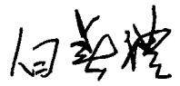

二〇〇六年二月二十八日

## 前 言

土壤物理学是土壤科学的一个重要分支，它是土壤学与物理学的交叉领域。它以研究土壤的物理性质及土壤中的物理现象、过程和能量转换为主要任务，同时兼顾与土壤中的化学、生物等过程的耦合。有关土壤的物理性质和土壤中的物理现象所阐述的内容主要包括土壤颗粒、结构，土壤中的水分、溶质及有关热学、电磁学性质和放射性等。土壤中的水、热、气和溶质等物质运动和能量转换是目前土壤物理学研究的核心内容，同时也是与其他相关学科和领域的重要结合点。随着物理学、数学、信息科学、计算科学以及高新技术的不断渗透和广泛应用，它已发展成为一门相对独立而又与其他学科紧密联系的学科分支。土壤物理学在农业、水利、生态、地理、水土保持、环境保护、土木工程、环境医学乃至一些军事领域都得到了广泛和重要的应用，在很多方面已经取得了丰富的成果和成就。

当今世界范围内，人口、粮食、资源和环境压力给土壤物理学提出了新的挑战，要求土壤物理学从传统的研究思路中拓展开来，在解决人口、粮食、资源和环境与可持续发展之间的矛盾中发挥重要作用。因此，不断发展和创新自然成为土壤物理学自身的主题。由于该学科分支的飞速发展，以及受编著者的知识所限，编著一本内容丰富多彩的土壤物理学研究生教材显然是一项艰巨的任务。幸运的是目前国内外有一些土壤物理学的研究论著和研究生教材可作为重要参考，加之国内外的土壤物理学同行从事了大量的相关研究，取得了可喜的成果；编著者还得到了中国科学院研究生院选修这门课程的研究生的大力支持，这促使我们整理以往的教案和材料，参考有关论著和教材，组织编写这本《土壤物理学》教材。编著者在参考有关论著和国内外有关教材和科研成果的基础上，试图在内容的丰富、学科的深入交叉以及基本理论的实际应用上有所充实和拓展，期望本书对科研院所和重点高等院校的研究生在从事相关科学研究方面有所

帮助。

本书是在中国科学院教育部水土保持与生态环境研究中心邵明安和黄明斌2000年编著的《土一根系统水动力学》基础上拓展而成的。在编写过程中，主要参考了美国加州大学 Riverside分校 William A. Jury和依阿华州立大学 RobertHorton 教授 2004 年编写的 Soil Physics(第六版)，美国麻省大学 Daniel Hillel 教授 2000年编写的 Environmental Soil Physics，中国科学院南京土壤研究所姚贤良和程云生研究员1986年编著的《土壤物理学》，清华大学雷志栋、杨诗秀、谢森传教授1988年编著的《土壤水动力学》，中国农业大学秦耀东教授2002年编写的《土壤物理学》等。在这里向他们表示衷心的感谢。

在编写过程中，我的学生韩祥伟、曾辰、刘春利、付晓莉、周蓓蓓、黄传琴等协助我作了一些前期工作；我的三位博士生(魏孝荣、马东豪、胡伟)还参与了本书的编写工作。第1章由魏孝荣编写；第2、3章由马东豪编写；第8章由胡伟编写；第4、9章和附录由黄明斌研究员编写；第5、6、7章由王全九研究员编写。本人负责教材的申报和本书的前期准备工作，制定了编写提纲，设计了所有章节的内容，负责本书的统稿并对所有章节进行了修改，马东豪、魏孝荣和付晓莉在统稿过程中给予了协助。在这里，向我的学生们表示感谢。在编写过程中的有关费用，由国家自然科学基金项目(90502006)和西北农林科技大学创新团队项目(土壤一植物系统中物质迁移)资助，在此深表谢意。

这本教材从申报、批准、编写、签订出版合同到最后定稿只有一年左右时间，由于时间短、水平所限，书中难免有不少缺点和错误，恳请读者批评指正。

邵明安

2006年6月

## 主要符号列表

$\pmb { a }$ 一通气孔隙度  
$A$ 一土壤柱体横断面面积  
$B _ { \lambda }$ 一波长为λ的波所辐射的能量强度  
$c$ 一土壤溶质总浓度  
$c$ 一真空中的光速  
$C$ 一吸附达平衡时溶液中的浓度  
$C ( \pmb \theta )$ 一比水容量  
$C ^ { * }$ 一与吸附热有关的常数  
$C _ { \mathfrak { a } }$ 一空气热容量  
$c _ { \mathfrak { a } }$ 一吸附态的溶质浓度  
$c _ { _ { \mathrm { g } } }$ 一气态溶质的浓度  
$C _ { \mathrm { g } }$ 一单位体积的土壤空气浓度  
$c _ { 1 }$ 一水溶态溶质的浓度  
$C _ { \mathrm { o x } }$ 一氧化剂浓度  
$c _ { p }$ 一空气的定压比热  
$C _ { \mathtt { R } }$ 一根系表面溶解于水的氧气浓度  
$C _ { \mathrm { { R e } } }$ 一还原剂浓度  
$C _ { \mathrm { s } }$ 一土壤质量热容量  
$C _ { \mathfrak { s } \mathrm { j } }$ 一固体颗粒j的热容量  
$C _ { \mathrm { v } }$ 一土壤的容积热容量  
$C V$ 一变异系数  
$C _ { \mathrm { w } }$ 一水热容量  
$\pmb { d }$ 一当量孔径

D 一水动力弥散系数  
$D ( \theta )$ 一土壤水分扩散率  
$D _ { \mathfrak { d } }$ 一溶质在水中的分子扩散系数  
$D _ { \ast \nu } ^ { \mathrm { { s } } }$ 一水汽扩散率  
$D _ { _ { 8 } } ^ { \mathfrak { a } }$ 一空气扩散率  
$D _ { _ { \textrm { g } } } ^ { \textrm { s } }$ 一土壤气体扩散率  
$D _ { \flat }$ 一溶质机械弥散系数  
$D _ { \mathfrak { h } }$ 一水动力弥散系数  
$D _ { \mathfrak { i } } ^ { \mathfrak { s } }$ 一根系周围土壤固-液相中的扩散系数  
$\smash { \boldsymbol { D } } _ { \mathrm { i } } ^ { \omega }$ 一氧气在纯水中的扩散率  
$D _ { \mathbf { \delta m } }$ 一土壤中的分子扩散系数  
$\smash { D _ { \perp } ( \vartheta ) }$ 一膨胀土水分扩散率  
$D _ { \tau }$ 一温差作用下的水分扩散系数  
$D _ { \tau \nu }$ 一水蒸气传导率  
$D _ { \ast }$ 一水分和水汽扩散系数  
$D _ { \ast }$ 一自由水中的分子扩散系数  
$D _ { \mathbf { w } / \mathbf { v } }$ 一由于水分运动所引起的热扩散率  
e 一水汽压  
$E$ 一土壤蒸发速率  
$E ^ { * }$ 一潜在蒸散速率  
$E _ { \mathfrak { d } }$ 一标准氧化还原电位  
$E _ { \nu }$ 一氧化还原电位  
${ \cal E } _ { \mathrm { m a x } }$ 一最大蒸发速率  
$\boldsymbol { E } _ { \mathrm { p l } } ^ { * }$ 一潜在蒸腾速率  
$e _ { \mathrm { s } }$ 一饱和水压  
$E _ { \textrm { s } } ^ { * }$ 一土壤潜在蒸发速率  
$\mathbf { E S P }$ 一交换性钠百分比  
$\pmb { { \cal E T } }$ 一蒸散量  
$E T _ { 0 }$ 一参考作物蒸腾量  
f —A流区含水量的比例  
$f _ { \mathfrak { s } }$ 一充气孔隙度  
$\pmb { \theta }$ 一重力加速度  
G 一土壤热通量  
GMD 一团聚体几何平均直径

h 一土壤水吸力  
H 一显热通量  
H 一最大毛细管上升高度  
$H$ 一单位体积土壤所含的热量  
$\boldsymbol { h } ^ { * }$ 一土壤溶液基质势  
$\scriptstyle H _ { 0 }$ 一土壤表面积水深度  
$h _ { \mathrm { d } }$ 一进气吸力  
$h _ { j }$ 一半径为 $R _ { j }$ 的毛细管对应的基质吸力  
$H _ { \textrm { v } }$ 一单位体积热量  
$I$ 一地球表面接受的辐射量  
$I ( t )$ 一累积人渗量  
$i ( t )$ 一土壤表面入渗速率  
$I _ { 0 }$ 一垂直于光柱的太阳辐射通量密度  
$i _ { \mathrm { f } }$ 一稳定入渗率  
$i _ { \mathrm { i } }$ 一初始入渗率  
$J _ { \mathrm { { c } } }$ 一空气通量  
$J _ { \mathrm { d s } }$ 一土壤中的溶质分子扩散通量  
$\boldsymbol { J } _ { \mathrm { d w } }$ 一自由水中的溶质扩散通量  
$J _ { \mathrm { { s } } }$ —气态溶质通量  
$J _ { \textrm { h } }$ 一溶质机械弥散通量  
$J _ { \mathtt { H } }$ 一土壤总热流通量  
$J _ { \mathbf { b c } }$ 一热传导通量  
$J _ { \mathbf { h } \mathbf { v } }$ 一对流热通量  
$J _ { \parallel }$ 一水动力弥散所引起的溶质通量  
$\boldsymbol { J } _ { \varphi }$ 一φ轴方向上的水流通量  
$J _ { r }$ 一r轴方向上的水流通量  
$J _ { \textrm { s o } }$ 一土体的通量密度  
$J _ { \nu }$ 一水或水蒸气通量  
$J _ { \mathrm { ~ w ~ } }$ 一通过土壤的水流通量  
$J _ { \mathrm { ~ w ~ } }$ 一三维空间里用矢量表示的水流通量  
$J _ { \mathrm { w 0 } }$ 一入渗表面水流通量  
$J _ { \mathrm { w c } }$ 一对流引起的溶质通量  
$J _ { \mathrm { w v } }$ 一水汽通量  
$J _ { \mathrm { w } x }$ 一x方向上的水流通量  
$J _ { { \mathrm { w } } y }$ 一y方向上的水流通量  
$\boldsymbol { J } _ { \mathbf { w } \boldsymbol { z } }$ 一z方向上的水流通量  
$J _ { z }$ 一z轴方向上的水流通量  
$k$ 一热传导率  
$K ( \pmb \theta )$ 一土壤非饱和导水率  
$K _ { \mathfrak { a } }$ —气体传导率  
$K _ { \mathrm { d } }$ 一吸附系数  
$K _ { \mathrm { e f f } }$ 一层状土的有效导水率  
$K _ { t }$ 一稳定时结皮土壤的饱和导水率  
$K _ { \mathrm { i } }$ 一初始土壤的饱和导水率  
$K _ { \star }$ 一反应平衡常数  
$K _ { \mathrm { r } }$ 一单位根长的根系透水系数  
$K _ { \mathrm { s } }$ 一饱和导水率  
$K _ { \mathrm { s } \mathfrak { x } }$ 一x方向上的饱和导水率  
$K _ { \mathrm { s y } }$ 一γ方向上的饱和导水率  
$K _ { \mathrm { s } }$ 一z方向上的饱和导水率  
$K _ { \mathrm { r } }$ 一表面结皮的饱和导水率  
$K _ { \mathrm { w } }$ 一离子反应电离常数  
$K _ { \mathrm { i } }$ 一根组织导水率  
$K ^ { * } ( \vartheta )$ 一膨胀土非饱和导水率  
$\mathbf { \xi } _ { l }$ 一毛细管弯曲度  
$L$ 一潜在汽化热  
$\mathbf { L A I }$ 一叶面积指数  
$L _ { \mathrm { c } }$ 一表观毛管长度  
$L _ { \mathrm { e } } \left( z , t \right)$ 一有效根密度  
$L _ { \mathrm { n r d } }$ 一正态化的根长密度分布函数  
$L _ { \mathrm { r } } ^ { \mathrm { e f f } }$ 一根系有效深度  
$M$ 一组成土壤孔隙的不同型号的毛细管尺寸的数量  
$m _ { \mathrm { ~ s ~ } }$ 一土壤气相物质的质量  
$m _ { \textrm { s } }$ 一土壤固相物质的质量  
${ \mathbf { } } m _ { \mathrm { { t } } }$ 一土壤三相物质的总质量  
$M _ { \mathrm { { v } } }$ 一水分子量  
$m _ { \textrm { \tiny w } }$ 一土壤液相物质的质量  
$M _ { \ast }$ 一水分子的摩尔质量  
MWD 一团聚体平均重量直径  
n 一单位时间内监测器记录的γ射线计数  
$N$ 一土壤中的慢中子计数  
$n _ { 0 }$ 一放射源的源场强度(或无土样时的监测器中子计数)  
$n _ { \mathrm { i } }$ 一参考含水量下γ射线透射强度  
$N _ { j }$ —半径为 $R _ { j }$ 的毛细管的数量  
$n _ { j }$ 一单位面积内半径为 $R _ { j }$ 的毛细管的数量  
$N _ { \mathrm { s } }$ 一水中或标准吸收剂中的慢中子计数  
$p$ 一给定温度下气体蒸气压  
$p$ 一气体压力  
$p _ { 0 }$ 一给定温度下液体的饱和蒸气压  
$P _ { \textrm { a } }$ 一大气压  
$P _ { 1 }$ 一液体内部产生的压强  
$Q$ 一溶质的吸附量  
$Q _ { \star }$ 一矿物表面水化阳离子的电荷密度  
$Q _ { \mathrm { i n } } \left( t - t ^ { \prime } \right)$ 一时间 $t - t ^ { \prime }$ 输入土壤中的溶质速率  
$Q _ { j }$ 一通过半径为 $R _ { j }$ 的毛细管的流量  
$Q _ { \mathfrak { m } }$ 一溶质最大吸附量，在单分子层吸附时为吸附位点数量  
$Q _ { \mathrm { { o u t } } } ( t )$ 一累计溶质出流率  
$Q _ { \mathrm { { t } } }$ 一矿物表面总电荷密度  
$Q _ { \mathrm { { u } } }$ 一矿物表面未水化的阳离子电荷密度  
$r$ 一湿度计常数  
$R$ 一延迟因子  
$r _ { \mathrm { a } }$ 一单位质量土壤固相中各种反应造成的化学物质减少的量  
$r _ { \mathrm { a } }$ 一空气阻力  
$r _ { \mathrm { a } }$ 一水汽扩散阻力  
$r _ { \mathrm { ~ c ~ } }$ 一单位体积土壤中各种反应造成的化学物质减少的量  
$R _ { \mathrm { { e } } }$ —根系周围固-液态土壤基质的扩散率  
$R _ { \mathrm { { E } } }$ 一被地球表面反射到太空中的热能  
$r _ { \textrm { g } }$ 一单位体积土壤空气中各种反应造成的化学物质减少的量  
$r _ { \mathrm { \scriptscriptstyle H } }$ 一单位体积土壤的热流损失率  
$R H$ 一相对湿度  
$R _ { j }$ 一毛细管半径  
$R _ { \mathrm { k } }$ 一土壤和植被冠层散射的热能  
$r _ { \mathrm { l } }$ 一单位体积土壤水中各种反应造成的化学物质减少的量  
$R _ { \operatorname* { m a x } }$ 一最大根密度  
$R _ { \mathfrak { n } }$ 一太阳净辐射  
$R _ { \mathrm { n l } }$ 一净长波热能辐射  
$R _ { \mathrm { { r } } }$ 一根系阻力  
$r _ { \textrm { \textbf { s } } }$ 一表面阻力  
$R _ { \mathrm { s } }$ 一太阳总辐射  
$R _ { \mathrm { s } }$ 一土壤对水流的阻力  
$R _ { \mathrm { { s r } } }$ 一根系吸水过程中所遇到的阻力之和  
$r _ { \mathrm { { w } } }$ 一单位容积土体内植物根系的吸水速率  
$\pmb { s }$ 一土壤饱和度  
$s$ 一吸渗率  
$\mathbf { S A R }$ 一钠吸附比  
$S _ { \mathrm { f } }$ 一湿润锋处的平均基质吸力  
$S _ { \mathrm { { m a x } } }$ 一最大吸水速率  
$\pmb { T }$ 一温度  
$\pmb { T } ( t )$ 一蒸腾速率  
$T _ { \mathbf { a } }$ 一平均气温  
$T _ { \mathrm { d } }$ 一平均露点温度  
$\pmb { u }$ 一相对颗粒的水流通量  
$\pmb { u } _ { z }$ 一风速  
$\pmb { v }$ 一比容积  
$V$ 一已吸附的气体体积  
$V _ { \mathrm { a } }$ 一土壤气相物质的容积  
$V _ { \mathbf { m } }$ 一表面覆盖了一个单分子层气体时所吸附的气体体积  
$V _ { \textrm { \textbf { s } } }$ 一土壤固相物质的容积  
$V _ { \mathrm { { \ell } } }$ 一土壤三相物质的总容积  
$V _ { \mathrm { ~ w ~ } }$ 一土壤液相物质的容积  
$\pmb { W } _ { \textrm { \pmb { \alpha } } }$ 一土壤样品的烘于重  
$\pmb { { \mathbb { W } } } _ { \textrm { \pmb { \textrm { g } } } }$ 一为土壤样品所吸附的极性化合物的重量  
$\hat { X }$ 一样本的均值  
$z$ 一气体压缩因 $\mp$   
$z _ { \mathrm { f } }$ 一湿润锋位置  
$z _ { \mathrm { b } }$ 一湿度测量高度  
$z _ { \mathfrak { m } }$ 一风速测量高度  
${ z _ { \mathrm { o h } } }$ 一控制热和蒸汽传递长度  
$z _ { \mathrm { o m } }$ 一糙率长度  
$\bar { z }$ 一变量Z的数学期望值

ž 一变量 Z的中数  
$\hat { \boldsymbol { z } }$ 一变量 Z 众数  
$\pmb { \sigma }$ —Stefan - Boltzmann系数，其值为 $5 . 6 7 \times 1 0 ^ { - 8 } \textrm { W } \cdot \textrm { m } ^ { - 2 } \cdot \textrm { K } ^ { - 4 }$   
$\pmb { \alpha }$ 一质量交换系数  
$\pmb { \alpha } _ { \mathrm { T } }$ 一热扩散率，包括潜在热传导和对流的作用  
$\beta$ 一太阳角  
$\gamma$ 一两流区水流速度的比  
$\pmb { \gamma _ { \mathrm { A } } }$ 一吸附速率  
$\gamma _ { \mathfrak { d } }$ 一解吸速率  
$\gamma _ { _ { \tt S } }$ 一单位体积空气反应的损失率  
$\gamma _ { \mathrm { k u r l o s i s } }$ 一峰态值  
$\gamma _ { \mathrm { s } } ( \boldsymbol { h } ^ { * } \mathbf { \theta } )$ 一无量纲盐分胁迫函数  
$\gamma _ { \mathsf { s k e w n e s s } }$ 一偏态值  
$\gamma _ { _ \mathrm { w } } ( h )$ 一无量纲水分胁迫函数  
$\pmb { \varepsilon } _ { \mathrm { r } }$ 一土壤的相对介电常数  
$\boldsymbol { \zeta } _ { \textup { g } }$ 一土壤孔隙弯曲系数  
$\xi _ { 1 } ( \pmb \theta )$ 一液体扩散弯曲系数  
η —液体粘滞系数  
$\Theta$ 一有效饱和度  
$\pmb \theta$ 一土壤容积含水量  
$\theta _ { \mathrm { f } }$ 一田间持水量  
$\pmb \theta _ { \mathrm { i } }$ 一为初始含水量  
$\theta _ { \mathrm { i m } }$ 一不可动区含水量  
$\theta _ { \mathrm { { m } } }$ 一可动区含水量  
$\pmb \theta _ { \mathrm { m } }$ 一土壤质量含水量  
$\pmb \theta _ { \mathrm { r } }$ 一滞留土壤含水量  
$\theta _ { \mathfrak { s } }$ 一饱和容积含水量或土壤孔隙度  
$\pmb { \theta } _ { \mathrm { s u } }$ 一土体的容积比例  
$\pmb { \theta } _ { v }$ 一土壤容积含水量  
$\theta _ { \mathrm { w p } }$ 一凋萎含水量  
$\lambda$ 一弥散度  
$\lambda$ 一波长  
$\lambda _ { \mathfrak { m } }$ 一最大波长  
$\pmb { \mu }$ 一液体的动力粘度

$\pmb { \mu } _ { m }$ 一水的γ射线吸收系数  
$\pmb { \mu _ { \mathrm { s } } }$ 一土壤矿物的γ射线吸收系数  
$\pmb { \mu } _ { \mathrm { v } }$ 一单位容积土壤的土水势  
$\pmb { \rho }$ 一土壤空气密度  
$\pmb { \rho _ { \mathrm { a } } }$ 一恒压下空气密度  
${ \pmb \rho } _ { \bf b }$ 一土壤容重  
$\pmb { \rho _ { \mathrm { b } \tau } }$ 一饱和时土壤容重  
$\pmb { \rho _ { s } }$ 一土粒密度  
$\pmb { \rho _ { \check { \mathbf { v } } } }$ 一水汽密度  
$\pmb { \rho _ { \mathrm { w } } }$ 一水的密度  
$\pmb { \rho } _ { \mathbf { v } } ^ { * }$ 一饱和水汽密度  
$\pmb { \sigma }$ 一表面张力系数  
$\pmb { \tau }$ 一单位面积上产生的内摩擦力  
$\pmb { \nu }$ 一液体的运动粘度  
$\varphi _ { 0 }$ 一根内皮层处的水势  
$\varphi _ { 1 }$ 一内皮层处的水势梯度  
$\pmb { \psi }$ 一单位重量土壤的土水势  
$\boldsymbol { \psi } _ { _ { \ B } }$ 一重力势  
$\psi _ { \mathfrak { m } }$ 一基质势  
$\psi _ { \mathrm { ~ p ~ } }$ 一压力势  
$\pmb { \psi } _ { \mathrm { { r } } }$ 一植物根水势  
$\psi _ { \mathrm { { s } } }$ 一溶质势或渗透势  
$\psi _ { \mathrm { r } }$ 一温度势  
$\psi _ { \mathrm { ~ w ~ } }$ 一土壤水汽的水势  
$\smash { \psi _ { \mathrm { p } } ( t ) }$ 一根木质部水势  
$\pmb { \mathscr { a } }$ 一在单位表面上形成一个单分  
$\pmb { \omega }$ 一水汽与土壤的温度梯度比值  
$\Delta p$ 一接触面气液两侧的压强差  
$\mathbf { v }$ 一拉普拉斯算子  
$\pmb { \vartheta }$ 一水和土粒所占孔隙的比例  
$\varphi$ 一水面与管壁的接触角

## 郑重声明

高等教育出版社依法对本书享有专有出版权。任何未经许可的复制、销售行为均违反《中华人民共和国著作权法》，其行为人将承担相应的民事责任和行政责任，构成犯罪的，将被依法追究刑事责任。为了维护市场秩序，保护读者的合法权益，避免读者误用盗版书造成不良后果，我社将配合行政执法部门和司法机关对违法犯罪的单位和个人给予严厉打击。社会各界人士如发现上述侵权行为，希望及时举报，本社将奖励举报有功人员。

反盗版举报电话：(010)58581897/58581896/58581879

传真：(010)82086060

E - mail: dd@hep.com.cn

通信地址：北京市西城区德外大街4号高等教育出版社打击盗版办公室

邮编：100011

购书请拨打电话：(010)58581118

1.1土壤颗粒的概念…………………………………1  
1.2土壤粒的特征……………………2  
1.2.1颗粒大小………………………………2  
1.2.2 颗粒大小分布……3  
1.2.3颗粒形状………………………………………………………………3  
1.2.4頼粒表面积…………………………4  
1.2.5物理性质…………………………………………………………6  
1.2.6化学性质和矿物学性质…………6  
1.2.7 粘土矿物的表面性质………………7  
1.2.8 粘粒的絮凝和膨胀………………16  
1.3土壤质地………………………………………16  
1.3.1 土壤颗粒分析的原理…………………17  
1.3.2 土壤的分散………………………………………18  
1.3.3 土壤颗粒分析 ……………………………………………………………………18  
1.3.4 土壤颗粒分级………………………19  
1.3.5土壤质地分类……………………………………20  
1.3.6 土壤质地与土壤肥力的关系和调节………………………22  
1.4土壤结构…………23  
1.4.1 土壤结构的概念……………………24  
1.4.2 粘粒矿物的结构…………………………24  
1.4.3 粘团的形成…………………………28  
1.4.4 粘团的再团聚………………………………………………………30  
1.4.5 土壤团粒的稳定性和团粒粒径分布……………30  
1.4.6 土壤结构的分类……………32  
1.4.7 土壤结构的评价与管理………33  
1.5土壤基质的三相比与综合性质………36  
1.5.1土粒密度………………………………………37  
1.5.2土壤容重…………………………37

## Ⅱ 目 录

1.5.3总容重…………………………38  
1.5.4孔隙度……………………………………38  
1.5.5 充气孔隙度…………………………………38  
1.5.6十壤发生层……39  
1.5.7+壤强度………………40  
1.5.8土壤结皮……………40  
参考文献………………………………………………………………………………42  
第2 章 土壤水的数量和能态 47  
2.1 土壤水的物理性质……………………………48  
2.1.1 水的分子结构和极性…………48  
2.1.2 水的电解性……………………………………………………………48  
2.1.3 水的热力学性质………………………49  
2.1.4 表面张力和毛细管现象……………50  
2.1.5液体的粘性………52  
2.1.6 颗粒表面附近的水……………………54  
2.2 土壤含水量…………………………………………………55  
2.2.1 土壤含水量的定义……………………………55  
2.2.2 土壤含水量测定………………………………………………57  
2.3 土壤水的能量状态………………………………………………61  
2.3.1 土壤水的势能……………………………………………………61  
2.3 2+壤水势组成……62  
2.3.3 土壤水势各分势的测定………………64  
2.4 土壤水分特征曲线……………………………67  
2.4.1+壤水分特征曲线及其影响因素……67  
2.4.2土壤水分特征曲线的测定………69  
2.4.3+壤水分特征曲线模型……71  
2.4.4 土壤水分特征曲线的滞后现象……………72  
2.4.5 变容重土壤的持水特征………………74  
参考文献……………………………………………………………………76  
第3章 土壤水分运动基本原理 80  
3.1 饱和土壤中的水流……………………81  
3.1.1毛细管中的水流……81  
3.1.2 达西定律…………………………………………………………83  
3.1.3饱和导水率的测定……84  
3.1.4 饱和层状土壤的水分运动………………………85  
3.2 非饱和+壤中的水流………………………………86  
3.2.1白金汉 –达西定律……………………86  
3.2.2非饱和导水率…………86  
3.2.3 非饱和导水率的毛细管模型………………………87  
3.2.4 连续方程………………………………………………………………90  
3.2.5 Richards 方程……………………………………………………… 91  
3.2.6 稳态流问题……………………………………………………94  
3.3 土壤水分运动基本参数……………97  
3.3.1 瞬时剖面法测定非饱和导水率…………98  
3.3.2 水平人渗法测定非饱和土壤水分扩散率………99  
3.3.3 根据土壤水分特征曲线推求土壤水分运动参数………………100  
3.3.4 推求土壤导水参数的积分方法…………102  
3.4 非饱和土壤水流问题的解析方法……………………104  
3.4.1 水平吸渗问题的解析方法……………104  
3.4.2 垂直人渗问题的解析方法……………108  
3.5 非饱和土壤水流问题的数值解法…………114  
3.5.1 有限差分法………………………………………………………………115  
3.5.2 有限元法………………………………………………………………………118  
3.6 膨胀土壤的非饱和土壤水分运动方程………………………122  
参考文献…………………………………………………………………………………123  
4童田间土壤水分循环 126  
4.1 土壤水分入渗……………………………………………………………………126  
4.1.1概述…………………………………………………………………………126  
4.1.2 土壤入渗过程…………………………………………………………127  
4.1.3 土壤人渗过程的影响因素……………………128  
4.1.4 土壤入渗模型……………………………………………………129  
4.1.5 非均匀土壤剖面的入渗……………………………………………133  
4.1.6 二维和三维入渗……………………………………………………134  
4.1.7 土壤人渗率测定………………………………………135  
4.2 土壤水分再分布…………………………………………137  
4.2.1 再分布过程中土壤剖面含水量的变化……………137  
4.2.2 根据土壤水分再分布过程确定土壤导水参数………………138  
4.2.3 田间持水量…… ……………………………………………142  
4.3 土壤非饱和导水率的田间测定………………………………145  
4.3.1 垂直入渗法…………………………………………………………………145  
4.3.2 现场定位观测法……………………………………………………………147  
4.4土壤蒸发…………………………………………………………………………148

## IV 目 录

4.4.1 概述………………………………………………………………………… 148  
4.4.2 土壤蒸发的阶段性…………………………………………………………149  
4.4.3 蒸发条件下土壤水运动的定解问题…………………150  
4.4.4 地下水位一定时的土壤稳定蒸发……………151  
4.4.5 无地下水位时的土壤蒸发土壤干燥…………153  
4.4.6土壤蒸发与盐渍化……154  
4.4.7土壤蒸发的控制……………155  
参考文献…… ……………………156  
第 5 章 土壤热量状况 162  
5.1土壤与大气之间的能量平衡………162  
5.1.1 太阳辐射……………………………………………………………………162  
5.1.2 影响太阳辐射的因素………………………………164  
5.2土壤表面能量平衡…………166  
5.2.1能量平衡方程…………166  
5.2.2蒸散测定………………………………………………………167  
5.3土壤热流…………………………………………………………………170  
5.3.1 土壤热性质…………………………………………………………171  
5.3.2 土壤热流基本方程………………………………175  
5.4土壤温度状况………………………………………………176  
5.4.1 温度的时间变化规律…………………176  
5.4.2 地温变化特征………………………178  
5.5土壤温度对土壤水、气运动的影响………178  
5.5.1 土壤温度对土壤水吸力的影响………178  
5.5.2 温度梯度影响下的土壤水分再分布过程………179  
5.5.3 非恒温条件下非饱和土壤水分运动……………………………180  
5.5.4 土壤热性质测定……………………………………181  
参考文献…… …………………………………………………183  
第6章 土壤空气 186  
6.1 土壤空气组成及物理状态………………………………………186  
6.2土壤中的体反应……………………187  
6.2.1 土壤中二氧化碳的产生………………187  
6.2.2土壤中氧气的消耗…………188  
6.3土壤中的气体运动……………………………………188  
6.3.1 气体质量守恒方程……………189  
6.3.2 土壤中的气体対流………………………………………………189  
6.3.3 土壤中的气体扩散………………………………………190  
6.3.4 气体运动方程………………………………………192  
6.4土壤中的气体运移………………………………193  
6.4.1 平衡条件下氧气运移及消耗………………193  
6.4.2 二氧化碳的稳态流和瞬态流及其释放………………194  
6.4.3 植物根系界面氧气消耗……………………………195  
6.5土壤中的水汽流……………………………………………195  
6.5.1水汽通量方程………………195  
6.5.2+壤可吸湿性对水汽通量的影响………………………196  
6.6土壤通气指标与测定…………………………196  
6.6.1土壤通气孔隙度………………196  
6.6.2十填透气率………………197  
6.6.3+壤氧化还原电位…………………197  
6.6.4+壤氧气扩散速率……197  
6.7+壤空气与植物生长及其调节………………198  
6.7.1+壤空气状况与作物生长……………198  
6.7.2土壤空气状况调节…………………………198  
参考文献……… ………………………………………………………………199  
7章土壤溶质迁移 202  
7.1+壤溶质迁移的质量平衡………………202  
7.1.1 土壤中溶质库………………………………203  
7.1.2土壤溶质通量……………………………………203  
7.1.3 土壤中多相化学物质的反应…………………205  
7.1.4 土壤溶质穿透曲线……………………………205  
7.2土壤溶质迁移的对流 –弥散理论………………207  
7.2.1 惰性非吸附溶质的迁移…………………208  
7.2.2 吸附性溶质的迁移…………………210  
7.2.3土壤结构对溶质运移的影响…………………213  
7.2.4 溶质在土壤中的反应…………………………217  
7.2.5 土壤中挥发性有机化学物质的运移………………218  
7.2.6瞬态水流中的溶质迁移……………218  
7.3土壤溶质迁移传递函数模型…………………219  
7.3.1溶质传递体积元…………………………………………………219  
7.3.2 溶质迁移概率分布…………………………220  
7.3.3传递函数模型…………………………………220  
7.3.4概率密度函数………………………221  
7.3.5 随机对流传递函数模型………………………222

## V 目 录

7.3.6模型参数的估计……222  
7.4田间土壤溶质的管理………………………………………………224  
7.4.1 农田排水条件下土壤盐分变化特征………224  
7.4.2 微威水灌溉土壤盐分变化特征………………225  
参考文献……… …………………………………………………226  
第8章 土壤的空间变异性 228  
8.1 传统统计学研究方法…………… ………………………………………229  
8.1.1 描述+壤性质变异大小的基本统计量……………………………229  
8.1.2 随机变量及概率分布……………………229  
8.1.3概率分布……232  
8.1.4 均值的置信区间…………………………………………………236  
8.1.5合理取样数的确定…………237  
8.1.6 蒙特卡罗模拟的应用……………240  
8.2 反距离法…………………………………………………………………………244  
8.3区域化变量………………244  
8.3.1区域化变量概念………………244  
8.3.2 区域化变量的性质……………………………………245  
8.4 区域化变量的数字特征和二阶平稳假设与本征假设………………246  
8.4.1区域化随机变量的一阶矩…………246  
8.4.2 区域化随机変量的二阶矩………………246  
8.4.3二阶平稳假设……………247  
8.4.4 本征假设(内蕴假设)…………248  
8.4.5二阶平稳假设与本征假设的比较…………248  
8.4.6 准二阶平稳假设及准本征假设…………………249  
8.5 空间结构分析………………………………………………………………250  
8.5.1 半方差函数………………………………………………………………250  
8.5.2自相关函数………………………………………………252  
8.5.3克單格插值………………254  
8.5.4 状态–空间分析方法……………………………………………255  
8.5.5 谱分析、交互谱分析和一致性分析……………257  
8.6时间稳定性分析………………………259  
参考文献…………  
第9童 植物根系吸收土壤水分与土壤水分有效性 262  
9.1 植物根系吸收+壤水分的过程…………………263  
9.1.1 根系吸水动力…………………………………………263  
9.1.2 根系吸水的影响因素……………………………………………263  
9.2 植物根系吸水模型……………………………………………………………265  
9.2.1微观模型……………………………………………………………………266  
9.2.2宏观模型…………………………………269  
9.3根系吸水模型的评价……………277  
9.3.1 对微观模型的评价…………………………277  
9.3.2 对宏观模型的评价………………………277  
9.4根系吸水模型的田间应用……………278  
9.4.1 预报土壤水分动态，确定最佳灌溉制度………………………278  
9.4.2 选育抗早作物品种，提高作物抗早性……………278  
9.5土壤水分有效性…………… ……………………………………………………278  
9.5.1七壤水分有效性的概念……278  
9.5.2土壤水分有效性的评价指标……………281  
9.5.3影响土壤水分有效性的因素………283  
9.6土壤水分有效性动力学模式…………………284  
9.6.1 土壤水分有效性动力学模式…………284  
9.6.2土壤水分有效性的动态曲线………285  
9.6.3土壤水分有效性模式检验…………………286  
9.7土壤水分有效性评价……………………………286  
参考文献……………………………………………………………287  
录土壤物理学的常用数学方法 293  
A1矢量分析………………………………………293  
A1.1 矢量代数……………………………………………………………………293  
A1.1.1 基本概念……………………………………………………293  
A1.1.2 矢量的加减法…………………… 294  
A1.1.3 矢量与标量的乘法………………………294  
A1 1.4 单位矢量…………………………………………294  
A1.1.5 矢量的分量表示………………………… 294  
A1.1.6 矢量的方向余弦………………………………295  
A1.1.7 矢量的线性关系……………………296  
A1.1.8 两矢量的标量积与矢量积…………………296  
A1.1.9 矢量的混合积………………………………298  
A1.2 矢量分析…………………………………………………………299  
A1.2.1 矢量函数的微商…………………299  
A1.2.2 矢量积分…………………………………………302  
A1.3 矢量场……… ………………………………………………………303  
A1.3.1 矢量场的基本概念…………303

## VI 录

A1.3.2 矢量场的梯度、方向导数、散度和旋度………………303  
A2积分变换…………………………………305  
A2.1 积分变换的概念……………………305  
A2.2 积分变换的应用…………307  
A2.2.1 傅里叶变换应用举例………307  
A2.2.2 拉普拉斯变换应用举例……………308  
A2.3积分变换表……………310  
A2.3.1傅里叶积分变换表………310  
A2.3.2 拉普拉斯变换表………313

# 土壤基质和质地

土壤是一个十分复杂的系统，它由固相、液相和气相物质及各种各样活的有机体组成。土壤是植物生长的基质，它形成了现在供应全世界60亿人口的陆地食物链的基础。在植物生长过程中，土壤不仅要供给植物所需要的水分，还要向植物根系供应养分和氧气。这些不同的功能主要取决于土壤固相的组成和性质。

土壤基质即土壤固相，由矿物质和有机物质组成，是一个分散和多孔的体系。矿物部分包含了大小、形状和化学组成差异很太的颗粒；有机部分包括各种活的有机体及不同分解阶段的动植物残体。不同大小的土壤颗粒存在状态也不相同，特别是土壤胶体颗粒可以从完全分散的状态到几乎完全团聚。在大多数土壤里，土壤颗粒只是部分团聚。

土壤颗粒之间的孔隙中含有水分，而这种水分实质上是含有许多化学物质的水溶液，这些化学物质有些从土壤矿物中溶解出来，有些从土表进入土壤水中。土壤水既受重力向下的作用，又受到固体基质表面的吸引力作用，它的运动依具体情况变化很大。未被水分填充的土壤孔隙被气体或水蒸气所占据，这些气体的组成随近地空气组成的变化有所差异，可能在很短的时间内发生很大变化。

土壤基质对热量、水和化学物质的迁移过程起主导作用。因此，研究土壤基质物理化学性质是现代土壤物理学研究范畴之一，也是解决许多农业和环境中实际问题的重要基础。

本章首先介绍了土壤颗粒的概念和基本特征，在此基础上阐述了土壤颗粒分级和质地分类及其与土壤肥力的关系，并就土壤结构体的形成过程、评价和管理作了论述，最后介绍了土壤基质的三相比和一些综合性质。

## 1.1 土壤颗粒的概念

土壤是一个由固、液、气三相物质组成的体系，土壤固相物质又由大小不同的单个颗粒构成，这些颗粒称为土壤颗粒，简称土粒。土壤颗粒按组成可分为矿质颗粒、有机颗粒和有机-矿质复合颗粒，在绝大多数土壤中，矿质颗粒约占土壤固相物质重量的95%以上。土壤颗粒按结合状态可分为单粒和复粒，单粒是在岩石矿物风化、母质搬运和土壤形成过程中产生的，在完全分散时可单独存在，包括各种矿物碎片、屑粒、胶粒以及有机残体碎屑；复粒是由各种单粒在物理、化学和生物作用下复合而成的，包括粘团、有机-矿质复合体和微团聚体。单粒和复粒可进一步通过物理、化学、生物作用粘结或团聚成大小、形状和性质不同的团聚体和结构体。

## 1.2 土壤颗粒的特征

单个土壤颗粒的大小和形状、化学组成和矿物组成及颗粒表面的物理化学性质各不相同，土壤颗粒及其复合体对土壤肥力、作物生长、土壤溶质运移、外源物质在土壤中的行为等的影响也不同。

## 1.2.1 颗粒大小

土壤基质中土粒的粗细不同，所体现出的理化性质差异很大。人们按土粒粗细将十粒分为若干级别，每一个级别范围称为粒级，同一粒级的土壤颗粒具有相似的性质和组成。近百年来，粒级的划分才逐渐有明确的尺度，但划分标准又因研究目的不同而异。在应用粒级这个概念时应注意两点：一是各粒级的范围并不是绝对的，不是超出这个范围的土粒就有完全不同的性质和组成，而是在这个范围内的绝大部分土粒具有某些特定的性质和组成；二是土粒的形状极不规则，如粘粒的形状是扁平的，而粗一些的土粒则形状各异。

在所有的粒级中，石砾是最粗的土粒，在我国主要农区的土壤中并不多见，通常在土石区、近河滩的山坡土壤中可以见到石砾，有时它影响到土壤基质的性质。按照传统的概念，农业土壤中常把2\~3mm作为土粒粒径的上限，在室内制备土壤样品时将石砾筛分出去。但当石砾的数量达到影响土壤性质的程度时，应加以记载，列在分析报告中。

土壤中较大的粒级是砂粒。砂粒部分又可细分为粗砂、中砂和细砂。砂粒通常由石英组成，也可能是长石、云母，甚至是重矿物等的碎屑，如锆石、电气石、角闪石等。在多数情况下，砂粒三个轴向发育比较匀称，可用球形来表示，但表面不一定是光滑的，实际上可能是凹凸不平的。

比砂粒小的粒级是粉粒，其颗粒大小介于砂粒与粘粒之间。粉粒的矿物组成和物理性质一般与砂粒相似，但因其颗粒较小，并且单位质量具有更大的表面积，又强烈地被粘粒所包被，因而在一定程度上可能呈现出粘粒的某些物理化学特性。

土壤中最小的粒级是粘粒，其形状以片状或针状为主，一般属于铝硅酸盐矿物。这些次生矿物是在土壤发育过程中由母岩中的原生矿物风化而来的。在有些情况下，粘粒中含有相当数量的不属于铝硅酸盐粘土矿物类型的细小颗粒，如氧化铁和碳酸钙。

## 1.2.2 颗粒大小分布

在描述某一给定土壤的性质时，通常按照土壤质地分类系统把土壤划归到某一质地中去，然后用该质地土壤所具有的性质进行描述。但是在实际工作中，许多重要的土壤物理性质与土壤颗粒大小和孔隙分布关系密切，而土壤颗粒的分布状况并不能通过土壤质地分类系统反映出来。因此，在研究土壤的基本性质时，需要知道小于某一粒径土壤颗粒的质量比例(土壤颗粒质量比)或小于某一粒径土壤颗粒的总的质量比例(累积质量比)与颗粒有效直径之间的关系，这种关系就是颗粒大小分布，它反映了小于某一粒径土壤颗粒的比例，从而可以给出不同粒径土壤颗粒的分布状况。图1.1是三种粉壤土和一种粘土的颗粒大小分布，尽管在土壤质地分类上同属于粉壤系统，但三种土壤小于某一给定粒径的颗粒数量差异很大。可见颗粒大小分布能更好地反映出同一质地内不同土壤颗粒大小分布的差异。

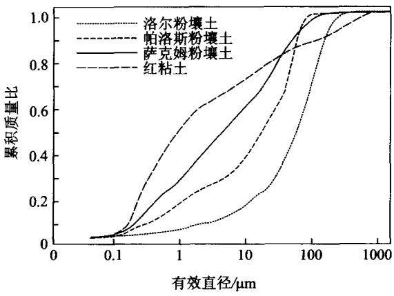  
图 1.1 四种土壤的颗粒大小分布[12]

## 1.2.3 颗粒形状

土壤颗粒大小不同，其形状差异很大。许多理论模型都假定土壤颗粒是球形的，但实验表明，更小粒级的土壤颗粒并不是球形的。通过现代光谱技术所获得的不同粘土颗粒的显微照片表明矿物形状为近似片状[64](图1.2)。图1.2(a)显示了普特那姆粘粒(贝德石)颗粒的形状为近似片状,其片层厚度约为16nm。蒙脱石则形状各异[图1.2(b)]，从极薄的片到无定形矿物形状 $\circ ^ { \circ }$ 图 1.2(c)为高岭石片的六角形形状，它的晶体边缘锐利，轮廓分明。与此相反，与高岭石结构一样的1:1型矿物埃洛石的形状为杆状，由双股组成[图1.2(d)]。

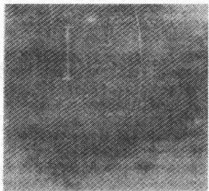  
(a) Putnam 粘粒中100\~150 nm的贝德石

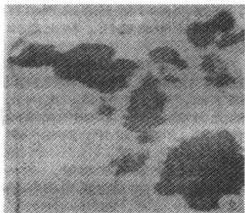  
(b) 蒙脱石

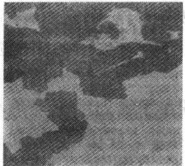  
(c) 高岭石

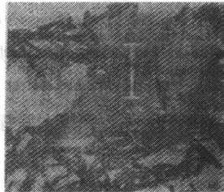  
(d) 埃洛石  
图1.2 粘粒矿物电子显微像  
每张图片上的单位长度为1μm

## 1.2.4 颗粒表面积

土壤颗粒的许多理化性质都和土壤颗粒表面积有关，如溶质在土壤颗粒上的吸附解吸、迁移转化等过程都发生在土壤颗粒表面，一些有机污染物的降解过程也在很大程度上取决于土壤颗粒表面积的大小。因此，讨论土壤颗粒表面积及其性质具有重要的理论和实践意义。土壤颗粒的表面积是颗粒的本质属性，主要取决于颗粒大小、形状及颗粒的矿物组成。

## （1）与颗粒大小和颗粒形状的关系

通常用比表面积来表征颗粒表面积的大小。颗粒的比表面积定义为单位质量或单位体积颗粒所具有的表面积。对于密度为ρ、半径为R的球形颗粒来说，其面积 $a = 4 \pi R ^ { 2 }$ ,质量 $m = \frac { 4 \pi R ^ { 3 } \rho } { 3 }$ ，因此比表面积或质量比表面积s为

$$
s = \frac { \textbf { \em a } } { m } = \frac { 3 } { \rho R }\tag{1.1}
$$

对于N个相同的球体，其质量比表面积S也等于单个球体的质量比表面积s,因为N个相同球体的总质量为 $N m$ ，总面积为Na，则其质量比表面积 $S = \frac { N a } { N m } =$ $\pmb { \mathscr { s } } _ { \circ }$ 这里颗粒特征尺寸(半径、厚度等)和比表面积之间的反比关系同样适用于其他形状的颗粒。

如对于密度为ρ、半径为R、厚度为T的圆盘(假设 $\pmb { \rho }$ $\scriptstyle T < < R )$ ,其总表面积是两个圆面面积 $2 \pi R ^ { 2 }$ 与边面面积 $2 \pi R T$ 之和，即 $\mathbf { \delta } a = 2 \pi R ^ { 2 } + 2 \pi R T$ ，圆盘的质量 $\textbf { \em m } =$ $\rho \pi R ^ { 2 } T$ ，比表面积s为

$$
s = \frac { a } { m } = \frac { 2 \left( R + T \right) } { \rho R T } \approx \pi \frac { 2 } { \rho T } \quad \left( T < < R \right)\tag{1.2}
$$

因此，圆盘形小板的比表面反比于圆盘厚度。

式(1.1)和(1.2)可用来估算不同质地类型土壤颗粒的比表面，其应用见例1.1。

例1.1 计算下列理想状态下土壤颗粒的比表面积：直径为2mm的球形石砾：直径为0.05mm的球形砂粒；直径为0.002mm的球形粉粒；直径为0.002mm,厚度为 $1 0 ^ { - 6 } ~ \mathrm { m m }$ 的圆片形粘粒。假设所有 $\mathfrak { P }$ 物颗粒密度 $\pmb { \rho }$ 为$2 . 7 \ \mathrm { g } \cdot \ \mathrm { c m } ^ { - 3 }$ o

解：根据公式(1.1)和(1.2)以及描述颗粒大小的特征尺寸，所计算出的颗粒比表面列于表 $1 . 1 _ { \circ }$ 可见，圆片形粘粒的比表面几乎是砂粒的17000倍。

表1.1 理想状态下土壤典型颗粒的比表面积
<table><tr><td>颗粒</td><td>特征尺寸/cm</td><td>质量  $\mathbf { \nabla } \cdot \mathbf { \mu } \%$ </td><td>面积  $/ \mathbf { m } ^ { 2 }$ </td><td>比表面积  $/ ( \mathbf { m } ^ { 2 } \cdot \mathbf { g } ^ { - 1 } )$ </td></tr><tr><td>砾石</td><td> $2 \times 1 0 ^ { - 1 }$ </td><td> $1 . 1 3 \times 1 0 ^ { - 2 }$ </td><td> $1 . 2 6 \times 1 0 ^ { - 5 }$ </td><td>0.0011</td></tr><tr><td>砂砾</td><td> $5 \times 1 0 ^ { - 3 }$ </td><td> $1 . 7 7 \times { { 1 0 } ^ { - 7 } }$ </td><td> $7 . 8 5 \times 1 0 ^ { - 9 }$ </td><td>0.044</td></tr><tr><td>粉粒</td><td> $2 \times 1 0 ^ { - 4 }$ </td><td> $1 . 1 3 \times 1 0 ^ { - 1 1 }$ </td><td> $1 . 2 6 \times 1 0 ^ { - 1 1 }$ </td><td>1.11</td></tr><tr><td>粘粒b</td><td> $1 \times 1 0 ^ { - 7 }$ </td><td> $8 . 4 8 \times 1 0 ^ { - 1 5 }$ </td><td> $6 , 2 8 \times 1 0 ^ { - 1 2 }$ </td><td>740</td></tr></table>

注： ${ \mathfrak { a } } :$ 特征尺寸为直径；b：特征尺寸为厚度。

比表面积与颗粒质量和形状有关。如表1.1所示，虽然砾石的面积是粘粒的 $5 \times 1 0 ^ { 7 }$ 倍，但质量却是粘粒的 $1 . 3 \times 1 0 ^ { 1 2 }$ 倍，所以其比表面积远远小于粘粒的比表面积。

叠在一起的片状颗粒的比表面积远大于球形颗粒，这是因为片状颗粒可以比球形颗粒以更紧密的方式接触，当它们紧密叠在一起时会产生更多的接触表面积，从而更好的粘结在一起，而且叠在一起的扁平的颗粒在外力作用下可以互相滑动或剪切，而球形颗粒以六角形方向紧密结合，不会发生剪切作用，其比表面积就很小。

土壤有机组分具有很大的活性表面，这使它的比表面积非常大 $( 1 \ 0 0 0 \ \mathbf { m } ^ { 2 } \cdot \mathbf { g } ^ { \ - 1 }$ 左右)。所以，土壤的比表面积会受到有机物质和粘土矿物的显著影响。

## (2) 与粘土矿物的关系

对粘土矿物结构特征的研究结果表明，所有粘土矿物颗粒都有层面和边面。当晶格膨胀时，蒙脱石和蛭石还存在内表面。各粘土矿物组间和组内总表面积的变化情况见表1.2。和其他组矿物相比，高岭组矿物由于没有层间表面，而且易于形成有很多层的垛状结构，其比表面积较小；非膨胀的云母的比表面积稍大，约为高岭石的10倍；蛭石组矿物的比表面积介于云母和晶格可膨胀的蒙脱石之间。同一组矿物中比表面积的变化可以达到100%或更大，而不同粘 $\pm \emptyset ^ { \star }$ 物组间的比表面积差异也很大，不能忽略。

表1.2 不同粘粒矿物的比表面积 $\pmb { S } ^ { \bullet }$ 、阳离子交换量 $\mathbf { C E C ^ { b } }$ 和电荷密度 $\pmb { \zeta } ^ { \mathsf { c } }$
<table><tr><td>粘粒矿物</td><td> $S / ( \mathbf { m } ^ { 2 } \cdot \mathbf { g } ^ { - 1 } )$ </td><td> $\mathbf { C E C } / ( \mathbf { \ c m o l { \cdot } } \mathbf { k g } ^ { - 1 } )$ </td><td> $\zeta / ( \mu \mathrm { m o l } \cdot \textrm { m } ^ { - 2 } )$ </td></tr><tr><td>高岭石</td><td>5~20</td><td>3~15</td><td>6.0~7.5</td></tr><tr><td>云母</td><td>100~200</td><td>10~40</td><td>1.0~2.0</td></tr><tr><td>蛭石</td><td>300~500</td><td>100~150</td><td>3.0~3.3</td></tr><tr><td>蒙脱石</td><td>700~800</td><td>80~150</td><td>1.1~1.9</td></tr></table>

注：a:数据源于[26];b:数据源于[29];c:根据 S 和 CEC 计算。

## 1.2.5 物理性质

土壤颗粒的大小不但影响颗粒的表面吸附、离子交换等化学行为，而且影响其物理性质。许多土壤颗粒的物理性质是通过颗粒的化学性质产生的。一般来说，随着土粒粒径的减小，土粒的吸湿量、最大吸湿量、持水量、毛细管持水量不断增加，而土壤的通气性和透水性不断降低。土壤中的一些力学性质如粘结力、吸附力、收缩、膨胀等亦随土壤颗粒粒径的变化而变化。在农业生产实践中，对土壤的要求既要能保水又能通气，既能吸水又能供水，还要易于耕作。因此，欲创造最佳的土壤条件，必须考虑不同粒径土壤颗粒的合理搭配。

## 1.2.6 化学性质和矿物学性质

土壤颗粒是矿物风化和成土过程的产物，其矿物组成、颗粒大小分布及表面性质取决于成土母质的类型、风化程度及成土环境。我们在此只讨论与水分、溶质和热量迁移有关的土壤化学和矿物学性质。关于土壤矿物学性质方面有许多文献可供参考(例如文献[19]和[39])。要了解土壤粘粒的理化性质，有必要对其矿物学组成进行详细论述。对于化学上相对惰性的砂粒和粉粒，只需说明一下各粒级的矿物学组成就可以了；对于粘土矿物的结构将作较详细的讨论。

## (1)砂粒和粉粒

砂粒和粉粒包含许多原生矿物，这些矿物对土壤形成和发育及土壤理化性质十分重要。其中有些原生矿物直接决定着风化过程中所形成的粘土矿物的矿物学特性。例如，由片岩发育的土壤，如果砂粒部分云母含量很高，则粘粒部分就伴随云母含有大量的蛭石，这符合云母一蛭石一蒙脱石的风化顺序。由于组成砂粒和粉粒的颗粒较大，其比表面积较小，因此它们对许多土壤理化性质的影响较小。

较粗粒级土粒中的大部分矿物是由石英和以长石为主的铝硅酸盐组成的。尽管有些介于长石和粘土矿物之间的风化中间产物可伴有石英颗粒出现，但在小于 $2 \ \mu \mathrm { m }$ 的粒级中长石却不多。对于某些水稻土(如太湖地区的白土和黄泥土)，由于含有少量“铁锰砂”(小的铁锰结核)，砂粒中的 $\mathbf { F e } _ { 2 } \mathbf { O } _ { 3 }$ 含量比粉粒和粘粒高。Fieldes[23]对新西兰各种土壤的矿物分析表明，较粗粒级中有15\~21种矿物，粘粒粒级中有8\~12种矿物。他的研究还表明，虽然非火山土壤的砂粒部分以石英占优势，但还含有很多其他矿物，其中大多数是铝硅酸盐和氧化物。

## (2) 粘粒

粘粒部分主要由硅、铝、铁、氢和氧伴随着不等量的钛、钙、镁、锰、钾、钠和磷等组成。尽管人们早就知道了粘粒的元素组成，但直到现代分析技术发展起来之后才从矿物学及结构上认识到了由这些元素所组成的结构单元。

在分析晶体结构的定量技术应用之前，人们认为粘粒是由硅、铝、铁氧化物的水化物混合而成的。自从X射线衍射技术在粘粒的矿物学研究上应用后，这一概念才被粘粒结构定量模型所取代。X射线分析表明，尽管可能有某些非晶体物质存在，粘粒主要由晶体矿物构成，其主要成分是硅、铝、亚铁和铁、镁及氧、羟基等。

## 1.2.7 粘土矿物的表面性质

## (1) 电荷密度

粘土矿物的电化学性质是一个重要的表面性质，而电荷密度是粘土矿物电化学性质的重要表征。发生在矿物表面的各种过程都和矿物表面的电荷密度有关。单位矿物表面的总电荷被称为表面电荷密度，它由两部分组成，一是土壤矿物同晶置换所产生的结构表面电荷密度，一是质子与表面选择性官能团相互作用所产生的质子表面电荷密度。其中结构表面电荷密度取决于晶格间同晶置换的程度，而且不随矿物周围环境的变化而变化，又称永久电荷。质子表面电荷密度是表面质子和羟基不平衡的结果，主要产生于矿物暴露的外表面，并且随溶液

pH的变化而变化，又称可变电荷。

大多数土壤由于层状硅酸盐和有机质带有负电荷，其总的表面电荷密度为负。一些高度风化的土壤含有大量的水铝英石和含水氧化物，在很低的pH条件下可产生正的净表面电荷。溶液pH对粘粒表面电性的影响可通过其等电点(ZPC)来描述，等电点是粘粒表面总电荷为零时溶液的pH。

一些粘粒具有很大的表面积，其矿物性质和表面性质随pH变化会发生显著变化。蛭石和蒙脱石组矿物的永久电荷有很多源于同晶置换，它大约占总电荷密度的80%，故总的表面电荷随溶液pH变化不大。高岭石则很少发生同晶置换，其总的电荷密度会随溶液pH发生显著变化。一些高度风化的土壤含有丰富的铁、铝氧化物，其表面电荷也显著地随溶液pH的变化而变化。

由于结构表面电荷和质子表面电荷都取决于矿物组成，不同土壤的电荷密度对pH的依赖性差异很大。图1.3为几种粘土矿物净的表面电荷与 pH的关系。2:1型层状硅酸盐粘土矿物蒙脱石和洛桑底土(伊利石为主)的负电荷在低pH范围随pH变化较小。在这些粘土矿物中，特别是蒙脱石，永久负电荷超过了随pH变化的可变电荷，所以总的表面电荷变化不大。瓦特提瑞粘粒(变水高岭石，三水铝矿)在pH高于5时，净的负电荷有较大增加。爱格蒙特粘粒含有水铝英石，具有很大的比表面积，表面可变电荷多，在溶液pH逐渐升高时净的负电荷增加最多，其增加主要发生在 pH6.0\~7.0。瓦特提瑞和爱格蒙特粘粒的 ZPC 分别在pH5.7和pH6.0左右，这就使阴离子吸附在低pH条件下成为主要的交换反应。

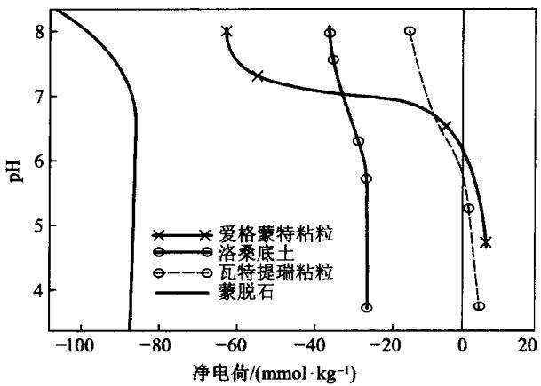  
图 1.3 粘粒净电荷与 pH 的关系[24]

## (2) 离子吸附

关于离子交换的物理化学过程可参见有关文献（例如文献[3]、[42]、[56])，本书不对其进行详细讨论。但土壤的许多物理特性受吸附离子的影响，所以我们对阳离子交换量(CEC)进行论述。

土壤矿物表面的负电荷对土壤溶液中的阳离子产生库仑力，因此在带负电荷的矿物表面附近溶液中阳离子被富集，远离表面的溶液中阳离子则有所亏缺。在这个表面的液层中，未与溶液中其他离子发生交换作用的阳离子被库仑力吸持在带负电荷的表面，以这种方式吸持的阳离子的总量称为土壤阳离子交换量(CEC)，不同组粘土矿物的阳离子交换量主要受晶格结构和同晶置换程度的影响，其 CEC顺序为:蛭石 >蒙脱石 >云母 >高岭石(表1.2)。

阳离子交换量是粘土矿物内、外表面积的递增函数，随粘土矿物颗粒大小的减小而增加。对于由断键产生大量交换位点的粘土矿物来说，颗粒表面积与颗粒大小之间密切相关，其CEC对颗粒大小的依赖更为显著。膨胀型粘土矿物80%的吸附位点位于晶面上，不表现出CEC随颗粒减小而增大的特性。蒙脱组矿物贝德石的CEC和颗粒大小的关系见图1.4。

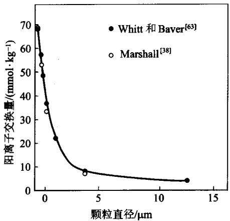  
图1.4 蒙脱石组矿物贝德石阳离子交换量与颗粒大小的关系

## (3) 扩散双电层

粘粒表面带有不同的电荷，对溶液中的离子产生吸附作用，引起粘粒表面及相邻液层中离子分布的差异。粘粒表面的许多性质与液层中的离子分布有关。人们提出了各种模型来描述粘土矿物表面液层中阳离子和阴离子的分布，其中最简单的是Helmholtz模型，这个模型认为所有平衡的离子都存在于矿物表面和溶液之间的一个薄液层中。但这个模型过于简单，因为阳离子具有势能，这将形成远离表面的动力学浓度梯度，产生扩散双电层13,61]。矿物表面和主体溶液之间双电层中阴阳离子浓度可通过电位理论来计算。如果整个双电层被看做扩散层的话，扩散双电层模型便称为Gouy-Chapman双电层模型，通过计算得到的离子浓度会平滑地从矿物表面向主体溶液过渡[图1.5(a)]。如果认为紧接矿物表面的是一个刚性区域，而且扩散层与主体溶液相结合，则双电层称为Stern双电层，那么计算得到的扩散层浓度梯度变化便不会太陡，因为Stern层表面电荷因被溶液中离子中和而降低[图1.5(b)]。由于阴离子也受到扩散层中多余阳离子的吸引，总的阳离子浓度便会中和阴离子所带电荷及表面电荷，中和表面电荷的阳离子可以和溶液中其他阳离子交换。向系统加入电解质溶液会对双电层产生压缩作用，并且降低双电层电位。当电解质溶液浓度高时压缩作用更明显，这可通过比较图1.5(a)中 $A B D \ 、 A ^ { \prime } B ^ { \prime } D ^ { \prime }$ 面积及双电层厚度 $B D , B ^ { \prime } D ^ { \prime }$ 来说明。

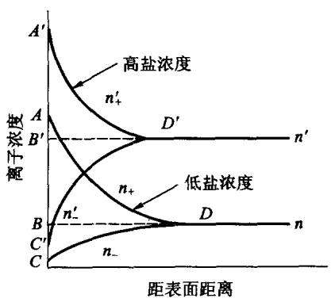  
(a) 离子浓度与距表面距离关系

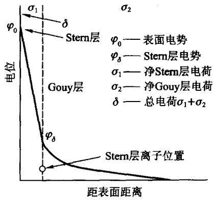  
(b) Stern 层和 Gouy 层的电位  
图1.5 扩散双电层关系曲线[61]

用双电层模型计算双电层厚度时常认为土壤颗粒周围液层厚度是无限的，如果计算得到的双电层厚度大于实际液层厚度，这个模型便不宜采用。因为阳离子只有在液层里才能中和表面电荷，双电层的厚度不会超过液层。所以当液层很薄时，离子浓度不恒定，也就是说溶液不能达到平衡。有水分进入该系统时双电层便会扩张，引起体系的膨胀，膨胀的程度与颗粒的结合力有关。钠蒙脱石结合力小，加水时双电层会自由膨胀，而钙蒙脱石结合力强，加水时双电层膨胀很小。

应用Gouy- Chapman 和 Stern 双电层理论时需考虑离子相互作用、离子极化、电解质的饱和状况。当胶体状的粘粒悬浮液电荷密度不超过 $2 \sim 3 ~ \mu \mathrm { m o l } \cdot \mathrm { ~ m ~ } ^ { - 2 }$ 时可以直接应用这两个理论。离子的大小及水化程度也显著地影响双电层中Stern层和扩散层之间阳离子的分布。为了直观地说明这种影响，需作如下假设：

①表面交换位点的电荷为固定电荷；

②部分表面电荷被 Stern层中离子所中和；

③剩余表面电荷被扩散层中的阳离子所平衡；

④平衡表面电荷的阳离子可以是全部水化的阳离子，在阳离子与吸附表面之间没有水分子时也可以是未水化的阳离子。

矿物表面总电荷密度 $Q _ { \mathrm { { t } } }$ 等于平衡表面电荷的水化的阳离子电荷密度 $Q _ { \star }$ 和未水化的阳离子电荷密度 $Q _ { \mathrm { { u } } }$ 之和：

$$
Q _ { \mathrm { { t } } } = Q _ { \mathrm { { h } } } + Q _ { \mathrm { { u } } }\tag{1.3}
$$

未水化离子直接存在于Stern层的表面，水化离子的颗粒较大，存在于扩散层中。如钠离子的水化会增加从离子中心到蒙脱石八面体片晶格平面的距离。和未水化钠离子相比，水化钠离子可以使这个距离增加50%以上。通过计算双电层中一价阳离子的分布可以发现(表1.3)，双电层中电荷密度的分布遵循描述吸附阳离子被置换难易程度的感胶离子序： $\mathbf { L i } > \mathbf { N a } > \mathbf { K } > \mathbf { C s }$ 。未水化的 $\mathbf { C s }$ 离子有76% 分布于 Stern层，未水化的 Li离子只有17%分布于 Stern层。K和 $\mathbf { N a }$ 离子与它们最大结合能的数量级变化顺序一致。因此，离子大小及水化程度对其在双电层中的分布影响很大。

表1.3 Stern层和扩散层中一价阳离子的分布[34]
<table><tr><td>离子</td><td>半径/A</td><td> $Q _ { \mathrm { u } } / ( \mathbf { C } \cdot \mathbf { m } ^ { - 2 } )$ </td><td> $Q _ { \mathrm { h } } / ( \textrm { C } \cdot \textrm { m } ^ { - 2 } )$ </td><td>Stern 层中阳离子/%</td></tr><tr><td>Li</td><td>0.60</td><td>0.017</td><td>0.080</td><td>17.3</td></tr><tr><td> $\mathbf { N _ { \lambda \mathbf { a } } }$ </td><td>0.95</td><td>0.037</td><td>0.090</td><td>41.2</td></tr><tr><td> $\mathbf { K }$ </td><td>1.33</td><td>0.057</td><td>0.039</td><td>59.1</td></tr><tr><td> $\pmb { \mathrm { C s } }$ </td><td>1.69</td><td>0.070</td><td>0.026</td><td>76.0</td></tr></table>

## (4) 阳离子交换方程

粘粒矿物表面吸附有阳离子，一定条件下这些吸附的阳离子与溶液中的阳离子发生交换，这就是阳离子的交换过程。阳离子的交换过程是可逆的，且遵循质量守恒定律。阳离子交换过程受温度影响较小，而与交换点位置直接相关：外表面上的交换可瞬时发生，内表面上的交换需要较长时间才能达到平衡，因为离子在到达交换点前需要在晶层间隙中运动，受离子扩散作用制约。

在研究离子交换过程中，人们提出了许多方程来说明交换过程的数量关系或预测离子分配情况。推导这些方程通常假设在给定pH下， $\overrightarrow { \vert } \overrightarrow { \vert }$ 物表面总 CEC为常数，而且交换反应是可逆的，符合化学计算当量关系。阳离子交换的方程推导时所依据的原理主要有质量作用定律、动力学、Donnan平衡以及双电层理论。最常用的方程是根据质量作用定律推导出来的，它描述 $\mathbf { C a } ^ { 2 + }$ 与 $\mathbf { N a } ^ { + }$ 交换时如下：

$$
\mathrm { C a X } ~ + ~ 2 \mathrm { N a } ^ { + } { \mathop { = } } 2 \mathrm { N a X } + \mathrm { C a } ^ { 2 + }\tag{1.4}
$$

式(1.4)的反应平衡系数为

$$
K _ { \bf { { k } } } = \frac { \left( \mathrm { \bf ~ N a X } \right) ^ { 2 } \left( \mathrm { \bf ~ C a } ^ { 2 + } \right) } { \left( \mathrm { \bf ~ C a X } \right) \left( \mathrm { \bf ~ N a } ^ { + } \right) ^ { 2 } }\tag{1.5}
$$

()指活度。

由于不能精确描述或测定吸附相离子活度，所有的阳离子交换模型的应用也受到限制。式(1.5)中的活度一般近似地用浓度代替，这种近似的表示称为Kerr模型，它在较窄的浓度范围内能较好地应用，但是反应平衡系数在较大的阳离子浓度范围内变化很大40]。

Gapon于1933年修正了Kerr模型，他用溶液中吸附相阳离子的化学当量来表示交换反应，并且用浓度代替活度，在此假设下的反应平衡系数为

$$
K _ { \mathrm { G } } = \frac { \left[ \mathrm { \bf ~ N a X } \right] \left[ \mathrm { \bf ~ C a } ^ { 2 + } \right] ^ { 1 / 2 } } { \left[ \mathrm { \bf ~ C a } _ { 1 / 2 } \mathrm { \bf ~ X } \right] \left[ \mathrm { \bf ~ N a } ^ { + } \right] }\tag{1.6}
$$

[]指浓度。Gapon方程(1.6)在大的浓度范围内并不准确，但在许多土壤中所发生的钠交换的浓度范围内还是有相当高的准确度。

除 Kerr模型和 Gapon模型外还有其他交换模型，其不同主要在于对交换相活度的处理方法上。如Vaneslow认为可交换阳离子活度与它们的物质的量成反比，并对Kerr模型进行了校正。当交换离子和被交换离子同价时，如 $\mathbf { C a } ^ { 2 + } \mathbf { \Sigma } -$ $\mathbf { M } \mathbf { g } ^ { 2 \cdot }$ 交换体系，Vaneslow 模型应用较为成功[42]。

## (5) 阴离子吸附

阴离子和矿物表面的作用有两种，第一种为带正电的矿物表面对阴离子产生非专性静电吸附或带负电的表面对其产生排斥作用。在pH较低的情况下，粘土矿物带正电，对阴离子产生吸附作用。在正常pH下，大多数矿物表面带负电，净的阴离子吸附实际上是表面的排斥作用，有时也称为负吸附或阴离子排斥，可以通过实验测定来观察，也可通过Schofield公式来计算3]。此过程会影响到土壤中化学物质的迁移。如水在静止的固体表面处运动最慢，当水运动时，阴离子被从固体表面附近的水中排斥到流动较快的水中，从而迁移速率比其他中性粒子快。

阴离子与土壤的第二种作用为专性吸附，它包括在氧化物表面的正吸附，即水合氧化物表面的阳离子被可与 $\mathbf { A l } ^ { 3 + }$ 或 $\mathbf { F e } ^ { 3 \cdot }$ 离子配位的阴离子所代替，称为配位交换。它可在表面带正或负电情况下发生，其对不同阴离子的选择顺序为：$\mathrm { S i O _ { 4 } ^ { 2 - } > P O _ { 4 } ^ { 2 - } > > S O _ { 4 } ^ { 2 - } > N O _ { 3 } ^ { - } \approx C I ^ { - \lfloor 1 4 \rfloor } }$ 。正常 pH下， $\mathsf { S } \mathbf { 0 } _ { 4 } ^ { 2 - } \ , \mathsf { N } \mathbf { 0 } _ { 3 } ^ { - }$ 和 $\mathbf { C l } ^ { - }$ 的吸附通常可以忽略，而且由于相互之间的静电作用，这些离子的吸附为净的负吸附。

## (6) 非电解质的吸附

溶液中的非电解质也能被土壤固相所吸附，其吸附机理或者是在溶液中的不完全电离作用，或者是非电解质分子与矿物表面的某些官能团之间的作用。一些非电解质在酸性溶液中会接受质子，形成阳离子络合物，与带负电荷的矿物表面反应。而一些有机酸性物质，如2，4-D、毒莠啶等，将在溶液中电离生成阴离子络合物[28]。

不能电离的非电解质分子可通过氢键和范德瓦耳斯力与矿物表面反应。非电解质与 $\textcircled { 1 } ^ { 2 }$ 物表面之间的氢键作用发生在有机官能团与硅氧烷中的氧原子或表面羟基之间，虽然这不是有机物在土壤中吸附的主导因素[55]，但在有机表面的有机物吸附过程中发挥着重要作用[16]。对于非极性有机化合物如DDT，分子附近瞬间偶极距所产生的范德瓦耳斯力是吸附的主要作用力，这种吸附作用主要发生在有机物表面。

## (7) 吸附等温线

一定温度下被吸附的物质的量(吸附量)与溶液中物质浓度(平衡浓度)之间的关系被称为吸附等温线，它是土壤中溶解的化学物质的一个基本特征。吸附等温线的形状取决于吸附质和吸附剂的表面性质，有时还取决于溶液中存在的其他组分。吸附等温线是通过吸附公式定量描述的，最常见的公式是Langmuir、Freundlich和BET公式。这些公式多是利用气体在固相上的吸附，并在一定的假设下发展起来的。

Langmuir等温线描述溶液中吸附时的公式为

$$
Q = { \frac { a Q _ { \mathrm { { m } } } C } { 1 + a C } }\tag{1.7}
$$

式中： $Q$ 为吸附量，C为吸附达平衡时溶液中的浓度， $Q _ { \mathbf { m } }$ 为最大吸附量，在单分子层吸附时为吸附位点数量，a为常数。公式(1.7)的推导过程如下：

假定吸附质分子之间没有相互作用，单位质量吸附剂具有有限的且相同的吸附位点 $Q _ { \mathbf { m } }$ ，在吸附达到平衡时，吸附速率γ，等于解吸速率 $\pmb { \gamma _ { \mathrm { A } } }$ $\gamma _ { \mathsf { D } }$ ，如果分子间相互不反应，解吸速率 $\gamma _ { \mathfrak { d } }$ 与单位质量表面吸附的分子数量Q成正比，可以表示为

$$
\gamma _ { \mathrm { { D } } } = k _ { \mathrm { { 1 } } } Q
$$

$k _ { \imath }$ 为速率常数。与此相似，吸附速率γ，应与溶液中浓度C和表面未吸附位点 $\pmb { \gamma _ { \pmb { \mathscr { \Lambda } } } }$ 数量 $( Q _ { \mathrm { m } } - Q )$ 成比例，即

$$
\gamma _ { \scriptscriptstyle \mathrm { A } } = k _ { \scriptscriptstyle 2 } \big ( Q _ { \scriptscriptstyle \mathrm { m } } - Q \big ) C
$$

吸附达平衡时 $\gamma _ { \mathrm { A } } = \gamma _ { \mathrm { D } }$ ,则

$$
k _ { \scriptscriptstyle 1 } Q = k _ { \scriptscriptstyle 2 } \big ( Q _ { \scriptscriptstyle \mathrm { m } } - Q \big ) C
$$

从中解出 $Q$

$$
Q = { \frac { a Q _ { \mathrm { { m } } } C } { 1 + a C } }
$$

式中： $\pmb { a } = \pmb { k } _ { 2 } / k _ { 1 }$ 0

不同 a 值下的 Langmuir 等温线见图 1. 6(a)。在浓度低时 Q随 C 线性增加，在浓度高时Q达到常数 $Q _ { \infty }$ 。这种类型等温线最适于诸如阳离子交换之类的具有有限吸附容量的吸附过程。

许多化合物在土壤中的吸附并不符合Langmuir等温线，可能与吸附质表面吸附位点类型不同有关。对于这些化合物，吸附等温线常用Freundlich等温线来描述：

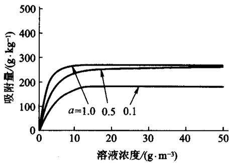

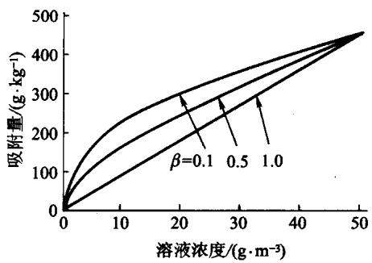  
(a) Langmuir 吸附等温线  
(b) Freundlich 吸附等温线  
图 1.6 Langmuir 和 Freundlich 吸附等温线

$$
Q = k _ { t } C ^ { \beta }\tag{1.8}
$$

$k _ { \mathrm { f } }$ 和 $\beta$ 均为常数，且 $\beta \leqslant 1$ ,Freunlich等温线的图形见图1.6(b)。式(1.8)可通过以下假设导出：吸附位点分布在土壤表面，而且物质在每个位点的吸附服从Langmuir等温线。在应用时对式(1.8)两边取对数形式可变换为线性公式：

$$
\ln Q = \ln k _ { \mathrm { f } } + \beta \ln C
$$

以 ln Q 对 ln C 作图，可通过斜率和截距求得 $k _ { \mathrm { f } }$ 和 $\beta _ { \circ }$ 由于 $\beta$ 为斜率，故可反映吸附的非线性度。Freundlich等温线的一个特例便是 $\beta = 1$ ,此时

$$
Q = k _ { \mathrm { d } } C
$$

这被称为线性等温线， $k _ { \mathrm { d } }$ 为分配系数。

## (8) 气体吸附

人们对固体表面气体的吸附研究的已经很多了，但由于气体的吸附不是单分子层吸附，而是多分子层吸附，常用来描述单分子层吸附的简单的Langmuir吸附等温线便不再适用。Brunauer等[15]假设第一层气体的吸附热高于其他层气体分子的吸附热，而且其他层分子的吸附热等于液体吸附质的汽化热。在此基础上，他们把Langmuir等温线拓展到多分子层吸附，建立了包括单分子层和多分子层吸附的公式：

$$
\frac { \ x } { V ( 1 - x ) } = \frac { 1 } { V _ { \mathrm { m } } C ^ { * } } + \frac { ( C ^ { * } - 1 ) { { x } } } { V _ { \mathrm { m } } C ^ { * } }\tag{1.9}
$$

式中 ${ \bf { \sigma } } _ { : { \bf { { x } } } } = { \bf { { p } } } / p _ { 0 }$ 为给定温度下气体蒸汽压与液体的饱和蒸气压之比，V为已吸附的气体体积， $V _ { \mathrm { ~ m ~ } }$ 为表面覆盖了一个单分子层气体时所吸附的气体体积， $C ^ { * }$ 为与吸附热有关的常数。方程(1.9)便是 Brunauer -Emmett - Teller(BET)方程。如果实验获得的吸附等温线与方程一致，那么方程的参数便可通过实测的吸附数据来获得。式(1.9)左边项 $\frac { \pmb { x } } { V ( \pmb { 1 } - \pmb { x } ) }$ 与右边的x呈直线关系，直线截距为 $\frac { 1 } { V _ { \infty } C ^ { \bullet } }$ 斜率为 $\frac { ( C ^ { \bullet } - 1 ) } { V _ { \bullet } C ^ { \bullet } }$ ，通过作图便可获得参数 $V _ { \mathrm { ~ m ~ } }$ 和 $c ^ { * }$

## (9) 颗粒比表面积的测定

测定粘粒外表面和内表面的方法有多种，最为常用的是吸附法。氮气是一种非极性气体，它不能进入膨胀性粘粒 $\overrightarrow { y }$ 物内表面，可以用来测定粘粒矿物的外表面积。一些极性分子如乙二醇(EG)或乙二醇乙醚(EGME)能进入粘粒矿物内表面，可用来测定粘粒矿物的总面积[48]。气体吸附法测定粘粒表面积便是依据BET方程(1.9)，测定气体分子在粘粒矿物表面形成单分子吸附层时的吸附量 $V _ { \mathbf { m } }$ ,再根据气体分子直径计算出单个气体分子体积及所吸附的总的气体分子数，通过单个气体分子截面积便可求出粘粒矿物表面积。在测定时，把土壤样品装在一个小的玻璃瓶里，引人少量氮气，使其平衡。通过测定吸附前后气体压力的变化可计算出吸附的氮气的量，得到吸附等温线，根据所获得的BET方程参数 $V _ { \mathbf { m } }$ 计算出表面积。

利用极性分子如EG或EGME在表面的吸附测定总表面积过程是在真空干燥器中用极性液体饱和干的表面，多余的极性液体用无水 $\mathbf { C a C l } _ { 2 }$ 或 $\mathrm { C a C l } _ { 2 } - \mathrm { Z }$ 醚混合物在真空条件下除去。当粘 $\pm \pi$ 物-乙二醇混合物的质量恒定时，总表面积可通过下式计算：

$$
S = \frac { \overline { { W } } _ { g } } { \varOmega W _ { a } }\tag{1.10}
$$

S为以 $\mathbf { m } ^ { 2 } \cdot \mathbf { k } \mathbf { g } ^ { - 1 }$ 表示的比表面积， $\pmb { { \ W } } _ { \textrm { g } }$ 为土壤样品所吸附的极性化合物的重量，$\pmb { W } _ { \textrm { a } }$ 为土壤样品的烘干重 $, \pmb { \mathscr { a } }$ 是在单位表面上形成一个单分子层所需的极性液体的质量，对EG或EGME来说，其Ω是一个常数，分别为 $3 . 1 \times 1 0 ^ { - 7 }$ 和 $2 , 8 6 \times$ $1 0 ^ { - 7 } \ \mathbf { k g } \cdot \mathbf { m } ^ { - 2 [ 4 8 ] }$ 。表1.4 中给出了用氮气和 EG或EGME 吸附法测定的一些土壤和粘土 $\textcircled { 1 }$ 物的比表面积。

表1.4 用氮气吸附和 EG 或 EGME 吸附法所测得的一些土壤和粘土 $\pmb { \mathcal { H } }$ 物的比表面积
<table><tr><td rowspan="2">土壤样品</td><td rowspan="2">有机碳含量  $\boldsymbol { \ ⁄ } ( \mathbf { g } \boldsymbol { \cdot } \mathbf { k } \mathbf { g } ^ { - 1 } )$ </td><td colspan="2">比表面积/  $( \mathbf { m } ^ { 2 } \cdot \mathbf { g } ^ { - 1 } )$ </td></tr><tr><td>氮气吸附法</td><td>EG 或 EGME 吸附法</td></tr><tr><td>怀俄明州贝德石[17]</td><td>0.0</td><td>65.0</td><td>372.0</td></tr><tr><td>硅石[46]</td><td>0.1</td><td>4.9</td><td>8.7</td></tr><tr><td>高岭石[46]</td><td>0.1</td><td>8.5</td><td>21.3</td></tr><tr><td>鲁拉水化矿物[53]</td><td>0.1</td><td>7.7</td><td>10.5</td></tr><tr><td>蒙脱石[46]</td><td>0.2</td><td>97.4</td><td>733.0</td></tr><tr><td>波士顿粉粒[17]</td><td>26.6</td><td>28.6</td><td>46.0</td></tr><tr><td>韦伯斯特土壤[49]</td><td>33.2</td><td>8.2</td><td>168.4</td></tr><tr><td>阿舍斯特土壤[17]</td><td>45.5</td><td>6.3</td><td>25.8</td></tr><tr><td>哈弗顿富殖土[49]</td><td>445.7</td><td>0.8</td><td>162.9</td></tr></table>

## 1.2.8 粘粒的絮凝和膨胀

粘粒具有复杂的荷电表面，与其他颗粒之间具有潜在的吸引或排斥作用。这种作用是吸引还是排斥则依具体情况而定，排斥力主要为静电斥力，是由颗粒表面双电层中的阳离子产生的。但当粘粒很接近时，双电层中的阳离子便会形成一个带正电的薄层，吸引具有负电表面的粘粒，这样形成的粘粒团称为叠胶，它包含了许多单个的粘粒片。由于和边缘相邻矿物带负电的层面相互吸引，带正电的边缘可以导致絮凝。在有电解质时，扩散双电层的厚度便会减小，而不同矿物之间晶面与晶面、边缘与边缘之间因范德瓦耳斯力而联系，促进粘粒絮凝。一般来说，絮凝是一种有利的状态，这种状态能够稳定土壤，防止粘粒迁移和阻塞土壤孔隙。

早期的研究指出，交换阳离子的水化程度是影响粘粒悬浮液稳定的主要因素[33,59,62]。二价交换阳离子使粘粒絮凝，一价交换阳离子使粘粒分散。2:1型层状粘土矿物层间有水层，对蒙脱石来说，水分可使晶格膨胀，促进分散，但当双电层中有高价阳离子如 $\mathbf { C a } ^ { 2 + } \cdot \mathbf { M g } ^ { 2 + } \cdot \mathbf { A l } ^ { 3 + }$ 时，便会形成阳离子桥，阻滞晶层膨胀，并使粘粒保持絮凝状态[42]。相反，一价阳离子 $\mathbf { N a } ^ { + }$ 不会形成离子桥，在以 $\mathbf { N a \Phi ^ { + } }$ 为主导的交换过程中，晶格膨胀会使粘粒分散并引起土壤阻塞。交换性钠含量高的土壤结构性很差，易产生膨胀、结壳，使排水性能变差，并易受到侵蚀。因此，交换性钠的百分比(ESP)可以用来指示土壤的分散程度：

$$
\mathrm { E S P } = 1 0 0 \times \frac { \mathrm { N a X } } { \mathrm { C E C } }\tag{1.11}
$$

其中 NaX 为土壤可交换性Na浓度。

钠吸附率(SAR)是土壤溶液的一个特性，它的定义为

$$
\mathbf { S A R } = \frac { \left[ \mathbf { \sigma } \mathbf { N a } ^ { + } \mathbf { \sigma } \right] } { \sqrt { ( \left[ \mathbf { \sigma } \mathbf { C a } ^ { 2 + } \mathbf { \sigma } \right] + \left[ \mathbf { \sigma } \mathbf { M g } ^ { 2 + } \mathbf { \sigma } \right] ) / 2 } }\tag{1.12}
$$

其中浓度单位为 $\mathbf { m } \mathbf { m } \mathbf { o } \mathbf { l } \cdot \mathbf { L } ^ { - 1 }$ 。SAR 和ESP可通过下列方程联系起来：

$$
\frac { \mathsf { E S P } } { 1 0 0 \textrm { - E S P } } = 0 . 0 1 5 \mathsf { S A R }\tag{1.13}
$$

由于土壤溶液或灌溉水中钠离子容易测定，通过SAR估算ESP较为简便，因此常把SAR作为土壤分散程度和灌溉水质的指标。

## 1.3 土壤质地

土壤质地是指土壤颗粒大小的变动范围，具体地说就是指某一土壤颗粒大小分布或各种大小颗粒的相对比例。土壤质地的类别和特点主要继承了成土母质的类别和特点，又受人类耕作、施肥、灌溉、平整土地等因素的影响。土壤质地一般可分为砂土、壤土和粘土三类，由于某一质地的颗粒组成均有一定的变化范围，因而可以细分为若干质地。土壤质地是土壤的一个稳定的自然属性，也是最常用的描述土壤物理特性的属性之一。进行土壤质地划分时，首先要对土壤样品做颗粒分析，以获得土壤的颗粒组成，然后按照不同的土壤质地分类体系进行划分。

## 1.3.1 土壤颗粒分析的原理

土壤中各粒级的定量测定称为土壤颗粒分析，又称土壤机械分析。由颗粒分析得出的土壤颗粒组成不仅是评价农业土壤的重要依据，也是工程中使用土壤材料的基本参数。土壤颗粒分析是先把土壤充分分散，又不破坏其原状地分离成各种粒径的单粒，然后对分离出来的各级单粒进行定量。一般对大于0.25mm的粗粒部分采用不同孔径的筛子筛分，对小于0.25mm的部分依Stokes定律，用沉降法分离。

当一个密度为ρ、半径为R的球形颗粒在密度为 $\pmb { \rho _ { \mathrm { s } } }$ $\pmb { \rho _ { \mathrm { c } } }$ 、粘度(也叫粘滞系数)为 $\pmb { \eta }$ 的液体中沉降时，颗粒受到重力 $( F _ { _ { 8 } } )$ 、浮力 $( F _ { \mathfrak { b } } )$ 和粘性力 $\left( \pmb { F } _ { \textrm { d } } \right)$ 三个力的作用。三个力的大小分别表示如下：

$$
F _ { _ { g } } = m _ { _ { s } } g = \rho _ { _ { s } } V _ { _ { s } } g = \rho _ { _ { s } } g { \frac { 4 \pi R ^ { 3 } } { 3 } }\tag{1.14}
$$

$m _ { i }$ 。为颗粒质量， $V _ { \mathrm { ~ s ~ } }$ 为颗粒体积，重力作用方向向下。

$$
F _ { _ { \mathrm { b } } } = m _ { 1 } g = \rho _ { \mathrm { c } } g { \frac { 4 \pi R ^ { 3 } } { 3 } }\tag{1.15}
$$

$m _ { 1 }$ 为固体排出液体的质量，浮力作用方向向上。

$$
F _ { \mathrm { d } } = 6 \pi R \eta \upsilon\tag{1.16}
$$

v为颗粒下降的速度，粘性力(也叫粘滞力)总是与球形颗粒运动速度方向相反。  
因此，对于下降的颗粒，粘性力的方向向上。

理论上，颗粒在这三个力的作用下会产生加速度，但实际上这三个力很快达到平衡，颗粒便会以一个恒定沉降速度向下运动，沉降速度可通过使这三个力的合力为零来计算：

$$
\sum F _ { i } = 0 = F _ { _ { g } } - F _ { 1 } - F _ { _ { d } }\tag{1.17}
$$

把式(1.14)\~(1.16)代入式(1.17)，并解出 $\pmb { v }$ 可得到

$$
v = \frac { \left( \rho _ { \circ } - \rho _ { \circ } \right) D ^ { 2 } g } { 1 8 \eta }\tag{1.18}
$$

D 是颗粒直径 $( D = 2 R )$ 。方程(1.18)给出了直径为D、密度为ρ.的球形颗粒在 $\pmb { \rho } _ { \varepsilon }$ 密度为ρ.粘度为η的液体中下降时的速度，根据此式便可求出不同沉降速度的 $\pmb { \rho _ { \mathrm { c } } }$

颗粒粒径：

$$
D = \sqrt { \frac { 1 8 \eta v } { \left( \rho _ { \circ } - \rho _ { \circ } \right) g } }\tag{1.19}
$$

## 1.3.2 土壤的分散

田间或自然土壤中绝大部分或全部粘粒都相互团聚成不同粒径的团粒，在进行土壤颗粒分析时必须将这些团粒充分分散。常用的分散方法有三种，即：物理分散、化学分散和物理-化学分散。

物理分散：物理分散对土壤不进行任何化学处理，主要借助于机械力促使土粒分散。物理分散对土粒的破坏作用小，但不易充分分散土粒，因此物理分散一般仅适用于土壤的微团聚体分析。物理分散包括研磨、振荡、煮沸、摩擦、捣溃、洗涤、超声波分散等。

化学分散：利用缓冲盐类作为分散剂，而不从土壤中去除任何组成部分，使土壤颗粒分散。化学分散法适用于碳酸钙或硫酸钙含量较高的一些土壤，常用的缓冲盐类有草酸钠、焦磷酸钠、偏磷酸钠、碳酸钠、硅酸钠、磷酸钾等。

物理-化学分散：用化学试剂去除土壤中的胶结物质，如有机质、氧化物、碳酸钙等，然后加入碱液煮沸或振荡分散土粒。

## 1.3.3 土壤颗粒分析

粗土粒可用不同孔径的土壤分析筛直接筛分经分散处理的土壤样品，得到不同粒径的土粒含量。常有湿筛法和干筛法。

对于细颗粒，普遍用式(1.19)，按土粒在水中沉降的快慢区分不同粒级的土粒。沉降分离方法有吸管法和比重计法，吸管法比较精确，1930年国际土壤学会把吸管法作为测定土壤颗粒组成的标准方法，目前已有各种型号的自动吸液和洗涤的吸管装置。比重计法广泛应用于地质、水利、土木工程及土壤学中，其测定快，可以简化不少计算手续，但精度不及吸管法。

在进行土壤颗粒分析时还可用显微镜镜检法进行定量。将已分散的土壤颗粒置于显微镜下的方格板上鉴别定量。

20世纪80年代以来，各国生产出了一些自动化水平很高的颗粒分析仪，如英国产的TAⅡ型库尔特颗粒分析仪和MS2000激光粒度分析仪、日本产的 RS型颗粒分析仪、中国生产的KCY型颗粒分析仪和 GDY-1 型光电颗粒分析仪，这些仪器的使用大大提高了颗粒分析的效率。

## 1.3.4 土壤颗粒分级

土壤颗粒大小差别大，为便于研究不同大小颗粒的性质，人们将一系列大小不同的土粒根据有效直径分为不同粒级。颗粒的有效直径可通过实验测定。大颗粒(>0.5mm)的有效直径通常用机械筛分法来测定，小颗粒(<0.5mm)通过沉降法来分离测定。

表 1.5 国外主要土壤颗粒分级系统
<table><tr><td rowspan=2 colspan=1>有效直径/(mm)</td><td rowspan=2 colspan=2>国际制</td><td rowspan=2 colspan=1>美国农部制</td><td rowspan=2 colspan=3>俄罗斯卡庆斯基制</td><td rowspan=1 colspan=4>日本</td><td rowspan=2 colspan=2>英国标准局和麻省理工学院制</td></tr><tr><td rowspan=1 colspan=2>农林省制农</td><td rowspan=1 colspan=2>学会制</td></tr><tr><td rowspan=1 colspan=1>&gt;3</td><td rowspan=2 colspan=2>石砾</td><td rowspan=2 colspan=1>石砾</td><td rowspan=1 colspan=3>石块</td><td rowspan=2 colspan=4>石砾</td><td rowspan=2 colspan=2>石砾</td></tr><tr><td rowspan=1 colspan=1>3~2</td><td rowspan=2 colspan=1></td><td rowspan=2 colspan=2>石砾</td></tr><tr><td rowspan=1 colspan=1>2~1</td><td rowspan=4 colspan=1></td><td rowspan=4 colspan=1>粗</td><td rowspan=1 colspan=1>极粗砂粒</td><td rowspan=1 colspan=1></td><td rowspan=9 colspan=1>砂粒</td><td rowspan=9 colspan=1>粗细</td><td rowspan=8 colspan=1>砂粒</td><td rowspan=8 colspan=1>粗细</td><td rowspan=7 colspan=1>砂粒</td><td rowspan=2 colspan=1>粗</td></tr><tr><td rowspan=1 colspan=1>1~0.6</td><td rowspan=2 colspan=1>粗砂粒</td><td rowspan=3 colspan=1></td><td rowspan=3 colspan=1>砂</td><td rowspan=2 colspan=1>粗</td></tr><tr><td rowspan=1 colspan=1>0.6~0.5</td><td rowspan=3 colspan=1>中</td></tr><tr><td rowspan=1 colspan=1>0.5~0.25</td><td rowspan=1 colspan=1>砂</td><td rowspan=1 colspan=1>中砂粒</td><td rowspan=1 colspan=1>中</td></tr><tr><td rowspan=2 colspan=1>0.25~0.20.2~0.1</td><td rowspan=4 colspan=1>粒</td><td rowspan=4 colspan=1>细</td><td rowspan=2 colspan=1>细砂粒</td><td rowspan=4 colspan=1></td><td rowspan=4 colspan=1>粒</td><td rowspan=4 colspan=1>细</td></tr><tr><td rowspan=2 colspan=1>细</td></tr><tr><td rowspan=1 colspan=1>0.1~0.06</td><td rowspan=2 colspan=1>极细砂粒</td></tr><tr><td rowspan=1 colspan=1>0.06~0.05</td><td rowspan=2 colspan=1></td><td rowspan=2 colspan=1>粗</td></tr><tr><td rowspan=1 colspan=1>0.05~0.02</td><td rowspan=1 colspan=1></td><td rowspan=1 colspan=1></td><td rowspan=5 colspan=1>粉粒</td><td rowspan=6 colspan=1>物理性粘粒</td><td rowspan=6 colspan=1>粉粒</td><td rowspan=2 colspan=1>粗</td><td rowspan=2 colspan=2>粉粒</td><td rowspan=2 colspan=1></td></tr><tr><td rowspan=1 colspan=1>0.02~0.01</td><td rowspan=4 colspan=2>粉粒</td><td rowspan=1 colspan=1></td><td rowspan=4 colspan=2>粉粒</td><td rowspan=2 colspan=1>粉粒</td><td rowspan=2 colspan=1>中</td></tr><tr><td rowspan=1 colspan=1>0.01~0.006</td><td rowspan=2 colspan=1>中</td><td rowspan=7 colspan=2>粘粒</td><td rowspan=3 colspan=1></td></tr><tr><td rowspan=1 colspan=1>0.006~0.005</td><td rowspan=2 colspan=1>细</td></tr><tr><td rowspan=1 colspan=1>0.005~0.002</td><td rowspan=1 colspan=1></td></tr><tr><td rowspan=1 colspan=1>0.002~0.001</td><td rowspan=4 colspan=2>粘粒</td><td rowspan=4 colspan=1>粘粒</td><td rowspan=4 colspan=1></td><td rowspan=4 colspan=2>粘粒</td><td rowspan=4 colspan=2>粘粒</td></tr><tr><td rowspan=1 colspan=1>0.001~0.0005</td><td rowspan=3 colspan=1>粘粒</td><td rowspan=1 colspan=1>粗</td></tr><tr><td rowspan=1 colspan=1>0.0005~0.0001</td><td rowspan=1 colspan=1>细</td></tr><tr><td rowspan=1 colspan=1>&lt;0.0001</td><td rowspan=1 colspan=1>胶质</td></tr></table>

由于不同研究者的研究目的不同，所采用的土壤颗粒划分标准往往不同，因此很难确定一个通用的土壤颗粒大小分级体系，目前国外主要的土壤颗粒分级系统见表1.5。由表1.5可见，土粒一般可分为3\~11级，而基本级只有4\~5级，如石块、石砾、砂粒、粉粒、粘粒。细颗粒部分的粒径，除卡庆斯基制为小于1mm外，多数国家为小于2mm。我国多用小于1mm为限。粘粒上限多数国家采用小于0.002mm，我国将粘粒分为粗粘粒和细粘粒，因其在粘土矿物、化学组成和物理性质方面存在较大差异。

## 1.3.5 土壤质地分类

土壤质地是土壤的一个较为稳定的自然属性，被广泛地用来表征土壤的物理性质。土壤质地分类是按照土壤颗粒组成的比例对土壤所作的分类，如砂土、壤土、粘土等。

国际上拟制了不少相对稳定的土壤质地分类系统，最常见的有国际制、美国农部制和俄罗斯卡庆斯基制。20世纪30年代我国也开始了颗粒分级和质地分类方面的研究。国际制土壤质地分类在1930年第二届国际土壤学会上通过，共有12个质地类别。其中粘粒的上限由 Atterberg11提出，他发现小于0.002 mm(2μm)的颗粒在溶液中表现出布朗运动的特征，并且不受重力作用的影响而自由沉降，在此基础上，他确定了土壤粘粒的上限为0.002mm。随后的矿物学研究进一步证实<2μm的粒级中未风化的原生矿物比较少。美国农部制也把土壤质地分为12类。在1938年以前，美国农部的分类以0.005mm(5μm)作为粘粒上限，这一上限是1896年用显微镜观察颗粒大小而主观建立的，1938年接受了Atterberg 分类制中的2μm 粘粒界限，其他粒级的大小限度未变。

除美国农部分类制在砂粒粒级中有较多的分级外，国际制和美国制分类系统没有太大的差别。根据不同砂粒、粉粒和粘粒含量，不同的土壤质地分类系统有各自的土壤质地三角形，图1.7为国际制和美国农部制土壤质地三角形。

俄罗斯卡庆斯基制有基本分类和详细分类两种。基本分类有3组9个质地，主要有3个特点：①将土粒分为物理性粘粒和物理性砂粒两级；②按物理性粘粒或物理性砂粒的数量进行质地分类，而不是按照砂、粉、粘粒三个粒级的质量比分组；③考虑到土壤类型的不同，对不同土壤有不同的分组尺度。详细分类是在基本分类的基础上把9个质地进一步细分为39个质地类别。

我国现代的土壤质地研究开始于20世纪30年代，熊毅提出了一个较完整的质地分类，分为砂土、壤土、粘壤土和粘土4组共22个质地。1978年中国科学院南京土壤研究所和西北水土保持研究所等单位拟定出了我国土壤质地分类暂行方案，共3组11种质地。该分类系统考虑了中国气候带分布造成的土壤质地北砂南粘的情况。邓时琴于1986年对此分类作了修改，提出了我国现行的土壤质地分类系统(表1.6)。

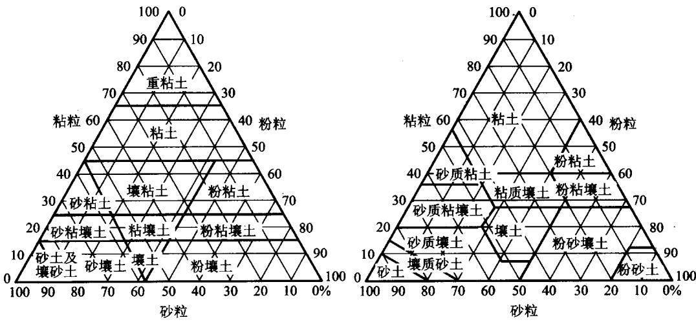  
图1.7 国际制(左)和美国农部制(右)土壤质地三角形

表 1.6 我国土壤质地分类
<table><tr><td rowspan="2">质地组</td><td rowspan="2">质地名称</td><td colspan="3">颗粒组成/%（粒径：mm）</td></tr><tr><td>砂粒(0.05~1)</td><td>粗粉粒 (0.01~0.05)</td><td>粘粒(&lt; 0.001)</td></tr><tr><td rowspan="3">砂土</td><td>极重砂土</td><td>&gt;80</td><td></td><td rowspan="6"></td></tr><tr><td>重砂土</td><td>70~80</td><td></td></tr><tr><td>中砂土</td><td>60~70</td><td></td></tr><tr><td></td><td>轻砂土 50~60</td><td></td><td>&lt;30</td></tr><tr><td rowspan="5">壤土</td><td>砂粉土 粉土</td><td>≥20 &lt;20</td><td>&gt;40</td><td></td></tr><tr><td>砂壤土</td><td>≥20</td><td></td><td></td></tr><tr><td>壤土</td><td>&lt;20</td><td>&lt;40</td><td></td></tr><tr><td>砂粘土</td><td>≥50</td><td></td><td>≥30</td></tr><tr><td></td><td></td><td></td><td></td></tr><tr><td rowspan="4">粘土</td><td>轻粘土</td><td></td><td></td><td>30~35</td></tr><tr><td>中粘土</td><td></td><td></td><td>35~40</td></tr><tr><td>重粘土</td><td></td><td></td><td>40~60</td></tr><tr><td>极重粘土</td><td></td><td></td><td>&gt;60</td></tr></table>

## 1.3.6 土壤质地与土壤肥力的关系和调节

质地对土壤物理、化学和生物性质有很大影响。质地不同，土壤肥力水平及调节难易也有差别。土壤质地对土壤肥力的影响是多方面的，它常常是决定土壤蓄水、导水、保肥、保温、导温和耕性等的重要因素。质地不同，土壤孔隙性、持水性和力学性质等差异很大(表1.7)，从而对土壤养分的保持产生很大影响(表1.8)。

表1.7 土壤质地与土壤物理性质的关系[2]
<table><tr><td></td><td>砂土</td><td>壤土</td><td>粘土</td></tr><tr><td>宜耕期</td><td>不限</td><td>雨后3~20天</td><td>雨后3~5天</td></tr><tr><td>抗旱、耐涝能</td><td>耐涝、不耐旱</td><td>耐涝、耐旱</td><td>不耐涝、不耐旱</td></tr><tr><td>非毛细管孔隙/%</td><td>&gt;10</td><td>10~25</td><td>&lt;5~10</td></tr><tr><td>宜耕含水量/%</td><td>&lt; 10 ~ 15</td><td>10~25</td><td>20~30</td></tr><tr><td>最大粘着力  $/ ( \mathbf { g } \cdot \mathbf { c m } ^ { 2 } )$ </td><td>&lt;10~15</td><td>15~20</td><td>20~25</td></tr><tr><td>最大粘结力  $/ ( \mathbf { g } \cdot \mathbf { c m } ^ { 2 } )$ </td><td>&lt;3~12</td><td>12~24</td><td>24~32</td></tr><tr><td>坚实度/  $( \mathbf { k g } \cdot \mathbf { c m } ^ { 2 } )$ </td><td>&lt;2~4</td><td>4~7</td><td>7~10</td></tr><tr><td>肥力调节难易</td><td>较难</td><td>易</td><td>难</td></tr></table>

表1.8 土壤质地与养分含量的关系[7]
<table><tr><td rowspan="2">养分</td><td colspan="3">质地</td></tr><tr><td>砂土</td><td>壤土</td><td>粘土</td></tr><tr><td>有机质  $' ( { \bf g } \cdot { \bf k g } ^ { - 1 } )$ </td><td>1.0~2.0</td><td>3.0~6.0</td><td>6.0~10.0</td></tr><tr><td>全氮  $/ ( \mathbf { g } \cdot \mathbf { k } \mathbf { g } ^ { - 1 } )$ </td><td>0.1~0.3</td><td>0.2~0.5</td><td>0.5~0.8</td></tr><tr><td>全磷/  $( \mathbf { g } \cdot \mathbf { k } \mathbf { g } ^ { - 1 } )$ </td><td>0.7~1.1</td><td>1.1~1.5</td><td>0.8~2.0</td></tr><tr><td>全钾  $( \mathbf { g } \cdot \mathbf { k g } ^ { - 1 } )$ </td><td>15~18</td><td>18~23</td><td>23~29</td></tr><tr><td>速效钾  $\mathbf { \zeta } ^ { \prime } ( \mathbf { m g } \cdot \mathbf { k g } ^ { - 1 } )$ </td><td>50~150</td><td>100~200</td><td>200~500</td></tr><tr><td> $\mathbf { C E C } / ( \mathbf { \ c m o l { \textit { - } } k g } ^ { - 1 } )$ </td><td>3~8</td><td>5~15</td><td>15~30</td></tr></table>

砂性土通透性好，易于耕作，土温昼夜变幅大，对水分和养分的保蓄能力差，作物早发苗，后期生长受阻，施肥后作物肥效快，但持续时间较短，即肥劲猛而短；粘性土通透性和耕性差，土温变幅小，对水分和养分的保蓄能力强，作物大多晚发苗，后期生长良好，施肥后作物见效迟缓，但持续时间较长，即肥力稳而长。

壤质土由于砂粒、粉粒和粘粒的比例适宜，兼有砂质土和粘质土的优点，克服了两者的不足，其性状表现均适合农作物生长发育的要求，是农业上较为理想的土壤质地。壤质土主要分布于黄土高原、华北平原、松辽平原、长江中下游平原、珠江三角洲、河间平原及河间冲积平原。

土壤质地剖面排列的特点对土壤肥力状况有一定影响。不仅不同质地剖面的潜在肥力存在差异，而且质地剖面还可影响土壤水分的运行和调节，同时影响可溶性养分在剖面中的移动以及土壤环境的更新，从而对作物生长产生相应的影响。一般认为，土壤质地剖面过砂或过粘均不利于土壤肥力因素的发挥与调节。但土壤剖面的质地排列一般比较复杂，特别是在沉积物母质上发育的土壤剖面，往往是砂、壤、粘土层相互交错，如砂夹粘、粘夹砂、砂盖粘、粘盖砂等。此外，砂、壤、粘土层的厚度及其在剖面中所处的部位也很重要。

一般来说，砂土宜于种植生长期短的作物及根茎类作物，而需肥较多或生长期较长的谷类作物，则宜在粘壤土至粘土中生长。大部分作物对土壤质地的适应范围都相当广，但有些作物生长在过粘或过砂的土壤中会出现生长不良的现象。因此，对这些土壤应采取相应的改良措施。据统计，我国现有耕地中，因耕层土壤质地过砂或过粘而需要改良的土壤各在一亿亩以上。其改良方法主要是客土(砂掺粘和粘掺砂)，但是客土工程量很大，有条件的地方，如河流附近，可以通过淤灌把富含养分的粘土覆盖在砂土上，通过翻耕搅拌便可达到改良的目的。

## 1.4 土壤结构

土壤结构体是由不同粒级的土壤颗粒通过不同机理组成的，体现着土壤颗粒的一般性质，并且有着自身的综合性质。土壤结构不仅影响植物生长所需要的水分和养分的供应，而且左右着土壤中的物质交换、能量平衡、微生物活动、作物根系延伸等过程，对提高土壤肥力、促进作物增产、调节土壤环境具有重要作用。土壤结构及其稳定性在许多土壤过程中起重要作用，如土壤侵蚀、入渗、根系穿插、通气、机械强度等5]。由于土壤结构体是土壤颗粒在各种作用力下相互结合形成的，因此只有了解了土壤颗粒的结构和组成特征，才能提出可靠的土壤结构评价指标对其进行评价，并根据具体情况采用合适的方法对不良的土壤结构状况进行改良。由于土壤中发生的不同过程都有各自独特的特征，不同研究者通常用与他们研究的过程有关的方法去评价土壤结构性。如农业科学家主要研究土壤耕性，而植物学家则主要研究土壤结构对根系穿插的影响。对土壤结构的评价可以从团聚体的团聚度、稳定性及孔隙度特征等方面来进行。

## 1.4.1 土壤结构的概念

尽管在土壤学发展过程中不同研究者对土壤结构的定义不同，但土壤结构应包含两个方面的意义：土壤结构体和土壤结构性。土壤结构体指土粒相互团聚所形成的形状、大小、数量和稳定程度都不同的土团、土块或土片。土壤结构性指由土壤结构体的种类、数量(尤其是团粒结构的数量)及结构体内外的孔隙状况等产生的综合性质。因此土壤结构的定义为土壤颗粒相互排列的形式及其所产生的综合性质。

在研究土壤结构时，土壤颗粒就不仅仅指砂粒、粉粒、粘粒，它同时也包括由较小颗粒团聚成的团聚体或结构组成。因此土壤结构体现出一定的性质，如土壤结构的孔性、水稳性、力稳性、生物稳定性等，这些性质决定于土壤粘粒的矿物结构、土壤结构形成时土粒的排列方式及土粒之间的结合状况等。对土壤结构的综合评价主要是对土壤结构这些性质的评价。

## 1.4.2 粘粒矿物的结构

粘粒矿物由两类基本结构单元组成，即硅四面体和铝八面体。硅四面体中四个氧原子构成四面体的四个角，并由位于四面体中心的硅原子所连接[图1.8(a)]，铝原子可能置换四面体中的硅。硅四面体可联成片，即硅片或四面体片。其中构成四面体基部的三个氧原子分别参与构成另外三个相邻四面体的基部[图1.8(b)]。图1.8(b)中虚线长方形为硅片的晶胞结构，晶胞由四个硅原子和六个氧原子构成，其中两个硅原子位于晶胞内部(四面体3、4)，四个硅原子位于晶胞边缘(四面体5、6、7、8)并与相邻晶胞共用。晶胞内的六个氧原子由四面体4上的3个氧原子和位于晶胞边缘的四面体3、7、8上两两氧原子的对半组成。由于硅原子位于四面体中间，硅片的基部表面由氧原子构成。

铝八面体中六个羟基或氧原子各构成八面体的一个角，被八面体中心的铝原子连住[图1.8(c)]。镁、亚铁或铁可置换铝。由这样的八面体联成的片即为铝片或八面体片。其中构成八面体的六个羟基分别参与构成另外三个相邻的八面体。图1.8(d)是八面体的俯视图，其中六个羟基形成一个对称的六角形，与中心的另一个羟基构成紧密的排列。如图1.8(d)中的虚线四边形所示，每个晶胞包含四个铝原子和六个羟基原子团，铝片的顶部和底部表面均由羟基构成。

1:1和2:1型粘粒矿物晶层的基本结构单元见图1.9.1:1型粘粒矿物晶层中四面体结构的氧原子面有六个氧原子，八面体结构的羟基面有六个羟基，层边有四个氧原子和两个羟基，其中每一晶胞中28个正电荷与28个负电荷中和。按上述方式在八面体下加上第二个硅片，即形成2:1型粘粒矿物。2:1型粘土矿物有两个界面层和两个氧原子面，每一晶胞中44个正电荷与44个负电荷中和。

(d)  
(a)  
(e)  

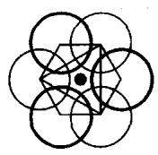

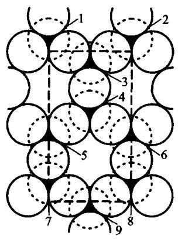  
(b)

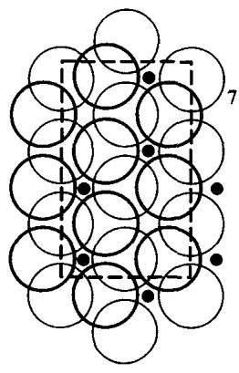

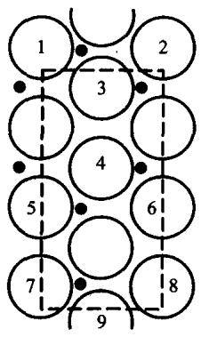  
图 1.8 粘粒矿物的结构排列[61]

由于许多粘粒矿物结构不规则，不同矿物便具有不同的性质。此外，发生在粘土矿物晶层内的同晶置换也能改变粘粒矿物的性质。

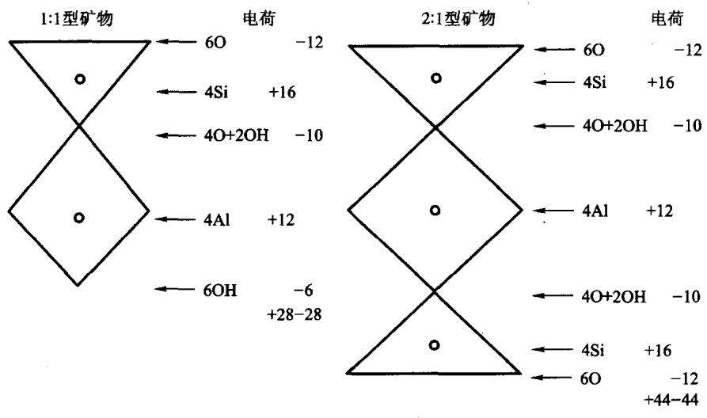  
图1.9 粘土矿物晶层示意图[34]

半径为0.57 nm的三价铝原子可置换半径为0.39 nm的硅原子。置换时，较大直径的铝原子可将四面体中的四个氧原子撑开，使晶体变形。这种置换会使四面体减少一个正电荷而增加一个负电荷，所增加的负电荷由附近的正电荷或吸附的阳离子来平衡。半径分别为 0.78 nm、0.83 nm 和 0.67 nm的二价镁和铁及三价铁可置换铝片中的铝，这些较大的原子会使八面体变形，而且二价镁和铁还会使八面体的负电荷增加，这种负电荷通常可被吸附在表面的阳离子所平衡，而这些阳离子又可在粘土矿物晶层表面被其他阳离子所取代，因此被称为交换性阳离子。表面所吸附的交换性阳离子总量即为阳离子交换量(CEC)，它反映了粘粒晶体内部的置换程度。阳离子交换对带正电荷的离子在土壤中的迁移有重要影响，与在溶液中运动速率相比，带正电荷的离子运动减慢。

除晶体内较大、较低价原子同晶置换所产生的变形外，不同粘粒矿物也可有其他物理性质的差异。有研究者指出，少数硅四面体的顶部不是嵌进八面体，而是倒过来的[21]，这种排列上的变异会改变晶体表面的性质，产生晶格变形并使矿物表面粗糙。电子显微镜的观察结果也显示晶体的边缘既有歪斜的，也有破损的[32]。

Radoslovich 和Norrish[51,52]提出，理想的六角形排列的硅四面体能在晶格内自由扭转，受到破坏后的六角形对称体便成为双三角面对称体。这些晶格内的破坏和变形可因基部四面体的扭转所造成的四面体层的收缩而得到部分缓和，基部四面体扭转的角度可大于300°。硅四面体可扭转至六个紧靠在一起的氧原子与层间阳离子相接触的程度。

由于硅片和铝片可以许多不同方式结合形成晶格结构，而且由于晶格内有不同的置换原子，因此粘粒矿物种类繁多，许多性质差异显著。粘粒矿物可分为5大类19]：①1:1晶格型高岭土组；②2:1晶格型水化云母组；③2:1膨胀晶格型蛭石组；④2:1膨胀晶格型蒙脱组；⑤2:2晶格型绿泥石组。此外，一些土壤中还有少许2:1变异晶格型的坡缕石和纤维粘土矿物。

高岭组矿物含有一个硅片和一个铝片，该组主要矿物包括高岭石、迪恺石、珍珠陶土和埃洛石。这些粘土矿物晶格中的同晶置换微乎其微。本组粘土矿物是由一个晶层的羟基面中的氢原子与邻近另一晶层氧原子面的氧原子通过氢键互相连接的。由于晶层与晶层之间联结得很紧，离子和水分子无法渗进相邻晶格的层间，所以其理化性质只取决于矿物的外表面，胀缩性和可塑性很小。该组粘土矿物的电荷主要由矿物边缘断键来平衡，其 CEC 通常小于10 cmol·kg-1。高岭石相邻两个单位晶层边缘示意图见图1.10(a)。

云母组矿物由两个硅片夹一个铝片组成，其同晶置换为铝置换硅片中的硅和镁或铁置换铝片中的铝。黑云母和白云母是该组矿物的两大类，白云母中的同晶置换主要发生在硅片，黑云母中的同晶置换主要为三个二价铁和三个镁置换八面体片中的铝。同晶置换产生的负电荷可由钾离子来平衡，钾离子半径为1.33nm，刚好可以填进硅片中六角形氧孔的孔洞。但由于钾离子不完全适合扭转了的四面体的基部网格，只与氧原子成六倍配位。该组矿物的CEC为20\~

$4 0 \mathrm { \ c m o l \cdot k g ^ { - 1 } }$ ，由于单位晶层被钾离子紧密地联结在一起，交换量多存在于外表面或在断键、卷曲的晶体边缘。只有在没有钾的膨胀的水化层夹层才会有部分交换量存在于内表面。云母的CEC不能反映晶体内同晶置换程度。

蛭石组矿物不同于云母组矿物之处主要在于平衡硅片中铝对硅的置换所产生的晶格上的负价的层间交换性阳离子是镁离子而不是钾离子。镁离子是高度水化离子，它将单位晶层连在一起既有交换性阳离子间层，又有水间层。该组矿物晶层扩张有限，主要取决于间层中交换性离子的大小。蛭石内、外表面总的CEC为 $1 0 0 \sim 1 5 0 ~ \mathrm { c m o l \cdot k g } ^ { - 1 }$ o

蒙脱组矿物结构含有两个硅片和一个铝片。本组主要矿物有蒙脱石、贝德石、绿脱石。该组矿物晶格胀缩取决于层间水量及阳离子量，阳离子置换一般为铁或镁置换铝片中的铝，因此负电荷主要存在于八面体片上并被层间交换性阳离子所平衡。交换性阳离子的水化及硅片氧原子面对水分的吸附是造成层间膨胀和晶格膨胀的原因，晶格膨胀的程度因交换性阳离子的性质及内表面的水化程度而异。图1.10(b)是带有层间水和阳离子的蒙脱石边缘的示意图。蒙脱石内外表面总的阳离子交换量为 $8 0 \sim 1 5 0 ~ \mathrm { c m o l } ~ \cdot ~ \mathrm { \bf k g } ^ { - 1 }$ 。贝德石的大部分负电荷来源于硅片中铝对硅的置换，负电位置与层间阳离子接近，其晶格膨胀比蒙脱石少。绿脱石中的置换主要为铁置换铝片中的铝。

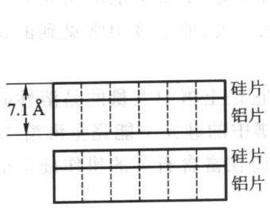

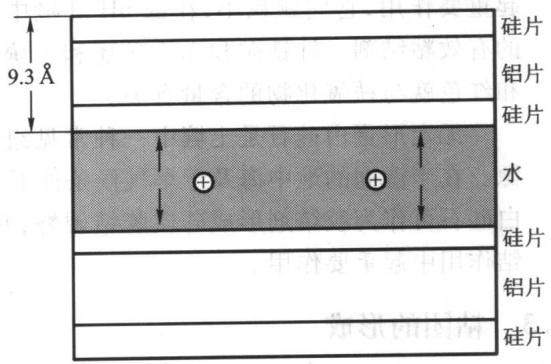  
(a)高岭石二晶层(六个晶胞宽)  
(b) 蒙脱石晶层  
图1.10 晶层边缘示意图[39]

绿泥石的结构与蛭石很相似，所不同的是基本单位晶层间的交换性镁和水层被层间晶片所取代，而且在晶片中与八面体配位的是镁而不是铝。绿泥石矿物中铝对硅的代换产生一个负电荷，层间晶片中铝和铁对镁的置换产生一个正电荷，从而使矿物的三个层通过库仑力结合起来。故在绿泥石结构中有两个硅 $\overrightarrow { A }$ 片、一个铝片、一个镁片。由于晶体内的静电平衡，其阳离子交换量为10\~

$4 0 \mathrm { \ c m o l \cdot \mathbf { k g } ^ { - 1 } }$ ，物理性质与云母相似。

坡缕石或纤维粘土组矿物为2:1晶格结构，其硅四面体基部氧原子面两边都出现由四面体顶部的顺序轮番倒转而引起的交错细条，产生盒状或链状结构。本组矿物有凹凸棒石和海泡石两大类。这类矿物在于旱气候、富含镁的碱性条件下形成，我国新疆碱土中海泡石含量较高，以色列的黑色石灰土中凹凸棒石含量较高。

上述粘土矿物中除纤维粘土组矿物外，均具有带铝、硅、镁或铁的四面体和八面体结构，也有由各单位晶层混合堆积所组成的粘土矿物。将有晶层混合堆积的矿物称为间层或混层粘土矿物。这种间层现象能够改变粘土矿物的表面特性，特别是离子交换和水化方面的性质。

土壤中还有一些粘粒粒级范围内的非晶体矿物，其数量取决于土壤性质及其形成条件。如火山灰土壤就常常含有无定形矿物水铝英石。水铝英石具有很大的比表面积、很高的阳离子和阴离子交换量，并含有大量的水。由一维结构单元准晶形混合的伊毛缟石，其性质和丰度与水铝英石十分相似。

铝、铁、镁的游离氧化物(包括氢氧化物)在大多数土壤中广泛分布。它们大量存在于高度风化的氧化土中。土壤中的氢氧化铝主要以三水铝石存在，而铁氧化物最常见的矿物为针铁矿和赤铁矿。铁铝氧化物在土壤团聚体稳定方面起重要作用，它们颗粒小，在低pH环境中带正电荷，是带负电的粘粒矿物之间的有效粘结剂。针铁矿和赤铁矿还和土壤颜色有关，如土壤中常见到的黄棕色和红色就与铁氧化物的含量有关。

无定形蛋白硅石是土壤中一种常见组分，它是土壤中大量的易溶性硅的来源。在半湿润的地中海及干旱气候条件下，土壤中的硅并不能完全淋溶[20]。蛋白硅石可作为胶结剂形成硅质胶结硬磐，并可能在富含石英的耕作硬盘的弱胶结作用中起重要作用。

## 1.4.3 粘团的形成

良好的土壤结构主要是团粒结构，指近似球形、直径约为0.25\~10mm、疏松多孔的小团聚体。团粒结构是由土粒多次凝聚和多次胶结形成的，调节着土壤中水、肥、气、热四大肥力因素，是最理想的土壤结构体。

团粒结构的形成大体可分为两个阶段，即粘团的形成和粘团的再团聚。粘团的形成是团粒结构形成的第一阶段，它是指一组粘粒在其结晶面之间定向紧密排列成为单体的单元，是粘粒凝聚和絮凝的结果4]。粘团的形成与水分有重要关系。在粘粒悬液中，粘粒表现出胶体的行为，相互之间同时存在引力和斥力作用，其中以引力还是斥力为主则取决于土壤溶液的物理化学性质。当斥力占主导地位时，粘粒相互排斥，彼此分离，保持一定距离，此种情况为分散；当引力占主导地位时，粘粒相互吸引，絮聚在一起成为絮聚体，此时为絮聚。

粘粒胶胞之间的斥力主要来自于环绕胶胞外围离子的相同的电荷，引力则来自于粘粒相互接近到1.5nm左右时表面阳离子被粘粒结晶面上阴离子的吸附作用，形成平行定向排列的叠胶片，是为片状聚集，相当稳定[6]。引力也可来自于粘粒边面所具有的正电荷与其他粘粒边面负电荷相互吸引所产生的离子键。如果粘粒再靠近，分子间作用力—范德瓦耳斯力便会使粘粒相互凝聚得更紧。若粘粒进一步接近，粘粒本身的质体就产生相拒作用。这表明粘粒间的引力在不同的距离范围内起主要作用的力也不同，而且各种力之间也难区分开来，粘粒间的力随粘粒间距的变化而变化(图1.11)。库仑力与距离的7次方成反比，只在很短的距离范围(只有十分之几纳米)起作用，而范德瓦耳斯力的作用范围最少要大10倍。

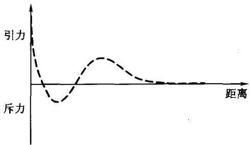  
图1.11 水化粘粒周围结合力场示意图

悬液中粘粒间的距离与粘粒胶胞双电层的特征厚度有关。根据双电层理论，双电层特征厚度是自粘粒表面至双电层外围离子浓度与胶胞间浓度极为近似点的距离。双电层特征厚度除与各常数(如气体常数、阿伏伽德 $\varTheta$ 常数、温度)有关外，主要取决于悬液中离子的价数以及悬液浓度。悬液中离子价数和浓度的提高都将压缩双电层，有利于粘粒的絮聚。田间情况证实，凡吸附 $\mathbf { C a } ^ { 2 . + }$ $\mathbf { A l } ^ { 3 + }$ 等高价阳离子的粘粒团聚较好；吸附 $\mathbf { N a } ^ { + } \cdot \mathbf { K } ^ { + } \cdot \mathbf { N H } _ { 4 } ^ { + }$ 等低价阳离子的粘粒在介质中不存在盐类或盐浓度极低时全部分散，但在介质中盐浓度增高时也出现絮聚。自然界中碱土和强碱化土壤是分散的，盐土中粘粒团聚较好，洗去盐后粘粒又分散。

双电层理论假设胶体表面的负电荷是常数并均匀地分布在表面上。事实上，粘粒表面的电荷至少有一部分是发生在晶格内，而表面电荷价数常因介质$\mathbf { p H }$ 的变化而变化。此外，即使是同价阳离子，阳离子在表面吸附方面也有差异，而且不同阳离子所形成的双电层厚度也有差异。阳离子被吸附的难易还与其离子半径和水化程度有关。一般同价阳离子半径越小，水化程度越弱，越易于吸附。如 $\mathbf { N a } ^ { + }$ 离子半径仅为0.098nm，但其充分水化后有效半径增加8倍，很难被粘粒吸附。因此，常见阳离子吸附的难易，也就是彼此代换的难易遵循下列顺序： ${ \bf A } { \bf l } ^ { 3 + } > > { \bf C } { \bf a } ^ { 2 + } > { \bf M } { \bf g } ^ { 2 + } > > { \bf N H } _ { 4 } ^ { + } > { \bf K } ^ { + } > { \bf H } ^ { + } > { \bf N a } ^ { + } > { \bf L i } ^ { + }$

自然情况下，粘粒所吸附的阳离子并不是单一的，而是由多种阳离子组成，称为代换性阳离子组。它与代换量一样，是土壤胶粒的重要特征。各类土壤代换性阳离子组成由成土过程的条件决定。因此，粘粒对离子的吸附及其阳离子代换在自然情况下更为复杂。

## 1.4.4 粘团的再团聚

粘团间进一步相互团聚，或借助某种胶体物质(最普遍的是腐殖质)而团聚，就可形成粒径不一、稳定程度不同的各式各样团粒。具体团聚过程复杂，几种团聚的可能机制如下：

胶体的凝聚作用：粘团面与粘团面由高价离子桥连接，或带正电荷的粘团边与带负电荷的粘团面连接；

无机物质的粘结作用：土壤中的碳酸钙、硫酸钙、无定形硅酸、氧化铁和氧化铝以及粘粒本身在湿润时对其他土粒的粘结作用；

有机物质的胶结和复合作用：木质素、蛋白质、真菌及丝状菌菌丝、多糖类、脂肪、蜡质和腐殖质等对土粒的胶结作用，其中以多糖类和腐殖质最为重要。土壤腐殖质不仅是重要的有机胶结物质，而且可通过多种复合机制与矿质土粒形成有机-矿质复合体；

蚯蚓及其他小动物的作用；土居动物，如蚯蚓和蚁类等的活动可促进团粒结构的形成，特别是蚯蚓，其排泄物本身即为良好的团粒；

切割造型过程：根系切割、干湿交替、冻融交替；

耕作施肥：轮作、间作、施用有机肥等。

## 1.4.5 土壤团粒的稳定性和团粒粒径分布

土壤结构稳定性是指团聚体对水、机械操作及生物分解所产生的分散作用的抵抗力。含水量影响土壤结构的稳定性，决定外界作用力对结构的破坏程度。干燥土壤中有相当紧密粘结的团聚体，如果这些颗粒在水中碎裂，那么团聚体就不稳定。水对团聚体的破坏方式有两种：第一种是水化作用产生的膨胀和闭塞空气的爆裂使团聚体破坏；第二种是雨滴对裸露土壤的打击作用分散团聚体。当分散的土粒进入土壤孔隙时，增加了土壤紧实度，减小了孔隙度。大雨常使表层几厘米或更多的土壤结构松散，形成紧实的、不易渗透的薄土层，即结皮。这种结构破坏在以腐殖质或铁化合物结合的团聚体中很少发生。许多情况下，雨滴是导致土壤团聚体分散的主要原因，其直接影响体现在土表的一个薄层里，而这层的土壤结构会遭到破坏，限制了空气和水分与整个土壤剖面的联系。

耕作及其他土壤管理措施通常使土壤团聚体的稳定性降低，除非土壤有机质保持在相对较高的水平，而且机械作业在土壤最佳含水量下进行。Tistall和Qades[57]研究了不同粒级团聚体中粘合剂的发生，发现大团聚体的粘合剂是暂时的，而微团聚体的粘合剂是持久的。耕作管理对暂时过渡性的粘合剂的影响比对持久性粘合剂的影响要大，因此耕作管理更有可能对大团聚体产生影响。

常用来描述土壤团聚作用的团聚体性质有：干团聚体大小分布、湿团聚体大小分布、干团聚体稳定性、湿团聚体稳定性[45]。在研究时团聚体应该在能代表田间条件的湿度和温度条件下风干，然后过筛确定其分布，而不能在烘箱中烘干。对于旱地土壤，干筛比湿筛能更好地描述土壤的团聚作用，因为过湿的团聚体的团聚作用很弱，筛分时机械作用很容易破坏它们。干筛时的主要问题是平筛的阻塞及操作时的机械作用造成弱团聚体的破裂，使用旋转筛能避免这些问题。团聚体干筛为描述土壤对风蚀的敏感性提供了一个重要指标，而且不用对样品进行特殊处理就能获得一致的结果。

湿筛中最大的问题是湿润土壤样品方法不统一。湿润团聚体的方法很多，包括高度真空下对干团聚体的快速湿润，用湿润滤纸或蒸汽逐渐湿润。Elliot2]比较了几种湿润团聚体的方法，发现土壤样品团聚体大小分布和初始含水量之间显著相关。湿团聚体大小分布可通过一套特殊的筛分方法来确定。此法中，将土壤样品铺在浸没水中的一套筛子上部，最细的筛子置于底部(4.76mm、2.00 mm、1.00 mm、0.21mm)。整套筛子在水中按标准的机械方法升降30次，然后测每个筛子上的土壤重量[35,65]。

干团聚体最早用干筛中剩余样品重量百分比来描述[18]，另一个方法便是Marshell和Quirk[41]提出的下降粉碎法，这个方法是测定水滴打碎置于硬盘上的团聚体所需的高度。更新的方法是Perfect 和 Kay[50]提出的破裂阈值法，它直接测定破裂两平行板之间团聚体所需的力。

测定湿团聚体稳定性的方法为一标准方法。把湿样品置于0.26mm的筛子上，振荡一段时间，使水流过团聚体，实验中不能通过筛孔的团聚体被认为是稳定的[36]。

在描述土壤团聚体分布时，一个广泛应用的指标是平均重量直径(MWD)，它是基于不同粒级团聚体的重量和大小而拟定的，其表达式为

$$
\mathbf { M } \mathbf { W } \mathbf { D } = \sum _ { i \mathrm { ~ } = 1 } ^ { n } \ x _ { i } w _ { i }\tag{1.20}
$$

式中x是筛分出来的任一粒径范围团聚体的平均直径，w；是任一粒径范围团聚 $\boldsymbol { x } _ { i }$ ${ \pmb w } _ { i }$ 体的重量占土壤样品干重的分数。求和是指所有粒径范围的团聚体数量，包括通过最小筛孔的那组团聚体。

另一个反映团聚体大小分布的指标是几何平均直径(GMD)，它可通过下式进行计算：

$$
\mathrm { G M D } = \exp \Bigl [ \Bigl ( \sum _ { i = 1 } ^ { n } w _ { i } \mathrm { l g } x _ { i } \Bigr ) / \Bigl ( \sum _ { i = 1 } ^ { n } w _ { i } \Bigr ) \Bigr ]\tag{1.21}
$$

式中： ${ \pmb w } _ { i }$ 是平均直径为 $\pmb { x } _ { i }$ 的团聚体重量， $\sum _ { i = 1 } ^ { n } \ w _ { i }$ 是土壤样品的总重。

很多土壤的团聚体呈对数正态分布，可用几何平均直径和对数标准差来描述。反映团聚体大小分布的其他指标还有团聚化系数、加权平均直径和标准差等，在此不再详述。

## 1.4.6 土壤结构的分类

土壤结构可按结构体形态、大小或性质进行分类，也可按照不同结构体的来源及其引起的土壤理化性质的不同进行分类。

## (1) 按结构体形态分

在野外土壤调查中观察土壤结构应用最广的是形态分类。土壤结构按结构体形态可分为以下四类：

块状结构和核状结构：土粒互相粘结成为不规则的土块，内部紧实，轴长5cm以上，长、宽、高相似，可细分为大块状结构和小块状结构，其中块小且边角明显的称为核状结构。此类结构体多出现在有机质缺乏而且耕性不良的粘质土壤中。

棱柱状结构和柱状结构：土粒粘结成柱状，纵轴大于横轴。此类结构体常出现在土壤下层。在水田心土层，水分经常变化，而且土壤质地粘重，土壤在干湿交替作用下垂直开裂，形成棱柱状结构。

片状结构：土粒排列成片状，结构体横轴大于纵轴，多出现于冲积性土壤中。老耕地的犁底层有片状结构，表层土壤板结或结壳时也会出现片状结构。

团粒结构：土壤胶结成粒状和小团块状，大体呈球形。此类结构常在表土中出现，具有良好的物理性能，是肥沃土壤的结构形态。

## (2) 按结构体存在状态分

按结构体存在状态可分为三大类，单粒状、团聚状、块状，其中团聚状又可分为四种类型。单粒状结构指土壤的几何组织分解成多孔结构，而颗粒间很少或没有胶结作用。粗质地的砂土经常以这种方式排列，形成刚性的、由基本上呈球形的原生矿物所组成的固相构架。这种土壤常被认为无结构，这是指它们组分之间缺少胶结或絮凝作用。块状结构是指土壤非常坚固，有明显的边面。这种结构较为典型的是粘粒含量高的母质矿物58]。

介于单粒和块状结构之间的是团聚体。在团聚化土壤中，单粒之间互相粘结，形成不同形状和强度的大的结构单元，称为自然结构体。在干湿循环、冻融交替、植物根系、动物洞穴或其他破坏力的影响下，母质矿物风化，而这种结构单元正是通过母质矿物风化而形成的。动植物及微生物群体活动产生的胶结物有利于自然结构体的结合。为反映形状，自然结构体可再分为四类:粒状、片状、块状及棱柱状。六种类型结构体图见图1.12。

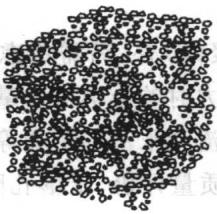  
(a) 单粒状

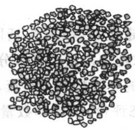  
(b) 颗粒状

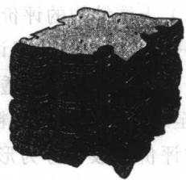  
(c) 团聚状

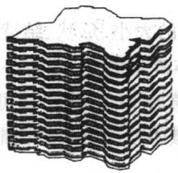  
(d) 板状

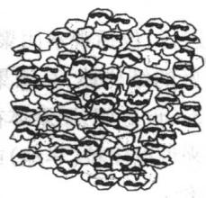  
(e) 块状

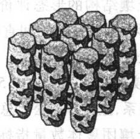  
(f) 棱柱状  
图1.12 六类土壤结构

## (3) 按不同起源分

由于任何土壤结构都是在一定的气候、植被、土壤生物、农业技术和混合作用等条件下形成的，因此可将土壤结构按不同起源分为五个类型31]。

气候型结构(压力-水热条件结构):结构几何表现明显，由水分冻结或干燥过程土体在压缩或压实作用下的容积改变引起，在各种土壤中都能见到，其稳定性取决于有机质含量。 CM

草根结构：无明显的几何外形，在草本植物影响下，土壤结构体形状有很大变化，有根孔和根系穿透，这种结构体在各种土壤的生草植被下都能见到，大多呈小团粒或粒状，水稳性好。

粪便结构：与蚯蚓活动有关，呈圆球形，表面有光泽，水稳性取决于蚯蚓种类及其食物条件。

农业技术结构：主要是在农具作业时形成的，也包括土壤中掘土动物活动所形成的结构，结构体比较圆正，界面和棱角不明显，可在任何土壤的耕作层中见到，水稳性取决于当地的农业技术水平。

混合结构：土层中上述结构都能见到，但比例不同。

## 1.4.7 土壤结构的评价与管理

土壤结构直接或间接地影响植物生长，并支配着土壤中所发生的各种物理、

化学、生物过程，因此对土壤结构进行科学的评价对于指导实际生产、合理管理土壤及有效地调控土壤中发生的各种过程都有重要意义。

## (1) 土壤结构的评价

评价土壤结构，除了评定土壤颗粒(包括团聚体)外，尚需考虑土壤孔隙的大小分布、土壤的通气、透水性能以及不同水分吸力时的土壤持水量和生物活性等，其至还要联系土壤颗粒的空间排列及对流、气流和水流的影响等。对土壤结构体的评价一般可分为形态评价、团聚体数量和质量评价、土壤孔隙性评价、结构体稳定性评价和土体构造评价。

## 土壤结构的形态评价：

形态描述宜在田间直接进行，包括观察团聚体的大小、形状、结持性、表面粗糙度以及根系穿插等情况。良好的结构体，其团聚体外形圆润，棱角小，表面粗糙度大，有较多裂痕，直径在0.5\~3mm之间，团聚体在稍加压的情况下即可破碎，其中交织有根系，土粒排列松。总的来说以团粒(旱地)或微团粒(水田)结构最为理想。

## 土壤团聚体数量指标评价：

主要根据经过不同孔径筛子干筛后所得到的各级团聚体数量或将其作数学处理后的指标进行评价。这些指标主要有：

大于0.25 mm 水稳性团聚体数量：当大于0.25mm水稳性团聚体数量大于70%时可以认为土壤结构性较好。

平均重量直径[式(1.20)]:

$$
\mathbf { M } \mathbf { W } \mathbf { D } = \sum _ { i = 1 } ^ { n } \ x _ { i } \pmb { w } _ { i }
$$

几何平均直径[式(1.21)]:

$$
\mathrm { G M D } = \exp \Big [ \Big ( \sum _ { i = 1 } ^ { n } w _ { i } \mathrm { l g } x _ { i } \Big ) / \Big ( \sum _ { i = 1 } ^ { n } w _ { i } \Big ) \Big ]
$$

结构系数：

$$
K = \frac { b - a } { b } \times 1 0 0 \%\tag{1.22}
$$

式中：a为微团聚体分析获得的粘粒含量，b为机械组成分析获得的粘粒含量。  
平均重量直径、几何平均直径和结构系数越大，土壤结构性越好。

## 土壤孔隙性的评价：

土壤颗粒的不同排列构成不同孔隙的几何特征，直接影响土壤中水、热、溶质和气体运动及植物根系的生长。因此，土壤孔隙的大小、数量、连续性及其分配是评价土壤结构的重要指标。可以通过颗粒的不同排列、总孔隙度、土壤孔隙度的细分(如通气孔隙度、毛细管孔隙度等)及土壤中大小孔隙的分配来评价土壤结构。结构性理想的土壤耕层总孔隙度应为50%\~56%，其中通气孔隙至少应大于8% \~10%，最好能达到 15% \~20%。

结构体稳定性评价：

土壤结构体的稳定性可分为机械稳定性、水稳定性和生物稳定性。机械稳定性是结构体抵抗因机械耕作而破坏的能力；水稳定性是结构体抵抗因雨滴冲击和水分散而破坏的能力；生物稳定性是结构体抵抗因生物分解而破坏的能力。由于团粒结构是在有机质参与的胶结和复合作用下经多级团聚而形成，故具有良好的机械稳定性、水稳定性和生物稳定性。

## 土体构造评价：

土体构造包括耕层构造、质地剖面、结构剖面和孔度剖面。

耕层构造是土壤耕层的三相搭配以及上下垒结，旱地保持三相比为2:1:1，上松下紧的耕层构造较理想。

质地剖面是土壤上下层次的质地组合状况，上砂下粘较理想，即上层质地偏砂，可迅速接纳较大的降水，防止地面径流形成，减少水土流失。下层质地偏粘，起保水保肥作用，减少养分下渗流失，同时有助于地下水上升回润表层土壤。

结构剖面是土壤上下层次的结构体类型及其排列状况，水田土壤自上而下以微团粒一块状一棱柱状结构剖面较理想。

孔度剖面是土壤上下层次的孔隙分布、叠合和联通状况。土体内的孔隙垂直分布为“上虚下实”，上部土层(0\~15cm)的总孔隙度为55%左右，通气孔隙度为15%\~20%，下部土层(15\~30 cm)的总孔隙度和通气孔隙度分别为 50%和10%左右。“上虚”有利于通气透水和种子萌发，“下实”则有利于保水保肥和扎稳根系。

## (2) 土壤结构的管理

良好的土壤结构能保水保肥，及时通气排水，调节水气状况，有利于根系在土壤中穿插，对于植物的正常生长、发育并获得最佳产量都很重要。但是在田间条件下几乎没有一种土壤的结构是完美的，而且不同植物或同一植物在不同时期对土壤环境的要求也不完全一样。因此，适宜的土壤结构，除应具有一般的共性外，还应根据土壤类型、植物种类和习性、土壤中存在的问题进行适当的调节。下面是几种常用的改善土壤结构的措施。

合理耕作：合理耕作是创造适宜农作物生长的土壤结构的重要措施之一，其中最为重要的是确定耕作时的最佳土壤含水量。因为不同含水量既影响土壤颗粒间的粘结力，也影响土壤颗粒与耕作机具界面之间的粘着力。常采取的措施有：犁翻晒白或冻垡、在宜耕期内耕作、留茬覆盖、少耕或免耕。

合理轮作：进行轮作，尤其是在轮作系统中引入豆科作物或牧草，可以增加土壤腐殖质和氮的含量，有利于土壤结构的改善。而且很多一年生作物(小麦、向日葵、玉米等)根系庞大，在其生长发育过程中能改善根际土壤结构，形成良好的团聚体。在采取各种轮作措施时，应根据实际情况，选择适宜的轮作制度，以达到改善土壤结构的目的。种植绿肥(紫云英、苜蓿、田菁等)改土在我国应用的比较普遍。水田常采用的轮作模式有：稻一稻一麦、稻—稻一油、稻—稻一烟、稻一稻一花生、稻一稻一菜、稻一稻一肥和稻一稻—蚕豆等。

增施有机肥：施用有机肥能够增加土壤中的有机质含量，促进土壤团聚作用，改良土壤结构。增施有机肥不但在旱地能改善土壤结构状况，而且在水田也有这种作用。

水分管理：合理的水分管理可以减少土壤结构体的破坏。水田采用水旱轮作、减少土壤的淹水时间能明显改善水稻土的结构状况，促进作物增产。

施用石灰和石膏：酸性土壤合理施用石灰，碱性土壤施用石膏，增加土壤$\mathbf { C a } ^ { 2 + }$ ，可促进土壤良好结构体的形成。

应用人工结构改良剂：增加土壤团聚体稳定性的关键是土壤中必须有能够胶结土粒的不可逆或弱度可逆的胶结物质，特别是诸如腐殖物质和多糖等的物质。土壤结构改良剂是用来促进土壤形成团粒、改良土壤结构的高分子化合物的总称，包括矿物、腐殖质和人工合成剂等类型的制剂。常见的有人工合成的高分子聚合物制剂、自然有机制剂和自然无机制剂。人工合成的高分子聚合物制剂主要有乙酸乙烯酯和顺丁烯二酸的共聚物(VAMA)、水解聚丙烯腈(HPAN)、聚乙烯醇(PVA)和聚丙烯酰胺(PAM)，其中聚丙烯酰胺推广应用前途较广阔；自然有机制剂主要有醋酸纤维、棉紫胶、芦苇胶、田菁胶、树脂胶、胡敏酸盐类和沥青制剂等；自然无机制剂主要有硅酸钠、膨润土、沸石等。

盐碱土电流改良：盐碱土通直流电后，土壤胶体吸附的钠离子被代换并淋洗 掉，土壤中碎块状结构明显增加，原来不透水的土体变得疏松多孔，结构性状得 到明显改善。

## 1.5 土壤基质的三相比与综合性质

土壤基质是土壤的固相部分，它是一个比表面积很大的多孔体，是水、肥(溶质)、气、热(能量)在其中保持和传导的介质。从广义的角度看，土壤基质不仅仅只表示土壤的固相部分，还应该包括多孔介质中的液相和气相这两部分。因此，土壤基质一般由三相物质组成。土壤颗粒和少量的有机质等物质构成了土壤的固相部分；土壤水构成了土壤基质的液相部分；土壤孔隙中的气体构成了土壤基质的气相部分。土壤基质在自然界中的作用不仅取决于土壤基质的比表面积和孔隙状况，还取决于土壤基质的三相物质比。土壤基质三相的相对比例是不断变化的，它取决于土壤质地、气象条件、地表植被状况和土壤管理等因素。

土壤基质的三相物质比常用质量或容积为基础表示。图1.13为土壤三相物质构成的示意图。图的右侧表示固、液、气三相物质的质量，分别用 $m _ { \ast } \cdot m _ { \ast } \cdot m _ { \varepsilon }$ 表示，和 $\pmb { m } _ { \textrm { s } }$ 相比，m。与 $\pmb { m } _ { \mathbf { a } }$ $m _ { * }$ 可忽略不计。三相物质的总质量用 ${ \pmb m } _ { \uparrow }$ 表示。图的左侧为各相物质的容积，分别以 $V _ { \mathrm { ~ s ~ } } \backslash V _ { \mathrm { ~ w ~ } } , V _ { \mathrm { ~ a ~ } }$ 表示，土壤的总容积为 $V _ { \mathrm { { t } } } = V _ { \mathrm { { s } } } + V _ { \mathrm { { s } } } + V _ { \mathrm { { s } } }$ O土壤基质的孔隙容积为 $V _ { \mathrm { { f } } } = V _ { \mathrm { { w } } } + V _ { \mathrm { { a } } }$ O

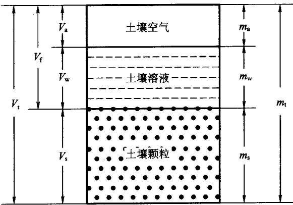  
图1.13 土壤三相物质比例示意图

## 1.5.1 土粒密度

土粒密度应称为土壤固相密度或土粒平均密度，用符号 $\pmb { \rho _ { \mathrm { s } } }$ 表示：

$$
\rho _ { \mathrm { s } } = { \frac { m _ { \mathrm { s } } } { V _ { \mathrm { s } } } }\tag{1.23}
$$

绝大多数矿质土壤的 $\pmb { \rho _ { \mathfrak { s } } }$ 在 $2 . \ 6 \sim 2 . \ 7 \mathrm { ~ \bf ~ g ~ } \cdot \mathrm { ~ \bf ~ c m ~ } ^ { - 3 }$ 之间，常取其平均值$2 . 6 5 \ \mathrm { ~ g ~ } \cdot \mathrm { ~ c m ~ } ^ { - 3 }$ 。这一数值很接近砂质土壤中石英的密度，各种铝硅酸盐粘粒 $\textcircled { + } \textcircled { 1 }$ 物的密度也与此近似。ρ的值主要取决于土壤的矿物部分和有机部分：土壤中氧 $\pmb { \rho _ { \mathsf { s } } }$ $\textcircled { \pmb { \theta } } ^ { 2 }$ 化铁和各种重 $\textcircled { \pmb { \cdot } }$ 物含量高时 $\pmb { \rho _ { \mathrm { s } } }$ 增高，有机质含量高时 $\pmb { \rho _ { \mathrm { s } } }$ 降低。

以前常用比重一词表示土粒密度，其准确含义是指土壤的密度与标准大气压卜$4 \mathbb { C }$ 时水的密度之比，又称相对密度。一般情况下，水的密度取1 $. 0 \ \mathbf { g } \cdot \mathbf { c m } ^ { - 3 }$ ,故比重在数值上与土粒密度 $\pmb { \rho _ { \mathrm { s } } }$ 相等，但没有量纲。比重一词现已不再使用。

## 1.5.2 土壤容重

土壤容重应称为干容重，又称土壤密度，是干的土壤基质物质的量与总容积之比，用符号 $\pmb { \rho _ { \mathrm { b } } }$ 表示：

$$
\rho _ { \mathrm { { b } } } = { \frac { m _ { \mathrm { { s } } } } { V _ { \mathrm { { t } } } } } = { \frac { m _ { \mathrm { { s } } } } { V _ { \mathrm { { s } } } + V _ { \mathrm { { s } } } + V _ { \mathrm { { s } } } } }\tag{1.24}
$$

由于 $V _ { \mathrm { { t } } }$ 大于 $V _ { \mathrm { { s } } }$ ,故 $\pmb { \rho _ { \mathrm { b } } }$ 小于 $\pmb { \rho _ { \mathrm { s } } }$ 。若土壤孔隙 $V _ { \mathrm { f } }$ 占土壤总容积 $V _ { \mathrm { { t } } }$ 的一半，则 $\pmb { \rho _ { \mathrm { b } } }$ 为 $\pmb { \rho _ { \mathrm { s } } }$ 的一半，约为 $1 . 3 0 \sim 1 . 3 5 \mathrm { ~ g ~ } \cdot \mathrm { ~ c m ~ } ^ { - 3 }$ 左右。土壤容重与土壤质地、压实状况、土壤颗粒密度、土壤有机质含量及各种土壤管理措施有关。土壤越疏松多孔，容重越小，土壤越紧实，容重越大；粘质土的容重 $( 1 . 0 \sim 1 . 5 \ \mathrm { g } \cdot \mathrm { c m } ^ { - 3 } )$ 小于砂质土(1.2\~$1 . 8 \ \mathrm { g } \cdot \mathrm { c m } ^ { - 3 } )$ ;有机质含量高、结构性好的土壤容重小；耕作可降低土壤容重。

## 1.5.3 总容重

总容重又称湿容重，指单位容积湿土壤的质量，用 $\pmb { \rho } _ { \imath }$ 表示，即

$$
\rho _ { \mathrm {  t } } = { \frac { m _ { \mathrm { t } } } { V _ { \mathrm { t } } } } = { \frac { m _ { \mathrm { s } } + m _ { \mathrm { v } } } { V _ { \mathrm { s } } + V _ { \mathrm { s } } + V _ { \mathrm { s } } } }\tag{1.25}
$$

总容重在很大程度上取决于土壤含水量，所以只有在特殊情况下才能使用这一参数。

## 1.5.4 孔隙度

孔隙度是单位容积土壤中孔隙容积所占的百分数：

$$
f = { \frac { V _ { \mathrm { t } } - V _ { \mathrm { s } } } { V _ { \mathrm { t } } } } = { \frac { { \frac { m _ { \mathrm { s } } } { \rho _ { \mathrm { b } } } } - { \frac { m _ { \mathrm { s } } } { \rho _ { \mathrm { s } } } } } { \frac { m _ { \mathrm { s } } } { \rho _ { \mathrm { b } } } } } = 1 - { \frac { \rho _ { \mathrm { b } } } { \rho _ { \mathrm { s } } } }\tag{1.26}
$$

土壤孔隙度的大小说明了土壤的疏松程度及水分和空气容量的大小，土壤孔隙度与土壤质地有关，一般情况下砂土、壤土和粘土的孔隙度分别为30%\~45%、40% \~50%和45% \~60%,结构良好土壤孔隙度为55% \~70%，紧实底土为25%\~30%。土壤孔隙度也随着土壤中各种机械过程而变化，在较粘的土壤中，随着土壤交替性的膨胀、收缩、团聚、粉碎、压实和龟裂，土壤孔隙度变化很大。尽管土壤孔隙度是土壤中相对的孔隙容积，但它却不能反映土壤孔隙的分布状况。土壤孔隙的分布状况可通过当量孔径、通气孔隙度、毛细管孔隙度等来表征。

当量孔径指与一定的土壤水吸力相当的土壤孔径：

$$
d = \frac { 3 } { h }\tag{1.27}
$$

式中：d为当量孔径(mm)，h为土壤水吸力(厘米水柱高或毫巴)。

## 1.5.5 充气孔隙度

充气孔隙度指土壤中空气的相对含量。空气的重量极轻，需要以容积为基础计算，充气孔隙度可表示为

$$
f _ { \mathrm { a } } = \frac { V _ { \mathrm { a } } } { V _ { \mathrm { t } } } = \frac { V _ { \mathrm { a } } } { V _ { \mathrm { s } } + V _ { \mathrm { w } } + V _ { \mathrm { a } } }\tag{1.28}
$$

充气孔隙度是表征土壤通气状况的一项重要指标。在非膨胀性土壤中，f。与土壤容积含水量θ和土壤饱和度s的关系是

$$
f _ { \mathrm { a } } = f - \theta = f ( 1 - s )\tag{1.29}
$$

关于土壤含水量和饱和度的概念，将在第2章中作详细阐述。

## 1.5.6 土壤发生层

土壤发生层简称土层，是土壤剖面上表现出的水平层状构造。它反映了土壤形成过程中物质迁移、转化和累积的特点。其野外鉴定特征主要包括土壤颜色、质地、结构、松紧度和新生体等。一定的土壤发生层与一定的成土过程相联系，其主要特征与气候、母质、植被、地形、时间等因素有关。

腐殖化过程广泛存在于自然界，故各种土壤剖面上部大都具有暗色的腐殖质层。淋溶和淀积过程对土壤剖面的分化具有重要意义。在寒带或寒温带针叶林植被下，强有机酸参与的淋溶过程(灰化过程)形成强酸性的灰白色土层一灰化层：热带、亚热带生物-气候条件下，伴随强烈风化作用的土壤淋溶过程形成富含铁铝氧化物的土层；于旱与半干旱环境中与可溶盐分淋失和积聚的不同强度有关的各种成土过程形成盐土层、钙积层和石膏层等。此外，与土壤粘化过程有关的土壤发生层有粘化层：与土壤氧化还原过程有关的有潜育层；与土壤碱化过程有关的有碱化层等。一种类型的土壤往往存在几个成土过程，不同的土壤则具有不同的成土过程组合，因此也就有不同的土壤发生层组合。例如，暖温带阔叶林下的棕壤具有两个成土过程，即腐殖化过程和粘化过程，其剖面主要由腐殖质层、粘化层和母质层构成;温带草甸草原植被下的黑钙土，具有明显的腐殖质累积过程和钙化过程，其剖面主要由腐殖质层、钙积层和母质层构成。土壤发生层及其组合是土壤分类的主要依据，也是决定土壤肥力高低的重要因素。

表1.9 土壤发生层的描述术语
<table><tr><td rowspan=2 colspan=1>0层(枯枝落叶层)</td><td rowspan=1 colspan=1>01</td><td rowspan=1 colspan=1>未分解的枯枝落叶层</td></tr><tr><td rowspan=1 colspan=1>02</td><td rowspan=1 colspan=1>半分解的枯枝落叶层</td></tr><tr><td rowspan=3 colspan=1>A层(淋溶层)</td><td rowspan=1 colspan=1>A1</td><td rowspan=1 colspan=1>腐殖质累积层</td></tr><tr><td rowspan=1 colspan=1>A2</td><td rowspan=1 colspan=1>强淋溶层</td></tr><tr><td rowspan=1 colspan=1>A3</td><td rowspan=1 colspan=1>过渡层</td></tr><tr><td rowspan=3 colspan=1>B层(淀积层)</td><td rowspan=1 colspan=1>B1</td><td rowspan=1 colspan=1>过渡层</td></tr><tr><td rowspan=1 colspan=1>B2</td><td rowspan=1 colspan=1>强淀积层</td></tr><tr><td rowspan=1 colspan=1>B3</td><td rowspan=1 colspan=1>过渡层</td></tr><tr><td rowspan=1 colspan=1>C 层(母质层)</td><td rowspan=1 colspan=1>C</td><td rowspan=1 colspan=1>未固结的岩石</td></tr><tr><td rowspan=1 colspan=1>R层(基岩)</td><td rowspan=1 colspan=1>R</td><td rowspan=1 colspan=1>固结的岩石</td></tr></table>

一般情况下，土壤发生层如表1.9所示。上层的A层土壤构成表土，它的有机质含量往往高于下层土壤，颜色更深。其下为B层，即底土层，它的粘粒含量通常比上层土壤高，颜色更浅。位于B层下面的是C层，由形成土壤的母岩及深层的基岩组成。C层厚度因土壤而异，有时甚至在剖面上消失。A、B层和C层的上部为土壤剖面。对A、B、C层的土壤还可进一步细分为不同亚层。

## 1.5.7 土壤强度

土壤强度是土壤对穿透、剪切作用的抵抗能力。在性质上是土壤能承受作用力而不被破坏的能力，其大小是土体中引发破坏的最大应力。土壤强度来源于颗粒之间的粘结力和颗粒受力位移时所产生的摩擦力。

土壤强度在苗木固定、根系生长及耕作等方面起重要作用，因此也是一个重要的土壤物理指标。土壤的强度值因测定时施力方式不同而异，因为同一土壤对剪切、压缩、拉伸、穿透等作用力的承受能力不尽相同，所以有许多表征土壤强度的指标。

十壤对穿透的抵抗能力可用穿透计测定。穿透计的末端是锥形或平的，平末端的穿透计常用于表土附近土壤强度的测定，锥形穿透计常用于深层土壤的测定。测定土壤对穿透的抵抗能力就是测定把穿透计插入土壤中所需的力37。

另一个土壤强度指标为破裂系数，它是破裂一块完整土块时单位面积所需施加的力。破裂系数校正后也可模拟土壤结皮的形成。模拟时将干的和湿的土壤样品置于长方形模板上，然后进行试验[54]。Fredlund 和 Vanapalli[25]把土壤对破裂和变形的抵抗定义为剪切强度，并对剪切强度的概念和研究方法进行了较为详细的论述。

## 1.5.8 土壤结皮

土壤结皮包括生物结皮和物理结皮，土壤生物结皮是由苔类、藻类、真菌和细菌以及许多景观中常见的非维管束植物成分与其下很薄的土层复合而形成的复杂聚合体，土壤物理结皮是由降雨打击夯实表层土壤导致土壤团聚体发生物理变化而形成的结构性结皮。土壤物理结皮能显著降低水分入渗，增加径流，还抑制土壤与大气之间物质和能量的交换，影响作物的生长。本书主要阐述土壤物理结皮，后面所提到的土壤结皮均指物理结皮。

## (1) 形成机理

土壤结皮是由外力在表层土壤所产生的紧实作用造成的。这种外力主要源于雨滴打湿土壤时的冲击力及太阳晒干土壤时的辐射能。当雨滴落在干土上时，土壤团聚体几乎即刻消散，然后是更为细小的颗粒分散和定向排列及这些颗粒进入土壤时对土壤孔隙的阻塞。这样在表层土壤就形成一个容重较大的紧实层。雨滴冲击形成的土壤结皮包括两个不同部分，一个是在雨滴冲击的紧实作用下土表形成一个厚约0.1mm的薄结皮；另一个是因雨滴冲击产生的分散颗粒随入渗水进入土壤，并填塞紧接表层的土壤孔隙，形成一个孔隙度降低的堵塞层43]。和底层未扰动的土壤相比，水分在堵塞层的渗透速率降低了200倍，而在薄结皮层减少了2000倍。生荒地土壤中的团聚体结构较稳定，在雨滴冲击下只会消散而不会分散，因此也没有堵塞层。因此，土壤结皮的形成是团聚体的分散作用而非消散作用。在土壤变干收缩时，水分的表面张力使土壤颗粒相互作用并定向排列。

当土壤湿润并被水分饱和时，团聚体的强烈消散和分散也能造成最表层土壤颗粒的重新排列，这种现象经常出现在地面灌溉的情况下。混浊水向土壤中入渗时也形成一个紧实层，该层变干后便成为硬壳。

## (2) 结皮强度的测定

常用的测定土壤结皮强度的方法有三种，除过前面提过的结皮破裂系数法和土壤穿透计法外，还可从幼苗出苗角度来测定[9,10,44]。Morton 和 Buchele 发明了一种类似机械幼苗的穿透计，测定它向上穿过7.8cm厚的不同容重和不同紧实度土层所需的力。他们用不同大小的探针代表不同直径的幼苗进行测定，发现出苗力随幼苗直径、土层紧实度、初始含水量和播种深度的增加而增加。

Arndt[9.10]设计了一种仪器，用来测定土表结皮形成前已埋好的机械探针在出土时所需的力。这种探针在向上顶时不穿过结皮层。对湿结皮层来说，探针前面锥形土块顶出结皮层时可产生锥形破裂。在干土中，先是结皮层开裂，然后形成由结皮层碎片组成的半球形结构。这种探针即可产生压缩力，又可产生剪切力。反映抗拉强度的破裂系数仅约为这种探针原地穿过结皮层所需力的20%。

土壤结皮强度与土壤含水量、粘粒含量、机械组成及有机质含量等性质有关。当土壤不含有机质时土壤结皮强度与粘粒含量直接相关；雨滴落在风于土上所形成的结皮强度要大于落在湿土上所形成的结皮强度30；表土的机械组成在土壤结皮形成中起重要作用，它决定了土壤结皮强度以及结皮干时开裂的频率和宽度[9]；高的土壤有机质含量可以增加土壤团聚体抵抗雨滴冲击分散的能力，能防止土壤结皮的形成。

## (3) 结皮特性与出苗

土壤结皮对作物生长的影响主要是抑制了出苗，这种抑制包括两方面，最主要的方面是结皮强度对出苗产生机械阻力，其次为土壤结皮阻断了土壤与近地大气之间的物质能量交换，影响种子在土壤中的萌发。

在有些情况下，土壤结皮强度很大，幼苗不能穿透结皮层土壤，只能在水平方向生长。Parker和Taylor[47]的实验结果显示，当用穿透计法测得的结皮强度大于3bar时，高粱出苗减弱，在结皮强度达到13\~18 bar时出苗停止。土壤结皮强度对出苗的影响还依土壤类型而定。在Pachappa细砂壤土上，结皮强度达到 273 mbar 时可阻碍豆子的出苗[54]。但在含有交换性钠的 Pachappa 壤土上，甜玉米出苗的临界结皮破裂系数为1200\~2500 mbar[8]。限制出苗的临界结皮强度还与土壤含水量有关[30]。如某粉砂壤土的破裂系数因作物和结皮含水量而异(表1.10)。由于植物种类、出苗时结皮含水量和实验方法本身的差异，很难确定临界土壤结皮强度。

对出苗来说，土壤结皮自然裂隙的特征和幼苗的大小比结皮强度更为重要。当土壳自然开裂时，出苗便取决于幼苗的位置。位于土壳裂隙处的幼苗容易穿过土壳，位于未开裂的土壳下部的幼苗不易穿过土壳。细苗的自由萌发取决于土壳裂隙的数量，而粗苗的萌发则同时取决于裂隙的大小和数量9,10]。

氧在干土壳中的扩散不太受限制，但当土壳水分含量达到一定程度时便会受到影响，妨碍土壤通气。当土壤中氧气不足时，种子发芽就受到抑制，影响出苗。

地面覆盖可以使土壤免受雨滴冲击，能防止土壤结皮，土壤有机质含量高时有利于抗分散的稳定性团聚体的形成，也能防止土壤结皮。某些人工土壤结构改良剂能促进土壤形成稳定团聚体，也可以减少土壤结皮。

表1.10 作物和水分含量对幼苗出苗的临界结皮强度的影响[30]
<table><tr><td></td><td colspan="2">含水量</td></tr><tr><td>作物</td><td></td><td> $0 . 2 5 / ( \mathrm { ~ c m } ^ { 3 } \cdot \mathrm { c m } ^ { - 3 } )$   $0 . 1 4 5 / ( { \bf c m } ^ { 3 } \cdot { \bf c m } ^ { - 3 } )$ </td></tr><tr><td colspan="2">小麦</td><td>3.21~6.41 0.8~1.6</td></tr><tr><td colspan="2">高粱</td><td>0.0~0.8</td></tr><tr><td colspan="2">大豆</td><td>0.0~0.8</td></tr></table>

## 参考文献

[1]邓时琴.中国土壤质地图[M]//中国科学院土壤研究所.中国土壤图集.北京：地图出版社，1986：23-24.

[2]郭何生，张大春.中国农业百科全书(土壤卷)[M].北京：中国农业出版社，1996.

[3]蒋以超，张一平.土壤化学过程的物理化学[M].北京：中国科学技术出版社,1993.

[4]秦耀东.土壤物理学[M].北京：高等教育出版社，2003.

[5]熊毅，李庆逵.中国土壤[M].北京：科学出版社，1987.

[6] 熊毅，陈家坊.土壤胶体.第三册[M].北京：科学出版社，1990.

[7]姚贤良，程云生.土壤物理学[M].北京：农业出版社，1986.

[8] Allison L E. Soil and plant response to VAMA and HPAN soil conditions in the presences of high sodium [ J]. Soil Science Society of America Proceedings, 1956,20:147-151.

[9] Arndt W. The nature of the mechanical impedance to seedlings by soil surface seals [J]. Australian Journal of Soil Research,1965a,3:45-54.

[10] Arndt W. The impedance of soil seals and the forces of emerging seedlings [J]. Australian Journal of Soil Research, 1965b ,3:56-58.

[11] Atterberg A. Die mechanische bodenanalyse und die klassifizierung dermineraloboden schwedens [J]. Int. Mitt. Bodenk,1912,2:312-342.

12] Bittelli M, Campbell G S, Flury M. Characterization of particle – size distribution in soils with a fragmentation model [ J]. Soil Science Society of America Journal,1999,63:782-788.

[13] Bolt G H. Soil chemistry [M]. Part B: Physico - chemical Models. Amsterdam : Elsevier,1982.

[14] Bolt G H, Bruggenwert M G M. Soil Chemistry [M]. Part A: Basic elements. Amsterdam : Elsevier, 1976.

[15] Brunauer S, Emmett P H,Taller E. Adsorption of gases in multimolecular layers [J]. Journal of the America Chemical Society ,1938 ,60:309-319.

[16] Burchill S, Hayes M H B, Greenland D J. Adsorption [ M ]//Greenland D J, Hayes M H B. The Chemistry of Soil Processes. Chichester, West Sussex, U. K. :John Wiley,1978.

[17] Call F. The mechanism of sorption of ethylene dibriomide on moist soils [J]. Journal of the Science of Food and Agriculture ,1957,8:630-639.

[18] Chepil W S. Field structure of cultivated soils with special reference to erodibilty by wind [J]. Soil Science Society of America Proceedings,1953,17:185- 190.

[19] Dixon J B, Weed S B. Minerals in Soil Environments [ M ]. 2nd ed. Madison: SSSA,1988.

[20] Drees L R, Wilding L P, Smeck N E,et al. Silica in soils: Quartz and disordered silica polymorphs [M ]//Dixon J B, Weed S B. Minerals in Soil Environments. 2nd ed. Madison:Soil Science Society of America,1988.

[21] Edelman C H, Favejee J C L. On the crystal structure of montmorillonite and halloysite [J]. Zeitschrift für Kristallographie,1940,102:417-431.

[22] Elliot E T. Aggregate structure and carbon, nitrogen, and phosphorus in native and cultivated soils [J]. Soil Science Society of America Journal, 1986, 50: 518-524.

[23] Fieldes M. The nature of the active fraction of soils. Int. Soc. Soil Sci. , Joint Mtg. Comm. IV and V [M]. New Zealand,1962:62-78.

[24] Fieldes M, Schofield R K. Mechanism of ion adsorption by inorganic soil colloids [J]. New Zealand J. Sci. ,1960 ,3:563-569.

[25] Fredlund D G, Vanapalli S K. Shear strength of unsaturated soils M ]// Dane J, Topp G. Methods of Soil Analysis. Part 4, Physical Methods. Madison: Soil Science Society of America,2002.

[26] Fripiat J J. Surface Chemistry and Soil Science. Experimental Pedology [ G ]. Univ. Nottingham:Proc. 11th Easter School in Agr. Sci. ,1964:3-13.

[27] Gapon E N. On the theory of exchange adsorption in soils [J]. Journal of General Chemistry of USSR,1933,3:144-163(in Russian).

[28] Green R E. Pesticide - clay - water interactions [ M ]// Guenzi W D. Pesticides in Soil and Water. Madison :Soil Science Society of America,1974:3-38.

[29] Grim R E. Applied Clay Mineralogy [M]. New York : McGraw - Hill,1962.

[30] Hanks R J. Soil Crusting and Seedling Emergence [ M]. Trans. 7th Int. Congr. Soil Sci,1960,1:340-346.

[31] Hillel D. Introduction to Soil Physics [ M]. New York:Academic Press,1982.

[32] Jackson M L. Chemical composition of soils [M ]// Bear F E. Chemistry of Soil. New York: Reinhold, 1964:71-141.

[ 33] Jenny H,Reitemeier R F. Ionic exchange in relation to the stability of colloidal systems [J]. Journal of Physical Chemistry,1935,39:593-604.

[34] Jury W, Horton R. Soil Physics [M ].6th ed. New York: John Wiley & Sons, Inc. ,2004:1-36.

[35] Kemper W D. Aggregate stability [M ]// Black C A, Evans D D, Ensminger L E, et al. Methods of Soil Analysis. Part 1 , Monograph 9. Madison : American Society of Agronomy,1965,511-519.

[36] Kemper W D, Rosenau R C. Aggregate stability and size distribution [M ]// Klute A. Methods of Soil Analysis. Part 1. Madison : American Society of Agronomy, 1986,425-442.

[37] Lowery B, Morrison J. Soil penetrometers and penetrability [M ]// Dane J,

Topp G. Methods of Soil Analysis. Part 4: Physical Methods. Madison : Soil Science Society of America,2002,363-388.

[38] Marshall C E. Layer lattices and base exchange clays [J]. Zeitschrift für Kristallographie,1935,91:443-449.

[39] Marshall C E. The physical Chemistry and Mineralogy of Soils [ M ]. New York: Wiley,1964.

[40] Marshall C E, Garcia G. Exchange equilibria in a carboxylic resin and in attapulgite clay [J]. Journal of Physical Chemistry,1959,63:1663-1668.

[41] Marshall T J,Quirk J P. Stability of structural aggregates of dry soil [J]. Australian Journal of Agricultural Research,1950,1:266-275.

[42] McBride M B. Environmental Chemistry of Soils [M ]. New York : Oxford University Press , 1994.

[43] McIntyre D S. Permeability measurements of soil crusts formed by raindrop impact [J]. Soil Science,1958,85:185-189.

[44] Morton C T, Buchele W F. Emergence energy of plant seedlings [J]. Agricultural Engineering,1960,41:428-431.

[45] Nimmo J, Perkins K. Aggregate stability and size distribution [ M ]// Dane J, Topp G. Methods of Soil Analysis. Part 4: Physical Methods. Madison: Soil Science Society of America,2002,317-328.

[46] Ong S K, Lion L W. Effects of soil properties and moisture on the adsorption of trichloroethylene vapor [J]. Water Research,1991,25:29-36.

[47] Parker J J, Taylor H M. Soil strength and seedling emergence relations: I. Soil type,moisture tension, temperature and planting depth effects [ J]. Agronomy Journal,1965,57:289-291.

[48] Pennell K D. Aggregate specific surface area {M ]// Dane J,Topp G. Methods of Soil Analysis. Part 4: Physical Methods. Madison: Soil Science Society of America,2002,295-315.

[49] Pennell K D, Boyd S A, Abriola L. Surface area of soil organic matter reexamined [J]. Soil Science Society of America Journal,1995,59:1012-1018.

[50] Perfect E,Kay B. Statistical characterization of dry aggregate strength using rupture energy [J]. Soil Science Society of America Journal,1994,58:1804-1809.

[51] Radoslovich E W. The structure of muscovite [J]. Acta Crystallographica, 1960,13:919-932.

[52] Radoslovich E W,Norrish K. The cell dimensions and symmetry of layer – lattice silicates [J]. American Mineralogist,1962,47:599-616.

[53] Rhue R D, Rao P S C,Smith R E. Vapor phase adsorption of alkylbenzenes and water on soils and clays [J]. Chemoshpere,1988,17:727-741.

[54] Richards L A. Modulus of rupture as an index of crusting of soils [J]. Soil Science Society of America Proceedings,1953,17:321-323.

[55] Sposito G. The Surface Chemistry of Soils [ M ]. Oxford: Oxford University Press,1984.

[56] Sposito G. The Thermodynamics of Soil Solutions [M ]. Oxford : Oxford University Press,1981.

[57] Tistall J H, Oades R D. Organic matter and water - stable aggregates in soils [J]. Journal of Soil Science,1982,33:141-163.

[58] Troeh F R, Thompson L M. Soils and Soil Fertility [M ]. 5th ed. New York : Oxford University Press,1993.

[59] Tuorila P. Uber beziehungen zwischen koagulation, elektrokinetischzen wanderungsgesch - windigkeiten, ionhydration und chemischer beeinflussung [ J]. Kolloidchem Beihefte,1928,27:44-181.

[60] U. S. Salinity Lab. Diagnose and Improvement of Saline and Alkali Soils [M ]. Washington D C:USDA,1954.

[61] van Olphen H. Clay Colloid Chemistry {M]. New York:Interscience,1963.

[62] Wiegner G. Dispersitat und Basenaustauch. Report of the Second Commission [C]. Rome:4th International Congress of Soil Science,1925.

[63] Whitt D M, Baver L D. Particle size in relation to base exchange and hydration properties of Putnam clay [J]. Journal of American Society of Agronomy, 1937, 29:905-916.

[64] Wilson M J. Clay Mineralogy:Spectroscopic and Chemical Determinative Methods [M]. New York: Chapman and Hall,1994.

[65] Yode R E. The significance of soil structure in relation to the tilth problem [J]. Soil Science Society of America Proceedings,1937,2:21-23.

## 土壤水的数量和能态

土壤水作为水资源的重要组成部分，成为陆生生态系统最重要的因素之一，是一切陆生植物赖以生存的基础。不仅水是一切生命的重要组成物质，而且土壤中许多物理、化学和生物过程常常需要在一定的水分条件下才能进行。植物不仅从土壤获取所需的水分，而且其所需的营养元素也需要从土壤溶液中获得，而土壤溶液的性质与土壤水的性质休戚相关。土壤水和土壤空气竞争土壤孔隙，土壤水分的多少间接地影响着土壤的通气状况，同时也对土壤水分在土体的连通性产生影响。此外，许多土壤物理性质，如结构性、塑性、压缩性、粘着性、粘结性等，都和土壤水分状况密切相关。所以，土壤水分的特性和储存状况也极大地影响着土壤中其他环境因子，进而影响植物和土壤生物的生存状况。

土壤水分运动是陆地水循环中最为复杂的重要环节之一，也是土壤圈物质循环的重要组成部分，同时土壤水也是热和溶质在土壤中传输的主要载体。土壤水具有自由水的主要特性，但因其处于土壤这一多孔体系中，其特性必然受+壤特性的影响，所以处于土壤不同位置的水不仅具有不同的形态和能态，而且具有不同的物理特性。此外，由于土水的相互作用，土壤水的数量与所具有的能态密切相关，而土壤水的数量和能态的关系决定着土壤水分循环的速率和方向。

综上所述，水分在土壤中的储存、运动和变化对土壤环境影响甚大，对土壤水物理化学特性的了解，对研究和阐明水分在土壤-植物-大气连续统一体(SPAC)中的状态和运动有重要意义。本章着重阐述土壤水的理化特性以及土壤水的数量和能态之间的量化关系。

## 2.1 土壤水的物理性质

## 2.1.1 水的分子结构和极性

水分子 $\mathbf { H } _ { 2 } \mathbf { O }$ 是由2个氢原子与1个氧原子共用电子，形成共价键而构成的。氧原子最外层上有6个电子，它能和2个氢原子各共用一对电子。这样，氧原子和氢原子都达到8个电子的稳定结构。但这样的分子不是对称的，原子不是成直线排列，而是呈“V”形排列。水分子中氧原子和氢原子的间距为0.97Å，而氢原子之间的距离为1.54Å，H- 0- H键的夹角为105°。由于氧原子对共用电子对的吸引作用要比氢原子强，这样就使得共价电子靠近氧原子而远离氢原子，形成非对称分子。于是负电荷集中在氧原子占据的一端，正电荷集中于氢原子占据的“V”形排列的两支端部，电荷分布就构成一个电偶极体，这就是水的极性。水分子因呈现出一定的极性而产生电场。因此，水分子与水分子、溶液中离解态的离子以及土壤中的固体矿物质和有机质的电场相互作用。相邻水分子间的极性电场可产生一种吸引力，在一个分子中的氢原子和另一个分子中的氧原子之间形成了相对较弱的内分子氢键。这种弱引力可以使很多结合的分子形成一个有效的颗粒。

水分子的极性使水和水分子具有其独特的性质和功能。首先，水分子的氢原子与相邻水分子的氧原子结合在一起形成次生氢键，使水成为氢键连接的多分子聚合体，但是将水分子连接起来的氢键要明显弱于分子内的共价键，所以单个水分子又具有相对独立的分子特性。其次，具有物理化学活性的土壤颗粒上带有负电荷，表面吸附着阳离子，由于离子和水的偶极分子的两极所固有的电荷相互吸引，离子能吸引水的偶极分子，使离子水化，最后形成环绕土壤颗粒的水膜。水膜厚度受离子半径和电荷密度影响，离子半径越大，电荷密度越小，水化作用越弱，水膜越薄。此外，极性的存在使水成为一种优良的溶剂，能够使大部分化学物质溶解，是化学物质反应的场所，也使化学物质随水运移，成为土壤化学物质循环的重要载体。

## 2.1.2 水的电解性

因为一个单独的分子中氢氧分子间的电子共价键很强，所以氢原子核不太可能获得足够的热能而破坏其对电子和离子的吸引，所以氢原子核可与水分子形成氢键而构成水合氢离子 $( \mathbb { H } _ { 3 } \mathbf { O } ^ { + } ) .$ 。从原子到残余的氢氧根离子 $\left( \mathbf { O H } ^ { - } \right)$ 是一个被动的交换过程，不能主动与一个氢原子交换质子形成中性的水分子。这个

可逆反应可用下式描述：

$$
2 { \bf H } _ { 2 } { \bf O } = { \bf H } _ { 3 } { \bf O } ^ { + } + { \bf O } { \bf H } ^ { - }\tag{2.1}
$$

可逆反应使水分子的一部分离子化。在25℃时，式中离子反应的电离常数为

$$
K _ { \mathrm { { w } } } = \left[ { \bf { H } } ^ { + } \right] \left[ { \bf { 0 H } } ^ { - } \right] = 1 0 ^ { - 1 4 }\tag{2.2}
$$

式中： $\left[ \cdot \mathbf { H } ^ { + } \right]$ 和 $\left[ \mathbf { O H } ^ { - } \right]$ 是浓度(mol/L)。因为离解反应是弱反应，所以可以忽略氢和氢氧根离子在活性与浓度上的差别。用pH度量水的离解程度，表示为

$$
\mathbf { p H } = - \mathbf { l g } \big [ \mathbf { \nabla } \mathbf { H } ^ { \mathbf { \nabla } } \big ]\tag{2.3}
$$

25 $\mathfrak { C }$ 时，纯水的 $\mathbf { p H }$ 为7,也即

$$
\left[ \mathbf { H } ^ { + } \right] = \left[ \mathbf { O } \mathbf { H } ^ { - } \right] = 1 \mathbf { 0 } ^ { - 1 }\tag{2.4}
$$

这一电离状态称为中性的。但是土壤中酸碱和其他弱电解质的存在使得纯水中建立的 $\left[ \textbf { H } ^ { + } \right]$ 和 $\left[ \mathbf { \ O H } ^ { - } \right]$ 失衡，而形成新的平衡。当土壤溶液中 $[ \textbf { H } ^ { + }$ ]大于$\left[ \mathbf { O H } ^ { - } \right]$ 时，土壤溶液的pH小于7，呈现酸性；相反，土壤溶液的 $\left[ \begin{array} { l } { \mathbf { H } ^ { + } } \end{array} \right]$ 小于$\left[ \mathbf { O H } ^ { - } \right]$ 时，土壤溶液的 $\mathbf { p H }$ 大于7，呈现碱性。

土壤水的pH不仅与土壤的矿物成分、盐分类型和土壤温度有关，还与土壤水分的数量和状态有关。在土壤溶质含量一定情况下，土壤水分含量增加意味着稀释土壤溶液，土壤水分含量减少则是浓缩土壤溶液，溶液浓度的改变会影响弱电解质反应的方向，建立新的动态平衡，最终导致土壤溶液 $\boldsymbol { \mathsf { p H } }$ 增加或降低。土壤溶液的pH不仅直接影响植物生长，而且参与土壤中一系列化学反应，对土壤化学元素的转化、迁移、离子的形态、有效性和毒性、毒理等产生影响，并且可以在很大程度上影响溶液中的化学反应、 $\pi$ 物的风化速度和土壤生物过程。

## 2.1.3 水的热力学性质

水同其他物质一样，受热时体积增大，密度减小。纯水在 $0 \ \mathfrak { C }$ 时密度为$9 9 8 \mathrm { \ k g / m } ^ { 3 }$ ,在 $1 0 0 ~ \mathrm { { ‰} }$ 时的密度为 $9 5 8 ~ \mathrm { k g / m } ^ { 3 }$ ，密度减小4%。在正常大气压下，水的密度高于冰的密度，所以当水结冰时，体积突然增大11%左右，冰融化时体积又减小。据观测，在封闭空间中，水在冻结时，变水为冰，体积增加所产生的压力可达2500个大气压力(1大气压 $\approx 1 0 ^ { 5 } ~ \mathrm { { P a } ) }$ 。水的冻结温度随压力的增大而降低，大约每升高130个大气压，水的冻结温度降低 $1 \ \mathfrak { C }$ 。水的另一重要特性是在$4 \mathbb { C }$ 时密度最大，其他温度下水的密度都要低于这一密度。水的密度对于温度的依赖性在很大程度上影响冬天水生生态系统的冰冻。因为冰的密度小，所以湖泊、河流的表面所结的冰浮在水体表面，对冰层以下的水体起到保温作用，从而使下面的水保持液体状态，这样水生生物就可以顺利地度过冬天。春天上层的冰开始融化、水面变暖，水在 $4 \mathbb { C }$ 时达到最大密度开始下沉，从而把深处的水推到上面。这样将不同水层的氧和矿物质进行混合，有益于水生生态系统。

水的热容量除了比氢和铝的热容量小之外，比其他物质的热容量都高。水的传热性则比土壤颗粒小。水的这种特性对植物和其生长的土壤环境有重要意义。土壤水的存在使得土壤的平均热容增加，热导率减小。在白天，地表因获得太阳辐射开始升温，土壤水因具有大的热容，能够吸收大量的辐射能而不致使土壤温度过高损伤植物，同时也因其小的导热率使深层土壤温度不致受太大的影响。在晚间，土壤温度高于大气温度，土壤开始通过辐射散失热量，土壤水的缓冲作用使土壤温度不致降低太快。土壤水分对土壤温度变化的缓冲作用因土壤水分含量的增加而增加。所以，含水量较低的土壤往往升温快降温也快，地温的日变幅和季节变幅都较大，大气温度的变化对土壤温度影响的深度也越大。沙漠是这一特性的极端情况。含水量高的土壤则与此相反，土壤温度相对比较稳定。水的这一特性对指导农田灌溉也有重要意义，如进行冬灌能提高地温，防止越冬作物受低温冻害等。此外，水分也是植物体调节自身温度的重要媒介。通过控制蒸腾作用的强弱，植物体可以有效控制散失热量的多少，而使植物体维持适宜的生长温度。

表2.1列出了纯水的一些热力学特性。虽然由于水和土、水和溶质等相互作用，土壤水的特性并不是单一的，且远较纯水复杂，但是绝大多数土壤水的特性可以用纯水的特性来近似，这些特性也成为研究土壤中物质和能量传输的基础。

表 2.1 纯水的热力学特性
<table><tr><td>性质</td><td>数值</td><td>单位</td><td>温度/℃</td></tr><tr><td>水</td><td> $9 . 9 8 \times 1 0 ^ { 2 }$ </td><td> $\mathbf { k } \mathbf { g } \cdot \mathbf { m } ^ { - 3 }$ </td><td>20</td></tr><tr><td>水</td><td> $1 . 0 0 \times 1 0 ^ { 3 }$ </td><td> $\mathbf { k } \mathbf { g } \cdot \mathbf { m } ^ { - 3 }$ </td><td>4</td></tr><tr><td>冰</td><td> $9 . 1 0 \times 1 0 ^ { 2 }$ </td><td> $\mathbf { k } \mathbf { g } \cdot \mathbf { \mathbf { m } } ^ { - 3 }$ </td><td>0</td></tr><tr><td>水汽 密度</td><td> $1 . 7 3 \times 1 0 ^ { - 2 }$ </td><td> ${ \bf k } { \bf g } \cdot \textbf { m } ^ { - 3 }$ </td><td>20</td></tr><tr><td>熔化热</td><td> $3 . 3 4 \times 1 0 ^ { 4 }$ </td><td> $\mathbf { J } \cdot \mathbf { k g } ^ { - 1 }$ </td><td>0</td></tr><tr><td>汽化热</td><td> $2 . 4 5 \times 1 0 ^ { s }$ </td><td> $\mathbf { J } \cdot \mathbf { k } \mathbf { g } ^ { - 1 }$ </td><td>20</td></tr><tr><td>热容</td><td> $1 . 0 0 \times 1 0 ^ { - 3 }$ </td><td> $\mathbf { J } \cdot \mathbf { k g } ^ { - 1 } \cdot \mathbf { C } ^ { \textit { - 1 } }$ </td><td>20</td></tr><tr><td>导热率</td><td> $6 , 0 3 \times 1 0 ^ { - 2 }$ </td><td> $\textbf { J } \cdot \textbf { m } ^ { - 1 } \cdot \textbf { s } ^ { - 1 } \cdot \textbf { \scriptsize { q } } ^ { - 1 }$ </td><td>20</td></tr></table>

## 2.1.4 表面张力和毛细管现象

表面张力是出现在液体和气体界面上的物理现象。由于液态水体水分子之间存在相互作用力，液体表面水膜处于张力状态，倾向于使表面收缩。当一种液体比如水与另一种液体或固体形成接触面时，接近接触面的分子与液体内部分子所受的力不同。在气-液接触面的分子一方面受到液体内部分子的作用力，另一方面受到液体外部气体分子的作用。因为接触面处气体一侧的分子密度远小于液体一侧的分子密度，对液体表面水分子就产生了一个垂直于液体表面指向液体内部的净拉力，由此使得液体表面分子向内部收缩。因此，水分子需要额外的力以保持接触面的平衡。接触面单位表面积上分子具有的与水分子承受的内部净拉力相反的力就是表面张力。表面张力与液体表面面积无关，而与液体本身的性质有关，同时受温度的影响，温度越高，液体的表面张力越小。若定义表面张力系数(σ)为水气界面上单位长度所承受的力[16]，表2.2给出不同温度下水的表面张力系数。

表 2.2 水的表面张力系数
<table><tr><td>温度/℃</td><td>10</td><td>20</td><td>30</td><td>40</td><td>50</td><td>60</td><td>70</td><td>80</td></tr><tr><td> $\pmb { \sigma } / ( 1 0 ^ { 3 } \mathbf { N } \cdot \mathbf { m } ^ { - 1 } )$ </td><td>75.5 74</td><td>72.5</td><td>71</td><td>69.5</td><td>67.8</td><td>66</td><td>64</td><td>62</td></tr></table>

在平衡状态下，气-液接触面的曲率与接触面上的压力差有关。如果是纯水，而且接触面是平的，那么接触面上下的压力就是一样的。然而，如果接触面是弯曲的，凹面的压力要大一些，大多少取决于弯液面的半径和液体的表面张力。如图2.1所示，当气液界面达到平衡时，接触面气液两侧的压强差 $\Delta p$ 所产生的力与表面张力的合力大小相等，方向相反，即

$$
\Delta p \cdot \pi R ^ { 2 } = 2 \pi R \sigma\tag{2.5}
$$

由式(2.5)可以得到界面两侧的压强差 $\Delta p$ 为

$$
\Delta p = \frac { 2 \sigma } { R }\tag{2.6}
$$

式中，当接触面弯向液相时 $\Delta p = p _ { \mathrm { 1 } } - p _ { \mathrm {  a } }$ ，当接触面弯向气相时 $\Delta p = p _ { \textrm { a } } - p _ { \textrm { l } } ; R$ 为接触面半径： $; \pmb { \sigma }$ 为表面张力系数 $; { p _ { \mathfrak { a } } }$ 为大气压 $; P _ { 1 }$ 为液体内部产生的压强。

土壤颗粒作为骨架使土壤成为一个相对稳定的多孔体系。由于土壤是由一系列数量不等的不规则颗粒组成，土壤中的孔隙同样极不规则，在土体内构成一个错综复杂的孔隙网络。目前，普遍接受的观点是根据土壤水分所处的能态把土壤孔隙概化为一系列孔径不等的圆形毛细管，其依据便是液态水的表面张力。

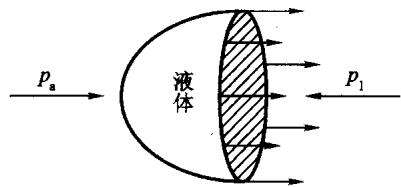  
图 2.1 液体的表面张力

设将一根很细的管子插入水中，由于液体表面张力的存在，使水气界面内侧的压力低于或高于大气压，从而导致水体在管内上升或下降。如果管壁对于水是可浸润的，管内液面上升；如果管壁对于水是不可浸润的，管内液面下降；水面的升降在水气界面内外压力差与界面处水的表面张力相平衡时停止，最终管内

外液面产生高度差，这一现象即毛细管现象。假定毛细管的截面是圆形的，毛细管内水面上升或下降的高度与大气压、水温和管径有关。由于大气压相对恒定，温度影响相对较弱，且在一定时间尺度范围变化不大，可以忽略。下面我们重点讨论毛细管管径和水体上升高度之间的关系。此外，由于土壤对于水大多是可浸润的，这里只考虑水面上升的情形。

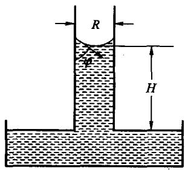  
图 2.2 毛细管上升现象

对于上升的水体(见图2.2)，由于上下表面承

受的压强均等于大气压强，所以表面张力和达到最大上升高度时水体的重力达到平衡。如果水的体积用毛细管横断面内表面积和最大上升高度之积近似，则

$$
2 \pi R \sigma \mathrm { c o s } \ \varphi = \pi R ^ { 2 } \rho _ { \mathrm { } \mathrm { w } } H g\tag{2.7}
$$

式中 $: \rho _ { \ast }$ 为水的密度；H为最大毛细管上升高度 $^ { \dag }$ 为重力加速度； $\varphi$ 为水面与管壁的接触角。R在这里为孔隙的当量孔径。由式(2.7)可以得到

$$
H = \frac { 2 \sigma \cos { \varphi } } { \rho _ { \mathrm { w } } g R }\tag{2.8}
$$

当水与管壁完全浸润时，水气接触面为球面，接触角为零，式(2.8)变为

$$
H = \frac { 2 \sigma } { \rho _ { \mathrm { w } } g R }\tag{2.9}
$$

如果以水面上升高度来表示水分子相对于自由水的势能减少量，式(2.9)实际上揭示了土壤水的能量与孔隙当量孔径之间的关系。孔隙当量孔径越大，孔隙内平衡的水分子所具有的势能越高。因此，根据土壤孔隙分布可以计算土壤水分所处的能量状态，反之，也可以由不同能量状态的土壤水分的分布知道土壤的孔隙尺寸分布。通常将式(2.9)作为毛细管理论的基础，毛细管理论在下一章还将详细讨论。

## 2.1.5 液体的粘性

当液体处在运动状态时，若液体质点之间存在相对运动，因为相邻的水分子间相互吸引，它们会抵抗试图加速液体内部质点运动的作用力，这种性质称为液体的粘性(也叫粘滞性)，此内摩擦力称为粘性力。

如图2.3所示，当液体沿着固体平面壁做平行的直线运动时，液体质点不是以相同的速度向前推进，而是有规则的一层一层向前推进(土壤水的运动大多属于这种层流运动)。由于液体的粘性，靠近边壁处的液体质点流速较小，远离边壁处的质点流速较大，因而各个液层的流速大小是不同的。由于上下液层流速不同，在液层之间必然产生两个大小相等，方向相反的内摩擦力，单位面积上产生的内摩擦力τ的大小与两液层之间的流速梯度的大小成正比，同时与液体性质有关，可用下式表示：

$$
{ \boldsymbol { \tau } } = \mu { \frac { \mathrm { d } { \boldsymbol { u } } } { \mathrm { d } { \boldsymbol { y } } } }\tag{2.10}
$$

式中 $\mathbf { \nabla } \cdot \frac { \mathrm { d } u } { \mathrm { d } y }$ 为液层流速梯度的大小 $\mathbf { ; } { \pmb { \mu } }$ 为液体的动力粘度。液体的粘滞性通常用动力粘度与密度的比值来表示，称为运动粘度ν，即

$$
\nu = { \frac { \mu } { \rho } }\tag{2.11}
$$

液体的粘度只与液体特性、压力和温度有关，但随压力变化甚微，对温度变化比较敏感。表2.3列出了水的 $\pmb { \mu }$ 和ν随温度变化的情况。

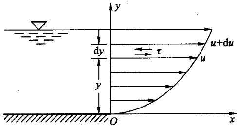  
图2.3 内摩擦力作用下液体内部流速

表2.3 不同温度下水的动力粘度 $\pmb { \mu }$ 和运动粘度ν
<table><tr><td>温度/℃</td><td>0</td><td>5</td><td>10</td><td>15</td><td>20</td><td>25</td><td>30</td><td>40</td></tr><tr><td> $\mu / ( 1 0 ^ { - 3 } \mathrm { P a } \cdot \mathrm { ~ \bf { s } ~ } ^ { - 1 } )$ </td><td>1.781</td><td>1.518</td><td>1.307</td><td>1.139</td><td>1.002</td><td>0.890</td><td>0.798</td><td>0.653</td></tr><tr><td> $\nu / ( 1 0 ^ { - 6 } \mathrm { m } ^ { 2 } \cdot \mathrm { s } ^ { - 1 } )$ </td><td>1.785</td><td>1.519</td><td>1.306</td><td>1.139</td><td>1.003</td><td>0.893</td><td>0.8</td><td>0.658</td></tr></table>

式(2.10)被称为牛顿内摩擦定理，一般把符合牛顿内摩擦定理的流体称为牛顿流体，反之称为非牛顿流体。当胶体颗粒含量多，土壤颗粒比表面积比较大时，距颗粒表面不同位置的土壤水的粘性有很大不同，并且可能随水流流速梯度而发生变化，即呈现非牛顿流体的特征。牛顿流体的假定是建立在白金汉-达西定律之上的土壤水分运动方程的基础，所以土壤中非牛顿流体的存在很可能是导致有些情况下白金汉-达西定律不能准确描述土壤水分运动的重要原因之一。

## 2.1.6 颗粒表面附近的水

土壤水流不同于地面流和管流的重要一点在于，土壤水是在多孔介质中运动，土壤水分运动通道的空间尺度发生了质的改变。在地面流和管流中，边壁对水的作用仅对距边壁很近的薄层水膜才具有相对重要的意义。但在土壤中，除了很少的一部分重力水外，大部分土壤水距颗粒很近，受土壤颗粒的作用，这种作用对土壤水的运动所起的影响有时与重力作用处于相同的量级，有时则远远超过重力作用的水平。在非饱和土壤中，土壤水常常以非饱和运移为主，饱和运移受土壤水分状况的制约，仅在少数情况下出现，所以水土相互作用的研究是土壤水分运动，以及以此为基础的土壤溶质、热和气体运动研究的重要内容，而对颗粒表面附近水的特性的了解则是理解水土相互作用的基础。

矿物表面的交换作用可以产生一个离子密集的双电层结构。因为偶极矩，水会与固体交换表面和双电层中的离子发生吸附作用。双电层就像一个半透膜，可以使它附近的水具有特殊的性质。

表面的氧原子和氢氧根原子团确定了胶质粘粒矿物的特性，尤其是断裂处的特性。氢键随时会同氧外面的电子壳层和氢原子联合。晶格中与氧连接的氢键键能接近于共价键的键能，这是因为氧原子中的单对电子受到被动交换晶格中多余电子的抵制，使得氢键更容易与水分子中的氢原子紧密结合。水分子与颗粒表面之间的结合使“结构”水贴近颗粒表面。有资料表明[31]，因为结构性组织增多了，所以接近颗粒表面的水密度小于正常水的密度。Kemper[28,29]和Low[32]的研究表明，颗粒表面几个分子层厚度的水的粘度比没受到颗粒表面影响的水的粘度大几倍。

Goates和 Bennett[26]等人的实验证明颗粒表面具有很强的吸引力，并测定了颗粒表面吸附第一个分子层的水汽所需的热量。他们发现使高岭石粘土矿物50%的表面覆盖上水大约需要-54.4 kJ·mol-1的能量，而整个表面覆盖上单分子层的水需要-60.7 kJ·mol-¹的能量（负号表示排除吸附水所做的功)，比自由水面凝结水汽所需要的能量多13\~17 kJ·mol-1。

吸附能在一定程度上也受颗粒表面性质和表面可交换性阳离子类型的影响。蒙脱石的阳离子交换能力强，比表面积大，吸水的能力强。相反，高岭石是一般土壤矿物中吸附能力最弱的一种，伊利石的吸附能力介于两者之间。相对湿度为50%时，单位质量的蒙脱石、伊利石和高岭石吸附水的质量依次为21%、4.5%和0.5%。当存在着晶栅结构和被动交换的部位时，这一差别会更加明显。近年的研究表明，阳离子交换特性对水的吸附有很大的影响。一般来说，二价阳离子饱和的粘粒比一价阳离子饱和的粘粒表现出更强的吸水性。Li除外，因为它的特性更像是二价阳离子。不论是一价离子还是二价离子，离子半径越

大吸附气态水的能力越小。

只要水的结构影响结冰的温度，则影响水结构的离子形态，以及水与固体表面的接近程度都会影响结冰点的温度。降温时，与土壤颗粒距离远的水先结冰，接近颗粒表面的“结构”强的水最后结冰，因此可用冰点来度量土壤水的能量状态[15]。

颗粒表面附近的水和水化离子附近的水进行了结构重组，使得接近颗粒表面的水和离子的运动比远离颗粒表面的水和离子的运动难以描述。有报道表明粘粒表面特性能够影响水膜的厚度，可使水膜厚度的变化范围从几个分子层(高岭石为8.0Å)到很多层(蒙脱石增加到68.0A)，影响程度取决于表面的阳离子交换特性。把多孔材料于燥后发现，颗粒表面强吸附的薄层水的比例大大增加了。因此，水在干土中的能量状态是很低的。

## 2.2 土壤含水量

## 2.2.1 土壤含水量的定义

土壤含水量是土壤绝对水量相对于土壤的一些特性指标，比如固相质量、土壤总体积、土壤孔隙容积、土壤总质量、固相容积等的比值。每一种定义在特定条件下都具有其应用上的优点。依据常用的参照体系，土壤含水量一般有以下几种定义和表示方法。

(1) 质量含水量 $( \pmb \theta _ { \mathbf { \pi } } )$

质量含水量通常也称重量含水量，是指土壤中所含水的质量 $( m _ { \mathrm { w } } )$ 与干土质量 $( m _ { \mathfrak { s } } )$ 的比值，即

$$
\theta _ { \mathrm { { s } } } = { \frac { m _ { \mathrm { { s } } } } { m _ { \mathrm { { s } } } } }\tag{2.12}
$$

干土质量应该是指不含水分的土壤固相颗粒的质量，但在实际情况下很难测定固相颗粒的精确质量。这是由于土壤颗粒表面有极强的吸湿性，在常用的土壤含水量测定方法下，总会有一部分水吸附于颗粒表面，难以与土壤颗粒分开，从而使测定的土壤颗粒的质量偏高，水分质量偏低，含水量低于土壤实际含水量。但是鉴于在常规测定方法下不能从土壤颗粒分离出来的水对于土壤水分运动和植物生长有效性很低，甚至是无效的，以常规方法测定的土壤含水量近似代替实际含水量可以满足绝大部分土壤水分问题研究的需要。因此，通常所说的干土是指在105℃下烘干的土壤。值得注意的是，并非对植物和水分运动无效的水分对土壤溶质迁移也是无效的，Coast和 Smith[22]的研究表明，土壤中可动水体和相对不动水体的存在对土壤溶质迁移有显著影响。因此，含水量的精度应依据研究问题的特点及实用性具体对待。因土壤质地、容重和有机质含量的不同，土壤含水量的上限(饱和含水量)差异很大。对于矿质土壤，其质量含水量一般在25%\~60%之间。粘性土饱和含水量一般高于砂性土。在有机质土壤如泥炭土或腐殖土中，饱和含水量甚至可能超过100%[7]。

## (2) 容积含水量(θ,)

容积含水量是指土壤中水所占的容积( ${ \bf \Xi } ( V _ { \bf w } )$ 与土壤容积(V)的比值，或单位体积土壤中水所占的容积，即

$$
\pmb \theta _ { \mathrm { v } } = \frac { V _ { \mathrm { w } } } { V }\tag{2.13}
$$

一般而言，砂质土壤饱和容积含水量在30%\~50%之间；粘质土壤饱和容积含水量可达60%。对于非膨胀土，土壤饱和容积含水量与土壤孔隙度相等；对于膨胀土，由于土壤的孔隙度随土壤含水量增加，所以土壤饱和时的容积含水量可能超过干燥时的土壤孔隙度。容积含水量消除了土壤中三相介质密度的差异，使得土壤物理工作者能从统一的空间角度研究问题，能更直观地反映土壤水分存在状况，揭示土壤水分运动各要素之间的关系，因而在研究中比质量含水量应用得更广泛。一般不特别说明，土壤含水量(θ)就指容积含水量。在实际研究和实践中，广泛应用的烘干法直接测得的含水量往往是质量含水量，但只要知道土壤的容重 $( \pmb { \rho _ { \mathbf { b } } } )$ 和水的密度 $( \pmb { \rho } _ { \ast } )$ ，就可以通过下面简单的关系获得土壤容积含水量：

$$
\theta _ { \mathrm { v } } = \theta _ { \mathrm { m } } \cdot \frac { \rho _ { \mathrm { b } } } { \rho _ { \mathrm { v } } }\tag{2.14}
$$

## (3) 饱和度(s)

饱和度是指土壤水的容积 $( V _ { \ast } )$ 与土壤孔隙总容积( $( V _ { \ast } + V _ { \ast } )$ 的比值，即

$$
s = \frac { V _ { \mathrm { w } } } { V _ { \mathrm { w } } + V _ { \mathrm { g } } }\tag{2.15}
$$

对于非膨胀性土壤，由于土壤饱和容积含水量与土壤孔隙度相等，饱和度也可以表示为

$$
\displaystyle s = \frac { \theta } { \theta _ { \ast } }\tag{2.16}
$$

式中： $\pmb { \theta } _ { \textrm { s } }$ 指饱和容积含水量或土壤孔隙度。由式(2.16)可知，饱和度的变化范围在0\~1之间。

由于饱和度可以更清楚地反映土壤水分在土壤孔隙中的填充状况，在研究土壤水分运动时经常用到。此外，由于土壤中存在一些不连通的孔隙(死孔)和微孔，在这些孔隙中的水往往流动性极差或不流动，这部分孔隙对土壤水分的传

输贡献率很小，一些研究中倾向于认为土壤在此含水量下导水率和扩散率为零，因而用有效饱和度()来反映土壤中的有效水分含量更为适宜，即

$$
\Theta = \frac { \theta - \theta _ { \mathrm { r } } } { \theta _ { \bullet } - \theta _ { \mathrm { r } } }\tag{2.17}
$$

式中：θ.指滞留含水量，但目前并没有严格的定义，根据研究的需要通常取风干土含水量。但在风干状况下，土壤含水量不仅与质地有关，还与大气湿度、温度和土壤风干时间有关。为方便起见，也有学者取滞留含水量为零，但这显然夸大了死孔和微孔中的水体在土壤水分运动中的作用。以土壤导水率或扩散率为零时的土壤含水量作为滞留含水量或许比较合理，但土壤导水率或扩散率为零的临界点并不好准确确定。虽然存在上述不确定性，但不可否认，滞留含水量确实能有效解释土壤水分和溶质迁移中出现的一些现象。

## 2.2.2 土壤含水量测定

测定土壤含水量是研究土壤水分状况和动态的基础，从最初的烘干法发展到近来的射线法，测定速度和精度都大大提高。但正如上面所讨论的，由于土壤本身的特点，任何一种测定方法得到的含水量只能是对实际土壤含水量的近似。这些测定方法各有特点，在应用时，可以根据具体情况，选择合适的测定方法。下面就目前几种主要的测定土壤含水量的方法及其特点作简单介绍。

## (1) 烘干法

烘干法是通过湿土称重、于燥脱水、然后再干土称重来测定土样的质量含水量 $\pmb \theta _ { m }$ 。烘干的经典办法是将土样放到105℃的恒温箱中烘24h。这种方法能去除颗粒间的大部分水分，但不能去除粘粒层间的水分子，而且还会挥发有机质的一些成分。因此，烘土的时间和温度在某种程度上影响测定的含水量精度。在一般情况下，在 $1 0 5 ~ \mathrm { { ‰} }$ 的恒温箱中烘6\~8h已经具有足够的精度。微波作为一种快速干燥土壤的方法，受到一些研究者的青睐，烘干土壤大约只需3\~6min左右。虽然这种方法可以快速干燥土样，但也存在很多问题。由于微波的工作原理不同于烘箱，土样内的温度可能不均衡，在某些地方温度可能会很高。所以，一些研究者认为微波干燥法没有恒温箱干燥法准确。但取样大小和烘干时间可能才是引起误差的主要原因。称量天平应具有足够的精度，因为随取样质量的减小，测量相对误差可能增加。此外，烘干法测定的是土壤的质量含水量，而容积含水量通常应用更广，在大部分情况下还要通过式(2.14)把土壤质量含水量转化为容积含水量，这就容易把容重的测量误差带入土壤容积含水量。

在田间，用取土钻采集土样，然后用烘干法测定土壤含水量，因其简单易行目前应用仍然比较普遍。而田间土壤的质地、结构等特性空间变异性很大，土壤水分分布也往往不均匀，这就造成取样的代表性可能不好。根据Holmes等人的研究，田间取样的变异系数为10%或更大7]。所以取样的大小和取样的多少是田间采用烘干法测定土壤含水量需要注意的问题。

虽然存在上述问题，但就目前来看，烘干法仍然是测定土壤含水量的标准方法，常作为其他测定方法标定的依据。

例2.1 已知土壤容重为 $1 . 4 ~ \mathrm { g / c m } ^ { 3 }$ ，假定水的密度为 $1 \ \mathrm { g / c m } ^ { 3 }$ ,计算下面试验土壤的质量含水量 $\pmb \theta _ { \mathbf { m } }$ 和体积含水量 $\pmb { \theta } _ { \mathbf { v } }$ 。将装在铝盒内的湿土拿到实验室称重、烘干、称重。得到下列数据：

表 2.4 例 2.1 数据
<table><tr><td>湿土带盒重</td><td>干土带盒重</td><td>空盒重</td></tr><tr><td>120 g</td><td>100 g</td><td>20 g</td></tr></table>

解：

$$
\theta _ { \mathrm { m } } = { \frac { \gamma ( { \dot { \mathrm { H } } } { \dot { \gamma } } ) { \frac { \sqrt { \mathrm { H } } } { \mathrm { H } } } { \frac { \mathrm { H } } { \mathrm { H } } } } { { \mathrm { T } } \pm { \dot { \mathrm { H } } } ^ { \prime } { \mathrm { H } } { \frac { \sqrt { \mathrm { H } } } { \mathrm { H } } } } } = { \frac { 1 2 0 - 1 0 0 } { 1 0 0 - 2 0 } } = 0 . 2 5
$$

$$
\theta _ { \circ } = \mathbb { E } \equiv \frac { \operatorname { I m } } { \operatorname { I m } } \approx \gamma \times \frac { \operatorname { I m } } { \operatorname { I m } } \times \frac { \pm 1 \# \operatorname { I m } \Im } { \operatorname { I K } \dot { \theta } \dot { \Im } \operatorname { I m } } = 0 . 2 5 \times \frac { 1 . 4 } { 1 } = 0 . 3 5
$$

## (2) 中子法

中子仪主要包括探头和计数器两部分。中子仪的探头由一个压缩的放射源和检测器构成，可以在土壤中预先埋设的管中移动到不同的土壤深度。探头的放射源通常是 Ra - Be 或 Am - Be 的混合物，Ra 和 Am 都可以发射出高能中子，发射出的中子与周围土壤中原子核发生碰撞。因为大多数原子核都比中子重，所以大多数的碰撞都不会减缓中子的原有能量状态。氢核质量与中子相当，所以当中子与氢核碰撞时，就会明显地减缓速度，经过几次碰撞后，中子就会达到土壤中氢原子热运动的特征速度，所以热化中子的数量基本上与放射源附近的氢原子浓度成比例。而与放射源同侧的监测器仅对以氢原子热化特征速度运动的中子敏感，因此监测器检测到的热化中子数(慢中子数)可以反映探头附近土壤中氢原子的数量。此外，由于土壤中的氢原子多以液态水的形式存在，氢原子的浓度就可以代表土壤的容积含水量，所以就可以得到一条监测器中子计数与土壤容积含水量之间的标准曲线。这个标准曲线通常是线性的，可用下式表示：

$$
\theta = a \ \frac { N } { N _ { \mathrm { s } } } + b\tag{2.18}
$$

式中：N为土壤中的慢中子计数， $N _ { \mathrm { s } }$ 为水中或标准吸收剂中的慢中子计数，a和b为率定参数。标定可以通过采集土样用烘干法测定土壤质量含水量及土壤容重，同时测定土壤中子计数的方法进行。如果土壤本身含有一定量的氢原子(比如有机质或高岭石)，氢的背景值也可以通过标准曲线与坐标轴的交点加以校正。因此，如果预先知道监测器中子计数与土壤含水量之间的标准曲线，就可以由中子计数预测土壤容积含水量。

用中子仪测定土壤含水量，有效土样的大小(也即慢中子云的大小)不是固定不变的，而是随着放射强度和土壤湿润状况变化的。在放射强度一定条件下，放射源周围慢中子云球形半径随土壤含水量的增加而减小。在含水量很高的土壤中，慢中子云的影响范围大约在15cm左右，而在含水量很低的土壤中，慢中子云的有效影响范围可达 $7 0 \ \mathrm { c m }$ [41]。整体来看，中子法测定的土壤体积大，比烘干法更有代表性，测定的容积含水量可以在一定程度上消除土壤水分田间不均匀性的影响。此外，相对于取土烘干法，中子法可以更快速地测定田间土壤水分状况，并且可以在相同地点连续反复监测，显示测定结果的重复性。因此，中子法测定土壤含水量在田间广泛采用，尤其是在取土工作量很大的情况下，中子法则有相对优势。中子法的主要缺点是标定过程需要其他方法(一般是烘干法)配合使用，并且仪器比较昂贵，空间分辨率低，测定表层土壤含水量时可能产生较大误差。

## (3) γ 射线法

虽然同为射线法，但不同于中子仪，γ射线仪的放射源通常是同位素 $^ { 1 3 7 } \mathrm { C s }$ 和241Am，并且放射源和监测器是分离的两个部分。测定土壤含水量时，位于土样一侧的放射源放射出很窄的一束γ射线透过已知厚度的土壤，监测器在土样的另一侧监测透过来的射线。 $\pmb { \gamma }$ 射线的波长范围窄，在传递的过程中γ光子与吸收体原子外的电子通过康普顿作用后 $\pmb { \gamma }$ 射线被吸收或散射，没有被散射的那部分γ光子会沿原来的路径穿过土样，由与发射源相对的监测器进行测定。γ射线的衰减程度取决于障碍物的类型和密度。在非膨胀性土壤中，影响 $\boldsymbol { \mathsf { \Upsilon } }$ 射线衰减程度的主要是土壤的厚度、土壤颗粒和土壤水分的相对体积分数，以及它们的密度。透过土样的 $\pmb { \gamma }$ 射线的强度可以用下式(Beer定律)表示：

$$
n = n _ { \mathrm { 0 } } \exp \big ( \mathbf { \nabla } - \mu _ { \mathrm { s } } \rho _ { \mathrm { b } } d - \mu _ { \mathrm { w } } \rho _ { \mathrm { w } } \theta d \big )\tag{2.19}
$$

式中：n是单位时间内监测器记录的 $\pmb { \gamma }$ 射线计数； $\pmb { n } _ { 0 }$ 是放射源的源场强度(或无土样时的监测器中子计数);μ。是土壤 $\mathbf { \nabla } _ { : \mu \nu _ { i } }$ $\textcircled { 1 }$ 物的 $\gamma$ 射线吸收系数;μ、是水的 $; \mu _ { \gamma }$ $\boldsymbol { \mathsf { \mathsf { Y } } }$ 射线吸收系数： $\mathbf { \alpha } _ { i } d$ 是土样的厚度。在其他因素一定情况下，透过土样的γ射线强度(单位时间中子计数)仅是土壤容积含水量的函数。若已知式(2.19)中的其他参数，通过 $\pmb { \gamma }$ 射线传感器读数的变化就可推知土壤的容积含水量。

通常情况下，直接应用式(2.19)测定土壤绝对容积含水量存在一定困难，而是基于参考土壤容积含水量，测定土壤容积含水量的变化量。式(2.19)还可写成如下形式：

$$
n = n _ { \mathrm { i } } \exp ( \mathbf { \nabla } - \mu _ { \mathrm { w } } \rho _ { \mathrm { w } } \Delta \theta d )\tag{2.20}
$$

式中： $\pmb { n } _ { \mathrm { i } }$ 是参考含水量下 $\pmb { \gamma }$ 射线透射强度； $\Delta \pmb \theta$ 是土壤含水量变化量。由式

(2.20)可以得到土壤容积含水量的表达式：

$$
\theta = \theta _ { \mathrm { i } } + { \frac { \ln \left( n / n _ { \mathrm { i } } \right) } { \mu _ { \mathrm { w } } \rho _ { \mathrm { w } } d } }\tag{2.21}
$$

$\pmb { \mu } ,$ 可以从厂家提供资料查到，也可由纯水(相当于容积含水量为1)的γ射线透射强度获得。

由于γ射线法的有效测定范围是γ射线直接透射的很窄一部分土体，这使得 $\blacktriangledown$ 射线法可以用于实验室内准确动态测定土壤容积含水量。在田间，虽然与中子法相比，γ射线法空间分辨率高，可以测定表层的土壤含水量，但是由于 $\pmb { \gamma }$ 射线法需要两个平行测孔，并且测量的精度对测孔距离比较敏感。Gurr和Jakobsen的研究表明，两个测孔对中距离相差14 cm 时，1 mm的偏差就可造成土壤湿容重2%的误差[7]。由于以上原因，γ射线法难以在田间得到推广。

## (4) 时域反射仪(TDR)法

自然水的相对介电常数为80(20℃时)，干土的相对介电常数为5，空气的相对介电常数为1，水的相对介电常数远大于空气和土壤的相对介电常数，所以土壤含水量对土壤相对介电常数影响很大。时域反射仪(Time Domain Reflec-tormeter)是通过测定土壤的相对介电常数ε.,再将其校准为土壤容积含水量θ， $\pmb { \varepsilon } _ { \tau }$ 从而间接获得土壤的容积含水量[24,39,40]。在土壤中放置一个双探头（一般为30cm左右），形成两个平行的导波线，通过导线传递电磁辐射脉冲波，脉冲在探头的末端反射出来，并返回到源，源通过示波器测其透射的时间和速度。导波线之间土壤的相对介电常数使得脉冲的速度与已知的真空中光的速度相偏离，据此可以根据透射的时间推算土壤介质的相对介电常数。土壤的相对介电常数 $\pmb { \varepsilon } _ { \mathrm { r } }$ 可用下面的公式计算：

$$
\varepsilon _ { \mathrm { r } } = \left( { \frac { c t } { 2 L } } \right) ^ { 2 }\tag{2.22}
$$

式中 $\begin{array}{c} : c \end{array}$ 为真空中的光速；t为传播时间；L为导线波长度。脉冲返回源的延迟时间由土壤含水量决定， $\mathbf { T o p p } ^ { [ 4 0 ] }$ 发现，对绝大部分土壤，当 $\theta _ { \mathrm { v } } \leqslant 0 . 6$ 时，土壤容积含水量与相对土壤介电常数可用下述简单的经验公式来描述：

$$
\theta = { \bf \kappa } - 5 1 3 \times 1 0 ^ { - 2 } + 2 1 9 2 \times 1 0 ^ { - 2 } \varepsilon _ { \mathrm { r } } - 5 1 5 \times 1 0 ^ { - 4 } \varepsilon _ { \mathrm { r } } ^ { 2 } + 4 1 3 \times 1 0 ^ { - 6 } \varepsilon _ { \mathrm { r } } ^ { 3 }\tag{2.23}
$$

这样，土壤含水量就可以由上述方程计算出来。虽然当 $\pmb { \varepsilon } _ { \mathrm { r } } \longrightarrow 1$ 或 $\pmb { \varepsilon } _ { \tau } \to 8 0$ 时，式(2.23)不能对这种极限条件进行描述，但对于田间土壤，相对介电常数很少会达到上下临界值。对于有机质和粘粒含量较高的土壤，上述方程需要进一步订正。此外应该注意，TDR测定的土壤含水量是整个导波线长度的土壤水分平均值，因此要测定某一土层的水分，导波线必须水平地放在这一深度上。

TDR法是一种快速测定土壤含水量的方法之一，相对不受土壤类型的影响，不损坏土体，适合于表层和剖面上的重复连续测定，且分辨率高，精度好。它既可测定土壤某一点水分，也可以连接多路传感器，测定多点土壤含水量。此外，TDR没有辐射，不会对人体造成危害。由于以上优点，TDR不仅适于野外大规模的田间水分连续动态监测，也能满足室内试验土壤含水量测定的需求，是一种具有前景的土壤水分测定设备。

## 2.3 土壤水的能量状态

物质和能量是构成物理世界的基础，任何一种物质都处于一定的能量状态，能量状态的差异是一切物质运动的基础，物质运动的自发趋势是由能量高的状态向能量低的状态运动。土壤水的能量状态表明了周围环境对土壤水施力后而产生的影响，决定着土壤水是否可以由一点移向另一点，也即土壤水分对于客体(譬如植物)的有效性。土壤中水的数量只是土壤水分的某一瞬时状态，对于研究土壤水分状态的变化则是不够的，还必须研究土壤水分所处的能量状态，因为不同位置土壤水分能态的差异是土壤水分运动的驱动力。

土壤水的机械能包括动能和势能，但在通常情况下，水在土壤中的流动速率很小，以致在大多数的应用中动能可以忽略不计[27，所以，土壤水的能量状态可以用它的势能来代替。下面我们将就土壤水的势能作简单分析。

## 2.3.1 土壤水的势能

势能由保守力场引起。水分子在土壤中受到多种力的作用，不仅有重力，还有通过液体均匀传递的压力，以及土壤颗粒的吸持力，土壤中溶质的吸力。温度也通过改变土壤水分的熵值而影响土壤水势。但温度对土壤水势的主要影响则是通过改变土壤的理化性质(如粘性、表面张力和渗透压)来实现的。势能是物体由于力场的作用在位移方向上所具有的能量，因此土壤水的势能没有绝对量，只具有相对大小，需要选择一个标准参考状态。标准状态通常定义为纯的(没有溶质)、自由的(除了重力外没有其他外力)水在参考压 ${ \pmb p _ { 0 } }$ 、参考温度 $T _ { \mathfrak { o } }$ 和参考高度 ${ \pmb z } _ { 0 }$ (并将这一高度规定为零)下的状态[18]。土壤水势定义为单位数量的水所具有的能量与其在参考状态下所具有的能量的差。

土壤水分数量的计量单位决定土壤水势有以下几种不同的表达形式：

① 单位质量土壤的土水势 $\mu _ { m }$ ,单位为 $\mathbf { J } / \mathbf { g }$

②单位容积土壤的土水势 $\pmb { \mu } _ { \nu }$ ，单位为压强单位 Pa、atm(大气压)、bar或mbar;

③单位重量土壤的土水势 $\pmb { \psi }$ ,单位为长度单位 cm 或 $\pmb { \mathfrak { m } }$ o

其中，1 $\mathbf { b a r } = 1 0 ^ { 3 } \mathbf { m b a r } = 0 . 9 8 7 ~ \mathbf { a t m } _ { \circ }$ 上面几种表示方法以②和③比较常用，尤其

以③的应用最为广泛，下面的讨论我们都将采用这一形式。

例2.2 推导 $\mu _ { m } \sqrt { \mu _ { \nu } \sqrt { \psi } }$ 之间的关系。

解：因为在所有情况下纯水都是标准量，所以纯水的质量 $m _ { \ast }$ 和体积 $V _ { \mathrm { ~ w ~ } }$ 可以写成 $m _ { \mathrm { { w } } } = \rho _ { \mathrm { { w } } } V _ { \mathrm { { w } } }$ ,其中 $\pmb { \rho } ,$ 是水的密度。因此 ${ \bf \nabla } \cdot \mu _ { m } = \rho _ { \mathrm { \scriptsize { w } } } \mu _ { V ^ { \mathrm { \scriptsize { o } } } }$ 水的质量 ${ \pmb m } _ { \parallel }$ 和重量$\pmb { \ W } _ { \mathbf { w } }$ 的关系是 $\mathbb { W } _ { \ast } = g m _ { \ast }$ ,其中 $\pmb { \theta }$ 是重力加速度。因此 $, \mu _ { m } = \rho _ { \mathrm { w } } g \psi , \mu _ { \mathrm { v } } = g \psi$ 0

## 2.3.2 土壤水势组成

## (1) 重力势 $\boldsymbol { \psi } _ { \mathrm { ~ g ~ } }$

土壤水的重力势由重力场的存在而引起。ψ。是将单位重量的水从土壤水 $\psi _ { \mathrm { ~ g ~ } }$ 的高度z移到参考高度z，土壤水所做的功。重力势的大小与坐标原点的位置 $z _ { 0 }$ 和坐标轴的方向有关。在具体研究土壤水分问题时，往往根据需要选取合适的坐标原点位置，使标准状态的重力势为零(即 ${ \pmb z } _ { 0 } = { \bf 0 } )$ 。通常坐标原点选在地表或地下水位处。坐标方向根据研究方便可取上或下，坐标轴的方向不同，重力势的表达也有所不同。若坐标轴向上为正，重力势的值(单位重量)为

$$
\psi _ { \textrm { g } } = z\tag{2.24}
$$

若坐标轴向下为正，重力势的值为

$$
\psi _ { \textrm { g } } = \textrm { - } z\tag{2.25}
$$

## (2) 基质势 $\pmb { \psi _ { \mathrm { ~ m ~ } } }$

十壤水的基质势是由于十壤基质对水的吸持作用和毛细管作用而引起。$\psi _ { \mathfrak { m } }$ 是将单位重量的水从非饱和土壤中一点移到标准参考状态，除了土壤基质作用外，其他各项维持不变，土壤水所做的功。由于参考状态是自由水，在此过程中土壤水要克服土壤基质的吸持作用，所以土壤水所做的功为负值。对于饱和土壤，土壤水的基质势与自由水相当，基质势为零 $\left( \psi _ { \mathrm { { m } } } = 0 \right)$ ；而对于非饱和土壤，基质势小于零 $\left( \psi _ { \mathrm { { m } } } < 0 \right)$ 。土壤基质吸持作用的大小随土壤基质吸水量的增加而减少，这一特性与土壤质地和结构密切相关，所以土壤基质吸力与土壤含水量的关系是土壤最为重要的水力特性之一。关于这一问题，我们将在下一节详细讨论。对于土壤基质吸持水分的机理目前尚不清楚，不能给出基质势与土壤吸持水量之间的理论关系，只能通过实验测定。

(3) 压力势 $\psi _ { \mathfrak { p } }$

土壤水的压力势由上层土壤水的重力作用而引起。压力势ψ。定义为在上 $\psi _ { \mathfrak { p } }$ 层的饱和水对研究点单位重量土壤水所施加的压力，因为参考压力P。通常为大 $\pmb { P } _ { 0 }$ 气压，所以其值为

$$
\psi _ { \mathsf { p } } = z - z _ { \mathsf { u p } }\tag{2.26}
$$

式中：z为研究点的垂直坐标 $z _ { \mu _ { \ P } }$ 为上层饱和-非饱和土壤界面的垂直坐标。土壤水的压力势只在饱和区可能为正，因为在非饱和条件下，由于土壤孔隙的连通

性，各点土壤水承受的压力均为大气压，所以非饱和土壤水的压力势为零。但土壤密闭孔隙中的水承受的压力可能不同于大气压，而具有非零压力势。

## (4) 溶质势(或渗透势)ψ。

土壤水的溶质势是土壤溶液中所有溶质对土壤水分综合作用的结果。溶质势或渗透势 $\psi _ { \mathrm { ~ s ~ } }$ 指与研究点处土壤溶液组成一样的溶质溶解在单位重量纯自由水中时引起的能量变化。由于溶质对土壤水分的吸附作用，使水的活性下降，所以与纯自由水相比，含有溶质的水的做功能力下降，故溶质势恒为负值[13]。

含有一定溶质的单位重量土壤水的溶质势可用下式表示：

$$
\psi _ { \mathrm { s } } = \mathrm { - } \frac { c } { M g } R T\tag{2.27}
$$

式中：c为单位体积溶液中含有的溶质质量(即溶液浓度)；M为溶质的摩尔质量；g为重力加速度；R为普适气体常量 $( 8 . 3 1 4 3 \mathrm { ~ J ~ } \cdot \mathrm { ~ m o l ~ } \cdot \mathrm { ~ K ~ } ^ { - 1 } )$ ;T 为热力学温度。上述方程是针对单一溶质的溶质势计算，而土壤溶液中的溶质往往是极其复杂的，对于多组分溶液，总的溶质势是各个组分产生的溶质势的叠加。

溶质势只有在半透膜存在的情况下才起作用。土壤中一般不存在半透膜，所以对于大部分土壤水分运动问题，土壤水中溶质的存在并不显著影响土壤水分的运动。所谓的半透膜，实际上是膜孔的大小刚好允许水分子通过，而大多数溶质分子或离子则由于直径大于膜孔孔径而不能通过。实际上，在土壤中水分的气态转换和传输类似于半透膜，因为当水分子以气态形式运动时，通常情况下土壤溶液中的溶质分子或离子很少能随水汽迁移，由此形成对溶质的隔离。在这种情况下，土壤溶液的溶质势是影响水汽运动的重要因素，因为溶质势决定着汽液界面上水汽压差的大小。植物根系存在不完全半透膜，所以考虑植物根系吸水问题时，溶质势的作用不可忽略。此外，在蒸发或土壤比较干燥情况下，水汽扩散在土壤水分运动中作用重要，同样应当考虑溶质势的作用。

## (5) 温度势 $\psi _ { \uparrow }$

温度势是由于温度场的温差所引起。假定土壤中的过程是可逆的，可用可逆和平衡力学原理描述，由热力学定律可以得到，土壤中任何一点土壤水分的温度势由该点的温度与标准参考状态下的温度之差(∆T)决定。温度势可表示为

$$
{ \psi _ { \mathrm { r } } = - S _ { \mathrm { e } } \Delta T }\tag{2.28}
$$

式中： $S _ { e }$ 为单位数量土壤水分的熵值。上式虽然给出温度势的表达式，但熵值在定量描述时较为复杂，没有明确的量度标准，所以温度势目前还是一个难以确定的量。在分析土壤水分运动时，通常仅考虑其他几个分势就可解释土壤物理中的绝大部分现象，所以温度势的作用常被忽略。

然而，温度对土壤水分运动的影响是多方面的，不仅仅是温度势。温度的变化会改变土壤水分的理化性质(如粘性、表面张力及渗透压等)，从而影响到基质势、溶质势的大小及土壤水分运动参数。此外，温度的变化还决定着水的相变，从而决定着土壤中水的汽相流和液相流的比例。通常忽略土壤水汽运动，但当温度达到一定程度，水汽运动在土壤水分运动中可能占到相当大的比例而不能被忽略。水的热容远大于土壤固体颗粒，所以土壤水分状况在很大程度上决定着土壤中的热流。水汽传输另一个重要的意义是伴随着土壤中热量的传递，随之影响土壤的热特性。在田间，土壤温度的时空变化往往很大，温度在很多情况下不能看做是均匀的，因此研究温度梯度作用下的水热耦合运移问题具有特别重要的意义。

## (6) 土壤总水势ψ

上述五个分势加上其他可能的水势分量构成土壤总水势：

$$
\psi = \psi _ { \mathrm { g } } + \psi _ { \mathrm { m } } + \psi _ { \mathrm { p } } + \psi _ { \ast } + \psi _ { \intercal } + \cdots\tag{2.29}
$$

所讨论的土水势五个分势的相对重要性因研究的具体问题而有所不同，通常情况下，溶质势和温度势都很小，可以忽略不计。在分析田间饱和土壤水分运动时，由于基质势为零，总水势由压力势和重力势组成，即

$$
\psi = \psi _ { _ { \mathrm { ~ g ~ } } } + \psi _ { _ { \mathrm { ~ p ~ } } }\tag{2.30}
$$

在研究非饱和土壤水分运动时，通常认为土壤所有孔隙是与大气连通的，压力势为零，总水势仅考虑基质势和重力势两者之和，通常称之为水力头(hydraulichead)],即

$$
\psi = \psi _ { _ { g } } + \psi _ { _ { \ m } }\tag{2.31}
$$

但当研究植物根系吸水时，需要考虑溶质势，这时总水势由重力势、基质势和溶质势组成，即

$$
\psi = \psi _ { _ { g } } + \psi _ { _ { \mathrm { ~ m ~ } } } + \psi _ { _ { \mathrm { ~ s ~ } } }\tag{2.32}
$$

## 2.3.3 土壤水势各分势的测定

土壤水势可以通过对其分势的测定得到。通常情况下，温度势可以不予考虑：重力势可通过测定点与参考平面的相对位置得到；压力势在非饱和情况下为零，在饱和土壤中可以通过压力计直接测定或通过测定点位置到水气界面的相对位置获得：溶质势不易直接测定，但可以通过(2.27)式由溶液浓度计算得到，或测定溶液渗透压。所以，本节重点讨论基质势的测定。

土水势的测定方法较多，主要有张力计法、水汽压法、压力膜法、冰点下降法等。不同方法测定的分势及其组分有所差异。测定基质势最常用的是张力计法，在田间和室内均可使用。下面主要介绍张力计法和水汽压法。

## (1) 张力计法

张力计(见图2.4)下端为一多孔陶土杯，陶土杯有非常小的孔隙，即使与较低水势的土壤接触时也保持水饱和状态。陶土杯是半透膜，溶质和水能自由通过，土粒和空气不能通过。陶土杯上面连接管子，上端接水银压力计或真空压力 $\dot { \mathcal { F } }$

表。使用时把瓷杯和管内都装满水，并使整个仪器封闭，然后将陶土头插入非饱和土壤中，使陶土杯与土壤紧密接触，杯内通过细孔与土壤水相连。在基质势作用下，土壤通过陶土杯从张力计中吸收水分，因而在张力计的管内形成一定的真空度或吸力，当管内水势与土壤水势达到平衡时，管内的水承受与土壤水相同的吸力，其数值可由真空压力表或水银压力计显示出来，这样就可得到土壤的基质势。

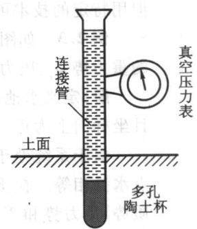

通常张力计能测定的土壤水吸力范围为 $0 \sim$ 图 2.4 表式张力计示意图0.08MPa,超过这个范围就有空气进入瓷杯而失效。因此，张力计法只适于测定低吸力范围内的水势。在田间，这个范围包括了土壤有效水范围的 $5 0 \% \sim 7 0 \%$ ，因此在实际中得到广泛应用。 A.m20

应该注意的是，张力计内的水柱不能有气泡，整个仪器必须密封，保持真空，不能与大气相通，因此，张力计在安装前必须进行校正。

## (2) 湿度计法

土壤湿度计测定土壤中水汽的相对湿度(RH),通过水汽的相对湿度可用下式算出气相的水势[38] 态

$$
\psi _ { \mathrm { { w } } } = { \frac { \rho _ { \mathrm { { w } } } R T } { M _ { \mathrm { { w } } } } } { \ln \left( { \frac { e } { e _ { \mathrm { { s } } } } } \right) } = { \frac { \rho _ { \mathrm { { w } } } R T } { M _ { \mathrm { { w } } } } } { \ln \left( R H \right) }\tag{2.33}
$$

式中：e是水汽压；e。是饱和水汽压；e和e。的比值即为相对湿度 RH;M为水分 $e _ { \textrm { s } }$ $e _ { \textrm { s } }$ $M _ { \mathrm { ~ w ~ } }$ 子的摩尔质量；ψ为土壤水汽的水势。平衡状态下，水蒸气水势等于液相水势， ${ \mathrm { i } } \psi ,$ 假定气压为大气压，湿度计测定的水势是基质势和溶质势的总和，在溶质势可以忽略的情况下，湿度计测定的水势就是土壤水的基质势。

在土壤物理研究中应用最广泛的湿度计是热电偶湿度计。热电偶是两种不同金属(如铬-康铜或紫铜-康铜)的双点连接，如果在两个接点间施加一个电动势，便会产生温差，即一点加热另一点被冷却。土壤湿度计由一个细金属丝热电偶构成，其中一个装在薄壁陶土杯中，将陶土杯埋在土壤中时，环绕热偶的土壤空气与土壤溶液逐渐达到平衡。当施加一个电动势之后，暴露在土壤空气中的接合点便会冷却至土壤空气的露点以下，在它上面凝结出小水滴。然后冷却停止，随着小水滴的蒸发，接合点达到一个几乎恒定的湿球温度，直到干燥后才与周围温度相平衡。在湿球蒸发时，它与作为干球的绝缘接合点之间的温差便会产生一个小电动势，这个电动势指示着土壤水势的高低。当蒸汽在接合点处冷却时，用小型电压表测定接合点处的温度。接合点处的温度取决于蒸发速率，而蒸发速率又取决于大气的相对湿度。当校准已知湿度的渗透液时，该装置可以测定从-10 kPa到-7MPa范围内的水势。在湿土中这种装置不太准确[20]，但用特定的技术可以测定更低的水势[37]。

例2.3 如图2.5所示，土柱处在土壤水平衡状态下，试计算图上标记各点的重力势 $\psi _ { \mathrm { ~ g ~ } }$ 、压力势 $\psi _ { \mathfrak { p } }$ 、基质势 $\psi _ { \mathrm { ~ m ~ } }$ 和总水势 $\pmb { \psi }$ o

解：定义水池底部为重力势的参照面，且坐标向上为正。外界气压等于大气压。

由于系统处于平衡状态，所以系统各点水势相等。在所示系统中土壤水势由基质势、重力势和压力势三部分组成。各点的重力势依据垂直坐标容易得到，其各水势分势分析如下：

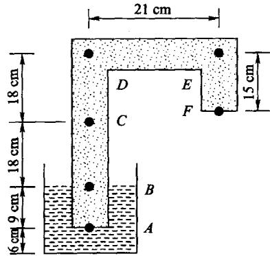

A：在水面以下，土壤饱和，所以基质势为0 cm，A点的压力势等于水体静水压力9 cm；重力势为6 cm；所以总水势为15 cm。

图2.5 例2.3示意图[7]

B:位干水位线上，所以基质势为0 cm；重力势为15 cm；根据总势15 cm可知，压力势为0 cm。

C、D、E和F在水面以上，土壤处于非饱和状态，所以压力势为0cm；重力势由垂直坐标容易得到，分别为 33 cm、51 cm、51 cm 和 36 cm；总水势均为 15 cm，所以由总水势减去压力势和重力势可得到各点的基质势分别为-18cm、-36 cm、-36 cm 和-21 cm。

求得的各点水势列于表2.5中：

表 2.5 例 2.3 计算的各点水势组成列表
<table><tr><td>水势/cm</td><td>A</td><td>B C</td><td>D</td><td>E</td><td>F</td></tr><tr><td>重力势  $\phi _ { _ B }$ </td><td>6</td><td>15</td><td>33</td><td>51 51</td><td>36</td></tr><tr><td>压力势  $\psi _ { \ p }$ </td><td>9</td><td>0</td><td>0</td><td>0 0</td><td>0</td></tr><tr><td>基质势  $\pmb { \psi _ { \mparallel } }$ </td><td>0</td><td>0</td><td>-18</td><td>-36 -36</td><td>-21</td></tr><tr><td>总水势  $\psi$ </td><td>15</td><td>15</td><td>15</td><td>15 15</td><td>15</td></tr></table>

## 2.4 土壤水分特征曲线

## 2.4.1 土壤水分特征曲线及其影响因素

由前面对毛细管现象的分析可知道，土壤中不同大小孔隙中的水处于不同的能量状态，且水势的大小与孔隙尺寸特征密切相关。由于物质总是由能量高处向能量低处运动，所以当外界的能量状况低于土壤孔隙水时，土壤孔隙排水；反之，土壤孔隙吸水。在一定的能量状况下，小于某一等效孔径的土壤孔隙为水所充满，大于此孔径的土壤孔隙不能吸持水分，因此土壤水的能量与数量存在某种对应关系。在一定的温度条件下，这种关系仅与土壤本身的特性有关，是土壤最重要的水力特性之一，称之为土壤水分特征曲线。通常，土壤水的数量用土壤含水量表示；为方便起见，土壤水的能量常用基质吸力(负的基质势)，或称土壤水吸力表示，而不直接用基质势表示。图2.6为土壤水分特征曲线示意图。图中的$h _ { \mathrm { d } }$ 为进气吸力，是土壤开始排水的临界吸力值。粗质地的砂土或结构良好的土壤其进气吸力一般较小，而细质地的粘土进气吸力相对较大。进气吸力与土壤水分特征曲线的滞后现象有关，关于土壤水分特征曲线的滞后性将在后面详细讨论。

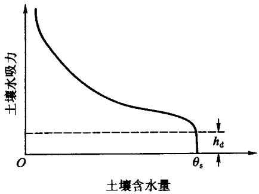  
图2.6 土壤水分特征曲线示意图

依据毛细管理论，土壤水分特征曲线实际反映的是土壤孔隙状况和含水量之间的关系，所以一切影响土壤孔隙状况和水分特性的因素都会对土壤水分特征曲线产生影响。

+壤质地，也即土壤的颗粒组成是决定土壤孔隙结构的主要因素之一，因此对+壤水分特征曲线影响很大(如图2.7所示)。一般粘粒含量越高的土壤，任何吸力下土壤含水量都较大，因为粘质土中细孔隙较多，表面能较大，故能吸持较多的水分。砂质土中大孔隙发育，水分容易排走，保持的水分较少。粘土中，孔隙分布比较均匀，因此当吸力增加时，含水量的减少比较缓慢，曲线坡度比较缓和；砂质土中，绝大部分孔隙容量集中在很窄孔径范围的孔隙内，一旦达到一定吸力，这些孔隙中的水分会很快排空，土壤含水量急剧下降，因此曲线坡度比较陡。

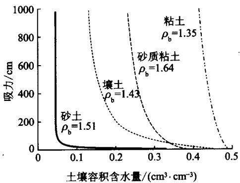  
图2.7 不同质地土壤的水分特征曲线

土壤结构对水分特征曲线也有很大影响，在基质势高时(0到-0.1MPa)尤为明显。在结构良好的土壤中，土壤团聚作用显著，小而独立的土壤颗粒被联结为大的团聚体，使土壤大孔隙相对增加。团聚作用对土壤孔隙结构的这种改变主要集中在大孔隙，在这部分孔隙中，水分的保持主要取决于毛细作用和孔隙大小，所以结构影响比较显著。随着基质势的降低，吸附作用的影响越来越大，土壤质地的影响逐渐占据主导地位。

土壤容重的变化不仅改变土壤孔隙度，而且改变土壤孔隙分布，因此必然影响+壤水分特征曲线(如图2.8所示)。随着容重的增加，土壤总孔隙度减少，但是不同孔隙对容重变化的响应是不同的。容重增加主要是降低了团聚体间的大孔隙，中等大小的孔隙略有增加，小孔隙受影响较小。因此，土壤的饱和含水量随土壤容重增加而降低，高吸力段的土壤水分特征曲线基本不变。在田间条件下，土壤的容重是不均匀的，并且是经常变化的，对于膨胀土尤其如此。因此，研究容重变化的土壤水分特征曲线更有实际意义。关于变容重土壤持水特征，我们将在后面详细讨论。

温度对+壤水分特征曲线的影响是通过改变水的性质发生作用的。温度升高时，水的粘度和表面张力下降，土水势升高，土壤水吸力降低。因此在一定水势下，温度高时+壤保持的水量较少，温度低时则较多。温度对土水势的影响在十壤含水量低时尤为明显，在细质土中比粗质土中明显。

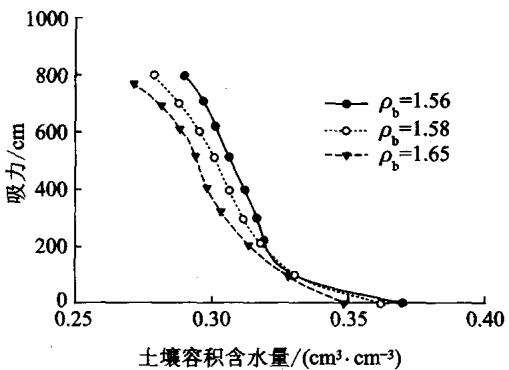  
图2.8 同一粘壤土在不同干容重下的土壤水分特征曲线

土壤的膨胀和收缩影响土壤孔隙分布，因而也可能对土壤水分特征曲线产生影响。土壤的膨胀特性归根结底还是受土壤组成和土壤溶液中溶质种类的影响。土壤胶体上吸附性离子的种类和数量不仅影响土壤的膨胀特性，也影响着土壤颗粒吸持水分子的能力，并最终影响土壤水分特征曲线。

此外，土壤水分特征曲线还和土壤水分的变化过程有关，土壤脱水曲线和吸水曲线并不重合，即土壤水分特征曲线存在滞后现象。对于这一现象也将在下面专门讨论。

## 2.4.2 土壤水分特征曲线的测定

土壤水分特征曲线测定就是测定一系列含水量与其对应的基质势。通常是用逐渐脱水，增加吸力的方法得到脱水曲线，也有逐渐加水，降低吸力得到吸水曲线的做法。现主要有以下几种测定方法：

## (1) 张力计法

张力计测定土壤基质势的原理和方法前面已经做了说明，这里就不多介绍。对于室内扰动土测定其水分特征曲线，只需用连续称重法就可得到与基质势对应的土壤含水量。张力计法可用于脱湿和吸湿过程，也可在田间测原状土样的水分特征曲线。张力计测定的土壤水分特征曲线的范围受其吸力范围限制，$- 8 0 0 \ \mathrm { c m } < \psi _ { \mathrm { { m } } } < 0 \ \mathrm { c m }$ ，但在大多数情况下，这基本上可以满足田间应用的需要。

## (2) 压力膜法

压力膜法不同于张力计法，它是通过改变压力势来测定土壤基质势。压力膜是由密闭在不透气装置中的多孔陶土板及连接在下面的出水管所构成，出水管与外面的大气连通(见图2.9)。使用时，将饱和的土样装在腔室内陶土板的顶部，并与陶土板紧密接触。然后给密闭气室加压，随着压力上升，土壤水势相应增加，当土壤水势大于陶土板的渗透势时，水分就从土样中流出。随着水分的流出，土壤含水量减少，基质势降低，当土壤基质势降低到刚刚能抵消由所加压力所引起的压力势时，出流停止。此时，土壤基质势就等于所加的气压的负值。在已知土壤初始含水量情况下，测得出流水量就可得到相应的土壤含水量。逐步增加压力，重复上述过程，就可得到土壤基质势与土壤含水量的一个数据系列，从而得到土壤的脱水曲线。通常是通过测定每一压力下的土壤含水量来获得土壤水分特征曲线。如果初始土壤干燥，逐渐减压，把排水改为吸水，就可得到吸水曲线。测定过程中，温度变化要维持在±1℃以内。土样可以是扰动土，也可以是原状土。通常压力膜法的测定范围为 $- 1 5 \ 0 0 0 \ \mathrm { c m } < \psi _ { \mathrm { { m } } } < \mathrm { - } \ 1 0 0 \ \mathrm { c m }$

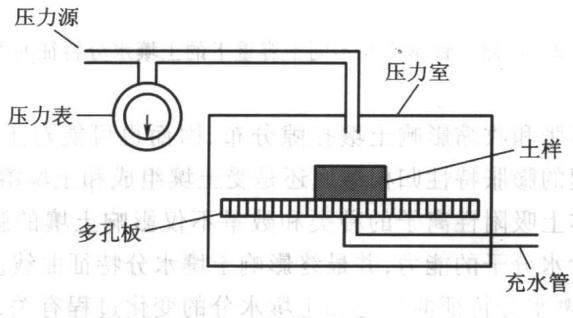  
图2.9 压力膜测定装置示意图

## (3) 砂芯漏斗法

砂芯漏斗法又称吸力桌(tension table)法，是在砂芯漏斗的底端放一个多孔

陶土板，陶土板下面连接一悬挂水柱，以产生对陶土板的吸力(图2.10)。具体使用时，把待测的土样放在陶土板上，并与陶土板紧密接触，为防止蒸发，砂芯漏斗的上端加盖，但要保证漏斗内室与大气连通。此法的测定过程类似于压力膜法，不同的是，压力膜法通过调整室内压力平衡基质势，砂芯漏斗法是通过改变出水口高度产生不同负压平衡基质吸力。平衡时，基质吸力就等于悬挂水柱对土样所施加的负压。量出此时的出水量就可计算出相应的土壤含

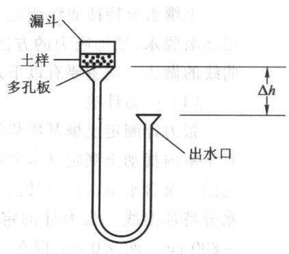  
图 2.10 砂芯漏斗装置

水量。砂芯漏斗法同样适用于吸水和脱水曲线的测定。其测定范围受多孔板特性和空间的限制，通常为 $- 1 5 0 \ \mathrm { c m } < \psi _ { \mathrm { m } } < 0 \ \mathrm { c m }$

## (4) 平衡水汽压法

平衡水汽压法是把非饱和土样置于密闭的恒温容器中，让土壤水自然蒸发，使其与容器中的水汽达到平衡。根据热力学原理，在一个平衡体系中，各相的自由能相等，因此体系中液相的自由能与水汽的自由能相等。若自由能用水势来表示，那么根据式(2.32)，只要测得平衡时容器中空气的相对湿度，就可得到相应的土壤水势值。土壤含水量则可通过称重法获得。对于某些试剂，在一定温度下，其饱和溶液对应的平衡水汽压是常量，所以可以选择不同的试剂来控制容器内的平衡水汽湿度。由此可以获得土壤含水量与土壤水势的数据系列。

此方法的关键是要精确测定密封容器中的相对湿度，否则会带来大的误差，所以要用灵敏度很高的热电偶湿度计进行测定。测定过程中，恒温、密封条件的要求比较高。所以这种方法所需要的设备要求较高，但其测定的土水势范围较宽，可测 $- 7 0 ~ 0 0 0 ~ \mathrm { c m } < \psi _ { \mathrm { { s } } } < - 1 0 0 ~ \mathrm { c m }$

## 2.4.3 土壤水分特征曲线模型

由于土壤水分特征曲线的影响因素复杂，至今尚没有从理论上建立土壤含水量和土壤基质势之间的关系，通常用经验公式来描述。常用的公式有

$$
\pmb \theta = \mathbf a \hbar ^ { \frac { b } { 2 } }\tag{2.34}
$$

$$
\frac { \theta - \theta _ { \mathrm { r } } } { \theta _ { \mathrm { s } } - \theta _ { \mathrm { r } } } = \left( \frac { h _ { \mathrm { d } } } { h } \right) ^ { N }\tag{2.35}
$$

$$
\frac { \theta - \theta _ { \mathrm { r } } } { \theta _ { \mathrm { s } } - \theta _ { \mathrm { r } } } = \Big [ \frac { 1 } { 1 + \left( \alpha h \right) ^ { n } } \Big ] ^ { m }\tag{2.36}
$$

式(2.34)是较早采用的描述土壤水分特征曲线的经验公式，式中，a、b为参数。由于参数少，形式简单，在早期的研究中应用较多。但由于其没有考虑滞留含水量，对高吸力段的描述可能存在偏差；曲线在近饱和段没有弯点，饱和点也与实际不符，所以式(2.34)不能很好描述实测土壤水分特征曲线，在目前对土壤水力特性精度要求较高的土壤水分运动定量模拟中很少采用。

式(2.35)是 Brooks - Corey[19]提出的土壤水分特征曲线表达式，式中 $\pmb { \theta _ { \textrm { s } } }$ 是饱和土壤含水量， $\pmb \theta _ { \tau }$ 是滞留土壤含水量， $\mathbf { \nabla } . h _ { \mathrm { d } }$ 是进气吸力，h为土壤吸力，N为形状系数。当土壤处于饱和状态时，土壤吸力等于进气吸力，因此该公式描述了脱水过程的土壤水分特征曲线。同时进气吸力也不是严格测定的进气吸力，而是通过曲线拟合所得到的表观进气吸力。

式(2.36)是 van Genuchten[42]提出的描述土壤水分特征曲线公式，式中，α是与进气吸力相关的参数，n和m是形状系数。当土壤含水量处于饱和状态时，土壤水吸力为零，因此该公式描述了土壤吸湿过程的土壤水分特征曲线。同时由于该公式能够配合大部分土壤水分特征曲线的形状，因此得到了广泛应用。

为了比较式(2.35)和(2.36)所包含参数间的关系，现将式(2.36)近似简化。在土壤水分特征曲线的高吸力段， $( \alpha h ) ^ { n }$ 远大于1,忽略式(2.36)右边分母中的1,式(2.36)变为

$$
\frac { \theta - \theta _ { \mathrm { r } } } { \theta _ { \mathrm { s } } - \theta _ { \mathrm { r } } } = \Big [ \frac { 1 } { \big ( \alpha h \big ) ^ { n } } \Big ] ^ { m }\tag{2.37}
$$

比较式(2.35)， $\alpha = 1 /  { h _ { \mathrm { ~ d ~ } } } , m n = N _ { \mathrm { c } }$ 因此 van Genuchten[42]与 Brooks - Corey[19]模式间存在一定关系。

土壤水分特征曲线的主要用途是：根据测定的土壤水分特征曲线和相应的饱和导水率，结合相应的导水率模型，从而获得土壤的非饱和导水率，为土壤水分运动的模拟和预报提供基本运动参数。此外，土壤水分特征曲线提供了土壤水吸力和土壤含水率之间的换算关系，在田间通过土壤吸力的测定也可间接而快速地获得土壤水分状况的信息；土壤水分特征曲线也可以间接地反映出土壤的孔隙大小分布状况，用来分析不同质地土壤的持水性和有效性。

## 2.4.4 土壤水分特征曲线的滞后现象

假设土壤处于完全无水的状态，加少量的水时，最小的孔隙先充水，然后依次是更大的孔隙充水，直到所有的孔隙都充满水时基质势为零。在此过程中，土壤含水量和水势服从图2.11所示的吸水曲线。如果通过蒸发水分或通过多孔物质接触而使土壤系统失水干燥时，一般来说孔隙变空的顺序是从大到小。然而，液态水封闭在大孔隙中的方式使得大孔隙的变空顺序和充水的顺序不同，直到至少有一个与其连接的较小的孔隙变空时，大孔隙才开始排水；此时较大的孔隙快速变空。结果，某一给定的基质势所对应的含水量比吸湿系统的含水量高，如图2.11所示的脱水曲线所示。因此，对于给定的土壤，基质势和含水量的关系不是唯一的。这一现象称为土壤水分数量和能量关系的滞后现象。

图2.11显示了典型土壤的水分特征曲线。土壤从饱和到干燥和从干燥到饱和的水分特征曲线为滞后作用的主线，可分别称为主吸水曲线和主脱水曲线。如果土壤从部分湿润状态下开始脱水，或者从部分脱湿状态开始吸水时，吸力与土壤含水量的关系曲线并不沿主吸水曲线和主脱水曲线，而是沿主吸水曲线和主脱水曲线之间的曲线变化，这些中间曲线称为扫描曲线。在吸湿或脱湿循环中再脱湿

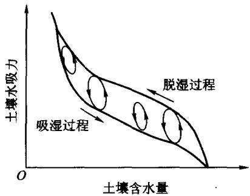  
图 2.11 土壤水分特征曲线的滞后现象

或吸湿过程将导致第二级或更高级的扫描曲线。

滞后现象的影响因素相当复杂，不仅受测定水分特征曲线时温度的影响，还依赖于测定时土壤含水量的变化速率。与稳态流相比，在非稳态条件下，脱湿过程中对一定吸力常过高估计土壤含水量；在吸湿过程中常低估土壤含水量。

对于滞后现象目前主要有三种解释：瓶颈理论、弯液面延迟形成理论和接触角理论。

## (1) 瓶颈理论

土壤孔隙的形状和大小各种各样，相互间可能通过各种途径互相联系。有些较大的孔隙彼此分开，中间有较小的孔隙和通道把它们连接起来，这样就在土壤内部形成肚大口小的形状(见图2.12)。在吸湿的过程中，小孔隙首先充水，接着比较大的孔隙相继慢慢充水，基质势逐渐增加，但只要基质势还没有达到最大孔隙对应的基质势水平，大孔隙就会对一部分小孔隙充水产生瓶颈作用，不能充水。随着基质势继续增加，达到最大孔隙对应的基质势水平时，所有孔隙对应的基质势均低于此值，瓶颈作用消失，所有孔隙都将迅速充满水分。脱湿过程则与此相反，对于开始充满水分的孔隙，在基质势减小时，水分并不立即排出，因为虽然最大孔隙对应的基质势大于此值，但外围的小孔隙对应的基质势值仍小于此基质势值。外围小孔隙对内部大孔隙的脱水产生瓶颈作用，只有当基质势降低到外围小孔隙对应的水势水平时，土壤孔隙才开始排水，并且是孔径大于外围小孔隙的孔隙水分全部排空。

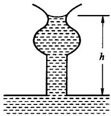  
(a) 毛细管下降(脱水)

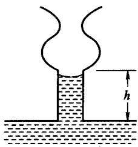  
(b) 毛细管上升(吸水)  
图2.12 土壤孔隙瓶颈结构造成的滞后现象

## (2)弯液面延迟形成理论

滞后作用不一定在大孔隙与小孔隙相连时才能发生，在单个孔隙中也能发生。开始时水分可能在单个的毛细管中凝结，随着凝结水的增加，最后水分在孔隙的中间处结合。由于表面张力的作用，形成凹的弯液面。在水分结合以前，体系中的压力为“正”，结合以后，突然变成“负”的。由于这种弯液面形成的原因，也导致滞后作用的产生。

## (3) 接触角理论

水分能湿润土壤矿物的表面，并且在静止状况下一定的毛细管孔隙中水分表面与孔隙管壁的接触角是一定的。土壤在脱湿和吸湿过程中，土壤水和土壤固相的接触角是不同的(见图2.13)。在吸湿过程中，水分沿固相表面推进，由于界面处的摩擦力与推进方向相反，其接触角比静止时大：而在脱湿过程中，水分沿固相表面撤退，由于界面处的摩擦力与撤退方向相反，其接触角比静止时小，由毛细管理论[式(2.8)]可知，相同水分条件下水势产生了差异。所以，吸湿和脱湿过程接触角的差异也是产生滞后现象的一个原因。

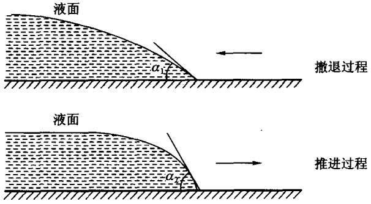  
图2.13 不同接触角造成的滞后现象[7]

土壤水分数量和能量关系的滞后现象表明，土壤基质势是由气-水界面状况以及表面薄层的特性决定的，而不是由孔隙中的水分含量直接决定的。所以，在描述土壤性状前，不仅要知道土壤含水量和吸力之间的关系，还要知道土壤吸湿和脱水的历史。

实验表明，砂质土壤的滞后现象较粘质土壤明显，这是由于砂质土壤孔隙粗细的不均匀程度较粘质土更甚的缘故[7]。滞后现象对土壤水的影响在于，土壤吸水容易，却不易失水，这一特性有利于保持土壤水分。

## 2.4.5 变容重土壤的持水特征

通常在测定土壤水力特性时，大多假定土壤的容重不随土壤水分状况发生变化，这对于膨胀性粘粒含量较高的土壤显然是不适用的。邵明安等8.9]实验发现武功重壤土在0\~204 m水柱吸力范围内容重可从 $1 . 3 ~ \mathrm { \bf g } / \mathrm { \bf c m } ^ { 3 }$ 增加到$2 . 0 ~ \mathrm { g } / \mathrm { c m } ^ { 3 }$ 。吕殿青等[5,6]对壤土、粉壤土、粉质粘壤土、粘壤土、砂质粘壤土等五种土壤的土壤水分特征曲线测定过程中的容重变化量进行了研究，它们分别为$0 . 5 8 2 ~ { \mathrm { M g / m } } ^ { 3 } \setminus 0 . 5 1 8 ~ { \mathrm { M g / m } } ^ { 3 } \setminus 0 . 4 0 9 ~ { \mathrm { M g / m } } ^ { 3 } \setminus 0 . 3 9 5 ~ { \mathrm { M g / m } } ^ { 3 }$ 和 $0 . 3 4 6 ~ \mathrm { M g } / \mathrm { m } ^ { 3 }$ 。对于多数田间土壤，容重随含水量发生变化，干时收缩(容重增加)，湿时膨胀(容重减小)，从而影响了基质势与含水量之间的关系[14]和土壤机械特性[43]。土壤在干湿收缩过程中容易产生表面下陷和裂隙，使得水分和溶质通过收缩裂隙优先运移到下层土壤和地下水中[17.23]，造成水分、养分的流失，甚至引起地下水污染，因此土壤干湿收缩特征已引起众多的关注。

土壤容积变化常使用四个指标：孔隙度、容积变化、容重、比容积与含水量的关系来表达。容积变化一般表示为容积比率(土粒的容积变化/水损失的容积)和相对烘干土容积的容积变化。虽然容积比率解释了土壤容积的减少是否同等容积水的损失还是空气替换的问题，但是由于缺乏烘于土的容积而不能获取土壤物理条件下的资料。用容重表示使用很少。比容积(单位烘干土的总体积)是表示土壤容积变化的更为通用的方法。通常比容积-质量含水量的关系称之为收缩特征曲线。

土壤容积的变化表观上是由土壤含水量变化所引起，其内在控制因素则是土壤粘土矿物类型(蒙脱石、高岭石、水云母)、吸附型阳离子种类、土壤结构、容重、时间、温度、土壤溶液性质、压力、含水量等的综合作用5.6。以此为基础，许多学者提出了用一些土壤特性指标预测土壤容积变化的经验方法。这些指标包括：膨胀指标、弹性指标、粘粒含量、活性指标、缩限、收缩速率、吸湿水含量等。

目前预测土壤容积变化的模型主要有：三直线模型34]、Logistic模型6]、通用+壤容积变化模型。McGarry和Malafant[34对三类模型的比较发现，土壤容积变化通用模型对滞留、正常收缩区域能提供合理的描述，但它没有最大值，不适干结构收缩区域，无转折点，不能完整地描述整个含水量内的收缩过程。Logistic模型是三直线模型的曲线转换，描述了土壤收缩曲线的形状，但是缺乏一定的理论基础和参数的物理意义。三直线模型能很好地描述三个收缩区域，参数具有明确的物理意义。

+壤容积变化模型的建立使得描述变容重土壤的水力特性成为可能。Kim和Vereecken[30]考虑土壤的收缩特征提出了确定非熟化海洋性粘土的水分持水特征与压力水头关系的方法。Giuseppina等[25]研究了粘土的收缩特征曲线，证实了三直线模型能很好地拟合实测数据和从粘粒含量预测基本收缩线的可能性，同时把土壤的水力特性与土壤的收缩特征曲线结合起来，给出了膨胀土壤水分特征曲线的确定方法。Chertkov21]基于土壤孔隙分布提出了具有明确物理机制的膨胀土壤水分特征曲线模型。

吕殿青等[5,6]基于正常收缩段内土壤收缩特征模型[25,.35]建立了容重与吸力之间的关系。在正常收缩阶段，土壤水分的减少等于土壤容积的减小，即

$$
v = \frac { 1 } { \rho _ { \mathrm { b } } } = k + \theta _ { \mathrm { m } }\tag{2.38}
$$

式中：v为比容积 $( { \bf c m } ^ { 3 } / { \bf g } ) { \bf ; } \rho _ { \mathrm { b } }$ 为容重 $( \mathsf { g } / \mathsf { c m } ^ { 3 } ) ; \pmb { \theta } _ { \mathrm { m } }$ 为质量含水量 $( \pmb { \mathrm { g } } / \pmb { \mathrm { g } } )$ ;k 为经验常数，从理论上k为含水量为0时的比容积，即 $k = 1 / \rho _ { \mathrm { b s } } \mathrm { , } \dot { \rho } _ { \mathrm { b s } }$ 为土壤颗粒密度$( \mathbf { g } / \mathbf { c m } ^ { 3 } )$ 。式(2.38)表明，土壤容重随土壤含水量的增加而减小。联立式

(2.38)和Brooks- Corey 土壤水分特征曲线模型(2.35)，则可得到土壤水力特征测定中容重与吸力间的关系，即土团

$$
\frac { \rho _ { \mathrm { s } } - \rho _ { \mathrm { b } } } { \rho _ { \mathrm { s } } - \rho _ { \mathrm { b z } } } = \left( \frac { h _ { \mathrm { d } } } { h } \right) ^ { N }\tag{2.39}
$$

式中 $\mathbf { : } \pmb { \rho _ { \mathrm { b } \mathbf { z } } }$ 为饱和时容重 $\scriptstyle ( { \bf g } / \mathbf { c m } ^ { 3 } )$ 。和定容重下土壤水分特征曲线相比，变容重情况下的水分特征是以土壤质量含水量、容重、基质势为坐标的空间曲面(图2.14)。

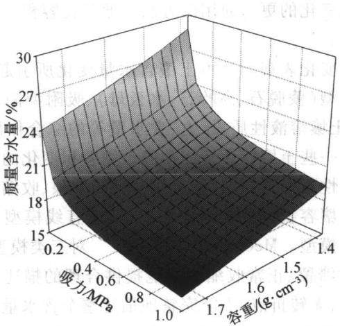  
图2.14 土壤水分特征曲面

在田间，即便对于非膨胀性土壤，其容重也存在很大的空间变异性，其水力特性也必然随容重发生相应的变化。因此，仅仅获得一个或几个容重条件下的土壤水分特征曲线并不能获得足够的土壤水力特性的信息。考虑田间土壤容重的变化，把土壤水分能量与数量之间的曲线关系转化为土壤水能量与数量和土壤容重之间的曲面关系，称之为土壤水分特征曲面(图2.14)。土壤水分特征曲面不仅仅针对定容重土壤，对膨胀土同样具有重要意义。无论是自由膨胀的土壤，还是受限膨胀的土壤，其土壤水分特征曲线都落在水分特征曲面上。所以，土壤水分特征曲面可以为膨胀和非膨胀土壤水分和溶质运动模拟提供更为全面的水力特性信息。

## 参考文献

[1]希勒尔D.土壤物理学概论[M].尉庆丰，荆家海，王益权，译.西安：陕西人

民教育出版社，1988.

[2]龚元石，李子忠，廖超子，等.应用时域反射仪测定农田土壤水分[J].水科学进展，1997,8(4)：329-334.

[3]雷志栋，杨诗秀，谢森传.土壤水动力学[M].北京：清华大学出版社，1988.

[4]李学垣.土壤化学[M].北京：高等教育出版社,2001.

[5]吕殿青，邵明安，王全九.土壤持水特征测定中的容重变化及其确定方法[J].水利学报,2003，(3)：110-119.

[6]吕殿青，邵明安.土壤干湿收缩特征研究进展[J]. 土壤通报，2003,34(3)：225-228.

[7]秦耀东.土壤物理学[M].北京：高等教育出版社，2003.

[8]邵明安，黄明斌.土-根系统水动力学[M].西安：陕西科学技术出版社，2000.

[9]邵明安.不同方法测定基质势差别与准确性的初步研究[J]. 土壤通报，1985,16(5):223-226.

[10]同延安，尉庆丰，王全九.土壤-植物-大气连续体系中水运移[M].西安：陕西科学技术出版社，1998.

[11]吴持恭.水力学 上册[M].2版.北京：高等教育出版社，1979.

[12]杨文治，邵明安.黄土高原土壤水分研究[M].北京：科学出版社，2000.

[13]姚贤良，程云生.土壤物理学[M].北京：农业出版社，1986.

[14] Allbrook R F. Shrinkage of some New Zealand soils and its implications for physics [J]. Australian Journal of Soil Research ,1992,31: 111-118.

[15] Babcock K L,Overstreet R. The extra - thermodynamic of soil moisture [J]. Soil Science,1957,83: 455-464

[16] Batchelor G K. An introduction to fluid dynamics [M]. Cambridge: Cambridge University Press ,2000

[17] Beven K, German P. Macropores and water flow in soils [J]. Water Resource Research,1982,18：1311-1325.

[18] Bolt G H. Soil physics terminology [J]. Bulletin International Society of Soil Science ,1976,49: 26-36.

[19] Brooks R H, Corey A J. Hydraulic Properties of Porous Media. { M]. Fort Collins: Colo. State Univ. 1964.

[20] Bruce R R, Luxmoore R J. Water retention: field methods. [ M]// Klute A. Methods of Soil Analysis. Part I, Monograph 9. Madison: American Society of Agronomy, 1986.

[21] Chertkov V Y. A physically based model for the water retention curve of clay

pastes [J]. Journal of Hydrology ,2004,286: 203-226.

[22] Coats K H,Smith B D. Dead – end pore volume and dispersion in porous media [J]. Soc. Pet. Eng. J. , 1964 ,4: 73-84.

[23] Crescimanno G,Provenzano G. Soil shrinkage characteristic curve in clay soils: Measurement and prediction [J]. Soil Science Society of America Journal, 1999,63:25-32.

[24] Dalton F N, van Genuchten M Th. The time domain reflectometry method for measuring soil water content and salinity {J]. Geoderma,1986,38: 237-250

[25 ] Giuseppina C, Givseppe P. Soil shrinkage characteristic curve in clay soil: measurement and prediction { J}. Soil Science Society of America Journal, 1999,63: 25-32.

[26] Goates J R, Bennett S J. Thermodynamic properties of water absorbed on soil minerals: kaolinite [J]. Soil Science,1957,83: 325-330.

[27] Jury W,Horton R. Soil Physics. Sixth Edition [ M ]. New York: John Wiley & Sons , Inc. ,2004.

[28] Kemper W D. Movement of water as affected by free energy and pressure gradients: I. Application of classic equation for viscous and diffusive movement to the liquid phase in finely porous media [J]. Soil Science Society of America Proceedings, 1961 a ,25: 255-260.

[29] Kemper W D. Movement of water as affected by free energy and pressure gradients: Ⅱ. Experimental analysis of porous system in which free energy and pressure gradients act in opposite directions [J]. Soil Science Society of America Proceedings,1961 b,25: 261-265.

[30] Kim D J, Vereecken H, Feyen J, et al. On the characterization of properties of an unripe marine clay soil: II A method on the determination of hydraulic properties [J]. Soil Science,1992,153: 471-481.

[31] Low P F. Physical chemistry of the clay - water interaction [J]. Advances in Agronomy,1961,13: 269-327

[32] Low P F. The Viscosity of Water in Clay System [ M ]. Proceeding 8th National Clay Conference. New York : Pergamon Press,1959

[33] Lu D Q, Shao M, Horton R. Effect of changing bulk density during water desorption measurement on soil hydraulic properties [J]. Soil Science ,2004,169: 319-329.

[34] McGarry D, Malafant K W J. The analysis of volume change in unconfined unite of soil [J]. Soil Science Society of America Journal,1987 ,51 : 290-297.

[35] Mitchell A R,van Genuchten M Th. Shrinkage of bare and cultivated soil [J]. Soil Science Society of America Journal,1992,56: 1036-1042.

[36] Nelder J A. The fitting of a generalization of the logistic curve [J]. Biometrics, 1961,17:89-110.

[37 ] Rawlins S L, Campbell G S. Water potential: thermocouple psychrometry [M ]// Klute A. Methods of Soil Analysis. Part I, Monograph 9. Madison : American Society of Agronomy , 1986

[38] Skierucha W. Design and performance of psychrometric soil water potential meter [J]. Sensors and Actuators A,2005,118: 86-91

[39] Topp G C, Davis J L. Measurement of soil water content using time domain reflectometry: A field evaluation [J]. Soil Science Society of America Journal, 1985,49:19-24.

[40] Topp G C, Davis J L, Annan A P. Electromagnetic determination of soil water content: Measurement in coaxial transmission lines [J. Water Resources Research,1980,16: 574-582.

[41] van Bavel C H M, Underwood N,Swanson R W. Soil moisture measurement by neutron moderation [J]. Soil Science,1956,82: 29-41.

[42] van Genuchten M Th. A closed form equation for predicting the hydraulic conductivity of unsaturated soils [ J]. Soil Science Society of America Journal, 1980,44:892-898.

[43] Yong R N, Warkentin B P. Soil Properties and Behavior [ M ]. Amsterdam: Elsevier Scientific ,1975.

# 土壤水分运动基本原理

土壤中的水分很少是静止的，土壤水分运动主要是以液态水流动为主，在一定条件下，土壤水分也可以气态形式运动。土壤水分运动遵循的规律是物质和能量守恒定律。在第2章我们已经谈到，土壤水分运动是陆地水循环的重要环节，也是土壤圈物质循环的重要组成部分，同时土壤水也是热和溶质在土壤中传输的主要载体。所以，研究土壤水分运动的规律是弄清楚土壤内部物质和能量循环过程的基础。在本章中，我们主要讨论液态水的运动。

土壤水分运动的内在动力是水势梯度，即土壤水从水势高处往水势低处流动。在平衡状态下，土壤系统内部各点水势处处相等，土壤水处于相对静止状态。只要土壤系统内存在水势不等的点，系统就不会平衡，土壤内就会有水分运动。所以，发生水分运动的土壤系统必定是非平衡系统。在环境对土壤系统没有物质和能量输入条件下，土壤系统会自发地向平衡状态转化，直到系统达到平衡状态。在自然条件下，系统往往还没有达到平衡状态，土壤系统的外界条件(降水、太阳辐射、灌溉、蒸发、蒸腾等)已经发生变化，所以，自然界的土壤大多处于千变万化自然因素作用下的非平衡状态。

液态水可以在土壤饱和状态下运动，如地下水的流动；也可在非饱和状态下运动，如田间水分的蒸发及植物根系的吸水过程。而田间的其他一些过程，如水分入渗、再分配过程，以及浅层地下水的蒸发过程则既包含饱和水分运动，也包含非饱和水分运动。虽然饱和流和非饱和流都服从热力学第二定律，且在大部分情况下都服从达西-白金汉定律。但两者的驱动力不同。饱和土壤水分运动的动力主要是重力势梯度和压力势梯度，而非饱和土壤水流则主要是重力势梯度和基质势梯度。就导水率而言，非饱和导水率远远小于饱和导水率。当土壤由饱和状态到非饱和状态，其导水率可以迅速降低几个数量级，只有饱和导水率的几万分之一，甚至几十万分之一。此外，相对于特定的土壤，饱和导水率一般为常数，非饱和导水率则是土壤含水量或基质势的函数。无论是饱和还是非饱和导水率，决定其大小的都是土壤中连通的充水孔隙的分布状态。虽然土壤的质地、容重和团聚状况是决定土壤孔隙结构的内在因素，但是土壤水分的多少则影响着对水流起作用的有效孔隙的分布状况。所以，仅根据土壤的质地特性无法判断土壤非饱和导水率的大小。

非平衡土壤水分运动可以是稳态的，也可以是非稳态的。当土壤系统的边界输人条件恒定时，系统总会达到这样一种状态，系统内各点的水势梯度恒定，从而水流通量不随时间发生变化，因此土壤内水分储量也不会发生变化，各点水势恒定。这样的系统称之为稳态系统。如果土壤系统的边界输人条件是变化的，或在系统从开始到稳态的转化过程中，以及系统内部的再分布过程中，系统的水势、水流通量、或水分储量随时间发生变化，这样的流体系统称为瞬态系统或非稳态系统。

在本章中，我们将讨论土壤水分运动的基本原理，并建立土壤水分运动的基本方程，并给出部分土壤水分运动问题的数值和解析解。

## 3.1 饱和土壤中的水流

## 3.1.1 毛细管中的水流

由于土壤孔隙可近似看做是由一系列尺寸不等、相互连通的毛细管组成，所以多孔介质中的水流运动与毛细管的很多属性有关。单一直毛细管系统虽然简单，但研究毛细管内的水分运动规律对于揭示土壤水分运动的机理是有益的。在讨论土壤中的水流运动之前，我们首先研究理想状态下的流体运动-饱和状态下的毛细管运动。土壤中的水流大多属于层流[23]，在此状态下，Jury和 Hor-ton[13]认为毛细管中的水流运动与层流状态下的管流类似。

如图3.1所示，在半径为R长度为L的水平毛细管中，半径为 $r < R$ ,长度为L的水柱(与流线相对应)，两端所受的压力的合力为

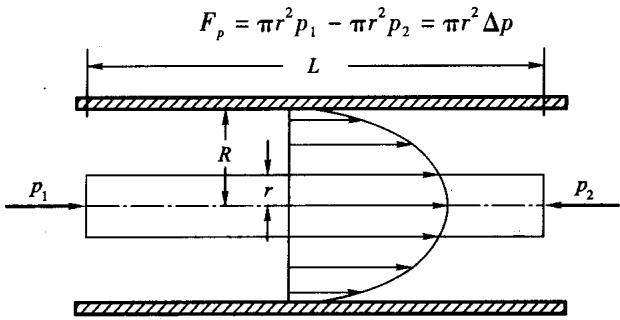  
图3.1 毛细管内的层流运动

(3.1)

式中： $\Delta p = p _ { 1 } - p _ { 2 }$ 为外界水压差。

因水体与外部接触面相对滑动而产生的内摩擦力或剪切力可表示为

$$
\boldsymbol { F } _ { \mathrm { s } } = \left( 2 \pi r L \right) \boldsymbol { \tau }\tag{3.2}
$$

式中：7为单位面积的剪切力。

假设水流没有加速度，则毛细管内部水体所受合力为 $☉$ ，即 $\boldsymbol { F } _ { \flat } = \boldsymbol { F } _ { \flat }$ ,则结合式(3.1)和(3.2)可以得到

$$
\tau = r \frac { \Delta p } { 2 L }\tag{3.3}
$$

假设水流的外力平衡遵循牛顿粘滞定律中的粘性力和摩擦力(2.10)，即

$$
\tau = - \mu { \frac { \mathrm { d } v } { \mathrm { d } r } }\tag{3.4}
$$

式中：ν为流体运动速率。则在低流速时加速度可以忽略的条件下，由式(3.3)和(3.4)可以得到

$$
r \mathrm { d } r = \mathrm { ~ - ~ } \frac { 2 L \mu } { \Delta p } \mathrm { d } v\tag{3.5}
$$

假设水分子与毛细管表面紧密吸附，则在管壁处 $( { \pmb r } = { \pmb R } )$ ,水流速率为零 $\left( \boldsymbol { v } = 0 \right)$ 0方程(3.5)通过积分得到速率ν为r的函数表达式：

$$
\int _ { r } ^ { R } r \mathrm { d } r = - \frac { 2 L \mu } { \Delta p } \int _ { v ( r ) } ^ { 0 } \mathrm { d } v\tag{3.6}
$$

积分并整理可得

$$
v ( r ) = \frac { \Delta p } { 4 L \mu } ( R ^ { 2 } - r ^ { 2 } )\tag{3.7}
$$

由方程(3.7)可知，速率在毛细管中心 $\left( r = 0 \right)$ 达到最大，最大流速为

$$
v _ { \mathrm { { m a x } } } = v \displaystyle ( 0 ) = \frac { \Delta p R ^ { 2 } } { 4 L \mu }\tag{3.8}
$$

单位时间内通过毛细管的水量 $Q$ 可以通过流速分布对水流断面的积分得到，即

$$
Q = \int _ { 0 } ^ { R } v ( r ) 2 \pi r \mathrm { d } r\tag{3.9}
$$

将式(3.7)代入式(3.9),并积分可得

$$
Q = \frac { \pi R ^ { 4 } \Delta p } { 8 L \mu }\tag{3.10}
$$

方程(3.10)称为泊肃叶(Poiseuille)公式。它表明在给定压力差 $\Delta P$ 下，通过长度为L的圆柱体毛细管单位时间内的水量Q与毛细管半径的4次方呈正比。因此，在相同的水势梯度 $\Delta p / L$ 下，一个半径为2R的毛细管，水流量是半径为R的毛细管的16倍(吴持恭编著《水力学》，1979)。由此，我们可以认为水流通过的多孔介质的流量与孔隙尺寸之间有显著的非线性关系。

根据式(3.10)，可以计算通过断面的平均流速 $\bar { \pmb { \nu } }$ 或水流通量 $J _ { \ast }$ (单位面积的水流速率)：

$$
J _ { \mathrm { w } } = \overline { { v } } = \frac { Q } { \pi R ^ { 2 } } = \frac { R ^ { 2 } \Delta p } { 8 L \mu }\tag{3.11}
$$

## 3.1.2 达西定律

土壤中有大量的能够供水分流动的孔隙和通道，实际土壤中的孔隙并非是一束直的、光滑的、管径均一的毛细管，而是极其不规则的、弯曲的、并且部分互相连通，部分呈半封闭状态，目前尚无法对这些复杂孔隙网络作出数学描述。因此，在微观上，水流运动极其复杂，甚至同一孔隙，一个点与另一个点的流速也是显著不同的。由于以上原因，通过复杂多孔介质中的水流无法从单一毛细管的水流运动规律获得，一般用一个宏观的流速向量来描述，它是土壤总容积中微观流速的总平均。

水在土壤中流动时，由于它的粘性，将与多孔介质之间发生作用，导致在土壤水流动过程中必然有能量损失。土壤水运动过程中的能量损失规律是达西(1856)首先在测定砂柱渗漏率过程中发现的，称为达西定律(Darcy'sLaw)。通过土壤的水流通量与土壤水势梯度呈正比，即

$$
J _ { \mathrm { { w } } } = \mathrm { ~ - ~ } K _ { \mathrm { { s } } } \frac { \Delta \psi } { \Delta L }\tag{3.12}
$$

式中 $: K _ { \mathfrak { s } }$ 为饱和导水率，是一个与水流状况无关仅与土壤特性有关的参数； $\Delta \psi /$ $\Delta L$ 为水势梯度，负号表示水流运动方向与水力梯度方向相反。微分形式表示的达西定律为

$$
J _ { \mathrm { { w } } } = \mathrm { ~ - ~ } K _ { \mathrm { { s } } } \mathrm { ~ } \frac { \mathrm { { d } } \psi } { \mathrm { { d } } L }\tag{3.13}
$$

后人将达西定律外推时发现，达西定律不仅适用于均质土壤，而且也适用于非均质土壤。对于均质土壤，土壤各向同性，各个方向上的导水率相等，对于三维空间的水分运动，达西定律可写成

$$
J _ { \mathrm { { w } } } = \mathrm { ~ - ~ } K _ { \mathrm { { s } } } \nabla \psi\tag{3.14}
$$

式中： $\nabla \psi$ 是水力梯度矢量； $\mathbf { v }$ 为拉普拉斯算子，又称矢量微分算子，表示为

$$
\nabla = \dot { \pmb { \mathscr { \varepsilon } } } \frac { \partial } { \partial \mathscr { x } } + \dot { \pmb { \mathscr { J } } } \frac { \partial } { \partial \mathscr { y } } + \pmb { \mathscr { k } } \frac { \partial } { \partial \mathscr { z } }\tag{3.15}
$$

对于非均质土壤，土壤在各个方向上的导水率是不同的，达西定律用下式表示：

$$
J _ { \mathrm { { w } } } = \mathrm { ~ - ~ } K _ { \mathrm { { s x } } } \frac { \partial \psi _ { i } } { \partial x } i - K _ { \mathrm { { s y } } } \frac { \partial \psi _ { j } } { \partial y } j - K _ { \mathrm { { s z } } } \frac { \partial \psi _ { k } } { \partial z } k\tag{3.16}
$$

式中： $K _ { \mathrm { s x } } , K _ { \mathrm { s y } } , K _ { \mathrm { s z } }$ 分别为 $\boldsymbol { x } , \boldsymbol { y } , \boldsymbol { z }$ 三个方向上的饱和导水率。

达西定律是以砂土为研究对象建立的，随后将达西定律应用到其他质地的土壤中发现，达西定律并不是对所有多孔介质中的流体流动普遍有效。达西定律只适于层流状况。当土壤水流通量很高时，惯性力与粘性力相比，其作用不可忽略，水流达到紊流，水流通量与单位能量损失之间不再满足线性关系。此外，当水流通过大的孔隙或过细的孔隙时，水分运动规律可能不符合达西定律。实际上，达西定律在极大多数情况下是可以运用于土壤水流运动的，只是在粗砂或粘土介质中必须慎用达西定律。

## 3.1.3 饱和导水率的测定

在室内，饱和导水率一般用渗透仪测定。测定方法有定水头法和变水头法两种。

定水头法(见图3.2)在测定过程中维持进口端水头H不变，测定出水量V和相应时间t,如果知道土柱的长度L和横截面积A，就可由式(3.17)计算土壤的饱和导水率 $K _ { \mathrm { s } }$ 3

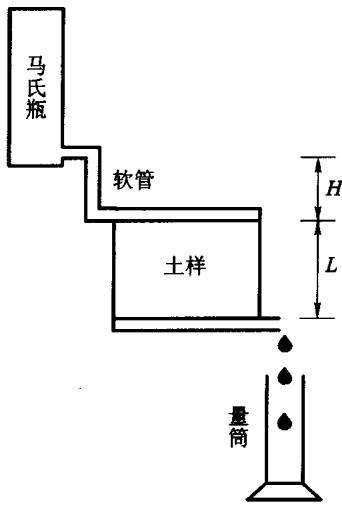  
图3.2 定水头法测定饱和导水率

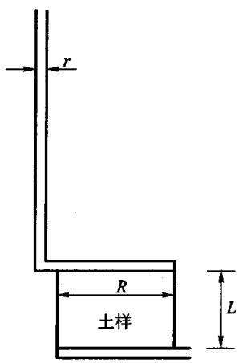  
图 3.3 变水头法测定饱和导水率

$$
K _ { \circ } = { \frac { V } { t A } } \cdot { \frac { L } { H } }\tag{3.17}
$$

对于颗粒较细的土壤，导水率很小，常采用变水头法测定。变水头法测定过程中，进水口所加水量一定，在测定过程中，加于土柱上端的压力水头是变化的。变水头法测定装置如图3.3所示，土柱半径为R，土柱顶端供水管半径为 $r _ { \circ }$ 变水头法不需要测定出水量，只需要测定水头H随时间t变化的一组数据。根据质量守恒定律，由达西定律计算的出水流量应等于进水口端的水量单位时间变化量，即

$$
Q = K _ { \circ } \pi R ^ { 2 } \ : \frac { H + L } { L } = \ : - \frac { \mathrm { d } \pi r ^ { 2 } H } { \mathrm { d } t }\tag{3.18}
$$

则水流通量

$$
J _ { \mathrm { { w } } } = K _ { \mathrm { { s } } } \ { \frac { H + L } { L } } = \ - { \frac { r ^ { 2 } \mathrm { { d } } H } { R ^ { 2 } \mathrm { { d } } t } }\tag{3.19}
$$

整理式(3.19)，两边分别对时间 $\left( \mathbf { \sigma } _ { t _ { 1 } } \sim \mathbf { \sigma } _ { t _ { 2 } } \right)$ ，和其对应的水头 $\left( H _ { 1 } ^ { \phantom { } } \sim H _ { 2 } ^ { \phantom { } } \right)$ 积分

$$
K _ { \circ } \ : \frac { R ^ { 2 } } { r ^ { 2 } L } \int _ { t _ { 1 } } ^ { t _ { 2 } } \mathrm { d } t \ : = \ : - \ : \int _ { t _ { 1 } } ^ { t _ { 2 } } \frac { 1 } { H \ : + \ : L } \mathrm { d } H\tag{3.20}
$$

可得

$$
K _ { \mathrm { s } } = { \frac { r ^ { 2 } L \mathrm { l n } [ { \bf \Xi } ( H _ { 1 } + L ) / { \bf \Xi } ( H _ { 2 } + L ) { \bf \Xi } ] } { R ^ { 2 } { \bf \Xi } ( t _ { 2 } - t _ { 1 } ) } }\tag{3.21}
$$

这样，已知土柱长度L，截面半径R(或横截面积)和供水管半径r(或横截面积)，测定两组水头和时间的数据就可根据式(3.21)计算出饱和导水率。

在田间，饱和导水率一般是通过测定稳定入渗率来获得。因为在土壤达到稳定入渗情况下，水势梯度可以用近似为1，饱和导水率和稳渗率在数值上相等。田间测定稳渗率的方法很多，常用的有双环入渗仪、Guelph渗透仪和盘式负压入渗仪等，介绍这些方法的文献很多，这里就不作详细说明。

## 3.1.4 饱和层状土壤的水分运动

稳定水流穿过含有m层厚度分别为 $L _ { j }$ ，饱和导水率分别为 $K _ { j } \left( j = 1 , \cdots , m \right)$ 的分层土柱。假定土层的总厚度为L，整个土层的有效导水率为K，各层的水 $K _ { \mathrm { e f f } }$ 力梯度分别为i，则整个土层的水头损失应该等于各层水头损失之和，即 $i _ { j }$

$$
i L = i _ { 1 } L _ { 1 } + i _ { 2 } L _ { 2 } + \cdots + i _ { m } L _ { m }\tag{3.22}
$$

那么

$$
i = \frac { i _ { 1 } L _ { 1 } + i _ { 2 } L _ { 2 } + \cdots + i _ { m } L _ { m } } { L }\tag{3.23}
$$

由质量守恒定律可知，各层的水流通量应该相等，结合达西定律应有

$$
J _ { \mathrm { { w } } } = K _ { \mathrm { { e f f } } } i = K _ { 1 } i _ { 1 } = K _ { 2 } i _ { 2 } = \cdots = K _ { m } i _ { m }\tag{3.24}
$$

将式(3.23)带入式(3.24)整理可得

$$
K _ { \mathrm { e f f } } = K _ { m } i _ { m } \frac { L } { i _ { 1 } L _ { 1 } + i _ { 2 } L _ { 2 } + \dots + i _ { m } L _ { m } }\tag{3.25}
$$

再结合式(3.24)就可得到有效导水率 $K _ { \mathrm { e f f } }$ 与各层导水率之间的关系：

$$
K _ { \mathrm { e f f } } = \frac { L } { \displaystyle \frac { L _ { _ 1 } } { K _ { _ 1 } } + \frac { L _ { _ 2 } } { K _ { _ 2 } } + \cdots + \frac { L _ { _ m } } { K _ { _ m } } }\tag{3.26}
$$

## 3.2 非饱和土壤中的水流

## 3.2.1 白金汉-达西定律

1907年，Edgar Buckingham 通过修正达西定律(3.12)以描述非饱和土壤中的水流。该修正基于以下几个主要假设：

①土壤是非膨胀、等温的，且不含任何溶质成分，气体压力势为零；

②土水势由基质势和重力势组成；

③非饱和土壤导水率是土壤含水量或基质吸力的函数。

垂直方向上一维非饱和土壤的白金汉-达西定律可以表示为

$$
J _ { \mathrm { \pmb { v } } } = \mathrm { - } K ( \theta ) \frac { \partial \psi } { \partial z } = \mathrm { - } K ( \theta ) \frac { \partial \left( \psi _ { \mathrm { m } } + z \right) } { \partial z } = \mathrm { - } K ( \theta ) \left( \frac { \partial \psi _ { \mathrm { m } } } { \partial z } + 1 \right)\tag{3.27}
$$

式中 $\smash { : \psi = \psi _ { \mathrm { ~ m ~ } } + z : \psi _ { \mathrm { ~ m ~ } } }$ 为基质势；z为重力势，方向向上为正； $\pmb { \cal K } ( \pmb \theta )$ 表示土壤非饱和导水率，也可以表示为土壤含水量的函数； $h = - \psi _ { \mathrm { { m } } }$ 为基质吸力； $J _ { \textrm { w } }$ 表示水流通量。

同样，对于各向同性的土壤，其三维空间下的白金汉-达西定律可表示为

$$
\boldsymbol { J } _ { \mathrm { { w } } } = \mathbf { \ell } - \boldsymbol { K } ( \mathbf { \ell } \pmb { \theta } ) \nabla \psi\tag{3.28}
$$

如果用基质吸力代替基质势，达西定律又可表示为

$$
J _ { \times } = - K ( \pmb { \theta } ) \left( \ - \pmb { \nabla } h \pm 1 \right)\tag{3.29}
$$

式中的正负号与垂向坐标轴方向的选取有关，如坐标轴方向向上为正，则取正号，反之则取负号。

如果土壤各向异性，则三个方向上的非饱和导水率函数一般是不同的，达西定律的表达式应为

$$
J _ { \mathrm { { s } } } = \mathrm { { } } - K _ { \mathrm { { s } } } \left( \theta \right) \frac { \partial \psi _ { \mathrm { { s } } } } { \partial x } \dot { \pmb { i } } - K _ { \mathrm { { s } } } \left( \theta \right) \frac { \partial \psi _ { \mathrm { { s } } } } { \partial y } \dot { \pmb { j } } - K _ { \mathrm { { s } } } \left( \theta \right) \left( \frac { \partial \psi _ { \mathrm { { s } } } } { \partial z } \pm 1 \right) \pmb { k }\tag{3.30}
$$

式中： $K _ { x } \left( \theta \right) , K _ { y } \left( \theta \right) , K _ { z } \left( \theta \right)$ 分别为 $x , y , z$ 三个方向上的非饱和导水率；正负号的取舍同式(3.29)。

## 3.2.2 非饱和导水率

非饱和导水率是指单位势梯度作用下，单位时间单位面积土壤通过的水量。它是土壤含水量的函数，随着土壤含水量的增加而增加。当然，由于土壤含水量与土壤吸力存在上述关系，所以非饱和导水率也是土壤吸力的函数，随土壤吸力增加而减小。因此非饱和土壤导水率是土壤水分动态特征参数。图3.4显示了

土壤的非饱和导水率曲线。

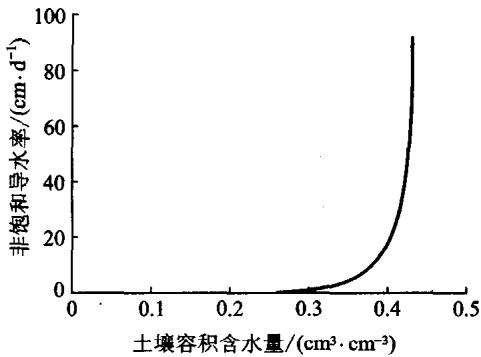  
图 3.4 土壤非饱和导水率曲线

在饱和状态条件下，砂土的导水率高于细质土壤，这是因为粗质土壤的孔隙空间主要分布在少量的大孔隙中，饱和时这部分孔隙充满水，能以较高的导水率传导水分。但在非饱和状态下，吸力的微小增加就能使这些大孔隙迅速排空，土壤中只有很细的孔隙中充满水分，导水断面大为减少，且由于细孔隙导水能力很差，土壤有效导水率急剧减小；而细质土壤则由于土壤孔隙分布比较均匀，孔隙排水比较缓慢，土壤可以维持较大的持水孔隙，导水率减小缓慢。随着基质吸力或土壤含水量的进一步减少，粗质砂土的非饱和导水率甚至会低于细质土的导水率。

常用的非饱和导水率表达式有

$$
K ( h ) = a h ^ { - m }\tag{3.31}
$$

$$
K ( h ) = \frac { K _ { \circ } } { c h ^ { m } + 1 }\tag{3.32}
$$

$$
K ( \theta ) = K _ { \mathrm { s } } \Bigg ( \frac { \theta - \theta _ { \mathrm { r } } } { \theta _ { \mathrm { s } } - \theta _ { \mathrm { r } } } \Bigg ) ^ { M }\tag{3.33}
$$

$$
K ( \theta ) = K _ { \mathrm { s } } \bigg [ 1 - \bigg ( 1 - \bigg ( \frac { \theta - \theta _ { \mathrm { r } } } { \theta _ { \mathrm { s } } - \theta _ { \mathrm { r } } } \bigg ) ^ { 1 / m } \bigg ) ^ { m } \bigg ] ^ { 2 } \bigg ( \frac { \theta - \theta _ { \mathrm { r } } } { \theta _ { \mathrm { s } } - \theta _ { \mathrm { r } } } \bigg ) ^ { 1 / 2 }\tag{3.34}
$$

$$
K ( \theta ) = K _ { \circ } \mathrm { e } ^ { - \beta ( \theta _ { \theta } - \theta ) }\tag{3.35}
$$

式中： $K ( \theta )$ 为土壤非饱和导水率， $K _ { s }$ 为饱和导水率， $\smash { a , b , c , \beta , n , m }$ 和 M 为经验常数。

## 3.2.3 非饱和导水率的毛细管模型

非饱和导水率K(θ)的值主要取决于土壤中水分的含量，同时还与水分运动通道的粗细、弯曲度和连通性有关。泊肃叶公式(3.10)只是描述直毛细管的情况，实际土壤流体系统要比直毛细管复杂得多，但可以把土壤孔隙系统作适当的简化来描述土壤水分的运动。假设土壤孔隙系统可以用一束不同形态的毛细管束来描述，并目毛细管束的尺寸分布与土壤水分特征曲线所代表的孔隙尺寸分布相同。通过选择毛细管的数量和形态以建立土壤基质势和水分含量的方程。这种毛细管束的性质与实际土壤水分系统有很多相似之处，可以用来分析非饱和导水率与土壤特性之间的关系。但是，应该清楚这样的毛细管束系统与实际土壤孔隙系统之间存在以下不同之处：

①虽然毛细管是弯曲的，但每个毛细管均没有死角或封闭区；

②在水分进出时没有瓶颈效应；

③模型中所有的毛细管长度均相同；

④模型中的水流边界层完全是水-固接触面，空的地方完全是气体，而在实际土壤中，流体边界是由气-固和水-固接触面共同组成的；

⑤毛细管模型中水膜的厚度由毛细管半径控制，而在土壤中水膜厚度则由基质势控制；

⑥毛细管中流体是稳定状态，与通常土壤中情况相反。

假设每个毛细管的长度为L。，它在土壤中弯曲而形成的土壤柱体的长度或 $L _ { \mathrm { c } }$ 表观长度为L，土壤柱体横断面面积为A，柱体两端水头差为∆H。毛细管间的水 $\Delta H _ { \mathrm { { c } } }$ 流运动都互不影响，且每一个毛细管内的水流运动都遵循泊肃叶公式，那么对于一个半径为 $R _ { j }$ 的毛细管，其流量 $Q _ { j }$ 就可通过式(3.10)得到

$$
Q _ { j } = \frac { \rho _ { \mathrm { w } } g \pi R _ { j } ^ { 4 } } { 8 \mu } \ : \frac { \Delta H } { L _ { \mathrm { c } } }\tag{3.36}
$$

则通过柱体的总的流量等于柱体横断面上各个毛细管流量之和。当所有毛细管充满水时，总的水流速率Q等于

$$
Q = \sum _ { j = 1 } ^ { M } N _ { j } Q _ { j } \ = \ { \frac { \rho _ { \ast } g \pi } { 8 \mu } } \ { \frac { \Delta H } { L _ { \mathrm { c } } } } \sum _ { j = 1 } ^ { M } N _ { j } R _ { j } ^ { 4 }\tag{3.37}
$$

式中：N表示半径为R的毛细管的数量，M表示组成土壤孔隙的不同型号的毛 $N _ { j }$ $R _ { j }$ 细管尺寸的数量。通过柱体的水流通量 $J _ { \ast }$ 可以表示为

$$
J _ { \mathrm { ~ w ~ } } = \mathrm { ~ \frac ~ { \cal { Q } ~ } { ~ \cal { A } ~ } ~ } = \mathrm { ~ \frac { ~ \rho _ { \mathrm { w } } g \pi ~ } { ~ 8 \mu ~ } ~ } \frac { \Delta H } { L _ { \mathrm { c } } } \sum _ { j = 1 } ^ { M } n _ { j } R _ { j } ^ { 4 }\tag{3.38}
$$

式中 ${ \bf { \sigma } } _ { : n _ { j } } = N _ { j } / A$ 是单位面积内半径为 $R _ { j }$ 的毛细管的数量。

在第2章(2.1.4表面张力和毛细管现象)中，我们曾经提到，土壤水的能态(土壤基质吸力)和毛细管等效孔径之间存在一一对应的关系，所以，通过测定土壤的水分特征曲线，就可以得到毛细管模型的孔隙尺寸分布（如图3.5所示)。

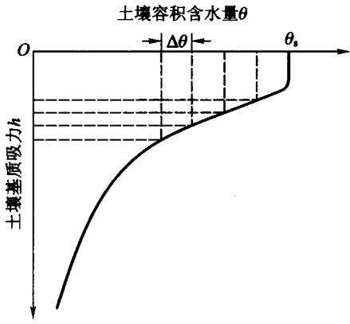  
图3.5 非饱和导水率的毛细管模型[3]

首先，依据土壤含水量将土壤水分特征曲线h(θ)分成M个相同含水量宽度 $\Delta \pmb \theta$ 的区域，每一个区域对应一个基质吸力 $h _ { j }$ (也即在此区域内所有的毛细管有同一孔径)和土壤含水量 $\theta = \theta _ { \mathrm { s } } - j \Delta \theta$ ,并且

$$
h _ { j } = h \big ( \theta _ { \ast } - j \Delta \theta \big ) \big ( j = 0 , 1 , 2 , \cdots , M \big )\tag{3.39}
$$

根据式(2.9),基质吸力 $h _ { j }$ 对应的毛细管孔径为

$$
R _ { j } = \frac { 2 \sigma } { \rho _ { \mathrm { w } } g h _ { j } }\tag{3.40}
$$

则单位面积对应的第j个区域的毛细管数量为

$$
n _ { j } = \frac { \Delta \theta } { \pi R _ { j } ^ { 2 } }\tag{3.41}
$$

假设当 $\pmb { h } = \pmb { h } _ { j }$ ,或 $\pmb { \theta } = \pmb { \theta } _ { \ast } - j \Delta \pmb { \theta }$ 时，所有孔径 $R > R _ { j }$ 的毛细管水分排空，则土壤的水流通量 $J _ { \ast }$ 全部由孔径 $R \leqslant R _ { j }$ 的孔隙提供，即

$$
\begin{array} { r l } { \boldsymbol { J } _ { * } } & { = \cfrac { \rho _ { \times } g \pi } { 8 \mu } \cfrac { \Delta H } { L _ { \mathrm { c } } } \sum _ { i = j + 1 } ^ { M } n _ { i } R _ { i } ^ { 4 } = \bigg ( \cfrac { \sigma ^ { 2 } \Delta \theta } { 2 \rho _ { \mathrm { s } } g \mu } \sum _ { i = j + 1 } ^ { M } \frac { 1 } { h _ { i } ^ { 2 } } \bigg ) \frac { \Delta H } { L _ { \mathrm { c } } } } \\ & { = \bigg ( \cfrac { \sigma ^ { 2 } \Delta \theta } { 2 \rho _ { \mathrm { s } } g \mu } \sum _ { i = j + 1 } ^ { M } \frac { 1 } { h _ { i } ^ { 2 } } \bigg ) \cfrac { L } { L _ { \mathrm { c } } } \frac { \Delta H } { L } = - \bigg ( \cfrac { \sigma ^ { 2 } \Delta \theta } { 2 \rho _ { \mathrm { s } } g \mu } \sum _ { i = j + 1 } ^ { M } \frac { 1 } { h _ { i } ^ { 2 } } \bigg ) \tau \frac { \Delta H } { \Delta z } } \end{array}\tag{3.42}
$$

式中： $\Delta z = 0 - L ; \Delta H / \Delta z$ 为水势梯度；

$$
l = \frac { L } { L _ { \mathrm { c } } }\tag{3.43}
$$

是毛细管弯曲度，表示毛细管实际长度与表观长度的比值。

对比式(3.42)和非饱和土壤的白金汉-达西定律式(3.27)，并结合式(3.39)可得非饱和导水率为

$$
K ( \theta , - j \Delta \theta ) = \frac { \sigma ^ { 2 } l \Delta \theta } { 2 \rho _ { \mathrm { s } } \varrho \mu } \cdot \sum _ { i = j + 1 } ^ { M } \frac { 1 } { h _ { i } ^ { 2 } }\tag{3.44}
$$

当所有毛细管都为水所充满时，所得到的导水率就为饱和导水率

$$
K _ { \mathrm { s } } = \frac { \sigma ^ { 2 } l \Delta \theta } { 2 \rho _ { \mathrm { w } } g \mu } \cdot \sum _ { i = 1 } ^ { M } \frac { 1 } { h _ { i } ^ { 2 } }\tag{3.45}
$$

如果饱和导水率已知，那么结合式(3.44)和式(3.45)就可计算土壤的非饱和导水率

$$
K ( \theta _ { \circ } - j \Delta \theta ) = K _ { \circ } \cdot \overbrace { \sum _ { i = 1 } ^ { M } { \frac { 1 } { h _ { i } ^ { 2 } } } } ^ { M }\tag{3.46}
$$

上述由测量的h(θ)通过毛细管束模型计算非饱和导水率的方法首先由Childs 和 Collis – George[11]提出，后来由Marshal1[ 15]和 Millington 和 Quirk[16]进行了改进。

## 3.2.4 连续方程

质量守恒定律是自然界物质运动和变化所遵循的基本定律之一，对于多孔介质中的流体运动，同样遵循质量守恒定律。下面我们就根据质量守恒定律来建立土壤水分运动的连续方程。

假定土壤固相骨架在整个研究过程中保持不变，即认为土壤是一个刚性的多孔介质。设在研究土壤水分空间中任意一点 $m \left( x , y , z \right)$ ,并以m点为中心任意选取一个无限小的六面体，六面体的边长为 $\Delta x , \Delta y , \Delta z$ ，并且与相对应的坐标轴平行，如图3.6所示。设研究土壤水分运动的任意时刻为t，在 $\Delta t$ 时间内土壤水分运动使单元体内水分质量发生变化。设单元体三个方向的水流通量分别为

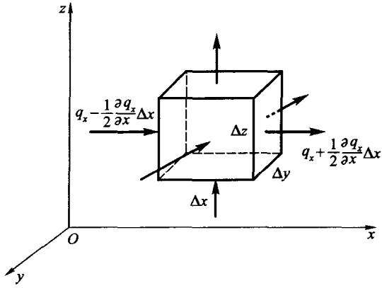  
图3.6 单元体内土壤水分变化示意图

$J _ { \mathrm { w } x } , J _ { \mathrm { w y } } , J _ { \mathrm { w } z }$ ，单位容积土体植物根系的吸水速率为 $r _ { w }$ 。现以x轴方向为例进行说明。在 $\Delta t$ 时间内进入单元体的水流通量为

$$
J _ { \mathrm { w } x } - \frac { 1 } { 2 } \frac { \partial J _ { \mathrm { w } x } } { \partial x } \Delta x
$$

在 $\Delta t$ 时间内流出单元体的水流通量为

$$
J _ { \ l w s x } + \frac { 1 } { 2 } \frac { \partial J _ { \ l _ { \mathrm { w a x } } } } { \partial x } \Delta x
$$

因此在 $\Delta t$ 时间内单元体因x轴方向的水分通量梯度引起的水量变化量 $\Delta \mathbb { W } _ { x }$ 可表示为

$$
\Delta W _ { x } = - \frac { \partial J _ { \mathrm { w } x } } { \partial x } \rho _ { \mathrm { w } } \Delta x \Delta y \Delta z \Delta t\tag{3.47}
$$

同理，可以得到∆t时间内单元体因y轴和z轴方向上的水分通量梯度引起的水 $\Delta t$ 量变化量 $\Delta \mathbb { W } _ { \gamma }$ 和 $\Delta \mathcal { W } _ { z }$ 分别为

$$
\Delta W _ { y } = \ - \frac { \partial J _ { \mathrm { w y } } } { \partial y } \rho _ { \mathrm { w } } \Delta x \Delta y \Delta z \Delta t\tag{3.48}
$$

$$
\Delta W _ { z } = { \ - \frac { \partial J _ { \mathrm { w } } } { \partial z } \rho _ { \mathrm { w } } \Delta x \Delta y \Delta z \Delta t }\tag{3.49}
$$

在 $\Delta t$ 时间内单元体因植物根系吸收而失去的水分质量 $\Delta \mathbb { W } ,$ 可表示为

$$
\Delta W _ { r } = { \phantom { - } } - r _ { \mathrm { w } } \rho _ { \mathrm { w } } \Delta x \Delta y \Delta z \Delta t\tag{3.50}
$$

在 $\Delta t$ 时间内单元体水量变化量 $\Delta \pmb { W }$ 为

$$
\Delta W = \rho _ { \textrm { w } } \Delta x \Delta y \Delta z \Delta \theta\tag{3.51}
$$

根据质量守恒定律，单元体流入的水量与流出的水量之差应等于单元体的水量增加量，所以应有

$$
\Delta W = \Delta W _ { x } + \Delta W _ { y } + \Delta W _ { z } + \Delta W _ { r }\tag{3.52}
$$

将式(3.47)\~(3.51)代入式(3.52)并化简可得

$$
\frac { \Delta \theta } { \Delta t } = { \bf \nabla } - \left( \frac { \partial J _ { w x } } { \partial x } + \frac { \partial J _ { w y } } { \partial y } + \frac { \partial J _ { w z } } { \partial z } \right) { \bf \nabla } - r _ { \cdot }\tag{3.53}
$$

当 $\Delta t {  } 0$ 时，上式可写为

$$
\frac { \partial \theta } { \partial t } + \left( \frac { \partial J _ { \mathrm { w } x } } { \partial x } + \frac { \partial J _ { \mathrm { w } y } } { \partial y } + \frac { \partial J _ { \mathrm { w } z } } { \partial z } \right) + r _ { \mathrm { w } } = 0\tag{3.54}
$$

$$
\frac { \partial \theta } { \partial t } + \nabla \cdot \boldsymbol { J } _ { \mathrm { v } } + \boldsymbol { r } _ { \mathrm { v } } = 0\tag{3.55}
$$

式中 $\bullet \bullet _ { \ast }$ 为三维空间里用矢量表示的水流通量。式(3.54)或(3.55)即为土壤水分运动的连续性方程。

## 3.2.5 Richards 方程

目前的土壤水分运动方程大都是指Richards方程。Richards方程是基于白

金汉-达西定律和连续方程建立的。将白金汉-达西定律(3.30)代入连续性方程(3.55)可得三维空间Richards方程的表达式为

$$
\frac { \partial \theta } { \partial t } = \frac { \partial } { \partial x } \bigg [ K _ { \mathrm { x } } \left( \theta \right) \frac { \partial \psi _ { \mathrm { m } } } { \partial x } \bigg ] + \frac { \partial } { \partial y } \bigg [ K _ { \mathrm { y } } \left( \theta \right) \frac { \partial \psi _ { \mathrm { m } } } { \partial y } \bigg ] + \frac { \partial } { \partial z } \bigg [ K _ { \mathrm { x } } \left( \theta \right) \frac { \partial \psi _ { \mathrm { m } } } { \partial z } \bigg ] \pm \frac { \partial K _ { \mathrm { z } } \left( \theta \right) } { \partial z } - r _ { \mathrm { w } } ,\tag{3.56}
$$

式中的正负号与垂向坐标轴方向的选取有关，如坐标轴方向向上为正，则取正号，反之则取负号。对于各向同性介质， $K { \left( \theta \right) } = K _ { \ast } \left( \theta \right) = K _ { \ast } \left( \theta \right) = K _ { \ast } \left( \theta \right)$ , Rich-ards方程可表示为

$$
\frac { \partial \theta } { \partial t } = \frac { \partial } { \partial x } \bigg [ K ( \theta ) \frac { \partial \psi _ { \mathrm { m } } } { \partial x } \bigg ] + \frac { \partial } { \partial y } \bigg [ K ( \theta ) \frac { \partial \psi _ { \mathrm { m } } } { \partial y } \bigg ] + \frac { \partial } { \partial z } \bigg [ K ( \theta ) \frac { \partial \psi _ { \mathrm { m } } } { \partial z } \bigg ] \pm \frac { \partial K ( \theta ) } { \partial z } - r _ { \mathrm { w a v } } .\tag{3.57}
$$

在无植物情况下， $r _ { \ast } = 0$ ,则

$$
\frac { \partial \theta } { \partial t } = \frac { \partial } { \partial x } \bigg [ K ( \theta ) \frac { \partial \psi _ { \mathrm { { s } } } } { \partial x } \bigg ] + \frac { \partial } { \partial y } \bigg [ K ( \theta ) \frac { \partial \psi _ { \mathrm { { s } } } } { \partial y } \bigg ] + \frac { \partial } { \partial z } \bigg [ K ( \theta ) \frac { \partial \psi _ { \mathrm { { s } } } } { \partial z } \bigg ] \pm \frac { \partial K ( \theta ) } { \partial z }\tag{3.58}
$$

由于土壤水分运动的滞后性，土壤水分吸水和脱水曲线不重合，所以如果土壤水分特征曲线只是单一的吸水或脱水曲线，那么，Richards方程只能应用于土壤水分吸湿或脱湿的单一过程。

针对具体问题，根据研究问题的特点，Richards方程可具有多种表达形式。现就其中常用的形式作简单说明。在下面的分析中，垂直坐标均取垂直向上为正。

## (1) 以基质势为因变量的 Richards 方程

在此我们引入比水容量 $C ( \psi _ { \mathfrak { m } } )$ 的概念，即单位基质势的增加所引起的土壤含水量的变化，表示为

$$
C ( \boldsymbol { \psi } _ { \mathrm { m } } ) = \frac { \mathrm { d } \theta } { \mathrm { d } \psi _ { \mathrm { m } } }\tag{3.59}
$$

比水容量和非饱和导水率既可表示为土壤含水量的函数 $C ( \theta ) \setminus K \left( \theta \right)$ ，也可表示为基质势的函数 $C ( \psi _ { \mathrm { ~ m ~ } } ) \mathrm { ~ , ~ } K ( \psi _ { \mathrm { ~ m ~ } } )$ 。将式(3.59)代入式(3.58)替换土壤含水量，就可得到以基质势为因变量的Richards方程：

$$
C \left( \psi _ { \mathbf { _ m } } \right) \frac { \partial \psi _ { \mathbf { _ m } } } { \partial t } = \frac { \partial } { \partial x } \Big [ K \big ( \psi _ { \mathbf { _ m } } \big ) \frac { \partial \psi _ { \mathbf { _ m } } } { \partial x } \Big ] + \frac { \partial } { \partial y } \Big [ K \big ( \psi _ { \mathbf { _ m } } \big ) \frac { \partial \psi _ { \mathbf { _ m } } } { \partial y } \Big ] + \frac { \partial } { \partial z } \Big [ K \big ( \psi _ { \mathbf { _ m } } \big ) \frac { \partial \psi _ { \mathbf { _ m } } } { \partial z } \Big ] + \frac { \partial K \big ( \psi _ { \mathbf { _ m } } \big ) } { \partial z } = 0 ,\tag{3.60}
$$

## (2) 以含水量为因变量的 Richards 方程

为了转变为以θ为因变量的方程，在此我们引入土壤水分扩散率 $D ( \pmb \theta )$ 的概念，定义土壤水分扩散率为导水率 $K ( \pmb \theta )$ 和比水容量 $C ( \pmb \theta )$ 的比值，即

$$
D ( \theta ) = { \frac { K ( \theta ) } { C ( \theta ) } } = K ( \theta ) { \mathit { \Omega } } \cdot { \frac { \mathrm { d } \psi _ { \mathrm { { m } } } } { \mathrm { d } \theta } }\tag{3.61}
$$

同样，土壤水分扩散率既可表示为土壤含水量的函数 $D ( \pmb \theta )$ ，也可表示为基质势的函数 $D ( \psi _ { \mathfrak { m } } )$ 。将式(3.61)代入式(3.58)替换基质势，就可得到以含水量为因变量的 Richards 方程：

$$
\frac { \partial \theta } { \partial t } = \frac { \partial } { \partial x } \bigg [ D \left( \theta \right) \frac { \partial \theta } { \partial x } \bigg ] + \frac { \partial } { \partial y } \bigg [ D \left( \theta \right) \frac { \partial \theta } { \partial y } \bigg ] + \frac { \partial } { \partial z } \bigg [ D \left( \theta \right) \frac { \partial \theta } { \partial z } \bigg ] + \frac { \partial K \left( \theta \right) } { \partial z }\tag{3.62}
$$

对于一维垂直入渗问题：

$$
\frac { \partial \theta } { \partial t } = \frac { \partial } { \partial z } \bigg [ D \big ( \theta \big ) \frac { \partial \theta } { \partial z } \bigg ] + \frac { \partial K \big ( \theta \big ) } { \partial z }\tag{3.63}
$$

对于一维水平吸渗问题：

$$
\frac { \partial \pmb { \theta } } { \partial t } = \frac { \partial } { \partial \pmb { x } } \bigg [ D \big ( \pmb { \theta } \big ) \frac { \partial \pmb { \theta } } { \partial \pmb { x } } \bigg ]\tag{3.64}
$$

(3) 以位置坐标 x 或 z 为因变量的 Richards 方程

将含水率以隐函数形式表示，由于

$$
{ \mathfrak { x } } - { \mathfrak { x } } ( \theta , t ) \equiv 0\tag{3.65}
$$

利用微分法则可以得到

$$
\frac { \partial \theta } { \partial t } = \triangledown - \frac { \partial x } { \partial t } \bigg / \frac { \partial x } { \partial \theta }\tag{3.66}
$$

$$
\frac { \partial \theta } { \partial x } = 1 \bigg / \frac { \partial x } { \partial \theta }\tag{3.67}
$$

将式(3.66)和(3.67)代人式(3.64)可以得到以位置坐标x为因变量的一维水平吸渗 Richards 方程

$$
\left. - \frac { \partial x } { \partial t } = \frac { \partial } { \partial \theta } \bigg [ D \big ( \theta \big ) \bigg / \frac { \partial x } { \partial \theta } \right]\tag{3.68}
$$

同理，对于一维垂直入渗，以位置坐标z为因变量的 Richards方程为

$$
- \frac { \partial z } { \partial t } = \frac { \partial } { \partial \theta } \Big [ D \big ( \theta \big ) \bigg / \frac { \partial z } { \partial \theta } \Big ] + \frac { \partial K \big ( \theta \big ) } { \partial \theta }\tag{3.69}
$$

上面讨论的都是直角三角坐标系下的Richards方程，但在某些情况下，比如管道侧渗、地下渗灌、地下井抽水、滴灌、点源入渗等，用柱坐标系或球坐标系问题会更加简单。雷志栋等1所编著的《土壤水动力学》对于这两类坐标系下Richards方程有详细的推导过程，这里我们就不做推导，下面我们仅列出柱坐标系和球坐标系下达西定律和 Richards方程的表达形式：

## (1) 柱坐标系下的 Richards 方程

假如z轴为坐标轴的中心轴；r为径向坐标； $\varphi$ 为旋转角。在柱坐标系下，达西定律有不同的表达形式：

$$
\boldsymbol { J } _ { r } = \mathbf { \delta } - K ( \mathbf { \nabla } \theta ) \frac { \partial \psi } { \partial r }
$$

$$
J _ { _ { \varphi } } = \ - { \frac { 1 } { r } } K ( \theta ) { \frac { \partial \psi } { \partial \varphi } }\tag{3.70}
$$

$$
J _ { z } = { } - K ( \theta ) \frac { \partial \psi } { \partial z }
$$

$J _ { \varphi } \underbrace { J } _ { \nu }$ 分别为沿r轴、 $\cdot \varphi$ 轴 $\mathbf { \lambda } _ { \mathbf { { \lambda } } } \mathbf { z }$ 轴方向上的水流通量分量。

以含水量为因变量的基本方程可表示为

$$
\frac { \partial \theta } { \partial t } = \frac { 1 } { r } \ \frac { \partial } { \partial r } \Big [ r D ( \theta ) \frac { \partial \theta } { \partial r } \Big ] + \frac { 1 } { r ^ { 2 } } \ \frac { \partial } { \partial \varphi } \Big [ D ( \theta ) \frac { \partial \theta } { \partial \varphi } \Big ] + \frac { \partial } { \partial z } \Big [ D ( \theta ) \frac { \partial \theta } { \partial z } \Big ] + \frac { \partial K ( \theta ) } { \partial z }\tag{3.71}
$$

若土壤含水量在z轴方向上无变化，且具有轴对称的特点，则方程可简化为

$$
\frac { \partial \theta } { \partial t } = \frac { 1 } { r } \frac { \partial } { \partial r } \bigg [ r D ( \theta ) \frac { \partial \theta } { \partial r } \bigg ]\tag{3.72}
$$

(2) 球坐标系下的 Richards 方程

假设r为球坐标系的径向坐标， $\varphi$ 为经度角，α为纬度角，则在球坐标系中达西定律的表达形式为

$$
\begin{array} { l } { \displaystyle { J _ { r } = - K ( \theta ) \frac { \partial \psi } { \partial r } } } \\ { \displaystyle { J _ { \varphi } = - \frac { 1 } { r \sin \alpha } K ( \theta ) \frac { \partial \psi } { \partial \varphi } } } \\ { \displaystyle { J _ { \alpha } = - K ( \theta ) \frac { \partial \psi } { \partial \alpha } } } \end{array}\tag{3.73}
$$

$J _ { r } \setminus J _ { \varphi } \setminus J _ { \alpha }$ 分别为沿r轴 $\cdot \varphi$ 轴、α轴方向上的水流通量分量。

以含水量为因变量的基本方程可表示为

$$
\begin{array} { r l } & { \displaystyle \frac { \partial \theta } { \partial t } = \frac { 1 } { r } \ \frac { \partial } { \partial r } \Big [ r D ( \theta ) \frac { \partial \theta } { \partial r } \Big ] \ + \frac { 1 } { \big ( r \sin \alpha \big ) ^ { 2 } } \ \frac { \partial } { \partial \varphi } \Big [ D ( \theta ) \frac { \partial \theta } { \partial \varphi } \Big ] \ + \frac { 1 } { r ^ { 2 } } \ \frac { \partial } { \partial \alpha } \Big [ D ( \theta ) \frac { \partial \theta } { \partial \alpha } \Big ] \ + } \\ & { \displaystyle \cos \alpha \ \frac { \partial K ( \theta ) } { \partial r } - \frac { \sin \alpha } { r } \ \frac { \partial K ( \theta ) } { \partial \alpha } } \end{array}\tag{3.74}
$$

若研究的问题具有沿过坐标原点的平面对称的特点，则方程可简化为

$$
{ \frac { \partial \theta } { \partial t } } = { \frac { 1 } { r } } \ { \frac { \partial } { \partial r } } { \Bigl [ } \ r D \left( \theta \right) { \frac { \partial \theta } { \partial r } } { \Bigr ] } \ + { \frac { 1 } { r ^ { 2 } } } \ { \frac { \partial } { \partial \alpha } } { \Bigl [ } \ D \left( \theta \right) { \frac { \partial \theta } { \partial \alpha } } { \Bigr ] } \ + \cos \ \alpha \ { \frac { \partial K ( \theta ) } { \partial r } } - { \frac { \sin \ \alpha } { r } } \ { \frac { \partial K ( \theta ) } { \partial \alpha } }\tag{3.75}
$$

若研究的问题具有轴对称的特点，则方程有与柱坐标系下沿z轴对称问题相同的表达形式：

$$
\frac { \partial \theta } { \partial t } = \frac { 1 } { r } \ \frac { \partial } { \partial r } \bigg [ r D ( \theta ) \frac { \partial \theta } { \partial r } \bigg ]\tag{3.76}
$$

## 3.2.6 稳态流问题

虽然在大多数情况下非饱和水流都处在非稳定状态，但在一些情况下，土壤中的水流可近似看做稳态水流处理，以达到简化问题的目的。在稳态条件下，土壤储水变化量为零，也即土壤各点的水流通量 $J _ { \ast }$ 不随时间和位置发生变化。下面我们仅就最常遇到的一维情况进行讨论。在稳定态条件下，由白金汉-达西定律得到：

$$
J _ { \star } = - K \big ( \psi _ { \mathrm { { m } } } \big ) \left( \frac { \mathrm { d } \psi _ { \mathrm { { m } } } } { \mathrm { d } z } + 1 \right)\tag{3.77}
$$

式中： $J _ { \ast }$ 是个常量； $\pmb { \psi _ { \mathrm { ~ m ~ } } }$ 只与z有关，而与时间t无关。式(3.77)可以化为如下形式：

$$
\frac { \mathrm { d } \psi _ { \mathrm { { m } } } } { 1 + J _ { \mathrm { { w } } } / K ( \psi _ { \mathrm { { m } } } ) } = - \mathrm { d } z\tag{3.78}
$$

对于土壤中任意两点z，和z2，其对应的基质势分别为 $z _ { 1 }$ $z _ { 2 }$ $\psi _ { \mathrm { { m } } 1 }$ 和 $\psi _ { \mathrm { { m } } 2 }$ 。方程(3.78)两边分别对 $\psi _ { { \textrm { m l } } }$ 到 $\psi _ { \mathrm { m } 2 } , z _ { 1 }$ 到 $z _ { 2 }$ 积分，则可得到达西定律的积分表达式：

$$
\int _ { \psi _ { \mathrm { m } } 1 } ^ { \psi _ { \mathrm { m } 2 } } \frac { \mathrm { d } \psi _ { \mathrm { m } } } { 1 + J _ { \mathrm { v } } / K ( \psi _ { \mathrm { m } } ) } = - \int _ { z _ { 1 } } ^ { z _ { 2 } } \mathrm { d } z = z _ { 1 } - z _ { 2 }\tag{3.79}
$$

如果已知非饱和导水率 $K ( \boldsymbol { \psi } _ { \mathbf { \mathfrak { m } } } )$ 的表达式，则由式(3.79)就能得到准确的稳态水流的解析解表达式。下面就以常见的几种情况下的稳态水流为例进行说明。

## (1)地下水稳定时的土壤蒸发问题

尽管田间水分蒸发不是一个稳态的过程，但一个较长时期内，大气蒸发能力相对稳定，田面的蒸发过程可接近看做稳态蒸发。Gardner31通过一个经验的非饱和导水率的表达式得到了这个问题的典型解法。他们采用的土壤非饱和导水率-基质势函数形式如下：

$$
K ( \psi _ { \mathfrak { m } } ) = \frac { K _ { \mathfrak { s } } } { 1 + ( \psi _ { \mathfrak { m } } / a ) ^ { N } }\tag{3.80}
$$

式中 $\scriptstyle : K _ { \mathfrak { s } }$ 为饱和导水率；a，N为经验常数，且 $a < 0 , N > 0$ 0

为便于分析，取地表为零坐标面，垂直向上为正，地下水埋深 $z = - L$ ;土壤蒸发速率为 $E _ { \circ }$ 那么，在 $z = - L$ 处 $\psi _ { \mathrm { { m l } } } = 0$ ;在 $z = 0$ 处 $\psi _ { \mathrm { m } 2 } = - \infty$ ;地表水流通量$J _ { \textrm { w } } = E _ { \textrm { c } }$ 、则由达西定律的积分表达式(3.79)可以得到如下表达式：

$$
\int _ { 0 } ^ { - \infty } \frac { \mathrm { d } \psi _ { \mathrm { { m } } } } { 1 + ( E / K _ { \mathrm { s } } ) [ 1 + ( \psi _ { \mathrm { { m } } } / a ) ^ { N } ] } = - L\tag{3.81}
$$

$\pmb { y } = \pmb { \psi } _ { \mathrm { m } } / a$ ，作下列积分变换：

$$
a { \int _ { 0 } ^ { \infty } } \ \frac { \mathrm { d } y } { 1 + E / K _ { \mathrm { s } } + \left( E / K _ { \mathrm { s } } \right) y ^ { N } } = - \ L\tag{3.82}
$$

假设 $E / K _ { \textrm { s } } < < 1$ ,那么，式(3.82)可简化为

$$
a { \int _ { 0 } ^ { \infty } } \ { \frac { \mathrm { d } y } { 1 + \left( E / K _ { s } \right) y ^ { N } } } = - \ L\tag{3.83}
$$

$z = y \big ( E / K _ { \mathrm { s } } \big ) ^ { 1 / N }$ ，然后经过积分变换可以得到

$$
a { \bigg ( } { \frac { K _ { \circ } } { E } } { \bigg ) } ^ { 1 / N } \int _ { 0 } ^ { \infty } { \frac { \mathrm { d } z } { 1 + z ^ { N } } } = - L\tag{3.84}
$$

查标准积分表可得

$$
\int _ { 0 } ^ { \infty } { \frac { \mathrm { d } z } { 1 + z ^ { N } } } = { \frac { \pi } { N \mathrm { s i n } ( \pi / N ) } }\tag{3.85}
$$

把式(3.85)带入式(3.84),我们能够解出最大蒸发速率为

$$
E = K _ { \ast } \Bigg ( \frac { - a \pi } { L N \mathrm { s i n } \left( \pi / N \right) } \Bigg ) ^ { N }\tag{3.86}
$$

方程(3.86)给出了土壤类型确定情况下，地下水埋深L与最大蒸发速率E之间的关系。地下水越深，最大蒸发速率越小，但是蒸发速率减小的速率会越来越小。正如Gardner(1958)所述，最大蒸发速率与表面干燥程度有很大关系，虽然表层基质势的增加会进一步增大表土的水势梯度，但是土壤非饱和导水率的减少也会很显著，所以最大蒸发速率不会有太大变化。这就表明土壤存在一个临界地下水埋深。地下水位在临界地下水埋深以上，表土蒸发速率受地下水位影响较大；地下水位在临界地下水埋深以下，表土蒸发速率已经很小，与地下水埋深关系不大。在地下水位较浅的地区开展农业的一个最大问题是，如果地下水中盐分含量较高，盐分将会随着水分蒸发移动到土壤表面，随着水分的蒸发，盐分将会在土壤表面累积，这样会毁坏作物或破坏土壤结构[13]。粗质土孔隙分布不均，大孔隙发育，虽有较大的饱和导水率，但非饱和导水率随含水率的减少下降很快，所以临界地下水埋深较浅。细质土孔隙分布均匀，饱和导水率虽然可能相对较小，但其非饱和导水率随土壤含水量的减少变化缓慢，所以临界地下水埋深反而较大。上述结果表明，细质土壤水分向上的移动比粗质土更明显。因此，要避免盐碱化，细质土跟粗质土相比要保持更低的地下水位。

## (2)向下运动的稳态水流问题

稳态的水分向下运动，尽管在田间不可能实现，但仍接近某些状况下的水流，如频繁灌溉或频繁降雨引起的土壤内排水可以近似看做向下运动的稳态水流问题[13]。

土壤非饱和导水率-基质势函数仍然采用式(3.80)的形式，只是取 $N = 2$ 仍取地表为零坐标面，垂直向上为正，地下水埋深 $z = - L ;$ 土壤表层以稳态水流$J _ { \textrm { w } } = \textrm { - } i$ 向下流动。那么，在 $z = - L$ 处 $\psi _ { \mathrm { { m } 1 } } = 0$ ;对土壤内任意一点 $z , \psi _ { \mathrm { ~ m ~ } } = h$ 。则由白金汉-达西定律的积分表达式(3.79)可以得到如下表达式：

$$
\int _ { 0 } ^ { h } \frac { \mathrm { d } \psi _ { \mathrm { m } } } { 1 - ( i / K _ { \mathrm { s } } ) [ 1 + ( \psi _ { \mathrm { m } } / a ) ^ { 2 } ] } = - ( z + L )\tag{3.87}
$$

同样，令 $\boldsymbol { y } = \boldsymbol { h } / a$ ,积分简化为

$$
\int _ { 0 } ^ { h / a } \frac { \mathrm { d } y } { 1 - i / { K } _ { \bullet } - ( i / { K } _ { \bullet } ) y ^ { 2 } } = - \left( z + L \right)\tag{3.88}
$$

由标准积分表可以查到

$$
\int { \frac { \mathrm { d } y } { \alpha \ - \ \beta y ^ { 2 } } } \ = \ { \frac { 1 } { \sqrt { \alpha \beta } } } \mathrm { a r t a n h } \ { \frac { y \ \sqrt { \alpha \beta } } { \alpha } }\tag{3.89}
$$

这里 $\alpha = 1 \ : - \ : i / K _ { \circ } , \beta = i / K _ { \circ }$ ，artanh为反双曲正切函数。因此，运用式(3.89)到(3.88)可得

$$
\frac { a } { \sqrt { \left( 1 - i / K _ { \circ } \right) i / K _ { \circ } } } \mathrm { a r t a n h } \frac { h \sqrt { \left( 1 - i / K _ { \circ } \right) i / K _ { \circ } } } { a \left( 1 - i / K _ { \circ } \right) } = - \left( z + L \right)\tag{3.90}
$$

$$
h = a \sqrt { \frac { K _ { \ast } } { i } - 1 } \cdot \operatorname { t a n h } \Biggr [ \frac { - \sqrt { \left( 1 - i / K _ { \ast } \right) i / K _ { \ast } } } { a } ( z + L ) \Biggr ]\tag{3.91}
$$

图3.7 表示相对基质势 $\pmb { h } / \pmb { a }$ 与相对深度 $z / L$ 在各个参数值 $i / K _ { \mathfrak { s } }$ 时相对应的值。这个曲线的一个显著特征是，只要水平面不是太浅，在接近表层时任何流速i情况下的基质势均接近于一个常量。这表明，当水流以一个恒定的速度向下流动，基质势梯度 $\mathbf { d } h / \mathbf { d } z$ 接近于0，水流只受重力影响。由白金汉-达西定律，水流通量与相应的非饱和导水率相等，即

$$
J _ { \mathrm { w } } \approx - K ( h )\tag{3.92}
$$

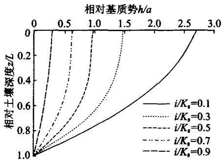  
图3.7 稳态条件下的土壤水流基质势分布 $( L / a = 5 ) ^ { [ 1 3 ] }$

## 3.3 土壤水分运动基本参数

从前面非饱和土壤水分运动基本方程可知，方程中除了位置坐标、时间坐标、基质势或土壤含水量之外，还有非饱和导水率、土壤水分扩散率和比水容量等水分运动参数，因此，在模拟土壤水分运动时这些参数是必不可少的。土壤水分运动参数主要包括非饱和导水率 $K ( \pmb \theta )$ 、土壤水分扩散率 $D \left( \pmb \theta \right)$ 和比水容量$C ( \pmb \theta )$ ，而且三者之间有一定的函数关系，即 $K ( \theta ) = D ( \theta ) \cdot C ( \theta )$ ，同时， $C ( \pmb \theta ) =$ $\mathrm { d } \theta / \mathrm { d } \psi _ { \mathrm { ~ m ~ } }$ 。所以，只要知道土壤水分特征曲线和非饱和土壤水分运动参数K(θ)和 $D ( \pmb \theta )$ 中的任何一个，那么另外一个参数就可通过计算获得。土壤水分特征曲线的直接测定方法在第2章已经作了说明，本节主要介绍土壤水分特征曲线的其他间接推求方法及非饱和导水率和土壤水分扩散率的测定方法。

## 3.3.1 瞬时剖面法测定非饱和导水率

瞬时剖面法是在室内进行均质土壤的一维上渗或下渗试验时，测定不同时刻+壤剖面的含水率和吸力分布，通过计算求得非饱和导水率K(θ)。瞬时剖面法对扰动土和原状土均适用，可测定吸湿和脱湿过程，试验和计算都比较方便，因此应用较为普遍。现就其基本原理和试验测定过程简述如下：

对非饱和垂直一维水流，当取z坐标向上为正时，由白金汉-达西定律可导出非饱和导水率的计算式为

$$
K ( \pmb \theta ) = \frac { J _ { \mathrm { w } } } { \partial s / \partial z - 1 }\tag{3.93}
$$

式中 $\ d s = \ d - \ d - \psi _ { \ m }$ 为十壤基质吸力，其他符号意义同前。由式(3.93)可知，只要知道了某一点的土壤含水量θ、水流通量 $J _ { \mathbf { w } }$ 和吸力梯度 $\partial s / \partial z$ ，就可计算出其相应的非饱和导水率。为此，试验需要测得两个时刻t和t2的土壤含水量和吸力剖 $t _ { \mathrm { i } }$ $t _ { 2 }$ 面(如图3.8所示)。吸力梯度可直接由吸力剖面作图或经验拟合公式得到；各个位置的水流通量可以通过水量平衡原理获得。

  
(a) 含水率分布曲线

  
(b) 水吸力分布曲线  
图3.8 土壤含水率分布曲线和水吸力分布曲线

垂直+柱上渗试验装置如图3.9所示。利用马氏瓶维持水位不变，并测出补给水量，可以得到人渗表面水流通量 $J _ { \mathbf { w } \mathbf { 0 } }$ 。土柱顶端不密封，但要防止蒸发；沿土柱安装负压计。试验过程中，第一个时刻 $\pmb { t } _ { \mathbf { i } }$ 的剖面土壤含水量测定通常不采用取土称重法，而用γ射线仪或TDR测定，这是为了土柱不受取样的干扰。第

二个时刻 $t _ { 2 }$ ，可以取土称重测其剖面含水量分布$\boldsymbol { \theta } ( t _ { 2 } )$ ，同时读取张力计读数得到相应时刻的吸力分布，这样就得到土壤水分特征曲线。也可以通过吸力与土壤含水量之间的关系，由第一时刻 $t _ { 1 }$ 测得的吸力剖面计算得到第一时刻 $t _ { 1 }$ 的含水量剖面$\boldsymbol { \theta } ( t _ { 1 } )$ o

根据水量平衡原理，土柱内含水量的增加量应该等于马氏瓶的补给水量，由此可以计算任意位置z的水流通量 $\mathnormal { J _ { \mathrm { w } } } \left( z \right)$ 。由水流连续性原理得

$$
\frac { \partial \theta } { \partial t } = ~ - \frac { \partial J _ { \mathrm { { w } } } } { \partial z }\tag{3.94}
$$

对上式积分，积分限由0至z，则得

图3.9 垂直上渗试验装置

$$
\int _ { 0 } ^ { z } \frac { \partial \theta } { \partial t } \mathrm { d } z = J _ { \mathrm { w 0 } } - J _ { \mathrm { w } } \left( z \right)\tag{3.95}
$$

位置坐标z与时间t无关，所以积分号可以放到微分号里面，上式可改写为

$$
J _ { _ { \mathrm { \Delta v } } } ( z ) \ = \ J _ { _ { \mathrm { w 0 } } } - \frac { \partial } { \partial t } { \int _ { 0 } ^ { z } } \theta \mathrm { d } z\tag{3.96}
$$

取 $t _ { 1 }$ 和 $t _ { 2 }$ 之间的时间段为差分区间，上式可进一步改写为

$$
J _ { \mathrm { { w } } } \left( z \right) ~ = ~ J _ { \mathrm { { w 0 } } } - \frac { 1 } { \Delta t } \Big [ \int _ { 0 } ^ { z } \theta ( t _ { 2 } ) \mathrm { d } z - \int _ { 0 } ^ { z } \theta ( t _ { 1 } ) \mathrm { d } z \Big ]\tag{3.97}
$$

由 $t _ { 1 }$ 和 $t _ { 2 }$ 时刻的含水量剖面 $\theta \left( t _ { \scriptscriptstyle 1 } \right)$ 和 $\theta \left( { { t } _ { 2 } } \right)$ ,通过式(3.97)计算得到任意位置z的水流通量 $J _ { \mathrm { w } } \left( z \right)$ 。由于式(3.97)是对微分的数值近似，所以 $t _ { 1 }$ 和 $t _ { 2 }$ 之间的时间段不宜过长。但受测量技术和土壤微小尺度下变异性的限制，并非时间间隔越短越好，因为离散的吸力和含水率的微分区间可能达到测量误差的量级。

## 3.3.2 水平入渗法测定非饱和土壤水分扩散率

水平入渗法是测定土壤水分扩散率D(θ)的非稳定流法，最早由Bruce和Klute[9]提出。该方法利用一个半无限长水平土柱吸渗试验资料，结合解析方法求得的计算公式计算出土壤水分扩散率D(θ)。

水平入渗法测定土壤水分扩散率的基础是一维水平土壤水分运动的Boltz-mann变换解。问题的控制方程和定解条件为

$$
\left[ { \frac { \partial \theta } { \partial t } } = { \frac { \partial } { \partial x } } { \bigg [ } D ( \theta ) { \frac { \partial \theta } { \partial x } } { \bigg ] } \right.\tag{3.98a}
$$

$$
\theta ( 0 , x ) = \theta _ { \mathrm { i } }\tag{3.98b}
$$

$$
\pmb { \theta } ( t , 0 ) = \pmb { \theta } _ { 0 }\tag{3.98c}
$$

$$
\lfloor \pmb \theta ( t , \infty ) = \pmb \theta _ { \mathrm { i } }\tag{3.98d}
$$

式中： $\pmb \theta _ { \mathrm { i } }$ 为初始土壤含水量； $\pmb { \theta } _ { 0 }$ 为进水端边界土壤含水量；其他符号意义同上。式(3.98)的初始条件为，整个土柱有相同的初始含水量 $\pmb \theta _ { \mathrm { i } }$ ;进水端边界条件为，始终维持一恒定的含水量 $\pmb { \theta } _ { 0 }$ 。详细的求解过程在下一节讨论，这里我们只给出由问题的解得到的土壤水分扩散率的表达式：

$$
D \left( \theta \right) \ = \ - \ \frac { 1 } { 2 { \bf d } \theta / { \bf d } \lambda \left( \theta \right) } \int _ { \theta _ { \mathrm { i } } } ^ { \theta } \lambda \left( \theta \right) { \bf d } \theta\tag{3.99}
$$

式中：λ为Boltzmann变换参数，只是土壤含水量的函数，对于某一含水量θ的锋面空间坐标与时间坐标存在如下关系 $\lambda = x t ^ { - 1 / 2 }$ 。式(3.99)离散化就得到 $D ( \pmb \theta )$ 的计算式：

$$
D \left( \theta \right) \ = \ - \ \frac 1 2 \frac { \Delta \lambda \left( \theta \right) } { \Delta \theta } \sum _ { \theta _ { i } } ^ { \theta } \lambda \left( \theta \right) \Delta \theta\tag{3.100}
$$

图3.10为试验装置示意图。试验前按一定容重装土，保证土柱初始含水量

和各点密度均匀。为保证进水端含水率保持不变，同样采用马氏瓶供水。在试验结束时(t时刻)从湿润锋开始迅速取土，测出土壤含水量分布。由t时刻测出的土柱含水量分布，及计算的各点x对应的λ值，就可得到λ-θ的关系曲线λ(θ)。由于受设备和测试手段的限制，进水端附近土柱的含水量分布会出现跳动和偏高，故需对λ-θ的关系曲线进行修正，使其成

  
图3.10 水平入渗试验装置示意图

为光滑曲线。由此曲线就可求出相应的D(θ)。

## 3.3.3 根据土壤水分特征曲线推求土壤水分运动参数

虽然人们基于室内试验提出多种测定土壤水分运动参数的方法，但这些方法，在田间都存在一些问题，所以难以获得非饱和土壤水分运动模型参数是限制水分运动数值模拟技术应用于田间的重要因素。鉴于土壤水分特征曲线相对容易获得，并且毛细管理论揭示了土壤水分特征曲线与土壤孔隙分布之间的关系，而土壤的非饱和导水率又是孔隙结构的函数，一些学者通过对土壤孔隙分布特征的概化，建立了土壤水分特征曲线与非饱和导水率间的函数关系，最有代表性的是 Burdine[10]和 Mualem[17]建立的由土壤水分特征曲线预报非饱和导水率的模式。基于这些模式， $\mathbf { B r o o k s - C o r e y } ^ { [ 8 ] }$ 和 van Genuchten[27]先后根据不同的土壤水分特征曲线形式获得了非饱和导水率的计算方法。

Burdine建立的预报非饱和导水率的模式如下：

$$
K ( \mathbf { \nabla } \Theta ) =  K _ { \circ } \Theta ^ { l } \rfloor _ { 0 } ^ { \theta } \frac { \mathrm { d } x } { h ^ { 2 } ( \mathbf { \nabla } x ) } / \int _ { 0 } ^ { 1 } \frac { \mathrm { d } x } { h ^ { 2 } ( x ) }\tag{3.101}
$$

Mualem的非饱和导水率的模式为

$$
K ( \theta ) \ = \ K _ { s } \Theta ^ { l } \Big [ \int _ { 0 } ^ { \theta } \frac { \mathrm { d } x } { h ( x ) } \Bigg / \int _ { 0 } ^ { 1 } \frac { \mathrm { d } x } { h ( x ) } \Big ] ^ { 2 } .\tag{3.102}
$$

式中：h(x)为土壤水分特征曲线；l为孔隙弯曲度；为有效饱和度，具体表达式 $\pmb { \Theta }$ 为

$$
\Theta = \frac { \theta - \theta _ { \mathrm { r } } } { \theta _ { \mathrm { s } } - \theta _ { \mathrm { r } } }\tag{3.103}
$$

Brooks - Corey 采用的土壤水分特征曲线模型为

$$
\Theta = \left( \frac { h _ { d } } { h } \right) ^ { N }\tag{2.35}
$$

将式(2.35)代入 Burdine模式(3.101)，积分可得非饱和导水率的表达式为

$$
K ( \mathbf { \Theta } ( \mathbf { \Theta } ) = K _ { \circ } \mathbf { \Theta } _ { \circ } \Theta ^ { l + 1 + 2 / N }\tag{3.104}
$$

令 $M = l + 1 + 2 / N$ ,就得到我们常用的 Brooks - Corey 非饱和导水率模型的表达式：

$$
K ( \mathbf { \nabla } \Theta ) = K _ { s } \Theta ^ { M }\tag{3.33}
$$

Brooks - Corey 采用的弯曲度为l =2,所以土壤水分特征曲线(2.35)和非饱和导水率曲线(3.33)的参数之间存在如下关系：

$$
M = 3 + 2 / N\tag{3.105}
$$

由土壤水分扩散率的定义(3.61)，可以由式(2.35)及式(3.104)得到土壤水扩散率的表达式：

$$
D ( \theta ) = \frac { K _ { \mathrm { s } } h _ { \mathrm { d } } \Theta ^ { l + 1 / N } } { N ( \theta _ { \mathrm { s } } - \theta _ { \mathrm { r } } ) }\tag{3.106}
$$

van Genuchten采用的土壤水分特征曲线模型为

$$
\Theta = \left[ \frac { 1 } { 1 + \left( \alpha h \right) ^ { n } } \right] ^ { m }\tag{2.36}
$$

van Genuchten 假定 $m = 1 - { \frac { 1 } { n } }$ ,将式(2.36)代入Mualem模式(3.102)，积分得到非饱和导水率的表达式为

$$
K ( \theta ) = K _ { s } \theta ^ { l } [ 1 - ( 1 - \theta ^ { 1 / m } ) ^ { m } ] ^ { 2 } ( m = 1 - \frac { 1 } { n } )\tag{3.107}
$$

取土壤孔隙弯曲度因子 $l = 1 / 2$ ,就得到 van Genuchten 非饱和导水率模型的表达式：

$$
K ( \mathbf { \theta } \Theta ) = K _ { \ast } \Theta ^ { 1 / 2 } \big [ 1 - \big ( 1 - \Theta ^ { 1 / m } \big ) ^ { m } \big ] ^ { 2 }\tag{3.34}
$$

同样可得土壤水分扩散率为

$$
D ( \theta ) = \frac { \left( 1 - m \right) K _ { \circ } \theta ^ { 1 / 2 - 1 / m } } { \alpha m \left( \theta _ { \circ } - \theta _ { \tau } \right) } \left[ \left( 1 - \theta ^ { 1 / m } \right) ^ { - m } + \left( 1 - \theta ^ { 1 / m } \right) ^ { m } - 2 \right]\tag{3.108}
$$

## 3.3.4 推求土壤导水参数的积分方法

在第2章，我们介绍了土壤水分特征曲线的一些直接测定方法，但这些方法要么比较耗时，要么在测量过程中改变了土壤的结构特性，使测定结果不能反映土壤的真实情况。入渗特征比水力特征的测定要简单、快捷和准确得多，如果能够利用测得的入渗数据获取土壤水分运动参数，则问题会大为简化。基于已知的土壤水分特征曲线和非饱和导水率曲线模型，可以得到Richards方程在一定条件下的解析解或近似解析解，这就为间接测定土壤水分运动参数提供了理论基础。水平入渗仅在基质势作用下进行，相对比较容易获得解析解，因此得到广泛应用。邵明安(1998)提出了一个通过水平入渗试验测定van Genuchten水分运动参数的方法。这种方法只需要测量作为时间函数的人渗率和湿润锋。基于此，王全九等(2002)改进该方法获得了Brooks -Corey模型参数与水平入渗特征之间的直接关系式。下面就对邵明安提出的积分方法推求土壤vanGenuchten模型参数的方法作简单介绍。

一维水平吸渗的定解问题可描述为

$$
[ \frac { \partial \theta } { \partial t } = \frac { \partial } { \partial x } [ k ( h ) \frac { \partial h } { \partial x } ]\tag{3.109a}
$$

$$
\lfloor h ( \alpha , 0 ) = h _ { \mathrm { i } }\tag{3.109b}
$$

$$
h ( 0 , t ) = 0\tag{3.109c}
$$

$$
\left\lfloor h ( \infty , t ) \right. = { h } _ { \mathrm { i } }\tag{3.109d}
$$

对式(3. 109) 进行 Boltzmann 变换 $\left( \lambda = x t ^ { { - 1 } / { 2 } } \right)$ 得

$$
\frac { \mathrm { d } } { \mathrm { d } \lambda } \bigg [ k \big ( h \big ) \frac { \mathrm { d } h } { \mathrm { d } \lambda } \bigg ] + \frac { \lambda } { 2 } \frac { \mathrm { d } \theta } { \mathrm { d } \lambda } = 0\tag{3.110a}
$$

$$
h ( 0 ) = 0\tag{3.110b}
$$

$$
h ( \infty ) = h _ { \mathrm { i } }\tag{3.110c}
$$

土壤水分特征曲线和非饱和导水率曲线采用van Genuchten模式，即

$$
\theta = \theta _ { \mathrm { r } } + \left( \theta _ { \mathrm { s } } - \theta _ { \mathrm { r } } \right) \left[ 1 + \left( \alpha | \boldsymbol { h } | \right) ^ { n } \right] ^ { - m }\tag{2.36}
$$

$$
k ( h ) = \frac { k _ { s } [ \ : 1 - \left( \alpha \left| h \right| \right) ^ { n - 1 } \left( 1 + \left( \alpha \left| h \right| \right) ^ { n } \right) ^ { - m } \ : ] ^ { 2 } } { \left[ 1 + \left( \alpha \left| h \right| \right) ^ { n } \right] ^ { m / 2 } }\tag{3.111}
$$

其中 $m = 1 - { \frac { 1 } { n } } { \mathrm { . } }$ 所以，如果已知饱和含水量 $\pmb { \theta } _ { \textrm { s } }$ 、滞留含水量 $\pmb \theta _ { \textup r }$ 和饱和导水率$K _ { s }$ ,有两个独立的土壤水分运动参数n和 $\pmb { \alpha }$ 需要确定。假定基质势h分布可以利用麦可劳林级数表示：

$$
h = a _ { 0 } + a _ { 1 } \lambda + a _ { 2 } \lambda ^ { 2 } + \cdots\tag{3.112}
$$

由于 $h ( 0 ) = 0$ ,即 $a _ { 0 } = 0 , a _ { 1 }$ 是一个负数，为方便起见，取 $a _ { 1 } = - b _ { 1 }$ ,则 $b _ { \scriptscriptstyle 1 }$ 是一个正数，并取一级近似，则式(3.112)变为

$$
h = - b _ { \mathrm { _ 1 } } \lambda\tag{3.113}
$$

将式(3.113)代入式(2.36)并取一级近似得

$$
\frac { \theta - \theta _ { \mathrm { r } } } { \theta _ { \mathrm { s } } - \theta _ { \mathrm { r } } } = 1 - m \left( \alpha b _ { 1 } \lambda \right) ^ { n }\tag{3.114}
$$

定义d为湿润区特征长度，当 $\lambda = d$ 时，土壤含水量为初始含水量 $\pmb \theta _ { \mathrm { i } }$ ，那么由式(3.114) 可得

$$
m b _ { 1 } ^ { n } = \frac { \theta _ { \mathrm { s } } - \theta _ { \mathrm { i } } } { ( \theta _ { \mathrm { s } } - \theta _ { \mathrm { r } } ) ( \alpha d ) ^ { n } }\tag{3.115}
$$

联合式(3.114)和(3.115)，则得到土壤含水量剖面：

$$
\theta ( \lambda ) = \theta _ { \circ } - ( \theta _ { \circ } - \theta _ { \mathrm { i } } ) \left( \frac { \lambda } { d } \right) ^ { n }\tag{3.116}
$$

由于 $\lambda = \infty$ 时 $\cdot { \frac { \mathrm { d } h } { \mathrm { d } \lambda } } = 0$ 和 $\lambda = 0$ 时， $\frac { \mathrm { d } h } { \mathrm { d } \lambda } = - \ : b _ { 1 }$ ,所以对等式(3.110)从0到 $\infty$ 积分并化简可以得到

$$
b _ { \scriptscriptstyle 1 } = \frac { d n ( \theta _ { \scriptscriptstyle \mathrm { s } } - \theta _ { \scriptscriptstyle \mathrm { i } } ) } { 2 k _ { \scriptscriptstyle \mathrm { s } } ( n + 1 ) }\tag{3.117}
$$

把式(3.117)代入式(3.115)消去 $b _ { \imath }$ 可得到α的表达式：

$$
\alpha = \frac { 2 \left( n + 1 \right) k _ { \mathrm { s } } } { n \left( \theta _ { \mathrm { s } } - \theta _ { \mathrm { i } } \right) d ^ { 2 } } \bigg [ \frac { 1 } { m } \bigg ( \frac { \theta _ { \mathrm { s } } - \theta _ { \mathrm { i } } } { \theta _ { \mathrm { s } } - \theta _ { \mathrm { r } } } \bigg ) \bigg ] ^ { 1 / n }\tag{3.118}
$$

土壤进水口通量可以表示为

$$
i =  - k ( h ) \frac { \partial h } { \partial x } | _ { x = 0 } =  - k _ { * } \bigg ( \frac { \mathrm { d } h } { \mathrm { d } \lambda } \bigg ) | _ { \lambda = 0 } \bigg ( \frac { \partial \lambda } { \partial x } \bigg ) | _ { x = 0 } = b _ { 1 } k _ { * } t ^ { - 1 / 2 }\tag{3.119}
$$

对于水平入渗，可知入水口水流通量为

$$
\boldsymbol { i } = \boldsymbol { S } \boldsymbol { t } ^ { - 1 / 2 }\tag{3.120}
$$

S为吸渗率，通过入渗率和时间的关系获得。结合式(3.115)、(3.119)和(3.120)可以得到α的另外一个表达式：

$$
\alpha = \frac { 2 k _ { \mathrm { s } } } { S d } \bigg [ \frac { 1 } { m } \bigg ( \frac { \theta _ { \mathrm { s } } - \theta _ { \mathrm { i } } } { \theta _ { \mathrm { s } } - \theta _ { \mathrm { r } } } \bigg ) \bigg ] ^ { 1 / n }\tag{3.121}
$$

比较式(3.118)和(3.121)可得

$$
n = { \frac { S } { d ( \theta _ { \mathrm { s } } - \theta _ { \mathrm { i } } ) - S } }\tag{3.122}
$$

这样，参数n和α就可通过测定饱和导水率、特征湿润长度和吸渗率得到。有了这两个重要参数，加上一些可简单测定的参数，就可得到土壤水分特征曲线和非饱和土壤导水率。

当然，测定土壤水分运动参数的方法还有很多，比如垂直下渗通量法29]、垂直土柱稳定蒸发法[12]、一步出流法[20]、广义相似理论推求水分扩散率以及根据再分布过程确定土壤导水参数[5]等，这些方法各有优缺点，使用时可以根据试验条件及问题的需要，选择合适的方法。

## 3.4 非饱和土壤水流问题的解析方法

## 3.4.1 水平吸渗问题的解析方法

## (1)水平吸渗问题的 Boltzmann 变换解

对水平吸渗条件下土壤水分运动的定解问题，Philip首先用解析的方法，即Boltzmann变换，将偏微分方程转换为常微分方程，在此基础上，得到了一种水平入渗问题的解析解。

第一类边界条件的水平吸渗定解问题可表达为

$$
\lceil \frac { \partial \theta } { \partial t } = \frac { \partial } { \partial x } \lceil D ( \theta ) \frac { \partial \theta } { \partial x } \rceil\tag{3.98a}
$$

$$
\left. \theta ( 0 , x ) = \theta _ { \mathrm { i } } \right.\tag{3.98b}
$$

$$
\pmb { \theta } ( t , \mathbf { 0 } ) = \pmb { \theta } _ { 0 }\tag{3.98c}
$$

$$
\lfloor \pmb \theta ( t , \infty ) = \pmb \theta _ { \mathrm { i } }\tag{3.98d}
$$

将式(3.98a)转化为以x为因变量的基本方程：

$$
- \frac { \partial x } { \partial t } = \frac { \partial } { \partial \theta } \bigg [ D \big ( \theta \big ) \bigg / \frac { \partial x } { \partial \theta } \bigg ]\tag{3.123}
$$

假定方程(3.123a)可利用分离变量法求解，令

$$
\pmb { x } = \pmb { \eta } ( \pmb { \theta } ) s ( \pmb { t } )\tag{3.124}
$$

将式(3.124)代入方程(3.123)中，整理后可得到

$$
\boldsymbol { s } \left( \mathit { t } \right) \frac { \mathrm { d } \boldsymbol { s } \left( \mathit { t } \right) } { \mathrm { d } \mathit { t } } = \left. - \frac { 1 } { \eta \left( \theta \right) } \frac { \mathrm { d } } { \mathrm { d } \theta } \right( D \left( \theta \right) \left/ \frac { \mathrm { d } \eta \left( \theta \right) } { \mathrm { d } \theta } \right)\tag{3.125}
$$

式(3.125)左端只随t改变，右边只随θ改变，并且对任意t和θ均成立，可见等式两端必为同一常数，假定为a，则

$$
s ( t ) \frac { \mathrm { d } s ( t ) } { \mathrm { d } t } = a\tag{3.126}
$$

$$
- \frac { 1 } { \eta ( \theta ) } \frac { \mathrm { d } } { \mathrm { d } \theta } \bigg ( D ( \theta ) \bigg / \frac { \mathrm { d } ( \theta ) } { \mathrm { d } \theta } \bigg ) = a\tag{3.127}
$$

对式(3.126)积分可得到

$$
s \bigl ( t \bigr ) = \bigl [ 2 a \bigl ( t + c _ { 1 } \bigr ) \bigr ] ^ { 1 / 2 }\tag{3.128}
$$

式中 $c _ { \mathfrak { i } }$ 为积分常数，将式(3.128)代入式(3.124)中，则

$$
{ \pmb x } = { \pmb \eta } \left( \pmb \theta \right) \left[ 2 { \pmb a } \left( t + { \pmb c } _ { 1 } \right) \right] ^ { 1 / 2 }\tag{3.129}
$$

$$
\lambda \left( \theta \right) = \left( 2 a \right) ^ { 1 / 2 } \eta \left( \theta \right)\tag{3.130}
$$

则

$$
x = \lambda \left( \pmb { \theta } \right) \left[ \begin{array} { l } { \left( t + c _ { 1 } \right) } \end{array} \right] ^ { 1 / 2 }\tag{3.131}
$$

由式(3.123)所示的上边界条件可以得到：

$$
\lambda ( \theta _ { 0 } ) = 0\tag{3.132}
$$

由式(3.123)所表示的初始条件，可有

$$
\lambda ( \pmb \theta _ { \mathrm { i } } ) = \pmb x / \sqrt { c _ { 1 } }\tag{3.133}
$$

由于 $\lambda \left( \theta _ { \mathrm { i } } \right)$ 只与 $\pmb \theta _ { \mathrm { i } }$ 有关，而与x无关，所以 $c _ { 1 }$ 必须为0或 $\infty$ ,但若 $c _ { 1 } \to \infty$ ，则$\lambda \left( \theta _ { \mathrm { i } } \right) = 0$ ,结果是 $\theta _ { \mathrm { { i } } } = \theta _ { 0 }$ ，与所讨论问题不符。故 $\boldsymbol { c } _ { 1 } = \boldsymbol { 0 }$ ,即

$$
\lambda ( \theta _ { \mathrm { i } } ) = \infty\tag{3.134}
$$

$c _ { \scriptscriptstyle 1 } = 0$ ,则

$$
{ \pmb x } = \pmb { \lambda } \left( \pmb { \theta } \right) { \pmb t } ^ { 1 / 2 }\tag{3.135}
$$

将式(3.135)代入式(3.123)，整理后可得到常微分方程：

$$
\lambda ( \theta ) = - 2 \frac { \mathrm { d } } { \mathrm { d } \theta } \Big [ D ( \theta ) \frac { \mathrm { d } \theta } { \mathrm { d } \lambda ( \theta ) } \Big ]\tag{3.136}
$$

该方程的定解条件为式(3.132)和(3.133)。式(3.136)两边对θ积分可以得到

$$
\int _ { \theta _ { \mathrm { i } } } ^ { \theta } \lambda \left( \theta \right) \mathrm { d } \theta \ = \ - \ 2 D ( \theta ) \ { \frac { \mathrm { d } \theta } { \mathrm { d } \lambda ( \theta ) } }\tag{3.137}
$$

用Philip(1955)提出的迭代算法求解上述方程可以得到土壤水分分布。

根据水量平衡原理，对式(3.137)积分可得到累积入渗量

$$
I ( t ) \ = \ \int _ { \theta _ { \mathrm { i } } } ^ { \theta _ { 0 } } x \mathrm { d } \theta \ = \ \int _ { \theta _ { \mathrm { i } } } ^ { \theta _ { 0 } } \lambda \left( \theta \right) \mathrm { d } \theta t ^ { 1 / 2 }\tag{3.138}
$$

Philip[21,22]定义吸渗率为

$$
S ~ = ~ \int _ { \theta _ { \mathrm { i } } } ^ { \theta _ { 0 } } \lambda \left( \theta \right) \mathrm { d } \theta\tag{3.139}
$$

则累积入渗量可表示为

$$
I ( t ) = S t ^ { 1 / 2 }\tag{3.140}
$$

对式(3.140)求导可得到入渗率的表达式为

$$
i ( t ) = \frac { 1 } { 2 } S t ^ { - 1 / 2 }\tag{3.141}
$$

(2) 水平吸渗问题的 Parlange 近似解

Parlange(1971)通过假定瞬时土壤水分通量与位置无关，得到了水平吸渗问题的近似解，这个方法也称为近似通量法。

土壤水分运动的定解问题表示为

$$
\lceil \frac { \partial x } { \partial t } + \frac { \partial } { \partial \theta } \rceil D ( \theta ) \frac { \partial \theta } { \partial x } \rceil = 0\tag{3.142a}
$$

$$
\left| \theta ( 0 , x ) = \theta _ { \mathrm { i } } \right.\tag{3.142b}
$$

$$
\pmb { \theta } ( t , 0 ) = \pmb { \theta } _ { 0 }\tag{3.142c}
$$

$$
\lfloor \pmb \theta ( t , \infty ) = \pmb \theta _ { \mathrm { i } }\tag{3.142d}
$$

对式(3.142a)进行积分：

$$
\int _ { \theta } ^ { \theta _ { 0 } } { \frac { \partial x } { \partial t } } \mathrm { d } \theta + [ D ( \theta )  { \frac { \partial \theta } { \partial x } } ] _ { x = 0 } - D ( \theta ) \ { \frac { \partial \theta } { \partial x } } = 0\tag{3.143}
$$

Parlange(1971)认为在近饱和段，等式(3.143)中的第一项很小，可以忽略，因此,式(3.143)变为

$$
\left[ D \left( \theta \right) \frac { \partial \theta } { \partial x } \right] _ { x = 0 } \approx D \left( \theta \right) \frac { \partial \theta } { \partial x }\tag{3.144}
$$

$$
q ( t ) = \bigg [ D ( \theta ) \left( \frac { \partial \theta } { \partial x } \right) \bigg ] _ { x = 0 }\tag{3.145}
$$

则由式(3.144)可得

$$
q \left( t \right) \approx D \left( \theta \right) \frac { \partial \theta } { \partial x }\tag{3.146}
$$

这意味着在Parlange的假定里，瞬时土壤水分通量仅是时间的函数，与具体位置无关。对式(3.146)进行积分：

$$
x \ = \ - \ \frac { 1 } { q ( t ) } \int _ { \theta } ^ { \theta _ { 0 } } D ( \mathbf { \theta } a ) \mathrm { d } a\tag{3.147}
$$

对式(3.142a)从 $\pmb \theta _ { \mathrm { i } }$ 到 $\pmb { \theta } _ { 0 }$ 积分：

$$
\int _ { \theta _ { \mathrm { i } } } ^ { \theta _ { 0 } } \frac { \partial x } { \partial t } \mathrm { d } \theta + \left[ D ( \theta ) \frac { \partial \theta } { \partial x } \right] _ { x = 0 } = 0\tag{3.148}
$$

将式(3.147)代入式(3.148)有

$$
\frac { \mathrm { d } q \left( \mathit { t } \right) } { \mathrm { d } t } { \int _ { \theta _ { i } } ^ { \theta _ { 0 } } } \theta D \left( \theta \right) \mathrm { d } \theta \mathrm { ~ + ~ } q \left( \mathit { t } \right) ^ { 3 } \mathrm { ~ = ~ } 0\tag{3.149}
$$

由积分式(3.149)可得

$$
\frac { 1 } { \boldsymbol { q } \left( t \right) ^ { 2 } } = \mathbf { \Omega } \frac { 2 t } { \displaystyle \int _ { \theta _ { i } } ^ { \theta _ { 0 } } \theta D ( \theta ) \mathrm { d } \theta }\tag{3.150}
$$

将式(3.150)代入式(3.147)得

$$
x ~ = ~ \sqrt { 2 t } { \int _ { \theta } ^ { \theta _ { 0 } } { D \big ( \theta \big ) \mathrm { d } \theta \Big \langle \int _ { \theta _ { \mathrm { i } } } ^ { \theta _ { 0 } } { \theta D \big ( \theta \big ) \mathrm { d } \theta } } \Big ] } ^ { 1 / 2 }\tag{3.151}
$$

式(3.151)就是水平一维入渗过程的Parlange一级近似解析解。

将式(3.151)代入式(3.142a)第一项，积分并整理可得到水平一维入渗过程的Parlange 二级近似解析解：

$$
x ~ = ~ \Big [ ~ 2 t \int _ { \theta _ { \mathrm { i } } } ^ { \theta _ { 0 } } \theta D \left( ~ \theta \right) \mathrm { d } \theta \Big ] ^ { 1 / 2 } \int _ { \theta } ^ { \theta _ { 0 } } \frac { D \left( ~ \gamma \right) \mathrm { d } \gamma } { \displaystyle \int _ { \theta _ { 0 } } ^ { \theta } \mathrm { d } \beta \int _ { \beta } ^ { \theta _ { 0 } } D \left( ~ \alpha \right) \mathrm { d } \alpha }\tag{3.152}
$$

(3) 水平吸渗问题的线性化解法

式(3.98)是描述水平一维水分运动的定解方程，虽然参数D(θ)在研究的含水量范围内的变化呈几个数量级，但由于求解定解方程比较复杂，为了简化方程求解过程，以便分析土壤水分运动的基本特征，也可以近似认为扩散系数为常数 $\smash { \widehat { \pmb { D } } _ { \circ } }$ 这样方程(3.98)变为

$$
\left\lceil \frac { \partial \theta } { \partial t } = \overline { { D } } \frac { \partial ^ { 2 } \theta } { \partial x ^ { 2 } } \right\rceil\tag{3.153a}
$$

$$
\Big | \theta \big ( 0 , x \big ) = \theta _ { \mathrm { i } }\tag{3.153b}
$$

$$
\pmb { \theta } ( t , 0 ) = \pmb { \theta } _ { 0 }\tag{3.153c}
$$

$$
\lfloor \pmb \theta ( t , \infty ) = \pmb \theta _ { \mathrm { i } }\tag{3.153d}
$$

就变量t对方程(3.153)进行拉普拉斯变换，可以得到

$$
\left\lceil \frac { \mathrm { d } ^ { 2 } \tilde { \theta } ( x , p ) } { \mathrm { d } x ^ { 2 } } - \frac { p } { \overline { { { D } } } } \tilde { \theta } ( x , p ) = - \frac { \theta _ { \mathrm { i } } } { \overline { { { D } } } } \right\rceil\tag{3.154a}
$$

$$
\left\{ \tilde { \theta } ( 0 , p ) = \frac { \theta _ { 0 } } { p } \right.\tag{3.154b}
$$

$$
\bigg \vert \tilde { \theta } \big ( \infty , p \big ) = \frac { \theta _ { \mathrm { i } } } { p }\tag{3.154c}
$$

式中： $\tilde { \pmb { \theta } } ( \pmb { x } , \pmb { p } )$ 为 $\pmb \theta ( \pmb x , \pmb p )$ 的像函数。容易求得方程(3.154)的解为

$$
\tilde { \theta } \big ( x , p \big ) = \frac { \theta _ { 0 } - \theta _ { \mathrm { i } } } { p } \mathrm { e } ^ { - x \sqrt { p / \bar { b } } } + \frac { \theta _ { \mathrm { i } } } { p }\tag{3.155}
$$

对式(3.155)进行拉氏逆变换就可得到方程(3.154)的解为

$$
\theta = \left( \theta _ { 0 } - \theta _ { \mathrm { i } } \right) \mathrm { e r f c } \left( \frac { x } { 2 \ \sqrt { \bar { D } \ t } } \right) + \theta _ { \mathrm { i } }\tag{3.156}
$$

式中：erfc为余误差函数。

由式(3.156)可求得累积人渗量为

$$
I = \int _ { 0 } ^ { + \infty } \big ( \theta - \theta _ { \mathrm { i } } \big ) \mathrm { d } x = 2 \big ( \overline { { D } } \big / \pi \big ) ^ { 1 / 2 } \big ( \theta _ { 0 } - \theta _ { \mathrm { i } } \big ) t ^ { 1 / 2 }\tag{3.157}
$$

这样，式(3.156)和(3.157)就构成了水平吸渗问题的线性化解。

## 3.4.2 垂直入渗问题的解析方法

## (1)第一类边界条件入渗问题的 Philip 级数解

对于第一类边界条件的土壤水分运动问题，其定解方程可以描述为

$$
\left[ { \frac { \partial \theta } { \partial t } } = { \frac { \partial } { \partial z } } { \bigg [ } D ( \theta ) { \frac { \partial \theta } { \partial z } } { \bigg ] } - { \frac { \partial K ( \theta ) } { \partial z } } \right.\tag{3.158a}
$$

$$
\Big \vert \theta \big ( 0 , z \big ) = \theta _ { \mathrm { i } }\tag{3.158b}
$$

$$
\pmb { \theta } \big ( \frac { } { } \pmb { t } , \pmb { 0 } \big ) = \pmb { \theta } _ { 0 }\tag{3.158c}
$$

$$
\lfloor \pmb \theta ( t , \infty ) = \pmb \theta _ { \mathrm { i } }\tag{3.158d}
$$

Philip[21,22]借用了一维水平入渗过程 Boltzmann 变化的基本思想，同时认为含水量和时间是独立变量，将式(3.158)进行转化：

$$
\Bigg \{ - \frac { \partial z } { \partial t } = \frac { \partial } { \partial \theta } \bigg [ D \big ( \theta \big ) \frac { \partial \theta } { \partial z } \bigg ] - \frac { \mathrm { d } K \big ( \theta \big ) } { \mathrm { d } \theta }\tag{3.159a}
$$

$$
\Big \vert \pmb { \theta } ( 0 , z ) = \pmb { \theta } _ { \mathrm { i } }\tag{3.159b}
$$

$$
\pmb { \theta } \big ( t , 0 \big ) = \pmb { \theta _ { 0 } }\tag{3.159c}
$$

$$
\lfloor \pmb \theta ( t , \infty ) = \pmb \theta _ { \mathrm { i } }\tag{3.159d}
$$

Philip[21,22]认为方程(3.159)的解可以利用级数形式描述，即

$$
z ( \theta , t ) = \phi _ { 1 } t ^ { 1 / 2 } + \phi _ { 2 } t + \phi _ { 3 } t ^ { 3 / 2 } + \cdots = \sum _ { 0 } ^ { \infty } \phi _ { n } ( \theta ) t ^ { n / 2 }\tag{3.160}
$$

这里 $\phi _ { n } = \phi _ { n } \left( \theta \right)$ 是含水量的函数。积分式(3.160)有

$$
- \left. \frac { \partial } { \partial t } \right. _ { \theta _ { \mathrm { i } } } ^ { \theta _ { 0 } } z \mathrm { d } \theta = D \frac { \partial \theta } { \partial z } - \left. \left[ K ( \theta ) - K ( \theta _ { \mathrm { i } } ) \right. \right]\tag{3.161}
$$

式(3.161)利用了含水量趋于初始含水量(假定土壤初始含水量很小)所具有的特征，即

$$
\mathrm { l i m } _ { \theta  \theta _ { \mathrm { i } } } D \frac { \partial \theta } { \partial z } = 0\tag{3.162}
$$

将式(3.160)代入式(3.161)，并认为等式两边相同次幂的时间项系数相等，可以获得下列积分方程：

$$
\int _ { \pmb \theta _ { \mathrm { i } } } ^ { \pmb \theta } \phi _ { \mathrm { _ i } } \mathrm d \pmb \theta = - 2 \frac D { \phi _ { \mathrm { _ i } } ^ { \prime } }\tag{3.163}
$$

$$
\int _ { \theta _ { \mathrm { i } } } ^ { \theta } \phi _ { 2 } { \bf d } \theta \ = \ \frac { D \phi _ { 2 } ^ { \prime } } { \big ( \phi _ { 1 } ^ { \prime } \big ) ^ { 2 } } + K - K _ { \mathrm { i } }\tag{3.164}
$$

$$
\int _ { \theta _ { \mathrm { i } } } ^ { \theta } \phi _ { 3 } { \mathrm d } \theta \ = \ \frac { 2 D } { 3 } \Big [ \frac { \phi _ { 3 } ^ { \prime } } { \big ( \phi _ { 1 } ^ { \prime } \big ) ^ { 2 } } - \frac { \big ( \phi _ { 2 } ^ { \prime } \big ) ^ { 2 } } { \big ( \phi _ { 1 } ^ { \prime } \big ) ^ { 3 } } \Big ]\tag{3.165}
$$

$$
\int _ { \theta _ { \mathrm { i } } } ^ { \theta } \phi _ { 4 } \mathrm { d } \theta \ = \ \frac { D } { 2 } \Big [ \frac { \phi _ { 4 } ^ { \prime } } { ( \phi _ { 1 } ^ { \prime } ) ^ { 2 } } - \frac { ( \phi _ { 2 } ^ { \prime } ) ^ { 2 } } { ( \phi _ { 1 } ^ { \prime } ) ^ { 3 } } \Big ( 2 \frac { \phi _ { 3 } ^ { \prime } } { \phi _ { 2 } ^ { \prime } } - \frac { \phi _ { 2 } ^ { \prime } } { \phi _ { 1 } ^ { \prime } } \Big ) \Big ]\tag{3.166}
$$

式中： $\varphi _ { n } ^ { \prime }$ 表示 $\varphi _ { n }$ 对含水量的导数。

当 ${ \pmb z } = { \bf 0 }$ ,即 $\pmb { \theta } = \pmb { \theta } _ { 0 }$ 时，根据上边界条件有 $\varphi _ { n } \left( \theta _ { 0 } \right) \ = \ 0 ,$ 。比较式(3.163)和式(3.137)可以发现

$$
\phi _ { 1 } ( \pmb { \theta } ) = \lambda \big ( \pmb { \theta } \big )\tag{3.167}
$$

从土壤水分运动的微观特征和物理意义来讲，在入渗初期，毛细管作用或者土壤水基质势比重力势大得多，因此描述垂直一维入渗的Richards方程中的重力项可以忽略，这样垂直一维Richards方程与水平一维Richards方程相同。因此，式(3.167)所表示的关系在物理意义上也是成立的。

由于φ，可以通过λ来获得，因此 $\varphi _ { 1 }$ $\varphi _ { \mathfrak { n } }$ 可以利用式(3.164)\~(3.166)计算，这样由式(3.160)就可以获得土壤水分分布。Philip[21,22]认为，当时间较短时，级数(3.160)是收敛的，而且收敛较快，只要计算出前3\~4项就可以满足计算精度。

根据水量平衡原理，总的入渗水量为

$$
\int _ { 0 } ^ { \infty } \left( \theta - \theta _ { \mathrm { i } } \right) \mathrm { d } z = \int _ { \theta _ { \mathrm { i } } } ^ { \theta _ { 0 } } z \mathrm { d } \theta = I ( t ) - K _ { \mathrm { i } } t\tag{3.168}
$$

式中：I(t)为累积入渗量。将式(3.160)代入式(3.168)有

$$
I ( t ) = S t ^ { 0 . 5 } + \left( A _ { 2 } + K _ { \mathrm { i } } \right) t + A _ { 3 } t ^ { 1 . 5 } + \cdots\tag{3.169}
$$

式中：S为吸渗率，其他参数表示为

$$
A _ { n } ~ = ~ \int _ { \theta _ { i } } ^ { \theta _ { 0 } } \phi _ { n } { \bf d } \theta\tag{3.170}
$$

式(3.169)对时间求导就可以得到入渗率i(t)的表达式为：

$$
i ( t ) = \frac { 1 } { 2 } S t ^ { - 0 . 5 } + \left( A _ { 2 } + K _ { \mathrm { i } } \right) + \frac { 3 } { 2 } A _ { 3 } t ^ { 0 . 5 } + \cdots\tag{3.171}
$$

通常，取式(3.170)和式(3.171)的前两项

$$
I ( t ) = S t ^ { 0 . 5 } + A t \ F \mathbb { I } \ i ( t ) = { \frac { 1 } { 2 } } S t ^ { - 0 . 5 } + A\tag{3.172}
$$

式中： ${ \bf \nabla } \cdot { \cal A } = { \cal A } _ { 2 } + { \cal K } _ { \mathrm { i } }$ ，习惯上称为稳渗率，但只有在时间很长时A才趋近于稳渗率或饱和导水率。式(3.172)即著名的Philip两项入渗公式。

上述分析认为在入渗初期垂直一维入渗可以简化为水平一维入渗，但随着入渗时间的增加，重力作用将愈来愈明显。这样引出一个时间概念，也就是重力作用不可忽视的时间尺度。Philip[23]给出了一个时间概念，称之为特征时间，表

示为

$$
t _ { _ { \ 8 } } = \left( \frac { S } { K _ { \circ } - K _ { \mathrm { i } } } \right) ^ { 2 }\tag{3.173}
$$

式中： $\pmb { K _ { s } }$ 和 $K _ { \mathrm { i } }$ 分别为饱和含水量和初始含水量所对应的导水率。可以看到，随着时间的增加，级数(3.160)收敛性越来越差，当时间很大时级数不收敛。所以上述Philip人渗解只适于短历时入渗。

## (2) 第一类边界条件入渗问题的 Parlange 解法

第一类边界条件的土壤水分运动定解方程可描述为

$$
[ { \frac { \partial z } { \partial t } } + { \frac { \partial } { \partial \theta } } [ { \frac { D ( \theta ) } { \partial z / \partial \theta } } ] = { \frac { \mathrm { d } K ( \theta ) } { \mathrm { d } \theta } }\tag{3.174a}
$$

$$
\big | \theta ( 0 , z ) = \theta _ { \mathrm { i } }\tag{3.174b}
$$

$$
\pmb { \theta } ( t , 0 ) = \pmb { \theta } _ { 0 }\tag{3.174c}
$$

$$
\lfloor \pmb \theta ( t , \infty ) = \pmb \theta _ { \mathrm { i } }\tag{3.174d}
$$

对式(3.174)从θ到 $\pmb { \theta } _ { 0 }$ 进行积分有

$$
\int _ { \theta } ^ { \theta _ { 0 } } \frac { \partial z } { \partial t } \mathrm { d } \theta + \frac { D ( \theta _ { 0 } ) } { \big ( { \partial z } / { \partial \theta } \big ) _ { 0 } } - \frac { D ( \theta ) } { \partial z / \partial \theta } = K ( \theta _ { 0 } ) - K ( \theta )\tag{3.175}
$$

在湿润锋面处土壤含水量为初始含水量，因此含水量梯度可假定为零。同时，如果初始含水量比较小，则相应导水率可以认为是零，即

$$
\frac { D ( \theta _ { \mathrm { i } } ) } { \left( \partial z / \partial \theta \right) _ { \mathrm { i } } } - K ( \theta _ { \mathrm { i } } ) = 0\tag{3.176}
$$

取 $\pmb \theta$ 为初始含水量 $\pmb \theta _ { \mathrm { i } }$ ,式(3.175)就变为

$$
\int _ { \theta _ { \mathrm { i } } } ^ { \theta _ { 0 } } \frac { \partial z } { \partial t } \mathrm { d } \theta = - \frac { D ( \theta _ { 0 } ) } { ( \partial z / \partial \theta ) _ { 0 } } + K ( \theta _ { 0 } )\tag{3.177}
$$

$$
q ( t ) = \frac { D \big ( \theta _ { 0 } \big ) } { \big ( \partial { z } / \partial { \theta } \big ) _ { 0 } } - K \big ( \theta _ { 0 } \big )\tag{3.178}
$$

则 $q ( t ) = - i ( t )$ ，i(t)为地表处的入渗率，将式(3.178)代人式(3.175)可以得到

$$
\int _ { \vartheta } ^ { \vartheta _ { 0 } } \frac { \partial z } { \partial t } \mathrm { d } \theta - \frac { D \left( \theta \right) } { \partial z / \partial \theta } = - \ q \left( t \right) \ - \ K ( \theta )\tag{3.179}
$$

当入渗深度比较小时，式(3.179)中左边第一项相对其他项比较小，因此可以忽略，式(3.179)就可简化为

$$
\frac { \partial z } { \partial \theta } = \frac { D ( \theta ) } { K ( \theta ) + q ( t ) }\tag{3.180}
$$

积分式(3.180)可得

$$
z ~ = - ~ \int _ { \theta } ^ { \theta _ { 0 } } \frac { D ( \alpha ) } { K ( \alpha ) ~ + ~ q ( t ) } \mathrm { d } \alpha\tag{3.181}
$$

将式(3.181)代入式(3.177)则有

$$
\int _ { \theta _ { \mathrm { i } } } ^ { \theta _ { 0 } } \mathrm { d } \theta \int _ { \theta } ^ { \theta _ { 0 } } \frac { D ( \alpha ) \mathrm { d } \alpha } { \big [ K ( \alpha ) + q ( t ) \big ] ^ { 2 } } \mathrm { d } \alpha = - \frac { q ( t ) } { q ( t ) ^ { \prime } }\tag{3.182}
$$

式中： $\mathbf { } q \left( \mathbf { \mathfrak { t } } \right) ^ { \prime }$ $q ( t )$ 对时间的导数。

式(3.182)左端经重积分变换可得

$$
\int _ { \theta _ { \mathrm { i } } } ^ { \theta _ { 0 } } \frac { \big ( \alpha - \theta _ { \mathrm { i } } \big ) D \big ( \alpha \big ) } { \big [ K \big ( \alpha \big ) \ + \ q \big ( t \big ) \big ] ^ { 2 } } \mathrm { d } \alpha \ = - \ \frac { q \big ( t \big ) } { q \big ( t \big ) ^ { \prime } }\tag{3.183}
$$

式(3.183)可以整理为如下形式：

$$
\int _ { \theta _ { \mathrm { i } } } ^ { \theta _ { 0 } } \frac { \left( \alpha - \theta _ { \mathrm { i } } \right) D ( \alpha ) \mathrm { d } q ( t ) } { q ( t ) \left[ K ( \alpha ) \right. + q ( t ) \left. \right] ^ { 2 } } \mathrm { d } \alpha = - \mathrm { ~ d } t\tag{3.184}
$$

式(3.184)两端对时间求积分并整理则有

$$
t = \int _ { \theta _ { \mathrm { i } } } ^ { \theta _ { 0 } } \frac { \left( \alpha - \theta _ { \mathrm { i } } \right) B ( \alpha ) } { K { \left( \alpha \right) } ^ { 2 } } \Big [ \ln \frac { K ( \alpha ) + q ( t ) } { q ( t ) } - \frac { K ( \alpha ) } { K { \left( \alpha \right) } + q ( t ) } \Big ] \mathrm { d } \alpha\tag{3.185}
$$

已知 $D ( \pmb \theta )$ 和 $K ( \pmb \theta )$ ,就可由式(3.185)计算得到 $q \left( t \right)$ ，再结合式(3.181)就可以计算土壤含水量的分布，这样就构成了Parlange迭代法的第一步。

同样，依据第一步的土壤含水量分布，利用式(3.181)计算式(3.174)中的左边第一项，即深度对时间的偏导，式(3.174)变为

$$
q ( \mathbf { \Omega } _ { t } ) \mathbf { \Omega } ^ { \prime } \int _ { \theta } ^ { \theta _ { 0 } } \frac { D ( \mathbf { \Omega } _ { \alpha } ) } { \big [ \mathbf { \Omega } K ( \mathbf { \Omega } _ { \alpha } ) \mathbf { \Omega } + q ( \mathbf { \Omega } _ { t } ) \big ] ^ { 2 } } \mathbf { d } \alpha \mathbf { \Omega } + \frac { \partial } { \partial \theta } \Big [ \frac { D ( \mathbf { \Omega } _ { \theta } ) } { \partial z / \partial \theta } \Big ] = \frac { \mathbf { d } K ( \mathbf { \Omega } _ { \theta } ) } { \mathbf { d } \theta }\tag{3.186}
$$

将式(3.186)整理并积分可得

$$
z = - \int _ { \theta } ^ { \theta _ { 1 } } \frac { D ( \gamma ) } { K ( \gamma ) \ - \int _ { \theta _ { \mathrm { i } } } ^ { \gamma } \int _ { \beta } ^ { \theta _ { 0 } } \frac { q ( t ) ^ { \prime } D ( \alpha ) \mathrm { d } \alpha } { \big [ K ( \alpha ) + q ( t ) \big ] ^ { 2 } } \mathrm { d } \alpha \mathrm { d } \beta } \mathrm { d } \gamma\tag{3.187}
$$

将式(3.183)代入式(3.187)可得

$$
z = - \int _ { \theta } ^ { \theta _ { s } } \frac { D ( \gamma ) \mathrm { d } \gamma } { K ( \alpha ) + \int _ { \theta _ { i } } ^ { \gamma } \int _ { \beta } ^ { \theta _ { 0 } } \frac { q ( t ) D ( \alpha ) } { \left[ K ( \alpha ) + q ( t ) \right] ^ { 2 } } \mathrm { d } \alpha \mathrm { d } \beta \Big / \int _ { \theta _ { i } } ^ { \theta _ { 0 } } \frac { \left( \alpha - \theta _ { i } \right) D ( \alpha ) } { \left[ K ( \alpha ) + q ( t ) \right] ^ { 2 } } \mathrm { d } \alpha }\tag{3.188}
$$

这样，式(3.185)和(3.188)就构成了第二步迭代，依次可以进行第三步或更多步的迭代，Parlange(1971)认为，一般仅需要迭代到第二步就可满足计算精度的要求。

Parlange的解法并没有固定土壤水力特性的函数表达形式，其解只是半解析解，所以求解过程最终还是通过数值计算的迭代算法实现。王全九(2001)根据 Parlange假定和 Brooks - Corey 所描述的土壤水分特征曲线和非饱和导水率模型提出了一种土壤水分运动的解析解，即

$$
t = \frac { \theta _ { \ast } - \theta _ { \ast } } { K _ { \ast } \left( 1 + \alpha \right) } \bigg [ z _ { \ast } - \frac { 1 } { \beta } \mathrm { l n } \left( \beta z _ { \ast } + 1 \right) \bigg ]\tag{3.189}
$$

$$
\pmb \theta = \left( 1 - \frac z { z _ { \mathrm { w } } } \right) ^ { \alpha } \left( \ \pmb \theta _ { \mathrm { s } } - \pmb \theta _ { \mathrm { r } } \right) + \pmb \theta _ { \mathrm { r } }\tag{3.190}
$$

式中， ${ \pmb z } _ { \mathbf { w } }$ 为湿润锋推进距离 $\alpha = N / M ; \beta = M / \left( \ a h _ { \mathrm { ~ d ~ } } \right) ; M , N , \alpha$ 和 $h _ { \mathrm { d } }$ 均为式(2.35)和(3. 33) 中的 Brooks - Corey 模型参数。

## (3) 第二类边界问题的 Parlange 解法

第二类边界条件的垂直一维入渗定解方程可描述为

$$
[ \frac { \partial { z } } { \partial { t } } + \frac { \partial } { \partial { \theta } } [ \frac { D ( \theta ) } { \partial { z } / \partial { \theta } } ] = \frac { \mathrm { d } { K } ( \theta ) } { \mathrm { d } \theta }\tag{3.191a}
$$

$$
\theta ( 0 , z ) = \theta _ { \mathrm { i } }\tag{3.191b}
$$

$$
\left. \begin{array} { l } { \displaystyle - D \big ( \theta \big ) \frac { \partial \theta } { \partial z } + K \big ( \theta \big ) = R \big ( t \ge 0 , z = 0 \big ) } \\ { \displaystyle \theta \big ( t , \infty \big ) = \theta _ { \mathrm { i } } } \end{array} \right.\tag{3.191c}
$$

(3.191d)

式中：R为表面水分通量。

这种方法有别于第一类边界条件，主要是土壤表面含水量不是常量，是时间的函数，且是未知的，因此需要附加方程来求解任意时刻表面的土壤含水量。

用与第一类边界问题相同的方法可以得到

$$
z ~ = ~ - \int _ { \theta } ^ { \theta _ { 0 } ( \iota ) } \frac { D ( \alpha ) } { K ( \alpha ) ~ - ~ R } \mathrm { d } \alpha\tag{3.192}
$$

式中： $\pmb \theta _ { 0 } \left( t \right)$ 是地表处土壤含水量，在第二类边界条件下它是时间的函数。将式(3.192)代入式(3.191a)左端第一项，对式(3.191a)积分，并忽略湿润锋面处的水分通量可得

$$
{ \frac { D [ \theta _ { 0 } ( t ) ] } { K [ \theta _ { 0 } ( t ) ] - R } } \theta _ { 0 } ( t ) ^ { \prime } ( \theta - \theta _ { \mathrm { i } } ) = { \frac { D ( \theta ) } { \partial z / \partial \theta } } - K ( \theta )\tag{3.193}
$$

以 $\pmb \theta = \pmb \theta _ { 0 } \left( t \right)$ 代入上式，则

$$
\frac { D \big [ \theta _ { 0 } ( t ) \big ] } { K \big [ \theta _ { 0 } ( t ) \big ] - R } \theta _ { 0 } ( t ) ^ { \prime } \big [ \theta _ { 0 } ( t ) - \theta _ { \mathrm { i } } \big ] = - R\tag{3.194}
$$

整理式(3.194)可得

$$
\mathrm { d } t = \mathrm { ~ - ~ } \frac { D \big [ \theta _ { 0 } \left( t \right) \big ] \big [ \theta _ { 0 } \left( t \right) - \theta _ { \mathrm { i } } \big ] } { R \big [ K \big ( \theta _ { 0 } \left( t \right) \big ) - R \big ] } \mathrm { d } \theta _ { 0 } \left( t \right)\tag{3.195}
$$

式(3.195)积分可得

$$
t ~ = ~ \int _ { \theta _ { \mathrm { i } } } ^ { \theta _ { 0 } ( t ) } \frac { D \big ( \alpha \big ) \big ( \alpha - \theta _ { \mathrm { i } } \big ) } { R \big [ R - K ( \alpha ) \big ] } \mathrm { d } \alpha\tag{3.196}
$$

当已知 $D ( \pmb \theta )$ 和 K(θ),就可由式(3.196)计算得到 $\theta _ { 0 } \left( t \right)$ ,再结合式(3.192)就可以计算土壤含水量分布，这样就构成了Parlange解法的第一步迭代。由式(3.196)可知，如果当时间趋于无穷大时，式(3.196)右边必须趋于无穷大，这样$K ( \pmb \theta _ { 0 } )$ 应该趋于 $R _ { : }$ 这与实际情况相符合。这也表明，入渗通量必须小于土壤饱和导水率，如果入渗通量大于土壤饱和导水率，土壤表面将发生积水，这些公式就不能使用了。

结合式(3.193)和式(3.194)可得

$$
\frac { \partial z } { \partial \theta } = \frac { D ( \theta ) } { K ( \theta ) - \displaystyle \frac { R ( \theta - \theta _ { \mathrm { i } } ) } { \theta _ { 0 } ( t ) - \theta _ { \mathrm { i } } } }\tag{3.197}
$$

式(3.197)整理并积分可得

$$
z ~ = ~ \int _ { \theta } ^ { \theta _ { 0 } ( \tau ) } \frac { D ( \gamma ) } { R \displaystyle \frac { \gamma ~ - ~ \theta _ { \mathrm { i } } } { \theta _ { 0 } ( t ) ~ - ~ \theta _ { \mathrm { i } } } ~ - ~ K ( \gamma ) } \mathrm { d } \gamma\tag{3.198}
$$

式(3.196)和式(3.198)就构成了第二步迭代，依次可以进行第三步或更多步的迭代。同样，一般仅需要迭代到第二步就可满足计算精度的要求。

## (4)土壤水分入渗问题的线性化解法

求解非饱和土壤水分运动方程的主要问题在于微分方程是非线性的，即土壤水分运动参数(土壤水扩散率、非饱和导水率和比水容量)是含水量或基质势的函数。取某种意义上的平均值来代替这些函数可以得到土壤水分运动的线性化偏微分方程。这种简化虽然与实际相差较大，但对于含水量变化不太大的情况是合适的，并且线性化后的方程部分可以得到解析解，有助于我们认识非饱和土壤水分运动规律。下面仅以第一类边界条件的土壤水分运动为例，对非饱和土壤水分运动方程的线性化求解方法进行说明。

第一类边界条件的土壤水分运动定解方程可描述为

$$
\left[ { \frac { \partial \theta } { \partial t } } = { \frac { \partial } { \partial z } } { \Big [ } D ( \theta ) { \frac { \partial \theta } { \partial z } } { \Big ] } - { \frac { \partial K ( \theta ) } { \partial z } } \right.\tag{3.158a}
$$

$$
\big | \theta ( 0 , z ) = \theta _ { \mathrm { i } }\tag{3.158b}
$$

$$
\pmb { \theta } \big ( t , 0 \big ) = \pmb { \theta } _ { 0 }\tag{3.158c}
$$

$$
\lfloor \pmb \theta ( t , \infty ) = \pmb \theta _ { \mathrm { i } }\tag{3.158d}
$$

式(3.158a)中的基本方程也可改写为如下形式：

$$
\cdot \ \frac { \partial \theta } { \partial t } = \frac { \partial } { \partial z } \Big [ \ D \big ( \ \theta \big ) \frac { \partial \theta } { \partial z } \Big ] - \frac { \partial K \big ( \ \theta \big ) } { \partial \theta } \ \frac { \partial \theta } { \partial z }\tag{3.199}
$$

以常数 $\bar { D }$ 代替 $D ( \theta )$ ,以 $\overset { } { K } = \frac { K \left( \theta _ { \mathrm { 0 } } \right) - K \left( \theta _ { \mathrm { i } } \right) } { \theta _ { \mathrm { 0 } } - \theta _ { \mathrm { i } } }$ 代替 $\frac { \partial K } { \partial \pmb { \theta } }$ ,则式(3.199)可化为常系数的线性偏微分方程

$$
\frac { \partial \pmb { \theta } } { \partial t } = \overline { { \pmb { D } } } \frac { \partial ^ { 2 } \pmb { \theta } } { \partial z ^ { 2 } } - \hat { k } \frac { \partial \pmb { \theta } } { \partial z }\tag{3.200}
$$

就变量t对方程(3.200)及(3.158)中的初始边界条件进行拉氏变换，可得像函数 $\tilde { \pmb { \theta } } ( \pmb { x } , \pmb { p } )$ 的常微分方程

$$
\left\{ \frac { \overline { { D } } } { \partial } \frac { \mathrm { d } ^ { 2 } \widetilde { \theta } \left( x , p \right) } { \mathrm { d } z ^ { 2 } } - \overline { { K } } \frac { \mathrm { d } \widetilde { \theta } \left( x , p \right) } { \mathrm { d } z } - p \widetilde { \theta } \left( x , p \right) = { } - \theta _ { \mathrm { i } } \right.\tag{3.201a}
$$

$$
\left\{ \theta ( 0 , p ) = \frac { \theta _ { 0 } } { p } \right.\tag{3.201b}
$$

$$
\left\lfloor \mathbf { \tilde { \theta } } ( \mathbf { \infty } , p ) = { \frac { \mathbf { \theta } _ { \mathrm { i } } } { p } } \right.\tag{3.201c}
$$

容易求得方程(3.201)像函数的通解为

$$
\tilde { \theta } ( z , p ) = c _ { 1 } \mathrm { e } ^ { \big ( \bar { \kappa } / 2 \bar { D } + \sqrt { ( \bar { \kappa } ^ { 2 } / 4 \bar { D } + p ) / \bar { D } } \big ) ^ { \ s } } + c _ { 2 } \mathrm { e } ^ { \big ( \bar { \kappa } / 2 \bar { D } - \sqrt { ( \bar { \kappa } ^ { 2 } / 4 \bar { D } + p ) / \bar { D } } \big ) ^ { \ s } } + \frac { \theta _ { \mathrm { i } } } { p }\tag{3.202}
$$

根据初始和边界条件，可求得任意常数

$$
c _ { 1 } = 0 \qquad c _ { 2 } = { \frac { \theta _ { 0 } - \theta _ { \mathrm { i } } } { p } }\tag{3.203}
$$

由此可得像函数的解为

$$
\tilde { \theta } \big ( z , p \big ) \ = \frac { \theta _ { 0 } - \theta _ { \mathrm { i } } } { p } \mathrm { e } ^ { \big ( \bar { \kappa } / 2 \bar { D } - \sqrt { ( \bar { \kappa } ^ { 2 } / 4 \bar { D } + p ) / \bar { D } } \big ) z } + \frac { \theta _ { \mathrm { i } } } { p }\tag{3.204}
$$

对像函数进行拉氏逆变换可得到原函数的解为

$$
\theta ( x , t ) = \frac { \theta _ { 0 } - \theta _ { \mathrm { i } } } { 2 } \Bigg [ \mathrm { e r f c } \Bigg ( \frac { z - \overline { { { K } } } t } { 2 \sqrt { \overline { { { D } } } } t } \Bigg ) + \mathrm { e } ^ { \overline { { { k } } } z / \overline { { { D } } } } \mathrm { e r f c } \Bigg ( \frac { z + \widetilde { K } t } { 2 \sqrt { \overline { { { D } } } } t } \Bigg ) \Bigg ] + \theta _ { \mathrm { i } }\tag{3.205}
$$

式中：erfc为余误差函数。式(3.205)即垂直入渗条件下，非饱和土壤水分运动方程的线性化解。

## 3.5 非饱和土壤水流问题的数值解法

前面我们介绍了目前主要的求解土壤水分运动方程的解析方法。这些方法得到的未知函数有些与自变量之间的关系能以简单函数的形式表示，称其解为解析解；有些与自变量之间的关系为超越函数，必须通过数值积分或迭代的方法才能得到，称为准解析解或半解析解。利用解析解或半解析解，可得到较准确的计算结果，物理概念比较明确，有利于分析各有关因素对土壤水分运动的影响。此外，计算步骤简单，计算量少。但是目前只有一些特定的土壤水分运动问题才能得到解析解。由于土壤水分运动基本方程的非线性，土壤的非均质性，初始和边界条件的复杂性，用解析方法求解一般条件下的土壤水分运动问题很困难，不合适的简化和套用现有的解析解只会使所得结果与实际不符，失去价值。所以，随着计算机技术的提高，数值计算方法仍然是目前解决复杂条件下土壤水分运动问题的有效方法。目前，在土壤水分运动问题的计算中，所用的数值计算方法主要有有限差分法和有限元法。本节以一维入渗为例，分别就这两种方法作简单介绍。本节主要参考了邵明安和黄明斌4]编著的《土-根系统水动力学》一书。

## 3.5.1 有限差分法

最简单的非饱和土壤水分运动是一维水平吸渗问题。我们以此为例，说明非饱和土壤水分运动方程的有限差分格式、差分方程以及方程的求解。

第一类边界条件下吸渗的定解问题为

$$
\lceil \frac { \partial \theta } { \partial t } = \frac { \partial } { \partial x } \lceil D ( \theta ) \frac { \partial \theta } { \partial x } \rfloor\tag{3.98a}
$$

$$
\big | \theta ( 0 , x ) = \theta _ { \mathrm { i } }\tag{3.98b}
$$

$$
\pmb { \theta } ( t , \mathbf { 0 } ) = \pmb { \theta } _ { 0 }\tag{3.98c}
$$

$$
\lfloor \pmb \theta ( t , \infty ) = \pmb \theta _ { \mathrm { i } }\tag{3.98d}
$$

虽然研究的问题具有半无限土柱的特征，但在数值模拟时，只需要模拟的长度大于土壤水分的最大迁移距离即可。假定模拟长度为 $L _ { \circ }$

为便干分析，建立相互正交的 x和t坐标系如图3.11所示.沿 x轴方向将L分为等间距的n个单元，结点编号为 $i ( i = 0 , 1 , 2 , \cdots , n )$ ,步长为 $\Delta \boldsymbol { x }$ ，将时间坐标划分成时间步长为Δt的时段，时间结点编号为 $k ( k = 0 , 1 , 2 , \cdots , m )$ 0

  
图3.11 一维水分运动差分格式

土壤含水率θ(或基质势 $\psi _ { \mathrm { ~ m ~ } } )$ 是随空间和时间连续变化的。离散后，连续的时间分成一个个的时段。因此，存在着在时段初还是时段末的结点处列方程的问题，即未知函数的差商如何取值。取值方法不同，会使差分方程的格式及求解

方法等有较大的差异，下面分别就几种差分方式及其求解过程进行说明。

## (1）显式差分格式(在时段初的结点处列方程)

对基本方程中的 $\partial \pmb { \theta } / \partial \pmb { t }$ 取前向差商，相应地 $ \frac { \partial } { \partial x } \bigg [ D ( \theta ) \frac { \partial \theta } { \partial x } \bigg ] ( D ( \theta ) $ 在后面简写为D)取时段初的中心差商，则任一结点(i,k)处(见图3.11的实点)原方程的差分方程为

$$
\frac { \theta _ { i } ^ { k + 1 } - \theta _ { i } ^ { k } } { \Delta t } = \frac { D _ { i + \frac { 1 } { 2 } } ^ { k } \big ( \theta _ { i + 1 } ^ { k } - \theta _ { i } ^ { k } \big ) - D _ { i - \frac { 1 } { 2 } } ^ { k } \big ( \theta _ { i } ^ { k } - \theta _ { i - 1 } ^ { k } \big ) } { \big ( \Delta x \big ) ^ { 2 } }\tag{3.206}
$$

若令 $r = { \frac { \Delta t } { \left( \Delta x \right) ^ { 2 } } }$ ,则上式可写为

$$
\begin{array} { c } { { \theta _ { i } ^ { k + 1 } = r D _ { i + \frac { 1 } { 2 } } ^ { k } \theta _ { i + 1 } ^ { k } + \left[ 1 - r ( D _ { i - \frac { 1 } { 2 } } ^ { k } + D _ { i + \frac { 1 } { 2 } } ^ { k } ) \right] \theta _ { i } ^ { k } + r D _ { i - \frac { 1 } { 2 } } ^ { k } \theta _ { i - 1 } ^ { k } } } \\ { { \left( i = 1 , 2 , 3 , \cdots , n - 1 \right) } } \end{array}\tag{3.207}
$$

上式便是显式差分格式的差分方程，可用于计算各时段各结点的含水率值。计算由第一个时段开始，每个时段从i=1的结点开始。由于时段初和边界 $( i = 0 )$ 处的含水率θ及相应的土壤水分运动参数D(θ)已知，应用式(3.207)可依次求出时段末各结点的含水率值，而无需代数方程组。

## (2)隐式差分格式(在时段末的结点处列方程)

对基本方程中的 $\partial \pmb { \theta } / \partial \pmb { t }$ 取后向差商，相应地 $\frac { \partial } { \partial x } \Big [ D ( \pmb \theta ) \frac { \partial \pmb \theta } { \partial x } \Big ]$ 取时段末的中心差商，则任一结点(i,k+1)处(见图3.11的空心点)原方程的差分方程为

$$
\frac { \theta _ { i } ^ { k + 1 } - \theta _ { i } ^ { k } } { \Delta t } = \frac { D _ { i + \frac { 1 } { 2 } } ^ { k + 1 } \big ( \theta _ { i + 1 } ^ { k + 1 } - \theta _ { i } ^ { k + 1 } \big ) - D _ { i - \frac { 1 } { 2 } } ^ { k + \frac { 1 } { 2 } } \big ( \theta _ { i } ^ { k + 1 } - \theta _ { i - 1 } ^ { k + 1 } \big ) } { \big ( \Delta x \big ) ^ { 2 } }\tag{3.208}
$$

$$
\begin{array} { c } { { \theta _ { i } ^ { k } = { } - r D _ { i - \frac { 1 } { 2 } } ^ { k + \frac { 1 } { 1 } } \theta _ { i - 1 } ^ { k + 1 } + [ { 1 } + r ( D _ { i - \frac { 1 } { 2 } } ^ { k } + D _ { i + \frac { 1 } { 2 } } ^ { k } ) ] \theta _ { i } ^ { k + 1 } - r D _ { i + \frac { 1 } { 2 } } ^ { k + \frac { 1 } { 1 } } \theta _ { i + 1 } ^ { k + 1 } } } \\ { { { } } } \\ { { { } } } \\ { { \left( i = 1 , 2 , 3 , \cdots , n - 1 \right) } } \end{array}\tag{3.209}
$$

若令

$$
\left\{ \begin{array} { l l } { a _ { i } = - r D _ { i - \frac { 1 } { 2 } } ^ { k + 1 } } \\ { \qquad \quad } \\ { b _ { i } = 1 + r \big ( D _ { i - \frac { 1 } { 2 } } ^ { k } + D _ { i + \frac { 1 } { 2 } } ^ { k } \big ) } \\ { \qquad \quad } \\ { c _ { i } = - r D _ { i + \frac { 1 } { 2 } } ^ { k + 1 } } \\ { \qquad \quad } \\ { h _ { i } = \theta _ { i } ^ { k } } \end{array} \right.\tag{3.210}
$$

则差分方程为

$$
\begin{array} { l } { { a _ { i } \theta _ { i - 1 } ^ { k + 1 } + b _ { i } \theta _ { i } ^ { k + 1 } + c _ { i } \theta _ { i + 1 } ^ { k + 1 } = h _ { i } } } \\ { { \mathrm { ( } i = 1 \mathrm { , } 2 \mathrm { , } 3 \mathrm { , } \cdots , n - 1 \mathrm { ) } } } \end{array}\tag{3.211}
$$

方程(3.211)左端含有时段末(k+1)的三个相邻结点的含水率，因此根据时段

初(k)已知的含水率求时段末各结点的含水率时必须联立求解代数方程组。按差分方程(3.211)写出的求解方程组为

$$
\left[ \begin{array} { c c c c c c } { b _ { 1 ~ } } & { c _ { 1 ~ } } & & & & \\ { a _ { 2 ~ } } & { b _ { 2 ~ } } & { c _ { 2 ~ } } & & & \\ & { \ddots } & { \ddots } & { \ddots } & & \\ & & { a _ { n - 2 ~ } } & { b _ { n - 2 ~ } } & { c _ { n - 2 } } \\ & & & & & { a _ { n - 1 } } & { b _ { n - 1 } } \end{array} \right] \left[ \begin{array} { c } { \theta _ { 1 ~ } ^ { k + 1 } } \\ { \theta _ { 2 ~ } ^ { k + 1 } } \\ { ~ \vdots } \\ { ~ \theta _ { n - 2 ~ } ^ { k + 1 } } \\ { \theta _ { n - 1 } ^ { k + 1 } } \\ { \theta _ { n - 1 } ^ { k + 1 } } \end{array} \right] = \left[ \begin{array} { c } { h _ { 1 ~ } } \\ { h _ { 2 ~ } } \\ { ~ \vdots } \\ { ~ h _ { n - 2 ~ } } \\ { h _ { n - 1 } } \end{array} \right]\tag{3.218}
$$

上列方程组中，除常数项系数 $\pmb { h } _ { 1 }$ 和 $\boldsymbol { h } _ { \scriptscriptstyle { n - 1 } }$ 由下式(3.213)给出外，其余系数 $a _ { i }  b _ { i }  c _ { i }$ 及常数项 $h _ { i }$ 均由式(3.210)计算得到：

$$
\left\{ \begin{array} { l } { { h _ { 1 } = \theta _ { 1 } ^ { k } + r D _ { \frac { 1 } { 2 } } ^ { k + 1 } \theta _ { 0 } } } \\ { { } } \\ { { h _ { n - 1 } = \theta _ { n - 1 } ^ { k } + r D _ { i - \frac { 1 } { 2 } } ^ { k + 1 } \theta _ { i } } } \end{array} \right.\tag{3.213}
$$

已知初始和边界含水率分布，逐个时段求解方程组(3.212)，便可得到各结点的含水率.

(3)中心差分格式(在时段中的结点处列方程)

中心差分格式又称六点差分格式，也称 Crank -Nicolsen差分格式。此时，基本方程中的∂θ/∂t取中心差商，相应地 $\frac { \partial } { \partial x } \bigg [ D ( \pmb \theta ) \frac { \partial \pmb \theta } { \partial x } \bigg ]$ 取时段中间的差商，则任一内结点(i,k +1/2)处(见图3.11的虚线点)原方程的差分方程为

$$
\frac { \theta _ { i } ^ { k + 1 } - \theta _ { i } ^ { k } } { \Delta t } = \frac { D _ { i + \frac { 1 } { 2 } } ^ { k + \frac { 1 } { 2 } } \left( \theta _ { i + 1 } ^ { k + \frac { 1 } { 2 } } - \theta _ { i } ^ { k + \frac { 1 } { 2 } } \right) - D _ { i - \frac { 1 } { 2 } } ^ { k + \frac { 1 } { 2 } } \left( \theta _ { i } ^ { k + \frac { 1 } { 2 } } - \theta _ { i - 1 } ^ { k + \frac { 1 } { 2 } } \right) } { \left( \Delta x \right) ^ { 2 } }\tag{3.214}
$$

式中：各结点时段中间 $\left( k + 1 / 2 \right)$ 的含水率可取对应结点时段初和时段末含水率的算术平均值。式(3.214)整理后得中心差分格式的差分方程为

$$
\begin{array} { c l } { { } } & { { \displaystyle - \frac { r } { 2 } D _ { i - \frac { 1 } { 2 } } ^ { k + \frac { 1 } { 2 } } \theta _ { i - 1 } ^ { k + 1 } + \left[ 1 + \frac { r } { 2 } \big ( D _ { i - \frac { 1 } { 2 } } ^ { k + \frac { 1 } { 2 } } + D _ { i + \frac { 1 } { 2 } } ^ { k + \frac { 1 } { 2 } } \big ) \right] \theta _ { i } ^ { k + 1 } - \frac { r } { 2 } D _ { i + \frac { 1 } { 2 } } ^ { k + \frac { 1 } { 2 } } \theta _ { i + 1 } ^ { k + 1 } } }  \\ { { } } & { { \displaystyle = \frac { r } { 2 } D _ { i - \frac { 1 } { 2 } } ^ { k + \frac { 1 } { 2 } } \theta _ { i - 1 } ^ { k + 1 } + \left[ 1 - \frac { r } { 2 } \big ( D _ { i - \frac { 1 } { 2 } } ^ { k + \frac { 1 } { 2 } } + D _ { i + \frac { 1 } { 2 } } ^ { k + \frac { 1 } { 2 } } \big ) \right] \theta _ { i } ^ { k } + \frac { r } { 2 } D _ { i + \frac { 1 } { 2 } } ^ { k + \frac { 1 } { 2 } } \theta _ { i + 1 } ^ { k } } } \\ { { } } & { { \displaystyle \qquad \big ( i = 1 , 2 , 3 , \cdots , n - 1 \big ) } } \end{array}\tag{3.215}
$$

若令

$$
\left\{ \begin{array} { l } { \displaystyle a _ { i } = \mathrm { - } \frac { r } { 2 } D _ { i - \frac { 1 } { 2 } } ^ { k + \frac { 1 } { 2 } } } \\ { \displaystyle b _ { i } = 1 + \frac { r } { 2 } \big ( D _ { i - \frac { 1 } { 2 } } ^ { k + \frac { 1 } { 2 } } + D _ { i + \frac { 1 } { 2 } } ^ { k + \frac { 1 } { 2 } } \big ) } \\ { \displaystyle c _ { i } = \mathrm { - } \frac { r } { 2 } D _ { i + \frac { 1 } { 2 } } ^ { k + \frac { 1 } { 2 } } } \\ { \displaystyle h _ { i } = \frac { r } { 2 } D _ { i - \frac { 1 } { 2 } } ^ { k + \frac { 1 } { 2 } } \theta _ { i - 1 } ^ { k + 1 } + \bigg [ 1 - \frac { r } { 2 } \big ( D _ { i - \frac { 1 } { 2 } } ^ { k + \frac { 1 } { 2 } } + D _ { i + \frac { 1 } { 2 } } ^ { k + \frac { 1 } { 2 } } \big ) \bigg ] \theta _ { i } ^ { k } + \frac { r } { 2 } D _ { i + \frac { 1 } { 2 } } ^ { k + \frac { 1 } { 2 } } \theta _ { i + 1 } ^ { k } } \end{array} \right.\tag{3.216}
$$

则差分方程(3.215)可简化为

$$
\begin{array} { l } { { a _ { i } \theta _ { i - 1 } ^ { k + 1 } + b _ { i } \theta _ { i } ^ { k + 1 } + c _ { i } \theta _ { i + 1 } ^ { k + 1 } = h _ { i } } } \\ { { \mathrm { ( } i = 1 \mathrm { , } 2 \mathrm { , } 3 \mathrm { , } \cdots , n - 1 \mathrm { ) } } } \end{array}\tag{3.217}
$$

同前，每一时段根据时段初的含水率求解时段末各结点含水率的代数方程组表示为

$$
\begin{array} { r l } { \mathbf { \bar { \Psi } } b _ { 1 } \quad } & { c _ { 1 } } \\ { a _ { 2 } \quad b _ { 2 } \quad } & { c _ { 2 } } \\ & { \ddots \quad } & { \ddots \quad } & { \ddots } \\ & { a _ { n - 2 } \quad b _ { n - 2 } \quad } & { c _ { n - 2 } } \\ & { \qquad \quad } & { a _ { n - 1 } \quad } & { b _ { n - 1 } [ [ \begin{array} { c } { \theta _ { 1 } ^ { k + 1 } } \\ { \theta _ { 2 } ^ { k + 1 } } \\ { \vdots } \\ { \theta _ { n - 2 } ^ { k + 1 } } \\ { \theta _ { n - 1 } ^ { k + 1 } } \end{array} ] = [ \begin{array} { c } { h _ { 1 } } \\ { h _ { 2 } } \\ { \vdots } \\ { h _ { n - 2 } } \\ { h _ { n - 1 } } \end{array} ] } \end{array}\tag{3.212}
$$

上列方程组中，除常数项系数 $\pmb { h } _ { 1 }$ 和 $h _ { n - }$ 由下式(3.219)给出外，其余系数 $a _ { i } , \dotsc b _ { i } \dotsc c _ { i }$ 及常数项 $h _ { i }$ 均由式(3.216)计算得到。

$$
\left\{ \begin{array} { l } { { \displaystyle h _ { 1 } = \frac { r } { 2 } D _ { \frac { 1 } { 2 } } ^ { k + \frac { 1 } { 2 } } \theta _ { 0 } + \left[ 1 - \frac { r } { 2 } \bigl ( D _ { \frac { 1 } { 2 } } ^ { k + \frac { 1 } { 2 } } + D _ { 1 + \frac { 1 } { 2 } } ^ { k + \frac { 1 } { 2 } } \bigr ) \right] \theta _ { 1 } ^ { k } + \frac { r } { 2 } D _ { 1 + \frac { 1 } { 2 } } ^ { k + \frac { 1 } { 2 } } \theta _ { 2 } ^ { k } + r D _ { \frac { 1 } { 2 } } ^ { k + \frac { 1 } { 2 } } \theta _ { 0 } } } \\ { { \displaystyle h _ { n - 1 } = \frac { r } { 2 } D _ { n - \frac { 3 } { 2 } } ^ { k + \frac { 1 } { 2 } } \theta _ { n - 2 } ^ { k } + \left[ 1 - \frac { r } { 2 } \bigl ( D _ { n - \frac { 3 } { 2 } } ^ { k + \frac { 1 } { 2 } } + D _ { n + \frac { 1 } { 2 } } ^ { k + \frac { 1 } { 2 } } \bigr ) \right] \theta _ { n - 1 } ^ { k } + \frac { r } { 2 } D _ { n - \frac { 1 } { 2 } } ^ { k + \frac { 1 } { 2 } } \theta _ { i } + r D _ { n - \frac { 1 } { 2 } } ^ { k + \frac { 1 } { 2 } } \theta _ { i } } } \end{array} \right.\tag{3.219}
$$

隐式差分格式和中心差分格式的差分方程(3.211)和(3.217)，以及求解方程组(3.212)和(3.218)在形式上完全一样，所不同的只是系数的计算方法。方程组(3.212)和(3.218)是三对角型，这种类型的方程组可用“追赶法”求解。

## 3.5.2 有限元法

用有限元法解偏微分方程，就是把偏微分方程转化为等价的变分方程，再转化为相应的线性方程组，求解此线性方程组，从而得到原微分方程的数值解。在有限差分方法中，求解区域被一系列的网格点所替代，在各个结点上以差分代替导数而得到与原微分方程等价的方程组。有限元法则是把求解区域分为有限个子区域，在每个子区域上用某种差值函数来逼近求解的位置函数，从而得到与原微分方程等价的方程组。

解偏微分方程的有限元法通常有两种，即里兹(Ritz)法和伽辽金(Galerkin)法。里兹法用变分原理，从变分方程进行离散化，而伽辽金法是基于广义变分原理。由于伽辽金法不需对原方程寻求相应的泛函，而从力学的虚功原理出发，仅根据需要构建相应的基函数即可应用。因此，在求解水分和溶质运移问题时多用伽辽金法。其求解方法如下：

设有微分方程

$$
L u = f\tag{3.220}
$$

定义在由边界Γ围成的区域上，L为微分算子.

设 $\{ \psi _ { j } \} ( j = 1 , 2 , \cdots , n )$ 为一完备的函数系。伽辽金法是求形如

$$
u _ { n } \ = \ \sum _ { j \ = 1 } ^ { n } a _ { j } \psi _ { j }\tag{3.221}
$$

的方程的近似解，其中 $a _ { i } ( j = 1 , 2 , \cdots , n )$ 为待定常数， $\boldsymbol { u } _ { n }$ 称为试探性函数， $\psi _ { j }$ 称为形状函数(或基函数)，差值函数为 $\{ \psi _ { j } \} ( j = 1 , 2 , \cdots , n )$ 中前n个线性无关的函数。

若u是方程(3.220)的精确解，则必有

$$
L u - f { \equiv } 0\tag{3.222}
$$

在Lu和f是连续函数的情况下，就等价于

$$
\int _ { \Gamma } ( L u - f ) \psi _ { j } \mathrm { d } \eta = 0 \qquad \quad ( j = 1 , 2 , \cdots , n , \cdots )\tag{3.223}
$$

但在(3.221)中，只有n个待定常数，所以只需n个正交条件

$$
\int _ { \Gamma } ( L u - f ) \psi _ { j } \mathrm { d } \eta = 0 \qquad \quad ( j = 1 , 2 , \cdots , n , )\tag{3.224}
$$

即可。这是一个关于 $a _ { j } ( j = 1 , 2 , \cdots , n )$ 的线性方程组，称为伽辽金方程组，求解方程组即可得到一组 $a _ { i } , \cdots , a _ { n }$ ，于是对应的函数

$$
\overline { { { u } } } _ { n } ~ = ~ \sum _ { j = 1 } ^ { n } \overline { { { a } } } _ { j } \psi _ { j }\tag{3.225}
$$

即为所求的近似解。

现以一维垂直降雨入渗问题为例说明有限元方法。假设定解问题的微分方程可描述为

$$
[ \frac { \partial \boldsymbol { z } } { \partial t } + \frac { \partial } { \partial \boldsymbol { \theta } } \Big [ \frac { D ( \boldsymbol { \theta } ) } { \partial \boldsymbol { z } / \partial \boldsymbol { \theta } } \Big ] = \frac { \mathrm { d } K ( \boldsymbol { \theta } ) } { \mathrm { d } \boldsymbol { \theta } }\tag{3.226a}
$$

$$
\theta ( 0 , z ) = \theta _ { \mathrm { i } } ( z )\tag{3.226b}
$$

$$
\Bigg \vert \left[ D \big ( \theta \big ) \frac { \partial \theta } { \partial z } - K \big ( \theta \big ) \right] \Bigg \vert _ { z = 0 } = - R \big ( \iota \big )
$$

(地表无积水)

(3.226c)

$$
\theta ( t , 0 ) = \theta _ { \ast } \qquad ( \pm t \pmb { \sharp } \mp \mp t \pmb { \mathscr { H } } \varkappa ) \kappa\tag{3.226d}
$$

$$
\theta ( t , d ) = \theta _ { \mathrm { s } } , \psi _ { \mathrm { m } } ( t , d ) = 0\tag{3.226e}
$$

$$
\left\lfloor \frac { \partial \psi _ { \mathrm { { m } } } ( t , L ) } { \partial z } = - 1 \right.\tag{3.226f}
$$

式中： $\scriptstyle : R ( t )$ 为降雨强度； $^ { d }$ 为潜水面埋藏深度；L为非饱和带不透水边界位置；这类边界为混合边界条件。

入渗微分方程还可写成如下形式：

$$
\frac { \partial \theta } { \partial t } = \frac { \partial } { \partial z } \Big [ D \big ( \theta \big ) \frac { \partial \theta } { \partial z } \Big ] - \frac { \partial K \big ( \theta \big ) } { \partial \theta } \frac { \partial \theta } { \partial z }\tag{3.227}
$$

如果将 $\frac { \partial K ( \pmb \theta ) } { \partial \pmb \theta }$ 视为对流速度，即假定 $\mathbf { \nabla } _ { u } = \frac { \partial K ( \mathbf { \nabla } \theta ) } { \partial \theta }$ ，则 $\frac { \partial K ( \theta ) } { \partial \theta } \frac { \partial \theta } { \partial z }$ 可以视为由于对流作用对θ变化的贡献。

由水动力导数的表达式

$$
\frac { \mathrm { D } \theta } { \mathrm { D } t } = \frac { \partial \theta } { \partial t } + u \frac { \partial \theta } { \partial z }\tag{3.228}
$$

式中：D不同于土壤水扩散率 $D \left( \theta \right)$ ，表示水动力导数。则方程(3.227)就可化为

$$
\frac { \mathrm { D } \theta } { \mathrm { D } t } = \frac { \partial } { \partial z } \bigg [ D ( \theta ) \frac { \partial \theta } { \partial z } \bigg ]\tag{3.229}
$$

求解时，首先将求解区域离散化，剖分为n个单元，每个单元的长度为 $\Delta \boldsymbol { z } _ { \circ }$ 同时将时间也离散化，一个时间水平一个时间水平地算下去。设 $t _ { k }$ 时刻的含水量分布已知为

$$
\pmb { \theta } _ { i } ^ { k } ( i = 1 , 2 , \cdots , n )
$$

求 $t _ { k }$ 时刻的含水量分布。设 ${ \boldsymbol { z } } _ { i }$ 点 $t _ { k \mathrm { ~ . ~ } }$ 时刻的含水率为 $\pmb { \theta } _ { i } ^ { k + 1 }$ ，它是由纯对流贡献${ \pmb \theta } _ { i } ^ { * }$ 的扩散贡献两部分组成。 ${ \pmb \theta } _ { i } ^ { * }$ 来自质点运动轨迹(即特征线)上游某点 ${ \pmb z } _ { i } ^ { * }$ 在$t _ { k }$ 时刻的含水率，参看图3.12.

因此沿特征线溯源追踪到 ${ z _ { i } ^ { * } }$ 点，然后由 $t _ { k }$ 时刻的含水量分布用差值法求出${ \boldsymbol { z } _ { i } ^ { * } }$ 的含水量 ${ \pmb \theta } _ { i } ^ { * }$ ，它近似等于 $t _ { k + 1 }$ 时刻 ${ z _ { i } ^ { * } }$ 点的纯对流贡献。 ${ \boldsymbol { z } _ { i } ^ { * } }$ 点的位置可由下式求出：

$$
z _ { i } ^ { * } = z _ { i } - \int _ { t _ { k } } ^ { t _ { k + 1 } } u \mathrm { d } t\tag{3.230}
$$

  
图3.12 单步反向追踪示意图

利用积分中值定理可得：

$$
z _ { i } ^ { * } \approx z _ { i } - \frac { u ( z _ { i } ^ { * } , t _ { k } ) + u ( z _ { i } , t _ { k + 1 } ) } { 2 } \Delta t\tag{3.231}
$$

根据 ${ \pmb z } _ { i } ^ { * }$ 的位置，用下式求出 ${ \pmb \theta } _ { i } ^ { * }$

$$
\theta _ { i } ^ { * } = \sum _ { j = 1 } ^ { n } N ( z _ { i } ^ { * } ) \theta _ { j } ^ { * }\tag{3.232}
$$

式中的 $N ( z _ { i } ^ { * } )$ 为差值函数。

求得对流贡献 ${ \pmb \theta } _ { i } ^ { * }$ 以后，接着用变分有限元法求解 ${ \pmb \theta } _ { i } ^ { * }$ 。根据变分原理，由式(3.229)及相应的边界条件构成的定解问题等价于求解如下的泛函数的极值问题：

$$
E ( \theta ) \ = \ \int _ { 0 } ^ { d } \Bigl [ D ( \theta ) \Bigl ( \frac { \partial \theta } { \partial z } \Bigr ) ^ { 2 } \ + \ 2 \ \frac { \mathrm { \bf D } \theta } { \mathrm { \bf D } t } \Bigr ] \mathrm { d } z + F\tag{3.233}
$$

式中的F为边界项，视具体的边界条件而定。对于第一类边界条件，即两端 $z =$ 0和 $z = d$ 给定 $\pmb \theta$ 值时， ${ \pmb F } = { \bf 0 }$ 。对于隔水边界，同样有 ${ \pmb F } = { \bf 0 }$

含水率 $\pmb \theta$ 采用线性差值，公式为

$$
\theta \approx \frac { z _ { i } - z } { \Delta z } \theta _ { i - 1 } + \frac { z - z _ { i - 1 } } { \Delta z } \theta _ { i } \qquad z \in \left( z _ { i - 1 } , z _ { i } \right)\tag{3.234}
$$

将式(3.233)离散化，并把(3.234)代入得

$$
E ( \theta ) ~ = ~ \sum _ { i = 1 } ^ { n } ~ \bigg [ \frac { D _ { i - \frac { 1 } { 2 } } } { \Delta z } ( \theta _ { i } ^ { 2 } + \theta _ { i - 1 } ^ { 2 } - 2 \theta _ { i } \theta _ { i - 1 } ) + 2 \Delta z \bigg ( \frac { \mathrm { D } \theta } { \mathrm { D } t } \bigg ) _ { i - \frac { 1 } { 2 } } \frac { \theta _ { i - 1 } + \theta _ { i } } { 2 } \bigg ] + F\tag{3.235}
$$

根据极值原理，令

$$
\frac { \partial E ( \theta ) } { \partial \theta _ { i } } = 0 ( i = 1 , 2 , \cdots , n )\tag{3.236}
$$

可以得到

$$
2 \frac { D _ { i - \frac { 1 } { 2 } } } { \Delta z } \big ( \theta _ { i } - \theta _ { i + 1 } \big ) + \bigg ( \frac { \mathrm { D } \theta } { \mathrm { D } t } \bigg ) _ { i - \frac { 1 } { 2 } } \Delta z + 2 \frac { D _ { i + \frac { 1 } { 2 } } } { \Delta z } \big ( \theta _ { i } - \theta _ { i + 1 } \big ) + \bigg ( \frac { \mathrm { D } \theta } { \mathrm { D } t } \bigg ) _ { i + \frac { 1 } { 2 } } \Delta z = 0\tag{3.237}
$$

以上各式中 $\pmb \theta _ { i }$ 为 $\theta _ { i } ^ { k + 1 }$ 的简写，而不是初始土壤含水量剖面 ${ \pmb \theta } _ { i } \left( z \right)$ .又

$$
D _ { i - \frac { 1 } { 2 } } = \frac { 1 } { 2 } [ D ( \pmb \theta ) _ { i - 1 } + D ( \pmb \theta ) _ { i } ]\tag{3.238}
$$

$$
\left( \frac { \mathrm { D } \theta } { \mathrm { D } t } \right) _ { i - \frac { 1 } { 2 } } = \frac { 1 } { 2 } \Big [ \left( \frac { \mathrm { D } \theta } { \mathrm { D } t } \right) _ { i - 1 } + \left( \frac { \mathrm { D } \theta } { \mathrm { D } t } \right) _ { i } \Big ]\tag{3.239}
$$

$\left( { \frac { \mathbf { D } \theta } { \mathbf { D } t } } \right)$ 为纯扩散作用在 $z _ { i }$ 点引起的含水率的变化，可用下式近似计算：

$$
\left( \frac { \mathrm { D } \pmb \theta } { \mathrm { D } t } \right) _ { i } \approx \frac { \pmb \theta _ { i } ^ { k + 1 } - \pmb \theta _ { i } ^ { * } } { \Delta t }\tag{3.240}
$$

把式(3.238)、(3.239)和(3.240)代入到式(3.237)中，经整理可得

$$
\begin{array} { r l r } {  { ( \frac { \Delta z } { 2 \Delta t } - 2 \frac { D _ { i - \frac 1 2 } } { \Delta z } ) \theta _ { i - 1 } ^ { k + 1 } + ( 2 \frac { D _ { i - \frac 1 2 } + D _ { i + \frac 1 2 } } { \Delta z } + \frac { \Delta z } { \Delta t } ) \theta _ { i } ^ { k + 1 } + ( \frac { \Delta z } { 2 \Delta t } - 2 \frac { D _ { i - \frac 1 2 } } { \Delta z } ) \theta _ { i + 1 } ^ { k + 1 } } } \\ & { } & \\ & { } & { = \frac { \Delta z } { 2 \Delta t } ( \theta _ { i - 1 } ^ { * } + 2 \theta _ { i } ^ { * } + \theta _ { i + 1 } ^ { * } ) } \\ & { } & { ( 3 . } \end{array}\tag{241}
$$

式(3.241)也为三对角方程，很容易用追赶法解出 $\theta _ { i } ^ { k + 1 }$ 。当k=0时，初始含水量分布是已知的，可解出k=1时的土壤含水量分布 ${ \pmb \theta } _ { i } ^ { 1 }$ ，然后再根据 $\pmb { \theta } _ { i } ^ { 1 }$ 解出 ${ \theta } _ { i } ^ { 2 }$ ，如此依次解下去，就可得到问题的解。

## 3.6 膨胀土壤的非饱和土壤水分运动方程

Richards方程建立在刚性土壤的基础之上，即土壤容积不随含水量的不同而变化。对于膨胀土，由于土壤容积随含水量的变化而变化，所以Richards方程不再适用。膨胀土壤的非饱和土壤水分运动方程必须考虑土壤容积的变化才能准确模拟实际情况2]。膨胀土壤的水分运动方程同样建立在连续性方程和白金汉-达西定律的基础之上。以此为基础，Smile[26]推求了膨胀土的物质能量平衡方程。

膨胀土中一维水流的物质能量平衡方程为

$$
{ \frac { \partial \theta } { \partial t } } = \ - { \frac { \partial J _ { \mathrm { { w } } } } { \partial z } } \qquad { \frac { \partial \theta _ { \mathrm { { s o } } } } { \partial t } } = \ - { \frac { \partial J _ { \mathrm { { s o } } } } { \partial z } }\tag{3.242}
$$

式中： $J _ { \ast }$ 和 $J _ { \tilde { \mathbf { \Gamma } } ^ { \mathrm { s o } } }$ 分别为水和土体的通量密度，θ为土壤容积含水量， $\pmb { \theta } _ { \mathbf { s } \mathbf { o } }$ 为土体的容积比例，其他符号意义同前。

水的通量包括相对颗粒的水流通量u和随颗粒移动而发生的水流通量，可以表示为

$$
J _ { \mathrm { { w } } } = u + { \frac { \theta } { \theta _ { \mathrm { { s o } } } } } J _ { \mathrm { { s o } } } = u + \vartheta J _ { \mathrm { { s o } } }\tag{3.243}
$$

式中：u为相对颗粒的水流通量； $\vartheta J _ { \mathrm { s o } }$ 为随颗粒移动而发生的水流通量； $\vartheta = \theta / \theta _ { \mathrm { s o } }$ 为水和土粒所占孔隙比。结合式(3.242)和(3.243)可得

$$
{ \frac { \partial { \boldsymbol { \vartheta } } } { \partial t } } = { \frac { \partial { \boldsymbol { u } } } { \partial m } }\tag{3.244}
$$

式(3.244)是物质能量坐标系统中水分物质平衡方程，它独立于随含水量改变的土体变化。坐标 $m \left( { \boldsymbol { x } } , t \right)$ 根据土体土粒的分布来确定：

$$
\mathrm { d } m \big ( x , t \big ) = \frac { \partial m } { \partial z } \mathrm { d } z + \frac { \partial m } { \partial t } \mathrm { d } t = \theta \mathrm { d } z - J _ { \mathrm { s o } } \mathrm { d } t\tag{3.245}
$$

结合式(3.243)、(3.244)和(3.245)可得

$$
\frac { \partial \vartheta } { \partial t } = - \frac { 1 } { \theta _ { \mathrm { s o } } } \frac { \partial u } { \partial z }\tag{3.246}
$$

式(3.246)是膨胀土的水分运动连续性方程。

膨胀土水分相对土体运动的白金汉-达西定律为

$$
{ u = - K ( \theta ) \frac { \partial \phi } { \partial z } }\tag{3.247}
$$

将式(3.247)代入式(3.246)就得到膨胀土壤水分运动的 Richards方程：

$$
\frac { \partial \vartheta } { \partial t } = \frac { \partial } { \partial m } \bigg [ D _ { \mathbf { \Omega } _ { m } } \left( \vartheta \right) \frac { \partial \vartheta } { \partial m } \bigg ] + \frac { \partial } { \partial m } \big [ K ^ { \ast } \left( \vartheta \right) \big ]\tag{3.248}
$$

$$
K ^ { * } \left( \vartheta \right) = \frac { K _ { \mathrm { m } } \left( \vartheta \right) } { \theta _ { \ast } } \left( 1 - \gamma \frac { \partial e } { \partial \vartheta } \right)\tag{3.249}
$$

式中： $D _ { \mathfrak { m } } \left( \vartheta \right)$ 为扩散率； $K ^ { * } \left( \vartheta \right)$ 为导水率。

上述物质能量坐标方程虽然只是概念上的，其参数测定及方程应用目前都存在一定难度，但至少为我们研究田间膨胀土壤的水分和溶质运动提供了更大的可能性。

关于变容重土壤水分运动方程的另一种表示方法是，以土壤质量含水量和土壤容重作为因变量，同时将土壤水分运动参数表述为容重、吸力或含水量的函数，结合白金汉-达西定律和连续方程，可以获得变容重土壤水分运动的微分方程。变容重土壤水分运动问题通常只能用数值方法求解。

## 参考文献

[1]雷志栋，杨诗秀，谢森传.土壤水动力学[M].北京：清华大学出版社，1988.

[2] 吕殿青，邵明安.土壤干湿收缩特征研究进展J]. 土壤通报，2003，34(3)：

225-228.

[3]秦耀东.土壤物理学[M].北京：高等教育出版社，2003.

[4]邵明安，黄明斌.土-根系统水动力学[M].西安：陕西科学技术出版社,2000.

[5]邵明安.根据土壤水分再分布过程确定土壤导水参数[J].中国科学院西北水土保持研究所集刊，1985，(2)：47-63.

[6]同延安，尉庆丰，王全九. 土壤-植物-大气连续体系中水运移[M].西安：陕西科学技术出版社，1998.

[7]吴持恭.水力学 上册[M].2版.北京：高等教育出版社，1979.

[8] Brooks R H, Corey A J. Hydraulic properties of porous media. [ M ]. Fort Collins: Colo. State Univ. 1964.

[9] Bruce R R, Klute A. The measurement of soil water diffusivity [J]. Soil Science Society of America Proceedings, 1956, 20: 458-462.

[10] Buidine N T. Relative permeability calculations from pore - size distribution data [J]. Petrol. Transaction of American Institute of Mining Engineering, 1953, 198：71-77.

[11 ] Childs E C, Collis - George N. The permeability of porous materials [J]. Proc. R. Soc. London. Ser. A. , 1950, 201 : 392-405.

[12] Gardner W R, Miklich F J. Unsaturated conductivity and diffusivity measurements by a constant flux method [J]. Soil Science, 1962, 93: 271-274.

[13] Jury W,Horton R. Soil Physics[ M ]. 6th ed. New York: John Wiley & Sons, Inc. , 2004.

[14] Lu D Q, Shao M, Horton R, et al. Effect of changing bulk density during water desorption measurement on soil hydraulic properties [J]. Soil Science, 2004, 169：319-329.

[15] Marshall T J. A relation between permeability and size distribution of pores [J]. Journal of Soil Science, 1958, 9: 1-8.

[16] Millington R J, Quirk J P. Permeability of porous media [J]. Nature, 1959, 183:387-388.

[17] Mualem Y. A new model for predicting the hydraulic conductivity of unsaturated porous media [J]. Water Resources Research, 1976, 12:513-522.

[18] Parlange J Y. Theory of water movement in soils: 2. one dimensional infiltration [J]. Soil Science, 1972, 111: 170-174.

[19] Parlange J Y. Theory of water movement in soils: 8. one dimensional infiltration with constant flux at the surface [J]. Soil Science, 1972, 114: 14.

[20] Passioura J B. Determining soil water diffusivity from one – step outflow experiments [J]. Australian Journal of Soil Research, 1976, 15: 1- 8.

[21] Philip J R. The theory of infiltration: 1. the infiltration equation and its solution [J]. Soil Science, 1957, 83: 345-357.

[22] Philip J R. The theory of infiltration: 4. Sorptivity and algebraic infiltration equation [J]. Soil Science, 1957, 84: 257-264.

[23] Philip J R. Theory of infiltration [J]. Advances in Hydroscience,1969,5: 215- 296.

[24] Shao M, Horton R. Integral method for estimating soil to determine soil hydraulic properties [ J]. Soil Science Society of America Journal, 1998, 62: 585-592.

[25] Shao M, Horton R. Soil water diffusivity determination by general similarity theory [J]. Soil Science, 1996, 161: 727-734.

[26] Smiles D E. Water balance in swelling materials: some comments [J]. Australian Journal of Soil Research, 1997, 35: 1143-1152.

[27] van Genuchten M Th. A closed form equation for predicting the hydraulic conductivity of unsaturated soils [J]. Soil Science Society of America Journal, 1980, 44: 892-898.

[28] Wang Q J, Horton R, Shao M. Algebraic model for one dimensional infiltration and soil water distribution [J]. Soil Science, 2003, 168: 671-676.

[29] Youngs E G. An infiltration method of measuring the hydraulic conductivity of unsaturated porous materials [J]. Soil Science, 1964, 97: 307-311.

[30] Yu - Si Fok. One - dimensional infiltration into layered soils [J]. Journal of Irrigation and Drainage Engineering, ASCE, 1970, 96: 121-129.

[31] Gardner W R, Fireman , M. Laboratory studies of evaporation from soil columes in presence of a water table[J]. Soil Science,1958,85:244-249.

[32] Parlange J Y. Theory of water movement in soils:2. One – dimensional infiltration[J]. Soil Science,1971,111:170-174.

# 田间土壤水分循环

田间土壤水分由于受降水、入渗、蒸发、蒸腾、径流及地下水等因素的影响，总是处于循环变化之中，其过程又决定于气象、土壤、植被和土地利用状况。土壤水分循环通常是指地下水位以上土壤非饱和带中水的运动和转化，如果以入渗作为土壤水循环的起点，渗入土壤中的水，一部分保存在土壤中，供植物吸收利用；一部分渗入地下形成地下径流；同时一部分通过土壤蒸发和植物蒸腾回归大气。在适当的条件下，大气水又形成降水，一部分渗入土壤，另一部分形成地表径流。田间土壤水分循环作为陆地水循环的重要组成部分，就这样周而复始地进行着。土壤水分循环在时间上具有年周期的特征；在空间上表现为水分循环深度和强度的差异。

现代田间土壤水分循环研究是以连续的、系统的、动态的观点和定量的方法为基础，即把土壤-植物-大气系统作为一个物理上的连续体，把大气水、地表水、土壤水、植物水、地下水当做一个相互关联的整体，研究田间“五水”转化的过程和规律，以求揭示田间水循环的各个方面，探求以土壤水-作物关系为中心的农田土壤水分调控机理，为旱地农业、节水灌溉农业的水管理提供理论依据。

为了叙述方便，本章把田间土壤水分循环分成土壤水分入渗、土壤水分再分布和土壤蒸发三个独立过程，分别给予介绍。主要内容包括：土壤人渗过程的影响因素、土壤人渗模型、土壤入渗速率的测定、再分布过程土壤含水量的变化、室内外利用再分布法测定土壤导水参数、土壤蒸发的阶段性理论、蒸发条件下土壤水分运动定解问题、土壤干燥过程和土壤蒸发的控制等。

## 4.1 土壤水分入渗

## 4.1.1 概述

入渗是在灌溉或降雨条件下，水分通过土壤表面垂直或水平进入土壤的过程。土壤入渗过程主要受到供水强度和土壤入渗能力的影响。供水强度属于外部因素，主要由降雨强度和灌溉强度决定。而土壤入渗能力受土壤自身特性的影响，如土壤容重、土壤质地、土壤前期含水量、土壤结构等。土壤入渗能力常用土壤入渗率i和累积入渗量I来表示。

入渗率是指单位时间、单位面积土壤表面入渗的水量，常用单位为mm/s、cm/min或cm/d。而积累入渗量是指一定时段内通过单位土壤表面入渗的累积水量，或者是在一定时段内，单位面积土壤入渗的总水量，常用水深来表示，单位为cm或mm。

## 4.1.2 土壤入渗过程

由于土壤入渗过程受到供水强度和土壤入渗能力的影响，因此供水强度与土壤入渗能力的对比关系将决定和影响土壤的入渗特性。土壤入渗能力随着入渗过程的进行是逐渐减小的。特别干燥的土壤初始入渗率很大，随着入渗过程进行，土壤入渗率逐渐减小，到某一时刻后，入渗速率稳定在一个比较固定的水平上，即达到了土壤稳定入渗率(图4.1)。土壤稳定入渗率主要受到土壤自身特性的影响，如土壤质地、结构、土壤表面致密层或结壳、封闭空气等，其大小与土壤饱和导水率接近。

虽然土壤人渗过程受到各种因素的影响，根据土壤水分运动的白金汉-达西定律，可以把各种影响因素的作用归于势梯度和非饱和土壤导水率。土水势梯度反映了土壤水受力情况，而土壤非饱和导水率反映了土壤水运动特性。因此可根据水分所受作用力及运动特性，将土壤入渗过程分成3个阶段。

## (1) 渗润阶段

入渗水分主要受分子力的作用，水分被土壤颗粒吸附，并成为薄膜水。开始入渗时，如土壤处于干燥状况，这一阶段表现得更为明显。当土壤含水量大于最大分子持水量时，这一阶段逐渐消失。

## (2) 渗漏阶段

入渗的水分主要在毛细管力和重力作用下，在土壤孔隙中做不稳定流动，并逐步填充土壤孔隙，直到全部孔隙被水充满达到饱和状态。

## (3) 渗透阶段

当土壤孔隙被水分充满达到饱和后，水分在重力作用下呈稳定流动。

在积水入渗过程中，由于土壤水分受力特性和运动特性发生变化，导致土壤剖面水分分布的差异。Bodman和 Colman(1944、1945)描述了入渗过程中典型的水分剖面，把土壤水分剖面分成4个区即饱和区、过渡区、传导区和湿润区，4个区是相互联系的(图4.2)。

①饱和区：积水入渗后，土壤表层存在的一薄层饱和层(数毫米或数厘米)。

②过渡区：土壤含水量有明显下降的区域。

③传导区：土壤含水量变化不大的区域。

④湿润区：含水率迅速减少至土壤初始含水量。湿润区的前缘称为湿润锋。

后来许多学者对此进行了研究，对饱和区、过渡区及传导区的划分提出异议。有些学者认为表层土壤不可能达到饱和，而饱和层可能是由于土壤表面松散、结构不稳定、遇水分散和膨胀所引起的异常现象；也可能是由于空气被禁闭引起的。

  
图4.1 入渗率随时间的变化

  
图4.2 入渗土壤水分剖面

## 4.1.3 土壤入渗过程的影响因素

土壤入渗过程受到众多因素的影响，概括起来主要有以下几个方面：

## (1) 土壤初始含水量

土壤初始含水量对土壤的入渗性能和过程有明显的影响。对于同一种土壤而言，随着土壤初始含水量的增加，土壤入渗率降低。同时不同质地的土壤，初始含水量对人渗性能的影响程度是不同的。

## (2) 土壤质地

不同质地的土壤，土壤孔隙的大小、存在的数量和比例有很大的差别，因此造成土壤非饱和导水率和土壤水势有较大差别，从而导致了入渗过程的差异。砂土的入渗性强，一般初始入渗率大，达到稳渗率的时间短，稳定入渗率大；粘重的土壤，在初始含水量较低的情况下，初始入渗率较大，但随着入渗过程的进行，入渗率下降得较慢，达到稳渗率需要的时间较长，同时稳渗率较小。

## (3) 供水强度

如果供水强度小于土壤入渗能力，实际上土壤入渗率就等于供水强度。如果供水强度大于或等于入渗能力，土壤入渗过程是按照土壤入渗能力大小而进行。

## (4) 供水水质

如果入渗水不是淡水，而是含有各种盐分的咸水，土壤的各种离子及胶体颗粒要与入渗的盐离子发生作用，这种作用常会改变土壤的孔隙组成，影响土壤入渗过程。如果土壤胶体中含有 $\mathbf { C a } ^ { 2 + }$ 和 $\mathbf { M } \mathbf { g } ^ { 2 + }$ ，而入渗水中含有较多的 $\mathbf { N a \Phi ^ { + } }$ ,那么$\mathbf { N a } ^ { + }$ 会置换胶体颗粒上的 $\mathbf { C a } ^ { 2 + }$ 和 $\mathbf { M } \mathbf { g } ^ { 2 \cdot + }$ 。这种置换作用使土壤的大颗粒变为小颗粒，改变土壤孔隙特性，影响土壤水入渗的通道，降低土壤入渗率。

## (5) 供水方式

供水方式有连续供水和间歇供水，根据连续供水和间歇供水特点把土壤人渗分为连续入渗和间歇入渗。这两种供水方式影响土壤入渗过程。实验证明间歇入渗使土壤入渗率大大下降，而且下降程度与间歇时间和间歇次数有关30]。

## (6) 雨滴击溅

在降雨入渗过程中，由于雨滴具有动能和动量，它要破坏土壤表面特性。雨滴的击溅作用使细颗粒填充和阻塞土壤孔隙，从而降低土壤入渗率。

## (7) 温度场

温度场对入渗过程的影响主要表现为两种方式：首先由于土壤中平均温度升高或降低，直接影响到水的粘性和表面张力，从而影响土壤整体的土水势和水分运动参数，进而影响土壤入渗率。通常在土壤平均温度升高时入渗率增大，反之土壤入渗率减小；当土壤温度下降到土壤冻结点时，土壤入渗率下降到最低点。另一方面，如果土壤中存在温度梯度，则土壤温度势在水分运移过程起着不可忽略的作用。

## 4.1.4 土壤入渗模型

## (1) Horton 入渗模型

Horton[59]是研究田间土壤入渗的先驱之一。他建立了一个既可描述不同土壤的入渗特征又包含入渗过程的物理概念模型。Horton模型的表达式为

$$
i \left( \mathrm { \Delta } t \right) = i _ { \mathrm { { f } } } + \left( i _ { \mathrm { { i } } } - i _ { \mathrm { { f } } } \right) \mathrm { { e } } ^ { \mathrm { \Delta } ^ { - \mathrm { { c } } t } }\tag{4.1}
$$

式中： $i _ { \mathrm { f } }$ 是稳定入渗率， $i _ { \mathrm { i } }$ 是初始入渗率，c是经验常数。

方程(4.1)对时间积分可以得到累积入渗量的表达式为

$$
I ( t ) = i _ { \mathrm { f } } t + \frac { ( i _ { \mathrm { i } } - i _ { \mathrm { f } } ) } { c } ( 1 - { \mathrm e } ^ { - c t } )\tag{4.2}
$$

Horton认为，在入渗过程的初始阶段，入渗速率随着时间的推移而减小主要是受土壤表层因子的影响。他总结出以下两方面的原因：①土壤胶体的膨胀和小裂隙的聚合逐渐使土壤紧实；②雨滴的压实作用。与其他人测得的结果一样，Horton的田间实验数据表明，在暴雨过后的2\~3h内，人渗速率一直在减小；人渗速率最终会达到一个稳定的值，而这个值通常会小于饱和导水率，这主要是因为土壤中空气的闭塞作用使土壤不可能完全饱和。

## (2) Philip 人渗模型

对于初始含水量均匀分布的均质土壤的一维垂直入渗问题，Philip[67]得到了一个级数解析解，其求解过程在第3章式(3.158)\~(3.172)已作了详细论述，这里就不再重复，仅给出Philip的级数解。Philip级数解的形式如下：

$$
z ( \theta , t ) = \phi _ { 1 } t ^ { 1 / 2 } + \phi _ { 2 } t + \phi _ { 3 } t ^ { 3 / 2 } + \cdots = \sum _ { 0 } ^ { \infty } \ \phi _ { n } ( \theta ) t ^ { n / 2 }\tag{4.3}
$$

式中 $\therefore z ( \theta , t )$ 是垂直坐标， $\phi _ { n } = \phi _ { n } \left( \theta \right)$ 仅是含水量的函数。

式(4.3)对含水量求积分可得到累积入渗量I(t)，其表达式为

$$
I ( t ) = \int _ { \theta _ { \mathrm { i } } } ^ { \theta _ { 0 } } z ( \theta , t ) \mathrm { d } \theta + K ( \theta _ { \mathrm { i } } ) t = S t ^ { 0 . 5 } + \left( A _ { \mathrm { 2 } } + K _ { \mathrm { i } } \right) t + A _ { 3 } t ^ { 1 . 5 } + \cdots\tag{4.4}
$$

式中：S为吸渗率。其他参数表示为

$$
A _ { n } = \int _ { \theta _ { \mathrm { i } } } ^ { \theta _ { 0 } } \phi _ { n } \mathrm { d } \theta\tag{4.5}
$$

式(4.4)对时间求导就可以得到人渗率i(t)的表达式为

$$
i ( t ) = \frac { 1 } { 2 } S t ^ { - 0 . 5 } + \left( A _ { \mathrm { { 2 } } } + K _ { \mathrm { { i } } } \right) + \frac { 3 } { 2 } A _ { \mathrm { { 3 } } } t ^ { 0 . 5 } + \cdots\tag{4.6}
$$

通常，取式(4.5)和式(4.6)的前两项

$$
I ( t ) = S t ^ { 0 . 5 } + A t \min i ( t ) = { \frac { 1 } { 2 } } S t ^ { - 0 . 5 } + A\tag{4.7}
$$

式中： ${ \bf \nabla } \cdot { \cal A } = { \cal A } _ { 2 } + { \cal K } _ { \mathrm { i } }$ ，习惯上称为稳渗率，但只有在时间很长时A才趋近于稳渗率或饱和导水率。式(4.7)即为著名的Philip两项入渗公式。

应该注意的是，当t→∞时，计算结果比实际值偏大。因此，Philip入渗公式只适用于入渗时间不长的情况。

## (3) Green - Ampt 入渗模型

1911年，Green和Ampt提出基于毛细管理论的入渗模型，20世纪50年代以前广泛使用这一模型，70年代以后对这一模型作了新的解释。其基本假设是：①土壤初始含水量均匀分布，入渗过程是积水入渗 $\ O ; \textcircled{2}$ 入渗过程中存在明显湿润锋，且湿润锋面为水平；③湿润锋面后为湿润区，土壤含水量为饱和含水量，导水率为饱和导水率，湿润锋面前为干燥区，土壤含水量为初始含水量；④湿润锋处的土水势是一常数。

假设，土壤表面积水深度为 $H _ { \mathfrak { g } }$ ，湿润锋处的平均基质吸力为 $S _ { \mathrm { f } }$ ，湿润锋位置为 $z _ { \mathrm { f } }$ ，取坐标向下为正，则表面入渗速率可表示为

$$
i ( t ) = - K _ { \mathrm { s } } \frac { \mathrm { ~ - ~ } ( S _ { \mathrm { f } } + z _ { \mathrm { f } } ) \mathrm { ~ - ~ } H _ { 0 } } { z _ { \mathrm { f } } } = K _ { \mathrm { s } } \frac { z _ { \mathrm { f } } + S _ { \mathrm { f } } + H _ { 0 } } { z _ { \mathrm { f } } }\tag{4.8}
$$

式中：i(t)为土壤表面入渗速率，K是饱和导水率。由水量平衡原理，得某一时

刻t的累积入渗量：

$$
I = \big ( \theta _ { \mathrm { s } } - \theta _ { \mathrm { i } } \big ) z _ { \mathrm { f } }\tag{4.9}
$$

式中： $\pmb { \theta } _ { \ast }$ 是饱和含水量， $\pmb \theta _ { \mathrm { i } }$ 为初始含水量。根据式(4.4)，入渗速率亦可表示为

$$
i = \frac { \mathrm { d } I } { \mathrm { d } t } = \big ( \theta _ { \mathrm { s } } - \theta _ { \mathrm { i } } \big ) \frac { \mathrm { d } z _ { \mathrm { f } } } { \mathrm { d } t }\tag{4.10}
$$

式(4.8)和(4.10)联立得

$$
\frac { \mathrm { d } z _ { \mathrm { f } } } { \mathrm { d } t } = \frac { K _ { \mathrm { s } } } { \theta _ { \mathrm { s } } - \theta _ { \mathrm { i } } } \cdot \frac { z _ { \mathrm { f } } + S _ { \mathrm { f } } + H _ { 0 } } { z _ { \mathrm { f } } }\tag{4.11}
$$

对式(4.11)积分，并注意t =0时， $z _ { \mathrm { f } } = 0$ ,得

$$
\frac { K _ { \mathrm { s } } t \cdot \mathrm { ~ } } { \theta _ { \mathrm { s } } - \theta _ { 0 } } = z _ { \mathrm { f } } - \left( S _ { \mathrm { f } } + H _ { 0 } \right) \ln \frac { z _ { \mathrm { f } } + S _ { \mathrm { f } } + H _ { 0 } } { S _ { \mathrm { f } } + H _ { 0 } }\tag{4.12}
$$

当地表积水很浅，或入渗时间较长， $H _ { 0 }$ 相对于 ${ \pmb z _ { \mathbf { f } } }$ 可以略去，式(4.8)变为

$$
i ( t ) = K _ { \mathrm { s } } \bigg ( 1 + \frac { S _ { \mathrm { f } } } { z _ { \mathrm { f } } } \bigg )\tag{4.13}
$$

又 $z _ { \mathrm { f } } = { \frac { I } { \theta _ { \mathrm { s } } - \theta _ { \mathrm { i } } } }$ 于是

$$
i ( t ) = K _ { \mathrm { s } } \bigg [ 1 + \frac { \big ( \theta _ { \mathrm { s } } - \theta _ { \mathrm { i } } \big ) S _ { \mathrm { f } } } { I } \bigg ]\tag{4.14}
$$

式(4.9)代入式(4.14)可得

$$
I = K _ { \mathrm { s } } t + S _ { \mathrm { f } } ( \theta _ { \mathrm { s } } - \theta _ { \mathrm { i } } ) \ln \Big [ 1 + \frac { I } { S _ { \mathrm { f } } ( \theta _ { \mathrm { s } } - \theta _ { \mathrm { i } } ) } \Big ]\tag{4.15}
$$

式(4.14)和(4.15)便是 Green - Ampt入渗模型的主要表达式。

入渗时间相当长时，上式右端第二项与第一项相比可以忽略不计，于是可得

$$
i \approx K _ { \mathrm { s } }\tag{4.16}
$$

以上Green-Ampt模型假定湿润区土壤水参数保持不变，实际上是一种线性化处理的结果。1966年Philip指出，Green - Ampt模型相当于将土壤水运动参数近似为δ 函数而获得的。Mein 和 Larson[62]改进了 Green - Ampt 入渗模型，提出了定雨强条件下的降水入渗计算方法。定雨强条件下，降水初期降水强度小于土壤入渗能力，地表无积水；随着降水过程的进行，土壤入渗能力逐渐降低，当土壤入渗能力小于降水强度时，地表开始积水。因此，降水条件下的土壤入渗过程分为积水入渗和非积水入渗，要计算定雨强条件下的土壤入渗量，首先需要确定地表开始积水的时间 t. Mein - Larson 给出的 $t _ { \mathfrak { p } }$ 计算公式为

$$
t _ { \mathrm { _ p } } = \frac { \big ( \theta _ { \mathrm { s } } - \theta _ { \mathrm { i } } \big ) } { R } \ \frac { K _ { \mathrm { s } } S _ { \mathrm { f } } } { R - K _ { \mathrm { s } } }\tag{4.17}
$$

式中： $K _ { \textrm { s } } \mathbf { , \nabla } \theta _ { \textrm { s } }$ 和 $\theta _ { \mathrm { i } }$ 分别是饱和导水率、饱和含水量和初始含水量，R是降水强度，$S _ { \mathrm { f } }$ 为湿润锋平均基质吸力。

积水前土壤入渗率等于降水强度，积水后土壤入渗速率为

$$
i ( t ) = K _ { \mathrm { s } } \bigg [ 1 + \frac { \big ( \theta _ { \mathrm { s } } - \theta _ { \mathrm { i } } \big ) S _ { \mathrm { f } } } { I } \bigg ]\tag{4.18}
$$

累积入渗量为

$$
I = K _ { \mathrm { s } } ( \mathrm { \Omega } \mathrm { \Omega } ( t - t _ { \mathrm { p } } \mathrm { \Omega } + t _ { \mathrm { s } } \mathrm { \Omega } ) \mathrm { \Omega } + S _ { \mathrm { f } } ( \theta _ { \mathrm { s } } - \theta _ { \mathrm { i } } ) \mathrm { l n } [ \mathrm { \Omega } 1 \mathrm { \Omega } + \frac { I } { S _ { \mathrm { f } } ( \theta _ { \mathrm { s } } - \theta _ { \mathrm { i } } ) } ]\tag{4.19}
$$

式中： $t _ { \textrm { s } }$ 为积水状态下累积入渗量为 $I _ { 0 }$ 时的虚拟入渗时间， $I _ { 0 }$ 与 $t _ { \mathfrak { s } }$ 有如下关系：

$$
I _ { 0 } = K _ { \mathrm { s } } t _ { \mathrm { s } } + S _ { \mathrm { f } } \big ( \theta _ { \mathrm { s } } - \theta _ { \mathrm { i } } \big ) \mathrm { l n } \bigg [ 1 + \frac { I _ { 0 } } { S _ { \mathrm { f } } \big ( \theta _ { \mathrm { s } } - \theta _ { \mathrm { i } } \big ) } \bigg ]\tag{4.20}
$$

$\mathrm { C h u } ^ { [ 4 7 ] }$ 又在 Mein - Larson 改进的 Green - Ampt 入渗模型基础上，提出了自然降水过程的Green-Ampt入渗计算公式。由于该计算方法比较复杂，在此不再详述。

Green-Ampt入渗模型的一个基本假设条件：入渗过程中湿润锋面始终为一个干湿截然分开的界面，即湿润区为饱和含水量θ，湿润锋前为初始湿 $\pmb { \theta } _ { \textrm { s } }$ 度 $\pmb \theta _ { \mathrm { i } }$ 。王文焰等[29]研究了黄土积水入渗的土壤水分剖面变化特征，认为这一假设条件与黄土区的实际情况相差甚大。他们提出仅将饱和层与传导层统一视为饱和区，而将非饱和湿润层的含水量变化视为施加于上层饱和区的吸力势这一假定，从而根据白金汉-达西定律与水量平衡原理推导出适于黄土区的Green-Ampt入渗模型。经甘肃秦王川实测资料的检验，表明模型具有较好的吻合性。

泥沙的沉积会改变土壤表面特性，影响土壤的入渗特性。王全九等(1999)通过对浑水入渗特性和浑水入渗规律进行分析，对现有的Green-Ampt入渗模式进行改进，将泥沙沉积对入渗的影响归结为对湿润锋平均吸力的影响，从而可利用现有清水入渗模式来计算浑水入渗过程。实验结果表明上述改进是合理的。其他研究者也相继对Green-Ampt模型的参数确定方法及模型准确性等问题进行了研究[14,24,26,27,30,38],从而进一步推动了 Green - Ampt 模型的应用。

## (4) 其他入渗模型

① Kostiakov[61]人渗模式：

$$
I ( t ) = a t ^ { n }\tag{4.21}
$$

$$
i ( t ) = a n t ^ { n - 1 }\tag{4.22}
$$

式中： ${ \pmb a } _ { \setminus } { \pmb n }$ 是经验常数。

② Holton[58]入渗模型：

$$
i ( t ) = i _ { \mathrm { f } } + a \left( \overline { { \omega } } - F \right) ^ { n }\tag{4.23}
$$

式中 $\bullet i _ { \mathrm { f } } \bullet a \cdot n$ 是经验参数； $\overleftarrow { \omega }$ 是表层土壤蓄水容量。如表层取厚度为 $\pmb { d }$ ，则 $\overline { { { \pmb { \omega } } } } =$ $( \theta _ { \mathrm { s } } - \theta _ { \mathrm { i } } ) d _ { \mathrm { o } }$ 此公式的适用范围为： $\operatorname { \mathrm { ? } } 0 \leqslant I \leqslant \overline { { \omega } }$

③ Smith[72]的降水入渗模型：

$$
\begin{array} { r l r } & { i = R } & { \left( { t } \leqslant t _ { \mathrm { p } } \right) } \\ & { } & \\ & { i = i _ { \infty } + A \left( { t } - { t } _ { \mathrm { p } } \right) } & { \left( { t } > t _ { \mathrm { p } } \right) } \end{array}\tag{4.24}
$$

式中： ${ } _ { ! R }$ 是降雨强度 $\mathrm { ~ , ~ } A \mathrm { ~ , ~ } i _ { \infty }$ 是与土壤质地、初始含水量和雨强有关的参数， $\pmb { t } _ { \pmb { p } }$ 是开始积水的时间。

## ④ Moore 等[64]表土结皮入渗模型

结皮是降雨或灌溉后，土壤普遍存在的一种自然现象。结皮的形成主要是由雨滴打击，土壤崩解分散和结构破坏，使表面土壤孔隙被堵塞而形成的。同时入渗溶液的化学组成，可以导致土壤表面粘粒的分散和膨胀，使土壤表面形成了具有较大密度、较细孔隙和较低饱和导水率的土层。从20世纪40年代开始，国内外学者开始对结皮条件下的土壤入渗进行研究。

Moore等[64]提出用指数函数来描述结皮的水力传导度随时间的变化过程，其表达式为

$$
K _ { \mathrm { t } } = \left( K _ { \mathrm { i } } - K _ { \mathrm { f } } \right) \mathrm { e } ^ { - a t } + K _ { \mathrm { f } }\tag{4.25}
$$

式中： $\cdot K _ { \iota }$ 是表面结皮的饱和导水率， $K _ { \mathrm { i } }$ 是初始土壤的饱和导水率， $K _ { \mathrm { f } }$ 是稳定时的土壤饱和导水率，t是时间，a是经验系数。

## 4.1.5 非均匀土壤剖面的入渗

如果土壤剖面中有一个土层与表层土壤的质地和透水性不同，那么这个土层就会使入渗速率减小，无论这一土层的质地与表层土壤相比是粗还是细。如果土壤质地细，那么入渗速率减小的原因在于它的低透水性；相反，如果质地粗，它的饱和导水率就会远大于上一层质地细的土壤。当湿润锋处的基质势足够小时，它将会阻碍大量大孔隙的入渗。由于部分饱和，质地粗的土壤非饱和导水率会比质地细的土壤低，且当湿润锋达到这一层时，入渗速率就会减小。

对于上层土壤为粗质土、下层为细质土的情况，因细质土较粘重，导水率小，当湿润锋到达细土层，入渗速率立即并持续降低。对于上层土壤为细质土、下层为粗质的情况，当湿润锋到达粗土层时，入渗速率会明显减小。上层人渗水分会“堆积”在两土层交界处，湿润锋处的基质势不断增加，使下层粗质土的孔隙逐渐充满水，增大导水率，提高入渗率。即便如此，这一提高也不会弥补原先的降低，新的入渗率仍小于单一细质土的入渗率。第二种情况常常被人误解，如在盆栽实验中，经常在盆底铺一层粗砂，其目的是为了较快地排出土壤中多余的水分，但效果却正好相反。

王文焰等[30]对夹砂土层的入渗特性进行了室内一维土柱入渗试验研究(图4.3和图4.4)。他们发现：在黄土中设置砂层不仅具有良好的阻水性，使下渗水流在一定程度上滞留于砂层以上的土体内，增加上层土壤的持水能力；而且还具有减渗性，使下渗水量及入渗锋面的湿润度明显减少，并且还可将下渗的非线性过程转化为线性过程，从而使整个入渗过程进入一个具有较小入渗率的稳渗阶段。

  
图4.3 层状土壤(细土夹砂层)入渗水分剖面的实测和预测结果比较

  
图4.4 层状土壤入渗过程不同历时的土壤含水量分布

## 4.1.6 二维和三维入渗

前面讨论的都是一维入渗情况，这些情况均假设水流是垂直人渗到土壤中的。而二维和三维模型与一维模型相比，更接近田间的实际入渗和灌溉情况，因此具有实际意义[3,5.41]。Philip[69]对一个半圆形水渠和一个半球形洞的入渗过程分别进行了仔细研究。通过对土壤水分运动方程的求解，他指出在这两种情况下，初始入渗速率均很大，并逐渐减小直至一个稳定的值。这个定值可通过洞穴或者沟的大小和导水率来计算。Talsma73发现利用Philip方法进行入渗过程预测所得到的结果与田间试验结果相当吻合。湿润锋的形状与当时的水源有关，就像基质势、重力势与沟的入渗过程有关一样。如果基质势占主要地位，湿润锋就会非常对称，而且侧渗和垂直入渗同时进行；如果重力势占主要地位，那么湿润锋就会延长而且形状接近椭圆形。

张新燕等[40]通过研究沟灌的二维入渗特性发现，灌水沟断面尺寸、土壤初始含水率及土壤导水率对沟灌的入渗特性均有不同程度的影响。灌水沟中水深度和沟底导水率的减小、土壤初始含水率增大都有利于灌水沟的水平侧向入渗，同时可相应减少垂向入渗：而灌水沟底宽度不影响沟的侧向入渗，只影响垂向入渗，底宽减小时，垂向入渗减小。刘亶仁和路京选16利用所建立的沟灌入渗数学模型，分析了矩形灌水沟入渗条件下的浸水边界人渗通量分布及累积入渗量的变化规律，发现具有稳定入渗项的考氏入渗式和Philip入渗式均可以很好地拟合沟灌条件下的累积入渗量，而不带稳定入渗项的考氏入渗式的拟合效果较差。在此基础上，他们通过对不同湿周条件下累积入渗量变化曲线的拟合，提出了三种能反映湿周变化的经验入渗方程。

## 4.1.7 土壤入渗率测定

## (1) 单环或双环入渗仪

单环或双环入渗仪是田间测量入渗速率经常使用的一类入渗仪，它们可以测量进入已知入渗表层的水分总量。这种装置可以是一个小环(单环入渗仪)，也可以是一个大环里面包含一个小环(双环入渗仪)。马氏瓶可以用来控制水头和测量进入土壤的水量。图4.5是双环人渗装置的结构示意图。

单环入渗装置可以测量饱和导水率 $K _ { s }$ ，但必须利用圆的几何模型将饱和导水率转换成稳定入渗率。转化公式为

$$
i = K _ { \mathrm { s } } \left( 1 + \frac { 4 \lambda _ { \mathrm { ~ c ~ } } } { \pi r } \right)\tag{4.26}
$$

式中：i是稳定入渗率，r是积水的半径，在导水率方程中， $\lambda _ { \mathrm { c } } = 1 / a$ , a 是经验常数，可由下式得到：

$$
K ( h ) = K _ { s } \mathbf { e } ^ { a h }\tag{4.27}
$$

方程(4.27)计算的是单环情况下的入渗速率，其中单环埋入较浅，而且土壤表层没有过多的积水。

## (2) 盘式负压入渗仪

当水分聚集在成分复杂、孔隙繁多的土壤介质中时，水分的人渗速率主要取决于孔隙中的水流速度。土壤未饱和时，这些孔隙不会充满水，水将从土壤基质中流过。在一些田间土壤中，表层土壤的饱和导水率一般会比深层同质土壤的

  
图4.5 双环入渗装置  
1——加水口橡皮塞；2——马氏瓶体；3——三角架支点；4——过渡段；5——进气阀门；

6——进气孔;7-——放水阀门;8———连体软管；9——内环环体；10——有机玻璃底环；

11——排水胶塞；12——定位钉;13——土体；14——加压环；15——标尺

饱和导水率大，这是因为深层土壤的吸力阻碍了水分从大孔隙流失。

由于土壤中包含着气体，所以真正的饱和是不存在的。即使是室内实验，也要采取一些特殊的措施使其达到饱和。因此，田间获得的饱和导水率总是要比实际情况小一些，常用接近饱和、近似饱和等值对饱和导水率进行校正，使其更接近田间的实际值。盘式负压入渗仪可以去除大孔隙的影响而对入渗速率和饱和导水率进行测定[66]。如图4。6所示的装置，底部设有一个可以入渗的多孔圆盘或纱布，可承受一定的负压，用马氏瓶供水。将这个多孔的圆盘放置于土壤表层(水平放置，接触良好)，调整到一个特定的负压值，使水分不能进入大孔隙而直接进入土壤小孔隙。这样测得的结果可同入渗仪在正压力下测得的值进行比较。同时，可以通过调节圆盘入渗仪的负压来观察大孔隙在不同张力范围内的变化[63]。

Ankeny等[43]设计了一种自动圆盘入渗仪，其中的两个压力传导器可用来观测和记录不同负压下的入渗速率，并根据不同负压下的一系列入渗速率对K和λ。进行研究。

  
图4.6 盘式负压入渗仪的结构

## 4.2 土壤水分再分布

## 4.2.1 再分布过程中土壤剖面含水量的变化

当供水(指降雨或灌溉)结束后，地表积水逐渐消失，土壤入渗过程即告结束。虽然土壤入渗过程结束了，但在土壤剖面仍存在水势梯度，土壤水分在水势梯度的作用下，仍继续移动和重新分配，直至土壤剖面不存在水势梯度。当地下水埋藏较浅或者研究剖面全部饱和时，土壤水在水势梯度作用下向下运动，排入地下水或者排出研究土体，称这种土壤水分再分布过程为内排水。如果地下水埋藏较深或者入渗后土壤不是全部饱和，土壤水在势梯度作用下的重新分布过程，称为土壤水再分布。本节主要介绍非饱和土壤水再分布过程中含水量的变化。

非饱和土壤水的再分布过程是一个复杂的过程，因为湿润锋以下较干燥的土层从剖面上部吸水，含水量增加，湿润锋上层剖面的含水量减少。再分布速率随时间推移的变化情况不仅依赖于土壤的水力性质、起始湿润深度和下部土层的干燥程度，还受滞后效应的影响。

图4.7是灌水结束后，再分布过程不同阶段剖面含水量的实测数据。该图可以清楚地反映土壤水再分布过程的一些性质：①上部湿润土层一直处于排水状态，但排水速率逐渐降低；②下部土层起始被湿润，后来开始排水；③湿润锋前进速率逐渐减缓，而且入渗过程中的湿润锋也在再分布过程中逐渐消散。

滞后效应对再分布过程的影响极其复杂。入渗结束后，湿润锋剖面由吸湿过程迅速转为脱湿过程，开始再分布，而湿润锋处的土壤却一直处于吸水状态，这样，土壤剖面不同区域受不同等级滞后效应的影响，其结果是使入渗的水分保持在土壤的上部。Watson和 Sardana74]在研究几种土壤入渗过程中的滞后效应时发现这一现象。杨文治等34]利用数学模型模拟了滞后效应对水分再分布过程的影响(图4.8)。

  
图4.7 中等质地土壤在灌水后的水分再分布过程

  
图4.8 滞后效应对黄绵土水分再分布的影响  
图中 $t _ { 0 } \setminus t _ { 1 } \setminus t _ { 2 } \setminus t _ { 3 }$ 表示灌水后0、1、4、  
14天的水分剖面 ${ \bf \nabla } , \pmb { \theta } _ { \mathrm { i } }$ 是初始含水量

## 4.2.2 根据土壤水分再分布过程确定土壤导水参数

## (1)导水参数确定的基本原理

防止蒸发条件下的土壤水分再分布过程，土壤表面的通量密度q可假定为零,即

$$
q ( z , t ) \mid _ { z = 0 } = 0\tag{4.28}
$$

再分布过程中假定土壤剖面平均湿度 $\overset { - } { \pmb { \theta } }$ 和湿润锋处的湿度θ之间存在某种确定的函数关系[即 $\theta = f ( { \overline { { \theta } } } ) ~ { \overline { { \theta } } }$ ，邵明安[20]的研究证实该函数关系可用幂函数描

述：

$$
\pmb { \theta } = \pmb { a } \overleftarrow { \pmb { \theta } } ^ { b }\tag{4.29}
$$

将再分布过程的水分移动视为垂直向下的一维流动过程，其运动规律可用下列流动方程描述：

$$
\frac { \partial \theta } { \partial t } = \frac { \partial } { \partial z } \bigg [ K ( \theta ) \frac { \partial \psi } { \partial z } \bigg ]\tag{4.30}
$$

其上边界条件是

$$
q = \mathbf { \Phi } - K ( \mathbf { \Phi } _ { \theta } ) \frac { \partial \psi } { \partial z } \Bigg | _ { \mathbf { \Phi } _ { z = 0 } } = 0\tag{4.31}
$$

式中： $\pmb \theta$ 是容积湿度； $K ( \pmb \theta )$ 是非饱和导水率； $\pmb { \psi }$ 是土水势，是基质势 $\psi _ { \mathbf { \mu } \mathbf { \ m } }$ 和重力势$\psi _ { \mathrm { ~ g ~ } }$ 之和，不计溶质和温度效应 $\ ; z$ 是向下为正的垂直坐标。

将式(4.30)两边对湿润深度z积分，得

$$
\int _ { 0 } ^ { z } \frac { \partial \theta } { \partial t } \mathrm { d } z = \int _ { 0 } ^ { z } \frac { \partial } { \partial z } \Big [ K ( \theta ) \frac { \partial \psi } { \partial z } \Big ] \mathrm { d } z\tag{4.32}
$$

将式(4.32)左边进行变换，右边利用边界条件(4.31)，便得 $K ( \theta ) = - \Delta \theta \frac { \mathrm { d } z } { \mathrm { d } t } \Bigg / \frac { \partial \psi } { \partial z } _ { }$ 这里， $\Delta \theta$ 为湿润锋湿度与该处初始湿度之差；若令 $\frac { \mathrm { d } z } { \mathrm { d } t } = v$ ,则

$$
K ( \theta ) = - \left. \Delta \theta v \right/ \frac { \partial \psi } { \partial z }\tag{4.33}
$$

式中 $\because v$ 是湿润锋的前进速度， $\frac { \partial \psi } { \partial z }$ 是湿润锋处的水势梯度。

由于 $\psi _ { \mathrm { ~ g ~ } } ( $ 用水头表示)为-z，所以 $\psi = \psi _ { \mathrm { ~ m ~ } } - z$ ,求导可得

$$
\frac { \partial \psi } { \partial z } = \frac { \partial \psi _ { \mathrm { m } } } { \partial z } - 1\tag{4.34}
$$

因为 $\stackrel { - } { \theta } = \frac { H } { z } \big ( H$ 为湿润层的总水量),式(4.29)改为

$$
\theta = a { \left\{ \begin{array} { l l } { { H } } \\ { { z } } \end{array} \right\} } ^ { b }\tag{4.35}
$$

根据比水容的定义 $C \left( \theta \right) = \frac { \mathrm { d } \theta } { \mathrm { d } \psi _ { \mathrm { m } } }$ ,并注意到

$$
\frac { \partial \psi _ { \mathrm { { m } } } } { \partial z } = \frac { \mathrm { d } \psi _ { \mathrm { { m } } } } { \mathrm { d } \theta } \ \frac { \partial \theta } { \partial z }
$$

将式(4.35)代入式(4.34)可得

$$
\frac { \partial \psi } { \partial z } = \mathbf { \nabla } - \frac { b \theta + z C ( \theta ) } { z C ( \theta ) }\tag{4.36}
$$

把式(4.36)代入式(4.33)，就可得到

$$
K ( \theta ) = { \frac { \Delta \theta v z C ( \theta ) } { b \theta + z C ( \theta ) } }\tag{4.37}
$$

$$
D ( \theta ) = \frac { K ( \theta ) } { C ( \theta ) } = \frac { \Delta \theta v z } { b \theta + z C ( \theta ) }\tag{4.38}
$$

从式(4.35)得 $z = \frac { H } { a _ { 1 } \theta ^ { b _ { 1 } } }$ ,并代入上式，就得到确定导水率K(θ)和土壤水分扩散率D(θ)的理论公式：

$$
K ( \theta ) = \frac { H \Delta \theta v C ( \theta ) } { a _ { 1 } { b \theta } ^ { ( 1 + b _ { 1 } ) } + H C ( \theta ) }\tag{4.39}
$$

$$
D ( \theta ) = \frac { H \Delta \theta v } { a _ { 1 } { b \theta } ^ { ( 1 + b _ { 1 } ) } + H C ( \theta ) }\tag{4.40}
$$

若采用烘干土做实验 $\left( \theta _ { \mathrm { i } } = 0 , \Delta \theta = \theta \right)$ ，进一步假定 $v \left( \theta \right) \ = m \theta ^ { n }$ 和 $C \left( \theta \right) =$ $m _ { 1 } \pmb { \theta } ^ { n _ { 1 } }$ ,那么(4.39)和(4.40)式可简化为下面的表达式：

$$
K ( \theta ) = A \theta ^ { u } / ( B \theta ^ { r } + C \theta ^ { n } )\tag{4.41}
$$

$$
D ( \theta ) = A _ { 1 } \theta ^ { u _ { 1 } } / \big ( B \theta ^ { \prime } + C \theta ^ { n } \big )\tag{4.42}
$$

式中 $; A = H m m _ { 1 } , B = a _ { 1 } b , C = H m _ { 1 } , A _ { 1 } = A / m _ { 1 } , u = 1 + n + n _ { 1 } , u _ { 1 } = u - n _ { 1 } , r = 1 + b _ { 1 }$ $a _ { 1 } = \left( \frac { 1 } { a } \right) ^ { 1 / b } , b _ { 1 } = 1 / b _ { \circ }$

实验发现： $B \theta ^ { r } > > C \theta ^ { n }$ ,因而可以忽略 $C { \pmb \theta } ^ { n }$ 项。若令

$$
\begin{array} { l } { { K _ { 1 } = A / B , D _ { 1 } = A _ { 1 } / B } } \\ { { \ } } \\ { { u _ { 2 } = u - r , v _ { 2 } = u _ { 1 } - r } } \end{array}
$$

则式(4.41)、(4.42)简化为

$$
K ( \pmb \theta ) = K _ { 1 } \pmb \theta ^ { u _ { 2 } }\tag{4.43}
$$

$$
{ \pmb { D } } ( \pmb \theta ) = { \pmb D } _ { 1 } { \pmb \theta } ^ { \nu _ { 2 } }\tag{4.44}
$$

必须注意：式(4.40)\~(3.44)均是受v(θ)和C(θ)的关系式及 $B \pmb { \theta } ^ { \prime }$ 和 $C \pmb { \theta } ^ { n }$ 相对大小限制下的特殊表达式，而式(4.39)和式(4.40)对满足式(4.28)和式(4.29)的土壤都是成立的。

## (2) 再分布法实验检验

① 实验方法

供试土壤是重壤土和轻壤土。将风干土样过1mm筛，放入烘箱中 $( 1 0 5 ~ \mathrm { ‰}$ 8h)烘除吸湿水后按规定容重装入有机玻璃管中，把装好的土柱垂直放在实验台上。按要求的水量给水，然后覆盖，防止蒸发，待管中水层刚消失时即开始记

录湿润深度和时间的关系。

每次实验设置10种灌水处理，4个重复，湿润锋湿度取4mm的干湿交界层测定。

## ② 实验结果

(a)两种土壤平均湿度和湿润锋湿度均遵从幂函数关系(图4.9)；

(b)两种土壤湿润锋前进速率与平均湿度的关系均可用关系式 $v = m \ $ 表示(图4.10)。

  
图4.9 平均湿度和湿润锋湿度的关系

  
图4.10 湿润锋前进速度v与剖面平均含水量的关系

(c)两种土壤的K(θ)和D(θ)测定结果，根据实测参数，按公式(4.40)、(4.41)求得的两种土壤的非饱和导水率K(θ)和土壤水分扩散率D(θ)值列于表4.1.

表 4.1 K(θ) 和 D(θ)的测定值(K 的单位为 $\mathbf { 1 0 } ^ { - 5 } \ \mathbf { c m } \cdot \mathbf { h } ^ { - 1 } , \pmb { D }$ 的为 $\mathbf { c m } ^ { - 2 } \cdot \mathbf { h } ^ { - 1 } )$
<table><tr><td colspan="2">湿度  $\pmb { \theta } / ( \mathbf { c m } ^ { 3 } \cdot \mathbf { c m } ^ { - 3 } )$ </td><td>0.08</td><td>0.10</td><td>0.12</td><td>0.14</td><td>0.16</td><td>0.18</td><td>0.20</td><td>0.24</td><td>0.28</td></tr><tr><td rowspan="3">轻壤 土</td><td>K(θ)</td><td>1.31</td><td>5.40</td><td>19.51</td><td>69.99</td><td>180.63 469.75 1 166.57</td><td></td><td></td><td></td><td></td></tr><tr><td>D(θ)</td><td>0.79</td><td>1.66</td><td>3.47</td><td>6.95</td><td>13.57</td><td>24.78</td><td>44.89</td><td></td><td></td></tr><tr><td>K(θ)</td><td>0.003</td><td>0.022</td><td>0.119</td><td>0.490</td><td>1.650</td><td>4.487</td><td>12.709</td><td>67.394 </td><td>276.174</td></tr><tr><td>重壤土</td><td>D(θ)</td><td>0.17</td><td>0.42</td><td>0.89</td><td>1.68</td><td>2.93</td><td>4.78</td><td>7.40</td><td>15.78</td><td>29.91</td></tr></table>

## ③评价

（a）测定的准确性。为了检验本方法的准确性，将实测的导水参数代入水分运动基本方程，加上定解条件，用数值方法求解含水量的运动过程，对比实测值与计算值，从而鉴定测定方法的准确程度。邵明安等[20]的检验结果证实，在测定范围内(重壤土 $0 . 0 8 \leqslant \theta \leqslant 0 . 2 8$ ,轻壤土 $0 . 0 8 \leqslant \theta \leqslant 0 . 2 2 { \mathrm { ~ } } ,$ 用本方法获得的导水参数可用于土壤水分动态模拟，土壤含水量的模拟值与实测值具有良好的一致性。

(b）测定方法的适用范围。测定结果表明：对研究的土壤，测定范围的下限可以达到永久凋萎湿度；测定范围的上限可以达到田间持水量的80%左右，当含水量高于这个湿度后本方法不能测定，其原因是再分布过程中湿润锋湿度只能达到田间持水量的80%。

(c）对测定方法的评述。这种方法的理论基础是水分运动的基本方程和湿润锋湿度与平均湿度间具有一定的函数关系。因而本测定方法是以严格的数学分析和实验程序为根据的。

测定方简单易行，花费很小。无需借助任何其他特殊装置就可求出土壤的非饱和导水率与扩散率。用测试土壤的实验资料对该方法进行验证，虽具有良好的一致性，但对其他土壤是否适用尚需进一步检验。

## 4.2.3 田间持水量

土壤持水能力是一个非常重要的农业水文指标，至今仍用田间持水量来表示。尽管目前大部分著作都认为，田间持水量这一概念的物理意义不确切，具有一定的随意性，因为土壤水分是一个动态系统，不可能达到平衡状态。但大家都承认，水分在土层内的再分布有一个显著减缓的过程，以致在同一著作中，同时又认为田间持水量是一个实际有用的指标[23,33]。

田间持水量一如既往的成为农业生产和土壤研究工作中广泛使用的一个术语。其原来含义是指地下水埋藏较深、排水良好的土壤在充分灌水或降水后，允许水分充分下渗，并防止蒸发，经过几天时间(2\~7天)，土壤剖面所能保持的较稳定的土壤含水量(或者相应的土水势或土壤水吸力)。田间持水量长久以来被认为是土壤能稳定保持的最高水分含量，也就是对作物有效的最高含水量指标，并且被认为是一个常数，常用作灌水的上限。

根据前面讨论的入渗过程和土壤水分再分布过程可知田间土壤的水运动是永不停止的，它无法达到一个绝对稳定的值。测定初始的土壤含水量、湿润层厚度、湿度、剖面的土层排列等因素都影响测定结果；若进行测定时，土壤湿润度高、湿润层厚，则入渗过程中的湿润锋湿度必然较大，入渗和再分布速率慢，测定结果偏高；若进行测定时，土壤干燥而又迅速淹水，大量空气被封闭，测定结果不稳定。另外土壤温度、剖面砂层、砾石层、地下水位等因素都影响测定结果。因此，最近20年来，不少土壤物理工作者认为田间持水量不是一个常数，也缺乏明确的物理含义，并随测定方法和条件的变化而变异较大。虽然在田间可被测定，但都具有重现性。国内研究结果也都表明，由于很难确定“稳定”的时间，以致测定结果出入较大，重现性差(表4.2)。

表 4.2 各种质地土壤田间持水量[1]
<table><tr><td rowspan="2">质地名称</td><td></td><td>田间持水量</td></tr><tr><td>重量含水量/%</td><td>容积含水量/%</td></tr><tr><td>紧砂土</td><td>1~22</td><td>26~32</td></tr><tr><td>砂壤土</td><td>22~30</td><td>24~32</td></tr><tr><td>轻壤土</td><td>22~28</td><td>30~36</td></tr><tr><td>中壤土</td><td>22~28</td><td>30~35</td></tr><tr><td>重壤土</td><td>22~28</td><td>32~42</td></tr><tr><td>轻粘土</td><td>25~32</td><td>40~45</td></tr><tr><td>中粘土</td><td>25~35</td><td>40~45</td></tr><tr><td>重粘土</td><td>30~35</td><td>40~45</td></tr></table>

田间持水量确实不是一个真正的常数，但田间持水量是土壤抵抗重力作用而保留下来的含水量，它去除了蒸发、地下水和下部土壤干层的影响，作为评价土壤持水能力的一个标志，仍有其相对平衡和定量的意义。至今尚没有一个更好的指标可以替代它。

黄土高原土壤质地均匀，土壤内水分再分布存在明显的衰减阶段，按照规定的方法在野外测定田间持水量，测量值会有很好的重现性。图4.11是洛川中壤土在田间覆盖条件下，一次供水300mm，持续70天后剖面土壤湿度变化的示意图[13]。在实验灌水3天后入渗深度为280 cm，第5、第20天内排水继续，向下入渗，增加了280cm以下土层的湿度。但与此同时，表层60cm土层的排水过程接近完成。30天时，上层120 cm 土层内排水接近完成，和第70天的湿度分布线接近重合。尽管下层内排水尚在继续，但一定层次内已经达到该土壤相对稳定的持水能力。武功重壤土大型土柱试验亦证实了此种平衡状

  
图4.11 陕西洛川中壤土再分布过程中剖面含水量的变化数字表示灌水后的天数

态的存在(表4.3)。通常要需10\~30天达到平衡状态，这和测定时的灌水量和原土壤剖面含水量有关。若剖面中有干层存在，水分再分布会受干层吸力的影响，不断向下移动，使测定值低于田间持水量。具有较高导水率的半干旱地区轻壤土常发生此类情况[13]。

因此，土壤田间持水量通常由测定某一基质势(如-1/3bar)时的含水量作为其近似值。

表 4.3 1\~2 m 土层灌水后土壤湿度的变化
<table><tr><td>时段</td><td>土壤湿度/%</td></tr><tr><td>第32天</td><td>21.1</td></tr><tr><td>第48天</td><td>21.2</td></tr><tr><td>第69天</td><td>20.5</td></tr><tr><td>第88天</td><td>20.4</td></tr><tr><td>第 155 天</td><td>20.3</td></tr></table>

## 4.3 土壤非饱和导水率的田间测定

土壤非饱和导水率的田间测定要比室内测定困难，一般是在田间选定的地点进行现场测定。本节将介绍两种比较实用的土壤非饱和导水率的田间测定方法。

## 4.3.1 垂直入渗法

这种方法就是在田间选定地点进行垂直一维入渗试验，测得所需数据后，通过计算求出参数，其原理和瞬时剖面法是一样的。需要测定的资料是田间土壤剖面不同时刻的含水量分布和吸力分布。为计算剖面上各断面的通量，还需知道某一断面的土壤水通量。根据这些资料，就可计算出各断面的土壤水通量和吸力梯度，最后用下式计算K(θ)(z坐标向下为正)：

$$
K ( \pmb \theta ) = \frac { q } { \frac { \partial s } { \partial z } + 1 }\tag{4.45}
$$

在田间用垂直入渗法测参数时，根据地下水位的埋藏深浅，可分两种情况：内排水法和土壤水分再分布法。

## (1) 内排水法

在地下水位较浅的情况下，通过灌水可使地下水位以上的土层达到较高的含水量，停止灌水后，土层即开始内排水。利用测定内排水过程中的含水量和吸力资料来计算导水率K(θ)的方法叫做内排水法。具体做法是先选定一无植被地块，为了创造垂直下渗的一维条件，可在较大范围内围埂淹灌。在地下水位以上土壤达到较高的含水量后，停止灌水，随即用防水材料覆盖地表防止蒸发。这样，地表处的土壤水通量 $\scriptstyle q _ { 0 } = 0$ 。随着时间的延长，土壤剖面含水量逐渐降低，用事先埋设的负压计测定不同时刻的土壤剖面吸力分布，用中子水分仪测定含水量分布。负压计和中子仪应布置在试区中间，如图4.12所示。由于中子仪测定的含水量是以探头放射源为中心的球体平均含水量，所以测管应布置在中心位置，负压计则分布在直径30cm左右的圆周上。

测得的土壤剖面不同时刻的含水率分布如图4.13所示。z断面处向下的土壤水通量应为

$$
q ( z ) ~ = ~ \int _ { 0 } ^ { z } \frac { \partial \theta } { \partial t } \mathrm { d } z\tag{4.46}
$$

具体计算可用图解积分法，即用图4.13中阴影图形面积除以Δt就可得到 $q ( z )$ 再由吸力分布曲线求出z断面在 $\Delta t$ 时段内的平均吸力梯度 $\frac { \partial s } { \partial z }$ ,代入式(4.46)即

  
图4.12 负压计和中子仪测管布置

可得出断面平均含水量所对应的导水率 $K _ { \circ }$ 取不同的断面，重复上述计算就可求出导水率K-含水率 θ(或吸力s)的关系。

## (2) 土壤水分再分布法

在无地下水位或地下水位埋藏较深的条件下，通过一段时间的地表入渗，不可能使全剖面上的土壤都达到较高的含水量，只能提高部分土层的含水量，其余土层的含水量不变。这样，地表入渗停止并加以覆盖后，土壤剖面就会发生土壤水分再分布。测定再分布过程中不同时刻土壤剖面含水量和吸水分布，再根据地表通量为零这一条件，求得导水率K(θ)的方法叫土壤水分再分布法。水分再分布法的原理和试验方法与内排水法一样，只是不同时刻土壤剖面含水量分布的曲线形状和内排水的情况不同。

  
图4.13 内排水条件下剖  
面含水量分布

  
图 4.14 水分再分布条件下  
剖面含水量的变化

图4.14为再分布法的土壤剖面含水量分布图，由图可知 $t _ { 1 }$ 和 $t _ { 2 }$ 时刻的含水率分布曲线有交叉点A。A以上两曲线所围的面积代表 $t _ { 1 } - t _ { 2 } = \Delta t$ 时段内上部土壤剖面减少的水分，A以下两曲线围成的面积代表同时段内下部土壤剖面增加的水分。如取A点以上任一断面来计算该处通量q(z)值，则和内排水法一样，q(z)为图中阴影图形面积 $I _ { \textrm { ‰} }$ 除 $\Delta t _ { \zeta }$ 根据实测吸力分布，可求出Δt时段内2断面处的平均吸力梯度 $\frac { \partial s } { \partial z } { { \circ } }$ 已知 $q ( z )$ 和 $\frac { \partial s } { \partial z }$ ，由式(4.45)可求出相应断面z处含水量θ的导水率K(θ)。对A点以下的任一断面 $z _ { 1 } \sim z _ { 2 }$ 亦可进行同样的计算，为简化起见，断面 $z _ { 1 }$ 处的通量 $q ( z )$ 可用图中阴影面积 $I _ { \mathfrak { d } }$ 除以 $\Delta t$ 得到。

## 4.3.2 现场定位观测法

以上介绍的两种田间测定非饱和导水率的方法，试验时地表是被覆盖的，因此，地表处的土壤通量 $\scriptstyle q _ { 0 } = 0$ 。为了测定自然条件下田间土壤含水量和吸力的分布状况及其随时间的变化规律，可以在田间设置如图4.15所示的定位观测点(负压计也可水平安置在专设的观测并内的不同高度)。虽然现场定位观测点的地表处于自然状态，且地表处的通量 $q _ { 0 }$ 随时间变化是未知的，但仍可利用土壤含水量θ和吸力s的观测资料来分析计算导水率K(θ)。

用现场定位观测的含水量θ和吸力s资料求导水率K(θ)，其方法仍是瞬时剖面法。根据吸力s的观测资料，不难计算出任一断面z处在时段 $\Delta t = t _ { 1 } \ - { t } _ { 2 }$ 内的平均吸力梯度 $\frac { \partial s } { \partial z }$ 。含水率θ的分布虽已知，但只有求得某一断面的已知通量后，任一断面z处的通量q(z)才可求得。此时，便要用到零通量面。

  
图4.15 有零通量面时总土水势与含水量的分布E为蒸发，D为排水

当测得某一时间土壤剖面的吸力s分布后，土壤总土水势可由 $\psi = - s + z { \left( { \boldsymbol { z } } \right. }$ 坐标向上为正)计算出，由此可得到土壤剖面的总土水势分布，如图4.15所示。由于

$$
q ( z ) = - K ( \theta ) \frac { \partial \psi } { \partial z }\tag{4.47}
$$

因此，总水势梯度 $\displaystyle \frac { \partial \psi } { \partial z } = 0$ 处，通量 $q = 0$ ，即该处为零通量面，如图4.15中 $z = z _ { 0 }$ 处。已知 $t _ { 1 }$ 和 $t _ { 2 }$ 时的含水量分布 $\pmb \theta ( t _ { 1 } )$ 和 $\pmb { \theta } \big ( \pmb { t } _ { 2 } \big )$ ，则时段 $\Delta t = t _ { 2 } - t _ { 1 }$ 内任一断面z处的土壤水分运动通量 $q ( z )$ (向上为正)为

$$
q ( z ) \ = \ \int _ { z _ { 0 } } ^ { z } \bigl [ \theta ( t _ { 1 } ) \ - \theta ( t _ { 2 } ) \bigr ] \mathrm { d } z\tag{4.48}
$$

上式中的积分值可简单地用图解法求出。

以上说明，根据 $t _ { 1 }$ 和 $t _ { 2 }$ 时的吸力s和含水量θ分布，在零通面存在的情况下，可求出该时段内任一断面z处的通量 $q \left( z \right)$ 、平均吸力梯度 $\frac { \partial s } { \partial z } .$ 、平均含水量 $\overset { - } { \pmb { \theta } }$ 以及 $\frac { \partial \psi } { \partial z }$ 。用下式可进一步计算出导水率K(θ)：

$$
K ( \theta ) = - \frac { q ( z ) } { \frac { \partial \psi } { \partial z } }\tag{4.49}
$$

实际上 $\mathbf { , } \pmb { t } _ { 1 }$ 和 $t _ { 2 }$ 时的零通面位置并不重合，当两者相差较小时，可取时段的平均吸力计算；当相差较大时，可按上节所述计算各断面的通量 $q ( z )$

自然条件下，零通量面并非在任何时候都存在。在无降雨且无灌溉的季节，土壤中各点水分都是向上运移的，不存在零通量面。此时，若要进行导水率的测定，可在定位观测点进行灌水(或喷洒)试验。灌水停止后地表可不覆盖，任其自然蒸发，这样会形成上层土壤蒸发而下层土壤入渗的土壤水分运动状态，即在试验过程中出现零通量面。对该过程加密观测次数，由观测结果便可计算出导水率K(θ)。

## 4.4 土壤蒸发

## 4.4.1 概述

土壤水经过土壤表面以水蒸气形式扩散到大气中的过程称为土壤蒸发。在自然界水循环过程中，地表蒸发是很重要的一个环节。对土壤来说，地表蒸发不仅关系到土壤水的保持和损失，而且在某些条件下还能引起土壤的盐渍化。

蒸发过程能维持下去，必须具备三个条件：

①必须有不断的热能补给，以满足水分汽化热的需要；

②蒸发面和大气之间必须存在水汽压梯度；

③蒸发面必须不断地得到水分补充。

上述条件中，前两个条件由气象因素决定，包括太阳辐射、气温、空气湿度和风速等，通常用大气蒸发力来衡量；第三个条件由土壤导水性质决定。

## 4.4.2 土壤蒸发的阶段性

根据土壤蒸发速率的大小及控制因素的不同，土壤蒸发可分为三个阶段：①大气蒸发力控制阶段；②土壤导水率控制阶段；③水汽扩散控制阶段。图4.16为相对蒸发速率(通量)与时间的关系。三个阶段依次发生，第一与第二阶段的转变较为明显。

## (1)大气蒸发力控制阶段

蒸发开始，由于土壤水较丰富，导水率大，在大气蒸发力的作用下，表层源源不断地从土体内部得到水的补给，最大限度地供给表层蒸发。这时土壤蒸发率主要受大气蒸发力控制。大气蒸发力强，蒸发散失的水分就多，土壤含水量降低得快，不能较长地维持水分蒸发消耗与水分补给间的平衡，这个阶段持续的时间就短；反之，时间就长。如图4.17所示，灌溉或降雨之后表土湿润，这个阶段可持续数日，大量的土壤水分因蒸发而损失掉。这对质地粘重的土壤尤其明显，因此，灌溉后(或雨后)及时中耕或覆盖，是减少水分损失的重要措施。

  
图4.16 蒸发三阶段示意图

  
图4.17 蒸发速率与时间的关系  
1、2、3、4表示起始蒸发速率降低次序

## (2) 土壤导水率控制阶段

随着土壤含水量的降低，地表与下面湿润土层的土壤水吸力梯度逐渐增大，但土壤非饱和导水率却随吸力的增加减小得更快，以致蒸发速率愈来愈小。这时，下层向地表传导多少水，就蒸发掉多少，土壤蒸发速率的大小主要由土壤导水率控制。该阶段持续的时间比第一阶段长。

## (3）水汽扩散控制阶段

地表形成于土层后，液态水通过于土层的传导实际上已经停止。通过干土层的水分运动主要是水汽扩散的缓慢过程，它受干土层水汽扩散速率和土粒表面对水汽分子吸附力的影响。该过程可持续数周或数月，是蒸发过程的最后阶段。

第三阶段的蒸发机制与前两个阶段有所不同，水已不是从地表汽化扩散到大气中去，而是在干土层以下稍湿土层中，逐渐吸热汽化，然后通过干土层的孔隙慢慢扩散至地表，散失到大气中。蒸发强度很低，其累积蒸发量与时间的平方根成比例[36]。可以说，表层出现干土层也是土壤自我保护、避免过快失水的一种本能反应。许多观察材料证明，只要土面有1\~2mm的于土层就能显著减小蒸发率。因此在我国北方连续干旱的年份和季节，土面蒸发并非想像的那么严重，旱地的干土层也只有几厘米，很少超过耕层。

一般情况下，第一阶段只能维持数小时或几天[37,54]，在外界条件相似的前提下，粘土的第一阶段较砂土长。质地越轻，第一阶段的土面蒸发速率就越大[6.35]。将土面蒸发的第一、第二阶段转折点处的土壤含水量称为“毛细管水联系断裂含水量”[36]，它可在田间直接测定，其大小由大气蒸发力以及土壤导水率和吸力梯度等因素决定。

## 4.4.3 蒸发条件下土壤水运动的定解问题

蒸发条件下的土壤水运动和入渗情况一样仍服从白金汉-达西定律和连续方程，即仍可采用土壤非饱和运动方程。通常假定蒸发条件下的土壤水为一维流动，而实际情况也可以是二维或三维流动。

重写一维土壤水运动基本方程如下：

$$
\frac { \partial \theta } { \partial t } = \frac { \partial } { \partial z } \bigg [ D \big ( \theta \big ) \frac { \partial \theta } { \partial z } \bigg ] - \frac { \partial K \big ( \theta \big ) } { \partial z }\tag{4.50}
$$

研究的剖面可能是均质土壤，也可能是分层的。在层状土壤中，含水量$\pmb \theta ( z , t )$ 所满足的基本方程是一样的，只不过应分别根据各层土壤水特征曲线$\smash { \psi _ { \mathrm { ~ m ~ } } - \theta }$ 、扩散率 $D ( \pmb \theta )$ 和导水率K(θ)来计算。

在蒸发条件下求解方程(4.50).根据研究对象的不同，其初始条件和边界条件主要包括如下几种：

(1) 初始条件

①土壤剖面含水量均匀分布， $\theta \big ( z , 0 \big ) = \theta _ { \mathrm { i } }$ i

②土壤剖面含水量非均匀分布， $\pmb { \theta } ( z , 0 ) = \pmb { \theta } ( z )$

(2) 上边界条件

①表土蒸发率E已知，且为常数 $E _ { \scriptscriptstyle 0 } , - K ( \theta ) \left( \frac { \partial \psi } { \partial z } - 1 \right) \Bigg | _ { z = 0 } = E _ { \scriptscriptstyle 0 }$

②表土蒸发率E已知，但有日变化，简单起见，假定为正弦周期变化，即

$$
\left. \begin{array} { l } { \displaystyle - K ( \theta ) \left( \frac { \partial \psi } { \partial z } - 1 \right) \bigg | _ { z = 0 } = E ( t ) } \\ { E ( t ) = E _ { \mathrm { m a x } } \sin ( 2 \pi t / 8 6 4 0 0 ) } \end{array} \right.\tag{4.51}
$$

式中： $E _ { \mathrm { m a x } }$ 为白天中午所发生的最大蒸发率；t是以日出为起始的时间，以s为单位。

③表土蒸发率E随表土含水量的改变发生变化。如前面分析，当土壤导水率小干大气蒸发率时，表土含水量降低，蒸发速率也随之减小，常假设含水量和蒸发速率呈直线关系：

$$
\begin{array} { c } { { \displaystyle - K \big ( \theta \big ) \left( \frac { \partial \psi } { \partial z } - 1 \right) \bigg \vert _ { z = 0 } = E \big ( t \big ) } } \\ { { E \big ( t \big ) = a \theta \big ( 0 , t \big ) + b } } \end{array}\tag{4.52}
$$

式中：a、b是经验常数。

④表土含水量一定。如假定在强烈蒸发作用下，在很短时间内便形成一个干土层，表土含水量达到一个很小的最终含水量 $\pmb { \theta _ { 0 } }$ 。则

$$
\pmb { \theta } ( 0 , t ) = \pmb { \theta } _ { 0 }
$$

## (3) 下边界条件

①对干半无限蒸发土柱，因为表土的蒸发不能影响到无穷深处的含水量，因此下边界含水量不变，为初始含水量 $\pmb \theta _ { \mathrm { i } }$ ,则有

$$
\theta ( \infty , t ) = \theta _ { \mathrm { i } }
$$

②若为有限长土柱，下边界条件又可分为：

（a）若十柱底部为不透水层，显然土壤水通量在底部边界处为0，则有

$$
- K { \left( \theta \right) } \left( { \frac { { \partial } \psi } { { \partial } z } } - 1 \right) \mid _ { z = L } = 0
$$

(b）若土柱底部为浅层地下水，地下水处土壤基质势为0，则有

$$
\psi _ { \mathrm { { m } } } \left( L , t \right) = 0
$$

（c）若实为无限长土柱但只分析有限长土柱，且蒸发过程未能影响到土柱底部，则认为底部土壤只有重力排水，重力势梯度为1，基质势梯度为0，下边界通量与相应的导水率 $K ( \pmb \theta _ { \mathrm { i } } )$ 相等，则有

$$
{ \textbf { \textit { q } } } | _ { z = L } = K ( \theta _ { \mathrm { i } } )
$$

## 4.4.4 地下水位一定时的土壤稳定蒸发

毛细管水上升高度是一种静止的平衡状态，这在自然界中是极少见的。事实上，地下水受基质吸力吸引进入土壤成为土壤水后，必然还要受土壤各处吸力·梯度的推动继续运动。地下水位无疑是影响土壤水运动的一个重要因素。

Moore[65]首先研究了从地下水位向上、经过土壤剖面达到地表蒸发层的稳定流，Philip[67]、Gardner[51]、Anat 等[42]和 Ripple等[70]推导出这一水流过程的理论解。

在稳定蒸发过程中，向上的水流通量q为

$$
q = K ( \psi ) \left( { \frac { \mathrm { d } \psi } { \mathrm { d } z } } - 1 \right)\tag{4.53}
$$

或

$$
q = D ( \theta ) \frac { \mathrm { d } \theta } { \mathrm { d } z } - K ( \psi )\tag{4.54}
$$

式中：K是土壤非饱和导水率， $\pmb { \psi }$ 是吸力水头，z为垂直高度，dψ/dz是基质吸力梯度，D(θ)是土壤扩散率。该方程表明：当 $\frac { \mathrm { d } \psi } { \mathrm { d } z } = 1$ 时，水流通量为零(q=0)。方程(4.53)的另一种形式是

$$
{ \frac { q } { K ( \psi ) } } + 1 = { \frac { \mathrm { d } \psi } { \mathrm { d } z } }\tag{4.55}
$$

对式(4.55)积分，便得到深度和吸力或湿度之间的关系：

$$
z ^ { ^ { . } } = \int { \frac { \mathrm { d } \psi } { 1 + q / K ( \psi ) } } = \int { \frac { K ( \psi ) } { K ( \psi ) + q } } \mathrm { d } \psi\tag{4.56}
$$

或

$$
z ~ = ~ \int \frac { { \cal D } ( \theta ) } { K ( \theta ) ~ + ~ q } { \bf d } \theta\tag{4.57}
$$

要对方程(4.57)进行积分，就必须知道K与 $\pmb { \psi }$ 之间的函数关系。Gard-ner[57]得出一个经验方程：

$$
K ( \psi ) = { \frac { a } { \psi ^ { n } + b } }\tag{4.58}
$$

式中：a、b、n为受土壤质地影响的参数，对每一种土壤都需具体测定。将式(4.62)代入式(4.57)得出

$$
q = { \frac { a } { { \underline { { \psi } } } ^ { n } + b } } { \left( { \frac { \mathrm { d } \psi } { \mathrm { d } z } } - 1 \right) }\tag{4.59}
$$

这里，q可视作稳定情况下的蒸发量(因为它等于上升流量)。

由方程(4.59)可以得出不同地下水位和不同土壤表面吸力条件下的稳定蒸发率。对于n=3的细砂质壤土来说51],式(4.59)的解如图4.18所示。图中曲线表明：

①毛细管上升蒸发的强度有赖于地下水位深度和地表基质吸力。在一定的地下水位下，增加地表基质吸力，蒸发强度增大。图4.18中，地下水位在90 cm时土壤水吸力约为100 cm，就可维持约4mm/d的蒸发率；要维持8 mm/d的蒸发率，地表土壤水吸力就要增加到1000cm左右。

  
图4.18 不同地下水位和不同土壤表面基质吸力下的稳定蒸发[56]

②在一定的地下水位条件下，可能维持的最大蒸发强度也是一定的。地下水位愈深，所能维持的最大蒸发强度就愈小。图4.18中，在地下水埋深90cm时，最大可达8mm/d的蒸发强度；而水位降到120 cm时，相应的蒸发强度只有2.7mm/d。

③ 当不考虑公式(4.52)中常数 b时，Gardner[51]得到

$$
q _ { \ m \ m \ m \ m \ m } = \frac { A a } { d ^ { n } }\tag{4.60}
$$

式中：d 是地下水的埋深;a 和 n 是公式(4.59)中的常数；A 是取决于 n的常数；  
$\pmb q _ { \pmb { \mathrm { k } } \star }$ 是自地下水面向蒸发面传导水分的最大速率。

不难看出，实际的稳定蒸发速率受大气蒸发力或土壤导水性质的制约。当地下水位接近地面时，由于土壤表面的吸力较低，因而蒸发速率受外界条件的控制；然而，随着地下水埋深的增加和土壤表面吸力的增强，无论大气蒸发力多大，蒸发速率将会达到一个极限值。

Wind[75]、Talsma[73]、雷志栋等[8]和陈科信[2]的后期研究结果都与上述理论符合。对上述问题的研究，在第3章稳态流里也有详细的论述。

## 4.4.5 无地下水位时的土壤蒸发——土壤干燥

在没有地下水或地下水埋藏很深时，土壤蒸发得不到地下水源源不断地补

充，将导致土壤干燥。在干燥过程中，水分大量损失，尤其在干旱、半干旱地区，这种蒸发损失可达到降水量的50%或更多。

假若大气蒸发力恒定，湿润土壤开始蒸发，土壤干燥过程将存在三个明显阶段，干燥过程的第一、第二阶段，第一阶段持续的时间和第二阶段蒸发速率均与扩散率密切相关[56]。

Covey[48]对于在有限和半无限长的土柱中所进行的稳定蒸发过程进行了数学分析。他发现，当蒸发速率小时，整个剖面各深度都均匀地变干，其湿度梯度相当平缓。

就半无限长的土柱来说，当其表面在无限蒸发力的作用下，如果忽略重力的影响，水流方程的定解表明累积蒸发E与时间的平方根成线性关系50]：

$$
E = 2 \left( \theta _ { \mathrm { i } } - \theta _ { \mathrm { f } } \right) { \sqrt { \frac { \overline { { D } } t } { \pi } } }\tag{4.61}
$$

式中： $\pmb \theta _ { \mathrm { i } }$ 是土壤剖面的起始湿度； $\pmb { \theta } _ { \mathrm { f } }$ 是土壤表面的最终湿度； $\overline { { D } }$ 是加权平均扩散率，它用来表示干燥过程的特征。

于是，蒸发通量e，即E的时间导数，便与时间的平方根成反比关系：

$$
e = \frac { \mathrm { d } E } { \mathrm { d } t } = \left( \theta _ { \mathrm { i } } - \theta _ { \mathrm { f } } \right) \sqrt { \frac { D } { \pi t } }\tag{4.62}
$$

Gardner用与上述相同的指数扩散率函数，即

$$
D = D _ { \mathrm { 0 } } e ^ { \frac { \beta ( \theta - \theta _ { \mathrm { f } } ) } { \theta _ { \mathrm { i } } - \theta _ { \mathrm { f } } } }\tag{4.63}
$$

按照迭代计算程序，得出水流方程的近似解。Crank[49]也根据试验结果指出：半无限土柱的累积蒸发与时间的平方根成线性关系。因此，一定深度处的土壤含水量降低到某种干燥程度所需的时间，与深度的平方成正比。Rose[71]采用了Philip[67]的吸渗率概念，得出可以说明蒸发过程的下列方程：

$$
E = { S t } ^ { 1 / 2 } + b t\tag{4.64}
$$

式中：S为吸渗率，它是正的，而b是负的。这种方法也只适用于蒸发的降速阶段。

Gardner[50]和 Klute等[60]研究了长度有限的土柱的蒸发速率递减阶段；Hil-lel[55]应用计算机模拟技术，分析了不同的起始和边界条件下土壤的干燥过程，均得到有价值的结论。

## 4.4.6 土壤蒸发与盐渍化

如地下水位较高，且地下水含盐量多时，随着地下水的上升蒸发，就可能引起土壤盐渍化。据李新平和李素俭[11]研究，在有地下水补给的条件下，湿润锋上土壤水分及盐分的运移是同步进行的，过量的灌溉会引起地下水位上升，造成土壤的盐渍化。我国在改良盐碱土上取得了较好的成绩，但在新灌区由于大水漫灌致使次生盐渍化大面积发生，并未减少盐渍化的总面积。

通过排水降低地下水位，可以显著地减小毛管水上升速率和蒸发速率。然而，排水是一项投资很大的工程，必须事先确定最适宜的深度，以适应降低地下水位的要求。另外，土面蒸发强度和返盐强度不单纯是地下水位的问题，更重要的是从地下水位向上的土壤水分流动的速度和流量的问题，它们不仅与地下水位有关，更与土壤导水性质有关，也与大气蒸发力有关。刘亚平17在稳定蒸发条件下，应用土壤水盐运动模型进行了多方案计算，提出了潜水蒸发与埋深的关系公式和用潜水蒸发量近似估算土壤盐分的方法。

一日盐分积聚地表后，渗透压将增大，蒸发速率降低，地表保持湿润的时间和土壤稳定蒸发的时间就延长，使地下水或深层的水分不断地向上运行，使盐土在不太强的大气蒸发力下具有比非盐土大的累积蒸发量。李韵珠等15运用动力学模型模拟了非稳态蒸发条件下的土壤水盐运动。

降雨能淋洗掉土表的盐分，但小雨量往往会使盐土的返盐情况更加严重。因为小雨过后，土表湿润，与底土的水分发生毛细管连接，使土面蒸发增强，表土盐分进一步增加。土面一旦有盐斑形成，随渗透压的增大，将使土壤水分和盐分不断向其集中，扩大盐斑。地面凹凸不平将增加盐分聚集程度，所以平整土地是盐土管理中的一个重要措施。土壤温度梯度对蒸发和盐渍化也有影响，白天地表温度高，吸力下降，导致水汽下移(不带盐分)，增加了底土的含水量；夜间地表温度低，吸力增大，下层土壤中的水分就能以液态(携带着盐分)向上流动，促进了地表盐分的积累[12,19,34]。方跃[4]以我国北方平原的土壤次生盐化为背景，对土壤中饱和-非饱和水-热-盐的一维运动模型进行了数值模拟，发现土壤结冰和融化时土壤温度场对我国北方平原土壤水盐运动有不可忽视的影响。

石元春等[21,22]、黄领梅等[7]和李保国等[9]先后对区域水盐运动类型和划分、水盐运动过程及模拟和盐碱地的治理等内容进行了研究和评述。

## 4.4.7 土壤蒸发的控制

减小土壤蒸发的基本途径主要有三种：①控制供给蒸发的能量；②降低土壤剖面的水势梯度；③减小土壤剖面(特别是表层土壤)的导水率或扩散率。

由于土壤蒸发存在三个阶段，我们可根据需要控制相应的蒸发阶段，选择不同的方法减少蒸发。例如在蒸发的第一阶段，近地表的气象条件控制着蒸发速率，我们可用反射材料覆盖地面或建防护林网等形式，减小外界因素的影响强度，如辐射和风作用到地面上的强度46.53]。这样的表面处理在干燥的起始阶段，能减少蒸发。起始蒸发的减少，可增强内排水过程，从而让更多的水分移动到深层土壤。相对于地表，深层的土壤水分能够保存较长的时间[57]

在蒸发的第二个阶段，土壤剖面的传导能力控制着向地表的供水速率，成为蒸发速率的限制因子。为了降低表层土壤的传导能力，可暂时提高第一阶段的蒸发速率，以使地面迅速干燥，加速第二阶段的到来，利用滞后效应阻止水分的进一步损失。另外，还可采取碎土浅耕法，使疏松了的土层更快、更完全的变干，在一段时间里可能有助于松土层以下土壤水分的保存。

在蒸发的第二阶段里，土壤表面处理的效果可能是很小的，蒸发速率和最终的水分损失的减少，将取决于土壤剖面的扩散率或导水率的较小。例如，由于深耕能增大扩散率随含水量变化的幅度，所以在第二阶段里，可以减小土壤向地面传导水分的速率。

过于频繁的灌溉，会使土壤表面保持湿润，因而在大部分时间里，使蒸发停留在第一阶段，以最大的速率散失水分。灌溉量一定时，一次深灌能比分次灌溉减少水分的蒸发。然而，通过渗漏丢失的水分可能是前者大于后者。滴灌可使水分集中在较小的范围内，而土壤表面的大部分仍保持在于燥状态，这种灌溉方法能显著地减少土壤水分的直接蒸发。

其他抑制土壤蒸发的方法还有：地膜覆盖、秸秆覆盖、砾石覆盖、免耕和施用蒸发抑制剂等[10,18,25,39]

## 参考文献

[1]北京农业大学农业气象组.农业气象[M].北京：中国农业出版社，1981.

[2]陈科信.蒸发量与土壤湿度和地下通量关系的模式[J].地理学报，1988，18(2):169-175.

[3]陈亚新，冀北平，吴同顺.渠床土壤二维稳定入渗率实验及渗漏损失计算 [J]. 灌溉排水学报，1991,10(4):13-18.

[4]方跃.土壤水的水、热、盐运动及次生盐化的分析[J].高校应用数学学报A辑,1988,15(2):54-58.

[5]郭维东，李宝筏，纪志军，等.坐水播种时耕层土壤水分入渗的二维数值模拟 [J].农业工程学报,2001,17(2):24-27.

[6]韩仕峰，李玉山.两种质地土壤的蒸发移动性能及表层松土的墒情效应[J].土壤通报，1986,17(6):4-7.

[7]黄领梅，沈冰.水盐运动研究述评[J]. 西北水资源与水工程，2000，11(1)：6-12.

[8]雷志栋，杨诗秀，倪广恒，等.地下水位埋深类型与土壤水分动态特征[J].水利学报，1992(2):1-6.

[9]李保国，李韵珠，石元春.水盐运动研究30年[J].中国农业大学学报，2003,8(增刊):5-19.

[10]李新举，张志国.秸秆覆盖对土壤水分蒸发及土壤盐分的影响[J].土壤通 报,1999,30(6):257-258.

[11]李新平，李素俭.土壤水分及盐分运移规律的初步研究[C]. 现代土壤科学研究，1994.

[12]李毅，王文焰，王全九，等.温度势梯度下土壤水平一维水盐运动特征的实验研究[J].农业工程学报,2002,18(6):4-8.

[13]李玉山，韩士峰，汪正华.黄土高原土壤水分性质及其分区[J].中国科学院水利部西北水土保持研究所集刊，1985,2:1-17.

[14李援农，费良军.土壤空气压力影响下的非饱和入渗格林-安姆特模型[J].水利学报,2005(6):733-736.

[15]李韵珠，陆景文，黄坚.蒸发条件下粘土层与土壤水盐运移[C].国际盐渍 土改良学术讨论会论文集，1985.

[16]刘亶仁，路京选.沟灌二维入渗条件下累计入渗量变化规律的研究[J].水利学报，1989，(4):11-21.

[17]刘亚平.稳定蒸发条件下土壤水盐运动的研究[C]. 国际盐渍土改良学术讨论会论文集.1985.

[18]门旗，李毅，冯广平.地膜覆盖对土壤棵间蒸发影响的研究[J].灌溉排水学报,2003,22(2):17-25.

[19]聂光镛.内蒙河套灌区冻融土水盐运动规律成果初报[J].灌溉排水学报，1987,6(2):102-106.

[20]邵明安.根据土壤水分再分布过程确定土壤导水参数[J].中国科学院水利部西北水土保持研究所集刊，1985，2:47-63.

[21]石元春，陈介福，谢经荣.区域水盐运动的类型及其划分：盐渍土的水盐运动[M].北京：北京农业大学出版社，1986.

[22]石元春，辛德惠.黄淮海平原的水盐运动和旱涝盐碱的综合治理[M].石家庄：河北人民出版社，1983.

[23]泰勒S A. 物理的土壤学[M].华孟，陈志雄，杨苑璋，等译.北京：农业出版社，1983.

[24]汪志荣，王文焰，王全九，等.浑水波涌灌溉入渗机制及其Green-Ampt 模型[J]. 水利学报，1998，(10):45-48.

[25]王改玲，郝明德，李仲谨.不同覆盖物和蒸发抑制剂对土壤蒸发影响的研究初报[J]. 水土保持研究,2003,10(1):133-136.

[26]王红闪，黄明斌，董翠云.用Philip模型参数推求湿润锋平均基质吸力 $\mathbf { S } _ { t }$ 准

确性[J].水土保持通报,2004,24(2):41-45.

[27]王全九，来剑斌，李毅. Green - Ampt 模型与 Philip入渗模型的对比分析[J]. 农业工程学报,2002,18(2):13-16.

[28]王全九，王文焰，邵明安.浑水入渗机制及模拟模型研究[J].农业工程学 报,1998,15(1):135-138.

[29]王文焰，汪志荣，王全九，等.黄土中Green-Ampt入渗模型的改进与验证[J]. 水利学报,2003，(5):30-34.

[30]王文焰，张建丰，汪志荣.黄土中砂层对入渗特性的影响[J].岩土工程学报,1995,17(5):33-41.

[31]王文焰，张建丰，汪志荣，等.波涌灌溉条件下土壤致密层的形成及其对入渗特性的影响[J]. 水利学报，1996,7:75-81.

[32]希勒尔D. 土壤物理学概论[M].尉庆丰，荆家海，王益权，译.西安：陕西人民教育出版社，1988.

[33]希勒尔D. 土壤和水[M].华孟，叶和才，译.北京：农业出版社，1981.

[34]杨文治，邵明安，彭新德，等.黄土高原环境的旱化与黄土水分关系[J].中国科学(D 辑),1998,28:356-365.

[35]杨文治，石玉洁，费维温.黄土高原几种土壤在非饱和条件下水分蒸发性能和抗旱能力评价[J].土壤学报，1985,22:13-23.

[36]姚贤良，程云生.土壤物理学[M].北京：农业出版社，1986.

[37]袁剑舫，周月华.水分运动与土壤质地的关系[J]. 土壤学报，1964，12(2)：143-155.

[38]张光辉，邵明安.用土壤物理特性推求 Green - Ampt入渗模型中吸力参数$\mathbf { S } _ { t } [ \mathbf { \textbf { J } } ]$ .土壤学报,2000,37(4):553-557.

[39]张海林，秦耀东，朱文珊.覆盖免耕土壤棵间蒸发的研究[J].土壤通报，2003,34(4):259-261.

[40]张新燕，蔡焕杰，王健.沟灌二维入渗影响因素实验研究[J].农业工程学报,2005,21(6):38-41.

[41]朱岳明，龚道勇，罗平平.三维饱和－非饱和降雨入渗渗流场分析[J].水利学报,2003，(12):66-70.

[42] Anat A,Duke H R,Corey A T. Steady Upward Flow from Water Tables [M]. Colorado State Univ. 1965.

[43] Ankeny M D, Ahmed M , Kaspar T C, et al. Simple field method for determining unsaturated hydraulic conductivity [J]. Soil Science Society America Journal, 1991,55:467-470.

[44] Bodman G,Colman E. Moisture and energy conditions during down – ward entry

of water into soils [J]. Soil Science Society America Proceedings,1944,8:116- 122.

[45] Bodman G, Colman E. Direct measurement of gaseous diffusion in soils [ J]. Soil Science Society America Proceedings,1945,7:37-42.

[46] Bond J J, Willis W O. Soil water evaporation: Surface residue rate and placement effects [ J ]. Soil Science Society America Proceedings, 1969, 33: 445-448.

[47] Chu S. Infiltration during an unsteady rain [J]. Water Resources Research, 1978,14:461-466.

[48] Covey W. Mathematical study of the first stage of drying of a moist soil [ J]. Soil Science Society of America Proceedings,1963,27:130-134.

[49] Crank J. The Mathematics of Diffusion [ M ]. London and New York: Oxford Univ. Press ,1956.

[50] Gardner W R. Solution of the flow equation for the drying of soil and other porous media [J]. Soil Science Society of America Proceeding, 1959,23:183-187.

[511 Gardner W R. Some steady state solutions of the unsaturated moisture flow equation with application to evaporation from a water table J. Soil Science, 1958,85:1489-1495.

[52] Green W, Ampt G. Studies on soil physics:I. Flow of air and water through soils [J]. Journal of Agricultural Science,1911,4:1-24.

[53] Hanks R J, Bowers S B, Boyd L D. Influence of soil surface conditions on net radiation, soil temperature and evaporation  J. Soil Science, 1961, 91 : 233-239.

[54] Hanks R J, Gardner H R, Fairbourn M L. Evaporation of water from soils as influenced by drying with wind or radiation [J]. Soil Science Society America Proceedings,1979,31:593-598.

[55] Hillel D. Computer simulation of Soil - water Dynamics {M ]. Ottawa: International Developing Research Centre ,1977.

[56] Hillel D. Evaporation from bare soil under steady and diurnally fluctuating evaporativity [J]. Soil Science,1982,127:230-237.

[57] Hillel D. Soil Water Evaporation and Means of Minimizing it {M]. Rehovot: Hebrew University,1968.

[58] Holtan H. A concept for infiltration estimates in watershed engineering [M]. Washington D C:U. S. Department. Agriculture,1961 :41-51.

[59] Horton R. An approach toward a physical interpretation of infiltration - capacity

[J]. Soil Science Society America Proceedings,1940,5:399-417.

[60] Klute A,Whisler F D, Scott E H. Numerical solution of the flow equation for water in a horizontal finite soil column [J]. Soil Science Society of America Proceedings,1965,29:353-358.

[61 ] Kostiakov A. On the dynamics of the coefficient of water percolation in soils and on the necessity of studying it from a dynamic point of view for purposes of melioration [ C]. Moscow : Transactions Communication International Society Soil Science 6th,1932:17-21.

[62] Mein R, Larson C. Modeling infiltration during a steady rain [J]. Water ResourcesResearch,1973,9:384-394.

[63] Mohanty B P, Horton R, Ankeny M D. Infiltration and macroporosity under a row crop agricultural field in a glacial till soil [J]. Soil Science, 1996, 161: 205-213.

[64] Moore I D, Larson C L, Slack D C, et al. Modeling infiltration : A measurable parameter approach [J]. Journal of Agricultural Engineering Research , 1981 ,26: 21-32.

[65] Moore R E. Water conduction from shallow water tables [J]. Hilgardia. ,1939, 12:383-426.

[66] Perroux K M, White I. Designs for disc premeameters [J]. Soil Science Society America Journal,1988,52:1205-1215.

[67] Philip J. The theory of infiltration [J]. Soil Science ,1957 ,84 :163-366.

[68] Philip J. Plant water relations:some physical aspects [J]. Annual Review Plant Physiology,1966,17:245-268.

[69] Philip J. Stability analysis of infiltration [J]. Soil Science Society America Proceedings,1968,39:1042-4049.

[70] Ripple C D, Rubin J, van Hylkama T E A. Estimating steady - state evaporation rates from bare soils under conditions of high water table [R]. U. S. Geology Survey ,1972.

[71] Rose C W, Byrne G F, Begg J E. An accurate hydraulic lysimeter with remote weight recording [R]. Canberra:CSIRO Division Land Research and Regulation Survey,1966.

[72] Smith R, Woolhiser D. Overland flow on an infiltrating surface [J]. Water Resources Research,1972,5:14-152.

[73] Talsma T. The control of saline ground water[J]. Medland Landbouw Wageningen,1969,63:1-68.

[74] Watson K K,Sardana V. Numerical study of the effect of hysteresis on post infiltration redistribution [R]. University of Hawaii: International Conference on Infiltration Development and Application,1987.

[75] Wind G P. A field experiment concerning capillary rise of moisture in a heavy clay soil [J]. Netherlands Journal Agricultural Science,1959,3:60-69.

## 土壤热量状况

土壤热量主要来源于太阳辐射，而土壤与大气之间随时会发生热量交换。同时，土壤热量直接影响土壤温度，土壤温度又影响着土壤中的物理、化学和生物过程。由于土壤中所进行的任何一种物理、化学和生物过程以及作物生长发育活动都是在一定的温度范围内进行的，所以土壤温度不仅影响作物种子发芽、根系生长、生理过程及营养生长和生殖生长，而且影响土壤中的各种化学反应、土壤有机质和氮素的积累，以及水、气的运动。因此，进行土壤热量状况的研究是合理调节土壤状况、实现土壤水分和养分高效利用的基础，也是提高土壤质量的重要方面。

本章首先介绍了太阳辐射及其影响因素、土壤表面能量平衡和计算蒸散的主要方法，然后介绍了土壤热特征和热流方程及相关参数变化特征。最后，介绍了土壤温度对水和气运动的影响。

## 5.1 土壤与大气之间的能量平衡

土壤热量来源于太阳的辐射能、生物热及地球的内热。一般而言，太阳辐射能是土壤热量的主要来源，只有在特殊情况下，生物热与地热才改变土壤热量状况。土壤吸收太阳辐射能量主要是通过大气与土壤界面的热量交换实现的。当太阳辐射能源源不断地到达地表时，除一部分加热近地面空气之外，大部分被土壤吸收。土壤与大气之间的热量交换过程主要包括辐射、对流和热传递三个物理过程。

## 5.1.1 太阳辐射

太阳是一个高温炽热的巨大辐射体，表面温度约6000K，内部达几万开，它不停地向四周空间辐射巨大的能量。当太阳辐射通过地球大气层时，一部分热量被大气吸收和散射，一部分被云层和地面反射，而一部分热量被土壤吸收。辐射是指所有物体在其温度高于0K时(绝对零度），以电磁波形式放射出的能量。通常，物体会因各种原因发出辐射能，故将因热的原因发出辐射能的现象称为热辐射。一些研究结果表明，物体辐射能与温度有关，同一温度下不同物体的辐射与吸收能力也不尽相同。能吸收发射到其表面上的所有热辐射能的物体被称为绝对黑体(简称黑体)。根据Stefan-Boltzmann定律，物体单位面积、单位时间辐射出的各种波长所具有的能量与物体表面的热力学温度的四次方成正比，具体表示为

$$
M = e \sigma T ^ { 4 }\tag{5.1}
$$

式中： $\pmb { T }$ 是温度， $\pmb { \sigma }$ 是 Stefan - Boltzmann系数，其值为 $5 . 6 7 \times 1 0 ^ { - 8 } \textbf { W } \cdot \textbf { m } ^ { - 2 }$ $\bar { \textbf { K } } ^ { - 4 } : e$ 为发射率，对于黑体而言其值为1，对于其他辐射表面 $0 \leqslant e \leqslant 1$

Wien定律认为最大辐射强度所对应的波长与绝对温度成反比，具体表示为

$$
\lambda _ { \mathrm { ~ m ~ } } = \frac { 2 \ 9 0 0 } { T }\tag{5.2}
$$

式中： $\lambda _ { \mathbf { \Pi } _ { \mathbf { m } } }$ 是最大波长，单位为 ${ \bf m } _ { \imath }$

自然界中的太阳辐射并不是单频的，它是由一系列波长组成的波谱，而且辐射强度是波长和温度的函数。根据普朗克辐射定律，对于不同波长所辐射的能量强度 $\pmb { { \cal B } } _ { \pmb { \lambda } }$ 为

$$
B _ { \lambda } = \frac { C _ { 1 } } { \lambda ^ { ' } [ \exp ( { C _ { 2 } / \lambda T } ) - 1 ] }\tag{5.3}
$$

式中：λ是波长， $C _ { \imath }$ 和 $C _ { 2 }$ 为常数。

虽然地球只能吸收太阳总辐射的极少部分，但比地球从其他方面所获得的能量大数千倍。同时，由于土壤温度变化范围相对较小，而太阳温度相当高，这样自然界物体温度变化范围比较大，因此，造成自然界物体发射的光谱范围也比较宽，包括波长为 $0 . 3 \sim 0 . 7 ~ { \mu \mathrm { m } }$ 的可见光、波长大于 $3 \ \mu \mathrm { m }$ 红外线，以及波长小于 $0 . 3 ~ { \mu \mathrm { m } }$ 紫外线。为了便于分析，通常将辐射分为长波辐射和短波辐射。太阳辐射能量的波长主要集中在 $0 . 1 5 \sim 4 ~ { \mu \mathrm { m } }$ 范围内，并称其为短波辐射。温度较低的大气和地面所辐射能量的波长主要集中在 $3 \sim 1 2 0 ~ \mu \mathrm { m }$ 范围内，称其辐射为长波辐射。太阳所发射的大多数短波辐射进入大气层时，大气对其吸收、散射和反射，透过大气到达地面的太阳辐射能量被减弱。因此，太阳辐射一部分被大气中的 $\overline { { \pmb { z } } }$ 层和较大颗粒的尘埃反射到宇宙空间，一部分被大气中的水蒸气、氧气、臭氧和二氧化碳吸收，一部分被大气中的分子和微粒散射，而散射的一部分将会到达地球表面，剩余的辐射通过大气直接到达地球表面。因此，地球表面所接受的太阳总辐射是直接辐射和散射之和。所以，任何表面所吸收的净辐射是到达该表面的总辐射减去反射的短波辐射和发射的长波辐射，这样净辐射 $\left( R _ { \mathfrak { n } } \right)$ 可表

示为

$$
R _ { \mathfrak { n } } = \left( 1 - \alpha \right) R _ { \mathfrak { s } } + R _ { \mathfrak { n } \mathfrak { l } }\tag{5.4}
$$

式中： $R _ { \mathrm { s } }$ 为太阳总辐射， $\pmb { \alpha }$ 为发射率， $R _ { \mathfrak { n } }$ 为净长波热能辐射，其值为

$$
R _ { \mathrm { n l } } = R _ { \mathrm { k } } - R _ { \mathrm { E } }\tag{5.5}
$$

式中： $\pmb { R _ { \mathrm { k } } }$ 为土壤和植被冠层散射的热能， $R _ { \tt E }$ 为被地球表面反射到太空中的热能。

## 5.1.2 影响太阳辐射的因素

由上面分析可知，影响太阳净辐射的因素较多，包括纬度、方向、地面植被、土壤和水分状况等。太阳辐射能到达地球表面的通量密度可以表示为

$$
I = I _ { 0 } \sin \beta\tag{5.6}
$$

式中： $I _ { \mathfrak { o } }$ 为垂直于光柱的太阳辐射能通量密度，I为地球表面接受的辐射能量 $\mathbf { \nabla } \cdot \beta$ 为太阳角。太阳角是纬度(L)、太阳倾斜角(D)和太阳时间角(H)的函数，可以表示为

$$
\beta = \arcsin ( \sin D \sin L + \cos D \cos L \cos \ H )\tag{5.7}
$$

由上述公式可知，太阳辐射光柱达到地球的辐射角强烈地影响单位面积所接受的太阳辐射能，到达地球单位面积的辐射能量是垂直到达地球表面的辐射能量和直接到达地球表面的辐射方向夹角的余弦。太阳光线愈垂直于地面，地面所接受的辐射能愈大。同时，入射方向也影响地面所接受的辐射能量，阳坡比阴坡所接受的辐射能量多。方向和坡度是随着纬度变化的，因此，纬度在小尺度范围内的改变影响着辐射的方向和坡度。而且，夏季坡度和方向对太阳辐射的影响比冬季更显著。在低纬度的热带地区，由于高的太阳辐射角，方向对表面热平衡的影响作用较小。而在高纬度的两极地区，由于到达地球表面的大多数辐射被散射到天空，方向对于两极的气候影响较小。

地面对太阳辐射的反射率影响着地面辐射能的总收入，而影响裸地反射率的最基本因素是土壤类型、表面粗糙度和土壤湿度。一般干旱、颜色浅的沙漠土比干旱、颜色深的土壤的反射率高2倍。积雪的土面反射率最大，达75%\~95%。表面粗糙的物体比表面光滑的物体的净辐射大[12]。因此，用草覆盖地面可减小反射率，有利于提高土温。增加土壤含水量可减少50%左右的太阳反射。此外，日照高度也影响地面对太阳辐射的反射率。日照越高，反射率越小；日照越低，反射率越大。图5.1显示了北半球辐射和反射率与纬度间的关系。由图可知，随着纬度增加，反射率显著增加，而辐射总体表现为减少。表5.1列出了典型地区反射情况。一般来说，水的反射率比庄稼和土壤表面的都低，到达其表面的太阳辐射只有10%左右被反射，而植被冠层的反射率变化范围为 5%\~25%。

  
图 5.1 北半球辐射和反射率与纬度间关系[28]

表 5.1 24 小时周期内净辐射对太阳总辐射的比例[13]
<table><tr><td>位置</td><td>覆盖物</td><td> $R _ { \mathrm { s } } ( \mathrm { { \bf ~ c a l } \mathrm { ~ \bf ~ \cdot ~ c m } ~ } ^ { - 2 } \mathrm { ~ \bf ~ \cdot ~ d } ^ { - 1 } )$ </td><td> ${ R _ { \mathrm { n } } } / { R _ { \mathrm { s } } }$ </td></tr><tr><td>丹麦(55°44&#x27;N)</td><td>草</td><td>463(7月)</td><td>0.51</td></tr><tr><td>英格兰(51°48&#x27;N)</td><td>草</td><td>550</td><td>0.41</td></tr><tr><td>加利福尼亚(38°30&#x27;N)</td><td>草</td><td>750(7月)</td><td>0.56</td></tr><tr><td rowspan="3">澳大利亚(38°2&#x27;S)</td><td>草</td><td>175(12月)</td><td>0.33</td></tr><tr><td>草</td><td>181(7月)</td><td>0.18</td></tr><tr><td>草</td><td>689(1月)</td><td>0.69</td></tr><tr><td rowspan="3">夏威夷(21°18&#x27;N)</td><td>甘蔗</td><td>725(夏季)</td><td>0.69</td></tr><tr><td>甘蔗</td><td>400(冬季)</td><td>0.65</td></tr><tr><td>菠萝</td><td>710(5月—6月)</td><td>0.66</td></tr><tr><td></td><td>菠萝</td><td>500(12月)</td><td>0.53</td></tr></table>

由于没有植被覆盖，裸地直接接受太阳的辐射，因此土面温度受大气温度直接影响，其温度变化与大气温度变化基本同步。在寒冷的季节里，土壤热流很快扩散到大气中，导致温度较低。如果地面具有一定的植被覆盖度，在白天就可以截取相当一部分的太阳辐射能量；在晚上可阻止一部分热流损失，从而减小土壤温度的变化幅度。所以植被覆盖度直接影响土壤接受太阳辐射的能量多少和土壤温度的变化幅度。近年来，农业生产中广泛采用的地面覆盖技术主要是利用颜色浅的塑料增加向表土传输短波的太阳辐射，阻止土壤长波辐射能的损失，以及通过减少蒸发而降低能量消耗，并提高了表层土壤的温度。特别对于我国北方寒冷地区，通过地面覆盖，提高春季土壤温度，延长作物的生育期。在新疆广泛采用覆膜种植技术，提高春季土壤温度，延长棉花生育期，改善了棉花品质。因此，地面所接受的净辐射能量与多种因素密切相关，人们可采取相应的田间管理措施调节土壤热量状况，为农业生产服务。

## 5.2 土壤表面能量平衡

## 5.2.1 能量平衡方程

到达土壤表面或植物冠层的净辐射，一部分流入或流出土壤，形成土壤热通量，一部分用于加热土壤和空气(通常称为显热），另外一部分用于土壤蒸发和作物蒸腾(通常称为潜热)。因此能量平衡方程表示为

$$
R _ { \mathfrak { n } } = G + L \cdot E T + H\tag{5.8}
$$

式中： $R _ { \mathfrak { n } }$ 为净辐射，G为土壤热通量，L为潜在汽化热，ET为蒸散量， $L \cdot E T$ 为潜 热通量，H为显热通量。

土面与近地空气间不断进行热量交换，而这种交换作用主要取决于空气的紊流作用。通常将因紊流而产生的热交换称为紊流热交换。在白天，直接辐射逐渐加强，紊流交换也急剧增强；而在夜间，只有长波的逆辐射，因而紊流交换也比较弱。紊流作用的大小与近地层地面向上的湿度垂直变化有关，湿度梯度越大，紊流越强，因此，控制近地层空气的温度梯度与湿度梯度可有效的控制紊流作用。同时，在供水充分、蒸散不受水分限制的情况下，来自净辐射的能量绝大部分用于蒸散。在湿润气候条件下，很大一部分地面辐射能用于蒸发作用，土壤蒸发的水汽越多，消耗于蒸发的热量越多。而当土壤干燥时，用于蒸散的能量较少，因而用于加热土壤和空气的能量比较多。对于典型的水面蒸发而言，主要受温度、湿度饱和差、风速、气压、水的矿化度等因素的影响。水温越高，风速越大，气压越低，温度饱和差越大，蒸发越快，水量损失越多，消耗的热量越多。通常利用各部分所消耗的能量与净辐射能量间的比值来分析各部分能量消耗情况，表5.2显示了Sauer等24测定的玉米地在干燥和充分供水情况下的能量分配比例。

由表5.2可以看出，土壤水分状况直接影响净辐射能量的分配比例，随着土壤含水量增加，土壤蒸发增加，用于水分蒸发的能量也显著增加。而蒸散是影响农田水循环和农业水分利用效率的重要因素，确定蒸散的量显得尤为重要。对于土壤热通量而言，由于土壤接受太阳辐射，表面温度增高并与下层土壤产生温差，使土壤内部产生由上而下的热量传递，其大小以热通量表示。而土壤热通量与上下土层间的垂直温度梯度和土壤的导热系数成正比，垂直温度梯度和土壤的导热系数愈大，土壤热通量愈大。

表 5.2 干旱裸露土壤与充分供水土壤表面能量平衡比例
<table><tr><td>能量组成</td><td>干旱裸露土壤</td><td>充分供水土壤</td></tr><tr><td> $G / R _ { \mathfrak { n } }$ </td><td>0.45</td><td>0.30</td></tr><tr><td> $\lambda \cdot E T / R _ { \mathfrak { n } }$ </td><td>0</td><td>0.70</td></tr><tr><td> $H / R _ { \mathfrak { n } }$ </td><td>0.55</td><td>0</td></tr></table>

## 5.2.2 蒸散测定

蒸散是生态系统水分循环与水量平衡的重要组成部分，准确测定与计算蒸散量对水资源评价与农业水资源的高效利用有重要意义。蒸散取决于土壤水分含量、冠层的持水性质及大气条件(净辐射、水气压、温度与风速)。通常利用实际测定法和数学公式来计算蒸散量。常用蒸渗仪直接测定蒸散量，具体是通过监测蒸渗仪装土箱中的水分变化过程，根据水量平衡原理确定蒸散量。随着研究对象和目的不同，人们所采用的蒸渗仪的类型和大小都不尽相同。而实际测定往往需要专门的仪器设备，费时费力，测定结果难以拓展到其他区域。随着对蒸散过程认识的逐步深入，研究者提出了多种方法来计算蒸散量，包括能量平衡方法、水量平衡方法、气象方法和水面蒸发方法等。由于通过气象资料容易获得广大地区的参考蒸散量，因此，通常采用参考作物蒸散量 $( E T _ { 0 } )$ 和作物系数确定某种作物的实际蒸散量。根据研究区域的具体特点，世界各国学者提出了多种公式计算参考作物蒸散量 $( E T _ { 0 } )$ ，并在作物生长模型与众多的生态系统模型中应用，如EPIC、SWAT、CERES 及土壤-植被-大气水分传输(SVAT)模型。但一般认为 Penman - Monteith 公式具有普遍的适用性，特别是 FAO提出的修正Penman - Monteith 公式被广泛接受。由于Penman - Monteith 公式较全面考虑了影响蒸散的各种因素，并且在气候条件差异较大地区(湿润、干旱或风速变化范围较大等）的应用获得了较好的结果，我国的一些研究也证实Penman-Monteith方法优于其他方法。但该方法需要太阳辐射、最高最低温度、相对湿度与风速等数据，如果缺乏某一项资料该方法难以应用。在这种情况下，需要选择所需资料比较少的公式来计算 $E T _ { 0 }$ 。但这些简单方法均是在特定气候条件下建立的，应用于其他地区需要进行参数的修正。一些学者也比较了不同计算方法，通过对经验参数的修正，发现 Blaney - Criddle方法与Makkink 方法计算结果比较符合实际。在我国华北干旱半干旱条件下 Priestly - Taylor方法比 Penman 公式计算结果低11%\~27%。Droogers研究表明，如有足够气象数据，Penman-Monteith方法无疑可以取得满意的结果，但是 Hargreaves方法在气象资料缺乏的情况下也能取得较满意的结果。下面就典型方法作简单介绍。

## (1) 水量平衡方法

水量平衡方法被广泛用于蒸散的研究中，具体水量平衡方程可以表示为

$$
P \pm \Delta W \pm R - D - E T = 0\tag{5.9}
$$

式中：P为降雨或灌溉水量， $\Delta \mathbb { W }$ 为土壤增加或减少的水量，R为径流量，D为深层渗漏量， $E T$ 为蒸散量。

上述各变量的正负号取决于其对研究系统的输入与输出。通过测定上述公式中的相关变量，就可以计算蒸散量。该方法已被广泛用于水资源利用规划中，同时它可适用于不同尺度。但该方法的准确性取决于相关变量测量精度，因此准确测定相关变量是决定该方法精度的主要因素。

## (2) 气象方法

## ① Thornthwaite 方法

Thornthwaite[26]提出了一种计算作物蒸散量的方法，它可以计算每月蒸散量，具体表示为

$$
E T = 1 6 { \bigg ( } { \frac { l _ { \mathrm { 1 } } } { 1 2 } } { \bigg ) } \left( { \frac { N } { 3 0 } } \right) \left( { \frac { 1 0 T _ { \mathrm { a } } } { I } } \right) ^ { a _ { \mathrm { 1 } } }\tag{5.10}
$$

式中： $\smash { : l _ { 1 } }$ 为白天时间长度，N为每月天数， $T _ { \mathfrak { s } }$ 为月平均空气温度， ${ \pmb a } _ { 1 }$ 为参数，并表示为

$$
a _ { 1 } = 6 . 7 5 \times 1 0 ^ { - 7 } I ^ { 3 } - 7 . 7 1 \times 1 0 ^ { - 7 } I ^ { 2 } + 1 . 7 9 \times 1 0 ^ { - 7 } I + 0 . 4 9\tag{5.11}
$$

式中：I为热指数，表示为

$$
I = \left( T _ { \mathrm { a } } / 5 \right) ^ { 1 . 5 1 4 }\tag{5.12}
$$

该方法形式简单，便于应用，但计算结果往往与测定结果有一定的出入。

## ② Blanney - Griddle 方法

Blanney -Griddle[29]提出了确定作物月实际蒸散量（或称耗水量)的公式，具体表示为

$$
E T = k _ { \mathrm { m } } f\tag{5.13}
$$

式中： $k _ { m }$ 为每月耗水系数，f为每月耗水因子，可表示为

$$
f = 0 . 0 1 \left( 1 . 8 T _ { \mathrm { ~ a ~ } } + 3 2 \right) p\tag{5.14}
$$

式中：p为每月日照比例，T为每月平均气温。

每年总蒸散量可由每月蒸散量之和获得。同样，该方法简单适用，在一些地方被用于农田水分管理。

## ③ Hargreaves 方法

Hargreaves[18]发展了确定作物蒸散量方法，表示为

$$
E T = M F \big ( 1 . 8 T _ { \mathrm { ~ s ~ } } + 3 2 \big ) C H\tag{5.15}
$$

式中： $M F$ 为与纬度有关的因子，可以在相关文献中查找， $T _ { \mathrm { s } }$ 为月平均气温，CH

为相对湿度(RH)校正因子，一般当日相对湿度大于64%才使用，具体计算公式为

$$
C H = 0 . 1 6 6 \left( 1 0 0 - R H \right) ^ { 0 . 5 }\tag{5.16}
$$

该方法的一个优点在于，力求用最少的气象资料来计算蒸散量。

## ④ Linacre 方法

Linacre[20]建议使用考虑影响蒸散因素更为全面的方法，具体表示为

$$
E T = \frac { 7 0 0 T _ { \mathrm { m } } / \left( 1 0 0 - l \right) + 1 5 \left( T _ { \mathrm { a } } - T _ { \mathrm { d } } \right) } { \cdot { \phantom { - } 8 0 - T _ { \mathrm { a } } } }\tag{5.17}
$$

式中： $T _ { \mathfrak { a } }$ 为平均气温，l为纬度， $T _ { \mathrm { d } }$ 为平均露点温度，而 $T _ { \mathrm { _ m } } = T _ { \mathrm { _ a } } + 0 . 0 0 6 z ,$ z 为高度。  
该方法考虑了纬度、高度、日最高和最低气温，因此计算结果较好。

## ⑤ 太阳辐射方法

通过建立净辐射与蒸散量间的关系，获得一些简单经验公式，如

$$
{ E T } = a R _ { \mathrm { { n } } } + b\tag{5.18}
$$

式中：a和b为经验常数。不同地区和不同季节的参数不同，因此需要建立相关经验参数图或参数的数值表，才能便于推广应用。

## ⑥ Penman - Monteith 方法

1948年Penman将能量平衡方程与质量传递方程联合，建立了依据气象资料推求蒸散量的公式。Penman-Monteith所建立的公式为

$$
L \cdot E T = \frac { \displaystyle \Delta \left( R _ { \mathrm { n } } - G \right) + \rho _ { \mathrm { a } } c _ { p } \frac { \displaystyle e _ { \mathrm { s } } - e _ { \mathrm { a } } } { r _ { \mathrm { s } } } } { \displaystyle \Delta + \gamma \left( 1 + \frac { r _ { \mathrm { s } } } { r _ { \mathrm { s } } } \right) }\tag{5.19}
$$

式中： $( e _ { \mathrm { s } } - e _ { \mathrm { s } } )$ 是空气蒸气压差，c为空气定压比热，γ是常数，∆是饱和蒸气压 $c _ { p }$ 与温度曲线的斜率，ρa是恒压下空气密度，r和r是表面阻力和空气阻力。 $\mathbf { \nabla } _ { \mathbf { \beta } } \mathcal { \pmb { P } } _ { \mathbf { \beta } }$ $r _ { \mathrm { { s } } }$ $r _ { \textrm { \textmu } }$

空气阻力可以利用下式进行计算：

$$
r _ { \mathrm { a } } = \frac { \displaystyle \ln \biggl [ \frac { z _ { \mathrm { m } } - d } { z _ { \mathrm { o m } } } \biggr ] \ln \biggl [ \frac { z _ { \mathrm { h } } - d } { z _ { \mathrm { o h } } } \biggr ] } { k ^ { 2 } u _ { z } }\tag{5.20}
$$

式中：z为风速测量高度，z为湿度测量高度，d为高度，zm糙率长度，z控制热和 $: z _ { \mathbf { \mu } _ { \mathbf { m } } }$ $z _ { \boldsymbol { \mathsf { h } } }$ $\pmb { d }$ ${ z _ { \mathrm { { o m } } } }$ $z _ { \mathbf { o h } }$ 蒸汽传递长度，k 为 von Karman 常数， $\pmb { u } _ { z }$ 为风速。

表面阻力可表示为

$$
r _ { \mathrm { s } } = { \frac { r _ { \mathrm { l } } } { L A I _ { \mathrm { a c } } } }\tag{5.21}
$$

式中：r为气孔阻力，LAI是有效叶面指数。气孔阻力是不同叶面气孔阻力的 $r _ { 1 }$ $L A I _ { \mathrm { { a c } } }$ 平均。

该公式起初是依据标准气象条件下，宽敞水面蒸发特征建立的。经过多次改进，引入标准参考面概念，可以用于描述作物和草地的蒸散。但当时主要以水面作为参考面，各个变量大都受到气象因素、作物种类、地形条件等因素的影响，有时难以获得。 $\mathbf { F A O } ^ { [ 1 6 ] }$ 提出了FAO Penman -Monteith方法。该方法假定作物高度0.12m，表面阻力为 $7 0 \textbf { s } \cdot \textbf { m } ^ { - 1 }$ ，这样获得计算参考蒸散量的公式：

$$
E T _ { 0 } = \frac { 0 . 4 0 8 \ \Delta ( \ R _ { \mathrm { n } } - G ) + \gamma \displaystyle \frac { 9 0 0 } { T + 2 7 3 } u _ { \mathrm { 2 } } ( \ e _ { \mathrm { s } } - e _ { \mathrm { s } } ) } { \Delta + \gamma ( 1 + 0 . 3 4 u _ { \mathrm { 2 } } ) }\tag{5.22}
$$

式中： $E T _ { 0 }$ 为参考作物蒸散量，T为距地面2米高处的气温， $\pmb { u } _ { 2 }$ 为距地面2米高处的风速。

上述公式要求气象资料和太阳净辐射资料，因此需要根据测定结果来计算相应的各个变量。

## ⑦波文比-能量平衡方法

波文比是指显热与潜热之比，可以表示为

$$
\beta = H / L \cdot E T\tag{5.23}
$$

根据地面能量平衡方程，可将蒸散耗热量表示为

$$
L \cdot E T = { \cfrac { R _ { \mathrm { n } } - G } { 1 + { \cfrac { c _ { p } p } { \varepsilon \lambda } } } } ~ { \cfrac { \Delta T } { \Delta e } }\tag{5.24}
$$

这样波文比表示为

$$
\beta = \frac { c _ { p } p } { \varepsilon \lambda } ~ \frac { \Delta T } { \Delta e }\tag{5.25}
$$

式中 $: c _ { p }$ 为空气定压比热 $, p$ 为大气压， $\Delta T$ 和 $\Delta e$ 为两个高度的气压和温度差，ε为水汽分子与空气分子质量比。通过测定相关量就可以由上述公式计算蒸散量。

## 5.3 土壤热流

强烈的太阳辐射能提高土壤表层温度，使土壤剖面中形成温度梯度，导致表层热量逐步向土壤深层传递，使下层土壤温度也逐步提高。而在冬季或夜间，辐射能很少，土壤温度相对地表或空气温度高，所形成的温度梯度使土壤向空气中传递热量，导致土壤温度降低。通常将土壤吸收和散发热量过程称为土壤热流或热量交换。土壤热交换是决定土壤温度的基本因素。当然，对于不同土壤，在吸收和散发一定热量条件下，土壤温度增减的幅度是不尽相

同，与土壤热性质有关。

## 5.3.1 土壤热性质

为了分析土壤温度状况，不仅需要了解太阳辐射，而且需要理解土壤本身热特性对土壤温度变化的影响。土壤热特性主要包括土壤热容量、土壤导热率等特性。土壤热性质是决定土壤热状况的内在原因。土壤为非均一介质，由固、液、气三相物质组成，因此，土壤热性质随这三相物质的比例变化而变化，并非常数。有时为了研究方便，可假设土壤为均一导热介质，因而土壤热特性可看做是稳定的常数。

## (1) 土壤热容量

土壤热容量分为质量热容量和体积热容量。质量热容量是指单位质量土壤增温1℃所需的热量。容积热容量是指单位体积土壤增温1℃所需的热量。由于土壤是由水、空气和固体颗粒组成的混合体，因此土壤热容量是其所有组成成分的热容量之和。质量热容量具体表示为

$$
C _ { * } \ = \ X _ { * } C _ { * } \ + \ X _ { * } C _ { * } \ + \ \sum _ { j \ = 1 } ^ { N } X _ { * j } C _ { * j }\tag{5.26}
$$

式中： $X _ { \mathfrak { s } }$ 为土壤空气所占比例， $X _ { \ast }$ 是指水分所占的比例， $X _ { \mathfrak { s j } }$ 指固体颗粒所占的比例， $C _ { \mathfrak { a } }$ 为空气热容量， $C _ { \mathrm { w } }$ 是水热容量， $C _ { \mathfrak { s } }$ 是固体颗粒热容量，j是固体颗粒所含各种成分。土壤的容积热容量可表示为

$$
C _ { \mathrm { { v } } } = \rho _ { \mathrm { { b } } } C _ { \mathrm { { s } } }\tag{5.27}
$$

式中： $C _ { \textrm { v } }$ 为体积热容量 $\mathbf { \nabla } _ { \mathbf { \mathbf { \mathbf { \mathbf { \mathbf { \mathbf { \nu } } } } } } } \pmb { \mathbf { \mathcal { \mathbf { \mathbf { \rho } } } } } _ { \mathbf { \mathbf { \mathbf { \mathbf { \mathbf { \mathbf { \nu } } } } } } } \mathbf { \mathbf { \mathbf { \mathbf { \mathbf { \mathbf { \mathcal { \mathbf { \mathbf { \rho } } } } } } } } } _ { \mathbf { \mathbf { \mathbf { \mathbf { \mathbf { \mathbf { \mathbf { \mathcal { \mathbf } \mathbf { \mathbf { \mathbf \nu } } } } } } } } } } \mathbf { \mathbf { \mathbf { \mathbf { \mathbf { \mathbf { \mathcal { \mathbf { \mathbf } { \mathbf \sigma } } } } } } } } _ { \mathbf { \mathbf { \mathbf { \mathbf { \mathbf { \mathbf { \mathbf { \mathcal \mathbf { \mathbf } { \mathbf \mathbf { \sigma } } } } } } } } } } \mathbf { \mathbf { \mathcal { \mathbf { \mathbf { \mathbf { \sigma } } } } } } _ { \mathbf { \mathbf { \mathbf { \mathbf { \mathbf { \mathbf { \mathbf { \mathcal \mathbf { \mathbf } { \mathbf \mathbf { \sigma } } } } } } } } } } \mathbf { \mathbf { \mathcal { \mathbf { \mathbf \sigma } } } } _ { \mathbf { \mathbf { \mathbf { \mathbf { \mathbf { \mathbf { \mathbf \mathbf { \mathcal } { \mathbf \mathbf { \mathbf \Xi } } } } } } } } }$ 是土壤容重， $C _ { \mathrm { s } }$ 为土壤比热或质量热容量，即单位质量土壤温度升高 $1 ~ \mathbb { C }$ 所需的热量。

土壤中固、液、气三相组成的热容量存在很大差异，而且不同土壤固相热容量也不相同。表5.3显示了土壤三相组成的热容量。

表 5.3 土壤物质组成的热容量[7]
<table><tr><td>土壤组成成分</td><td>质量热容量  $/ ( \mathbf { \ c a l } \cdot \mathbf { \_ g } ^ { - 1 } \cdot \mathbf { \_ } \mathbf { \mathcal { C } } ^ { \ - 1 } )$ </td><td>容积热容量  $/ ( \mathbf { c a l } \cdot \mathbf { c m } ^ { - 3 } \cdot \boldsymbol { \mathfrak { T } } ^ { - 1 } )$ </td></tr><tr><td>固体矿物质</td><td>0.17~0.26</td><td>0.46</td></tr><tr><td>有机质</td><td>0.46</td><td>0.6</td></tr><tr><td>水</td><td>1</td><td>1</td></tr><tr><td>空气</td><td>0.24</td><td>0.0003</td></tr></table>

虽然土壤基本固体物质比热容不完全相同，但有机质的比热值大于 $\overrightarrow { \vert 1 }$ 物质的比热值。为了应用方便， $\mathbf { d e \ V r i e s ^ { [ 1 5 ] } }$ 建议将土壤矿物质和有机质体积热容量定为 $0 . ~ 4 6 ~ \mathrm { c a l } ~ \cdot ~ \mathrm { c m } ^ { - 3 } ~ \cdot ~ \mathrm { \bf { C } } ^ { \mathrm { ~ - ~ } 1 }$ 和 $0 . \ 6 0 \ \mathrm { { \ c a l } } \ \cdot \ \mathrm { c m } ^ { - 3 } \ \cdot \ \mathrm { { \ P } } ^ { - 1 }$ ，水的体积热容量为$1 . 0 ~ \mathrm { c a l } \cdot \mathrm { c m } ^ { - 3 } \cdot \mathrm { \mathcal { C } } ^ { \mathrm { ~ - ~ } 1 }$ ，而空气体积热容量的值很小，可忽略。这样土壤热容量

表示为

$$
C _ { \mathrm { s } } = \theta + 0 . 4 6 \left( \mathrm { ~ \AE ~ } - X _ { \mathrm { s } } \right) + 0 . 6 X _ { \mathrm { o } }\tag{5.28}
$$

式中： $X _ { \bullet }$ 是有机质的容量分数， $\pmb { \phi }$ 为土壤孔隙度，θ为土壤体积含水量。

由上式可知，由于土壤空气的热容量比较小，固相的热容量又小于1，通常固相的热容量可认为是常数，而水热容量为1。因此，土壤热容量主要决定于土壤含水量，并随着含水量的增加而增加。当然，土壤热容量可以利用上式进行计算，也可以通过实验直接测定。

## (2) 土壤导热率

土壤温度变化不仅受到吸收和散发的热量和土壤的热容量影响，而且取决于土壤导热特性。土壤吸收一定热量后，一部分用于它自身升温，一部分传递到临近土层，土壤传导热量的这种性质称为导热性。土壤导热率，或土壤热传导率，是指单位时间单位温度梯度作用下，通过单位面积土壤的热量。土壤是由固体、液体、气相组成的多孔介质，其导热率取决于组成物质的本身性质和物质的状态，一般固态大于液态，液态大于气态。石英的导热率为$2 0 . 4 ~ \mathrm { c a l } \cdot \mathrm { c m } ^ { - 3 } \cdot \mathrm {  ~ \mathfrak { C } ~ } ^ { - 1 } \cdot \mathrm {  ~ s ~ } ^ { - 1 }$ ,长石是 $7 . 0 \ \mathrm { c a l } \cdot \ \mathrm { c m } ^ { - 3 } \cdot \mathrm { \pounds } ^ { - 1 } \cdot \mathrm { \bullet \mathrm { \ p } ^ { - 1 } }$ ，而水和空气的导热率分别为1.42和 $0 . 0 6 1 \ \mathrm { c a l } \cdot \ \mathrm { c m } ^ { - 3 } \cdot \mathrm { \bf ~ \underline { { { 9 } } } } ^ { - 1 } \cdot \mathrm { \bf ~ s } ^ { - 1 }$ 。因此，石英、水和空气之间的温度传导率的比值为333:23:1。所以，土壤导热率取决于土壤固、液、气三相组成成分及其比例，以及孔隙度大小、固体颗粒的排列方式、固相和液相界面的接触程度。

由于不同土壤固相的矿物组成基本相同，在相同的湿度下土壤导热率主要与其粘结度和孔隙度有关，不同土壤导热率的相对大小顺序为：砂砾>粉粒>粘粒>泥炭。不同质地土壤导热率见表5.4。

单位： $\mathbf { \dot { \rho } } _ { \mathrm { c a l } } \cdot \mathbf { c m } ^ { - 1 } \cdot \boldsymbol { \Psi } ^ { - 1 } \cdot \mathbf { s } ^ { - 1 }$  
表 5.4 各种质地土壤风干与饱和时的导热率[8]
<table><tr><td>土壤质地</td><td>风干土</td><td>饱和土</td></tr><tr><td>粗砂土</td><td>0.000 47</td><td>0.0041</td></tr><tr><td>细砂土</td><td>0.000 45</td><td>0.003 9</td></tr><tr><td>砂壤土</td><td>0.000 46</td><td>0.003 2</td></tr><tr><td>壤土</td><td>0.000 33</td><td>0.0021</td></tr><tr><td>泥炭土</td><td>0.000 27</td><td>0.0011</td></tr></table>

土壤是由固、液、气三相组成的多孔介质，而水的导热率为空气的20倍，当土壤固体部分维持一定情况下，土壤含水量状况直接决定土壤导热率的大小。因此，导热率是土壤含水量的函数。湿润的土壤，水取代了土粒间的空气，导热率增加；质地粗的土壤，不需要很多的水分，就可以在土粒间形成水膜，热量易于传递，所以干砂土最初供水时导热率显著增加，以后再增加供水，导热率很快接近了最高的导热率且变化不大。图5.2显示了不同容重条件下，土壤导热率与饱和度间的关系。由图5.2可以看出，随着饱和度增加，土壤导热率显著增加。由于土壤导热特性比较复杂，很难从理论上推求出具有明确物理意义，而简单易行的土壤导热率与含水量的理论关系。

目前，导热率可以直接测定，也可以利用公式计算。导热率计算公式可分为理论基础公式和经验模型。其中deVries15]所提出的公式是理论公式的代表，该公式以临界含水量为界，按照土壤含水量范围，给出不同导热率计算公式。临界含水量是指当土壤中液态水失去连续性时的含水量，也有研究者把压力势为-55kPa时的含水量作为临界含水量计算值。若以 $\pmb \theta _ { \mathbf { k } }$ 表示临界含水量，当 $\pmb { \theta } \geqslant \pmb { \theta } _ { \mathbf { k } }$ 时，导热率由下式计算：

  
图 5.2 土壤导热率与饱和度间关系19]

$$
\begin{array} { l } { \kappa ~ = ~ { \frac { displaystyle \sum _ { i = 1 } ^ { n } \big ( \kappa _ { i } x _ { i } B _ { i } \big ) } { \displaystyle \sum _ { i = 1 } ^ { n } B _ { i } x _ { i } } } } \end{array}\tag{5.29}
$$

式中：x为组成成分i的体积比例， $\pmb { x } _ { i }$ $\pmb { \kappa } _ { i }$ 为组分i的导热率， $B _ { i }$ 表示在颗粒组分i的权重系数，它与颗粒形状和接触角以及各成分导热率有关。模型中考虑了5种组分(n=5)，包括液态土壤水、湿润土壤空气、石英、其他土壤矿物和土壤有机质。

当土壤完全干燥，即 $\pmb \theta = \mathbf 0$ 时，导热率计算式为

$$
\begin{array} { r } { \kappa ~ = ~ 1 . ~ 2 5 \left( \frac { \displaystyle x _ { \mathrm { ~ a ~ } } \lambda _ { \mathrm { ~ a ~ } } + ~ \displaystyle \sum _ { i = 1 } ^ { 3 } B _ { i } x _ { i } \lambda _ { i } } { \displaystyle x _ { \mathrm { ~ a ~ } } + ~ \displaystyle \sum _ { i = 1 } ^ { 3 } B _ { i } x _ { i } } \right) } \end{array}\tag{5.30}
$$

式中：下标a表示干燥空气；其他符号同前。

当 $0 < \theta < \theta _ { \mathbf { k } }$ 时，导热率可由 $\pmb \theta = \mathbf 0$ 和 $\pmb { \theta } = \pmb { \theta } _ { \mathbf { k } }$ 的线性内插得出。

Campbell[10]提出了计算土壤导热率的经验模型，表示为

$$
\kappa = a + b \theta - \left( a - d \right) \exp \left[ \mathbf { \Omega } - \left( c \pmb { \theta } \right) ^ { e } \right]\tag{5.31}
$$

式中：参数 $\smash { a , b , c , d }$ 和e可根据容重、粘粒含量、石英和其他 $\overrightarrow { \vert 1 }$ 物体积比计算。

## (3) 土壤热扩散率

土壤热扩散率是指单位时间，在单位温度梯度作用下，单位体积土壤温度的变化。热扩散率是热传导率与热容量的函数，通常热扩散率可以利用热传导率除以十壤体积热容量进行计算。因此当获得土壤导热率和土壤热容量就可得到土壤热扩散率。由于土壤热容量和导热率都是含水量的函数，而热容量和导热率都是随着含水量的增加而增加，但土壤热容量与含水量呈现线性关系，而导热率与含水量呈现幂函数增加趋势，两者增加幅度不同步，因此热扩散率与含水量呈现了抛物线变化趋势。图5.3显示了热扩散率与含水量间关系。由图5.3可

  
图 5.3 土壤热扩散率与含水量的关系[19]

以看出，土壤热扩散率开始随着含水量的增加而增加，在某个含水量时出现最大值，此后，随着含水量的增加反而逐步减小。造成这一现象的主要原因就是热容量和导热率随含水量增加幅度不同。

(4)土壤导热率与土壤水吸力的关系

土壤导热率与土壤水吸力都反映了土壤的基本性质，只是前者与热有关，而后者与水有关。由于土壤导热率与含水率之间存在确定的关系，而土壤水吸力

  
图5.4 导热率与土壤水吸力的关系

<!-- ===== 分片 p201-347（147页，源：ex12_邵明安_土壤物理学（201-347页））===== -->

与含水率之间也有确定的联系，因此可直接在土壤导热率和土壤水吸力之间建立联系，以便了解导热率变化时的吸力变化趋势和两者之间相互影响的关系。图5.4显示了吸力和导热率间的关系1]。由图5.4可见，导热率低时吸力较高，随着导热率的增加吸力快速降低，但导热率与土壤水吸力之间的变化曲线比导热率与含水量间的变化曲线更陡。

## 5.3.2 土壤热流基本方程

单位时间内通过单位面积土壤的热量称为土壤热通量或热流密度。土壤的导热能力决定了在一天内或季节内土壤温度变化的快慢，同时土壤温度变化直接影响土壤与大气、土壤内部热量的传递，以及水分和养分的有效性，因此进行土壤热传递的研究对于农业生产也有重要意义。

土壤热传输的机制包括传导、辐射和对流。一般情况下，在土壤中热传输主要是热传导和热对流。Fourier早在1822年就分析了固体中的热传导，在数学形式上Fourier方程类似于扩散方程(菲克定律)、流体运动的达西定律及电学里的欧姆定律。Fourier定律认为在均一物体中，热通量与梯度的大小成正比。将热传导通量 $J _ { \mathbf { h } \mathbf { c } }$ 表示为

$$
J _ { \mathrm { h c } } = - \kappa \frac { \mathrm { d } T } { \mathrm { d } z }\tag{5.32}
$$

式中：T为温度，κ为热传导率。这个方程描述了在热传导过程中物体的组成不变的刚性物体的热流方程。而热对流既可以水分作为载体，也可以水蒸气或空气作为载体，因此热对流方程表示为

$$
J _ { \mathrm { { h v } } } = H _ { \mathrm { { v } } } \cdot J _ { \mathrm { { v } } }\tag{5.33}
$$

式中 $: J _ { \mathrm { h v } }$ 为对流热通量， $H _ { \textrm { v } }$ 为单位体积热量， $J _ { \textrm { v } }$ 为水或水蒸气通量。

因此土壤总热流通量可表示为：

$$
J _ { \mathrm { { b } } } = \mathrm { ~ - ~ } \kappa \ : \frac { \mathrm { d } T } { \mathrm { d } z } + H _ { \mathrm { { v } } } \cdot J _ { \mathrm { { v } } }\tag{5.34}
$$

$\mathbf { d e \ V r i e s ^ { [ 1 4 ] } }$ 指出在湿的土壤中，温度梯度会使液态水和气态水同热一起传输，而使得热传导率发生改变。由于一维的水蒸气通量可表示为

$$
J _ { \mathrm { v } } = \mathrm { } - D _ { \mathrm { T v } } { \frac { \mathrm { d } T } { \mathrm { d } z } }\tag{5.35}
$$

式中： $D _ { \textrm { T v } }$ 为水蒸气热传导率，热通量方程就可表示为

$$
J _ { \mathrm { h } } = \mathrm { ~ - ~ } \big ( \kappa + D _ { \mathrm { T v } } H _ { \mathrm { v } } \big ) \frac { \mathrm { d } T } { \mathrm { d } z } = \mathrm { ~ - ~ } \kappa _ { \mathrm { e } } \frac { \mathrm { d } T } { \mathrm { d } z }\tag{5.36}
$$

式中：κ。为多孔介质的温度传导效应，包括潜在热的传导和对流。 $\kappa _ { e }$

如同其他物质运动的基本方程一样，热传递基本方程也是依据连续方程和通量方程获得，具体热传递基本方程为

$$
\frac { \partial H } { \partial t } + \frac { \partial J _ { \mathrm { h } } } { \partial z } + r _ { \mathrm { h } } = 0\tag{5.37}
$$

式中：H是单位体积土壤所含的热量， $r _ { \mathbf { h } }$ 是单位体积土壤的热流损失率。

如果土壤热容量不随时间变化，热传递基本方程变为

$$
C _ { \circ } \frac { \partial T } { \partial t } = \frac { \partial } { \partial z } \bigg ( \kappa _ { \mathrm { e } } \frac { \partial T } { \partial z } \bigg )\tag{5.38}
$$

如果参数 $\kappa _ { e }$ 与位置无关，则简化为

$$
{ \frac { \partial T } { \partial t } } = \alpha _ { \mathrm { { T } } } { \frac { \partial ^ { 2 } T } { \partial z ^ { 2 } } }\tag{5.39}
$$

式中： $\alpha _ { \mathrm { { T } } } = \kappa _ { \mathrm { { e } } } / C ,$ 是热扩散率，包括潜在热传导和对流的作用。

## 5.4 土壤温度状况

## 5.4.1 温度的时间变化规律

## （1）基本规律的定量描述

土壤的温度状况是指日、旬、月、年内上下土层间的温度变化，它是土壤热平衡和土壤热性质共同作用的结果。不同生物气候带的土壤，在不同的季节和不同的地方，有不同的热量收支状况；土壤热性质随土壤的组成和状态变化。田间土壤热量主要来自太阳的辐射，而太阳辐射随时间和季节变化而变化，因此造成土壤温度出现日内、月内和年内变化。虽然土壤温度变化受到多种因素影响，但表现出一定有规律的波动。通常可利用正弦或余弦波来描述土壤任意深度温度日内或年内变化过程，具体公式为

$$
T ( z , t ) = T _ { \mathrm { A } } ( z ) + A ( z ) \sin [ \omega t + \phi ( z ) ]\tag{5.40}
$$

式中： $T _ { \mathrm { A } }$ 为日或年平均温度， $A \left( z \right)$ 为温度变幅， $\phi \left( z \right)$ 为相位， $\pmb { \omega }$ 为角频率，z为深度。

如果假定平均温度为表面土壤温度，不随深度变化，根据土壤热传导方程可以获得任意时刻和深度土壤温度变化的表达式11]：

$$
T ( z , t ) = T _ { \mathrm { A } } + A \exp ( \frac { z } { d } ) \sin ( \omega t + \varPhi + \frac { z } { d } )\tag{5.41}
$$

式中： $\mathbf { \delta } _ { d }$ 为特征深度，并表示为

$$
d = \sqrt { \frac { 2 \alpha _ { \mathrm { T } } } { \omega } }\tag{5.42}
$$

式中： ${ \pmb { \alpha } } _ { \mathrm { T } }$ 为热扩散系数。

## (2) 影响因素

不同生物气候带的土壤，在不同的季节和不同的地方，有不同的热量收支状况，土壤热性质也随土壤的组成和状态而异。农业生产中，作物种类、生育时期、气候和栽培措施对土壤的热量平衡和热性质都有一定影响。因此，土壤温度状况依生物气候带、地域、土壤性质及不同的耕作和栽培措施而发生变化。当上述条件确定后，时间(年、月、日、时刻等)变化及土壤垂直深度变化则是影响温度变化特征的要素。此外，土壤水分状况的变化也会引起土壤温度的相应变化，土壤温度与气温之间也存在一定的联系。

李毅等[21]通过对新疆奎屯123团粘壤土棉花在覆膜及未覆膜表层土壤温度在一日内变化过程的观测，分析了覆膜条件下土壤温度变化特征。图5.5显示了地表5cm处温度的日变化过程，由图5.5可以看出，一日内土壤温度变化表现出明显的正弦变化过程，且表土温度有如下变化特征：①一日内膜中地温在各时刻均高于膜边，膜间、膜边、膜中和揭膜的表层土温均可拟合为时间的正弦函数。四种处理中，日最高地温出现在膜中，最低地温出现在膜间；②表层土温在10:00—16:00处于升温阶段，其余时间处于降温阶段。因为正午以后太阳辐射的能量减小，当地表土壤吸收的热量大于散失的热量时土壤升温，反之土壤降温。10：00—22：00膜中表层土温最高，膜边和揭膜次之，膜间最低，而0:00—10:00膜下各位置的表层土温则相差不大；③日变化的温度特征可以用8:00、16:00、20:00三个时刻来简要表征。其中,8:00地温可代表一日内表土最低温度，16:00地温可代表一日内表土最高温度，而20:00地温是表层土温开始降低后4小时的温度，它代表了土壤降温阶段的中间值。

  
图5.5.不同覆膜位置土壤温度的日变化过程

由于土、水之间的相互作用，外界供水(如灌溉或降雨)使土壤温度发生明显变化。灌溉或降雨增加土壤含水量，因此增加土壤热容量，进而影响土壤热传导和温度的变化。

## 5.4.2 地温变化特征

此处所述地温变化的特征包括最大值、最小值及平均值。可根据每日特定时刻的观测值进行统计。根据李毅等[2]对地温实测资料，分析了新疆奎屯粘壤土棉花和玉米不同时刻覆膜-不覆膜最高、最低和平均地温变化。种植季节最低温度出现在表层0cm，覆膜时0cm最低地温为 $3 \mathbb { C }$ ,不覆膜0 cm 最低地温为0.6℃，两者出现时间均在8:00。不同时刻的覆膜和不覆膜地温平均值中，除14:00地表0cm温度外，平均地温大体依20:00、14:00、8:00顺序递减，季节平均温度在16.2\~31.6℃范围内变化。种植季节不同时刻的最高温度也有所不同，0 cm 差异最大,25 cm差别最小，其他深度上最高地温的差异逐渐随深度增加而减小。以最低地温为例，不同条件下最低温度变化见图5.6。

  
(a) 棉花覆膜

  
(b) 20:00 观测值  
图 5.6 1998 年最低温度的日变化趋势

## 5.5 土壤温度对土壤水、气运动的影响

## 5.5.1 土壤温度对土壤水吸力的影响

土壤水吸力是由土壤水表面张力和毛细管作用引起的，而水的粘度是温度的函数，因此温度变化必然引起土壤水吸力的变化。国内外学者就温度对吸力的影响进行了大量研究，刘思春等[5]通过室内模拟实验，研究了不同含水量和温度条件

下土壤水吸力的变化特征。总体表现为在含水量一定情况下随着温度升高，土壤水吸力减少。王全九和王文焰[6]给出了考虑温度影响的土壤水吸力关系，即

$$
h = a + b T\tag{5.43}
$$

式中： $_ { ; h }$ 为土壤水吸力，T为温度， $\pmb { a }$ 和b是与含水量有关的参数。

Grant和 Salehzadeh[17]给出了考虑温度影响的土壤水分特征曲线，其形式为

$$
h \left( \theta , T \right) = h \left( \theta , T _ { \mathrm { r } } \right) \left( { \frac { a + T } { a + T _ { \mathrm { r } } } } \right)\tag{5.44}
$$

式中： $T _ { \mathrm { r } }$ 为参考温度，θ为含水量。

Bachmann 等[9]给出了考虑温度影响的 van Genutchen 模式表达式：

$$
\theta ( h , T ) = \theta _ { \mathrm { r } } + \frac { \theta _ { \mathrm { s } } - \theta _ { \mathrm { r } } } { \left[ 1 + \left( \alpha h ( T ) \right) ^ { n } \right] ^ { m } }\tag{5.45}
$$

式中： $\pmb { \theta } _ { \textrm { s } }$ 为饱和含水量， $\pmb \theta _ { \textup r }$ 为滞留含水量，α、n和m为参数。

## 5.5.2 温度梯度影响下的土壤水分再分布过程

由干温度影响土壤吸力，因此即使土壤内部含水量一定，当存在温度梯度时，土壤吸力也发生改变，必然导致土壤内部形成能量梯度，驱动水分的运动。当然土壤温度较高的情况下，土壤水分也会发生状态变化，会形成水分和水汽联合运动。为了分析温度梯度对土壤水分和水汽再分布的影响，通常可以利用室内一维模拟实验来进行研究。在开始实验前使土柱含水量维持一定，然后使土柱一端保持为环境温度，另一端采用降温或升温方法来形成温度梯度。通常利用冰水使土柱一端降温，或利用热源连续供热使土柱一端升温。图5.7显示粉质壤土在一端加热，而另一端为室温条件下土体剖面温度随时间变化过程4](图例为时间，单位为min)。

  
图 5.7 加热后土温的时间变化

由图5.7可知，在连续供热条件下，由暖端到冷端土温都在升高，但不同位置的升温速度不同，因此这一阶段属于温度的瞬态变化过程；当土柱吸热到一定程度时，自暖端至冷端的土温均不再显著增加，趋于稳定，此时稳定温度场已经形成，稳态条件下土柱各位置上土壤热通量也趋于稳定。

温度对土壤水分运动的影响可归结为温度影响水的物理特性和状态、土体中的气体、土水势等方面，最终体现在水分运动的方向上，且主要与水分存在的状态(气态或液态)有关。首先，温度影响土壤水的物理特性。温度的改变导致水的表面张力和粘度发生变化，温度越高水的粘度越小，从而引起土壤水势和导水能力发生也相应改变。其次，土体内的气体可看做理想气体，温度升高导致气体状态发生变化，高温处的气体比低温处具有更快的运动速度，土体中的气体需要相互平衡以达到能量守恒。气体的运动会在微观上影响土壤水的运动，导致水分的运动变化。温度过高会导致水从液态向气态转化。再次，温度直接影响+壤中水汽的密度和水汽压，温度越高，水汽压越高，因此必然导致水汽从水汽压高处向水汽压低处迁移。此外，土壤吸热后，温度升高使得该处土壤水和空气界面上的表面张力减小，土壤水吸力减小，水分便从吸力低处流向吸力高处，即从暖端流向冷端。暖端水分向冷端移动使暖端基质势降低，从而造成与温度势梯度相反的基质势梯度，引起水分从冷端向暖端运动。土壤水就这样在温度势梯度和基质势梯度的交替变化和平衡过程中运动。

## 5.5.3 非恒温条件下非饱和土壤水分运动

在非恒温条件下，水分运动与热能传输是相互作用的，温度梯度影响土壤含水量和能量的分布，并导致水分和水汽运动。而水分运动又会通过对流作用携带热能运动。当温度梯度和含水量梯度共存情况下，会形成水分和热同时发生运动。这样水分和热联合运动将大大增加了研究问题的复杂性。对于一些特殊情况，往往忽略某些不显著的过程，如土壤处于饱和或近饱和状态，温度梯度对水分运动作用比较小，可以忽略。而在土壤比较干燥情况下，土壤水分运动比较慢，因此水分运动所引起的温度变化就可忽略。目前研究水分和热的耦合运动方法有两大类，一类是依据水和热传递的内在物理机制，建立相应的数学模型进行描述，一类是依据热动力学基础理论，将水热传递过程看成不可逆过程，通过联合水分和热运动的驱动力，建立通量方程进行描述。虽然两种方法出发点不同，但两种方法相互关联，可以形成联合模型。

Philip 和 de Vries[22]建立了联合温度梯度和水分梯度作用下水分运动数学模型。对于垂直一维水分运动基本方程可表示为

$$
\frac { \partial \theta } { \partial t } = \frac { \partial } { \partial z } \bigg ( D _ { \uparrow } \frac { \partial T } { \partial z } \bigg ) + \frac { \partial } { \partial z } \bigg ( D _ { * } \frac { \partial \theta } { \partial z } \bigg ) - \frac { \partial K } { \partial z }\tag{5.46}
$$

式中： $D _ { \uparrow }$ 为温差作用下的水分扩散系数， $D _ { \textrm { w } }$ 是水分和水汽扩散系数。

李毅等[4]采用水平一维试验系统可测定 $D _ { \mathsf { T } }$ ，图5.8显示了温度梯度作用下的水分扩散系数 $D _ { \tau }$ 随温度升高而呈增加趋势。

在水热耦合作用下，热传递基本方程可表示为

$$
C _ { \mathrm { v } } \frac { \partial T } { \partial t } = \frac { \partial } { \partial z } \bigg ( k \frac { \partial T } { \partial z } \bigg ) - L \frac { \partial } { \partial z } \bigg ( D _ { \mathrm { v } \mathrm { v } } \frac { \partial \theta } { \partial z } \bigg )
$$

(5.47)

式中： $C _ { \textrm { v } }$ 为体积热容量，k为显热传导率，L为水蒸发潜热， $D _ { \mathrm { w / v } }$ 为由于水

图5.8温度梯度作用下的水分扩散系数

分运动所引起的热扩散率。因此，可以利用上述耦合方程来描述土壤水分和热耦合传递过程。Shao等[25]利用积分变换求解一维土壤水热耦合方程，分析了对流和传导对不同深度土壤温度的影响。

## 5.5.4 土壤热性质测定

由于土壤水和温度间的相互作用，不仅土水势受温度的影响，而且反过来温度梯度又引起土壤水分运动，因此直接测定土壤热参数较为困难，也比较复杂。常采用稳态热流法测定土壤热传导性质，即对于均一土壤，在样品两端保持恒定温差来测定导热率。但温差作用下土壤中水分分布和热性质会发生变化，靠近暖端的土壤变得较初始情况干，冷端的则较湿，因此稳态法只能得出导热率近似值，当然稳态法测定于土导热率则可满足要求。

随着对土壤热性质研究的深入，人们意识到稳态法的不足，开始采用瞬态法测定导热率。瞬态法测定导热率能够避免测定土体中水的运动，或将其减至最小，因而无须等待稳定温度状态即可测定。近年来随着热脉冲技术的发展，人们提出了利用热脉冲测定土壤热特征的方法以及利用热脉冲测定土壤物理特征和水分通量的方法[23]。下面重点介绍利用水热耦合迁移过程分析热传递与水分运动间的关系。

对于一维水分运动而言，假定土壤处于饱和状态。在土中插入探头，探头由三个探针组成，中间一个用于加热，两边测定温度。当水分在土壤中稳定流动，加热探针发出热脉冲，测温探针测出温度变化过程。由于假定土壤初始温度在整个研究区域是一个常数，这样可以将测定温度与初始温度之差作为研究对象，因此如下的热传递基本方程所描述对象为温度增量，具体表示为[27]

$$
\frac { \partial T } { \partial t } = \alpha \bigg [ \frac { \partial ^ { 2 } T } { { \partial x } ^ { 2 } } + \frac { \partial ^ { 2 } T } { { \partial y } ^ { 2 } } \bigg ] - V \frac { \partial T } { \partial x }\tag{5.48}
$$

式中： $\pmb { T }$ 为温度增量(℃),t为时间(s),α为热 $\ y ^ { 2 }$ 散率 $\left( \textbf { m } ^ { 2 } \cdot \textbf { s } ^ { - 1 } \right)$ ，x 和 y 是坐标，V表示为

$$
V = { \frac { \theta V _ { \mathrm { w } } \left( C _ { \mathrm { v } } \right) _ { 1 } } { C _ { \mathrm { v } } } } = { \frac { J ( C _ { \mathrm { v } } ) _ { 1 } } { C _ { \mathrm { v } } } }\tag{5.49}
$$

式中：θ为含水量 $( \textbf { m } ^ { 3 } \cdot \textbf { m } ^ { - 3 } )$ ， $V _ { \mathrm { ~ w ~ } }$ 为孔隙水流速 $( \mathbf { m } \cdot \mathbf { s } ^ { - 1 } ) , C ,$ 为土壤的体积热容 量 $( \mathbf { J } \cdot \mathbf { m } ^ { - 3 } \cdot \mathfrak { C } ^ { - 1 } ) , ( C _ { \mathfrak { v } } ) _ { \mathfrak { n } }$ 为水的体积热容量 $( 5 \cdot \textrm { m } ^ { - 3 } \cdot \textrm { ‰} )$ 0

对于无限长的线热源而言，在两个热敏电阻所测定的温度分别为

$$
T ( x , y , t ) \ = \ \frac { q } { 4 \pi \kappa } \bigg \{ \ln ^ { s } { ^ s } \exp \bigg ( - \ \frac { \big ( x - V s \big ) ^ { 2 } \ + \ y ^ { 2 } } { 4 \alpha s } \bigg ) \mathrm { d } s \quad \mathrm { ~ ( ~ 0 ~ < ~ } t \leqslant t _ { 0 } \ )\tag{5.50}
$$

$$
T ( x , y , t ) \ = \ \frac { q } { 4 \pi \kappa } { \int _ { t - t _ { 0 } } ^ { t } s ^ { - 1 } \exp \bigg ( - \ \frac { \big ( x - V s \big ) ^ { 2 } \ + \ y ^ { 2 } } { 4 \alpha s } \bigg ) } \mathrm { d } s ( t > t _ { 0 } )\tag{5.51}
$$

式中：q为加热通量 $( \textbf { W } \cdot \textbf { m } ^ { - 1 } )$ ， $t _ { 0 }$ 为加热历时(s)， $\kappa = \alpha C$ ，是热传导率$( \mathbf { \textbf { W } } \cdot \mathbf { \textbf { m } } ^ { - 1 } \cdot \mathbf { \textbf { \em C } } ^ { - 1 } )$ 。如果沿水流方向将两个热敏电阻定义为上端热敏电阻距加热电极距离为 ${ \pmb x } _ { \pmb u }$ 和下端热敏电阻距加热电极距离为 $x _ { \mathrm { d } }$ ，则它们的温度变化为

$$
T _ { \mathrm { d } } ( t ) = \frac { q } { 4 \pi \kappa } \bigg \{ \displaystyle { s ^ { - 1 } \exp \bigg ( - \frac { \big ( x _ { \mathrm { d } } - V s \big ) ^ { 2 } } { 4 \alpha s } \bigg ) } \mathrm { d } s ( 0 < t \leqslant t _ { 0 } )\tag{5.52}
$$

$$
T _ { \mathrm { d } } \left( t \right) \ = \ \frac { q } { 4 \pi \kappa } { \int _ { t - t _ { 0 } } ^ { t } { s ^ { - 1 } } } { \exp } \bigg ( \ - \ \frac { \left( \ x _ { \mathrm { d } } \ - \ V s \right) ^ { 2 } } { 4 \alpha s } \bigg ) { \mathrm { d } } s \quad \left( \ t > t _ { 0 } \right)\tag{5.53}
$$

$$
T _ { \mathfrak { u } } ( \mathfrak { t } ) \ = \ \frac { q } { 4 \pi \kappa } \bigg \{ \mathfrak { s } ^ { - 1 } \exp \bigg ( - \ \frac { \big ( \mathfrak { x } _ { \mathfrak { u } } \ + \ V \mathfrak { s } \big ) ^ { 2 } } { 4 \alpha \mathfrak { s } } \bigg ) \mathrm { d } \mathfrak { s } \quad ( 0 \ < \ \mathfrak { t } \leqslant \mathfrak { t } _ { 0 } )\tag{5.54}
$$

$$
T _ { \mathrm { u } } \left( \mathit { t } \right) \ = \ \frac { \ q } { 4 \pi \kappa } { \int _ { \mathit { t } - \mathit { t } _ { 0 } } ^ { \mathit { t } } s ^ { - 1 } \exp \bigg ( \ - \ \frac { \left( \ x _ { \mathrm { d } } \ + \ V s \right) ^ { 2 } } { 4 \alpha s } \bigg ) \mathrm { d } s } \quad \left( \mathit { t } \ > \mathit { t } _ { 0 } \right)\tag{5.55}
$$

图5.9显示了上下端热敏电阻测定的温度增量变化过程。由图5.9可以看出，由于热对流作用，温度变化呈现上端小于下端。当 $\pmb { x } _ { \mathrm { d } } = \pmb { x } _ { \mathrm { u } } = \pmb { x } _ { 0 }$ 时，对上面公式进行处理，可以得到

$$
{ \frac { T _ { _ { \mathrm { d } } } } { T _ { _ { \mathrm { u } } } } } = \exp \biggl ( { \frac { x _ { _ { 0 } } V } { \alpha } } \biggr )\tag{5.56}
$$

由上式可知，当 $x _ { \mathrm { d } } = x _ { \mathrm { u } } = x _ { 0 }$ 时，上下游温度的比与时间无关，这样比较容易获得土壤水分通量。当土壤水分通量已知情况下，也可以计算土壤热扩散率和导热率等参数。

将式(5.56)变为

$$
\alpha = \frac { x _ { 0 } V } { \ln \left( \displaystyle \frac { T _ { \mathrm { d } } } { T _ { u } } \right) }\tag{5.57}
$$

通过实验过程测定上下端温度和土壤水分通量，就可以利用式(5.57)计算

土壤热扩散率，然后根据土壤热容量，确定导热率。

  
图 5.9 上下游温度增量变化过程[27]

如果土壤中无水分流动，热传递基本方程可以表示为

$$
\frac { \partial T } { \partial t } = \alpha \bigg [ \frac { \partial ^ { 2 } T } { \partial x ^ { 2 } } + \frac { \partial ^ { 2 } T } { \partial y ^ { 2 } } \bigg ]\tag{5.58}
$$

相应的热传递方程的解变为

$$
T ( x , y , t ) \ = \ \frac { q } { 4 \pi \kappa } \bigg ( \frac { \imath } { \imath } s ^ { - 1 } \exp \bigg ( - \frac { x ^ { 2 } + y ^ { 2 } } { 4 \alpha s } \bigg ) \mathrm { d } s \quad \mathrm { ~ ( ~ 0 ~ < ~ } t \leqslant t _ { 0 } \mathrm { ~ ) ~ }\tag{5.59}
$$

$$
T ( x , y , t ) ~ = ~ \frac { q } { 4 \pi \kappa } { \int _ { t - t _ { 0 } } ^ { t } { s ^ { - 1 } \exp \Big ( - \frac { x ^ { 2 } + y ^ { 2 } } { 4 \alpha s } \Big ) \mathrm { d } s } } _ { } ~ ( \stackrel { . } { t } { > } ~ t _ { 0 } )\tag{5.60}
$$

由此，可以根据测定的土壤温度变化来确定土壤热扩散率和热传导率。

## 参考文献

[1]李毅，邵明安，王文焰. 质地对土壤热性质的影响[J].农业工程学报，2003，19(4):62-65.

[2]李毅，邵明安.新疆农田作物覆膜地温极值的时空变化[J].应用生态学报，2004, 15:2039-2044.

[3]李毅，王文焰，门旗.宽地膜覆盖条件下土壤温度场特征[J].农业工程学报，2001,17(3):32-36.

[4]李毅，王文焰，王全九.温度势梯度下土壤一维水盐运动特征的实验研究[J].农业工程学报，2002，18(6)：4-8.

[5]刘思春，张一平，朱建楚，等．温度对非饱和土壤水分运动的影响[J].西北农业大学学报，2000，28：30-33.

[6]王全九，王文焰.土壤水分运移热力学特性的研究[J].水土保持学报，1994,8(1):63-68.

[7]姚贤良，程云生.土壤物理学[M].北京：农业出版社，1986.

[8]朱祖祥.土壤学上册[M].北京：农业出版社，1983.

[9] Bachmann J, Horton R, Grant S A,et al. Temperature dependence of water retention curves for wettable and water repellent soils[J]. Soil Science Society of America Journal, 2002, 66: 44-52.

[10] Campbell G S. Soil Physics with BASIC [ M]. Amsterdam: Elsevier, 1985.

[11] Carslaw H S,Jaeger J C. Conduction of Heat in Solids[J]. London: Oxford University Press, 1959.

[ 12] Cary J W, Evans D D. Soil Crusts [ M ]. Ariz. Agric Exp. Stn. : Tech. Bull. , 1975, 214.

[13] Chang J H. Microclimate of sugar cane [J]. Hawaii. Plant Rec. , 1968, 56: 195-225.

[14] de Vries D A. Simultaneous transfer of heat and moisture in porous media[ J]. Transaction of American Geophysics Union, 1958, 39: 909-916.

[15] de Vries D A. Thermal properties of soils [ M ]//Van Wijd W R. Physics of Plant Environment. Amsterdam :North – Holland , 1963.

[16] FAO. Report on the Expert Consultation of FAO Guidelines for Prediction of Crop Water Requirements [ M ]. Roma: Land and Water Development Division , 1990, 37.

[17] Grant S A. Salehzadeh A. Calculations of temperature effects on wetting coefficients of porous soils and their capillary pressure functions [J]. Water Resources Research, 1996, 32: 261-279.

[ 18] Hargreaves G H. Estimation of potential and crop evapotranspiration [ J]. Transaction of American Society of Agricultural Engineering, 1974, 17: 701-704.

[19] Jury W, Horton R. Soil Physics. Sixth Edition [M ]. New York: John Wiley & Sons, Inc. ,2004.

[20] Linacre E T. A simple formula for estimating evaporation rates in various climates, using temperature data alone [J]. Agricultural Meteorology ,1977, 18: 409-424.

[21] Penman H L. Natural evapotranspiration from open water, bare soil and grass [J]. Proceedings of the Royal society of London, 1948, 193: 120-145.

[22] Philip J R, de Vries D A. Moisture movement in soils under temperature gradi-

ents[J]. Transaction of American Geophysical Union, 1957, 38: 222-228.

[23] Ren T, Kluitenburg G J, Horton R. Measuring soil water content, electrical conductivity, and thermal properties with a thermo - TDR probe[ J]. Soil Science Society of America Journal, 1999, 63: 450-457.

[24] Sauer T J, Hatfield J L, Prueger J H, et al. Surface energy balance of a corn residue - covered field [ J]. Agricultural Forest Meteorology, 1998, 89: 155-168.

[25] Shao M, Horton R, Jaynes D B. Analytical solution for one - dimensional heat conduction – convection equation[ J]. Soil Science Society of America Journal, 1998, 62:123-128.

[26] Thornthwaite C W. An approach towards'a rational classification of climate [J]. Geographical Review, 1948, 38: 55-94

[27] Wang Q J, Ochsner T E, Horton R. Mathematical analysis of heat pulse signals for soil water flux determination [J]. Water Resources Research, 2002, 38: 10.1029/2001 WR 1089.

[28] Houghton H G. On the annual heat balance of the northern hemisphere [J]. Meteorol, 1954,11:1-9.

[29] Blaney H F, Criddle W O. Determining water requirement in irrigated areas from climatological and irrigation data[ M]. Washington, D. C. :Soil Conservation Service, 1950.

# 土壤空气

土壤空气是影响土壤肥力的主要因素之一，并直接影响作物的种子萌发、出苗及后期生长与成熟。同时土壤中的物理、化学和生物过程大都与土壤空气密切相关。因此，土壤通气状况对土壤生产能力具有重要影响。植物在呼吸过程中吸收氧气并排出二氧化碳，因此氧气和二氧化碳是土壤空气的主要组成成分。土壤空气主要存在于土壤孔隙中，不断在土壤孔隙中运动，并与大气间进行气体交换。

本章首先介绍了土壤空气组成、物理状态和反应，然后描述了气体和水汽运动基本特征、运动方程和相关参数。最后介绍了土壤通气指标与测定方法、土壤空气与植物生长的关系和土壤空气调节方法。

## 6.1 土壤空气组成及物理状态

土壤空气来源于大气，存在于土壤各种孔隙中，主要存在于大孔隙中。虽然土壤空气主要来源于大气，但土壤中经常发生各种化学反应和生物作用，使土壤空气组成发生变化。因此，土壤空气组成取决于微生物与植物根系的呼吸速率、二氧化碳和氧气在水中的溶解度以及土壤与近地大气之间的气体交换速率。对于透气性较好的土壤，土壤空气组成与近地大气组成相近。由于根系呼吸、耗氧微生物代谢等过程消耗了土壤中的氧气，土壤空气中的氧含量低于大气，特别在土壤与大气间气体交换不良情况下尤为明显。由于二氧化碳是植物根系呼吸及微生物对土壤中含碳有机化合物分解的产物，因此土壤空气中二氧化碳浓度总大于大气中二氧化碳浓度。同时，二氧化碳浓度增加程度不仅取决于这些化学和生物过程的强度，也与土壤和大气间气体交换的难易程度密切相关。在根系呼吸和微生物活动强烈且通气不良的土壤中，二氧化碳浓度通常高于大气二氧化碳浓度几百倍。此外，当透气性比较差时，土壤中还会产生 $\mathrm { H } _ { 2 } \mathrm { S }$ 和 $\mathrm { C H } _ { 4 }$ 等还原性气体。表6.1列出了土壤空气与近地大气的组成，可以看出，近地大气和土壤空气在组成和含量上都存在一定差别。

表 6.1 土壤空气与近地大气组成[3](体积百分数)
<table><tr><td>气体</td><td>氧</td><td>二氧化碳</td><td>氮</td><td>氩</td><td>氖</td><td>氮</td></tr><tr><td>近地大气/%</td><td>20.99</td><td>0.03</td><td>78.05</td><td>0.932</td><td>0.0018</td><td>0.005</td></tr><tr><td>土壤空气/% 18.00~20.03</td><td></td><td>0.15~0.65</td><td>78.08~80.2</td><td></td><td></td><td></td></tr></table>

## 6.2 土壤中的气体反应

## 6.2.1 土壤中二氧化碳的产生

由于土壤呼吸作用和微生物活动受温度等因素的影响，在作物的不同生长发育阶段，气温变化对微生物和植物活动的影响存在差别，土壤二氧化碳含量也不断发生变化。当微生物和植物的活动最强烈时，土壤中二氧化碳的产量达最高。气体在土壤内部传输以及与大气间交换强度都与土壤通气性密切相关。就具体土壤而言，随着土壤含水量的增加，透气孔隙所占比例减少，土壤空气与大气间气体交换会减弱，二氧化碳浓度将会相应增加。图6.1显示了Currie测定的丰水年砂壤土和干旱年粘土中土壤二氧化碳和氧气含量的年内变化过程(高含量代表氧气，低含量代表二氧化碳)，表明粘土的氧气消耗及二氧化碳产生量比通气良好的土壤高。

  
图6.1 土壤二氧化碳和氧气含量年内变化过程[8]

许多学者测定了二氧化碳的释放速率。据Monteith等[20]报道，无植被覆盖的粘土的二氧化碳释放量冬天为 $1 . 5 \ \mathrm { g } \cdot \mathrm { m } ^ { - 2 } \cdot \mathrm { d } ^ { - 1 }$ ,夏天为 $6 . 7 \ { \bf g } { \cdot } { \bf m } ^ { - 2 } { \cdot } { \bf d } ^ { - 1 } . \ { \bf C u r r i e } ^ { [ 8 ] }$ 测得裸地冬天二氧化碳释放量为 $1 . 2 ~ \mathrm { g } \cdot \mathrm { m } ^ { - 2 } \cdot \mathrm { d } ^ { - 1 }$ ,夏天为 $1 6 ~ \mathrm { g } \cdot \mathrm { m } ^ { - 2 } \cdot \mathrm { d } ^ { - 1 }$ ,而蔬菜地冬天二氧化碳释放量为 $3 . 0 \ \mathrm { g } \cdot \mathrm { m } ^ { - 2 } \cdot \mathrm { d } ^ { - 1 }$ ,夏天为 $3 5 \ \mathrm { g } \cdot \mathrm { m } ^ { - 2 } \cdot \mathrm { d } ^ { - 1 }$ 。梁福源等(2003)研究了热带土壤二氧化碳变化特征，结果表明土壤中二氧化碳浓度的昼夜变化规律与土壤二氧化碳排放规律相一致，表明土壤二氧化碳排放量受土壤空气中二氧化碳浓度所控制。土壤二氧化碳排放量与土壤有机碳含量、气温之间呈现正相关关系，即土壤中有机碳含量高或者温度升高，有利于土壤二氧化碳的产生，导致土壤中二氧化碳浓度升高，促进了土壤二氧化碳的排放。戴万宏等1研究了田间壤土二氧化碳变化特征，结果表明土壤剖面上二氧化碳浓度呈现上低下高分布特征。在10 cm、20 cm、30 cm和50 cm深度处，二氧化碳浓度全年平均值分别为 $3 ~ 3 7 9 ~ \mu \mathrm { l \cdot L ^ { - 1 } } ~ , 4 ~ 5 0 0 ~ \mu \mathrm { l \cdot L ^ { - 1 } } ~ , 6 ~ 0 3 2 ~ \mu \mathrm { l \cdot L ^ { - 1 } }$ 和 $7 ~ 3 6 6 ~ { \mu \mathrm { l } } \cdot \mathrm { L } ^ { - 1 } ; 2 0 0 1$ 年3月至2002年3月，土壤空气中二氧化碳浓度呈双峰型季节动态特征；土壤温度和土壤含水量对土壤空气中二氧化碳浓度的影响有明显的季节差异。春秋季土壤空气中二氧化碳浓度与土壤温度呈极显著指数关系，与土壤含水量呈显著或极显著线性相关；土壤温度和土壤含水量对土壤空气二氧化碳浓度的影响有明显交互作用；10 cm和20 cm深度处土壤温度和土壤含水量变化可以解释二氧化碳浓度变异的81.19%和92.19%。夏季干旱期，土壤空气中二氧化碳浓度基本不受土壤温度和土壤含水量变化影响，这可能与严重水分胁迫限制了土壤呼吸有关。

## 6.2.2 土壤中氧气的消耗

当土壤中有氧气存在时，土壤中发生的生化反应过程所释放的二氧化碳体积和消耗的氧气体积存在一定关系。然而，经常会发现氧气消耗量比二氧化碳释放量少，这就意味着部分土壤中有厌氧呼吸。Clark和 Kemper[6]报道裸地氧气消耗量为 $2 . 5 \sim 5 . 0 \ \mathrm { g } \cdot \mathrm { m } ^ { - 2 } \cdot \mathrm { d } ^ { - 1 }$ ，而有作物生长的农地约为裸地的两倍。Green-wood[12]测得最大作物覆盖率时氧气消耗量为 $8 \mathrm { \bf ~ g } \cdot \mathrm { m } ^ { - 2 } \cdot \mathrm { d } ^ { - 1 }$ 。Jacinthe等[15]测得的在用麦秆改良的俄亥俄州小麦地氧气消耗量冬天为 $2 . 7 9 \ \mathbf { g } \cdot \mathbf { m } ^ { - 2 } \cdot \mathbf { d } ^ { - 1 }$ ,夏天为$2 , 4 5 \mathrm { g } \cdot \mathrm { m } \cdot ^ { 2 } \cdot \mathrm { d } ^ { - 1 }$ 。Currie[8]在研究中发现，氧气消耗速率是二氧化碳产生速率的60%\~70%，在夏天蔬菜地最大可达 $2 4 ~ \mathrm { g } \cdot \mathrm { m } ^ { - 2 } \cdot \mathrm { d } ^ { - 1 }$

## 6.3 土壤中的气体运动

维持良好的土壤通气状况是作物正常生长的基本条件，土壤需要不断补充植物所消耗的氧气，以及排出因生物作用所释放的二氧化碳。土壤空气的交换主要是通过土壤中相互连接的充气孔隙来实现的。如果土壤孔隙体系受到阻隔，土壤空气运动将受到影响。同其他物质运动一样，土壤空气运动符合质量守恒定律。土壤空气运动过程主要包括两种物理机制，即对流和扩散。

## 6.3.1 气体质量守恒方程

土壤空气运动与变化符合质量守恒定律，而质量守恒定律有多种表达形式，可表示为积分形式、微分形式和简单代数形式。由于空气质量守恒定律的表达形式与土壤中其他物质的质量守恒定律形式相同，仅是通量方程不同，因此具体推导过程就不再叙述。微分形式的气体质量守恒定律可以表示为

$$
\frac { \partial \big ( a C _ { _ { g } } \big ) } { \partial t } + \frac { \partial J _ { _ { g } } } { \partial z } + \gamma _ { _ { g } } = 0\tag{6.1}
$$

式中：a为相对气体容积即单位体积土体中空气的体积； $C _ { \phantom { } _ { \ 8 } }$ 表示单位体积的土壤空气浓度； $J _ { \textrm { \tiny { 5 } } }$ 为空气通量； $\gamma _ { _ { 8 } }$ 为单位体积空气反应的损失率。

## 6.3.2 土壤中的气体对流

由于土壤空气与近地大气压力差而引起空气进人和逸出土体的过程称为对流。土壤空气对流过程可用类似于描述土壤水分运动过程的达西定律来描述，即

$$
\boldsymbol { J _ { \mathrm { { c } } } } = - K _ { \mathrm { { a } } } \ : \frac { \mathrm { d } \boldsymbol { p } } { \mathrm { d } z }\tag{6.2}
$$

式中 $; J _ { c }$ 为空气通量 $, p$ 为气体压力， $K _ { \mathfrak { s } }$ 为气体传导率 $, z$ 为坐标。

土壤空气传导率是土壤透气率和空气粘度的函数，而土壤透气率与土壤孔隙结构、空气含量、空气密度有关。图6.2显示了两种土壤的气体传导率与空气含量的函数关系。土壤空气容积在干土中达最大值，而在饱和或近饱和状态时为0。同时砂壤土的气体传导率比砂质粘土的大。

  
图6.2 土壤导气率与空气含量间的关系[16]

式(6.2)描述了以质量为单位的对流通量方程，而体积通量方程可表示为

$$
J _ { \mathrm { { c } } } = \mathrm { ~ - ~ } \rho K _ { \mathrm { { s } } } \mathrm { ~ } \frac { \mathrm { { d } } p } { \mathrm { { d } } z }\tag{6.3}
$$

式中 $\mathbf { \sigma } : \pmb { \rho }$ 是土壤空气密度。对于理想气体而言，空气密度与温度、气压之间的关系可表示为

$$
\rho = \frac { M p } { R T }\tag{6.4}
$$

式中：R为热力学常数，T为温度，M为空气分子量。联合式(6.3)和(6.4)，可以得到土壤空气对流通量为

$$
J _ { \mathrm { { c } } } = \mathrm { ~ - \bigg ~ } \bigg ( \frac { M _ { P } } { R T } \bigg ) K _ { \mathrm { { s } } } \frac { \mathrm { { d } } p } { \mathrm { { d } } z }\tag{6.5}
$$

由上面分析可知，自然界土壤空气的对流作用与温度、气压差及土壤充气孔隙状况密切相关。同时自然界其他因素也可通过影响气压、温度及土壤充气孔隙状况来改变土壤空气对流作用。如在天然情况下不同土壤深度，土壤温度通常是不同的，这种温度的差异会引起土壤空气的收缩与膨胀，从而改变土壤空气的对流作用：大气压力的增加必然引起土壤空气的压缩以及体积的减小，从而使空气由大气进入土壤孔隙。Buckingham5曾计算出由大气压力改变引起的土壤与大气间气体交换的体积，并指出大气中的空气进入3m深的渗透性土柱的深度达到3\~5.6mm，这取决于大气压力的改变值；最近一些关于空气湍流对土壤中水汽运输的作用的实验表明，因压力波动引起的大量空气流动在多孔隙的裸露土壤中是不可忽略的[10]。即使没有纯粹大量的土壤空气流动，由于与表层空气混合，土壤空气压力的波动超过了扩散的作用，增强了气体运输[26]。Takle等[27]报道了在表面结构附近压力的高频率变化。风力作用也可以在时空尺度上影响表面压力的波动，从而影响土壤与大气间的气体交换[27,29]。降雨或灌溉补充了土壤水分，而土壤含水量的增加减少了土壤充气孔隙，影响空气对流通道，减弱了对流作用。同时，当土壤质量发生变化，特别是影响到土壤孔隙状况时，如土壤发生盐碱化等，土壤透气通道将受到影响，土壤对流作用也受到影响。因此，在生产实际中影响土壤空气对流作用的因素很多，需要具体情况具体分析。

## 6.3.3 土壤中的气体扩散

土壤中的气体可以气态形式扩散，也可以液态形式扩散。无论以哪种形式扩散，空气扩散通量均可用菲克定律进行描述，即

$$
{ \boldsymbol { J } } _ { g } = ~ - ~ D _ { ~ g } ^ { * } { \frac { \partial { \boldsymbol { C } } _ { g } } { \partial z } }\tag{6.6}
$$

式中： $D _ { \mathrm { ~ g ~ } } ^ { \tt a }$ 为空气扩散率； $J _ { \mathrm { { s } } }$ 为空气扩散通量。

上式描述空气扩散通量的方程认为空气扩散通道是直线，而实际上土壤通

气孔隙是弯曲的，增加了空气扩散路径，因此土壤空气的扩散系数比大气小。通常利用土壤孔隙弯曲系数 $\pmb { \xi } _ { s }$ 校正大气扩散系数，从而得到土壤空气扩散通量方程

$$
{ \boldsymbol { J } } _ { \mathrm { { g } } } = \mathbf { \nabla } - \xi _ { \mathrm { g } } D _ { \mathrm { g } } ^ { \mathrm { a } } { \frac { \partial C _ { \mathrm { g } } } { \partial z } } = \mathbf { \nabla } - D _ { \mathrm { g } } ^ { \mathrm { s } } { \frac { \partial C _ { \mathrm { g } } } { \partial z } }\tag{6.7}
$$

式中： $D _ { \mathrm { ~ g ~ } } ^ { \circ } = \xi _ { \mathrm { ~ g ~ } } D _ { \mathrm { ~ g ~ } } ^ { \circ }$ 是土壤气体扩散率。表6.2显示了在标准温度和气压下不同气体在空气和水中的扩散系数。

表6.2 标准温度和气压下不同气体在空气和水中的扩散系数[14]
<table><tr><td>气体类型及存在介质</td><td>扩散系数  $/ ( \mathbf { m } ^ { 2 } \cdot \mathbf { s } ^ { - 1 } )$ </td></tr><tr><td>空气中二氧化碳扩散系数</td><td> $1 . 6 4 \times 1 0 ^ { - 5 }$ </td></tr><tr><td>空气中氧气扩散系数</td><td> $1 . 9 8 \times 1 0 ^ { - 5 }$ </td></tr><tr><td>空气中水蒸气扩散系数</td><td> $2 , 5 6 \times 1 0 ^ { - 5 }$ </td></tr><tr><td>水中二氧化碳扩散系数</td><td> $1 . 6 \times 1 0 ^ { - 5 }$ </td></tr><tr><td>水中氧气扩散系数</td><td> $1 . 9 \times 1 0 ^ { - 5 }$ </td></tr><tr><td>水中氮气扩散系数</td><td> $2 . 3 \times 1 0 ^ { - 5 }$ </td></tr></table>

为了分析弯曲系数变化特征，通常将弯曲系数与土壤空气含量a建立关系。Buckinghan[5]提出的公式为 $\xi _ { \mathrm { ~ g ~ } } = \varepsilon a$ ,其中ε是一个常数。Penman[21,22]建议取0.66作为 ε的平均值。因此 Penman弯曲模型如下：

$$
\pmb { \xi } _ { 8 } = \mathbf { 0 } , 6 6 a\tag{6.8}
$$

$\mathbf { F l e g g } ^ { [ 1 1 ] }$ 研究了 $\mathbf { 0 . 3 5 < 0 < 0 . 7 3 }$ 范围内的透气特性，得到的ε值在0.35到0.89 范围内。van Bavel[28]用孔隙度为 0.355的土壤测得 ε的值为 0.61。Mar-shall[18]得到风干土的非线性关系 $\pmb { \xi } _ { 8 } = \pmb { \varepsilon } ^ { 3 / 2 }$ ,而 Wesseling[30] 建议 $\varepsilon = 0 , 9 a - 0 , 1$ 0

如果不是风干土，则 $\xi _ { \mathfrak { s } }$ 与空气含量a的关系更复杂，尤其是在原状土中。Currie[7]研究了结构土壤弯曲系数，并建议采用下列公式：

$$
\pmb { \varepsilon = } \frac { \pmb { a } } { \pmb { 1 } + \left( \pmb { k } - 1 \right) \left( 1 - \pmb { a } \right) }\tag{6.9}
$$

式中k为常数。

Moldrup等[19]也提出了一个描述原状土弯曲系数的公式：

$$
\xi _ { \mathnormal { \varepsilon } } = \big ( 2 a _ { 1 0 0 } ^ { 3 } + 0 . 4 4 a _ { 1 0 0 } \big ) \left( \frac { a } { a _ { 1 0 0 } } \right) ^ { 2 + 3 / b }\tag{6.10}
$$

式中 $\pmb { a } _ { 1 0 0 }$ 表示深度为100 cm 处的空气含量，b 为参数，是对数 h(θ)与对数 θ的导数：

$$
b = - \frac { \mathbf { d } [ \ln ( \mathbf { \theta } - h ( \theta ) ) ] } { \mathbf { d } ( \ln \theta ) }\tag{6.11}
$$

式(6.10)可以用于描述原状土水分含量范围内的气体弯曲因素。

## 6.3.4 气体运动方程

如同土壤水分运动基本方程一样，通过联合质量守恒定律与气体通量方程就可获得描述气体运动的基本方程。如果仅考虑气体的对流作用，土壤中气体的连续方程表示为

$$
\frac { \partial \underline { { \rho } } } { \partial t } = \frac { \mathrm { ~ - ~ } \partial J _ { \mathrm { c } } } { \partial z }\tag{6.12}
$$

联合式(6.12)和(6.5)可以得到理想气体的运动方程：

$$
\frac { M } { R T } \frac { \partial p } { \partial t } = \frac { \partial } { \partial x } \bigg ( \frac { \rho K _ { s } \partial p } { \partial z } \bigg )\tag{6.13}
$$

如果 $\rho K _ { s }$ 近似为常数，则上式简化为

$$
\frac { M } { R T } \frac { \partial p } { \partial t } = \rho K _ { \circ } \frac { \partial } { \partial x } \bigg ( \frac { \partial p } { \partial z } \bigg )\tag{6.14}
$$

Rolston[25]认为在压差比较小的情况下，上式可以很好地描述土壤气体的对流作用。但实际气体与理想气体之间的明显差别在于实际气体中存在分子间相互作用，因此当气体体积改变时这种相互作用就会明显表现出来。通常利用压缩因子Z来表示实际气体与理想气体间差异，定义Z为

$$
Z = { \frac { p V } { n R T } }\tag{6.15}
$$

对于理想气体，任意情况下Z为1。对于实际气体，可利用Z偏离1的大小来表征偏离理想气体的程度。在低压情况下Z接近1，在中等压力下大部分气体表现为 $Z < 1$ 。人们最早利用对理想气体物态方程作适当修正的方法来描述实际气体。然后经过多年研究，范德瓦耳斯提出了实际气体物态方程：

$$
\bigg ( p + \frac { a n ^ { 2 } } { V ^ { 2 } } \bigg ) \left( V - n b \right) = n R T\tag{6.16}
$$

式中：a和b为范德瓦耳斯常数，在一些书中已给出了相关常数值。将式(6.16)代入式(6.12)中可得到实际气体的对流连续方程。由于通常土壤空气压力比较小，因此可以近似利用理想气体连续方程进行描述。

对于土壤气体的扩散过程，其连续方程可以表示为

$$
a \frac { \partial c _ { g } } { \partial t } = \mathrm { ~ - \frac { \partial { \cal J } _ { g } } { \partial z } \pm \gamma _ { g } ~ }\tag{6.17}
$$

将式(6.7)代入式(6.17)就得到考虑气体扩散作用的连续方程：

$$
a \frac { \partial c _ { g } } { \partial t } = \frac { \partial } { \partial x } \Bigg ( \frac { D _ { g } ^ { \circ } \partial c _ { g } } { \partial z } \Bigg ) + \gamma _ { g }\tag{6.18}
$$

当扩散系数为常数时，式(6.18)简化为

$$
a \ \frac { \partial c _ { g } } { \partial t } = D _ { g } ^ { s } \ \frac { \partial ^ { 2 } c _ { g } } { \partial z ^ { 2 } } + \gamma _ { g }\tag{6.19}
$$

式(6.18)和(6.19)分别描述了瞬态和稳态条件下土壤气体的扩散运动方程。

## 6.4 土壤中的气体运移

## 6.4.1 平衡条件下氧气运移及消耗

上面讨论了土壤气体在瞬态和稳态条件下的连续方程，虽然上述连续方程可以准确描述土壤气体的传输过程，但为了分析方便，人们就一些特殊情况进行简化分析，从而获得简单方法。如果气体浓度在研究时间范围内基本不变，土壤表面氧气的消耗很少，可以认为氧气消耗速率在时空上是一个恒定值。假设气体没有从根区逸散出来，大气中氧气的浓度就是定值16。这样平衡状态下气体浓度方程(6.1)简化为

$$
\frac { \mathrm { d } J _ { g } } { \mathrm { d } z } + \gamma _ { g } = 0\tag{6.20}
$$

如果取坐标向上为正，且距土壤表面L处没有气体泄漏，则土壤气体运动下边界条件可以认为是通量为 $\boldsymbol { \mathbf { 0 } }$ o

在研究土体范围内对式(6.20)积分，即

$$
\int _ { 0 } ^ { J _ { \varepsilon } } \mathrm { d } J _ { \varepsilon } = - \gamma _ { _ { \varepsilon } } \int _ { - L } ^ { z } \mathrm { d } z\tag{6.21}
$$

积分后可得

$$
J _ { _ { \mathrm { g } } } ( z ) = - \gamma _ { _ { \mathrm { g } } } ( z + L )\tag{6.22}
$$

因此，气体通量从土壤表面最大值 $- \gamma _ { s } L$ 线性减少到根区底部的零值。将气体扩散通量方程代入式(6.22)得

$$
J _ { _ { \ 8 } } = \ - D _ { _ 8 } ^ { ^ 8 } \frac { \mathrm { d } C _ { _ 8 } } { \mathrm { d } z } = \ - \gamma _ { _ 8 } ( z + L )\tag{6.23}
$$

对式(6.23)整理并积分得

$$
\int _ { c _ { 0 } } ^ { c _ { \textup { g } } } \mathrm { d } C _ { \textup { g } } = \frac { \gamma _ { \textup { g } } } { D _ { \textup { g } } ^ { \textup { s } } } \int _ { 0 } ^ { z } \left( z + L \right) \mathrm { d } z\tag{6.24}
$$

式(6.24)积分后可得

$$
C _ { _ { 8 } } ( z ) = C _ { 0 } + \frac { \gamma _ { _ { 8 } } } { 2 D _ { _ { 8 } } ^ { \mathrm { s } } } ( z ^ { 2 } + 2 L z )\tag{6.25}
$$

由式(6.25)可以看出，土壤氧气浓度分布呈抛物线变化过程，随无量纲系数$\Omega = \boldsymbol { r } _ { \mathrm { g } } L ^ { 2 } / D _ { \mathrm { g } } ^ { \circ }$ 的变化呈现出不同规律， $\pmb { \varOmega }$ 越小同一深度处的氧气浓度越大，差异比较明显。当 $z = - L$ 时，氧气浓度为

$$
C _ { _ 8 } ( { \bf \tau } - L ) = C _ { \circ } - \frac { \gamma _ { _ 8 } } { 2 D _ { _ 8 } ^ { \circ } } L ^ { 2 }\tag{6.26}
$$

如果 $z = - L$ 处+壤氧气被耗尽，即浓度为0，那么土壤气体扩散率应满足卜式：

$$
D _ { _ 8 } ^ { \mathrm { s } } = \xi _ { \mathrm { g } } D _ { _ 8 } ^ { \mathrm { s } } = \frac { \gamma _ { _ 8 } L ^ { 2 } } { 2 C _ { \mathrm { 0 } } }\tag{6.27}
$$

如果将计算土壤弯曲系数公式代入上式，就可以计算空气含量。如果利用式(6.10)计算弯曲系数，则空气含量表示为

$$
a = a _ { 1 0 0 } \bigg [ \frac { \gamma _ { \mathrm { g } } L ^ { 2 } } { 2 C _ { 0 } D _ { \mathrm { g } } ^ { \mathrm { s } } ( 2 a _ { 1 0 0 } ^ { 3 } + 0 . 0 4 a _ { 1 0 0 } ) } \bigg ] ^ { 1 / ( 2 + 3 / b ) }\tag{6.28}
$$

式中：a100为土壤基质势为-100 cm时的土壤空气体积含量。这是整个根区能 $\bf { \sigma } _ { 1 0 0 }$ 够获得氧气的最小空气含量。当大于这个值时，就会出现缺氧症状。

## 6.4.2二氧化碳的稳态流和瞬态流及其释放

二氧化碳运动同样可以利用上面建立的土壤空气运动基本方程进行描述。对于瞬态气体运动偏微分方程通常需要用数值方法进行求解，这不利于分析各变量间关系和影响因素。因此对于二氧化碳运动和释放同样采用平衡模式进行分析。Jury和Horton[16]对二氧化碳稳态流和瞬态流的简化描述进行了详细分析，具体数学分析如下。

如果假定二氧化碳以固定速率 $\gamma _ { _ { 8 } } = { } - R ($ 当产生量大于消耗量时为“+”）产生和消耗，且当 $z = - L$ 时，二氧化碳通量为0。气体质量守恒方程可以简化为

$$
\frac { \mathrm { d } J _ { \mathrm { g } } } { \mathrm { d } z } - R = 0\tag{6.29}
$$

因稳态情况下，二氧化碳有规律地放出，则当z取值在-L到z时，整合方程(6.29)得

$$
J _ { \mathrm { g } } = R { \bigl ( } z + L { \bigr ) }\tag{6.30}
$$

由上式可知，当 ${ z = 0 }$ 时，通量最大，为 $R L _ { \mathrm { c } }$ 根据气体扩散通量方程，土壤二氧化碳通量可表示为

$$
J _ { \mathrm { g } } = R { \left( z + L \right) } = \mathrm { - } D _ { \mathrm { g } } ^ { \mathrm { s } } { \frac { \mathrm { d } C _ { \mathrm { g } } } { \mathrm { d } z } }\tag{6.31}
$$

对式(6.29)积分可得

$$
C _ { _ { \bf g } } ( z ) = C _ { 0 } - \frac { R } { 2 D _ { _ { \bf g } } ^ { \bf s } } ( z ^ { 2 } + 2 z L )\tag{6.32}
$$

由上式可知，随着土壤深度增加，土壤中二氧化碳浓度逐步增加，且随着无量纲系数 $R L ^ { 2 } / D _ { \mathrm { ~ g ~ } } ^ { \mathrm { ~ 3 ~ } }$ 的增加，二氧化碳浓度也呈增加趋势。当 $z = - L$ 时，二氧化碳浓度为

$$
C _ { _ 8 } ( { \bf \tau } - L ) = C _ { 0 } + \frac { R } { 2 D _ { _ 8 } ^ { * } } L ^ { 2 }\tag{6.33}
$$

由式(6.33)可知，当z = -L时，土壤中二氧化碳的浓度达到最大。

## 6.4.3 植物根系界面氧气消耗

一定深度+壤内的氧气含量取决于土壤对气体扩散的阻力和植物根系及生物的需氧率。在特定的含氧量条件下，气体进入根系的速率更多地受制于根系间的空气扩散。因此，到达根系表面的氧气量由土壤空气与大气的气体交换率和氧气从土壤孔隙向根系运输速率两方面控制。后一过程发生在根系周围及土壤颗粒表面的水膜上，因此氧气最终扩散到根系必须经过液相。Wiegand和Lemon[31]根据柱坐标稳态扩散方程获得了供给根系的氧气浓度方程：

$$
C _ { \mathrm { n } } = C _ { \mathrm { p } } - \frac { q R ^ { 2 } } { 2 D _ { \mathrm { l } } ^ { \mathrm { s } } } \mathrm { l n } \frac { R _ { \mathrm { e } } } { R }\tag{6.34}
$$

式中： $C _ { \tt R }$ 为根系表面溶解于水的氧气浓度， $\scriptstyle \mathbf { C } _ { \ P }$ 为气液相界面溶解的氧气浓度，q为根系内氧气消耗速率，R表示根系半径，R。表示根系周围固-液态土壤基质 $R _ { e }$ 的扩散率， $D _ { \mathrm { ~ t ~ } } ^ { \ast }$ 表示根系周围土壤固-液相中的扩散系数。

土壤中液体扩散系数 $D _ { \mathfrak { l } } ^ { \mathfrak { s } }$ 可以由弯曲模型表示：

$$
{ \pmb { D } } _ { 1 } ^ { \mathfrak { s } } = \pmb { \xi } _ { 1 } ( \pmb { \theta } ) { \pmb { D } } _ { 1 } ^ { \mathfrak { w } }\tag{6.35}
$$

式中： $D _ { 1 } ^ { \infty }$ 为氧气在纯水中的扩散率 $\xi _ { 1 } ( \theta )$ 为液体扩散弯曲系数。

## 6.5 土壤中的水汽流

## 6.5.1 水汽通量方程

通常采用菲克定律描述土壤水汽运动：

$$
J _ { \mathrm { w v } } = \mathrm { ~ - ~ } \xi _ { \mathrm { g } } D _ { \mathrm { w v } } ^ { \mathrm { a } } \frac { \partial \rho _ { \mathrm { v } } } { \partial z }\tag{6.36}
$$

式中： $J _ { \ast \mathrm { v } }$ 为水汽通量， $D _ { \mathrm { w v } } ^ { \mathrm { a } }$ 为水汽扩散率，ρ.为水汽密度。当土壤水分的溶质势 $\rho ,$ 可以忽略时，水汽密度 $\pmb { \rho _ { \check { \mathbf { v } } } }$ 可以用温度T和重力势 $\psi _ { \mathrm { ~ g ~ } }$ 表示如下：

$$
\rho _ { \mathrm { v } } = \rho _ { \mathrm { v } } ^ { \mathrm { * } } R H = \rho _ { \mathrm { v } } ^ { \mathrm { * } } \exp \left( \frac { \psi _ { \mathrm { s } } M _ { \mathrm { v } } } { \rho _ { \mathrm { { s } } } R T } \right)\tag{6.37}
$$

式中：RH为相对湿度，M，为水分子量 $\mathbf { \nabla } _ { \mathbf { \nabla } } \mathcal { P } _ { \mathbf { v } } ^ { \dagger }$ 表示饱和水汽密度。人们曾经认为公式(6.37)可以用来描述土壤中的水汽运动，然而，当土柱中存在温度变化时，在实验室测得的水汽通量是预报值的10倍[13]。为了对此进行分析，Philip和deVries[23]提出了新的观点。他们认为水汽在土壤中发生冷却和汽化过程，改变了水汽扩散途径。因此，在多孔介质气孔被液体填充之前，弯曲系数中用到的有效扩散空间不是空气含量而应该是土壤孔隙体积。此外，水汽温度受土壤温度的影响比较剧烈，并且土壤三相体系中各相的导热率不相同。在此基础上，Philip和 $\mathbf { d e \ V \mathbf { \hat { r i e s } } ^ { [ \mathbf { \Lambda } ] } }$ 23]把水汽通量方程修正为

$$
J _ { _ { \omega v } } = - \xi _ { s } \big ( \phi \big ) D _ { _ \omega v } ^ { \mathrm { s } } \frac { \mathrm { d } \rho _ { _ v } ^ { \mathrm { * } } } { \mathrm { d } T } \omega \frac { \mathrm { d } T } { \mathrm { d } x }\tag{6.38}
$$

式中：ω为水汽与土壤的温度梯度比值。并提出了一个简单的近似公式描述水汽通量，即

$$
J _ { \mathrm { w v } } \approx - 2 F ( \ T ) \frac { \mathrm { d } T } { \mathrm { d } x }\tag{6.39}
$$

式中： $F ( T )$ 为与温度有关的参数，可以通过相关公式进行计算。

## 6.5.2 土壤可吸湿性对水汽通量的影响

大部分研究利用吸湿土来研究水汽通量，但土壤的吸湿性会对水汽通量产生影响，吸湿土的水汽通量往往比非吸湿土大。Bachmann4测得了吸湿土和非吸湿土的等温和非等温蒸发过程，结果表明在等温和非等温情况下，非吸湿土的蒸发量分别是吸湿土的 75% 和 50%。当用 Philip 和 de Vries 模型[23]推求因热而驱使的水汽运动的非等温过程时发现，吸湿土的水汽通量增加系数为3，而非吸湿土的增加系数为0.3，这就意味着非吸湿土水汽通量减少的比增加的多，吸湿土的这一特性导致了更高的水汽运输速率。

## 6.6 土壤通气指标与测定

土壤通气性是指气体透过土体的能力，它是反映土壤特性对土壤空气更新速率影响的综合指标。土壤通气性好坏主要决定于土壤的总孔隙度，特别是通气孔隙度的大小。

## 6.6.1 土壤通气孔隙度

土壤含气量通常是指单位土体所含空气体积的数量。土壤空气和水分同时占据土壤孔隙，常通过测定土壤含水量和土壤总孔隙度来间接计算土壤含气量。空气一般占据土壤的大孔隙，通气孔隙通常是指在一定压力下可以自由排水的土壤孔隙，也指非毛细管孔隙，因此通气孔隙是指田间持水量与土壤孔隙度间所包含的孔隙。所以也可以通过测定田间持水量和土壤孔隙度来计算土壤通气孔隙度。另一种方法是通过直接和间接测定土壤空气中主要成分的浓度来计算土壤通气孔隙度。

## 6.6.2 土壤透气率

土壤透气率是指单位时间单位面积上土壤透过的气体数量。土壤透气率的测定通常是依据土壤空气对流通量方程获得。在所研究的土体一端施加一定气压，然后测定通过土体的空气数量，就可计算土壤透气量，进而得到土壤透气率。

## 6.6.3 土壤氧化还原电位

土壤中存在各种复杂氧化状态和还原状态物质，当透气性良好时，氧化态物质的浓度增加，而还原态物质浓度减少，因此土壤氧化还原电位也是土壤通气性的重要指标之一。土壤氧化还原电位取决于土壤中氧化剂和还原剂相对浓度的高低，具体计算公式为

$$
E _ { \mathrm { _ h } } = E _ { \mathrm { _ 0 } } + \frac { 0 . 0 5 9 } { n } \mathrm { l n } \frac { C _ { \mathrm { _ { o x } } } } { C _ { \mathrm { _ { R e } } } }\tag{6.40}
$$

式中： $\pmb { E _ { \mathrm { \scriptscriptstyle ~ b } } }$ 为氧化还原电位， $E _ { \mathfrak { o } }$ 为标准氧化还原电位， $C _ { \mathrm { o x } }$ 为氧化剂浓度， $C _ { \mathrm { { R e } } }$ 为还原剂浓度，n为结合电子数目。

当确定了土壤氧化剂和还原剂的浓度及标准电位，就可以计算土壤氧化还原电位。

## 6.6.4 土壤氧气扩散速率

Raney法[24]是最早用来测定土壤孔隙中氧气扩散系数的方法之一。在封闭的气室中放置土样，每隔一段时间分析一次气室的气体浓度，依据适用于几何封闭腔室的气体通量方程就可估算氧气扩散速率。Lemon 和Erickson[17]提出采用铂电极测定土壤中氧气的扩散速率。此法的依据是，铂电极表面氧气的减小引起电流变化，而电流变化受氧气向电极表面扩散速率的限制。在铂电极和饱和的甘汞电池间加压，通过观察到的电流变化可以推算氧气扩散速率。与Lem-on 和 Erickson 方法的原理类似，Willey 和 Tanner[32]提出采用可以透过氧气的塑料薄膜包裹和地理磁性相反的电极测定土壤气体中的氧气浓度。当在非极性阳极和极性阴极加上较低电压时，几乎所有扩散到阴极的氧气浓度都在减小，且电极表面的氧气浓度趋于零。电流与氧气浓度的减小速率间有一定的比例关系，而氧气的减小速率是受氧气向电极扩散速率限制的，所以根据电流大小的变化可以推算氧气的扩散速率。Farrel等人[9]详细阐述了这两种方法在土壤中的应用。

## 6.7 土壤空气与植物生长及其调节

从种子发芽、根系发育到开花结果的作物生长发育过程与土壤空气状况直接相关。因此，了解土壤空气对作物影响的内在机制具有重要意义。在此基础上，可以采取措施调节土壤空气状况，为作物正常生长创造良好的空气环境。

## 6.7.1 土壤空气状况与作物生长

种子萌发需要一定量的氧气供应，缺氧环境会抑制种子的呼吸作用，并进一步影响种子内部物质的转化与代谢过程。在潮湿而厌氧的环境下，土壤有机质在厌氧微生物作用下产生的物质影响种子萌发，降低发芽率甚至引起烂种。同时，在通气不良条件下，土壤中积累过多有害气体，也会对种子产生毒害作用，使作物易于产生病害。

氧气不足将阻碍根系生长，甚至烂根。因此，土壤中只有维持一定的氧气含量才能使作物正常生长。土壤通气不良，根系呼吸受到抑制，吸收水分和养分的能力也将降低，直接影响根系的生长。

土壤通气状况不仅影响种子萌发、根系发育，而且影响养分转化。土壤通气良好时，好气微生物的活动和繁殖增强，土壤有机质分解迅速，矿化作用明显加快，土壤有效氧气能得到充分供应，有利于作物对养分的吸收利用。土壤通气不良时，土壤各种有利菌类活动受到抑制，不利于作物对养分的吸收，甚至产生有毒气体，危及作物生长，进而影响作物产量。

## 6.7.2 土壤空气状况调节

土壤中空气和水分共同存在于土壤孔隙中，土壤水分的增加必然导致空气含量的减少，影响土壤的通气状况。土壤大孔隙是土壤通气的主要通道，土壤大孔隙的数量和比例是决定土壤通气能力的内在因素。对土壤空气状况的调节除自然方法外，也可以通过人为措施，改变通气通道，实现土壤空气状况的调节。人为调节方法主要是通过改变土壤质地、结构、施有机肥料等措施改善土壤结构和孔隙状况。此外，农田灌溉和排水也是调节土壤空气状况的一种重要方法。

[1]戴万宏，王益权，黄耀，等．壤土剖面 $\mathbf { C O } _ { 2 }$ 浓度的动态变化及其受环境因素的影响[J].土壤学报，2004，41：827-831.

[2]梁福源，宋林华，王静．土壤 $\mathbf { C O } _ { 2 }$ 浓度昼夜变化及其对土壤 $\mathbf { C O } _ { 2 }$ 排放量的影响[J]. 地理科学进展，2003,22(2)：170-176.

[3]山西农业大学. 土壤学[M]. 北京：农业出版社，1990.

[4] Bachmann J, Horton R, Grant S A, et al. Temperature dependence of water retention curves for wettable and water repellent soils {J]. Soil Science Society of America Journal, 2002, 66: 44-52.

[5] Buckingham E. Contributions to our knowledge of the aeration of soils [ M ]. Washington D C; U. S. Department of Agriculture Bureau of Soils, 1904.

[6] Clark F E, Kemper W D. Microbial activity in relation to soil water and soil aeration[ M ]// Haise H R, Esminster T W. Irrigation of Agricultural Lands. Monograph 11. Madison: American Society of Agronomy,1967: 447-480.

[7] Currie J A. Gaseous diffusion in porous media, Part 3: Wet granular material: Br [J]. Journal of Applied Physics, 1961, 12: 275-281.

[8] Currie J A. Movement of gases in soil respiration [J]. Soc. Chem. Ind. Monogr. , 1970, 37; 152 – 171.

[9] Farrel R, de Jong E, Elliott J. Gas sampling and analysis[ M]// Dane J, Topp G. Methods of Soil Analysis . Part 4: Physical methods. Madison:Soil Science Society of American, 2002:1076-1140.

[10] Farrell D A, Greacen E L, Gurr C G. Vapor transfer in soil due to air turbulence [J]. Soil Science, 1966, 102: 305-313.

[11] Flegg P B. The effect of aggregation on diffusion of gases and vapors through soils [J]. Journal of the Science of Food Agriculture, 1953, 4: 104-108.

[12] Greenwood D J. Soil aeration and plant growth [J]. Rep. Prg. Soil Chem. , 1971,55:423-431.

[ 13] Gurr C G, Marshall T J, Hutton J T. Movement of water in soil due to temperature gradients [J]. Soil Science, 1952, 74: 333-345.

[14] Hillel D. Environmental Soil Physics [M ]. New York: Academic Press, 2000.

[15] Jacinthe P A, Lal R, Kimble J M. Carbon budget and seasonal carbon dioxide emission from a central Ohio Luvisol as influenced by wheat residue amendment

[J]. Soil and Tillage Research, 2002, 67: 147-157.

[16] Jury W, Horton R. Soil Physics[ M]. 6th ed. New York: John Wiley & Sons, Inc. , 2004.

[17] Lemon E R, Erickson A E. The measurement of oxygen diffusion in soil with a platinum electrode [J]. Soil Science Society of America Proceedings, 1952, 16：160-163.

[18] Marshall T J. The diffusion of gases through porous media [J]. J. Soil Sci. , 1959, 10:79-82.

[19] Moldrup P, Olesen T, Schjonning P, et al. Predicting the gas diffusion coefficient in undisturbed soil from soil water characteristics [J]. Soil Science Society of America Journal, 2000, 64: 94-100.

[20] Monteith J L, Szeicz'G, Yabuki K. Crop photosynthesis and the flux of carbon dioxide below the canopy [ J]. Journal of Applied Ecology, 1964, 6: 321-337.

[21 ] Penman H L. Gas and vapor movements in the soil: I. The diffusion of vapors through porous solids [J]. Journal of Agricultural Science, 1940a, 30: 437- 462.

[22] Penman H L. Gas and vapor movements in the soil : II. The diffusion of carbon dioxide through porous solids [J]. Journal of Agricultural Science. 1940b, 30: 570-581.

[23] Philip J R, de Vries D A. Moisture movement in soils under temperature gradients [J]. Transaction of American Geophysical Union, 1957, 38: 222-228.

[24] Raney W A. Field measurement of oxygen diffusion through soil [J]. Soil Science Society of America Proceeding, 1949, 14: 61-65.

[25] Rolston D E. Gas flux [ M ]// Klute A . Methods of Soil Analysis. Part 1 : Physical and Mineralogical Methods. Monograph No. 9. Madison: American Society of Agronomy, 1986.

[26] Scotter D R, Thurtell G W, Raats P A C. Dispersion resulting from sinusoidal gas flow in porous materials [J]. Soil Science, 1967, 104: 306-308.

[27] Takle E S, Brandle J R, Schmidt R A, et al. High - frequency pressure variations in the vicinity of a surface CO2 flux chamber [J]. Agricultural Forest Meteorology, 2003, 114:245-250

[28] van Bavel C H M. Gaseous diffusion and porosity in porous media [J]. Soil Science, 1952, 73:91-104.

[29] Wang H, Takle E S, Shen J. Shelterbelts and windbreaks: mathematical mod-

eling and computer simulation of turbulent flows [J]. Annual Review of Fluid Mechanics, 2001, 33: 549-586.

[30] Wesseling J. Some solutions of the steady - state diffusion of carbon dioxide through soils[J]. Journal of Agricultural Science, 1962, 10: 109-117.

[31] Wiegand C L, Lemon E R. A field study of some plant - soil relations in aeration [J]. Soil Science Society of America Proceedings, 1958, 22: 216-221.

[32] Willey C R, Tanner C B. Membrane - covered electrode for measurement of oxygen concentration in soil [J]. Soil Science Society of America Proceedings, 1963, 27:511-515.

## 土壤溶质迁移

溶质在土壤中迁移是生物圈物质循环的一个重要组成部分，涉及土壤物理、农业科学、地下水水文学和生态环境，甚至人类社会活动等诸多方面。随着世界人口的增加，面临粮食不足的威胁，提高粮食产量成为一项重要而艰巨的任务。增加土壤养分和水分是提高土壤生产力的必由之路，因而灌溉无疑是提高土壤水分，获得高产和稳产的重要措施和条件，但不良灌溉或劣质水的灌溉，会使土壤发生严重的次生盐碱化，因此保护粮食和农产品的生产资料土地，以及使灌区土壤从次生盐碱化的威胁中解脱出来是人类面临的紧迫任务。最近几十年来，随着工业的发展，空气污染和水环境污染的发生，以及农田化肥、农药的使用，给土壤和地下水带来了严重污染，严重威胁着生态环境、人身健康和人类生存。溶质在土壤系统中的迁移转化，不仅是研究盐碱土、次生盐碱土水盐运动的基础，而且是农田合理施肥，植物对养分吸收与利用，土壤以及水环境污染防治的基础。因此，溶质在土壤中的迁移愈来愈引起世界各国科学家的广泛关注，并成为土壤物理学、地下水文学、农业、环境保护等领域的重要研究内容和研究热点。

本章首先介绍土壤溶质基本特征，然后叙述有关描述土壤溶质迁移的数学模型及其参数的确定方法，最后说明田间土壤溶质变化特征。

## 7.1 土壤溶质迁移的质量平衡

土壤是一个开放系统，不断与外界进行物质和能量的交换。土壤溶质作为土壤环境系统中的重要组成部分，它的迁移过程必然制约和影响着土壤与环境间的物质与能量的交换过程。天然条件下，土壤溶质主要通过降雨、施肥、灌溉、地下水补给、植物残留物、植物固氮以及河流与湖泊侧渗等过程输入到土壤中，而土壤又可通过生物吸收、大气挥发、地表径流与水土流失、农田排水以及与地下水的交换等过程向外部环境输出溶质。因此土壤内的溶质通过各种途径与环境间不断地进行交换，处于一种动态变化过程。无论土壤溶质存在的形态和迁移途径如何，土壤溶质总是服从质量守恒定律。根据研究需要，质量守恒定律可以表示为三种形式，一是代数形式质量守恒方程，一是微分形式质量守恒方程，另一是积分形式质量守恒方程。

对于任意单元体而言，设单元体的体积为 $V = \Delta z \Delta x \Delta y$ ,对于 $\Delta t$ 时间内，单元体内溶质代数型质量守恒方程可表示为

$$
\left. W _ { _ { \mathrm { i n } } } \right. = \left. W _ { _ { \mathrm { o u t } } } + W _ { _ { \mathrm { s } } } + W _ { _ { \mathrm { d } } } \right.\tag{7.1}
$$

式中 $\therefore z \cdot x \cdot y$ 为空间坐标，t为时间坐标， $\pmb { W } _ { \mathrm { i } n }$ 为在 $\Delta t$ 时间内进入单元体的溶质量，$\pmb { W } _ { \mathrm { o u t } }$ 为在 $\Delta t$ 时间内流出单元体的溶质量， $\pmb { \ W } ,$ 为在 $\Delta t$ 时间内单元体增加的溶质量， $\pmb { \mathbb { W } } _ { \textrm { d } }$ 为在 $\Delta t$ 时间内由于化学和生物等作用消耗的溶质量。

如果仅考虑溶质在z方向的变化特征，设全部溶质通量为 $J _ { s }$ ，全部溶质浓度为 $c$ ，由于化学和生物等作用的反应率为 $r _ { \mathrm { c } }$ ,则在 $\Delta t$ 时间内单元体内溶质质量守恒方程可表示为

$$
\begin{array} { r l } & { \frac { J _ { \circ } \left[ x , y , z + \Delta z , t + \Delta t / 2 \right] \ - J _ { \circ } \left[ x , y , z , t + \Delta t / 2 \right] } { \Delta z } + } \\ & { \ } \\ & { \frac { C \left[ x , y , z + \Delta z / 2 , t + \Delta t \right] \ - \ C \left[ x , y , z + \Delta z / 2 , t \right] } { \Delta t } + } \\ & { \ } \\ & { r _ { \circ } \left( z + \Delta z / 2 , t + \Delta t / 2 \right) \ = \ 0 } \end{array}\tag{7.2}
$$

对上式取极限，即可得到溶质在z方向质量守恒的微分形式，而对微分形式质量守恒方程进行相应的积分，则可以得到z方向积分形式的土壤溶质质量守恒方程，x和γ方向类同。

## 7.1.1 土壤中溶质库

由于土壤环境条件不同，溶质可以三种形态存在于土壤中，或以气体形态存在于土壤空气中，或溶解在土壤水中以溶解态存在于土壤溶液中，或被土壤有机质或矿物质吸附，以吸附态存在于土壤固相上。土壤溶质总浓度（C）可以表示为

$$
C = \rho _ { \mathrm { b } } c _ { \mathrm { a } } + \theta c _ { \mathrm { l } } + a c _ { \mathrm { g } }\tag{7.3}
$$

式中：c.是吸附态的溶质浓度，用单位质量烘干土中吸附溶质的质量表示， $: c _ { \mathrm { ~ a ~ } }$ $c _ { \textup l }$ 是水溶态溶质的浓度，用单位体积土壤溶液中溶质的量表示，c。是气态溶质的浓度， $c _ { _ { \tt S } }$ 用单位体积土壤空气中溶质的量表示 $\mathbf { \nabla } _ { \mathbf { \mathbf { \mathbf { \mathbf { \mathbf { \nu } } } } } } \mathbf { \pmb { \mathbf { \mathcal { P } } } _ { \mathbf { \mathbf { \mathbf { b } } } } }$ 是土壤容重，θ是体积含水量，a是通气孔隙度。

## 7.1.2 土壤溶质通量

土壤溶质通量是指单位时间单位浓度梯度下通过单位土体面积的溶质量。

溶质可以三种形态存在于土壤中，但不同形态土壤溶质迁移机制不尽相同。

对于以气态形式存在的土壤溶质而言，气态溶质的迁移过程服从于菲克定律，溶质通量可表示为

$$
{ \cal J } _ { \mathrm { g } } = - \ D _ { \mathrm { g } } ^ { \mathrm { s } } \frac { \partial c _ { \mathrm { g } } } { \partial z }\tag{7.4}
$$

式中： $J _ { _ { 8 } }$ 是气态溶质通量，c.是气态溶质浓度 $c _ { _ { \mathrm { \AA } } }$ $, z$ 是坐标， $D _ { \mathrm { ~ g ~ } } ^ { \mathfrak { s } }$ 是土壤气体扩散系数。

对于以液态形式存在于土壤中的溶质的迁移过程而言，根据对流弥散理论，一般认为存在三种途径，即分子扩散、机械弥散和对流。分子扩散是由于分子的热运动所引起的混合和分散作用，其变化趋势是由浓度高处向浓度低处运移，以求最后达到浓度均匀。在自由水中，溶质的分子扩散通量符合于菲克第一定律，即

$$
\boldsymbol { J } _ { \mathrm { { d w } } } \ = \ - \ D _ { \mathrm { { w } } } \ \frac { \partial \boldsymbol { c } _ { \mathrm { { l } } } } { \partial \boldsymbol { z } }\tag{7.5}
$$

式中：J是在自由水中的溶质扩散通量，D是在自由水中的分子扩散系数。 $J _ { \mathrm { d w } }$ $D _ { \mathrm { ~ w ~ } }$

在土壤中，溶质分子扩散同样服从菲克定律，即

$$
{ \boldsymbol { J } } _ { \mathrm { { d s } } } = - ~ { \boldsymbol { D } } _ { \mathrm { { m } } } { \frac { \partial { \boldsymbol { c } } _ { \mathrm { { l } } } } { \partial { \boldsymbol { z } } } }\tag{7.6}
$$

式中：Jd是在土壤中的溶质分子扩散通量，D是在土壤中的分子扩散系数。 $\mathrel { \mathop : } J _ { \mathrm { d s } }$ $D _ { \mathbf { m } }$

由于受土壤含水量、孔隙弯曲度等因素的影响，因此土壤中分子扩散系数比自由水中小。一般把在土壤中溶质分子扩散系数表示为含水量的函数，而与土壤溶质浓度无关，即

$$
\qquad D _ { \mathrm { ~ m ~ } } = \qquad D _ { \mathrm { ~ w ~ } } a \mathrm { e } ^ { \ b \theta }\tag{7.7}
$$

式中：a,b是经验系数。Olsen和 kemper[18]认为对于土壤水吸力在 0. 30\~15 bar, b = 10, $a = 0 . 0 0 1 \sim 0 . 0 0 5$ ,并且随着土壤粘性增大，a值减小。

由于土壤中存在着大小不一、形状各不相同的孔隙，水溶液在其中流动过程中，每个孔隙中的流速大小和方向各不相同，使溶质分散并扩大运移范围，这种迁移现象称之为机械弥散。机械弥散所引起的溶质迁移通量表示为

$$
{ \boldsymbol { J } } _ { \mathrm { { h } } } ~ = ~ - ~ { \boldsymbol { D } } _ { \mathrm { { h } } } ~ { \cfrac { \partial { \boldsymbol { c } } _ { \mathrm { { l } } } } { \partial { \boldsymbol { z } } } }\tag{7.8}
$$

式中： $J _ { \textrm { h } }$ 是溶质机械弥散通量， $D _ { \mathfrak { h } }$ 是溶质机械弥散系数。

通常机械弥散系数可以表示为孔隙流速的函数，即

$$
D _ { \textbf { b } } = \lambda \mid v \mid ^ { n }\tag{7.9}
$$

式中：λ是弥散度，n是经验系数，ν是孔隙水平均流速。

$\mathbf { B e a r } ^ { [ 7 ] }$ 认为在非团聚的多孔介质中，机械弥散系数与平均孔隙水流速一次方成正比，这样 $\pmb { n = 1 }$ 。弥散度的大小取决于水分通量和溶质对流通量的平均尺度大小。一般说来，扰动土柱条件下，λ的值为0.5cm到2 cm，田间试验的测定值为5 cm到20 cm，但对地下水中的溶质迁移，λ值可能会更大。

机械弥散和分子扩散作用在土壤中都引起溶质迁移，但因微观流速不易测定，弥散与扩散作用也很难区别，同时两者所引起溶质迁移通量表达式的形式基本相同，所以在实际中常把两种作用联合考虑，并称之为水动力弥散。同样把分子扩散系数和机械弥散系数叠加起来，称之为水动力弥散系数。因此水动力弥散作用是个别分子或离子在孔隙中运动及在孔隙中所发生的一切物理和化学作用的宏观表现。根据水动力弥散定义，以及与分子扩散和机械弥散间的关系，可把水动力弥散所引起的土壤溶质迁移通量表示为

$$
{ \boldsymbol { J } } _ { _ { \mathrm { 1 d } } } ~ = ~ - ~ { \boldsymbol { D } } _ { _ { \mathrm { 1 h } } } { \frac { \partial { \boldsymbol { c } } _ { 1 } } { \partial { \boldsymbol { z } } } }\tag{7.10}
$$

式中： $J _ { \parallel }$ 是水动力弥散所引起的溶质通量， $D _ { \mathfrak { h } }$ 是水动力弥散系数， $D _ { _ { \parallel } } = a D _ { _ { \mathrm { s } } } \mathrm { e } ^ { b \theta } +$ $\lambda \mid v \mid$ 0

土壤水是土壤溶质的溶剂和载体，溶质可以随着土壤水分的整体运动而迁移，这种迁移过程称之为对流。由于对流作用而引起的土壤溶质迁移通量与土壤水分通量和水溶液浓度有关，可表示为

$$
J _ { \mathrm { w c } } ~ = ~ J _ { \mathrm { w } } c _ { \mathrm { l } }\tag{7.11}
$$

式中： $J _ { \mathrm { w e } }$ 是对流引起的溶质通量， $J _ { \ w }$ 是土壤水分通量。

因此，以液态形式迁移的土壤溶质通量为

$$
J _ { _ { \mathrm { l } } } \ = \ J _ { _ { \mathrm { w } } } c _ { 1 } \ - \ D _ { _ { \mathrm { l h } } } \ { \frac { \partial c _ { 1 } } { \partial z } }\tag{7.12}
$$

综合考虑液态和气态迁移的土壤溶质通量表示为

$$
J _ { \imath } \ = \ J _ { \ast } c _ { \imath } \ - \ D _ { \imath \imath } \ { \frac { \partial c _ { \imath } } { \partial z } } \ - \ D _ { \imath } ^ { \ast } \ { \frac { \partial c _ { \imath } } { \partial z } }\tag{7.13}
$$

## 7.1.3 土壤中多相化学物质的反应

溶质在土壤中可以发生化学反应，通常在守恒方程中加人反应项 $r _ { \mathrm { ~ c ~ } }$ ,并定义为单位体积土壤中各种反应造成的化学物质减少的量。根据反应相不同，把反应量分解为固、液、气三相中发生的反应，并表示为

$$
r _ { \mathrm { { c } } } ~ = \rho _ { \mathrm { { b } } } r _ { \mathrm { { a } } } + \theta r _ { \mathrm { { i } } } + a r _ { \mathrm { { g } } }\tag{7.14}
$$

式中 $: \boldsymbol { r } _ { \mathrm { : } } \boldsymbol { r } _ { \mathrm { : } } \boldsymbol { r } _ { \mathrm { : } } \boldsymbol { r } _ { \mathrm { : } }$ 分别为固、液、气中反应量，分别以单位土壤质量、单位体积土壤水、单位体积土壤空气中的量来表示，其他符号意义同上。

## 7.1.4 土壤溶质穿透曲线

土壤溶质穿透曲线(breakthrough curve，简称为 BTC)是人们认识和研究土壤孔隙特性和溶质迁移机制的一个重要手段。为了便于理解土壤溶质迁移特征，有必要对土壤溶质穿透曲线作一简单描述。自Taylor21利用单毛细管模拟土壤溶质穿透曲线以来，开始利用土壤溶质穿透曲线来揭示土壤溶质的迁移机制，特别是Nielsen和 Bigger[16,17]通过实验研究，对土壤溶质穿透曲线及土壤溶质迁移机制作了详细评述。此后有许多文献报道了有关研究成果，因此土壤溶质穿透曲线成为人们研究土壤溶质迁移特性必不可少的工具。

## (1)土壤溶质穿透曲线定义

设有一长为L、直径为D的水平土柱，按一定的容重将土样均匀装入土柱。首先利用某一种溶液(一般为纯水)将土样饱和(或维持某一含水量)，并使溶液流速v维持恒定，然后利用另一种浓度为 $c _ { 0 }$ 的溶液(如NaCl溶液)去置换原始溶液，同时测定出流溶液的浓度c(t)，以及出流体积或时间。根据测定的资料点绘相对浓度 $c ( \pmb { t } ) / c _ { 0 }$ 和孔隙体积数Pv(出流溶液体积与土柱被溶液所充满的孔隙体积之比)关系曲线，称之为土壤溶质穿透曲线，如图7.1所示。把置换原始溶液的溶质或离子称为示踪元素或置换溶液，把原始溶液称之为被置换溶液。将土柱长度L除以平均孔隙水流速v所得的时间 $t _ { 0 }$ 称之为平均穿透时间，将示踪元素刚被检测到的时间称之为最小穿透时间。

  
图7.1 土壤溶质穿透曲线示意图

## (2) 土壤溶质穿透曲线类型

由于土壤溶质穿透曲线是研究土壤溶质迁移机制的重要途径，因此根据研究目的不同有着不同种类的穿透曲线。按照示踪元素输入方式可分成为连续输入型土壤溶质穿透曲线和脉冲输入型土壤溶质穿透曲线：按照试验土样含水量状况可分为饱和土壤溶质穿透曲线和非饱和土壤溶质穿透曲线；按照试验土壤的结构特性分为扰动土土壤溶质穿透曲线和原状土土壤溶质穿透曲线。

## (3）土壤溶质穿透曲线用途

土壤溶质穿透曲线可用于研究土壤含水量、容重、土壤质地以及溶质化学特性对土壤溶质迁移特性的影响，可利用原状土与扰动土土壤溶质穿透曲线研究土壤结构对土壤溶质迁移的影响。特别是随着土壤水分大孔隙流问题的出现，土壤溶质穿透曲线又成为研究和标定大孔隙流的一个重要工具；根据饱和溶质穿透曲线和非饱和溶质穿透曲线可研究饱和条件和非饱和条件下土壤孔隙导水能力的差异，以及大孔隙所起的作用；为研究的方便和田间土壤的实际情况，土壤水分和溶质迁移的几何理论把土壤中的水分划分为可动水体和不可动水体(运动速率很小)，可利用土壤溶质穿透曲线来研究土壤不动水体和相对运动水体间的比例关系，以及研究土壤孔隙分布特性。同时，可根据土壤水分运动和溶质迁移的几何理论来推求土壤水分运动几何模型与土壤溶质迁移几何模型间的关系，并可相互推求有关参数；对于土壤溶质迁移的对流弥散理论而言，土壤溶质穿透曲线是推求土壤水动力弥散系数的一种方法。

## 7.2 土壤溶质迁移的对流－弥散理论

土壤溶质迁移如同其他物质迁移过程一样，同样符合质量守恒和能量守恒定律。前面叙述的土壤水分运动基本过程，采用白金汉-达西定律和质量守恒方程推求出Richards方程，并以此作为描述土壤水分运动的基本方程。土壤溶质迁移过程的描述，如同土壤水分一样，同样依据质量守恒方程和土壤溶质通量方程获得描述土壤溶质迁移的基本方程。根据对流弥散理论所描述的土壤溶质迁移通量方程和质量守恒方程，可以获得描述土壤溶质迁移的基本方程，这个基本方程通常称为对流弥散方程。

在一般情况下，土壤中化学物质以固、液、气三种状态存在，联合质量守恒方程和通量方程，可以获得描述土壤溶质迁移总的对流弥散方程(CDE)：

$$
\begin{array} { r l } { \displaystyle \frac { \partial } { \partial t } \big ( \rho _ { { \mathrm b } } c _ { { \mathrm a } } + \theta c _ { { \mathrm b } } + a c _ { { \mathrm g } } \big ) } & { = \displaystyle \frac { \partial } { \partial z } \bigg ( D _ { \mathrm { { g } } } ^ { \mathrm { s } } \frac { \partial c _ { { \mathrm g } } } { \partial z } \bigg ) + \frac { \partial } { \partial z } \bigg ( D _ { \mathrm { { l h } } } \frac { \partial c _ { { \mathrm l } } } { \partial z } \bigg ) } \\ & { \quad \displaystyle - \ \frac { \partial } { \partial z } \big ( J _ { \mathrm { * } } c _ { { \mathrm { l } } } \big ) - \big ( \rho _ { { \mathrm b } } r _ { \mathrm { a } } + \theta r _ { \mathrm { l } } + a r _ { \mathrm { g } } \big ) } \end{array}\tag{7.15}
$$

如果忽略化学物质的气态形式， ${ \bf \nabla } , { c _ { { \mathrm { _ g } } } } = 0 , { r _ { { \mathrm { _ g } } } } = 0$ ,上式简化为

$$
\frac { \partial } { \partial t } \big ( \rho _ { \mathrm { b } } c _ { \mathrm { a } } + \theta c _ { \mathrm { l } } \big ) = \frac { \partial } { \partial z } \bigg ( D _ { \mathrm { l h } } \frac { \partial c _ { \mathrm { l } } } { \partial z } \bigg ) - \frac { \partial } { \partial z } \big ( J _ { \mathrm { w } } c _ { \mathrm { l } } \big ) - \big ( \rho _ { \mathrm { b } } r _ { \mathrm { a } } + \theta r _ { \mathrm { l } } \big )\tag{7.16}
$$

在实际应用中，根据土壤溶质所存在的状态、迁移过程以及所发生的物理化学反应确定上述总方程中各分项的取舍，进而获得所描述具体情况下的土壤溶质迁移对流弥散方程。

方程(7.16)描述了一般意义上土壤溶质迁移的对流弥散方程，如描述具体

条件下的土壤溶质迁移过程，需要根据实际情况，把方程(7.16)进行简化，并将具体试验或研究条件定义为初始和边界条件。通常溶质迁移的初始条件定义为初始浓度分布，具体表示为

$$
{ \pmb \ c } _ { 1 } ( { \pmb x } , { \pmb 0 } ) = f ( { \pmb x } )\tag{7.17}
$$

式中： $\displaystyle { \mathbf { \nabla } } \cdot { \mathbf { \boldsymbol { c } } } _ { 1 }$ 是土壤溶质浓度 ${ \mathcal { I } } ( x )$ 是初始溶质浓度分布。如果土壤初始浓度是均匀分布，那么 $f ( x )$ 为常数，如果是非均匀分布，则 $f ( { \pmb x } )$ 表示成为坐标的函数。

边界条件通常分为上边界和下边界条件。上边界条件通常表示为两种形式，一是浓度型，一是通量型。浓度型边界条件可表示为

$$
c _ { 1 } ( 0 , t ) ~ = ~ g ( t )\tag{7.18}
$$

式中： ${ \pmb g } ( \pmb { t } )$ 为边界浓度函数，如果边界浓度恒定不变，则为常数。

通量型边界条件表示为

$$
- \ D _ { \mathrm { l b } } \ \frac { \partial c _ { \mathrm { l } } } { \partial x } \ + \ v c _ { \mathrm { l } } \ = \ h ( \ t )\tag{7.19}
$$

式中： $\mathbf { \nabla } _ { : } h ( \mathbf { \nabla } _ { t } )$ 可为常数，也可以表示为时间的函数，如脉冲输入就是如此，主要根据研究具体条件确定。

根据研究实际情况和模型计算需要，可以把研究土体看成半无限体或有限体。对于半无限体而言，下边界条件通常表示为

$$
\frac { \partial c _ { 1 } } { \partial x } ( \infty , t ) = 0\tag{7.20}
$$

如果研究的对象属于有限土体，利用上述下边界条件进行描述就会产生一定误差，因此有限土体的下边界条件应表示为

$$
\frac { \partial c _ { _ { 1 } } } { \partial x } ( L , t ) = 0\tag{7.21}
$$

式中：L为有限土体的长度。

## 7.2.1 惰性非吸附溶质的迁移

非挥发性 $\big ( c _ { _ { \tt S } } = 0 \big )$ 、非反应性 $\left( r _ { \mathrm { { a } } } = r _ { \mathrm { 1 } } = 0 \right)$ 、非吸附性 $\left( \mathbf { \nabla } c _ { \mathbf { a } } = 0 \right)$ 溶质迁移过程是最简单的化学物质迁移过程。例如氯离子或溴离子在带负电荷或中性 $\textcircled { 1 } ^ { 2 }$ 物土壤中的迁移就属于这种类型。这些离子不与土壤中的化学物质发生化学反应，不被粘粒和有机质表面吸附，因此这些离子可以作为土壤水分流动的示踪剂。这样土壤溶质迁移的对流弥散方程表示为

$$
\begin{array} { r l } { \displaystyle { \frac { \partial } { \partial t } ( \theta c _ { \scriptscriptstyle 1 } ) } } & { \displaystyle { = \frac { \partial } { \partial z } \bigg ( D _ { \scriptscriptstyle { \mathrm { l h } } } \frac { \partial c _ { \scriptscriptstyle 1 } } { \partial z } \bigg ) - \frac { \partial } { \partial z } ( J _ { \scriptscriptstyle { \mathrm { w } } } c _ { \scriptscriptstyle 1 } ) } } \end{array}\tag{7.22}
$$

式(7.22)描述了非稳定流情况下的土壤溶质迁移过程。对于稳定流情况，上述方程可以简化为

$$
\frac { \partial c _ { 1 } } { \partial t } = D _ { \mathrm { v } } \frac { \partial ^ { 2 } c _ { 1 } } { { \partial z } ^ { 2 } } - v \frac { \partial c _ { 1 } } { \partial z }\tag{7.23}
$$

式中： $D _ { \mathrm { v } } = D _ { \mathrm { u } } / \theta , \upsilon = J _ { \mathrm { v } } / \theta$ 是平均孔隙水流速。

如果初始和边界条件如下：

$$
\left\{ \begin{array} { l l } { c _ { 1 } ( \mathrm { \boldsymbol { \alpha } } , 0 ) = c _ { \mathrm { \boldsymbol { i } } } } \\ { c _ { 1 } ( 0 , t ) = c _ { 0 } } & { ( 0 < t \leqslant t _ { 0 } ) } \\ { c _ { 1 } ( 0 , t ) = 0 } & { ( t > t _ { 0 } ) } \\ { \partial c _ { 1 } ( \infty , t ) } \\ { \partial \mathrm { \boldsymbol { x } } } \end{array} \right.\tag{7.24}
$$

式(7.23)的解析解可表示为

$$
\begin{array} { l } { c _ { 1 } ( x , t ) \ = \ \displaystyle \left\{ \begin{array} { l l } { c _ { \mathrm { i } } + ( c _ { 0 } - c _ { \mathrm { i } } ) A ( x , t ) } & { \mathrm { ( 0 < } t \leqslant t _ { 0 } ) } \\ { c _ { \mathrm { i } } + ( c _ { 0 } - c _ { \mathrm { i } } ) A ( x , t ) - c _ { 0 } A ( x , t - t _ { 0 } ) } & { \mathrm { ( } t > t _ { 0 } ) } \end{array} \right. } \\ { A ( x , t ) \ = \displaystyle \frac { 1 } { 2 } \mathrm { e r f c } \Big [ \displaystyle \frac { x - v t } { 2 \left( D _ { \mathrm { v } } t \right) ^ { 1 / 2 } } \Big ] + \displaystyle \frac { 1 } { 2 } \mathrm { e x p } \left( \displaystyle \frac { v x } { D _ { \mathrm { v } } } \right) \mathrm { e r f c } \Big [ \displaystyle \frac { x + v t } { 2 \left( D _ { \mathrm { v } } t \right) ^ { 1 / 2 } } \Big ] } \end{array}\tag{7.25}
$$

图7.2显示了水动力弥散系数对土壤溶质穿透曲线的影响。由图7.2可知，对于连续输入，土壤溶质穿透曲线随着水动力弥散系数的增加，曲线范围扩大且变缓，说明水动力弥散系数主要起到分散土壤溶质的作用，使溶质运移范围扩大。对于脉冲输入土壤溶质穿透曲线，随着水动力弥散系数的增加，同样溶质扩散范围也增加，但溶质浓度峰值减小。

  
(a) 连续输入

  
(b) 脉冲输入  
图7.2 水动力弥散系数对溶质穿透曲线的影响[14]

## 7.2.2 吸附性溶质的迁移

在土壤中有些化学物质不发生化学反应，但可被土壤固体颗粒吸附。这种情况下土壤溶质迁移的对流弥散方程表示为

$$
\frac { \partial } { \partial t } \big ( \rho _ { \mathrm { b } } c _ { \mathrm { a } } + \theta c _ { \mathrm { l } } \big ) = \frac { \partial } { \partial z } \bigg ( D _ { \mathrm { \scriptsize ~ h ~ } } \frac { \partial c _ { \mathrm { l } } } { \partial z } \bigg ) - \frac { \partial } { \partial z } \big ( J _ { \mathrm { \scriptsize _ w } } c _ { \mathrm { l } } \big )\tag{7.26}
$$

对于稳态流，上述方程可以简化为

$$
\frac { \rho _ { \mathrm { b } } } { \theta } \ \frac { \partial c _ { \mathrm { a } } } { \partial t } + \frac { \partial c _ { \mathrm { l } } } { \partial t } = D _ { \mathrm { v } } \ \frac { \partial ^ { 2 } c _ { \mathrm { l } } } { \partial z ^ { 2 } } - \nu \frac { \partial c _ { \mathrm { l } } } { \partial z }\tag{7.27}
$$

由式(7.27)可以看出，在方程左端增加了第一项，这一项表示吸附态中溶质量的变化率。为求解方程(7.27)，需要已知吸附态溶质浓度 $c _ { \mathfrak { s } }$ 与溶液溶质浓度 $\pmb { c } _ { 1 }$ 间函数关系。通常情况下，假定溶质吸附处于瞬时平衡状态，并将吸附溶质质量与溶液溶质浓度间关系称为等温吸附线。对于吸附过程比较简单的溶质的等温吸附可利用线性等温吸附进行描述，并表示为

$$
c _ { \mathrm { ~ a ~ } } = K _ { \mathrm { d } } c _ { \mathrm { i } }\tag{7.28}
$$

式中： $K _ { \mathrm { d } }$ 为等温吸附线的斜率，称为吸附系数。假设线性等温线在任何时候都适用(也就是说，分散态和吸附态浓度处于瞬时平衡状态)，吸附态浓度 $c _ { \mathfrak { a } }$ 对时间的偏导数为

$$
\frac { \partial c _ { \mathrm { ~ a ~ } } } { \partial t } \ = \ K _ { \mathrm { ~ d ~ } } \frac { \partial c _ { \mathrm { ~ l ~ } } } { \partial t }\tag{7.29}
$$

这样式(7.27)变为

$$
\bigg ( 1 + \frac { \rho _ { \mathrm { b } } K _ { \mathrm { d } } } { \theta } \bigg ) \frac { \partial c _ { 1 } } { \partial t } = R \frac { \partial c _ { 1 } } { \partial t } = D _ { \mathrm { v } } \frac { \partial ^ { 2 } c _ { 1 } } { \partial z ^ { 2 } } - v \frac { \partial c _ { 1 } } { \partial z }\tag{7.30}
$$

式中

$$
R \ = \ 1 \ + \ { \frac { \rho _ { \mathrm { b } } K _ { \mathrm { d } } } { \theta } }\tag{7.31}
$$

R通常称为延迟因子。

对于初始和边界条件为式(7.24)的定解条件，式(7.30)的解析解为

$$
c _ { 1 } ( x , t ) \ = \ \left\{ { { c _ { \mathrm { i } } } \ + \ ( { c _ { \mathrm { 0 } } } \ - \ { c _ { \mathrm { i } } } ) { A } ( x , t ) \ } ( 0 \ < t \leqslant t _ { 0 } ) \right. \nonumber\tag{7.32}
$$

$$
A { \big ( } x , t { \big ) } \ = \ { \frac { 1 } { 2 } } \operatorname { e r f c } { \Big [ } { \frac { R x - v t } { 2 { \big ( } D _ { \mathrm { v } } R t { \big ) } ^ { 1 / 2 } } } { \Big ] } + { \frac { 1 } { 2 } } \mathrm { e } { \frac { v x } { D _ { \mathrm { v } } } } \mathrm { e r f c } { \Big [ } { \frac { R x + v t } { 2 { \big ( } D _ { \mathrm { v } } R t { \big ) } ^ { 1 / 2 } } } { \Big ] }
$$

Shao等 $[ 1 9 ]$ 将热传递的边界层理论引入土壤溶质迁移研究中，并获得了对于通量边界条件的土壤溶质浓度剖面。对于如下初始条件和通量边界条件：

$$
c _ { 1 } ( x , 0 ) = 0\tag{7.33a}
$$

$$
\bigg ( - D _ { \times } \frac { \partial c _ { 1 } } { \partial x } + v c _ { 1 } \bigg ) \Bigg | _ { x = 0 } = \nu c _ { 0 }\tag{7.33b}
$$

$$
\frac { \partial c _ { 1 } } { \partial x } | _ { x  \infty } = 0\tag{7.33c}
$$

假定土壤溶质迁移存在边界层，且土壤溶质浓度分布可以利用二次或三次幂函数进行描述，具体二次幂函数浓度分布如下：

$$
c _ { 1 } ( \textbf { \em x } , t ) = a _ { 0 } ( t ) + a _ { 1 } ( t ) x + a _ { 2 } ( t ) x ^ { 2 }\tag{7.34}
$$

三次幂函数浓度分布为

$$
c _ { 1 } ( x , t ) = a _ { 0 } ( t ) + a _ { 1 } ( t ) x + a _ { 2 } ( t ) x ^ { 2 } + a _ { 3 } ( t ) x ^ { 3 }\tag{7.35}
$$

式中： ${ \mathbf { } } a _ { 0 } \left( t \right) \mathbf { } _ { \mathsf { \Omega } } \mathbf { \Omega } \mathbf { \Omega } \mathbf { \Omega } \mathbf { \Omega } \mathbf { \Omega } \mathbf { \Omega } \mathbf { \Omega } \mathbf { \Omega } \mathbf { \Omega } \mathbf { \Omega } \mathbf { \Omega } \mathbf { \Omega } \mathbf { \Omega } \mathbf { \Omega } \mathbf { \Omega } \mathbf { \Omega } \mathbf { \Omega } \mathbf { \Omega } \mathbf { \Omega } \mathbf { \Omega } \mathbf { \Omega } \mathbf { \Omega } \mathbf { \Omega } \mathbf { \Omega } \mathbf { \Omega } \mathbf { \Omega } \mathbf { \Omega } \mathbf { \Omega } \mathbf { \Omega } \mathbf { \Omega } \mathbf { \Omega } \mathbf { \Omega } \mathbf { \Omega } \mathbf { \Omega } \mathbf { \Omega } \mathbf { \Omega } \mathbf { \Omega } \mathbf { \Omega } \mathbf { \Omega } \mathbf { \Omega } \mathbf { \Omega } \mathbf { \Omega } \mathbf { \Omega } \mathbf { \Omega } \mathbf { \Omega } \mathbf { \Omega } \mathbf { \Omega } \mathbf { \Omega } \mathbf { \Omega } \mathbf { \Omega } \mathbf { \Omega } \mathbf { \Omega } \mathbf { \Omega } \mathbf { \Omega } \mathbf { \Omega } \mathbf { \Omega } \mathbf { \Omega } \mathbf { \Omega } \mathbf { \Omega } \mathbf { \Omega } \mathbf { \Omega } \mathbf { \Omega } \mathbf { \Omega } \mathbf { \Omega } \mathbf { \Omega } \mathbf { \Omega } \mathbf { \Omega } \mathbf { \Omega } \mathbf { \Omega } \mathbf { \Omega } \mathbf { \Omega } \mathbf { \Omega } \mathbf { \Omega } \mathbf { \Omega } \mathbf { \Omega } \mathbf { \Omega } \mathbf { \Omega } \mathbf { \Omega } \mathbf { \Omega } \mathbf { \Omega } \mathbf { \Omega } \mathbf { \Omega } \mathbf { \Omega } \mathbf { \Omega } \mathbf { \Omega } \mathbf { \Omega } \mathbf { \Omega } \mathbf { \Omega } \mathbf { \Omega } \mathbf { \Omega } \mathbf { \Omega } \mathbf { \Omega } \mathbf { \Omega } \mathbf { \Omega } \mathbf { \Omega } \mathbf { \Omega } \mathbf { \Omega \Omega } \mathbf { \Omega } \mathbf \mathbf { \Omega } \mathbf { \Omega \Omega } \mathbf \mathbf { \Omega \Omega } \mathbf { \Omega \Omega \Omega } \mathbf \mathbf { \Omega \Omega \Omega \Omega } \mathbf \mathbf  \Omega \Omega \Omega \Omega \Omega \Omega \Omega \Omega \mathbf $ 为参数。同时，在边界层 $d ( t )$ 处，土壤溶质浓度应该符合下列条件：

$$
c _ { 1 } [ d ( t ) , t ] = \frac { \partial c _ { 1 } [ d ( t ) , t ] } { \partial x } = \frac { \partial ^ { 2 } c _ { 1 } [ d ( t ) , t ] } { { \partial x } ^ { 2 } } = 0\tag{7.36}
$$

土壤中溶质迁移符合质量守恒定律，累积输入量 $[ I _ { \mathrm { s } } ( t )$ ]应该等于土壤溶质浓度剖面的积分，即

$$
I _ { \mathrm { s } } ( t ) = \int _ { 0 } ^ { d ( t ) } c _ { 1 } \big ( x , t \big ) \mathrm { d } t\tag{7.37}
$$

根据上述给定条件，获得了土壤溶质浓度剖面表达式。对于二次幂函数，浓度剖面和边界层距离表示为

$$
c _ { 1 } ( \boldsymbol { x } , t ) \ = \frac { \upsilon d ( { t } ) c _ { 0 } } { \upsilon d ( { t } ) \ + 2 D _ { \mathrm { v } } } \Big [ 1 \ - \frac { \boldsymbol { x } } { d ( { t } ) } \Big ] ^ { 2 }\tag{7.38}
$$

$$
d \left( \begin{array} { l } { t } \end{array} \right) \ = \frac { 3 \upsilon t } { 2 R } + \sqrt { \left( \frac { 3 \upsilon t } { 2 R } \right) ^ { 2 } + \frac { 6 D _ { \star } t } { R } }\tag{7.39}
$$

对于三次幂函数，浓度剖面和边界层距离表示为

$$
c _ { 1 } ( \boldsymbol { x } , t ) \ = \ \frac { v d ( \mathit { t } ) c _ { 0 } } { v d ( \mathit { t } ) \ + 3 D _ { \mathrm { v } } } \Big [ 1 \ - \frac { \mathit { x } } { d ( \mathit { t } ) } \Big ] ^ { 3 }\tag{7.40}
$$

$$
d \left( \begin{array} { l } { t } \end{array} \right) \ = \ \frac { 2 v t } { R } \ + \ \sqrt { \left( \frac { 2 v t } { R } \right) ^ { 2 } \ + \ \frac { 1 2 D _ { \star } t } { R } }\tag{7.41}
$$

上述方程是土壤溶质迁移的近似解，其精确解为

$$
\begin{array} { l } { \displaystyle \frac { c _ { 1 } ( x , t ) } { c _ { 0 } } = \frac { 1 } { 2 } \mathrm { e r f c } \Big [ \frac { R x - v t } { 2 ( D _ { \mathrm { v } } R t ) ^ { 0 . 5 } } \Big ] + \Big ( \frac { v ^ { 2 } } { \pi D _ { \mathrm { v } } R } \Big ) ^ { 0 . 5 } \exp \Big [ \frac { - ( R x - v t ) ^ { 2 } } { 4 D _ { \mathrm { v } } R t } \Big ] - f } \\ { f ( x , t ) = \frac { 1 } { 2 } \Big ( 1 + \frac { v x } { D _ { \mathrm { v } } } + \frac { v ^ { 2 } t } { D _ { \mathrm { v } } R } \Big ) \exp \Big ( \frac { v x } { D _ { \mathrm { v } } } \Big ) \mathrm { e r f c } \Big [ \frac { R x + v t } { 2 ( D _ { \mathrm { v } } R t ) ^ { 0 . 5 } } \Big ] } \end{array}\tag{7.42}
$$

图7.3显示了精确解和近似解所描述的土壤溶质浓度剖面间的比较。由图7.3可知，两种方法所计算的土壤溶质浓度剖面相当接近。同时Shao等19]对边界层方法进行了详细的分析，主要讨论了边界层解对溶质迁移参数的敏感性。

土壤溶质迁移的边界层理论为溶质迁移参数的获得提供了新的方法。将式(7.39)和(7.41)进行适当变换可得

$$
\left( \frac { d ( \mathbf { \Phi } _ { t } ) } { \mathbf { \Phi } _ { t } } \right) ^ { 2 } \ = \ \frac { 6 D _ { \mathbf { \Phi } _ { v } } } { R t } \ + \ \frac { 3 \upsilon d ( \mathbf { \Phi } _ { t } ) } { R t } \ \qquad\tag{7.43}
$$

$$
\bigg ( \frac { d ( \ t ) } { \ t \ } \bigg ) ^ { 2 } \ = \ \frac { 1 2 D _ { \mathrm { v } } } { R t } \ + \ \frac { 2 v d ( \ t ) } { R t }\tag{7.44}
$$

由式(7.43)和(7.44)可知，只要获得边界层随时间的变化过程，就可以通过简单拟合获得参数R和 $D _ { \textrm { \textbf { v } } }$ 。因此，在实验过程中需要测定边界层距离。一些学者利用TDR或光亮染色体方法，确定了边界层距离，并推求了相关参数。

  
图7.3 精确方法与边界层方法所描述的土壤溶质浓度剖面  
线为精确解，方点为二次幂函数解，圆点为三次幂函数解

对于式(7.30)还可变形，两端分别除以R，可以得到如下表达式：

$$
{ \frac { \partial c _ { 1 } } { \partial t } } \ = \ D _ { R } \ { \frac { \partial ^ { 2 } c _ { 1 } } { { \partial z } ^ { 2 } } } \ - \ V _ { R } \ { \frac { \partial c _ { 1 } } { \partial z } }\tag{7.45}
$$

式中： $D _ { { \scriptscriptstyle R } } = D _ { \scriptscriptstyle \sqrt { { \cal R } } } , V _ { { \scriptscriptstyle R } } = { \upsilon } / { R }$ 分别称为延迟弥散系数和平均孔隙水。 $V _ { R }$ 反映土壤溶质迁移速度，因此随着R增加，土壤溶质迁移速度逐步变小，这就说明吸附性溶质迁移速度小于非吸附溶质。对于特定的初始和边界条件，式(7.45)也可以

得到其解析解。图7.4显示了延迟因子对连续溶质穿透曲线的影响，由图7.4可知，随着R增加，曲线向后移动，最小穿透时间增加，说明R增加，降低了溶质迁移速率。

此外，有些化学物质吸附规律不符合线性吸附等温线，而符合其他类型的吸附模式，如服从Freundlich吸附等温线模式：

$$
\begin{array} { r } { c _ { \tt { s } } \ = \ K _ { \scriptscriptstyle F } c _ { \tt { l } } ^ { \beta } } \end{array}\tag{7.46}
$$

式中： $K _ { F }$ 为吸附系数 $\mathbf { \nabla } \cdot \beta$ 为经验常数，通常 $\beta < 1 ^ { [ 1 1 ] }$ 。在这种情况下，溶质运移方程只能通过数值方法求解；当 $\beta < 1$ 时，等温线在低浓度段的斜率比高浓度段大，这表示低浓度的吸附性强(延迟作用明显)。从 $\mathbf { \nabla } _ { t } = \mathbf { 0 }$ 时刻起，连续输入条件下的土壤溶质穿透曲线都表现出了这种吸附滞后现象。

如果液相与固相间离子交换时间比吸附所需的时间短，那么吸附态和水溶态化学物质的浓度瞬时平衡的假设就不成立。一般利用如下的速率限制性吸附速率方程来代替：

$$
\rho _ { \mathrm { b } } ~ { \frac { \partial c _ { \mathrm { a } } } { \partial t } } ~ = - ~ \alpha { \big ( } K _ { \mathrm { d } } c _ { \mathrm { l } } - c _ { \mathrm { a } } { \big ) }\tag{7.47}
$$

式中：α是吸附速率常数，表示化学物质在不同相之间的质量转化速率。 $\pmb { \alpha }$

  
图7.4 延迟因子对土壤溶质穿透曲线的影响[14]

## 7.2.3 土壤结构对溶质运移的影响

土壤结构对水分运动有显著的影响，而水分是溶质迁移的载体，因此，土壤结构对溶质迁移必将产生影响。由于自然土壤中存在大量的团聚体，团聚体是由相互连通的大孔隙网络体系和团聚体内部的小孔隙组成。相对而言，大孔隙中水分流动比较快，而小孔隙水分流动比较慢，或者几乎不运动。块状结构土壤中可能有裂隙，介质中的水分实际上都在裂隙中运动。相反，扰动均质土中，孔隙大小分布均匀，绝大部分水都可以移动，或易于与可移动水体交换。溶质在均质土壤中迁移可以利用传统的对流弥散模型来描述。但对于原状土而言，存在一定数量的大孔隙，溶质迁移过程有别于扰动土，特别对于土壤溶质穿透曲线存在早期穿透和拖尾现象，传统对流弥散方程难以给出满意的解释。因此需要对传统对流弥散模型进行改进，以描述不同土壤孔隙状况分布的溶质迁移过程。考虑土壤结构对土壤溶质运移的影响，Coats和 Smith[9]建立了两区模型(mobileand immobile model，简称 MIM)。此后，van Genuchten等[22,23]将两区模型应用于土壤溶质迁移。该模型将土壤孔隙分为可动区和不可动区，可动区土壤含水量为 $\pmb \theta _ { \mathrm { m } }$ ，其中水分可运动；不可动区含水量 $\theta _ { \mathrm { i m } } = \theta - \theta _ { \mathrm { m } }$ ，在这一分区中水分不可移动或移动非常慢。同样，将溶质浓度也分为两部分，可动区溶质浓度 $C _ { \mathfrak { m } }$ 和不可动区溶质浓度 $C _ { \mathrm { i m } }$ ，可动区溶质通过对流弥散机制运移，并以扩散形式与不可动区发生物质交换。在稳态条件下，惰性溶质的对流迁移方程表示为

$$
\theta _ { \mathrm { m } } { \frac { \partial C _ { \mathrm { m } } } { \partial t } } + \theta _ { \mathrm { i m } } { \frac { \partial C _ { \mathrm { i m } } } { \partial t } } = D _ { \mathrm { l h } } { \frac { \partial ^ { 2 } C _ { \mathrm { m } } } { { \partial z } ^ { 2 } } } - J _ { \mathrm { v } } { \frac { \partial C _ { \mathrm { m } } } { \partial z } }\tag{7.48}
$$

这种情况下，单位体积土壤中溶质的总浓度为 $C \theta = \mathrm { \Lambda } C _ { \mathrm { m } } \theta _ { \mathrm { m } } + \mathrm { \Lambda } C _ { \mathrm { i m } } \theta _ { \mathrm { i m } }$ 。可动水区和不可动水区之间溶质交换方程为

$$
\theta _ { _ { \mathrm { i m } } } \frac { \partial C _ { _ { \mathrm { i m } } } } { \partial t } \ = \ \alpha ( \ C _ { _ { \mathrm { m } } } \ - \ C _ { _ { \mathrm { i m } } } )\tag{7.49}
$$

式中： $\pmb { \alpha }$ 为质量交换系数，其余符号同前。

由式(7.49)可以看出，不动区溶质交换的速率与两区间的浓度差成正比。因此，当以脉冲方式给土壤输入溶质时，溶质从可动区扩散进入不可动区，当溶质脉冲经过后，溶质又会从不可动区释放到可动区。

两区模型中包括三个重要的参数，即可动区含水量 $\pmb { \theta } _ { \mathbf { m } }$ 、质量变换系数 $\pmb { \alpha }$ 和描述非吸附溶质传输的弥散系数 $D _ { \mathfrak { u } }$ 。相对传统对流弥散方程而言，两区模型增加了两个参数，而这两个参数的确定相对比较困难，通常利用模型反推参数方法获得，但易造成参数的不唯一性。Clothier等[8]提出了测定表土 $\pmb { \theta } _ { \mathfrak { m } }$ 的近似方法。该方法是利用浓度为 $C _ { \mathfrak { g } }$ 的惰性示踪溶液和盘式吸渗仪进行简单吸渗实验，当吸渗结束后迅速采集圆盘下的土样，测定土壤含水量和溶质浓度。这一方法的基本假定为，对于实验时间很短，取样时溶质还没有进人不动区，溶质只存在于可动水区，而且水动力弥散作用很小，可动区溶质浓度为入流溶质浓度。根据溶质质量守恒原理，获得了确定可动区含水量的公式。这样可以通过提取土样的浓度C和总含水量，利用下式计算 $\pmb \theta _ { \mathrm { m } }$ …

$$
\theta _ { \mathrm { { m } } } ~ = ~ \theta { \frac { C } { C _ { 0 } } }\tag{7.50}
$$

上述方法仅能确定可动区含水量。Jaynes等[12]提出了可以确定 MIM模型参数 $\pmb \theta _ { \mathrm { i m } }$ 和 $\pmb { \alpha }$ 的方法。该方法假定水动力弥散作用很小，在取样时，可动区溶质浓度

与入流溶质浓度相同，并且可动区内溶质浓度恒为 $C _ { 0 }$ ，这样根据两区模型质量交换方程得到确定 MIM 模型参数 $\theta _ { \mathrm { i m } }$ 和 $\pmb { \alpha }$ 的方法。Jaynes等[12]人的具体公式为

$$
\ln \Bigl ( 1 - { \frac { C } { C _ { _ { 0 } } } } \Bigr ) = \ln { \frac { \theta _ { \mathrm { i m } } } { \theta } } - { \frac { \alpha t } { \theta _ { \mathrm { i m } } } }\tag{7.51}
$$

式中：C是单位体积土壤溶液中溶质的浓度， $C _ { \mathfrak { o } }$ 是入渗溶液中化学物质的浓度，θ是总的土壤含水量，t是时间。从式(7.51)可以看出，对 $\ln ( 1 - C / C _ { 0 } )$ 与t作图，得到斜率为负的直线，利用拟合直线的截距和斜率可计算不可动区水体含量 $\pmb \theta _ { \mathrm { i m } }$ 和 $\pmb { \alpha } _ { \mathfrak { c } }$ 、因此，在实验过程中，在不同时刻连续向土柱通入性质类似的示踪剂，然后在确定时间提取土样，测定土样中各示踪剂的浓度，这样对于每个示踪剂在土柱运移时间是不同的，就可以得到一组相对浓度与时间的数据，并可利用式(7.51)确定模型参数。

当土壤中存在大孔隙时，脉冲输入的土壤溶质穿透曲线往往表现出双峰现象，在这种情况下，两区模型也无法描述土壤溶质的双峰现象。为此，Skopp[20]提出了两流区模型，具体表示为

$$
\frac { \partial C _ { \mathrm { A } } } { \partial t } \ = \ D _ { \mathrm { A } } \ \frac { \partial ^ { 2 } C _ { \mathrm { A } } } { \partial { x } ^ { 2 } } \ - \ V _ { \mathrm { A } } \ \frac { \partial C _ { \mathrm { A } } } { \partial x } \ - \ \frac { \alpha } { \theta _ { \mathrm { A } } } ( \ C _ { \mathrm { A } } \ - \ C _ { \mathrm { B } } )\tag{7.52}
$$

$$
\frac { \partial C _ { \scriptscriptstyle \mathrm { B } } } { \partial t } = D _ { \scriptscriptstyle \mathrm { B } } \frac { \partial ^ { 2 } C _ { \scriptscriptstyle \mathrm { B } } } { \partial x ^ { 2 } } - V _ { \scriptscriptstyle \mathrm { B } } \frac { \partial C _ { \scriptscriptstyle \mathrm { B } } } { \partial x } - \frac { \alpha } { \theta _ { \scriptscriptstyle \mathrm { B } } } ( C _ { \scriptscriptstyle \mathrm { B } } - C _ { \scriptscriptstyle \mathrm { A } } )\tag{7.53}
$$

$$
\theta \ = \ \theta _ { \mathrm { { A } } } \ + \ \theta _ { \mathrm { { B } } }\tag{7.54}
$$

式中： $D$ 为水动力弥散系数，V为平均孔隙水流速，C为浓度，θ为含水量，下标A和B代表两个流区，t为时间，x为空间坐标。

将两流区水流速度的比和含水量的比分别定义为

$$
\gamma ~ = ~ V _ { \mathrm { { A } } } / V _ { \mathrm { { B } } } \ \mp \sharp ~ f = \ \theta _ { \mathrm { { A } } } / \theta\tag{7.55}
$$

式中： $\gamma$ 为两流区水流速度的比 $\mathbf { \Delta } , f$ 为A流区含水量的比例。那么，平均孔隙水流速V和平均溶质浓度C可表示为

$$
V ~ = f V _ { \mathrm { ~ A ~ } } + \left( 1 ~ - f \right) V _ { \mathrm { B } }\tag{7.56}
$$

$$
C = \frac { C _ { \scriptscriptstyle \mathrm { A } } f \gamma + C _ { \scriptscriptstyle \mathrm { B } } ( 1 { \mathrm { ~ - ~ } } f ) } { f \gamma + { \mathrm { ~ } } ( 1 { \mathrm { ~ - ~ } } f ) }\tag{7.57}
$$

并且假定 $D _ { s }$ 和 $D _ { \mathfrak { z } }$ 分别是 $V _ { \mathrm { ~ A ~ } }$ 和 $V _ { \textbf { B } }$ 的线性函数 $[ 2 0 ]$ ，即

$$
D _ { _ { \mathrm { ~ A ~ } } } = D _ { 0 } + \lambda V _ { _ { \mathrm { ~ A ~ } } } \sharp \sharp D _ { _ { \mathrm { ~ B ~ } } } = D _ { _ { 0 } } + \lambda V _ { _ { \mathrm { ~ B ~ } } }\tag{7.58}
$$

式中：λ是弥散度； $D _ { 0 }$ 是溶质在水中的分子扩散系数。

对于脉冲输入的土壤溶质穿透曲线初始和边界条件可表示为

$$
C _ { i } \ = \ 0 \qquad ( 0 \ < \ x \ < \ l , t \ = \ 0 )\tag{7.59}
$$

$$
V _ { i } C _ { 0 } \ = \ - \ D _ { i } \ \frac { \partial C _ { i } } { \partial x } + V _ { i } C _ { i } \qquad ( x \ = \ 0 , 0 \ < \ t \leqslant t _ { \mathsf { p } } )\tag{7.60}
$$

$$
0 ~ = - ~ D _ { i } { \frac { \partial C _ { i } } { \partial x } } ~ + ~ V _ { i } C _ { i } ~ ( ~ x ~ = ~ 0 , t ~ > ~ t _ { \ p } )\tag{7.61}
$$

$$
\frac { \partial C _ { i } } { \partial x } = 0 \qquad ( x = l , t > 0 )\tag{7.62}
$$

对于连续输入的土壤溶质穿透曲线，初始和边界条件可表示为

$$
C _ { i } \ = \ 0 ; \qquad ( 0 \ < \ x \ < \ l , t \ = \ 0 )\tag{7.63}
$$

$$
V _ { i } C _ { 0 } \ = \ - \ D _ { i } \frac { \partial C _ { i } } { \partial x } + V _ { i } C _ { i } \qquad \left( x \ = \ 0 , t \ > \ 0 \right)\tag{7.64}
$$

$$
\frac { \partial C _ { i } } { \partial x } = 0 ; \qquad \mathrm { ~ } ( x = l , t > 0 )\tag{7.65}
$$

式中： $D _ { i } , V _ { i } , C _ { i }$ 分别表示两流区的弥散系数、孔隙水流速和浓度， $\pmb { t } _ { \mathsf { p } }$ 为脉冲输入的停止时间，其他符号意义同前。

$\mathbf { M } \mathbf { a } ^ { [ 1 5 ] }$ 对两流区模型的特征和参数灵敏性进行了分析，并结合实测资料对其描述溶质运移过程的准确性进行了验证，同时与一区模型和两区模型进行了比较。马东豪和王全九2对两流区模型特征进行了进一步分析。为了分析弥散度对十壤溶质穿透曲线的影响，在保持其他参数一定情况下，给弥散度λ赋以不同的值(0.1 cm、0.2 cm、0.5 cm、1 cm和5cm)，可得到一系列的土壤溶质穿透曲线，结果显示干图7.5中。由图7.5可知，随着弥散度的增大，溶质浓度的双峰越来越不明显。当弥散度较小时，土壤溶质穿透曲线具有明显的双峰特征，随着弥散度的减小，两流区模型的土壤溶质穿透曲线趋近于具有两个不同流速的活塞流。当弥散度较大时，双峰分别向两边发散，峰值浓度降低，相对于流速较小的溶质峰逐渐为流速较大的溶质峰所遮蔽，直至双峰消失。当弥散度较小时，对流作用在溶质迁移过程中占主导地位，溶质穿透曲线就呈现出以对流为主的特征，溶质浓度具有明显的两个峰值。

  
图7.5 弥散度对溶质穿透曲线的影响

保持其他参数一致，给两流区的流速比γ赋以不同的值(1、2.76、5、10、50和10000000），同样得到一系列的土壤溶质穿透曲线，模拟结果显示在图7.6中。

由图7.6可知，两流区流速的相对大小对双峰的形成至关重要。表征两流区模型特征的也就是不同的两流区流速，两流区流速相等意味着只有一个流速区，这与一区模型的假定是吻合的，模型此时事实上已演化为一区模型。而当两流区的流速比特别大时，相对于快流区，慢流区的对流作用非常小，几乎可以视为水流不动区，而这正反映了可动-不可动两区模型的特征。在 $1 < \gamma < 1 0$ 之间的区域，两流区模型呈现出明显的双峰特征。可见，两流区模型不仅具有一区模型和两区模型的特征，而且还具有自己独特的特征。

  
图 7.6 流速比对 BTC 的影响

## 7.2.4 溶质在土壤中的反应

土壤中的有机物质只有通过生物降解变为无机可溶性化学物质植物才能吸收利用，因此在研究相关物质迁移转化过程中必须考虑生化反应降解过程。一般生化反应受到温度、pH、微生物种类和数量、碳的含量等因素的综合影响，一般利用简单一级反应方程进行描述。如果质量为m(t)的化学物质，质量减少速率与其质量成正比，反应速率可表示为

$$
{ \frac { \mathrm { d } m } { \mathrm { d } t } } \ = - \mu m\tag{7.66}
$$

式中 $: \mu$ 为一级反应速率常数。对上述方程积分可以得到

$$
m ( t ) \ = \ m _ { 0 } \ \mathrm { e x p } ( \ - \mu t )\tag{7.67}
$$

式中：m(t)为t时刻的质量，m。为初始质量。上式显示化学物质质量减少速率随 $m _ { 0 }$ 时间呈现指数变化。

在稳态水流条件下，对流弥散溶质运移方程变为

$$
\theta \frac { \partial c _ { \mathrm { l } } } { \partial t } \ = \ D _ { \mathrm { l h } } \ \frac { \partial ^ { 2 } c _ { \mathrm { l } } } { \partial z ^ { 2 } } - J _ { \mathrm { v } } \ \frac { \partial c _ { \mathrm { l } } } { \partial z } \ - \ \mu \theta c _ { \mathrm { l } }\tag{7.68}
$$

图 7.7 显示了 $\mu$ 对土壤溶质穿透曲线的影响，随着 $\pmb { \mu }$ 的增大，土壤初始穿透时间不变，但穿透曲线的长尾巴逐渐消失。

  
图7.7 一阶反应系数对土壤溶质穿透曲线的影响14]

## 7.2.5 土壤中挥发性有机化学物质的运移

挥发性有机化学物质如杀虫剂，可以溶解态或气态形式运动，因此在土壤中表现出非常复杂的运移特性。这些化学物质可以被土壤固体颗粒吸附或经生化反应降解。为了描述这些过程，需要联立化学物质质量守恒方程(7.1)、吸附表达式(7.2)、气体通量方程(7.4)以及液体通量方程(7.12)，具体表示为

$$
\frac { \partial } { \partial t } \big ( \rho _ { \mathrm { b } } c _ { \mathrm { a } } + \theta c _ { \mathrm { 1 } } + a c _ { \mathrm { g } } \big ) = \frac { \partial } { \partial z } \bigg ( D _ { \mathrm { g } } ^ { \mathrm { s } } \frac { \partial c _ { \mathrm { g } } } { \partial z } \bigg ) + \frac { \partial } { \partial z } \bigg ( D _ { \mathrm { h } } \frac { \partial c _ { \mathrm { l } } } { \partial z } \bigg ) - \frac { \partial } { \partial z } \big ( J _ { \mathrm { w } } c _ { \mathrm { 1 } } \big ) - r _ { \mathrm { e } }\tag{7.69}
$$

方程(7.69)中含有三个未知项 $c _ { \scriptscriptstyle \mathfrak { s } } , c _ { \scriptscriptstyle \mathrm { l } }$ 和 $c _ { \textup { g } }$ o

## 7.2.6 瞬态水流中的溶质迁移

在稳定条件下土壤溶质迁移参数都为常数，因此可以获得溶质迁移的对流弥散方程的解析解。而在非稳定条件下，一般需要采用数值计算方法求解相应的方程。同时，非稳定条件下土壤溶质迁移过程比较复杂，受到多种因素的影响，不仅包括土壤本身特征，而且受到土壤含水量状况和供水方式的强烈影响。人们常利用一维积水入渗实验来研究非稳定条件下土壤溶质迁移特征。图7.8显示了在初始盐分和含水量均匀分布情况下，积水入渗土壤盐分浓度剖面1。由图7.8可知，在积水入渗条件下，土壤上层脱盐，下层发生积盐，特别在湿润锋处发生严重的积盐现象，土壤盐分浓度随着土壤深度增加而增加。

  
图 7.8 土壤盐分浓度剖面  
点为实测值，线为拟合值

## 7.3 土壤溶质迁移传递函数模型

溶质迁移的对流弥散方程(CDE)是基于一些特定条件建立的。一些研究者认为由对流引起的沿轴向传播的溶质必须在到达出流末端之前与多孔介质中其他湿润区充分混合，否则CDE方程就不能用于描述机械弥散系数值恒定的溶质迁移过程10,21]。同时，CDE方程对于溶质穿透曲线的早期穿透和拖尾现象不能作出合理的解释。因此，只有经过充足的时间，因流速差异造成的沿运动方向的溶质交换作用消失以后，CDE方程才是适用的。因此，Jury13]建立了一个溶质迁移传递函数模型。该模型体现了溶质迁移的宏观统计特征，可应用于不同尺度的溶质迁移研究。

## 7.3.1 溶质传递体积元

传递函数模型所描述的是溶质迁移的宏观特征，主要针对有一个出口和一个入口的线性系统，对于这样一个系统可能是一个土柱，也可能是土壤表层或农田的耕作层。在这一系统中一部分土壤孔隙被水所填充，土壤溶质就依据这一部分土壤孔隙进行迁移，因此称这一部分土壤孔隙为溶质传递体积部分。在这一土壤体积元内溶质可以发生任何物理化学反应，但不能从体积元的边壁流入或流出。

## 7.3.2 溶质迁移概率分布

如果在 $\textbf { \textit { t } } = \mathbf { 0 }$ 时刻，在溶质迁移体积元的入口端加入一定量的溶质分子，然后在不同时间间隔测定出口端溶质浓度，这样把出流浓度随时间的变化过程看成各溶质分子在体积元中的传递时间，可以获得每个溶质在体积元中的传递时间概率分布。假定在 ${ \pmb t } = { \bf 0 }$ 时，加入总量为N的分子，在一定时间间隔∆t,2Δt，$3 \Delta t , \cdots$ 内，收集流出液，在每个时间间隔内，测定分子的数量 $n _ { 1 } , n _ { 2 } , n _ { 3 } , \cdots$ 这样就可以说在 $\pmb { t } \leqslant \Delta t$ 时段溶质分子到达流出段的概率 $P _ { \mathrm { \ell } _ { 1 } } = n _ { \mathrm { \ell } _ { 1 } } / N _ { \mathrm { \ell } }$ 类似地在 $\pmb { t } \leqslant 2 \Delta t$ 时，溶质到达流出段的概率为 $P _ { 2 } = \left( n _ { 1 } + n _ { 2 } \right) / \mathrm { N }$ ，依此类推，就可以获得溶质在体积元中传递的概率分布。当然，如果计算出不同时间间隔内溶质传递的时间概率，就获得溶质传递的概率密度函数 $f ( t )$ ，它是概率函数的导数：

$$
f ( t ) \ = \ \operatorname* { l i m } _ { \Delta t  0 } { \frac { P ( t + \Delta t ) \ - \ P ( t ) \ } { \Delta t } } = { \frac { \mathrm { d } P ( t ) \ } { \mathrm { d } t } }\tag{7.70}
$$

同样，用概率密度函数也可计算概率函数：

$$
P ( t ) \ = \ \int _ { 0 } ^ { t } f ( t ^ { \prime } ) \mathrm { d } t ^ { \prime }\tag{7.71}
$$

根据概率分布定律，概率密度函数对时间积分应等于1。上面从溶质分子来说明溶质传递的概率密度函数，但实际中常常关心的是溶质浓度分布，下面按照溶质浓度分布来说明概率分布。如果在t。时刻向长为L的体积元加入浓度为 $t _ { 0 }$ $C _ { \mathfrak { o } }$ 的某种溶液，测定出流浓度 $C ( L , t )$ ，其概率分布为

$$
P ( t ) \ = \ { \frac { C ( L , t ) } { C _ { 0 } } }\tag{7.72}
$$

同理，如果在 $\pmb { t = 0 }$ 时刻流入液中加入很小的溶质脉冲，其概率密度函数为

$$
\begin{array} { r l } { f ( t ) } & { = \frac { C \left( L , t \right) } { \displaystyle \int _ { 0 } ^ { \infty } C \left( L , t ^ { \prime } \right) \mathrm { d } t ^ { \prime } } } \end{array}\tag{7.73}
$$

由上式可以看出，如果已知溶质概率分布函数或概率密度函数，就可以通过输入溶质量计算出流溶质浓度分布。由此可知，溶质传递函数模式主要是通过分析溶质传递宏观统计特征，来研究土壤溶质的传递过程，不关心溶质迁移的微观机制，这样便干研究田间复杂条件下溶质迁移的宏观特征。

## 7.3.3 传递函数模型

设所研究的是一个具有单位质量的溶质质点，无论该溶质质点在研究体积元内的迁移过程受何种机理所支配，总可以利用时间变量进行描述。所研究的溶质质量进入所研究体积元的时间为 $t - t ^ { \prime }$ ，该质点离开研究土体的时间为t，则该质点在土体内停留时间为 $\pmb { t } _ { \mathrm { ~ \circ ~ } } ^ { \prime }$ 利用随机变量t、t'定义的联合概率密度函数来描述溶质迁移过程。在[0，t]时段内，溶质从体积元累积出流率表示为

$$
Q _ { \mathrm { o u t } } ( t ) = \int _ { 0 } ^ { t } Q _ { \mathrm { i n } } \left( { t - t ^ { \prime } } \right) f \left[ { t ^ { \prime } } / { \left( { t - t ^ { \prime } } \right) } \right] \mathrm { d } t ^ { \prime }\tag{7.74}
$$

式中： $Q _ { \mathrm { i n } } \left( t - t ^ { \prime } \right)$ 为小于时间 $t - t ^ { \prime }$ 土壤中的溶质输入速率， $Q _ { \mathrm { o u t } } \left( t \right)$ 为累积溶质出流率 $\mathbf { \Delta } , f$ 为溶质滞留的条件概率密度函数。因此土壤溶质累积输出率等于加权溶质输入率。对于脉冲输入，其对土壤物理性质扰动比较小，系统对溶质迁移的反应完全隐含在概率密度函数内，因此溶质的输入速率对溶质输出物理机制不起决定作用，可以认为溶质滞留概率密度函数与输入时间无关，此时有

$$
Q _ { \mathrm { o u t } } ( t ) = \int _ { 0 } ^ { t } Q _ { \mathrm { i n } } ( t - t ^ { \prime } ) f ( t ^ { \prime } ) \mathrm { d } t ^ { \prime }\tag{7.75}
$$

方程(7.75)以质量形式表示了质量传递函数模型，也可以表示成浓度传递函数模型：

$$
C _ { \mathrm { o u t } } ( t ) = \int _ { 0 } ^ { t } C _ { \mathrm { i n } } \big ( t - t ^ { \prime } \big ) f ( t ^ { \prime } ) \mathrm { d } t ^ { \prime }\tag{7.76}
$$

式中： $C _ { \mathrm { i n } } \left( t - t ^ { \prime } \right)$ 为时刻 $t - t ^ { \prime }$ 输入土壤中的溶质浓度， $C _ { \mathfrak { o u t } } ( t )$ 为累积溶质出流浓度， $f ( t )$ 为溶质输入的概率密度函数。上述方程只适用于概率分布不随时间发生变化的系统。因此一般只适用水流通量恒定且 $f ( t )$ 不随时间变化的情况。Jury(1982)用任意水流速率代替时间t,这样累积净用水量为

$$
I = \int _ { 0 } ^ { t } J _ { \mathrm { w } } \left( t ^ { \prime } \right) \mathrm { d } t ^ { \prime }\tag{7.77}
$$

此外，假设虽然输入水的速率发生变化，但输入水的概率分布未发生变化，因此传递函数模型变为

$$
C _ { _ \mathrm { o u t } } ( I ) \ = \ \int _ { 0 } ^ { I ( \iota ) } C _ { _ \mathrm { i n } } ( I - I ^ { \prime } ) f ( I ^ { \prime } ) \mathrm { d } I ^ { \prime }\tag{7.78}
$$

条件概率密度函数体现了研究土体内复杂的溶质迁移机制及其对溶质迁移的作用和影响。在实际应用中，条件概率密度函数根据所研究的溶质迁移特性、自然环境和自然条件，通过实验观测资料推求。

## 7.3.4 概率密度函数

由上面分析可知，概率密度函数可以表示为时间或输入水量的函数，一般主要采用下述两种概率密度函数，一是指数型函数，一是对数正态函数。如果以时间为变量，对于任意土壤深度，传递函数表示为

$$
f ( z , t ) = \frac { 1 } { 2 \sqrt { \pi D t } } \mathrm { e x p } \Big [ - \frac { \big ( z - V t \big ) ^ { 2 } } { 4 D t } \Big ]\tag{7.79}
$$

或

$$
f ( z , t ) ~ = ~ { \frac { 1 } { 2 ~ { \sqrt { \pi } } \sigma t } } \mathrm { e x p } \Big [ - { \frac { \left( ~ \ln ~ t ~ - \mu \right) ^ { 2 } } { 2 \sigma ^ { 2 } } } \Big ]\tag{7.80}
$$

如果以输入水量为自变量，传递函数表示为

$$
f ( I ) \ = \ { \frac { 1 } { 2 \ { \sqrt { \pi D I ^ { 3 } } } } } \mathrm { e x p } \Big [ \ - \ { \frac { ( \ I \ - \ V I ) ^ { 2 } } { 4 D I } } \Big ]\tag{7.81}
$$

$$
f ( I ) = \frac { 1 } { \sqrt { 2 \pi } \sigma I } \mathrm { e x p } \Big [ - \frac { \left( \ln I - \mu \right) ^ { 2 } } { 2 \sigma ^ { 2 } } \Big ]\tag{7.82}
$$

式中： $D , V _ { \sqrt { \mu } }$ 和 $\pmb { \sigma }$ 是模型参数，L是从输入面到出流面的距离。

## 7.3.5 随机对流传递函数模型

Jury 假定溶质到达z 的概率与在时间小于或等于 $_ { t L / z }$ 而到达 $z = L$ 处的概率相同，因此有

$$
P _ { \mathrm { { z } } } ( I ) ~ = ~ P _ { \mathrm { { z } } } { \bigg ( } { \frac { I L } { z } } { \bigg ) }\tag{7.83}
$$

当有体积为I的水流经研究土体时，溶质到达深度z处的概率等于体积为 $H _ { z }$ 的水流经土体时，溶质到达 $z = L$ (称为特征深度)的概率。从物理意义上可以理解为溶质在流速不同的孤立的毛细管束中运动，这些毛细管中的溶质在到达检测深度以前没有足够的时间与临近毛细管中的溶质混合，因此被认为是溶质迁移时间的下限。任意深度处的概率密度函数 $f _ { z } \left( I \right)$ 定义为累积概率分布函数(probabilitydistribution function，简称PDF)的导数：

$$
f _ { z } ( I ) \ = \ \frac { \mathrm { d } P _ { z } } { \mathrm { d } I } \ = \ \frac { L } { z } f _ { \iota } \Big ( \frac { I L } { z } \Big )\tag{7.84}
$$

因此，对于一个随机对流过程，到达任意深度z的溶质可以用特征深度处的PDF表示为

$$
C ( z , L ) \ = \ \int _ { 0 } ^ { l } C ( 0 , I - I ^ { \prime } ) \ \frac { L } { z } f _ { L } \Big ( \frac { I ^ { \prime } L } { z } \Big ) { \bf d } I ^ { \prime }\tag{7.85}
$$

式(7.85)描述的是随机对流传递函数模型。以上假定相应的概率密度函数也表示为

$$
f _ { z } ( I ) \ = \ \frac { z } { 2 \ \sqrt { \pi D I ^ { 3 } } } \mathrm { e x p } \Big [ - \ \frac { \big ( z \ - \ V I \big ) ^ { 2 } } { 4 D I } \Big ]\tag{7.86}
$$

$$
f _ { z } ( I ) \ = \ \frac { 1 } { \sqrt { 2 \pi } \sigma I } \mathrm { e x p } \bigg \{ - \frac { \big [ \ln ( I L / z ) \ : \ : - \ : \mu \big ] ^ { 2 } } { 2 \sigma ^ { 2 } } \bigg \}\tag{7.87}
$$

该PDF的运移模型被称为对流对数正态运移函数模型13]。

## 7.3.6 模型参数的估计

上面介绍 $\dot { \overline { { \boldsymbol { \jmath } } } }$ 常用的传递函数模式，在这些模式中包含一些特定参数，这些参数都需要利用实验资料进行确定。目前确定参数方法主要有最小二乘法、统计

法和最大似然法，而统计方法是常用的且比较容易实现的方法。

通常利用脉冲溶质穿透实验来估计模型参数。实验过程中，在确定的位置，测定一系列对应于不同累积输入量 $I _ { 1 } , I _ { 2 } , \cdots , I _ { M }$ 的浓度 $C ( z , I _ { J } )$ (其中J代表相应不同时间的测定点顺序)。相应I的第N个原点矩 $T _ { \scriptscriptstyle { N } }$ 可表示为

$$
T _ { _ { N } } ( z ) = \int _ { 0 } ^ { \infty } I ^ { _ { N } } C ( z , I ) \mathrm { d } I\tag{7.88}
$$

对于标准化的 $C ( z , I ) , T _ { 0 } = 1 [ $ 即 $C ( z , I ) = f _ { z } ( I ) ]$ 。对于费克 PDF而言：

$$
T _ { \mathfrak { o } } ~ = ~ 1\tag{7.89}
$$

$$
T _ { _ { 1 } } \ = \ \frac { z } { V }\tag{7.90}
$$

$$
T _ { _ { 2 } } \ = \ \frac { z ^ { 2 } } { V ^ { 2 } } \ + \ \frac { 2 D z } { V ^ { 3 } }\tag{7.91}
$$

这样CDE 模型中的参数：

$$
V = \frac { z } { { \hat { T } } ^ { 1 } }\tag{7.92}
$$

$$
D = \frac { V ^ { 3 } } { 2 z } \big ( \hat { T } _ { 2 } - \hat { T } _ { 1 } ^ { 2 } \big )\tag{7.93}
$$

$$
\lambda \ = \ \frac { D } { V } \ = \ \frac { V ^ { 2 } } { 2 } ( \ \hat { T } _ { 2 } \ - \ \hat { T } _ { 1 } ^ { 2 } )\tag{7.94}
$$

式中：λ是弥散度， $\hat { T } _ { N } = T _ { N } / T _ { 0 }$ 。这样根据实验资料，利用式(7.92)、(7.93)和(7.94)计算费克PDF中参数。方差可以表示为

$$
V a r _ { z } [ I ] \ = \ \int _ { 0 } ^ { \infty } \ ( I - E _ { z } [ I ] ) ^ { 2 } f _ { z } ( I ) \mathrm { d } I\tag{7.95}
$$

式中： $E _ { z } [ I ]$ 为

$$
E _ { \ z } \left[ \ I \right] \ = \ \int _ { 0 } ^ { \infty } I f _ { z } \left( \ I \right) \mathrm { d } I\tag{7.96}
$$

称为I的数学期望。对于弥散度而言，有

$$
f _ { \varepsilon } ( I ) = \frac { z } { 2 } \frac { V a r _ { \varepsilon } [ I ] } { E _ { \varepsilon } ^ { 2 } [ I ] } = \frac { z } { 2 } C V _ { \varepsilon } ^ { 2 } [ I ]\tag{7.97}
$$

式中：溶质到达时间的概率密度函数的变差系数

$$
C V _ { z } [ I ] \ = \ \frac { \sqrt { V a r _ { z } [ I ] } } { E _ { z } [ I ] }\tag{7.98}
$$

国内外学者利用传递函数模型研究了土壤养分、硝态氮、农药等化学物质在土壤中的传递过程。任理等[3]研究了硝态氮和氯离子迁移的PDF模式，并以此预测了土壤硝态氮和氯离子的浓度分布，获得了较好效果。

## 7.4 田间土壤溶质的管理

由于田间土壤系统中本身存在多种化学物质，同时人类活动带入大量有害或有益的化学物质。对于有害物质而言，人们需采取必要措施来对这些化学物质进行科学管理，使危害降到最低限度。而对于有益化学物质，如肥料等，通过适当管理发挥其最大效益。特别随着淡水资源的短缺，利用劣质水进行农田灌溉，会对土壤质量产生威胁，因此采取合理管理措施进行农田灌溉，也是农业可持续发展的重要内容。随着农田化肥不断使用，土壤中的一些溶质，特别是$\mathrm { N O } _ { 3 } ^ { - }$ 可以通过多种途径到达地下水。此外，来自工业化学物质的地下水污染物，如水溶性三氯乙烯(TCE)、四氯乙烯(PCE)和石油碳氢化合物以及农药等物质通过土壤进入地下水，引起地下水的污染。总的来讲，随着现代农业和工业化发展，土壤质量和地下水水质所受的威胁愈来愈大，需要采取科学的管理方法，实现土壤资源的可持续利用。下面就排水条件下土壤盐分变化特征和微咸水灌溉条件下土壤盐分变化特征进行分析，来说明土壤溶质田间管理的一些理念。

## 7.4.1 农田排水条件下土壤盐分变化特征

对于具有排灌系统的农田而言，在灌溉季节，灌溉水渗入土壤并通过非饱和带与地下水发生联系，引起地下水位上升。同时，排水系统通过排水沟将部分水分输出田间，土面蒸发也使部分水分逸出土面进入大气，而植物蒸腾使土壤水分通过叶面或其他植物器官进入大气，这样灌溉水经历了入渗一补充土壤水一地下水上升一农田排水一土面蒸发一植物吸收利用等，构成了整个水分循环过程。盐分一般伴随水分的运动而迁移，因此，水分运动过程必然引起土壤盐分相应的迁移。在灌溉淋溶作用下表层土壤发生脱盐，盐分进入地下水并通过排水系统流出排水区域。同时在蒸发和蒸腾作用下地下水中的盐分又随水分的上移积累在上层土壤中，并引起土壤积盐。因此，在整个灌溉期上层土壤经历着反复的脱盐和积盐过程。不同离子在土壤中具有不同的迁移特征，因此，在土壤含盐量中不同离子所占的比值有所区别，对于这种区别需进行分析研究，才有利于采取针对性的盐碱地改良措施。覆膜种植是近年来发展起来的新型种植技术。有关研究表明，覆膜种植可以提高地温、减少土面蒸发、缩小作物主根系活动范围。由于其具有减少土面蒸发的作用，必然有利于控制潜水蒸发所引起的土壤积盐过程。但这种抑制效果如何，对哪些离子的抑制作用更为明显等问题，需要进行深入研究。在排水沟设计中，地下水临界深度是一个关键参数。地下水临界深度仅从控制潜水蒸发角度进行考虑，未考虑地下水矿化度对临界深度的影响。由于临界深度不可能确定为完全控制潜水蒸发的深度，一部分潜水必然还参与蒸发过程，这样，地下水矿化度愈高，引起的土壤积盐将愈严重。因此临界深度也受到地下水矿化度的影响，需要建立土壤含盐量与地下水埋深和矿化度之间的关系。

王全九等[4]根据田间实验资料，就土壤含盐量中各离子所占的比值、覆膜种植抑制土壤积盐的效果以及土壤含盐量与地下水埋深和矿化度间的关系进行了分析研究。试验区地处新疆天山北坡，处于沙漠边缘，气候干燥，属于典型的大陆性气候。年平均气温6.3℃，年日照时间为2867h，年降水量为141.3mm，蒸发量为1808.1mm，蒸降比为13:1。试验地土壤属于壤土类，土壤盐化类型属于硫酸盐-氯化物-钙-钠型盐碱土。在各个排水地段设置了地下水观测井，通过观测井观测排水地段地下水水位变化过程，并通过取样的方式测定地下水质。排水地段的地下水埋深基本为1.5\~1.8m，地下水矿化度为 $1 5 . 7 8 \sim 4 3 . 1 \ \mathrm { g } \cdot \mathrm { L } ^ { - 1 }$ ,矿化度相当高，这说明在蒸发剧烈季节，地下水返盐相当严重。在灌溉前后采集土样，并测定了土壤含盐量和各离子含量。结果表明，实测的土壤含盐量与氯离子和硫酸根离子含量呈现线形关系。为了分析覆膜种植抑制土壤积盐的效果，在三个排水地段，膜下和膜侧分别在0\~5cm、5\~20 cm、20\~40cm深度内采集土样，测定土壤的含盐量。结果表明，有膜和无膜土壤含盐量间存在明显的线形关系，在 0 \~5 cm、5 \~20 cm 和 20 \~40 cm 土层内有膜土壤含盐量仅为无膜的57.95%、73.79%和76.78%，并表现为随深度增加而有膜土壤含盐量与无膜土壤含盐量的比值增加，这些表明了覆膜种植具有明显的抑制盐分上移的作用。

土壤积盐程度主要与大气蒸发能力、土壤特性、地下水埋深和矿化度有着密切关系。在大气蒸发能力和土壤特性一定的情况下，土壤积盐程度主要与地下水埋深和矿化度有关。在灌溉压盐冲洗期间，地下水得到了淡化，上层土壤经历了脱盐过程。而在灌溉结束后，在蒸散作用下，土壤发生积盐，含盐量增加。因此，如果不考虑地下水矿化度的作用，在整个灌溉期，土壤含盐量与地下水埋深不存在单调函数关系。一些研究结果表明，在地下水位一定的情况下，土壤含盐量与地下水矿化度呈线形关系。王全九等4假定土壤含盐量都是在蒸散作用下进入上层土壤，根据实测的表层地下水矿化度和下层(土面4m以下)地下水矿化度，对不同条件下实测的土壤含盐量进行处理，校正的土壤含盐量与地下水埋深间存在明显的指数函数关系。这样可以利用地下水矿化度和埋深确定土壤含盐量，从而可以采取相应的技术措施，来合理地控制土壤中的盐分含量。

## 7.4.2 微咸水灌溉土壤盐分变化特征

为了分析微咸水灌溉条件下土壤盐分变化特征，王全九等[5]分析了初始含水量对微咸水入渗的影响。叶海燕等[6]在河北沧州地区进行微咸水混灌试验，研究了微咸水灌溉对土壤盐分含量的影响。在作物生育期内灌返青水、拔节水和灌浆水。分析了拔节灌水前后、灌浆灌水前后和麦收后土壤表层、主要根层和1 m土层的平均含盐量变化特征。从表层来看，土壤盐分变化相对剧烈，易受土壤初始含盐量、灌溉水矿化度和降水量的影响而波动。由于拔节前土壤表层含盐量较高，其盐分浓度远大于灌溉水矿化度，因此，灌水后土壤表层含盐量有不同程度的下降。受雨水的淋洗作用，灌浆前土壤表层含盐量下降，而灌水后含盐量有所回升，且与拔节后含盐量值基本相同。由于土壤初始含水量和含盐量的差异，土壤根层和1m层在拔节前后和灌浆前平均含盐量变化不大，但后期含盐量有不同程度的增加。尽管土壤初始条件存在差异，但灌不同矿化度的微咸水后，灌高矿化度水的土壤含盐量会更高。所以，在利用微咸水进行农田灌溉时，要充分考虑微咸水对土壤中盐分的影响及可能带来的环境效应，做到在水资源十分短缺的情况下，科学合理地利用劣质水。

## 参考文献

[1]吕殿青，王全九，王文焰.一维土壤水盐运移特征研究[J]. 水土保持学报，2000，14(4)：91-94.

[2]马东豪，王全九. 土壤溶质迁移的两区与两流区模型对比分析[J]. 水利学报，2004，(6)：92-97.

[3]任理，李保国，叶素萍，等．稳定流场中饱和均质土壤盐分迁移的传递函数解[J]. 水科学进展，1999，10(2)：107-112.

[4]王全九，王文焰，汪志荣，等.排水地段土壤盐分变化特性分析[J].土壤学报，2001，2：271-276.

[5]王全九，叶海燕，史晓南，等．土壤初始含水量对微咸水入渗特征影响[J]. 水土保持学报，2004，18(1)：51-53.

[6]叶海燕，王全九，刘小京.冬小麦微咸水灌溉制度的研究[J]. 农业工程学报，2005，21:27-32

[7] Bear J. Dynamics of Fluids in Porous Media [M]. New York: Elsevier, 1972.

[8] Clothier B E, Kirkham M B, McLean J E. In situ measurements of the effective transport volume for solute moving through soil [J]. Soil Science Society of America Journal, 1992, 56: 733-736.

[9] Coats K H, Smith B D. Dead - end pore volume and dispersion in porous media [J]. Society of Petroleum Engineers Journal, 1964, 4: 73-84.

[10] Gelhar L W, Axness C. Three dimensional stochastic analysis of macrodisper-

sion in aquifer[J]. Water Resources Research, 1983, 19: 161-180.

[11] Hamaker J W, Thompson J M. Adsorption. [M]//Goring C A I, Hamaker M. Organic Chemicals in the Soil Environment. New York: Marcel Dekker,1972.

[12] Jaynes D B, Logsdon S L, Horton R. Field method for measuring mobile/ immobile water content and solute transfer rate [J]. Soil Science Society of America Journal, 1995, 59: 352-356.

[ 13] Jury W A. Simulation of solute transport using a transfer Function model [J]. Water Resources Research, 1982, 18: 363-368.

[14] Jury W, Horton R. Soil Physics[ M ]. 6th ed. New York: John Wiley & Sons, Inc. , 2004.

[15] Ma L, Selim H M. Transport of nonreactive solute in soil: a two - flow domain approach [J]. Soil Science, 1995, 159: 224-234.

[ 16] Nielsen D R, Bigger J W. Miscible displacement in soils: I. Experimental information [J]. Soil Science Society of America Proceedings, 1961 :25:1-5.

[17] Nielsen D R, Bigger J W. Miscible displacement: III. Theoretical consideration [J]. Soil Science Society of America Proceedings, 1962, 26: 216-221.

[18] Olsen S R, Kemper W D. Movement of nutrients to plant roots [J]. Advances in Agronomy, 1968, 20: 91-151.

[19] Shao M, Horton R, Miller R K. An approximate solution to the convection - dispersion equation of solute transport in soil  J |. Soil Science, 1998, 163 : 339-345.

[20] Skopp J, Gardner W R, Tyler E J. Solute movement in structured soil: Two - region model with small interaction [J]. Soil Science Society of America Proceedings, 1981, 45(3):837-842.

[21] Taylor C I. The dispersion of soluble matter flowing through a capillary tube [J]. Proc. Math. Soc. London, 1953, 2: 196-212.

[22] van Genuchten M Th, Wierenga P J. Mass transfer studies in sorbing porous media: I. Analytical solutions [J]. Soil Science Society of America Journal, 1976,40:473-480.

[23] van Genuchten M Th, Wierenga P J. Mass transfer studies in sorbing porous media: II. Experimental evaluation with tritium [J]. Soil Science Society of America Journal, 1977, 41; 272-278.

# 土壤的空间变异性

由于成土原因，自然土壤特性在垂直和水平方向上都存在很大变异性。为了描述土壤特性的分布特征，常常将土壤依质地在平面上划分不同区域，在垂直深度上划分为不同层次。即使如此，同一质地土壤在平面和垂直深度上并非完全具有均质性。田间土壤的各种性质，如土层厚度、容重、机械组成、含水量、土壤导水参数、土壤温度和含盐量等在空间各点都不相同，这种土壤性质随空间位置变化的现象称为土壤性质的空间变异。土壤性质的空间变异主要包括垂直方向的变异和平面方向的变异。由于土壤土层厚度有限，因此土壤性质的空间变异一般是指土壤性质随平面位置不同而发生的变化。

土壤性质不仅具有空间变异性，而且还随着时间发生变化，例如土壤水分含量、土水势和土壤溶质浓度等。由于这些性质直接受气候和人类活动(灌溉、施肥等)的影响，它们也随时间发生变化。事实上，每种土壤性质都随时间变化，只不过有的土壤特性变化很慢，在一定的时间尺度和研究目的下，我们认为它们具有时间不变性。土壤性质随时间的推移而发生变化的现象就是土壤性质的时间变异。

土壤性质的时空变异性严重影响相关问题定量和动态研究的深入以及许多新技术的实际应用[5]。基于土壤时空变异下土壤参数的获取是精确模拟土壤过程的关键。为了监测自然土壤各种变化着的因素并探求其变化规律，进行田间观测、取样和试验是必需的。由于土壤性质空间变异的存在，观测和取样点数目不能太少，否则所得结果缺乏代表性，甚至会得到错误的结论；然而，观测和取样点太多也是不现实的。观测和取样点通常是有限的，因此常需要对未观测点进行估值，由观测点的已知值对未测点进行估值必须考虑土壤性质的空间变异性。

本章在利用传统统计学和地统计学方法进行空间变异分析的基础上，还引入了目前较新的方法，如反距离法、状态-空间分析方法和谱分析方法等，最后介绍了时间稳定性分析。

## 8.1 传统统计学研究方法

传统统计学认为观测值与空间位置无关，即测定值在空间上独立。它在土壤空间变异研究中的应用主要包括对空间变异大小的描述、概率分布分析、均值的置信区间、合理取样数目的确定和蒙特卡罗模拟的应用等问题。

## 8.1.1 描述土壤性质变异大小的基本统计量

对于具有一系列值 $\smash { Z _ { 1 } , \ldots , Z _ { s } , \cdots , Z _ { N } }$ 的土壤特性Z而言，其最重要的特征值为平均值m及其离散程度。最常见的用于描述离散程度的指标是方差 $s ^ { 2 }$ ，对于样本容量为N的样本，方差表示为

$$
s ^ { 2 } \ = \ \frac 1 { N - 1 } \sum _ { j \ = 1 } ^ { N } \ \big ( Z _ { j } \ - \ m \big ) ^ { 2 }\tag{8.1}
$$

式中：m为样本平均值，其计算公式为

$$
m \ = \ \frac { 1 } { N } \sum _ { j \ = 1 } ^ { N } Z _ { j }\tag{8.2}
$$

由于m为定值，所以式(8.1)也可表示为

$$
s ^ { 2 } ~ = ~ { \frac { 1 } { N - 1 } } \bigg ( ~ \sum _ { j ~ = 1 } ^ { N } Z _ { j } ^ { 2 } ~ - ~ N m ^ { 2 } \bigg )\tag{8.3}
$$

另一种常用来表征样本变异程度的指标为变异系数(CV)：

$$
C V = \frac { s } { m }\tag{8.4}
$$

式中：s为样本的标准差。变异系数CV通常用百分数表示。

通常把土壤性质变异按照变异系数的大小分为强变异、中等变异和弱变异三类。当变异系数大于100%时，属于强变异；当变异系数介于10%和100%之间时，为中等变异；当变异系数小于10%时，为弱变异。一般来说，即便是在同一个田间试验区，动态性质的变异通常比静态性质的变异大，例如，饱和导水率、土壤水扩散率等属于强变异类参数；土壤砂粒、粉粒和粘粒含量属中等变异；而土壤容重、土壤饱和含水量则属弱变异类参数11。但这些参数的变异强度会随研究尺度的变化而发生变化[1]。

## 8.1.2 随机变量及概率分布

## （1）随机过程和随机场

概率是在一次试验中所有可能出现的情况中出现某一特定结果的比例。把研究对象看做一个参数，并称之为随机变量。随机试验E的样本空间为 $\pmb { \varOmega } =$ $\left\{ { \pmb \omega } \right\}$ ，每个 $\omega \in \varOmega$ 都有一个函数 $Z ( x _ { 1 } , x _ { 2 } , \cdots , x _ { n } ; \omega )$ 与之对应 $( \pmb { x } _ { i } \in X _ { i } , i = 1 , 2 , \cdots$ $n )$ ，当自变量 $x _ { i } \left( i = 1 , 2 , \cdots , n \right)$ 取任意固定值 $x _ { 1 0 } , x _ { 2 0 } , \cdots , x _ { n 0 }$ 时， $Z ( x _ { 1 0 } , x _ { 2 0 } , \cdots$ ${ x } _ { n 0 } )$ 为一随机变量，则称 $Z ( \textbf { \em x } _ { 1 } , x _ { 2 } , \cdots , x _ { n } ; \omega )$ 为定义在 $( X _ { 1 } , X _ { 2 } , \cdots , X _ { n } )$ 上的一个随机函数。简单地说，依赖于时间或空间等参数的随机变量叫随机函数，这些参数叫做随机函数的自变量。由于观测者对任何一个总体中所有可能出现的结果是不确定的，所以概率只能通过重复观测而近似计算得到。某些事件，如抛硬币和掷骰子，其可能出现的结果有限。因此，某种结果出现的概率可通过大量试验而得到。其他的事件，如田间饱和导水率出现的结果是没有限制的（正定除外），此时它们出现的概率必须通过对一个来自包含许多可能结果的总体中的其中一个样本分布进行分析而得到。无论如何，每次随机试验或观测的结果(ω$\mathbf { \sigma } = \mathbf { \sigma } _ { \omega _ { 0 } } )$ 都是确定的。因此，把每次随机试验(或观测)的结果所得到的一个确定性函数 $Z ( x _ { 1 } , x _ { 2 } , \cdots , x _ { n } )$ 叫做随机函数 $Z ( \boldsymbol { x } _ { 1 } , \boldsymbol { x } _ { 2 } , \cdots , \boldsymbol { x } _ { n } ; \boldsymbol { \omega } )$ 的一个实现，故随机函数还可定义为所有实现的随机函数 $Z (  x _ { 1 } , x _ { 2 } , \cdots , x _ { n } ) (  x _ { i } \in X _ { i } , i = 1 , 2 , \cdots , n ) $ 的集合。

随机函数的自变量可以是一个，也可以是多个。通常把只依赖于时间参数$\pmb { t } ( \pmb { x } _ { 1 } = \pmb { t } )$ 的随机函数称为随机过程。因为随机过程只依赖于时间参数t，因而随机过程也称为时间序列，记为 $Z ( t , \omega )$ 或 $Z ( t )$ 。需要指出的是，随机过程中参数t不一定是时间，也可以是距离、深度或温度等单调增加的参数变量。

随机函数Z依赖于多个自变量，称为随机场。通常是三个自变量 $x _ { \mathrm { _ u } } , x _ { \mathrm { _ v } } , x _ { \mathrm { _ u } }$ (是空间点x的三个直角坐标)的随机场 $Z ( x _ { \mathrm { u } } , x _ { \mathrm { v } } , x _ { \mathrm { w } } ; \omega )$ ，或简单记为 $\pmb { Z } ( \pmb { x } )$ o

## (2) 概率分布函数

概率分布是指相对于一个试验中所有可能出现的情况，某一特定结果出现的相对次数。如果出现的结果数少于一个试验中结果的总数，那么此时的概率分布被称为一个样本概率分布。

## ① 累积分布函数

随机变量 Z的累积分布函数 P(Z)定义为

$$
P ( Z _ { 0 } ) = P ( Z { \leqslant } Z _ { 0 } )\tag{8.5}
$$

因此，对于包含有限个值的正定性随机变量来说，存在两个极限值：

$$
P ( Z _ { 0 } ) = 0 ( Z < 0 )\tag{8.6}
$$

$$
P ( \infty ) = 1\tag{8.7}
$$

其他的P(Z)值可以通过试验确定。

## ②概率密度函数

连续随机变量Z的概率密度函数f(Z)可表示为

$$
\operatorname* { l i m } _ { \Delta z  0 } f ( Z _ { 0 } ) \Delta Z = P ( Z _ { 0 } \leqslant Z \leqslant Z _ { 0 } + \Delta Z ) = P ( Z _ { 0 } + \Delta Z ) - P ( Z _ { 0 } )\tag{8.8}
$$

由定义得

$$
f ( Z ) = { \frac { \mathrm { d } P ( Z ) } { \mathrm { d } Z } }\tag{8.9}
$$

于是，可以利用与计算累积分布函数相同的数据来计算概率密度函数。

## ③概率密度函数距

概率密度函数(8.8)表示随机变量值的整个总体特征。如果Z来源于连续区间的值，那么总体中的每个Z值都有相应的f(Z)值与之对应，且满足

$$
\int f ( Z ) \mathrm { d } Z ~ = ~ 1\tag{8.10}
$$

式中：积分限跨越整个区间值(如果Z为正定，则积分范围从0到∞，如果Z取任何值，则积分范围从-∞到 $\infty$ ,式(8.10)等同于式(8.7)，它简单地表示了在一个总体中每个Z值出现的概率总和为1。

Z的平均值等于每个Z值乘以它出现的概率的总和。因此对于连续分布来说，可表示为

$$
m \ = \ E [ Z ] \ = \ \int _ { 0 } ^ { \infty } Z f ( Z ) \mathrm { d } Z\tag{8.11}
$$

式中：m为总体的平均值或Z的平均值，也可称为Z的期望值。

同样， $Z ^ { 2 }$ 的总体平均(也称为二阶距) $E [ Z ^ { 2 } ]$ 为

$$
E [ Z ^ { 2 } ] \ = \ \int _ { 0 } ^ { \infty } Z ^ { 2 } f ( Z ) \mathrm { d } Z\tag{8.12}
$$

Z的总体方差(离均差平方的均值)可表示为

$$
V a r [ Z ] ~ = ~ E \big [ ~ ( \bar { Z } ~ - ~ E [ ~ Z ] ~ ) ^ { 2 } ~ \big ] ~ = ~ \int _ { 0 } ^ { \infty } ~ ( \bar { Z } ~ - ~ E [ ~ Z ] ~ ) ^ { 2 } f ( Z ) \mathrm { d } Z\tag{8.13}
$$

## ④联合分布

当在试验中存在两个随机变量Y和Z时，它们的联合概率可用联合累积分布函数表示：

$$
P ( \cal Y _ { 0 } , Z _ { 0 } ) = P ( \cal Y \leqslant \cal Y _ { 0 } , Z \leqslant Z _ { 0 } )\tag{8.14}
$$

同样，含有两个随机变量的联合概率密度函数f(Y,Z)可表示为

$$
f ( Y , Z ) = { \frac { \partial ^ { 2 } P } { \partial Y \partial Z } }\tag{8.15}
$$

单个随机变量的概率密度函数(也称边际分布)的表达式为

$$
f _ { Y } ( Y ) \ = \ \int f ( Y , Z ) \mathrm { d } Z\tag{8.16}
$$

$$
f _ { z } ( Z ) \ = ^ { \cdot } \int f ( \ Y , Z ) { \mathrm { d } } Y\tag{8.17}
$$

随机变量 Y和Z的阶距可由公式(8.11)、(8.12)并利用(8.16)、(8.17)计算得到。

同样 YZ的期望可表示为

$$
E [ \ Y Z ] \ = \ \int _ { 0 } ^ { \infty } \int _ { 0 } ^ { \infty } Y Z f ( \ Y , Z ) { \mathrm { d } } Y { \mathrm { d } } Z\tag{8.18}
$$

Y和Z乘积的期望与Y平均值和 Z平均值的乘积的方差称为Y和Z的协方差$\boldsymbol { C o v } [ \boldsymbol { Y } , \boldsymbol { Z } ]$ ,表示为

$$
{ \begin{array} { r l } & { C o v { \left[ \ Y , Z \right] } = E { \left[ \ Y Z \right] } - E { \left[ \ Y \right] } E { \left[ \ Z \right] } } \\ & { \qquad = E { \left[ \ \left( Y - E { \left[ \ Y \right] } \right) \left( Z - E { \left[ \ Z \right] } \right) \right] } } \\ & { \qquad = \ \displaystyle \int _ { 0 } ^ { \infty } \ \int _ { 0 } ^ { \infty } \ ( Y - E { \left[ \ Y \right] } ) \left( \ Z - E { \left[ \ Z \right] } \right) f ( Y , Z ) { \mathrm { d } } Y { \mathrm { d } } Z } \end{array} }\tag{8.19}
$$

式(8.19)除以 $\mathbf { \boldsymbol { S _ { y } } } \mathbf { \boldsymbol { S _ { z } } }$ ，则得到标准化的协方差函数，也称为Y和Z的相关系数ρ， $\pmb { \rho }$ 计算公式为

$$
\rho = E { \Big [ } { \frac { Y - E [ Y ] } { S _ { Y } } } { \frac { Z - E [ Z ] } { S _ { z } } } { \Big ] }\tag{8.20}
$$

式中： $S _ { \gamma } = \sqrt { V a r ( Y ) } , S _ { z } = \sqrt { V a r ( Z ) }$ O

两个随机变量联合分布的一个特例是两个变量彼此独立，此时则有

$$
f ( Y , Z ) = f _ { \scriptscriptstyle Y } ( Y ) f _ { z } ( Z )\tag{8.21}
$$

当两个变量之间不满足式(8.21)时，由式(8.20)计算出来的相关系数值有可能为0，此时Y和Z之间为不相关，但并非独立。

## 8.1.3 概率分布

## （1）概率密度函数模拟

描述概率分布特征的常见模拟函数有如卜儿种：

① 正态分布

正态分布的概率密度函数可表示如下：

$$
f ( Z ) = \frac { 1 } { \sqrt { 2 \pi } \ s } \mathrm { e x p } \Big [ \ - \frac { ( \ Z - m ) ^ { 2 } } { 2 s ^ { 2 } } \Big ]\tag{8.22}
$$

式中：m和s为参数。利用公式(8.11)、(8.12)直接积分可得到

$$
E { \bigl [ } Z { \bigr ] } = m\tag{8.23}
$$

$$
V a r ( Z ) = s ^ { 2 }\tag{8.24}
$$

图8.1显示了当 $m = 1 0 , s$ 为不同值时的概率密度函数正态分布图。

正态分布是关于均值m对称的，所以变异系数 $\left( C V = s / m \right)$ 较大时，总体的一部分呈现负值，这使得正态分布不能很好地描述存在较大变异系数的正定性变量分布。

累积正态分布P(Z)可表示为

$$
P ( Z ) = \int _ { - \infty } ^ { z } \frac { 1 } { \sqrt { 2 \pi } s } \mathrm { e x p } \Big [ - \frac { \left( \frac { } { } ( x - m ) ^ { 2 } \right) } { 2 s ^ { 2 } } \Big ] \mathrm { d } x\tag{8.25}
$$

  
图8.1 平均值为10在不同标准差下概率密度函数的正态分布示意图[11]

也可写成

$$
P ( Z ) = \frac { 1 } { \sqrt { 2 \pi } } \int _ { - \infty } ^ { ( Z - m ) / s } \exp \bigg ( - \frac { \xi ^ { 2 } } { 2 } \bigg ) \mathrm { d } \xi\tag{8.26}
$$

误差正态曲线可以表示为

$$
N ( \mu ) = \frac { 1 } { \sqrt { 2 \pi } } \int _ { 0 } ^ { \mu } \exp \bigg ( - \frac { \xi ^ { 2 } } { 2 } \bigg ) ~ \mathrm { d } \xi\tag{8.27}
$$

由于 $N \left( \mathbf { \partial } - \pmb { \mu } \right) ~ = ~ - \mathbf { \nabla } N \left( \pmb { \mu } \right)$ ，且 $N \left( \infty \right) = 0 . 5$ ，所以根据误差正态曲线，式(8.26)的累积分布函数 $P ( Z )$ 可写成

$$
P ( Z ) = \frac { 1 } { 2 } + N \bigg ( \frac { Z - m } { s } \bigg )\tag{8.28}
$$

标准化变量 $\pmb { \mu } = ( Z - m ) / s$ 常被称为 $\mu$ 值，它的均值为0，方差为1，误差正态曲线表可用来计算正态分布变量特征。

② 对数正态分布

对数正态分布的概率密度函数可表示为

$$
f ( Z ) = \frac { 1 } { \sqrt { 2 \pi } \sigma Z } \mathrm { e x p } \Big [ - \frac { \left( \ln Z - \mu \right) ^ { 2 } } { 2 \sigma ^ { 2 } } \Big ]\tag{8.29}
$$

其中 $\mu$ 和 $\sigma$ 为参数。通过公式(8.11)、(8.12)直接积分可得到

$$
E [ Z ] = \exp \biggl ( \mu + \frac { \sigma ^ { 2 } } { 2 } \biggr )\tag{8.30}
$$

$$
V a r ( Z ) = \exp ( 2 \mu + \sigma ^ { 2 } ) \bigl [ \exp \bigl ( \sigma ^ { 2 } \bigr ) - 1 \bigr ]\tag{8.31}
$$

于是，由式(8.4)可得

$$
C V = \big [ \exp \big ( \pmb { \sigma } ^ { 2 } \big ) - 1 \big ] ^ { 1 / 2 }\tag{8.32}
$$

图8.2显示了当期望值 $E [ Z ] = 1 0 , \sigma$ 为不同值时对数正态分布的概率密度函数图。与正态分布(图8.1)不同，对数正态分布不对称，且只限于Z为正值的情况。

  
图8.2 平均值为10在不同标准差下概率密度函数的对数正态分布示意图[11]

累积对数正态分布 P(Z)可表示为

$$
P ( Z ) ~ = ~ \int _ { 0 } ^ { z } \frac { 1 } { \sqrt { 2 \pi } \sigma x } \mathrm { e x p } \Big [ - \frac { \left( \ln x - \mu \right) ^ { 2 } } { 2 \sigma ^ { 2 } } \Big ] \mathrm { d } x\tag{8.33}
$$

也可写为

$$
P ( Z ) = \frac { 1 } { \sqrt { 2 \pi } } \int _ { - \infty } ^ { ( \ln Z - \mu ) / \sigma } \exp \bigg ( - \frac { \xi ^ { 2 } } { 2 } \bigg ) \mathrm { d } \xi\tag{8.34}
$$

因而，利用误差标准曲线式(8.27)，上式可表示为

$$
P ( Z ) = { \frac { 1 } { 2 } } + N \bigg ( { \frac { \ln Z - \mu } { \sigma } } \bigg )\tag{8.35}
$$

众数与中数平均数m是用来表征数据的集中趋势的，它等于变量的数学期望值 $\overline { { \boldsymbol { Z } } } _ { \circ }$ 除此之外，众数 $\hat { z }$ 和中数 $\widetilde { z }$ 也常用来表征数据的集中趋势。由众数的定义可知，当 $\boldsymbol { Z } = \hat { \boldsymbol { Z } }$ 时 ${ \mathcal { I } } ( Z )$ 有最大值，因此，众数是 $f ( Z )$ 的一个极值，这就意味着在此位置，导数为零12]，即

$$
\left. { \frac { \operatorname { d } f } { \operatorname { d } Z } } \right| _ { z = { \hat { Z } } } = 0\tag{8.36}
$$

由于 $\widetilde { z }$ 是分布的中间值，所以Z的中数 $\widetilde { z }$ 满足下式：

$$
P ( \widetilde { Z } ) = 0 . 5\tag{8.37}
$$

值得注意的是，对于正态分布来说 $\overline { { Z } } = \widetilde { Z } = \widehat { Z } = m$ ；而对于对数正态分布， $\hat { z } < \widetilde { z }$

$< \overline { { Z } } _ { \mathrm { { \scriptsize ~ c } } }$

偏态与峰态值偏态值是描述变量围绕平均值对称性分布的量度。它是一个概率分布的三阶距函数，可以表示为

$$
\gamma _ { \mathrm { { s k e w n e s s } } } ~ = ~ { \frac { 1 } { n s ^ { 3 } } } \sum _ { i = 1 } ^ { n } { ( Z _ { i } - { \overline { { Z } } } ) } ^ { 3 }\tag{8.38}
$$

当围绕平均值和中数成对称性分布时，偏态值等于0，但当偏态值等于0时，其分布不一定对称，因为偏态值受极端较大值的影响较大，因此通常利用偏态值的符号而不是其绝对值来判断分布的对称性。当偏态值为正时，表明中数小于平均值，在直方图的右边出现拖尾现象；反之，当偏态值为负时，则表明中数大于平均值，在直方图的左边出现拖尾现象。

峰态值是描述相对于正态分布，样本分布的陡性和平坦性程度的量度，它是一个概率分布函数的四阶距，可表示为：

$$
\gamma _ { _ \mathrm { { k u r t o s i s } } } \ = \ { \frac { 1 } { n s ^ { 4 } } } \sum _ { i \ = 1 } ^ { n } \ ( \ Z _ { i } \ - \ { \overline { { Z } } } ) ^ { 4 }\tag{8.39}
$$

正态分布的峰态值为3，当峰态值大于3时，表明样本分布峰值比正态分布陡，此时靠近分布中心的观测数较多；而当峰态值小于3时，则表明样本分布比正态分布平坦，此时靠近分布中心的观测数较少。另外也有用 $\gamma _ { \mathrm { k u r t o s i s } } - 3$ 来表示峰态性质的。

## (2) 确定概率分布的方法

根据有限数目样本，选取一个能代表总体概率分布的模型比较困难。对于田间常规测定的一些土壤性质而言，可以排除一些通常不用的分布模型，而只把注意力集中在常见的正态分布和对数正态分布上。关于此方面的研究，已有几种确定的方法。

## ① 分位数图法

设想样本 $N \{ Z _ { 1 } , \cdots , Z _ { { \scriptscriptstyle N } } \}$ 的每个值都已知。如果它们的值按 $Z _ { 1 } < Z _ { 2 } < \cdots < Z _ { N }$ 排列，则样本的累积概率P近似值为

$$
P ( Z _ { j } ) = P { \bigl [ } Z < Z _ { j } { \bigr ] } = { \frac { j - 0 . 5 } { N } } \quad ( j = 1 , \cdots , N )\tag{8.40}
$$

如果 Z为正态分布，由式(8.28)可得到 $P ( Z _ { j } )$ 的理论值为

$$
P ( Z _ { j } ) = 0 . 5 + N \bigg ( \frac { Z _ { j } - m } { s } \bigg )\tag{8.41}
$$

式中：m和s是由式(8.1)和(8.2)计算得到的样本值，如果Z呈正态分布，则对由式(8.40)计算出的 $P ( Z _ { j } )$ 和(8.41)中的理论 $P ( Z _ { j } )$ 作图，则得到截距为0，斜率为1的直线图形。同样地，如果Z服从对数正态分布， $P ( Z _ { j } )$ 的理论值可由式(8.35)给出，或表示为

$$
P ( Z _ { j } ) = 0 . 5 + N \bigg ( \frac { \ln Z _ { j } - \mu } { \sigma } \bigg )\tag{8.42}
$$

式中 $\mathbf { \nabla } : \mu$ 和σ是利用式(8.1)和(8.2)计算出来的对数转换后的样本值。分位数图分析法可在坐标纸上容易地操作，在对方差为1，均值为0的 $( Z - m ) / s$ 或$( \ln Z - \mu ) / \sigma$ 作图时，纵坐标上的归一化值代表P(Z)。

## ② Kolmogorov - Smirnov 统计

Kolmogorov - Smirnov(KS)统计是用来检验含N个值的样本是否服从某个理论分布。评价样本的标准是最大差值绝对值(D):

$$
D = \operatorname* { m a x } \left\{ \mid S _ { j } - P _ { j } \mid \right\} \left( j = 1 , \cdots , N \right)\tag{8.43}
$$

式中 $\mathbf { \nabla } _ { : } S _ { j }$ 为样本累积概率(8.40)， $P _ { j }$ 为待检验分布的理论累积概率[方程(8.41)和(8.42)]。在不同的N下，拒绝无效假设(即样本服从此分布)的KS统计D值可通过查表得到。表8.1给出了不同精确度下当N=20时的D值。

表 8.1 不同精确度下当 N = 20 时拒绝无效假设的 KS 统计 D 值
<table><tr><td> $P$ </td><td>0.20 0.15</td><td>0.10 0.05</td><td>0.01</td></tr><tr><td>D</td><td>0.231</td><td>0.246 0.264 0.294</td><td>0.352</td></tr></table>

已有研究表明，田间测得的许多土壤性质大都成正态或对数正态分布，而对于变异系数较大的动态性质如土壤饱和导水率[8]而言，通常用对数正态分布描述较好。

## 8.1.4 均值的置信区间

如果一组大小为N的样本来自一个总体，该样本服从均值为m，方差为 $s ^ { 2 }$ 的正态分布，则N个样本的均值 $\overline { { X } }$ 是服从正态分布的随机变量，且具有以下性质：

$$
E [ { \stackrel {  } { X } } ] = m\tag{8.44}
$$

$$
V a r [ \stackrel { \_ } { X } ] = \frac { s ^ { 2 } } { N }\tag{8.45}
$$

如果事先不知道总体方差 $s ^ { 2 }$ ，总体均值m的置信区间可以利用t分布从样本值中得到。在这种情况下，概率为 $P _ { 2 } - P _ { 1 }$ ，总体均值m满足：

$$
\overline { { { X } } } - \frac { t _ { p _ { 1 } } \overline { { { s } } } } { \sqrt { N } } < m < \overline { { { X } } } + \frac { t _ { p _ { 2 } } \overline { { { s } } } } { \sqrt { N } }\tag{8.46}
$$

式中 $: \overline { { s } }$ 为样本标准差(8.1)， $t _ { p _ { i } }$ 为在概率为 $P _ { \ i }$ 时的 t 值。

如果样本的总体不服从正态分布，平均值只会在大样本的情况下才会达到正态分布，这叫中心极限定律。对于小样本，没有准确的方法确定样本均值的

置信区间。实际上，式(8.44)和(8.45)通常被认为适用于任意分布。

## 8.1.5 合理取样数的确定

在研究过程中经常需要对田间某些基本土壤性质进行测定，这就涉及采样问题。假设在研究的区域内，所关心的土壤性质是十分均匀的，只需采取一个样本即可代表研究区域的基本状况。但土壤性质存在空间变异，如要准确地弄清研究区域土壤性质的平均水平，就必须增大采样数目。从理论上说，肯定是采样数目越多越精确，但是样本数太大，会造成人力和财力上的极大浪费。样本数太少，又不能满足试验的精度要求。显然，取样数的多少主要取决于测定参数在空间的变异程度，变异程度越强，取样数应该越多。

从基于空间随机分布基础上的经典统计学而言，合理采样数就是指在满足一定置信水平要求下抽样样本的容量大小。假设某一土壤特性参数Z为空间的随机变量，已知其总体期望值和方差分别为 $\pmb { \mu }$ 和 $\pmb { \sigma } ^ { 2 }$ 。从总体中抽取容量为n的样本 $Z _ { 1 } , Z _ { 2 } , \cdots , Z _ { n }$ ,其均值为 $\overrightarrow { Z } _ { n }$ 。如果抽样数目n不变，但每次抽样样本不同，相应的均值 ${ \overline { { Z } } } _ { n }$ 也不同。因而可把 $\overline { { Z } } _ { n }$ 作为随机变量，它具有式(8.44)和(8.45)的特征，可重写为

$$
E [ \stackrel { \_ } { Z } _ { n } ] \ = \mu\tag{8.47}
$$

$$
V _ { a \dot { r } } [ \stackrel { \_ } { Z } _ { \scriptscriptstyle n } ] = \frac { \sigma ^ { 2 } } { n }\tag{8.48}
$$

图8.3显示了抽样容量与样本方差之间的关系。取样数目越大，样本对均值 $\pmb { \mu }$ 的离散程度越小。

  
图8.3 取样数目与样本方差的关系示意图

合理取样数N应满足以下要求：样本的均值 ${ \overline { { Z } } } _ { n }$ 和总体的均值 $\pmb { \mu }$ 差值的绝对

值小于或等于某一规定精度Δ的概率达到所要求的置信水平P，也就是合理取 $P _ { \mathrm { \it ~ i ~ } }$ 样数目.N应该满足：

$$
P \left\{ \ | { \overline { { Z } } } _ { \ast } - \mu | \leqslant \Delta \right\} \ = P _ { \iota }\tag{8.49}
$$

置信水平 $P _ { \mathit { l } }$ 随研究精度要求而定，一般取90%\~95%。

如果取样是独立的，且取样数目很多，则中心极限定律成立，于是由概率统计学原理可知随机变量 $\pmb { \eta } = \big ( \overline { { Z } } _ { N } - \pmb { \mu } \big ) / \sqrt { \pmb { \sigma } ^ { 2 } / N }$ 为标准正态分布(均值为0、方差为1)。因此

$$
P \Bigg \{ \Bigg | \frac { \overline { { Z } } _ { \scriptscriptstyle N } - \mu } { \sqrt { \sigma ^ { 2 } / N } } \Bigg | \leqslant 1 . 9 6 0 \Bigg \} = 9 5 \%\tag{8.50}
$$

$$
P \left\{ \left| { \frac { { \overline { { Z } } } _ { \scriptscriptstyle N } - \mu } { \sqrt { { \sigma } ^ { 2 } / N } } } \right| \leqslant 1 . 6 4 5 \right\} = 9 0 \%\tag{8.51}
$$

对 $\mid \overline { { { Z } } } _ { \scriptscriptstyle N } - \mu \mid \leqslant \Delta , \left. \frac { \overline { { { Z } } } _ { \scriptscriptstyle N } - \mu } { \sqrt { \sigma ^ { 2 } / N } } \right. \leqslant 1 . 9 6 0$ 和 $\left| \frac { \overline { { Z } } _ { N } - \mu } { \sqrt { \sigma ^ { 2 } / N } } \right| \leqslant 1 . 6 4 5$ 均取最大值，于是得到

$$
\left| \frac { \Delta } { \sqrt { \sigma ^ { 2 } / N } } \right| = 1 . 9 6 0 \qquad \left| \frac { \Delta } { \sqrt { \sigma ^ { 2 } / N } } \right| = 1 . 6 4 5
$$

由此得到，在置信水平95%和90%时，相应的合理取样数目N为

$$
\begin{array} { l l l } { { N = 1 . 9 6 0 ^ { 2 } \displaystyle \left( \frac { \sigma } { \varDelta } \right) ^ { 2 } = 3 . 8 4 \displaystyle \left( \frac { \sigma } { \varDelta } \right) ^ { 2 } } } & { { } } & { { ( P _ { \iota } = 9 5 \% ) } } \\ { { N = 1 . 6 4 5 ^ { 2 } \displaystyle \left( \frac { \sigma } { \varDelta } \right) ^ { 2 } = 2 . 7 1 \displaystyle \left( \frac { \sigma } { \varDelta } \right) ^ { 2 } } } & { { } } & { { ( P _ { \iota } = 9 0 \% ) } } \end{array}
$$

若取精度要求 $\Delta = k \mu ( k$ 可取5%,10%,15%,20%等)，则上式可改写为

$$
N = 3 . 8 4 { \left( \frac { C V } { k } \right) } ^ { 2 } ( P _ { l } = 9 5 ^ { \circ } \% )\tag{8.52}
$$

$$
N = 2 . 7 1 \left( { \frac { C V } { k } } \right) ^ { 2 } \quad ( P _ { l } = 9 0 \% )\tag{8.53}
$$

式中的CV就是前面所提到的变异系数，它是衡量随机变量变异程度的一个统计参数。

实际应用中，总体方差 $\sigma ^ { 2 }$ 一般是未知的，只能由样本方差 $S ^ { 2 }$ 代替，由此，随机变量 $t = ( \overline { { Z } } _ { N } - \mu ) / \sqrt { S ^ { 2 } / N }$ 服从t分布：

$$
P \Bigg \{ \Bigg | \frac { \overline { { Z } } _ { \scriptscriptstyle N } - \mu } { \sqrt { S ^ { 2 } / N } } \Bigg | \leqslant \lambda _ { \scriptscriptstyle \alpha \cdot f } \Bigg \} = P _ { \scriptscriptstyle i }\tag{8.54}
$$

由此可以得到

$$
N = { \lambda } _ { \alpha \cdot f } ^ { 2 } \biggl ( \frac { S } { \Delta } \biggr ) ^ { 2 }\tag{8.55}
$$

具体计算时，先假设一个取样数目 $N ^ { \prime }$ ，由此可计算自由度 $f = N ^ { \prime } - 1$ 。由置信水平 $P _ { \ell }$ (置信水平常取90%或95%)， $\alpha = 1 \mathrm { ~ - ~ } P _ { i }$ ,查t分布表，可求得合理取样数目 $N _ { \circ }$ 如果 $N = N ^ { \prime }$ ，则计算结束，否则重新假设 $N ^ { \prime }$ 再计算，直到 $N = N ^ { \prime }$ 。需要注意的是，式(8.55)只适用于呈正态分布的样本，当样本呈对数正态分布时，则需要用其他公式[9]。

根据前文对土壤参数变异强度大小的分类，在置信水平 $P _ { \mathrm { \it { i } } } = 9 5 \%$ ,相对精度$k = 1 0 \%$ 时，研究区域内不同强度变异参数的合理取样数大致为：弱变异， $N < 4$ 中等变异， $N { \approx } 4 \sim 4 0 0$ ;强变异， $N > 4 0 0$ 。我们在不同时间利用 $1 0 \mathrm { ~ m ~ } \times 1 0 \mathrm { ~ m ~ }$ 网格布点对坡面尺度0\~6cm土壤水分进行了测定(每次测定177个点），分析了不同水分条件下表层土壤水分的合理取样数，其结果见表8.2。从表可以看出，在不同的水分条件下以及不同的相对精度下，合理采样数相差较大。

表8.2 坡面不同水分条件下土壤表层水分在置信水平 $\bar { P _ { i } } = 9 5 \%$ 时的合理采样数
<table><tr><td rowspan="2">时间 (2005 年)</td><td rowspan="2">平均土壤 水分含量 /%</td><td rowspan="2">变异系数 /%</td><td colspan="3">k/%</td></tr><tr><td>5</td><td>10</td><td>15 20</td></tr><tr><td>5-17</td><td>22.02</td><td>17.04</td><td>45</td><td>11</td><td>5 3</td></tr><tr><td>5 - 18</td><td>16.90</td><td>19.60</td><td>59</td><td>15 7</td><td>4</td></tr><tr><td>5-20</td><td>14.92</td><td>21.14</td><td>69</td><td>17 8</td><td>4</td></tr><tr><td>5-22</td><td>14.55</td><td>20.58</td><td>65</td><td>16 7</td><td>4</td></tr><tr><td>5-26</td><td>8.37</td><td>31.17</td><td>149</td><td>37 17</td><td>9</td></tr><tr><td>5 -29</td><td>23.63</td><td>14.93</td><td>34</td><td>9 4</td><td>2</td></tr><tr><td>5-31</td><td>13.16</td><td>22.96</td><td>81</td><td>20 9</td><td>5</td></tr><tr><td>6-02</td><td>9.20</td><td>25.82</td><td>102</td><td>26 11</td><td>6</td></tr><tr><td>6-05</td><td>15.42</td><td>17.28</td><td>46</td><td>11 5</td><td>3</td></tr><tr><td>6-08</td><td>8.37</td><td>26.14</td><td>105</td><td>26 12</td><td>7</td></tr><tr><td>6-11</td><td>5.04</td><td>41.26</td><td>261</td><td>65 29</td><td>16</td></tr><tr><td>6-15</td><td>3.85</td><td>42.22</td><td>274</td><td>68 30</td><td>17</td></tr><tr><td>6-21</td><td>2.73</td><td>48.22</td><td>357</td><td>89 40</td><td>22</td></tr></table>

一般地，随着研究区域的增大，土壤性质的变异强度也会增大1，此时在置信水平和相对精度不变的情况下，合理取样数目也有所增加。然而在实际工作中，我们将会面临很多问题。首先，在对某个研究区域进行采样之前，也许并不知道该区域某参数空间变异的强弱，这就要求根据已有的相关研究成果，并结合所在研究区域的状况进行合理判断。当然，这只能粗略确定采样数目，要精确确定还必须开展相关的空间变异研究。其次，在相同的研究区域内，假设其他条件相同，用不同的取样尺寸取样进行研究时，最后所得出的合理取样数目也不一样。这是因为取样尺寸越大，代表性就越好，此时计算得到的变异系数也就越小。当然，在相同置信水平和精度下得到的合理采样数目也会变小。试想，当我们测定某个区域的土壤水分时，假设存在和研究区域一样大的采样器，此时土壤水分是均匀的，只需要一个采样数目即可，而且精度达到极点。再次，土壤性质不仅存在空间变异，还存在时间变异。这就是说，在同样的研究区域内，由于各种外界因素的影响，土壤性质空间变异的强度可能随时间的变化而变化(如表8.2所示）。在这种情况下，要适时准确地获取参数，合理采样数目也会发生相应的变化，这在获取某些水文和土壤物理模型参数时应该注意。另外，经典统计学理论在确定合理采样数目时的局限性是显而易见的。因为在实际采样中不可能无视一定范围内各相邻点间存在的相关关系，即结构性与随机性。地统计学的出现为合理布置样点位置提供了参考4]。

## 8.1.6 蒙特卡罗模拟的应用

绝大多数的土壤水、溶质、气体及热流的田间过程模拟模型都是所谓的“点”模型，即模型是在实验室或很小的试验田内根据流体在多孔介质中运动的物理原理求得的，严格意义上讲，模型参数只能表征所取样的“点”的物理性质。如何将这些模型应用到整个大田范围是一个很重要的问题。蒙特卡罗模型为向“面”模型的转变提供了一种方法。黄冠华和沈荣开2,3成功地运用该法分析了层状土壤一维和非均质土壤二维非饱和土壤水分运动。

## (1) 基本原理

N个独立的相同分布的随机变量 $R _ { j }$ ，其均值为 $\pmb { \mu } _ { j }$ ,方差为 $\sigma _ { j } ^ { 2 } ( j = 1 , 2 , \cdots$ N)，当N很大时其和的概率分布接近正态分布，且其均值和方差为

$$
\mu ~ = ~ \sum _ { j ~ = 1 } ^ { N } \mu _ { j }\tag{8.56}
$$

$$
\sigma ^ { 2 } = \sum _ { j = 1 } ^ { N } \sigma _ { j } ^ { 2 }\tag{8.57}
$$

计算机可以产生[0,1]之间均匀分布的随机数。对[0，1]之间的均匀分布有

$$
\mu _ { j } ~ = ~ E \big [ \ : R _ { j } \ : \big ] ~ = ~ E \big ( \ : Z \ : \big ) ~ = ~ \int _ { 0 } ^ { 1 } Z \cdot 1 \ : \mathrm { d } Z = \frac { 1 } { 2 }\tag{8.58}
$$

$$
\sigma _ { j } ^ { 2 } ~ = ~ V a r [ R _ { j } ] ~ = ~ \int _ { 0 } ^ { 1 } [ Z - \dot { E ( Z ) } ] ^ { 2 } f ( Z ) \mathrm { d } Z ~ = ~ \int _ { 0 } ^ { 1 } [ Z - E ( Z ) ] ^ { 2 } ~ \cdot 1 \mathrm { d } Z ~ = ~ \frac { 1 } { 1 2 }\tag{8.59}
$$

当N很大时有

$$
\begin{array} { l } { { \displaystyle \sum _ { j = 1 } ^ { N } R _ { j } ~ \sim ~ N \big ( \sum _ { j = 1 } ^ { N } \mu _ { j } , \sum _ { j = 1 } ^ { N } \pmb { \sigma } _ { j } ^ { 2 } \big ) } } \\ { { \qquad ~ \sim ~ N \Big ( \frac { N } { 2 } , \frac { N } { 1 2 } \Big ) } } \end{array}
$$

式中： $\cdot N \bigg ( \frac { N } { 2 } , \frac { N } { 1 2 } \bigg )$ 表示均值为 $\frac { N } { 2 }$ ,方差为 $\frac { N } { 1 2 }$ 的正态分布。

可用下式将任意均值和任意方差的正态分布化为标准正态分布：

$$
X _ { i } ~ = ~ \frac { \displaystyle \sum _ { j = 1 } ^ { N } R _ { j } ~ - \mu } { \sigma } ~ ( ~ i ~ \scriptstyle { \overrightarrow { { \sf H } } } ) \oplus \langle \pm | \pm | \pm | \pm | \pm | \pm | \pm | \pm | \pm | \pm | \pm \rangle \langle \pm | \pm | \pm | \pm | \pm | \pm | \pm | \pm | \pm | \pm | \pm | \pm | \pm | \pm | \pm | \pm | \pm | \pm | \pm | \pm | \pm | \pm | \pm | \pm | \pm | \pm | \pm | \pm | \pm | \pm | \pm | \pm | \pm | \pm | \pm | \pm | \pm | \pm | \pm | \pm | \pm | \pm | \pm | \pm | \pm | \pm | \pm | \pm | \pm | \pm | \pm | \pm | \pm | \pm | \pm | \pm | \pm | \pm | \pm | \pm | \pm | \pm | \pm | \pm | \pm | \pm | \pm | \pm | \pm | \pm | \pm | \pm | \pm | \pm | \pm | \pm | \pm | \pm | \pm | \pm | \pm | \pm | \pm | \pm | \pm | \pm | \pm | \pm | \pm \pm | \pm | \pm | \pm | \pm | \pm \pm | \pm | \pm | \pm | \pm \pm | \pm | \pm | \pm \pm | \pm | \pm | \pm | \pm \pm | \pm | \pm | \pm \pm | \pm | \pm | \pm | \pm | \pm \pm | \pm | \pm | \pm | \pm \pm | \pm | \pm | \pm | \pm | \pm | \pm | \pm | \pm \pm | \pm | \pm | \pm | \pm | \pm | \pm | \pm | \pm \pm | \pm | \pm | \pm | \pm | \pm | \pm | \pm | \pm | \pm | \pm | \pm | \pm | \pm | \pm | \pm | \pm | \pm | \pm | \pm | \pm | \pm | \pm | \pm | \pm | \pm | \pm | \pm | \pm | \pm | \pm | \pm | \pm | \pm | \pm | \pm | \pm | | \pm \pm | \pm | \pm | | \pm | \pm | \pm \pm | \pm | \pm | \pm | \pm | \pm | \pm | \pm | \pm | | \pm \pm \pm | \pm | \pm | \pm | \pm\tag{8.60}
$$

对 $N \Big ( \frac { N } { 2 } , \frac { N } { 1 2 } \Big )$ ,取 $N = 1 2$ ,于是得

$$
X _ { i } ~ = ~ \sum _ { j = 1 } ^ { 1 2 } R _ { j } - 6 ~ \sim ~ N ( 0 . , 1 )\tag{8.61}
$$

设 $\pmb { Z } _ { i }$ 为土壤某参数，通过测定，或再通过数据转换，发现随机变量 $\pmb { Z } _ { i }$ 服从均值为 $\pmb { \mu }$ ,方差为 $\sigma ^ { 2 }$ 的正态分布，即 $Z _ { i } \sim { \cal N } ( \mu , \sigma ^ { 2 } )$ 。于是有

$$
Z _ { i } \ = \ \mu \ + \ \sigma \ \cdot \ { \frac { \displaystyle \sum _ { j = 1 } ^ { 1 2 } R _ { j } \ - \ { \frac { N } { 2 } } } { \sqrt { N / 1 2 } } }\tag{8.62}
$$

取N=12,则

$$
Z _ { i } \ = \mu + \sigma \bigg ( \sum _ { j = 1 } ^ { 1 2 } R _ { j } \ - \ 6 \ \bigg )\tag{8.63}
$$

(2) 具体应用[6]

对于无吸附、无反应溶质的一维垂直运移可用下式描述：

$$
\frac { \partial C _ { _ 1 } } { \partial t } = D _ { _ v } \frac { \partial ^ { 2 } C _ { _ 1 } } { \partial z ^ { 2 } } - v \frac { \partial C _ { _ 1 } } { \partial z }\tag{8.64}
$$

在稳态条件下，上式的初始和边界条件为

$$
\begin{array} { r l } { C _ { \mathrm { \Omega _ { i } } } = C _ { \mathrm { \Omega _ { i } } } } & { { } \left( { t = 0 , z > 0 } \right) } \end{array}\tag{8.65}
$$

$$
\begin{array} { r l } { C _ { \mathrm { \iota } } = C _ { \mathrm { 0 } } } & { { } \left( \mathit { t } > 0 , z = 0 \right) } \end{array}\tag{8.66}
$$

$$
\begin{array} { r l } { C _ { \mathrm { _ 1 } } = C _ { \mathrm { _ i } } } & { { } ( { \it t } > 0 , z { \it \mathrm {  } } \infty ) } \end{array}\tag{8.67}
$$

通过拉普拉斯变换，可求得方程(8.64)的解析解为

$$
C _ { \mathrm { t } } \left( z , t \right) = C _ { \mathrm { i } } + \frac { C _ { \mathrm { 0 } } - C _ { \mathrm { i } } } { 2 } \bigg [ \mathrm { e r f c } \frac { z - v t } { 2 \ : \sqrt { D _ { \mathrm { v } } t } } + \exp \left( \frac { v z } { D _ { \mathrm { v } } } \right) \mathrm { e r f c } \frac { z + v t } { 2 \ : \sqrt { D _ { \mathrm { v } } t } } \bigg ]\tag{8.68}
$$

方程中有两个土壤参数 $D _ { \nu }$ 和 $v ,$ 为了求得整个田间溶质运移的平均解，可对参数进行简化。通常有三种简化方法。即υ在田间随机分布，而 $D _ { \nu }$ 为常数 $; v$ 为

平均孔隙水流速，而 $D _ { \mathrm { { v } } }$ 在田间随机分布；D、为ν的某一个函数(比如 ${ \cal D } _ { \textrm { v } } = \lambda v , \lambda$ 在2\~3之间），ν在田间随机分布。

我们假设第一种情况，即v在田间随机分布，而D，为常数来说明蒙特卡罗模拟的应用。绝大多数取样调查表明，v呈对数正态分布。一个对数正态分布的随机变量的均值 $\pmb { \mu }$ 和方差 $\pmb { \sigma } ^ { 2 }$ 为

$$
\mu = \exp ( \mu _ { \mathrm { l n } } + 0 . 5 \sigma _ { \mathrm { l n } } ^ { 2 } )\tag{8.69}
$$

$$
\sigma ^ { 2 } = \left[ \exp \bigl ( \sigma _ { \ln } ^ { 2 } \bigr ) - 1 \right] \cdot \exp \bigl ( \sigma _ { \ln } ^ { 2 } + 2 \mu _ { \ln } \bigr )\tag{8.70}
$$

式中：和 $\scriptstyle : { \pmb { \mu } } _ { 1 _ { n } }$ $\pmb { \sigma } _ { \mathrm { l n } } ^ { 2 }$ 是数据对数变换后的均值和方差。由上两式可得

$$
\mu _ { \mathrm { l n } } = \ln \mu - 0 . 5 \sigma _ { \mathrm { l n } } ^ { 2 }\tag{8.71}
$$

$$
\sigma _ { \ln } ^ { 2 } = \ln \left( \frac { \sigma ^ { 2 } } { \mu ^ { 2 } } + 1 \right)\tag{8.72}
$$

如果 $Y _ { i }$ 为对数正态分布，即 $Y _ { i } \sim L ( \mu , \sigma ^ { 2 } )$ 。设 $Z _ { i } = \ln Y _ { i }$ ,显然 $Z _ { i } \sim N ( \mu _ { \ln } , \sigma _ { \ln } ^ { 2 } )$ 0根据蒙特卡罗模拟有

那么

$$
\begin{array} { r } { Z _ { i } = \ln Y _ { i } = \mu _ { \ln } + X _ { i } \pmb { \sigma } _ { \ln } } \\ { Y _ { i } = \exp ( X _ { i } \pmb { \sigma } _ { \ln } + \mu _ { \ln } ) } \end{array}
$$

式中： $X _ { i } \sim N ( 0 , 1 ) , \dot { X } _ { i }$ 由计算机产生的[0,1]之间均匀分布的随机数 $R _ { j }$ 生成， $R _ { j }$ 又称为随机种子。于是

$$
Y _ { i } \ = \ \exp \Big [ \ \sigma _ { \ln } \Big ( \ \sum _ { j = 1 } ^ { 1 2 } R _ { j } \ - \ 6 \Big ) + \mu _ { \ln } \Big ]\tag{8.73}
$$

如v在田间呈对数正态分布，其均值 $\mu = 0 . 5 \ \mathrm { c m } \cdot \mathrm { \bf h } ^ { - 1 }$ ,方差 $\sigma ^ { 2 } = 0 . 2 5 ~ \mathrm { c m } ^ { 2 } \cdot \mathrm { h } ^ { \mathrm { ~ } ^ { - 2 } }$ 变异系数 $C V = 1 0 0 \%$ ，由此可产生若干伪随机数。表8.3给出了蒙特卡罗模拟 $\mathcal { B }$ 产生的100个v值。

表8.3 由蒙特卡罗模拟产生的100 个伪随机数υ值
<table><tr><td>0.275</td><td>0.122</td><td>0.433</td><td>1.023</td><td>0.959</td><td>1.497</td><td>0.057</td><td>0.291</td><td>0.880</td><td>0.143</td></tr><tr><td>0.199</td><td>0.087</td><td>0.076</td><td>0.157</td><td>0.186</td><td>0.061</td><td>0.220</td><td>0.253</td><td>0.396</td><td>0.261</td></tr><tr><td>0.269</td><td>0.260</td><td>1.081</td><td>0.329</td><td>0.303</td><td>0.231</td><td>1.826</td><td>0.727</td><td>2.555</td><td>0.205</td></tr><tr><td>1.410</td><td>0.092</td><td>0.554</td><td>0.749</td><td>1.747</td><td>0.330</td><td>0.229</td><td>0.620</td><td>0.257</td><td>0.664</td></tr><tr><td>0.106</td><td>0.175</td><td>0.100</td><td>0.261</td><td>0.344</td><td>0.362</td><td>0.270</td><td>2.198</td><td>0.083</td><td>0.191</td></tr><tr><td>0.041</td><td>1.180</td><td>0.122</td><td>0.205</td><td>0.664</td><td>0.521</td><td>0.732</td><td>0.581</td><td>0.113</td><td>0.140</td></tr><tr><td>0.630</td><td>0.463</td><td>0.162</td><td>0.289</td><td>0.394</td><td>0.563</td><td>0.397</td><td>0.166</td><td>1.698</td><td>0.530</td></tr><tr><td>0.375</td><td>0.706</td><td>0.725</td><td>0.208</td><td>0.164</td><td>0.892</td><td>0.130</td><td>0.097</td><td>0.639</td><td>0.602</td></tr><tr><td>2.218</td><td>1.176</td><td>1.047</td><td>0.388</td><td>0.354</td><td>0.516</td><td>0.346</td><td>0.147</td><td>0.081</td><td>0.705</td></tr><tr><td>0.512</td><td>0.591</td><td>0.422</td><td>0.150</td><td>0.991</td><td>0.273</td><td>0.176</td><td>0.178</td><td>0.247</td><td>0.242</td></tr></table>

如 $C _ { \mathfrak { i } } \left( v \right)$ 是用溶质运移方程(8.68)计算出的溶质浓度函数(盐分浓度 $C _ { \textup I }$ 是时间t和剖面深度z的函数），整个田间的平均值可用下式计算：

$$
\overline { { C } } _ { 1 } ~ = ~ \sum _ { i = 1 } ^ { N } C _ { 1 } \left( \boldsymbol { v } _ { i } \right) ~ \cdot ~ \boldsymbol { p } \left( \boldsymbol { v } _ { i } \right)\tag{8.74}
$$

式中： ${ \bf \nabla } _ { : \boldsymbol { p } } ( \pmb { \nu } _ { i } )$ 为v的概率，可根据伪随机数的直方图每一分段出现的频率来估计。如果土壤初始 $\mathbb { G } ^ { - }$ 浓度 $c _ { \mathrm { i } } = 0$ ,用 $c _ { 0 } = 5 0 \mathrm { \ m m o l } \cdot \mathrm { ~ L ~ } ^ { - 1 }$ 的 Cl⁻灌溉，100 h 时土壤剖面盐分分布如图8.4所示，其中υ的变异系数分别为0%、100%和200%。图8.5 表示剖面深度在 25 cm 深度处的溶质穿透曲线。

  
图8.4 v在不同变异系数下所模拟的土壤盐分剖面

  
图 8.5 25 cm 深度处v的不同变异系数下的穿透曲线

## 8.2 反距离法

用传统的经典统计学研究土壤的空间变异的不足就是假设测定参数与取样点的空间位置无关，因此很难对测定参数的空间分布作出判断。反距离法是早期研究土壤测定参数空间分布的方法之一。这种方法不假定测定参数的空间独立性。

考虑在某一个测定区域，在若干测定点 $x _ { i } ( i = 1 , 2 , \cdots )$ 测定一组土壤某一性质之值为 $Z ( x _ { i } )$ 。假定未测定点 $\pmb { x } _ { 0 }$ 的估计值 $\hat { Z } ( x _ { 0 } )$ 为其周围测定点之值的线性之和，即

$$
{ \hat { \cal Z } } ( x _ { 0 } ) = \sum _ { i = 1 } ^ { n } \lambda _ { i } { \cal Z } ( x _ { i } )\tag{8.75}
$$

$\lambda _ { i }$ 是和测定点有关的权重。

反距离法中权重 $\lambda _ { i }$ 的确定原则是：在一定区域内，测定点对未测定点的权重随两点间距离的增加而减小。 $\lambda _ { i }$ 可以用下式求得

$$
\lambda _ { i } ~ = ~ \big [ d ( x _ { i } , x _ { 0 } ) \bigm ] ^ { - p } \bigg / \sum _ { i = 1 } ^ { n } \big [ d \big ( x _ { i } , x _ { 0 } \bigm ) \bigm ] ^ { - p }\tag{8.76}
$$

式中： $d ( x _ { i } , x _ { 0 } )$ 为测点 $\boldsymbol { x } _ { i }$ 与未测定点 $\boldsymbol { x } _ { 0 }$ 之间的距离。指数 $p$ 的选取控制着权重$\lambda _ { i }$ 趋向0的快慢程度，通常 $p$ 在1\~3之间选值，大多数情况选取 $p = 2$

利用该方法求得不同未测定点的值后，根据加密后的土壤性质值，可以绘制出测定参数的等值线图，由此确定测定参数在这一区域的空间分布。

这一方法的优点是计算步骤简单明了，缺点是权重 $\lambda _ { i }$ 的计算缺乏确切的物理依据，虽然可以断定测定点对未测定点的影响随两者之间距离的增大而减小，但并非一定要用上式来确定 $\lambda _ { i < }$ 。此外，指数p的选取也有很大任意性。

## 8.3 区域化变量

## 8.3.1 区域化变量概念

Matheron[13]将区域化变量定义为以空间点x的三个直角坐标 $x _ { \scriptscriptstyle 4 } , x _ { \scriptscriptstyle \mathstrut _ { v } } , \ x _ { \scriptscriptstyle * }$ 为自变量的随机场 $Z ( x _ { u } , x _ { r } , x _ { u } ) = Z ( x )$ ，称为区域化变量，或区域化随机变量。

Journel 和 Huijbregts10认为区域化随机变量与普通随机变量不同，普通随机变量的取值按某种概率分布而变化，而区域化随机变量则根据其在一个域内的位置取不同的值。换句话说，区域化随机变量是普通随机变量在域内确定位置上的特定取值，它是随机变量与位置有关的随机函数。

在对研究的空间对象进行一次抽样或随机观测后，就得到它的一个实现Z(x)，它是一个普通的三元实值函数，或者说是空间的点函数。因此，区域化变量Z(x)具有两方面的含义，即观测前是一个随机场，观测后是一个普通的空间三元函数值或空间点函数值。这与概率统计中的随机变量的概念一样，在抽样前把它看成一个随机变量，抽样后则看做具体的实数值。

## 8.3.2 区域化变量的性质

从数学观点来看，一个区域化变量是一个函数f(x)，它在三维空间的每一点x都有一个实值。但是这个函数在空间变化多，且常常不规则，以致于不能用直接的数学方法进行分析。例如，在研究矿石品位中，通过空间点观测可以明显区分富矿带和贫矿带，即可以局部异常的特点分辨出矿石品位的空间变异性和结构性，见图8.6。因此，区域化变量具有两个最显著而且也是最重要的特征，即随机性和结构性。这似乎是区域化变量两个自相矛盾的性质。正是这两种性质能使区域化变量在所研究的某种自然现象的空间结构和空间过程方面具有独特的优势10]。首先，区域化变量是一个随机函数，它具有局部的、随机的、异常的性质。其次，区域化变量具有一般的或平均的结构性质，即变量在点x与x+h(h 为空间距离)处的值 Z(x)与 $Z ( { \boldsymbol { x } } + h )$ 具有某种程度的自相关，这种自相关

  
图8.6 区域化变量的随机性和结构性[7]

依赖于两点间的距离h及变量特征，这就体现出了结构性。例如图8.6表示的结构性就与空间距离有关，同时也与某种矿物的成矿过程有关。区域化变量的结构性和随机性往往是数学或统计学意义上的特性。在研究某一具体变量时，它还具有空间的局限性，不同程度的连续性和不同类型的各向异性[7]。

由于区域化变量具有上述特点，应该有一种合适的函数或模型来描述，它既能兼顾到区域化变量的随机性又能反映出它的结构性，有关区域化变量函数的内容将在下节进行阐述。

## 8.4 区域化变量的数字特征和二阶平稳假设与本征假设

如本章第一节所述，要完整地描述随机变量的特征，必须给出它的分布函数或概率密度函数(对连续型随机变量而言)，对区域化随机变量也是如此。但是在大多数情况下，一般并不需要求得区域化随机变量完全的分布函数或概率密度函数，这主要是因为区域化随机变量的一阶矩和二阶矩足以提供大多数情况下所研究问题的近似解。而且，一般所测得的数据也不足以求得区域化随机变量完全的分布函数或概率密度函数。如果两个随机函数有相同的一阶矩和二阶矩，那么我们就认为这两个随机函数是相同的。普通随机变量的一阶距和二阶距在本章第一节中已涉及，这里将作为区域化随机变量的一个重要数字特征加以讨论。

## 8.4.1 区域化随机变量的一阶矩

区域化随机变量的一阶矩就是区域化随机变量的数学期望。定义为

$$
\pmb { \mu } ( \pmb { x } ) = \pmb { E } \big [ \pmb { Z } ( \pmb { x } ) \big ]\tag{8.77}
$$

显然， $E { \big [ } Z ( x ) { \big ] }$ 是区域化随机函数 $\pmb { Z } ( \pmb { x } )$ 的所有实现的一个平均数。

## 8.4.2 区域化随机变量的二阶矩

区域化随机变量的二阶矩有3个，它们分别为方差函数、协方差函数和半方差函数。

## (1) 区域化变量的方差函数

设Z(x)是一个区域化变量，其方差函数定义为

$$
V a r \{ Z ( x ) \} = E \{ \left[ Z ( x ) - \mu ( x ) \right] ^ { 2 } \} = E [ Z ( x ) ] ^ { 2 } - \mu ^ { 2 } ( x )\tag{8.78}
$$

(2) 区域化变量的协方差函数

设Z(x)是一个区域化变量，区域化变量 $Z ( x )$ 在点 $x _ { 1 } , x _ { 2 }$ 处的两个随机变量$\pmb { Z } ( \pmb { x } _ { \mathrm { 1 } } )$ 和 $Z ( x _ { 2 } )$ 的二阶混合中心矩定义为

$$
\begin{array} { r l } { C o v \left\{ Z ( x _ { 1 } ) , Z ( x _ { 2 } ) \right\} } & { = C ( x _ { 1 } , x _ { 2 } ) } \\ & { = E \left\{ \left[ Z ( x _ { 1 } ) - \mu ( x _ { 1 } ) \right] \left[ Z ( x _ { 2 } ) - \mu ( x _ { 2 } ) \right] \right\} } \end{array}\tag{8.79}
$$

$$
= E \left[ Z { \big ( } x _ { 1 } { \big ) } Z { \big ( } x _ { 2 } { \big ) } \right] - \mu { \big ( } x _ { 1 } { \big ) } \mu { \big ( } x _ { 2 } { \big ) }
$$

对于一个区域化变量，如在点x和点 $x + h$ 处取样(或测定)，h为两点的间距，又称lag(滞后距)，则其协方差表示为

$$
\begin{array} { r l } & { C \big ( \boldsymbol { x } , \boldsymbol { x } + \boldsymbol { h } \big ) = E \big \{ \big [ Z ( \boldsymbol { x } ) - \mu ( \boldsymbol { x } ) \big ] \big [ Z ( \boldsymbol { x } + \boldsymbol { h } ) - \mu \big ( \boldsymbol { x } + \boldsymbol { h } \big ) \big ] \big \} } \\ & { \quad \quad \quad \quad = E \big [ Z ( \boldsymbol { x } ) Z ( \boldsymbol { x } + \boldsymbol { h } ) \big ] - \mu ( \boldsymbol { x } ) \mu ( \boldsymbol { x } + \boldsymbol { h } ) } \end{array}\tag{8.80}
$$

一般而言， $C ( \pmb { x } , \pmb { x } + \pmb { h } )$ 是依赖于空间点x和向量h的一个函数。当 $h = 0$ 时，协方差函数等于区域化变量的方差函数，区域化变量的方差函数称为先验方差。先验一词表示，如果认定区域化变量的协方差存在，则实际上也认定了方差的存在。

在实际应用中，经常用协方差函数的标准化形式，即相关函数：

$$
\begin{array} { l } { \displaystyle \rho \big ( x , x + h \big ) = \frac { C \big ( x , x + h \big ) } { \sqrt { C \big ( x , x \big ) \mathrm { ~ } \cdot { \mathrm { ~ } C \big ( x + h , x + h \big ) } } } } \\ { \displaystyle = \frac { C \big ( x , x + h \big ) } { \sqrt { V a r \big \{ Z ( x ) \big \} \mathrm { ~ } \cdot { \mathrm { ~ } V a r } \big \{ Z \big ( x + h \big ) \big \} } } } \end{array}\tag{8.81}
$$

## (3) 区域化变量的半方差函数

半方差函数定义为区域化变量两点差值方差的一半，表示为

$$
\begin{array} { l } { { \displaystyle \gamma ( x , x + h ) = \frac { 1 } { 2 } V a r \big [ Z ( x ) - Z ( x + h ) \big ] } } \\ { { \displaystyle = \frac { 1 } { 2 } E \big [ Z ( x ) - Z ( x + h ) \big ] ^ { 2 } - \frac { 1 } { 2 } \big \{ E \big [ Z ( x ) - Z ( x + h ) \big ] \big \} ^ { 2 } } } \\ { { \displaystyle = \frac { 1 } { 2 } E \big [ Z ( x ) - Z ( x + h ) \big ] ^ { 2 } - \frac { 1 } { 2 } \big [ \mu ( x ) - \mu ( x + h ) \big ] ^ { 2 } \ , } } \end{array}\tag{8.82}
$$

## 8.4.3 二阶平稳假设

上节介绍了几个函数的理论表达式，在实际应用中，对这些函数要通过若干测定值作出估计。比如半方差函数，要得到半方差函数的估计，根据式(8.82)，就要估计 $E \big [ Z \big ( \boldsymbol { x } \big ) - Z \big ( \boldsymbol { x } + \boldsymbol { h } \big ) \big ] ^ { 2 }$ 和 $E { \bigl [ } Z { \bigl ( } x { \bigr ) } - Z { \bigl ( } x + h { \bigr ) }$ ]的值。根据统计学，可通过求 $[ Z ( { \pmb x } ) - Z ( { \pmb x } + { \pmb h } ) ]$ 和 $[ Z ( x ) - Z ( x + h ) ] ^ { 2 }$ 的平均值来估计上述数学期望值。在土壤物理研究中，在点x和点 $x + h$ 处一般只能得到一对这样的数据$\pmb { Z } ( \pmb { x } )$ 和 $\pmb { Z } ( \pmb { x } + \pmb { h } )$ ，因为一般不可能在同一空间点取得第二个数据。因此对任何抽样估计，样本容量都显得太小。为了克服这一困难，就需要对区域化变量$\pmb { Z } ( \pmb { x } )$ 提出一些假设，这一假设实际是对考察区域作了一定限制。

当区域化变量满足下列两个条件时，则称 $\pmb { Z } ( \pmb { x } )$ 满足二阶平稳(或弱平稳)：

①在整个研究区域内，区域化变量 $\pmb { Z } ( \pmb { x } )$ 的数学期望存在且不随位置x发生变化，即

$$
E [ Z ( { \boldsymbol { \mathfrak { x } } } ) ] = \mu \forall { \boldsymbol { \mathfrak { x } } }\tag{8.83}
$$

②在整个研究区域内，区域化变量 $\pmb { Z } ( \pmb { x } )$ 的协方差函数存在，且仅依赖于滞后距离h，与x无关，即

$$
\begin{array} { r l } & { C ( \boldsymbol { x } , \boldsymbol { x } + \boldsymbol { h } ) = C ( \boldsymbol { h } ) = E \{ \left[ \begin{array} { l } { Z ( \boldsymbol { x } ) - \boldsymbol { \mu } } \end{array} \right] \left[ \begin{array} { l } { Z ( \boldsymbol { x } + \boldsymbol { h } ) - \boldsymbol { \mu } } \end{array} \right] \} } \\ & { \quad \quad \quad \quad \quad \quad \quad = E \left[ \begin{array} { l } { Z ( \boldsymbol { x } + \boldsymbol { h } ) Z ( \boldsymbol { x } ) } \end{array} \right] - \boldsymbol { \mu } ^ { 2 } \qquad \forall \boldsymbol { x } , \forall \boldsymbol { h } } \end{array}\tag{8.84}
$$

二阶平稳假设假定研究区域化随机变量的协方差存在，实际就是假设了区域化变量有一个有限的先验方差。当 $h = 0$ 时，有

$$
C ( 0 ) = C ( x , x ) = V a r [ Z ( x ) ] \forall x\tag{8.85}
$$

对相关函数可写成

$$
\rho ( h ) \ = \frac { C ( h ) } { C ( 0 ) } = \frac { C ( h ) } { V a r [ \textit { Z } ( x ) ] } \forall x\tag{8.86}
$$

## 8.4.4 本征假设(内蕴假设)

在实际工作中，二阶平稳假设有时也很难满足。此时，若满足本征假设，同样可利用半方差函数。

当区域变化量 $\pmb { Z } ( \pmb { x } )$ 的增量 $\displaystyle { \big [ Z ( { \pmb x } ) - Z ( { \pmb x } + { \pmb h } ) \big ] } .$ 满足下列两个条件时，则称$\pmb { Z } ( \pmb { x } )$ 满足本征假设，或说 $\pmb { Z } ( \pmb { x } )$ 是本征的：

①在整个研究区域内有

$$
E [ Z ( \boldsymbol { X } ) - Z ( \boldsymbol { x } + h ) ] = 0 \quad \forall x , \forall h\tag{8.87}
$$

② 增量 $\left[ Z ( { \pmb x } ) - Z ( { \pmb x } + { \pmb h } ) \right]$ 的方差存在且平稳(不依赖于x)，即

$$
{ \begin{array} { r l } { V a r { \big [ } Z ( x ) - Z ( x + h ) { \big ] } } & { = E { \big [ } Z ( x ) - Z ( x + h ) { \big ] } ^ { 2 } - \left\{ E { \big [ } Z ( x ) - Z ( x + h ) { \big ] } \right\} ^ { 2 } } \\ & { = E { \big [ } Z ( x ) - Z ( x + h ) { \big ] } ^ { 2 } \quad \forall x , \forall h } \end{array} }\tag{8.88}
$$

$\gamma ( h )$ 为半方差函数，则

$$
\gamma ( h ) = \frac { 1 } { 2 } E \left[ Z ( \boldsymbol { x } ) - Z \big ( \boldsymbol { x } + h \big ) \right] ^ { 2 } \quad \forall \boldsymbol { x } , \forall h\tag{8.89}
$$

于是有

$$
V a r [ Z ( \boldsymbol { x } ) - Z ( \boldsymbol { x } + \boldsymbol { h } ) ] = 2 \gamma ( \boldsymbol { h } ) \forall \boldsymbol { x } , \forall \boldsymbol { h }\tag{8.90}
$$

有了本征假设，在进行半方差函数估计时，对同一个滞后距离h，我们可以得到多个增量值。因为半方差函数只与两个测点之间的滞后距离有关，由此我们可以根据实际测定来估计半方差函数。

## 8.4.5 二阶平稳假设与本征假设的比较

简单而言，二阶平稳假设是讨论区域化变量 $\pmb { Z } ( \pmb { x } )$ 本身的特征，而本征假设是研究区域化变量增量 $[ Z ( x ) - Z ( x + h ) ]$ 的特征。一般而言，二阶平稳假设对区域化变量要求较严，本征假设要求较弱。也就是说，如果某个研究区域区域化变量是二阶平稳的，那么它一定是本征的；反之，若Z(x)是本征的，则不一定是二阶平稳。

由二阶平稳假设的第一个条件 $E { \bigl [ } Z ( x ) { \bigr ] } = \mu$ ，显然可以推导出本征假设的第一个条件， $\left[ Z ( \boldsymbol { x } ) - Z ( \boldsymbol { x } + h ) \right] = 0 _ { \mathrm { { c } } }$ 但由本征假设的第一个条件，只能推导出$E \left[ Z ( \boldsymbol { x } ) \right] = E \left[ Z \bigl ( \boldsymbol { x } + \boldsymbol { h } \bigr ) \right]$ ,无法肯定 $E { \bigl [ } Z ( x ) { \bigr ] } = \mu$ 是否成立。在一般情况下，对任意一组数据都可求出它们的均值，但这个均值并不一定等于这个研究区域的数学期望值 $\pmb { \mu } _ { \mathcal { C } }$ 因此，本征假设容许 $E { \bigl [ } Z ( x ) { \bigr ] } = \mu$ 不成立，所以区域化变量满足本征假设不一定满足二阶平稳假设。

由二阶平稳的两个条件可以推导出本征假设的第二个条件：

$$
\gamma ( h ) = C ( 0 ) - C ( h )\tag{8.91}
$$

由上式可见，只要区域化变量的协方差存在，则半方差函数一定存在。 $C ( 0 )$ 为区域化变量的方差，即二阶平稳假设事先暗示了区域化变量的方差存在，因此这个方差又称为先验方差。

在某一研究区域，所研究的土壤参数有时不存在一个有限的方差，因而二阶平稳假设不能成立，但本征假设可以成立。因此，在土壤性质空间变异研究中，主要用半方差函数研究区域化变量的空间结构。

研究的土壤参数有时不存在一个有限的方差，指的是随取样点之间滞后距离(lag)的增加，区域化变量的方差也不断增加，在取样点之间的滞后距离 $( \mathrm { { l a g } ) }$ 达到最大值时，即两点距离已达到研究区域的最大直径时，区域化变量的方差还在增加。在这种情况下，二阶平稳不能成立。

## 8.4.6 准二阶平稳假设及准本征假设

如果区域化变量只在有限区域内是二阶平稳的或是本征的，则称此区域化变量是准二阶平稳的或准本征的。准二阶平稳或准本征假设是一种折中方案，既要考虑到平稳或本征的范围大小，又要顾及有效数据的多少。如果范围确定大了，往往不易满足二阶平稳或本征假设的条件；若范围确定太小，则区域内的数据就太少。故确定范围的大小应兼顾上述两方面。

一个随机函数的本征假设实际是基于以下随机模型：

$$
Z ( { \boldsymbol { \mathbf { \mathit { x } } } } ) = \mu _ { \mathrm { { r } } } + \varepsilon ( { \boldsymbol { \mathbf { \mathit { x } } } } )\tag{8.92}
$$

式中： $Z ( x )$ 是考察区域内点x的某一土壤性质之值 $, \pmb { \mu } ,$ 是这一区域这一土壤性质的平均值，下标v明确表示这一区域而不是其他区域所考察土壤性质某几个观测值之平均值， $\varepsilon ( x )$ 是一个空间非独立的随机分量，其均值为0，增量的方差为

$$
V a r [ \varepsilon ( x ) - \varepsilon ( x + h ) ] = E \{ \left[ \varepsilon ( x ) - \varepsilon ( x + h ) \right] ^ { 2 } \} = 2 \gamma ( h )\tag{8.93}
$$

在一个很大的区域，土壤性质从一部分到另一部分差异可能很大，但在一个区域v内，土壤性质一般是较为均一的，在这个区域内，也就是滞后距离h小于这一区域最大表征半径a的范围内，公式(8.92)可以成立。

## 8.5 空间结构分析

传统统计学的方差分析没有考虑采样时样本之间的相关性，一般认为田间两点的位置相距越近时，其参数测量值也更相似些。弄清楚土壤特性空间相关结构，或者说是在田间多大距离上相关对于最优采样网格设计和内插方法的选择是非常重要的。描述变量空间相关结构的函数是前一节所提到的半方差函数，它属于区域化随机变量的二阶距。

## 8.5.1 半方差函数

半方差 $\gamma ( h )$ 是计算参数在空间位置相隔一定距离下的样本方差值。因此，当滞后距离为h时，其半方差也可用下列公式表示：

$$
\gamma ( h ) ~ = { \frac { 1 } { 2 N ( h ) } } \sum _ { i = 1 } ^ { N } ~ \bigl [ \ : Z ( x _ { i } ) ~ - \ : Z ( x _ { i } + h ) ~ \bigr ] ^ { 2 }\tag{8.94}
$$

式中： $Z ( \pmb { x } _ { i } )$ 为随机变量 Z 在点 $\boldsymbol { x } = \boldsymbol { x } _ { i }$ 处的值， $Z { \left( \pmb { x } _ { i } + \pmb { h } \right) }$ 为 Z 在相距点 $\boldsymbol { x } _ { i }$ 为h远处的值，N(h)为滞后距离为h时的样本对数。如果随机变量Z为二阶平稳满足式(8.83)和(8.84)]或满足本征假设式(8.87)和(8.88)，那么所有的随机变量Z(x)在每个点x处都有相同的均值，协方差 $C o v [ Z ( x _ { i } ) , Z ( x _ { 2 } ) ]$ 只依赖于样本点之间的间隔距离 $h = x _ { 2 } \ \cdots \ x _ { 1 }$ 。在这种情况下，半方差 $\gamma ( h )$ 就成了当间隔距离减小时，Z(x)在不同点x处相似程度的统计测度。

假设Z(x)为满足二阶平稳和本征假设的区域化随机变量，变量样本来自同一条采样带，相临点之间的间距 $h = 1 \mathrm { ~ m ~ }$ ，且 $\boldsymbol { Z } ( \boldsymbol { x } )$ 在 ${ \boldsymbol { x } } _ { 1 } , { \boldsymbol { x } } _ { 2 } , \cdots , { \boldsymbol { x } } _ { 1 0 }$ 的值分别为4、3、4、5、7、9、7、8、7、7。图8.7为随机变量的样点布设以及当 $h = 1 , 2 , \cdots , 8$ 时的半方差值计算示意图。由公式(8.94)可知

$$
\begin{array} { c } { { \displaystyle \gamma ( 1 ) = \frac { 1 } { 2 \times 9 } ~ [ ( 4 - 3 ) ^ { 2 } + ( 3 - 4 ) ^ { 2 } + ( 4 - 5 ) ^ { 2 } + ( 5 - 7 ) ^ { 2 } + } } \\ { { \displaystyle ( 7 - 9 ) ^ { 2 } + ( 9 - 7 ) ^ { 2 } + ( 7 - 8 ) ^ { 2 } + ( 8 - 7 ) ^ { 2 } + ( 7 - 7 ) ^ { 2 } ] } } \\ { { \displaystyle = \frac { 1 } { 1 8 } \times 1 7 = 0 . 9 4 } } \\ { { \displaystyle \gamma ( 2 ) = \frac { 1 } { 2 \times 8 } ~ [ ( 4 - 4 ) ^ { 2 } + ( 3 - 5 ) ^ { 2 } + ( 4 - 7 ) ^ { 2 } + ( 5 - 9 ) ^ { 2 } + } } \\ { { \displaystyle ( 7 - 7 ) ^ { 2 } + ( 9 - 8 ) ^ { 2 } + ( 7 - 7 ) ^ { 2 } + ( 8 - 7 ) ^ { 2 } ] } } \end{array}
$$

  
图8.7 样点布设以及半方差计算示意图

求出不同滞后距离下的半方差值后，可以滞后距离为横坐标，半方差值为纵坐标作出半方差图。图8.8显示了一个理想的半方差函数，并标记了一些重要的特征值。该函数值从 $h = 0 \ell$ (此时的半方差值叫块金值)开始增加，当h达到一定值时不再增加(此时的半方差值叫基台值)。半方差 $\gamma ( h )$ 不再变化时对应的横坐标即为变程(range)，该值可作为表征随机变量Z(x)在多大距离上相关的量度。

  
图8.8 半方差与它的重要特征值

块金值(滞后距为0时的半方差值)是比较难以理解的，这意味着在同一点测定的土壤性质值与它本身之间存在方差。块金值是一个外插值，因为实际上在用来估算 $\gamma ( h )$ 的样本测量值中，存在最小的相隔距离 $\textit { \textbf { h } } _ { \mathrm { ~ o ~ } }$ 如果随机变量 $\pmb { Z } ( \pmb { x } )$ 二阶平稳，则它的基台值应该等于总体方差，因为如果样本之间不相关，式(8.94)是方差 $s ^ { 2 }$ 的计算式。Warrick等[19]讨论了几种不同的半方差形状，并对它们进行了解释。

实际上，为了获得较准确的空间结构，尽管需要较多不同滞后距h下的样本对N(h),但是利用式(8.94)可较容易地获得 $\gamma ( h ) ^ { [ 1 0 ] }$ 。Russo和 $\mathbf { J u r y } ^ { [ 1 5 ] }$ 用计算机模拟方法在理论上研究了半方差计算中所存在的问题。他们利用已知的统计结构建立了数据点的“田间区域”，并通过采样规划推出这种结构。他们认为在相同采样数目下，二维的采样网格相对于一维带状采样带而言能得到更准确的半方差 $\gamma ( h )$ 及其有关信息；最小采样网格间距必须小于所研究区域变程的一半；每个滞后距离下的样本对小于72对时，常常导致对真实空间结构变程的估计误差达到25%或更大。这就意味着，为了得到准确的分析结果，需要边长至少有7个点的正方形采样网格；如果样本场不平稳，而是除了具有随机空间结构外还有漂移现象，就较难找出空间结构。

## 8.5.2 自相关函数

半方差 $\gamma ( h )$ 与空间结构的其他指标有关。如果样本场具有平稳性，且总体方差 $s ^ { 2 }$ 已知，则自相关函数 $\rho ( h )$ 可表示为

$$
\rho ( h ) = 1 - \frac { \gamma ( h ) } { s ^ { 2 } }\tag{8.95}
$$

图8.9显示了对应于理想半方差图8.8的自相关函数。在自相关函数中，当 $\pmb { h } = \mathbf { 0 }$ 时 $\mathbf { \nabla } \mathbf { \mathcal { S } } \mathbf { \hat { \rho } } \mathbf { \hat { \rho } } \mathbf { \hat { \rho } } \mathbf { \hat { \rho } } \mathbf { \hat { \rho } } \mathbf { \hat { \rho } } \mathbf { \hat { \rho } } \mathbf { \sigma } \mathbf { \mathcal { S } } \mathbf { \hat { \rho } } \mathbf { \hat { \rho } } \mathbf { \sigma } \mathbf { \mathcal { S } } \mathbf { \hat { \rho } } \mathbf { \sigma } \mathbf { \mathcal { S } } \mathbf { \hat { \rho } } \mathbf { \sigma } \mathbf { \mathcal { S } } \mathbf { \hat { \rho } } \mathbf { \sigma } \mathbf { \mathcal { S } } \mathbf { \hat { \rho } } \mathbf { \sigma } \mathbf { \mathcal { S } } \mathbf { \hat { \rho } } \mathbf { \sigma } \mathbf { \mathcal { } \sigma } \mathbf { \mathcal { S } } \mathbf { \sigma } \mathbf { \mathcal { S } } \mathbf { \sigma } \mathbf { \mathcal { S } }$ 有最大值，而当间距为半方差中的变程时 $\mathbf { \nabla } _ { \mathbf { \beta } } , \rho ( h )$ 下降到 $0 _ { \circ }$ 由自相关函数式(8.95)可定量地计算随机空间结构的相关变程。这个相关变程也叫积分尺度 $I ^ { * }$ ，如果计算空间结构所用数据来源于一维采样带，则其计算式为

  
图 8.9 利用公式(8.93)计算得到的与图8.8相对应的自相关函数11]

$$
I ^ { \ast } ~ = ~ \int _ { 0 } ^ { \infty } \rho ( h ) \mathrm { d } h\tag{8.96}
$$

如果计算空间结构所用数据来源于二维平面，则

$$
I ^ { * } = \Big \{ \int _ { 0 } ^ { \infty } h \rho ( h ) \mathrm { d } h \Big \} ^ { 1 / 2 }\tag{8.97}
$$

Warrick $\sharp _ { \pmb { \mathscr { F } } } [ 1 9 ]$ 用表格总结了不同田间研究中计算的 $I ^ { \star }$ 。一般来说， $I ^ { * }$ 不是田间所固有的性质，而是依赖于所研究的尺度。

描述半方差函数的模型很多，最常用的几种模型的具体表达形式如下。线性模型：

$$
\gamma ( h ) = \left\{ \begin{array} { l l } { C _ { \circ } + \displaystyle \frac { h ( C _ { \circ } - C _ { \circ } ) } { a } \quad } & { \mathrm { ( } 0 \leqslant h \leqslant a \mathrm { ) } } \\ { C _ { \circ } } & { \mathrm { ( } h \geqslant a \mathrm { ) } } \end{array} \right.\tag{8.98}
$$

球状模型：

$$
\gamma ( \hbar ) = { \left\{ \begin{array} { l l } { C _ { 0 } + { \big ( } C _ { 1 } - C _ { 0 } { \big ) } \left[ { \cfrac { 3 } { 2 } } \left( { \frac { \hbar } { a } } \right) - { \frac { 1 } { 2 } } \left( { \frac { \hbar } { a } } \right) ^ { 3 } \right] } & { \quad ( 0 \leqslant h \leqslant a ) } \\ { C _ { 1 } } & { \quad ( h \geqslant a ) } \end{array} \right. }\tag{8.99}
$$

高斯模型：

$$
\gamma ( h ) = C _ { 0 } + h \big ( C _ { 1 } - C _ { 0 } \big ) \left[ 1 - \mathrm { e x p } \Bigg ( - \frac { h ^ { 2 } } { \lambda ^ { 2 } } \Bigg ) ~ \right]\tag{8.100}
$$

指数模型：

$$
\gamma ( h ) = C _ { \circ } + h \left( C _ { \iota } - C _ { \circ } \right) \left[ 1 - \exp \left( { \mathbf { \iota } - \frac { h } { \lambda } } \right) \right]\tag{8.101}
$$

图8.10为在相同的积分尺度 $I ^ { * }$ 下的四种模型函数图。

  
图 8.10 四种常用的半方差模型(积分尺度相同)[11]

## 8.5.3 克里格插值

随机变量Z在空间某一特定点 $\pmb { x _ { 0 } }$ 的值可利用该点周围相关范围内的点进行内插得到。 $Z ^ { * } \left( x _ { 0 } \right)$ 的线性内插公式为[10]

$$
Z ^ { * } \left( x _ { 0 } \right) = \sum _ { i = 1 } ^ { N } \lambda _ { i } Z _ { i }\tag{8.102}
$$

式中： $Z _ { i } = Z { \left( \left. x _ { i } \right) \right(}  i = 1 , \cdots , N )$ 为点 $x _ { 0 }$ 周围相关区域内的N个测定值。 $\lambda _ { i }$ 为权重值，满足下列条件：

$$
\sum _ { i \mathop { = } 1 } ^ { n } \lambda _ { i } \ = \ 1\tag{8.103}
$$

权重确定的原则是使在 $x _ { 0 }$ 处的估计值 $Z ^ { \ast } \left( x _ { 0 } \right)$ 和实际值的差值等于0，且$[ Z ^ { \ast } \left( x _ { 0 } \right) - Z ( x _ { 0 } )$ 的方差最小。要满足这种要求，则必须使下式成立：

$$
\sum _ { j = 1 } ^ { n } \lambda _ { j } \cdot \gamma \big ( x _ { i } - x _ { j } \big ) + \mu = \gamma \big ( x _ { i } - x _ { 0 } \big )\tag{8.104}
$$

式中， $i = 1 , 2 , \cdots , n , \mu$ 为拉格朗日算子。

最小化的克里格(Kriging)方差是位置 ${ \mathfrak { x } } _ { 0 }$ 的函数，可表示为

$$
s _ { k } ^ { 2 } \left( x _ { 0 } \right) \ = \ \sum _ { j = 1 } ^ { n } \lambda _ { j } \ \cdot \ \gamma \left( x _ { j } \ - \ x _ { 0 } \right) \ + \mu\tag{8.105}
$$

这样，联合式(8.103)和(8.104),则得到含有n+1个未知数(n个权重值和一个拉格朗日算子 $\mu )$ 的n个方程，通过解方程即可得到n个位置的权重值，利用式(8.105)便可得到克里格方差。

下面用一个实例来说明克里格插值的方法。假设一条采样带上的点 ${ \boldsymbol { x } } _ { 1 } , { \boldsymbol { x } } _ { 2 }$ ${ \boldsymbol { \mathscr { x } } } _ { 3 } , { \boldsymbol { \mathscr { x } } } _ { 4 }$ 分别位于0m、2m、4m、6m处，其土壤温度分别为 $2 5 \textnormal { ‰}$ 21℃，其半方差函数可用线性模型 $\gamma = 1 , 1 2 5 \ h$ 描述。则可利用克里格插值方法计算 $\pmb { x _ { 0 } } = 5 \mathrm { ~ m ~ }$ 处的土壤温度[14]。

由式(8.104)可得到下面四个方程：

$$
\begin{array} { c c } { \lambda _ { 1 } \cdot \gamma ( 0 ) + \lambda _ { 2 } \cdot \gamma ( 2 ) + \lambda _ { 3 } \cdot \gamma ( 4 ) + \lambda _ { 4 } \cdot \gamma ( 6 ) + \mu = \gamma ( 5 ) } \\ { \lambda _ { 1 } \cdot \gamma ( 2 ) + \lambda _ { 2 } \cdot \gamma ( 0 ) + \lambda _ { 3 } \cdot \gamma ( 2 ) + \lambda _ { 4 } \cdot \gamma ( 4 ) + \mu = \gamma ( 3 ) } \\ { \lambda _ { 1 } \cdot \gamma ( 4 ) + \lambda _ { 2 } \cdot \gamma ( 2 ) + \lambda _ { 3 } \cdot \gamma ( 0 ) + \lambda _ { 4 } \cdot \gamma ( 2 ) + \mu = \gamma ( 1 ) } \\ { \lambda _ { 1 } \cdot \gamma ( 6 ) + \lambda _ { 2 } \cdot \gamma ( 4 ) + \lambda _ { 3 } \cdot \gamma ( 2 ) + \lambda _ { 4 } \cdot \gamma ( 0 ) + \mu = \gamma ( 1 ) } \end{array}\tag{8.106}
$$

利用线性模型 $\gamma = 1 . \ 1 2 5 \ h$ 计算各滞后距离下的半方差值并代入式(8.106)，并对式(8.103)重写，可得到下列方程组：

$$
0 \cdot \lambda _ { 1 } + 2 . 2 5 \cdot \lambda _ { 2 } + 4 . 5 0 \cdot \lambda _ { 3 } + 6 . 7 5 \cdot \lambda _ { 4 } + \mu = 5 . 6 2 5
$$

$$
2 . 2 5 \cdot \lambda _ { 1 } + \mathrm { ~ \small ~ \alpha ~ } \mathrm { ~ \ r ~ { ~ 0 ~ } ~ } \cdot \lambda _ { 2 } + 2 . 2 5 \cdot \lambda _ { 3 } + 4 . 5 0 \cdot \lambda _ { 4 } + \mu = 3 . 3 7 5
$$

$$
4 . 5 0 \cdot \lambda _ { 1 } + 2 . 2 5 \cdot \lambda _ { 2 } + \mathrm { ~ \textit ~ { ~ O ~ } ~ } \cdot \lambda _ { 3 } + 2 . 2 5 \cdot \lambda _ { 4 } + \mu = 1 . 1 2 5\tag{8.107}
$$

$$
6 . 7 5 \cdot \lambda _ { 1 } + 4 . 5 0 \cdot \lambda _ { 2 } + 2 . 2 5 \cdot \lambda _ { 3 } + 0 \cdot \lambda _ { 4 } + \mu = 1 . 1 2 5
$$

$$
\lambda _ { 1 } + \lambda _ { 2 } + \lambda _ { 3 } + \lambda _ { 4 } = 1
$$

由方程组(8.107)得到 $\lambda _ { 1 } \ 、 \lambda _ { 2 } 、 \lambda _ { 3 } 、 \lambda _ { 4 }$ 和 $\pmb { \mu }$ 的解分别为0、0、0.5、0.5和 $0 _ { \circ }$ 把这些参数值和土壤温度测定值代入式(8.102)得到 $x _ { 0 } = 5 \mathrm { ~ m ~ }$ 处的土壤温度 $T _ { 0 } ^ { * } \left( 5 \right)$

$$
\begin{array} { l } { { T _ { 0 } ^ { * } \left( { { x _ { 0 } } } \right) = \lambda _ { 1 } T ( { x _ { 1 } } ) + \lambda _ { 2 } T ( { x _ { 2 } } ) + \lambda _ { 3 } T ( { x _ { 3 } } ) + \lambda _ { 4 } T ( { x _ { 4 } } ) } } \\ { { { T _ { 0 } ^ { * } \left( { 5 } \right) = 0 \times 2 5 + 0 \times 2 4 + 0 . 5 \times 2 2 + 0 . 5 \times 2 1 = 2 1 . 5 } } } \end{array}
$$

克里格方差为

$$
\begin{array} { r l } & { s _ { k } ^ { 2 } = \lambda _ { 1 } \cdot \gamma ( 5 ) + \lambda _ { 2 } \cdot \gamma ( 3 ) + \lambda _ { 3 } \cdot \gamma ( 1 ) + \lambda _ { 4 } \cdot \gamma ( 1 ) + \mu } \\ & { s _ { k } ^ { 2 } = 0 \times 5 . 6 2 5 + 0 \times 3 . 3 7 5 + 0 . 5 \times 1 . 1 2 5 + 0 . 5 \times 1 . 1 2 5 + 0 = 1 . 1 2 5 } \end{array}
$$

于是，在5m处的土壤温度为21.5 $\mathcal { \mathbf { C } }$ ，其估计标准差为 $\pm { \sqrt { 1 . 1 2 5 } } \Phi$ 0

下面简单介绍两种表征克里格插值优劣的评价标准。一种是减少的误差，其计算公式为

$$
\mathrm { e r r o r } _ { \mathrm { r e d } } \ = \ \frac { 1 } { n } \sum _ { i = 1 } ^ { n } \ \frac { x _ { i } \ - \ \hat { x } _ { i } } { s _ { x } }\tag{8.108}
$$

式中： ${ \bf \nabla } _ { ; } x _ { i }$ 为在位置i的测定值， $\hat { \boldsymbol { x } } _ { i }$ 为在位置i的克里格插值，s，为平均值标准差。另一种为误差绝对值的平均值，其计算公式为

$$
\mathrm { e r r o r } _ { { \mathrm { a b s } } } \ = \ \frac { 1 } { n } \sum _ { i \ = 1 } ^ { n } \ | \ x _ { i } \ - \ \hat { x } _ { i } \ |\tag{8.109}
$$

对于两个评价指标而言，其值越小，表示克里格插值的精度越高。

目前，进行克里格插值的主要方法有Punctual Kriging，Block Kriging，Indicator Kringing,Universal Kringing 等，详细介绍请参考文献[14]。

## 8.5.4 状态 -空间分析方法

状态空间方程是在时间序列数据相互依赖关系的基础上建立的，这种分析方法是在20世纪末才发展起来的。

描述在同一地点采集到的j组数据 $Y _ { j } ( x _ { i } )$ 的随机过程的状态空间模型是基于马尔可夫(Markovian)过程的特征建立起来的。在给定现有状态的数据情况下，它可以根据过去的过程预测未来的状况。在这些系统中，过程状态包括用来预测将来所需的过去所有信息。状态空间模型是由两个方程组合而成的，第一个为观测方程：

$$
Y _ { j } ( \pmb { x } _ { i } ) = M _ { j j } ( \pmb { x } _ { i } ) Z _ { j } ( \pmb { x } _ { i } ) + \pmb { \upsilon } _ { \boldsymbol { Y } _ { j } } ( \pmb { x } _ { i } )\tag{8.110}
$$

式中：观测向量 $Y _ { ; } ( x _ { i } )$ 是状态向量的函数。第二个方程是状态方程：

$$
Z _ { j } ( x _ { i } ) = \phi _ { j j } ( x _ { i } ) Z _ { j } ( x _ { i - 1 } ) + u _ { z _ { j } } ( x _ { i } )\tag{8.111}
$$

式中：没有观察的状态向量 $Z _ { j } ( \pmb { x } _ { i } )$ 也包括在内。

在方程(8.110)中矩阵 $M _ { i j }$ 可以表达为下面一线性方程组：

$$
{ \begin{array} { r l } & { Y _ { 1 } \left( { \boldsymbol { x } } _ { i } \right) = m _ { 1 1 } Z _ { 1 } \left( { \boldsymbol { x } } _ { i } \right) + m _ { 1 2 } Z _ { 2 } \left( { \boldsymbol { x } } _ { i } \right) + \cdots + m _ { 1 j } Z _ { j } \left( { \boldsymbol { x } } _ { i } \right) + v _ { { \boldsymbol { r } } _ { 1 } } \left( { \boldsymbol { x } } _ { i } \right) } \\ & { Y _ { 2 } \left( { \boldsymbol { x } } _ { i } \right) = m _ { 2 1 } Z _ { 1 } \left( { \boldsymbol { x } } _ { i } \right) + m _ { 2 2 } Z _ { 2 } \left( { \boldsymbol { x } } _ { i } \right) + \cdots + m _ { 2 j } Z _ { j } \left( { \boldsymbol { x } } _ { i } \right) + v _ { { \boldsymbol { r } } _ { 2 } } \left( { \boldsymbol { x } } _ { i } \right) } \\ & { \qquad \vdots \qquad \vdots \qquad \vdots \qquad \vdots \qquad \vdots } \\ & { Y _ { j } \left( { \boldsymbol { x } } _ { i } \right) = m _ { j 1 } Z _ { 1 } \left( { \boldsymbol { x } } _ { i } \right) + m _ { j 2 } Z _ { 2 } \left( { \boldsymbol { x } } _ { i } \right) + \cdots + m _ { j j } Z _ { j } \left( { \boldsymbol { x } } _ { i } \right) + v _ { { \boldsymbol { r } } _ { j } } \left( { \boldsymbol { x } } _ { i } \right) } \end{array} }\tag{8.112}
$$

把它写成矩阵形式即为

$$
{ \left[ \begin{array} { l } { Y _ { 1 } ( x _ { i } ) } \\ { Y _ { 2 } ( x _ { i } ) } \\ { \vdots } \\ { Y _ { j } ( x _ { i } ) } \end{array} \right] } = { \left[ \begin{array} { l l l l l } { m _ { _ { 1 1 } } } & { m _ { _ { 1 2 } } } & { \cdots } & { m _ { _ { 1 j } } } \\ { m _ { _ { 2 1 } } } & { m _ { _ { 2 2 } } } & { \cdots } & { m _ { _ { 2 j } } } \\ { \vdots } & { \vdots } & & { \vdots } \\ { m _ { _ { j 1 } } } & { m _ { _ { j 2 } } } & { \cdots } & { m _ { _ { j j } } } \end{array} \right] } \times { \left[ \begin{array} { l } { Z _ { 1 } ( x _ { i } ) } \\ { Z _ { 2 } ( x _ { i } ) } \\ { \vdots } \\ { Z _ { j } ( x _ { i } ) } \end{array} \right] } + { \left[ \begin{array} { l } { v _ { _ { { \mathrm { } } _ { 1 } } } ( x _ { i } ) } \\ { v _ { _ { { \mathrm { } } _ { 2 } } } ( x _ { i } ) } \\ { \vdots } \\ { v _ { _ { { \mathrm { } } _ { i } } } ( x _ { i } ) } \end{array} \right] }\tag{8.113}
$$

方程(8.111)中矩阵 $\phi _ { j }$ 来自下面一组状态方程：

$$
\begin{array} { r l r } & { } & { Z _ { 1 } ( x _ { i } ) = \phi _ { 1 1 } Z _ { 1 } ( x _ { i - 1 } ) + \phi _ { 1 2 } Z _ { 2 } ( x _ { i - 1 } ) + \cdots + \phi _ { 1 j } Z _ { j } ( x _ { i - 1 } ) + u _ { z _ { 1 } } ( x _ { i } ) } \\ & { } & { Z _ { 2 } ( x _ { i } ) = \phi _ { 2 1 } Z _ { 1 } ( x _ { i - 1 } ) + \phi _ { 2 2 } Z _ { 2 } ( x _ { i - 1 } ) + \cdots + \phi _ { 2 j } Z _ { j } ( x _ { i - 1 } ) + u _ { z _ { 2 } } ( x _ { i } ) } \\ & { } & { \vdots \qquad \vdots \qquad \vdots \qquad \vdots \qquad \vdots \qquad \vdots } \\ & { } & { Z _ { j } ( x _ { i } ) = \phi _ { j 1 } Z _ { 1 } ( x _ { i - 1 } ) + \phi _ { j 2 } Z _ { 2 } ( x _ { i - 1 } ) + \cdots + \phi _ { j j } Z _ { j } ( x _ { i - 1 } ) + u _ { z _ { j } } ( x _ { i } ) } \end{array}\tag{8.114}
$$

其矩阵形式为

$$
\left[ \begin{array} { c } { Z _ { 1 } ( x _ { i } ) } \\ { Z _ { 2 } ( x _ { i } ) } \\ { \vdots } \\ { Z _ { j } ( x _ { i } ) } \end{array} \right] = \left[ \begin{array} { c c c c } { \phi _ { 1 1 } } & { \phi _ { 1 2 } } & { \cdots } & { \phi _ { 1 j } } \\ { \phi _ { 2 1 } } & { \phi _ { 2 2 } } & { \cdots } & { \phi _ { 2 j } } \\ { \vdots } & { \vdots } & & { \vdots } \\ { \phi _ { j 1 } } & { \phi _ { j 2 } } & { \cdots } & { \phi _ { j j } } \end{array} \right] \times \left[ \begin{array} { c } { Z _ { 1 } ( x _ { i - 1 } ) } \\ { Z _ { 2 } ( x _ { i - 1 } ) } \\ { \vdots } \\ { Z _ { j } ( x _ { i - 1 } ) } \end{array} \right] + \left[ \begin{array} { c } { { u _ { z _ { 1 } } ( x _ { i } ) } } \\ { { u _ { z _ { 2 } } ( x _ { i } ) } } \\ { \vdots } \\ { { u _ { z _ { i } } ( x _ { i } ) } } \end{array} \right]\tag{8.115}
$$

观测向量 $Y _ { j } ( x _ { i } )$ 通过观测矩阵 $M _ { i j }$ 和观测误差 ${ v _ { \boldsymbol { r } } } _ { j } \left( \boldsymbol { x } _ { i } \right)$ 而与状态向量 $Z _ { j } \left( \pmb { x } _ { i } \right)$ 发生联系(方程8.110)。另一方面，在位置i处的状态向量 $Z _ { j } ( x _ { i } )$ 通过状态系数矩阵 $\phi _ { j j } ( { \pmb x } _ { i } )$ (转换矩阵)和一阶自回归模型结构中的误差 ${ \boldsymbol { u } } _ { z _ { i } } ( { \boldsymbol { x } } _ { i } )$ 而与位置 $i - 1$ 处的状态向量 $\pmb { Z } _ { j } ( \pmb { x } _ { i - 1 } )$ 发生联系。在这里存在的假设就是 $v _ { j } ( x _ { i } )$ 和 $\pmb { u } _ { j } \left( \pmb { x } _ { i } \right)$ 为正态分布且相互独立，在所有的滞后距离下都不存在自相关性。

方程(8.110)和(8.111)中含有显著不同的噪音，它们分别与 $v _ { Y _ { j } } \left( \pmb { x } _ { i } \right)$ 和${ u _ { z } } _ { i } ( \pmb { x } _ { i } )$ 有关。因此解决状态空间方程的另一难点就是如何找到一种能使系统状态的误差最小的估值方法。卡尔曼滤波法(KalmanFilter)是目前应用较为普遍

的一种估值方法。

根据研究目的的不同，状态空间方法可以分为三种不同的类型：①滤波(filtering)；②平滑(smothing)；③预测(forecasting)。在状态空间方程中，线性和非线性方程都可以出现，从而组成一个具有两个方程的系统，一个方程是观测向量，另一个是状态向量。状态空间方程可以像克里格和协同克里格一样被用来进行空间或时间上的内插。然而，这两种方法的思想是不一样的，克里格和协同克里格需要数据的平稳性，而状态空间方程则不需要。本章只简单地介绍了状态空间分析方法中的两个一般形式的公式，即观测向量和状态向量。但是在状态空间方法的应用中，可能存在差别。但主要可以分为两种，一种是重视状态系统演化的方程(即8.111)，另一个方法更关注观测向量方程(8.110)。和其他方法比较，状态空间方法的优点在于它能够把物理确定性公式和观测值结合在一起。

在状态方程式(8.111)的基础上，Timm等[17]用状态空间方法分析了采样带土壤水分和土壤温度的分布状况。其结果为

$$
\begin{array} { r l r } {  { ( \mathrm { S W C } ) _ { i } = 0 . 8 8 1 0 ( \mathrm { S W C } ) _ { i - 1 } + 0 . 1 1 4 8 T _ { i - 1 } + \mu _ { ( \mathrm { S W C } ) i } } } \\ & { } & { T _ { i } = 0 . 0 6 1 5 ( \mathrm { S W C } ) _ { i - 1 } + 0 . 9 2 7 2 T _ { i - 1 } + \mu _ { T i } } \end{array}
$$

该结果也可写成矩阵形式：

$$
\binom { \mathbf { \Phi } \mathbf { S W C } \mathbf { \Phi } _ { i } } { T _ { i } } = \binom { 0 . 8 8 1 0 \quad 0 . 1 1 4 8 } { 0 . 0 6 1 5 \quad 0 . 9 2 7 2 } \times \binom { \mathbf { \Phi } \mathbf { ( S W C ) } _ { i - 1 } } { T _ { i - 1 } } + \binom { \mu _ { \mathbf { \Phi } \mathbf { ( S W C ) } _ { i } } } { \mu _ { T _ { i } } }
$$

该方程可以很好地描述采样带上土壤水分和土壤温度的分布状况。从该结果也可以清楚地看出，位置i-1处的土壤水分和土壤温度对i处土壤水分的贡献率分别为88.1%和11.5%；而位置i-1处的土壤水分和土壤温度对i处土壤温度的贡献率分别为6.2%和92.7%。因而，相对于土壤水分而言，土壤温度相邻之间的影响要大些。

## 8.5.5 谱分析、交互谱分析和一致性分析

土壤性质的重复波动现象或循环格局可以通过谱分析得到，这种方法也可用来分析土壤过程随时间变化的周期现象。

假设一组来自采样带的某土壤变量，它在该采样带上除了具有一定的局部变异外，还存在一定的周期性或者是循环变化特征。在这种情况下，可以利用谱分析得到该变量的变化周期性。它的计算步骤是，先得到该变量观测值的自相关函数r(h)，然后利用下式计算谱值14]：

$$
S ( f ) \ = \ 2 \int _ { 0 } ^ { \infty } r ( h ) \cos { \left( 2 \pi f h \right) } \mathrm { d } h\tag{8.116}
$$

式中：S为谱值 $\mathrm { , } f$ 为频率值，它等于周期值p的倒数。因此，利用上式得到了频

率值后，就知道了该变量变异的周期规律。

假设有一组土壤水分观测值来自于一采样带，在采样带的方向上每隔2m有一犁沟渠与之垂直，在犁沟渠之间种有作物，采样带示意见图8.11（a），由于作物对土壤水分的吸收以及水分入渗到犁沟渠，土壤水分除了表现局部变异之外，还表现周期为2m的周期性变异，这可以从它的谱值和频率值的关系图看出「见图8.11(b)].因为在频率为0.5时出现一个峰值，则它的周期等于频率的倒数 $\left( 0 . 5 ^ { \mathbf { \alpha } ^ { - 1 } } = 2 \right)$ 。

  
(a)

  
(b)  
图8.11 土壤水分采样带及其土壤水分观测值的谱分析图[14]

交互谱分析是用来分析田间两个土壤或植物性质的循环格局是否存在空间相关性。当对时间序列数据进行分析时，则可以研究蒸散、土壤和植物温度、植物生长、十壤微生物活动以及其他的与呈现出日周期或年周期变化的地球和太阳活动有关的过程和参数等的循环变异。和谱分析一样，交互谱分析是在时间或空间的自相关函数以及两个变量之间的交互相关函数的基础上进行的。交互相关函数 $r _ { \mathrm { { c } } } \left( h \right)$ 用来确定两组变量时间或者空间相关的频率。一致性分析是用来确定两组变量在不同的时空频率上相关的一致性。

交互谱分析包括协谱分析和积分谱分析，其中协谱值的计算公式为

$$
C _ { \scriptscriptstyle 0 } \left( f \right) \ = \ 2 \int _ { 0 } ^ { \infty } r _ { \mathrm { c } } \left( h \right) \cos \left( 2 \pi f h \right) \mathrm { d } h\tag{8.117}
$$

式中： $C _ { \mathfrak { g } }$ 为协谱值 $\mathbf { \Delta } , f$ 为频率值，它等于 $p ^ { - 1 }$ (其中p为周期值) $r _ { \mathrm { { c } } } \left( h \right)$ 为交互相关函数，然而在这里 $r _ { \mathrm { c } } \left( h \right) = 0 . 5 \left[ r _ { \mathrm { c } } \left( h < 0 \right) + r _ { \mathrm { c } } \left( h > 0 \right) \right]$

积分谱值可通过下式计算得到：

$$
Q ( f ) \ = \ 2 \int _ { 0 } ^ { \infty } r _ { \mathrm { { e } } } ^ { ^ { \prime } } ( h ) \sin ( 2 \pi f h ) \mathrm { { d } } h\tag{8.118}
$$

式中：交互相关函数可表示为 $r _ { \normalfont \textrm {  } } ^ { \prime } ( h ) = 0 . 5 \big [ r _ { \normalfont \textrm { \textdegree } } \big ( h > 0 \big ) - r _ { \mathrm { { \scriptsize \textrm {  } } } } \big ( h < 0 \big ) \big ]$

一致性 $C _ { 0 } h ( f )$ 是用来表征在不同的频率f下，两组观测量 $A _ { i } \left( x _ { i } \right)$ 和 $B _ { i } \left( \pmb { x } _ { i } \right)$ 的相关性程度，可用下式进行计算：

$$
C _ { 0 } h ( f ) = { \frac { C _ { 0 } ^ { 2 } ( f ) + Q ^ { 2 } ( f ) } { S _ { A } ( f ) S _ { B } ( f ) } }\tag{8.119}
$$

式中： $S _ { \cal A } \left( f \right)$ 和 $S _ { g } \left( f \right)$ 分别是两组观测量 $A _ { i } ( x _ { i } )$ 和 $B _ { i } \left( \pmb { x } _ { i } \right)$ 的谱值。 $C _ { 0 } h ( f )$ 值位于$\boldsymbol { \mathfrak { 0 } }$ 到1之间，和由两个变量之间的线性回归所确定的决定系数类似。如果在某一频率f下，两变量强烈相关，那么一致性值接近1；相反，如果不相关，那么该值趋于 $\mathbf { 0 } _ { \mathfrak { c } }$ 。在一定概率水平p下，一致性 $C _ { 0 } h ( f )$ 的临界值为

$$
C _ { 0 } h _ { _ { p } } = \sqrt { 1 - p ^ { 1 / ( d f - 1 ) } }\tag{8.120}
$$

式中：df为样本自由度。

## 8.6 时间稳定性分析

许多研究表明，虽然土壤水分含量在田间随着时间和空间地理位置的变化而变化，但是当把土壤水分含量按大小排序或与平均水分含量进行比较时发现，空间变异格局没有改变，这种现象就叫做时间稳定性。

目前，分析土壤水分时间稳定性的方法主要有Spearman秩相关系数方法[16]和相对差分方法(Relative Difference)[18]。其中 Spearman 秩相关系数的计算公式为

$$
r _ { \mathrm { ~ s ~ } } = 1 \ - \ \frac { 6 \sum _ { i = 1 } ^ { n } { ( R _ { i j } \ - \ R _ { i j ^ { \prime } } ) ^ { 2 } } } { n \left( n ^ { 2 } \ - \ 1 \right) }\tag{8.121}
$$

式中：n为观测值数目， $R _ { i j }$ 为在位置i和时刻j观测值的秩， $R _ { i j ^ { \prime } }$ 为观测值在同一位置i和不同时刻 $j ^ { \prime }$ 的秩。用 $r _ { \mathrm { { s } } }$ 表示时间稳定性的强弱，相关系数越接近1，表示时间稳定性越强。我们利用表8.2相同的土壤水分进行秩相关系数计算发现，不同时间下土壤表层水分之间具有极显著的时间稳定性。

相对差分值的计算公式为

$$
\delta _ { i j } = \frac { \Delta _ { i j } } { S _ { j } }\tag{8.122}
$$

式中： $\cdot \Delta _ { i j }$ 为位置i在时刻j的观测值 $S _ { i j }$ 与j时刻所有位置的平均值 $\widetilde { \boldsymbol { S } } _ { j }$ 的差。对于每个位置，将相对差值平均，计算每点观测值随时间变化序列的标准差，并将每个点的平均值按大小排序，并连同标准差绘图，用该方法也可以确定代表试验区域内的平均状况或极端状况点。图8.12显示了一坡面土壤表层水分所有测定点在测定期间内的相对差分值以及标准差值。该图较好地显示了不同水分条件下能代表坡面不同水分状况的点。

  
图8.12 坡面土壤表层水分相对差分图  
横坐标代表坡面不同位置，字母代表列数，数字表示行数，纵坐标为相对差分值，误差线为标准差

## 参考文献

[1]胡伟，邵明安，王全九. 黄土高原退耕坡地土壤水分空间变异的尺度性研究[J]. 农业工程学报，2005，21(8)：11-16.

[2]黄冠华，沈荣开. 层状土壤中一维非饱和土壤水分运动的随机模拟[J]. 中国农业大学学报，1997a，2(4)：37-43.

[3]黄冠华，沈荣开. 非均质土壤中二维非饱和土壤水分运动的随机分析[J].水科学进展，1997b，8(2)：117-122.

[4]李毅，门旗，罗英. 土壤水分空间变异性对灌溉决策的影响研究[J].干旱地区农业研究，2000，18(2)：80-85.

[5]吕军，俞劲炎．水稻土物理性质空间变异性研究[J]. 土壤学报，1990，27

(1) : 8-15.

[6]秦耀东.土壤物理学[M]. 北京：高等教育出版社，2003：191-226.

[7]王政权.地统计学及其在生态学中的应用[M]. 北京：科学出版社，1999：35-65.

[8]薛绪掌，张仁铎，桂胜祥．测定尺度对所测土壤导水参数及其空间变异性的影响[J].水土保持通报，2001，21(3)：47-51.

[9] Ehlers W. Rapid determination of unsaturated hydraulic conductivity in tilled and untilled loess soil [J]. Soil Science Society of America Journal, 1976, 40 : 837-840.

[10] Journel A, Huijbregts Ch J. Mining Geostatistics [ M ]. London: Academic Press, 1978.

[11] Jury W, Horton R. Soil Physics [M].6th ed. New York: John Wiley & Sons, Inc. , 2004.

[12] Kaplan W. Advanced Calculus [M]. Boston: Addison-Wesley, 1984.

[13] Matheron G. Principles of geostatistics [J]. Economic Geology, 1963, 58: 1246-1266.

[14] Nielsen D R, Wendroth O. Spatial and Temporal Statistics [ M]. Reiskirchen: Catena verlag GMBH, 2003.

[15] Russo D, Jury W A. A theoretical study of the estimation of the correlation length scale in spatially variable fields: 2. Nonstationary fields [J]. Water Resources Research, 1987, 23: 1269-1279.

[16] Snedector C W, Cochran W C. Statistical Methods [M].3rd ed. Ames: Iowa state press, 1967.

[17] Timm L C, Reichardt K, Oliveira J C M. State - space approach for evaluating the soil - plant - atmosphere system [ R]. Trieste: Lectures Given at the College on Soil Physics, 2003.

[ 18] Vachaud G, Passerat D S A, Balabanis P, et al. Temporal stability of spatially measured soil water probability density function [J]. Soil Science Society of America Journal, 1985, 49: 822-828.

[19] Warrick A W, Myers D E, Nielsen D R. Geostatistical methods applied to soil science[ M ]// Klute A . Methods of Soil Analysis. Madison: American Society of Agronomy , 1986, 53-82.

# 植物根系吸收土壤水分与土壤水分有效性

植物依靠根系从土壤中吸收水分，满足其生长发育、新陈代谢等生理活动和蒸腾的需要。土壤水分状况和变化决定着作物对其吸收利用的强度和难易程度，从而影响作物的生长发育和最后的经济产量。因此，研究根系吸水规律，从而建立根系吸水模型，不仅对于研究SPAC中水分传输机理、能量转化途径以及水流定量模拟等方面具有重要意义，而且是对土壤水分-植物关系、土壤水分对植物生长的有效性等进行定量描述的基础，成为从事作物栽培、灌溉、作物品种选育、作物抗旱锻炼等农业生产活动的重要基础。

对根系吸水模型的研究始于20世纪50—60年代，进入70年代以后各类根系吸水模型相继出现。概括而言，植物根系吸水模型可分为两类，即：微观模型和宏观模型。微观模型主要研究流向和进入典型单根的径向流，假定单根可视为无限长的、半径均匀的和具有均匀吸水特性的圆柱体，作为整体的根系用一系列这样的单根来描述。由于微观模型受限制较多，目前大多使用宏观模型。宏观模型把整个根系看做是每一深度的土壤中分布均匀而整个根区内密度随深度和时间变化的吸水器，整个根系以随时间、空间而变化的速率S从不同深度的土壤中吸收水分。其模型是在Richards方程右边加上一个吸收项而得。因此，提出和改进根系吸水模型的实质在于用不同的吸水函数(吸收项)来描述根系吸水。

以往对土壤水分有效性研究大多采用静态描述，主要观点可分为等效性学说和非等效性学说。然而用静态的概念来描述处于SPAC中的动态水流已失去物理意义。近年来，随着SPAC中水分传输理论研究的深入，土壤水分有效性研究已涉及植物根系吸水速率，进而提出了土壤水分有效性的动力学模型。

本章首先介绍植物根系吸水过程、影响因素以及微观和宏观模型，其次介绍土壤水分有效性的一些观点，评价土壤水分有效性常用指标，最后介绍土壤水分有效性动力学模型。

## 9.1 植物根系吸收土壤水分的过程

## 9.1.1 根系吸水动力

根系吸水动力可分为：水势梯度和根压。

## (1) 水势梯度

植物在蒸腾作用下，叶细胞由于失水造成细胞溶液浓度增高和体积缩小，因而溶质势和压力势均减小。叶水势的降低形成了从土壤→根→茎→叶逐渐减小的水势分布。在这种水势梯度作用下，水分由土壤进入植物体，沿根、茎导管上升到叶面，源源不断地补充蒸腾所散失的水分。此时，植物根系吸水并非生理活动的结果，植物体只是提供了水分运输的通道。只要蒸腾停止，根系吸水随之减弱，以至停止。因此，一般称蒸腾作用下植物吸水为被动吸水，其吸水动力为水势梯度。

## (2) 根压

因植物根系的生理活动使液体从根部上升的压力，称为根压。根压把根部的水分压到地上部，土壤中的水分便不断补充到根部，这就形成根系吸水过程。这是由于根部力量引起的主动吸水。各种植物的根压大小不同，大多数禾本科植物的根压不超过0.1\~0.2MPa，而有些树木和葡萄不到0.1MPa。

根系由根压所引起的主动吸水，一般从两个方面解释。一是渗透理论：根部薄壁细胞吸水达到饱和时，水势等于零，不再吸水，但导管四周的细胞仍进行新陈代谢，不断向导管分泌无机盐和简单有机质，导管溶液的水势下降，而附近活细胞的水势较高，水分不断流入导管。同样，外层细胞的水分向内移动，最后土壤水分沿根毛、皮层进入导管，进一步向地上部分运送。二是代谢理论，持此观点的学者认为呼吸释放的能量参与根系的吸水过程。

一般认为，两种吸水机制都存在，只是不同情况下所起的作用不同。高大植物或在蒸腾作用强烈的情况下，物理性的被动吸水是主要的;幼小植物或当成年作物蒸腾作用受到抑制时，生理的主动吸收是主要的。我们分析SPAC系统中的水流运动，主要是蒸腾作用下的被动吸水。

## 9.1.2 根系吸水的影响因素

植物根系吸水受众多因素影响，概括起来可分内部因素和外部因素。内部因素即植物因素，包括叶面积、根系发达程度、根密度、有效根密度及根系的透性等。外部因素主要是土壤因素和大气因素。下面分别予以讨论。

## （1）植物因素与根系吸水

根系是主要的吸水器官，其能力首先取决于根系的分布范围和密度。Molz和Ikenberry[48]研究认为单位土体内的根长(根密度)可作为根系吸水特性的一个重要植物因子。根密度主要调节吸水速率在根区土壤剖面上的相对分布，根密度大，分布广，可用水就越多。当土壤水分充分供给时，根密度对水分吸收的调节作用小，随土壤失水逐渐变干时，根系在吸水过程中起主要作用。邵明安等11研究了小麦根系吸水和根密度及有效根密度的关系，发现根系吸水速度与根密度不是简单的正比关系，而是与有效根密度成正比。有效根密度的定义是单位土体内的吸水根系的长度，其物理基础是毛根密度。

Nimah和Hanks[55]研究了根系深度对吸水速率的影响，结果表明：随着根系延深，根系吸水的最大速率随之下移，总的吸水量几乎不变。而Molz和Rem-son[49]、Eavis 和 Taylor[26]研究表明：根系深度增加 1 倍，土壤剖面单位深度根系吸水速率几乎减小一半，总的吸水量保持不变。

根的透水性因其年龄和发育阶段及环境条件而异。根的透水性能对吸水的影响表现在吸水速率上，以根毛区最高。因而当土壤水分均匀分布时，冬小麦根系在上下层土壤中的吸水差别不大，不随运输距离而变化。处于生长发育阶段的根系，水分吸收主要来自根系伸展层；而当根系形成并开始衰老时，上层土壤的根系仍有较强的吸水能力。

此外，植物叶面积对吸水速率也有影响。在土壤含水量高时，根系吸水总量与叶面积成正比：土壤含水量较低时，两者相关性甚微。

## (2) 土壤因素与根系吸水

根系吸水速率与土壤含水量或土壤水势有密切关系。Herkelrath和Mill-er[32]的冬小麦分层根试验研究表明，吸水速率随土壤含水量减少而迅速降低，在含水量较低时表现尤为明显。虽然吸水速率也随土壤基质势下降而降低，但降低的幅度没有含水量的影响大。

土壤温度对根系吸水也有影响。低温能降低根系吸水速率，这是因为水分本身的粘性增大，扩散速率降低；原生质粘性增大，水分不易通过原生质；呼吸作用减弱，影响根压；根系生长缓慢，有碍吸水表面的增加。土壤温度过高对根系吸水也不利，高温加速了根的老化过程，使根的木质部几乎达到尖端，吸收面积减小，吸收速率下降。

土壤通气不畅，导致土壤 ${ \bf 0 } _ { 2 }$ 浓度过低， $\mathrm { C O } _ { 2 }$ 浓度过高，影响根系呼吸，使根压下降，吸水速率减小。Ouyang[57]研究表明，当土壤 $\mathbf { 0 } _ { 2 }$ 体积含量< 10%时，根系活动受阻;Nobel 和 Palta[56]认为土壤中 $\mathrm { C O } _ { 2 }$ 体积含量>5%时，根系活动也受到限制。

土壤溶液浓度越高(含盐分越多），其渗透势越低，根系从中吸水困难，且根的透水性下降，导致吸水速率降低。

## (3) 大气条件与根系吸水

大气因素，包括太阳辐射、风速、温度、湿度、水汽压等，主要是通过影响蒸腾作用来影响根系吸水。作为大气因子的综合指标，潜在蒸腾速率主要决定根系吸收水分的最大速率。Feddes等27给出了下述表达式：

$$
S _ { \mathrm { m a x } } = \frac { E _ { \mathrm { p l } } ^ { * } } { L _ { \mathrm { r } } ^ { \mathrm { e f f } } }\tag{9.1}
$$

式中： $S _ { \mathrm { m a x } }$ 是最大吸水速率， $L _ { \mathrm { r } } ^ { \mathrm { e f f } }$ 是根系有效深度， $\boldsymbol { E } _ { \mathrm { p l } } ^ { * }$ 是潜在蒸腾速率。潜在蒸腾是潜在蒸散与土壤潜在蒸发之差，即

$$
\begin{array} { r } { E _ { \mathfrak { p l } } ^ { * } = E ^ { * } - E _ { \mathfrak { s } } ^ { * } } \end{array}\tag{9.2}
$$

$E ^ { * }$ 和 $E _ { \textrm { s } } ^ { * }$ 分别是潜在蒸散和土壤潜在蒸发。

由Penman公式和水汽扩散理论求得 $E ^ { * }$ 的表达式为

$$
E ^ { ^ { * } } \ = \frac { \delta R _ { \mathrm { n } } + C _ { p } \rho _ { \mathrm { s } } \left( e _ { \mathrm { a } } - e _ { \mathrm { d } } \right) / r _ { \mathrm { a } } } { \left( \delta + r \right) L }\tag{9.3}
$$

式中：δ是饱和蒸气压曲线 ${ \bf \Xi } _ { e _ { \mathrm { s } } } ( T )$ 的斜率， $R _ { \mathfrak { n } }$ 是太阳净辐射，L是水的汽化潜热，$( e _ { \mathrm { a } } - e _ { \mathrm { d } } )$ 是地面上某一高度的饱和蒸气压力与该处蒸气压之差， $C _ { p }$ 是空气的定压比热，ρ.是空气密度，r是湿度计常数， $\mathbf { \nabla } _ { \mathbf { \mathcal { P } _ { a } } }$ $r _ { \mathrm { { a } } }$ 是水汽扩散阻力。

有作物时土壤潜在蒸发可用下式表示：

$$
E _ { \mathrm { s } } ^ { \mathrm { * } } \ = \frac { \delta } { \left( \delta + r \right) L } R _ { \mathrm { n } } \mathrm { e } ^ { \mathrm { - 0 . 3 9 L A I } }\tag{9.4}
$$

式中：LAI是叶面积指数，其余符号同前。

把式(9.3)、(9.4)代入式(9.2)，然后把式(9.3)代入式(9.1)得到根系最大吸水速率与各气象因子的关系如下：

$$
S _ { \mathrm { m a x } } = \frac { \delta R _ { n } } { \left( \delta + r \right) L L _ { \mathrm { r } } ^ { \mathrm { e f f } } } ( 1 - \mathrm { e } ^ { - \theta . 3 9 L A l } ) + \frac { C _ { p } \rho _ { a } \left( e _ { a } - e _ { \vartheta } \right) } { \left( \delta + r \right) L L _ { \mathrm { r } } ^ { \mathrm { e f f } } r _ { a } }\tag{9.5}
$$

总之，影响植物根系吸水的因素是多方面的。在根系吸收水分过程中，由于土壤、大气和植物因子都不断变化，所以三个因素影响的相对强度是一个动态过程。在土壤水分没有成为限制因素的情况下，吸水速率主要由大气条件决定。当土壤水分限制植物吸水时，吸水速率主要随土壤因素而变动。植物因素主要控制吸水速率在土壤剖面上的相对强度。

## 9.2 植物根系吸水模型

定量研究植物根系吸收水分的数学模型有微观和宏观两种方法[11,15,16,18,20]

微观法研究流向和进入典型单根的径向流，它假定研究的单根可以看成无限长的、半径均匀的、具有均匀吸水特性的圆柱体，作为整体的根系用一系列这样的单根来描述。这一方法通常包括用极坐标建立水流方程和求解水势、含水量分布。通常把这样的数学模型叫做微观或单根径向流模型。流动方程的解可用分析的方法求得(通常需要严格的假定)，或者采用数值方法求解。无论是分析解还是数值解，它们均未考虑到根系生长和根系吸水性质的差别所引起的吸水速率的局部差异。

宏观法把整个植物根系看做是在每一深度间隔的土层中均匀分布而整个根区不必是密度分布均匀的扩散吸水器，整个根系以速率S从不同体积的土壤中吸收水分。吸水速率S可能依赖于坐标位置、水分含量、土壤导水率和植物特性等因素，还与微气象条件密切相关。通常称这类模型为宏观根系吸水模型。宏观法忽略了水分向个别根系的流动，因而避免了以微观尺度分析能量和势梯度的复杂几何形状。宏观法需要建立有根系吸收项的水分运动方程，一般用数值方法求解。由于它假定基质势和溶质势在水平面空间均匀分布，因而不能解释根区微域土壤吸力和盐分浓度的差异。下面分别就微观模型和宏观模型加以简要论述。

## 9.2.1 微观模型

## (1) 微观模型介绍

微观模型首先由Gardner[29]提出，后来不少学者进行了研究和改进 $\cdot ^ { \left[ 3 9 , 4 1 , 4 4 , 4 5 , 5 8 \right] }$ 微观模型包括水分向根系移动和水在根内运行两部分。

①水分向根系流动的数学模型

$\mathbf { M o l z } ^ { \left[ 5 2 \right] }$ 提出用下列方程描述水分向根系的径向流动：

$$
\begin{array} { r } { C \frac { \partial \psi _ { \mathrm { m } } } { \partial t } = K \frac { \partial ^ { 2 } \psi _ { \mathrm { m } } } { \partial r ^ { 2 } } + \frac { K } { r } \frac { \partial \psi _ { \mathrm { m } } } { \partial r } + \frac { \partial K } { \partial r } \bigg ( \frac { \partial \psi _ { \mathrm { m } } } { \partial r } \bigg ) ^ { 2 } } \\ { \big ( r _ { \mathrm { r } } < r < r _ { \mathrm { s } } , t > 0 \big ) } \end{array}\tag{9.6}
$$

式中： $\psi _ { \mathrm { ~ m ~ } }$ 是基质势，θ是容积湿度，r是径向距离， $C = { \frac { \mathrm { d } \theta } { \mathrm { d } \psi _ { \mathrm { { m } } } } }$ 是水容量，K是土壤导水率(基质势的函数)，t是时间， $r _ { \mathrm { { s } } }$ 是均质土柱半径 $, r _ { \mathrm { { r } } }$ 是根半径。

## ②水分在根内移动的数学模型

在根内，如果假定细胞和细胞壁达到局部水分平衡，则水分移动的径向流方程为

$$
\begin{array} { c } { \displaystyle \frac { \partial \phi } { \partial t } = D \frac { \partial ^ { 2 } \phi } { \partial r ^ { 2 } } + \frac { D } { r } \frac { \partial \phi } { \partial r } } \\ { ( r _ { e } < r < r _ { \mathrm { r } } , t > 0 ) } \end{array}\tag{9.7}
$$

式中： $\phi$ 是根组织水势，D是组织水分扩散系数，r是径向距离， $r _ { \mathrm { e } }$ 是内皮层半径

## ③稳定流动的特殊情况

稳定流动是指与时间无关的流动，即变量的时间变化率为零$\left( \frac { \partial \psi _ { \mathrm { { m } } } } { \partial t } = \frac { \partial \phi } { \partial t } = 0 \overset { \underset { \mathrm { A F } } { \ast } } { \mp } \right)$ 。这样式(9.6)和式(9.7)变为下述常微分方程：

$$
\frac { \mathrm { d } ^ { 2 } \psi _ { \mathrm { m } } } { \mathrm { d } r ^ { 2 } } + \frac { 1 } { r } \frac { \mathrm { d } \psi _ { \mathrm { m } } } { \mathrm { d } r } + \frac { 1 } { K } \frac { \mathrm { d } K } { \mathrm { d } r } \bigg ( \frac { \mathrm { d } \psi _ { \mathrm { m } } } { \mathrm { d } r } \bigg ) ^ { 2 } = 0\tag{9.8}
$$

$$
\frac { \mathrm { d } ^ { 2 } \phi } { \mathrm { d } { r ^ { 2 } } } + \frac { 1 } { r } \frac { \mathrm { d } \phi } { \mathrm { d } r } = 0\tag{9.9}
$$

再加上下列边界条件：

$$
\phi ( r _ { \mathrm { e } } ) = \phi _ { 0 } ; \qquad \left. { \frac { \mathrm { d } \phi } { \mathrm { d } r } } \right| _ { r _ { \mathrm { e } } } = \phi _ { 1 }\tag{9.10}
$$

$$
\phi \left( r _ { _ \mathrm { r } } \right) = \psi _ { _ \mathrm { m } } \left( r _ { _ \mathrm { r } } \right) ; \qquad K _ { _ \mathrm { t } } \frac { \mathrm { d } \phi } { \mathrm { d } r } \bigg | _ { r _ { \mathrm { r } } } = K \big ( \psi _ { _ \mathrm { m } } \big ) \frac { \mathrm { d } \psi _ { _ \mathrm { m } } } { \mathrm { d } r } \bigg | _ { r _ { \mathrm { r } } }\tag{9.11}
$$

式中： $\phi _ { 0 }$ 是根内皮层处的水势， $\phi _ { \mathrm { i } }$ 是内皮层处的水势梯度。式(9.11)表明在土-根界面，水势和通量连续。 $K _ { \iota }$ 是根组织导水率。

这样，对于静态流，式(9.8)\~(9.11)即可确定了水流在土-根系统中的移动规律。

## (2) 微观模型的研究结果

①根区微域的水势和含水量

Cowan[24]在稳态情况下求得单根微域的水势和含水量分布如图9.1 所示。他的结果表明，根系周围的水势和含水量都是降低的，尤其是边界湿度较低时下

  
图9.1 半径为1 mm的圆柱根系土壤含水量和基质势的微域分布根表面水分进入速率是2.5mm/d，曲线旁的数值表示离根8 cm的土壤含水量；

(1) $\pmb { \theta } = 0 . 2 0 0 ~ \mathrm { c m } ^ { 3 } / \mathrm { c m } ^ { 3 }$ (2) $\theta = 0 . \ 1 8 5 \ \mathrm { c m } ^ { 3 } / \mathrm { c m } ^ { 3 }$ i

$$
\theta = 0 . 1 7 0 ~ \mathrm { c m } ^ { 3 } / \mathrm { c m } ^ { 3 }
$$

$$
\theta = 0 . 1 5 5 ~ \mathrm { c m } ^ { 3 } / \mathrm { c m } ^ { 3 }
$$

降很快。根系吸水的这一特点往往被人们所忽视。Silk[63]还研究了棉花生长过程中主根内的水势分布，得到类似的结果。

## ②土水势、根水势和叶水势的动态变化

Cowan[24]模拟了土水势、根水势和叶水势的动态过程。结果表明，在连续4天的脱水期间，土水势几乎呈直线下降，下降幅度约为0.5MPa；根水势和叶水势呈周期性变化，其平均势值不断下降。这与Molz[52]的研究结果类似。值得注意的是，从图9.2可以得出这样的结论：随着土壤水分的消耗，土-根总阻力是在不断增加的，而植物体内的阻力相对稳定。其理由是，根土水势差 $( \Delta \psi _ { \mathrm { { s r } } } )$ 不断增加，而吸水速率随着水势的降低也是减小的，所以根土阻力 $R _ { \mathrm { { s r } } } = \Delta \psi _ { \mathrm { { s r } } } / q$ 是增加的[37]。同理，植物体内的阻力 $R _ { \mathrm { \ p } }$ 是相对不变的[54]。

  
图9.2 脱水期间土水势(ψ)和根水势(ψ)及叶水势(ψ)的动态模拟

## ③蒸腾强度对土壤水势和植物水势的影响

Hillel[34]的研究表明，当蒸腾强度增加时，植物水势和土壤水势均下降，下降的幅度随时间延长而增大，且对植物水势的影响要大(图9.3)。

## （3）微观模型的实验检验

由于测定根区微域的含水量和水势等参数目前仍十分困难，甚至还不可能，因此只能对微观模型的累计效应或宏观推论进行实验检验。Hunter和Kelley[38]、Herkelrath 和 Miller[32]、Mccoy[43]等人用实验资料对模型进行了某些方面的检验，结果如图9.4所示。

图9.4表明，微观模型的宏观推论与实验结果基本相符，这间接说明微观模型在一定程度上反映了根系的吸水机理。同时，Taylor和 Klepper[68]用棉花根系的吸水实验也验证了微观模型的合理性。

  
图 9.3 每 10 cm 根区蒸腾强度为 1 mm/d 情况下，  
1——基质势和溶质势均降落；2——溶质势不变，基质势降落；3—基质势不变，溶质势降落；4——基质势和溶质势均不变

  
图9.4 银胶菊根区各深度中土壤吸力与时间的关系

## 9.2.2 宏观模型

## (1)宏观模型的通式和定解条件

① 通式

宏观模型的表达式是在田间土壤水分运动基本方程的右边加上根系吸水项S得到的，其数学方程为

$$
\frac { \partial \pmb { \theta } } { \partial t } = \pmb { \nabla } \cdot \left[ K ( \pmb { \theta } ) \pmb { \nabla } \pmb { \psi } \right] - S\tag{9.12}
$$

式中： $\mathbf { v }$ 是矢量微分算符 ${ \bf \nabla } \cdot \psi$ 是总土水势，S是根系吸水项，即单位时间内根系从单位体积的土壤中吸收的水量， $K ( \pmb \theta )$ 是土壤导水率，θ是土壤容积含水量。

根据研究的需要，可写出式(9.12)在不同坐标系的表达式。若在总水势中，仅考虑基质势 $( \psi _ { \mathfrak { m } } )$ 和重力势(-z)，不计溶质和滞后效应，取z坐标向下为正，则直角坐标系中的方程为

$$
\frac { \partial \theta } { \partial t } = \frac { \partial } { \partial x } \bigg [ K ( \theta ) \frac { \partial \psi _ { \mathrm { m } } } { \partial x } \bigg ] + \frac { \partial } { \partial y } \bigg [ K ( \theta ) \frac { \partial \psi _ { \mathrm { m } } } { \partial y } \bigg ] + \frac { \partial } { \partial z } \bigg [ K ( \theta ) \frac { \partial \psi _ { \mathrm { m } } } { \partial z } \bigg ] - \frac { \partial K ( \theta ) } { \partial z } - S ( x , y , z , t )\tag{9.13}
$$

考虑到 $C ( \theta ) = \frac { \partial \theta } { \partial \psi _ { \mathrm { { m } } } }$ ,且 $D ( \theta ) = K ( \theta ) / C ( \theta )$ ,所以式(9.13)又可写为

$$
\frac { \partial \theta } { \partial t } = \frac { \partial } { \partial x } \bigg [ D \left( \theta \right) \frac { \partial \theta } { \partial x } \bigg ] + \frac { \partial } { \partial y } \bigg [ D \left( \theta \right) \frac { \partial \theta } { \partial y } \bigg ] + \frac { \partial } { \partial z } \bigg [ D \left( \theta \right) \frac { \partial \theta } { \partial z } \bigg ] - \frac { \partial K \left( \theta \right) } { \partial z } - S \left( x , y , z , t \right)\tag{9.14}
$$

如果只考虑一维垂直水分运动，则式(9.13)和式(9.14)可分别简写为

$$
\frac { \partial \theta } { \partial t } = \frac { \partial } { \partial z } \Big [ K ( \theta ) \frac { \partial \psi _ { \mathrm { { m } } } } { \partial z } \Big ] - \frac { \partial K ( \theta ) } { \partial z } - S ( z , t )\tag{9.15}
$$

$$
\frac { \partial \theta } { \partial t } = \frac { \partial } { \partial z } \Big [ D \big ( \theta \big ) \frac { \partial \theta } { \partial z } \Big ] - \frac { \partial K \big ( \theta \big ) } { \partial z } - S \big ( z , t \big )\tag{9.16}
$$

②边界条件

要用数值解析法求解上式，必须包括相应的初始条件和边界条件。式(9.12)的初始条件可由下式描述：

$$
\theta ( z , 0 ) = \theta ( z ) \oiiint _ { z } \psi ( z , 0 ) = \psi ( z )\tag{9.17}
$$

边界条件可分为三类：

(a)Dirichlet condition(第一类边界条件):是在求解区域的边界给出含水量或土水势，数学表达式为

$$
\begin{array} { l } { \theta ( 0 , t ) = \theta _ { \mathrm { a } } ( t ) } \\ { \theta ( l , t ) = \theta _ { \mathrm { b } } ( t ) } \end{array}\tag{9.18}
$$

式中：l为根区或求解区域的深度， $\theta _ { \mathrm { a } }$ 和 $\pmb { \theta } _ { \mathbf { b } }$ 分别为上、下边界的土壤含水量。

(b) Neuman condition(第二类边界条件):求解边界上给出水流通量，即

$$
\begin{array} { l }  \displaystyle - K ( \mathbf { \nabla } \theta ) ( \frac { \partial \psi } { \partial z } - 1 )  _  | \begin{array} { l } {  _ { z = 0 } } \\ {  - K ( \mathbf { \nabla } \theta ) ( \frac { \partial \psi } { \partial z } - 1 ) } \end{array}  ,  \begin{array} { l } { = q _ { \mathrm { _ s } } ( t ) } \\ {  _ { | \begin{array} { l } {  _ { z = 0 } } \end{array}  } } \end{array} \end{array}\tag{9.19}
$$

式中： $\pmb { q _ { \mathrm { ~ a ~ } } }$ 和 ${ \pmb q } _ { \bf b }$ 分别为上、下边界处的通量密度。

(c) Robin condition(第三类边界条件):第三类边界条件是第一、第二类边界条件的线性组合，在特定的情况下，这一边界条件可以这样确定，即上边界是第一类，下边界是第二类。

## (2) 根系吸水函数

在作物吸水条件下，确定田间土壤水分动态的关键是求解根系吸水函数，即常说的发展和改进的田间土壤水的定量模型。

根据根系吸水的物理过程及吸水规律，通过实验建立吸水函数，再在田间土壤水分的预测预报中检验其可靠性。目前已提出的具有代表性的吸水函数主要有如下几类：

①以 van den Honert 的水流电模拟方程为基础构建的根系吸水模式

(a) Gardner[30]模式

$$
S ( z , t ) = B ( \psi _ { \mathrm { { r } } } - \psi _ { \mathrm { { s } } } - z ) K ( \theta ) L ( z , t )\tag{9.20}
$$

式中： $B$ 是常数， $\pmb { \psi } _ { \mathrm { { r } } }$ 是植物根水势， $\psi _ { \mathfrak { m } }$ 是土壤基质势，z是坐标轴方向向下，距离地表的深度， $K ( \pmb \theta )$ 是非饱和土壤导水率， $L ( z , t )$ 是单位体积土壤中的根长度。

(b) $\mathbf { H i l l e l } ^ { [ 3 3 ] }$ 模式

$$
S ( z , t ) = \frac { \psi _ { \mathrm { s } } ( z , t ) - \psi _ { \mathrm { r } } ( t ) } { R _ { \mathrm { s } } + R _ { \mathrm { r } } }\tag{9.21}
$$

式中： $\psi _ { \mathfrak { s } }$ 是土壤总水势 $\smash { | \psi _ { s } | }$ 是根水势， $R _ { \mathrm { s } }$ 是土壤对水流的阻力， $R _ { \mathrm { r } }$ 是根系阻力。

## (c) Herkelrath 等[32]模式

Herklrath等同样在 van den Honert 公式的基础上考虑了土根接触作用，即用饱和度 $( \theta / \theta _ { \mathrm { s } } )$ 作为接触作用的一级校正因素，提出如下根系吸水模式：

$$
S ( z , t ) = \frac { \theta ( z , t ) } { \theta _ { \mathrm { s } } } K _ { \mathrm { r } } L ( z , t ) \left[ \psi _ { \ast } ( z , t ) - \psi _ { \ast } ( z , t ) \right]\tag{9.22}
$$

式中： $\pmb \theta ( z , t )$ 是z深度t时刻的土壤容积含水量， $\pmb { \theta } _ { \ast }$ 是饱和含水量， $, K ,$ 是单位根长的根系透水系数， $L ( z , t )$ 等符号意义同前。

此类模型均以 van den Honert 的假定为基础，在物理学和植物生理学上都是正确的，但是其研究重点在于土-根系统，模型主要参数也只有根系和土壤参数，并未涉及到SPAC系统中大气因素的影响，且模型中的一些参数如根长密度、水流阻力、根系阻力、土-根界面阻力[65,74]、根透性等都较难测定，因此限制了吸水函数的实际应用。

②考虑蒸腾速率在根层的分布并以有效根密度为基础构建的根系吸水函数

## (a) Molz - Remson[50]模式

Molz和Remson提出了有效根密度的概念。他们认为，植物根系的吸水速率与蒸腾速率T(t)、有效根密度 $L _ { \mathrm { e } } \left( z , t \right)$ 和土壤水分扩散率 $D ( \pmb \theta )$ 之积成正比，即

$$
\begin{array} { r l } { S ( z , t ) } & { = \frac { T ( t ) L _ { \mathrm { e } } ( z , t ) D ( \theta ) } { \displaystyle \int _ { 0 } ^ { z _ { \mathrm { r } } } L _ { \mathrm { e } } ( z , t ) D ( \theta ) \mathrm { d } z } } \end{array}\tag{9.23}
$$

式中： $L _ { e } \left( z , t \right)$ 是有效根密度，定义为单位土体中吸水根系的长度。由于 $L _ { \mathrm { e } } \left( z , t \right)$ 是通过计算求得的，因此这种根系吸水模式具有较高的预报能力。但他们的研究表明，这种吸水模式只适宜短期土壤水分预报。

## (b) Molz[51]模式

Molz在过去工作的基础上，通过研究各种根系吸水模式并充分考虑影响植物根系吸水的因素，提出了一个比较复杂但比较全面的根系吸水模式，其表达式如下：

$$
\begin{array} { r l } { S ( z , t ) } & { = \frac { \displaystyle T ( t ) \theta ( z , t ) L ( z , t ) [ \psi _ { \mathrm { m } } ( z , t ) - \psi _ { \mathrm { x } } ( t ) ] } { \displaystyle \int _ { 0 } ^ { z _ { \mathrm { r } } } \theta ( z , t ) L _ { \mathrm { e } } ( z , t ) [ \psi _ { \mathrm { m } } ( z , t ) - \psi _ { \mathrm { x } } ( t ) ] \mathrm { d } x } } \end{array}\tag{9.24}
$$

式中： $\psi _ { \mathfrak { m } }$ 是土壤基质势， $\smash { \psi _ { s } ( t ) }$ 是根木质部水势，其他符号意义同前。

## (c) 邵明安等[11模型

邵明安等在Molz模型的基础上提出如下改进模型：

$$
\begin{array} { r l r } & { } & { S ( z , t ) \ = \ \frac { \displaystyle T ( t ) \lambda ( \theta ) L _ { \mathrm { v } } ^ { 1 / n } ( z , t ) [ { \psi _ { \mathrm { m } } ( z , t ) } - { \psi _ { \mathrm { x } } ( t ) } ] / R _ { \mathrm { s r } } } { \displaystyle \int _ { 0 } ^ { z _ { \mathrm { v } } } \{ \lambda ( \theta ) L _ { \mathrm { v } } ^ { 1 / n } ( z , t ) [ { \psi _ { \mathrm { m } } ( z , t ) } - { \psi _ { \mathrm { x } } ( t ) } ] / R _ { \mathrm { s r } } \} \mathrm d x } } \end{array}\tag{9.25}
$$

式中： $R _ { \mathrm { * r } }$ 是根系吸水过程中所遇到的阻力之和，n是土壤质地因子，λ(θ)是土壤 水分限制因子。

邵明安等11模式较全面地考虑了土壤水分状况、能态、导水能力和质地等和植物根系密度、根区深度以及大气等因素中的主要因子，且在根密度 $L \left( z , t \right)$ 处加上1/n次方，把吸水速率同毛根数量联系起来，修正了以往模型中吸水速率与根系密度成正比的假定。因为与吸水速率密切相关的是吸水根系，并非所有根系都参加了吸收活动。

此类模型较全面地考虑了土壤、植物、大气因素对根系吸水的影响，同时对根系密度做了进一步研究，提出了有效根密度的概念。但有效根密度的物理基础尚不清楚，确定有效根密度在植物生育期内的变化规律尚有一定困难，这些都需进一步研究。

## ③根据根系吸水动态建立的根系吸水经验函数

(a) 康绍忠等 $[ 4 ]$ 冬小麦和玉米根系吸水经验模型

$$
\mathfrak { K } \cdot J | \setminus \nexists \implies S \left( z , t \right) = 2 . \ 1 5 6 5 T _ { \mathrm { p } } \left( t \right) \frac { \exp \left( \mathrm { \phantom { - } } - 1 . 8 0 z / z _ { \mathrm { r } } \right) } { z _ { \mathrm { r } } } \Biggl ( \frac { \theta _ { z } - \theta _ { \mathrm { w p } } } { \theta _ { \mathrm { f } } - \theta _ { \mathrm { w p } } } \Biggr ) ^ { 0 . 6 9 6 7 } \Biggr / z _ { \mathrm { r } }\tag{9.26}
$$

玉米

$$
S ( z , t ) = E T ( t ) A \mathrm { e } ^ { - 0 . 7 5 9 7 ( z / z _ { \mathrm { r } } - 0 . 2 8 2 1 ) } \bigg / z _ { \mathrm { r } }\tag{9.27}
$$

式中： $T _ { \mathrm { { p } } }$ 是作物潜在蒸腾量， $E T ( t )$ 是t时刻实际蒸散率， $\pmb { \theta } _ { \pmb { z } }$ 是土壤含水量， $\pmb { \theta } _ { \mathrm { f } }$ 是田间持水量， $\pmb { \theta } _ { \mathbf { w p } }$ 是凋萎含水量，z为实际深度 $, z _ { \mathrm { r } } \left( t \right)$ 为根系层深度。

(b) Wu 等[76]根系吸水模式

$$
S ( z , t ) = \gamma _ { \mathrm { w } } \left( h \right) \gamma _ { \mathrm { s } } \left( h ^ { \ast } \right) \frac { T _ { \mathrm { p } } } { L _ { \mathrm { r } } } L _ { \mathrm { n r d } } \left( z \right)\tag{9.28}
$$

式中： $T _ { \mathrm { { p } } }$ 是潜在蒸腾速率， $L _ { \mathfrak { r } }$ 是根深， $L _ { \mathrm { n r d } }$ 是正态化的根长密度分布函数， $\gamma _ { \mathfrak { w } } \left( h \right)$ $\gamma _ { \mathrm { { s } } } ( \boldsymbol { h } ^ { * } \mathbf { \theta } )$ 分别是无量纲(即量纲为一)水、盐胁迫函数，h和 $\pmb { h } ^ { * }$ 分别是土壤基质势和土壤溶液基质势。

$\gamma _ { \mathrm { w } } ( h ) \operatorname { \lrcorner } \gamma _ { \mathrm { s } } ( h ^ { \ast } )$ 和 $L _ { \mathrm { n r d } }$ 的表达式分别为[53,69]

$$
\gamma _ { * } \left( h \right) = \left\{ \begin{array} { l l } { 0 } & { \displaystyle \left[ h \left( z , t \right) \leqslant h _ { 1 } \right] } \\ { \displaystyle 1 - \left[ \frac { h \left( z , t \right) - h _ { 2 } } { h _ { 1 } - h _ { 2 } } \right] ^ { p } } & { \displaystyle \left[ h _ { 1 } < h \left( z , t \right) < h _ { 2 } \right] } \\ { \displaystyle 1 } & { \displaystyle \left[ h \left( z , t \right) \geqslant h _ { 2 } \right] } \end{array} \right.\tag{9.29}
$$

$$
\gamma _ { \mathfrak { s } } ( { \textbf { \em h } } ^ { * } ~ ) ~ = { \frac { 1 } { \Big [ 1 ~ + \Big ( \frac { h ^ { * } } { h _ { 0 . 5 } ^ { * } } \Big ) ^ { p } \Big ] } }\tag{9.30}
$$

$$
L _ { _ { \mathrm { n r d } } } ( z ) ~ = ~ { \frac { R L D ( z ) } { { \displaystyle { \frac { 1 } { L _ { \mathrm { r } } } } \int _ { 0 } ^ { L _ { \mathrm { R } } } R L D ( z ) } \mathrm { d } z } }\tag{9.31}
$$

式中 $\mathbf { \nabla } _ { :  { h _ { \mathrm { ~ i ~ } } } }$ 和 $\boldsymbol { h } _ { 2 }$ 分别是根系吸水开始受胁迫和根系受胁迫到停止吸水时的土壤基质势，RLD是根长在剖面的密度分布函数。Zuo等[79]利用不同时段土壤剖面实测含水量分布反求式(9.29\~9.31)中的参数，再用另外观测值验证模型模拟剖面土壤含水量的动态变化过程，结果证明方程(9.28)能准确预测冬小麦根系吸水过程。

(c) 白文明等 $[ 1 ]$ 苜蓿根系吸水经验模型

$$
S ( z , t ) = 4 . \ 1 1 1 6 \times { \frac { T _ { \mathrm { s } } ( t ) } { L _ { \mathrm { r } } ( t ) } } \times { \bigg ( } { \frac { R ( z , t ) } { R _ { \mathrm { m a x } } } } { \bigg ) } ^ { 0 . 8 2 5 5 } \times { \bigg ( } { \frac { \theta - \theta _ { \mathrm { w p } } } { \theta _ { \mathrm { f } } - \theta _ { \mathrm { w p } } } } { \bigg ) } ^ { 0 . 1 1 7 4 }\tag{9.32}
$$

式中： $T _ { \mathfrak { a } } ( t )$ 是作物蒸腾强度， $L _ { \mathrm { r } } \left( \it t \right)$ 是最大根深， $R \left(  { z } , t \right)$ 是有效吸水根密度， $R _ { \mathrm { { m a x } } }$ 是最大根密度。

此类模式是采用根系吸水动态模拟方法建立的，其优点是参数少，形式简便，应用方便，仅考虑植物蒸腾、根系深度等主要因子；缺点是模式均在特定试验条件、针对特定植物建立的，有局限性，普适性不强。

## （3）宏观模型的研究结果

## ①土壤含水量的动态过程模拟

Hillel等[36]用宏观模型模拟了根系吸水的动态过程（图9.5)。图9.5表明，在土壤剖面30cm左右的深度内，土壤含水量变化不明显，而在30\~120cm间，土壤含水量变化剧烈。因而可从图中得出根系吸水的特点：在主根集中区内湿度逐渐降低，吸收区域水分梯度逐渐变陡。

  
图9.5 土壤水分动态模拟  
曲线旁的数字表示模拟天数，初始湿度为25%，虚线表示密根系统的湿度剖面，虚线对应的根密度为实线的10倍

## ②土壤基质势的动态过程模拟

通过对根系吸水物理过程的数学模拟，土壤基质势的动态过程如图9.6所示[11]。图9.6表明，当土壤水分处于较高能量状态时(基质势≥-0.1MPa)，根系吸水过程中土壤基质势随深度分布相当均匀，且基质势能的转化和消耗也以一种沿剖面等强度的方式进行。基质势低于-0.1MPa时，其剖面分布是极其不均匀的(例如，第63天的基质势剖面上部与底部势差可达0.8MPa左右)。在基质势小于-0.1MPa而大于-1MPa时，基质势的转化和消耗强度沿剖面从上到下逐渐递减。当基质势低于-1MPa时，能量供给方式沿剖面等强度进行。

  
图9.6 土壤基质势的动态变化过程

## ③植物水势的动态过程

根系吸水过程中，植物水势(包括叶水势和根茎势)的动态过程如图9.7所示11]。从图9.7可见，冬小麦吸水过程中，在不供水的情况下，植物水势在分蘖末至拔节前几乎是线性下降，叶水势比根茎势下降略快。拔节后水势上升，其原因可能与冬小麦的生理节律有关。

  
图9.7 植物根茎势和叶水势的动态变化过程

## ④ SPAC 中的能量分布模拟

SPAC中的能量分布主要是指土壤、植物和大气这三大部分的势能分布状况。大气水势由小气候测定资料计算，土壤水势是整个根区基质势的平均值，植物水势仍分根茎和叶片两部分。邵明安等11]模拟了冬小麦生长过程SPAC中各部分能量变化，结果如图9.8所示。从图9.8可以看出，在根系吸水过程中，水分从土壤经吸收和输送到植物根茎部，其能量降低约1MPa左右；从根茎到叶部降低约0.3MPa左右；从叶部汽化形式扩散到大气中去其能量损失多达90MPa左右。这些水势的降落与各部分的水流阻力相对应。由此可以看出，水流在SPAC中运移时，其能量主要消耗在由叶部到大气这一环节上，这是因为水分在这一环节既要发生相变，又必须使得水汽分子有足够的动能才能逸出气孔扩散到周围的大气中去，这一物理过程是以付出水分势能为代价、能量转换为形式实现的。液态水的能量主要损失在由土壤进入根系这一环节上，因在这一环节水分必须克服较大的土根界面的接触阻力和根内皮层吸收阻力方能进入木质部的导管之中。

  
图 9.8 根系吸水过程中 SPAC 的势能分布

## （4）宏观根系吸水模型的实验检验

Gardner[30]、Hillel[33]、Herklrath 和 Miller[32]、Molz 和 Remson[50]、Molz[51]、邵明安等[11]、康绍忠等[4]和白文明等[1]先后对各自的根系吸水模型都进行过准确性检验，均得出模型预测值与实测值具有良好一致的结论。罗毅等10]用精确测定的田间土壤含水量资料对 Molz 和 Remson[50]、Feddes 等[27]和 Selim 和 Iskan-dar[62]的根系吸水模型进行了评价和改进，发现Feddes等的根系吸水模型经过适当修改，计算结果与实测值吻合最好。而很多检验表明那些尽量描述根系吸水机理的模式，如 Herklrath 和 Miller、Rowse[61]、Nimah 和 Hanks[55]模式，其预报值与实测值的吻合程度明显差于半经验和经验模式，因此，进一步研究根系的吸水机理，建立既有很好预报精度又有明确物理和植物生理学意义的根系吸水模式是未来该领域研究的一个重点。

## 9.3 根系吸水模型的评价

## 9.3.1 对微观模型的评价

微观模型能够描述根区微域内土壤水分和溶质的运移规律。根际势梯度的存在和溶质的积累正是本模式的必然结果。实际上，根际周围的土壤水分中含有一定浓度的溶质，从十壤向根系移动的详细情况必须考虑水分的微观传导和溶质的微观渗透。

微观模式的定量、半定量研究能对宏观模式的可能误差进行分析和校正。Hillel34研究发现，局部效应是重要的，尤其是在非饱和导水率低和田间持水量小的土壤中生长幼嫩植物的情况下。

但从模型的应用看，微观模型有下面的限制：

单根模型即微观模型中的根系分布的均一性与田间情况相差较大，即使田间植物根系在水平面内可视为均匀分布，但根系随深度的分布不可视为均匀。此外，根系的吸水性能随部位而变。

多于二个根系时，若再用单根模型进行定量描述会使问题很复杂。那么二维和三维的流动问题也不宜用微观模型来描述。

十壤导水率和水分扩散率还会随盐分浓度而变，而目前所有的微观研究中都未能考虑这一影响，这势必会给研究结果带来一定的误差[12]。

## 9.3.2 对宏观模型的评价

与微观模型相比，宏观模型具有如下优越性：

从数学描述的角度来说，宏观模式的边界条件容易确定和控制；它允许蒸腾和根系吸水过程之间存在固有的相互作用。

宏观模式能比较方便地考虑植物生长发育对水分吸收的影响；植物根系阻力、水势梯度和水流速度的关系能用宏观模式加以探讨；宏观模式获得的结果可直接应用于田间情况。

但宏观模式忽略了根系微域的水势梯度和其他类似现象，把根系描述成固定的阻力网络，不考虑根系传导性随时间发生变化。

此外，有必要在以下方面进一步改进和完善宏观模型，考虑滞后效应、溶质分布、温度影响、土壤层次性和土壤机械阻力的影响将目前的宏观模式发展为二维和三维模式。植物根系阻力需要进一步研究。最后，应加强宏观模式的独立检验和田间应用，直接为生产服务。

总之，不管是微观模式还是宏观模式，尽管一直被人们改进和发展，并已从半经验，半定量的阶段逐步向定量方面发展，但由于实验手段的限制，某些重要的涉及水分运动机制的性质到目前为止仍无法获得定量指标。因此，迄今所提出的一些模式多半带有经验的性质，它们是否能准确地反映具有生物调节和生物控制的植物根系吸水的物理性质，有待进一步研究。另外，目前已有的数学模式如何应用于生产实践还需要进一步探索。

## 9.4 根系吸水模型的田间应用

根系吸水规律不仅用于SPAC水分传输机制、能量转换途径的分析及水流定量模拟等方面，而且能让人们明确土壤水分-作物关系，成为从事作物栽培、节水灌溉、作物品种选育、抗旱锻炼等农业生产活动的理论基础。其主要应用途径有如下几个方向。

## 9.4.1 预报土壤水分动态，确定最佳灌溉制度

结合作物根系吸水模型与作物生长模型、水平衡模型和能量平衡模型，利用气象、土壤、作物等资料，建立农田水分、能量循环的模拟模型，从而预报农田不同深度土层、作物不同生长时期土壤水分的动态变化，确定最佳灌水时间和灌溉定额，科学合理地利用水资源，同时提高作物产量和水分利用效率。

## 9.4.2 选育抗旱作物品种，提高作物抗旱性

根系吸水速率总是与其分布和密度密切相关的。因此，在干旱和半干旱地区，一方面可选择耐旱、根系发达的作物品种，另一方面要注意建立良好的土壤环境(土壤质地、土壤厚度、含水量、通气性等)，注意调控作物根部与地上部的生长平衡，使作物适当受旱，并通过水分管理促进根系向纵深发育，尤其是增加毛根的长度和数量，从而提高作物的水分利用效率，获得高产。

## 9.5 土壤水分有效性

## 9.5.1 土壤水分有效性的概念

土壤水分有效性是指“田间持水量”到“永久凋萎点”之间的土壤水分对植物有效性的程度，是一动态变化过程。这部分含水量是于旱和半于旱地区农业生态系统中作物产量的主要限制因子之一，所以土壤水分有效性一直是国内外旱作农业和土壤物理学等相关学科中较为活跃的研究领域。

由于对土壤水分有效性的概念未曾严格地定义过，“永久凋萎点”的动态变化和“田间持水量”的难测性等都给定量分析带来了不少困难。不同研究者根据各自的试验条件、研究对象和评判标准进行分析，得出了不同甚至相反的结论，引起了不少争论[35]。20世纪60年代以前，人们试图从土壤含水量或土壤水势来说明土壤水分有效性的高低；20世纪60年代以后，由于SPAC理论的提出及对SPAC连续体的认识的不断深化，人们愈来愈认识到土壤水分有效性不只是土壤水分含量或土壤水势的函数，还依赖于土壤供水特性、植物生长特性和气象条件等因子。最近几年，人们又将土壤水分动力学理论引入到土壤水分有效性的研究中，为其注入了新的活力。

## (1）土壤水分有效性的经典概念

## ① 等效学说

以 Veihmeyer 和 Hendrikson[71,72]为代表的研究者认为，从田间持水量到永久凋萎点，土壤水分对植物同等有效(图9.9中第1条线)。这一理论在灌溉领域中曾被广泛使用。

## ②非等效学说

非等效学说又可分两种：(a)有效性递减说，Richands[59]认为，在田间持水量和萎蔫湿度之间，土壤水分有效性随土壤湿度降低而降低（图9.9中第2条线)；(b)极易有效性和有效性递减学说，有许多研究者认为，在田间持水量和萎蔫湿度之间存在一个临界土壤湿度，在临界点之上，土壤水分对植物同等有效，在临界点之下.有效性递减(图9.9中第3条线)。

  
图9.9 土壤水分有效性随含水量变化

经典学说一般采用相对蒸腾或蒸散作为衡量土壤水分有效性的标志。由于各研究者所采用的土壤类型、作物类型以及测试技术的不同，因此关于相对蒸散和相对有效水含量的曲线关系，不同研究者得出的研究结果也不同[47]。

Stanhill[66]对等效学说的主要代表者 Veihmeyer 和 Hendrikson[70]的 80 个试验材料分析表明：(a）80%以上的试验证明植物生长和土壤有效水含量有关。几乎所有的试验均表明1年生植物的生长和土壤有效水含量有关；而证明生长和有效性水含量无关的试验主要是多年生果树。果树对土壤水分的反应，在试验中以果实产量为标准。多年生和1年生植物对土壤水分的反应不同，1年生植物以营养体生长为主，多年生以生殖生长为主，而生殖体具有比营养体更强的水分竞争能力。（b）盆栽试验表明植物生长和土壤有效水含量有关，而田间果树则无关。其原因是盆栽土壤水分可以精确地测定。因此Stanhill认为Veihm-eyer和Hendrikson的试验结果并不能完全能解释土壤水分的等效性，而且有许多研究者的试验表明作物生长和土壤有效水含量有关。

Kelley[40]认为，一些研究者支持土壤水分等效的学术观点最重要的原因是供试土壤为粗质土壤，而粗质土壤绝大部分有效水吸持在1个大气压吸力之下，因而不难理解土壤水分的等效性。但是对于细质土壤，由于在较高吸力段还吸持着比较多的有效水，这就很难表现出同等有效。

由此可见，土壤水分有效性并不是同等有效的。但是究竟土壤水分和植物生长间是一种什么关系，这是一个很复杂的问题。因为植物对水分的反应，除与土壤本身的含水量有关外，还与植物的生长习性、发育阶段以及所处的微气象条件有关。

很久以来，经典学说的各派皆承认土壤有效水范围在田间持水量和永久萎蔫点之间，而且试图将土壤湿度或土水势作为有效性的尺码，但他们都未能考虑到土壤和植物水分关系的动态性质，因而使人们对土壤水分有效性的认识一度陷入困惑。应当指出，虽然有效水范围标定为1/10 MPa或1/3 MPa 至1.5MPa水吸力之间的含水量，但实际上这些界限值并非适用于每种土壤、每种作物，它们只不过是平均值而已。田间持水量依土壤质地、松紧度、剖面层次和湿润度等因子不同而波动，多数土壤田间持水量所对应的水吸力变动在0.02MPa至0.05 MPa之间[8.46,60]。李玉山和韩仕峰[6]研究认为，黄土高原土壤田间持水量时的水吸力为：砂壤土0.01MPa、轻壤土0.03MPa、中壤土和重壤土为0.06MPa。关于永久萎蔫湿度有的认为在1\~2MPa之间[64]。也有认为在9\~22个大气压之间[28]。Slatyer[64]认为，通常用1.5MPa作为有效水的下限只不过是对于多数作物和土壤类型组合的一个平均值，其对应的土壤含水量可近似看做作物的永久凋萎点[5]。

## (2)土壤水分有效性的新概念

最近30年内，土壤-植物水分关系的概念已发生了根本性的变化，随着SPAC理论的逐步发展和深入和实验技术的改进，研究者们逐渐认识到植物吸水速率和总量并非只是土壤含水量或土水势的函数，水分吸收的总量和速率既依赖于根系从与它相接触的土壤中吸收水分的能力，又依赖于土壤供水的能力。而这些能力的本身又依赖于植物的特性(根密度、根系深度、根系延伸速率、根的透水性、导水性和叶面积指数等)和土壤特性(导水率、扩散率、透气性、基质吸力等)。同时，在很大程度上也依赖于气象条件(它支配着植物必需的蒸腾速率，因而也支配着根系的吸水速率)。因此，作物吸收土壤水分决定于气象、植物和十壤三因素的综合作用，任何将植物吸收土壤水分只归于土壤条件的做法是不全面的，并不会将这一领域的研究引向深人。

## 9.5.2 土壤水分有效性的评价指标

十壤水分有效性的新概念已被人们接受，但是用什么标准来衡量土壤水分有效性呢？这是人们一直在探索的问题。下面就对人们常用的几种方法作一简述，以作参考。

## (1）以产量为标准来评价土壤水分有效性

Veihmeyer和 Hendrickson[70]在美国加利福尼亚州曾进行了广泛的研究来确定最有效的灌溉方法。他们的研究对象是多年生果树，主要包括葡萄、桃、李、杏、苹果和梨，研究方法是盆栽试验，评价土壤水分有效性的指标是果子的大小和产量，得出的结论是：土壤水分从田间持水量到永久凋萎点范围内同等有效。

Veihmeyer[73]分析了1933—1953年共21年的果树水分产量效应的田间试验，共6种水分处理。结果说明，在土壤水分还未降到凋萎湿度之前果树的产量、质量及生长均不受土壤湿度的影响，高于凋萎湿度的土壤水分对植物是等效的。

Macgillivray和 Donnen[42]发现浅根的作物如甜玉米，经过灌溉和不灌溉的小区试验，不灌溉的甜玉米植株短小，产量降低，因而得出非等效学说的观点。

Ayers[22]发现在装着土壤的大桶里面豆类的生长速度、产量决定于土壤中的有效水分。豆子的产量各为81g、60g和33g，它们分别相当于土壤中平均水分降低到有效水的64%、35%和10%的产量。

郭庆荣和李玉山3]通过小区和土柱试验研究了黄土区土壤水分对玉米的有效性。认为在田间持水量附近，土壤水分有效性变化很小，在田间持水量的55%\~95%的土壤湿度范围内.随着土壤湿度的不断减小，土壤水分对植物的有效性按抛物线规律递减，而且有效性递减的速率随含水量的降低越来越快。这似乎与经典的有效性结论相似。

（2）从植株伸长速率来评价土壤水分有效性

Furr和Reeve[28]曾在盆钵中研究了土壤水分对向日葵生长速率的影响。他们发现在田间持水量到凋萎湿度间主茎的伸长速率随着土壤含水量的降低逐渐减小，当土壤水分含量低于凋萎湿度后，植物生长停止。

Blair[23]也测定了向日葵的伸长速率与水分消耗的关系，其结果与Furr和Reeve的结论类似。

(3)用植物叶片蒸腾强度及叶片水分亏缺等指标来评价土壤水分有效性

沈善敏和卢明远14采用叶片蒸腾强度及叶片水分亏缺指标来评价土壤水分对大豆的有效性。其结果表明，在田间持水量到土壤稳定湿度(相当于土壤毛细管断裂含水量)范围内，土壤水分对大豆的有效性既决定于土壤水分的物理性质，也决定于外界的蒸发条件及植株的年龄。在不同蒸腾条件下，土壤水分对大豆表现出了不同的有效程度。强烈的蒸发条件可使土壤水分的有效性相对提高。在相同的气候和土壤湿度下，不同年龄的大豆植株表现出了不同的植物水分状况，即不同的有效性程度。

## (4)用植物叶片净光合速率、水分利用效率和气孔导度等指标评价土壤水分有效性

张光灿等17]研究了黄土高原干旱半干旱地区刺槐、侧柏叶片的净光合速率、水分利用效率、气孔导度、气孔阻力、胞间 $\mathbf { C O } _ { 2 }$ 浓度与土壤含水量的关系，结果表明：刺槐和侧柏林地土壤含水量分别在4.5%和4.0%以下为“无效水”，在4.5% \~10.0%和 4.0% \~8.5%间属“低产低效水”，在 10.0%\~13.5%和8.5% \~11.0%内为“中产高效水”.在13.5%\~17.0%和11.0%\~16.0%内属“高产中效水”，在17.0%\~19.0%和16.0%\~19.0%内为“中产低效水”，而大于19.0%时为“低产低效水”。周润福等19]利用同样指标评价了土壤水分对黄土丘陵区矮生苹果树的有效性，他们发现苹果地土壤相对含水量小于21.5%时为“无效水”:21.5%\~46.5%为“低产低效水”;46.5%\~65.0%为“中产高效水”:65.0%\~75.0%为“高产高效水”;75.0%\~79.0%为“中产低效水”；大于79.0%为“低产低效水”。

## （5）用植物根系吸水速率来评价土壤水分有效性

邵明安等13]全面考虑SPAC中各影响因素，建立了黄土区植物根系吸收土壤水分的数学模型，从理论上提出黄土区土壤水分有效性动力模式。结果指出，在田间持水量附近有效性下降很快，当土壤含水量在40%\~80%田间持水量范围内有效性几乎不变。这一土壤水分有效性规律与黄土高原的生产实践非常符合。

分析以上五种方法，我们认为用产量因子作为评判土壤水分有效性的标准，对1年生植物比多年生植物要好。多年生和1年生植物对水分的反应不同，1年生植物以营养生长为主，多年生植物以生殖生长为主，生殖生长比营养生长具有更强的水分竞争能力。作物产量受多因子如光、温、水、肥等的影响，作物生长的水分条件不好，降低根系吸收养分的能力，产量显然降低，以产量为标准来衡量水分的有效性，夸大了水分对作物的影响权重。另外，植物的不同生育期对水分的敏感性不同，对作物产量的贡献也不同，根系吸水是一动态过程，因此以产量为指标忽略了土壤水分有效性在植物生长过程中的动态变化。当然，以产量作为评判标准也有它的独特优点，一是直观，二是对农业生产特别是灌溉有指导意义。

以植株伸长速率来说明土壤水分有效性是否适当？还需要进一步研究。Zhang 和 Davies[77,78]、Tardieu等[67]、Gowing 等[31]、Davies 和 Zhang[25]等研究发.现，植物是通过根与叶子“对话”来感知土壤的干旱情况，并调节自己的生长发育，而不是通常认为的是通过土壤水分供应的变化情况来传达土壤变化的信息。这就是说，由于根水势的日变化(中午较低)，当土壤含水量未成为植物生长的限制因子时，根系已发出“信号”，产生抑制剂，抑制植物生长。以此标准来判断土壤水分有效性，则使土壤水分有效性降低。

以植物蒸腾速率、气孔导度和叶片水分亏缺等指标作为判断土壤水分有效性的标准，考虑了作物生长的土壤、植物、微气象条件，是一大进步。但是蒸腾速率可能与土壤含水量的关系不大，影响叶片水分亏缺的因素就更多。此外，相对蒸腾也不能完全反映产量的高低21]。第五种方法比前四种要精确得多，除考虑了土壤、植物、大气三因素外，第一次从理论上定量地建立了植物根系吸水-土壤水分有效性的动力学模式。然而，土壤水分对植物的有效性是一动态过程，不同的植物不一样，同一植物的不同生育期也存在差别，同时受土壤性质影响，就某一生育期植物根系吸水相对速率与土壤含水量的关系来判断土壤水分有效性，具有阶段性，整个生育期的有效性则需要分期模拟。

总之，我们认为，不管用什么标准来评价土壤水分的有效性，都应以作物生长反应为基础，同时兼顾土壤和大气条件，用系统的、动态的观点来分析问题。

## 9.5.3 影响土壤水分有效性的因素

## (1) 土壤因子

## ① 土壤持水性能

土壤持水性能和质地、结构有关。一般来说，细质地土壤有较大的总持水量，但中等质地的土壤持有较大的有效水。在许多土壤中有效水与粉砂和极细砂的含水量有密切关系2]。比水容量是反应土壤持水性能的重要标志。如果作物以相同能量来吸水，则在不同吸力下从各种土壤中所吸收的水量会因比水容量的不同而形成很大的差别。粗质土在低吸力段的比水容量高于细质土，在高吸力段却低于细质土。

## ②土壤的导水性能

关于土壤导水性能和作物吸收土壤水分之间关系的研究相当贫乏。Whisler等[75]认为，在土壤有效水范围之内，在含水量较低的情况下，土壤水分的传导性是非常重要的。李玉山和喻宝屏[8]的研究发现，在粮食作物生长后期，农田低湿度并不必然和低产相联系。低湿度表现出较高的有效性。说明土壤导水率随土壤湿度减少而急剧下降这一性质并不能完全说明有效性的大小。

## (2) 植物因子

作物种类、长势、生育阶段和根系的生长性直接影响其对水分的吸收。根系对植物吸水起主导作用。一般在土壤水分充足时，根系密度对其吸水速率影响较小，随着土壤变干，根系在吸收水分方面起着重要的作用。这是因为发达的根系可以减少土壤水流阻力。根系的垂直分布深度也直接影响着土壤水分的吸收和利用。李玉山和喻宝屏9研究认为，深层储水发生效应的条件是根系的下伸。此外，作物叶面积和叶面积指数对根系吸水有较大影响。在土壤含水量高时，根系吸水速率与叶面积成正比26；低含水量时两者相关性甚微。叶面积指数的减小会导致作物对水分状况的敏感性下降。

## (3) 气象因子

不同的大气蒸发力条件下，植物与土壤的水分关系也不同。大气蒸发力高时，植物在土壤含水量高时即表现缺水，土壤水分有效性低；大气蒸发力低时，则在土壤含水量较低时方表现缺水，但土壤水分有效性高。

## 9.6 土壤水分有效性动力学模式

## 9.6.1 土壤水分有效性动力学模式

邵明安等[13]提出的黄土高原土壤水分有效性模式，该模式主要基于土-根系统中一维垂直非饱和水分运动方程：

$$
\frac { \partial \theta } { \partial t } = \frac { \partial } { \partial z } \bigg [ D \left( \theta \right) \frac { \partial \theta } { \partial Z } \bigg ] - \frac { \partial K ( \theta ) } { \partial Z } - S ( z , t )\tag{9.33}
$$

根系吸水函数为

$$
S ( z , t ) ~ = ~ \frac { T ( t ) \lambda ( \theta ) L _ { \mathrm { v } } ^ { 1 / n } ( z , t ) \mathrm { \Lambda } [ \psi _ { \mathrm { s } } ( z , t ) { { \mathrm { \tiny ~ - ~ } } } \psi _ { \mathrm { s } } ( z , t ) ] / R _ { \mathrm { s r } } } { \int _ { \mathrm { v } ( t ) } \mathrm { \Lambda } \{ \lambda ( \theta ) L _ { \mathrm { v } } ^ { 1 / n } ( z , t ) \mathrm { \Lambda } [ \psi _ { \mathrm { s } } ( z , t ) { { \mathrm { \tiny ~ - ~ } } } \psi _ { \mathrm { s } } ( z , t ) ] / R _ { \mathrm { s r } } \} \mathrm { d } z }\tag{9.34}
$$

式中： $\pmb \theta$ 是含水量， $K ( \pmb \theta )$ 是导水率， $D \left( \pmb \theta \right)$ 是扩散率， $\pmb { T }$ 是植物的蒸腾速率 $\textbf { ( m . ) }$ $\mathsf { s } ^ { - 1 } ) , L _ { \mathsf { v } }$ 是植物根系的体积根密度 $( \textbf { m } \cdot \textbf { m } ^ { - 3 } )$ ,n是土壤质地因子， $\psi _ { \mathrm { { s } } }$ 是土水势

(m)，ψ，是与某一深度对应的根内木质部的水势 $\mathrm { ~ ( ~ m ~ ) ~ } , R _ { \mathrm { ~ s r } }$ 是土-根对水流的总阻力 ${ \bf \Xi } ( { \bf \Lambda } _ { \bf s } \cdot { \bf \Lambda } _ { \bf m } )$ ，包括土壤阻力、土-根接触阻力和根吸收阻力， $v \left( t \right)$ 是根区深度，λ(θ)是土壤水分限制因子，表达式如下

$$
\left\{ \begin{array} { l l } { \displaystyle \lambda \left( \theta \right) = 0 } & { \mathrm { ( 0 \leqslant \theta \leqslant \theta _ { \mathrm { d } } ) } } \\ { \displaystyle \lambda \left( \theta \right) = \frac { \theta ^ { 2 } - \theta _ { \mathrm { d } } \theta } { \theta _ { \mathrm { f } } \left( \theta _ { \mathrm { f } } - \theta _ { \mathrm { d } } \right) } } & { \mathrm { ( } \theta _ { \mathrm { d } } < \theta < \theta _ { \mathrm { f } } \mathrm { ) } } \\ { \displaystyle \lambda \left( \theta \right) = 1 } & { \mathrm { ( } \theta \geqslant \theta _ { \mathrm { f } } \mathrm { ) } } \end{array} \right.\tag{9.35}
$$

将式(9.35)代入式(9.34).然后代入式(9.33)，则得到本研究中所采用的具体的数学模型，容易看出：该模型是相当复杂的，它是一个非线性、非齐次的抛物线方程。该方程在相应的定解条件下只能用数值的方法求解。当求解土-根系统中水分动态之后，就可以用根系的吸水速率与土壤含水量的关系来描述土壤水分对植物的有效性。

## 9.6.2 土壤水分有效性的动态曲线

通过求解方程(9.34)，可计算出不同土壤含水量下植物根系的累计吸水速率，取一定土壤湿度下(例如 $\pmb \theta = \mathbf 0 . 3 2 \rangle$ 的吸水速率作为参考，然后求出不同含水量下根系吸收土壤水分的相对速率(图9.10)，即一定气候条件下土壤供给植物水分能力的量度。因此，我们把这条曲线称之为土壤水分对植物有效性的动态曲线。另外，还可以从不同蒸腾条件下植物根系的累计吸水速率与水量的关系发现，蒸腾速率只影响不同含水量下根系吸水的多少，但对吸水速率与土壤水量关系曲线的形状影响很小。换句话说，一定的土壤含水量条件下根系的吸水速率其绝对值主要由植物蒸腾决定，而该含水量下根系的相对吸水速率则主要由土壤水分确定。这就进一步说明，用植物根系的相对吸水速率和土壤含水量的关系来衡量土壤水分对植物的有效性是合适的。

从图9.10可以看出，在试验所确定的边界条件下，土壤水分对冬小麦的有效性有两个明显的特征：其一是在田间持水量附近有效性下降较快，其二是在40%\~80%田间持水量范围内土壤水分有效性下降非常缓慢。

  
图9.10 根系相对吸水速率与土壤含水量的关系

## 9.6.3 土壤水分有效性模式检验

邵明安等[13]利用人工控水实验测定了不同水分条件冬小麦根系相对吸水速率随土壤含水量的变化。人工控制的三种水分处理冬小麦全生育期土壤的平均容积湿度分别为 $0 . 3 0 9 ~ { \mathrm { c m } } ^ { 3 } \cdot { \mathrm { c m } } ^ { - 3 } ( \mathrm { I } ) ~ { \mathrm { , ~ } } 0 . 2 3 2 ~ { \mathrm { c m } } ^ { 3 } \cdot { \mathrm { c m } } ^ { - 3 } ( \mathrm { I I } )$ 和 $0 . 2 2 4 ~ \mathrm { c m } ^ { 3 } \cdot \mathrm { c m } ^ { - 3 } ($ Ⅲ)。三种水分条件下冬小麦全生育期根系平均吸水率的比值为 $\mathbf { J } : \mathbb { I } : \mathbb { I } \mathbb { I } = 1 : 0 . 4 4 :$ 0.36,其产量比值为 $\mathbf { I } : \mathbb { I } : \mathbb { I } \mathbb { I } = 1 : 0 . 4 0 : 0 . 3 6$ 。很明显，两者的比值相当接近。这表明：用根系吸水速率与含水量的关系来描述土壤水分对植物的有效性不仅具有理论意义，而且还有一定的生产意义，即有可能用上述有效性模式来预报作物产量。

将三种水分条件下根系吸水平均速率的比值和产量比值结合起来分析，不难看出，两者均符合本文所提出的土壤水分对植物的有效性在田间持水量附近迅速下降，而此后下降非常缓慢的结论。上述土壤水分有效性概念是从土-根系统水分运动方程求得的，而不同水分条件下根系的吸水速率和产量效应均符合这一模式，这说明上述土壤水分有效性模式的可靠性已为一些试验结果所证实。

## 9.7 土壤水分有效性评价

土壤水分有效性对湿润环境条件下的农业生态系统可能不重要，但它是干旱和半干旱地区农业生态系统中作物产量的主要限制因素之一。因此，有必要将上述土壤水分有效性模式应用于黄土高原农业生态系统中。黄土高原大部分地区是旱作农区，90%以上的耕地无灌溉条件，土壤水分是作物水分的重要供给源，土壤水分的有效性在很大程度上决定着作物产量的丰欠程度。如何充分和合理地利用有限的土壤水资源，获得最佳的生产经济效益，长期以来一直是该区生产中一个非常重要的问题。

黄土高原一些特定地区(如关中塬区)的生产实践表明，在某些少雨年份，只要土壤有一定的储水量，土壤就能相对地满足作物对水分的要求，从而表现出较高的产量水平。这可以从上述有效性模式加以解释。土壤水分对作物有效性在40%\~80%田间持水量范围内几乎同等有效，这就使得土壤有能力将自己储存的几乎全部有效水分供给作物并相对地满足其需要。李玉山和喻宝屏9提出的渭北旱塬低定额灌溉，实际上是在了解土壤水分有效性的前提下充分地利用了土壤“水库”的供水功能，在一定生育阶段给予少量灌水以获得最佳产量效益。因此，在灌溉水资源缺乏地区，应在了解土壤水分有效性规律的基础上充分和合理地利用有限的降水资源，采取相应的技术措施，加强作物的根系发育，尤其是增加单位土体中毛根的数量和长度，从而在有限降水条件下提高旱作作物的水分保证率，以创造黄土区高额的生物产量和经济产量。对于像黄土高原这样的缺水地区，这也是水资源合理利用和土壤水分管理的一条长远的战略措施。

## 参考文献

[1]白文明，左强，李保国．乌兰布和沙区紫花首蓿根系吸水模型[J]. 植物生态学报，2001，25(4)：431-437.

[2]福斯 H. 土壤科学原理[M]. 唐耀生，译. 北京：中国农业出版社，1978.

[3]郭庆荣，李玉山. 黄土高原南部土壤水分有效性研究[J].土壤学报，1994,31:236-243.

[4]康绍忠，刘晓明，熊运章.土壤-植物-大气系统中水分运移理论及应用[M]. 北京：水利水电出版社，1994.

[5]李开元，李玉山，邵明安.土壤保墒性能与土壤水分有效性[J]. 中国科学院西北水土保持研究所集刊，1991，13：94-104.

[6]李玉山，韩士峰，汪正华． 黄土高原土壤水分性质及其分区[J]. 中国科学院西北水土保持研究所集刊，1985，2：1-17.

[7]李玉山，张孝中，郭明航.黄土高原南部作物水肥产量效应的田间研究[J]. 土壤学报，1990，27(1)：1-7.

[8]李玉山，喻宝屏. 土壤深层储水对小麦增产效应研究[J]. 土壤学报，1980，18:383-388.

[9]李玉山，喻宝屏． 土壤深层储水对棉花增产效应研究[J]. 土壤学报，1981，18:43-54.

[10]罗毅，于强，欧阳竹，等．利用精确的田间实验资料对几个常用根系吸水模型的评价与改进[J]. 水利学报，2000，4：73-80.

[11]邵明安，杨文治，李玉山. 黄土区土壤水分有效性动力学模型[J]. 科学通报，1987a，18：1412-1423.

[12]邵明安. 植物根系吸收土壤水分的数学模型(综述)[J]. 土壤学进展，1986, 3: 6-15.

[13]邵明安，杨文治，李玉山. 植物根系吸收土壤水分的数学模型[J]. 土壤学报，1987b，24(2)：295-304.

[14]沈善敏，卢明远. 土壤水分对大豆有效性的初步研究[J]. 土壤通报，1964, 2:35-39.

15]阳园春，郭安红，安顺清，等．土壤-植物-大气连续体系统中根系吸水模型研究进展[J]. 气象科技，2004，32(5)：316-321.

[16]杨培岭，郝仲勇．植物根系吸水模型的发展动态[J]. 中国农业大学学报，1999, 4(2): 67-73.

17]张光灿，刘霞，贺康宁.黄土高半干旱区刺槐和侧柏林地土壤水分有效性及生产力分级研究[J]. 应用生态学报，2003，14(6)：858-862.

[18]赵成义. 作物根系吸水特性研究进展[J]. 中国农业气象，2004，25(2)：39-42.

[19]周润福，刘致远，张光灿. 黄土丘陵区矮生苹果园土壤水分有效性及生产力分级[J]. 林业科学研究，2005，18(1):10-15.

[20]左强，王东，罗长寿．反求根系吸水速率方法的检验与应用[J]. 农业工程学报，2003，19(2)：28-33.

[21] Aeceredo E. Immediate and subsequent growth response of maize leaves to changes in water status [J]. Plant Physiology, 1971, 48: 631-636.

[22] Ayers A. The interrelationship of salt concentration and moisture content with growth of beans [J]. Journal of American Society ·of Agronomy, 1943, 35: 769-810.

[ 23] Blair G. Rate of elongation of sunflower plants in relation to available soil moisture [J]. Soil Science, 1950, 69: 145-153.

[24] Cowan I. Transport of water in the soil-plant-atmosphere system [ J]. Journal of Applied Ecology, 1965, 2: 221-239.

[ 25] Davies W, Zhang J. Root signals and the regulation of growth and development of plants in drying soil [J]. Annual Review of Plant Physiology and Plant Molecular Biology, 1991, 42: 55-76.

[26] Eavis B, Taylor J. Soil physical conditions affecting seedling root growth. 3. Comparison between root growth in poorly aerated soil and at different oxygen partial pressures [J]. Plant and Soil, 1979, 37: 151-158.

[27] Feddes R, Kowalik P, Zaraday H. Simulation of Field Water Use and Crop Yield [M]. Wageningen: Centre for Agriculture Publishing and Documentation , 1976.

[28] Furr J R, Reeve J O. Range of soil moisture percentage through which plants under permanent wilting in so soil from semiarid irrigated areas [J]. Journal of Agriculture Research, 1945, 71: 149-179.

[29] Gardner W. Dynamic aspects of water availability to plants [J]. Soil Science, 1960, 89: 63-73.

[30] Gardner W. Relation of root distribution to water uptake and availability [J]. Agronomy Journal, 1964, 56: 35-41.

[31] Gowing D, Davies W, Jones H. A positive root sourced signal as an indicator of soil drying in apple Borkh [J]. Journal of Experimental Botany, 1990, 41 : 1535-1540.

[32] Herkelrath W, Miller E E, Gardner W R. Water uptake by plants: 2. The root contact model [J]. Soil Science Society of America Journal, 1977, 41: 1039- 1043.

[33] Hillel D. A macroscopical model of water uptake by a non - uniform root system and of water and salt movement in the soil profile [J]. Soil Science, 1976a, 121:242-255.

[34] Hillel D. A microscopical model of soil water uptake and salt movement to plant roots [J]. Soil Science, 1975, 120: 385-399.

[35] Hillel D. Fundamentals of Soil Physics [ M]. New York: Academic Press, 1980.

[36] Hillel D. Simulation of root growth and its effect on the pattern of soil water up take by a non - uniform root system [J]. Soil Science, 1976b, 121: 307-312.

[37] Huang M, Kang S, Li Y. Behaviors and differences for three varieties of soil - root interface [J]. Pedosphere, 1997, 2: 16-21.

[38] Hunter J, Kelley R. Growth rates and growth periodicity of tree roots [J]. International Review of Forestry Research, 1960, 2: 181-236.

[39] Husken D, Steudle E. Zimmermann U. Pressure probe technique for measuring water relations of cells in higher plants [J]. Plant Physiology. 1978, 61: 158-163.

[40] Kelley O. Requirement and availability of water [J]. Advances in Agronomy, 1954, 6:67-94.

[41 ] Lascano R. Spatial variability of soil hydraulics and remotely sensed soil parameters [J]. Soil Science Society of America Journal, 1982, 46: 223-228.

[42] Macgillivray J, Donnen L D. Soil moisture conditions as related to the irrigation of truck crops on mineral soils [J]. Proceedings of American Society for Horticultural Science, 1942, 40: 483-492.

[43] Mccoy T. Water transpiration plant cells and cell walls: theoretical development [J]. Soil Science Society of America Journal, 1984, 48: 699-704.

[44] Meyer W, Greacen E, Alston A. Resistance to water flow in the seminal roots of wheat [J]. Journal of Experimental Botany, 1978, 29: 1451-1461.

[45] Meyer W, Ritchie J. Resistance to water flow in the sorghum plant [J]. Plant Physiology, 1980, 65: 33-39.

[46] Miller R. Field capacity in laboratory columns [J]. Soil Science Society of America Proceedings, 1953, 17: 191-195.

[47] Minhas B. Toward the structure of a production function for wheat yields with dated inputs of irrigation water [J]. Water Research, 1973, 11 : 384-393.

[48] Molz F, Ikenberry E. Water transport through plant cells and cell walls: theoretical development [J]. Soil Science Society of America Proceedings, 1974, 38：699-704

[49] Molz F, Remson I. Application of an extraction term model to the study of moisture flow to plant roots [J]. Agronomy Journal, 1973, 63 : 72-77.

[50] Molz F, Remson I. Extraction term models of soil moisture use by transpiring plants [J]. Water Resources Research, 1970, 6: 1346-1356.

[51] Molz F. Models of water transport in the soil - plant system: A review [J]. Water Resources Research, 1981, 17: 1245-1260.

[52] Molz F. Water transport in the soil - root system :transient analysis [J]. Water Resources Research, 1975, 12: 805-808.

[53] Musters P, Boutem W. Assessing rooting depths of an Austrian pine stand by inverse modeling soil water content maps [ J]. Water Resources Research, 2000,35:3041-3048.

[54] Neuman S. Wetting front pressure head in the infiltration model of Green and Ampt [J]. Water Resources Research, 1975, 12: 564-566.

55} Nimah M, Hanks R. Model for estimating soil water plant and atmospheric interrelations. 2. Field test of model [J]. Soil Science Society of America Proceedings, 1973, 37:528-532.

[56] Nobel P, Palta B. Environmental Biology of Agaves and Cacti [ M ]. New York: Cambridge University Press, 1988.

[57] Ouyang Y. Dynamic Oxygen and Carbon Dioxide exchange between soil and atmosphere: I model development [J]. Soil Science Society America Journal, 1992, 52:1695-1720.

[58] Philip J. Plant water relations: some physical aspects [J]. Annual Review of Plant Physiology, 1966, 17: 245-268.

[59] Richards L. Soil water and plant growth. [ M ]// Shaw B T. Soil Physical Con-

ditions and Plant Growth. New York: Academic Press, 1952: 72-251.

[60] Robin J. Unsaturated flow of water in field soil and its effect on soil moisture investigation [J]. Soil Science Society of America Proceedings, 1954, 18: 344-347.

[61 ] Rowse H. A microcomputer simulation model of soil water extraction by soybeans [J]. Soil Science, 1985, 136: 218-225.

[62] Selim H, Iskandar I. A simplified nitrogen model for land treatment of waste water [ C]. In International Symposium on Land Treatment of Wastewater, 1978：171-179.

[63] Silk T. Simulation of root growth and its effect on soil water uptake [J]. Soil Science, 1980, 125: 307-312.

[64] Slatyer R O. The significance of the permanent wilting percentage in studies of plant and soil water relations [J]. Botanical Review, 1957, 26: 386- 628.

[65] So H. The Soil - root Interface [M]. New York : Academic Press, 1979.

66] Stanhill G. The effect of difference in soil moisture on plant growth: A review and analysis of soil moisture regime experiments [J]. Soil Science, 1957, 84: 205-214.

[67] Tardieu F, Zhang J, Davies W J. What information is conveyed by an ABA signal from maize roots in drying field soil [J]. Plant, Cell and Environment, 1992,15:185-191.

68 ] Taylor H, Klepper B. Water uptake by cotton root systems: an examination of assumptions in the single root model [J]. Soil Science, 1975, 120: 57-67.

[69] van Genuchten M Th, Hoffman G J. Analysis of crop salt tolerance data. [ M]//Shainberg I, Shalhevet J. Soil Salinity under Irrigation. Berlin: Springer Verlag, 1984: 258-271.

[70] Veihmeyer F, Hendrikson B. Methods of measuring field capacity and permanent wilting percentage of soils [J]. Soil Science, 1949, 68: 75-94.

[71] Veihmeyer F, Hendrikson B. Soil moisture in relation to plant growth [J]. American Review of Plant Physiology, 1950, 1: 285-305.

[72] Veihmeyer F, Hendrikson B. Use of tensionmeters in measuring availability of water to plant [J]. Plant Physiology, 1975, 56: 66-78.

[73] Veihmeyer F J. The availability of soil moisture to plants: Results of empirical experiments with fruit trees [J]. Soil Science, 1972, 11: 268-294.

[74] Weatherly P E. The Soil - root Interface [M]. New York: Academic Press, 1979.

[ 75] Whisler F D, Klute A, Millington R J. Analysis of steady state evapotranspiration from a soil column [J]. Soil Science Society America Proceedings, 1968, 32：167-174.

[76] Wu J, Zhang R, Gui S. Modeling soil water movement with water uptake by roots [J]. Plant and Soil, 1999, 215: 7-17.

[77] Zhang J, Davies W. Abscisic acid produced in dehydrating roots may enable the plant to measure the water status of the soil [J]. Plant, Cell and Environment, 1989, 12: 73-81.

[78] Zhang J, Davies W. Changes in the concentration of ABA in xylem sap as a function of changing soil water status can account for changes in leaf conductance and growth [J]. Plant, Cell and Environment, 1990, 13: 227-285.

[79] Zuo Q, Lei M, Zhang R. Simulating soil water flow with root - water - uptake applying an inverse method [J]. Soil Science, 2004, 169: 13-24.

# 土壤物理学的常用数学方法

## A1 矢量分析

## A1.1 矢量代数

## A1.1.1 基本概念

人们在日常生活和生产实践中常遇到两类量，一类如温度、距离、体积、质量等，这种只有大小没有方向的量称为标量。另一类如力、位移、速度、加速度等，它们既有大小又有方向，这种同时具有大小和方向的量称为矢量，也称为向量。矢量在几何上可用空间中一个带有方向的线段即有向线段来表示，在选定长度单位后，这个有向线段的长度便表示矢量的大小，它的方向表示矢量的方向。

以A为起点，B为终点的矢量记作 $\widehat { A B }$ 。为简便起见，常用一个带箭头或粗体的字母表示矢量，如 $\overline { { A B } }$ 也可记作 ${ \pmb a } _ { \pmb { i } }$

矢量的大小叫做矢量的模或长度，记作 $\widehat { A B }$ 1或1a1。起点与终点重合的矢量，即长度等于零的矢量称为零矢量，记作 ${ \mathfrak { \bullet } } _ { \mathfrak { i } }$

两个矢量 $\pmb { a }$ 与 $\pmb { b }$ ，如果它们的方向相同，模相等，则称这两个矢量相等，记作${ \pmb a } = { \pmb b }$ 。根据这个规定，一个矢量和它经过平行移动(方向不变，起终点位置改变)所得的矢量是相等的，这种矢量称为自由矢量。下面所讨论的矢量，只考虑其大小和方向，因此用有向线段表示矢量时，其起点位置可以任意取。这样在讨论矢量的几何运算时将更加方便。

记两矢量 $\pmb { a }$ 与 $\pmb { b }$ 之间的夹角为θ,规定 $0 \leqslant \theta \leqslant \pi$ 。特别地，当a与b同向时，$\pmb \theta = \mathbf 0$ ;当 $\pmb { a }$ 与 $\pmb { b }$ 反向时， $\pmb \theta = \pmb \pi$

矢量与标量的根本区别在于前者有方向，后者没有方向。矢量的大小和方向是组成矢量不可分割的部分。因此，在讨论矢量的运算时，必须把它的大小和方向统一起来考虑。

## A1.1.2 矢量的加减法

两矢量a和b的和：

若a和 b是两矢量，则a+b可通过如下方法得到：紧接矢量a作矢量b，连矢量a的始点与矢量b的终点，得新矢量c，即a与b之和，写作 $\pmb { c } = \pmb { a } + \pmb { b }$

两矢量a和b之差：

定义-b为与矢量b的模相同而方向相反的矢量。紧接矢量a作矢量b得 新矢量 $\pmb { d } ,$ 则为a和b之差，写作 $\pmb { d } = \pmb { a } - \pmb { b }$ 0

矢量的和与差的模等于以此两矢量为边所作平行四边形两对角线的长，此四边形为平行四边形。

加法符合交换律和结合律：

$$
\begin{array} { c } { a + b = b + a } \\ { \qquad } \\ { a + \left( b + c \right) = \left( a + b \right) + c = a + b + c } \end{array}
$$

两矢量满足以下不等式(三角不等式)：

$$
\begin{array} { l } { | a + b | \leqslant | a | + | b | } \\ { | a - b | \geqslant | a | - | b | } \end{array}
$$

## A1.1.3 矢量与标量的乘法

矢量a乘以标量m后，它的模为矢量a的模的m倍。且当 $m > 0$ 时，维持原向； $m < 0$ 时，反向； $m = 0$ 时，变为0矢量。

矢量与标量相乘满足下列规律：

$$
\begin{array} { c c } { { } } & { { m \pm a = a m } } \\ { { } } & { { } } \\ { { \begin{array} { c } { { \mathcal { H } \overrightarrow { A } \overrightarrow { A } \overrightarrow { \Bigg | } \ddag } } \\ { { \mathcal { H } \overrightarrow { A } \overrightarrow { A } \Bigg | \ddag } } \\ { { } } \\ { { } } \end{array} } } & { { \begin{array} { c } { { ( n + m ) a = n a + m a } } \\ { { } } \\ { { } } \\ { { } } \end{array} } } \\ { { \begin{array} { c } { { \begin{array} { c } { { } } } \\ { { { \mathcal { L } \overrightarrow { A } \overrightarrow { A } \Bigg \langle \overrightarrow { \Bigg | } \Psi } } \\ { { } } \end{array} } } \end{array} } } & { { \begin{array} { c } { { m \left( a + b \right) = m a + m b } } \\ { { } } \\ { { m \left( n a \right) = n \left( m a \right) = \left( n m \right) a } } \end{array} } } \end{array}
$$

## A1.1.4 单位矢量

模为1的矢量叫做单位矢量。设a为非零矢量，我们把与a同方向的单位矢量叫做a的单位矢量，并记为 $\pmb { a } ^ { 0 }$ o

由标量与矢量的乘积定义有 $\pmb { a } = \mid \pmb { a } \mid \cdot \pmb { a } ^ { 0 } , \pmb { a } ^ { 0 } = \frac { \pmb { a } } { \mid \pmb { a } \mid }$ 。这样，与某矢量同方向的单位矢量，可以由该矢量除以其模得到。

## A1.1.5 矢量的分量表示

将矢量α投影到直角坐标轴上，得分量矢量 ${ \pmb a } _ { x } , { \pmb a } _ { y }$ 和 ${ \pmb a } _ { \pmb z }$ ,而矢量 $\pmb { a }$ 是它们的和

$$
\pmb { a } = \pmb { a } _ { x } + \pmb { a } _ { y } + \pmb { a } _ { z }
$$

利用坐标轴方向的单位矢量 $^ { i , j }$ k，可将分量矢量表示为

$$
\pmb { a } _ { x } = \pmb { a } _ { x } \pmb { i } , \pmb { a } _ { y } = \pmb { a } _ { y } \pmb { j } , \pmb { a } _ { z } = \pmb { a } _ { z } \pmb { k }
$$

$a _ { x } , a _ { y }$ 和 $\pmb { a } _ { z }$ 称为矢量a的分量。

若矢量a的始点 $P _ { 1 } ( x _ { 1 } , \ y _ { 1 } , \ z _ { 1 } )$ 和终点 $P _ { _ 2 } ( x _ { 2 } , \ y _ { 2 } , \ z _ { 2 } )$ 已知，则

$$
a _ { x } = x _ { 2 } - x _ { 1 } ; a _ { y } = y _ { 2 } - y _ { 1 } ; a _ { z } = z _ { 2 } - z _ { 1 }
$$

一个矢量a允许有三个等价的分量表示式：

$$
\pmb { a } = \pmb { a } _ { x } + \pmb { a } _ { y } + \pmb { a } _ { z }
$$

$$
\pmb { a } = a _ { x } \pmb { i } + a _ { y } \pmb { j } + a _ { z } \pmb { k } = \left( \pmb { a } _ { x } , \pmb { a } _ { y } , \pmb { a } _ { z } \right)
$$

$$
{ \pmb a } = \left( x _ { 2 } - x _ { 1 } \right) { \pmb i } + \left( y _ { 2 } - y _ { 1 } \right) { \pmb j } + \left( z _ { 2 } - z _ { 1 } \right) { \pmb k }
$$

两矢量a和b仅当它们的分量都相等时才相等，即

当 ${ \pmb a } = { \pmb b }$ 时，对应有 $\left\{ \begin{array} { l l } { \pmb { a } _ { s } = \pmb { b } _ { s } } \\ { \qquad } \\ { \pmb { a } _ { y } = \pmb { b } _ { y } } \\ { \qquad } \\ { \pmb { a } _ { z } = \dot { \pmb { b } } _ { z } } \end{array} \right.$

一个矢量方程式常与三个标量方程式等价。

矢量加(减)由它们的分量加(减)而实现，即

$$
{ \pmb { a } } \pm { \pmb { b } } = \left( a _ { _ x } \pm b _ { _ x } \right) { \pmb { i } } + \left( a _ { _ y } + b _ { _ y } \right) { \pmb { j } } + \left( a _ { _ z } + b _ { _ z } \right) { \pmb { k } }
$$

矢量a的模可表示为

$$
\begin{array} { c } { { \left| \pmb { a } \right| = a = \sqrt { a _ { x } ^ { 2 } + a _ { y } ^ { 2 } + a _ { z } ^ { 2 } } } } \\ { { = \sqrt { \left( x _ { 2 } - x _ { 1 } \right) ^ { 2 } + \left( y _ { 2 } - y _ { 1 } \right) ^ { 2 } + \left( z _ { 2 } - z _ { 1 } \right) ^ { 2 } } } } \end{array}
$$

单位矢量可表示为

$$
{ \pmb a } ^ { 0 } = \frac { \pmb a } { | \pmb a | } = \frac { { \pmb a } _ { x } } { \pmb a } { \pmb i } + \frac { { \pmb a } _ { y } } { \pmb a } { \pmb j } + \frac { { \pmb a } _ { z } } { \pmb a } { \pmb k }
$$

## A1.1.6 矢量的方向余弦

矢量的方向余弦是指矢量与坐标轴正向夹角的余弦(图A.1)，即

$$
\cos \alpha = { \frac { a _ { 1 } } { | a | } } = { \frac { a _ { 1 } } { \sqrt { a _ { 1 } ^ { 2 } + a _ { 2 } ^ { 2 } + a _ { 3 } ^ { 2 } } } }
$$

$$
\cos \beta = { \frac { a _ { 2 } } { | a | } } = { \frac { a _ { 2 } } { \sqrt { a _ { 1 } ^ { 2 } + a _ { 2 } ^ { 2 } + a _ { 3 } ^ { 2 } } } }
$$

$$
\cos \gamma = \frac { a _ { 3 } } { \mid a \mid } = \frac { a _ { 3 } } { \sqrt { a _ { 1 } ^ { 2 } + a _ { 2 } ^ { 2 } + a _ { 3 } ^ { 2 } } }
$$

且恒有

$$
\cos ^ { 2 } \alpha + \cos ^ { 2 } \beta + \cos ^ { 2 } \gamma = 1
$$

图 A.1 矢量函数的方向余弦

这说明方向余弦 cos α, cos β, cos γ(或方向角 $\scriptstyle ( \alpha , \beta , \gamma )$ 不是相互独立的。

例 A.1 若 $P _ { \mathrm { \ell _ { 1 } } } ( 2 , - 3 , 1 )$ 和 $P _ { \scriptscriptstyle 2 } \left( 4 , 3 , - 2 \right)$ 分别是矢量a的始点与终点，则它的分量表示为

$$
a = \left( 4 - 2 \right) \dot { \iota } + \left[ 3 - \left( \begin{array} { r r } { - 3 } \end{array} \right) \right] \dot { \boldsymbol { j } } + \left( \begin{array} { r r } { - 2 - 1 } \end{array} \right) \boldsymbol { k } = 2 \dot { \iota } + 6 \dot { \boldsymbol { j } } - 3 \boldsymbol { k }
$$

它的模是

$$
\left| \pmb { a } \right| = \sqrt { 4 + 3 6 + 9 } = 7
$$

$\pmb { a }$ 方向的单位矢量 $\pmb { a } ^ { 0 }$ 的分量表示式为

$$
{ \pmb a } ^ { 0 } = \frac { \pmb a } { | \pmb a | } = \frac { 2 } { 7 } { \pmb i } + \frac { 6 } { 7 } { \pmb j } - \frac { 3 } { 7 } { \pmb k }
$$

方向余弦为

$$
\cos \alpha = { \frac { 2 } { 7 } } , \cos \beta = { \frac { 6 } { 7 } } , \cos \gamma = \ - \ { \frac { 3 } { 7 } }
$$

## A1.1.7 矢量的线性关系

(1) 若矢量a 与矢量 ${ \pmb a } _ { 1 }$ 有相同方向，则说明a与 ${ \pmb a } _ { 1 }$ 共线，即有

$$
\pmb { a } = \lambda \pmb { a } _ { 1 }
$$

(2) 若矢量a在不共线矢量 ${ \pmb a } _ { 1 }$ 及 ${ \pmb a } _ { 2 }$ 确定的平面上，则称a与 $\pmb { a } _ { 1 } \setminus \pmb { a } _ { 2 }$ 共面，即有

$$
\pmb { a } = \lambda \pmb { a } _ { 1 } + \mu \pmb { a } _ { 2 }
$$

$$
{ , \mu }
$$

(3)每一矢量a可唯一地分解成三个不共面矢量 $\pmb { a } _ { 1 } \ldots \pmb { a } _ { 2 }$ 和 ${ \pmb a } _ { 3 }$ 之和，则 $\pmb { a } = \lambda \pmb { a } _ { 1 } + \pmb { \mu } \pmb { a } _ { 2 } + \pmb { \nu } \pmb { a } _ { 3 }$ (λ $, \mu , \nu$ 为实数)

λ,μ,ν 是矢量 ${ \pmb a } _ { 1 } \ldots { \pmb a } _ { 2 }$ 和 $\pmb { a } _ { 3 }$ 的所谓线性组合的分解系数。

## A1.1.8 两矢量的标量积与矢量积

## (1) 两矢量的标量积

## ① 标量积的定义

已知矢量a、b,设其夹角为θ，乘积lall b|cos θ称为矢量 a与 b的标量积，记为a·b,即 $\textbf { \em a } \cdot \textbf { \em b } = | \textbf { \em a } | | \textbf { \em b } | \cos \textbf { \em \theta } _ { \circ }$ 标量积也称为内积或点积。

## ②标量积的运算规律

根据标量积的定义，可以证明标量积满足以下运算规律：

1°交换律 a·b = b·a;   
2°结合律 $m ( { \pmb a } \cdot { \pmb b } ) = ( m { \pmb a } ) \cdot { \pmb b } = { \pmb a } \cdot ( m { \pmb b } )$   
3°分配律 $a \ \cdot \ ( \ b + c ) \ = a \ \cdot \ b + a \ \cdot \ c _ { \circ }$

## ③ 标量积的性质

为方便起见，有时我们将a与b的夹角θ记作(a，b)，即有 $\cos \ ( \pmb { a } , \pmb { b } ) =$ $\cos \theta _ { \circ }$

两矢量a、b,若它们的夹角 $\theta = \frac { \pi } { 2 }$ 时，则两矢量垂直，记为 $\mathbf { \Delta } \ \mathbf { \mu } \mathbf { \Delta } \mathbf { \perp } \mathbf { \delta } \mathbf { b }$ ,当 $\mathbf { \Delta } \mathbf { \pm } \mathbf { a } \perp \mathbf { b }$ 时有

$$
a \cdot b = \mid a \mid \mid b \mid \cos \mid ( a , b ) = \mid a \mid \mid b \mid \cos { \frac { \pi } { 2 } } = 0
$$

反之，若a、b为非零矢量，且 $\mathbf { \delta } _ { \pmb { a } } \cdot \mathbf { \delta } _ { \mathbf { b } } = \mid \mathbf { \delta } _ { \mathbf { a } } \mid \mid \mathbf { b } \mid \cos { \frac { \pi } { 2 } } = 0$ ,因 $\mid { \pmb a } \mid \neq 0 , \mid { \pmb b } \mid \neq 0$ ，则

必定 $\mathbf { c o s } \ \pmb { \theta } = \mathbf { 0 }$ ,则有 $\theta = \pi / 2$ ,即 ${ \pmb a } \perp { \pmb b } .$ 。因为零矢量可以与任意矢量垂直，可得如下定理：

定理 两矢量a、b相互垂直的充分必要条件是它们的标量积等于零，即

$$
\pmb { a } \perp \pmb { b } \ominus \pmb { a } \cdot \pmb { b } = \pmb { 0 }
$$

例 A.2 设 $\pmb { a } = \pmb { i } - 2 \pmb { j } + 2 \pmb { k } , \pmb { b } = 3 \pmb { j } - 4 \pmb { k } _ { \circ }$ 试求：

①a与b的夹角；

②与 $\mathbf { \mu } _ { a , b }$ 共面的矢量c,使得 $\left( \pmb { c } \right) _ { a } = 2 , \left( \pmb { c } \right) _ { b } = 2$ 0

$$
\begin{array} { l } { \displaystyle \Re \{  { \mathbb { R } } :  { \mathbb { D } } \cos ( a , b ) = \frac { a \cdot b } { \vert a \vert \vert b \vert } } \\ { \displaystyle = \frac { 1 \times 0 + ( - 2 ) \times 3 + 2 \times ( - 4 ) } { \sqrt { 1 ^ { 2 } + ( - 2 ) ^ { 2 } + 2 ^ { 2 } } \sqrt { 3 ^ { 2 } + ( - 4 ) ^ { 2 } } } = \frac { - 1 4 } { 1 5 } } \end{array}
$$

则a与b的夹角

$$
\theta = \operatorname { a r c c o s } \bigg ( - \frac { 1 4 } { 1 5 } \bigg ) \approx 1 5 8 ^ { \circ } 5 7 ^ { \prime } 3 8 ^ { \prime \prime }
$$

② 因为 $\spadesuit \ne m b$ ,所以a与b不共线。设

$$
\pmb { c } = \mathbf { m } \pmb { a } + n \pmb { b } = m \pmb { i } + \left( \begin{array} { c } { - 2 m + 3 n } \end{array} \right) \pmb { j } + \left( 2 m - 4 n \right) \pmb { k }
$$

又因为

$$
\left( \begin{array} { l } { { c } } \end{array} \right) _ { a } = c a ^ { 0 } = { \frac { c \cdot a } { \left| a \right| } } = { \frac { 1 } { 3 } } { \big ( } m + 4 m - 6 n + 4 m - 8 n { \big ) } = 2
$$

$$
\left( \ c \right) _ { b } = c b ^ { 0 } = \frac { c \cdot b } { \left| b \right| } = \frac { 1 } { 5 } \left( \ - 6 m + 9 n - 8 m + 1 6 n \right) = 2
$$

两式联立得方程组 $\binom { 9 m - 1 4 n = 6 } { 1 4 m - 2 5 n = - 1 0 }$ 得 $m = 1 0 , n = 6$ 。则所求矢量为

$$
c = 1 0 i - 2 j - 4 k
$$

(2) 两矢量的矢量积

① 矢量积的定义

两矢量 a和 b 的矢量积是

$$
\pmb { c } = \pmb { a } \times \pmb { b }
$$

它垂直于矢量a和b,其模为

$$
\mid \pmb { c } \mid = \mid \pmb { a } \mid \mid \pmb { b } \mid \sin \textbf { ( } \pmb { a } , \pmb { b } \big )
$$

a、b和c以此顺序构成右手系。c的模等于a和b为边构成的平行四边形面积。

②矢量积有如下性质

$$
1 ^ { \circ } ( { \pmb a } \times { \pmb b } ) = - ( { \pmb b } \times { \pmb a } )
$$

两矢量积的交换律不成立

$$
2 ^ { \circ } \ { \pmb { a } } \times \left( { \pmb { b } } + { \pmb { c } } \right) \ = { \pmb { a } } \times { \pmb { b } } + { \pmb { a } } \times { \pmb { c } }
$$

$$
3 ^ { \circ } \ \left( \lambda \pmb { a } \right) \times \pmb { b } = \pmb { a } \times \left( \lambda \pmb { b } \right) = \lambda \left( \pmb { a } \times \pmb { b } \right)
$$

与标量相乘的结合律

$$
4 ^ { \circ } \ \pmb { a } \times \left( \pmb { b } \times \pmb { c } \right) \neq \left( \pmb { a } \times \pmb { b } \right) \times \pmb { c }
$$

与矢量相乘不满足结合律

$5 ^ { \circ }$ 若 $( { \pmb a } \times { \pmb b } ) _ { . } = { \pmb 0 } ( { \pmb a } \not = { \pmb 0 } , { \pmb b } \not = 0 )$ ,则a与b平行

两矢量a与b 平行的条件， $( { \pmb a } \times { \pmb b } ) = 0 ,$ 。特别有

$$
\begin{array} { c } { ( { \pmb a } \times { \pmb a } ) = 0 } \\ { ( { \pmb i } \times { \pmb i } ) = ( { \pmb j } \times { \pmb j } ) = ( { \pmb k } \times { \pmb k } ) = 0 } \\ { ( { \pmb i } \times { \pmb j } ) = { \pmb k } , ( { \pmb j } \times { \pmb k } ) = { \pmb i } , ( { \pmb k } \times { \pmb i } ) = { \pmb j } } \end{array}
$$

$6 ^ { \circ }$ 若 $a = a _ { x } i + a _ { \gamma } j + a _ { z } k , b = b _ { x } i + b _ { \gamma } j + b _ { z } k$ ,则

$$
( a \times b ) = { \left| \begin{array} { l l l } { i } & { j } & { k } \\ { a _ { \ast } } & { a _ { \ast } } & { a _ { \ast } } \\ { b _ { \ast } } & { b _ { \ast } } & { b _ { \ast } } \end{array} \right| } = \left( a _ { \ast } b _ { \ast } - a _ { \ast } b _ { \ast } \right) i + \left( a _ { \ast } b _ { \ast } \dot { - } a _ { \ast } b _ { \ast } \right) j + \left( a _ { \ast } b _ { \ast } - a _ { \ast } b _ { \ast } \right) k = 0 ,
$$

$$
7 ^ { \circ } \ \left( \pmb { a } \times \pmb { b } \right) ^ { 2 } = \pmb { a } ^ { 2 } \pmb { b } ^ { 2 } - \left( \pmb { a } \cdot \pmb { b } \right) ^ { 2 }
$$

例 A.3 设 $a = 3 i + 2 j - 2 k , b = 2 i + 3 j + k$ ,求：

① $\pmb { a } \times \pmb { b }$

②同时垂直于a,b的单位矢量。

解：①

$$
\begin{array} { r l } { \pmb { a } \times \pmb { b } } & { = \left| \begin{array} { c c c } { \pmb { i } } & { \pmb { j } } & { \pmb { k } } \\ { \Im } & { 2 } & { - 2 } \\ { 2 } & { 3 } & { 1 } \end{array} \right| = \left| \begin{array} { c c c } { 2 } & { - 2 } \\ { 3 } & { 1 } \end{array} \right| \pmb { i } - \left| \begin{array} { c c c } { 3 } & { - 2 } \\ { 2 } & { 1 } \end{array} \right| \pmb { j } + \left| \begin{array} { c c } { 3 } & { 2 } \\ { 2 } & { 3 } \end{array} \right| \pmb { k } } \\ & { = 8 \pmb { i } - 7 \pmb { j } + 5 \pmb { k } } \end{array}
$$

②由两矢量的矢量积定义可知

$\pmb { c } \perp \pmb { a }$ 即

$\pmb { c } \perp \pmb { b }$ 即

$$
\begin{array} { c } { c \cdot a = 8 \times 3 + \left( \begin{array} { l } { - 7 } \end{array} \right) \times 2 + 5 \times \left( \begin{array} { l } { - 2 } \end{array} \right) = 0 } \\ { c \cdot b = 8 \times 2 + \left( \begin{array} { l } { - 7 } \end{array} \right) \times 3 + 5 \times 1 = 0 } \end{array}
$$

所以，所求同时垂直于 $\dotsb$ 的单位矢量为

$$
\pm ^ { 0 } = \pm \frac { c } { | c | } = \pm \frac { 1 } { \sqrt { 1 3 8 } } \big ( 8 i - 7 j + 5 k \big )
$$

A1.1.9 矢量的混合积

矢量与矢量积的标量积

$$
\pmb { a } \cdot \left( \pmb { b } \times \pmb { c } \right) = \pmb { a } \pmb { b } \pmb { c }
$$

因

$$
\pmb { a } = \pmb { a } _ { z } \pmb { i } + \pmb { a } _ { y } \pmb { j } + \pmb { a } _ { z } \pmb { k }
$$

$$
\pmb { b } = b _ { _ x } \pmb { i } + b _ { _ y } \pmb { j } + b _ { _ z } \pmb { k }
$$

$$
\pmb { c } = c _ { x } \pmb { i } + c _ { y } \pmb { j } + c _ { z } \pmb { k }
$$

故

$$
a b c = { \left| \begin{array} { l l l } { a _ { x } } & { a _ { y } } & { a _ { z } } \\ { b } & { b _ { y } } & { b _ { z } } \\ { c _ { x } } & { c _ { y } } & { c _ { z } } \end{array} \right| }
$$

此混合积表示平行六面体的体积，该六面体的棱由矢量a、b和c构成。当 $\pmb { a } , \pmb { b }$ 和c构成右手系时，体积为正。于是有

$$
a b c = b c a = c a b = - b a c = - c b a = - a c b
$$

特别是

$$
( \textbf { \textit { i } } \textbf { \textit { j } } \textbf { \textit { k } } ) = 1
$$

当三矢量共面时，混合积为零。

矢量与矢量积的矢量积(展开定理)

$$
\pmb { a } \times \left( \pmb { b } \times \pmb { c } \right) = \pmb { b } \left( \pmb { a } \pmb { c } \right) - \pmb { c } \left( \pmb { a } \pmb { b } \right)
$$

它是一个与矢量 b 和 c 共面的矢量

两矢量积的标量积

$$
\left( a \times b \right) \left( c \times d \right) = \left( a \cdot c \right) \left( b \cdot d \right) - \left( b \cdot c \right) \left( a \cdot d \right)
$$

两矢量积的矢量积

$$
{ \left[ \begin{array} { l } { \left( { \pmb a } \times { \pmb b } \right) \times \left( { \pmb c } \times { \pmb d } \right) } \end{array} \right] } = { \pmb b } \left( { \pmb a } { \pmb c } { \pmb d } \right) - { \pmb a } \left( { \pmb b } { \pmb c } { \pmb d } \right)
$$

于是四矢量a、b、c和d间总有线性关系

$$
a \left( b c d \right) - b \left( a c d \right) + c \left( a b d \right) - d \left( a b c \right) = 0
$$

由此推出矢量d以三任意矢量a、b、c为基的分量表示式

$$
d = { \frac { 1 } { \left( a b c \right) } } { \left[ \ \left( b c d \right) \pm \left( c a d \right) b + \left( a b d \right) c \right] }
$$

若矢量a、b、c两两互相正交，则

$$
d = { \frac { a d } { a ^ { 2 } } } a + { \frac { b d } { b ^ { 2 } } } b + { \frac { c d } { c ^ { 2 } } } c
$$

(d的分量与d在a、b、c的垂直投影一致。)

## A1.2 矢量分析

## A1.2.1 矢量函数的微商

## (1) 矢量函数

对于自变量t(标量)的每一个数值都有变动矢量α的确定量(长度与方向都确定的一个矢量)与它对应，则矢量a称为变量t的矢量函数，记作

$$
\pmb { a } = \pmb { f } ( t )
$$

矢量函数也可表示为

$$
\pmb { a } = \pmb { a } _ { x } \pmb { i } + \pmb { a } _ { y } \pmb { j } + \pmb { a } _ { z } \pmb { k }
$$

式中

$$
a _ { x } = f _ { x } \left( \mathit { t } \right) , a _ { y } = f _ { y } \left( \mathit { t } \right) , a _ { z } = f _ { z } \left( \mathit { t } \right)
$$

为三个标量函数。

若把变动矢量表达成点M的矢径形式

$$
\pmb { r } = \pmb { r } ( t )
$$

则当t变动时，点M空间描出一条曲线，称为矢量函数的矢端曲线，它的坐标由三个等式给定：

$$
\begin{array} { c } { r = x \pmb { i } + y \pmb { j } + z \pmb { k } } \\ { x = x ( t ) , y = y ( t ) , z = z ( t ) } \end{array}
$$

## (2) 矢量函数的极限与连续性

若对任意给定的 ${ \pmb \varepsilon } > { \bf 0 }$ ,都存在数 $\delta > 0$ ,使得当 $| t - t _ { 0 } | < \delta$ 时

$$
| r ( t ) - r _ { 0 } | < \varepsilon
$$

成立，则称 $\pmb { r _ { 0 } }$ 为矢量函数r(t)当 ${ \bf \delta } _ { t \longrightarrow t _ { 0 } }$ 时的极限，记作

$$
\operatorname* { l i m } _ { t  t _ { 0 } } r ( t ) = r _ { 0 }
$$

若 $\operatorname* { l i m } _ { t  t _ { 0 } } r ( t )$ 存在，则

$$
\operatorname* { l i m } _ { t \to t _ { 0 } } r ( \mathbf { \Psi } _ { t } ) \ = \operatorname* { l i m } _ { t \to t _ { 0 } } x ( \mathbf { \Psi } _ { t } ) i + \operatorname* { l i m } _ { t \to t _ { 0 } } y ( \mathbf { \Psi } _ { t } ) \ j + \operatorname* { l i m } _ { t \to t _ { 0 } } z ( \mathbf { \Psi } _ { t } ) k
$$

若 $\operatorname* { l i m } _ { t  t _ { 0 } } r ( t ) = r _ { 0 }$ ,则称矢量函数 $\pmb { r } ( t )$ 在 $t = t _ { 0 }$ 处连续。

## (3)矢量函数的导数与微商

如果极限

$$
\operatorname* { l i m } _ { \Delta t \to 0 } { \frac { f ( t + \Delta t ) } { \Delta t } }
$$

存在，就称它为矢量函数 $\pmb { a } = f ( t )$ 的导数，记作 $\cdot { \frac { \mathrm { d } { \pmb { a } } } { \mathrm { d } t } }$ ,矢量函数 $\pmb { a } = f ( \pmb { t } )$ 的导数仍为矢量函数，从而还可求它的导数，即二阶导数，记作 $\frac { \mathrm { d } ^ { 2 } a } { \mathrm { d } t ^ { 2 . } }$ 而

$$
\mathrm { d } a = \frac { \mathrm { d } a } { \mathrm { d } t } \mathrm { d } t
$$

称为矢量函数 $\pmb { a } = \pmb { f } ( \pmb { t } )$ 的微商。

(4) 矢量函数求导公式

$$
\frac { \mathrm { d } \pmb { c } } { \mathrm { d } t } = 0 ( \pmb { c } \pmb { \mathcal { H } } \frac { \partial \pmb { \mathcal { u } } } { \mathrm { \partial \pmb { \mathbb { f } } } } \pmb { \mathcal { H } } \frac { \partial \pmb { \mathcal { u } } } { \partial \pmb { \mathcal { t } } } )
$$

$$
\frac { \mathrm { d } } { \mathrm { d } t } \big ( k \pmb { a } \big ) = k \frac { \mathrm { d } \pmb { a } } { \mathrm { d } t } \big ( k \pmb { \mathcal { D } } \pmb { \mathcal { H } } \pmb { \mathcal { H } } \big )
$$

$$
{ \frac { \mathrm { d } } { \mathrm { d } t } } { \big ( } a + b + c { \big ) } = { \frac { \mathrm { d } a } { \mathrm { d } t } } + { \frac { \mathrm { d } b } { \mathrm { d } t } } + { \frac { \mathrm { d } c } { \mathrm { d } t } }
$$

$$
\frac { \mathrm { d } } { \mathrm { d } t } ( \varphi \pmb { a } ) = \frac { \mathrm { d } \varphi } { \mathrm { d } t } \pmb { a } + \varphi \frac { \mathrm { d } \pmb { a } } { \mathrm { d } t } \quad ( \varphi \not  t \not  t \not  \pmb { \operatorname { \mathrm { R } } } \not \mathrm { E } \not \mathrm { E } \not \mathrm { E } ) 
$$

$$
{ \frac { \mathrm { d } } { \mathrm { d } t } } ( { \pmb a } { \pmb b } ) = { \frac { \mathrm { d } { \pmb a } } { \mathrm { d } t } } { \pmb b } + { \pmb a } { \frac { \mathrm { d } { \pmb b } } { \mathrm { d } t } } ( \mathbb { M } | \Im | \Im | \Im | \Im \langle { \pmb x } | { \pmb \chi } \rangle \pmb \chi + / \hat { \alpha } )
$$

$$
{ \frac { \mathrm { d } } { \mathrm { d } t } } { \big ( } a \times b { \big ) } = { \frac { \mathrm { d } a } { \mathrm { d } t } } \times b + a \times { \frac { \mathrm { d } b } { \mathrm { d } t } } { \big ( } { \big ) } { \big | } [ { \overrightarrow { \iint } } \smash { \overrightarrow { \mathcal { F } } } \qquad \mathrm { m } \int \mathrm { L } / \lambda \leq \pmb { \dot { \mu } } ( ) ] { \big | }
$$

$$
\begin{array} { c } { \displaystyle \frac { \mathrm { d } } { \mathrm { d } t } \big ( a b c \big ) = \bigg ( \frac { \mathrm { d } a } { \mathrm { d } t } b c \bigg ) + \bigg ( a \frac { \mathrm { d } b } { \mathrm { d } t } c \bigg ) + \bigg ( a b \frac { \mathrm { d } c } { \mathrm { d } t } \bigg ) \quad \mathrm { ~ ( ~ ) \textmu | | \vec { g } | | \vec { g } | \vec { \mathcal { F } } ~ \overline { { { \mathcal { M } } } } ~ J | \mathcal { L } \mathcal { X } \dot { \mathcal { Z } } \dot { \mathcal { R } } \mathrm { ~ ) } } } \\ { \displaystyle \frac { \mathrm { d } } { \mathrm { d } t } a [ \varphi ( t ) ] = \frac { \mathrm { d } a } { \mathrm { d } \varphi } \frac { \mathrm { d } \varphi } { \mathrm { d } t } } \end{array}
$$

(φ是t的标量函数，这是复合函数的求导公式)

(5)矢径形式的矢量函数求导公式设

$$
\pmb { r } = \pmb { r } ( t ) = \pmb { x } ( t ) \pmb { i } + \pmb { y } ( t ) \ \pmb { j } + \pmb { z } ( t ) \pmb { k }
$$

表示矢量函数的矢端曲线，则

$$
1 ^ { \circ }
$$

$$
\pmb { \dot { r } } = \frac { \mathrm { d } \pmb { r } } { \mathrm { d } t } = x \pmb { i } + y \pmb { j } + z \pmb { k }
$$

表示矢端曲线的切线矢量(图A.2)，指向t增加的方向，式中 ${ \dot { x } } = { \frac { \mathrm { d } { \boldsymbol { r } } } { \mathrm { d } t } } , { \dot { y } } = { \frac { \mathrm { d } { \boldsymbol { y } } } { \mathrm { d } t } }$ $\dot { z } = \frac { \mathrm { d } z } { \mathrm { d } t } .$

  
图 A.2 切线矢量

$$
2 ^ { \circ }
$$

$$
\frac { \mathrm { d } r } { \mathrm { d } s } = t
$$

式中s为矢端曲线的弧长，t为切线的单位矢量。

30 $\ddot { \pmb { r } } = \frac { \mathrm { d } ^ { 2 } \pmb { r } } { \mathrm { d } t ^ { 2 } } = \ddot { x } \pmb { i } + \ddot { y } \pmb { j } + \ddot { z } \pmb { k }$

式中 ${ \ddot { x } } = { \frac { \mathrm { d } ^ { 2 } x } { \mathrm { d } t ^ { 2 } } } , { \ddot { y } } = { \frac { \mathrm { d } ^ { 2 } y } { \mathrm { d } t ^ { 2 } } } , { \ddot { z } } = { \frac { \mathrm { d } ^ { 2 } z } { \mathrm { d } t ^ { 2 } } } \mathrm { ~ c ~ }$

(6) 矢量函数的泰勒公式

$$
 \begin{array} { l } { { \displaystyle { \boldsymbol { \mathsf { r } } } \left( { \mathrm { \Omega } } \displaystyle t \right) = { \boldsymbol { \mathsf { r } } } \left( { \mathrm { \Omega } } \right) \ { \mathrm { \Omega } } + { \dot { \boldsymbol { \mathsf { r } } } } \left( { \mathrm { \Omega } } \right) \Delta { t } + { \frac { 1 } { 2 ! } } { \ddot { \boldsymbol { \mathsf { r } } } } \left( { \mathrm { \Omega } } \right) \left( \Delta { t } \right) ^ { 2 } \ { \mathrm { \Omega } } + \cdots \ { \mathrm { \Omega } } + { \frac { 1 } { { \boldsymbol { \mathsf { n } } } \updownarrow } } { \boldsymbol { \mathsf { r } } } ^ { ( { \mathrm { \Omega } } ) } \left( { \mathrm { \Omega } } \right) \left( \Delta { t } \right) ^ { \mathrm { \Omega } } \ + } \\ { \displaystyle { \frac { 1 } { \left( { \mathrm { \Omega } } + { 1 } \right) ! } } { \boldsymbol { \mathsf { R } } } ^ { { \mathrm { \Omega } } } \left( \Delta { t } \right) ^ { { \mathrm { \Omega } } + { \dot { \mathrm { \Omega } } } } } \end{array} }
$$

式中：

$$
\begin{array} { c } { { \pmb { R } ^ { n } = x ^ { ( n + 1 ) } \left( t _ { 1 } \right) \pmb { i } + y ^ { ( n + 1 ) } \left( t _ { 2 } \right) \pmb { j } + z ^ { ( n + 1 ) } \left( t _ { 3 } \right) \pmb { k } \quad \left( t < t _ { 1 } , t _ { 2 } , t _ { 3 } < t + \Delta t \right) } } \\ { { \pmb { r } ^ { n } ( t ) = x ^ { ( n ) } \left( t \right) \pmb { i } + y ^ { ( n ) } \left( t \right) \pmb { j } + z ^ { ( n ) } \left( t \right) \pmb { k } } } \\ { { \pmb { x } ^ { ( n ) } = \displaystyle \frac { \mathrm { d } ^ { n } x } { \mathrm { d } t ^ { n } } , y ^ { ( n ) } = \displaystyle \frac { \mathrm { d } ^ { n } y } { \mathrm { d } t ^ { n } } , z ^ { ( n ) } = \displaystyle \frac { \mathrm { d } ^ { n } z } { \mathrm { d } t ^ { n } } } } \end{array}
$$

## (7)矢量函数的几个常用性质

1°定长矢量 $r ( t ) \perp \vec { r } ( t )$ ，反之也成立，从而切线的单位矢量t的导数与原矢量垂直；

2°定向矢量 $\pmb { r } ( t ) / / \pmb { \dot { r } } ( t )$ ，反之也成立；

3°一个变动矢量r(t)平行于一个平面的充分必要条件是:混合积

$$
( \vec { r } \vec { r } \vec { r } ) = 0
$$

## A1.2.2 矢量积分

## (1）矢量函数的不定积分

设 ${ \pmb a } ( { \pmb t } ) \mathrm { \Omega } , { \pmb b } ( { \pmb t } )$ 为矢量函数，则矢量微分方程

$$
\frac { \mathrm { d } \pmb { b } ( t ) } { \mathrm { d } t } = \pmb { a } ( t )
$$

的解为

$$
\int \pmb { a } \left( t \right) \mathrm { d } t = \pmb { b } \left( t \right) + \pmb { c } \quad \left( \mp \dagger \dagger \pmb { c } \gg \hbar \pmb { \mathcal { H } } \mathinner { | { \pmb { \mathbb { E } } } | } \mathinner { \frac { \partial \pmb { \mathbb { H } } } { \hbar \pmb { \mathcal { H } } } } \mathinner { \frac { \partial \pmb { \mathbb { H } } } { \hbar \pmb { \mathcal { H } } } } \right)
$$

称为矢量函数a(t)的不定积分。

## (2) 矢量函数的定积分

设 a(t)和 b(t)为矢量函数，则

$$
\int _ { t _ { 1 } } ^ { t _ { 2 } } \pmb { a } \left( \tau \right) \mathrm { d } t \ = \pmb { b } \left( t _ { 2 } \right) \ - \pmb { b } \left( t _ { 1 } \right)
$$

称为矢量函数a(t)的定积分， $t _ { 1 } \ldots t _ { 2 }$ 分别称为下限、上限。

## (3）矢量函数的平面面积矢量

设

$$
\begin{array} { c } { { \pmb { r } = \pmb { r } ( \mathbf { \xi } _ { t } ) = x \left( \mathbf { \xi } _ { t } \right) \mathbf { i } + y \left( \mathbf { \xi } _ { t } \right) \mathbf { j } + z \left( \mathbf { \xi } _ { t } \right) \mathbf { k } } } \\ { { \mathbf { d } \pmb { r } = \mathbf { d } x \mathbf { i } + \mathbf { d } y \mathbf { j } + \mathbf { d } z \mathbf { k } } } \end{array}
$$

则

$$
\pmb { S } = \frac { 1 } { 2 } \oint _ { L } \pmb { r } \times \mathbf { d } \pmb { r }
$$

式中：L为r(t)矢端所画的闭曲线，S为L所包围的面积矢量，原点在闭曲线L内。

## A1.3 矢量场

## A1.3.1 矢量场的基本概念

## (1) 标量场

空间区域D的每点 $M ( x , y , z )$ 对应一个标量值 $\varphi \left( { \boldsymbol { x } } , { \boldsymbol { y } } , z \right)$ ，它在此空间区域D上就构成一个标量场，用点 $\pmb { M } ( \pmb { x } , \pmb { y } , \pmb { z } )$ 的标量函数 $\varphi \left( { \boldsymbol { x } } , { \boldsymbol { y } } , z \right)$ 表示。若M的位置用矢径r确定，则标量φ可以看做变矢径r的函数 $\varphi = \varphi \left( \pmb { r } \right)$ 。例如温度场$U ( x , y , z )$ 、密度场 $P ( x , y , z )$ 、电位场 $e \left( \boldsymbol { x } , \boldsymbol { y } , z \right)$ 都是标量场。

## (2) 矢量场

空间域D的每点 $M ( x , y , z )$ 对应一个矢量值 $R ( x , y , z )$ ，它在此空间区域D上就构成一个矢量场，用点 $\pmb { M } ( \pmb { x } , \pmb { y } , \pmb { z } )$ 的矢量函数 $\pmb { R } ( \pmb { x } , \pmb { y } , \pmb { z } )$ 表示。若M的位置用矢径r确定，则矢量R可以看做变矢径r的矢量函数 $\pmb { R } ( r )$ :

$$
\pmb { R } ( r ) = R _ { 1 } ( x , y , z ) \pmb { i } + R _ { 2 } ( x , y , z ) \pmb { j } + R _ { 3 } ( x , y , z ) \pmb { k }
$$

例如流速场 $\mathbf { \delta V } ( \mathbf { \delta x } , y , z )$ 、电场 $\pmb { { \cal E } } ( \pmb { x } , \pmb { y } , \pmb { z } )$ 、磁场 $\pmb { H } ( \pmb { x } , \pmb { y } , \pmb { z } )$ 都是矢量场。

与标量场一样，矢量场概念与矢量函数概念实质上是一样的。

## A1.3.2矢量场的梯度、方向导数、散度和旋度

(1) 梯度

$$
{ \begin{array} { r l } { \mathbf { g r a d } ~ \varphi } & { = \left( { \cfrac { \partial \varphi } { \partial x } } , { \cfrac { \partial \varphi } { \partial y } } , { \cfrac { \partial \varphi } { \partial z } } \right) = \nabla ~ \varphi } \\ & { = { \cfrac { \partial \varphi } { \partial x } } { \dot { \imath } } + { \cfrac { \partial \varphi } { \partial y } } ~ { \dot { \jmath } } + { \cfrac { \partial \varphi } { \partial z } } { \dot { k } } } \end{array} }
$$

式中： $\nabla = \frac { \partial } { \partial x } \pmb { i } + \frac { \partial } { \partial y } \pmb { j } + \frac { \partial } { \partial z } \pmb { k }$ 为矢量微分算符(读作 Del)，grad $\varphi$ 有的著作中记作$\mathbf { d e l } \ \varphi ,$ 0

gradφ的方向与过点 $( \boldsymbol { x } , \boldsymbol { y } , z )$ 的等量面 $\varphi = C$ 的法线方向n一致，并指向 $\varphi$ 增加的方向，是函数φ变化率最大的方向，它的长度等于 $\cdot \frac { \partial \varphi } { \partial n }$ 0

例A.4 求 $r = \sqrt { x ^ { 2 } + y ^ { 2 } + z ^ { 2 } }$ 在点 $M ( x , y , z )$ 的梯度(设M不是坐标原点)。

解：因为

$$
\frac { \partial r } { \partial x } = \frac { x } { \sqrt { x ^ { 2 } + y ^ { 2 } + z ^ { 2 } } } = \frac { x } { r } ,
$$

$$
\frac { \partial r } { \partial y } = \frac { y } { r } ,
$$

$$
\frac { \partial r } { \partial z } = \frac { z } { r }
$$

所以

$$
\begin{array} { l } { { \displaystyle { \nabla \ r } \ = \frac { x } { r } { \dot { \pmb { i } } } + \frac { y } { r } { \pmb { j } } + \frac { z } { r } { \pmb { k } } } } \\ { { \displaystyle \ } } \\ { { \displaystyle = \frac { 1 } { r } \big ( \ b { x } { \dot { \pmb { i } } } + y { \dot { \pmb { j } } } + z { \pmb { k } } \big ) \ = \frac { \pmb { r } } { r } } } \end{array}
$$

梯度的性质：

$$
\begin{array} { r l } & { \mathbf { g r a d } \ ( \lambda \varphi + \mu \psi ) \ = \lambda \mathbf { g r a d } \ \varphi + \mu \mathbf { g r a d } \ \psi ( \lambda \ \mathbf { , } \mu \mathbf { \Sigma } \mathbf { \Sigma } \mathbf { \Sigma } \mathbf { \Sigma } \mathbf { \Sigma } \mathbf { \Sigma } \mathbf { \Sigma } \mathbf { \Sigma } \mathbf { \Sigma } \mathbf { \Sigma } \mathbf { \Sigma } ) } \\ & { \quad \quad \quad \quad \mathbf { g r a d } \ ( \varphi \psi ) \ = \varphi \mathbf { g r a d } \ \psi + \psi \ \mathbf { g r a d } \ \varphi } \\ & { \quad \quad \quad \mathbf { g r a d } \ F ( \varphi ) \ = F ^ { \prime } ( \varphi ) \mathbf { g r a d } \ \varphi } \end{array}
$$

(2) 方向导数

$$
{ \frac { \partial \varphi } { \partial l } } = l \cdot \mathbf { g r a d } \cdot \varphi = { \frac { \partial \varphi } { \partial x } } \mathrm { c o s } \alpha + { \frac { \partial \varphi } { \partial y } } \mathrm { c o s } \beta + { \frac { \partial \varphi } { \partial z } } \mathrm { c o s } \ \gamma
$$

式中 $: l ^ { 0 } = \left( \cos \alpha , \cos \beta , \cos \gamma \right)$ 为方向的单位矢量， $\alpha \mathcal { , } \beta \mathcal { , } \gamma$ 为其方向角。

方向导数为 $\varphi$ 在方向l上的变化率。它等于梯度在方向上的投影。

例 A.5 求函数 $u = \sqrt { x ^ { 2 } + y ^ { 2 } + z ^ { 2 } }$ 在点 $M _ { \mathrm { 0 } } \left( \mathrm { 1 } , \mathrm { 0 } , \mathrm { 1 } \right)$ 沿点 $M _ { \mathrm { 0 } } \left( \mathrm { 1 , 0 , 1 } \right)$ 到点$M _ { \scriptscriptstyle 1 } ( 2 , 2 , 3 )$ 方向的方向导数。

解：

$$
 \frac { \partial u } { \partial x } \ | _ { \ M _ { 0 } } = \frac { x } { \sqrt { x ^ { 2 } + y ^ { 2 } + z ^ { 2 } } } \ | _ { \ M _ { 0 } } = \frac { 1 } { \ \sqrt { 2 } } ,
$$

$$
\frac { \partial u } { \partial y } \mid _ { _ { M _ { 0 } } } = \frac { y } { \sqrt { { x } ^ { 2 } + { y } ^ { 2 } + { z } ^ { 2 } } } \mid _ { _ { M _ { 0 } } } = 0 ,
$$

$$
\frac { \partial u } { \partial z } \left| _ { \mathbf { \Phi } _ { M _ { 0 } } } = \frac { z } { \sqrt { { x } ^ { 2 } + { y } ^ { 2 } + { z } ^ { 2 } } } \right| _ { \mathbf { \Phi } _ { M _ { 0 } } } = \frac { 1 } { \sqrt { 2 } }
$$

由于 $\mid { M _ { 0 } M _ { \mathrm { \scriptscriptstyle 1 } } } \mid = 3$ ,所以 $M _ { \mathfrak { o } }$ 到 $M _ { i }$ 的方向的方向余弦为

$$
\cos \alpha = { \frac { 1 } { 3 } } , \cos \beta = { \frac { 2 } { 3 } } , \cos \gamma = { \frac { 2 } { 3 } }
$$

于是方向导数为

$$
\frac { \partial u } { \partial l } \ \Big | _ { \ M _ { 0 } } = \frac { 1 } { \sqrt { 2 } } \cdot \ \frac { 1 } { 3 } + 0 \ \cdot \ \frac { 2 } { 3 } + \frac { 1 } { \sqrt { 2 } } \cdot \ \frac { 2 } { 3 } = \frac { 1 } { \sqrt { 2 } }
$$

(3) 矢量场的散度

$$
\mathrm { d i v } \ R = { \frac { \partial R _ { 1 } } { \partial x } } + { \frac { \partial R _ { 2 } } { \partial y } } + { \frac { \partial R _ { 3 } } { \partial z } } = \nabla \ \cdot \ R = \mathrm { d i v } ( R _ { 1 } , R _ { 2 } , R _ { 3 } )
$$

例 A.6 设 $\pmb { A } = \left( x + y \right) ^ { 2 } \pmb { i } + y z \pmb { j } + x z \pmb { k }$ ,求 A 在点 $M _ { \circ } ( 1 , 0 , 1 )$ 的散度。

解：

$$
\frac { \partial A _ { _ 1 } } { \partial x } \ \Big | _ { \ { M _ { 0 } } } = 2 , \frac { \partial A _ { _ 2 } } { \partial y } \ \Big | _ { \ { M _ { 0 } } } = 2 , \frac { \partial A _ { _ 3 } } { \partial z } \ \Big | _ { \ { M _ { 0 } } } = 1
$$

所以有

$$
\left. \operatorname { d i v } \pmb { A } \right| _ { \pmb { M _ { 0 } } } = 4
$$

散度的性质：

$$
\begin{array} { r } { \mathrm { d i v } \left( \lambda \pmb { a } + \mu \pmb { b } \right) = \lambda \mathrm { d i v } \ \pmb { a } + \mu \mathrm { d i v } \ b \left( \lambda \sqrt { \hbar } \ \hbar \sum _ { \pmb { \mathscr { R } } } \frac { \pmb { \mathscr { R } } } { \hbar \pmb { \mathscr { R } } } \frac { * } { \pmb { \mathscr { R } } } \pmb { \mathscr { X } } \right) } \\ { \mathrm { d i v } \ \left( \varphi \pmb { a } \right) = \varphi \mathrm { d i v } \ \pmb { a } + \pmb { a } \cdot \mathrm { g r a d } \ \varphi } \end{array}
$$

(4) 矢量场的旋度

$$
\mathrm { ~ \bf ~ r ~ o t ~ } R = \left( \begin{array} { l l } { \partial R _ { 3 } } & { - \partial R _ { 2 } } \\ { \partial y } & { - \frac { \partial R _ { 2 } } { \partial z } } \end{array} \right) i + \left( \frac { \partial A _ { 1 } } { \partial z } - \frac { \partial A _ { 3 } } { \partial x } \right) j + \left( \frac { \partial A _ { 2 } } { \partial x } - \frac { \partial A _ { 1 } } { \partial y } \right) k = \nabla \times R = \left| \begin{array} { l l l } { i } & { j } & { k } \\ { \frac { \partial } { \partial x } } & { \frac { \partial } { \partial y } } & { \frac { \partial } { \partial z } } \\ { R _ { 1 } } & { R _ { 2 } } & { R _ { 3 } } \end{array} \right|
$$

旋度也称涡度，rot R在有的著作中记作oaurl $\pmb { R } .$

旋度的性质：

$$
\begin{array} { r l } & { \qquad \quad \mathrm { \bf ~ r o t } ( \lambda a + \mu b ) = \lambda \mathrm { \bf ~ r o t } a + \mu \mathrm { \bf ~ r o t } b } \\ & { \qquad \mathrm { \bf ~ r o t } ( \varphi a ) = \varphi \mathrm { \bf r o t } a + a \times \mathrm { g r a d } \varphi } \\ & { \qquad \mathrm { \bf ~ r o t } ( a \times b ) = ( b \mathrm { \bf ~ \cdot ~ } \nabla ) a - ( a \mathrm { \bf ~ \cdot ~ } \nabla ) b + ( \mathrm { \bf ~ d i v } b ) a - ( \mathrm { \bf ~ d i v } a ) b } \end{array}
$$

(5)梯度、散度、旋度混合运算

运算 grad 作用到一个标量场φ产生矢量场 gradφ，运算 div作用于一个矢量场R产生标量场 div R,运算 rot作用到一个矢量场R产生新的矢量场 $\mathrm { \bf ~ r o t } \ \pmb { R } _ { \circ }$ 这三种运算的混合运算公式如下：

$$
\begin{array}{c} \begin{array} { c } { { \begin{array} { r l } { \mathbf { d i v } ( \mathbf { \ r o t } \ R ) = 0 } \\ { \mathbf { r o t } ( \mathbf { \ r o t } \ Q ) } \\ { \mathbf { d i v } ( a \times \mathbf { b } ) = b \cdot \mathbf { \ r o t } a - a \cdot \mathbf { \ r o t } b } \\ { \mathbf { d i v } ( \mathbf { \ r a d } \ \varphi ) = \frac { \partial ^ { 2 } \varphi } { \partial x ^ { 2 } } + \frac { \partial ^ { 2 } \varphi } { \partial y ^ { 2 } } + \frac { \partial ^ { 2 } \varphi } { \partial z ^ { 2 } } = \Delta \varphi } \end{array} } } \\ { { \begin{array} { r l } { \mathbf { \ g r a d } ( \mathbf { \ d i v } \ R ) = \nabla ( \nabla \cdot \mathbf { \nabla } R ) } \\ { \mathbf { r o t } ( \mathbf { \ r e t } \ R ) = \nabla \times ( \mathbf { \nabla } \times \mathbf { \nabla } R ) } \end{array} } } \\ { { \mathrm { d i v } [ \mathbf { \ g r a d } ( \mathbf { \nabla } \cdot \mathbf { \mu } ) + \lambda \mathbf { d i v } ( \mathbf { \ g r a d } \ \varphi ) + \mu \mathbf { d i v } ( \mathbf { \ g r a d } \ \psi ) \ } } \\ { { \mathrm { d i v } [ \mathbf { \ g r a d } ( \mathbf { \nabla } \varphi ) ] = \varphi \mathbf { d i v } ( \mathbf { \ g r a d } \ \psi ) + \psi \mathbf { d i v } ( \mathbf { \ r a d } \ \varphi ) + 2 ( \mathbf { \ g r a d } \ \varphi ) \ \cdot \ ( \mathbf { \ g r a d } \ \psi ) } \end{array} }  \\ { { \mathrm { d i v } [ \mathbf { \ g r a d } \ ( \mathbf { \nabla } \varphi ) ] = \mathbf { \Omega } \varphi \mathbf { r a d } ( \mathbf { d i v } \ R ) - \mathbf { \ r o t } ( \mathbf { \ r o t } \ R ) = \Delta R } } \end{array}
$$

式中： $\Delta = \nabla \cdot \nabla = \nabla ^ { 2 }$ 为拉普拉斯算子。

## A2 积分变换

## A2.1 积分变换的概念

在自然科学和工程技术中为了把较复杂的运算转化为较简单的运算，人们常采用变换的方法来达到目的。例如在初等数学中，数量的乘积和商可以通过对数变换化为较简单的加法和减法运算。在工程数学里积分变换能够将分析运算(如微分、积分)转化为代数运算，正是积分变换的这一特性，使得它在微分方程、偏微分方程的求解中成为重要的方法之一。积分变换的理论和方法不仅在数学的诸多分支中得到广泛的应用，而且在许多科学技术领域，例如物理学、力学、现代光学、无线电技术以及信号处理等方面，作为一种研究工具发挥着十分重要的作用.

所谓积分变换，就是把某函数类A中的任意一个函数 $f ( { \pmb x } )$ ，经过某种可逆的积分方法(即为通过含参变量τ的积分)

$$
F ( \tau ) = \int _ { a } ^ { b } f ( t ) K ( t , \tau ) \mathop { } \mathrm { d } t
$$

变为另一函数类B中的函数 $F ( \tau )$ ,这里 $K ( t , \tau )$ 是一个确定的二元函数，通常称为该积分变换的核。 $F ( \pmb \tau )$ 称为f(t)的像函数或简称为像 $, f ( \mathbf { \Gamma } _ { t } )$ 称为 $F ( \pmb \tau )$ 的原函数。

在这样的积分变换下，微分运算可变为乘法运算，原来的偏微分方程可以减少自变量的个数，变成像函数的常微分方程；原来的常微分方程可以变为像函数的代数方程，从而容易在像函数类B中找到解的像；再经过逆变换，便可以得到原来要在A中所求的解，而且是显式解。

需要说明的是，当选取不同的积分区域和核函数时，就得到不同名称的积分变换：

(1) 当核函数 $K ( t , \omega ) = \mathrm { e } ^ { - \mathrm { i } \omega t }$ (注意已将积分变量τ变为 $\omega )$ ,且 $a = - \infty$ $b = + \infty$ 时，则有

$$
F ( \omega ) = \int _ { - \infty } ^ { + \infty } f ( t ) \mathrm { e } ^ { - \mathrm { i } \omega t } \mathrm { d } t
$$

称函数 $F ( \omega )$ 为函数f(t)的傅里叶变换，记作 $F ( \omega ) = F [ f ( t ) ]$ ,简称 $\pmb { F } ( \omega )$ 为$f ( t )$ 的傅氏变换。同时我们称 $f ( \mathbf { \Gamma } _ { t } )$ 为 $F \left( \omega \right)$ 的傅里叶逆变换，记作 $f ( t ) =$ $F ^ { - 1 } \left[ F ( \omega ) \right]$ 0

(2) 当核函数 $K ( \iota , s ) = { \tt e } ^ { - s \iota }$ (注意已将积分变量τ变为s)，且 $a = 0 , b = { \textnormal { + } } \infty$ 时，则有

$$
F ( s ) = \int _ { 0 } ^ { + \infty } f ( t ) \mathbf { e } ^ { - s t } \mathrm { d } t
$$

称函数 $F ( s )$ 为函数 $f ( t )$ 的拉普拉斯变换，记作 $F ( \mathscr { s } ) = F [ f ( t ) ]$ ,简称 $F \left( s \right)$ 为$f ( t )$ 的拉氏变换。同时我们称 $f ( t )$ $F \left( s \right)$ 的拉普拉斯逆变换，记作 $f ( t ) =$ $\pmb { F } ^ { - 1 } \big [ \pmb { F } ( \pmb { s } ) \big ]$ 0

## A2.2 积分变换的应用

## A2.2.1 傅里叶变换应用举例

利用傅里叶变换求解有热源存在的热传导方程的解。

有热源存在的热传导方程的定解问题是

$$
\left\{ \begin{array} { l l } { u _ { \iota } = a ^ { 2 } u _ { x x } + f ( x , t ) } & { \quad ( \ - \infty \ < x < \ + \infty \ , t > 0 ) } \\ { \quad } \\ { u \big ( \ x , 0 ) = \varphi ( \ x ) } & { \quad . } \end{array} \right.\tag{A.1}
$$

(A.2)

这里 $\varphi \left( { \boldsymbol { x } } \right) , f ( { \boldsymbol { x } } , t )$ 皆为已知函数。

将 $u \left( x , t \right) , f \left( x , t \right)$ 和 $\varphi ( x )$ 关于x进行傅里叶变换，得到

$$
\begin{array}{c} \begin{array} { r l } { \displaystyle \{ F \big [ \boldsymbol { u } \big ( \boldsymbol { x } , t \big ) \big ] \ = \ \tilde { \boldsymbol { u } } \big ( \omega , t \big ) \ = \ \int _ { - \infty } ^ { + \infty } \boldsymbol { u } \big ( \boldsymbol { x } , t \big ) \mathrm { e } ^ { \mathrm { i } \omega \boldsymbol { x } } \mathrm { d } \boldsymbol { x } } & { } \\ { \displaystyle \{ F \big [ f \big ( \boldsymbol { x } , t \big ) \big ] \ = \ \tilde { f } \big ( \omega , t \big ) \ = \ \int _ { - \infty } ^ { + \infty } f \big ( \boldsymbol { x } , t \big ) \mathrm { e } ^ { \mathrm { i } \omega \boldsymbol { x } } \mathrm { d } \boldsymbol { x } \ } \\ { \displaystyle F \big [ \varphi \big ( \boldsymbol { x } \big ) \big ] \ = \ \tilde { \varphi } \big ( \omega \big ) \ = \ \int _ { - \infty } ^ { + \infty } \varphi \big ( \boldsymbol { x } \big ) \mathrm { e } ^ { \mathrm { i } \omega \boldsymbol { x } } \mathrm { d } \boldsymbol { x } } & { } \end{array}   \end{array}\tag{A.3}
$$

再对方程(A.1)式进行傅里叶变换，利用傅里叶变换的性质，得出

$$
\frac { \mathrm { d } \tilde { u } \left( \omega , t \right) } { \mathrm { d } t } = \mathrel { \cdots } a ^ { 2 } \omega ^ { 2 } \tilde { u } \left( \omega , t \right) + \tilde { f } \left( \omega , t \right)\tag{A.4}
$$

由(A.3)式可知，(A.4)式应适合初始条件

$$
\tilde { u } ( \omega , 0 ) = \tilde { \varphi } ( \omega ) = \int _ { - \infty } ^ { + \infty } u ( x , 0 ) \mathrm { e } ^ { i \omega x } \mathrm { d } x = \int _ { - \infty } ^ { + \infty } \varphi ( x ) \mathrm { e } ^ { \mathrm { i } \omega x } \mathrm { d } x\tag{A.5}
$$

这样，把偏微分方程初值问题(A.1)、(A.2)式转化为常微分方程的初值问题(A.4)、(A.5)式.按照常微分方程的解法，初值问题(A.4)、(A.5)式的解应为

$$
\tilde { u } ( \omega , t ) ~ = ~ \tilde { \varphi } ( \omega ) \mathrm { e } ^ { - a ^ { 2 } \omega ^ { 2 } t } + \int \tilde { f } ( \omega , \tau ) \mathrm { e } ^ { - a ^ { 2 } \omega ^ { 2 } ( t - \tau ) } \mathrm { d } \tau\tag{A.6}
$$

于是利用 $\boldsymbol { u } ( \boldsymbol { x } , t )$ 的傅里叶变换的逆变换到(A.6)式上，得出初值问题(A.1)、(A.2)式的解应为

$$
\begin{array} { r l } { \displaystyle u \left( \boldsymbol { x } , t \right) } & { = \cfrac { 1 } { 2 } \int _ { - \infty } ^ { + \infty } \tilde { u } \left( \omega , t \right) \mathrm { e } ^ { - \mathrm { i } \omega x } \mathrm { d } \omega } \\ { \displaystyle } & { = \cfrac { 1 } { 2 \pi } \int \tilde { \varphi } \left( \omega \right) \mathrm { e } ^ { - a ^ { 2 } \omega ^ { 2 } t } \mathrm { e } ^ { - \mathrm { i } \omega x } \mathrm { d } \omega \ + } \\ { \displaystyle } & { \cfrac { 1 } { 2 \pi } \int _ { - \infty } ^ { + \infty } \int _ { 0 } ^ { t } \tilde { f } \left( \omega , \tau \right) \mathrm { e } ^ { - a ^ { 2 } \omega ^ { 2 } \left( t - \tau \right) } \mathrm { e } ^ { - \mathrm { i } \omega x } \mathrm { d } \omega \mathrm { d } \tau } \end{array}\tag{A.7}
$$

上式中的第一个积分可视为两个像函数积的逆傅里叶变换，分别求出这两个像

函数的像原函数，再利用傅里叶变换的性质，就可得出(A.7)式中第一个积分的简化式。为此，计算出 $\mathbf { e } ^ { - a ^ { 2 } \omega ^ { 2 } t }$ 的像原函数应为

$$
\begin{array} { r l } { F ^ { - 1 } \left[ \textbf { e } ^ { - \alpha ^ { 2 } \omega ^ { 2 } t } \right] } & { = \displaystyle \frac { 1 } { 2 \pi } \int _ { - \infty } ^ { + \infty } \textbf { e } ^ { - ( \alpha ^ { 2 } \omega ^ { 2 } t + \mathrm { i } \omega x ) } ~ \mathrm { d } \omega } \\ & { = \displaystyle \frac { 1 } { 2 \pi } \int _ { - \infty } ^ { + \infty } \mathrm { e } ^ { - a ^ { 2 } \omega ^ { 2 } t } \left( \mathrm { c o s } \omega x - \mathrm { i } ~ \mathrm { s i n } \omega x \right) \mathrm { d } \omega } \end{array}\tag{A.8}
$$

由于 $\mathbf { e } ^ { - a ^ { 2 } \omega ^ { 2 } t } \sin { \omega x }$ 为ω的奇函数，它的积分为零，故

$$
\begin{array} { r l } { \displaystyle F ^ { - 1 } \left[ \textnormal { e } ^ { - a ^ { 2 } \omega ^ { 2 } t } \right] } & { = \frac { 1 } { 2 \pi } \int _ { - \infty } ^ { + \infty } \textnormal { e } ^ { - a ^ { 2 } \omega ^ { 2 } t } \cos \omega x \mathrm { d } \omega } \\ & { = \displaystyle \frac { 1 } { 2 a \ \sqrt { \pi t } } \mathrm { e } ^ { - \frac { x ^ { 2 } } { 4 a ^ { 2 } t } } } \end{array}\tag{A.9}
$$

另外，从(A.5)式可知 $F ^ { - 1 } \left[ { \tilde { \varphi } } ( \omega ) \right] = \varphi ( x )$ ,于是

$$
\frac { 1 } { 2 \pi } \int _ { - \infty } ^ { + \infty } \tilde { \varphi } \left( \omega \right) \mathrm { e } ^ { - a ^ { 2 } \omega ^ { 2 } t } \mathrm { e } ^ { - \mathrm { i } \omega x } \mathrm { d } x = \frac { 1 } { 2 a \ \sqrt { \pi t } } \int _ { - \infty } ^ { + \infty } \varphi \left( \xi \right) \mathrm { e } ^ { - \frac { ( x - \xi ) ^ { 2 } } { 4 a ^ { 2 } t } } \mathrm { d } \xi\tag{A.10}
$$

至于(A.7)式中第二个积分，经过交换积分次序后，得出

$$
\begin{array} { r l } & { \quad \displaystyle \frac { 1 } { 2 \pi } \int _ { - \infty } ^ { + \infty } \int _ { 0 } ^ { t } \tilde { f } ( \omega , t ) \mathrm { e } ^ { - a ^ { 2 } \omega ^ { 2 } ( t - \tau ) } \mathrm { e } ^ { - \mathrm { i } \omega x } \mathrm { d } \omega \mathrm { d } \tau } \\ & { = \displaystyle \frac { 1 } { 2 \pi } \int _ { 0 } ^ { t } [ \int _ { - \infty } ^ { + \infty } \tilde { f } ( \omega , \tau ) \mathrm { e } ^ { - a ^ { 2 } \omega ^ { 2 } ( t - \tau ) } \mathrm { e } ^ { - \mathrm { i } \omega x } \mathrm { d } \omega ] \mathrm { d } \tau } \\ & { = \displaystyle \frac { 1 } { 2 a \sqrt { \pi } } \int _ { 0 } ^ { t } \int _ { - \infty } ^ { + \infty } \frac { f ( \xi , \tau ) } { \sqrt { t - \tau } } \mathrm { e } ^ { - \frac { ( \tau - \xi ) ^ { 2 } } { 4 a ^ { 2 } ( t - \tau ) } } \mathrm { d } \xi \mathrm { d } \tau } \end{array}\tag{A.11}
$$

把(A.10)、(A.11)式代入(A.7)式后，得出解的最后表达式是

$$
\begin{array} { r l } { \displaystyle u \left( \boldsymbol { x } , t \right) } & { = \frac { 1 } { 2 a \sqrt { \pi t } } \int _ { - \infty } ^ { + \infty } \varphi \left( \xi \right) \mathrm { e } ^ { - \frac { ( \boldsymbol { x } - \xi ) ^ { 2 } } { 4 a ^ { 2 } t } } \mathrm { d } \xi + } \\ & { \displaystyle \frac { 1 } { 2 a \sqrt { \pi } } \int _ { 0 } ^ { t } \int _ { - \infty } ^ { + \infty } \frac { f \left( \xi , \tau \right) } { \sqrt { t - \tau } } \mathrm { e } ^ { - \frac { ( \boldsymbol { x } - \xi ) ^ { 2 } } { 4 a ^ { 2 } ( t - \tau ) } } \mathrm { d } \xi \mathrm { d } \tau } \end{array}\tag{A.12}
$$

## A2.2.2 拉普拉斯变换应用举例

利用拉普拉斯变换求解强迫弦振动方程的解。

强迫弦振动方程的定解问题是

$$
\begin{array} { r } { \mathrm { ~ \varsigma ~ } _ { t } = a ^ { 2 } u _ { x x } + f ( t ) \mathrm { ~  ~ \ c~ } ( 0 < x < \infty \mathrm { ~ \ c ~ } ) } \end{array}\tag{A.13}
$$

$$
\mid u ( \left( \left. x , 0 \right) \right. = 0 \qquad \left( \left. u _ { \iota } ( \left. x , 0 \right) \right. = 0 \right)\tag{A.14}
$$

$$
\big \lfloor \mathsf { \Pi } _ { u } ( 0 , t ) = 0 \qquad \big ( \operatorname* { l i m } _ { x \to \infty } \mathsf { u } _ { \iota } ( x , t ) \big )\tag{A.15}
$$

这里 $f ( t )$ 为已知函数。

令 $U ( x , s )$ 是 ${ \boldsymbol { \mathbf { \mathit { u } } } } ( { \boldsymbol { \mathbf { \mathit { x } } } } , t )$ 关于变量t的拉普拉斯变换，对弦振动方程(A.13)式作关于变量t的拉普拉斯变换，并利用初始条件(A.14)式，得到二阶常微分方程

$$
U _ { x x } - \left( s ^ { 2 } / a ^ { 2 } \right) U = - F { \left( s \right) } / a ^ { 2 }\tag{A.16}
$$

式中

$$
F ( s ) = \int _ { 0 } ^ { + \infty } f ( t ) \mathrm { e } ^ { - s t } \mathrm { d } t\tag{A.17}
$$

(A.16)式的解为

$$
\begin{array} { r } { U ( { \pmb x } , s ) = A \mathrm { e } ^ { s x / a } + B \mathrm { e } ^ { - s x / a } + \left[ F ( s ) / s ^ { 2 } \right] } \end{array}\tag{A.18}
$$

再对边界条件(A.15)式作关于变量t的拉普拉斯变换，有

$$
U ( \mathbf { 0 } , s ) = \mathbf { 0 } , \operatorname* { l i m } _ { x  \infty } U _ { x } ( x , s ) = \mathbf { 0 }\tag{A.19}
$$

根据(A.19)式中第二个条件应有 $\pmb { A } = \mathbf { 0 }$ ,现在利用(A.19)式中第一个条件，得到

$$
U ( 0 , s ) = B + \left[ F { \left( s \right) } / s ^ { 2 } \right] = 0
$$

因此

$$
U ( x , s ) = { \bigl [ } F ( s ) / s ^ { 2 } { \bigr ] } { \bigl [ } 1 - \mathbf { e } ^ { - s x / a } { \bigr ] }\tag{A.20}
$$

(a) 当 $f = f _ { 0 } =$ 常数时

$$
U { \left( \begin{array} { l } { x } , s \right)} \end{array}   = f _ { 0 } \left( { \frac { 1 } { p ^ { 3 } } } - { \frac { 1 } { p ^ { 3 } } } { \mathrm { e } } ^ { - s x / a } \right)\tag{A.21}
$$

它的逆变化即此问题的解

$$
u \left( x , t \right) = \left\{ \begin{array} { l l } { \displaystyle \frac { f _ { 0 } } { 2 } \big [ t ^ { 2 } - \big ( t - \frac { x } { a } \big ) ^ { 2 } \big ] } & { \displaystyle \big ( t \geqslant \frac { x } { a } \big ) } \\ { \displaystyle \frac { f _ { 0 } } { 2 } t ^ { 2 } } & { \big ( t \leqslant \frac { x } { a } \big ) } \end{array} \right.\tag{A.22}
$$

(b) 当 $f ( t ) = \cos \ \omega t ( \omega$ 为常数)时，有 $F ( s ) = s / ( \omega ^ { 2 } + s ^ { 2 } )$ ,因此

$$
\begin{array} { l } { { \displaystyle U \big ( \boldsymbol { \mathsf { x } } , \boldsymbol { \mathsf { s } } \big ) = \frac { 1 } { \boldsymbol { \mathsf { s } } \big ( \omega ^ { 2 } + \boldsymbol { \mathsf { s } } ^ { 2 } \big ) } \big [ 1 - { \mathsf { e } } ^ { - \boldsymbol { \mathsf { s } } \boldsymbol { \mathsf { x } } / a } \big ] } } \\ { { \displaystyle \ = \frac { 1 } { \omega ^ { 2 } } \big [ \frac { 1 } { \boldsymbol { \mathsf { s } } } - \frac { \boldsymbol { \mathsf { s } } } { \boldsymbol { \mathsf { s } } ^ { 2 } + \omega ^ { 2 } } \big ] \big [ 1 - { \mathsf { e } } ^ { - \boldsymbol { \mathsf { s } } \boldsymbol { \mathsf { x } } / a } \big ] } } \end{array}\tag{A.23}
$$

又因为

$$
L ^ { - 1 } \big [ \frac { 1 } { s \big ( \omega ^ { 2 } + s ^ { 2 } \big ) } \big ] = \frac { 1 } { \omega ^ { 2 } } \big ( 1 - \cos \omega t \big ) = \frac { 2 } { \omega ^ { 2 } } \sin ^ { 2 } ( \frac { \omega t } { 2 } )
$$

今 $\psi \big ( t \big ) = \sin ^ { 2 } \big ( \frac { \omega t } { 2 } \big )$ ,利用拉普拉斯变换的卷积性质，最后得出 $U ( { \pmb x } , { \pmb s } )$ 的逆变换，即此问题的解为

$$
u ( x , t ) = \left\{ \begin{array} { l l } { \displaystyle \frac { 2 } { \omega ^ { 2 } } [ \psi ( t ) - \psi ( t - \frac { x } { a } ) ] \quad \displaystyle ( t \geqslant x / a ) } \\ { \displaystyle \frac { 2 } { \omega ^ { 2 } } \psi ( t ) \quad \displaystyle ( t \leqslant x / a ) } \end{array} \right.\tag{A.24}
$$

## A2.3 积分变换表

A2.3.1 傅里叶积分变换表
<table><tr><td colspan="1" rowspan="1">编号</td><td colspan="1" rowspan="1">原函数f(t)</td><td colspan="1" rowspan="1">像函数 $F ( \omega )$ </td></tr><tr><td colspan="1" rowspan="1">1</td><td colspan="1" rowspan="1"> $\left\{ { \begin{array} { l } { E ( { \mathrm { ~ } } | t | \leqslant { \frac { \tau } { 2 } } ) } \\ { { \mathrm { ~ } } } \\ { 0 ( \notin \# \# ) } \end{array} } \right.$ </td><td colspan="1" rowspan="1"> $2 E \frac { \sin \frac { \omega \tau } { 2 } } { \omega }$ </td></tr><tr><td colspan="1" rowspan="1">2</td><td colspan="1" rowspan="1"> $u ( \mathbf { \Omega } _ { t } ) \textrm { e } ^ { - \beta t } \qquad ( \beta > 0 )$ </td><td colspan="1" rowspan="1"> $\frac { 1 } { \beta + \mathrm { i } \omega }$ </td></tr><tr><td colspan="1" rowspan="1">3</td><td colspan="1" rowspan="1"> $A \mathbf { e } ^ { - \beta t ^ { 2 } } \qquad ( \beta > 0 )$ </td><td colspan="1" rowspan="1"> $\sqrt { \frac { \pi } { \beta } } A \mathrm { e } ^ { \frac { \omega ^ { 2 } } { 4 \beta } }$ </td></tr><tr><td colspan="1" rowspan="1">4</td><td colspan="1" rowspan="1"> $\left\{ \begin{array} { l l } { \displaystyle \frac { 2 A } { \tau } ( \frac { x } { 2 } + \tau ) } & { \displaystyle ( \mathbf { \Sigma } - \frac { \tau } { 2 } \leqslant t < 0 ) } \\ { \displaystyle \frac { 2 A } { \tau } ( \frac { x } { 2 } - \tau ) } & { \displaystyle ( \mathbf { \Sigma } 0 \leqslant t < \frac { \tau } { 2 } ) } \end{array} \right.$ </td><td colspan="1" rowspan="1"> $\frac { 4 A } { \tau { \omega } ^ { 2 } } ( 1 - \cos \frac { \omega \tau } { 2 } )$ </td></tr><tr><td colspan="1" rowspan="1">5</td><td colspan="1" rowspan="1"> $\frac { \sin \omega _ { 0 } t } { \pi t }$ </td><td colspan="1" rowspan="1"> $\left\{ { \begin{array} { l } { 1 \left( \mid \omega \mid \leqslant \omega _ { 0 } \right) } \\ { 0 \left( \mid \omega \mid > \omega _ { 0 } \right) } \end{array} } \right.$ </td></tr><tr><td colspan="1" rowspan="1"> $^ { 6 }$ </td><td colspan="1" rowspan="1"> $\frac { 1 } { \sqrt { 2 \pi } \sigma } \mathrm { e } ^ { - \frac { t ^ { 2 } } { 2 \sigma ^ { 2 } } }$ </td><td colspan="1" rowspan="1"> $\mathbf { e } ^ { - \frac { \sigma ^ { 2 } \omega ^ { 2 } } { 2 } }$ </td></tr><tr><td colspan="1" rowspan="2">7</td><td colspan="1" rowspan="2"> $\left\{ \begin{array} { l l } { E \cos \left( \omega _ { 0 } t \right) } & { \mathrm { ~ } ( \mathrm { ~ } | t | \leqslant \frac { \tau } { 2 } ) } \\ { 0 } & { \mathrm { ~ } ( \# \mathcal { H } \mathrm { ~ } ) } \end{array} \right.$ </td><td colspan="1" rowspan="1"></td></tr><tr><td colspan="1" rowspan="1"></td></tr><tr><td colspan="1" rowspan="1">8</td><td colspan="1" rowspan="1">δ(t)</td><td colspan="1" rowspan="1">1</td></tr><tr><td colspan="1" rowspan="1">9</td><td colspan="1" rowspan="1"> $\ S ( t - c )$ </td><td colspan="1" rowspan="1"> $\mathrm { ~ e ~ } ^ { - \mathrm { i } \omega c }$ </td></tr><tr><td colspan="1" rowspan="1">10</td><td colspan="1" rowspan="1"> $\widehat { \mathbf { \delta } } ^ { \prime } ( t )$ </td><td colspan="1" rowspan="1"> $\mathrm { i } \omega$ </td></tr><tr><td colspan="1" rowspan="1">11</td><td colspan="1" rowspan="1"> $8 ^ { n } ( t )$ </td><td colspan="1" rowspan="1"> $( \operatorname { i } \omega ) ^ { n }$ </td></tr><tr><td colspan="1" rowspan="1">12</td><td colspan="1" rowspan="1"> ${ \boldsymbol { \delta } } ^ { n } \left( \pmb { \mathscr { t } } - \pmb { \mathscr { c } } \right)$ </td><td colspan="1" rowspan="1"> $( \mathrm { i } \omega ) ^ { n } \mathrm { e } ^ { - \mathrm { i } \omega c }$ </td></tr><tr><td colspan="1" rowspan="1">编号</td><td colspan="1" rowspan="1">原函数f(t)</td><td colspan="1" rowspan="1">像函数 $\pmb { F } ( \omega )$ </td></tr><tr><td colspan="1" rowspan="1">13</td><td colspan="1" rowspan="1"> $\sum _ { n \mathop { = } - \infty } ^ { + \infty } \ S \bigl ( t - n T \bigr )$ </td><td colspan="1" rowspan="1"> $\frac { 2 \pi } { T } \sum _ { n = - \infty } ^ { + \infty } \mathfrak { F } ( \omega - \frac { 2 \pi n } { T } )$ </td></tr><tr><td colspan="1" rowspan="1">14</td><td colspan="1" rowspan="1"> $\cos ( \omega _ { 0 } t )$ </td><td colspan="1" rowspan="1"> $\pi \big [ \delta \big ( \omega + \omega _ { 0 } \big ) - \delta \big ( \omega - \omega _ { 0 } \big ) \big ]$ </td></tr><tr><td colspan="1" rowspan="1">15</td><td colspan="1" rowspan="1"> $\sin ( \omega _ { 0 } t )$ </td><td colspan="1" rowspan="1"> $\mathrm { i } \pi \big [ \delta \big ( \pmb { \omega } + \pmb { \omega } _ { 0 } \big ) + \delta \big ( \pmb { \omega } - \pmb { \omega } _ { 0 } \big ) \big ]$ </td></tr><tr><td colspan="1" rowspan="1">16</td><td colspan="1" rowspan="1">1</td><td colspan="1" rowspan="1"> ${ \sf 2 \pi 8 ( \omega ) }$ </td></tr><tr><td colspan="1" rowspan="1">17</td><td colspan="1" rowspan="1">T</td><td colspan="1" rowspan="1"> $2 \pi \mathrm { i } \mathfrak { E } ^ { \prime } \left( \omega \right)$ </td></tr><tr><td colspan="1" rowspan="1">18</td><td colspan="1" rowspan="1"> $t ^ { n }$ </td><td colspan="1" rowspan="1"> $2 \pi \mathrm { i } ^ { n } \mathfrak { F } ^ { ( n ) } \left( \omega \right)$ </td></tr><tr><td colspan="1" rowspan="1">19</td><td colspan="1" rowspan="1"> $\mathbf { e } ^ { \mathrm { i } \alpha t }$ </td><td colspan="1" rowspan="1"> ${ \pmb 2 } \pmb \pi \pmb 8 ( \pmb \omega - \pmb a )$ </td></tr><tr><td colspan="1" rowspan="1">20</td><td colspan="1" rowspan="1"> $t ^ { n } \mathrm { e } ^ { \mathrm { i } a t }$ </td><td colspan="1" rowspan="1"> $2 \pi \mathrm { i } ^ { n } \mathfrak { F } ^ { ( n ) } \left( \pmb { \omega } - \pmb { \alpha } \right)$ </td></tr><tr><td colspan="1" rowspan="1">21</td><td colspan="1" rowspan="1"> $u ( t )$ </td><td colspan="1" rowspan="1"> $\frac { 1 } { \mathrm { i } \omega } + \pi \delta ( \omega )$ </td></tr><tr><td colspan="1" rowspan="1">22</td><td colspan="1" rowspan="1"> $\pmb { u } ( \pmb { t } - \pmb { c } )$ </td><td colspan="1" rowspan="1"> ${ \frac { 1 } { \mathrm { i } \omega } } \mathrm { e } ^ { - \mathrm { i } \omega c } + \pi 8 ( \omega )$ </td></tr><tr><td colspan="1" rowspan="1">23</td><td colspan="1" rowspan="1"> $u ( t ) \cdot t$ </td><td colspan="1" rowspan="1"> $\pi \mathrm { i } \mathfrak { d } ^ { \prime } \left( \begin{array} { l } { \omega } \end{array} \right) - \frac { 1 } { \omega ^ { 2 } }$ </td></tr><tr><td colspan="1" rowspan="1">24</td><td colspan="1" rowspan="1"> $u ( t ) \cdot t ^ { n }$ </td><td colspan="1" rowspan="1"> $\frac { n ! } { \left( \mathrm { i } \omega \right) ^ { n + 1 } } + \pi \mathrm { i } ^ { n } \mathfrak { F } ^ { \left( n \right) } \left( \omega \right)$ </td></tr><tr><td colspan="1" rowspan="1">25</td><td colspan="1" rowspan="1"> $u \bigl ( t \bigr ) \sin \bigl ( a t \bigr )$ </td><td colspan="1" rowspan="1"> $\frac { a } { a ^ { 2 } - \omega ^ { 2 } } + \frac { \pi } { 2 \mathrm { i } } \big [ \delta \big ( \omega - a \big ) - \delta \big ( \omega + a \big ) \big ]$ </td></tr><tr><td colspan="1" rowspan="1">26</td><td colspan="1" rowspan="1"> $\boldsymbol { u } \left( \mathbf { \Omega } _ { t } \right) \cos \left( \mathbf { \Omega } _ { a t } \right)$ </td><td colspan="1" rowspan="1"> ${ \frac { i \omega } { a ^ { 2 } - \omega ^ { 2 } } } + { \frac { \pi } { 2 } } \bigl [ \delta \left( \omega - a \right) + \delta \left( \omega + a \right) \bigr ]$ </td></tr><tr><td colspan="1" rowspan="1">27</td><td colspan="1" rowspan="1"> $u ( t ) \mathbf { e } ^ { \mathrm { i } a t }$ </td><td colspan="1" rowspan="1"> $\frac { 1 } { \mathrm { i } ( \omega - a ) } + \pi \mathfrak { E } ( \omega - a )$ </td></tr><tr><td colspan="1" rowspan="1">编号</td><td colspan="1" rowspan="1">原函数f(t)</td><td colspan="1" rowspan="1">像函数F(ω)</td></tr><tr><td colspan="1" rowspan="1">28</td><td colspan="1" rowspan="1"> $u ( t - c ) \ e ^ { \mathrm { i } a t }$ </td><td colspan="1" rowspan="1"> ${ \frac { 1 } { \mathrm { i } ( \omega - a ) } } \mathrm { e } ^ { - \mathrm { i } ( \omega - a ) c } + \pi \ S \left( \omega - a \right)$ </td></tr><tr><td colspan="1" rowspan="1">29</td><td colspan="1" rowspan="1"> $\pmb { u } ( \pmb { t } ) \mathbf { e } ^ { \mathrm { i } \pmb { \alpha } ^ { t } } \pmb { t } ^ { \pmb { n } }$ </td><td colspan="1" rowspan="1"> ${ \frac { n ! } { \mathbf { i } ( \omega - a ) ^ { n + 1 } } } + \pi \mathbf { i } ^ { n } \ S ^ { ( n ) } \left( { \omega - a } \right)$ </td></tr><tr><td colspan="1" rowspan="1">30</td><td colspan="1" rowspan="1"> $\mathrm { e } ^ { a 1 t 1 } , \mathrm { R e } ( a ) < 0$ </td><td colspan="1" rowspan="1"> $\frac { - 2 a } { 2 ^ { 2 } + a ^ { 2 } }$ </td></tr><tr><td colspan="1" rowspan="1">31</td><td colspan="1" rowspan="1"> $\frac { 1 } { a ^ { 2 } + t ^ { 2 } } , \mathrm { R e } ( a ) < 0$ </td><td colspan="1" rowspan="1"> $- \frac { \pi } { a } \mathrm { e } ^ { a \vert \omega \vert }$ </td></tr><tr><td colspan="1" rowspan="1">32</td><td colspan="1" rowspan="1"> $\frac { t } { \left( a ^ { 2 } + t ^ { 2 } \right) ^ { 2 } } , \mathrm { R e } ( a ) < 0$ </td><td colspan="1" rowspan="1"> $\frac { \mathrm { i } \omega \pi } { 2 a } \mathrm { e } ^ { a \mu \nu }$ </td></tr><tr><td colspan="1" rowspan="1">33</td><td colspan="1" rowspan="1"> $\frac { e ^ { i b t } } { a ^ { 2 } + t ^ { 2 } }$ ,Re(a) &lt; 0,b 为实数</td><td colspan="1" rowspan="1"> $- \frac { \pi } { a } e ^ { a ( \omega - b ) }$ </td></tr><tr><td colspan="1" rowspan="1">34</td><td colspan="1" rowspan="1"> $\frac { \cos ( b t ) } { a ^ { 2 } + t ^ { 2 } }$ ,Re(a) &gt;0,b 为实数</td><td colspan="1" rowspan="1"> $- \frac { \pi } { 2 a } \big [ \mathrm { e } ^ { a \mid \omega - b \mid } + \mathrm { e } ^ { a \mid \omega + b \mid } \big ]$ </td></tr><tr><td colspan="1" rowspan="1">35</td><td colspan="1" rowspan="1"> $\frac { \sin ( b t ) } { a ^ { 2 } + t ^ { 2 } }$ ,Re(a) &gt;0,b 为实数</td><td colspan="1" rowspan="1"> $- \frac { \pi } { 2 a \mathrm { i } } \bigl [ \mathrm { e } ^ { a | \omega - b | } + \mathrm { e } ^ { a | \omega + b | } \bigr ]$ </td></tr><tr><td colspan="1" rowspan="1">36</td><td colspan="1" rowspan="1"> $\frac { \sinh ( a t ) } { \sinh ( \pi t ) } \quad ( - \pi < a < \pi )$ </td><td colspan="1" rowspan="1"> $\frac { \sin \alpha } { \cos h \ \omega + \cos \ a }$ </td></tr><tr><td colspan="1" rowspan="1">37</td><td colspan="1" rowspan="1"> $\frac { \sinh ( a t ) } { \cosh ( \pi t ) } \quad ( - \pi < a < \pi )$ </td><td colspan="1" rowspan="1"> $\_ { 2 } = 2 \mathbf { i } \frac { \sin \frac { a } { 2 } \sinh \frac { \omega } { 2 } } { \cosh \omega + \cos \frac { a } { 2 } }$ </td></tr><tr><td colspan="1" rowspan="1">38</td><td colspan="1" rowspan="1"> $\frac { \cosh ( a t ) } { \cosh ( \pi t ) } \quad ( - \pi < a < \pi )$ </td><td colspan="1" rowspan="1"> $2 \frac { \cos \frac { a } { 2 } \mathrm { c o s h } \frac { \omega } { 2 } } { \cosh \omega + \cos \mathrm { ~ } a }$ </td></tr><tr><td colspan="1" rowspan="1">39</td><td colspan="1" rowspan="1"> $\frac { 1 } { \cosh ( a t ) }$ </td><td colspan="1" rowspan="1"> $\frac { \pi } { a } \frac { 1 } { \cosh \frac { \pi \omega } { 2 a } }$ </td></tr><tr><td colspan="1" rowspan="1">40</td><td colspan="1" rowspan="1"> $\sin ( a t ^ { 2 } ) ( a > 0 )$ </td><td colspan="1" rowspan="1"> $\sqrt { \frac { \pi } { a } } \cos ( \frac { \omega ^ { 2 } } { 4 a } + \frac { \pi } { 4 } )$ </td></tr><tr><td colspan="1" rowspan="1">41</td><td colspan="1" rowspan="1"> $\cos ( a t ^ { 2 } ) \quad ( a > 0 )$ </td><td colspan="1" rowspan="1"> $\sqrt { \frac { \pi } { a } } \cos ( \frac { \omega ^ { 2 } } { 4 a } - \frac { \pi } { 4 } )$ </td></tr><tr><td colspan="1" rowspan="1">42</td><td colspan="1" rowspan="1"> $\frac { 1 } { t } \sin ( a t ) \quad ( a > 0 )$ </td><td colspan="1" rowspan="1"> $\left\{ \begin{array} { l l } { { \pmb { \pi } } } & { { \big ( } \mathbb { 1 } \omega \mathbb { 1 } \leqslant { \pmb a } { \big ) } } \\ { { \pmb { 0 } } } & { { \big ( } \mathbb { 1 } \omega \mathbb { 1 } > { \pmb a } { \big ) } } \end{array} \right.$ </td></tr><tr><td colspan="1" rowspan="1">43</td><td colspan="1" rowspan="1"> $\frac { 1 } { t ^ { 2 } } \sin ^ { 2 } \left( a t \right) \quad ( a > 0 )$ </td><td colspan="1" rowspan="1"> $\left\{ \begin{array} { l l } { \pi ^ { \big ( a - \frac { \displaystyle | \omega | } { \displaystyle 2 } \big ) } } & { ( | \omega | \leqslant 2 a ) } \\ { 0 } & { ( | \omega | > 2 a ) } \end{array} \right.$ </td></tr><tr><td colspan="1" rowspan="1">44</td><td colspan="1" rowspan="1"> $\frac { \sin ( a t ) } { \sqrt { | t | } }$ </td><td colspan="1" rowspan="1"> $\sqrt [ ] { \frac { \pi } { 2 } } ( \frac { 1 } { \sqrt { | \omega + a | } } - \frac { 1 } { \sqrt { | \omega - a | } } )$ </td></tr><tr><td colspan="1" rowspan="1">45</td><td colspan="1" rowspan="1"> $\frac { \cos ( a t ) } { \sqrt { | t | } }$ </td><td colspan="1" rowspan="1"> $\sqrt { \frac { \pi } { 2 } } ( \frac { 1 } { \sqrt { | \omega + a | } } - \frac { 1 } { \sqrt { | \omega - a | } } )$ </td></tr><tr><td colspan="1" rowspan="1">46</td><td colspan="1" rowspan="1"> $\frac { 1 } { \sqrt { t } }$ </td><td colspan="1" rowspan="1"> $\sqrt { \frac { 2 \pi } { | \omega | } }$ </td></tr><tr><td colspan="1" rowspan="1">47</td><td colspan="1" rowspan="1">sgnt</td><td colspan="1" rowspan="1"> $\frac { 1 } { \mathrm { i } \omega }$ </td></tr><tr><td colspan="1" rowspan="1">48</td><td colspan="1" rowspan="1">Itt</td><td colspan="1" rowspan="1"> $- \frac { 2 } { \omega ^ { 2 } }$ </td></tr><tr><td colspan="1" rowspan="1">49</td><td colspan="1" rowspan="1"> $\frac { 1 } { | t | }$ </td><td colspan="1" rowspan="1"> $\frac { \sqrt { 2 \pi } } { \lvert { \boldsymbol { \omega } } \rvert }$ </td></tr></table>

A2.3.2 拉普拉斯变换表
<table><tr><td colspan="1" rowspan="1">编号</td><td colspan="1" rowspan="1">原函数f(t)</td><td colspan="1" rowspan="1">像函数F(s)</td></tr><tr><td colspan="1" rowspan="1">1</td><td colspan="1" rowspan="1">8(t)</td><td colspan="1" rowspan="1">1</td></tr><tr><td colspan="1" rowspan="1">2</td><td colspan="1" rowspan="1"> $\mathfrak { f } \left( t - a \right) \quad \left( a > 0 \right)$ </td><td colspan="1" rowspan="1"> $\textbf { e } ^ { - s \pmb { \sigma } }$ </td></tr><tr><td colspan="1" rowspan="1">3</td><td colspan="1" rowspan="1">u(t)</td><td colspan="1" rowspan="1"> $\frac { 1 } { s }$ </td></tr><tr><td colspan="1" rowspan="1">4</td><td colspan="1" rowspan="1"> $\pmb { t } ^ { n } \quad \mathrm { ~ ( ~ } n = 0 , 1 , 2 , \cdots \mathrm { ) ~ }$ </td><td colspan="1" rowspan="1"> $\frac { n ! } { s ^ { n - 1 } }$ </td></tr><tr><td colspan="1" rowspan="1">5</td><td colspan="1" rowspan="1"> $\mathbf { e } ^ { \alpha t }$ </td><td colspan="1" rowspan="1"> $\frac { 1 } { s - a }$ </td></tr><tr><td colspan="1" rowspan="1">6</td><td colspan="1" rowspan="1"> $t ^ { n } \mathbf { e } ^ { a t } \quad \left( n = 0 , 1 , 2 , \cdots \right)$ </td><td colspan="1" rowspan="1"> $\frac { n ! } { ( s - a ) ^ { n - 1 } }$ </td></tr><tr><td colspan="1" rowspan="1">7</td><td colspan="1" rowspan="1"> $\begin{array} { r l } { t ^ { a } } & { { } \left( a > { \ - 1 } \right) } \end{array}$ </td><td colspan="1" rowspan="1"> $\frac { \Gamma ( a + 1 ) } { s ^ { a + 1 } }$ </td></tr><tr><td colspan="1" rowspan="1">8</td><td colspan="1" rowspan="1"> $t ^ { a } \mathbf { e } ^ { a t } \textrm { ( } a > - 1 \textrm { ) }$ </td><td colspan="1" rowspan="1"> $\frac { \Gamma ( a + 1 ) } { ( s - a ) ^ { a + 1 } }$ </td></tr><tr><td colspan="1" rowspan="1">9</td><td colspan="1" rowspan="1"> $\cos ( b t )$ </td><td colspan="1" rowspan="1"> $\frac { s } { s ^ { 2 } + b ^ { 2 } }$ </td></tr><tr><td colspan="1" rowspan="1">10</td><td colspan="1" rowspan="1"> $\sin ( b t )$ </td><td colspan="1" rowspan="1"> $\frac { b } { s ^ { 2 } + b ^ { 2 } }$ </td></tr><tr><td colspan="1" rowspan="1">11</td><td colspan="1" rowspan="1">cosh(bt)</td><td colspan="1" rowspan="1"> $\frac { s } { s ^ { 2 } - b ^ { 2 } }$ </td></tr><tr><td colspan="1" rowspan="1">12</td><td colspan="1" rowspan="1">sinh(bt)</td><td colspan="1" rowspan="1"> $\frac { b } { s ^ { 2 } - b ^ { 2 } }$ </td></tr><tr><td colspan="1" rowspan="1">13</td><td colspan="1" rowspan="1"> $\textbf { e } ^ { - a t } \cos ( b t )$ </td><td colspan="1" rowspan="1"> $\frac { s + a } { ( s + a ) ^ { 2 } + b ^ { 2 } }$ </td></tr><tr><td colspan="1" rowspan="1">14</td><td colspan="1" rowspan="1"> $\mathbf e ^ { - a t } \sin ( b t )$ </td><td colspan="1" rowspan="1"> $\frac { b } { \left( s + a \right) ^ { 2 } + b ^ { 2 } }$ </td></tr><tr><td colspan="1" rowspan="1">15</td><td colspan="1" rowspan="1"> $\mathbf { e } ^ { a t } \mathbf { c o s h } ( \mathit { b t } )$ </td><td colspan="1" rowspan="1"> $\frac { s - a } { ( s - a ) ^ { 2 } - b ^ { 2 } }$ </td></tr><tr><td colspan="1" rowspan="1">16</td><td colspan="1" rowspan="1"> $\mathbf { e } ^ { a t } \sinh ( b t )$ </td><td colspan="1" rowspan="1"> $\frac { b } { ( s - a ) ^ { 2 } - b ^ { 2 } }$ </td></tr><tr><td colspan="1" rowspan="1">17</td><td colspan="1" rowspan="1"> $\mathrm { e } ^ { a t } \left[ A + \left( a A + B \right) t \right]$ </td><td colspan="1" rowspan="1"> $\frac { A s + B } { \left( s - a \right) ^ { 2 } }$ </td></tr><tr><td colspan="1" rowspan="1">18</td><td colspan="1" rowspan="1"> $t \cos \ ( \ b t )$ </td><td colspan="1" rowspan="1"> $\frac { s ^ { 2 } - b ^ { 2 } } { ( s ^ { 2 } + b ^ { 2 } ) ^ { 2 } }$ </td></tr><tr><td colspan="1" rowspan="1">19</td><td colspan="1" rowspan="1"> $t \sin \left( b t \right)$ </td><td colspan="1" rowspan="1"> $\frac { 2 b s } { ( s ^ { 2 } + b ^ { 2 } ) ^ { 2 } }$ </td></tr><tr><td colspan="1" rowspan="1">20</td><td colspan="1" rowspan="1"> $\pmb { t } \mathrm { c o s h } \left( \mathbf { \nabla } b t \right)$ </td><td colspan="1" rowspan="1"> $\frac { s ^ { 2 } + b ^ { 2 } } { ( s ^ { 2 } - b ^ { 2 } ) ^ { 2 } }$ </td></tr><tr><td colspan="1" rowspan="1">21</td><td colspan="1" rowspan="1"> $t \widehat { \mathbf { s i n h } } \left( \widehat { b } t \right)$ </td><td colspan="1" rowspan="1"> $\frac { 2 b s } { ( s ^ { 2 } - b ^ { 2 } ) ^ { 2 } }$ </td></tr><tr><td colspan="1" rowspan="1">22</td><td colspan="1" rowspan="1"> $\frac { 1 } { 2 } t ^ { 2 } \cos ( b t )$ </td><td colspan="1" rowspan="1"> $\frac { s ( s ^ { 2 } - 3 b ^ { 2 } ) } { ( s ^ { 2 } + b ^ { 2 } ) ^ { 3 } }$ </td></tr></table>

续表
<table><tr><td colspan="1" rowspan="5"></td><td colspan="1" rowspan="1">编号</td><td colspan="1" rowspan="1">原函数f(t)</td><td colspan="1" rowspan="1">像函数F(s)</td></tr><tr><td colspan="1" rowspan="1">23</td><td colspan="1" rowspan="1"> $\frac { 1 } { 2 } t ^ { 2 } \cosh ( b t )$ </td><td colspan="1" rowspan="1"> $\frac { s \left( s ^ { 2 } + 3 b ^ { 2 } \right) } { \left( s ^ { 2 } - b ^ { 2 } \right) ^ { 3 } }$ </td></tr><tr><td colspan="1" rowspan="1">24</td><td colspan="1" rowspan="1"> $\frac { 1 } { 6 } t ^ { 3 } \cos ( b t )$ </td><td colspan="1" rowspan="1"> $\frac { s ^ { 4 } - 6 b ^ { 2 } s ^ { 2 } + b ^ { 4 } } { ( s ^ { 2 } + b ^ { 2 } ) ^ { 4 } }$ </td></tr><tr><td colspan="1" rowspan="1">25</td><td colspan="1" rowspan="1"> $\frac { 1 } { 6 } t ^ { 3 } \cosh ( b t )$ </td><td colspan="1" rowspan="1"> $\frac { s ^ { 4 } + 6 b ^ { 2 } s ^ { 2 } + b ^ { 4 } } { \bigl ( s ^ { 2 } - b ^ { 2 } \bigr ) ^ { 4 } }$ </td></tr><tr><td colspan="1" rowspan="1">26</td><td colspan="1" rowspan="1"> $\frac { \sin ( b t ) - b t \cos ( b t ) } { 2 b ^ { 3 } }$ </td><td colspan="1" rowspan="1"> $\frac { 1 } { ( s ^ { 2 } + b ^ { 2 } ) ^ { 2 } }$ </td></tr><tr><td></td><td colspan="1" rowspan="1">27</td><td colspan="1" rowspan="1"> $\cos ( b t ) - { \frac { 1 } { 2 } } b t \sin ( b t )$ </td><td colspan="1" rowspan="1"> $\frac { s ^ { 3 } } { ( s ^ { 2 } + b ^ { 2 } ) ^ { 2 } }$ </td></tr><tr><td></td><td colspan="1" rowspan="1">28</td><td colspan="1" rowspan="1"> $\frac { b t \mathrm { c o s h } ( \boldsymbol { b } t ) + \sinh \bigl ( \boldsymbol { b } t \bigr ) } { 2 b }$ </td><td colspan="1" rowspan="1"> $\frac { s ^ { 2 } } { ( s ^ { 2 } - b ^ { 2 } ) ^ { 2 } }$ </td></tr><tr><td></td><td colspan="1" rowspan="1">29</td><td colspan="1" rowspan="1"> $\cosh ( b t ) + \frac { 1 } { 2 } b t - \sinh ( b t )$ </td><td colspan="1" rowspan="1"> $\frac { s ^ { 3 } } { ( s ^ { 2 } - b ^ { 2 } ) ^ { 2 } }$ </td></tr><tr><td></td><td colspan="1" rowspan="1">30</td><td colspan="1" rowspan="1"> $\frac { \mathrm { e } ^ { a t } + \mathrm { e } ^ { b t } } { a - b }$ </td><td colspan="1" rowspan="1"> $\frac { 1 } { \left( s - a \right) \left( s - b \right) } , a \neq b$ </td></tr><tr><td></td><td colspan="1" rowspan="1">31</td><td colspan="1" rowspan="1"> $\frac { a \mathbf { e } ^ { a  t } - b \mathbf { e } ^ { b t } } { a - b }$ </td><td colspan="1" rowspan="1"> $\frac { s } { \left( s - a \right) \left( s - b \right) } , a \neq b$ </td></tr><tr><td></td><td colspan="1" rowspan="2">32</td><td colspan="1" rowspan="1">(b-c)e“(e−a)e+(a-b)e</td><td colspan="1" rowspan="2"> $\frac { 1 } { \left( s - a \right) \left( s - b \right) \left( s - c \right) } , a \neq b \neq c$ </td></tr><tr><td></td><td colspan="1" rowspan="1">(a−b)(a−c)(b−c)(a-b)(a-c)(b-c)</td></tr><tr><td></td><td colspan="1" rowspan="2">33</td><td colspan="1" rowspan="1">a(b-c)eab(c-a)e+c(a-b)ea</td><td colspan="1" rowspan="2"> ${ \frac { s } { \left( s - a \right) \left( s - b \right) \left( s - c \right) } } , a \neq b \neq c$ </td></tr><tr><td></td><td colspan="1" rowspan="1">(a−b)(a-c)(b-c)(a−b)(a−c)(b-c)</td></tr><tr><td></td><td colspan="1" rowspan="2">34</td><td colspan="1" rowspan="1">a(b−c)eab²(c−a)e“ +c²(a−b)e“</td><td colspan="1" rowspan="2"> $\frac { s ^ { 2 } } { \left( s - a \right) \left( s - b \right) \left( s - c \right) } , a \neq b \neq c$ </td></tr><tr><td></td><td colspan="1" rowspan="1">(a−b)(a−c)(b-c)′(a−b)(a-c)(b-c)</td></tr><tr><td colspan="2" rowspan="1">35</td><td colspan="1" rowspan="1"> $\frac { \mathrm { e } ^ { a t } - ( \mathrm { 1 }  + ( a - b ) t ) \mathrm { e } ^ { b t } } { ( a - b ) ^ { 2 } }$ </td><td colspan="1" rowspan="1"> $\frac { s } { ( s - a ) ( s - b ) ^ { 2 } } , a \neq b$ </td></tr><tr><td colspan="2" rowspan="1">36</td><td colspan="1" rowspan="1"> $\frac { a \mathrm { e } ^ { a t } - \left( a + b \left( a - b \right) t \right) \mathrm { e } ^ { b t } } { \left( a - b \right) ^ { 2 } }$ </td><td colspan="1" rowspan="1"> $\frac { s ^ { 2 } } { \left( s - a \right) \left( s - b \right) ^ { 2 } } , a \neq b$ </td></tr><tr><td colspan="2" rowspan="1">编号</td><td colspan="1" rowspan="1">原函数f(t)</td><td colspan="1" rowspan="1">像函数F(s)</td></tr><tr><td colspan="2" rowspan="1">37</td><td colspan="1" rowspan="1"> ${ \frac { a ^ { 2 } } { \left( a - b \right) ^ { 2 } } } - { \frac { \left( 2 a b - b ^ { 2 } + b ^ { 2 } \left( a - b \right) t \right) \mathbf { e } ^ { b t } } { \left( a - b \right) ^ { 2 } } }$ </td><td colspan="1" rowspan="1"> $\frac { s ^ { 2 } } { ( s - a ) ( s - b ) ^ { 2 } } , a \neq b$ </td></tr><tr><td colspan="2" rowspan="1">38</td><td colspan="1" rowspan="1"> $\frac { a \sin ( b t ) - b \sin ( a t ) } { a ^ { 2 } - b ^ { 2 } }$ </td><td colspan="1" rowspan="1"> $\frac { a b } { ( s ^ { 2 } + a ^ { 2 } ) ( s ^ { 2 } + b ^ { 2 } ) }$ </td></tr><tr><td colspan="2" rowspan="1">39</td><td colspan="1" rowspan="1"> $\frac { \cos ( \ b { b } t ) - \ b { b } \cos ( \ b { a } t ) } { \ b { a } ^ { 2 } - \ b { b } ^ { 2 } }$ </td><td colspan="1" rowspan="1"> $\frac { s } { ( s ^ { 2 } + a ^ { 2 } ) ( s ^ { 2 } + b ^ { 2 } ) }$ </td></tr><tr><td colspan="2" rowspan="1">40</td><td colspan="1" rowspan="1"> $\frac { a \sin ( a t ) - b \sin ( b t ) } { a ^ { 2 } - b ^ { 2 } }$ </td><td colspan="1" rowspan="1"> $\frac { s ^ { 2 } } { ( s ^ { 2 } + a ^ { 2 } ) ( s ^ { 2 } + b ^ { 2 } ) }$ </td></tr><tr><td colspan="2" rowspan="1">41</td><td colspan="1" rowspan="1"> $\frac { 1 } { 3 \boldsymbol { b } ^ { 2 } } \big [ \mathrm { e } ^ { \boldsymbol { b } t } - \mathrm { e } ^ { - \boldsymbol { b } t / 2 } \big ( \cos \frac { \sqrt { 3 } \boldsymbol { b } t } { 2 } + \sqrt { 3 } \sin \frac { \sqrt { 3 } \boldsymbol { b } t } { 2 } \big ) \big ]$ </td><td colspan="1" rowspan="1"> $\frac { 1 } { s ^ { 3 } - b ^ { 3 } }$ </td></tr><tr><td colspan="2" rowspan="1">42</td><td colspan="1" rowspan="1"> $\left| \frac 1 { 3 b } \big [ \mathrm { e } ^ { - b t } - \mathrm { e } ^ { - b t / 2 } \mathrm { e } ^ { b t } \big ( \cos \frac { \sqrt { 3 } b t } { 2 } - \sqrt { 3 } \sin \frac { \sqrt { 3 } b t } { 2 } \big ) \big ] \right.$ </td><td colspan="1" rowspan="1"> $\frac { s } { s ^ { 3 } - b ^ { 3 } }$ </td></tr><tr><td colspan="2" rowspan="1">43</td><td colspan="1" rowspan="1"> $\frac { 1 } { 3 }      [ \mathrm { ~ e } ^ { b t } + 2 \mathrm { e } ^ { - b t / 2 } \cos \frac { \sqrt { 3 } b t } { 2 } ]$ </td><td colspan="1" rowspan="1"> $\frac { s ^ { 2 } } { s ^ { 3 } - b ^ { 3 } }$ </td></tr><tr><td colspan="2" rowspan="1">44</td><td colspan="1" rowspan="1"> $\left| \frac { 1 } { 4 b ^ { 3 } } [ \sinh ( b t ) \cosh ( b t ) - \cos ( b t ) \sinh ( b t ) ] \right.$ </td><td colspan="1" rowspan="1"> $\frac { 1 } { s ^ { 4 } + 4 b ^ { 4 } }$ </td></tr><tr><td colspan="2" rowspan="1">45</td><td colspan="1" rowspan="1"> $\frac { 1 } { 2 b ^ { 2 } } \sin ( b t ) \sinh ( \ b t )$ </td><td colspan="1" rowspan="1"> $\frac { s } { s ^ { 4 } + 4 b ^ { 4 } }$ </td></tr><tr><td colspan="2" rowspan="1">46</td><td colspan="1" rowspan="1"> $\frac { 1 } { 2 b } \big [ \sinh \big ( b t \big ) \cosh \big ( b t \big ) + \cos \big ( b t \big ) \sinh \big ( b t \big ) \big ]$ </td><td colspan="1" rowspan="1"> $\frac { s ^ { 2 } } { s ^ { 4 } + 4 b ^ { 4 } }$ </td></tr><tr><td colspan="2" rowspan="1">47</td><td colspan="1" rowspan="1"> $\cos { \left( \ b t \right) } \cosh { \left( \ b t \right) }$ </td><td colspan="1" rowspan="1"> $\frac { s ^ { 3 } } { s ^ { 4 } + 6 b ^ { 4 } }$ </td></tr><tr><td colspan="2" rowspan="1">48</td><td colspan="1" rowspan="1"> $\frac { 1 } { 2 { b } ^ { 3 } }  { \mathrm { [ \ s i n h ( }  { b } t ) \mathrm { ~ - ~ } \sin ^ { 2 } ( }  { b } t )  { \mathrm { ~ ] ~ } }$ </td><td colspan="1" rowspan="1"> $\frac { 1 } { s ^ { 4 } - b ^ { 4 } }$ </td></tr><tr><td colspan="2" rowspan="1">49</td><td colspan="1" rowspan="1"> $\frac { 1 } { 2 { b } ^ { 2 } } \big [ \cosh \left( \begin{array} { l } { b t } \right) - \cos \left( \frac { } { } b t \right) \big ] \end{array}$ </td><td colspan="1" rowspan="1"> $\frac { s } { s ^ { 4 } - b ^ { 4 } }$ </td></tr><tr><td colspan="2" rowspan="1">50</td><td colspan="1" rowspan="1"> $\frac { 1 } { 2 b } \big [ \sinh \big ( \ b t \big ) + \sin \big ( \ b t \big ) \big ]$ </td><td colspan="1" rowspan="1"> $\frac { s ^ { 2 } } { s ^ { 4 } - b ^ { 4 } }$ </td></tr><tr><td colspan="2" rowspan="1">51</td><td colspan="1" rowspan="1"> $\frac { 1 } { 2 } \big [ \cosh \left( \begin{array} { l } { b t } \end{array} \right) + \cos \left( \begin{array} { l } { b t } \end{array} \right) \big ]$ </td><td colspan="1" rowspan="1"> $\frac { s ^ { 3 } } { s ^ { 4 } - b ^ { 4 } }$ </td></tr><tr><td colspan="2" rowspan="1">52</td><td colspan="1" rowspan="1"> $\frac { \ e ^ { \ b { b t } } - \ b { \mathrm { e } } ^ { \ b { a t } } } { \ b { t } }$ </td><td colspan="1" rowspan="1"> $\ln { \frac { s - a } { s - b } }$ </td></tr><tr><td colspan="2" rowspan="1">53</td><td colspan="1" rowspan="1"> $\frac { 2 \operatorname { s i n h } ( b t ) } { t }$ </td><td colspan="1" rowspan="1"> $\ln { \frac { s + b } { s - b } }$ </td></tr><tr><td colspan="2" rowspan="1">54</td><td colspan="1" rowspan="1"> $\frac { 2 \left[ \cos ( a t ) - \cos ( b t ) \right] } { t }$ </td><td colspan="1" rowspan="1"> $\ln \frac { s ^ { 2 } + a ^ { 2 } } { s ^ { 2 } + b ^ { 2 } }$ </td></tr><tr><td colspan="2" rowspan="1">55</td><td colspan="1" rowspan="1"> $\frac { 1 } { \sqrt { \pi t } }$ </td><td colspan="1" rowspan="1"> $\frac { 1 } { \sqrt { s } }$ </td></tr><tr><td colspan="2" rowspan="1">56</td><td colspan="1" rowspan="1"> $2 \sqrt { \frac { t } { \pi } }$ </td><td colspan="1" rowspan="1"> $\frac { 1 } { s { \sqrt { s } } }$ </td></tr><tr><td colspan="2" rowspan="1">57</td><td colspan="1" rowspan="1"> $\frac { 4 ^ { n } n ! \ : \ : t ^ { n - \frac { 1 } { 2 } } } { ( 2 n ) ! \ : \sqrt { \pi } } ( n = 0 , 1 , 2 , \cdots )$ </td><td colspan="1" rowspan="1"> $\frac { 1 } { s ^ { n } { \sqrt { s } } }$ </td></tr><tr><td colspan="2" rowspan="1">58</td><td colspan="1" rowspan="1"> ${ \frac { \mathbf { e } ^ { b t } } { \sqrt { \pi t } } } { \big ( } 1 + 2 b t { \big ) }$ </td><td colspan="1" rowspan="1"> $\frac { s } { ( s - b ) ^ { 3 / 2 } }$ </td></tr><tr><td colspan="2" rowspan="1">59</td><td colspan="1" rowspan="1"> $\frac { \mathrm { e } ^ { \omega t } - \mathrm { e } ^ { a t } } { 2 t \ \sqrt { \pi t } }$ </td><td colspan="1" rowspan="1"> $\sqrt { s - a } - \sqrt { s - b }$ </td></tr><tr><td colspan="2" rowspan="1">60</td><td colspan="1" rowspan="1"> $\frac { \mathrm { e } ^ { \theta t } - \mathrm { e } ^ { a t } } { 2 ( b - a ) t \sqrt { \pi t } }$ </td><td colspan="1" rowspan="1"> $\frac { 1 } { \sqrt { s - a } + \sqrt { s - b } }$ </td></tr><tr><td colspan="2" rowspan="1">61</td><td colspan="1" rowspan="1">cos(2√bt)√πt</td><td colspan="1" rowspan="1"> $\frac { e ^ { - b / s } } { \sqrt { s } }$ </td></tr><tr><td colspan="2" rowspan="1">62</td><td colspan="1" rowspan="1"> $\frac { \cosh ( 2 { \sqrt { b t } } ) } { \sqrt { \pi t } }$ </td><td colspan="1" rowspan="1"> $\frac { \mathbf { e } ^ { \theta / s } } { \sqrt { s } }$ </td></tr><tr><td colspan="2" rowspan="1">63</td><td colspan="1" rowspan="1"> $\frac { \sinh ( 2 \sqrt { b t } ) } { \sqrt { \pi b } }$ </td><td colspan="1" rowspan="1"> $\frac { \mathbf { e } ^ { - b / s } } { s { \sqrt { s } } }$ </td></tr><tr><td colspan="2" rowspan="1">64</td><td colspan="1" rowspan="1">sinh(2√bt) $\sqrt { \pi t }$ </td><td colspan="1" rowspan="1"> $\frac { \mathbf { e } ^ { \theta / s } } { s { \sqrt { s } } }$ </td></tr><tr><td colspan="2" rowspan="1">65</td><td colspan="1" rowspan="1"> $\frac { \sqrt { b } } { 2 t \ \sqrt { \pi t } } \exp ( \ - \frac { b } { 4 t } )$ </td><td colspan="1" rowspan="1"> $\mathrm { e x p } ( \ - \ \sqrt { s b } ) ( \ b > 0 )$ </td></tr><tr><td colspan="2" rowspan="1">66</td><td colspan="1" rowspan="1"> $\frac { 1 } { \sqrt { \pi t } } \mathrm { e x p } ( \mathbf { \partial } - \frac { b } { 4 t } )$ </td><td colspan="1" rowspan="1"> $\frac { \exp ( \mathrm { ~ - ~ } \sqrt { s b } ) } { \sqrt { s } } \quad ( b > 0 )$ </td></tr><tr><td colspan="2" rowspan="1">67</td><td colspan="1" rowspan="1"> $\frac { \mathrm { e r f } ( { \sqrt { b t } } ) } { \sqrt { b } }$ </td><td colspan="1" rowspan="1"> $\frac { 1 } { s { \sqrt { s + b } } }$ </td></tr><tr><td colspan="2" rowspan="1">68</td><td colspan="1" rowspan="1"> $\frac { \mathrm { e } ^ { \theta t } \mathrm { e r f } ( { \sqrt { b t } } ) } { \sqrt { b } }$ </td><td colspan="1" rowspan="1"> $\frac { 1 } { \sqrt { s } ( s - b ) }$ </td></tr><tr><td colspan="2" rowspan="1">69</td><td colspan="1" rowspan="1"> $\frac { 1 } { \sqrt { \pi t } } - b \mathbf { e } ^ { b ^ { 2 } t } \mathbf { e r f c } ( b \sqrt { t } )$ </td><td colspan="1" rowspan="1"> $\frac { 1 } { \sqrt { s } + b }$ </td></tr><tr><td colspan="2" rowspan="1">70</td><td colspan="1" rowspan="1"> $\mathbf { e } ^ { \boldsymbol { b } ^ { 2 } t } \mathrm { e r f c } ( \boldsymbol { b } \sqrt { t } )$ </td><td colspan="1" rowspan="1"> $\frac { 1 } { \sqrt { s } ( \sqrt { s } + b ) }$ </td></tr><tr><td colspan="2" rowspan="1">71</td><td colspan="1" rowspan="1"> ${ \frac { 1 } { \sqrt { \pi t } } } + b \mathbf { e } ^ { \boldsymbol { b } ^ { 2 t } } \mathbf { e r f } ( \boldsymbol { b } { \sqrt { t } } )$ </td><td colspan="1" rowspan="1"> $\frac { \sqrt { s } } { s - b ^ { 2 } }$ </td></tr><tr><td colspan="2" rowspan="1">72</td><td colspan="1" rowspan="1"> $\frac { \cos ( b { \sqrt { t } } ) } { \pi { \sqrt { t } } }$ </td><td colspan="1" rowspan="1"> $\frac { 1 } { \sqrt { \pi s } } \mathrm { e x p } ( \mathbf { \varepsilon } - \frac { b ^ { 2 } } { 4 s } )$ </td></tr><tr><td colspan="2" rowspan="1">73</td><td colspan="1" rowspan="1"> $\frac { \sin ( b { \sqrt { t } } ) } { \pi }$ </td><td colspan="1" rowspan="1"> $\frac { b } { 2 s \ \sqrt { \pi s } } \mathbf { e x p } ( \mathbf { \varepsilon } - \frac { b ^ { 2 } } { 4 s } )$ </td></tr><tr><td colspan="2" rowspan="1">74</td><td colspan="1" rowspan="1"> $\frac { 1 } { \pi t } \mathbb { s i n } ( 2 b \sqrt { t } )$ </td><td colspan="1" rowspan="1"> $\operatorname { e r f } ( \frac { b } { \sqrt { s } } )$ </td></tr><tr><td colspan="2" rowspan="1">75</td><td colspan="1" rowspan="1"> ${ \frac { 1 } { \pi t } } \mathrm { e x p } ( \mathbf { \Sigma } - 2 b { \sqrt { t } } )$ </td><td colspan="1" rowspan="1"> $\frac { 1 } { \sqrt { s } } \mathrm { e } ^ { b ^ { 2 / s } } \mathrm { e r f c } ( \frac { b } { \sqrt { s } } )$ </td></tr><tr><td colspan="2" rowspan="1">76</td><td colspan="1" rowspan="1"> $\frac { \sin ( b t ) } { t }$ </td><td colspan="1" rowspan="1"> $\arctan \frac { b } { s }$ </td></tr><tr><td colspan="2" rowspan="1">77</td><td colspan="1" rowspan="1"> $\frac { \sinh { \sqrt { 2 b t } } \sin { \sqrt { 2 b t } } } { \sqrt { \pi t } }$ </td><td colspan="1" rowspan="1"> $\frac { 1 } { \sqrt { s } } \sin \frac { b } { s }$ </td></tr><tr><td colspan="2" rowspan="1">78</td><td colspan="1" rowspan="1"> $\underline { { \mathbf { c o s h } \ \sqrt { 2 b t } \mathrm { c o s } \ \sqrt { 2 b t } } }$ √πt</td><td colspan="1" rowspan="1"> $\frac { 1 } { \sqrt { s } } \cos ( \frac { b } { s } )$ </td></tr><tr><td colspan="2" rowspan="1">79</td><td colspan="1" rowspan="1"> $\frac { \cosh { \sqrt { 2 b t } } \sin { \sqrt { 2 b t } } } { \sqrt { \pi b } }$ </td><td colspan="1" rowspan="1"> $\frac { 1 } { s \sqrt { 2 s } } ( \cos \frac { b } { s } + \sin \frac { b } { s } )$ </td></tr><tr><td colspan="2" rowspan="1">80</td><td colspan="1" rowspan="1"> $\frac { \sinh { \sqrt { 2 b t } } \cos { \sqrt { 2 b t } } } { \sqrt { \pi b } }$ </td><td colspan="1" rowspan="1"> $\frac { 1 } { s \sqrt { 2 s } } ( \cos \frac { b } { s } - \sin \frac { b } { s } )$ </td></tr><tr><td colspan="2" rowspan="1">81</td><td colspan="1" rowspan="1"> $\frac { \cosh ( 2 \sqrt { b t } ) - \cos ( 2 \sqrt { b t } ) } { 2 \sqrt { \pi t } }$ </td><td colspan="1" rowspan="1"> $\frac { 1 } { \sqrt { s } } \sinh ( \frac { b } { s } )$ </td></tr><tr><td colspan="2" rowspan="1">82</td><td colspan="1" rowspan="1"> $\frac { \cosh ( 2 \sqrt { b t } ) + \cos ( 2 \sqrt { b t } ) } { 2 \sqrt { \pi t } }$ </td><td colspan="1" rowspan="1"> $\frac { 1 } { \sqrt { s } } \mathbf { c o s h } ( \frac { b } { s } )$ </td></tr><tr><td colspan="2" rowspan="1">83</td><td colspan="1" rowspan="1"> $\frac { \sinh ( 2 \sqrt { b t } ) - \sin ( 2 \sqrt { b t } ) } { 2 \sqrt { \pi b } }$ </td><td colspan="1" rowspan="1"> $\frac { 1 } { s \sqrt { s } } \sinh ( \frac { b } { s } )$ </td></tr><tr><td colspan="2" rowspan="1">84</td><td colspan="1" rowspan="1"> $\frac { \sinh ( 2 \sqrt { b t } ) + \sin ( 2 \sqrt { b t } ) } { 2 \sqrt { \pi b } }$ </td><td colspan="1" rowspan="1"> $\frac { 1 } { s \sqrt { s } } { \tt c o s h } ( \frac { b } { s } )$ </td></tr><tr><td colspan="2" rowspan="1">85</td><td colspan="1" rowspan="1"> $\pmb { a } ^ { n } \mathbf { J } _ { n } \left( \pmb { a } t \right)$ </td><td colspan="1" rowspan="1"> $\frac { ( \sqrt { s ^ { 2 } + a ^ { 2 } } - s ) ^ { n } } { \sqrt { s ^ { 2 } + a ^ { 2 } } } , n > - 1$ </td></tr><tr><td colspan="2" rowspan="1">86</td><td colspan="1" rowspan="1"> ${ \pmb a } ^ { n } { \bf I } _ { n } \left( { \pmb a } t \right)$ </td><td colspan="1" rowspan="1"> $\frac { ( s - \sqrt { s ^ { 2 } - a ^ { 2 } } ) ^ { n } } { \sqrt { s ^ { 2 } - a ^ { 2 } } } , n > 1$ </td></tr><tr><td colspan="2" rowspan="1">87</td><td colspan="1" rowspan="1"> $ { \mathrm { J } _ { 0 } } \left( a \ \sqrt { t ( t + 2 b ) } \right)$ </td><td colspan="1" rowspan="1"> $\frac { \exp [ \textit { b } ( s - \sqrt { s ^ { 2 } + a ^ { 2 } \mathbf { \varepsilon } } ) ] } { \sqrt { s ^ { 2 } + a ^ { 2 } \mathbf { \varepsilon } } }$ </td></tr><tr><td colspan="2" rowspan="1">88</td><td colspan="1" rowspan="1"> $t ^ { n } \mathbf { J } _ { n } \left( a t \right)$ </td><td colspan="1" rowspan="1"> $\frac { ( 2 a ) ^ { n } \Gamma ( n + \frac { 1 } { 2 } ) } { \sqrt { \pi } ( s ^ { 2 } + a ^ { 2 } ) ^ { n + 1 / 2 } } , n > - \frac { 1 } { 2 }$ </td></tr><tr><td colspan="2" rowspan="1">89</td><td colspan="1" rowspan="1"> $\begin{array} { r l } { \mathbf { L } ^ { n } \left( t \right) } & { { } \left( n = 0 , 1 , 2 , \cdots \right) } \end{array}$ </td><td colspan="1" rowspan="1"> $\frac { 1 } { s } ( \frac { s - 1 } { s } ) ^ { n }$ </td></tr></table>

注：①式中a、b、c为不相等的常数；

② $\mathrm { e r f } ( x ) = \frac { 2 } { \sqrt { \pi } } \int _ { 0 } ^ { x } \mathrm { e } ^ { - t ^ { 2 } } \mathrm { d } t$ ,称为误差函数；

$\mathrm { e r f c } \left( \begin{array} { l } { x } \end{array} \right) ~ = ~ 1 ~ - ~ \mathrm { e r f } \left( \begin{array} { l } { x } \end{array} \right) ~ = ~ \frac { 2 } { \sqrt { \pi } } \int _ { x } ^ { + \infty } \mathrm { e } ^ { - t ^ { 2 } } \mathrm { d } t$ ,称为补余误差函数；

③ ${ \mathrm { I } } _ { n } \left( x \right) = j ^ { - n } { \mathrm { J } } _ { n } \left( j x \right) , { \mathrm { J } } _ { n }$ 称为第一类 n阶贝塞尔(Bessel)函数。 $\mathbf { I } _ { n }$ 称为第一类n阶变形的贝塞尔函数，或称为虚宗量的贝塞尔函数。

## 参考文献

[1]冯潮清，赵愉深，何浩法. 矢量与张量分析[M]. 北京：国防工业出版社，1986.

[2]同济大学数学教研室. 高等数学下册[M]. 北京：高等教育出版社，1996.

[3]《数学手册》编写组.数学手册[M]. 北京：人民教育出版社，1979.

定价34.40元
